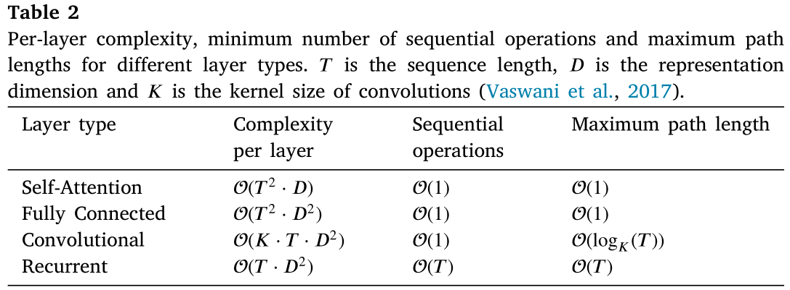
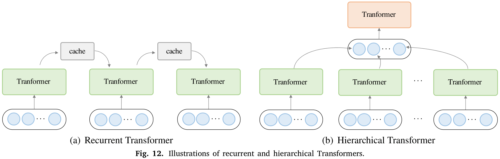

[toc]

# [Attention Is All You Need](https://proceedings.neurips.cc/paper/2017/hash/3f5ee243547dee91fbd053c1c4a845aa-Abstract.html)

## 0 摘要

主流的序列转换模型是基于复杂的循环神经网络或卷积神经网络的，它们通常有一个编码器（encoder）和解码器（decoder）。性能最好的模型也使用注意力机制（attention mechanism）连接encoder和decoder。本文提出了一种新的简单的网络架构，Transformer，仅基于注意力机制，而完全摒弃了循环和卷积结构。

## 1 引言

在序列建模和转换问题（如语言模型和机器翻译）中，循环神经网络，特别是长短期记忆、门控循环神经网络已经被确立为该领域最先进的方法。许多工作也进一步推进了循环语言模型和encoder-decoder架构的发展。

循环模型通常将计算沿着输入或输出序列的符号位置（symbol positions）分解。把位置（positions）与计算时间步对齐，将位置$t$上的输入和前一个隐层状态$h_{t-1}$经过函数，能够生成一个隐层状态$h_t$的序列。这种固有的顺序性排除了训练样本并行化的可能性，而对于序列长度较长的情况，并行化是至关重要的，因为内存约束限制了样本的批处理。尽管有研究通过分解技巧和条件计算再计算效率上取得了显著提升，且后者也提升了模型性能。然而，顺序计算的基本限制仍然存在。

在各种任务的令人信服的序列模型和转换模型中，注意力机制已经成为了所必需的部分，它允许对依赖进行建模，而无需考虑它们在输入或输出序列中的距离。然而，除少数情况外，这种注意力机制都是与循环网络结合使用。

本文提出了Transformer模型，它避免了循环结构，并全部用注意力机制代替，用来获取输入和输出间的全局依赖关系。Transformer模型允许更明显的并行化，并能取得更好的翻译质量。

## 2 背景

减少顺序计算的目标也构成了一些网络的基础，如Extended Neural GPU、ByteNet、ConvS2S，它们都使用卷积神经网络作为基本的构建块，并行地计算所有输入输出位置（positions）的表征。在这些模型中，来自任意两个输入或输出位置的相应信号所需的操作次数，会随着位置之间的距离增长，对于ConvS2S是线性增长，对于ByteNet是对数增长。这使得其难以学习远距离的依赖关系。在Transformer中，其被降低为常数级的操作次数，尽管以降低有效分辨率为代价，因为使用了平均加权的注意力位置（averaging attention-weighted positions）。可以使用后面3.2节中描述的多头注意力（Multi-Head Attention）来抵消这种影响。

自注意力（self-attention），有时又称为内部注意力（intra-attention），是通过关注一个信号序列不同位置来计算序列表征的一种注意力机制。自注意力被成功应用于各种任务中，包括阅读理解、抽象总结、文本蕴涵，和学习任务无关的句子表征。

基于循环注意力机制而不是序列对齐循环的端到端记忆网络，已经被证明在简单语言问题回答和语言建模任务上表现良好。据目前所知，Transformer是第一个仅基于自注意力来计算输入输出表征的转换模型，它没有使用序列对齐的RNN或卷积。

## 3 模型架构

多数有竞争力的序列转换神经模型都是encoder-decoder结构。这里，encoder将符号表征的输入序列$(x_1,x_2,\cdots,x_n)$映射为一个连续的表征序列$\mathbf z=(z_1,z_2,\cdots,z_n)$。给定$\mathbf z$，decoder会生成符号的输出序列$(y_1,y_2,\cdots,y_m)$，一次生成一个元素。模型的每一步都是自回归的，在生成下一个符号时，使用之前生成的符号作为额外输入。

Transformer遵循这种总体架构，为encoder和decoder都使用了堆叠的自注意力和逐点（point-wise）全连接层，分别如下图1中左侧和右侧所示。

### 3.1 Encoder和Decoder堆栈

Encoder：由$N=6$个相同层（layer）的堆栈（stack）组成，每一层有两个子层。第一个子层是一个多头注意力（multi-head attention）机制，第二个子层是一个简单的逐位置（position-wise）的全连接前馈网络。在每两个子层之间使用残差连接（residual connection），然后进行层归一化（layer normalization）。也就是说，每个子层的输出是$\text{LayerNorm}(x+\text{Sublayer(x)})$，其中$\text{Sublayer(x)}$是这个子层所实现的函数。为方便残差连接，模型中所有子层，包括嵌入层（embedding layer），都生成维数$d_\text{model}=512$的输出。

Decoder：同样由$N=6$个相同层的堆栈组成，每一层除了有encoder层中的两个子层，decoder插入了第三个子层，它对encoder堆栈的输出执行多头注意力。与encoder相似，每个子层之间使用残差连接，然后进行层归一化。还修改了decoder中的自注意力子层，以防一个位置会关注后序的位置。这种掩码（masking），以及“输出嵌入偏移一个位置”的事实，能保证位置$i$的预测仅依赖于已知的$i$位置前的输出。

### 3.2 Attention

注意力（attention）函数可以描述为将一个查询（query）和一组键值对（key-value paris）映射到一个输出，其中查询（queries）、键（keys）、值（values）、输出（output）都是向量。输出可由值的加权和计算得到，其中每个值的权重由查询与相应键的兼容函数计算得到。

#### 3.2.1 Scaled Dot-Product Attention

本文所提出的特殊的注意力名为“缩放的点积注意力（Scaled Dot-Product Attention）”，如下图2所示。输入包括$d_k$维的queries、$d_k$维的keys、$d_v$维的values，我们计算query和所有keys的点积，并且每个都除以$\sqrt{d_k}$，然后应用$\text{softmax}$函数，得到values的权重。

实际上，我们会在一组queries上同时计算注意力函数（attention function），这组queries被包装为一个矩阵$Q$，keys和values也同样被包装为矩阵$K$和$V$。可以按下式计算输出矩阵：
$$
\text{Attention}(Q,K,V) = \text{softmax}(\frac{QK^\top}{\sqrt{d_k}})V
$$
其中，$Q\in\R^{n\times d_\text{model}},K\in\R^{m\times d_\text{model}},V\in\R^{m\times d_\text{model}}$，$n,m$表示序列长度，通常情况下$n=m=N$。需要注意的是，这里的$d_\text{model}$是一个注意力头，在多个注意力头中，通过对$Q,K,V$进行变换矩阵为$W^Q,W^K,W^V$的线性投影，将其投影到$d_k,d_k,d_v$维。

最常用的两种注意力函数是累积注意力（additive attention）和多重点积注意力（dot-product (multi-plicative) attention）。点积注意力除了缩放因子$\frac{1}{\sqrt{d_k}}$外，其他都与本文的方法相同；累积注意力使用一个单隐层的前馈网络计算兼容函数。尽管这两种注意力理论复杂度相似，但在实践中，点积注意力更快且更节省空间，因为它能够使用高度优化的矩阵乘代码。

虽然相对于较小的$d_k$值，两种机制的性能类似，但对于较大的$d_k$且不进行缩放时，累积注意力的性能优于点积注意力。我们猜测，对于较大的$d_k$值，在数量级上点积增长得很大，使得$\text{softmax}$函数的梯度变得极小。为了抵消这种影响，使用$\frac{1}{\sqrt{d_k}}$缩放了点积。

#### 3.2.2 Multi-Head Attention

我们发现，与其“使用$d_{\text{model}}$维的queries、keys、values执行单一的注意力函数”，不如“对queries、keys、values进行h次不同的线性投影，分别学习到$d_k,d_k,d_v$维的线性投影”更加有益。对这些投影后的每个queries、keys、values并行地执行注意力函数，获得$d_v$维的输出值。这些输出值会连接（concatenate）起来，然后再进行一次线性投影，得到最终的输出值，如上图2所示。

多头注意力允许模型共同处理在不同位置的不同表征子空间的信息。如果只有一个注意力头，平均会抑制这一点。
$$
\begin{align}
\text{MultiHeadAttn}(Q,K,V) &= \text{Concat}(\text{head}_1,\text{head}_2,\cdots,\text{head}_h) W^O \\
\text{head}_i &= \text{Attention}(QW_i^Q, KW_i^K, VW_i^V)
\end{align}
$$
投影其实就是参数矩阵，其中$W_i^Q\in\R^{d_\text{model}\times d_k},W_i^K\in\R^{d_\text{model}\times d_k},W_i^V\in\R^{d_\text{model}\times d_v},W_i^O\in\R^{hd_v\times d_\text{model}}$。

本文中，Transformer采用了$h=8$个并行的注意力头，并令$d_k=d_v=d_\text{model}/h=64$。由于每个注意力头的维数降低，总的计算代价与使用完整维数的单个注意力头时的计算代价相近。

#### 3.2.3 Attention在Transformer模型中的应用

Transformer模型以三种不同的方式使用了多头注意力（multi-head attention）机制：

- encoder-decoder注意力层，即decoder的第二个attention，它又称为交叉注意力（cross-attention）模块。其中，queries来自前一个decoder层，记忆的keys和values来自encoder的输出。这允许decoder中的每个位置（positions）都能关注到输入序列中的所有位置（positions）。这模仿的是序列到序列模型中的经典的encoder-decoder注意力机制。
- encoder包含一个自注意力层。其中，所有的keys、values、queries都来自相同的地方，在这种情况下，是前一个encoder层的输出。encoder中的每一个位置都能关注到前一个encoder层的所有位置。
- 相似地，decoder也包含一个自注意力层，它使decoder中每个的位置都只能关注到它之前的所有位置，包括它本身的位置。我们要防止decoder中向左的信息流（leftward information flow），以保持其自回归（auto-regressive）的特性。在缩放的点积注意力中，通过屏蔽掉$\text{softmax}$输入中的所有非法连接的值（设为$-\infty$），实现了上述特性，如图2中的掩码多头自注意力（masked multi-head attention）所示。

### 3.3 Position-wise前馈网络

除了注意力子层，本文的每个encoder-decoder层还包含一个全连接前馈网络，每个位置都独立地应用这些相同的网络。这是一个逐位置的前馈网络（position-wise feed-forward networks），包含两次线性变换，中间采用了$\text{ReLU}$激活函数，如下：
$$
\text{FFN}(x) = \max(0, xW_1 + b_1) W_2 + b_2
$$
尽管线性变换对于不同位置（同一层）来说是相同的，但不同层之间使用不同的参数。另一种描述方法是使用两个卷积核大小为1的卷积操作。输入输出的维数是$d_\text{model}=512$，两个全连接层中间的维数是$d_{ff}=2048$。

### 3.4 Embeddings和Softmax

与其他序列转换模型类似，Transformer使用学习嵌入（learned embeddings）将输入和输出的符号（tokens）转换为$d_\text{model}$维的向量。也使用常见的线性变换和softmax函数将decoder的输出转换成预测下一个符号的概率。而且，还在两个嵌入层和pre-softmax的线性变换之间共享相同的权重矩阵。在嵌入层，会将这些权重乘以$\sqrt{d_\text{model}}$。

### 3.5 位置编码

即然Transformer模型不包含循环结构和卷积，那么为了利用序列的顺序信息，我们必须设法让模型包含序列符号的相对或绝对位置的信息。为此，需要为encoder和decoder堆栈底部的输入嵌入（input embeddings）添加“位置编码（positional encodings）”信息。位置编码与嵌入拥有相同的维数$d_\text{model}$，因此它们可以相加。有多种位置编码方式可供选择，例如可学习的和固定的。

本文中，使用不同频率的正弦$\sin$和余弦$\cos$函数来进行位置编码：
$$
\begin{align}
PE_{(pos,2i)} &= \sin(\frac{pos}{10000^{2i/d_\text{model}}}) \\
PE_{(pos,2i+1)} &= \cos(\frac{pos}{10000^{2i/d_\text{model}}})
\end{align}
$$
其中，$pos$表示位置序号，$i$表示维数索引。也就是说，位置编码的每一维都对应正弦曲线的一个值；其波长（wavelengths）形成一个从$2\pi$到$10000\cdot2\pi$的等比数列（geometric progression）。选择这个函数是因为我们假设，它能够让模型很容易地学会处理相对位置，因为对于给定偏移$k$，编码$PE_{pos+k}$能够看作是$PE_{pos}$的线性函数。

我们还尝试使用学习到的位置嵌入，并发现两个版本产生了机会相同的结果。本文选择正弦版本，是因为它可以允许模型推断出比训练期间遇到的序列长度更长的序列。

## 4 为什么用Self-Attention

在本节中，我们将从各个方面来比较自注意力层与循环和卷积层，它们常用于将一个变长的符号表征序列$(x_1,x_2,\cdots,x_n)$映射到另一个等长序列$(z_1,x_2,\cdots,z_n)$，其中$x_i,z_i\in\R^d$；例如，用作典型的encoder-decoder序列转换模型中的隐藏层。有以下三个使用自注意力机制的动机。

一个是每层的总计算复杂度；另一个是可并行化的总操作数，这可以通过所需的最少顺序操作数来衡量。

第三个是网络中长程依赖之间的路径长度。对于许多序列转换任务来说，学习长程依赖都是一个关键挑战。影响学习这种依赖的能力的一个关键因素是，前向和反向信号在网络中要遍历的路径长度。输入输出序列之间任意位置组合的路径越短，越容易学习长程依赖。因此我们也会比较不同类型网络层中的，任意两个输入输出位置之间的最大路径长度。

如上表1所示，一个自注意力层能够以常数量级$O(1)$的顺序执行操作数连接所有的位置，而循环网络层需要$O(n)$级的顺序操作。至于计算复杂度，当序列长度$n$小于表征维数$d$时，自注意力层快于循环网络层；大多数最先进机器翻译模型所使用的句子表征都是这种情况，如word-piece和byte-pair表征。为了提高涉及很长序列的任务的计算性能，可使用受限自注意力（restricted self-attention），它只关注在输入序列中，以各自对应输出位置为中心，范围大小为$r$的邻域；这会使得最大路径长度增加至$O(n/r)$。我们打算在未来的工作中继续研究这个方法。

一个卷积核宽度$k<n$的单卷积层，并没有将输入输出全部的位置对（positions pair）连接起来。在连续卷积核（contiguous kernels）的情况下，这样做需要$O(n/k)$个卷积层堆叠形成的堆栈；或者在空洞卷积（dilated convolutions，又名膨胀卷积）的情况下，需要$O(\log_k(n))$个卷积层堆叠。这增加了网络中任意两个位置之间最长路径的长度。一般地，卷积层复杂度$O(k\cdot n\cdot d^2)$比循环网络层复杂度的要高$k$倍，如上表1所示。不过，可分离卷积（separable convolutions）能够将复杂度显著降低到$O(k\cdot n\cdot d+n\cdot d^2)$。然而，即使是$k=n$，可分离卷积的复杂度还是会等于，我们采用的自注意力层和逐点全连接层的复杂度之和。

此外，自注意力还能产生解释性更好的模型。我们研究了Transformer模型的注意力分布（attention distributions）。对于一个注意力头来说，它确实能清楚地学习执行不同的任务，而且多个注意力头还更能表现出与句子的句法和语义结构相关的行为。

## 5 训练

该节描述了Transformer模型的训练配置。

### 5.1 训练数据和批量

本文在标准WMT 2014 English-German数据集上进行训练，其包含$450$万个句子对；句子使用byte-pair编码，它大约有$37000$个符号（tokens）的共享source-target词汇表（vocabulary）。对英法翻译，使用更大的WMT 2014 English-French数据集进行训练，其包含$3600$万个句子，并将符号（tokens）划分成$32000$个word-piece组成的词汇表（vocabulary）。

句子对（sentence pairs）被分批成相近的序列长度。每个训练批量包含一组句子对，大约有$25000$个源符号（tokens）和$25000$个目标符号（tokens）。

### 5.2 硬件和调度

本文在一台机器上使用8张NVIDIA P100 GPU进行训练。对于使用本文所描述超参的基础模型，每个训练步大概花费$0.4$秒，一共训练了$100000$步（$12$小时）。对于更大的模型（配置见原论文），每个训练步大概花费1.0秒，一共训练了$300000$步（$3.5$天）。

### 5.3 优化器

本文的Transformer模型使用Adam优化器，其中$\beta_1=0.9,\beta_2=0.98,\epsilon=10^{-9}$，在整个学习过程中，根据下式改变学习率：
$$
\text{lrate} = (d_\text{model})^{-0.5} \cdot \min( \text{step\_num}^{-0.5},
\text{step\_num} \cdot \text{warmup\_steps}^{-1.5} )
$$
在第一个$\text{warmup\_steps}$训练步骤中，线性增加学习率；然后与$\text{step\_num}$的平方根成反比例地减少学习率。本文使用$\text{warmup\_steps}=4000$。

### 5.4 正则化

在训练过程中采用三种正则化，如下所述。

残差抛弃（Residual Dropout）：对每个子层的输出，在它被归一化之前、与下个子层输入相加之前，对该子层的输出应用dropout。此外，对嵌入和（sums of embeddings）与encoder-decoder堆栈的位置编码（positional encodings）也都应用dropout。对于基础模型，本文使用$P_\text{drop}=0.1$。

标签平滑（Label Smoothing）：在训练中使用$\epsilon_{ls}=0.1$的标签平滑。这会损失复杂度（perplexity），因为模型会学习得更不确定，单会提高准确率（accuracy）和BLEU得分。

# [A Survey of Transformers](https://doi.org/10.1016/j.aiopen.2022.10.001)

## 0 摘要

Transformer在许多人工智能领域取得了巨大的成功。到目前为止，已经提出了各种各样的Transformer变体（又称X-formers），在本综述中，将对各种X-formers从以下三个角度进行介绍：架构修改（architectural modification）、预训练（pre-training）、应用（applications）。

注意，本片综述使用**行主序（row-major）**的符号，如无特殊说明，所有向量都是行向量（用小写粗体表示），如可用向量$\mathbf q_i$表示矩阵$\mathbf Q$的第$i$行的行向量。

## 1 引言

Transformer（[Vaswani et al., 2017](https://proceedings.neurips.cc/paper/2017/hash/3f5ee243547dee91fbd053c1c4a845aa-Abstract.html)）作为一个优秀的深度学习模型，已被应用于各个邻域，如自然语言处理（natural language processing，NLP）、计算机视觉（computer vision，CV）、音频处理（audio processing）。Transformer最初是用作机器翻译的序列到序列模型（[Sutskever et al., 2014](https://proceedings.neurips.cc/paper/2014/hash/a14ac55a4f27472c5d894ec1c3c743d2-Abstract.html)）提出的。后序的研究（[Qiu et al., 2020](http://dx.doi.org/10.1007/s11431-020-1647-3)）表明基于Transformer的预训练模型（pre-trained models，PTMs）在各种任务中都能达到最好的性能。因此，Transformer已经成为NLP的首选架构，特别是对于PTM。除了语言方面，Transformer也被应用于CV（[Parmar et al., 2018](http://proceedings.mlr.press/v80/parmar18a.html); [Carion et al., 2020](http://dx.doi.org/10.1007/978-3-030-58452-8_13); [Dosovitskiy et al., 2020](http://arxiv.org/abs/2010.11929)）、音频处理（[Dong et al., 2018](http://dx.doi.org/10.1109/ICASSP.2018.8462506); [Gulati et al., 2020](http://dx.doi.org/10.21437/Interspeech.2020-3015); [Chen et al., 2021](http://arxiv.org/abs/2010.11395)），甚至是其他学科，如化学（[Schwaller et al., 2019](http://dx.doi.org/10.1021/acscentsci.9b00576)）、生命科学（[Rives et al., 2021](http://dx.doi.org/10.1073/pnas.2016239118)）。

由于Transformer的成功，在过去几年间，它的各种变体X-formers被提出，这些模型从不同的方面改进了普通版的Transformer模型。

1. 模型效率（Model Efficiency）。应用Transformer的一个关键挑战是其处理长序列时效率较低，主要是因为自注意力模块计算和存储的复杂性。改进方法包括轻量级注意力（如稀疏注意力变体）和分而治之方法（如循环和分层机制）。
2. 模型泛化（Model Generalization）。由于Transformer是一种灵活的架构，并且对输入数据的结构偏差没有做出太多假设，因此很难在小规模数据上进行训练。改进方法包括结构化偏差、正则化、大规模无标签数据预训练等。
3. 模型应用（Model Applications）。该工作旨在使Transformer适应特定的下游任务和应用。

本文旨在对Transformer及其变体进行全面的介绍。许多现有的X-formers可能会解决一个或几个问题；本文主要关注一般的架构变体，并简要讨论用于各种预训练和应用的特定变体。

该综述的其余部分组织如下。第2节介绍了Transformer的体系结构和关键组件。第3节介绍了Transformer变体的分类。第4\~5节介绍了模块级的修改，包括注意力模块、位置编码、层归一化和前馈网络层。第6节介绍了体系结构级的变体。第7节介绍了一些代表性的基于Transformer的PTM。第8节介绍了Transformer在各种不同领域的应用。

## 2 背景

### 2.1 普通版Transformer

普通版Transformer（[Vaswani et al., 2017](https://proceedings.neurips.cc/paper/2017/hash/3f5ee243547dee91fbd053c1c4a845aa-Abstract.html)）是一个序列到序列的模型，由一个编码器和一个解码器组成，每个编码器与解码器都包含$L$个相同块的堆栈。每个编码器块主要由一个多头自注意力模块和一个逐位置（position-wise）的前馈网络（feed-forward network，FFN）组成。为了构建更深的模型，在每个模块之后使用残差连接（[He et al., 2016](http://dx.doi.org/10.1109/CVPR.2016.90)），然后是层归一化（[Ba et al., 2016](http://arxiv.org/abs/1607.06450)）模块。与编码器块相比，解码器块还在多头自注意力模块和逐位置FFN之间插入交叉注意力（cross-attention）模块。此外，还会修改解码器中的自注意力模块，以防止每个位置关注其之后的位置。普通版Transformer的整体架构如下图1所示。

在下一小节中，将介绍普通版Transformer的关键模块。

#### 2.1.1 Attention模块

Transformer采用Query-Key-Value（QKV）的注意力机制。给定查询（queries）的矩阵$\mathbf Q\in\R^{N\times D_k}$，键（keys）的矩阵$\mathbf K\in\R^{M\times D_k}$，和值（values）的矩阵$\mathbf V\in\R^{M\times D_v}$，Transformer所使用的缩放的点积注意力（scaled dot-product attention）公式如下所示：
$$
\text{Attention}(\mathbf Q,\mathbf K,\mathbf V) = \text{softmax}(\frac{\mathbf{QK}^\top}{\sqrt{D_k}}) \mathbf V = \mathbf{AV} \tag{1}
$$
其中，$N$表示queries的长度，$M$表示keys和values的长度，$D_k$表示queries和keys的维数，$D_v$表示values的维数，矩阵$\mathbf A=\text{softmax}(\frac{\mathbf{QK}^\top}{\sqrt{D_k}})$通常称为注意力矩阵（attention matrix），又名**注意力得分**（attention scores），$\text{softmax}(\cdot)$**逐行（row-wise）使用**（即每一行应用一次softmax函数）。之后再将queries和keys的点积除以$\sqrt{D_k}$，以避免softmax函数中的梯度消失问题。

Transformer不是简单地应用单个注意力函数，而是使用多头注意力，其会使用$H$个不同的线性投影，将原来$D_m$维的queries、keys、values分别投影到$D_k,D_k,D_v$维。对于每个投影得到的queries、keys、values，会使用公式(1)来计算它们的输出。然后，该模型会将所有输出连接（concatenate）起来作为一个向量，并将它投影回$D_m$维表示。
$$
\begin{align}
\text{MultiHeadAttn}(\mathbf Q,\mathbf K,\mathbf V) &= \text{Concat}(\text{head}_1,\text{head}_2,\cdots,\text{head}_H) \mathbf W^O \tag{2} \\
\text{head}_i &= \text{Attention}(\mathbf{QW}_i^Q, \mathbf{KW}_i^K, \mathbf{VW}_i^V) \tag{3}
\end{align}
$$
在Transformer中，就查询（queries）和键值对（key-value pairs）的来源而言，有三种注意力类型：

- 自注意力（self-attention）。在Transformer的编码器中，令公式(2)中的$\mathbf Q=\mathbf K=\mathbf V=\mathbf X$，其中$\mathbf X$就是前一个encoder子层的输出。
- 掩码自注意力（masked self-attention）。在Transformer解码器中，自注意力是受限的，其每个位置的queries只允许关注到该位置之前（含该位置）的所有键值对。为了实现并行训练，通常对未归一化的注意力矩阵$\hat{\mathbf A}=\exp(\frac{\mathbf{QK}^\top}{\sqrt{D_k}})$应用一个掩码函数（mask function），实现为令$\hat A_{ij}=-\infty,\text{ if }i< j$。这种自注意力通常被称为自回归（autoregressive）或因果（causal）注意力。
- 交叉自注意力（cross-attention）。即解码器中的第二个attention模块，它的queries使用前一层解码器的输出进行投影，而keys和values使用编码器的输出进行投影。

#### 2.1.2 逐位置FFN

逐位置（position-wise）FFN是一个全连接的前馈网络模块，其独立地在每个位置上都执行相同的操作：
$$
\text{FFN} (\mathbf H') = \text{ReLU}(\mathbf H'\mathbf W^1 + \mathbf b^1) \mathbf W^2 + \mathbf b^2 \tag{4}
$$
其中，$\mathbf H'$是前一层的输出，参数$\mathbf W^1\in\R^{D_m\times D_f}, \mathbf W^2\in\R^{D_f\times D_m}, \mathbf b^1\in\R^{D_f}, \mathbf b^2\in\R^{D_m}$都是要训练学习的参数。通常来说，FFN中间维数$D_f$的值会取一个比$D_m$大的数。

值得注意的是，对于不同的位置来说，模型参数是共享的，因此逐位置FFN可以看作是卷积核大小为1的卷积层。

#### 2.1.3 残差连接和归一化

为了构建深度模型，Transformer在每个模块之后使用残差连接（[He et al., 2016](http://dx.doi.org/10.1109/CVPR.2016.90)），然后是层归一化（[Ba et al., 2016](http://arxiv.org/abs/1607.06450)）模块。例如，每个Transformer编码器块可以写成：
$$
\begin{align}
\mathbf H' &= \text{LayerNorm}(\text{SelfAttention}(\mathbf X)+\mathbf X) \tag{5} \\
\mathbf H &= \text{LayerNorm}(\text{FFN}(\mathbf H') + \mathbf H') \tag{6}
\end{align}
$$
其中，$\text{SelfAttention}(\cdot)$代表自注意力模块，$\text{LayerNorm}(\cdot)$代表层归一化操作。

#### 2.1.4 位置编码

因为Transformer没有循环网络或卷积，这会忽略位置信息，特别是对于编码器而言。因此，需要额外的位置表征来对符号的顺序进行建模，在后面5.1节中详细介绍。

### 2.2 模型用例

通常，Transformer架构可以按三种不同的方式使用：

- 编码器-解码器。可使用2.1节中介绍的完整的Transformer模型，这是序列到序列模型的典型应用。例如，神经网络机器翻译。
- 只使用编码器。将编码器的输出用作输入序列的表征，这通常用于自然语言理解（Natural Language Understanding，NLU）任务。例如，文本分类和序列标记。
- 只使用解码器。这种使用方式也去掉了编码器-解码器的交叉注意力模块，通常用于序列生成。例如，语言建模。

### 2.3 模型分析

为说明Transformer的计算时间和参数配置要求，本文分析了Transformer的两个核心组件（即自注意力模块和逐位置FFN），如下表1所示。假设模型的隐层维数$D_m$为$D$，输入序列长度为$T$，FFN中间层的维数设为$4D$，keys和values的维度都设为$D/H$，这与普通版的Transformer模型的配置一样。

当输入序列较短时，隐层维数$D$所产生的复杂度，会超过自注意力和逐位置FFN的复杂度；因此，Transformer的**瓶颈在于FFN**。然而，当输入序列的长度变长时，序列长度$T$所产生的复杂度，会逐渐占据主导地位；此时，Transformer的**瓶颈在于自注意力**。

此外，自注意力的计算需要存储$T\times T$的注意力分布矩阵，这使得Transformer的计算对于长序列场景来说是行不通的。例如，长文本文档和高分辨率图像的像素级建模。可以看到，想要提高Transformer效率，通常会产生自注意力的长序列兼容问题，以及普通版逐位置FFN的计算效率和参数效率问题。

### 2.4 Transformer与其他网络的比较

#### 2.4.1 自注意力分析

自注意力作为Transformer的核心部分，具有一种灵活的机制来处理变长输入。它可以理解为是一个全连接层，其中权重是根据输入的成对关系（pairwise relation）动态生成的。下表2比较了自注意力与三种常用网络层的复杂度、顺序操作数、最大路径长度。其中，最大路径长度是指，前向和反向信号从任意输入位置到任意输出位置所要遍历的路径的最大长度；较短的长度意味着有较好的潜力来学习长程依赖。

自注意力的优点可以总结如下：

1. 它具有与全连接层相同的最大路径长度，使其适合于长程依赖关系建模。与全连接层相比，它在处理变长输入时更有效，更灵活。
2. 由于卷积层的感受野有限，通常需要堆叠一个深度网络以达到全局的感受野。另一方面，常数级的最大路径长度，使得自注意力用常数级的层数，就能对长程依赖关系进行建模。
3. 常数级的顺序操作数和最大路径长度，使自注意力更易于可并行化，并且比循环网络层更擅长于长程建模。

#### 2.4.2 归纳偏差

Transformer经常被与卷积网络和循环网络进行比较。众所周知，卷积网络在共享局部核函数的情况下，会有平移不变性和局部性的归纳偏差（inductive bias）。同样，循环网络的马尔可夫结构，会有时间不变性和局部性的归纳偏差（[Battaglia et al., 2018](http://arxiv.org/abs/1806.01261)）。另一方面，Transformer架构对数据的结构信息几乎没有假设，这使得Transformer成为一个通用而灵活的架构。但副作用是，缺乏结构偏差（structural bias）使Transformer容易在小规模数据上过拟合。

另一种密切相关的网络类型是具有消息传递的图神经网络（Graph Neural Networks，GNNs）（[Wu et al., 2021a](http://dx.doi.org/10.1109/TNNLS.2020.2978386)）。Transformer可以视为定义在一个完全有向图（具有自环）上的GNN，其中每个输入是图中的一个结点。Transformer和GNNs的关键区别在于，Transformer不引入关于“输入数据如何构造”的先验知识，即Transformer中的消息传递过程仅依赖于对内容的相似性度量。

## 3 Transformer分类

到目前为止，基于普通版Transformer，研究者从三个角度提出了各种各样的模型变体：架构修改、预训练方法、应用。下图2展示了对Transformer变体的一种分类方式。

下图3展示了Transformer的分类及其代表性模型。

本文综述将重点介绍架构修改方面的研究。由于注意力模块是Transformer的关键组成部分，本文在第4节中只描述了与注意力相关的变体，在第5节中介绍了其他模块级的变体。然后第6节介绍体系结构级的变体。

## 4 Attention

自注意力在Transformer中发挥着重要作用，但在实际应用中存在两个挑战。

1. 复杂度（Complexity）。正如2.3节讨论的，自注意力的复杂度是$\mathcal O(T^2\cdot D)$。因此，注意力模块在处理长序列时会成为性能瓶颈。
2. 结构先验（Structural Prior）。自注意力对输入没有任何结构性偏差（structural bias），甚至连顺序信息也需要从训练数据中学习。因此通常来说，没有预训练的Transformer在中小规模数据上容易过拟合。

注意力机制的改进可以分为以下几个方向：

1. 稀疏注意力（Sparse Attention）。这类方法将稀疏性偏差（sparsity bias）引入到注意力机制中，从而降低了复杂性。
2. 线性注意力（Linearized Attention）。这类方法将注意力矩阵与核特征图（kernel feature maps）分离，然后按相反的顺序计算注意力，以达到线性复杂度。
3. 原型和记忆压缩（Prototype and Memory Compression）。这类方法减少了queries或keys-value记忆对（memory pair）的数量，以减少注意力矩阵的大小。
4. 低秩自注意力（Low-rank Self-Attention）。这类方法捕捉了自注意力的低秩特性。
5. 先验自注意力（Attention with Prior）。这类方法用先验注意力分布来补充或替代标准注意力。
6. 改进多头机制（Improved Multi-Head Mechanism）。这类方法探索不同的可替代的多头机制。

本节接下来的部分将详细介绍这些注意力的变体。

### 4.1 稀疏注意力

在标准的自注意力机制中，每个符号（token）都需要关注所有其他符号（tokens）。然而，可以看到，对于训练好的Transformer，学习到的注意力矩阵$\mathbf A$在大多数数据点上通常非常稀疏（[Child et al., 2019](http://arxiv.org/abs/1904.10509)）。因此，可以通过引入结构偏差，限制每个query所关注的query-key对（pairs）的数量，从而降低计算复杂度。在这种限制下，我们只是根据预定义的模式，来计算query-key对的相似性得分：
$$
\hat{\mathbf A}_{ij} = \begin{cases}
\mathbf q_i\mathbf k_j^\top & \text{if token } i \text{ attends to token } j \\
-\infty & \text{if token } i \text{ does not attend to token } j
\end{cases} \tag{7}
$$
其中，$\hat{\mathbf A}$是没有归一化的注意力矩阵。在实现时，$-\infty$项通常不存储在内存中，以减少内存占用。

从另一个角度看，标准的注意力可看作是一个完全无向图/双向图（bipartite graph），其中每个query会从所有的内存/存储/记忆结点（memory nodes）获取信息，并更新它自己的表征。稀疏注意力可看作是一个稀疏图，某些结点之间的连接边被移除了。

根据确定稀疏连接的标准，将这些方法分为两类：基于位置（position-baesd）的稀疏注意力和基于内容（content-based）的稀疏注意力。

#### 4.1.1 基于位置的稀疏注意力

在基于位置的稀疏注意力算法中，注意力矩阵会受限于某些预定义的模式。尽管这些稀疏模式以不同的形式存在变化，但其中一些可以分解为一些原子稀疏模式（atomic sparse patterns），即最简单的不可再分的稀疏模式。

这里首先介绍一些原子稀疏模式，然后描述一下这些模式在现有研究中的组合方式。最后，针对特定的数据类型，介绍一些扩展的稀疏模式。

##### 4.1.1.1 原子稀疏注意力

主要有5种原子稀疏注意力模式，如下图4所示。

1. 全局注意力（Global Attention）。为了减少稀疏注意力的“长程依赖建模能力”的降低，可以添加一些全局结点作为结点之间信息传播的枢纽（hub）。这些全局结点可以关注到序列中的所有结点，而整个序列则关注这些全局结点，如图4(a)所示。在实践中，可以从实际序列中选择这些全局结点（内部全局结点），或使用具有可训练参数的虚拟结点（外部全局结点）。
2. 条带注意力（Band Attention，又名sliding window attention或local attention）。即然大多数数据都具有很强的局部性，那么自然想到限制每个query只关注其邻居结点。这种广泛采用的稀疏模式即条带注意力，其注意力矩阵是一个条带形的矩阵，如图4(b)所示。
3. 空洞注意力（Dilated Attention）。类似于空洞卷积（[van den Oord et al., 2016](http://www.isca-speech.org/archive/SSW_2016/abstracts/ssw9_DS-4_van_den_Oord.html)），通过使用扩张间隔$w_d\ge1$的扩张窗口（dilated window），可以潜在地增加条带注意力的感受野，而不增加计算复杂度，如图4(c)所示。这可以很容易地扩展到跨步注意力（stride attention），其中窗口大小不受限制，但扩张$w_d$应设置为一个较大的值。
4. 随机注意力（Random Attention）。为了提高非局部交互（non-local interactions）的能力，每个query随机抽样一些边，如图4(d)所示。这是基于一个观察现象，即随机图可以具有与完全图相似的谱属性，这使得在图上随机游走（random walk）具有较快的（马尔科夫链）混合时间。
5. 块局部注意力（Block Local Attention）。该类注意力将输入序列分割成多个不重叠的query块，每个query块与一个局部记忆块（local memory block）相关联。query块中的所有queries都只关注相应记忆块中的keys。通常情况下，query块与其对应的记忆块是相同的，如图4(e)所示。

##### 4.1.1.2 混合稀疏注意力

现有的稀疏注意力通常由上述多个原子模式混合组成的。下图5展示了一些典型的混合稀疏注意力模式。

Star-Transformer（[Guo et al., 2019a](https://www.aclweb.org/anthology/N19-1133)）使用条带注意力和全局注意力的组合。具体来说，Star-Transformer只包含一个全局结点和一个宽度为3的条带注意力，其中任意一对不相邻的结点通过一个共享的全局结点连接，相邻结点直接相互连接。这种稀疏模式在结点之间形成了一个星形图。

Longformer（[Beltagy et al., 2020](http://arxiv.org/abs/2004.05150)）使用条带注意力和内部全局结点注意力（internal global-node attention）的组合。在分类任务中，选择[CLS]符号作为全局结点；在问答任务（Question Answering tasks）中，选择问题符号（question tokens）作为全局结点。此外，还使用扩张窗口注意力，替换了上一层中的一些条带注意力头（heads），以增加感受野，而不增加计算量。

ETC（Extended Transformer Construction）（[Ainslie et al., 2020](http://dx.doi.org/10.18653/v1/2020.emnlp-main.19)）使用条带注意力和外部全局结点注意力（external global-node attention）的组合。ETC还包括掩码机制（masking mechanism），以处理结构化输入，并采用CPC（Contrastive Predictive Coding）（[van den Oord et al., 2018](http://arxiv.org/abs/1807.03748)）进行预训练。

BigBird（[Zaheer et al., 2020](http://arxiv.org/abs/2007.14062)）除了条带注意力和全局注意力，它还使用额外的随机注意力来近似完全注意力（full attention）。其理论分析还表明，稀疏编码器和稀疏解码器的使用可以模拟任何图灵机，这解释了稀疏注意力模型为何成功。

稀疏Transformer（[Child et al., 2019](http://arxiv.org/abs/1904.10509)）使用因子化的注意力，其为不同类型的数据设计了不同的稀疏模式。对于具有周期性结构的数据（如图像），它使用条带注意力和跨步注意力的组合；而对于没有周期性结构的数据（如文本），它使用块局部注意力和全局注意力的组合，其中全局结点来自输入序列中的固定位置。

##### 4.1.1.3 扩展的稀疏注意力

除了上述模式外，有些工作研究了针对特定数据类型的扩展稀疏模式（extended sparse patterns）。

对于文本数据，BP-Transformer（Binary Partitioning Transformer）（[Ye et al., 2019](http://arxiv.org/abs/1911.04070)）构建了一棵二叉树，其中所有符号（tokens）都是叶结点，内部结点是包含许多符号的跨度结点（span nodes）。图/数中存在边（edges），每个叶结点与它的邻居叶结点相连，还可以与更高层次的跨度结点相连；而且，更高层次的跨度结点包含了距离更远的符号（tokens）。这种方法可以看作是全局注意力的扩展，其中全局结点是分层组织的，任何一对符号都能与二叉树中的路径相对应。这种方法的抽象图示如下图6(a)所示。

还有一些针对视觉数据的扩展。Image Transformer（[Parmar et al., 2018](http://proceedings.mlr.press/v80/parmar18a.html)）研究了两种类型的注意力：(1)按栅格扫描顺序（raster-scan order）展平（flatten）图像像素，然后应用块局部稀疏注意力。(2)2D块局部注意力，其中查询块（query blocks）和记忆块（memory blocks）直接排列在2维片板（plate）上，如图6(b)所示。

另一个针对视觉数据的扩展稀疏模式的例子是Axial Transformer（[Ho et al., 2019](http://arxiv.org/abs/1912.12180)），它在图像的每个轴（axis）上应用独立的注意力模块。每个注意力模块混合（mix）一个轴上的信息，同时保持另一个轴上的信息独立，如图6(c)所示。这可以理解为以栅格扫描顺序（raster-scan order），分别水平地和垂直地展平图像像素，然后分别应用跨步注意力；其中间隔分别是图像宽度和高度，即保证只处理一行和一列。

#### 4.1.2 基于内容的稀疏注意力

另一种方法是根据输入内容创建稀疏图（sparse graph），也就是说，它的稀疏连接是依赖于输入内容的。

构造基于内容的稀疏图的一种直接方法是，选择那些与给定query可能具有较大相似性得分的keys。为了有效地构造稀疏图，可以考虑最大内积搜索（Maximum Inner Product Search，MIPS）问题，即试图找到与query具有最大点积的keys，而无需计算所有的点积项。

Routing Transformer（[Roy et al., 2021](http://refhub.elsevier.com/S2666-6510(22)00014-6/sb111)）使用k-means聚类将queries向量$\set{\mathbf q_i}_{i=1}^T$和keys向量$\set{\mathbf k_i}_{i=1}^T$聚类到一组中心（centroid）向量$\set{\boldsymbol{\mu}_i}_{i=1}^k$上，每个query只处理属于同一簇的keys。在训练过程中，簇心（cluster centroid）向量会拥有一组类属于它的向量，使用这些向量的指数移动平均值（exponentially moving average，EMA）来更新簇心向量，并除以簇中向量数目的指数移动平均值。其中，指数移动平均值EMA是一种平滑的趋向类指标，是以指数式递减加权的移动平均值。上述更新如下所示：
$$
\begin{align}
\tilde\mu &\gets \lambda\tilde\mu + (1-\lambda)( \sum_{i:\mu(\mathbf q_i)=\mu}\mathbf q_i + \sum_{j:\mu(\mathbf k_j)=\mu}\mathbf k_j) \tag{8} \\
c_\mu &\gets \lambda c_\mu + (1-\lambda)|\mu| \tag{9} \\
\mu &\gets \frac{\tilde\mu}{c_\mu} \tag{10}
\end{align}
$$
其中，$\mu(\cdot)$表示簇聚类函数/操作，$|\mu|$代表当前簇$\mu$中向量的个数，$\lambda\in(0,1)$是一个超参数。

令$\mathcal P_i$表示第$i$个query所关注的所有keys的索引的集合，则在Routing Transformer中，$\mathcal P_i$定义为：
$$
\mathcal P_i = \set{j : \mu(\mathbf q_i) = \mu(\mathbf k_j)} \tag{11}
$$
Reformer（[Kitaev et al., 2020](https://openreview.net/forum?id=rkgNKkHtvB)）使用局部敏感哈希（locality-sensitive hashing，LSH）为每个query选择key-value对，LSH注意力让每个符号（token）只关注与它在同一个哈希桶（hashing bucket）中的其他符号（tokens）。其基本思想是，使用LSH函数将queries和keys散列到几个桶中，相似的项会以较高的概率落在同一个桶中。具体来说，LSH函数使用随机矩阵（random matrix）的方法。设$b$为桶的数量，给定大小为$[D_k,b/2]$的随机矩阵$R$，LSH哈希散列函数计算如下：
$$
h(x) = \text{arg max}([xR; -xR]) \tag{12}
$$
LSH注意力允许第$i$个query只关注如下索引的key-value对：
$$
\mathcal P_i = \set{j : h(\mathbf q_i) = h(\mathbf k_j)} \tag{13}
$$
稀疏自适应连接（Sparse Adaptive Connection，SAC）（[Li et al., 2020b](https://proceedings.neurips.cc/paper/2020/hash/c5c1bda1194f9423d744e0ef67df94ee-Abstract.html)）将输入序列视为图（graph），序列中的符号（tokens）作为图中结点，并学习构建注意力边（attention edges），以使用自适应稀疏连接来提高特定任务的性能。SAC使用LSTM边预测器（edge predictor）来构建符号之间的边。在边没有真实值（ground truth）的情况下，边预测器可通过强化学习来训练。

稀疏Sinkhorn注意力（Sparse Sinkhorn Connection）（[Tay et al., 2020b](http://proceedings.mlr.press/v119/tay20a.html)）首先将queries和keys拆分为多个块，并为每个query块分配一个key块；每个query只能关注它所在query块所对应的key块中的keys。其中，key块的分配由一个排序网络（sorting network）控制，该网络使用Sinkhorn归一化产生一个双随机矩阵（doubly stochastic matrix）作为表示分配的排列矩阵（permutation matrix）。此外，还使用这种基于内容的块稀疏注意力和4.1.1节介绍的块局部注意力，来增强模型的局部建模能力。

### 4.2 线性注意力

假设$\mathbf Q,\mathbf K,\mathbf V\in\R^{T\times D}$，则$\text{softmax}(\mathbf{QK}^\top)\mathbf V$的计算复杂度是序列长度$T$的二次方$\mathcal O(T^2)$，如下图7(a)所示。如果$\text{softmax}(\mathbf{QK}^\top)$分解成$\mathbf Q'\mathbf K'^\top$，那么就可以按相反的顺序计算$\mathbf Q'\mathbf K'^\top\mathbf V$，即$\mathbf Q'(\mathbf K'^\top\mathbf V)$，这会使得复杂度下降为$\mathcal O(T)$。

令$\hat{\mathbf A}=\exp(\mathbf{QK}^\top)$表示没有归一化的注意力矩阵，操作$\exp(\cdot)$逐元素（element-wise）应用，则规范化的注意力可改写为$\mathbf Z = \mathbf D^{-1}\hat{\mathbf A}\mathbf V$，其中$\mathbf D = \text{diag}(\hat{\mathbf A}\mathbf 1_T^\top)$，记号$\mathbf 1_T^\top$表示元素全为$1$的维数为$T$的列向量，$\text{diag}(\cdot)$表示用输入向量作为对角元素的对角矩阵。

线性注意力用$\phi(\mathbf Q)\phi(\mathbf K)^\top$近似或替换未归一化注意力矩阵$\exp(\mathbf{QK}^\top)$，其中$\phi$是按行（row-wise）应用的特征映射（feature map）。因此对非归一化注意力矩阵的计算$\exp(\mathbf{QK}^\top)\mathbf V$，可以通过计算$\phi(\mathbf Q)(\phi(\mathbf K)^\top\mathbf V)$来将其线性化，如上图7(b)所示。同样地，项$\mathbf D$也可以由$\phi(\mathbf Q)(\phi(\mathbf K)^\top\mathbf 1_T^\top)$在线性时间内计算。

为进一步深入了解线性注意力，这里推导了向量形式的公式。考虑注意力的一般形式如下：
$$
\mathbf z_i = \sum_j \frac{\text{sim}(\mathbf q_i,\mathbf k_j)}
{\sum_{j'}\text{sim}(\mathbf q_i,\mathbf k_{j'})} \mathbf v_j \tag{14}
$$
其中，$\text{sim}(\cdot,\cdot)$是一个计算输入向量相似性的得分函数。在普通版的Transformer中，这个得分函数是向量内积的指数$\exp(\lang\cdot,\cdot\rang)$。很自然的一个选择是，用核函数$\mathcal K(\mathbf x,\mathbf y) = \phi(\mathbf x)\phi(\mathbf y)^\top$来作为$\text{sim}(\cdot,\cdot)$，然后继续推导如下：
$$
\begin{align}
\mathbf z_i &= \sum_j \frac{\phi(\mathbf q_i)\phi(\mathbf k_j)^\top}
{\sum_{j'}\phi(\mathbf q_i)\phi(\mathbf k_{j'})^\top} \mathbf v_j \tag{15} \\
&= \frac{\phi(\mathbf q_i) \sum_j \phi(\mathbf k_j)\otimes\mathbf v_j}
{\phi(\mathbf q_i) \sum_{j'} \phi(\mathbf k_{j'})^\top} \tag{16}
\end{align}
$$
其中，$\otimes$表示向量外积。基于这个公式，首先计算$\sum_j \phi(\mathbf k_j)\otimes\mathbf v_j$项和$\sum_{j'} \phi(\mathbf k_{j'})^\top$项，可以将注意力的计算线性化。尤其是对于自回归注意力（autoregressive attention）更有益，因为累加和$\mathbf S_i=\sum_{j=1}^i\phi(\mathbf k_j)\otimes\mathbf v_j$与$\mathbf u_i=\sum_{j=1}^i\phi(\mathbf k_j)$，可以直接用$\mathbf S_{i-1}$和$\mathbf u_{i-1}$以常量级的时间复杂度求得。这可以让Transformer解码器像RNNs一样高效运行。

公式(16)的一种解释是，通过对“特征映射（feature mapped）后的keys和values的外积所表示的关联（associations）”进行聚合/求和，模型能够维护一个记忆矩阵（memory matrix）；然后可以通过“将适当归一化的特征映射后的query与记忆矩阵相乘”，来检索value的取值。该方法中有两个关键之处：(1)**特征映射**$\phi(\cdot)，$(2)**聚合规则**（aggregation rule）。

#### 4.2.1 特征映射

Linear Transformer（[Katharopoulos et al., 2020](http://proceedings.mlr.press/v119/katharopoulos20a.html)）提出使用简单的特征映射$\phi_i(\mathbf x)=\text{elu}(x_i)+1$。这个特征映射并没有近似点积注意力，但经验证明它与标准Transformer表现相当。

Performer（[Choromanski et al., 2020a](http://arxiv.org/abs/2006.03555),[b](http://arxiv.org/abs/2009.14794)）使用随机特征映射（random feature maps）来近似于Transformer的得分函数。随机特征映射函数有$f_1,\cdots,f_l:\R\to\R$和$h:\R^D\to\R$，那么特征映射如下：
$$
\phi(\mathbf x) = \frac{h(\mathbf x)}{\sqrt m} [f_1(\omega_1^\top\mathbf x), f_1(\omega_2^\top\mathbf x), \cdots, f_1(\omega_m^\top\mathbf x), \cdots, f_l(\omega_1^\top\mathbf x), \cdots, f_l(\omega_m^\top\mathbf x)] \tag{17}
$$
其中，$\omega_1,\cdots,\omega_m\stackrel{\text{iid}}{\sim}\mathcal D$是从某个分布$\mathcal D\in\mathcal P(\R^D)$中所抽样的。

Performer第一版（[Choromanski et al., 2020a](http://arxiv.org/abs/2006.03555)）的灵感来自于随机傅里叶（random Fourier）特征映射（[Rahimi and Recht, 2007](https://proceedings.neurips.cc/paper/2007/hash/013a006f03dbc5392effeb8f18fda755-Abstract.html)）；傅里叶映射最初是用于近似高斯核的，它使用的是三角函数$h(\mathbf x)=\exp(\frac{\|\mathbf x\|^2}{2}),l=2,f_1=\sin,f_2=\cos$。这种方法也被用于随机特征注意力（Random Feature Attention，RFA）（[Peng et al., 2021](https://openreview.net/forum?id=QtTKTdVrFBB)），不同的是$h(\mathbf x)$被设为$1$，因为queries和keys在应用特征映射前都进行了$l_2$标准化。

虽然三角函数法的随机特征映射可以实现无偏近似（unbiased approximation），但它不能保证注意力得分是非负的（non-negative attention scores），因此可能会导致不稳定和异常的行为。为缓解这个问题，Performer第二版（[Choromanski et al., 2020b](http://arxiv.org/abs/2009.14794)）提出了正随机特征映射（positive random feature maps），它使用$h(\mathbf x)=\exp(-\frac{\|\mathbf x\|^2}{2}),l=1,f_1=\exp$，从而保证了点积注意力的无偏性和近似非负性。这比第一版更稳定，并取得了更好的近似结果。

除了使用随机特征映射近似标准点积注意力，[Peng et al., 2021](https://openreview.net/forum?id=QtTKTdVrFBB)和[Choromanski et al., 2020b](http://arxiv.org/abs/2009.14794)也研究了使用$h(\mathbf x)=1,l=1,f_1=\text{ReLU}$来进行近似一阶反余弦核函数（order-1 arc-cosine kernel）。该特征映射已被证明在各种任务中是有效的，包括机器翻译和蛋白质序列建模。

[Schlag et al., 2021](http://arxiv.org/abs/2102.11174)设计了一个特征映射，旨在促进特征空间的正交性（orthogonality）。具体来说，给定输入$\mathbf x\in\R^D$，特征映射$\phi:\R^D\to\R^{2\nu D}$由如下偏函数（partial function）定义：
$$
\begin{align}
\phi_{i+2(j-1)D}(\mathbf x) &= \text{ReLU}([\mathbf x,-\mathbf x])_i \text{ReLU}([\mathbf x,-\mathbf x])_{i+j} \\
&\text{for }i=1,2,\cdots,2D,\ j=1,2,\cdots,\nu
\end{align} \tag{18}
$$

#### 4.2.2 聚合规则

如公式(16)所示，关联$\set{\phi(\mathbf k)_j\otimes\mathbf v_j}$会通过简单的求和操作，聚合成记忆矩阵（memory matrix）。有多个研究（[Katharopoulos et al., 2020](http://proceedings.mlr.press/v119/katharopoulos20a.html); [Choromanski et al., 2020a](http://arxiv.org/abs/2006.03555),[b](http://arxiv.org/abs/2009.14794)）使用的都是这种简单的求和聚合。然而，随着新的关联被添加到记忆矩阵中，有选择地删除（drop）一些关联可能对网络更为有利。

随机特征注意力（Random Feature Attention，RFA）（[Peng et al., 2021](https://openreview.net/forum?id=QtTKTdVrFBB)）为求和引入了一种门控机制（gating mechanism），以对序列数据中的局部依赖进行建模。具体来说，在某个时间步，向记忆矩阵$\mathbf S$添加一个新的关联时，会用一个可学习的依赖于输入的标量$g$来对$\mathbf S$加权，并用$(1-g)$对新的关联进行加权。这样，历史关联关系会呈指数衰减，而在每个时间步中，最近的上下文（context）更受重视。

[Schlag et al., 2021](http://arxiv.org/abs/2102.11174)认为简单的求和会限制记忆矩阵的容量，因此提出以“写并删除（write-and-remove）”的方式扩大容量。具体来说，给定一个新的输入key-value对$(\mathbf k_i,\mathbf v_i)$，模型首先使用矩阵乘法检索当前与$\mathbf k_i$关联的$\bar{\mathbf v}_i$。然后，使用依赖于输入的门控标量（gating scalar）$g$，将$\bar{\mathbf v}_i$和$\mathbf v_i$的凸组合（convex combination）写入记忆矩阵，并移除（remove）关联$\bar{\mathbf v}_i$。凸组合即各项的加权求和，但系数各权重之和为$1$。此外，对于聚合规则，他们还提出了和归一化（sum normalization），即在更新记忆矩阵之前，使用$\phi(\mathbf q_i),\phi(\mathbf k_i)$的各分量之和来归一化它们，而不是用公式(16)中的分母来归一化。

### 4.3 Query原型和记忆压缩

除了使用稀疏注意力（sparse attention）或基于核的线性注意力（kernel-based linearized attention），还可以通过减少queries或key-value对的数量来降低注意力的复杂性，这分别产生了查询原型（query prototyping）和记忆压缩（memory compression）方法。由于key-value对（pairs）又称为key-value记忆（memory），因此得名为记忆压缩。

#### 4.3.1 Query原型注意力

在query原型（prototyping）设计中，使用多个queries原型（several prototypes of queries）作为计算注意力分布的主要来源。该模型要么将分布复制queries所代表的位置上，要么就用离散均匀分布（discrete uniform distributions）填充这些位置。下图8(a)展示了query原型的计算流程。

聚类注意力（Clustered Attention）（[Vyas et al., 2020](http://arxiv.org/abs/2007.04825)）将queries分组为几个簇，然后计算簇心的注意力分布。一个簇中的所有queries共享其相应簇心计算的注意力分布。

Informer（[Zhou et al., 2021](https://doi.org/10.1609/aaai.v35i12.17325)）使用显式的query稀疏度量（sparsity measurement）从所有queries中选择原型query，其可由query注意力分布和离散统一分布之间KL散度（Kullback–Leibler divergence）的近似值来导出。由query稀疏度量，仅计算前u（top-u）个queries的注意力分布；其余的queries使用离散的均匀分布。

#### 4.3.2 Key-Value记忆压缩注意力

为降低复杂度，除了可以降低query原型的数量，还可以在应用注意力机制前降低key-value对的数量，如图8(b)所示。

[Liu et al., 2018](https://openreview.net/forum?id=Hyg0vbWC-)提出了记忆压缩注意力（Memory Compressed Attention，MCA），其使用跨步卷积（strided convolution）减少keys和values的数量。这种修改其实是他们团队对同一工作（见4.1节所述）中所提出的局部注意力（local attention）的补充，因为它可以捕获全局上下文。这种方法将keys和values的数量减少了k倍（卷积核大小），因此在相同的计算资源下，能够处理比普通Transformer更长的序列。

Set Transformer（[Lee et al., 2019](http://proceedings.mlr.press/v97/lee19d.html)）和Luna（[Ma et al., 2021](http://arxiv.org/abs/2106.01540)）使用多个外部的可训练全局结点来概括输入的信息，并将概括的表征作为输入需要去关注的压缩记忆。这使得自注意力关于序列长度的复杂度，从二次方降低到了线性复杂度。

Linformer（[Wang et al., 2020a](http://arxiv.org/abs/2006.04768)）利用线性投影将keys和values从长度$n$投影到更小的长度$n_k$。这也将自注意力的复杂度降低到线性。这种方法的缺点是必须假设已知输入序列的长度，因此不能用于自回归注意力。

Poolingformer（[Zhang et al., 2021](http://arxiv.org/abs/2105.04371)）采用了两层级（two-level）注意力的组合，即滑动窗口注意力（sliding window attention）和记忆压缩注意力（compressed memory attention）。在滑动窗口注意力之后在使用记忆压缩模块，以增加感受野大小。此外，为压缩keys和values的数量，他们还探究将一些池化操作作为压缩操作，包括最大池化和动态卷积池化（[Wu et al., 2019](https://openreview.net/forum?id=SkVhlh09tX)）。

### 4.4 低秩注意力

一些经验和理论分析（[Guo et al., 2019b](http://dx.doi.org/10.1109/TASLP.2019.2944078); [Wang et al., 2020a](http://arxiv.org/abs/2006.04768)）指出，注意力矩阵$\mathbf A\in\R^{T\times T}$通常是低秩（low-rank）的，即矩阵$\mathbf A$的秩远小于$T$。这意味着两点：(1)低秩属性可以进行参数化的显式建模；(2)自注意力矩阵能用它的低秩近似代替。

#### 4.4.1 低秩参数化

“注意力矩阵的秩小于序列长度”这一事实意味着，对于输入通常很短的情况，设置$D_k>T$，不仅会过度参数化，还会导致过拟合。因此，限制$D_k$的维数，以显式地将低秩属性建模为归纳偏差（inductive bias）是合理的。[Guo et al., 2019b](http://dx.doi.org/10.1109/TASLP.2019.2944078)将自注意力矩阵分解为较小的捕捉长程非局部交互作用的低秩注意力模块，和捕捉局部依赖关系的条带注意力模块。

#### 4.4.2 低秩近似

注意力矩阵的低秩特性的另一个含义是，可以使用低秩矩阵近似来降低自注意力的复杂度。与此密切相关的方法是核矩阵（kernel matrices）的低秩近似。现有的一些工作是应该是受到核近似（kernel approximation）的启发。

前面4.2节中提到的一些线性注意力方法是受随机特征映射（random feature maps）的核近似启发的。例如，Performer（[Choromanski et al., 2020a](http://arxiv.org/abs/2006.03555)）用随机傅里叶（Random Fourier）特征映射来近似高斯核（Gaussian kernels）。该方法首先将注意力分布矩阵$\mathbf A$分解为$\mathbf C_Q\mathbf{GC}_K$，其中$\mathbf G$是高斯核矩阵，并使用随机特征映射来近似$\mathbf G$。

另一种研究遵循Nyström方法的思想。这些基于Nyström的方法（[Chen et al., 2020a](http://dx.doi.org/10.24963/ijcai.2020/285); [Xiong et al., 2021](https://doi.org/10.1609/aaai.v35i16.17664)）首先使用下采样（down-sampling）方法，如跨步平均池化（strided average pooling），从$T$个输入中选择$m$个标识结点（landmark nodes）。令$\tilde{\mathbf Q},\tilde{\mathbf K}$分别表示所选择的标识queries和keys，然后在注意力计算中使用如下近似：
$$
\tilde{\mathbf A} = \text{softmax}(\mathbf Q\tilde{\mathbf K}^\top)
(\text{softmax}(\tilde{\mathbf Q}\tilde{\mathbf K}^\top))^{-1}
\text{softmax}(\tilde{\mathbf Q}\mathbf K^\top) \tag{19}
$$
在上式(19)中，记$\mathbf M^{-1}=(\text{softmax}(\tilde{\mathbf Q}\tilde{\mathbf K}^\top))^{-1}$，但这个逆矩阵并不总是存在。为缓解该问题，CSALR（[Chen et al., 2020a](http://dx.doi.org/10.24963/ijcai.2020/285)）令$\mathbf M$加上一个单位矩阵，以保证其逆矩阵总是存在。Nyström-former（[Xiong et al., 2021](https://doi.org/10.1609/aaai.v35i16.17664)）使用矩阵$\mathbf M$的MP伪逆（Moore–Penrose pseudoinverse）来代替其逆矩阵，因此在$\mathbf M$是奇异矩阵时仍可以实现近似。

### 4.5 先验注意力

注意力机制对于关注的value（attended value）的预期输出，通常是向量的加权和（weighted sum of vectors），其权重是values上的注意力分布。传统上，注意力分布是从输入中生成的，例如，普遍版Transformer的$\text{softmax}(\mathbf{QK}^\top)$。

作为一种广义的情况，注意力分布也可以来自其他来源，我们称之为先验（prior）。先验注意分布（prior attention distribution）可以作为由输入所生成分布的补充或替代。将这种形式的注意力抽象为先验注意力，如图9所示。大多数情况下，在应用softmax之前，可以通过计算先验注意力和输入生成注意力相应得分的加权和，来实现两种注意力分布的融合。

#### 4.5.1 对结构信息进行编码

注意力机制通常被解释为“基于内容相似性度量所产生的权重，从输入中聚合信息”。然而，仅仅根据输入元素的内容来确定权重可能是不够的。由于注意力矩阵能对输入之间的关系进行编码，因此很自然地想到使用先验注意力对结构信息（structural information）进行编码。

例如，可以使用先验注意力来编码输入元素之间的位置关系。先验注意力可构建为可训练的先验注意力$\mathbf B$，并直接加到未归一化的注意力矩阵上（[Raffel et al., 2020](http://arxiv.org/abs/1910.10683)）；或从位置嵌（position embeddings）入中生成先验注意力（[Ke et al., 2020](http://arxiv.org/abs/2006.15595)）。

也可以使用先验注意力建模更复杂的结构信息，如图数据中的边。Graphormer（[Ying et al., 2021a](http://arxiv.org/abs/2106.05234)）将结点间的连通性编码为空间编码（spatial encoding）$\mathbf B$，将边的特征编码为边编码（edge encoding）$\mathbf C$。

#### 4.5.2 对局部性进行建模

一些类型的数据（如文本），具有强烈的局部性倾向。这种特性可以被显式编码为先验注意力。一个简单的方法是在位置上使用高斯分布。具体来说，可以将生成的注意力分布乘以某种高斯密度，然后重新归一化，这相当于给生成的注意力得分$\mathbf A$加上一个偏差项$\mathbf G$，其中$G_{ij}$表示第$i$个输入关注第$j$个输入的更高的先验概率。

[Yang et al., 2018](http://dx.doi.org/10.18653/v1/D18-1475)提出首先用一个简单的前馈网络预测每个$\mathbf q_i$的中心位置$p_i$，然后可将高斯偏差定义为：
$$
G_{ij} = -\frac{(j-p_i)^2}{2\sigma^2} \tag{20}
$$
其中，$\sigma$表示高斯的标准差，它可由超参数定义，或从输入中预测。

Gaussian Transformer（[Guo et al., 2019c](http://dx.doi.org/10.1609/aaai.v33i01.33016489)）假设每个$\mathbf q_i$的中心位置为$i$，并将偏差定义为：
$$
G_{ij} = -|w(i-j)^2+b| \tag{21}
$$
其中，$w\ge0,b\le0$为参数（标量），分别用于控制方差，和减少中心位置的权重。

#### 4.5.3 来自低层模块的先验

在Transformer架构中，经常会观察到相邻层之间的注意力分布相似。因此，很自然地可将前一层的注意力分布作为该层计算注意力的先验。最终的注意力得分可以定义为：
$$
\hat{\mathbf A}^{(l)} = w_1\cdot\mathbf A^{(l)} + w_2\cdot g(\mathbf A^{(l-1)}) \tag{22}
$$
其中$\mathbf A^{(l)}$表示第$l$层自己的注意力得分，$w_1,w_2\in\R$是应用于相邻两层得分的权重，$g:\R^{n\times n}\to\R^{n\times n}$是一个函数，用于将前层的得分转换成所要使用的先验。

Predictive Attention Transformer（[Wang et al., 2021b](https://openreview.net/forum?id=YQVjbJPnPc9)）提出对前一个注意力得分应用2D卷积层，并通过计算“生成的注意力得分”和“卷积得分”的凸组合，来计算最终的得分。这相当于在公式(22)中令$w_1=\alpha,w_2=1-\alpha$，令$g(\cdot)$是一个卷积层。从头开始训练这样一个模型，以及在预训练BERT（Bidirectional Encoder Representation from Transformers）模型后再进行微调，两组实验表明这个新模型比基准模型优异。

Realformer（[He et al., 2020b](http://arxiv.org/abs/2012.11747)）直接将前一个注意力得分与生成的注意力矩阵相加，因此相似于在注意力映射上进行残差跳跃连接（residual skip connection）。这相当于在公式(22)中令$w_1=w_2=1$，令$g(\cdot)$为单位映射（identity map）。在该模型上进行预训练实验，结果显示其性能在多个数据集上都优于基准BERT模型；即使在预训练的开销显著降低时，其也超过了基准模型。

作为一个极端例子，Lazyformer（[Ying et al., 2021b](http://arxiv.org/abs/2102.12702)）提出在多个相邻层之间共享注意力映射。这相当于令$g(\cdot)$为单位映射（identity map），并在$w_1=0,w_2=1$和$w_1=1,w_2=0$之间轮流切换。这种方法的优点是注意映射只用计算一次，就可以在后续层中多次重用，从而减少了计算成本。他们的预训练实验表明，此模型仍然有效，同时计算效率更高。

#### 4.5.4 用于多任务适配器的先验

适配器（Adapters）是依赖于任务的可训练模块，它能嵌附到预训练网络中的特定部位，以实现跨任务的高效参数共享（cross-task efficient parameter sharing）（[Rebuffi et al., 2017](https://proceedings.neurips.cc/paper/2017/hash/e7b24b112a44fdd9ee93bdf998c6ca0e-Abstract.html)）。[Pilault et al., 2021](https://openreview.net/forum?id=de11dbHzAMF)提出了一个条件自适应多任务学习（Conditionally Adaptive Multi-Task Learning，CAMTL）框架，它使用一个基于任务编码$\mathbf z_i\in\R^{D_z}$的可训练注意力先验$M(\mathbf z_i)$，如下定义：
$$
\begin{align}
M(\mathbf z_i) &= \bigoplus_{j=1}^m A_j'(\mathbf z_i) \\
A_j'(\mathbf z_i) &= A_j\gamma_i(\mathbf z_i) + \beta_i(\mathbf z_i)
\end{align} \tag{23}
$$
其中，$\oplus$表示直和（direct sum），$\mathbf A_j\in\R^{(n/m)\times(n/m)}$是可训练参数，$\gamma_i,\beta_i:\R^{D_z}\to\R^{(n/m)\times(n/m)}$是逐特征的线性调制函数（Feature Wise Linear Modulation functions）（[Perez et al., 2018](https://doi.org/10.1609/aaai.v32i1.11671)）。在实现中会指定最大序列长度$n_{max}$。该先验被构造为一个块对角矩阵$M(\mathbf z_i)=\text{diag}(A_1',A_2',\cdots,A_N')$，并加到预训练Transformer的上层（即后一层）注意力得分中，以作为一个适配器，用于高效参数的多任务归纳知识迁移（parameter-efficient multi-task inductive knowledge transfer）。

#### 4.5.5 只使用先验的注意力

一些研究探索了使用“独立于输入之间成对交互作用”的注意力分布。换句话说，这种模型只利用了先验注意力分布。

[Zhang et al., 2018](http://dx.doi.org/10.18653/v1/P18-1166)设计了一种高效的Transformer解码器变体，名为平均注意力网络（average attention network），它使用离散均匀分布作为注意力分布的唯一来源。因此，values被聚合以求全部values的累积平均值（cumulative-average）。为提高网络的表达能力，在平均注意力模块之上进一步添加了一个前馈门控层。这种方法的优点是，调整后的Transformer解码器可以像普通Transformer一样并行训练，并像RNN一样进行解码，从而避免了解码时$\mathcal O(T^2)$的复杂度。

[You et al., 2020](http://dx.doi.org/10.18653/v1/2020.acl-main.687)用高斯分布作为硬编码（hardcoded）的注意力分布来进行注意力计算。这种直觉与[Yang et al., 2018](http://dx.doi.org/10.18653/v1/D18-1475)和[Guo et al., 2019c](http://dx.doi.org/10.1609/aaai.v33i01.33016489)非常相似，即注意力分布应该集中在某个局部窗口上。特别的是，他们完全放弃使用生成的注意力，而只使用高斯分布进行注意力计算。在这种方法中，均值（中心位置）和方差是作为超参数的。实验表明，硬编码注意力模型仅在应用于自注意力时，能在机器翻译任务中取得与基准模型相当的性能。

Synthesizer（[Tay et al., 2020a](http://arxiv.org/abs/2005.00743)）提出将生成的注意力得分替换为：(1)可学习的、随机初始化的注意力得分；(2)仅以query输入本身为条件的前馈网络，所输出的注意力得分。在机器翻译和语言建模上的实验表明，这些变体与普通版Transformer相比，可由取得具有竞争力的性能。目前还无法从理论上解释为什么这些变体有效，但经验结果很不错。

### 4.6 改进多头机制

多头注意力（multi-head attention）需要能够联合关注不同位置上的不同表征子空间的信息。然而，没有机制保证不同的注意力头确实捕获到了不同的特征。

#### 4.6.1 Head行为建模

使用多头注意力的一个基本动机是，[Vaswani et al., 2017](https://proceedings.neurips.cc/paper/2017/hash/3f5ee243547dee91fbd053c1c4a845aa-Abstract.html)需要能够联合关注不同位置上的不同表征子空间的信息。然而，普通版Transformer没有显式的机制保证不同的注意力头（attention heads）有着不同的行为，也没有头（heads）之间进行交互作用的机制。一系列工作致力于通过引入更复杂的机制来改进普通版的多头注意力机制，以指导不同注意力头的行为，或允许有跨注意力头的交互。

[Li et al., 2018](http://dx.doi.org/10.18653/v1/D18-1317)在损失函数中引入了一个辅助的差异正则化项（disagreement regularization），以促进不同注意力头之间的多样性。两个正则化项的作用分别是，最大化输入子空间和输出表征之间的余弦距离，用相应注意力矩阵的逐元素乘法来分散（disperse）多个注意力头所关注的位置。

一些探索性的研究表明，预训练的Transformer模型表现出某些自注意力模式，而这些模式几乎没有语言学上的支持解释（little linguistic backing）。一个典型代表是，[Kovaleva et al., 2019](http://dx.doi.org/10.18653/v1/D19-1445)在BERT中发现了几种简单的注意力模式。例如，许多注意力头只关注特殊的BERT符号[CLS]和[SEP]。因此，可以引入一些约束来加强Transformer模型的训练。为此，[Deshpande and Narasimhan, 2020](http://dx.doi.org/10.18653/v1/2020.findings-emnlp.419)提出使用一个辅助损失（auxiliary loss），其定义为注意分布映射（attention distribution maps）和预定义注意力模式之间的Frobenius范数。

talking-head Attention（[Shazeer et al., 2020](http://arxiv.org/abs/2003.02436)）使用一种talking head机制，将生成的注意力得分从$h_k$个线性投影为$h$个头（heads），在该空间中应用softmax，然后投影为$h_v$个头，以进行价value聚合。其动机是激励模型以一种可学习的方式在注意力头之间改变信息（move information）。

Collaborative Multi-head Attention（[Cordonnier et al., 2020](http://arxiv.org/abs/2006.16362)）对第$i$个注意力头，使用共享的query和key投影$\mathbf W^Q,\mathbf W^K$，并用一个混合矩阵$\mathbf m_i$进行过滤，这样公式(3)修改为：
$$
\text{head}_i = \text{Attention}(\mathbf{QW}^Q\text{diag}(\mathbf m_i), \mathbf{KW}^K, \mathbf{VW}_i^V) \tag{24}
$$
其中，$\mathbf W^Q,\mathbf W^K$在所有的注意力头之间共享。

#### 4.6.2 范围受限的Multi-Head

普通版的Transformer采用了全注意力范围假设（full attention spans assume），一个query能关注所有的key-value对。然而，我们会经常注意到，一些头（heads）的注意力分布主要关注局部上下文，而另一些头才关注更广泛的上下文。因此，限制注意力范围（spans）可能是有益的：

- 局部性（Locality）。限制注意范围会产生显式的局部约束。在局部性是重要先验的情况下，这是有利的。
- 效率（Efficiency）。如果实现得当，这样的模型可以扩展到非常长的序列，而不会引入额外的内存占用和计算时间。

受限的注意力范围可表示为，将每个注意力分布值与掩码值（mask value）相乘，然后重新归一化，其中掩码可以表示为一个“将距离映射到$[0,1]$内的值”的非增函数（non-increasing function）。对于普通版的Attention来说，它为所有距离分配值为$1$的掩码，如下图10(a)所示。

[Sukhbaatar et al., 2019a](http://dx.doi.org/10.18653/v1/P19-1032)提出使用可学习的注意力范围（learnable attention span），如图10(b)所示。掩码由可学习的标量$z$和超参数$R$来参数化。在字符级别（character-level）语言建模上的实验表明，自适应范围模型的性能优于基准模型，并且具有明显更少的FLOPS。还可以看到，较低的层通常具有较小的学习范围，较高的层则相反。这表明模型可以学习特征的分层次的组合。

Multi-Scale Transformer（[Guo et al., 2020](https://aaai.org/ojs/index.php/AAAI/article/view/6290)）提出使用固定的注意力范围，不同层中的不同头使用不同的最大范围。如图10(c)所示。注意力被限制在一个固定窗口（fixed window）内，该窗口由一个尺度值$w$控制。可从直观的语言学角度和BERT的观察经验来设计该尺度值，较高的层往往具有更大的尺度值（如更大的范围），而较低的层则应该保持较小的尺度值。实验表明，该模型在加速长序列推理的应用中优于基准模型。

#### 4.6.3 改进聚合的Multi-Head

在每个注意力头计算出输出表征之后，普通版的多头注意力会连接（concatenates）这些表征，并对连接后的表征应用一个线性变换，以获得最终输出表征，如公式(2)所示。结合公式(1)(2)(3)，可以看到这种连接-投影的方式相当于对$H$个重参数化的注意力输出求和。为此，可以首先将$\mathbf W^O\in\R^{D_m\times D_m}$划分成$H$个块：
$$
\mathbf W^O = [\mathbf W_1^O; \mathbf W_2^O; \cdots; \mathbf W_H^O] \tag{25}
$$
其中，每个$\mathbf W_i^O$的维度是$D_v\times D_m$。多头注意力可以重构为下式：
$$
\text{MultiHeadAttn}(\mathbf Q,\mathbf K,\mathbf V) = \sum_{i=1}^H \text{Attention}(\mathbf{QW}_i^Q,\mathbf{KW}_i^K,\mathbf{VW}_i^V\mathbf W_i^O) \tag{26}
$$
有观点认为，这种简单的求和聚合范式（aggregate-by-summation paradigm）没有充分利用多头注意力的表示能力，使用更复杂的聚合更为可取。

[Li et al., 2019b](http://dx.doi.org/10.18653/v1/N19-1359)和[Gu and Feng, 2019](http://dx.doi.org/10.1007/978-3-030-32233-5_25)提出使用路由方法（routing methods）以进一步聚合不同注意力头产生的信息；这种方法最初是为胶囊网络（Capsule Networks）（[Sabour et al., 2017](https://proceedings.neurips.cc/paper/2017/hash/2cad8fa47bbef282badbb8de5374b894-Abstract.html)）提出的方法。首先将注意力头的输出转化为输入胶囊（input capsules），再经过重复路由（iterative routing）以得到输出胶囊（output capsules）。然后，将输出胶囊连接起来作为多头注意力的最终输出。这两个工作都使用了两种路由机制，即动态路由（dynamic routing）（[Sabour et al., 2017](https://proceedings.neurips.cc/paper/2017/hash/2cad8fa47bbef282badbb8de5374b894-Abstract.html)）和EM路由（EM routing）（[Hinton et al., 2018](https://openreview.net/forum?id=HJWLfGWRb)）。需要注意，重复路由引入了额外的参数和计算开销。[Li et al., 2019b](http://dx.doi.org/10.18653/v1/N19-1359)的经验表明，仅将路由机制应用于较低的层，可以最好地平衡转换性能和计算效率。

#### 4.6.4 其他修改

也有一些对多头机制的其他修改，以改进多头注意力机制的性能。

[Shazeer, 2019](http://arxiv.org/abs/1911.02150)提出了multi-query注意力，其中key-value对在注意力头之间共享，即对所有的注意力头只应用同一个key投影和同一个value投影。该方法的优点是减少了解码的内存带宽需求，并使模型解码的速度更快，其质量只比基准略有下降。

[Bhojanapalli et al., 2020](http://proceedings.mlr.press/v119/bhojanapalli20a.html)证实了，较小的注意力key大小（key size）会影响其表示任意分布的能力。因此，他们提出将头大小（head size）与头数量（number of heads）$h$分开，而不是常见的将头的大小设为$D_m/h$。经验观察到，将注意力头大小作为输入序列长度是有益的。

## 5 其他模块级的修改

### 5.1 位置表征

**定义5.1**（排列等变函数，permutation equivariant function）：令$\varPi_n$为索引$\set{1,2,\cdots,T}$所有排列（permutations）的集合，对于一个函数$f:\mathcal X^T\to\mathcal Y^T$来说，当且仅当任意排列$\pi\in\varPi_T$，都有
$$
f(\pi x) = \pi f(x) \tag{27}
$$
时，则成函数$f$是排列等变（permutation equivariant）的。也即，输入的顺序改变不会影响输出的值，例如，对于标量$a,b,c$，若$f$是排列等变的，则有$f(a,b,c)=f(a,c,b)=f(b,a,c)=f(b,c,a)=\cdots$。

容易验证卷积和递归网络不是排列等变的。然而，Transformer中的自注意力模块和逐位置的前馈层都是排列等变的；那么，当涉及到需要考虑输入结构的建模问题而不是集合输入（set-input）问题时，这可能会是一个问题。例如，在对文本序列进行建模时，单词的顺序很重要，因此在Transformer架构中正确编码单词的位置至关重要。因此，需要额外的机制将位置信息注入Transformer。一种常见的设计是首先使用向量表示位置信息，然后将向量作为额外的输入注入模型。

#### 5.1.1 绝对位置表征

在普通版Transformer中，位置信息被编码为绝对正弦（absolute sinusoidal）位置编码。对于每个位置索引$t$，编码是一个向量$\mathbf p_t=\text{PE}(t)\in\R^{D_m}$，向量的每个元素都是索引的正弦（sin/cos）函数值，其正弦函数的频率是预定义的，如下所示：
$$
\text{PE}(t)_i = \begin{cases}
\sin(\omega_i t) & \text{if } i \text{ is even} & i\%2==0 \\
\cos(\omega_i t) & \text{if } i \text{ is odd}  & i\%2==1
\end{cases} \tag{28}
$$
其中，$\omega_i$是为每一维手工设计的（hand-crafted）频率。将序列中每个位置的位置编码与词嵌入（token embeddings）相加之后，再喂给Transformer。

表示绝对位置的另一种方法（[Gehring et al., 2017](http://proceedings.mlr.press/v70/gehring17a.html?ref=https://githubhelp.com); [Devlin et al., 2019](http://dx.doi.org/10.18653/v1/N19-1423)）是，为每个位置学习一组位置嵌入（positional embeddings）。与手工设计的位置表征相比，学习到的嵌入更灵活，位置表征可以通过反向传播来适应任务。但是嵌入（embeddings）的数量受限于训练前确定的最大序列长度，这使得该方法不再具有归纳性（inductive），也就是说，它不能处理比训练中遇到的序列更长的序列（[Liu et al., 2020b](http://proceedings.mlr.press/v119/liu20n.html); [Chu et al., 2021](http://arxiv.org/abs/2102.10882)）。

[Wang et al., 2021a](https://openreview.net/forum?id=onxoVA9FxMw)提出使用正弦位置表征，但让式(28)中的每个频率$\omega_i$从数据中学习。这种方法保留了归纳性（inductiveness），但比手工设计正弦编码更灵活。FLOATER（[Liu et al., 2020b](http://proceedings.mlr.press/v119/liu20n.html)）将位置表征作为一个连续的动态系统（continuous dynamical system），并采用神经网络常微分方程（Neural Ordinary Differential Equation，Neural ODE）来实现反向传播的端到端训练（end-to-end training）。与完全可学习的方法相比，该方法可归纳且灵活，同时参数高效（parameter efficient）。

包含绝对位置表征的普通版方法是，将位置编码/嵌入与词嵌入相加。然而，当输入信号在各层中传播时，位置信息可能会在较上方的网络层（upper layers）中丢失。后来的研究（[Al-Rfou et al., 2019](http://dx.doi.org/10.1609/aaai.v33i01.33013159); [Dehghani et al., 2019](https://openreview.net/forum?id=HyzdRiR9Y7); [Liu et al., 2020b](http://proceedings.mlr.press/v119/liu20n.html); [Guo et al., 2019b](http://dx.doi.org/10.1109/TASLP.2019.2944078)）发现，将位置表征添加到Transformer每个层的输入上是有益的。

#### 5.1.2 相对位置表征

另一种研究专注于表示符号（tokens）之间的位置关系（positional relationships），而不是单个符号的位置。直觉是，在自注意力中，输入元素之间的成对的位置关系（方向和距离），可能比元素的位置更有用。遵循这个原则的方法称为相对位置表征（relative positional representation）。[Shaw et al., 2018](http://dx.doi.org/10.18653/v1/N18-2074)提出将注意力机制的keys加上可学习的相对位置嵌入（learnable relative position embedding）：
$$
\begin{align}
\mathbf k_j' &= \mathbf k_j + \mathbf r_{ij},\ \text{for } i=1,2,\cdots,n \tag{29} \\
\mathbf r_{ij} &= \mathbf R_{\text{clip}(i-j)} \tag{30} \\
\text{clip}(x) &= \max(-K, \min(x, K)) \tag{31}
\end{align}
$$
其中，$\mathbf r_{ij}\in\R^{D_k}$是位置$i$和$j$之间关系的相对位置嵌入，$K$是决定嵌入数量（number of embedding）的最大偏移量。通常将$K$设置为可以容纳大多数输入序列的长度。作为特例，InDIGO（[Gu et al., 2019](https://transacl.org/ojs/index.php/tacl/article/view/1732)）为其特殊设计的非自回归生成（non-autoregressive generation）框架将$K$设置为$3$。作为一项增量工作，Music Transformer（[Huang et al., 2019](https://openreview.net/forum?id=rJe4ShAcF7)）进一步引入了一种机制来减少这种方法的中间内存需求。与此方法类似，T5（[Raffel et al., 2020](http://arxiv.org/abs/1910.10683)）采用了一种简化的相对位置嵌入形式，其中每个嵌入都只是一个可学习的标量，并将其加到相应的“用于计算注意力权重”的得分上。

Transformer-XL（[Dai et al., 2019](http://dx.doi.org/10.18653/v1/P19-1285)）使用正弦编码来表示位置关系，但通过“重新设计注意力得分的计算方式”来融合内容和位置信息，如下所示（省略了比例因子而不失一般性）：
$$
\mathbf A_{ij} = \mathbf q_i\mathbf k_j^\top + \mathbf q_i(\mathbf R_{i-j}\mathbf W^{K,R})^\top + \mathbf u^1\mathbf k_j^\top + \mathbf u^2(\mathbf R_{i-j}\mathbf W^{K,R})^\top \tag{32}
$$
其中，$\mathbf W^{K,R}\in\R^{D_m\times D_k},\ \mathbf u^1,\mathbf u^2\in\R^{D_k}$是可学习的参数，$\mathbf R$是一个与普通版Transformer位置编码相似的正弦编码矩阵。然后对得分$\mathbf A$应用softmax函数，以得到注意力权重（attention weights）。注意，可学习的正弦编码（[Wang et al., 2021a](https://openreview.net/forum?id=onxoVA9FxMw)）也是手工设计的$\mathbf R$的直接替代品。

DeBERTa（[He et al., 2020a](http://arxiv.org/abs/2006.03654)）像[Shaw et al., 2018](http://dx.doi.org/10.18653/v1/N18-2074)一样利用位置嵌入，并以类似于Transformer-XL（[Dai et al., 2019](http://dx.doi.org/10.18653/v1/P19-1285)）的解耦方式将嵌入应用于模型，如下所示：
$$
\mathbf A_{ij} = \mathbf q_i\mathbf k_j^\top + \mathbf q_i(\mathbf r_{ij}\mathbf W^{K,R})^\top + \mathbf k_j(\mathbf r_{ij}\mathbf W^{Q,R})^\top \tag{33}
$$
其中，$\mathbf W^{K,R},\mathbf W^{Q,R}\in\R^{D_m\times D_k}$是可学习的参数，$\mathbf r_{ij}$是如式(30)中所示的可学习的相对位置嵌入。上式(33)中的第一项为内容到内容（content-to-content）注意力，后两项分别为（相对的）内容到位置（content-to-position）注意力和位置到内容（position-to-content）的注意力。

#### 5.1.3 其他表征

一些研究探索了使用同时包含绝对和相对位置信息的混合位置表征。联合位置编码的Transformer（Transformer with Untied Position Encoding，TUPE）（[Ke et al., 2020](http://arxiv.org/abs/2006.15595)）将注意力得分的计算重新设计为各项的组合，包括内容到内容的项、绝对位置到绝对位置的项、表示相对位置关系的偏差项。如下所示：
$$
\mathbf A_{ij} = \mathbf q_i\mathbf k_j^\top + (\mathbf p_i\mathbf W^{Q,P})(\mathbf p_j\mathbf W^{K,P})^\top + b_{j-i} \tag{34}
$$
其中，$\mathbf W^{K,P},\mathbf W^{Q,P}\in\R^{D_m\times D_k}$是可学习的参数，$\mathbf p_i,\mathbf p_j$是位置$i,j$的位置嵌入，$b_{j-i}$是可学习的标量相对位置嵌入（earnable scalar relative position embedding）。

还可以设计一组能够表示绝对信息和相对信息的位置表征。Roformer（[Su et al., 2021](http://arxiv.org/abs/2104.09864)）使用旋转位置嵌入（Rotary Position Embedding，RoPE）来表示一个符号（token）的位置，即对第$t$个输入$x_t$的仿射变换嵌入（affine-transformed embedding）乘以一个旋转矩阵（rotatory matrix）$\mathbf R_{\varTheta,t}$，如下：\
$$
\begin{align}
\mathbf q_t &= \mathbf x_t\mathbf W^Q\mathbf R_{\varTheta,t} \quad
\mathbf k_t = \mathbf x_t\mathbf W^K\mathbf R_{\varTheta,t} \tag{35} \\
\mathbf R_{\Theta,t} &= \bigoplus_{j=1}^{D_k/2} \mathbf M(t,\theta_j) \tag{36}
\end{align}
$$
其中，$\oplus$表示矩阵直和（direct sum of matrices）运算，通常的定义是$\mathbf A\oplus\mathbf B\oplus\cdots=\text{diag}(\mathbf A,\mathbf B,\cdots)$。每个$\mathbf M(t,\theta_j)$是一个二维的度数为$t\cdot\theta_j$的顺时针旋转矩阵：
$$
\mathbf M(t,\theta_j) = \begin{bmatrix}
\cos(t\cdot\theta_j)  & \sin(t\cdot\theta_j) \\
-\sin(t\cdot\theta_j) & \cos(t\cdot\theta_j)
\end{bmatrix} \tag{37}
$$
这个公式的关键优点是，归纳表征（induced representation）是平移不变的，即$(\mathbf q_i,\mathbf k_j)$的注意力得分只与它们的相对位置偏移（relative position offset）有关：
$$
\mathbf q_i\mathbf k_j^\top = (\mathbf x_i\mathbf W^Q) \mathbf R_{\varTheta,j-i} (\mathbf x_j\mathbf W^K)^\top \tag{38}
$$
在实践中，嵌入（embedding）的矩阵乘法可以实现为对应元素相乘（element-wise multiplication），以降低内存占用。RoPE使用的是绝对嵌入形式，但可以捕捉相对位置关系。这种方法与4.2节中的线性注意力方法是兼容的。

#### 5.1.4 无显式编码的位置表征

[Wang et al., 2020b](https://openreview.net/forum?id=Hke-WTVtwr)提出将嵌入（embedding）泛化为位置上的连续（复数，complex valued）函数，以在词嵌入中就编码位置信息，而不是显式地引入额外的位置编码。

R-Transformer（[Wang et al., 2019b](http://arxiv.org/abs/1907.05572)）使用局部RNN来建模序列数据的局部性。具体来说，每个R-Transformer模块的输入首先喂给局部RNN模块，然后再喂给多头自注意力模块。RNN结构引入了顺序信息（ordering information）并捕获了局部依赖关系，可作为自注意力的补充。

条件位置编码（conditional positional encoding，CPE）（[Chu et al., 2021](http://arxiv.org/abs/2102.10882)）在ViT（Vision Transformer）的每一层使用零填充的二维卷积，以生成条件位置编码。这种方法的直觉是，零填充的卷积网络可以隐式地编码绝对位置信息（[Islam et al., 2020](https://openreview.net/forum?id=rJeB36NKvB)）。

#### 5.1.5 Transformer解码器的位置表征

值得注意的是，普通版Transformer架构的解码器中的较低子层的自注意力，即掩码多头自注意力（masked multi-head self-attention），它不是排列等变的（[Tsai et al., 2019](http://dx.doi.org/10.18653/v1/D19-1443)）。因此，仅利用Transformer解码器的模型无需包含显式的位置编码，就具有感知位置信息的能力。在语言建模任务（[Irie et al., 2019](http://dx.doi.org/10.21437/Interspeech.2019-2225); [Schlag et al., 2021](http://arxiv.org/abs/2102.11174)）上的一些经验结果证实了这一能力，即作者发现删除显式的位置编码甚至可以提高性能。

### 5.2 层归一化

层归一化（Layer Normalization，LN）与残差连接一起（residual connection），被认为是一种能够让深度网络稳定训练的机制，例如，它可以缓解病态梯度（ill-posed gradients）和模型退化（model degeneration）问题。有许多研究都致力于分析和改进层归一化（LN）模块。

#### 5.2.1 层归一化的位置

在普通版Transformer中，LN层位于残差块（residual blocks）之间，称为后LN层（post-LN）（[Wang et al., 2019a](http://dx.doi.org/10.18653/v1/p19-1176)）。后来的Transformer实现方式（[Vaswani et al., 2018](https://www.aclweb.org/anthology/W18-1819); [Klein et al., 2017](https://www.aclweb.org/anthology/P17-4012)）将LN层放在残差连接的内部，在注意力或FFN之前，且在最后一层之后添加一个额外的LN层，以控制最终输出的量级，这被称为前LN层（pre-LN）。目前，LN已被许多后续的研究和实现所采用，如[Baevski and Auli, 2019](https://openreview.net/forum?id=ByxZX20qFQ); [Child et al., 2019](http://arxiv.org/abs/1904.10509); [Wang et al., 2019a](http://dx.doi.org/10.18653/v1/p19-1176)。就目前所知，自从Tensor2Tensor的v1.1.7版实现以来，其就一直采用这种前LN的方式。

[Xiong et al., 2020](http://proceedings.mlr.press/v119/xiong20b.html)从理论上研究了transformer的梯度，发现在以后LN构造的Transformer中，输出层附近的梯度很大，这可能是因为没有学习率预热（learning rate warm-up）的后LN层Transformer在训练时不稳定；而前LN层Transformer则没有该问题。学习率预热是指从一个非常小的学习率开始优化，然后在一定的迭代次数中逐渐将其增加到预定义的最大值。因此，通过推断和经验验证，在前LN层Transformer中，可以安全地去除预热阶段。

尽管后LN往往会导致训练不稳定和发散，但其收敛后通常会优于前LN的变体（[Liu et al., 2020a](http://dx.doi.org/10.18653/v1/2020.emnlp-main.463)）。与[Xiong et al., 2020](http://proceedings.mlr.press/v119/xiong20b.html)类似，[Liu et al., 2020a](http://dx.doi.org/10.18653/v1/2020.emnlp-main.463)也进行了理论和实验分析，发现后LN编码器不会出现梯度失衡（gradient imbalance）。因此，他们推测梯度问题不是后LN层Transformer训练不稳定的直接原因，并进一步确定了后LN层Transformer中的放大效应（amplification effect）：在初始化时，对残差分支（residual branch）的依赖更重（heavier），导致后LN层Transformer的输出偏移更大（larger output shift），从而导致训练不稳定。根据这一发现，他们为后LN层Transformer引入了额外的参数来控制后LN的残差依赖性（residual dependencies）。这些参数根据样本数据的激活变化（activation variations）进行初始化，以使得后LN层Transformer的输出偏移不会被放大。这种方法保证并提高了后LN层Transformer的收敛性，并取得了比前LN层Transformer更好的性能。

#### 5.2.2 层归一化的替代品

[Xu et al., 2019](https://proceedings.neurips.cc/paper/2019/hash/2f4fe03d77724a7217006e5d16728874-Abstract.html)根据经验观察到，LN模块中的可学习参数在大多数实验中不起作用，甚至会增加过拟合的风险。他们从对照实验中进一步得出结论，前向归一化（forward normalization）并不是LN对Transformer起作用的原因。通过分析和实验得出结论，均值和方差的导数对梯度进行了重心调整（re-center）和尺度调整（re-scale），这在LN中起着重要作用。因此，他们提出了AdaNorm，一种没有学习参数的归一化技术。
$$
\begin{align}
\mathbf z &= C(1-k\mathbf y) \odot \mathbf y \tag{39} \\
\mathbf y &= \frac{\mathbf x-\mu}{\sigma} \tag{40}
\end{align}
$$
其中，$C,k$是超参数，符号$\odot$表示逐元素（element-wise）的乘法，$\mu,\sigma$分别是输入$\mathbf x$的均值和标准差。

[Nguyen and Salazar, 2019](http://arxiv.org/abs/1910.05895)提出用缩放$l_2$正则化替换LN模块。给定任意的$d$维输入$\mathbf x$，该方法将其投影到$d$维的球形范围，其半径由可学习参数$g$确定：
$$
\mathbf z = g\frac{\mathbf x}{\|\mathbf x\|} \tag{41}
$$
其中，$g$是一个可学习的标量。与普通LN相比，它具有更高的参数效率，并被证明在机器翻译数据集上是有效的，特别是在低资源环境下。

[Shen et al., 2020](http://proceedings.mlr.press/v119/shen20e.html)讨论了批归一化（Batch Normalization，BN）（[Ioffe and Szegedy, 2015](http://proceedings.mlr.press/v37/ioffe15.html)）在用于文本数据的Transformer模型中性能较差的原因，即批的统计量（batch statistics）的不稳定性导致了BN的性能显著下降。因此，他们提出了PowerNorm（PN），它对BN有三个修改：(1)放宽了（relaxe）零均值归一化（zero-mean normalization）；(2)用信号（signal）的二次均值（quadratic mean）代替方差；(3)使用二次均值的运行时统计量（running statistics），而不是使用每批统计量（per-batch statistics）。具体来说，对于第$i$次迭代，PN计算输出为：
$$
\begin{align}
\mathbf z^{(t)} &= \gamma\odot\mathbf y^{(t)} + \beta \tag{42} \\
\mathbf y^{(t)} &= \frac{\mathbf x^{(t)}}{\varPsi^{(t-1)}} \tag{43} \\
(\varPsi^{(t)})^2 &= \alpha(\varPsi^{(t-1)})^2 + (1-\alpha)\left( \frac{1}{|B|} \sum_{i=1}^{|B|}(\mathbf x_i^{(t)})^2 \right) \tag{44}
\end{align}
$$
其中，$0<\alpha<1$是移动平均系数（moving average coefficient），$\gamma,\beta$是BN公式中的可学习参数。

#### 5.2.3 无归一化的Transformer

除了层归一化LN模块，也有其他机制构建深度神经网络。ReZero（[Bachlechner et al., 2020](http://arxiv.org/abs/2003.04887)）使用可学习的残差连接来替换LN模块。对于每个模块$F(\cdot)$，ReZero在残差连接公式中重缩放了$F(\cdot)$，如下：
$$
\mathbf H' = \mathbf H + \alpha\cdot F(\mathbf H) \tag{45}
$$
其中，$\alpha$是$0$初始化（zero-initialization）的可学习参数。

实验证明，用ReZero机制替代Transformer中的LN，可以取得更好的输入信号动态等距（dynamic isometry），并能更快地收敛。

### 5.3 逐位置的FFN

尽管简单，逐位置前馈网络（position-wise feed-forward network，FFN）层对Transformer取得良好性能非常重要。[Dong et al., 2021](http://arxiv.org/abs/2103.03404)观察到，简单地堆叠自注意力模块会导致层级崩跌（rank collapse）问题，会导致符号一致性（token-uniformity）的归纳偏差（inductive bias），而前馈层是缓解该问题的重要构建块（building blocks）之一。有许多研究都探索了对FFN模块的改进。

#### 5.3.1 FFN中的激活函数

普通版Transformer采用整流线性单元（Rectified Linear Units，ReLU）作为两个FFN层之间的非线性激活（activation）函数。到目前为止，一些研究探索了ReLU以外的不同激活函数。

[Ramachandran et al., 2018](https://openreview.net/forum?id=Hkuq2EkPf)尝试用Swish函数$f(x)=x\cdot\text{sigmoid}(\beta x)$替换Transformer中的ReLU函数，并观察到它能提高在WNT 2014英语到德语数据集上的性能。

GPT（Generative Pre-Training）（[Radford et al., 2018](http://refhub.elsevier.com/S2666-6510(22)00014-6/sb101)）在语言预训练中，将ReLU替换为高斯误差线性单元（Gaussian Error Linear Unit，GELU）（[Hendrycks and Gimpel, 2020](http://arxiv.org/abs/1606.08415)）。它成为许多预训练语言模型（[Devlin et al., 2019](http://dx.doi.org/10.18653/v1/N19-1423); [He et al., 2020a](http://arxiv.org/abs/2006.03654)）的默认实现。

[Shazeer, 2020](http://arxiv.org/abs/2002.05202)探索在FFN中使用门控线性单元（Gated Linear Units，GLU）（[Dauphin et al., 2017](http://proceedings.mlr.press/v70/dauphin17a.html)）及其变体作为ReLU的即用式替代品（drop-in replacement）。其预训练实验表明，GLU变体能持续提高具有ReLU激活函数的普通版Transformer的性能。注意，GLU引入了额外的参数，并且实验是在降低FFN中间维数的情况下进行的，以使其参数数量与基准版匹配。

#### 5.3.2 增大FFN容量

一些研究专注于扩展FFN，以获得更大的模型容量。基本思想是用具有更多参数的相似结构来替换FFN模块。

[Lample et al., 2019](https://proceedings.neurips.cc/paper/2019/hash/9d8df73a3cfbf3c5b47bc9b50f214aff-Abstract.html)使用product-key记忆层（memory layers）替换一些FFN模块。一个product-key记忆由三个组件构成：一个query网络；一个维护两个sub-keys集合的key选择模块；一个value查找表（lookup table）。该模型首先使用query网络将输入投影到潜空间（latent space），然后将生成的query与keys比较，以获得k个最近邻的keys，这些keys是来自key选择模块的两个sub-keys集合的笛卡尔积（Cartesian product），用k个最近邻的keys在value查找表中找到相应的values，将这些values聚合（aggregate）以生成最终的输出。这个过程类似于注意力机制，生成的query会关注大量的全局key-value对。因此，他们提出了key-product记忆的多头机制，以进一步扩大该模块的容量。在大规模语言建模上的实验表明，该机制可以显著提高性能，而计算开销可以忽略不计。

一些研究利用了混合专家（Mixture-of-Experts，MoE）（[Shazeer et al., 2017](https://openreview.net/forum?id=B1ckMDqlg)）的思想来增加FFN的容量。Gshard（[Lepikhin et al., 2020](http://arxiv.org/abs/2006.16668)）使用稀疏门控的MoE层（sparsely-gated MoE）来取代Transformer中的FFN。每个MoE层由几个FFN（每个都称为专家）组成，他们与普通版Transformer中逐位置的FFN结构相同。该层的输出是这些FFN输出的加权和，权值使用路由函数$g(\cdot)$计算的门值（gate values）。他们设计了一种可学习的路由函数，用于将符号（tokens）分配给专家（experts），使用辅助损失（auxiliary loss），以满足专家之间的负载平衡和长度规模的效率，以使得专家可以分布在多个设备（multiple devices）上。对于每个MoE层的前向传递（forward pass），只有最大的前$k$个（top-$k$）门值的专家被激活。

Switch Transformer（[Fedus et al., 2022](http://jmlr.org/papers/v23/21-0998.html)）提出仅使用具有最大门值的单个专家进行路由，而不是在每个前向传递中使用$k$个专家，这使得计算占用更小。作者还设计了一个辅助损失（auxiliary loss）来促进专家之间的负载平衡。实验表明，与具有相似FLOPS数的非MOE方法相比，它能大幅加快预训练速度。

[Yang et al., 2021](http://arxiv.org/abs/2105.15082)提出用专家原型策略（expert prototyping strategy）取代前$k$路由的方法。具体来说，该策略将专家分成$k$个不同的组，并在每个组内应用最大（top-$1$）路由。将原型组（prototype groups）的输出线性组合，以得到MoE层的最终输出。该策略被证明，可以在保持常量计算开销的同时提高模型质量。

与使用可学习路由函数进行专家分配的方法相反，[Roller et al., 2021](http://arxiv.org/abs/2106.04426)设计了哈希层（hash layers），它将符号（tokens）散列到固定数量的桶（buckets）中，每个桶对应于一个专家。该方法不需要路由参数或任何辅助损失函数，且其性能与现有方法（如Switch Transformer）相比也颇有竞争力。

#### 5.3.3 抛弃FFN层

值得注意的是，有些观点认为，在某些情况下，FFN层可以完全抛弃（dropped），从而简化网络。

[Sukhbaatar et al., 2019b](http://arxiv.org/abs/1907.01470)证明，用Softmax替换ReLU激活函数，并抛弃FFN中的偏置项，可以有效地将FFN转变为注意力模块，其中逐位置输入（position-wise inputs）会关注$D_\text{ffn}$个槽（slots）的全局key-value记忆（memory）。因此，他们提出放弃FFN模块，并向注意力模块添加一组全局key-value对，这些key-value对是可学习参数，它们会与由输入所生成的key和value连接（concatenate）起来。该方法在不损失网络性能的前提下简化了网络结构。

[Yang et al., 2020](http://dx.doi.org/10.18653/v1/2020.findings-emnlp.432)的经验表明，Transformer解码器中的FFN，尽管有大量参数，但效率并不高，可以安全地抛弃，只会略有或没有性能损失。这种方法显著提高了训练和推理速度。

## 6 架构级的变体

在本节中，将介绍各种X-former，它们不止在模块级别改进了普通版Transformer，而通常是架构级的改进。

### 6.1 轻量级Transformer

除了在模块级减轻计算开销，还有一些在更高级别上修改Transformer的尝试，以使其变得轻量级。

与低秩自注意力（low-rank self-attention）（[Guo et al., 2019b](http://dx.doi.org/10.1109/TASLP.2019.2944078)）将注意力分解为局部约束（locality-constrained）注意力和低秩全局（low-rank global）注意力类似；Lite Transformer（[Wu et al., 2020b](https://openreview.net/forum?id=ByeMPlHKPH)）提出将Transformer中的每个注意力模块替换为双分支结构（two-branch structure），其中一个分支使用注意力来捕获长程上下文（long-range contexts），而另一个分支使用深度卷积（depth-wise convolution）和线性层（linear layers）来捕获局部依赖关系。该架构在模型大小和计算量方面都是轻量级的，因此更适合移动设备（mobile devices）。

Funnel Transformer（[Dai et al., 2020](https://proceedings.neurips.cc/paper/2020/hash/2cd2915e69546904e4e5d4a2ac9e1652-Abstract.html)）采用类似漏斗的编码器架构，其使用池化操作，让隐层序列（hidden sequence）的长度沿着序列维度逐渐减少，然后使用上采样（up-sampling）进行恢复。与普通Transformer编码器相比，该架构有效地减少了FLOPS和内存占用。自然地，在使用相同计算资源的情况下，该架构可以构建更深或更广的模型。

DeLighT（deep and light-weight transformer）（[Mehta et al., 2020](http://arxiv.org/abs/2008.00623)）用DeLighT模块取代了标准的Transformer模块，该模块由三个子模块组成：(1)以较低的计算需求，能学习更广泛表征的扩展-缩减（expand-and-reduce）DeLighT转换模块；(2)学习成对交互作用（pair-wise interaction）的单头自注意力；(3)一个轻量级的缩减-扩展FFN模块，这与普通Transformer相反，普通Transformer首先扩展隐层表征的维数，然后将它们缩减回$D_m$维。他们还提出了一种按块缩放策略（block-wise scaling strategy），允许在输入附近使用较浅和较窄的块，在输出附近使用较深和较宽的块。所产生的网络比普通版Transformer更深，但所需的参数和操作更少。

### 6.2 增强块之间的连接性

在普通版Transformer中，每个块将前一个块的输出作为输入，并输出隐层表征的序列。可以在网络中创建更多路径，让输入信号沿着这些路径运行。在4.5.3节中，所介绍的Predictive Attention Transformer（[Wang et al., 2021b](https://openreview.net/forum?id=YQVjbJPnPc9)）和Realformer（[He et al., 2020b](http://arxiv.org/abs/2012.11747)），它们重用前一个块的注意力分布来指导（guide）当前块的注意力。这可以被视为在相邻的Transformer块之间创建了一条前向路径（forward path）。

在深度Transformer编码器-解码器模型中，解码器中的交叉注意力（cross-attention）模块只利用编码器的最终输出，因此误差信号（error signal）必须沿着编码器纵向遍历。这使得Transformer更容易出现优化问题，如梯度消失。

Transparent Attention（[Bapna et al., 2018](http://dx.doi.org/10.18653/v1/D18-1338)）使用所有编码器层（包括embedding层）编码表征的加权和，作为每个交叉注意力模块的输入。对于第$j$个解码器块，将交叉注意力模块修改为：
$$
\tilde{\mathbf H}^{(j)} = \sum_{i=0}^N \frac{\exp(w_{ij})}{\sum_{k=0}^N\exp(w_{kj})} \mathbf H^{(i)} \tag{46}
$$
其中，每个$w_{ij}$是一个可训练的参数。这有效地缩短了编码器中每一层到误差信号的（计算图）路径，从而简化了更深的Transformer模型的优化。

普通版Transformer的另一个问题是，每个位置只能关注较低层的历史表征（history representations）。Feedback Transformer（[Fan et al., 2021b](https://openreview.net/forum?id=OCm0rwa1lx1)）提出在Transformer解码器中添加一个反馈机制，其中每个位置能关注所有层历史表征的加权和，如下所示：
$$
\tilde{\mathbf h}_i = \sum_{l=0}^N \frac{\exp(w_l)}{\sum_{k=0}^N\exp(w_k)} \mathbf h_i^{(l)} \tag{47}
$$

### 6.3 自适应计算时间

与大多数神经模型一样，普通版Transformer使用固定的（学习的）计算过程来处理每个输入。一种可能有益的修改是，让处理输入的计算时间是受控制的（conditioned），即在Transformer模型中引入自适应计算时间（Adaptive Computation Time，ACT）（[Graves, 2016](http://arxiv.org/abs/1603.08983)）。这种修改可能有以下优点：

- 改进棘手样本的特征（Feature refinement for hard examples）。对于难以处理的数据，浅层表征可能不足以完成任务。更理想的方法是，应用更多的计算来获得更深和更精细的表征。
- 提高简单样本的效率（Efficiency for easy examples）。在处理简单样本时，浅层表征可能就足够了。在这种情况下，可以让网络学习使用更少的计算时间来提取特征。

Universal Transformer（UT）（[Dehghani et al., 2019](https://openreview.net/forum?id=HyzdRiR9Y7)）引入了一种深度递归（recurrence-over-depth）机制，该机制使用一个沿深度共享（shared over depth）的模块，迭代地精细化（refine）所有符号的表征，如下图11(a)所示。它还为每个位置都添加了动态停止（per-position dynamic halting）机制，在每个时间步为每个符号（symbol）计算停止概率（halting probability）。如果符号的停止概率大于预定义的阈值，则符号的表征将在后续时间步中保持不变。当所有符号停止或达到预定义的最大步长时，递归停止。

Conditional Computation Transformer（CCT）（[Bapna et al., 2020](http://arxiv.org/abs/2002.07106)）为每个自注意力层和前馈层添加了一个门控模块（gating module），以决定是否跳过当前层，如图11(b)所示。作者还引入了一个辅助损失（auxiliary loss），促进模型调整门控模块，以使实际计算代价与可用的计算预算相匹配。

与UT中使用的动态停止机制类似，有一类研究致力于调整每个输入经过的层数，以较好地平衡速度和精度（speed-accuracy trade-off），这被称为提前终止（early exit）机制，如图11(c)所示。一种常用的技术是在每一层添加一个内部分类器（internal classifier），并联合训练所有分类器。这些方法的核心是用于决定是否在每一层终止的标准（criteria）。DeeBERT（[Xin et al., 2020](http://dx.doi.org/10.18653/v1/2020.acl-main.204)）使用当前层输出概率分布的熵（entropy of the output probability distribution）来确定是否终止。PABEE（[Zhou et al., 2020](http://arxiv.org/abs/2006.04152)）通过判断预测（predictions）保持不变的次数来决定是否退出。[Li et al., 2021](http://arxiv.org/abs/2105.13878)设计了一种基于窗口的不确定性标准，以实现在序列标记任务中符号级的部分退出（token-level partial exiting）。[Sun et al., 2021](http://arxiv.org/abs/2105.13792)提出了一种基于投票的终止策略，在每一层考虑所有之前的内部分类器的预测，以推断正确的标签（correct label），并决定是否退出。

### 6.4 分而治之的Transformer

自注意力关于序列长度的二次复杂度$\mathcal O(T^2)$会显著限制一些后序任务的性能。例如，语言建模通常需要长程上下文（long-range context）。除了第4节介绍的技术外，处理长序列的另一种有效方法是使用分而治之策略（divide-and-conquer strategy），即将输入序列分解为更细的片段，以便由Transformer或Transformer模块有效处理。这里介绍两类代表性的方法，循环（recurrent）的和分层（hierarchical）的Transformer，如下图12所示。这些技术可以理解为Transformer模型的封装（wrapper），其中Transformer充当基本组件，被重用以处理不同的输入段（input segments）。

#### 6.4.1 循环Transformer

在循环Transformer中，需要高速缓冲存储器（cache）来包含历史信息。在处理一段文本时，网络从cache中读取数据作为额外的输入。处理完成后，网络可以简单地复制隐层状态（hidden states）将数据写入记忆，也可用其他更复杂的机制。该过程如上图12(a)所示。

Transformer-XL（[Dai et al., 2019](http://dx.doi.org/10.18653/v1/P19-1285)）通过“缓存前一段表征，并在模型处理当前段时，将其重用为扩展上下文（extended context）”的方法，来解决固定长度上下文的限制问题。对于第$l$层和第$\tau+1$段，它的输入表征$\mathbf H_{\tau+1}^{(l-1)}$会与前一段的表征$\mathbf H_\tau^{(l-1)}$相连接（concatenate），以生成keys和values，如下所示：
$$
\begin{align}
\tilde{\mathbf H}_{\tau+1}^{(l)} &= [\text{SG}(\mathbf H_\tau^{(l-1)}) \circ \mathbf H_{\tau+1}^{(l-1)}] \tag{48} \\
\mathbf K_{\tau+1}^{(l)}, \mathbf V_{\tau+1}^{(l)} &= \tilde{\mathbf H}_{\tau+1}^{(l)}\mathbf W^K, \tilde{\mathbf H}_{\tau+1}^{(l)}\mathbf W^V \tag{49}
\end{align}
$$
其中，$\mathbf H_\tau^{(0)}$被定义为词嵌入（word embedding）序列，$\text{SG}(\cdot)$表示停止梯度（stop-gradien）操作，即梯度不再向其传递，$[\mathbf X\circ\mathbf Y]$表示沿着时间维度（time dimension）连接两个向量序列。这种方法通过$L\times N_\text{mem}$扩展了最大上下文长度，其中$L$是层数，$N_\text{mem}$是cache中记忆序列的长度。

Compressive Transformer（[Rae et al., 2020](https://openreview.net/forum?id=SylKikSYDH)）使用两级记忆来扩展cache，进一步扩展了上述思想。在Transformer-XL中，前一段的激活值（activations）被缓存为用于增强（augment）当前段的记忆，而较旧段（older segments）的激活值则被丢弃。另一方面，Compressive Transformer对较旧的激活值应用压缩操作（例如卷积、池化等），并将它们存储在压缩记忆中。为了避免用损失值的梯度来训练压缩子网络（sub-network）所需的高昂的反向传播耗时（backpropagating-through-time，BPTT），他们提出使用局部损失函数（local loss），这里用压缩记忆来构建原始记忆的内容。这种方法进一步将Transformer-XL的理论最大历史上下文长度（theoretical maximum history context length）从$L\times N_\text{mem}$扩展到$L\times(N_\text{mem}+c\times N_\text{cm})$，其中$c$是压缩率（compression rate），$N_\text{cm}$是压缩记忆的长度。

Memformer（[Wu et al., 2020a](http://arxiv.org/abs/2010.06891)）将循环机制从仅解码器（decoder-only）架构扩展到编码器-解码器（encoder–decoder）架构。他们向编码器引入了一个，类似于普通版Transformer中交叉注意力的，记忆交叉注意（memory cross attention），以允许Transformer编码器关注记忆（memory）。还在编码器输出的顶部引入了一个记忆槽注意力（memory slot attention），用于显式地为下一段写入记忆。为了避免长程时间步（long range of timesteps）的BPTT，他们提出了记忆重放反向传播（Memory Replay Back-Propagation，MRBP）算法，该算法在每个时间步重放记忆，以实现长程（long unrolls）的梯度反向传播。

[Yoshida et al., 2020](http://arxiv.org/abs/2008.07027)提出了一个简单的微调方法，可以为预训练语言模型（如[Radford et al., 2019](http://refhub.elsevier.com/S2666-6510(22)00014-6/sb102)的GPT-2）添加循环机制。

ERNIE-Doc（[Ding et al., 2020](http://arxiv.org/abs/2012.15688)）在Transformer-XL循环机制的基础上，提出了一种增强的循环机制，即用第$l$层的历史表征替换记忆。

#### 6.4.2 分层Transformer

分层Transformer将输入按层分解为更细粒度的元素。低级特征（low-level features）首先输入到Transformer编码器，产生输出表征，然后通过聚合（池化等操作）形成高级特征（high-level feature），然后由高级Transformer处理。这类方法可以理解为分层抽象（hierarchical abstraction）的过程，其概述如图12(b)所示。这种方法有两方面优点：(1)分层建模允许模型以有限的资源处理长输入；(2)它有可能生成对任务有益的更丰富的表征。

##### 6.4.2.1 分层以处理长输入序列

对于天然具有长输入序列的任务，可以使用分层Transformer来有效地建模长程依赖关系。

对于文档级（document-level）机器翻译任务，[Miculicich et al., 2018](http://dx.doi.org/10.18653/v1/D18-1325)在翻译一个句子时，引入了源端（source side）和目标端（target side）的对前几个句子的依赖。他们使用注意力机制作为聚合操作来概括低级信息。

对于文档概括（document summarization），HIBERT（[Zhang et al., 2019](http://dx.doi.org/10.18653/v1/P19-1499)）首先学习所有句子的表征，然后用这些句子表征编码文档级的表征，然后用其生成概括。该模型使用最后的隐层表征（对应于[EOS]符号）作为每个句子的表征。

[Liu and Lapata, 2019](http://dx.doi.org/10.18653/v1/P19-1500)提出了一种类似的分层Transformer，用于多文档概括（multi-document summarization），其使用一个带全局可训练query结点的注意力层来聚合低级表征，低级表征作为key-value对的源（source）。

Hi-Transformer（[Wu et al., 2021b](http://arxiv.org/abs/2106.01040)）首先用句子Transformer和文档Transformer分层学习文档上下文感知（document context-aware）的句子表征。然后，将文档上下文感知的句子表征提供给另一个句子Transformer，以进一步改进句子上下文建模。

##### 6.4.2.2 分层以获得更丰富表征

使用分层模型来获得更丰富表征，可能对有的任务是有益的。

TENER（[Yan et al., 2019](http://arxiv.org/abs/1911.04474)）使用低级Transformer编码器来编码字符特征（character features），然后将其与词嵌入连接起来，作为高级Transformer编码器的输入。这包含了更多的特性，减轻了数据稀疏和词汇表不足（out-of-vocabulary，OOV）的问题。

Vision Transformer（[Dosovitskiy et al., 2020](http://arxiv.org/abs/2010.11929)）将输入图像分为几个片块（several patches），这些片块作为Transformer的基本输入元素，这可能会丢失片块内固有的像素级（pixel-level）信息。为解决这个问题，Transformer in Transformer（TNT）（[Han et al., 2021c](http://arxiv.org/abs/2103.00112)）在每一层使用一个内部Transformer块来转换像素表征，以及一个外部Transformer块，用于将片块表征和像素表征的融合为输入向量。

### 6.5 探索替代架构

尽管Transformer架构很成功，但人们可能会质疑当前的Transformer架构是否是最佳的。一些研究探索了Transformer的替代架构。

[Lu et al., 2020](https://openreview.net/forum?id=SJl1o2NFwS)将Transformer解释为多粒子动态系统（multi-particle dynamic system）中的对流扩散方程（convection–diffusion equation）的数值常微分方程（numerical Ordinary Differential Equation，ODE）求解器（solver），并设计了Macaron Transformer，它将每个Transformer块替换为FFN-attention-FFN变体。

Sandwich Transformer（[Press et al., 2020](http://dx.doi.org/10.18653/v1/2020.acl-main.270)）探索了重新组织注意力模块和FFN模块，使注意力模块主要位于较低的层，FFN模块位于较高的层。所产生的模型在多个语言建模基准上提高了复杂度，而没有增加参数、内存或训练时间。

掩码注意力网络（Mask Attention Network，MAN）（[Fan et al., 2021a](https://www.aclweb.org/anthology/2021.naacl-main.135)）在每个Transformer块的自注意力模块前添加一个动态掩码注意力（dynamic mask attention）模块。掩码由符号表征来控制（conditioned），即符号（tokens）和头部（head）索引之间的相对距离。实验结果表明，动态掩码注意力可以有效地建模文本数据中的局部性，且所产生的模型在机器翻译和抽象概括方面的性能优于基准模型。

值得注意的是，有一类工作使用神经架构搜索（Neural Architecture Search，NAS）来搜索（search）可替代Transformer的架构。Evolved Transformer（ET）（[So et al., 2019](http://proceedings.mlr.press/v97/so19a.html)）采用基于进化的架构搜索（evolution-based architecture search），并将标准Transformer架构作为初始种群的种子（seeding the initial population）。搜索的模型在几个语言任务上都比Transformer有改进。作为另一项代表性工作，DARTSformer（[Zhao et al., 2021](http://arxiv.org/abs/2105.14669)）采用可微架构搜索（differentiable architecture search，DARTS）（[Liu et al., 2019b](https://openreview.net/forum?id=S1eYHoC5FX)），结合了多分裂可逆网络（multi-split reversible network）和重建反向传播算法（backpropagation-with-reconstruction）以提高内存效率。由此产生的模型始终优于标准Transformer，并优于更大的ET模型，搜索成本显著降低。

## 7 预训练Transformer

卷积网络和递归网络天然包含局部性的归纳偏差（inductive bias of locality），作为与它们的关键不同，Transformer对数据的结构不做任何假设。一方面，这有效地使Transformer成为一种非常通用的架构，具有捕获不同范围（range）依赖关系的能力。另一方面，当数据有限时，这会使得Transformer容易过拟合；缓解这个问题的一种方法是在模型中引入归纳偏差。

研究（[Qiu et al., 2020](http://dx.doi.org/10.1007/s11431-020-1647-3)）表明，在大型语料库（large corpora）上预训练的Transformer模型可以学习通用的语言表征（universal language representations），这对下游任务是有益的。这些预训练模型（pre-training model，PTM）是使用各种自监督的目标进行预训练的，例如，根据上下文预测一个被屏蔽的单词。在预训练模型之后，人们可以简单地在下游数据集上对其进行微调，而不是从头开始训练模型。为了说明在预训练中使用Transformer的典型方法，本文列举了一些预训练的Transformer，并对它们进行如下分类。

- 仅编码器（Encoder only）。有一类工作使用Transformer的编码器作为其网络的骨干架构。BERT（Bidirectional Encoder Representations from Transformers）（[Devlin et al., 2019](http://dx.doi.org/10.18653/v1/N19-1423)）是一种典型的PTM，通常用于自然语言理解任务。它利用掩码语言建模（Masked Language Modeling，MLM）和下句预测（Next Sentence Prediction，NSP）作为自监督训练目标。RoBERTa（[Liu et al., 2019a](http://arxiv.org/abs/1907.11692)）进一步调整了BERT的训练，并删除了NSP目标，因为它会影响下游任务的性能。
- 仅解码器（Decoder only）。一些研究主要用预训练Transformer解码器进行语言建模。例如，生成预训练Transformer（Generative Pre-trained Transformer，GPT）系列，即GPT（[Radford et al., 2018](http://refhub.elsevier.com/S2666-6510(22)00014-6/sb101)），GPT-2（[Radford et al., 2019](http://refhub.elsevier.com/S2666-6510(22)00014-6/sb102)），GPT-3（[Brown et al., 2020](https://papers.nips.cc/paper/2020/hash/1457c0d6bfcb4967418bfb8ac142f64a-Abstract.html)），GPT模型致力于扩展预训练的Transformer解码器。研究（[Brown et al., 2020](https://papers.nips.cc/paper/2020/hash/1457c0d6bfcb4967418bfb8ac142f64a-Abstract.html)）表明，大规模PTM通过将任务和样本输入到模型作为构造提示（constructed prompts），可以取得很好的少样本性能（few-shot performance）。
- 编码器-解码器（Encoder-Decoder）。也有采用Transformer编码器-解码器作为整体架构的PTM。BART（[Lewis et al., 2020](http://dx.doi.org/10.18653/v1/2020.acl-main.703)）将BERT的去噪目标（denoising objective）扩展到编码器-解码器架构。使用编码器-解码器结构的好处是，生成的模型同时具有执行自然语言理解和生成的能力。T5（[Raffel et al., 2020](http://arxiv.org/abs/1910.10683)）采用类似的架构，是最早在下游任务中使用特定任务文本前缀（task-specific text prefix）的研究之一。

一些Transformer架构变体也可以应用于基于Transformer的PTM。如4.1节中介绍的BigBird（[Zaheer et al., 2020](http://arxiv.org/abs/2007.14062)）是一种基于编码器的PTM，它使用混合的基于位置的稀疏注意力来实现长序列输入的能力。GPT-3（[Brown et al., 2020](https://papers.nips.cc/paper/2020/hash/1457c0d6bfcb4967418bfb8ac142f64a-Abstract.html)）在自注意力模块中交替使用密集（dense）注意力和局部条带稀疏（locally banded sparse）注意力。Switch Transformer（[Fedus et al., 2022](http://jmlr.org/papers/v23/21-0998.html)）是一种基于编码器的PTM，用混合专家层取代FFN层，可以增加参数量，同时保持每个样本的FLOPS不变。

## 8 Transformer应用

Transformer最初是为机器翻译设计的，但由于其灵活的架构，已被广泛应用于NLP之外的各个领域，包括CV和音频处理。

(1)自然语言处理（Natural Language Processing）。Transformer及其变体已经被广泛研究和应用到NLP任务中。如机器翻译（machine translation）：[Vaswani et al., 2017](https://proceedings.neurips.cc/paper/2017/hash/3f5ee243547dee91fbd053c1c4a845aa-Abstract.html); [Mehta et al., 2020](http://arxiv.org/abs/2008.00623); [Raffel et al., 2020](http://arxiv.org/abs/1910.10683); [So et al., 2019](http://proceedings.mlr.press/v97/so19a.html); [Fan et al., 2021a](https://www.aclweb.org/anthology/2021.naacl-main.135)；语言建模（language modeling）：[Dai et al., 2019](http://dx.doi.org/10.18653/v1/P19-1285); [Shoeybi et al., 2020](http://arxiv.org/abs/1909.08053); [Roy et al., 2021](http://refhub.elsevier.com/S2666-6510(22)00014-6/sb111); [Rae et al., 2020](https://openreview.net/forum?id=SylKikSYDH)；命名实体识别（named entity recognition）：[Yan et al., 2019](http://arxiv.org/abs/1911.04474); [Li et al., 2020c](http://dx.doi.org/10.18653/v1/2020.acl-main.611)。有许多工作都致力于在大规模文本语料库上预训练Transformer模型，这是Transformer在NLP中广泛应用的主要原因之一。

(2)计算机视觉（Computer Vision）。Transformer也被应用于各种视觉任务中。如图像分类（image classification）：[Chen et al., 2020b](http://proceedings.mlr.press/v119/chen20s.html); [Dosovitskiy et al., 2020](http://arxiv.org/abs/2010.11929); [Liu et al., 2021](http://arxiv.org/abs/2103.14030)；目标检测（object detection）：[Carion et al., 2020](http://dx.doi.org/10.1007/978-3-030-58452-8_13); [Zhu et al., 2020](http://arxiv.org/abs/2010.04159); [Zheng et al., 2020a](http://arxiv.org/abs/2011.09315); [Liu et al., 2021](http://arxiv.org/abs/2103.14030)；图像生成（image generation）：[Parmar et al., 2018](http://proceedings.mlr.press/v80/parmar18a.html); [Jiang et al., 2021](http://arxiv.org/abs/2102.07074)；视频处理（video processing）：[Shao et al., 2021](https://arxiv.org/abs/2008.01334); [Arnab et al., 2021](http://arxiv.org/abs/2103.15691)。此外，[Khan et al., 2021](http://arxiv.org/abs/2101.01169)对已有的视觉Transformer做了回顾。读者可参考这篇综述，以了解Transformer在CV领域的进展。

(3)音频处理（Audio Applications）。Transformer也被广泛应用于音频相关的任务中。如语音识别（speech recognition）：[Dong et al., 2018](http://dx.doi.org/10.1109/ICASSP.2018.8462506); [Pham et al., 2019](http://dx.doi.org/10.21437/Interspeech.2019-2702); [Chen et al., 2021](http://arxiv.org/abs/2010.11395); [Gulati et al., 2020](http://dx.doi.org/10.21437/Interspeech.2020-3015)；语音合成（speech synthesis）：[Li et al., 2019a](http://dx.doi.org/10.1609/aaai.v33i01.33016706); [Zheng et al., 2020b](http://dx.doi.org/10.1109/ICASSP40776.2020.9054148); [Ihm et al., 2020](http://dx.doi.org/10.21437/Interspeech.2020-2189)；语音增强（speech enhancement）：[Kim et al., 2020](http://dx.doi.org/10.1109/ICASSP40776.2020.9053591); [Yu et al., 2021](http://dx.doi.org/10.1007/s12559-020-09817-2)；音乐生成（music generation）：[Huang et al., 2019](https://openreview.net/forum?id=rJe4ShAcF7)。

(4)多模态任务（Multimodal Applications）。由于其灵活的结构，Transformer也被应用于各种多模态场景。如视觉问题回答（visual question answering）：[Li et al., 2019c](http://arxiv.org/abs/1908.03557); [Hu et al., 2020](http://dx.doi.org/10.1109/CVPR42600.2020.01001); [Su et al., 2020](https://openreview.net/forum?id=SygXPaEYvH); [Li et al., 2020a](http://arxiv.org/abs/2012.15409)；视觉常识推理（visual commonsense reasoning）：[Li et al., 2019c](http://arxiv.org/abs/1908.03557); [Su et al., 2020](https://openreview.net/forum?id=SygXPaEYvH)；标题生成（caption generation）：[Sun et al., 2019](http://dx.doi.org/10.1109/ICCV.2019.00756); [Cornia et al., 2020](http://dx.doi.org/10.1109/CVPR42600.2020.01059); [Lin et al., 2021](http://arxiv.org/abs/2103.00823)；语音文本转换（speech-to-text translation）：[Han et al., 2021b](http://arxiv.org/abs/2105.03095)；文本生成图像（text-to-image generation）：[Ramesh et al., 2021](http://arxiv.org/abs/2102.12092); [Lin et al., 2021](http://arxiv.org/abs/2103.00823); [Ding et al., 2021](http://arxiv.org/abs/2105.13290)。

