> **《人工智能导论》**
>
> ***鲍军鹏，张选平等编著，机械工业出版社，2013.5第一版***

[TOC]

# 一、概述

## （一）什么是机器学习

### 1. 关于学习的观点

学习是一种过程，它有两种表现形式，即知识获取和技能求精。知识获取的本质可能是一个自觉的过程，其结果会产生新的符号知识结构和智力模型。而技能求精则是下意识地借助于反复实践来实现的。

机器学习（Machine Learning）就是通过对人类学习过程和特点的研究，建立学习理论和方法，并应用于机器，以改进机器的行为和性能，提高机器解决问题的能力。通俗的说，机器学习就是研究如何用机器来模拟人类的学习活动，以使机器能够更好地帮助人类。

### 2. 机器学习的一般步骤

机器学习的系统模型可以简单地表示为如下所示的形式，它是一个有反馈的系统。图中的箭头表示信息流向。

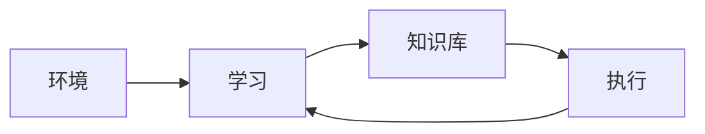

- 环境，是指外部信息的来源，为系统的学习提供相关信息。信息的质量是影响机器学习系统设计最重要的因素。这些信息主要通过训练数据（包括测试数据）体现，训练数据其实就是对事物的观察和历史经验。
- 学习，代表系统的学习机构，从环境中获取外部信息，然后经过分析、综合、类比、归纳等思维过程获得新知识或改进知识库。
- 知识库，代表系统已经具有的知识和通过学习获得的知识。知识库里存放的是指导执行动作的一般原则。知识的具体形式根据不同的学习模型会有不同的表现，如规则、网络、树、图和函数等。
- 执行，该环节是基于学习后得到的新“知识库”，它执行一系列任务，同时把执行结果信息反馈给学习环节，以完成对新“知识库”的评价，指导进一步的学习工作。

### 3. 学习环节的一般过程

机器学习系统中学习环节的一般过程如下所示。

- 机器学习的方法有很多，选择学习模型要根据具体问题和任务的特点、要求以及约束条件来决定。不同模型的性能和学习结果可能有较大差异。
- 训练数据的质量会严重影响学习结果。我们总是希望训练数据要客观、全面地反映事物真实的分布。不完整或不恰当的训练数据将给机器学习带来极大的困难，甚至于误导学习结果。
- 一般地，在获得原始数据之后要清洗数据，即根据学习任务和学习模型规范数据格式，进行必要的数据转换，去除无关属性等，以便于下一步操作。
- 数据中包含丰富的信息，但并不一定都是于解决问题有关的。如果把全部信息拿来学习，那么时间和空间资源消耗将是巨大甚至无限的，且过多的信息实际上会称为噪声，干扰学习结果。因而需要提取特征，从数据中提取那些对解决问题有用的信息，抛弃无用不相关的信息。实际上，提取特征往往和特征选择结合在一起进行，也就是只保留那些最有用的信息（特征）用于下一步训练和学习。
- 训练（学习）就是运用具体的学习算法，直到结束。学习模型训练结束之后就能得到相关知识。知识的具体形式根据不同的学习模型会有不同的表现，如规则、网络、树、图和函数等。

## （二）机器学习方法的分类

目前，比较流行的机器学习方法分类主要根据有如下，不同的分类方法只是从某个侧面来划分系统类别。

- 有无指导：监督学习（Supervised Learning，或有导师学习）、无监督学习（Unsupervised Learning，或无导师学习）、强化学习（Reinforcement Learning，或增强学习）。
- 学习方法：机械式学习（Rote Learning）、指导式学习（Learning by being Told）、范例学习（Learning from Examples）、类比学习、解释学习。
- 推理策略：演绎学习（Deductive Learning）、归纳学习（Inductive Learning）、类比学习（Learning by Analogy）、解释学习（Explanation Based Learning）。
- 综合多因素分类，综合考虑机器学习的历史渊源、知识表示、推理策略和应用领域等因素：人工神经网络学习（Artificial Neural Network Learning）、进化学习（Evolution Learning）、概念学习（Concept Learning）、分析学习、基于范例的学习（Case-based Learning）。

## （三）机器学习的基本问题

机器学习中解决的基本问题主要有分类、聚类、预测、联想、优化。令$S$表示数据空间，$Z$表示目标空间。机器学习就是在现有观察的基础上求得一个函数$L:S\to Z$，实现从给定数据到目标空间的映射。不同特征的学习函数实际上表示了不同的基本问题。

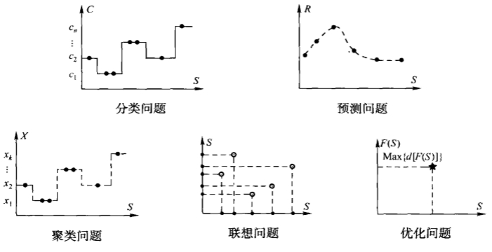

### 1. 分类问题

当目标空间$Z$是已知有限离散值空间（用$C$表示）时，即$Z=C=\set{c_1,c_2,\cdots,c_n}$。待求函数就是分类函数，也称为分类器或者分类模型。此时用机器学习解决分类问题，也就是把一个数据分配到某已知类别中。每个已知的离散值就是一个已知类别或者已知类别标识。分类问题所用的训练数据是$<D,C>$，其中$D\subset S$。由于学习时目标类别已知，所以分类算法都是有监督学习的。分类问题是非常基本、非常重要的问题。解决分类问题常用的方法有决策树方法、贝叶斯方法、前馈神经网络BP算法和支持向量机方法等。

在分类中经常用到softmax函数，这里简述其定义。给定一组变量$(x_1,x_2,\cdots,x_n)$，softmax将它们出现的总概率标准化为$1$，对于其中一个元素$x_i$，其函数值如下：
$$
\mathtt{softmax}(x_i) = \frac{e^{x_i}}{\sum_j^n e^{x_j}}
$$

### 2. 聚类问题

当目标空间$Z$是未知有限离散值空间（用$X$表示）时，即$Z=X=\set{x_1,x_2,\cdots,x_k}$，待求函数就是聚类函数，也称为聚类模型。此时机器学习解决聚类问题，也就是把已知数据集划分为不同子集（类别），并且不同类别之间的差距越大越好，同一类别内的数据差距越小越好。由于目标类别未知，所以聚类问题所用的训练数据是$D$，其中$D\subset S$。解决聚类问题常用的方法有划分聚类法、层次聚类法、基于密度的聚类、基于网格的聚类和自组织特征映射网络等。

### 3. 预测问题

当目标空间$Z$是连续值空间（用$R$表示）时，待求函数就是回归（拟合）曲线（面）。此时机器学习用来解决预测问题，也就是求一个数据在目标空间中符合某观测规律的像。预测问题所用的训练数据是$<D,R>$，其中$D\subset S$。一般情况下，我们事先已知了（或者选择了）曲线（面）模型，需要学习的是模型中的参数。解决预测问题常用的方法有人工神经网络方法、线性回归、非线性回归和灰色预测模型等。

### 4. 联想问题

当目标空间就是数据空间本身时，即$Z=S$，待求函数就是求自身内部的一种映射。此时机器学习解决联想问题，也称为相关性分析或者关联问题，就是发现不同数据（属性）之间的相互依赖关系。简单地说，就是可以从事物$A$推出事物$B$，即$A\to B$。解决联想问题常用的方法有反馈神经网络、关联规则和回归分析等。

### 5. 优化问题

当目标空间是数据空间上的某种函数（用$F(S)$表示）时，且学习目标为使对函数$F(S)$的某种度量$d[F(S)]$达到极值时，机器学习解决优化问题，也就是在给定数据范围内寻找使某值达到最大（最小）的方法。优化问题一般都有一些约束条件，如时空资源的限制等。优化问题的代表就是NP问题，这也是计算机科学中的一类经典问题。在目前的技术条件下，NP问题无法在有效时间内获得最优解。所以我们总是在寻找次优解、近似解或者尽可能地接近最优解。解决优化问题对于提高系统效率，保证系统实用性有重要意义。解决优化问题常用的方法有遗传算法、Hopfield神经网络和线性规划方法等。

## （四）评估学习结果

### 1. 评估原则

人工智能解决问题的一大特点就是不一定保证$100\%$的正确率。对于机器学习的结果也是如此。我们不要求机器学习结果对所有测试都$100\%$的正确和满足，只要达到令人满意，或者比已有结果更好的结果就可以了。一般从以下几个方面衡量或者对比机器学习模型的优劣。

学习结果的合理性和有效性、算法复杂度（Complexity）、模型鲁棒性（Robustness）、模型适应性、模型描述的简洁性和可解释性。

### 2. 测试数据

测试数据集可以和训练数据集相同，也可以不相同。由于训练数据集不太可能覆盖所有的可能数据。所以测试数据集一般和训练数据集不相同，至少测试数据集中会包含一些训练数据集中没有的数据。这样才能反映出模型的泛化能力。

假设$S$是已有数据集，并且训练数据和测试数据都遵从同样的分布规律。从$S$中分割出训练数据和测试数据的常用方法有：

- 保留法（Holdout)。这种方法取$S$的一部分（通常为$2/3$）作为训练数据，剩下的部分（通常为$1/3$）作为测试数据。最后在测试数据集上验证学习结果。一般而言，训练数据越多越可能接近于真实情况下的分布，也越可能获得更精确的学习结果。保留法一般用于已知数据量非常巨大的时候。
- 交叉验证法（Cross Validation），或者称为交叉纠错法。这种方法把$S$划分为$k$个不相交的子集，然后取其中一个子集作为测试集，剩下的数据作为训练集。接着重复$k$次，把每一个子集都做一次测试集，于是会得到$k$个测试结果，最终的测试结果就是这$k$个测试结果的平均值。交叉验证法还可以再重复多次，每次变换不同的k值或者不同的划分。可以获得较好的学习结果，但是需要更长的训练时间。所以交叉验证法一般用于已知数据量不太大的时候。
- 随机法。这种方法随机抽取$S$中的一部分数据作为测试数据，把剩下的数据作为训练数据。然后多次重复这一过程。最终的测试结果是所有测试结果的平均值。随机法可以重复无数次，每个数据都可能被充分地用于训练和测试，可以把测试结果的置信区间减小到指定宽度。

### 3. 度量学习结果的有效性

评估机器学习结果的有效性就是用机器学习的结果与理想结果相对照，并给出一个量化指标以便于衡量学习质量。评估学习结果的有效性常用的指标有以下几种。误差（Error）、正确率（Accuracy）或错误率（Error Rate）、复合指标。

#### (1) 误差

假设$E_i$表示某个数据的理想结果，$L_i$表示该数据的机器学习结果。那么测试数据集$T$上的误差（Error）就是：$Error(T)=\sum_{i=1}^{|T|}P_i \Vert E_i-L_i \Vert$

- 其中$P_i$表示第$i$个数据的权值或者概率。
- $\|\cdot\|$表示某种距离度量方法或者某种范数。

最常用的范数就是欧几里得距离公式，此时误差实际上就是方差，即：$Error(T)=\sum_{i=1}^{|T|}P_i\sum_{j=1}^{d}(E_{ij}-L_{ij})^2$

- 其中$d$表示数据维度。

当学习结果的输出使连续值时，我们一般使用误差衡量学习结果。

#### (2) 正确率或错误率

正确率是被正确处理的数据个数与所有被处理的数据个数的比值，即：$Accuracy(T)=\cfrac{|T_{Error<\varepsilon}|}{|T|}$

- $T_{Error<\varepsilon}$表示被正确处理的数据，也就是误差足够小的数据，即$T_{Error<\varepsilon}=\{ t|t \in T, \Vert E_i - L_i \Vert < \varepsilon, \varepsilon > 0 \}$

错误率则是没有被正确处理数据个数与所有被处理数据个数的比值。我们认为一个数据要么被正确处理，要么没有被正确处理，所以有：$ErrorRate(T)=1-Accuracy(T)$

由此可见，正确率与错误率本质上其实没有什么区别，只不过趋势相反罢了。正确率和错误率的取值范围都是$[0,1]$，在应用中只要选择其中一个就可以了。

当学习结果的输出值是离散值时，我们会用正确率衡量学习结果，此时一个数据的误差，一般要么是$1$，要么是$0$。

#### (3) 复合指标

复合指标是用两个或两个以上的指标来共同衡量学习结果。

#### (4) 对于分类问题的讨论

对于分类问题，又有精度（Precision）、召回率（Recall）和正确率（Accuracy）之分，为了统筹综合考虑，又定义了$F_\beta$度量（$F_\beta\text{-Measure}$）为精度和召回率的调和平均数，$\beta$表示精度相对于召回率权重。

单分类问题如下。

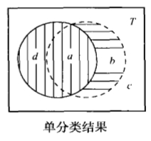

对于最简单的分类判定问题（即目标类别只有一个，一个数据要么属于这个类，要么不属于这个类），机器学习的结果可能是正确分类（判定正确），也可能是错误分类（判定错误）。也就是说，学习的结果模型执行有以下4种可能：

- a：判定属于类且判定正确
- b：判定属于类且判定错误
- c：判定不属于类且判定正确
- d：判定不属于类且判定错误

它们的组合所代表的含义有：

- 总的空间$T=a+b+c+d$，且$a,b,c,d$四个子集互不相交
- $a+b$，表示模型判定属于类的数据
- $c+d$，表示模型判定不属于类的数据
- $a+d$，表示真实的、应该属于类的数据
- $b+c$，表示真实的、应该不属于类的数据

正确率定义为：$Accuracy(T)=\cfrac{|a+c|}{|a+b+c+d|}$。正确率对学习结果的度量不够精细，无法区别错判和漏判的情况，且受到数据原始分布的影响较大。

精度定义为：判定属于类的数据中正确判定的数据比率，即$Precision(T)=\cfrac{|a|}{|a+b|}$。取值范围是$[0,1]$，精度反映了被模型判定为类中的数据有多少是正确的。通过精度可以看出错判的情况，精度越高，错判越少，但是一般漏判就会多。

召回率定义为：在真实的、应该属于类的数据种，被正确判定为属于类的数据所占比率，即$Recall(T)=\cfrac{|a|}{|a+d|}$。取值范围是$[0,1]$，召回率反映了真实的类中数据有多少被模型判断出来了。通过召回率可以看出漏判的情况，召回率越高，漏判越少，但是可能会错判很多。

所以给定一个学习模型，精度变化趋势和召回率变化趋势一般是相反的。也就是说，当调整模型参数使得精度提升时，召回率会下降；而当调整模型提升召回率时，精度会下降。

为了能够用一个数值综合考虑精度和召回率两个指标，我们常用F~β~度量（F~β~-Measure），它是精度和召回率的调和平均数（Harmonic Mean），定义为：$F_\beta(T) = \cfrac{ (\beta^2+1) Precision(T) \times Recall(T) }{ \beta^2 Precision(T) + Recall(T) }$。

其中，β时一个大于0的实数，表示精度相对于召回率的权值。我们常用β=1，即F~1~度量：$F_1(T) = \cfrac{ 2 Precision(T) \times Recall(T) }{ Precision(T) + Recall(T) }$。

多分类问题如下。

对于多分类问题，所分的目标类别不止一个，就要综合考虑每一个类别上的学习结果，一般采用宏平均法（Macro Average）或者微平均法（Micro Average）。宏平均就是先计算各个类别自身的精度和召回率，即对于每一个类按照单分类的评估方法计算其指标，然后把各个指标加在一起求算术平均值，就可得到宏平均值。微平均是把整个测试集看作单分类问题，一次性计算所有个体样本指标的平均值。无论是宏平均还是微平均，$F_1$度量仍然定义为相应精度和召回率的调和平均数。

# 二、决策树学习

决策树学习（Decision Tree Learning）是一种逼近离散值函数的方法，一般用于解决分类问题，是应用最广的归纳推理算法之一。决策树学习方法采用自顶向下的递归方式，从一组无次序、无规则的元组中推理出树形结构的分类规则。最终学习到的函数被表示成一棵决策树，也能被表示为多个if-then规则，以提高可读性。决策树学习方法对噪声数据有很好的健壮性且能够学习析取表达式。

决策树学习算法有很多，如ID3、C4.5、ASSISTANT等。这些决策树学习方法搜索了一个完整表示的假设空间，从而避免了受限假设空间的不足。决策树学习的归纳偏置优先选择较小的树。

## （一）决策树表示法

决策树把一个实例从根节点开始不断进行划分，一直到叶子节点，最后通过与叶子节点相关联的类别来决定实例的分类。树上的每一个节点说明了对实例的某个属性的测试，并且该节点的每一个后继分枝分别对应于该属性的一个可能值。分类实例的方法是从这棵树的根节点开始，测试这个节点指定的属性，然后按照给定实例的属性值所对应的树枝向下移动。从决策树根节点到叶子节点的一条路径就构成一条判定规则。从树根到树叶的每一条路径都对应一组属性测试的合取，树本身对应这些合取的析取。

决策树学习适合解决具有以下特征的问题。

1. 实例是由“属性-值”对表示的。实例是用一系列固定的属性和它们的值来描述的。在简单的决策树学习中，每个属性只取离散值。在扩展的决策树算法中也可以处理连续值属性。一般都是用某种方法把连续值离散化，即一个区间对应一个离散值。例如，一棵被子植物由根、茎、叶、花、果实等属性描述，植物根系只取直根系和须根系两个值。
2. 目标函数具有离散的输出值。决策树在叶子节点上给每个实例赋予一个确定的类别，即其目标值域也是离散值的集合。
3. 可能需要析取的描述。决策树很自然地代表了析取表达式。
4. 训练数据可以包含错误。决策树学习对错误有很好的健壮性。无论是训练样例所属的分类错误，还是描述这些样例的属性值错误，决策树学习都可以较好地处理这些错误数据。
5. 训练数据可以包含缺少属性值的实例。决策树甚至可以在有未知属性值的训练样例中使用。

### 1. ID3算法

1986年奎廉（J Rose Quinlan）在概念学习系统（Concept Learning System）研究的基础上提出了ID3算法。

### 2. ID3算法的思想

ID3算法采用自顶向下的贪梦搜索遍历可能的决策树空间，在每个节点选取能最好分类样例的属性。这个过程一直重复，直到这棵树能完美分类训练样例，或所有的属性都已被使用过为止。

用ID3算法构造决策树，是一个递归的过程：确定将哪一个属性作为根节点被测试。使用统计测试来确定每一个实例属性单独分类训练样例的能力，分类能力最好的属性被选作树的根节点。然后为根节点属性的每个可能值产生一个分枝，并把训练样例分配到适当的分枝（即样例属性值所对应的分枝）之下。然后重复整个过程，用每个分枝节点关联的训练样例来选取在该点被测试的最佳属性。这样就形成了对合格决策树的贪婪搜索，所以ID3算法不回溯，不重新考虑以前做过的选择。

ID3算法的核心问题是选取每个节点上要测试的属性。希望当然是选择的是最有利于分类实例的属性。但是如何衡量一个属性价值的高低没有统一答案，在机器学习中有不同的度量方法。

ID3算法根据信息增益（Information Gain）来度量给定属性区分训练样例的能力。实际上，ID3算法通常选择信息增益最大的属性作为决策树节点。

### 2. 信息增益

前述：一条数据可以理解为一条元组（记录），它的结构有若干字段属性组成。每条数据可以附加一条目标属性，即最终的分类类别。

**定义** 对于数据集$D$，若任意一个数据$d\ (d\in D)$，有$c$个不同取值选项（分类类别）。那么数据集$D$对于这$c$个状态的熵（Entropy）定义为：
$$
Entropy(D)=Entropy(D,Target)=-\sum_{i=1}^c{P_ilog_2(P_i)}
$$

- 数据集合$D$即为所有数据元组的集合，它们之中可能有重复（同一个类别）的，如果将可能重复的数据元组仅保留一份，那么总的个数应该为$c$个。这就是用“任意数据$d$可能有$c$个不同的取值选项”所确定的意义。
- 对应每一个可能的情况，$P_i$是数据$D$中的数据元组是$i$（或者说该元组属于类别$i$）的数据个数占总数据的比例（或者概率）。若是比例的话，可写成：$P_i=\frac{|D_i|}{|D|}$。
- 如果数据有$c$种可能值，那么熵的最大可能值为$\log_2 c$。规定$0log_0=0$。

**定义** 属性$A$对于数据集$D$的信息增益$\text{Gain}(D,A)$就是由于使用该属性分割数据集$D$，而导致数据集合$D$期望熵减少的程度，即：
$$
Gain(D,A)=Entropy(D)-\sum_{x \in Values(A)}{\left( \cfrac{|D_v|}{|D|}Entropy(D_v) \right) }
$$

- 用属性$A$去分割数据集$D$，就是根据属性字段$A$对数据集进行分组，在$A$属性上取值相同的数据为同一组，即同一个类别。
- $Values(A)$是属性$A$所有可能的取值的集合。
- $D_v$是$D$的子集，它是$D$中的所有$A$属性取$v$值的数据的集合。即$D_v=\set{d|d\in D,d(A)=v}$。
- $Entropy(D)$是未用属性$A$分割之前的熵。$Entropy(D_v)$是用属性$A$分割之后的熵，即$D_v$集合的熵。属性$A$的每一个可能取值都有一个熵，该熵的权重是取该属性值的数据在数据集$D$中所占的比例。
- 属性$A$的$v$个取值，可以看出对数据集$D$的全划分，每个取值下的熵和该熵的权值都有一个积，所有取值的积之和，就是期望熵。

熵刻画了数据集的纯度（Purity）。熵越小，数据集越纯净，即越多的数据有相同的类别。当熵为$0$时，表示数据集中所有的数据都相等，都等于一个值。属性A的信息增益就是当按照$A$来划分数据集时，数据集能比原来纯净多少。

### 3. ID3算法的伪代码

1. 创建根节点。
2. 根节点数据集为初始数据集。
3. 根节点属性集包括全体属性。
4. 当前节点指向根节点。
5. 在当前节点的属性集和数据集上，计算所有属性的信息增益。
6. 选择信息增益最大的属性$A$作为当前节点的决策属性。
7. 如果最大信息增益小于等于0，则当前节点是叶子节点，标定其类别，并标记该节点以处理，执行第14步。否则，最大信息增益大于0，执行第8步。
8. 把属性$A$的每一个可能值生成一个新节点。
9. 把当前节点作为新节点的父节点。
10. 从当前节点的数据集中选取属性$A$等于某个值的数据，作为该值对应新节点的数据集。
11. 将当前节点的属性集中去除属性$A$的集合作为新节点的属性集。
12. 如果新节点数据集或属性集为空，则该节点是叶子节点，标定其类别，并标记该节点已处理。
13. 标记当前节点已处理。
14. 令当前节点指向一个未处理节点。如果无未处理节点则算法结束。否则执行第5步。

### 4. ID3算法的特点

ID3算法可以被看作是在假设空间中的一个搜索过程，搜索目标就是找到一个能够拟合训练数据的假设。假设空间就是所有可能决策树的集合，也是一个关于现有属性的有限离散值函数的完整空间。所以，ID3算法必定能够找到一个目标函数。

ID3算法运用爬山法搜索假设空间，但是并未彻底地搜索整个空间，而是当遇到第一个可接受的树时，就终止了。ID3算法实际上是用信息增益度量作启发式规则，指导爬山搜索的。概括地讲，ID3的搜索策略有如下特点：

- 优先选择较短的树，而不是较长的树。
- 选择那些高信息增益、高属性、更靠近根节点的树。优先选择短的树，即复杂度小的决策树，更符合奥坎姆剃刀（Occam's Razor）原则，也就是优先选择更简单的假设。复杂度小的决策树（分类器）一般具有更好的泛化（Generalization）能力。

基本的ID3算法在搜索中不进行回溯，对已经做过的选择不再重新考虑。所以ID3算法收敛到的是局部最优解，而不是全局最优解。可以对ID3算法得到的决策树进行修剪，增加某种形式的回溯，从而得到更优解。

ID3算法在搜索的每一步都使用当前的所有训练数据，以统计为基础决定下一步假设。使用全体数据的统计属性（信息增益）可以大大降低个别错误训练数据对学习结果的影响。所以ID3算法可以很容易地扩展到处理含有噪声的训练数据。

## （三）决策树学习的常见问题

如何确定决策树增长的深度，避免过度拟合；处理连续值的属性；选择一个适当的属性筛选度量标准；处理属性值不完整的训练数据；处理不同代价的属性；提高计算效率。

针对上述问题，Quinlan在1993年提出了C4.5算法对ID3算法进行了如下改进，已成为目前普遍使用的一种决策树算法。

1. 用信息增益率来选择属性，避免了用信息增益选择属性时偏向选择取值多的属性。
2. 在树的构造过程中进行剪枝。
3. 能够完成对连续属性的离散化处理。
4. 能够对不完整数据进行处理。

若出现某个节点没有训练数据。对于数据缺失的情况，可以用某种方法补充缺失数据，也可以简单地忽略此种情况（并删除缺失数据的节点）。如果要补充缺失数据，可以令缺失数据全部等于某默认值或者平均值，或者采用其他算法生成符合某分布的值。

### 1. 过度拟合问题

**定义** 给定一个假设空间$H$和一个训练数据集$D$。对于一个假设$h\ (h\in H)$，如果存在其他的假设$h'\ (h'\in H)$，使得在训练数据集$D$上$h$的错误率小于$h'$的错误率，但是在全体可能数据集合上$h$的错误率大于$h'$的错误率。那么假设$h$就过度拟合（Overfit）了训练数据$D$。

过度拟合会使学习模型把训练数据中的噪音信息当作有用特征记忆下来。而当模型遇到非训练数据集中的数据时，噪声就会干扰模型的判断结果，降低最终的精度。所以，过度拟合严重影响了模型的泛化能力，降低了模型的实用性能。

#### (1) 决策树学习的过度拟合

决策树学习中的过度拟合表现为决策树节点过多，分支过深，对于训练数据可以完美分类，但是对于非训练数据则精度下降。解决决策树学习中的过度拟合问题有两种途径：一种是及早停止树增长，即在完美分类训练数据之前就终止学习；另一种是后修剪法，即先允许树过度拟合数据，然后再对过度拟合的树进行修剪。

及早停止树增长就是要及时确定叶子节点。决策树节点划分的原则是使其子节点尽可能纯净（即使子节点的平均熵最小）。对于任意一个节点$n$，可以出现以下3种情况：

1. 节点$n$中的样本属于同一类，即节点$n$绝对纯净。此时节点$n$不可进一步划分。
2. 节点$n$中的样本不属于同一类，但是不存在任何一个划分可以使其子节点的平均熵低于节点$n$。此时节点$n$不可进一步划分。
3. 可以用一个属性对节点$n$进行划分，从而使节点$n$的子节点具有更低的熵。此时节点n可以进一步划分。

在构建决策树的过程中，确定叶子节点的一个策略是：对于每一个可以进一步划分的节点都进行划分，直到得到一个不可划分的子节点，并将该子节点定位叶子节点。这样构造的决策树，其叶子节点均为不可再进一步划分的节点。这种策略可完美地分类训练数据，但是当训练数据不能覆盖真实数据分布时，就会过度拟合。

所以，不要绝对追求叶子节点的纯净度，而是适度保证对训练样本的正确分类能力。当然，叶子节点的纯净度过低则是欠学习（欠拟合）。欠学习不能够充分提取样本集合中蕴涵的有关样本真实分布的信息，同样不能保证对未来新样本的正确分类能力。应该在过度拟合与欠学习之间寻求合理的平衡，即在节点还可以进一步划分的时候，可根据预先设定的准则停止对其划分，并将其设置为叶子节点。

#### (2) 确定叶子节点

确定叶子节点的基本方法有测试集方法和阙值方法。

测试集方法就是将数据样本集合分为训练集与测试集。根据训练集构建决策树，并将决策树中的节点逐层展开。每展开一层子节点，并将其设为叶子节点，就得到一棵决策树，然后采用测试集对所得决策树的分类性能进行统计。重复上述过程，可以得到决策树在测试集上的学习曲线。根据学习曲线，选择在测试集上性能最佳的决策树为最终的决策树。为了保证测试集中有足够多的具有统计意义的数据，在实践中经常取全体数据的$1/3$作为测试集，另外$2/3$作为训练集。

阈值方法就是在决策树开始训练之前，先设定一个阙值作为终止学习的条件。然后在学习过程中如果节点满足了终止条件就停止划分，将其作为叶子节点。终止条件可以为信息增益小于某阙值或者节点中的数据占全体训练数据的比例小于某阙值等。

#### (3) 决策树的修剪

对决策树的修剪可以在测试集上进行，也可以在全体数据集上进行。修剪的一般原则是使决策树整体的精度提高，或者错误率降低。在实践中常用的规则后修剪（Rule Post-Pruning）方法的步骤如下：

1. 从训练数据中学习决策树，允许过度拟合。
2. 将决策树转化为等价的规则集合。从根节点到叶子节点的一条路径就是一条规则。
3. 对每一条规则，如果删除该规则中的一个前件不会降低该规则的估计精度，则可删此前件。
4. 按照修剪后规则的估计精度对所有规则排序，最后按照此顺序来应用规则进行分类。

### 2. 选择属性的其他方法

基本ID3算法选择信息增益最大的属性作为最优属性。但是，信息增益度量会偏向于有较多可能值的属性，特别是当某属性可能值的数目远远多于类别数目时，该属性就会有很大的信息增益。例如，使用信息增益度量会选择日期作为根节点决策属性，生成一个只有一层，却很宽的决策树。尽管这棵决策树可以完美地分割训练数据，但是它并不是一个好的分类器。

造成这个现象的原因是因为太多的可能值把训练数据分割成了非常小的空间。在每一个小空间内，数据都非常纯净，甚至数据完全一致，熵为$0$，这样与未分割之前相比，信息增益必然非常大。然而这样的分割显然覆盖了其他的有用信息，并未反应真实数据的分布，所以对其他数据就有非常差的分类结果。

#### (1) 增益比率度量

为了避免信息增益度量的这个缺陷，可以使用信息增益比率（Gain Ratio）度量。增益比率度量法就是在信息增益度量的基础上加上一个惩罚项来抑制可能值太多的属性（如日期属性等）。这个惩罚项称之为分裂信息（Split Information），用来衡量属性分裂数据时的广度和均匀性。属性A对数据集D的分裂信息定义如下：

$$
SplitInformation(D,A)=-\sum_{v \in Values(A)} \cfrac{|D_v|}{|D|}log_2 \cfrac{|D_v|}{|D|}
$$

- $D_v$是由属性$A$在数据集$D$上划分出来的一个数据子集。
- 分裂信息实际上就是数据集$D$关于属性$A$的熵。

增益比率度量就是用信息增益除以分裂信息，即：

$$
GainRatio(D,A)=\cfrac{Gain(D,A)}{SplitInformation(D,A)}
$$
对于可能值比较多的属性，由于其分裂信息也比较大，所以最终的增益比率反而可能减小。但是当分裂信息过小，甚至趋于$0$时，增益比率会过大，甚至无定义。例如，某个属性在数据集$D$中几乎只取一个可能值时，就会有这种情况。为了避免选择这种属性，我们可以采用某种启发式规则，只对那些信息增益高过平均值的属性应用增益比率测试。

#### (2) 基于距离的度量

还可以通过其他的属性选择度量方法。例如，Cendrowska提出的按照属性提供的分类信息选择属性，Lopez de Mantaras提出的基于距离的度量等。Mantaras的思想是对于数据集假设存在一个理想划分，使得每一个数据都被正确分类。那么我们定义一个距离度量为其他划分到这个理想划分之间的差距。于是距离越小的划分自然是越好的划分。Mantaras定义的距离也是以熵为基础的。

令$A$表示把数据集$D$分为$n$个子集（类别）的一个划分，$B$表示把数据集$D$分为$m$个子集（类别）的一个划分。则划分$B$对于划分$A$的条件熵为：

$$
Entropy(B|A)=-\sum_{i=1}^n\sum_{j=1}^mP(A_iB_j)log_2 \left( \cfrac{P(A_iB_j)}{P(A_i)} \right)
$$
划分$A$和划分$B$的联合熵为：

$$
Entropy(AB)=-\sum_{i=1}^n\sum_{j=1}^mP(A_iB_j)log_2P(A_iB_j)
$$

- $P(A_iB_j)$表示一个数据既在划分$A$中属性$A_i$类，又在划分$B$中属于$B_j$类的概率。

Mantaras定义两个划分$A,B$之间的距离为：

$$
d(A,B)=Entropy(B|A)+Entropy(A|B)
$$
经过归一化（Normalized）之后的距离为：

$$
d_N(A,B)=\cfrac{d(A,B)}{Entropy(AB)}
$$
归一化的距离度量取值在$[0,1]$区间内。上述两种距离定义都满足距离公里，即：

1. $d(A,B) \ge 0$，当且仅当$A = B$时，$d(A, B) = 0$
2. $d(A, B) = d(B, A)$
3. $d(A, B) + d(B, C) \ge d(A, C)$

可以证明这个距离度量不会偏向可能值较多的属性；而且也不会出现增益比率度量所有的缺陷。

# 三、贝叶斯学习

贝叶斯学习（Bayesian Learning）就是基于贝叶斯理论（Bayesian Theory）的机器学习方法。贝叶斯理论也称为贝叶斯法则（Bayesian Theorem，或Bayesian Rule，或Bayesian Law），其核心就是贝叶斯公式。

## （一）贝叶斯法则

### 1. 贝叶斯法则简介

贝叶斯法则解决的机器学习任务一般是：在给定训练数据`D`时，确定假设空间`H`中的最优假设，这是典型的分类问题。贝叶斯法则基于假设的先验概率、给定假设下观察到不同数据的概率以及观察到的数据本身，提供了一种计算假设概率的方法，即贝叶斯公式。

#### (1) 先验概率

先验概率（prior probability）是指根据以往经验和分析得到的概率，如全概率公式，它往往作为"由因求果"问题中的"因"出现的概率。在机器学习中，先验概率就是在还没有训练数据之前，某个假设h（h∈H）的初始概率，记为`P(h)`，即P(h)表示假设h的先验概率。先验概率反映了一个背景知识，表示h是一个正确假设的可能性有多少。如果没有这一先验知识，那么可以简单地将每一候选假设赋予相同的先验概率。类似地，`P(d)`表示训练数据d的先验概率，也就是在任何假设都未知或不确定时，d的概率。`P(d|h)`表示已知假设h成立时d的概率，称之为类条件概率，或者给定假设h时数据d的似然度（Likelihood）。

#### (2) 后验概率

现在若试验产生了事件B，则利用贝叶斯公式可以求出在事件B发生之下，诸“原因”发生的条件概率。这些条件概率 是充分利用B已经发生的信息对诸“原因”A~i~发生的概率的修正，称为“后验概率”，因为它们是在事件B已经发生后对各种原因发生的可能性大小的新认识。在机器学习中，后验概率就是在数据d上经过学习之后，获得的假设h成立的概率，记为`P(h|d)`，即P(h|d)表示给定数据d时假设h成立的概率，称为h的后验概率。后验概率是学习的结果，反映了在看到训练数据d之后，假设h成立的置信度。因此后验概率是解决问题时的依据。对于给定数据根据该概率可做出相应决策，例如，判断数据的类别，或得出某种结论，或执行某种行动等。

#### (3) 贝叶斯公式

$$
P(h|d)=\cfrac{P(hd)}{P(d)}=\cfrac{P(d|h)P(h)}{P(d)}
$$

贝叶斯公式提供了从先验概率P(h)、P(d)和类条件概率P(d|h)计算后验概率P(h|d)的方法。直观地看，P(h|d)随着P(h)和P(d|h)的增长而增长，随着P(d)的增长而减小，即如果d独立于h时被观察到的可能性越大，那么d对h的支持度就越小。此外，后验概率是对先验概率的修正。

### 2. 贝叶斯最优假设

分类问题的最优假设（即最优结果）可以有不同的定义。例如，与期望误差最小的假设，或者能取得最小熵（Entropy）的假设等。贝叶斯最优假设是指为在给定数据d、假设空间H中不同假设的先验概率、有关知识下的最可能假设。这个最可能假设可有不同选择。

#### (1) 极大后验假设

极大后验假设（Maximum A Posteriori，MAP）就是在候选假设集合H中寻找对于给定数据d使后验概率P(h|d)最大的那个假设，即MAP假设h~MAP~（h~MAP~∈H）是满足下式的假设。

$$
h_{MAP} \equiv \mathop{arg \  max}\limits_{h \in H}P(h|d) = \mathop{arg \  max}\limits_{h \in H}\cfrac{P(d|h)P(h)}{P(d)} = \mathop{arg \  max}\limits_{h \in H}P(d|h)P(h)
$$

- 最后一步去掉了P(d)，因为它是不依赖于h的常量。确定MAP假设的方法就是用贝叶斯公式计算每个候选假设的后验概率。

#### (2) 极大似然假设

极大似然假设（Maximum Likelihood，ML）就是在候选假设集合H中选择使给定数据d似然度（即类条件概率）P(d|h)最大的假设，即ML假设h~ML~（h~ML~∈H）是满足下式的假设。

$$
h_{ML}=\mathop{arg \  max}\limits_{h \in H}P(d|h)
$$

- 极大似然假设和极大后验假设有很强的关联性。实际上，当候选假设集合H中的每个假设都有相同的先验概率时，极大后验假设就蜕化成极大似然假设。由于数据的似然度是先验知识，不需要训练就能知道。所以在机器学习实践中经常应用极大似然假设来指导学习。

#### (3) 贝叶斯最优分类器

贝叶斯最优分类器（Bayes Optimal Classifier）是对最大后验假设的发展。它并不是直接选取后验概率最大的假设作为分类结果，而是对所有假设的后验概率做线性组合（加权求和），然后再选择加权和最大的结果作为最优分类结果。贝叶斯最优分类器就是满足下式的分类系统。

$$
\mathop{arg \  max}\limits_{v_j \in V}\sum_{h_j \in H}P(v_j|h_j)P(h_j|d)
$$

- 设V表示类别集合，对于V中任意的一个v~j~，概率P(v~j~|d)表示把数据d归为类别v~j~的概率。贝叶斯最有分类就是使P(v~j~|d)最大的那个类别。
- P(v~j~|h~j~)可以理解为对h~j~所加的权重。
- 在相同的假设空间和相同的先验概率条件下，其他方法的平均性能不会比贝叶斯最优分类器更好。在给定可用数据、假设空间以及这些假设的先验概率的条件下，贝叶斯最优分类器使得一个实例被正确分类的可能性达到最大。

贝叶斯最优分类器所做的分类可以不是由假设空间H中单个假设所标注的分类，而是由H中多个假设的线性组合所标注的分类。也就是说，在由H生成的另一个空间H'中应用贝叶斯公式。实际上，贝叶斯最优分类器在空间H中应用了一次贝叶斯公式，然后中空间H'中又应用了一次贝叶斯公式。由此可见，贝叶斯最优分类器能从给定训练数据中获得最好的性能，但是其算法开销比较大。

### 3. 贝叶斯学习的特点

贝叶斯学习在机器学习中占有重要的位置。因为贝叶斯学习为衡量多个假设的置信度提供了定量的方法，可以计算每个假设的显式概率，提供了一个客观的选择标准。而且贝叶斯学习还为理解其他学习算法提供了一种有效的手段，虽然那些算法不一定直接操纵概率数据。

贝叶斯学习方法的特性如下：

1. 观察到的每个训练样例可以增量地降低或升高某假设的估计概率。而其他算法会在某个假设与任何一个样例不一致时完全去掉该假设。
2. 先验知识可以与观察数据一起决定假设的最终概率。先验知识包括每个候选假设的先验概率、每个可能假设在可观察数据上的概率分布。
3. 贝叶斯方法允许假设做出不确定性的预测。
4. 新的实例分类可由多个假设一起作出预测，用它们的概率来加权。
5. 即使在贝叶斯方法计算复杂度较高时，它仍可作为一个最优决策标准去衡量其他方法。

在实践中使用贝叶斯学习的时候，要注意以下几个先决条件：

1. 被观察的量遵循某概率分布，并且可根据这些概率及已观察到的数据进行推理。
2. 由一些已知假设作为候选目标，且候选假设之间彼此互斥，所有候选假设概率之和为1。即对整个样本空间的全划分。
3. 具有先验知识。要获得先验概率，一般要做大量的统计工作。这在实践中往往有很大困难。此时也可以基于背景知识、预先准备好的数据以及基准分布的假定来估计这些概率。再者，一般情况下如果要计算贝叶斯最优假设，则需要计算所有可能假设的概率。这样的计算复杂度就比较高。

## （二）朴素贝叶斯方法

在机器学习中的一个实例x往往有很多属性。人们一般就用一个多维元组（即向量）<a~1~,a~2~,...,a~n~>来表示一个实例。其中每一维代表一个属性，该分量的数值就是所对应属性的值。此时依据MAP假设的贝叶斯学习就是对一个数据<a~1~,a~2~,...,a~n~>，求使其满足下式的目标值h~MAP~。

$$
\begin{align}
h_{MAP} &= \mathop{arg \  max}\limits_{h_i \in H}P(h|a_1, a_2, \dots, a_n) \\
&=\mathop{arg \  max}\limits_{h_i \in H}\cfrac{P(a_1, a_2, \dots, a_n|h_i)P(h_i)}{P(a_1, a_2, \dots, a_n)} \\ 
&=\mathop{arg \  max}\limits_{h_i \in H}P(a_1, a_2, \dots, a_n|h_i)P(h_i)
\end{align}		\tag{6.3.2-1}
$$

- H是目标值集合。

估计每个P(h)很容易，只要计算每个目标值h~i~出现在训练数据中的频率就可以了。但是，如果要如此估计所有的P(a~1~,a~2~,...,a~n~)项，则必须要计算a1,a2,...,an的所有可能的取值组合，再乘以可能的目标值数量。这个数据将会很大，对于现实系统这样显然不行。因为，首先我们很难得到一个容量足够大的样本。其次即使我们的样本足够多，进行统计的时间复杂度也是令人无法忍受的。所以贝叶斯最优假设（包括贝叶斯最优分类器）不适合于高维数据。

对于贝叶斯学习有两种思路可以解决高维数据问题。一种是朴素贝叶斯（Naive Bayes）方法，也称为简单贝叶斯（Simple Bayes）方法；另一种是贝叶斯网络（Bayesian Network)。

朴素贝叶斯分类器采用最简单的假设，对于目标值，数据各属性之间的相互条件是独立的，即a~1~,a~2~,...,a~n~的联合概率等于每个单独属性的概率乘积：$P(a_1, a_2, \dots, a_n|h_i)=\prod_jP(a_j|h_i)$。将其带入上式h~MAP~中，就得到朴素贝叶斯分类所用的方法：$h_{NB}=\mathop{arg \  max}\limits_{h_i \in H}\prod_jP(a_j|h_i)$。

- h~NB~表示朴素贝叶斯分类器输出的目标值。

朴素贝叶斯学习的主要过程在于计算训练样例中不同数据组合的出现频率，统计出P(h~i~)和P(a~j~|h~i~)。所以其算法比较简单，是一种很有效的机器学习方法。当各属性条件的独立性满足时，朴素贝叶斯分类结果等于MAP分类。尽管这一假定一定程度上限制了朴素贝叶斯方法的适用范围，但是在实际应用中，许多领域在违背这种假定的条件下，朴素贝叶斯学习也表现出相当的健壮性和高效性。

## （三）贝叶斯网络

朴素贝叶斯方法假定数据属性在给定目标值下是条件独立的，在很多情况下，这个条件独立的假定过于严格。

贝叶斯网络（Bayesian Network）采取了另一种思路。贝叶斯网络不要求任意两个数据属性之间都条件独立，而是只要两个属性组之间条件独立就可以了。属性组就是属性集合的子集。贝叶斯网络描述的就是属性组所遵从的概率分布，即联合概率分布。

贝叶斯网络是一个带有概率注释的有向无环图，是表示变量（属性）间概率依赖关系的图形模式。其中，一个节点表示一个变量，有向边表示变量间的概率依赖关系。并且任何一个节点的概率只受其父节点的影响，即任何一个变量在给定其父节点的条件下都独立于其非后继节点。每个节点都对应着一个条件概率分布表，指明该变量与父节点之间概率依赖的数量关系。不联通的节点就表示条件独立。贝叶斯网络中对一组变量<a~1~,a~2~,...,a~n~>的联合概率可由下式计算：$P(a_1, a_2, \dots, a_n)=\prod_jP(a_j|Parents(a_j))$

- Parents(a~j~)表示网络中a~j~的父节点集合。
- P(a~j~|Parents(a~j~))的值等于与节点a~j~关联的条件该列表中的值。

在一般情况下，对任意贝叶斯网络的概率的确切推理已经是一个NP难题，甚至即使是贝叶斯网络中的近似推理也可能是NP难题。在实践中可以使用D分离、图约简法和Polytree等技术进行简化推理，其重点在于通过各种方法寻找贝叶斯网络中的条件独立性，达到减少计算量和复杂性的目的。

如何从训练数据中学习获得贝叶斯网络，仍然是机器学习研究中的一个焦点问题。贝叶斯网络的学习可简单地分为结构学习和参数学习。结构学习就是通过训练数据来构造贝叶斯网络拓扑。参数学习就是在贝叶斯网络结构已知的情况下，学习变量的概率分布及参数估计，实际上就是学习各个节点的条件概率表。当网络结构已知并且所有变量可以从训练数据中完全获得时，则可以运用朴素贝叶斯分类方法来估计条件概率表中的各个项。但是，其他情况下的学习就困难多了。

贝叶斯网络实质上是一种基于概率的不确定性推理网络，提供了一种自然的表示因果信息的方法，因此也称为贝叶斯信念网络。贝叶斯网络是处理不确定信息的一种有力工具，已经在医疗诊断、统计决策、专家系统和工业控制等领域的智能化系统中得到了重要应用。

### 1. EM算法

在运用贝叶斯方法的时候，需要先验知识，包括先验概率和类条件概率（即数据似然度）。如果训练数据非常全面、完整，那么我们可以统计训练数据得到先验知识。但是在实践应用中，往往会出现不完整、不全面的训练数据。也就是说，训练数据中应该包含某些数据，但是实际上却没有观察到这些数据。此时对于先验概率我们可以假设其全部相等，即均匀分布。但是对于类条件概率（即数据似然度）则需要用其他方法估计。这种应该出现，但是没有没有被观察到的数据，称之为隐含变量。

EM算法，即期望极大化（Expectation Maximization）算法，就是一种广泛使用的解决隐含变量的学习方法。当隐含变量所遵从概率分布的一般形式已知时，EM算法可以从能观察到的变量估计出那些未被直接观察到的变量。

令D表示训练数据全集，X表示其中能观察到的数据，Y表示其中未被观察到的数据，则D=<X, Y>。由于D中包含着部分未知数据，所以我们把D看作是服从某概率分布F(D, Θ)的随机变量，即P(D)=F(D, Θ)，其中Θ表示概率模型的参数模集。

EM算法的任务就是寻找概率模型F的参数值θ\*（θ\*∈Θ），使得在该取值（或附近收敛）下训练数据的似然度最大，即最大似然假设：$\theta^*=\mathop{arg\ max}\limits_{\theta \in \Theta}P(D|\theta)=\mathop{arg\ max}\limits_{\theta \in \Theta}lnP(D|\theta)$

- 其中采用对数似然度ln P(D|θ)是为了计算和推理方便。
- 确定了模型参数θ\*之后，自然可以根据概率模型F补全缺失的数据。

### 2. EM算法一般步骤

1. 估计期望步（Expectation，E步）。根据当前模型参数θ~i-1~和可观察到的数据X来估计D上的概率分布P(D|θ)，来计算下式中的期望值：$Q(\theta,\theta_{i-1})=E[lnP(D|\theta)|\theta_{i-1},X]$
   - 式中，Q函数表示数据D似然度的期望，而不是数据值的期望。
2. 最大化步（Maximization，M步）。令模型参数为使Q函数最大化的参数：$\theta_i=\mathop{arg\ max}\limits_{\theta}Q(\theta, \theta_{i-1})$

EM算法在初始化的时候，随机指定模型的参数。EM算法保证收敛到参数的局部极大值。EM算法的要点是用当前的假设估计未知变量和期望值，然后又用估计的期望值来修正假设。如果概率分布模型F彻底未知，那么EM算法也无法应用。在实践中常用的概率分布模型是高斯混合模型（Gaussian Mixture Model，GMM）和隐马尔科夫模型（Hidden Markov Model，HMM）。

### 3. 一维高斯函数

高斯函数（Gaussian Function，也简称为Gaussian），一维形式如下：

$$
f(x)=ae^{-\cfrac{(x-b)^2}{2c^2}} \ , \qquad -\infty<x<+\infty
$$

- 对于任意实数a，b，c，高斯的一维图是特征对称“bell curve”钟形曲线。
- a是曲线尖峰的高度。
- b是尖峰中心的轴的坐标。
- c是标准方差，表征的是bell钟状的宽度。
- 高斯函数是一个指数函数。

高斯函数的积分是误差函数（error function），在整个数轴上有：$\int_{-\infty}^{+\infty} ae^{-\frac{(x-b)^2}{2c^2}}=ac\cdot \sqrt{2\pi}$。当且仅当$a=\cfrac{1}{c\sqrt{2\pi}}$时，上式积分为1。在这种情况下，高斯函数是正态分布随机变量的概率密度函数，即：

$$
g(x)=\cfrac{1}{\sqrt{2\pi}\sigma}e^{-\cfrac{(x-\mu)^2}{2\sigma^2}} \ , \qquad -\infty<x<+\infty
$$

- 期望值，$\mu=b$
- 方差，$\sigma^2=c^2$

### 4. 高斯混合模型

对于高斯混合模型我们假设训练数据D中的任意一个数据d~i~（d~i~∈D）都遵循某个高斯模型（即正态分布或者高斯分布）。那么全体训练数据就可以看作是由k个正态分布混合而成，即：

$$
P(d_i|\theta)=\sum_{j=1}^k\lambda_jG(d_i,\mu_j,\Sigma_j)
$$

- 式中，G是高斯函数。
- μ是均值向量（或者均值）。
- Σ是协方差矩阵（或者方差）。
- λ是混合模型中各个高斯分量的权重，满足归一条件（规范性），即：$\sum_{j=1}^k\lambda_j=1,\ \lambda_j\geq0$

EM算法最终确定了每一个数据d~i~（d~i~∈D）由哪个高斯模型产生，并且其模型参数λ、μ和Σ分别是多少。

在E步（Expectation）计算数据d~i~由第 j 个高斯模型生产的期望值。

$$
P(j|d_i)=\cfrac{\lambda_jG(d_i,\mu_j,\Sigma)}{\sum_{n=1}^k\lambda_nG(d_i,\mu_n,\Sigma_n)}
$$

在M步（Maximization）计算期望值到达极大值时新的模型参数。

$$
\lambda_j^{new}=\cfrac{1}{N}\sum_{i=1}^NP(j|d_i) \\
\mu_j^{new}=\cfrac{\sum_{i=1}^Nd_iP(j|d_i)}{\sum_{i=1}^NP(j|d_i)} \\
\Sigma_j^{new}=\cfrac{\sum_{i=1}^NP(j|d_i)(d_i-\mu_j^{new})(d_i-\mu_j^{new})^T}{\sum_{i=1}^NP(j|d_i)}
$$

## （五）用贝叶斯方法过滤垃圾邮件

垃圾邮件过滤就是根据邮件信息把邮件分为有用邮件和垃圾邮件两类。邮件过滤主要有基于规则和基于概率两种基本方法。贝叶斯过滤方法纯粹根据统计学规律运作，完全可以由用户根据自己所接收的邮件历史来确定过滤设置。这样就使得垃圾邮件发送者难以猜测用户的过滤偏好，所以基于贝叶斯方法过滤垃圾邮件已经得到了广泛应用。本节介绍用朴素贝叶斯分类器来过滤垃圾邮件的基本方法。

### 1. 学习过程

朴素贝叶斯方法的基本学习过程如下图：

具体过程如下：

1. 收集大量垃圾邮件和非垃圾邮件，建立垃圾邮件集和非垃圾邮件集。

2. 提取邮件主题和邮件内容中的有效词w~i~，例如“内幕”、“真相”等。然后统计其出现的次数，即在该训练集上的词频TF(w~i~)。

3. 对垃圾邮件集和非垃圾邮件集中的所有邮件执行第2步。

4. 对垃圾邮件集和非垃圾邮件集分别建立哈希表W~spam~和W~valid~，存储从有效字词到其词频的映射关系。

5. 计算每个有效字词在垃圾邮件集（W~spam~）上出现的概率P(w~i~|C=spam)和在非垃圾邮件集（W~valid~）上出现的概率P(w~i~|C=valid)。

$$
P(w_i|C)=\cfrac{TF(w_i)}{\sum\limits_{w_i \in W}TF(w_i)}
$$

6. 在垃圾邮件集和非垃圾邮件集上的学习过程结束，获得在垃圾邮件集和非垃圾邮件集上每个有效字词的出现概率。

### 2. 应用过程

用朴素贝叶斯方法判定一封邮件的基本过程如下图：

具体过程如下：

1. 对一封邮件提取其所有有效词t~1~,t~2~,...,t~n~。

2. 从哈希表W~spam~和W~valid~中分别提取不同邮件类别（垃圾邮件、非垃圾邮件）的上述有效字词的概率P(t~i~|C=spam)和P(t~i~|C=valid)。

3. 依据朴素贝叶斯方法式(6.3.2-1)计算该邮件为垃圾邮件的概率P(C=spam|t~1~,t~2~,...,t~n~)和为非垃圾邮件的概率P(C=valid|t~1~,t~2~,...,t~n~)。即：

$$
P(C=spam|t_1,t_2,\dots,t_n) = \\
   \cfrac{P(C=spam)\times P(t_1|C=spam)\times P(t_2|C=spam)\times \dots \times P(t_n|C=spam)}{P(t_1,t_2,\dots t_n)}	\\
   P(C=valid|t_1,t_2,\dots,t_n) = \\
   \cfrac{P(C=valid)\times P(t_1|C=valid)\times P(t_2|C=valid)\times \dots \times P(t_n|C=valid)}{P(t_1,t_2,\dots t_n)}
$$

4. 如果P(C=spam|t~1~,t~2~,...,t~n~) > P(C=valid|t~1~,t~2~,...,t~n~)，则该邮件为垃圾邮件，否则该邮件不是垃圾邮件。判定过程结束。

分析如下。

- 在上述过程中，P(t~1~,t~2~,...,t~n~)实际上不用计算，因为这个概率不影响判定。
- P(t~i~|C)是类条件概率（即似然度），是由先验知识得到的。
- P(C)，即关于垃圾邮件和非垃圾邮件的先验概率，应该根据历史邮件统计出来。在实践中，如果不做统计，也可以假设二者相等，即P(C=spam) = P(C=valid)，此时实际上是按照似然度来做判定的。也就是从极大后验假设退化成了极大似然假设。

### 3. 注意与扩展

本节介绍的用朴素贝叶斯方法过滤垃圾邮件的过程实际上也就是一个对文本进行分类的过程。不过在一般的文本分类过程中，文本类别比较多，不仅仅只有两类。

另外，在估计似然度的时候，我们使用了词频比率来代替概率。而实际上根据概率定理，只有当观察次数(即训练样例）足够大的时候，这个比率才趋向于概率。如果训练样例较少（如词频太低），则对概率的估计较差。特别是当某个词频为0的时候，实际概率不应该为0。由于乘法的关系为0的概率估计会完全掩盖其他概率。为了避免这种问题，可以采用如下定义的m估计方法。

$$
P(w_i|C)=\cfrac{TF(w_i)+mp}{\sum\limits_{w_i \in W}TF(w_i)+m}
$$

- 其中，p是先验估计概率，可根据实际情况选择。最常用的方法就是假定均匀分布的先验概率，即若属性（即训练样例）有k个可能的取值，那么$p=\cfrac{1}{k}$。
- m是一个表示等效样本大小的常量。在文本分类中，m最常见的取值就是所有不同有效字词的个数，即词汇表的大小。

上式实际上就是把原先n个实际的观察扩大，加上m个按照p分布的虚拟样本。此时若采用均匀分布的先验概率，则mp=1。上式变为：

$$
P(w_i|C)=\cfrac{TF(w_i)+1}{\sum\limits_{w_i \in W}TF(w_i) + |W|}
$$

在实践应用中朴素贝叶斯方法简单有效，应用广泛。不过朴素贝叶斯方法的前提是各属性之间互相条件独立。而且由于朴素贝叶斯方法对数据属性进行了过多地简化，丧失了很多对于分类很有用的信息，最终影响到分类效果。因此在实践应用中还有很多在朴素贝叶斯分类基础上进行改进的方法。

# 四、统计学习

统计学习（Statistical Learning）就是基于统计学原理的学习方法；但是传统的统计学理论，即Fisher理论体系，要求以已知准确的样本分布函数并且采样无穷多为前提条件；这两条在实践中很难满足，给学习问题带来很大困难。V. Vapnik于20世纪90年代提出了小样本（有限样本）统计学习理论（Statistical Learning Theory），它基于对学习错误，即过学习（overfitting）和泛化能力之间关系的定量刻画，不仅避免了对样本点分布的假设和数目要求，还产生了一种新的统计推断原理，即结构风险最小化原理。

## （一）统计学习理论

### 1. 函数估计模型

机器学习问题可以看作是利用有限数量的观测来寻找待求解的依赖关系。假如用x表示输入，用y表示输出，待求解的依赖关系就是输入和输出之间的某个未知联合概率F(x,y)。根据样本学习的一般模型可用下图来描述。

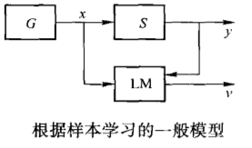

- G表示产生器，用于产生输人向量x。
- S表示被观测的系统或者称为训练器。训练器对每个输入x产生相应的输出y，并且输入和输出遵从某个未知联合概率F(x,y)。
- LM表示学习机。学习机能够实现一定的函数集f(x,a),a∈Λ，其中Λ是学习参数集合，学习参数既可能是向量也可能是函数。不同的a值决定了不同的学习函数。

学习的问题就是从给定的函数集f(x,a),a∈Λ中选择出能最好地逼近训练器响应的函数。也就是选择最优的a^*^值，使得学习机的输出f(x,a^*^)与训练器的输出的y之间的差异尽可能的小。这种差异又称为损失，用函数L(y,f(x,a))表示。关于这个损失的数学期望就称为风险泛函（Risk Functional），也称为期望风险，即
$$
R(a)=\int L(y,f(x,a))dF(x,y)
$$
所以学习的目标就是最小化风险泛函R(a)，即风险最小化问题。

不同类型的学习问题有不同的损失函数。例如，分类（模式识别）问题的损失函数可定义为
$$
L(x,f(x,a))=\begin{cases}
0 & y=f(x,a) \\
1 & y\ne f(x,a)
\end{cases}
$$
预测（回归估计）问题的损失函数可定义为
$$
L(x,f(x,a))=(y-f(x,a))^2
$$
密度估计问题的损失函数可定义为
$$
L(p(x,a))=-\log p(x,a)
$$

### 2. 经验风险

在实际问题中，联合概率F(x,y)是未知的，所以就无法用风险泛函直接计算损失的期望值，也无法最小化。于是实践中常用算术平均代替数学期望，从而得到经验风险泛函：
$$
R_{exp}(a)=\frac{1}{N}\sum_{i=1}^NL(y_i,f(x_i,a))
$$
其中，$<x_i,y_i>,(i=1,2,\cdots,N)$是学习样本，代表已知经验。算术平均值是对数学期望值的估计，只有当样本数目N趋于无穷时，经验风险$R_{exp}$才在概率意义下趋近于期望风险$R(a)$。传统的学习方法大多都是使经验风险最小化（Empirical Risk Minimization，ERM）。例如，把式分类问题定义的损失函数带入经验风险泛函，并进行最小化就得到了最小二乘法；把预测问题定义的损失函数带入经验风险泛函，并进行最小化就等价于最大似然法。

注意，即使样本数目很大，也不能保证经验风险的最小值与期望风险的最小值相近。所以统计学习理论就要研究在样本数目有限的情况下，经验风险与期望风险之间的关系。其核心内容包括以下4点：

1. 在什么条件下，当样本数目趋于无穷时，经验风险$R_{exp}$的最优值趋于期望风险$R(a)$的最优值（能够推广），其收敛速度又如何。也就是在经验风险最小化原则下的学习一致性条件。
1. 如何从经验风险估计出期望风险的上界，即关于统计学习方法推广性的界。
1. 在对期望风险界估计的基础上选择预测函数的原则，即小样本归纳推理原则。
1. 实现上述原则的具体方法。例如，支持向量机（Support Vector Machine，SVM）就是一个具体的方法。

### 3. 学习过程的一致性

学习过程的一致性（Consistency）是指当训练样本无限时，经验风险的最优值收敛于真实风险（期望风险）的最优值，其定义如下。

**定义** 设f(x,a)是使经验风险最小化的函数，如果下面两个序列概率地收敛于同一极限，则称经验风险最小化（ERM）原则对函数集$f(x,a),a\in\Lambda$和概率分布函数F(x,y)是一致的。
$$
\begin{gather}
R(a_N)\xrightarrow[N\rightarrow\infty]{P}\inf_{a\in\Lambda}R(a) \\
R_{exp}(a_N)\xrightarrow[N\rightarrow\infty]{P}\inf_{a\in\Lambda}R(a)
\end{gather}
$$
也就是说，如果ERM原则对函数集$f(x,a),a\in\Lambda$和概率分布函数F(x,y)是一致的，那么它必须提供一个函数序列$f(x,a_N),N=1,2,\cdots$，使得经验风险和期望风险都概率地收敛于同一个最小风险值。

Vapnik和Ghervonenkis于1989年提出了如下学习理论的关键定理。

**定理** 对于有界损失函数，ERM原则一致性的充要条件是，经验风险在如下意义下一致收敛于期望风险：
$$
\lim_{N\rightarrow\infty}P\{\sup(R(a)-R_{exp}(a))>\varepsilon\}=0,\ \forall\varepsilon>0
$$
这种一致收敛被称作单边一致性收敛。

### 4. VC维

为了研究学习过程的速度和推广性，统计学理论定义了函数集学习性能的指标，其中最重要的是VC维（Vapnik-Chervonenkis dimension）。在*模式识别方法*中VC维的直观定义是，对一个指示函数集，如果存在h个样本能够被函数集中的函数按所有可能的$2^h$种形式分开，则称函数集能够把个样本打散。函数集的VC维就是它能打散的最大样本数目h。所谓打散，就是不管全部样本如何分布，总能在函数集中找到一个函数把所有样本正确地分为两类。若对任意数目的样本都有函数能将它们打散，则函数集的VC维是无穷大的。有界实函数的VC维可以通过用一定的阈值将它转化成指示函数来定义。

例如，在$R^2$平面上的数据，函数集由一些有向直线组成。那么最多只有3个点可被直线打散，而4个点就无法被直线打散了。也就是说，用一条直线可以把任意分布的3个点正确划分为两类，而无法把任意分布的4个点正确划分为两类，见下图。

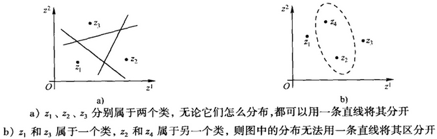

所以这个直线函数集的VC维是3。实际上，n维超平面的VC维是n+1。

**定理** 对于$R^n$中的m个点集，选择任何一个点作为原点，m个点能被超平面打散当且仅当剩余点的位置向量是线性独立的。

**推论** $R^n$中有向超平面集的VC维是n+1。因为总能找出n+1个点，选择其中一个作为原点，剩余n个点的位置向量是线性独立的。但无法选择n+2个这样的点，因为在$R^n$中没有n+1个向量是线性独立的。

VC维反映了函数集的学习能力，VC维越大则学习机器越复杂，容量越大。目前尚没有通用的关于任意函数集VC维计算的理论，只对一些特殊的函数集知道其VC维。如何用理论或实验的方法计算函数集VC维是当前统计学习理论中有待研究的一个问题。

线性函数的VC维等于其自由参数的个数。但是一般来说，函数集的VC维与其自由参数的个数不相同。实际上，影响学习机器推广性能的是函数集的VC维，而不是其自由参数的个数。这就给我们克服“维数灾难”创造了一个很好的机会：用一个包含很多参数，但却有较小VC维的函数集为基础构造学习机器会实现较好的推广性。

### 5. 结构风险

统计学习理论系统地研究了对于各种类型的函数集、经验风险和期望风险之间的关系，即推广性的界，或称为泛化的界。关于*二分类问题*有如下结论：对指示函数集中的所有函数（包括使经验风险最小的函数），经验风险$R_{exp}(a)$和期望风险$R(a)$之间以至少$1-\eta$的概率满足如下关系：
$$
R(a)\le R_{exp}(a)+\sqrt{\frac{h(\ln(2N/h)+1)-\ln(\eta/4)}{N}}
$$
其中，h是函数集的VC维，N是样本数目，$\eta$是满足$0\le\eta\le1$的参数。

由此可见，统计学习的真实风险（期望风险）由两部分组成：一部分是经验风险（训练误差），另一部分称为置信界限（VC confidence）。置信界限是真实风险和经验风险差值的上界，反映了根据ERM原则得到的学习机器的推广能力，因此被称为推广性的界，或者泛化的界。置信界限与学习机器的VC维及训练样本数目有关。上式可以简单地表示为
$$
R(a)\le R_{exp}(a)+\Phi(h/N)
$$
上式表明，在有限的训练样本下，学习机器的VC维越高，复杂性越高，则置信范围越大，从而导致真实风险与经验风险之间可能的差别越大。注意，这里的置信界限是对于最坏情况的结论。在很多情况下这个界限是较松的，尤其当VC维较高时更是如此。

由以上结论可知，ERM原则在样本有限时是不合理的，因为ERM原则没有考虑置信界限（泛化的界）。事实上，只有当经验风险和置信界限都最小化的时候，真实风险才最小。在传统方法中，选择学习模型和算法的过程就是调整置信范围的过程，也就是首先通过选择模型确定$\Phi(h/N)$，然后再通过ERM原则追求最小化风险。但是，由于缺乏理论指导，这种选择只能依赖先验知识，即依赖使用者的技巧和经验。

统计学习理论提出了另一种策略来解决这个问题，就是首先把函数集$S=f(x,a),a\in\Lambda$分解为一个函数子集序列（或称为子集结构）$S_k=\{f(x,a),a\in\Lambda_k\}$：
$$
S_1\sub S_2\sub\cdots\sub S_k\sub\cdots\sub S
$$
使各子集按照VC维的大小排列，也就是按照$\Phi(h/N)$的大小排列，即
$$
h_1\le h_2\le\cdots\le h_k\le\cdots\le h
$$
这样，在同一子集中置信界限就相同了，然后在每一个子集中寻找最小经验风险，最后在不同子集间综合考虑经验风险和置信界限，使得真实风险最小，如下图所示。

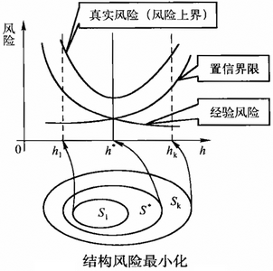

这种思想就是结构风险最小化（Structural Risk Minimization，SRM）原则。统计学习理论还给出了合理的函数子集结构应满足的条件及在SRM原则下真实风险收敛的性质。

实现SRM原则有两种思路，一种是在每个子集中求最小经验风险，然后选择使最小经验风险与置信界限之和最小的子集；这种方法显然比较费时，当子集数目很大甚至无穷时就不可行了。另一种思路是设计函数集的某种结构使每个子集中都能取得最小的经验风险（如使训练误差为0等），然后只需要选择适当的子集使置信界限最小，那么这个子集中使经验风险最小的函数就是最优函数。支持向量机就是第二种思路的具体实现。

## （二）支持向量机

支持向量机（Support Vector Machine，SVM）是从线性可分情况下的最优分类面发展而来的，采用了保持经验风险值固定而最小化置信界限的策略。SVM在分类问题上具有良好的性能，并且没有人工神经网络中存在的局部极小点问题。下面首先考虑训练数据是线性可分情况下的最优分类超平面，然后将其推广到非线性数据集上。

### 1. 线性可分数据的最优分类超平面

假设存在训练样本$(x_1,y_1),\cdots,(x_N,y_N),x\in R^n,y\in\{+1,-1\}$。这些数据在线性可分的情况下会有一个超平面将其完全分开。对该超平面的描述为
$$
(w\cdot x)-b=0
$$
其中，$\cdot$代表向量点积，w代表超平面法向量。分类规则是
$$
(w\cdot x_i)-b\ge0,\ \text{while }y_i=+1 \\
(w\cdot x_i)-b<0,\ \text{while }y_i=-1
$$
如果训练数据可以被无错误地划分，且对每一类数据与超平面距离最近的向量，如果存在一个超平面，使得这些向量与该超平面的距离最大，则称这个超平面为最优超平面。两类数据之间最近的距离称为分类边距（Margin）。对于上式分类边距等于$2/\|w\|$。最优超平面就是使分类边距最大的分类超平面，也就是使$\|w\|^2$最小的分类超平面。下图所示为最优分类超平面。

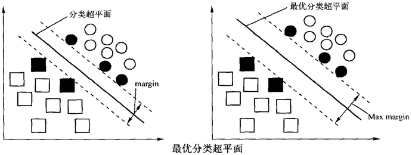

SVM的基础就是最大边距算法（Maximum Margin）。使分类边距最大实际上就是对泛化（推广）能力的控制，这是SVM的核心思想。Vapnik证明了在N维空间中，假设样本分布在一个半径为R的超球范围内，则满足条件$\|w\|\le A$的正则超平面构成的指示函数集$f(x,w,b)=\text{sgn}\{(w\cdot x)-b\}$的VC维就满足下面的界：
$$
k\le\min([R^2A^2,N])+1
$$
因此，使$\|w\|^2$最小就是使VC维的上界最小，从而实现SRM原则中对置信界限（函数复杂性）的选择。

在线性可分的情况下求解最优超平面，需要求解下面的二次规划问题（最小化泛函）：
$$
\mathop{\text{arg min}}\limits_{w,b}\frac{1}{2}\|w\|^2
$$
约束条件为不等式：
$$
y_i[(w\cdot x_i)-b]-1\ge 0,\ i=1,2,\cdots,N
$$
这个优化问题的解由拉格朗日条件极值法求得，即通过求下面拉格朗日函数的鞍点给出：
$$
L(w,b,a)=\frac{1}{2}\|w\|^2-\sum_{i=1}^Na_i(y_i[(w\cdot x_i)-b]-1)
$$
其中，$a_i\ge0$为拉格朗日系数，L的极值点为鞍点，对L求导可得$w^*$和$a^*$。
$$
\begin{align}
\frac{\part L(w,b,a)}{ab}&=0 \Rightarrow \sum_{i=1}^Na_i^*y_i=0 \\
\frac{\part L(w,b,a)}{\part w}&=0 \Rightarrow w^*=\sum_{i=1}^Ny_ia_i^*x_i
\end{align}
$$
此时原目标函数的对偶问题（最大化泛函）为

$$
W(a)=\sum_{i=1}^Na_i-\frac{1}{2}\sum_{i,j=1}^Na_ia_jy_iy_j(x_i\cdot x_j)
$$
其约束条件为
$$
\sum_{i=1}^Na_iy_i=0,\ a_i\ge0,\ i=1,2,\cdots,N
$$
这是一个不等式约束下的二次函数极值问题，且存在唯一解。

由于多数样本所对应的$a_i$将为0，根据上面的偏导求$w^*$的公式，这些样本对于分类超平面根本没有作用。只有当$a_i$不为0时才对分类超平面有用，这些不为0的$a_i$所对应的样本就是支持向量。也就是说，最优分类超平面只用支持向量就可以决定，即
$$
w^*=\sum_{SV}y_ia_i^*x_i
$$
而$a^*$通过训练算法可显式求得。用支持向量样本又可以求得$b^*$（阈值）：
$$
b^*=\frac{1}{2}[(w^*\cdot x_{+1}^*)+(w^*\cdot x_{-1}^*)]
$$
其中，$x_{+1}^*$表示属于第一类的某个（任意一个）支持向量，$x_{-1}^*$表示属于另一类的任意一个支持向量。最后基于最优超平面的分类规则就是下面的指示函数。
$$
f(x)=\text{sgn}((w^*\cdot x)-b^*)=\text{sgn}(\sum_{SV}y_ia_i^*(x_i\cdot x)-b^*)
$$

### 2. 线性不可分数据的最优分类超平面

在线性不可分的情况下，引入非负松弛变量$\xi_i\ge0$，这样第1节中“关于在线性可分的情况下求解最优超平面，所需要求解的二次规划问题（最小化泛函）”的线性约束条件就转化为
$$
y_i[(w\cdot x_i)-b]\ge1-\xi_i,\ i=1,2,\cdots,N
$$
当样本$x_i$满足线性约束不等式（见上节）时，$\xi_i$为零，否则$\xi_i>0$，表示此样本是造成线性不可分的点。这样在上面约束条件式下，上一节所表示的二次规划问题就变成：
$$
\mathop{\text{arg min}}\limits_{w,b}\left\{\frac{1}{2}\|w\|^2+C\sum_{i=1}^N\xi_i\right\}
$$
其中，C被称为惩罚因子。通过改变惩罚因子可以在最大分类间隔和误分率之间进行折中。求解这个二次优化问题的方法与在可分情况下几乎相同，只是约束条件有一点小的变化：
$$
\sum_{i=1}^Na_iy_i=0,\ 0\le a_i\le C,\ i=1,2,\cdots,N
$$
和在线性可分情况下一样，这里也只有部分系数$a_i$不为零，它们确定了支持向量。

### 3. 非线性数据的最优分类超平面

对于非线性问题，SVM通过非线性变换把非线性数据映射到另一个高维空间（特征空间），即对于线性不可分的样本$x\in R^d$，作非线性变换$\Phi:R^d\rightarrow H$，使得$\Phi(x)\in H$在特征空间中是线性可分的。则问题就转化成在高维空间$H$中求广义最优分类超平面的问题，也就是用最大边距法解决高维空间中的线性可分问题。

直接寻求非线性变换中往往很复杂，一般很难实现。但是SVM巧妙地通过核函数（Kernel Function）避开了这种非线性变换。用特征向量中$\Phi(x)$代替输入向量$x$，则寻优函数，即第1节中的“原目标函数的对偶问题（最大化泛函）”和“基于最优超平面的分类规则指示函数”分别变为
$$
\begin{align}
W(a)&=\sum_{i=1}^Na_i-\frac{1}{2}\sum_{i,j=1}^Na_ia_jy_iy_j(\Phi(x_i)\cdot\Phi(x_j)) \\
f(x)&=\text{sgn}((w^*\cdot\Phi(x))-b^*)=\text{sgn}(\sum_{SV}y_ia_i^*(\Phi(x_i)\cdot\Phi(x))-b^*)
\end{align}
$$
注意，替代前的式子只涉及训练样本之间的内积$x_i\cdot x_j$，替代后的式子只涉及高维空间中的内积$\Phi(x_i)\cdot\Phi(x_j)$。事实上，我们不必知道$\Phi(x)$的具体形式，只要把$\Phi(x_i)\cdot\Phi(x_j)$作为一个整体，知道其最终结果就可以了。于是令$K(x_i,x_j)=\Phi(x_i)\cdot\Phi(x_j)$，其中$K$被称为核函数。根据泛函有关理论，只要一种核函数$K(x_i,x_j)$满足Mercer条件，那么它就对应某一变换空间中的内积。

因此，在最优分类超平面中采用适当的核函数就可以实现某一非线性变换后的线性分类，而计算复杂度却没有增加。此时目标函数的对偶问题（最大化泛函）变为
$$
W(a)=\sum_{i=1}^Na_i-\frac{1}{2}\sum_{i,j=1}^Na_ia_jy_iy_jK(x_i,x_j)
$$
相应的分类函数变为
$$
f(x)=\text{sgn}(\sum_{SV}y_ia_i^*K(x_i,x_j)-b^*)
$$
这就是支持向量机，下图所示为支持向量机示意图。

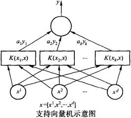

SVM分类函数形式上类似于一个神经网络，其输出是中间节点的线性组合，每个中间节点都对应一个支持向量。

## （三）核函数

SVM有许多特点，其中一个就是对数据的升维处理，并使得SVM的模型参数与特征空间维数没有直接联系。这里的**升维采用核函数**（Kernel Function）方法，**将非线性数据转化为线性数据**。对于SVM来说，核函数方法的思想在于将样本空间的内积替换成了核函数，而运算实际上是在样本空间中进行的，并未在特征空间中计算高维向量内积。满足Mercer条件的函数$K(x,y)$必定是核函数，也就是肯定存在着一个映射$\Phi$使得$K(x,y)=\Phi(x)\cdot\Phi(y)$。

**定理**（Mercer条件） 函数$K(x,y)$描述了某个空间中一个内积的充分必要条件是，对于任意给定的函数$g(x)$，当
$$
\int g^2(x)dx<\infty
$$
时，有
$$
\iint K(x,y)g(x)g(y)dxdy\ge 0
$$
采用不同的核函数可以构造实现输入空间中不同类型的非线性决策面的学习机器。目前常用的核函数有多项式核函数（Polynomial Kernel Function）、径向基核函数（Radial Basis Function，RBF）和Sigmoid核函数等，如下所述。

(1) 多项式核函数
$$
K(x,x_i)=[(x\cdot x_i)+1]^q,\ q=1,2,3,\cdots
$$
所得到的是q阶多项式分类器。

(2) 径向基核函数
$$
K(x,x_i)=\exp\{-\frac{\|x-x_i\|^2}{\sigma^2}\}
$$
一般是高斯函数。径向基核函数所得分类器与传统RBF方法的重要区别是，这里每个基函数的中心点$x_i$都对应一个支持向量，中心点本身以及输出权值都是由SVM训练算法自动确定的。而传统RBF方法却需要基于启发式知识来决定中心点向量及其数目。

(3) Sigmoid核函数
$$
D(x,x_i)=\tanh[\gamma(x\cdot x_i)+c]
$$
这时SVM实现的就是包含一个隐层的多层感知器。隐层节点数目由算法自动确定，而且算法不存在困扰神经网络方法的局部极小点问题。

注意，并非任意的$\gamma,c$参数值都能使Sigmoid函数满足Mercer条件，但是多项式核函数和径向基核函数总是满足Mercer条件的。此外核函数的线性组合仍然是核函数。

## （四）多类分类与SVM训练算法

统计学习理论基于结构风险最小化原则设计分类器具有泛化能力强等很多优点，特别是支持向量机方法在解决分类问题上取得了很多成功案例。

### 1. 多类分类问题

基本支持向量机分类方法解决的是两类分类问题，其已知类別只有两个。而字符识别分类问题中的已知类别（即合法字符）数目显然大于两个，即多类分类问题。支持向量机解决多类分类问题的主要思路有组合法和直接构造法。组合思路就是把多个解决两类分类的支持向量机分类器组合在一起，完成对多个类别的分类。组合法有“一对多”（One Against Rest，One Against All）、“一对一”（One Against One）和支持向量机决策树等不同方法。直接构造思路就是依据结构风险最小化原则直接构造能够区分多类的支持向量机，即多类支持向量机法。

“一对多”多类分类方法就是把某一类当作正样本类，把其他所有类都当作负样本类，这样多类分类就变成了两类分类问题。然后综合多个两类分类器的结果，得到最终分类结果。假设有m个类别$\{C_1,C_2,\cdots,C_i,\cdots,C_m\}$。对于类别$C_i$用支持向量机方法构造一个两类分类器$SVM_i$，即把$C_i$类样本当作正样本，把其他类的样本都作为负样本，由此训练生成的分类器。依次取不同类别，总共可以得到m个不同的分类器。最终把m个不同分类器的输出结果综合在一起，就可以确定给定输入向量应该属于哪一个类别。具体如何综合有不同的方法，其中最简单的综合方法就是取分类器输出值最大的那一个所对应的类别作为输入向量的类别。

“一对一”多类分类方法就是先由任意两个不同类别构成一个两类分类器。然后综合所有两类分类器的结果，得到最终分类结果。对于m个类别，则会有$m(m-1)/2$个两类分类器。对于一个输入向量，每个分类器都会给出一个分类结果。最简单的综合方法是分别累计m个类别的分类值（置信度），然后取累计值最大者所对应的类别作为输入向量的类别。

支持向量机决策树方法把支持向量机和决策树的分类思想结合在一起。决策树的每一个节点完成一次判断，把数据集分割为不同部分，直到叶子节点完成类属判别。ID3算法依据熵减最大化原则选取最优属性，然后根据最优属性的取值分割数据集。而支持向量机决策树则用支持向量机分类器完成判断，依据边距Margin最大化原则划分数据集。由于基本支持向量机只能进行两类分类，所以支持向量机决策树都是二叉树。

支持向量机二叉树分为偏二叉树和完全二叉树两种。偏二叉树首先选取一类作为正样本类，其他所有类作为负样本类，由此训练根节点所对应的支持向量机；然后再从根节点的负样本类中取一个类作为正样本类，其他类作为负样本类，由此训练根节点负样本类节点所对应的支持向量机；如此循环直到所有类别都被区分开为止。完全二叉树中的每个子节点都可能包含多个类别；构造支持向量机完全二叉树时，一般先依据某种规则把数据集划分为两部分，由此训练根节点所对应的支持向量机；然后依次递归划分每个节点，训练相应的支持向量机，直至所有类别都能被区分开为止。实践中往往先用聚类方法完成对数据集的划分，然后再训练每个节点对应的支持向量机。

### 2. 支持向量机的训练算法

支持向量机最核心的问题就是求解下式
$$
\begin{align}
\frac{\part L(w,b,a)}{ab}&=0 \Rightarrow \sum_{i=1}^Na_i^*y_i=0 \\
\frac{\part L(w,b,a)}{\part w}&=0 \Rightarrow w^*=\sum_{i=1}^Ny_ia_i^*x_i
\end{align}
$$
关于拉格朗日系数a的二次规划问题。对于m个样本的数据集，这个二次规划包括了m个优化变量，2m个线性不等式约束和一个等式约束，同时还涉及$m\times m$维的核函数矩阵运算。当样本数量不多时，应用传统二次规划方法可以方便地求得。但是当样本比较多时，求解就比较麻烦了，计算资源占用较多。目前在支持向量机的训练过程中，针对海量样本数据减少二次规划求解过程的计算时间和内存的方法主要有两种。

(1) 分块法（Chunking Method）是Vapnik提出的只取支持向量作为训练样本的方法。因为SVM方法得到的判别函数只与支持向量有关，与其他样本无关。基于这种思想，分块法把样本数据集分成若干个子集，按顺序逐个进行训练学习。对每个样本子集学习时，只需要根据上个样本子集得到的支持向量以及当前样本子集进行新的最优化计算。分块法求解规模随着支持向量数量的增加而增加，因此支持向量数目非常大时，优化计算仍难以实现。

(2) 分解法（Decomposition Method）是Osuna等人提出的基本框架。分解法将拉格朗日系数a的分量分成两个集合：工作集B和非工作集N。工作集B用来进行SVM训练，每次用N中对应不满足优化条件系数的样本替换B中为零的系数的样本。这样训练就限制在B的规模上解二次规划问题。分解法的关键在于在每次的迭代过程中如何选择工作集B以及算法的收敛性。

Platt提出的序贯最小优化算法（Sequential Minimal Optimization，SMO）是解决大量数据下SVM训练问题的一种有效方法。SMO方法将工作集B的大小限定为2，这样在进行小规模二次规划求解时就用解析法直接计算，而不采用数值优化算法计算。SMO算法的步骤如下：

1. 给定满足约束条件的拉格朗日系数的初值，一般取$a_i=0$。
2. 应用启发式方法遍历整个训练样本，找到违反KKT条件的样本点对应的拉格朗日系数，并将其作为两个拟优化的拉格朗日系数之一。
3. 第二个拉格朗日系数的挑选是根据最大优化步数来定的，即满足$\max\{|E_1-E_2|\}$的样本点对应的拉格朗日系数。其中，$E_1,E_2$分别代表两个训练误差。至此，拉格朗日系数$a_1,a_2$挑选完毕，在保持其余拉格朗日系数不变的情况下，形成一个最小规模的二次规划问题（只含两个）。
4. 判断是否找到违反KKT条件的拉格朗日系数。若是，则进行第5步；否则得到整个问题的最优解，转第6步。
5. 求解上述最小化规模的二次优化问题，得到一对新的$a_1,a_2$，这两个系数和其余的拉格朗日系数都满足KKT条件，返回第2步。
6. 训练结束。

# 五、遗传算法

省略。

# 六、聚类问题

聚类（Clustering）问题是当前机器学习研究领域中的一个难点和热点。其难点在于，对于一个聚类问题，我们所掌握的先验知识太少了。也就是说，当我们对观察对象了解很少的时候，我们往往用聚类方法对观测数据进行处理，试图得到一些有用信息。因此聚类方法都是无监督学习方法。正由于先验知识少，所以聚类往往可以发现新知识（规律）。当我们对观察对象有一定了解，可以划定出一些知识范围时，就可以用分类方法，而不用聚类方法了。

## （一）聚类问题

### 1. 聚类的定义

聚类就是对一堆观测数据（对象）进行划分，使得同簇（Cluster）内的数据彼此相似，而不同簇之间不相似。一般而言，我们要求同簇内数据的相似度尽可能大，不同簇间数据的相似度尽可能小。

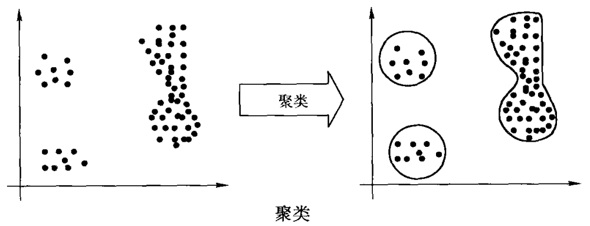

用数学语言描述聚类问题就是：对于观测空间S上的数据集D（$D\subset S$），求D上的一个划分$X=\{x_i|x_i\in D,\mathop\cup\limits_{i}=D,i=1,2,\dots,n\}$，使得D中的任意一对数据都满足
$$
sim(d_k,d_l)>sim(d_p,d_q) \qquad d_k,d_l\in x,k\ne l,\ d_p\in y,d_q\in z,p\ne q,y\ne z,\ x,y,z\subset D
$$
其中，若$x_i\cap x_j=\emptyset,x_i,x_j\subset D$，即任意两个簇之间没有共享数据点，亦即一个数据点只能属于一个簇，则称之为硬聚类，否则称之为软聚类。软聚类也被称为模糊聚类。一般而言，在没有特别说明的情况下聚类是指硬聚类。

$sim(d_k,d_j)$表示两个不同数据点（对象）之间的相似度。这个相似度可以根据问题的需要进行不同的定义。常用的办法有按照距离定义（距离越大则相似度越小）、按照密度定义（密度越大则相似度越大），还可以按照概念定义相似度（相同或相近概念的数据相似度大）。其中距离公式可以采用曼哈顿距离（Manhattan Distance）、欧几里得距离（Euclidean Distance）、闵可夫斯基距离（Minkowski Distance）等不同的公式。

常用的聚类方法可以分为分层聚类、划分聚类、基于密度的聚类、基于网格的聚类和基于模型的聚类等。基于模型的聚类方法为每一个簇假定一个模型，然后寻找数据对给定模型的最佳拟合。基于模型的聚类方法包括统计学方法和人工神经网络方法。例如，通过构建反映数据点的空间分布密度函数来定位聚类。又如，用自组织特征映射网络也可以实现聚类。

### 2. 聚类中的主要问题

现在聚类研究中面临的主要问题有：

如何降低高维、海量数据集上聚类算法的时间复杂度。高维数据是指数据维数特别大，通常在几十维，甚至成百上千维。数据维数高直接导致计算数据相似度的时间长，最终使算法运行的时间变长。海量数据是指数据集中的数据数目多。数据量多显然会导致算法运行的时间长。

如何有效定义数据之间的相似度。数据相似度没有统一的定义，不同问题会有不同的相似度。定义数据相似度必须结合问题本身的特点，找到最能区分数据的方法。这不仅仅是聚类问题的关键之一，同样也是分类问题，乃至机器学习的关键之一。

如何解释聚类结果。聚类的结果就是数据集上的一个划分。那么如何解释这样的划分结果，或者如何给每一个簇指派一个合理的名字（标签）。聚类算法本身一般不考虑这个问题。但是在一个完整的机器学习应用中，这个问题却不得不解决。

## （二）分层聚类方法

### 1. 基本思想

分层聚类（Hierarchical Clustering）的思想是在聚类过程中生成一个聚类树，见下图。完整聚类树的最顶端代表把整个数据集划作为一个簇；最底端代表把数据集中的每一个数据都当作一个簇；树中父节点对应的簇包含着所有子节点对应的簇。聚类树的不同层次可以表示聚类的不同粒度（Granularity）。

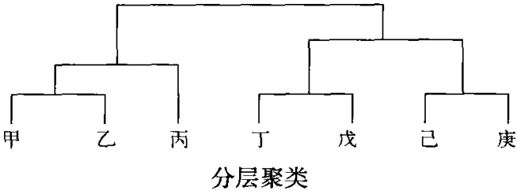

分层聚类方法分为两大类：一类是自顶向下（top-down）构造聚类树，称之为分裂聚类法（Divisive Clustering）；另一类是自下而上（bottom-up）构造聚类树，称之为凝聚聚类法（Agglomerative Clustering）。分裂聚类法首先把整个数据集当作一个簇，作为根节点，然后每循环一次都把父节点对应的簇划分为多个小簇，分别对应其子节点，如此递归一直到不可划分为止。凝聚聚类法则首先把数据集中的每一个数据当作一个簇，然后将相似的两个（或多个）簇合并成一个大簇，合并后的大簇对应父节点，合并前的簇对应子节点，如此递归一直到不可合并为止。

无论分裂聚类还是凝聚聚类都需要一个参数指明停止聚类的条件。因为如果不及时停止聚类的话，要么所有数据都是同一个簇，要么每一个数据都是一个簇。这相当于没有聚类。通常用簇的期望个数k作为分层聚类判断停止的条件，即如果当前簇的个数大于等于k（对于凝聚法则是小于等于k），则停止聚类。

### 2. 常用的分层聚类算法

常用的分层聚类算法有Linkage算法、CURE算法、BIRCH算法等。Linkage算法只能聚类凸集数据，其时间复杂度为O(n^2^)，其中n为数据个数。CURE算法和CHAMELEON算法可以聚类任意形状的数据集，但是CURE算法不能处理具有分类属性的数据。BIRCH算法最少只扫描一遍数据集，时间复杂度为O(n)，所以非常适合于大规模数据的聚类。但是，BIRCH算法难以聚类非凸数据集。

### 3. 分层聚类的特点

分层聚类法在聚类过程中一次性就建好了聚类树，没有回溯调整操作。也就是说，一个数据点一旦属于每个簇之后就一直属于该簇，不会更改。一个簇一旦被合并或者分裂之后，也不会再调整其中的数据点了。这样做的好处是算法简单，适用性强，数据扫描顺序对聚类结果无影响，不用担心组合数目的不同选择。缺点是没有全局优化，如果某一步没有很好地合并或者分裂，则必将导致低质量的聚类结果。

## （三）划分聚类方法

### 1. 基本思想

划分聚类（Partitional Clustering）的思想是首先把数据集划分为k个簇，然后逐一把数据点放入合适的簇中。为了达到全局优化，算法需要重复扫描数据集多次。一般而言，划分算法是把数据点放入与其最相似的簇中。划分聚类方法大多数使用距离来定义数据相似度。一个点x到一个簇C的距离，就是选取一个点y作为簇C的代表，然后计算x和y两点间的距离就是点x到簇C的距离。

如果簇的代表点是簇的理论中心（Centroid），则这样的划分聚类方法称之为K平均（K-means）方法。理论中心点不一定是簇内真实存在的数据点。如果簇的代表点是簇内最靠近理论中心的数据点（即最有代表性的数据点），则这样的划分聚类方法称之为K代表点（K-medoids）方法。

划分法在聚类过程中，簇在不断地调整。调整的目的是使数据集上的划分得到全局优化。所谓“全局优化”，一般是指误差最小。误差一般取数据点到簇代表点距离的平方和。
$$
Error=\sum_{i=1}^k\sum_{x\in C_i}||x-r_i||^2=\sum_{i=1}^k\sum_{x\in C_i}\sum_{j=1}^m(x_j-r_{ij})^2
$$
其中，C~i~表示一个簇，r~i~表示C~i~的代表点，m表示数据维数。全局最优和误差都可以有其他的定义方式。例如，通过熵来定义全局最优，误差使用曼哈顿距离等。

### 2. K平均聚类方法

K平均（K-means）聚类方法的基本过程如下：

1. 从数据集中选择K个数据点作为初始簇代表点。
2. 数据集中的每一个数据点按照距离，被分配给与其最近的簇。
3. 重新计算每个簇的中心，获得新的代表点。
4. 如果所有簇的新代表点均无变化，则算法结束；否则转至第2步。

第1步往往采用随机选择的方法确定初始点。但是，随机初始点不能很好地反映簇分布，所以聚类结果往往不佳。此时需要借助其他手段来寻找合理初始点。例如，根据密度划分区域并选取初始点。第4步中簇中心不再变化实际上就是采用欧几里德距离定义的误差收敛到了一个极小点。

基本的K平均方法不能保证聚类结果一定收敛到误差全局最小点。再者，基本的K平均方法是把所有点都分配给簇以后，才重新调整簇中心。另一种方法是渐进更新簇中心，即每当簇得到一个新数据点时，则立刻更新簇中心。

簇理论中心常用算术平均公式计算：
$$
f=\cfrac{1}{|C_i|}\sum_{x\in C_i}x
$$
如果一个数据点不是明确地属于或者不属于一个簇，而是部分地属于一个簇，则这种聚类方法就是模糊C平均聚类（Fuzzy C-means Clustering）。模糊C平均聚类方法中每个点对簇都有个隶属度，簇中心则采用重心计算公式。模糊C平均聚类过程与K平均方法基本相同。

### 3. K代表点聚类方法

K代表点（K-medoids）聚类方法与K平均聚类方法的过程基本相同。但是，在选择簇代表点时，K代表点方法先计算各候选代表点与簇内其他所有点间的相似度之和，然后取相似度和最大的点作为簇代表点，即
$$
x^*=\arg\max\sum_{C_i}sim(x,x^*)
$$
其中，$sim(x,x^*)$表示簇中一个点到候选代表点的相似度。如果采用距离定义相似度，则上式就变为使其他点到代表点的距离之和最小。相似度可以有不同的定义，所以，K代表点方法不局限于可度量数据，还可以处理具有分类属性的数据。

### 4. 划分聚类的特点

划分聚类法的时间复杂度与数据集大小成线性关系。但是，划分聚类法对于非凸集合以及簇大小相差悬殊的数据效果不好，并且数据扫描顺序会影响选择簇中心。K平均方法由于要求理论中心，所以只能处理可度量的数据，难以处理具有分类属性的数据；而K代表点方法则可以处理任何数据。孤立点和噪声数据对K平均方法的影响更大一些。

簇个数k对于划分聚类方法很重要。该值必然大于1并且远远小于数据点个数，否则就失去了聚类意义。k值无论过大或是过小都不会获得较优结果。在实践中如何确定最优k值仍然依赖于经验。初始簇中心（代表点）对于划分聚类结果的影响很关键。随机选择的初始簇中心往往不能获得较好的结果。

## （四）基于密度的聚类方法

### 1. 基本思想

基于距离定义数据相似度并进行划分聚类的方法，倾向于发现球状的簇，难以发现任意形状的簇。而基于密度的聚类方法，则将簇看作是数据空间中被低密度区域分割开的高密度区域。所以其主要思想是：只要邻近区域的密度（对象或数据点的数目）超出了某个阈值，就继续聚类。也就是说，对于给定数据集，在一个给定范围的区域中必须至少包含某个数目的点。这样的方法可以用来过滤“噪声”孤立点数据，发现任意形状的簇。

常见的基于密度的聚类方法有DBSCAN算法和DENCLUE算法等。DBSCAN算法依赖于邻域半径和密度阈值两个参数，但是这两个参数并不易确定最优值。OPTICS算法则通过一系列的邻域半径来控制簇生长。DBSCAN算法和OPTICS算法直接用密度（邻域内的点数）来聚类，而DENCLUE算法则用密度分布函数来聚类。

### 2. DBSCAN算法

DBSCAN（Density Based Spatial Clustering of Applications with Noise）算法把数据集中的所有数据点分为3类：核心点、边界点和噪声点。

核心点就是簇内的点。一个核心点在其邻域内有足够多的数据点，即这个邻域的密度足够大。邻域半径和密度阈值则是系统参数。如果两个核心点相互在彼此的邻域内，则这两个核心点属于同一个簇。

边界点不是核心点，但是处于某个核心点的邻域之内，即边界点的邻域内没有足够多的数据点，但是它却在某个核心点的邻域之内。注意，一个边界点可能同时位于多个簇的不同核心点的邻域之内。此时这个边界点属于哪个簇，则由算法来规定。

噪声点就是除了核心点和边界点之外的点。

对于DBSCAN算法，一个簇就是一堆通过邻域相互连接起来的核心点集合，再加上一些边界点。所以，DBSCAN算法并没有把所有的数据点都放入到某个簇中。DBSCAN算法的聚类过程就是不断计算各个点的邻域密度，并把相邻核心点放入簇中。由于使用了树结构，所以DBSCAN算法的时间复杂度为O(nlog~2~n)。

### 3. DENCLUE算法

DENCLUE（DENsity CLUstEring）算法用影响函数来表示f(x,y)一个点x对另外一个点y的影响力。把点x对数据集D内所有其他点的影响加起来，就成为点x的全局密度函数，即
$$
f^D(x)=\sum_{y\in D}f(x,y)
$$
其中，影响函数可以是任意函数。例如，方波影响函数、高斯影响函数等。

DENCLUE算法中的簇由密度吸引子（Density Attractors）决定。密度吸引子就是全局密度函数中的极大点。如果密度函数连续并且处处可导，则使用爬山法（依据密度梯度）可以高效地求得所有的吸引子。一个簇对应一个密度吸引子，要求该吸引子的密度值大于等于给定的密度阈值。簇中的点就是到该吸引子距离小于给定邻域半径的点。如果从一个吸引子到另一个吸引子存在着一条通路，且该通路上每一点的密度值都大于等于给定的密度阈值，则两个吸引子合并为一个簇。如果吸引子的密度值小于给定的密度阈值，则该吸引子邻域内的点就是边界点。

实际上，数据集中大多数的点对吸引子都没有贡献，或者贡献极小。所以DENCLUE算法就想办法忽略掉那些没有用的点。这样做虽然会有一些误差，但是误差可以被控制在接受范围之内。这样的好处就是节省资源，大大加快了算法速度。这一点对于处理海量数据非常重要。

DENCLUE算法一方面用网格法思想，过滤掉没有数据的超立方；另一方面用局部密度函数代替了全局密度函数。局部密度函数就是只把x邻域内所有点的影响加起来作为x的密度函数。

DENCLUE算法的主要步骤如下：

1. 划分网格，即在数据集上划分边长为2σ的网格。每个网格就是一个边长为2σ的超立方，与数据维数无关。网格中心就是网格内数据点的算术平均。如果两个网格中心的距离小于2σ，则两个网格连通。运用B^+^树搜索所有高密网格以及和高密网格连通的非空网格，剩下的网格全部抛弃。高密网格就是网格内数据点数大于指定阈值的网格，非空网格就是网格内至少含有一个数据点的网格。
2. 聚类。对于第1步得到的所有网格，计算其内数据点的局部密度函数及相应的吸引子。如果吸引子的密度值大于给定的密度阈值，则该点就是吸引子对应簇中的点。

上述过程中，网格g内的数据点x（$x\in g$）的邻域定义为
$$
\sigma(x)=\{y\in g'|d[mean(g'),x]\le k\sigma \ \and\ d[mean(g),mean(g')]\le 4\sigma\}
$$
即如果网格g'与网格g连通，并且g'的中心与x间的距离小于给定的阈值，则g'内的点就在x邻域内。

DENCLUE算法采取了很多措施来加快运算速度，使其能较好地聚类高维、海量数据。例如，分子生物学数据。

## （五）基于网格的聚类方法

### 1. 基本思想

基于网格的聚类方法把数据空间量化为有限数目的单元，形成一个网格结构。所有的聚类操作都在这个网格结构（即量化的空间）上进行。这种方法的主要优点是处理速度快，其处理时间主要与量化空间每一维上的网格（单元）数目有关。所以，聚类高维、海量数据时，往往使用这种思想。

基于网格的聚类方法有STING算法、WaveCluster算法和CLIQUE算法等。STING算法利用存储在网格单元中的统计信息聚类。WaveCluster算法利用小波变换方法聚类。CLIQUE算法结合网格法和密度法在子空间中进行聚类。

### 2. STING算法

STING（STatistical INformation Grid-based）算法将空间区域划分为矩形单元（网格）。针对不同级别的分辨率，存在多个级别的网格。这些网格构成一个树形层次结构：一个高层的网格被划分为多个更细的网格，成为其子节点。高层网格的统计参数可以很容易地从低层网格计算中得到。每个网格节点都包含如下属性：网格内数据点的个数，网格内数据的平均值、标准偏差、最小值、最大值，以及该网格内数据的分布类型。

STING算法在聚类时，从底向上构建网格树。如果几个网格彼此邻近，则这几个网格可以合并成一个大网格。大网格作为父节点，小网格作为子节点。网格邻近可以定义为两个网格中心的距离小于指定阈值，不包含数据点的网格（甚至密度过低的网格）将被抛弃。

STING算法的聚类时间只与叶子网格数目相关，与数据集的数据个数N无关。所以当数据维数较低时，STING算法的时间复杂度是O(n)。STING算法有利于并行处理和增量更新，效率较髙。但是，STING算法没有考虑子节点和其他相邻节点之间的关系，因此可能降低簇的质量和精确性。

### 3. CLIQUE算法

CLIQUE（CLustering In QUEst）算法在子空间上进行聚类。子空间就是数据某几个维构成的空间。数据的每一维都表示数据的某种属性。子空间实际上就是几个属性集合上的空间。高维数据一般都具有稀疏特性。但是，这个稀疏不是一下子就可以看出来的。

子空间聚类最主要的思想就是在不同的子空间上，把空的（或者稀疏的、密度低的）区域排除掉，剩下数据比较稠密的区域。这样就提高了处理效率，避免了无效搜索。这对于高维、海量数据非常重要。

对于d维数据，CLIQUE算法先在一维子空间上划分网格，然后在二维、三维一直到d维空间上划分。如果k维上的子空间有一个稠密网格，那么这个稠密网格在k-1维子空间上的必然有相应的稠密投影。所以，CLIQUE算法就把k-1维子空间上的所有非稠密网格删除，剩下稠密网格。然后由多个k-1维子空间上的稠密网格推出k维空间上的稠密网格。这个过程与关联规则Apriori算法寻找频繁项集的过程完全一样。簇就是子空间内连通的稠密网格。CLIQUE算法使用析取范式（Disjunctive Normal Form）来表示子空间上的簇，提高了计算效率。

## （六）股票信息的聚类分析

聚类方法特别适合于运用在先验知识不足或者对事物数据混淆不清的情况下。

文本聚类的一般过程。

1. 首先需要搜集文本，准备好待学习的数据集，然后要对文本集进行清洗（格式转换、编码转换和字词清洗等）。
2. 从文本中提取特征，把一篇文本变成一个特征向量用特征向量来代替原始数据最主要的目的是便于数学计算，减少资源浪费。
3. 对所有特征向量进行聚类。
4. 分析聚类结果。聚类算法本身一般不会给出每个簇的标签，即算法不解释每个簇代表什么含义。分析聚类结果一般依赖人工进行。人一方面要给每个簇贴上标签；另一方面还要分析聚类结果是否显示着某种规律，或者是否发现某种独特的分类，或者聚类结果是否刻画了被观察事务的某种结构。认真地分析聚类结果不但有助于改进聚类算法或者控制参数，还有助于指导以后的实践应用。

# 七、特征选择与提取

特征选择和提取是机器学习过程中非常重要的步骤。特别是对于海量、高维数据，如果不能有效地从原始数据中获得特征向量，将会直接导致学习失败。即便是对于相同的学习算法，运用不同的特征选择和提取方法可能会得到截然不同的学习结果和学习效率。

## （一）特征选择

在进行机器学习的时候，一般不会拿观察到的原始数据直接进入训练学习过程。绝大多数的学习过程都要把原始数据先预处理一下，获得特征数据，然后对特征数据进行训练学习。如果直接用原始数据，一方面数据量大，需要大量的空间资源和时间资源，降低了计算效率，并且很可能突破资源约束而无法实现；另一方面，大量的无关信息构成了强大的噪声，掩盖了本质规律，会导致学习失败。

所以特征数据的首要目的就是减少或者去除无关信息（噪声），突出问题的本质特征，使其便于区分；其次是减小数据量，使得学习算法可以在现实的时空空间内运行；第三是便于运算。

为了便于数学运算，特征数据一般都是以维特征向量的形式出现的，每一维都表示原始数据的某种属性。从原始数据中获得特征数据的过程称为特征提取。例如，从文本数据中获得词频、反向文档频率，从图像数据中提取颜色直方图、进行傅里叶变换等。从原始数据中可以获得很多种可能的特征，但并不是每一种特征都一定有用。从众多可能特征中选择最合适的特征来表示原始数据，称之为特征选择。例如，到底使用小波变换结果还是离散傅里叶变换结果来表示特征向量就是一个特征选择过程。

特征选择一般是一个理论分析过程，它对不同的方法进行对比和取舍，最终确定一种最有利于学习算法获得最优结果的方法。特征提取则是按照特征选择的结果进行操作的过程。特征选择和提取显然会直接影响到机器学习的结果。因为这个过程对原始数据所包含的信息进行了大量的过滤和删减。不合理的特征选择和提取会损失掉太多有用的信息，最终将导致学习结果精度低、误差大。在实践中，相同的学习算法结合不同的特征选择和提取方法会产生不同的学习结果，我们往往会将其看作是不同的方法。

特征选择方法主要包括搜索策略和评价函数。搜索策略要从一个大集合中搜索最优子集，这是一个NP问题。所以常用遗传算法等启发式方法搜索各种特征组合。评价函数用于评价特征组合是否最优。常用的评价依据可分为5类：距离度量、信息度量、相关性（依赖性）度量、一致性度量、分类器错误率。

根据评价函数与后续学习算法的关系，特征选择方法可分为过滤法（Filter）和包装法（Wrapper）两种基本类型，再有就是把二者综合起来形成混合法（Hybrid）。过滤法基于数据内在属性评价特征，与后续学习算法无关，其度量简单，时间复杂度低，但过滤法方法不考虑特征集与学习算法之间的关联和相互影响，所以一般精度不高，效果较差。包装法直接利用学习算法的训练结果评估特征子集，把特征选择和学习算法封装在一起。所以其可对不同的学习器选出最适应的、近似最优的特征子集，达到较好效果，但是其计算量大，不适于大数据集，而且包装法在样本数目不多的情况下，容易产生过适应问题。混合法目前主要有两种途径：一种是使用逐步特征选择，先使用过滤法去除部分特征，再使用包装法进行特征选择；另一种是将过滤法集成在包装法之中，以减少包装法的迭代次数。

## （二）常用的特征函数

### 1. 概率分布

概率是观察数据，反映数据特征最基本的一种方法。在机器学习中对事物的观察总是有限的，所以概率获得方法一般都是先统计事件出现的频率，然后再估算概率。这样得到的概率值显然与训练数据相关。如果训练数据分布或者采样不合理，有偏差、遗漏，则统计出来的概率值必然与真实概率值有偏差，从而造成系统误差。有些算法直接用事件频率代替了概率。

### 2. 熵

熵（Entropy）原本是物理概念，用于刻画物质系统内部可能状态的混乱程度（多寡）。越混乱的状态，即可能状态数目越多，则熵越大。后来信息学鼻祖香农（Shannon）把这个概念扩展到了信息论中，提出了信息熵，即信息越多，熵越大。信息熵的定义为
$$
Entropy=-p\log_2p
$$
其中，p表示概率。

在机器学习中，我们经常使用上式来定义各种各样的熵。熵反映的特征就是混乱程度或者不确定程度。熵越大表示越混乱，不确定性越多；熵越小表示越清晰，越确定。所以我们一般用熵的最小值表示最优。

### 3. 互信息

互信息（Mutual Information）来源于信息论，用于度量一个消息中两个信号之间的相互依赖程度。在机器学习中，互信息主要用于衡量两个事物之间的统计关联程度。互信息的定义式为
$$
MI(t,C)=\log_2\cfrac{p(t|C)}{p(t)}=\log_2\cfrac{p(t,C)}{p(t)\cdot p(C)}
$$
一般地，t表示数据的某个属性，C表示学习结果对象（类别）。用于分类时，一个属性对所有类别的互信息为
$$
MI(t)=\sum_ip(C_i)\log_2\cfrac{p(t|C_i)}{p(t)}
$$

### 4. 信息增益

信息增益（Information Gain）也是来源于信息论的一个重要概念。它表示某个特征项的存在与否对学习结果的影响程度。信息增益的定义为
$$
IG(t)=p(t)\sum_ip(C_i|t)\log_2\cfrac{p(C_i|t)}{p(C_i)}+p(\bar t)\sum_ip(C_i|\bar t)\log_2\cfrac{p(C_i|\bar t)}{p(C_i)}
$$
其中，t表示数据的某个属性，C~i~表示可能的学习结果对象。

### 5. 期望交叉熵

期望交叉熵（Expected Cross Entropy）与信息增益很相似。不同之处在于，期望交叉熵只考虑特征项发生的情况，不考虑特征项不发生的情况。期望交叉熵的定义为
$$
ECE(t)=p(t)\sum_ip(C_i|t)\log_2\cfrac{p(C_i|t)}{p(C_i)}
$$
如果只考察单个类，则其期望交叉熵为
$$
ECE(t,C)=p(t,C)\log_2\cfrac{p(C|t)}{p(C)}
$$

### 6. $\chi^2$统计

$\chi^2$统计（CHI）就是卡方（Chi Square）统计。卡方统计值通常用于检测数据间的独立性和适合性，所以也常称为卡方测试（Chi Square Test）。卡方统计值越小，则表示独立性越强。数据间的独立性越强，则相关性越小。

卡方统计值能够很好地体现特征和类别之间的相关性，所以在特征选择中有广泛的应用。特别是对于文本分类而言，大量的实验结果表明用信息增益和卡方统计作文本特征相对其他方法较好。因为这两种特征函数不仅考虑了特征存在对学习结果的影响，还考虑了特征不存在时对学习结果的影响。互信息相对结果较差，但是较好的特征方法计算量比较大。

## （三）主成分分析

主成分分析（Principal Components Analysis，PCA）是一种简化数据集的技术，利用降维思想，在损失很少信息的前提下把多个指标转化为几个综合指标。通常把转化生成的综合指标称为主成分，其中每个主成分都是原始变量的线性组合，且各个主成分之间互不相关。主成分分析过程就是一个线性变换过程，这个过程把原始数据变换到一个新的坐标系统中，使得任何数据投影的第一大方差在第一个坐标（称为第一主成分）上，第二大方差在第二个坐标（第二主成分）上，依此类推。

用主成分分析法研究复杂问题时可以只考虑少数几个主成分而不至于损失太多信息，从而揭示事物内部变量之间的规律性，同时使问题得到简化，提高分析效率。所以主成分分析经常用于**减少数据集的维数，同时保持数据集对方差贡献最大的特征**。这是通过保留低阶主成分，忽略高阶主成分做到的。一般而言，低阶成分往往能够保留住数据最重要的特征。

假设原始数据为d维随机向量x，对x进行线性变换得到新的综合变量y，即
$$
\begin{gather}
y_1=w_1\cdot x=w_{11}\cdot x_1+w_{12}\cdot x_2+\cdots+w_{1d}\cdot x_d \\
y_2=w_2\cdot x=w_{21}\cdot x_1+w_{22}\cdot x_2+\cdots+w_{2d}\cdot x_d \\
\cdots \\
y_d=w_d\cdot x=w_{d1}\cdot x_1+w_{d2}\cdot x_2+\cdots+w_{dd}\cdot x_d
\end{gather}
$$
由于可以任意地对原始变量进行上述线性变换，所以不同线性变换得到的综合变量y的统计特性也不尽相同。为了取得较好的效果，需要令$y_i$的方差尽可能大且各$y_i$之间互相独立，即必须满足不同$w_i$相互正交
$$
w_i\cdot w_j=\begin{cases}1 & i=j \\ 0 & i\ne j\end{cases}
$$
并且$y_i$是从$y_i$到$y_d$之中方差最大的。$y_i$可从下式求得：
$$
\text{var}(y_i)=\text{var}(w_i\cdot x)=w_i\cdot C\cdot w_i
$$
其中，C是原始向量x的协方差矩阵。要得到最大化的$y_i$，则$w_i$的值为协方差矩阵C的第i个最大特征根，C的特征根$\lambda$由下式求得：
$$
\|C-\lambda I\|=0
$$
把C的所有特征根从大到小排列，第i个特征根就对应第i个主成分。如果只取前k个主成分，把剩下的忽略掉，就达到了把d维数据降维成k维数据的目的。

主成分分析是一个依赖测量单位的量。所以在进行主成分分析之前，数据应该进行标准化处理。主成分分析的关键是要给主成分赋予新的意义，给出合理的解释。这个解释应根据主成分的计算结果结合定性分析来进行。

# 八、其他学习方法

## （一）强化学习

### 1. 基本思想

强化学习（Reinforcement Learning）也称为增强学习、加强学习，是一种重要的机器学习方法，在智能控制机器人及分析预测等领域有许多应用。所谓强化学习，就是智能系统从环境到行为映射的学习，以使回报（Reward）信号的函数值最大。强化学习不同于有监督学习之处在于监督信号上。强化学习中由环境提供的回报信号是对产生动作好坏的一种评价（通常为标量信号），而不是告诉强化学习系统如何去产生正确的动作。由于外部环境提供的信息很少，强化学习系统必须靠自身的经历进行学习。通过这种方式，强化学习系统在“行动-评价”的环境中获得知识，改进行动方案以适应环境。

强化学习基本思想是，如果智能体（Agent）的某个行为策略导致环境的正回报（奖励），那么智能体以后产生这个行为策略的趋势便会加强。强化学习的基本模型如下图所示。

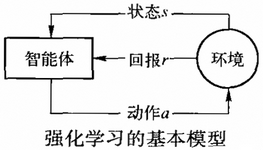

强化学习把学习看作是试探评价的过程。智能体选择一个动作作用于环境，环境接受该动作后状态发生变化，同时产生一个回报信号（奖或惩）反馈给智能体，智能体根据回报信号和环境的当前状态再选择下一个动作。选择的原则是使受到正回报（奖）的概率增大。选择的动作不仅影响立即回报值，而且影响环境下一时刻的状态及最终的回报值。强化学习系统学习的目标是动态调整参数，发现最优策略，以使期望奖励和最大。

### 2. Q学习

Q学习是一种基于时差策略的强化学习。它是指在给定的状态下，当执行完某个动作后期望得到的回报函数为“动作-值”函数。在Q学习中“动作-值”函数记为$Q(a,s)$，表示在状态s执行动作a后得到的立即回报值加上以后遵循最优策略的值：
$$
Q(a,s)=r(a,s)+\gamma V^*(s),\ 0\le\gamma<1
$$
其中，$r(a,s)$表示立即回报值，$V^*$表示以后依据最优策略所得到的回报，$\gamma$是常量，表示折算因子。Q学习的重要思想就是，在缺乏关于系统回报的知识时，智能体也能够选择最优动作。智能体只需考虑当前状态s下每个可用的动作a，并选择其中使值最大化的动作，即
$$
V^*(s)=\mathop{\text{arg max }}\limits_{a}Q(a,s)
$$
于是则有
$$
Q(a,s)=r(a,s)+\mathop{\text{arg max }}\limits_{a'}Q(a',s')
$$
其中，$s'$表示当前状态s执行动作a之后形成的新状态。上式实际上描述了学习Q函数的递归过程。在确定性回报和动作假定下的Q学习算法如下。

1. 对每个a和s，初始化$Q(a,s)$为0。
2. 观察当前状态s。
3. 选择并执行一个动作a。
4. 得到立即回报$r(a,s)$。
5. 观察新状态$s'$。
6. 按照上式更新$Q(a,s)$值。
7. 更新当前状态s为$s'$。
8. 如果不结束则转至第2步，否则退出。

### 3. 强化学习存在的问题

概括问题。典型的强化学习方法，如Q学习，都假定状态空间是有限的，并且允许用“状态-动作”记录其Q值。而许多实际问题对应的状态空间往往非常巨大，甚至是连续的；或者状态空间不大，但是动作很多。另一方面，对某些问题不同的状态可能具有某种共性，从而对应于这些状态的最优动作相同。所以在强化学习中还需要研究“状态-动作”的概括表示问题。

动态和不确定环境。强化学习是通过与环境的试探性交互，获取环境状态信息和回报信号来进行学习的。所以能否准确观察到状态信息已成为影响系统学习性能的关键。然而许多实际问题的环境往往含有大量噪声，无法准确获取环境的状态信息。这样就无法使强化学习算法收敛，如Q值会摇摆不定。

动态环境下的学习。很多问题面临动态变化的环境，其问题求解目标本身可能也会发生变化。一旦目标变化，已经学习到的策略可能就变得无用了，整个学习过程又要从头开始。

多目标的学习。大多数强化学习模型针对的是单目标学习问题的决策策略，难以适应多目标学习和多目标、多策略的学习需求。

## （二）隐马尔可夫模型

### 1. 基本原理

如果系统从一种状态转移到另一种状态时，仅取决于前面的n个状态，则这种过程称为马尔可夫过程。如果该过程中状态转移不是确定的，而是以概率随机选择，则就是马尔可夫随机过程。隐马尔可夫模型（Hidden Markov Model，HMM）就是一个二重马尔可夫随机过程。它包括具有状态转移概率的马尔可夫链和输出观测值的随机过程。它的状态不确定或者不可见，不能直接观察到，但能通过观测向量序列的随机过程表现出来。每个观测向量都通过某些概率密度分布表现为各种状态，每个观测向量都由一个具有响应概率密度分布的状态序列产生。

隐马尔可夫模型可以用五元组$(S,M,A,B,\pi)$来描述。其中，

- $S$表示模型的状态集合，其中状态个数记为N。虽然这些状态是隐含的，未必能直接观察到，但在许多实际应用中，模型的状态通常有具体的物理意义。
- $M$表示每个状态不同观测值的数目，即模型输出符号的数目。
- $A$表示状态转移概率矩阵，描述了HMM模型中各个状态之间的转移概率。其中$a_{ij}=p(s_{j,t+1}|s_{i,t}),\ 1\le i,j\le N$，即当t时刻状态为$s_i$时，在t+1时刻状态为$s_j$的概率。
- $B$表示观测概率矩阵，描述了每个状态输出的符号概率分布。其中$b_{jk}=p(v_{k,t}|s_{j,t}),\ 1\le j\le N,1\le k\le M$，即即当t时刻状态为$s_j$时，在t时刻观察到符号$v_{k,t}$的概率。
- $\pi$表示初始状态分布，即在t=0时刻，每个状态出现的概率。

隐马尔可夫模型中可调整的系统参数为A、B、$\pi$，所以在上下文明确的时候常用$\lambda=(A,B,\pi)$来表示隐马尔可夫模型的参数。

### 2. 隐马尔可夫模型的基本问题

评估问题。对于给定模型参数，求某个观察值序列的概率。这个问题可以使用前向算法和反向算法。

解码问题。对于给定模型参数和观察值序列，求可能性最大的状态序列。这个问题可以使用Viterbi算法。

学习问题。对于给定的观察值序列，调整模型参数，使得观察值出现的概率最大。这个问题可以使用Baum-Welch算法或者EM算法。

# 九、状态空间搜索

用状态空间方法表示问题时，首先必须定义状态的描述形式，还要定义一组算符，通过使用算符把问题的一种状态转移为另一种状态。问题求解的过程是一个不断的把算符作用于状态并得到一个新状态的过程，知道得到目标状态。总代价最小的解才是最优解。对应一个状态，可用的算符可能不止一个，生成的后继状态也不止一个，首先应对哪一个状态进行操作，这取决于搜索策略。

## （一）状态空间的一般搜索过程

### 1. 概念介绍

在人工智能中是通过搜索技术来生成状态空间对问题进行求解的。其基本思想是：首先把问题的初始状态（即初始节点）作为当前状态，选择适用的算符对其进行操作。生成一组子状态（或称后继状态、后继节点、子节点），然后检查目标状态是否在其中出现。若出现，则搜索成功，找到了问题的解；若不出现，则按某种搜索策略从已生成的状中再选一个状态作为当前状态。重复上述过程，直到目标状态出现或者不再有可供操作的状态及算符时为止。

路径耗散值，令C(n~i~,n~j~)为节点n~i~到n~j~这条路径（或弧线）的耗散值，它其实就是使用规则或路径的代价。一条路径的耗散值等于连接这条路径各结点间所有弧线耗散值的总和。

下面列出状态空间的一般搜索过程。在此之前先对搜索过程中要用到的两个数据结构（OPEN表与CLOSED表）做些简单说明。

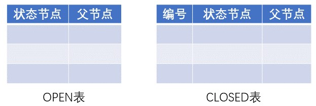

OPEN表用于存放刚生成的节点。对于不同的搜索策略，节点在OPEN表中的排列顺序是不同的。例如，对广度优先搜索，节点按生成的顺序排列，先生成的节点排在前面，后生成的节点排在后面。CLOSED表用于存放将要扩展或者已扩展的节点。所谓对一个节点进行“扩展”，是指用合适的算符对该节点进行操作，生成一组子节点。

### 2. 搜索的一般过程

1. 把初始节点S~0~放入OPEN表，并建立目前只包含S~0~的图，记为G。
2. 检查OPEN表是否为空，若为空则问题无解，退出。
3. 把OPEN表的第一个节点取出，放入CLOSED表，并记该节点为节点n。
4. 判断节点n是否为目标节点。若是，则求得了问题的解，退出；否则继续下面步骤。
5. 考察节点n，生成一组子节点。把其中不是节点n先辈的那些子节点记做集合M。并把这些子节点作为节点n的子节点加入G中。
6. 针对M中子节点的不同情况，分别进行如下处理：
   1. 对那些未曾在G中出现过的M成员，设置一个指向父节点（即节点n）的指针，并将它们放人OPEN表。
   2. 对那些先前已在G中出现过的M成员，确定是否需要修改它的指向父节点的指针（使耗散值最小）。
   3. 对那些先前已经在G中出现并且已经扩展了的M成员，确定是否需要修改其后继节点指向父节点的指针。
7. 按某种搜索策略对OPEN表中的节点进行排序。
8. 转第2步。

### 3. 对搜索过程的说明

1. 上述过程是状态空间的一般搜索过程，具有通用性。在此之后讨论的各种搜索策略都可看做是它的一个特例。各种搜索策略的主要区别是对OPEN表中节点排序的准则不同。例如，广度优先搜索把先生成的子节点排在前面，而深度优先搜索则把后生成的子节点排在前面。
2. 一个节点经一个算符操作后一般只生成一个子节点，但适用于一个节点的算符可能有多个，此时就会生成一组子节点。在这些子节点中可能有些是当前扩展节点（即节点n）的父节点、祖父节点等，此时不能把这些先辈节点作为当前扩展节点的子节点。余下的子节点记做集合M，并加入图G中。这就是第5步要说明的意思。
3. 一个新生成的节点，可能是第一次被生成的节点；也可能是先前已作为其他节点的后继节点被生成过，当前又被作为另外一个节点的后继节点再次生成。此时，它究竟应作为哪个节点的后继节点呢？一般由原始节点到该节点路径上所付出的代价来决定。哪条路径付出的代价小，相应的节点就作为它的父节点。
4. 通过搜索所得到的图称为搜索图。由搜索图中的所有节点及反向指针（在第6步形成的指向父节点的指针）所构成的集合是一棵树，称为搜索树。
5. 在搜索过程中，一旦某个被考察的节点是目标节点（第4步）就得到了一个解。该解是由从初始节点到该目标节点路径的算符构成的，而路径则由第6步形成的反向指针指定。
6. 如果在搜索中一直找不到目标节点，而且OPEN表中不再有可供扩展的节点，则搜索失败，在第2步退出。
7. 抽于盲目搜索一般适用于其状态空间是树状结构的问题。因此对盲目搜索而言，一般不会出现一般搜索过程第六步中2、3两点的问题。每个节点经扩展后生成的子节点都是第一次出现的节点，不必检查并修改指针方向。
8. 图G是一个最优解路径。

由上述搜索过程可以看出，问题的求解过程实际上就是搜索过程。问题求解的状态空间图是通过搜索逐步形成的，边搜索边形成；而且搜索每前进一步，就要检查是否达到目标状态。这样就可尽量少生成与问题求解无关的状态，既节省了存储空间，又提高了效率。

这是一个一般的图搜索过程，通过不断的循环，过程便生成出一个显式表示的图G（搜索图）和一个G的子集T（搜索树）。该搜索树T是由第6步中标记的指针决定，除根结点S~0~外，G中每个结点只有一个指针指向G中的一个父结点，显然树中的每一个结点都处在G中。由于图G是无环的，因此可根据树定义任一条特殊的路径。可以看出，OPEN表上的结点，都是搜索树的端结点，即至今尚未被选作为扩展的结点，而CLOSED表上的结点，可以是已被扩展而不能生成后继结点的那些端结点，也可以是树中的非端结点。

这个过程是在第7步要对OPEN表上的结点进行排序，以便在第3步能选出一个“最好”的结点优先扩展。不同的排序方法便可构成形式多样的专门搜索算法。如果选出待扩展的结点是目标结点，则算法在第4步成功结束，并可根据回溯到S~0~的指针给出解路径。如果某个循环中，搜索树不再剩有待选的结点，即OPEN表变空时，则过程失败结束，问题找不到解。

## （二）广度优先搜索

1. 把初始节点S~0~放入到OPEN表。
2. 如果OPEN表为空，则问题无解，退出。
3. 把OPEN表的第一个节点（记为节点n）取出放入CLOSED表。
4. 考察节点n是否为目标节点。若是，则求得了问题的解，退出。
5. 若节点n不可扩展，则转第2步。
6. 扩展节点n，将其子节点放入OPEN表的`尾部`，并为每一个子节点都配置指向父节点的指针，然后转第2步。

广度优先搜索的盲目性较大。当目标节点距离初始节点较远时将会产生许多无用节点，搜索效率低，这是它的缺点。但是，只要问题有解，用广度优先搜索总可以得到解，而且得到的是路径最短的解，这是它的优点。

## （三）深度优先搜索

1. 把初始节点S~0~放入到OPEN表。
2. 如果OPEN表为空，则问题无解，退出。
3. 把OPEN表的第一个节点（记为节点n）取出放入CLOSED表。
4. 考察节点n是否为目标节点。若是，则求得了问题的解，退出。
5. 若节点n不可扩展，则转第2步。
6. 扩展节点n，将其子节点放入OPEN表的`首部`，并为每一个子节点都配置指向父节点的指针，然后转第2步。

该过程与广度优先搜索的唯一区别是：广度优先搜索是将节点n的子节点放入到OPEN表的尾部；而深度优先搜索是把节点n的子节点放入OPEN表的首部。仅此一点不同而已，却使得搜索路径完全不一样。

在深度优先搜索中，搜索一旦进入某个分支，就将沿着该分支一直向下搜索。如果目标节点恰好在此分支上，则可以较快地得到解。但是如果目标节点不在此分支上，而该分支又是一个无穷分支，就不可能得到解了。可见，深度优先搜索是不完备的，即使问题有解，它也不一定能求得解。另外，用深度优先搜索得到的第一个解，不一定是路径最短的解。

## （四）有界深度优先搜索

基本思想是：对深度优先搜索引入搜索深度的界限（设为d~m~）；当搜索深度达到了深度界限，而尚未出现目标节点时，就换一个分支进行搜索。它的搜索过程如下。

1. 把初始节点S~0~放入OPEN表中，置S~0~的深度d(S~0~)=0。
2. 如果OPEN表为空，则问题无解，退出。
3. 把OPEN表的第一个节点（记为节点n）取出放入CLOSED表。
4. 考察节点n是否为目标节点。若是，则求得了问题的解，退出。
5. 如果节点n的深度d=d~m~，则转第2步。
6. 扩展节点n，将其子节点放入OPEN表的首部，并为每一个子节点都配置指向父节点的指针，置其深度为d+1。然后转第2步。

如果问题有解，且其路径长度不大于d~m~，则上述搜索过程一定能求得解。但是，若解的路径长度大于d~m~，则上述过程就得不到解。这说明在有界深度优先搜索中，深度界限的选择是很重要的。但这并不是说深度界限越大越好。因为当d~m~太大时，搜索将产生许多无用的子节点，即浪费了计算机的存储空间，又降低了搜索效率。

由于解的路径长度事先难以预料，所以要恰当地给出d~m~的值是比较困难的。另外，即使能求出解，它也不一定是最优解。为此，可采用下述办法进行改进：先任意给定一个较小的数作为d~m~，然后进行上述的有界深度优先搜索；当搜索达到了指定的深度界限d~m~仍未发现目标节点，并且CLOSED表中仍有待扩展节点时，就将这些节点送回OPEN表，同时增大深度界限d~m~，继续向下搜索。如此不断增大d~m~，只要问题有解，就一定可以找到它。但此时找到的解不一定是最优解。为了找到最优解，可增设一个表R，每找到一个目标节点S~g~后，就把它放入到R的前面，并令d~m~等于该目标节点所对应的路径长度，然后继续搜索。由于后求得的解的路径长度不会超过先求得的解的路径长度，所以最后求得的解一定是最优解。即：每一次层深为d~m~的广度优先搜索算法。

## （五）启发式搜索

前面讨论的各种搜索方法都是非启发式搜索，它们都没有利用问题本身的特征信息；在决定要被扩展的节点时，都没有考虑该节点在解的路径上的可能性有多大，它是否有利于问题求解以及求出的解是否为最优解等。

启发式搜索要用到问题自身的某些特征信息，以指导搜索朝着最有希望的方向前进。由于这种搜索针对性较强，因为原则上只需要搜索问题的部分状态空间，故效率较高。

### 1. 启发信息与估价函数

在搜索过程中，关键的一步是如何确定下一个要考察的节点，确定方法的不同就形成了不同的搜索策略。如果在确定节点时能充分利用与求解问题有关的特性信息，估计出节点的重要性，就能在搜索时选择重要性较高的节点，以利于求得最优解。像这样可用于指导搜索过程，且与具体问题求解有关的控制信息成为启发式信息。

用于估价节点重要性的函数称为估价函数，其一般形式为：`f(x) = g(x) + h(x)`。

其中，g(x)是代价函数，表示从初始节点S~0~到节点x已经实际付出的代价。可以使用边的权值之和（代价）来表示，若权值默认时也可以使用深度d(x)代替。

h(x)是启发式函数，表示从节点x到目标节点S~g~的最优路径的代价估计。启发式函数h(x)体现了问题的启发性信息，其形式要根据问题的特性确定。例如，h(x)可以是节点x到目标节点的距离，也可以是节点x处于最优路径上的概率。

估价函数f(x)表示从初始节点S~0~经过节点x到达目标节点S~g~的最优路径的代价估计值。它的作用是估价OPEN表中各节点的重要程度，决定它们在OPEN表中的次序。其中，代价函数g(x)指出了搜索的横向趋势，它有利于搜索的完备性，但影响搜索的效率。如果我们只关心到达目标节点的路径，并且希望有较高的搜索效率，则g(x)可以忽略，但此时会影响搜索的完备性。为此，在确定f(x)时，要权衡各种利弊得失，使g(x)与h(x)各占适当的比重。

### 2. 局部择优搜索

基本思想是：当一个节点被扩展之后，按f(x)对每一个子节点计算估价值，并选择最小者作为下一个要考察的节点。由于它每次都只是在子节点的范围内选择下一个要考察的节点，范围比较狭窄，所以称为局部择优搜索，又称为分支界限法。其搜索过程如下。

1. 把初始节点S~0~放入OPEN表中，计算f(S~0~)。
2. 如果OPEN表为空，则问题无解，退出。
3. 把OPEN表的第一个节点（记为节点n）取出放入CLOSED表中。
4. 考察节点n是否为目标节点。若是，则求得了问题的解，退出。
5. 若节点n不可扩展，则转第2步。
6. 扩展节点n，用估计函数f(x)计算每个子节点的估价值，并按估价值从小到大的顺序依次放到OPEN表的首部，为每个子节点配置指向父节点的指针。
7. 转向第2步。

在局部择优搜索中，若令f(x)=g(x)，则局部择优搜索就成为代价树的深度优先搜索。若令f(x)=d(x)，这里的d(x)表示节点x的深度，则局部择优搜索就成为深度优先搜索。所以，深度优先搜索和代价树的深度优先搜索可以看做是局部择优搜索的两个特例。

深度优先搜索、代价树的深度优先搜索，以及局部择优搜索都是以子节点作为考察范围的，这是它们的共同之处。不同的是它们选择节点的标准不一样：深度优先搜索以子节点的深度作为选择标准，后生成的节点先被考察；代价树的深度优先搜索以各子节点到到父节点的代价作为选择标准，代价小者先被选择；局部择优搜索以估价函数作为选择标准，估价值最小的子节点优先被选择。

动态规划法实际上是对分支界限法的改进。动态规划原理指出，求s→t的最佳路径时，对某一个中间结点I，只要考虑s到I中最小耗散值的这一条局部路径就可以，其余s到I的路径是多余的，不必加以考虑。这体现在算法中就是，若queue中有多条到达某一公共结点的路径，则只保留耗散值最小的那条路径，其余删去，并重新排序，使g值最小者排在前面。

### 3. 全局择优搜索

全局择优搜索方法每次总是从OPEN表的全体节点中选择一个估价值最小的节点，而不是只在子节点中。其搜索过程如下。

1. 把初始节点S~0~放入OPEN表中，计算f(S~0~)。
2. 如果OPEN表为空，则问题无解，退出。
3. 把OPEN表的第一个节点（记为节点n）取出放入CLOSED表中。
4. 考察节点n是否为目标节点。若是，则求得了问题的解，退出。
5. 若节点n不可扩展，则转第2步。
6. 扩展节点n，用估计函数f(x)计算每个子节点的估价值；并为每个子节点配置指向父节点的指针，把这些子节点都送入OPEN表中；然后对OPEN表中的全部节点按估价值从小到大的顺序排序。
7. 转向第2步。

在全局择优搜索中，如果f(x)=g(x)，则它就成为代价树的广度优先搜索。如果f(x)=d(x)，这里的d(x)表示节点x的深度，则它就成为广度优先搜索。所以，广度优先搜索和代价树的广度优先搜索是全局择优搜索的两个特例。

## （六）A^*^算法

在启发式搜索下，估价函数的定义是十分重要的。如果定义不当，则上述搜索算法不一定能找到问题的解，即使找到解，也不一定是最优的。为此，需要对估价函数进行某些限制。下面以A^*^算法为例，说明对估价函数进行限制的方法。

### 1. 概述

引入，一般来说对于一个未知量，x表示它的估算值，x^*^则表示它的精确值或最优解值。

A^*^算法的一般公式：f^*^(x) = g^*^(x) + h^*^(x)，由于这个f^*^(x)其实是无法预先知道的，所以我们用前面的估价函数f(x)做近似，g(x)代替g^*^(x)，h(x)代替h^*^(x)。

满足以下条件的搜索过程称之为A^*^算法：

1. 把OPEN表中的节点按估价函数f(x) = g(x) + h(x)的值从小至大进行排序（一般搜索过程的第7步）。
2. g(x)是对g^*^(x)的估计，且g(x) > 0。其中，g^*^(x)是从初始节点S~0~到节点x的最小代价。
3. h(x)是h^*^(x)的下界，即对所有节点x均有：h(x) <= h^*^(x)。其中h^*^(x)是从节点x到目标节点的最小代价。若有多个目标节点，则为其中最小的一个。

在A^*^算法中，g(x)比较容易得到，它实际上就是从初始节点S~0~到节点x的路径代价，恒有g(x) >= g^*^(x)；而且在算法执行的过程中，随着更多搜索信息的获得，g(x)的值呈下降趋势。

启发式函数h(x)的确定依赖于具体问题领域的启发式信息，其中h(x) <= h^*^(x)的限制十分重要，它可保证A^*^算法能找到最优解。

### 2. 算法流程

1. 首先创建初始节点S~0~，目标节点S~g~，创建OPEN列表，CLOSED列表。将S~0~加入到OPEN表。
2. 如果OPEN表为空，则问题无解，退出。
3. 把OPEN表的第一个节点（记为节点n，它的f(n)最小）取出放入CLOSED表中。
4. 考察节点n是否为目标节点。若是，则求得了问题的解，退出。
5. 扩展节点n，生成一组子节点。把其中不是节点n先辈的那些子节点记做集合M。对M中每一个子节点m，计算它的f(m)。
6. 针对M中每个子节点m的不同情况，分别进行如下处理：
   1. 若m即不在OPEN表中也不在CLOSED表中，将其加入到OPEN中，并为节点m分配一个指向其父节点n的指针
   2. 若节点在OPEN表中，则比较刚刚计算的f(m)值与原来节点m的f(m)值。若刚计算得的f(m)更小，则更新原来节点m的f(m)值，并将原来节点m的父节点指针指向节点n。
   3. 若节点m在CLOSED中，则忽略该节点。
7. 对OPEN表按照f(x)的值进行排序。
8. 转第2步。

### 3. A^*^算法的可纳性

对于可解状态空间图（即从初始节点到目标节点有路径存在）来说，如果一个搜索算法能在有限步内终止，并且能找到最优解，则称该搜索算法是可纳的。

 A^*^算法是可纳的，即它能在有限步内终止并找到最优解。可分为3步证明：对于有限图， A^*^算法一定会在有限步内终止；对于无限图，只要从初始节点到目标节点有路径存在，则 A^*^算法也必然会终止； A^*^算法一定终止在最优路径上。

在证明的过程中，可推导出 A^*^算法选择扩展的任何一个节点x'都满足以下性质：f(x') <= f^*^(S~0~) = f(S~g~^*^)。

### 4. A^*^算法的最优性

 A^*^算法的搜索效率很大程度上取决于h(x)，在满足h(x) <= h^*^(x)的前提下，h(x)的值越大越好。启发式函数h(x)的值越大，表明它携带的启发性信息越多，搜索时扩展的节点数越少，搜索的效率越高。

### 5. 启发式函数的单调性限制

在A^*^算法中，每当要扩展一个节点时都要先检查子节点是否已在OPEN表或CLOSED表中，有时还需要调整指向父节点的指针，这就增加了搜索的代价。如果对启发式函数h(x)加上单调性限制，就可以减少检查及调整的工作量，从而降低搜索代价。

所谓单调性限制是指h(x)满足如下两个条件：

1. h(S~g~) = 0，其中S~g~是目标节点。
2. 设x~j~是节点x~i~的任一子节点，则有：h(x~i~) - h(x~j~) <= c(x~i~ , x~j~)，其中c(x~i~ , x~j~)是节点x~i~到其子节点x~j~的边代价权值。若将不等式改写为如下形式：h(x~i~) <= h(x~j~) + c(x~i~ , x~j~)，就可以看出节点x~i~到目标节点最优解费用的估价不会超过从x~i~到其子节点x~j~的边代价加上从x~j~到目标节点最优费用给估价。即，h(x~i~)是根据从x~i~到目标节点的最优路径来估价的费用。

可以证明，当A^*^算法的启发式搜索函数h(x)满足单调限制时，有如下两个结论：

1. 若A^*^算法选择节点x~n~进行扩展，则g(x~n~) = g^*^(x~n~)，因为是在最优路径上。
2. 有A^*^算法所扩展的节点序列的估价值都是非递减的，因为h(x)都是取得最优路径上的估价费用，其值最小。

# 十、与或树搜索

对于一个复杂的问题，与或树可以使用分解和等价变换的方法对问题进行化简。一个问题P分解成若干子问题P~i~，只有当所有子问题都可解时，问题P才可解，称为与树；一个问题P等价变换程其他问题P~i~，只要有一个问题可解，则问题P可解，称为或树；两者结合为与或树。

下面介绍一些基本概念。

1. 本原问题。不能再分解或变换，而且直接可求解的子问题，称为本原问题。
2. 端节点与终止节点。本愿问题所对应的节点称为终止节点；而没有子节点的节点称为端节点。显然终止节点一定是端节点，但端节点不一定是终止节点。
3. 可解节点。满足以下之一：它是一个终止节点；或它是一个与节点且全部子节点可解；或它是一个或节点且至少有一个子节点可解。
4. 不可解节点。不满足可解条件的节点。
5. 解树。由可解节点构成，并且由这些可解节点可推出初始节点（它对应于原始问题）为可解节点的子树称为解树。在解树中一定包含初始节点。

## （一）与或树的一般搜索过程

### 1. 概述

使用与或树解决问题时，首先要定义问题的描述方法及分解或变换问题的算符。然后可用它们通过搜索来生成与或树，从而求得原始问题的解。

如前述，一个与节点，只有其子节点全部可解时，它才可解；一个或节点，只要其有一个子节点可解时，它就可解。像这样由子节点来确定父节点、祖父节点等为可解节点的过程称为可解标示过程，为不可解节点的过程称为不可解标示过程。在与或树搜索过程中反复使用这两个过程，直到初始节点被标示为可解或不可解。

### 2. 搜索的一般过程

1. 把原始问题作为初始节点S~0~，并把它作为当前节点。
2. 应用分解或等价变换算符，对当前节点进行扩展。实际上就是把原始问题变换为等价问题或分解成几个子问题。
3. 为每个子节点设置指向父节点的指针。
4. 选择合适的子节点作为当前节点，反复执行第2步和第3步。在此期间要多次条用可解标示和不可解标示过程，直到初始节点被标示为可解节点或不可解节点为止。在标示过程中可以调整树结构以优化搜索。

### 3. 对搜索过程的说明

由这个搜索过程所形成的节点和指针结构称为搜索树。

可解与不可解标示过程都是自下而上进行的，及由子节点的可解性确定父节点的可解性。与或树搜索的目标是寻找解树，从而求得原始问题的解。

1. 如果在搜索的某一时刻，通过可解标示过程可确定初始节点是可解的，则由此初始节点及其下属的可解节点就构成了解树。

2. 如果在某时刻被选为扩展的节点不可扩展，并且它不是终止节点，则此节点就是不可解节点。此时可应用不可解标示过程确定初始节点是否为不可解节点，如果可以肯定初始节点是不可解的，则搜索失败；否则继续扩展节点。
3. 如果已确定某个节点为可解节点，则其不可解的后裔节点就不再有用，可以从搜索树中删去。
4. 如果已确定某个节点为不可解节点，则其全部节点都不再有用，可以从搜索树中删去。但当前这个不可解节点还不能删去，因为在判断其先辈节点的可解性时还要用到它。 

## （二）与或树的广度优先搜索

与或树的广度优先搜索与状态空间的广度优先搜索类似，也是按照“先产生的节点先扩展”的原则，只是在搜索过程中要多次调用可解标示过程和不可解标示过程。其搜索过程如下：

1. 把初始节点S~0~放入到OPEN表。
2. 把OPEN表中的第一个节点（记为节点n）取出，放入CLOSED表。
3. 如果节点n可扩展，则需做如下工作：
   1. 扩展节点n，将其子节点放入OPEN表的`尾部`，并为每个子节点配置指向父节点的指针，以备标示过程使用。
   2. 考察这些子节点中是否有终止节点。若有，则标示这些终止节点为可解节点，并应用可解标示过程对其父节点、祖父节点等先辈节点中的可解节点进行标示。如果初始节点S~0~也被标示为可解节点，就得到解树，搜索成功，退出搜索。如果不能确定S~0~为可解节点，则从OPEN表中删去具有可解先辈的节点。
   3. 转第2步，把OPEN表中第一个节点取出放入CLOSED表。
4. 如果节点n不可扩展，则需要做以下工作：
   1. 标示节点n不可扩展。
   2. 应用不可解标示过程对节点n的先辈节点中不可解的节点进行标示。如果初始节点S~0~也被标示为不可解节点，则搜索失败，表明原始问题无解，则退出搜索过程。如果不能确定S~0~为不可解节点，则从OPEN表中删去不可解先辈的节点。
   3. 转第2步，把OPEN表中第一个节点取出放入CLOSED表。

## （三）与或树的深度优先搜索

与或树的深度优先搜索与与或树的广度优先搜索过程基本相同，只需要将子节点放入OPEN表的首部。也可以像状态空间的有界深度优先搜索那样为与或树的深度优先搜索规定一个深度界限，使搜索在规定的范围内进行。其搜索过程如下：

1. 把初始节点S~0~放入到OPEN表。
2. 把OPEN表中的第一个节点（记为节点n）取出，放入CLOSED表。
3. 如果节点n的深度大于等于深度界限，转第5步的第5.1点。
4. 如果节点n可扩展，则需做如下工作：
   1. 扩展节点n，将其子节点放入OPEN表的`首部`，并为每个子节点配置指向父节点的指针，以备标示过程使用。
   2. 考察这些子节点中是否有终止节点。若有，则标示这些终止节点为可解节点，并应用可解标示过程对其先辈节点中的可解节点进行标示。如果初始节点S~0~也被标示为可解节点，则搜索成功，退出搜索。如果不能确定S~0~为可解节点，则从OPEN表中删去具有可解先辈的节点。
   3. 转第2步，把OPEN表中第一个节点取出放入CLOSED表。
5. 如果节点n不可扩展，则需要做以下工作：
   1. 标示节点n为不可解节点。
   2. 应用不可解标示过程对节点n的先辈节点中不可解的节点进行标示。如果初始节点S~0~也被标示为不可解节点，则搜索失败，表明原始问题无解，则退出搜索过程。如果不能确定S~0~为不可解节点，则从OPEN表中删去不可解先辈的节点。
   3. 转第2步，把OPEN表中第一个节点取出放入CLOSED表。

## （四）与或树的有序搜索

上述介绍的广度优先搜索和深度优先搜索都是盲目搜索，其共同点是：

1. 搜索从初始节点开始，先自上而下进行搜索，寻找终止节点及端节点；然后再自下而上进行标示，一旦初始节点被标示为可解节点或不可解节点时，搜索就不能再继续了。
2. 搜索都是按照确定路线进行的。当要选择一个节点进行扩展时，只是根据节点在与或树中所处的位置，而没有考虑要付出的代价。显然要求得的解树不一定是代价最小的解树，即不一定是最优解树。

与或树的有序搜索是用来求取代价最小的解树的一种搜索方法。为了求得代价最小的解树，就要在每次要确定扩展节点的时候，想往前多看几步；计算扩展这个节点可能要付出的代价，并选择代价最小的节点进行扩展。它是一种启发式搜索。

### 1. 解树的代价

为了进行有序搜索，需要计算解树的代价。而解树的代价可以通过计算解树中节点的代价得到。下面首先给出计算节点代价的方法。设用c(x, y)表示节点x到节点y的代价，则计算节点x的代价h(x)的方法如下：

1. 如果x是终止节点，则定义节点x的代价h(x) = 0。
2. 如果x是或节点，y~1~, y~2~, ..., y~n~是它的子节点，则节点x的代价为h(x) = MIN~1<=i<=n~| c(x, y~i~) + h(y~i~) |。
3. 如果x是与节点，y~1~, y~2~, ..., y~n~是它的子节点，则节点x的代价有两种计算方法：
   1. 和代价法，h(x) = Σ~1<=i<=n~( c(x, y~i~) + h(y~i~) )。
   2. 最大代价法，h(x) = MAX~1<=i<=n~| c(x, y~i~) + h(y~i~) |。
4. 如果节点x不可扩展，且有不是终止节点，则定义h(x) = ∞。

由上述计算节点的代价可以看出：如果问题是可解的，则由子节点的代价就可推算出父节点的代价。只要逐层上推，最终就可求出初始节点S~0~的代价。S~0~的代价就是解树的代价。值得注意的是，有时用不同的计算代价法得到的最优解树是不同的。

### 2. 希望树

当要计算任一节点x的代价h(x)时，都要求已知其子节点y~i~的代价h(y~i~)。但是搜索是自上而下进行的，即先有父节点，后有子节点，除非节点x的全部子节点都是不可扩展节点，否则子节点的代价是不知道的。此时就需要根据问题本身提供的启发性信息定义一个启发式函数，由启发式函数估算出子节点y~i~的代价h(y~i~)，然后计算出节点x的代价h(x)。有了h(x)，节点x的父节点、祖父节点以及初始节点S~0~等各先辈节点的代价就都可自下而上地逐层推算出来。

当节点y~i~被扩展后，也是先用启发式函数估算出其子节点的代价，然后再算出h(y~i~)。此时算出的h(y~i~)可能与原来估算出来的h(y~i~)不相同。这时应该用后算出的h(y~i~)取代原来先估算出来的h(y~i~)，并且按此h(y~i~)自下而上地重新计算各先辈节点的代价值。当节点y~i~的子节点被扩展时，上述过程又要重复进行一遍。总之，每当有一代新的节点生成时，都要自下而上地重新计算其先辈节点的代价。这是一个自上而下地生成新节点，有自下而上地计算代价的反复进行的过程。

有序搜索的目的时求出最优解树，即代价最小的解树。这就要求在搜索过程中的任一时刻求出的部分解树代价都是最小的。为此，每次在选择要扩展的节点时都应挑选有希望称为最优解树一部分的节点进行扩展。由于这些节点及其先辈节点（包括初始节点S~0~）所构成的与或树有可能成为最优解树的一部分，因此称它为“希望树”。

在搜索过程中，随着新节点的不断生成，节点的价值时在不断变化的，希望树的构成节点也是在不断变化的。但不管如何变化，任一时刻的希望树都必须包含初始节点S~0~，而且它是对最优解树近根部分的某种估计。下面给出希望树的定义：

1. 初始节点S~0~在希望树T中。
2. 如果节点x在希望树中，则一定有：
   - 如果x是具有子节点y~1~, y~2~, ..., y~n~的或节点，则具有 MIN~1<=i<=n~{ c(x, y~i~) + h(y~i~) } 的那个子节点y~i~也应在T中。
   - 如果x是与节点，则它的全部子节点都应在T中。

### 3. 与或树的有序搜索过程

与或树的有序搜索是一个不断选择、修正希望树的过程。如果问题有解，则经过有序搜索将会找到最优解树。搜索过程如下：

1. 把初始节点S~0~放入到OPEN表。
2. 求希望树T，即根据当前搜索树中节点的代价求出以S~0~为根的希望树T。根据不同的分支求h(S~0~)，将其值最小的分支作为希望树T。
3. 依次把OPEN表中T的端节点N选出，并放入CLOSED表中。
4. 如果节点N是终止节点，则做下列工作：
   1. 标示N为可解节点。
   2. 对T应用可解标示过程，把N的先辈节点中的能确定可解性的节点都标示为可解节点。
   3. 若初始节点S~0~能被标示为可解节点，则T就是最优解树，成功退出。
   4. 如果不能确定S~0~为可解节点，从OPEN表中删去具有可解先辈的所有节点。
5. 如果节点N不是终止节点，且它不可扩展，则做下列工作：
   1. 标示N为不可解节点。
   2. 对T应用不可解标示过程，把N的先辈节点中能确定不可解性的节点标示为不可解节点。
   3. 若初始节点S~0~能被标示为不可解节点，则失败退出。
   4. 如果不能确定S~0~为不可解节点，从OPEN表中删去具有不可解先辈的所有节点。
6. 如果节点N不是终止节点，但它可扩展，则做下列工作：
   1. 扩展节点N，产生N的所有子节点。
   2. 把这些子节点都放入OPEN表中，并为每个子节点配置指向父节点（节点N）的指针。
   3. 计算这些子节点的代价值及其先辈的的价值。
7. 转第2步。

## （五）博弈树的启发式搜索

博弈活动中一般有对立的几方，每一方都视图使自己的利益最大化。博弈活动的整个过程其实就是一个动态的搜索过程。

### 1. 博弈概述

不妨假设A和B正在进行一场博弈（如象棋比赛），从规则上容易得出：

1. 博弈采取轮流制。
2. 博弈的结果只有3种：A胜B负、A负B胜、双方打和。
3. 对战双方了解当前形势和历史。
4. 对战双方都是绝对理性的，都选取对自己最为有利的对策。

博弈活动种对战的双方都希望自己获得胜利。对于对战的任一方，比如站在A的立场：

- 当比赛轮到A方决策的时候，A方有多种行动方案，具体实施哪一个完全由A方自己决定，这可以看作使与或树种的或关系。为了获得胜利，A总是会选择对自己最为有利的行动方案，这就相当于A在一棵或树中选择了最优路径。
- 如果比赛轮到B方决策，那么对于A来说，就必须考虑B所有的行动方案，这就相当于与或树中的与关系。因为主动权掌握在B手中，任何决策的方案都是有可能的。

把上述博弈过程用图表示出来，就可以得到一颗与或树。需要强调的是，该与或树始终是站在某一方的立场上；绝不可一会站在这一方的立场上，一会又站在另一方的立场上。

把描述博弈过程的与或树称为博弈树，它有如下特点。如果博弈者有多方，己方是或关系，他方是与关系。

1. 博弈的初始格局就是初始节点。
2. 在博弈树中，或节点和与节点是逐层交替出现的。自己一方扩展的节点之间是或关系；对方扩展的节点之间是与关系。双方轮流地扩展节点。
3. 所有能使自己一方获胜的终局都是本原问题，相应的节点是可解节点；所有能使对方获胜的终局都是不可解节点。

### 2. 极大极小值算法

在二人博弈问题中，为了从众多可供选择的方案中选出一个对自己有利的行动方案，就要对当前情况以及将要发生的情况进行分析，从中选出最优者。最常用的分析方法是极大极小分析法。其基本思想如下（将极大值作为己方）：

1. 目的是为博弈双方中的一方寻找一个最优行动方案。
2. 要寻找到这个最优方案，就要通过计算当前所有可能的方案进行比较。
3. 方案的比较是根据问题的特性定义一个估价函数，用来估算当前博弈树端节点的得分。此时估算出来的得分称为静态估值。
4. 当计算出端节点的估值后，再推算出父节点的得分，这样计算出的父节点的得分称为倒推值。推算方法是：
   - 对或节点，选其子节点中的一个最大的得分作为父节点的得分。这是为了使之间能在可供选择的方案中选出一个对之间最有利的方案。
   - 对与节点，选其子节点中的一个最小的得分最为父节点的得分。这是为了考虑最坏的情况。
5. 如果一个行动方案能获得较大的倒推值，则它就是当前最好的行动方案。

在博弈问题中，每一个格局可供选择的行动方案都有很多，会生成十分庞大的博弈树。视图利用完整的博弈树来进行极大极小分析是困难的。可行的方法是只生成一定深度的博弈，然后进行极大极小分析，找出当前最好的行动方案。在此之后，还可以在已经选的分支上在扩展一定深度，选出最好的行动方案，如此进行下去，直到分出结果为止。至于每次生成的博弈树的深度，当然是越大越好，但由于受到计算机存储空间的限制，只能根据实际情况而定。

## （六）剪枝技术

前面讨论的极大极小过程先得到一课博弈树，然后再进行估值的倒推计算，两个过程完全分离，效率很低。鉴于博弈树的与节点和或节点是逐层交替出现的，如果可以边生成节点边计算估值和倒推值，就可能删除一些不必要的节点以提高效率。这就是α-β剪枝技术。

引例，A~或~(B~与~-3(D-3, E-5), C~与~-?(F-2, G-?))的博弈树，其中G尚未计算估值。由D和E的估值得到B的倒推值为3，这表示A的倒推值的最小值为3。另外由F的估值得知C的倒推值最大为2，因此A的倒推值为3。这里虽然没有计算G的估值，但是仍然不影响对上层节点倒推值的推算，这表示这个分枝可以从博弈树中剪去。

在α-β剪枝技术中的一些概念：

- 对于一个或节点x来说，它的父节点是一个与节点，父节点要取所有子节点中的最小值；而或节点x要取它当前子节点中最大的值作为节点x的倒推值，所以这个值就是或节点x所能给它的父节点贡献的一个下界，父节点的最小值可以取到这个下界，称为节点x（或节点）的α值。对于其他的兄弟或节点y，如果y的值大于这个α，则兄弟或节点y不必再参与估值，将y的分枝剪去即可；如果y的值小于这个α下界，则更新α，并将原来提供α的分枝剪去。
- 对于一个与节点x来说，它的父节点是一个或节点，父节点要取所有子节点中的最大值；而与节点x要取它当前子节点中最小的值作为节点x的倒推值，所以这个值就是与节点x所能给它的父节点贡献的一个上界，父节点的最大值可以取到这个上界，称为节点x（与节点）的β值。对于其他的兄弟与节点y，如果y的值小于这个β，则兄弟与节点y不必再参与估值，将y的分枝剪去即可；如果y的值大于这个β上界，则更新β，并将原来提供β的分枝剪去。

简而言之，或节点的α值，是它给父与节点提供的一个可选的下界；与节点的β值，是他给父或节点提供的一个可选的上界。

下面给出α-β剪枝技术的一般规律：

- 任何或节点x的α值如果不能降低其父节点的β值，则对节点x以下的分枝可停止搜索，并使x的倒推值为α。这种剪枝技术称为β剪枝。
- 任何与节点x的β值如果不能升高其父节点的α值，则对节点x以下的分枝可停止搜索，并使x的倒推值为β。这种剪枝技术称为α剪枝。

在α-β剪枝技术中，一个节点的第一个子节点的倒推值（或估值）是很重要的。对于一个或节点，如果估值最高的子节点最先生成；对于一个与节点，如果估值最低的子节点最先生成；被剪除的节点数最多，搜索效率最高。这称为最优α-β剪枝法。