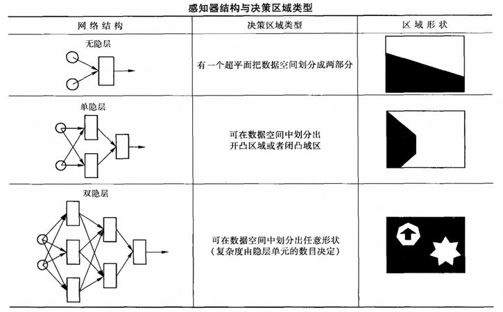

> **《人工智能导论》**
>
> ***鲍军鹏，张选平等编著，机械工业出版社，2013.5第一版***

[TOC]

# 一、概述

人工神经网络既是一种基本的人工智能研究途径，也是一种非常重要的机器学习方法。

广义上，神经网络可以泛指生物神经网络，也可以指人工神经网络。人工神经网络（Artificial Neural Network）是指模拟人脑神经系统的结构和功能，运用大量的处理部件，由人工方式建立起来的网络系统。人脑是人工神经网络的原型，人工神经网络是对人脑神经系统的模拟。人工智能领域中，在不引起混淆的情况下，神经网络一般都指人工神经网络。

## （一）人脑神经系统

### 1. 人脑神经元解剖结构

人脑神经系统的神经细胞按不同的结合方式构成了复杂的神经网络。神经细胞是构成神经系统的基本单元，称之为生物神经元，或者简称为神经元。神经元主要由3个部分组成，即细胞体、轴突和树突。通过神经元及其联接的可塑性，使得大脑具有学习、记忆和认知等各种智能。


细胞体（Cell Body或Soma）：接收并处理从其他神经元传递过来的信息。细胞膜内外有电位差，称为膜电位，膜外为正，膜内为负，大小约为几十微伏。细胞膜通过改变对Na^+^、K^+^、Cl^-^等离子的通透性从而改变膜电位。膜电压接受其他神经元的输入后，电位上升或者下降。若输入冲动的时空整合结果使膜电位上升，并超过动作的电位阈值时，神经元就进入兴奋状态，产生神经冲动，由轴突输出。若整合结果使膜电位下降并低于动作的电压阈值时，神经元就进入抑制状态，无神经冲动输出。


轴突（Axon）：细胞体向外伸出的最长的一条分支，即神经纤维，相当于神经元的输出端。一般地，一个神经元只有一个轴突，有个别神经元没有。

树突（Dendrite）：细胞体向外伸出的除轴突之外的其他分枝。树突一般较短，但分支很多，相当于神经元的输入端。

突触（Synapse）：生物神经元之间相互连接，从而让信息传递的部位被称为突触。突触按其传递信息的不同机制，可分为化学突触和电突触，其中化学突触占大多数，其神经冲动传递借助于化学递质的作用。突触的信息传递只能从突触前到突触后，不存在反向活动的机制，因此突触传递是单方向的。根据突触后膜电位的变化，突触可分为两种，即兴奋性突触和抑制性突触。


神经元对信息的接受和传递都是通过突触来进行的。单个神经元可以从别的细胞接受多个输入。由于输入分布于不同的部位以及各突触输入抵达神经元的先后时间也不同，对神经元影响的比例（权重）是不相同的。突触的信息传递特性可变，因此细胞之间的连接强度可变，这是一种柔性连接，也称为神经元结构的可塑性。

因此，一个神经元接受的信息，在时间和空间上常呈现出一种复杂多变的形式，需要神经元对它们进行积累和整合加工，从而决定其输出的时机和强度。正是神经元的这种整合作用，才使得亿万个神经元在神经系统中有条不紊、夜以继日地处理各种复杂的信息，执行着生物中枢神经系统的各种信息处理功能。

多个神经元以突触联接形成了一个神经网络。研究表明，生物神经网络的功能绝不是单个神经元生理和信息处理功能的简单叠加，而是一个有层次的、多单元的动态信息处理系统。它们有其独特的运行方式和控制机制，以接受生物内外环境的输入信息，加以综合分折处理，然后调节控制机体对环境做出适当的反应。

### 2. 人脑神经系统的特征

从信息系统研究的观点出发，对于人脑这个智能信息处理系统，有如下一些固有特征。

1、并行分布处理的工作模式

实际上，大脑中单个神经元的信息处理速度是很慢的，每次约1毫秒（ms），比通常的电子门电路要慢几个数量级。每个神经元的处理功能也很有限，估计不会比计算机的一条指令更复杂。但是人脑对某一复杂过程的处理和反应却很快，一般只需几百毫秒。而在这个处理过程中，与脑神经系统的一些主要功能，如视觉、记忆、推理等有关。

按照上述神经元的处理速度，如果采用串行工作模式，就必须在几百个串行步内完成，这实际上是不可能办到的。因此只能把它看成是一个由众多神经元所组成的超高密度的并行处理系统，大脑信息处理的并行速度已达到了极高的程度。

2、神经系统的可塑性和自组织性

神经系统的可塑性和自组织性与人脑的生长发育过程有关。在幼年时期，大脑的可塑性和柔软性特别良好。从生理学的角度看，它体现在突触的可塑性和联接状态的变化，同时还表现在神经系统的自组织特性上。例如，在某一外界信息反复刺激下，接受该信息的神经细胞之间的突触结合强度就会增强。这种可塑性反映出大脑功能既有先天的制约因素，也有可能通过后天的训练和学习而得到加强。神经网络的学习机制就是基于这种可塑性现象，并通过修正突触的结合强度来实现的。

3、信息处理与信息存储合二为一

大脑中的信息处理与信息存储是有机结合在一起的，而不像现行计算机那样。存储地址和存储内容是彼此分开的。由于大脑神经元兼有信息处理和存储功能，所以在进行回忆时，不但不存在先找存储地址而后再调出所存内容的问题，而且还可以由一部分内容恢复全部内容。

4、信息处理的系统性

大脑是一个复杂的大规模信息处理系统，单个的元件“神经元”不能体现全体宏观系统的功能。实际上，可以将大脑的各个部位看成是一个大系统中的许多子系统。各个子系统之间具有很强的相互联系，一些子系统可以调节另一些子系统的行为。例如，视觉系统和运动系统就存在很强的系统联系，可以相互协调各种信息的处理功能。

5、能接受和处理模糊的、模拟的、随机的信息

6、求满意解而不是精确解

人类在处理日常行为时，往往都不是一定要按最优或最精确的方式去求解，而是以能解决问题为原则，即求得满意解就行了。

7、系统的恰当退化和冗余备份（鲁棒性和容错性）

## （二）人工神经网络的研究内容与特点

### 1. 人工神经网络的研究内容

就目前来看，人工神经网络的研究工作主要包括以下几项内容。

2、人工神经网络模型的研究

人工神经网络模型的研究包括：神经网络原型研究，即大脑神经网络的生理结构、思维机制；对神经元生物特性的人工模拟（如时空特性、不应期、电化学性质等）；神经网络计算模型与学习算法；利用物理学的方法进行单元间相互作用理论的研究（如联想记忆模型等）。

2、神经网络基本理论研究

神经网络基本理论研究包括：神经网络非线性特性理论的研究（如自组织性、自适应性等）；神经网络基本性能的定量分析方法（如稳定性、收敛性、容错性、鲁棒性、动力学复杂性等）；神经网络计算能力与信息存储容量理论的研究；以及结合认知科学的研究，探索包括感知、思考、记忆和语言等的脑信息处理模型。

3、神经网络智能信息处理系统的应用

在认知与人工智能方面，包括模式识别、计算机视觉与听觉、特征提取、语音识别、语言翻译、联想记忆、逻辑推理、知识工程、专家系统、故障诊断和智能机器人等。在优化与控制方面，包括优化求解、决策与管理、系统辨识、鲁棒性控制、自适应控制、并行控制、分布控制和智能控制等。在信号处理方面，包括自适应信号处理（自适应滤波、时间序列预测、谱估计、消噪、检测、阵列处理）和非线性信号处理（非线性滤波、非线性预测、非线性谱估计、非线性编码、中值处理）。在传感器信息处理方面，包括模式预处理变换、信息集成、多传感器数据融合。

人工神经网络擅长解决两类问题：一类是对大量数据进行分类，并且只有较少的几种情况；另一类是必须学习一个复杂的非线性映射。

4、神经网络的软件模拟和硬件实现

在通用计算机、专用计算机或者并行计算机上进行软件模拟，或由专用数字信号处理芯片构成神经网络仿真器。由模拟集成电路、数字集成电路或者光器件在硬件上实现神经芯片。软件模拟的优点是网络的规模可以较大，适合于用来验证新的模型和复杂的网络特性。硬件实现的优点是处理速度快，但由于受器件物理因素的限制，根据目前的工艺条件，网络规模不可能做得太大。仅几千个神经元，但代表了未来的发展方向，因此受到人们的特别重视。

5、神经网络计算机的实现

神经网络计算机的实现包括计算机仿真系统、专用神经网络并行计算机系统。例如，数字、模拟、数-模混合和光电互连等。人工神经网络的光学实现和生物实现等。

### 2. 人工神经网络的特点

1、人工神经网络具有大规模的并行协同处理能力

每一个神经元的功能和结构都很简单，但是由大量神经元构成的整体却具有很强的处理能力。

2、人工神经网络具有较强的容错能力和联想能力

单个神经元或者连接对网络整体功能的影响都比较微小。在神经网络中，信息的存储与处理是合二为一的，信息的分布存放在几乎整个网络中。所以，当其中某一个点或者某几个点被破坏时，信息仍然可以被存取，系统在受到局部损伤时还可以正常工作。当然这并不是说对于训练好的网络可以任意修改。不过由于信息的分布存放。所以对某些网络来说，当它完成学习后（即训练好之后），如果再让它学习新的东西，就会破坏原来已学会的东西。

3、人工神经网络具有较强的学习能力

神经网络的学习可分为有教师学习与无教师学习两类。由于其运算的不精确性，故表现出“去噪声、容残缺”的能力。利用这种不精确性，可比较自然地实现模式的自动分类。其具有很强的泛化能力与抽象能力。

4、人工神经网络是一个大规模自组织、自适应的非线性动力系统

人工神经网络具有一般非线性动力系统的共性，即不可预测性、耗散性、高维性、不可逆性、广泛连接性和自适应性等。 

下罗列了人工神经网络系统与物理符号系统的差别。这两者分别代表了人工智能研究中的两种基本途径。在实践中可以根据具体应用把二者综合起来，获得更好效果。


## （三）人工神经网络的基本形态

### 1. MP模型

MP模型是由McCulloch和Pitts最早提出的神经元模型之一。MP模型是一种非线性阈值元件模型。它是大多数神经网络模型的基础，如下图所示。


- w~ki~，代表神经元k与神经元i之间的连接强度（模拟生物神经元之间的突触连接强度），称之为连接权。
- θ~i~，代表神经元i的阈值。或者说，它可以称之为神经元的偏差，为使得输入值由全加而来，可令$b_i=-\theta_i$。
- $u_i=\sum\limits_{k=1}^nw_{ki}x_k-\theta_i=\sum\limits_{k=1}^nw_{ki}x_k+b_i$，代表神经元i的活跃值，即神经元状态。
- $y_i=f(u_i)$，代表神经元i的输出。对于多层网络而言，也是另外一个神经元的一个输入。

其中函数$f$表达了神经元的输入输出特性。在MP模型中，f定义为阶跃函数：
$$
y_i=f(u_i)=\begin{cases}1, & u_i>0 \\ 0, & u_i\le 0\end{cases}
$$
如果把阈值θ~i~看作为一个特殊的权值，则可改写为$y_i=f(u_i)=f(\sum\limits_{k=0}^nw_{ki}x_k)$，其中w~0i~=-θ~i~，x~0~=1。

为用连续型的函数表达神经元的非线性变换能力，常采用如下两种S型函数。


S型函数的特点是饱和性，即无论当输入趋向$+\infty$还是趋向$-\infty$，输出都有相应的收敛极限。这一点对于系统稳定性很重要，否则系统就会发散而不稳定。一般情况下，为了数值处理方便，S型函数的正输出极限为+1，负输出极限为0或者-1。另外，人工神经网络中还常用高斯函数当作输入输出特性函数来表达非线性变换能力，例如，径向基函数神经网络（Radial Basis Function ANN）。

模型在发表时并没有给出一个学习算法来调整神经元之间的连接权。但是我们可以根据需要，采用一些常见的算法来调整神经元连接权，以达到学习的目的。

### 2. PDP模型

PDP（Parallel Distributed Processing）并行分布式处理模型是由Rumellhart、McClelland、Hinton提出的一个通用神经网络模型。并行分布式处理模型认为神经网络是具有以下特征的系统。

1. 有一组处理单元。
2. 每个单元都有激活状态。
3. 每个处理单元都有输出函数。
4. 处理单元之间按照一定模式联接。
5. 每个单元的输入为其总输入之加权和。
6. 处理单元把输入及当前状态结合起来产生激活值。
7. 系统通过经验修改联接强度的学习规则。
8. 系统可以适应运行的环境（样本集合）。

并行分布式处理模型是在大脑神经网络系统的启发下提出的。其基本原则是信息以分布式表征保存在记忆里，体现为单位之间的连接强度。学习正是通过连接强度的变化而产生的。该模型现已被成功地应用到原型学习、词辨认的启动效应、失忆病人的残余技能学习等方面的研究。PDP模型使得人工智能研究者、认知心理学家、心理语言学家、神经心理学家和神经生物学家能够互相交换意见，发展更强有力的记忆理论。

### 3. 人工神经网络拓扑

(1) 前馈网络也称为前向网络。该网络中的神经元分层排列，分别组成输入层、中间层（隐层)和输出层。每一层神经元只接收来自前一层神经元的输出，同层神经元之间没有互联，如BP网络等。


(2) 反馈网络是从输出层到输入层有反馈的网络，同层神经元之间没有互联，如Hopfield网络等。


(3) 竞争网络。同层神经元之间有横向联系，所以同层神经元之间有相互作用，可以形成竞争。例如，自适应谐振理论（ART）网络、 自组织特征映射（SOM）网络。


(4) 全互连网络。任意两个神经元之间都有可能相互连接。这种拓扑的人工神经网络很少见。因为这种系统太复杂了，是一个极度非线性的动力学系统。现有理论还缺乏对其稳定性的认识。

### 4. 人工神经网络中的学习规则

#### (1) 学习技术的分类

学习是神经网络最重要的特征之一。神经网络能够通过训练（学习），改变其内部表示，使输入、输出变换向好的方向发展。这个过程称之为学习过程。神经网络按照一定的规则（学习或训练规则）自动调节神经元之间的连接权值或者拓扑结构，一直到网络实际输出满足期望的要求，或者趋于稳定为止。

按照神经网络结构的变化来分，学习技术分为三种，即权值修正、拓扑变化、权值与拓扑修正。其中，应用权值修正学习技术的神经网络比较多，即
$$
w_{ij}(t+1)=w_{ij}(t)+\Delta w_{ij}
$$
按照确定性来分，学习又可分为确定性学习和随机性学习。例如，梯度最快下降法是一种确定性权值修正方法。波尔兹曼机所用的模拟退火算法是一种随机性权值修正方法。

典型的权值修正方法有两类，即相关学习和误差修正学习。相关学习方法中常用的方法为Hebb学习规则。最基本的误差修正学习方法被称为S学习规则。

#### (2) 学习规则

1、Hebb学习规则

Hebb学习规则调整神经元间连接权值w~ij~的原则是，若第i个和第j个神经元同时处于兴奋状态，则它们之间的连接应当加强，即
$$
\Delta w_{ij}=\eta u_i(t)u_j(t)
$$
这一规则与“条件反射”学说一致，并已得到神经细胞学说的证实。$\eta\ (0<\eta<1)$表示学习速率的比例常数，又称为学习因子或者学习步长，其取值与训练速度和权值收敛的稳定性有关。在下面其他的学习规则中，η均表示同样的含义。

2、δ学习规则

δ学习规则调整神经元间连接权值w~ij~的原则是，若某神经元的输出值与期望值不符，则根据期望值与实际值之间的差值来调整该神经元权重，即
$$
\Delta w_{ij}=\eta[d_j-y_j(t)]y_i(t)
$$
这是一种梯度下降学习方法。

3、Widrow-Hoff学习规则

这是δ学习规则的一个特例，也称为最小均方误差（Least Mean Square）学习规则。其原则是使神经元实际输出与期望输出之间的均方误差最小，即
$$
\Delta w_{ij}=\cfrac{\eta}{|x_i(t)|^2}[d_j-y_j(t)]y_i(t)
$$

4、竞争学习规则

竞争学习规则的原则就是“胜者全盈”。如果在一层神经元中有一个神经元对输入产生的输出值最大，则该神经元即为胜者。然后只对连接到胜者的权值进行调整，使其更接近于对输入样本模式的估值，即
$$
\Delta w_{ij}=\eta[g(x_j)-w_{ij}(t)]
$$

# 二、感知器

感知器（Perceptron）模型是一种早期的神经网络模型，也是最简单的一种神经网络模型，它第一次引入了学习的概念。可以用基于符号处理的数学方法来模拟人脑所具备的学习功能，但是感知器模型具有严重的缺陷。

## （一）简单感知器

### 1. 感知器结构

感知器模型可分为简单感知器和多层感知器两种。简单感知器模型实际上仍然是MP模型的结构，但它是通过采用监督学习来逐步增强模式划分的能力，达到所谓学习的目的。感知器处理单元对n个输入进行加权和操作之后，通过非线性函数输出，即
$$
y=f(u_i)=f(\sum_{i=1}^nw_ix_i-\theta)
$$
其中，w~i~为第i个输入到处理单元的连接权值，θ为阈值，f取阶跃函数。

感知器在形式上与MP模型差不多，它们之间的区别在于神经元间连接权的变化。感知器的连接权定义为可变的，这样感知器就被赋予了学习的特性。从几何意义上看，感知器的非线性输出函数（阶跃函数）就是用一条直线把平面划分为两部分。对于高维数据，就是用超平面把超空间划分为两部分。

### 2. 感知器的学习算法

简单感知器中的学习算法是δ学习规则。其具体过程如下：

1. 选择一组初始权值w~i~(0)。
2. 计算某一输入模式对应的实际输出与期望输出的误差δ。
3. 如果δ小于给定值，则结束，否则继续。
4. 更新权值$w_i(t+1)-w_i(t)=\Delta w_i=\eta[d-y(t)]x_i(t)$，其中学习步长η的取值与训练速度和权值收敛的稳定性有关。d、y分别为神经元的期望输出和实际输出，x~i~为神经元的第i个输入。
5. 返回第2步，重复，一直到对所有训练样本网络输出均能满足要求为止。

从几何角度来看，δ学习的整个学习过程就是在样本空间中调整一个超平面的几何位置，使得误差δ最小。

在δ学习规则中，学习步长的取值一般是在(0,1)上的一个常数。如果学习步长太大，则学习过程难以收敛到极小点；如果学习步长太小，则学习过程又过于漫长。所以有些算法为了改进收敛速度，采用了变步长的方法。变步长的一般原则是，在开始的时候步长较大，使得系统快速接近误差极小点，在接近误差极小点的时候步长较小，使得系统能够收敛到极小点上。

### 3. 简单感知器的致命缺陷

简单感知器有一个非常致命的缺陷，即不能解决线性不可分问题。线性不可分问题就是无法用一个平面（直线）把超空间（二维平面）中的点正确划分为两部分的问题。线性不可分问题是最简单的非线性问题。现实世界中的绝大部分问题都是非线性问题，线性问题往往是非线性问题在局部的简化而已。简单感知器不能解决线性不可分问题，就说明这个模型在现实世界中的应用极其有限。

## （二）多层感知器

简单感知器只能解决线性可分问题，不能解决线性不可分问题。形象地说，一个简单感知器只能在二维平面上画一条直线。但是如果能够画多条直线的话，那么线性不可分问题就可以解决了。

多条直线就对应着多个感知器。把多个感知器级联在一起，用后面级综合前面级的结果，这样就构成一个两级网络。两级感知器网络可以在平面上划分出一个封闭的或者开放的凸域。一个非凸域可以拆分成多个凸域。按照这一思路，3级感知器网络将会更一般一些，可以用来识别非凸域。这就是多层感知器模型的思想。


多层感知器模型就是由多层简单感知器构成多层前馈网络，层内的感知器没有互联。每个简单感知器就是一个神经元。一般把输入层和输出层之间的一层或者多层称为隐层。这里需要指出的是，多层感知器输入层和隐层的权值不能调节，是随机设置的固定值，输出层与隐层间的连接权是可调节的。这是因为按感知器的概念，无法给出一个有效的多层感知器学习算法，这一点是多层感知器的致命缺陷。

对于有N个输入的感知器模型，如果样本输入函数是线性可分的，那么对任意给定的一个输入样本x，要么属于某一区域F+，要么不属于这一区域，记为F-，这两类样本构成了整个线性可分样本空间。

**定理**（感知器收敛定理）：如果样本输入函数是线性可分的，那么感知器学习算法经过有限次迭代后，就可收敛到正确的权值或权向量。

**定理**：假定感知器隐层单元就可以根据需要自由设置，那么用双隐层的感知器就可以实现任意的二值逻辑函数。

下表给出了感知器网络层数与模式划分区域的关系。实际上可以证明，只要隐层和隐层单元数足够多，多层感知器网络则可实现任何模式的分类。但是，多层前馈网络的权值如何确定，即网络如何进行学习，在感知器上并未解决。



# 三、前馈神经网络

前馈网络是一种最基本的神经网络形式。由于没有反馈环节，所以前馈网络必然是稳定的。BP算法是最著名的一种前馈网络学习算法。BP网络既解决了多层感知器不能学习的缺陷，又继承了感知器强大的分类能力。BP网络真正引爆了神经网络的强大活力。很多文献在提到神经网络方法时，都是暗指BP网络。此外，径向基函数网络也是一种非常优秀的前馈网络模型。

## （一）反向传播算法

反向传播（Back Propagation）算法，也称为误差反向传播算法，通常简称为BP算法。使用BP算法的前馈人工神经网络一般被简称为BP网络。BP算法解决了前馈神经网络的学习问题，即自动调整网络全部权值的问题。BP算法不但使前馈神经网络突破了多层感知器网络的困扰，而且还继承和发扬了多层感知器强大的分类能力。已经证明，多层前馈神经网络能以任意精度逼近任意非线性函数。

### 1. BP网络的基本结构

BP算法是前馈神经网络的学习算法。前馈神经网络的拓扑与多层感知器网络一样，但BP算法中网络的所有权值都是可以自动调整的，这与多层感知器不一样。BP算法中神经元的输入为所有输入信号加权和：
$$
net_j=\sum_{i=1}^nw_{ij}x_{ij}=\sum_{i=1}^nw_{ij}y_i
$$
神经元的输出一般取S形函数（Sigmoid Function）：
$$
y_j=f(net_j)=\cfrac{1}{1+e^{-net_j}}
$$
- 值得注意的是，在MP模型中神经元的状态为$u_i=\sum\limits_{k=1}^nw_{ki}x_k-\theta_i$，神经元的输出为$y_i=f(u_i)$。而在这里则没有阈值，或者说阈值为0。

神经元输出也可以取其他函数，例如，双曲正切函数tanh。但是必须注意，BP算法中的神经元输出函数必须是处处可微的函数。

BP网一般都选用3层前馈网络。因为可以证明如果BP网络中的隐层单元可以根据需要自由设定，那么一个3层网络就能够以任意精度近似任意连续函数。在实践中，网络拓扑是由输入向量、输出向量的维数、隐层层数和各个隐层神经元的个数决定的。增加隐层层数和隐藏层的神经元个数不一定总能够提高网络的精度和表达能力。

### 2. BP算法的基本过程

BP网络一般用于解决分类、函数拟合和预测等问题。假设有样本集$S=\{(X_1,Y_1),(X_2,Y_2),\cdots,(X_s,Y_s)\}$，其中，X表示输入向量，Y表示预期或标准输出向量。BP算法首先逐一根据样本集中的样本(X~p~,Y~p~)计算出实际输出O~p~及其误差$E_p=|Y_p-O_p|$，然后对各层神经元的权值做一次调整。重复这个循环，一直到所有样本的误差和足够小（$\sum E_p<\varepsilon$）。至此，训练过程结束。

BP算法用输出层的误差调整输出层的权矩阵，并用此误差估计输出层直接前导层的误差，再用输出层前导层误差估计更前一层的误差。如此获得所有其他各层的误差估计，并用这些估计实现对权矩阵的修改。这个过程就是将输出端表现出的误差沿着与输入信号相反的方向逐级向输入端传递的过程。这就是误差反向传播算法的名称由来。

BP算法的基本训练过程如下。

1. 网络权值初始化。初始权值取小随机数，避免饱和状态。各个权值尽量不相同，以保证网络可以学习。
2. 向前传播阶段。
   1. 从样本集中取一个样本(X~p~,Y~p~)，将X~p~输入网络。
   2. 计算相应的实际输出$O_1=F_1(X_pW_1),\ O_2=F_2(O_1W_2),\cdots,\ O_p=F_L(O_{L-1}W_L)$。 
3. 向后传播阶段，即误差传播阶段。
   1. 计算实际输出O~p~与相应期望输出Y~p~之间的误差E~p~。
   2. 按极小化误差的方式调整权矩阵。
   3. 累计整个样本集的误差，获得本轮网络的误差$E=\sum E_p$。
4. 如果网络误差足够小，则停止训练。否则重复第2、3步。

在BP算法中，误差一般采用方差度量：
$$
E_p=\cfrac{1}{2}\sum_{i=1}^m(y_{pi}-o_{pi})^2
$$
基本BP算法的伪码如下。

``` 
For k = 1 to L do 初始化各层所有权值W(k);
初始化精度控制参数的ε;
E = ε + 1;
while E > ε do
Begin
    E = 0;
    For 样本集S中的每一个样本(Xp,Yp) do
    Begin
        计算出样本Xp对应的实际输出Op;
        计算出样本误差Ep;
        累计样本误差E = E + Ep;
        调整输出层（第L层）权值W(L);
        For k = L - 1 to 1 do
        Begin
            调整第k层权值W(k);
            k = k - 1;
        End
    End
    E = E / 2.0;
End
```

上述基本BP算法中输入样本的先后顺序对训练结果有较大影响，它更“偏爱”较后出现的样本。样本顺序影响结果的原因是因为对每一个样本网络都调整一次权值。一种解决办法是：输入一个样本之后，暂且分别累计各个权值的调整量，而不调整权值；待到所有样本都输入完之后，再把一个权值的累计调整量一次性加到该权值上。也就是说，把所有样本都遍历一遍之后，才调整一次网络权值，即
$$
\Delta w_{ij}=\sum_{p=1}^N\Delta_p(w_{ij})
$$

### 3. 算法中的权值调整

BP算法依据δ学习规则的思想来调整权值，但不是基本的δ学习规则，而是一种扩展的δ学习规则。不过对于所有的δ学习规则而言，某神经元的权值调整量都正比于该神经元的输出误差和输入。

在BP算法中，输出层权值和其他隐层权值的调整公式不一样。因为输出层的误差是明确知道的，而隐层的误差不知道，是根据输出层误差倒推得来的。

1、输出层权值的调整公式

依据δ学习规则，输出层第j个神经元的第i个输入权值调整量为
$$
\begin{align}
\Delta w_{ij} &= \eta\delta_jx_{ij} \\
&= \eta\delta_jo_i \\
&= \eta[f'(net_j)(y_j-o_j)]o_i \\
&= \eta[o_j(1-o_j)(y_j-o_j)]o_i
\end{align}
$$
其中，x~ij~表示输出层第j个神经元接受前一层第i个神经元的输入，即前一层第i个神经元的实际输出o~i~。o~j~表示输出层第y个神经元的实际输出。y~j~表示输出层第y个神经元的期望输出。net~j~表示输出层第j个神经元的总输入。神经元的输出函数f为S型（Sigmoid）函数。η$(0<\eta<1)$表示学习因子。
$$
\begin{align}
& 因，f(u)=\cfrac{1}{1+e^{-u}}=o \\
& 故，f'(u)=\cfrac{e^{-u}}{(1+e^{-u})^2}=f(u)\cdot[1-f(u)]=o(1-o)
\end{align}
$$

2、隐层权值的调整公式

对于隐层中的神经元，由于不知道其期望输出值，所以就无法直接计算误差。但是，在前馈网络中没有反馈。所以我们可以认为第k-1层产生的误差通过连接权传递到了第k层神经元上。所以有
$$
\begin{align}
\delta_i^{(k-1)} &= f'(net_i^{(k-1)})\sum_{j=1}^n(w_{ij}\delta_j^{(k)}) \\
&= o_i^{(k-1)}(1-o_i^{(k-1)})\sum_{j=1}^n(w_{ij}\delta_j^{(k)})
\end{align}
$$
其中，$\delta_i^{(k-1)}$表示k-1层第i个神经元的输出差值。$\delta_j^{(k)}$表示k层第j个神经元的输出差值。

于是，隐层k-1层第j个神经元的第i个输入权值调整量为
$$
\begin{align}
\Delta w_{ij}^{(k-1)} &= \eta\delta_j^{(k-1)}x_{ij}^{(k-1)} \\
&= \eta\delta_j^{(k-1)}o_i^{(k-2)} \\
&= \eta[f'(net_j^{(k-1)})\sum_{l=1}^nw_{jl}^{(k)}\delta_l^{(k)}]o_i^{(k-2)} \\
&= \eta[o_j^{(k-1)}(1-o_j^{(k-1)})\sum_{l=1}^nw_{jl}^{(k)}\delta_l^{(k)}]o_i^{(k-2)}
\end{align}
$$

### 4. BP算法的理论解释

BP算法中δ学习规则的实质是利用梯度最速下降法，使权值沿误差函数的负梯度方向改变，即
$$
\Delta w_{ij}\propto-\cfrac{\part E}{\part w_{ij}}
$$
最速下降法要求误差E为极小点。此时注意数学变换
$$
\begin{align}
& -\cfrac{\part E}{\part w_{ij}}=-\cfrac{\part E}{\part net_j}\cfrac{\part net_j}{\part w_{ij}} \\
& 其中，net_j=\sum_iw_{ij}x_{ij}=\sum_iw_{ij}o_i \\
& 则，\cfrac{\part net_j}{\part w_{ij}}=\cfrac{\part(\sum\limits_iw_{ij}o_i)}{\part w_{ij}}=o_i \\
& 令，\delta_j=-\cfrac{\part E}{\part net_j} \\
& 得到，-\cfrac{\part E}{\part w_{ij}}=\delta_jo_i
\end{align}
$$
从而
$$
\Delta w_{ij}=\eta\delta_jo_i
$$
这就是δ学习规则的来历。

对于前馈网络的输出层神经元而言，有
$$
\begin{align}
\delta_j &= -\cfrac{\part E}{\part net_j} \\
&= -\cfrac{\part E}{\part o_j}\cfrac{\part o_j}{\part net_j} \\
&= -\cfrac{\part E}{\part o_j}\cfrac{\part f(net_j)}{\part net_j} \\
&= -\cfrac{\part E}{\part o_j}f'(net_j)
\end{align}
$$
其中
$$
\begin{align}
-\cfrac{\part E}{\part o_j} &= -\cfrac{\part\Big(\cfrac{1}{2}\sum\limits_{k=1}^m(y_k-o_k)^2\Big)}{\part o_j} \\
&= -\cfrac{1}{2}\cfrac{\part(y_j-o_j)^2}{\part o_j} \\
&= y_j-o_j
\end{align}
$$
于是
$$
\delta_j=(y_j-o_j)f'(net_j)
$$
则
$$
\Delta w_{ij}=\eta\delta_jo_i=\eta\cdot(y_j-o_j)f'(net_j)\cdot o_i
$$
所以输出层第j个神经元的第i个输入权值调整公式为
$$
w_{ij}(t+1)=w_{ij}(t)+\Delta w_{ij}=w_{ij}+\eta(y_j-o_j)f'(net_j)o_i
$$
对于前馈网络隐层（第k-1层）的第i个神经元而言，仍有

$$
\delta_i^{(k-1)}=-\cfrac{\part E}{\part net_i^{(k-1)}}=-\cfrac{\part E}{\part o_i^{(k-1)}}f'(net_i^{(k-1)})
$$
又因为
$$
\begin{align}
& -\cfrac{\part E}{\part o_i^{(k-1)}}=-\sum_{j=1}^n\cfrac{\part E}{\part net_j^{(k)}}\cfrac{\part net_j^{(k)}}{\part o_i^{(k-1)}} \\
& 其中，net_j^{(k)}=\sum_{l=1}^nw_{lj}^{(k)}o_l^{(k-1)} \\
& 则有，\cfrac{\part net_j^{(k)}}{\part o_i^{(k-1)}}=\cfrac{\sum\limits_{l=1}^n(w_{lj}^{(k)}o_l^{(k-1)})}{\part o_i^{(k-1)}}=w_{ij}^{(k)} \\
& 若令，\delta_j^{(k)}=-\cfrac{\part E}{\part net_j^{(k)}} \\
& 得到，-\cfrac{\part E}{\part o_i^{(k-1)}}=\sum_{j=1}^n\Big(-\cfrac{\part E}{\part net_j^{(k)}}w_{ij}^{(k)}\Big)=\sum_{j=1}^n\Big(\delta_j^{(k)}w_{ij}^{(k)}\Big)
\end{align}
$$
于是
$$
\delta_i^{(k-1)}=-\cfrac{\part E}{\part o_i^{(k-1)}}f'(net_i^{(k-1)})=\sum_{j=1}^n\Big(\delta_j^{(k)}w_{ij}^{(k)}\Big)f'(net_i^{(k-1)})
$$
则
$$
\Delta w_{ij}^{(k-1)}=\eta\delta_j^{(k-1)}o_i^{(k-2)}=\eta\cdot\sum_{l=1}^n\Big(\delta_l^{(k)}w_{jl}^{(k)}\Big)f'(net_j^{(k-1)})\cdot o_i^{(k-2)}
$$
所以，隐层（第k-1层）第j个神经元的第i个输入权值调整公式为
$$
w_{ij}^{(k-1)}(t+1)=w_{ij}^{(k-1)}(t)+\Delta w_{ij}^{(k-1)}=w_{ij}^{(k-1)}(t)+\eta\sum_{l=1}^n\Big(\delta_l^{(k)}w_{jl}^{(k)}\Big)f'(net_j^{(k-1)}) o_i^{(k-2)}
$$

## （二）反向传播算法中的问题

BP算法在逼近函数方面很成功，但是也存在一些问题。主要有如下问题。

1、收敛速度问题

BP算法由于使用了梯度下降算法，其收敛速度（即学习速度）很慢，在训练中要迭代很多步才能使误差下降到足够小。

一种改进的方法是在权值调整公式中加入惯性项，用以平滑权值变化。其基本思路是，第t次迭代时的权值调整量部分地依赖于第t-1次迭代时的调整量，即
$$
\Delta w_{ij}(t+1)=\eta\delta_jx_{ij}+\mu\Delta w_{ij}(t),\quad 0\le\mu\le1
$$
其中，μ称为惯性系数。上式中的第一项就是以前的权值调整量，第二项为惯性项。顾名思义，惯性项的目的是为了保持权值调整的趋势，以利于其冲过误差局部极小点和误差平坦的区域。这样做可以提高算法的收敛速度和改善动态性能（抑制寄生振荡）。惯性系数可以为定值，也可以随着学习过程自适应改变。

2、局部极小点问题

BP网络含有大量的连接权值，每个权值都对应一个维度，则整个网络就对应着一个非常高维空间中的误差曲面。这个误差曲面不仅有全局最小点，还有很多局部极小点。在梯度下降的过程中，算法很可能陷于某个误差的局部极小点，而没有达到全局最小点。这样就会使网络的学习结果大打折扣。

逃离局部极小点的常用思路是，在权值搜索过程中加入随机因素，使其能够跳出误差局部极小点而到达全局最小点。这就催生了随机神经网络的思想。

3、学习步长问题

学习因子，即学习步长对BP算法的收敛速度有很大影响。BP网络的收敛是基于无穷小的权修改量。如果学习因子太小，则收敛过程就非常缓慢；但是如果学习因子太大，则可能会导致网络瘫痪和不稳定，即当学习步长太大时，网络无法收敛到极小点上，而是在极小点附近振荡。

有些学者提出了自适应步长，使得权值修改量能随着网络的训练而不断变化。基本原则是在学习开始的时候步长较大，在极小点附近时步长逐渐变小。

## （三）径向基函数网络

### 1. 径向基函数

径向基函数网络（Radial Basis Function Network），简称为RBF网络或者径向基网络。径向基函数最早在多变量插值问题中有广泛应用。径向基函数的定义如下。

**定义**（径向函数） 假设$x,c\in R^n$，如果函数$\varphi(\|x-c\|)$是$\|x-c\|$的单调递增或者单调递减函数，则函数$\varphi(\|x-c\|)$称之为**径向函数**。其中，$\|\cdot\|$表示范数（Norm），c为径向函数的中心点，在c变化时产生的一系列径向函数称之为**径向基函数**。

径向基函数实现了$R^n\rightarrow R$的连续非线性映射，其范数一般都采用欧几里德距离度量公式。从几何意义上看，径向函数的输出值随着输入向量与中心点间的距离而单调下降或者单调增长。令$z=\|x-c\|$，则常见的径向函数公式如下。

高斯函数（Gaussian Function）：
$$
\varphi(z)=\exp\{-(\frac{z}{\sigma})^2\},\ \sigma>0
$$
多二次曲面函数（Multi Quadric Function）：
$$
\varphi(z)=\frac{\sqrt{\sigma^2+z^2}}{\sigma}=\sqrt{1+(\frac{z}{\sigma})^2},\ \sigma>0
$$
反多二次曲面函数（Inverse Multi Quadric Function）：
$$
\varphi(z)=\frac{1}{\sqrt{1+(\dfrac{z}{\sigma})^2}},\ \sigma>0
$$
反二次曲面函数（Inverse Quadric Function）：
$$
\varphi(z)=\frac{1}{1+(\dfrac{z}{\sigma})^2},\ \sigma>0
$$
多重调和样条函数（Polyharmonic Spline Function）：
$$
\varphi(z)=\begin{cases}
z^k,       & k=1,3,5,\cdots \\ 
z^k\ln(z), & k=2,4,6,\cdots
\end{cases}
$$
薄板样条函数（Thin Plate Spline Function）：
$$
\varphi(z)=z^2\ln(z)
$$

### 2. RBF网络拓扑

典型的径向基函数网络拓扑是**两层前馈网络**，见下图所示。第一层（隐层）神经元的输出函数采用径向基函数，第二层（输出层）神经元一般采用线性输出函数。


第一层（隐层）中神经元的数目就是基的数目，该层神经元中径向函数的中心各不相同。各个基中心点的具体位置以及形状参数（宽度$\sigma$）可由用户指定或者用聚类方法自动获取。注意，基的数目、基中心点的位置和形状参数对径向基函数网络的性能有重要的影响。

第一层（隐层）神经元的权值为1，即直接对输入向量用径向函数进行非线性变换。隐层和输出层之间的权值可通过$\delta$学习规则得到。输出层神经元把所有径向函数的输出合成在一起产生最终结果，即
$$
y_j=f(net_j)=w_0+\sum_iw_{ij}\varphi(z_i)
$$

### 3. RBF网络的学习过程

径向基函数网络的学习过程有两个部分：(1)学习径向基函数参数；(2)学习输出层连接权值。

第二部分比较简单，用类似于多层感知器的$\delta$学习规则就能解决问题。所以径向基函数网络的学习问题主要集中在第一部分上。也就是说，针对基函数个数、基函数各个中心点以及径向基函数形状参数（样条基函数没有此参数）的学习问题。常用的径向基函数网络学习方法有如下三种。

#### (1) 聚类法

聚类是一种无监督学习。通过对所有输入样本进行聚类，就可求得各隐层节点的基函数参数。一般常用K-means聚类方法来学习这些参数，这个方法可以较好地确定基函数个数及每个基对应的中心点。但是必须预先设定聚类个数（K值），并且需要在所有输入样本上进行聚类，所以计算量比较大，要经过较长时间的训练、学习才能达到较好的结果。而且还需要另外学习输出层权值。

#### (2) 梯度法

梯度法是一种固定网络结构的训练算法。这种方法把基函数的各个中心点以及形状参数和输出层权值都当作网络参数。在训练时先确定隐层神经元数目；然后随机初始化网络参数，初步建立起网络结构；最后依据某种性能指标，用梯度法来校正网络参数。这种方法其实与BP算法的思想基本类似。不过，基于梯度法确定一个较优RBF网络，需要进行大量试验才能奏效。

#### (3) 正交最小二乘法

正交最小二乘法（Orthogonal Least Square，OLS）可以直接学习到隐层基函数的个数、基函数中心点和输出层权值，但是需要用户指定基函数形状参数（如高斯函数的宽度值$\sigma$等）。OLS算法认为，径向基函数网络的学习过程就是，选择合适的基函数参数，然后确定输出层权值，使得样本训练误差（经验误差）最小。

如果把每一个训练样本都作为一个基函数的中心，那么经验误差就可以降为0，但是训练样本数目N一般都很大，所以这样做根本不实际，而且会导致网络结构太复杂，系统泛化能力很低。于是，OLS算法就从所有训练样本中选择了一个子集作为基函数中心，并且使得经验误差控制在容许范围之内。被OLS算法选作基函数中心的训练样本子集是所有样本中对网络能量贡献最大的前M个样本。

下面介绍这M个样本是如何被选取的。OLS算法用如下矩阵表示径向基函数网络：
$$
d=PW+e
$$
其中，$d=\{d_1,d_2,\cdots,d_N\}^\text{T}$表示对应N个输入向量的N个期望输出值（向量），W表示输出层连接权值，e表示残差，$P=\{p_1,p_2,\cdots,p_L\}\in\R^{N\times L}$且$p_i=\{p_{i,1},p_{i,2},\cdots,p_{i,N}\}^\text{T}$表示$L\ (L<N)$个径向基函数对N个输入向量的非线性变换。矩阵P由基函数和输入向量构成，称为回归矩阵，矩阵的每一列$p_i$称为回归子（Regressor）或者回归向量。对P进行正交三角分解可得到
$$
P=UA
$$
其中，$A$是一个$L\times L$的上三角方阵，并且对角元素为1，$U$是$N\times L$矩阵，并且各列正交，即
$$
U^\text{T}-U=H
$$
其中，$H$是一个对角元素为$h_i$，其他元素为0的对角阵。由此，径向基函数网络就可表示为
$$
d=PW+e=UAW+e=Ug+e
$$
上式对$g=AW$的为
$$
\hat{g}=H^{-1}U^\text{T}-d
$$
或者
$$
\hat{g}_i=\frac{u_i^\text{T}d}{u_i^\text{T}u_i},\ (1\le i\le L)
$$
上述对矩阵P进行正交化的过程可用Gram-Schmidt正交化方法，或用House-holder变换实现。求得U和g之后，就可进一步求出每个正交向量$u_i$对减少输出误差的贡献率$\varepsilon_i$：
$$
\varepsilon_i=\frac{g_i^2u_i^\text{T}u_i}{d_i^\text{T}d_i},\ (1\le i\le L)
$$
减少输出误差的贡献越大，则自然输出误差就越小。所以贡献率最大的那个正交向量$u_i$所对应的回归子就确定了最应该选择的基函数中心点。也就是说，由$\max\{\varepsilon_i\}$确定由第i个输入向量作为基函数中心点。然后在此基础上重复上述过程，进行迭代，就可以找到其他的基函数中心点，一直到
$$
1-\sum_{j=1}^M\varepsilon_j<\rho,\ 0<\rho<1
$$
其中，$\rho$表示允许误差上限。这样在容许误差范围内，就找到了$M\ (M\ll L\le N)$个输入向量作为基函数中心点。并且与其他输入向量相比，这M个中心点所产生的误差是最小的。

确定了所有基函数中心点之后，由$g=AW$就可以解出权值矩阵W，获得输出层权值。

OLS算法选择基函数中心点的思路是这样的：首先由L个回归子构成L维空间P；然后把输出数据向量d投影到空间P上；如果P上的某一维$p_k$具有最大投影（对d有最大能量贡献，或者能最大程度地减小误差），则把$p_k$对应的输入向量选为第一个基函数中心，并由$p_k$构成一维空间$S_1$；后对剩下的$L-1$个回归子做正交化，使其正交于$S_1$，并得到$L-1$个正交分量；然后在此$L-1$个正交分量中再找出与d有最大投影的分量，由其确定第二个基函数中心；最后重复以上步骤直至找出M个基函数中心，使其能量贡献之和（容许误差之和）达到给定精度为止。

OLS算法是一种非常直观的算法，能清楚表示隐层各基函数中心点对网络影响的大小，并且同时确定隐层与输出层的连接权值。它一般经过少量的学习迭代次数就能达到良好的效果。但是，由于OLS算法的基函数中心点选择的计算较为复杂，所以当输入样本数据量非常多时，则会严重影响其收敛速度。

### 4. RBF网络的特点

理论上已经证明三层径向基函数网络可以任意精度逼近一个给定的非线性函数，并且该网络具有全局最优和最佳逼近性能。其最佳逼近性能是传统BP网络所不具备的。所以，径向基函数网络在函数逼近、时序预测、非线性系统控制、图像识别和模式识别等方面有广泛的应用。

与BP网络相比，径向基函数网络的结构更简单，非线性逼近能力更强。更重要的是，径向基函数网络只有一层网络权值需要调整。所以，径向基函数网络没有局部极小点问题，能够达到全局最优点，实现最佳逼近；其收敛速度远远快于BP网络。

# 四、反馈神经网络

反馈使得网络具有了非常复杂的动态特性。复杂性、动态性、非线性既使得反馈神经网络蕴涵了巨大的潜能，又使得反馈神经网络的理论研究成为一个难点。反馈网络的稳定性分析是一个至关重要的问题。稳定的神经网络和混沌的神经网络都具有重要的研究意义和应用价值。在这方面，Hopfield提出的能量函数方法具有关键作用。

## （一）Hopfield网络

Hopfield网络是一种反馈神经网络（也称为循环神经网络）模型，Hopfield网络如下图所示。由于具有反馈，所以网络的动态特性至关重要。特别是如何保证反馈网络的稳定性已成为首要的关键问题。反馈网络的稳定性是指网络在稳定输入的情况下能够稳定地输出，而不是出现循环、发散和混沌等输出状况。


Hopfield首先提出用“能量函数”（Lyapunov函数）来定义网络状态，考察网络的稳定性，用能量极小化过程来刻画网络的迁移过程，并由此给出了保证网络稳定性的条件。如果在网络的演化过程中，网络的能量越来越低，即网络能量的增量是负值，那么网络的能量就会越来越少，直到稳定到一个平衡状态为止，此时网络能量具有极小值，网络输出稳定。Hopfield还将人工神经网络的拓扑结构与所要解决的问题对应起来，并将之转化成神经网络动力学系统的演化问题，提供了解决优化问题等问题的新途径。

Hopfield网络和能量函数概念开启了用人工神经网络研究非线性动力系统的大门。Hopfield网络不仅在抗噪声、优化问题和联想记忆方面表现出优异的性能；更重要的是，它能够用简单的RC有源电路实现，便于大规模集成电路应用，这对于人工神经网络的硬件实现具有很大的指导意义。

典型的Hopfield网络只有一个神经元层次，每个神经元的输出都与其他神经元的输入相连，注意它不给自己反馈（见上图），是一种单层全反馈网络。在Hopfield网络中，神经元之间的权值一般是对称的。从神经元i到神经元j的权值$w_{ij}$等于从神经元j到神经元i的权值$w_{ji}$，即$w_{ij}=w_{ji}$。每个神经元都没有到自身的联接，即$w_{ii}=0$。对称的权矩阵是保证Hopfield网络稳定的充分条件，即权值对称时，Hopfield网络一定能够收敛到一个稳定值。如果权值不对称（$w_{ij}\ne w_{ji}$），则Hopfield网络可能会不稳定，无法收敛。

根据神经元的输出函数，Hopfield网络可分为离散型和连续型两大类。

## （二）离散型Hopfield网络

### 1. 网络状态

离散Hopfield网络的每个单元均有一个状态值，它取两个可能值之一。离散Hopfield网络的一个应用是用作联想存储器。

在某一个时刻t，每个神经元的状态为
$$
\begin{align}
& u_i(t+1)=\text{sgn}(H_i(t)) \\
& H_i(t)=\sum_{j=1}^Mw_{ij}u_j(t)+I_i
\end{align}
$$
其中，$w_{ij}$表示从神经元i到神经元j之间的连接权值，并且$w_{ij}=w_{ji},w_{ii}=0$，$I_i$表示第i个神经元的外输入信号（偏置信号）。当Hopfield网络处于稳定点时，每个神经元的输出均满足
$$
u_i(t+1)=u_i(t)
$$
离散Hopfield网络有两种工作方式：

- 异步工作方式，在某一时刻，只有一个神经元进行演化，其余神经元的输出保持不变。
- 同步工作方式，在任何时刻，所有的神经元同时按照上式演化。

### 2. 能量函数

离散Hopfield网络的能量函数为
$$
E=-\frac{1}{2}\sum_i\sum_jw_{ij}u_iu_j-\sum_iI_iu_i
$$
在演化过程中，能量的变化量为
$$
\Delta E=\Delta u_i(-\sum_jw_{ij}u_j-I_i)
$$
从任意初始状态出发，只要每次迭代能满足$\Delta E\le 0$，那么网络的能量就会越来越小，最后趋向于$\Delta E=0$。可以证明，在异步方式工作状况下，如果网络连接权满足$w_{ij}=w_{ji},w_{ii}=0$，则能量函数单调下降，网络最终稳定。在同步方式工作状况下，如果网络连接权满足$w_{ij}=w_{ji}$，则网络将收敛于一个稳定点，或者收敛于一个周期为2的极限环。

### 3. 联想记忆

联想记忆是一种基于内容的记忆模式。目前计算机的记忆模式是寻址记忆，即按照给定地址，取出地址中存储的数据。而联想记忆则是根据输入数据（内容），返回存储在网络中的内容，输入数据并不表示存储地址。联想记忆符合人脑的记忆方式，具有容错性强、抗噪能力强的特点。一般情况下，输入数据可能是不完整的、模糊的、近似的、有噪声的内容，通过联想记忆可以输出（回忆）完整的、准确的和无噪声的内容。

单层Hopfield网络可以实现自联想记忆，即从自身到自身的记忆。例如，输入一个残缺污损的符号图形，网络回忆出该符号完整的图形。双层Hopfield网络可以实现双向联想记忆（也称为异联想记忆），即从一个模式唤醒另一个模式的记忆。例如，输入一个残缺污损的符号图形，网络回忆出该符号所表示的读音数据。

下面以用于自联想记忆的单层离散Hopfield网络为例，说明离散Hopfield网络的学习过程。

1、假设要记忆的m个样本为$S^1,S^2,\cdots,S^m$，则这些样本就作为输入向量。输入向量的外积构成权矩阵$W$。

$$
W_{ij}=\begin{cases}
\sum\limits_{k=1}^ms_i^ks_j^k,& i\ne j \\
0,& i=j
\end{cases}
$$

2、令神经元偏置$I_i=0$，输入样本作为网络输出的初值。

3、网络按照下式进行演化：

$$
u_i(t+1)=\text{sgn}(\sum_j^nw_{ij}u_j(t))
$$

4、重复迭代直至每个输出单元不变为止，即
$$
u_i(t+1)=u_i(t)
$$

上面设计的网络均满足$w_{ij}=w_{ji},w_{ii}=0$。如果要求存储的样本向量是两两正交的，即
$$
(S^i)^\text{T}S^j=0,\ i\ne j
$$
此时任取一个输入样本义作为初始输入进行迭代计算，只要满足$n>m$，即网络神经元个数大于样本向量个数，那么$S^i$就为网络的一个稳定点。对于非正交的样本，如果满足$n>\sqrt{(m-1)n}$，网络仍可收敛到其存储样本上。

## （三）连续型Hopfield网络

### 1. 网络状态

连续型Hopfield网络的拓扑与离散型相同，但是连续型Hopfield网络中神经元的激活函数为S型函数。连续型Hopfield网络可以用模拟电路来实现，见下图所示。


上图所示电路用来模拟神经元输入和输出之间的非线性关系，其输入电压与输出电压之间的转移特性呈现为S函数，即
$$
V_i=f_i(u_i)=\frac{1}{2(1+\tanh(\dfrac{u_i}{u_0}))}
$$
其中，$u_0$为归一化基准值，当$u_0\rightarrow 0$时，$V_i$变为硬限幅函数。电容$C_i$和电阻$R_i$尽使放大器的输出和输入信号之间产生延迟，用以模拟神经元的时间常数，构成人工神经网络的动态特性。

令$w_{ij}=1/R_{ij}$表示突触电导（连接权），$I_i$为外加偏置电流，相当于阈值0。根据克希霍夫定律可知
$$
C_i\frac{du_i}{dt}+\frac{u_i}{R_i}=\sum_jw_{ij}(V_j-u_i)+I_i
$$
整理后可得
$$
C_i\frac{du_i}{dt}=-\frac{u_i}{R_i'}+\sum_jw_{ij}V_j+I_i
$$
其中
$$
\frac{1}{R_i'}=\frac{1}{R_i}+\sum_jw_{ij}=\frac{1}{R_i}+\sum_j\frac{1}{R_{ij}}
$$
假设各个神经元的参数相同，并且取$R=R_t',C=C_i=1,RC=\tau$，则每个神经元的状态方程为
$$
\begin{cases}
\dfrac{du_i}{dt}=-\dfrac{u_i}{\tau}+\sum\limits_{j}w_{ij}V_j+I_i \\
V_j=f(u_j)
\end{cases}
$$
该网络的能量函数为
$$
E=-\frac{1}{2}\sum_i\sum_jw_{ij}V_iV_j-\sum_iV_iI_i+\sum_i\frac{1}{R}\int_0^{V_i}f^{-1}(V)dV
$$
其中，$f^{-1}(V_i)$表示函数$f(V_i)$的逆函数。

### 2. 稳定条件

若$w_{ij}=w_{ji}$，并且神经元输入输出关系是单调上升函数$du_i/dV_i>0$，则网络最终可达到稳定点。证明如下。
$$
\begin{align}
\frac{dE}{dt} &= \sum_i\frac{\part E}{\part V_i}\frac{\part V_i}{\part t} \\
&= \sum_i\frac{dV_i}{dt}\left( -\sum_jw_{ij}V_j-I_i+\frac{f^{-1}(V_i)}{R_i} \right) \\
&= -\sum_i\frac{dV_i}{dt}C_i\frac{du_i}{dt} \quad (代入状态方程) \\
&= -\sum_iC_i\frac{du_i}{dV_i}\frac{dV_i}{dt}\frac{dV_i}{dt} \\
&= -\sum_iC_if^{-1}(V_i)(\frac{dV_i}{dt})^2
\end{align}
$$
因为$f^{-1}(V_i)$是单调递增连续函数，$C_i>0$，所以$dE/dt\le 0$，而且当$dV_i/dt=0$时，有$dE/dt=0$，证明完毕。

以上结果表明，随着时间的演变，在状态空间中网络总是朝着能量函数E减小的方向运动，当网络达到稳定状态时，E取得极小值。

如果神经元的输出函数$f$为硬限幅函数（阶跃函数），即用理想放大器作为神经元，那么能量函数E为
$$
E=-\frac{1}{2}\sum_i\sum_jw_{ij}V_iV_j-\sum_iV_iI_i
$$
用矩阵形式表示则为
$$
E=-\frac{1}{2}V^\text{T}WV-VI
$$

## （四）Hopfield网络中的问题

### 1. 能量局部极小问题

Hopfield网络是一个非线性动力学系统，其能量状态有不止一个极小值。Hopfield网络很可能会稳定在其中一个能量极小状态上，而不是必然稳定在全局能量最小点上。对于求解优化问题而言，这一点是不利的。但是对于联想记忆，这一点却是有用的。因为局部能量极小点可以成为吸引子（Attractor），而不同吸引子则对应着记忆在网络中的不同样本。

可以采取加入随机扰动的方法，使得网络有机会脱离局部极小状态，而最终达到全局最小点。例如，模拟退火算法（Simulated Annealing Algorithm）和波尔兹曼机（Boltzmann Machine）等方法就采用了这种思路。采用这种思路的系统，能量在下降过程中并不是一路通顺的，而是按照一定概率具有扰动，从而可能跳出极小点。最后，在概率上系统将收敛于全局最小点。

### 2. 容量问题

联想记忆功能是离散Hopfield网络的一个重要应用。要实现联想记忆神经网络必须具备两个基本条件，(1)能够收敛于稳定状态，利用稳态记忆样本信息；(2)具有回忆能力，能够从某一局部输入信息回忆起与其相关的其他记忆，或者由某一残缺的信息回忆起比较完整的记忆。

离散Hopfield网络用于联想记忆有两个特点，记忆是分布式的，联想是动态的。这与人脑的联想记忆实现机理相类似。离散Hopfield网络利用网络能量极小状态来存储记忆样本，按照反馈动力学活动规律唤起记忆。但是它存在以下问题：

1. 记忆容量的限制。
2. 假能量极小状态的存在，导致回忆出莫名其妙的东西。
3. 当记忆样本较为接近时，网络不能始终回忆出正确的记忆。

离散Hopfield网络的有效记忆容量非常有限。Hopfield通过计算机仿真试验发现，对于一个N节点的离散Hopfield网络，所能存储的总记忆样本数约为0.15N个。如果存储的记忆模式多于此值，则错误率大大上升。另外，如果记忆样本是正交向量，那么网络就能存储更多的有效记忆。

神经网络的容量问题是一个相当复杂、困难的问题。容量的确定与网络结构、算法和样本矢量等因素有关。

# 五、随机神经网络

随机神经网络与物理热力学有密切的联系。在神经网络中引入随机性的最大好处就是增强了网络的全局稳定性，减小了网络收敛于局部极小点的可能性。这对于解决优化问题具有非常重要的意义。

## （一）模拟退火算法

模拟退火算法（Simulated Annealing Algorithm）的基本思想是，把某类优化问题的求解过程与统计热力学中的热平衡问题进行对比，试图通过模拟高温物体退火过程的方法，来找到优化问题的全局最优或者近似全局最优解。

一个物体（如金属等）的退火过程大体是这样的，首先对该物体加热，那么物体内的原子就可以高速自由运行，处于较高的能量状态，但是在实际的物理系统中，原子总是趋向于运行在最低的能态。当物体温度较高时，高温使系统具有较高内能；而随着温度的下降，原子越来越趋向于低能态；最后整个物体形成最低能量的基态。

在物体降温退火的过程中，其能量转移服从下面的波尔兹曼（Bolumann）分布规律：
$$
P(E)\propto \exp\{-\dfrac{E}{kT}\}
$$
其中，$P(E)$是系统处于能量E的概率，k为波尔兹曼常数，T为系统温度。为了便于分析，在下面的过程中把k算入T中。

当温度T很高时，概率分布对一定范围内的能量E并没有显著差异，即物体处于高能状态或者低能状态的可能性相差不大；但是，随着温度的降低，物体处于高能状态的可能性就逐渐减少；最后当温度下降到充分低时，物体即以概率1稳定在低能状态。对于优化问题，可调节参量以使目标函数（对应于物体能量）下降。同时对应一种假象温度，确定物体处于某一能量状态的概率，表征系统的活动状况。开始允许随着参数的调整，目标函数偶尔向增加的方向发展（对应能量有时上升），以利于逃出局部极小区域。随着假象温度的下降（对应于物体的退火），系统活动性降低，最终以概率1稳定在全局最小区域。

下面结合一个抽象化的组合优化问题来说明模拟退化算法。

设$V=\{V_1,V_2,\cdots,V_p\}$为所有可能组合状态构成的集合。试在其中找出对某一目标函数$C,C(V_i)\ge0,i\in\{1,2,\cdots,p\}$具有最小代价的解，即找出$V^*\in V$，使$C(V^*)=\min\{C(V_i)\},i\in\{1,2,\cdots,p\}$。为了解决最优化问题，可引入人工温度$T$。求解本问题的模拟退火算法的过程如下。

1. 设定初始温度$T(0)=T_0$，迭代次数（或称时间）$t=0$，任选一初始状态$V(0)\in V$作为当前解。
2. 置温度$T=T(t)$，状态$\bar{V}(0)=V(t)$。
   1. 置抽样次数$k=0$。
   2. 按某一规则由当前状态$\bar{V}(k)$产生当前状态的下一次候选状态$\bar{V}'=f_1[\bar{V}(k)]$，其中$\bar{V}'$是$\bar{V}(k)$的近邻，$f_1$为某一随机函数。
   3. 计算目标代价的变化量$\Delta C=C(\bar{V}')-C(\bar{V}(k))$。若$\Delta C<0$，则接受$\bar{V}'$，即置$\bar{V}(k+1)=\bar{V}'$；否则，考虑当前温度下的状态活动概率$P(\Delta C)=\exp\{-\dfrac{\Delta C}{T}\}$。若$P(\Delta C)\ge\lambda$，则接受$\bar{V}'$；否则不接受$\bar{V}'$，即置$\bar{V}(k+1)=\bar{V}(k)$。其中，$\lambda$为预先指定（或随机产生）的正数，$0<\lambda<1$。
   4. 置$k=k+1$，按某种收敛标准判断抽样过程是否应该结束。若不满足结束条件，则转至步骤2.2。
3. 置$V(t+1)=\bar{V}(k)$，且按某种策略对$T$更新（降温），即$T(t+1)=f_2[T(t)]$，其中$f_2$为单调下降函数。同时，置$t=t+1$。
4. 按某种标准查退火过程是否应该结束。若不满足结束条件，则转步骤2。
5. 将输出状态$V(t)$作为问题的解。

在上述模拟退火实现过程中有三个基本因素应该注意。(1)怎样按照某种概率过程产生新的搜索状态，而向该状态的转移应该不受能量曲面的限制。(2)根据当前温度及新状态与原状态在能量曲面的相应位置，怎样确立新状态的接受标准。(3)怎样选择初始温度及怎样更新温度，确立温度的下降过程。

以上三点都会影响模拟退火的收敛速度，且会影响退火结束以后状态稳定在全局最小点的概率。关于这几点目前没有统一结论，可结合具体问题具体分析。由上面的算法可以看出，在状态变化过程中，如果目标能量变化$\Delta C>0$，则目标代价函数（能量）就会向上升方向移动。不过出现这种情况的概率很小。但正是这一点为求解过程逃离局部极小区域提供了可能性，即状态逃离了一个局部极小区域，到达另外一个局部极小区域，而且难以返回。在大多数情况下，后一种状态的能量更低一些，但是并不能保证一定单调下降。所以有可能造成模拟退火的最终结果并非是全局最小点。

从理论上讲，若初始温度$T_0$充分高，温度$T$下降过程充分慢，每种温度$T$下的抽样数量充分大，那么当$T\to 0$时，最后得到的当前解$V(t)$将以概率1趋于最优解。但是实际上，上述假设在模拟中很难实现，这样就很难保证退火算法能百分之百地找到最优解。

## （二）波尔兹曼机

### 1. 网络状态

波尔兹曼机（Boltzmann Machine）神经元的输出是按照某概率分布进行的，不是确定的。波尔兹曼机的拓扑结构与一般二层前馈网络一样。但是，波尔兹曼机每一层的连接权值都是对称的（$w_{ij}=w_{ji}$），并且神经元的输入、输出都是二进制$\{0,1\}$。每个神经元的总输入$\text{net}_i$仍为各输入之和：
$$
\text{net}_i=\sum_{i\ne j}^nw_{ij}x_i-\theta_j
$$
其中，$\theta_j$表示神经元的阈值，神经元j的输出$y_j=1$的概率为
$$
P(y_j=1)=\frac{1}{1+e^{-\frac{\text{net}_j}{T}}}
$$
其中，T表示网络温度。神经元j的输出$y_j=0$的概率为
$$
P(y_j=0)=\frac{1}{1+e^{\frac{\text{net}_j}{T}}}
$$
波尔兹曼机与模拟退火算法类似，也是从能量的角度诠释网络状态变化。当波尔兹曼机的网络温度$T\to 0$时，波尔兹曼机退化为离散型Hopfield网络。波尔兹曼机也有同步和异步两种运行方式。对于异步串行的波尔兹曼机，由于其运行过程等价于相应状态能量函数的模拟退火过程，所以如果温度下降足够慢，网络最终将收敛到能量函数的最小值。也就是说，波尔兹曼机可以用于解决组合优化问题。对于全并行的波尔兹曼机，已经证明即便网络温度趋于0，它仍可能不收敛。但是如果并行程度不太高，且网络温度趋于0，则网络在大多数情况下会收敛。波尔兹曼机也是一种异联想匹配器，能够存储任意二进制模式对集合。

波尔兹曼机节点状态的转移是按照某种概率进行的。若定义节点$v_i$的状态由$v_i=0$变到$v_i=1$时的全局能量变化量为
$$
\Delta E_i=E(v_i=1)-E(v_i=0)
$$
则$v_i$的下一状态是0的概率为
$$
P_i(0)=\frac{1}{1+e^{-\frac{\Delta E_i}{T}}}
$$
由此可见，当$\Delta E_i>0$时，网络停留于0状态的可能性较大。但当温度较高时，网络较为活跃，状态趋于0及1的可能性差別不大。随着温度的下降，$v_i$停留在0的状态的可能性逐步增加。当温度T趋于0时，状态转移函数趋向于阶跃函数。

### 2. 学习算法

波尔兹曼机训练算法的基本思想是，把反映网络隐层和输出层之间状态差异的熵侧度降至最小。假设训练样本集合为$\{(X_1,Y_1),(X_2,Y_2),\cdots,(X_p,Y_p)\}$，则波尔兹曼机的训练过程如下。

1. 初始化隐层权值$W^1$及输出层权值$W^2$为$[-1,+1]$之间的任意值。
2. 置时间计数$t=1$，对训练样本$(X_k,Y_k),k\in\{1,2,\cdots,p\}$进行以下各步处理。
   1. 令输入为$X_k$，输出为$Y_k$。
   2. 随机选择未考察过的隐层节点i，翻转其状态$v_i=1-v_i$。
   3. 计算由此引起的网络总能量变化，$\Delta E_i=\sum\limits_{h=1}^nW^1_{hi}v_i+\sum\limits_{j=1}^mW^2_{ji}v_i$。
   4. 对$\Delta E_i$尽进行检测，若$\Delta E_i<0$，则确认这次状态改变；否则计算概率$P_i=\exp\{-\frac{\Delta E_i}{T(t)}\}$，其中$T(t)$为当前温度。设$0<\lambda<1$为随机正数，若$P_i>\lambda$，则接受本次状态的改变；否则不接受本次状态的改变。
   5. 如果隐层节点没有全部考察完，则转至步骤2.2。
   6. 置时间计数$t=t+1$，并更新温度$T(t)=\frac{T_0}{1+\ln t}$，其中$T_0$为初始温度。上式也称为冷却方程。
   7. 转至步骤2.2，直至对于任一隐层节点i都有$\Delta E_i=0$为止。此时认为网络已达到平衡状态，且全局能量最低。
   8. 对于输入$X_k$，用向量$d^k$记录此时隐层节点的状态。
3. 统计对称性。对于每次的输入$X_k$及输出$Y_k$，隐层节点的稳态为$d^k$。统计第h个输入节点与第i个隐层节点状态相同的概率$Q_{hi}=\frac{1}{p}\sum\limits_{k=1}^p\Phi(\alpha_h^k,d_i^k)$，以及第i个隐层节点与第j个输出层节点状态相同的概率$R_{ij}=\frac{1}{p}\sum\limits_{k=1}^p\Phi(d_i^k,c_i^d)$。其中$\Phi$表示关联函数$\Phi(x,y)=\begin{cases}1 & x=y \\ 0 & x\ne y\end{cases}$。
4. 重新置$t=1$，令网络输入为$X_k$，输出不设值，重复步骤2和步骤3的过程。注意，此时由某个状态$b_i$翻转而引起的全局能量变化为$\Delta E_i=\sum\limits_{h=1}^nW_h^1b_i$，并计算相应的概率分布$Q_{hi}'$和$R_{ij}'$。
5. 调整网络权结构$\Delta W_{hi}^1=\alpha(Q_{hi}-Q_{hi}')$和$\Delta W_{ij}^2=\alpha(R_{ij}-R_{ij}')$。
6. 重复步骤2至步骤5，直至所有隐层节点和输出层节点的权值调整量都充分小为止。

波尔兹曼机的整个学习时间相当长，其训练过程体现了模拟退火的基本思想。波尔兹曼机的学习过程可以分为两个阶段，即正向学习阶段和反向学习阶段。在正向学习阶段，网络环境节点（输入层节点和输出层节点）值分别固定为$X_k$和$Y_k$，而隐层节点值自由变化。当退火完毕后，记录相连的环境节点与隐层节点同时为状态1的概率$Q_{hi}$和$R_{ij}$，且让环境节点与隐层节点之间的连接权随此概率以一定的比例增长，即
$$
\Delta W_{hi}^1=\alpha Q_{hi} \\
\Delta W_{ij}^2=\alpha R_{ij}
$$
在反向学习阶段，只是把输入层固定值$X_k$，而隐层和输出层自由活动。退火过程完毕后，再次记录相连的环境节点与隐层节点同时为状态1的概率$Q_{hi}'$和$R_{ij}'$，然后让其连接权与此概率成比例减小，即
$$
\Delta W_{hi}^1=-\alpha Q_{hi}' \\
\Delta W_{ij}^2=-\alpha R_{ij}'
$$
最后组合正反向学习过程就得到完整的权值调整量。其实，在实际退火过程中正向与反向学习一直是交叉进行的。也就是说，最好使修改正向学习与反向学习达到足够的平衡（即隐层和输出层权值调整量足够小），则认为网络已经基本上适应了环境。

# 六、自组织神经网络

自组织性（Self-organize）是生物神经系统极其重要的一种特性。自组织的系统可以在没有先验知识的情况下，仅凭系统对外界的感知（输入）就能够调节系统本身，使得系统适应环境。因此，自组织的系统是具有生命力的系统，是能够进行自我演化的系统。前馈BP网络和反馈Hopfield网络都采用有监督（有教师）的学习方式，一般用于解决分类、拟合等问题；而具有自组织性的网络则采用无监督（无教师）的学习方式，一般用于解决聚类问题。

## （一）竞争学习

常见的自组织性人工神经网络有自适应谐振理论网络（Adaptive Resonance Theory）和自组织特征映射网络（Self Organizing Feature Map）。这两种网络实现自组织性的基础是竞争学习。竞争学习的基本思想是，同层神经元之间彼此抑制，其输出形成竞争；只有竞争获胜的神经元才能修正权值，其他神经元不动。当获胜神经元的输入状态为1，相应的权值增加；当相连输入神经元的状态为0，相应的权值减小。学习过程中，权值越来越接近于相应的输入状态。竞争学习网络如下图所示。


在竞争网络中，令$t_{jk}$为节点j与节点k之间的侧抑制连接权：

$$
t_{jk}=\begin{cases}
1, & j=k \\
-\varepsilon, & j\ne k,\varepsilon<\dfrac{1}{m}
\end{cases} \qquad j,k=1,2,\cdots,m
$$
即每个神经元对自己有正反馈，而对其他神经元都是负反馈（抑制）。时间t+1时，各节点的输出状态与时间t时的输出关系为
$$
u_j(t+1)=f_e[u_j(t)-\varepsilon\sum_{k\ne j}u_k(t)] \qquad j,k=1,2,\cdots,m
$$

其中
$$
\begin{align}
& f_e(\alpha)\propto\alpha,\ \alpha>0 \\
& f_e(\alpha)=0,\ \alpha<0
\end{align}
$$
然后输出值最大的神经元获胜。只有获胜神经元j的权值进行调整：
$$
w_{ij}(t+1)=w_{ij}(t)+\eta[s_j(t)-w_{ij}(t)]
$$
其中，$\eta$是学习因子，取一个小正数，$s_j(t)$表示经过规格化以后的输入向量$X(t)$，调整的结果就是使权值向量趋向于$s_j(t)$。这种竞争学习规则称为“胜者通吃”（The winner takes all）规则。也有的竞争学习允许有多个胜者同时调整它们的权值。

竞争学习经常用于解决聚类、编码和自适应矢量量化等问题。其输出向量一般表示类别编号。如果输入向量所表示的客体类别数小于输出向量$Y$的维数m，而且每个类别的输入向量所占据的空间足够“紧凑”，即同一类别的向量比较相似、接近，而不同类别的向量相距较远，那么学习就可以趋于稳定并收到很好的分类效果。但是，简单竞争学习对样本输入次序敏感，后学习到的记忆内容可能会冲掉原有的学习记忆内容，从而导致一些错误。所以，简单的竞争学习机制不能保证记忆有足够的牢固性。

## （二）自组织特征映射网络

### 1. 网络拓扑

自组织特征映射（Self Organizing Feature Map）网络也称为自组织映射（Self Organizing Map）网络，或者Kohonen网络，由芬兰著名教授Teuvo Kohonen于1995年提出。Kohonen认为，人脑中不同区域的神经元控制着不同功能，不同区域的神经元对某一信号的敏感程度也不一样。这种特定神经元对特定信号的特别的反映能力是由后来的经历和训练形成的。Kononen根据人脑的这种特点，提出了自组织映射理论。

典型的自组织特征映射网络拓扑如下图所示。神经元构成二维输出平面，神经元之间有相互侧抑制连接。但是，一个神经元只是与邻近神经元有侧抑制，并非与所有神经元都有连接，即一个神经元知道哪些神经元在它的邻域内，并且它在哪些神经元的邻域内。每个输入节点与所有神经元都有连接。


自组织特征映射网络的一个直观特点就是，把n维空间中的输入向量，映射（变换）为m维空间中的向量（即特征向量），并且向量在m维空间中继续保持原来空间（n维空间）中的关系。一般情况下，我们总是希望在特征空间中能够更清晰、明了地反映出样本数据间的关系或者分布情况。所以，自组织特征映射网络在特征检测、机器视觉、机械控制、语音识别、矢量量化、自适应编码和组合优化等很多领域得到了广泛应用。

### 2. 自组织学习算法

自组织映射网络训练的过程就是使某个输出节点对某一类模式做出特别反应，以代表该模式类。但是，网络特别规定二维平面上相邻的节点对实际模式中分布相近的模式类能给出特别的反应。这样，当某类数据模式输入时，将对某一输出节点给予最大刺激。当输入模式从一个模式区域移到相邻模式区域时，二维平面上的获胜节点也从原先节点移到其相邻的节点上。因此，从自组织映射网络的输出状况不但能判断输入模式所属的类别并使输出节点代表某一模式，还能够得到整个数据区域的大体分布情况，即从样本数据中抓到所有数据分布的大体特征。

为了能使二维输出平面上相邻的输出节点对相近的输入模式类别有特别反应，需要在训练过程中定义获胜节点的邻域节点。假设本次获胜节点为i，节点i在t时刻的邻域节点用$N_i$表示，即以节点i为中心且距离不超过某一半径的所有节点。这个距离一般采用欧几里德距离。

在训练的初始阶段，不但对获胜节点作权值调整，也对其较大范围内的邻近节点作相应调整。而随着训练过程的进行，与输出节点相连的权向量也越来越接近其代表的模式类。这时，对获胜节点进行较细微的权值调整时，只对其较小范围内邻近的节点进行相应调整即可。直到最后，只对获胜节点本身做细微的权值调整。在训练过程结束后，几何上相近的输出节点所连接的权向量既有联系又有区别，保证了对于某一类输入模式，获胜节点能做出最大响应，而相邻节点做出较大响应。几何上相邻的节点代表特征上相近的模式类别。

自组织特征映射网络的训练算法如下。

1. 初始化权值，对所有从输入节点到输出节点间的连接权值赋予随机小数。置时间计数$t=0$。
2. 对网络输入一个模式（样本）$X_k$。
3. 分别计算输入向量$X_k$与每一个权向量$W_j$的距离（一般采用欧几里德距离），$d_j=\sum\limits_i(x_{ki}-w_{ij})^2$。
4. 具有最小距离的节点j竞争获胜，$d^*=\min\{d_j\}$。
5. 调整输出节点j所连接的权向量，及j的邻域内节点$Neighbor(j,t)$的权向量，$\Delta w_{ih}=\eta(t)(x_{ki}-w_{hi}),\ h\in Neighbor(j,t)$，其中，$\eta$表示可变学习因子，随时间而衰减，即随着训练过程的进行，权值调整幅度越来越小。获胜节点的邻域$Neighbor(j,t)$也随时间而收缩，最后当t充分大时，$Neighbor(j,t)=j$，即当t充分大时，只训练获胜节点本身。
6. 对所有训练样本重复第3步至第5步。
7. 令$t=t+1$。若权值未收敛，则转至第2步；否则结束。

