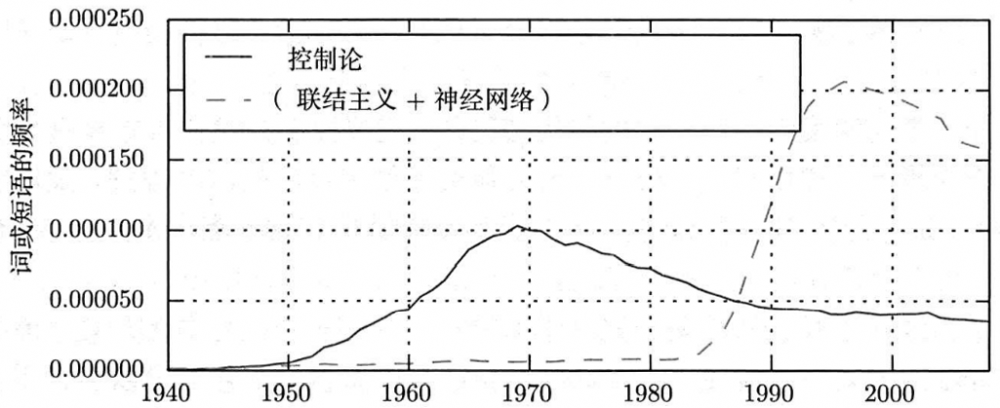
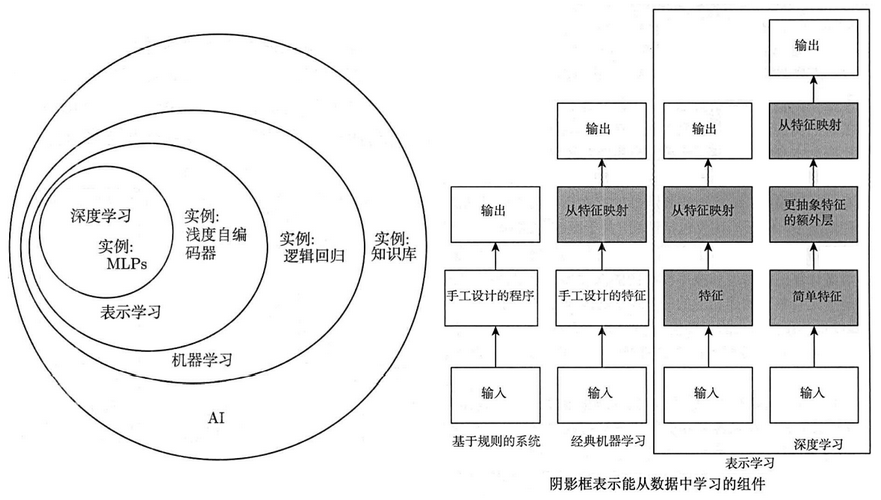
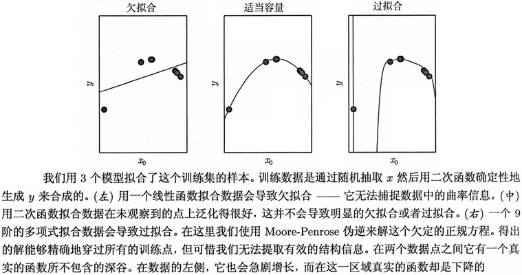
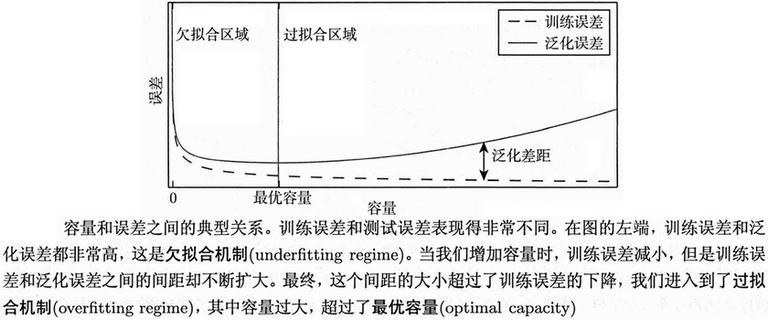
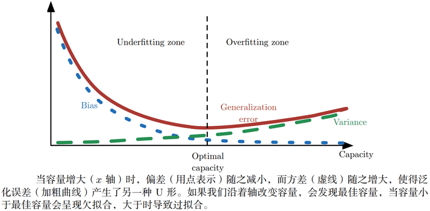
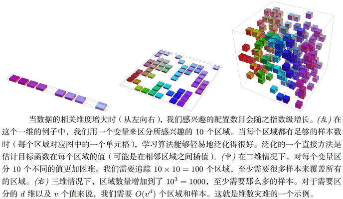
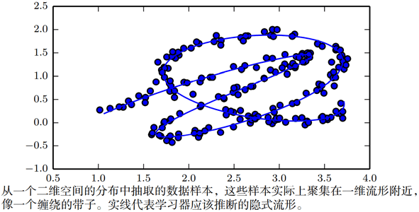

# 发展历史

事实上，深度学习的历史可以追溯到20世纪40年代。而且这个领域已经更换了很多名称，它反映了不同的研究人员和不同观点的影响。一般来说，目前为止深度学习已经经历了三次发展浪潮：20世纪40年代到60年代深度学习的雏形出现在**控制论**（cybernetics）中，20世纪80年代到90年代深度学习表现为**联结主义**（connectionism），直到2006年才真正以**深度学习**之名复兴。

一些最早的学习算法，是旨在模拟生物学习的计算模型，即大脑怎样学习或为什么能学习的模型。其结果是深度学习以**人工神经网络**（artificial neural network，ANN）之名而淡去。彼时，深度学习模型被认为是受生物大脑（无论人类大脑或其他动物的大脑）所启发而设计出来的系统。

现代术语“深度学习”超越了目前机器学习模型的神经科学观点。它诉诸于学习**多层次组合**这一更普遍的原理，这一原理也可以应用于那些并非受神经科学启发的机器学习框架。

现代深度学习的最早前身是从神经科学的角度出发的简单线性模型。这些模型被设计为使用一组n个输入$x_1,x_2,\cdots,x_n$，并将它们与一个输出y相关联。这些模型希望学习一组权重$w_1,w_2,\cdots,w_n$，并计算它们的输出$y=f(x,w)=x_1w_1+x_2w_2+\cdots+x_nw_n$。这第一波神经网络研究浪潮被称为**控制论**。

**MP神经元**（McCulloch and Pitts）是脑功能的早期模型。该线性模型通过检验函数$f(x,w)$的正负来识别两种不同类别的输入。显然，模型的权重需要正确设置后才能使模型的输出对应于期望的类别。这些权重可以由操作人员设定。在20世纪50年代，**感知机**成为第一个能根据每个类别的输入样本来学习权重的模型。约在同一时期，**自适应线性单元**（adaptive linear element，ADALINE）简单地返回函数$f(x)$本身的值来预测一个实数，并且它还可以学习从数据预测这些数。

用于调节ADALINE权重的训练算法是被称为**随机梯度下降**（stochastic gradient descent）的一种特例。稍加改进后的随机梯度下降算法仍然是当今深度学习的主要训练算法。

基于感知机和ADALINE中使用的函数$f(x,w)$的模型被称为**线性模型**（linear model）。尽管在许多情况下，这些模型以不同于原始模型的方式进行训练，但仍是目前最广泛使用的机器学习模型。

线性模型有很多局限性。最著名的是，它们无法学习异或（XOR）函数。这种缺陷导致了神经网络热潮的第一次大衰退。

现在，神经科学已不再是主要指导。主要原因是我们根本没有足够的关于大脑的信息来作为指导去使用它。要获得对被大脑实际使用算法的深刻理解，我们需要有能力同时监测（至少是）数千相连神经元的活动。我们不能够做到这一点，所以我们甚至连大脑最简单、最深入研究的部分都还远远没有理解。

**新认知机**受哺乳动物视觉系统的结构启发，引入了一个处理图片的强大模型架构，它后来成为了现代**卷积网络**的基础。目前大多数神经网络是基于一个称为**整流线性单元**（rectified linear unit）的神经单元模型。

原始认知机受我们关于大脑功能知识的启发，引入了一个更复杂的版本。简化的现代版通过吸收来自不同观点的思想而形成。现代深度学习从许多领域获取灵感，特别是应用数学的基本内容如线性代数、概率论、信息论和数值优化。深度学习领域主要关注如何构建计算机系统，从而成功解决需要智能才能解决的任务，而计算神经科学领域主要关注构建大脑如何真实工作的比较精确的模型。

在20世纪80年代，神经网络研究的第二次浪潮在很大程度上是伴随一个被称为**联结主义**（connectionism）或**并行分布处理**（parallel distributed processing）潮流而出现的。联结主义是在认知科学的背景下出现的。认知科学是理解思维的跨学科途径，即它融合多个不同的分析层次。

联结主义者研究基于神经系统实现的**认知模型**。其中心思想是，当网络将大量简单的计算单元连接在一起时可以实现智能行为。这种见解同样适用于生物神经系统中的神经元，因为它和计算模型中隐藏单元起着类似的作用。联结主义期间形成的几个关键概念在今天的深度学习中仍是非常重要的。

其中一个概念是**分布式表示**（distributed representation）。其思想是，系统的每一个输入都应该由多个特征表示，并且每一个特征都应该参与到多个可能输入的表示中。

联结主义潮流的另一个重要成就是**反向传播**在训练具有内部表示的深度神经网络中的成功使用以及反向传播算法的普及。这个算法至今仍是训练深度模型的主导方法。

在20世纪90年代，研究人员引入**长短期记忆**（long short-term memory，LSTM）网络来解决对长序列进行建模的一些根本性数学难题。如今，LSTM在许多序列建模任务中广泛应用。

神经网络研究的第二次浪潮一直持续到上世纪90年代中期。期间机器学习的其他领域取得了进步，比如核方法和图模型都在很多重要任务上实现了很好的效果。

在那个时候，人们普遍认为深度网络是难以训练的。现在我们知道，20世纪80年代就存在的算法能工作得非常好，但是直到在2006年前后都没有体现出来。这可能仅仅由于其计算代价太高，而以当时可用的硬件难以进行足够的实验。

神经网络研究的第三次浪潮始于2006年的突破。研究者表明名为“深度信念网络”的神经网络可以使用一种称为“贪婪逐层预训练”的策略来有效地训练，且同样的策略可以被用来训练许多其他类型的深度网络，并能系统地帮助提高在测试样例上的泛化能力。神经网络研究的这一次浪潮普及了“**深度学习**”这一术语的使用，强调研究者现在有能力训练以前不可能训练的比较深的神经网络，并着力于深度的理论重要性上。此时，深度神经网络已经优于与之竞争的基于其他机器学习技术以及手工设计功能的AI系统。

# AI相关问题

**人工智能**（artificial intelligence，AI）是计算机科学的一个分支。对于计算机来说，可以通过一系列形式化数学规则来描述的问题较易解决。人工智能的真正挑战在于解决难以形式化描述的任务，如理解语言或识别图像。

一种解决方案是让计算机从经验中学习，并根据层次化的概念体系来理解世界，而每个概念则通过与某些相对简单的概念之间的关系来定义。让计算机从经验获取知识，可以避免由人类来给计算机形式化地指定它需要的所有知识。层次化的概念让计算机构建较简单的概念来学习复杂概念。如果绘制出这些概念如何建立在彼此之上的图，我们将得到一张“深”（层次很多）的图。基于这个原因，这种方法被成为**AI深度学习**（deep learning）。

一个人的日常生活需要关于世界的巨量知识。很多这方面的知识是主观的、直观的，因此很难通过形式化的方式表达清楚。计算机需要获取同样的知识才能表现出智能。人工智能的一个关键挑战就是如何将这些非形式化的知识传达给计算机。

一些人工智能项目力求将关于世界的知识用形式化的语言进行硬编码（hard-code）。计算机可以使用逻辑推理规则来自动地理解这些形式化语言中的声明。这就是人工智能的**知识库**（knowledgebase）方法。然而，这些项目最终都没有取得重大的成功。

依靠硬编码的知识体系面对的困难表明，AI系统需要具备自己获取知识的能力，即从原始数据中提取模式的能力。这种能力被称为**机器学习**（machine learning）。引入机器学习使计算机能够解决涉及现实世界知识的问题，并能作出看似主观的决策。

机器学习正是这样一门学科，它致力于研究如何通过计算的手段，利用经验来改善系统自身的性能。在计算机系统中，“经验”通常以“数据”形式存在，因此，机器学习所研究的主要内容，是关于在计算机上从数据中产生**模型**（model）的算法，即**学习算法**（learning algorithm）。有了学习算法，我们把经验数据提供给它，它就能基于这些数据产生模型；在面对新的情况时，模型会给我们提供相应的判断。

这些简单的机器学习算法的性能在很大程度上依赖于给定数据的**表示**（representation）。表示的选择会对机器学习算法的性能产生巨大的影响。在计算机科学中，如果数据集合被精巧地结构化并被智能地索引，那么诸如搜索之类的操作的处理速度就可以成指数级地加快。在整个计算机科学乃至日常生活中，对表示的依赖都是一个普遍现象。人可以很容易地在阿拉伯数字的表示下进行算术运算，但在罗马数字的表示下运算会比较耗时。

许多人工智能任务都可以通过以下方式解决：先提取一个合适的特征集，然后将这些特征提供给简单的机器学习算法。然而，对于许多任务来说，很难知道应该提取哪些特征。

解决这个问题的途径之一是使用机器学习来发掘表示本身，而不仅仅把表示映射到输出。这种方法称之为**表示学习**（representation learning）。学习到的表示往往比手动设计的表示表现得更好。并且它们只需最少的人工干预，就能让AI系统迅速适应新的任务。

表示学习算法的典型例子是**自编码器**（autoencoder）。自编码器由一个编码器（encoder）函数和一个解码器（decoder）函数组合而成。编码器函数将输入数据转换为一种不同的表示，而解码器函数则将这个新的表示转换到原来的形式。我们期望当输入数据经过编码器和解码器之后尽可能多地保留信息，同时希望新的表示有各种好的特性，这也是自编码器的训练目标。为了实现不同的特性，我们可以设计不同形式的自编码器。

当设计特征或设计用于学习特征的算法时，我们的目标通常是分离出能解释观察数据的**变差因素**（factors of variation）。在此背景下，“因素”这个词仅指代影响的不同来源，因素通常不是乘性组合。这些因素通常是不能被直接观察到的量。相反，它们可能是现实世界中观察不到的物体或者不可观测的力，但会影响可观测的量。为了对观察到的数据提供有用的简化解释或推断其原因，它们还可能以概念的形式存在于人类的思维中。它们可以被看作数据的概念或者抽象，帮助我们了解这些数据的丰富多样性。当分析语音记录时，变差因素包括说话者的年龄、性别、他们的口音和他们正在说的词语。当分析汽车的图像时，变差因素包括汽车的位置、它的颜色、太阳的角度和亮度。

在许多现实的人工智能应用中，困难主要源于多个变差因素同时影响着我们能够观察到的每一个数据。比如，在一张包含红色汽车的图片中，其单个像素在夜间可能会非常接近黑色；汽车轮廓的形状取决于视角。大多数应用需要我们理清变差因素并忽略我们不关心的因素。

显然，从原始数据中提取如此高层次、抽象的特征是非常困难的。许多诸如说话口音这样的变差因素，只能通过对数据进行复杂的、接近人类水平的理解来辨识。这几乎与获得原问题的表示一样困难，因此，乍一看，表示学习似乎并不能帮助我们。

**深度学习**（deep learning）通过其他较简单的表示来表达复杂表示，解决了表示学习中的核心问题。深度学习让计算机通过较简单概念构建复杂的概念。深度学习模型的典型例子是前馈深度网络或多层感知机（multi layer perceptron，MLP）。多层感知机仅仅是一个将一组输入值映射到输出值的数学函数。该函数由许多较简单的函数复合而成。我们可以认为不同数学函数的每一次应用都为输入提供了新的表示。

学习数据的正确表示的想法是解释深度学习的一个视角。

另一个视角是深度促使计算机学习一个多步骤的计算机程序。每一层表示都可以被认为是并行执行另一组指令之后计算机的存储器状态。更深的网络可以按顺序执行更多的指令。顺序指令提供了极大的能力，因为后面的指令可以参考早期指令的结果。从这个角度上看，在某层激活函数里，并非所有信息都蕴涵着解释输入的变差因素。表示还存储着状态信息，用于帮助程序理解输入。这里的状态信息类似于传统计算机程序中的计数器或指针。它与具体的输入内容无关，但有助于模型组织其处理过程。

目前主要有两种度量模型深度的方式。第一种方式是基于评估架构所需执行的顺序指令的数目。假设我们将模型表示为给定输入后，计算对应输出的流程图，则可以将这张流程图中的最长路径视为模型的深度。正如两个使用不同语言编写的等价程序将具有不同的长度；相同的函数可以被绘制为具有不同深度的流程图，其深度取决于我们可以用来作为一个步骤的函数。

另一种是在深度概率模型中使用的方法，它不是将计算图的深度视为模型深度，而是将描述概念彼此如何关联的图的深度视为模型深度。在这种情况下，计算每个概念表示的计算流程图的深度可能比概念本身的图更深。这是因为系统对较简单概念的理解在给出更复杂概念的信息后可以进一步精细化。例如，一个AI系统观察其中一只眼睛在阴影中的脸部图像时，它最初可能只看到一只眼睛。但当检测到脸部的存在后，系统可以推断第二只眼睛也可能是存在的。在这种情况下，概念的图仅包括两层（关于眼睛的层和关于脸的层），但如果我们细化每个概念的估计将需要额外的n次计算，即计算的图将包含2n层。

由于并不总是清楚计算图的深度或概率模型图的深度哪一个是最有意义的，并且由于不同的人选择不同的最小元素集来构建相应的图，因此就像计算机程序的长度不存在单一的正确值一样，架构的深度也不存在单一的正确值。另外，也不存在模型多么深才能被修饰为“深”的共识。但相比传统机器学习，深度学习研究的模型涉及更多学到功能或学到概念的组合，这点毋庸置疑。

总之，深度学习是通向人工智能的途径之一。具体来说，它是机器学习的一种，一种能够使计算机系统从经验和数据中得到提高的技术。我们坚信机器学习可以构建出在复杂实际环境下运行的AI系统，并且是唯一切实可行的方法。深度学习是一种特定类型的机器学习，具有强大的能力和灵活性，它将世界表示为嵌套的层次概念体系（由较简单概念间的联系定义复杂概念、从一般抽象概括到高级抽象表示）。

# 概念介绍

## （一）基本术语

要进行机器学习，先要有数据。一组记录的集合称为一个**数据集**（dataset），其中每条记录是关于一个事件或对象的描述，称为一个**示例**（instance）或**样本**（sample）。如(attr1=value1,attr2=value2,attr3=value3)。有时整个数据集亦称一个“样本”，因为它可看作对样本空间的一个采样；通过上下文可判断出“样本”是指单个示例还是数据集。

反映事件或对象在某方面的表现或性质的事项，称为**属性**（attribute）或**特征**（feature）；属性上的取值，称为**属性值**（attribute value）。属性张成的空间称为**属性空间**（attribute space）、**样本空间**（sample space）或**输入空间**。如attr1、attr2、attr3作为三个坐标轴，每个对象都可以在这个空间中找到自己的坐标。由于空间中的每个点对应一个坐标向量，因此我们也把一个示例称为一个“特征向量”（feature vector）。

一般地，令$D=\{\bold{x_1,x_2,\cdots,x_n}\}$表示包含n个示例的数据集，每个示例由d个属性描述，则每个示例$\bold{x_i}=(x_{i1},x_{i2},\cdots,x_{id})$​是d维样本空间中$\R_X^{d}$的一个向量，$\bold{x_i}\in \R_X^d$，其中$x_{ij}$是$\bold{x_i}$在第j个属性上的取值，d称为样本的**维数**（dimensionality）。

从数据中学得模型的过程称为**学习**（learning）或**训练**（training），这个过程通过执行某个学习算法来完成。训练过程中使用的数据称为**训练数据**（training data），其中每个样本称为一个**训练样本**（training sample），训练样本组成的集合称为**训练集**（training set）。训练样本亦称“训练示体”（training instance）或“训练例”。

学得的模型对应了关于数据的某种潜在的规律，因此亦称**假设**（hypothesis）；这种潜在规律自身，则称为**真相**或**真实**（ground-truth），学习过程就是为了找出或逼近真相。本书有时将模型称为“学习器”（learner），可看作学习算法在给定数据和参数空间上的实例化。学习算法通常有参数需设置，使用不同的参数值和训练数据，将产生不同的结果。

要建立用于**预测**（prediction）的模型，还需获得训练样本的“结果”信息，示例结果的信息称为**标记**（label）；拥有了标记信息的示例，则称为**样例**（example）。一般地，用$(\bold{x_i},y_i)$表示第i个样例，其中$y_i\in Y$是示例$\bold{x_i}$的标记，$Y$是所有标记的集合，亦称**标记空间**（label space）或“输出空间”。若将标记看作对象本身的一部分，则“样例”有时也称为“样本”。

若欲预测的是离散值，此类学习任务称为**分类**（classification）；若欲预测的是连续值，此类学习任务称为**回归**（regression）。对只涉及两个类别的“二分类”（binary classification）任务，通常称其中一个类为“正类”（positive class），另一个类为“反类”（negative class）；涉及多个类别时，则称为“多分类”（multi-class classification）任务。一般地，预测任务是希望通过对训练集$\{(\bold{x_1},y_1),(\bold{x_2},y_2),\cdots,(\bold{x_n},y_n)\}$进行学习，建立一个从输入空间到输出空间的映射$f:\R_X^d\rightarrow Y$。

学得模型后，使用其进行预测的过程称为**测试**（testing），被预测的样本称为**测试样本**（testing sample），亦称**测试示例**（testing instance）或“测试例”。

还可以对样本做**聚类**（clustering），即将训练集中的样本分成若干组，每组称为一个**簇**（cluster）；这些自动形成的簇可能对应一些潜在的无法直接被人感知的概念划分。这样的学习程有助于我们了解数据内在的规律，能为更深入地分析数据建立基础。需说明的是，在聚类学习中，最终学得的概念我们事先是不知道的，而且学习过程中使用的训练样本通常不拥有标记信息。

根据训练数据是否拥有标记信息，学习任务可大致划分为两大类，即**监督学习**（supervised learning）和**无监督学习**（unsupervised learning），分类和回归是前者的代表，而聚类则是后者的代表。

机器学习的目标是使学得的模型能很好地适用于“新样本”即**未见示例**（unseen instance）。学得模型适用于新样本的能力，称为**泛化**（generalization）能力。具有强泛化能力的模型能很好地适用于整个样本空间。

通常假设样本空间中全体样本服从一个未知**分布**（distribution）D，我们获得的每个样本都是独立地从这个分布上采样获得的，即**独立同分布**（independent and identically distributed，i.i.d.）。一般而言，训练样本越多，我们得到的关于分布D的信息越多，这样就越有可能通过学习获得具有强泛化能力的模型。

## （二）假设空间

归纳（induction）与演绎（deduction）是科学推理的两大基本手段。前者是从特殊到一般的“泛化”（generalization）过程，即从具体的事实归结出一般性规律；后者则是从一般到特殊的“特化”（specialization）过程，即从基础原理推演出具体状况。

从样例中学习显然是一个归纳的过程，因此亦称**归纳学习**（inductive learning）。归纳学习有狭义与广义之分，广义的归纳学习大体相当于从样例中学习，而狭义的归纳学习则要求从训练数据中学得概念（concept），因此亦称为“概念学习”或“概念形成”。

概念学习技术目前研究、应用都比较少，因为要学得泛化性能好且语义明确的概念实在太困难了，现实常用的技术大多是产生“黑箱”模型。然而，对概念学习有所了解，有助于理解机器学习的一些基础思想。概念学习中最基本的是布尔概念学习，即对“是”“不是”这样的可表示为0/1布尔值的目标概念的学习。

我们可以把学习过程看作一个在所有**假设**（hypothesis）组成的空间中进行搜索的过程，搜索目标是找到与训练集**匹配**（fit）的假设，即能够将训练集中的样本判断正确的假设。假设的表示一旦确定，假设空间及其规模大小就确定了。可以有许多策略对这个假设空间进行搜索，例如自顶向下、从一般到特殊，或是自底向上、从特殊到一般，搜索过程中可以不断删除与正例不一致的假设、和（或）与反例一致的假设。最终将会获得与训练集一致（即对所有训练样本能够进行正确判断）的假设，这就是我们学得的结果。

需注意的是，现实问题中我们常面临很大的假设空间，但学习过程是基于有限样本训练集进行的，因此，可能有多个假设与训练集一致，即存在着一个与训练集一致的“假设集合”，称为**版本空间**（version space）。

## （三）归纳偏好

通过学习得到的模型对应了假设空间中的一个假设。显然可能有多个与训练集一致的假设，它们的模型在面临新样本的时候，会产生不同的输出。如采用某假设的模型得到的结果是一种情形，而采用其他假设的模型，则判断的结果将会不同。

对于一个具体的学习算法而言，它必须要产生一个模型。这时，学习算法本身的“偏好”就会起到关键的作用。机器学习算法在学习过程中对某种类型假设的偏好，称为**归纳偏好**（inductive bias），或简称为“偏好”。

任何一个有效的机器学习算法必有其归纳偏好，否则它将被假设空间中看似在训练集上“等效”的假设所迷惑，而无法产生确定的学习结果。否则，若学习算法产生的模型每次在进行预测时随机抽选训练集上的等效假设，那么对某个测试样例，学得模型时而告诉我们它是好的、时而告诉我们它是不好的，这样的学习结果显然没有意义。

学习算法必须有某种偏好，才能产出它认为“正确”的模型。“奥卡姆剃刀”（Occam's razor）是一种常用的、自然科学研究中最基本的原则，即“若有多个假设与观察一致，则选最简单的那个”。然而不同的假设哪一个为最简单的也并不好确定。

事实上，归纳偏好对应了学习算法本身所做出的关于“什么样的模型更好”的假设。在具体的现实问题中，这个假设是否成立，即算法的归纳偏好是否与问题本身匹配，大多数时候直接决定了算法能否取得好的性能。

若所有情况的概率等同。对于一个学习算法La，若它在某些问题上比学习算法Lb好，则必然存在另一些问题，在那里Lb比La好。有趣的是，这个结论对任何算法均成立。无论学习算法La多聪明、学习算法Lb多笨拙，它们的期望性能是相同的。这就是“没有免费的午餐”定理（No Free Lunch Theorem，NFL）。

NFL定理有一个重要前提，即所有“问题”出现的机会相同、或所有问题同等重要，但实际情形并不是这样。很多时候，我们只关注自己正在试图解决的问题（例如某个具体应用任务），希望为它找到一个解决方案，至于这个解决方案在别的问题、甚至在相似的问题上是否为好方案，我们并不关心。

所以，NFL定理最重要的寓意，是让我们清楚地认识到，脱离具体问题，空泛地谈论“什么学习算法更好”毫无意义，因为若考虑所有潜在的问题，则所有学习算法都一样好。要谈论算法的相对优劣，必须要针对具体的学习问题，学习算法自身的归纳偏好与问题是否相配，往往会起到决定性的作用。

# 学习算法

机器学习算法是一种能够从数据中学习的算法。Mitchell（1997）提供了“学习”的一个简洁定义：“对于某类任务T和性能度量P，一个计算机程序被认为可以从经验E中学习是指，通过经验e改进后，它在任务T上由性能度量P衡量的性能有所提升。”

经验E、任务T和性能度量P的定义范围非常宽广。

## （一）任务T

机器学习可以解决一些人为设计和使用确定性程序很难解决的问题。从“任务”的相对正式的定义上说，学习过程本身不能算是任务。学习是所谓的获取完成任务的能力。例如，我们的目标是使机器人能够行走，那么行走便是任务。我们可以编程让机器人学会如何行走，或者可以人工编写特定的指令来指导机器人如何行走。

通常机器学习任务定义为机器学习系统应该如何处理**样本（example）**。样本是指人们从某些希望机器学习系统处理的对象或事件中收集到的已经量化的**特征（feature）的集合**。通常会将样本表示成一个向量$\mathbf{x}\in\R$，其中向量的每一个元素$x_i$是一个特征。例如，一张图片的特征通常是指这张图片的像素值。

机器学习可以解决很多类型的任务。一些非常常见的机器学习任务列举如：分类、输入缺失分类、回归、转录、机器翻译、结构化输出、异常检测、合成和采样、缺失值填补、去噪、密度估计或概率质量函数估计。当然，还有很多其他同类型或其他类型的任务，这里列举的任务类型只是用来介绍机器学习可以做哪些任务，并非严格地定义机器学习任务分类。

## （二）性能度量P

为了评估机器学习算法的能力，必须设计其性能的定量度量。通常性能度量P是特定于系统执行的任务T而言的。

对于诸如分类、缺失输入分类和转录任务，通常度量模型的**正确率/准确率（accuracy）**。正确率是指该模型输出正确结果的样本比率。也可以通过**错误率（error rate）**得到相同的信息。错误率是指该模型输出错误结果的样本比率。

分类算法一般有下面几种分类结果：

- True Positives（TP），实际为正例且被分类器分为正例的个数；
- False Positives（FP），实际为负例且被分类器分为正例的个数；
- False Negatives（FN），实际为正例且被分类器分为负例的个数；
- True Negatives（TN），实际为负例且被分类器分为负例的个数；
- TP+FN=P，实际的正例个数；
- FP+TN=N，实际的负例个数。

针对上面的分类结果，分类算法一般有下面几种评估方法：

- **正确率/准确率（accuracy）**，$\text{accuracy}=\frac{TP+TN}{P+N}$，它表示分类正确的个数除以总的样本数；
- **错误率（error rate）**，$\text{error-rate}=\frac{FP+FN}{P+N}=1-\text{accuracy}$，它表示分类错误的个数除以总的样本数；
- **精度/查准率（precision）**，$\text{precision}=\frac{TP}{TP+FP}$，它表示预测分为正例的样本中有多少是分类正确的；
- **召回率/查全率（recall）**，$\text{recall}=\frac{TP}{TP+FN}=\frac{TP}{P}$，它表示预测正确的正例占总正例的比例，也称之为灵敏度（sensitive）。

一般情况下，在一定正确率前提下，要求分类器的召回率尽量高。

通常，我们会更加关注机器学习算法在未观测数据上的性能如何，因为这将决定其在实际应用中的性能。因此，我们使用**测试集（test set）**数据来评估系统性能，将其与训练机器学习系统的训练集数据分开。

还有一些情况，我们知道应该度量哪些数值，但是度量它们不太现实。这种情况经常出现在密度估计中。很多最好的概率模型只能隐式地表示概率分布。在许多这类模型中，计算空间中特定点的概率是不可行的。在这些情况下，我们必须设计一个仍然对应于设计对象的替代标准，或者设计一个理想标准的良好近似。

## （三）经验E

**数据集（dataset）**是指很多样本组成的集合，有时也将样本称为数据点（data point）。大部分学习算法可以被理解为在整个数据集上获取经验。根据学习过程中的不同经验，机器学习算法可以大致分类为无监督（unsupervised）算法和监督（supervised）算法。

**监督学习算法（supervised learning algorithm）**训练含有很多特征的数据集，不过数据集中的样本都有一个标签（label）或目标（target）。**无监督学习算法（unsupervised learning algorithm）**训练含有很多特征的数据集（无标签），然后学习出这个数据集上有用的结构性质。在深度学习中，我们通常要学习生成数据集的整个概率分布，显式地比如密度估计，或是隐式地比如合成或去噪。还有一些其他类型的无监督学习任务，例如聚类，将数据集分成相似样本的集合。

大致说来，无监督学习涉及到观察随机向量$\mathbf{x}$的好几个样本，试图显式或隐式地学习出概率分布$p(\mathbf{x})$，或者是该分布一些有意思的性质；而监督学习包含观察随机向量$\mathbf{x}$及其相关联的值或向量$\mathbf{y}$，然后从$\mathbf{x}$预测$\mathbf{y}$，通常是估计$p(\mathbf{y}|\mathbf{x})$。术语监督学习（supervised learning）源自这样一个角度，教师提供目标$\mathbf{y}$给机器学习系统，指导其应该做什么。在无监督学习中，没有教师，算法必须学会在没有指导的情况下理解数据。

无监督学习和监督学习不是严格定义的术语。它们之间界线通常是模糊的。很多机器学习技术可以用于这两个任务。尽管无监督学习和监督学习并非完全没有交集的正式概念，它们确实有助于粗略分类我们研究机器学习算法时遇到的问题。传统地，人们将回归、分类或者结构化输出问题称为监督学习。支持其他任务的密度估计通常被称为无监督学习。

有些机器学习算法并不是训练于一个固定的数据集上。例如，强化学习（reinforcement learning）算法会和环境进行交互，所以学习系统和它的训练过程会有反馈回路。大部分机器学习算法简单地训练于一个数据集上。数据集可以用很多不同方式来表示。在所有的情况下，数据集都是样本的集合，而样本是特征的集合。

表示数据集的常用方法是**设计矩阵（design matrix）**。设计矩阵的每一行包含一个不同的样本，每一列对应不同的特征。当然，每一个样本都能表示成向量，并且这些向量的维度相同，才能将一个数据集表示成设计矩阵。这一点并非永远可能。例如，有不同宽度和高度的照片的集合，那么不同的照片将会包含不同数量的像素。因此不是所有的照片都可以表示成相同长度的向量。在上述这类情况下，我们不会将数据集表示成m行的矩阵，而是表示成m个元素的结合，这种表示方式意味着不同的样本向量可以有不同的大小。

在监督学习中，样本包含一个标签或目标和一组特征。通常在处理包含观测特征的设计矩阵$\mathbf{X}$的数据集时，我们也会提供一个标签向量$\mathbf{y}$，其中$y_i$表示样本i的标签。当然，有时标签可能不止一个数。

# 容量、过拟合和欠拟合

机器学习的主要挑战是我们的算法必须能够在先前未观测的新输入上表现良好，而不只是在训练集上表现良好。在先前未观测到的输入上表现良好的能力被称为**泛化（generalization）能力**。

通常情况下，当我们训练机器学习模型时，可以使用某个训练集，在训练集上计算一些被称为**训练误差（training error）**的度量误差，目标是降低训练误差，这讨论的是一个简单的优化问题。机器学习和优化不同的地方在于，我们也希望**泛化误差（generalization error）**（也被称为**测试误差（test error）**）很低。泛化误差被定义为新输入的误差期望。这里，期望的计算基于不同的可能输入，这些输入采自于系统在现实中遇到的分布。

通常，我们度量模型在训练集中分出来的测试集（test set）样本上的性能，来评估机器学习模型的泛化误差。而当我们只能观测到训练集时，该如何才能获得测试集的性能呢？统计学习理论（statistical learning theory）提供了一些答案。如果训练集和测试集的数据是任意收集的，那么我们能够做的确实很有限。如果对训练集和测试集数据的收集方式做些假设，那么我们能够对算法做些改进。训练集和测试集数据通过数据集上被称为**数据生成过程（data generating process）**的概率分布生成。通常，我们会做一系列被统称为**独立同分布假设（i.i.d. assumption）**的假设。该假设是说，每个数据集中的样本都是彼此**相互独立的（independent）**，并且训练集和测试集是**同分布的（identically distributed）**，采样自相同的分布。这个假设使我们能够以单个样本的概率分布描述数据生成过程。然后相同的分布可以用来生成每一个训练样本和每一个测试样本。我们将这个共享的潜在分布称为**数据生成分布（data generating distribution）**，记作$p_{data}$。这个概率框架和独立同分布假设允许我们从数学上研究训练误差和测试误差之间的关系。

我们能观察到训练误差和测试误差之间的直接联系是，随机模型训练误差的期望和该模型测试误差的期望是一样的。假设我们有概率分布$p(\mathbf{x},y)$，从中重复采样生成训练集和测试集。对于某个固定的模型权值$\mathbf{W}$，训练集误差的期望恰好和测试集误差的期望一样，这是因为这两个期望的计算都使用了相同的数据集生成过程。这两种情况的唯一区别是数据集的名字不同。

当然，当我们使用机器学习算法时，并不会提前固定参数，然后采样得到两个数据集。我们采样得到训练集，然后挑选参数去降低训练集误差，然后采样得到测试集。在这个过程中，测试误差期望会大于或等于训练误差期望。以下是决定机器学习算法效果是否好的因素：(1)降低训练误差；(2)缩小训练误差和测试误差的差距。这两个因素对应机器学习的两个主要挑战：**欠拟合（underfitting）**和**过拟合（overfitting）**。欠拟合是指模型不能在训练集上获得足够低的误差。而过拟合是指训练误差和和测试误差之间的差距太大。

通过调整模型的**容量（capacity）**，我们可以控制模型是否偏向于过拟合或者欠拟合。通俗地，**模型的容量是指其拟合各种函数的能力**。容量低的模型可能很难拟合训练集。容量高的模型可能会过拟合，因为记住了不适用于测试集的训练集性质。一种控制训练算法容量的方法是选择假设空间（hypothesis space），即学习算法可以选择为解决方案的函数集。例如，线性回归算法将关于其输入的所有线性函数作为假设空间。广义线性回归的假设空间包括多项式函数，而非仅有线性函数。这样做就增加了模型的容量。

当机器学习算法的容量适合于所执行任务的复杂度和所提供训练数据的数量时，算法效果通常会最佳。容量不足的模型不能解决复杂任务。容量高的模型能够解决复杂的任务，但是当其容量高于任务所需时，有可能会过拟合。

下图展示了这个原理的使用情况。我们比较了线性，二次和九次预测器拟合真实二次函数的效果。线性函数无法刻画真实函数的曲率，所以欠拟合。九次函数能够表示正确的函数，但是因为训练参数比训练样本还多，所以它也能够表示无限多个刚好穿越训练样本点的很多其他函数。我们不太可能从这很多不同的解中选出一个泛化良好的。

上面探讨了通过改变输入特征的数目和加入这些特征对应的参数，改变模型的容量。事实上，还有很多方法可以改变模型的容量。容量不仅取决于模型的选择。模型规定了调整参数降低训练目标时，学习算法**可以从哪些函数族中选择函数**，这被称为模型的**表示容量（representational capacity）**。在很多情况下，从这些函数中挑选出最优函数是非常困难的优化问题。实际中，学习算法不会真的找到最优函数，而仅是找到一个可以大大降低训练误差的函数。额外的限制因素，比如优化算法的不完美，意味着学习算法的**有效容量（effective capacity）**可能小于模型族的表示容量。

统计学习理论提供了量化模型容量的不同方法。统计学习理论中最重要的结论阐述了训练误差和泛化误差之间差异的上界随着模型容量增长而增长，但随着训练样本增多而下降。这些边界为机器学习算法可以有效解决问题提供了理论验证，但是它们很少应用于实际中的深度学习算法。一部分原因是边界太松，另一部分原因是很难确定深度学习算法的容量。由于有效容量受限于优化算法的能力，确定深度学习模型容量的问题特别困难。

必须记住虽然更简单的函数更可能泛化（训练误差和测试误差的差距小），但我们仍然需要选择一个充分复杂的假设以达到低的训练误差。通常，当模型容量上升时，训练误差会下降，直到其渐近最小可能误差（假设误差度量有最小值）。通常来说，泛化误差是一个关于模型容量的U形曲线函数。如下图所示。

训练误差和泛化误差会随训练集的大小发生变化。泛化误差的期望从不会因训练样本数目的增加而增加。值得注意的是，具有最优容量的模型仍然有可能在训练误差和泛化误差之间存在很大的差距。在这种情况下，我们可以通过收集更多的训练样本来缩小差距。

至此，我们具体讨论修改学习算法的方法只有，通过增加或减少学习算法可选假设空间的函数来增加或减少模型的表示容量。算法的效果不仅很大程度上受影响于假设空间的函数数量，也取决于这些函数的具体形式，如对于完全非线性的问题则线性函数不太有效。因此我们可以通过两种方式控制算法的性能，一是允许使用的函数种类，二是这些函数的数量。

没有最优的学习算法，我们必须在特定任务上设计性能良好的机器学习算法，可以通过建立一组学习算法的偏好来达到这个要求，当这些偏好和希望算法解决的学习问题相吻合时，性能会更好。在假设空间中，相比于某一个学习算法，我们可能更偏好另一个学习算法。这意味着两个函数都是符合条件的，但是我们更偏好其中一个。只有非偏好函数比偏好函数在训练数据集上效果明显好很多时，我们才会考虑非偏好函数。

更一般地，正则化一个学习函数$f(\mathbf{x};\theta)$的模型，我们可以给代价函数添加被称为正则化项（regularizer）的惩罚，之后会专门一章来讲述正则化的内容。表示对函数的偏好是比增减假设空间的成员函数更一般的控制模型容量的方法。我们可以将去掉假设空间中的某个函数看作是对不赞成这个函数的无限偏好。

除了通过在最小化的目标中额外增加一项来表示偏好，还有很多其他方法隐式或显式地表示对不同解的偏好。总而言之，这些不同的方法都被称为**正则化（regularization）**。正则化是指我们修改学习算法，使其降低泛化误差而非训练误差。正则化是机器学习领域的中心问题之一，只有优化能够与其重要性相媲。

没有最优的学习算法，特别地，也没有最优的正则化形式。反之，我们必须挑选一个非常适合于我们所要解决的任务的正则形式。深度学习中普遍的理念是大量任务也许都可以使用非常通用的正则化形式来有效解决。

# 超参数和验证集

大多数机器学习算法都有超参数，可以设置来控制算法行为。超参数的值不是通过学习算法本身学习出来的，尽管我们可以设计一个嵌套的学习过程，一个学习算法为另一个学习算法学出最优超参数。

有时一个选项被设为学习算法不用学习的超参数，是因为它太难优化了。而更多的情况是，该选项必须是超参数，因为它不适合在训练集上学习。这适用于控制模型容量的所有超参数，如果在训练集上学习超参数，这些超参数总是趋向于最大可能的模型容量，导致过拟合。例如，相比低次多项式和正的权重衰减设定，更高次的多项式和权重衰减参数设定$\lambda=0$总能在训练集上更好地拟合。

为了解决这个问题，我们需要一个训练算法观测不到的**验证集（validation set）**样本。

之前讨论过和训练数据相同分布的样本组成的测试集，它可以用来估计学习过程完成之后的学习器的泛化误差。其重点在于测试样本不能以任何形式参与到模型的选择中，包括设定超参数。基于这个原因，测试集中的样本不能用于验证集。因此，我们总是从训练数据中构建验证集。特别地，将训练数据分成两个不相交的子集，其中一个用于学习参数，另一个作为验证集，用于估计训练中或训练后的泛化误差，更新超参数。用于学习参数的数据子集通常仍被称为训练集，尽管这会和整个训练过程用到的更大的数据集相混；用于挑选超参数的数据子集被称为验证集（validation set）。通常，80%的训练数据用于训练，20%用于验证。由于验证集是用来“训练”超参数的，尽管验证集的误差通常会比训练集误差小，验证集会低估泛化误差。所有超参数优化完成之后，泛化误差可能会通过测试集来估计。

在实际中，当相同的测试集已在很多年中重复地用于评估不同算法的性能，并且考虑学术界在该测试集上的各种尝试，我们最后可能也会对测试集有着乐观的估计。基准会因之变得陈旧，而不能反映系统的真实性能。值得庆幸的是，学术界往往会移到新的（通常会更巨大、更具挑战性）基准数据集上。

将数据集分成固定的训练集和固定的测试集后，若测试集的误差很小，这将是有问题的。一个小规模的测试集意味着平均测试误差估计的统计不确定性，使得很难判断一个算法是否比另一个算法在给定的任务上做得更好。

当数据集有十万计或者更多的样本时，这不会是一个严重的问题。当数据集太小时，也有替代方法允许我们使用所有的样本估计平均测试误差，代价是增加了计算量。这些过程是基于在原始数据上随机采样或分离出的不同数据集上重复训练和测试的想法。最常见的是k-折交叉验证过程，将数据集分成k个不重合的子集，测试误差可以估计为k次计算后的平均测试误差。在第i次测试时，数据的第i个子集用于测试集，其他的数据用于训练集。

# 估计、偏差和方差

统计领域为我们提供了很多工具来实现机器学习目标，不仅可以解决训练集上的任务，还可以泛化。基本的概念，例如参数估计、偏差和方差，对于正式地刻画泛化、欠拟合和过拟合都非常有帮助。

## （一）点估计

点估计试图为一些感兴趣的量提供单个“最优”预测。一般地，感兴趣的量可以是单个参数，或是某些参数模型中的一个向量参数，但是也有可能是整个函数。为了区分参数真实值和估计，习惯将参数$\theta$的点估计表示为$\hat\theta$。

令$\{\mathbf{x}^{(1)},\cdots,\mathbf{x}^{(m)}\}$是m个独立同分布（i.i.d.）的数据点，**点估计（point estimator）**或**统计量（statistics）**是这些数据的任意函数：
$$
\hat\theta_m=g(\mathbf{x}^{(1)},\cdots,\mathbf{x}^{(m)})
$$
这个定义不要求g返回一个接近真实θ的值，或者g的值域恰好是$\theta$的允许取值范围。

点估计的定义非常宽泛，给了估计量的设计者极大的灵活性。虽然几乎所有的函数都可以称为估计量，但是一个良好的估计量的输出会接近生成训练数据的真实参数$\theta$。现在假设真实参数$\theta$是固定但未知的，而点估计$\hat\theta$是数据的函数。由于数据是随机过程采样出来的，数据的任何函数都是随机的。因此$\hat\theta$是一个随机变量。点估计也可以指输入和目标变量之间关系的估计，将这种类型的点估计称为函数估计。

有时我们会关注函数估计（或函数近似），这时我们试图从输入向量$\mathbf{x}$预测变量$\mathbf{y}$。假设有一个函数$f(\mathbf{x})$表示$\mathbf{y}$和$\mathbf{x}$之间的近似关系。例如，我们可能假设$\mathbf{y}=f(\mathbf{x})+\varepsilon$，其中$\varepsilon$是$\mathbf{y}$中未能从$\mathbf{x}$预测的一部分。在函数估计中，我们感兴趣的是用模型估计去近似$f$，或者估计$\hat{f}$。函数估计和估计参数$\theta$是一样的，函数估计$\hat{f}$是函数空间中的一个点估计。

## （二）偏差

估计的偏差被定义为：
$$
\text{bias}(\hat\theta_m)=\text{E}(\hat\theta_m)-\theta
$$
其中期望作用在所有数据（看作是从随机变量采样得到的）上，$\theta$是用于定义数据生成分布的$\theta$的真实值。如果$\text{bias}(\hat\theta_m)=0$，那么估计量$\hat\theta_m$被称为是**无偏（unbiased）**，这意味着$\text{E}(\hat\theta_m)=\theta$。如果$\lim\limits_{m\to\infty}\text{bias}(\hat\theta_m)=0$，那么估计量$\hat\theta_m$被称为是**渐近无偏（asymptotically unbiased）**，这意味着$\lim\limits_{m\to\infty}\text{E}(\hat\theta_m)=\theta$。

## （三）方差和标准差

我们有时会考虑估计量的另一个性质，即它作为数据样本的函数，期望的变化程度是多少。正如可以计算估计量的期望来决定它的偏差，我们也可以计算它的**方差（variance）**，记作$\text{Var}(\hat\theta)$，其中随机变量是训练集。另外，方差的平方根被称为**标准差（standard error）**，记作$\text{SE}(\hat\theta)$。估计量的方差或标准差告诉我们，当独立地从潜在的数据生成过程中重采样数据集时，如何期望估计的变化。正如我们希望估计的偏差较小，我们也希望其方差较小。

当我们使用有限的样本计算任何统计量时，真实参数的估计都是不确定的，在这个意义下，从相同的分布得到其他样本时，它们的统计量也会不一样。任何方差估计量的期望程度是我们想量化的误差的来源。

## （四）权衡偏差和方差以最小化均方误差

偏差和方差度量着估计量的两个不同误差来源。偏差度量着偏离真实函数或参数的误差期望。而方差度量着数据上任意特定采样可能导致的估计期望的偏差。

当我们只可以选择一个偏差较大的估计或一个方差较大的估计时，判断这种权衡最常用的方法是交叉验证。经验上，交叉验证在真实世界的许多任务中都非常成功。另外，我们也可以比较这些估计的**均方误差（mean squared error，MSE）**：
$$
\text{MSE}=\text{E}[(\hat\theta_m-\theta)^2]=\text{bias}(\hat\theta_m)^2+\text{Var}(\hat\theta_m)
$$
MSE度量着估计和真实参数$\theta$之间平方误差的总体期望偏差。如上式所示，MSE估计包含了偏差和方差。理想的估计具有较小的MSE或是在检查中会稍微约束它们的偏差和方差。

偏差和方差的关系和机器学习容量、欠拟合和过拟合的概念紧密相联。用MSE度量泛化误差（偏差和方差对于泛化误差都是有意义的）时，增加容量会增加方差，降低偏差。如下图所示，我们再次在关于容量的函数中，看到泛化误差的U形曲线。

# 随机梯度下降

几乎所有的深度学习算法都用到了一个非常重要的算法，即**随机梯度下降（stochastic gradient descent，SGD）**，它是梯度下降算法的一个扩展。

机器学习中反复出现的一个问题是好的泛化需要大的训练集，但大的训练集的计算代价也更大。机器学习算法中的代价函数通常可以分解成每个样本的代价函数的总和：
$$
J(\theta)=\dfrac{1}{m}\sum_{i=1}^mL(\mathbf{x}^{(i)},y^{(i)},\theta)
$$
对于这些相加的代价函数，其需要计算的梯度也分为多个部分相加：
$$
\nabla_\theta J(\theta)=\dfrac{1}{m}\sum_{i=1}^m\nabla_\theta L(\mathbf{x}^{(i)},y^{(i)},\theta)
$$
若代价函数分成m个部分相加，则这个运算的计算代价是$O(m)$。随着训练集规模增长为数十亿的样本，计算一步梯度也会消耗相当长的时间。

随机梯度下降的核心是，梯度是期望。期望可使用小规模的样本近似估计。具体而言，在算法的每一步，我们从训练集中均匀抽出一**小批量（minibatch）**样本$\mathbb{B}=\{\mathbf{x}^{(1)},\cdots,\mathbf{x}^{(m')}\}$，其中小批量的数目$m'$通常是一个相对较小的数，从一到几百。重要的是，当训练集大小m增长时，$m'$通常是固定的。我们可能在拟合几十亿的样本时，每次更新计算只用到几百个样本。

梯度的估计可以表示成：
$$
\mathbf{g}=\dfrac{1}{m'}\sum_{i=1}^{m'}\nabla_\theta L(\mathbf{x}^{(i)},y^{(i)},\theta)
$$
来使用来自小批量$\mathbb{B}$的样本。然后，随机梯度下降算法使用如下的梯度下降估计：
$$
\theta\gets\theta-\varepsilon\mathbf{g}
$$
其中，$\varepsilon$是学习率。

梯度下降往往被认为很慢或不可靠，将梯度下降应用到非凸优化问题被认为很鲁莽或没有原则。不过，优化算法不一定能保证在合理的时间内达到一个局部最小值，但它通常能及时地找到代价函数一个很小的值，并且是有用的。

随机梯度下降在深度学习之外有很多重要的应用，它是在大规模数据上训练大型线性模型的主要方法。对于固定大小的模型，每一步随机梯度下降更新的计算量不取决于训练集的大小m。在实践中，当训练集大小增长时，我们通常会使用一个更大的模型，但这并非是必须的。达到收敛所需的更新次数通常会随训练集规模增大而增加。然而，当m趋向于无穷大时，该模型最终会在随机梯度下降抽样完训练集上的所有样本之前，收敛到可能的最优测试误差。继续增加m不会延长达到模型可能的最优测试误差的时间。从这点来看，我们可以认为用SGD训练模型的渐近代价是关于m的函数的$O(1)$级别。

在深度学习兴起之前，学习非线性模型的主要方法是结合核技巧的线性模型。很多核学习算法需要构建一个$m\times m$的矩阵$G_{i,j}=k(\mathbf{x}^{(i)},\mathbf{x}^{(j)})$，构建这个矩阵的计算量是$O(m^2)$。当数据集是几十亿个样本时，这个计算量是不能接受的。在学术界，深度学习从2006年开始受到关注的原因是，在数以万计样本的中等规模数据集上，深度学习在新样本上比当时很多热门算法泛化得更好。不久后，深度学习在工业界受到了更多的关注，因为其提供了一种训练大数据集上的非线性模型的可扩展方式。

# 构建机器学习算法

几乎所有的深度学习算法都可以被描述为一个相当简单的配方：特定的数据集、代价函数、优化过程和模型。

例如，线性回归算法由以下部分组成：$\mathbf{X}$和$\mathbf{y}$构成的数据集，代价函数
$$
J(\mathbf{w},b) = -\mathbb{E}_{(\mathbf{x},y)\sim\hat{p}_{data}} \log p_{model}(y|\mathbf{x})
$$
模型是$p_{model}(y|\mathbf{x})=\mathcal{N}(y;\mathbf{x}^\text{T}\mathbf{w}+b,1)$，在大多数情况下，优化算法可以直接定义为求解代价函数梯度为零的正规方程。

意识到我们可以替换独立于其他组件的大多数组件，因此我们能得到很多不同的算法。

通常代价函数至少含有一项使学习过程进行统计估计的成分。最常见的代价函数是负对数似然，最小化代价函数导致的最大似然估计。

代价函数也可能含有附加项，如正则化项。例如，我们可以将权重衰减加到线性回归的代价函数中
$$
J(\mathbf{w},b) = -\mathbb{E}_{(\mathbf{x},y)\sim\hat{p}_{data}} \log p_{model}(y|\mathbf{x}) + \lambda\|\mathbf{w}\|_2^2
$$
该优化仍然有闭解。

如果我们将该模型变成非线性的，那么大多数代价函数不再能通过闭解优化。这就要求我们选择一个迭代数值优化过程，如梯度下降等。

组合模型、代价和优化算法来构建学习算法的配方同时适用于监督学习和无监督学习。线性回归示例说明了如何适用于监督学习的。无监督学习时，我们需要定义一个只包含$\mathbf{X}$的数据集、一个合适的无监督代价函数和一个模型。例如，通过指定如下损失函数可以得到PCA的第一个主向量
$$
J(\mathbf{w})=\mathbb{E}_{\mathbf{x}\sim\hat{p}_{data}}\|\mathbf{x}-r(\mathbf{x};\mathbf{w})\|_2^2
$$
模型定义为重构函数$r(\mathbf{x})=\mathbf{w}^\text{T}\mathbf{xw}$，并且$\mathbf{w}$有范数为$1$的限制。

在某些情况下，由于计算原因，我们不能实际计算代价函数。在这种情况下，只要我们有近似其梯度的方法，那么我们仍然可以使用迭代数值优化近似最小化目标。

尽管有时候不显然，但大多数学习算法都用到了上述配方。如果一个机器学习算法看上去特别独特或是手动设计的，那么通常需要使用特殊的优化方法进行求解。有些模型，如决策树或k-means，需要特殊的优化，因为它们的代价函数有平坦的区域，使其不适合通过基于梯度的优化去最小化。

在我们认识到大部分机器学习算法可以使用上述配方描述之后，我们可以将不同算法视为出于相同原因解决相关问题的一类方法，而不是一长串各个不同的算法。

# 促使深度学习发展的挑战

上面描述的简单机器学习算法在很多不同的重要问题上效果都良好，但是它们不能成功解决人工智能中的核心问题，如语音识别或者对象识别。深度学习发展动机的一部分原因就是传统学习算法在这类人工智能问题上泛化能力不足。

本节介绍为何处理高维数据时在新样本上泛化特别困难，以及为何在传统机器学习中实现泛化的机制不适合学习高维空间中复杂的函数。这些空间经常涉及巨大的计算代价。深度学习旨在克服这些以及其他一些难题。

## （一）维数灾难

当数据的维数很高时，很多机器学习问题变得相当困难，这种现象被称为**维数灾难（curse of dimensionality）**。特别值得注意的是，一组变量不同的可能配置数量会随着变量数目的增加而指数级增长。维数灾难发生在计算机科学的许多地方，在机器学习中尤其如此。

由维数灾难带来的一个挑战是统计挑战。如下图所示，统计挑战产生于$\mathbf{x}$的可能配置数目远大于训练样本的数目，即整个样本空间所包含的样本个数，远大于所观测到的实际训练样本数目。

为了充分理解这个问题，我们假设输入空间如图所示被分成单元格。空间是低维时，我们可以用由大部分数据占据的少量单元格去描述这个空间。泛化到新数据点时，通过检测和新输入点在相同单元格中的训练样本，我们可以判断如何处理新数据点。但是，在高维空间中参数配置数目远大于样本数目，大部分单元格中没有样本。如何能在这些新配置中找到一些有意义的东西，许多传统机器学习算法只是简单地假设在一个新点的输出应大致和最接近的训练点的输出相同。

## （二）流形学习

流形是机器学习中很多想法都含有的重要概念。**流形（manifold）**指连接在一起的区域。数学上，它是指一组点，且每个点都有其邻域，给定一个任意的点，其流形局部看起来像是欧几里得空间。日常生活中，我们将地球视为二维平面，但实际上它是三维空间中的球状流形。每个点周围邻域的定义暗示着存在变换能够从一个位置移动到其邻域位置。例如在地球表面这个流形中，我们可以朝东南西北走。

尽管术语“流形”有正式的数学定义，但是机器学习倾向于更松散地定义一组点，只需要考虑少数嵌入在高维空间中的自由度或维数就能很好地近似。每一维都对应着局部的变化方向。如下图所示，训练数据位于二维空间中的一维流形中。

在机器学习中，我们允许流形的维数从一个点到另一个点有所变化。这经常发生于流形和自身相交的情况中。例如，数字“8”形状的流形在大多数位置只有一维，但在中心的相交处有两维。

如果我们希望机器学习算法学习整个$\R^n$上有趣变化的函数，那么很多机器学习问题看上去都是无望的。**流形学习（manifold learning）**算法通过一个假设来克服这个障碍，该假设认为$\R^n$中大部分区域都是无效的输入，有意义的输入只分布在包含少量数据点的子集构成的一组流形中（概率集中），而学习函数的输出中，有意义的变化都沿着流形的方向或仅发生在我们切换到另一流形时。流形学习最初用于连续数值和无监督学习的环境，尽管这个概率集中的想法也能够泛化到离散数据和监督学习的设定下，其关键假设仍然是概率质量高度集中。

数据位于低维流形的假设并不总是对的或者有用的。但我们认为在人工智能的一些场景中，如涉及到处理图像、声音或者文本时，流形假设至少是近似对的。这个假设的支持证据包含两类观察结果。

第一个支持流形假设（manifold hypothesis）的观察是现实生活中的图像、文本、声音的概率分布都是高度集中的。均匀的噪声从来不会与这类领域的结构化输入类似。随机地均匀抽取图像（根据均匀分布随机地选择每一个像素）会得到噪声图像。尽管在人工智能应用中以这种方式生成一个脸或者其他物体的图像是非零概率的，但是实际上我们从来没有观察到这种现象。这也意味着人工智能应用中遇到的图像在所有图像空间中的占比可以是忽略不计的。同样，如果我们均匀地随机抽取字母来生成文件，能有多大的概率得到一个有意义的英语文档？几乎是零。因为大部分字母长序列不对应着自然语言序列，自然语言序列的分布只占了字母序列的总空间里非常小的一部分。

当然，集中的概率分布不足以说明数据位于一个相当小的流形中。我们还必须确保，我们遇到的样本和其他样本相互连接，每个样本被其他高度相似的样本包围，而这些高度相似的样本可以通过变换来遍历该流形得到。

支持流形假设的第二个论点是，我们至少能够非正式地想象这些邻域和变换。在图像中，我们当然会认为有很多可能的变换仍然允许我们描绘出图片空间的流形：我们可以逐渐变暗或变亮光泽、逐步移动或旋转图中对象、逐渐改变对象表面的颜色等等。在大多数应用中很有可能会涉及到多个流形。例如，人脸图像的流形不太可能连接到猫脸图像的流形。

当数据位于低维流形中时，使用流形中的坐标而非$\R^n$中的坐标表示机器学习数据更为自然。日常生活中，我们可以认为道路是嵌入在三维空间的一维流形。我们用一维道路中的地址号码确定地址，而非三维空间中的坐标。提取这些流形中的坐标是非常具有挑战性的，但是很有希望改进许多机器学习算法。这个一般性原则能够用在很多情况中。