# Graph Neural Networks

本文翻译自[A Gentle Introduction to Graph Neural Networks](https://distill.pub/2021/gnn-intro/)（节选）。

> Neural networks have been adapted to leverage the structure and properties of graphs. We explore the components needed for building a graph neural network - and motivate the design choices behind them.
>
> 神经网络可以利用图的结构和性质。本文探索构建图神经网络所需的组件，以及它们背后设计选择的动机。

下图展示了图神经网络中的一个结点是如何“一层一层”地向其邻居结点传递信息的。

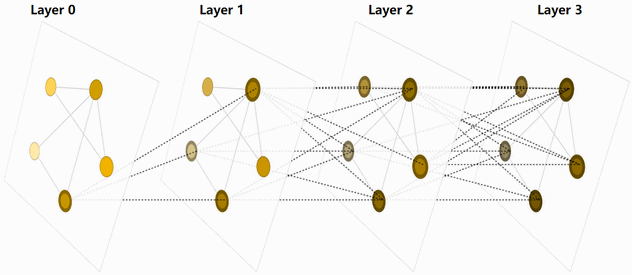

既然图的描述是一种排列不变的矩阵形式，我们将能够阐述如何使用图神经网络（GNN）来解决图预测任务。GNN是在图所有属性（结点、边、全局环境）上可优化的转换，该图保留了图的对称性（排列不变性）。

我们将构建“使用Gilmer等人提出的消息传递神经网络框架的，使用Battaglia等人介绍的图网络体系结构示意图的”GNN模型。GNN模型采用“图进图出”架构，即这些模型接收一个图作为输入（该图将信息载入到它的结点、边和全局环境中），并逐步对这些嵌入进行转换，且不改变输入图的连通性。

## The Simplest GNN

我们将从最简单的GNN架构开始，在其中将会学习所有图属性（结点、边、全局）新的嵌入，但这里还没有使用图的连通性属性。

这个GNN模型在图的每个组件上使用单独的感知器（MLP）或其他可微分模型，将其称为一个GNN层（layer）。对每个结点向量，将其应用MLP并得到一个学习到的结点向量。对于每条边也进行同样的操作学得每条边的嵌入，对全局环境向量也是如此学得整个图的单个嵌入。当然，一个GNN层也可以称为一个GNN块（block），因为它包含多个操作或层。

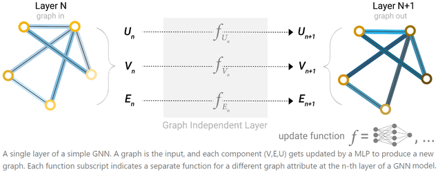

与神经网络模块或层一样，我们也可以将GNN层堆叠在一起。

因为GNN不更新输入图的连通性，我们可以使用与输入图相同的邻接表和相同数量的特征向量来表述GNN的输出图。但输出图会更新嵌入，因为GNN会更新每个结点、边和全局环境的表征。

## GNN Predictions by Pooling Information

我们已经构建了一个简单的GNN，但是如何对一些任务进行预测呢？

我们将考虑二分类的情况，但是这个框架能够很容易地扩展到多分类或回归情况。如果任务是对结点进行二值预测，且图已经包含了结点信息，那么方法很直接，即对每个结点嵌入，应用一个线性分类器。

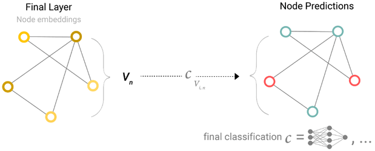

然而，事情并不总是那么简单。例如，图中的信息可能存储在边中，而结点中没有信息，但仍然需要对结点进行预测。我们需要一种方法从边中收集信息，并将其赋予结点以用于预测。我们可以通过池化（pooling）操作来做到，池化过程分两步进行：

1. 对每个需要池化的项，收集它们的嵌入并将其联结到一个矩阵；
2. 将所收集的嵌入进行聚合，通常使用求和操作。

我们使用字母$\rho$来表示池化操作，并用$\rho_{E_n\to V_n}$表示从边为结点聚合信息。

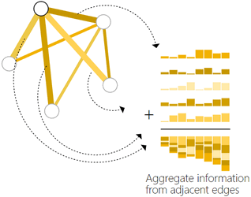

所以当只拥有边级特征，且企图预测结点二值信息时，我们可以使用池化来路由（或传递）信息到需要的地方。这个模型如下所示。

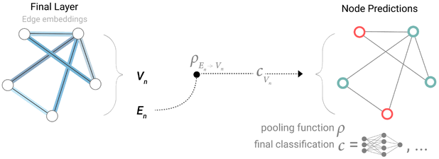

如果只拥有结点级特征，且企图预测边的二值信息，这个模型如下所示。

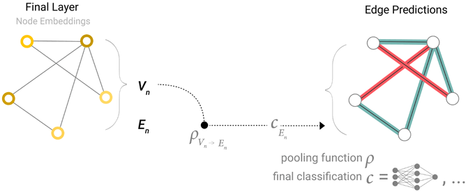

如果只拥有结点级特征，且企图预测全局属性的二值信息，我们需要将所有可用结点（也可以用边）的信息收集在一起并聚合它们。这类似于CNN中的全局平局池化层（Global Average Pooling Layer）。

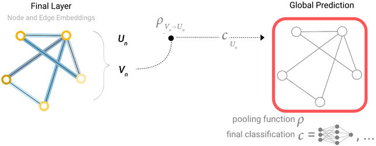

在上面的几个例子中，分类模型$c$可以很容易地被其他可微分模型替换，或使用一个广义线性模型来进行多分类。

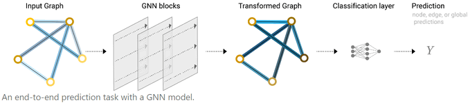

至此我们已经构建了一个最简单的GNN模型，并通过在图的不同部分之间进行路由完成了二值预测。池化技术是构建更复杂GNN模型的基本块。如果有新的图属性，我们只需要定义如何将信息从一个属性传递到另一个属性。

注意，在上述最简单的GNN模型中，我们没有在GNN层中使用图的连通性。每个结点、边和全局环境都是独立处理的。我们只是在池化信息预测时使用了连通性。

## Passing Messages Between Parts of The Graph

可以通过在GNN层中使用池化来构造更复杂的预测，以使得所学的嵌入可以感知图的连通性信息。我们可以使用消息传递做到这一点，邻居结点或边交换信息，并影响彼此更新的嵌入。

消息传递可按如下三步进行：

1. 对图中的每个结点，收集其所有邻居结点的嵌入（或信息），可以用一个函数$g$来描述。
2. 通过一个聚合函数（如求和）聚合所有信息。
3. 将所有合并的信息传递给一个更新函数，通常是学习到的神经网络。

就像池化可以应用到结点或边一样，消息传递也可以发生在结点或边之间。

这些步骤是利用图连通性的关键步骤。我们可以在GNN层中构建更复杂的消息传递变体，以使得GNN模型的表达能力更强。当仅应用一次（这些步骤）时，这个操作序列是最简单的消息传递GNN层类型。

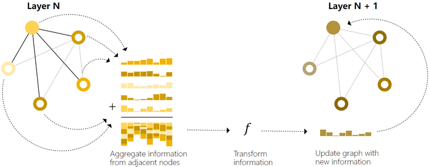

这让人想起标准的卷积，本质上，消息传递和卷积是聚合和处理元素邻居信息的操作，以便更新元素的值。在图中，元素是一个节点，而在图像中，元素是一个像素。然而，图中邻居结点的数量是可变的，不像图像中每个像素都有固定数量的相邻元素。

通过将消息传递GNN层堆叠在一起，一个结点最终能够包含来自整个图的所有信息。如在三层之后，一个结点便拥有了距它三跳远的结点的信息。

可以通过更新架构图，来为结点包含新的信息源，如下所示。

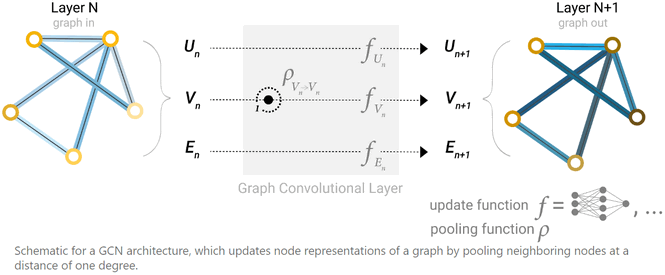

## Learning Edge Representations

我们的数据集不总是包含所有类型的信息（结点、边和全局环境）。当数据集只含有边信息且需要对结点预测时，上一节展示了如何使用池化将信息从边路由到结点，但这只是模型最后一步预测时。我们可以通过消息传递在GNN层中共享结点和边之间的信息。

可以如之前使用邻接结点的信息一样，也可以用同样的方式包含邻接边的信息，即首先池化边的信息，然后使用更新函数转换并保存。

然而，图中保存的结点和边的信息并不一定要是相同大小或相同形状的，故无法立即清楚如何结合它们。一个方法是学得一个从边域到结点域的线性映射，反之亦然。或者，可以在激活函数之前将它们联结起来。

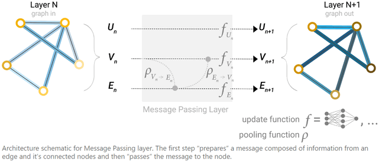

更新那个属性以及按什么顺序更新它们是在构造GNN时的一种设计决策。我们能够选择是否在更新边嵌入前更新结点嵌入，或者反过来。这是一个拥有各种解决方案的开放研究领域，例如可以按一种“波浪（weave）”的方式更新，这种方式拥有四个更新的表征以结合为新的结点表征和边表征：结点到结点（线性）、边到边（线性）、结点到边（边层）、边到结点（结点层）。

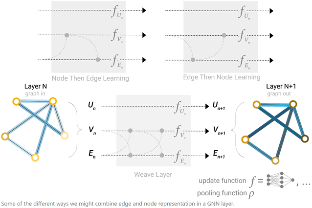

## Adding Global Representations

到目前为止，所介绍的网络有一个缺陷：即使多次应用消息传递，图中相距遥远的结点可能永远无法有效地相互传递信息。对于一个结点，如果我们有k层，信息传递的距离最远为k步。对于预测任务依赖于相距很远的结点或结点组的情况，这可能是一个问题。一种解决方案是让所有结点都能够相互传递信息。但不幸的是，对于大型图来说，这很快就会使计算成本变得非常高（尽管这种被称为“虚边（virtual edge）”的方法被用于小图，如分子图）。

该问题的一种解决方案是使用图的全局表征（U），它有时也被称为主结点（master node）或环境向量。这个全局环境向量连接到网络中的所有其他结点和边，可以作为它们之间传递信息的桥梁，并构建一个图的整体表征。这就创建了一个更丰富、更复杂的图表征，而不是通过其他方式学习到的。

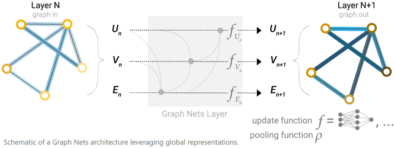

这样看来，可以学到所有图属性的表征，所以我们可以通过调节我们感兴趣的属性信息和其他属性信息，在池化过程中利用它们。例如对于一个结点，我们可以考虑来自它邻居结点、邻接边和全局的信息。要在这些可能的信息源上调节新的结点嵌入，我们只需将它们简单地联结起来。或者我们可以通过线性映射将它们映射到相同的域中，并将它们相加或应用一个特征调制（modulation）层，这可称为一种特征注意力机制。

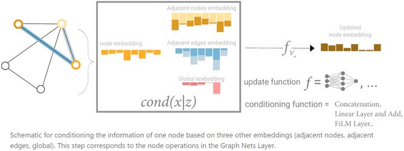

# Introduction

本文翻译自[Understanding Convolutions on Graphs](https://distill.pub/2021/understanding-gnns/)。

> Understanding the building blocks and design choices of graph neural networks.
>
> 理解图神经网络的构建模块和设计选择。

许多系统和互动，如社会网络、分子、组织、引用、物理模型、交易，都可以很自然地用图形表示。我们如何在这些系统中进行推理和预测？

一种思想是研究在其他领域工作良好的工具：神经网络已经在各种学习任务中显示出了巨大的预测能力。然而，传统上，神经网络一直被用于操作固定大小和/或结构规则的输入（如句子、图像和视频），这使得他们无法很好地处理图结构数据。

图神经网络（Graph Neural Networks，GNN）是一类可以自然地操作图结构数据的神经网络。通过提取和利用底层图中的特征，与单独考虑单个实体的模型相比，GNN可以对这些交互中的实体做出更可靠的预测。

GNN并不是为图结构数据建模的唯一工具，Graph Kernel和Random-Walk方法也曾是最受欢迎的。然而今天，GNN因其内在的灵活性可以更好地建模底层系统，已经大规模取代了这些技术。

在本文中，将说明在图上计算的困难，描述图神经网络的起源和设计，并探索最近最流行的GNN变体。特别地，我们可以看到许多这些变体都是由相似的模块组成。

首先，讨论一下图带来的一些复杂性。

# The Challenges of Computation on Graphs

## Lack of Consistent Structure

图是非常灵活的数学模型，但这意味着它们在实例间缺乏一致的结构。考虑预测给定的化学分子是否有毒的任务，如下图所示。

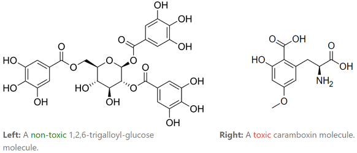

由上面的例子，很容易发现以下问题：

- 分子可能拥有不同数目的原子。（图中有不同数目的结点）
- 分子中的原子可能有不同的类型。（结点有不同的类型）
- 每一个原子可能有不同数量的连接。（结点连接的数目不同）
- 这些连接可以有不同的强度。（连接的强度不同）

用一种可以计算的格式来表示图形是非常有意义的，并且最终选择的表示形式通常很大程度上取决于实际问题。

## Node-Order Equivariance

图在结点之间通常没有固有的顺序。与图像相比，图像中的每个像素都是由其在图像中的绝对位置唯一确定的。

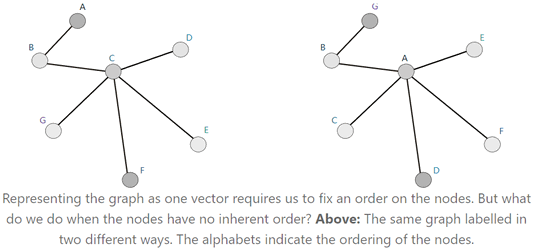

因此，我们希望算法是结点顺序等变（Node-Order Equivariance）的：它们不应该依赖于图中结点的顺序。如果我们以某种方式排列结点，由算法计算出来的结点的结果表示也应该以同样的方式排列。

## Scalability

图表可能非常大，对这么大的数据进行操作并不容易。

幸运的是，大多数自然出现的图都是稀疏的：它们的边的数量往往与顶点的数量成线性。这允许使用巧妙的方法来高效地计算图中结点的表示。此外，与所操作的图的大小相比，图操作方法的参数要少得多。

# Problem Setting and Notation

有许多的问题可以用图形来表示：

- 结点分类，对单个结点进行分类。
- 图分类，对整个图进行分类。
- 结点聚类，基于连通性将相似的结点分为一组。
- 链接预测，预测丢失的链接。
- 影响最大化，识别有影响力的结点。

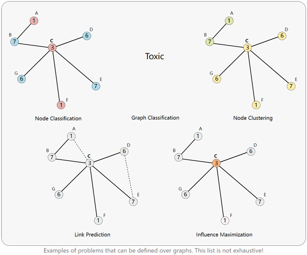

解决这些问题的一个常见前置任务是**结点表征学习**，学习将单个节点映射到固定大小的实值向量，称为“表征”或“嵌入（embeddings）”。在之后的“学习GNN参数”小节中，我们将会介绍如何学习嵌入，以用于上述这些任务。

不同的GNN变体通过计算这些表征的方式来区分。但是，GNN通常在迭代过程中计算节点表征。我们使用$h_v^{(k)}$表示结点$v$在第k次迭代之后的表征。每一次迭代都可以被认为是标准神经网络中的一个“层（layer）”的等价物。

我们将图$G$定义为一个边的集合$V$，并由边$E$连接它们。结点可以有其各自的特征作为输入的一部分：对于结点$v\in V$，我们使用$x_v$表示其特征。例如，彩色图像中一个像素的“结点特征”将是该像素处的红、绿、蓝（RGB）通道值。

为了便于解释，我们假定图$G$是无向的，所有节点都是同一类型（这种图被称为齐次图）。这里介绍的许多思想也同样适用于其他类型的图表，将在后面的“不同类型的图表”小节中讨论这一点。

有时我们需要用矩阵$M$表示一个图的属性，其中每一行$M_v$表示与特定结点$v$对应的属性。

# Extending Convolutions to Graphs

在从图像中提取特征方面，卷积神经网络已经被认为是非常强大的。然而，图像本身可以被视为具有非常规则的网格状结构的图，其中单个像素是结点，每个像素处的RGB通道值是结点特征。

因此，一个自然的思想考虑将卷积推广到任意图。但是，回顾一下上一节列出的挑战：特别是，普通卷积不是节点顺序不变的，因为它们依赖于像素的绝对位置。一开始，我们并不知道如何将网格上的卷积推广到一般图上的卷积，因为其不同结点的邻域结构不同。

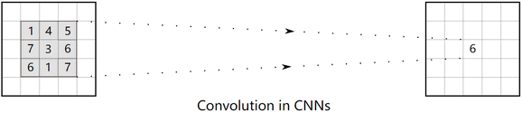

CNN中的卷积具有内在的局域性，如上图所示，在中心像素中参与卷积的邻居用灰色突出显示。

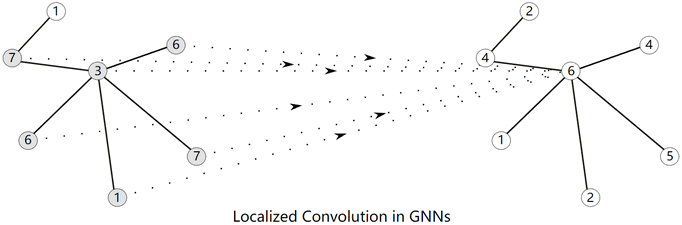

GNN可以模拟CNN进行局部卷积，如上图所示，一个结点的近邻在左侧高亮显示，这个邻域的结构随着结点的变化而变化。

首先介绍在邻居结点上构造多项式过滤器的思想，就想CNN如何在邻近像素上计算本地化过滤器。然后，介绍最新的方法如何用更强大的机制扩展这一思想。最后，将讨论可以使用“全局”图信息来表示计算结点的替代方法。

# Polynomial Filters on Graphs

## The Graph Laplacian

给定一个图$G$，先为其$n$个结点固定一个任意的顺序。使用$A$表示图$G$的0/1邻接矩阵，并为图构造对角的度矩阵$D$如下，结点$v$的度是其关联的边的个数。
$$
D_v=\sum_uA_{v,u}
$$
然后，图拉普拉斯（Laplacian）矩阵式如下定义的$n\times n$的方阵$L=D-A$。

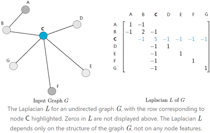

图拉普拉斯得名于微积分[拉普拉斯算子](https://mathworld.wolfram.com/Laplacian.html)的离散模拟。

虽然拉普拉斯矩阵$L$编码的信息和邻接矩阵$A$编码的信息完全相同（给定其中一个可以构造另一个），但拉普拉斯矩阵拥有许多有趣的性质。拉普拉斯图在许多涉及图的数学问题中都有出现，如random walks，spectral clustering，diffusion等。

## Polynomials of the Laplacian

现在我们已经理解了图拉普拉斯是什么，接下来可以构造如下形式的多项式：
$$
p_w(L)=w_0I_n+w_1L+w_2L^2+\cdots+w_dL^d=\sum_{i=0}^dw_iL^i
$$
每个这种形式的多项式都能够由它的向量系数$w=[w_0,\cdots,w_d]$代替表示。注意，对于给定w，$p_w(L)$是一个$n\times n$的方阵。

这些多项式可以被认为与CNN中的“过滤器”等价，而系数$w$是“过滤器”的权值。

为便于阐述，我们重点考虑结点只有一维特征的情况：每个结点$v\in V$的特征$x_v$是一个实数。当$x_v$是高维向量时是相同的思想。

使用之前确定的结点顺序，我们可以将结点的特征$x_v$堆叠到一个向量$x\in\R^n$上，如下图所示。

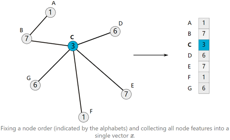

一旦构造了结点特征向量$x$，我们就可以使用一个多项式过滤器$p_w$定义它的卷积如下：
$$
x'=p_w(L)x
$$
为了理解系数$w$如何影响这个卷积，先考虑最简单的情况，令$w_0=1$且其他系数都为0，在这种情况下，$x'$就是$x$，如下：
$$
x'=p_w(L)x=w_0I_nx=x
$$
现在如果增加度数，并考虑$w_1=1$且其他系数都为0的情况，此时$x'=w_1Lx=Lx$，因此：
$$
\begin{align}
x'_v=(Lx)_v &= L_{v,:}x \\
&= \sum_{u\in G}L_{v,u}x_u \\
&= \sum_{u\in G}(D_{v,u}-A_{v,u})x_u \\
&= D_{v}x_v-\sum_{u\in\mathcal{N}(v)}x_u
\end{align}
$$
可以看到，每个点$v$的特征与它直接相连的邻居$u\in\mathcal{N}(v)$的特征有关。对于熟悉[图像拉普拉斯过滤](https://docs.opencv.org/3.4/d5/db5/tutorial_laplace_operator.html)的读者来说，这是完全相同的思想，当$x$为图像时，$x'=Lx$正是“将拉普拉斯过滤”应用到$x$上的结果。

在这一点上，一个自然而然的问题是：多项式的次数$d$如何影响卷积的行为？事实上，有如下引理：
$$
\text{dist}_G(v,u)>i \Longrightarrow L_{v,u}^i=0
$$
这意味着，当我们使用$d$次多项式$p_w(L)$矩阵来卷积$x$，可以得到$x'$如下：
$$
\begin{align}
x'_v=(p_w(L)x)_v &= (p_w(L))_vx \\
&= \sum_{i=0}^dw_iL^i_vx \\
&= \sum_{i=0}^d[w_i\sum_{u\in G}L_{v,u}^ix_u] \\
&= \sum_{i=0}^d[w_i\sum_{\substack{u\in G \\ \text{dist}_G(v,u)\le i}}L_{v,u}^ix_u]
\end{align}
$$
实际上，结点$v$只和跳数不超过d的结点$u$发生卷积操作。因此，这些多项式过滤器是局部的，局部化的程度完全由d控制。

为了更好的理解基于多项式的卷积，见下图图形化的展示。箭头下方的网格展示了在高亮显示的像素上使用的等价的卷积核，它对应着高亮像素的多项式$p_w(L)$矩阵的行。注意，这个内核对于不同的像素是不同的，这取决于它们在网格中的位置。

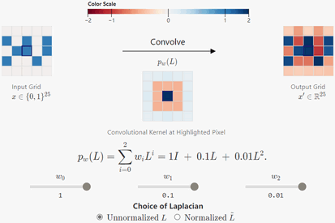

## ChebNet

ChebNet通过研究多项式过滤器的形式改进了多项式过滤的思想：
$$
p_w(L)=\sum_{i=1}^dw_iT_i(\tilde{L})
$$
其中，$T_i$是i次[第一类切比雪夫多项式（Chebyshev polynomial）](https://en.wikipedia.org/wiki/Chebyshev_polynomials)，$\tilde{L}$是使用$L$最大特征值正则化的拉普拉斯。
$$
\tilde{L}=\dfrac{2L}{\lambda_{\text{max}}(L)}-I_n
$$
这么做有如下几点原因：

- $L$实际上是半正定矩阵，其特征值均大于等于0。如果$\lambda_{\text{max}}(L)>1$，$L$的幂中的项会迅速增加。$\tilde{L}$实际上是缩小了的$L$，能保证其特征值在$[-1,1]$的范围内。这能避免$\tilde{L}$的幂中的项指数爆炸。
- 切比雪夫多项式具有某些有趣的性质，使其插值在数值上更加稳定。

## Polynomial Filters are Node-Order Equivariant

这里所讨论的多项式过滤器实际上与节点的顺序无关。当多项式的次数$p_w$为1时很容易看出，此时将每个结点与相邻结点的特征之和进行聚合。显然这个和的值与邻居结点的顺序无关。对于高次的多项式也有类似的证明过程：$L$的幂中的项对于结点顺序是等变的。

如上所述，假设在图的n个结点上有一个任意的结点顺序，任何其他的结点顺序都可以看作是这个原始结点顺序的一种排列。我们能够通过[排列矩阵](https://en.wikipedia.org/wiki/Permutation_matrix)$P$表示任意排列，在任何时间，$P$一直都是0/1的正交矩阵：$PP^T=P^TP=I_n$。

因此，当且仅当对于所有排列矩阵$P$有$f(Px)=Pf(x)$时，我们将函数$f$称为结点顺序等变的。

当使用排列矩阵切换到一个新的结点顺序$P$时，下面的一些变量将按如下形式变换：
$$
x \to Px \\
L \to PLP^T \\
L^i \to PL^iP^T
$$
因此，对于多形式过滤器$f(x)=p_w(L)x$的情况来说，有如下等式成立：
$$
\begin{align}
f(Px) &= \sum_{i=0}^dw_i(PL^iP^T)(Px) \\
&= P\sum_{i=0}^dw_iL^ix \\
&= Pf(x)
\end{align}
$$
证毕。

## Embedding Computation

现在描述如何通过一个接一个地堆叠带非线性层的ChebNet层（或其他多项式过滤器）来构建一个图神经网络，如同标准CNN一样。特别地，如果有$K$个不同的多项式过滤层，其中第$k$层有它自己可学习的权值$w^{(k)}$，我们将执行如下图所示的计算：

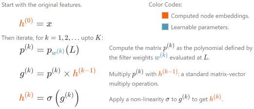

注意，这些网络在不同的结点上重用相同的过滤器权重，这完全模仿了在卷积神经网络（CNN）中跨网格重用卷积过滤器权重的权重共享。

# Modern Graph Neural Networks

ChebNet是在图上学习局部过滤器的一个突破，它激发了许多人从不同的角度思考图卷积。

我们回到使用多项式核$p_w(L)=L$对$x$进行卷积的结果，重点考虑结点$v$，如下：
$$
\begin{align}
x'_v=(Lx)_v &= L_{v,:}x \\
&= \sum_{u\in G}L_{v,u}x_u \\
&= \sum_{u\in G}(D_{v,u}-A_{v,u})x_u \\
&= D_{v}x_v-\sum_{u\in\mathcal{N}(v)}x_u
\end{align}
$$
正如之前所述，这是一跳的局部卷积。但更重要的是，我们可以把这个卷积看成是由如下两个步骤产生的：

- 聚合所有直接相邻的邻居节点的特征$x_u$；
- 与结点自己的特征$x_v$组合。

**关键思想**：如果我们考虑不同的“聚合”核“组合”步骤，而不是使用多项式过滤，将会如何？

通过确保聚合是结点顺序等变的，整个卷积就是结点顺序等变的。

这些卷积可以被认为是相邻节点之间的“消息传递（message passing）”：在每一步之后，每个节点都从它的邻居那里接收一些“信息”。通过迭代重复一跳局部卷积$K$次（即重复“信息传递”），卷积的接受域实际上包含了$K$跳之内所有结点的信息。

## Embedding Computation

消息传递构成了当今许多GNN结构的支柱。下面将详细介绍其中最受欢迎的几种。

### Graph Convolutional Networks（GCN）

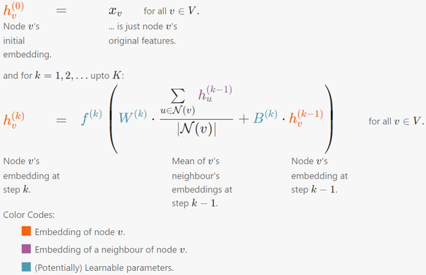

通过最终计算的嵌入，可以对每个结点进行预测：
$$
\hat{y}_v=\text{PREDICT}(h_v^{(K)})
$$
其中$\text{PREDICT}$一般是与GCN模型一起学习的另一个神经网络。

对每一个步骤$k$，函数$f^{(k)}$，矩阵$W^{(k)},B^{(k)}$都是所有结点共享的。这使得GCN模型可以很好的伸缩，因为模型中参数的数量与图的大小无关。

这里讨论是[原始论文](https://openreview.net/forum?id=SJU4ayYgl)“2-参数”模型的变体，它的表达能力更强。还可以考虑用如下的规范化形式（省略迭代下标）：
$$
f\left( W\cdot\sum_{u\in\mathcal{N}(v)}\dfrac{h_u}{|\mathcal{N}(v)|}+B\cdot h_v \right)
$$
来代替[原始论文](https://openreview.net/forum?id=SJU4ayYgl)中定义的规范化形式：
$$
f\left( W\cdot\sum_{u\in\mathcal{N}(v)}\dfrac{h_u}{ \sqrt{|\mathcal{N}(v)||\mathcal{N}(u)|} }+B\cdot h_v \right)
$$
以便于阐述。

### Graph Attention Networks（GAT）

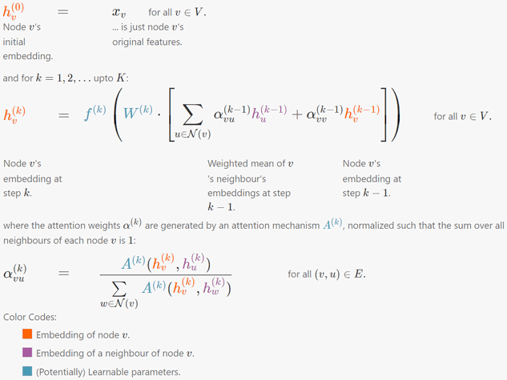

通过最终计算的嵌入，可以对每个结点进行预测：
$$
\hat{y}_v=\text{PREDICT}(h_v^{(K)})
$$
其中$\text{PREDICT}$一般是与GAT模型一起学习的另一个神经网络。

对每一个步骤$k$，函数$f^{(k)}$，矩阵$W^{(k)}$和注意力机制矩阵$A^{(k)}$都是所有结点共享的。这使得GAT模型可以很好地伸缩，因为模型中参数的数量与图的大小无关。

这里讨论的是单一注意力的GAT变体，多注意力变体也是类似的。我们也可以自由选择任意注意力机制，选择上述的是为了保持方程式的简洁。

### Graph Sample and Aggregate（GraphSAGE）

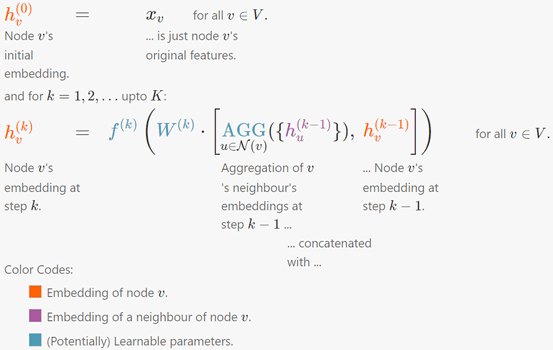

通过最终计算的嵌入，可以对每个结点进行预测：
$$
\hat{y}_v=\text{PREDICT}(h_v^{(K)})
$$
其中$\text{PREDICT}$一般是与GraphSAGE模型一起学习的另一个神经网络。

对每一个步骤$k$，函数$f^{(k)},\text{AGG}$，矩阵$W^{(k)}$都是所有结点共享的。这使得GraphSAGE模型可以很好地伸缩，因为模型中参数的数量与图的大小无关。

原始GraphSAGE论文为$\mathop{\text{AGG}}\limits_{u\in\mathcal{N}(v)}(\{h_u^{(k-1)}\})$考虑如下几个选项：

- 平均（与GCN相似）：

$$
W_{\text{pool}}^{(k)}\cdot\dfrac{h_v^{(k-1)}+\sum\limits_{u\in\mathcal{N}(v)}h_u^{(k-1)}}{1+|\mathcal{N}(v)|}
$$

- 对应维度最大值：

$$
\max_{u\in\mathcal{N}(v)}\{ \sigma(W_{\text{pool}}^{(k)}h_u^{(k-1)}+b) \}
$$

- 长短期记忆网络（Long Short Term Memory，LSTM）（在对邻居进行排序之后）

在这里，我们考虑RNN聚合器，因为它比LSTM聚合器更容易阐述，但建立在相同的思想上。

此外，原始GraphSAGE论文执行“邻域采样（neighbourhood sampling）”：不管节点周围的实际邻域有多大，都取邻域的固定大小的随机样本。这增加了计算嵌入的方差，但允许GraphSAGE用于非常大的图。

如果处理的是小图，可以对整个邻域进行采样，以增加准确度等。

### Graph Isomorphism Network（GIN）

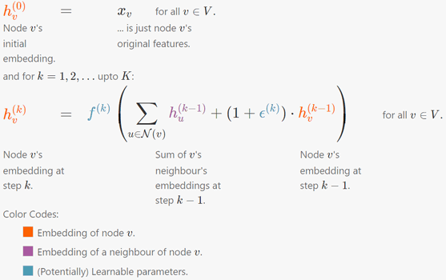

通过最终计算的嵌入，可以对每个结点进行预测：
$$
\hat{y}_v=\text{PREDICT}(h_v^{(K)})
$$
其中$\text{PREDICT}$一般是与GIN模型一起学习的另一个神经网络。

对每一个步骤$k$，函数$f^{(k)}$，实值参数$\epsilon^{(k)}$都是所有结点共享的。这使得GIN模型可以很好地伸缩，因为模型中参数的数量与图的大小无关。

## Thoughts

一个有趣的点是评估不同的聚合函数：哪些更好哪些更差？论文[How Powerful are Graph Neural Networks?](https://openreview.net/forum?id=ryGs6iA5Km)证明了聚合函数确实能够比较它们能在多大程度上唯一地保存邻域结点的特征。

本文所讨论的GNN的计算只发生在结点上。最近的GNN模型如消息传递神经网络（[Message-Passing Neural Network](http://proceedings.mlr.press/v70/gilmer17a.html)）、图神经网络（[Graph Network](https://arxiv.org/pdf/1806.01261.pdf)）也对边进行计算，它们把边嵌入和结点嵌入一起计算。这是一个更一般的框架，但相同的“消息传递”思想也适用于本节。

# Interactive Graph Neural Networks

下面是这些GNN模型在小图上的可视化示例。为了清晰起见，这里的结点特征只是实数，显示在每个结点旁边的方格内，但当结点特征是向量时，相同的方程仍然成立。

GCN示例：

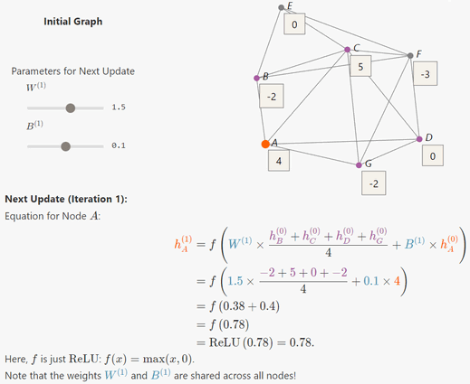

GAT示例：

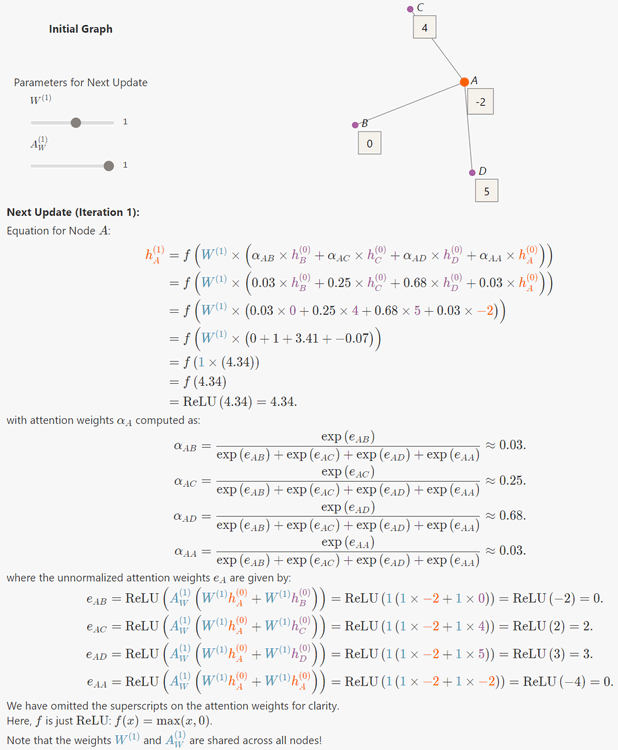

GraphSAGE示例：

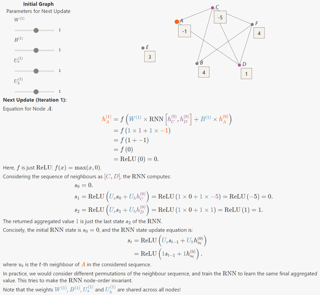

GIN示例：

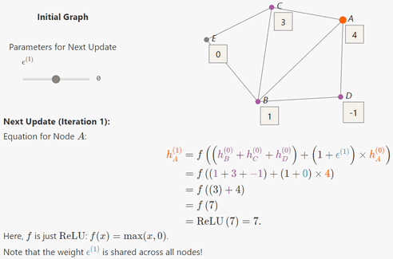

在实践中，上面的每次迭代通常被认为是一个单一的“神经网络层”。许多流行的图神经网络库都遵循这一思想，允许在同一模型中组合不同类型的图卷积，如[StellarGraph](https://stellargraph.readthedocs.io/en/stable/api.html#module-stellargraph.layer)和[PyTorch Geometric](https://pytorch-geometric.readthedocs.io/en/latest/modules/nn.html)。

# From Local to Global Convolutions

到目前为止，所介绍的方法都是执行“局部”卷积：更新每个结点特征的函数使用的都是其局部邻居的特征。

尽管执行足够多的消息传递步骤最终能够保证传递图中所有结点的信息，但我们可能会想，是否有更直接的方法来执行“全局”卷积。

答案是肯定的，这里将描述一种方法，它实际上是在神经网络[Spectral Networks and Locally Connected Networks on Graphs](https://arxiv.org/pdf/1312.6203.pdf)的背景下被首次提出的，这比本文之前介绍的任何GNN模型都要早得多。

## Spectral Convolutions

如前文一样，我们重点关注结点具有一维特征的情况。在选取任意结点顺序后，就可以将所有结点的特征堆叠在一起形成一个特征向量$x\in R^n$。

**关键思想**：给定一个特征向量$x$，拉普拉斯矩阵$L$允许我们量化$x$相对于图$G$的平滑程度。

如何做？

在将$x$进行如$\sum\limits_{i=1}^nx_i^2=1$的正则化后，如果我们研究包含$L$的变量如下：
$$
R_L(x)=\dfrac{x^TLx}{x^Tx}=\dfrac{\sum\limits_{(i,j)\in E}(x_i-x_j)^2}{\sum\limits_{i}x_i^2}=\sum_{(i,j)\in E}(x_i-x_j)^2
$$
显然可以看到，在图$G$中与邻居结点值越相似的特征向量$x$拥有更小的$R_L(x)$值，因而更平滑。

$L$是实对称矩阵，这意味着它的特征值全是实数$\lambda_1\le\cdots\le\lambda_n$，并且其相应的特征向量$u_1,\cdots,u_n$能够正交化：
$$
u_i^Tu_j=\begin{cases}
1 & \text{if }i=j \\
0 & \text{if }i\ne j
\end{cases}
$$
结果是$L$特征向量的平滑度依次下降，如$R_L$所示（[min-max theorem for eigenvalues](https://en.wikipedia.org/wiki/Min-max_theorem)）：
$$
\mathop{\text{arg min}}_{x,x\perp\{u_1,\cdots,u_{i-1}\}}R_L(x)=u_i \\
\min_{x,x\perp\{u_1,\cdots,u_{i-1}\}}R_L(x)=\lambda_i
$$
拉普拉斯矩阵$L$的特征值集合被称为它的“**谱（spectrum）**”，这也是名字的由来。我们将$L$的“谱”分解表示为：
$$
L=U\Lambda U^T
$$
其中，$\Lambda$是将特征值顺序排列的对角矩阵$\Lambda=\text{diag}(\lambda_1,\cdots,\lambda_n)$，$U$是特征向量按其特征值升序的顺序排列的矩阵$U=[u_1,\cdots,u_n]$。

由特征向量之间的正交条件可得$U^TU=I$，其中$I$是单位矩阵。由于这n个特征向量构成了$R^n$的基，任何特征向量$x$都可以由这些特征向量的线性组合来表示：
$$
x=\sum_{i=1}^n\hat{x}_iu_i=U\hat{x}
$$
其中，$\hat{x}$是一个系数向量$[x_0,\cdots,x_n]$，我们将$\hat{x}$称为特征向量$x$的**谱表征**。由正交条件可得：
$$
x=U\hat{x} \Longleftrightarrow U^Tx=\hat{x}
$$
对于任意特征向量$x\in\R^n$，这对等式允许我们在“自然”表征$x$和“谱”表征之间相互转换。

## Spectral Representations of Natural Images

如前所述，我们可以将任意图像看作是网格状图，其中每个像素是一个结点，与相邻像素通过边相连。因此，一个像素可以有3、5或8个邻居，这取决于它在图像网格中的位置。每个像素作为图像的一部分获得一个值。如果图像是灰度图，每个值是一个表示像素明暗的实值。如果图像是彩色图像，每个值是表示RGB通道值的三维向量。

这个构造允许我们计算图拉普拉斯矩阵$L$和特征向量矩阵$U$。给定一张图像，我们就可以研究它的谱表征是什么样的。

为了阐述谱表征实际上编码了什么，我们对图像的每个通道分别进行了以下实验：

1. 首先将一个通道上的所有像素的值搜集为一个特征向量$x$。
2. 然后获得其谱表征$\hat{x}=U^Tx$。
3. 截断前m个分量得到$\hat{x}_m=\text{Truncate}_m(\hat{x})$，即将$x$剩余的$n-m$个分量全部置为0。这么截断等同于只使用前m个特征向量来计算谱表征。
4. 然后将截断后的表征$\hat{x}_m$转换为自然基以获得$x_m=U\hat{x}_m$。

最后，我们将得到的通道重新堆叠在一起以得到一张图像。当$m=n$时，结果图像与原始图像是相同的，我们可以精确地重建每个通道。

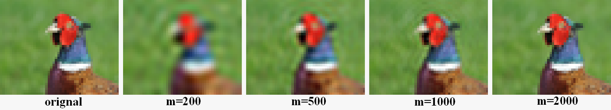

当$m$减少，输出图像$x_m$会变模糊，如果将$m$降至1，那么输出图像就只包含一个颜色。我们可以使用较少的分量保留图像中的大量信息，而不必保留全部的$n$个分量。可以将这与图像的傅里叶分解联系起来：使用的特征向量越多，在网格上表示的频率就越高。

为了补充上面的可视化例子，我们又在一个更小的$8\times 8$网格上，可视化了前几个特征向量。

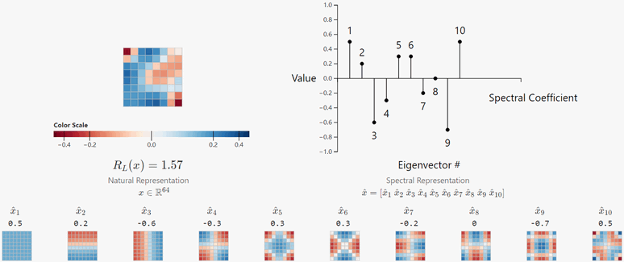

可以看到，第一个特征向量确实是平滑的，而后面的特征向量平滑度逐渐降低。

对任意图像$x$，我们可以考虑使用谱表征最开始的几项$\hat{x}$来捕捉“全局”图像的趋势，也就是低频分量，而后面的项捕捉“局部”细节，也即是高频分量。

## Embedding Computation

我们现在有了理解谱卷积的背景知识，以及明白了如何使用它们来计算结点的嵌入/特征表示。

如前所述，这里要介绍的模型也有$K$层，每层$k$有要学习的参数$\hat{w}^{(k)}$，称为“过滤权重”。这些权重将与结点特征的谱表征一起进行卷积。结果就是，每层所需权重的个数等于$m$，也即用于计算谱表征的特征向量的数目。前文已经表明，可以使用$m\ll n$且不会丢失大部分信息。

因此，与自然域的直接卷积相比，谱域的卷积可以大大减少参数的使用。此外，得益于图拉普拉斯特征向量的平滑性，可使用谱表征为邻居结点自动执行一个归纳偏差，以获得相似的表征。

现假设结点特征是一维的，每层的输出一个结点表征的向量$h^{(k)}=[h_1^{(k)},\cdots,h_n^{(k)}]^T,\ k=1,2,\cdots,K$，每个结点的表征对应着向量的一个分量。

固定图$G$中的一个结点顺序，可以得到一个邻接矩阵$A$和图拉普拉斯矩阵$L$，并能计算得$U_m$。最终我们可以逐层描述其所需的计算，如下所示。

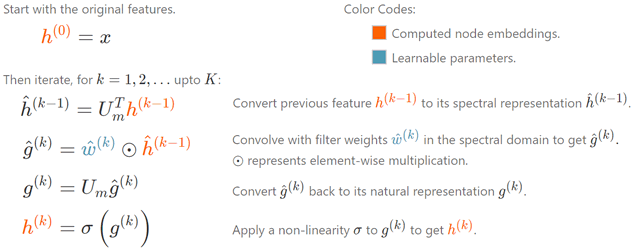

上述方法很容易扩展到每个$h^{(k)}\in\R^{d_k}$的情形，详情可参考[spectral Networks and Locally Connected Networks on Graphs](https://arxiv.org/pdf/1312.6203.pdf)。

根据上一节的论述，图的谱域卷积可以被认为是图像的频域卷积的推广。

## Spectral Convolutions are Node-Order Equivariant

我们可以用与拉普拉斯多项式过滤器类似的方法，证明谱卷积是结点等变的。

首先，固定一个任意的结点顺序，然后其他任意结点顺序都可以由这个结点顺序的排列表示，我们可以使用排列矩阵$P$来表示这个排列。在一个新的结点顺序中，一些变量的变换如下所示：
$$
x \to Px \\
A \to PAP^T \\
L \to PLP^T \\
U_m \to PU_m
$$
这意味着，在嵌入计算中有：
$$
\begin{align}
\hat{x} &\to (PU_m)^T(Px)=U_m^Tx=\hat{x} \\
\hat{w} &\to (PU_m)^T(Pw)=U_m^Tw=\hat{w} \\
\hat{g} &\to \hat{g} \\
g &\to (PU_m)\hat{g}=P(U_m\hat{g})=Pg
\end{align}
$$
因此，当$\sigma$被应用于逐个元素时，有：
$$
f(Px)=\sigma(Pg)=P\sigma(g)=Pf(x)
$$
证毕。此外，还可以看到谱变量$\hat{x},\hat{w},\hat{g}$不受结点排列的影响，形式上，这就是所说的结点顺序是不变的。

谱卷积在数学上有很好的基础，但是也有一些关键的不足：

- 我们需要从拉普拉斯矩阵$L$计算特征向量矩阵$U_m$，对于大的图来说，这变得的很不可行。
- 即使求得了$U_m$，全局卷积本身也是低效的，因为需要重复$U_m$和$U_m^T$的乘法。
- 学习到的过滤器是特定输入图的，因为它们是用输入图拉普拉斯的谱分解表示的。这意味着它不能很好地转化到一个结构显著不同（特征值也明显不同）的新图上。

尽管由于上述原因导致谱卷积在很大程度上被“局部”卷积所取代，但理解它们背后的思想仍然有很大的价值。事实上，最近提出的一种名为有向图神经网络（Directional Graph Network）的GNN模型广泛地使用了拉普拉斯特征向量和它的数学性质。

## Global Propagation via Graph Embeddings

包含图级信息的一种更简单的方法是通过池化结点嵌入（可能还有边嵌入）来计算整个图的嵌入，然后使用图嵌入来更新结点嵌入，并且遵循类似的迭代方案。这是图神经网络[Relational inductive biases, deep learning, and graph networks](https://arxiv.org/pdf/1806.01261.pdf)中所使用的一种方法。

本文将简要讨论如何在Pooling中构造图级嵌入。然而，这种方法往往会忽略图的底层拓扑结构，而谱卷积是可以捕获这种结构的。

# Learning GNN Parameters

本文所描述的所有嵌入计算，无论是谱（spectra）还是空间（spatial），都是完全可微分的。这允许GNN像标准的神经网络一样，一旦定义了合适的损失函数，就可以按端到端方式进行训练。

**结点分类（Node Classification）**。通过最小化分类任务的任何标准损失，例如当多个类存在时的绝对交叉熵：
$$
\mathcal{L}(y_v,\hat{y}_v)=-\sum_cy_{v,c}\log\hat{y}_{v,c}
$$
其中$\hat{y}_{v,c}$是结点$v$属于$c$类的预测概率。GNN能够很好地适应图中只有某些结点拥有标签的半监督环境。在这种环境下，我们可以在输入图$G$上定义如下损失函数：
$$
\mathcal{L}_G=\dfrac{\sum\limits_{v\in\text{Lab}(G)}\mathcal{L}(y_v,\hat{y}_v)}{|\text{Lab}(G)|}
$$
其中，我们只在有标签的结点$\text{Lab}(G)$上计算损失值。

**图分类（Graph Classification）**。通过聚合结点表征，可以构造整个图的一个向量表征。图表征能够用于任何图级任务，不止是分类任务。在下节“Pooling”中将介绍如何构造图表征。

**链接预测（Link Prediction）**。通过采样邻接对和非邻接对，并使用向量对作为输入，来预测一条边是否存在。一个具体的例子，通过最小化如下“类逻辑回归（'logistic regression'-like）”损失函数：
$$
\begin{align}
\mathcal{L}(y_v,y_u,e_{v,u}) &= -e_{v,u}\log(p_{v,u})-(1-e_{v,u})\log(1-p_{v,u}) \\
p_{v,u} &= \sigma(y_v^Ty_u)
\end{align}
$$
其中，$\sigma$是S型函数（[sigmoid function](https://en.wikipedia.org/wiki/Sigmoid_function)），当且仅当结点$v,u$间存在边时，有$e_{v,u}=1$，否则$e_{v,u}=0$。

**结点聚类（Node Clustering）**。通过简单地聚类所学到的结点表征。

自然语言处理模型如ELMo和[BERT](https://www.aclweb.org/anthology/N19-1423)的预训练所取得的成功，已经激发了人们对GNN类似技术的兴趣，如[Strategies for Pre-training Graph Neural Networks](https://openreview.net/forum?id=HJlWWJSFDH)、[Multi-Stage Self-Supervised Learning for Graph Convolutional Networks on Graphs with Few Labeled Nodes](https://aaai.org/ojs/index.php/AAAI/article/view/6048)、[When Does Self-Supervision Help Graph Convolutional Networks?](http://arxiv.org/pdf/2006.09136.pdf)、[Self-supervised Learning on Graphs: Deep Insights and New Direction](http://arxiv.org/pdf/2006.10141.pdf)。这些论文的关键思想是训练GNN去预测局部（如结点的度、聚类系数、结点属性掩码）和/或全局（成对距离、全局属性掩码）图属性。

另一种自监督技术是增强邻居结点获得相似的嵌入，模仿随机游动（random-walk）方法，如[node2vec](https://doi.org/10.1145/2939672.2939754)和[DeepWalk](https://doi.org/10.1145/2623330.2623732)：
$$
L_G=\sum_v\sum_{u\in N_R(v)}\log\dfrac{\exp(z_v^Tz_u)}{\sum\limits_{u'}\exp(z_{u'}^Tz_u)}
$$
其中，$N_R(v)$是从$v$开始随机游走时访问的结点的多重集合。对于大的图来说，计算所有结点的和可能需要极高的成本，而噪声对比估计（Noise Contrastive Estimation）如[Noise-Contrastive Estimation of Unnormalized Statistical Models, with Applications to Natural Image Statistics](https://jmlr.org/papers/v13/gutmann12a.html)和[Learning word embeddings efficiently with noise-contrastive estimation](https://proceedings.neurips.cc/paper/2013/file/db2b4182156b2f1f817860ac9f409ad7-Paper.pdf)是比较有用的。

# Conclusion and Further Reading

虽然本文已经讨论了许多技术和思想，但图神经网络的领域是非常广阔的，更全面的研究可以参考[A Comprehensive Survey on Graph Neural Networks](https://ieeexplore.ieee.org/document/9046288)和[Graph Neural Networks: A Review of Methods and Applications](http://arxiv.org/pdf/1812.08434.pdf)。

本文以读者可能感兴趣的其他概念的引用结束，如下。

## GNNs in Practice

事实证明，很难有效的做到适应不同的图结构，但我们仍然可以使用稀疏矩阵-向量积（sparse matrix-vector products）来表示许多GNN的更新方程，因为通常情况下，真实世界大多数的图数据集的邻接矩阵是稀疏的。例如，本讨论的GCN变体可以表示为：
$$
h^{(k)}=D^{-1}A\cdot h^{(k-1)}(W^{(k)})^T+h^{(k-1)}(B^{(k)})^T
$$
以这种方式重构更新方程允许在加速器（如GPU）上高效地实现GNN的向量化。

标准神经网络的正则化技术，如[Dropout](https://jmlr.org/papers/v15/srivastava14a.html)，可以直接应用于参数（例如，将上述$W^{(k)}$的整行归零）。但是，也有一些特定于图的技术，比如[DropEdge](https://openreview.net/forum?id=Hkx1qkrKPr)从图中随机移除整个边，这也提高了许多GNN模型的性能。

## Different Kinds of Graphs

本文主要关注的是无向图，以避免过多不必要的细节。然而，有一些空间卷积的简单变体如下所示。

- 有向图：跨内邻域和/或外邻域特征的聚合。
- 时态图：跨以前和/或将来的结点特征进行聚合。
- 异构图：为每个结点/边缘类型学习不同的聚合函数。

确实存在更复杂的技术可以利用这些图的不同结构，详细还是请参阅上述给出的综述文献。

## Pooling

本文讨论GNN如何计算结点的有效表征。但是，如果我们想要计算图级任务的图表征（如预测分子的毒性），该怎么办呢？

一个简单的解决方案是聚合最终的结点嵌入，并将它们传递给另一个神经网络$\text{PREDICT}_G$。
$$
h_G=\text{PREDICT}_G(\mathop{\text{AGG}}\limits_{v\in G}(\{h_v\}))
$$
然而，确实存在更强大的技术来“池化（pooling）”结点表征，如下所示。

- [SortPool](https://www.aaai.org/ocs/index.php/AAAI/AAAI18/paper/view/17146)：对图的顶点进行排序，得到图的固定大小的结点顺序的不变表示，然后应用任何标准的神经网络结构。
- [DiffPool](https://proceedings.neurips.cc/paper/2018/file/e77dbaf6759253c7c6d0efc5690369c7-Paper.pdf)：学习聚集顶点，在簇而不是结点上构建一个粗图，然后在粗图上应用GNN。重复操作，直到只剩下一个簇群。
- [SAGPool](http://proceedings.mlr.press/v97/lee19c.html)：应用GNN来学习结点分数，然后只保留分数最高的结点，丢弃其余的结点。重复操作，直到只剩下一个结点。

