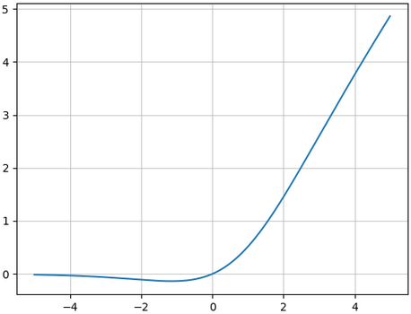
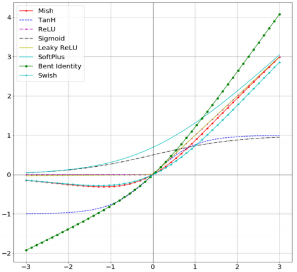
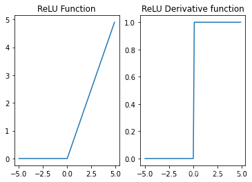
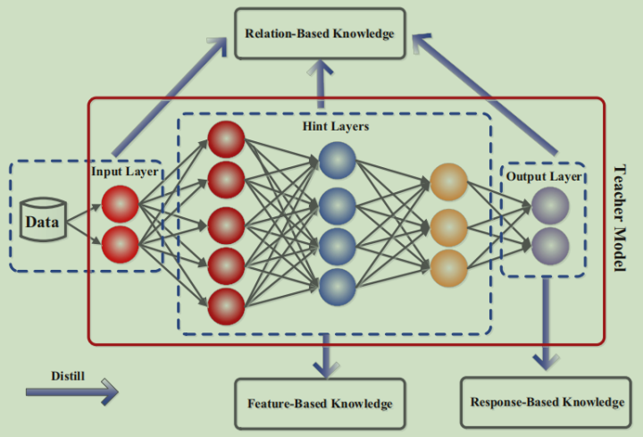

# One-Hot编码

One-Hot编码，又称**一位有效编码**，主要是采用N位状态寄存器来对N个状态进行编码，每个状态都有其独立的寄存器位，并且在任意时候只有一位有效，即只有一位为$1$，其余位为$0$。

One-Hot编码是分类变量作为二进制向量的表示。这首先要求将分类值映射到整数值。然后，每个整数值被表示为一个二进制向量，该整数作为索引，二进制向量在该索引位上是$1$，其他位上是$0$。

假设我们对人体内组成蛋白质的二十一种氨基酸进行编码，若采用整数标识，则它们可以使用$0,1,2,\cdots,20$共二十一个整数标识其类别。

现在我们使用One-Hot来对其进行编码，将其整数标量编码转换为向量形式。对于原来$0$标识的类别，可以使其二进制向量$0$索引位置$1$，而其他位置$0$，即$(1,0,0,0,0,0,0,0,0,0,0,0,0,0,0,0,0,0,0,0,0)$标识该类别。以此类推，对于其他如原来使用整数$6$标识的类别，其One-Hot编码为$(0,0,0,0,0,0,1,0,0,0,0,0,0,0,0,0,0,0,0,0,0)$。

# Mish激活函数

Mish激活函数的表达式为
$$
\text{Mish}(x) = x\tanh(\text{softplus}(x)) = x\tanh(\log(1+e^x)) = x\tanh(\ln(1+e^x))
$$
Mish激活函数的图像如下所示。



常见激活函数的图像如下所示。



一些激活函数的缺点：

(1)Sigmoid函数在激活值接近$0$或$1$处饱和，使梯度消失（几乎为$0$）。

(2)某些激活函数的输出，不是零中心的，会影响梯度下降算法。因为若输入总是正数，那么其梯度要么为正，要么全为负，使得权重更新时出现Z字型的下降，导致收敛变慢。这也是为什么要一直保持数据的$0$中心化。

# Dead ReLU Problem

激活函数ReLU和Sigmoid、tanh不同，ReLU的叠加并不会出现梯度消失或者梯度爆炸，但ReLU激活函数中使得负数归零的特性却会导致另外一个严重的问题，即Dead ReLU Problem，也称为神经元活性失效问题。

神经元活性失效问题和ReLU激活函数本身特性有关，首先观察ReLU的函数图像与导函数图像。



可以看出，对于ReLU激活函数来说，只要其接收到的数据小于$0$，输出结果就全是$0$。且更关键的是，由于ReLU的导函数是分段常数函数且接收负数时导数为$0$，因此如果ReLU输出结果为零，则反向传播结果，也就是各层的梯度也都是零。

当某数据点在模型中的输出结果为$0$时，反向传播后各层参数的梯度也全为$0$，此时模型参数将无法通过迭代更新。而进一步的，如果在某种模型参数情况下，整个训练数据集输入模型之后输出结果都是$0$，则在小批量梯度下降的情况下，每次再挑选出一些数据继续进行迭代，仍然无法改变输出结果是$0$的情况，此时参数无法得到更新，进而下次输入的小批数据结果还是$0$，从而梯度为$0$，从而参数无法更新，至此陷入死循环，模型失效，激活函数失去活性，也就出现了Dead ReLU Problem问题。

Dead ReLU Problem发生的概率，其实是伴随ReLU层的增加而增加的，只要其中任意一层输出结果是$0$，则所有层参数的梯度均为$0$。

在所有的解决Dead ReLU Problem的方法中，最简单的一种方法就是调整学习率。尽管ReLU叠加越多层越容易出现神经元活性失效，但我们可以简单通过降低学习率的方法来缓解神经元活性失效的问题，甚至可以说这是一种通用且有效的方法。

学习率作为模型重要的超参数，会在各方面影响模型效果，学习率越小，收敛速度就越慢，而学习率过大，则又容易跳过最小值点造成模型结果震荡。对于ReLU激活函数来说，参数“稍有不慎”就容易落入输出值全为$0$的陷阱，因此训练过程需要更加保守，采用更小的学习率逐步迭代。当然学习率减少就必然需要增加迭代次数，但由于ReLU激活函数计算过程相对简单，增加迭代次数并不会显著增加计算量。

# 上采样和下采样

上采样（up-sample）实际上就是放大图像，指的是任何可以让图像变成更高分辨率的技术。它有反卷积（Deconvolution，也称转置卷积），上池化（Up-Pooling），双线性插值（各种插值算法）等方法。

下采样（sub-sample）实际上就是缩小图像，主要目的是为了使得图像符合显示区域的大小，生成对应图像的缩略图。比如说在CNN中的卷积层池化层就是下采样。不过卷积过程导致的图像变小是为了提取特征，而池化下采样是为了降低特征的维度。

# FP32、FP16、BF16

FP32是单精度浮点数，用8bit表示指数，23bit表示小数；FP16是半精度浮点数，用5bit表示指数，10bit表示小数；BF16是对FP32单精度浮点数的截断数据，用8bit表示指数，7bit表示小数。

在数据表示范围上，FP32和BF16表示的整数范围是一样的，小数部分表示不一样，存在舍入误差；FP32和FP16表示的数据范围不一样，在大数据计算中，FP16存在溢出风险。

> 需要注意的是，因为FP32浮点数采用23bit表示小数，故只能表示$2^{23}=8388608$的数值，即对应到10进制7位小数左右，更小的数会存在舍入误差。这点在计算时需要特别注意，例如Python中的`==`判断对于这种舍入误差会判断为相等，且numpy.allclose也会将其判定为相等。

# Mixup与CutMix

目标检测算法需要大量的数据，在实际应用中经常面临数据不足的情况，因此人们开发了各种方法，用来使数据更加多样化，这项技术称为数据增强（Data Augment）。其中，Mixup、Cutout、CutMix、Mosaic就是四种最为经典的算法。

Mixup算法，随机混合图像，将两个图像按一定比例混合生成新的图像，并按同样比例混合生成新的标签，然后使用新的图像和标签参与训练，整个过程中原始图像不参与训练。Mixup算法的数学公式如下
$$
\begin{align}
\tilde{x} &= \lambda x_i+(1-\lambda)x_j \\
\tilde{y} &= \lambda y_i+(1-\lambda)y_j
\end{align}
$$
其中，$(x_i,y_i)$和$(x_j,y_j)$是随机选择的两个样本及其标签，$\lambda$为从某分布中随机采样的数。

Cutout算法，随机裁剪图像的一块区域，并在图像中对裁剪后的区域进行补$0$，与Mixup不同的是，它不改变图像的标签label。

CutMix算法，Cutout和Mixup的结合体，首先使用Cutout对两张图像随机选择同一位置的区域进行裁剪，然后使用Mixup，将各种图像裁剪掉的部分，与另一图像裁剪后的剩余部分进行混合。CutMix算法的数学公式如下
$$
\begin{align}
\tilde{x} &= \mathbf M\odot x_i + (1-\mathbf M)\odot x_j \\
\tilde{y} &= \lambda y_i + (1-\lambda) y_j
\end{align}
$$

# 知识蒸馏

模型压缩在不降低或者只是轻微降低原模型准确率的同时，大幅缩小原模型的体积，使其可以真正进行线上部署，常用的模型压缩方法包括以下三种：参数裁剪，删除掉原模型中一些无用的参数，缩小模型的体积；精度转换，降低原模型中参数的存储精度；神经网络结构搜索，寻找原模型中真正对最终结果起作用的网络层，删除掉影响不大的网络层，降低模型的体积。

知识蒸馏（Distilling Knowledge）也是一种模型压缩方法，参数裁剪、精度转换、神经网络结构搜索这些模型压缩方法会破坏原模型的结构，也就是会损坏原模型从数据中学习到的知识，而知识蒸馏通过蒸馏的手段保护原模型中学习到的知识，然后将这些知识迁移到压缩模型中，使压缩模型虽然相比原模型体积要小的多，但是也可以学习到相同的知识。

类比人类的学习过程，在知识蒸馏中称要进行压缩的模型为教师模型（Teacher Model），压缩之后的模型为学生模型（Student Model），一般情况下，教师模型的体积要远大于学生模型。

一般的知识蒸馏过程为：

1. 首先利用数据集训练教师模型，让教师模型充分学习数据中包含的知识；
2. 然后在利用数据集训练学生模型时，通过蒸馏方法将教师模型中已经学习到的知识提取出来，指导学生模型的训练，这样学生模型相当于从教师模型处获取到了关于数据集的先验信息。

也即，在知识蒸馏中，教师模型是预先在数据集上进行过预训练的，然后在学生模型的训练过程中，利用教师自身学习到的知识对模型进行指导，帮助提高学生模型的准确率。

在知识蒸馏中，将教师模型中的知识分为三种，如下图所示。



- 输出层知识，图中的Response-Based Knowledge，是教师模型最后一层的输出，这个输出未经过Softmax层转换为概率，一般称为Logits。
- 中间层知识，图中的Feature-Based Knowledge，是教师模型中间网络层的输出以及包含的参数。
- 关系型知识，图中的Relation-Based Knowledge，将教师模型不同层的知识之间的关系作为一种知识，也叫结构型知识。

如何进行知识蒸馏？

在知识蒸馏中，利用蒸馏损失函数刻画“教师模型中的知识在蒸馏过程中的丢失程度”，设学生模型原任务的损失函数为$L_\text{original}$，然后在蒸馏过程中定义一个蒸馏损失函数$L_\text{distill}$，蒸馏损失函数一般是一个能够**衡量相似性的函数**，比如$\text{KL}$散度、余弦距离等，用于**衡量**学生模型和教师模型对于同一数据产生的知识之间的**差异性**，根据上面对知识的分类，蒸馏损失函数具体形式为

- 输出层知识蒸馏损失函数，$L_\text{distill}(f(x),g(x))$，其中$f(x)$是教师模型的输出，$g(x)$是学生模型的输出，让学生模型产生的输出和教师模型产生的输出尽可能的相同，这样学生模型就达到了教师模型的效果。
- 中间层知识蒸馏损失函数，$L_\text{distill}(\varphi(f_h(x)),\varphi(g_h(x)))$，其中$f_h(x)$是教师模型中间层的输出或者中间层的参数，$g_h(x)$是学生模型中间层的输出或者中间层的参数。要注意教师模型的中间层输出或者参数，一般与学生模型的中间层输出和参数维度不一致，因为本来教师模型和学生模型就不是同一个模型，而且体积差别很大。其中，$\varphi(\cdot)$是一个维度变换函数，用于变换教师模型和学生模型的中间层知识到相同的维度，也将这个变换过程叫做知识嵌入，$\varphi(\cdot)$就叫做知识嵌入函数。中间层知识蒸馏的重点就在于如何设计知识嵌入函数，使得在中间层知识维度变换的过程中能尽量减少知识的损失。
- 关系型知识蒸馏损失函数，$L_\text{distill}(\phi(\varphi(f_h(x),f_h(x'))),\phi(\varphi(g_h(x),g_h(x'))))$，既然想获取知识之间的关系，关系型知识蒸馏损失的输入至少是一对知识$(f_h(x),f_h(x'))$，这样才能获取其中的关系，$\varphi(\cdot)$是维度变换函数，也就是知识嵌入函数，$\phi(\cdot)$是关系抽取函数，用于获取知识中的关系，一般是将中$\varphi(\cdot)$与$\phi(\cdot)$合二为一，设计为一个函数$\varphi\circ\phi$，即完成知识嵌入也完成关系抽取。

这样，学生模型的损失函数就变为，$\mathcal L=L_\text{original}+\lambda L_\text{distill}$，其中$\lambda$是蒸馏平衡因子，用于控制知识蒸馏在学生模型训练过程中的影响比例。

# EMA

指数移动平均（Exponential Moving Average）也叫指数加权平均（Exponential Weighted Moving Average），是一种给予近期数据更高权重的平均方法。移动平均可以看作是变量的过去一段时间取值的均值，相比对变量直接赋值而言，移动平均得到的值在图像上更加平缓光滑，抖动性更小，不会因为某次的异常取值而使得滑动平均值波动很大。

在初始化EMA时，需要提供一个衰减率（decay），这个衰减率将用于控制变量的更新速度。EMA对每一个变量（variable）会维护一个影子变量（shadow variable），这个影子变量的初始值就是相应变量的初始值，而每次运行变量更新时，影子变量的值会更新为：
$$
\text{shadow\_variable} = \text{decay}\cdot\text{shadow\_variable} + (1-\text{decay})\cdot\text{variable}
$$
衰减率decay决定了影子变量的更新速度，decay越大影子变量越趋于稳定。在实际运用中，decay一般会设成非常接近$1$的数，如$0.999$。

在深度学习场景中，为了使得影子变量在训练前期可以更新更快，EMA方法还提供了num_updates参数动态设置decay的大小。如果在初始化MEA时提供了num_updates参数，那么每次使用的衰减率将是：
$$
\min\set{\text{decay}, \frac{1+\text{num\_updates}}{10+\text{num\_updates}}}
$$
在深度学习中，主要是将模型的参数作为变量，对其应用EMA方法。在训练过程中，EMA不参与实际的训练过程，而是用在测试过程的，作用是使模型在测试数据上更加健壮，有更好的鲁棒性。或在最后保存模型时，存储模型参数的EMA值，取最近$n$次的近似平均值，使模型具备更好的测试指标（accuracy）等，更强的泛化能力。

滑动平均可以使模型在测试数据上更健壮（robust），采用随机梯度下降算法（Batch SGD）训练神经网络时，使用滑动平均在很多应用中都可以在一定程度上提高最终模型在测试数据上的表现。

在实际的训练过程中，对神经网络边的权重weights应用滑动平均EMA，并维护对应的影子变量shadow_weights。在训练过程仍然使用原来不带滑动平均的权重weights来更新，不然无法得到weights下一步更新的值，在得到下一步更新的weights后，就可以用来更新影子变量shadow_weights。

对于训练完成的模型，保存其影子变量shadow_weights作为模型的最终参数。之后在测试过程中，使用shadow_weights来代替weights作为神经网络的参数权重，这样在测试数据上效果更好。

# Domain Decomposition

域分解（Domain Decomposition）也叫数据划分，划分的对象是数据。这些数据可以是算法（或程序）的输入数据、计算的中间结果或计算的输出数据。如深度学习中的数据并行和模型并行，还有一种不属于域分解的并行如流水线并行。

域分解的步骤是：首先分解与问题相关的数据，如果可能的话，应使每份数据的数据量大体相等；然后再将每个计算关联到它所操作的数据上。由此就产生出一些任务，每个任务包括一些数据及其上的操作。当一个操作需要别的任务中的数据时，就会产生通信要求。通俗而言就是两个阶段，首先，确定数据如何划分到各个处理器；然后，确定每个处理器所需要做的事情。

域分解的经验方法是：优先集中在最大数据的划分和经常被访问的数据结构上。在不同的阶段，可能要对不同的数据结构进行操作或需要对同一数据结构进行不同的分解。在此情况下，要分别对待，然后再将各阶段设计的分解与算法装配到一起。

# 求LayerNorm反向传播对输入的梯度

设输入为
$$
X \in \R^{N\times d}
$$
其中，$N$表示batch_size，即批量的大小，$d$表示一个数据样本的维度。

使输入经过层归一化，$Y=\mathtt{LayerNorm}(X)\in\R^{N\times d}$，其中层归一化的权重分别为
$$
w \in \R^d \\
b \in \R^d
$$
则对于每一个样本$y=y_k=Y_{k}\in\R^d$和$x=x_k=X_{k}\in\R^d$，有
$$
\begin{align}
y &= \mathtt{LayerNorm}(x) \\
&= \frac{x - \mathtt{E}[x]}{\sqrt{\mathtt{Var}[x] + \varepsilon}} \odot w + b \\
&= \frac{x - \mu}{\sigma} \odot w + b \\
&= \hat{x} \odot w + b
\end{align}
$$
其中，根据PyTorch的实现，期望与方差分别如下
$$
\begin{align}
\mathtt{E}[x] &= \frac{1}{d}\sum_{i} x_i \\
\mathtt{Var}[x] &= \frac{1}{d}\sum_i (x_i - \mathtt{E}[x])^2 \\
\mu &= \mathtt{E}[x] \in\R \\
\sigma &= \sqrt{\mathtt{Var}[x] + \varepsilon} \in\R
\end{align}
$$


设$y$的梯度已知为$G_y=G_{y_k}$，现要求$y$对输入$x$的梯度，以及对$w$和$b$的梯度。
$$
\begin{align}
G_w &= \hat{x} \odot G_y \in\R^d \\
G_b &= G_y \in\R^d \\
G_\hat{x} &= G_y \odot w \in\R^d
\end{align}
$$
现由梯度$G_\hat{x}$求对于$x$的梯度，已知
$$
\hat{x} = \frac{x-\mu}{\sigma}
$$
则
$$
G_x = G_\hat{x} \frac{\part\hat{x}}{\part x} \in\R^d
$$
其中，$\dfrac{\part\hat{x}}{\part x}$是$\hat{x}$对于$x$的雅可比矩阵，如下
$$
\frac{\part\hat{x}}{\part x} = \begin{bmatrix}
\frac{\part\hat{x}_0}{\part x_0} & \frac{\part\hat{x}_0}{\part x_1} & \frac{\part\hat{x}_0}{\part x_2} & \cdots \\
\frac{\part\hat{x}_1}{\part x_0} & \frac{\part\hat{x}_1}{\part x_1} & \frac{\part\hat{x}_1}{\part x_2} & \cdots \\
\frac{\part\hat{x}_2}{\part x_0} & \frac{\part\hat{x}_2}{\part x_1} & \frac{\part\hat{x}_2}{\part x_2} & \cdots \\
\vdots & \vdots & \vdots & \ddots
\end{bmatrix} \in\R^{d\times d}
$$
则求雅可比矩阵中的第$j$行，有
$$
\begin{align}
\frac{\part\hat{x}_j}{\part x} &= \frac{\part}{\part x}(\frac{x_j-\mu}{\sigma}) \\
&= \frac{(\delta_{ji}-\mu')\sigma - (x_j-\mu)\sigma'}{\sigma^2}
\end{align}
$$
其中，$\delta_{ji}\in\R^d$，且其中的元素仅当$j=i$时取为$1$，其余元素取$0$；梯度$\mu',\sigma'$分别为期望与方差对$x$的梯度，如下
$$
\begin{align}
\mu' &= \frac{\part\mu}{\part x} = \frac{\part}{\part x}(\frac{1}{d}\sum_t x_t) \\
&= (\frac{1}{d}, \frac{1}{d}, ...) \in\R^d \\

\sigma' &= \frac{\part \sigma}{\part x} = \frac{\part}{\part x}(\sqrt{\mathtt{Var}[x] + \varepsilon}) \\
&= \frac{1}{2\sqrt{\mathtt{Var}[x] + \varepsilon}} \frac{\part \mathtt{Var}[x]}{\part x} \\
&= \frac{1}{2\sigma} \frac{\part \mathtt{Var}[x]}{\part x} \\
&= \frac{\hat{x}}{d} \in\R^d
\end{align}
$$
其中
$$
\frac{\part\mathtt{Var}[x]}{\part x} = (\frac{\part\mathtt{Var}[x]}{\part x_0}, \frac{\part\mathtt{Var}[x]}{\part x_1}, \cdots, \frac{\part\mathtt{Var}[x]}{\part x_i}, \cdots) \in \R^d
$$
则对于$x$中的每个元素$x_i\in\R$来说，有
$$
\begin{align}
\frac{\part\mathtt{Var}[x]}{\part x_i} &= \frac{\part}{\part x_i}(\frac{1}{d}\sum_t (x_t - \mu)^2) \\
&= \frac{1}{d} \frac{\part}{\part x_i} (\sum_t x_t^2 - 2\mu\sum_tx_t + d\mu^2) \\
&= \frac{1}{d} (2x_i - 2\mu'\sum_tx_t -2\mu + 2d\mu\mu') \\
&= \frac{2}{d} (x_i - \mu) \in \R
\end{align}
$$
则
$$
\frac{\part \mathtt{Var}[x]}{\part x} = \frac{2}{d} (x_0-\mu, x_1-\mu, \cdots, x_i-\mu, \cdots) = \frac{2}{d}(x-\mu) \in \R^d
$$
则
$$
\sigma' = \frac{\part \sigma}{\part x} 
= \frac{1}{2\sigma}\frac{2}{d}(x-\mu) 
= \frac{1}{\sigma d}(x-\mu) 
= \frac{\hat{x}}{d}
\in \R^d
$$
于是
$$
\begin{align}
\frac{\part\hat{x}_j}{\part x} &= \frac{(\delta_{ji}-\mu')\sigma - (x_j-\mu)\sigma'}{\sigma^2} \\
&= (\delta_{ji} - \frac{1}{d})\frac{1}{\sigma} - (x_j-\mu)\frac{\hat{x}}{\sigma^2 d} \\
&= (\delta_{ji} - \frac{1}{d})\frac{1}{\sigma} - \hat{x}_j\hat{x}\frac{1}{\sigma d} \\
&= \frac{1}{\sigma d}[d\cdot\delta_{ji} - 1 - \hat{x}_j\hat{x}]
\end{align}
$$
于是得到雅可比矩阵如下
$$
\frac{\part\hat{x}}{\part x} = \frac{1}{\sigma d}[ d\cdot\mathtt{Eye} - 1 - \mathtt{outer}(\hat{x},\hat{x})]
$$
于是得到
$$
G_x = G_\hat{x} \frac{\part\hat{x}}{\part x} = (G_y \odot w) \frac{\part\hat{x}}{\part x}
$$
最终，对于所有样本$X$来说，有
$$
\begin{align}
G_w &= \sum_k^N [\hat{x} \odot G_Y]_{k,:} \in\R^d \\
G_b &= \sum_k^N [G_Y]_{k,:} \in\R^d \\
G_X &= \mathtt{batched\_Vector\_Matrix}[(G_Y \odot w), \frac{\part\hat{X}}{\part X}] \in\R^{N\times d}
\end{align}
$$

```python
class LayerNorm_Function(torch.autograd.Function):
    """ Batched LyaerNorm """
    @staticmethod
    def forward(ctx: Any, input: Tensor, weight: Tensor, bias: Tensor, eps: float = 1.e-12) -> Any:
        """
        input  = [batch_size, dim]
        weight = [dim, ]
        bias   = [dim, ]
        """
        sigma, mu = torch.std_mean(input, dim=-1, unbiased=False, keepdim=True)
        sigma += eps
        hat_x = (input - mu) / sigma
        out = hat_x * weight + bias
        ctx.save_for_backward(hat_x, weight, sigma)
        # out = [batch_size, dim]
        return out
    
    @staticmethod
    def backward(ctx: Any, grad_out: Tensor) -> Any:
        hat_x, weight, sigma, = ctx.saved_tensors
        """
        grad_out = [batch_size, dim]
        hat_x    = [batch_size, dim]
        weight   = [dim, ]
        sigma    = [batch_size, 1]
        """
        dim, dev = grad_out.size(dim=-1), grad_out.device
        # sum along batch dimension
        grad_bias = torch.sum(grad_out, dim=0)
        grad_weight = torch.sum(grad_out * hat_x, dim=0)
        grad_hat_x = grad_out * weight
        grad_input_numer = dim * torch.eye(dim, device=dev) - 1 - torch.einsum('bi,bj->bij', hat_x, hat_x)
        grad_input = torch.einsum('bi,bid->bd', grad_hat_x, grad_input_numer) / (sigma * dim)
        # grad_input  = [batch_size, dim]
        # grad_weight = [dim, ]
        # grad_bias   = [dim, ]
        return grad_input, grad_weight, grad_bias

def my_layer_norm(input: Tensor, weight: Tensor, bias: Tensor):
    """
    input  = [..., dim]
    weight = [dim, ]
    bias   = [dim, ]
    """
    sz = input.size()
    dim = sz[-1]
    out = LayerNorm_Function.apply(input.view(-1, dim), weight, bias)
    return out.view(sz)
```

# Welford算法求期望与方差

给定数列$x=\set{x_0,x_1,x_2,\cdots}$，要求数据的期望与方差，其数学公式如下。
$$
\begin{align}
\mu &= \mathtt{E}[x] = \frac{1}{N}\sum_{i} x_i \\
\sigma^2 &= \mathtt{Var}[x] = \frac{1}{N}\mathtt{E}[(x-\mu)^2] = \mathtt{E}[X^2] - \mathtt{E}^2[X]
\end{align}
$$
此外，还有另一种方法可以用来求期望与方差，也即Welford算法，它只需遍历一遍数据，且不会存在累计误差，其递推公式如下所示。
$$
\begin{align}
\mu_n &= \mu_{n-1} + \frac{x_n-\mu_{n-1}}{N} & \mu_0 &= x_0 \\
\sigma_n^2 &= \sigma_{n-1}^2 + \frac{(x_n-\mu_n)(x_n-\mu_{n-1})-\sigma_{n-1}^2}{N} & \sigma_0 &= 0
\end{align}
$$
因为每项都除以$n$会得到较小的数据，导致计算机的舍入误差，故在实际代码中，对其进行等价变换，得到递推公式如下。
$$
\mathtt{Var}_n = \mathtt{Var}_{n-1} + (x_n-\mu_n)(x_n-\mu_{n-1}) \qquad \mathtt{var}_0 = 0
$$
从而所求的方差公式如下所示。
$$
\sigma_n^2 = \frac{\mathtt{Var_n}}{N}
$$

```python
def mean_variance(data, length):
    mu, var = data[0], 0.
    for i in range(1, length):
        mu_pre, var_pre = mu, var
        mu = mu_pre + (data[i] - mu_pre) / (i + 1)
        var = var_pre + (data[i] - mu) * (data[i] - mu_pre)
    var = var / length
    return mu, var
```

