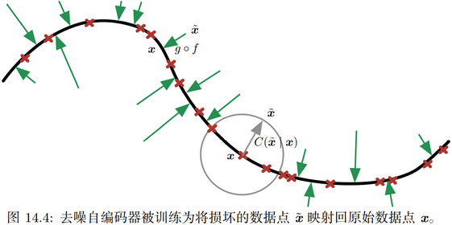

在本书的前两部分，已经展示了如何解决监督学习问题，即在给定足够的映射样本的情况下，学习将一个向量映射到另一个。

我们想要解决的问题并不全都属于这个类别。我们可能希望生成新的样本、或确定一个点的似然性、或处理缺失值，以及利用一组大量的未标记样本或相关任务的样本。当前应用于工业的最先进技术的缺点是我们的学习算法需要大量的监督数据才能实现良好的精度。在本书这一部分，我们讨论一些推测性的方法，来减少现有模型工作所需的标注数据量，并适用于更广泛的任务。实现这些目标通常需要某种形式的无监督或半监督学习。

许多深度学习算法被设计为处理无监督学习问题，但不像深度学习已经在很大程度上解决了各种任务的监督学习问题，没有一个算法能以同样的方式真正解决无监督学习问题。在本书这一部分，我们描述**无监督学习**的现有方法和一些如何在这一领域取得进展的流行思想。

无监督学习困难的核心原因是被建模的随机变量的高维度。这带来了两个不同的挑战：统计挑战和计算挑战。统计挑战与泛化相关，我们可能想要区分的配置数会随着感兴趣的维度数指数增长，并且这快速变得比可能具有的样本数（或者在有限计算资源下使用的样本数）大得多。与高维分布相关联的计算挑战之所以会出现，是因为用于学习或使用训练模型的许多算法（特别是基于估计显式概率函数的算法）涉及难处理的计算量，并且随维数呈指数增长。

面对这些难以处理的计算的一种方法是近似它们，如在本书的第三部分中讨论的，研究者已经提出了许多方法。这里还讨论另一种有趣的方式是通过设计模型，完全避免这些难以处理的计算，因此不需要这些计算的方法是非常有吸引力的。近年来，研究者已经提出了数种具有该动机的**生成模型**。

# 一、线性因子模型

【引入】单因子模型，通俗的说，假如某件事情的发生仅用一个**因子**便可解释，这样建立的模型就可以称作单因子模型。比如说，今天下雨，很可能是因为水汽的积累太多了，那么是否下雨只受到空气中水分含量这个因子的影响，通过观察水分含量，就可以对是否下雨有个判断。仅靠水分含量因子影响的模型就可以称作为单因子模型。但是在实际运用当中，只靠水分含量这个观测量，无法对是否下雨做到完全准确的预测。那么除此之外再添加一些比如地形、季节等因子，结果应该会更加准确。但是即便加入地形、季节这些因子，也并不完全确定是多因子模型。是否为多因子模型，还要知道因子是否为直接相关因子，如果通过检验发现其因果关系较强时，便可称之为多因子模型。因子分析是将多个实测变量转换为少数几个综合指标（或称**潜变量**）。

【引入】**潜变量**，与可观察变量相对，是不直接观察但是通过观察到的其他变量推断（通过数学模型）的变量（直接测量）。旨在用潜在变量解释观察变量的数学模型称为**潜变量模型**。

许多深度学习的研究前沿均涉及构建输入的概率模型$p_{model}(\mathbf x)$。原则上说，给定任何其他变量的情况下，这样的模型可以使用概率推断来预测其环境中的任何变量。许多这样的模型还具有潜变量$\mathbf h$，其中$p_{model}(\mathbf x)=\mathbb E_\mathbf h p_{model}(\mathbf x|\mathbf h)$。这些潜变量提供了表示数据的另一种方式。我们在深度前馈网络和循环网络中已经发现，基于潜变量的分布式表示继承了表示学习的所有优点。

在本章中，我们描述了一些基于潜变量的最简单的概率模型：**线性因子模型（linear factor model）**。这些模型有时被用来作为混合模型的组成模块或者更大的深度概率模型。同时，也介绍了构建**生成模型**所需的许多基本方法，在此基础上更先进的深度模型也将得到进一步扩展。

线性因子模型通过随机线性解码器函数来定义，该函数通过对$\mathbf h$的线性变换以及添加噪声来生成$\mathbf x$。有趣的是，通过这些模型我们能够发现一些符合简单联合分布的解释性因子。线性解码器的简单性使得它们成为了最早被广泛研究的潜变量模型。

线性因子模型描述如下的数据生成过程。首先，我们从一个分布中抽取解释性因子
$$
\mathbf h\sim p(\mathbf h) \tag{13.1}
$$
其中$p(\mathbf h)$是一个因子分布，满足$p(\mathbf h)=\prod_i p(h_i)$，所以易于从中采样。接下来，在给定因子的情况下，我们对实值的可观察**变量进行采样**如下

$$
\mathbf x = \mathbf{Wh}+\mathbf b+\text{noise} \tag{13.2}
$$
其中噪声通常是对角化的（在维度上是独立的）且服从高斯分布。这在下图13.1有具体说明。

如图所示，其中我们假设观察到的数据向量$\mathbf x$是通过独立的潜在因子$\mathbf h$的线性组合再加上一定噪声获得的。不同的模型，比如概率PCA，因子分析或者是ICA，**都是**选择了不同形式的噪声以及先验$p(\mathbf h)$。

## （一）概率PCA和因子分析

**概率PCA（probabilistic PCA）**、因子分析和其他线性因子模型是上述等式(13.1)和式(13.2)的特殊情况，并且仅在对观测到$\mathbf x$之前的噪声分布和潜变量$\mathbf h$先验的选择上有所不同。

在**因子分析（factor analysis）**（Bartholomew,1987; Basilevsky,1994）中，潜变量的先验是一个方差为单位矩阵的高斯分布
$$
\mathbf h\sim\mathcal N(\mathbf h;\mathbf 0,\mathbf I) \tag{13.3}
$$
同时，假定在给定$\mathbf h$的条件下观察值$x_i$是**条件独立（conditionally independent）**的。具体来说，我们可以假设噪声（noise）是从对角协方差矩阵的高斯分布中抽出的，协方差矩阵为$\psi=\text{diag}(\sigma^2)$，其中$\sigma^2=[\sigma_1^2,\sigma_2^2,\cdots,\sigma_n^2]^\text{T}$表示一个向量，每个元素表示一个变量的方差。

因此，潜变量的作用是捕获不同观测变量$x_i$之间的依赖关系。实际上，可以容易地看出$\mathbf x$服从多维正态分布，并满足
$$
\mathbf x\sim\mathcal N(\mathbf x;\mathbf b,\mathbf{WW}^\text{T}+\psi) \tag{13.4}
$$
为了将PCA引入到概率框架中，我们可以对因子分析模型作轻微修改，使条件方差$\sigma_i^2$等于同一个值。在这种情况下，$\mathbf x$的协方差简化为$\mathbf{WW}^\text{T}+\sigma^2\mathbf I$，这里的$\sigma^2$是一个标量。由此可以得到条件分布，如下：
$$
\mathbf x\sim\mathcal N(\mathbf x;\mathbf b,\mathbf{WW}^\text{T}+\sigma^2\mathbf I) \tag{13.5}
$$
或者等价地
$$
\mathbf x=\mathbf{Wh}+\mathbf b+\sigma\mathbf z \tag{13.6}
$$
其中$\mathbf z\sim\mathcal N(\mathbf z;\mathbf 0,\mathbf I)$是高斯噪声。之后Tipping and Bishop(1999)提出了一种迭代的EM算法来估计参数$\mathbf W$和$\sigma^2$。

这个**概率PCA（probabilistic PCA）**模型利用了这样一种观察现象：除了一些微小残余的**重构误差（reconstruction error）**（至多为$\sigma^2$），数据中的大多数变化可以由潜变量$\mathbf h$描述。通过Tipping and Bishop(1999)的研究我们可以发现，当$\sigma\to 0$时，概率PCA退化为PCA。在这种情况下，给定$\mathbf x$情况下$\mathbf h$的条件期望等于将$\mathbf x-\mathbf b$投影到$\mathbf W$的$d$列所生成的空间上，与PCA一样。

当$\sigma\to 0$时，概率PCA所定义的密度函数在$d$维的$\mathbf W$的列生成空间周围非常尖锐。这导致模型会为没有在一个超平面附近聚集的数据分配非常低的概率。

## （二）独立成分分析

**独立成分分析（independent component analysis，ICA）**是最古老的表示学习算法之一。它是一种建模线性因子的方法，旨在将观察到的信号分离成许多潜在信号，这些潜在信号通过缩放和叠加可以恢复成观察数据。这些信号是完全独立的，而不是仅仅彼此不相关。

许多不同的具体方法被称为ICA。与本书中描述的其他生成模型最相似的ICA变种（Pham et al.,1992）训练了完全参数化的生成模型。潜在因子$\mathbf h$的先验$p(\mathbf h)$，必须由用户提前给出并固定。接着模型确定性地生成$\mathbf x=\mathbf{Wh}$。我们可以通过如下的非线性变化
$$
p_x(\mathbf x)=p_y(g(\mathbf x))\left| \det(\frac{\part g(\mathbf x)}{\part\mathbf x}) \right| \tag{3.47}
$$
来确定$p(\mathbf x)$，其中$\mathbf y=g(\mathbf x)$，且$\det(\cdot)$表示行列式。然后通过一般的方法比如最大化似然进行学习。

这种方法的动机是，通过选择一个独立的$p(\mathbf h)$，我们可以尽可能恢复接近独立的潜在因子。这是一种常用的方法，它并不是用来捕捉高级别的抽象因果因子，而是恢复已经混合在一起的低级别信号。在该设置中，每个训练样本对应一个时刻，每个$x_i$是一个传感器对混合信号的观察值，并且每个$h_i$是单个原始信号的一个估计。例如，我们可能有$n$个人同时说话。如果我们在不同位置放置$n$个不同的麦克风，则ICA可以检测每个麦克风的音量变化，并且分离信号，使得每个$h_i$仅包含一个人清楚地说话。

这通常用于脑电图的神经科学，这种技术可用于记录源自大脑的电信号。放置在受试者头部上的许多电极传感器用于测量来自身体的多种电信号。实验者通常仅对来自大脑的信号感兴趣，但是来自受试者心脏和眼睛的信号强到足以混淆在受试者头皮处的测量结果。信号到达电极，并且混合在一起，因此为了分离源于心脏与源于大脑的信号，并且将不同脑区域中的信号彼此分离，ICA是必要的。

如前所述，ICA存在许多变种。一些版本在$\mathbf x$的生成中添加一些噪声，而不是使用确定性的解码器。大多数方法不使用最大似然准则，而是旨在使$\mathbf h=\mathbf W^{-1}\mathbf x$的元素彼此独立。许多准则能够达成这个目标。式(3.47)需要用到$\mathbf W$的行列式，这可能是代价很高且数值不稳定的操作。ICA的一些变种通过将$\mathbf W$约束为正交来避免这个有问题的操作。

ICA的所有变种均要求$p(\mathbf h)$是非高斯的。这是因为如果$p(\mathbf h)$是具有高斯分量的独立先验，则$\mathbf W$是不可识别的。对于许多$\mathbf W$值，我们可以在$p(\mathbf x)$上获得相同的分布。这与其他线性因子模型有很大的区别，例如概率PCA和因子分析通常要求$p(\mathbf h)$是高斯的，以便使模型上的许多操作具有闭式解。在用户明确指定分布的最大似然方法中，一个典型的选择是使用$p(h_i)=\frac{d}{dh_i}\sigma(h_i)$。这些非高斯分布的典型选择在$0$附近具有比高斯分布更高的峰值，因此我们也可以看到独立成分分析经常用于学习稀疏特征。

按照我们对生成模型这个术语的定义，ICA的许多变种不是生成模型。在本书中，生成模型可以直接表示$p(\mathbf x)$，也可以认为是从$p(\mathbf x)$中抽取样本。ICA的许多变种仅知道如何在$\mathbf x$和$\mathbf h$之间变换，而没有任何表示$p(\mathbf h)$的方式，因此也无法在$p(\mathbf x)$上施加分布。例如，许多ICA变量旨在增加$\mathbf h=\mathbf W^{−1}\mathbf x$的样本峰度，因为高峰度说明了$p(\mathbf h)$是非高斯的，但这是在没有显式表示$p(\mathbf h)$的情况下完成的。这就是为什么ICA多被用作分离信号的分析工具，而不是用于生成数据或估计其密度。

正如PCA可以推广到非线性自编码器，ICA也可以推广到非线性生成模型，其中我们使用非线性函数$f$来生成观测数据。ICA的另一个非线性扩展是**非线性独立成分估计（nonlinear independent components estimation，NICE）**方法（Dinh et al.,2014），这个方法堆叠了一系列可逆变换（在编码器阶段），其特性是能高效地计算每个变换的Jacobian行列式，这使得我们能够精确地计算似然。并且像ICA一样，NICE尝试将数据变换到具有因子的边缘分布的空间。由于非线性编码器的使用，这种方法更可能成功。因为编码器和一个能进行完美逆变换的解码器相关联，所以可以直接从模型生成样本（首先从$p(\mathbf h)$采样，然后使用解码器）。

ICA的另一个推广是通过鼓励组内统计依赖关系、抑制组间依赖关系来学习特征组。当相关单元的组被选为不重叠时，这被称为**独立子空间分析（independent subspace analysis）**。我们还可以向每个隐藏单元分配空间坐标，并且空间上相邻的单元组形成一定程度的重叠。这能够鼓励相邻的单元学习类似的特征。当应用于自然图像时，这种**地质ICA（topographic ICA）**方法可以学习Gabor滤波器，从而使得相邻特征具有相似的方向、位置或频率。在每个区域内出现类似Gabor函数的许多不同相位存在抵消作用，使得在小区域上的池化产生了平移不变性。

## （三）慢特征分析

**慢特征分析（slow feature analysis，SFA）**是使用来自时间信号的信息学习不变特征的线性因子模型（Wiskott and Sejnowski,2002）。

慢特征分析的想法源于所谓的**慢性原则（slowness principle）**。其基本思想是，与场景中起描述作用的单个量度相比，场景的重要特性通常变化得非常缓慢。例如，在计算机视觉中，单个像素值可以非常快速地改变。如果斑马从左到右移动穿过图像并且它的条纹穿过对应的像素时，该像素将迅速从黑色变为白色，并再次恢复成黑色。而通过比较，指示斑马是否在图像中的特征将不发生改变，并且描述斑马位置的特征将缓慢地改变。因此，我们可能希望将模型正则化，从而能够学习到那些随时间变化较为缓慢的特征。

慢性原则早于慢特征分析，并已被应用于各种模型。一般来说，我们可以将慢性原则应用于可以使用梯度下降训练的任何可微分模型。为了引入慢性原则，我们可以向代价函数添加以下项
$$
\lambda\sum_t L(f(\mathbf x^{(t+1)}),f(\mathbf x^{(t)})) \tag{13.7}
$$
其中$\lambda$是确定慢度正则化强度的超参数项，$t$是样本时间序列的索引，$f$是需要正则化的特征提取器，$L$是测量$f(\mathbf x^{(t+1)})$和$f(\mathbf x^{(t)})$之间的距离的损失函数。$L$的一个常见选择是均方误差。

慢特征分析是慢性原则中一个特别高效的应用。由于它被应用于线性特征提取器，并且可以通过闭式解训练，所以它是高效的。像ICA的一些变种一样，SFA本身并不是生成模型，只是在输入空间和特征空间之间定义了一个线性映射，但是没有定义特征空间的先验，因此没有在输入空间上施加分布$p(\mathbf x)$。

SFA算法（Wiskott and Sejnowski,2002）先将$f(\mathbf x;\theta)$定义为线性变换，然后求解如下优化问题
$$
\min_\theta \mathbb E_t (f(\mathbf x^{(t+1)})_i-f(\mathbf x^{(t)})_i)^2 \tag{13.8}
$$
并且满足下面的约束：
$$
\begin{align}
& \mathbb E_t f(\mathbf x^{(t)})_i = 0 \tag{13.9} \\
& \mathbb E_t [f(\mathbf x^{(t)})_i^2] = 1 \tag{13.10}
\end{align}
$$
学习特征具有零均值的约束对于“使问题具有唯一解”是必要的；否则我们可以向所有特征值添加一个常数，并获得具有相等慢度目标值的不同解。特征具有单位方差的约束对于“防止所有特征趋近于$0$的病态解”是必要的。

与PCA类似，SFA特征是有序的，其中学习第一特征是最慢的。要学习多个特征，我们还必须添加约束
$$
\forall i<j,\quad \mathbb E_t [f(\mathbf x^{(t)})_i,f(\mathbf x^{(t)})_j] = 0 \tag{13.11}
$$
这要求学习的特征必须彼此线性去相关。没有这个约束，所有学习到的特征将简单地捕获一个最慢的信号。可以想象使用其他机制，如最小化重构误差，也可以迫使特征多样化。但是由于SFA特征的线性，这种去相关机制只能得到一种简单的解。SFA问题可以通过线性代数软件获得闭式解。

在运行SFA之前，SFA通常通过对$\mathbf x$使用非线性的基扩充来学习非线性特征。例如，通常用$\mathbf x$的二次基扩充来代替原来的$\mathbf x$，得到一个包含所有$x_ix_j$的向量。由此，我们可以通过“反复地学习一个线性SFA特征提取器，对其输出应用非线性基扩展，然后在该扩展之上学习另一个线性SFA特征提取器”的方式来组合线性SFA模块从而学习深度非线性慢特征提取器。

SFA的一个主要优点是，即使在深度非线性条件下，它依然可以在理论上预测SFA能够学习哪些特征。为了做出这样的理论预测，必须知道关于配置空间的环境动力（如一个3D渲染环境中随机运动的例子，理论分析是从相机位置、速度的概率分布中入手的）。已知潜在因子如何改变的情况下，我们能够通过理论分析解出表达这些因子的最佳函数。在实践中，基于模拟数据的实验上，使用深度SFA似乎能够恢复理论预测的函数。相比之下，在其他学习算法中，代价函数高度依赖于特定像素值，使得难以确定模型将学习到什么特征。

深度SFA也已经被用于学习用在对象识别和姿态估计的特征（Franzius et al.,2008）。到目前为止，慢性原则尚未成为任何最先进应用的基础。究竟是什么因素限制了其性能仍有待研究。我们推测，或许慢度先验太过强势，并且，最好添加这样一个先验使得当前时间步到下一个时间步的预测更加容易，而不是加一个先验使得特征近似为一个常数。对象的位置是一个有用的特征，无论对象的速度是高还是低。但慢性原则鼓励模型忽略具有高速度的对象的位置。

## （四）稀疏编码

**稀疏编码（sparse coding）**（Olshausen and Field,1996）是一个线性因子模型，已作为一种无监督特征学习和**特征提取机制**得到了广泛研究。严格来说，术语“稀疏编码”是指在该模型中推断$\mathbf h$值的过程，而“稀疏建模”是指设计和学习模型的过程，但是通常这两个概念都可以用术语“稀疏编码”描述。

像大多数其他线性因子模型一样，它使用了线性的解码器加上噪声的方式获得一个$\mathbf x$的重构，就像式(13.2)描述的一样。更具体地说，稀疏编码模型通常假设线性因子有一个各向同性精度为$\beta$的高斯噪声：
$$
p(\mathbf x|\mathbf h)=\mathcal N(\mathbf x;\mathbf{Wh}+\mathbf b,\frac{1}{\beta}\mathbf I) \tag{13.12}
$$
分布$p(\mathbf h)$通常选取为一个峰值很尖锐且接近$0$的分布（Olshausen and Field,1996）。常见的选择包括可分解的Laplace、Cauchy，或者可分解的Student-t分布。例如，以稀疏惩罚系数$\lambda$为参数的Laplace先验可以表示为
$$
p(h_i)=\text{Laplace}(h_i;0,\frac{2}{\lambda})=\frac{\lambda}{4}e^{-\frac12\lambda|h_i|} \tag{13.13}
$$
相应的，Student-t先验分布可以表示为
$$
p(h_i)\propto\frac{1}{(1+\frac{h_i^2}{\nu})^\frac{\nu+1}{2}} \tag{13.14}
$$

使用最大似然的方法来训练稀疏编码模型是不可行的。相反，为了在给定编码的情况下更好地重构数据，训练过程在编码数据和训练解码器之间交替进行。这种方法被进一步证明为是解决最大似然问题的一种通用的近似方法。

对于诸如PCA的模型，我们已经看到使用了预测$\mathbf h$的参数化的编码器函数，并且该函数仅包括乘以权重矩阵。稀疏编码中的编码器不是参数化的编码器。相反，编码器是一个优化算法，在这个优化问题中，我们寻找单个最可能的编码值：
$$
\mathbf h^*=f(\mathbf x)=\mathop{\text{arg max }}_\mathbf h p(\mathbf h|\mathbf x) \tag{13.15}
$$
结合式(13.12)和式(13.13)，我们得到如下的优化问题：
$$
\begin{align}
\mathbf h^* &= \mathop{\text{arg max }}_\mathbf h p(\mathbf h|\mathbf x) \tag{13.16} \\
&= \mathop{\text{arg max }}_\mathbf h \log p(\mathbf h|\mathbf x) \tag{13.17} \\
&= \mathop{\text{arg min }}_\mathbf h \lambda\|\mathbf h\|_1+\beta\|\mathbf x-\mathbf{Wh}\|_2^2 \tag{13.18}
\end{align}
$$
其中，我们扔掉了与$\mathbf h$无关的项，并除以一个正的缩放因子来简化表达。由于在$\mathbf h$上施加$L^1$范数，这个过程将产生稀疏的$\mathbf h^*$。

为了训练模型而不仅仅是进行推断，我们交替迭代关于$\mathbf h$和$\mathbf W$的最小化过程。在本文中，将$\beta$视为超参数，通常将其设置为$1$，因为它在此优化问题的作用与$\lambda$类似，没有必要使用两个超参数。原则上，我们还可以将$\beta$作为模型的参数，并学习它。我们在这里已经放弃了一些不依赖于$\mathbf h$但依赖于$\beta$的项。要学习$\beta$，必须包含这些项，否则$\beta$将退化为$0$。

不是所有的稀疏编码方法都显式地构建了一个$p(\mathbf h)$和一个$p(\mathbf x|\mathbf h)$。通常我们只是对学习一个“带有激活值的特征的字典”感兴趣，当特征是由这个推断过程提取时，这个激活值通常为$0$。

如果我们从Laplace先验中采样$\mathbf h$，$\mathbf h$的元素实际上为$0$是一个零概率事件。生成模型本身并不稀疏，只有特征提取器是稀疏的。Goodfellow et al.(2013f)描述了不同模型族中的近似推断，如尖峰和平板稀疏编码模型，其中先验的样本通常包含许多真正的$0$。

与非参数编码器结合的稀疏编码方法，原则上可以比任何特定的参数化编码器更好地最小化重构误差和对数先验的组合。另一个优点是编码器没有泛化误差；参数化的编码器必须泛化地学习如何将$\mathbf x$映射到$\mathbf h$。对于与训练数据差异很大的异常$\mathbf x$，所学习的参数化编码器可能无法找到对应精确重构或稀疏的编码$\mathbf h$。对于稀疏编码模型的绝大多数形式，推断问题是凸的，优化过程总能找到最优编码（除非出现退化的情况，例如重复的权重向量）。显然，稀疏和重构成本仍然可以在不熟悉的点上升，但这归因于解码器权重中的泛化误差，而不是编码器中的泛化误差。

当稀疏编码用作分类器的特征提取器，而不是使用参数化的函数来预测编码值时，基于优化的稀疏编码模型的编码过程中较小的泛化误差可以得到更好的泛化能力。Coates and Ng(2011)证明了在对象识别任务中稀疏编码特征比基于参数化的编码器（线性-sigmoid自编码器）的特征拥有更好的泛化能力。受他们的工作启发，Goodfellow et al.(2013f)表明一种稀疏编码的变体在标签极少（每类20个或更少标签）的情况中比相同情况下的其他特征提取器拥有更好的泛化能力。

非参数编码器的主要缺点是在给定$\mathbf x$的情况下需要大量的时间来计算$\mathbf h$，因为非参数方法需要运行迭代算法。而参数化自编码器方法仅使用固定数量的层，通常只有一层。另一个缺点是它不直接通过非参数编码器进行反向传播，这使得我们很难采用“先使用无监督方式预训练稀疏编码模型然后使用监督方式对其进行精调”的方法。允许近似导数的稀疏编码模型的修改版本确实存在但未被广泛使用（Bagnell and Bradley,2009）。

像其他线性因子模型一样，稀疏编码经常产生糟糕的样本，如下图13.2所示。即使当模型能够很好地重构数据并为分类器提供有用的特征时，也会发生这种情况。这种现象发生的原因是每个单独的特征可以很好地被学习到，但是隐藏编码值的因子先验会导致模型包括每个生成样本中所有特征的随机子集。这促使人们开发更深的模型，可以在其中最深的编码层施加一个非因子分布，与此同时也在开发一些复杂的浅度模型。

如图所示，(左)这个模型中的样本和训练样本相差很大。第一眼看来，我们可能认为模型拟合得很差。(右)这个模型的权重向量已经学习到了如何表示笔迹，有时候还能写完整的数字。因此这个模型也学习到了有用的特征。问题在于特征的因子先验会导致特征子集合随机的组合。一些这样的子集能够合成可识别的MNIST集上的数字。这也促进了拥有更强大潜在编码分布的生成模型的发展。

## （五）PCA的流形解释

线性因子模型，包括PCA和因子分析，可以理解为学习一个流形（Hinton et al.,1997）。我们可以将概率PCA定义为高概率的薄饼状区域，即一个高斯分布，沿着某些轴非常窄，就像薄饼沿着其垂直轴非常平坦，但沿着其他轴是细长的，正如薄饼在其水平轴方向是很宽的一样。下图13.3解释了这种现象。

如图所示，此图表示了“流形平面”上“馅饼”的上半部分，并且这个平面穿过了馅饼的中心。正交于流形方向（指向平面外的箭头方向）的方差非常小，可以被视作是“噪声”，其他方向（平面内的箭头）的方差则很大，对应了“信号”以及降维数据的坐标系统。

PCA可以理解为将该薄饼与更高维空间中的线性流形对准。这种解释不仅适用于传统PCA，而且适用于学习矩阵$\mathbf W$和$\mathbf V$的任何线性自编码器，其目的是使重构的$\mathbf x$尽可能接近于原始的$\mathbf x$。

编码器表示为
$$
\mathbf h=f(\mathbf x)=\mathbf W^\text{T}(\mathbf x-\mu) \tag{13.19}
$$
编码器计算$\mathbf h$的低维表示。从自编码器的角度来看，解码器负责计算重构：
$$
\hat{\mathbf x}=g(\mathbf h)=\mathbf{Vh}+\mathbf b \tag{13.20}
$$
能够最小化重构误差
$$
\mathbb E[\|\mathbf x-\hat{\mathbf x}\|^2] \tag{13.21}
$$
的线性编码器和解码器的选择对应着$\mathbf V=\mathbf W,\mu=\mathbf b=\mathbb E[\mathbf x]$的列形成一组标准正交基，这组基生成的子空间与协方差矩阵$\mathbf C$
$$
\mathbf C=\mathbb E[(\mathbf x-\mu)(\mathbf x-\mu)^\text{T}] \tag{13.22}
$$
的主特征向量所生成的子空间相同。在PCA中，$\mathbf W$的列是按照对应特征值（其全部是实数和非负数）幅度大小排序所对应的特征向量。

我们还可以发现$\mathbf C$的特征值$\lambda_i$对应了$\mathbf x$在特征向量$\mathbf v^{(i)}$方向上的方差。如果$\mathbf x\in\R^D,\mathbf h\in\R^d$并且满足$d<D$，则给定上述的$\mu,\mathbf b,\mathbf V,\mathbf W$的情况下，最佳的重构误差是
$$
\min \mathbb E[\|\mathbf x-\hat{\mathbf x}\|^2] = \sum_{i=d+1}^D\lambda_i \tag{13.23}
$$
因此，如果协方差矩阵的秩为$d$，则特征值$\lambda_{d+1}$到$\lambda_D$都为$0$，并且重构误差为$0$。

此外，我们还可以证明上述解可以通过在给定正交矩阵$\mathbf W$的情况下最大化$\mathbf h$元素的方差而不是最小化重构误差来获得。

某种程度上说，线性因子模型是最简单的**生成模型**和**学习数据表示**的最简单模型。许多模型如线性分类器和线性回归模型可以扩展到深度前馈网络，而这些线性因子模型可以扩展到自编码器网络和深度概率模型，它们可以执行相同任务但具有更强大和更灵活的模型族。

# 二、自编码器

**自编码器（autoencoder）**是神经网络的一种，经过训练后能尝试将输入复制到输出，即对输入进行重构。自编码器（autoencoder）内部有一个隐藏层$\mathbf h$，可以产生编码（code）表示输入。该网络可以看作由两部分组成：一个由函数$\mathbf h=f(\mathbf x)$表示的编码器和一个生成重构的解码器$\mathbf r=g(\mathbf h)$。下图14.1展示了这种架构。

如果一个自编码器只是简单地学会将处处设置为$g(f(\mathbf x))=\mathbf x$，那么这个自编码器就没什么特别的用处。相反，我们不应该将自编码器设计成输入到输出完全相等。这通常需要向自编码器强加一些约束，使它只能近似地复制，并只能复制与训练数据相似的输入。这些**约束强制模型考虑输入数据的哪些部分需要被优先复制**，因此它往往能学习到数据的有用特性。

现代自编码器将编码器和解码器的概念推广，将其中的确定函数推广为随机映射$p_{encoder}(\mathbf h|\mathbf x)$和$p_{decoder}(\mathbf x|\mathbf h)$。

数十年间，自编码器的想法一直是神经网络历史景象的一部分。传统自编码器被用于**降维或特征学习**。近年来，自编码器与潜变量模型理论的联系将自编码器带到了**生成建模**的前沿，本文拟在之后的部分介绍生成模型的更多细节。自编码器可以被看作是前馈网络的一个特例，并且可以使用完全相同的技术进行训练，通常使用**小批量梯度下降法**（其中梯度基于反向传播计算）。不同于一般的前馈网络，自编码器也可以使用再循环（recirculation）训练（Hinton and McClelland,1988），这种学习算法基于比较原始输入的激活和重构输入的激活。相比反向传播算法，再循环算法更具生物学意义，但很少用于机器学习应用。

## （一）欠完备自编码器

将输入复制到输出听起来没什么用，但我们通常不关心解码器的输出。相反，我们希望通过训练自编码器对输入进行复制而使$\mathbf h$获得有用的特性。

从自编码器获得有用特征的一种方法是限制$\mathbf h$的维度比$\mathbf x$小，这种编码维度小于输入维度的自编码器称为**欠完备（undercomplete）**自编码器。学习欠完备的表示将**强制自编码器捕捉训练数据中最显著的特征**。

学习过程可以简单地描述为最小化一个损失函数
$$
L(\mathbf x,g(f(\mathbf x))) \tag{14.1}
$$
其中$L$是一个损失函数，惩罚$g(f(\mathbf x))$与$\mathbf x$的差异，如均方误差。

当解码器是线性的且$L$是均方误差，欠完备的自编码器会学习出与PCA相同的生成子空间。这种情况下，自编码器在训练来执行复制任务的同时学到了训练数据的主元子空间。因此，拥有“非线性编码器函数$f$和非线性解码器函数$g$”的自编码器能够学习出更强大的PCA非线性推广。

不幸的是，如果编码器和解码器被赋予过大的容量，自编码器会执行复制任务而捕捉不到任何有关数据分布的有用信息。从理论上说，我们可以设想这样一个自编码器，它只有一维编码，但它具有一个非常强大的非线性编码器，能够将每个训练数据$\mathbf x^{(i)}$表示为编码$i$，而解码器可以学习将这些整数索引映射回特定训练样本的值。这种特定情形不会在实际情况中发生，但它清楚地说明，如果自编码器的容量太大，那训练来执行复制任务的自编码器可能无法学习到数据集的任何有用信息。

## （二）正则自编码器

编码维数小于输入维数的欠完备自编码器可以学习数据分布最显著的特征。我们已经知道，如果赋予这类自编码器过大的容量，它就不能学到任何有用的信息。

如果隐藏编码的维数允许与输入相等，或隐藏编码维数大于输入的**过完备（overcomplete）**情况下，会发生类似的问题。在这些情况下，即使是线性编码器和线性解码器也可以学会将输入复制到输出，而学不到任何有关数据分布的有用信息。

理想情况下，根据要建模的数据分布的复杂性，选择合适的编码维数和编码器、解码器容量，就可以成功训练任意架构的自编码器。正则自编码器提供这样的能力。正则自编码器使用的损失函数除了将输入复制到输出之外，可以鼓励模型学习其他特性，而不必限制使用浅层的编码器和解码器以及小的编码维数来限制模型的容量。这些特性包括稀疏表示、表示的小导数、以及对噪声或输入缺失的鲁棒性。即使模型容量大到足以学习一个无意义的恒等函数，非线性且过完备的正则自编码器仍然能够从数据中学到一些关于数据分布的有用信息。

除了这里所描述的方法（正则化自编码器最自然的解释），几乎任何带有潜变量并配有一个推断过程（计算给定输入的潜在表示）的生成模型，都可以看作是自编码器的一种特殊形式。强调与自编码器联系的两个生成式建模方法是Helmholtz机（Hinton et al.,1995b）的衍生模型，如变分自编码器和生成随机网络。这些变种（或衍生）自编码器能够学习出高容量且过完备的模型，进而发现输入数据中有用的结构信息，并且也无需对模型进行正则化。这些编码显然是有用的，因为这些模型被训练为近似训练数据的概率分布而不是将输入复制到输出。

### 1. 稀疏自编码器

稀疏自编码器简单地在训练时结合编码层的稀疏惩罚$\Omega(\mathbf h)$和重构误差：
$$
L(\mathbf x,g(f(\mathbf x))) + \Omega(\mathbf h) \tag{14.2}
$$
其中$g(\mathbf h)$是解码器的输出，通常$\mathbf h$是编码器的输出，即$\mathbf h=f(\mathbf x)$。

稀疏自编码器一般用来学习特征，以便用于像分类这样的任务。稀疏正则化的自编码器必须反映训练数据集的独特统计特征，而不是简单地充当恒等函数。以这种方式训练，执行附带稀疏惩罚的复制任务可以得到能学习有用特征的模型。

我们可以简单地将惩罚项$\Omega(\mathbf h)$视为加到前馈网络的正则项，这个前馈网络的主要任务是将输入复制到输出（无监督学习的目标），并尽可能地根据这些稀疏特征执行一些监督学习任务（根据监督学习的目标）。一定程度上，我们可以认为这些正则项隐式地表达了对函数的偏好。

我们可以认为整个稀疏自编码器框架是对带有潜变量的生成模型的近似最大似然训练，而不将稀疏惩罚视为复制任务的正则化。假如我们有一个带有可见变量$\mathbf x$和潜变量$\mathbf h$的模型，且具有明确的联合分布$p_{model}(\mathbf x,\mathbf h)=p_{model}(\mathbf h)p_{model}(\mathbf x|\mathbf h)$。我们将$p_{model}(\mathbf h)$视为模型关于潜变量的先验分布，表示模型看到$\mathbf x$的信念先验。这与我们之前使用“先验”的方式不同，之前指分布$p(θ)$在我们看到数据前就对模型参数的先验进行编码。

对数似然函数可分解为
$$
\log p_{model}(\mathbf x)=\log\sum_\mathbf h p_{model}(\mathbf x,\mathbf h) \tag{14.3}
$$
我们可以认为自编码器使用一个高似然值$\mathbf h$的点估计近似这个总和。这类似于稀疏编码生成模型，但$\mathbf h$是参数编码器的输出，而不是从优化结果推断出的最可能的$\mathbf h$。从这个角度看，我们根据这个选择的$\mathbf h$，最大化如下
$$
\log p_{model}(\mathbf x,\mathbf h)=\log p_{model}(\mathbf h)+\log p_{model}(\mathbf x|\mathbf h) \tag{14.4}
$$
其中，$\log p_{model}(\mathbf h)$项能被稀疏诱导。如Laplace先验，
$$
p_{model}(h_i)=\frac{\lambda}{2}e^{-\lambda|h_i|} \tag{14.5}
$$
对应于绝对值稀疏惩罚。将对数先验表示为绝对值惩罚，我们得到
$$
\begin{align}
\Omega(\mathbf h) &= \lambda\sum_i |h_i| \tag{14.6} \\
-\log p_{model}(\mathbf h) &= \sum_i(\lambda|h_i|-\log\frac\lambda2) = \Omega(\mathbf h) + \text{const} \tag{14.7}
\end{align}
$$
这里的常数项只跟$\lambda$有关。通常我们将$\lambda$视为超参数，因此可以丢弃不影响参数学习的常数项。

其他如Student-t先验也能诱导稀疏性。从稀疏性导致$p_{model}(\mathbf h)$学习成近似最大似然的结果看，稀疏惩罚完全不是一个正则项，这仅仅影响模型关于潜变量的分布。这个观点提供了训练自编码器的另一个动机：这是近似训练生成模型的一种途径。这也给出了为什么自编码器学到的特征是有用的另一个解释：它们描述的潜变量可以解释输入。

稀疏自编码器的早期工作（Ranzato et al.,2007a,2008）探讨了各种形式的稀疏性，并提出了稀疏惩罚和$\log Z$项（将最大似然应用到无向概率模型$p(\mathbf x)=\frac1Z\tilde{p}(\mathbf x)$时产生）之间的联系。这个想法是最小化$\log Z$防止概率模型处处具有高概率，同理强制稀疏可以防止自编码器处处具有低的重构误差。这种情况下，这种联系是对通用机制的直观理解而不是数学上的对应。在数学上更容易解释稀疏惩罚对应于有向模型$p_{model}(\mathbf h)p_{model}(\mathbf x|\mathbf h)$中的$\log p_{model}(\mathbf h)$。

Glorot et al.(2011b)提出了一种在稀疏（和去噪）自编码器的$\mathbf h$中实现真正为零的方式。该想法是使用整流线性单元产生编码层。基于将表示真正推向零（如绝对值惩罚）的先验，可以间接控制表示中零的平均数量。

### 2. 去噪自编码器

除了向代价函数增加一个惩罚项，我们也可以通过改变重构误差项来获得一个能学到有用信息的自编码器。

传统的自编码器最小化以下目标
$$
L(\mathbf x,g(f(\mathbf x))) \tag{14.8}
$$
其中$L$是一个损失函数，惩罚$g(f(\mathbf x))$与$\mathbf x$的差异，如它们彼此差异的$L^2$范数。如果模型被赋予过大的容量，$L$仅仅使得$g\circ f$学成一个恒等函数。

相反，**去噪自编码器（Denoising AutoEncoder，DAE）**最小化
$$
L(\mathbf x,g(f(\tilde{\mathbf x}))) \tag{14.9}
$$
其中$\tilde{\mathbf x}$是被某种噪声损坏的$\mathbf x$的副本。因此去噪自编码器必须撤消这些损坏，而不是简单地复制输入。

Alain and Bengio(2013)和Bengio et al.(2013c)指出去噪训练过程强制$f$和$g$隐式地学习$p_{data}(\mathbf x)$的结构。因此去噪自编码器也是一个通过最小化重构误差获取有用特性的例子。这也是将过完备、高容量的模型用作自编码器的一个例子，只要小心防止这些模型仅仅学习一个恒等函数。去噪自编码器将在第5小节给出更多细节。

### 3. 惩罚导数作为正则

另一正则化自编码器的策略是使用一个类似稀疏自编码器中的惩罚项$\Omega$如下，
$$
L(\mathbf x,g(f(\mathbf x))) + \Omega(\mathbf x,\mathbf h) \tag{14.10}
$$
但$\Omega$的形式不同：
$$
\Omega(\mathbf x,\mathbf h) = \lambda\sum_i \| \nabla_\mathbf x h_i \|^2 \tag{14.11}
$$
这迫使模型学习一个在$\mathbf x$变化小时目标也没有太大变化的函数。因为这个惩罚只对训练数据适用，它迫使自编码器学习可以反映训练数据分布信息的特征。

这样正则化的自编码器被称为**收缩自编码器（Contractive AutoEncoder，CAE）**。这种方法与去噪自编码器、流形学习和概率模型存在一定理论联系。收缩自编码器将在第7小节更详细地描述。

## （三）表示能力、层的大小和深度

自编码器通常只有单层的编码器和解码器，但这不是必然的。实际上深度编码器和解码器能提供更多优势。

回忆《深度前馈网络》章中的“万能近似性质和深度”小节，其中提到加深前馈网络有很多优势。这些优势也同样适用于自编码器，因为它也属于前馈网络。此外，编码器和解码器各自都是一个前馈网络，因此这两个部分也能各自从深度结构中获得好处。

万能近似定理保证至少有一层隐藏层且隐藏单元足够多的前馈神经网络能以任意精度近似任意函数（在很大范围里），这是非平凡深度（至少有一层隐藏层）的一个主要优点。这意味着具有单隐藏层的自编码器在数据域内能表示任意近似数据的恒等函数。但是，从输入到编码的映射是浅层的。这意味这我们不能任意添加约束，比如约束编码稀疏。深度自编码器（编码器至少包含一层额外隐藏层）在给定足够多的隐藏单元的情况下，能以任意精度近似任何从输入到编码的映射。

深度可以指数地降低表示某些函数的计算成本。深度也能指数地减少学习一些函数所需的训练数据量。实验中，深度自编码器能比相应的浅层或线性自编码器产生更好的压缩效率（Hinton and Salakhutdinov,2006）。

训练深度自编码器的普遍策略是训练一堆浅层的自编码器来贪心地预训练相应的深度架构。所以即使最终目标是训练深度自编码器，我们也经常会遇到浅层自编码器。

## （四）随机编码器和解码器

自编码器本质上是一个前馈网络，可以使用与传统前馈网络相同的损失函数和输出单元。

如《深度前馈网络》章中“输出单元”小节中描述，设计前馈网络的输出单元和损失函数普遍策略是定义一个输出分布$p(\mathbf y|\mathbf x)$并最小化负对数似然$-\log p(\mathbf y|\mathbf x)$。在这种情况下，$\mathbf y$是关于目标的向量（如类标）。

在自编码器中，$\mathbf x$既是输入也是目标。然而，我们仍然可以使用与之前相同的架构。给定一个隐藏编码$\mathbf h$，我们可以认为解码器提供了一个条件分布$p_{model}(\mathbf x|\mathbf h)$。接着我们根据最小化$-\log p_{decoder}(\mathbf x|\mathbf h)$来训练自编码器。损失函数的具体形式视$p_{decoder}$的形式而定。就传统的前馈网络来说，如果$\mathbf x$是实值的，那么我们通常使用线性输出单元参数化高斯分布的均值。在这种情况下，负对数似然对应均方误差准则。类似地，二值$\mathbf x$对应于一个Bernoulli分布，其参数由sigmoid输出单元确定的。而离散的$\mathbf x$对应softmax分布，以此类推。在给定$\mathbf h$的情况下，为了便于计算概率分布，输出变量通常被视为是条件独立的，但一些技术（如混合密度输出）可以解决输出相关的建模。

为了更彻底地与我们之前了解到的前馈网络相区别，我们也可以将**编码函数（encoding function）**$f(\mathbf x)$的概念推广为**编码分布（encoding distribution）**$p_{encoder}(\mathbf h|\mathbf x)$，如下图14.2中所示。

如图所示，编码器和解码器包括一些噪声注入，而不是简单的函数。这意味着可以将它们的输出视为来自分布的采样，对于编码器是$p_{encoder}(\mathbf h|\mathbf x)$，对于解码器是$p_{decoder}(\mathbf x|\mathbf h)$。

任何潜变量模型$p_{model}(\mathbf h,\mathbf x)$定义一个随机编码器
$$
p_{encoder}(\mathbf h|\mathbf x)=p_{model}(\mathbf h|\mathbf x) \tag{14.12}
$$
以及一个随机解码器
$$
p_{decoder}(\mathbf x|\mathbf h)=p_{model}(\mathbf x|\mathbf h) \tag{14.13}
$$
通常情况下，编码器和解码器的分布没有必要是与唯一一个联合分布$p_{model}(\mathbf x,\mathbf h)$相容的条件分布。Alain et al.(2015)指出，在保证足够的容量和样本的情况下，将编码器和解码器作为去噪自编码器训练，能使它们渐近地相容。

## （五）去噪自编码器

**去噪自编码器（Denoising AutoEncoder，DAE）**是一类接受损坏数据作为输入，并训练来预测原始未被损坏数据作为输出的自编码器。DAE的训练过程如下图14.3中所示。

如图所示，去噪自编码器被训练为从损坏的版本$\tilde{\mathbf x}$重构干净数据点$\mathbf x$。这可以通过最小化损失$L=−\log p_{decoder}(\mathbf x|\mathbf h=f(\tilde{\mathbf x}))$实现，其中$\tilde{\mathbf x}$是样本$\mathbf x$经过损坏过程$C(\tilde{\mathbf x}|\mathbf x)$后得到的损坏版本。通常，分布$p_{decoder}$是因子的分布（平均参数由前馈网络$g$给出）。

我们引入一个损坏过程$C(\tilde{\mathbf x}|\mathbf x)$，这个条件分布代表给定数据样本$\mathbf x$产生损坏样本$\tilde{\mathbf x}$的概率。自编码器则根据以下过程，从训练数据对$(\mathbf x,\tilde{\mathbf x})$中学习**重构分布（reconstruction distribution）**$p_{reconstruct}(\mathbf x|\tilde{\mathbf x})$：

1. 从训练数据中采一个训练样本$\mathbf x$。
2. 从$C(\tilde{\mathbf x}|\mathbf x)$采一个损坏样本$\tilde{\mathbf x}$。
3. 将$(\mathbf x,\tilde{\mathbf x})$作为训练样本来估计自编码器的重构分布$p_{reconstruct}(\mathbf x|\tilde{\mathbf x})=p_{decoder}(\mathbf x|\mathbf h)$，其中$\mathbf h$是编码器$f(\tilde{\mathbf x})$的输出，$p_{decoder}$根据解码函数$g(\mathbf h)$定义。

通常我们可以简单地对负对数似然$−\log p_{decoder}(\mathbf x|\mathbf h)$进行基于梯度法（如小批量梯度下降）的近似最小化。只要编码器是确定性的，去噪自编码器就是一个前馈网络，并且可以使用与其他前馈网络完全相同的方式进行训练。

因此我们可以认为DAE是在以下期望下进行随机梯度下降：
$$
-\mathbb E_{\mathbf x\sim\hat{p}_{data}(\mathbf x)} \mathbb E_{\tilde{\mathbf x}\sim C(\tilde{\mathbf x}|\mathbf x)} \log p_{decoder}(\mathbf x|\mathbf h=f(\tilde{\mathbf x})) \tag{14.14}
$$
其中$\hat{p}_{data}(\mathbf x)$是训练数据的分布。

### 1. 得分估计

得分匹配是最大似然的代替。它提供了概率分布的一致估计，促使模型在各个数据点$\mathbf x$上获得与数据分布相同的**得分（score）**。在这种情况下，得分是一个特定的梯度场：
$$
\nabla_\mathbf x \log p(\mathbf x) \tag{14.15}
$$
对于现在讨论的自编码器，可以理解为学习$\log p_{data}$的梯度场是学习$p_{data}$结构的一种方式。

DAE的训练准则（条件高斯$p(\mathbf x|\mathbf h)$）能让自编码器学到能估计数据分布得分的向量场$g(f(\mathbf x))−\mathbf x$，这是DAE的一个重要特性。具体如下图14.4所示。

如图所示，我们将训练样本$\mathbf x$表示为位于低维流形（粗黑线）附近的红叉，用灰色圆圈表示等概率的损坏过程$C(\tilde{\mathbf x}|\mathbf x)$，灰色箭头演示了如何将一个训练样本转换为经过此损坏过程的样本。当训练去噪自编码器最小化平方误差$\|g(f(\tilde{\mathbf x}))−\mathbf x\|^2$的平均值时，重构$g(f(\tilde{\mathbf x}))$估计$\mathbb E_{(\mathbf x,\tilde{\mathbf x})\sim p_{data}C(\tilde{\mathbf x}|\mathbf x)}[\mathbf x|\tilde{\mathbf x}]$。$g(f(\tilde{\mathbf x}))$对可能产生$\tilde{\mathbf x}$的原始点$\mathbf x$的质心进行估计，所以向量$g(f(\tilde{\mathbf x}))−\tilde{\mathbf x}$近似指向流形上最近的点。因此自编码器可以学习由绿色箭头表示的向量场$g(f(\mathbf x))−\mathbf x$。该向量场将得分$\nabla_\mathbf x\log p_{data}(\mathbf x)$估计为一个乘性因子，即重构误差均方根的平均。

对一类采用高斯噪声和均方误差作为重构误差的特定去噪自编码器（具有sigmoid隐藏单元和线性重构单元）的去噪训练过程，与训练一类特定的被称为RBM（Restricted Boltzmann Machine，受限玻尔兹曼机）的无向概率模型是等价的（Vincent,2011），这个RBM模型能显式的给出$p_{model}(\mathbf x;θ)$。当RBM使用**去噪得分匹配（denoising score matching）**算法（Kingma and LeCun,2010a）训练时，它的学习算法与训练对应的去噪自编码器是等价的。在一个确定的噪声水平下，正则化的得分匹配不是一致估计量；相反它会恢复分布的一个模糊版本。然而，当噪声水平趋向于$0$且训练样本数趋向于无穷时，一致性就会恢复。

自编码器和RBM还存在其他联系。在RBM上应用得分匹配后，其代价函数将等价于重构误差结合类似CAE惩罚的正则项（Swersky et al.,2011）。Bengio and Delalleau(2009)指出自编码器的梯度是对RBM对比散度训练的近似。

对于连续的$\mathbf x$，高斯损坏和重构分布的去噪准则得到的得分估计适用于一般编码器和解码器的参数化（Alain and Bengio,2013）。这意味着一个使用平方误差准则
$$
\|g(f(\tilde{\mathbf x}))-\mathbf x\|^2 \tag{14.16}
$$
和噪声方差为$\sigma^2$的损坏
$$
C(\tilde x=\tilde{\mathbf x}|\mathbf x) = \mathcal N(\tilde{\mathbf x};\mu=\mathbf x,\Sigma=\sigma^2\mathbf I) \tag{14.17}
$$
的通用编码器-解码器架构可以用来训练估计得分。下图14.5展示其中的工作原理。

如图所示，每个箭头与“重构向量减去自编码器的输入向量后的”向量成比例，并且根据隐式估计的概率分布指向较高的概率。向量场在估计的密度函数的最大值处（在数据流形上）和密度函数的最小值处都为零。例如，螺旋臂形成局部最大值彼此连接的$1$维流形，局部最小值出现在两个臂间隙的中间附近。当重构误差的范数（由箭头的长度表示）很大时，在箭头的方向上移动可以显著增加概率，并且在低概率的地方大多也是如此。自编码器将这些低概率点映射到较高的概率重构。在概率最大的情况下，重构变得更准确，因此箭头会收缩。

一般情况下，不能保证重构函数$g(f(\mathbf x))$减去输入$\mathbf x$后对应于某个函数的梯度，更不用说得分。这是早期工作（Vincent,2011）专用于特定参数化的原因，其中$g(f(\mathbf x))−\mathbf x$能通过另一个函数的导数获得。Kamyshanska and Memisevic(2015)通过标识一类特殊的浅层自编码器家族，使$g(f(\mathbf x))−\mathbf x$对应于这个家族所有成员的一个得分，以此推广Vincent(2011)的结果。

目前为止我们所讨论的仅限于去噪自编码器如何学习表示一个概率分布。更一般的，我们可能希望使用自编码器作为生成模型，并从其分布中进行采样。

## （六）使用自编码器学习流形

如《机器学习基础》章中“流形学习”小节描述，自编码器跟其他很多机器学习算法一样，也利用了数据集中在一个低维流形或者一小组这样的流形的思想。其中一些机器学习算法仅能学习到在流形上表现良好但给定不在流形上的输入会导致异常的函数。自编码器进一步借此想法，旨在学习流形的结构。

要了解自编码器如何做到这一点，我们必须介绍流形的一些重要特性。

流形的一个重要特征是流形可以看作**切平面（tangent plane）**的集合。在$d$维流形上的点$\mathbf x$处，切平面能张成流形上“允许变动的局部方向”的$d$维基向量给出。如下图14.6所示，这些局部方向决定了我们能如何微小地变动$\mathbf x$而保持于流形上。

如图所示，我们在$784$维空间中创建了$1$维流形。我们使用一张$784$像素的MNIST图像，并通过垂直平移来转换它。垂直平移的量定义沿着$1$维流形的坐标，轨迹为通过图像空间的弯曲路径。该图显示了沿着该流形的几个点，为了可视化，我们使用PCA将流形投影到$2$维空间中。$n$维流形在每个点处都具有$n$维切平面；该切平面恰好在该点接触流形，并且在该点处平行于流形表面；它定义了保持在流形上可以移动的方向空间。该$1$维流形具有单个切线。我们在图中示出了一个点处的示例切线，其中图像表示该切线方向在图像空间中是怎样的。灰色像素表示沿着切线移动时不改变的像素，白色像素表示变亮的像素，黑色像素表示变暗的像素。

所有自编码器的训练过程涉及两种推动力的折衷：

1. 学习训练样本$\mathbf x$的表示$\mathbf h$使得$\mathbf x$能通过解码器近似地从$\mathbf h$中恢复。$\mathbf x$是从训练数据中挑出的这一事实很关键，因为这意味着自编码器不需要成功重构不属于数据生成分布下的输入。
2. 满足约束或正则惩罚。这可以是限制自编码器容量的架构约束，也可以是加入到重构代价的一个正则项。这些技术一般倾向那些对输入较不敏感的解。

显然，单一的推动力是无用的：从它本身将输入复制到输出是无用的，同样忽略输入也是没用的。相反，两种推动力结合是有用的，因为它们驱使隐藏的表示能捕获有关数据分布结构的信息。重要的原则是，自编码器必须有能力表示重构训练实例所需的变化。如果该数据生成分布集中靠近一个低维流形，自编码器能隐式产生捕捉这个流形局部坐标系的表示：仅在$\mathbf x$周围关于流形的相切变化需要对应于$\mathbf h=f(\mathbf x)$中的变化。因此，编码器学习从输入空间$\mathbf x$到表示空间的映射，映射仅对沿着流形方向的变化敏感，并且对流形正交方向的变化不敏感。

下图14.7中一维的例子说明，我们可以通过构建对数据点周围的输入扰动不敏感的重构函数，使得自编码器恢复流形结构。

如图所示，这里的流形结构是$0$维流形的集合。虚线对角线表示重构的恒等函数目标。最佳重构函数会在存在数据点的任意处穿过恒等函数。图底部的水平箭头表示在输入空间中基于箭头的$r(\mathbf x)−\mathbf x$重建方向向量，总是指向最近的“流形”（$1$维情况下的单个数据点）。在数据点周围，去噪自编码器明确地尝试将重构函数$r(\mathbf x)$的导数限制为很小。收缩自编码器的编码器执行相同操作。虽然在数据点周围，$r(\mathbf x)$的导数被要求很小，但在数据点之间它可能会很大。数据点之间的空间对应于流形之间的区域，为了将损坏点映射回流形，重构函数必须具有大的导数。

为了理解自编码器可用于流形学习的原因，我们可以将自编码器和其他方法进行对比。学习表征流形最常见的是流形上（或附近）数据点的**表示/表征（representation）**。对于特定的实例，这样的表示也被称为**嵌入（embedding）**。它通常由一个低维向量给出，具有比这个流形的“外围”空间更少的维数。有些算法（下面讨论的非参数流形学习算法）直接学习每个训练样例的嵌入，而其他算法学习更一般的映射（有时被称为编码器或表示函数），将周围空间（输入空间）的任意点映射到它的嵌入。

流形学习大多专注于试图捕捉到这些流形的无监督学习过程。最初始的学习非线性流形的机器学习研究专注基于最近邻图（nearest neighbor graph）的非参数（non-parametric）方法。该图中每个训练样例对应一个节点，它的边连接近邻点对。如图14.8所示，这些方法将每个节点与“实例和近邻差向量变化方向所扩张成的”切平面相关联。

如图所示，其中节点表示训练样本，有向边指示最近邻关系。因此，各种过程可以获得与图的邻域相关联的切平面以及将每个训练样本与实值向量位置或嵌入（embedding）相关联的坐标系。我们可以通过插值将这种表示概括为新的样本。只要样本的数量大到足以覆盖流形的弯曲和扭转，这些方法工作良好。

全局坐标系则可以通过优化或求解线性系统获得。下图14.9展示了如何通过大量局部线性的类高斯样平铺（或“薄煎饼”，因为高斯块在切平面方向是扁平的）得到一个流形。

如图所示，每个局部块可以被认为是局部欧几里德坐标系或者是局部平面高斯或“薄饼”，在与薄饼正交的方向上具有非常小的方差而在定义坐标系的方向上具有非常大的方差。这些高斯的混合提供了估计的密度函数，如流形中的Parzen窗口算法（Vincent and Bengio,2003）或其非局部的基于神经网络的变体（Bengio et al.,2006b）。

然而，Bengio and Monperrus(2005)指出了这些局部非参数方法应用于流形学习的根本困难：如果流形不是很光滑（它们有许多波峰、波谷和曲折），为覆盖其中的每一个变化，我们可能需要非常多的训练样本，导致没有能力泛化到没见过的变化。实际上，这些方法只能通过内插，概括相邻实例之间流形的形状。

不幸的是，AI问题中涉及的流形可能具有非常复杂的结构，难以仅从局部插值捕获特征。考虑图14.6转换所得的流形样例。如果我们只观察输入向量内的一个坐标$x_i$，当平移图像，我们可以观察到当这个坐标遇到波峰或波谷时，图像的亮度也会经历一个波峰或波谷。换句话说，底层图像模板亮度的模式复杂性决定执行简单的图像变换所产生的流形的复杂性。这是采用分布式表示和深度学习捕获流形结构的动机。

## （七）收缩自编码器

**收缩自编码器（Contractive AutoEncoder，CAE）**（Rifai et al.,2011a,b）在编码$\mathbf h=f(\mathbf x)$的基础上添加了显式的正则项，鼓励$f$的导数尽可能小：
$$
\Omega(\mathbf h) = \lambda\left\| \frac{\part f(\mathbf x)}{\part\mathbf x} \right\|_F^2 \tag{14.18}
$$
惩罚项$\Omega(\mathbf h)$为平方Frobenius范数（元素平方之和），作用于与编码器的函数相关偏导数的Jacobian矩阵。

去噪自编码器和收缩自编码器之间存在一定联系，Alain and Bengio(2013)指出在小高斯噪声的限制下，当重构函数将$\mathbf x$映射到$\mathbf r=g(f(\mathbf x))$时，去噪重构误差与收缩惩罚项是等价的。换句话说，去噪自编码器能抵抗小且有限的输入扰动，而收缩自编码器使特征提取函数能抵抗极小的输入扰动。

分类任务中，基于Jacobian的收缩惩罚预训练特征函数$f(\mathbf x)$，将收缩惩罚应用在$f(\mathbf x)$而不是$g(f(\mathbf x))$可以产生最好的分类精度。如前面“得分估计”小节所讨论，应用于$f(\mathbf x)$的收缩惩罚与得分匹配也有紧密的联系。

**收缩（contractive）**源于CAE弯曲空间的方式。具体来说，由于CAE训练为抵抗输入扰动，鼓励将输入点邻域映射到输出点处更小的邻域。我们能认为这是将输入的邻域收缩到更小的输出邻域。

说得更清楚一点，CAE只在局部收缩：一个训练样本$\mathbf x$的所有扰动都映射到$f(\mathbf x)$的附近。全局来看，两个不同的点$\mathbf x$和$\mathbf x'$会分别被映射到远离原点的两个点$f(\mathbf x)$和$f(\mathbf x')$。$f$扩展到数据流形的中间或远处是合理的。当$\Omega(\mathbf h)$惩罚应用于sigmoid单元时，收缩Jacobian的简单方式是令sigmoid趋向饱和的$0$或$1$。这鼓励CAE使用sigmoid的极值编码输入点，或许可以解释为二进制编码。它也保证了CAE可以穿过大部分sigmoid隐藏单元能张成的超立方体，进而扩散其编码值。

我们可以认为点$\mathbf x$处的Jacobian矩阵$\mathbf J$能将非线性编码器近似为线性算子。这允许我们更形式地使用“收缩”这个词。在线性理论中，当$\mathbf{Jx}$的范数对于所有单位$\mathbf x$都小于等于$1$时，则$\mathbf J$被称为收缩的。换句话说，如果$\mathbf J$收缩了单位球，它就是收缩的。我们可以认为CAE为鼓励每个局部线性算子具有收缩性，而在每个训练数据点处将Frobenius范数作为$f(\mathbf x)$的局部线性近似的惩罚。

如前面“使用自编码器学习流形”小节中描述，正则自编码器基于两种相反的推动力学习流形。在CAE的情况下，这两种推动力是重构误差和收缩惩罚$\Omega(\mathbf h)$。单独的重构误差鼓励CAE学习一个恒等函数；单独的收缩惩罚将鼓励CAE学习关于$\mathbf x$是恒定的特征。这两种推动力的折衷产生导数$\frac{\part f(\mathbf x)}{\part\mathbf x}$大多是微小的自编码器。只有少数隐藏单元，对应于一小部分输入数据的方向，可能有显著的导数。

CAE的目标是学习数据的流形结构。使$\mathbf{Jx}$很大的方向$\mathbf x$，会快速改变$\mathbf h$，因此很可能是近似流形切平面的方向。Rifai et al.(2011a,b)的实验显示训练CAE会导致$\mathbf J$中大部分奇异值（幅值）比$1$小，因此是收缩的。然而，有些奇异值仍然比$1$大，因为重构误差的惩罚鼓励CAE对最大局部变化的方向进行编码。对应于最大奇异值的方向被解释为收缩自编码器学到的切方向。理想情况下，这些切方向应对应于数据的真实变化。比如，一个应用于图像的CAE应该能学到显示图像改变的切向量，如前面的图14.6中物体渐渐改变状态。如下图14.10所示，实验获得的奇异向量的可视化似乎真的对应于输入图象有意义的变换。

如图所示，流形的位置由来自CIFAR-10数据集中狗的输入图像定义。切向量通过输入到编码映射的Jacobian矩阵$\frac{\part\mathbf h}{\part\mathbf x}$的前导奇异向量估计。虽然局部PCA和CAE都可以捕获局部切方向，但CAE能够从有限训练数据形成更准确的估计，因为它利用了不同位置的参数共享（共享激活的隐藏单元子集）。CAE切方向通常对应于物体的移动或改变部分（例如头或腿）。

收缩自编码器正则化准则的一个实际问题是，尽管它在单一隐藏层的自编码器情况下是容易计算的，但在更深的自编码器情况下会变的难以计算。根据Rifai et al.(2011a)的策略，分别训练一系列单层的自编码器，并且每个被训练为重构前一个自编码器的隐藏层。这些自编码器的组合就组成了一个深度自编码器。因为每个层分别训练成局部收缩，深度自编码器自然也是收缩的。这个结果与联合训练深度模型完整架构（带有关于Jacobian的惩罚项）获得的结果是不同的，但它抓住了许多理想的定性特征。

另一个实际问题是，如果我们不对解码器强加一些约束，收缩惩罚可能导致无用的结果。例如，编码器将输入乘一个小常数$\epsilon$，解码器将编码除以一个小常数$\epsilon$。随着$\epsilon$趋向于$0$，编码器会使收缩惩罚项$\Omega(\mathbf h)$趋向于$0$而学不到任何关于分布的信息。同时，解码器保持完美的重构。Rifai et al.(2011a)通过绑定$f$和$g$的权重来防止这种情况。$f$和$g$都是由线性仿射变换后进行逐元素非线性变换的标准神经网络层组成，因此将$g$的权重矩阵设成$f$权重矩阵的转置是很直观的。

## （八）预测稀疏分解

**预测稀疏分解（predictive sparse decomposition，PSD）**是稀疏编码和参数化自编码器（Kavukcuoglu et al.,2008）的混合模型。参数化编码器被训练为能预测迭代推断的输出。PSD被应用于图片和视频中对象识别的无监督特征学习，在音频中也有所应用。这个模型由一个编码器$f(\mathbf x)$和一个解码器$g(\mathbf h)$组成，并且都是参数化的。在训练过程中，$\mathbf h$由优化算法控制。优化过程是最小化
$$
\|\mathbf x-g(\mathbf h)\|^2 + \lambda|\mathbf h|_1 + \gamma\|\mathbf h-f(\mathbf x)\|^2 \tag{14.19}
$$
就像稀疏编码，训练算法交替地相对$\mathbf h$和模型的参数最小化上述目标。相对$\mathbf h$最小化较快，因为$f(\mathbf x)$提供$\mathbf h$的良好初始值以及损失函数将$\mathbf h$约束在$f(\mathbf x)$附近。简单的梯度下降算法只需$10$步左右就能获得理想的$\mathbf h$。

PSD所使用的训练程序不是先训练稀疏编码模型，然后训练$f(\mathbf x)$来预测稀疏编码的特征。PSD训练过程正则化解码器，使用$f(\mathbf x)$可以推断出良好编码的参数。

预测稀疏分解是**学习近似推断（learned approximate inference）**的一个例子。PSD能够被解释为通过最大化模型的对数似然下界训练有向稀疏编码的概率模型。

在PSD的实际应用中，迭代优化仅在训练过程中使用。模型被部署后，参数编码器$f$用于计算已经习得的特征。相比通过梯度下降推断$\mathbf h$，计算$f$是很容易的。因为$f$是一个可微带参函数，PSD模型可堆叠，并用于初始化其他训练准则的深度网络。

## （九）自编码器的应用

自编码器已成功应用于降维和信息检索任务。**降维**是表示学习和深度学习的第一批应用之一。它是研究自编码器早期驱动力之一。例如，Hinton and Salakhutdinov(2006)训练了一个栈式RBM，然后利用它们的权重初始化一个隐藏层逐渐减小的深度自编码器，终结于$30$个单元的瓶颈。生成的编码比$30$维的PCA产生更少的重构误差，所学到的表示更容易定性解释，并能联系基础类别，这些类别表现为分离良好的集群。

低维表示可以提高许多任务的性能，例如分类。小空间的模型消耗更少的内存和运行时间。据Salakhutdinov and Hinton(2007b)和Torralba et al.(2008)观察，许多降维的形式会将语义上相关的样本置于彼此邻近的位置。映射到低维空间所提供的线索有助于泛化。

相比普通任务，**信息检索（information retrieval）**从降维中获益更多，此任务需要找到数据库中类似查询的条目。此任务不仅和其他任务一样从降维中获得一般益处，还使某些低维空间中的搜索变得极为高效。特别的，如果我们训练降维算法生成一个低维且二值的编码，那么我们就可以将所有数据库条目在哈希表映射为二值编码向量。这个哈希表允许我们返回具有相同二值编码的数据库条目作为查询结果进行信息检索。我们也可以非常高效地搜索稍有不同条目，只需反转查询编码的各个位。这种通过降维和二值化的信息检索方法被称为**语义哈希（semantic hashing）**，已经被用于文本输入和图像。

通常在最终层上使用sigmoid编码函数产生语义哈希的二值编码。sigmoid单元必须被训练为到达饱和，对所有输入值都接近$0$或接近$1$。能做到这一点的窍门就是训练时在sigmoid非线性单元前简单地注入加性噪声。噪声的大小应该随时间增加。要对抗这种噪音并且保存尽可能多的信息，网络必须加大输入到sigmoid函数的幅度，直到饱和。

学习哈希函数的思想已在其他多个方向进一步探讨，包括改变损失训练表示的想法，其中所需优化的损失与哈希表中查找附近样本的任务有更直接的联系（Norouzi and Fleet,2011）。

# 三、表示学习

很多信息处理任务可能非常容易，也可能非常困难，这取决于信息是如何表示的。更具体地，我们可以使用合适或不合适的表示来量化不同操作的渐近运行时间。例如，插入一个数字到有序表中的正确位置，如果该数列表示为链表，那么所需时间是$O(N)$；如果该列表表示为红黑树，那么只需要$O(\log N)$的时间。

在机器学习中，到底是什么因素决定了一种表示优于另一种表示呢？一般而言，**一个好的表示可以使后续的学习任务更容易**。选择什么表示通常取决于后续的学习任务。

我们可以将监督学习训练的前馈网络视为表示学习的一种形式。具体地，网络的最后一层通常是线性分类器（如softmax回归分类器），网络的其余部分学习出该分类器的表示。监督学习训练模型，一般会使得模型的各个隐藏层（特别是接近顶层的隐藏层）的表示能够更加容易地完成训练任务。例如，输入特征线性不可分的类别可能在最后一个隐藏层变成线性可分离的。原则上，最后一层可以是另一种模型，如最近邻分类器。倒数第二层的特征应该根据最后一层的类型学习不同的性质。

前馈网络的监督训练并没有给学成的中间特征明确强加任何条件。其他的表示学习算法往往会以某种特定的方式明确设计表示。例如，我们想要学习一种使得密度估计更容易的表示。具有更多独立性的分布会更容易建模，因此，我们可以设计鼓励表示向量$\mathbf h$中元素之间相互独立的目标函数。就像监督网络，无监督深度学习算法有一个主要的训练目标，但也额外地学习出了表示。不论该表示是如何得到的，它都可以用于其他任务。或者，多个任务（有些是监督的，有些是无监督的）可以通过共享的内部表示一起学习。

大多数表示学习算法都会在尽可能多地保留与输入相关的信息和追求良好的性质（如独立性）之间作出权衡。

表示学习特别有趣，因为它提供了进行无监督学习和半监督学习的一种方法。我们通常会有巨量的未标注训练数据和相对较少的标注训练数据。在非常有限的标注数据集上监督学习通常会导致严重的过拟合。半监督学习通过进一步学习未标注数据，来解决过拟合的问题。具体地，我们可以从未标注数据上学习出很好的表示，然后用这些表示来解决监督学习问题。

在本章中，我们主要使用的假说是未标注数据可以学习出良好的表示。

## （一）贪心逐层无监督预训练

无监督学习在深度神经网络的复兴上起到了关键的、历史性的作用，它使研究者首次可以训练不含诸如卷积或者循环这类特殊结构的深度监督网络。我们将这一过程称为**无监督预训练（unsupervised pretraining）**，或者更精确地，**贪心逐层无监督预训练（greedy layer-wise unsupervised pretraining）**。此过程是一个任务（无监督学习，尝试获取输入分布的形状）的表示如何有助于另一个任务（具有相同输入域的监督学习）的典型示例。

贪心逐层无监督预训练依赖于单层表示学习算法，例如RBM、单层自编码器、稀疏编码模型或其他学习潜在表示的模型。每一层使用无监督学习预训练，将前一层的输出作为输入，输出数据的新的表示。这个新的表示的分布（或者是与其他变量的关系，比如与要预测类别的关系）有可能是更简单的。

下面的算法15.1给定了贪心逐层无监督预训练的正式表述。给定如下：无监督特征学习算法$\mathcal L$，$\mathcal L$使用训练集样本并返回编码器或特征函数$f$。原始输入数据是$\mathbf X$，每行一个样本，并且$f^{(1)}(\mathbf X)$是第一阶段编码器关于$\mathbf X$的输出。在执行精调的情况下，我们使用学习者$\mathcal T$，并使用初始函数$f$，输入样本$\mathbf X$（以及在监督精调情况下关联的目标$\mathbf Y$），并返回细调好的函数。阶段数为$m$。
$$
\begin{aligned}
&\rule{120mm}{1.5px} \\
&\textbf{算法 15.1}: 贪心逐层无监督预训练的协定 \\[-1.0ex]
&\rule{120mm}{1.0px} \\
&\hspace{2mm} f\gets 恒等函数 \\
&\hspace{2mm} \tilde{\mathbf X} = \mathbf X \\
&\hspace{2mm} \text{for } k=1,2,\cdots,m \text{ do} \\
&\hspace{8mm} f^{(k)} = \mathcal L(\tilde{\mathbf X}) \\
&\hspace{8mm} \tilde{\mathbf X}\gets f^{(k)}(\tilde{\mathbf X}) \\
&\hspace{8mm} f\gets f^{(k)}\circ f \\
&\hspace{2mm} \text{end for} \\
&\hspace{2mm} \text{if } fine\text{-}tuning \text{ then} \\
&\hspace{8mm} f\gets \mathcal T(f,\mathbf X,\mathbf Y) \\
&\hspace{2mm} \text{end if} \\
&\hspace{2mm} \text{Return } f \\[-1.0ex]
&\rule{120mm}{1.5px}
\end{aligned}
$$
基于无监督标准的贪心逐层训练过程，早已**被用来规避监督问题中深度神经网络难以联合训练多层的问题**。这种方法至少可以追溯到神经认知机。深度学习的复兴始于2006年，源于发现这种贪心学习过程能够为多层联合训练过程找到一个好的初始值，甚至可以成功训练全连接的结构。在此发现之前，只有深度卷积网络或深度循环网络这类特殊结构的深度网络被认为是有可能训练的。现在我们知道训练具有全连接的深度结构时，不再需要使用贪心逐层无监督预训练，但无监督预训练是第一个成功的方法。

贪心逐层无监督预训练被称为**贪心的（greedy）**，是因为它是一个贪心算法（greedy algorithm），这意味着它独立地优化解决方案的每一个部分，每一步解决一个部分，而不是联合优化所有部分。它被称为**逐层的（layer-wise）**，是因为这些独立的解决方案是网络层。具体地，贪心逐层无监督预训练每次处理一层网络，训练第$k$层时保持前面的网络层不变。特别地，低层网络（最先训练的）不会在引入高层网络后进行调整。它被称为**无监督的（unsupervised）**，是因为每一层用无监督表示学习算法训练。然而，它也被称为**预训练（pretraining）**，是因为它只是在联合训练算法精调（fine-tune）所有层之前的第一步。在监督学习任务中，它可以被看作是正则化项（在一些实验中，预训练不能降低训练误差，但能降低测试误差）和参数初始化的一种形式。

通常而言，“预训练”不仅单指预训练阶段，也指结合预训练和监督学习的两阶段学习过程。监督学习阶段可能会使用预训练阶段得到的顶层特征训练一个简单分类器，或者可能会对预训练阶段得到的整个网络进行监督精调。不管采用什么类型的监督学习算法和模型，在大多数情况下，整个训练过程几乎是相同的。虽然无监督学习算法的选择将明显影响到细节，但是大多数无监督预训练应用都遵循这一基本方法。

贪心逐层无监督预训练也能用作其他无监督学习算法的初始化，比如深度自编码器和具有很多潜变量层的概率模型。这些模型包括深度信念网络和深度玻尔兹曼机。这些深度生成模型会在其他章节讨论。

### 1. 无监督预训练的想法

在很多分类任务中，贪心逐层无监督预训练能够在测试误差上获得重大提升。然而，在很多其他问题上，无监督预训练不能带来改善，甚至还会带来明显的负面影响。由于无监督预训练有时有效，但经常也会带来负面效果，因此很有必要了解它何时有效以及有效的原因，以确定它是否适合用于特定的任务。

首先，要注意的是这个讨论大部分都是针对贪心无监督预训练而言。还有很多其他完全不同的方法使用半监督学习来训练神经网络，比如《深度学习中的正则化》章中的“对抗训练”小节介绍的虚拟对抗训练。我们还可以在训练监督模型的同时训练自编码器或生成模型。这种单阶段方法的例子包括判别RBM和梯形网络，其中整体目标是两项之和（一个使用标签，另一个仅仅使用输入）。

无监督预训练结合了两种不同的想法。第一，它利用了**深度神经网络对初始参数的选择，可以对模型有着显著的正则化效果（在较小程度上，可以改进优化）**的想法。第二，它利用了更一般的想法，即**学习输入分布有助于学习从输入到输出的映射**。这两个想法都涉及到机器学习算法中多个未能完全理解的部分之间复杂的相互作用。

第一个想法，即深度神经网络初始参数的选择对其性能具有很强的正则化效果，很少有关于这个想法的理解。在预训练变得流行时，在一个位置初始化模型被认为会使其接近某一个局部极小点，而不是另一个局部极小点。如今，局部极小值不再被认为是神经网络优化中的严重问题。现在我们知道标准的神经网络训练过程通常不会到达任何形式的临界点。仍然可能的是，预训练会初始化模型到一个可能不会到达的位置，例如，某种区域，其中代价函数从一个样本点到另一个样本点变化很大，而小批量只能提供噪声严重的梯度估计，或是某种区域中的Hessian矩阵条件数是病态的，梯度下降必须使用非常小的步长。然而，我们很难准确判断监督学习期间预训练参数的哪些部分应该保留。这是**现代方法通常同时使用无监督学习和监督学习**，而不是依序使用两个学习阶段的原因之一。除了这些复杂的方法可以让监督学习阶段保持无监督学习阶段提取的信息之外，还有一种简单的方法，固定特征提取器的参数，仅仅将监督学习作为顶层学成特征的分类器。

另一个想法有更好的理解，即学习算法可以使用无监督阶段学习的信息，在监督学习的阶段表现得更好。其基本想法是对于无监督任务有用的一些特征来说，它对于监督学习任务也可能是有用的。例如，如果我们训练汽车和摩托车图像的生成模型，它需要知道轮子的概念，以及一张图中应该有多少个轮子。如果我们幸运的话，无监督阶段学习的轮子表示会适合于监督学习。然而我们还未能从数学、理论层面上证明，因此并不总是能够预测哪种任务能以这种形式从无监督学习中受益。这种方法的许多方面高度依赖于具体使用的模型。例如，如果我们希望在预训练特征的顶层添加线性分类器，那么（学习到的）特征必须使潜在的类别是线性可分离的。这些性质通常会在无监督学习阶段自然发生，但也并非总是如此。这是另一个**监督和无监督学习同时训练更可取**的原因，这样的话，输出层施加的约束很自然地从一开始就包括在内。

从无监督预训练作为学习一个表示的角度来看，我们可以期望无监督预训练在初始表示较差的情况下更有效。一个重要的例子是词嵌入。使用one-hot向量表示的词并不具有很多信息，因为任意两个不同的one-hot向量之间的距离都是相同的。学成的词嵌入自然会用它们彼此之间的距离来编码词之间的相似性。因此，无监督预训练在处理单词时特别有用。然而在处理图像时是不太有用的，可能是因为图像已经在一个很丰富的向量空间中，其中的距离只能提供低质量的相似性度量。

从无监督预训练作为正则化项的角度来看，我们可以期望无监督预训练在标注样本数量非常小时很有帮助。因为无监督预训练添加的信息来源于未标注数据，所以当未标注样本的数量非常大时，我们也可以期望无监督预训练的效果最好。无监督预训练的大量未标注样本和少量标注样本构成的半监督学习的优势特别明显。

还可能涉及到一些其他的因素。例如，当我们要学习的函数非常复杂时，无监督预训练可能会非常有用。无监督学习不同于权重衰减这样的正则化项，它不偏向于学习一个简单的函数，而是学习对无监督学习任务有用的特征函数。如果真实的潜在函数是复杂的，并且由输入分布的规律塑造，那么无监督学习更适合作为正则化项。

### 2. 为何有效？何时有效？

现在分析一些无监督预训练改善性能的成功示例，并解释这种改进发生的已知原因。无监督预训练通常用来改进分类器，并且从减少测试集误差的观点来看是很有意思的。然而，无监督预训练还有助于分类以外的任务，并且可以用于改进优化，而不仅仅只是作为正则化项。例如，它可以提高去噪自编码器的训练和测试重构误差（Hinton and Salakhutdinov,2006）。

Erhan et al.(2010)进行了许多实验来解释无监督预训练的几个成功原因。对训练误差和测试误差的改进都可以解释为，无监督预训练将参数引入到了其他方法可能探索不到的区域。神经网络训练是非确定性的，并且每次运行都会收敛到不同的函数。训练可以停止在梯度很小的点；也可以提前终止结束训练，以防过拟合；还可以停止在梯度很大，但由于诸如随机性或Hessian矩阵病态条件等问题难以找到合适下降方向的点。经过无监督预训练的神经网络会一致地停止在一片相同的函数空间区域，但未经过预训练的神经网络会一致地停在另一个区域。下图15.1可视化了这种现象。经过预训练的网络到达的区域是较小的，这表明预训练减少了估计过程的方差，这进而又可以降低严重过拟合的风险。换言之，无监督预训练将神经网络参数初始化到它们不易逃逸的区域，并且遵循这种初始化的结果更加一致，和没有这种初始化相比，结果很差的可能性更低。

如图所示，不同网络采用不同的随机初始化，并且有的使用了无监督预训练，有的没有。每个点对应着训练过程中一个特定时间的神经网络。函数空间中的坐标是关于每组输入$\mathbf x$和它的一个输出$\mathbf y$的无限维向量。Erhan et al.(2010)将很多特定$\mathbf x$的$\mathbf y$连接起来，线性投影到高维空间中，然后使用Isomap进行进一步的非线性投影并投到二维空间。颜色表示时间。所有的网络初始化在上图的中心点附近（对应的函数区域在不多数输入上具有近似均匀分布的类别$\mathbf y$）。随着时间推移，学习将函数向外移动到预测得更好的点。当使用预训练时，训练会一致地收敛到同一个区域；而不使用预训练时，训练会收敛到另一个不重叠的区域。Isomap投影试图维持全局相对距离（体积因此也保持不变），因此使用预训练的模型对应的较小区域意味着，基于预训练的估计具有较小的方差。

Erhan et al.(2010)也回答了何时预训练效果最好：**预训练的网络越深，测试误差的均值和方差下降得越多**。值得注意的是，这些实验是在训练非常深层网络的现代方法发明和流行（整流线性单元，Dropout和批标准化）之前进行的，因此对于无监督预训练与当前方法的结合，我们所知甚少。

一个重要的问题是无监督预训练是如何起到正则化项作用的。一个假设是，预训练鼓励学习算法发现那些与生成观察数据的潜在原因相关的特征。这也是启发除无监督预训练之外许多其他算法的重要思想，这将会在后面的“半监督解释因果关系”小节中进一步讨论。

与无监督学习的其他形式相比，无监督预训练的缺点是其使用了两个单独的训练阶段。很多正则化技术都具有一个优点，允许用户通过调整单一超参数的值来控制正则化的强度。无监督预训练**没有一种明确的方法来调整无监督阶段正则化的强度**。相反，无监督预训练有许多超参数，但其效果只能之后度量，通常难以提前预测。当我们同时执行无监督和监督学习而不使用预训练策略时，会有单个超参数（通常是附加到无监督代价的系数）控制无监督目标正则化监督模型的强度。减少该系数，总是能够可预测地获得较少正则化强度。在无监督预训练的情况下，没有一种灵活调整正则化强度的方式，要么监督模型初始化为预训练的参数，要么不是。

具有两个单独的训练阶段的**另一个缺点是每个阶段都具有各自的超参数**。第二阶段的性能通常不能在第一阶段期间预测，因此在第一阶段提出超参数和第二阶段根据反馈来更新之间存在较长的延迟。最通用的方法是在监督阶段使用验证集上的误差来挑选预训练阶段的超参数。在实际中，有些超参数，如预训练迭代的次数，很方便在预训练阶段设定，通过无监督目标上使用提前终止策略完成。这个策略并不理想，但是在计算上比使用监督目标代价小得多。

**如今大部分算法已经不使用无监督预训练了**，除了在“自然语言处理领域中单词作为one-hot向量的自然表示不能传达相似性信息，并且有非常多的未标注数据集可用”的情况下。在这种情况下，预训练的优点是可以对一个巨大的未标注集合（例如用包含数十亿单词的语料库）进行预训练，学习良好的表示（通常是单词，但也可以是句子），然后使用该表示或精调它，使其适合于训练集样本大幅减少的监督任务。这种方法由Collobert and Weston(2008b)、Turian et al.(2010)和Collobert et al.(2011a)开创，至今仍在使用。

另一方面，基于监督学习的深度学习技术，通过Dropout或批标准化来正则化，能够在很多任务上达到人类级别的性能，但仅仅是在极大的标注数据集上。在中等大小的数据集（例如CIFAR-10和MNIST，每个类大约有5000个标注样本）上，这些技术的效果比无监督预训练更好。在极小的数据集，例如选择性剪接数据集，贝叶斯方法要优于基于无监督预训练的方法。由于这些原因，无监督预训练已经不如以前流行。然而，无监督预训练仍然是深度学习研究历史上的一个重要里程碑，并将继续影响当代方法。预训练的想法已经推广到**监督预训练（supervised pretraining）**，这在《深度模型中的优化》章中的“优化策略和元算法”小节中讨论过，在迁移学习中这是非常常用的方法。

## （二）迁移学习和领域自适应

迁移学习和领域自适应指的是利用一个情景（如分布$P_1$）中已经学到的内容去改善另一个情景（如分布$P_2$）中的泛化情况。这点概括了上一节提出的想法，即在无监督学习任务和监督学习任务之间转移表示。

在**迁移学习（transfer learning）**中，学习器必须执行两个或更多个不同的任务，但是我们假设，能够解释$P_1$变化的许多因素和学习$P_2$需要抓住的变化相关。这通常能够在监督学习中解释，输入是相同的，但是输出不同的性质。例如，我们可能在第一种情景中学习了一组视觉类别，比如猫和狗，然后在第二种情景中学习一组不同的视觉类别，比如蚂蚁和黄蜂。如果第一种情景（从$P_1$采样）中具有非常多的数据，那么这有助于学习到“能够从$P_2$抽取的非常少样本中快速泛化”的表示。许多视觉类别共享一些低级概念，比如边缘、视觉形状、几何变化、光照变化的影响等等。一般而言，当存在对不同情景或任务有用特征时，并且这些特征对应多个情景出现的潜在因素，迁移学习、多任务学习和领域自适应可以使用表示学习来实现。如下图7.2所示，这是具有共享底层和任务相关上层的学习框架。

然而，有时不同任务之间共享的不是输入的语义，而是输出的语义。例如，语音识别系统需要在输出层产生有效的句子，但是输入附近的较低层可能需要识别相同音素或子音素发音的非常不同的版本（这取决于说话人）。在这样的情况下，共享神经网络的上层（输出附近）和进行任务特定的预处理是有意义的，如下图15.2所示。

如图所示，输出变量$\mathbf y$在所有的任务上具有相同的语义；输入变量$\mathbf x$在每个任务（或者，比如每个用户）上具有不同的意义（甚至可能具有不同的维度），图上三个任务为$\mathbf x^{(1)},\mathbf x^{(2)},\mathbf x^{(3)}$。底层结构（决定了选择方向）是面向任务的，上层结构是共享的。底层结构学习将面向特定任务的输入转化为通用特征。

在**领域自适应（domain adaption）**的相关情况下，在每个情景之间任务（和最优的输入到输出的映射）都是相同的，但是输入分布稍有不同。例如，考虑情感分析的任务，如判断一条评论是表达积极的还是消极的情绪。网上的评论有许多类别。在书、视频、音乐等媒体内容上训练的顾客评论情感预测器，被用于分析诸如电视机或智能电话的消费电子产品的评论时，领域自适应情景可能会出现。可以想象，存在一个潜在的函数可以判断任何语句是正面的、中性的还是负面的，但是词汇和风格可能会因领域而有差异，使得跨域的泛化训练变得更加困难。简单的无监督预训练（去噪自编码器）已经能够非常成功地用于领域自适应的情感分析（Glorot et al.,2011c）。

一个相关的问题是**概念漂移（concept drift）**，我们可以将其视为一种迁移学习，因为数据分布随时间而逐渐变化。概念漂移和迁移学习都可以被视为多任务学习的特定形式。“多任务学习”这个术语通常指监督学习任务，而更广义的迁移学习的概念也适用于无监督学习和强化学习。

在所有这些情况下，我们的目标是**利用第一个情景下的数据，提取那些在第二种情景中学习时或直接进行预测时可能有用的信息**。表示学习的核心思想是相同的表示可能在两种情景中都是有用的。两个情景使用相同的表示，使得表示可以受益于两个任务的训练数据。

如前所述，迁移学习中无监督深度学习已经在一些机器学习比赛中取得了成功。这些比赛中的某一个实验配置如下。首先每个参与者获得一个第一种情景（来自分布$P_1$）的数据集，其中含有一些类别的样本。参与者必须使用这个来学习一个良好的特征空间（将原始输入映射到某种表示），使得当我们将这个学成变换用于来自迁移情景（分布$P_2$）的输入时，线性分类器可以在很少标注样本上训练、并泛化得很好。这个比赛中最引人注目的结果之一是，学习表示的**网络架构越深**（在第一个情景$P_1$中的数据使用纯无监督方式学习），在第二个情景（迁移）$P_2$的新类别上学习到的曲线就越好。对于深度表示而言，迁移任务只需要少量标注样本就能显著地提升泛化性能。

迁移学习的两种极端形式是**一次学习（one-shot learning）**和**零次学习（zero-shot learning）**，有时也被称为零数据学习（zero-data learning）。只有一个标注样本的迁移任务被称为一次学习；没有标注样本的迁移任务被称为零次学习。

因为第一阶段学习出的表示就可以清楚地分离出潜在的类别，所以一次学习是可能的。在迁移学习阶段，仅需要一个标注样本来推断表示空间中聚集在相同点周围许多可能测试样本的标签。这使得在学成的表示空间中，对应于不变性的变化因子已经与其他因子完全分离，在区分某些类别的对象时，我们可以学习到哪些因素具有决定意义。

只有在训练时使用了额外信息，零数据学习和零次学习才是有可能的。我们可以认为零数据学习场景包含三个随机变量：传统输入$\mathbf x$，传统输出或目标$\mathbf y$，以及描述任务的附加随机变量$T$。该模型被训练来估计条件分布$P(\mathbf y|\mathbf x,T)$，其中$T$是我们希望执行的任务的描述。零次学习要求$T$被表示为某种形式的泛化。例如，$T$不能仅是指示对象类别的one-hot编码。通过使用每个类别词的词嵌入表示，Socher et al.(2013b)提出了对象类别的分布式表示。

我们还可以在机器翻译中发现一种类似的现象（Klementiev et al.,2012; Mikolov et al.,2013b; Gouws et al.,2014）：我们已经知道一种语言中的单词，还可以学到单一语言语料库中词与词之间的关系；另一方面，我们已经翻译了一种语言中的单词与另一种语言中的单词相关的句子。即使我们可能没有将语言$X$中的单词$A$翻译成语言$Y$中的单词$B$的标注样本，我们也可以泛化并猜出单词$A$的翻译，这是由于我们已经学习了语言$X$和$Y$单词的分布式表示，并且通过两种语言句子的匹配对组成的训练样本，产生了关联于两个空间的链接（可能是双向的）。如果联合学习三种成分（两种表示形式和它们之间的关系），那么这种迁移将会非常成功。

零次学习是迁移学习的一种特殊形式。同样的原理可以解释如何能执行**多模态学习（multimodal learning）**，学习两种模态的表示，和一种模态中的观察结果$\mathbf x$与另一种模态中的观察结果$\mathbf y$组成的对$(\mathbf x,\mathbf y)$之间的关系（通常是一个联合分布）。通过学习所有的三组参数（从$\mathbf x$到它的表示、从$\mathbf y$到它的表示，以及两个表示之间的关系），一个表示中的概念被锚定在另一个表示中，反之亦然，从而可以有效地推广到新的对组。这个过程如下图15.3所示。

如图所示，标注或未标注样本$\mathbf x$可以学习表示函数$f_\mathbf x$；同样地，样本$\mathbf y$也可以学习表示函数$f_\mathbf y$。上图中$f_\mathbf x$和$f_\mathbf y$旁都有一个向上的箭头，不同的箭头表示不同的作用函数，并且箭头的类型表示使用了哪一种函数。$\mathbf h_\mathbf x$空间中的相似性度量表示$\mathbf x$空间中任意点对之间的距离，这种度量方式比直接度量$\mathbf x$空间的距离更好；同样地，$\mathbf h_\mathbf y$空间中的相似性度量表示$\mathbf y$空间中任意点对之间的距离。这两种相似函数都使用带点的双向箭头表示。标注样本（水平虚线）$(\mathbf x,\mathbf y)$能够学习表示$f_\mathbf x(\mathbf x)$和表示$f_\mathbf y(\mathbf y)$之间的单向或双向映射（实双向箭头），以及这些表示之间如何锚定。

如上图所示，零数据学习可以通过以下方法实现。像$\mathbf x_{test}$可以和单词$\mathbf y_{test}$关联起来，即使该单词没有像，仅仅是因为单词表示$f_\mathbf y(\mathbf y_{test})$和像表示$f_\mathbf x(\mathbf x_{test})$可以通过表示空间的映射彼此关联。这种方法有效的原因是，尽管像和单词没有匹配成对，但是它们各自的特征向量$f_\mathbf x(\mathbf x_{test})$和$f_\mathbf y(\mathbf y_{test})$互相关联。

## （三）半监督解释因果关系

表示学习的一个重要问题是“什么原因能够使一个表示比另一个表示更好？”一种假设是，理想表示中的特征对应到观测数据的潜在成因，特征空间中不同的特征项或方向对应着不同的原因，从而表示能够区分这些原因。这个假设促使我们去寻找表示$p(\mathbf x)$的更好方法。如果$\mathbf y$是$\mathbf x$的重要成因之一，那么这种表示也可能是计算$p(\mathbf y|\mathbf x)$的一种良好表示。

在表示学习的其他方法中，我们大多关注易于建模的表示。例如，数据稀疏或是各项之间相互独立的情况。能够清楚地分离出潜在因素的表示可能并不一定易于建模。然而，该假设促使半监督学习使用无监督表示学习的一个更深层原因是，对于很多人工智能任务而言，有两个相随的特点：**一旦我们能够获得观察结果基本成因的解释，那么将会很容易分离出个体属性**。具体来说，如果表示向量$\mathbf h$表示观察值$\mathbf x$的很多潜在因素，并且输出向量$\mathbf y$是最为重要的原因之一，那么从$\mathbf h$预测$\mathbf y$会很容易。

在实践中，暴力求解是不可行的，因为不可能捕获影响观察的所有或大多数变化因素。例如，在视觉场景中，表示是否应该对背景中的所有最小对象进行编码？根据一个有据可查的心理学现象，人们不会察觉到环境中和他们所在进行的任务并不立刻相关的变化（Simons and Levin,1998）。半监督学习的一个重要研究前沿是确定每种情况下要编码什么。目前，处理大量潜在原因的两个主要策略是，同时使用无监督学习和监督学习信号，从而使得模型捕获最相关的变动因素，或是使用纯无监督学习学习更大规模的表示。

无监督学习的另一个思路是选择一个更好的“**确定哪些潜在因素最为关键的**”定义。之前，自编码器和生成模型被训练来优化一个类似于均方误差的固定标准。这些固定标准确定了哪些因素是重要的。例如，图像像素的均方误差隐式地指定，一个潜在因素只有在其显著地改变大量像素的亮度时，才是重要影响因素。如果我们希望解决的问题涉及到小对象之间的相互作用，那么这将有可能遇到问题。如下图15.5所示，在机器人任务中，自编码器未能学习到编码小乒乓球。同样是这个机器人，它可以成功地与更大的对象进行交互（例如棒球，均方误差在这种情况下很显著）。

如图所示，乒乓球的存在及其所有空间坐标，是生成图像且与机器人任务相关的重要潜在因素。不幸的是，自编码器具有有限的容量，基于均方误差的训练没能将乒乓球作为显著物体识别出来编码。

还有一些其他的显著性的定义。例如，如果一组像素具有高度可识别的模式，那么即使该模式不涉及到极端的亮度或暗度，该模式还是会被认为非常显著。实现这样一种定义显著的方法是使用**生成式对抗网络（Generative Adversarial Network，GAN）**。在这种方法中，生成模型被训练来愚弄前馈分类器。前馈分类器尝试将来自生成模型的所有样本识别为假的，并将来自训练集的所有样本识别为真的。在这个框架中，前馈网络能够识别出的任何结构化模式都是非常显著的。生成式对抗网络会在其他章节中更详细地介绍。为了叙述方便，知道它能学习出如何决定什么是显著的就可以了。

Lotter et al.(2015)表明，生成人类头部头像的模型在使用均方误差训练时往往会忽视耳朵，但是对抗式框架学习能够成功地生成耳朵。因为耳朵与周围的皮肤相比不是非常明亮或黑暗，所以根据均方误差损失，它们不是特别突出，但是它们高度可识别的形状和一致的位置意味着前馈网络能够轻易地学习出如何检测它们，从而使得它们在生成式对抗框架下是高度突出的。下图15.6给了一些样例图片。生成式对抗网络只是确定应该表示哪些因素的一小步。我们期望未来的研究能够发现更好的方式来确定表示哪些因素，并且根据任务来开发表示不同因素的机制。

如上图所示的例子，在这个例子中，预测生成网络已被训练成在特定视角预测人头的3D模型。(左)真实情况。这是一张网络应该生成的正确图片。(中)由具有均方误差的预测生成网络生成的图片。因为与相邻皮肤相比，耳朵不会引起亮度的极大差异，所以它们的显著性不足以让模型学习表示它们。(右)由具有均方误差和对抗损失的模型生成的图片。使用这个学成的代价函数，由于耳朵遵循可预测的模式，因此耳朵是显著重要的。学习哪些原因对于模型而言是足够重要和相关的，是一个重要的活跃研究领域。

正如Schölkopf et al.(2012)指出，学习潜在因素的好处是，如果真实的生成过程中$\mathbf x$是结果，$\mathbf y$是原因，那么建模$p(\mathbf x|\mathbf y)$对于$p(\mathbf y)$的变化是鲁棒的。如果因果关系被逆转，这是不对的，因为根据贝叶斯规则，$p(\mathbf x|\mathbf y)$将会对$p(\mathbf y)$的变化十分敏感。很多时候，我们考虑分布的变化（由于不同领域、时间不稳定性或任务性质的变化）时，因果机制是保持不变的（“宇宙定律不变”），而潜在因素的边缘分布是会变化的。因此，通过学习试图恢复成因向量$\mathbf h$和$p(\mathbf x|\mathbf h)$的生成模型，我们可以期望最后的模型对所有种类的变化有更好的泛化和鲁棒性。

## （四）分布式表示

分布式表示的概念（**由很多元素组合的表示，这些元素之间可以设置成可分离的**）是表示学习最重要的工具之一。分布式表示非常强大，因为他们能用具有$k$个值的$n$个特征去描述$k^n$个不同的概念。具有多个隐藏单元的神经网络和具有多个潜变量的概率模型都利用了分布式表示的策略。我们现在再介绍一个观察结果。许多深度学习算法基于的假设是，隐藏单元能够学习表示出解释数据的潜在因果因子。这种方法在分布式表示上是自然的，因为表示空间中的每个方向都对应着一个不同的潜在配置变量的值。

$n$维二值向量是一个分布式表示的示例，有$2^n$种配置，每一种都对应输入空间中的一个不同区域，如下图15.7所示。这可以与符号表示相比较，其中输入关联到单一符号或类别。如果字典中有$n$个符号，那么可以想象有$n$个特征监测器，每个特征探测器监测相关类别的存在。在这种情况下，只有表示空间中$n$个不同配置才有可能在输入空间中刻画$n$个不同的区域，如下图15.8所示。这样的符号表示也被称为**one-hot表示**，因为它可以表示成相互排斥的$n$维二元向量（其中只有一位是激活的）。**符号表示**是更广泛的非分布式表示类中的一个具体示例，它可以包含很多条目，但是每个条目没有显著意义的单独控制作用。

如图所示，这个例子具有二值变量$h_1,h_2,h_3$。每个特征通过“为学成的线性变换设定输出阀值”而定义。每个特征将$\R^2$分成两个半平面。令$h_i^+$表示输入点$h_i=1$的集合；$h_i^-$表示输入点$h_i=0$的集合。在这个图示中，每条线代表着一个$h_i$的决策边界，对应的箭头指向边界的$h_i^+$区域。整个表示在这些半平面的每个相交区域都指定一个唯一值。例如，表示值为$[1,1,1]^\text{T}$对应着区域$h_1^+\cap h_2^+\cap h_3^+$。可以将以上表示和图15.8中的非分布式表示进行比较。在输入维度是$d$的一般情况下，分布式表示通过半空间（而不是半平面）的交叉分割$\R^d$。具有$n$个特征（可以理解为每一维上有$n$个不同的值）的分布式表示给$O(n^d)$个不同区域分配唯一的编码，而具有$n$个样本的最近邻算法只能给$n$个不同区域分配唯一的编码。因此，分布式表示能够比非分布式表示多分配指数级的区域。注意并非所有的$\mathbf h$值都是可取的（这个例子中没有$\mathbf h=0$），在分布式表示上的线性分类器不能向每个相邻区域分配不同的类别标识；甚至深度线性阀值网络的VC维只有$O(w\log w)$（其中$w$是权重数目）。强表示层和弱分类器层的组合是一个强正则化项。容量限制鼓励每个分类器关注少数几个$h_i$，鼓励$\mathbf h$以线性可分的方式学习表示这些类别。

如图所示，最近邻算法是一个基于非分布式表示的学习算法的示例。不同的非分布式算法可以具有不同的几何形状，但是它们通常将输入空间分成区域，每个区域具有不同的参数。非分布式方法的优点是，给定足够的参数，它能够拟合一个训练集，而不需要复杂的优化算法。因为它直接为每个区域独立地设置不同的参数。缺点是，非分布式表示的模型只能通过平滑先验来局部地泛化，因此学习波峰波谷多于样本的复杂函数时，该方法是不可行的。和分布式表示的对比，可以参照上图15.7的示例。

以下是基于非分布式表示的学习算法的示例：

- 聚类算法，包含k-means算法：每个输入点恰好分配到一个类别。
- K最近邻算法：给定一个输入，一个或几个模板或原型样本与之关联。在$k>1$的情况下，每个输入都使用多个值来描述，但是它们不能彼此分开控制，因此这不能算真正的分布式表示。
- 决策树：给定输入时，只有一个叶节点（和从根到该叶节点路径上的点）是被激活的。
- 高斯混合体和专家混合体：模板（聚类中心）或专家关联一个激活的程度。和K最近邻算法一样，每个输入用多个值表示，但是这些值不能轻易地彼此分开控制。
- 具有高斯核（或其他类似的局部核）的核机器：尽管每个“支持向量”或模板样本的激活程度是连续值，但仍然会出现和高斯混合体相同的问题。
- 基于$n\text{-gram}$的语言或翻译模型：根据后缀的树结构划分上下文集合（符号序列）。例如，一个叶节点可能对应于最后两个单词$w_1$和$w_2$。树上的每个叶节点分别估计单独的参数（有些共享也是可能的）。

对于部分非分布式算法而言，有些输出并非是恒定的，而是在相邻区域之间内插。参数（或样本）的数量和它们能够定义区域的数量之间仍保持线性关系。

将分布式表示和符号表示区分开来的一个重要概念是，由不同概念之间的共享属性而产生的泛化。作为纯符号，“猫”和“狗”之间的距离和任意其他两种符号的距离一样。然而，如果将它们与有意义的分布式表示相关联，那么关于猫的很多特点可以推广到狗，反之亦然。例如，我们的分布式表示可能会包含诸如“具有皮毛”或“腿的数目”这类在“猫”和“狗”的嵌入上具有相同值的项。正如《深度网络的应用》章“神经语言模型”小节所讨论的，作用于单词分布式表示的神经语言模型比其他直接对单词one-hot表示进行操作的模型泛化得更好。分布式表示具有丰富的相似性空间，语义上相近的概念（或输入）在距离上接近，这是纯粹的符号表示所缺少的特点。

在学习算法中使用分布式表示何时以及为什么具有统计优势？当一个明显**复杂的结构可以用较少参数紧致地表示**时，分布式表示具有统计上的优点。一些传统的非分布式学习算法仅仅在**平滑假设**的情况下能够泛化，也就是说如果$u\approx v$，那么学习到的目标函数$f$通常具有$f(u)\approx f(v)$的性质。有许多方法来形式化这样一个假设，但其结果是如果有一个样本$(x,y)$，并且知道$f(x)\approx y$，那么我们可以选取一个估计$\hat{f}$近似地满足这些限制，并且当我们移动到附近的输入$x+\epsilon$时，$\hat{f}$尽可能少地发生改变。显然这个假设是非常有用的，但是它会遭受维数灾难：学习出一个能够在很多不同区域上增加或减少很多次的目标函数，可能需要至少和可区分区域数量一样多的样本。一般来说，我们可能会想要学习一个函数，这个函数在指数级数量区域的表现都是不同的，在$d$维空间中，为了区分每一维，至少有两个不同的值，我们想要函数$f$区分这$2^d$个不同的区域，需要$O(2^d)$量级的训练样本。我们可以将每一个区域视为一个类别或符号：通过让每个符号（或区域）具有单独的自由度，我们可以学习出从符号映射到值的任意解码器。然而，这不能推广到新区域的新符号上。

如果幸运的话，除了平滑之外，目标函数可能还有一些其他规律。例如，具有最大池化的卷积网络可以在不考虑对象在图像中位置（即使对象的空间变换不对应输入空间的平滑变换）的情况下识别出对象。

让我们检查分布式表示学习算法的一个特殊情况，它通过对输入的线性函数进行阀值处理来提取二元特征。该表示中的每个二元特征将$\R^d$分成一对半空间，如图15.7所示。$n$个相应半空间的指数级数量的交集确定了该分布式表示学习器能够区分多少区域。空间$\R^d$中的$n$个超平面的排列组合能够生成多少区间？通过应用关于超平面交集的一般结果，我们发现这个二元特征表示能够区分的空间数量是
$$
\sum_{j=0}^d \left(\begin{array}{c} n \\ j \end{array}\right) = \sum_{j=0}^d C_n^j = O(n^d) \tag{15.4}
$$
因此，我们发现这个空间数量会关于输入大小呈指数级增长，关于隐藏单元的数量呈多项式级增长。

这提供了分布式表示泛化能力的一种几何解释：$O(nd)$个参数（空间$\R^d$中的$n$个线性阀值特征）能够明确表示输入空间中$O(n^d)$个不同区域。如果我们没有对数据做任何假设，并且每个区域使用唯一的符号来表示，每个符号使用单独的参数去识别$\R^d$中的对应区域，那么指定$O(n^d)$个区域需要$O(n^d)$个样本。更一般地，分布式表示的优势还可以体现在我们对分布式表示中的每个特征使用非线性的、可能连续的特征提取器，而不是线性阀值单元的情况。在这种情况下，如果具有$k$个参数的参数变换可以学习输入空间中的$r$个区域（$k\ll r$），并且如果学习这样的表示有助于关注的任务，那么这种方式会比非分布式情景（我们需要$O(r)$个样本来获得相同的特征，将输入空间相关联地划分成$r$个区域）泛化得更好。**使用较少的参数来表示模型意味着我们只需拟合较少的参数，因此只需要更少的训练样本去获得良好的泛化**。

另一个解释基于分布式表示的模型泛化能力更好的说法是，尽管能够明确地编码这么多不同的区域，但它们的容量仍然是很有限的。例如，线性阀值单元神经网络的VC维仅为$O(w\log w)$，其中$w$是权重的数目。这种限制出现的原因是，虽然我们可以为表示空间分配非常多的唯一码，但是我们不能完全使用所有的码空间，也不能使用线性分类器学习出从表示空间$\mathbf h$到输出$\mathbf y$的任意函数映射。因此使用与线性分类器相结合的分布式表示传达了一种先验信念，待识别的类在$\mathbf h$代表的潜在因果因子的函数下是线性可分的。我们通常想要学习类别，例如所有绿色对象的图像集合，或是所有汽车图像集合，但不会是需要非线性XOR逻辑的类别。例如，我们通常不会将数据划分成所有红色汽车和绿色卡车作为一个集合，所有绿色汽车和红色卡车作为另一个集合。

到目前为止讨论的想法都是抽象的，但是它们可以通过实验验证。Zhou et al.(2015)发现，在ImageNet和Places基准数据集上训练的深度卷积网络中的隐藏单元学成的特征通常是可以解释的，对应人类自然分配的标签。在实践中，隐藏单元并不能总是学习出具有简单语言学名称的事物，但有趣的是，这些事物会在那些最好的计算机视觉深度网络的顶层附近出现。这些特征的共同之处在于，我们可以设想学习其中的每个特征不需要知道所有其他特征的所有配置。Radford et al.(2015)发现生成模型可以学习人脸图像的表示，在表示空间中的不同方向捕获不同的潜在变差因素。下图15.9展示表示空间中的一个方向对应着该人是男性还是女性，而另一个方向对应着该人是否戴着眼镜。这些特征都是自动发现的，而非先验固定的。

如图所示，如果我们从一个戴眼镜的男人的概念表示向量开始，然后减去一个没戴眼镜的男人的概念表示向量，最后加上一个没戴眼镜的女人的概念表示向量，那么我们会得到一个戴眼镜的女人的概念表示向量。生成模型将所有这些表示向量正确地解码为可被识别为正确类别的图像。

我们没有必要为隐藏单元分类器提供标签，而只要该任务需要这样的特征，梯度下降就能在感兴趣的目标函数上自然地学习出语义上有趣的特征。我们可以学习出男性和女性之间的区别，或者是眼镜的存在与否，而不必通过涵盖所有这些值组合的样本来表征其他$n-1$个特征的所有配置。这种形式的统计可分离性质能够泛化到训练期间从未见过的新特征上。

## （五）得益于深度的指数增益

我们已经在《深度前馈网络》章中的“万能近似性质和深度”小节中介绍，多层感知机是万能近似器，相比于浅层网络，一些函数能够用指数级小的深度网络表示。缩小模型规模能够提高统计效率。在本节中，我们描述如何将类似结果更一般地应用于其他具有分布式隐藏表示的模型。

在上一第5小节“分布式表示”中，我们看到了一个生成模型的示例，能够学习人脸图像的潜在解释因子，包括性别以及是否佩戴眼镜。完成这个任务的生成模型是基于一个深度神经网络的。浅层网络例如线性网络不能学习出这些抽象解释因子和图像像素之间的复杂关系。在这个任务和其他AI任务中，这些因子几乎彼此独立地被抽取，但仍然对应到有意义输入的因素，很有可能是高度抽象的，并且和输入呈高度非线性的关系。我们认为这需要**深度分布式表示**，需要许多非线性组合来获得较高级的特征（被视为输入的函数）或因子（被视为生成原因）。

在许多不同情景中已经证明，非线性和重用特征层次结构的组合来组织计算，除了可以使分布式表示获得指数级加速之外，还可以获得统计效率的指数级提升。许多种类的只有一个隐藏层的网络（例如，具有饱和非线性、布尔门、和/积、或RBF单元的网络）都可以被视为万能近似器。在给定足够多隐藏单元的情况下，这个模型族是一个万能近似器，可以在任意非零允错级别近似一大类函数（包括所有连续函数）。然而，隐藏单元所需的数量可能会非常大。关于深层架构表达能力的理论结果表明，有些函数族可以高效地通过深度$k$层的网络架构表示，但是深度不够（深度为$k$或$k−1$）时会需要指数级（相对于输入大小而言）的隐藏单元。

在《深度前馈网络》章中的“万能近似性质和深度”小节中，我们看到确定性前馈网络是函数的万能近似器。许多具有单个隐藏层（潜变量）的结构化概率模型（包括受限玻尔兹曼机，深度信念网络）是概率分布的万能近似器。

在《深度前馈网络》章中的“万能近似性质和深度”小节中，我们看到足够深的前馈网络会比深度不够的网络具有指数级优势。这样的结果也能从诸如概率模型的其他模型中获得。和-积网络（Sum-Product Network，SPN）是这样的一种概率模型。这些模型使用多项式回路来计算一组随机变量的概率分布。Delalleau and Bengio(2011)表明存在一种概率分布，对SPN的最小深度有要求，以避免模型规模呈指数级增长。后来，Martens and Medabalimi(2014)表明，任意两个有限深度的SPN之间都会存在显著差异，并且一些使SPN易于处理的约束可能会限制其表示能力。

## （六）提供发现潜在原因的线索

回到最初的问题之一来结束本章：什么原因能够使一个表示比另一个表示更好？首先在前面的第3小节“半监督解释因果关系”中介绍的一个答案是，一个理想的表示能够区分生成数据变化的潜在因果因子，特别是那些与我们的应用相关的因素。表示学习的大多数策略都会引入一些有助于学习潜在变差因素的线索。这些线索可以帮助学习器将这些观察到的因素与其他因素分开。监督学习提供了非常强的线索：每个观察向量$\mathbf x$的标签$\mathbf y$，它通常直接指定了至少一个变差因素。

更一般地，为了利用丰富的未标注数据，表示学习会使用关于潜在因素的其他不太直接的提示。这些提示包含一些用户（学习算法的设计者）为了引导学习器而强加的隐式先验信息。正则化策略对于获得良好泛化是很有必要的。当不可能找到一个普遍良好的正则化策略时，深度学习的一个目标是找到一套相当通用的正则化策略，使其能够适用于各种各样的AI任务（类似于人和动物能够解决的任务）。在此，我们提供了一些通用正则化策略的列表。该列表是不详尽的，但是给出了一些学习算法是如何发现对应潜在因素的特征的具体示例。

- 平滑。假设对于单位$\mathbf d$和小量$\epsilon$有$f(\mathbf x+\epsilon\mathbf d)\approx f(\mathbf x)$。这个假设允许学习器从训练样本泛化到输入空间中附近的点。许多机器学习算法都利用了这个想法，但它不能克服维数灾难难题。
- 线性。很多学习算法假定一些变量之间的关系是线性的。这使得算法能够预测远离观测数据的点，但有时可能会导致一些极端的预测。大多数简单的学习算法不会做平滑假设，而会做线性假设。这些假设实际上是不同的，具有很大权重的线性函数在高维空间中可能不是非常平滑的。
- 多个解释因子。许多表示学习算法受以下假设的启发，即数据是由多个潜在解释因子生成的，并且给定每一个因子的状态，大多数任务都能轻易解决。前面的第3小节“半监督解释因果关系”中描述了这种观点如何通过表示学习来启发半监督学习的。学习$p(\mathbf x)$的结构要求学习出一些对建模$p(\mathbf y|\mathbf x)$同样有用的特征，因为它们都涉及到相同的潜在解释因子。第4小节“分布式表示”中介绍了这种观点如何启发分布式表示的使用，表示空间中分离的方向对应着分离的变差因素。
- 因果因子。该模型认为学成表示所描述的变差因素是观察数据$\mathbf x$的成因，而并非反过来。正如第3小节“半监督解释因果关系”中讨论的，这对于半监督学习是有利的，当潜在成因上的分布发生改变，或者应用模型到一个新的任务上时，学成的模型都会更加鲁棒。
- 深度，或者解释因子的层次组织。高级抽象概念能够通过将简单概念层次化来定义。从另一个角度来看，深度架构表达了我们认为任务应该由多个程序步骤完成的观念，其中每一个步骤回溯到先前步骤处理之后的输出。
- 任务间共享因素。当多个对应到不同变量$y_i$的任务共享相同的输入$\mathbf x$时，或者当每个任务关联到全局输入$\mathbf x$的子集或者函数$f^{(i)}(\mathbf x)$时，我们会假设每个变量$y_i$关联到来自相关因素$\mathbf h$公共池的不同子集。因为这些子集有重叠，所以通过共享的中间表示$P(\mathbf h|\mathbf x)$来学习所有的$P(y_i|\mathbf x)$能够使任务间共享统计强度。
- 流形。概率质量集中，并且集中区域是局部连通的，且占据很小的体积。在连续情况下，这些区域可以用比数据所在原始空间低很多维的低维流形来近似。很多机器学习算法只在这些流形上有效。一些机器学习算法，特别是自编码器，会试图显式地学习流形的结构。
- 自然聚类。很多机器学习算法假设输入空间中每个连通流形可以被分配一个单独的类。数据分布在许多个不连通的流形上，但相同流形上数据的类别是相同的。这个假设激励了各种学习算法，包括正切传播、双反向传播、流形正切分类器和对抗训练。
- 时间和空间相干性。慢特征分析和相关的算法假设，最重要的解释因子随时间变化很缓慢，或者至少假设预测真实的潜在解释因子比预测诸如像素值这类原始观察会更容易些。详细可参考《线性因子模型》章中的“慢特征分析”小节。
- 稀疏性。假设大部分特征和大部分输入不相关，如在表示猫的图像时，没有必要使用象鼻的特征。因此，我们可以强加一个先验，任何可以解释为“存在”或“不存在”的特征在大多数时间都是不存在的。
- 简化因子依赖。在良好的高级表示中，因子会通过简单的依赖相互关联。最简单的可能是边缘独立，即$P(\mathbf h)=\prod_iP(\mathbf h_i)$。但是线性依赖或浅层自编码器所能表示的依赖关系也是合理的假设。这可以从许多物理定律中看出来，并且假设在学成表示的顶层插入线性预测器或分解的先验。

表示学习的概念将许多深度学习形式联系在了一起。**前馈网络、循环网络、自编码器、深度概率模型都在学习和使用表示**。学习最佳表示仍然是一个令人兴奋的研究方向。

## （七）图表示学习

**网络表示学习**（Network Representation Learning），又名**网络嵌入**（Network Embedding）、**图嵌入**（Graph Embedding），它旨在将网络中的节点表示成低维、实值、稠密的向量形式，使得得到的向量形式可以在向量空间中具有表示以及推理的能力，同时可轻松方便的作为机器学习模型的输入，进而可将得到的向量表示运用到社交网络等其他常见任务中。

网络表示学习是一种分布式的表示学习技术，是表示学习技术的一个子集。

表示学习是一种对于数据广义的特征表示，可以是对于网络结构的表示（邻接矩阵），也可以是对于列表结构的表示（链表）；可以是对于文本的特征描述（TF-IDF），也可以是对于图像的特征表示（SIFT）；可以是人工制造的特征（特征工程），也可以是自动学习到的隐含特征（矩阵分解）；可以是无监督的特征表示（AutoEncoder），也可以是监督的降维表示（LDA）；可以是局部的流形学习方法（LLE），也可是全局的特征表示方法（SVD）；可以是线性的表示方法（PCA），也可以是高度非线性的自动学习方法（CNN）。

而网络表示学习则更加专注于社交网络的表示，旨在将网络中的节点以更加直观、更加高效的某种方式尽可能的还原原始空间中节点的关系。网络表示学习是对于节点的一种分布式表示方案。分布式表示与之相对应的概念为离散的表示方法，离散的表示方法侧重于对每个对象进行单独建模。分布式表示相比于离散的表示方法有如下优点：维度大大减小，语义信息相对保留。

# 四、深度学习中的结构化概率模型

深度学习为研究者们提供了许多建模方式，用以设计以及描述算法。其中一种形式是**结构化概率模型（structured probabilistic model）**的思想，它是许多深度学习重要研究方向的关键组成部分。结构化概率模型使用图来描述概率分布中随机变量之间的直接相互作用，从而描述一个概率分布。这里使用的是图论（一系列结点通过一系列边来连接）中“图”的概念，由于模型结构是由图定义的，所以这些模型也通常被称为**图模型（graphical model）**。图模型为描述概率模型提供了一种优雅、灵活、清晰的语言。

本章将介绍图模型中几个核心方法的基本背景，并且重点描述已被证明对深度学习最有用的观点。相比于图模型的其他研究领域，深度学习的研究者们通常会使用完全不同的模型结构、学习算法和推断过程。

本章首先介绍了构建大规模概率模型时面临的挑战。之后，介绍如何使用一个图来描述概率分布的结构。尽管这个方法能够帮助我们解决许多挑战和问题，它本身仍有很多缺陷。图模型中的一个主要难点就是判断哪些变量之间存在直接的相互作用关系，也就是对于给定的问题哪一种图结构是最适合的。后面，通过了解依赖（dependency），简要概括了解决这个难点的两种方法。最后，讨论深度学习研究者使用图模型特定方式的独特之处。

## （一）非结构化建模的挑战

深度学习的目标是使得机器学习能够解决许多人工智能中亟需解决的挑战。这也意味着它们能够理解具有丰富结构的高维数据。比如，我们希望AI的算法能够理解自然图片（指能够在正常的环境下被照相机拍摄的图片，不同于合成的图片，或者一个网页的截图等）、表示语音的声音信号、以及包含许多词和标点的文档。

分类问题可以把这样一个来自高维分布的数据作为输入，然后使用一个类别的标签来概括它。这个标签可以是照片中是什么物品，一段语音中说的是哪个单词，也可以是一段文档描述的是哪个话题。这个分类过程丢弃了输入数据中的大部分信息，然后产生单个值的输出（或者是关于单个输出值的概率分布）。这个分类器通常可以忽略输入数据的很多部分。例如，当我们识别一张照片中的一个物体时，我们通常可以忽略图片的背景。

我们也可以使用概率模型完成许多其他的任务，这些任务通常相比于分类成本更高。其中的一些任务需要产生多个输出。大部分任务需要对输入数据整个结构的完整理解，所以并不能舍弃数据的一部分。这些任务包括以下几个：

- 估计密度函数：给定一个输入$\mathbf x$，机器学习系统返回一个对数据生成分布的真实密度函数$p(\mathbf x)$的估计。这只需要一个输出，但它需要完全理解整个输入。即使向量中只有一个元素不太正常，系统也会给它赋予很低的概率。
- 去噪：给定一个受损的或者观察有误的输入数据$\tilde{\mathbf x}$，机器学习系统返回一个对原始真实$\mathbf x$的估计。例如，有时候机器学习系统需要从一张老相片中去除灰尘或者抓痕。这个系统会产生多个输出值（对应着估计的干净样本$\mathbf x$的每一个元素），并且需要我们有一个对输入的整体理解（因为即使只有一个损坏的区域，仍然会显示最终估计被损坏）。
- 缺失值的填补：给定$\mathbf x$的某些元素作为观察值，模型被要求返回一个$\mathbf x$一些或者全部未观察值的估计或者概率分布。这个模型返回的也是多个输出。由于这个模型需要恢复$\mathbf x$的每一个元素，所以它必须理解整个输入。
- 采样：模型从分布$p(\mathbf x)$中抽取新的样本。其应用包括语音合成，即产生一个听起来很像人说话的声音。这个模型也需要多个输出以及对输入整体的良好建模。即使样本只有一个从错误分布中产生的元素，那么采样的过程也是错误的。

对上千甚至是上百万随机变量的分布建模，无论从计算上还是从统计意义上说，都是一个极具挑战性的任务。假设我们只想对二值的随机变量建模。这是一个最简单的例子，但是我们仍然无能为力。对一个只有$32\times32$像素的彩色（RGB）图片来说，存在$2^{3072}$种可能的二值图片。这个数量已经超过了$10^{800}$，比宇宙中的原子总数还要多。

通常意义上讲，如果我们希望对一个包含$n$个离散变量并且每个变量都能取$k$个值的$\mathbf x$的分布建模，那么最简单的表示$P(\mathbf x)$的方法需要存储一个可以查询的表格。这个表格记录了每一种可能值的概率，则需要$k^n$个参数。基于下述几个原因，这种方式是不可行的：

- 内存：存储参数的开销。除了极小的$n$和$k$的值，用表格的形式来表示这样一个分布需要太多的存储空间。
- 统计的高效性：当模型中的参数个数增加时，使用统计估计器估计这些参数所需要的训练数据数量也需要相应地增加。因为基于查表的模型拥有天文数字级别的参数，为了准确地拟合，相应的训练集的大小也是相同级别的。任何这样的模型都会导致严重的过拟合，除非我们添加一些额外的假设来联系表格中的不同元素（如《深度网络的应用》章的“自然语言处理”小节中所举的回退或者平滑$n\text{-gram}$模型）。
- 运行时间：推断的开销。假设要完成这样一个推断的任务，我们使用联合分布$P(\mathbf x)$来计算某些其他的分布，比如说边缘分布$P(\mathrm x_1)$或者是条件分布$P(\mathrm x_2|\mathrm x_1)$。计算这样的分布需要对整个表格的某些项进行求和操作，因此这样的操作的运行时间和上述高昂的内存开销是一个级别的。
- 运行时间：采样的开销。类似的，假设我们想要从这样的模型中采样。最简单的方法就是从均匀分布$u\sim\mathrm U(0,1)$中采样，然后把表格中的元素累加起来，直到和大于$u$，然后返回最后一个加上的元素。最差情况下，这个操作需要读取整个表格，所以和其他操作一样，它也需要指数级别的时间。

基于表格操作的方法的主要问题是，我们显式地对每一种可能的变量子集所产生的每一种可能类型的相互作用建模。在实际问题中我们遇到的概率分布远比这个简单。通常，许多变量只是间接地相互作用。

例如，我们想要对接力跑步比赛中一个队伍完成比赛的时间进行建模。假设这个队伍有三名成员：Alice，Bob和Carol。在比赛中分别由Alice跑第一棒，Bob跑第二棒，Carol跑第三棒。我们可以用连续变量来建模他们每个人完成的时间。因为Alice第一个跑，所以她的完成时间并不依赖于其他的人；Bob的完成时间依赖于Alice的完成时间，因为Bob只能在Alice跑完以后才能开始跑；Carol的完成时间依赖于Alice和Bob。

然而，在给定Bob完成时间的情况下，Carol的完成时间只是间接地依赖于Alice的完成时间。因为如果我们已经知道了Bob的完成时间，那么是否知道Alice的完成时间对估计Carol的完成时间并无任何帮助。这意味着我们可以通过仅仅两个相互作用来建模这个接力赛。这两个相互作用分别是Alice的完成时间对Bob的完成时间的影响和Bob的完成时间对Carol的完成时间的影响。在这个模型中，我们可以忽略第三种间接的相互作用，即Alice的完成时间对Carol的完成时间的影响。

**结构化概率模型**为**随机变量之间的直接作用**提供了一个**正式的建模**框架。这种方式大大减少了模型的参数个数，以致于模型只需要更少的数据来进行有效的估计。这些更小的模型大大减小了在模型存储、模型推理以及从模型中采样时的计算开销。

## （二）使用图描述模型结构

结构化概率模型使用图（在图论中“结点”是通过“边”来连接的）来表示随机变量之间的相互作用。**每一个结点代表一个随机变量，每一条边代表一个直接相互作用**。这些直接相互作用隐含着其他的间接相互作用，但是只有直接的相互作用会被显式地建模。

使用图来描述概率分布中相互作用的方法不止一种。在下文中会介绍几种最为流行和有用的方法。图模型可以被大致分为两类：基于有向无环图的模型和基于无向图的模型。

### 1. 有向模型

**有向图模型（Directed Graphical Model）**是一种结构化概率模型，也被称为**信念网络（Belief Network）**或者**贝叶斯网络（Bayesian Network）**。当我们希望强调从网络中计算出的值的“推断”本质，即强调这些值代表的是置信程度大小而不是事件的频率时，建议使用“贝叶斯网络”这个术语。

之所以命名为有向图模型是因为所有的边都是有方向的，即从一个结点指向另一个结点。这个方向可以通过画一个箭头来表示。**箭头所指的方向表示了这个随机变量的概率分布是由其他变量的概率分布所定义的**。画一个从结点$a$到结点$b$的箭头表示了我们用一个条件分布来定义$b$，而$a$是作为这个条件分布符号右边的一个变量（条件）。换句话说，$b$的概率分布依赖于$a$的取值。

继续之前接力赛的例子，假设Alice的完成时间为$t_0$，Bob的完成时间为$t_1$，Carol的完成时间为$t_2$。如前所述，$t_1$的估计是依赖于$t_1$的，$t_2$的估计是直接依赖于$t_1$的，但是仅仅间接地依赖于$t_0$。我们用一个有向图模型来建模这种关系，如下图16.2所示。

正式地说，变量$\mathbf x$的有向概率模型是通过有向无环图$\mathcal G$（每个结点都是模型中的随机变量）和一系列**局部条件概率分布（local conditional probability distribution）**$p(\mathrm x_i|Pa_{\mathcal G}(\mathrm x_i))$来定义的，其中$Pa_{\mathcal G}(\mathrm x_i)$表示结点$\mathrm x_i$的所有父结点。$\mathrm x$的概率分布可以表示为
$$
p(\mathbf x) = \prod_i p(\mathrm x_i|Pa_{\mathcal G}(\mathrm x_i)) \tag{16.1}
$$
在之前所述的接力赛的例子中，参考图16.2，这意味着概率分布可以被表示为
$$
p(t_0,t_1,t_2) = p(t_0) p(t_1|t_0) p(t_2|t_1) \tag{16.2}
$$
这是我们看到的第一个结构化概率模型的实际例子。我们能够检查这样建模的计算开销，相比于非结构化建模，结构化建模有许多的优势。

假设我们采用从第$0$秒到第$100$秒每$1$秒一块的方式离散化地表示时间。这使得$t_0,t_1,t_2$都是一个有$100$个取值可能的离散变量。如果我们尝试着用一个二维表来表示$p(t_0,t_1,t_2)$，那么我们需要存储$100^3-1=999999$个值（由于存在所有的概率之和为$1$的限制，所以有一个值是不必存储的，它可以通过$1$减去其他所有值求得，但可以看到这个计算量是非常大的）。反之，如果我们用一个表来记录每一种条件概率分布，那么表中记录$t_0$的分布需要存储$99$个值，给定$t_0$情况下$t_1$的分布需要存储$9900$个值，给定$t_1$情况下$t_2$的分布也需要存储$9900$个值。加起来总共需要存储$19899$个值。这意味着使用有向图模型将参数的个数减少了超过$50$倍。

通常意义上说，对每个变量都能取$k$个值的$n$个变量建模，基于建表的方法需要的复杂度是$O(k^n)$，如前所述。现假设用一个有向图模型来对这些变量建模。如果$m$代表图模型的单个条件概率分布中最大的变量数目（在条件符号的左右皆可），那么对这个有向模型建表的复杂度大致为$O(k^m)$。只要我们在设计模型时使其满足$m\ll n$，那么复杂度就会被大大地减小。

换一句话说，只要图中的每个变量都只有少量的父结点，那么这个分布就可以用较少的参数来表示。图结构上的一些限制条件，比如说要求这个图为一棵树，也可以保证一些操作（例如求一小部分变量的边缘或者条件分布）更加地高效。

决定哪些信息需要被包含在图中而哪些不需要是很重要的。如果变量之间可以被假设为是条件独立的，那么这个图可以包含这种简化假设。当然也存在其他类型的简化图模型的假设。例如，我们可以假设无论Alice的表现如何，Bob总是跑得一样快（实际上，Alice的表现很大概率会影响Bob的表现，这取决于Bob的性格，如果在之前的比赛中Alice跑得特别快，这有可能鼓励Bob更加努力并取得更好的成绩，当然这也有可能使得Bob过分自信或者变得懒惰）。那么Alice对Bob的唯一影响就是在计算Bob的完成时间时需要加上Alice的时间。这个假设使得我们所需要的参数量从$O(k^2)$降到了$O(k)$。然而，值得注意的是在这个假设下$t_0$和$t_1$仍然是直接相关的，因为$t_1$表示的是Bob完成时的时间，并不是他跑的总时间。这也意味着图中会有一个从$t_0$指向$t_1$的箭头。“Bob的个人跑步时间相对于其他因素是独立的”这个假设无法在$t_0,t_1,t_2$的图中被表示出来。反之，我们只能将这个关系表示在条件分布的定义中。这个条件分布不再是一个大小为$k\times k-1$的分别对应着$t_0,t_1$的表格，而是一个包含了$k-1$个参数的略微复杂的公式。

有向图模型的语法并不能对我们如何定义条件分布作出任何限制。它只定义了哪些变量可以作为其中的参数。

### 2. 无向模型

有向图模型为我们提供了一种描述结构化概率模型的语言。而另一种常见的语言则是**无向模型（Undirected Model）**，也被称为**马尔可夫随机场（Markov Random Field，MRF）**或者是**马尔可夫网络（Markov Network）**。无向模型中所有的边都是没有方向的。

当存在很明显的理由画出每一个指向特定方向的箭头时，有向模型显然最适用。有向模型中，经常存在我们理解的具有因果关系以及因果关系有明确方向的情况。接力赛的例子就是一个这样的情况。之前运动员的表现会影响后面运动员的完成时间，而后面运动员却不会影响前面运动员的完成时间。

然而并不是所有情况的相互作用都有一个明确的方向关系。当相互的作用并没有本质性的指向，或者是明确的双向相互作用时，使用无向模型更加合适。其中随机变量对应着图中的相互作用的结点。与有向模型相同的是，如果在无向模型中的两个结点通过一条边相连接，那么对应这些结点的随机变量相互之间是直接作用的。不同于有向模型，在**无向模型中的边是没有方向的，并不与一个条件分布相关联**。

作为一个这种情况的例子，假设我们希望对三个二值随机变量建模：Alice是否生病，Bob是否生病以及Carol是否生病。就像在接力赛的例子中所作的简化假设一样，我们可以在这里做一些关于相互作用的简化假设。假设Bob和Carol并不认识，所以他们不太可能直接相互传染一些疾病，比如说感冒。这个事件太过罕见，所以我们不对此事件建模。然而，很有可能其中之一会将感冒传染给Alice，然后通过Alice再传染给了另一个人。我们可以通过对Bob传染给Alice以及Alice传染给Carol建模来对这种间接的从Bob到Carol的感冒传染建模。

在这种情况下，Alice传染给Carol、Bob和Bob、Carol传染给Alice都是非常容易的，所以模型不存在一个明确的单向箭头。这启发我们使用无向模型。我们把对应Alice健康状况的随机变量记作$\mathrm h_a$，对应Bob健康状况的随机变量记作$\mathrm h_b$，Carol健康的变量记作$\mathrm h_c$。下图16.3表示这种关系。

如图所示，这是分别Alice健康状况、Bob健康状况、Carol健康状况$\mathrm h_a,\mathrm h_b,\mathrm h_c$之间如何相互影响的一个无向图。Alice和Bob可能会相互传染感冒，Alice和Carol之间也是如此，但是假设Bob和Carol之间相互不认识，他们只能通过Alice来间接传染。

正式地说，一个无向模型是一个定义在无向图$\mathcal G$上的结构化概率模型。对于图中的每一个**团（clique）**$\mathcal C$（图的一个团是图中结点的一个子集，并且其中的点是全连接的），一个**因子（factor）**$\phi(\mathcal C)$（也称为**团势能clique potential）**，衡量了团中变量每一种可能的联合状态所对应的密切程度。这些因子都被限制为是非负的。它们一起定义了**未归一化概率函数（unnormalized probability function）**：
$$
\tilde{p}(\mathbf x) = \prod_{\mathcal C\in\mathcal G} \phi(\mathcal C) \tag{16.3}
$$
只要所有团中的结点数都不大，那么我们就能够高效地处理这些未归一化概率函数。它包含了这样的思想，密切度越高的状态有越大的概率。然而，不像“贝叶斯网络那样几乎不存在团定义的结构”，所以不能保证把它们乘在一起能够得到一个有效的概率分布。下图16.4展示了一个从无向模型中读取分解信息的例子。

如上图所示，这个图说明通过选择适当的$\phi$，函数$p(a,b,c,d,e,f)$可以写作$p(a,b,c,d,e,f) = \frac1Z \phi_{a,b}(a,b) \phi_{b,c}(b,c) \phi_{a,d}(a,d) \phi_{b,e}(b,e) \phi_{e,f}(e,f)$。

在Alice、Bob、Carol之间感冒传染的例子中包含了两个团。假设一个团包含了$h_a$和$h_c$，这个团的因子可以通过一个表来定义，可能取到下面的值：

|         | $h_a=0$ | $h_a=1$ |
| :-----: | :-----: | :-----: |
| $h_c=0$ |   $2$   |   $1$   |
| $h_c=1$ |   $1$   |  $10$   |

状态为$1$代表了健康的状态，相对的状态为$0$则表示不好的健康状态（即感染了感冒）。Alice和Carol通常都是健康的，所以对应的状态拥有最高的密切程度。两个人中只有一个人是生病的密切程度是最低的，因为这是一个很罕见的状态。两个人都生病的状态（通过一个人来传染给了另一个人）有一个稍高的密切程度，尽管仍然不及两个人都健康的密切程度。

为了完整地定义这个模型，我们需要对包含$h_a$和$h_b$的团定义类似的因子。

### 3. 配分函数

尽管这个未归一化概率函数处处不为零，但我们仍然无法保证它的概率之和或者积分为$1$。为了得到一个有效的概率分布，我们需要使用对应的归一化的概率分布（一个通过归一化团势能乘积定义的分布也被称作是**吉布斯分布Gibbs distribution**）：
$$
p(\mathbf x) = \frac1Z \tilde{p}(\mathbf x) \tag{16.4}
$$
其中，$Z$是使得所有的概率之和或者积分为$1$的常数，并且满足：
$$
Z = \int \tilde{p}(\mathbf x) d\mathbf x \tag{16.5}
$$
当函数$\phi$固定时，我们可以把$Z$当成是一个常数。值得注意的是如果函数$\phi$带有参数时，那么$Z$是这些参数的一个函数。在相关文献中为了节省空间忽略控制$Z$的变量而直接写$Z$是一个常数的方式。归一化常数$Z$被称作是**配分函数**，这是一个从统计物理学中借鉴的术语。

由于$Z$通常是由对所有可能的$\mathbf x$状态的联合分布空间求和或者求积分得到的，它通常是很难计算的。为了获得一个无向模型的归一化概率分布，模型的结构和函数$\phi$的定义通常需要设计为有助于高效地计算$Z$。在深度学习中，$Z$通常是难以处理的。由于$Z$难以精确地计算出，我们只能使用一些近似的方法。这样的近似方法是《直面配分函数》章的主要内容。

在设计无向模型时，必须牢记的一个要点是设定一些**使得$Z$不存在的因子也是有可能的**。当模型中的一些变量是连续的，且$\tilde{p}$在其定义域上的积分发散时这种情况就会发生。例如，当我们需要对一个单独的标量变量$\mathrm x\in\R$建模，并且单个团势能定义为$\phi(x)=x^2$时，在这种情况下，
$$
Z = \int x^2dx \tag{16.6}
$$
由于这个积分是发散的，所以不存在一个对应着这个势能函数$\phi(x)=x^2$的概率分布。

有时候$\phi$函数某些参数的选择可以决定相应的概率分布是否能够被定义。例如，对$\phi$函数$\phi(x;\beta)=\exp(-\beta x^2)$来说，参数$\beta$决定了归一化常数$Z$是否存在。正的$\beta$使得$\phi$函数是一个关于$\mathrm x$的高斯分布，但是非正的参数$\beta$则使得$\phi$不可能被归一化。

有向建模和无向建模之间一个重要的区别就是有向模型是通过从起始点的概率分布直接定义的，反之无向模型的定义显得更加宽松，它通过$\phi$函数转化为概率分布而定义。这改变了我们处理这些建模问题的直觉。当我们处理无向模型时需要牢记一点，**每一个变量的定义域**对于一系列给定的$\phi$函数所对应的概率分布**有着重要的影响**。

举个例子，我们考虑一个$n$维向量的随机变量$\mathbf x$以及一个由偏置向量$\mathbf b$参数化的无向模型。假设$\mathbf x$的每一个元素对应着一个团，并且满足$\phi^{(i)}(\mathrm x_i)=\exp(b_i\mathrm x_i)$。在这种情况下概率分布是怎样的呢？答案是我们无法确定，因为我们并没有指定$\mathbf x$的定义域。如果满足$\mathbf x\in\R^n$，那么有关归一化常数$Z$的积分是发散的，这导致了对应的概率分布是不存在的。如果$\mathbf x\in\set{0,1}^n$，那么$p(\mathbf x)$可以被分解成$n$个独立的分布，并且满足$p(\mathrm x_i=1)=\text{sigmod}(b_i)$。如果$\mathbf x$的定义域是基本单位向量$\set{1,0,\cdots,0},\set{0,1,\cdots,0},\cdots,\set{0,0,\cdots,1}$的集合，那么$p(\mathrm x)=\text{softmax}(\mathbf b)$，因此对于$j\ne i$，一个较大的$b_i$的值会降低所有$p(\mathrm x_j=1)$的概率。

通常情况下，通过仔细选择变量的定义域，能够从一个相对简单的$\phi$函数的集合可以获得一个相对复杂的表达。在《深度生成模型》章的“卷积玻尔兹曼机”小节中会讨论这个想法的实际应用。

### 4. 基于能量的模型

无向模型中许多有趣的理论结果都依赖于$\forall\mathbf x,\tilde{p}(\mathbf x)>0$这个假设。使这个条件满足的一种简单方式是使用**基于能量的模型（Energy-based model，EBM）**，有
$$
\tilde{p}(\mathbf x) = \exp(-E(\mathbf x)) \tag{16.7}
$$
其中，$E(\mathbf x)$被称作是**能量函数（energy function）**。对所有的$z$来说，$\exp(z)$都是正的，这保证了没有一个能量函数会使得某一个状态$\mathbf x$的概率为$0$。我们可以完全自由地选择那些能够简化学习过程的能量函数。如果我们直接学习各个团势能，我们需要利用约束优化方法来任意地指定一些特定的最小概率值。学习能量函数的过程中，我们可以采用无约束的优化方法（对于某些模型，我们可以仍然使用约束优化方法来确保$Z$存在）。基于能量的模型中的概率可以无限趋近于$0$但是永远达不到$0$。

服从式(16.7)形式的任意分布都是**玻尔兹曼分布（Boltzmann distribution）**的一个实例。正是基于这个原因，我们把许多基于能量的模型称为**玻尔兹曼机（Boltzmann Machine）**。关于什么时候称之为基于能量的模型，什么时候称之为玻尔兹曼机不存在一个公认的判别标准。一开始玻尔兹曼机这个术语是用来描述一个只有二值变量的模型，但是如今许多模型，比如均值-协方差RBM，也涉及到了实值变量。虽然玻尔兹曼机最初的定义既可以包含潜变量也可以不包含潜变量，但是时至今日玻尔兹曼机这个术语通常用于指拥有潜变量的模型，而没有潜变量的玻尔兹曼机则经常被称为马尔可夫随机场或对数线性模型。

无向模型中的团对应于未归一化概率函数中的因子。通过$\exp(a+b)=\exp(a)\exp(b)$，我们可以发现无向模型中的不同团对应于能量函数的不同项。换句话说，**基于能量的模型只是一种特殊的马尔可夫网络**：求幂使能量函数中的每个项对应于不同团的一个因子。关于如何从无向模型结构中获得能量函数形式的示例可以参考下图16.5。人们可以将能量函数中带有多个项的基于能量的模型视作是**专家之积（product of expert）**。能量函数中的每一项对应的是概率分布中的一个因子。能量函数中的每一项都可以看作决定一个特定的软约束是否能够满足的“专家”。每个专家只执行一个约束，而这个约束仅仅涉及随机变量的一个低维投影，但是当其结合概率的乘法时，专家们一同构造了复杂的高维约束。

基于能量的模型定义的一部分无法用机器学习观点来解释，即式(16.7)中的负号$-$，这个$-$符号可以被包含在$E$的定义之中。对于很多$E$函数的选择来说，学习算法可以自由地决定能量的符号。这个负号的存在主要是为了保持机器学习文献和物理学文献之间的兼容性。概率建模的许多研究最初都是由统计物理学家做出的，其中$E$是指实际的、物理概念的能量，没有任何符号。诸如“能量”和“配分函数”这类术语仍然与这些技术相关联，尽管它们的数学适用性比在物理中更宽。一些机器学习研究者（例如，Smolensky(1986)将负能量称为harmony）发出了不同的声音，但这些都不是标准惯例。

许多对概率模型进行操作的算法不需要计算$p_{model}(\mathbf x)$，而只需要计算$\log\tilde{p}_{model}(\mathbf x)$。对于具有潜变量$\mathbf h$的基于能量的模型，这些算法有时会将该量的负数称为**自由能（free energy）**：
$$
\mathcal F(\mathbf x) = -\log\sum_\mathbf h \exp(-E(\mathbf x,\mathbf h)) \tag{16.8}
$$
在本书中，我们更倾向于更为通用的基于$\log\tilde{p}_{model}(\mathbf x)$的定义。

### 4. 分离和d-分离

图模型中的边告诉我们哪些变量直接相互作用。我们经常需要知道哪些变量间接相互作用。某些间接相互作用可以通过观察其他变量来启用或禁用。更正式地，我们想知道在给定其他变量子集的值时，哪些变量子集彼此条件独立。

在无向模型中，识别图中的条件独立性是非常简单的。在这种情况下，图中**隐含的条件独立性**称为**分离（separation）**。如果图结构显示给定变量集$\mathbb S$的情况下变量集$\mathbb A$与变量集$\mathbb B$**无关**，那么我们声称给定变量集$\mathbb S$时，变量集$\mathbb A$与另一组变量集$\mathbb B$是分离的。如果连接两个变量$\mathrm a$和$\mathrm b$的连接路径仅涉及未观察变量，认为这些路径是“活跃”的，这些变量不是分离的。如果它们之间**没有路径**，或者**所有路径都包含可观测的变量**，认为**这些路径是非活跃的，这些变量是分离的**。

当绘制图时，可以通过加阴影来表示观察到的变量。下图16.6用于描述当以这种方式绘图时无向模型中的活跃和非活跃路径的样子。

图16.7描述了一个从无向模型中读取分离信息的例子。

类似的概念适用于有向模型，只是在有向模型中，这些概念被称为**d-分离（d-separation）**，“d”代表“依赖”（dependent）的意思。有向图中d-分离的定义与无向模型中分离的定义相同：如果图结构显示给定变量集$\mathbb S$时，变量集$\mathbb A$与变量集$\mathbb B$无关，那么我们认为给定变量集$\mathbb S$时，变量集$\mathbb A$分离（d-分离）于变量集$\mathbb B$。与无向模型一样，可以通过查看图中存在的活跃路径来检查图中隐含的独立性。如前所述，如果两个变量之间存在活跃路径，则两个变量是依赖的，如果**没有活跃路径，则为d-分离**。在有向网络中，确定路径是否活跃有点复杂。关于在有向模型中识别活跃路径的方法可以参考下图16.8。

如上图16.8所示。

- (a)箭头方向从$\mathrm a$指向$\mathrm b$的任何路径，反过来也一样。如果$\mathrm s$可以被观察到，这种路径就是阻塞的（非活跃，可d-分离）。在接力赛的例子中，已经看到过这种类型的路径。
- (b)变量$\mathrm a$和$\mathrm b$通过共因$\mathrm s$相连。举个例子，假设$\mathrm s$是一个表示是否存在飓风的变量，$\mathrm a$和$\mathrm b$表示两个相邻气象监控区域的风速。如果我们在$\mathrm a$处观察到很高的风速，我们可以期望在$\mathrm b$处也观察到高速的风。如果观察到$\mathrm s$，那么这条由$\mathrm a$推断$\mathrm b$路径就被阻塞了（因为可以直接由$\mathrm s$推断$\mathrm b$）。如果我们已经知道存在飓风，那么无论$\mathrm a$处观察到什么，我们都能期望$\mathrm b$处有较高的风速。在$\mathrm a$处观察到一个低于预期的风速（对飓风而言）并不会改变我们对$\mathrm b$处风速的期望（已知有飓风的情况下）。然而，如果$\mathrm s$不被观测到，那么$\mathrm a$和$\mathrm b$是依赖的，即路径是活跃的。
- (c)变量$\mathrm a$和$\mathrm b$都是$\mathrm s$的父节点。这称为**V-结构（V-structure）**或者**碰撞情况（the collider case）**。根据**相消解释作用（explaining away effect）**，V-结构导致$\mathrm a$和$\mathrm b$是相关的。在这种情况下，**当$\mathrm s$被观测到时路径是活跃的**（不可d-分离）。举个例子，假设$\mathrm s$是一个表示你的同事不在工作的变量，变量$\mathrm a$表示她生病了，而变量$\mathrm b$表示她在休假。如果你观察到了她不在工作，你可以假设她很有可能是生病了或者是在度假，但是这两件事同时发生是不太可能的。如果你发现她在休假，那么这个事实足够解释她的缺席了。你可以推断她很可能没有生病。
- (d)即使$\mathrm s$的任意后代都被观察到，相消解释作用也会起作用。举个例子，假设$\mathrm c$是一个表示你是否收到你同事的报告的一个变量。如果你注意到你还没有收到这个报告，这会增加你估计的她今天不在工作的概率，这反过来又会增加她今天生病或者度假的概率。阻塞V-结构中路径的唯一方法就是共享子节点的后代一个都观察不到。

下图16.9是从一个图中读取一些属性的例子。

如上图所示，从这张图中，我们可以发现一些d-分离的性质。这包括了：

- 给定空集的情况下，$\mathrm a$和$\mathrm b$是d-分离的。
- 给定$\mathrm c$的情况下，$\mathrm a$和$\mathrm e$是d-分离的。
- 给定$\mathrm c$的情况下，$\mathrm d$和$\mathrm e$是d-分离的。

我们还可以发现当我们观察到一些变量时，一些变量不再是d-分离的：

- 给定$\mathrm c$的情况下，$\mathrm a$和$\mathrm b$不是d-分离的。
- 给定$\mathrm d$的情况下，$\mathrm a$和$\mathrm b$不是d-分离的。

尤其重要的是要记住**分离和d-分离只能告诉我们图中隐含的条件独立性**。图并不需要表示所有存在的独立性。进一步的，使用完全图（具有所有可能的边的图）来表示任何分布总是合法的。事实上，一些分布包含不可能用现有图形符号表示的独立性。**特定环境下的独立（context-specific independences）**指的是取决于网络中一些变量值的独立性。例如，考虑三个二值变量的模型：$\mathrm a,\mathrm b,\mathrm c$。假设当$\mathrm a$是$0$时，$\mathrm b$和$\mathrm c$是独立的，但是当$\mathrm a$是$1$时，$\mathrm b$确定地等于$\mathrm c$。当$\mathrm a=1$时图模型需要连接$\mathrm b$和$\mathrm c$的边。但是图不能说明当$\mathrm a=0$时$\mathrm b$和$\mathrm c$不是独立的。

一般来说，当独立性不存在时，图不会显示独立性。然而，图可能无法编码独立性。

### 6. 在有向模型和无向模型中转换

我们经常将特定的机器学习模型称为无向模型或有向模型。例如，我们通常将受限玻尔兹曼机称为无向模型，而稀疏编码则被称为有向模型。这种措辞的选择可能有点误导，因为没有概率模型本质上是有向或无向的。但是，一些模型很适合使用有向图描述，而另一些模型很适合使用无向模型描述。

有向模型和无向模型都有其优点和缺点。这两种方法都不是明显优越和普遍优选的。相反，我们根据具体的每个任务来决定使用哪一种模型。这个选择部分取决于我们希望描述的概率分布。根据哪种方法可以最大程度地捕捉到概率分布中的独立性，或者哪种方法使用最少的边来描述分布，我们可以决定使用有向建模还是无向建模。还有其他因素可以影响我们决定使用哪种建模方式。即使在使用单个概率分布时，我们有时也可以在不同的建模方式之间切换。有时，如果我们观察到变量的某个子集，或者如果我们希望执行不同的计算任务，换一种建模方式可能更合适。例如，有向模型通常提供了一种高效地从模型中抽取样本（在下一“从模型中采样”小节中描述）的直接方法。而无向模型形式通常对于推导近似推断过程是很有用的。

每个概率分布可以由有向模型或由无向模型表示。在最坏的情况下，我们可以使用“完全图”来表示任何分布。在有向模型的情况下，完全图是任意有向无环图，其中我们对随机变量排序，并且每个变量来说，在排序中位于其之前的所有其他变量作为其图中的祖先。对于无向模型，完全图只是包含所有变量的单个团。下图16.10给出了一个实例。

如图所示，这里展示了一个带有四个随机变量的例子。(左)完全无向图。在无向图中，完全图是唯一的。(右)一个完全有向图。在有向图中，并不存在唯一的完全图。我们选择一种变量的排序，然后对每一个变量，从它本身开始，向每一个指向顺序在其后面的变量画一条弧。因此存在着关于变量数$n$阶乘数量级$O(n!)$的不同种完全图。在这个例子中，从左到右从上到下地排序变量。

当然，图模型的优势在于图能够包含一些变量不直接相互作用的信息。完全图并不是很有用，因为它并不隐含任何独立性。当我们用图表示概率分布时，我们想要选择一个包含尽可能多独立性的图，但是并不会假设任何实际上不存在的独立性。从这个角度来看，一些分布可以使用有向模型更高效地表示，而其他分布可以使用无向模型更高效地表示。换句话说，有向模型可以编码一些无向模型所不能编码的独立性，反之亦然。

有向模型能够使用一种无向模型无法完美表示的特定类型的子结构。这个子结构被称为**不道德（immorality）**。这种结构出现在当两个随机变量$\mathrm a$和$\mathrm b$都是第三个随机变量$\mathrm c$的父结点，并且不存在任一方向上直接连接$\mathrm a$和$\mathrm b$的边时。“不道德”的名字可能看起来很奇怪，它在图模型文献中使用源于一个关于未婚父母的笑话。为了将有向模型图$\mathcal D$转换为无向模型，我们需要创建一个新的无向图$\mathcal U$。对于每对变量$\mathrm x$和$\mathrm y$，如果存在连接$\mathcal D$中的$\mathrm x$和$\mathrm y$的有向边（在任一方向上），或者如果$\mathrm x$和$\mathrm y$都是图$\mathcal D$中另一个变量$\mathrm z$的父节点，则在$\mathcal U$中添加连接$\mathrm x$和$\mathrm y$的无向边。得到的图$\mathcal U$被称为是**道德图（moralized graph）**。关于一个通过道德化将有向图模型转化为无向模型的例子可以参考下图16.11。

如图所示。(左)只需要把有向边替换成无向边就可以把这个简单的链转化为一个道德图。得到的无向模型包含了完全相同的独立关系和条件独立关系。(中)这个图是“在不丢失独立性的情况下，无法转化为无向模型”的最简单的有向模型。这个图包含了单个完整的不道德结构。因为$\mathrm a$和$\mathrm b$都是$\mathrm c$的父节点，当$\mathrm c$被观察到时，它们之间通过活跃路径相连。为了捕捉这个依赖，无向模型必须包含一个含有所有三个变量的团。这个团无法编码$\mathrm a\perp\mathrm b$这个信息。(右)一般来说，道德化的过程会给图添加许多边，因此丢失了一些隐含的独立性。如该例子，这个稀疏编码图需要在每一对隐藏单元之间添加道德化的边，因此也引入了二次数量级的新的直接依赖。

前面说到，有向模型能够使用一种无向模型无法完美表示的特定类型的子结构。同样的，无向模型可以包括有向模型不能完美表示的子结构。具体来说，如果$\mathcal U$包含长度大于$3$的**环（loop）**，则有向图$\mathcal D$不能捕获无向模型$\mathcal U$所包含的所有条件独立性，除非该环还包含**弦（chord）**。环指的是由无向边连接的变量序列，并且满足序列中的最后一个变量连接回序列中的第一个变量。弦是环序列中任意两个非连续变量之间的连接。如果$\mathcal U$具有长度为$4$或更大的环，并且这些环没有弦，我们必须在将它们转换为有向模型之前添加弦。添加这些弦会丢弃在$\mathcal U$中编码的一些独立信息。通过将弦添加到$\mathcal U$形成的图被称为**弦图（chordal graph）**或者**三角形化图（triangulated graph）**，因为我们现在可以用更小的、三角的环来描述所有的环。要从弦图构建有向图$\mathcal D$，我们还需要为边指定方向。当这样做时，我们不能在$\mathcal D$中创建有向循环，否则将无法定义有效的有向概率模型。为$\mathcal D$中的边分配方向的一种方法是对随机变量排序，然后将每个边从排序较早的节点指向排序稍后的节点。一个简单的实例可以参考下图16.12。

如图所示。(左)这个无向模型无法转化为有向模型，因为它有一个长度为$4$且不带有弦的环。具体说来，这个无向模型包含了两种不同的独立性，并且不存在一个有向模型可以同时描述这两种性质：$\mathrm a\perp\mathrm c|\set{\mathrm b,\mathrm d}$和$\mathrm b\perp\mathrm d|\set{\mathrm a,\mathrm c}$。(中)为了将无向图转化为有向图，我们必须通过保证所有长度大于$3$的环都有弦来三角形化图。为了实现这个目标，我们可以加一条连接$\mathrm a$和$\mathrm c$或者连接$\mathrm b$和$\mathrm d$的边。(右)为了完成转化的过程，我们必须给每条边分配一个方向。执行这个任务时，我们必须保证不产生任何有向环。避免出现有向环的一种方法是赋予节点一定的顺序，然后将每个边从排序较早的节点指向排序稍后的节点。在这个例子中，我们根据变量名的字母进行排序。

### 7. 因子图

**因子图（factor graph）**是**从无向模型中抽样**的另一种方法，它可以解决标准无向模型语法中图表达的模糊性。在无向模型中，每个$\phi$函数的范围必须是图中某个团的子集。我们无法确定每一个团是否含有一个作用域包含整个团的因子，比如说一个包含三个结点的团可能对应的是一个有三个结点的因子，也可能对应的是三个因子并且每个因子包含了一对结点，这通常会导致**模糊性**。通过显式地表示每一个$\phi$函数的作用域，因子图解决了这种模糊性。

具体来说，因子图是一个包含无向二分图的无向模型的图形化表示。一些节点被绘制为圆形，就像在标准无向模型中一样，这些节点对应于随机变量。其余节点绘制为方块，这些节点对应于未归一化概率函数的因子$\phi$。变量和因子可以通过无向边连接。当且仅当变量包含在未归一化概率函数的因子中时，变量和因子在图中存在连接。没有因子可以连接到图中的另一个因子，也不能将变量连接到变量。下图16.13给出了一个例子来说明因子图如何解决无向网络中的模糊性。

如图所示。(左)一个包含三个变量$\mathrm a,\mathrm b,\mathrm c$的团组成的无向网络。(中)对应这个无向模型的因子图。这个因子图有一个包含三个变量的因子。(右)对应这个无向模型的另一种有效的因子图。这个因子图包含了三个因子，每个因子只对应两个变量。即使它们表示的是同一个无向模型，这个因子图上进行的表示、推断和学习相比于(中)图描述的因子图都要渐近地廉价。

## （三）从图模型中采样

图模型同样简化了从模型中采样的过程。

有向图模型的一个优点是，可以通过一个简单高效的过程从模型所表示的联合分布中产生样本，这个过程被称为**原始采样（Ancestral Sampling）**。

原始采样的基本思想是将图中的变量$\mathrm x_i$使用拓扑排序，使得对于所有$i$和$j$，如果$\mathrm x_i$是$\mathrm x_j$的一个父亲结点，则$j$大于$i$；即对于任意的$i<j$，要么保证$\mathrm x_i$与$\mathrm x_j$没有关系，要么$\mathrm x_i$是$\mathrm x_j$的一个父亲。然后可以按此顺序对变量进行采样。换句话说，我们可以首先采$\mathrm x_1\sim P(\mathrm x_1)$，然后采$\mathrm x_2\sim P(\mathrm x_2|Pa_{\mathcal G}(\mathrm x_2))$，以此类推，直到最后从$P(\mathrm x_n|Pa_{\mathcal G}(\mathrm x_n))$中采样。只要不难从每个条件分布$P(\mathrm x_i|Pa_{\mathcal G}(\mathrm x_i))$中采样，那么从整个模型中采样也是容易的。拓扑排序操作保证我们可以按照式(16.1)中条件分布的顺序依次采样。如果没有拓扑排序，我们可能会在其父节点可用之前试图对该变量进行抽样。

有些图可能存在多个拓扑排序。原始采样可以使用这些拓扑排序中的任何一个。

原始采样通常非常快（假设从每个条件分布中采样都是很容易的）并且非常简便。

原始采样的一个缺点是其**仅适用于有向图模型**。另一个缺点是它并不是每次采样都是条件采样操作。当我们希望从有向图模型中变量的子集中采样时，若给定一些其他变量，我们经常要求所有给定的条件变量在顺序图中比要采样的变量的顺序要早。在这种情况下，我们可以从模型分布指定的局部条件概率分布中采样。否则，我们需要采样的条件分布是给定观测变量的后验分布。这些后验分布在模型中通常没有明确指定和参数化。推断这些后验分布的代价可能是很高的。在这种情况下的模型中，原始采样不再有效。

不幸的是，原始采样仅适用于有向模型。我们可以通过将无向模型转换为有向模型来实现从无向模型中抽样，但是这通常需要解决棘手的推断问题（要确定新有向图的根节点上的边缘分布），或者需要引入许多边从而会使得到的有向模型变得难以处理。从无向模型采样，而不首先将其转换为有向模型的做法似乎需要解决循环依赖的问题。每个变量与每个其他变量相互作用，因此对于采样过程没有明确的起点。不幸的是，从无向模型中抽取样本是一个成本很高的多次迭代的过程。理论上最简单的方法是**Gibbs采样（Gibbs Sampling）**。

假设我们在一个$n$维向量的随机变量$\mathbf x$上有一个图模型。我们迭代地访问每个变量$\mathrm x_i$，在给定其他变量的条件下从$p(\mathrm x_i|\mathrm x_{−i})$中抽样。由于图模型的分离性质，抽取$x_i$时我们可以等价地仅对$\mathrm x_i$的邻居条件化。不幸的是，在我们遍历图模型一次并采样所有$n$个变量之后，我们仍然无法得到一个来自$p(\mathbf x)$的客观样本。相反，我们必须重复该过程并使用它们邻居的更新值对所有$n$个变量重新取样。**在多次重复之后，该过程渐近地收敛到正确的目标分布**。我们很难确定样本何时达到所期望分布的足够精确的近似。无向模型的采样技术是一个高级的研究方向，在《蒙特卡罗方法》章将会对此进行更详细的讨论。

## （四）结构化建模的优势

使用结构化概率模型的主要**优点**是它们能够**显著降低表示概率分布、学习和推断的成本**。有向模型中采样还可以被加速，但是对于无向模型情况则较为复杂。选择不对某些变量的相互作用进行建模是允许所有这些操作使用较少的运行时间和内存的主要机制。图模型通过省略某些边来传达信息。在没有边的情况下，模型假设不对变量间直接的相互作用建模。

结构化概率模型允许我们明确地将给定的现有知识与知识的学习或者推断分开，这是一个不容易量化的益处。这使我们的模型更容易开发和调试。我们可以设计、分析和评估适用于更广范围的图的学习算法和推断算法。同时，我们可以设计能够捕捉到我们认为数据中存在的重要关系的模型。然后，我们可以组合这些不同的算法和结构，并获得不同可能性的笛卡尔乘积。然而，为每种可能的情况设计端到端的算法会更加困难。

## （五）学习依赖关系

良好的生成模型需要准确地捕获所观察到的或“可见”变量$\mathbf v$上的分布，通常$\mathbf v$的不同元素彼此高度依赖。在深度学习中，最常用于建模这些依赖关系的方法是引入几个潜在或“隐藏”变量$\mathbf h$。然后，该模型可以捕获任何对之间的依赖关系（变量$\mathrm v_i$和$\mathrm v_j$间接依赖可以通过$\mathrm v_i$和$\mathbf h$之间直接依赖和$\mathbf h$和$\mathrm v_j$直接依赖捕获）。

如果一个良好的关于$\mathbf v$的模型不包含任何潜变量，那么它在贝叶斯网络中的每个节点需要具有大量父节点或在马尔可夫网络中具有非常大的团。仅仅表示这些高阶相互作用的成本就很高，首先从计算角度上考虑，存储在存储器中的参数数量是团中成员数量的指数级别，接着在统计学意义上，因为这些指数数量的参数需要大量的数据来准确估计。

当模型旨在描述直接连接的可见变量之间的依赖关系时，通常不可能连接所有变量，因此设计图模型时需要连接那些紧密相关的变量，并忽略其他变量之间的作用。机器学习中有一个称为**结构学习（structure learning）**的领域专门讨论这个问题。大多数结构学习技术基于一种贪婪搜索的形式。它们提出了一种结构，对具有该结构的模型进行训练，然后给出分数。该分数奖励训练集上的高精度并对模型的复杂度进行惩罚。然后提出添加或移除少量边的候选结构作为搜索的下一步。搜索向一个预计会增加分数的新结构发展。

使用潜变量而不是自适应结构避免了离散搜索和多轮训练的需要。可见变量和潜变量之间的固定结构可以使用可见单元和隐藏单元之间的直接作用，从而建模可见单元之间的间接作用。使用简单的参数学习技术，我们可以学习到一个具有固定结构的模型，这个模型在边缘分布$p(\mathbf v)$上拥有正确的结构。

潜变量除了发挥本来的作用，即能够高效地描述$p(\mathbf v)$以外，还具有另外的优势。新变量$\mathbf h$还提供了$\mathbf v$的替代表示。例如，前面《概率与信息论》章中“常用概率分必”节中“分布的混合”小节所示，高斯混合模型学习了一个潜变量，这个潜变量对应于输入样本是从哪一个混合体中抽出。这意味着高斯混合模型中的潜变量可以用于做分类。我们可以看到《自编码器》一章中简单的概率模型如稀疏编码，是如何学习可以用作分类器输入特征或者作为流形上坐标的潜变量的。其他模型也可以使用相同的方式，但是更深的模型和具有多种相互作用方式的模型可以获得更丰富的输入描述。许多方法通过学习潜变量来完成特征学习。通常，给定$\mathbf v$和$\mathbf h$，实验观察显示$\mathbb E[\mathbf h|\mathbf v]$或$\text{arg max }_{\mathbf h}p(\mathbf h,\mathbf v)$都是$\mathbf v$的良好特征映射。

## （六）推断和近似推断

解决变量之间如何相互关联的问题是我们使用概率模型的一个主要方式。给定一组医学测试，我们可以询问患者可能患有什么疾病。在一个潜变量模型中，我们可能需要提取能够描述可观察变量$\mathbf v$的特征$\mathbb E[\mathbf h|\mathbf v]$。有时我们需要解决这些问题来执行其他任务。我们经常使用最大似然的准则来训练我们的模型。由于
$$
\log p(\mathbf v) = \mathbb E_{\mathbf h\sim p(\mathbf h|\mathbf v)} [\log p(\mathbf h,\mathbf v) - \log p(\mathbf h|\mathbf v)] \tag{16.9}
$$
学习过程中，我们经常需要计算$p(\mathbf h|mathbf v)$。所有这些都是**推断（inference）**问题的例子，其中我们必须预测给定其他变量的情况下一些变量的值，或者在给定其他变量值的情况下预测一些变量的概率分布。

不幸的是，对于大多数有趣的深度模型来说，即使我们使用结构化图模型来简化这些推断问题，它们仍然是难以处理的。图结构允许我们用合理数量的参数来表示复杂的高维分布，但是用于深度学习的图并不满足这样的条件，从而难以实现高效地推断。

我们可以直接看出，计算一般图模型的边缘概率是#P-hard的。复杂性类别#P是复杂性类别NP的泛化。NP中的问题只需确定其中一个问题是否有解决方案，并找到一个解决方案（如果存在）就可以解决。#P中的问题需要计算解决方案的数量。为了构建最坏情况的图模型，可以设想一下我们在3-SAT问题中定义二值变量的图模型。我们可以对这些变量施加均匀分布。然后我们可以为每个子句添加一个二值潜变量，来表示每个子句是否成立。然后，我们可以添加另一个潜变量，来表示所有子句是否成立。这可以通过构造一个潜变量的缩减树来完成，树中的每个结点表示其他两个变量是否成立，从而不需要构造一个大的团。该树的叶是每个子句的变量。树的根表示整个问题是否成立。由于子句的均匀分布，缩减树根结点的边缘分布表示子句有多少比例是成立的。虽然这是一个设计的最坏情况的例子。

NP-hard图确实会频繁地出现在现实世界的场景中。这促使我们使用近似推断。在深度学习中，这通常涉及变分推断，其中通过寻求尽可能接近真实分布的近似分布$q(\mathbf h|\mathbf v)$来逼近真实分布$p(\mathbf h|\mathbf v)$。这个技术将会在《近似推断》章节中深入讨论。

## （七）结构化概率模型的深度学习方法

深度学习从业者通常与其他从事结构化概率模型研究的机器学习研究者使用相同的基本计算工具。然而，在深度学习中，我们通常对如何组合这些工具作出不同的设计决定，导致总体算法、模型与更传统的图模型具有非常不同的风格。

深度学习并不总是涉及特别深的图模型。在图模型中，我们可以根据图模型的图而不是计算图来定义模型的深度。如果从潜变量$h_i$到可观察变量的最短路径是$j$步，我们可以认为潜变量$h_j$处于深度$j$。我们通常将模型的深度描述为任何这样的$h_j$的最大深度。这种深度不同于由计算图定义的深度。用于深度学习的许多生成模型没有潜变量或只有一层潜变量，但使用深度计算图来定义模型中的条件分布。

深度学习基本上总是利用分布式表示的思想。即使是用于深度学习目的的浅层模型（例如预训练浅层模型，稍后将形成深层模型），也几乎总是具有单个大的潜变量层。深度学习模型通常具有比可观察变量更多的潜变量。变量之间复杂的非线性相互作用通过多个潜变量的间接连接来实现。

相比之下，传统的图模型通常包含至少是偶尔观察到的变量，即使一些训练样本中的许多变量随机地丢失。传统模型大多使用高阶项和结构学习来捕获变量之间复杂的非线性相互作用。如果有潜变量，它们的数量通常很少。

潜变量的设计方式在深度学习中也有所不同。深度学习从业者通常不希望潜变量提前包含了任何特定的含义：训练算法可以自由地开发对特定数据集建模所需要的概念。在事后解释潜变量通常是很困难的，但是可视化技术可以得到它们表示的一些粗略表征。当潜变量在传统图模型中使用时，它们通常被赋予一些特定含义：比如文档的主题、学生的智力、导致患者症状的疾病等。这些模型通常由研究者解释，并且通常具有更多的理论保证，但是不能扩展到复杂的问题，并且不能像深度模型一样在许多不同背景中重复使用。

另一个明显的区别是深度学习方法中经常使用的连接类型。深度图模型通常具有大的与其他单元组全连接的单元组，使得两个组之间的相互作用可以由单个矩阵描述。传统的图模型具有非常少的连接，并且每个变量的连接选择可以单独设计。模型结构的设计与推断算法的选择紧密相关。图模型的传统方法通常旨在保持精确推断的可解性。当这个约束太强时，我们可以采用一种流行的被称为**环状信念传播（loopy belief propagation）**的近似推断算法。这两种方法通常在稀疏连接图上都有很好的效果。相比之下，在深度学习中使用的模型倾向于将每个可见单元$\mathrm v_i$连接到非常多的隐藏单元$\mathrm h_j$上，从而使得$\mathbf h$可以获得一个$\mathbf v_i$的分布式表示（也可能是其他几个可观察变量）。分布式表示具有许多优点，但是从图模型和计算复杂性的观点来看，分布式表示有一个缺点就是很难产生对于精确推断和环状信念传播等传统技术来说足够稀疏的图。

结果，大规模图模型和深度图模型最大的区别之一就是深度学习中几乎从来不会使用环状信念传播。相反的，许多深度学习模型可以设计来加速Gibbs采样或者变分推断。此外，深度学习模型包含了大量的潜变量，使得高效的数值计算代码显得格外重要。除了选择高级推断算法之外，这提供了另外的动机，用于将结点分组成层，相邻两层之间用一个矩阵来描述相互作用。这要求实现算法的单个步骤可以实现高效的矩阵乘积运算，或者专门适用于稀疏连接的操作，例如块对角矩阵乘积或卷积。

最后，图模型的深度学习方法的一个主要特征在于对未知量的较高容忍度。与简化模型直到它的每一个量都可以被精确计算不同的是，我们仅仅直接使用数据运行或者是训练，以增强模型的能力。我们一般使用边缘分布不能计算的模型，但可以从中简单地采近似样本。我们经常训练具有难以处理的目标函数的模型，我们甚至不能在合理的时间内近似，但是如果我们能够高效地获得这样一个函数的梯度估计，我们仍然能够近似训练模型。深度学习方法通常是找出我们绝对需要的最小量信息，然后找出如何尽快得到该信息的合理近似。

### 1. 实例：受限玻尔兹曼机

**受限玻尔兹曼机（Restricted Boltzmann Machine，RBM）**或者簧风琴（harmonium）是图模型如何用于深度学习的典型例子。RBM本身不是一个深层模型，相反，它有一层潜变量，可用于学习输入的表示。在《深度生成模型》章节中，将介绍RBM如何被用来构建许多的深层模型。

这里，我们举例展示了RBM在许多深度图模型中使用的实践：它的单元被分成很大的组，这种组称作层，层之间的连接由矩阵描述，连通性相对密集。该模型被设计为能够进行高效的Gibbs采样，并且模型设计的重点在于以很高的自由度来学习潜变量，而潜变量的含义并不是设计者指定的。

标准的RBM是具有二值的可见和隐藏单元的基于能量的模型。其能量函数为
$$
E(\mathbf v,\mathbf h) = \mathbf v^\text{T}\mathbf{Wh} - \mathbf b^\text{T}\mathbf v - \mathbf c^\text{T}\mathbf h \tag{16.10}
$$
其中$\mathbf W,\mathbf b,\mathbf c$都是无约束、实值的可学习参数。可以看到，模型被分成两组单元$\mathbf v$和$\mathbf b$，它们之间的相互作用由矩阵$\mathbf W$来描述。该模型在下图16.14中以图的形式描绘。该图能够使我们更清楚地发现，该模型的一个重要方面是在任何两个可见单元之间或任何两个隐藏单元之间没有直接的相互作用（因此称为“受限”，一般的玻尔兹曼机可以具有任意连接）。

对RBM结构的限制产生了良好的属性
$$
p(\mathbf h|\mathbf v) = \prod_i p(\mathrm h_i|\mathbf v) \tag{16.11}
$$
以及
$$
p(\mathbf v|\mathbf h) = \prod_i p(\mathrm v_i|\mathbf h) \tag{16.12}
$$
独立的条件分布很容易计算。对于二元的受限玻尔兹曼机，我们可以得到：
$$
\begin{align}
p(\mathrm h_i=1|\mathbf v) &= \sigma(\mathbf v^\text{T}\mathbf W_{:,i}+b_i) \tag{16.13} \\
p(\mathrm h_i=0|\mathbf v) &= 1 - \sigma(\mathbf v^\text{T}\mathbf W_{:,i}+b_i) \tag{16.14}
\end{align}
$$
结合这些属性可以得到高效的**块吉布斯采样（block Gibbs Sampling）**，它在同时采样所有$\mathbf h$和同时采样所有$\mathbf v$之间交替。RBM模型通过Gibbs采样产生的样本展示在下图16.15中。

如图所示。(左)用MNIST训练模型，然后用Gibbs采样进行采样。每一列是一个单独的Gibbs采样过程。每一行表示另一个1000步后Gibbs采样的输出。连续的样本之间彼此高度相关。(右)对应的权重向量。将本图结果与《线性因子模型》章中“稀疏编码”小节中的图13.2中描述的线性因子模型的样本和权重相比。由于RBM的先验$p(\mathbf h)$没有限制为因子，这里的样本表现得好很多。采样时RBM能够学习到哪些特征需要一起出现。另一方面说，RBM后验$p(\mathbf h|\mathbf v)$是因子的，而稀疏编码的后验并不是，所以在特征提取上稀疏编码模型表现得更好。其他的模型可以使用非因子的$p(\mathbf h)$和非因子的$p(\mathbf h|\mathbf h)$。

由于能量函数本身只是参数的线性函数，所以很容易获取能量函数的导数。例如，
$$
\frac{\part}{\part W_{i,j}}E(\mathbf v,\mathbf h) = - \mathrm v_i\mathrm h_j \tag{16.15}
$$
这两个属性，即高效的Gibbs采样和导数计算，使训练过程变得非常方便。在《直面配分函数》章节中将会看到，可以通过“计算应用于这种来自模型样本的导数”来训练无向模型。

训练模型可以得到数据$\mathbf v$的表示$\mathbf h$。我们经常使用$\mathbb E_{\mathbf h\sim p(\mathbf h|\mathbf v)}[\mathbf h]$作为一组描述$\mathbf v$的特征。

总的来说，RBM展示了典型的图模型深度学习方法：使用多层潜变量，并由矩阵参数化层之间的高效相互作用来完成表示学习。

# 五、蒙特卡罗方法

随机算法可以粗略地分为两类：Las Vegas算法和蒙特卡罗算法。Las Vegas算法总是精确地返回一个正确答案（或者返回算法失败），这类方法通常需要占用随机量的计算资源（一般指内存或运行时间）。与此相对的，蒙特卡罗方法返回的答案具有随机大小的误差，可以通过花费更多的计算资源（通常包括内存和运行时间）减少这种误差。在任意固定的计算资源下，蒙特卡罗算法可以得到一个近似解。

对于机器学习中的许多问题来说，我们很难得到精确的答案。这类问题很难用精确的确定性算法（如Las Vegas算法）解决。取而代之的是确定性的近似算法或蒙特卡罗近似方法。这两种方法在机器学习中都非常普遍。本章主要介绍蒙特卡罗方法。

## （一）采样和蒙特卡罗方法

机器学习中的许多重要工具都基于“从某种分布中采样，以及用这些样本对目标量做一个蒙特卡罗估计”。

### 1. 为什么需要采样？

有许多原因使我们希望从某个分布中采样。

当需要以较小的代价近似许多项的和或某个积分时，采样是一种很灵活的选择。有时候，我们使用它加速一些很费时却易于处理的求和估计，就像使用小批量对整个训练代价进行子采样一样。在其他情况下，我们需要近似一个难以处理的求和或积分，例如估计一个无向模型中配分函数对数的梯度时。在许多其他情况下，抽样实际上是我们的目标，例如想训练一个可以从训练分布采样的模型。

### 2. 蒙特卡罗采样的基础

当无法精确计算和或积分（例如，和具有指数数量个项，且无法被精确简化）时，通常可以使用蒙特卡罗采样来近似它。这种想法把和或者积分视作某分布下的期望，然后通过估计对应的平均值来近似这个期望。令
$$
\begin{align}
s &= \sum_\mathbf x p(\mathbf x)f(\mathbf x) = \mathbb E_p[f(\mathbf x)] \tag{17.1} \\
s &= \int p(\mathbf x)f(\mathbf x)d\mathbf x = \mathbb E_p[f(\mathbf x)] \tag{17.2}
\end{align}
$$
为我们所需要估计的和或者积分，写成期望的形式，$p$是一个关于随机变量$\mathbf x$的概率分布（求和时）或者概率密度函数（求积分时）。

可以通过从$p$中抽取$n$个样本$\mathbf x^{(1)},\mathbf x^{(2)},\cdots,\mathbf x^{(n)}$来近似$s$并得到一个经验平均值
$$
\hat s_n = \frac1n \sum_{i=1}^n f(\mathbf x^{(i)}) \tag{17.3}
$$
下面几个性质表明了这种近似的合理性。

首先很容易观察到$\hat s$这个估计是无偏的，由于
$$
\mathbb E[\hat s_n] = \frac1n \sum_{i=1}^n \mathbb E[f(\mathbf x^{(i)})]
= \frac1n \sum_{i=1}^n s = s \tag{17.4}
$$
此外，根据**大数定理（Law of large number）**，如果样本$\mathbf x^{(i)}$是独立同分布的，那么其平均值几乎必然收敛到期望值，即
$$
\lim_{n\to\infty} \hat s_n = s \tag{17.5}
$$
只需要满足各个单项的方差$\text{Var}[f(\mathbf x^{(i)})]$有界。详细地说，考虑当$n$增大时$\hat s_n$的方差，只要满足$\text{Var}[f(\mathbf x^{(i)})]<\infty$，方差$\text{Var}[\hat s_n]$就会减小并收敛到$0$：
$$
\begin{align}
\text{Var}[\hat s_n] &= \frac{1}{n^2} \sum_{i=1}^n \text{Var}[f(\mathbf x^{(i)})] \tag{17.6} \\
&= \frac1n \text{Var}[f(\mathbf x)] \tag{17.7}
\end{align}
$$
这个简单有用的结果指导我们如何估计蒙特卡罗均值中的不确定性，或者等价地说是蒙特卡罗估计的期望误差。我们计算了$f(\mathbf x^{(i)})$的经验均值$\hat s_n$和方差（通常我们会倾向于计算方差的无偏估计），然后将估计的方差除以样本数$n$来得到$\text{Var}[\hat s_n]$的估计。**中心极限定理（central limit theorem）**告诉我们$\hat s_n$的分布收敛到以$s$为均值以$\frac{\text{Var}[f(\mathbf x)]}{n}$为方差的正态分布。这使得我们可以利用正态分布的累积函数来估计$\hat s_n$的置信区间。

以上的所有结论都依赖于我们可以从基准分布$p(x)$中轻易地采样，但是这个假设并不是一直成立的。当无法从$p$中采样时，一个备选方案是用下面第2节要介绍的重要采样。一种更加通用的方式是构建一个收敛到目标分布的估计序列，这就是下面第3节的马尔可夫链蒙特卡罗方法。

## （二）重要采样

如上面的公式(17.2)所示，在蒙特卡罗方法中，对积分（或者和）分解，确定积分中哪一部分作为概率分布$p(\mathbf x)$以及哪一部分作为被积的函数$f(\mathbf x)$是很关键的一步，我们感兴趣的是估计$f(\mathbf x)$在概率分布$p(\mathbf x)$下的期望。$p(\mathbf x)f(\mathbf x)$不存在唯一的分解，因为它总是可以被写成
$$
p(\mathbf x)f(\mathbf x) = q(\mathbf x) \frac{p(\mathbf x)f(\mathbf x)}{q(\mathbf x)} \tag{17.8}
$$
在这里，我们可以从$q$分布中采样，然后估计$\frac{pf}{q}$在此分布下的均值。许多情况中，我们希望在给定$p$和$f$的情况下计算某个期望，这个问题既然是求期望，那么很自然地$p$和$f$是一种分解选择。然而，如果考虑达到某给定精度所需要的样本数量，这个问题最初的分解选择不是最优的选择。幸运的是，最优的选择$q^*$可以被简单地推导出来。这种最优的采样函数$q^*$对应所谓的最优重要采样。

从式(17.8)所示的关系中可以发现，任意蒙特卡罗估计
$$
\hat s_p = \frac1n \sum_{i=1,\mathbf x^{(i)}\sim p}^n f(\mathbf x^{(i)}) \tag{17.9}
$$
可以被转化为一个重要采样的估计
$$
\hat s_q = \frac1n \sum_{i=1,\mathbf x^{(i)}\sim q}^n
\frac{p(\mathbf x^{(i)}) f(\mathbf x^{(i)})}{q(\mathbf x^{(i)})} \tag{17.10}
$$
可以发现估计的期望与$q$分布无关：
$$
\mathbb E_q[\hat s_q] = \mathbb E_p[\hat s_p] = s \tag{17.11}
$$
然而，重要采样的方差可能对$q$的选择非常敏感。这个方差可以表示为
$$
\text{Var}[\hat s_q] = \frac1n \text{Var}[\frac{p(\mathbf x)f(\mathbf x)}{q(\mathbf x)}] \tag{17.12}
$$
方差想要取到最小值，$q$需要满足
$$
q^*(\mathbf x) = \frac{p(\mathbf x)|f(\mathbf x)|}{Z} \tag{17.13}
$$
在这里$Z$表示归一化常数，选择适当的$Z$使得$q^*(\mathbf x)$之和或者积分为$1$。一个更好的重要采样分布会把更多的权重放在被积函数较大的地方。事实上，当$f(\mathbf x)$的正负符号不变时，$\text{Var}[\hat s_{q^*}]=0$，这意味着当使用最优的$q$分布时，只需要一个样本就足够了。当然，这仅仅是因为计算$q^*$时已经解决了原问题。所以在实践中这种只需要采样一个样本的方法往往是无法实现的。

对于重要采样来说任意$q$分布都是可行的（从得到一个期望上正确的值的角度来说），$q^*$指的是最优的$q$分布（从得到最小方差的角度上考虑）。从$q^*$中采样往往是不可行的，但是其他仍然能降低方差的$q$的选择还是可行的。

另一种方法是采用**有偏重要采样（biased importance sampling）**，这种方法有一个优势，即不需要归一化的$p$或$q$分布。在处理离散变量时，有偏重要采样估计可以表示为
$$
\begin{align}
\hat s_{BIS} &= \frac
{\sum\limits_{i=1}^n \frac{p(\mathbf x^{(i)})}{q(\mathbf x^{(i)})} f(\mathbf x^{(i)})}
{\sum\limits_{i=1}^n \frac{p(\mathbf x^{(i)})}{q(\mathbf x^{(i)})}} \tag{17.14} \\
&= \frac
{\sum\limits_{i=1}^n \frac{p(\mathbf x^{(i)})}{\tilde q(\mathbf x^{(i)})} f(\mathbf x^{(i)})}
{\sum\limits_{i=1}^n \frac{p(\mathbf x^{(i)})}{\tilde q(\mathbf x^{(i)})}} \tag{17.15} \\
&= \frac
{\sum\limits_{i=1}^n \frac{\tilde p(\mathbf x^{(i)})}{\tilde q(\mathbf x^{(i)})} f(\mathbf x^{(i)})}
{\sum\limits_{i=1}^n \frac{\tilde p(\mathbf x^{(i)})}{\tilde q(\mathbf x^{(i)})}} \tag{17.16}
\end{align}
$$
其中$\tilde p$和$\tilde q$分别是分布$p$和$q$的未经归一化的形式，$\mathbf x^{(i)}$是从分布$q$中抽取的样本。这种估计是有偏的，因为$\mathbb E[\hat s_{BIS}]\ne s$，只有当$n\to\infty$且式(17.14)的分母收敛到$1$时，等式才渐近地成立。所以这一估计也被称为渐近无偏的。

一个好的$q$分布的选择可以显著地提高蒙特卡罗估计的效率，而一个糟糕的$q$分布选择则会使效率更糟糕。回顾式(17.12)会发现，如果存在一个$q$使得$\frac{p(\mathbf x)f(\mathbf x)}{q(\mathbf x)}$很大，那么这个估计的方差也会很大；当$q(\mathbf x)$很小，而$p(\mathbf x)$和$f(\mathbf x)$都较大并且无法抵消$q$时，这种情况会非常明显。$q$分布经常会取一些简单常用的分布使得我们能够从$q$分布中容易地采样。当$\mathbf x$是高维数据时，$q$分布的简单性使得它很难与$p$或者$p|f|$相匹配。当$q(\mathbf x^{(i)})\gg p(\mathbf x^{(i)})|f(\mathbf x^{(i)})|$时，重要采样采到了很多无用的样本（很小的数或零相加）。另一种相对少见的情况是$q(\mathbf x^{(i)})\ll p(\mathbf x^{(i)})|f(\mathbf x^{(i)})|$时，相应的比值会非常大。正因为后一个事件是很少发生的，这种样本很难被采到，通常使得对$s$的估计出现了典型的欠估计，很难被整体的过估计抵消。这样的不均匀情况在高维数据很常见，因为在高维度分布中联合分布的动态域可能非常大。

尽管存在上述的风险，但是重要采样及其变种在机器学习的应用中仍然扮演着重要的角色，包括深度学习算法。例如，重要采样被应用于加速训练具有大规模词表的神经网络语言模型的过程中或者其他有着大量输出结点的神经网络中。此外，还可以看到重要采样应用于估计配分函数（一个概率分布的归一化常数），以及在深度有向图模型比如变分自编码器中估计对数似然。采用随机梯度下降训练模型参数时重要采样可以用来改进对代价函数梯度的估计，尤其是分类器这样的模型，其中代价函数的大部分代价来自于少量错误分类的样本。在这种情况下，更加频繁地抽取这些困难的样本可以减小梯度估计的方差。

## （三）马尔可夫链蒙特卡罗方法

在许多实例中，我们希望采用蒙特卡罗方法，然而往往又不存在，一种简单的方法可以直接从目标分布$p_{model}(\mathbf x)$中精确采样，或者一个好的（方差较小的）重要采样分布$q(\mathbf x)$。在深度学习中，当分布$p_{model}(\mathbf x)$表示成无向模型时，这种情况往往会发生。在这种情况下，为了从分布$p_{model}(\mathbf x)$中近似采样，我们引入了一种称为**马尔可夫链（Markov Chain）**的数学工具。利用马尔可夫链来进行蒙特卡罗估计的这一类算法被称为**马尔可夫链蒙特卡罗（Markov Chain Monte Carlo，MCMC）**方法。

MCMC技术最标准、最一般的理论保证只适用于那些各状态概率均不为零的模型。因此，这些技术最方便的使用方法是用于从**基于能量的模型（Energy-based model）**即$p(\mathbf x)\propto \exp(-E(\mathbf x))$中采样，能量模型详见《深度学习中的结构化概率模型》章第2.4的“基于能量的模型”小节。在EBM的公式表述中，每一个状态所对应的概率都不为零。事实上，MCMC方法可以被广泛地应用在包含$0$概率状态的许多概率分布中。然而，在这种情况下，关于MCMC方法性能的理论保证只能依据具体不同类型的分布具体分析证明。在深度学习中，我们通常依赖于那些一般的理论保证，其在所有基于能量的模型中都能自然成立。

为了解释从基于能量的模型中采样困难的原因，这里考虑一个包含两个变量的EBM的例子，记$p(\mathrm a,\mathrm b)$为其分布。为了采样$\mathrm a$，必须先从$p(\mathrm a|\mathrm b)$中采样；为了采样$\mathrm b$，又必须从$p(\mathrm b|\mathrm a)$中采样。这似乎构成了无解的循环依赖。有向模型能够避免这一问题，因为它的图是有向无环的。有向无环模型的**原始采样（Ancestral Sampling）**，在给定每个变量的所有父结点的条件下，可以根据拓扑顺序采样每一个变量，这个变量是确定能够被采样的。原始采样定义了一种高效的、单遍的方法来抽取一个样本。

为了解决上述循环依赖的问题，在EBM中，我们可以通过使用马尔可夫链来采样。马尔可夫链的核心思想是从某个可取任意值的状态$\mathbf x$出发。随着时间的推移，按某种概率分布随机地反复更新状态$\mathbf x$，最终$\mathbf x$会成为一个从$p(\mathbf x)$中抽出的（非常接近）比较一般的样本。在正式的定义中，马尔可夫链由一个随机状态$\mathbf x$和一个转移分布$T(\mathbf x'|\mathbf x)$定义而成，$T(\mathbf x'|\mathbf x)$是一个概率分布，说明了给定状态$\mathbf x$的情况下随机地转移到$\mathbf x'$的概率。运行一个马尔可夫链意味着根据转移分布$T(\mathbf x'|\mathbf x)$采出的值$\mathbf x'$来更新状态$\mathbf x$。

为了给出MCMC方法为何有效的一些理论解释，需要讨论一下重参数化这个问题。首先考虑一些简单的情况，其中随机变量$\mathbf x$的状态是有限的，将这些状态简单地记作正整数$x$（即用正整数给这些状态编号），不同的整数$x$的大小对应着原始问题中$\mathbf x$的不同状态。

接下来考虑如果并行地运行无穷多个马尔可夫链的情况。不同马尔可夫链的所有状态都采样自某一个分布$q^{(t)}(x)$，在这里$t$表示消耗的时间数。开始时，对每个马尔可夫链，采用一个分布$q^{(0)}$来任意地初始化$x$。之后，$q^{(t)}$与所有之前运行的马尔可夫链有关。我们的目标是$q^{(t)}(x)$收敛到$p(x)$。

因为我们已经用正整数$x$重参数化了这个问题，故可以用一个向量$\mathbf v$来描述这个概率分布$q$，即
$$
q(\mathrm x=i) = v_i \tag{17.17}
$$
然后考虑更新一条马尔可夫链，从状态$x$到新状态$x'$，单一状态转移到$x'$的概率可以表示为
$$
q^{(t+1)}(x') = \sum_x q^{(t)}(x) T(x'|x) \tag{17.18}
$$
根据状态为整数的参数化设定，我们可以将转移算子$T$表示成一个矩阵$\mathbf A$，矩阵$\mathbf A$的定义如下：
$$
\mathbf A_{i,j} = T(\mathrm x'=i | \mathrm x=j) \tag{17.19}
$$
使用这一定义，可以改写上式(17.18)。不同于之前使用$q$和$T$来理解单个链状态的更新，现在可以使用$\mathbf v$和$\mathbf A$来描述当我们更新时，（并行运行的）不同马尔可夫链上整个分布是如何变化的：
$$
\mathbf v^{(t)} = \mathbf A \mathbf v^{(t-1)} \tag{17.20}
$$
重复地使用马尔可夫链更新相当于重复地与矩阵$\mathbf A$相乘。换言之，我们可以认为这一过程就是关于$\mathbf A$的幂乘：
$$
\mathbf v^{(t)} = \mathbf A^t \mathbf v^{(0)} \tag{17.21}
$$
矩阵$\mathbf A$有一种特殊的结构，因为它的每一列都代表一个条件概率分布的所有情况（$x=j$时所有的$x'=i,\ i=0,1,2,\cdots$）。这样的矩阵被称为**随机矩阵（Stochastic Matrix）**。如果对于任意状态$x$到任意其他状态$x'$存在一个$t$使得转移概率不为$0$，那么根据Perron-Frobenius定理可以保证这个矩阵的最大特征值是实数且大小为$1$。将矩阵$\mathbf A$特征分解，可以看到所有的特征值随着时间呈现指数变化：
$$
\mathbf v^{(t)}
= (\mathbf V\text{diag}(\boldsymbol\lambda)\mathbf V^{-1})^t \mathbf v^{(0)}
= \mathbf V\text{diag}(\boldsymbol\lambda)^t\mathbf V^{-1} \mathbf v^{(0)} \tag{17.22}
$$
这个过程导致了所有不等于$1$的特征值都衰减到$0$。在一些额外的较为宽松的假设下，可以保证矩阵$\mathbf A$只有一个对应特征值为$1$的特征向量。所以这个过程收敛到**平稳分布（Stationary Distribution）**，有时也被称为**均衡分布（Equilibrium Distribution）**。收敛时，可以得到
$$
\mathbf v' = \mathbf{Av} = \mathbf v \tag{17.23}
$$
这个条件也适用于收敛之后的每一步。这就是特征向量方程。作为收敛的稳定点，$\mathbf v$一定是特征值为$1$所对应的特征向量。这个条件保证收敛到了平稳分布以后，再重复转移采样过程不会改变所有不同马尔可夫链上状态的分布（尽管转移算子自然而然地会改变每个单独的状态）。

如果我们正确地选择了转移算子$T$，那么最终的平稳分布$q$将会等于所希望采样的分布$p$。在后面的第4小节“Gibbs采用”中介绍如何选择$T$。

有限状态马尔可夫链的大多数性质可以被推广到连续状态的马尔可夫链中。在这种情况下，一些研究者把这种马尔可夫链称为**哈里斯链（Harris Chain）**，但本文将这两种情况都称为马尔可夫链。通常在一些宽松的条件下，一个带有转移算子$T$的马尔可夫链都会收敛到一个不动点，这个不动点可以写成如下形式：
$$
q'(\mathrm x') = \mathbb E_{\mathrm x\sim q} T(\mathrm x'|\mathrm x) \tag{17.24}
$$
这个公式(17.24)的离散版本就相当于上式(17.18)，当$\mathrm x$是离散值时，这个期望对应着求和，而当$\mathrm x$是连续值时，这个期望对应的是积分。

无论状态是连续的还是离散的，所有的马尔可夫链方法都包括了重复、随机地更新直到最后状态开始从均衡分布中采样。运行马尔可夫链直到它达到均衡分布的过程通常被称为马尔可夫链的**磨合（Burning-in）**过程。在马尔可夫链达到均衡分布之后，我们就可以从均衡分布中抽取无限多数量的样本序列。这些样本服从同一分布，但是两个连续的样本之间会高度相关。所以一个有限的序列无法完全表达均衡分布。一种解决这个问题的方法是每隔$n$个样本返回一个样本，从而使得我们对于均衡分布的统计量的估计不会被MCMC方法的样本之间的相关性所干扰。所以马尔可夫链的计算代价很高，主要源于达到均衡分布前需要磨合的时间以及在达到均衡分布之后从一个样本转移到另一个足够无关的样本所需要的时间。

如果我们想要得到完全独立的样本，那么可以同时并行地运行多个马尔可夫链。这种方法使用了额外的并行计算来减少时延。使用一条马尔可夫链来生成所有样本的策略和（使用多条马尔可夫链）每条马尔可夫链只产生一个样本的策略是两种极端。深度学习的从业者们通常选取的马尔可夫链的数目和小批量中的样本数相近，然后从这些固定的马尔可夫链集合中抽取所需要的样本。马尔可夫链的数目通常选为$100$。

另一个难点是我们无法预先知道马尔可夫链需要运行多少步才能到达均衡分布。这段时间通常被称为**混合时间（Mixing Time）**。检测一个马尔可夫链是否达到平衡是很困难的。我们并没有足够完善的理论来解决这个问题。理论只能保证马尔可夫链会最终收敛，但是无法保证其他。如果我们从矩阵$\mathbf A$作用在概率向量$\mathbf v$上的角度来分析马尔可夫链，那么可以发现当$\mathbf A^t$除了单个$1$以外的特征值都趋于$0$时，马尔可夫链混合成功（收敛到了均衡分布）。这也意味着矩阵$\mathbf A$的第二大特征值决定了马尔可夫链的混合时间。然而，在实践中，我们通常不能真的将马尔可夫链表示成矩阵的形式。我们的概率模型所能够达到的状态是变量数的指数级别，所以表达向量$\mathbf v$，矩阵$\mathbf A$或者$\mathbf A$的特征值是不现实的。

由于以上在内的诸多阻碍，我们通常无法知道马尔可夫链是否已经混合成功。作为替代，只能运行一定量时间马尔可夫链直到我们粗略估计这段时间是足够的，然后使用启发式的方法来判断马尔可夫链是否混合成功。这些启发性的算法包括了手动检查样本或者衡量前后样本之间的相关性。

## （四）Gibbs采样

目前为止已经介绍了如何通过反复更新$\mathbf x\gets\mathbf x'\sim T(\mathbf x'|\mathbf x)$从一个分布$q(\mathbf x)$中采样。然而我们还没有介绍过如何确定$q(\mathbf x)$是否是一个有效的分布。本文中将会描述两种基本的方法。第一种方法是从已经学习到的分布$p_{model}$中推导出$T$，下文描述了如何从基于能量的模型中采样。第二种方法是直接用参数描述$T$，然后学习这些参数，其平稳分布隐式地定义了我们所感兴趣的模型$p_{model}$，这种方法将在《深度生成模型》章的“生成随机网络”小节中介绍。

在深度学习中，我们通常使用马尔可夫链从定义为基于能量的模型的分布$p_{model}(\mathbf x)$中采样。在这种情况下，我们希望马尔可夫链的$q(\mathbf x)$分布就是$p_{model}(\mathbf x)$。为了得到所期望的$q(\mathbf x)$分布，必须选取合适的$T(\mathbf x'|\mathbf x)$。

**吉布斯采样（Gibbs Sampling）**是一种概念简单而又有效的方法。它构造一个从$p_{model}(x)$中采样的马尔可夫链，其中在基于能量的模型中从$T(\mathbf x'|\mathbf x)$采样是通过选择一个变量$\mathrm x_i$，然后从$p_{model}$中关于该点在无向图$\mathcal G$（定义了基于能量的模型结构）中邻接点的条件分布中采样。只要一些变量在给定相邻变量时是条件独立的，那么这些变量就可以被同时采样。正如在《深度学习中的结构化概率模型》章中的“受限玻尔兹曼机”小节中的RBM示例一样，RBM中所有的隐藏单元可以被同时采样，因为在给定所有可见单元的条件下它们相互条件独立。同样地，所有的可见单元也可以被同时采样，因为在给定所有隐藏单元的情况下它们相互条件独立。以这种方式同时更新许多变量的Gibbs采样通常被称为**块吉布斯采样（block Gibbs Sampling）**。

设计从$p_{model}$中采样的马尔可夫链还存在其他备选方法。比如说，Metropolis-Hastings算法在其他领域中广泛使用。不过在深度学习的无向模型中，我们主要使用Gibbs采样，很少使用其他方法。

## （五）不同的峰值之间的混合挑战

使用MCMC方法的主要难点在于马尔可夫链的**混合（Mixing）**通常不理想。在理想情况下，从设计好的马尔可夫链中采出的连续样本之间是完全独立的，而且在$\mathbf x$空间中，马尔可夫链会按概率大小访问许多不同区域。

然而实际上，MCMC方法采出的样本可能会具有很强的相关性，尤其是在高维的情况下。我们把这种现象称为慢混合甚至混合失败。具有缓慢混合的MCMC方法可以被视为“对能量函数无意地执行类似于带噪声的梯度下降的操作”，或者说等价于“相对于链的状态（被采样的随机变量）依据概率进行噪声爬坡”。（在马尔可夫链的状态空间中）从$\mathbf x^{(t-1)}$到$x^{(t)}$该链倾向于选取很小的步长，其中能量$E(\mathbf x^{(t)})$通常低于或者近似等于能量$E(\mathbf x^{(t−1)})$，倾向于向较低能量的区域移动。当从可能性较小的状态（比来自$p(\mathbf x)$的典型样本拥有更高的能量）开始时，链趋向于逐渐减少状态的能量，并且很少偶尔移动到另一个峰值。一旦该链已经找到低能量的区域（例如，如果变量是图像中的像素，则低能量的区域可以是同一对象所对应图像的一个连通的流形），我们称之为峰值，链将倾向于围绕着这个峰值游走（按某一种形式随机游走）。它时不时会走出该峰值，但是结果通常会返回该峰值或者（如果找到一条离开的路线）移向另一个峰值。问题是对于很多有趣的分布来说成功的离开路线很少，所以马尔可夫链将在一个峰值附近抽取远超过需求的样本。

当考虑Gibbs采样算法时，这种现象格外明显。在这种情况下，考虑在一定步数内从一个峰值移动到一个临近峰值的概率。决定这个概率的是两个峰值之间的“能量障碍”的形状。隔着一个巨大“能量障碍”（低概率的区域）的两个峰值之间的转移概率是（随着能量障碍的高度）指数下降的，如下图17.1所示。当目标分布有多个高概率峰值并且被低概率区域所分割，尤其当Gibbs采样的每一步都只是更新变量的一小部分而这一小部分变量又严重依赖其他的变量时，就会产生问题。

举一个简单的例子，考虑两个变量$a,b$的基于能量的模型，这两个变量都是二值的，取值为$\pm1$。如果对某个较大的正数$w$，能量$E(a,b)=-wab$，那么这个模型传达了一个强烈的信息，$a$和$b$有相同的符号。当$a=1$时用Gibbs采样更新$b$，给定$b$时的条件分布满足$p(b=1|a=1)=\sigma(w)$。如果$w$的值很大，sigmoid函数趋近于饱和，那么$b$也取到$1$的概率趋近于$1$。同理，如果$a=−1$，那么$b$取到$−1$的概率也趋于$1$。根据模型$p_{model}(a,b)$，两个变量取一样的符号的概率几乎相等。根据$p_{model}(a|b)$，两个变量应该有相同的符号。这也意味着Gibbs采样很难会改变这些变量的符号。

在更实际的问题中，这种挑战更加艰巨。因为在实际问题中我们不能仅仅关注在两个峰值之间的转移，更要关注在多个峰值之间的转移。如果由于峰值之间混合困难，而导致某几个这样的转移难以完成，那么得到一些可靠的覆盖大部分峰值的样本集合的计算代价是很高的，同时马尔可夫链收敛到它的平稳分布的过程也会非常缓慢。

通过寻找一些高度依赖变量的组以及分块同时更新块（组）中的变量，这个问题有时候是可以被解决的。然而不幸的是，当依赖关系很复杂时，从这些组中采样的过程从计算角度上说是难以处理的。归根结底，马尔可夫链最初就是被提出来解决这个问题，即从大量变量中采样的问题。

在定义了一个联合分布$p_{model}(\mathbf x,\mathbf h)$的潜变量模型中，我们经常通过交替地从$p_{model}(\mathbf x|\mathbf h)$和$p_{model}(\mathbf h|\mathbf x)$中采样来达到抽$\mathbf x$的目的。从快速混合的角度上说，我们更希望$p_{model}(\mathbf h|\mathbf x)$有很大的熵。然而，从学习一个$\mathbf h$的有用表示的角度上考虑，我们还是希望$\mathbf h$能够包含$\mathbf x$的足够信息从而能够较完整地重构它，这意味$\mathbf h$和$\mathbf x$要有非常高的互信息。这两个目标是相互矛盾的。我们经常学习到能够将$\mathbf x$精确地编码为$\mathbf h$的生成模型，但是无法很好混合。这种情况在玻尔兹曼机中经常出现，一个玻尔兹曼机学到的分布越尖锐，该分布的马尔可夫链采样越难混合得好。这个问题在下图17.2中有所描述。

当感兴趣的分布对于每个类具有单独的流形结构时，所有这些问题都使MCMC方法变得不那么有用：分布集中在许多峰值周围，并且这些峰值由大量高能量区域分割。我们在许多分类问题中遇到的是这种类型的分布，由于峰值之间混合缓慢，它将使得MCMC方法非常缓慢地收敛。

### 1. 不同峰值之间通过回火来混合

当一个分布有一些陡峭的峰并且被低概率区域包围时，很难在分布的不同峰值之间混合。一些加速混合的方法是构造一个概率分布替代目标分布，这个概率分布的峰值没有那么高，峰值周围的低谷也没有那么低。基于能量的模型为这个想法提供一种简单的做法。目前为止，我们一直将基于能量的模型描述为定义一个概率分布：
$$
p(\mathbf x) \propto \exp(-E(\mathbf x)) \tag{17.25}
$$
基于能量的模型可以通过添加一个额外的控制峰值尖锐程度的参数$\beta$来加强：
$$
p_\beta(\mathbf x) \propto \exp(-\beta E(\mathbf x)) \tag{17.26}
$$
参数$\beta$可以被理解为**温度（temperature）**的倒数，反映了基于能量的模型的统计物理学起源。当温度趋近于$0$时，$\beta$趋近于无穷大，此时的基于能量的模型是确定性的。当温度趋近于无穷大时，$\beta$趋近于零，基于能量的模型（对离散的$\mathbf x$）成了均匀分布。

通常情况下，会在$\beta=1$时训练一个模型。但也可以利用其他温度，尤其是$\beta<1$的情况。**回火（tempering）**作为一种通用的策略，它通过从$\beta<1$模型中采样来实现在$p_1$的不同峰值之间快速混合。

基于**回火转移（tempered transition）**的马尔可夫链临时从高温度的分布中采样使其在不同峰值之间混合，然后继续从单位温度的分布中采样，这些技巧被应用在一些模型（如RBM）中。另一种方法是利用**并行回火（parallel tempering）**，其中马尔可夫链并行地模拟许多不同温度的不同状态，最高温度的状态混合较慢，相比之下最低温度的状态（即温度为$1$时），采出了精确的样本。

转移算子包括了两个温度之间的随机跳转，所以一个高温度状态分布槽中的样本有足够大的概率跳转到低温度分布的槽中。这个方法也被应用到了RBM中。尽管回火这种方法前景可期，现今它仍然无法让我们在采样复杂的基于能量的模型中更进一步。一个可能的原因是在临界温度（critical temperatures）时温度转移算子必须设置得非常慢（因为温度需要逐渐下降）来确保回火的有效性。

### 2. 深度也许会有助于混合

当我们从潜变量模型$p(\mathbf h,\mathbf x)$中采样时，我们可以发现如果$p(\mathbf h|\mathbf x)$将$\mathbf x$编码得非常好，那么从$p(\mathbf x|\mathbf h)$中采样时，并不会太大地改变$\mathbf x$，那么混合结果会很糟糕。解决这个问题的一种方法是使得$\mathbf h$成为一种将$\mathbf x$编码为$\mathbf h$的深度表示，从而使得马尔可夫链在$\mathbf h$空间中更容易混合。在许多表示学习算法如自编码器和RBM中，$\mathbf h$的边缘分布相比于$\mathbf x$上的原始数据分布，通常表现为更加均匀、更趋近于单峰值。或许可以说，这是因为利用了所有可用的表示空间并尽量减小重构误差。因为当训练集上的不同样本之间在$\mathbf h$空间能够被非常容易地区分时，我们也会很容易地最小化重构误差。

Bengio et al.(2013a)观察到这样的现象，堆叠越深的正则化自编码器或者RBM，顶端$\mathbf h$空间的边缘分布越趋向于均匀和发散，而且不同峰值（比如说实验中的类别）所对应区域之间的间距也会越小。在高层空间中训练RBM会使得Gibbs采样在峰值间混合得更快。然而，如何利用这种观察到的现象来辅助训练深度生成模型或者从中采样仍然有待探索。

尽管存在混合的难点，蒙特卡罗技术仍然是一个有用的工具，通常也是最好的可用工具。事实上，在遇到难以处理的无向模型中的配分函数时，蒙特卡罗方法仍然是最主要的工具，这将在《配分函数》章节详细阐述。