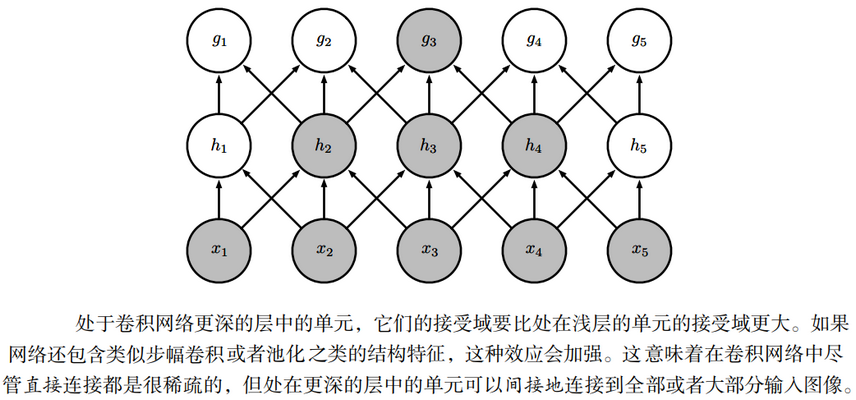

# 一、深度前馈网络

**深度前馈网络（deep feedforward network）**，也叫作**前馈神经网络（feedforward neural network）**或者**多层感知机（multilayerperceptron，MLP）**，是典型的深度学习模型。前馈网络的目标是近似某个函数$f^*$。例如，对于分类器，$y=f^*(\mathbf{x})$将输入$\mathbf{x}$映射到一个类别$y$。前馈网络定义了一个映射$\mathbf{y}=f(\mathbf{x};\theta)$，并且学习参数$\theta$的值，使它能够得到最佳的函数近似。

这种模型被称为**前向（feedforward）**的，是因为信息流过$\mathbf{x}$的函数，流经用于定义$f$的中间计算过程，最终到达输出$\mathbf{y}$。在模型的输出和模型本身之间没有**反馈（feedback）**连接。当前馈神经网络被扩展成包含反馈连接时，它们被称为**循环神经网络（recurrent neural network）**。

前馈网络对于机器学习的从业者是极其重要的。它们是许多重要商业应用的基础。例如，用于对照片中的对象进行识别的卷积神经网络就是一种专门的前馈网络。前馈网络是通往循环网络之路的概念基石，后者在自然语言的许多应用中发挥着巨大作用。

前馈神经网络被称作**网络（network）**是因为它们通常用许多不同函数复合在一起来表示。该模型与一个有向无环图（计算图）相关联，而图描述了函数是如何复合在一起的。例如，我们有三个函数$f^{(1)},f^{(2)},f^{(3)}$连接在一个链上以形成$f(\mathbf{x})=f^{(3)}(f^{(2)}(f^{(1)}(\mathbf{x})))$。这些链式结构是神经网络中最常用的结构。在这种情况下，$f^{(1)}$被称为网络的**第一层（first layer）**，$f^{(2)}$被称为**第二层（second layer）**，以此类推。链的全长称为模型的**深度（depth）**，正是因为这个术语才出现了“深度学习”这个名字。前馈网络的最后一层被称为**输出层（output layer）**。

在神经网络训练的过程中，我们让$f(\mathbf{x})$去匹配$f^∗(\mathbf{x})$的值。训练数据为我们提供了在不同训练点上取值的、含有噪声的$f^*(\mathbf{x})$的近似实例。每个样本$\mathbf{x}$都伴随着一个标签$y\approx f^∗(\mathbf{x})$。训练样本直接指明了输出层在每一点$\mathbf{x}$上必须做什么：它必须产生一个接近$y$的值。但是训练数据并没有直接指明其他层应该怎么做。学习算法必须决定如何使用这些层来产生想要的输出，但是训练数据并没有说每个单独的层应该做什么。相反，学习算法必须决定如何使用这些层来最好地实现$f^*$的近似。因为训练数据并没有给出这些层中的每一层所需的输出，所以这些层被称为**隐藏层（hidden layer）**。

最后，这些网络被称为神经网络是因为它们或多或少地受到神经科学的启发。网络中的每个隐藏层通常都是向量值的。这些隐藏层的**维数**决定了模型的**宽度（width）**。向量的每个元素都可以被视为起到类似一个神经元的作用。除了将层想象成向量到向量的单个函数，我们也可以把层想象成由许多并行操作的**单元（unit）**组成，每个单元表示一个向量到标量的函数。每个单元在某种意义上类似一个神经元，它接收的输入来源于许多其他的单元，并计算它自己的激活值。使用多层向量值表示的想法来源于神经科学。用于计算这些表示的函数$f^{(i)}(\mathbf{x})$的选择，也或多或少地受到神经科学观测的指引，这些观测是关于生物神经元计算功能的。然而，现代的神经网络研究受到更多的是来自许多数学和工程学科的指引，并且神经网络的目标并不是完美地给大脑建模。我们最好将前馈神经网络想成是为了实现统计泛化而设计出的函数近似机，它偶尔从我们了解的大脑中提取灵感，但并不是大脑功能的模型。

一种理解前馈网络的方式是从线性模型开始，并考虑如何克服它的局限性。线性模型，例如逻辑回归和线性回归，是非常吸引人的，因为无论是通过闭解形式还是使用凸优化，它们都能高效且可靠地拟合。线性模型也有明显的缺陷，那就是该模型的能力被局限在线性函数里，所以它无法理解任何两个输入变量间的相互作用。

为了扩展线性模型来表示$\mathbf{x}$的非线性函数，我们可以不把线性模型用于$\mathbf{x}$本身，而是用在一个变换后的输入$\phi(\mathbf{x})$上，这里$\phi$是一个非线性变换。同样，我们可以使用“支持向量机（Support Vector Machine，SVM）”所使用的核函数技巧，来得到一个基于隐含地使用$\phi$映射的非线性学习算法。我们可以认为$\phi$提供了一组描述$\mathbf{x}$的特征，或者认为它提供了$\mathbf{x}$的一个新的表示。

剩下的问题就是如何选择映射$\phi$，如下所述。

1. 其中一种选择是使用一个通用的$\phi$，例如无限维的$\phi$，它隐含地用在基于径向基函数RBF核（Radial Basis Function）的核机器上。如果$\phi(\mathbf{x})$具有足够高的维数，我们总是有足够的能力来拟合训练集，但是对于测试集的泛化往往不佳。非常通用的特征映射通常只基于局部光滑的原则，并且没有将足够的先验信息进行编码来解决高级问题。
2. 另一种选择是手动地设计$\phi$。在深度学习出现以前，这一直是主流的方法。这种方法对于每个单独的任务都需要人们数十年的努力，从业者各自擅长特定的领域（如语音识别或计算机视觉），并且不同领域之间很难迁移（transfer）。
3. 深度学习的策略是去学习$\phi$。在这种方法中，我们有一个模型$y=f(\mathbf{x};\theta,\mathbf{w})=\phi(\mathbf{x};\theta)^\text{T}\mathbf{w}$。我们现在有两种参数：用于从一大类函数中学习$\phi$的参数$\theta$，以及用于将$\phi(\mathbf{x})$映射到所需的输出的参数$\mathbf{w}$。这是深度前馈网络的一个例子，其中$\phi$定义了一个隐藏层。这是三种方法中唯一一种放弃了训练问题的凸性的，但是利大于弊。在这种方法中，我们将表示参数化为$\phi(\mathbf{x};\theta)$，并且使用优化算法来寻找$\theta$，使它能够得到一个好的表示。如果我们想要的话，这种方法也可以通过使它变得高度通用以获得第一种方法的优点，即我们只需使用一个非常广泛的函数族$\phi(\mathbf{x};\theta)$。这种方法也可以获得第二种方法的优点，人类专家可以将他们的知识编码进网络来帮助泛化，他们只需要设计那些他们期望能够表现优异的函数族$\phi(\mathbf{x};\theta)$即可。这种方法的优点是人类设计者只需要寻找正确的函数族即可，而不需要去寻找精确的函数。

这种通过学习特征来改善模型的一般化原则不仅仅适用于本章描述的前馈神经网络。它是深度学习中反复出现的主题，适用于全书描述的所有种类的模型。前馈神经网络是这个原则的应用，它学习从$\mathbf{x}$到$\mathbf{y}$的确定性映射并且没有反馈连接。后面出现的其他模型会把这些原则应用到学习随机映射、学习带有反馈的函数，以及学习单个向量的概率分布。

本章讨论部署一个前馈网络所需的每个设计决策。首先，训练一个前馈网络至少需要做和线性模型同样多的设计决策：选择一个优化模型、代价函数以及输出单元的形式。我们先回顾这些基于梯度学习的基本知识，然后去面对那些只出现在前馈网络中的设计决策。前馈网络已经引入了隐藏层的概念，这需要我们去选择用于计算隐藏层值的**激活函数（activation function）**。我们还必须设计网络的结构，包括网络应该包含多少层、这些层应该如何连接，以及每一层包含多少单元。在深度神经网络的学习中需要计算复杂函数的梯度。我们给出**反向传播（back propagation）**算法和它的现代推广，它们可以用来高效地计算这些梯度。

## （一）实例：学习XOR

部分内容略。

显然，我们必须用非线性函数。大多数神经网络通过仿射变换之后紧跟着一个被称为激活函数的固定非线性函数来实现，其中仿射变换由学得的参数控制。这里定义$\mathbf{h}=g(\mathbf{W}^\text{T}\mathbf{x}+\mathbf{b})$，其中$\mathbf{W}$是线性变换的权重矩阵，$\mathbf{b}$是偏置。

在现代神经网络中，默认的推荐是使用由激活函数$g(z)=\max\set{0,z}$定义的**整流线性单元（Rectified Linear Unit，ReLU）**（Jarrett et al.,2009b; Nair and Hinton,2010a; Glorot et al.,2011a），如下图6.3所示。

如图所示，该激活函数是被推荐用于大多数前馈神经网络的默认激活函数。将此函数用于线性变换的输出将产生非线性变换。然而，函数仍然非常接近线性，在这种意义上它是具有两个线性部分的分段线性函数。由于整流线性单元几乎是线性的，因此它们保留了许多使得线性模型易于使用基于梯度的方法进行优化的属性。它们还保留了许多使得线性模型能够泛化良好的属性。计算机科学的一个通用原则是，我们可以从最小的组件构建复杂的系统。就像图灵机的内存只需要能够存储$0$或$1$的状态，我们可以从整流线性函数构建一个万能函数近似器。

梯度下降算法的收敛点取决于参数的初始值。

## （二）基于梯度的学习

设计和训练神经网络与使用梯度下降训练其他任何机器学习模型并没有太大不同。在《机器学习基础》章的“构建机器学习算法”小节中，我们描述了如何通过指定一个优化过程、代价函数和一个模型族来构建一个机器学习算法。

我们到目前为止看到的线性模型和神经网络的最大区别，在于神经网络的非线性导致大多数我们感兴趣的代价函数都变得非凸。这意味着神经网络的训练通常使用迭代的、基于梯度的优化，仅仅使得代价函数达到一个非常小的值；而不是像用于训练线性回归模型的线性方程求解器，或者用于训练逻辑回归或SVM的凸优化算法那样保证全局收敛。凸优化从任何一种初始参数出发都会收敛（理论上如此，在实践中也很鲁棒但可能会遇到数值问题）。用于非凸损失函数的随机梯度下降没有这种收敛性保证，并且**对参数的初始值很敏感**。对于前馈神经网络，将所有的权重值初始化为小随机数是很重要的。偏置可以初始化为零或者小的正值。

训练算法几乎总是基于使用梯度来使得代价函数下降的各种方法，一些特别的算法是对梯度下降思想的改进和提纯。第5小节“反向传播和其他的微分算法”中将会介绍如何用反向传播算法以及它的现代扩展算法来求得梯度。

和其他的机器学习模型一样，为了使用基于梯度的学习方法我们必须选择一个代价函数，并且必须选择如何表示模型的输出。

### 1. 代价函数

深度神经网络设计中的一个重要方面是代价函数的选择。幸运的是，神经网络的代价函数或多或少是和其他的参数模型（例如线性模型）的代价函数相同的。

在大多数情况下，我们的参数模型定义了一个分布$p(\mathbf{y}|\mathbf{x};\theta)$，并且我们简单地使用最大似然原理。这意味着我们使用训练数据和模型预测间的交叉熵作为代价函数。

有时，我们使用一个更简单的方法，不是预测$\mathbf{y}$的完整概率分布，而是仅仅预测在给定$\mathbf{x}$的条件下$\mathbf{y}$的某种统计量。某些专门的损失函数允许我们来训练这些估计量的预测器。

用于训练神经网络的完整的代价函数，通常在我们这里描述的基本代价函数的基础上结合一个正则项。用于线性模型的权重衰减方法也直接适用于深度神经网络，而且是最流行的正则化策略之一。用于神经网络的更高级的正则化策略将见《深度学习中的正则化》。

#### (1) 使用最大似然学习条件分布

大多数现代的神经网络使用最大似然来训练。这意味着代价函数就是**负对数似然**，它与训练数据和模型分布间的**交叉熵**等价。这个代价函数表示为
$$
J(\theta)=-\mathbb{E}_{(\mathbf{x},\mathbf{y})\sim\hat{p}_{data}}\log p_{model}(\mathbf{y}|\mathbf{x}) \tag{6.12}
$$
代价函数的具体形式随着模型而改变，取决于$\log p_{model}$的具体形式。上述方程的展开形式通常会有一些项不依赖于模型的参数，我们可以舍去。例如，正如之前所述的，如果$p_{model}(\mathbf{y}|\mathbf{x})=\mathcal{N}(\mathbf{y};f(\mathbf{x};θ),\mathbf{I})$，那么我们就重新得到了**均方误差代价**，
$$
J(\theta) = \frac{1}{2}\mathbb{E}_{(\mathbf{x},\mathbf{y})\sim\hat{p}_{data}} \|\mathbf{y}-f(\mathbf{x};\theta)\|^2 + \text{const} \tag{6.13}
$$
至少系数$\frac{1}{2}$和常数项不依赖于$\theta$。舍弃的常数是基于高斯分布的方差，在这种情况下我们选择不把它参数化。之前，我们看到了对输出分布的最大似然估计和对线性模型均方误差的最小化之间的等价性，但事实上，这种等价性并不要求$f(\mathbf{x};θ)$用于预测高斯分布的均值。

使用最大似然来导出代价函数的方法的一个优势是，它减轻了为每个模型设计代价函数的负担。明确一个模型$p(\mathbf{y}|\mathbf{x})$则自动地确定了一个代价函数$\log p(\mathbf{y}|\mathbf{x})$。

贯穿神经网络设计的一个反复出现的主题是代价函数的梯度必须足够的大和具有足够的预测性，来为学习算法提供一个好的指引。饱和（变得非常平）的函数破坏了这一目标，因为它们把梯度变得非常小。这在很多情况下都会发生，因为用于产生隐藏单元或者输出单元的输出的激活函数会饱和。负的对数似然帮助我们在很多模型中避免这个问题。很多输出单元都会包含一个指数函数，这在它的变量取绝对值非常大的负值时会造成饱和。负对数似然代价函数中的对数函数消除了某些输出单元中的指数效果。我们将会在后面的2.2小节“输出单元”中讨论代价函数和输出单元的选择间的相互作用。

用于实现最大似然估计的交叉熵代价函数有一个不同寻常的特性，那就是当它被应用于实践中经常遇到的模型时，它通常没有最小值。对于离散型输出变量，大多数模型以一种特殊的形式来参数化，即它们不能表示概率$0$和$1$，但是可以无限接近。逻辑回归是其中一个例子。对于实值的输出变量，如果模型可以控制输出分布的密度（例如，通过学习高斯输出分布的方差参数），那么它可能对正确的训练集输出赋予极其高的密度，这将导致交叉熵趋向负无穷。《深度学习中的正则化》中描述的正则化技术提供了一些不同的方法来修正学习问题，使得模型不会通过这种方式来获得无限制的收益。

#### (2) 学习条件统计量

有时我们并不是想学习一个完整的概率分布$p(\mathbf{y}|\mathbf{x};\theta)$，而仅仅是想学习在给定$\mathbf{x}$时$\mathbf{y}$的某个条件统计量。

例如，我们可能有一个预测器$f(\mathbf{x};θ)$，想用它来预测$\mathbf{y}$的均值。如果使用一个足够强大的神经网络，我们可以认为这个神经网络能够表示一大类函数中的任何一个函数$f$，这个类仅仅被一些特征所限制，例如连续性和有界，而不是具有特殊的参数形式。从这个角度来看，我们可以把代价函数看作是一个**泛函（functional）**而不仅仅是一个函数。泛函是函数到实数的映射。因此可以将学习看作是选择一个函数而不仅仅是选择一组参数。

我们可以设计代价泛函在我们想要的某些特殊函数处取得最小值。例如，我们可以设计一个代价泛函，使它的最小值处于一个特殊的函数上，这个函数将$\mathbf{x}$映射到给定$\mathbf{x}$时$\mathbf{y}$的期望值。对函数求解优化问题需要用到**变分法（calculus of variations）**这个数学工具。变分法可以被用来导出下面的两个结果。

我们使用变分法导出的第一个结果是解优化问题
$$
f^*=\mathop{\text{arg min }}_f \mathbb{E}_{(\mathbf{x},\mathbf{y})\sim p_{data}} \|\mathbf{y}-f(\mathbf{x})\|^2 \tag{6.14}
$$
得到
$$
f^* = \mathbb{E}_{\mathbf{y}\sim p_{data}(\mathbf{y}|\mathbf{x})}[\mathbf{y}] \tag{6.15}
$$
要求这个函数处在我们要优化的族里。换句话说，如果我们能够用无穷多的、来源于真实的数据生成分布$p_{data}$的样本进行训练，最小化均方误差代价函数将得到一个函数，它可以用来对每个$\mathbf{x}$的值预测出$\mathbf{y}$的均值。

不同的代价函数给出不同的统计量。第二个使用变分法得到的结果是
$$
f^*=\mathop{\text{arg min }}_f \mathbb{E}_{(\mathbf{x},\mathbf{y})\sim p_{data}} \|\mathbf{y}-f(\mathbf{x})\|_1 \tag{6.16}
$$
将得到一个函数可以对每个$\mathbf{x}$预测$\mathbf{y}$取值的中位数，只要这个函数在我们要优化的函数族里。这个代价函数通常被称为**平均绝对误差（mean absolute error）**。

可惜的是，均方误差和平均绝对误差在使用基于梯度的优化方法时往往成效不佳。一些饱和的输出单元当结合这些代价函数时会产生非常小的梯度。这就是为什么交叉熵代价函数比均方误差或者平均绝对误差更受欢迎的原因之一了，即使是在没必要估计整个$p(\mathbf{y}|\mathbf{x})$分布时。

### 2. 输出单元

代价函数的选择与输出单元的选择紧密相关。大多数时候，我们简单地使用数据分布和模型分布间的交叉熵。选择如何表示输出决定了交叉熵函数的形式。

任何可用作输出的神经网络单元，也可以被用作隐藏单元。这里，我们着重讨论将这些单元用作模型输出时的情况，不过原则上它们也可以在内部使用。我们将在第3节“隐藏单元”中重温这些单元，并且给出当它们被用作隐藏单元时一些额外的细节。

在本节中，我们假设前馈网络提供了一组定义为$\mathbf{h}=f(\mathbf{x};θ)$的隐藏特征。输出层的作用是随后对这些特征进行一些额外的变换来完成整个网络必须完成的任务。

#### (1) 用于高斯输出分布的线性单元

一种简单的输出单元是基于仿射变换的输出单元，仿射变换不具有非线性。这些单元往往被直接称为线性单元。

给定特征$\mathbf{h}$，线性输出单元层产生一个向量$\hat{\mathbf{y}}=\mathbf{W}^\text{T}\mathbf{h}+\mathbf{b}$。

线性输出层经常被用来产生条件高斯分布的均值：
$$
p(\mathbf{y}|\mathbf{x}) = \mathcal{N}(\mathbf{y};\hat{\mathbf{y}},\mathbf{I}) \tag{6.17}
$$
最大化其对数似然此时等价于最小化均方误差。

最大似然框架也使得学习高斯分布的协方差矩阵更加容易，或更容易地使高斯分布的协方差矩阵作为输入的函数。然而，对于所有输入，协方差矩阵都必须被限定成一个正定矩阵。线性输出层很难满足这种限定，所以通常使用其他的输出单元来对协方差参数化。对协方差建模的方法将在后面的2.2.4小节中简要介绍。

因为线性模型不会饱和，所以它们易于采用基于梯度的优化算法，甚至可以使用其他多种优化算法。

#### (2) 用于Bernoulli输出分布的sigmoid单元

Bernoulli（伯努利）分布又称0-1分布，其离散型随机变量$X$只可能取$0$和$1$两个值。

许多任务需要预测二值型变量$y$的值。具有两个类的分类问题可以归结为这种形式。

此时最大似然的方法是定义$y$在$\mathbf{x}$条件下的Bernoulli分布。

Bernoulli分布仅需单个参数来定义。神经网络只需要预测$P(y=1|\mathbf{x})$即可。为了使这个数是有效的概率，它必须处在区间$[0,1]$中。

为满足该约束条件需要一些细致的设计工作。假设我们打算使用线性单元，并且通过阈值来限制它成为一个有效的概率：
$$
P(y=1|\mathbf{x})=\max\{0,\min\{1,\mathbf{w}^\text{T}\mathbf{h}+b \}\} \tag{6.18}
$$
这的确定义了一个有效的条件概率分布，但我们无法使用梯度下降来高效地训练它。当$\mathbf{w}^\text{T}\mathbf{h}+b$处于单位区间$[0,1]$外时，模型的输出对其参数的梯度都将为$\mathbf{0}$。梯度为$\mathbf{0}$通常是有问题的，因为学习算法对于如何改善相应的参数不再具有指导意义。

相反，最好是使用一种新的方法来保证无论何时模型给出了错误的答案时，总能有一个较大的梯度。这种方法是基于使用sigmoid输出单元结合最大似然来实现的。sigmoid输出单元定义为
$$
\hat{y}=\sigma(\mathbf{w}^\text{T}\mathbf{h}+b) \tag{6.19}
$$
这里$\sigma$是指**logistic sigmoid函数**，如下
$$
\begin{align}
\sigma(x) &= \frac{1}{1+e^{-x}} \\
\sigma'(x) &= \sigma(x)(1-\sigma(x))
\end{align}
$$
另外一个经常遇到的函数是**softplus函数**（softplus function）:
$$
\begin{align}
\zeta(x) &= \log(1+e^x) \\
\log\sigma(x) &= -\zeta(-x)
\end{align}
$$
上面的两个函数图像如下图所示。

我们可以认为sigmoid输出单元具有两个部分。首先，它使用一个线性层来计算$z=\mathbf{w}^\text{⊤}\mathbf{h}+b$。接着，它使用sigmoid激活函数将$z$转化成概率。

我们暂时忽略对于$\mathbf{x}$的依赖性，只讨论如何用$z$的值来定义$y$的概率分布。sigmoid可以通过构造一个非归一化（其和不为$1$）的概率分布$\tilde{P}(y)$来得到。我们可以随后除以一个合适的常数来得到有效的概率分布。如果我们假定非归一化的对数概率对$y$和$z$是线性的，可以对它取指数来得到非归一化的概率。我们然后对它归一化，可以发现这服从Bernoulli分布，该分布受$z$的sigmoid变换控制：
$$
\begin{align}
\log\tilde{P}(y) &= yz \tag{6.20} \\
\tilde{P}(y) &= e^{yz} \tag{6.21} \\
P(y) &= \frac{e^{yz}}{\sum_{y'=0}^1 e^{y'z}} = \frac{e^{yz}}{1+e^z} \tag{6.22} \\
P(y) &= \sigma((2y-1)z) \tag{6.23} \\
&= \begin{cases}
\sigma(-z) = \frac{1}{1+e^z} & y=0 \\
\sigma(z) = \frac{e^z}{1+e^z} & y=1
\end{cases} \\
&= \frac{e^{yz}}{1+e^z}
\end{align}
$$
基于指数和归一化的概率分布在统计建模的文献中很常见。用于定义这种二值型变量分布的变量$z$被称为**分对数（logit）**。

这种在对数空间里预测概率的方法可以很自然地使用最大似然学习。因为用于最大似然的代价函数是$-\log P(y|\mathbf{x})$，代价函数中的$\log(\cdot)$抵消了sigmoid中的$\exp(\cdot)$。如果没有这个效果，sigmoid的饱和性会阻止基于梯度的学习做出好的改进。我们使用最大似然来学习一个由sigmoid参数化的Bernoulli分布，它的损失函数为
$$
\begin{align}
J(\theta) &= -\log P(y|\mathbf{x}) \tag{6.24} \\
&= -\log\sigma((2y-1)z) \tag{6.25} \\
&= \zeta((1-2y)z) \tag{6.26}
\end{align}
$$
通过将损失函数写成softplus函数的形式，我们可以看到它仅仅在$(1−2y)z$取绝对值非常大的负值时才会饱和。因此饱和只会出现在模型已经得到正确答案时：当$y=1$且$z$取非常大的正值时，或者$y=0$且$z$取非常小的负值时。当$z$的符号错误时，softplus函数的变量$(1−2y)z$可以简化为$|z|$。当$|z|$变得很大并且$z$的符号错误时，softplus函数渐近地趋向于它的变量$|z|$。对$z$求导则渐近地趋向于$\text{sign}(z)$，所以，对于极限情况下极度不正确的$z$，softplus函数完全不会收缩梯度。这个性质很有用，因为它意味着基于梯度的学习可以很快地改正错误的$z$。

当我们使用其他的损失函数，例如均方误差之类的，损失函数会在$\sigma(z)$饱和时饱和。sigmoid激活函数在$z$取非常小的负值时会饱和到$0$，当$z$取非常大的正值时会饱和到$1$。这种情况一旦发生，梯度会变得非常小以至于不能用来学习，无论此时模型给出的是正确还是错误的答案。因此，最大似然几乎总是训练sigmoid输出单元的优选方法。

理论上，sigmoid的对数总是确定和有限的，因为sigmoid的返回值总是被限制在开区间$(0,1)$上，而不是使用整个闭区间$[0,1]$的有效概率。在软件实现时，为了避免数值问题，最好将负的对数似然写作$z$的函数，而不是$\hat{y}=\sigma(z)$的函数。因为如果sigmoid函数下溢到零，那么之后对$\hat{y}$取对数会得到负无穷。

#### (3) 用于Multinoulli输出分布的softmax单元

Multinoulli（多元伯努利）分布就是一次Bernoulli（伯努利）试验推广到多次试验后的结果分布。

任何时候当我们想要表示一个具有$n$个可能取值的离散型随机变量的分布时，我们都可以使用softmax函数。它可以看作是sigmoid函数的扩展，其中sigmoid函数用来表示二值型变量的分布。

softmax函数最常用作分类器的输出，来表示$n$个不同类上的概率分布。比较少见的是，softmax函数可以在模型内部使用，例如如果我们想要在某个内部变量的$n$个不同选项中进行选择。

在二值型变量的情况下，我们希望计算一个单独的数
$$
\hat{y}=P(y=1|\mathbf{x}) \tag{6.27}
$$
因为这个数需要处在$0$和$1$之间，并且我们想要让这个数的对数可以很好地用于对数似然的基于梯度的优化，我们选择去预测另外一个数$z=\log\hat{P}(y=1|\mathbf{x})$，对其指数化和归一化，我们就得到了一个由sigmoid函数控制的Bernoulli分布。

为了推广到具有$n$个值的离散型变量的情况，我们现在需要创造一个向量$\hat{\mathbf{y}}$，它的每个元素是$\hat{y}_i=P(y=i|\mathbf{x})$。我们不仅要求每个$\hat{y}_i$元素介于$0$和$1$之间，还要使得整个向量每个元素的和为$1$，使得它表示一个有效的概率分布。用于Bernoulli分布的方法同样可以推广到Multinoulli分布。首先，线性层预测了未归一化的对数概率：
$$
\mathbf{z} = \mathbf{W}^\text{T}\mathbf{h}+\mathbf{b} \tag{6.28}
$$
其中$z_i=\log\hat{P}(y=i|\mathbf{x})$。softmax函数然后可以对$z$指数化和归一化来获得需要的$\hat{\mathbf{y}}$。最终，softmax函数的形式为
$$
\text{softmax}(\mathbf{z})_i=\frac{e^{z_i}}{\sum_j e^{z_j}} \tag{6.29}
$$
和logistic sigmoid一样，当使用最大化对数似然训练softmax来输出目标值$y$时，使用指数函数工作地非常好。这种情况下，我们想要最大化$\log P(y=i;\mathbf{z})=\log\text{softmax}(\mathbf{z})_i$。将softmax定义成指数的形式是很自然的因为对数似然中的$\log(\cdot)$可以抵消softmax中的$\exp(\cdot)$，如下：
$$
\log\text{softmax}(\mathbf{z})_i=z_i-\log\sum_j e^{z_j} \tag{6.30}
$$
上式(6.30)中的第一项表示输入$z_i$总是对代价函数有直接的贡献。因为这一项不会饱和，所以即使$z_i$对式(6.30)的第二项的贡献很小，学习依然可以进行。当最大化对数似然时，第一项鼓励$z_i$被推高，而第二项则鼓励所有的$\mathbf{z}$被压低。为了对第二项$\log\sum_j e^{z_j}$有一个直观的理解，注意到这一项可以大致近似为$\max_jz_j$，这种近似是基于对任何明显小于$\max_jz_j$的$z_k$，$e^{z_k}$都是不重要的。我们能从这种近似中得到的直觉是，负对数似然代价函数总是强烈地惩罚最活跃的不正确预测。如果正确答案已经具有了softmax的最大输入，那么$-z_i$项和$\log\sum_j e^{z_j}\approx \max_jz_j=z_i$项将大致抵消，这个样本对于整体训练代价贡献很小。代价主要由其他未被正确分类的样本产生。

到目前为止我们只讨论了一个例子。总体来说，未正则化的最大似然会驱动模型去学习一些参数，而这些参数会驱动softmax函数来预测在训练集中观察到的每个结果的比率：
$$
\text{softmax}(\mathbf{z}(\mathbf{x};\theta))_i\approx \frac{ \sum_{j=1}^m\mathbf{1}_{y^{(j)}=i,\mathbf{x}^{(i)}=\mathbf{x}} }{ \sum_{j=1}^m\mathbf{1}_{\mathbf{x}^{(i)}=\mathbf{x}} } \tag{6.31}
$$
因为最大似然是一致的估计量，所以只要模型族能够表示训练的分布，这就能保证发生。在实践中，有限的模型能力和不完美的优化将意味着模型只能近似这些比率。

除了对数似然之外的许多目标函数对softmax函数不起作用。具体来说，那些不使用对数来抵消softmax中的指数的目标函数，当指数函数的变量取非常小的负值时会造成梯度消失，从而无法学习。特别是，平方误差对于softmax单元来说是一个很差的损失函数，即使模型做出高度可信的不正确预测，也不能训练模型改变其输出。要理解为什么这些损失函数可能失败，我们需要检查softmax函数本身。

像sigmoid一样，softmax激活函数可能会饱和。sigmoid函数具有单个输出，当它的输入极端负或者极端正时会饱和。对于softmax的情况，它有多个输出值。当输入值之间的差异变得极端时，这些输出值可能饱和。当softmax饱和时，基于softmax的许多代价函数也饱和，除非它们能够转化饱和的激活函数。

为了说明softmax函数对于输入之间差异的响应，观察到当对所有的输入都加上一个相同常数时softmax的输出不变：
$$
\text{softmax}(\mathbf{z})=\text{softmax}(\mathbf{z}+c) \tag{6.32}
$$
使用这个性质，我们可以导出一个数值方法稳定的softmax函数的变体：
$$
\text{softmax}(\mathbf{z})=\text{softmax}(\mathbf{z}-\max_iz_i) \tag{6.33}
$$
变换后的形式允许我们在对softmax函数求值时只有很小的数值误差，即使是当$z$包含极正或者极负的数时。观察softmax数值稳定的变体，可以看到softmax函数由它的变量偏离$\max_iz_i$的量来驱动。

当其中一个输入是最大（$z_i=\max_iz_i$）并且$z_i$远大于其他的输入时，相应的输出$\text{softmax}(\mathbf{z})_i$会饱和到$1$。当$z_i$不是最大值并且最大值非常大时，相应的输出$\text{softmax}(\mathbf{z})_i$也会饱和到$0$。这是sigmoid单元饱和方式的一般化，并且如果损失函数设计时没有对其进行补偿，那么也会造成类似的学习困难。

softmax函数的变量$\mathbf{z}$可以通过两种方式产生。最常见的是简单地使神经网络较早的层输出$\mathbf{z}$的每个元素，就像先前描述的使用线性层$\mathbf{z}=\mathbf{W}^\text{T}\mathbf{h}+\mathbf{b}$。虽然很直观，但这种方法是对分布的过度参数化。另一种，$n$个输出总和必须为$1$的约束意味着只有$n−1$个参数是必要的；第$n$个概率值可以通过$1$减去前面$n−1$个概率来获得。因此，我们可以强制要求$\mathbf{z}$的一个元素是固定的。例如，我们可以要求$z_n=0$。事实上，这正是sigmoid单元所做的。定义$P(y=1|\mathbf{x})=\sigma(z)$等价于用二维的$\mathbf{z}$以及$z_1=0$来定义$P(y=1|\mathbf{x})=\text{softmax}(\mathbf{z})_1$。无论是$n−1$个变量还是$n$个变量的方法，都描述了相同的概率分布，但会产生不同的学习机制。在实践中，无论是过度参数化的版本还是限制的版本都很少有差别，并且实现过度参数化的版本更为简单。

从神经科学的角度看，有趣的是认为softmax是一种在参与其中的单元之间形成竞争的方式：softmax输出总是和为$1$，所以一个单元的值增加必然对应着其他单元值的减少。这与被认为存在于皮质中相邻神经元间的侧抑制类似。在极端情况下（当最大的$a_i$和其他的在幅度上差异很大时），它变成了**赢者通吃（winner-take-all）**的形式，即其中一个输出接近$1$，其他的接近$0$。

“softmax”的名称可能会让人产生困惑。这个函数更接近于argmax函数而不是max函数。“soft”这个术语来源于softmax函数是连续可微的。argmax函数的结果表示为一个one-hot向量（只有一个元素为$1$，其余元素都为$0$的向量），不是连续和可微的。softmax函数因此提供了argmax的“软化”版本。max函数相应的软化版本是$\text{softmax}(\mathbf{z})^\text{T}\mathbf{z}$。可能最好是把softmax函数称为softargmax，但当前名称已经是一个广泛使用的习惯了。

#### (4) 其他的输出类型

之前描述的线性、sigmoid、softmax输出单元是最常见的。神经网络可以推广到我们希望的几乎任何种类的输出层。最大似然原则给如何为几乎任何种类的输出层设计一个好的代价函数提供了指导。

一般的，如果我们定义了一个条件分布$p(\mathbf{y}|\mathbf{x};θ)$，最大似然原则建议我们使用$−\log p(\mathbf{y}|\mathbf{x};θ)$作为代价函数。

一般来说，我们可以认为神经网络表示函数$f(\mathbf{x};θ)$。这个函数的输出不是对$y$值的直接预测。相反，$f(\mathbf{x};θ)=\boldsymbol\omega$提供了$y$分布的参数。我们的损失函数就可以表示成$−\log p(\mathbf{y};\boldsymbol\omega(\mathbf{x}))$。

一般的，我们可能希望继续对包含更多变量的、更大的向量$\mathbf{y}$来建模，并在这些输出变量上施加更多更丰富的结构。例如，我们可能希望神经网络输出字符序列形成一个句子。在这些情况下，我们可以继续使用最大似然原理应用到我们的模型$p(\mathbf{y};\boldsymbol\omega(\mathbf{x}))$上，但我们用来描述$\mathbf{y}$的模型会变得非常复杂，超出了本章的范畴。《循环神经网络》章描述了如何使用循环神经网络来定义这种序列上的模型，也有其他部分描述了对任意概率分布进行建模的高级技术。

## （三）隐藏单元

到目前为止，我们集中讨论了神经网络的设计选择，这对于使用基于梯度的优化方法来训练的大多数参数化机器学习模型都是通用的。现在我们转向一个前馈神经网络独有的问题：该如何选择隐藏单元的类型，这些隐藏单元用在模型的隐藏层中。

隐藏单元的设计是一个非常活跃的研究领域，并且还没有许多明确的指导性理论原则。

整流线性单元ReLU是隐藏单元极好的**默认选择**。许多其他类型的隐藏单元也是可用的。决定何时使用哪种类型的隐藏单元是困难的事（尽管整流线性单元通常是一个可接受的选择）。我们这里描述对于每种隐藏单元的一些基本直觉。这些直觉可以用来建议我们何时来尝试一些单元。通常不可能预先预测出哪种隐藏单元工作得最好。设计过程充满了试验和错误，先直觉认为某种隐藏单元可能表现良好，然后用它组成神经网络进行训练，最后用验证集来评估它的性能。

这里列出的一些隐藏单元可能并不是在所有的输入点上都是可微的。例如，整流线性单元$g(z)=\max\{0,z\}$在$z=0$处不可微。这似乎使得$g$对于基于梯度的学习算法无效。在实践中，梯度下降对这些机器学习模型仍然表现得足够好。部分原因是神经网络训练算法通常不会达到代价函数的局部最小值，而是仅仅显著地减小它的值。因为我们不再期望训练能够实际到达梯度为$0$的点，所以代价函数的最小值对应于梯度未定义的点是可以接受的。

不可微的隐藏单元通常只在少数点上不可微。一般来说，函数$g(z)$只有当在$z$处的左导数和右导数都有定义并且相等时，其在$z$点处才是可微的。神经网络中用到的函数通常对左导数和右导数都有定义。神经网络训练的软件实现通常返回左导数或右导数的其中一个，而不是报告导数未定义或产生一个错误。这可以通过观察到在数字计算机上基于梯度的优化总是会受到数值误差的影响来启发式地给出理由。当一个函数被要求计算$g(0)$时，底层值真正为$0$是不太可能的。相对的，它可能是被舍入为$0$的一个极小量$\epsilon$。在某些情况下，理论上有更好的理由，但这些通常对神经网络训练并不适用。重要的是，在实践中，我们可以放心地忽略下面描述的隐藏单元激活函数的不可微性。

除非另有说明，大多数的隐藏单元都可以描述为接受输入向量$\mathbf{x}$，计算仿射变换$\mathbf{z}=\mathbf{W}^\text{T}\mathbf{h}+\mathbf{b}$，然后使用一个逐元素的非线性函数$g(\mathbf{z})$。大多数隐藏单元的区别仅仅在于激活函数$g(\mathbf{z})$的形式。

### 1. 整流线性单元及其扩展

整流线性单元使用激活函数$g(z)=\max\{0,z\}$。

整流线性单元易于优化，因为它们和线性单元非常类似。线性单元和整流线性单元的唯一区别在于整流线性单元在其一半的定义域上输出为零。这使得只要整流线性单元处于激活状态，它的导数都能保持较大。它的梯度不仅大而且一致。整流操作的二阶导数几乎处处为$0$，并且在整流线性单元处于激活状态时，它的一阶导数处处为$1$。这意味着相比于引入二阶效应的激活函数来说，它的梯度方向对于学习来说更加有用。

整流线性单元通常作用于仿射变换之上：
$$
\mathbf{h}=g(\mathbf{W}^\text{T}\mathbf{x}+\mathbf{b}) \tag{6.36}
$$
当初始化仿射变换的参数时，可以将$\mathbf{b}$的所有元素设置成一个小的正值，例如$0.1$。这使得整流线性单元很可能初始时就对训练集中的大多数输入呈现激活状态，并且允许导数通过。

有很多整流线性单元的扩展存在。大多数这些扩展的表现比得上整流线性单元，并且偶尔表现得更好。

整流线性单元的一个缺陷是它们不能通过基于梯度的方法学习那些使它们激活为零的样本。整流线性单元的各种扩展保证了它们能在各个位置都接收到梯度。

整流线性单元的三个扩展基于当$z_i<0$时使用一个非零的斜率$\alpha_i$，即$h_i=g(\mathbf{z},\boldsymbol{\alpha})_i=\max(0,z_i)+\alpha_i\min(0,z_i)$。

- **绝对值整流（absolute value rectification）**固定$\alpha_i=1$来得到$g(z)=|z|$。它用于图像中的对象识别（Jarrett et al.,2009a），其中寻找在输入照明极性反转下不变的特征是有意义的。整流线性单元的其他扩展比这应用地更广泛。
- **渗漏整流线性单元（Leaky ReLU）**（Maas et al.,2013）将$\alpha_i$固定成一个类似$0.01$的小值。
- **参数化整流线性单元（Parametric ReLU，PReLU）**将$\alpha_i$作为学习的参数（He et al.,2015）。

**maxout单元（maxout unit）**（Goodfellow et al.,2013a）进一步扩展了整流线性单元。maxout单元将$\mathbf{z}$划分为每组具有$k$个值的组，而不是使用作用于每个元素的函数$g(z)$。每个maxout单元则输出每组中的最大元素：
$$
g(\mathbf{z})_i = \max_{j\in\mathbb{G}^{(i)}} z_j \tag{6.37}
$$
这里$\mathbb{G}^{(i)}$是第$i$组的输入索引集$\set{(i-1)k+1,(i-1)k+2,\cdots,ik}$。这提供了一种方法来学习对输入$\mathbf{x}$空间中多个方向响应的分段线性函数。

maxout单元可以学习具有多达$k$段的分段线性的凸函数。maxout单元因此可以视为学习激活函数本身而不仅仅是单元之间的关系。使用足够大的$k$，maxout单元可以以任意的精确度来近似任何凸函数。特别地，具有两块（$k=2$）的maxout层可以学习实现和传统层相同的输入$\mathbf{x}$的函数，这些传统层可以使用整流线性激活函数、绝对值整流、渗漏整流线性单元或参数化整流线性单元，或者可以学习实现与这些都不同的函数。maxout层的参数化当然也将与这些层不同，所以即使是maxout学习去实现和其他种类的层相同的$\mathbf{x}$的函数这种情况下，学习的机理也是不一样的。

每个maxout单元现在由$k$个权重向量来参数化，而不仅仅是一个，所以maxout单元通常比整流线性单元需要更多的正则化。如果训练集很大并且每个单元的块数保持很低的话，它们可以在没有正则化的情况下工作得不错。

maxout单元还有一些其他的优点。在某些情况下，要求更少的参数可以获得一些统计和计算上的优点。具体来说，如果由$n$个不同的线性过滤器描述的特征可以在不损失信息的情况下，用每一组$k$个特征的最大值来概括的话，那么下一层可以获得$k$倍更少的权重数。

因为每个单元由多个过滤器驱动，maxout单元具有一些冗余来帮助它们抵抗一种被称为**灾难遗忘（catastrophic forgetting）**的现象，这个现象是说神经网络忘记了如何执行它们过去训练的任务（Goodfellow et al.,2014a）。

整流线性单元和它们的这些扩展都是基于一个原则，那就是如果它们的行为更接近线性，那么模型更容易优化。使用线性行为更容易优化的一般性原则同样也适用于除深度线性网络以外的情景。

### 2. logistic sigmoid与双曲正切函数

在引入整流线性单元之前，大多数神经网络使用logistic sigmoid激活函数
$$
g(z)=\sigma(z)=\frac{1}{1+e^{-z}} \tag{6.38}
$$
或者是双曲正切激活函数
$$
\begin{align}
g(z)=\tanh(z) &= \frac{\sinh(z)}{\cosh(z)}=\frac{e^x-e^{-x}}{e^x+e^{-x}} \tag{6.39} \\
\sinh(z) &= \frac{e^x-e^{-x}}{2} \\
\cosh(z) &= \frac{e^x+e^{-x}}{2}
\end{align}
$$
这些激活函数紧密相关，因为$\tanh(z)=2\sigma(2z)−1$。

我们已经看过sigmoid单元作为输出单元用来预测二值型变量取值为$1$的概率。与分段线性单元不同，sigmoid单元在其大部分定义域内都饱和，当$z$取绝对值很大的正值时，它们饱和到一个高值，当$z$取绝对值很大的负值时，它们饱和到一个低值，并且仅仅当$z$接近$0$时它们才对输入强烈敏感。sigmoid单元的广泛饱和性会使得基于梯度的学习变得非常困难。因为这个原因，现在不鼓励将它们用作前馈网络中的隐藏单元。当使用一个合适的代价函数来抵消sigmoid的饱和性时，它们作为输出单元可以与基于梯度的学习相兼容。

当必须要使用sigmoid激活函数时，双曲正切激活函数通常要比logistic sigmoid函数表现更好。在$\tanh(0)=0$而$\sigma(0)=\frac{1}{2}$的意义上，它更像是单位函数。因为$\tanh$在$0$附近与单位函数类似，训练深层神经网络$\hat{y}=\mathbf{w}^\text{T}\tanh(\mathbf{U}^\text{T}\tanh(\mathbf{V}^\text{T}\mathbf{x}))$类似于训练一个线性模型$\hat{y}=\mathbf{w}^\text{T}\mathbf{U}^\text{T}\mathbf{V}^\text{T}\mathbf{x}$，只要网络的激活能够被保持地很小。这使得训练tanh网络更加容易。

sigmoid激活函数在除了前馈网络以外的情景中更为常见。循环网络、许多概率模型以及一些自编码器有一些额外的要求使得它们不能使用分段线性激活函数，并且使得sigmoid单元更具有吸引力，尽管它存在饱和性的问题。

### 3. 其他隐藏单元

也存在许多其他种类的隐藏单元，但它们并不常用。

一般来说，很多种类的可微函数都表现得很好。许多未发布的激活函数与流行的激活函数表现得一样好。在新技术的研究和开发期间，通常会测试许多不同的激活函数，并且会发现许多标准方法的变体表现非常好。这意味着，通常新的隐藏单元类型只有在被明确证明能够提供显著改进时才会被发布。新的隐藏单元类型如果与已有的隐藏单元表现大致相当的话，那么它们是非常常见的，不会引起别人的兴趣。

列出文献中出现的所有隐藏单元类型是不切实际的。这里只对一些特别有用和独特的类型进行强调。

其中一种是完全没有激活函数$g(z)$。也可以认为这是使用单位函数作为激活函数的情况。我们已经看过线性单元可以用作神经网络的输出，它也可以用作隐藏单元。如果神经网络的每一层都仅由线性变换组成，那么网络作为一个整体也将是线性的。然而，神经网络的一些层是纯线性也是可以接受的。

考虑具有$n$个输入和$p$个输出的神经网络层$\mathbf{h}=g(\mathbf{W}^\text{T}\mathbf{x}+\mathbf{b})$。我们可以用两层来代替它，一层使用权重矩阵$\mathbf{U}$，另一层使用权重矩阵$\mathbf{V}$。如果第一层没有激活函数，那么我们对基于$\mathbf{W}$的原始层的权重矩阵进行因式分解。分解方法是计算$\mathbf{h}=g(\mathbf{V}^\text{T}\mathbf{U}^\text{T}\mathbf{x}+\mathbf{b})$。如果$\mathbf{U}$产生了$q$个输出，那么$\mathbf{U}$和$\mathbf{V}$一起仅包含$(n+p)q$个参数，而$\mathbf{W}$包含$np$个参数。如果$q$很小，这可以在很大程度上节省参数。这是以将线性变换约束为低秩的代价来实现的，但这些低秩关系往往是足够的。线性隐藏单元因此提供了一种减少网络中参数数量的有效方法。

softmax单元是另外一种经常用作输出的单元，但有时也可以用作隐藏单元。softmax单元很自然地表示具有$k$个可能值的离散型随机变量的概率分布，所以它们可以用作一种开关。这些类型的隐藏单元通常仅用于明确地学习操作内存的高级结构中，更详细的内容将在《循环神经网络》章“外显记忆”小节中描述。

其他一些常见的隐藏单元类型包括：

- **径向基函数（radial basis function，RBF）**：$h_i=\exp(-\frac{1}{\sigma_i^2}\|\mathbf{W}_{:,i}-\mathbf{x}\|^2)$。这个函数在$\mathbf{x}$接近模板$\mathbf{W}_{:,i}$时更加活跃。因为它对大部分$\mathbf{x}$都饱和到$0$，因此很难优化。
- **softplus函数**：$g(a)=\zeta(a)=\log(1+e^a)$。这是整流线性单元的平滑版本。通常不鼓励使用softplus函数。softplus表明隐藏单元类型的性能可能是非常反直觉的，因为它处处可导或者因为它不完全饱和，人们可能希望它具有优于整流线性单元的点，但根据经验来看，它并没有。
- **硬双曲正切函数（hard tanh）**：$g(a)=\max(−1,\min(1,a))$。它的形状和$\tanh$以及整流线性单元类似，但是不同于后者，它是有界的。

隐藏单元的设计仍然是一个活跃的研究领域，许多有用的隐藏单元类型仍有待发现。

## （四）架构设计

神经网络设计的另一个关键点是确定它的架构。**架构（architecture）**一词是指网络的整体结构：它应该具有多少单元，以及这些单元应该如何连接。

大多数神经网络被组织成称为层的单元组。大多数神经网络架构将这些层布置成链式结构，其中每一层都是前一层的函数。在这种结构中，第一层由下式给出：
$$
\mathbf{h}^{(1)}=g^{(1)}\left( (\mathbf{W}^{(1)})^\text{T}\mathbf{x}+\mathbf{b}^{(1)} \right) \tag{6.40}
$$
第二层由
$$
\mathbf{h}^{(2)}=g^{(2)}\left( (\mathbf{W}^{(2)})^\text{T}\mathbf{h}^{(1)} + \mathbf{b}^{(2)} \right) \tag{6.41}
$$
给出，以此类推。

在这些链式架构中，主要的架构考虑是选择网络的深度和每一层的宽度。我们将会看到，即使只有一个隐藏层的网络也足够适应训练集。更深层的网络通常能够对每一层使用更少的单元数和更少的参数，并且经常容易泛化到测试集，但是通常也更难以优化。

对于一个具体的任务，理想的网络架构必须通过实验，观测在验证集上的误差来找到。

### 1. 万能近似性质和深度

线性模型，通过矩阵乘法将特征映射到输出，顾名思义，仅能表示线性函数。它具有易于训练的优点，因为当使用线性模型时，许多损失函数会导出凸优化问题。可惜的是，我们经常希望我们的系统学习非线性函数。

乍一看，我们可能认为学习非线性函数需要为我们想要学习的那种非线性专门设计一类模型族。幸运的是，具有隐藏层的前馈网络提供了一种万能近似框架。具体来说，**万能近似定理（universal approximation theorem）**表明，一个前馈神经网络如果具有线性输出层和至少一层具有任何一种“挤压”性质的激活函数（例如logistic sigmoid激活函数）的隐藏层，只要给予网络足够数量的隐藏单元，它可以以任意的精度来近似任何从一个有限维空间到另一个有限维空间的Borel可测函数。Borel可测的概念超出了本书的范畴；对于我们想要实现的目标，只需要知道定义在$\R^n$的有界闭集上的**任意连续函数**是Borel可测的，因此可以用神经网络来近似。更进一步地，当隐藏层足够宽时，双隐层的前馈网络可以逼近**任意非连续函数**，可以解决任何复杂的分类问题。

虽然原始定理最初以具有特殊激活函数的单元的形式来描述，这个激活函数当变量取绝对值非常大的正值和负值时都会饱和，万能近似定理也已经被证明对于更广泛类别的激活函数也是适用的，其中就包括现在常用的整流线性单元。前馈网络的导数也可以任意好地来近似函数的导数。神经网络也可以近似从任何有限维离散空间映射到另一个的任意函数。

万能近似定理意味着无论我们试图学习什么函数，我们知道一个大的MLP一定能够表示这个函数。然而，我们不能保证训练算法能够学得这个函数。即使MLP能够表示该函数，学习也可能因两个不同的原因而失败。首先，用于训练的优化算法可能找不到用于期望函数的参数值。其次，训练算法可能由于过拟合而选择了错误的函数。

前馈网络提供了表示函数的万能系统，在这种意义上，给定一个函数，存在一个前馈网络能够近似该函数。但不存在万能的过程既能够验证训练集上的特殊样本，又能够选择一个函数来扩展到训练集上没有的点。

万能近似定理说明，存在一个足够大的网络能够达到我们所希望的任意精度，但是定理并没有说这个网络有多大。Leshno et al.(1993)证明带有一大类非多项式激活函数族的浅层网络，包括整流线性单元，具有万能的近似性质，但是这些结果并没有强调深度或效率的问题，它们仅指出足够宽的整流网络能够表示任意函数。Barron(1993)提供了单层网络近似一大类函数所需大小的一些界。不幸的是，在最坏情况下，可能需要指数数量的隐藏单元（可能一个隐藏单元对应着一个需要区分的输入配置）。

总之，具有单层的前馈网络足以表示任何函数，但是网络层可能大得不可实现，并且可能无法正确地学习和泛化。在很多情况下，使用**更深的模型能够**减少表示期望函数所需的单元的数量，并且可以减少泛化误差。

存在一些函数族能够在网络的深度大于某个值$d$时被高效地近似，而当深度被限制到小于或等于$d$时需要一个远远大于之前的模型。在很多情况下，浅层模型所需的隐藏单元的数量是$n$的指数级。Montufar et al.(2014)指出一些用深度整流网络表示的函数可能需要浅层网络（一个隐藏层）指数级的隐藏单元才能表示。更确切的说，他们说明分段线性网络（可以通过整流非线性或maxout单元获得）可以表示区域的数量是网络深度的指数级的函数。下图6.5解释了带有绝对值整流的网络是如何创建函数的镜像图像的，这些函数在某些隐藏单元的顶部计算，作用于隐藏单元的输入。每个隐藏单元指定在哪里折叠输入空间，来创造镜像响应（在绝对值非线性的两侧）。通过组合这些折叠操作，我们获得指数级的分段线性区域，他们可以概括所有种类的规则模式（例如，重复）。

如图所示，(左)绝对值整流单元对其输入中的每对镜像点有相同的输出。镜像的对称轴由单元的权重和偏置定义的超平面给出。在该单元顶部计算的函数（绿色决策面）将是横跨该对称轴的更简单模式的一个镜像。(中)该函数可以通过折叠对称轴周围的空间来得到。(右)另一个重复模式可以在第一个的顶部折叠（由另一个下游单元）以获得另外的对称性（现在重复四次，使用了两个隐藏层）。

Montufar et al.(2014)的主要定理指出，具有$d$个输入、深度为$l$、每个隐藏层具有$n$个单元的深度整流网络可以描述的线性区域的数量是
$$
O((C_n^d)^{d(l-1)}n^d) \tag{6.42}
$$
其中$C_n^d$是组合数，也即牛顿二项式展开的系数。上式(6.42)意味着，这是深度$l$的指数级。在每个单元具有$k$个过滤器的maxout网络中，线性区域的数量是
$$
O(k^{(l-1)+d}) \tag{6.43}
$$
当然，我们不能保证在机器学习（特别是AI）的应用中我们想要学得的函数类型享有这样的属性。

为什么神经网络层数越多其网络越强大呢？对于每一层如$\mathbf{h}=g(\mathbf{W}^\text{T}\mathbf{x}+\mathbf{b})$的前馈神经网络，该神经网络完成了从输入到输出的空间变换，每部分大致的功能如下

- $\mathbf{W}^\text{T}\mathbf{x}$：升维（下一层神经元个数大于上一层神经元个数）/降维（下一层神经元个数小于上一层神经元个数）、放大/缩小、旋转。
- $+\mathbf{b}$：平移。
- $g(\cdot)$：非线性激活函数用于弯曲空间。

神经网络学习利用矩阵的线性变换加激活函数的非线性变换，**将原始输入空间投影到线性可分的空间**中去分类/回归。增加节点数可以增加数据样本维度，即增加线性转换能力。增加层数可以增加应用激活函数的次数，即增加非线性转换的次数。

我们还可能出于统计原因来选择深度模型。任何时候，当我们选择一个特定的机器学习算法时，我们隐含地陈述了一些先验，这些先验是关于算法应该学得什么样的函数的。选择深度模型默许了一个非常普遍的信念，那就是我们想要学得的函数应该涉及几个更加简单的函数的组合。根据经验，更深的模型似乎确实在广泛的任务中泛化得更好。下面图6.6和图6.7展示了一些实验结果的例子。这表明使用深层架构确实在模型学习的函数空间上表示了一个有用的先验。

如图所示，实验结果表明，当从地址照片转录多位数字时，更深层的网络能够更好地泛化。数据来自Goodfellow et al.(2014d)。测试集上的准确率随着深度的增加而不断增加。下图6.7给出了一个对照实验，它说明了对模型尺寸其他方面的增加并不能产生相同的效果。

如图所示，更深的模型往往表现更好，这不仅仅是因为模型更大。Goodfellow et al.(2014d)的这项实验表明，增加卷积网络层中参数的数量，但是不增加它们的深度，在提升测试集性能方面几乎没有效果，如此图所示。图例标明了用于画出每条曲线的网络深度，以及曲线表示的是卷积层还是全连接层的大小变化。可以看到，在这种情况下，浅层模型在参数数量达到$2000$万时就过拟合，而深层模型在参数数量超过$6000$万时仍然表现良好。这表明，使用深层模型表达出了对模型可以学习的函数空间的有用偏好。具体来说，它表达了一种信念，即该函数应该由许多更简单的函数复合在一起而得到。这可能导致模型去学习由更简单表示所组成的表示（例如，由边所定义的角）或者学习具有顺序依赖步骤的程序（例如，首先定位一组对象，然后分割它们，之后识别它们）。

### 2. 其他架构上的考虑

目前为止，我们都将神经网络描述成层的简单链式结构，主要的考虑因素是**网络的深度和每层的宽度**。在实践中，神经网络显示出相当的多样性。

许多神经网络架构已经被开发用于特定的任务。例如，用于计算机视觉的卷积神经网络的特殊架构，前馈网络也可以推广到用于序列处理的循环神经网络，但有它们自己的架构考虑。

一般的，**层不必须连接在链中**，尽管这是最常见的做法。许多架构构建了一个主链，但随后又添加了额外的架构特性，例如从层$i$到层$i+2$或者更高层的跳跃连接。这些跳跃连接使得梯度更容易从输出层流向更接近输入的层。

架构设计考虑的另外一个关键点是**如何将层与层之间连接起来**。默认的神经网络层采用矩阵$\mathbf{W}$描述线性变换，每个输入单元连接到每个输出单元。许多专用网络具有较少的连接，使得输入层中的每个单元仅连接到输出层单元的一个小子集。这些用于减少连接数量的策略减少了参数的数量以及用于评估网络的计算量，但通常高度依赖于问题。例如，卷积神经网络使用对于计算机视觉问题非常有效的稀疏连接的专用模式。

在本章中，很难对通用神经网络的架构给出更多具体的建议。我们将在其他章节中介绍一些特殊的架构策略，可以在不同的领域工作良好。

## （五）反向传播和其他的微分算法

当我们使用前馈神经网络接收输入$\mathbf{x}$并产生输出$\hat{\mathbf{y}}$时，信息通过网络向前流动。输入$\mathbf{x}$提供初始信息，然后传播到每一层的隐藏单元，最终产生输出$\hat{\mathbf{y}}$。这称之为**前向传播（forward propagation）**。在训练过程中，前向传播可以持续向前直到它产生一个标量代价函数$J(θ)$。**反向传播（back propagation）算法**经常简称为backprop，允许来自代价函数的信息通过网络向后流动，以便计算梯度。

计算梯度的解析表达式是很直观的，但是数值化地求解这样的表达式在计算上的代价可能很大。反向传播算法使用简单和廉价的程序来实现这个目标。

反向传播这个术语经常被误解为用于多层神经网络的整个学习算法。实际上，**反向传播仅指用于计算梯度的方法**，而另一种算法，例如随机梯度下降，使用该梯度来进行学习。此外，反向传播经常被误解为仅适用于多层神经网络，但是原则上它可以计算任何函数的导数（对于一些函数，正确的响应是报告函数的导数是未定义的）。

特别地，我们会描述如何计算一个任意函数$f$的梯度$\nabla_\mathbf{x}f(\mathbf{x},\mathbf{y})$，其中$\mathbf{x}$是一组变量，我们需要它们的导数，而$\mathbf{y}$是函数的另外一组输入变量，但我们并不需要它们的导数。在学习算法中，我们最常需要的梯度是代价函数关于参数的梯度，即$\nabla_\theta J(\theta)$。许多机器学习任务需要计算其他导数，来作为学习过程的一部分，或者用来分析学得的模型。反向传播算法也适用于这些任务，不局限于计算代价函数关于参数的梯度。通过在网络中传播信息来计算导数的想法非常普遍，它还可以用于计算诸如多输出函数$f$的Jacobian的值。

我们这里描述的是最常用的情况，其中$f$只有单个输出。

### 1. 计算图

**计算图（computational graph）**是形式化一组计算结构的方式，如那些涉及将输入和参数映射到输出和损失的计算。为了更精确地描述神经网络更新参数的算法，使用精确的计算图语言是很有帮助的。

将计算形式化为图形的方法有很多。这里使用图中的每一个结点来表示一个变量。变量可以是标量、向量、矩阵、张量、或者甚至是另一类型的变量。为了形式化图形，还需引入**操作（operation）**的概念。操作是指一个或多个变量的简单函数，可以通过将多个操作复合在一起来描述更为复杂的函数。所定义的图形语言伴随着一组被允许的操作。

不失一般性，定义一个操作仅返回单个输出变量。这并没有失去一般性，是因为输出变量可以有多个条目，例如向量。反向传播的软件实现通常支持具有多个输出的操作，但是在描述中避免这种情况，因为它引入了对概念理解不重要的许多额外细节。

如果变量$y$是变量$x$通过一个操作计算得到的，那么我们画一条从$x$到$y$的有向边。有时用操作的名称来注释输出的节点，当上下文很明确时，有时也会省略这个标注。

如上图一些例子。(a)使用$\times$操作计算$z=xy$的图。(b)用于逻辑回归预测$\hat{y}=\sigma(\mathbf{x}^\text{T}\mathbf{w}+\mathbf{b})$的图。一些中间表达式在代数表达式中没有名称，但在图形中却需要，可以简单地将第i个这样的变量命名为$u^{(i)}$。(c)表达式$\mathbf{H}=\max\{ 0,\mathbf{XW}+\mathbf{b} \}$的计算图，在给定包含小批量输入数据的设计矩阵$\mathbf{X}$时，它计算整流线性单元激活的设计矩阵$\mathbf{H}$。示例(a)\~(c)对每个变量最多只实施一个操作，但是对变量实施多个操作也是可能的。(d)对线性回归模型的权重$\mathbf{w}$实施多个操作，这个权重不仅用于预测$\hat{y}$，也用于权重衰减罚项$\lambda\sum\limits_iw_i^2$。

### 2. 一般化的反向传播

微积分中的链式法则用于计算复合函数的导数。反向传播是一种计算链式法则的算法，使用高效的特定运算顺序。

设$x$是实数，$f,g$是从实数到实数的映射，假设$y=f(x),z=g(y)=g(f(x))$，那么链式法则是：
$$
\frac{dz}{dx}=\frac{dz}{dy}\frac{dy}{dx} \tag{6.44}
$$

将这种标量情况进行扩展，假设$\mathbf{x}\in\R^m,\mathbf{y}\in\R^n$，$f$是从$\R^m$到$\R^n$的映射，$g$是从$\R^n$到$\R$的映射，如果$\mathbf{y}=f(\mathbf{x}),z=g(\mathbf{y})$，那么$z$对变量$\mathbf{x}$的梯度为$\nabla_\mathbf{x}z=\{ \frac{\part z}{\part x_1},\cdots,\frac{\part z}{\part x_m} \}$，其中第i项为：
$$
\frac{\part z}{\part x_i}=\sum_j\frac{\part z}{\part y_j}\frac{\part y_j}{\part x_i} \tag{6.45}
$$

使用向量记法，可以等价地写为：
$$
\nabla_{\mathbf{x}}z=(\frac{\part\mathbf{y}}{\part\mathbf{x}})^\text{T}\nabla_{\mathbf{y}}z \tag{6.46}
$$

其中$\frac{\part\mathbf{y}}{\part\mathbf{x}}$是$f$的$n\times m$的Jacobian矩阵。

可以看到，变量$z$对变量$\mathbf{x}$的梯度$\nabla_\mathbf{x}z$可以通过Jacobian矩阵$\frac{\part\mathbf{y}}{\part\mathbf{x}}$和梯度$\nabla_\mathbf{y}z$相乘来得到。反向传播算法由图中每一个这样的Jacobian矩阵和梯度的乘积操作组成。

通常将反向传播算法应用于任意维度的张量，而不仅仅用于向量。从概念上讲，这与使用向量的反向传播完全相同。唯一的区别是如何将数字排列成网格以形成张量。我们可以想象，在运行反向传播之前，将每个张量变平为一个向量，计算一个向量值梯度，然后将该梯度重新构造成一个张量。从这种重新排列的观点上看，反向传播仍然只是将Jacobian乘以梯度。

为了表示值$z$关于$\mathbf{X}$的梯度，记为$\nabla_\mathbf{X}z$，就像$\mathbf{X}$是向量一样。$\mathbf{X}$的索引现在有多个，例如一个三维张量由三个坐标索引。我们可以通过使用单个变量i来表示完整的索引元组（如顺序增加排序），从而完全将张量抽象出来，就像一维向量。对于所有可能的元组i，$(\nabla_\mathbf{X}z)_i$给出$\frac{\part z}{\part\mathbf{X}_i}$，这与向量中索引的方式完全一致。使用这种记法，可以写出适用于张量的链式法则。如果$\mathbf{Y}=f(\mathbf{X}),z=g(\mathbf{Y})$，那么：
$$
\nabla_\mathbf{X}z=\sum_j(\nabla_\mathbf{X}\mathbf{Y}_j)\frac{\part z}{\part\mathbf{Y}_j} \tag{6.47}
$$
反向传播算法非常简单。为了计算某个标量$z$关于图中它的一个祖先$\mathbf{x}$的梯度，首先观察到它关于$z$的梯度由$\frac{dz}{dz}=1$给出。然后，可以先计算对图中$z$的每个父节点（如果有多个父结点）的梯度，通过这个计算的梯度乘以产生$z$的操作的Jacobian矩阵。继续乘以下一级的Jacobian矩阵，以这种方式向后穿过图，直到到达$\mathbf{x}$。对于从$z$出发可以经过两个或更多路径向后行进而到达的任意节点，可简单地对该节点来自不同路径上的梯度进行求和。

更正式地，图$G$中的每个节点对应着一个变量。为了实现最大的一般化，将这个变量描述为一个张量$\mathbf{V}$。张量通常可以具有任意维度，并且包含标量、向量和矩阵。假设每个变量$\mathbf{V}$与下列子程序相关联：

- $\text{get\_operation}(\mathbf{V})$：它返回用于计算$\mathbf{V}$的操作，代表了在计算图中流入$\mathbf{V}$的边。例如，可能有一个Python或者C++的类表示矩阵乘法操作，并提供了$\text{get\_operation}$函数。假设一个变量是由矩阵乘法$\mathbf{C}=\mathbf{AB}$产生的，那么，$\text{get\_operation}(\mathbf{V})$返回一个指向相应C++操作类的实例的指针。
- $\text{get\_consumers}(\mathbf{V},G)$：它返回一组变量，是计算图$G$中$\mathbf{V}$的子节点。
- $\text{get\_inputs}(\mathbf{V},G)$：它返回一组变量，是计算图$G$中$\mathbf{V}$的父节点。

每个操作op也与bprop（back propagation）操作相关联，该bprop操作可以计算如式(6.47)所描述的Jacobian矩阵和向量的积（梯度），这是反向传播算法能够实现很大通用性的原因。每个操作负责了解如何通过它参与的图中的边来反向传播。

例如，我们可以使用矩阵乘法操作来产生变量$\mathbf{C}=\mathbf{AB}$，假设标量$z$关于$\mathbf{C}$的梯度是$\mathbf{G}$。矩阵乘法操作负责定义两个反向传播规则，每个规则对应于一个输入变量。如果我们调用bprop方法来请求关于$\mathbf{A}$的梯度，那么在给定输出的梯度为$\mathbf{G}$的情况下，矩阵乘法操作的bprop方法必须说明关于$\mathbf{A}$的梯度是$\mathbf{GB}^\text{T}$。类似的，如果我们调用bprop方法来请求关于$\mathbf{B}$的梯度，那么矩阵操作负责实现bprop方法并指定希望的梯度是$\mathbf{A}^\text{T}\mathbf{G}$。

反向传播算法本身并不需要知道任何微分法则，它只需要使用正确的参数调用每个操作的bprop方法即可。正式地，$\text{op.bprop}(\text{inputs},\mathbf{X},\mathbf{G})$必须返回一个梯度
$$
\sum_i(\nabla_\mathbf{X}\text{op.f}(\text{inputs})_i)\mathbf{G}_i \tag{6.54}
$$
这只是如式(6.47)所表达的链式法则的实现。这里，$\text{inputs}$是提供给操作的一组输入，$\text{op.f}$是操作实现的数学函数，$\mathbf{X}$是输入，我们正是想要计算关于它的梯度，$\mathbf{G}$是操作对于输出的梯度。

$\text{op.bprop}$方法应该总是假装它的所有输入彼此不同，即使它们不是。例如，如果mul操作传递两个$x$来计算$x^2$，$\text{op.bprop}$方法应该仍然返回$x$作为对于两个输入的导数。反向传播算法后面会将这些变量加起来获得$2x$，这是$x$上总的正确的导数。

反向传播算法的软件实现通常提供操作op和其bprop方法，所以深度学习软件库的用户能够对使用诸如矩阵乘法、指数运算、对数运算等等常用操作构建的图进行反向传播。构建反向传播新实现的软件工程师或者需要向现有库添加自己的操作的高级用户通常必须手动为新操作推导$\text{op.bprop}$方法。

反向传播算法的正式描述参考下面的算法6.5以及算法6.6。
$$
\begin{aligned}
& \rule{130mm}{1.5px} \\
& \textbf{算法 6.5}: 反向传播算法最外围框架，这部分做简单的设置和清理工作。 \\[-1.0ex]
& \rule{130mm}{1.0px} \\
& \textbf{Require}: \mathbb{T},需要计算梯度的目标变更集 \\
& \textbf{Require}: G,计算图 \\
& \textbf{Require}: z,要微分的变量 \\
& \hspace{2mm}令G'为G剪枝后的计算图，其中仅包括z的祖先以及\mathbb{T}中节点的后代 \\
& \hspace{2mm}初始化\mathtt{grad\_table}，它是关联张量和对应导数的数据结构 \\
& \hspace{2mm}\mathtt{grad\_table}[z] \gets 1 \\
& \hspace{2mm}\text{for }\mathbf{V}\text{ in }\mathbb{T}\text{ do} \\
& \hspace{8mm}\mathtt{build\_grad}(\mathbf{V},G,G',\mathtt{grad\_table}) \\
& \hspace{2mm}\text{end for} \\
& \hspace{2mm}\text{Return }\mathtt{grad\_table}\text{ restricted to }\mathbb{T} \\[-1.0ex]
&\rule{130mm}{1.5px}
\end{aligned}
$$

$$
\begin{aligned}
& \rule{150mm}{1.5px} \\
& \textbf{算法 6.6}: 反向传播算法的内部循环子程序\mathtt{build\_grad}(\mathbf{V},G,G',\mathtt{grad\_table}) \\[-1.0ex]
& \rule{150mm}{1.0px} \\
& \textbf{Require}: \mathbf{V},应该被加到G和\mathtt{grad\_table}的变量 \\
& \textbf{Require}: G,要修改的图 \\
& \textbf{Require}: G',根据参与梯度节点的G的受限图 \\
& \textbf{Require}: \mathtt{grad\_table},将节点映射到对应梯度的数据结构 \\
& \hspace{2mm}\text{if }\mathbf{V}\text{ is in }\mathtt{grad\_table}\text{ then} \\
& \hspace{8mm}\text{Return }\mathtt{grad\_table}[\mathbf{V}] \\
& \hspace{2mm}\text{end if} \\
& \hspace{2mm}i \gets 1 \\
& \hspace{2mm}\text{for }\mathbf{C}\text{ in }\mathtt{get\_consumers}(\mathbf{V},G')\text{ do} \\
& \hspace{8mm}\mathtt{op} \gets \mathtt{get\_operation}(\mathbf{C}) \\
& \hspace{8mm}\mathbf{D} \gets \mathtt{build\_grad}(\mathbf{C},G,G',\mathtt{grad\_table}) \\
& \hspace{8mm}\mathbf{G}^{(i)} \gets \mathtt{op.bprop}(\mathtt{get\_inputs}(\mathbf{C},G'),\mathbf{V},\mathbf{D}) \\
& \hspace{8mm}i \gets i+1 \\
& \hspace{2mm}\text{end for} \\
& \hspace{2mm}\mathbf{G} \gets \Sigma_i\mathbf{G}^{(i)} \\
& \hspace{2mm}\mathtt{grad\_table}[\mathbf{V}]=\mathbf{G} \\
& \hspace{2mm}插入生成的梯度\mathbf{G}和将其生成到图G中的操作 \\
& \hspace{2mm}\text{Return }\mathbf{G} \\[-1.0ex]
&\rule{150mm}{1.5px}
\end{aligned}
$$

我们可以使用反向传播作为一种策略来避免多次计算链式法则中的相同子表达式。由于这些重复子表达式的存在，简单的算法可能具有指数运行时间。现在已经详细说明了反向传播算法，可以去讨论它的计算成本了。

如果假设每个操作的执行都有大致相同的开销，那么可以依据执行操作的数量来分析计算成本。注意这里将一个操作记为计算图的基本单位，它实际可能包含许多算术运算（例如，可能将矩阵乘法视为单个操作）。在具有n个节点的图中计算梯度，将永远不会执行超过$O(n^2)$个操作，或者存储超过$O(n^2)$个操作的输出。这里是对计算图中的操作进行计数，而不是由底层硬件执行的单独操作，所以重要的是要记住每个操作的运行时间可能是高度可变的。例如，两个矩阵相乘可能对应着图中的一个单独的操作，但这两个矩阵可能每个都包含数百万个元素。可以看到，计算梯度至多需要$O(n^2)$的操作，因为在最坏的情况下，前向传播的步骤将在原始图的全部n个节点上运行（取决于想要计算的值，有时可能不需要执行整个图）。

反向传播算法在原始图的每条边添加一个Jacobian向量积，可以用$O(1)$个节点来表达。因为计算图是有向无环图，它至多有$O(n^2)$条边。对于实践中常用图的类型，情况会更好。大多数神经网络的代价函数大致是链式结构的，使得反向传播只有$O(n)$的成本。这远远胜过简单的方法，简单方法可能需要在指数级的节点上运算。

这种潜在的指数级代价可以通过非递归地扩展和重写递归链式法则来看出：
$$
\frac{\part u^{(n)}}{\part u^{(j)}}=\sum_{\substack{\text{path}(u^{(\pi_1)},u^{(\pi_2)},\cdots,u^{(\pi_t)}) \\ \text{from }\pi_1=j\text{ to }\pi_t=n }}\prod_{k=2}^t \frac{\part u^{(\pi_k)}}{\part u^{(\pi_{k-1})}}
$$
由于节点j到节点n的路径数目可以关于这些路径长度上指数地增长，所以上述求和符号中的项数（这些路径的数目），可能以前向传播图深度的指数级增长。会产生如此大的成本是因为对于$\frac{\part u^{(i)}}{\part u^{(j)}}$，相同的计算会重复进行很多次。为了避免这种重新计算，我们可以将反向传播看作一种表填充算法，利用存储的中间结果$\frac{\part u^{(n)}}{\part u^{(i)}}$来对表进行填充。图中的每个节点对应着表中的一个位置，这个位置存储对该节点的梯度。通过顺序填充这些表的条目，反向传播算法避免了重复计算许多公共子表达式。

# 二、深度学习中的正则化

机器学习中的一个核心问题是设计不仅在训练数据上表现好，并且能在新输入上泛化好的算法。在机器学习中，许多策略显式地被设计来减少测试误差（可能会以增大训练误差为代价），这些策略被统称为正则化。开发更有效的正则化策略已成为本领域的主要研究工作之一。在本章中，将会更详细地介绍正则化，重点介绍深度模型（或组成深度模型的模块）的正则化策略。

我们将正则化定义为“对学习算法的修改，旨在减少泛化误差而不是训练误差”。目前有许多正则化策略。有些策略向机器学习模型添加限制参数值的额外约束。有些策略向目标函数增加额外项来对参数值进行软约束。如果细心选择，这些额外的约束和惩罚可以改善模型在测试集上的表现。有时侯，这些约束和惩罚被设计为编码特定类型的先验知识；其他时候，这些约束和惩罚被设计为偏好简单模型，以便提高泛化能力。有时，惩罚和约束对于确定欠定的问题是必要的。其他形式的正则化，如被称为集成的方法，则结合多个假说来解释训练数据。

在深度学习的背景下，大多数正则化策略都会对估计进行正则化。估计的正则化以偏差的增加换取方差的减少。一个有效的正则化是有利的“交易”，也就是能显著减少方差而不过度增加偏差。

在之前讨论泛化和过拟合时，主要侧重模型族训练的3个情形：(1)不包括真实的数据生成过程，这对应欠拟合和含有偏差的情况；(2)匹配真实数据生成过程；(3)除了包括真实的数据生成过程，还包括许多其他可能的生成过程，即方差（而不是偏差）主导的过拟合。正则化的目标是使模型从第三种情况转化为第二种情况。

在实践中，过于复杂的模型族不一定包括目标函数或真实数据生成过程，甚至也不包括近似过程。我们几乎从未知晓真实数据的生成过程，所以我们永远不知道被估计的模型族是否包括生成过程。然而，深度学习算法的大多数应用都是针对这样的情况，其中真实数据的生成过程几乎肯定在模型族之外。深度学习算法通常应用于极为复杂的领域，如图像、音频序列和文本，本质上这些领域的真实生成过程涉及模拟整个宇宙。从某种程度上说，我们总是持方枘（数据生成过程）而欲内圆凿（我们的模型族）。

这意味着控制模型的复杂度并不只是找到合适规模的模型（带有正确的参数个数）这样一个简单的事情。相反，我们可能会发现，或者说在实际的深度学习场景中我们几乎总是会发现，最好的拟合模型（从最小化泛化误差的意义上）是一个适当正则化的大型模型。

现在介绍几种策略，以创建这些正则化的大型深度模型。

## （一）参数范数惩罚

正则化在深度学习的出现前就已经被使用了数十年。线性模型，如线性回归和逻辑回归可以使用简单、直接、有效的正则化策略。

许多正则化方法通过对目标函数$J$添加一个参数范数惩罚$\Omega(\theta)$，限制模型（如神经网络、线性回归或逻辑回归）的学习能力。我们将正则化后的目标函数记为：
$$
\tilde{J}(\theta;\mathbf{X},\mathbf{y})=J(\theta;\mathbf{X},\mathbf{y})+\alpha\Omega(\theta) \tag{7.1}
$$
其中$\alpha\in[0,\infty)$是权衡范数惩罚项$\Omega$和标准目标函数$J(\theta;\mathbf{X},\mathbf{y})$相对贡献的超参数。将$\alpha$设为0表示没有正则化；$\alpha$越大，对应正则化惩罚越大。

当我们的训练算法最小化正则化后的目标函数$\tilde{J}$时，它会降低原始目标$J$关于训练数据的误差并同时减小在某些衡量标准下参数$\theta$（或参数子集）的规模。选择不同的参数范数$\Omega$会偏好不同的解。在本节中，我们会讨论各种范数惩罚对模型的影响。

在探究不同范数的正则化表现之前，需要说明，在神经网络中，参数包括每一层仿射变换的权重和偏置，我们通常只对权重做惩罚而不对偏置做正则惩罚。精确拟合偏置所需的数据通常比拟合权重少得多。每个权重会指定两个变量如何相互作用，我们需要在各种条件下观察这两个变量才能良好地拟合权重；而每个偏置仅控制一个单变量。这意味着，我们不对其进行正则化也不会导致太大的方差。另外，正则化偏置参数可能会导致明显的欠拟合。因此，我们使用向量$\mathbf{W}$表示所有应受范数惩罚影响的权重，而向量$\theta$表示所有参数（包括$\mathbf{W}$和无需正则化的参数）。

在神经网络的情况下，有时希望对网络的每一层使用单独的惩罚，并分配不同的$\alpha$数。寻找合适的多个超参数的代价很大，因此为了减少搜索空间，我们会在所有层使用相同的权重衰减。

### 1. $L^2$参数正则化

$L^2$参数范数惩罚通常被称为**权重衰减（weight decay）**，这个正则化策略通过向目标函数添加一个正则项$\Omega(\theta)=\dfrac{1}{2}\|\mathbf{W}\|_2$，使权重更加接近原点。更一般地，我们可以将参数正则化为接近空间中的任意特定点，且这样也仍有正则化效果，但是特定点越接近真实值结果越好。当我们不知道正确的值应该是正还是负时，零是有意义的默认值。由于模型参数正则化为零的情况更为常见，我们将只探讨这种特殊情况。在其他学术圈，$L^2$也被称为岭回归或Tikhonov正则。

我们可以通过研究正则化后目标函数的梯度，洞察一些权重衰减的正则化表现。为了简单起见，假定其中没有偏置参数，因此$\theta$就是$\mathbf{W}$。这样一个模型具有以下总的目标函数：
$$
\tilde{J}(\mathbf{W};\mathbf{X},\mathbf{y})=J(\mathbf{W};\mathbf{X},\mathbf{y})+\alpha\dfrac{1}{2}\mathbf{W}^\text{T}\mathbf{W} \tag{7.2}
$$
与之对应的梯度为：
$$
\nabla_\mathbf{W}\tilde{J}(\mathbf{W};\mathbf{X},\mathbf{y})=\nabla_\mathbf{W}J(\mathbf{W};\mathbf{X},\mathbf{y})+\alpha\mathbf{W} \tag{7.3}
$$
使用单步梯度下降更新权重，即执行以下更新：
$$
\mathbf{W}\gets\mathbf{W}-\varepsilon(\nabla_\mathbf{W}J(\mathbf{W};\mathbf{X},\mathbf{y})+\alpha\mathbf{W}) \tag{7.4}
$$
上式等价换种写法就是：
$$
\mathbf{W}\gets(1-\varepsilon\alpha)\mathbf{W}-\varepsilon\nabla_\mathbf{W}J(\mathbf{W};\mathbf{X},\mathbf{y}) \tag{7.5}
$$
可以看到，加入权重衰减后会引起学习规则的修改，即在每步执行通常的梯度更新之前先收缩权重向量（将权重向量乘以一个常数因子）。这是单个步骤发生的变化，下面讨论在训练的整个过程会发生什么变化。

进一步简化分析，令$\mathbf{W}^*$为未正则化的目标函数取得最小训练误差时的权重向量，即$\mathbf{W}^*=\arg \min_\mathbf{W}J(\mathbf{W})$，并在$\mathbf{W}^*$的邻域对目标函数做二次近似。如果目标函数确实是二次的（如以均方误差拟合线性回归模型的情况），则该近似是完美的。近似的$\hat{J}(\theta)$如下（二阶泰勒公式）：
$$
\hat{J}(\theta)=J(\mathbf{W}^*)+\dfrac{1}{2}(\mathbf{W}-\mathbf{W}^*)^{\text{T}}\mathbf{H}(\mathbf{W}-\mathbf{W}^*) \tag{7.6}
$$
其中$\mathbf{H}$是$J$在$\mathbf{W}^*$处计算的关于$\mathbf{W}$的Hessian矩阵。因为$\mathbf{W}^*$被定义为最优，即梯度消失为0，所以该二次近似中没有一阶项。同样地，因为$\mathbf{W}^*$是$J$的一个最优点，我们可以得出$\mathbf{H}$是半正定的结论。

当$\hat{J}$取得最小时，其梯度
$$
\nabla_{\mathbf{W}}\hat{J}(\mathbf{W})=\mathbf{H}(\mathbf{W}-\mathbf{W}^*) \tag{7.7}
$$
为0。

为了研究权重衰减带来的影响，我们在(7.7)式中添加权重衰减的梯度。现在我们探讨如何最小化正则化后的$\tilde{J}$（即(7.2)式）。我们使用变量$\tilde{\mathbf{W}}$表示此时的最优点，有：
$$
\begin{align}
& \nabla_\mathbf{W}\tilde{J}(\tilde{\mathbf{W}}) = \nabla_{\mathbf{W}}\hat{J}(\tilde{\mathbf{W}})+\alpha\tilde{\mathbf{W}} = \mathbf{H}(\tilde{\mathbf{W}}-\mathbf{W}^*)+\alpha\tilde{\mathbf{W}} = 0 \tag{7.8} \\
\Rightarrow ~& (\mathbf{H}+\alpha\mathbf{I})\tilde{\mathbf{W}} = \mathbf{HW}^* \tag{7.9} \\
\Rightarrow ~& \tilde{\mathbf{W}} = (\mathbf{H}+\alpha\mathbf{I})^{-1}\mathbf{HW}^* \tag{7.10}
\end{align}
$$
当$\alpha$趋向于0时，正则化的解$\tilde{\mathbf{W}}$会趋向$\mathbf{W}^*$。

下面讨论$\alpha$增加时会发生什么。因为$\mathbf{H}$是实对称的，所以可以将其分解为一个对角矩阵$\mathbf{\Lambda}$和一组特征向量的标准正交基$\mathbf{Q}$，并且有$\mathbf{H}=\mathbf{Q\Lambda Q}^\text{T}$。将其代入(7.10)式，可得：
$$
\begin{align}
\tilde{\mathbf{W}} &= (\mathbf{Q\Lambda Q}^\text{T}+\alpha\mathbf{I})^{-1}\mathbf{Q\Lambda Q}^\text{T}\mathbf{W}^* \tag{7.11} \\
&= [\mathbf{Q}(\mathbf{\Lambda}+\alpha\mathbf{I})\mathbf{Q}^{\text{T}}]^{-1}\mathbf{Q\Lambda Q}^\text{T}\mathbf{W}^* \tag{7.12} \\
&= \mathbf{Q}(\mathbf{\Lambda+\alpha\mathbf{I}})^{-1}\mathbf{\Lambda Q}^{\text{T}}\mathbf{W}^* \tag{7.13}
\end{align}
$$
可以看到权重衰减的效果是沿着由$\mathbf{H}$的特征向量所定义的轴缩放$\mathbf{W}^*$。具体来说，会根据$\dfrac{\lambda_i}{\lambda_i+\alpha}$因子缩放与$\mathbf{H}$第i个特征向量对齐的$\mathbf{W}^*$的分量。沿着$\mathbf{H}$特征值较大的方向（如$\lambda_i\gg\alpha$）正则化的影响较小，而$\lambda_i\ll\alpha$的分量将会收缩到几乎为零。这种效应如下图所示。

只有在显著减小目标函数方向上的参数会保留得相对完好，在无助于目标函数减小的方向（对应Hessian矩阵较小的特征值）上改变参数不会显著增加梯度。这种不重要方向对应的分量会在训练过程中因正则化而衰减掉。

目前为止，我们讨论了权重衰减对优化一个抽象通用的二次代价函数的影响。这些影响具体是怎么和机器学习关联的呢？我们可以研究线性回归，它的真实代价函数是二次的，因此我们可以使用相同的方法分析。再次应用分析，我们会在这种情况下得到相同的结果，但这次我们使用训练数据的术语表述。线性回归的代价函数是平方误差之和：
$$
(\mathbf{Xw}-\mathbf{y})^\text{T}(\mathbf{Xw}-\mathbf{y}) \tag{7.14}
$$
我们添加$L^2$正则项后，目标函数变为
$$
(\mathbf{Xw}-\mathbf{y})^\text{T}(\mathbf{Xw}-\mathbf{y})+\dfrac{1}{2}\alpha\mathbf{w}^\text{T}\mathbf{w} \tag{7.15}
$$
这将普通方程的解从
$$
\mathbf{w}=(\mathbf{X}^\text{T}\mathbf{X})^{-1}\mathbf{X}^\text{T}\mathbf{y} \tag{7.16}
$$
变为
$$
\mathbf{w}=(\mathbf{X}^\text{T}\mathbf{X}+\alpha\mathbf{I})^{-1}\mathbf{X}^\text{T}\mathbf{y} \tag{7.17}
$$
其中，式(7.16)中的矩阵$\mathbf{X}^\text{T}\mathbf{X}$与协方差矩阵$\dfrac{1}{m}\mathbf{X}^\text{T}\mathbf{X}$成正比。$L^2$正则项将这个矩阵替换为式(7.17)中的$(\mathbf{X}^\text{T}\mathbf{X}+\alpha\mathbf{I})^{-1}$，这个新矩阵与原来的是一样的，不同的仅仅是在对角元素上加了$\alpha$。这个矩阵的对角项对应每个输入特征的方差。我们可以看到，$L^2$正则化能让学习算法“感知到具有较高方差的输入$\mathbf{x}$，因此与输出目标的协方差较小（相对增加方差）的特征的权重将会收缩。

### 2. $L^1$参数正则化

$L^2$权重衰减是权重衰减最常见的形式，此外还可以使用其他的方法限制模型参数的规模，一个选择是使用$L^1$正则化。

形式地，对模型参数$\mathbf{w}$的$L^1$正则化被定义为：
$$
\Omega(\theta)=\|\mathbf{W}\|_1=\sum_i|w_i| \tag{7.18}
$$
即各个参数的绝对值之和。如同$L^2$正则化，我们能将参数正则化到其他非零值$\mathbf{w}^{(o)}$，在这种情况下，$L^1$正则化将会引入不同的项$\Omega(\theta)=\|\mathbf{w}-\mathbf{w}^{(o)}\|=\sum_i|w_i-w_i^{(o)}|$。

为简化分析，与分析$L^2$正则化时一样不考虑偏置参数。与$L^2$权重衰减类似，也可以通过缩放惩罚项$\Omega$的正超参数$\alpha$来控制$L^1$权重衰减的强度。因此，正则化的目标函数如下所示：
$$
\tilde{J}(\mathbf{w};\mathbf{X},\mathbf{y})=J(\mathbf{w};\mathbf{X},\mathbf{y})+\alpha\|\mathbf{w}\|_1 \tag{7.19}
$$
对应的梯度（实际上是次梯度）为：
$$
\nabla_\mathbf{w}\tilde{J}(\mathbf{w};\mathbf{X},\mathbf{y})=\nabla_\mathbf{w}J(\mathbf{w};\mathbf{X},\mathbf{y})+\alpha\text{ sign}(\mathbf{w}) \tag{7.20}
$$
其中$\text{sign}(\mathbf{w})$只是简单地取$\mathbf{w}$各个元素的正负号。

观察(7.20)式，我们发现$L^1$的正则化效果与$L^2$不一样。具体来说，$L^1$正则化对梯度的影响不再是线性地缩放每个$w_i$，而是添加了一项与$\text{sign}(w_i)$同号的常数。使用这种形式的梯度之后，我们不一定能得到$J(\mathbf{w};\mathbf{X},\mathbf{y})$二次近似的直接算术解（$L^2$正则化时可以）。

简单线性模型具有二次代价函数，我们可以通过泰勒级数表示。或者我们可以设想，这是逼近更复杂模型的代价函数的截断泰勒级数。在这个设定下，梯度由下式给出
$$
\nabla_\mathbf{w}\hat{J}(\mathbf{w})=\mathbf{H}(\mathbf{w}-\mathbf{w}^*) \tag{7.21}
$$
同样，$\mathbf{H}$是$J$在$\mathbf{w}^*$处的Hessian矩阵 (关于$\mathbf{w}$)。

由于$L^1$惩罚项在完全一般化的Hessian的情况下，无法得到直接清晰的代数表达式，因此进一步简化假设Hessian是对角的，即$\mathbf{H}=\text{diag}(H_{1,1},\cdots,H_{n,n})$，其中每个$H_{i,i}>0$。如果线性回归问题中的数据已被预处理（如可以使用PCA），去除了输入特征之间的相关性，那么这一假设成立。

我们可以将“$L^1$正则化目标函数的二次近似”分解成关于参数的求和：
$$
\hat{J}(\mathbf{w};\mathbf{X},\mathbf{y})=J(\mathbf{w}^*;\mathbf{X},\mathbf{y})+\sum_i\left[ \dfrac{1}{2}H_{i,i}(w_i-w_i^*)^2+\alpha|w_i| \right] \tag{7.22}
$$
如下列形式的解析解（对每一维i）可以最小化这个近似代价函数：
$$
w_i=\text{sign}(w_i^*)\max\{ |w_i^*|-\dfrac{\alpha}{H_{i,i}},0 \} \tag{7.23}
$$
对每个i，考虑$w_i^*>0$的情形，会有两种可能结果：

1. $w_i^*\le\dfrac{\alpha}{H_{i,i}}$的情况。正则化后目标中的$w_i$最优值是$w_i=0$。这是因为在方向i上$J(\mathbf{w};\mathbf{X},\mathbf{y})$对$\hat{J}(\mathbf{w};\mathbf{X},\mathbf{y})$的贡献被抵消，$L^1$正则化项将$w_i$推至0。
2. $w_i^*>\dfrac{\alpha}{H_{i,i}}$的情况。在这种情况下，正则化不会将$w_i$的最优值推至0，而仅仅在那个方向上移动$\dfrac{\alpha}{H_{i,i}}$的距离。

$w_i^*<0$的情况与之类似，但是$L^1$惩罚项使$w_i$更接近0（增加$\dfrac{\alpha}{H_{i,i}}$）或者为0。

相比$L^2$正则化，$L^1$正则化会产生更**稀疏（sparse）**的解。此处稀疏性指的是最优值中的一些参数为0。和$L^2$正则化相比，$L^1$正则化的稀疏性具有本质的不同。

式(7.13)给出了$L^2$正则化的解$\tilde{w}$。如果我们使用Hessian矩阵$\mathbf{H}$为对角正定矩阵的假设（与$L^1$正则化分析时一样），重新考虑这个等式，我们会发现$\tilde{w}_i=\dfrac{H_{i,i}}{H_{i,i}+\alpha}w_i^*$。如果$w_i^*$不是零，那么$\tilde{w}_i$也会保持非零。这表明$L^2$正则化不会使参数变得稀疏，而$L^1$正则化有可能通过足够大的$\alpha$实现稀疏。

由$L^1$正则化导出的稀疏性质已经被广泛地用于**特征选择（feature selection）**机制。特征选择从可用的特征子集选择出有意义的特征，化简机器学习问题。 Tibshirani,(1995)提出的著名的LASSO（Least Absolute Shrinkage and Selection Operator）模 型将$L^1$惩罚和线性模型结合，并使用最小二乘代价函数。$L^1$惩罚使部分子集的权重为零，表明相应的特征可以被安全地忽略。

## （二）作为约束的范数惩罚

考虑经过参数范数正则化的代价函数：
$$
\tilde{J}(\theta;\mathbf{X},\mathbf{y})=J(\theta;\mathbf{X},\mathbf{y})+\alpha\Omega(\theta) \tag{7.25}
$$
回顾之前“约束优化”小节所述，可以构造一个广义Lagrange函数来最小化带约束的函数，即在原始目标函数上添加一系列惩罚项。每个惩罚是一个被称为KKT乘子的系数与一个表示约束是否满足的函数之间的乘积。如果我们想约束$\Omega(\theta)$小于某个常数$k$，则可以构建广义Lagrange函数为：
$$
\mathcal{L}(\theta,\alpha;\mathbf{X},\mathbf{y})=J(\theta;\mathbf{X},\mathbf{y})+\alpha(\Omega(\theta)-k) \tag{7.26}
$$
这个约束问题的解由下式给出

$$
\theta^*=\mathop{\text{arg min}}\limits_{\theta}\max_{\alpha,\alpha \ge 0}\mathcal{L}(\theta,\alpha) \tag{7.27}
$$
如“约束优化”小节中描述的，解决这个问题需要对$\theta$和$\alpha$都做出调整。这有许多不同的优化方法，有些可能会使用梯度下降而其他可能会使用梯度为$0$的解析解，但在所有过程中$\alpha$在$\Omega(\theta)>k$时必须增加，在$\Omega(\theta)<k$时必须减小。所有正值的$\alpha$都鼓励$\Omega(\theta)$收缩。最优值$\alpha^*$也将鼓励$\Omega(\theta)$收缩，但不会强到使得$\Omega(\theta)$小于$k$。

为了洞察约束的影响，我们可以固定$\alpha^*$，把这个问题看成只跟$\theta$有关的函数：
$$
\theta^*=\mathop{\text{arg min }}\limits_{\theta}\mathcal{L}(\theta,\alpha^*)=\mathop{\text{arg min }}\limits_{\theta}J(\theta;\mathbf{X},\mathbf{y})+\alpha^*\Omega(\theta) \tag{7.28}
$$
这和最小化$\tilde{J}$的正则化训练问题是完全一样的。因此，可以把参数范数惩罚看作对权重强加的约束。如果$\Omega$是$L^2$范数，那么权重就是被约束在一个$L^2$球中。如果$\Omega$是$L^1$范数，那么权重就是被约束在一个$L^1$范数限制的区域中。通常我们不知道权重衰减系数$\alpha^*$约束的区域大小，因为$\alpha^*$的值不直接告诉我们$k$的值。原则上我们可以解得$k$，但$k$和$\alpha^*$之间的关系取决于$J$的形式。虽然我们不知道约束区域的确切大小，但我们可以通过增加或者减小$\alpha$来大致扩大或收缩约束区域。较大的$\alpha$，将得到一个较小的约束区域；较小的$\alpha$，将得到一个较大的约束区域。

有时候，我们希望使用显式的限制，而不是惩罚。如“约束优化”小节所述，可以通过修改下降算法（如随机梯度下降算法），使其先计算$J(\theta)$的下降步，然后将$\theta$投影到满足$\Omega(\theta)<k$的最近点。如果我们知道什么样的$k$是合适的，而不想花时间寻找对应于此$k$处的$\alpha$值，这会非常有用。

另一个使用显式约束和重投影而不是使用惩罚强加约束的原因是，惩罚可能会导致目标函数非凸而使算法陷入局部极小（对应于小的$\theta$）。当训练神经网络时，这通常表现为训练带有几个“死亡单元”的神经网络，这些单元不会对网络学到的函数有太大影响，因为进入或离开它们的权重都非常小。当使用权重范数的惩罚训练时，即使可以通过增加权重以显著减少$J$，这些配置也可能是局部最优的。而因为重投影实现的显式约束不鼓励权重接近原点，所以在这些情况下效果更好。通过重投影实现的显式约束只在权重变大并试图离开限制区域时产生作用。

最后，因为重投影的显式约束还对优化过程增加了一定的稳定性，所以这是另一个好处。当使用较高的学习率时，很可能进入正反馈，即大的权重诱导大梯度，然后使得权重获得较大更新。如果这些更新持续增加权重的大小，$\theta$就会迅速增大，直到离原点很远而发生溢出。重投影的显式约束可以防止这种反馈环引起权重无限制地持续增加。建议结合使用约束和高学习速率，这样能更快地探索参数空间，并保持一定的稳定性。

约束神经网络层的权重矩阵每列的范数，而不是限制整个权重矩阵的Frobenius范数。分别限制每一列的范数可以防止某一隐藏单元有非常大的权重。如果将此约束转换成Lagrange函数中的一个惩罚，这将与$L^2$权重衰减类似但每个隐藏单元的权重都具有单独的KKT乘子。每个KKT乘子分别会被动态更新，以使每个隐藏单元服从约束。在实践中，列范数的限制总是通过重投影的显式约束来实现。

## （三）正则化和欠约束问题

在某些情况下，为了正确定义机器学习问题，正则化是必要的。机器学习中许多线性模型，包括线性回归和主成分分析，都依赖于对矩阵$\mathbf{X}^\text{T}\mathbf{X}$求逆。只要$\mathbf{X}^\text{T}\mathbf{X}$是奇异的，这些方法就会失效。当数据生成分布在一些方向上确实没有差异时，或因为例子较少（即相对输入特征的维数来说）而在一些方向上没有观察到方差时，这个矩阵就是奇异的。在这种情况下，正则化的许多形式对应求逆$\mathbf{X}^\text{T}\mathbf{X}+\alpha\mathbf{I}$。这个正则化矩阵可以保证是可逆的。

相关矩阵可逆时，这些线性问题有闭式解。没有闭式解的问题也可能是欠定的。一个例子是应用于线性可分问题的逻辑回归。如果权重向量$\mathbf{w}$能够实现完美分类，那么$2\mathbf{w}$也会以更高似然实现完美分类。类似随机梯度下降的迭代优化算法将持续增加$\mathbf{w}$的大小，理论上永远不会停止。在实践中，数值实现的梯度下降最终会达到导致数值溢出的超大权重，此时的行为将取决于程序员如何处理这些不是真正数字的值。

大多数形式的正则化能够保证应用于欠定问题的迭代方法收敛。例如，当似然的斜率等于权重衰减的系数时，权重衰减将阻止梯度下降继续增加权重的大小。

使用正则化解决欠定问题的想法不局限于机器学习。同样的想法在几个基本线性代数问题中也非常有用。

正如我们在“Morre-Penrose伪逆”小节看到的，我们可以使用Moore-Penrose求解欠定线性方程。回想$\mathbf{X}$伪逆$\mathbf{X}^+$的一个定义：
$$
\mathbf{X}^+=\lim_{\alpha\searrow0}(\mathbf{X}^\text{T}\mathbf{X}+\alpha\mathbf{I})^{-1}\mathbf{X}^\text{T} \tag{7.29}
$$
现在我们可以将(7.29)式看作进行具有权重衰减的线性回归。具体来说，当正则化系数趋向0时，式(7.29)是式(7.17)的极限。因此，我们可以将伪逆解释为使用正则化来稳定欠定问题。

## （四）数据集增强

让机器学习模型泛化得更好的最好办法是使用更多的数据进行训练。当然，在实践中，我们拥有的数据量是很有限的。解决这个问题的一种方法是创建假数据并添加到训练集中。对于一些机器学习任务，创建新的假数据相当简单。

对分类来说这种方法是最简单的。分类器需要一个复杂的高维输入$\mathbf{x}$，并用单个类别标识$y$概括$\mathbf{x}$。这意味着分类面临的一个主要任务是要对各种各样的变换保持不变。我们可以轻易通过转换训练集中的$\mathbf{x}$来生成新的$(\mathbf{x},y)$对。

这种方法对于其他许多任务来说并不那么容易。例如，除非我们已经解决了密度估计问题，否则在密度估计任务中生成新的假数据是很困难的。

数据集增强对一个具体的分类问题来说是特别有效的方法：对象识别。图像是高维的并包括各种巨大的变化因素，其中有许多可以轻易地模拟。即使模型已使用卷积和池化技术对部分平移保持不变，沿训练图像每个方向**平移**几个像素的操作通常可以大大改善泛化。许多其他操作如**旋转图像**或**缩放图像**也已被证明非常有效。但必须要小心，不能使用会改变类别的转换。例如，光学字符识别任务需要认识到“b”和“d”以及“6”和“9”的区别，所以对这些任务来说，水平翻转和旋转180度并不是合适的数据集增强方式。

能保持我们希望的分类不变，但不容易执行的转换也是存在的。例如，平面外绕轴转动难以通过简单的几何运算在输入像素上实现。

数据集增强对语音识别任务也是有效的（Jaitly and Hinton,2013）。

在神经网络的输入层**注入噪声**（Sietsma and Dow,1991）也可以被看作是数据增强的一种方式。对于许多分类甚至一些回归任务而言，即使小的随机噪声被加到输入，任务仍应该是能够被解决的。然而，神经网络被证明对噪声不是非常健壮（Tang and Eliasmith,2010）。改善神经网络健壮性的方法之一是简单地将随机噪声添加到输入再进行训练。输入噪声注入是一些无监督学习算法的一部分，如去噪自编码器（Vincent et al.,2008a）。向隐藏单元施加噪声也是可行的，这可以被看作在多个抽象层上进行的数据集增强。Poole et al.(2014)最近表明，噪声的幅度被细心调整后，该方法是非常高效的。我们将在后面的12小节介绍一个强大的正则化策略Dropout，该策略可以被看作是通过与噪声相乘构建新输入的过程。

在比较机器学习基准测试的结果时，考虑其采取的数据集增强是很重要的。通常情况下，人工设计的数据集增强方案可以大大减少机器学习技术的泛化误差。将一个机器学习算法的性能与另一个进行对比时，对照实验是必要的。在比较机器学习算法A和机器学习算法B时，应该确保这两个算法使用同一人工设计的数据集增强方案。假设算法A在没有数据集增强时表现不佳，而B结合大量人工转换的数据后表现良好。在这样的情况下，很可能是合成转化引起了性能改进，而不是机器学习算法B比算法A更好。有时候，确定实验是否已经适当控制需要主观判断。例如，向输入注入噪声的机器学习算法是执行数据集增强的一种形式。通常，普适操作（例如，向输入添加高斯噪声）被认为是机器学习算法的一部分，而特定于一个应用领域（如随机地裁剪图像）的操作被认为是独立的预处理步骤。

## （五）噪声鲁棒性

上一节已经提出将噪声作用于输入，作为数据集增强策略。对于某些模型而言，向输入添加方差极小的噪声等价于对权重施加范数惩罚。在一般情况下，注入噪声远比简单地收缩参数强大，特别是噪声被添加到隐藏单元时会更加强大。向隐藏单元添加噪声是值得单独讨论重要的话题，在第12小节所述Dropout算法是这种做法的主要发展方向。

另一种正则化模型的噪声使用方式是将其加到权重，这项技术主要用于循环神经网络。这可以被解释为关于权重的贝叶斯推断的随机实现。贝叶斯学习过程将权重视为不确定的，并且可以通过概率分布表示这种不确定性。向权重添加噪声是反映这种不确定性的一种实用的随机方法。

在某些假设下，施加于权重的噪声可以被解释为与更传统的正则化形式等同，鼓励要学习的函数保持稳定。这里研究回归的情形，也就是训练将一组特征$\mathbf{x}$映射成一个标量的函数$\hat{y}(\mathbf{x})$，并使用最小二乘代价函数衡量模型预测值$\hat{y}(\mathbf{x})$与真实值$\mathbf{y}$的误差：
$$
J=\mathbb{E}_{p(\mathbf{x},y)}[(\hat{y}(\mathbf{x})-y)^2] \tag{7.30}
$$
训练集包含m对标注样例$\{ (\mathbf{x}^{(1)},y^{(1)}),\cdots,(\mathbf{x}^{(m)},y^{(m)}) \}$。

现在假设对每个输入表示，网络权重添加随机扰动$\epsilon_{\mathbf{w}}\sim\mathcal{N}(\epsilon;0,\eta\mathbf{I})$，并假设有一个标准的l层MLP。将扰动模型记为$\hat{y}_{\epsilon_\mathbf{w}}(\mathbf{x})$。尽管有噪声注入，我们仍然希望减少网络输出误差的平方。因此目标函数变为：
$$
\begin{align}
\tilde{J}_\mathbf{w} &= \mathbb{E}_{p(\mathbf{x},y,\epsilon_\mathbf{w})}[(\hat{y}_{\epsilon_\mathbf{w}}(\mathbf{x})-y)^2] \tag{7.31} \\
&= \mathbb{E}_{p(\mathbf{x},y,\epsilon_\mathbf{w})}[\hat{y}^2_{\epsilon_\mathbf{w}}(\mathbf{x}) - 2y\hat{y}_{\epsilon_\mathbf{w}}(\mathbf{x}) + y^2] \tag{7.32}
\end{align}
$$
对于小的$\eta$，最小化带权重噪声（方差为$\eta\mathbf{I}$）的$J$等同于最小化附加正则化项$\eta\mathbb{E}_{p(\mathbf{x},y)}[\| \nabla_\mathbf{w}\hat{y}(\mathbf{x}) \|^2 ]$的$J$。这种形式的正则化鼓励参数进入“权重小扰动对输出相对影响较小”的参数空间区域。换句话说，它推动模型进入对“权重小的变化相对不敏感”的区域，找到的点不只是极小点，还是由平坦区域所包围的极小点（Hochreiter and Schmidhuber,1995）。在简化的线性回归中（例如$\hat{y}(\mathbf{x})=\mathbf{w}^\text{T}\mathbf{x}+b$），正则项退化为$\eta\mathbb{E}_{p(\mathbf{x})}[\| \mathbf{x} \|^2 ]$，这与函数的参数无关，因此不会对$\tilde{J}_\mathbf{w}$关于模型参数的梯度有影响。

向输出目标注入噪声。大多数数据集的$y$标签都有一定错误，错误的$y$不利于最大化$\log p(y|\mathbf{x})$。避免这种情况的一种方法是显式地对标签上的噪声进行建模。例如，我们可以假设，对于一些小常数$\epsilon$，训练集标记$y$是正确的概率是$1-\epsilon$，（以$\epsilon$的概率）任何其他可能的标签也可能是正确的。这个假设很容易就能解析地与代价函数结合，而不用显式地抽取噪声样本。例如，**标签平滑（label smoothing）**通过把确切分类目标从0和1替换成$\dfrac{\epsilon}{k-1}$和$1-\epsilon$，正则化具有k个输出的softmax函数的模型。标准交叉熵损失可以用在这些非确切目标的输出上。使用softmax函数和明确目标的最大似然学习可能永远不会收敛，因为softmax函数永远无法真正预测0概率或1概率，因此它会继续学习越来越大的权重，使预测更极端。使用如权重衰减等其他正则化策略能够防止这种情况。标签平滑的优势是能够防止模型追求确切概率而不影响模型学习正确分类。这种策略自20世纪80年代就已经被使用，并在现代神经网络继续保持显著特色（Szegedy et al.,2015）。

## （六）半监督学习

在半监督学习的框架下，$P(\mathbf{x})$产生的未标记样本和$P(\mathbf{x},\mathbf{y})$中的标记样本都用于估计$P(\mathbf{y}|\mathbf{x})$或者根据$\mathbf{x}$预测$\mathbf{y}$。

在深度学习的背景下，半监督学习通常指的是学习一个表示$\mathbf{h}=f(\mathbf{x})$，学习表示的目的是使相同类中的样本有类似的表示。无监督学习可以为如何在表示空间聚集样本提供有用线索。在输入空间紧密聚集的样本应该被映射到类似的表示。在许多情况下，新空间上的线性分类器可以达到较好的泛化。这种方法的一个经典变种是使用主成分分析作为分类前（在投影后的数据上分类）的预处理步骤。

可以构建这样一个模型，其中生成模型$P(\mathbf{x})$或$P(\mathbf{x},\mathbf{y})$与判别模型$P(\mathbf{y}|\mathbf{x})$共享参数，而不用分离无监督和监督部分。我们加权求和（balance）监督模型准则$P(\mathbf{y}|\mathbf{x})$和无监督或生成模型准则（如$-\log P(\mathbf{y})$或$-\log P(\mathbf{x},\mathbf{y})$）。生成模型准则表达了对监督学习问题解的特殊形式的先验知识（Lasserre et al.,2006），即$P(\mathbf{x})$的结构通过某种共享参数的方式连接到$P(\mathbf{y}|\mathbf{x})$。通过控制在总准则中的生成准则，我们可以获得比纯生成或纯判别训练准则更好的权衡。

## （七）多任务学习

多任务学习（Caruana,1993）是通过合并几个任务中的样例（可以视为对参数施加的软约束）来提高泛化的一种方式。正如额外的训练样本能够将模型参数推向具有更好泛化能力的值一样，当模型的一部分被多个额外的任务共享时，这部分将被约束为良好的值（如果共享合理），通常会带来更好的泛化能力。

下图展示了多任务学习中非常普遍的一种形式，其中不同的监督任务（给定$\mathbf{x}$预测$\mathbf{y}^{(i)}$）共享相同的输入$\mathbf{x}$以及一些中间层表示$\mathbf{h}^{(share)}$，能学习共同的因素池。

该模型通常可以分为两类相关的参数：

- 具体任务的参数（只能从各自任务的样本中实现良好的泛化），如上图中的上层。
- 所有任务共享的通用参数（从所有任务的汇集数据中获益），如上图中的下层。

因为共享参数，其统计强度可大大提高（共享参数的样本数量相对于单任务模式增加的比例），并能改善泛化和泛化误差的范围（Baxter,1995）。当然，仅当不同的任务之间存在某些统计关系的假设是合理（意味着某些参数能通过不同任务共享）时才会发生这种情况。

从深度学习的观点看，底层的先验知识如下：能解释数据变化（在与之相关联的不同任务中观察到）的因素中，某些因素是跨两个或更多任务共享的。

## （八）提前终止

当训练有足够的表示能力甚至会过拟合的大模型时，我们经常观察到，训练误差会随着时间的推移逐渐降低但验证集的误差会再次上升。下图7.3是这些现象的一个例子，这种现象几乎一定会出现。

这意味着我们只要返回使验证集误差最低的参数设置，就可以获得验证集误差更低的模型（并且因此有希望获得更好的测试误差）。在每次验证集误差有所改善后，会存储模型参数的副本。当训练算法终止时，我们返回这些参数而不是最新的参数。当验证集上的误差在事先指定的循环次数内没有进一步改善时，算法就会终止。此过程在算法7.1中有更正式的说明。这种元算法是一种通用策略， 可以很好地在各种训练算法和各种量化验证集误差的方法上工作。
$$
\begin{aligned}
&\rule{135mm}{1.5px} \\
&\textbf{算法 7.1}: 用于确定最佳训练时间量的提取终止元算法 \\
&\textbf{Initialize}: 令n为评估间隔的步数 \\
&\textbf{Initialize}: 令p为耐心(\text{patience}),即观察到教坏的验证集表现p次后终止 \\
&\textbf{Initialize}: 令\theta_0为初始参数 \\[-1.ex]
&\rule{135mm}{1.0px} \\
&\hspace{2mm} \theta \gets \theta_0 \\
&\hspace{2mm} i,j,v \gets 0,0,\infty \\
&\hspace{2mm} \theta^*,i^* \gets \theta,i \\
&\hspace{2mm} \text{while } j < p \text{ do} \\
&\hspace{8mm} 运行算法n步,更新\theta \\
&\hspace{8mm} i \gets i+n \\
&\hspace{8mm} v' = \text{ValidationSetError}(\theta) \\
&\hspace{8mm} \text{if } v' < v \text{ then} \\
&\hspace{14mm} v \gets v' \\
&\hspace{14mm} \theta^*,i^* \gets \theta,i \\
&\hspace{14mm} j \gets 0 \\
&\hspace{8mm} \text{else} \\
&\hspace{14mm} j \gets j+1 \\
&\hspace{8mm} \text{end if} \\
&\hspace{2mm} \text{end while} \\
&\hspace{2mm} 最佳参数为\theta^*,最佳训练步数为i^* \\[-1.0ex]
&\rule{135mm}{1.5px}
\end{aligned}
$$
这种策略被称为**提前终止（early stopping）**，这可能是深度学习中最常用的正则化形式。它的流行主要是因为有效性和简单性。

我们可以认为提前终止是非常高效的超参数选择算法。按照这种观点，训练步数仅是另一个超参数。从上图7.3中可以看到，这个超参数在验证集上具有U型性能曲线。很多控制模型容量的超参数在验证集上都是这样的U型性能曲线，如容量和误差之间的典型关系。在提前终止的情况下，我们通过控制拟合训练集的步数来控制模型的有效容量。大多数超参数的选择必须使用高代价的猜测和检查过程，我们需要在训练开始时猜测一个超参数，然后运行几个步骤检查它的训练效果。“训练时间”是唯一只要跑一次训练就能尝试很多值的超参数。

通过提前终止自动选择超参数的唯一显著的代价是训练期间要定期评估验证集。在理想情况下，这可以并行在与主训练过程分离的机器上，或独立的CPU，或独立的GPU上完成。如果没有这些额外的资源，可以使用比训练集小的验证集或较不频繁地评估验证集来减小评估代价，较粗略地估算取得最佳的训练时间。

另一个提前终止的额外代价是需要保持最佳的参数副本。这种代价一般是可忽略的，因为可以将它储存在较慢较大的存储器上。例如，在GPU内存中训练，但将最佳参数存储在主存储器或磁盘驱动器上。由于最佳参数的写入很少发生而且从不在训练过程中读取，这些偶发的慢写入对总训练时间的影响不大。

提前终止是一种非常不显眼的正则化形式，它几乎不需要改变基本训练过程、目标函数或一组允许的参数值。这意味着，无需破坏学习动态就能很容易地使用提前终止。相对于权重衰减，必须小心不能使用太多的权重衰减，以防网络陷入不良局部极小点（对应于病态的小权重）。

提前终止可单独使用或与其他的正则化策略结合使用。即使为鼓励更好泛化，使用正则化策略改进目标函数，在训练目标的局部极小点达到最好泛化也是非常罕见的。

提前终止需要验证集，这意味着某些训练数据不能被馈送到模型。为了更好地利用这一额外的数据，我们可以在完成提前终止的首次训练之后，进行额外的训练。在第二轮，即额外的训练步骤中，所有的训练数据都被包括在内。有两个基本的策略都可以用于第二轮训练过程。

一个策略（见下面算法7.2）是再次初始化模型，然后使用所有数据再次训练。在这个第二轮训练过程中，我们使用第一轮提前终止训练确定的最佳步数。此过程有一些细微之处。例如，我们没有办法知道重新训练时，对参数进行相同次数的更新和对数据集进行相同次数的遍历哪一个更好。由于训练集变大了，在第二轮训练时，每一次遍历数据集将会更多次地更新参数。
$$
\begin{aligned}
&\rule{150mm}{1.5px} \\
&\textbf{算法 7.2}: 使用提前终止确定训练步数,然后在所有数据上训练的元算法 \\[-1.ex]
&\rule{150mm}{1.0px} \\
&\hspace{2mm} 令\mathbf{X}^{(train)}和\mathbf{y}^{(train)}为训练集 \\
&\hspace{2mm} 将\mathbf{X}^{(train)}和\mathbf{y}^{(train)}分别分割为(\mathbf{X}^{(subtrain)}和\mathbf{X}^{(valid)})和(\mathbf{y}^{(subtrain)}和\mathbf{y}^{(valid)}) \\
&\hspace{2mm} 从随机\theta开始,使用\mathbf{X}^{(subtrain)}和\mathbf{y}^{(subtrain)}作为训练集,\mathbf{X}^{(valid)}和\mathbf{y}^{(valid)}作为验证集 \\
&\hspace{2mm} 运行(算法7.1),这将返回最佳训练步数i^* \\
&\hspace{2mm} 将\theta再次设为随机值 \\
&\hspace{2mm} 在\mathbf{X}^{(train)}和\mathbf{y}^{(train)}上训练i^*步 \\[-1.0ex]
&\rule{150mm}{1.5px}
\end{aligned}
$$
另一个策略是保持从第一轮训练获得的参数，然后使用全部的数据继续训练。在这个阶段，已经没有验证集指导我们需要在训练多少步后终止。取而代之，我们可以监控验证集的平均损失函数，并继续训练，直到它低于提前终止过程终止时的目标值。此策略避免了重新训练模型的高成本，但表现并没有那么好。例如，验证集的目标不一定能达到之前的目标值，所以这种策略甚至不能保证终止。下面的算法7.3更正式地介绍了这个过程。
$$
\begin{aligned}
&\rule{165mm}{1.5px} \\
&\textbf{算法 7.3}: 使用提前终止确定将会过拟合的目标值,然后在所有数据上训练直到再次达到该值 \\[-1.ex]
&\rule{165mm}{1.0px} \\
&\hspace{2mm} 令\mathbf{X}^{(train)}和\mathbf{y}^{(train)}为训练集 \\
&\hspace{2mm} 将\mathbf{X}^{(train)}和\mathbf{y}^{(train)}分别分割为(\mathbf{X}^{(subtrain)}和\mathbf{X}^{(valid)})和(\mathbf{y}^{(subtrain)}和\mathbf{y}^{(valid)}) \\
&\hspace{2mm} 从随机\theta开始,使用\mathbf{X}^{(subtrain)}和\mathbf{y}^{(subtrain)}作为训练集,\mathbf{X}^{(valid)}和\mathbf{y}^{(valid)}作为验证集 \\
&\hspace{2mm} 运行(算法7.1),这会更新\theta \\
&\hspace{2mm} \epsilon \gets J(\theta,\mathbf{X}^{(subtrain)},\mathbf{y}^{(subtrain)}) \\
&\hspace{2mm} \text{while }J(\theta,\mathbf{X}^{(valid)},\mathbf{y}^{(valid)})>\epsilon\text{ do} \\
&\hspace{8mm} 在\mathbf{X}^{(train)}和\mathbf{y}^{(train)}上训练n步 \\
&\hspace{2mm} \text{end while} \\[-1.0ex]
&\rule{165mm}{1.5px}
\end{aligned}
$$
提前终止对减少训练过程的计算成本也是有用的。除了由于限制训练的迭代次数而明显减少的计算成本，还带来了正则化的益处（不需要添加惩罚项的代价函数或计算这种附加项的梯度）。

提前终止为何具有正则化效果？目前为止，我们已经声明提前终止是一种正则化策略，但我们只通过展示验证集误差的学习曲线是一个U型曲线来支持这种说法。提前终止正则化模型的真正机制是什么呢？Bishop(1995a)认为提前终止可以将优化过程的参数空间限制在初始参数值$\theta_0$的小邻域内。更具体地，想象用学习率$\epsilon$进行$\tau$个优化步骤（对应于$\tau$个训练迭代）。我们可以将$\epsilon\tau$作为有效容量的度量。假设梯度有界，限制迭代的次数和学习速率能够限制从$\theta_0$到达的参数空间的大小，如图7.4所示。在这个意义上，$\epsilon\tau$的效果就好像是权重衰减系数的倒数。

事实上，在二次误差的简单线性模型和简单的梯度下降情况下，我们可以推导提前终止相当于L2正则化。推导过程略，推导表明长度为$\tau$的轨迹结束于$L^2$正则化目标的极小点。当然，提前终止比简单的轨迹长度限制更丰富；取而代之，提前终止通常涉及监控验证集误差，以便在空间特别好的点处终止轨迹。因此提前终止比权重衰减更具有优势，提前终止能自动确定正则化的正确量，而权重衰减需要进行多个不同超参数值的训练实验。

## （九）参数绑定和参数共享

目前为止，本章讨论对参数添加约束或惩罚时，一直是相对于固定的区域或点。例如，$L^2$正则化（或权重衰减）对参数偏离零的固定值进行惩罚。然而，有时我们可能需要其他的方式来表达我们对模型参数适当值的先验知识。有时候，我们可能无法准确地知道应该使用什么样的参数，但我们根据相关领域和模型结构方面的知识得知模型参数之间应该存在一些相关性。

我们经常想要表达的一种常见依赖是某些参数应当彼此接近。考虑以下情形：有两个模型执行相同的分类任务（具有相同类别），但输入分布稍有不同。形式地，有参数为$\mathbf{w}^{(A)}$的模型A和参数为$\mathbf{w}^{(B)}$的模型B。这两种模型将输入映射到两个不同但相关的输出：$\hat{y}^{(A)}=f(\mathbf{w}^{(A)},\mathbf{x})$和$\hat{y}^{(B)}=f(\mathbf{w}^{(B)},\mathbf{x})$。

我们可以想象，这些任务会足够相似（或许具有相似的输入和输出分布），因此认为模型参数应彼此靠近：对任意i，$w_i^{(A)}$应该与$w_i^{(B)}$接近。我们可以通过正则化利用此信息。具体来说，可以使用以下形式的参数范数惩罚：$\Omega(\mathbf{w}^{(A)},\mathbf{w}^{(B)})=\|\mathbf{w}^{(A)}-\mathbf{w}^{(B)}\|_2^2$。这里使用$L^2$惩罚，但也可以使用其他选择。

这种方法由Lasserre et al.(2006)提出，正则化一个模型（监督模式下训练的分类器）的参数，使其接近另一个无监督模式下训练的模型（捕捉观察到的输入数据的分布）的参数。构造的这种架构使得分类模型中的许多参数能与无监督模型中对应的参数匹配。

参数范数惩罚是正则化参数使其彼此接近的一种方式，而更流行的方法是使用约束：强迫某些参数相等。由于我们将各种模型或模型组件解释为共享唯一的一组参数，这种正则化方法通常被称为**参数共享（parameter sharing）**。和正则化参数使其接近（通过范数惩罚）相比，参数共享的一个显著优点是，只有参数（唯一一个集合）的子集需要被存储在内存中。对于某些特定模型，如卷积神经网络，这可能可以显著减少模型所占用的内存。

目前为止，最流行和广泛使用的参数共享出现在应用于计算机视觉的卷积神经网络（CNN）中。参数共享显著降低了CNN模型的参数数量，并显著提高了网络的大小而不需要相应地增加训练数据。它仍然是将领域知识有效地整合到网络架构的最佳范例之一。

## （十）稀疏表示

前文所述的权重衰减是直接惩罚模型参数，另一种策略是惩罚神经网络中的激活单元，稀疏化激活单元。这种策略间接地对模型参数施加了复杂惩罚。

表示的正则化可以使用参数正则化中同种类型的机制实现。表示的范数惩罚正则化是通过向损失函数$J$添加**对表示的**范数惩罚来实现的。我们将这个惩罚记作$\Omega(\mathbf{h})$。和以前一样，将正则化后的损失函数记作$\tilde{J}$：
$$
\tilde{J}(\theta;\mathbf{X},\mathbf{y})=J(\theta;\mathbf{X},\mathbf{y})+\alpha\Omega(\mathbf{h}) \tag{7.48}
$$
其中$\alpha\in[0,\infty)$用来权衡范数惩罚项的相对贡献，越大的$\alpha$对应越多的正则化。

之前已经在第1.2节中讨论过$L^1$惩罚如何诱导稀疏的参数，即许多参数为零（或接近于零）。另一方面，表示的稀疏描述了许多元素是零（或接近零）的表示。正如对参数的$L^1$惩罚诱导参数稀疏性，对表示元素的$L^1$惩罚诱导稀疏的表示$\Omega(\mathbf{h})=\|\mathbf{h}\|_1=\sum_i|h_i|$。当然$L^1$惩罚是使表示稀疏的方法之一。

其他方法还包括从表示上的Student-t先验导出的惩罚（Olshausen and Field,1996; Bergstra,2011）和KL散度惩罚（Larochelle and Bengio,2008b），这些方法对于将表示中的元素约束于单位区间上特别有用。Lee et al.(2008)和Goodfellow et al.(2009)都提供了正则化几个样本平均激活的例子，即令$\dfrac{1}{m}\sum\limits_i\mathbf{h}^{(i)}$接近某些目标值（如每项都是0.01的向量）。

还有一些其他方法通过激活值的硬性约束来获得表示稀疏。例如，Pati et al.(1993)提出的正交匹配追踪（orthogonal matching pursuit）通过解决以下约束优化问题将输入值$\mathbf{x}$编码成表示$\mathbf{h}$：
$$
\mathop{\text{arg min }}_{\mathbf{h},\|\mathbf{h}\|_0<k}\|\mathbf{x}-\mathbf{Wh}\|^2
$$
其中$\|\mathbf{h}\|_0$是$\mathbf{h}$中非零项的个数。当$\mathbf{W}$被约束为正交时，我们可以高效地解决这个问题。这种方法通常被称为OMP-k，通过k指定允许的非零特征数量。Coates and Ng(2011)证明OMP-1可以成为深度架构中非常有效的特征提取器。

含有隐藏单元的模型在本质上都能变得稀疏。

## （十一）Bagging和其他集成方法

Bagging（bootstrap aggregating）是通过结合几个模型降低泛化误差的技术（Breiman,1994）。主要想法是分别训练几个不同的模型，然后让所有模型表决测试样例的输出。这是机器学习中常规策略的一个例子，被称为**模型平均（model averaging）**。采用这种策略的技术被称为**集成方法**。

模型平均（model averaging）奏效的原因是不同的模型通常不会在测试集上产生完全相同的误差。

假设我们有k个回归模型。假设每个模型在每个例子上的误差是$\epsilon_i$，这个误差服从零均值方差为$\mathbb{E}[\epsilon_i^2]=v$且协方差为$\mathbb{E}[\epsilon_i,\epsilon_j]=c$的多维正态分布。通过集成所有模型的平均预测所得误差是$\dfrac{1}{k}\sum\limits_i\epsilon_i$，集成预测器平方误差的期望是：
$$
\begin{align}
\mathbb{E}[(\dfrac{1}{k}\sum_i\epsilon_i)^2] &= \dfrac{1}{k^2}\mathbb{E}[\sum_i(\epsilon_i^2+\sum_{j\ne i}\epsilon_i\epsilon_j)] \tag{7.50} \\
&= \dfrac{1}{k}v+\dfrac{k-1}{k}c \tag{7.51}
\end{align}
$$
在误差完全相关即$c=v$的情况下，均方误差减少到$v$，所以模型平均没有任何帮助。在错误完全不相关即$c=0$的情况下，该集成平方误差的期望仅为$\dfrac{1}{k}v$，这意味着集成平方误差的期望会随着集成规模增大而线性减小。换言之，平均上，集成至少与它的任何成员表现得一样好，并且如果成员的误差是独立的，集成将显著地比其成员表现得更好。

不同的集成方法以不同的方式构建集成模型。例如，集成的每个成员可以使用不同的算法和目标函数训练成完全不同的模型。Bagging是一种允许重复多次使用同一种模型、训练算法和目标函数的方法。

具体来说，Bagging涉及构造k个不同的数据集。每个数据集从原始数据集中重复采样构成，和原始数据集具有相同数量的样例。这意味着，每个数据集以高概率缺少一些来自原始数据集的例子，还包含若干重复的例子（如果所得训练集与原始数据集大小相同，那所得数据集中大概有原始数据集$2/3$的实例）。模型i在数据集i上训练。每个数据集所含样本的差异导致了训练模型之间的差异。下图7.5是一个例子。

如上图所示，我们在上述数据集（包含一个8、一个6、一个9）上训练数字8的检测器。假设我们制作了两个不同的重采样数据集。Bagging训练程序通过有放回采样构建这些数据集。第一个数据集忽略9并重复8，在这个数据集上，检测器得知数字顶部有一个环就对应于一个8。第二个数据集中，忽略6并重复9，在这种情况下，检测器得知数字底部有一个环就对应于一个8。这些单独的分类规则中的每一个都是不可靠的，但如果我们平均它们的输出，就能得到鲁棒的检测器，只有当8的两个环都存在时才能实现最大置信度。

神经网络能找到足够多的不同的解，意味着它们可以从模型平均中受益（即使所有模型都在同一数据集上训练）。神经网络中随机初始化的差异、小批量的随机选择、超参数的差异或不同输出的非确定性实现往往足以使得集成中的不同成员具有部分独立的误差。

模型平均是一个减少泛化误差的非常强大可靠的方法。但在作为科学论文算法的基准时，它通常是不鼓励使用的，因为任何机器学习算法都可以从模型平均中大幅获益（以增加计算和存储为代价）。机器学习比赛中的取胜算法通常是使用超过几十种模型平均的方法。最近一个突出的例子是Netflix Grand Prize（Koren,2009）。

不是所有构建集成的技术都是为了让集成模型比单一模型更加正则化。例如，一种被称为Boosting的技术（Freund and Schapire,1996b,a）构建比单个模型容量更高的集成模型。通过向集成逐步添加神经网络，Boosting已经被应用于构建神经网络的集成（Schwenk and Bengio,1998）。通过逐渐增加神经网络的隐藏单元，Boosting也可以将单个神经网络解释为一个集成。

## （十二）Dropout

**Dropout**提供了正则化一大类模型的方法，计算方便但功能强大。在第一种近似下，Dropout可以被认为是集成大量深层神经网络的实用Bagging方法。Bagging涉及训练多个模型，并在每个测试样本上评估多个模型。当每个模型都是一个很大的神经网络时，这几乎是不切实际的，因为训练和评估这样的网络需要花费很多运行时间和内存。通常我们只能集成五至十个神经网络，超过这个数量就会迅速变得难以处理。Dropout提供了一种廉价的Bagging集成近似，能够训练和评估指数级数量的神经网络。

具体而言，Dropout训练的集成包括所有从基础网络除去非输出单元后形成的子网络，如下图7.6所示。我们从具有两个可见单元和两个隐藏单元的基本网络开始，这四个单元有十六个可能的子集。右图展示了从原始网络中丢弃不同的单元子集而形成的所有十六个子网络。在这个例子中，所得到的大部分网络没有输入单元或没有从输入连接到输出的路径。当层较宽时，丢弃所有从输入到输出的可能路径的概率变小，所以这个问题不太可能在出现层较宽的网络中。

最先进的神经网络基于一系列仿射变换和非线性变换，我们只需将一些单元的输出乘零就能有效地删除一个单元。这个过程需要对模型（如径向基函数网络，单元的状态和参考值之间存在一定区别）进行一些修改。为了简单起见，我们在这里提出乘零的简单Dropout算法，但是它被简单修改后，可以与从网络中移除单元的其他操作结合使用。

回想一下Bagging学习，我们定义k个不同的模型，从训练集有放回采样构造k个不同的数据集，然后在训练集i上训练模型i。而Dropout的目标是在指数级数量的神经网络上近似这个过程。具体来说，在训练中使用Dropout时，我们会使用基于小批量产生较小步长的学习算法，如随机梯度下降等。我们每次在小批量中加载一个样本，然后随机抽样应用于网络中所有输入和隐藏单元的不同二值掩码。对于每个单元，掩码是独立采样的。掩码值为1的采样概率（导致包含一个单元）是训练开始前一个固定的超参数，它不是模型当前参数值或输入样本的函数。通常在每一个小批量训练的神经网络中，一个输入单元被包括的概率为0.8，一个隐藏单元被包括的概率为0.5。然后，我们运行和之前一样的前向传播、反向传播以及学习更新。下图7.7说明了在Dropout下的前向传播。

如上图所示，(左)在此示例中，我们使用具有两个输入单元，具有两个隐藏单元的隐藏层以及一个输出单元的前馈网络。(右)为了执行具有Dropout的前向传播，我们随机地对向量$\mu$进行采样，其中网络中的每个输入或隐藏单元对应一项，$\mu$中的每项都是二值的且独立于其他项采样。超参数的采样概率为1，隐藏层的采样概率通常为0.5，输入的采样概率通常为0.8。网络中的每个单元乘以相应的掩码，然后正常地继续沿着网络的其余部分前向传播。这相当于从图7.6中随机选择一个子网络并沿着前向传播（但概率不等）。

更正式地说，假设一个掩码向量$\mu$指定被包括的单元，$J(\theta,\mu)$是由参数$\theta$和掩码$\mu$定义的模型代价。那么Dropout训练的目标是最小化$\mathbb{E}_\mu J(\theta,\mu)$。这个期望包含多达指数级的项，但我们可以通过抽样$\mu$获得梯度的无偏估计。

Dropout训练与Bagging训练不太一样。在Bagging的情况下，所有模型都是独立的；而在Dropout的情况下，所有模型共享参数，其中每个模型继承父神经网络参数的不同子集。参数共享使得在有限可用的内存下表示指数级数量的模型变得可能。在Bagging的情况下，每一个模型在其相应训练集上训练到收敛。在Dropout的情况下，通常大部分模型都没有显式地被训练，因为通常父神经网络会很大，以致于几乎不可能采样完所有的子网络。取而代之的是，在单个步骤中我们训练一小部分的子网络，参数共享会使得剩余的子网络也能有好的参数设定。这些是仅有的区别，除了这些，Dropout与Bagging算法一样。例如，每个子网络中遇到的训练集确实是有放回采样的原始训练集的一个子集。

Bagging集成必须根据所有成员的累积投票做一个预测。在这种背景下，我们将这个过程称为推断（inference）。目前为止，介绍Bagging和Dropout时没有要求模型具有明确的概率。现在，假定该模型的作用是输出一个概率分布。

在Bagging的情况下，每个模型i产生一个概率分布$p^{(i)}(y|\mathbf{x})$。集成的预测由这些分布的算术平均值给出：
$$
\dfrac{1}{k}\sum_{i=1}^kp^{(i)}(y|\mathbf{x}) \tag{7.52}
$$
在Dropout的情况下，通过掩码$\mu$定义每个子模型的概率分布$p(y|\mathbf{x},\mu)$。所有掩码的算术平均值由下式给出：
$$
\sum_\mu p(\mu)p(y|\mathbf{x},\mu) \tag{7.53}
$$
其中$p(\mu)$是训练时采样$\mu$的概率分布。

因为这个求和包含多达指数级的项，除非该模型的结构允许某种形式的简化，否则是不可能计算的。但到目前为止，无法得知深度神经网络是否允许某种可行的简化。相反，我们可以通过采样近似推断，即平均许多掩码的输出。即使是10\~20个掩码就足以获得不错的表现。

然而，一个更好的方法能不错地近似整个集成的预测，且只需一个前向传播的代价。要做到这一点，我们改用集成成员预测分布的几何平均而不是算术平均。Warde-Farley et al.(2014)提出的论点和经验证据表明，在这个情况下几何平均与算术平均表现得差不多。

多个概率分布的几何平均不能保证是一个概率分布。为了保证结果是一个概率分布，我们要求没有子模型给某一事件分配概率0，并重新标准化所得分布。通过几何平均直接定义的非标准化概率分布由下式给出：
$$
\tilde{p}_{\text{ensemble}}(y|\mathbf{x})=\sqrt[2^d]{\prod_{\mu}p(y|\mathbf{x},\mu)} \tag{7.54}
$$
其中$d$是可被丢弃的单元数。这里为简化介绍，使用均匀分布的$\mu$，但非均匀分布也是可以的。为了作出预测，我们必须重新标准化集成：
$$
p_{\text{ensemble}}(y|\mathbf{x})=\dfrac{\tilde{p}_{\text{ensemble}}(y|\mathbf{x})}{\sum\limits_{y'}\tilde{p}_{\text{ensemble}}(y'|\mathbf{x})}
$$
涉及Dropout的一个重要观点（Hinton et al.,2012c）是，我们可以通过评估模型中$p(y|\mathbf{x})$来近似$p_{\text{ensemble}}$：该模型具有所有单元，不过会将其单元i的输出权重乘以单元i的被包含概率。这个修改的动机是得到从该单元输出的正确期望值。我们把这种方法称为**权重比例推断规则（weight scaling inference rule）**。目前还没有在深度非线性网络上对这种近似推断规则的准确性作任何理论分析，但在经验上却表现得很好。

因为我们通常使用$0.5$的包含概率，权重比例规则一般相当于在训练结束后将权重除$2$，然后像平常一样使用模型。实现相同结果的另一种方法是在训练期间将单元的状态乘$2$。无论哪种方式，我们的目标是确保在测试时一个单元的期望总输入与在训练时该单元的期望总输入是大致相同的（即使近半单位在训练时丢失）。

对许多不具有非线性隐藏单元的模型族而言，权重比例推断规则是精确的。权重比例推断规则在其他设定下也是精确的，包括条件正态输出的回归网络以及那些隐藏层不包含非线性的深度网络。然而，权重比例推断规则对具有非线性的深度模型仅仅是一个近似。虽然这个近似尚未有理论上的分析，但在实践中往往效果很好。

Srivastava et al.(2014)显示，Dropout比其他标准的计算开销小的正则化方法（如权重衰减、过滤器范数约束和稀疏激活的正则化）更有效。Dropout也可以与其他形式的正则化合并，得到进一步的提升。

计算方便是Dropout的一个优点。训练过程中使用Dropout产生n个随机二进制数与状态相乘，每个样本每次更新只需$O(n)$的计算复杂度。根据实现，也可能需要$O(n)$的存储空间来持续保存这些二进制数（直到反向传播阶段）。使用训练好的模型推断时，计算每个样本的代价与不使用Dropout是一样的，尽管我们必须在开始运行推断前将权重除以$2$。

Dropout的另一个显著优点是不怎么限制适用的模型或训练过程。几乎在所有使用分布式表示且可以用随机梯度下降训练的模型上都表现很好。包括前馈神经网络、概率模型，如受限玻尔兹曼机，以及循环神经网络等。而许多效果差不多的其他正则化策略对模型结构的限制更严格。

虽然Dropout在特定模型上每一步的代价是微不足道的，但在一个完整的系统上使用Dropout的代价可能非常显著。因为Dropout是一个正则化技术，它减少了模型的有效容量。为了抵消这种影响，我们必须增大模型规模。不出意外的话，使用Dropout时最佳验证集的误差会低很多，但这是以更大的模型和更多训练算法的迭代次数为代价换来的。对于非常大的数据集，正则化带来的泛化误差减少得很小。在这些情况下，使用Dropout和更大模型的计算代价可能超过正则化带来的好处。

只有极少的训练样本可用时，Dropout不会很有效。在只有不到5000的样本的Alternative Splicing数据集上（Xiong etal.,2011），贝叶斯神经网络（Neal,1996）比Dropout表现得更好（Srivastava et al.,2014）。当有其他未分类的数据可用时，无监督特征学习也比Dropout更有优势。

Wager et al.(2013)表明，当Dropout作用于线性回归时，相当于每个输入特征具有不同权重衰减系数的$L^2$权重衰减。每个特征的权重衰减系数的大小是由其方差来确定的。其他线性模型也有类似的结果。而对于深度模型而言，Dropout与权重衰减是不等同的。

使用Dropout训练时的随机性不是这个方法成功的必要条件。它仅仅是近似所有子模型总和的一个方法。Wang and Manning(2013)导出了近似这种边缘分布的解析解。他们的近似被称为快速Dropout（fast dropout），减小梯度计算中的随机性而获得更快的收敛速度。这种方法也可以在测试时应用，能够比权重比例推断规则更合理地（但计算也更昂贵）近似所有子网络的平均。快速Dropout在小神经网络上的性能几乎与标准的Dropout相当，但在大问题上尚未产生显著改善或尚未应用。

随机性对实现Dropout的正则化效果不是必要的，同时也不是充分的。为了证明这一点，Warde-Farley et al.(2014)使用一种被称为Dropout Boosting的方法设计了一个对照实验，具有与传统Dropout方法完全相同的噪声掩码，但缺乏正则化效果。Dropout Boosting训练整个集成以最大化训练集上的似然。从传统Dropout类似于Bagging的角度来看，这种方式类似于Boosting。如预期一样，和单一模型训练整个网络相比，Dropout Boosting几乎没有正则化效果。这表明，使用Bagging解释Dropout比使用稳健性噪声解释Dropout更好。只有当随机抽样的集成成员相互独立地训练好后，才能达到Bagging集成的正则化效果。

Dropout启发了其他以随机方法训练指数量级的共享权重的集成。例如，DropConnect是Dropout的一个特殊情况，其中一个标量权重和单个隐藏单元状态之间的每个乘积被认为是可以丢弃的一个单元（Wan et al.,2013）。再例如，随机池化是构造卷积神经网络集成的一种随机化池化的形式，其中每个卷积网络参与每个特征图的不同空间位置。目前为止，Dropout仍然是最广泛使用的隐式集成方法。

一个关于Dropout的重要见解是，通过随机行为训练网络并平均多个随机决定进行预测，实现了一种参数共享的Bagging形式。早些时候，我们将Dropout描述为通过包括或排除单元形成模型集成的Bagging。然而，这种参数共享策略不一定要基于包括和排除。原则上，任何一种随机的修改都是可接受的。在实践中，必须选择让神经网络能够学习对抗的修改类型。在理想情况下，我们也应该使用可以快速近似推断的模型族。可以认为由向量$\mu$参数化的任何形式的修改，是对$\mu$所有可能的值训练$p(y|\mathbf{x},\mu)$的集成。注意，这里不要求$\mu$具有有限数量的值。例如，$\mu$可以是实值。Srivastava et al.(2014)表明，权重乘以$\mu\sim\mathcal{N}(\mathbf{1},\mathbf{I})$比基于二值掩码Dropout表现得更好。由于$\mathbb{E}[\mu]=1$，标准网络自动实现集成的近似推断，而不需要权重比例推断规则。

目前为止，我们将Dropout介绍为一种纯粹高效近似Bagging的方法。然而，还有比这更进一步的Dropout观点。Dropout不仅仅是训练一个Bagging的集成模型，并且是共享隐藏单元的集成模型。这意味着无论其他隐藏单元是否在模型中，每个隐藏单元必须都能够表现良好。隐藏单元必须准备好进行模型之间的交换和互换。Hinton et al.(2012d)由生物学的想法受到启发：有性繁殖涉及到两个不同生物体之间交换基因，进化产生的压力使得基因不仅是良好的而且要准备好不同有机体之间的交换。这样的基因和这些特点对环境的变化是非常稳健的，因为它们一定会正确适应任何一个有机体或模型不寻常的特性。因此Dropout正则化每个隐藏单元不仅是一个很好的特征，更要在许多情况下是良好的特征。Warde-Farley et al.(2014)将Dropout与大集成的训练相比并得出结论：相比独立模型集成获得泛化误差改进，Dropout会带来额外的改进。

Dropout强大的大部分原因来自施加到隐藏单元的掩码噪声，了解这一事实是重要的。这可以看作是对输入内容的信息高度智能化、自适应破坏的一种形式，而不是对输入原始值的破坏。例如，如果模型学得通过鼻检测脸的隐藏单元$h_i$，那么丢失$h_i$对应于擦除图像中有鼻子的信息。模型必须学习另一种$h_i$，要么是鼻子存在的冗余编码，要么是像嘴这样的脸部的另一特征。传统的噪声注入技术，在输入端加非结构化的噪声不能够随机地从脸部图像中抹去关于鼻子的信息，除非噪声的幅度大到几乎能抹去图像中所有的信息。破坏提取的特征而不是原始值，可以让破坏过程充分利用该模型迄今获得的关于输入分布的所有知识。

Dropout的另一个重要方面是噪声是乘性的。如果是固定规模的加性噪声，那么加了噪声$\epsilon$的整流线性隐藏单元可以简单地学会使$h_i$变得很大（使增加的噪声$\epsilon$变得不显著）。乘性噪声不允许这样病态地解决噪声鲁棒性问题。

另一种深度学习算法，批标准化，在训练时向隐藏单元引入加性和乘性噪声重新参数化模型。批标准化的主要目的是改善优化，但噪声具有正则化的效果，有时没必要再使用Dropout。批标准化将会在《深度模型中的优化》这章中的“优化策略和元算法”节更详细地讨论。

## （十三）对抗训练

在许多情况下，神经网络在独立同分布的测试集上进行评估已经达到了人类表现。因此，我们自然要怀疑这些模型在这些任务上是否获得了真正的人类层次的理解。为了探索网络对底层任务的理解层次，我们可以探索这个模型错误分类的例子。Szegedy et al.(2014b)发现，在精度达到人类水平的神经网络上通过优化过程故意构造数据点，其上的误差率接近100%，模型在这个输入点$\mathbf{x}'$的输出与附近的数据点$\mathbf{x}$非常不同。而在许多情况下，$\mathbf{x}'$与$\mathbf{x}$非常近似，人类观察者不会察觉原始样本和对抗样本（adversarial example）之间的差异，但是网络会作出非常不同的预测。见下图7.8中的例子。

对抗样本在很多领域有很多影响，例如计算机安全，这超出了本章的范围。然而，它们在正则化的背景下很有意思，因为我们可以通过对抗训练（adversarial training）减少原有独立同分布的测试集的错误率，即在对抗扰动的训练集样本上训练网络（Szegedy et al.,2014b; Goodfellow et al.,2014b）。

Goodfellow et al.(2014b)表明，这些对抗样本的主要原因之一是过度线性。神经网络主要是基于线性块构建的。因此在一些实验中，它们实现的整体函数被证明是高度线性的。这些线性函数很容易优化。不幸的是，如果一个线性函数具有许多输入，那么它的值可以非常迅速地改变。如果我们用$\epsilon$改变每个输入，那么权重为$\mathbf{w}$的线性函数可以改变$\epsilon\|\mathbf{w}\|_1$之多，如果$\mathbf{w}$是高维的，那么这会是一个非常大的数。对抗训练通过鼓励网络在训练数据附近的局部区域恒定，来限制这一高度敏感的局部线性行为。这可以被看作是一种明确地向监督神经网络引入局部恒定先验的方法。

对抗训练有助于体现积极正则化与大型函数族结合的力量。纯粹的线性模型，如逻辑回归，由于它们被限制为线性而无法抵抗对抗样本。神经网络能够将函数从接近线性转化为局部近似恒定，从而可以灵活地捕获到训练数据中的线性趋势，同时学习抵抗局部扰动。

对抗样本也提供了一种实现半监督学习的方法。在与数据集中的标签不相关联的点$\mathbf{x}$处，模型本身为其分配一些标签$\hat{y}$。模型的标记$\hat{y}$未必是真正的标签，但如果模型是高品质的，那么$\hat{y}$提供正确标签的可能性很大。我们可以搜索一个对抗样本$\mathbf{x}'$，导致分类器输出一个标签$y'$且$y'\ne\hat{y}$。不使用真正的标签，而是由训练好的模型提供标签产生的对抗样本被称为**虚拟对抗样本（virtual adversarial example）**（Miyato et al.,2015）。我们可以把分类器训练成为$\mathbf{x}$和$\mathbf{x}'$分配相同的标签。这鼓励分类器学习一个沿着未标签数据所在流形上任意微小变化都很鲁棒的函数。驱动这种方法的假设是，不同的类通常位于分离的流形上，并且小扰动不会使数据点从一个类的流形跳到另一个类的流形上。

# 三、深度模型中的优化

深度学习算法在许多情况下都涉及到优化。本章主要关注这一类特定的优化问题：寻找神经网络上的一组参数$\theta$，它能显著地降低代价函数$J(\theta)$，该代价函数通常包括整个训练集上的性能评估和额外的正则化项。

首先，本章会介绍在机器学习任务中作为训练算法使用的优化与纯优化有哪些不同。接下来，会介绍导致神经网络优化困难的几个具体挑战。然后，将会介绍几个实用算法，包括优化算法本身和初始化参数的策略。更高级的算法能够在训练中自适应调整学习率，或者使用代价函数二阶导数包含的信息。最后，会介绍几个将简单优化算法结合成高级过程的优化策略，以此作为总结。

在其他章节中，会介绍一些特化的神经网络家族，允许其扩展到能够处理很大规模的数据和具有特殊结构的数据。在本章中讨论的优化算法在较少改动后或者无需改动，通常就可以直接用于这些特化的架构。

## （一）学习和纯优化有什么不同

用于深度模型训练的优化算法与传统的优化算法在几个方面有所不同。机器学习通常是间接作用的。在大多数机器学习问题中，我们关注某些性能度量P，其定义于测试集上并且可能是不可解的。因此，只是间接地优化P。我们希望通过降低代价函数$J(\theta)$来提高P。这一点与纯优化不同，纯优化是最小化目标$J$本身。训练深度模型的优化算法通常也会包括一些针对机器学习目标函数的特定结构进行的特化。

通常，代价函数可写为训练集上的平均，如
$$
J(\theta)=\mathbb{E}_{(\mathbf{x},y)\sim\hat{p}_{data}}L(f(\mathbf{x};\theta),y) \tag{8.1}
$$
其中$L$是每个样本的损失函数，$f(\mathbf{x};\theta)$是输入$\mathbf{x}$时所预测的输出，$\hat{p}_{data}$是经验分布。监督学习中，$y$是目标输出。在本章中，我们会介绍不带正则化的监督学习，$L$的变量是$f(\mathbf{x};\theta)$和$y$。不难将这种监督学习扩展成其他形式，如包括$\theta$或者$\mathbf{x}$作为参数，或是去掉参数$y$，以发展不同形式的正则化或是无监督学习。

式(8.1)定义了训练集上的目标函数。通常，我们更希望最小化取自数据生成分布$p_{data}$的期望，而不仅仅是有限训练集上的对应目标函数，如下所示：
$$
J^*(\theta)=\mathbb{E}_{(\mathbf{x},y)\sim p_{data}}L(f(\mathbf{x};\theta),y) \tag{8.2}
$$

### 1. 经验风险最小化

机器学习算法的目标是降低式(8.2)所示的期望泛化误差，这个数据量被称为**风险（risk）**。在这里，我们强调该期望取自真实的潜在分布$p_{data}$。如果我们知道了真实分布$p_{data}(\mathbf{x},y)$，那么最小化风险变成了一个可以被优化算法解决的优化问题。然而，我们遇到的机器学习问题，通常不知道$p_{data}(\mathbf{x},y)$，只知道训练集中的样本。

将机器学习问题转化回一个优化问题的最简单方法是最小化训练集上的期望损失，这意味着用训练集上的经验分布$\hat{p}(\mathbf{x},y)$替代真实分布$p_{data}(\mathbf{x},y)$。现在，我们将最小化**经验风险（empirical risk）**：
$$
\mathbb{E}_{(\mathbf{x},y)\sim\hat{p}_{data}}[L(f(\mathbf{x};\theta),y)]=\dfrac{1}{m}\sum_{i=1}^mL(f(\mathbf{x}^{(i)};\theta),y^{(i)}) \tag{8.3}
$$
其中$m$表示训练样本的数目。

基于最小化这种平均训练误差的训练过程被称为**经验风险最小化（empirical risk minimization）**。在这种情况下，机器学习仍然和传统的直接优化很相似。我们并不直接最优化风险，而是最优化经验风险，希望也能够很大地降低风险。一系列不同的理论构造了一些条件，使得在这些条件下真实风险的期望可以下降不同的量。

然而，经验风险最小化很容易导致过拟合。高容量的模型会简单地记住训练集。在很多情况下，经验风险最小化并非真的可行。最有效的现代优化算法是基于梯度下降的，但是很多有用的损失函数，如0-1损失，没有有效的导数（导数要么为零，要么处处未定义）。这两个问题说明，在深度学习中很少使用经验风险最小化。反之，会使用一个稍有不同的方法，我们真正优化的目标会更加不同于我们希望优化的目标。

### 2. 代理损失函数和提前终止

有时，我们真正关心的损失函数（比如分类误差）并不能被高效地优化。例如，即使对于线性分类器而言，精确地最小化0-1损失通常是不可解的（复杂度是输入维数的指数级别）（Marcotte and Savard,1992）。在这种情况下，我们通常会优化**代理损失函数（surrogate loss function）**。代理损失函数作为原目标的代理，还具备一些优点。例如，正确类别的负对数似然通常用作0-1损失的替代。负对数似然允许模型估计给定样本的类别的条件概率，如果该模型效果好，那么它能够输出期望最小分类误差所对应的类别。

在某些情况下，代理损失函数比原函数学到的更多。例如，使用对数似然替代函数时，在训练集上的0-1损失达到0之后，测试集上的0-1损失还能持续下降很长一段时间。这是因为即使0-1损失期望是零时，我们还能拉开不同类别的距离以改进分类器的鲁棒性，获得一个更强壮的、更值得信赖的分类器，从而，相对于简单地最小化训练集上的平均0-1损失，它能够从训练数据中抽取更多信息。

一般的优化和我们用于训练算法的优化有一个重要不同：训练算法通常不会停止在局部极小点。反之，机器学习通常优化代理损失函数，但是在基于提前终止的收敛条件满足时停止。通常，提前终止使用真实潜在损失函数，如验证集上的0-1损失，并设计为在过拟合发生之前终止。与纯优化不同的是，提前终止时代理损失函数仍然有较大的导数，而纯优化终止时导数较小。

### 3. 批量算法和小批量算法

机器学习算法和一般优化算法不同的一点是，机器学习算法的目标函数通常可以分解为训练样本上的求和。机器学习中的优化算法在计算参数的每一次更新时通常仅使用整个代价函数中一部分项来估计代价函数的期望值。

例如，最大似然估计问题可以在对数空间中分解成各个样本的总和：
$$
\theta_{ML}=\mathop{\text{arg max}}\limits_{\theta}\sum_{i=1}^m\log p_{model}(\mathbf{x}^{(i)},y^{(i)};\theta) \tag{8.4}
$$
最大化这个总和等价于最大化训练集在经验分布上的期望：
$$
J(\theta)=\mathbb{E}_{(\mathbf{x},y)\sim\hat{p}_{data}}\log p_{model}(\mathbf{x},y;\theta) \tag{8.5}
$$
优化算法用到的目标函数$J$中的大多数属性也是训练集上的期望。例如，最常用的属性是梯度：
$$
\nabla_\theta J(\theta)=\mathbb{E}_{(\mathbf{x},y)\sim\hat{p}_{data}}\nabla_\theta\log p_{model}(\mathbf{x},y;\theta) \tag{8.6}
$$
准确计算这个期望的计算代价非常大，因为需要在整个数据集上的每个样本上评估模型。在实践中，我们可以从数据集中随机采样少量的样本，然后计算这些样本上的平均值。

回想一下，n个样本均值的标准差是$\sigma/\sqrt{n}$，其中$\sigma$是样本值真实的标准差，分母$\sqrt{n}$表明使用更多样本来估计梯度的方法的回报是低于线性的。比较两个假想的梯度计算，一个基于100个样本，另一个基于10000个样本，后者需要的计算量是前者的100倍，但却只降低了10倍的均值标准差。如果能够快速地计算出梯度估计值，而不是缓慢地计算准确值，那么大多数优化算法会收敛地更快（就总的计算量而言，而不是指更新次数）。

另一个促使我们从小数目样本中获得梯度的统计估计的动机是训练集的冗余。在最坏的情况下，训练集中所有的m个样本都是彼此相同的拷贝。基于采样的梯度估计可以使用单个样本计算出正确的梯度，而比原来的做法少花了m倍时间。实践中，我们不太可能真的遇到这种最坏情况，但我们可能会发现大量样本都对梯度做出了非常相似的贡献。

使用整个训练集的优化算法被称为批量（batch）或确定性（deterministic）梯度算法，因为它们会在一个大批量中同时处理所有样本。这个术语可能有点令人困惑，因为这个词“批量”也经常被用来描述小批量随机梯度下降算法中用到的小批量样本。通常，术语“批量梯度下降”指使用全部训练集，而术语“批量”单独出现时指一组样本。例如，我们普遍使用术语“批量大小”表示小批量的大小。

而每次只使用单个样本的优化算法有时被称为随机（stochastic）或者在线（online）算法。术语“在线”通常是指从连续产生样本的数据流中抽取样本的情况，而不是从一个固定大小的训练集中遍历多次采样的情况。

大多数用于深度学习的算法介于以上两者之间，使用一个以上，而又不是全部的训练样本。传统上，这些会被称为**小批量（minibatch）**或**小批量随机（minibatch stochastic）**方法，现在通常将它们简单地称为随机（stochastic）方法。随机方法的典型示例是随机梯度下降，这将在后面的3.1节中详细描述。

小批量的大小通常由以下几个因素决定：

- 更大的批量会计算更精确的梯度估计，但是回报却是小于线性的。
- 极小批量通常难以充分利用多核架构，这促使我们使用一些绝对最小批量，低于这个值的小批量处理不会减少计算时间。
- 如果批量处理中的所有样本可以并行地处理（通常确是如此），那么内存消耗和批量大小会正比。对于很多硬件设施，这是批量大小的限制因素。
- 在某些硬件上使用特定大小的数组时，运行时间会更少。尤其是在使用GPU时，通常使用2的幂数作为批量大小可以获得更少的运行时间。一般，2的幂数的取值范围是32到256，数值16有时在尝试大模型时使用。
- 可能是由于小批量在学习过程中加入了噪声，它们会有一些正则化效果（Wilson and Martinez,2003）。泛化误差通常在批量大小为1时最好。因为梯度估计的高方差，小批量训练需要较小的学习率以保持稳定性。因为降低的学习率和消耗更多步骤来遍历整个训练集都会产生更多的步骤，所以会导致总的运行时间非常大。

不同的算法使用不同的方法从小批量中获取不同的信息。有些算法对采样误差比其他算法更敏感，这通常有两个可能原因。一个是它们使用了很难在少量样本上精确估计的信息，另一个是它们以放大采样误差的方式使用了信息。仅基于梯度$\mathbf{g}$的更新方法通常相对鲁棒一些，并能使用较小的批量获得成功，如100。使用Hessian矩阵$\mathbf{H}$，计算如$\mathbf{H}^{-1}\mathbf{g}$更新的二阶方法通常需要更大的批量，如10000。这些大批量需要最小化估计$\mathbf{H}^{-1}\mathbf{g}$的波动。假设$\mathbf{H}$被精确估计，但是有病态条件数，乘以$\mathbf{H}$或是求逆会放大之前存在的误差（这个示例中是指$\mathbf{g}$的估计误差）；即使$\mathbf{H}$被精确估计，$\mathbf{g}$中非常小的变化也会导致更新值$\mathbf{H}^{-1}\mathbf{g}$中非常大的变化。当然，我们通常只会近似地估计$\mathbf{H}$，因此相对于“我们使用具有较差条件的操作去估计$\mathbf{g}$”，更新$\mathbf{H}^{-1}\mathbf{g}$会含有更多的误差。

小批量是“随机抽取的”这点也很重要。从一组样本中计算出梯度期望的无偏估计要求这些样本是独立的。我们同样也希望两个连续的梯度估计是互相独立的，因此两个连续的小批量样本也应该是彼此独立的。很多现实的数据集自然排列，从而使得连续的样本之间具有高度相关性。例如，在数据集的顺序有很大影响的情况下，很有必要在抽取小批量样本前打乱样本顺序。对于非常大的数据集，如数据中心含有几十亿样本的数据集，每次构建小批量样本时都将样本完全均匀地抽取出来是不太现实的。幸运的是，实践中通常将样本顺序打乱一次，然后按照这个顺序存储起来就足够了。之后训练模型时会用到的一组组小批量连续样本是固定的，每个独立的模型每次遍历训练数据时都会重复使用这个顺序。然而，这种偏离真实随机采样的方法并没有很严重的有害影响，不以某种方式打乱样本顺序才会极大地降低算法的性能。

很多机器学习上的优化问题都可以分解成并行地计算不同样本上单独的更新。换言之，我们在计算小批量样本$\mathbf{X}$上最小化$J(\mathbf{X})$的更新时，同时可以计算其他小批量样本上的更新。这属于异步并行分布式方法。

小批量随机梯度下降的一个有趣动机是，只要没有重复使用样本，它将遵循着真实泛化误差（即(8.2)式）的梯度。很多小批量随机梯度下降方法的实现都会打乱数据顺序一次，然后多次遍历数据来更新参数。第一次遍历时，每个小批量样本都用来计算真实泛化误差的无偏估计。第二次遍历时，估计将会是有偏的，因为它重新抽取了已经用过的样本，而不是从和原先样本相同的数据生成分布中获取新的无偏的样本。

不难从在线（online）学习的情况中看出随机梯度下降最小化泛化误差的原因。这时样本或者小批量都是从数据流（stream）中抽取出来的。换言之，学习器每次看到的样本好像都是新样本，每个样本$(\mathbf{x},y)$都来自数据生成分布$p_{data}(\mathbf{x},y)$，而不是使用大小固定的训练集。这种情况下，样本永远不会重复；每次更新的样本是从分布$p_{data}$中采样获得的无偏样本。

在$\mathbf{x}$和$y$是离散时，以上的等价性很容易得到。在这种情况下，泛化误差式(8.2)可以表示为：
$$
J^*(\theta)=\sum_x\sum_y p_{data}(\mathbf{x},y)L(f(\mathbf{x};\theta),y) \tag{8.7}
$$
上式的准确梯度为：
$$
\mathbf{g}=\nabla_\theta J^*(\theta)=\sum_x\sum_y p_{data}(\mathbf{x},y)\nabla_\theta L(f(\mathbf{x};\theta),y) \tag{8.8}
$$
在式(8.5)和式(8.6)中，我们已经在对数似然中看到了相同的结果；现在发现这一点在包括似然的其他函数$L$上也是成立的。在一些关于$p_{data}$和$L$的温和假设下，在$\mathbf{x}$和$y$是连续时也能得到类似的结果。

因此，我们可以从数据生成分布$p_{data}$抽取小批量样本$\{\mathbf{x}^{(1)},\cdots,\mathbf{x}^{(m)}\}$以及对应的目标$y^{(i)}$，然后计算该小批量上损失函数关于对应参数的梯度：
$$
\hat{\mathbf{g}}=\dfrac{1}{m}\nabla_\theta\sum_i L(f(\mathbf{x}^{(i)};\theta),y^{(i)}) \tag{8.9}
$$
以此获得泛化误差准确梯度的无偏估计。最后，在泛化误差上使用SGD方法在方向$\hat{\mathbf{g}}$上更新$\theta$。

当然，这个解释只能用于样本没有重复使用的情况。然而，除非训练集特别大，通常最好是多次遍历训练集。当多次遍历数据集更新时，只有第一遍满足泛化误差梯度的无偏估计。但是，额外的遍历更新当然会由于减小训练误差而得到足够的好处，以抵消其带来的训练误差和测试误差之间差距的增加。

随着数据集的规模迅速增长，超越了计算能力的增速，机器学习应用每个样本只使用一次的情况变得越来越常见，甚至是不完整地使用训练集。在使用一个非常大的训练集时，过拟合不再是问题，而欠拟合和计算效率变成了主要的顾虑。

## （二）神经网络优化中的挑战

优化通常是一个极其困难的任务。传统的机器学习会小心设计目标函数和约束，以确保优化问题是凸的（Convex），从而避免一般优化问题的复杂度。在训练神经网络时，我们肯定会遇到一般的非凸情况。即使是凸优化，也并非没有任何问题。在这一节中，将会总结几个训练深度模型时会涉及到的主要挑战。

### 1. 病态

在优化凸函数时，会遇到一些挑战。这其中最突出的是Hessian矩阵$\mathbf{H}$的病态。这是数值优化、凸优化或其他形式的优化中普遍存在的问题，更详细的内容可以回顾《应用数学》中的“梯度之上：Jacobian和Hessian矩阵”小节。病态问题一般被认为存在于神经网络训练过程中。病态体现在随机梯度下降会“卡”在某些情况，此时即使很小的更新步长也会增加代价函数。

回顾《应用数学》中“梯度之上：Jacobian和Hessian矩阵”小节中的下式
$$
f(\mathbf{x}^{(0)}-\epsilon\mathbf{g})\approx f(\mathbf{x}^{(0)})-\epsilon\mathbf{g}^\text{T}\mathbf{g}+\dfrac{1}{2}\epsilon^2\mathbf{g}^\text{T}\mathbf{Hg} \tag{4.9}
$$
代价函数的二阶泰勒级数展开预测梯度下降中的$-\epsilon\mathbf{g}$会增加
$$
-\epsilon\mathbf{g}^\text{T}\mathbf{g}+\dfrac{1}{2}\epsilon^2\mathbf{g}^\text{T}\mathbf{Hg} \tag{8.10}
$$
到代价中。当$\dfrac{1}{2}\epsilon^2\mathbf{g}^\text{T}\mathbf{Hg}$超过$\epsilon\mathbf{g}^\text{T}\mathbf{g}$时，梯度的病态会成为问题。判断病态是否不利于神经网络训练任务，我们可以监测平方梯度范数$\mathbf{g}^\text{T}\mathbf{g}$和$\mathbf{g}^\text{T}\mathbf{Hg}$。在很多情况中，梯度范数不会在训练过程中显著缩小，但是$\mathbf{g}^\text{T}\mathbf{Hg}$的增长会超过一个数量级。其结果是尽管梯度很强，学习会变得非常缓慢，因为学习率必须收缩以弥补更强的曲率。如下图8.1所示，成功训练的神经网络中，梯度显著增加。

如上图所示的例子中，在用于对象检测的卷积网络的整个训练期间，梯度范数持续增加。(左)各个梯度计算的范数如何随时间分布的散点图。为了方便作图，每轮仅绘制一个梯度范数，并将所有梯度范数的移动平均绘制为实曲线。可以看到，梯度范数明显随时间增加，而不是如我们所期望的那样随训练过程收敛到临界点而减小。(右)尽管梯度递增，训练过程却相当成功，验证集上的分类误差可以降低到较低水平。

尽管病态还存在于除了神经网络训练的其他情况中，有些适用于其他情况的解决病态的技术并不适用于神经网络。例如，牛顿法在解决带有病态条件的Hessian矩阵的凸优化问题时，是一个非常优秀的工具，但我们会在下小节中说明牛顿法运用到神经网络时所需要的很大改动。

### 2. 局部极小值

凸优化问题的一个突出特点是其可以简化为寻找一个局部极小点的问题，任何一个局部极小点都是全局最小点。有些凸函数的底部是一个平坦的区域，而不是单一的全局最小点，但该平坦区域中的任意点都是一个可以接受的解。优化一个凸问题时，若发现了任何形式的临界点，我们都会知道已经找到了一个不错的可行解。

对于非凸函数时，如神经网络，有可能会存在多个局部极小值。事实上，几乎所有的深度模型基本上都会有非常多的局部极小值。然而，我们会发现这并不是主要问题。

由于模型可辨识性（model identifiability）问题，神经网络和任意具有多个等效参数化潜变量的模型都会具有多个局部极小值。如果一个足够大的训练集可以唯一确定一组模型参数，那么该模型被称为可辨认的。带有潜变量的模型通常是不可辨认的，因为通过相互交换潜变量能得到等价的模型。例如，考虑神经网络的第一层，我们可以交换单元i和单元j的传入权重向量、传出权重向量而得到等价的模型。如果神经网络有m层，每层有n个单元，那么会有$(n!)^m$种排列隐藏单元的方式。这种不可辨认性被称为权重空间对称性（weight space symmetry）。

除了权重空间对称性，很多神经网络还有其他导致不可辨认的原因。例如，在任意整流线性网络或者maxout网络中，我们可以将传入权重和偏置扩大$\alpha$倍，然后将传出权重扩大$1/\alpha$倍，而保持模型等价。这意味着，如果代价函数不包括如权重衰减这种直接依赖于权重而非模型输出的项，那么整流线性网络或者maxout网络的每一个局部极小点都在等价的局部极小值的$(m\times n)$维双曲线上。

这些模型可辨识性问题意味着神经网络代价函数具有非常多、甚至不可数无限多的局部极小值。然而，所有由于不可辨识性问题而产生的这些局部极小值都有相同的代价函数值。因此，这些局部极小值并非是非凸所带来的问题。

如果局部极小值相比全局最小点拥有很大的代价，局部极小值会带来很大的隐患。如果具有很大代价的局部极小值是常见的，那么这将给基于梯度的优化算法带来极大的问题。

对于实际中感兴趣的网络，是否存在大量代价很高的局部极小值，优化算法是否会碰到这些局部极小值，都是尚未解决的公开问题。多年来，大多数从业者认为局部极小值是困扰神经网络优化的常见问题。如今，情况有所变化。这个问题仍然是学术界的热点问题，但是学者们现在猜想，对于足够大的神经网络而言，大部分局部极小值都具有很小的代价函数，我们能不能找到真正的全局最小点并不重要，而是需要在参数空间中找到一个代价很小（不一定是最小）的点（Saxe et al.,2013; Dauphin et al.,2014; Goodfellow et al.,2015; Choromanska et al.,2014）。

很多从业者将神经网络优化中的所有困难都归结于局部极小值。一种能够排除局部极小值是否是优化的主要问题的检测方法是画出梯度范数随时间的变化。如果梯度范数没有缩小到一个微小的值，那么该问题既不是局部极小值，也不是其他形式的临界点。在高维空间中，很难明确证明局部极小值是导致问题的原因。许多并非局部极小值的结构也具有很小的梯度。

### 3. 高原、鞍点和其他平坦区域

对于很多高维非凸函数而言，局部极小值（以及极大值）事实上都远少于另一类梯度为零的点，即鞍点。鞍点附近的某些点比鞍点有更大的代价，而其他点则有更小的代价。在鞍点处，Hessian矩阵同时具有正负特征值。位于正特征值对应特征向量方向的点比鞍点有更大的代价，反之，位于负特征值对应特征向量方向的点有更小的代价。我们可以将鞍点视为代价函数某个横截面上的局部极小点，同时也可以视为代价函数某个横截面上的局部极大点。

多类随机函数表现出以下性质：低维空间中，局部极小值很普遍；在更高维空间中，局部极小值很罕见，而鞍点则很常见。对于这类函数$f:\R^n\to\R$而言，鞍点和局部极小值的数目比例的期望随$n$指数级增长。我们可以从直觉上理解这种现象，Hessian矩阵在局部极小点处只有正特征值，而在鞍点处，Hessian矩阵则同时具有正负特征值。试想一下，每个特征值的正负号由抛硬币随机决定。在一维情况下，很容易抛硬币得到正面朝上一次而获取局部极小点；在n维空间中，要抛掷n次硬币都正面朝上的难度是指数级的。

很多随机函数一个惊人性质是，当我们到达代价较低的区间时，Hessian矩阵的特征值为正的可能性更大。这也意味着，局部极小值具有低代价的可能性比高代价要大得多。具有高代价的临界点更有可能是鞍点。具有极高代价的临界点就很可能是局部极大值了。

以上现象出现在许多种类的随机函数中，那么是否在神经网络中也有发生呢？Baldi and Hornik(1989)从理论上证明，不具非线性的浅层自编码器只有全局极小值和鞍点，没有代价比全局极小值更大的局部极小值。他们还发现这些结果能够扩展到不具非线性的更深的网络上，不过没有证明。这类网络的输出是其输入的线性函数，但它们仍然有助于分析非线性神经网络模型，因为它们的损失函数是关于参数的非凸函数。这类网络本质上是多个矩阵组合在一起。Saxe et al.(2013)精确解析了这类网络中完整的学习动态，表明这些模型的学习能够捕捉到“许多在训练具有非线性激活函数的深度模型时观察到的”定性特征。Dauphin et al.(2014)通过实验表明，真实的神经网络也存在包含很多高代价鞍点的损失函数。Choromanska et al.(2014)提供了额外的理论论点，表明另一类和神经网络相关的高维随机函数也满足这种情况。

鞍点数量激增对于训练算法来说有哪些影响呢？对于只使用梯度信息的一阶优化算法而言，目前情况还不清楚。鞍点附近的梯度通常会非常小。另一方面，实验中梯度下降似乎可以在许多情况下逃离鞍点。Goodfellow et al.(2015)可视化了最新神经网络的几个学习轨迹，下图8.2给了一个例子。这些可视化显示，在突出的鞍点附近，代价函数都是平坦的，权重都为零。但是他们也展示了梯度下降轨迹能够迅速逸出该区间。Goodfellow et al.(2015)也主张，应该可以通过分析来表明连续时间的梯度下降会逃离而不是吸引到鞍点，但对梯度下降更现实的使用场景来说，情况或许会有所不同。

如上图所示，这些可视化对应用于真实对象识别和自然语言处理任务的前馈神经网络、卷积网络和循环网络而言是类似的。令人惊讶的是，这些可视化通常不会显示出很多明显的障碍。大约2012年，在随机梯度下降开始成功训练非常大的模型之前，相比这些投影所显示的神经网络代价函数的表面通常被认为有更多的非凸结构。该投影所显示的主要障碍是初始参数附近的高代价鞍点，但如由蓝色路径所示，SGD训练轨迹能轻易地逃脱该鞍点。大多数训练时间花费在横穿代价函数中相对平坦的峡谷，可能由于梯度中的高噪声、或该区域中Hessian矩阵的病态条件，或者需要经过间接的弧路径绕过图中可见的高“山”。

对于牛顿法而言，鞍点显然是一个问题。梯度下降旨在朝“下坡”移动，而非明确寻求临界点。而牛顿法的目标是寻求梯度为零的点。如果没有适当的修改，牛顿法就会跳进一个鞍点。高维空间中鞍点的激增或许解释了在神经网络训练中为什么二阶方法无法成功取代梯度下降。Dauphin et al.(2014)介绍了二阶优化的无鞍牛顿法（saddle-free Newton method），并表明和传统算法相比有显著改进。二阶方法仍然难以扩展到大型神经网络，但是如果这类无鞍算法能够扩展的话，还是很有希望的。

除了极小值和鞍点，还存在其他梯度为零的点。例如从优化的角度看与鞍点很相似的极大值，很多算法不会被吸引到极大值，除了未经修改的牛顿法。和极小值类似，许多种类的随机函数的极大值在高维空间中是指数级稀少。

也可能存在恒值的、宽且平坦的区域。在这些区域，梯度和Hessian矩阵都是零。这种退化的情形是所有数值优化算法的主要问题。在凸问题中，一个宽而平坦的区间肯定包含全局极小值，但是对于一般的优化问题而言，这样的区域可能会对应着目标函数中一个较高的值。

### 4.悬崖和梯度爆炸

多层神经网络通常存在像悬崖一样的斜率较大区域，如下图8.3所示。这是由于几个较大的权重相乘导致的。遇到斜率极大的悬崖结构时，梯度更新会很大程度地改变参数值，通常会完全跳过这类悬崖结构。

不管我们是从上还是从下接近悬崖，情况都很糟糕，但幸运的是我们可以用使用启发式**梯度截断（gradient clipping）**来避免其严重的后果。其基本想法源自梯度并没有指明最佳步长，只说明了在无限小区域内的最佳方向。当传统的梯度下降算法提议更新很大一步时，启发式梯度截断会干涉来减小步长，从而使其不太可能走出梯度近似为最陡下降方向的悬崖区域。悬崖结构在循环神经网络的代价函数中很常见，因为这类模型会涉及到多个因子的相乘，其中每个因子对应一个时间步。因此，长期时间序列会产生大量相乘。

### 5. 长期依赖

当计算图变得极深时，神经网络优化算法会面临的另外一个难题就是长期依赖问题，即由于变深的结构使模型丧失了学习到先前信息的能力，让优化变得极其困难。深层的计算图不仅存在于前馈网络，还存在于循环网络中。因为循环网络要在很长时间序列的各个时刻重复应用相同操作来构建非常深的计算图，并且模型参数共享，这使问题更加凸显。

例如，假设某个计算图中包含一条反复与矩阵$\mathbf{W}$相乘的路径，那么$t$步后，相当于乘以$\mathbf{W}^t$。假设$\mathbf{W}$有特征值分解$\mathbf{W}=\mathbf{V}\Lambda\mathbf{V}^{-1}$，其中$\Lambda=\text{diag}(\lambda_1,\cdots,\lambda_n)$。在这种简单的情况下，很容易看出
$$
\mathbf{W}^t=(\mathbf{V}\Lambda\mathbf{V}^{-1})^t=\mathbf{V}\Lambda^t\mathbf{V}^{-1} \tag{8.11}
$$
当特征值$\lambda_i$不在1附近时，若在量级上大于1则会爆炸，若小于1时则会消失。**梯度消失与爆炸问题（vanishing and exploding gradient problem）**是指该计算图上梯度也会因为$\Lambda^t$大幅度变化。梯度消失使得我们难以知道参数朝哪个方向移动能够改进代价函数，而梯度爆炸会使得学习不稳定。之前描述的促使我们使用梯度截断的悬崖结构便是梯度爆炸现象的一个例子。

此处描述的在各时间步重复与$\mathbf{W}$相乘非常类似于寻求矩阵$\mathbf{W}$的最大特征值及对应特征向量的幂方法（power method）。从这个观点来看，$\mathbf{x}^\text{T}\mathbf{W}^t$最终会丢弃$\mathbf{x}$中所有与$\mathbf{W}$的主特征向量正交的成分。

循环网络在各时间步上使用相同的矩阵$\mathbf{W}$，而前馈网络并没有。所以即使使用非常深层的前馈网络，也能很大程度上有效地避免梯度消失与爆炸问题（Sussillo,2014）。

### 6. 非精确梯度

大多数优化算法的先决条件都是我们知道精确的梯度或是Hessian矩阵。在实践中，通常这些量会有噪声，甚至是有偏的估计。几乎每一个深度学习算法都需要基于采样的估计，至少使用训练样本的小批量来计算梯度。

在其他情况，我们希望最小化的目标函数实际上是难以处理的。当目标函数不可解时，通常其梯度也是难以处理的。在这种情况下，我们只能近似梯度。这些问题主要出现在一些更高级的模型中。例如，对比散度是用来近似玻尔兹曼机中难以处理的对数似然梯度的一种技术。

各种神经网络优化算法的设计都考虑到了梯度估计的缺陷。我们可以选择比真实损失函数更容易估计的代理损失函数来避免这个问题。

### 7. 局部和全局结构间的弱对应

迄今为止，我们讨论的许多问题都是关于损失函数在单个点的性质：若$J(\theta)$是当前点$\theta$的病态条件，或者$\theta$在悬崖中，或者$\theta$是一个下降方向不明显的鞍点，那么会很难更新当前步。

如果该方向在局部改进很大，但并没有指向代价低得多的遥远区域，那么我们有可能在单点处克服以上所有困难，但仍然表现不佳。

Goodfellow et al.(2015)认为大部分训练的运行时间取决于到达解决方案的轨迹长度。如上图8.2所示，学习轨迹将花费大量的时间探寻一个围绕山形结构的宽弧。

大多数优化研究的难点集中于训练是否找到了全局最小点、局部极小点或是鞍点，但在实践中神经网络不会到达任何一种临界点。图8.1表明神经网络通常不会到达梯度很小的区域。甚至，这些临界点不一定存在。例如，损失函数$-\log p(y|\mathbf{x};\theta)$可以没有全局最小点，而是当随着训练模型逐渐稳定后，渐近地收敛于某个值。对于具有离散的$y$和softmax分布$p(y|\mathbf{x})$的分类器而言，若模型能够正确分类训练集上的每个样本，则负对数似然可以无限趋近但不会等于零。同样地，实值模型$p(y|\mathbf{x})=\mathcal{N}(y;f(\theta),\beta^{-1})$的负对数似然会趋向于负无穷，因为如果$f(\theta)$能够正确预测所有训练集中的目标$y$，学习算法会无限制地增加$\beta$。下图8.4给出了一个失败的例子，即使没有局部极小值和鞍点，该例还是不能从局部优化中找到一个良好的代价函数值。

如上图提供的一个例子，说明即使在没有鞍点或局部极小值的情况下，优化过程会如何失败。此例中的代价函数仅包含朝向低值而不是极小值的渐近线。在这种情况下，造成这种困难的主要原因是初始化在“山”的错误一侧，并且无法遍历。在高维空间中，学习算法通常可以环绕过这样的高山，但是相关的轨迹可能会很长，并且导致过长的训练时间，如之前的图8.2所示。

未来的研究需要进一步探索影响学习轨迹长度和更好地表征训练过程的结果。许多现有研究方法在求解具有困难全局结构的问题时，旨在寻求良好的初始点，而不是开发非局部范围更新的算法。

梯度下降和基本上所有的可以有效训练神经网络的学习算法，都是基于局部的较小更新。之前的小节主要集中于为何这些局部范围更新的正确方向难以计算。我们也许能计算目标函数的一些性质，如近似的有偏梯度或正确方向估计的方差。在这些情况下，难以确定局部下降能否定义通向有效解的足够短的路径，但我们并不能真的遵循局部下降的路径。目标函数可能有诸如病态条件或不连续梯度的问题，使得梯度为目标函数提供较好近似的区间非常小。在这些情况下，步长为$\epsilon$的局部下降可能定义了到达解的合理的短路经，但是我们只能计算步长为$\delta\ll\epsilon$的局部下降方向。在这些情况下，局部下降或许能定义通向解的路径，但是该路径包含很多次更新，因此遵循该路径会带来很高的计算代价。有时，比如说当目标函数有一个宽而平的区域，或是我们试图寻求精确的临界点（通常来说后一种情况只发生于显式求解临界点的方法，如牛顿法）时，局部信息不能为我们提供任何指导。在这些情况下，局部下降完全无法定义通向解的路径。在其他情况下，局部移动可能太过贪心，朝着下坡方向移动，却和所有可行解南辕北辙，如图8.4所示，或者是用舍近求远的方法来求解问题，如图8.2所示。目前，我们还不了解这些问题中的哪一个与神经网络优化中的难点最相关，这是研究领域的热点方向。

不管哪个问题最重要，如果存在一个区域，我们遵循局部下降便能合理地直接到达某个解，并且我们能够在该良好区域上初始化学习，那么这些问题都可以避免。最终的观点还是建议在传统优化算法上研究怎样选择更佳的初始化点，以此来实现目标更切实可行。

### 8. 优化的理论限制

一些理论结果表明，我们为神经网络设计的任何优化算法都有性能限制（Blum and Rivest,1992; Judd,1989; Wolpert and MacReady,1997）。通常这些结果不影响神经网络在实践中的应用。

一些理论结果仅适用于神经网络的单元输出离散值的情况。然而，大多数神经网络单元输出光滑的连续值，使得局部搜索求解优化可行。一些理论结果表明，存在某类问题是不可解的，但很难判断一个特定问题是否属于该类。其他结果表明，寻找给定规模的网络的一个可行解是很困难的，但在实际情况中，我们通过设置更多参数，使用更大的网络，能轻松找到可接受的解。此外，在神经网络训练中，我们通常不关注某个函数的精确极小点，而只关注将其值下降到足够小以获得一个良好的泛化误差。对优化算法是否能完成此目标进行理论分析是非常困难的。因此，研究优化算法更现实的性能上界仍然是学术界的一个重要目标。

## （三）基本算法

之前我们已经介绍了梯度下降，即沿着整个训练集的梯度方向下降。这可以使用随机梯度下降很大程度地加速，沿着随机挑选的小批量数据的梯度下降方向，就像前述1.3节中讨论的一样。

### 1. 随机梯度下降

随机梯度下降（Stochastic Gradient Descent，SGD）及其变种很可能是一般机器学习中应用最多的优化算法，特别是在深度学习中。如前面1.3节“批量算法和小批量算法”中所讨论的，它按照数据生成分布抽取$m$个小批量（独立同分布的）样本，通过计算它们梯度均值，我们可以得到梯度的无偏估计。

算法8.1展示了如何沿着这个估计梯度下降。
$$
\begin{aligned}
&\rule{155mm}{1.5px} \\
&\textbf{算法 8.1}: 随机梯度下降(\text{SGD})在第k个训练迭代的更新 \\[-1.0ex]
&\rule{155mm}{1.0px} \\
&\textbf{Require}: 学习率\epsilon_k \\
&\textbf{Require}: 初始参数\theta \\
&\hspace{2mm} \text{while }停止准则未满足\text{ do} \\
&\hspace{8mm} 从训练集中采包含m个样本\{\mathbf{x}^{(1)},\cdots,\mathbf{x}^{(m)}\}的小批量,其中\mathbf{x}^{(i)}对应的目标为\mathbf{y}^{(i)} \\
&\hspace{8mm} 计算梯度估计: \hat{\mathbf{g}}\gets +\dfrac{1}{m}\nabla_\theta\sum_iL(f(\mathbf{x}^{(i)};\theta),\mathbf{y}^{(i)}) \\
&\hspace{8mm} 应用更新: \theta\gets\theta-\epsilon_k\hat{\mathbf{g}} \\
&\hspace{2mm} \text{end while} \\[-1.0ex]
&\rule{155mm}{1.5px}
\end{aligned}
$$
SGD算法中的一个关键参数是学习率。之前介绍的SGD使用固定的学习率。在实践中，有必要随着时间的推移逐渐降低学习率，因此我们将第$k$步迭代的学习率记作$\epsilon_k$。这是因为SGD中梯度估计引入的噪声源（$m$个训练样本的随机采样）并不会在极小点处消失。相比之下，当我们使用批量梯度下降到达极小点时，整个代价函数的真实梯度会变得很小，之后为0，因此批量梯度下降可以使用固定的学习率。

保证SGD收敛的一个充分条件是：
$$
\sum_{k=1}^\infty\epsilon_k=\infty \tag{8.12}
$$
且
$$
\sum_{k=1}^\infty\epsilon_k^2<\infty \tag{8.13}
$$
实践中，一般会线性衰减学习率直到第$\tau$次迭代，在这之间第$k$次迭代时学习率为：
$$
\epsilon_k=(1-\alpha)\epsilon_0+\alpha\epsilon_\tau \tag{8.14}
$$
其中$\alpha=\dfrac{k}{\tau}$。在$\tau$步迭代之后，一般使$\epsilon$保持常数。

学习率可通过试验和误差来选取，通常最好的选择方法是监测目标函数值随时间变化的学习曲线。使用线性策略时，需要选择的参数为$\epsilon_0,\epsilon_\tau,\tau$，通常$\tau$被设为需要反复遍历训练集几百次的迭代次数，通常$\epsilon_\tau$应设为大约$\epsilon_0$的$1\%$。主要问题是如何设置$\epsilon_0$。若$\epsilon_0$太大，学习曲线将会剧烈振荡，代价函数值通常会明显增加。温和的振荡是良好的，容易在训练随机代价函数（例如使用Dropout的代价函数）时出现。如果学习率太小，那么学习过程会很缓慢。如果初始学习率$\epsilon_0$太低，那么学习可能会卡在一个相当高的代价值。通常，就总训练时间和最终代价值而言，最优初始学习率会高于大约迭代100次左右后达到最佳效果的学习率。因此，通常最好是检测最早的几轮迭代，选择一个比在效果上表现最佳的学习率更大的学习率，但又不能太大导致严重的震荡。

SGD及相关的小批量亦或更广义的基于梯度优化的在线（online）学习算法，一个重要的性质是每一步更新的计算时间不依赖训练样本数目的多寡。即使训练样本数目非常大时，它们也能收敛。对于足够大的数据集，SGD可能会在处理完整个训练集之前就收敛到最终测试集误差的某个固定容差范围内。

研究优化算法的收敛率，一般会衡量**额外误差（excess error）**，即$J(\theta)-\min_\theta\{J(\theta)\}$，即当前代价函数超出最低可能代价的量。SGD应用于凸问题时，$k$步迭代后的额外误差量级是$O(\dfrac{1}{\sqrt{k}})$，在强凸情况下是$O(\dfrac{1}{k})$。除非假定额外的条件，否则这些界限不能进一步改进。批量梯度下降在理论上比随机梯度下降有更好的收敛率。然而，Cramér-Rao界限（Cramér,1946; Rao,1945）指出，泛化误差的下降速度不会快于$O(\dfrac{1}{k})$。Bottou and Bousquet(2008b)因此认为对于机器学习任务，不值得探寻收敛快于$O(\dfrac{1}{k})$的优化算法，即更快的收敛可能对应着过拟合。此外，渐近分析掩盖了随机梯度下降在少量更新步之后的很多优点。对于大数据集，SGD只需非常少量样本计算梯度从而实现初始快速更新，远远超过了其缓慢的渐近收敛。本章剩余部分介绍的大多数算法在实践中都受益于这种性质，但是损失了常数倍$O(\dfrac{1}{k})$的渐近分析。我们也可以在学习过程中逐渐增大小批量的大小，以此权衡批量梯度下降和随机梯度下降两者的优点。

### 2. 动量

虽然随机梯度下降仍然是非常受欢迎的优化方法，但其学习过程有时会很慢。动量方法（Polyak,1964）旨在加速学习，特别是处理曲率高、小但一致的梯度，或是带噪声的梯度。动量算法积累了之前梯度指数级衰减的移动平均，并且继续沿该方向移动。动量的效果如下图8.5所示。

如上图所示，动量的主要目的是解决两个问题：Hessian矩阵的病态条件和随机梯度的方差。我们通过此图说明动量如何克服第一个问题。图中等高线描绘了一个二次损失函数（具有病态条件的Hessian矩阵）。横跨轮廓的红色路径表示动量学习规则所遵循的路径，它使该函数最小化。而该路径上每个步骤中的箭头，表示梯度下降将在该点采取的步骤。可以看到，一个病态条件的二次目标函数看起来像一个长而窄的山谷或具有陡峭边的峡谷，动量正确地纵向穿过峡谷，而普通的梯度步骤则会浪费时间在峡谷的窄轴上来回移动。

从形式上看，动量算法引入了变量$\mathbf{v}$充当速度角色，它代表参数在参数空间移动的方向和速率。速度被设为负梯度的指数衰减平均。名称**动量（momentum）**来自物理中的类比，根据牛顿运动定律，负梯度是移动参数空间中粒子的力。动量在物理学上定义为质量乘以速度。在动量学习算法中，我们假设是单位质量，因此速度向量$\mathbf{v}$也可以看作是粒子的动量。超参数$\alpha\in[0,1)$决定了之前梯度的贡献衰减得有多快。更新规则如下：
$$
\begin{align}
\mathbf{v} &\gets \alpha\mathbf{v}-\epsilon\nabla_\theta\left( \dfrac{1}{m}\sum_{i=1}^mL(f(\mathbf{x}^{(i)};\theta),\mathbf{y}^{(i)}) \right) \tag{8.15} \\
\theta &\gets \theta+\mathbf{v} \tag{8.16}
\end{align}
$$
速度$\mathbf{v}$累积了梯度元素$\nabla_\theta\left( \dfrac{1}{m}\sum_{i=1}^mL(f(\mathbf{x}^{(i)};\theta),\mathbf{y}^{(i)}) \right)$。相对于$\epsilon$，$\alpha$越大，之前梯度对现在方向的影响也越大。带动量的SGD算法如下面算法8.2所示。
$$
\begin{aligned}
&\rule{155mm}{1.5px} \\
&\textbf{算法 8.2}: 使用动量的随机梯度下降(\text{SGD}) \\[-1.0ex]
&\rule{155mm}{1.0px} \\
&\textbf{Require}: 学习率\epsilon,动量参数\alpha \\
&\textbf{Require}: 初始参数\theta,初始速度\mathbf{v} \\
&\hspace{2mm} \text{while }没有达到停止准则\text{ do} \\
&\hspace{8mm} 从训练集中采包含m个样本\{\mathbf{x}^{(1)},\cdots,\mathbf{x}^{(m)}\}的小批量,其中\mathbf{x}^{(i)}对应的目标为\mathbf{y}^{(i)} \\
&\hspace{8mm} 计算梯度估计: \mathbf{g}\gets +\dfrac{1}{m}\nabla_\theta\sum_iL(f(\mathbf{x}^{(i)};\theta),\mathbf{y}^{(i)}) \\
&\hspace{8mm} 计算速度更新: \mathbf{v}\gets \alpha\mathbf{v}-\epsilon\mathbf{g} \\
&\hspace{8mm} 应用更新: \theta\gets\theta+\mathbf{v} \\
&\hspace{2mm} \text{end while} \\[-1.0ex]
&\rule{155mm}{1.5px}
\end{aligned}
$$
之前，步长只是梯度范数乘以学习率。现在，步长取决于梯度序列的大小和排列。当许多连续的梯度指向相同的方向时，步长最大。如果动量算法总是观测到同一个梯度$\mathbf{g}$，那么它会在梯度下降方向$-\mathbf{g}$上不停加速，直到达到最终速度，其中步长大小为
$$
\dfrac{\epsilon\|\mathbf{g}\|}{1-\alpha} \tag{8.17}
$$
因此将动量的超参数视为$\dfrac{1}{1-\alpha}$有助于理解。例如，$\alpha=0.9$对应着最大速度$10$倍于梯度下降算法。在实践中，$\alpha$的一般取值为$0.5,0.9,0.99$。和学习率一样，$\alpha$也会随着时间不断调整，一般初始值是一个较小的值，随后会慢慢变大。不过随着时间推移调整$\alpha$没有收缩$\epsilon$重要。

我们可以将动量算法视为模拟连续时间下牛顿动力学下的粒子。这种物理类比有助于直觉上理解动量和梯度下降算法是如何表现的。粒子在任意时间点的位置由$\theta(t)$给定。粒子会受到净力$\mathbf{f}(t)$，该力会导致粒子加速：
$$
\mathbf{f}(t)=\dfrac{\part^2}{\part t^2}\theta(t) \tag{8.18}
$$
与其将其视为位置的二阶微分方程，我们不如引入表示粒子在时间$t$处速度的变量$\mathbf{v}(t)$，将牛顿动力学重写为一阶微分方程：
$$
\begin{align}
\mathbf{v}(t) &= \dfrac{\part}{\part t}\theta(t) \tag{8.19} \\
\mathbf{f}(t) &= \dfrac{\part}{\part t}\mathbf{v}(t) \tag{8.20}
\end{align}
$$
由此，动量算法包括通过数值模拟求解微分方程。求解微分方程的一个简单数值方法是欧拉方法，通过在每个梯度方向上小且有限的步来简单模拟该等式定义的动力学。

这解释了动量更新的基本形式，但具体什么是力呢？力正比于代价函数的负梯度$-\nabla_\theta J(\theta)$。该力推动粒子沿着代价函数表面下坡的方向移动。梯度下降算法基于每个梯度简单地更新一步，而使用动量算法的牛顿方案则使用该力改变粒子的速度。每当它沿着表面最陡的部分下降时，它会累积继续在该方向上滑行的速度，直到其开始向上滑动为止。

另一个力也是必要的。如果代价函数的梯度是唯一的力，那么粒子可能永远不会停下来。想象一下，假设理想情况下冰面没有摩擦，一个冰球从山谷的一端下滑，上升到另一端，永远来回振荡。要解决这个问题，我们添加另一个正比于$-\mathbf{v}(t)$的力，在物理术语中，此力对应于粘性阻力，就像粒子必须通过一个抵抗介质（如糖浆）。这会导致粒子随着时间推移逐渐失去能量，最终收敛到局部极小点。

为什么要特别使用$-\mathbf{v}(t)$和粘性阻力呢？部分原因是因为$-\mathbf{v}(t)$在数学上的便利，即速度的整数幂很容易处理。然而，也有其他物理系统具有基于速度的其他整数幂的其他类型的阻力。例如，颗粒通过空气时会受到正比于速度平方的湍流阻力，而颗粒沿着地面移动时会受到恒定大小的摩擦力。不过这些选择都不合适。湍流阻力正比于速度的平方，在速度很小时会很弱，不够强到使粒子停下来；非零值初始速度的粒子仅受到湍流阻力，会从初始位置永远地移动下去，和初始位置的距离大概正比于$O(\log t)$。因此我们必须使用正比于速度较低幂次的力。如果幂次为零，相当于干摩擦，那么力会太强；当代价函数的梯度表示的力很小但非零时，由于摩擦导致的恒力会使得粒子在达到局部极小点之前就停下来。粘性阻力避免了这两个问题，它足够弱，可以使梯度引起的运动直到达到最小，但又足够强，使得坡度不够时可以阻止运动。

### 3. Nesterov动量

受Nesterov加速梯度算法（Nesterov,1983,2004）启发，Sutskever et al.(2013)提出了动量算法的一个变种。这种情况的更新规则如下：
$$
\begin{align}
\mathbf{v} &\gets \alpha\mathbf{v}-\epsilon\nabla_\theta\left( \dfrac{1}{m}\sum_{i=1}^mL(f(\mathbf{x}^{(i)};\theta+\alpha\mathbf{v}),\mathbf{y}^{(i)}) \right) \tag{8.21} \\
\theta &\gets \theta+\mathbf{v} \tag{8.22}
\end{align}
$$
其中参数$\alpha$和$\epsilon$发挥了和标准动量方法中类似的作用。Nesterov动量和标准动量之间的区别体现在梯度计算上。在Nesterov动量中，梯度计算在施加当前速度之后。因此，Nesterov动量可以解释为向标准动量方法中添加了一个校正因子。完整的Nesterov动量算法如下面算法8.3所示。
$$
\begin{aligned}
&\rule{155mm}{1.5px} \\
&\textbf{算法 8.3}: 使用Nesterov动量的随机梯度下降(\text{SGD}) \\[-1.0ex]
&\rule{155mm}{1.0px} \\
&\textbf{Require}: 学习率\epsilon,动量参数\alpha \\
&\textbf{Require}: 初始参数\theta,初始速度\mathbf{v} \\
&\hspace{2mm} \text{while }没有达到停止准则\text{ do} \\
&\hspace{8mm} 从训练集中采包含m个样本\{\mathbf{x}^{(1)},\cdots,\mathbf{x}^{(m)}\}的小批量,其中\mathbf{x}^{(i)}对应的目标为\mathbf{y}^{(i)} \\
&\hspace{8mm} 应用临时更新: \tilde{\theta} \gets \theta+\alpha\mathbf{v} \\
&\hspace{8mm} 计算梯度(在临时点): \mathbf{g}\gets +\dfrac{1}{m}\nabla_\tilde{\theta}\sum_iL(f(\mathbf{x}^{(i)};\tilde{\theta}),\mathbf{y}^{(i)}) \\
&\hspace{8mm} 计算速度更新: \mathbf{v}\gets \alpha\mathbf{v}-\epsilon\mathbf{g} \\
&\hspace{8mm} 应用更新: \theta\gets\theta+\mathbf{v} \\
&\hspace{2mm} \text{end while} \\[-1.0ex]
&\rule{155mm}{1.5px}
\end{aligned}
$$
在凸批量梯度的情况下，Nesterov动量将$k$步后的额外误差收敛率从$O(\dfrac{1}{k})$改进到$O(\dfrac{1}{k^2})$，如Nesterov(1983)所示。可惜，在随机梯度的情况下，Nesterov动量没有改进收敛率。

## （四）参数初始化策略

有些优化算法本质上是非迭代的，只是求解一个解点。有些其它优化算法本质上是迭代的，但是应用于这一类的优化问题时，能在可接受的时间内收敛到可接受的解，并且与初始值无关。深度学习训练算法通常没有这两种奢侈的性质。深度学习模型的训练算法通常是迭代的，因此要求使用者指定一些开始迭代的初始点。此外，训练深度模型是一个足够困难的问题，以致于大多数算法都很大程度地受到初始化选择的影响。初始点能够决定算法是否收敛，有些初始点十分不稳定，使得该算法会遭遇数值困难，并完全失败。当学习收敛时，初始点可以决定学习收敛得多快，以及是否收敛到一个代价高或低的点。此外，差不多代价的点可以具有区别极大的泛化误差，初始点也可以影响泛化。

现代的初始化策略是简单的、启发式的。设定改进的初始化策略是一项困难的任务，因为神经网络优化至今还未被很好地理解。大多数初始化策略基于在神经网络初始化时实现一些很好的性质。然而，我们并没有很好地理解这些性质中的哪些会在学习开始进行后的哪些情况下得以保持。进一步的难点是，有些初始点从优化的观点看或许是有利的，但是从泛化的观点看是不利的。我们对于初始点如何影响泛化的理解是相当原始的，几乎没有提供如何选择初始点的任何指导。

也许完全确知的唯一特性是初始参数需要在不同单元间“破坏对称性”。如果具有相同激活函数的两个隐藏单元连接到相同的输入，那么这些单元必须具有不同的初始参数。如果它们具有相同的初始参数，然后在应用确定性损失和模型的确定性学习算法后，将会一直以相同的方式更新这两个单元。即使模型或训练算法能够使用随机性为不同的单元计算不同的更新（例如使用Dropout的训练），通常来说，最好还是初始化每个单元使其和其他单元计算不同的函数。这或许有助于确保没有输入模式丢失在前向传播的零空间中，没有梯度模式丢失在反向传播的零空间中。每个单元计算不同函数的目标促使了参数的随机初始化。我们可以明确地搜索一大组彼此互不相同的基函数，但这经常会导致明显的计算代价。例如，如果我们有和输出一样多的输入，我们可以使用Gram-Schmidt正交化于初始的权重矩阵，保证每个单元计算彼此非常不同的函数。在高维空间上使用高熵分布来随机初始化，计算代价小并且不太可能分配单元计算彼此相同的函数。

通常情况下，我们可以为每个单元的偏置设置启发式挑选的常数，仅随机初始化权重。额外的参数（例如用于编码预测条件方差的参数）通常和偏置一样设置为启发式选择的常数。

我们几乎总是初始化模型的权重为高斯或均匀分布中随机抽取的值。高斯或均匀分布的选择似乎不会有很大的差别，但也没有被详尽地研究。然而，初始分布的大小确实对优化过程的结果和网络泛化能力都有很大的影响。

更大的初始权重具有更强的破坏对称性的作用，有助于避免冗余的单元。它们也有助于避免在每层线性成分的前向或反向传播中丢失信号，即避免导致矩阵中更大的值在矩阵乘法中产生更大的输出。但如果初始权重太大，那么会在前向传播或反向传播中产生爆炸的值。在循环网络中，很大的权重也可能导致混沌（chaos）（对于输入中很小的扰动非常敏感，导致确定性前向传播过程表现随机）。在一定程度上，梯度爆炸问题可以通过梯度截断来缓解（执行梯度下降步骤之前设置梯度的阈值）。较大的权重也会产生使得激活函数饱和的值，导致饱和单元的梯度完全丢失。这些竞争因素决定了权重的理想初始大小。

关于如何初始化网络，正则化和优化有着非常不同的观点。优化观点建议权重应该足够大以成功传播信息，但是正则化希望其小一点。诸如随机梯度下降这类对权重较小的增量更新，趋于停止在更靠近初始参数的区域（不管是由于卡在低梯度的区域，还是由于触发了基于过拟合的提前终止准则）的优化算法倾向于最终参数应接近于初始参数。回顾《深度学习中的正则化》中的“提前终止”小节，在某些模型上，提前终止的梯度下降等价于权重衰减。在一般情况下，提前终止的梯度下降和权重衰减不同，但是提供了一个宽松的类比去考虑初始化的影响。我们可以将参数初始化为$\theta_0$类比于强置均值为$\theta_0$的高斯先验$p(\theta)$。从这个角度来看，选择$\theta_0$接近0是有道理的。这个先验表明，单元间彼此互不交互比交互更有可能。只有在目标函数的似然项表达出对交互很强的偏好时，单元才会交互。另一方面，如果我们初始化$\theta_0$为很大的值，那么我们的先验指定了哪些单元应互相交互，以及它们应如何交互。

有些启发式方法可用于选择权重的初始大小。一种初始化$m$个输入和$n$输出的全连接层的权重的启发式方法是从分布$U(-\dfrac{1}{\sqrt{m}},\dfrac{1}{\sqrt{m}})$中采样权重，而Glorot and Bengio(2010)建议使用**标准初始化（normalized initialization）**如下：
$$
W_{i,j}\sim U(-\sqrt{\dfrac{6}{m+n}},\sqrt{\dfrac{6}{m+n}}) \tag{8.23}
$$
后一种启发式方法初始化所有的层，折衷于使其具有相同激活方差和使其具有相同梯度方差之间。这是假设网络是不含非线性的链式矩阵乘法，并据此推导得出的。现实的神经网络显然会违反这个假设，但很多设计于线性模型的策略在其非线性对应中的效果也不错。

Saxe et al.(2013)推荐初始化为随机正交矩阵，仔细挑选负责每一层非线性缩放或**增益（gain）**的因子$g$。他们得到了用于不同类型的非线性激活函数的特定缩放因子。这种初始化方案也是启发于不含非线性的矩阵相乘序列的深度网络。在该模型下，这个初始化方案保证了达到收敛所需的训练迭代总数独立于深度。

增加缩放因子$g$将网络推向“前向传播时激活范数增加、反向传播时梯度范数增加”的区域。Sussillo(2014)表明，正确设置缩放因子足以训练深达1000层的网络，而不需要使用正交初始化。这种方法的一个重要观点是，在前馈网络中，激活和梯度会在每一步前向传播或反向传播中增加或缩小，遵循随机游走（random walk）行为。这是因为前馈网络在每一层使用了不同的权重矩阵。如果该随机游走调整到保持范数，那么前馈网络能够很大程度地避免相同权重矩阵用于每层的梯度消失与爆炸问题，如第2.5节所述。

可惜，这些初始权重的最佳准则往往不会带来最佳效果。这可能有三种不同的原因。首先，我们可能使用了错误的标准，它实际上并不利于保持整个网络信号的范数。其次，初始化时强加的性质可能在学习开始进行后不能保持。最后，该标准可能成功提高了优化速度，但意外地增大了泛化误差。在实践中，我们通常需要将权重范围视为超参数，其最优值大致接近，但并不完全等于理论预测。

数值范围准则的一个缺点是，设置所有的初始权重具有相同的标准差，例如$\dfrac{1}{\sqrt{m}}$，会使得层数很大时每个单一权重会变得极其小。Martens(2010)提出了一种被称为**稀疏初始化（sparse initialization）**的替代方案，每个单元初始化为恰好有$k$个非零权重。这个想法保持该单元输入的总数量独立于输入数目$m$，而不使单一权重元素的大小随$m$缩小。稀疏初始化有助于实现单元之间在初始化时更具多样性。但是，获得较大取值的权重也同时被加了很强的先验。因为梯度下降需要很长时间缩小“不正确”的大值，这个初始化方案可能会导致某些单元出问题，例如maxout单元有几个过滤器，互相之间必须仔细调整。

计算资源允许的话，将每层权重的初始数值范围设为超参数通常是个好主意，使用超参数搜索算法，如随机搜索，挑选这些数值范围。是否选择使用密集或稀疏初始化也可以设为一个超参数。作为替代，我们可以手动搜索最优初始范围。一个好的挑选初始数值范围的经验法则是观测单个小批量数据上的激活或梯度的幅度或标准差。如果权重太小，那么当激活值在小批量上前向传播于网络时，激活值的幅度会缩小。通过重复识别具有小得不可接受的激活值的第一层，并提高其权重，最终有可能得到一个初始激活全部合理的网络。如果学习在这点上仍然很慢，观测梯度的幅度或标准差可能也会有所帮助。这个过程原则上是自动的，且通常计算量低于基于验证集误差的超参数优化，因为它是基于初始模型在单批数据上的行为反馈，而不是在验证集上训练模型的反馈。由于这个协议很长时间都被启发式使用，最近Mishkin and Matas(2015)更正式地研究了该协议。

目前为止，我们关注在权重的初始化上。幸运的是，其他参数的初始化通常更容易。

对于偏置（bias）来说，设置偏置的方法必须和设置权重的方法协调。设置偏置为零通常在大多数权重初始化方案中是可行的。存在一些我们可能设置偏置为非零值的情况如下：

- 如果偏置是作为输出单元，那么初始化偏置以获取正确的输出边缘统计通常是有利的。要做到这一点，我们假设初始权重足够小，该单元的输出仅由偏置决定。这说明设置偏置为应用于训练集上输出边缘统计的激活函数的逆。例如，如果输出是类上的分布，且该分布是高度偏态分布，第i类的边缘概率由某个向量$\mathbf{c}$的第i个元素给定，那么我们可以通过求解方程$\text{softmax}(\mathbf{b})=\mathbf{c}$来设置偏置向量$\mathbf{b}$。这不仅适用于分类器，也适用于其他模型，例如自编码器和玻尔兹曼机。这些模型拥有输出类似于输入数据$\mathbf{x}$的网络层，非常有助于初始化这些层的偏置以匹配$\mathbf{x}$上的边缘分布。
- 有时，我们可能想要选择偏置以避免初始化引起太大饱和。例如，我们可能会将ReLU的隐藏单元设为0.1而非0，以避免ReLU在初始化时饱和。尽管这种方法违背不希望偏置具有很强输入的权重初始化准则。例如，不建议使用随机游走初始化(Sussillo,2014)。
- 有时，一个单元会控制其他单元能否参与到等式中。在这种情况下，我们有一个单元输出$u$，另一个单元$h\in[0,1]$，那么我们可以将$h$视作门，以决定$uh\approx 1$还是$uh\approx 0$。在这种情形下，我们希望设置偏置$h$，使得在初始化的大多数情况下$h\approx 1$，否则，$u$没有机会学习。例如，Jozefowicz et al.(2015)提议设置LSTM模型遗忘门的偏置为1。

另一种常见类型的参数是方差或精确度参数。例如，我们用以下模型进行带条件方差估计的线性回归：
$$
p(y|\mathbf{x})=\mathcal{N}(y|\mathbf{w}^\text{T}\mathbf{x}+b,\dfrac{1}{\beta}) \tag{8.24}
$$
其中$\beta$是精确度参数。通常我们能安全地初始化方差或精确度参数为1。另一种方法假设初始权重足够接近零，设置偏置可以忽略权重的影响，然后设定偏置以产生输出的正确边缘均值，并将方差参数设置为训练集输出的边缘方差。

除了这些初始化模型参数的简单常数或随机方法，还有可能使用机器学习初始化模型参数。一个常用策略是使用相同的输入数据集，用无监督模型训练出来的参数来初始化监督模型。我们也可以在相关问题上使用监督训练。即使是在一个不相关的任务上运行监督训练，有时也能得到一个比随机初始化具有更快收敛率的初始值。这些初始化策略有些能够得到更快的收敛率和更好的泛化误差，因为它们编码了模型初始参数的分布信息。其他策略显然效果不错的原因主要在于它们设置参数为正确的数值范围，或是设置不同单元计算互相不同的函数。

## （五）自适应学习率算法

学习率是神经网络难以设置的超参数之一，因为它对模型的性能有显著的影响。正如之前小节所探讨的，损失通常高度敏感于参数空间中的某些方向，而不敏感于其他方向。动量算法可以在一定程度缓解这些问题，但这样做的代价是引入了另一个超参数。在这种情况下，自然会研究有没有其他方法。如果我们相信方向敏感度在某种程度是轴对齐的，那么每个参数设置不同的学习率，在整个学习过程中自动适应这些学习率是有道理的。

Delta-bar-delta算法（Jacobs,1988）是一个早期的在训练时适应模型参数各自学习率的启发式方法。该方法基于一个很简单的想法，如果损失对于某个给定模型参数的偏导保持相同的符号，那么学习率应该增加；如果对于该参数的偏导变化了符号，那么学习率应减小。当然，这种方法只能应用于全批量优化中。

最近，提出了一些增量（或者基于小批量）的算法来自适应模型参数的学习率。这节将简要介绍其中一些算法。

### 1. AdaGrad

**AdaGrad（Adaptive Gradient）自适应梯度算法**（Duchi et al.,2011）独立地适应所有模型参数的学习率，缩放每个参数，使其反比于其所有梯度历史平方值总和的平方根，如下面的算法8.4所示。具有损失最大偏导的参数相应地有一个快速下降的学习率，而具有小偏导的参数在学习率上有相对较小的下降。净效果是在参数空间中更为平缓的倾斜方向会取得更大的进步。
$$
\begin{aligned}
&\rule{155mm}{1.5px} \\
&\textbf{算法 8.4}: \text{AdaGrad}算法 \\[-1.0ex]
&\rule{155mm}{1.0px} \\
&\textbf{Require}: 全局学习率\epsilon \\
&\textbf{Require}: 初始参数\theta \\
&\textbf{Require}: 小常数\delta,为了数值稳定大约设为10^{-7} \\
&\hspace{2mm} 初始化梯度累积变量\mathbf{r}=0 \\
&\hspace{2mm} \text{while }没有达到停止准则\text{ do} \\
&\hspace{8mm} 从训练集中采包含m个样本\{\mathbf{x}^{(1)},\cdots,\mathbf{x}^{(m)}\}的小批量,其中\mathbf{x}^{(i)}对应的目标为\mathbf{y}^{(i)} \\
&\hspace{8mm} 计算梯度: \mathbf{g}\gets +\dfrac{1}{m}\nabla_\theta\sum_iL(f(\mathbf{x}^{(i)};\theta),\mathbf{y}^{(i)}) \\
&\hspace{8mm} 累积平方梯度: \mathbf{r}\gets \mathbf{r}+\mathbf{g}\odot\mathbf{g} \\
&\hspace{8mm} 计算更新: \Delta\theta\gets -\dfrac{\epsilon}{\delta+\sqrt{\mathbf{r}}}\odot\mathbf{g}\ (逐元素地应用除法运算和求平方根运算) \\
&\hspace{8mm} 应用更新: \theta\gets\theta+\Delta\theta \\
&\hspace{2mm} \text{end while} \\[-1.0ex]
&\rule{155mm}{1.5px}
\end{aligned}
$$
在凸优化背景中，AdaGrad算法具有一些令人满意的理论性质。然而，经验上已经发现，对于训练深度神经网络模型而言，从训练开始时积累梯度平方会导致有效学习率过早和过量的减小。AdaGrad在某些深度学习模型上效果不错，但不是全部。

### 2. RMSProp

**RMSProp（Root Mean Square Propagation）均方根传播算法**（Hinton,2012）修改了AdaGrad算法以在非凸设定下效果更好，改变梯度积累为指数加权的移动平均。AdaGrad旨在应用于凸问题时快速收敛，当应用于非凸函数训练神经网络时，学习轨迹可能穿过了很多不同的结构，最终到达一个局部是凸碗的区域。AdaGrad根据平方梯度的整个历史收缩学习率，可能使得学习率在达到这样的凸结构前就变得太小了。而RMSProp使用指数衰减平均以丢弃遥远过去的历史，使其能够在找到凸碗状结构后快速收敛，它就像一个初始化于该碗状结构的AdaGrad算法实例。

RMSProp的标准形式如算法8.5所示，结合Nesterov动量的形式如算法8.6所示。它相比于AdaGrad，使用移动平均引入了一个新的超参数$\rho$，用来控制移动平均的长度范围。
$$
\begin{aligned}
&\rule{155mm}{1.5px} \\
&\textbf{算法 8.5}: \text{RMSProp}算法 \\[-1.0ex]
&\rule{155mm}{1.0px} \\
&\textbf{Require}: 全局学习率\epsilon,衰减速率\rho \\
&\textbf{Require}: 初始参数\theta \\
&\textbf{Require}: 小常数\delta,通常设为10^{-6}\ (用于被小数除时的数值稳定) \\
&\hspace{2mm} 初始化梯度累积变量\mathbf{r}=0 \\
&\hspace{2mm} \text{while }没有达到停止准则\text{ do} \\
&\hspace{8mm} 从训练集中采包含m个样本\{\mathbf{x}^{(1)},\cdots,\mathbf{x}^{(m)}\}的小批量,其中\mathbf{x}^{(i)}对应的目标为\mathbf{y}^{(i)} \\
&\hspace{8mm} 计算梯度: \mathbf{g}\gets +\dfrac{1}{m}\nabla_\theta\sum_iL(f(\mathbf{x}^{(i)};\theta),\mathbf{y}^{(i)}) \\
&\hspace{8mm} 累积平方梯度: \mathbf{r}\gets \rho\mathbf{r}+(1-\rho)\mathbf{g}\odot\mathbf{g} \\
&\hspace{8mm} 计算参数更新: \Delta\theta\gets -\dfrac{\epsilon}{\sqrt{\delta+\mathbf{r}}}\odot\mathbf{g}\ (逐元素地应用除法运算和求平方根运算) \\
&\hspace{8mm} 应用更新: \theta\gets\theta+\Delta\theta \\
&\hspace{2mm} \text{end while} \\[-1.0ex]
&\rule{155mm}{1.5px}
\end{aligned}
$$

$$
\begin{aligned}
&\rule{155mm}{1.5px} \\
&\textbf{算法 8.6}: 使用\text{Nesterov}动量的\text{RMSProp}算法 \\[-1.0ex]
&\rule{155mm}{1.0px} \\
&\textbf{Require}: 全局学习率\epsilon,衰减速率\rho,动量系数\alpha \\
&\textbf{Require}: 初始参数\theta,初始速度\mathbf{v} \\
&\hspace{2mm} 初始化梯度累积变量\mathbf{r}=0 \\
&\hspace{2mm} \text{while }没有达到停止准则\text{ do} \\
&\hspace{8mm} 从训练集中采包含m个样本\{\mathbf{x}^{(1)},\cdots,\mathbf{x}^{(m)}\}的小批量,其中\mathbf{x}^{(i)}对应的目标为\mathbf{y}^{(i)} \\
&\hspace{8mm} 计算临时更新: \tilde{\theta}\gets \theta+\alpha\mathbf{v} \\
&\hspace{8mm} 计算梯度: \mathbf{g}\gets +\dfrac{1}{m}\nabla_\tilde{\theta}\sum_iL(f(\mathbf{x}^{(i)};\tilde{\theta}),\mathbf{y}^{(i)}) \\
&\hspace{8mm} 累积梯度: \mathbf{r}\gets \rho\mathbf{r}+(1-\rho)\mathbf{g}\odot\mathbf{g} \\
&\hspace{8mm} 计算速度更新: \mathbf{v}\gets \alpha\mathbf{v}-\dfrac{\epsilon}{\sqrt{\mathbf{r}}}\odot\mathbf{g}\ (逐元素应用\dfrac{1}{\sqrt{\mathbf{r}}}运算) \\
&\hspace{8mm} 应用更新: \theta\gets\theta+\mathbf{v} \\
&\hspace{2mm} \text{end while} \\[-1.0ex]
&\rule{155mm}{1.5px}
\end{aligned}
$$

经验上，RMSProp已被证明是一种有效且实用的深度神经网络优化算法。目前它是深度学习从业者经常采用的优化方法之一。

### 3. Adam

**Adam（Adaptive Moments）自适应矩算法**（Kingma and Ba,2014）是另一种学习率自适应的优化算法，如下面的算法8.7所示。
$$
\begin{aligned}
&\rule{155mm}{1.5px} \\
&\textbf{算法 8.7}: \text{Adam}算法 \\[-1.0ex]
&\rule{155mm}{1.0px} \\
&\textbf{Require}: 步长\epsilon\ (建议默认为0.001) \\
&\textbf{Require}: 矩估计的指数衰减速率,\rho_1和\rho_2在区间[0,1)内\ (建议分别为0.9和0.999) \\
&\textbf{Require}: 用于数值稳定的小常数\delta\ (建议默认为10^{-8}) \\
&\textbf{Require}: 初始参数\theta \\
&\hspace{2mm} 初始化一阶和二阶矩变量\mathbf{s}=0,\mathbf{r}=0 \\
&\hspace{2mm} 初始化时间步t=0 \\
&\hspace{2mm} \text{while }没有达到停止准则\text{ do} \\
&\hspace{8mm} 从训练集中采包含m个样本\{\mathbf{x}^{(1)},\cdots,\mathbf{x}^{(m)}\}的小批量,其中\mathbf{x}^{(i)}对应的目标为\mathbf{y}^{(i)} \\
&\hspace{8mm} 计算梯度: \mathbf{g}\gets +\dfrac{1}{m}\nabla_\theta\sum_iL(f(\mathbf{x}^{(i)};\theta),\mathbf{y}^{(i)}) \\
&\hspace{8mm} t\gets t+1 \\
&\hspace{8mm} 更新一阶矩估计: \mathbf{s}\gets \rho_1\mathbf{s}+(1-\rho_1)\mathbf{g} \\
&\hspace{8mm} 更新二阶矩估计: \mathbf{r}\gets \rho_2\mathbf{r}+(1-\rho_2)\mathbf{g}\odot\mathbf{g} \\
&\hspace{8mm} 修正一阶矩的偏差: \hat{\mathbf{s}}=\dfrac{\mathbf{s}}{1-\rho_1^t} \\
&\hspace{8mm} 修正二阶矩的偏差: \hat{\mathbf{r}}=\dfrac{\mathbf{r}}{1-\rho_2^t} \\
&\hspace{8mm} 计算更新: \Delta\theta=-\epsilon\dfrac{\hat{\mathbf{s}}}{\sqrt{\hat{\mathbf{r}}}+\delta}\ (逐元素操作) \\
&\hspace{8mm} 应用更新: \theta\gets\theta+\Delta\theta \\
&\hspace{2mm} \text{end while} \\[-1.0ex]
&\rule{155mm}{1.5px}
\end{aligned}
$$
早期算法背景下，Adam也许最好被看作结合RMSProp和具有一些重要区别的动量的变种。首先，在Adam中，动量直接并入了梯度一阶矩（指数加权）的估计。将动量加入RMSProp最直观的方法是将动量应用于缩放后的梯度。结合缩放的动量使用没有明确的理论动机。其次，Adam包括偏置修正，修正从原点初始化的一阶矩（动量项）和（非中心的）二阶矩的估计。RMSProp也采用了（非中心的）二阶矩估计，然而缺失了修正因子。因此，不像Adam，RMSProp二阶矩估计可能在训练初期有很高的偏置。Adam通常被认为对超参数的选择相当鲁棒，尽管学习率有时需要从建议的默认修改。

### 4. 选择正确的优化算法

在前面的几节中，我们讨论了一系列算法，通过自适应每个模型参数的学习率以解决优化深度模型中的难题。

但目前并没有在使用何种算法上达成共识。Schaul et al.(2014)展示了许多优化算法在大量学习任务上极具价值的比较。虽然结果表明，具有自适应学习率（以RMSProp和AdaDelta为代表）的算法族表现得相当鲁棒，不分伯仲，但没有哪个算法能脱颖而出。

目前，最流行并且使用很高的优化算法包括SGD、具动量的SGD、RMSProp、具动量的RMSProp、AdaDelta和Adam。此时，选择哪一个算法似乎主要取决于使用者对算法的熟悉程度（以便调节超参数）。

## （六）二阶近似方法

在本节中，我们会讨论训练深度神经网络的二阶方法。为表述简单起见，我们只考察目标函数为经验风险的情况：
$$
J(\theta)=\mathbb{E}_{(\mathbf{x},y)\sim\hat{p}_{data}(\mathbf{x},y)}[L(f(\mathbf{x};\theta),y)]=\dfrac{1}{m}\sum_{i=1}^m L(f(\mathbf{x}^{(i)};\theta),y^{(i)}) \tag{8.25}
$$
不过，我们在这里讨论的方法很容易扩展到更一般的目标函数，例如，《深度学习中的正则化》章所讨论的包括参数正则项的函数。

### 1. 牛顿法

在《应用数学》中“数值计算”的“基于梯度的优化方法”小节，我们介绍了二阶梯度方法。与一阶方法相比，二阶方法使用二阶导数改进了优化。最广泛使用的二阶方法是牛顿法。现在更详细地描述牛顿法，重点在其应用于神经网络的训练。

牛顿法是基于二阶泰勒级数展开在某点$\theta_0$附近来近似$J(\theta)$的优化方法，其忽略了高阶导数：
$$
J(\theta)\approx J(\theta_0)+(\theta-\theta_0)^\text{T}\nabla_\theta J(\theta_0)+\dfrac{1}{2}(\theta-\theta_0)^\text{T}\mathbf{H}(\theta-\theta_0) \tag{8.26}
$$
其中$\mathbf{H}$是$J$相对于$\theta$的Hessian矩阵在$\theta_0$处的估计。如果我们再求解这个函数的临界点，便可以得到牛顿参数更新规则：
$$
\theta^*=\theta_0-\mathbf{H}^{-1}\nabla_\theta J(\theta_0) \tag{8.27}
$$
因此，对于局部的二次函数（具有正定的$\mathbf{H}$），用$\mathbf{H}^{-1}$重新调整梯度，牛顿法会直接跳到极小值。如果目标函数是凸的但非二次的（有高阶项），该更新将是迭代的，如此得到和牛顿法相关的算法，如下面的算法8.8所示。

$$
\begin{aligned}
&\rule{155mm}{1.5px} \\
&\textbf{算法 8.8}: 目标函数为(8.25)式的牛顿法 \\[-1.0ex]
&\rule{155mm}{1.0px} \\
&\textbf{Require}: 初始参数\theta_0 \\
&\textbf{Require}: 包含m个样本的训练集 \\
&\hspace{2mm} \text{while }没有达到停止准则\text{ do} \\
&\hspace{8mm} 计算梯度: \mathbf{g}\gets +\dfrac{1}{m}\nabla_\theta\sum_i L(f(\mathbf{x}^{(i)};\theta),\mathbf{y}^{(i)}) \\
&\hspace{8mm} 计算\text{Hessian}矩阵: \mathbf{H}\gets \dfrac{1}{m}\nabla_\theta^2\sum_i L(f(\mathbf{x}^{(i)};\theta),\mathbf{y}^{(i)}) \\
&\hspace{8mm} 计算\text{Hessian}矩阵的逆: \mathbf{H}^{-1} \\
&\hspace{8mm} 计算更新: \Delta\theta=-\mathbf{H}^{-1}\mathbf{g} \\
&\hspace{8mm} 应用更新: \theta\gets\theta+\Delta\theta \\
&\hspace{2mm} \text{end while} \\[-1.0ex]
&\rule{155mm}{1.5px}
\end{aligned}
$$
对于非二次的表面，只要Hessian矩阵保持正定，牛顿法就能够迭代地应用。这意味着一个两步的迭代过程。首先，更新或计算Hessian逆（通过更新二阶近似）；其次，根据式(8.27)更新参数。

在前面的2.3小节，我们讨论了牛顿法只适用于Hessian矩阵是正定的情况。在深度学习中，目标函数的表面通常非凸（有很多特征），如鞍点。因此使用牛顿法是有问题的。如果Hessian矩阵的特征值并不都是正的，例如，靠近鞍点处，牛顿法实际上会导致更新朝错误的方向移动。这种情况可以通过正则化Hessian矩阵来避免。常用的正则化策略包括在Hessian矩阵对角线上增加常数$\alpha$。正则化更新变为
$$
\theta^*=\theta_0-[\mathbf{H}_{f(\theta_0)}+\alpha\mathbf{I}]^{-1}\nabla_\theta f(\theta_0) \tag{8.28}
$$
这个正则化策略用于牛顿法的近似，例如Levenberg-Marquardt算法（Levenberg,1944; Marquardt,1963），只要Hessian矩阵的负特征值仍然相对接近零，效果就会很好。在曲率方向更极端的情况下，$\alpha$的值必须足够大，以抵消负特征值。然而，如果$\alpha$持续增加，Hessian矩阵会变得由对角矩阵$\alpha\mathbf{I}$主导，通过牛顿法所选择的方向会收敛到普通梯度除以$\alpha$。当很强的负曲率存在时，$\alpha$可能需要特别大，以致于牛顿法比选择合适学习率的梯度下降的步长更小。

除了目标函数的某些特征带来的挑战（如鞍点）之外，牛顿法用于训练大型神经网络还受限于其显著的计算负担。Hessian矩阵中元素数目是参数数量的平方，因此，如果参数数目为$k$（甚至是在非常小的神经网络中$k$也可能是百万级别），牛顿法需要计算$k\times k$矩阵的逆，计算复杂度为$O(k^3)$。另外，由于参数每次更新都会改变，每次训练迭代都需要计算Hessian矩阵的逆。其结果是，只有参数很少的网络才能在实际中用牛顿法训练。在本节的剩余部分，我们将讨论一些试图保持牛顿法优点，同时避免计算障碍的替代算法。

### 2. 共轭梯度

**共轭梯度（Conjugate Gradient，CG）**是一种通过迭代下降的**共轭方向（conjugate directions）**以有效避免Hessian矩阵求逆计算的方法。这种方法的灵感来自于对最速下降方法弱点的仔细研究，其中线搜索迭代地用于与梯度相关的方向上。图8.6说明了该方法在二次碗型目标中如何表现的，是一个相当低效的来回往复，锯齿形模式。这是因为每一个由梯度给定的线搜索方向，都保证正交于上一个线搜索方向。

如图所示，在每个步骤，最速下降法沿着由初始点处的梯度定义的线跳到最低代价的点。这解决了使用固定学习率所遇到的一些问题，但即使使用最佳步长，算法仍然朝最优方向曲折前进。根据定义，在沿着给定方向的目标最小值处，最终点处的梯度与该方向正交。

假设上一个搜索方向是$\mathbf{d}_{t-1}$。在极小值处，线搜索终止，方向$\mathbf{d}_{t-1}$处的方向导数为零$\nabla_\theta J(\theta)\cdot\mathbf{d}_{t-1}=0$。因为该点的梯度定义了当前的搜索方向，$\mathbf{d}_t=\nabla_\theta J(\theta)$将不会贡献于方向$\mathbf{d}_{t-1}$。因此方向$\mathbf{d}_t$正交于$\mathbf{d}_{t-1}$。最速下降多次迭代中，方向$\mathbf{d}_{t-1}$和$\mathbf{d}_t$之间的关系如图8.6所示。如图展示的，下降正交方向的选择不会保持前一搜索方向上的最小值。这产生了锯齿形的过程。在当前梯度方向下降到极小值，我们必须重新最小化之前梯度方向上的目标。因此，通过遵循每次线搜索结束时的梯度，我们在某种程度上撤销了在之前线搜索的方向上取得的进展。共轭梯度试图解决这个问题。

在共轭梯度法中，我们寻求一个和先前线搜索方向**共轭（conjugate）**的搜索方向，即它不会撤销该方向上的进展。在训练迭代$t$时，下一步的搜索方向$\mathbf{d}_t$的形式如下：
$$
\mathbf{d}_t=\nabla_\theta J(\theta)+\beta_t\mathbf{d}_{t-1} \tag{8.29}
$$
其中，系数$\beta_t$的大小控制我们应沿方向$\mathbf{d}_{t-1}$加回多少到当前搜索方向上。

如果$\mathbf{d}_t^\text{T}\mathbf{Hd}_{t-1}=0$，其中$\mathbf{H}$是Hessian矩阵，则两个方向$\mathbf{d}_t$和$\mathbf{d}_{t-1}$被称为共轭的。

适应共轭的直接方法会涉及到$\mathbf{H}$特征向量的计算以选择$\beta_t$。这将无法满足我们的目标，即寻找在大问题比牛顿法计算更加可行的方法。那么能否不进行这些计算而得到共轭方向？幸运地答案是肯定的。两种用于计算$\beta_t$的流行方法是：

1. Fletcher-Reeves：

$$
\beta_t=\dfrac{\nabla_\theta J(\theta_t)^\text{T}\nabla_\theta J(\theta_t)}{\nabla_\theta J(\theta_{t-1})^\text{T}\nabla_\theta J(\theta_{t-1})} \tag{8.30}
$$

2. Polak-Ribière：

$$
\beta_t=\dfrac{(\nabla_\theta J(\theta_t)-\nabla_\theta J(\theta_{t-1}))^\text{T}\nabla_\theta J(\theta_t)}{\nabla_\theta J(\theta_{t-1})^\text{T}\nabla_\theta J(\theta_{t-1})} \tag{8.31}
$$

对于二次曲面而言，共轭方向确保梯度沿着前一方向大小不变。因此，我们在前一方向上仍然是极小值。其结果是，在$k$维参数空间中，共轭梯度只需要至多$k$次线搜索就能达到极小值。共轭梯度算法如下面算法8.9所示。
$$
\begin{aligned}
&\rule{140mm}{1.5px} \\
&\textbf{算法 8.9}: 共轭梯度算法 \\[-1.0ex]
&\rule{140mm}{1.0px} \\
&\textbf{Require}: 初始参数\theta_0 \\
&\textbf{Require}: 包含m个样本的训练集 \\
&\hspace{2mm} 初始化\rho_0=0,\mathbf{g}_0=0,t=1 \\
&\hspace{2mm} \text{while }没有达到停止准则\text{ do} \\
&\hspace{8mm} 初始化梯度\mathbf{g}_t=0 \\
&\hspace{8mm} 计算梯度: \mathbf{g}\gets +\dfrac{1}{m}\nabla_\theta\sum_i L(f(\mathbf{x}^{(i)};\theta),\mathbf{y}^{(i)}) \\
&\hspace{8mm} 计算\beta_t=\dfrac{(\mathbf{g}_t-\mathbf{g}_{t-1})^\text{T}\mathbf{g}_t}{\mathbf{g}_{t-1}^\text{T}\mathbf{g}_{t-1}}\ (\text{Polak-Ribière}) \\
&\hspace{8mm} (共轭线性梯度: 视情况可重置\beta_t为0,例如t是常数k的倍数时,如k=5) \\
&\hspace{8mm} 计算搜索方向: \rho_t=-\mathbf{g}_t+\beta_t\rho_{t-1} \\
&\hspace{8mm} 执行线性搜索寻找: \epsilon^*=\mathop{\text{arg min}}_\epsilon\dfrac{1}{m}\sum_i^m L(f(\mathbf{x}^{(i)};\theta_t+\epsilon\rho_t),\mathbf{y}^{(i)}) \\
&\hspace{8mm} (对于真正二次的代价函数,存在\epsilon^*的解析解,而无需显式地搜索) \\
&\hspace{8mm} 应用更新: \theta_{t+1}=\theta_t+\epsilon^*\rho_t \\
&\hspace{8mm} t\gets t+1 \\
&\hspace{2mm} \text{end while} \\[-1.0ex]
&\rule{140mm}{1.5px}
\end{aligned}
$$
**非线性共轭梯度**：目前，我们已经讨论了用于二次目标函数的共轭梯度法。当然，本章我们主要关注于探索训练神经网络和其他相关深度学习模型的优化方法，其对应的目标函数比二次函数复杂得多。或许令人惊讶，共轭梯度法在这种情况下仍然是适用的，尽管需要作一些修改。没有目标是二次的保证，共轭方向也不能再保证在以前方向上的目标仍是极小值。其结果是，**非线性共轭梯度算法**会包括一些偶尔的重设，（非线性）共轭梯度法沿未修改的梯度重启线搜索。

实践者报告在实践中使用非线性共轭梯度算法训练神经网络是合理的，尽管在开始非线性共轭梯度前使用随机梯度下降迭代若干步来初始化效果更好。另外，尽管（非线性）共轭梯度算法传统上作为批方法，小批量版本已经成功用于训练神经网络(Le et al.,2011）。针对神经网路的共轭梯度应用早已被提出，例如缩放的共轭梯度算法（Moller,1993）。

### 3. BFGS

**Broyden-Fletcher-Goldfarb-Shanno（BFGS）算法**具有牛顿法的一些优点，但没有牛顿法的计算负担。在这方面，BFGS和共轭梯度CG算法很像。然而，BFGS使用了一个更直接的方法近似牛顿更新。回顾牛顿更新由下式给出
$$
\theta^*=\theta_0-\mathbf{H}^{-1}\nabla_\theta J(\theta_0) \tag{8.32}
$$
其中，$\mathbf{H}$是$J$相对于$\theta$的Hessian矩阵在$\theta_0$处的估计。运用牛顿法的主要计算难点在于计算Hessian矩阵的逆$\mathbf{H}^{−1}$。拟牛顿法所采用的方法（BFGS是其中最突出的）是使用矩阵$\mathbf{M}_t$近似逆，迭代地低秩更新精度以更好地近似$\mathbf{H}^{-1}$。

BFGS近似的说明和推导出现在很多关于优化的教科书中。当Hessian逆近似$\mathbf{M}_t$更新时，下降方向$\rho_t$为$\rho_t=\mathbf{M}_t\mathbf{g}_t$。该方向上的线搜索用于决定该方向上的步长$\epsilon^*$。参数的最后更新为：
$$
\theta_{t+1}=\theta_t+\epsilon^*\rho_t \tag{8.33}
$$
和共轭梯度法相似，BFGS算法迭代一系列线搜索，其方向含二阶信息。然而和共轭梯度不同的是，该方法的成功并不严重依赖于线搜索寻找该方向上和真正极小值很近的一点。因此，相比于共轭梯度，BFGS的优点是其花费较少的时间改进每个线搜索。在另一方面，BFGS算法必须存储Hessian逆矩阵$\mathbf{M}$，需要$O(n^2)$的存储空间，使BFGS不适用于大多数具有百万级参数的现代深度学习模型。

**存储受限的BFGS（或L-BFGS）**通过避免存储完整的Hessian逆近似$\mathbf{M}$，使得BFGS算法的存储代价可以显著降低。L-BFGS算法使用和BFGS算法相同的方法计算$\mathbf{M}$的近似，但起始假设$\mathbf{M}_{t-1}$是单位矩阵，而不是一步一步都要存储近似。如果使用精确的线搜索，L-BFGS定义的方向会是相互共轭的。然而，不同于共轭梯度法，即使只是近似线搜索的极小值，该过程的效果仍然不错。这里描述的无存储的L-BFGS方法可以拓展为包含Hessian矩阵更多的信息，每步存储一些用于更新$\mathbf{M}$的向量，且每步的存储代价是$O(n)$。

## （七）优化策略和元算法

许多优化技术并非真正的算法，而是一般化的模板，可以特定地产生算法，或是并入到很多不同的算法中。

### 1. 批标准化

批标准化（Ioffe and Szegedy,2015）是优化深度神经网络中最激动人心的最新创新之一。实际上它并不是一个优化算法，而是一个自适应的重参数化的方法，试图解决训练非常深的模型的困难。

非常深的模型会涉及多个函数或层组合。在其他层不改变的假设下，梯度应用于如何更新每一个参数。在实践中，我们同时更新所有层。当我们进行更新时，可能会发生一些意想不到的结果，这是因为许多组合在一起的函数同时改变时，计算更新的假设是其他函数保持不变。

举一个简单的例子，假设我们有一个深度神经网络，每一层只有一个单元，并且在每个隐藏层不使用激活函数，则预测输出为$\hat{y}=xw_1w_2w_3\cdots w_l$。此处，$w_i$表示用于层i的权重，层i的输出$h_i$是$h_i=h_{i-1}w_i$。输出$\hat{y}$是输入$x$的线性函数，但是权重$w_i$的非线性函数。假设我们的代价函数在$\hat{y}$上的梯度为1，所以我们希望稍稍降低$\hat{y}$。然后反向传播算法可以计算梯度$\mathbf{g}=\nabla_\mathbf{w}\hat{y}$。想想我们在更新$\mathbf{w}\gets\mathbf{w}-\epsilon\mathbf{g}$时会发生什么，近似$\hat{y}$的一阶泰勒级数会预测$\hat{y}$的值下降$\epsilon\mathbf{g}^\text{T}\mathbf{g}$。如果我们希望$\hat{y}$下降$0.1$，那么梯度中的一阶信息表明我们应设置学习率$\epsilon$为$\dfrac{\epsilon}{\mathbf{g}^\text{T}\mathbf{g}}$。然而，实际的更新将包括二阶、三阶，直到$l$阶的影响。$\hat{y}$的更新值为
$$
x(w_1-\epsilon g_1)(w_2-\epsilon g_2)\cdots(w_l-\epsilon g_l) \tag{8.34}
$$
这个更新中所产生的一个二阶项示例是$\epsilon^2g_1g_2\prod\limits_{i=3}^l w_i$，如果$\prod\limits_{i=3}^l w_i$很小，那么该项可以忽略不计。而如果层3到层$l$的权重都比1大时，该项可能会指数级大。这使得我们很难选择一个合适的学习率，因为某一层中参数更新的效果很大程度上取决于其他所有层。二阶优化算法通过考虑二阶相互影响来解决这个问题，但我们可以看到，在非常深的网络中，更高阶的相互影响会很显著。即使是二阶优化算法，计算代价也很高，并且通常需要大量近似，以免真正计算所有的重要二阶相互作用。因此对于$n>2$的情况，建立$n$阶优化算法似乎是无望的。

批标准化提出了一种几乎可以重参数化所有深度网络的优雅方法。重参数化显著减少了多层之间协调更新的问题。批标准化可应用于网络的任何输入层或隐藏层。设$\mathbf{H}$是需要标准化的某层的小批量激活函数值，排布为设计矩阵（表示数据集常用的方法，是一个$m\times n$的矩阵），每个样本的激活出现在矩阵的每一行中。为了标准化$\mathbf{H}$，我们将其替换为
$$
\mathbf{H}'=\dfrac{\mathbf{H}-\mu}{\sigma}
$$
其中$\mu$是包含每个单元均值的向量，$\sigma$是包含每个单元标准差的向量。此处的操作是基于广播向量$\mu$和向量$\sigma$应用于矩阵$\mathbf{H}$的每一行。在每一行内，运算是逐元素的，因此$H_{i,j}$标准化为减去$\mu_j$再除以$\sigma_j$。网络的其余部分操作$\mathbf{H}'$的方式和原网络操作$\mathbf{H}$的方式一样。

在训练阶段，有

$$
\begin{align}
\mu &= \dfrac{1}{m}\sum_i\mathbf{H}_{i,:} \\
\sigma &= \sqrt{\delta+\dfrac{1}{m}\sum_i(\mathbf{H}-\mu)_i^2}
\end{align}
$$
其中$\delta$是个很小的正值，比如$10^{-8}$，以强制避免遇到$\sqrt{z}$的梯度在$z=0$处未定义的问题。至关重要的是，我们反向传播这些操作，来计算均值和标准差，并应用它们于标准化$\mathbf{H}$。这意味着，梯度不会再简单地增加$h_i$的标准差或均值；标准化操作会除掉这一操作的影响，归零其在梯度中的元素。这是批标准化方法的一个重大创新。以前的方法添加代价函数的惩罚，以鼓励单元标准化“激活统计量”，或是在每个梯度下降步骤之后重新标准化单元统计量。前者通常会导致不完全的标准化，而后者通常会显著地消耗时间，因为学习算法会反复改变均值和方差而标准化步骤会反复抵消这种变化。批标准化重参数化模型，以使一些单元总是被定义标准化，巧妙地回避了这两个问题。

在测试阶段，$\mu$和$\sigma$可以被替换为训练阶段收集的运行均值。这使得模型可以对单一样本评估，而无需使用定义于整个小批量的$\mu$和$\sigma$。

回顾例子$\hat{y}=xw_1w_2w_3\cdots w_l$，可以看到，我们可以通过标准化$h_{l-1}$很大程度地解决了学习这个模型的问题。假设$x$采样自一个单位高斯，那么$h_{l-1}$也是来自高斯，因为从$x$到$h_l$的变换是线性的。然而，$h_{l-1}$不再有零均值和单位方差。使用批标准化后，我们得到的归一化$\hat{h}_{l-1}$恢复了零均值和单位方差的特性。对于底层的几乎任意更新而言，$\hat{h}_{l-1}$仍然保持着单位高斯。然后输出$\hat{y}$可以学习为一个简单的线性函数$\hat{y}=w_l\hat{h}_{l-1}$。现在学习这个模型非常简单，因为低层的参数在大多数情况下没有什么影响；它们的输出总是重新标准化为单位高斯。只在少数个例中，低层会有影响。改变某个低层权重为0，可能使输出退化；改变低层权重的符号可能反转$\hat{h}_{l-1}$和$\hat{y}$之间的关系。这些情况都是非常罕见的。没有标准化，几乎每一个更新都会对$h_{l-1}$的统计量有着极端的影响。

因此，批标准化显著地使得模型更易学习。在上述这个示例中，容易学习的代价是使得底层网络没有用，较低层不再有任何有害的影响，但它们也不再有任何有益的影响。这是因为我们已经标准化了一阶和二阶统计量，这是线性网络可以影响的所有因素。在具有非线性激活函数的深度神经网络中，较低层可以进行数据的非线性变换，所以它们仍然是有用的。批标准化仅标准化每个单元的均值和方差，以稳定化学习，但允许单元和单个单元的非线性统计量之间的关系发生变化。

由于网络的最后一层能够学习线性变换，实际上我们可能希望移除一层内单元之间的所有线性关系。事实上，这是Guillaume Desjardins(2015)中采用的方法，为批标准化提供了灵感。令人遗憾的是，消除所有的线性关联比标准化各个独立单元的均值和标准差代价更高，因此**批标准化仍是迄今最实用的方法**。

标准化一个单元的均值和标准差会降低包含该单元的神经网络的表达能力。为了保持网络的表现力，通常会将批量隐藏单元激活$\mathbf{H}$替换为$\gamma\mathbf{H}'+\beta$，而不是简单地使用标准化的$\mathbf{H}'$，变量$\gamma$和$\beta$是允许新变量有任意均值和标准差的学习参数。乍一看，这似乎是无用的，为什么我们将均值设为$0$，然后又引入参数允许它被重设为任意值$\beta$？答案是新的参数可以表示旧参数作为输入的同一族函数，但是新参数有不同的学习动态。在旧参数中，$\mathbf{H}$的均值取决于$\mathbf{H}$下层中参数的复杂关联。在新参数中，$\gamma\mathbf{H}'+\beta$的均值仅由$\beta$确定。新参数很容易通过梯度下降来学习。

大多数神经网络层会采取$\phi(\mathbf{XW}+\mathbf{b})$的形式，其中$\phi$是某个固定的非线性激活函数，如整流线性变换（ReLu）。一个问题自然是应该将批标准化应用于输入$\mathbf{X}$还是变换后的值$\mathbf{XW}+\mathbf{b}$。Ioffe and Szegedy(2015)推荐后者。更具体地，$\mathbf{XW}+\mathbf{b}$应替换为$\mathbf{XW}$的标准化形式，偏置项应被忽略，因为参数$\beta$会加入批标准化重参数化，$\mathbf{b}$是冗余的。一层的输入通常是前一层的非线性激活函数（如整流线性函数）的输出。因此，输入的统计量更符合非高斯，而更不服从线性操作的标准化。

卷积网络中，在特征映射中每个空间位置同样地标准化$\mu$和$\sigma$是很重要的，能使特征映射的统计量在不同的空间位置仍然保持相同。

### 2. 坐标下降

在某些情况下，将一个优化问题分解成几个部分，可以更快地解决原问题。如果我们相对于某个单一变量$x_i$最小化$f(\mathbf{x})$，然后再相对于另一个变量$x_j$等等，反复循环所有的变量，我们会保证到达（局部）极小值。这种做法被称为**坐标下降（coordinate descent）**，因为我们一次优化一个坐标。更一般地，**块坐标下降（block coordinate descent）**是指对于某个子集的变量同时最小化。术语“坐标下降”通常既指块坐标下降，也指严格的单个坐标下降。

当优化问题中的不同变量能够清楚地分成相对独立的组，或是当优化一组变量明显比优化所有变量效率更高时，坐标下降最有意义。例如，考虑代价函数
$$
J(\mathbf{H},\mathbf{W})=\sum_{i,j}|H_{i,j}|+\sum_{i,j}(\mathbf{X}-\mathbf{W}^\text{T}\mathbf{H})^2_{i,j} \tag{8.38}
$$
该函数描述了一种被称为稀疏编码的学习问题，其目标是寻求一个权重矩阵$\mathbf{W}$，可以线性解码“激活值矩阵$\mathbf{H}$”以重构训练集$\mathbf{X}$。稀疏编码的大多数应用还涉及到权重衰减或$\mathbf{W}$列范数的约束，以避免极小$\mathbf{H}$和极大$\mathbf{W}$的病态解。

函数$J$不是凸的。然而，我们可以将训练算法的输入分成两个集合：字典参数$\mathbf{W}$和编码表示$\mathbf{H}$。最小化关于这两者之一的任意一组变量的目标函数都是凸问题。因此，块坐标下降允许我们使用高效的凸优化算法，交替固定$\mathbf{H}$优化$\mathbf{W}$和固定$\mathbf{W}$优化$\mathbf{H}$。

当一个变量的值很大程度地影响另一个变量的最优值时，坐标下降不是一个很好的方法，如函数$f(\mathbf{x})=(x_1-x_2)^2+\alpha(x_1^2+x_2^2)$，其中$\alpha$是正值常数。第一项鼓励两个变量具有相似的值，而第二项鼓励它们接近零，解是两者都为零。牛顿法可以一步解决这个问题，因为它是一个正定二次问题。但是，对于小值$\alpha$而言，坐标下降会使进展非常缓慢，因为第一项不允许单个变量变为和其他变量当前值显著不同的值。

### 3. Polyak平均

Polyak平均（Polyak and Juditsky,1992）会平均优化算法在参数空间访问轨迹中的几个点。如果$t$次迭代梯度下降访问了点$\theta^{(1)},\cdots,\theta^{(t)}$，那么Polyak平均算法的输出是$\hat\theta^{(t)}=\dfrac{1}{t}\sum_i\theta^{(i)}$。在某些问题中，如梯度下降应用于凸问题时，这种方法具有较强的收敛保证。当应用于神经网络时，其验证更多是启发式的，但它在实践中表现良好。基本想法是，优化算法可能会来回穿过山谷好几次而没经过山谷底部附近的点。尽管两边所有位置的均值应比较接近谷底。

在非凸问题中，优化轨迹的路径可以非常复杂，并且经过了许多不同的区域。包括参数空间中遥远过去的点，可能与当前点在代价函数上相隔很大的障碍，看上去不像一个有用的行为。其结果是，当应用Polyak平均于非凸问题时，通常会使用指数衰减计算平均值：
$$
\hat\theta^{(t)}=\alpha\hat\theta^{(t-1)}+(1-\alpha)\theta^{(t)} \tag{8.39}
$$
这个计算平均值的方法被用于大量数值应用中。

### 4. 监督预训练

有时，如果模型太复杂难以优化，或是如果任务非常困难，直接训练模型来解决特定任务的挑战可能太大。有时训练一个较简单的模型来求解问题，然后使模型更复杂会更有效。训练模型来求解一个简化的问题，然后转移到最后的问题，有时也会更有效些。这些在直接训练目标模型求解目标问题之前，训练简单模型求解简化问题的方法统称为**预训练（pretraining）**。

**贪心算法（greedy algorithm）**将问题分解成许多部分，然后独立地在每个部分求解最优值。令人遗憾的是，结合各个最佳的部分不能保证得到一个最佳的完整解。然而，贪心算法计算上比求解最优联合解的算法高效得多，并且贪心算法的解在不是最优的情况下，往往也是可以接受的。贪心算法也可以紧接一个**精调（fine-tuning）**阶段，联合优化算法搜索全问题的最优解。使用贪心解初始化联合优化算法，可以极大地加速算法，并提高寻找到的解的质量。

预训练算法，特别是贪心预训练，在深度学习中是普遍存在的。在本节中，我们会具体描述这些将监督学习问题分解成其他简化的监督学习问题的预训练算法。这种方法被称为**贪心监督预训练（greedy supervised pretraining）**。

在贪心监督预训练的原始版本（Bengio et al.,2007c）中，每个阶段包括一个仅涉及最终神经网络的子集层的监督学习训练任务。贪心监督预训练的一个例子如下图8.7所示，其中每个附加的隐藏层作为浅层监督多层感知机的一部分预训练，以先前训练的隐藏层输出作为输入。

如上图所示，(a)我们从训练一个足够浅的架构开始。(b)同一个架构的另一描绘。(c)我们只保留原始网络的输入到隐藏层，并丢弃隐藏到输出层。我们将第一层隐藏层的输出作为输入发送到另一监督单隐层MLP（使用与第一个网络相同的目标训练），从而可以添加第二层隐藏层。这可以根据需要重复多层。(d)所得架构的另一种描绘，可视为前馈网络。为了进一步改进优化，我们可以联合地精调所有层（仅在该过程的结束或者该过程的每个阶段）。

Simonyan and Zisserman(2015)预训练深度卷积网络（11层权重），然后使用该网络前四层和最后三层初始化更深的网络（多达19层权重），并非一次预训练一层。非常深的新网络的中间层是随机初始化的，然后联合训练新网络。还有一种选择，由Yu et al.(2010)提出，将先前训练多层感知机的输出，以及原始输入，作为每个附加阶段的输入。

为什么贪心监督预训练会有帮助呢？最初由Bengio et al.(2007d)提出的假说是，其有助于更好地指导深层结构的中间层的学习。一般情况下，预训练对于优化和泛化都是有帮助的。

另一个与监督预训练有关的方法扩展了迁移学习的想法，Yosinski et al.(2014)在一组任务上预训练了8层权重的深度卷积网络（1000个ImageNet对象类的子集），然而用该网络的前$k$层初始化同样规模的网络。然后第二个网络的所有层（上层随机初始化）联合训练以执行不同的任务（1000个ImageNet对象类的另一个子集），但训练样本少于第一个任务。神经网络中另一个和迁移学习相关的方法将在《表示学习》中的“迁移学习和领域自适应”小节讨论。

另一条相关的工作线是FitNets（Romero et al.,2015）方法。这种方法始于训练深度足够低和宽度足够大（每层单元数）、容易训练的网络。然后，这个网络成为第二个网络（被指定为学生）的教师。学生网络更深更窄（11至19层），且在正常情况下很难用SGD训练。训练学生网络不仅需要预测原任务的输出，还需要预测教师网络中间层的值，这样使得训练学生网络变得更容易。这个额外的任务说明了隐藏层应如何使用，并且能够简化优化问题。附加参数被引入来从更深的学生网络中间层去回归5层教师网络的中间层。然而，该目标是预测教师网络的中间隐藏层，并非预测最终分类目标。学生网络的低层因而具有两个目标：帮助学生网络的输出完成其目标和预测教师网络的中间层。尽管一个窄而深的网络似乎比宽而浅的网络更难训练，但窄而深网络的泛化能力可能更好，并且如果其足够窄，参数足够少，那么其计算代价更小。没有隐藏层的提示，学生网络在训练集和测试集上的实验表现都很差。因而中间层的提示是有助于训练很难训练的网络的方法之一，但是其他优化技术或是架构上的变化也可能解决这个问题。

### 5. 设计有助于优化的模型

改进优化的最好方法并不总是改进优化算法。相反，深度模型中优化的许多改进来自于设计易于优化的模型。

原则上，我们可以使用呈锯齿非单调模式的上上下下的激活函数，但是，这将使优化极为困难。在实践中，选择一族容易优化的模型比使用一个强大的优化算法更重要。神经网络学习在过去30年的大多数进步主要来自于改变模型族，而非改变优化过程。1980年代用于训练神经网络的带动量的随机梯度下降，仍然是现代神经网络应用中的前沿算法。

具体来说，现代神经网络的设计选择体现在层之间的线性变换，几乎处处可导的激活函数，和大部分定义域都有明显的梯度。特别地，创新的模型，如长短期记忆（LSTM），整流线性单元（ReLu）和maxout单元都比先前的模型（如基于sigmoid单元的深度网络）使用更多的线性函数。这些模型都具有简化优化的性质。如果线性变换的Jacobian具有相对合理的奇异值，那么梯度能够流经很多层。此外，线性函数在一个方向上一致增加，所以即使模型的输出远离正确值，也可以简单清晰地计算梯度，使其输出方向朝降低损失函数的方向移动。换言之，现代神经网络的设计方案旨在使其局部梯度信息合理地对应着移向一个遥远的解。

其他的模型设计策略有助于使优化更简单。例如，层之间的线性路径或是跳跃连接减少了从较低层参数到输出最短路径的长度，因而缓解了梯度消失的问题（Srivastava et al.,2015）。一个和跳跃连接相关的想法是添加和网络中间隐藏层相连的输出的额外副本，如GoogLeNet（Szegedy et al.,2014a）和深度监督网络（Lee et al.,2014）。这些“辅助头”被训练来执行和网络顶层主要输出相同的任务，以确保底层网络能够接受较大的梯度。当训练完成时，辅助头可能被丢弃。这是之前小节介绍到的预训练策略的替代方法。以这种方式，我们可以在一个阶段联合训练所有层，而不改变架构，使得中间层（特别是低层）能够通过更短的路径得到一些如何更新的有用信息。这些信息为底层提供了误差信号。

### 6. 延拓法和课程学习

正如前面2.7“局部和全局结构间的弱对应”小节探讨的，许多优化挑战都来自于代价函数的全局结构，不能仅通过局部更新方向上更好的估计来解决。解决这个问题的主要方法是尝试初始化参数到某种区域内，该区域可以通过局部下降很快连接到参数空间中的解。

**延拓法（continuation method）**是一族通过挑选初始点使优化更容易的方法，以确保局部优化花费大部分时间在表现良好的空间。延拓法的背后想法是构造一系列具有相同参数的目标函数。为了最小化代价函数$J(\theta)$，我们构建新的代价函数$\{J^{(0)},\cdots,J^{(n)}\}$，这些代价函数的难度逐步提高，其中$J^{(0)}$是最容易最小化的，$J^{(n)}$是最难的，真正的代价函数驱动整个过程。当我们说$J^{(i)}$比$J^{(i+1)}$更容易时，是指其在更多的$\theta$空间上表现良好，随机初始化更有可能落入局部下降可以成功最小化代价函数的区域，因为其良好区域更大。这系列代价函数设计为前一个解是下一个的良好初始点。因此，我们首先解决一个简单的问题，然后改进解以解决逐步变难的问题，直到我们求解真正问题的解。

传统的延拓法（用于神经网络训练之前的延拓法）通常基于平滑目标函数。延拓法也和参数中加入噪声的模拟退火紧密相关（Kirkpatrick et al.,1983）。延拓法在最近几年非常成功。参考Mobahi and Fisher(2015)了解近期文献的概述，特别是在AI方面的应用。

传统上，延拓法主要用来克服局部极小值的问题。具体地，它被设计来在有很多局部极小值的情况下，求解一个全局最小点。这些连续方法会通过“模糊”原来的代价函数来构建更容易的代价函数。这些模糊操作可以是用采样来近似的：
$$
J^{(i)}(\theta)=\mathbb{E}_{\theta'\sim\mathcal{N}(\theta';\theta,(\sigma^{(i)})^2)} J(\theta') \tag{8.40}
$$
这个方法的直觉是有些非凸函数在模糊后会近似凸的。在许多情况下，这种模糊保留了关于全局极小值的足够信息，我们可以通过逐步求解模糊更少的问题来求解全局极小值。这种方法有三种可能失败的方式。首先，它可能成功地定义了一连串代价函数，并从开始的一个凸函数起（逐一地）沿着函数链最佳轨迹逼近全局最小值，但可能需要非常多的逐步代价函数，整个过程的成本仍然很高。另外，即使延拓法可以适用，NP-hard的优化问题仍然是NP-hard。其他两种延拓法失败的原因是不实用。其一，不管如何模糊，函数都没法变成凸的，比如函数$J(\theta)=-\theta^\text{T}\theta$。其二，函数可能在模糊后是凸的，但模糊函数的最小值可能会追踪到一个局部最小值，而非原始代价函数的全局最小值。

尽管延拓法最初用来解决局部最小值的问题，而局部最小值已不再认为是神经网络优化中的主要问题了。幸运的是，延拓法仍然有所帮助。延拓法引入的简化目标函数能够消除平坦区域，减少梯度估计的方差，提高Hessian矩阵的条件数，使局部更新更容易计算，或是改进局部更新方向与朝向全局解方向之间的对应关系。

Bengio et al.(2009)指出被称为**课程学习（curriculum learning）**或者塑造（shaping）的方法可以被解释为延拓法。课程学习基于规划学习过程的想法，首先学习简单的概念，然后逐步学习依赖于这些简化概念的复杂概念。之前这一基本策略被用来加速动物训练过程和机器学习过程。Bengio et al.(2009)验证这一策略为延拓法，通过增加简单样本的影响（通过分配它们较大的系数到代价函数，或者更频繁地采样），先前的$J^{(i)}$会变得更容易。实验证明，在大规模的神经语言模型任务上使用课程学习，可以获得更好的结果。课程学习已经成功应用于大量的自然语言和计算机视觉任务上。课程学习被证实为与人类教学方式一致（Khan et al.,2011）：教师刚开始会展示更容易、更典型的示例，然后帮助学习者在不太显然的情况下提炼决策面。在人类教学上，基于课程学习的策略比基于样本均匀采样的策略更有效，也能提高其他学习策略的效率（Basu and Christensen,2013）。

课程学习研究的另一个重要贡献体现在训练循环神经网络捕获长期依赖，Zaremba and Sutskever(2014)发现使用随机课程获得了更好的结果，其中容易和困难的示例混合在一起，随机提供给学习者，更难示例（这些具有长期依赖）的平均比例在逐渐上升。而使用确定性课程，并没有发现超过基线（完整训练集的普通训练）的改进。

# 四、卷积神经网络

卷积网络（convolutional network）也叫做卷积神经网络（convolutional neural network，CNN），是一种专门用来处理具有类似网格结构数据的神经网络。例如时间序列数据（可以认为是在时间轴上有规律地采样形成的一维网格）和图像数据（可以看作是二维的像素网格）。

卷积网络使用了卷积（convolution）这种数学运算，它是一种特殊的**线性运算**。卷积网络是指至少在网络的一层中使用卷积运算来替代一般的矩阵乘法运算的神经网络。

本章，我们首先说明什么是卷积运算。接着，我们会解释在神经网络中使用卷积运算的动机。然后我们会介绍池化（pooling），这是一种几乎所有的卷积网络都会用到的操作。通常来说，卷积神经网络中用到的卷积运算和其他领域（例如工程领域以及纯数学领域）中的定义并不完全一致。这里会对神经网络实践中广泛应用的几种卷积函数的变体进行说明。也会说明如何在多种不同维数的数据上使用卷积运算。

## （一）卷积运算

在通常形式中，卷积是对两个实变函数的一种数学运算。设有两个函数$f(x)$与$g(x)$，则如下运算
$$
s(t)=\int_{-\infty}^{+\infty}f(x)g(t-x)dx
$$
就叫做卷积（convolution）。卷积运算通常用星号表示：
$$
s(t)=(f*g)(t)
$$
一般地，卷积被定义在满足上述积分式的任意函数上。在卷积网络的术语中，卷积的第一个参数（函数$f$）通常叫做**输入**，第二个参数（函数$g$）叫做**核函数**（kernel function）。输出有时被称作特征映射（feature map）。

通常数据会是离散的，定义离散形式的卷积为：
$$
s(t)=(f*w)(t)=\sum_{x=-\infty}^{+\infty}f(x)g(t-x)
$$
在机器学习的应用中，输入通常是多维数组的数据（张量），而核通常是由学习算法优化得到的多维数组的参数。因为在输入与核中的每一个元素都必须明确地分开存储，通常假设在存储了数值的有限点集以外，这些函数的值都为零。这意味着在实际操作中，可以通过对有限个数组元素的求和来实现无限求和。

最后，我们经常一次在多个维度上进行卷积运算。例如，如果把一张二维的图像$I$作为输入，我们也许也想要使用一个二维的核$K$，如下：
$$
S(i,j)=(I*K)(i,j)=\sum_m\sum_nI(m,n)K(i-m,j-n)
$$
卷积是可交换的（commutative），故可以等价地写作如下：
$$
S(i,j)=(K*I)(i,j)=\sum_m\sum_nI(i-m,j-n)K(m,n)
$$
通常，第二个公式在机器学习库中实现更为简单，因为m和n的有效取值范围相对较小。

卷积运算可交换性是因为将核相对输入进行了**翻转**（flip），从m增大的角度来看，输入的索引在增大，但是核的索引在减小。我们将核翻转的唯一目的是实现可交换性。尽管可交换性在证明时很有用，但在神经网络的应用中却不是一个重要的性质。

与之不同的是，许多神经网络库会实现一个相关的函数，称为**互相关函数**（cross-correlation），和卷积运算几乎一样但是并没有对核进行翻转，如下：
$$
S(i,j)=(I*K)(i,j)=\sum_m\sum_nI(i+m,j+n)K(m,n)
$$
许多机器学习的库实现的是互相关函数但是称之为卷积。这里在不影响理解的情况下把两种运算都叫做卷积，而在与核翻转有关的上下文中，会特别指明是否对核进行了翻转。

在机器学习中，学习算法会在核合适的位置学得恰当的值，所以一个基于核翻转的卷积运算的学习算法所学得的核，是对未进行翻转的算法学得的核的翻转。单独使用卷积运算在机器学习中是很少见的，卷积经常与其他的函数一起使用，无论卷积运算是否对它的核进行了翻转，这些函数的组合通常是不可交换的。

下图演示了一个在二维张量上的卷积运算（没有对核进行翻转）的例子。

如上图所示，这里以该例子介绍一下卷积神经网络中常见的概念。Input是**输入**，这里是二维输入；Output是**输出**，指的是所有卷积核的总输出；Kernel是**卷积核**，又称为Filter（滤波器，过滤器），它对应于前馈神经网络中的权重（Weight）；Channel是**通道数**，它指的是有几个卷积核来对输入进行卷积，也称为Depth（深度）；Stride是**跨度**，它表示卷积核一次移动的步数；Feature map是**特征图**，它指的是一个卷积核操作后得到的输出图（可也将原始输入看作feature map），也称为Activation map（激活图）；Receptive field是**感受野**，它指的是特征图中的一个像素是使用输入中多少个像素获得的；Padding是**填充**，它主要用在输入的尺寸比较小时，在输入数据的周围填充0以扩展输入的尺寸。

需要注意的是，**一个卷积核可以有多个通道**，这些多个通道的权重都属于一个卷积核，而且**输入是几通道的则卷积核就是几通道的**；通常来说，**一个卷积核的输出是一个通道的，对于多通道的卷积核也是如此**，即不同通道卷积得到的同一个位置的值会相加求和作为输出，即输出是一个通道的；**若要有多个通道的输出，通常采用多个卷积核**。而$1\times1$的卷积核，通常用来对数据进行升维和降维，即通过调整卷积核的个数，来调整输出的维数（通道数）。

**池化操作不改变数据的通道数**。

一个例子。对于包含(R,G,B)的三维输入图像，对其做二维卷积。若采用5个卷积核，若卷积核的大小分别是三通道的$3\times3\times3$、三通道的$5\times5\times3$、三通道的$7\times7\times3$和三通道的$9\times9\times3$、三通道的$11\times11\times3$，则输出是三通道的。

另外一个关于特征图尺寸的例子，如果输入是$d\times d$尺寸的，卷积核是$k\times k$尺寸的，跨度为$s$，则输出特征图的尺寸大小为$(d-k)/s+1$。

离散卷积可以看作矩阵的乘法，然而，这个矩阵的一些元素被限制为必须和另外一些元素相等。例如对于单变量的离散卷积，矩阵每一行中的元素都与上一行对应位置平移一个单位的元素相同。这种矩阵叫做Toeplitz矩阵（Toeplitz matrix）对于二维情况，卷积对应着一个双重分块循环矩阵（doubly block circulant matrix）。除了这些元素相等的限制以外，卷积通常对应着一个非常稀疏的矩阵，这是因为核的大小通常要远小于输入图像的大小。

任何一个使用矩阵乘法但是并不依赖矩阵结构的特殊性质的神经网络算法，都适用于卷积运算，并且不需要对神经网络做出大的修改。典型的卷积神经网络为了更有效地处理大规模输入，确实使用了一些专门化的技巧，但这些在理论分析方面并不是严格必要的。

## （二）动机

卷积运算通过三个重要的思想来帮助改进机器学习系统，即稀疏交互（sparse interactions）、参数共享（parameter sharing）、等变表示（equivariant representations）。另外，卷积提供了一种处理大小可变输入的方法。

### 1. 稀疏交互

传统的神经网络使用矩阵乘法来建立输入与输出的连接关系。其中，参数矩阵中每一个单独的参数都描述了一个输入单元与一个输出单元间的交互。这意味着每一个输出单元与每一个输入单元都产生交互。然而，卷积网络具有稀疏交互（sparse interactions）的特征，也叫做稀疏连接（sparse connectivity）或者稀疏权重（sparse weights）。这是使核远小于输入的大小来达到的。

举个例子，当处理一张图像时，输入的图像可能包含成千上万个像素点，但是我们可以通过只占用几十到上百个像素点的核来检测一些小的有意义的特征，例如图像的边缘。这意味着我们需要存储的参数更少，不仅减少了模型的存储需求，而且提高了它的统计效率。这也意味着为了得到输出我们只需要更少的计算量。这些效率上的提高往往是很显著的。如果一层有m个输入和n个输出，那么矩阵乘法需要m×n个参数并且相应算法的时间复杂度为O(m×n)（对于每一个例子）。如果我们限制每一个输出拥有的连接数为k，那么稀疏的连接方法只需要k×n个参数以及O(k×n)的运行时间。在很多实际应用中，只需保持k比m小几个数量级，就能在机器学习的任务中取得好的表现。

稀疏连接的图形化解释如下图。

在深度卷积网络中，处在网络深层的单元可能与绝大部分输入是间接交互的，这允许网络可以通过只描述稀疏交互的基石来高效地描述多个变量的复杂交互，如下图所示。

### 2. 参数共享

参数共享（parameter sharing）是指在一个模型的多个函数中使用相同的参数。在传统的神经网络中，当计算一层的输出时，权重矩阵的每一个元素只使用一次，当它乘以输入的一个元素后就不会用被再次使用。作为参数共享的同义词，也可以说一个网络含有**绑定的权重**（tied weights），因为用于一个输入的权重也会被绑定在其他的权重上。

在卷积神经网络中，核的每一个元素都作用在输入的每一位置上（是否考虑边界像素取决于对边界决策的设计）。卷积运算中的参数共享保证了我们只需要学习一个参数集合，而不是对于每一位置都需要学习一个单独的参数集合。这虽然没有改变前向传播的运行时间（仍是O(k×n)），但它显著地把模型的存储需求降低至k个参数，并且k通常要比m小很多个数量级。因此，卷积在存储需求和统计效率方面极大地优于稠密矩阵的乘法运算。

下图演示了参数共享是如何实现的。

### 3. 等变表示

对于卷积，参数共享的特殊形式使得神经网络层具有对平移**等变**（equivariance）的性质。如果一个函数满足“输入改变，输出也以同样的方式改变”这一性质，我们就说它是等变（equivariant）的。特别地，如果函数$f(x)$与$g(x)$满足$f(g(x))=g(f(x))$，我们就说$f(x)$对于变换$g$具有等变性。对于卷积来说，如果令$g$是输入的任意平移函数，那么卷积函数对于$g$具有等变性。

举个例子，令I表示图像在整数坐标上的亮度函数，g表示图像函数的变换函数（把一个图像函数映射到另一个图像函数的函数），使得$I'=g(I)$，其中图像函数满足$I'(x,y)=I(x−1,y)$。这个函数把I中的每个像素向右移动一个单位。如果我们先对I进行这种变换再进行卷积操作所得到的结果，与先对I进行卷积再对输出使用平移函数g得到的结果是一样的。当处理时间序列数据时，这意味着通过卷积可以得到一个由输入中出现不同特征的时刻所组成的时间轴。如果我们把输入中的一个事件向后延时，在输出中仍然会有完全相同的表示，只是时间延后了。图像与之类似，卷积产生了一个2维映射来表明某些特征在输入中出现的位置。如果我们移动输入中的对象，它的表示也会在输出中移动同样的量。

当处理多个输入位置时，一些作用在邻居像素的函数是很有用的。例如在处理图像时，在卷积网络的第一层进行图像的边缘检测是很有用的。相同的边缘或多或少地散落在图像的各处，所以应当对整个图像进行参数共享。但在某些情况下，我们并不希望对整幅图进行参数共享。例如，在处理已经通过剪裁而使其居中的人脸图像时，我们可能想要提取不同位置上的不同特征。

卷积对其他的一些变换并不是天然等变的，例如对于图像的放缩或者旋转变换，需要其他的一些机制来处理这些变换。

最后，一些不能被传统的（由固定大小的）矩阵乘法定义的神经网络处理的特殊数据，可能通过卷积神经网络来处理。

## （三）池化

卷积网络中一个典型结构层包含三级，如下图所示。在第一级中，这一层并行地**计算多个卷积**产生一组线性激活响应。在第二级中，每一个线性激活响应将会通过一个**非线性的激活函数**，如整流线性激活函数，这一级有时也被称为**探测级**（detector stage）。在第三级中，使用**池化函数**（pooling function）来进一步调整这一层的输出。

池化函数使用某一位置相邻输出的总体统计特征来代替网络在该位置的输出。例如，最大池化（max pooling）函数给出相邻矩形区域内的最大值。其他常用的池化函数包括相邻矩形区域内的平均值、$L^2$范数以及基于据中心像素距离的加权平均函数。

不管采用什么样的池化函数，当输入少量平移时，池化能够帮助输入的表示近似不变（invariant）。对于平移的不变性是指当我们对输入进行少量平移时，经过池化函数后的大多数输出并不会发生改变。下图用了一个例子来说明这是如何实现的。

局部平移不变性是一个很有用的性质，尤其是当我们关心某个特征是否出现而不关心它出现的具体位置时。例如，当判定一张图像中是否包含人脸时，并不需要知道眼睛的精确像素位置，我们只需要知道有一只眼睛在脸的左边，有一只在右边就行了。但在一些其他领域，保存特征的具体位置却很重要。例如当我们想要寻找一个由两条边相交而成的拐角时，我们就需要很好地保存边的位置来判定它们是否相交。

使用池化可以看作是增加了一个无限强的先验：这一层学得的函数必须具有对少量平移的不变性。当这个假设成立时，池化可以极大地提高网络的统计效率。

对空间区域进行池化产生了平移不变性，但当我们对分离参数的卷积的输出进行池化时，特征能够学得应该对于哪种变换具有不变性，如旋转不变性、缩放不变性，如下图所示。

因为池化综合了全部邻居的反馈，这使得池化单元少于探测单元成为可能，我们可以通过综合池化区域的k个像素的统计特征而不是单个像素来实现。如下图所示的一个例子。这种方法提高了网络的计算效率，因为下一层少了约k倍的输入。当下一层的参数数目是关于那一层输入大小的函数时（例如当下一层是全连接的基于矩阵乘法的网络层时），这种对于输入规模的减小也可以提高统计效率并且减少对于参数的存储需求。

在很多任务中，池化对于处理不同大小的输入具有重要作用。例如我们想对不同大小的图像进行分类时，分类层的输入必须是固定的大小，而这通常通过调整池化区域的偏置大小来实现，这样分类层总是能接收到相同数量的统计特征而不管最初的输入大小了。例如，最终的池化层可能会输出四组综合统计特征，每组对应着图像的一个象限，而与图像的大小无关。

一些理论工作对于在不同情况下应当使用哪种池化函数给出了一些指导。将特征一起动态地池化也是可行的，例如，对于感兴趣特征的位置运行聚类算法。这种方法对于每幅图像产生一个不同的池化区域集合。另一种方法是先学习一个单独的池化结构，再应用到全部的图像中。

池化可能会使得一些利用自顶向下信息的神经网络结构变得复杂，例如玻尔兹曼机和自编码器。这些问题将在针对这类网络的问题中进一步讨论。

下图给出了一些使用卷积和池化操作的用于分类的完整卷积网络结构的例子。

上图为演示方便，使用了比较小的步幅和深度，实际的卷积网络还常常涉及大量的分支，不同于这里为简单起见所使用的链式结构。（左）处理固定大小的图像的卷积网络。在卷积层和池化层几层交替之后，卷积特征映射的张量被重新变形以展平空间维度。网络的其余部分是一个普通的前馈网络分类器。（中）处理大小可变的图像的卷积网络，但仍保持全连接的部分。该网络使用具有可变大小但是数量固定的池的池化操作，以便向网络的全连接部分提供固定576个单位大小的向量。（右）没有任何全连接权重层的卷积网络。相对的，最后的卷积层为每个类输出一个特征映射。该模型可能会用来学习每个类出现在每个空间位置的可能性的映射，将特征映射进行平均得到的单个值，提供了顶部softmax分类器的变量。

## （四）卷积与池化作为一种无限强的先验

先验概率分布（prior probability distribution）是一个模型参数的概率分布，其刻画了在看到数据前我们认为什么样的模型是合理的信念。先验的强弱取决于先验中概率密度的集中程度。弱先验熵值较高，例如方差很大的高斯分布。这样的先验允许数据对于参数的改变具有或多或少的自由性。强先验熵值较低，例如方差很小的高斯分布。这样的先验在决定参数最终取值时起着更加积极的作用。

一个无限强的先验需要对一些参数的概率置零并且完全禁止对这些参数赋值，无论数据对于这些参数的值给出了多大的支持。

我们可以把卷积网络类比成全连接网络，但对于这个全连接网络的权重有一个无限强的先验。这个无限强先验是说一个隐藏单元的权重必须和它邻居的权重相同，但可以在空间上移动。这个先验也要求除了那些处在隐藏单元的小的空间连续的接受域内的权重以外，其余的权重都为零。总之，我们可以把卷积的使用当作是对网络中一层的参数引入了一个无限强的先验概率分布。这个先验说明了该层应该学得的函数只包含局部连接关系并且对平移具有等变性。类似的，使用池化也是一个无限强的先验，每一个单元都具有对少量平移的不变性。

当然，把卷积神经网络当作一个具有无限强先验的全连接网络来实现会导致极大的计算浪费。但把卷积神经网络想象成具有无限强先验的全连接网络可以帮助我们更好地洞察卷积神经网络是如何工作的。

其中一个关键的洞察是卷积和池化可能导致欠拟合。与任何其他先验类似，卷积和池化只有当先验的假设合理且正确时才有用。如果一项任务依赖于保存精确的空间信息，那么在所有的特征上使用池化将会增大训练误差。一些卷积网络结构为了既获得“具有较高不变性的特征”又获得“当平移不变性不合理时不会导致欠拟合的”特征，被设计成在一些通道上使用池化而在另一些通道上不使用。当一项任务涉及到要对输入中相隔较远的信息进行合并时，那么卷积所利用的先验可能就不正确了。

另一个关键洞察是当我们比较卷积模型的统计学习表现时，只能以基准中的其他卷积模型作为比较的对象。其他不使用卷积的模型即使我们把图像中的所有像素点都置换后依然有可能进行学习。对于许多图像数据集，还有一些分别的基准，有些是针对那些具有置换不变性（permutation invariant）并且必须通过学习发现拓扑结构的模型，还有一些是针对被模型设计者植入了空间关系知识的模型。

## （五）基本卷积函数的变体

在实际应用中，当提到神经网络中的卷积时，通常是指由多个并行卷积组成的运算。这是因为具有单个核的卷积只能提取一种类型的特征，尽管它作用在多个空间位置上。我们通常希望网络的每一层能够在多个位置提取多种类型的特征。在多层的卷积网络中，第二层的输入是第一层的输出，通常在每个位置包含多个不同卷积的输出。另外，输入通常也不仅仅是实值的网格，而是由一系列观测数据的向量构成的网格。

例如，一幅彩色图像在每一个像素点都会有RGB三种颜色的亮度，当处理图像时，通常把卷积的输入输出都看作是三维的张量，其中一个索引用于标明不同的通道（例如RGB），另外两个索引标明在每个通道上的空间坐标。软件实现通常使用批处理模式，所以实际上会使用四维的张量，第四维索引用于标明批处理（batch）中不同的实例。

因为卷积网络通常使用多通道的卷积，所以即使使用了核翻转，也不一定保证网络的线性运算是可交换的。只有当其中的每个运算的输出和输入具有相同的通道数时，这些多通道的运算才是可交换的。

假定我们有一个4维的核张量$\bold{K}$，它的每一个元素是$K_{i,j,k,l}$，表示输出中处于通道i的一个单元和处于通道j的一个单元的连接强度，并且在输出单元和输入单元之间有k行l列的偏置。假定输入由观测数据$\bold{V}$组成，它的每一个元素是$V_{i,k,l}$，表示处在通道i中第k行第l列的值。假定输出$\bold{Z}$和输入$\bold{V}$具有相同的形式。如果输出$\bold{Z}$是通过对$\bold{K}$和$\bold{V}$进行卷积而不涉及翻转$\bold{K}$得到的，那么
$$
Z_{i,k,l}=\sum_{j,m,n}V_{j,k-1+m,l-1+n}K_{i,j,m,n}
$$
这里对所有的j、m、n进行求和是对所有有效的张量索引的值进行求和。在线性代数中，向量的索引通常从1开始，这就是上述公式中索引$-1$的由来。但是像C或Python这类编程语言索引通常从0开始，这使得上述公式可以更加简洁。

我们有时会希望跳过核中的一些位置来降低计算的开销（代价是提取特征变差），可以把这一过程看作是对全卷积函数输出的下采样（down sampling）。若要在输出的每个方向上每间隔s个像素进行采样，可定义一个下采样卷积函数c使得
$$
Z_{i,k,l}=c(\bold{K},\bold{V},s)=\sum_{j,m,n}V_{j,(k-1)\times s+m,(l-1)\times s+n}K_{i,j,m,n}
$$
把s称为下采样卷积的**步幅**（stride）。当然也可以对每个移动方向定义不同的步幅。下图演示了一个实例。

在任何卷积网络的实现中都有一个重要性质，那就是能够隐含地对输入$\bold{V}$用零进行填充（pad）使得它加宽。若没有这个性质，表示的宽度在每一层就会缩减，缩减的幅度是比核少一个像素那么多。对输入进行零填充允许我们对核的宽度和输出的大小进行独立的控制。如果没有零填充，我们就被迫面临二选一的局面，要么选择网络空间宽度的快速缩减，要么选择一个小型的核。这两种情境都会极大限制网络的表示能力。下图给出了一个例子。

有三种零填充设定的情况值得注意。

第一种是无论怎样都不使用零填充的极端情况，并且卷积核只允许访问那些图像中能够完全包含整个核的位置。在MATLAB的术语中，这称为**有效卷积**（valid）。在这种情况下，输出的所有像素都是输入中相同数量像素的函数，这使得输出像素的表示更加规范。然而，输出的大小在每一层都会缩减，如果输入的图像宽度是m，核的宽度是k，那么输出的宽度就会变成$m-k+1$，且卷积核越大的缩减率会更显著。因为缩减数大于0，这限制了网络中能够包含的卷积层的层数，当层数增加时，网络的空间维度最终会缩减到$1\times 1$，这种情况下再增加的层也不可能进行有意义的卷积。

第二种特殊的情况是只进行足够的零填充来保持输出和输入具有相同的大小。在MATLAB的术语中，这称为**相同卷积**（same）。在这种情况下，只要硬件支持，网络就能包含任意多的卷积层，这是因为卷积运算不改变下一层的结构。然而，输入像素中靠近边界的部分相比于中间部分对于输出像素的影响更小，这可能会导致边界像素存在一定程度的欠表示。

第三种极端情况，在MATLAB中称为**全卷积**（full）。它进行了足够多的零填充使得每个像素在每个方向上恰好被访问了k次，最终输出图像的宽度为$m+k-1$。在这种情况下，输出像素中靠近边界的部分相比于中间部分是更少像素的函数。这将导致学得一个“在卷积特征映射的所有位置都表现不错的”单核更为困难。

通常零填充的最优数量（对于测试集的分类正确率）处于“有效卷积”和“相同卷积”之间的某个位置。

在一些情况下，我们并不是真的想使用卷积，而是想用一些局部连接的网络层。在这种情况下，多层感知机对应的邻接矩阵是相同的，但每一个连接都有它自己的权重，用一个六维的张量$\mathbf{W}$来表示，其索引分别是，输出的通道i，输出的行j和列k，输入的通道l，输入的行偏置m和列偏置n。局部连接层的线性部分可以表示为
$$
Z_{i,j,k}=\sum_{l,m,n}[V_{l,j+m-1,k+n-1}W_{i,j,k,l,m,n}]
$$
这有时也被称为**非共享卷积**（unshared convolution），因为它和具有一个小核的离散卷积运算很像，但并不横跨位置来共享参数。下图比较了局部连接、卷积和全连接的区别。

当我们知道每一个特征都是一小块空间的函数并且相同的特征不会出现在所有的空间上时，局部连接层是很有用的。例如，如果想要辨别一张图片是否是人脸图像时，只需要去寻找嘴是否在图像下半部分即可。使用那些连接被更进一步限制的卷积或者局部连接层也是有用的，例如，限制每一个输出的通道i仅仅是输入通道l的一部分的函数时。实现这种情况的一种通用方法是使输出的前m个通道仅仅连接到输入的前n个通道，输出的接下来的m个通道仅仅连接到输入的接下来的n个通道，以此类推。下图给出了一个例子。

对少量通道间的连接进行建模允许网络使用更少的参数，这降低了存储的消耗以及提高了统计效率，并且减少了前向和反向传播所需要的计算量。这些目标的实现并没有减少隐藏单元的数目。

**平铺卷积**（tiled convolution）对卷积层和局部连接层进行了折衷。这里并不是对每一个空间位置的权重集合进行学习，而是所学习一组核使得在空间移动时它们可以循环利用。这意味着在近邻的位置上拥有不同的过滤器，就像局部连接层一样，但是对于这些参数的存储需求仅仅会增长常数倍，这个常数就是核的集合的大小，而不是整个输出的特征映射的大小。下图对局部连接层、平铺卷积和标准卷积进行了比较。

为了用代数的方法定义平铺卷积，令$\mathbf{K}$是一个六维的张量，其中的两维对应着输出映射中的不同位置。$\mathbf{K}$在这里并没有对输出映射中的每一个位置使用单独的索引，输出的位置在每个方向上在t个不同的核组成的集合中进行循环。如果t等于输出的宽度，这就是局部连接层。
$$
Z_{i,j,k}=\sum_{l,m,n}[V_{l,j+m-1,k+n-1}K_{i,j\%t+1,k\%t+1,l,m,n}]
$$
这里百分号是取模运算。在每一维上使用不同的t可以很容易对这个方程进行扩展。

局部连接层与平铺卷积层都和最大池化有一些有趣的关联：这些层的探测单元都是由不同的过滤器驱动的。如果这些过滤器能够学会探测相同隐含特征的不同变换形式，那么最大池化的单元对于学得的变换就具有不变性。卷积层对于平移具有天然的不变性。

实现卷积网络时，通常也需要除卷积以外的其他运算。为了实现学习，必须在给定输出的梯度时能够计算核的梯度。在一些简单情况下，这种运算可以通过卷积来实现，但在很多情况下，包括步幅大于1的情况，并不具有这样的性质。卷积是一种线性运算，所以可以表示成矩阵乘法的形式（首先要把输入张量变形为一个扁平的向量），其中包含的矩阵是关于卷积核的函数。这个矩阵是稀疏的并且核的每个元素都复制给矩阵的多个元素。这种观点能够帮助我们导出实现一个卷积网络所需的很多其他运算。

通过卷积定义的矩阵转置的乘法就是这样一种运算。这种运算用于在卷积层反向传播误差的导数，所以它在训练多于一个隐层的卷积网络时是必要的。如果想要从隐层单元重构可视化单元时，同样的运算也是需要的。重构可视化单元是某些模型广泛用到的一种运算，这些模型包括自编码器、RBM和稀疏编码等等。构建这些模型的卷积化的版本都要用到转置化卷积。必须非常小心地来使这种转置运算以和前向传播过程相协调。转置运算返回的输出的大小取决于三个方面：零填充策略、前向传播运算的步幅、前向传播的输出映射的大小。在一些情况下，不同大小的输入通过前向传播过程能够得到相同大小的输出映射，所以必须明确地告知转置运算原始输入的大小。

这三种运算，即卷积、从输出到权重的反向传播、从输出到输入的反向传播，对于训练任意深度的前馈卷积网络，以及训练带有（基于卷积的转置的）重构函数的卷积网络，这三种运算都足以计算它们所需的所有梯度。对于完全一般的多维、多样例情况下的公式，完整的推导可以参考Goodfellow(2010)。

为了直观说明这些公式是如何起作用的，这里给出一个二维单个样例的版本。假设想要训练这样一个卷积网络，它包含步幅为s的步幅卷积，该卷积的核为$\mathbf{K}$，作用于多通道的图像$\mathbf{V}$，定义为$c(\mathbf{K},\mathbf{V},s)$，要最小化某个损失函数为$J(\mathbf{V},\mathbf{K})$。在前向传播过程中，需要用$c$本身来输出$\mathbf{Z}$，然后$\mathbf{Z}$传递到网络的其余部分并且被用来计算损失函数$J$。在反向传播过程中，会计算得到一个张量$\mathbf{G}$表示目标函数对输出的导数，且它每个元素为$G_{i,j,k}=\dfrac{\part J(\mathbf{V,\mathbf{K}})}{\part Z_{i,j,l}}$。

为了训练网络，需要对核中的权重求导，为了实现这个目的，可以使用如下函数表示：
$$
g(\mathbf{G},\mathbf{V},s)_{i,j,k,l}=\frac{\part J(\mathbf{V,\mathbf{K}})}{\part K_{i,j,k,l}}=\sum_{m,n}G_{i,m,n}V_{j,(m-1)s+k,(n-1)s+l}
$$
如果这一层不是网络的底层，则需要对$\mathbf{V}$求梯度来使得误差进一步反向传播，可以使用如下的函数表示：
$$
\begin{align}
& h(\mathbf{K},\mathbf{G},s)_{i,j,k}=\frac{\part J(\mathbf{V,\mathbf{K}})}{\part V_{i,j,k}}=\sum_{l,m\ \text{s.t. Eq.1}}\sum_{n,p\ \text{s.t. Eq.2}}\sum_{q}K_{q,i,m,p}G_{q,l,n} \\
& \text{where Eq.1 is } (l-1)\times s+m=j, \text{ and Eq.2 is } (n-1)\times s+p=k
\end{align}
$$
而对于自编码器这种网络，是一种被训练成把输入拷贝到输出的前馈网络。一个简单的例子是PCA算法，将输入$\mathbf{x}$拷贝到一个近似的重构值$\mathbf{r}$，通过函数$\mathbf{W}^\text{T}\mathbf{Wx}$来实现。使用权重矩阵转置的乘法，就像PCA算法这种，在一般的自编码器中是很常见的。为了使这些模型卷积化，可以用函数h来实现卷积运算的转置。

假定我们有和$\mathbf{Z}$相同形式的隐层单元$\mathbf{H}$，并且定义一种重构运算
$$
\mathbf{R}=h(\mathbf{K},\mathbf{H},s)
$$
为了训练自编码器，我们会得到关于$\mathbf{R}$的梯度，表示为一个张量$\mathbf{E}$。为了训练解码器，需要获得对于$\mathbf{K}$的梯度，这通过$g(\mathbf{H},\mathbf{E},s)$来得到。为了训练编码器，需要获得对于$\mathbf{H}$的梯度，这通过$c(\mathbf{K},\mathbf{E},s)$来得到。通过用$c$和$h$对$g$求微分也是可行的，但这些运算对于任何标准神经网络上的反向传播算法来说都是不需要的。

一般来说，在卷积层从输入到输出的变换中不仅仅只用线性运算，还有非线性运算。一般也会在进行非线性运算前，对每个输出加入一些偏置项。这样就产生了如何在偏置项中共享参数的问题。对于局部连接层，很自然地对每个单元都给定它特有的偏置。对于平铺卷积，也很自然地用与核一样的平铺模式来共享参数。对于卷积层来说，通常的做法是在输出的每一个通道上都设置一个偏置，这个偏置在每个卷积映射的所有位置上共享。然而，如果输入是已知的固定大小，也可以在输出映射的每个位置学习一个单独的偏置。分离这些偏置可能会稍稍降低模型的统计效率，但同时也允许模型来校正图像中不同位置的统计差异。例如，当使用隐含的零填充时，图像边缘的探测单元接收到较少的输入，因此需要较大的偏置。

## （六）数据类型

卷积网络使用的数据通常包含多个通道，每个通道是时间上或空间中某一点的不同观测量。下表列出了一个具有不同维数和通道数的数据类型的例子。

|      | 单通道                                                       | 多通道                                                       |
| ---- | ------------------------------------------------------------ | ------------------------------------------------------------ |
| 一维 | 音频波形：卷积的轴对应于时间。将时间离散化并且在每个时间点测量一次波形的振幅。 | 骨架动画（skeleton animation）数据：计算机渲染的3D角色动画是通过随时间调整“骨架”的姿势而生成的。在每个时间点，角色的姿势通过骨架中的每个关节的角度来描述。输入到卷积模型的数据的每个通道，表示一个关节关于一个轴的角度。 |
| 二维 | 已经使用傅立叶变换预处理过的音频数据：可以将音频波形变换成二维张量，不同的行对应不同的频率，不同的列对应不同的时间点。在时间轴上使用卷积使模型等效于在时间上移动；在频率轴上使用卷积使得模型等效于在频率上移动，这使得在不同八度音阶中播放的相同旋律产生相同的表示，但处于网络输出中的不同高度。 | 彩色RGB图像数据：其中一个通道包含红色像素，另一个包含绿色像素，最后一个包含蓝色像素。在图像的水平轴和竖直轴上移动卷积核，赋予了两个方向上平移等变性。 |
| 三维 | 体积数据：这种数据一般来源于医学成像技术，例如CT扫描图像等。 | 彩色视频数据：其中一个轴对应着时间，另一个轴对应着视频帧的高度，最后一个对应着视频帧的宽度。 |

到目前为止，我们仅讨论了训练和测试数据中的每个样例都有相同的空间维度的情况。卷积网络的一个优点是它们还可以处理具有可变的空间尺度的输入，这些类型的输入不能用传统的基于矩阵乘法的神经网络来表示。即使存在计算开销和过拟合，但当它们都不是主要问题时，使用卷积网络的仍然是令人信服的。

例如，考虑一组图像的集合，其中每个图像具有不同的高度和宽度。目前还不清楚如何用固定大小的权重矩阵对这样的输入进行建模；而卷积就可以很直接地应用，核依据输入的大小简单地被使用不同次，并且卷积运算的输出也相应地放缩。卷积可以被视为矩阵乘法，相同的卷积核为每种大小的输入引入了一个不同大小的双重分块循环矩阵。有时，网络的输出允许和输入一样具有可变的大小，例如想要为输入的每个像素分配一个类标签，不需要进一步的设计工作。而有时，网络必须产生一些固定大小的输出，例如，想要为整个图像指定单个类标签，则必须进行一些额外的设计步骤，例如插入一个池化层，池化区域的大小要与输入的大小成比例，以便保持固定数量的池化输出。

注意，使用卷积处理可变尺寸的输入，仅对输入是因为包含对同种事物的不同量的观察（时间上不同长度的记录，空间上不同宽度的观察等）而导致的尺寸变化这种情况才有意义。如果输入是因为它可以选择性地包括不同种类的观察而具有可变尺寸，使用卷积是不合理的。

## （七）高效的卷积算法

现代卷积网络的应用通常需要包含超过百万个单元的网络，利用并行计算资源的强大实现是很关键的。然而，在很多情况下，也可以通过选择适当的卷积算法来加速卷积。

卷积等效于使用傅立叶变换将输入与核都转换到频域，执行两个信号的逐点相乘，再使用傅立叶逆变换转换回时域。对于某些问题的规模，这种算法可能比离散卷积的朴素实现更快。

当一个$d$维的核可以表示成$d$个向量（每一维一个向量）的外积时，该核被称为**可分离的（separable）**。当核可分离时，朴素的卷积是低效的。它等价于组合$d$个一维卷积，每个卷积使用这些向量中的一个。组合方法显著快于使用它们的外积来执行一个$d$维的卷积，并且核也只要更少的参数来表示成向量。如果核在每一维都是$w$个元素宽，那么朴素的多维卷积需要$O(w^d)$的运行时间和参数存储空间，而可分离卷积只需要$O(w\times d)$的运行时间和参数存储空间。当然，并不是每个卷积都可以表示成这种形式。

设计更快的执行卷积或近似卷积，而不损害模型准确性的方法，是一个活跃的研究领域。甚至仅提高前向传播效率的技术也是有用的，因为在商业环境中，通常部署网络比训练网络还要耗资源。

## （八）经典CNN模型架构

AlexNet，ZFNet，VGGNet（VGG-16、VGG-19），GoogLeNet（Inception-V1、V2、V3、V4），ResNet（ResNet-101、ResNet-152），R-CNN（Fast R-CNN、Faster R-CNN），YoLoNet（YoLo-v5、YoLo-v7），SeNet（attention），etc.

如果按CNN架构的演变历史，可如下图所示。

如果对CNN的架构进行分类，可如下图所示。

对于经典CNN模型的分析如下图所示。

# 五、循环神经网络

循环神经网络（Recurrent Neural Network，RNN）是一类用于处理序列数据的神经网络。就像卷积网络是专门用于处理网格化数据（如图像）的神经网络，循环神经网络是专门用于处理序列$\{x^{(1)},\cdots,x^{(\tau)}\}$的神经网络。正如卷积网络可以很容易地扩展到具有很大宽度和高度的图像，以及处理大小可变的图像；循环网络可以扩展到更长的序列（比不基于序列的特化网络长得多），大多数循环网络也能处理可变长度的序列。

循环网络的关键思想是：在模型的不同部分共享参数。参数共享使得模型能够扩展到不同形式的样本（这里指不同长度的样本）并进行泛化。如果在每个时间点都有一个单独的参数，不但不能泛化到训练时没有见过序列长度，也不能在时间上共享不同序列长度和不同位置的统计强度。当信息的特定部分会在序列内多个位置出现时，这样的共享尤为重要。例如，考虑这两句话“I went to QingDao in 2022”和“In 2022, I went to QingDao”，如果让一个机器学习模型读取这两个句子，并提取叙述者去QingDao的年份，无论“2022年”是作为句子的第六个单词还是第二个单词出现，我们都希望模型能认出“2022年”作为相关资料片段。

假设要训练一个处理固定长度句子的前馈网络。传统的全连接前馈网络会给每个输入特征分配一个单独的参数，所以需要分别学习句子每个位置的所有语言规则。相比之下，循环神经网络在几个时间步内共享相同的权重，不需要分别学习句子每个位置的所有语言规则。

说到共享参数，一个相关的想法是在一维时间序列上使用卷积，这种卷积方法是时延神经网络的基础。卷积操作允许网络跨时间共享参数，但这是浅层的。卷积的输出是一个序列，其中输出中的每一项是相邻几项输入的函数。参数共享的概念体现在每个时间步中使用的相同卷积核。循环神经网络以不同的方式共享参数。输出的每一项是前一项的函数，输出的每一项对先前的输出应用相同的更新规则而产生。这种循环方式导致参数通过很深的计算图共享。

为简单起见，本文介绍的RNN是指在序列上的操作，并且该序列在时刻$t\ (\text{from }1\text{ to }\tau)$包含向量$x^{(t)}$。在实际情况中，循环网络通常在序列的小批量上操作，并且小批量的每项具有不同序列长度$\tau$。这里省略了小批量索引来简化记号。此外，时间步索引不必是字面上现实世界中流逝的时间，有时它仅表示序列中的位置。RNN也可以应用于跨越两个维度的空间数据（如图像）。当应用于涉及时间的数据，并且将整个序列提供给网络之前就能观察到整个序列时，该网络可具有关于时间向后的连接。

本章将计算图的思想扩展到包括循环在内。这些周期代表变量自身的值在未来某一时间步对自身值的影响。这样的计算图允许我们定义循环神经网络。然后，本文会描述许多构建、训练和使用循环神经网络的不同方式。

## （一）展开计算图

计算图是形式化一组计算结构的方式，如那些涉及将输入和参数映射到输出和损失的计算。本节，将对**展开（unfolding）**递归或循环计算得到的重复结构进行解释，这些重复结构通常对应于一个事件链。展开（unfolding）这个计算图会使深度网络结构中的参数共享。

例如，考虑动态系统的经典形式：
$$
s^{(t)}=f(s^{(t-1)};\theta) \tag{10.1}
$$
其中$s^{(t)}$称为系统在$t$时刻的状态，且其在时刻$t$的定义需要参考时刻$t−1$时同样的定义，因此上式(10.1)是循环的。

对有限时间步$\tau$，应用这个定义$\tau-1$次可以展开这个图。例如$\tau=3$，对式(10.1)展开，可以得到：
$$
\begin{align}
s^{(3)} &= f(s^{(2)};\theta) \tag{10.2} \\
&= f(f(s^{(1)};\theta);\theta) \tag{10.3}
\end{align}
$$
以这种方式重复应用定义，展开等式，就能得到不涉及循环的表达。同样也可以使用传统的有向无环计算图呈现这样的表达。式(10.1)和式(10.3)的展开计算图如下图10.1所示。

当训练循环网络根据过去预测未来时，网络通常要学会使用$h^{(t)}$作为过去序列（直到$t$）与任务相关方面的有损摘要。此摘要一般而言一定是有损的，因为它映射任意长度的序列$\{ x^{(t)},x^{(t-1)},x^{(t-2)},\cdots,x^{(2)},x^{(1)} \}$到一固定长度的向量$h^{(t)}$。根据不同的训练准则，摘要可能选择性地精确保留过去序列的某些方面。例如，如果在统计语言建模中使用的RNN，通常给定前一个词预测下一个词，可能没有必要存储时刻$t$前输入序列中的所有信息，而仅仅存储足够预测句子其余部分的信息即可。最苛刻的情况是我们要求$h^{(t)}$足够丰富，并能大致恢复输入序列，如自编码器框架。

另一个例子，考虑由外部信号$x^{(t)}$驱动的动态系统，
$$
s^{(t)}=f(s^{(t-1)},x^{(t)};\theta) \tag{10.4}
$$
可以看到，当前状态包含了整个过去序列的信息。

循环神经网络可以通过许多不同的方式建立，就像几乎所有函数都可以被认为是前馈网络，本质上任何涉及循环的函数都可以被认为是一个循环神经网络。

很多循环神经网络使用下式(10.5)或类似的公式定义隐层单元的值。为了表明状态是网络的隐层单元，我们使用变量$h$代表状态重写式(10.4)如下：
$$
h^{(t)}=f(h^{(h-1)},x^{(t)};\theta) \tag{10.5}
$$
如下图10.2所示没有输出。但典型RNN会增加额外的架构特性，如读取状态信息$h$进行预测的输出层。

在本章中，使用回路图的黑色方块表明在时刻$t$的状态到时刻$t+1$的状态单个时刻延迟中的相互作用。上式(10.5)可以用两种不同的方式绘制。一种方法是为可能在模型的物理实现中存在的部分赋予一个节点，如生物神经网络。在这个观点下，网络定义了实时操作的回路，如图10.2的左侧，其当前状态可以影响其未来的状态。另一个绘制RNN的方法是展开的计算图，其中每一个组件由许多不同的变量表示，每个时间步一个变量，表示在该时间点组件的状态。每个时间步的每个变量绘制为计算图的一个独立节点，如图10.2的右侧。所说的展开就是将左图中的回路映射为右图中包含重复组件的计算图的操作。目前，展开图的大小取决于序列长度。

我们可以用一个函数$g^{(t)}$代表经$t$步展开后的循环：
$$
\begin{align}
h^{(t)} &= g^{(t)}(x^{(t)},x^{(t-1)},x^{(t-2)},\cdots,x^{(2)},x^{(1)}) \tag{10.6} \\
&= f(h^{(h-1)},x^{(t)};\theta) \tag{10.7}
\end{align}
$$
函数$g^{(t)}$将全部的过去序列$\{ x^{(t)},x^{(t-1)},x^{(t-2)},\cdots,x^{(2)},x^{(1)} \}$作为输入来生成当前状态，但是展开的循环架构允许将$g^{(t)}$分解为函数$f$的重复应用。因此，展开过程引入两个主要优点：

1. 无论序列的长度，学成的模型始终具有相同的输入大小，因为它指定的是从一种状态到另一种状态的转移，而不是在可变长度的历史状态上操作。
2. 可以在每个时间步使用相同参数的相同转移函数$f$。

这两个因素使得学习在所有时间步和所有序列长度上操作单一的模型$f$是可能的，而不需要在所有可能时间步学习独立的模型$g^{(t)}$。学习单一的共享模型允许泛化到没有遇到过的序列长度（没有出现在训练集中），并且估计模型所需的训练样本远远少于不带参数共享的模型。

无论是循环图和展开图都有其用途。循环图简洁。展开图能够明确描述其中的计算流程。展开图还通过显式的信息流动路径帮助说明信息在时间上向前（计算输出和损失）和向后（计算梯度）的思想。

## （二）循环神经网络

基于上一节中的图展开和参数共享的思想，我们可以设计各种循环神经网络，如下图所示。

(左)使用循环连接绘制的RNN和它的损失。(右)同一网络被视为展开的计算图，其中每个节点现在与一个特定的时间实例相关联。损失$L$衡量每个$\mathbf{o}$与相应的训练目标$\mathbf{y}$的距离。假设使用softmax输出，且$\mathbf{o}$是未归一化的对数概率。损失$L$内部计算$\hat{\mathbf{y}}=\text{softmax}(\mathbf{o})$，并将其与目标$\mathbf{y}$比较。RNN输入到隐层的连接由权重矩阵$\mathbf{U}$参数化，隐层到隐层的循环连接由权重矩阵$\mathbf{W}$参数化以及隐层到输出的连接由权重矩阵$\mathbf{V}$参数化。在下面式(10.8)定义了该模型中的前向传播。

循环神经网络中一些重要的设计模式包括以下几种：

- 每个时间步都有输出，并且隐层单元之间有循环连接的循环网络，如上面图10.3所示。
- 每个时间步都产生一个输出，只有当前时刻的输出到下个时刻的隐层单元之间有循环连接的循环网络，如下面图10.4所示。
- 隐层单元之间存在循环连接，但读取整个序列后产生单个输出的循环网络，如下面图10.5所示。

在每个时间步$t$，输入为$\mathbf{x}^{(t)}$，隐层激活为$\mathbf{h}^{(t)}$，输出为$\mathbf{o}^{(t)}$，目标为$\mathbf{y}^{(t)}$，损失为$L^{(t)}$。(左)回路原理图。(右)展开的计算图。这样的RNN没有图10.3表示的RNN那样强大（只能表示更小的函数集合），图10.3中的RNN可以选择将其想要的关于过去的任何信息放入隐层表示$\mathbf{h}$中并且将$\mathbf{h}$传播到未来。而该图中的RNN被训练为将特定输出值放入$\mathbf{o}$中，并且$\mathbf{o}$是允许传播到未来的唯一信息，此处没有从$\mathbf{h}$前向传播的直接连接，之前的$\mathbf{h}$仅通过产生的预测间接地连接到当前。$\mathbf{o}$通常缺乏过去的重要信息，除非它维度非常高且内容丰富。这使得该图中的RNN不那么强大，但是它更容易训练，因为每个时间步可以与其他时间步分离训练，允许训练期间更多的并行化，详细在第2.1节中描述。

这样的网络可以用于概括序列并产生用于进一步处理的固定大小的表示。在结束处可能存在目标（如此处所示），或者通过更下游模块的反向传播来获得输出$\mathbf{o}^{(t)}$上的梯度。

任何图灵可计算的函数都可以通过这样一个有限维的循环网络计算，在这个意义上图10.3和下面式(10.8)的循环神经网络是万能的。RNN经过若干时间步后读取输出，这与由图灵机所用的时间步是渐近线性的，与输入长度也是渐近线性的。由图灵机计算的函数是离散的，所以这些结果都是函数的具体实现，而不是近似。RNN作为图灵机使用时，需要一个二进制序列作为输入，其输出必须离散化以提供二进制输出。利用单个有限大小的特定RNN计算在此设置下的所有函数是可能的。图灵机的“输入”是要计算函数的详细说明（specification），所以模拟此图灵机的相同网络足以应付所有问题。用于证明的理论RNN可以通过激活和权重（由无限精度的有理数表示）来模拟无限堆栈。

现在研究图10.3中RNN的前向传播公式。首先，假设使用的是双曲正切激活函数（$\tanh$），假定输出是离散的（如用于预测词或字符的RNN），表示离散变量的常规方式是把输出$o$作为每个离散变量可能值的非标准化对数概率。然后，可以应用softmax函数后续处理后，获得标准化后概率的输出向量$\hat{\mathbf{y}}$。RNN从特定的初始状态$\mathbf{h}^{(0)}$开始前向传播，从$t=1$到$t=\tau$的每个时间步，我们应用以下更新方程：
$$
\begin{align}
\mathbf{a}^{(t)} &= \mathbf{Wh}^{(t-1)}+\mathbf{Ux}^{(t)}+\mathbf{b} \tag{10.8} \\
\mathbf{h}^{(t)} &= \tanh(\mathbf{a}^{(t)}) \tag{10.9} \\
\mathbf{o}^{(t)} &= \mathbf{Vh}^{(t)} \tag{10.10} \\
\hat{\mathbf{y}}^{(t)} &= \text{softmax}(\mathbf{o}^{(t)}) \tag{10.11} \\
\tanh x &= \dfrac{e^x-e^{-x}}{e^x+e^{-x}} \\
(\tanh x)' &= 1-\tanh^2 x
\end{align}
$$
其中的参数的偏置向量$\mathbf{b},\mathbf{c}$连同权重矩阵$\mathbf{W},\mathbf{U},\mathbf{V}$，分别对应于隐层到隐层、输入到隐层、隐层到输出连接。这个循环网络将一个输入序列映射到相同长度的输出序列。与$x$序列配对的$y$的总损失就是所有时间步的损失之和。例如，$L^{(t)}$为给定的$\mathbf{x}^{(1)},\cdots,\mathbf{x}^{(t)}$后$\mathbf{y}^{(t)}$的负对数似然，则
$$
\begin{align}
& L(\{ \mathbf{x}^{(1)},\cdots,\mathbf{x}^{(\tau)} \},\{ \mathbf{y}^{(1)},\cdots,\mathbf{y}^{(t)} \}) \tag{10.12} \\
&= \sum_t L^{(t)} \tag{10.13} \\
&= -\sum_t \log p_{model}(\mathbf{y}^{(t)}|\{ \mathbf{x}^{(1)},\cdots,\mathbf{x}^{(t)} \}) \tag{10.14}
\end{align}
$$
其中$p_{model}(\mathbf{y}^{(t)}|\{ \mathbf{x}^{(1)},\cdots,\mathbf{x}^{(t)} \})$需要读取模型输出向量$\hat{\mathbf{y}}^{(t)}$中对应于$\mathbf{y}^{(t)}$的项。关于各个参数计算这个损失函数的梯度是计算成本很高的操作。梯度计算涉及执行一次前向传播（如在图10.3展开图中从左到右的传播），接着是由右到左的反向传播。运行时间是$O(\tau)$，并且不能通过并行化来降低，因为前向传播图是固有循序的，每个时间步只能一前一后地计算。前向传播中的各个状态必须保存，直到它们反向传播中被再次使用，因此内存代价也是$O(\tau)$。因次隐层单元之间存在循环的网络非常强大但训练代价也很大。

应用于展开图且代价为$O(\tau)$的反向传播算法称为**通过时间反向传播（back-propagation through time，BPTT）**，我们将在第2.2节进一步讨论。

### 1. 导师驱动过程和输出循环网络

仅在一个时间步的输出和下一个时间步的隐层单元间存在循环连接的网络（如图10.4）确实没有那么强大，因为缺乏隐层到隐层的循环连接。例如，它不能模拟通用图灵机。因为这个网络缺少隐层到隐层的循环，而这种循环会要求输出单元捕捉用于预测未来的关于过去的所有信息。因为输出单元明确地训练成匹配训练集的目标，它们不太能捕获关于过去输入历史的必要信息，除非用户知道如何描述系统的全部状态，并将它作为训练目标的一部分。

消除隐层到隐层循环的优点在于，任何基于“比较时刻$t$的预测和时刻$t$的训练目标”的损失函数中的所有时间步都解耦了。因此训练可以并行化，即在各时刻$t$分别计算梯度。因为训练集提供输出的理想值，所以没有必要先计算前一时刻的输出。

**由输出反馈到模型**而产生循环连接的模型可用**导师驱动过程**（teacher forcing）进行训练。训练模型时，导师驱动过程不再使用最大似然准则，而在时刻$t+1$接收真实值$y^{(t)}$作为输入，可以通过检查两个时间步的序列得知这一点。条件最大似然准则是
$$
\begin{align}
& \log p(\mathbf{y}^{(1)},\mathbf{y}^{(2)} | \mathbf{x}^{(1)},\mathbf{x}^{(2)}) \tag{10.15} \\
&= \log p(y^{(2)} | \mathbf{y}^{(1)},\mathbf{x}^{(1)},\mathbf{x}^{(2)}) + \log p(\mathbf{y}^{(1)} | \mathbf{x}^{(1)},\mathbf{x}^{(2)}) \tag{10.16}
\end{align}
$$
在这个例子中，同时给定迄今为止的$\mathbf{x}$序列和来自训练集的前一$\mathbf{y}$值，可以看到在时刻$t=2$时，模型被训练为最大化$y^{(2)}$的条件概率。因此最大似然在训练时指定正确反馈，而不是将自己的输出反馈到模型。如图10.6所示。

导师驱动过程是一种训练技术，适用于输出与下一时间步的隐层状态存在连接的RNN。(左)训练时，将训练集中正确的输出$\mathbf{y}^{(t)}$反馈到$\mathbf{h}^{(t+1)}$。(右)当模型部署后，真正的输出通常是未知的，在这种情况下，我们用模型的输出$\mathbf{o}^{(t)}$近似正确的输出$\mathbf{y}^{(t)}$，并反馈回模型。

我们使用导师驱动过程的最初动机是为了在缺乏隐层到隐层连接的模型中避免通过时间反向传播。只要模型一个时间步的输出与下一时间步计算的值存在连接，导师驱动过程仍然可以应用到这些存在隐层到隐层连接的模型。然而，只要隐层单元成为较早时间步的函数，BPTT算法是必要的。因此训练某些模型时要同时使用导师驱动过程和BPTT。

如果之后网络在**开环（open-loop）**模式下使用，即网络输出（或输出分布的样本）反馈作为输入，那么完全使用导师驱动过程进行训练的缺点就会出现。在这种情况下，训练期间该网络看到的输入与测试时看到的会有很大的不同。减轻此问题的一种方法是同时使用导师驱动过程和自由运行的输入进行训练，例如在展开循环的输出到输入路径上预测几个步骤的正确目标值。通过这种方式，网络可以学会考虑在训练时没有接触到的输入条件（如自由运行模式下，自身生成自身），以及将状态映射回使网络几步之后生成正确输出的状态。另外一种方式是通过随意选择生成值或真实的数据值作为输入以减小训练时和测试时看到的输入之间的差别。这种方法利用了课程学习策略，逐步使用更多生成值作为输入。

### 2. 计算循环神经网络的梯度

计算循环神经网络的梯度是容易的。可以简单地将反向传播算法应用于展开的计算图，而不需要特殊化的算法。由反向传播计算得到的梯度，并结合任何通用的基于梯度的技术就可以训练RNN。

为了获得BPTT算法行为的一些直观理解，这里举例说明如何通过BPTT计算上述RNN公式，即式(10.8)和式(10.12)的梯度。计算图的节点包括参数$\mathbf{W},\mathbf{U},\mathbf{V},\mathbf{b},\mathbf{c}$，以及以$t$为索引的节点序列$\mathbf{x}^{(t)},\mathbf{h}^{(t)},\mathbf{o}^{(t)},L^{(t)}$。对于每一个节点$\mathbf{N}$，我们需要基于$\mathbf{N}$后面的节点的梯度，以递归地计算梯度$\nabla_\mathbf{N}L$。首先从紧接着最终损失的节点开始递归：
$$
\dfrac{\part L}{\part L^{(t)}}=1 \tag{10.17}
$$
在这个导数中，假设输出$\mathbf{o}^{(t)}$作为softmax函数的输入参数，可以从softmax函数获得关于输出概率的向量$\hat{\mathbf{y}}$。同样假设损失是迄今为止给定了输入后的真实目标$\mathbf{y}^{(t)}$的负对数似然。对于所有$i,t$，关于时间步$t$输出的梯度$\nabla_{\mathbf{o}^{(t)}}L$如下：
$$
(\nabla_{\mathbf{o}^{(t)}}L)_i=\dfrac{\part L}{\part o_i^{(t)}}=\dfrac{\part L}{\part L^{(t)}}\dfrac{\part L^{(t)}}{\part o_i^{(t)}}=\hat{y}_i^{(t)}-\mathbf{1}_{i,y^{(t)}} \tag{10.18}
$$
我们从序列的末尾开始，反向进行计算。在最后的时间步$\tau$，$\mathbf{h}^{(\tau)}$只有$\mathbf{o}^{(\tau)}$作为后续节点，因此这个梯度很简单：
$$
\nabla_{\mathbf{h}^{(\tau)}}L=\mathbf{V}^\text{T}\nabla_{\mathbf{o}^{(\tau)}}L \tag{10.19}
$$
然后，可以从时刻$t=\tau-1$到$t=1$反向迭代，通过时间反向传播梯度，注意$\mathbf{h}^{(t)}\ (t<\tau)$同时具有$\mathbf{o}^{(t)}$和$\mathbf{h}^{(t+1)}$两个后续节点。因此，它的梯度由下式计算：
$$
\begin{align}
\nabla_{\mathbf{h}^{(t)}}L &= \left( \dfrac{\part\mathbf{h}^{(t+1)}}{\part\mathbf{h}^{(t)}} \right)^\text{T}(\nabla_{\mathbf{h}^{(t+1)}}L)+\left( \dfrac{\mathbf{o}^{(t)}}{\mathbf{h}^{(t)}} \right)^\text{T}(\nabla_{\mathbf{o}^{(t)}}L) \tag{10.20} \\
&= \mathbf{W}^\text{T}(\nabla_{\mathbf{h}^{(t+1)}}L)\text{diag}(1-(\mathbf{h}^{(t+1)})^2)+\mathbf{V}^\text{T}(\nabla_{\mathbf{o}^{(t)}}L) \tag{10.21}
\end{align}
$$
其中$\text{diag}(1-(\mathbf{h}^{(t+1)})^2)$表示包含元素$1-(\mathbf{h}^{(t+1)})^2$的对角矩阵，这是关于时刻$t+1$与隐层单元$i$关联的双曲正切的Jacobian。

一旦获得了计算图内部节点的梯度，就可以得到关于参数节点的梯度。因为参数在许多时间步共享，必须在表示这些变量的微积分操作时谨慎对待。我们希望实现的等式使用反向传播过程中的bprop方法计算计算图中单一边对梯度的贡献，然而微积分中的$\nabla_\mathbf{W}f$算子，计算$\mathbf{W}$对于$f$的贡献时将计算图中的所有边都考虑进去了。为了消除这种歧义，定义只在$t$时刻使用的虚拟变量$\mathbf{W}^{(t)}$作为$\mathbf{W}$的副本。然后，可以使用$\nabla_{\mathbf{W}^{(t)}}$表示权重在时间步$t$对梯度的贡献。

使用这个表示，关于剩下参数的梯度可以由下式给出：
$$
\begin{align}
\nabla_\mathbf{W}L &= \sum_t\sum_i(\dfrac{\part L}{\part h_i^{(t)}})\nabla_{\mathbf{W}^{(t)}}h_i^{(t)} \tag{10.22} \\
&= \sum_t\text{diag}(1-(\mathbf{h}^{(t)})^2)(\nabla_{\mathbf{h}^{(t)}}L)(\mathbf{h}^{(t-1)})^\text{T} \tag{10.23} \\
\nabla_\mathbf{U}L &= \sum_t\sum_i(\dfrac{\part L}{\part h_i^{(t)}})\nabla_{\mathbf{U}^{(t)}}h_i^{(t)} \tag{10.24} \\
&= \sum_t\text{diag}(1-(\mathbf{h}^{(t)})^2)(\nabla_{\mathbf{h}^{(t)}}L)(\mathbf{x}^{(t)})^\text{T} \tag{10.25} \\
\nabla_\mathbf{V}L &= \sum_t\sum_i(\dfrac{\part L}{\part o_i^{(t)}})\nabla_{\mathbf{V}}o_i^{(t)} = \sum_t(\nabla_{\mathbf{o}^{(t)}}L)(\mathbf{h}^{(t)})^\text{T} \tag{10.26} \\
\nabla_\mathbf{b}L &= \sum_t(\dfrac{\part\mathbf{h}^{(t)}}{\part\mathbf{b}^{(t)}})^\text{T}\nabla_{\mathbf{h}^{(t)}}L=\sum_t\text{diag}(1-(\mathbf{h}^{(t)})^2)\nabla_{\mathbf{h}^{(t)}}L \tag{10.27} \\
\nabla_\mathbf{c}L &= \sum_t(\dfrac{\part\mathbf{o}^{(t)}}{\part\mathbf{c}})^\text{T}\nabla_{\mathbf{o}^{(t)}}L=\sum_t\nabla_{\mathbf{o}^{(t)}}L \tag{10.28}
\end{align}
$$
因为计算图中定义的损失的任何参数都不是训练数据$\mathbf{x}^{(t)}$的父节点，所以不需要计算关于它的梯度。

### 3. 作为有向图模型的循环网络

目前为止，所接触的循环网络例子中损失$L^{(t)}$是训练目标$\mathbf{y}^{(t)}$和输出$\mathbf{o}^{(t)}$之间的交叉熵。与前馈网络类似，原则上循环网络几乎可以使用任何损失函数，但必须根据任务来选择损失。如前馈网络，通常希望将RNN的输出解释为一个概率分布，并且通常使用与分布相关联的交叉熵来定义损失。均方误差是与单位高斯分布的输出相关联的交叉熵损失，例如前馈网络中所使用的。

当使用一个预测性对数似然的训练目标时，如式(10.12)，我们将RNN训练为能够根据之前的输入估计下一个序列元素$\mathbf{y}^{(t)}$的条件分布。这可能意味着，我们将要最大化对数似然
$$
\log p(\mathbf{y}^{(t)}|\mathbf{x}^{(1)},\cdots,\mathbf{x}^{(t)}) \tag{10.29}
$$
或者，如果模型包括来自一个时间步的输出到下一个时间步的连接，
$$
\log p(\mathbf{y}^{(t)}|\mathbf{x}^{(1)},\cdots,\mathbf{x}^{(t)},\mathbf{y}^{(1)},\cdots,\mathbf{y}^{(t-1)}) \tag{10.30}
$$
将整个序列$\mathbf{y}$的联合分布分解为一系列单步的概率预测是捕获关于整个序列完整联合分布的一种方法。当我们不把过去的$\mathbf{y}$值反馈给下一步作为预测的条件时，那么有向图模型不包含任何从过去$\mathbf{y}^{(i)}$到当前$\mathbf{y}^{(t)}$的边。在这种情况下，输出$\mathbf{y}$与给定的$\mathbf{x}$序列是条件独立的。而当我们反馈真实的$\mathbf{y}$值（不是预测值）给网络时，那么有向图模型包含所有从过去$\mathbf{y}^{(i)}$到当前$\mathbf{y}^{(t)}$的边。

如上图，给定先前的值，每个过去的观察值$\mathbf{y}^{(i)}$可以影响一些$\mathbf{y}^{(t)}\ (t>i)$的条件分布。当序列中每个元素的输入和参数的数目越来越多，根据此图直接参数化图模型（如式(10.6)中）可能是非常低效的。RNN可以通过高效的参数化获得相同的全连接，如下面图10.8所示。

举一个简单的例子，考虑对标量随机变量序列$\mathbb{Y}=\{ y^{(1)},\cdots,y^{(\tau)} \}$建模的RNN，也没有额外的输入$x$，在时间步$t$的输入仅仅是时间步$t-1$的输出。该RNN定义了关于$y$变量的有向图模型。我们使用条件概率的链式法则参数化这些观察值的联合分布：
$$
P(\mathbb{Y})=P(y^{(1)},\cdots,y^{(\tau)})=\prod_{t=1}^\tau P(y^{(t)}|y^{(t-1)},y^{(t-2)},\cdots,y^{(1)}) \tag{10.31}
$$
其中当$t=1$时竖杠右侧显然为空。因此，根据这样一个模型，一组值$\{ y^{(1)},\cdots,y^{(\tau)} \}$的负对数似然为
$$
L=\sum_tL^{(t)} \tag{10.32}
$$
其中
$$
L^{(t)}=-\log P(Y^{(t)}=y^{(t)}|y^{(t-1)},y^{(t-2)},\cdots,y^{(1)}) \tag{10.33}
$$
**条件概率的链式法则**：任何多维随机变量的联合概率分布，都可以分解成只有一个变量的条件概率相乘的形式，即$P(x^{(1)},\cdots,x^{(n)})=P(x^{(1)})\prod\limits_{i=2}^nP(x^{(i)}|x^{(1)},\cdots,x^{(i-1)})$。

图模型中的边表示哪些变量直接依赖于其他变量。许多图模型的目标是省略不存在强相互作用的边以实现统计和计算的效率。例如，我们通常可以作Markov假设，即图模型应该只包含从$\{ y^{(t-k)},\cdots,y^{(t-1)} \}$到$y^{(t)}$的边，而不是包含整个过去历史的边。然而，在一些情况下，我们认为整个过去的输入会对序列的下一个元素有一定影响。当我们认为$y^{(t)}$的分布可能取决于遥远过去（在某种程度）的$y^{(i)}$的值，且无法通过$y^{(t-1)}$捕获$y^{(i)}$的影响时，RNN将会很有用。

解释RNN作为图模型的一种方法是将RNN视为定义一个结构为完全图的图模型，且能够表示任何一对$y$值之间的直接联系。上面图10.7是关于$y$值且具有完全图结构的图模型。该RNN完全图的解释基于排除并忽略模型中的隐层单元$h^{(t)}$。更有趣的是，将隐层单元$h^{(t)}$视为随机变量，从而产生RNN的图模型结构。给定这些变量的父变量，其条件分布是确定性的。尽管设计具有这样确定性的隐层单元的图模型是很少见的，但这是完全合理的。

在图模型中包括隐层单元预示RNN能对观测的联合分布提供非常有效的参数化。假设用表格表示法来表示离散值上任意的联合分布，即对每个变量的可能赋值分配一个单独条目的数组，该条目表示发生该赋值的概率。如果$y$可以取k个不同的值，表格表示法将有$O(k^\tau)$个参数。对比RNN，由于参数共享，RNN的参数数目为$O(1)$且是序列长度的函数。我们可以调节RNN的参数数量来控制模型容量，但不用被迫与序列长度成比例。式(10.5)展示了所述RNN通过循环应用相同的函数$f$以及在每个时间步的相同参数$\theta$，有效地参数化的变量之间的长期联系。图10.8说明了这个图模型的解释；而如果在图模型中结合$\mathbf{h}^{(t)}$节点可以用作过去和未来之间的中间量，从而将它们解耦，遥远过去的变量$y^{(i)}$可以通过其对$\mathbf{h}$的影响来影响变量$y^{(t)}$。该图的结构表明可以在时间步使用相同的条件概率分布有效地参数化模型，并且当观察到全部变量时，可以高效地评估联合分配给所有变量的概率。

即便使用高效参数化的图模型，某些操作在计算上仍然具有挑战性。例如，难以预测序列中缺少的值。

循环网络为减少的参数数目付出的代价是优化参数可能变得困难。

在循环网络中使用的参数共享的前提是相同参数可用于不同时间步的假设。也就是说，假设给定时刻$t$的变量后，时刻$t+1$变量的条件概率分布是平稳的（stationary），这意味着之前的时间步与下个时间步之间的关系并不依赖于$t$。原则上，可以使用$t$作为每个时间步的额外输入，并让学习器在发现任何时间依赖性的同时，在不同时间步之间尽可能多地共享。相比在每个$t$使用不同的条件概率分布已经好很多了，但网络将必须在面对新$t$时进行推断。

为了完整描述将RNN作为图模型的观点，我们必须描述如何从模型采样。我们需要执行的主要操作是简单地从每一时间步的条件分布采样。然而，这会导致额外的复杂性。RNN必须有某种机制来确定序列的长度。这可以通过多种方式实现。

在当输出是从词汇表获取的符号的情况下，我们可以添加一个对应于序列末端的特殊符号。当产生该符号时，采样过程停止。在训练集中，我们将该符号作为序列的一个额外成员，即紧跟每个训练样本$\mathbf{x}^{(\tau)}$之后。

另一种选择是在模型中引入一个额外的Bernoulli输出，表示在每个时间步决定继续生成或停止生成。相比向词汇表增加一个额外符号，这种方法更普遍，因为它适用于任何RNN，而不仅仅是输出符号序列的RNN。例如，它可以应用于一个产生实数序列的RNN。新的输出单元通常使用sigmoid单元，并通过交叉熵训练。在这种方法中，sigmoid被训练为最大化正确预测的对数似然，即在每个时间步序列决定结束或继续。

确定序列长度$\tau$的另一种方法是将一个额外的输出添加到模型并预测整数$\tau$本身。模型可以采出$\tau$的值，然后采$\tau$步有价值的数据。这种方法需要在每个时间步的循环更新中增加一个额外输入，使得循环更新知道它是否是靠近所产生序列的末尾。这种额外的输入可以是$\tau$的值，也可以是$\tau-t$即剩下时间步的数量。如果没有这个额外的输入，RNN可能会产生突然结束序列，如一个句子在最终完整前结束。此方法基于分解
$$
P(\mathbf{x}^{(1)},\cdots,\mathbf{x}^{(\tau)})=P(\tau)P(\mathbf{x}^{(1)},\cdots,\mathbf{x}^{(\tau)}|\tau) \tag{10.34}
$$
直接预测$\tau$的例子见Goodfellow et al. (2014d). Multi-digit number recognition from Street View imagery using deep convolutional neural networks。

### 4. 基于上下文的RNN序列建模

上一节描述了没有输入$\mathbf{x}$时，关于随机变量序列$y^{(t)}$的RNN如何对应于有向图模型。当然，如式(10.8)所示的RNN包含一个输入序列$\mathbf{x}^{(1)},\mathbf{x}^{(2)},\cdots,\mathbf{x}^{(\tau)}$。一般情况下，RNN允许将图模型的观点扩展到不仅代表$y$变量的联合分布也能表示给定$\mathbf{x}$后$y$条件分布。如前馈网络情形中所讨论的，任何代表变量$P(\mathbf{y};\theta)$的模型都能被解释为代表条件分布$P(\mathbf{y};\omega)$的模型，其中$\omega=\theta$。可以像之前一样使用$P(\mathbf{y};\omega)$代表分布$P(\mathbf{y};\mathbf{x})$来扩展这样的模型，但要令$\omega$是关于$\mathbf{x}$的函数。在RNN的情况，这可以通过不同的方式来实现。这里回顾最常见和最明显的选择。

之前，已经讨论了将$t=1,\cdots,\tau$的向量$\mathbf{x}^{(t)}$序列作为输入的RNN。另一种选择是只使用单个向量$\mathbf{x}$作为输入。当$\mathbf{x}$是一个固定大小的向量时，我们可以简单地将其看作产生$\mathbf{y}$序列RNN的额外输入。将额外输入提供到RNN的一些常见方法是：

- 在每个时刻作为一个额外输入，或
- 作为初始状态$\mathbf{h}^{(0)}$，或
- 结合上面两种方式。

第一个也是最常用的方法，如图10.9所示。输入$\mathbf{x}$和每个隐层单元向量$\mathbf{h}^{(t)}$之间的相互作用是通过新引入的权重矩阵$\mathbf{R}$参数化的，这是只包含$y$序列的模型所没有的。同样的乘积$\mathbf{x}^\text{T}\mathbf{R}$在每个时间步作为隐层单元的一个额外输入。可以认为$\mathbf{x}$的选择（确定$\mathbf{x}^\text{T}\mathbf{R}$值），是有效地用于每个隐层单元的一个新偏置参数。权重与输入保持独立。我们可以认为这种模型采用了非条件模型的$\theta$，并将$\omega$代入$\theta$，其中$\omega$内的偏置参数现在是输入的函数。

如上图所示，这类RNN适用于很多任务如图注，其中单个图像作为模型的输入，然后产生描述图像的词序列。观察到的输出序列的每个元素$\mathbf{y}^{(t)}$同时用作输入（对于当前时间步）和训练期间的目标（对于前一时间步）。

RNN还可以接收向量序列$\mathbf{x}^{(t)}$作为输入，而不是仅接收单个向量$\mathbf{x}$作为输入。式(10.8)描述的RNN对应条件分布$P(\mathbf{y}^{(1)},\cdots,\mathbf{y}^{(\tau)}|\mathbf{x}^{(1)},\cdots,\mathbf{x}^{(\tau)})$，并在条件独立的假设下这个分布分解为
$$
\prod_tP(\mathbf{y}^{(t)}|\mathbf{x}^{(1)},\cdots,\mathbf{x}^{(t)}) \tag{10.35}
$$
为去掉条件独立的假设，我们可以在时刻$t$的输出到时刻$t+1$的隐层单元添加连接，如图10.10所示。该模型就可以代表关于$\mathbf{y}$序列的任意概率分布。这种给定一个序列表示另一个序列分布的模型的还是有一个限制，就是这两个序列的长度必须是相同的。

将上图10.10对比图10.3，此RNN包含从前一个输出到当前状态的连接。这些连接允许此RNN对给定$\mathbf{x}$的序列后相同长度的$\mathbf{y}$序列上的任意分布建模。图10.3的RNN仅能表示在给定$\mathbf{x}$值的情况下，$\mathbf{y}$值彼此条件独立的分布。

## （三）双向RNN

目前为止我们考虑的所有循环神经网络有一个“因果”结构，意味着在时刻$t$的状态只能从过去的序列$\mathbf{x}^{(1)},\cdots,\mathbf{x}^{(t-1)}$以及当前的输入$\mathbf{x}^{(t)}$捕获信息。我们还讨论了某些在$\mathbf{y}$可用时，允许过去的$\mathbf{y}$值信息影响当前状态的模型。

然而，在许多应用中，我们要输出的$\mathbf{y}^{(t)}$的预测可能依赖于整个输入序列（而不仅仅只是$\mathbf{y}^{(t)}$之前的序列）。例如，在语音识别中，由于协同发音，当前声音作为音素的正确解释可能取决于未来几个音素，甚至潜在的可能取决于未来的几个词，因为词与附近的词之间的存在语义依赖：如果当前的词有两种声学上合理的解释，我们可能要在更远的未来（和过去）寻找信息区分它们。这在手写识别和许多其他序列到序列学习的任务中也是如此，将会在下一节中描述。

双向循环神经网络（或双向RNN）可以满足这种需要，它在需要双向信息的应用中非常成功，如手写识别、语音识别，以及生物信息学。

顾名思义，双向RNN结合了时间上从序列起点开始移动的RNN和另一个时间上从序列末尾开始移动的RNN。下图10.11展示了典型的双向RNN，其中$\mathbf{h}^{(t)}$代表通过时间向前移动的子RNN的状态，$\mathbf{g}^{(t)}$代表通过时间向后移动的子RNN的状态。这允许输出单元$\mathbf{o}^{(t)}$能够计算同时依赖于过去和未来且对时刻$t$的输入值最敏感的表示，而不必指定$t$周围固定大小的窗口（这是前馈网络、卷积网络或具有固定大小的先行缓存器的常规RNN所必须要做的）。

如上图所示，意图学习将输入序列$\mathbf{x}$映射到目标序列$\mathbf{y}$，在每个步骤$t$具有损失$L^{(t)}$。循环性$\mathbf{h}$在时间上向前传播信息（向右），而循环性$\mathbf{g}$在时间上向后传播信息（向左）。因此在每个点$t$，输出单元$\mathbf{o}^{(t)}$可以受益于输入$\mathbf{h}^{(t)}$中关于过去的相关概要以及输入$\mathbf{g}^{(t)}$中关于未来的相关概要。

这个想法可以自然地扩展到二维输入，如图像，由四个RNN组成，每一个沿着“上、下、左、右”四个方向中的一个计算。如果RNN能够学习到承载长期信息，那在二维网格每个点$(i,j)$的输出$O_{i,j}$，就能计算一个能捕捉到大多局部信息但仍依赖于长期输入的表示。相比卷积网络，应用于图像的RNN计算成本通常更高，但允许同一特征图的特征之间存在长期横向的相互作用。实际上，对于这样的RNN，前向传播公式可以写成表示使用卷积的形式，计算自底向上到每一层的输入（在整合横向相互作用的特征图的循环传播之前）。

## （四）基于编码-解码的序列到序列架构

我们已经在前面的图10.5中看到RNN如何**将输入序列映射成固定大小的向量**，在图10.9中看到RNN如何**将固定大小的向量映射成一个序列**，在图10.3、图10.4、图10.10和图10.11中看到RNN如何**将一个输入序列映射到等长的输出序列**。

本节讨论如何训练RNN，使其**将输入序列映射到不一定等长的输出序列**。这在许多场景中都有应用，如语音识别、机器翻译或问答，其中训练集的输入和输出序列的长度通常不相同（虽然它们的长度可能相关）。

我们经常将RNN的输入称为“上下文（context）”，我们希望产生此上下文的表示$C$，这个上下文$C$可能是一个概括输入序列$\mathbf{X}=(\mathbf{x}^{(1)},\cdots,\mathbf{x}^{(n_x)})$的向量或者向量序列。

用于映射可变长度序列到另一可变长度序列最简单的RNN架构最初由Cho et al.(2014a)提出，之后不久由Sutskever et al.(2014)独立开发，并且第一个使用这种方法获得翻译的最好结果。前一系统是对另一个机器翻译系统产生的建议进行评分，而后者使用独立的循环网络生成翻译。这些作者分别将该架构称为编码-解码或序列到序列架构，如图10.12所示。

这个想法非常简单：(1)编码器（encoder）或读取器（reader）或输入（input）RNN处理输入序列。编码器输出上下文$C$（通常是最终隐层状态的简单函数）。(2)解码器（decoder）或写入器（writer）或输出（output）RNN则以固定长度的向量（如图10.9）为条件产生输出序列$\mathbf{Y}=(\mathbf{y}^{(1)},\cdots,\mathbf{y}^{(n_y)})$。

这种架构对比本章前几节提出的架构的创新之处在于长度$n_x$和$n_y$可以不同，而之前的架构约束$n_x=n_y=\tau$。在序列到序列的架构中，两个RNN共同训练以最大化$\log P(\mathbf{y}^{(1)},\cdots,\mathbf{y}^{(n_y)}|\mathbf{x}^{(1)},\cdots,\mathbf{x}^{(n_x)})$（关于训练集中所有$\mathbf{x}$和$\mathbf{y}$对的平均）。编码器RNN的最后一个状态$h_{n_x}$通常被当作输入的表示$C$并作为解码器RNN的输入。

如果上下文$C$是一个向量，则解码器RNN只是在第2.4节描述的向量到序列RNN。正如我们所见，向量到序列RNN至少有两种接受输入的方法。输入可以被提供为RNN的初始状态，或连接到每个时间步中的隐层单元。这两种方式也可以结合。

这里并不强制要求编码器与解码器的隐层层具有相同的大小。

此架构的一个明显不足是，编码器RNN输出的上下文$C$的维度太小而难以适当地概括一个长序列。这种现象由Bahdanau et al.(2015)在机器翻译中观察到。他们提出让$C$成为可变长度的序列，而不是一个固定大小的向量。此外，他们还引入了将序列$C$的元素和输出序列的元素相关联的注意力机制（attention mechanism）。

## （五）深度循环网络

大多数RNN中的计算可以分解成三块参数及其相关的变换：

1. 从输入到隐层状态；
2. 从前一隐层状态到下一隐层状态；
3. 从隐层状态到输出。

根据图10.3中的RNN架构，这三个块都与单个权重矩阵相关联。换句话说，当网络被展开时，每个块对应一个浅的变换。能通过深度MLP内单个层来表示的变换称为浅变换。通常，这是由学成的仿射变换和一个固定非线性表示组成的变换。

将RNN的状态分为多层有显著的好处，如图10.13所示。

可以认为，在图10.13(a)所示层次结构中较低的层起到了“将原始输入转化为对更高层的隐层状态更合适表示”的作用。更进一步，在上述三个块中各使用一个单独的MLP（可能是深度的），如图10.13(b)所示。考虑表示容量，建议在这三个步中都分配足够的容量，但增加深度可能会因为优化困难而损害学习效果。在一般情况下，较浅的架构更容易优化，图10.13(b)中加入的额外深度导致从时间步$t$的变量到时间步$t+1$的最短路径变得更长。例如，如果具有单个隐层的MLP被用于状态到状态的转换，那么与图10.3相比，就会增加任何两个不同时间步变量之间最短路径的长度。然而Pascanu et al.(2014a)认为，在隐层到隐层的路径中引入跳跃连接可以缓和这个问题，如图10.13(c)所示。

## （六）递归神经网络

递归神经网络代表循环网络的另一个扩展，它被构造为深的树状结构而不是RNN的链状结构，因此是不同类型的计算图。建议不要将“递归神经网络”缩写为“RNN”，以免与“循环神经网络”混淆。递归网络的典型计算图如图10.14所示。

递归神经网络的潜在用途是学习推论，它已成功地应用于输入是数据结构的神经网络，如自然语言处理和计算机视觉。递归网络的一个明显优势是，对于具有相同长度$\tau$的序列，深度（通过非线性操作的组合数量来衡量）可以急剧地从$\tau$减小为$O(\log\tau)$，这可能有助于解决长期依赖。一个未决的问题是如何以最佳的方式构造树。一种选择是使用不依赖于数据的树结构，如平衡二叉树。在某些应用领域，外部方法可以为选择适当的树结构提供借鉴。例如，处理自然语言的句子时，用于递归网络的树结构可以被固定为句子语法分析树的结构（可以由自然语言语法分析程序提供）。理想的情况下，人们希望学习器自行发现和推断适合于任意给定输入的树结构。

递归网络想法的变种存在很多。例如，Frasconi et al.(1997)和Frasconi et al.(1998)将数据与树结构相关联，并将输入和目标与树的单独节点相关联。由每个节点执行的计算无须是传统的人工神经计算（所有输入的仿射变换后跟一个单调非线性）。例如，Socher et al.(2013a)提出用张量运算和双线性形式，在这之前人们已经发现当概念是由连续向量（嵌入）表示时，这种方式有利于建模概念之间的联系（Weston et al.,2010；Bordes et al.,2012）。

## （七）长期依赖的挑战

学习循环网络长期依赖的数学挑战在《深度模型中的优化》的2.5小节“长期依赖”中引入。根本问题是，经过许多阶段传播后的梯度倾向于消失（大部分情况）或爆炸（少数情况但对优化过程影响很大）。即使我们假设循环网络是参数稳定的（可存储记忆，且梯度不爆炸），但长期依赖的困难来自比短期相互作用指数小的权重（涉及许多Jacobian相乘）。在这一节中，我们会更详细地描述该问题。其余几节介绍克服这个问题的方法。

循环网络涉及相同函数的多次组合，每个时间步一次。这些组合可以导致极端非线性行为，如下图10.15所示。

如上图所示，当组合许多非线性函数（如这里所示的线性$\tanh$层）时，结果是高度非线性的，通常大多数值与微小的导数相关联，也有一些具有大导数的值，以及在增加和减小之间的多次交替。此处，我们绘制从100维隐藏状态降到单个维度的线性投影，绘制于$y$轴上。$x$轴是100维空间中沿着随机方向的初始状态的坐标。因此，我们可以将该图视为高维函数的线性截面。曲线显示每个时间步之后的函数，或者等价地，转换函数被组合一定次数之后的模样。

特别地，循环神经网络所使用的函数组合有点像矩阵乘法。我们可以认为，循环联系
$$
\mathbf{h}^{(t)}=\mathbf{W}^\text{T}\mathbf{h}^{(t-1)} \tag{10.36}
$$
是一个非常简单的、缺少非线性激活函数和输入$x$的循环神经网络。如《深度模型中的优化》的2.5小节“长期依赖”中描述，这种递推关系本质上描述了幂方法。它可以被简化为：
$$
\mathbf{h}^{(t)}=(\mathbf{W}^t)^\text{T}\mathbf{h}^{(0)} \tag{10.37}
$$
而当$\mathbf{W}$符合下列形式的特征分解时：
$$
\mathbf{W}=\mathbf{Q}\Lambda\mathbf{Q}^\text{T} \tag{10.38}
$$
其中$\mathbf{Q}$正交，循环性可进一步简化为
$$
\mathbf{h}^{(t)}=\mathbf{Q}^\text{T}\Lambda^t\mathbf{Q}\mathbf{h}^{(0)} \tag{10.39}
$$
特征值提升到$t$次后，导致幅值不到$1$的特征值衰减到零，而幅值大于$1$的就会激增。任何不与最大特征向量对齐的$\mathbf{h}^{(0)}$的部分将最终被丢弃。

这个问题是针对循环网络的。在标量情况下，想象多次乘一个权重$w$，该乘积$w^t$消失还是爆炸取决于$w$的幅值。然而，如果每个时刻使用不同权重$w^{(t)}$的非循环网络，情况就不同了。如果初始状态给定为$1$，那么时刻$t$的状态可以由$\prod_t w^{(t)}$给出。假设$w^{(t)}$的值是随机生成的，各自独立，且有$0$均值$\sigma$方差，乘积的方差就为$O(\sigma^n)$。为了获得某些期望的方差$\sigma^*$，我们可以选择单个方差为$\sigma=\sqrt[n]{\sigma^*}$权重。因此，非常深的前馈网络通过精心设计的比例可以避免梯度消失和爆炸问题，如Sussillo(2014)所主张的。

RNN梯度消失和爆炸问题是由不同研究人员独立发现，有人可能会希望通过简单地停留在梯度不消失或爆炸的参数空间来避免这个问题。不幸的是，为了储存记忆并对小扰动具有鲁棒性，RNN必须进入参数空间中的梯度消失区域（Bengio et al.,1993,1994b）。具体来说，每当模型能够表示长期依赖时，长期相互作用的梯度幅值就会变得指数小（相比短期相互作用的梯度幅值）。这并不意味着这是不可能学习的，由于长期依赖关系的信号很容易被短期相关性产生的最小波动隐藏，因而学习长期依赖可能需要很长的时间。实践中，Bengio et al.(1994b)的实验表明，当我们增加了需要捕获的依赖关系的跨度时，基于梯度的优化变得越来越困难，SGD在长度仅为10或20的序列上成功训练传统RNN的概率迅速变为0。

本章的其余部分将讨论目前已经提出的降低学习长期依赖难度（在某些情况下，允许一个RNN学习横跨数百步的依赖）的不同方法，但学习长期依赖的问题仍是深度学习中的一个主要挑战。

## （八）回声状态网络

从$\mathbf{h}^{(t-1)}$到$\mathbf{h}^{(t)}$的循环权重映射以及从$\mathbf{x}^{(t)}$到$\mathbf{h}^{(t)}$的输入权重映射是循环网络中最难学习的参数。有研究者（Jaeger,2003; Maass et al.,2002; Jaeger and Haas,2004; Jaeger,2007b）提出避免这种困难的方法是设定循环隐藏单元，使其能很好地捕捉过去输入历史，并且只学习输出权重。**回声状态网络（Echo State Network，ESN）**（Jaeger and Haas,2004; Jaeger,2007b），以及**流体状态机（Liquid State Machine）**（Maass et al.,2002）分别独立地提出了这种想法。后者是类似的，只不过它使用脉冲神经元（二值输出）而不是ESN中的连续隐藏单元。ESN和流体状态机都被称为**储层计算（reservoir computing）**，因为隐藏单元形成了可能捕获输入历史不同方面的临时特征池。

储层计算循环网络类似于核机器，这是思考它们的一种方式：它们将任意长度的序列（到时刻$t$的输入历史）映射为一个长度固定的向量（循环状态$\mathbf{h}^{(t)}$），之后可以施加一个线性预测算子（通常是一个线性回归）以解决感兴趣的问题。训练准则就可以很容易地设计为输出权重的凸函数。例如，如果输出是从隐藏单元到输出目标的线性回归，训练准则就是均方误差，由于是凸的就可以用简单的学习算法可靠地解决（Jaeger,2003）。

因此，重要的问题是，我们如何设置输入和循环权重才能让一组丰富的历史可以在循环神经网络的状态中表示？储层计算研究给出的答案是将循环网络视为动态系统，并设定让动态系统接近稳定边缘的输入和循环权重。

最初的想法是使状态到状态转换函数的Jacobian矩阵的特征值接近$1$。如《深度模型中的优化》的2.5小节“长期依赖”中的解释，循环网络的一个重要特征就是Jacobian矩阵的特征值谱$\mathbf{J}^{(t)}=\dfrac{\part s^{(t)}}{\part s^{(t-1)}}$。特别重要的是$\mathbf{J}^{(t)}$的**谱半径（spectral radius）**，定义为**特征值的最大绝对值**。

为了解谱半径的影响，可以考虑反向传播中Jacobian矩阵$\mathbf{J}$不随$t$改变的简单情况，例如当网络是纯线性时，会发生这种情况。假设$\mathbf{J}$特征值$\lambda$对应的特征向量为$\mathbf{v}$。考虑当我们通过时间向后传播梯度向量时会发生什么，如果刚开始的梯度向量为$\mathbf{g}$，然后经过反向传播的一个步骤后，我们将得到$\mathbf{Jg}$，$n$步之后会得到$\mathbf{J}^ng$。现在考虑如果我们向后传播扰动版本的$\mathbf{g}$会发生什么，如果刚开始是$\mathbf{g}+\delta\mathbf{v}$，一步之后，我们会得到$\mathbf{J}(\mathbf{g}+\delta\mathbf{v})$，n步之后将得到$\mathbf{J}^n(\mathbf{g}+\delta\mathbf{v})$。由此可以看出，由$\mathbf{g}$开始的反向传播和由$\mathbf{g}+\delta\mathbf{v}$开始的反向传播，n步之后偏离$\delta\mathbf{J}^n\mathbf{v}$。如果$\mathbf{v}$选择为$\mathbf{J}$特征值$\lambda$对应的一个单位特征向量，那么在每一步乘Jacobian矩阵只是简单地缩放。这两种反向传播的执行后分离的距离为$\delta|\lambda|^n$，当$\mathbf{v}$对应于最大特征值$|\lambda|$，初始扰动为$\delta$时这个扰动达到可能的最宽分离。

当$|\lambda|>1$，偏差$\delta|\lambda|^n$就会指数增长。当$|\lambda|<1$，偏差$\delta|\lambda|^n$就会变得指数小。

当然，这个例子假定Jacobian矩阵在每个时间步是相同的，即对应于没有非线性的循环网络。当非线性存在时，非线性的导数将在许多时间步后接近零，并有助于防止因过大的谱半径而导致的爆炸。事实上，关于回声状态网络的最近研究提倡使用远大于1的谱半径（Yildiz et al.,2012; Jaeger,2012）。

前面已经说过多次，通过反复矩阵乘法的反向传播同样适用于没有非线性的正向传播的网络，其状态为$\mathbf{h}^{(t+1)}=\mathbf{W}^\text{T}\mathbf{h}^{(t)}$。如果线性映射$\mathbf{W}^\text{T}$在$L^2$范数的测度下总是缩小$\mathbf{h}$，那么我们说这个映射是**收缩（contractive）**的。当谱半径小于1，则从$\mathbf{h}^{(t)}$到$\mathbf{h}^{(t+1)}$的映射是收缩的，因此小变化在每个时间步后变得更小。当我们使用有限精度（如32位整数）来存储状态向量时，必然会使得网络忘掉过去的信息。

Jacobian矩阵告诉我们$\mathbf{h}^{(t)}$一个微小的变化如何向前一步传播，或与之等价的，告诉我们$\mathbf{h}^{(t+1)}$的梯度如何向后一步传播。需要注意的是，$\mathbf{W}$和$\mathbf{J}$都不需要是对称的（尽管它们是实方阵），因此它们的特征值和特征向量可能有复数，其中虚数分量对应于潜在的振荡行为（如果迭代地应用同一Jacobian矩阵）。即使$\mathbf{h}^{(t)}$或$\mathbf{h}^{(t)}$中有趣的小变化在反向传播中是实值的，它们仍可以用这样的复数基表示。重要的是，当向量乘以矩阵时，这些复数基的系数幅值（复数的绝对值）会发生什么变化。幅值大于1的特征值对应于放大（如果反复应用则指数增长）或收缩（如果反复应用则指数减小）。

非线性映射情况时，Jacobian会在每一步任意变化。因此，动态量变得更加复杂。然而，一个小的初始变化多步之后仍然会变成一个大的变化。纯线性和非线性情况的一个不同之处在于，使用压缩非线性（如$\tanh$）可以使循环动态量有界。注意，即使前向传播动态量有界，反向传播的动态量仍然可能无界，例如，当tanh序列都在它们状态中间的线性部分，并且由谱半径大于1的权重矩阵连接时。不过，所有tanh单元同时位于它们的线性激活点是非常罕见的。

回声状态网络的策略是简单地固定权重使其具有一定的谱半径，如3，其中信息通过时间前向传播，但会由于饱和非线性单元（如$\tanh$）的稳定作用而不会爆炸。

最近，已经有研究表明，用于设置回声状态网络ESN权重的技术可以用来初始化完全可训练的循环网络的权重（通过时间反向传播来训练隐藏到隐藏的循环权重），帮助学习长期依赖（Sutskever,2012; Sutskever et al.,2013）。在这种设定下，结合《深度模型中的优化》章的“参数初始化策略”小节中稀疏初始化的方案，设置1.2的初始谱半径表现不错。

## （九）渗漏单元和其他多时间尺度的策略

处理长期依赖的一种方法是设计工作在多个时间尺度的模型，使模型的某些部分在细粒度时间尺度上操作并能处理小细节，而其他部分在粗时间尺度上操作并能把遥远过去的信息更有效地传递过来。存在多种同时构建粗细时间尺度的策略。这些策略包括在时间轴增加跳跃连接，“渗漏单元”使用不同时间常数整合信号，并去除一些用于建模细粒度时间尺度的连接。

### 1. 时间维度的跳跃连接

增加从遥远过去的变量到目前变量的直接连接是得到粗时间尺度的一种方法。使用这样跳跃连接的想法可以追溯到Lin et al.(1996)，紧接着是向前馈网络引入延迟的想法（Lang and Hinton,1988）。在普通的循环网络中，循环从时刻$t$的单元连接到时刻$t+1$单元。构造较长的延迟循环网络是可能的（Bengio,1991）。

正如《深度模型中的优化》章“长期依赖”小节中所述，梯度可能关于时间步数呈指数消失或爆炸。Lin et al.,1996引入了$d$延时的循环连接以减轻这个问题，如此导数指数减小的速度与$\frac{\tau}{d}$相关而不是$\tau$。不过既然同时存在延迟和单步连接，梯度仍可能成$t$指数爆炸。但这允许学习算法捕获更长的依赖性，虽然不是所有的长期依赖都能在这种方式下良好地表示。

### 2. 渗漏单元和一系列不同时间尺度

获得导数乘积接近$1$的另一方式是设置线性自连接单元，并且这些连接的权重接近$1$。

我们对某些$v$值应用更新$\mu(t)\gets\alpha\mu(t−1)+(1−\alpha)v(t)$来累积一个滑动平均值$\mu(t)$，其中$\alpha$是一个从$\mu(t−1)$到$\mu(t)$线性自连接的因子。当$\alpha$接近$1$时，滑动平均值能记住过去很长一段时间的信息，而当$\alpha$接近$0$，关于过去的信息被迅速丢弃。线性自连接的隐藏单元可以模拟滑动平均的行为。这种隐藏单元称为**渗漏单元（leaky unit）**。

$d$时间步的跳跃连接可以确保单元总能被$d$个时间步前的那个值影响；使用权重接近$1$的线性自连接是确保该单元可以访问过去值的不同方式。线性自连接通过调节实值$\alpha$更平滑灵活地调整这种效果，而不是调整整数值的跳跃长度。这个想法由Mozer(1992)和ElHihi and Bengio(1996)提出。在回声状态网络中，渗漏单元也被发现很有用（Jaeger et al.,2007）。

我们可以通过两种基本策略设置渗漏单元使用的时间常数。一种策略是手动将其固定为常数，例如在初始化时从某些分布采样它们的值。另一种策略是使时间常数成为自由变量，并学习出来。在不同时间尺度使用这样的渗漏单元似乎能帮助学习长期依赖（Mozer,1992; Pascanu et al.,2013a）。

### 3. 删除连接

处理长期依赖另一种想法是在多个时间尺度组织RNN状态（ElHihi and Bengio,1996），信息在较慢的时间尺度上更容易长距离流动。

这个想法与之前讨论的时间维度上的跳跃连接不同，因为它涉及主动删除长度为一的连接并用更长的连接替换它们，以这种方式修改的单元被迫在长时间尺度上运作。而通过时间跳跃连接是添加边，收到这种新连接的单元，可以学习在长时间尺度上运作，但也可以选择专注于自己其他的短期连接。

强制一组循环单元在不同时间尺度上运作有不同的方式。一种选择是使循环单元变成渗漏单元，但不同的单元组关联不同的固定时间尺度。这由Mozer(1992)提出，并被成功应用于Pascanu et al.(2013a)。另一种选择是使显式且离散的更新发生在不同的时间，不同的单元组有不同的频率。这是ElHihi and Bengio(1996)和Koutnik et al.(2014)的方法。它在一些基准数据集上表现不错。

## （十）长短期记忆和其他门控RNN

本文撰写之时，实际应用中最有效的序列模型称为**门控RNN（gated RNN）**。包括基于**长短期记忆（Long Short Term Memory，LSTM）**和基于**门控循环单元（Gated Recurrent Unit）**的网络。

像渗漏单元一样，门控RNN想法也是基于生成通过时间的路径，其中导数既不消失也不发生爆炸。渗漏单元通过手动选择常量的连接权重或参数化的连接权重来达到这一目的。门控RNN将其推广为在每个时间步都可能改变的连接权重。

渗漏单元允许网络在较长持续时间内积累信息（诸如用于特定特征或类的线索）。然而，一旦该信息被使用，让神经网络遗忘旧的状态可能是有用的。例如，如果一个序列是由子序列组成，我们希望渗漏单元能在各子序列内积累线索，我们需要将状态设置为$0$以忘记旧状态的机制。我们希望神经网络学会决定何时清除状态，而不是手动决定。这就是门控RNN要做的事。

### 1. LSTM

引入自循环的思想，以产生梯度长时间持续流动的路径是早些时候的长短期记忆（LSTM）模型的核心贡献（Hochreiter and Schmidhuber,1997）。其中一个关键扩展是使自循环的权重视上下文而定，而不是固定的（Gers et al.,2000）。门控此自循环（由另一个隐藏单元控制）的权重，累积的时间尺度可以动态地改变。在这种情况下，即使是具有固定参数的LSTM，累积的时间尺度也可以因输入序列而改变，因为时间常数是模型本身的输出。LSTM已经在许多应用中取得重大成功，如无约束手写识别、语音识别、手写生成、机器翻译、为图像生成标题和解析。

LSTM块如下图10.16所示。

如图所示，**细胞**彼此循环连接，代替一般循环网络中普通的隐藏单元。这里使用常规的人工神经元计算输入特征。如果sigmoid输入门允许，它的值可以累加到状态。状态单元具有线性自循环，其权重由遗忘门控制。细胞的输出可以被输出门关闭。所有门控单元都具有sigmoid非线性，而输入单元可具有任意的压缩非线性。状态单元也可以用作门控单元的额外输入。黑色方块表示单个时间步的延迟。

在浅循环网络的架构下，相应的前向传播公式如下面所述。更深的架构也被成功应用（Graves et al.,2013; Pascanu et al.,2014a）。LSTM循环网络除了外部的RNN循环外，还具有内部的“LSTM细胞”循环（自环），因此LSTM不是简单地向输入和循环单元的仿射变换之后施加一个逐元素的非线性。与普通的循环网络类似，每个单元有相同的输入和输出，但也有更多的参数和控制信息流动的门控单元系统。最重要的组成部分是**状态单元**$s_i^{(t)}$，与前一节讨论的渗漏单元有类似的线性自环。然而，此处自环的权重（或相关联的时间常数）由**遗忘门（forget gate）**$f_i^{(t)}$控制（时刻$t$和细胞$i$），由sigmoid单元将权重设置为$0$和$1$之间的值：
$$
f_i^{(t)} = \sigma(\sum_jU_{i,j}^fx_j^{(t)} + \sum_jW_{i,j}^fh_j^{(t-1)} + b_i^f) \tag{10.40}
$$
其中$\mathbf{x}^{(t)}$是当前输入向量，$\mathbf{h}^{(t)}$是当前隐藏层向量，$\mathbf{h}^{(t)}$包含所有LSTM细胞的输出；$\mathbf{U}^f,\mathbf{W}^f,\mathbf{b}^f$分别是遗忘门的权重、循环权重、偏置。因此LSTM细胞内部状态（state）以如下方式更新，其中有一个条件的自环权重$f_i^{(t)}$：
$$
s_i^{(t)} = f_i^{(t)}s_i^{(t-1)} + g_i^{(t)}\sigma(\sum_jU_{i,j}x_j^{(t)} + \sum_jW_{i,j}h_j^{(t-1)} + b_i) \tag{10.41}
$$
其中，$\mathbf{U},\mathbf{W},\mathbf{b}$分别LSTM细胞中神经元的权重、循环权重、偏置。**外部输入门（external input gate）**单元$g_i^{(t)}$以类似遗忘门（使用sigmoid获得一个$0$和$1$之间的值）的方式更新，但有自身的参数：
$$
g_i^{(t)} = \sigma(\sum_jU_{i,j}^gx_j^{(t)} + \sum_jW_{i,j}^gh_j^{(t-1)} + b_i^g) \tag{10.42}
$$
其中，$\mathbf{U}^g,\mathbf{W}^g,\mathbf{b}^g$分别是外部输入门的权重、循环权重、偏置。LSTM细胞的输出$h_i^{(t)}$也可以由**输出门（output gate）**$q_{i}^{(t)}$关闭（使用sigmoid单元作为门控）：
$$
\begin{align}
h_i^{(t)} &= \tanh(s_i^{(t)})q_i^{(t)} \tag{10.43} \\
q_i^{(t)} &= \sigma(\sum_jU_{i,j}^ox_j^{(t)} + \sum_jW_{i,j}^oh_j^{(t-1)} + b_i^o) \tag{10.44}
\end{align}
$$
其中，$\mathbf{U}^o,\mathbf{W}^o,\mathbf{b}^o$分别是输出门的权重、循环权重、偏置。在有些LSTM变体中，可以选择使用细胞状态$s_i^{(t)}$作为额外的输入（及其权重），输入到第$i$个单元的三个门，如上图10.16所示。这将需要三个额外的参数。

LSTM网络比简单的循环架构更易于学习长期依赖，先是用于测试长期依赖学习能力的人工数据集（Bengio et al.,1994c; Hochreiter and Schmidhuber,1997; Hochreiter et al.,2001），然后是在具有挑战性的序列处理任务上获得最先进的表现（Graves,2012,2013; Sutskever et al.,2014）。LSTM的变体和替代也已经被研究和使用，这将在下文进行讨论。

### 2. 其他门控RNN

LSTM架构中哪些部分是真正必须的？还可以设计哪些其他成功架构允许网络动态地控制时间尺度和不同单元的遗忘行为？

最近关于门控RNN的研究给出了这些问题的某些答案，其单元也被称为**门控循环单元（Gated Recurrent Unit）**（Cho et al.,2014c; Chung et al.,2014,2015a; Jozefowicz et al.,2015; Chrupala et al.,2015）。与LSTM的主要区别是，单个门控单元同时控制遗忘因子和更新状态单元的决定。更新公式如下：
$$
h_i^{(t)} = u_i^{(t-1)}h_i^{(t-1)} + (1-u_i^{(t-1)})\sigma(\sum_{i,j}U_{i,j}x_j^{(t)}+\sum_jW_{i,j}r_j^{(t-1)}h_j^{(t-1)}+b_i) \tag{10.45}
$$
其中$u$代表“更新”门，$r$表示“复位”门，它们的值就如通常所定义的如下：
$$
\begin{align}
u_i^{(t)} &= \sigma(\sum_{i,j}U_{i,j}^ux_j^{(t)}+\sum_jW_{i,j}^ur_j^{(t-1)}h_j^{(t-1)}+b_i^u) \tag{10.46} \\
r_i^{(t)} &= \sigma(\sum_{i,j}U_{i,j}^rx_j^{(t)}+\sum_jW_{i,j}^rr_j^{(t-1)}h_j^{(t-1)}+b_i^r) \tag{10.47}
\end{align}
$$
更新门和复位门能独立地“忽略”状态向量的一部分。更新门像条件渗漏累积器一样可以线性门控任意维度，从而选择是否将它复制（在sigmoid的一个极端），或完全由新的“目标状态”值（朝向渗漏累积器的收敛方向）替换并完全忽略它（在另一个极端）。复位门控制当前状态中哪些部分用于计算下一个目标状态，在过去状态和未来状态之间引入了附加的非线性效应。

围绕这一主题可以设计更多的变种。例如复位门（或遗忘门）的输出可以在多个隐藏单元间共享。或者，全局门的乘积（覆盖一整组的单元，例如整一层）和一个局部门（每单元）可用于结合全局控制和局部控制。然而，一些调查发现这些LSTM和GRU架构的变种，在广泛的任务中难以明显地同时击败这两个原始架构。Greff et al.(2015)发现其中的关键因素是遗忘门，而Jozefowicz et al.(2015)发现向LSTM遗忘门加入$1$的偏置能让LSTM变得与已探索的最佳变种一样健壮。

## （十一）优化长期依赖

前面已经描述过在许多时间步上优化RNN时发生的梯度消失和爆炸的问题。

由Martens an dSutskever(2011)提出了一个有趣的想法是，二阶导数可能在一阶导数消失的同时消失。二阶优化算法可以大致被理解为将一阶导数除以二阶导数（在更高维数，由梯度乘以Hessian的逆）。如果二阶导数与一阶导数以类似的速率收缩，那么一阶和二阶导数的比率可保持相对恒定。不幸的是，二阶方法有许多缺点，包括高的计算成本、需要一个大的小批量、并且倾向于被吸引到鞍点。Martens and Sutskever(2011)发现采用二阶方法的不错结果之后，Sutskever et al.(2013)发现使用较简单的方法可以达到类似的结果，例如经过谨慎初始化的Nesterov动量法。应用于LSTM时，这两种方法在很大程度上会被单纯的SGD（甚至没有动量）取代。这是机器学习中一个延续的主题，设计一个易于优化模型通常比设计出更加强大的优化算法更容易。

### 1. 截断梯度

如《深度模型中的优化》章的“悬崖和梯度爆炸”小节讨论，强非线性函数（如由许多时间步计算的循环网络）往往倾向于非常大或非常小幅度的梯度。

如下图10.17所示，我们可以看到，目标函数（作为参数的函数）存在一个伴随“悬崖”的“地形”：宽且相当平坦区域被目标函数变化快的小区域隔开，形成了一种悬崖。

如上图所示，梯度截断可以使梯度下降在极陡峭的悬崖附近更合理地执行。这些陡峭的悬崖通常发生在循环网络中，位于循环网络近似线性的附近。悬崖在时间步的数量上呈指数地陡峭，因为对于每个时间步，权重矩阵都自乘一次。(左)没有梯度截断的梯度下降越过这个小峡谷的底部，然后从悬崖面接收非常大的梯度，大梯度灾难性地将参数推到图的轴外。(右)使用梯度截断的梯度下降对悬崖的反应更温和，当它上升到悬崖面时，步长受到限制，使得它不会被推出靠近解的陡峭区域。

“悬崖”所导致的困难是，当参数梯度非常大时，梯度下降的参数更新可以将参数抛出很远，进入目标函数较大的区域，导致当前解所作的努力变成了无用功。梯度告诉我们，围绕当前参数的无穷小区域内最速下降的方向。这个无穷小区域之外，代价函数可能开始沿曲线背面而上。更新必须被选择为足够小，以避免过分穿越向上的曲面。我们通常使用衰减速度足够慢的学习率，使连续的步骤具有大致相同的学习率。适合于一个相对线性的地形部分的步长经常在下一步进入地形中更加弯曲的部分时变得不适合，会导致上坡运动。

一个简单的解决方案已被从业者使用多年，即**截断梯度（clipping the gradient）**。此想法有不同实例，一种选择是在参数更新之前，逐元素地截断小批量产生的参数梯度（Mikolov,2012）；另一种是在参数更新之前截断梯度$\mathbf{g}$的范数$\|\mathbf{g}\|$（Pascanu et al.,2013a），如下：
$$
\begin{align}
\text{if }\|\mathbf{g}\| &> v \tag{10.48} \\
\mathbf{g} &\gets \dfrac{\mathbf{g}v}{\|\mathbf{g}\|}
\end{align}
$$
其中$v$是范数上界，$\mathbf{g}$用来更新参数。因为所有参数（包括不同的参数组，如权重和偏置）的梯度被单个缩放因子联合重整化，所以后一方法具有的优点是保证了每个步骤仍然是在梯度方向上的，但实验表明两种形式类似。虽然参数更新与真实梯度具有相同的方向梯度，经过梯度范数截断，参数更新的向量范数现在变得有界。这种有界梯度能避免执行梯度爆炸时的有害一步。事实上，当梯度大小高于阈值时，即使是采取简单的随机步骤往往工作得几乎一样好。如果爆炸非常严重，梯度数值上为Inf或Nan（无穷大或不是一个数字），则可以采取大小为$v$的随机一步，通常会离开数值不稳定的状态。

截断每小批量梯度范数不会改变单个小批量的梯度方向。然而，许多小批量使用范数截断梯度后的平均值不等同于截断真实梯度（使用所有的实例所形成的梯度）的范数。大导数范数的样本，和像这样的出现在同一小批量的样本，其对最终方向的贡献将消失。不像传统小批量梯度下降，其中真实梯度的方向是等于所有小批量梯度的平均。换句话说，传统的随机梯度下降使用梯度的无偏估计，而使用范数截断的梯度下降引入了经验上是有用的启发式偏置。通过逐元素截断，更新的方向与真实梯度或小批量的梯度不再对齐，但是它仍然是一个下降方向。

### 2. 引导信息流的正则化

梯度截断有助于处理爆炸的梯度，但它无助于消失的梯度。为了解决消失的梯度问题并更好地捕获长期依赖，这里讨论如下想法：在展开循环架构的计算图中，沿着与弧边相关联的梯度乘积接近$1$的部分创建路径。在第10节“长短期记忆和其他门控RNN”中已经讨论过，实现这一点的一种方法是使用LSTM以及其他自循环和门控机制。另一个想法是正则化或约束参数，以引导“信息流”。特别是即使损失函数只对序列尾部的输出作惩罚，我们也希望梯度向量$\nabla_{\mathbf{h}^{(t)}}L$在反向传播时能维持其幅度。形式上，我们要使
$$
(\nabla_{\mathbf{h}^{(t)}}L)\frac{\mathbf{h}^{(t)}}{\mathbf{h}^{(t-1)}} \tag{10.50}
$$
与
$$
\nabla_{\mathbf{h}^{(t)}}L \tag{10.51}
$$
一样大。在这个目标下，Pascanu et al.(2013a)提出以下正则项：
$$
\Omega=\sum_t(\frac{\| (\nabla_{\mathbf{h}^{(t)}}L)\frac{\mathbf{h}^{(t)}}{\mathbf{h}^{(t-1)}} \|}{\nabla_{\mathbf{h}^{(t)}}L}-1)^2 \tag{10.52}
$$
计算这一梯度的正则项可能会出现困难，但Pascanu et al.(2013a)提出可以将后向传播向量$\nabla_{\mathbf{h}^{(t)}}L$考虑为恒值作为近似（为了计算正则化的目的，没有必要通过它们向后传播）。使用该正则项的实验表明，如果与标准的启发式截断（处理梯度爆炸）相结合，该正则项可以显著地增加RNN可以学习的依赖跨度。梯度截断特别重要，因为它保持了爆炸梯度边缘的RNN动态。如果没有梯度截断，梯度爆炸将阻碍学习的成功。

这种方法的一个主要弱点是，在处理数据冗余的任务时如语言模型，它并不像LSTM一样有效。

# 六、实践方法论

要成功地使用深度学习技术，仅仅知道存在哪些算法和解释它们为何有效的原理是不够的。一个优秀的机器学习实践者还需要知道如何针对具体应用挑选一个合适的算法以及如何监控，并根据实验反馈改进机器学习系统。在机器学习系统的日常开发中，实践者需要决定是否收集更多的数据、增加或减少模型容量、添加或删除正则化项、改进模型的优化、改进模型的近似推断或调试模型的软件实现。尝试这些操作都需要大量时间，因此确定正确做法，而不盲目猜测尤为重要的。

在实践中，正确使用一个普通算法通常比草率地使用一个不清楚的算法效果更好。正确应用一个算法需要掌握一些相当简单的方法论。本章的许多建议都来自[Ng A.,(2015): Advice for applying machine learning](https://see.stanford.edu/materials/aimlcs229/ML-advice.pdf)。本文建议参考以下几个实践设计流程：

1. 确定目标：使用什么样的误差度量，并为此误差度量指定目标值。这些目标和误差度量取决于该应用旨在解决的问题。
2. 尽快建立一个端到端的工作流程，包括估计合适的性能度量。
3. 搭建系统，并确定性能瓶颈。检查哪个部分的性能差于预期，以及是否是因为过拟合、欠拟合，或者数据或软件缺陷造成的。
4. 根据具体观察反复地进行增量式的改动，如收集新数据、调整超参数或改进算法。

现在描述这个过程中的每一个步骤。

## （一）性能度量

确定目标，即**使用什么误差度量**，是必要的第一步，因为误差度量将指导接下来的所有工作。同时我们也应该了解大概能得到什么级别的目标性能。

值得注意的是对于大多数应用而言，不可能实现绝对零误差。即使有无限的训练数据，并且恢复了真正的概率分布，贝叶斯误差仍定义了能达到的最小错误率。这是因为输入特征可能无法包含输出变量的完整信息，或是因为系统可能本质上是随机的。当然我们还会受限于有限的训练数据。

训练数据的数量会因为各种原因受到限制。当目标是打造现实世界中最好的产品或服务时，我们通常需要收集更多的数据，但必须确定进一步减少误差的价值，并与收集更多数据的成本做权衡。数据收集会耗费时间、金钱，或带来人体痛苦（如收集人体医疗测试数据）。科研中，目标通常是在某个确定基准下探讨哪个算法更好，一般会固定训练集，不允许收集更多的数据。

如何确定合理的性能期望？在学术界，通常可以根据先前公布的基准结果来估计预期错误率。在现实世界中，一个应用的错误率有必要是安全的、具有成本效益的或吸引消费者的。一旦确定了想要达到的错误率，那么设计将由如何达到这个错误率来指导。

除了需要考虑性能度量之外，另一个需要考虑的是度量的选择。我们有几种不同的性能度量，可以用来度量一个含有机器学习组件的完整应用的有效性。这些性能度量通常不同于训练模型的代价函数。如《机器学习基础》第1.2小节“性能度量P”中所述，我们通常会度量一个系统的准确率，或等价地度量其错误率。

然而，许多应用需要更高级的度量。

有时，一种错误可能会比另一种错误更严重。例如，垃圾邮件检测系统会有两种错误：将正常邮件错误地归为垃圾邮件，将垃圾邮件错误地归为正常邮件。显然，阻止正常消息比允许可疑消息通过糟糕得多。我们希望度量某种形式的总代价，其中拦截正常邮件比允许垃圾邮件通过的代价更高，而不是度量垃圾邮件分类的错误率。

有时，我们需要训练检测某些罕见事件的二元分类器。例如，我们可能会为一种罕见疾病设计医疗测试。假设每一百万人中只有一人患病。我们只需要让分类器一直报告没有患者，就能轻易地在检测任务上实现$99.9999\%$的正确率。显然，正确率很难描述这种系统的性能。解决这个问题的方法是度量**精度（precision）**和**召回率（recall）**。精度是模型报告的检测是正确的比率，而召回率则是真实事件被检测到的比率。检测器永远报告没有患者，会得到一个完美的精度，但召回率为零；而报告每个人都是患者的检测器会得到一个完美的召回率，但是精度会等于人群中患有该病的比例（在我们的例子是$0.0001\%$，每一百万人只有一人患病）。当使用精度和召回率时，我们通常会画**PR曲线（PR curve）**，y轴表示精度，x轴表示召回率。

如果检测到的事件发生了，那么分类器会返回一个较高的得分。例如，我们将前馈网络设计为检测一种疾病，估计一个医疗结果由特征$\mathbf{x}$表示的人患病的概率为$\hat{y}=P(y=1|\mathbf{x})$。每当这个得分超过某个阈值时，我们报告检测结果。通过调整阈值，我们能权衡精度和召回率。在很多情况下，我们希望用一个数而不是曲线来概括分类器的性能。要做到这一点，我们可以将精度p和召回率r转换为**F分数（F-score）**：
$$
F = \frac{2pr}{p+r} \tag{11.1}
$$
另一种方法是报告PR曲线下方的总面积。

在一些应用中，机器学习系统可能会拒绝做出判断。如果机器学习算法能够估计所作判断的置信度，这将会非常有用，特别是在错误判断会导致严重危害，而人工操作员能够偶尔接管的情况下。街景转录系统可以作为这种情况的一个示例。这个任务是识别照片上的地址号码，将照片拍摄地点对应到地图上的地址。如果地图是不精确的，那么地图的价值会严重下降。因此只在转录正确的情况下添加地址十分重要。

如果机器学习系统认为它不太能像人一样正确地转录，那么最好办法当然是让人来转录照片。当然，只有当机器学习系统能够大量降低需要人工操作处理的图片时，它才是有用的。在这种情况下，一种自然的性能度量是**覆盖（coverage）**。覆盖是机器学习系统能够做出响应的样本所占的比率。我们会权衡覆盖和精度。一个系统可以通过拒绝处理任意样本的方式来达到$100\%$的精度，但是覆盖降到了$0\%$。对于街景任务，该项目的目标是达到人类级别的转录精度，同时保持$95\%$的覆盖。在这项任务中，人类级别的性能是$98\%$的精度。

还有许多其他的性能度量。例如，我们可以度量点击率、收集用户满意度调查等等。许多专业的应用领域也有特定的标准。

最重要的是首先要确定改进哪个性能度量，然后专心提高性能度量。如果没有明确的目标，那么我们很难判断机器学习系统上的改动是否有所改进。

## （二）默认的基准模型

确定性能度量和目标后，任何实际应用的下一步是尽快建立一个合理的端到端的系统。本节给出了一些关于在不同情况下使用哪种算法作为第一个基准方法推荐。值得注意的是，深度学习研究进展迅速，所以本文成文之后很快可能会有更好的默认算法。

根据问题的复杂性，项目开始时可能无需使用深度学习。如果只需正确地选择几个线性权重就可能解决问题，那么项目可以开始于一个简单的统计模型，如逻辑回归。如果问题属于“完全AI”类的，如对象识别、语音识别、机器翻译等等，那么项目开始于一个合适的深度学习模型，效果会比较好。

首先，根据数据的结构选择一类合适的**模型**。如果项目是以固定大小的向量作为输入的监督学习，那么可以使用全连接的**前馈网络**。如果输入有已知的拓扑结构（如输入是图像），那么可以使用**卷积网络**。在这些情况下，刚开始可以使用某些**分段线性单元**（ReLU或者其扩展，如Leaky ReLU、PReLU、maxout）。如果输入或输出是一个序列，可以使用**门控循环网络**（LSTM或GRU）。

具有**衰减学习率**以及**动量的SGD**是**优化算法**一个合理的选择，流行的衰减方法有如下几种，衰减到固定最低学习率的线性衰减、指数衰减，或每次发生验证错误停滞时将学习率降低2\~10倍，这些衰减方法在不同问题上好坏不一。另一个非常合理的选择是**Adam算法**。**批标准化**对优化性能有着显著的影响，特别是对卷积网络和具有sigmoid非线性函数的网络而言。虽然在最初的基准中忽略批标准化是合理的，然而当优化似乎出现问题时，应该立刻使用批标准化。

除非训练集包含数千万以及更多的样本，否则项目应该在一开始就包含一些**温和的正则化**。**提前终止**也被普遍采用。**Dropout**也是一个很容易实现，且兼容很多模型和训练算法的出色正则化项。批标准化有时也能降低泛化误差，此时可以省略Dropout步骤，因为用于标准化变量的统计量估计本身就存在噪声。

如果我们的任务和另一个被广泛研究的任务相似，那么通过复制先前研究中已知性能良好的模型和算法，可能会得到很好的效果。甚至可以从该任务中复制一个训练好的模型。例如，通常会使用在ImageNet上训练好的卷积网络的特征来解决其他计算机视觉任务（Girshick et al.,2015）。

一个常见问题是项目开始时是否使用无监督学习，我们将在第三部分进一步探讨这个问题。这个问题和特定领域有关。在某些领域，比如自然语言处理，能够大大受益于无监督学习技术，如学习无监督词嵌入。在其他领域，如计算机视觉，除非是在半监督的设定下（标注样本数量很少），目前无监督学习并没有带来益处。如果应用所在环境中，无监督学习被认为是很重要的，那么将其包含在第一个端到端的基准中。否则，只有在解决无监督问题时，才会第一次尝试时使用无监督学习。在发现初始基准过拟合的时候，我们可以尝试加入无监督学习。

## （三）决定是否收集更多数据

在建立第一个端到端的系统后，就可以度量算法性能并决定如何改进算法。许多机器学习新手都忍不住尝试很多不同的算法来进行改进。然而，收集更多的数据往往比改进学习算法要有用得多。怎样判断是否要收集更多的数据？

首先，确定训练集上的性能是否可接受。如果模型在训练集上的性能就很差，学习算法都不能在训练集上学习出良好的模型，那么就没必要收集更多的数据。这时，可以尝试增加更多的网络层或每层增加更多的隐藏单元，以增加模型的规模。此外，也可以尝试调整学习率等超参数的措施来改进学习算法。如果更大的模型和仔细调试的优化算法效果不佳，那么问题可能源自训练数据的质量。数据可能含太多噪声，或是可能不包含预测输出所需的正确输入。这意味着我们需要重新开始，收集更干净的数据或是收集特征更丰富的数据集。

如果训练集上的性能是可接受的，那么我们开始度量测试集上的性能。如果测试集上的性能也是可以接受的，那么就顺利完成了。如果测试集上的性能比训练集的要差得多，那么收集更多的数据是最有效的解决方案之一。这时主要的考虑是收集更多数据的代价和可行性，其他方法降低测试误差的代价和可行性，和增加数据数量能否显著提升测试集性能。在拥有百万甚至上亿用户的大型网络公司，收集大型数据集是可行的，并且这样做的成本可能比其他方法要少很多，所以答案几乎总是收集更多的训练数据。例如，收集大型标注数据集是解决对象识别问题的主要因素之一。在其他情况下，如医疗应用，收集更多的数据可能代价很高或者不可行。一个可以替代的简单方法是降低模型大小或是改进正则化（调整超参数，如权重衰减系数，或是加入正则化策略，如Dropout）。如果调整正则化超参数后，训练集性能和测试集性能之间的差距还是不可接受，那么收集更多的数据是可取的。

在决定是否收集更多的数据时，也需要确定收集多少数据。绘制曲线显示训练集规模和泛化误差之间的关系是很有帮助的。根据走势延伸曲线，可以预测还需要多少训练数据来达到一定的性能。通常，加入总数目一小部分的样本不会对泛化误差产生显著的影响。因此，建议在对数尺度上考虑训练集的大小，例如在后续的实验中倍增样本数目。

如果收集更多的数据是不可行的，那么改进泛化误差的唯一方法是改进学习算法本身。这属于研究领域，并非对应用实践者的建议。

## （四）选择超参数

大部分深度学习算法都有许多超参数来控制不同方面的算法表现。有些超参数会影响算法运行的时间和存储成本。有些超参数会影响学习到的模型质量，以及在新输入上推断正确结果的能力。

有两种选择超参数的基本方法：手动选择和自动选择。手动选择超参数需要了解超参数做了些什么，以及机器学习模型如何才能取得良好的泛化。自动选择超参数算法大大减少了解这些想法的需要，但它们往往需要更高的计算成本。

### 1. 手动调整超参数

手动设置超参数，我们必须了解超参数、训练误差、泛化误差和计算资源（内存和运行时间）之间的关系。这需要切实了解一个学习算法有效容量的基础概念，如《深度学习基础》中所述。

手动搜索超参数的目标通常是最小化受限于运行时间和内存预算的泛化误差。这里不去探讨如何确定各种超参数对运行时间和内存的影响，因为这高度依赖于平台特性。

手动搜索超参数的主要目标是调整模型的有效容量以匹配任务的复杂性。有效容量受限于三个因素：模型的表示容量、学习算法成功最小化训练模型代价函数的能力、代价函数和训练过程正则化模型的程度。具有更多网络层，每层有更多隐藏单元的模型具有较高的表示能力，它能够表示更复杂的函数。然而，如果训练算法不能找到某个合适的函数来最小化训练代价，或是正则化项（如权重衰减）排除了这些合适的函数，那么即使模型的表达能力较高，也不能学习出合适的函数。

当泛化误差以某个超参数为变量，作为函数绘制出来时，通常会表现为U形曲线。在某个极端情况下，超参数对应着低容量，并且泛化误差由于训练误差较大而很高，这便是欠拟合的情况；另一种极端情况，超参数对应着高容量，并且泛化误差由于训练误差和测试误差之间的差距较大而很高。最优的模型容量位于曲线中间的某个位置，能够达到最低可能的泛化误差，由某个中等的泛化误差和某个中等的训练误差相加构成。

对于某些超参数，当超参数数值太大时，会发生过拟合。例如中间层隐藏单元的数量，增加数量能提高模型的容量，容易发生过拟合。对于某些超参数，当超参数数值太小时，也会发生过拟合。例如，最小的权重衰减系数允许为零，此时学习算法具有最大的有效容量，反而容易过拟合。

并非每个超参数都能对应着完整的U形曲线。很多超参数是离散的，如中间层单元数目或是maxout单元中线性元件的数目。这种情况只能沿曲线探索一些点。有些超参数是二值的，通常这些超参数用来指定是否使用学习算法中的一些可选部分，如预处理步骤减去均值并除以标准差来标准化输入特征。这些超参数只能探索曲线上的两点。其他一些超参数可能会有最小值或最大值，限制其探索曲线的某些部分。例如，权重衰减系数最小是零。这意味着，如果权重衰减系数为零时模型欠拟合，那么我们将无法通过修改权重衰减系数探索过拟合区域。换言之，有些超参数只能减少模型容量。

学习率可能是最重要的超参数。如果时间只允许调整一个超参数，那就调整学习率。相比其他超参数，它以一种更复杂的方式控制模型的有效容量：当学习率适合优化问题时，模型的有效容量最高，此时学习率是正确的，既不是特别大也不是特别小。学习率关于训练误差具有U形曲线，如下图11.1所示。当学习率过大时，梯度下降可能会不经意地增加而非减少训练误差。在理想化的二次情况下，如果学习率是最佳值的两倍大时，会发生这种情况（LeCun et al.,1998b）。当学习率太小，训练不仅慢，还有可能永久停留在一个很高的训练误差。关于这种效应，我们知之甚少（但不会发生于一个凸损失函数中）。

如图所示，注意当学习率大于最优值时误差会有显著的提升。此图针对**固定的训练时间**，越小的学习率有时候会以一个正比于学习率减小量的因素来减慢训练过程。泛化误差也会得到类似的曲线，由于正则项作用在学习率过大或过小处比较复杂。由于一个糟糕的优化从某种程度上说可以避免过拟合，即使是训练误差相同的点也会拥有完全不同的泛化误差。

调整学习率外的其他参数时，需要同时监测训练误差和测试误差，以判断模型是否过拟合或欠拟合，然后适当调整其容量。

如果训练集错误率大于目标错误率，那么只能增加模型容量以改进模型。如果没有使用正则化，并且确信优化算法正确运行，那么有必要添加更多的网络层或隐藏单元。然而，令人遗憾的是，这增加了模型的计算代价。

如果测试集错误率大于目标错误率，那么可以采取两个方法。最终测试误差是训练误差和测试误差之间差距与训练误差的总和。寻找最佳的测试误差需要权衡这些数值。当训练误差较小（此时容量较大），最终测试误差主要取决于训练误差和测试误差之间的差距时，通常神经网络效果最好。此时目标是缩小这一差距，使训练误差的增长速率不快于差距减小的速率。要减少这个差距，我们可以改变正则化超参数，以减少有效的模型容量，如添加Dropout或权重衰减策略。通常，最佳性能来自正则化得很好的大规模模型，比如使用Dropout的神经网络。

大部分超参数可以通过推理其是否增加或减少模型容量来设置。部分示例如下表所示。

| 超参数       | 容量何时增加 | 原因                                                         | 注意事项                                                     |
| ------------ | ------------ | ------------------------------------------------------------ | ------------------------------------------------------------ |
| 隐藏单元数量 | 增加         | 增加隐藏单元数量会增加模型的表示能力。                       | 几乎模型每个操作所需的时间和内存代价都会随隐藏单元数量的增加而增加。 |
| 学习率       | 调至最优     | 不正确的学习速率，不管是太高还是太低都会由于优化失败而导致低有效容量的模型。 |                                                              |
| 卷积核宽度   | 增加         | 增加卷积核宽度会增加模型的参数数量。                         | 较宽的卷积核导致较窄的输出尺寸，除非使用隐式零填充减少此影响，否则会降低模型容量。较宽的卷积核需要更多的内存存储参数，并会增加运行时间，但较窄的输出会降低内存代价。 |
| 隐式零填充   | 增加         | 在卷积之前隐式添加零能保持较大尺寸的表示。                   | 大多数操作的时间和内存代价会增加。                           |
| 权重衰减系数 | 降低         | 降低权重衰减系数使得模型参数可以自由地变大。                 |                                                              |
| Dropout比率  | 降低         | 较少地丢弃单元可以更多地让单元彼此“协力”来适应训练集。       |                                                              |

手动调整超参数时，不要忘记最终目标：提升测试集性能。加入正则化只是实现这个目标的一种方法。只要训练误差低，随时都可以通过收集更多的训练数据来减少泛化误差。实践中能够确保学习有效的暴力方法就是不断提高模型容量和训练集的大小，直到解决问题。这种做法增加了训练和推断的计算代价，所以只有在拥有足够资源时才是可行的。原则上，这种做法可能会因为优化难度提高而失败，但对于许多问题而言，优化似乎并没有成为一个显著的障碍，当然，前提是选择了合适的模型。

### 2. 自动超参数优化算法

理想的学习算法应该是只需要输入一个数据集，就可以输出学习的函数，而不需要手动调整超参数。一些流行的学习算法，如逻辑回归和支持向量机，流行的部分原因是这类算法只有一到两个超参数需要调整，它们也能表现出不错的性能。有些情况下，所需调整的超参数数量较少时，神经网络可以表现出不错的性能；但超参数数量有几十甚至更多时，效果会提升得更加明显。当使用者有一个很好的初始值，例如由在相同类型的应用和架构上具有经验的人确定初始值，或者使用者在相似问题上具有几个月甚至几年的神经网络超参数调整经验，那么手动调整超参数能有很好的效果。然而，对于很多应用而言，这些起点都不可用。在这些情况下，自动算法可以找到合适的超参数。

如果仔细考虑使用者搜索学习算法合适超参数的方式，我们会意识到这其实是一种优化：我们试图寻找超参数来优化目标函数，例如验证误差，有时还会有一些约束（如训练时间，内存或识别时间的预算）。因此，原则上有可能开发出封装深度学习算法的**超参数优化（hyper parameter optimization）算法**，并选择其超参数，从而使用者不需要指定学习算法的超参数。令人遗憾的是，超参数优化算法往往有自己的超参数，如深度学习算法的每个超参数应该被探索的值的范围。不过，这些次级超参数通常很容易选择，这是说，相同的次级超参数能够在很多不同的问题上具有良好的性能。

### 3. 网格搜索

当有三个或更少的超参数时，常见的超参数搜索方法是**网格搜索（grid search）**。对于每个超参数，使用者选择一个较小的有限值集去探索。然后，这些每个超参数笛卡尔乘积得到一组组超参数，网格搜索使用每组超参数训练模型。最终挑选验证集误差最小的超参数作为最好的超参数。如下图11.2所示超参数值的网络。

如上图所示，为方便地说明，只展示两个超参数的例子，但是我们关注的问题中超参数个数通常会更多。(左)为了实现网格搜索，我们为每个超参数提供了一个值的集合。搜索算法对每一种在这些集合的交叉积中的超参数组合进行训练。(右)为了实现随机搜索，我们给联合超参数赋予了一个概率分布，通常超参数之间是相互独立的。常见的这种分布的选择是均匀分布或者是对数均匀（从对数均匀分布中抽样，就是对从均匀分布中抽取的样本进行指数运算）的。然后这些搜索算法从联合的超参数空间中采样，然后运行每一个样本。网格搜索和随机搜索都运行了验证集上的误差并返回了最优的解。这个图说明了通常只有一个超参数对结果有着重要的影响。在这个例子中，只有水平轴上的超参数对结果有重要的作用。网格搜索将大量的计算浪费在了指数量级的对结果无影响的超参数中，相比之下随机搜索几乎每次测试都测试了对结果有影响的每个超参数的独一无二的值。

应该如何选择搜索集合的范围呢？在超参数是数值（有序）的情况下，每个列表的最小和最大的元素可以基于先前相似实验的经验保守地挑选出来，以确保最优解非常可能在所选范围内。通常，网格搜索大约会在**对数尺度（logarithmic scale）**下挑选合适的值，例如，一个学习率的取值集合是$\{0.1,0.01,10^{-3},10^{-4},10^{-5}\}$，或者隐藏单元数目的取值集合$\{50,100,200,500,1000,2000\}$。

通常调整搜索范围重复进行网格搜索时，效果会最好。例如，假设我们在集合$\{−1,0,1\}$上网格搜索超参数$\alpha$。如果找到的最佳值是$1$，那么说明我们低估了最优值$\alpha$所在的范围，应该改变搜索格点，例如再次在集合$\{1,2,3\}$中搜索。如果最佳值是$0$，那么我们不妨通过细化搜索范围以改进估计，在集合$\{−0.1,0,0.1\}$上进行网格搜索。

网格搜索带来的一个明显问题是，计算代价会随着超参数数量呈指数级增长。如果有$m$个超参数，每个最多取$n$个值，那么训练和估计所需的试验数将是$O(mn)$。我们可以并行地进行实验，并且并行要求十分宽松（进行不同搜索的机器之间几乎没有必要进行通信）。不过令人遗憾的是，由于网格搜索指数级增长计算代价，即使是并行，我们也无法提供令人满意的搜索规模。

### 4. 随机搜索

幸运的是，有一个替代网格搜索的方法，并且编程简单，使用更方便，能更快地收敛到超参数的良好取值，即**随机搜索**（Bergstra and Bengio,2012）。

随机搜索过程如下。首先，我们为每个超参数定义一个边缘分布，例如，Bernoulli分布或范畴分布（分别对应着二元超参数或离散超参数），或者对数尺度上的均匀分布（对应着正实值超参数）。例如，
$$
\begin{align}
\mathtt{log\_learning\_rate} &\sim u(-1,-5) \tag{11.2} \\
\mathtt{learning\_rate} &= 10^{\mathtt{log\_learning\_rate}} \tag{11.3}
\end{align}
$$
其中，$u(a,b)$表示区间$(a,b)$上均匀采样的样本。类似地，$\mathtt{log\_number\_of\_hidden\_units}$可以从$u(\log(50),\log(2000))$上采样。

与网格搜索不同，我们不需要离散化超参数的值。这允许我们在一个更大的集合上进行搜索，而不产生额外的计算代价。实际上，如上面图11.2所示，当有几个超参数对性能度量没有显著影响时，随机搜索相比于网格搜索指数级地高效。Bergstra and Bengio(2012)进行了详细的研究并发现相比于网格搜索，随机搜索能够更快地减小验证集误差（就每个模型运行的试验数而言）。

与网格搜索一样，我们通常会重复运行不同版本的随机搜索，以基于前一次运行的结果改进下一次搜索。

随机搜索能比网格搜索更快地找到良好超参数的原因是，没有浪费的实验，不像网格搜索有时会对一个超参数的两个不同值（给定其他超参数值不变）给出相同结果。在网格搜索中，其他超参数将在这两次实验中拥有相同的值，而在随机搜索中，它们通常会具有不同的值。因此，如果这两个值的变化所对应的验证集误差没有明显区别的话，网格搜索本没有必要重复两个等价的实验，而随机搜索仍然会对其他的超参数进行两次独立地探索。

### 5. 基于模型的超参数优化

超参数搜索问题可以转化为一个优化问题。决策变量是超参数。优化的代价是超参数训练出来的模型在验证集上的误差。在简化的设定下，可以计算验证集上可导误差函数关于超参数的梯度，然后我们遵循这个梯度更新（Bengio et al.,1999; Bengio,2000; Maclaurin et al.,2015）。令人遗憾的是，在大多数实际设定中，这个梯度是不可用的。这可能是因为其高额的计算代价和存储成本，也可能是因为验证集误差在超参数上本质上不可导，例如超参数是离散值的情况。

为了弥补梯度的缺失，我们可以对验证集误差建模，然后通过优化该模型来提出新的超参数猜想。大部分基于模型的超参数搜索算法，都是使用贝叶斯回归模型来估计每个超参数的验证集误差期望和该期望的不确定性。因此，优化涉及到探索（探索高度不确定的超参数，可能带来显著的效果提升，也可能效果很差）和使用（使用已经确信效果不错的超参数，通常是先前见过的非常熟悉的超参数）之间的权衡。关于超参数优化的最前沿方法还包括Spearmint（Snoek et al.,2012），TPE（Bergstra et al.,2011）和SMAC（Hutter et al.,2011）。

目前，我们无法明确确定，贝叶斯超参数优化是否是一个“能够实现更好深度学习结果或是能够事半功倍”的成熟工具。贝叶斯超参数优化有时表现得像人类专家，能够在有些问题上取得很好的效果，但有时又会在某些问题上发生灾难性的失误。它是否适用于一个特定的问题是值得尝试的，但目前该方法还不够成熟或可靠。就像所说的那样，超参数优化是一个重要的研究领域，通常主要受深度学习所需驱动，但是它不仅能贡献于整个机器学习领域，还能贡献于一般的工程学。

大部分超参数优化算法比随机搜索更复杂，并且具有一个共同的缺点，在它们能够从实验中提取任何信息之前，它们需要运行完整的训练实验。相比于人类实践者手动搜索，考虑实验早期可以收集的信息量，这种方法是相当低效的，因为手动搜索通常可以很早判断出某组超参数是否是完全病态的。Swersky et al.(2014)提出了一个可以维护多个实验的早期版本算法。在不同的时间点，超参数优化算法可以选择开启一个新实验，“冻结”正在运行但希望不大的实验，或是“解冻”并恢复早期被冻结的，但现在根据更多信息后又有希望的实验。

## （五）调试策略

当一个机器学习系统效果不好时，通常很难判断效果不好的原因是算法本身，还是算法实现错误。由于各种原因，机器学习系统很难调试。

在大多数情况下，我们不能提前知道算法的行为。事实上，使用机器学习的整个出发点是，它会发现一些我们自己无法发现的有用行为。如果我们在一个新的分类任务上训练一个神经网络，它达到$5\%$的测试误差，我们没法直接知道这已经是期望的结果，还是次优的结果。

另一个难点是，大部分机器学习模型有多个自适应的部分。如果一个部分失效了，其他部分仍然可以自适应，并获得大致可接受的性能。例如，假设我们正在训练多层神经网络，其中参数为权重$\mathbf{W}$和偏置$\mathbf{b}$。进一步假设，我们单独手动实现了每个参数的梯度下降规则，但我们在偏置更新时犯了一个错误：
$$
\mathbf{b} \gets \mathbf{b}-\alpha \tag{11.4}
$$
其中$\alpha$是学习率。这个错误更新没有使用梯度，它会导致偏置在整个学习中不断变为负值，对于一个学习算法来说这显然是错误的。然而只是检查模型输出的话，该错误可能并不是显而易见的。根据输入的分布，权重可能可以自适应地补偿负的偏置。

大部分神经网络的调试策略都是解决这两个难题的一个或两个。我们可以设计一种足够简单的情况，能够提前得到正确结果，判断模型预测是否与之相符；我们也可以设计一个测试，独立检查神经网络实现的各个部分。

一些重要的调试检测如下所列。

**可视化计算中模型的行为**：当训练模型检测图像中的对象时，查看一些模型检测到部分重叠的图像。在训练语音生成模型时，试听一些生成的语音样本。这似乎是显而易见的，但在实际中很容易只注意量化性能度量，如准确率或对数似然。直接观察机器学习模型运行其任务，有助于确定其达到的量化性能数据是否看上去合理。错误评估模型性能可能是最具破坏性的错误之一，因为它会使得我们在系统出问题时误以为系统运行良好。

**可视化最严重的错误**：大多数模型能够输出运行任务时的某种置信度量。例如，基于softmax函数输出层的分类器给每个类分配一个概率。因此，分配给最有可能类的概率给出了模型在其分类决定上的置信估计值。通常，相比于正确预测的概率，最大似然训练会略有高估。但是由于实际上模型的较小概率不太可能对应着正确的标签，因此它们在一定意义上还是有些用的。通过查看训练集中很难正确建模的样本，通常可以发现该数据预处理或者标记方式的问题。例如，街景转录系统原本有个问题是，地址号码检测系统会将图像裁剪得过于紧密，而省略掉了一些数字。然后转录网络会给这些图像的正确答案分配非常低的概率。将图像排序，确定置信度最高的错误，显示系统的裁剪有问题。修改检测系统裁剪更宽的图像，从而使整个系统获得更好的性能，不过转录网络需要能够处理地址号码中位置和范围更大变化的情况。

**根据训练和测试误差检测软件**：我们往往很难确定底层软件是否是正确实现。训练和测试误差能够提供一些线索。如果训练误差较低，但是测试误差较高，那么很有可能训练过程是在正常运行，但模型由于算法原因过拟合了。另一种可能是，测试误差没有被正确地度量，可能是由于训练后保存模型再重载去度量测试集时出现问题，或者是因为测试数据和训练数据预处理的方式不同。如果训练和测试误差都很高，那么很难确定是软件错误，还是由于算法原因模型欠拟合。这种情况需要进一步的测试，如下面所述。

**拟合极小的数据集**：当训练集上有很大的误差时，我们需要确定问题是真正的欠拟合，还是软件错误。通常，即使是小模型也可以保证很好地拟合一个足够小的数据集。例如，只有一个样本的分类数据可以通过正确设置输出层的偏置来拟合。通常，如果不能训练一个分类器来正确标注一个单独的样本，或不能训练一个自编码器来成功地精准再现一个单独的样本，或不能训练一个生成模型来一致地生成一个单独的样本，那么很有可能是由于软件错误阻止了训练集上的成功优化。此测试可以扩展到只有少量样本的小数据集上。

**比较反向传播导数和数值导数**：如果使用一个需要实现梯度计算的软件框架，或者添加一个新操作到求导库中，必须定义它的bprop方法，那么常见的错误原因是没能正确地实现梯度表达。验证这些求导正确性的一种方法是比较实现的自动求导和通过**有限差分（finite difference）**计算的导数。因为
$$
f'(x) = \lim_{\epsilon\to 0}\frac{f(x+\epsilon)-f(x)}{\epsilon} \tag{11.5}
$$
我们可以使用小的、有限的$\epsilon$近似导数：
$$
f'(x) \approx \frac{f(x+\epsilon)-f(x)}{\epsilon} \tag{11.6}
$$
并且可以使用**中心差分（centered difference）**提高近似的准确率：
$$
f'(x) \approx \frac{f(x+\frac{1}{2}\epsilon)-f(x-\frac{1}{2}\epsilon)}{\epsilon} \tag{11.7}
$$
扰动大小$\epsilon$必须足够大，以确保该扰动不会由于数值计算的有限精度问题产生舍入误差。

通常，我们会测试向量值函数$g:\R^m\to\R^n$的梯度或Jacobian矩阵。令人遗憾的是，有限差分只允许我们每次计算一个导数。我们可以使用有限差分$mn$次评估$g$的所有偏导数，也可以将该测试应用于一个新函数（在函数$g$的输入输出都加上随机投影）。例如，我们可以将导数实现的测试用于函数$f(x)=\mathbf{u}^\text{T}g(\mathbf{v}x)$，其中$\mathbf{u}$和$\mathbf{v}$是随机向量。正确计算$f'(x)$要求能够正确地通过$g$反向传播，但是使用有限差分能够高效地计算，因为$f$只有一个输入和一个输出。通常，一个好的方法是在多个$\mathbf{u}$值和$\mathbf{v}$值上重复这个测试，可以减少测试忽略了垂直于随机投影的错误的几率。

如果我们可以在复数上进行数值计算，那么使用复数作为函数的输入会有非常高效的数值方法估算梯度（Squire and Trapp,1998）。该方法基于如下观察
$$
\begin{align}
f(x+i\epsilon) &= f(x) + i\epsilon f'(x) + o(\epsilon^2) \tag{11.8} \\
\text{real}(f(x+i\epsilon)) &= f(x)+o(\epsilon^2),\quad \text{image}(\frac{f(x+i\epsilon)}{\epsilon}) = f'(x)+o(\epsilon^2) \tag{11.9}
\end{align}
$$
其中$i=\sqrt{-1}$。和上面的实值情况不同，这里不存在消除影响，因为我们对$f$在不同点上计算差分。因此我们可以使用很小的$\epsilon$，比如$\epsilon=10^{-150}$，其中误差$o(\epsilon^2)$对所有实用目标都是微不足道的。

**监控激活函数值和梯度的直方图**：可视化神经网络在大量训练迭代后（也许是一个轮）收集到的激活函数值和梯度的统计量往往是有用的。隐藏单元的预激活值可以告诉我们该单元是否饱和，或者它们饱和的频率如何。例如，对于整流器，它们多久关一次？是否有单元一直关闭？对于双曲正切单元而言，预激活绝对值的平均值可以告诉我们该单元的饱和程度。在深度网络中，传播梯度的快速增长或快速消失，可能会阻碍优化过程。最后，比较参数梯度和参数的量级也是有帮助的。正如（Bottou,2015）所建议的，我们希望参数在一个小批量更新中变化的幅度是参数量值$1\%$这样的级别，而不是$50\%$或者$0.001\%$（这会导致参数移动得过快或太慢）。也有可能是某些参数以良好的步长移动，而另一些停滞。如果数据是稀疏的（比如自然语言），有些参数可能很少更新，检测它们变化时应该记住这一点。

最后，许多深度学习算法为每一步产生的结果提供了某种保证。例如，一些使用代数解决优化问题的近似推断算法。通常，这些可以通过测试它们的每个保证来调试。某些优化算法提供的保证包括，目标函数值在算法的迭代步中不会增加，某些变量的导数在算法的每一步中都是零，所有变量的梯度在收敛时会变为零。通常，由于舍入误差，这些条件不会在数字计算机上完全成立，因此调试测试应该包含一些容差参数。

# 七、应用

在本章中，我们将介绍如何使用深度学习来解决计算机视觉、语音识别、自然语言处理以及其他商业领域中的应用。首先我们将讨论在许多最重要的AI应用中所需的大规模神经网络的实现。接着，我们将回顾深度学习已经成功应用的几个特定领域。尽管深度学习的一个目标是设计能够处理各种任务的算法，然而截止目前深度学习的应用仍然需要一定程度的特化。例如，计算机视觉中的任务对每一个样本都需要处理大量的输入特征（像素）。自然语言处理任务的每一个输入特征都需要对大量的可能值（词汇表中的词）建模。

## （一）大规模深度学习

深度学习的基本思想基于联结主义：尽管机器学习模型中单个生物性的神经元或者说是单个特征不是智能的，但是大量的神经元或者特征作用在一起往往能够表现出智能。必须着重强调神经元数量必须很大这个事实。相比20世纪80年代，如今神经网络的精度以及处理任务的复杂度都有一定提升，其中一个关键的因素就是网络规模的巨大提升。在过去的三十年内，网络规模是以指数级的速度递增的；然而如今的人工神经网络的规模也仅仅和昆虫的神经系统差不多。

由于规模的大小对于神经网络来说至关重要，因此深度学习需要高性能的硬件设施和软件实现。

### 1. 快速的CPU实现

传统的神经网络是用单台机器的CPU来训练的。如今，这种做法通常被视为是不可取的。现在，我们通常使用GPU或者许多台机器的CPU连接在一起进行计算。

描述如何实现高效的数值CPU代码已经超出了本书的讨论范围，但是我们在这里还是要强调通过设计一些特定的CPU上的操作可以大大提升效率。一条重要的准则就是，通过特殊设计的数值运算，我们可以获得巨大的回报。

### 2. GPU实现

许多现代神经网络的实现基于图形处理器（Graphics Processing Unit，GPU）。图形处理器（GPU）最初是为图形应用而开发的专用硬件组件。视频游戏系统的消费市场刺激了图形处理硬件的发展。它为视频游戏所设计的特性也可以使神经网络的计算受益。

视频游戏的渲染要求许多操作能够快速并行地执行。为了将大量的3D坐标转化为2D显示器上的坐标，显卡必须并行地对许多顶点执行矩阵乘法与除法。之后，显卡必须并行地在每个像素上执行诸多计算，来确定每个像素点的颜色。在这两种情况下，计算都是非常简单的，并且不涉及CPU通常遇到的复杂的分支运算。例如，同一个刚体内的每个顶点都会乘上相同的矩阵，也就是说，不需要通过if语句来判断确定每个顶点需要乘哪个矩阵。各个计算过程之间也是完全相互独立的，因此能够实现并行操作。计算过程还涉及处理大量内存缓冲以及描述每一个需要被渲染对象的纹理（颜色模式）的位图信息。总的来说，这使显卡设计为拥有高度并行特性以及很高的内存带宽，同时也付出了一些代价，如相比传统的CPU更慢的时钟速度，以及更弱的处理分支运算的能力。

与上述的实时图形算法相比，神经网络算法所需要的性能特性是相同的。神经网络算法通常涉及大量参数、激活值、梯度值的缓冲区，其中每个值在每一次训练迭代中都要被完全更新。这些缓冲太大，会超出传统PC计算机的高速缓存（cache），所以内存带宽通常会成为主要瓶颈。相比CPU来说，GPU一个显著的优势是其极高的内存带宽。神经网络的训练算法通常并不涉及大量的分支运算与复杂的控制指令，所以更适合在GPU硬件上训练。由于神经网络能够被分为多个单独的“神经元”，并且独立于同一层内其他神经元进行处理，所以神经网络可以从GPU的并行特性中受益匪浅。

在通用GPU发布以后，使用显卡训练神经网络的热度开始爆炸性地增长。这种通用GPU可以执行任意的代码，而并非仅仅渲染子程序。NVIDIA的CUDA编程语言使得我们可以用像C一样的语言实现任意代码。由于相对简便的编程模型，强大的并行能力以及巨大的内存带宽，通用GPU为我们提供了训练神经网络的理想平台。

如何在通用GPU上写高效的代码依然是一个难题。在GPU中，大多数可写内存位置并不会被高速缓存，所以计算某个值两次往往会比计算一次然后从内存中读取更快。GPU代码是天生多线程的，不同线程之间必须仔细协调好。例如，如果能够把数据**级联（coalesced）**起来，那么涉及内存的操作一般会更快。当几个线程同时需要读/写一个值时，像这样的级联会作为一次内存操作出现。不同的GPU可能采用不同的级联读/写数据的方式。通常来说，如果在$n$个线程中，线程$i$访问的是第$i+j$处的内存，其中$j$是$2$的某个幂的倍数，那么内存操作就易于级联。具体的设定在不同的GPU型号中有所区别。GPU另一个常见的设定是使一个组中的所有线程都同时执行同一指令。这意味着GPU难以执行分支操作。线程被分为一个个称作**warp**的小组。在一个warp中的每一个线程在每一个循环中执行同一指令，所以当同一个warp中的不同线程需要执行不同的指令时，需要使用串行而非并行的方式。

由于实现高效GPU代码的困难性，研究人员应该组织好他们的工作流程，避免对每一个新的模型或算法都编写新的GPU代码。通常来讲，人们会选择建立一个包含高效操作（如卷积和矩阵乘法）的软件库解决这个问题，然后再从库中调用所需要的操作确定模型。例如，机器学习库Pylearn2将其所有的机器学习算法都通过调用Theano和cuda-convnet所提供的高性能操作来指定。这种分解方法还可以简化对多种硬件的支持。例如，同一个Theano程序可以在CPU或者GPU上运行，而不需要改变调用Theano的方式。其他库如Tensorflow和Torch也提供了类似的功能。

### 3. 大规模的分布式实现

在许多情况下，单个机器的计算资源是有限的。因此，我们希望把训练或者推断的任务分摊到多个机器上进行。

分布式的推断是容易实现的，因为每一个输入的样本都可以在单独的机器上运行，这也被称为**数据并行（data parallelism）**。同样地，**模型并行（model parallelism）**也是可行的，其中多个机器共同运行一个数据点，每一个机器负责模型的一个部分。对于推断和训练，这都是可行的。

在训练过程中，数据并行某种程度上来说更加困难。对于随机梯度下降的单步来说，我们可以增加小批量的大小，但是从优化性能的角度来说，所得到的回报通常并不会线性增长。使用多个机器并行地计算多个梯度下降步骤是一个更好的选择。不幸的是，梯度下降的标准定义完全是一个串行的过程：第$t$步的梯度是第$t−1$步所得参数的函数。

这个问题可以使用**异步随机梯度下降（Asynchoronous Stochastic Gradient Descent）**解决。在这个方法中，几个处理器的核共用存有参数的内存。每一个核在无锁情况下读取这些参数并计算对应的梯度，然后在无锁状态下更新这些参数。由于一些核把其他的核所更新的参数覆盖了，因此这种方法减少了每一步梯度下降所获得的平均提升。但因为更新步数的速率增加，总体上还是加快了学习过程。

Dean et al.(2012)率先提出了多机器无锁的梯度下降方法，其中参数是由参数服务器（parameter server）管理而非存储在共用的内存中。分布式的异步梯度下降方法保留了训练深度神经网络的基本策略，并被工业界很多机器学习组所使用。学术界的深度学习研究者们通常无法负担那么大规模的分布式学习系统，但是一些研究仍关注于如何在校园环境中使用相对廉价的硬件系统构造分布式网络。

### 4. 模型压缩

在许多商业应用的机器学习模型中，一个时间和内存开销较小的推断算法比一个时间和内存开销较小的训练算法要更为重要。对于那些不需要个性化设计的应用来说，我们只需要一次性的训练模型，然后它就可以被成千上万的用户使用。在许多情况下，相比开发者，终端用户的可用资源往往更有限。例如，开发者们可以使用巨大的计算机集群训练一个语音识别的网络，然后将其部署到移动手机上。

减少推断所需开销的一个关键策略是**模型压缩（model compression）**。模型压缩的基本思想是用一个更小的模型取代原始耗时的模型，从而使得用来存储与评估所需的内存与运行时间更少。

当原始模型的规模很大，且我们需要防止过拟合时，模型压缩就可以起到作用。在许多情况下，拥有最小泛化误差的模型往往是多个独立训练而成的模型的集成。评估所有$n$个集成成员的成本很高。有时候，当单个模型很大（例如，如果它使用Dropout正则化）时，其泛化能力也会很好。

这些巨大的模型能够学习到某个函数$f(\mathbf{x})$，但选用的参数数量超过了任务所需的参数数量。只是因为训练样本数是有限的，所以模型的规模才变得必要。只要我们拟合了这个函数$f(\mathbf{x})$，我们就可以通过将$f$作用于随机采样点$\mathbf{x}$来生成有无穷多训练样本的训练集。然后，我们使用这些样本训练一个新的更小的模型，使其能够在这些点上拟合$f(\mathbf{x})$。为了更加充分地利用了这个新的小模型的容量，最好从类似于真实测试数据（之后将提供给模型）的分布中采样$\mathbf{x}$。这个过程可以通过损坏训练样本或者从原始训练数据训练的生成模型中采样完成。

此外，我们还可以仅在原始训练数据上训练一个更小的模型，但只是为了复制模型的其他特征，比如在不正确的类上的后验分布。

### 5. 动态结构

一般来说，加速数据处理系统的一种策略是构造一个系统，这个系统用**动态结构（dynamic structure）**描述图中处理输入的所需计算过程。在给定一个输入的情况中，数据处理系统可以动态地决定运行神经网络系统的哪一部分。单个神经网络内部同样也存在动态结构，给定输入信息，决定特征（隐藏单元）哪一部分用于计算。这种神经网络中的动态结构有时被称为**条件计算（conditional computation）**。由于模型结构许多部分可能只跟输入的一小部分有关，只计算那些需要的特征可以起到加速的目的。

动态结构计算是一种基础的计算机科学方法，广泛应用于软件工程项目。应用于神经网络的最简单的动态结构基于决定神经网络（或者其他机器学习模型）中的哪些子集需要应用于特定的输入。

在分类器中加速推断的可行策略是使用**级联（cascade）**的分类器。当目标是检测罕见对象（或事件）是否存在时，可以应用级联策略。要确定对象是否存在，我们必须使用具有高容量、运行成本高的复杂分类器。然而，因为对象是罕见的，我们通常可以使用更少的计算拒绝不包含对象的输入。在这些情况下，我们可以训练一序列分类器。序列中的第一个分类器具有低容量，训练为具有高召回率。换句话说，它们被训练为确保对象存在时，我们不会错误地拒绝输入。最后一个分类器被训练为具有高精度。在测试时，我们按照顺序运行分类器进行推断，一旦级联中的任何一个拒绝它，就选择抛弃。总的来说，这允许我们使用高容量模型以较高的置信度验证对象的存在，而不是强制我们为每个样本付出完全推断的成本。

有两种不同的方式可以使得级联实现高容量。一种方法是使级联中靠后的成员单独具有高容量。在这种情况下，由于系统中的一些个体成员具有高容量，因此系统作为一个整体显然也具有高容量。还可以使用另一种级联，其中每个单独的模型具有低容量，但是由于许多小型模型的组合，整个系统具有高容量。Viola and Jones(2001)使用级联的增强决策树实现了适合在手持数字相机中使用的快速并且鲁棒的面部检测器。本质上，它们的分类器使用滑动窗口方法来定位面部。分类器会检查许多的窗口，如果这些窗口内不包含面部则被拒绝。

级联的另一个版本使用早期模型来实现一种硬注意力机制：级联的先遣成员定位对象，并且级联的后续成员在给定对象位置的情况下执行进一步处理。例如，Google使用两步级联从街景视图图像中转换地址编号：首先使用一个机器学习模型查找地址编号，然后使用另一个机器学习模型将其转录（Goodfellow et al.,2014d）。

决策树本身是动态结构的一个例子，因为树中的每个节点决定应该使用哪个子树来评估输入。一个结合深度学习和动态结构的简单方法是训练一个决策树，其中每个节点使用神经网络做出决策，虽然这种方法没有实现加速推断计算的目标。

类似的，我们可以使用称为**选通器（gater）**的神经网络来选择在给定当前输入的情况下将使用几个专家网络（expert network）中的哪一个来计算输出。这个想法的第一个版本被称为专家混合体（mixture of experts），其中选通器为每个专家输出一个概率或权重（通过非线性的softmax函数获得），并且最终输出由各个专家输出的加权组合获得。在这种情况下，使用选通器不会降低计算成本，但如果每个样本的选通器选择单个专家，我们就会获得一个特殊的硬专家混合体（hard mixture of experts），这可以加速推断和训练。

当选通器决策的数量很小时，这个策略效果会很好，因为它不是组合的。但是当我们想要选择不同的单元或参数子集时，不可能使用“软开关”，因为它需要枚举（和计算输出）所有的选通器配置。为了解决这个问题，许多研究探索了几种方法来训练组合的选通器。Bengio et al.(2013b)提出使用选通器概率梯度的若干估计器，而Bacon et al.(2015);Bengio et al.(2015a)使用强化学习技术（**策略梯度（policy gradient）**）来学习一种条件的Dropout形式（作用于隐藏单元块），减少了实际的计算成本，而不会对近似的质量产生负面影响。

另一种动态结构是开关，其中隐藏单元可以根据具体情况从不同单元接收输入。这种动态路由方法可以理解为**注意力机制（attention mechanism）**。目前为止，硬性开关的使用在大规模应用中还没有被证明是有效的。较为先进的方法一般采用对许多可能的输入使用加权平均，因此不能完全得到动态结构所带来的计算益处。先进的注意力机制将在后面的4.5.1小节中描述。

使用动态结构化系统的主要障碍是由于系统针对不同输入的不同代码分支导致的并行度降低。这意味着网络中只有很少的操作可以被描述为对样本小批量的矩阵乘法或批量卷积。我们可以写更多的专用子程序，用不同的核对样本做卷积，或者通过不同的权重列来乘以设计矩阵的每一行。不幸的是，这些专用的子程序难以高效地实现。由于缺乏高速缓存的一致性，CPU实现会十分缓慢。此外，由于缺乏级联的内存操作以及warp成员使用不同分支时需要串行化操作，GPU的实现也会很慢。

在一些情况下，我们可以通过将样本分成组，并且都采用相同的分支并且同时处理这些样本组的方式来缓解这些问题。在离线环境中，这是最小化处理固定量样本所需时间的一项可接受的策略。然而在实时系统中，样本必须连续处理，对工作负载进行分区可能会导致负载均衡问题。例如，如果我们分配一台机器处理级联中的第一步，另一台机器处理级联中的最后一步，那么第一台机器将倾向于过载，最后一个机器倾向于欠载。如果每个机器被分配以实现神经决策树的不同节点，也会出现类似的问题。

### 6. 深度网络的专用硬件实现

自从早期的神经网络研究以来，硬件设计者已经致力于可以加速神经网络算法的训练和推断的专用硬件实现。

不同形式的专用硬件的研究已经持续了好几十年，比如**专用集成电路（application-specific integrated circuit，ASIC）**的数字（基于数字的二进制表示）、模拟（基于以电压或电流表示连续值的物理实现）和混合（组合数字和模拟组件）实现。近年来更灵活的**领域可编程门阵列（field programmable gated array，FPGA）**实现（其中电路的具体细节可以在制造完成后写入芯片）也得到了长足发展。

虽然CPU和GPU上的软件实现通常使用32或64位的精度来表示浮点数，但是长期以来使用较低的精度在更短的时间内完成推断也是可行的。这已成为近年来更迫切的问题，因为深度学习在工业产品中越来越受欢迎，并且由于更快的硬件产生的巨大影响已经通过GPU的使用得到了证明。

激励当前对深度网络专用硬件研究的另一个因素是单个CPU或GPU核心的进展速度已经减慢，并且最近计算速度的改进来自于核心的并行化（无论CPU还是GPU）。这与20世纪90年代的情况（上一个神经网络时代）的不同之处在于，神经网络的硬件实现（从开始到芯片可用可能需要两年）跟不上快速进展和价格低廉的通用CPU的脚步。因此，在针对诸如手机等低功率设备开发新的硬件设计，并且想要用于深度学习的一般公众应用（例如，具有语音、计算机视觉或自然语言功能的设施）等时，研究专用硬件能够进一步推动其发展。

最近对基于反向传播神经网络的低精度实现的工作表明，8和16位之间的精度足以满足使用或训练基于反向传播的深度神经网络的要求。显而易见的是，在训练期间需要比在推断时更高的精度，并且数字某些形式的动态定点表示能够减少每个数需要的存储空间。传统的定点数被限制在了一个固定范围之内（其对应于浮点表示中的给定指数）。而动态定点表示在一组数字（例如一个层中的所有权重）之间共享该范围。使用定点代替浮点表示并且每个数使用较少的比特能够减少执行乘法所需的硬件表面积、功率需求和计算时间。而乘法已经是使用或训练反向传播的现代深度网络中要求最高的操作。

## （二）计算机视觉

一直以来，计算机视觉就是深度学习应用中几个最活跃的研究方向之一。因为视觉是一个对人类以及许多动物毫不费力，但对计算机却充满挑战的任务。深度学习中许多流行的标准基准任务包括对象识别以及光学字符识别。

计算机视觉是一个非常广阔的发展领域，其中包括多种多样的处理图片的方式以及应用方向。计算机视觉的应用广泛：从复现人类视觉能力（比如识别人脸）到创造全新的视觉能力。大多数计算机视觉领域的深度学习研究未曾关注过这样一个奇异的应用，它扩展了图像的范围，而不是仅仅关注于人工智能中较小的核心目标：复制人类的能力。无论是报告图像中存在哪个物体，还是给图像中每个对象周围添加注释性的边框，或从图像中转录符号序列，或给图像中的每个像素标记它所属对象的标识，大多数计算机视觉中的深度学习往往用于对象识别或者某种形式的检测。由于生成模型已经是深度学习研究的指导原则，因此还有大量图像合成工作使用了深度模型。尽管图像合成（“无中生有”）通常不包括在计算机视觉内，但是能够进行图像合成的模型通常用于图像恢复，即修复图像中的缺陷或从图像中移除对象这样的计算机视觉任务。

### 1. 预处理

由于原始输入往往以深度学习架构难以表示的形式出现，许多应用领域需要复杂精细的预处理。计算机视觉通常只需要相对少的这种预处理。图像应该被标准化，从而使得它们的像素都在相同并且合理的范围内，比如$[0,1]$或者$[−1,1]$。将$[0,1]$中的图像与$[0,255]$中的图像混合通常会导致失败。将图像格式化为具有相同的比例严格上说是唯一一种必要的预处理。许多计算机视觉架构需要标准尺寸的图像，因此必须裁剪或缩放图像以适应该尺寸。然而，严格地说即使是这种重新调整比例的操作并不总是必要的。一些卷积模型接受可变大小的输入并动态地调整它们的池化区域大小以保持输出大小恒定（Waibel et al.,1989）。其他卷积模型具有可变大小的输出，其尺寸随输入自动缩放，例如对图像中的每个像素进行去噪或标注的模型（Hadsell et al.,2007）。

数据集增强可以被看作是一种只对训练集做预处理的方式。数据集增强是减少大多数计算机视觉模型泛化误差的一种极好方法。在测试时可用的一个相关想法是将同一输入的许多不同版本传给模型（例如，在稍微不同的位置处裁剪的相同图像），并且在模型的不同实例上决定模型的输出。后一个想法可以被理解为集成方法，并且有助于减少泛化误差。

其他种类的预处理需要同时应用于训练集和测试集，其目的是将每个样本置于更规范的形式，以便减少模型需要考虑的变化量。减少数据中的变化量既能够减少泛化误差，也能够减小拟合训练集所需模型的大小。更简单的任务可以通过更小的模型来解决，而更简单的解决方案泛化能力一般更好。这种类型的预处理通常被设计为去除输入数据中的某种可变性，这对于人工设计者来说是容易描述的，并且人工设计者能够保证不受到任务影响。当使用大型数据集和大型模型训练时，这种预处理通常是不必要的，并且最好只是让模型学习哪些变化性应该保留。例如，用于分类ImageNet的AlexNet系统仅具有一个预处理步骤：对每个像素减去训练样本的平均值（Krizhevsky et al.,2012b）。

#### (1) 对比度归一化

在许多任务中，对比度是能够安全移除的最为明显的变化源之一。简单地说，对比度指的是图像中亮像素和暗像素之间差异的大小。量化图像对比度有许多方式。在深度学习中，对比度通常指的是图像或图像区域中像素的标准差。假设我们有一个张量表示的图像$\mathbf{X}\in\R^{r\times c\times 3}$，其中$X_{i,j,1}$表示第$i$行第$j$列红色的强度，$X_{i,j,2}$对应的是绿色的强度，$X_{i,j,3}$对应的是蓝色的强度。然后整个图像的对比度可以表示如下：
$$
\sqrt{\frac{1}{3rc} \sum_{i=1}^r\sum_{j=1}^c\sum_{k=1}^3 (X_{i,j,k}-\bar{\mathbf{X}})^2} \tag{12.1}
$$
其中$\bar{\mathbf{X}}$是整个图片的平均强度，满足
$$
\bar{\mathbf{X}} = \frac{1}{3rc} \sum_{i=1}^r\sum_{j=1}^c\sum_{k=1}^3 X_{i,j,k} \tag{12.2}
$$
**全局对比度归一化（Global contrast normalization，GCN）**旨在通过从每个图像中减去其平均值，然后重新缩放其使得其像素上的标准差等于某个常数$s$来防止图像具有变化的对比度。这种方法非常复杂，因为没有缩放因子可以改变零对比度图像（所有像素都具有相等强度的图像）的对比度。具有非常低但非零对比度的图像通常几乎没有信息内容。在这种情况下除以真实标准差通常仅能放大传感器噪声或压缩伪像。这种现象启发我们引入一个小的正的正则化参数$\lambda$来平衡估计的归一化**标准差**。或者，我们至少可以约束分母使其大于等于$\epsilon$。给定一个输入图像$\mathbf{X}$，全局对比度归一化产生输出图像$\mathbf{X}'$，定义为
$$
X'_{i,j,k} = s\frac{X_{i,j,k}-\bar{\mathbf{X}}}{\max\{ \epsilon,\sqrt{\lambda+\frac{1}{3rc}\sum_{i=1}^r\sum_{j=1}^c\sum_{k=1}^3 (X_{i,j,k}-\bar{\mathbf{X}})^2 } \}} \tag{12.3}
$$
从大图像中剪切感兴趣的对象所组成的数据集，不可能包含任何强度几乎恒定的图像。在这些情况下，通过设置$\lambda=0$来忽略小分母问题是安全的，并且在非常罕见的情况下为了避免除以$0$，通过将$\epsilon$设置为一个非常小的值比如说$10^{-8}$。这也是Goodfellow et al.(2013c)在CIFAR-10数据集上所使用的方法。随机剪裁的小图像更可能具有几乎恒定的强度，使得激进的正则化更有用。在处理从CIFAR-10数据中随机选择的小区域时，Coates et al.(2011)使用$\epsilon=0,\lambda=10$。尺度参数$s$通常可以设置为$1$（如Coates et al.(2011)所采用的），或选择使所有样本上每个像素的标准差接近$1$（如Goodfellow et al.(2013c)所采用的）。

上式(12.3)中的标准差仅仅是对图片$L^2$范数的重新缩放（假设图像的平均值已经被移除）。我们更偏向于根据标准差而不是$L^2$范数来定义GCN（全局对比度归一化），因为标准差包括除以像素数量这一步，从而基于标准差的GCN能够使用与图像大小无关的固定的$s$。然而，观察到$L^2$范数与标准差成比例，这符合我们的直觉。我们可以把GCN理解为“到球壳”的一种映射，下图12.1对此有所说明。这可能是一个有用的属性，因为神经网络往往更好地响应空间方向，而不是精确的位置。响应相同方向上的多个距离需要具有共线权重向量但具有不同偏置的隐藏单元。这样的情况对于学习算法来说可能是困难的。此外，许多浅层的图模型把多个分离的模式表示在一条线上会出现问题。GCN采用一个样本一个方向（所有样本相似的距离）而不是不同的方向和距离来避免这些问题。

如上图所示。(左)原始的输入数据可能拥有任意的范数。(中)$\lambda=0$时候的GCN可以完美地将所有的非零样本投影到球上。这里我们令$s=1,\epsilon=10^{-8}$。由于我们使用的GCN是基于归一化标准差而不是$L^2$范数，所得到的球并不是单位球。(右)$\lambda > 0$的正则化GCN将样本投影到球上，但是并没有完全地丢弃其范数中变化。$s$和$\epsilon$的取值与之前一样。

与直觉相反的是，存在被称为**sphering**的预处理操作，并且它不同于GCN。sphering并不会使数据位于球形壳上，而是将主成分重新缩放以具有相等方差，使得PCA使用的多变量正态分布具有球形等高线。sphering通常被称为白化（whitening）。

全局对比度归一化GCN常常不能突出我们想要突出的图像特征，例如边缘和角。如果有一个场景，包含了一个大的黑暗区域和一个大的明亮的区域（例如一个广场有一半的区域处于建筑物的阴影之中），则全局对比度归一化将确保暗区域的亮度与亮区域的亮度之间存在大的差异。然而，它不能确保暗区内的边缘突出。

这催生了**局部对比度归一化（local contrast normalization，LCN）**。局部对比度归一化确保对比度在每个小窗口上被归一化，而不是作为整体在图像上被归一化。关于局部对比度归一化和全局对比度归一化的比较可以参考下图12.2。

如图所示，直观上说，全局对比度归一化的效果很巧妙，它使得所有的图片的尺度都差不多，这减轻了学习算法处理多个尺度的负担。局部对比度归一化更多地改变了图像，丢弃了所有相同强度的区域。这使得模型能够只关注于边缘。纹理信息较好的区域，如第二行的屋子，可能会由于归一化核的过高带宽而丢失一些细节。

局部对比度归一化的各种定义都是可行的。在所有情况下，我们可以通过减去邻近像素的平均值并除以邻近像素的标准差来修改每个像素。在一些情况下，要计算以当前要修改的像素为中心的矩形窗口中所有像素的平均值和标准差（Pinto et al.,2008）。在其他情况下，使用的则是以要修改的像素为中心的高斯权重的加权平均和加权标准差。在彩色图像的情况下，一些策略单独处理不同的颜色通道，而其他策略组合来自不同通道的信息以使每个像素归一化（Sermanet et al.,2012）。

局部对比度归一化通常可以通过使用可分离卷积（见《卷积神经网络》章“高效的卷积算法”小节）来计算特征映射的局部平均值和局部标准差，然后在不同的特征映射上使用逐元素的减法和除法。

局部对比度归一化是可微分的操作，并且还可以作为一种非线性作用应用于网络隐藏层，以及应用于输入的预处理操作。

与全局对比度归一化一样，我们通常需要正则化局部对比度归一化来避免出现除以零的情况。事实上，因为局部对比度归一化通常作用于较小的窗口，所以正则化更加重要。较小的窗口更可能包含彼此几乎相同的值，因此更可能具有零标准差。

### 2. 数据集增强

如《深度学习中的正则化》章“数据集增强”小节中讲到的一样，我们很容易通过增加训练集的额外副本来增加训练集的大小，进而改进分类器的泛化能力。这些额外副本可以通过对原始图像进行一些变化来生成，但是并不改变其类别。对象识别这个分类任务特别适合于这种形式的数据集增强，因为类别信息对于许多变换是不变的，而我们可以简单地对输入应用诸多几何变换。如前所述，分类器可以受益于随机转换或者旋转，某些情况下输入的翻转可以增强数据集。在专门的计算机视觉应用中，存在很多更高级的用以数据集增强的变换。这些方案包括图像中颜色的随机扰动（Krizhevsky et al.,2012b），以及对输入的非线性几何变形（LeCun et al.,1998c）。

## （三）语音识别

语音识别任务在于将一段包括了自然语言发音的声学信号投影到对应说话人的词序列上。令$\mathbf{X}=(\mathbf{x}^{(1)},\mathbf{x}^{(2)},\cdots,\mathbf{x}^{(T)})$表示语音的输入向量（传统做法以$20\text{ms}$为一帧分割信号）。许多语音识别的系统通过特殊的手工设计方法预处理输入信号，从而提取特征，但是某些深度学习系统直接从原始输入中学习特征。令$\mathbf{y}=(y_1,y_2,\cdots,y_N)$表示目标的输出序列（通常是一个词或者字符的序列）。**自动语音识别（Automatic Speech Recognition，ASR）**任务指的是构造一个函数$f^*_{\text{ASR}}$，使得它能够在给定声学序列$\mathbf{X}$的情况下计算最有可能的语言序列
$$
f^*_{\text{ASR}}(\mathbf{X}) = \mathop{\text{arg max }}_\mathbf{y}P^*(\mathbf{y}|X=\mathbf{X}) \tag{12.4}
$$
其中$P^*$是给定输入值$\mathbf{X}$时对应目标$\mathbf{y}$的真实条件分布。

从20世纪80年代直到约2009\~2012年，最先进的语音识别系统是**高斯混合模型（Gaussian Mixture Model，GMM）**和**隐马尔可夫模型（Hidden Markov Model，HMM）**的结合。GMM对声学特征和音素（phoneme）之间的关系建模，HMM对音素序列建模。**GMM-HMM模型**将语音信号视作由如下过程生成：首先，一个HMM生成了一个音素的序列以及离散的子音素状态（比如每一个音素的开始，中间，结尾），然后GMM把每一个离散的状态转化为一个简短的声音信号。

尽管直到最近GMM-HMM一直在ASR中占据主导地位，语音识别仍然是神经网络所成功应用的第一个领域。从20世纪80年代末期到90年代初期，大量语音识别系统使用了神经网络。当时，基于神经网络的ASR的表现和GMM-HMM系统的表现差不多。比如，Robinson and Fallside(1991)在TIMIT数据集（有39个区分的音素）上达到了$26\%$的音素错误率，这个结果优于或者说是可以与基于HMM的结果相比。从那时起，TIMIT成为了音素识别的一个基准数据集，在语音识别中的作用就和MNIST在对象识别中的作用差不多。然而，由于语音识别软件系统中复杂的工程因素以及在基于GMM-HMM的系统中已经付出的巨大努力，工业界并没有迫切转向神经网络的需求。结果，直到2000年代末期，学术界和工业界的研究者们更多的是用神经网络为GMM-HMM系统学习一些额外的特征。

之后，随着更大更深的模型以及更大的数据集的出现，通过使用神经网络代替GMM来实现将声学特征转化为音素（或者子音素状态）的过程可以大大地提高识别的精度。从2009年开始，语音识别的研究者们将一种无监督学习的深度学习方法应用于语音识别。这种深度学习方法基于训练一个被称作是受限玻尔兹曼机的无向概率模型，从而对输入数据建模。为了完成语音识别任务，无监督的预训练被用来构造一个深度前馈网络，这个神经网络每一层都是通过训练受限玻尔兹曼机来初始化的。这些网络的输入是从一个固定规格的输入窗（以当前帧为中心）的谱声学表示抽取，预测了当前帧所对应的HMM状态的条件概率。训练一个这样的神经网络能够可以显著提高在TIMIT数据集上的识别率（Mohamed et al.,2009,2012a)，并将音素级别的错误率从大约$26\%$降到了$20.7\%$。对于基本的电话识别工作流程的一个扩展工作是添加说话人自适应相关特征（Mohamed et al.,2011）的方法，这可以进一步地降低错误率。

紧接着的工作则将结构从音素识别（TIMIT所主要关注的）转向了大规模词汇语音识别（Dahl et al.,2012），这不仅包含了识别音素，还包括了识别大规模词汇的序列。语音识别上的深度网络从最初的使用受限玻尔兹曼机进行预训练发展到了使用诸如整流线性单元和Dropout这样的技术（Zeiler et al.,2013; Dahl et al.,2013）。从那时开始，工业界的几个语音研究组开始寻求与学术圈的研究者之间的合作。Hinton et al.(2012a)描述了这些合作所带来的突破性进展，这些技术现在被广泛应用在产品中，比如移动手机端。

随后，当研究组使用了越来越大的带标签的数据集，加入了各种初始化，训练方法以及调试深度神经网络的结构之后，他们发现这种无监督的预训练方式是没有必要的，或者说不能带来任何显著的改进。

用语音识别中词错误率来衡量，在语音识别性能上的这些突破是史无前例的（大约$30\%$的提高）。在这之前的长达十年左右的时间内，尽管数据集的规模是随时间增长的，但基于GMM-HMM的系统的传统技术已经停滞不前了。这也导致了语音识别领域快速地转向深度学习的研究。在大约的两年时间内，工业界的大多数的语音识别产品都包含了深度神经网络，这种成功也激发了ASR领域对深度学习算法和结构的一波新的研究浪潮，并且影响至今。

其中的一个创新点是卷积网络的应用（Sainath et al.,2013）。卷积网络在时域与频域上复用了权重，改进了之前的仅在时域上使用重复权值的时延神经网络。这种新的二维的卷积模型并不是将输入的频谱当作一个长的向量，而是当成是一个图像，其中一个轴对应着时间，另一个轴对应的是谱分量的频率。

完全抛弃HMM并转向研究端到端的深度学习语音识别系统是至今仍然活跃的另一个重要推动。这个领域第一个主要的突破是Graves et al.(2013)，其中训练了一个深度的长短期记忆循环神经网络，使用了帧-音素排列的MAP推断，就像LeCun et al.(1998c)以及CTC框架（Graves et al.,2006; Graves,2012）中一样。一个深度循环神经网络（Graves et al.,2013）每个时间步的各层都有状态变量，两种展开图的方式导致两种不同深度：一种是普通的根据层的堆叠衡量的深度，另一种根据时间展开衡量的深度。这个工作把TIMIT数据集上音素的错误率记录降到了的新低$17.7\%$。

另一个端到端的深度学习语音识别方向的最新方法是让系统学习如何利用语音（phonetic）层级的信息“排列”声学（acoustic）层级的信息（Chorowski et al.,2014; Lu et al.,2015）。

## （四）自然语言处理

**自然语言处理（Natural Language Processing）**让计算机能够使用人类语言，例如英语或法语。为了让简单的程序能够高效明确地解析，计算机程序通常读取和发出特殊化的语言。而自然的语言通常是模糊的，并且可能不遵循形式的描述。自然语言处理中的应用如机器翻译，学习模型需要读取一种人类语言的句子，并用另一种人类语言发出等同的句子。许多NLP应用程序是基于语言模型的，语言模型定义了关于自然语言中的字、字符或字节序列的概率分布。

与本章讨论的其他应用一样，非常通用的神经网络技术可以成功地应用于自然语言处理。然而，为了实现卓越的性能并扩展到大型应用程序，一些领域特定的策略也很重要。为了构建自然语言的有效模型，通常必须使用专门处理序列数据的技术。在很多情况下，我们将自然语言视为一系列词，而不是单个字符或字节序列。因为可能的词总数非常大，基于词的语言模型必须在极高维度和稀疏的离散空间上操作。为使这种空间上的模型在计算和统计意义上都高效，研究者已经开发了几种策略。

### 1. $n\text{-gram}$

**语言模型（language model）**定义了自然语言中标记序列的概率分布。根据模型的设计，标记可以是词、字符、甚至是字节。标记总是离散的实体。最早成功的语言模型基于固定长度序列的标记模型，称为$n\text{-gram}$。一个$n\text{-gram}$是一个包含$n$个标记的序列。

对于小的$n$值，模型有特定的名称，$n=1$称为一元语法（unigram），$n=2$称为二元语法（bigram），$n=3$称为三元语法（trigram）。这些名称源于相应数字的拉丁前缀和希腊后缀“$\text{-gram}$”，分别表示所写之物。

基于$n\text{-gram}$的模型定义一个条件概率：给定前$n−1$个标记后的第$n$个标记的条件概率。该模型使用这些条件分布的乘积定义较长序列的概率分布：
$$
P(x_1,\cdots,x_\tau) = P(x_1,\cdots,x_{n-1}) \prod_{t=n}^\tau P(x_t|x_{t-(n-1)},\cdots,x_{t-1}) \tag{12.5}
$$
这个分解可以由概率的链式法则证明。初始序列$P(x_1,\cdots,x_{n-1})$的概率分布可以通过带有较小$n$值的不同模型建模。

训练$n\text{-gram}$模型是简单的，因为最大似然估计可以通过简单地统计每个可能的$n\text{-gram}$在训练集中出现的次数来获得。几十年来，基于$n\text{-gram}$的模型都是统计语言模型的核心模块（Jelinek and Mercer,1980; Katz,1987; Chen and Goodman,1999）。

通常我们同时训练$n\text{-gram}$模型和$n-1\text{ gram}$模型。这使得下式可以简单地通过查找两个存储的概率来计算。
$$
P(x_t|x_{t-(n-1)},\cdots,x_{t-1}) = \frac{P_n(x_{t-(n-1)},\cdots,x_t)}{P_{n-1}(x_{t-(n-1)},\cdots,x_{t-1})} \tag{12.6}
$$
为了在$P_n$中精确地再现推断，我们训练$P_{n-1}$时必须省略每个序列最后一个字符。

举个例子，我们演示三元模型如何计算句子“THE DOG RAN AWAY.”的概率。句子的第一个词不能通过上述条件概率的公式计算，因为句子的开头没有上下文。取而代之，在句子的开头我们必须使用词的边缘概率，因此我们计算$P_3(\texttt{THE DOG RAN})$。最后，可以使用条件分布$P(\texttt{AWAY}|\texttt{DOG RAN})$（典型情况）来预测最后一个词，并其带入式(12.6)，我们得到：
$$
\begin{align}
& P(\texttt{THE DOG RAN AWAY}) \\
={}& P_3(\texttt{THE DOG RAN})P(\texttt{AWAY}|\texttt{DOG RAN}) \\
={}& P_3(\texttt{THE DOG RAN})\frac{P_3(\texttt{DOG RAN AWAY})}{P_2(\texttt{DOG RAN})}
\end{align} \tag{12.7}
$$
$n\text{-gram}$模型最大似然的基本限制是，在许多情况下从训练集计数估计得到的$P_n$很可能为零，即使元组$(x_{t-(n-1)},\cdots,x_t)$可能出现在测试集中。这可能会导致两种不同的灾难性后果。$当P_{n−1}$为零时，该比率是未定义的，因此模型甚至不能产生有意义的输出。当$P_{n-1}$非零而$P_n$为零时，测试样本的对数似然为$-\infty$。为避免这种灾难性的后果，大多数$n\text{-gram}$模型采用某种形式的**平滑（smoothing）**。平滑技术将概率质量从观察到的元组转移到类似的未观察到的元组。其中一种基本技术基于向所有可能的下一个符号值添加非零概率质量。这个方法可以被证明是，计数参数具有均匀或Dirichlet先验的贝叶斯推断。另一个非常流行的想法是包含高阶和低阶$n\text{-gram}$模型的混合模型，其中高阶模型提供更多的容量，而低阶模型尽可能地避免零计数。如果上下文$x_{t-n+k},\cdots,x_{t-1}$的频率太小而不能使用高阶模型，**回退方法（back-off methods）**就查找低阶$n\text{-gram}$。更正式地说，它们通过上下文$x_{t-n+k},\cdots,x_{t-1}$估计$x_t$上的分布，并增加$k$直到找到足够可靠的估计。

经典的$n\text{-gram}$模型特别容易引起维数灾难。我们用$\mathbb{V}$表示词汇表，并假设词汇表$\mathbb{V}$大小为$|\mathbb{V}|$。因为存在$|\mathbb{V}|^n$可能的$n\text{-gram}$，而且$|\mathbb{V}|$通常很大。即使有大量训练数据和适当的$n$，大多数$n\text{-gram}$也不会出现在训练集中。经典$n\text{-gram}$模型的一种观点是执行最近邻查询。换句话说，它可以被视为局部非参数预测器，类似于k-最近邻。这些极端局部预测器面临的统计问题已经在《机器学习基础》章“局部不变性和平滑正则化”小节中描述过。语言模型的问题甚至比普通模型更严重，因为任何两个不同的词在one-hot向量空间中的距离彼此相同。因此，难以大量利用来自任意“邻居”的信息，只有重复相同上下文的训练样本对局部泛化有用。为了克服这些问题，语言模型必须能够在一个词和其他语义相似的词之间共享知识。

为了提高$n\text{-gram}$模型的统计效率，**基于类的语言模型（class-based language model）**引入词类别的概念，然后属于同一类别的词共享词之间的统计强度。这个想法使用了聚类算法，基于它们与其他词同时出现的频率，将该组词分成集群或类。随后，模型可以在条件竖杠的右侧使用词类ID而不是单个词ID。混合（或回退）词模型和类模型的复合模型也是可能的。尽管词类提供了在序列之间泛化的方式，但其中一些词被相同类的另一个替换，导致该表示丢失了很多信息。

### 2. 神经语言模型

**神经语言模型（Neural Language Model，NLM）**是一类用来克服维数灾难的语言模型，它使用词的分布式表示对自然语言序列建模（Bengio et al.,2001b）。不同于基于类的$n\text{-gram}$模型，神经语言模型能够识别两个相似的词，并且不丧失将每个词编码为彼此不同的能力。神经语言模型共享一个词（及其上下文）和其他类似词（和上下文之间）的统计强度。

模型为每个词学习的分布式表示，允许模型处理具有类似共同特征的词来实现这种共享。例如，如果词dog和词cat映射到具有许多属性的表示，则包含词cat的句子可以告知模型对包含词dog的句子做出预测，反之亦然。因为这样的属性很多，所以存在许多泛化的方式，可以将信息从每个训练语句传递到指数数量的语义相关语句。维数灾难需要模型泛化到指数多的句子（指数相对句子长度而言）。该模型通过将每个训练句子与指数数量的类似句子相关联克服这个问题。

我们有时将这些词表示称为**词嵌入（word embedding）**。在这个解释下，我们将原始符号视为“维度等于词表大小”的空间中的点。词表示将这些点嵌入到较低维的特征空间中。在原始空间中，每个词由一个**one-hot向量**表示，因此每对词彼此之间的欧氏距离都是$\sqrt{2}$。在嵌入空间中，经常出现在类似上下文（或共享由模型学习的一些“特征”的任何词对）中的词彼此接近。这通常导致具有相似含义的词变得邻近。下图12.3放大了学到的词嵌入空间的特定区域，我们可以看到语义上相似的词如何映射到彼此接近的表示。

如上图所示，此图在语义相关词的特定区域放大，它们具有彼此接近的嵌入向量。国家在左图，数字在右图。注意，这些嵌入是为了可视化才表示为2维。在实际应用中，嵌入通常具有更高的维度并且可以同时捕获词之间多种相似性。

其他领域的神经网络也可以定义嵌入。例如，卷积网络的隐藏层提供“图像嵌入（image embedding）”。因为自然语言最初不在实值向量空间上，所以NLP从业者通常对嵌入的这个想法更感兴趣。隐藏层在表示数据的方式上提供了更质变的戏剧性变化。

使用分布式表示来改进自然语言处理模型的基本思想不必局限于神经网络。它还可以用于图模型，其中分布式表示是多个潜变量的形式（Mnih and Hinton,2007）。

### 3. 高维输出

在许多自然语言应用中，我们通常希望我们的模型产生词（而不是字符）作为输出的基本单位。对于大词汇表，由于词汇量很大，在词的选择上表示输出分布的计算成本可能非常高。在许多应用中，$\mathbb{V}$包含数十万词。表示这种分布的朴素方法是应用一个仿射变换，将隐藏表示转换到输出空间，然后应用softmax函数。假设我们的词汇表$\mathbb{V}$大小为$|\mathbb{V}|$。因为其输出维数为$|\mathbb{V}|$，描述该仿射变换线性分量的权重矩阵非常大。这造成了表示该矩阵的高存储成本，以及与之相乘的高计算成本。因为softmax要在所有$|\mathbb{V}|$输出之间归一化，所以在训练时以及测试时执行全矩阵乘法是必要的，我们不能仅计算与正确输出的权重向量的点积。因此，输出层的高计算成本在训练期间（计算似然性及其梯度）和测试期间（计算所有或所选词的概率）都有出现。对于专门的损失函数，可以有效地计算梯度（Vincent et al.,2015），但是应用于传统softmax输出层的标准交叉熵损失时会出现许多困难。

假设$\mathbf{h}$是用于预测输出概率$\hat{\mathbf{y}}$的顶部隐藏层，如果我们使用学到的权重$\mathbf{W}$和学到的偏置$\mathbf{b}$参数化从$\mathbf{h}$到$\hat{\mathbf{y}}$的变换，则仿射softmax输出层执行以下计算：
$$
\begin{align}
a_i &= \sum_jW_{ij}h_j+b_i \quad \forall i\in\{1,2,\cdots,|\mathbb{V}|\} \tag{12.8} \\
\hat{y}_i &= \frac{e^{a_i}}{\sum_{k=1}^{|\mathbb{V}|}e^{a_k}} \tag{12.9}
\end{align}
$$
如果$\mathbf{h}$包含$n_h$个元素，则上述操作复杂度是$O(n_h|\mathbb{V}|)$。在$n_h$为数千和$|\mathbb{V}|$数十万的情况下，这个操作占据了神经语言模型的大多数计算。

#### (1) 使用短列表

第一个神经语言模型（Bengio et al.,2001b,2003）通过将词汇量限制为$10000$或$20000$来减轻大词汇表上softmax的高成本。Schwenk and Gauvain(2002)和Schwenk(2007)在这种方法的基础上建立新的方式，将词汇表$|\mathbb{V}|$分为最常见词汇的**短列表（shortlist）**$\mathbb{L}$（由神经网络处理）和较稀有词汇的尾列表$\mathbb{T}=\mathbb{V}\setminus\mathbb{L}$（由$n\text{-gram}$模型处理）。为了组合这两个预测，神经网络还必须预测在上下文$C$之后出现的词位于尾列表的概率，我们可以添加额外的sigmoid输出单元估计$P(i\in\mathbb{T}|C)$来实现这个预测。额外输出则可以用来估计$\mathbb{V}$中所有词的概率分布，如下：
$$
\begin{align}
P(y=i|C) &= 1_{i\in\mathbb{L}}P(y=i|C,i\in\mathbb{L})\cdot(1-P(i\in\mathbb{T}|C)) \\
&+ 1_{i\in\mathbb{T}}P(y=i|C,i\in\mathbb{T})\cdot P(i\in\mathbb{T}|C)
\end{align} \tag{12.10}
$$
其中$P(y=i|C,i\in\mathbb{L})$由神经语言模型提供，$P(y=i|C,i\in\mathbb{T})$由$n\text{-gram}$模型提供。稍作修改，这种方法也可以在神经语言模型的softmax层中使用额外的输出值，而不是单独的sigmoid单元。

短列表方法的一个明显缺点是，神经语言模型的潜在泛化优势仅限于最常用的词，这大概是最没用的。这个缺点引发了处理高维输出替代方法的探索，如下所述。

#### (2) 分层Softmax

减少大词汇表$\mathbb{V}$上高维输出层计算负担的经典方法（Goodman,2001）是分层地分解概率。$|\mathbb{V}|$因子可以降低到$\log|\mathbb{V}|$一样低，而无需执行与$|\mathbb{V}|$成比例数量（并且也与隐藏单元数量$n_h$成比例）的计算。Bengio(2002)和Morin and Bengio(2005)将这种因子分解方法引入神经语言模型中。

我们可以认为这种层次结构是先建立词的类别，然后是词类别的类别，然后是词类别的类别的类别等等。这些嵌套类别构成一棵树，其叶子为词。在平衡树中，树的深度为$\log|\mathbb{V}|$。选择一个词的概率是由路径（从树根到包含该词叶子的路径）上的每个节点通向该词分支概率的乘积给出。下图12.4是一个简单的例子。Mnih and Hinton(2009)也描述了使用多个路径来识别单个词的方法，以便更好地建模具有多个含义的词，计算词的概率则涉及在导向该词所有路径上的求和。

如上图所示，其中$8$个词$w_0,\cdots,w_7$组织成三级层次结构，树的叶子表示实际特定的词，内部节点表示词的组别。任何节点都可以通过二值决策序列索引（$0$表示左，$1$表示右），从根到达节点。超类$(0)$包含类$(0,0)$和$(0,1)$，其中分别包含词$\{w_0,w_1\}$和$\{w_2,w_3\}$的集合，类似地超类$(1)$包含类$(1,0)$和$(1,1)$，分别包含词$\{w_4,w_5\}$和$\{w_6,w_7\}$。如果树充分平衡，则最大深度（二值决策的数量）与词数$|\mathbb{V}|$的对数同阶，从$|\mathbb{V}|$个词中选一个词只需执行$O(\log|\mathbb{V}|)$次操作（从根开始的路径上的每个节点一次操作）。在该示例中，我们乘三次概率就能计算词$y$的概率，这三次概率与从根到节点$y$的路径上每个节点向左或向右的二值决策相关联。令$b_i(y)$为遍历树移向$y$时的第$i$个二值决策。对输出$y$进行采样的概率可以通过条件概率的链式法则分解为条件概率的乘积，其中每个节点由这些位的前缀索引。例如，节点$(1,0)$对应于前缀$b_0(w4)=1,b_1(w_4)=0$，并且$w_4$的概率可以如下分解：
$$
\begin{align}
P(y=w_4) &= P(b_0=1,b_1=0,b_2=0) \tag{12.11} \\
&= P(b_0=1)P(b_1=0|b_0=1)P(b_2=0|b_0=1,b_1=0) \tag{12.12}
\end{align}
$$
为了预测树的每个节点所需的条件概率，我们通常在树的每个节点处使用逻辑回归模型，并且为所有这些模型提供与输入相同的上下文$C$。因为正确的输出编码在训练集中，我们可以使用监督学习训练逻辑回归模型。我们通常使用标准交叉熵损失，对应于最大化正确判断序列的对数似然。

因为可以高效地计算输出对数似然（低至$\log|\mathbb{V}|$而不是$|\mathbb{V}|$），所以也可以高效地计算梯度。这不仅包括关于输出参数的梯度，而且还包括关于隐藏层激活的梯度。

优化树结构最小化期望的计算数量是可能的，但通常不切实际。给定词的相对频率，信息理论的工具可以指定如何选择最佳的二进制编码。为此，我们可以构造树，使得与词相关联的位数量近似等于该词频率的对数。然而在实践中，节省计算通常事倍功半，因为输出概率的计算仅是神经语言模型中总计算的一部分。例如，假设有$l$个全连接的宽度为$n_h$的隐藏层，令$n_b$是识别一个词所需比特数的加权平均值，其加权由这些词的频率给出。在这个例子中，计算隐藏激活所需的操作数增长为$O(n_h^2l)$，而输出计算增长为$O(n_hn_b)$。只要$n_b<n_hl$，我们可以通过收缩$n_h$比收缩$n_b$减少更多的计算量。事实上，$n_b$通常很小，因为词汇表的大小很少超过一百万而$\log_2(10^6)\approx 20$，所以可以将$n_b$减小到大约$20$，但$n_h$通常大得多，大约为$10^3$或更大。我们可以定义深度为$2$和分支因子为$\sqrt{|\mathbb{T}|}$的树，而不用仔细优化分支因子为$2$的树。这样的树对应于简单定义一组互斥的词类。基于深度为$2$的树的简单方法可以获得层级策略大部分的计算益处。

一个仍然有点开放的问题是如何最好地定义这些词类，或者如何定义一般的词层次结构。早期工作使用现有的层次结构（Morin and Bengio,2005），但也可以理想地与神经语言模型联合学习层次结构。学习层次结构很困难。对数似然的精确优化似乎难以解决，因为词层次的选择是离散的，不适于基于梯度的优化。然而，我们可以使用离散优化来近似地最优化词类的分割。

分层softmax的一个重要优点是，它在训练期间和测试期间（如果在测试时我们想计算特定词的概率）都带来了计算上的好处。当然即使使用分层softmax，计算所有$|\mathbb{V}|$个词概率的成本仍是很高的。另一个重要的操作是在给定上下文中选择最可能的词。不幸的是，树结构不能为这个问题提供高效精确的解决方案。

缺点是在实践中，分层softmax倾向于更差的测试结果（相对基于采样的方法），我们将在下文描述。这可能是因为词类选择得不好。

#### (3) 重要采样

加速神经语言模型训练的一种方式是，避免明确地计算所有未出现在下一位置的词对梯度的贡献。每个不正确的词在此模型下具有低概率。枚举所有这些词的计算成本可能会很高。相反，我们可以仅采样词的子集。使用式(12.8)中引入的$a_i=\sum_jW_{ij}h_j+b_i$符号，梯度可以写成如下形式：
$$
\begin{align}
\frac{\part\log P(y|C)}{\part\theta} &= \frac{\part\log\mathtt{softmax}_y(\mathbf{a})}{\part\theta} \tag{12.13} \\
&= \frac{\part}{\part\theta}\log\frac{e^{a_y}}{\sum_i e^{a_i}} \tag{12.14} \\
&= \frac{\part}{\part\theta}(a_y-\log\sum_i e^{a_i}) \tag{12.15} \\
&= \frac{\part a_y}{\part\theta}-\sum_i P(y=i|C)\frac{\part a_i}{\part\theta} \tag{12.16}
\end{align}
$$
其中$\mathbf{a}$是presoftmax激活（或得分）向量，每个词对应一个元素。在式(12.16)中，第一项是**正相（positive phase）**项，推动$a_y$向上；而第二项是**负相（negative phase）**项，对于所有$i$以权重$P(i|C)$推动$a_i$向下。由于负相项是期望值，我们可以通过蒙特卡罗采样估计。然而，这将需要从模型本身采样。从模型中采样需要对词汇表中所有的$i$计算$P(i|C)$，这正是我们试图避免的。

我们可以从另一个分布中采样，而不是从模型中采样，这个分布称为**提议分布（proposal distribution）**，记为$q$，并通过适当的权重校正从错误分布采样引入的偏差（Bengio and Sénécal,2003; Bengio and Sénécal,2008）。这是一种称为**重要采样（Importance Sampling）**的更通用技术的应用。不幸的是，即使精确重要采样也不一定有效，因为我们需要计算权重$p_i/q_i$，其中的$p_i=P(i|C)$只能在计算所有得分$a_i$后才能计算。这个应用采取的解决方案称为有偏重要采样，其中重要性权重被归一化加和为$1$。当对负词$n_i$进行采样时，相关联的梯度被加权为：
$$
w_i=\frac{p_{n_i}/q_{n_i}}{\sum_{j=1}^N p_{n_j}/q_{n_j}} \tag{12.17}
$$
这些权重用于对来自$q$的$m$个负样本给出适当的重要性，以形成负相估计对梯度的贡献：
$$
\sum_{i=1}^{|\mathbb{V}|} P(i|C)\frac{\part a_i}{\part\theta} \approx \frac{1}{m}\sum_i^m w_i\frac{\part a_{n_i}}{\part\theta} \tag{12.18}
$$
一元语法或二元语法分布与提议分布$q$工作得一样好。从数据估计这种分布的参数是很容易的。在估计参数之后，也可以非常高效地从这样的分布采样。

**重要采样（Importance Sampling）**不仅可以加速具有较大softmax输出的模型。更一般地，它可以加速具有大稀疏输出层的训练，其中输出是稀疏向量而不是$n$选$1$。其中一个例子是词袋（bag of words）。词袋具有稀疏向量$\mathbf{v}$，其中$v_i$表示词汇表中的词$i$存不存在文档中，或者$v_i$可以指示词$i$出现的次数。由于各种原因，训练产生这种稀疏向量的机器学习模型的成本可能很高。在学习的早期，模型可能不会真的使输出真正稀疏。此外，将输出的每个元素与目标的每个元素进行比较，可能是描述训练的损失函数最自然的方式。这意味着稀疏输出并不一定能带来计算上的好处，因为模型可能选择使大多数输出非零，并且所有这些非零值需要与相应的训练目标进行比较（即使训练目标是零）。Dauphin et al.(2011)证明可以使用重要采样加速这种模型。高效算法最小化“正词”（在目标中非零的那些词）和相等数量的“负词”的重构损失。负词是被随机选取的，如使用启发式采样更可能被误解的词。该启发式过采样引入的偏差则可以使用重要性权重校正。

在所有这些情况下，输出层梯度估计的计算复杂度被减少为与负样本数量成比例，而不是与输出向量的大小成比例。

#### (4) 噪声对比估计和排名损失

为减少训练大词汇表的神经语言模型的计算成本，研究者也提出了其他基于采样的方法。早期的例子是Collobert and Weston(2008a)提出的排名损失，将神经语言模型每个词的输出视为一个得分，并试图使正确词的得分$a_y$比其他词$a_i$排名更高。提出的排名损失则是
$$
L=\sum_i\max(0,1-a_y+a_i) \tag{12.19}
$$
如果观察到词的得分$a_y$远超过负词的得分$a_i$（相差大于$1$），则第$i$项梯度为零。这个准则的一个问题是它不提供估计的条件概率，条件概率在很多应用中是有用的，包括语音识别和文本生成（包括诸如翻译的条件文本生成任务）。

最近用于神经语言模型的训练目标是噪声对比估计，将在后面章节中介绍。这种方法已成功应用于神经语言模型（Mnih and Teh,2012; Mnih and Kavukcuoglu,2013）。

### 4. 结合$n\text{-gram}$和神经语言模型

$n\text{-gram}$模型相对神经网络的主要优点是，$n\text{-gram}$模型具有更高的模型容量（通过存储非常多的元组的频率），并且处理样本只需非常少的计算量（通过查找只匹配当前上下文的几个元组）。如果我们使用哈希表或树来访问计数，那么用于$n\text{-gram}$的计算量几乎与容量无关。相比之下，将神经网络的参数数目加倍通常也大致加倍计算时间。当然，避免每次计算时使用所有参数的模型是一个例外。嵌入层每次只索引单个嵌入，所以我们可以增加词汇量，而不会增加每个样本的计算时间。一些其他模型，例如平铺卷积网络，可以在减少参数共享程度的同时添加参数以保持相同的计算量。然而，基于矩阵乘法的典型神经网络层需要与参数数量成比例的计算量。

因此，增加容量的一种简单方法是将两种方法结合，由神经语言模型和$n\text{-gram}$语言模型组成集成（Bengio et al.,2001b,2003）。

对于任何集成，如果集成成员产生独立的错误，这种技术可以减少测试误差。集成学习领域提供了许多方法来组合集成成员的预测，包括统一加权和在验证集上选择权重。Mikolov et al.(2011a)扩展了集成，不是仅包括两个模型，而是包括大量模型。我们也可以将神经网络与最大熵模型配对并联合训练（Mikolov et al.,2011b）。该方法可以被视为训练具有一组额外输入的神经网络，额外输入直接连接到输出并且不连接到模型的任何其他部分。额外输入是输入上下文中特定$n\text{-gram}$是否存在的指示器，因此这些变量是非常高维且非常稀疏的。

模型容量的增加是巨大的（架构的新部分包含高达$|s\mathbb{V}|^n$个参数），但是处理输入所需的额外计算量是很小的（因为额外输入非常稀疏）。

### 5. 神经机器翻译

机器翻译以一种自然语言读取句子并产生等同含义的另一种语言的句子。机器翻译系统通常涉及许多组件。在高层次，一个组件通常会提出许多候选翻译。由于语言之间的差异，这些翻译中的许多翻译是不符合语法的。例如，许多语言在名词后放置形容词，因此直接翻译成英语时，它们会产生诸如“apple red”的短语。提议机制提出建议翻译的许多变体，理想情况下应包括“red apple”。翻译系统的第二个组成部分（语言模型）评估提议的翻译，并可以评估“red apple”比“apple red”更好。

最早的机器翻译神经网络探索中已经纳入了编码器和解码器的想法，而翻译中神经网络的第一个大规模有竞争力的用途是通过神经语言模型升级翻译系统的语言模型（Schwenk et al.,2006; Schwenk,2010）。之前，大多数机器翻译系统在该组件使用$n\text{-gram}$模型。机器翻译中基于$n\text{-gram}$的模型不仅包括传统的回退$n\text{-gram}$模型，而且包括**最大熵语言模型（maximum entropy language models)**（Berger et al.,1996），其中给定上下文中常见的词，affine softmax层预测下一个词。

传统语言模型仅仅报告自然语言句子的概率。因为机器翻译涉及给定输入句子产生输出句子，所以将自然语言模型扩展为条件的是有意义的。如前所述可以直接地扩展一个模型，该模型定义某些变量的边缘分布，以便在给定上下文$C$（$C$可以是单个变量或变量列表）的情况下定义该变量的条件分布。Devlin et al.(2014)在一些统计机器翻译的基准中击败了最先进的技术，它给定源语言中的短语$s_1,s_2,\cdots,s_k$后使用MLP对目标语言的短语$t_1,t_2,\cdots,t_k$进行评分。这个MLP估计$P(t_1,t_2,\cdots,t_k|s_1,s_2,\cdots,s_k)$。这个MLP的估计替代了条件$n\text{-gram}$模型提供的估计。

基于MLP方法的缺点是需要将序列预处理为固定长度。为了使翻译更加灵活，我们希望模型允许可变的输入长度和输出长度。RNN具备这种能力。在《循环神经网络》章“基于上下文的RNN序列建模”小节描述了给定某些输入后，关于序列条件分布RNN的几种构造方法，并且其后的小节描述了当输入是序列时如何实现这种条件分布。在所有情况下，一个模型首先读取输入序列并产生概括输入序列的数据结构，我们称这个概括为“上下文”$C$。上下文$C$可以是向量列表，或者向量或张量。读取输入以产生$C$的模型可以是RNN或卷积网络。另一个模型（通常是RNN），则读取上下文$C$并且生成目标语言的句子。在下图12.5中展示了这种用于机器翻译的编码器-解码器框架的总体思想。

如上图所示，使用来自一种模态数据的编码器输出（例如从法语句子到捕获句子含义的隐藏表示的编码器映射）作为用于另一模态的解码器输入（如解码器将捕获句子含义的隐藏表示映射到英语），我们可以训练将一种模态转换到另一种模态的系统。这个想法已经成功应用于很多领域，不仅仅是机器翻译，还包括为图像生成标题等。

为生成以源句为条件的整句，模型必须具有表示整个源句的方式。早期模型只能表示单个词或短语。从表示学习的观点来看，具有相同含义的句子具有类似表示是有用的，无论它们是以源语言还是以目标语言书写。研究者首先使用卷积和RNN的组合探索该策略（Kalchbrenner and Blunsom,2013）。后来的工作介绍了使用RNN对所提议的翻译进行打分（Cho et al.,2014b）或生成翻译句子（Sutskever et al.,2014）。Jean et al.(2014)将这些模型扩展到更大的词汇表。

#### (1) 使用注意力机制并对齐数据片段

使用固定大小的表示概括非常长的句子（例如60个词）的所有语义细节是非常困难的。这需要使用足够大的RNN，并且用足够长时间训练得很好才能实现，如Cho et al.(2014b)和Sutskever et al.(2014)所表明的。然而，更高效的方法是先读取整个句子或段落（以获得正在表达的上下文和焦点），然后一次翻译一个词，每次聚焦于输入句子的不同部分来收集产生下一个输出词所需的语义细节。这正是Bahdanau et al.(2015)第一次引入的想法。下图12.6中展示了注意力机制，其中每个时间步关注输入序列的特定部分。

如图所示，注意力机制本质上是加权平均。注意力机制对具有权重$\alpha^{(t)}$的特征向量$\mathbf{h}^{(t)}$进行加权平均形成上下文向量$\mathbf{c}$。在一些应用中，特征向量$\mathbf{h}$是神经网络的隐藏单元，但它们也可以是模型的原始输入。权重$\alpha^{(t)}$由模型本身产生，它们通常是区间$[0,1]$中的值，并且旨在仅仅集中在单个$\mathbf{h}$周围，使得加权平均精确地读取接近一个特定时间步的特征向量。权重$\alpha^{(t)}$通常由模型另一部分发出的相关性得分应用softmax函数后产生。注意力机制在计算上需要比直接索引期望的$\mathbf{h}^{(t)}$付出更高的代价，但直接索引不能使用梯度下降训练。基于加权平均的注意力机制是平滑、可微的近似，可以使用现有优化算法训练。

我们可以认为基于注意力机制的系统有三个组件：

- 读取器读取原始数据（例如源语句中的源词）并将其转换为分布式表示，其中一个特征向量与每个词的位置相关联。
- 存储器存储读取器输出的特征向量列表。这可以被理解为包含事实序列的存储器，而之后不必以相同的顺序从中检索，也不必访问全部。
- 最后一个程序利用存储器的内容顺序地执行任务，每个时间步聚焦于某个存储器元素的内容（或几个，具有不同权重）。

第三组件可以生成翻译语句。

当用一种语言书写的句子中的词与另一种语言的翻译语句中的相应词对齐时，可以使对应的词嵌入相关联。早期的工作表明，我们可以学习将一种语言中的词嵌入与另一种语言中的词嵌入相关联的翻译矩阵（Kočiský et al.,2014），与传统的基于短语表中频率计数的方法相比，可以产生较低的对齐错误率。更早的工作也对跨语言词向量进行了研究。这种方法存在很多的扩展。例如，允许在更大数据集上训练的更高效的跨语言对齐（Gouws et al.,2014）。

### 6. 历史展望

在对反向传播的第一次探索中，Rumelhart et al.(1986a)等人提出了分布式表示符号的思想，其中符号对应于族成员的身份，而神经网络捕获族成员之间的关系，训练样本形成三元组如(Colin,Mother,Victoria)。神经网络的第一层学习每个族成员的表示。例如，Colin的特征可能代表Colin所在的族树，他所在树的分支，他来自哪一代等等。我们可以将神经网络认为是将这些属性关联在一起的计算学习规则，可以获得期望预测。模型则可以进行预测，例如推断谁是Colin的母亲。

Deerwester et al.(1990)将符号嵌入的想法扩展到对词的嵌入。这些嵌入使用SVD学习。之后，嵌入将通过神经网络学习。

自然语言处理的历史是由流形表示（对模型输入不同方式的表示）的变化为标志的。在早期对符号和词建模的工作之后，神经网络在NLP上一些最早的应用（Miikkulainen and Dyer,1991; Schmidhuber,1996）将输入表示为字符序列。

Bengio et al.(2001b)将焦点重新引到对词建模并引入神经语言模型，能产生可解释的词嵌入。这些神经模型已经从在一小组符号上的定义表示（20世纪80年代）扩展到现代应用中的数百万字（包括专有名词和拼写错误）。这种计算扩展的努力导致了前面“高维输出”小节中描述的技术发明。

最初，使用词作为语言模型的基本单元可以改进语言建模的性能（Bengio et al.,2001b）。而今，新技术不断推动基于字符（Sutskever et al.,2011）和基于词的模型向前发展，最近的工作（Gillick et al.,2015）甚至建模Unicode字符的单个字节。

神经语言模型背后的思想已经扩展到多个自然语言处理应用，如解析、词性标注、语义角色标注、分块等，有时使用共享词嵌入的单一多任务学习架构（Collobert and Weston,2008a; Collobert et al.,2011a）。

随着t-SNE降维算法的发展（van der Maaten and Hinton,2008）以及Joseph Turian在2009年引入的专用于可视化词嵌入的应用，用于分析语言模型嵌入的二维可视化成为一种流行的工具。

