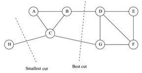
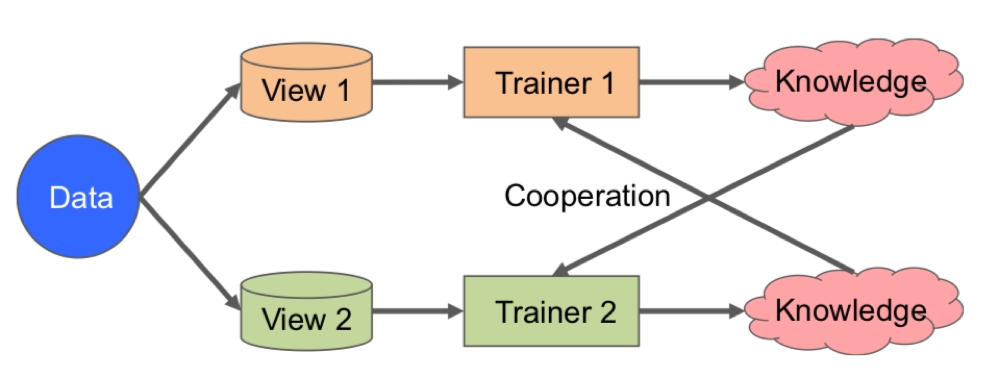
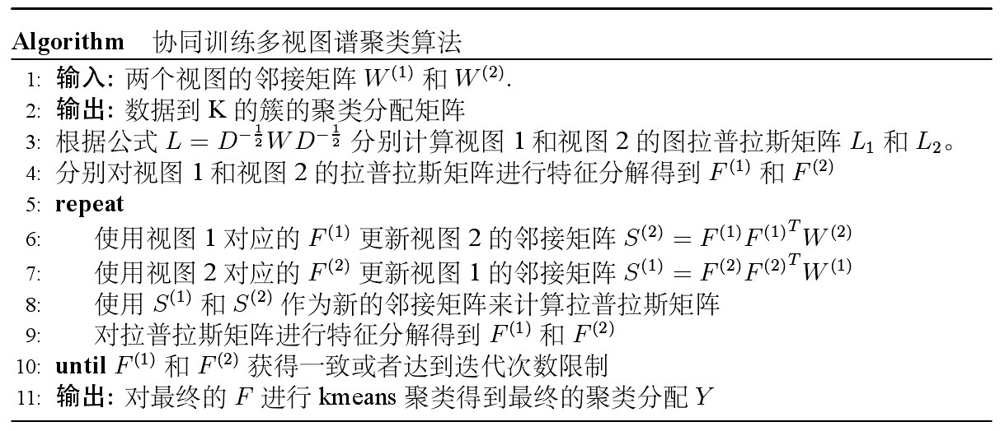
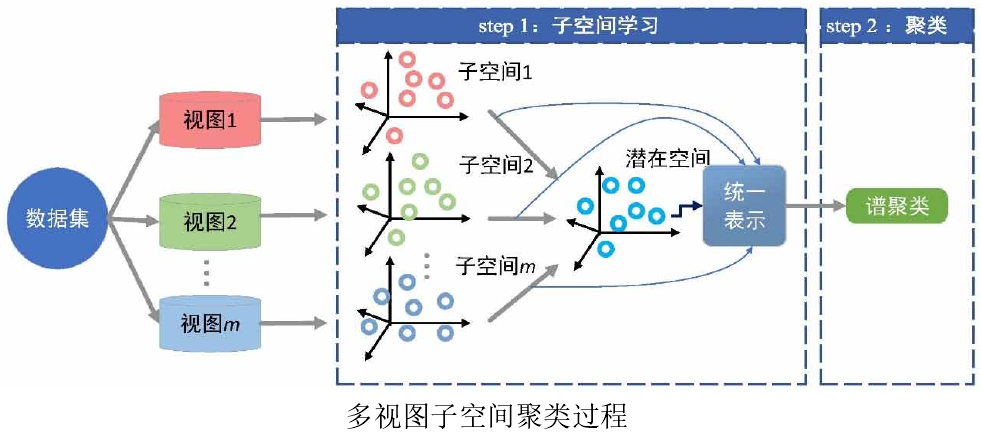
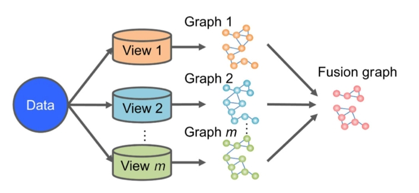
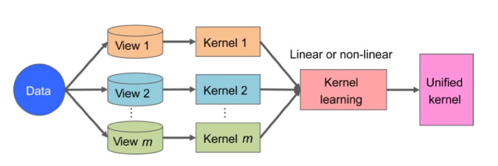

[toc]

# 一、谱聚类概述

谱聚类（spectral clustering）是广泛使用的聚类算法，比起传统的K-Means算法，谱聚类对数据分布的适应性更强，聚类效果也很优秀，同时聚类的计算量也小很多，且实现起来也不复杂。

谱聚类是从图论中演化出来的算法，后来在聚类中得到了广泛的应用。它的主要思想是把所有的数据看做空间中的点，这些点之间可以用边连接起来。距离较远的两个点之间的边权重值较低，而距离较近的两个点之间的边权重值较高。通过对所有数据点组成的图进行切图，让切图后不同的子图间边权重和尽可能的低，而子图内的边权重和尽可能的高，从而达到聚类的目的。

# 二、无向权重图

对于一个图G，一般用点的集合V和边的集合E来描述，即为$G(V,E)$。其中，V是数据集里面所有的点$(v_1,v_2,\cdots,v_n)$，对于V中的任意两个点，可以有边连接，也可以没有边连接。定义为$w_{ij}$点$v_i$和点$v_j$之间的权重，图的邻接矩阵为$W=(w_{ij})_{n\times n}$。

由于是无向图，所以有$w_{ij}=w_{ji}$。且$\begin{cases}w_{ij}>0 & \text{i,j are connected} \\ w_{ij}=0 & \text{otherwise}\end{cases}$。

对于图中的任意一个点$v_i$，它的度定义为和它相连的所有边的权重之和，即
$$
d_i=\sum_{j=1}^nw_{ij}
$$
利用每个点度的定义，可以得到一个n阶的度矩阵D，它是一个对角矩阵，只有主对角线有值，$D_{ii}$对应第i个点的度数，定义如下
$$
D=\begin{bmatrix} d_1 &&& \\ & d_2 && \\ && \ddots & \\ &&& d_n \end{bmatrix}
$$
除此之外，对于点集V的的一个子集$A\subset V$，有如下定义
$$
\begin{align}
& |A|:=子集A中点的个数 \\
& vol(A):=\sum_{i\in A}d_i
\end{align}
$$

# 三、相似矩阵

邻接矩阵W通常一般由用户输入权重，但是在谱聚类中，只有数据点的定义，并没有直接给出这个邻接矩阵是如何获得的。基本原则是，距离较远的两个点之间的边权重值较低，而距离较近的两个点之间的边权重值较高。一般来说，可以通过样本点距离度量的相似矩阵S来获得邻接矩阵W。

构建邻接矩阵W的方法有三类，即ε邻近法、K最邻近法、全连接法。

## （一）ε邻近法

对于ε邻近法，它设置了一个距离阈值ε，然后用欧式距离$s_{ij}$度量任意两点$x_i$和$x_j$的距离，即相似矩阵的元$s_{ij}=\|x_i-x_j\|_2^2$，然后根据$s_{ij}$和ε的大小关系，来定义邻接矩阵W如下
$$
w_{ij}=\begin{cases}\varepsilon & s_{ij}\le\varepsilon \\0 & s_{ij}>\varepsilon\end{cases}
$$
从上式可见，两点间的权重要不就是ε，要不就是0，距离远近度量很不精确，因此在实际应用中很少使用ε邻近法。

## （二）K最邻近法

利用K最邻近法（KNN，K-Nearest Neighbor）算法遍历所有的样本点，取每个样本最近的k个点作为近邻，只有和样本距离最近的k个点之间的$w_{ij}>0$。但是这种方法会造成重构之后的邻接矩阵W非对称，而之后的算法需要对称邻接矩阵。为了解决这种问题，一般采取下面两种方法之一。

第一种K邻近法是只要一个点在另一个点的K近邻中，则保留$s_{ij}$
$$
w_{ij}=w_{ji}=\begin{cases}\exp(-\cfrac{\|x_i-x_j\|_2^2}{2\sigma^2}) & x_i\in KNN(x_j)\ or\ x_j\in KNN(x_i)\\0 & x_i\notin KNN(x_j)\ and\ x_j\notin KNN(x_i)\end{cases}
$$
第二种K邻近法是必须两个点互为K近邻中，才能保留$s_{ij}$
$$
w_{ij}=w_{ji}=\begin{cases}\exp(-\cfrac{\|x_i-x_j\|_2^2}{2\sigma^2}) & x_i\in KNN(x_j)\ and\ x_j\in KNN(x_i)\\0 & x_i\notin KNN(x_j)\ or\ x_j\notin KNN(x_i)\end{cases}
$$

## （三）全连接法

这种方法所有的点之间的权重值都大于0，因此称之为全连接法。可以选择不同的核函数来定义边权重，常用的有多项式核函数、高斯核函数、Sigmoid核函数。最常用的是高斯核函数RBF，此时相似矩阵和邻接矩阵相同为
$$
w_{ij}=s_{ij}=\exp(-\cfrac{\|x_i-x_j\|_2^2}{2\sigma^2})
$$
在实际的应用中，使用这种全连接法来建立邻接矩阵是最普遍的，而在全连接法中使用高斯径向核RBF是最普遍的。

# 四、拉普拉斯矩阵

拉普拉斯矩阵（Laplacian Matrix）的定义很简单，即$L=D-W$，其中D即度的矩阵，W即邻接矩阵。

拉普拉斯矩阵的一些性质如下：

1. 拉普拉斯矩阵是对称矩阵，这是因为D和W都是对称矩阵。
2. 拉普拉斯矩阵的所有的特征值都是实数，这是因为是对称矩阵的特征值都是实数。
3. 对于任意的列向量$X=(x_1,x_2,\cdots,x_n)^T$，有$X^TLX=\cfrac{1}{2}\sum\limits_{i,j=1}^nw_{ij}(x_i-x_j)^2$

这条性质利用拉普拉斯矩阵的定义很容易证明：
$$
\begin{align}
X^TLX &= X^TDX-X^TWX=\sum_{i=1}^nd_ix_i^2-\sum_{i,j=1}^nw_{ij}x_ix_j \\
&= \cfrac{1}{2}\Big(\sum_{i=1}^nd_ix_i^2-2\sum_{i,j=1}^nw_{ij}x_ix_j+\sum_{j=1}^nd_jx_j^2\Big) \\
&= \cfrac{1}{2}\sum_{i,j=1}^nw_{ij}(x_i-x_j)^2
\end{align}
$$

4. 拉普拉斯矩阵是半正定的，且对应的n个实数特征值都大于等于0，即$\min\{\lambda_1,\lambda_2,\cdots,\lambda_n\}\ge0$，且最小的特征值为0，这个由性质3很容易得出。

# 五、无向图切图

对于无向图G的切图，目标是将图G(V,E)切成相不连接的k个子图，每个子图点的集合为$A_1,A_2,\cdots,A_k$，它们满足$A_i\cap A_j=\varnothing\ and\ A_1\cup A_2\cup\cdots\cup A_k=V$。

对于任意两个子图点的集合，定义A和B之间的切图为
$$
cut(A,B)=\sum_{i\in A,j\in B}w_{ij}
$$
显然有
$$
cut(A,\overline A)=\sum_{i\in A,j\notin A}w_{ij}=cut(\overline A,A)
$$
其中$\overline{A}$为A的补集，即除外A其他V的子集的并集。

那么对于k个子图点的集合$A_1,A_2,\cdots,A_k$，定义切图cut为
$$
cut(A_1,A_2,\cdots,A_k):=\sum_{i=1}^kcut(A_i,\overline{A_i})
$$
那么如何切图使得子图内的点权重和最高，且子图间的点权重和最低，一个自然的想法就是最小化$cut(A_1,A_2,\cdots,A_k)$，但是这种极小化的切图存在问题，如下图所示。

若选择一个权重最小的边缘的点，比如C和H之间进行cut，这样可以最小化$cut(A_1,A_2,\cdots,A_k)$，但是却不是最优的切图，即最小化cut通常只从图中分割出一个单独的点。如何避免这种切图，并且找到Best Cut最优切图，就是谱聚类中使用的切图方法。

# 六、谱聚类之切图聚类

为了避免最小切图导致的切图效果不佳，需要对每个子图的规模做出限定，一般来说，有两种切图方式，第一种是RatioCut，第二种是Ncut。下面将分别加以介绍。

## （一）RatioCut切图

RatioCut切图为了避免最小切图，对每个切图，不光考虑最小化$cut(A_1,A_2,\cdots,A_k)$，它还同时考虑最大化每个子图点的个数，即
$$
RatioCut(A_1,A_2,\cdots,A_k)=\sum_{i=1}^k\cfrac{cut(A_i,\overline{A_i})}{|A_i|}
$$
最小化这个RatioCut函数就是RatioCut切图要完成的任务。大佬们发现，RatioCut函数可以通过如下方式表示。

对每个子图点集合$A_i$，引入指示向量$h_i$（$i=1,2,\cdots,k$），它是一个n维列向量（n为样本数），其第j个分量表示第j个点$v_j$是否属于切图$A_i$。数学定义为$h_i=(h_{i1},h_{i2},\cdots,h_{in})^T$，其中
$$
h_{ij}=\begin{cases}\cfrac{1}{\sqrt{|A_i|}} & v_j\in A_i \\0 & v_j\notin A_i\end{cases}
$$
显然有$|h_i|=1\ and\ [h_i,h_j]=0,\ i\ne j$，即不同子图的指示向量是相互正交的单位向量。

对于每一个子图的指示向量有
$$
\begin{align}
h_i^TLh_i &= \sum_{s,t=1}^nw_{st}(h_{is}-h_{it})^2 \\
&= \sum_{s\in A_i,t\notin A_i}w_{st}(\cfrac{1}{\sqrt{|A_i|}}-0)^2+\sum_{s\notin A_i,t\in A_i}w_{st}(0-\cfrac{1}{\sqrt{|A_i|}})^2 \\
&= \cfrac{1}{|A_i|}\Big(\sum_{s\in A_i,t\notin A_i}w_{st}+\sum_{s\notin A_i,t\in A_i}w_{st}\Big) \\
&= \cfrac{1}{|A_i|}\Big(cut(A_i,\overline{A_i})+cut(\overline{A_i},A_i)\Big) \\
&= 2\cfrac{cut(A_i,\overline{A_i})}{|A_i|}
\end{align}
$$
那么，对应的RatioCut函数表达式为
$$
RatioCut(A_1,A_2,\cdots,A_k)=\sum_{i=1}^k\cfrac{cut(A_i,\overline{A_i})}{|A_i|}=\cfrac{1}{2}\sum_{i=1}^kh_i^TLh_i=\cfrac{1}{2}\sum_{i=1}^k(H^TLH)_{ii}=\cfrac{1}{2}Tr(H^TLH)
$$
其中矩阵$H_{n\times k}=(h_1,h_2,\cdots,h_k)$，且$H^TH=E$。

也就是说RatioCut切图，实际上就是最小化$Tr(H^TLH)$，则切图的优化目标为
$$
\mathop{\arg \min}\limits_{H}\, Tr(H^TLH) \quad s.t.\, H^TH=E
$$
注意到矩阵H的k个指示向量相互正交，且每个向量中的n个分量的取值为0或$\cfrac{1}{\sqrt{|A_i|}}$两种情况，则共有$k2^n$种矩阵H。显然找到满足上面优化目标的H是一个NP难的问题。

注意观察$Tr(H^TLH)$中每一个优化子目标$h_i^TLh_i$，其中$h_i$是单位正交向量，L为n阶对称矩阵，则显然$H^TLH=\lambda_1+\lambda_2+\cdots+\lambda_k$，其中$\lambda_i$为矩阵L的k个特征值。于是优化目标便是找到拉普拉斯矩阵L最小的k个特征值。一般来说，k远远小于n，也就是说，此时进行了维度规约，将维度从n降到了k，从而近似可以解决这个NP难的问题。

通过找到L最小的k个特征值，可以得到对应的k个特征向量$\beta_i$，这k个特征向量组成一个$n\times k$阶的矩阵B，一般还需要对矩阵B按行做标准化得到H即为所求，即
$$
h_{ij}=\cfrac{\beta_{ij}}{\sqrt{\sum\limits_{l=1}^k\beta_{il}^2}}
$$
由于在使用维度规约时损失了少量信息，导致所求的优化后指示向量h对应的H现在不能完全指示各样本的归属，因此一般在得到矩阵H后还需要对每一行进行一次传统的聚类，比如使用K-Means聚类。

## （二）Ncut切图

Ncut切图和RatioCut切图很类似，但是把Ratiocut的分母$|A_i|$换成$vol(A_i)$。因为子图样本的个数多并不一定权重就大，故切图时基于权重也更适合目标，因此一般来说Ncut切图优于RatioCut切图。
$$
Ncut(A_1,A_2,\cdots,A_k)=\sum_{i=1}^k\cfrac{cut(A_i,\overline{A_i})}{vol(A_i)}
$$
相应的，Ncut切图对指示向量也做了改进。对每个子图点集合$A_i$，引入指示向量$h_i$（$i=1,2,\cdots,k$），它是一个n维列向量（n为样本数），其第j个分量表示第j个点$v_j$是否属于切图$A_i$。数学定义为$h_i=(h_{i1},h_{i2},\cdots,h_{in})^T$，其中
$$
h_{ij}=\begin{cases}\cfrac{1}{\sqrt{vol(A_i)}} & v_j\in A_i \\0 & v_j\notin A_i\end{cases}
$$
显然有$|h_i|=\cfrac{|A_i|}{vol(A_i)}\ and\ [h_i,h_j]=0,\ i\ne j$，即不同子图的指示向量相互正交。

对于每一个子图的指示向量有
$$
\begin{align}
h_i^TLh_i &= \sum_{s,t=1}^nw_{st}(h_{is}-h_{it})^2 \\
&= \sum_{s\in A_i,t\notin A_i}w_{st}(\cfrac{1}{\sqrt{vol(A_i)}}-0)^2+\sum_{s\notin A_i,t\in A_i}w_{st}(0-\cfrac{1}{\sqrt{vol(A_i)}})^2 \\
&= \cfrac{1}{vol(A_i)}\Big(\sum_{s\in A_i,t\notin A_i}w_{st}+\sum_{s\notin A_i,t\in A_i}w_{st}\Big) \\
&= \cfrac{1}{vol(A_i)}\Big(cut(A_i,\overline{A_i})+cut(\overline{A_i},A_i)\Big) \\
&= 2\cfrac{cut(A_i,\overline{A_i})}{vol(A_i)}
\end{align}
$$
那么，对应的Ncut函数表达式为
$$
Ncut(A_1,A_2,\cdots,A_k)=\sum_{i=1}^k\cfrac{cut(A_i,\overline{A_i})}{vol(A_i)}=\cfrac{1}{2}\sum_{i=1}^kh_i^TLh_i=\cfrac{1}{2}\sum_{i=1}^k(H^TLH)_{ii}=\cfrac{1}{2}Tr(H^TLH)
$$
其中矩阵$H_{n\times k}=(h_1,h_2,\cdots,h_k)$，则Ncut切图实际上仍是最小化$Tr(H^TLH)$。但是此时$H^TH\ne E$，而是$H^TDH=E$，证明如下。
$$
\begin{align}
& h_i^TDh_i=\sum_{j=1}^nh_{ij}^2d_j=\sum_{j\in A_i}h_{ij}^2d_j=\cfrac{1}{vol(A_i)}\sum_{j\in A_i}d_j=\cfrac{1}{vol(A_i)}vol(A_i)=1 \\
& \Longrightarrow H^TDH=E
\end{align}
$$
则切图的优化目标为
$$
\mathop{\arg \min}\limits_{H}\, Tr(H^TLH) \quad s.t.\, H^TDH=E
$$
此时矩阵H中的指示向量h并不是标准正交基，所以无法使用降维思想，因此要对矩阵H进行转化。
$$
\begin{align}
& 令，H=D^{-\frac{1}{2}}F=\cfrac{1}{\sqrt{D}}F \\
& 则目标，H^TLH=F^T(D^{-\frac{1}{2}}LD^{-\frac{1}{2}})F = F^TL'F \\
& 则条件，H^TDH=F^TF=E \\
& 其中，F与H同型，都是n\times k阶矩阵
\end{align}
$$
故切图的优化目标变成了
$$
\mathop{\arg \min}\limits_{F}\, Tr(F^TL'F) \quad s.t.\, F^TF=E
$$
这个式子和RatioCut基本一致，只是中间的拉普拉斯矩阵L变成了$D^{-\frac{1}{2}}LD^{-\frac{1}{2}}=L'$，将其看成一个整体即可。

此时优化目标$Tr(F^TL'F)$中的矩阵F的列向量相互正交，则显然$F^TL'F=\lambda_1+\lambda_2+\cdots+\lambda_k$，其中$\lambda_i$为矩阵$L'$的特征值。于是优化目标同样是找到矩阵$L'$最小的k个特征值，然后求出对应的k个特征向量$\beta_i$，这k个特征向量组成一个$n\times k$阶的矩阵B，一般还需要对矩阵B按行做标准化得到矩阵F即为所求，即
$$
f_{ij}=\cfrac{\beta_{ij}}{\sqrt{\sum\limits_{l=1}^k\beta_{il}^2}}
$$
最后对F进行一次传统的聚类（比如K-Means）即可。

一般来说，$D^{-\frac{1}{2}}LD^{-\frac{1}{2}}$相当于对拉普拉斯矩阵L做了一次标准化，即
$$
L_{ij}^*=\cfrac{L_{ij}}{\sqrt{d_j^2}}
$$

# 七、谱聚类算法流程

至此，便可以总结谱聚类的基本流程了。一般来说，谱聚类需要注意地方主要有三点，即相似矩阵的生成方式，切图的方式，以及最后的聚类方法。

最常用的相似矩阵的生成方式是基于高斯核距离的全连接方式，最常用的切图方式是Ncut，最后常用的聚类方法为K-Means。下面以Ncut总结谱聚类算法流程。

输入：样本集$D=(x_1,x_2,\cdots,x_n)$，相似矩阵的生成方式，降维后维度$k_1$，聚类方法，聚类后维度$k_2$。

输出：簇划分$C(c_1,c_2,\cdots,c_{k2})$。

算法流程如下。

1. 根据输入的相似矩阵的生成方式构建样本的相似矩阵S。
2. 根据相似矩阵S构建邻接矩阵W，构建度矩阵D。
3. 计算出拉普拉斯矩阵L。
4. 构建标准化后的拉普拉斯矩阵$L'=D^{-\frac{1}{2}}LD^{-\frac{1}{2}}$。
5. 计算$L'$最小的$k_1$个特征值所各自对应的特征向量$\beta$。
6. 将各自对应的特征向量$\beta$组成的矩阵按行标准化，最终组成$n\times k_1$阶特征矩阵F。
7. 对F中的每一行作为一个$k_1$维的样本，共n个样本，用输入的聚类方法进行聚类，聚类维数为$k_2$。
8. 得到簇划分$C(c_1,c_2,\cdots,c_{k2})$。

# 八、谱聚类算法优缺点

谱聚类算法的主要优点有：

1. 谱聚类只需要数据之间的相似度矩阵，因此对于处理稀疏数据的聚类很有效。这点传统聚类算法比如K-Means很难做到。
2. 由于使用了降维，因此在处理高维数据聚类时的复杂度比传统聚类算法好。

谱聚类算法的主要缺点有：

1. 如果最终聚类的维度非常高，则由于降维的幅度不够，谱聚类的运行速度和最后的聚类效果均不好。
2. 聚类效果依赖于相似矩阵，不同的相似矩阵得到的最终聚类效果可能很不同。

# 九、多视图谱聚类

在多视图聚类领域比较流行的方法就是基于共同特征向量矩阵的多视图聚类算法，多视图谱聚类算法是最具代表性的算法之一。

多视图谱聚类算法主要采用谱聚类方法。谱聚类中最为关键的部分就是图拉普拉斯矩阵的构建，对该拉普拉斯矩阵进行特征分解后得到的特征向量可以直接影响最后的聚类效果。

该类算法假设数据中的多个视图共享一个同样的或者至少相似的特征向量矩阵，基于这个假设，通过对多个视图间进行协同训练或者协同正则化来寻求视图间的最大一致，从而得到最终的聚类结果。

在多视图谱聚类算法中，两类最具代表性的寻找共同的特征向量矩阵的方法为协同训练谱聚类算法和协同正则化谱聚类算法，分别介绍如下。

## （一）协同训练多视图谱聚类

在半监督学习领域，即同时有带类标（label）和不带类标的数据时，对两个视图进行协同训练已经成为了一个半监督学习领域的经典算法。

协同训练类型的多视图谱聚类算法一般只适合于具有两个视图的多视图数据。该类方法假设在一个视图中属于同一个簇的两个数据点在其他视图中也必定属于同一个簇，反之，如果两个数据点在一个视图中属于两个不同的簇，那么在其他视图中，他们也必定属于不同的簇。基于上述假设，该类方法的主要思想是通过协同训练最大化不同视图间的一致性，以得到最终的多视图聚类结果。

传统的协同训练算法通常先使用带类标的数据为每个视图各训练出一个预测函数$f_1$和$f_2$，然后通过如下的迭代步骤协同训练两个预测函数$f_1$和$f_2$直到达到最终的一致：首先将$f_1$预测的置信度较高的数据样本集及预测出的类标作为函数$f_2$的训练样本集，重新训练视图2的预测函数$f_2$；然后将通过新的函数$f_2$预测的样本集和类标训练函数$f_1$。迭代这个训练过程，直到两个视图的预测函数$f_1$和$f_2$达到一致的预测效果。

协同训练多视图谱聚类算法的基本过程如下图所示。

由图所示，协同算法通过互相迭代训练两个视图的预测函数，每次使用一个视图在先前训练中得到的信息去训练另外一个视图的预测函数，直至实现视图的预测函数取得一致的预测结果。

将协同训练算法与谱聚类算法结合来对多视图数据进行聚类的原理很简单，即不同视图间聚类结果保持一致。在谱聚类算法中，由于视图中的数据信息通常包含在图拉普拉斯矩阵的特征向量中，因此在对谱聚类算法进行两个视图间的协同训练时，首先使用一个视图的拉普拉斯矩阵得到的特征向量对数据样本进行聚类，然后使用该聚类结果来对另一个视图的图拉普拉斯进行更新。

协同训练类型算法旨在利用聚类对象在一个视图上的聚类结果去影响在其他视图上的聚类结果，即在聚类过程中考虑到了不同视图之间的交互作用。这一类型中的一个典型例子就是多视图k-means聚类算法。在该算法中，一个视图上的聚类结果将会用于初始化另一个的聚类中心，反之亦然。

但是当数据对象的视图个数增加时，这种类型方法会变得复杂且难以分析。例如，当出现第三个视图时，任何两个视图的聚类结果都可以对第三个视图的聚类中心进行初始化，但应当选择哪一个视图却难以确定，而当视图的个数变得更大时，这些问题的复杂度也随之提升。另一个严重的问题是该类算法并不能保证算法的收敛，这也进一步限制了该类算法的应用。

基于多核学习的多视图聚类算法首先从每个视图学习一个内核，然后再通过线性或非线性方法对这些内核进行组合，从而进行聚类分析。但这类方法通常模型比较复杂，难以训练。

多视图子空间学习的目标是寻找一个多视图数据的低维嵌入（low-dimensional embedding）。将其应用于聚类中，即首先找到多视图数据的低维表示S，然后再在这个新的S上采用传统的聚类算法进行聚类。参数设置是影响这类算法聚类效果的重要因素，然而，却没有很好的方法进行指导，往往采取一些经验值。 

而且，上述的方法不能识别不同视图的可靠性，聚类结果可能会被一个坏的视图破坏掉。基于图的多视图聚类方法通常先执行特征分解，然后从分解得到的特征向量中获得最终的聚类分配，常见的对特征向量进行聚类的方法包括k-means和谱旋转。然而，由于特征分解很高的计算复杂度，这样的两步过程可能非常耗时并且聚类结果不理想。

## （二）协同正则化多视图谱聚类

协同正则化技术也是半监督学习领域一个非常重要且有效的技术，该方法的主要思想也是最小化不同视图预测函数之间的不一致性，并将该视图间的不一致提取出来作为整体需要优化的目标函数的一部分。

但是，在无监督学习领域，很难为每个视图设计出一个预测函数，因此，如何在聚类领域利用协同正则化的思想成为了协同正则化多视图聚类算法设计的一个主要问题。幸运的是，在谱聚类算法中通常用拉普拉斯矩阵来作为数据信息的一个代表，所以拉普拉斯矩阵就可以被当作是视图预测函数的一个变体，通过最小化视图拉普拉斯矩阵间的不一致性，可以获得一个相似的协同正则化效果。

在目前流行的多视图协同正则化谱聚类算法中，主要有两种协同正则化聚类算法。

第一种是成对的协同正则化算法，该算法将数据的两个视图作为一对来考虑，主要目标是最小化两两之间的不一致性。我们用$F^{(s)}$和$F^{(t)}$作为从图拉普拉斯矩阵$L^{(s)}$和$L^{(t)}$中计算出来的特征向量矩阵，成对协同正则化的标准是使得$F^{(s)}$和$F^{(t)}$之间尽可能的保持一致。将视图之间的不一致进行整合，作为聚类优化问题目标函数的一个优化项，然后采用一个参数来实现聚类目标函数与谱嵌入不一致项之间的一个平衡。在这个谱嵌入过程后，就得到了每个视图的一个嵌入，通过对每个视图的谱嵌入进行k-means聚类，可以得到完全不同的聚类结果。所以在获得各个视图谱嵌入矩阵之后，一般会采取一些结合策略来结合不同视图谱嵌入矩阵得到的聚类结果，从而获得最终的数据聚类分配。成对协同正则化多视图谱聚类的目标函数定义如下：
$$
\sum_{s=1}^m[(F^{(s)})^TL^{(s)}F^{(s)}]+\sum_{1\le s,t\le m,s\ne t}\lambda\cdot Tr[F^{(s)}(F^{(s)})^TF^{(t)}(F^{(t)})^T]
$$
其中，$F^{(s)}$和$F^{(t)}$表示两两视图对应的特征向量矩阵。

第二种是基于中心的协同正则化算法，该类算法通过将各个视图的特征向量矩阵与一个统一的特征向量矩阵进行正则化，保证了所有视图特征向量矩阵之间的一致性或者相似性。对应的优化目标函数如下：
$$
\sum_{s=1}^m[(F^{(s)})^TL^{(s)}F^{(s)}]+\sum_{s=1}^m\lambda_s\cdot Tr[F^{(s)}(F^{(s)})^TF^{(t)}(F^{(t)})^T]
$$
该算法通过最小化所有视图谱嵌入矩阵与统一的视图谱嵌入矩阵之间的不一致，直接求得了一个最终的共同的特征向量矩阵。因此该类算法可以避免成对算法需要对各个视图特征向量矩阵进行融合的过程，从而直接得到该多视图数据的最终聚类分配。

# 十、多视图子空间聚类

在许多实际问题中，虽然数据是非常高维的，但主要信息却只包含在几个较少的维度中，如图像处理领域。这一现象使得子空间聚类变得很有意义。子空间聚类的思想就是从高维数据中寻找出潜在的低维子空间，然后对这个低维的潜在子空间进行聚类，从而为每个数据点找到正确的簇类归属。

子空间聚类利用数据样本的自我表达属性，即一个数据样本可以通过该数据集中其他几个数据样本的线性组合来表示。经典的子空间聚类问题被定义如下：
$$
X=XZ+E
$$
其中，$Z=z_1,z_2,\cdots,z_n$为子空间系数矩阵，有时也称为表达矩阵，每个$z_i$是原始空间中的数据点$x_i$在子空间中的一个新的表达，$E\in\R^{n\times n}$为噪声矩阵。因此，子空间聚类就转换成了如下的优化问题：
$$
\mathop{\arg \min}\limits_{Z}\|X-XZ\|_F^2 \quad s.t.\ Z_{i,i}=0,Z^Tl=l
$$
在限制条件中，$Z_{i,i}$是用来避免一个数据被自身表达的情况，$Z^Tl=l$表示数据点在一个仿射子空间的并集中。列向量$z_i$的非0元素表示对应着来自于同一个子空间的数据点。

在获得数据的子空间表达Z之后，下一步通常为该子空间表达构建一个相似度矩阵$W=\cfrac{|Z|+|Z|^T}{2}$，最后利用谱聚类算法对该相似度矩阵构建图拉普拉斯矩阵，并对其进行特征分解，最终得到数据的聚类分配矩阵。

在对子空间聚类算法进行扩展，将其用于多视图聚类任务时，通常先从每个视图中学习出一个子空间代表矩阵，然后为了从多个视图中获得一个一致解，通过在目标函数中加入约束项来保证两两视图之间的子空间矩阵尽可能相似，该思想可以用如下的优化问题来表示：
$$
\begin{align}
& \mathop{\arg\min}_{Z^{(s)}} \sum_{s=1}^m\|X^{(s)}-X^{(s)}Z^{(s)}\|_F^2+\alpha\sum_{s=1}^m\|Z^{(s)}\|_1+\beta\sum_{1\le s\le t}\|Z^{(s)}-Z^{(t)}\|_1 \\
& s.t.\ diag(Z^{(s)}=0),\forall s\in\{1,2,\cdots,m\}
\end{align}
$$
这里$\|Z^{(s)}-Z^{(t)}\|_1$是基于$l_1-norm$的两两视图间协同正则化限制，该限制可以避免噪声问题。$\|Z^{(s)}\|_1$是用来得到稀疏解的，$diag(Z)$表示矩阵Z的对角元素，令子空间表达矩阵中的所有对角元素为0即避免了元素的自我表达问题。

# 十一、基于图的多视图聚类

## （一）基于图的单视图聚类

算法给定一个需要聚类数据矩阵$X\in\R^{n\times d}$，其中n为数据样本总个数，d为数据的维度。为了将这个包含n个数据点，d维特征的数据聚成c个簇，基于图的聚类算法通常采用如下步骤。

1. 首先为数据构建一个图结构矩阵G，其通常为数据的相似度矩阵，即$G_{i,j}$表示第i个数据样本与第j个数据样本之间的相似度。
2. 由图结构矩阵计算拉普拉斯矩阵$L_G=D_G-(G^T+G)/2$，其中$D_G$为图结构矩阵的度矩阵，有$D_{i,i}=\sum_{j}(G_{i,j}+G_{j,i})/2$。
3. 优化目标函数计算出数据的图嵌入矩阵：$\mathop{\arg\min}\limits_{E\in\R^{n\times c}}Tr(E^TL_GE)$。
   - 如果此处对图嵌入矩阵E添加限制条件$E^TD_GE=I$，那么该问题就转化成了一个标准正则化切割问题，该问题就转变成了谱聚类问题。
4. 最后，使用一个额外的聚类算法如k-means聚类等对图嵌入矩阵E进行聚类，得到数据最终的图聚类分配。

## （二）基于图的多视图聚类

基于图的多视图聚类算法通常先为数据中的每个单视图构建一个图结构，然后对这些不同视图的图结构进行融合从而得到最终的一个融合图结构，最后再使用单视图聚类算法对这个最后的融合图进行聚类得到多视图数据的最终聚类分配。

一个常见的为多视图中每个视图构建图结构的方法是通过视图数据的相似度矩阵来构建，这种采用相似度矩阵构建的图矩阵称为相似度诱导图矩阵。不同视图的图结构来自于不同视图的相似度矩阵。

通常假设每个图都可以表达整个数据集的部分信息，所有单个的相似度图都具有同一个潜在的聚类结构。基于该假设，才可以通过整合统一不同视图之间的相关性，使不同视图的相似度图之间能够互相强化。一般来说，基于图的多视图数据融合过程可以表示为下图所示过程。

基于图的多视图聚类算法旨在为这些单个视图的相似度图找到一个最佳的融合图，使得该融合图能够真实的表达数据潜在结构信息，然后再在这个最佳的融合图上执行图割算法或者其它的谱聚类算法来获得最终的聚类结果。

# 十二、基于多核学习的多视图聚类

多核学习起初是为了提高单核函数的空间映射能力而被提出，通过对具有不同特性的单个核函数进行整合，使得多核函数能够融合各个单核函数的特性，具有更强大的空间映射能力，使数据能够在新的多核函数形成的新的组合空间中得到更准确、合理的表达。多核学习往往通过对简单核函数（如线性核函数、多项式核函数、高斯核函数）的融合来获得更好的泛化能力。

由于多核学习中的核通常对应着多视图数据中的不同视图，所以多核学习也已经被广泛应用于对多视图数据的处理。多核学习的一般学习过程展示如下。

此处，不同的核被用于处理不同的视图，然后将这些核通过线性或者非线性的方式进行结合从而得到最终的统一的目标核函数。多核学习面临的一个重要挑战就是如何选择一个合适的核函数（线性核函数，多项式核函数，高斯核函数），将原始低维空间的数据映射到一个高维空间。

多视图聚类的多核学习旨在找到一组核函数的最优组合，从而获得一个较好的聚类效果。多视图聚类通常采用线性的方式对不同的视图核函数进行组合，在组合过程中通过对不同的核赋予不同的视图权重来表达不同视图的重要性。因此，如何对不同视图赋予权重对性能至关重要。

常见的核函数包括如下几种。

1. 线性核函数$K(x_i,x_j)=(x_i\cdot x_j)$
2. 多项式核函数$K(x_i,x_j)=(x_i\cdot x_j+1)^d$
3. 高斯核函数$K(x_i,x_j)=\exp\{-\cfrac{\|x_i-x_j\|^2}{2\sigma^2}\}$
4. Sigmoid核函数$K(x_i,x_j)=\tanh(\eta x_ix_j)+v$

由于希尔伯特空间中的核函数可以被看作是向量空间里的相似度函数，可以将核函数看作是谱聚类中的非欧几里德相似度度量。

常见的几种对核函数结合的方法有如下几种。

1. 线性组合。主要是加权线性组合和不加权线性组合。
2. 非线性组合。如指数运算、乘法运算和平方运算等。
3. 根据数据对核函数进行组合。该方法为每个数据样本分配一个特定的核权重，该权重可以表示数据的局部分布，并为不同的区域学习不同的核组合规则。