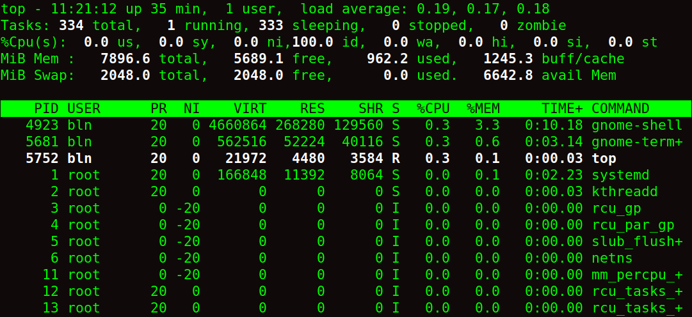
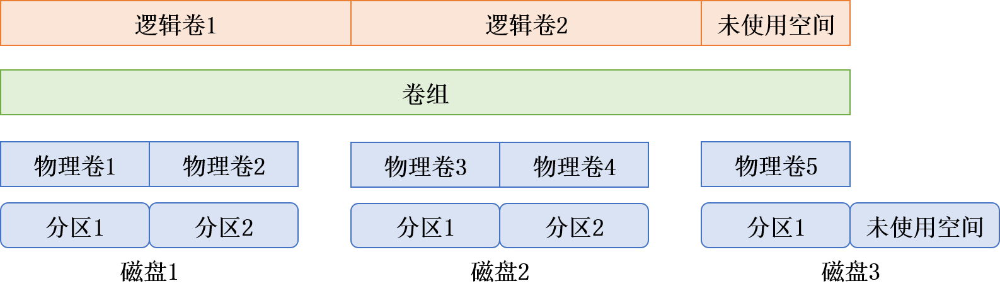
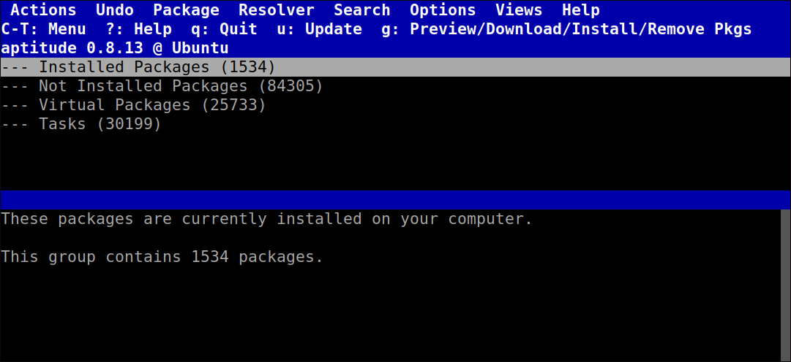

[toc]

# Linux常用命令

可以从https://www.runoob.com/linux/linux-command-manual.html网站查阅Linux命令。

使用man命令查看其它命令的手册，例如man ps查看ps命令手册，在所列出命令之后的括号标识该命令的章节，例如PS(1)形式。

```shell
dpkg --list | grep linux-image    # 查看当前已有内核
dpkg --list | grep linux-headers  # 查看当前已有内核
uname -r  # 当前正在使用的内核
uname -a  # 内核的发行版号和操作系统版本
lsb_release -a     # 发行版本信息
cat /proc/version  # 详细的版本信息
lscpu              # 列出CPU信息
cat /proc/cpuinfo  # 详细的CPU信息
```

使用lshw命令列出所有硬件，使用sudo apt install lshw安装。

使用hwinfo工具查看更多硬件信息，使用sudo apt install hwinfo安装，使用hwinfo命令可列出当前硬件状态，使用诸如--cpu和--memory选项指定硬件。

使用lm-sensors工具监测系统中各个硬件的传感器数据，主要是温度数据和风扇转速，使用sudo apt install lm-sensors安装，使用sudo sensors-detect配置所要探测的传感器（保持默认设置即可），之后即可使用sensors命令显示各个传感器温度。工具s-tui（Stress Terminal UI）是lm-sensors工具的一个现代化界面补充，是一个基于终端的实时监控界面，能直观展示CPU负载、温度及频率。

使用wget命令可以从网络上下载文件，并保存到当前目录中，使用--continue选项可进行断点续传，即从上次下载中断的位置继续下载。

```shell
wget url
```

使用cat命令显示文本文件中的所有内容。其中，使用-n选项在显式所有行之前加上行号；使用-b选项只在有文本的行之前加上行号；使用-T命令将文件中的制表符替换为^I符号。

```shell
cat path
```

使用more命令显示文本文件中的内容，但会在每页数据之后停下来，避免大量文本显示在屏幕上。其中，在more模式下，可使用J或K上下移动显示内容，或使用回车键逐行浏览，或使用空格键逐页浏览，使用q键退出。

```shell
more path
```

使用tail命令显示文本文件中最后几行的内容，默认显示最后10行，常用于显示日志文件。其中，使用-n选项指定要显示的最后n行内容，或直接使用-指定行数；使用-f选项可在其它进程使用该文件时查看文件内容，tail命令会保持活动状态，并不断显示添加到文件中的内容，可用于实时监测系统日志。

```shell
tail path
```

使用head命令显示文本文件中开始几行的内容，默认显示开始10行。其中，使用-n选项指定要显示的最后n行内容，或直接使用-指定行数。

```shell
head path
```

使用source命令，在当前shell中执行一个文件中的命令，并可指定所需的位置参数。

```shell
source path [arguments]
```

使用sort命令按照shell会话中指定的默认语言的排序规则，对文本文件中的数据行排序。其中，使用-n选项将数字识别成数字而不是字符，并且按照数字的值排序；使用-M选项将三字符月份名按照月份排序；使用-r选项逆序排序；使用-t指定区分键位置的字符；使用-k指定依据第几个键值排序。

```shell
sort path
```

```shell
du -sh * | sort -nr  # 将du命令输出重定向到sort命令，有序地列出所有文件大小
```

使用grep命令根据匹配模式查找，输出包含相关字符的行。其中，使用-v选项进行反向搜索；使用-n显示所匹配的行号；使用-e指定多个匹配模式。由于grep命令非常流行，经历了大量的更新，有很多功能被加进grep命令。

```shell
grep [option] pattern [path]
```

使用xargs命令执行某个指定命令command，xargs会解析一系列参数或解析从标准输入中读取的参数，并将解析得到的参数传递个command命令用于执行，常用于管道后为其它命令解析并提供命令行参数。该命令在解析initial_args参数或从标准输入读取的参数时，默认使用空格字符（如空格、换行符等）作为界定符来分隔多个参数。

```shell
xargs [option] command [initial_args]
```

其中，使用-n选项指定每次为command命令传递多少个解析得到的参数；使用-I选项指定所解析参数在command中使用的占位符（默认为{}空）。其中，-n选项和-I选项互斥。

```shell
find . -name "*.c"
```

```shell
./f3.c
./f2.c
./f1.c
```

```shell
find . -name "*.c" | xargs -I MYARG basename MYARG | sort
```

```shell
f1.c
f2.c
f3.c
```

使用read命令从标准输入或文件中读取数据（默认采用换行符作为终止符，即读取一行数据），将其读入到若干变量当中，如果指定多个变量，则根据IFS所指定的字段分隔符对数据进行分隔。read命令通常用于shell脚本的while循环中，用于读取类似CSV文件，它会自动读取文本文件的下一行内容，直到文件内容结束，read命令返回非零退出状态码，while循环结束。

其中，使用-d delim选项指定新的终止符delim，而不是使用换行符作为终止符；使用-a array选项将分隔后数据写入array列表变量中，索引从0开始；使用-r选项指定不采用反斜杠进行转义。

```shell
read [option] var1 var2 ...
```

使用find命令在某个目录下进行查找，并执行相关动作，默认动作是打印所匹配的结果。

```shell
find [path] -name pattern
```

```shell
find /path/to -name pattern | xargs rm -rf  # 删除目录下所有匹配的对象
```

使用whereis命令用于查找某个命令的可执行程序的路径，如下所示。

```shell
whereis python
```

在shell脚本中，可使用exec命令去执行其它所指定的命令（会启动一个新的shell执行），当未指定命令时，则redirection重定向在当前shell中生效。其中，使用-c选项表示使用空环境（而不继承当前环境）去执行命令；使用-l选项表示为指定命令提供dash作为\$0位置参数；使用-a选项为指定命令提供一个name作为\$0位置参数。

```shell
exec [-cl] [-a name] command [arg ...] [redirection]
```

命令eval将指定的参数arg作为一个命令执行，它将参数组合成一个字符串，并将其作为输入提供给shell程序，然后在当前的shell环境中执行生成的命令。

```shell
eval [arg ...]
```

# Linux进程

在Linux中，一个session是一系列进程的集合，它不等价于一个shell会话。一个session中的进程具有相同的sid，其中的控制进程（session leader）的pid等于sid。一个session中的进程是树状结构，一个session中的进程一定是leader控制进程或其子孙进程。任何一个非控制进程，当它成功调用setsid()方法后，一个新的session将被建立，且该进程成为该session的leader控制进程，典型例子就是Linux操作系统上的daemon守护进程。

当session中的所有进程都结束时，一个session便会消亡，这种执行结束分为被动和主动两种。当leader控制进程结束时，session中的进程会收到SIGHUP信号，默认结束掉进程；如果该进程对SIGHUP做了处理而不结束，那么会收到SIGCONT信号，让进程正常执行结束。

## 监测进程

使用ps命令监测运行在系统上的进程。默认情况下，ps命令只会显示运行在当前shell控制台下的属于当前用户的进程。

```shell
ps -eflFH  # 以层级结构显示所有进程，Unix风格
ps axjf    # 以层级结构显示所有进程，BSD风格
```

> 令人困惑之处在于，ps命令曾经有两个版本，每个版本都有相应的命令行参数集，此后Linux开发人员将这两个ps风格合并到了单个ps命令中。目前有三种主流ps风格，即Unix风格参数，前加单破折线`-`；BSD风格参数，前不加破折线；GNU风格长参数，前加双破折线`--`。

该命令ps的一些常用选项如下几个表所示。

| 参数（基本选项） | 描述                                      |
| ---------------- | ----------------------------------------- |
| -A, -e           | 所有进程                                  |
| -a               | 除session leader外，具有tty终端的所有进程 |
| -d               | 除session leader外，所有进程              |
| -N, --deselect   | 与指定参数不符的所有进程                  |
| x                | 未分配tty终端的所有进程                   |
| a                | 具有tty终端的所有进程，包含其它用户的进程 |
| T                | 当前tty终端关联的所有进程                 |
| r                | 仅在运行中的进程                          |

| 参数（选择匹配）           | 描述                  |
| -------------------------- | --------------------- |
| -C \<cmd\>                 | 执行\<cmd\>命令的进程 |
| -G, --Group \<GID\>        | 实际组id或组名称      |
| -g, --group \<group\>      | session或有效组名称   |
| -p, p, --pid \<PID\>       | 进程编号              |
| --ppid \<PID\>             | 父进程编号            |
| -q, q, --quick-pid \<PID\> | quick模式下进程编号   |
| -s, --sid \<session\>      | session id            |
| -t, t, --tty \<tty\>       | tty终端               |
| -u, U, --user \<UID\>      | 有效用户id或名称      |
| -U, --User \<UID\>         | 实际用户id或名称      |

| 参数（输出格式）                  | 描述                                                     |
| --------------------------------- | -------------------------------------------------------- |
| -F                                | 显示更多额外输出，相对-f参数而言                         |
| -f                                | 显示完整格式输出，包含命令行                             |
| f, --forest                       | 以层级结构显示处进程和父进程之间的关系                   |
| -H                                | 以层级结构显示（树状）                                   |
| -j, j                             | 以任务控制格式显示                                       |
| -l, l                             | 以长格式显示，即显示详细的列头                           |
| -M, -Z, Z, --context              | 显示进程的安全信息，用于SELinux                          |
| -O, O \<format\>                  | 显示默认的输出列，以及用户定义格式\<format\>指定的特定列 |
| -o, o, --format \<format\>        | 仅显示用户定义格式\<format\>指定的特定列                 |
| s                                 | 以信号格式显示                                           |
| u                                 | 以基于用户定义的格式显示                                 |
| v                                 | 以虚拟内存格式显示                                       |
| X                                 | 以过去的Linux i386寄存器格式显示                         |
| -y                                | 不显示进程标志（flag）                                   |
| --headers                         | 在每页输出中都显示列的标题头                             |
| h, --no-headers                   | 不显示列的标题头                                         |
| --cols, --columns, -width \<num\> | 将屏幕宽度设置为\<num\>列                                |
| --rows, --lines \<num\>           | 将屏幕高度设置为\<num\>行                                |

| 参数（显示线程） | 描述                                |
| ---------------- | ----------------------------------- |
| H                | 将线程以进程的格式显示              |
| -L               | 显示进程中的线程，即显示LWP和NLWP列 |
| -m, m            | 在进程后显示线程                    |
| -T               | 显示进程中的线程，即显示SPID列      |

| 参数（杂注）       | 描述                                                      |
| ------------------ | --------------------------------------------------------- |
| -c                 | 显示进程的额外调度器信息                                  |
| c                  | 显示真实的命令名称，即用以启动进程的程序名称              |
| e                  | 显示命令使用的环境变量                                    |
| k, --sort \<sort\> | 指定用以将输出排序的列                                    |
| L                  | 用于列出所有\<format\>格式指定符                          |
| -n, n              | 和WCHAN信息一起显示，用数值来表示用户id和组id             |
| S, --cumulative    | 将数值信息从消亡子进程加到父进程，例如CPU和内存的使用情况 |
| -V, V, --version   | 显示ps命令的版本号                                        |
| -w, w              | 不限制输出宽度                                            |

使用ps -lF命令或ps l会显示许多列信息，如下所示。

```shell
ps -lF
```

```shell
F S UID          PID    PPID  C PRI  NI ADDR SZ WCHAN    RSS PSR STIME TTY          TIME CMD
0 S bln         2023    1981  0  80   0 -  4949 do_wai  5120   5 23:26 pts/0    00:00:00 bash
0 R bln         2033    2023  0  80   0 -  5336 -       3328   0 23:26 pts/0    00:00:00 ps -lF
```

```shell
ps l
```

```shell
F   UID     PID    PPID PRI  NI    VSZ   RSS WCHAN  STAT TTY        TIME COMMAND
0  1000    2023    1981  20   0  19796  5120 do_wai Ss   pts/0      0:00 bash
0  1000    2037    2023  20   0  21344  3200 -      R+   pts/0      0:00 ps l
```

常见列标题头的含义如下所示。

| 列头  | 含义                                                         |
| ----- | ------------------------------------------------------------ |
| F     | 内核分配给进程的系统标记                                     |
| S     | 进程状态（0正在运行；S休眠；R可运行，正在等待；Z僵化，进程已结束但父进程已不存在；T停止） |
| STAT  | 进程状态（第一个字符；0正在运行；S休眠；R可运行，正在等待）（第二个字符；<高优先级；N低优先级；L进程位于固定页内存；s该进程控制其它进程；l多线程；+运行在前台） |
| UID   | 启进程的用户                                                 |
| PID   | 进程编号                                                     |
| PPID  | 父进程编号                                                   |
| C     | 进程生命周期中的CPU利用率                                    |
| PRI   | 进程的优先级，数字越小优先级越高                             |
| NI    | 谦让度值，用来参与决定优先级                                 |
| ADDR  | 进程的内存地址                                               |
| SZ    | 假如进程被换出，所需交换空间的大致大小                       |
| WCHAN | 进程休眠的内核函数的地址                                     |
| VSZ   | 进程在内存中的大小，以KB为单位                               |
| RSS   | 进程在未换出时占用的物理内存                                 |
| PSR   | 进程运行的CPU编号                                            |
| STIME | 进程启动时的系统时间                                         |
| TTY   | 进程启动时的终端设备                                         |
| TIME  | 运行进程使用的累计CPU时间                                    |
| CMD   | 启动的程序名称                                               |

可使用pstree命令显示以某个进程为根的进程树，若不指定则默认使用init（systemd）进程作为根进程。

```shell
pstree [pid]
```

使用-p选项显示进程PID；使用-g选项显示进程的PGID；使用-a选项显示进程的命令行参数。

##  实时监测进程

命令ps能够收集运行在系统上的进程信息，但只能显示某个特定时间点的信息。使用top命令实时显示进程信息。

```shell
top
```



第一行信息为当前时间、系统运行时间、登录用户数、系统平均负载（1分钟、5分钟、15分钟）。其中，平均负载值越大说明系统负载越高，通常如果系统负载值超过2，说明系统比较繁忙。

第二行信息为任务概要信息，分别为总进程数，和处于运行、休眠、停止、僵化状态的进程数。

第三行信息为CPU概要信息，us为用户态占用的CPU时间，sy为内核态占用的CPU时间，ni为通过改变优先级的进程占用的CPU时间，id为空间CPU时间，wa为用于等待的CPU时间，hi为处理硬件中断的CPU时间，si为处理软件中断的CPU时间，st为被偷取占用的CPU时间，在虚拟化环境中，多个虚拟机共享物理资源，其中一些时间可能被其它虚拟机占用。

第三四行为内存概要信息，针对物理内存和系统交换空间，分别为总内存数、已使用内存数、空闲内存数，已缓存内存数。

最后一行为当前运行中的进程的详细列表，有些列跟ps命令的输出类似，如下所示。

| 列头    | 含义                                                         |
| ------- | ------------------------------------------------------------ |
| PID     | 进程编号                                                     |
| USER    | 进程属主的用户名                                             |
| PR      | 进程的优先级                                                 |
| NI      | 进程的谦让度值                                               |
| VIRT    | 进程占用的虚拟内存总量                                       |
| RES     | 进程占用的物理内存总量                                       |
| SHR     | 进程和其它进程共享的内存总量                                 |
| S       | 进程状态（R正在运行；S休眠；D可中断的休眠；T停止或跟踪状态；Z僵化） |
| %CPU    | 进程使用的CPU时间占比                                        |
| %MEM    | 进程使用的内存占比                                           |
| TIME+   | 自进程启动到目前为止使用的CPU时间总值                        |
| COMMAND | 进程对应的命令行命令，即启动的程序名                         |

默认情况下，top命令会按照%CPU列的值对进程进行排序，可在top运行时使用多种交互式命令，每个交互式命令都是单字符。使用d命令运行修改top的轮询间隔；使用f命令可以选择显示的列标题头，并设置排序采用的列值；使用q命令退出。

## 结束进程

Linux沿用Unix采用信号来进程间通信的方法。在Linux中，进程之间通过信号（signal）进行通信，信号是预定义的消息，进程能够识别信号并决定忽略还是作出反应。进程如何处理信号是由开发人员通过编程来决定的，大多数编写完善的程序都能接收和处理标准Unix进程信号。

在Linux编程时常用的信号如下表所示，值得注意的是，信号名称可在之前添加SIG字符，如HUP或SIGHUP是指同一信号。

| 信号值 | 信号名称 | 描述                             |
| ------ | -------- | -------------------------------- |
| 1      | HUP      | 挂起                             |
| 2      | INT      | 中断，Linux内核会停止分配CPU时间 |
| 3      | QUIT     | 结束运行                         |
| 9      | KILL     | 无条件终止                       |
| 11     | SEGV     | 段错误                           |
| 15     | TERM     | 尽可能终止                       |
| 17     | STOP     | 无条件停止运行，但不终止         |
| 18     | TSTP     | 停止或暂停，但继续在后台运行     |
| 19     | CONT     | 在STOP或TSTP之后恢复继续运行     |

命令kill可以通过进程的PID向进程发送信号，默认情况kill命令会发出TERM信号。使用-l选项列出所有可用信号；使用-s选项可指定其它参数（使用信号值或信号名称）。要给指定进程发送信号，用户必须是进程的属主或登录为root用户。

```shell
kill -s KILL 2112
```

命令killall支持通过进程名称而不是PID来结束进程，也支持使用通配符来结束进程，这在系统因负载过大而变得很慢时非常有用。

```shell
killall http*
```

以root用户身份登录系统时，使用killall命令要特别小心，因为很容易就会误用通配符而结束重要的系统进程，这可能会破坏文件系统。

# Linux文件系统

## 管理磁盘与文件系统

### 文件系统介绍

在使用Linux时需要为所使用的物理存储设备选择文件系统，用于管理在物理媒介上存储的数据，以目录和文件的形式提供访问。

Linux采用的最早的文件系统是ext文件系统（extended filesystem，ext），它提供一个基本的类Unix文件系统，使用虚拟目录来操作硬件设备，在物理设备上按定长的块来存储数据。

ext文件系统采用**索引节点**（index noed，inode）系统来存放虚拟目录中文件的信息，索引节点系统在每个物理设备中创建一个单独的表（索引节点表）来存储文件的信息。Linux通过唯一的数值（索引节点号）来引用索引节点表中的每个索引节点，这个值是创建文件时由文件系统分配的，文件系统通过索引节点号而不是文件路径来标识文件。

存储在虚拟目录中的每一个文件在索引节点表中都有一个条目。ext文件系统名称中的extended部分来自其跟踪的每个文件的额外数据，包括文件名、文件大小、文件属主、文件属组、文件访问权限、指向存有文件数据的每个硬盘块的指针。

最早的ext系统存在不少限制，例如文件大小不能超过2GB，不久之后Linux将ext文件系统升级为ext2文件系统，扩展了索引节点表的格式来保存系统上每个文件的更多信息，例如创建时间、修改时间、最后访问时间值等，并将允许的最大文件增加到2TB（在后期版本中增加到32TB），以容纳数据库服务器中常见的大文件。

如果索引节点表记录没完成更新，ext2文件系统容易在系统崩溃或断电时损坏，开发人员尝试开发不同的Linux文件系统。

日志文件系统为Linux系统增加了一层安全性，它不再使用先将数据直接写入存储设备再更新索引节点表的做法，而是先将文件的更改写入到临时文件（称作日志，journal）中，在数据成功写到存储设备和索引节点表之后，再删除对应的日志条目。如果系统在数据写入存储设备之前崩溃或断电，日志文件系统下次会读取日志文件并处理上次留下的未写入的数据。

Linux中有3种广泛使用的日志方法，每种的保护等级都不相同，如下表所示。

| 方法     | 描述                                                         |
| -------- | ------------------------------------------------------------ |
| 数据模式 | 索引节点和文件数据都会写入日志，丢失数据风险低，但性能差     |
| 有序模式 | 只有索引节点会写入日志，但只有数据成功写入后才删除，兼顾性能和安全性 |
| 回写模式 | 只有索引节点会写入日志，但不控制文件数据何时写入，丢失风险较高 |

ext3文件系统采用和ext2文件系统相同的索引节点表结构，但给每个设备增加了日志文件，将准备写入存储设备的数据先写入日志，默认情况下采用有序模式的日志功能。

ext4文件系统对ext3文件系统进行扩展，是现在多数Linux发行版默认的文件系统。ext4文件系统支持数据压缩和加密，支持区段（extent）特性，在存储设备上按块分配空间，但在索引节点表中只保存起始块位置，可在索引节点表中节省一些空间。并且ext4文件系统还引入块预分配技术（block preallocation）。

ReiserFS文件系统只支持写回日志模式，允许在线调整文件系统的大小，支持尾部压缩技术。

JFS文件系统采用有序日志模式，采用基于区段的文件分配。

XFS文件系统采用写回日志模式，允许在线调整文件系统的大小。

就文件系统而言，日志式的另一种选择是写时复制（copy-on-write，COW）技术，利用快照兼顾安全性和性能，如果要修改数据，会使用副本或可写快照，修改过的数据不会直接覆盖当前数据，而是放入文件系统中的另一个位置上，即便是数据修改已经完成，之前的旧数据也不会被重写。例如ZFS文件系统、Btrf文件系统。

### 创建磁盘分区

必须在存储设备上创建分区来容纳文件系统，分区可以是整个硬盘或部分硬盘，以容纳虚拟目录的一部分。值得注意的是，如果使用整块存储磁盘来容纳文件系统，则可以不对磁盘进行分区。

> 有时候，创建磁盘分区最麻烦的事情就是找出安装在Linux系统中的物理磁盘，Linux采用了一种标准格式来为硬盘分配设备名称。对于老式IDE驱动器，Linux使用的是/dev/hd#，其中#是一个字母，具体是什么要根据驱动器的检测顺序（第一个驱动器是a，第二个驱动器是b，以此类推）。对于较新的SATA驱动器和SCSI驱动器，Linux使用/dev/sd#，其中#是一个字母，具体是什么要根据驱动器的检测顺序（第一个驱动器是a，第二个驱动器是b，以此类推）。在格式化分区之前，最好检查是否正确指定了驱动器。

DOS磁盘类型使用传统的MBR（Master Boot Record）分区表格式，主要用于标识和管理硬盘上的分区，MBR分区表可以标识最多4个主分区或3个主分区和1个扩展分区；而MBR是硬盘的第一个扇区，其中包含了引导代码和分区表。MBR使用32位的逻辑块地址（Logic Block Address）寻址方式，最大只能表示2^32^个逻辑块地址，因此最大支持的硬盘大小为2TB，每个扇区大小为512字节。可以使用fdisk工具进行MBR格式的磁盘分区。

为解决超过2TB硬盘的分区问题，可以使用磁碟分割表即GPT（GUID Partition Table）分区表格式，GPT分区表没有2TB容量的限制，可以支持更大容量的硬盘。通过使用GNU开发的parted工具进行GPT格式的磁盘分区，或者将MBR分区表转换为GPT分区表，以解决超过2TB硬盘的分区问题‌。

可使用fdisk工具管理安装在系统上的任何存储设备的分区，在Linux系统中以/dev/device特殊文件标识设备，如下所示。如果是第一次给某个物理存储设备分区，fdisk会警告设备上没有分区表。

```shell
fdisk /dev/sdb
```

```shell
欢迎使用 fdisk (util-linux 2.37.2)。
更改将停留在内存中，直到您决定将更改写入磁盘。
使用写入命令前请三思。

设备不包含可识别的分区表。
创建了一个磁盘标识符为 0xe983f886 的新 DOS 磁盘标签。

命令(输入 m 获取帮助)： 
```

进入fdisk工具的交互式界面后，使用单个字母命令控制fdisk行为。例如，使用m命令显示命令选项以获取帮助；使用p命令显示当前分区表详细信息；使用l命令列出可用的分区类型，如果想为其它文件系统创建分区（如Windows的NTFS分区），只需选择一个不同的分区类型即可；使用t命令更改分区类型；使用命令n创建新的分区；使用命令d删除分区；使用命令w将分区表的更改保存到物理存储设备上。

分区可以按照主分区（primary partition）或扩展分区（extended partition）创建。主分区可以被文件系统直接格式化，而扩展分区只能容纳其它逻辑分区（logical partition）。扩展分区出现的原因是每个存储设备上只能存储四个分区，可以创建一个扩展分区，然后在扩展分区内创建逻辑分区进行扩展。创建的分区会通过罗马数字标识，如/dev/sdb#，其中数字#标识所划分的分区。

```shell
命令(输入 m 获取帮助)： n
分区类型
   p   主分区 (0 primary, 0 extended, 4 free)
   e   扩展分区 (逻辑分区容器)
选择 (默认 p)： p
分区号 (1-4, 默认  1): 1
第一个扇区 (2048-67108863, 默认 2048): 
Last sector, +/-sectors or +/-size{K,M,G,T,P} (2048-67108863, 默认 67108863): 

创建了一个新分区 1，类型为“Linux”，大小为 32 GiB。

命令(输入 m 获取帮助)： w
分区表已调整。
将调用 ioctl() 来重新读分区表。
正在同步磁盘。

命令(输入 m 获取帮助)： p
Disk /dev/sdb：32 GiB，34359738368 字节，67108864 个扇区
Disk model: VMware Virtual S
单元：扇区 / 1 * 512 = 512 字节
扇区大小(逻辑/物理)：512 字节 / 512 字节
I/O 大小(最小/最佳)：512 字节 / 512 字节
磁盘标签类型：dos
磁盘标识符：0xe983f886

设备       启动  起点     末尾     扇区 大小 Id 类型
/dev/sdb1        2048 67108863 67106816  32G 83 Linux
```

```shell
ls -l sdb*
```

```shell
brw-rw---- 1 root disk 8, 16  3月 24 13:30 sdb
brw-rw---- 1 root disk 8, 17  3月 24 13:30 sdb1
```

存储设备的分区信息被写入分区表中，Linux系统通过ioctl()调用来获取新分区的出现。有些发行版和较旧的发行版在生成新分区之后并不会自动提醒Linux系统，如此情况可使用partprob或hdparm命令，或重启系统，让系统读取更新的分区表。

### 创建文件系统

设置好新分区之后，将数据存储到分区之前，必须使用某种Linux文件系统对其进行格式化，如此Linux才能使用它。每种文件系统类型都用自己的命令行程序来格式化分区，如下表所示。

| 工具       | 用途                 |
| ---------- | -------------------- |
| mkefs      | 创建ext文件系统      |
| mke2fs     | 创建ext2文件系统     |
| mkfs.ext3  | 创建ext3文件系统     |
| mkfs.ext4  | 创建ext4文件系统     |
| mkreiserfs | 创建ReiserFS文件系统 |
| jfs_mkfs   | 创建JFS文件系统      |
| mkfs.xfs   | 创建XFS文件系统      |
| mkfs.zfs   | 创建ZFS文件系统      |
| mkfs.btrfs | 创建Btrfs文件系统    |

每个文件系统命令都有很多命令行选项，允许定制在分区上创建文件系统，或通过不带选项的简单命令创建默认文件系统，如下所示。

```shell
mkfs.ext4 /dev/sdb1
```

```shell
mke2fs 1.46.5 (30-Dec-2021)
创建含有 8388352 个块（每块 4k）和 2097152 个 inode 的文件系统
文件系统 UUID：ff396198-33d3-4ef0-9701-78c10dd0536d
超级块的备份存储于下列块： 
    32768, 98304, 163840, 229376, 294912, 819200, 884736, 1605632, 2654208, 
    4096000, 7962624

正在分配组表： 完成                            
正在写入 inode表： 完成                            
创建日志（32768 个块）： 完成
写入超级块和文件系统账户统计信息： 已完成 
```

使用lsblk命令或blkid命令列出系统所有可用的块设备的信息，其中就包括磁盘分区文件系统的UUID标识。

```shell
lsblk -f
```

```shell
NAME   FSTYPE   FSVER LABEL UUID                                 FSAVAIL FSUSE% MOUNTPOINTS
loop0  squashfs 4.0                                                    0   100% /snap/bare/5
loop1  squashfs 4.0                                                    0   100% /snap/core22/1122
sda                                                                             
├─sda1                                                                          
├─sda2 vfat     FAT32       A145-09B2                             505.9M     1% /boot/efi
└─sda3 ext4     1.0         e780c8b4-0cbb-4b93-8d09-2a44705c9303   18.6G    34% /
sdb                                                                             
└─sdb1 ext4     1.0         ff396198-33d3-4ef0-9701-78c10dd0536d   29.7G     0% /home/public
```

为分区创建文件系统后，下一步是将它挂载到虚拟目录下的某个挂载点，这样就可以将数据存储到新的文件系统中了。可以将新文件系统挂载到虚拟目录中需要额外空间的任何位置，如下所示。

```shell
mount -t ext4 /dev/sdb1 /path/to
```

上述mount命令将/dev/sdb1硬盘分区挂载到/path/to目录（挂载点），并指定挂载的文件系统类型是ext4文件系统。

需要注意的是，这种挂载文件系统的方法只能临时挂载文件系统，当重启Linux时文件系统并不会自动挂载，要强制Linux在启动时自动挂载新的文件系统，可以将其添加到/etc/fstab文件中，并使用磁盘分区文件系统的UUID标识挂载信息。

```shell
cat /etc/fstab
```

```shell
# <file system>                            <mount point>  <type>  <options>  <dump>  <pass>
UUID=ff396198-33d3-4ef0-9701-78c10dd0536d  /home/public   ext4    defaults   0       0
```

其中，options指定系统自动挂载时用于mount命令的选项，defaults表示rw、suid、dev、exec、auto、nouser、async选项。

就算是现代文件系统，遇上突然断电等特殊情况也会出现错误，每个文件系统都有各自的交互式恢复命令。使用fsck命令可检查和恢复大部分类型的Linux文件系统。

```shell
fsck [option] filesystem
```

可在命令行上列出多个要检查的系统，文件系统可通过设备名、在虚拟目录中的挂载点、或分配给文件系统的危机UUID值来引用。如果存储设备尚未挂载，则需使用-t选项为fsck命令指定文件系统类型。

> 需要注意的是，只能在未挂载的文件系统上运行fsck命令，对大多数文件系统来说，只需卸载文件系统来进行检查，并在检查完成后重新挂载即可。但因根文件系统含有所有核心的Linux命令和日志文件，所以无法在处于运行状态的系统上卸载它。可使用Linux LiveCD启动系统，然后在根文件系统上运行fsck命令。
>
> 很多Linux发行版本已被设计为LiveCD，作为引导Linux系统，从U盘或CD启动，并提供一整套可以使用的工具。

该部分介绍了如何管理物理存储设备中的文件系统，此外Linux还可以为文件系统创建逻辑存储设备。

### 创建逻辑卷

如果用标准分区在硬盘上创建了文件系统，为已有文件系统添加额外空间是件困难的事。只能在同一个物理硬盘的可用空间范围内调整分区大小，如果硬盘空间不足，就只能替换为更大的硬盘并将已有文件系统移动到新硬盘上。如果能将另一个硬盘上的分区加入已有文件系统，就可以动态地添加存储空间。Linux逻辑卷管理器（logical volume manager，LVM）软件包能够在无需重建整个文件系统的情况下，管理磁盘空间。

在逻辑卷管理系统中，硬盘被称作物理卷（physical volume，PV），每个物理卷都会映射到磁盘上特定的物理分区。多个物理卷集中在一起形成一个卷组（volume group，VG），逻辑卷管理系统将卷组视为一个物理硬盘，但事实上卷组可能是由分布在多个物理硬盘上的多个物理分区组成的。卷组提供了一个创建逻辑分区的平台，这些逻辑分区被称为逻辑卷（logical volume，LV），逻辑卷由物理区段（physical extents，PE）组成，物理区段是硬盘可供指派给逻辑卷的最小单位（通常为4MB）。

逻辑卷为Linux提供创建文件系统的分区环境，Linux系统将逻辑卷视为前述的物理分区。可使用任意一种标准Linux文件系统来格式化逻辑卷，然后将它加入Linux虚拟目录中的某个挂载点。



上图中的卷组横跨三个不同的物理硬盘，覆盖五个独立的物理分区，在卷组内部有两个独立的逻辑卷，Linux系统将每个逻辑卷视为一个物理分区，每个逻辑卷可被格式化为不同类型的文件系统，挂载到虚拟目录中。上图中第三个物理磁盘存在一个未使用分区，通过逻辑卷管理，可将该未使用分区分配到已有卷组，并可以要么创建一个新的逻辑卷，要么扩展已有逻辑卷。

Linux LVM逻辑卷管理由软件包lvm2提供，它支持快照（snap）和条带化（striping）功能。传统的备份方法在将文件复制到备份媒介上时通常需要将文件锁定，快照能够在逻辑卷在线的状态下将其复制到另一个设备，允许在复制的同时，保证关键任务的Web服务器或数据库服务器继续工作。有了可读写的快照，就可以删除原先的逻辑卷，然后将快照作为替代挂载上，这个功能对快速故障转移或涉及修改数据的程序试验（如果失败，需要恢复修改过的数据）非常有用。条带化可跨多个物理硬盘创建逻辑卷，当Linux LVM将文件写入逻辑卷时，文件中的数据块会被分散到多个硬盘上，每个后继数据块会被写到下一个硬盘上。条带化有助于提高硬盘的性能，因为Linux可以将一个文件的多个数据块同时写入多个硬盘，而无需等待单个硬盘移动读写磁头到多个不同位置。这个改进同样适用于读取顺序访问的文件，因为LVM可同时从多个硬盘读取数据。

首先，使用fdisk工具的t命令更改物理磁盘的分区类型，十六进制8e表示Linux LVM分区类型，将物理磁盘分区作为Linux LVM系统的一部分，而不是一个直接的文件系统。

```shell
umount /dev/sbd1
fdisk /dev/sdb
```

```shell
命令(输入 m 获取帮助)： t
已选择分区 1
Hex code or alias (type L to list all): 8e
已将分区“Linux”的类型更改为“Linux LVM”。

命令(输入 m 获取帮助)： w
分区表已调整。
将调用 ioctl() 来重新读分区表。
正在同步磁盘。

命令(输入 m 获取帮助)： p
Disk /dev/sdb：32 GiB，34359738368 字节，67108864 个扇区

设备       启动  起点     末尾     扇区 大小 Id 类型
/dev/sdb1        2048 67108863 67106816  32G 8e Linux LVM
```

在安装lvm2软件包后，使用pvcreate创建映射到物理分区的物理卷，该命令只是简单地将分区标记为Linux LVM系统中的分区。使用pvdisplay查看创建的物理卷列表。

```shell
pvcreate /dev/sdb1
```

```shell
WARNING: ext4 signature detected on /dev/sdb1 at offset 1080. Wipe it? [y/n]: y
  Wiping ext4 signature on /dev/sdb1.
  Physical volume "/dev/sdb1" successfully created.
```

```shell
pvdisplay /dev/sdb1
```

```shell
  "/dev/sdb1" is a new physical volume of "<32.00 GiB"
  --- NEW Physical volume ---
  PV Name               /dev/sdb1
  VG Name               
  PV Size               <32.00 GiB
  Allocatable           NO
  PE Size               0   
  Total PE              0
  Free PE               0
  Allocated PE          0
  PV UUID               xC8zM3-R2DY-OQ3t-tC1W-gW10-0m2i-Nwn5dx
```

接下来，从物理卷中创建一个或多个卷组，可以将所有的可用物理卷加到一个卷组，也可以结合不同的物理卷创建多个卷组。

使用vgcreate命令创建卷组，需要指定卷组名称与一个物理卷设备。使用vgdisplay查看创建的卷组细节。

```shell
vgcreate MyVol1 /dev/sdb1
```

```shell
  Volume group "MyVol1" successfully created
```

```shell
vgdisplay MyVol1
```

```shell
  --- Volume group ---
  VG Name               MyVol1
  System ID             
  Format                lvm2
  Metadata Areas        1
  Metadata Sequence No  1
  VG Access             read/write
  VG Status             resizable
  MAX LV                0
  Cur LV                0
  Open LV               0
  Max PV                0
  Cur PV                1
  Act PV                1
  VG Size               <32.00 GiB
  PE Size               4.00 MiB
  Total PE              8191
  Alloc PE / Size       0 / 0   
  Free  PE / Size       8191 / <32.00 GiB
  VG UUID               AmqfoN-PwJO-9eaw-oRIe-uXeJ-xKKM-du5TfK
```

接下来，在卷组上创建逻辑卷，Linux系统会像处理物理分区一样处理逻辑卷，允许在逻辑卷中定义文件系统，然后将文件系统挂载到虚拟目录上。

使用lvcreate命令创建逻辑卷，使用-l选项指定分配给逻辑卷的逻辑区段数，或使用-L选项指定分配给逻辑卷的磁盘大小；使用-n选项指定逻辑卷的名称；并指定所采用卷组的名称。使用lvdisplay查看创建的卷组细节。

```shell
lvcreate -l 4096 -n MyLv1 MyVol1
```

```shell
  Logical volume "MyLv1" created.
```

```shell
lvdisplay
```

```shell
  --- Logical volume ---
  LV Path                /dev/MyVol1/MyLv1
  LV Name                MyLv1
  VG Name                MyVol1
  LV UUID                1pgD47-qG20-Z0mP-IGdT-khfC-nZCS-81z7pe
  LV Write Access        read/write
  LV Creation host, time Ubuntu, 2024-03-24 14:58:55 +0800
  LV Status              available
  # open                 0
  LV Size                16.00 GiB
  Current LE             4096
  Segments               1
  Allocation             inherit
  Read ahead sectors     auto
  - currently set to     256
  Block device           252:0
```

上述输出可看出，所创建的逻辑卷位于/dev/MyVol1/MyLv1路径，它被Linux系统当作物理磁盘分区处理，后续可使用mkfs命令创建文件系统，并使用mount命令将其挂载到虚拟目录当中，一切都如真实的物理磁盘分区一致。

```shell
mkfs.ext4 /dev/MyVol1/MyLv1
mount -t ext4 /dev/MyVol1/MyLv1 /path/to
```

至此，如何使用Linux LVM已介绍完毕。Linux LVM的优势在于能够动态修改文件系统，有一些其它的命令可以用来管理LVM的设置，如下表所示。

| 命令     | 功能               |
| -------- | ------------------ |
| vgchange | 激活或禁用卷组     |
| vgextend | 向卷组中添加物理卷 |
| vgreduce | 从卷组中删除物理卷 |
| vgremove | 删除卷组           |
| lvextend | 增加逻辑卷的大小   |
| lvreduce | 减小逻辑卷的大小   |
| lvremove | 删除逻辑卷         |

注意，在手动增加或减小逻辑卷的大小时，需特别小心。逻辑卷中的文件系统需要手动修整来处理大小上的改变，大多数文件系统都提供重新格式化文件系统的命令，例如用于ext2、ext3、ext4文件系统的resize2fs命令。

```shell
lvextend -l +2048 /dev/MyVol1/MyLv1
```

```shell
  Size of logical volume MyVol1/MyLv1 changed from 16.00 GiB (4096 extents) to 24.00 GiB (6144 extents).
  Logical volume MyVol1/MyLv1 successfully resized.
```

```shell
e2fsck -f /dev/MyVol1/MyLv1
```

```shell
e2fsck 1.46.5 (30-Dec-2021)
第 1 遍：检查 inode、块，和大小
第 2 遍：检查目录结构
第 3 遍：检查目录连接性
第 4 遍：检查引用计数
第 5 遍：检查组概要信息
/dev/MyVol1/MyLv1: 11/1048576 文件（0.0% 不连续），109863/4194304 块
```

```shell
resize2fs /dev/MyVol1/MyLv1
```

```shell
resize2fs 1.46.5 (30-Dec-2021)
将 /dev/MyVol1/MyLv1 上的文件系统调整为 6291456 个块（每块 4k）。
/dev/MyVol1/MyLv1 上的文件系统大小已经调整为 6291456 个块（每块 4k）。
```

### 监测磁盘空间

Linux文件系统将所有的磁盘都并入一个虚拟目录下，在使用新的存储媒介之前，需要把它挂载（mounting）到虚拟目录下。图形桌面环境中，多数Linux发行版能自动挂载特定类型的可移动存储媒介（如CD、U盘等）。

不使用任何参数的mount命令会列出当前系统上已挂载的设备列表，其信息包含媒介的设备文件名、媒介挂载到虚拟目录的挂载点、文件系统类型、已挂载媒介的访问状态。

使用带参数的mount命令可在虚拟目录中挂载物理存储媒介，通常需要root管理员或sudo操作。

```shell
mount -t type /dev/device /path/to
```

其中，-r选项和-w选项指定按只读或可读写形式挂载；-o选项允许添加一些以逗号分隔的额外选项，如-o ro以只读形式挂载，-o rw以读写形式挂载，-o user允许普通用户挂载文件系统，-o loop挂载一个文件；-t选项指定物理存储媒介被格式化的文件系统类型。

如果是和Windows系统公用这些存储设备，通常会使用-t指定以下文件系统类型。例如，vfat为Windows长文件系统，多数U盘和软盘会被格式化为vfat文件系统；ntfs为WindowsNT、XP以及Windows 7、10中广泛使用的高级文件系统；iso9660为标准CD-ROM文件系统，数据CD必须使用iso9660文件系统类型。

从Linux系统上移除一个可移动设备时，不能直接从系统上移除，而应该先将其从虚拟目录中卸载。

使用umount命令从虚拟目录中卸载物理存储设备，支持通过设备文件或挂载点指定要卸载的设备。

```shell
umount [/dev/device][/path/to]
```

使用df命令查看所有已挂载磁盘的使用情况，包含设备的设备文件位置、能容纳多少1024字节块、已用多少1024字节块、剩余可用多少1024字节块、已用空间所占比例、设备的挂载点。

```shell
df
```

其中，使用-h选项以人类易读的格式输出。

使用du命令查看某个目录的磁盘使用情况，默认输出当前目录使用情况。该命令会显示指定目录下所有文件及子目录的磁盘使用情况，并以磁盘块为单位表明每个文件或目录占用的存储空间。该命令是一个较为基础的命令，当统计整个系统磁盘情况时往往需要很长的时间扫描，通常不使用该工具。

```shell
du [option] /path/to
```

其中，使用-h选项以人类易读的格式输出；使用-d选项指定所要打印的最大目录深度，以避免打印过多信息。

使用duf命令能够以简易界面显示当前文件系统的使用情况，该命令无法指定目录路径，通常只用于查看概述信息。

```shell
duf
```

使用ncdu命令能够以交互式命令行的方式浏览目录，可以指定一个目录路径，若未指定，则默认采用当前目录。

```shell
ncdu /path/to
```

在ncdu交互式命令行界面中，通过?键显示帮助信息；使用上下方向键移动，使用左右方向键分别返回父目录和进入子目录，也可使用jkhl键；使用n键按照名称进行排序，使用s键按照占用空间进行排序；使用c键显示子目录或子文件一共多少项；使用i键显示额外信息。

## 管理虚拟目录

### 虚拟目录介绍

在Windows系统中，机器安装的物理存储驱动器决定文件的路径名，Windows会为每个物理磁盘驱动器分配一个盘符，每个驱动器都会有自己的目录结构，以便访问存储其中的文件。与Windows不同，Linux在路径名中不使用驱动器盘符。

Linux将文件存储在单个目录结构中，这个目录被称为虚拟目录（virtual directory），虚拟目录结构只包含一个称为root根目录`/`的基础目录，其它目录和文件从根目录开始构建，从而将安装在机器上的所有存储设备的文件路径纳入到单个目录结构中。

在Linux机器上安装的第一块硬盘称为根驱动器，根驱动器包含虚拟目录的根目录，其它目录都是从那里开始构建的。Linux会在根驱动器上创建一些特别的目录，称之为挂载点（mount point），挂载点是虚拟目录中用于分配额外存储设备的目录。虚拟目录会让文件和目录出现在这些挂载点目录中，然而实际上它们却存储在另外一个驱动器中。通常系统文件会存储在根驱动器中，而用户文件则存储在另一驱动器中，如下图所示。


上图中，机器安装了两块硬盘，一块硬盘和虚拟目录的根目录关联起来，剩下的硬盘就可以挂载到虚拟目录结构中的任何位置，图中第二块硬盘被挂载到/home位置，用户目录都位于这个位置。

Linux文件系统结构是从Unix文件结构演进过来的，在Linux文件系统中，通用的目录名用于表示一些常见的功能，如下表所示。

| 目录   | 用途                                                        |
| ------ | ----------------------------------------------------------- |
| /      | 虚拟目录的根目录，通常不会在此存储文件                      |
| /bin   | 二进制目录，存放许多用户级的GNU工具                         |
| /boot  | 启动目录，存放启动文件                                      |
| /dev   | 设备目录，Linux在此创建设备节点                             |
| /etc   | 系统配置文件目录                                            |
| /home  | 用户主目录，Linux在此创建用户目录                           |
| /lib   | 库目录，存放系统和应用程序的库文件                          |
| /media | 媒体目录，可移动媒体设备的常用挂载点                        |
| /mnt   | 挂载目录，另一个可移动媒体设备的常用挂载点                  |
| /opt   | 可选目录，常用于存放第三方软件包和数据文件                  |
| /proc  | 进程目录，存放现有硬件即当前进程的相关信息                  |
| /root  | root用户的主目录                                            |
| /run   | 运行目录，存放系统运作时的运行时数据                        |
| /sbin  | 系统二进制目录，存放许多管理员级的GNU工具                   |
| /srv   | 服务目录，存放本地服务的相关文件                            |
| /sys   | 系统目录，存放系统硬件信息的相关文件                        |
| /tmp   | 临时目录，可在该目录中创建和删除临时工作文件                |
| /usr   | 用户二进制目录，大量用户级的GNU工具和数据文件都存储在该目录 |
| /var   | 可变目录，用以存放经常变化的文件，比如日志文件              |

常见的目录名均基于文件系统层级标准（filesystem hierarchy standard，FHS），许多Linux发行版都遵循FHS标准。

> 当在诸如bash shell的CLI环境中，键入一条命令或可执行文件时，Linxu会在环境变量PATH所指定的路径中进行搜索，默认包括的路径有：/sbin、/bin、/usr/sbin、/usr/bin、/usr/local/sbin、/usr/local/bin。

### 文件与目录操作

在登录系统并获得一个shell CLI提示符后，会话将从用户主目录`~`开始，使用pwd命令显式shell会话的当前目录，这个目录被称为当前工作目录。在shell CLI中输入命令时，可通过制表键智能补全文件名称。

使用cd命令切换目录。

```shell
cd [path]
```

其中，path路径指定想要切换到的目录名，可使用绝对路径或相对路径，字符`.`用于表示当前目录，字符`..`用于表示当前目录的父目录。若不指定path参数，则切换到用户主目录。

使用ls命令列出当前目录下的文件与目录，其输出的列表是按照字母排序，且是按列排序的。

```shell
ls [option] [path]
```

其中，-F选项会在目录名后添加/正斜线；-a选项会显式以.开头的隐藏文件；-R选项会递归列出所有子目录；-l选项会产生更详细的长列表格式的输出；-h选项会产生人类易读的输出；-i选项会列出目录和文件的inode编号。当指定path参数时，只会列出path路径相关的信息，可使用正则表达式中的通配符进行模糊匹配。

使用touch命令创建空文件，并将当前用户作为文件属主。

```shell
touch path
```

使用cp命令复制目录或文件，可使用正则表达式中的通配符进行模糊匹配。注意，该命令会强制覆盖已存在的目标，使用-i选项询问是否需要覆盖已有文件。

```shell
cp src_path dest_path
```

其中，当src_path是文件名时，若dest_path是文件路径，则会将源文件复制成一个新文件，若dest_path是目录，则会将源文件复制到目标目录下；当src_path是目录时，使用-r选项将源目录中所有内容递归地复制到目标目录。

使用mv命令移动（重命名）目录或文件，可使用正则表达式中的通配符进行模糊匹配。注意，该命令只会影响文件名而文件的inode编号和时间戳保持不变。

```shell
mv src_path dest_path
```

其中，使用-r选项将源目录中所有内容递归地移动到目标目录；使用-i选项询问是否需要覆盖已有文件。

使用rm命令删除目录或文件，可使用正则表达式中的通配符进行模糊匹配。

```shell
rm path
```

其中，使用-r选项将目录中所有内容递归地删除；使用-f选项可忽略提示强制删除；使用-i选项询问是否删除。

使用mkdir命令创建空目录。

```shell
mkdir path
```

其中，使用-p选项可同时创建目录及其多级子目录，它可以根据需要创建缺失的父目录。

使用rmdir命令删除空目录，但使用rm -rf删除目录更便捷。

```shell
rmdir path
```

使用file命令探测文件内部，并确定文件类型。

```shell
file path
```

### 链接文件与目录

链接目录或文件是Linux文件系统的一个优势，如需要在系统上维护同一文件的多份副本，除保存多份单独的物理文件副本之外，还可以保存一份物理文件的多个虚拟副本，这种虚拟的副本就称为链接。链接是指向文件真实位置的占位符，可分为符号链接（软链接）和硬链接。

符号链接是一个单独存在的文件，它只是指向虚拟目录结构中另一位置的其它文件，这两个文件通过符号链接在一起，具有不同的inode编号，并且链接文件与源文件具有不同的文件大小。

使用ln -s命令在当前目录下创建一个符号链接sl_path，该符号链接指向一个源文件或源文件夹，使用src_path指定源路径。在使用ln命令创建链接时，若链接文件已存在，可使用-f选项强制覆盖已存在的链接文件。

```shell
ln -s src_path sl_path
```

使用ln命令创建一个源文件的硬链接。硬链接会创建独立的虚拟文件，其包含源文件的内容和位置，从根本上而言是同一个文件，具有相同的inode编号。

```shell
ln src_path hl_path
```

注意，硬链接只能在位于同一存储媒介的文件之间创建，在不同存储媒介的文件之间创建链接，只能创建符号链接。

使用readlink -f命令列出一个链接文件所指向的最终的源文件。

### 压缩与解压缩

使用gzip命令压缩文件，使用gunzip命令解压缩文件，采用.gz作为后缀名。gzip软件包是GNU压缩工具，采用Lempel-Ziv编码。

```shell
gzip path
gunzip path
```

使用bzip2命令压缩文件，使用bunzip2命令解压缩文件，采用.bz2作为后缀名。bzip2采用Burrows-Wheeler块排序文本压缩算法和霍夫曼编码。

```shell
bzip2 path
bunzip2 path
```

使用tar命令对文件进行归档、压缩和解压缩，它是Linux上最广泛使用的归档工具。

```shell
tar [option] dest_path [path_list ...]
```

其中，使用-c创建一个新的归档文件；使用-x从已有归档文件中提取内容；使用-z将输出重定向给gzip命令来压缩内容；使用-f将输出结果重定向到文件；使用-v显示所处理的详细文件列表。

```shell
tar -czvf compressed.tgz src_path  # 将src_path目录或文件压缩归档成compressed.tgz文件
tar -xvf compressed.tgz            # 解压缩compressed.tgz归档文件
```

# Linux文件权限

Linux沿用Unix文件权限的办法，允许用户和组根据每个文件和目录的安全性设置来决定文件的访问权限。

需要注意的是，新安装的Linux系统root账户默认未设置密码，需要使用sudo passwd root为其设置密码。需要注意的是，在使用无显示器的Linux服务器时，需要为Linux系统配置开机默认登录的用户（可以是root用户或管理员用户），以确保Linux服务器上至少有一个用户在运行（而不是卡在登录界面），从而才可以支持各种其它服务的运行。

## 用户与组管理

Linux安全系统的核心是用户账户，每个能进入Linux系统的用户都会被分配唯一的用户账户，不同用户账户对系统中的各种对象具有不同的访问权限。用户权限是通过创建用户时分配的用户编号UID来跟踪的，每个用户都有唯一的UID，但在登录系统时使用的是最长8字符的用户名，同时会关联一个对应的密码。

Linux系统使用专门的/etc/passwd文件存储登录用户名到对应UID值的映射，以及一些用户账户信息。

```shell
cat /etc/passwd
```

```shell
root:x:0:0:root:/root:/bin/bash
daemon:x:1:1:daemon:/usr/sbin:/usr/sbin/nologin
bin:x:2:2:bin:/bin:/usr/sbin/nologin
sys:x:3:3:sys:/dev:/usr/sbin/nologin
sync:x:4:65534:sync:/bin:/bin/sync
bln:x:1000:1000:bln,,,:/home/bln:/bin/bash
```

可以看到，root用户账号是Linux系统的管理员，固定分配UID为0。此外，Linux系统会为各种功能创建不同的用户账号，这不是真的用户，而是称之为系统账户，是系统上运行的各种服务进程访问资源用的特殊账户。所有运行在后台的服务进程都需要用一个系统用户账户登录到Linux系统上，最初这些服务使用root账户登录，后来为了安全性，运行在Linux后台的服务进程几乎都是用自己的账户登录。Linux为系统账户预留了500以内的UID值，有些服务甚至要用特定的UID才能正常工作。创建普通用户账户时，多数Linux系统会从500甚至1000开始，将第一个可用UID分配给用户账户。

/etc/passwd文件存储用户信息的七个字段，包括：用户名、密码、UID、所属组编号GID、文本描述备注、主目录路径、默认shell程序。该文件是一个标准文本文件，可使用任何文本编辑器手动进行用户管理（例如增删改用户），但直接修改极其危险，一旦导致文件损坏，系统就无法读取它的内容，从而导致用户无法登录（即使是root用户）。

在/etc/passwd文件中，用户密码字段统一设置为x，而真正的用户密码被单独加密存储在/etc/shadow文件中，只有特定程序（如登录程序）才能访问该文件。

```shell
cat /etc/shadow
```

```shell
root:$y$j9T$Lh0vaMcNzXEqPuo5q4ajF0$MU37.gFy5yqDopwAWWLWcKZxi3Ggvjhg9KHtv6tPYh2:19806:0:99999:7:::
daemon:*:19773:0:99999:7:::
bin:*:19773:0:99999:7:::
sys:*:19773:0:99999:7:::
sync:*:19773:0:99999:7:::
bln:$y$j9T$GrVVX.HoHOzn67rldD0gp1$oHg7ByjQIcvv9TuGcLh2bOe2RsJi2oaQoXm5kCi4gh3:19806:0:99999:7:::
```

/etc/shadow文件存储用户密码相关的九个字段，包括：用户名、加密后的密码、自上次修改密码后过去的天数（自1970-01-01开始计算）、多少天后才能修改密码、多少天后必须修改密码、密码过期前多少天提醒用户、密码过期后多少天禁用用户、自账户被禁用后过去的天数（自1970-01-01开始计算）、预留字段。

命令useradd创建新的用户账户。需要注意的是，在创建用户时或创建用户后，若没有为用户指定密码，则用户账户会处于禁用状态。

```shell
useradd user_name -m
```

如果创建新用户时没有指定一些配置信息，则使用/etc/default/useradd文件中所指定的默认配置，可使用-D选项查看这些默认配置。

```shell
useradd -D
```

```shell
GROUP=100
HOME=/home
INACTIVE=-1
EXPIRE=
SHELL=/bin/sh
SKEL=/etc/skel
CREATE_MAIL_SPOOL=no
```

/etc/default/useradd文件存储新用户默认配置的一些信息，包括：所属组编号、用户主目录所处的父目录（采用用户名作为目录名称）、账户密码过期多少天后被禁用（值-1表示禁用该功能）、账户到期时间、默认shell程序，以及SKEL指定系统会将/etc/skel目录下的内容复制到用户的主目录下，以及CREATE_MAIL_SPOOL指定系统是否为用户在mail目录下创建一个用于接收邮件的文件。

默认无参数情况下，useradd命令不会创建用户的主目录，使用-m选项会为用户创建主目录，并使用用户名作为目录名称。命令useradd的常用选项如下表所示。需要注意的是，系统会将-p选项指定的密码当成是加密后的密码，故想要使用-p选项指定明文密码是错误的，在登录时输入明文密码会提示密码错误。

| 参数选项         | 描述                                                      |
| ---------------- | --------------------------------------------------------- |
| -c comment       | 用户的文本描述备注                                        |
| -d home_dir      | 用户主目录名称（如果不想使用登录名作为主目录名）          |
| -e expire_date   | 按YYYY-MM-DD格式指定的账户过期时间                        |
| -f inactive_days | 账户密码过期多少天后被禁用                                |
| -g initial_group | 用户所属组                                                |
| -G group ...     | 指定用户所属的附加组列表，会移除当前的所属组              |
| -k               | 与-m一起使用，指定将/etc/skel目录下的内容复制到用户主目录 |
| -m               | 创建用户的主目录结构                                      |
| -M               | 不创建用户的主目录结构                                    |
| -n               | 创建一个与用户同名的新组                                  |
| -r               | 创建系统账户                                              |
| -p passwd        | 指定账户的默认密码（加密后的密码）                        |
| -s shell         | 指定默认的登录shell                                       |
| -u uid           | 指定账户的唯一UID                                         |

上述选项在创建新用户时可更改默认配置值，但如果总需要某个配置时，可使用useradd -D命令和一些选项更改默认配置信息，如下。

| 参数选项         | 描述                                   |
| ---------------- | -------------------------------------- |
| -b default_home  | 用户默认主目录位置                     |
| -e expire_date   | 账户默认过期日期                       |
| -f inactive_days | 默认新用户从密码过期到账户被禁用的天数 |
| -g group         | 用户默认所属组                         |
| -s shell         | 用户默认的登录shell                    |

使用userdel命令删除已有的用户账户。默认无参数情况下，该命令只会删除/etc/passwd文件中的用户信息，而不会删除用户主目录。使用-r选项可删除用户主目录以及邮件目录，然而系统上仍可能存在已删除用户的其它文件，在有些环境中会造成问题。

```shell
userdel user_name -r
```

> 在有大量用户的环境中使用-r参数时要特别小心，因为用户有可能在主目录中存放了其它用户或其它程序所使用的重要文件。

Linux提供了一些工具来修改已有用户账户的信息，如下表所示。

| 命令     | 描述                                                   |
| -------- | ------------------------------------------------------ |
| usermod  | 修改用户账户的字段，还可以指定用户所属的主要组和附加组 |
| passwd   | 修改已有用户的密码                                     |
| chpasswd | 从文件中读取由登录名和密码构成的数据对，并更新密码     |
| chage    | 修改密码的过期信息                                     |
| chfn     | 修改用户账户的备注信息                                 |
| chsh     | 修改用户账户的默认登录shell                            |

命令usermod是用户账户修改工具中最强大的一个，它能用来修改/etc/passwd文件中的大部分字段，其大部分参数选项与useradd命令的参数一样。此外，usermod命令还有另外一些参数选项。例如，使用-a选项为用户添加一个附加组（且不移除当前的所属组），需要使用-G指定要添加的组；使用-l选项修改账户的登录名；使用-L选项锁定账户使其无法登录；使用-U选项解除锁定使其恢复登录。

命令passwd可修改用户账户的登录密码，默认无参数情况下，该命令会修改当前用户账户自己的密码，只有root账户才有权限修改其它账户密码，使用-e选项能强制用户下次登陆时修改密码。若该命令支持--stdin选项，则可以在脚本中使用如下形式批量指定密码。

命令chpasswd可为大量用户账户修改登陆密码，该命令能够从标准输入自动读取用户名和密码对（由冒号`:`分割）列表，来修改相应用户的密码，可使用重定向命令将含有userid:passwd对的文件重定向给命令，或使用管道为其指定用户和密码对。

```shell
echo $pw | passwd --stdin $user
echo $user:$pw | chpasswd
```

命令chage用来管理用户账户的有效期，使用-d选项设置上次修改密码到现在的天数，使用-E选项设置密码过期的日期，使用-I选项设置密码过期到锁定账户的天数，使用-m选项设置多次修改密码最少要间隔的天数，使用-W选项设置密码过期前多少天出现提醒信息。该命令所使用的日期值可以为YYYY-MM-DD格式，或自1970-01-01起到目标日期的天数。

命令chfn可修改用户在/etc/passwd文件中备注字段的文本描述，默认无参数情况下，该命令会交互式提醒输入相关信息。

命令chsh可修改用户账户登录时的默认shell程序，需要使用-s选项，且要采用shell程序的绝对路径。

Linux使用组（group）的概念管理共享资源的一组用户，组权限允许多个用户对系统中的对象（如文件或设备等）共享一组共用的权限。每个组都有唯一的组编号GID和组名。和UID一样，Linux为系统账户用的组预留了500以内的GID值，创建普通用户账户时，多数Linux系统会从500甚至1000开始，将第一个可用GID分配给用户组。

Linux系统使用专门的/etc/group文件存储组信息的四个字段，包括：组名、组密码、组编号GID、该组管理的用户列表。组密码允许非组内成员通过该密码临时成为该组成员，该功能并不常用。

```shell
cat /etc/group
```

```shell
root:x:0:
daemon:x:1:
bin:x:2:
sys:x:3:
adm:x:4:syslog,bln
sudo:x:27:bln
bln:x:1000:
```

需要注意的是，用户组列表在某种意义上有些误导性，如上所示有些组并没有列出用户列表，这并不是说该组没有成员。这是因为，当一个用户在/etc/passwd文件中指定某个组作为所属的默认组时，则用户账户作为该组成员不会再次出现在/etc/group文件中。

命令groupadd创建新的组。默认该组中没有用户成员，命令usermod可将用户添加到该组，使用-g选项将用户移动到该组当中，会替换掉用户原来所属的组，使用-a选项将用户添加到该组中，会保留用户原属组不变并将该组添加到用户的附加组列表。需要注意的是，如果修改某个已登录用户的属组，需要该用户重新登录才会生效。

```shell
groupadd group_name
usermod user_name -a -G group_name
```

命令groupmod修改已有的组信息，使用-n选项修改组名，使用-g选项修改组编号GID。值得注意的是，修改组名时，GID和组成员不会便，只有组名会变。组的所有安全权限都是基于GID的，可随意修改组名而不会影访问权限。

命令groupdel删除已有的组。

## 管理文件权限

使用ls -al命令可查看文件和目录的相关信息的七个字段，包括：文件或目录权限、文件个数或目录中文件个数、属主、属组、文件或目录大小、修改日期、文件或目录名称。

```shell
drwxr-xr-x   7 root root         140  3月 27 11:30 disk
lrwxrwxrwx   1 root root          15  3月 27 11:30 stdin -> /proc/self/fd/0
lrwxrwxrwx   1 root root          15  3月 27 11:30 stdout -> /proc/self/fd/1
lrwxrwxrwx   1 root root          15  3月 27 11:30 stderr -> /proc/self/fd/2
brw-rw----   1 root disk      8,   0  3月 27 11:30 sda
crw-rw-rw-   1 root tty       5,   0  3月 27 11:30 tty
-rw-rw-r--   1 bln  bln           32  3月 27 11:30 script.py
```

第一个字段是描述文件和目录权限的编码，由10个字符组成，各个字符含义如下表所示。

| 字符位 | 描述                                                         |
| ------ | ------------------------------------------------------------ |
| [0]    | 对象类型，-表示文件、d表示目录、l表示链接、c表示字符型设备、b表示块设备、n表示网络设备 |
| [1:3]  | 对象属主的权限，r表示可读、w表示可写、x表示可执行、-表示无权限 |
| [4:6]  | 对象属组的权限，r表示可读、w表示可写、x表示可执行、-表示无权限 |
| [7:9]  | 其它用户的权限，r表示可读、w表示可写、x表示可执行、-表示无权限 |

可以看到，属主、数组、其它用户对一个对象的权限都是由rwx三个字符指定，且它们的结构完全相同。将rwx位视为3个二进制位，有相应权限值为1，无相应权限值为0，则可以得到表示对象权限的唯一数值，能够用一个八进制位表示，称为八进制权限模式。

| 权限 | 二进制值 | 八进制值 | 描述           |
| ---- | -------- | -------- | -------------- |
| ---  | 000      | 0        | 无任何权限     |
| --x  | 001      | 1        | 只有执行权限   |
| -w-  | 010      | 2        | 只有写入权限   |
| -wx  | 011      | 3        | 写入和执行权限 |
| r--  | 100      | 4        | 只有读取权限   |
| r-x  | 101      | 5        | 读取和执行权限 |
| rw-  | 110      | 6        | 读取和写入权限 |
| rwx  | 111      | 7        | 全部权限       |

八进制权限模式先取得权限的八进制值，然后再将属主、数组、其它用户的八进制值顺序列出。对于文件来说，默认全权限值为666（所有用户都有读写权限），对于目录来说，默认全权限值为777（所有用户都有读写执行权限）。例如，八进制模式的值664代表属主和属组成员都有读取和写入权限，而其它用户只有读取权限。

Linux系统使用掩码umask来控制文件和目录的默认权限，该值通常会设置在/etc/profile启动文件或/etc/login.defs文件中。使用umask命令可显示当前默认采用的umask值，或为umask命令提供一个新的默认值。

```shell
umask
```

```shell
0002
```

掩码umask是4个值的序列，第一个值为特别的安全特性，称为粘着位（sticky bit），之后的三个值分别对应属主、属组、其它用户的八进制权限，用于屏蔽不被授予的安全级别权限。umask某个权限位为1，表示对象安全级别中该位权限为0。在数值运算上，使用文件的全权限666减去umask值，则为默认的文件权限，使用目录的全权限777减去umask值，则为默认的目录权限。

```shell
umask 0022
touch afile
mkdir adir
```

```shell
-rw-r--r--  1 bln bln    0  3月 27 17:44 afile    # 666 - 022 = 644
drwxr-xr-x  2 bln bln 4.0K  3月 27 17:44 adir     # 777 - 022 = 755
```

命令chmod用来修改文件和目录的安全性权限设置，如下所示。

```shell
chmod [option] mode path
```

其中，使用-R选项可将对目录权限的修改递归地作用到其子目录和文件上，模式mode参数可使用八进制模式或符号模式指定，八进制模式直接通过3个八进制数值指定所需权限，而符号模式通过如下形式修改权限。

```
[ugoa][+-=][rwxXstugo]
```

其中，第一组字符指定权限修改的所属范围，u表示属主、g表示属组、o表示其它用户、a或缺省表示上述所有；第二组字符表示修改方式，+表示增加指定权限、-表示移除指定权限、=表示指定权限；第三组字符表示权限，r表示可读、w表示可写、x表示可执行、X表示如果对象是目录或已有可执行权限则赋予执行权限、s表示运行时重新设置UID或GID、t表示保留文件或目录、u表示将权限设为与属主一样、g表示将权限设为与属组一样、o表示将权限设为与其它用户一样。

命令chown用来修改对象的属主和属组，如下所示。需要注意的是，只有root用户能改变对象的属主，任何属主都能修改文件的属组，但前提是属主必须是原属组和目标属组的成员。

```shell
chown [option] [owner][.|:][group] path
```

其中，使用-R选项可递归地对一个目录的子目录及其文件进行操作，命令chown可同时修改属主和属组，或修改属主和属组中的任意一个。如果Linux发行版为每个用户指定一个单独组，则只指定owner和.或:条目即可同时修改对象属主和属组。

命令chgrp用来修改对象的属组，用户账户必须是该文件的属主，且必须是新的属组的成员。

在Linux系统上创建共享文件的方法是创建一个用于共享的组，所有需要参与共享的用户都加入到该共享组。此处创建一个shared共享组以及public共享目录。

```shell
sudo groupadd shared
sudo usermod user_name -a shared
```

```shell
sudo mkdir public
sudo chown root:shared public
sudo chmod ug+rwx public
sudo chmod o-rwx public
```

```shell
drwxrwx---  3 root shared 4.0K  3月 27 21:35 public
```

现在问题在于，一个用户在创建文件或目录对象时，该对象的属主和属组默认是用户账户和用户默认属组，即使是在public共享目录下创建也一样，如此想要该对象与shared共享组的其它用户共享，还需手动修改该对象的属组为shared共享组。如果想在大范围环境中创建文件并与人共享，这会很烦琐。我们希望在共享目录下创建的对象，默认属于shared共享组，而不是创建者用户的默认组。

Linux系统为文件和目录还额外存储了三个额外的安全性权限信息，可用3个二进制位（1个八进制位）表示，所表示的信息如下表所示。

| 二进制位                  | 描述                                                         |
| ------------------------- | ------------------------------------------------------------ |
| [0]，是否重设用户编号SUID | 当文件被某个用户使用时，将用户对该文件的权限设为文件属主的权限 |
| [1]，是否重设组编号SGID   | 对文件来说，将组权限设为文件属组的权限；对目录来说，目录中新建的文件会以目录属组作为默认属组 |
| [2]，黏着位（sticky bit） | 进程结束后文件是否仍驻留（黏着）在内存中                     |

可使用chmod命令修改文件或目录的三个额外的安全性权限信息，需要使用八进制模式指定所需权限，该值将在原来的三个值之前指定，构成四个八进制值，分别对应额外信息、属主、属组、其它用户。此外，对于SGID权限，还可以在符号模式下使用s字符表示。

SGID位对文件共享非常重要，启用SGID位后，在一个共享目录下创建的新文件将属于该共享目录的属组，该共享组中的所有用户都可以访问该文件。

```shell
sudo chmod g+s public
```

```shell
drwxrws---  3 root shared 4.0K  3月 27 21:36 public
```

此时，任意用户在public共享目录下所创建的文件，其属组将是共享目录public的shared属组，从而所有属于shared共享组的用户都能访问该文件。


# Linux软件包管理

各种主流的Linux都采用某种形式的包管理系统（package management system，PMS）来控制软件和库的安装，PMS利用一个数据库记录各种相关内容，包括：已安装的软件包、每个包所安装的文件、每个包所安装的版本。

通常情况下，软件包存储在服务器上，这些服务器称为仓库（repository），可利用本地Linux系统PMS工具通过互联网访问，以搜索新的软件包，或更新系统上已安装的软件包。软件包通常会依赖其他的包，为使前者能够正常运行，被依赖的包必须提前安装在系统中。PMS工具会检测这些依赖关系，并在安装所需的包之前先安装好所有额外依赖的软件包。

基于Debian（deb）的发行版（如Ubuntu和Linux Mint等）使用的是dpkg命令（Debian Packager），或使用apt（Advanced Packaging Tool），它能够从指定服务器自动下载.deb包，并分析依赖关系，一同下载到客户端以便安装。

基于Red Hat的发行版（如Centos和Fedora等）使用的是rpm命令（RPM Package Manager），或使用yum（Yellow dog Updater, Modified），它是shell终端软件包管理器，基于RPM包管理，能够从指定的服务器自动下载RPM包并且安装，可以自动处理依赖关系，并且一次安装所有依赖的软件包。

## 基于Debian的系统

在Debian发行版系统上，命令dpkg是包管理系统的核心工具，其提供用户友好的包管理工具，即apt（apt-get、apt-cache）、aptitude，其中aptitude本质上是apt和dpkg的前端。使用aptitude工具有助于避免常见的软件安装问题，如软件依赖缺失、系统环境不稳定等一些不必要的麻烦。

默认无参数情况下，使用aptitude命令可进入交互式管理界面。



使用方向键移动光标，使用Enter回车键选择，使用Backspace退格键返回，使用ctrl+t组合键激活菜单栏，使用?键查看帮助文档，使用q键退出。

若已明确知道目标软件包的名称，则可以直接在命令行的状态下使用aptitude工具，其语法格式和常用命令如下所示。

```shell
aptitude [option] command [package_name]
```

| aptitude command | 描述                                                         |
| ---------------- | ------------------------------------------------------------ |
| search           | 通过名称搜索软件包，自动添加通配符，在结果项之前，以p或v表示可用未安装，以i或u表示已安装 |
| show             | 显示软件包的详细信息，信息来自于软件仓库                     |
| install          | 安装或更新软件包                                             |
| safe-upgrade     | 更新软件包的稳定版本，自动处理依赖关系                       |
| remove           | 移除软件包，不删除相关数据和配置文件                         |
| purge            | 移除软件包，同时删除相关数据和配置文件                       |
| autoclean        | 自动清除所下载的旧软件包                                     |

或者使用apt工具，其语法格式和常用命令如下所示。

```shell
apt [option] command [package_name]
```

| apt command | 描述                                                      |
| ----------- | --------------------------------------------------------- |
| install     | 安装软件包，使用-t=target_release选项指定要安装的软件版本 |
| remove      | 移除软件包                                                |
| autoremove  | 自动移除所有无用的软件包                                  |

或者直接使用dpkg工具，使用-i或--install命令离线安装本地.deb软件包文件，使用-l或--list命令列出系统已安装的软件包，使用-L命令列出某个软件包安装到本机上的所有文件，使用-S命令查找某个特定文件属于哪个软件包；使用--instdir选项指定软件包要安装的目录。

在Debian发行版系统上，包管理系统工具dpkg、apt、aptitude默认使用的软件仓库是在安装Linux发行版时设置的，其配置存储在/etc/apt/sources.list文件中，通过修改/etc/apt/sources.list文件所列出的源，可改变PMS工具所使用的软件仓库源。在修改前建议备份。

软件仓库源的格式如下所示。

```shell
deb     address distribution_name package_type_list
deb-src address distribution_name package_type_list
```

其中，deb类型指定已编译程序的仓库源，deb-src类型指定源代码的仓库源，address指定软件仓库的url地址，distribution_name指定软件仓库的发行版名称，package_type_list列表指定软件仓库中有什么类型的包，诸如main、restricted、universe、multiverse类型。

```shell
#deb cdrom:[Ubuntu 22.04.4 LTS _Jammy Jellyfish_ - Release amd64 (20240220)]/ jammy main restricted
deb http://cn.archive.ubuntu.com/ubuntu/ jammy main restricted universe multiverse
deb http://cn.archive.ubuntu.com/ubuntu/ jammy-updates main restricted universe multiverse
deb http://cn.archive.ubuntu.com/ubuntu/ jammy-backports main restricted universe multiverse
# deb-src http://cn.archive.ubuntu.com/ubuntu/ jammy main restricted universe multiverse
# deb-src http://cn.archive.ubuntu.com/ubuntu/ jammy-updates main restricted universe multiverse
# deb-src http://cn.archive.ubuntu.com/ubuntu/ jammy-backports main restricted universe multiverse
deb http://security.ubuntu.com/ubuntu jammy-security main restricted universe multiverse
# deb-src http://security.ubuntu.com/ubuntu jammy-security main restricted universe multiverse
```

国内常用的软件仓库源包括清华源、中科大源、阿里云源等，其url地址分别为https://mirrors.tuna.tsinghua.edu.cn/ubuntu/、https://mirrors.ustc.edu.cn/ubuntu/、http://mirrors.aliyun.com/ubuntu/。

## 基于Red Hat的系统

在Red Hat发行版系统上，命令rpm是包管理系统的核心工具，其提供yum、urpm、zypper包管理工具。

若已明确知道目标软件包的名称，则可以直接在命令行的状态下使用yum工具，其语法格式和常用命令如下所示。

```shell
yum [option] command [package_name]
```

| yum command  | 描述                                   |
| ------------ | -------------------------------------- |
| search       | 搜索软件包                             |
| install      | 安装软件包                             |
| localinstall | 离线安装本地.rpm软件包文件             |
| update       | 更新软件包                             |
| remove       | 移除软件包，不删除相关数据和配置文件   |
| erase        | 移除软件包，同时删除相关数据和配置文件 |
| clean        | 清除缓存数据                           |

在Red Hat发行版系统上，包管理系统工具rpm、yum默认使用的软件仓库是由/etc/yum.repos.d目录中的文件定义的，可使用yum repolist列出当前所使用的软件仓库源。

# shell介绍

在图形桌面出现之前，与Unix系统进行交互的唯一方式就是借助由shell所提供的文本命令行界面（Command Line Interface，CLI），它只能接受文本输入，也只能显文本和基本的图形输出。但应注意，shell不仅仅是CLI，它是一个时刻都在运行的复杂交互程序，而且shell可以不具有CLI命令行提示符。

目前，多数Linux发行版在完成启动过程之后会切换到图形化环境，可使用Ctrl+Alt+F#组合键（其中F#指F1到F7功能键），访问Linux虚拟命令行界面；或直接使用图形桌面提供的集成终端。

多数Linux发行版的默认的交互shell都是/bin/bash，能提供对Linux系统的交互式访问。它是作为普通程序运行的，通常在用户登录终端时启动，登录时系统启动的shell依赖于用户账户的配置信息。默认的交互shell会在用户登录某个虚拟控制台终端或在GUI中运行终端仿真器时启动。

另外一个默认shell是/bin/sh，它作为默认的系统shell，用于那些需要在启动时使用系统shell的程序或脚本。某些Linux发行版（如CentOS）使用软链接将默认的系统shell设置成/bin/bash，而另一些发行版（如Ubuntu）使用软链接将/bin/sh设置成/bin/dash。

> bash shell使用非常广泛，许多Linux发行版都将bash shell设置成用户的默认shell，故本节的讨论默认是基于bash shell的。

在shell中（无论是交互式shell还是非交互式shell），使用`$$`特殊环境变量表示当前的进程编号PID。

## 子shell及后台任务

默认启动的交互shell，是一个父shell，在其中键入bash命令或其它shell程序命令时，会创建一个新的shell程序，这个shell程序被称为子shell，子shell也拥有CLI提示符。在生成子shell进程吋，只有部分父进程的环境被复制到子shell环境中，这会对包括变量在内的一些东西造成影响。

```shell
bash
bash
ps f
```

```shell
    PID TTY      STAT   TIME COMMAND
   2035 pts/0    Ss     0:00 bash
   2082 pts/0    S      0:00  \_ bash
   2088 pts/0    S      0:00      \_ bash
   2094 pts/0    R+     0:00          \_ ps f
```

可以在一行中指定要依次运行的一系列命令，这可以通过命令列表来实现，只需要在命令之间加入分号`;`即可。

```shell
pwd; ls; cd /etc; pwd; cd; pwd; ls;
```

```shell
/home/bln
Desktop  Documents  Downloads  Music  Pictures  Public  snap  Templates  Videos
/etc
/home/bln
Desktop  Documents  Downloads  Music  Pictures  Public  snap  Templates  Videos
```

另一种生成子shell的方式是将命令列表放入圆括号`()`中，使其变为进程列表，它会生成一个子shell来执行对应的命令，可使用BASH_SUBSHELL环境变量来测试。进程列表是一种命令分组（command grouping），另一种命令分组是将命令放入花括号`{}`中，并在命令列表结尾部分加上分号，使用花括号进行命令分组并不会像进程列表那样创建出子shell程序。

```shell
echo $BASH_SUBSHELL
(echo $BASH_SUBSHELL;)
((echo $BASH_SUBSHELL;);)
{(echo $BASH_SUBSHELL;);}
```

```shell
0
1
2
1
```

在shell脚本中，经常使用子shell进行多进程处理，但是采用子shell会明显拖慢处理速度。在CLI交互式shell会话中，子shell同样存在问题，它并非真正的多进程处理，因为终端控制着子shell的IO读写。

在交互式的shell中，一个高效的子shell用法就是使用后台模式（daemon），在后台模式中运行命令可以在执行的同时让出CLI交互权，以供他用。但此任务仍属于当前终端所在的进程组，打印信息也会在当前终端显式，且关闭当前终端后任务终止。

通过在命令末尾加上`&`字符，可将命令置入后台模式，CLI会返回后台作业号（background job）与后台作业的进程编号。

```shell
sleep 300&
```

可使用ps命令探测后台任务，或使用jobs命令显示后台任务信息。

```shell
ps -f
```

```she
UID          PID    PPID  C STIME TTY          TIME CMD
bln         2261    2219  0 16:33 pts/1    00:00:00 bash
bln         2272    2261  0 16:33 pts/1    00:00:00 sleep 300
bln         2277    2261  0 16:37 pts/1    00:00:00 ps -f
```

```shell
jobs -l
```

```shell
[1]+  2272 运行中               sleep 300 &
```

在进程列表后添加&符号，可以将进程列表置入后台模式，这样既可以在子shell中执行命令，同时也不会让子shell的IO受制于终端。创建备份文件是有效利用后台进程列表的一个更实用示例，如下所示。

```shell
(cd /home; tar -czf bln.tgz bln;)&
```

命令coproc使用协程处理，该命令在后台生成一个子shell，并在这个子shell中执行命令，如下所示。

```shell
coproc sleep 300
```

```shell
jobs
```

```shell
[1]+  运行中               coproc COPROC sleep 300 &
```

其中，OPROC为在子shell中执行的后台命令的名称。可使用扩展语法为coproc命令指定作业名称，需要将命令放入花括号中，并在末尾添加分号，并保证花括号两侧存在空格分隔，如下所示。

```shell
coproc myjob { sleep 300; }
```

只有在拥有多个协程并需要进行通信时才需要对协程进行命名，否则保持默认COPROC名称即可。

使用nohup命令可以使任务忽略挂断信号，从而不间断地执行，与终端所在的进程组无关，关闭终端不影响执行。

```shell
nohup ./run.sh > out.log 2>&1 &
```

其中，`>`符号将标准输出重定向到out.log文件，并将标准错误输出2重定向到标准输出&1（其中&符号指定1是一个文件描述符而非文件名），可以使用诸如ps -ef | grep run.sh查找所提交任务的进程。

## shell内建命令

非内建（外部）命令即不依赖于shell执行的命令，是存在于shell之外的程序文件，又称为文件系统命令。外部命令程序通常位于/bin、/usr/bin、/sbin、/usr/sbin等目录中，例如ps命令就是一个外部命令。

当外部命令执行时，会创建出一个子进程，这种操作被称为派生（forking），使用ps -f命令可方便地显示出它的父进程以及所衍生的子进程。

```shell
UID          PID    PPID  C STIME TTY          TIME CMD
bln         2026    1984  0 17:30 pts/0    00:00:00 bash
bln         2035    2026  0 17:30 pts/0    00:00:00 ps -f
```

内建命令是指内建在shell内部的命令，作为shell工具的组成部分存在，无特定程序文件与之对应，必须依赖于shell并从shell内部执行。因为内建命令既不需要通过衍生出子进程来执行，也不需要打开程序文件，故而执行效率更高。

值得注意的是，有些命令有多种实现，例如echo和pwd命令，既有内建命令也有外部命令，对于有多种实现的命令，若想使用其外部命令实现，直接执行相对应的程序文件即可。

使用history命令查看已执行过的命令记录，这些记录会在shell终端终止后写入用户主目录下的.bash_history目录中。

```shell
history
```

```shell
# ...
11  sleep 300
12  ps -f
13  history
```

在CLI中键入!#可执行history记录中第#行的命令，键入!!可直接执行上一次执行的命令。值得注意的是，!#形式中的#数字支持负数索引，使用#-1即执行之前的倒数第一条命令，使用!-2即执行之前的倒数第二条命令，依次类推。

```shell
!12
```

```shell
ps -f
UID          PID    PPID  C STIME TTY          TIME CMD
bln         2236    2194  0 20:32 pts/0    00:00:00 bash
bln         2256    2236  0 20:34 pts/0    00:00:00 ps -f
```

使用alias命令为常用的命令（及其参数）创建另一个名称，从而减少键入量。在定义好别名之后，可随时在shell即shell脚本中使用它。需要注意的是，因为alias命令别名属于内部命令，一个别名仅在它所被定义的shell进程中才有效。

```shell
alias li='ls -li'
```

使用alias -p查看当前可用的别名。

```shell
alias -p
```

```shell
alias grep='grep --color=auto'
alias li='ls -li'
alias ll='ls -alhF'
alias ls='ls --color=auto'
```

## shell环境变量

bash shell用一个叫做环境变量（environment variable）的特性来存储有关shell会话和工作环境的信息，这允许用户在内存中存储数据，以便程序或shell脚本能够访问它们，这是存储持久数据的一种简便方法。在环境变量名称之前使用`$`美元符号，表示取环境变量的值，可使用花括号`{}`将变量名括起来。

在bash shell中，环境变量分为全局变量和局部变量两类。全局环境变量对于shell会话和所有生成的子shell都是可见的；局部变量则只对创建它们的shell可见。Linux系统在用户启动bash会话时会预设置一些标准的全局环境变量和标准的局部环境变量。环境变量名称区分大小写。系统预定义的标准环境变量均使用大写字母，这是bash shell的标准惯例，而自定义的局部变量或是shell脚本，应使用小写字母，避免重写系统标准环境变量。

系统环境变量基本上都是使用全大写字母，以区别于普通用户的环境变量。可使用printenv命令查看某个全局变量或所有全局变量，或使用env命令查看所有全局变量。

```shell
printenv
```

```shell
SHELL=/bin/bash
PWD=/home/bln
LOGNAME=bln
HOME=/home/bln
USER=bln
DISPLAY=:0
PATH=/usr/local/sbin:/usr/local/bin:/usr/sbin:/usr/bin:/sbin:/bin:/snap/bin:/snap/bin
_=/usr/bin/printenv
```

局部环境变量只对定义它们的进程可见。用户可定义自己的局部变量，称为用户定义局部变量。Linux系统并没有只显示局部环境变量的命令，使用set命令会显示为某个特定进程设置的所有环境变量，包括全局变量、局部变量、用户定义局部变量。

一旦启动bash shell终端或执行一个shell脚本，就能创建在这个shell进程内可见的局部变量，可使用等号`=`创建环境变量并为其赋值，值可以是数值或字符串，其中字符串无需添加`'`单引号或`"`双引号，但当字符串中包含空格时，需要将完整字符串使用单引号或双引号括起来。注意，环境变量名称、赋值表达式，以及等号之间没有空格，这一点非常重要，如果在赋值等号两侧添加空格，系统会将其当做多个命令处理。

```shell
myvar="Hello World"
echo $myvar
```

```shell
Hello World
```

用户定义的局部环境变量，只在创建变量的进程当中可见，如果生成一个子shell，则在子shell中无法使用父shell中定义的环境变量。

```shell
myvar="Hello World"
bash
echo $myvar # No print
```

如果想让一个用户定义环境变量全局可见，可用先创建一个局部环境变量，然后使用export命令把局部变量导出到全局环境中，变量名称前不需要加\$符号。

```shell
myvar="Hello World"
export myvar
```

此时，在子shell中便可以使用导出到全局环境中的变量，但在子shell中对环境变量的修改，不会影响到父shell，甚至子shell使用export命令重新导出修改后的环境变量，也不会影响到父shell中环境变量的值。

使用unset命令可以删除用户定义局部环境变量，环境变量名称无需使用\$符号。

```shell
myvar="Hello World"
unset myvar
```

同理，和修改环境变量一样，在子shell中删除环境变量，不会影响到父shell中的环境变量。

当在shell命令行界面中输入一个外部命令时，shell必须搜索系统来找到对应的程序。环境变量PATH定义用于进行命令和程序查找的目录路径，多个路径之间使用冒号`:`分隔。如果命令或者程序的位置没有包括在PATH变量中，那么如果不使用绝对路径的话，shell是没法找到的，这时会产生一个错误。

可以把新的搜索目录添加到现有的PATH环境变量中，并将修改后的PATH环境变量导出，如下所示。

```shell
export PATH=/home/bin:$PATH
```

环境变量可以作为数组列表使用，使用括号`()`包含多个值，值与值之间使用空格分隔。使用`[]`紧跟变量名称指定索引，索引从0开始，若要引用整个数值，使用`*`星号进行匹配，并使用花括号`{}`包含变量名称以进行`$`取值操作。

```shell
myvar=(one two three)
echo ${myvar[0]}
echo ${myvar[*]}
unset myvar[0]
echo ${myvar[*]}
```

```shell
one
one two three
two three
```

## shell启动行为

在启动bash shell时，默认情况下bash会查找并执行几个文件，这些文件叫做启动文件或环境文件。bash检查的启动文件取决于启动bash shell的方式，有三种方式：(1)登录系统时的默认shell；(2)非登录时的交互式shell；(3)运行脚本时的非交互shell。

当登录Linux系统时，bash shell会作为登录shell启动，并从五个不同文件中读取命令执行，如下所示。

```shell
/etc/profile
$HOME/.bash_profile
$HOME/.bash_login
$HOME/.profile
$HOME/.bashrc
```

/etc/profile文件是系统上默认的bash shell的主启动文件，系统上的每个用户登录时都会执行这个启动文件，用来定义系统环境变量。不同Linux发行版系统上的/etc/profile文件内容不同，例如在Ubuntu系统的/etc/profile文件会执行/etc/bash.bashrc文件，该文件中定义了系统环境变量，同时/etc/profile文件中会遍历/etc/profile.d目录并执行其中所有的shell脚本。

\$HOME/.bash_profile、\$HOME/.bash_login、\$HOME/.profile文件是针对用户的，用来定义用户专属的环境变量。多数Linux发行版只使用这些文件中的一两个，bash shell会按照上述列出的顺序，依次查找执行第一个匹配的文件而忽略余下的文件，并在该文件中执行\$HOME/.bashrc文件。故而用户自定义变量通常在\$HOME/.bashrc文件中定义。

> 有些Linux发行版使用可拆卸式认证模块（Pluggable Authentication Modules，PAM），在这种情况下，PAM文件会在bash shell启动之前处理，这些文件中可能会包含环境变量。PAM文件包括/etc/environment文件和\$HOME/.pam_environment文件。例如，Ubuntu系统的/ect/environment文件中定义了PATH环境变量。
>
> ```shell
> PATH="/usr/local/sbin:/usr/local/bin:/usr/sbin:/usr/bin:/sbin:/bin:/snap/bin"
> ```

如果是在非登录系统时启动的交互式shell，bash shell不会访问/etc/profile文件，而只会检查用户主目录下的\$HOME/.bashrc文件并执行。可以在\$HOME/.bashrc文件中指定用户环境变量，并在保存后使用source命令执行文件中的命令。

如果是用于执行shell脚本的非交互式shell，bash shell提供BASH_ENV环境变量，当shell启动一个非交互式shell进程时，它会检查BASH_ENV环境变量以获取要执行的启动文件，在这些启动文件中可以为非交互式shell脚本设置环境变量。默认情况下，BASH_ENV环境变量值为空，因为非交互式shell脚本通常是由交互式shell启动，作为子shell可以继承父shell中导出的环境变量。

# shell脚本基础

在Linux的交互式shell的命令行界面中，能够执行命令并查看结果；而shell脚本的本质是能够将多个命令组合在一起依次执行，并处理每个命令的结果，甚至需要将一个命令的结果传递给另一个命令。在命令行界面中，也可通过使用分号`;`来依次执行多个命令，例如date;who;先显示当前系统时间，然后显示当前登录的用户，但每次执行时都需要完整键入，而将命令写入shell脚本中，每次执行只需执行脚本即可。

在创建的shell脚本文件中，必须在文件的第一行指定要使用的shell程序，格式如下所示。

```shell
#!/bin/bash
```

在通常的shell脚本中，使用井号`#`作用注释行，但shell脚本文件的第一行是例外，该行用于指定采用哪个shell程序执行shell脚本。在之后的行中，可以在独立的行中书写命令，shell会按照命令在脚本中出现的顺序进行处理，也可使用分号将多个命令放置在同一行上。

在执行时，shell会通过PATH环境变量来查找命令，可将脚本文件所在路径添加到PATH环境中以直接使用脚本文件名称来执行，也可使用脚本文件的相对路径来执行，形如./script.sh命令，推荐使用第二种方式。当然，可以使用诸如bash script.sh的形式执行shell脚本。

使用echo命令在控制台上显示一行文本，使用-n选项指示输出不添加最后的换行。该命令所显示的字符串（即使存在空格）无需使用单引号`'`或双引号`"`括起来，但若字符串中存在某个形式的引号，此时则需要使用另一种形式的引号括起来。默认情况下，echo命令不解析转义字符，使用-e选项启动对转义字符的解析，此时字符串需要使用引号括起来。

## shell变量行为

无论是在交互式shell中，还是在shell脚本中，程序本质上是由若干字符构成的原生文本数据。有一些文本字符构成命令文本，会被shell当作命令执行，多个命令文本之间使用空格其它特殊字符分隔。除命令文本之外，剩余的文本字符会被当作原生的字符序列数据来处理，字符序列自然需要分隔。

在shell中，使用内部字段分隔符（internal field separator）来对字符序列数据进行分隔，环境变量IFS中定义用于字段分隔的一系列字符，默认情况下，bash shell会将空格（whitespace）、制表符（\t）、换行符（\n）用作分隔字符。因为IFS环境变量中的字符打印不可见，可通过其长度判断是否存在，如下所示。

```shell
expr length "$IFS"  # 3
```

使用等号`=`将某字符序列作为一个值赋给一个shell变量，等号两侧不允许存在空格。如果一个作为值的字符序列中存在空格（作为命令分隔符），则会被shell解析为多个命令，从而导致错误。此时，可使用转义的`\ `空格字符；或使用单引号`'`或双引号`"`界定字符序列的范围，将引号范围内的空格当作是原生的字符数据，从而将引号内的字符序列当作是一个完整的字符序列，也即一个字符串。

```shell
var=Apple
var=Apple\ Banana\ Cherry\ Lemon\ Mango\ Orange\ Peach
var="Apple Banana Cherry Lemon Mango Orange Peach"
#var=Apple Banana Cherry Lemon Mango Orange Peach  # Error
```

因为`'`或`"`引号可以用作字符序列界定符，那么当在字符序列中出现一种引号时，如果需要将引号当成原生的字符数据，并作为一个完整字符序列的一部分时，需要使用另一种引号将所需的字符序列括起来。

```shell
var="Apple's Juice Banana's Juice Cherry"
```

在变量名称之前使用`$`美元符号，可对变量进行取值操作，得到变量所表示的字符序列，即美元符号与变量名一起，被替换为变量所表示原生字符序列。可使用花括号`{}`将变量名称括起来，以严格界定要进行取值操作的变量名称。需要注意，即使是处于引号范围内的美元符号，也会被当作是对变量的取值操作，需要使用转义的`\$`美元符号才能正确显示美元符号。

需要注意，在对变量进行赋值时，在字符序列两侧的引号只是起界定作用，它们并不属于所赋值的字符序列的一部分。因此在使用\$美元符号对变量进行取值时，所得到的字符序列并不包含两侧的引号。因此，在对变量执行取值操作之后，变量所持有的字符序列就会作为原生字符序列数据暴露出来。如果在这个原生字符序列中存在一些IFS字段分隔符（例如空格），则会起到特殊字符的作用。此时可在变量取值的两侧再使用引号对变量所持有的字符序列进行界定，以将之转化为一个完整的字符串。

需要知道，只有将引号手动置于一个字符序列两侧时才能起到界定作用（例如变量赋值或指定命令参数），而在字符序列中出现的引号不起界定作用。因此，当变量所持有的字符序列中存在内部引号，且因为变量取值操作而暴露出来时，因为它们没有界定作用，则会被当作普通字符处理，它们同样也会被IFS字段分隔符分开（例如空格）。

```shell
#!/bin/bash
var="-a -b 'arg1 arg1' arg2"
echo $var
echo
for v in $var; do
    echo $v
done
echo
for v in "$var"; do
    echo $v
done
```

```
-a -b 'arg1 arg1' arg2

-a
-b
'arg1
arg1'
arg2

-a -b 'arg1 arg1' arg2
```

在shell脚本中，最有用的特性之一就是命令替换，它可以从命令的输出中提取信息，并将其赋给变量，然后在脚本其它位置使用。这个特性在处理脚本数据时尤为方便。可使用`` ` ``反引号或`$()`形式将命令括起来，以获取命令的输出。

如下获取当前日期并生成文件名称的脚本所示。

```shell
#!/bin/bash
today=$(date +%y%m%d)
echo "Hello World!" > $today.log
```

## 输入输出重定向与管道

bash shell提供了重定向操作符，其中，输出重定向可以将命令的输出重定向到另一个位置（例如文件），输入重定向可以将文件中的内容重定向到命令输入。

输出重定向操作符`>`会将命令的输出发送到一个文件中，如下所示。

```shell
command > outputpath
```

若文件不存在，则输出重定向操作符会创建目标文件（由umask掩码设置权限），如果文件已存在，则会用输出覆盖掉文件中的原有内容。如果不想覆盖已有文件的原内容，而只是将命令的输出追加到已有文件中（例如追加日志文件），可使用`>>`操作符来追加数据。

```shell
ls -alh > log
cat log
```

```shell
total 12K
drwxr-xr-x  2 bln bln 4.0K  3月 29 18:00 .
drwxr-x--- 15 bln bln 4.0K  3月 29 18:00 ..
-rw-rw-r--  1 bln bln    0  3月 29 18:00 log
-rwxrw-r--  1 bln bln   23  3月 29 18:00 my.sh
```

输入重定向操作符`<`会将文件中的内容发送给命令作为输入，如下所示。

```shell
command < inputpath
```

如果想将原生数据重定向到命令，而不是从文件中读取数据，可使用`<<`内联输入重定向操作符，这种方法无需使用文件重定向输入，只需要指定用于输入重定向的数据即可。在使用这种方式时，必须在原生数据两侧指定文本标记符，用来指示原生数据的开始和结尾。任何字符串都可以用作文本标记符，但两侧的文本标记符必须一致。

```shell
wc < log  # 统计文件中文本的行数、词数、字节数
```

```shell
  5  38 193
```

在命令行上使用内联输入重定向时，shell会使用次提示符（由PS2环境变量定义）来提示输入数据，直到输入文本标记为止。

```shell
wc << EOF
> test string one
> test string two
> EOF
```

```shell
  2   6  32
```

有时需要将一个命令的输出作为另一个命令的输入，这可以通过重定向来实现，不过这种方式有些笨拙，它需要将一个命令的输出重定向到文件中，再从文件重定向到另一个命令作为输入。

使用管道（pipe）连接操作符`|`可以将一个命令的输出直接重定向到另一个命令作为输入，管道被放置在两个命令之间，前一个命令的输出会传递给后一个命令作为输入，如下所示。

```shell
command1 | command2
```

例如，基于Red Hat系统的rpm -qa命令会生成已安装包的列表，但该列表是无序的，故可以使用sort对其进行排序，如下所示。

```shell
rpm -qa | sort
```

目前，管道最流行的用法之一是将命令产生的大量输出通过管道传递给more命令，以强制输出在一屏数据显示后停下来。例如，对于包含大量文件的目录来说，在使用ls -l命令时会显示相当长的列表，可将其输出传递给more命令。

## 执行数学运算

最开始，bash提供expr命令以在CLI命令行中处理数学表达式，但特别笨拙，因为许多数学运算符例如星号*在shell中有特殊含义，当它们出现在expr命令中时，会产生各种问题，需要使用转移符号才能正确使用，如下所示。

```shell
expr 3 \* 4  # 12
```

后来，bash提供更简便的美元符号与方括号`$[]`形式，将数学表达式包含起来，在方括号中的数学表达式环境中，所有特殊符号都被解析为数学运算符，故不会产生歧义。但bash数学运算只支持整数运算，浮点数会被下取整。

```shell
a=$[3 * 4]  # 12
b=$[4 / 3]  # 1
```

可使用内建的bash计算器（bash calculator，bc）来执行浮点运算，bc计算器实际上是一种编程语言，支持数学运算、编程语句、函数定义等操作。

使用bc命令进入计算器模式，使用-q选项忽略计算器的欢迎信息，使用quit命令退出计算器。需要注意的是，在执行除法操作时，bc计算器使用scale内建变量的值确定所保留的小数位数，若不指定则默认保留整数。如下所示。

```shell
bc -q
5 / 3  # 1
scale=3
5 / 3  # 1.666
```

可以使用命令替换`$()`在shell脚本中使用bc执行数学表达式，格式如下所示。

```shell
var=$(bc << EOF
options
statements
expressions
EOF
)
```

上述脚本格式中，使用了内联重定向输入操作符，options指定bc选项，statements指定变量数学运算语句，expressions指定最后要获得结果的数学表达式，如下所示。

```shell
#!/bin/bash
var1=3.14
var2=4.56
var3=10.5
var4=17.3
var5=$(bc -q << EOF
scale = 3
a = ($var1 * $var2)
b = ($var3 / $var4)
a + b
EOF
)
echo "The final result is $var5"
```

```shell
The final result is 14.924
```

## 脚本退出状态

在shell中运行的每个命令都使用退出状态码（exit status）告知shell它已经执行完毕，退出状态码是位于0和255之间的整数值，在命令结束时由命令传给shell，可捕获这个值并在脚本中使用。

Linux提供专门的变量`$?`来保存上个已执行命令的退出状态码，对于需要进行检査的命令，可在其运行完毕后检查\$?变量的值，它即是shell所执行的最后一条命令的退出状态码。

Linux错误退出状态码没有什么标准，但一些通用的状态码如下表所示。

| 状态码 | 描述                         |
| ------ | ---------------------------- |
| 0      | 命令成功结束                 |
| 1      | 一般性未知错误               |
| 2      | 命令不适合                   |
| 126    | 命令不可执行，例如用户无权限 |
| 127    | 命令不存在                   |
| 128    | 无效的退出参数               |
| 128+#  | 与Linux信号#相关的严重错误   |
| 130    | 通过Ctrl+C终止的命令         |
| 255    | 正常范围之外的退出状态码     |

默认情况下，在shell脚本执行结束后，会议脚本中最后一个命令的退出状态码退出。可使用exit命令在shell脚本结束时，指定一个退出状态码，此时脚本退出后，\$?变量即可获得exit所指定的状态码，如下所示。

```shell
#!/bin/bash
date
exit 99
```

```shell
echo $?  # 99
```

# shell结构化命令

在shell脚本中有一类命令会根据条件使脚本跳过某些命令，这样的逻辑流程控制命令通常称为结构化命令（structured command），结构化命令允许改变程序的执行顺序。

## 条件分支语句

最基本的结构化命令就是if-then条件语句，其基本格式如下所示。

```shell
if cond_cmd; then
    commands
elif cond_cmd; then
    commands
else
    commands
fi
```

与其它编程语言不同，if之后不是一个值为True或False的表达式，而是一个shell命令，通过在cond_cmd命令之后添加`;`分号，使其能够和后续的then命令位于同一行。

bash的if语句会运行之后的命令，如果该命令的退出状态码为0（该命令成功执行），则会继续执行then部分的命令，否则会执行else部分的命令，使用fi结束if语句的作用范围。

到目前为止，if语句之后的是shell命令，只能检测命令的退出状态码，而无法测试退出状态码之外的条件，可使用test命令来测试一个条件是否成立。

```shell
test condition
```

如果test命令中列出的condition条件成立，则test命令就会退出并返回0作为状态码，如果condition条件不成立或不指定条件，则test命令就会返回非零状态码。例如，可在condition中测试一个变量中是否有内容。

```shell
if test $myvar; then
    echo "The $myvar return True"
fi
```

bash shell提供使用`[]`方括号测试条件是否成立，其作用等价于test命令，但形式上更简洁，如下所示。需要注意的是，方括号两侧需要加上空格分隔，否则会出现语法错误。在使用方括号进行条件测试时，可使用`&&`或`||`布尔逻辑运算符来组合测试，如下所示。

```shell
if [ condition ]; then
    commands
fi
```

```shell
if [ condition1 ] && [condition2 ]; then
    commands
fi
```

```shell
if [ condition1 ] || [condition2 ]; then
    commands
fi
```

可以在test中测试三类条件，分别为数值比较、字符串比较、测试文件。

使用test命令对两个数值进行比较时，参与比较的两个运算符可以是数值字面量或变量，但只能用于比较整数类型，而不能比较浮点数类型。进行比较时，使用-eq、-ne、-gt、-ge、-lt、-le命令选项来代替==、!=、>、>=、<、<=双目比较运算符，而不能直接使用比较运算符号，因为这些符号在shell脚本中可能被解析为其它作用，例如大于小于号被解析为重定向运算符。

```shell
#!/bin/bash
if [ 100 -ge 99 ]; then
    echo "100 >= 99"
fi
```

使用test命令对两个字符串进行比较时，无法使用-eq、-ne、-gt、-lt命令选项，必须使用==、!=、>、<双目比较运算符，但此时需要在>运算符和<运算符之前加上\反斜杠以进行转义。使用-n选项测试一个字符串是否长度非零（nonzero），使用-z选项测试一个字符串是否长度为零（zero）或字符串未定义。

| 符号或命令选项 | 描述                                     |
| -------------- | ---------------------------------------- |
| ==、!=、>、<   | 双目比较运算符                           |
| -n             | 测试一个字符串长度是否非零               |
| -z             | 测试一个字符串长度是否为零或字符串未定义 |

注意，在进行字符串比较时，若使用的不是字符串字面量，而是使用字符串变量，则最好在变量两侧添加`"`双引号或`'`单引号，将变量转变为字符串类型，以免发生意料之外的结果。值得注意的是，shell在比较字符串时，是根据ASCII码值进行的。

```shell
#!/bin/bash
if [ "abc" \< "bcd" ]; then
    echo "abc < bcd"
fi
myvar=''
if [ -z "$myvar" ]; then
    echo "myvar's length is zero"
fi 
```

```shell
abc < bcd
myvar's length is zero
```

使用test命令测试文件或目录时，允许测试文件或目录的状态，常用命令选项如下表所示。

| 命令选项        | 描述                                   |
| --------------- | -------------------------------------- |
| -e path         | 检查文件或目录是否存在                 |
| -d path         | 检查path是否存在并是一个目录           |
| -f path         | 检查path是否存在并是一个文件           |
| -s path         | 检查path是否存在内容，即是否为非空文件 |
| -r path         | 检查path是否可读                       |
| -w path         | 检查path是否可写                       |
| -x path         | 检查path是否可执行                     |
| -O path         | 检查path是否属于当前用户               |
| -G path         | 检查path是否属于当前用户的默认属组     |
| path1 -nt path2 | 检查path1是否比path2新                 |
| path1 -ot path2 | 检查path1是否比path2旧                 |

需要注意的是，在Linux系统中，允许文件名包含空格字符，因此通常需要使用双引号将文件路径path括起来，以避免语法错误，如下所示。

```shell
if [ -f "$HOME/.bashrc" ]; then
    . "$HOME/.bashrc"
fi
```

bash shell提供两项可在if-then语句中使用的高级特性，即用于数学表达式的双括号，和用于高级字符串处理功能的双方括号。

双括号命令`(())`提供更多数学符号，并允许在比较过程中使用高级数学表达式，这与编程语言中的运算符有相似之处，并且在双括号环境中无需再对大于号小于号进行转义，如下表所示。但仍须注意的是，双括号环境也是只支持整数而不支持浮点数。

| 符号                 | 描述               |
| -------------------- | ------------------ |
| ==、!=、>、>=、<、<= | 双目比较运算符     |
| val++、val--         | 后增、后减         |
| ++val、--val         | 前增、前减         |
| ~、!                 | 按位求反、逻辑求反 |
| **                   | 幂运算             |
| <<、>>               | 左移、右移         |
| &、\|                | 按位与、按位或     |
| &&、\|\|             | 逻辑与、逻辑或     |

双括号命令可用于if语句中，也可以在普通shell脚本中用于赋值等。

```shell
#!/bin/bash
var1=10
if (($var1 ** 2 >= 99)); then
    ((var2 = $var1 << 2))
    echo "The value is $var2"  # 40
fi
```

双方括号命令`[[]]`提供针对字符串比价的高级特性，允许使用正则表达式进行模式串匹配。

```shell
#!/bin/bash
var="I Love You!"
if [[ $var == *Love* ]]; then
    echo "Love!"  # Love!
fi
```

如果需要在一组值中匹配特定值，可使用case-in命令，它支持在多个模式中查找变量是否匹配，并执行所匹配部分的命令，格式如下所示。

```shell
case $variable in
pattern1 | pattern2)
    commands ;;
pattern3)
    commands ;;
*)
    commands ;;
esac
```

case命令会将变量与不同模式进行匹配，可通过`|`竖线操作符将多个模式合为一组情况进行匹配，使用`*`星号可匹配所有变量值，通常用于默认情况，使用双分号`;;`在执行完匹配部分命令后跳出case作用范围。

```shell
#!/bin/bash
var=10
case $var in
5 | 10)
    echo "var is 5 or 10" ;;
15 | 20)
    echo "var is 15 or 20" ;;
*)
    echo "default" ;;
esac
```

## 循环语句

bash shell提供for命令，允许创建一个遍历列表的循环，每次迭代过程都会使用序列中的一个值，来执行所定义的一组命令，格式如下所示。

```shell
for var in list; do
    commands
done
```

for命令遍历列表list中的值，在每次迭代中将其赋给var变量，可通过\$对变量进行取值操作以访问该轮遍历的值，在list之后添加`;`分号，可以将后续的do命令与之放在同一行。

在for命令中，参数list应该是由某种字符（默认为空格）分隔的字符串列表，该list列表可直接在for命令中指定，也可以从一个包含多个空格的字符串变量中解析。因为在shell中，单引号`'`和双引号`"`都能指定字符串范围，故若要将引号当作一个值的一部分，可使用转义字符，或将其放置到另一种形式的引号当中。如果要将空格当作一个值的一部分，可将其放置到引号当中。

```shell
#!/bin/bash
for var in Apple Banana "Orange's Juice" Melon; do
    echo $var
done
```

```shell
#!/bin/bash
list="A B C D"
list=$list" E"
for var in $list; do
   echo $var
done
```

也可以从另一个命令的输出中生成用于for循环的列表，如下所示。

```shell
#!/bin/bash
for var in $(ls /home); do
    echo $var
done
```

如果bash shell在数据中遇到IFS字段分隔符，则会把这当作列表中一个新数据字段的幵始，在处理可能含有空格的数据（例如文件名）时，这会非常麻烦，需要使用引号将括起来看成一个完整的值。可以在shell脚本中临时更改IFS环境变量的值，来限制被bash shell当作字段分隔符的字符，如下所示。

```shell
#!/bin/bash
list="A:B;C'D E"
IFS_OLD=$IFS
IFS=$'\n'' '':'';''"'"'"
for var in $list; do
    echo $var
done
IFS=$IFS_OLD
```

上述代码中，首先使用IFS_OLD变量存储默认的IFS环境变量，在临时修改IFS并使用完毕后，再将IFS环境变量恢复为默认值。在指定IFS环境变量时，使用`$'\n'`指定换行符，使用`' '`指定空格，使用`':'`指定冒号，使用`';'`指定分号，使用`'"'`指定双引号，使用`"'"`指定单引号。

可以使用for命令自动遍历目录中的文件，进行此操作时必须在路径中使用通配符（例如`*`），它会强制shell使用文件扩展匹配。文件扩展匹配是指，将由通配符所匹配的项，生成指定文件名或路径名的过程。如果不知道所有文件，这个特性在处理目录中的文件时就非常好用。

```shell
#!/bin/bash
for path in $HOME/*; do
    echo $path
done
```

可以在bash shell中使用C风格的for循环，如下所示。

```shell
for (( variables_assign; condition; interation_process )); do
    commands
done
```

C风格for循环需要将for之后的内容放置在双括号环境中，它与bash shell标准的for循环有些不同之处：变量赋值可以有空格，条件中的变量不以美元符号开头，迭代过程的算式未使用expr命令格式。

```shell
#!/bin/bash
for (( i=0, j=9; i <= j; i++, j-- )); do
    echo $i, $j
done
```

while命令某种意义上是if-then语句和for循环的混杂体，它允许定义一个要测试的命令，并在每次循环的一开始测试test命令。只要测试命令返回0作为退出状态码，它就会一直循环执行循环体中的命令；只有在test命令返回非零的退出状态码时，while命令才会终止并结束。

```shell
while test commands; do
    commands
done
```

值得注意的是，while命令允许在while语句指定多个测试命令，多个命令之间使用空格或换行进行分隔，只有最后一个测试命令的退出状态码会被用来决定什么时候结束循环。

until命令与while命令的工作方式完全相反，它允许定义一个要测试的命令，并在每次循环的一开始测试test命令。只要测试命令返回非0值作为退出状态码，它就会一直循环执行循环体中的命令；只有在test命令返回0作为退出状态码时，until命令才会终止并结束。

```shell
until test commands; do
    commands
done
```

同样的，until命令也允许指定多个测试命令，多个命令之间使用空格或换行进行分隔，只有最后一个测试命令的退出状态码会被用来决定什么时候结束循环。

在循环体中，可使用break命令或continue命令进行控制，以跳出该层循环，或提前进入下一次迭代循环。如果存在多层嵌套循环时，break命令和continue命令都能接收一个#数字，用来指定跳出循环的层数，或提前进入下一次迭代的循环所在的层数，其中数字#从1开始表示最内层循环，依次向外增加。

```shell
#!/bin/bash
for (( a=0; a<10; a++ )); do
    if [ $a -eq 3 ]; then
        break
    fi
    for (( b=0; b<10; b++ )); do
        echo $a,$b
        if [ $b -eq 3 ]; then
            continue 2
        fi
    done
done
```

在shell脚本中，可以对循环的输出进行`>`输出重定向、`<`输入重定向，或使用`|`管道，这可以通过在done命令之后添加一个处理命令来实现。

```shell
#!/bin/bash
for path in $HOME/*; do
    echo $path
done | sort
```

此处有两个for循环语句使用的示例，一个是遍历/etc/passwd中各个字段，另一个是批量创建用户，如下所示。

```shell
#!/bin/bash
IFS_OLD=$IFS
IFS=$'\n'
for userinfo in $(cat /etc/passwd); do
    echo "$userinfo"
    IFS=':'
    for field in $userinfo; do
        echo $field
    done
done
IFS=$IFS_OLD
```

```shell
#!/bin/bash
IFS_OLD=$IFS
while IFS=',' read -r userid passwd; do
    echo "Create $userid account"
    useradd $userid -m
    echo $userid:$passwd | chpasswd
done < "userinfo.txt"
IFS=$IFS_OLD
```

其中，userinfo.txt文件使用使用逗号分隔的CSV形式的文件，如下所示。

```shell
user1,passwd1
user2,passwd2
user3,passwd3
```

命令read用于从标准输入或文件中读取一行数据，并根据IFS变量所指定的字段分隔符对数据进行分隔，将其读入到若干变量当中，在while循环中用于依次读取文件每一行的内容。

# shell输入输出

## 处理命令行参数

向shell脚本传递数据的最基本方法是使用命令行参数。bash shell会将一些称为位置参数（positional parameter）的特殊变量分配给输入到命令行中的所有参数，这也包括shell所执行的脚本名称。如果在shell脚本中使用位置参数，但并没有在命令行中提供参数时，会产生错误。

位置参数变量是标准的数字，`$0`是脚本路径，`$1`是第一个参数，`$2`是第二个参数，在参数超过十个时，需要使用花括号，如\${10}是第十个参数，依此类推。

```shell
#!/bin/bash
echo "script path is $0"
echo "script name is $(basename -s .sh $0)"
echo "script args is $1, $2 ..."
```

```shell
$HOME/Code/script.sh Go Ahead
```

```shell
script path is /home/bln/Code/script.sh
script name is script
script args is Go, Ahead ...
```

值得注意的是，位置参数\$0是在启动脚本时所指定的程序名称，它会保留完整的相对路径或绝对路径，如果只需要获得脚本名称而无需路径，可使用basename命令剥离目录前缀，选项-s同时指定要剥离的后缀。

bash shell提供一个特殊变量`$#`用来表示脚本运行时所携带的命令行参数的个数，需要注意的是，此处的参数数量不会包括用于脚本路径的\$0位置参数，即执行无额外命令行参数的shell脚本时，\$#变量的值是0。

```shell
#!/bin/bash
var=0
for (( i = 1; i < $#; i++ )); do
    var=$[ $var + ${i} ]
done
echo "The sum of args is $var"
```

既然\$#表示除脚本路径参数之外的所有参数的数目，那么使用\${\$#}理论上便可以表示最后一个参数，但遗憾的是shell不允许在花括号中使用美元符号，故而bash shell使用`${!#}`表示最后一个参数。

如果没有为shell脚本指定额外的命令行参数，那么只存在位置参数\$0存储脚本路径，且\$#的值为0，且\${!#}变量的值即是脚本路径。

使用`$*`变量和`$@`变量可以访问所有参数（不包括脚本路径\$0参数）。如果对其使用诸如`"`双引号括起来，则"\$\*"会将命令行上提供的所有参数当成一个整体保存，而"\$@"仍会将命令行上提供的参数当作数组列表，这可以进行遍历。如果不使用双引号将其当作字符串处理，则\$\*变量和\$@变量都能进行遍历。

```shell
#!/bin/bash
echo "\$* = $*"
echo "\$@ = $@"
count1=0
count2=0
for var in "$*"; do
    count1=$[ $count1 + 1 ]
done
for var in "$@"; do
    count2=$[ $count2 + 1 ]
done
echo "The args num of \$* is $count1"
echo "The args num of \$@ is $count2"
```

```shell
./script.sh A B C D
```

```shell
$* = A B C D
$@ = A B C D
The args num of $* is 1
The args num of $@ is 4
```

使用shift命令可以移动位置参数变量，默认无参数的shift命令会将每个位置参数向左移动一个位置，而最左侧的\$1参数将被丢弃；可使用数字#指定每次移动的跨度。注意，脚本路径参数\$0不参与移动，保持不变。

```shell
#!/bin/bash
while [ -n "$1" ]; do
    echo $1
    shift 2
done
```

## 处理命令行选项

除命令行参数（argument）之外，很多Linux命令都提供命令行选项（option），选项通常是跟在单破折线之后的单个字母，或双破折线之后的单词，它能够改变命令的行为。实际上，命令行选项与命令行参数本质上是一样的，它们都是紧跟在脚本路径之后的字符串，可以像处理命令行参数一样，使用shell提供的位置参数变量处理命令行选项。

对于同时需要选项和参数的shell脚本来说，Linux处理这种情况的标准方式是使用特殊字符将选项和参数分隔开，通常情况下采用`--`双破折现作为特殊字符，之前的位置变量是命令行选项，之后的位置变量是命令行参数。

如下示例中，使用case-in条件分支语句处理命令行选项和命令行参数。

```shell
#!/bin/bash
while [ -n "$1" ]; do
    case "$1" in
    "-a") echo "Found -a option" ;;
    "-b") echo "Found -b option" ;;
    "--") shift
          break ;;
    *)    echo "$1 is not an option" ;;
    esac
    shift
done
count=0
for var in "$@"; do
    count=$[ $count + 1 ]
done
echo "There are $count args"
```

```shell
./script.sh -a -b -c -- A B C D
```

```shell
Found -a option
Found -b option
-c is not an option
There are 4 args
```

有些命令行选项会带有额外的参数值，可按如下形式的脚本处理。

```shell
#!/bin/bash
while [ -n "$1" ]; do
    case "$1" in
    "-a") echo "Found -a option, without parameter" ;;
    "-b") param="$2"
          shift
          echo "Found -b option, with parameter = $param" ;;
    *)    echo "$1 is not an option" ;;
    esac
    shift
done
```

```shell
./script.sh -a -b B -c
```

```shell
Found -a option, without parameter
Found -b option, with parameter = B
-c is not an option
```

在实际Linux应用中，合并选项是一个很常见的用法，例如ls -alhF命令的用法。如果脚本需要提供这种用户友好的特性，可使用getopt命令处理。

getopt命令是一个在处理命令行选项和参数时非常方便的工具，该命令能够根据所提供的有效命令行选项字母，接受一系列任意形式的命令行选项和参数进行识别和解析，并输出为Linux标准的命令行选项和参数形式。

```shell
getopt opt_string parameters
getopt [option] -o opt_string [--] parameters
```

其中，opt_string指定所需的命令行选项的单个字母的列表，如果某个选项需要参数，则在该字母之后添加一个`:`冒号，多个选项的字母之间无需分隔。getopt命令使用-n选项指定提供错误选项时的名称；使用-q选项忽略提供错误选项时的提示信息。

getopt命令并不擅长处理带空格和引号的参数值，但如果是按标准方式在特殊字符--之后指定参数（或使用该命令的选项时），即可正确识别带空格的用引号括起来的参数，并且返回以单引号`'`括起来的相应的参数整体；也支持将选项字母和参数值连一起使用，而不用加空格；也支持命令行选项与命令行参数混用。

```shell
getopt -n mycmd -o ab:cde -- -a -bB -cd "arg1 arg1" arg2 -ef
```

```shell
mycmd: invalid option -- 'f'
-a -b 'B' -c -d -e -- 'arg1 arg1' 'arg2'
```

上述示例中，指定了五个有效选项字母abcde，其中b选项需要参数，所有识别的参数都使用单引号括起来，并在所识别的命令行选项和命令行参数之间插入双破折线以分隔。

可以在脚本中使用getopt命令来格式化脚本所携带的任何命令行选项或参数，然后将格式化的选项和参数替换掉已有的位置参数变量。使用set命令设置shell的命令行选项与命令行参数，该命令会将特殊字符--之后的所有参数[arg ...]，赋值给位置参数变量。

```shell
set [--] [arg ...]
```

但遗憾的是，如果从getopt命令中获得执行结果，存储在临时变量argv中，则将临时变量argv的值作为set命令的参数时，会出现问题。使用\$argv时，会导致参数按空格分隔，上述返回的以单引号括起来的完整参数则失去意义；使用"\$argv"时，会导致参数是一个整体，只能将其赋值为第一个位置参数变量。

使用eval命令，可将该命令的参数当作一个完整的字符串命令，然后将这个完整的字符串命令作为shell程序的输入，并执行这个命令。这可以解决上述问题。

```shell
eval [arg ...]
```

```shell
eval set -- $(getopt -q opt_string "$@")
```

getopts命令可依次解析脚本运行时所携带的选项，支持在命令行参数中包含空格并使用引号括起来，也支持将选项字母和参数值连一起使用，而不用加空格。

```shell
getopts [:] opt_string variable
```

其中，opt_string指定所需的命令行选项的单个字母的列表，如果某个选项需要参数，则在该字母之后添加一个`:`冒号，多个选项的字母之间无需分隔；在opt_string之前指定`:`冒号，以忽略提供错误选项时的提示信息。

getopts命令用在bash shell脚本中，依赖于脚本的位置参数变量工作，每次调用时解析一个命令行选项，所解析的选项字母会被剥离单破折线前缀，并将所解析的选项字母存放到一个变量中，如果该选项后跟参数，则将所跟的参数存放到OPTARG环境变量中。如果所解析的选项不支持，则会向变量中存储`?`问号。

使用OPTIND环境变量存放下一次需要解析的位置参数的位置。如果将选项合并，则下一次所要解析的位置增加0（即OPTIND值不变），如果选项带有参数，则下一次所要解析的位置增加2，如果选项带有参数但之间无空格，则下一次所要解析的位置增加1。

getopts命令知道何时停止处理命令行选项，并将参数留给脚本处理，在getopts完成处理时，可以使用shift命令和OPTIND值来移动参数，以处理剩余的命令行参数。

```shell
#!/bin/bash
echo -n "At $OPTIND: "
while getopts abc:d: opt_var; do
    case "$opt_var" in
    "a" | "b")
         echo "Found -$opt_var option" ;;
    "c") echo "Found -c option, with $OPTARG" ;;
    "d") echo "Found -d option, with $OPTARG" ;;
    *) ;;
    esac
    echo -n "At $OPTIND: "
done
echo
shift $[ $OPTIND - 1 ]
count=0
for var in "$@"; do
    count=$[ $count + 1 ]
done
echo "There are $count args"
```

```shell
./script.sh -ab -c C -d"D D" -ef arg1 arg2
```

```shell
At 1: Found -a option
At 1: Found -b option
At 2: Found -c option, with C
At 4: Found -d option, with D D
At 5: ./script.sh: illegal option -- e
At 5: ./script.sh: illegal option -- f
At 6: 
There are 2 args
```

## 处理用户输入

bash shell提供read命令，可以从标准输入（键盘）或文件描述符中接受输入（默认采用换行符作为终止符，即读取一行数据），然后将其存放到变量当中。如果指定多个变量，则根据IFS所指定的字段分隔符对数据进行分隔，若数据数目超过变量个数，则最后一个变量会存放所有超出的数据；如果不指定变量，则会将所读取的所有数据存放至REPLY环境变量中。

```shell
#!/bin/bash
echo -n "Enter your name: "
read name
echo "Hello $name, love you!"
```

```shell
Enter your name: Bloonow
Hello Bloonow, love you!
```

对于read命令，使用-p选项指定该命令要打印的提示信息；使用-t选项可指定一个计时器，以秒为单位，当read命令等待用户输入超时后，将返回一个非零退出状态码。

```shell
#!/bin/bash
read -p "Enter your favorite fruits: " f1 f2 f3
echo "You love $f1, $f2, and $f3"
```

```shell
Enter your favorite fruits: Apple Banana Cherry Lemon
You love Apple, Banana, and Cherry Lemon
```

对于read命令，使用-n选项指定要读取的字符数，当输入字符达到时自动退出（无需按空格键），然后将输入的数据赋给变量。

```shell
#!/bin/bash
read -p "Do you want to continue [Y/N]? " -n 1 choose
if [ $choose == "Y" ] || [ $choose == "y" ]; then
    echo
    echo "go on"
elif [ $choose == "N" ] || [ $choose == "n" ]; then
    echo
    echo "exit"
fi
```

对于read命令，使用-s选项在读入时不将所输入数据显示在显示器上，常用于输入密码。实际上，数据会被显示，只是read命令会将文本颜色设成跟背景色一样。

可以使用read命令读取系统中的文件，将read命令放置在while循环当中，每次调用read命令，它都会从文件中读取一行文本，当文件中再没有内容时，read命令会退出并返回非零退出状态码。可使用cat命令并使用管道将文件内容传递给read命令，或使用输入重定向将文件内容重定向到read命令。

## 标准文件描述符与重定向

Linux系统将每个对象当作文件处理，并用文件描述符（file descriptor）来标识每个文件对象。文件描述符是一个非负整数，可以唯一标识会话中打开的文件。标准输入和输出进程也被看作是一种特殊的文件。

每个shell进程一次最多可以有九个文件描述符。出于特殊目的，bash shell保留了前三个文件描述符（0、1、2），如下表所示。这三个特殊文件描述符会处理脚本的输入和输出，shell用它们将shell默认的输入和输出导向到相应的位置。

| 文件描述符 | 缩写   | 描述         |
| ---------- | ------ | ------------ |
| 0          | stdin  | 标准输入     |
| 1          | stdout | 标准输出     |
| 2          | stderr | 标准错误输出 |

```shell
lrwxrwxrwx root root /dev/stdin  -> /proc/self/fd/0
lrwxrwxrwx root root /dev/stdout -> /proc/self/fd/1
lrwxrwxrwx root root /dev/stderr -> /proc/self/fd/2
lrwx------ user user /proc/self/fd/0 -> /dev/pts/0
lrwx------ user user /proc/self/fd/1 -> /dev/pts/0
lrwx------ user user /proc/self/fd/2 -> /dev/pts/0
crw--w---- user tty  /dev/pts/0
```

stdin文件描述符代表shell的标准输入，对终端界面来说，标准输入是键盘。shell从stdin文件描述符对应的键盘获得输入，在用户输入时处理每个字符。在使用输入重定向`<`或`0<`操作符时，Linux会用重定向指定的文件来替换标准输入文件描述符，它会读取文件并提取数据，就如同它是键盘上键入的。

stdout文件描述符代表shell的标准输出，对于终端界面来说，标准输出就是终端显示器。默认情况下，大多数bash命令与shell的所有输出（包括shell中运行的程序和脚本）会被定向到标准输出中，也就是显示器。在使用输出重定向`>`或`1>`操作符时，Linux会用重定向指定的文件来替换标准输出文件描述符。

stderr文件描述符代表shell的标准错误输出，shell运行的程序和脚本出错时生成的错误消息都会发送到这个位置。默认情况下，stderr文件描述符会和stdout文件描述符都指向显示器，但stderr并不会随着stdout的重定向而发生改变。可使用输出重定向`2>`操作符重定向标准错误输出，其中2指的是stderr文件描述符。相较于标准输出，bash shell动赋予标准错误输出更高的优先级，使其在标准输出之前输出。

```shell
ls goodfile badfile 1> out.log 2> err.log
```

上述命令使用1>重定向标准输出，使用2>重定向标准错误输出。可使用`&>`符号将标准输出和标准错误输出重定向到同一个文件中；或使用`2>&1`将标准错误输出重定向到标准输出，然后再重定向到文件中，对标准错误输出的重定向2>&1需要放到对标准输出重定向之后。注意，要定向到文件描述符时，需要在其前面添加`&`符号，以表示之后的内容是一个文件描述符而不是文件名。

```shell
ls goodfile badfile &> out.log
ls goodfile badfile > out.log 2>&1
```

对于shell脚本来说，它会将stderr默认重定向到stdout描述符。可以在脚本中用stdout和stderr文件描述符以在多个位置生成输出，只需简单地重定向相应的文件描述符即可。

```shell
#!/bin/bash
echo "This is an error message" >&2
echo "This is a normal output"
```

```shell
./script.sh 2> err.log
```

在shell脚本中，可使用exec命令去执行其它所指定的命令（会启动一个新的shell执行），当未指定命令时，则redirection重定向在当前shell中生效。

```shell
exec [-cl] [-a name] command [arg ...] [redirection]
```

其中，使用-c选项表示使用空环境（而不继承当前环境）去执行命令；使用-l选项表示为指定命令提供dash作为\$0位置参数；使用-a选项为指定命令提供一个name作为\$0位置参数。

下面示例的脚本使用exec重定向shell脚本的标准输出和标准错误输出，从而避免在每个命令之后都使用重定向操作符。

```shell
#!/bin/bash
exec &> out.log
echo "This is an error message"
echo "This is a normal output"
```

有时需要将输出同时发送到显示器和文件，可使用tee命令而无需将输出重定向两次。tee命令相当于管道的一个T型接头，它将从stdin标准输入接收的数据发送到stdout标准输出，同时发送到指定的文件。

```shell
tee [option] file
```

若文件不存在，则该命令会创建文件，如果文件存在，则会清空文件中原有内容；使用-a选项向文件中追加内容，而不清空文件原有内容。

## 自定义文件描述符

如前所述，每个shell进程一次最多可以有九个文件描述符，除标准输入输出之外的六个文件描述符，均可用作输入或输出重定向。可在脚本中使用exec命令将这些文件描述符重定向到某个文件，如下所示。如果重定向到的输出文件不存在，则shell会创建一个新文件，如果文件存在，则会覆盖文件原有内容。

```shell
#!/bin/bash
exec 3< input.txt
exec 4> output.txt
read line <&3
echo $line >&4
```

可以打开单个文件描述符来作为输入和输出，即使用同一个文件描述符对同一个文件进行读写，shell会维护一个内部指针，指明在文件中的当前位置，任何读或写都会从文件指针的位置开始。

在默认情况，一旦将stdin、stdout、stderr文件描述符重定向到其它位置，则原来的标准输入（键盘）和标准输出（显示器）则会丢失，导致无法再将标准文件描述符重定向回去。

可以先为标准输入或输出分配一个其它的文件描述符，以保存标准输入输出，然后即可重定向标准输入或输出描述符，在使用完毕后，利用之前保存的其它文件描述符，恢复标准输入和输出描述符。

```shell
#!/bin/bash
exec 3>&1
exec 1> out.log
echo "Hello World!"
exec 1>&3
echo "Love You!"
```

在shell中创建的新的输入或输出文件描述符，shell会在脚本退出时自动关闭它们，也可以通过将它们手动重定向到`&-`特殊符号，来手动关闭文件描述符。一旦关闭了文件描述符，就不能在脚本中向它写入任何数据，否则shell会生成错误消息。

有时，不想显示脚本的输出，可将标准输出或标准错误输出重定向到/dev/null特殊文件，其中没有任何内容，重定向到/dev/null文件的输出都会被丢弃。也可以使用/dev/null情况某个文件内容。

```shell
#!/bin/bash
echo "trash message" >/dev/null
cat /dev/null > file_toclean
```

使用lsof命令列出整个Linux系统打开的所有文件描述符，该命令会产生大量的输出，它会显示当前Linux系统上打开的每个文件的有关信息，包括后台运行的所有进程以及登录到系统的任何用户。使用-p选项指定进程编号PID，使用-d选项指定文件描述符，使用-a选项表示对其它选项的过滤结果执行逻辑与运算。

```shell
lsof -a -p $$ -d 0,1,2
```

```shell
COMMAND  PID USER   FD   TYPE DEVICE SIZE/OFF NODE NAME
bash    2524  bln    0u   CHR  136,0      0t0    3 /dev/pts/0
bash    2524  bln    1u   CHR  136,0      0t0    3 /dev/pts/0
bash    2524  bln    2u   CHR  136,0      0t0    3 /dev/pts/0
```

上面的输出显示当前进程（bash shell）的默认标准输入输出文件描述符。stdin、stdout、stderr关联的文件类型是字符型，且因为文件描述符都指向终端，所以文件的名称就是终端的设备名。

lsof命令每列信息如下表所示。

| 列头     | 描述                                                 |
| -------- | ---------------------------------------------------- |
| COMMAND  | 正在运行的程序名称                                   |
| PID      | 进程PID                                              |
| USER     | 进程所属的用户名称                                   |
| FD       | 文件描述符及访问类型（r可读，w可写，u可读写）        |
| TYPE     | 文件类型（CHR字符型，BLK块型，DIR目录，REG常规文件） |
| DEVICE   | 设备的设备号（主设备号，从设备号）                   |
| SIZE/OFF | 文件大小                                             |
| NODE     | 本地文件的索引节点编号inode                          |
| NAME     | 文件名称路径                                         |

```shell
#!/bin/bash
exec 3< input.txt
exec 4> output.txt
read line <&3
echo $line >&4
lsof -a -p $$ -d 0,1,2,3,4
```

```shell
COMMAND  PID USER   FD   TYPE DEVICE SIZE/OFF   NODE NAME
script  2568  bln    0u   CHR  136,0      0t0      3 /dev/pts/0
script  2568  bln    1u   CHR  136,0      0t0      3 /dev/pts/0
script  2568  bln    2u   CHR  136,0      0t0      3 /dev/pts/0
script  2568  bln    3r   REG    8,3       13 525263 /home/bln/input.txt
script  2568  bln    4w   REG    8,3       13 524875 /home/bln/output.txt
```

## 创建临时文件

Linux系统中存在/tmp特殊目录专门用于创建临时文件，多数Linux发行版在启动时会自动删除/tmp目录的所有文件。系统上的任何用户账户都有权限读写/tmp录中的文件。

使用mktemp命令创建一个唯一的临时文件或目录，并返回相对路径（在当前目录创建时）或绝对路径（在/tmp目录创建时），所创建的临时文件采用u+rw权限，所创建的临时目录采用u+rwx权限。

mktemp命令默认在当前目录下创建文件或目录，使用-t选项在/tmp目录下创建临时文件或目录；使用-d创建一个临时目录而不是临时文件。

```shell
mktemp [option] name.XXXXXX
```

其中，在要创建的文件名称后面使用大写字母X指定占位符（至少6个），Linux系统会随机指定字符以保证每个文件都是唯一的。

shell脚本中使用mktemp命令时，将其返回的路径存储到一个变量中即可使用。

```shell
tempfile=$(mktemp -t name.XXXXXX)
```

# shell控制脚本

除在交互式shell中直接运行脚本之外，还有不少其它方式来运行shell脚本，以及各种用于控制shell脚本的方法。

## 处理信号

Linux沿用Unix采用信号来进程间通信的方法。在Linux中，进程之间通过信号（signal）进行通信，信号是预定义的消息，进程能够识别信号并决定忽略还是作出反应。

在Linux编程时常用的信号如下表所示，值得注意的是，信号名称可在之前添加SIG字符，如HUP或SIGHUP是指同一信号。

| 信号值 | 信号名称 | 描述                             |
| ------ | -------- | -------------------------------- |
| 1      | HUP      | 挂起                             |
| 2      | INT      | 中断，Linux内核会停止分配CPU时间 |
| 3      | QUIT     | 结束运行                         |
| 9      | KILL     | 无条件终止                       |
| 11     | SEGV     | 段错误                           |
| 15     | TERM     | 尽可能终止                       |
| 17     | STOP     | 无条件停止运行，但不终止         |
| 18     | TSTP     | 停止或暂停，但继续在后台运行     |
| 19     | CONT     | 在STOP或TSTP之后恢复继续运行     |

在bash shell中，使用Ctrl+C组合键生成INT信号，并将其发送给当前在shell中运行的所有进程；使用Ctrl+Z组合键生成TSTP信号，可停止shell中运行的进程；使用kill命令向停止的作业发送CONT信号，可使作业恢复继续运行。

默认情况下，bash shell会忽略收到的任何QUIT信号和TERM信号，正因这样，交互式shell才不会被意外终止。但是bash shell会处理收到的HUP信号和INT信号，HUP会使shell退出，INT会使shell中断，并且，shell它会将收到的HUP信号或INT信号发送给所有由该shell启动的进程，包括正在运行的shell脚本。

可以看到，shell会将信号发送给shell脚本程序来处理，而shell脚本的默认行为是忽略这些信号，它们可能会不利于脚本的运行。可以在shell脚本中识别信号并处理。

在shell脚本中，使用trap命令可监测并从shell中拦截Linux信号或事件，如果脚本拦截到trap命令中所列出的信号，则该信号不再由shell处理，而是交给shell脚本程序处理。

```shell
trap [command] [signal ...]
```

当捕捉到signal信号时，执行command所指定的命令。其中命令command使用字符串指定，如果command为空字符串，则表示忽略所捕捉的信号；信号signal可使用信号名称或信号值指定，多个信号之间使用空格分隔。

```shell
#!/bin/bash
trap "echo 'Trapped Ctrl-C'" INT
for (( i=0; i<5; i++ )); do
    echo "Loop $i"
    sleep 1
done
```

```shell
Loop 0
Loop 1
^CTrapped Ctrl-C
Loop 2
Loop 3
^CTrapped Ctrl-C
Loop 4
```

可以看到，上述示例的shell脚本捕获INT信号，并仅显示一条信息，这会阻止用户使用Ctrl+C来终止程序。

除标准Linux信号之外，在trap命令可捕获一些特殊信号。捕获EXIT(0)信号时，会在shell脚本退出时，执行command命令；捕获DEBUG信号时，会在shell脚本执行简单命令时，执行command命令；捕获RETURN信号，会在shell脚本执行函数会使用.执行程序文件时，执行command命令；捕获ERR信号，会在shell脚本引发错误时，执行command命令。

```shell
#!/bin/bash
trap "echo 'Script Done'" EXIT
echo "This is a shell command"
```

```shell
This is a shell command
Script Done
```

对于一个信号，如果要想在脚本中的不同位置进行不同的捕获处理，只需重新使用trap命令即可，但如果信号是在修改前接收到的，那么脚本仍然会根据最初的trap命令进行处理。如果像恢复默认信号处理行为，则缺省trap命令的command参数即可。

## 以后台模式运行脚本

在交互式的shell中，一个高效的子shell用法就是使用后台模式（daemon），在后台模式中运行命令可以在执行的同时让出CLI交互权，以供他用。但此任务仍属于当前终端所在的进程组，打印信息也会在当前终端显式，且关闭当前终端后任务终止。

通过在所执行命令或shell脚本之后的末尾加上`&`字符，可将命令置入后台模式，CLI会返回后台作业号（background job）与后台作业的进程编号。

有时需要在终端中启动shell脚本，然后让脚本一直以后台模式运行到结束，即使退出终端也不终止任务。这可以使用nohup命令来实现。

```shell
nohup command [arg ...] &
```

nohup命令会阻断所有发送给command进程的SIGHUP信号，这会在退出终端时阻止进程退出。并且，nohup命令会解除终端与command进程的关联，于是进程不再和终端的标准输出stdout和stderr关联，为保存command命令产生的输出，nohup命令会自动将命令进程的输出重定向到一个名为nohup.out的文件中。

可使用重定向操作符手动指定nohup所执行命令的输出文件，如下所示。

```shell
nohup command > out.log 2>&1 &
```

## 作业控制

在shell中运行的进程称为作业（job），每个作业拥有一个编号（从1开始），可使用jobs显示当前shell下的所有作业，使用-l选项同时显示作业的进程编号PID。

```shell
sleep 100 &
sleep 200 &
jobs
```

```shell
[1]-  Running                 sleep 100 &
[2]+  Running                 sleep 200 &
```

上述输出的作业编号右侧，可能会存在`+`加号或`-`减号。带加号的作业会为默认作业，在使用作业控制命令时，如果指定任何作业号，该控制命令会操作默认作业。当前的默认作业完成处理后，带减号的作业将成为下一个默认作业，任何时候都只有一个带加号的作业和一个带减号的作业。

使用Ctrl+Z组合键可停止当前正在运行的进程，使用kill命令向停止的作业发送CONT信号，可使作业恢复继续运行。此外，还可以使用作业控制命令控制作业的状态。在bash shell作业控制中，可以将已停止的作业重启为后台进程或前台进程。需要注意，经某个已停止作业重启为前台进程时，该作业会接管当前shell的控制权。

使用bg命令，可以将一个作业重启为后台进程，可显式指定要重启的作业号，若不指定作业号则重启当前的默认作业。

```shell
sleep 100
^Z
```

```shell
[1]+  Stopped                 sleep 100
```

```shell
bg 1
```

```shell
[1]+  Running                 sleep 100 &
```

在多任务操作系统中，内核负责将CPU时间分配给系统上运行的每个进程，调度优先级（scheduling priority）决定内核分配给进程的CPU时间。在Linux系统中，调度优先级是整数值从-20最高优先级到+19最低优先级。由shell启动的所有进程的调度优先级默认都是相同的，默认情况下，bash shell以优先级0来启动所有进程。

nice命令设置命令或shell脚本启动时的调度优先级，使用-n选项指定优先级，或直接使用-和数字指定优先级。renice命令可通过进程编号PID改变正在运行进程的优先级，使用-p选项指定进程编号。

需要注意的是，nice命令阻止普通用户提高命令的优先级，普通用户只能重新指定自己进程的优先级，只能通过renice降低进程的优先级，root用户可使用renice调整任意进程优先级。

## 定时运行作业

at命令允许指定Linux系统何时运行某个脚本，将所要运行的作业提交到队列中。at命令的守护进程atd会以后台模式运行，并定期检查作业队列来运行指定作业。多数Linux发行版会在启动时运行atd守护进程。

atd守护进程会检查系统上的一个特殊目录，通常位于/var/spool/at，以获取用at命令提交的作业。默认情况下， atd守护进程每60秒检查一次这个目录，当有作业时，atd守护进程会检查作业设置运行的时间，如果时间跟当前时间匹配，则atd守护进程就会运行此作业。

```shell
at [-q queue] [-f filename] time
```

默认情况下，使用at命令后，会从stdin标准输入（键盘）中读取要执行的命令；使用-f选项指定存储命令的文件路径，表示从文件中读取命令执行；使用-q命令指定所提交到的任务队列，通常使用a\~z和A\~Z字母指定，其中字母的ASCII值越小作业优先级越高。

at命令的time参数指定何时调度执行该作业，可使用标准的[CC]YY-MM-DD格式指定执行日期，可使用标准的HH:MM指定时间，也可以使用诸如[now] + count [minutes|hours]的形式指定时间增量，其中直接使用now可表示立即执行，也可以将now替换为标准日期或时间。

需要注意，at所提交的作业不关联标准输入输出，反而将stdout和stderr重定向到用户的电子邮件，将输出通过邮件系统发送给该用户，如果系统中不存在sendmail则不会获得任何输出。因此在使用at命令时，最好在shell脚中重定向stdout和stderr文件描述符。

```shell
#!/bin/bash
echo "This is a shell command" > out.log
```

```shell
at -f script.sh now
```

可使用atq命令列出已提交的作业与作业号，并使用atrm根据作业号删除已提交的作业。

```shell
4    Wed Apr  3 06:12:00 2024 a bln
```

at命令可以定时执行一次作业，而cron则可以定期执行某个作业。

Linux系统使用cron程序来安排要定期执行的作业，cron程序会在后台运行并检查一个cron时间表，以获知已安排执行的作业，cron时间表中每一个条目的格式如下所示。

```shell
min hour dayofmonth month dayofweek command
```

其中，min和hour可指定为数字，表示在一天的hour:min时执行命令；dayofmonth、month、dayofweek项可指定为数字或`*`通配符，通配符分别表示在一个月每天、一年每个月、一星期每天都执行命令；command可以是命令或shell脚本的绝对路径，支持带有参数与重定向操作符。

需要注意的是，指定dayofweek时可使用0\~6的数字（从0开始表示周日），也可使用mon、tue、wed、thu、fri、sat、sun文本字符分别表示周一到周日。如果要将dayofmonth指定为每月最后一天，因为日期不固定，故可将command指定为如下形式，它会在每天中午12时检查当天是不是一个月的最后一天，如果是则执行命令。

```shell
00 12 * * * if [ $(date +%d -d tomorrow) == "01" ]; then; command
```

使用crontab命令可管理用户的cron时间表，如下所示。

```shell
crontab [-u user] [option] [file]
```

其中，使用-l选项列出用户的时间表；使用-r选项删除用户的时间表；使用-e选项为用户创建一个时间表，用户的cron时间表通常存储在/var/spool/cron/crontabs/username文件中。

Linux系统所维护的cron时间表位于/etc/cron.d目录中，并且持有/etc/cron.hourly、/etc/cron.daily、/etc/cron.weekly、/etc/cron.monthly目录，如果用户对所需的执行时间无精细需求，直接将需要定期执行的程序脚本复制到相应的目录中即可。

# shell脚本函数

bash shell支持用户自定义函数，函数是一个脚本代码块，使用函数名可在脚本任何位置调用函数。有两种格式可以在bash shell脚本中创建函数。

```shell
function name {
    commands
    [return value]
}
```

```shell
name() {
    commands
    [return value]
}
```

其中，name定义函数的唯一名称，可以像使用命令一样直接通过name调用函数；commands是函数体内的命令序列；可以通过return命令为函数返回一个值（必须是0到255之间的整数），若省略return命令则将最后一条命令的退出状态码作为函数的返回值；紧跟着函数调用结束后，使用\$?变量可获得函数的返回值。

```shell
#!/bin/bash
function say_hello {
    echo "Hello World!"
    return 99
}
say_hello
echo "Return Value: $?"
```

```shell
Hello World!
Return Value: 99
```

如前所述，使用return只能在函数中返回0到255的整数，如果想获得函数的任意返回数据，可以在函数中使用echo等命令输出数据，并使用\$()命令替换从函数中提取输出，并将输出保存到变量中。

```shell
#!/bin/bash
function double_value {
    read -p "Enter a value: " value
    echo $[ $value * 2 ]
}
ret=$(double_value)
echo "Result: $ret"
```

```shell
Enter a value: 10
Result: 20
```

bash shell会将函数当作小型脚本来对待，这意味着在shell脚本中对函数的调用，类似于在命令行对shell脚本的调用。可使用诸如\$1、\$2、\$#、\$@的特殊变量，在函数中获得第一个位置参数、第二个位置参数、所有位置参数的个数、所有的位置参数等信息。

```shell
function print_string {
    echo "\$0 is: $0"
    echo "\$1 is: $1"
    echo "\$2 is: $2"
}
print_string "Hello" "World"
```

```shell
$0 is: ./script.sh
$1 is: Hello
$2 is: World
```

可以看到，在函数范围内，\$1和\$2的取值为函数的位置参数，如果想要在函数内部获得shell脚本的位置参数，则在调用函数时，需要手动将之传给函数。

shell函数中定义的变量与普通变量的作用域不同。在shell脚本中定义的变量默认为全局变量，可在shell脚本的任何位置以及shell函数内部使用，在函数内部对全局变量的修改会影响到整个shell脚本范围。在函数内部使用local修饰符，可定义函数内部的局部变量，从而避免对shell脚本的全局变量产生影响。

```shell
#!/bin/bash
temp=10
function bad_func {
    temp=20
}
function good_func {
    local temp=20
}
echo $temp  # 10
good_func
echo $temp  # 10
bad_func
echo $temp  # 20
```

对于之前章节描述的变量数组，可将变量数组当作函数参数与返回值，使用形式如下示例。

```shell
#!/bin/bash
function sum_array {
    local sum=0
    local array=($(echo "$@"))
    for val in ${array[*]}; do
        sum=$[ $sum + $val ]
    done
    echo $sum
}
my_array=(1 2 3 4 5 6)
sum=$(sum_array ${my_array[*]})
echo "Sum of array is: $sum"
```

```shell
Sum of array is: 21
```

可以定义递归函数，如下所示。

```shell
#!/bin/bash
function factorial {
    if [ $1 -eq 1 ]; then
        echo 1
    else
        local temp=$[ $1 - 1 ]
        local retsult=$(factorial $temp)
        echo $[ $retsult * $1 ]
    fi
}
result=$(factorial 5)
echo "Factorial of 5 is: $result"
```

```shell
Factorial of 5 is: 120
```

shell函数的作用域和shell变量一样，即只在定义它的shell中有效。如果需要在多个shell脚本中使用在某一个shell脚本库中定义的函数，需要在当前shell脚本中引入脚本库中定义的函数。而直接调用作为库的shell脚本，会启动新的子shell执行库脚本，在当前的shell中仍然无法获得库脚本中函数的定义。

使用source命令可以在当前shell上下文中执行shell脚本，而不是创建一个新的子shell执行，从而可以获得目标shell脚本中提供的变量定义与函数定义等。该命令有个便捷的别名，即`.`点操作符，它的经典使用案例如下所示。

```shell
if [ -f "$HOME/.bashrc" ]; then
. "$HOME/.bashrc"
fi
```

可以使用GNU shtool shell脚本函数库，该库提供一些简单的shell脚本函数，可以用来完成日常的shell功能，例如处理临时文件和目录或者格式化输出显示等。
