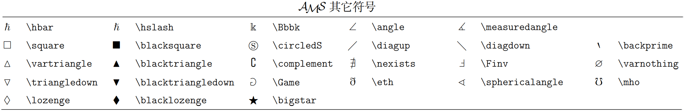
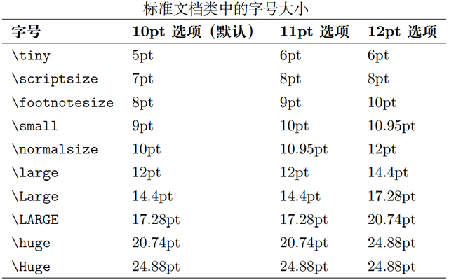

[toc]

# 一、LaTeX基本概念

可以从https://tug.org/texlive/下载LaTeX的发行版之一TeX Live软件包。

## （一）命令与环境

用于控制LaTeX文档结构的为LaTeX命令，它是对大小写敏感的，LaTeX中命令以反斜线\开头，为以下两种形式之一：

- 反斜线和后面的一串字母，它们以任意非字母符号（空格、数字、标点等）为结束界限，如\LaTex命令可以生成错落有致的LaTeX字母组合。字母形式的LaTeX命令忽略其后的所有连续空格，如果要人为引入空格，需要在命令后面加一对花括号阻止其忽略空格，即\LaTex{}。
- 反斜线和后面的单个非字母符号，如\\$。

一个命令的一般格式为：

```latex
\command[options]{arguments}
```

- options为可选参数，用方括号[]包含，不同的option之间使用半角逗号`,`隔开且不留空格，它可以仅为值，也可以是键值对。
- arguments为必选参数，用花括号{}包含，不同argument之间使用半角逗号`,`隔开且不留空格。注意，以单个字符作为命令的参数时，可以不加花括号。
- 对于有的命令来说，options和arguments可以都不是必须的。还有些命令可以带一个星号（如\section{}和\section\*{}），带星号和不带星号的命令效果有一定差异。

有些命令（如\bfseries）会对其后所有内容产生作用，若要限制其作用范围，则需要使用分组，LaTeX使用一对花括号{}作为分组，在分组中使用的命令被限制在分组内，不会影响到分组外的内容。实际上LaTeX环境就隐含了一个分组，在环境中的命令被包裹在分组内。需要注意的是，个别命令在分组内仍然会产生全局作用，如\setcounter等命令。

有些命令如果作为另一些命令的参数时，这些命令的自身的参数可能会失效，这种命令被称为脆弱命令。如\footnote或\phantom命令作为\caption或\section命令的参数时，\footnote和\phantom命令自身的参数会失效。脆弱命令是需要保护的，可以使用\protect命令来对其进行保护，\protect仅保护紧跟其右侧的命令。一个使用例子如下。

```latex
\section{Hello\protect\footnote{This is a footnote.}}
```

LaTeX中还包括环境，用以令一些效果在局部生效，或是生成特殊的文档元素。LaTeX环境的用法为一对命令：

```latex
\begin{environment}[options]{arguments}
content
\end{environment}
```

- environment是环境的名称，LaTeX环境可能需要一个或多个可选、必选参数，也可能完全不需要参数。只要保持调用顺序，部分环境可以嵌套使用。

一个环境是一个行间结构，它跟在前行内容后另起一行，其之后的内容页会另起一行，即环境中的内容会单独在一行上。但如果在环境前后不加空行，则虽然环境的内容与其前后不在同一行，但它们仍然属于同一段。

## （二）.tex源文件基本结构

一个LaTeX源文件通常以.tex为后缀。一个简单的使用例子如下所示。

```latex
% 标识文档类型
\documentclass[a4paper,12pt]{article}
% \documentclass命令和\begin{document}命令之间的位置被称为导言区
% 此处可以使用\usepackage{}导入一些用到的宏包，还会进行文档的全局设置
% 使用支持中文的宏包，避免各种乱七八糟的错误
\usepackage{ctex}

% 文档内容从此处开始
\begin{document}

\title{An Example of LaTeX}
\author{Akame Qixisi \and Excel Bloonow}
\date{2022-5-20}
% 在此处生成文档标题
\maketitle

% 在此处生成目录，为生成正确目录，通常需要编译两次或多次
\tableofcontents

\section*{摘要}
在section命令后使用星号*，使得目录中不包含该节。

\section{引言}
这是引言的内容。这是引言的内容。

\newpage
\section{相关研究}
这是相关研究的内容。这是相关研究的内容。

\subsection{第一部分}
这是相关研究的第一部分的内容。这是相关研究的第一部分的内容。

\subsection{第二部分}
这是相关研究的第二部分的内容。这是相关研究的第二部分的内容。

\newpage
\section{结论}
这是结论的内容。这是结论的内容。

% 文档内容到此处结束，此后内容将不再编译
\end{document}
```

## （三）LaTeX文档类和宏包

文档类规定了LaTeX源代码所要生成的文档的性质，如普通文章、书籍、演示文稿、个人简历等等。LaTeX源代码的开头须用如下命令指定文档类：

```latex
\documentclass[options]{class}
```

其中class为文档类的名称，如LaTeX提供的标准文档article、report、book，在其基础上派生的一些文档类如支持中文排版的ctexart、ctexrep、ctexbook，或者有其它功能的一些文档类，如moderncv、beamer等。

必选参数class-name提供的基础文档类有如下几项：

- article，文章格式的文档类，广泛用于科技论文、报告、说明文档等。
- report，长篇报告格式的文档类，具有章节结构，用于综述、长篇论文、简单的书籍等。
- book，书籍文档类，包含章节结构和前言、正文、后记等结构。
- proc，基于article文档类的一个简单的学术文档模板。
- slides，幻灯格式的文档类，使用无衬线字体。
- minimal，一个极其精简的文档类，只设定了纸张大小和基本字号，用作代码测试的最小工作示例（Minimal Working Example）。

可选参数options为文档类指定选项，以全局地规定一些排版的参数，如字号、纸张大小、单双面等等，如下：

- 10pt、11pt、12pt，设置文档所使用的字体的大小，默认10pt字体。
- a4paper、a5paper、b5paper、letterpaper、executivepaper、legalpaper，定义纸张的大小，默认letterpaper。
- fleqn，设置该选项将使数学公式左对齐，而不是居中对齐。默认为居中对齐。
- leqno，设置该选项将使数学公式的编号放置于左侧。默认编号在右侧。
- titlepage、notitlepage，指定是否在文档标题（document title）后开始一新页。article类型文档默认不开始新页，而book类型文档默认开始新页。
- onecolumn、twocolumn，指定LaTeX以单列（one column）或双列（two column）方式排版文档。默认为onecolumn。
- oneside、twoside，指定LaTeX排版的文档为单面或双面的格式。article和report默认使用单面格式，而book则默认使用双面格式。需要注意的是，该选项仅作用于文档的式样，twoside选项并不会通知打印机以得到双面的打印输出。
- openright、openany，此选项决定新的章是仅仅在右边页（奇数页）还是在下一可用页开始。该选项对article文档类不起作用，因为该类中并没有定义“章”（Chapter）。对于report类型文档中新的一章开始于下一可用页，而book类类型文档中新的一章总是开始于右边页。
- draft、final，指定草稿或终稿模式。草稿模式下，断行不良（溢出）的地方会在行尾添加一个黑色方块，插图、超链接等功能也会受这一组选项影响，具体可见后文。默认为final。
- landscape，指定横向排版。默认为纵向。

在使用LaTeX时，时常需要依赖一些扩展来增强或补充LaTeX的功能，比如排版复杂的表格、插入图片、增加颜色甚至超链接等等，这些扩展称为宏包。可以在导言区使用如下命令导入宏包：

```latex
\usepackage[options]{package}
```

可以一次性调用多个宏包，使用半角逗号隔开，这种用法一般不要指定可选项，使用多个宏包时指定选项，相当于给每个宏包指定同样的选项，如果有某个宏包不能识别指定的选项，则会出错。

宏包（包括前面所说的文档类）可能定义了许多命令和环境，或者修改了LaTeX已有的命令和环境，它们的用法说明通常记在相应宏包和文档类的帮助文档。在Windows命令提示符窗口输入如下命令可查阅相应文档：

```shell
texdoc package-name
```

其中package-name是宏包或者文档类的名称。

## （四）多文件组织

当处理大型文档时，最好将源文件分成几个部分，LaTeX有两条命令来处理这种情况。

```latex
\include{filename}
```

- 在文档的正文中使用此命令，将filename.tex文件中的内容包括进来。如果它和要编译的主.tex文件不在一个目录中，则要使用相对或绝对路径。
- 在LaTeX开始处理filename.tex的内容之前将会开始一新页，且会在新页上排版包括进来的文本。

```latex
\includeonly{filename,filename,...}
```

- 用在文档的导言区，用来指示LaTeX仅仅读入某些\includeonly命令中的文件。该命令被执行后，只有\includeonly中列出的文件才会被\include命令导入，而其他文件将会被忽略。
- 注意在参数中，文件名和逗号之间不能有空格。

```latex
\input{filename}
```

- 该命令只是简单地将指定的文件包括进来，并没有其它限制。其不会在新页排版包括进来的文本。
- 当导言区内容较多时，常常将其单独放置在一个.tex文件中，再用\input命令插入；复杂的图、表、代码等也会用类似的手段处理。

使用syntaxonly宏包可以让LaTeX快速的检查编写的文档，加载这个宏包后，在导言区使用\syntaxonly命令，可令LaTeX编译后不生成.dvi或者.pdf文档，只排查错误，编译速度会快不少。使用方法非常简单，如下。

```latex
\usepackage{syntonly}
\syntaxonly
```

## （五）各种LaTeX文件

这里列出了主要的LaTeX在工作过程中使用到的文件。每个宏包和文档类都是带特定扩展名的文件，除此之外也有一些文件出现于LaTeX模板中：

- .tex，LaTeX或TeX源文件，可以在命令管理行用latex命令处理。
- .sty，LaTeX宏包文件，可使用命令\usepackage将其加载到LaTeX源文件中。
- .cls，文档类文件，文档类名称应与文件名一致。
- .bib，BibTeX参考文献数据库文件。
- .bst，BibTeX用到的参考文献格式模板。
- .dtx，文档化TeX文件，这也是LaTeX宏包发布的主要格式。通过处理一个.dtx文件就可以得到该LaTeX宏包中所包括的宏代码文档。
- .ins，为相应.dtx文件提供的安装文件，使用latex命令对.ins文件进行处理，可以从.dtx文件中提取出宏包。

LaTeX在编译过程中除了生成.dvi或.pdf格式的文档外，还可能会生成相当多的辅助文件和日志。一些功能如交叉引用、参考文献、目录、索引等，需要先通过编译生成辅助文件，然后再次编译时读入辅助文件得到正确的结果，所以复杂的LaTeX源代码可能要编译多次。当运行latex处理.tex源文件时，会得到下列文件：

- .dvi，与设备无关文件，这是LaTeX编译运行的主要结果。可用DVI预览器浏览其内容，或使用诸如dvips的应用程序将其输出到打印机。
- .log，日志文件，供排查错误使用。
- .aux，主辅助文件，记录交叉引用、目录、参考文献的引用等，用于向下次编译传递辅助信息。
- .toc，存储目录的文件，记录所有章节标题，该文件将在下次编译运行时被读入并生成目录。
- .lof，存储图片目录的文件，类似于.toc文件。
- .lot，存储表格目录的文件，类似于.toc文件。
- .bbl，存储参考文献的文件，由BibTeX生成。
- .blg，由BibTeX生成的日志文件。
- .idx，存储索引的文件，用于makeindex处理。
- .ind，存储用于排版的格式化索引的文件，由makeindex处理.idx文件时生成。
- .ilg，由makeindex生成的日志文件。
- .out，由hyperref宏包生成的PDF书签文件。

## （六）命令行编译.tex源文件

TeX是最初的排版程序，只能生成.dvi文件。LaTeX是建立在TeX之上的一个宏包，提供了一套方便的排版命令。pdfLaTeX是LaTeX的一个实现，集成LaTeX的排版引擎，可以从LaTeX格式直接生成PDF文件，优势在于支持的宏包更多，一些很老的宏包使用pdflatex才能编译。xeLaTeX是LaTeX的另一个实现，同样可以从LaTeX格式直接生成PDF文件，但其优势在于能提供更好的Unicode支持和现代字体支持，允许直接使用操作系统中的字体，而不仅仅是TeX标准字体，非常适合处理中文、日文、韩文等非拉丁字符的文档。

假设所编写的文件存储为my.tex文件，则可使用`latex`命令对其进行编译，生成my.dvi设备无关文件、my.aux辅助文件，以及my.log日志文件，然后使用`dvipdfmx`命令生成PDF文件，如下所示。

```shell
latex my.tex     # out: my.dvi my.aux
dvipdfmx my.dvi  # out: my.pdf
```

或者可使用`pdflatex`或`xelatex`命令，直接从.tex文件生成PDF文件，如下所示。

```shell
pdflatex my.tex  # out: my.pdf
xelatex my.tex   # out: my.pdf
```

需要注意的是，使用原生latex命令编译.tex文件时，不支持读取文件中图片的大小，需要在使用graphicx图片库的\includegraphics命令的可选项部分，使用natwidth和natheight参数手动指定图片的大小。而使用pdflatex或xelatex命令则支持读取图片大小。通常现在的LaTeX发行版中，键入latex命令实际上已经是直接使用pdflatex命令，但出于某些原因仍然只有显式使用pdflatex才能读取图片大小。

如果在my.tex源文件中使用了交叉引用、目录、参考文献等，则还需要结合.aux文件编译多次。在这种情况下，因为需要编译多次，第一次编译时可能会报出错误，但此时大概率是未找到引用导致的，可键入大写`X`键完成第一次编译。例如，使用BibTeX文献数据库时，编译过程如下。

```shell
latex my.tex
X  # maybe
bibtex my.aux
latex my.tex
latex my.tex
dvipdfmx my.dvi
```

再例如，使用索引时，编译过程如下。

```shell
latex my.tex
X  # maybe
makeindex my.idx
latex my.tex
dvipdfmx my.dvi
```

上述命令中，都可使用pdflatex或xelatex代替latex命令，从而不用再在最后执行dvipdfmx命令。

注意，在使用latex+dvipdfmx命令编译源文件时，宏包graphicx和宏包hyperref需要指定dvipdfmx选项，而使用pdflatex或xelatex命令时则不需要。

# 二、用LaTeX排版文字

## （一）LaTeX中的字符

### 1. 空格与分段

LaTeX源代码中，空格键和制表符的空白字符视为相同的空白距离，连续的若干个空白字符视为一个空格。一行开头的空格忽略不计。行末的换行符（单个回车）会被视为一个空格。

LaTeX使用空行来结束段落，连续两个换行符，即两行文本中的空行标志上一段落的结束和新段落的开始。如同空格一样，多个空行所起的作用和一个空行的作用是相同的。也可以在行末使用`\par`命令分段。

LaTeX用`%`字符作为注释，在这个字符之后直到行末，所有的字符都被忽略，行末的换行符也不引入空格。

### 2. 标点符号

使用LaTeX时不要像在打字机上那样把`"`用作双引号，在印刷中有专门的左双引号和右双引号。在LaTeX中，使用\`作为左单引号，使用'作为右单引号，使用两个\`产生左双引号，使用两个'产生右双引号。

中文的引号与西文的引号实际上是同一组符号，但由于中西文通常用不同的字体显示，它们的具体形状和宽度可能有所不同。在使用ctex宏包或文档类的情况下，中文引号可以通过输入法直接输入。

在LaTeX中有四种短划标点符号，分别为如下四种。

```latex
-	% 连字号
--	% 短破折号
---	% 长破折号
$-$	% 数学公式中的减号
```

使用`\~`产生波浪号，它的位置比较偏上，可以使用`$\sim$`产生在行中间的波浪号。

使用`\ldots`产生省略号。

### 3. 特殊字符

有些字符为LaTeX的保留字，如下：

```
# $ % & { } _ ^ ~ \
```

直接输入这些字符得不到对应的符号，而需要使用带反斜线的形式进行转义输入，如下：

```latex
\# \$ \% \& \{ \} \_ \^{} \~{} \textbackslash
```

其中\^和\~两个命令需要一个参数，加一对花括号的写法相当于提供了空的参数，否则它们可能会将后面的字符作为参数，形成注音效果。而\\\\被定义成了手动换行的命令，输入反斜线就需要用\textbackslash命令。需要注意的是，在数学公式环境下，使用\\\~{}排印波浪号可能会显得特别紧凑，可以使用`\sim`或`\textasciitilde`来排印波浪号。

### 4. 注音字符

LaTeX支持来自许多语言中的注音符号和特殊字符。下表以字母o为例给出了所有的注音符号，这对于其他字母也同样有效。在对字母i和j上标注一个注音符号时，它的点必须去掉，这个可由`\i`和`\j`做到。


## （二）排版间隔

### 1. 单词间距

在西文排版中，断行的位置优先选取在两个单词之间，也就是在源代码中输入的空格处，空格本身通常生成一个间距，文字在单词间的空格处断行时，空格生成的间距随之舍去，它会根据行宽和上下文自动调整，文字密一些的地方，单词间距就略窄，反之略宽。而使用空格前的反斜线符号`\`可以产生一个不能伸长的空格。

LaTeX假定句子以句号、问号、惊叹号结尾，而若句号紧跟一个大写字母，则不视为结尾，而被视为缩写。作者必须详细说明可能出现的例外。可以使用字符`~`也产生一个不能伸长且不会断行的空格，这通常用在英文人名、图表名称等上下文环境中。句号前的命令`\@.`说明这个句号字符是句子的末尾，即使它紧跟一个大写字母。如下的使用例子。

```latex
Mr.~Smith was happy to see her. \\
cf.~Fig.~5 \\
I like BASIC\@. What about you?
```

命令`\frenchspacing`能禁止在句号后插入额外的空间，它告诉LaTeX在句号后不要插入比正常字母更多的空间。除了参考文献，这在非英文语言中非常普遍。如果使用了\frenchspacing，命令\@就不必要了。

### 2. 断字与连字

在导言区使用命令

```latex
\hyphenation{ABCDEFG abcd-efg}
```

- 使得正文中的'ABCDEFG'不允许进行断字，使它强制排版在同一行。
- 使得正文中的'abcdefg'只允许在d和e之间断字。

在正文中使用`\-`可以在单词中插入一个自主的断字点，它也就成为这个单词中允许出现的唯一断字点，如下所示。

```latex
I know your name is Abcdefghijklmn\-opqrstuvwxyz.
```

使用命令`\mbox{text}`保证把几个单词排在同一行上，命令`\fbox{text}`和其类似，此外它还能围绕内容画一个框。

西文排版中一些字母组合连字，如字母f和f、i、l等字母直接连在一起，后面的字母会与前一个f的右侧位置有相连处，这就是所谓的连字。在两个字母之间插入一个\mbox{}或者一个{}，可以禁止连字，对于由两个词构成的单词，这可能是必要的。可以对比下面两个实际效果。

```latex
shelfful vs shelf\mbox{}ful
```

### 3. 手动断行与分页

通常书籍是用等长的行来排版的。为了优化整个段落的内容，LaTeX在单词之间插入必要的断行点和间隔，如果一行的单词排不下，LaTeX也会进行必要的断字。段落如何排版依赖于文档类别。通常，每一段的第一行有缩进，在两段之间没有额外的间隔。

如果确实需要手动断行，可使用如下命令：

```latex
\\[length]
\\*[length]
\newline
```

- \\\\，在文本、表格、公式等地方用于换行，并不会另起一段，而是在段落中直接开始新的一行，可选参数length用于在断行处向下增加垂直间距。
- \newline，仅在文本用于断行，不用于表格、公式等。
- \\\\\*，在强行断行后，还禁止分页，可选参数length用于在断行处向下增加垂直间距。

断页的命令有两个：

```latex
\newpage
\clearpage
```

- \newpage，另起一新页，在双栏排版模式中起到另起一栏的作用。
- \clearpage，另起一新页，在双栏排版模式中仍然是另起一新页。

有时候LaTeX默认的断行和断页位置无法满足实际要求，需要进行微调，可以用以下命令告诉LaTeX哪些地方适合断行或断页，哪些地方不适合：

```latex
\linebreak[n]
\nolinebreak[n]
\pagebreak[n]
\nopagebreak[n]
```

- 以上命令都带一个可选参数n，代表适合/不适合的程度，取值范围为0到4，默认为4。
- \linebreak，该命令用来在某一位置强行断行，如果断行后前一行内容不够排版完整一行，LeTeX会试图将内容两端对齐并使用空格填充。
- \nolinebreak，该命令用在某处本该断行的位置，使用后在该处强制不断行，强制之后的内容在该行显示（该行内容会更紧凑），并在下一单词间隔处断行。
- \pagebreak，该命令在某一位置强制分页。
- \nopagebreak，该命令在本该分页的位置强制不分页。

以上命令适合给出优先考虑断行断页/禁止断行断页的位置，但不适合直接拿来断行或断页，使用\newline或\newpage等命令是更好的选择。因为\newline和\newpage会在断行/断页位置右侧填充适当的间距（左对齐），但\linebreak和\pagebreak不能（两端对齐空格填充），使用这些命令强行断行/断页可能会制造出糟糕的排版效果，并导致LaTeX报警告（如Underfull \hbox等）。

LeTeX总是尽可能产生最好的断行效果，如果断行无法达到LeTeX的高标准，就让这一行在段落的右侧溢出，然后在处理输入文件的同时，报告溢出的消息（Overfull \hbox），这最可能发生在LeTeX找不到合适的地方进行断字时候。可以使用`\sloppy`命令，告诉LeTeX降低一点标准。虽然最终的输出结果不是最优的，它通过增加单词之间的间隔，以防止出现过长的行，在这种情况下会给出警告（Underfull \hbox）。在大多数情况下得到的结果看起来不会非常好。使用`\fussy`命令把LeTeX恢复为默认状态。

## （三）排版中文

用LaTeX排版中文需要解决两方面问题，一方面是对中文字体的支持，另一方面是对中文排版中的一些细节的处理，包括在汉字之间控制断行、标点符号的禁则（如句号、逗号不允许出现在行首）、中英文之间插入间距等。CJK宏包对中文字体的支持比较麻烦，已经不再推荐直接使用。XeTeX和LuaTeX除了直接支持UTF-8编码外，还支持直接调用TrueType/OpenType格式的字体；xeCJK及luatexja宏包则在此基础上封装了对汉字排版细节的处理功能。

ctex宏包和文档类进一步封装了CJK、xeCJK、luatexja等宏包，使得用户在排版中文时不用再考虑排版引擎等细节。ctex宏包本身用于配合各种文档类排版中文，而ctex文档类对LaTeX的标准文档类进行了封装，对一些排版根据中文排版习惯做了调整，包括ctexart、ctexrep、ctexbook。而且，ctex宏包和文档类能够识别操作系统和TeX发行版中安装的中文字体，因此基本无需额外配置即可排版中文文档。下面举一个使用ctex文档类排版中文的例子。

```latex
\documentclass{ctexart}
\begin{document}
在\LaTeX{}中排版中文。
汉字和English单词混排，通常不需要在中英文之间添加额外的空格。
当然，为了代码的可读性，加上汉字和 English 之间的空格也无妨。
汉字换行时不会引入多余的空格。
\end{document}
```

注意源代码须保存为UTF-8编码，并使用xelatex或lualatex命令编译。虽然ctex宏包和文档类保留了对GBK编码以及latex和pdflatex编译命令的兼容，但建议在使用ctex宏包和文档类时总是将源代码保存为UTF-8编码，用xelatex或lualatex命令编译。

# 三、文档元素

## （一）章节和目录

### 1. 章节标题

通过不同的命令可以将文档划分为章、节、小节。三个标准文档类article、report、book提供了划分章节的命令，这些命令生成章节标题，并能够自动编号，且节之间的间隔、序号、标题的字体大小由LaTeX自动设置。而其它文档类如果不是从标准文档类衍生而来，很可能没有定义或只定义了一部分命令，如beamer或moderncv等。

对article类型的文档，有下列分节命令，其中text就是章节标题的文本。

```latex
\section{text}
\subsection{text}
\subsubsection{text}
\paragraph{text}
\subparagraph{text}
```

因为article类型的文档不划分为章，所以article没有提供分章命令\chapter，可以把article文档很容易作为一章插入书籍文档中。

对report和book类型的文档，还有其他两个分节命令。

```latex
\part{text}
\chapter{text}
```

其中，\part命令用来将整个文档分割为大的分块，但不影响\chapter或\section的编号。

上述命令除了生成带编号的标题之外，还向目录中添加条目，并影响页眉页脚的内容。每个命令有两种变体，如：

```latex
\section[short-title]{long-title}
\section*{title}
```

- 带可选参数，为防止标题太长排不进目录和页眉页脚，正文标题使用long-title参数，在目录和页眉页脚中使用short-title参数。
- 带星号，标题不带编号，也不生成目录项和页眉页脚。

较低层次如\paragraph和\subparagraph即使不用带星号的变体，生成的标题默认也不带编号。事实上，除\part外，article文档类带编号的层级为\section、\subsection、\subsubsection三级；report和book文档类带编号的层级为\chapter、\section、\subsection三级。LaTeX及标准文档类并未提供为\section等章节命令定制格式的功能，这一功能由titlesec宏包提供，详情请参考宏包的帮助文档。

### 2. 目录

在LaTeX中生成目录非常容易，只用在需要生成目录的位置使用命令：

```latex
\tableofcontents
```

这个命令会生成单独的一章（report、book）或一节（article）作为目录，标题默认为Contents，目录标题可以定制，详细见后文。

为正确生成目录项，一般需要编译两次源代码，LaTeX在文档编译的最后一个循环中，提取章节的标题和页码以生成目录。

有时使用\chapter\*或\section\*这样不生成目录项的章节标题命令，而又想手动生成该章节的目录项，可以在标题命令后面使用命令：

```latex
\addcontentsline{toc}{level}{title}
```

其中toc为固定参数，level为章节层次chapter或section等，title为出现于目录项的章节标题。

titletoc、tocloft等宏包提供了具体定制目录项格式的功能，详情请参考宏包的帮助文档。

### 3. 划分文档结构

所有标准文档类都提供了一个`\appendix`命令将正文和附录分开，在命令\appendix之后的内容，最高一级章节改为使用拉丁字母编号，从A开始；而对article类型的文档它改变节的序号，从罗马数字Ⅰ开始。

LaTeX引进了其他三个命令用于book类型的文档，它们划分出版物的前言、正文、后记，也能改变章的标题和页码。

```latex
\frontmatter
\mainmatter
\appendix
\backmatter
```

- \frontmatter，前言，它应跟着命令\begin{document}后使用，该命令把页码更换为罗马数字；其后的\chapter不编号。对于正文前的内容使用带星的分节命令，以阻止LaTeX对它们排序。
- \mainmatter，正文，它应出现在书的第一章紧前面，它打开阿拉伯页码计数器，并对页码重新计数；其后的章节编号正常。
- \appendix，附录，它应跟在正文后出现，它标志书中附录材料的开始，该命令后的各章序号改用字母标记。
- \backmatter，后记，它应该插入在书最后一部分内容的紧前面，如参考文献和索引。页码格式不变，继续正常计数；其后的\chapter不编号。

一个完整的book类型文档结构可以如下所示。

```latex
\documentclass{book}
% 导言区，加载宏包和各项设置，包括参考文献、索引等
\usepackage{makeidx}		% 调用makeidx宏包，用来处理索引
\makeindex					% 开启索引的收集
\bibliographystyle{plain}	% 指定参考文献样式为plain
\begin{document}

\frontmatter		% 前言部分
\maketitle 			% 标题页
\include{preface} 	% 前言章节 preface.tex
\tableofcontents	% 目录

\mainmatter			% 正文部分
\include{chapter1}	% 第一章 chapter1.tex
\include{chapter2}	% 第二章 chapter2.tex

\appendix 			% 附录
\include{appendixA}	% 附录 A appendixA.tex

\backmatter				% 后记部分
\include{epilogue}		% 后记 epilogue.tex
\bibliography{books}	% 利用BibTeX工具从数据库文件books.bib生成参考文献
\printindex				% 利用makeindex工具生成索引
\end{document}
```

## （二）标题页

LaTeX支持生成简单的标题页，首先需要给定标题和作者等信息：

```latex
\title{title}
\author{author}
\date{date}
```

其中前标题和作者命令是必须的，日期命令可选，LaTeX还提供了一个\today命令自动生成当前日期，且\date默认使用\today。在\title、\author等命令内可以使用\thanks命令生成标题页的脚注，用\and隔开多个人名。一个使用例子如下所示。

```latex
\title{An Example of LaTeX}
\author{Akame\thanks{Corresponding author} \and Bloonow\thanks{Email:Bloonow@gmail.com}}
\date{\today}
\maketitle
```

在信息给定后，就可以使用\maketitle命令生成一个简单的标题，对于article文档类的标题默认不单独成页，而report和book默认单独成页。可在\documentclass命令调用文档类时指定titlepage或notitlepage选项以修改默认的行为。

LaTeX标准类还提供了一个简单的titlepag环境，生成不带页眉页脚的一页。用户可以在这个环境中使用各种排版元素自由发挥，生成自定义的标题页以替代\maketitle命令。甚至可以利用titlepage环境重新定义\maketitle，事实上，为标准文档类指定了titlepage选项以后，使用\maketitle命令生成的标题页 就是一个titlepage环境。

## （三）交叉引用

撰写文章的过程中，通常需要对章节、文本特殊段落、图表、定理等进行交叉引用，而为了生成正确的交叉引用，一般也需要多次编译源代码。LaTeX提供了如下交叉引用命令，其中marker是使用者选择的标识符。

```latex
\label{marker}
\ref{marker}
\pageref{marker}
```

- 在需要引用的位置使用\label命令，LaTeX就会为此处生成一个序号。
- 在别处使用\ref或\pageref命令，分别生成交叉引用的编号和页码。

\label命令可用于记录各种类型的交叉引用，使用位置分别为：

- 章节标题，在章节标题命令\section等之后紧接着使用。
- 行间公式，单行公式在公式内任意位置使用；多行公式在每一行公式的任意位置使用。
- 有序列表，在enumerate环境的每个\item命令之后，下一个\item命令之前任意位置使用。
- 图表标题，在图表标题命令\caption之后紧接着使用。
- 定理环境，在定理环境内部任意位置使用。

在使用不记编号的命令形式（\section\*、\caption\*），以及带可选参数命令（如\item等）时不要使用\label命令，否则生成的引用编号不正确。

## （四）脚注与边注

使用下面的命令可以在页面底部生成一个脚注：

```latex
\footnote{text}
```

该命令把脚注内容排印于当前页的页脚位置，脚注命令总是置于其指向的单词或句子的后面。一个使用例子如下所示。

```latex
本文参考了Bloonow\footnote{即Excel Bloonow}的文章，提出了一种改进的方法。
```

有些情况下（比如在表格环境、各种盒子内）使用\footnote并不能正确生成脚注，这时可以分两步进行，先使用\footnotemark为脚注计数，再在合适的位置用\footnotetext生成脚注，如下面一个使用例子。

```latex
\begin{tabular}{l} \hline
天地玄黄，宇宙洪荒。日月盈昃，辰宿列张。\footnotemark \\ \hline
\end{tabular}
\footnotetext{表格里的名句出自《千字文》。}
```

若要为页面添加一个边注，可以使用如下命令：

```latex
\marginpar[left-text]{text}
```

如果只给定了text的文字，则在奇偶数页的边注都使用相同的text文字；如果同时给定了left-text的文字，则如果在偶数页面，则偶数页使用left-text的文字作为边注，奇数页面仍然使用text作边注。需要注意的是，仅当文档类型为book时，left-text才生效，其他类型文档无论奇偶页都只使用text文字作为边注。

## （五）列表

itemize环境用于简单的列表，enumerate环境用于带序号的列表，它会自动对列表项编号，description环境用于带描述的列表。一个使用例子如下所示。

```latex
\flushleft
\begin{enumerate}
\item 不同样式的列表可以嵌套使用：
	\begin{itemize}
	\item 但这可能看起来不太美观。
	\item[-] 使用短横线。
	\item[*] 使用星号。
	\end{itemize}
\item 因此请记住：
	\begin{description}
	\item[Stupid] 内容不会因为在一个列表中更加深刻。
	\item[Smart] 内容和思想会因为在列表中而更具美感。
	\end{description}
\end{enumerate}
```

其中\item可带一个可选参数，将有序列表的计数或者无序列表的符号替换成自定义的符号，或指定描述列表的关键字。列表可以嵌套使用，最多嵌套四层。

一级到四级无序列表的符号分别由命令\labelitemi、\labelitemii、\labelitemiii、\labelitemiv定义，可以简单地重新定义它们，如下所示。

```latex
\renewcommand{\labelitemi}{$\clubsuit$}
\renewcommand{\labelitemii}{$\spadesuit$}
```

一级到四级有序列表的符号分别由命令\labelenumi、\labelenumii、\labelenumiii、\labelenumiv定义，重新定义这些命令需要用到计数器相关命令，如下所示。计数器相关用法可以参考后面的内容。

```latex
\renewcommand{\labelenumi}{\Alph{enumi}}
```

默认的列表间距比较宽，LaTeX本身也未提供方便的定制功能，可用enumitem宏包定制各种列表间距，此外它还提供了对列表标签、引用等的定制，详情可参考其帮助文档。

## （六）表格

LaTeX里排版表格不如Word等所见即所得的工具简便和自由，不过对于不太复杂的表格来说，完全能够胜任。排版表格最基本的tabular环境用法为：

```latex
\begin{tabular}[align]{column-spec}
content
\end{tabular}
```

在tabular环境的内容content中，使用`&`跳入下一列，使用`\\`开始新的一行，使用`\hline`插入水平表线，使用`\cline{from-to}`添加部分表线，其中from和to分别表示表线起始列和终止列的序号（序号从1开始）。

直接使用tabular环境，会和周围的文字混排，其可选参数align用于指定整个表格与其周围文字的对齐方式，使用t、b分别表示按表格顶部、底部为基准进行对齐，其他参数或省略不写表示以中间为基准对齐（默认）。但是通常情况下tabular环境很少与文字直接混排，而是会放在table浮动体环境中，并用\caption命令加标题。

### 1. 列格式

环境tabular的必选参数column-spec定义了表格的列式样，它可以取以下值：

- l、r、c，单元格内容左对齐、右对齐、居中对齐，不自动换行。
- p{width}，单元格宽度固定为width，文本自动换行。该格式的单元格内容使用顶端为基准来进行对齐操作。
- |，绘制竖直表线，若缺省则不使用表线。
- @{string}，用自定义字符串string来代替竖直表线。@{string}格式可在两个单元格之间插入任意的文本，但同时它也消除了单元格前后额外添加的间距，特别地，@{}可直接用来消除单元格前后的间距。

需要注意的是，表格中每行的单元格数目不能多于列格式里l、r、c、p的总数，否则会出错，但可以少于这个总数。

另外LaTeX还提供了简便的将格式参数重复的写法`*{n}{column-spec}`，比如以下两种写法是等效的：

```latex
\begin{tabular}{|c|c|c|c|c|p{4em}|p{4em}|} \end{tabular}
\begin{tabular}{|*{5}{c|}*{2}{p{4em}|}} \end{tabular}
```

有时需要为整列修饰格式，比如整列改变为斜体，如果每个单元格都加上\itshape命令会比较麻烦。而array宏包提供了辅助格式如下：

```latex
>{format}column-spec[<{token}]
```

该辅助格式用于给列格式前后加上修饰命令，一个使用例子如下所示。

```latex
% \usepackage{array}
\begin{tabular}{>{\itshape}r<{} | c | >{\itshape}l} \hline
italic & normal & italic \\ \hline
ABC    & ABC    & ABC    \\ \hline
\end{tabular}
```

此外，array宏包还提供了类似p{width}的其他格式，即m格式、b格式，三者分别在垂直方向上以单元格内容的顶端、中间、底端进行对齐操作。一个例子如下所示。

```latex
% \usepackage{array}
\newcommand\mytxt{ABC DEF GHI}
\begin{tabular}{c | p{2em} | m{2em} | b{2em}} \hline
baseline & \mytxt & \mytxt & \mytxt \\ \hline
\end{tabular}
```

辅助格式甚至支持插入\centering等命令改变p列格式的对齐方式，一般还要加额外的命令\arraybackslash以免出错，因为\centering等对齐命令会破坏表格环境里\\\\换行命令的定义，使用\arraybackslash来恢复它。当然如果不加\arraybackslash命令，也可以用\tabularnewline命令代替原来的\\\\实现表格换行。一个使用例子如下所示。

```latex
% \usepackage{array}
\begin{tabular}{>{\centering\arraybackslash}p{10em}<{}} \hline
一长行文字，可能需要换行显示。 \\ \hline
\end{tabular}
```

### 2. 列宽

在控制列宽方面，LaTeX表格有着明显的不足，l、r、c格式的列宽是由文字内容的自然宽度决定的，而p格式给定了列宽却不好控制对齐（可用array宏包的辅助格式），更何况列与列之间通常还有间距，所以直接生成给定总宽度的表格并不容易。

LaTeX本身提供了tabular\*环境用来排版定宽表格，但是不太方便使用，比如要用到@{}格式插入额外命令，若表格宽度不足，则用单元格填充为\fill，但即使这样仍然有瑕疵，如下面一个例子。

```latex
\begin{tabular*}{12em}{@{\extracolsep{\fill}}|c|c|c|} \hline
A & B & C \\ \hline
a & b & c \\ \hline
\end{tabular*}
```

宏包tabularx提供了解决方案，它引入了一个X列格式，类似p列格式，不过它会根据表格宽度自动计算列宽，多个X列格式平均分配列宽。X列格式也可以用array宏包里的辅助格式修饰对齐方式。一个使用例子如下所示。

```latex
% \usepackage{array,tabularx}
\begin{tabularx}{16em}{|*{4}{>{\centering\arraybackslash}X|}} \hline
A & B & C & D \\ \hline
a & b & c & d \\ \hline
\end{tabularx}
```

### 3. 行距控制

LaTeX生成的表格看起来通常比较紧凑，修改参数\arraystretch可以得到行距更加宽松的表格，一个例子如下所示。

```latex
\renewcommand\arraystretch{1.8}
```

另一种增加间距的办法是给换行命令\\\\添加可选参数，在这一行下面加额外的间距，适合用于在行间不加横线的表格，一个例子如下。

```latex
\begin{tabular}{c} \hline
Head lines    \\[6pt]
tabular lines \\ \hline
\end{tabular}
```

此时下一行的首个单元格不能以[]开头，否则\\\\会将下一行的中括号当作自己的可选参数，因而出错。如果要使用中括号[]，应当放在花括号里面{[]}，或者也可以选择将换行命令写成\\\\[0pt]。

### 4. 三线表

使用\hline和\cline{from-to}命令可以绘制表格中的横线。

在科技论文排版中广泛应用的表格形式是三线表，形式干净简明。三线表由booktabs宏包支持，它提供了\toprule、\midrule、\bottomrule命令用以排版三线表的三条线，以及\cmidrule{from-to}用来排印部分表线。除此之外，最好不要用其它横线以及竖线。一个使用例子如下所示。

```latex
% \usepackage{booktabs}
\begin{tabular}{cccc} \toprule
         & \multicolumn{3}{c}{Numbers} \\ \cmidrule{2-4}
         & 1 & 2  & 3   \\ \midrule
Alphabet & A & B  & C   \\
Roman    & I & II & III \\ \bottomrule
\end{tabular}
```

### 5. 合并单元格

LaTeX是一行一行排版表格的，横向合并单元格较为容易，可以由以下命令实现：

```latex
\multicolumn{n}{spec}{text}
```

- n，要合并的列数，即一个单元格所占用的列数。
- spec，合并单元格后的列格式，只允许出现一个l、c、r或p格式。如果合并前的单元格前后带表格线|，合并后的列格式也要带|以使得表格的竖线一致。
- text，所要排印的文本。

值得注意的是，因为\multicolumn命令带有指定格式的spec参数，因而可以在某一个位置使用诸如\multicolumn{1}{new-spec}{text}形式来修改某一单元格的列格式。

而纵向合并单元格需要用到multirow宏包提供的如下命令：

```latex
\multirow{n}[bigstructs]{width}[fixup]{text}
```

- n，要合并的行数，即一个单元格所占用的行数。
- bigstructs，可选项，在使用了bigstruct宏包时使用。
- width，合并后单元格的宽度，使用星号\*让LaTeX自行决定。
- fixup，可选项，用来调整文本的垂直位置。
- text，所要排印的文本，使用\newline可以强制换行。

一个使用例子如下所示。

```latex
% \usepackage{multirow}
\begin{tabular}{|l|c|c|c|} \hline
\multirow{2}{*}{HOME} & \multicolumn{3}{|c|}{NAME} \\ \cline{2-4}
       & Xier   & Xuer   & Luer   \\ \hline
GENDER & female & female & female \\ \hline
AGE    & 24     & 20     & 24     \\ \hline
HEIGHT & 175cm  & 168cm  & 180cm  \\ \hline
\end{tabular}
```

用表格tabular环境排印的材料总是在同一页上，如果要排印一个跨页的长表格，可以使用supertabular或longtabular环境宏包。

### 6. 拆分单元格

拆分单元格对于LaTeX来说并非易事。在单元格中嵌套一个小表格可以起到拆分单元格的效果。通常要使用\multicolumn命令并配合@{}格式把单元格的额外边距去掉，使得嵌套的表格线能和外层的表格线正确相连。下面是一个例子。

```latex
\begin{tabular}{|c|c|c|} \hline
a & b & c \\ \hline
a & \multicolumn{1}{@{}c@{}|}
    {\begin{tabular}{c|c}
     A & B \\ \hline
     C & D \\
     \end{tabular}} 
      & c \\ \hline
a & b & c \\ \hline
\end{tabular}
```

如果不需要为拆分的单元格画线，并且只在垂直方向拆分的话，使用makecell宏包提供的\makecell命令是一个简单的解决方案，如下一个例子。

```latex
\begin{tabular}{|c|c|} \hline
a & \makecell{b1 \\ b2} \\ \hline
c & d \\ \hline
\end{tabular}
```

## （七）图片

LaTeX本身不支持插图功能，需要由额外的宏包辅助支持。且不同的.tex源文件编译方式对于主流图片的格式支持也不同，详见下图。


需注意的是，在较新的TeX发行版中，pdflatex编译方式不依赖宏包，就能支持原来需要宏包扩展的图片格式，但其仍不支持.bmp格式的位图。

常用的图片宏包为graphicx，它主要用于插入单图，而宏包subfig可以在单行插入多个子图。使用graphicx宏包插入图片的命令如下：

```latex
\includegraphics[options]{filename}
```

其中filename是所要插入图片文件，可以使用绝对路径和相对路径，相对路径的位置是相对于所编写的.tex文档的路径而言的。另外graphicx宏包还提供了\graphicspath命令，用于声明一个或多个图片文件存放的目录，使用这些目录里的图片时可不用写路径，使用方式如下。

```latex
% 图片资源放在当前文件夹的子文件.figures和.logo中
\graphicspath{{./figures/}{./logos/}}
```

命令\includegraphics的options是可选参数，常用的参数如下所示：

- width，指定图片的宽度，该参数会将图片缩放到指定的宽度。
- height，指定图片的高度，该参数会将图片缩放到指定的高度。
- scale，将图片相对于原尺寸缩放scale倍。
- angle，将图片逆时针旋转angle度。
- keepaspectratio，设定是否保持图片的宽高比，取值为true或false。
- draft、final，当指定draft选项时，图片将不会被实际插入，取而代之的是一个包含文件名的与原图片等大的方框。

一个使用的例子如下所示。

```latex
% \usepackage{graphicx}
\includegraphics[width=10cm,height=10cm,keepaspectratio=true,draft]{example.png}
```

在实际使用中，通常按照宽度指定图片大小，无论是在单栏或双栏文章中，将图片宽度指定为栏的宽度是最常用的情况，可通过\linewidth、\textwidth、\columnwidth等命令指定所需宽度，如下所示。

```latex
\begin{figure}[htbp]
    \centering\includegraphics[width=0.8\linewidth]{exp.png}
    \caption{The Performance of Galerkin Transformer.}
    \label{fig}
\end{figure}
```

## （八）盒子

盒子（Box）是LaTeX排版的基础单元，每一行是一个盒子，里面的文字从左到右依次排列；每一页也是一个盒子，各行文字从上到下一次排布。LaTeX提供了一些命令让允许用户手动生成一些有特定用途的盒子。需要注意的是，各种盒子都无法在其中直接使用\footnote脚注，而是需要先使用\footnotemark做个标记，再在盒子外部使用\footnotetext{text}指定脚注内容。

### 1. 水平盒子

生成水平盒子的命令如下：

```latex
\mbox{text}
\makebox[width][align]{text}
```

- \mbox，该命令生成一个基本的水平盒子，内容只有一行，不允许换行（除非嵌套其它盒子，比如垂直盒子）。从效果来看，\mbox的内容与正常的文本一样，不过断行时文字不会从盒子里断开，即自动换行和手动断行都会失效。
- \makebox，该命令还可以使用可选参数控制盒子的宽度，以及内容的对齐方式，可选值为l、r、c、s，分别为左对齐、右对齐、居中对齐和两端对齐。

### 2. 带框的水平盒子

生成带框的水平盒子的命令如下：

```latex
\fbox{text}
\framebox[width][align]{text}
```

可以通过\setlength命令调节边框的宽度\fboxrule和内边距\fboxsep。一个使用例子如下所示。

```latex
\setlength{\fboxrule}{1.2pt}
\setlength{\fboxsep}{1em}
\fbox{这是一个带框的水平盒子。}
```

### 3. 垂直盒子

如果需要排版一个文字可以换行的盒子，LaTeX提供了如下两种方式：

```latex
\parbox[align][height][inner-align]{width}{text}
\begin{minipage}[align][height][inner-align]{width}
text
\end{minipage}
```

- align，为盒子整体和周围文字的对齐情况（类似tabular环境），使用t、b分别表示按盒子顶部、底部为基准进行对齐，其他参数或省略不写表示以中间为基准对齐（默认）。
- height，设置盒子的高度。
- inner-align，设置内部内容的对齐方式，可取值为t、b、c、s，分别为顶端对齐、底端对齐、居中对齐、两端对齐。

如果在minipage里使用\footnote命令，生成的脚注会出现在盒子底部，编号是独立的，并且使用小写字母编号。而在\parbox里无法正常使用\footnote命令，只能在盒子里使用\footnotemark做个标记，在盒子外使用\footnotetext设定脚注文本。

一个使用例子如下所示。

```latex
\fbox{ \begin{minipage}{9em}
人之初，性本善。性相近，习相远。\\
苟不教，性乃迁。教之道，贵以专。\footnote{出自《三字经》。}	% 脚注在垂直盒子底部
\end{minipage} }

\fbox{ \parbox{9em}{
人之初，性本善。性相近，习相远。\\
苟不教，性乃迁。教之道，贵以专。\footnotemark
} }
\footnotetext{出自《三字经》。}	% 脚注在页面底部
```

### 4. 标尺盒子

可以使用\rule命令用来画一个实心的矩形盒子，也可适当调整以用来画线。

```latex
\rule[raise]{width}{height}
```

其中可选参数raise为该盒子相对于该行上升的距离，其值为负则表示相对下降的距离。一个使用例子如下所示。

```latex
Black \rule{12pt}{4pt} box.
Upper \rule[4pt]{6pt}{8pt} and lower \rule[-4pt]{6pt}{8pt} box.
A \rule[-.4ex]{3em}{.4pt} line.
```

## （九）浮动体

文章通常含有许多图片和表格，它们不能分割在不同的页面上，所以需要专门的处理。如果一个图片或表格太大以至于在当前页面排不下，一个解决办法就是新开一页排印它，这个方法会在前一页面上留下部分空白，效果看起来很差。对于在当前排不下的任何一个图片或表格，解决办法就是把它们浮动到下一页，与此同时当前页面用正文文本填充。

LaTeX提供了两个浮动体环境分别用于图片和表格，包围于环境figure或环境table中的任何材料都将被视为浮动内容，两个浮动环境都支持可选参数。习惯上figure里放图片，table里放表格，但并没有严格限制，可以在任何一个浮动体里放置文字、公式、表格、图片等等任意内容。

```latex
\begin{figure}[placement-psec]
\begin{table}[placement-psec]
```

其中placement-psec称为放置说明符，表示浮动体允许排版的位置，其取值如下所示。它们可以按需要组合，默认为tbp。

- h，浮动体就放在当前页面上，这主要用于小浮动体。
- t，放在页面顶部。
- b，放在页面底部。
- p，放在一专门页面，仅含一个浮动体。
- !，忽略阻止浮动体放置的大多数内部参数限制。包括浮动体个数（除单独成页外，默认每页不超过3个浮动体，其中顶部不超过2个，底部不超过1个），以及浮动体空间占页面的百分比（默认顶部不超过70%，底部不超过30%）。

排版位置的选取与参数里符号的顺序无关，LaTeX总是以h、t、b、p的优先级顺序来决定浮动体位置，并按照作者提供的放置说明符安排它遇到的每一个浮动体，即先尝试作者指定的最优先的排版位置，若无法编排再尝试下一优先的排版位置。

浮动体的位置选取受到先后顺序的限制。如果某个浮动体由于参数限制、空间限制等原因在当前页无法放置，就要推迟到之后处理，将其放入该类型浮动体的等待序列中（先进先出），并使得之后的同类浮动体一并推迟。使用\clearpage命令会在另起一页之前，先将所有推迟处理的浮动体排版成页，此时htbp等位置限制被完全忽略。在一定情况下，可能需要使用如下命令。

```latex
\clearpage
\cleardoublepage
```

- \clearpage，会使LaTeX立即安排等待序列中所有剩下的浮动体，并且开一新页。
- \cleardoublepage，会使LaTeX立即安排等待序列中所有剩下的浮动体，并且新开一奇数页面。

仅给定单个放置说明符是允许的，但这通常会引起问题，如果在指定的位置无法排印，它就会成为障碍，堵住后续的浮动体。如果LaTeX没有按期望排印浮动体，经常是有一个浮动体堵塞了某一个等待序列。不要单独使用参量[h]，在最新的LaTeX版本中，它会被自动替换为[ht]。

此外，在双栏排版环境下，LaTeX为这两个命令提供了带星号\*的形式用来排版跨栏的浮动体，加星号表示占用双栏，否则占用单栏，双栏的placement-spec参数只能用tp两个位置。

### 1. 浮动体的标题和目录

如果想要对浮动环境的figure和table添加标题，可以使用如下命令：

```latex
\caption[short]{text}
```

它会给浮动体定义一个标题，其字符串“图”“表”和序号将由LaTeX自动添加，可通过修改\figurename和\tablename的内容来修改标题的前缀。使用\label和\ref，可以在文本中可以为浮动体创建交叉引用。

一个使用例子如下所示。

```latex
\renewcommand{\figurename}{展示图}

\begin{figure}[!hbp]
\centering
\includegraphics[width=10cm,height=10cm,keepaspectratio=true]{half.jpg}
\caption{风起鹤归} \label{fig:fqhg}
\end{figure}

你可以从图\ref{fig:fqhg}中看到所需要的信息。
```

如果想单独为图片或表格排印目录，可以使用如下命令：

```latex
\listoffigures
\listoftables
```

它们会在使用处产生一个目录，其使用起来和\tableofcontents命令类似，如果真实的标题过长无法排印，就可以指定可选参数short作为短标题。

### 2. 并排和子图表

在写文章时通常会有在一个浮动体里面放置多张图的用法，最简单的用法就是直接并排放置，也可以通过分段或者换行命令\\\\排版多行多列的图片。

而由于标题是横跨一行的，用\caption命令为每个图片单独生成标题就需要借助\parbox或者minipage环境，将标题限制在垂直盒子内。不过这种方法生成的并排图标题仍然是按照单行图标题编号的，这显然不太符合并排子图标题的要求。更进一步，给每个图片定义小标题时，需要使用subcaption宏包的subfigure环境。一个例子如下所示，其中具体宽度可以使用诸如\linewidth代替。

```latex
% \usepackage{subcaption}
\begin{figure}[!htbp]
\centering
\begin{subfigure}{6cm}
    \centering
    \includegraphics[width=6cm,height=10cm,keepaspectratio=true]{figures/half.jpg}
    \caption{HALF}
\end{subfigure}
\quad
\begin{subfigure}{6cm}
    \centering
    \includegraphics[width=6cm,height=10cm,keepaspectratio=true]{figures/nude.jpg}
    \caption{NUDE}
\end{subfigure}
\caption{风起鹤归}
\end{figure}
```

```latex
% \usepackage{subcaption}
\begin{figure}[!htbp]
    \centering
    \begin{subfigure}{0.49\linewidth}
        \centering
        \includegraphics[width=\linewidth]{resol.png}
        \caption{Resolution}
    \end{subfigure}
    \begin{subfigure}{0.49\linewidth}
        \centering
        \includegraphics[width=\linewidth]{batch.png}
        \caption{Batch}
    \end{subfigure}
    \caption{The Performance of Galerkin Transformer.}
\end{figure}
```

subcaption依赖于caption宏包，支持子图表标题样式的定制。并排子图表的功能也可通过subfig宏包的\subfloat命令实现，具体可参考宏包文档。需要注意的是，subcaption和subfig宏包中都有subfigure环境，注意不要冲突使用。

## （十）特殊环境

### 1. 对齐

flushleft环境产生左对齐排列的段落，flushright环境产生右对齐排列的段落，center环境产生居中排列的段落。如果不使用\\\\手动断行，则LaTeX将自行决定。一个使用例子如下所示。

```latex
\begin{flushleft}
这一个\\段落是左对齐的。
\end{flushleft}

\begin{flushright}
签名：Bloonow\\日期：2022年5月20日
\end{flushright}

\begin{center}
这一个\\段落\\是居中显示的。
\end{center}
```

上述使用环境的左右对齐或居中，可以用于多段多行的长文本。如果是用于一行短文本，可以直接使用相应的命令，如下所示。

```latex
\leftline{text}		% 左对齐
\rightline{text}	% 右对齐
\centerline{text}	% 居中对齐
```

除此之外，还可以用以下命令直接改变文字的对齐方式。

```latex
\raggedleft{text}	% 左对齐
\raggedright{text}	% 右对齐
\centering{text}	% 居中对齐
```

此外，center等环境会在上下文产生一个额外间距，而\centering等命令不产生，只是改变对齐方式。比如在浮动体环境table或figure内实现居中对齐，用\centering命令即可，没必要用center环境。

### 2. 引用与诗歌

LaTeX提供了两种引用的环境，quote用于引用较短的文字，首行不缩进；quotation用于引用若干段文字，首行缩进。引用环境较一般文字有额外的左右缩进。

```latex
我们可以参考Bloonow所提出的理论，其主要内容与思想如下所示：
\begin{quote}
如果进行了某种操作，那么就会产生与之对应的结果。
\end{quote}
这个理论被广泛地应用于很多领域。
```

```latex
《木兰诗》：
\begin{quotation}
万里赴戎机，关山度若飞。
朔气传金柝，寒光照铁衣。
将军百战死，壮士十年归。

归来见天子，天子坐明堂。
策勋十二转，赏赐百千强。
\end{quotation}
```

verse环境用于诗歌，它是首行悬挂缩进的，在诗歌中断行很重要，在一行的末尾用\\\\断行，在每一段后留一空行。下面是一个是例子。

```latex
这首词是中秋望月怀人之作，表达了对胞弟苏辙的无限思念。丙辰，是北宋神宗熙宁九年（公元1076年），当时苏轼在密州（今山东诸城）做太守，中秋之夜他一边赏月一边饮酒，直到天亮，于是做了这首《水调歌头》。
\begin{flushleft}
\begin{verse}
明月几时有？把酒问青天。\\不知天上宫阙，今夕是何年。\\我欲乘风归去，又恐琼楼玉宇，高处不胜寒。\\起舞弄清影，何似在人间。

转朱阁，低绮户，照无眠。\\不应有恨，何事长向别时圆？\\人有悲欢离合，月有阴晴圆缺，此事古难全。\\但愿人长久，千里共婵娟。
\end{verse}
\end{flushleft}
```

### 3. 摘要

摘要环境abstract默认只在标准文档类中的article和report文档类可用，一般用于紧跟\maketitle命令之后介绍文档的摘要。如果文档类指定了titlepage选项，则单独成页；反之，单栏排版时相当于一个居中的小标题加一个quotation环境，双栏排版时相当于\section*定义的一节。

一个使用例子如下所示。

```latex
\abstract{
多视图人脸聚类在社会生产和理论研究方面都有着重要意义，如帮助教师统计学生出勤情况，辅助警员锁定嫌疑人信息等。本课题采用了一篇名为多视图数据的深度谱表征学习的论文所提出的方法，并使用PyTorch实现了它所提出的多视图拉普拉斯网络，尝试解决多视图人脸聚类的问题。注意，现有的人脸图像并没有严格的多视图划分方法，因此本课题尝试从不同视角和光线条件下去为人脸图像划分多个视图，并提供了采用不同通道、不同亮度、不同特征生成多视图人脸数据的方法。为了减少训练耗时，本课题提出了一种将二重循环转化为矩阵操作的优化方法，在不同的数据规模的实验下，都提升了训练效率。为使得非计算机领域人员也能使用先进的聚类方法，本课题采用PyQt5设计并实现了一款带有图形化界面的聚类系统，可以帮助非专业人员完成具体的聚类任务。
}
\textbf{关键词}：深度学习；对视图人脸聚类；矩阵优化；图形化界面
```

### 4. 代码环境（逐字打印）

使用verbatim所产生的环境，它以等宽字体排版代码，并将其之间的文本直接打印，包括所有的断行和空白，就像在打字机上键入一样，不执行任何LaTeX命令。而在一个段落中，类似的功能可由`\verb<text>`命令产生，其中\<和\>是分隔符，它可以是除了字母、星号\*和空格之外的任意一个字符，习惯上使用`|`符号。

verbatim环境和\verb命令还有带星号的形式，此时它们会将文本中的空格以下划线标志出来。一个使用的例子如下所示。

```latex
\begin{verbatim}
10 PRINT "HELLO    WORLD"
20 GOTO 10
\end{verbatim}

\begin{verbatim*}
在这个例子中 空  格 将会被标识出来。
\end{verbatim*}

\verb|Hello    World!|
\verb*|空格  会被 标识出来|
```

需要注意的是，verbatim环境和\verb命令对符号的处理比较复杂，一般不能用在其它命令的参数里，否则多半会出错。

verbatim宏包优化了verbatim环境的内部命令，并提供了\verbatiminput命令用来直接读入文件生成代码环境。fancyvrb宏包提供了可定制格式的verbatim环境；listings宏包更进一步，可生成关键字高亮的代码环境，支持各种程序设计语言的语法和关键字。详情请参考各自的帮助文档。

# 四、排版数学公式

AMS宏集合是美国数学学会 (American Mathematical Society) 提供的对LaTeX原生的数学公式排版的扩展，其核心是amsmath宏包，对多行公式的排版提供了有力的支持。此外，amsfonts宏包以及基于它的amssymb宏包提供了丰富的数学符号，amsthm宏包扩展了LaTeX定理证明格式。

需要注意的是，许多复杂的公式无法由原生的LaTeX数学公式排版生成，基本上都需要导入amsmath宏包，故默认无论使用何种数学公式，都在导言区导入amsmath宏包。

## （一）公式排版基础

### 1. 行内与行间公式

数学公式有两种排版方式。一是与文字混排，没有编号，称为行内公式，由`$ equation-text $`符号包围，为了与周围文字相适应，行内公式在排版大的公式元素（分式、巨算符等）时显得表较混乱。二是单独列为一行排版，称为行间公式，行间公式可以选择带编号或者不带编号，分别描述如下。

使用equation环境包括，该环境自动为公式生成一个编号，这个编号可以用\label和\ref生成交叉引用，使用amsmath的\eqref命令还可以为引用自动加上圆括号。还可以使用\tag{number}命令手动修改公式编号，或者用\notag命令取消为公式编号。此外，如果直接使用带星号的equation*环境，公式也是不带编号的。一个例子如下所示。

```latex
\begin{equation}
a^2 + b^2 = c^2
\end{equation}

\begin{equation*}
a^2 + b^2 = c^2
\end{equation*}
```

使用displaymath环境包括，或者使用`\[ equation-text \]`命令或`$$ equation-text $$`命令，也会生成不带编号的行间公式。需要注意的是，用一对$$符号包括行间公式，无法通过指定fleqn选项控制左对齐，与上下文之间的间距也不好调整，故不太推荐使用。一个使用例子如下所示。

```latex
\begin{displaymath}
a^2 + b^2 = c^2
\end{displaymath}

\[ a^2 + b^2 = c^2 \]
```

此外，行间公式的对齐、编号位置等性质可以由文档类选项控制，文档类的fleqn选项令行间公式左对齐，leqno选项令编号放在公式左边。

### 2. 数学模式

当用户使用行内或行间公式输入时，LaTeX就进入了数学模式，其相比于文本模式有如下一些特点。

(1) 数学模式中输入的空格被忽略。数学符号的间距默认由符号的性质（关系符号、运算符等）决定，需要手动引入间距时，需要使用如下图所示的命令。


其中右侧下面三个命令只能用于数学模式中，其他命令可以用于文本和数学两种模式。

手动引入间距的一个常见的用途是修正积分的被积函数和微元dx之间的距离，注意微元里的d用的是直立体，一个使用例子如下。

```latex
\[ \int_a^b f(x)\,\mathrm{d}x \]
```

(2) 不允许有空行（分段），行间公式中也无法用\\\\命令手动换行，排版多行公式需要用到各种环境，将在之后的内容专门介绍。

(3) 所有的字母被当作数学公式中的变量处理，字母间距与文本模式不一致，也无法生成单词之间的空格。如果想在数学公式中输入正体的文本，简单情况下可用LaTeX自带的\mathrm命令，或者用amsmath宏包提供的\text{}命令。

需要注意的是，\text命令仅适合在公式中穿插少量文字，而如果情况正相反，需要在许多文字中穿插使用公式，则应该像正常的行内公式那样用，而不是滥用\text命令。

### 3. 符号字体控制

LaTeX允许一部分数学符号切换字体，主要是拉丁字母、数字、大写希腊字母以及重音符号等，下表给出了切换字体的命令，某一些命令需要字体宏包的支持。


上表中的\mathbf命令只能获得直立、加粗的字母，如果想得到粗斜体，可以使用amsmath宏包提供的\boldsymbol命令，也可以使用 bm宏包提供的\bm命令。在LaTeX默认的数学字体中，一些符号本身并没有粗体版本，使用\boldsymbol也得不到粗体，此时\bm命令会生成伪粗体，尽管效果略差，但在某些时候也不失为一种解决方案。

一般来说，不同的数学字体往往带有不同的语义，如矩阵、向量等常会使用粗体或粗斜体，而数集常会使用\mathbb表示。出于内容与格式分离以及方便书写的考虑，可以使用\newcommand为它们定义新的命令。如果需要为所有的数学符号切换字体，则需要直接调用数学字体宏包。在xelatex或者lualatex编译命令下，还可以使用基于fontspec宏包的unicode-math宏包配置Unicode数学字体。

数学符号按照符号排版的位置规定尺寸，从大到小包括行间公式尺寸、行内公式尺寸、上下标尺寸、次级上下标尺寸。除了字号有别之外，行间和行内公式尺寸下的巨算符（如求和、求积、求极限、求积分等）也使用不一样的大小。而在分式中，分子分母默认为行内公式尺寸。

当然，LaTeX也为每个数学尺寸指定了一个切换的命令，如下表所示。


## （二）多行公式

### 1. 长公式折行

通常来讲应当避免写出超过一行而需要折行的长公式。如果一定要折行的话，习惯上优先在等号之前折行，其次在加号、减号之前，再次在乘号、除号之前，除此之外其它位置应当避免折行。

amsmath宏包的multline环境提供了书写折行长公式的方便环境，它允许用\\\\折行，将公式编号放在最后一行，多行公式的首行左对齐，末行右对齐，其余行居中。与表格不同的是，公式的最后一行不写\\\\，如果写了，反倒会产生一个多余的空行。

同样地，使用带星号的multline*环境，可以用来排版不带编号的折行长公式。

### 2. 多行公式

更多的情况下，需要罗列一系列公式，并令其按照某种符号（如等号）对齐。目前最常用的是align环境，它将公式用&隔为两部分并对齐，分隔符通常放在等号左边；align还能够对齐多组公式，除等号前的&之外，公式之间也可用&分隔。而如果不需要按等号对齐，只需罗列数个公式，可以使用gather环境。需要注意的是，align和gather都是amsmath宏包提供的。

align与gather环境会给每行公式都编号，可以用\notag去掉某行的编号；当然也可使用星号版本的align\*和gather\*，它们不带编号。

在下面的例子，存在因为公式过长而换行的情况，此时为了对齐等号，将分隔符放在等号右侧，并且在等号后添加一对括号{}以产生正常的间距。

```latex
\begin{align*}
a ={} & b + c + d \\
  ={} & e + f + g + h + i + j \\
      &   + k + l \\
  ={} & m + n
\end{align*}
```

### 3. 公用编号

另一个常见的需求是将多个公式组在一起公用一个编号，编号位于公式的居中位置。为此，amsmath宏包提供了诸如aligned、gathered等环境，其用法与align、gather环境类似，只不过它们将多行公式看作一个公式整体，然后嵌套入equation环境，依靠equation环境产生公式编号。实际上aligned、gathered可以嵌入任何一种行间公式环境中。

一个使用例子如下所示。

```latex
\begin{equation}
\begin{aligned}
a &= b + c + d \\
  &= e + f + g + h
\end{aligned}
\end{equation}
```

split环境和aligned环境用法类似，也是嵌套入equation环境使用，区别是split只能将每行的一个公式分两栏，aligned允许每行多个公式多栏。

## （三）数学符号

### 1. 常用算符

LaTeX中的算符大多数是二元算符，除了直接用键盘可以输入的加减乘除，其它符号使用命令输入，参考基础符号表。

常用的初等算符有乘号$\times$（\times）、除号$\div$（\div）、点乘$\cdot$（\cdot）、加减号$\pm$和$\mp$（\pm和\mp）；高等算符有求和$\sum$（\sum\_{}\^{}）、求积$\prod$（\prod\_{}\^{}）、求极限$\lim$（\lim\_{}）、求积分$\int$和$\iint$（\int\_{}\^{}和\iint\_{}\^{}）、求偏导$\partial$（\partial\^{}{}）、向量微分算子$\nabla$（\nabla）。

LaTeX将数学函数的名称作为一个算符排版，字体为直立字体，其中有一部分符号在上下位置可以书写一些内容作为条件，即作为上下标插入，如下面的表中所示。


如果上表中的算符不够用的话，amsmath允许用户在导言区用`\DeclareMathOperator{\op}{op}`定义自己的算符，其带星号的版本可以定义带上下角标的算符，一个例子如下所示。

```latex
\DeclareMathOperator{\argh}{argh}
\DeclareMathOperator*{\nut}{Nut}

\begin{equation}
\argh x = \nut_{n=1}x^2
\end{equation}
```

对于求模表达式，LaTeX提供了`\bmod`和`\pmod`命令，前者相当于一个二元运算符，后者作为同余表达式的后缀，一个例子如下所示。

```latex
\begin{equation}
x \equiv a \bmod b \pmod{b}
\end{equation}
```

### 2. 上下角标与上下标

在字母右上角和右小角的符号称为上下角标，在LaTeX数学公式中用`^`和`_`插入上下角标，注意上下角标的内容（子公式）一般需要用花括号包裹，否则上下角标只对后面的一个符号起作用。导数符号是一类特殊的上角标，适当连用表示多阶导数，直接用`'`分号即可生成一个导数符号。下面是一个使用例子。

```latex
\begin{equation}
f_{n}(x)=f^{2}_{n-1}(x)+f'(x)
\end{equation}
```

使用`^`和`_`插入的上下角标，在对于特殊数学算符且是行间模式时，会插入到正上方或正下方，如求和、求积、求极限等符号。

在字母正上方和正下方的符号称为上下标，可以分为多种形式。对于上下划线可以使用`\overline{expression}`和`\underline{expression}`插入；对于上下括号可以使用`\overbrace{expression}^{text}`和`\underbrace{expression}_{text}`插入。下面是一个使用例子。

```latex
\begin{equation}
x^n=\overbrace{x\times x\times\cdots\times x}^{\text{n numbers of x}}
\end{equation}
```

$$
x^n=\overbrace{x\times x\times\cdots\times x}^{\text{n numbers of x}}
$$

如果想在某算符正上方或者正下方拆入内容，可以使用`\op\limits_{}^{}`命令，这种方法无论是行内还是行间公式，都会将内容插入到op的正上方和正下方。需要注意的是，\op要求必须是一个数学算符，可以使用使用`\mathop{text}`可将任何内容转化为数学算符。与之相反，使用`\op\nolimits_{}^{}`命令，可以将内容插入到op的上角标和下角标位置。

amsmath宏包还提供了\substack，能够在下标位置书写多行表达式，而subarray环境更进一步，可令下标处的多行表达式可选择左对齐（l）或居中对齐（c），一个使用例子如下所示。

```latex
\begin{equation}
\mathop{\text{arg max}}\limits_{\substack{0\le i\le n \\ j \in\mathbb{R}}}
\end{equation}
```

如果要在某些内容正上方插入另一些内容，可以使用`\stackrel{up-text}{expression}`在表达式正上方插入内容，一个使用例子如下所示。

```latex
\begin{equation}
Y_n\stackrel{P}{\longrightarrow} Y
\end{equation}
```

当然，对于箭头来说，amsmath宏包提供了`\xleftarrow[down-text]{up-text}`和`\xrightarrow[down-text]{up-text}`命令定义长度可以伸展的箭头，并且可以为箭头增加上下标内容。

此外，如果想要表示手写体的向量$\vec{A}$，即字母上加右箭头，可用`\vec{A}`命令。

### 3. 分式与根号

在公式中，使用`\frac{up}{down}`来生成分式，它在行间公式中显示为正常大小，但在行内公式时会随着周围字体被压缩以适应字体大小和行间距。使用amsmath宏包提供的`\dfrac{up}{down}`可以在行内公式使用正常大小的分式，它会自动调整周围字体的行间距以适应分式大小；与之相反，使用`\tfrac{up}{down}`可以在行间公式压缩分式大小。

特殊的分式形式，如二项式结构，由amsmath宏包的`\binom`命令生成，如下面一个例子。

```latex
Pascal's rule is
\begin{equation}
\binom{n}{k} = \binom{n-1}{k} + \binom{n-1}{k-1}
\end{equation}
```

一般使用`\sqrt[n]{x}`生成根式，其中n表示n次方根，x表示要开根的数值。

### 4. 括号与定界符

LaTeX提供了多种括号和定界符表示公式块的边界，如小括号()、中括号[]、大括号{}（\\\{\\\}）、尖括号⟨⟩（\langle\rangle）等，更多的括号和定界符命令见基础符号表。

使用`\left<`和`\right>`命令可改变括号（定界符）的大小，在行间公式中常用，LaTeX会自动根据括号内的公式大小决定定界符大小，其中\<和\>分别表示左右括号或定界符。\left和\right必须成对使用，需要使用单个定界符时，另一个定界符写成\left.或\right.。如下面的使用例子。

```latex
\begin{equation}
\left.\frac{\partial f}{\partial t}\right|_{t=0}
\end{equation}
```

有时不满意于LaTeX自动调节的定界符大小，这时可以用`\big<`、`\big>`等命令生成固定大小的定界符，其中\<和\>分别表示一个左右定界符，更常用的形式有`\big`、`\Big`、`bigg`、`\Bigg`，并且它们都有对应的左右定界符版的，如\bigl和\bigr。值得注意的是，\bigl和\bigr不必成对出现。

使用\big等命令的另外一个好处是，用\left和\right分界符包裹的公式块是不允许断行的，也不允许在多行公式里跨行使用，而\big等命令则不受限制。

值得注意的是，多行公式使用的aligned、gathered等环境也可以用定界符包裹。此外还可以使用左花括号定界符来排印分段函数，但是amsmath宏包提供了cases环境能够更方便的排印分段函数，在环境中写函数值，用&跟出自变量条件，用\\\\另起一行，下面是一个例子。

```latex
\begin{equation}
y = \begin{cases}
-1 & x < 0 \\ 
 0 & x = x \\ 
 1 & x > 0 
\end{cases}
\end{equation}
```

实际上，cases内部是一个列格式为@{}l@{\quad}l@{}的array环境。

## （四）数组及矩阵

为了排版二维数组，LaTeX提供了array环境，用法与tabular环境极为类似，也需要定义列格式，并用\\\\换行。数组可作为一个公式块，在外套用\left、\right等定界符。一个使用格式的例子如下所示。

```latex
\begin{equation}
\left[ \begin{array}{ccc}
A & B & C \\
D & E & F \\
G & H & I
\end{array} \right]
\end{equation}
```

当然也可以用array环境排版各种矩阵，不过amsmath宏包直接提供了多种排版矩阵的环境，包括不带定界符的matrix，以及带各种定界符的矩阵，如pmatrix（括弧）、bmatrix（方括号）、Bmatrix（花括号）、vmatrix（竖线）、Vmatrix（双竖线）。使用这些环境时，无需给定列格式。事实上这些矩阵内部也是用array环境生成的，列格式默认为*{n}{c}，其中n默认为10。

在矩阵中的元素里排版分式时，要用到\dfrac等命令，这可能会造成行与行之间紧贴着，这时要用到之前所述的为换行指定间距来调整行间距，如下面一个例子。

```latex
\begin{equation}
\begin{bmatrix}
\dfrac{\partial^2 f}{\partial x^2} & \dfrac{\partial^2 f}{\partial x \partial y} \\[1.5ex]
\dfrac{\partial^2 f}{\partial x \partial y} & \dfrac{\partial^2 f}{\partial y^2}
\end{bmatrix}
\end{equation}
```

## （五）定理环境

### 1. LaTeX原始的定理环境

使用LaTeX排版数学和其他科研文档时，会接触到大量的定理及其证明等内容。原始的LaTeX里没有现成的定理环境，LaTeX提供了一个基本的命令\newtheorem提供定理环境的定义，如下所示。

```latex
\newtheorem{environment}[counter]{title}[section-level]
```

- environment，定理环境的名称，即在\begin{}中使用的环境名称。
- title，定理的标题，它是排印显示在文章中的标题，如使用“定理”、“公理”、“引理”等。
- counter、section-level，用来为定理生成序号的方式，其中counter为使用\newcounter自定义的计数器名称，定理序号使用这个计数器关联；section-level为章节级别，如chapter、section等，定理序号为章节的下一级序号。需要注意的是，这两个可选参数不能同时使用，而若不用可选参数，则使用默认的与定理环境同名的计数器。

可以用\begin{environment}[theorem-name]使用上面定义好的定理环境，环境中还可以插入数学公式等，下面是一个例子。

```latex
\newtheorem{mythm}{定理}[section]
\begin{mythm}[杠精定理]\label{thm:hey}
你说得对。
\end{mythm}
如果遇到杠精，不要和他争论，在这种情况下，附和他就行了。请看定理\ref{thm:hey}。
```

LaTeX默认的定理环境格式为粗体标签、斜体正文、定理名用小括号包裹。如果需要修改格式，则要依赖其它的宏包，如amsthm、ntheorem等等。

### 2. 定理amsthm宏包

amsthm提供了\theoremstyle{format}命令支持定理格式的切换，宏包amsthm预定义了三种format格式：plain，和LaTeX原始的格式一致；definition，使用粗体标签、正体内容；remark，使用斜体标签、正体内容。

需要注意的是，\theoremstyle{format}命令要在用\newtheorem命令定义定理环境之前使用；另外amsthm还支持用带星号的\newtheorem\*{format}定义不带序号的定理环境。

amsthm还支持使用\newtheoremstyle命令自定义定理格式，更为方便一种方法是使用ntheorem宏包。详情可参阅它们的帮助文档。

### 3. 证明环境和证毕符号

amsthm还提供了一个proof环境用于排版定理的证明过程，proof环境末尾会自动加上一个证毕符号$\square$。如果行末是一个不带编号的公式，证毕符号会另起一行，这时可使用\qedhere命令可以将证毕符号放在公式所在行的末尾。另外，\qedhere对于align*等环境也有效。

而在使用带编号的公式时，建议最好不要在公式末尾使用\qedhere命令，它会使证毕符号放在一个难看的位置，紧贴着公式。如使用equation嵌套aligned等环境时，\qedhere命令会将符号直接放在公式后。而在align等环境中使用\qedhere命令会是符号盖掉公式的编号。这些位置都不太正常。

下面是一个使用例子。

```latex
\begin{proof}
对于给定的任意x，下式成立
\begin{equation}
y=f(x)
\end{equation}
证毕.
\end{proof}
```

证毕符号$\square$本身被定义在amsthm宏包的命令\qedsymbol中，如果有使用实心符号作为证毕符号的需求，需要自行用\renewcommand命令修改，可以利用标尺盒子来生成一个适当大小的实心矩形作为证毕符号。一个使用例子如下所示。

```latex
\renewcommand{\qedsymbol}{\rule{1ex}{1.5ex}}
\begin{proof}
\[ E=mc^2 \qedhere \]
\end{proof}
```

## （六）基础符号表

LaTeX默认提供了常用的基础数学符号，amssymb宏包提供了一些次常用的符号。更多符号可查阅[The Comprehensive LaTeX Symbol List](https://mirrors.tuna.tsinghua.edu.cn/CTAN/info/symbols/comprehensive/symbols-a4.pdf)。注意，下面列出的数学符号，蓝色的命令依赖amsmath宏包（非amssymb宏包），带有右上角标$\,^{\ell}$的符号命令依赖latexsym宏包。

### 1. LaTeX普通符号


需要注意的是，若需要使用粗体的希腊字母如$\alpha,\beta$等，使用\mathbf是不起作用的。这时可以使用amsmath宏包的`\boldsymbol{}`命令，或者bm宏包的`\bm{}`命令。


### 2. AMS符号

本小节列出的所有符号依赖于amssymb宏包。




## （七）伪代码

在Markdown的LaTex公式模式下，写伪代码，示例源代码如下。

```latex
\begin{aligned}
&\rule{120mm}{1.5px} \\
&\textbf{Algorithm 1}: \text{Multi-view Laplacian Network} \\
&\textbf{Initialize}: \bold W\leftarrow [\text{-limit,+limit}],\ \bold b\leftarrow \bold 0 \\[-1.0ex]
&\rule{120mm}{1.5px} \\
&1.\hspace{2mm}\textbf{Input}: \bold X=\{\bold x_1,\bold x_2,\cdots,\bold x_n\}\in\R^{n\times d} \\
&2.\hspace{2mm}\textbf{for}\ i=1,2,\cdots,N\ \textbf{do} \\
&3.\hspace{10mm}\text{some operations.} \\
&4.\hspace{10mm}\text{another.} \\
&5.\hspace{2mm}\text{An operation here.} \\
&6.\hspace{2mm}\textbf{while}\ not\ converge\ \textbf{do} \\
&7.\hspace{10mm}\text{Do operation！} \\
&8.\hspace{2mm}\text{Passing the input X to Model, and obtain the output Y.} \\
&9.\hspace{2mm}\textbf{Output}: \bold Y=\{\bold y_1,\bold y_2,\cdots,\bold y_n\}\in\R^{n\times d} \\[-1.0ex]
&\rule{120mm}{1.5px}
\end{aligned}
```

渲染展示效果如下所示。
$$
\begin{aligned}
&\rule{120mm}{1.5px} \\
&\textbf{Algorithm 1}: \text{Multi-view Laplacian Network} \\
&\textbf{Initialize}: \bold W\leftarrow [\text{-limit,+limit}],\ \bold b\leftarrow \bold 0 \\[-1.0ex]
&\rule{120mm}{1.5px} \\
&1.\hspace{2mm}\textbf{Input}: \bold X=\{\bold x_1,\bold x_2,\cdots,\bold x_n\}\in\R^{n\times d} \\
&2.\hspace{2mm}\textbf{for}\ i=1,2,\cdots,N\ \textbf{do} \\
&3.\hspace{10mm}\text{some operations.} \\
&4.\hspace{10mm}\text{another.} \\
&5.\hspace{2mm}\text{An operation here.} \\
&6.\hspace{2mm}\textbf{while}\ not\ converge\ \textbf{do} \\
&7.\hspace{10mm}\text{Do operation！} \\
&8.\hspace{2mm}\text{Passing the input X to Model, and obtain the output Y.} \\
&9.\hspace{2mm}\textbf{Output}: \bold Y=\{\bold y_1,\bold y_2,\cdots,\bold y_n\}\in\R^{n\times d} \\[-1.0ex]
&\rule{120mm}{1.5px}
\end{aligned}
$$

# 五、排版样式设定

## （一）字体

### 1. 字体样式与字号

LaTeX根据文档的逻辑结构（章节、脚注等）来选择默认的字体样式以及字号。

目前版本的LaTeX相比于较早的版本在字体样式和字号的设定上有很大改进，令字体的各种属性相互独立，用户可以改变字体的大小，而仍然保留字体原有的粗体或者斜体的特性。若要更改字体样式或字号，可以使用下表中列出的命令。


在数学公式中，直接使用\textbf等命令通常不会起效，甚至报错。LaTeX提供了修改数学字母样式的命令，如\mathbf等。

字号命令实际大小依赖于所使用的文档类及其选项，如\documentclass[10pt]{article}。下表列出了这些命令在标准文档类中的绝对大小，而与字号对应的基础行距都设置为字号的1.2倍。



需要注意的是，更改字体和字号的命令，都是对其后排版的所有文字有效，若仅想更改一部分文字，通常需要用花括号进行分组。一个使用例子如下所示。

```latex
He likes {\LARGE large {\bfseries and} {\small small} letters}. 
```

此外，LaTeX还提供了一个基础的命令用于设定任意大小的字号，如下。

```latex
\fontsize{size}{base-lineskip}
```

其中，size为字号，base-lineskip为基础行距，默认情况下，基础行距都设置为字号的1.2倍。如果不是在导言区使用\fontsize，其设定需要使用\selectfont命令后才能立即生效，而上表的字号设定都是立即生效的。如下面一个例子。

```latex
{ \fontsize{16pt}{1.5}\selectfont
这里是字体大小为16pt的文字，它们的基础行距为1.5倍。
}
```

### 2. 字体宏包

尽管已经介绍了如何改变字体样式如粗体、斜体等等，以及如何改变字号，但目前使用的依然是LaTeX默认的由高德纳设计制作的Computer Modern字体。而若想使用如Times、Palatino等其他字体，可以使用字体宏包。在调用宏包之后，可以照常使用\bfseries或\ttfamily等命令改变字体的样式。

下表列出了较为常用的字体宏包，其中相当多的宏包还配置了数学字体，或者文本、数学字体兼而有之。


### 3. 使用fontspec宏包更改字体

xelatex和lualatex编译命令能够支持直接调用系统和TeX发行版中的.ttf或.otf格式字体。需要注意的是，fontspec宏包会覆盖数学字体设置。需要调用上表列出的一些数学字体宏包时，应当在调用fontspec宏包时指定no-math选项。另外，fontspec宏包可能被其它宏包或文档类（如ctex文档类）自动调用时，则在文档开头的\documentclass命令里指定no-math选项。

在使用xelatex和lualatex命令下支持用户调用字体的宏包是fontspec，其提供了几个设置全局字体的命令，如下所示。

```latex
\setmainfont{font-name}[features]
\setsansfont{font-name}[features]
\setmonofont{font-name}[features]
```

其中，font-name使用字体的文件名（带扩展名）或者字体的英文名称；features可以配置字体本身的各种特性，详细可参考宏包的帮助文档。下面是在Windows下使用无衬线字体Arial并配置粗体和斜体的一个例子，通常情况下会自动检测并设置对应的粗体和斜体，无需手动指定。

```latex
% \usepackage{fontspec}
\setsansfont{Arial}[BoldFont={Arial Bold}, ItalicFont={Arial Italic}]
```

### 3. 在ctex宏包或文档类中更改中文字体

ctex宏包或文档类提供了和fontspec宏包非常类似的命令用于设置中文字体，如下所示。值得注意的是，使用xelatex编译时，这几个命令实际上由xeCJK宏包提供；使用lualatex编译时，则是由ctex宏包或文档类对luatexja宏包提供的类似命令进行额外封装。

```latex
\setCJKmainfont{font-name}[features]
\setCJKsansfont{font-name}[features]
\setCJKmonofont{font-name}[features]
```

由于中文字体少有对应的粗体或斜体，features里多用其他字体来配置，比如在Windows中设定基本字体为宋体，并设定对应的BoldFont为黑体，ItalicFont为楷体，下面是这个例子。

```latex
% \usepackage{ctex}
\setCJKmainfont{SimSun}[BoldFont=SimHei, ItalicFont=KaiTi]
```

### 4. 使用unicode-math宏包配置Unicode数学字体

Unicode数学字体是一类OpenType字体，包含了Unicode字符集中的数学符号部分，字体中也设定了数学公式排版所需的一些参数。在xelatex或者lualatex编译命令下，借助unicode-math宏包可以调用Unicode数学字体配置数学公式的字体风格。在导言区使用如下命令即可。

```latex
\usepackage{unicode-math}
\setmathfont{font-name}[features]
```

绝大多数时候，只需要给定字体名称font-name即可，可选参数features可以参考相应宏包文档。Unicode数学字体相比于正文字体的选择余地不多。下表给出了较为常用的Unicode数学字体。


unicode-math宏包与传统数学字体、符号包并不兼容，但其本身已经提供了大量的符号和字体样式，无需调用其他宏包就可以获得覆盖完整、风格较为统一的字体样式。具体使用方法请参考宏包帮助文档。

## （二）文字装饰和强调

强调文字的方法，或者是添加下划线等装饰物，或者是改变文字的字体。

LaTeX定义了\underline命令用来为文字添加下划线，如下一个例子。

```latex
An \underline{underlined} text.
```

但是，\underline命令生成下划线的样式不够灵活，不同的单词可能生成高低各异的下划线，并且无法换行。ulem宏包提供了更灵活的解决方案，它提供的\uline命令能够轻松生成自动换行的下划线，如下一个例子。

```latex
% \usepackage{ulem}
An example of \uline{some long and underlined words.}
```

LaTeX还提供了\emph命令，它将文字变为斜体以示强调。需要注意的是，如果文本的上下文环境是斜体，那么则使用正体字实现强调效果。该命令对其参数文本强调的实际效果依赖于它的上下文，如下面一个例子。

```latex
在正体文本中使用\emph{斜体}来实现强调效果。
\textit{在斜体文本中则使用\emph{正体}来实现强调效果。}
\textsf{The emph shape in sans-serif is like this: \emph{I Love You}.}
\texttt{The emph shape in typewriter is like this: \emph{I Love You}.}
```

## （三）间距

在页面中，段落、章节标题、行间公式、列表、浮动体等元素之间的间距是LaTeX预设的。

### 1. 长度和长度度量

长度的数值由数字和单位组成，常用的单位如下表所示。


在一些情况下还会用到可伸缩的弹性长度，如12pt plus 2pt minus 3pt表示基础长度为12pt，可以伸展到14pt，也可以收缩到9pt；也可只定义plus或者minus的部分，如0pt plus 5pt。

LaTeX预定义了大量的长度变量用于控制版面格式，如页面宽度和高度、首行缩进、段落间距等。如果需要自定义长度变量，需使用如下命令。

```latex
\newlength{\lengthcommand}
```

长度变量可以用\setlength赋值，或用\addtolength增加长度，如下所示。

```latex
\setlength{\lengthcommand}{length}
\addtolength{\lengthcommand}{length}
```

此外，长度的数值还可以用长度变量本身或其倍数来表达，如\setlength{\lengthcommand}{2.5\parindent}等。

### 2. 行间距

前文中提到过\fontsize命令可以为字号设定对应的行距，但其实很少那么用。更常用的办法是在导言区使用\linespread命令。

```latex
\linespread{factor}
```

其中factor是作用于基础行距base-lineskip而不是字号的系数。缺省情况下的基础行距是1.2倍字号大小，因此使用\linespread{1.5}意味着最终行距为$1.2\times 1.5=1.8$倍的字号大小的行距。

如果不是在导言区全局修改，而想要局部地改变某个段落的行距，需要用\selectfont命令使\linespread命令的改动立即生效。

需要注意的是，字号的改变是对字体即时生效的，而行距的改变是对整个段落生效的，也就是说，它的作用对象是一个段落；如果需要改变某一部分文字的行距，那么不能简单地将文字包含在花括号内，还需要将分段也包含在其中，如一个空行或者使用\par命令分段。如下面一个例子。

```latex
{ \linespread{1.5}\selectfont
这里是一些文字，它们的行距是基础行距的1.5倍，至于最终行距还要看基础行距是多少。
\par }
```

### 3. 段落格式与段间距

以下长度分别用于控制段落的左缩进、右缩进、首行缩进，可以使用\setlength设置它们。值得注意的是，它们和设置行距的命令一样，在也是对一个段落生效。

```latex
\setlength{\leftskip}{length}
\setlength{\rightskip}{length}
\setlength{\parindent}{length}
```

控制段落是否进行首行缩进可以使用下面的命令。

```latex
\indent
\noindent
```

默认地，LaTeX在段落开始时缩进，长度为用上述命令设置的\parindent。如果需要在某一段不缩进，可在段落开头使用\noindent命令；相反地，\indent命令强制开启一段首行缩进的段落，在段落开头使用多个\indent命令可以累加缩进量。

在西文中，LaTeX还默认在\chapter、\section等章节标题命令之后的第一段不缩进。如果不习惯这种设定，可以调用indentfirst宏包，令第一段的首行缩进照常。而对中文环境，ctex宏包和文档类默认按照中文习惯保持标题后第一段的首行缩进。

段落间的垂直间距为\parskip，可以使用\setlength设置它，默认设置为0pt plus 1pt。下面有一个例子，设置段落间距在0.8ex到1.5ex变动。

```latex
\setlength{\parskip}{1ex plus 0.5ex minus 0.2ex}
```

### 4. 水平间距

LaTeX默认为将单词之间的空格转化为水平间距，如果需要在文中手动插入额外的水平间距，可使用下面的命令。

```latex
\hspace{length}
\hspace*{length}
```

其中，\hspace命令生成的水平间距如果位于一行的开头或末尾，则有可能因为断行而被舍弃，使用\hspace\*命令得到的水平间距不会因断行而消失。

在正文中用\hspace命令生成水平间距时，往往使用em作为单位，生成的间距随字号大小而变。在数学公式中使用的\quad和\qquad命令，它们也可以用于文本中，分别相当于\hspace{1em}和\hspace{2em}。

命令\stretch{n}生成一个特殊弹性长度，参数n为权重。它的基础长度为0pt，但可以无限延伸，直到占满可用的空间。如果同一行内出现多个\stretch{n}，这一行的所有可用空间将按每个\stretch命令给定的权重n进行分配。命令\fill相当于\stretch{1}。如下面一个例子。

```latex
天 \hspace{\stretch{1}} 天 \hspace{\stretch{3}} 向 \hspace{\fill} 上
```

### 5. 垂直间距

如果想要人为地增加段落之间的垂直间距，可以在两个段落之间的位置使用下面的命令。

```latex
\vspace{length}
\vspace*{length}
```

其中，\vspace命令生成的垂直间距在一页的顶端或底端可能被忽略，类似\hspace在一行的开头和末尾那样；可使用\vspace\*命令产生不会因断页而消失的垂直间距。\vspace也可用\stretch设置无限延伸的垂直长度。

在段落内的两行之间增加垂直间距，一般通过给断行命令\\\\加可选参数，如\\\\[6pt]或\\\\*[6pt]；不过\vspace也可以在段落内使用，区别在于\vspace只引入垂直间距而不断行。如下面一个例子。

```latex
使用\verb|\vspace{12pt}|可以添加垂直间距\vspace{12pt}而不断行。
或者也可以使用\verb|\\[12pt]|添加\\[12pt]垂直间距，但是它会导致换行。
```

另外，LaTeX还提供了\bigskip、\medskip、\smallskip来增加预定义长度的垂直间距。

## （四）页面和分栏

LaTeX允许用户通过为文档类可选项来控制纸张的大小，包括a4paper、letterpaper等，并配合字号设置了适合的页边距。

控制页边距的参数由下图里给出的各种长度变量控制，可以用\setlength命令修改这些长度变量，以达到调节页面尺寸和边距的作用。当然，也可以利用这些长度变量来决定排版内容的尺寸，如在tabularx环境或\includegraphics命令的参数里，设置图片或表格的宽度为0.8\textwidth。


页边距等比较直观的参数则必须间接设置，根据上图将各个方向的页边距（margin）计算公式给出（以奇数页为例），如下所示。
$$
\begin{align}
left   &= 1\text{in} + \text{\\hoffset} + \text{\\oddsidemargin} \\
right  &= \text{\\paperwidth} − \text{\\textwidth} − left \\
top    &= 1\text{in} + \text{\\voffset} + \text{\\topmargin} + \text{\\headheight} + \text{\\headsep} \\
bottom &= \text{\\paperheight} - \text{\\textheight} - top
\end{align}
$$
如果需要设置合适的left-margin和right-margin，就要通过上述方程组提前将\oddsidemargin和\textwidth等参数解出来。不过，geometry宏包提供了设置页边距等参数的简便方法，能够帮自动完成背后繁杂的计算。

### 1. 使用geometry宏包设置页面参数

既可以调用geometry宏包，然后用其提供的\geometry命令设置页面参数；也可以直接在宏包可选参数中设置。如下两种使用形式。

```latex
\usepackage{geometry}
\geometry{settings}
% or
\usepackage[settings]{geometry}
```

其中，settings多以key=value的键值对形式组织。例如设置A4纸张，上下左右边距都是1.25英寸，可以有如下三种等效方式。

```latex
\geometry{a4paper,left=1.25in,right=1.25in,top=1.25in,bottom=1.25in}
\geometry{a4paper,hmargin=1.25in,vmargin=1.25in}
\geometry{a4paper,margin=1.25in}
```

对于书籍等双面文档，习惯上奇数页右边、偶数页左边留出较大的页边距；而靠近书脊的一侧，即奇数页左边、偶数页右边页边距较小。可以按如下的例子进行设定。

```latex
\geometry{inner=1in,outer=1.25in}
```

需要指出的是，通过geometry宏包设置的纸张大小就是输出PDF文件的真实大小，而在文档类选项中设置的参数实际上只影响输出区域。geometry宏包还能够修改页眉页脚高度、边注宽度等参数，并且能比较好地处理各参数之间的依赖关系，更详细的用法可查阅其帮助文档。

### 2. 页面内容的垂直对齐

LaTeX默认将页面内容在垂直方向分散对齐。对于有大量图表的文档，通常想要做到排版匀称的页面很困难，垂直分散对齐会造成某些页面的垂直间距过宽，还可能报大量的Underfull \vbox警告。LaTeX还提供了另一种策略，即将页面内容向顶部对齐，给底部留出空白。

以下命令分别令页面在垂直方向向顶部对齐、分散对齐。

```latex
\raggedbottom
\flushbottom
```

### 3. 分栏

LaTeX支持简单的单栏或双栏排版。标准文档类的全局选项onecolumn、twocolumn可控制全文分单栏或双栏排版，此外LaTeX也提供了切换单栏、双栏排版的命令。

```latex
\onecolumn
\twocolumn[one-column top material]
```

其中，\twocolumn支持带一个可选参数，用于排版双栏之上的一部分单栏内容。切换单/双栏排版时总是会另起一页（\clearpage）；在双栏模式下使用\newpage会换栏而不是换页，使用\clearpage则能够换页。一个使用例子如下所示。

```latex
\twocolumn
这是第一栏，这是第一栏的内容啊，这里的内容会在第一栏里显示啊。\newpage
这是第二栏，这是第二栏的内容啊，这里的内容会在第二栏里显示啊。
```

双栏排版时每一栏的宽度为\columnwidth，它由\textwidth减去\columnsep的差除以2得到。两栏之间还有一道竖线，宽度为\columnseprule，默认为零，也就是看不到竖线。

一个比较好用的分栏解决方案是multicol宏包，它提供了简单的multicols环境自动产生分栏（注意不是multicol环境），如以下环境将内容分为3栏。

```latex
\begin{multicols}{3}
这里的内容会被分散到三个栏里去，它们会自动被分到三个栏，每个栏高度都一样，自动安排啊，不用newpage命令啊。
\end{multicols}
```

multicol宏包能够在一页之中切换单栏、多栏，也能处理跨页的分栏，且各栏的高度分布平衡（无效使用\newpage换栏）。但代价是在multicols环境中无法正常使用table和figure等浮动体环境，它会直接让浮动体丢失。multicols环境中只能用跨栏的table\*和figure\*环境，或者用float宏包提供的H参数固定浮动体的位置。

## （五）页眉页脚

### 1. 基本的页眉页脚样式

LaTeX中提供了下面的命令来修改页眉页脚的样式。

```latex
\pagestyle{style}		% 所有页眉页脚
\thispagestyle{style}	% 当前页眉页脚
```

参数定义了所使用页面式样，其中参数style可取如下项。

- empty，设置页眉、页脚均为空。
- plain，页眉为空，页脚由居中的的页码组成。这是article和report文档类默认的式样。

- headings，页眉由当前的章节标题和页码组成，页脚为空。这是book文档类默认的样式，值得注意的是，book文档类的每章第一页为plain格式。
- myheadings，页眉为页码，使用\markright和\markboth命令手动指定的内容，页脚为空。

需要注意的是，单双面（oneside/twoside）选项会影响headings样式中页眉章节标题和页码的排列方式。使用oneside，则页眉为章/节标题加页码；使用twoside，奇数页页眉为章/节标题和页码，偶数页页眉为页码加章/节标题。

使用\pagenumbering{style}命令能够改变页眉页脚中的页码样式，其中style默认为arabic（阿拉伯数字）、roman（小写罗马数字）、Roman（大写罗马数字）等。注意使用\pagenumbering命令后会将页码重置为从1开始。

### 2. 手动更改页眉页脚的内容

对于headings或者myheadings样式，LaTeX允许用户使用命令手动修改页眉上面的内容，特别是因为使用了带星号的\chapter\*等命令而无法自动生成页眉页脚的情况。

```latex
\markright{right}
\markboth{left}{right}
```

在双面排版、headings、myheadings页眉页脚样式下，left和right的内容分别预期出现在左页（偶数页）和右页（奇数页）。

LaTeX默认将页眉的内容都转为大写字母，如果需要保持字母的大小写，可以尝试以下代码。

```latex
\renewcommand{\chaptermark}[1]{ \markboth{Chapter \thechapter\quad #1}{} }
\renewcommand{\sectionmark}[1]{ \markright{\thesection\quad #1} }
```

其中\thechapter、\thesection等命令为章节计数器的数值。以上代码适用于report、book文档类；对于article文档类，与两个页眉相关的命令分别为\sectionmark和\subsectionmark。

### 3. 使用fancyhdr宏包

fancyhdr宏包改善了页眉页脚样式的定义方式，允许用户将内容自由安置在页眉和页脚的左、中、右三个位置，还为页眉和页脚各加了一条横线。fancyhdr自定义了样式名称fancy，使用fancyhdr宏包定义页眉页脚之前，通常先用\pagestyle{fancy}调用这个样式。

在fancyhdr中定义页眉页脚的命令如下所示。

```latex
\fancyhf[position]{text}
\fancyhead[position]{text}
\fancyfoot[position]{text}
```

其中，position为下面表示位置的字母的组合，L、C、R、O、E，分别表示左、中、右、奇数页、偶数页。值得注意的是，\fancyhf用于同时定义页眉和页脚，习惯上使用\fancyhf{}来清空页眉页脚的设置。

下面源代码给出了fancyhdr基础用法的一个示例，效果为将章节标题放在和headings一致的位置，但使用加粗格式；页码都放在页脚正中；修改横线宽度，去掉页脚的横线。

```latex
% 在导言区使用此代码
\usepackage{fancyhdr}
\pagestyle{fancy}
\renewcommand{\chaptermark}[1]{ \markboth{#1}{} }
\renewcommand{\sectionmark}[1]{ \markright{\thesection\ #1} }
\fancyhf{}
\fancyfoot[C]{\bfseries\thepage}
\fancyhead[LO]{\bfseries\rightmark}
\fancyhead[RE]{\bfseries\leftmark}
\renewcommand{\headrulewidth}{0.4pt} % 注意不用\setlength
\renewcommand{\footrulewidth}{0pt}
```

fancyhdr还支持用\fancypagestyle为自定义的页眉页脚样式命名，或者重新定义已有的样式（如plain等），下面是使用的示例。

```latex
% 自定义myfancy样式
\fancypagestyle{myfancy}{
\fancyhf{}
\fancyhead{...}
\fancyfoot{...}
}
% 使用样式
\pagestyle{myfancy}
```

更多用法可以参考fancyhdr宏包的帮助文档。

# 六、常用工具和功能

## （一）参考文献和BibTeX工具

### 1. 基本的参考文献和引用

LaTeX提供的参考文献和引用方式比较原始，需要用户自行书写参考文献列表（包括格式），因此较难直接使用。LaTeX提供的最基本\cite命令，用于在正文中引用参考文献，如下所示。

```latex
\cite{citation}
```

其中，符号citation为所引用的参考文献的标签，类似于\ref命令中的参数。命令\cite带有额外的可选参数，用于在引用的编号后添加额外内容，如\cite[page 22]{Paper2013}可能得到形如[13, page 22]的引用标记。

具体的参考文献本身的内容放置在thebibliography环境中，每条参考文献由\bibitem开头，如下所示。

```latex
\begin{thebibliography}{widset-label}
\bibitem[item-number]{citation} M. Young, The Technical Writer's Handbook. Mill Valley, CA: University Science, 1989.
\end{thebibliography}
```

其中，符号citation是\cite命令使用的文献标签，item-number自定义参考文献的序号，如果省略则按自然排序给定序号，widset-label用以限制参考文献序号的宽度，如00意味着不超过两位数字，通常设定为与参考文献的数目一致。

环境thebibliography会自动生成不带编号的一个节（使用article文档时）或一个章（使用report/book文档时），在article文档中节标题默认为References，而在report/book文档中章标题默认为Bibliography。

```latex
\begin{document}
An excellent style manual for science writers is \cite{b1}

\begin{thebibliography}{00}
\bibitem{b1} M. Young, The Technical Writer's Handbook. Mill Valley, CA: University Science, 1989.
\end{thebibliography}
\end{document}
```

### 2. BibTeX数据库和样式

BibTeX是最为流行的参考文献数据组织格式之一，它可以摆脱手写参考文献条目的麻烦，通过使用参考文献样式，可以让同一份BibTeX数据库生成不同样式的参考文献列表。BibTeX数据库以.bib作为文件扩展名，其内容是若干个文献条目，每个条目的格式如下所示。

```latex
@type{citation,
	key1=value1,
	key2=value2,
	...
}
```

其中，type为文献的类别，如article为学术论文，book为书籍，incollection为论文集中的某一篇等；citation为用于\cite命令的文献标签；之后为键值对key=value组织的条目。学术论文中常用的BibTeX文献条目如下所示，所有类别文献的条目格式参考[CTAN://biblio/bibtex/base/btxdoc.pdf](https://mirrors.tuna.tsinghua.edu.cn/CTAN/biblio/bibtex/base/btxdoc.pdf)链接。

- article，学术论文，必需字段包括author、title、journal、year，可选字段包括volume、number、pages、doi等；
- book，书籍，必需字段包括author/editor、title、publisher、year，可选字段包括volume/number、series、address等；
- incollection，论文集中的某一篇，必需字段包括author、title、booktitle、publisher、year，可选字段包括editor、volume/number、chapter、pages、address等；
- inbook，书中的一章，必需字段包括author/editor、title、chapter/pages、publisher、year，可选字段包括volume/number、series、address等。

多数时候，用户无需自己手写BibTeX文献条目，Google Scholar或期刊的网站上都能够导出BibTeX文献条目，开源软件JabRef甚至支持BibTeX文献条目的导入、导出和管理。

BibTeX用样式（style）来管理参考文献的写法，定义样式的文件以.bst为扩展名。参考文献的写法在不同文献里千差万别，包括作者、标题、年份等各项的顺序和字体样式、文献在列表中的排序规则等。BibTeX提供了几个预定义的样式，如plain、abbrv、alpha等，一般情况下，期刊会提供自用的样式模板。

使用样式文件的方法是在源代码内（一般在导言区）使用\bibliographystyle命令，如下所示。

```latex
\bibliographystyle{bst-name}
```

其中，bst-name是所提供的.bst样式文件的名称，不包括.bst扩展名。

假设，目前已持有某期刊的my.bst样式文件，与论文所引用文献的my.bib参考文献数据库，则在需要列出参考文献的位置，使用\bibliography命令代替thebibliography环境，即可生成参考文献列表，如下所示。

```latex
\bibliography{bib-name}
```

其中，bib-name是参考文献数据库的文件名称，不包括.bib扩展名。值得注意的是，使用\bibliography命令生成的参考文献列表，只会列出被\cite命令引用的文献，如果需要列出未被引用的文献，则需要\nocite{citation}命令，或使用\nocite{\*}命令让所有未被引用的文献都列出。

注意，命令\bibliographystyle和\bibliography缺一不可，没有这两个命令，使用BibTex生成参考文献列表的时候会报错。

### 3. natbib宏包

有些期刊偏好使用人名与年份的引用标记，宏包natbib中提供了对这种引用标记的支持，使用\citep和\citet命令，如下所示。

```latex
\citep{citation}
\citet{citation}
```

上述命令分别生成形如(Axford et al., 2013)和Axford et al. (2013)的引用标记。对于这种引用标记的正确排版，还依赖于特定的BibTeX样式，natbib提供了与LaTeX预定义样式相对应的几个样式，包括plainnat、abbrvnat、alphanat等。学术论文模板是否支持natbib，需要参考其帮助文档。

natbib宏包同样支持数字引用模式，并且支持将引用的序号压缩，例如在导言区引入natbib宏包时，可使用额外的可选项，如下所示。

```latex
\usepackage[numbers,sort&compress]{natbib}
```

上述natbib宏包的导入方式，在连续引用多篇文献时，会生成诸如(3-7)的引用标记，而不是(3,4,5,6,7)形式的引用标记。

## （二）索引和makeindex工具

书籍和大文档通常用索引来归纳关键词，方便用户查阅，LaTex使用配套的makeindex程序完成对索引的排版。要使用索引，首先需要在导言区引入makeidx宏包，并使用\makeindex命令开启索引收集，如下所示。

```latex
\usepackage{makeidx}
\makeindex
```

然后，在正文中对需要使用索引的地方使用\index命令，以添加index-entry索引项，支持多种格式，如下所示。

```latex
\index{index-entry}
```

最简单的形式即直接键入文本，或使用`!`分隔多级索引，最多支持三级索引，如下形式。

```latex
\index{hello}             % 一级索引
\index{hello!Peter}       % 二级索引
\index{hello!Peter!Jack}  % 三级索引
```

或使用格式化的索引，形式为name@format，其中name用于标识该索引，format为格式化的索引项，可以包括LaTeX代码和简单公式，如下所示。

```latex
\index{name1@M\""obius}           % 输出重音
\index{name2@$\alpha$}            % 输出公式
\index{name3@\textbf{my string}}  % 输出粗体
```

或使用页码范围索引，形式为name|，如下所示。

```latex
\index{name|}   % 指定页码的索引
\index{name|(}  % 范围索引的开头
\index{name|)}  % 范围索引的结尾
```

或使用格式化的索引页码，如下所示。

```latex
\index{name|textbf}          % 使用\textbf加粗页码
\index{name|see{name2}}      % 使用\see生成特殊形式
\index{name|seealso{name3}}  % 使用\seealso生成特殊形式
```

在定义完索引之后，然后在需要输出索引的地方，例如所有章节之后，使用\printindex命令排版索引。

```latex
\printindex
```

## （三）使用颜色

原始的LaTeX不支持使用各种颜色，宏包color或xcolor提供对颜色的支持，支持在PDF中生成各种颜色的特殊指令。在导入color或xcolor宏包后，可使用如下命令指定颜色。

```latex
\color[color_mode]{code}
```

其中，color\_mode表示色彩模式，支持gray、rgb、cmy色彩模式，宏包xcolor额外支持更多的色彩模型如hsb等；code表示色彩代码，使用0到1之间的数字表示成分的比例。

> gray为灰度模式，采用一位数字表示灰度值。
>
> rgb色彩模式用于显示器等发光源，采用红（R）、绿（G）、蓝（B）作为三原色，它们的混合称为加法混合，通过三原色的混合可以得到各种颜色，全通道等比例混合可以得到白色（White）。
>
> cmy色彩模式用于印刷品等反光物，模拟物体吸收特定波长的光从而反射出特定的颜色，采用青（Cyan）、品红（Magenta）、黄（Yellow）作为三原色，它们的混合称为减法混合，实际应用中由于生产技术的限制，会加入黑色（Block）。


原始的\color命令类似于字体命令\bfseries，它使之后排版的内容全部变成指定的颜色，所以直接使用时通常要加花括号分组。

```latex
{\color[rgb]{0,1,0} Green in RGB. }
{\color[cmy]{1,0,1} Green in CMY. }
```

也可以直接使用预定义的颜色名称指定颜色，color宏包定义8种颜色，xcolor宏包补充后共19种颜色，如下所示。


```latex
\color{color_name}
```

xcolor还支持将颜色通过表达式混合或互，如下所示。

```latex
{\color{red!40} 百分之40的红色 }
{\color{blue!50!red} 百分之50的蓝，加上红色 }
{\color{-red} 红色的互补色 }
```

此外，可通过\definecolor命令自定义颜色名称，如下所示。

```latex
\definecolor{color_name}{color_mode}{code}
```

```latex
\definecolor{myred}{rgb}{1,0,0}
{\color{myred!50} Hello, World!}
```

宏包color和xcolor提供一些方便用户使用的带颜色的元素，如\textcolor命令支持带颜色的文字，\colorbox命令支持带背景色的盒子，\fcolorbox支持带边框色和背景色的盒子。

```latex
\textcolor{color}{text}
\colorbox{bg_color}{content}
\fcolorbox{border_color}{bg_color}{content}
```

上述命令的颜色既支持颜色名称，也支持使用色彩模式。

## （四）使用超链接

在LaTeX种使用hyperref宏包支持超链接功能，目录、引用、脚注、索引、参考文献等都被封装成超链接，这使得hyperref宏包与其它宏包发生冲突的可能性增大，习惯上将hyperref宏包的导入放到其它宏包的导入之后。

可在宏包导入时指定选项参数，也可通过\hypersetup命令配置选项参数，如下所示。

```latex
\usepackage[option=value,...]{hyperref}
\hypersetup{option=value,...}
```

hyperref宏包所支持的选项参数如下表所示。

| 选项参数          | 默认  | 描述                                                      |
| ----------------- | ----- | --------------------------------------------------------- |
| draft             | false | 关闭所有超链接、书签等功能                                |
| final             | true  | 开启所有超链接、书签等功能                                |
| colorlinks        | false | 为true时为链接文本采用彩色，为false为链接文本采用彩色边框 |
| hidelinks         |       | 是否取消连接文本的颜色和边框                              |
| pdfborder={# # #} | 0 0 1 | 超链接边框设置，设为0 0 0可取消边框                       |
| bookmarks         | true  | 是否生成书签，只能在导入宏包时指定                        |
| bookmarksopen     | false | 是否展开书签                                              |
| bookmarksnumbered | false | 书签是否带有章节编号                                      |
| pdftitle          |       | 文档标题                                                  |
| pdfauthor         |       | 文档作者                                                  |
| pdfsubject        |       | 文档主题                                                  |
| pdfkeywords       |       | 文档关键词                                                |
| pdfstartview      | Fit   | 设置PDF页面，Fit适合页面、FitH适合宽度、FitV适合高度      |

使用\url命令或\nolinkurl命令直接书写一个URL地址，这两个命令如同\verb一样输出一个URL地址，允许直接输入诸如%、&之类的特殊符号。其中\url命令会为URL添加一个超链接，而\nolinkurl命令则不会。值得注意的是，一些PDF阅读器会为URL文本自动加上超链接，这些超链接不是LaTeX生成的。

```latex
\url{url_text}
\nolinkurl{url_text}
```

使用\href命令可以想HTML中的超链接一样，把一段文字作为超链接，如下所示。

```latex
\href{url}{text}
```

在使用hyperref宏包后，文档中所有的引用、参考文献、索引等等都转换为超链接。用户也可对某个\label命令定义的标签进行超链接，如下所示。

```latex
\mbox{Hello World!\label{text:mylabel}}
这是一个\hyperref[text:mylabel]{超链接}，指向上述的标签。
```

