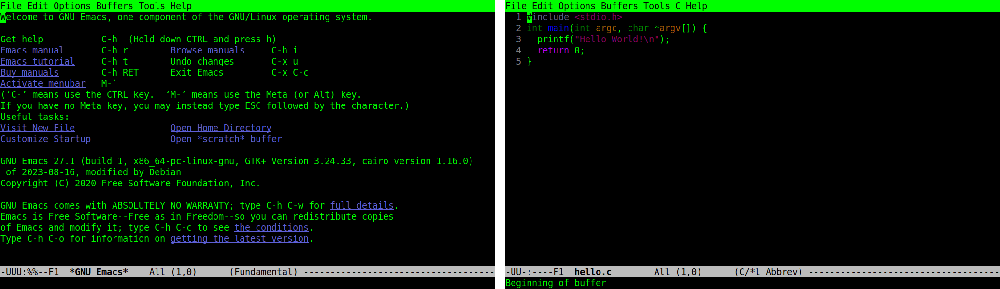

# Linux系统服务

Linux系统在启动过程中，内核完成初始化以后，由内核启动的第一个程序是/sbin/init程序，进程编号PID为1，以守护进程的方式运行。Linux中所有的进程都由/sbin/init程序进程直接或间接创建并运行的，它通常是系统里所有进程的祖先，负责组织与运行系统的相关初始化工作，让系统进入定义好的运行模式，如命令行模式或图形界面模式。

起初，/sbin/init程序链接到的是sysvinit程序，通过shell脚本以串行的方式启动系统服务，下一个进程必须等待上一个进程启动完成后才能开始启动，因此系统启动的过程比较慢。之后的upstart程序在sysvinit的基础上，把一些没有关联的程序并行启动，以提高启动的速度，但是存在依赖关系的程序仍然为串行启动。而systemd是Linux系统中最新的初始化系统，主要的设计目标是克服sysvinit固有的缺点，提高系统的启动速度，它通过套接字激活的机制，让无论是否有依赖关系的所有程序全部并行启动，并且仅按照系统启动的需要启动相应的服务，最大化提高开机启动速度。

```shell
ls -lhF /sbin/init
```

```shell
lrwxrwxrwx 1 root root 20  3月 24 12:22 /sbin/init -> /lib/systemd/systemd*
```

```shell
pstree -p | grep systemd
```

```shell
systemd(1)-+-ModemManager(933)-+-{ModemManager}(972)
           |-systemd(1553)-+-(sd-pam)(1554)
           |-systemd-journal(379)
           |-systemd-logind(890)
           |-systemd-oomd(710)
           |-systemd-resolve(726)
           |-systemd-timesyn(729)---{systemd-timesyn}(846)
           |-systemd-udevd(430)
```

多数主流Linux系统采用systemd管理系统服务进程，它是服务进程集合的总称，包含负责各种功能的许多进程，用于控制管理系统的资源。systemd的守护进程主要分为系统态（system）与用户态（user），分别位于/lib/systemd目录和/usr/lib/systemd目录中，这两个目录的结构与内容完全一致。


systemd提供兼容sysvinit的特性，系统中已经存在的服务和进程无需修改；systemd提供比upstart更激进的并行启动能力，更快的启动速度。

systemd提供按需启动的能力，只有在某个服务被真正请求的时候才启动它，当该服务结束时systemd可以关闭它，等待下次需要时再次启动它。

systemd利用Linux内核的特性cgroups来完成跟踪的任务，当停止服务时，通过查询cgroups，systemd可以确保找到所有的相关进程，从而干净地停止服务。

传统的Linux系统中，用户使用/etc/fstab文件维护文件系统的自动挂载点，systemd兼容/etc/fstab文件并管理这些挂载点，以便能够在系统启动时自动挂载它们。同时，systemd内建自动挂载服务，无需另外安装autofs服务，可以直接使用systemd提供的自动挂载管理能力来实现autofs的功能。

systemd自带日志服务journald，该日志服务的设计初衷是克服现有的syslog服务的缺点。systemd-journald用二进制格式保存所有日志信息，用户使用journalctl命令来查看日志信息，无需自己编写复杂的字符串分析处理程序。


Linux系统初始化需要做的事情非常多，需要启动后台服务，如启动ssh服务；需要做配置工作，如挂载文件系统。这个过程中的每一步都被systemd抽象为一个配置单元（unit），可以认为一个服务是一个配置单元，一个挂载点是一个配置单元，一个交换分区的配置是一个配置单元等。systemd将配置单元归纳为不同的类型，下面是一些常见的unit类型。

| unit类型  | 描述                                                         |
| --------- | ------------------------------------------------------------ |
| service   | 启动并控制服务后台进程，例如MySQLd，是最常用的一种           |
| socket    | 封装系统中的本地IPC和网络套接字，用于基于套接字的启动        |
| target    | 对其他unit配置单元进行逻辑分组，引用其他配置单元；可以对配置单元做一个统一的控制，例如，将所有图形化服务和配置单元组合为一个target，用于控制系统进入图形化模式 |
| device    | 封装Linux设备树中的设备，用于基于设备的启动                  |
| mount     | 封装文件系统中的一个挂载点                                   |
| automount | 封装文件系统中的一个自动挂载点                               |
| timer     | 定时触发其它unit配置单元                                     |
| swap      | 与挂载配置单元类似，封装内存交换分区                         |
| path      | 当文件系统中的一个文件或目录被修改时启动其它服务             |
| slice     | 对其它用于系统资源管理的配置单元进行分组                     |
| scope     | 与服务配置单元类型，用于管理服务进程                         |

每个配置单元unit都有一个对应的配置文件，并以配置单元的类型为后缀名，位于/usr/lib/systemd/system目录中，用户也可以在/etc/systemd/system目录中进行配置。系统管理员的任务就是编写和维护这些不同的配置文件，例如一个ssh服务对应一个ssh.service文件，如下所示。

```shell
cat /usr/lib/systemd/system/ssh.service
```

```toml
[Unit]
Description=OpenBSD Secure Shell server
Documentation=man:sshd(8) man:sshd_config(5)
After=network.target auditd.service
ConditionPathExists=!/etc/ssh/sshd_not_to_be_run

[Service]
EnvironmentFile=-/etc/default/ssh
ExecStartPre=/usr/sbin/sshd -t
ExecStart=/usr/sbin/sshd -D $SSHD_OPTS
ExecReload=/usr/sbin/sshd -t
ExecReload=/bin/kill -HUP $MAINPID
KillMode=process
Restart=on-failure
RestartPreventExitStatus=255
Type=notify
RuntimeDirectory=sshd
RuntimeDirectoryMode=0755

[Install]
WantedBy=multi-user.target
Alias=sshd.service
```

Unit段，所有类型的配置单元文件通用，用于定义unit元数据、配置、与其它unit的关系。Description条目描述unit文件信息；Documentation条目描述应用文档；Condition条目描述启动条件；Before条目、After条目、Wants条目、Requires条目用于描述依赖关系。

Install段，所有类型的配置单元文件通用，通常指定运行目标target，使得服务在系统启动时自动运行。Wantedby条目、RequiredBy条目描述依赖关系；Alias条目描述启动运行时使用的别名。

Service段，仅service类型的配置单元文件使用，用于定义服务的具体管理和执行动作。Type条目定义进程行为，如使用fork()启动，使用dbus启动等；ExecStartPre条目、ExecStart条目、ExecStartPos条目、ExecReload条目、ExecStop条目分别指定启动之前、启动时、启动之后、重启时、停止时执行的命令。

作为systemd初始化系统的一部分，可使用systemctl命令管理Linux系统中的进程服务，可使用-t选项指定配置单元unit类型，如service、socket、device等。命令systemctl兼容之前的用于系统服务进程管理的service命令。

```shell
systemctl [option] command [unit]
```

使用systemctl list-units命令列出所有unit信息；使用systemctl status命令查看unit信息；使用systemctl start命令或systemctl stop命令启动或停止一个unit；使用systemctl restart命令或systemctl reload命令重新启动或重新加载一个unit；使用systemctl enable命令启用一个unit随系统开机启动；使用systemctl disable命令禁用一个unit不随系统开机启动。

# 配置Linux环境变量

对于Linux平台，可以在.bashrc文件中配置每次bash环境启动是需要执行的命令，并通过export命令将所需的头文件和库文件目录添加到环境变量中。注意，在Linux平台下的.sh文件，要保证其换行符为LF，而不能是Windows平台下的CRLF换行符，否则会出现莫名其妙的的错误。

配置用户bash的环境变量如下所示。推荐在$HOME/.bashrc中添加以下代码，以执行特定的配置文件。

```shell
if [ -f "$HOME/.bash_B" ]; then
    . "$HOME/.bash_B"
fi
```

然后创建$HOME/.bash_B文件，在其中进行用户bash的环境配置，如下所示。

```shell
# Clear firstly
unset C_INCLUDE_PATH CPLUS_INCLUDE_PATH LD_LIBRARY_PATH LD_RUN_PATH

XXX_BIN=$HOME/path/to/xxx/bin
export PATH=$XXX_BIN:$PATH

XXX_INCLUDE=$HOME/path/to/xxx/include
export C_INCLUDE_PATH=$XXX_INCLUDE:$C_INCLUDE_PATH
export CPLUS_INCLUDE_PATH=$XXX_INCLUDE:$CPLUS_INCLUDE_PATH

XXX_LID=$HOME/path/to/xxx/lib
export LD_LIBRARY_PATH=$XXX_LID:$LD_LIBRARY_PATH  # during execution
export LIBRARY_PATH=$XXX_LID:$LIBRARY_PATH        # during compling
export LD_RUN_PATH=$XXX_LID:$LD_RUN_PATH          # during linking
```

或者直接在/etc/ld.so.conf文件中，或/etc/ld.so.conf.d/xxx.conf文件中，添加所需库文件的绝对路径（每行一个路径）。然后运行sudo ldconfig命令，以重建/etc/ld.so.cache文件，包含进新添加的路径。

此外，在/etc/profile文件或/etc/profile.d/xxx.sh文件中，配置某个工具或库的二进制可执行文件。

# Vim编辑器

vi编辑器是Unix系统最初的编辑器，它使用控制台图形模式来模拟文本编辑窗口，允许在文件中查看、移动、插入、编辑、替换文本。GNU项目在移植vi时，对其进行了一些改进，并命名为vi improved，简称vim。vim编辑器在内存缓冲区中处理数据，并将整个控制台窗口作为编辑区域。

## vim工作模式

通过vim命令即可启动vim编辑器，可指定要编辑文件的名称，若未指定文件名或文件不存在，vim在保存时会创建文件。


默认的vim编辑窗口显示文件内容（如果有内容的话），如果文件内容未占据整个屏幕，vim会在非文件内容行放置一个`~`波浪线；同时，vim在底部显示一条信息行，会显示所编辑文件的信息，如果文件是新建的，则会显示[New File]信息。

vim编辑器存在三种操作模式，分别为普通/命令模式、插入/编辑模式、底命令行模式，可通过如下按键切换不同模式。打开vim编辑器时默认进入普通模式，在普通模式下，vim编辑器会将按键解释成命令。在插入模式下，vim编辑器会将在当前光标位置输入的按键插入到缓冲区。在底命令行模式下，vim编辑器在底部提供了一个交互式命令行，光标移动至底部命令行并出现`:`冒号，可输入额外命令来控制vim的行为，例如键入help查看帮助文档。


在普通模式下，使用方向键或hjkl键（对应左下上右）在文本区域移动光标，使用0键移动到行首，使用^键移动到行首第一个非空格字符，使用\$键移动到行尾，使用gg键移动到第一行，使用G键移动到最后一行，使用# G键移动到第#行（其中#表示数字），使用PageDown或Ctrl+F键下翻一屏，使用PageUp或Ctrl+B键上翻一屏。

在底命令行模式下，使用q命令退出，使用q!命令强制退出且不保存修改，使用w [path]命令保存内容，使用wq命令保存并退出。


## vim文本编辑

在普通模式下，vim编辑器提供一些命令编辑缓冲区中的数据，常用命令如下表所示。

| 命令   | 描述                                               |
| ------ | -------------------------------------------------- |
| u      | 撤销前一条命令                                     |
| x      | 删除光标位置的字符                                 |
| dw     | 删除光标位置的单词，从光标位置开始到单词结束       |
| d$     | 删除光标所在行，从光标位置开始到该行结束           |
| dd     | 删除光标所在行                                     |
| J      | 删除光标所在行的行尾的换行符，即将下一行与该行拼接 |
| i      | 在光标位置插入数据                                 |
| a      | 在光标位置之后插入数据                             |
| A      | 在光标所在行的行尾插入数据                         |
| r char | 用char字符替换当前光标位置的单个字符               |
| R text | 用text文本覆盖当前光标位置的数据，直到按下ESC键    |

有些编辑命令允许使用数字修饰符来指定重复该命令多少次，例如，命令2x会删除从光标位置开始的2个字符，命令5dd会删除从光标位置开始的5行数据。

> 在普通模式下，使用退格键（Backspace）和删除键（Delete）时要留心，vim编辑器通常会将Delete键识别成x命令的功能，但通常不会识别Backspace键。

实际上，vim编辑器在删除数据时，会将所删除的数据保存在一个单独缓冲区（剪切板）中，可使用p命令将数据取回并插入。

| 命令 | 描述                                                         |
| ---- | ------------------------------------------------------------ |
| p    | 从单独缓冲区中取回数据，插入到光标位置之后（数据是若干字符），或光标所在行的下一行（数据是完整的若干行数据） |
| yw   | 复制光标位置的单词，从光标位置开始到单词结束                 |
| y$   | 复制光标所在行，从光标位置开始到该行结束                     |
| yy   | 复制光标所在行                                               |
| v    | 进入可视模式，移动光标时高亮所选中的文本                     |
| ?    | 进入查找模式，向前查找                                       |
| /    | 进入查找模式，向后查找                                       |

对于剪切和粘贴功能，可将删除命令和取回命令相结合，在原位置使用删除命令，在目标位置使用p命令取回数据并插入。

对于复制和粘贴功能，可使用y命令（yank）复制数据，并在目标位置使用p命令取回数据并插入。因为复制不会影响到所复制的原数据，故而没法知道到底复制了什么内容，只有在将数据粘贴到目标位置时，才能确定所复制的内容。使用v命令进入可视模式，vim会在移动光标时高亮所选中的文本，使用y命令即可复制所选中的文本，然后使用p命令进行粘贴。

对于查找功能，在普通模式下，可使用?命令或/命令进入查找模式，此时光标会移动到底部命令行，并显示出`?`或`/`字符，在此处可键入要查找的文本，在按Enter回车键后，光标会移动到搜索所匹配项的位置处。继续键入?或/并直接按Enter回车键，可继续查找下一个匹配项，或直接使用n键（next）查找下一个匹配项。

对于替换功能，在底命令行模式下，使用s命令进行替换匹配，该命令存在不同的参数，键入回车执行替换操作，其语法格式如下表所示。

| 命令           | 描述                                                     |
| -------------- | -------------------------------------------------------- |
| s/old/new      | 在光标所在行，查找第一次出现的old，替换为new             |
| s/old/new/g    | 在光标所在行，查找该行所有的old，替换为new               |
| #,#s/old/new/g | 在两个数字#指定的行之间，查找所有的old，替换为new        |
| %s/old/new/g   | 在整个文档中，查找所有的old，替换为new                   |
| %s/old/new/gc  | 在整个文档中，查找所有的old，替换为new，在每次替换时提示 |

## vim配置与插件

vim编辑器在启动时，会读取两个配置文件进行设置，即系统全局的/etc/vim/vimrc文件和用户的\$HOME/.vimrc文件，如果用户的\$HOME/.vimrc配置文件不存在，则需要手动创建之。在vim配置文件中，使用`"`双引号表示注释。

一些基本的\$HOME/.vimrc配置内容如下所示。

```shell
syntax on          " 语法高亮
set number         " 显示行号
set expandtab      " Tab键用空格表示
set tabstop=4      " Tab键缩进的长度为4空格
set softtabstop=4  " 退格键退回缩进的长度为4空格
set shiftwidth=4   " 每一级缩进的长度为4空格
set autoindent     " 设置自动缩进，新行自动与上一行对齐
set cindent        " 针对C语言的自动缩进
```

vim编辑器可以通过安装插件来增加很多强大的功能，有一些常用的插件管理器。[Vundle](https://github.com/VundleVim/Vundle.vim)是一个简单易用的插件管理器，通过简单的配置文件就可以管理插件。[vim-plug](https://github.com/junegunn/vim-plug)是一个轻量级、快速、异步的插件管理器，支持并行安装插件。

# Emacs编辑器

Emacs是专为POSIX操作系统设计的文本编辑器，目前广使用的是GNU Emacs版本，在Linux平台上可使用sudo apt install emacs命令安装。相比于Vim编辑器，Emacs编辑器默认扩展更多命令，支持直接在编辑器中对源代码进行编辑、调试等。

## Emacs命令

通过emacs命令即可启动Emacs编辑器，可指定要编辑文件的名称，若未指定文件名或文件不存在，Emacs在保存时会创建文件。值得注意的是，在支持图形界面的系统中，emacs命令默认会打开Emacs的图形界面版本，若想只在终端命令行界面CLI中打开，可使用emacs -nw命令。



上图显示Emacs在终端命令行中的界面。占据整个终端Frame被称为一个Frame；终端最中间的显示界面被称为Window，或称为主缓冲区（main buffer），用于显示编辑内容；最上方是示菜单栏（Menu Bar），包括File、Edit、Options等下拉菜单，使用F10键打开下拉菜单（对应menu-bar-open命令），或使用M-`键从下方展开菜单界面（对应tmm-menubar命令）；最下方第二行的灰色行是Emacs的状态栏，称为Mode Line区域，用于显示当前状态；最下方一行是回显区（Echo Area），或称为迷你缓冲区（mini buffer），用以显示各种简短的信息，例如正在输入的命令按键。

Emacs通过命令快捷键进行交互，所谓命令即是Emacs中使用Elisp（Emacs Lisp）语言定义的一些函数，这些函数可以完成特定功能，例如，将光标上移一行对应着previous-line命令，一切操作都对应一个命令，而快捷键的本质是在调用这些命令。在Emacs编辑器界面及其文档中，使用连词符-表示同时按下，例如，使用C-x表示Ctrl+X按键，使用M-x表示Alt+X按键，使用S-x表示Shift+X按键，使用C-M-x表示Ctrl+Alt+X按键；而不使用连词符则表示依次按下，例如，C-h t表示先按下Ctrl+H键，松开后再按下T键。

使用M-x键，可切换至命令模式，用于在回显区输入并执行相应命令，使用Tab键可进行提示与补全；使用customize-variable命令可以修改变量的值；使用set-variable命令可以临时设置变量的值。使用C-g键，可终止正在输入或正在执行的命令。使用C-x C-s保存文件；使用C-x C-c退出Emacs编辑器。


在Emacs内使用C-x C-f键可打开指定路径的文件，使用C-x C-s保存当前编辑的文件。实际上，一个打开的文件对应一个Buffer缓冲区，缓冲区的名称会显示在Mode Line中间，通常是文件名称本身。当打开第二个文件时，第一个文件的缓冲区会被切入后台，而第二个文件的缓冲区则会占据当前Window窗格。Emacs总会有一个默认打开的Buffer缓冲区，名称叫做scratch草稿缓冲区，用于编辑一些临时信息。

使用C-x C-b键会弹出一个名称为Buffer List的Window窗格，其中列出当前所打开的Buffer缓冲区，使用光标选中即可切换到目标缓冲区。使用C-x b键可选择一个Buffer缓冲区；使用C-x k键关闭一个Buffer缓冲区。使用C-x o键切换光标到不同的Window窗格，使用C-x 0键关闭当前Window窗格。

在Buffer List缓冲区列表中，缓冲区名称之前的\*星号表示该缓冲区是Emacs用于输出信息的缓冲区，并不是由打开文件产生的；名称之前的%百分号表示该缓冲区被修改过且没有被保存。

## Emacs配置

Emacs Lisp是世界上第二古老的高级编程语言Lisp专为Emacs打造的方言，ELisp编程语言用于为Emacs编写逻辑，Emacs的底层和绝大部分插件都是用Elisp语言编写的。Elisp使用`;`分号开启一行注释，使用.el作为文件后缀名称。

Lisp编程语言是List Processing的缩写，器核心是List列表。在Lisp中，每一对小括号是一个列表，列表元素用空格分隔。在执行Lisp时，会把列表的第一个元素作为函数名，后面元素作为函数的参数。元素可以是一个词，也可以是另一个列表，从而支持嵌套。

例如，表达式2+(3-4)可写为如下形式，其中+和-都是预先定义的函数。

```lisp
(+ 2 (- 3 4))
```

在Lisp中使用defun关键字定义函数，使用setq关键字设置变量，一个示例如下。此外，Lisp使用关键字let界定一组变量的作用域，使用if、when、unless等条件语句，使用关键字t（或non-nil）表示真值true，使用关键字nil表示空null。

```lisp
(defun ivy-set-prompt (caller prompt-fn)
    (setq ivy--prompts-list
          (plist-put ivy--prompts-list caller prompt-fn)))
```

上述时ivy插件中的一个示例，其等价的Python形式代码如下，下述示例无意义，只是用于解释Lisp语法。

```python
def ivy_set_prompt(caller, prompt_fn):
    ivy__prompts_list = plist_put(ivy__prompts_list, caller, prompt_fn)
```

特殊的，操作符quote（或简写为一个`'`单引号）来获得字符序列本身，即什么也不做。例如，表达式(+ 1 2)返回3作为值，而'(+ 1 2)则返回字符序列(+ 1 2)，什么也没有执行。例如，'ivy-set-prompt则将函数名称ivy-set-prompt返回，而不是执行该函数。此外，在括号前使用quote时表示括号界定一个数组，而不是函数执行，例如'(Apple Banana Cherry)表示一个数组。

Emacs配置文件是一个包含ELisp源码的文件，描述Emacs应当以什么样的方式启动，在Emacs启动时会执行其中的代码。当启动Emacs时，会依次寻找以下配置文件，一旦找到其中之一，便不再继续寻找之后的配置文件。

```
~/.emacs
~/.emacs.el
~/.emacs.d/init.el
~/.config/emacs/init.el
```

一些基本的\$HOME/.emacs配置内容如下所示。

```lisp
(setq make-backup-files nil)                 ; 关闭文件自动备份
(column-number-mode t)                       ; 在Mode Line上显示列号
(global-display-line-numbers-mode 1)         ; 显示行号
(global-auto-revert-mode t)                  ; 当另一程序修改文件时，让Emacs及时刷新Buffer
(delete-selection-mode t)                    ; 选中文本后输入文本会替换文本，更符合使用逻辑
```

除在诸如.emacs的配置文件中使用(setq name value)设置变量之外，Emacs还提供一些命令辅助管理变量，使用customize命令集合（如customize-variable等）修改变量的值，使用set-variable命令临时设置变量的值。实际上，使用辅助命令修改变量时，Emacs会将所设置的变量写入到配置文件中，如下所示修改make-backup-files变量。


上述图片中，使用[]方括号界定的字符序列，或使用下划线强调的字符序列，将光标移动到其上，按下Enter回车即可执行相关操作，如同使用鼠标点击按钮一样。黄色高亮区域为可编辑区域，可键入文本字符序列，而其他区域则为只读区域，不可修改。

Emacs支持使用插件扩展功能，插件被放置在固定的仓库网站上，目前最大的插件仓库是[MELPA](https://melpa.org/#/)，默认插件仓库是GNU ELPA。

## Emacs模式

Emacs的核心之一就是模式（mode），一个模式对应着一组环境，不同模式采用不同的配置，用于不同的场景。例如，编写C++代码对应C++-mode模式，编写Python代码对应python-mode模式。在不同的编程语言的模式中，编译、执行的方式都是不同的，故而只需事先定义好模式，即可在使用过程中方便切换各种需求场景。

Emacs模式分为主模式（major mode）和次模式（minor mode）两类。主模式默认根据Buffer缓冲区的文件类型（后缀名称）来选择，主模式的名字会显示在Mode Line上。最基本的主模式是Fundamental mode，即没有进行任何配置的模式。使用M-x键，手动输入相应的模式名称即可切换模式。

一个Buffer只能对应一个主模式，例如，Emacs打开.cpp文件时，会将Buffer自动设置成C++-mode，最直观的区别是Emacs为不同编程语言的源码提供不同的语法高亮。同一个Buffer可以有多个次模式，次模式可以进一步调整、增加一些配置。通常来说，插件都是依靠次模式来起作用的。当安装插件时，插件官网会提示如何设置这个插件，其中大多都会使用次模式。

## Emacs-GUD调试

GUD（Grand Unified Debugger）是Emacs编辑器的主要调试模式，处理与GDB、JDB、PDB等调试器的交互，用于在Emacs中运行诸如GDB之类的调试器，使用户无需离开编辑器就可以对代码进行调试。

Emacs使用的调试模式最初由Eric Raymond在1992年编写，也即Emacs项目的emacs/lisp/progmodes/gud.el配置文件，用于Emacs 22.1之前的版本。该模式包括两个缓冲区（故而无法显示由其它模式提供的额外信息），一个是GUD缓冲区（GUD buffer），可像在命令行上一样输入GDB命令；另一个是源缓冲区（source buffer），用于显示当前执行的文件代码，并使用=>指向当前执行的代码行。GUD模式使用--fullname选项，这启用GDB调试器--annotate=1级别的注释。

> GDB使用--annotate选项，设置GDB的注释（annotation）级别，用于决定GDB所输出的提示信息（例如当前文件名称、行号、地址等）。其中，--annotate=0是普通级别；--annotate=1将GDB作为GNU Emacs子进程运行；--annotate=2已弃用，被GDB/MI技术所取代；--annotate=3是控制GDB程序所能使用的最大级别。

不久之后，Tom Lord和Jim Kingdon编写了一种专用于GDB的模式，命名为gdba.el配置文件，但并未合并入Emacs项目。gdba.el模式源自于gud.el，但设计为仅与GDB一起使用，并随GDB一起发布，后来被GDB项目废弃。Lord和Kingdon为GDB添加更多的注释，以便诸如Emacs的前端可以更好地获取执行状态，也即使用--annotate=2级别的注释。这允许Emacs显示更多信息，包括调用堆栈、当前堆栈的局部变量、任何断点的状态等。

再后来，作为用户接口以运行GDB的gdb-mi.el模式被开发，也即Emacs项目的emacs/lisp/progmodes/gdb-mi.el配置文件，用于Emacs 21.4之后的版本。该模式使用GDB调试器的-i=mi选项，以使用GDG/MI接口技术。

使用M-x gud-gdb命令将启动GUD调试模式，其会在回显区提示gdb --fullname executable_file命令，使用M-x gdb命令将启动GDB-MI模式，其会在回显区提示gdb -i=mi executable_file命令；指定命令中的可执行文件名称即可启动GDB调试。

在Emacs编辑器的GDB调试状态下，按下M-x键，输入gdb-之后使用Tab键显示命令提示，可查看当前模式下可使用的GDB调试命令。例如，使用gdb-many-windows命令可以切换多窗口调试模式，使用gdb-restore-windows命令可以恢复默认的窗格布局等。一个示例如下所示。


值得注意的是，使用gdb -i=mi executable_file启动GDB调试时，可能会出现警告'set target-async', an alias for the command 'set mi-async', is deprecated，对set mi-async的别名set target-async已弃用，需要直接使用set mi-async命令。

# 图形界面

目前Linux/UNIX中最为流行的两种图形桌面套件是GNOME（GNU Network Object Model Environment）和KDE（Kool Desktop Environment）桌面套件环境。在Ubuntu操作系统中，默认使用的是GNOME桌面套件。

在Ubuntu操作系统的图形界面中，若要进入命令行界面（Command Line Interface，CLI），即纯字符界面，可以使用Ctrl+Alt+F#组合键（F#代表F1,F2,...,F6按键），切换到第x个虚拟字符控制台。Ubuntu操作系统默认开启了六个虚拟终端（虚拟控制台），用于登录到纯字符模式的操作界面，这六个虚拟终端分别表示为tty1,tty2,...,tty6终端。若要从字符控制台返回到已经开启的图形桌面环境，可以使用Alt+F7组合键；而在字符控制台之间进行转换时，只需使用Alt+F#x组合键即可。

> 注意，使用Ctrl+Alt+F#登录到虚拟终端时，并不会关闭图形界面，可使用Alt+F7返回到图形界面。
>
> 注意，若Ubuntu系统在虚拟环境中，某些情况下，组合键中还需加入Shift才能生效。

注意，要执行下述命令，先执行su以进入root账号，避免进入命令行界面时出现卡死的情况。

此外，也可使用如下命令进入或退出纯字符命令行终端界面，如下所示。

```shell
sudo init 3  # 进入命令行终端
sudo init 5  # 退出命令行终端
```

> 注意，使用sudo init 3进入命令行终端时，会关闭图形界面，使用sudo init 5会重新开启图形环境并进入。

下述命令可用于管理图形界面与命令行界面，如下所示。

```shell
sudo systemctl isolate multi-user.target      # 关闭当前图形界面，即启用多用户文本界面，即命令行终端
sudo systemctl isolate graphical.target       # 启动图形界面，即启用多用户文本界面，即命令行终端
```

```shell
sudo systemctl set-default multi-user.target  # 默认命令行终端启动，即机器启动时不启动图形界面
sudo systemctl set-default graphical.target   # 默认图形界面启动
```

```shell
sudo systemctl stop display-manager     # 关闭图形界面
sudo systemctl start display-manager    # 启动图形界面
sudo systemctl disable display-manager  # 禁用图形界面
sudo systemctl enable display-manager   # 启用图形界面
```

若Linux系统不存在图形界面，则在Ubuntu上可使用如下命令安装图形界面。

```shell
sudo apt install xinit
sudo apt install ubuntu-desktop
```

# X协议

对于Windows平台来说，图形化界面是在Windows内核中实现的，是操作系统内核的一部分。而对于类Unix系统来说，其内核中并无图形化界面的实现，类Unix系统的图形化界面只是一个应用程序，这些图形化界面的实现底层通常是基于X协议（X protocol）的，也即X协议是类UNIX操作系统用来实现图形界面的，目前是X11版本。


其中，X Server负责管理显示相关的输入输出设备的交互，它负责接受输入设备（键盘鼠标）的动作，并将其告知基于X Client的应用程序，同时负责将图形写入输出设备（显卡等），以进行屏幕画面的绘制与显示。而基于X Client的应用程序，则接受X Server传递的动作事件等，进行程序业务逻辑的处理，并将需要显示的图形告知X Server来显示。

通常来说，X Server与X Client运行在同一主机上，但同时X协议栈也可基于TCP/IP协议，那么X协议就支持X Server与X Client运行在不同主机上。如此，通过SSH X11 Forwarding转发，就可以实现常见的开发场景，即在服务器端运行某个程序（X Client），而在本地显示程序的GUI界面（X Server），这可以满足“在无图形界面的Linux上开发GUI应用程序”的需求。

通过如下命令在Ubuntu系统上安装X11应用程序。

```shell
sudo apt install xorg
```

使用sudo权限修改/etc/ssh/sshd_config文件，打开X11Forwarding和X11UseLocalhost注释，并分别设为yes和no，如下所示。

```shell
X11Forwarding yes
X11UseLocalhost no
```

重启sshd服务，如下所示。

```shell
sudo systemctl restart sshd.service
```

在Windows平台上启用X11 Server有多种方式，这里使用[Xming](http://www.straightrunning.com/XmingNotes/)工具，可在[Public Domain Releases](https://sourceforge.net/projects/xming/files/)网址下载安装。通过所安装的XLaunch启动X11 Server服务，并将Display Number指定为0值，表示采用0.0号进行显示。

打开安装目录下的Xming/X0.hosts文件，将要连接的远程主机IP地址添加到后面新行中，如下所示。

```shell
localhost
10.10.10.102  # Remote Host IP (No this comment)
```

在Visual Studio Code中安装Remote-SSH与Remote X11扩展，配置远程主机的SSH设置如下所示，也即指定X11相关的设置。

```shell
Host MyRemoteHost
  HostName 10.10.10.102  # Remote Host IP (No this comment)
  Port 22
  User MyName
  ForwardX11 yes
  ForwardX11Trusted yes
  ForwardAgent yes
```

在用户的.bashrc文件中，将本地机器的IP地址，以及X11 Server所设置的0.0添加其中，以在每次启动shell时执行，配置bash的环境变量。

```shell
export DISPLAY=10.10.10.101:0.0  # Local Host IP (No this comment)
```

此时，使用VS Code连接远程服务器，执行GUI代码时，即可将图形显示在本地。

> freedesktop.org以前称为X Desktop Group（XDG），是一个致力于基于X11等桌面环境互操作性和共享基础技术的项目，该项目制定了互操作性规范，并定义了一系列XDG_XXX环境变量，许多工具和应用程序默认使用这些变量。
>
> 在用户家目录中的\$HOME/.config/user-dirs.dirs文件中，XDG配置了一些环境变量，用于指定用户家目录中的一些诸如Desktop、Downloads之类的文件夹，可以修改这些环境变量以更改相应的文件夹。

# SSH

安全外壳协议（Secure Shell Protocol）是一个网络协议，处于计算机网络协议栈中的应用层，通常基于TCP/IP协议，使用22作为默认端口号。SSH通过在数据传输中使用各种加密技术（例如AES、RSA、ECDSA、SHA-256等算法）来保证通信的安全性，防止数据在网络中被监听、篡改和冒名顶替。

SSH通常用于登录远程计算机的shell或命令行界面（CLI）并在远程服务器上执行命令，它还支持隧道、TCP端口转发和X11连接机制，并且可用于使用关联的SSH文件传输协议（SFTP）或安全复制协议（SCP）传输文件。SSH采用客户端-服务器（Client-Server）架构，SSH客户端程序通常用于建立与SSH守护程序（如sshd）的连接，以接受远程连接。两者通常都存在于大多数现代操作系统中，包括macOS 、多数Linux发行版等。

目前广泛使用的是SSH-2版本，常见的支持SSH协议的软件包括OpenSSH、PuTTY等。OpenSSH套件包含若干工具，将在下面介绍。

在Linux平台上，使用apt install openssh-client命令和apt install openssh-server命令安装OpenSSH客户端与服务器端的相关组件，它们的配置分别位于/etc/ssh/ssh_config文件和/etc/ssh/sshd_config文件中。使用systemctl start ssh命令启动SSH服务，使用systemctl enable ssh命令使SSH随系统启动。

ssh命令连接到指定destination目标主机，并远程登录shell终端，如果指定command命令，则在远程主机执行command命令而不是登录shell终端。其中destination可以是[user@]hostname形式或是ssh://[user@]hostname[:port]形式，其中hostname可以是远程主机IP地址或URL地址。

```shell
ssh [option] destination [command]
```

使用-l选项指定login_name登录用户名；使用-p选项指定port端口；使用-R选项指定address地址；使用-T选项禁止分配虚拟终端；使用-i选项指定验证身份的密钥文件（私钥），默认是位于用户\$HOME/.ssh目录下的id_rsa、id_ecdsa、id_ecdsa_sk、id_ed25519、id_ed25519_sk、id_dsa文件。

```shell
ssh bln@10.10.10.105
```

```
The authenticity of host '10.10.10.105 (10.10.10.105)' can't be established.
ED25519 key fingerprint is SHA256:nH2WQr0seOo+RIkY/yh0UzJ1fHRuxGkzP8S4Am35Tww.
This key is not known by any other names
Are you sure you want to continue connecting (yes/no/[fingerprint])? yes
Warning: Permanently added '10.10.10.105' (ED25519) to the list of known hosts.
bln@10.10.10.105's password: 
Welcome to Ubuntu 22.04.3 LTS (GNU/Linux 5.15.0-97-generic x86_64)

  System information as of Tue Apr 16 01:53:12 AM CST 2024

  Memory usage:             6%
  Swap usage:               7%
  IPv4 address for docker0: 172.17.0.1
  IPv4 address for enp4s0:  10.10.10.105
  IPv6 address for enp4s0:  fd00:f484:8de3:2a9b::1011
  IPv6 address for enp4s0:  fd00:f484:8de3:2a9b:67c:16ff:febc:16c9

Last login: Fri Apr 12 11:16:11 2024 from 10.10.10.112
```

ssh-keygen命令生成并管理身份验证密钥文件，默认位于\$HOME/.ssh目录中。在生成过程中会以交互方式确定私钥文件的名称路径，相对的公钥文件以相同路径存储并使用.pub后缀，可选项的密码短语（passphrase），主机密钥必须具有空的密码短语。

```shell
ssh-keygen [option]
```

使用-t选项指定密钥类型，可选rsa、ecdsa、ecdsa-sk、ed25519、ed25519-sk、dsa六种类型，默认使用ed25519类型的密钥；使用-b选项指定所创建密钥的位数；使用-f指定密钥文件的名称路径；使用-s选项指定证书颁发机构的CA密钥文件，以对公钥进行签名；使用-h选项创建主机证书而不是用户证书，以向用户验证服务器主机身份。

ssh-add命令将私钥文件添加到验证代理ssh-agent程序，该命令在使用自定义文件名称路径的密钥时有用。不带参数的版本会加载默认的位于用户\$HOME/.ssh目录下的id_rsa、id_ecdsa、id_ecdsa_sk、id_ed25519、id_ed25519_sk、id_dsa文件。

```shell
ssh-add [option] [path]
```

使用-l选项列出ssh-agent代理当前加载的所有私钥指纹；使用-L选项列出ssh-agent代理当前加载的所有公钥指纹。

ssh-agent是一个持有私钥的程序进程，所持有的私钥用于公钥验证。通过使用环境变量，可以在使用ssh登录其他计算机时找到ssh-agent代理并自动用于身份验证。

sshd是ssh的守护程序进程，监听来自客户端的连接。它为每个请求的连接创建一个新的fork守护进程，以进行密钥交换、加密、身份验证、命令执行和数据交换。sshd可以使用命令行选项或配置文件进行配置，默认配置文件位于/etc/ssh/sshd_config路径。

在sshd的配置文件/etc/ssh/sshd_config中，使用AuthorizedKeysFile条目指定包含公钥的文件，用于公钥认证，默认为用户目录下的\$HOME/.ssh/authorized_keys文件。在\$HOME/.ssh/known_hosts文件中，保存所有已知主机的主机公钥，每当用户连接到未知主机时，其密钥都会添加到每个用户的known_hosts文件中。

使用SSH登录远程Linux服务器时，在用户目录下创建.ssh目录并设置权限。

```shell
mkdir ~/.ssh
chmod 700 ~/.ssh
touch ~/.ssh/authorized_keys
chmod 600 ~/.ssh/authorized_keys
```

在本地系统中使用ssh-keygen命令创建公钥-私钥对，将本地系统公钥文件id_rsa.pub中的内容拷贝到远程服务器的authorized_keys文件中，即可实现本地系统免密登录远程服务器。

如果使用VS Code登录远程服务器，只需为SSH登录设置指定IdentityFile为本地系统的私钥文件路径即可，如下所示。

```shell
Host connection_name
  HostName remote_host
  Port port
  User user
  IdentityFile $UserPath/.ssh/id_rsa
```

# FRP

FRP（Fast Reverse Proxy）是一个性能高效的反向代理工具，官网地址是https://gofrp.org，可以从https://github.com/fatedier/frp下载最新发布版，例如在Linux平台上的frp_0.59.0_linux_arm64.tar.gz版本。

FRP采用C/S模式，服务端部署在具有公网IP的机器上，客户端部署在内网或防火墙内的机器上，通过访问暴露在服务器上的端口，反向代理到处于内网的服务，以实现内网穿透。在此基础上，FRP支持TCP、UDP、HTTP、HTTPS等多种协议，提供加密、压缩、身份认证、代理限速、负载均衡等众多能力。

FRP客户端负责将内网的服务请求转发到服务端，而FRP服务端则将请求转发给真正的目标服务。这样，即使目标服务在内网中，用户也可以通过外网访问到它。FRP支持自定义域名和端口映射，用户可以通过配置文件灵活地设置转发规则。

通过下载链接获得可执行文件和配置文件的压缩包，将其解压到特定目录文件当中，其中配置文件支持TOML、YAML、JSON等格式，也支持旧式INI格式，但已经不推荐使用旧的INI格式。

在服务端，进入特定目录中，编写frps.toml配置文件，内容如下所示。其中，配置bindPort表示FRP服务端用于接收客户端连接的端口；配置auth.token用于身份认证，只允许具有相同token的服务端和客户端之间可以进行通信，并确保只有授权用户能够建立连接。

```toml
bindPort = 7000
auth.token = "AuthorizeToken"
```

在特定目录下通过执行./frps -c ./frps.toml命令，来启动服务端。

在客户端，进入特定目录中，编写frpc.toml配置文件，内容如下所示。其中，配置localIP和配置localPort表示需要从公网访问的内网服务的地址和端口，例如TCP服务连接的默认22端口，如下所示；配置remotePort表示要在FRP服务端监听的端口，访问此端口的流量将被转发到内网服务的相应端口。

```toml
serverAddr = "x.x.x.x"
serverPort = 7000
auth.token = "AuthorizeToken"

[[proxies]]
name = "ssh"
type = "tcp"
localIP = "127.0.0.1"
localPort = 22
remotePort = 12345
```

在特定目录下通过执行./frpc -c ./frpc.toml命令，来启动客户端。

之后，即可在用户本地机器上，即可使用x.x.x.x:12345地址，以TCP类型，连接到内网的服务，FRP会将发送到x.x.x.x:12345的流量转发到内网机器的22端口。

如果需要FRP在后台长期运行，可以结合诸如systemd的工具一起使用。

在服务端，创建并编辑/etc/systemd/system/frps.service文件如下所示，并使用sudo systemctl start frps命令启动服务。

```toml
[Unit]
Description = frps Service
After = network.target syslog.target
Wants = network.target

[Service]
Type = simple
# 启动 frps 的命令
ExecStart = /path/to/frps -c /path/to/frps.toml

[Install]
WantedBy = multi-user.target
```

在客户端，创建并编辑/etc/systemd/system/frpc.service文件如下所示，并使用sudo systemctl start frpc命令启动服务。

```toml
[Unit]
Description = frpc Service
After = network.target syslog.target
Wants = network.target

[Service]
Type = simple
# 启动 frpc 的命令
ExecStart = /path/to/frpc -c /path/to/frpc.toml
Restart=on-failure
RestartSec=3

[Install]
WantedBy = multi-user.target
```

分别使用sudo systemctl enable frps命令和sudo systemctl enable frpc命令，以设置服务的开机自动启动。
