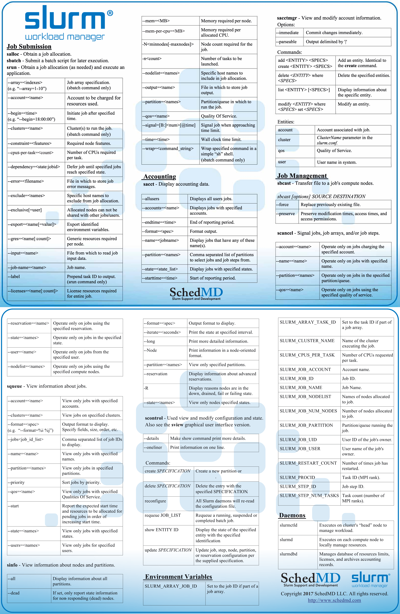
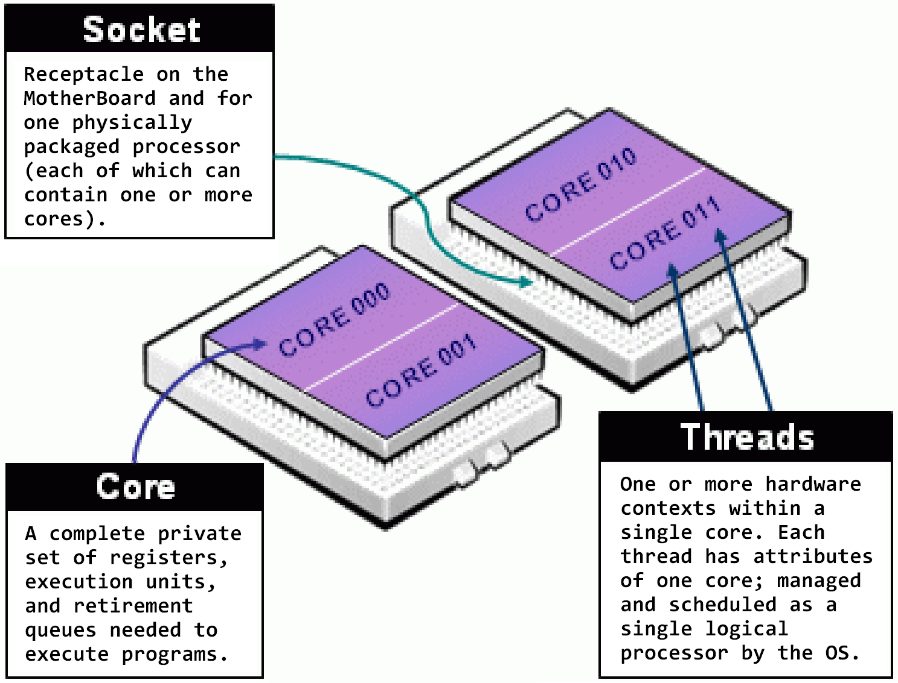

# Overview

Slurm（Simple Linux Utility for Resource Management）是一个开源的分布式资源管理和作业调度系统，用于超级计算机和大中小型计算节点集群的管理，具有高度的扩展性和容错性。Slurm调度系统的运行无需修改内核且相对独立，其使用简单、功能强大、应用广泛，是HPC调度领域事实上的标准。

作为一个集群工作负载管理器，Slurm有三个关键功能。首先，Slurm在一段时间内为用户分配资源（计算节点），提供独占或非独占的访问，以便用户能够执行作业。其次，Slurm提供一个框架，用于在分配的节点集合上启动、执行和监视作业（通常是并行任务）。最后，Slurm通过管理作业队列来仲裁不同作业对资源的争用。

此外，Slurm支持各种插件，用于计费（[accounting](https://slurm.schedmd.com/accounting.html)）、高级预留（[advanced reservation](https://slurm.schedmd.com/reservations.html)）、组调度（[gang scheduling](https://slurm.schedmd.com/gang_scheduling.html)，并行作业分时）、回填调度（backfill scheduling）、拓扑优化资源选择（[topology optimized resource selection](https://slurm.schedmd.com/topology.html)）、用户账户或银行账户的资源限制（[resource limits](https://slurm.schedmd.com/resource_limits.html)），以及复杂多因素作业优先级（[multifactor job prioritization](https://slurm.schedmd.com/priority_multifactor.html)）算法。

## Architecture

Slurm由运行在每个计算节点上的slurmd守护进程，和运行在管理节点上的中心slurmctld守护进程组成，如下图所示。其中，用于管理的slurmctld守护进程具有可选的故障转移双胞胎进程（secondary slurmctld），slurmd守护进程提供了容错的层次通信（hierarchical communication）。此外，有一个可选的slurmbd数据库守护进程，用于在单个数据库中记录多个Slurm集群的计费信息。


由这些Slurm守护进程管理的实体如下图所示，包括节点（node，计算资源）、分区（partition，将节点组织为逻辑集合，可重叠）、作业（job，在指定时间内给用户的资源分配）、作业步骤（job step，作业中的一组任务集，可能并行）。可将分区视为作业队列（job queue），每个分区都有各种约束，例如作业大小限制、作业时间限制、允许使用它的用户等。按优先级排序的作业在分区内分配节点，直到该分区内的资源（节点、处理器、内存等）耗尽为止。

一旦为作业分配了一组节点，用户就可以在所分配资源中，按作业步骤的形式，以任意配置，启动并行任务。例如，可以启动一个作业步骤，它利用分配给该作业的所有节点，或者几个作业步骤可以独立地使用所分配的一部分资源。针对第二种情况，Slurm为作业所分配的处理器提供资源管理，以便同时提交多个作业步骤并排队，直到作业分配内有可用资源。


## Configurability

Slurm管理员可对Slurm进行配置，配置文件位于/etc/slurm.conf路径，可以使用https://slurm.schedmd.com/configurator.html辅助网站填写配置表单，以生成/etc/slurm.conf配置文件。

节点被组织为分区，其中可能包含重叠节点，因此最好将它们视为作业队列。位图（bitmaps）用于表示节点，并且可以通过执行少量比较和一系列快速位图操作来做出调度决策。

监控的节点状态包括：处理器数量、实际物理内存大小、临时磁盘空间大小、状态（UP、DOWN等）。

附加节点信息包括：权重（被分配任务的优先级）、特征（任意信息如处理器类型和速度）。

分区信息包括：名称、所关联节点的列表、状态（UP或DOWN）、最大作业时间限制、每个作业的最大节点数量、组访问列表、优先级（某节点处于多个分区时很重要）、可选超额调度级别的组调度的共享节点访问策略（YES、NO、FORCE:2）。

Slurm支持各种组件的配置设置，下面是一个/etc/slurm.conf配置文件的示例部分。

```shell
#
# Sample /etc/slurm.conf
#
SlurmctldHost=linux0001  # Primary server
SlurmctldHost=linux0002  # Backup server
#
AuthType=auth/munge
Epilog=/usr/local/slurm/sbin/epilog
PluginDir=/usr/local/slurm/lib
Prolog=/usr/local/slurm/sbin/prolog
SlurmctldPort=7002
SlurmctldTimeout=120
SlurmdPort=7003
SlurmdSpoolDir=/var/tmp/slurmd.spool
SlurmdTimeout=120
StateSaveLocation=/usr/local/slurm/slurm.state
TmpFS=/tmp
#
# Node Configurations
#
NodeName=DEFAULT CPUs=4 TmpDisk=16384 State=IDLE
NodeName=lx[0001-0002] State=DRAINED
NodeName=lx[0003-8000] RealMemory=2048 Weight=2
NodeName=lx[8001-9999] RealMemory=4096 Weight=6 Feature=video
#
# Partition Configurations
#
PartitionName=DEFAULT MaxTime=30 MaxNodes=2
PartitionName=login Nodes=lx[0001-0002] State=DOWN
PartitionName=debug Nodes=lx[0003-0030] State=UP Default=YES
PartitionName=class Nodes=lx[0031-0040] AllowGroups=students
PartitionName=DEFAULT MaxTime=UNLIMITED MaxNodes=4096
PartitionName=batch Nodes=lx[0041-9999]
```

## Commands Summary

存在针对所有Slurm守护进程、命令和API函数的手册页。注意，命令选项都是区分大小写的。

- sacct，用于报告有关活动作业或已完成作业的，作业或作业步骤的统计信息。
- salloc，用于为作业实时分配资源，这通常用于分配资源并生成shell交互终端，然后使用shell执行srun命令来启动并行任务。
- sattach，用于将标准输入、输出、错误与信号功能，附加到当前运行的作业或作业步骤。可多次附加和脱离作业。
- sbatch，用于提交作业脚本以供稍后执行。该脚本通常包含一个或多个srun命令来启动并行任务。
- sbcast，用于将文件从本地磁盘传输到作业所分配节点的磁盘上。这可以有效地使用无磁盘计算节点，或提供比共享文件系统的更好的性能。
- scancel，用于取消挂起或正在运行的作业或作业步骤。还可用于向正在运行的作业或作业步骤的，相关联的所有进程发送任意信号。
- scontrol，用于查看、修改Slurm状态的管理工具。注意，许多scontrol命令只能以root用户执行。
- sinfo，用于报告由Slurm管理的分区和节点的状态。它有各种过滤、排序和格式化选项。
- sprio，用于显示影响作业优先级的组件的详细视图。
- squeue，用于报告作业或作业步骤的状态。它有各种过滤、排序和格式化选项，默认情况下按优先级顺序报告正在运行的作业，然后报告挂起的作业。
- srun，用于实时提交作业执行或启动作业步骤。它有各种的选项来指定资源需求，例如，最小和最大节点数、处理器数、使用或不使用的节点，节点特征（内存数量、磁盘空间等）。一个作业可以包含多个作业步骤，这些作业步骤在作业所分配的独占资源或共享资源上，依次地或并行地执行。
- sstat，用于获取正在运行的作业或作业步骤所使用的资源的信息。
- strigger，用于设置、获取或查看事件触发器。事件触发器包括节点停机或作业达到其时间限制等情况。
- sview，是一个图形用户界面，用于获取和更新slurm管理的作业、分区和节点的状态信息。

Slurm支持三种作业提交方式，即批处理作业模式、交互式作业模式、实时分配作业模式，现简述如下。

1. 批处理作业模式，采用sbatch命令提交。使用sbatch命令提交批处理作业脚本，提交后立即返回该命令行终端（即使终端终止也不影响作业执行），用户可进行其它操作。所提交的作业被调度后，会在所分配的首个节点上执行作业脚本。在作业脚本中也可使用srun命令执行作业任务。
2. 交互式作业模式，采用srun命令提交。使用srun命令可申请资源分配，并提交任务执行，当在登录shell中执行srun命令时，srun首先向系统提交作业请求并等待资源分配，然后在所分配的节点上执行作业任务。采用该模式，用户在该终端需等待任务结束才能继续其它操作，在作业结束前，如果提交时的命令行终端断开，则任务终止。一般用于短时间的小作业测试。
3. 实时分配作业模式，采用salloc命令提交。实时分配作业模式类似于批处理作业模式和交互式作业模式的融合。用户需指定所需要的资源条件，向资源管理器提出作业的资源分配请求，当用户请求资源被满足时，将在用户提交作业的节点上执行用户所指定的命令，指定的命令执行结束后，运行结束，用户申请的资源被释放。在作业结束前，如果提交时的命令行终端断开，则任务终止。典型用途是分配资源并启动一个shell，然后在这个shell中利用srun运行并行作业。

需要注意的是，如果salloc命令中没有指定相应脚本或可执行文件，则默认选择/bin/sh终端，用户获得一个合适环境变量的shell环境。salloc和sbatch最主要的区别是salloc命令资源请求被满足时，直接在提交作业的节点执行相应任务，而sbatch则当资源请求被满足时，在分配的第一个节点上执行相应任务。



# Hardware Resource Support

## Support for Multi-core/Multi-thread Architectures

Slurm对硬件资源进行了抽象，以管理各种硬件资源，此处描述所使用的定义。

- BaseBoard，MotherBoard，主板。
- LDom，Locality domain or NUMA domain，本地域或NUMA（Non Uniform Memory Access，非统一内存访问）域，可能等价于BaseBoard或Socket概念。
- Socket，插槽，位于主板上的插口，用于承载处理器芯片。
- Core，核心，单独的一组完整的寄存器、执行单元、发射队列，可独立执行指令。
- Thread，线程，一个Core核心中的硬件状态的上下文，由操作系统管理并像一个逻辑处理器一样调度执行。
- CPU，中央处理器，取决于系统配置，可以指一个Core核心或一个Thread线程。
- Affinity，亲和性，指特定逻辑处理器的状态。
- Affinity Mask，亲和性掩码，按位掩码，用于标识逻辑处理器，最低有效位对应系统第一个逻辑处理器，最高有效位对应最后一个逻辑处理器，置位为1表示一个进程可在某个逻辑处理器上执行。
- Fat Masks，富（亲和性）掩码，多位亲和性掩码表示一个进程在多个逻辑处理上执行。



## Generic Resource (GRES) Scheduling

Slurm支持定义和调度任意通用资源（Generic Resource，GRES）的能力，同时针对特定GRES类型启用了其他内置功能，包括图形处理单元（GPU），CUDA多进程服务（MPS）设备，以及通过可扩展插件机制进行分片（Shard）。

默认情况下，集群配置中未启用任何GRES，需要在slurm.conf配置文件中明确指定要管理哪些GRES，相关配置参数是GresTypes和Gres。在使用命令提交作业时，需要使用诸如--gres的选项指定特别请求，否则不会为作业分配任何通用资源。

## Consumable Resources in Slurm

Slurm使用默认的节点分配插件，以独占方式为作业分配节点。这意味着即使给定作业未使用节点内的所有资源，另一个作业也将无法访问这些资源。节点拥有处理器（process）、内存（memory）、交换内存（swap）、本地磁盘（local disk）等资源，作业会消耗这些资源。Slurm中的独占使用默认策略可能会导致集群及其节点资源的利用效率低下。Slurm的select/cons_tres插件可用于更细粒度地管理资源，如下所述。

可跟踪可消耗资源插件（cons_tres）可以与多种资源配合使用，它可以跟踪主板、插槽、核心、CPU、内存、逻辑处理器与内存的任意组合。

- CPU（CR_CPU），将CPU作为可消耗资源。没有插槽、核心、线程的概念。在多核系统上，CPU就是核心；在多核/超线程系统上，CPU就是线程；在单核系统上，CPU就是CPU。
- Board（CR_Board），将主板作为消耗性资源。
- Socket（CR_Socket），将插槽作为可消耗资源。
- 核心（CR_Core），将核心作为可消耗资源。
- 内存（CR_Memory），仅将内存作为可消耗资源。注意，CR_Memory假设OverSubscribe=Yes。
- 插槽和内存（CR_Socket_Memory），将插槽和内存作为可消耗资源。
- 核心和内存（CR_Core_Memory）将核心和内存作为可消耗资源。
- CPU和内存（CR_CPU_Memory）将CPU和内存作为消耗性资源。

上述所有CR_XXX参数都假设OverSubscribe=No或OverSubscribe=Force，除了CR_MEMORY假设OverSubscribe=Yes。此外，cons_tres插件还提供与GPU相关的功能，例如，DefCpuPerGPU配置指定每个GPU分配的默认CPU数量，DefMemPerGPU配置指定每个GPU分配的默认内存量。可跟踪可消耗资源插件通过slurm.conf中的SelectType参数启用。

# CPU Management Guide

通过用户命令进行的CPU管理受到Slurm管理员选择的配置参数的限制，不同CPU管理选项之间的交互非常复杂且通常难以预测。可能需要进行一些实验来发现产生所需结果所需的选项的确切组合。

Slurm使用四个基本步骤来管理作业/步骤的CPU资源，如下所示。

1. Selection of Nodes.（选择节点）
2. Allocation of CPUs from the selected Nodes.（分配节点上的CPU）
3. Distribution of Tasks to the selected Nodes.（分发任务到节点）
4. Optional Distribution and Binding of Tasks to CPUs within a Node.（分配并绑定任务到CPU）

在步骤1中，Slurm选择一组节点，从中将CPU资源分配给作业或作业步骤，因此，节点选择受到许多控制CPU分配的配置和命令行选项的影响。如果配置SelectType=select/linear，则所选节点上的所有资源将分配给作业/步骤；如果配置SelectType=select/cons_tres，则可以从所选节点中分配作为可消耗资源的单个插槽（socket）、核心（core）、线程（thread）；可消耗资源类型由SelectTypeParameters定义。

```shell
SelectType=select/cons_tres
SelectTypeParameters=CR_CPU_Memory
```

在步骤2中，Slurm从步骤1选择的节点中，分配CPU资源给作业/步骤。因此，CPU分配受到与节点选择相关的配置和命令行选项的影响。当使用select/cons_tres的SelectType时，跨节点的默认分配方法是块分配，即在使用另一个节点之前分配一个节点中所有可用的CPU。节点内的默认分配方法是循环分配，即在节点内的插槽上以循环方式分配可用CPU。

在步骤3中，Slurm将任务（task）分发到步骤1选择的节点上。每个任务仅分发到一个节点，但每个节点可以分发多个任务。除非使用--overcommit选项指定CPU数目可以小于任务数目（即可对CPU过度使用），否则分配到节点的任务数量，将受到节点上分配的CPU数量和每个任务的CPU数量的限制。如果配置了可消耗资源，或者允许资源共享，则来自多个作业/步骤的任务可以在同一节点上同时运行。

在可选的步骤4中，Slurm从步骤3所分发的节点中，将每个任务分发并绑定到已分配CPU的子集上。分发到同一节点的不同任务可以绑定到相同的CPU子集或绑定到不同的子集。此步骤称为任务亲和性，或任务/CPU绑定。

步骤1由slurmctld和select插件控制；步骤2由slurmctld和select插件控制；步骤3由slurmctld控制；步骤4由slurmd和任务插件控制。

影响分配行为的相关配置包括slrum.conf选项，以及srun/sbatch/salloc命令行选项，如下表所示。

| slurm.conf配置参数   | 描述                                                         | 影响步骤 |
| -------------------- | ------------------------------------------------------------ | -------- |
| NodeName             | 定义一个节点。这包括节点上的主板、插槽、核心、线程和处理器（逻辑CPU）的数量和布局 | 1、2     |
| PartitionName        | 定义一个分区，分区定义的几个参数会影响节点的选择（如Nodes、OverSubscribe、MaxNodes） | 1、2     |
| SlurmdParameters     | 控制如何使用节点定义中的信息                                 | 1、2     |
| SelectType           | 控制CPU资源是以整个节点为单位分配给作业和作业步骤，还是作为可消耗资源（插槽、核心、线程）分配 | 1、2     |
| SelectTypeParameters | 定义可消耗的资源类型并通过select插件控制CPU资源分配的其他方面 | 1、2     |
| MaxTasksPerNode      | 控制作业步骤可以在单个节点上生成的最大任务数                 | 3        |
| TaskPlugin           | 控制是否启用步骤4以及使用哪个任务插件                        | 4        |

| srun等命令行选项    | 描述                                                         | 影响步骤   |
| ------------------- | ------------------------------------------------------------ | ---------- |
| --exclusive         | 防止与其他作业共享分配的节点，将CPU分配给作业步骤            | 1、2       |
| -s, --oversubscribe | 允许与其他作业共享分配的节点                                 | 1、2       |
| -p, --partition     | 控制作业在哪个分区上调度                                     | 1、2       |
| -w, --nodelist      | 要分配给作业的特定节点列表                                   | 1、2       |
| -x, --exclude       | 要从作业分配中排除的特定节点的列表                           | 1、2       |
| --sockets-per-node  | 将节点选择限制为至少具有指定插槽数量的节点                   | 1、2       |
| --cores-per-socket  | 将节点选择限制为每个插槽至少具有指定核心数的节点             | 1、2       |
| --threads-per-core  | 将节点选择限制为每个核心至少具有指定线程数的节点             | 1、2       |
| -N, --nodes         | 控制分配给作业的最小/最大节点数，形如min-max的数字对，其中max可省略 | 1、2       |
| -n, --ntasks        | 控制要为作业创建的任务数量                                   | 1、2       |
| -c, --cpus-per-task | 控制每个任务分配的CPU数量                                    | 1、2       |
| -O, --overcommit    | 允许分配的CPU数量少于任务数量                                | 1、2       |
| --mincpus           | 控制每个节点分配的最小CPU数量                                | 1、2       |
| --ntasks-per-node   | 控制每个分配的节点的最大任务数                               | 1、2、3    |
| --ntasks-per-socket | 控制每个分配的插槽的最大任务数                               | 1、2、3    |
| --ntasks-per-core   | 控制每个分配的核心的最大任务数                               | 1、2、3、4 |

