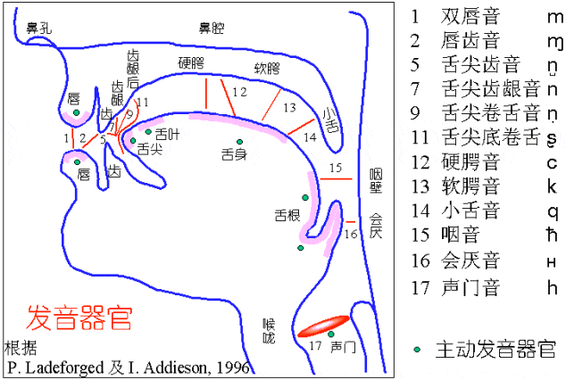
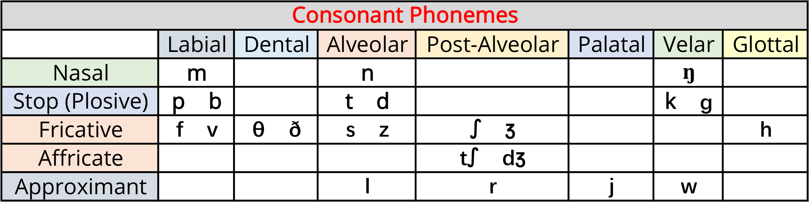
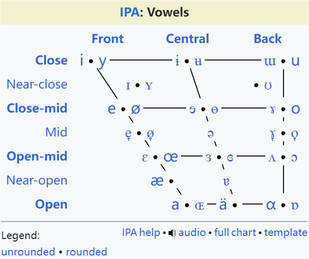
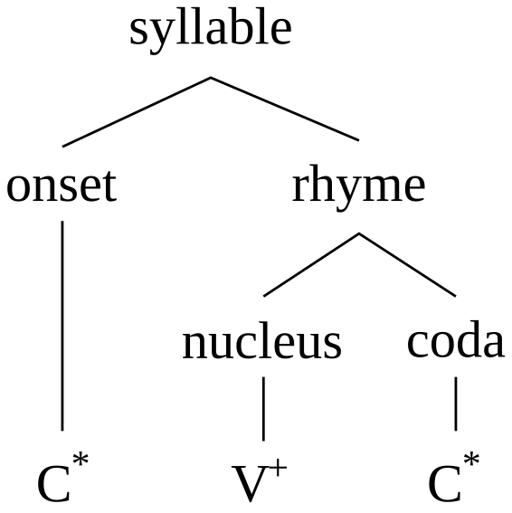
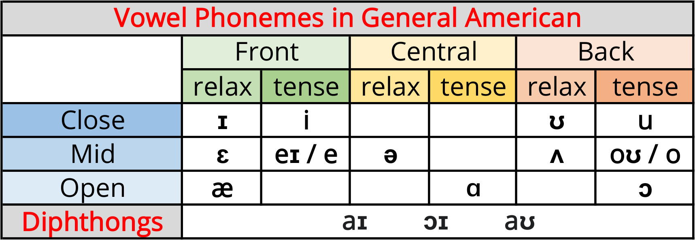
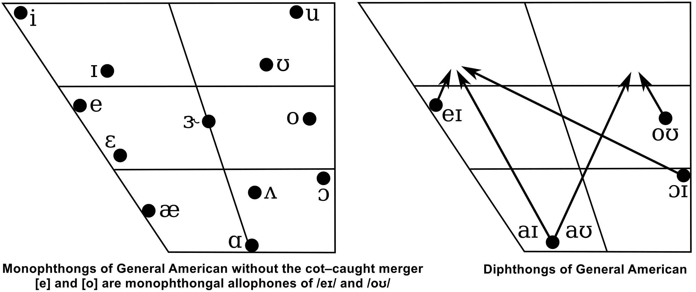
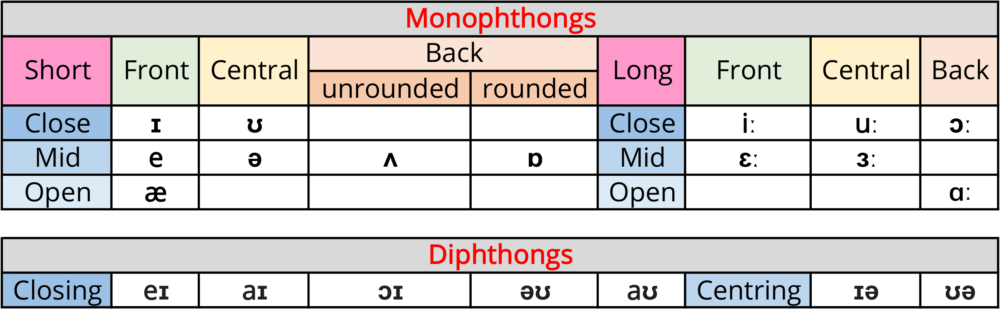
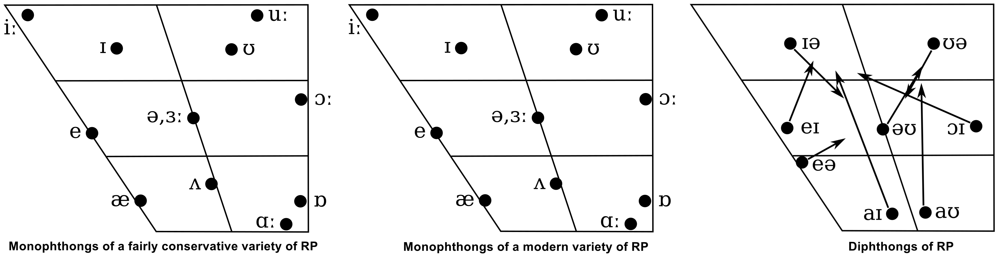

国际音标（International Phonetic Alphabet，IPA）是由国际语音协会设计的一套标准注音系统，又称万国音标。IPA以“将每一个可分辨的读音使用一个符号来表示（一音一符）”为原则，包含160余个字母和符号，可为世界上任何一种语言注音，是全世界多语言者的外语学习神器，在语言学中被广泛使用。

# IPA辅音系统

**辅音（consonant）**是一种通过完全或部分闭合声道发音的语音，不需要任何声道限制的辅音h除外。例如，[p]和[b]用嘴唇发音，[t]和[d]用舌头前部发音，[k]和[g]用舌头后部发音，[h]通过整个声道发音，[f]和[v]等发音时需要迫使空气通过狭窄的通道（摩擦音），[m]和[n]需要气流通过鼻子（鼻音）。大多数辅音是肺部音，利用肺部的气压产生声音。

由于世界上各种语言的语音数量远多于任何一个字母表中的字母数量，语言学家设计了IPA国际音标系统，为每个辅音分配一个唯一且无歧义的符号。英语字母表中的辅音字母比英语中的辅音少，因此使用二合字母（如ch、sh、th、ng）来扩展字母表，尽管有些字母和二合字母代表多个辅音。例如，thin中th的辅音与this中th的辅音不同，在国际音标中，它们分别是[θ]和[ð]。

每个口语辅音都可以通过几个语音特征来区分。在发辅音时，若声带充分振动，则称为浊音，若声带完全不振动，则称为清音。发音方式是指发出辅音时空气从声道逸出的方式，包括鼻音、塞音（爆破音）、摩擦音、近似音。发音部位是指声道中辅音被阻塞的位置，以及所涉及的发音器官，包括双唇、齿、齿龈（舌头抵住齿龈）、软腭（舌头抵住软腭）。

**鼻音（nasal）**是一种通过降低软腭发出的闭塞辅音，使空气可以自由地通过鼻腔逸出。几乎所有鼻辅音都是鼻闭音，即空气通过鼻子而不是嘴巴逸出，因为被嘴唇或舌头阻塞（闭塞），口腔仍然充当声音的共鸣腔。从声学角度来看，鼻音是响音，这意味着它们不会显著限制空气的排出（因为空气可以自由地从鼻子中排出）。但是，鼻音在发音时也是阻塞音，因为通过口腔的气流被阻塞。大多数鼻音都是浊音，事实上，鼻音[m]和[n]是跨语言最常见的声音之一。

**塞音（stop）**是一种肺音辅音，其中声道被阻塞，因此所有气流都停止。闭塞可以用嘴唇（[p]、[b]）、舌尖或舌叶（[t]、[d]）、舌体（[k]、[ɡ]）等来进行。塞音、闭塞音、爆破音这几个术语经常互换使用，这些术语指的是辅音的不同特征。塞音是指停止的气流，闭塞音是指闭塞（阻塞）声道的发音，爆破音是指辅音的释放爆发。

**摩擦音（fricative）**是通过将空气通过两个发声器官靠近而形成的一个狭窄通道而产生的辅音。摩擦音中有一类特殊的子集，即咝音（Sibilants），发咝音时，发音者仍需强行将气流吹过狭窄的通道，但舌头还要纵向卷曲，将气流引导至牙齿边缘。英语中的[s]、[z]、[ʃ]和[ʒ]就是咝音的例子。

**塞擦音（affricate）**是一种以塞音开头、以摩擦音结尾的辅音，通常很难判断塞音和擦音是形成单个音素还是辅音对。英语有两个塞擦音音素，[tʃ]和[dʒ]，通常分别拼写为ch和j字母。

**近音（approximant）**是指发音器官相互靠近，但距离不够近，发音不够精确，无法形成湍流气流的语音。因此，近音介于摩擦音（会产生湍流气流）和元音（不会产生湍流）之间。

# IPA元音系统

**元音（vowels）**是在声道中不经过任何限制而发出的音节语音，元音是两种主要语音类别之一，另一种是辅音。元音在质量（quality）、响度（loudness）、数量（quantity）、长度（length）上各不相同。它们通常是浊音，与声调、语调、重音等韵律变化密切相关。

元音发音的传统观点其实只是元音的发音特征之一，Daniel Jones开发了基本元音系统，从舌高（tongue height）、舌后度（tongue backness）、圆度（roundedness）等方面描述元音，分别对应垂直维度、水平维度、唇部发音三个方面，这三个参数在上面的IPA元音四边形示意图中有所指示。此外，还有其他元音质量特征，例如软腭位置（鼻音）、声带振动类型（发声）、舌根位置等。

自1928年以来，人们就知道这种元音发音概念是不准确的。早期的语音学家认为他们描述的是舌头的最高点，但事实并非如此，他们实际上描述的是共振峰频率。因此，元音四边形必须被视为一种抽象概念，而不是舌头位置的直接映射。尽管如此，元音质量主要由舌头位置和嘴唇圆润决定的概念仍在教学中继续使用，因为它为如何区分元音提供了直观的解释。

**高度（height）**。元音高度是指舌头或下颌（取决于模型）相对于口腔顶部或下颌开口的垂直位置。但实际上，它指的是第一共振峰（声音的最低共振），缩写为F1，它与舌头的高度有关。在闭元音（也称为高元音）中，例如[i]和[u]，第一共振峰与“舌头靠近上颚、在口腔中的位置较高”相一致；在开元音（也称为低元音）中，例如[a]，第一共振峰与“下颌张开、舌头在口腔中的位置较低”相一致。高度由F1值的倒数定义，第一共振峰的频率越高，元音越开（越低）。

**后度（backness）**。元音后度是指在发元音时舌头相对于口腔后部的位置。与元音高度一样，实际上，它由声音的第二共振峰（F2）定义，而不是由舌头的位置定义。在前元音中，例如[i]，第二共振峰F2的频率相对较高，这通常对应于舌头在口腔中向前的位置；在后元音中，例如[u]，第二共振峰F2的频率较低，与舌头位于口腔后部一致。

**圆度（roundedness）**。圆润音因某些元音的嘴唇圆润而得名，由于嘴唇圆润很容易看到，因此通常可以根据嘴唇的发音来识别元音是否圆润。从声学上讲，圆润元音主要通过F2的下降来识别，尽管F1也略有下降。在大多数语言中，圆润是中高后元音的强化特征，而不是独特特征。通常，后元音越高，圆润越强烈。

**鼻音化（nasalization）**。鼻音化是指气流通过鼻子时发生的。元音经常在邻近鼻辅音的影响下发生鼻音化，例如英语中hand的发音[hæ̃nd]。鼻元音的软腭降低，部分气流通过鼻腔和口腔；口元音是所有气流都通过口腔的元音。

**紧度（tenseness）**。紧度用于描述紧元音（tense vowels）与松元音（lax vowels）之间的对立。传统上认为这种对立是肌肉紧张程度增加的结果，尽管语音实验一再未能证明这一点。与元音质量的其他特征不同，紧度仅适用于具有这种对立的少数语言（主要是日耳曼语，例如英语），而其他语言（例如西班牙语）的元音无法以任何有意义的方式描述紧度。在传统语法中，与紧元音和松元音相比，长元音比短元音更常用。有些人会交替使用这两组术语，因为这些特征在某些英语变体中是并存的。在大多数日耳曼语中，松元音只能出现在闭音节中，因此，它们也被称为受阻元音，而紧元音被称为自由元音，因为它们可以出现在任何类型的音节中。其中，闭音节是指单词最后一个元音之后存在一个或多个辅音结尾。

# IPA音节结构

**音节（syllable）**是语音序列的组织单位，通常由音节核（nucleus）与音节边界（margin）组成，其中音节核通常是元音，而音节边界分为initial与final边界，通常是辅音。音节被认为是单词语音的构建块，它们可以影响语言的节奏、韵律、重音模式。语音通常可以分为许多音节，由一个音节组成的单词称为单音节词（monosyllable），类似的术语包括双音节词（disyllable）、三音节词（trisyllable）、多音节词（polysyllable）等。

在典型的音节结构理论中，音节的一般结构由两个或三个部分组成，如下图所示。声母（onset），辅音或辅音群，在某些语言中是必须的，在其他语言中则是可选的，甚至是受限制的。韵母（rhyme），与声母相对应，位于声母右侧的分支，包括音核（nucleus）、尾音（coda）。其中，音核是元音或音节辅音，在大多数语言中都是必须的；尾音是辅音或辅音群，与音核组合在一起作为韵母。

音核通常是音节中间的元音，声母是出现在音核之前的一个或多个声音，而尾音是出现在音核之后的一个或多个声音。在单音节英语单词cat中，声母是c，音核是a，尾音是t，韵母是at，这个音节可以抽象为辅音-元音-辅音音节，缩写为CVC。

**音节化（syllabification）**是将单词分成多个音节的过程，无论是口头还是书面。在大多数语言中，实际说出的音节也是书面音节化的基础。例如，由于现代英语拼写中声音和字母之间的对应关系非常弱，因此英语的书面音节化必须主要基于词源学，即形态学原理，而不是语音学原理。

将词尾辅音与紧随其后的单词开头的元音连在一起，是一些语言（例如英语）语音的常规部分。形如V、CV、CCV等无尾音的音节称为开音节或自由音节，而形如VC、CVC、CVCC等有尾音的音节称为闭音节。它们与开元音和闭元音无关，而是根据结束音节的音素来定义，元音（开音节）或辅音（闭音节）。其中，音素区分单词的最小语音单位。

# 美式元音系统

通用美音（General American，GA）是大多数美国人使用的美式英语的总称，它包含一系列连续的口音，而不是单一的统一口音。语言学家J. S. Kenyan和T. A. Knott根据IPA编写*A Pronouncing Dictionary of American English*一书，在其中引入并提出了通用美音这一术语，又称为KK音标。

在通用美式英语中，元音长度并不是音素，因此诸如[i]之类的元音通常不加长度标记。从语音上讲，当GA的元音位于同一音节中的强辅音[p, t, k, f, θ, s, ʃ, tʃ]之前时，它们为短元音[ɪ, i, ʊ, u, eɪ, oʊ, ɛ, ʌ, ɔ, æ, ɑ, aɪ, ɔɪ, aʊ]，在其他地方，它们为长元音[ɪː, iː, ʊː, uː, eːɪ, oːʊ, ɛː, ʌː, ɔː, æː, ɑː, aːɪ, ɔːɪ, aːʊ]。所有非重读元音都比重读元音短，重读音节后面的非重读音节越多，非重读音节就越短，因此lead中的[i]比leadership中的[i]长。

在通用美式英语中，[i, u, eɪ, oʊ, ɑ, ɔ]被认为构成一类自然的紧单元音，特别是对于使用cot–caught合并的方言发音者而言。

美式音标中包含的两个代表性符号[ɚ]和[ɝ]，正是美式英语中卷舌音的标志，它们分别被用来代替英式音标中的[ə]和[ɜː]。

# 英式元音系统

标准发音（Received Pronunciation，RP）通常被视为标准且最尊贵的英式英语口音。英国语言学家Daniel Jones根据IPA编写*English Pronouncing Dictionary*一书，在其中引入并提出了标准发音这一术语，又称为DJ音标。DJ音标又分为新旧两版，旧版在1963年出版，称为IPA63，新版在1988年出版，称为IPA88。新版引入/ɪ/代替旧版的/i/，引入/ʊ/代替旧版的/u/，引用/ɒ/代替旧版的/ɔ/等，让DJ音标更加清晰可辨。曾经课堂上会教授过旧版的IPA63，不过现在已经逐渐被新版IPA88取代，且IPA88也成为了目前主流的通用注音符号。

许多RP元音系统将单元音分类为长和短两类。虽然元音在音系上可长可短（即属于长元音或短元音），但其长度会受上下文影响。

如果音节中后面跟着清辅音（强辅音），元音就会缩短，这一过程称为前截断，例如，bat[bæt]中的元音就比bad[bæd]中的元音短，reach[riːtʃ]中的元音就比ridge[rɪdʒ]中的元音短。

非重读元音比重读元音更短且更集中，在元音前和词尾位置的非重读音节中，长高元音和短高元音之间的对比被中和，出现短的[i]和[u]，例如，happy[ˈhæpi]。

# 连读

