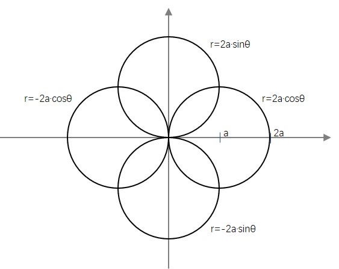

# 三角

### 三角函数关系
$$
\sec x=\cfrac{1}{\cos x} \qquad \csc x=\cfrac{1}{\sin x} \qquad \cot x=\cfrac{1}{\tan x} \\
\sin^2x+\cos^2x=1 \qquad \sin x=\cfrac{\tan x}{\sqrt{1+\tan^2 x}} \qquad \cos x=\cfrac{1}{\sqrt{1+\tan^2 x}}
$$

### 反三角函数关系

$$
\arcsin(-x)=-\arcsin x \qquad \arccos(-x)=\pi-\arccos x \\
\arctan(-x)=-\arctan x \qquad \text{arccot}(-x)=\pi-\text{arccot}\,x \\
\arcsin x+\arccos x=\cfrac{\pi}{2} \qquad \arctan x+\text{arccot}\,x=\cfrac{\pi}{2} \qquad \text{arcsec}\,x+\text{arccsc}\,x=\cfrac{\pi}{2} \\
\arcsin\cfrac{1}{x}=\text{arccsc}\,x \qquad \arccos\cfrac{1}{x}=\text{arcsec}\,x \qquad \arctan\cfrac{1}{x}=\text{arccot}\,x
$$

### 三角函数与反三角函数关系（画单位圆与三角形）

$$
\sin(\arcsin x)=x \qquad \sin(\arccos x)=\sqrt{1-x^2} \\
\cos(\arcsin x)=\sqrt{1-x^2} \qquad \cos(\arccos x)=x
$$

因为$\arcsin x$的值域是$[-\cfrac{\pi}{2},\cfrac{\pi}{2}]$，则有$\arcsin(\sin \theta)=\begin{cases} \theta & 0\le\theta\le\cfrac{\pi}{2} \\ \pi-\theta & \cfrac{\pi}{2}<\theta\le\pi \end{cases}$

### 诱导公式（奇变偶不变，符号看象限）

$$
\sin(-x)=-\sin x \qquad \cos(-x)=\cos x \qquad \tan(-x)=-\tan x \\
\sin(x+k\cfrac{\pi}{2})=\begin{cases}(-1)^{\cfrac{k}{2}}\sin x & k为偶数 \\ (-1)^{\cfrac{k-1}{2}}\cos x & k为奇数\end{cases} \\
\cos(x+k\cfrac{\pi}{2})=\begin{cases}(-1)^{\cfrac{k}{2}}\cos x & k为偶数 \\ (-1)^{\cfrac{k+1}{2}}\sin x & k为奇数\end{cases} \\
\tan(x+k\cfrac{\pi}{2})=\begin{cases}\tan x & k为偶数 \\ \cot x & k为奇数\end{cases}
$$

### 两角的和差公式

$$
\sin(a\pm b)=\sin a\cos b\pm\cos a\sin b \\
\cos(a\pm b)=\cos a\cos b\mp\sin a\sin b \\
\tan(a\pm b)=\cfrac{\tan a\pm\tan b}{1\mp\tan a\tan b}
$$

### 积化和差公式

$$
\sin a\sin b=-\cfrac{1}{2}[\cos(a+b)-\cos(a-b)] \\
\cos a\cos b=\cfrac{1}{2}[\cos(a+b)+\cos(a-b)] \\
\sin a\cos b=\cfrac{1}{2}[\sin(a+b)+\sin(a-b)]
$$

### 和差化积

$$
\sin a+\sin b=2\sin\cfrac{a+b}{2}\cos\cfrac{a-b}{2} \\
\sin a-\sin b=2\sin\cfrac{a-b}{2}\cos\cfrac{a+b}{2} \\
\cos a+\cos b=2\cos\cfrac{a+b}{2}\cos\cfrac{a-b}{2} \\
\cos a-\cos b=-2\sin\cfrac{a+b}{2}\sin\cfrac{a-b}{2} \\
\tan a\pm\tan b=\cfrac{\sin(a\pm b)}{\cos a\cos b} \\
\cot a\pm\cot b=\pm\cfrac{\sin(a\pm b)}{\sin a\sin b}
$$

### 倍角公式（升幂公式）

$$
\sin 2a=2\sin a\cos a \\
\cos 2a=\cos^2a-\sin^2a=2\cos^2a-1=1-2\sin^2a \\
\tan 2a=\cfrac{2\tan a}{1-\tan^2a}
$$

### 半角公式（降幂公式）

$$
\sin^2a=\cfrac{1}{2}(1-\cos 2a) \qquad \cos^2a=\cfrac{1}{2}(1+\cos 2a) \qquad \tan^2a=\cfrac{1-\cos 2a}{1+\cos 2a} \\
\tan a=\cfrac{1-\cos 2a}{\sin 2a}=\cfrac{\sin 2a}{1+\cos 2a}
$$

### 三倍角公式

$$
\sin 3a=3\sin a-4\sin^3a \\
\cos 3a=4\cos^3a-3\cos a \\
\tan 3a=\cfrac{3\tan a-\tan^3a}{1-3\tan^2a}
$$

### 万能公式

$$
\sin a=\cfrac{2\tan\cfrac{a}{2}}{1+\tan^2\cfrac{a}{2}} \qquad \cos a=\cfrac{1-\tan^2\cfrac{a}{2}}{1+\tan^2\cfrac{a}{2}} \qquad \tan a=\cfrac{2tan\cfrac{a}{2}}{1-\tan^2\cfrac{a}{2}}
$$

### 正余弦定理

$$
\cfrac{a}{\sin A}=\cfrac{b}{\sin B}=\cfrac{c}{\sin C}=2R（三角形外接圆半径） \\
\cos A=\cfrac{b^2+c^2-a^2}{2bc}
$$

### 三角形面积

$$
S=\cfrac{1}{2}ab\sin C=\cfrac{1}{2}bc\sin A=\cfrac{1}{2}ac\sin B
$$

# 代数

### 开根号与去绝对值

在对任何式子进行开根号$I=\sqrt{f(x)}$或去绝对值$I=|f(x)|$操作时，都要注意式子$f(x)$在定义域上的正负性，来判断是否要在运算后添加负号以保持整体$I$是正值。

比如$I=\int_{-1}^{1}(x^2)^{\frac{3}{2}}dx=\int_{-1}^{1}\sqrt{x^6}dx=\int_{-1}^{0}(-x^3)dx+\int_{0}^{1}x^3dx=\cfrac{1}{2}$，而过程$I=\int_{-1}^{1}x^3dx=0$是错误的。

### 对数运算规则

$$
\log_a(MN)=\log_aM+\log_aN \qquad \log_a\cfrac{M}{N}=\log_aM-\log_aN \qquad \log_aM^r=r\log_aM
$$

### 等差数列

$$
a_n=a_1+(n-1)d \qquad S_n=\cfrac{(a_1+a_n)n}{2}=na_1+\cfrac{n(n-1)d}{2}
$$

### 等比数列

$$
a_n=a_1q^{n-1} \qquad S_n=\begin{cases}\cfrac{a_1(1-q^n)}{1-q}=\cfrac{a_1-a_nq}{1-q} & q\ne-1 \\ na_1 & q=1\end{cases}
$$

### 常见数列前n项和

$$
1+2+3+\cdots+n=\cfrac{n(n+1)}{2} \\
1^2+2^2+3^2+\cdots+n^2=\cfrac{n(n+1)(2n+1)}{6} \\
1^2+3^2+\cdots+(2n-1)^2=\cfrac{n(2n-1)(2n+1)}{3} \\
1^3+2^3+3^3+\cdots+n^3=[\cfrac{n(n+1)}{2}]^2
$$

### 排列组合公式与性质

$$
A_n^m=n(n-1)\cdots(n-m+1)=\frac{n!}{(n-m)!} \\
C_n^m=\cfrac{A_n^m}{A_m^m}=\frac{n!}{m!(n-m)!} \\
C_n^m=C_n^{n-m}=C_{n-1}^m+C_{n-1}^{m-1}
$$

### 复数与欧拉公式

$$
z=a+bi=r(\cos\theta+i\sin\theta)=re^{i\theta} \quad r=|z|=\sqrt{a^2+b^2} \quad \theta=\arctan{\cfrac{b}{a}} \\
e^{i\theta}=\cos\theta+i\sin\theta \qquad (e^{i\theta})'=ie^{i\theta} \\
\sin\theta=\cfrac{1}{2i}(e^{i\theta}-e^{-i\theta}) \qquad \cos\theta=\cfrac{1}{2}(e^{i\theta}+e^{-i\theta})
$$

### 基本不等式

调和均值≤几何均值≤算术均值≤平方均值，如下。
$$
\cfrac{2}{\cfrac{1}{a}+\cfrac{1}{b}}\le\sqrt{ab}\le\cfrac{a+b}{2}\le\sqrt{\cfrac{a^2+b^2}{2}} \\
$$

若a、b同号或a、b至少有一个为0，则$a^2+b^2\le (a+b)^2$

柯西不等式，$(ac+bd)^2\le(a^2+b^2)(c^2+d^2)$

绝对值不等式，$|a|-|b|\le|a\pm b|\le|a|+|b|$

### 取整符号问题

下取整函数$\lfloor r\rfloor$表示不大于r的最大整数，则有$r-1<\lfloor r\rfloor\le r$

上取整函数$\lceil r\rceil$表示不小于r的最小整数，则有$r\le\lceil r\rceil<r+1$

设x为实数，h为整数，则若$x\le h<x+1\Longrightarrow h=\lceil x\rceil$，若$x-1<h\le x\Longrightarrow h=\lfloor x\rfloor$

### 立方和差公式

$$
a^3+b^3=(a+b)(a^2-ab+b^2) \qquad a^3-b^3=(a-b)(a^2+ab+b^2)
$$

### 二次方程（韦达定理）

$$
ax^2+bx+c=0 \qquad x_{1,2}=\cfrac{-b\pm\sqrt{b^2-4ac}}{2a} \\
x_1+x_2=-\cfrac{b}{a} \qquad x_1x_2=\cfrac{c}{a}
$$

### 三次方程求解

对于三次方程$x^3+ax^2+bx+c=0$，求解的基本思路是，先观察多项式（求$f'(x),f''(x)$画出图像等方法），代入特殊值先找到一个解$x_1$，然后进行因式分解，即化成$(x-x_1)(x^2+dx+e)=0$，再解二次方程求剩下的两个解。

### 一元n次方程的韦达定理

设一元n次方程$a_nx^n+a_{n-1}x^{n-1}+\cdots+a_1x+a_0=0$的根为$x_1,x_2,\cdots,x_n$，则有
$$
x_1+x_2+\cdots+x_n=\sum_{i=1}^nx_i=-\cfrac{a_{n-1}}{a_n} \\
x_1x_2\cdots x_n=\prod_{i=1}^nx_i=(-1)^n\cfrac{a_0}{a_n}
$$

# 几何与解析几何

### 扇形弧长与面积

$$
l=\alpha r \qquad S=\cfrac{1}{2}lr=\cfrac{1}{2}\alpha r^2
$$

### 常见物体体积与面积

$$
V_{圆锥}=\cfrac{1}{3}\pi hR^2 \qquad V_{圆台}=\cfrac{1}{3}\pi h(r^2+R^2+rR) \\
V_{球}=\cfrac{4}{3}\pi r^3 \qquad S_{球表面}=4\pi r^2
$$

### 对称的几个关系

若$y=f(x)$关于直线$x=a$对称，则$f(x)=f(2a-x)$，即$f(a-x)=f(a+x)$

若$y=f(x)$关于点$(a,0)$对称，则$f(x)=-f(2a-x)$，即$f(a-x)=-f(a+x)$

### 解析几何中常见的距离

点$P(x_0,y_0)$到直线$L:Ax+By+C=0$的距离为$d=\cfrac{|Ax_0+By_0+C|}{\sqrt{A^2+B^2}}$

两直线$L_1:Ax+By+C_1=0$和$L_2:Ax+By+C_2=0$之间的距离为$d=\cfrac{|C_1-C_2|}{\sqrt{A^2+B^2}}$

### 常见圆的极坐标图像与方程

## 图形移动与坐标轴方向的关系

对于$y=f(x)$的图像，若对其自变量加减一个正数，而坐标轴不变，会使得图像沿坐标轴移动，规律是“左加右减”，即对$x$加一个正数会使图像沿坐标轴向左边移动，减一个整数会使图像沿坐标轴向右边移动。但当函数是二维的$z=(x,y)$时，其$y$轴为竖直方向，无法判断其移动。

实际上，上述规律真正是“**负加正减**”，即**对自变量加上一个正数，会使图像向坐标轴负方向移动；对自变量减去一个正数，会使图像向坐标轴正方向移动**。