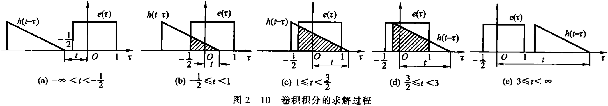
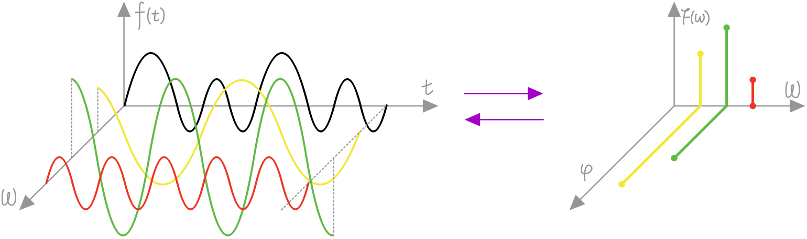
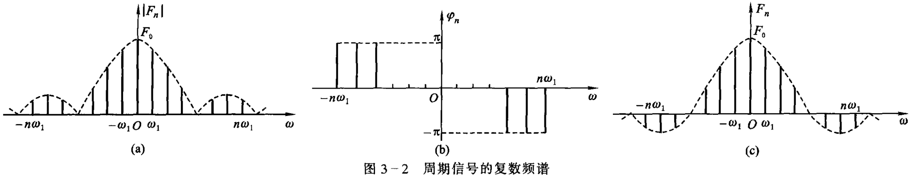
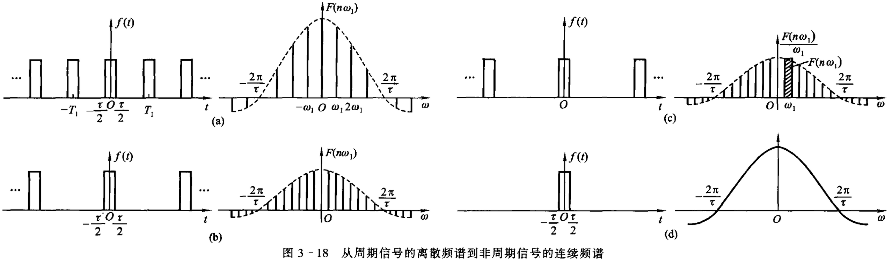

[toc]

# 一、绪论

描述信号的基本方法是写出它的数学表达式，此表达式是时间$t$的函数$f(t)$，绘出函数的图像称为信号的波形。此外，随着问题的深入，还需要用频谱分析、各种正交变换以及其他方式来描述和研究信号。

## （一）典型信号示例

**指数信号**的表示式为
$$
f(t) = K e^{at} \tag{1-2}
$$
式中$a$是实数。若$a>0$，信号随时间增长，若$a<0$，信号随时间衰减，在$a=0$的特殊情况下，信号不随时间变化，成为直流信号。常数$K$表示指数信号在$t=0$时的初始值。

指数信号的一个重要特性是它对时间的微分和积分仍然是指数形式。

**正弦信号与余弦信号**二者仅在相位上相差$\frac{\pi}{2}$，经常统称为正弦信号，一般写作
$$
f(t) = K\sin(\omega t+\theta) \tag{1-3}
$$
式中$K$为振幅，$\omega$是角频率，$\theta$称为初相位，其波形下图1-6所示。

正弦信号是周期信号，其周期$T$与角频率$\omega$和频率$f$满足下列关系式
$$
T = \frac{2\pi}{\omega} = \frac1f
$$
在信号与系统分析中，有时要遇到衰减的正弦信号，波形如上图1-7所示，此正弦振荡的幅度按指数规律衰减，其表达式为
$$
f(t) = \begin{cases}
0 & t<0 \\
Ke^{-\alpha t} \sin(\omega t) & t\ge0
\end{cases} \tag{1-4}
$$
正弦信号和余弦信号常借助复指数信号来表示。由欧拉公式可知
$$
\begin{align}
e^{i\theta} &= \cos\theta + i\sin\theta \\
e^{ j\omega t} &= \cos(\omega t) + j\sin(\omega t) \\
e^{-j\omega t} &= \cos(\omega t) - j\sin(\omega t)
\end{align}
$$
其中，$i$表示虚数符号。因为$e^{i\theta}$的模永为$1$，所以$e^{i\theta}$表示**复平面**上距离原点为$1$的一个点，当取$\theta$从$0$到$2\pi$所有值时，其对应的点就（逆时针）构成一个在复平面上的单位圆。

在信号处理中，通常用$j$表示虚数符号，所以有
$$
\begin{align}
\cos(\omega t) &= \frac{1}{2}(e^{j\omega t}+e^{-j\omega t}) \tag{1-5} \\
\sin(\omega t) &= \frac{1}{2j}(e^{j\omega t}-e^{-j\omega t}) \tag{1-6}
\end{align}
$$
与指数信号的性质类似，正弦信号对时间的微分与积分仍是同频率的正弦信号。

如果指数信号的指数因子为一复数，则称之为**复指数信号**，其表达式为
$$
\begin{align}
f(t) &= Ke^{st} \\
s &= \sigma+j\omega
\end{align} \tag{1-7}
$$
其中，$\sigma$为复数$s$的实部，$j$为其虚部。由欧拉公式将式(1-7)展开，可得
$$
\begin{align}
Ke^{st} = Ke^{(\sigma+j\omega)t} &= Ke^{\sigma t}(\cos(\omega t)+j\sin(\omega t)) \\
&= Ke^{\sigma t}\cos(\omega t) + jKe^{\sigma t}\sin(\omega t)
\end{align} \tag{1-8}
$$
此结果表明，一个复指数信号可分解为实、虚两部分。其中，实部包括余弦信号，虚部则为正弦信号。指数因子实部$\sigma$表征了正弦与余弦函数振幅随时间变化的情况。若$\sigma>0$，正弦余弦信号是增幅振荡，若$\sigma<0$，正弦余弦信号是衰减振荡。指数因子的虚部$\omega$则表示正弦与余弦信号的角频率。特殊情况是，当$\sigma=0$，即$s$为虚数，则正弦余弦信号是等幅振荡；而当$\omega=0$，即$s$为实数，则复指数信号成为一般的指数信号；若$\sigma=0,\omega=0$，即$s$等于零，则复指数信号的实部和虚部都与时间无关，成为直流信号。

虽然实际上不能产生复指数信号，但是它概括了多种情况，可以利用复指数信号来描述各种基本信号，如直流信号、指数信号、正弦或余弦信号以及增长或衰减的正弦与余弦信号。利用复指数信号可使许多运算和分析得以简化。在信号分析理论中，复指数信号是一种非常重要的基本信号。

$\text{Sa}(t)$函数即$\text{Sa}(t)$信号（**抽样信号**），指的是$\sin t$与$t$之比构成的函数，它的定义如下
$$
\text{Sa}(t) = \frac{\sin t}{t} \tag{1-9}
$$
抽样函数的波形如图1-8所示。

可以看到，$\text{Sa}(t)$是一个偶函数，在$t$的正负两方向振幅都逐渐衰减，当$t=\pm\pi,\pm2\pi,\cdots,\pm n\pi$时，函数值等于零。$\text{Sa}(t)$函数具有如下性质。
$$
\begin{align}
\int_0^\infty \text{Sa}(t)\mathrm dt &= \frac{\pi}{2} \tag{1-10} \\
\int_{-\infty}^\infty \text{Sa}(t)\mathrm dt &= \pi \tag{1-11}
\end{align}
$$
与$\text{Sa}(t)$函数类似的是$\text{sinc}(t)$函数，它的表达式为
$$
\text{sinc}(t) = \frac{\sin(\pi t)}{\pi t} = \text{Sa}(\pi t) \tag{1-12}
$$

## （二）信号的运算

信号的运算包括信号的移位（时移或延时）、反褶、尺度倍乘（压缩与扩展）、微分、积分以及两信号的相加或相乘。

信号的移位表示，将$f(t)$表达式的自变量$t$更换为$t+t_0$（$t_0\in\R$），则$f(t+t_0)$相当于$f(t)$波形在$t$轴上的整体移动，当$t_0>0$时波形左移，当$t_0<0$时波形右移。信号反褶表示，将$f(t)$的自变量$t$更换为$-t$，此时$f(t)$的波形相当于将$f(t)$以$t=0$为轴反褶过来，此运算也称为时间轴反转。如果将信号$f(t)$的自变量$t$乘以正实系数$a$，则信号波形$f(at)$将是$f(t)$波形的压缩（$a>1$）或扩展（$a<1$），这种运算称为时间轴的尺度倍乘或尺度变换，也可简称为尺度。

综合以上三种情况，若$f(t)$的自变量$t$更换为$at+t_0$（其中$a,t_0$是给定实数），此时$f(at+t_0)$相对于$f(t)$可以是压缩（$a>1$）或扩展（$a<1$），也可能出现时间上的反褶（$a<0$），或移位（$t_0\ne0$），而波形整体仍保持与$f(t)$相似的形状。

信号$f(t)$的微分运算是指$f(t)$对$t$取导数，即
$$
f'(t) = \frac{\mathrm d}{\mathrm dt}f(t) \tag{1-14}
$$
信号$f(t)$的积分运算指$f(\tau)$在$(-\infty,t)$区间内的定积分，其表达式为
$$
\int_{-\infty}^t f(\tau) \mathrm d\tau \tag{1-15}
$$
下图1-14和图1-15分别示出微分与积分运算的例子。

由图1-14可见，信号经微分后突出显示了它的变化部分。若$f(t)$是一幅黑白图像信号，那么，经微分运算后将使其图形的边缘轮廓突出。由图1-15中的波形可见，信号经积分运算后其效果与微分相反，信号的突变部分可变得平滑，利用这一作用可削弱信号中混入的毛刺（噪声）的影响。

下面给出这两种运算的例子。$f_1(t)=\sin(\Omega t),f_2(t)=\sin(8\Omega t)$，两信号相加和相乘的表达式分别为
$$
\begin{align}
f_1(t)+f_2(t) &= \sin(\Omega t)+\sin(8\Omega t) \tag{1-18} \\
f_1(t)\cdot f_2(t) &= \sin(\Omega t)\cdot\sin(8\Omega t) \tag{1-19}
\end{align}
$$
其波形分别如下图1-16和图1-17所示。

必须指出，在通信系统的调制、解调等过程中将经常遇到两信号相乘运算。

## （三）阶跃信号与冲激信号

在信号与系统分析中，经常要遇到函数本身有不连续点（跳变点），或其导数与积分有不连续点的情况，这类函数统称为奇异函数或奇异信号。本节将要介绍的信号包括斜变、阶跃、冲激、冲激偶四种信号，其中，阶跃信号与冲激信号是两种最重要的理想信号模型。

### 1. 单位斜变信号

斜变信号也成为斜坡信号或斜升信号。这是指这是指从某一时刻开始随时间正比例增长的信号。如果增长的变化率是$1$，就称为单位斜变信号，其波形如图1-18所示，表示式为

$$
f(t) = \begin{cases}
0 & t<0 \\
t & t\ge0
\end{cases} \tag{1-20}
$$
如果将起始点移至$t_0$，则应写作
$$
f(t-t_0) = \begin{cases}
0 & t<t_0 \\
t-t_0 & t\ge t_0
\end{cases} \tag{1-21}
$$
其波形如图1-19所示。

在实际应用中常遇到“截平的”斜变信号，在时间$\tau$以后斜变波形被切平，如图1-20所示，其表示式为
$$
f_1(t) = \begin{cases}
\frac{K}{\tau}f(t) & t<\tau \\
K & t\ge\tau
\end{cases} \tag{1-22}
$$
图1-21所示三角形脉冲也可用斜变信号表示，写作
$$
f_2(t) = \begin{cases}
\frac{K}{\tau}f(t) & t\le \tau \\
0 & t>\tau
\end{cases} \tag{1-23}
$$

### 2. 单位阶跃信号

单位阶跃信号的波形如图1-22(a)所示，通常以符号$u(t)$表示
$$
u(t) = \begin{cases}
0 & t<0 \\
1 & t>0
\end{cases} \tag{1-24}
$$
在跳变点$t=0$处，函数值未定义，或在$t=0$处规定函数值$u(0)=\frac12[u(0^-)+u(0^+)]=\frac12$。容易证明，单位斜变函数的导数等于单位阶跃函数。

单位阶跃函数的物理背景是，在$t=0$时刻对某一电路接入单位电源（可以是直流电压源或直流电流源），并且无限持续下去。图l-22(b)示出接入1V直流电压源的情况，在接入端口处电压为阶跃信号$u(t)$。阶跃信号鲜明地表现出信号的单边特性。即信号在某接入时刻以前的幅度为零。利用阶跃信号的这一特性，可以较方便地以数学表示式描述各种信号的接入特性。

如果接入电源的时间推迟到$t=t_0$时刻（$t_0>0$），那么，可用一个“延时的单位阶跃函数”表示
$$
u(t-t_0) = \begin{cases}
0 & t<t_0 \\
1 & t>t_0
\end{cases} \tag{1-25}
$$
波形如图1-23所示。

为书写方便，常利用阶跃及其延时信号之差来表示**矩形脉冲**，其波形如图1-24(a)或1-24(b)所示，对于(a)信号以$R_T(t)$表示
$$
R_T(t) = u(t) - u(t-T)
$$
下标$T$表示矩形脉冲出现在$0$到$T$时刻之间。

如果矩形脉冲对于纵坐标左右对称，如图l-24(b)所示，则以符号$G_T(t)$表示
$$
G_T(t) = u(t+\frac{T}{2}) - u(t-\frac{T}{2}) \tag{1-26}
$$
下标$T$表示其宽度。

### 3. 单位冲激信号

某些物理现象需要用一个时间极短，但取值极大的函数模型来描述，例如力学中瞬间作用的冲击力，电学中的雷击电闪，**数字通信中的抽样脉冲**等。冲激函数的概念就是以这类实际问题为背景而引出的。

冲激函数可由不同的方式来定义。首先分析矩形脉冲如何演变为冲激函数。图1-28示出宽为$\tau$、高为$\frac1\tau$的矩形脉冲，当保持矩形脉冲面积$\tau\frac1\tau=1$不变，而使脉宽$\tau$趋近于零时，脉冲幅度$\frac1\tau$必趋于无穷大，此（广义）极限即为单位冲激函数，常记作以$\delta(t)$，又称为$\delta$函数。
$$
\delta(t) = \lim_{\tau\to0} \frac1\tau \left[u(t+\frac{T}{2}) - u(t-\frac{T}{2})\right] \tag{1-31}
$$
冲激函数用箭头表示，如图1-29所示。它表明，$\delta(t)$只在$t=0$点有一“冲激”，在其他$t\ne0$各处，函数值都是零。

如果矩形脉冲的面积不是固定为$1$，而是$E$，则表示一个**冲激强度**为$E$倍单位值的$\delta$函数，即$E\delta(t)$，在用图形表示时，可将此强度$E$注于箭头旁。

以上**利用矩形脉冲系列的极限来定义冲激函数**，这种极限不同于一般的极限概念，可称为广义极限。为引出冲激函数，规则函数系列的选取可不局限于矩形，也可换用其他形式。例如，一组底宽为$2\tau$、高为$\tau$的三角形脉冲系列，若保持其面积等于$1$，取$\tau\to0$的极限，同样可定义为冲激函数。此外，还可利用指数函数、钟形函数、抽样函数等，如图1-30所示。

如上图1-30(d)所示，冲激函数由抽样信号$\text{Sa}(t)$的定义如下
$$
\delta(t) = \lim_{k\to\infty}[\frac{k}{\pi}\text{Sa}(kt)] \tag{1-35}
$$
上式(1-35)中，$k$越大，函数的振幅越大，且离开原点时函数振荡越快，衰减越迅速。由式(1-11)，即$\int_{-\infty}^\infty \text{Sa}(t)\mathrm dt = \pi$可知，曲线下净面积保持为$1$。当$k\to\infty$时，得到冲激函数。

另外，狄拉克（Dirac）给出$\delta$函数的另一种定义方式
$$
\begin{cases}
\int_{-\infty}^\infty \delta(t)\mathrm dt = 1 \\
\delta(t) = 0 & t\ne0
\end{cases} \tag{1-36}
$$
此定义与式(1-31)的定义相符合。有时，也称$\delta$函数为狄拉克函数。

类似地，为描述在任一点$t=t_0$处出现的冲激，可有如下的函数定义
$$
\begin{cases}
\int_{-\infty}^\infty \delta(t-t_0)\mathrm dt = 1 \\
\delta(t-t_0) = 0 t\ne t_0
\end{cases} \tag{1-37}
$$
此函数图形如图1-31所示。

如果单位冲激信号与一个在$t=0$点连续（且处处有界）的信号$f(t)$相乘，则其乘积仅在$t=0$处得到$f(0)\delta(t)$，其余各点之乘积均为$0$，于是对于冲激函数有如下的性质
$$
\begin{align}
\int_{-\infty}^\infty f(t)\delta(t)\mathrm dt &= \int_{-\infty}^\infty f(0)\delta(t)\mathrm dt \\
&= f(0)\int_{-\infty}^\infty \delta(t)\mathrm dt \\
&= f(0)
\end{align} \tag{1-38}
$$
类似地，对于延迟的单位冲激信号有
$$
\int_{-\infty}^\infty f(t)\delta(t-t_0)\mathrm dt = \int_{-\infty}^\infty f(t_0)\delta(t-t_0)\mathrm dt = f(t_0) \tag{1-39}
$$
以上两式表明了**冲激信号的抽样特性**（或称“筛选”特性）。续时间信号$f(t)$与单位冲激信号$\delta(t)$相乘并在$-\infty$到$+\infty$时间内取积分，可以得到$f(t)$在$t=0$点（抽样时刻）的函数值$f(0)$，也即“筛选”出$f(0)$。若将单位冲激移到$t=t_0$时刻，则抽样值取$f(t_0)$。

另外，$\delta$函数尺度运算为$\delta(at)=\frac{1}{|a|}\delta(t)$。此外，冲激函数是偶函数数，即$\delta(t)=\delta(-t)$。

**冲激函数的积分等于阶跃函数**，由公式(1-36)可知
$$
u(t) = \int_{-\infty}^t \delta(\tau)\mathrm d\tau = \int_{-\infty}^t \delta(\tau)\mathrm d\tau = \begin{cases}
0 & t < 0 \\
1 & t > 0
\end{cases} \tag{1-41}
$$
反过来，**阶跃函数的微分等于冲激函数**
$$
\frac{\mathrm d}{\mathrm dt}u(t) = \delta(t) \tag{1-42}
$$
此结论也可作如下的解释，即阶跃函数在除$t=0$以外的各点都取固定值，其变化率都等于零。而在$t=0$有不连续点，此跳变的微分对应在零点的冲激。

### 4. 冲激偶信号

冲激函数的微分（阶跃函数的二阶导数）将呈现正负极性的一对冲激，称为冲击偶信号，以$\delta'(t)$表示。可利用规则函数系列取极限的概念引出$\delta'(t)$，在此借助三角脉冲系列，波形如图1-35所示。

可以看到，三角形脉冲$s(t)$其底宽为$2\tau$，高度为$\frac1\tau$，当$\tau\to0$时，$s(t)$成为单位冲激函数$\delta(t)$。在图1-35左下是$\frac{\mathrm ds(t)}{\mathrm dt}$的波形，它是正负极性的两个脉冲矩阵，称为**脉冲偶对**，其宽度都为$\tau$，高度分别为$\pm\frac{1}{\tau^2}$，面积都是$\frac1\tau$。随着$\tau$减小，脉冲偶对宽度变窄，幅度增高，面积为$\frac1\tau$，当$\tau\to0$时，$\frac{\mathrm ds(t)}{\mathrm dt}$是正负极性的两个冲激函数，其强度均为无限大，如图1-35右下所示，这就是冲激偶$\delta'(t)$。

**冲激偶的一个重要性质**是
$$
\int_{-\infty}^\infty f(t)\delta'(t)\mathrm dt = -f'(0) \tag{1-46}
$$
这里，$f'(0)$是导数$f'(t)$在零点处的取值，此关系式可由分部积分展开而得到证明
$$
\int_{-\infty}^\infty f(t)\delta'(t)\mathrm dt
= f(t)\delta(t)\Big|_{-\infty}^\infty - \int_{-\infty}^\infty f'(t)\delta(t)\mathrm dt
= -f'(0)
$$
对于延迟$t_0$的冲激偶$\delta'(t-t_0)$，同样有
$$
\int_{-\infty}^\infty f(t)\delta'(t-t_0)\mathrm dt = -f'(t_0) \tag{1-47}
$$
冲激偶的另一个性质是，它积分所包含的面积等于零，这是因为正负两个冲激的面积相互抵消了，于是有
$$
\int_{-\infty}^\infty \delta'(t)\mathrm dt = 0 \tag{1-48}
$$

## （四）线性时不变系统

为便于对系统进行分析，需要建立系统的模型。所谓模型，是系统物理特性的数学抽象，以数学表达式或具有理想特性的符号组合图形来表征系统特性。例如，由电阻器、电容器和线圈组合而成的串联回路系统。系统模型的建立是有一定条件的，对于同一物理系统，在不同条件之下，以得到不同形式的数学模型。

对于较复杂的系统，其数学模型可能是一个高阶微分方程，规定此微分方程的阶次就是系统的阶数。也可以把这种高阶微分方程改为以一阶联立方程组的形式给出，这是同一个系统模型的两种不同表现形式，前者称为输入-输出方程，后者称为状态方程，它们之间可以相互转换。

建立数学模型只是进行系统分析的第一步，为求得给定激励条件下系统的响应，还应当知道激励接入瞬时系统内部的能量储存情况。系统的起始状态由若干独立条件给出，独立条件的数目与系统的阶次相同。如果系统数学模型、起始状态以及输入激励信号都已确定，即可运用数学方法求解其响应。一般情况下可以对所得结果作出物理解释、赋予物理意义。

系统的分类错综复杂，主要考虑其数学模型的差异来划分不同的类型。

- 若系统的输入和输出都是连续时间信号，且其则称此系统为**连续时间系统**。若系统的输入和输出都是离散时间信号，则称此系统为**离散时间系统**。实际上，离散时间系统经常与连续时间系统组合运用，这种情况称为混合系统。连续时间系统的数学模型是微分方程，而离散时间系统则用差分方程描述。
- 如果系统的输出信号只取决于同时刻的激励信号，与它过去的工作状态无关，则称此系统为**即时系统**（或无记忆系统）。如果系统的输出信号不仅取决于同时刻的激励信号，而且与它过去的工作状态有关，这种系统称为**动态系统**（或记忆系统）。即时系统可用代数方程描述，动态系统的数学模型则是微分方程或差分方程。在分析动态系统时，变量的选择又有两种方式，一种是选择输出变量与输入变量（响应与激励），另一种是选择状态变量（如电容电压、电感电流等）。
- 只由集总参数元件组成的系统称为**集总参数系统**；含有分布参数元件的系统是**分布参数系统**（如传输线、波导等）。集总参数系统用常微分方程作为它的数学模型。而分布参数系统的数学模型是偏微分方程，这时描述系统的独立变量不仅是时间变量，还要考虑到空间位置。
- 具有叠加性与均匀性（也称齐次性，homogeneity）的系统称为**线性系统**。所谓叠加性是指当几个激励信号同时作用于系统时，总的输出响应等于每个激励单独作用所产生的响应之和；而均匀性的含义是，当输入信号乘以某常数时，响应也倍乘相同的常数。不满足叠加性或均匀性的系统是**非线性系统**。
- 如果系统的参数不随时间而变化，则称此系统为**时不变系统**（或非时变系统、定常系统）；如果系统的参量随时间改变，则称其为**时变系统**（或参变系统）。
- 若系统在不同的激励信号作用下产生不同的响应，则称此系统为**可逆系统**。对于每个可逆系统都存在一个“逆系统”，当原系统与此逆系统级联组合后，输出信号与输入信号相同。

本书着重讨论确定性输入信号作用下的集总参数线性时不变系统（Linear Time Invariant，LTI），包括连续时间系统与离散时间系统。线性时不变系统具有一些**基本特性**。

### 1. 叠加性与均匀性（齐次性）

如果对于给定的系统，$e_1(t),r_1(t)$和$e_2(t),r_2(t)$分别代表两对激励与响应，则当激励是$C_1e_1(t)+C_2e_2(t)$（其中$C_1,C_2$是常数）时，系统的响应为$C_1r_1(t)+C_2r_2(t)$。此特性如图1-44所示。

由常系数线性微分方程描述的系统，如果初始状态为零，则系统满足叠加性与均匀性（齐次性）。如果初始状态非零，必须将外加激励与初始状态的作用分别处理才能满足叠加性与均匀性，否则可能引起混淆。

### 2. 时不变特性

对于时不变系统，由于系统参数本身不随时间改变，因此，在同样起始状态之下，系统的响应与激励何时施加于系统无关。写成数学表达式，若激励为$e(t)$，产生响应$r(t)$，则当激励为$e(t-t_0)$时，其响应为$r(t-t_0)$。此特性如图1-45所示，它表示当激励延迟一段时间时，其输出响应也同样延迟以时间，波形形状不变。

### 3. 微分特性

若系统在激励$e(t)$作用下产生响应$r(t)$，则当激励为$\frac{\mathrm de(t)}{\mathrm dt}$时，响应为$\frac{\mathrm dr(t)}{\mathrm dt}$。这表明，当系统的输入由原激励函数改为其导数时，输出也由原响应函数变成其导数。同样可证明，当激励为$\int_0^\infty e(\tau)\mathrm d\tau$时，响应为$\int_0^\infty r(\tau)\mathrm d\tau$。此结论可扩展至高阶导数与积分。此特性如图1-46所示。

### 4. 因果性

因果系统是指系统在时刻$t=t_0$的响应只与和$t<t_0$时刻的输入有关，否则，即为非因果系统。也就是说，激励是产生响应的原因，响应是激励引起的后果，这种特性称为因果性（causality）。

例如，如果系统模型为$r_1(t)=e_1(t-1)$，则此系统是因果系统。如果$r_2(t)=e_2(t+1)$，则此系统是非因果系统。

通常由电阻器、电感线圈、电容器构成的实际物理系统都是因果系统。而在信号处理技术领域中，待处理的时间信号已被记录并保存下来，可以利用后一时刻的输入来决定前一时刻的输出（例如信号的压缩、扩展、求统计平均值等），这将构成非因果系统。在语音信号处理、地球物理学、气象学、股票市场分析以及人口统计学等领域都可能遇到此类非因果系统。如果信号的自变量不是时间（例如在图像处理的某些问题中），研究系统的因果性显得不很重要。

## （五）信号的分解

为便于研究信号传输与信号处理的问题，往往将一些信号分解成比较简单的（基本）信号分量之和。信号可以从几个不同角度进行分解。

### 1. 直流分量与交流分量

信号平均值即信号的直流分量，从原信号中去掉直流分量即得信号的交流分量。设原信号为$f(t)$，分解为直流分量$f_D$与交流分量$f_A(t)$，表示为
$$
f(t) = f_D + f_A(t) \tag{1-49}
$$
一个信号的平均功率等于直流分量与交流分量功率之和。

### 2. 偶分量与奇分量

偶分量与奇分量分别定义为
$$
\begin{align}
f_e(t) &= f_e(-t) \tag{1-51} \\
f_o(t) &= -f_o(-t) \tag{1-52}
\end{align}
$$
任何信号函数都可以分解为偶分量与奇分量两部分之和，因为信号任何信号总可写成
$$
\begin{align}
f(t) &= \frac12[f(t)+f(t)+f(-t)-f(-t)] \\
&= \frac12[f(t)+f(-t)] + \frac12[f(t)-f(-t)]
\end{align} \tag{1-53}
$$
显然，上式中第一部分是偶分量，第二部分是奇分量，也即
$$
\begin{align}
f_e(t) &= \frac12[f(t)+f(-t)] \tag{1-54} \\
f_o(t) &= \frac12[f(t)-f(-t)] \tag{1-55}
\end{align}
$$
类似地可证明，信号的平均功率等于偶分量功率与奇分量功率之和。

### 3. 脉冲分量

**一个信号可近似分解为许多脉冲分量之和**。这里，又分为两种情况，一是分解为矩形窄脉冲分量，如图1-37(a)所示，窄脉冲分量的极限情况就是冲激信号的叠加；另一种情况就是分解为阶跃信号分量之叠加，如图1-37(b)所示。

按图1-37(a)的分解方式，将函数$f(t)$近似写作窄脉冲信号的叠加，设在$t_1$时刻被分解的矩形脉冲高度为$f(t_1)$，宽度为$\Delta t_1$，于是此窄脉冲用阶跃函数的表示就为
$$
f(t_1)[u(t-t_1) - u(t-t_1-\Delta t_1)] \tag{1-56}
$$
从$t_1=-\infty$到$\infty$将许多这样的窄脉冲单元叠加，即得$f(t)$的近似表达式
$$
\begin{align}
f(t) &\approx \sum_{t_1=-\infty}^\infty f(t_1)[u(t-t_1) - u(t-t_1-\Delta t_1)] \\
&= \sum_{t_1=-\infty}^\infty f(t_1)\frac{[u(t-t_1) - u(t-t_1-\Delta t_1)]}{\Delta t_1} \cdot \Delta t_1
\end{align} \tag{1-57}
$$
取$\Delta t_1\to0$的极限，可以得到
$$
\begin{align}
f(t) &= \lim_{\Delta t_1\to0} \sum_{t_1=-\infty}^\infty f(t_1)\frac{[u(t-t_1) - u(t-t_1-\Delta t_1)]}{\Delta t_1} \cdot \Delta t_1 \\
&= \lim_{\Delta t_1\to0} \sum_{t_1=-\infty}^\infty f(t_1)\delta(t-t_1)\Delta t_1 \\
&= \int_{-\infty}^\infty f(t_1)\delta(t-t_1)\mathrm dt_1
\end{align} \tag{1-58}
$$
若将此积分式中的变量$t_1$改以$t$表示，而将所观察时刻$t$以$t_0$表示，则上式改写为
$$
f(t_0) = \int_{-\infty}^\infty f(t)\delta(t_0-t)\mathrm dt \tag{1-59}
$$
注意到单位冲激函数是偶函数，$\delta(t)=\delta(-t)$，将$\delta(t_0-t)$用$\delta(t-t_0)$代换，于是得
$$
f(t_0) = \int_{-\infty}^\infty f(t)\delta(t-t_0)\mathrm dt \tag{1-60}
$$
此结果与前述的冲激函数抽样特性的公式(1-39)完全一致。

与这种分解方式相对应，还可以按图1-37(b)将函数$f(t)$近似写成阶跃信号的叠加。但目前，将信号分解为冲激信号叠加的方法应用很广，而将信号分解为阶跃信号叠加的方法已很少采用。

### 4. 实部分量与虚部分量

对于损失值为复数的信号$f(t)$可分解为实部、虚部两个部分之和
$$
f(t) = f_r(t) + jf_i(t) \tag{1-64}
$$
它的共轭复数是
$$
\overline f(t) = f_r(t) - jf_i(t) \tag{1-65}
$$
于是有实部和虚部的表达式
$$
\begin{align}
f_r(t) &= \frac12[f(t)+\overline f(t)] \tag{1-66} \\
f_i(t) &= \frac{1}{2j}[f(t)-\overline f(t)] \tag{1-67}
\end{align}
$$
还可以利用$f(t)$与$\overline f(t)$来求$|f(t)|^2$，即
$$
|f(t)|^2 = f(t)\overline f(t) = f_r^2(t) + f_i^2(t) \tag{1-68}
$$
虽然实际产生的信号都为实信号，但在信号分析理论中，常借助复信号来研究某些实信号的问题，它可以建立某些有益的概念或简化运算。例如，复指数常用于表示正弦、余弦信号。

# 二、连续时间系统的时域分析

LTI系统分析方法包括**时间域**和**变换域**两方面的问题（简称时域和变域）。时域分析方法不涉及任何变换，直接求解系统的微分、积分方程式，对于系统的分析与计算全部在时间变量域内进行。这种方法比较直观，物理概念清楚，是学习各种变换域方法的基础。

## （一）微分方程与初始条件

系统数学模型的时域表示有两种形式，即端口（输入-输出）描述与状态方程描述。前者写作一元$n$阶微分方程，而后者以$n$元联立一阶微分方程的形式给出。本章仅限于研究输入-输出方程的分析与求解。

为建立LTI系统的数学模型，需要列写描述其工作特性的微分方程式。系统的微分方程一经建立，如果给定激励信号函数形式$e(t)$，以及系统的**初始状态**（微分方程的初始条件），即可求解所需的响应$r(t)$。如果组成系统的元件都是参数恒定的线性元件，则相应的数学模型是一个线性常系数常微分方程（简称定常系统）。若此系统中各元件起始无储能，则构成一个**线性时不变系统**。

设系统的激励信号为$e(t)$，相应为$r(t)$，它的数学模型可利用一个高阶微分方程表示
$$
\begin{align}
& C_0\frac{\mathrm d^nr(t)}{\mathrm dt^n} + 
C_1\frac{\mathrm d^{n-1}r(t)}{\mathrm dt^{n-1}} + \cdots +
C_{n-1}\frac{\mathrm dr(t)}{\mathrm dt} + C_nr(t) \\
=& E_0\frac{\mathrm d^me(t)}{\mathrm dt^m} + 
E_1\frac{\mathrm d^{m-1}e(t)}{\mathrm dt^{m-1}} + \cdots +
E_{m-1}\frac{\mathrm de(t)}{\mathrm dt} + E_me(t)
\end{align} \tag{2-9}
$$
微分方程的完全解可分为两个部分，即齐次解和特解。齐次解的系数与激励信号有关，特解的形式完全由激励函数决定。

对于实际的系统模型，初始条件要根据激励信号接入瞬时系统所处的状态决定。在某些情况下，此状态可能发生跳变，这将使确定初始条件的工作复杂化。系统在$t_0$时刻的状态是一组必须知道的最少量数据，根据这组数据、系统数学模型以及$t>t_0$接入的激励信号，就能够完全确定$t_0$以后任意时刻系统的响应。对于$n$阶系统，这组数据由$n$个独立条件给定，这$n$个独立条件可以是系统响应的各阶导数值。

由于激励信号的作用，响应$r(t)$及其各阶导数有可能在$t_0$时刻发生跳变，为区分跳变前后的状态，以$0^-$表示激励接入之前的瞬时，以$0^+$表示激励接入以后的瞬时。与此对应，可以给出$0^-$时刻和$0^+$时刻的两组状态，即
$$
r^{(k)}(0^-) = \set{ r(0^-),\frac{\mathrm dr(0^-)}{\mathrm dt},\cdots,\frac{\mathrm d^{n-1}r(0^-)}{\mathrm dt^{n-1}} } \tag{2-18}
$$
称这组状态为$0^-$状态或**起始状态**，它包含了为计算未来响应所需要的过去全部信息。另一组状态是
$$
r^{(k)}(0^+) = \set{ r(0^+),\frac{\mathrm dr(0^+)}{\mathrm dt},\cdots,\frac{\mathrm d^{n-1}r(0^+)}{\mathrm dt^{n-1}} } \tag{2-19}
$$
这组状态被称为$0^+$状态或**初始状态**，也可称为导出的起始状态。

一般情况下，用时域经典法求得微分方程的解答应限于$0^+<t<+\infty$的时间范围。因而不能以$0^-$状态作为初始条件，而应当利用$0^+$状态作为初始条件，也即将$0^+$状态的数据代入微分方程。

## （二）零输入响应与零状态响应

电路中的的**激励**，即电路的输入，具体来说就是就电路的独立电源（或信号源），其向电路输入的电压和电流起推动电路工作的作用。电路中的的**响应**，指的是电路各部分在激励的作用下所产生的电压和电流的输出，统称为响应，也称记忆函数。引起电路响应的因素有两个方面，一是电路的激励，二是动态元件储存的初始能量。

在连续系统下，系统的初始状态往往由其内部的储能元件所提供，例如电路中电容器可以储藏电场能量，电感线圈可以储存磁场能量等。当激励为零，仅由动态元件储存的初始能量引起的响应为**零输入响应**；当动态元件储存的初始能量为零，仅由激励引起的响应为**零状态响应**；两个同时引起的响应为全响应。

微分方程的完全解可分为两个部分，即齐次解和特解。按照分析计算的方便或适应不同要求的物理解释，还可采取其他形式的分解。另一种广泛应用的重要形式就是分解为零输入响应与零状态响应。

## （三）冲激响应与阶跃响应

以单位冲激信号$\delta(t)$作激励，系统产生的零状态响应称为单位冲激响应或简称**冲激响应**，以$h(t)$表示。以单位阶跃信号$u(t)$作激励，系统产生的零状态响应称为单位阶跃响应或简称**阶跃响应**，以$g(t)$表示。

冲激函数与阶跃函数代表了两种典型信号，求它们引起的零状态响应是线性系统分析中常见的典型问题。另一方面，信号分解的一种重要方式是把待研究的信号分解为许多冲激信号的基本单元之和，或阶跃信号之和。当要计算某种激励信号对于系统产生的零状态响应时，可先分别计算其分解的冲激信号或阶跃信号的零状态响应，然后叠加即得所需之结果。这就是**用卷积求零状态响应的基本原理**。

## （四）卷积

如果将施加于线性系统的信号分解，而且对于每个分量作用于系统产生之响应易于求得，那么，根据叠加定理，将这些响应取和即可得到原激励信号引起的响应。这种分解可表示为诸如冲激函数、阶跃函数或三角函数、指数函数这样一些基本函数之组合。**卷积（convolution）**方法的原理就是将信号分解为冲激信号之和，借助系统的冲激响应，从而求解系统对任意激励信号的零状态响应。

### 1. 借助冲激响应与叠加定理求系统零状态响应

设激励信号$e(t)$可表示成如图2-7(a)所示的曲线。把$e(t)$分解为许多相邻的窄脉冲，以$t=t_1$处的脉冲为例，设此脉冲的持续时间等于$\Delta t_1$，那么$\Delta t_1$取得越小，则脉冲幅值与函数值越为逼近。

类似于第一章1.5节图1-37(a)的近似分析，当$\Delta t_1\to0$时，由式(1-58)可知$e(t)$可表示为$\sum e(t_1)\delta(t-t_1) \Delta t_1$。设此系统对单位冲激$\delta(t)$的响应为$h(t)$，那么，根据线性时不变系统的**基本特性**可求得，对于$t=t_1$处的冲激信号$[e(t_1)\Delta t_1]\cdot\delta(t-t_1)$的响应必然等于$[e(t_1)\Delta t_1]\cdot h(t-t_1)$，如图2-7(b)所示。

如果要求得到$t=t_2$时刻的响应$r(t_2)$，只要将$t_2$时刻以前所有冲激响应相加即得，图2-7(c)示出了相加的过程和结果，将此结果写成数学表示式应为
$$
r(t_2) = \lim_{\Delta t_1\to0} \sum_{t_1=0}^{t_2} e(t_1)h(t_2-t_1)\Delta t_1 \tag{2-47}
$$
或写为积分形式
$$
r(t_2) = \int_0^{t_2} e(t_1)h(t_2-t_1)\mathrm dt_1 \tag{2-48}
$$
将上式中$t_2$替代为$t$，$t_1$替代为$\tau$，于是得到
$$
r(t) = \int_0^t e(\tau)h(t-\tau) \mathrm d\tau \tag{2-49}
$$
此结果表明，如果已知系统的激励信号$e(t)$以及冲激响应$h(t)$，欲求系统的零状态响应$r(t)$，可将$e(t)$与$h(t)$函数的自变量分别改写作$\tau$和$t-\tau$，取积分限为$[0,t]$，计算$e(\tau)h(t-\tau)$相乘函数对变量$\tau$的积分，即得所需响应$r(t)$。注意，这里积分变量虽为$\tau$，但经定积分运算，代入积分限以后，所得结果仍为$t$的函数。此积分运算即为**卷积积分**。

卷积的方法借助于系统的冲激响应。与此方法对照，还可以利用系统的阶跃响应求系统对任意信号的零状态响应，这时，应把激励信号分解为许多阶跃信号之和，分别求其响应然后再叠加，这种方法称为杜阿美尔积分，其原理与卷积类似，此处不再讨论。

在以上讨论中，把卷积积分的应用限于线性时不变系统。对于非线性系统，由于违反叠加定理，因而不能应用。而对于线性时变系统，仍可借助卷积求零状态响应。但应注意，由于系统的时变特性，冲激响应是两个变量的函数，即冲激加入时间$\tau$与响应观测时间$t$。

### 2. 卷积积分及其积分限的确定

本小节从数学意义上给出卷积积分运算的定义，并研究其积分限的确定。

设函数$f_1(t)$与函数$f_2(t)$具有相同的变量$t$，将$f_1(t)$与$f_2(t)$经以下的积分可得到第三个相同变量的函数$s(t)$
$$
s(t) = \int_{-\infty}^\infty f_1(\tau)f_2(t-\tau)\mathrm d\tau \tag{2-55}
$$
此积分称为**卷积积分**，常用简写符号$*$或$\otimes$表示$f_1(t)$与$f_2(t)$的卷积运算，于是，上式写为
$$
s(t) = \int_{-\infty}^\infty f_1(\tau)f_2(t-\tau)\mathrm d\tau = f_1(t)*f_2(t) \tag{2-56}
$$
式(2-55)规定的变量置换、相乘、积分的运算规律与前面式(2-49)完全一致，只是积分限有所不同。下面说明，当$f_1(t)$与$f_2(t)$受到如图2-7所示冲激响应的限制（即在$t\ge0$才有非零值）时，可以得到与前面相同的积分限。

如果$t<0,f_1(t)=0$，那么式(2-55)中的$f_1(\tau)$可表示为$f_1(\tau)\cdot u(\tau)$，因此$\tau$的积分下限应从零开始，于是有
$$
f_1(t)*f_2(t) = \int_0^\infty f_1(\tau)f_2(t-\tau)\mathrm d\tau \tag{2-57}
$$
相反，若$f_1(t)$不受此限制，而当$t<0,f_2(t)=0$时，那么在式(2-55)中的$f_2(t-\tau)$在$t-\tau<0$（即$\tau>t$）时有$f_2(t-\tau)=0$，从而$\tau$的积分上限不应大于$t$，于是有
$$
f_1(t)*f_2(t) = \int_{-\infty}^t f_1(\tau)f_2(t-\tau)\mathrm d\tau \tag{2-58}
$$
若$f_1(t),f_2(t)$在$t<0$时都为零，就会得到
$$
f_1(t)*f_2(t) = \int_0^t f_1(\tau)f_2(t-\tau)\mathrm d\tau \quad t\ge0 \tag{2-59}
$$
现在，回顾式(2-49)，由于激励信号$e(t)$在$t=0$时刻接入，也即在$t<0$时$e(t)$等于零，而且对于因果系统，其冲激响应$h(t)$在$t<0$时也等于零，因此对于此系统来说，卷积积分的积分限应与式(2-59)一致，也是$[0,t]$。

借助卷积的图形解释，可以把积分限的关系看得更清楚。

### 3. 卷积的图形解释

卷积积分的图解说明可以帮助理解卷积的概念，把一些抽象的关系形象化，便于分段计算。

设系统的激励信号为$e(t)$，如图2-9(a)所示，冲激响应为$h(t)$，如图2-9(b)所示。利用卷积求零状态响应的一般表达式为
$$
r(t) = e(t)*h(t) = \int_0^t e(\tau)h(t-\tau) \mathrm d\tau \tag{2-60}
$$
可以看出，式中积分变量为$\tau$，而$h(t-\tau)$表示在$\tau$的坐标系中$h(\tau)$需要进行反褶和移位，然后将$e(\tau)$与$h(t-\tau)$的重叠部分相乘做积分。

如图所示，整个过程可描述如下。(1)改换图形横坐标自变量，波形仍保持原状，将$t$改写为$\tau$，如图2-9(a)和图2-9(b)中所注。(2)把其中的一个信号$h(\tau)$反褶，如图2-9(c)所示。(3)把反褶后的信号$h(-\tau)$移位，移位量是$t$，即$h(-(\tau+t))$，这样$t$是一个参变量。在$\tau$坐标系中，$t<0$图形左移，$t>0$图形右移，如图2-9(d)所示。(4)两信号重叠部分相乘$e(\tau)h(t-\tau)$，完成相乘后图形的积分。

以上各图中的阴影面积，即为相乘积分的结果。最后，若以$t$为横坐标，将与$t$对应的积分值描成曲线，就是卷积积分$e(t)*h(t)$的函数图像，如图2-11所示。

从以上图解分析可以看出，**卷积中积分限的确定取决于两个图形交叠部分的范围**。卷积结果所占有的时宽等于两个函数各自时宽的总和。也可以把$e(t)$反褶、移位计算，得到的结果相同，其理论依据是卷积运算的交换律。

## （五）卷积的性质

作为一种数学运算，卷积运算具有某些特殊性质，这些性质在信号与系统分析中有重要作用。利用这些性质还可以使卷积运算简化。

### 1. 卷积代数

通常乘法运算中的某些代数定律也适用于卷积运算。

交换律，如下
$$
f_1(t)*f_2(t) = f_2(t)*f_1(t) \tag{2-61}
$$
这意味着两函数在卷积积分中的次序是可以交换的。

分配律，如下
$$
f_1(t)*[f_2(t)+f_3(t)] = f_1(t)*f_2(t) + f_1(t)*f_3(t) \tag{2-62}
$$
分配律用于系统分析，相当于并联系统的冲激响应，等于组成并联系统的各子系统冲激响应之和。

结合律，如下
$$
[f_1(t)*f_2(t)]*f_3(t) = f_1(t)*[f_2(t)*f_3(t)] \tag{2-63}
$$
这里包含两次卷积运算，是一个二重积分，只要改换积分次序即可证明此定律。结合律用于系统分析，相当于串联系统的冲激响应，等于组成串联系统的各子系统冲激响应的卷积。

### 2. 卷积的微分与积分

上述卷积代数定律与乘法运算的性质类似，但是卷积的微分或积分却与两函数相乘的微分或积分性质不同。

两个函数**卷积后的导数**等于其中一函数的导数与另一函数的卷积，其表示式为
$$
\frac{\mathrm d}{\mathrm dt}[f_1(t)*f_2(t)]
= f_1(t)*\frac{\mathrm df_2(t)}{\mathrm dt}
= \frac{\mathrm df_1(t)}{\mathrm dt}*f_2(t) \tag{2-64}
$$
由卷积定义即可证明此关系式。

两个函数**卷积后的积分**等于其中一函数的积分与另一函数的卷积，其表示式为
$$
\int_{-\infty}^t [f_1(\lambda)*f_2(\lambda)]\mathrm d\lambda
= f_1(t)\int_{-\infty}^t f_2(\lambda)\mathrm d\lambda
= f_2(t)\int_{-\infty}^t f_1(\lambda)\mathrm d\lambda \tag{2-67}
$$
类似地，可以导出卷积的高阶导数或多重积分之运算规律。设$s(t)=f_1(t)*f_2(t)$，则有
$$
s^{(k)}(t) = f_1^{(i)}(t) * f_2^{(k-i)}(t) \tag{2-69}
$$
此处，当$k,i$取正整数时为导数的阶次，取负整数时为重积分的次数。

### 3. 与冲激函数或阶跃函数的卷积

**函数$f(t)$与单位冲激函数$\delta(t)$卷积的结果仍然是函数$f(t)$本身**，根据卷积定义以及冲激函数的特性容易证明
$$
f(t) * \delta(t) = \int_{-\infty}^\infty f(\tau)\delta(t-\tau)\mathrm d\tau
= \int_{-\infty}^\infty f(\tau)\delta(\tau-t)\mathrm d\tau = f(t) \tag{2-71}
$$
此结论并不陌生，它描述的就是冲激函数的**抽样特性**，只不过前式(1-39)是对$f(t)$在一个点$t_0$处抽样，而这里是在整个$t$上抽样。进一步有
$$
f(t)*\delta(t-t_0) = \int_{-\infty}^\infty f(\tau)\delta(t-t_0-\tau)\mathrm d\tau = f(t-t_0) \tag{2-72}
$$
这表明，与信号$\delta(t-t_0)$相卷积的结果，相当于把函数$f(t)$本身延迟$t_0$时间。

利用卷积的微分、积分特性、不难得到以下一系列结论。

对于冲激偶$\delta'(t)$，有
$$
f(t)*\delta'(t) = f'(t) \tag{2-73}
$$
对于单位阶跃函数$u(t)$，可以求得
$$
f(t)*u(t) = \int_{-\infty}^t f(\lambda)\mathrm d\lambda \tag{2-74}
$$
推广到**一般情况**可得
$$
\begin{align}
f(t)*\delta^{(k)}(t) &= f^{(k)}(t) \tag{2-75} \\
f(t)*\delta^{(k)}(t-t_0) &= f^{(k)}(t-t_0) \tag{2-76}
\end{align}
$$
式中$k$表示求导或取重积分的次数，当$k$取正整数时表示$k$阶导数，取负整数时为重积分的次数。例如，$\delta^{-1}(t)$即$\delta(t)$的积分，单位阶跃函数$u(t)$，与之卷积得到$f(t)$的一次积分式$f^{-1}(t)$，这就是式(2-74)。

卷积积分的工程近似计算是把信号按需要进行**抽样离散化形成序列**，积分运算用求和代替，因而问题化为两序列的卷积和，得出的结果再适当进行内插，求出最终结果。

# 三、傅里叶变换

在变换域分析中，首先讨论傅里叶变换。傅里叶变换是在傅里叶级数的正交函数展开的基础上发展产生的，这方面的问题也称为傅里叶分析。由于计算机技术的普遍应用，在傅里叶分析方法中出现了快速傅里叶变换（FFT）。本章从傅里叶级数正交函数展开问题开始讨论，引出傅里叶变换，建立信号频谱的概念。

**类似于泰勒级数使用多项式拟合函数，傅里叶级数使用正余弦函数来拟合函数。**

## （一）周期信号的傅里叶级数

**定义**：任何满足狄利克雷（Dirichlet）条件的周期函数都可以由一系列不同频率的正弦（余弦）函数叠加而成。这种相加形式又称为级数，由法国数学家傅里叶（Fourier）提出，所以也称为傅里叶级数。

**定义**：对于任意周期函数$f(t)$来说，若要使用傅里叶级数展开，需要满足如下狄利克雷（Dirichlet）条件：(1)在一周期内，如果有间断点存在，则间断点的数目是有限个；(2)在一周期内，极大值和极小值的数目是有限个；(3)在一周期内，信号是绝对可积的，即$\int_{t_0}^{t_0+T}|f(t)|\mathrm dt$等于有限值。

通常我们遇到的周期性信号都能满足狄利克雷条件，因此，以后除非特殊需要，一般不再考虑这一条件。

### 1. 三角函数形式的傅里叶级数

由数学分析课程已知，按照傅里叶级数的定义，周期函数$f(t)$可由三角函数的线性组合来表示，若$f(t)$的周期为$T_1$，角频率$\omega_1=\frac{2\pi}{T_1}$（每秒多少圈），频率$f_1=\frac1T_1$（每秒多少拍）。那么，**傅里叶级数展开表达式**为
$$
\begin{align}
f(t) &= a_0 + a_1\cos(\omega_1 t) + b_1\sin(\omega_1 t) + \cdots + a_n\cos(n\omega_1 t) + b_n\sin(n\omega_1 t) + \cdots \\
&= a_0 + \sum_{n=1}^\infty[ a_n\cos(n\omega_1 t) + b_n\sin(n\omega_1 t) ]
\end{align} \tag{3-1}
$$
式中$n$为正整数，**各次谐波分量**成分的**幅度值（振幅）**可按以下各式计算。

直流分量
$$
a_0 = \frac{1}{T_1}\int_{t_0}^{t_0+T_1} f(t) \mathrm dt \tag{3-2}
$$
余弦分量的幅度
$$
a_n = \frac{2}{T_1}\int_{t_0}^{t_0+T_1} f(t)\cos(n\omega_1 t) \mathrm dt \tag{3-3}
$$
正弦分量的幅度
$$
b_n = \frac{2}{T_1}\int_{t_0}^{t_0+T_1} f(t)\sin(n\omega_1 t) \mathrm dt \tag{3-4}
$$
为方便起见，通常将积分区间$[t_0,t_0+T_1]$取为$[0,T_1]$或$[-\frac{T_1}{2},+\frac{T_1}{2}]$。

三角函数集$\set{1,\sin x,\cos x,\sin 2x,\cos 2x,\cdots,\sin nx,\cos nx,\cdots}$是一组完备的正交函数集，其中的任一元素与自身相乘后在周期区间上的积分为$1$，而与其他任意元素相乘后在周期区间上的积分为$0$。这也即上述求分量幅度公式的依据，通过对周期函数$f(t)$乘以$\sin(n\omega_1 t)$或$\cos(n\omega_1 t)$，可以将其中频率为$n\omega_1$的正余弦分量单独取出。

若将式(3-1)中同频率项加以合并，**傅里叶级数**可以写成另一种形式
$$
f(t) = c_0 + \sum_{n=1}^\infty c_n\cos(n\omega_1 t+\varphi_n) \tag{3-5}
$$
或
$$
f(t) = d_0 + \sum_{n=1}^\infty d_n\sin(n\omega_1 t+\theta_n)
$$
比较式(3-1)和式(3-5)，由三角函数公式，可以看出傅里叶级数中各个量之间有如下关系
$$
\begin{align}
a_0 &= c_0 = d_0 \\
c_n &= d_n = \sqrt{a_n^2+b_n^2} \\
\frac{a_n}{\sqrt{a_n^2+b_n^2}} &= \cos\varphi_n = \sin\theta_n \\
\frac{b_n}{\sqrt{a_n^2+b_n^2}} &= -\sin\varphi_n = \cos\theta_n \\
\tan\varphi_n &= -\frac{b_n}{a_n} \\
\tan\theta_n &= \frac{a_n}{b_n}
\end{align} \tag{3-6}
$$
式(3-1)表明，任何周期信号只要满足狄利克雷条件就可以分解成直流分量，以及许多正弦余弦分量。这些正弦余弦分量的频率必定是基频$f_1$的整数倍；通常把频率为$f_1$的分量称为基波，频率为$2f_1,3f_1,\cdots$的分量分别称为二次谐波、三次谐波等。显然，直流分量的大小以及基波与各次谐波的幅度、相位取决于周期信号的波形。

从上述公式可以看出，各分量的幅度$c_n$及相位$\varphi_n$都是角频率$n\omega_1$的函数。若将$c_n-n\omega_1$的关系绘制成如下图3-1(a)所示的线图，便可清楚直观地看出各频率分量的相对大小。

这种图称为信号的**幅度频谱**或简称为幅度谱。图中每条线代表某一频率分量的幅度，称为谱线。连接各谱线顶点的曲线（如图3-1(a)中虚线所示）称为包络线，它反映各分量的幅度变化情况。类似地，还可以画出各分量的$\varphi_n-n\omega_1$的线图，这种图称为**相位频谱**或简称相位谱。

幅度谱和相位谱的例子如图3-1所示。周期信号的频谱只会出现在$0,\omega_1,2\omega_1,\cdots$离散频率点上，这种频谱称为离散谱，它是周期信号频谱的主要特点。一个示意图如下所示。

### 2. 指数形式的傅里叶级数

周期信号的傅里叶级数展开也可表示为指数形式，已知
$$
f(t) = a_0 + \sum_{n=1}^\infty[ a_n\cos(n\omega_1 t) + b_n\sin(n\omega_1 t) ] \tag{3-7}
$$
根据欧拉公式

$$
\begin{align}
\cos(n\omega_1 t) &= \frac12 (e^{jn\omega_1 t} + e^{-jn\omega_1 t}) \\
\sin(n\omega_1 t) &= \frac{1}{2j} (e^{jn\omega_1 t} - e^{-jn\omega_1 t})
\end{align}
$$
把上式代入式(3-7)，得到
$$
f(t) = a_0 + \sum_{n=1}^\infty \left( \frac{a_n-jb_n}{2}e^{jn\omega_1 t} + \frac{a_n+jb_n}{2}e^{-jn\omega_1 t} \right) \tag{3-8}
$$
令**幅度频谱**为
$$
F(n\omega_1) = \frac12(a_n-jb_n) \tag{3-9}
$$
由公式(3-3)和公式(3-4)，$a_n$是$n$的偶函数，$b_n$是$n$的奇函数，由式(3-9)可知
$$
F(-n\omega_1) = \frac12(a_n+jb_n)
$$
将上述结果代入式(3-8)，得到
$$
f(t) = a_0 + \sum_{n=1}^\infty [F(n\omega_1)e^{jn\omega_1 t} + F(-n\omega_1)e^{-jn\omega_1 t}]
$$
令$F(0)=a_0$，考虑到
$$
\sum_{n=1}^\infty F(-n\omega_1)e^{-jn\omega_1 t} = \sum_{n=-1}^{-\infty} F(n\omega_1)e^{jn\omega_1 t}
$$
得到$f(t)$的**指数形式傅里叶级数**，即
$$
f(t) = \sum_{n=-\infty}^\infty F(n\omega_1)e^{jn\omega_1 t}
= \sum_{n=-\infty}^\infty F_ne^{jn\omega_1 t} \tag{3-10}
$$
若将式(3-3)的$a_n$和式(3-4)的$b_n$代入式(3-9)的$F(n\omega_1)=\frac12(a_n-jb_n)$，就可以得到指数形式**傅里叶级数的系数$F(n\omega_1)$**，简写为$F_n$，它等于
$$
F_n = \frac{1}{T_1}\int_{t_0}^{t_0+T_1} f(t) e^{-jn\omega_1 t} \mathrm dt \tag{3-11}
$$
其中，$n$为从$-\infty$到$+\infty$的整数。

从式(3-6)和式(3-9)中，可以得到$F_n$与其他系数的一些关系。
$$
\begin{align}
F_0 &= a_0 = c_0 = d_0 \\
|F_n| &= |F_{-n}| = \frac12\sqrt{a_n^2+b_n^2} = \frac12c_n = \frac12d_n \\
F_n &= |F_n|e^{j\varphi_n} = \frac12(a_n-jb_n) \\
F_{-n} &= |F_{-n}|e^{-j\varphi_n} = \frac12(a_n+jb_n) \\
F_n + F_{-n} &= a_n \\
j(F_n - F_{-n}) &= b_n \\
4F_nF_{-n} &= a_n^2+b_n^2 = c_n^2 = d_n^2
\end{align} \tag{3-12}
$$
同样可以画出指数形式表示的信号频谱。因为$F_n$一般是复函数，所以称这种频谱为**复数（幅度）频谱**。根据$F_n=|F_n|e^{j\varphi_n}$，可以画出复数幅度的模$|F_n|$与$n\omega_1$的频谱，如图3-2(a)所示；以及复数相位$\varphi_n$与$n\omega_1$的频谱，如图3-2(b)所示。

当$F_n$为实数时，可以用$F_n$的正、负表示$\varphi_n$为$0$还是为$\pi$，因此经常把幅度谱与相位谱合画在一张图上，如图3-2(c)所示。由上可知，图中每条谱线长度$|F_n|=\frac12c_n$。由于在式(3-10)中不仅包括正频率项而且含有负频率项，因此这种频谱关于纵轴是左右对称的。

比较图3-1和图3-2可以看出这两种频谱表示方法实质上是一样的，其不同之处仅在于图3-1中每条谱线代表一个分量的幅度，而图3-2中每个分量的幅度一分为二，在正、负频率相对应的位置上各为一半，所以，只有把正、负频率上对应的这两条谱线矢量相加起来才代表一个分量的幅度。

应该指出，在复数频谱中出现的负频率是由于将$\cos(n\omega_1 t),\sin(n\omega_1 t)$写成指数形式时，从数学的观点自然分成$e^{jn\omega_1 t},e^{-jn\omega_1 t}$两项，因而引入了$-jn\omega_1 t$项。所以，负频率的出现完全是数学运算的结果，并没有任何物理意义，只有把负频率项与相应的正频率项成对地合并起来，才是实际的频谱函数。

在要求把已知信号$f(t)$展为傅里叶级数的时候，如果$f(t)$是实函数而且它的波形满足某种对称性，则在其傅里叶级数中有些项将不出现，留下的各项系数的表示式也变得比较简单。波形的对称性有两类，一类是对整周期对称，例如偶函数和奇函数；另一类是对半周期对称，例如奇谐函数$f(t)=-f(t\pm\frac{T_1}{2})$。前者决定级数中只可能含有余弦项或正弦项，后者决定级数中只可能含有偶次项或奇次项。

## （二）傅里叶变换

前面已经讨论了周期信号的傅里叶级数，并得到了它的离散频谱。本节把上述傅里叶分析方法推广到非周期信号中，导出傅里叶变换。此时，**不再用$F(n\omega_1)$表示幅度频谱，而使用$F(\omega)$表示幅度密度频谱**。

可以把非周期信号看成是周期乃趋于无限大的周期信号。上一节已经指出，当周期信号的周期$T_1$增大时，谱线的间隔$\omega_1=\frac{2\pi}{T_1}$变小，若周期乃趋于无限大，则谱线的间隔趋于无限小，这样，离散频谱就会变成连续频谱。同时，由式(3-11)可知，由于周期$T_1$趋于无限大，谱线的长度$F(n\omega_1)$趋于零。

这就是说，按3.1节所表示的频谱将失去应有的意义。但是，从物理概念上考虑，既然成为一个信号，必然含有一定的能量，无论信号怎样分解，其所含能量是不变的。所以不管周期增大到什么程度，频谱的分布依然存在。或者从数学角度看，在极限情况下，无限多的无穷小量之和，仍可等于一有限值，此有限值的大小取决于信号的能量。

基于上述原因，对非周期信号不能再采用3.1节那种频谱的表示方法，而必须引入一个新的量，称为“频谱密度函数”。下面由周期信号的傅里叶级数推导出傅里叶变换，并说明频谱密度函数的意义。

**注意**，前者$n\omega_1$中的$\omega_1$是基波频率，是一个数，而本节的$\omega$表示一个变量。

设有一周期信号$f(t)$及其复数频谱如图3-18所示，将$f(t)$展成指数形式的傅里叶级数
$$
f(t) = \sum_{n=-\infty}^{\infty} F(n\omega_1) e^{jn\omega_1 t}
$$
其中
$$
F(n\omega_1) = \frac{1}{T_1}\int_{-\frac{T_1}{2}}^{\frac{T_1}{2}} f(t)e^{-jn\omega_1 t} \mathrm dt
$$
两边乘以$T$，得到
$$
F(n\omega_1)T_1 = \frac{2\pi F(n\omega_1)}{\omega_1} = \int_{-\frac{T_1}{2}}^{\frac{T_1}{2}} f(t)e^{-jn\omega_1 t} \mathrm dt \tag{3-27}
$$
对于非周期信号，重复周期$T_1\to\infty$，重复频率$\omega_1\to0$，谱线间隔$\Delta(n\omega_1)\to \mathrm d\omega$，而离散频率$n\omega_1$也变成**连续频率**$\omega$。在这种极限情况下，$F(n\omega_1)\to0$，但比值（频谱密度）$2\pi\frac{F(n\omega_1)}{\omega_1}$有可能不趋于零，而趋近于有限值，且变成一个连续函数，通常记作$F(\omega)$或$F(j\omega)$，即极限存在
$$
F(\omega) = 2\pi \lim_{\omega_1\to0} \frac{F(n\omega_1)}{\omega_1} = \lim_{T_1\to\infty} F(n\omega_1) T_1 \tag{3-28}
$$
在此式中，$\frac{F(n\omega_1)}{\omega_1}$表示**单位频带的（幅度）频谱**值，即**（幅度）频谱密度**的概念。因此，$F(\omega)$称为原函数$f(t)$的**（幅度）频谱密度函数**，或简称为**（幅度）频谱函数**。若以$\frac{F(n\omega_1)}{\omega_1}$的幅度为高，以间隔$\omega_1$为宽画一个小矩形，则该小矩形的面积（积分）等于$\omega=n\omega_1$频率处的频谱值$F(n\omega_1)$，如图3-18(c)所示。

这样，上式(3-27)在$f(t)$为非周期信号的情况下将变成
$$
F(\omega) = \lim_{T_1\to\infty} \int_{-\frac{T_1}{2}}^{\frac{T_1}{2}} f(t)e^{-jn\omega_1 t} \mathrm dt
$$
即得频谱**密度**函数
$$
F(\omega) = \int_{-\infty}^\infty f(t)e^{-j\omega t} \mathrm dt \tag{3-29}
$$
同样，对于傅里叶级数
$$
f(t) = \sum_{n=-\infty}^\infty F(n\omega_1) e^{jn\omega_1 t}
$$
考虑到谱线间隔$\Delta(n\omega_1)=\omega_1$，上式可改写为
$$
f(t) = \sum_{n\omega_1=-\infty}^\infty \frac{F(n\omega_1)}{\omega_1} e^{jn\omega_1 t} \Delta(n\omega_1)
$$
在前述极限的情况下，上式中各量应作如下改变（实际就是积分的定义，分割、相乘、累加、取极限）
$$
\begin{align}
n\omega_1 &\to \omega \\
\Delta(n\omega_1) &\to \mathrm d\omega \\
\frac{F(n\omega_1)}{\omega_1} &\to \frac{F(\omega)}{2\pi} \\
\sum_{n\omega_1=-\infty}^\infty &\to \int_{-\infty}^\infty
\end{align}
$$
于是，傅里叶级数变成积分形式，也即
$$
f(t) = \frac{1}{2\pi}\int_{-\infty}^\infty F(\omega)e^{j\omega t} \mathrm d\omega \tag{3-30}
$$
上式(3-29)、式(3-30)是用周期信号的傅里叶级数通过极限的方法导出的，非周期信号频谱的表示式，称为**傅里叶变换**。通常式(3-29)称为傅里叶正变换，式(3-30)称为傅里叶逆变换。为书写方便，习惯上采用如下符号：

**傅里叶正变换**
$$
F(\omega) = \mathscr F[f(t)] = \int_{-\infty}^\infty f(t)e^{-j\omega t} \mathrm dt \tag{3-29}
$$
**傅里叶逆变换**
$$
f(t) = \mathscr F^{-1}[F(\omega)] = \frac{1}{2\pi}\int_{-\infty}^\infty F(\omega)e^{j\omega t} \mathrm d\omega \tag{3-30}
$$
式中$F(\omega)$是$f(t)$的（幅度）频谱函数，它一般是复函数，可以写作
$$
F(\omega) = |F(\omega)|e^{j\varphi(\omega)}
$$
其中$|F(\omega)|$是$F(\omega)$的模，它代表信号中各频率分量的**幅度**的相对大小。$\varphi(\omega)$是$F(\omega)$的相位函数，它表示信号中各频率分量之间的**相位**关系。为了与周期信号的频谱相一致，习惯上也把$|F(\omega)|-\omega$曲线和$\varphi(\omega)-\omega$曲线分别称为非周期信号的**幅度频谱**与**相位频谱**。由图3-18可以看出，它们都是频率的连续函数，在形状上与相应的周期信号频谱包络线相同。

与周期信号相类似，也可以将式(3-30)改写为三角函数形式，即
$$
\begin{align}
f(t) &= \frac{1}{2\pi}\int_{-\infty}^\infty F(\omega)e^{j\omega t} \mathrm d\omega = \frac{1}{2\pi}\int_{-\infty}^\infty |F(\omega)|e^{j[\omega t+\varphi(\omega)]} \mathrm d\omega \\
&= \frac{1}{2\pi}\int_{-\infty}^\infty |F(\omega)|\cos[\omega t+\varphi(\omega)]\mathrm d\omega + \frac{j}{2\pi}\int_{-\infty}^\infty |F(\omega)|\sin[\omega t+\varphi(\omega)]\mathrm d\omega
\end{align}
$$
若$f(t)$是实函数，由式(3-29)可知$|F(\omega)|$和$\varphi(\omega)$分别是频率$\omega$的偶函数与奇函数。这样，上式化简为
$$
\begin{align}
f(t) &= \frac{1}{2\pi}\int_{-\infty}^\infty |F(\omega)|\cos[\omega t+\varphi(\omega)]\mathrm d\omega \\
&= \frac{1}{\pi}\int_0^\infty |F(\omega)|\cos[\omega t+\varphi(\omega)]\mathrm d\omega
\end{align}
$$
可见，非周期信号和周期信号一样，也可以分解成许多不同频率的正、余弦分量。所不同的是，由于非周期信号的周期趋于无限大，基波趋于无限小，于是它包含了从零到无限高的所有频率分量。同时，由于周期趋于无限大，因此，对任一能量有限的信号（如单脉冲信号），在各频率点的分量幅度$\frac{|F(\omega)|\mathrm d\omega}{\pi}$趋于无限小。所以频谱不能再用幅度表示，而改用密度函数来表示。

在上面的讨论中，利用周期信号取极限变成非周期信号的方法，由周期信号的傅里叶级数导出傅里叶变换，从离散谱演变为连续谱。其实，这一过程还可以反过来进行，亦即由非周期信号演变成周期信号，从连续谱引出离散谱。这表明周期信号与非周期信号，傅里叶级数与傅里叶变换，离散谱与连续谱，在一定条件下可以互相转化并统一起来。

必须指出，在前面推导傅里叶变换时并未遵循数学上的严格步骤。从理论上讲，傅里叶变换也应该满足一定的条件才能存在。这种条件类似于傅里叶级数的狄利克雷条件，不同之处仅仅在于时间范围由一个周期变成无限的区间。傅里叶变换存在的充分条件是在无限区间内满足绝对可积条件，即要求
$$
\int_{-\infty}^\infty |f(t)|\mathrm dt < \infty
$$
必须指出，借助奇异函数（如冲激函数）的概念，可使许多不满足绝对可积条件的信号，如周期信号、阶跃信号、符号函数等存在傅里叶变换。

## （三）非周期信号的傅里叶变换

### 1. 矩形脉冲信号的傅里叶变换

已知值为$E$的矩形脉冲信号的表示为
$$
f(t) = E\left[ u(t+\frac{\tau}{2}) - u(t-\frac{\tau}{2}) \right]
$$
其中$E$为脉冲幅度，$\tau$为脉冲宽度。于是**矩形脉冲信号的傅里叶变换**如下
$$
\begin{align}
F(\omega) &= \mathscr F[f(t)] = \int_{-\infty}^\infty f(t)e^{-j\omega t}\mathrm dt \\
&= \int_{-\frac{\tau}{2}}^{\frac{\tau}{2}} Ee^{-j\omega t}\mathrm dt \\
&= \frac{2E}{\omega}\sin(\frac{\omega\tau}{2})
= E\tau \cdot \frac{\sin(\frac{\omega\tau}{2})}{\frac{\omega\tau}{2}} \\
&= E\tau \cdot \text{Sa}(\frac{\omega\tau}{2})
\end{align} \tag{3-33}
$$
这样，矩形脉冲信号的幅度谱和相位谱分别为
$$
\begin{align}
|F(\omega)| &= E\tau|\text{Sa}(\frac{\omega\tau}{2})| \\
\varphi(\omega) &= \begin{cases}
0 & \frac{4n\pi}{\tau} < |\omega| < \frac{2(2n+1)\pi}{\tau} \\
\pi & \frac{2(2n+1)\pi}{\tau} < |\omega| < \frac{4(n+1)\pi}{\tau}
\end{cases}\quad n=0,1,2,\cdots
\end{align}
$$
因为$F(\omega)$在这里是实函数，通常用一条$F(\omega)$曲线同时表示幅度谱$|F(\omega)|$和相位谱$\varphi(\omega)$，如图3-21所示。

由上可见，虽然矩形脉冲信号在时域集中于有限的范围内，然而它的频谱却以$\text{Sa}(\frac{\omega\tau}{2})$的规律变化，分布在无限宽的频率范围上，但是其主要的信号能量处于$f=[0,\frac1\tau]$范围内。因而，通常认为这种信号占有的频率范围（频带）$B$近似为$\frac1\tau$，即
$$
B\approx\frac1\tau \tag{3-34}
$$

### 2. 冲激函数的傅里叶变换

由冲激函数的抽样性质，可知**单位冲激函数$\delta(t)$的傅里叶变换$F(\omega)$是**
$$
F(\omega) = \mathscr F[\delta(t)] = \int_{-\infty}^\infty \delta(t)e^{-j\omega t}\mathrm dt = 1 \tag{3-42}
$$
上述结果也可由矩形脉冲取极限得到，当脉冲宽度$\tau$逐渐变窄时，其频谱必然展宽。若$\tau\to0$而$E\tau=1$，这时矩形脉冲就变成了$\delta(t)$，其响应频谱$F(\omega)$必然等于常数。

可见，**单位冲激函数的频谱等于常数**，也就是说，在整个频率范围内的频谱是均匀分布的。显然，在时域中变换异常强烈的冲激函数包含幅度相等的所有频率分量。因此这种频谱通常称为均匀谱或白色谱，如图3-27所示。

前文已述，冲激函数的频谱等于常数，那么反过来，什么样的函数其频谱为冲激函数呢？这就需要对$\delta(\omega)$作傅里叶逆变换，容易求得
$$
\mathscr F^{-1}[\delta(\omega)] = \frac{1}{2\pi}\int_{-\infty}^\infty \delta(\omega)e^{j\omega t}\mathrm d\omega = \frac{1}{2\pi} \tag{3-43}
$$
此结果表明，**直流信号（常数）的傅里叶变换是冲激函数**。

这一结果也可由宽度为$\tau$的矩形脉冲取$\tau\to\infty$的极限而求得，参看图3-28来推证此结论。

当$\tau\to\infty$时，矩形脉冲称为直流信号，根据公式(3-33)，即矩形脉冲$f(t)$的傅里叶变换$\mathscr F[f(t)]=E\tau\cdot\text{Sa}(\frac{\omega\tau}{2})$可知，此时有
$$
\mathscr F[E] = \lim_{\tau\to\infty} E\tau\cdot\text{Sa}(\frac{\omega\tau}{2}) \tag{3-44}
$$
由冲激函数用规则函数取极限来定义的思想，可写出$\delta(t)$用抽样函数$\text{Sa}(t)$的定义，即公式(1-35)，如下
$$
\delta(\omega) = \lim_{k\to\infty} \frac{k}{\pi}\text{Sa}(k\omega) \tag{3-45}
$$
由上式(3-44)和式(3-45)可以看到，$\tau\to\infty,k\to\infty$，若令$k=\frac{\tau}{2}$，比较两式可以得到
$$
\begin{align}
\mathscr F[E] &= 2\pi E \cdot \delta(\omega) \\
\mathscr F[1] &= 2\pi \cdot \delta(\omega)
\end{align} \tag{3-46}
$$
可见，直流信号的傅里叶变换，是位于$\omega=0$的冲激函数。

## （四）傅里叶变换的基本性质

式(3-29)和式(3-30)表示的傅里叶变换建立了时间函数$f(t)$与频谱函数$F(\omega)$之间的对应关系。其中，一个函数确定之后，另一函数随之被唯一地确定。在信号分析的理论研究与实际设计工作中，经常需要了解当信号在时域进行某种运算后在频域发生何种变化，或者反过来，从频域的运算推测时域的变动。这时，可以利用式(3-29)与式(3-30)求积分计算，也可以借助傅里叶变换的基本性质给出结果。后一种方法计算过程比较简便，而且物理概念清楚。

### 1. 对称性

若$F(\omega)=\mathscr F[f(t)]$，则
$$
\mathscr F[F(t)]=2\pi f(-\omega) \tag{3-50}
$$
从上式(3-50)可以看出，在一般情况下，若$f(t)$的频谱为$F(\omega)$，为求得$F(t)$的频谱，可利用$f(-\omega)$给出。

### 2. 线性（叠加性）

若$\mathscr F[f_i(t)]=F_i(\omega),\ i=1,2,\cdots,n$，则
$$
\mathscr F[\sum_{i=1}^n a_if_i(t)] = \sum_{i=1}^n a_iF_i(\omega) \tag{3-52}
$$
其中$a_i$为常数，$n$为正整数。

由傅里叶变换的定义式很容易证明上述结论。显然傅里叶变换是一种线性运算，它满足叠加定理。所以，相加信号的频谱等于各个单独信号的频谱之和。

### 3. 奇偶虚实性

首先，在此处再写一下$f(t)$的傅里叶变换公式
$$
F(\omega) = \mathscr F[f(t)] = \int_{-\infty}^\infty f(t)e^{-j\omega t} \mathrm dt
$$
在一般的情况下，$F(\omega)$是复函数，因而可以把它表示成模与相位，或者实部$\text{Real}(\cdot)$与虚部$\text{Imaginary}(\cdot)$两部分，即
$$
F(\omega) = |F(\omega)|e^{j\varphi(\omega)} = R(\omega) + jX(\omega)
$$
显然
$$
\begin{align}
|F(\omega)| &= \sqrt{R^2(\omega)+X^2(\omega)} \\
\varphi(\omega) &= \arctan[\frac{X(\omega)}{R(\omega)}]
\end{align} \tag{3-53}
$$
下面讨论一些特定情况。

(1)当$f(t)$是纯实函数时，因为
$$
\begin{align}
F(\omega) &= \int_{-\infty}^\infty f(t)e^{-j\omega t} \mathrm dt \\
&= \int_{-\infty}^\infty f(t)\cos(\omega t)\mathrm dt -j\int_{-\infty}^\infty f(t)\sin(\omega t)\mathrm dt
\end{align}
$$
在这种情况下，显然
$$
\begin{align}
R(\omega) &= \int_{-\infty}^\infty f(t)\cos(\omega t)\mathrm dt \\
X(\omega) &= -\int_{-\infty}^\infty f(t)\sin(\omega t)\mathrm dt
\end{align} \tag{3-54}
$$
可以看到，$R(\omega)$为偶函数，$X(\omega)$为奇函数，即满足下列关系
$$
\begin{align}
R(\omega) &= R(-\omega) \\
X(\omega) &= -X(-\omega) \\
F(-\omega) &= \overline F(\omega) \quad (共轭)
\end{align}
$$
那么，利用式(3-53)可证得$|F(\omega)|$是偶函数，$\varphi(\omega)$是奇函数。即实函数傅里叶变换的幅度谱和相位谱分别为偶、奇函数。这一特性在信号分析中得到广泛应用。

当$f(t)$在积分区间内为实偶函数$f(t)=f(-t)$时，上述结论可进一步简化，此时式(3-54)成为$X(\omega)=0$，有
$$
F(\omega) = R(\omega) = 2\int_0^\infty f(t)\cos(\omega t) \mathrm dt
$$
可见，若$f(t)$是实偶函数，$F(\omega)$必为$\omega$的实偶函数。

当$f(t)$在积分区间内为实奇函数$f(t)=-f(-t)$时，此时式(3-54)成为$R(\omega)=0$，有
$$
F(\omega) = jX(\omega) = -2j\int_0^\infty f(t)\sin(\omega t) \mathrm dt
$$
可见，若$f(t)$是实奇函数，则$F(\omega)$必为$\omega$的虚奇函数。

(2)当$f(t)$是纯虚函数时，令$f(t)=jg(t)$，其中$g(t)$是纯实函数，有
$$
\begin{align}
R(\omega) &= \int_{-\infty}^\infty g(t)\sin(\omega t)\mathrm dt \\
X(\omega) &= \int_{-\infty}^\infty g(t)\cos(\omega t)\mathrm dt
\end{align}
$$
在这种情况下，$R(\omega)$为奇函数，$X(\omega)$为偶函数。

(3)此外，无论$f(t)$为纯实函数或复函数，都具有以下性质
$$
\begin{align}
\mathscr F[f(-t)] &= F(-\omega) \\
\mathscr F[\overline f(t)] &= \overline F(-\omega) \\
\mathscr F[\overline f(-t)] &= \overline F(\omega)
\end{align} \tag{3-55}
$$

### 4. 尺度变换特性

若$\mathscr F[f(t)]=F(\omega)$，则
$$
\mathscr F[f(at)] = \frac{1}{|a|}F(\frac{\omega}{a}) \tag{3-57}
$$
其中，$a$为非零的实常数。对于$a=-1$这种特殊情况，上式(3-57)变成
$$
\mathscr F[f(-t)] = F(-\omega)
$$
由上可见，信号在时域中压缩（$a>1$）等效于在频域中扩展；反之，信号在时域中扩展（$a<1$）则等效于在频域中压缩。对于$a=-1$的情况，它说明信号在时域中沿纵轴反褶等效于在频域中频谱也沿纵轴反褶。

### 5. 时移特性

若$\mathscr F[f(t)]=F(\omega)$，则
$$
\begin{align}
\mathscr F[f(t-t_0)] &= F(\omega) \cdot e^{-j\omega t_0} \\ 
\mathscr F[f(t+t_0)] &= F(\omega) \cdot e^{j\omega t_0}
\end{align} \tag{3-61}
$$
从式(3-61)可以看出，信号$f(t)$在时域中沿时间轴右移（延时）$t_0$等效于在频域中频谱乘以因子$e^{-j\omega t_0}$，也就是说信号右移后，其幅度谱不变，而相位谱产生附加变化$-\omega t_0$。

不难证明
$$
\mathscr F[f(at-t_0)] = \frac{1}{|a|}F(\frac{\omega}{a}) e^{-j\frac{\omega t_0}{a}}
$$
显然尺度变换特性和时移特性是上式的两种特殊情况。

### 6. 频移特性

若$\mathscr F[f(t)]=F(\omega)$，则
$$
\begin{align}
\mathscr F[f(t)e^{j\omega_0 t}] &= F(\omega-\omega_0) \\
\mathscr F[f(t)e^{-j\omega_0 t}] &= F(\omega+\omega_0)
\end{align} \tag{3-64}
$$
其中$\omega_0$为实常数。

可见，若时间信号$f(t)$乘以$e^{j\omega_0 t}$，等效于$f(t)$的频谱$F(\omega)$沿频率轴右移$\omega_0$，或者说在频域中将频谱沿频率轴右移$\omega_0$等效于在时域中信号乘以因子$e^{j\omega_0 t}$。

频谱搬移技术在通信系统中得到广泛应用，诸如调幅、同步解调、变频等过程都是在频谱搬移的基础上完成的。频谱搬移的**实现原理**是将信号$f(t)$乘以所谓载频信号$\cos(\omega_0 t)$或$\sin(\omega_0 t)$，即**根据欧拉公式**将复指数写成正余弦函数的形式。

### 7. 微分特性

若$\mathscr F[f(t)]=F(\omega)$，则
$$
\begin{align}
\mathscr F[\frac{\mathrm df(x)}{\mathrm dt}] &= (j\omega) F(\omega) \tag{3-68} \\
\mathscr F[\frac{\mathrm d^nf(x)}{\mathrm dt^n}] &= (j\omega)^n F(\omega) \tag{3-69}
\end{align}
$$

式(3-68)和式(3-69)表示时域的微分特性，它说明在时域中$f(t)$对$t$取$n$阶导数等效于在频域中$f(t)$的频谱$F(\omega)$乘以$(j\omega)^n$。同理，可以导出频域的微分特性，如下所示。

若$\mathscr F[f(t)]=F(\omega)$，则
$$
\begin{align}
\mathscr F^{-1}[\frac{\mathrm dF(\omega)}{\mathrm d\omega}] &= (-jt)f(t) \tag{3-70} \\
\mathscr F^{-1}[\frac{\mathrm d^nF(\omega)}{\mathrm d\omega^n}] &= (-jt)^nf(t) \tag{3-71}
\end{align}
$$

### 8. 积分特性

若$\mathscr F[f(t)]=F(\omega)$，则
$$
\mathscr F[\int_{-\infty}^t f(\tau)\mathrm d\tau] = \frac{F(\omega)}{j\omega} + \pi F(0)\delta(\omega) \tag{3-72}
$$
其中，$\delta(\omega)$为冲激信号。如果$F(0)=0$，则上式简化为
$$
\mathscr F[\int_{-\infty}^t f(\tau)\mathrm d\tau] = \frac{F(\omega)}{j\omega} \tag{3-75}
$$

## （五）卷积特性（卷积定理）

这是在信号系统和信号处理研究领域中应用最广的傅里叶变换性质之一。

### 1. 时域卷积定理

若给定两个时间函数$f_1(t),f_2(t)$，已知傅里叶变换$\mathscr F[f_1(t)]=F_1(\omega),\mathscr F[f_2(t)]=F_2(\omega)$，则有
$$
\mathscr F[f_1(t)*f_2(t)] = F_1(\omega)F_2(\omega) \tag{3-80}
$$
可以由各自的定义证明，过程如下
$$
\begin{align}
\mathscr F[f_1(t)*f_2(t)] &= \int_{-\infty}^\infty \left[ \int_{-\infty}^\infty f_1(\tau)f_2(t-\tau)\mathrm d\tau \right] e^{-j\omega t}\mathrm dt \\
&= \int_{-\infty}^\infty f_1(\tau) \left[ \int_{-\infty}^\infty f_2(t-\tau)e^{-j\omega t}\mathrm dt \right] \mathrm d\tau \\
&= \int_{-\infty}^\infty f_1(\tau) \left[ \int_{-\infty}^\infty f_2(t)e^{-j\omega (t+\tau)}\mathrm dt \right] \mathrm d\tau \\
&= \int_{-\infty}^\infty f_1(\tau)F_2(\omega) e^{-j\omega\tau} \mathrm d\tau \\
&= F_2(\omega) \int_{-\infty}^\infty f_1(\tau) e^{-j\omega\tau} \mathrm d\tau \\
&= F_1(\omega)F_2(\omega)
\end{align}
$$
上式(3-80)称为时域卷积定理，它说明**两个时间函数卷积的频谱，等于各个时间函数频谱的乘积**，即在时域中两信号的卷积等效于在频域中的频谱相乘。

### 2. 频域卷积定理

若给定两个时间函数$f_1(t),f_2(t)$，已知傅里叶变换$\mathscr F[f_1(t)]=F_1(\omega),\mathscr F[f_2(t)]=F_2(\omega)$，则有
$$
\mathscr F[f_1(t)f_2(t)] = \frac{1}{2\pi} F_1(\omega)*F_2(\omega) \tag{3-81}
$$
其中
$$
F_1(\omega)*F_2(\omega) = \int_{-\infty}^\infty F_1(x)F_2(\omega-x)\mathrm dx
= \int_{-\infty}^\infty F_1(\omega-x)F_2(x)\mathrm dx
$$
证明方法与时域卷积定理类似，对右侧作傅里叶变换。

上式(3-81)称为频域卷积定理，它说明**两个时间乘积的频谱，等效于各个时间函数频谱的卷积，再乘以$\frac{1}{2\pi}$**。显然时域卷积定理与频域卷积定理是对称的，这是由傅里叶变换的对称性所决定的。

频域卷积定理的典型应用实例是通信系统中的调制与解调。

## （六）周期信号的傅里叶变换

现在研究周期信号傅里叶变换的特点以及它与傅里叶级数之间的关系，目的是把周期信号与非周期信号的分析方法统一起来。前已指出，虽然周期信号不满足绝对可积条件，但是在允许冲激函数存在并认为它有意义的前提下，绝对可积条件就称为不必要的限制了，在这种意义上说周期函数的傅里叶变换是存在的。

### 1. 正余弦信号的傅里叶变换

若傅里叶变换$\mathscr F[f_0(t)]=F_0(\omega)$，由公式(3-64)，即**频移特性**$\mathscr F[f(t)e^{j\omega_0t}]=F(\omega-\omega_0)$可知
$$
\mathscr F[f_0(t)e^{j\omega_1t}] = F_0(\omega-\omega_1) \tag{3-84}
$$
在上式中令$f_0(t)=1$，由公式(3-46)，即$\mathscr F[1]=2\pi\cdot\delta(\omega)$，可知$f_0(t)$的傅里叶变换为
$$
F_0(\omega) = \mathscr F[f_0(t)] = \mathscr F[1] = 2\pi\delta(\omega)
$$
于是式(3-84)化为下式，即**复指数信号的傅里叶变换**
$$
\mathscr F[e^{j\omega_1t}] = 2\pi\delta(\omega-\omega_1) \tag{3-85}
$$
同理可得
$$
\mathscr F[e^{-j\omega_1t}] = 2\pi\delta(\omega+\omega_1) \tag{3-86}
$$
由欧拉公式展开上述式(3-85)和式(3-86)有
$$
\begin{align}
\mathscr F[e^{j\omega_1t}] &= \mathscr F[\cos(\omega_1t)] + j\mathscr F[\sin(\omega_1t)] = 2\pi\delta(\omega-\omega_1) \\
\mathscr F[e^{-j\omega_1t}] &= \mathscr F[\cos(\omega_1t)] - j\mathscr F[\sin(\omega_1t)] = 2\pi\delta(\omega+\omega_1)
\end{align}
$$
可以求得**三角函数信号的傅里叶变换**，如下
$$
\begin{align}
\mathscr F[\cos(\omega_1t)] &= \pi[\delta(\omega+\omega_1)+\delta(\omega-\omega_1)] \\
\mathscr F[\sin(\omega_1t)] &= j\pi[\delta(\omega+\omega_1)-\delta(\omega-\omega_1)]
\end{align} \tag{3-87}
$$
其中$t$为任意值。

前面所述的式(3-85)、式(3-86)、式(3-87)表示**复指数、余弦函数、正弦函数**的傅里叶变换。**这类信号的频谱只包含位于$\omega=\pi\omega_1$处的冲激函数**，如图3-44所示。

另外，还可以用极限的方法求正弦信号$\sin(\omega_1 t)$、余弦信号$\cos(\omega_1t)$以及复指数信号$e^{j\omega t}$的傅里叶变换。

先令$f_0(t)$为有限长的余弦信号，它只存在于$[-\frac{\tau}{2},+\frac{\tau}{2}]$的区间，即把有限长的余弦信号看成矩形脉冲$G(t)$与余弦信号$\cos(\omega_1t)$的乘积，也即
$$
f_0(t)=G(t)\cos(\omega_1t)
$$
因为
$$
G(\omega) = \mathscr F[G(t)] = \tau\text{Sa}(\frac{\omega\tau}{2})
$$
根据公式(3-64)频移特性$\mathscr F[f(t)e^{\pm j\omega_0t}]=F(\omega\mp\omega_0)$，以及欧拉公式，有
$$
\begin{align}
\mathscr F[f(t)\cos(\omega_0t) + jf(t)\sin(\omega_0t)] &= F(\omega-\omega_0) \\
\mathscr F[f(t)\cos(\omega_0t) - jf(t)\sin(\omega_0t)] &= F(\omega+\omega_0)
\end{align}
$$
可知有限长余弦信号$f_0(t)$的频谱为
$$
\begin{align}
F_0(\omega) &= \mathscr F[f_0(t)] = \mathscr F[G(t)\cos(\omega_1t)] \\
&= \frac12[G(\omega+\omega_1)+G(\omega-\omega_1)] \\
&= \frac{\tau}{2}\left[ \text{Sa}(\frac{(\omega+\omega_1)\tau}{2}) + \text{Sa}(\frac{(\omega-\omega_1)\tau}{2}) \right]
\end{align}
$$
其频谱如图3-45所示。

显然，余弦信号$\cos(\omega_1t)$的傅里叶变换为$\tau\to\infty$时$F_0(\omega)$的极限，即
$$
\begin{align}
\mathscr F[\cos(\omega_1t)] &= \lim_{\tau\to\infty} F_0(\omega) \\
&= \lim_{\tau\to\infty} \frac{\tau}{2}\left[ \text{Sa}(\frac{(\omega+\omega_1)\tau}{2}) + \text{Sa}(\frac{(\omega-\omega_1)\tau}{2}) \right]
\end{align}
$$
由公式(1-35)
$$
\delta(t)=\lim_{k\to\infty}[\frac{k}{\pi}\text{Sa}(kt)]
$$
可知余弦信号的傅里叶变换为
$$
\mathscr F[\cos(\omega_1t)] = \pi[\delta(\omega+\omega_1)+\delta(\omega-\omega_1)]
$$
同理可求$\sin(\omega_1t),e^{j\omega_1t}$的频谱，其结果与式(3-87)和式(3-85)完全一致。

对上述结果可做如下解释，当有限长余弦信号$f_0(t)$的宽度$\tau$增大时，频谱$F_0(\omega)$会越来越集中到$\pm\omega_1$附近，当$\tau\to\infty$时，有限长余弦信号变成无穷长余弦信号，此时频谱在$\pm\omega_1$处成为无穷大，而在其他频率处均为零。也即是说，$F_0(\omega)$由抽样函数编程位于$\pm\omega_1$的两个冲激函数。

### 2. 一般周期信号的傅里叶变换

令周期信号$f(t)$的周期为$T_1$，角频率为$\omega_1=2\pi f_1=\frac{2\pi}{T_1}$，可以**将$f(t)$展成傅里叶级数**，即
$$
f(t) = \sum_{n=-\infty}^\infty F_ne^{jn\omega_1t}
$$
对于$f(t)$的傅里叶级数展开，两边都取傅里叶变换，有
$$
\begin{align}
\mathscr F[f(t)] &= \mathscr F[ \sum_{n=-\infty}^\infty F_ne^{jn\omega_1t} ] \\
&= \sum_{n=-\infty}^\infty F_n \mathscr F[e^{jn\omega_1t}]
\end{align} \tag{3-88}
$$
由公式(3-85)，即**由复指数函数的傅里叶变换**，可知
$$
\mathscr F[e^{jn\omega_1t}] = 2\pi\delta(\omega-n\omega_1)
$$
将其带入式(3-88)，便得**周期信号$f(t)$的傅里叶变换**为
$$
\mathscr F[f(t)] = 2\pi \sum_{n=-\infty}^\infty F_n\delta(\omega-n\omega_1) \tag{3-89}
$$
其中**$F_n$为$f(t)$傅里叶级数展开的系数**，如下
$$
F_n = \frac{1}{T_1}\int_{-\frac{T_1}{2}}^{\frac{T_1}{2}} f(t)e^{-jn\omega_1t}\mathrm dt \tag{3-90}
$$
公式(3-89)表明，**周期信号$f(t)$的傅里叶变换式由一些冲激函数组成的**，这些冲激函数位于信号的谐频（$0,\pm\omega_1,\pm2\omega_1,\cdots$）处，每个冲激的强度等于$f(t)$的傅里叶级数相应系数$F_n$的$2\pi$倍。显然，周期信号的频谱是离散的，这一点与之前的分析结论一致。然而，由于傅里叶变换反应的是幅度频谱密度（而不是幅度频谱值）的概念，因此周期信号的傅里叶变换不同于傅里叶级数，这里不是有限值，而是冲激函数，它表明在无穷小的频带范围内（即谐频点）取得了无限大的频谱值。

下面再来讨论**周期性脉冲序列的傅里叶级数与单脉冲的傅里叶变换的关系**。已知周期信号$f(t)$的傅里叶级数是
$$
f(t) = \sum_{n=-\infty}^\infty F_ne^{jn\omega_1t}
$$
其中，傅里叶级数的系数是
$$
F_n = \frac{1}{T_1}\int_{-\frac{T_1}{2}}^{\frac{T_1}{2}} f(t)e^{-jn\omega_1t}\mathrm dt \tag{3-91}
$$
从周期性脉冲序列$f(t)$中截取一个周期，得到所谓单脉冲信号，它的傅里叶变换$F_0(\omega)$等于
$$
F_0(\omega) = \int_{-\frac{T_1}{2}}^{\frac{T_1}{2}} f(t)e^{-j\omega t}\mathrm dt \tag{3-92}
$$
比较上式(3-91)和式(3-92)，显然可以得到
$$
F_n = \frac{1}{T_1} F_0(\omega)\Bigg|_{\omega=n\omega_1} \tag{3-93}
$$
或写作
$$
F_n = \frac{1}{T_1} \left[ \int_{-\frac{T_1}{2}}^{\frac{T_1}{2}} f(t)e^{-j\omega t}\mathrm dt \right] \Bigg|_{\omega=n\omega_1} \tag{3-93}
$$
上式(3-93)表明，**周期脉冲序列的傅里叶级数的系数$F_n$等于单脉冲的傅里叶变换$F_0(\omega)$在$n\omega_1$频率点的值再乘以$\frac{1}{T_1}$**。利用单脉冲的傅里叶变换公式可以很方便的求出周期性脉冲序列的傅里叶级数。

### 3. 周期冲激序列的傅里叶变换

若单位冲激函数以时间间隔$T_1$组成序列，用符号$\delta_{T_1}$表示周期单位冲激序列，即
$$
\delta_{T_1}(t) = \sum_{n=-\infty}^\infty \delta(t-nT_1)
$$
如图3-46所示，展示了求周期单位冲激序列的傅里叶级数系数与傅里叶变换。

因为$\delta_{T_1}(t)$是周期函数，所以可以把它展成傅里叶级数
$$
\delta_{T_1}(t) = \sum_{n=-\infty}^\infty F_ne^{jn\omega_1t}
$$
其中
$$
\begin{align}
\omega_1 &= \frac{2\pi}{T_1} \\
F_n &= \frac{1}{T_1}\int_{-\frac{T_1}{2}}^{\frac{T_1}{2}} \delta_{T_1}(t)e^{-jn\omega_1t}\mathrm dt \\
&= \frac{1}{T_1}\int_{-\frac{T_1}{2}}^{\frac{T_1}{2}} \delta(t)e^{-jn\omega_1t}\mathrm dt \\
&= \frac{1}{T_1}
\end{align}
$$
得到
$$
\delta_{T_1}(t) = \frac{1}{T_1}\sum_{n=-\infty}^\infty e^{jn\omega_1t} \tag{3-94}
$$
可见，周期单位脉冲序列的傅里叶级数中只包含位于$\omega=0,\pm\omega_1,\pm2\omega_1,\cdots,\pm n\omega_1,\cdots$的频率分量，每个频率分量下的幅度是相等的，均等于$\frac{1}{T_1}$。

下面求$\delta_{T_1}(t)$的傅里叶变换。由式(3-89)，即周期信号的傅里叶变换公式
$$
\mathscr F[f(t)] = 2\pi\sum_{n=-\infty}^\infty F_n \delta(\omega-n\omega_1)
$$
因为$\delta_{T_1}(t)$傅里叶级数的系数$F_n=\frac{1}{T_1}$，所以$\delta_{T_1}(t)$的傅里叶变换为
$$
\begin{align}
F(\omega) = \mathscr F[\delta_{T_1}(t)]
&= \mathscr F[\sum_{n=-\infty}^\infty \delta(t-nT_1)] \\
&= \omega_1\sum_{n=-\infty}^\infty\delta(\omega - n\omega_1)
\end{align} \tag{3-95}
$$
可见，**周期单位冲激序列的傅里叶变换仍是冲激函数**，也是只包含位于$\omega=0,\pm\omega_1,\pm2\omega_1,\cdots,\pm n\omega_1,\cdots$的频率分量，每个频率分量下的幅度频谱密度函数是强度为$\omega_1$的冲激函数，如图3-46所示。

### 4. 周期矩形脉冲序列的傅里叶变换

已知周期矩形脉冲信号$f(t)$的幅度为$E$，脉宽为$\tau$，周期为$T_1$，角频率为$\omega_1=\frac{2\pi}{T_1}$，如图3-47所示。利用本节所给出的方法可以很方便地求出其傅里叶级数与傅里叶变换。

由式(3-33)可知单矩形脉冲$f_0(t)$的傅里叶变换$F_0(\omega)$等于
$$
F_0(\omega) = E\tau\text{Sa}(\frac{\omega\tau}{2})
$$
由式(3-93)可以求出周期矩形脉冲信号的傅里叶级数系数$F_n$为
$$
F_n = \frac{1}{T_1}F_0(\omega)\Bigg|_{\omega=n\omega_1} = \frac{E\tau}{T_1}\text{Sa}(\frac{n\omega_1\tau}{2})
$$
这样，周期矩形脉冲序列$f(t)$的傅里叶级数为
$$
f(t) = \sum_{n=-\infty}^\infty F_ne^{jn\omega_1t}
= \frac{E\tau}{T_1} \sum_{n=-\infty}^\infty \text{Sa}(\frac{n\omega_1\tau}{2}) e^{jn\omega_1t}
$$
再由式(3-89)，即周期信号的傅里叶变换公式，便可得到周期矩形脉冲序列$f(t)$的傅里叶变换$F(\omega)$为
$$
\begin{align}
F(\omega) &= 2\pi\sum_{n=-\infty}^\infty F_n \delta(\omega-n\omega_1) \\
&= E\tau\omega_1 \sum_{n=-\infty}^\infty \text{Sa}(\frac{n\omega_1\tau}{2}) \delta(\omega-n\omega_1)
\end{align}
$$
如图3-47所示。

从此例也可以看出，单脉冲的频谱是连续函数，而周期脉冲信号的频谱$F(\omega)$是离散函数。对于$F(\omega)$来说，它包含间隔为$\omega_1$的冲激序列，其强度的包络线的形状与单脉冲频谱相同。

## （七）抽样信号的傅里叶变换

所谓抽样就是**利用抽样脉冲序列$p(t)$从连续信号$f(t)$中抽取一系列的离散样值**（也称采样或取样），这种离散信号通常称为**抽样信号**，以$f_s(t)$表示，如图3-48所示。

下图3-49示出实现抽样的原理方框图。由图可见，连续信号经抽样变成抽样信号以后，往往还需要经量化编码变成数字信号。这种数字信号经处理与传输，然后进行上述过程的逆变换就可恢复出原连续信号。基于这种原理所构成的数字通信系统在很多性能上都要比模拟通信系统优越。本节只研究信号经抽样后频谱的变化规律。

对于抽样来说，有两个问题：(1)抽样信号$f_s(t)$的傅里叶变换是什么样子？它和未经抽样的原连续信号$f(t)$的傅里叶变换有什么联系？(2)连续信号被抽样后，它是否保留了原信号$f(t)$的全部信息，也即，在什么条件下，可从抽样信号$f_s(t)$中无失真地恢复出原连续信号？

### 1. 时域抽样

令连续时间信号$f(t)$的傅里叶变换为$F(\omega) = \mathscr F[f(t)]$，抽样脉冲序列$p(t)$的傅里叶变换为$P(\omega) = \mathscr F[p(t)]$，抽样后离散信号$f_s(t)$的傅里叶变换为$F_s(\omega)=\mathscr F[f_s(t)]$。

若采用均匀抽样，抽样周期为$T_s$，抽样（角）频率为
$$
\omega_s = 2\pi f_s = \frac{2\pi}{T_s}
$$
在一般情况下，抽样过程是通过抽样脉冲序列$p(t)$与连续信号$f(t)$相乘来完成，即满足
$$
f_s(t) = f(t)p(t) \tag{3-96}
$$
因为$p(t)$是周期信号，那么由式(3-89)即周期信号的傅里叶变换公式，可以知道
$$
P(\omega) = \mathscr F[p(t)] = 2\pi\sum_{n=-\infty}^\infty P_n\delta(\omega-n\omega_s) \tag{3-97}
$$
其中$P_n$是周期信号$p(t)$的傅里叶级数的系数
$$
P_n = \frac{1}{T_s}\int_{-\frac{T_s}{2}}^{\frac{T_s}{2}} p(t)e^{-jn\omega_st}\mathrm dt \tag{3-98}
$$
根据频域卷积定理可知
$$
F_s(\omega) = \frac{1}{2\pi} F(\omega)*P(\omega)
$$
将式(3-97)代入上式，由卷积公式化简后得到**抽样离散信号$f_s(t)$的傅里叶变换**为
$$
F_s(\omega) = \sum_{n=-\infty}^\infty P_nF(\omega-n\omega_s) \tag{3-99}
$$
上式(3-99)表明，信号在时域被抽样后，它的频谱$F_s(\omega)$是连续信号频谱$F(\omega)$的形状以抽样频率$\omega_s$为间隔周期地重复而得到，在重复的过程中幅度被$p(t)$的傅里叶系数$P_n$所加权。因为$P_n$只是$n$的函数（而不是$\omega$的），所以$F(\omega)$在重复过程中不会使形状发生变化。

式(3-99)中加权系数$P_n$是抽样脉冲序列$p(t)$傅里叶级数展开的系数，它取决于抽样脉冲序列$p(t)$的形状，下面讨论两种典型的情况。

#### (1) 矩形脉冲抽样

在这种情况下，抽样脉冲$p(t)$是矩形，令它的脉冲幅度为$E$，脉宽为$\tau$，抽样角频率为$\omega_s$，抽样间隔为$T_s$。由于$f_s(t)=f(t)p(t)$，所以被抽样信号$f_s(t)$在抽样期间的脉冲顶部不是平的，而是随$f(t)$而变化的，如图3-50所示。这种抽样称为**自然抽样**，现只讨论自然抽样的情况。

对于自然抽样，由式(3-98)可求出抽样脉冲$p(t)$的傅里叶级数的系数
$$
\begin{align}
P_n &= \frac{1}{T_s}\int_{-\frac{T_s}{2}}^{\frac{T_s}{2}} p(t)e^{-jn\omega_st}\mathrm dt \\
&= \frac{1}{T_s}\int_{-\frac{\tau}{2}}^{\frac{\tau}{2}} Ee^{-jn\omega_st}\mathrm dt \\
&= \frac{E\tau}{T_s} \text{Sa}(\frac{n\omega_s\tau}{2})
\end{align} \tag{3-100}
$$
上述结果是直接求积分所得的，将它代入式(3-99)，便可得到**用矩形脉冲所采的抽样信号的频谱**为
$$
\begin{align}
F_s(\omega) &= \sum_{n=-\infty}^\infty P_nF(\omega-n\omega_s) \\
&= \frac{E\tau}{T_s} \sum_{n=-\infty}^\infty \text{Sa}(\frac{n\omega_s\tau}{2}) F(\omega-n\omega_s)
\end{align} \tag{3-101}
$$
显然，在这种情况下，$F(\omega)$在以$\omega_s$为周期的重复过程中，幅度以$\text{Sa}(\frac{n\omega_s\tau}{2})$的规律变化，如图3-50所示。

#### (2) 冲激抽样

若抽样脉冲$p(t)$是冲激序列，周期为$T_s$，这种抽样则称为冲激抽样或理想抽样。因为
$$
\begin{align}
p(t) &= \delta_{T_s}(t) = \sum_{n=-\infty}^\infty \delta(t-nT_s) \\
f_s(t) &= f(t)\delta_{T_s}(t)
\end{align}
$$
所以，在这种情况下抽样信号$f_s(t)$是由一系列冲激函数构成，每个冲激的间隔为$T_s$，而强度等于连续信号的抽样值$f(nT_s)$，如图3-51所示。

对于冲激抽样，由式(3-98)可求出冲激序列$\delta_{T_s}(t)$的傅里叶级数的系数
$$
\begin{align}
P_n &= \frac{1}{T_s}\int_{-\frac{T_s}{2}}^{\frac{T_s}{2}} \delta_{T_s}(t)e^{-jn\omega_st}\mathrm dt \\
&= \frac{1}{T_s}\int_{-\frac{T_s}{2}}^{\frac{T_s}{2}} \delta(t)e^{-jn\omega_st}\mathrm dt \\
&= \frac{1}{T_s}
\end{align}
$$
上述结果是由冲激函数的抽样特性得到的，将它代入到式(3-99)中，便可得到**用冲激序列所采的抽样信号的频谱**为
$$
\begin{align}
F_s(\omega) &= \sum_{n=-\infty}^\infty P_nF(\omega-n\omega_s) \\
&= \frac{1}{T_s}\sum_{n=-\infty}^\infty F(\omega-n\omega_s)
\end{align} \tag{3-102}
$$
上式(3-102)表明，由于冲激序列的傅里叶级数系数$P_n$为常数，所以$F(\omega)$以$\omega_s$为周期等幅度重复，如图3-51所示。

显然矩形脉冲抽样和冲激抽样是式(3-99)的两种特定情况，而后者又是前者的一种极限情况（$\tau\to0$）。在实际中通常采用矩形脉冲抽样，但是为了便于问题的分析，当脉宽$\tau$相对较窄时，往往近似为冲激抽样。

### 2. 频域抽样

已知连续频谱函数$F(\omega)$，对应的时间函数为$f(t)$。令$F(\omega)$在频域中被间隔为$\omega_1$的冲激序列$\delta_{\omega_1}(\omega)$抽样，现分析抽样后频谱函数$F_1(\omega)$所对应的时间函数$f_1(t)$与原连续时间函数$f(t)$之间的关系。

已知
$$
F(\omega) = \mathscr F[f(t)]
$$
频域抽样过程满足
$$
\begin{align}
F_1(\omega) &= F(\omega)\delta_{\omega_1}(\omega) \\
\delta_{\omega_1}(\omega) &= \sum_{n=-\infty}^\infty \delta(\omega-n\omega_1)
\end{align} \tag{3-103}
$$
由式(3-95)，即周期冲激序列$\delta_{T_1}(t)$的傅里叶变换公式
$$
\begin{align}
\mathscr F[\delta_{T_1}(t)] &= \mathscr F[\sum_{n=-\infty}^\infty \delta(t-nT_1)] \\
&= \omega_1 \sum_{n=-\infty}^\infty \delta(\omega-n\omega_1) \\
\omega_1 &= \frac{2\pi}{T_1}
\end{align}
$$
于是上式(3-103)可写为傅里叶逆变换形式
$$
\begin{align}
\mathscr F^{-1}[\delta_{\omega_1}(\omega)]
&= \mathscr F^{-1}[ \sum_{n=-\infty}^\infty \delta(\omega-n\omega_1) ] \\
&= \frac{1}{\omega_1} \sum_{n=-\infty}^\infty \delta(t-nT_1) \\
&= \frac{1}{\omega_1} \delta_{T_1}(t)
\end{align} \tag{3-104}
$$
根据时域卷积定理，由上式(3-103)和式(3-104)，可知**在频域抽样后对应的时域函数$f_1(t)$**为
$$
\begin{align}
f_1(t) = \mathscr F^{-1}[F_1(\omega)] &= \mathscr F^{-1}[F(\omega)\delta_{\omega_1}(\omega)] \\
&= \mathscr F^{-1}[F(\omega)] * \mathscr F^{-1}[\delta_{\omega_1}(\omega)] \\
&= f(t) * \frac{1}{\omega_1} \sum_{n=-\infty}^\infty \delta(t-nT_1) \\
&= \frac{1}{\omega_1} \int_{-\infty}^\infty f(\tau) \sum_{n=-\infty}^\infty \delta(t-nT_1-\tau) \mathrm d\tau \\
&= \frac{1}{\omega_1} \sum_{n=-\infty}^\infty f(t-nT_1)
\end{align} \tag{3-105}
$$
式(3-105)表明，若$f(t)$的频谱$F(\omega)$被间隔为$\omega_1$的冲激序列在频域中抽样，则在时域中等效于$f(t)$以$T_1=\frac{2\pi}{\omega_1}$为周期而重复，如图3-52所示。这也同样表明，周期信号的频谱是离散的。

通过上面时域与频域的抽样特性讨论，得到了傅里叶变换的又一条重要性质，即**信号的时域与频域呈抽样（离散）与周期（重复）对应关系**。

## （八）抽样定理

前述提到过，如何从抽样信号中恢复原连续信号，以及在什么条件下才可以无失真地完成这种恢复。著名的抽样定理对此作出了明确而精辟的回答。抽样定理在通信系统、信息传输理论方面占有十分重要的地位，许多近代通信方式（如数字通信系统）都以此定理作为理论基础。

### 1. 时域抽样定理

时域抽样定理说明，一个频谱受限的时间信号$f(t)$，如果其频谱只占$[-\omega_m,+\omega_m]$的范围，则信号$f(t)$可以用等间隔的抽样值唯一地表示，且抽样的时间间隔不能大于$\frac{1}{2f_m}$，即$t_s\le\frac{1}{2f_m}$，也即最低抽样频率为$2f_m$，其中$\omega_m=2\pi f_m$。

参看图3-54来证明此定理。从上一节所述，假定信号$f(t)$的频谱$F(\omega)$限制在$[-\omega_m,+\omega_m]$范围内，若以间隔$T_s$（或重复频率$\omega_s=\frac{2\pi}{T_s}$）对$f(t)$进行抽样，抽样后信号$f_s(t)$的频谱$F_s(\omega)$是$F(\omega)$以$\omega_s$为周期重复。

若抽样过程满足$f_s(t)=f(s)p(t)$（如冲激抽样），则$F(\omega)$频谱在重复过程中是不产生失真的。在此情况下，只有满足$\omega_s\ge2\omega_m$条件（由图可看出），$F_s(\omega)$才不会产生频谱的混叠。这样，抽样信号$f_s(t)$保留了原连续信号$f(t)$的全部信息，完全可以用$f_s(t)$唯一地表示$f(t)$，或者说，完全可以由$f_s(\omega)$恢复出$f(t)$。

图3-54画出了当抽样率$\omega_s>2\omega_m$（不混叠时）及$\omega_s<2\omega_m$（混叠时）两种情况下冲激抽样信号的频谱。

对于抽样定理，可以从物理概念上做如下解释。由于一个频带受限的信号波形绝不可能在很短的时间内产生独立的、实质的变化，它的最高变化速度受最高频率分量的限制。因此为了保留这一频率分量的全部信息，一个周期的间隔内至少抽样两次，即必须满足$\omega_s\ge2\omega_m$或$f_s\ge2f_m$。

通常把最低允许的抽样率$f_s=2f_m$称为奈奎斯特（Nyquist）频率，把最大允许的抽样间隔$T_s=\frac{2\pi}{2\omega_m}=\frac{1}{2f_m}$称为奈奎斯特间隔。

### 2. 频域抽样定理

根据时域与频域的对称性，可以由时域抽样定理直接推论出频域抽样定理。

频域抽样定理说明，若信号$f(t)$是时间受限信号，它集中在$[-t_m,+t_m]$的时间范围内，若在频域中以不大于$\frac{1}{2t_m}$的频率间隔，即$\omega_s\le\frac{1}{2t_m}$的频率间隔对$f(t)$的频谱$F(\omega)$进行抽样，则抽样后的频谱$F_s(\omega)$可以唯一地表示原信号。

从物理概念上不难理解，因为在频域中对$F_s(\omega)$进行抽样，等效于$f(t)$在时域中重复形成周期信号$f_1(t)$。只要抽样间隔$\omega_s$不大于$\frac{1}{2t_m}$，则在时域中波形不会产生混叠（$t_s\ge2t_m$）。用矩形脉冲作选通信号从周期信号中选出单个脉冲就可以无失真地恢复出原信号$f(t)$。

## （九）傅里叶变换性质总结

| 性质     | 时域$f(t)$                                                   | 频域$F(\omega)$                                              | 时域频域对应关系 |
| -------- | ------------------------------------------------------------ | ------------------------------------------------------------ | ---------------- |
| 线性     | $\sum\limits_{i=1}^n a_if_i(t)$                              | $\sum\limits_{i=1}^n a_iF_i(\omega)$                         | 线性叠加         |
| 对称性   | $F(t)$                                                       | $2\pi f(-\omega)$                                            | 对称             |
| 尺度变换 | $f(at)$                                                      | $\frac{1}{|a|}F(\frac{\omega}{a})$                           | 压缩与扩展       |
|          | $f(-t)$                                                      | $F(-\omega)$                                                 | 反褶             |
| 时移     | $f(t-t_0)$                                                   | $F(\omega)e^{-j\omega t_0}$                                  | 时移与相移       |
|          | $f(at-t_0)$                                                  | $\frac{1}{|a|}F(\frac{\omega}{a})e^{-j\frac{\omega t_0}{a}}$ |                  |
| 频移     | $f(t)e^{j\omega_0t}$                                         | $F(\omega-\omega_0)$                                         | 调制与频移       |
|          | $f(t)\cos(\omega_0t)$                                        | $\frac12[F(\omega+\omega_0)+F(\omega-\omega_0)]$             |                  |
|          | $f(t)\sin(\omega_0t)$                                        | $\frac{j}{2}[F(\omega+\omega_0)-F(\omega-\omega_0)]$         |                  |
| 时域微分 | $\frac{\mathrm df(t)}{\mathrm dt}$                           | $(j\omega)F(\omega)$                                         |                  |
|          | $\frac{\mathrm d^nf(t)}{\mathrm dt^n}$                       | $(j\omega)^nF(\omega)$                                       |                  |
| 频域微分 | $(-jt)f(t)$                                                  | $\frac{\mathrm dF(\omega)}{\mathrm d\omega}$                 |                  |
|          | $(-jt)^nf(t)$                                                | $\frac{\mathrm d^nF(\omega)}{\mathrm d\omega^n}$             |                  |
| 时域积分 | $\int_{-\infty}^tf(\tau)\mathrm d\tau$                       | $\frac{1}{j\omega}F(\omega)+\pi F(0)\delta(\omega)$          |                  |
| 时域卷积 | $f_1(t)*f_2(t)$                                              | $F_1(\omega)F_2(\omega)$                                     | 乘积与卷积       |
| 频域卷积 | $f_1(t)f_2(t)$                                               | $\frac{1}{2\pi}F_1(\omega)*F_2(\omega)$                      |                  |
| 时域抽样 | $\sum\limits_{n=-\infty}^\infty f(t)\delta(t-nT_s)$          | $\frac{1}{T_s}\sum\limits_{n=-\infty}^\infty F(\omega-\frac{2\pi n}{T_s})$ | 抽样与重复       |
| 频域抽样 | $\frac{1}{\omega_s}\sum\limits_{n=-\infty}^\infty f(t-\frac{2\pi n}{\omega_s})$ | $\sum\limits_{n=-\infty}^\infty F(\omega)\delta(\omega-n\omega_s)$ |                  |

# 四、拉普拉斯变换

拉普拉斯变换，简称拉氏变换。在连续线性时不变系统分析中，拉氏变换是不可缺少的强有力工具。此外，与拉氏变换类似的概念和方法，是在离散时间系统中的$z$变换。

运用拉氏变换方法，可以把线性时不变系统的时域模型简便地进行变换，经求解再还原为时间函数。从数学角度来看，拉氏变换方法是求解常系数线性微分方程的工具，它的优点表现在：

1. 求解的步骤得到简化，同时可以给出微分方程的特解和齐次解（补解），而且初始条件自动地包含在变换式里。
2. 拉氏变换分别将“微分”与“积分”运算转换为“乘法”和“除法”运算，也即把**积分微分方程转换为代数方程**。类似于初等数学中的对数变换，在那里，乘除法被转换为加减法运算。当然，对数变换所处理的对象是“数”，而拉氏变换所处理的对象是“函数”。
3. 指数函数、超越函数以及有不连续点的函数，经拉氏变换可转换为简单的初等函数。
4. 将时域中两函数的卷积运算转换为变换域中两函数的乘法运算。

## （一）拉普拉斯变换的定义及收敛性

### 1. 从傅里叶变换到拉普拉斯变换

由前章已知，当函数$f(t)$满足狄利克雷（Dirichlet）条件时，便可构成一对傅里叶变换
$$
\begin{align}
F(\omega) &= \int_{-\infty}^\infty f(t)e^{-j\omega t} \mathrm dt \\
f(t) &= \frac{1}{2\pi}\int_{-\infty}^\infty F(\omega)e^{j\omega t}\mathrm d\omega
\end{align}
$$
考虑到在实际问题中遇到的总是因果信号，令信号起始时刻为零，于是在$t<0$的时间范围内$f(t)$等于零，这样，正变换表示式的积分下限可从零开始
$$
F(\omega) = \int_0^\infty f(t)e^{-j\omega t} \mathrm dt \tag{4-1}
$$
但$F(\omega)$仍包含有$-\omega$与$+\omega$两部分分量，因此逆变换式的积分限不改变。

再从狄利克雷条件考虑，在此条件之中，绝对可积的要求限制了某些增长信号（如$e^{at},\ a>0$）傅里叶变换的存在，而对于阶跃信号、周期信号虽未受此约束，但其变换式中会出现冲激函数。为使更多的函数存在变换，并简化某些变换形式或运算过程，引入一个**衰减因子**$e^{-\sigma t}$（$\sigma$为任意实数），使它与$f(t)$相乘，于是$f(t)e^{-\sigma t}$得以收敛，绝对可积条件就容易满足。按此原理，写出$f(t)e^{-\sigma t}$的傅里叶变换如下
$$
F_1(\omega) = \int_0^\infty [f(t)e^{^{-\sigma t}}]e^{-j\omega t}\mathrm dt
= \int_0^\infty f(t) e^{-(\sigma+j\omega)t}\mathrm dt \tag{4-2}
$$
将式中$(\sigma+j\omega)$用符号$s$代替，即令复数$s$为
$$
s=\sigma+j\omega
$$
式(4-2)可写作
$$
F(s) = \int_0^\infty f(t)e^{-st} \mathrm dt \tag{4-3}
$$
上式(4-3)就是**拉普拉斯变换（拉氏变换）**。应注意$F_1(\omega)$和$F(s)$其实是同一个函数，只不过其所观察的自变量不一样而已。

下讨论求其逆变换的过程，首先由$F_1(\omega)$的傅里叶逆变换求$e^{-\sigma t}f(t)$如下
$$
f(t)e^{-\sigma t} = \mathscr F^{-1}[F_1(\omega)] = \frac{1}{2\pi}\int_{-\infty}^\infty F_1(\omega)e^{j\omega t}\mathrm d\omega \tag{4-4}
$$
等式两边各乘以$e^{\sigma t}$，因为它不是$\omega$的函数，可放到积分号内，于是得到
$$
f(t) = \frac{1}{2\pi}\int_{-\infty}^\infty F_1(\omega)e^{(\sigma+j\omega)t}\mathrm d\omega \tag{4-5}
$$
已知$s=\sigma+j\omega$，所以$\mathrm ds=\mathrm d\sigma+j\mathrm d\omega$，若参量$\sigma$为选定的常量，则$\mathrm ds=j\mathrm d\omega$，以此代入式(4-5)，并相应地改变积分上下限，得到
$$
f(t) = \frac{1}{2\pi j}\int_{\sigma-j\infty}^{\sigma+j\infty} F(s)e^{st}\mathrm ds \tag{4-6}
$$
上式(4-6)就是**拉普拉斯逆变换（拉氏逆变换）**。

由式(4-3)和式(4-6)构成一对拉普拉斯变换式（或拉氏变换对）。两式中的$f(t)$称为**原函数**，$F(s)$称为**象函数**。已知$f(t)$求$F(s)$可由式(4-3)取得拉氏变换；反之，利用式(4-6)由$F(s)$求$f(t)$称为逆拉氏变换（或拉氏逆变换）。常用记号$\mathscr L[f(t)]$表示取拉氏变换，以记号$\mathscr L^{-1}[F(s)]$表示取拉氏逆变换。于是，上式(4-3)和式(4-6)可分别写作如下。

**拉普拉斯变换**
$$
F(s) = \mathscr L[f(t)] = \int_0^\infty f(t)e^{-st} \mathrm dt \tag{4-3}
$$
**拉普拉斯逆变换**
$$
f(t) = \mathscr L^{-1}[F(s)] = \frac{1}{2\pi j}\int_{\sigma-j\infty}^{\sigma+j\infty} F(s)e^{st}\mathrm ds \tag{4-6}
$$
拉氏变换与傅氏变换定义的表示式形式相似，它们的性质也有许多相同之处。

拉普拉斯变换与傅里叶变换的基本差别在于：傅氏变换将时域函数$f(t)$变换为频域函数$F(\omega)$，或作逆变换，时域变量$t$和频域变量$\omega$都是实数；而拉氏变换是将时间函数$f(t)$变换为复变函数$F(s)$，或作逆变换，时域变量$t$虽是实数，$F(s)$的变量$s$却是复数，与$\omega$相比较，变量$s$可称为**复频率**。傅里叶变换建立了时域和频域间的联系，而拉氏变换则建立了时域与复频域（$s$域）间的联系。

在以上讨论中，衰减因子$e^{-\sigma t}$的引入是一个关键问题。从数学观点看，这是将函数$f(t)$乘以因子$e^{-\sigma t}$使之满足绝对可积条件。从物理意义看，是将频率$\omega$变换为复频率$s$，**频率$\omega$只能描述振荡的重复频率，复频率$s$不仅能给出重复频率，还可以表示振荡幅度的增长速率或衰减速率**。

此外，还应指出，在引入衰减因子之前曾把正变换积分下限由$-\infty$限制为$0$，否则将出现形式为$\int_{-\infty}^\infty f(t)e^{-st}\mathrm dt$的正变换定义，这其实是双边拉氏变换，将在后序内容讨论；而前述定义的又称为**单边拉氏变换**。

### 2. 拉氏变换的收敛

从以上讨论可知，当函数$f(t)$乘以衰减因子$e^{-\sigma t}$以后，就有可能满足绝对可积条件。然而，是否一定满足，还要看$f(t)$的性质与$\sigma$值的相对关系而定。即应当使$f(t)e^{-\sigma t}$在$t\to\infty$时的**反常积分收敛**。下面分析关于这一特性的一般规律。

函数$f(t)$乘以因子$e^{-\sigma t}$以后，取时间$t\to\infty$的极限，若当$\sigma>\sigma_0$时，该极限等于零，则函数$f(t)e^{-\sigma t}$在$\sigma>\sigma_0$的全部范围内是收敛的，其积分存在，可以进行拉普拉斯变换。这一关系可表示为
$$
\lim_{t\to\infty} f(t)e^{-\sigma t} = 0 \qquad \sigma>\sigma_0 \tag{4-13}
$$
式中$\sigma_0$的取值与函数$f(t)$的性质有关，它指出了收敛条件。根据$\sigma_0$的数值，可将$s$平面划分为两个区域，如图4-2所示。通过$\sigma_0$的垂直线是收敛区（收敛域）的边界，称为收敛轴，$\sigma_0$在$s$平面内称为**收敛坐标**。

凡满足式(4-13)的函数称为**指数阶函数**，指数阶函数若具有发散特性可借助于指数函数的衰减压下去，使之成为收敛函数。

凡是有始有终，能量有限的信号，如单个脉冲信号，其收敛坐标落于$-\infty$，全部$s$平面都属于收敛区；也即，**有界的非周期信号的拉氏变换一定存在**。如果信号的幅度既不增长也不衰减而等于稳定值，则其收敛坐标落在原点，即$s$平面的右半区域属于收敛区；也即，**对任何周期信号只要稍加衰减就可收敛**。

不难证明
$$
\lim_{t\to\infty} t^ne^{-\sigma t} = 0 \qquad \sigma>0
$$
所以与$t^n$成比例增长的函数，其收敛坐标落在原点。同样地有
$$
\lim_{t\to\infty} e^{at}e^{-\sigma t} = 0 \qquad \sigma>a
$$
所以按指数规律$e^at$增长的指数阶函数，只有当$\sigma>a$时才收敛，收敛坐标为$\sigma_0=a$。

对于一些比指数函数增长得更快的函数，不能找到它们的收敛坐标，因而不能进行拉氏变换。例如$e^{t^2}$（定义域为$0\le t\le\infty$）就不是指数阶函数，但是，若把这种函数限定在有限时间范围之内，还是可以找到收敛坐标，进行拉氏变换的。

以上研究了单边拉氏变换的收敛条件，而双边拉氏变换的收敛问题将比较复杂，收敛条件将受到更多限制。由于单边拉氏变换的收敛问题比较简单，一般情况下，求函数单边拉氏变换时不再加注其收敛范围。

### 3. 常用函数的拉氏变换

下面按拉普拉斯变换的定义式(4-3)来推导几个常用函数的变换式。

(1)**阶跃函数**
$$
\mathscr L[u(t)] = \int_0^\infty e^{-st}\mathrm dt
= -\frac{e^{-st}}{s}\Bigg|_0^\infty = \frac1s \tag{4-14}
$$
(2)**指数函数**
$$
\mathscr L[E^{-at}] = \int_0^\infty e^{-at}e^{-st}\mathrm dt
= -\frac{e^{-(a+s)t}}{a+s}\Bigg|_0^\infty = \frac{1}{a+s} \tag{4-15}
$$
其中有$\sigma>-a$，若令式(4-15)中的常数$a$等于零，也可得出式(4-14)的结果。

(3)**多项式函数**
$$
\begin{align}
\mathscr L[t^n] &= \int_0^\infty t^ne^{-st}\mathrm dt 
= -\frac{t^n}{s}e^{-st}\Bigg|_0^\infty + \frac{n}{s}\int_0^\infty t^{n-1}e^{-st}\mathrm dt \\
&= \frac{n}{s}\int_0^\infty t^{n-1}e^{-st}\mathrm dt \\
&= \frac{n}{s} \mathscr L[t^{n-1}] = \frac{n!}{s^{n-1}} \mathscr L[t] \\
&= \frac{n!}{s^{n+1}}
\end{align} \tag{4-19}
$$
必须注意到，所讨论的单边拉氏变换是从零点开始积分的，因此$t<0$区间的函数值与变换结果无关。当函数$f(t)$在$t=0$点有跳变时，其导数将出现冲激函数项，为便于研究在$t=0$点发生的跳变现象，规定单边拉氏变换的定义式(4-3)积分下限从$0^-$开始。这样定义的好处是把$t=0$处冲激函数的作用考虑在变换之中，当利用拉氏变换方法解微分方程时，可以直接引用已知的起始状态$f(0^-)$而求得全部结果，无需专门计算由$0^-$至$0^+$的跳变。之后内容，**未加标注的$t=0$，均指$t=0^-$**。

(4)**冲激函数**

由以上规定写出
$$
\mathscr L[\delta(t)] = \int_{0^-}^\infty \delta(t)e^{-st}\mathrm dt = 1 \tag{4-23}
$$
如果冲激出现在$t=t_0$时刻（$t_0>0$），有
$$
\mathscr L[\delta(t-t_0)] = \int_{0^-}^\infty \delta(t-t_0)e^{-st}\mathrm dt = e^{-st_0} \tag{4-24}
$$

## （二）拉普拉斯变换的基本性质

虽然，由拉氏变换的定义式(4-3)可以求得一些常用信号的拉氏变换，但是，在实际应用中常常不去作这一积分运算，而是利用拉氏变换的一些基本性质或定理得出它们的变换式。

### 1. 线性（叠加性）

函数之和的拉氏变换等于各函数拉氏变换之和；当函数乘以常数$K$时，其变换式乘以相同的常数$K$。

若有拉氏变换$\mathscr L[f_1(t)]=F_1(s),\mathscr F[f_2(t)]=F_2(s)$，且$K_1,K_2$为常数，则
$$
\mathscr L[K_1f_1(t)+K_2f_2(t)] = K_1F_1(s) + K_2F_2(s) \tag{4-25}
$$

### 2. 微分

若$\mathscr L[f(t)]=F(s)$，则
$$
\mathscr L[\frac{\mathrm df(t)}{\mathrm dt}] = sF(s)-f(0) \tag{4-27}
$$
其中$f(0)$是$f(t)$在$t=0$时的起始值。需要指出，当$f(t)$在$t=0$处不连续时，$\frac{\mathrm df(t)}{\mathrm dt}$在$t=0$处有冲激$\delta(t)$存在，按前节规定，式(4-27)取拉氏变换时，积分下限要从$0^-$开始，这时$f(t)$应写作$f(0^-)$。

上述对一阶导数的微分定理可推广到高阶导数，类似地有
$$
\mathscr L[\frac{\mathrm d^nf(t)}{\mathrm dt^n}] = s^nF(s) - \sum_{r=0}^{n-1} s^{n-r-1} f^{(r)}(0) \tag{4-30}
$$
式中$f^{(r)}(0)$是$r$阶导数$\frac{\mathrm d^rf(t)}{\mathrm dt^r}$在$t=0^-$时刻的取值。

### 3. 积分

若$\mathscr L[f(t)]=F(s)$，则
$$
\mathscr L[\int_{-\infty}^t f(\tau)\mathrm d\tau] = \frac{F(s)}{s} + \frac{f^{(-1)}(0)}{s} \tag{4-31}
$$
式中$f^{(-1)}(0)=\int_{-\infty}^0f(\tau)\mathrm d\tau$是$f(t)$积分式在$t=0$的取值。与前类似，考虑积分式在$t=0$处可能有跳变，则取$f^{-1}(0^-)$的值。

### 4. 时移（时域平移）

若$\mathscr L[f(t)]=F(s)$，则
$$
\mathscr L[f(t-t_0)u(t-t_0)]=F(s) \cdot e^{-st_0} \tag{4-32}
$$
式中对$f(t-t_0)$乘$u(t-t_0)$仅是为了保证$t<t_0$时$f(t-t_0)$的值为零。

此性质表明，若波形延迟$t_0$，则它的拉氏变换应乘以$e^{-st_0}$。

### 5. $s$域平移

若$\mathscr L[f(t)]=F(s)$，则
$$
\mathscr L[f(t)e^{-at}] = F(s+a) \tag{4-33}
$$
此性质表明，时间函数乘以$e^{-at}$，相当于变换式在$s$域内平移$a$。

### 6. 尺度变换

若$\mathscr L[f(t)]=F(s)$，则
$$
\mathscr L[f(at)] = \frac1a F(\frac{s}{a}) \tag{4-34}
$$
式中常数$a>0$。

### 7. 初值

若函数$f(t)$及其导数$\frac{\mathrm df(t)}{\mathrm dt}$可以进行拉氏变换，$f(t)$的变换式为$F(s)$，则
$$
\lim_{t\to0^+} f(t) = f(0^+) = \lim_{s\to\infty} sF(s) \tag{4-35}
$$
若$f(t)$包含冲激函数$k\delta(t)$，则上述定理需作修改，如下
$$
\lim_{t\to0^+} f(t) = f(0^+) = \lim_{s\to\infty} [sF(s)-ks] \tag{4-37}
$$

### 8. 终值

若函数$f(t)$及其导数$\frac{\mathrm df(t)}{\mathrm dt}$可以进行拉氏变换，$f(t)$的变换式为$F(s)$，且极限$\lim\limits_{t\to\infty}f(t)$存在，则
$$
\lim_{t\to\infty} f(t) = \lim_{s\to0} sF(s) \tag{4-39}
$$
由初值定理，只要知道变换式$F(s)$，可直接求得$f(0^+)$值；而借助终值定理，可从$F(s)$来求$t\to\infty$时的$f(t)$值。不过能够应用终值定理的前提是极限$\lim\limits_{t\to\infty}f(t)$存在，还需注意。

### 9. 卷积

拉氏变换卷积定理指出，若有拉氏变换$\mathscr L[f_1(t)]=F_1(s),\mathscr F[f_2(t)]=F_2(s)$，则

时域卷积定理

$$
\mathscr L[f_1(t)*f_2(t)] = F_1(s)F_2(s) \tag{4-40}
$$
$s$域卷积定理（时域相乘定理）

$$
\mathscr L[f_1(t)f_2(t)] = \frac{1}{2\pi j}[F_1(s)*F_2(s)]
= \frac{1}{2\pi j}\int_{\sigma-j\infty}^{\sigma+j\infty} F_1(p)F_2(s-p)\mathrm dp \tag{4-41}
$$

## （三）双边拉普拉斯

在导出单边拉氏变换式(4-3)时，曾将傅里叶积分的下限取$0$值，这样做的理由是注意到一般情况下的实际信号都是从$t=0$开始的；另一方面，这样做便于引入衰减因子$e^{-\sigma t}$，否则，若将积分下限从$-\infty$开始，在$t<0$范围内，$e^{-at}$成为增长因子，不但不起收敛作用，反而可能使积分发散。例如
$$
\begin{align}
\lim_{t\to\infty} te^{-\sigma t} &= 0 \\
\lim_{t\to-\infty} te^{-\sigma t} &= -\infty
\end{align} \qquad \sigma>0
$$
故积分式$\int_{-\infty}^\infty te^{-st}\mathrm dt$不收敛。

但是，也有一些函数，当$\sigma$选在一定范围内，积分式
$$
\int_{-\infty}^\infty f(t)e^{-st}\mathrm dt \tag{4-156}
$$
为有限值。这表明，按照式(4-156)求积分也可得到函数$f(t)$的一种变换式，这就是**双边拉氏变换**（也称为指数变换或广义傅里叶变换）。为与单边变换符号$F(s)$相区别，可以用$F_B(s)$表示双边拉氏变换。

双边拉氏变换的问题可分解为两个类似单边拉氏变换的问题来处理。

双边拉氏变换的收敛区一般讲有两个边界，一个边界决定于$t>0$的函数，另一个边界决定于$t<0$的函数，若两个函数有共同的收敛区，双边拉氏变换存在，如果无共同收敛区，双边拉氏变换就不存在。通常来说，双边拉氏变换的收敛域构成一个范围，它要求$\sigma$处于此范围内，即例如$\sigma_1<\sigma<\sigma_2$。

另外，在给出某函数的双边拉氏变换式$F_B(s)$时，必须注明其收敛区，如不注明收敛区，在取其逆变换求$f(t)$时将出现混淆。

## （四）拉普拉斯变换与傅里叶变换的关系

在本章开始，从傅里叶变换的基本原理引出了拉普拉斯变换的概念，现在讨论两者之间的关系。如图4-60所示。

双边拉氏变换的积分限是$t$取从$-\infty$到$+\infty$，而$f(t)$所乘的复指数因子$e^{-st}$，它涉及全部$s$平面。如果不改变积分限，而是将复指数的$\sigma$取零值，$s=j\omega$，也即局限于$s$平面的虚轴，则得到傅里叶变换。双边拉氏变换为广义的傅里叶变换。如果不改变双边拉氏变换式中的复指数因子$e^{-st}$，仍取$s=\sigma+j\omega$但将积分限制为$0$到$+\infty$得到单边拉氏变换。在取傅里叶变换时，若当$t<0$满足函数$f(t)=0$，并将$f(t)$乘以衰减因子$e^{-\sigma t}$，也就成为单边拉氏变换。

# 七、离散时间系统的时域分析

离散时间系统的研究源远流长。数字信号处理技术迅速发展，应用日益广泛。离散时间信号与系统自身的理论体系逐步形成，并日趋丰富和完善。

离散时间系统的分析方法在许多方面与连续时间系统的分析方法有着并行的相似性。对于连续时间系统，其数学模型是用微分方程描述的；与之相应，离散时间系统的数学模型是由差分方程表示的。差分方程与微分方程的求解方法在相当大的程度上一一对应。在连续时间系统中，卷积方法的研究与应用有着极其重要的意义；与此类似，在离散时间系统的研究中，卷积和（简称卷积）的方法具有同样重要的地位。在连续时间系统中，广泛地应用变换域方法，如傅里叶变换与拉普拉斯变换方法，并运用系统函数的概念来处理各种问题；在离散时间系统中也同样普遍地运用变换域方法和系统函数的概念，如z变换、离散傅里叶变换以及其他多种离散正交变换。

前述曾讨论连续信号的抽样，这仅仅是给出离散时间信号的方式之一，作为离散时间信号源更为一般的例子，例如数字计算机系统的输入输出信号，以及各种直接给出的时间序列。通常，这里产生的各种数据流不一定与连续信号有某种依从关系，因此，不能把离散时间信号狭隘地理解为连续信号的抽样或近似。

## （一）离散时间信号序列

用于表示离散信号的时间函数，只在某些离散瞬时给出函数值，因此它是时间上不连续的**序列**。通常，离散时刻的间隔是均匀的，若此间隔为$T$，以$x(nT)$表示此离散时间信号，其中$nT$是函数的**宗量**，n取整数（$n=0,\pm1,\pm2,\cdots$）。在离散信号传输与处理设备中，有时将信号寄放在存储器中，先记录、后分析（即所谓非实时的）。因此，考虑到这些因素，对于离散时间信号来说，往往不必以$nT$作为宗量，可以直接以$x(n)$表示此序列。这里，$n$表示各函数值在序列中出现的**序号**。也即，一个离散时间信号就是一组序列值的集合$\set{x(n)}$，通常省略集合符合$\set{}$，以$x(n)$表示序列。把对应某序号$n$的函数值称为在第$n$个样点的**样值**。

离散时间信号也常用图解（即波形）表示，线段的长短代表各序列值的大小，有时，可将它们的端点连接起来。例如，图7-1示出某序列$x(n)$的波形。虽然在此图中横轴绘成一条连续的直线，但是必须认识到，$x(n)$仅对$n$的整数值才有定义，对于$n$的非整数值，$x(n)$没有意义。

### 1. 离散信号序列的运算

与连续时间系统的研究类似，在离散系统分析中，经常遇到离散时间信号的运算，包括两信号的相加、相乘，以及序列自身的移位、反褶、尺度倍乘、差分、累加等。

序列$x(n)$与$y(n)$**相加**是指两序列同序号的数值逐项对应相加，构成一个新序列$z(n)$，即
$$
z(n) = x(n)+y(n) \tag{7-1}
$$
类似地，二者**相乘**表示同序号样值逐项对应相乘，构成一个新的序列$z(n)$，即
$$
z(n) = x(n)y(n) \tag{7-2}
$$
序列**延时**$x(n-m)$是指原序列逐项依次右移（后移）$m$位后给出一个新序列$z(n)$，即
$$
z(n) = x(n-m) \tag{7-3}
$$
若向左移位（向前移位），其表达式为
$$
z(n) = x(n-m) \tag{7-4}
$$
序列的**反褶**表示将自变量$n$更换为$-n$，构成一个新序列$z(n)$，即
$$
z(n) = x(-n) \tag{7-5}
$$
序列的**尺度倍乘**将波形压缩或扩展，若将自变量$n$乘以正整数$a$，构成$x(an)$为压缩，而$x(\frac{n}{a})$为波形扩展。必须注意，这时要按规律除去某些点或补充相应的零值。因此，也称这种运算为序列的**重排**。

**与连续时间信号的微分、积分运算相对应**，离散时间信号分析过程中往往需要进行差分和累加运算。**差分运算是指相邻两样值相减（后值减前值）**，前向差分以符号$\Delta x(n)$表示
$$
\Delta x(n) = x(n+1)-x(n) \tag{7-6}
$$
而后向差分$\nabla x(n)$表示为
$$
\nabla x(n) = x(n) - x(n-1) \tag{7-7}
$$
可以看到，$x(n)$的前向差分和后向差分没有本质区别，都是序列相邻两样值相减（后值减前值）。区别仅在于，前向差分中$x(n)$是两相邻值的前一个，后向差分中$x(n)$是两相邻值的后一个。

**累加**运算的结果（第$n$项及之前所有样值之和）表示为
$$
z(n) = \sum_{K=-\infty}^n x(K) \tag{7-8}
$$
注意对于给定的信号$x(K)$，当指定$n$值后$z(n)$为确定的数值。这里已假定式中无限项取和是收敛的。

此外，有时需要论及序列的能量，序列$x(n)$的**能量**定义为
$$
E = \sum_{n=-\infty}^\infty |x(n)|^2 \tag{7-9}
$$

### 2. 典型信号序列

下面介绍一些常用的典型序列。

(1)**单位样值信号**（unit sample，unit impulse）
$$
\delta(n) = \begin{cases}
1 & n=0 \\
0 & n\ne0
\end{cases} \tag{7-10}
$$
此序列只在$n=0$处取单位值$1$，其余样点上都为零，如图7-3所示。$\delta(n)$也称为单位取样、单位函数、单位脉冲、单位冲激。它在离散时间系统中的作用，类似于连续时间系统中的单位冲激函数$\delta(t)$。但是，应注意它们之间的重要区别，$\delta(t)$可理解为在$t=0$点脉宽趋于零，幅度为无限大的信号，或由分配函数定义；而$\delta(n)$在$n=0$点取有限值，其值等于$1$。

(2)**单位阶跃序列**
$$
u(n) = \begin{cases}
1 & n\ge0 \\
0 & n<0
\end{cases} \tag{7-11}
$$
类似于连续时间系统中的单位阶跃信号$u(t)$，但应注意$u(t)$在$t=0$点发生跳变，往往不予定义；而$u(n)$在$n=0$点明确规定为$u(0)=1$，如图7-4所示。

(3)**矩形序列**
$$
R_N(n) = \begin{cases}
1 & 0\le n\le N-1 \\
0 & n<0, n\ge N
\end{cases} \tag{7-12}
$$
它从$n=0$开始，到$n=N-1$，共有$N$个幅度为$1$的数值，其余各点皆为零，如图7-5所示。类似于连续时间系统中的矩形脉冲。显然，矩形序列取值为$1$的范围也可从$n=m$到$n=m+N-1$，这种序列可写作$R_N(n-m)$。

**以上三种序列之间有如下关系**
$$
\begin{align}
u(n) &= \sum_{K=0}^\infty \delta(n-K) \tag{7-13} \\
\delta(n) &= u(n) - u(n-1) \tag{7-14} \\
R_N(n) &= u(n) - u(n-N) \tag{7-15}
\end{align}
$$
(4)**斜变序列**
$$
x(n) = n u(n) \tag{7-16}
$$
其形状如图7-6所示，它与连续时间系统中的斜变函数$f(t)=t$相像。类似地，还可以给出$n^2u(n),\cdots,n^ku(n)$等序列。

(5)**指数序列**
$$
x(n) = a^n u(n) \tag{7-17}
$$
当$|a|>1$时序列是发散的，$|a|<1$时序列收敛，$a>0$序列都取正值，$a<0$序列在正负摆动，如图7-7所示。

(6)**正弦序列**
$$
x(n) = \sin(n\omega_0) \tag{7-18}
$$
式中$\omega_0$是正弦序列的频率，它反映序列值周期性重复的速率。例如$\omega_0=\frac{2\pi}{20}$，则序列值每$20$个重复一次正弦包络的数值，如图7-8所示。

显然，若$\frac{2\pi}{\omega_0}$为整数时，正弦序列才具有周期；若$\frac{2\pi}{\omega_0}$不是整数但为有理数，则正弦序列仍具有周期性，但其周期要大于$\frac{2\pi}{\omega_0}$；若$\frac{2\pi}{\omega_0}$不是有理数，则正弦序列就不是周期性的。**无论正弦序列是否呈周期性，都称$\omega_0$为它的频率**。

对连续信号中的正弦波抽样，可得正弦序列。例如，若连续信号为
$$
f(t) = \sin(\Omega_0t)
$$
它的抽样值写作
$$
x(n) = f(nT) = \sin(n\Omega_0T)
$$
因此有
$$
\omega_0 = \Omega_0T = \frac{\Omega_0}{f_s}
$$
式中$T$是抽样间隔时间，$f_s=\frac1T$是抽样频率。为区分$\omega_0$与$\Omega_0$，称$\omega_0$为离散域的频率（正弦序列频率），而$\Omega_0$为连续域的正弦频率。可以认为$\omega_0$是$\Omega_0$对于$f_s$取归一化的值$\frac{\Omega_0}{f_s}$。

与正弦序列相对应，还有余弦序列
$$
x(n) = \cos(\omega_0n) \tag{7-19}
$$
(7)**复指数序列**

序列也可取复数值，称为复序列，它的每个序列值都可以是复数，具有实部与虚部。复指数序列是最常见的复序列
$$
\begin{align}
x(n) &= e^{j\omega_0n}\\
&= \cos(\omega_0n)+j\sin(\omega_0n)
\end{align} \tag{7-20}
$$
复序列也可**用极坐标表示**
$$
\begin{align}
x(n) &= |x(n)| e^{j\arg[x(n)]} \tag{7-21} \\
|x(n)| &= 1 \\
\arg[x(n)] &= \omega_0n
\end{align}
$$
其中$\arg[\cdot]$表示**辐角**，在极坐标中即**矢量与极轴的夹角（极角）**；在复数平面即**矢量与实轴的夹角**，也是复数**虚部的系数**，也是根据欧拉公式写成**正余弦形式的角度**。

### 3. 离散时间信号的分解

最后简要讨论离散时间信号的分解。一种常用的分解方法是将任意序列表示为加权、延迟的单位样值信号之和
$$
x(n) = \sum_{m=-\infty}^\infty x(m)\delta(n-m) \tag{7-22}
$$

## （二）离散时间系统的数学模型

一个离散时间系统，其激励信号$x(n)$是一个序列，响应$y(n)$是另一个序列。本书的讨论范围限于离散时间的线性时不变系统。离散时间系统，对于线性来说，满足均匀性与叠加性；对于时不变来说，在同样起始状态之下系统响应与激励施加于系统的时刻无关。

对于离散时间系统，信号的变量$n$是离散的整型值，因此，系统的行为和性能需用差分方程式来表示。微积分方程由连续自变量的函数$f(t)$及其各阶导数或积分等项线性叠加组成。在差分方程中，构成方程式的各项包含有离散变量的**序列函数$x(n)$**，以及此序列之序数增加或减少的**移位序列函数$x(n\pm1),x(n\pm2),\cdots$**。

本质上，一个常系数线性**差分方程（difference equation）**，就是**递归关系式（recurrence relation）**。如下一个简单的示例。
$$
y(n)-ay(n-1) = x(n) \tag{7-23}
$$
一般情况下，等式左端由未知序列$y(n)$及其移位序列$y(n-1)$构成，等式右端是已知的激励函数$x(n)$，有时还可以包括$x(n)$的延时函数，如$x(n-1)$等。式中$a$是常数。如果给定$x(n)$，而且知道$y(n)$的**边界条件**，解此差分方程即可求得响应序列$y(n)$。

由于方程(7-23)中的未知序列仅相差一个位移序数，因此是**一阶差分方程**。如果方程式中还包括未知序列的移位项$y(n-2),y(n-3),\cdots$等，就可构成**$N$阶差分方程**。差分方程式的阶数等于未知序列变量序号的最高与最低值之差。这里举出的差分方程，各未知序列之序号自$n$以递减方式给出，称为后向形式的（或向右移序的）差分方程。也可从$n$以递增方式给出，称为前向形式的（或向左移序的）差分方程。

可以用**迭代法求解差分方程**，不过这是一种原始的方法，不易直接给出一个闭式解答，关于差分方程的一般求解方法，通常使用**时域法或变换域法**。

由以上分析容易看出，**差分方程与微分方程在形式上有相似之处**。这里写出一阶常系数线性微分方程，和一阶常系数前向差分方程，如下所示
$$
\begin{align}
y(n+1) &= ay(n) + x(n) \tag{7-24} \\
\frac{\mathrm dy(t)}{\mathrm dt} &= Ay(t) + x(t) \tag{7-25}
\end{align}
$$
比较这两个方程式可以看到，若$y(n)$与$y(t)$相当，则“离散变量序列$y(n)$对序号$n$加$1$所得之序列$y(n+1)$”就与“连续函数$y(t)$对变量$t$取一阶导数所得之微分$\frac{\mathrm dy(t)}{\mathrm dt}$”相对应，$x(n)$与$x(t)$分别表示各自的激励信号。

微分方程与差分方程不仅在形式上相似，而且在一定条件下可以互相转化。事实上，**差分方程就是用来求解微分方程的**。在求微分方程的数值解时，常把其中的微分用相应的差分来近似，所导出的方程就是差分方程。通过解差分方程来求微分方程的近似解，是连续问题离散化的一个例子。

对于连续时间函数$y(t)$，若在$t=nT$各点取得样值$y(nT)$，并假设时间间隔$T$足够小，于是微分式可以近似表示为
$$
\frac{\mathrm dy(t)}{\mathrm dt} \approx \frac{y((n+1)T)-y(nT)}{T}
$$
因此，微分方程式(7-25)可以写作
$$
\begin{align}
& \frac{y((n+1)T)-y(nT)}{T} \approx Ay(nT)+x(nT) \\
\Longrightarrow \quad& \frac{y(n+1)-y(n)}{T} \approx Ay(n)+x(n)
\end{align}
$$
整理后得
$$
y(n+1) \approx (1+AT)y(n) + Tx(n) \tag{7-26}
$$
式(7-26)与式(7-24)具有相同的形式。

必须注意，微分方程近似写作差分方程的条件是样值间隔$T$要足够小，$T$越小，近似程度越好。实际上，利用数字计算机来求解微分方程时（如欧拉法、龙格-库塔法），就是根据这一原理完成的。

## （三）常系数线性差分方程的求解

常系数差分方程的一般形式可表示为
$$
\begin{align}
& a_0y(n) + a_1y(n-1) + \cdots + a_{N-1}y(n-N+1) + a_Ny(n-N) \\
=& b_0x(n) + b_1x(n-1) + \cdots + b_{M-1}x(n-M+1) + b_Mx(n-M)
\end{align} \tag{7-30}
$$
式中$a$和$b$是常数，已知函数$x(n)$的位移阶次是$M$，未知函数$y(n)$的位移阶次$N$即表示此差分方程的阶次为$N$。利用取和符号可将式(7-30)缩写为
$$
\sum_{k=0}^N a_ky(n-k) = \sum_{r=0}^M b_rx(n-r) \tag{7-31}
$$
欲解差分方程，与微分方程的时域经典法类似，可以分别求齐次解与特解，然后带入边界条件求待定系数。这种方法便于从物理概念说明各响应分量之间的关系，但求解过程比较麻烦，在解决具体问题时不宜采用。变换域方法类似于连续时间系统分析中的拉氏变换方法，利用z变换方法解差分方程有许多优点，这是实际应用中简便而有效的方法。

一般差分方程对应的齐次方程的形式为
$$
\sum_{k=0}^N a_ky(n-k) = 0 \tag{7-32}
$$
差分方程的齐次解应满足式(7-32)。首先分析最简单的情况，若一阶齐次差分方程的表示式为
$$
y(n) - \alpha y(n-1) = 0 \tag{7-33}
$$
可以改写为
$$
\alpha = \frac{y(n)}{y(n-1)}
$$
这里$y(n)$与$y(n-1)$之比为$\alpha$，这意味着序列$y(n)$是一个公比为$\alpha$的几何级数，有如下形式
$$
y(n) = C\alpha^n
$$
其中$C$是待定系数，由边界条件决定，这里有$C=y(0)$。

一般情况下，对于任意阶的差分方程，它们的齐次解以形式为$C\alpha^n$的项组合而成。下面证实这一结论。

将$y(n) = C\alpha^n$代入式(7—32)得到
$$
\sum_{k=0}^N a_k C\alpha^{n-k} \tag{7-34}
$$
消去常数$C$，并逐项除以$\alpha^{n-N}$，将式(7-34)简化为
$$
a_0\alpha^{N} + a_1\alpha^{N-1} + \cdots + a_{N-1}\alpha + a_N = 0 \tag{7-35}
$$
如果$\alpha_k$是式(7-35)的根，$y(n)=C\alpha_k^n$将满足式(7-32)。式(7-35)称为差分方程式(7-31)的**特征方程**，特征方程的根$\alpha_1,\alpha_2,\cdots,\alpha_N$称为差分方程的**特征根**。

在特征根没有重根的情况下，差分方程的齐次解为
$$
C_1\alpha_1^n + C_2\alpha_2^n + \cdots + C_N\alpha_N^n \tag{7-36}
$$
这里，$C_1,C_2,\cdots,C_N$是由边界条件决定的系数。

在有重根的情况下，齐次解的形式将略有不同。假定$\alpha_1$是特征方程的$K$重根，那么，在齐次解中，相应于$\alpha_1$的部分有$K$项，即
$$
C_1n^{K-1}\alpha_1^n + C_2n^{K-2}\alpha_1^n + \cdots + C_{K-1}n\alpha_1^n + C_K\alpha_1^n \tag{7-37}
$$
当特征根为共轭复数时，齐次解的形式可以是等幅、增幅或衰减等形式的正弦（余弦）序列。

下面讨论求特解的方法。为求得特解，首先将激励函数$x(n)$代入方程式右端（也称自由项），观察自由项的函数形式来选择含有待定系数的特解函数式，将此特解函数代入方程后再求待定系数。

## （四）卷积和

在连续时间系统中，可以利用卷积的方法求系统的零状态响应，这时首先把激励信号分解为冲激函数序列，然后令每一冲激函数单独作用于系统求其冲激响应，最后把这些冲激响应叠加即可得到系统对此激励信号的零状态响应。这个叠加的过程表现为求卷积积分。

在离散时间系统中，可以采用类似的方法进行分析。由于离散信号本身就是一个不连续的序列，因此，激励信号分解为样值序列的工作很容易完成，对应每个样值激励，系统得到对此样值的响应，每一响应也是一个离散时间序列，把这些序列叠加即得零状态响应。因为离散量的叠加无需进行积分，因此，叠加过程表现为**求卷积和**。

由式(7-22)可知，离散时间系统的任意激励信号$x(n)$可以表示为单位样值加权取和的形式
$$
x(n) = \sum_{n=-\infty}^\infty x(m)\delta(n-m) \tag{7-22}
$$
设系统对单位样值$\delta(n)$的响应为$h(n)$，由时不变特性可知，对于$\delta(n-m)$的延时响应就是$h(n-m)$，再由线性系统的均匀性可知，对于$x(m)\delta(n-m)$序列的响应是$x(m)h(n-m)$，最后根据叠加性得到系统对于$x(n)$序列总的响应为
$$
y(n) = \sum_{m=-\infty}^\infty x(m)h(n-m) \tag{7-68}
$$
上式(7-68)称为**卷积和**，或仍**简称为卷积**。它表示了系统响应$y(n)$与激励$x(n)$和单位样值响应$h(n)$之间的关系，$y(n)$是$x(n)$与$h(n)$的卷积，用简化符号记为
$$
y(n) = x(n)*h(n) \tag{7-69}
$$
由卷积的对称性，对式(7-68)进行变量置换得到卷积的另一种表示式
$$
\begin{align}
y(n) &= \sum_{m=-\infty}^\infty h(m)x(n-m) \\
&= h(n)*x(n)
\end{align} \tag{7-70}
$$
这表明，两序列进行卷积的次序是无关紧要的，可以互换。容易证明，卷积和的代数运算与连续系统中卷积的代数运算规律相似，都服从交换律、分配律、结合律。

在连续时间系统中，$f(t)$与$\delta(t)$的卷积仍等于$f(t)$，即**冲激函数的抽样特性**，类似地，在离散时间系统中也有类似结论，即**冲激序列的抽样特性**
$$
x(n)*\delta(n) = x(n) \tag{7-71}
$$
卷积和的图形解释可以把取卷积和的过程分解为反褶、移位、相乘、取和四个步骤，与连续时间系统中的卷积操作类似。

【例】某系统的单位样值响应
$$
h(n) = a^n u(n)
$$
其中$0<a<1$，若激励信号为矩形序列
$$
x(n) = u(n) - u(n-N)
$$
试求响应$y(n)$。

【解】由式(7-68)可知
$$
\begin{align}
y(n) &= \sum_{m=-\infty}^\infty x(m)h(n-m) \\
&= \sum_{m=-\infty}^\infty [u(m)-u(m-N)] a^{n-m}u(n-m)
\end{align}
$$
图7-20中给出了$x(n),h(n)$序列的图形；为求卷积和，同时绘出$x(m)$以及对应某几个$n$值的$h(n-m)$的图形。

由图可以看出，在$n<0$的条件下，$h(n-m)$与$x(m)$相乘，处处都为零值，因此当$n<0$时，$y(n)=0$。而当$0\le n\le N-1$时，从$m=0$到$m=n$的范围内$h(n-m)$与$x(m)$有交叠，其相乘而得的非零值，为
$$
\begin{align}
y(n) &= \sum_{m=0}^n a^{n-m} = a^n \sum_{m=0}^n a^{-m} \\
&= a^n\frac{1-a^{-(n+1)}}{1-a^{-1}}
\end{align}\qquad 0\le n\le N-1
$$
对于$n\ge N-1$时，交叠相乘的非零值从$m=0$延伸到$m=N-1$，因此
$$
\begin{align}
y(n) &= \sum_{m=0}^{N-1} a^{n-m} = a^n \sum_{m=0}^{N-1} a^{-m} \\
&= a^n\frac{1-a^{-N}}{1-a^{-1}}
\end{align}\qquad n\ge N-1
$$
下图7-21绘出了响应$y(n)$的图形示例。

## （五）解卷积（反卷积）

解卷积（deconvolution）也称为反卷积、反演卷积或逆卷积。

计算卷积和的表达式为
$$
y(n) = x(n) * h(n)
$$
在前面的讨论中，都是给定$x(n),h(n)$来求解$y(n)$，而在许多信号处理的实际问题中需要作逆运算，即在给定$y(n)$的情况下，由已知$x(n)$求未知$h(n)$，或由已知$h(n)$求未知$x(n)$。这两类问题都称为解卷积。

由卷积定义写出
$$
y(n) = \sum_{m=0}^n x(m)h(n-m)
$$
将此式改写为线性方程组的矩阵运算形式
$$
\begin{bmatrix} y(0) \\ y(1) \\ y(2) \\ \vdots \\ y(n) \end{bmatrix}
= \begin{bmatrix}
h(0) & 0 & 0 & \cdots & 0 \\
h(1) & h(0) & 0 & \cdots & 0 \\
h(2) & h(1) & h(0) & \cdots & 0 \\
\vdots & \vdots & \vdots & & \vdots \\
h(n) & h(n-1) & h(n-2) & \cdots & h(0)
\end{bmatrix}
\begin{bmatrix} x(0) \\ x(1) \\ x(2) \\ \vdots \\ x(n) \end{bmatrix} \tag{7-72}
$$
借助此矩阵所表示的线程方程组，可逐次反求得$x(n)$值，导出其计算式如下
$$
x(n) = \frac{y(n)-\sum\limits_{m=0}^{n-1}x(m)h(n-m)}{h(0)} \tag{7-73}
$$
此即给定$y(n),h(x)$求$x(n)$的计算式，式中需用到$n-1$位之前的全部$x(n)$值，利用计算机编程容易完成此解卷积运算。同理可导出给定$y(n),x(n)$求$h(n)$的计算式，如下
$$
h(n) = \frac{y(n)-\sum\limits_{m=0}^{n-1}h(m)x(n-m)}{x(0)} \tag{7-74}
$$
在工程控制领域，又将从$y(n),x(n)$求$h(n)$的一类问题称为系统辨识，称$h(n)$为系统函数。

# 八、离散时间的$z$变换

在离散信号与系统的理论研究之中，$z$变换是一种重要的数学工具，它把离散系统数学模型的**差分方程转化为代数方程**，使其求解过程得以简化。因而，$z$变换在离散系统中的地位与作用，类似于连续系统中的拉普拉斯变换。

$z$变换的定义可以借助抽样信号的拉氏变换引出，也可直接对离散时间信号给予$z$变换的定义。首先来看抽样信号的拉氏变换。若连续因果信号$x(t)$经均匀冲激抽样，则抽样信号$x_s(t)$的表示式为
$$
x_s(t) = x(t)\delta_T(t) = \sum_{n=0}^\infty x(nT)\delta(t-nT)
$$
式中$T$为抽样间隔。如果对上式取拉氏变换，得到
$$
\begin{align}
X_s(s) &= \mathscr L[x_s(t)] = \int_0^\infty x_s(t)e^{-st}\mathrm dt \\
&= \int_0^\infty \Big[ \sum_{n=0}^\infty x(nT)\delta(t-nT) \Big] e^{-st}\mathrm dt
\end{align}
$$
将积分与求和的次序对调，并利用冲激函数的抽样特性，便可得到抽样信号的拉氏变换
$$
X_s(s) = \sum_{n=0}^\infty x(nT)e^{-snT} \tag{8-1}
$$
此时，引入一个新的复变量$z$，令
$$
z=e^{sT},\ s=\frac{1}{T}\ln z
$$
则式(8-1)变成了复变量$z$的函数式$X(z)$，如下
$$
X(z) = \sum_{n=0}^\infty x(nT)z^{-n} \tag{8-2}
$$
该式就是下面将要定义的离散信号$x(nT)$的$z$变换表示式，通常令$T=1$，则式(8-1)和式(8-2)变成
$$
\begin{align}
X(z) &= \sum_{n=0}^\infty x(n)z^{-n} \\
z &= e^s
\end{align}
$$
如果序列$x(n)$各样值，与抽样信号$x(t)\delta_T(t)$在各冲激点处的强度相对应，就可借助符号$z=e^{sT}$，将抽样信号的拉氏变换移植过来，以表示离散时间信号的$z$变换。

## （一）$z$变换

### 1. $z$变换的定义

与拉氏变换的定义类似，$z$变换也有单边和双边之分。

**序列$x(n)$的单边$z$变换**
$$
\begin{align}
X(z) &= \mathscr Z[x(n)] \\
&= x(0)+\frac{x(1)}{z} + \frac{x(2)}{z^2} + \cdots \\
&= \sum_{n=0}^\infty x(n)z^{-n}
\end{align} \tag{8-3}
$$
其中符号$\mathscr Z[\cdot]$这表示取$z$变换，$z$是复变量，$n$为从$0$到$+\infty$的整数。

对于在$-\infty<n<+\infty$都有定义的双边序列$x(n)$，也可以定义

**双边序列$x(n)$的双边$z$变换**
$$
\begin{align}
X(z) &= \mathscr Z[x(n)] \\
&= \sum_{n=-\infty}^\infty x(n)z^{-n}
\end{align} \tag{8-4}
$$
显然，如果$x(n)$为因果序列，即$n$为负整数时$x(n)$值为零，则双边$z$变换与单边$z$变换是等同的。

上式(8-3)和式(8-4)表明，**序列的$z$变换是复变量$z^{-1}$的幂级数**（亦称洛朗级数），其系数是序列$x(n)$值。在有些数学文献中，也把$X(z)$称为序列$x(n)$的生成函数。

在拉氏变换分析中着重讨论单边拉氏变换，这是由于在连续时间系统中，非因果信号的应用较少。对于离散时间系统，非因果序列也有一定的应用范围，因此，本章会着重单边并适当兼顾双边$z$变换分析。

### 2. 常用函数的$z$变换

(1)**单位样值函数**

单位样值函数$\delta(n)$定义为
$$
\delta(n) = \begin{cases}
1 & n=0 \\
0 & n\ne0
\end{cases}
$$
取其$z$变换，得到
$$
\mathscr Z[\delta(n)] = \sum_{n=0}^\infty \delta(n)z^{-n} = 1 \tag{8-5}
$$
可见，与连续系统单位冲激函数$\delta(t)$的拉氏变换类似，单位样值函数$\delta(n)$的$z$变换等于$1$。

(2)**单位阶跃序列**

单位阶跃序列$u(n)$定义为
$$
u(n) = \begin{cases}
1 & n\ge0 \\
0 & n<0
\end{cases}
$$
取其$z$变换，得到
$$
\mathscr Z[u(n)] = \sum_{n=0}^\infty u(n)z^{-n} = \sum_{n=0}^\infty z^{-n}
$$
若$|z|>1$，该几何级数收敛，它等于
$$
\mathscr Z[u(n)] = \sum_{n=0}^\infty z^{-n} = \frac{1}{1-z^{-1}} \tag{8-6}
$$
(3)**斜变序列**

斜变序列定义为
$$
x(n)=nu(n)
$$
取其$z$变换，得到
$$
\mathscr Z[x(n)] = \sum_{n=0}^\infty nz^{-n}
$$
该$z$变换可以用下面方法间接求得。

由式(8-6)，可知当$|z|>1$时，有
$$
\sum_{n=0}^\infty z^{-n} = \frac{1}{1-z^{-1}}
$$
将上式两边对$z^{-1}$求导，得到
$$
\sum_{n=0}^\infty n(z^{-1})^{n-1} = \frac{1}{(1-z^{-1})^2}
$$
两边各乘$z^{-1}$，便得到斜变序列的$z$变换，它等于
$$
\mathscr Z[nu(n)] = \sum_{n=0}^\infty nz^{-n} = \frac{z}{(z-1)^2} \ ,\quad |z|>1 \tag{8-7}
$$
同样，若式(8-7)两边再对$z^{-1}$取导数，还可得到
$$
\begin{align}
\mathscr Z[n^2u(n)] &= \frac{z(z+1)}{(z-1)^3} \tag{8-8} \\
\mathscr Z[n^3u(n)] &= \frac{z(z^2+4z+1)}{(z-1)^4} \tag{8-9}
\end{align}
$$
以此类推。

(4)**指数序列**

单边指数序列的表示式为
$$
x(n) = a^nu(n)
$$
当$0<a<1$时，其形状如图8-4所示。

由式(8-4)可求出它的$z$变换为
$$
\mathscr Z[a^nu(n)] = \sum_{n=0}^\infty a^nz^{-n} = \sum_{n=0}^\infty (az^{-1})^n
$$
显然，若对此级数满足$|z|>|a|$，则可收敛为
$$
\mathscr Z[a^nu(n)] = \frac{1}{1-(az^{-1})} = \frac{z}{z-a} \ ,\quad |z|>|a| \tag{8-10}
$$
同样，若将式(8-10)两边对$z^{-1}$求导，可以推出
$$
\begin{align}
\mathscr Z[na^nu(n)] &= \frac{az^{-1}}{(1-az^{-1})^2}=\frac{az}{(z-a)^2} \tag{8-11}\\
\mathscr Z[n^2a^nu(n)] &= \frac{az(a+z)}{(z-a)^3} \tag{8-12}
\end{align}
$$

(5)**正弦与余弦序列**

单边余弦序列表示为
$$
x(n)=\cos(\omega_0n)
$$
其形状如图8-5所示。

还是从欧拉公式出发，由指数序列$z$变换式(8-10)有
$$
\mathscr Z[e^{bn}u(n)] = \frac{z}{z-e^b} \ ,\quad |z|>|e^b|
$$
令$b=j\omega_0$，则当$|z|>|e^{j\omega}|=1$时，得到
$$
\mathscr Z[e^{j\omega_0n}u(n)] = \frac{z}{z-e^{j\omega_0}}
= \mathscr Z[ \cos(\omega_0n)u(n)+j\sin(\omega_0n)u(n) ]
$$
同样，令$b=-j\omega_0$，则得
$$
\mathscr Z[e^{-j\omega_0n}u(n)] = \frac{z}{z-e^{-j\omega_0}}
= \mathscr Z[ \cos(\omega_0n)u(n)-j\sin(\omega_0n)u(n) ]
$$
于是可以求得余弦序列的$z$变换，如下
$$
\begin{align}
\mathscr Z[\cos(\omega_0n)u(n)] &= \frac12(\frac{z}{z-e^{j\omega_0}} + \frac{z}{z-e^{-j\omega_0}}) \\
&= \frac{z(z-\cos\omega_0)}{z^2-2z\cos\omega_0+1}
\end{align} \tag{8-13}
$$
同理可得正弦序列的$z$变换
$$
\begin{align}
\mathscr Z[\sin(\omega_0n)u(n)] &= \frac{1}{2j}(\frac{z}{z-e^{j\omega_0}} - \frac{z}{z-e^{-j\omega_0}}) \\
&= \frac{z\sin\omega_0}{z^2-2z\cos\omega_0+1}
\end{align} \tag{8-14}
$$
以上二式的收敛域都为$|z|>1$，注意到$\cos(\omega_0n)u(n)$与$\sin(\omega_0n)u(n)$的$z$变换式分母相同。

更一般地，在式(8-10)中，若令$a=\beta e^{j\omega_0}$与$a=\beta e^{-j\omega_0}$，则式(8-10)变为
$$
\begin{align}
\mathscr Z[\beta^ne^{j\omega_0n}u(n)] &= \frac{1}{1-\beta e^{j\omega_0}z^{-1}} \\
\mathscr Z[\beta^ne^{-j\omega_0n}u(n)] &= \frac{1}{1-\beta e^{-j\omega_0}z^{-1}}
\end{align}
$$
借助欧拉公式，由上两式可以得到
$$
\begin{align}
\mathscr Z[\beta^n\cos(\omega_0n)u(n)] &=
\frac{z(z-\beta\cos\omega_0)}{z^2-2\beta z\cos\omega_0+\beta^2} \tag{8-15} \\
\mathscr Z[\beta^n\sin(\omega_0n)u(n)] &=
\frac{\beta z\sin\omega_0}{z^2-2\beta z\cos\omega_0+\beta^2} \tag{8-16}
\end{align}
$$
上两式是单边指数衰减（$\beta<1$）或增幅（$\beta>1$）的余弦、正弦序列的变换，其收敛域为$|z|>|\beta|$。

## （二）z变换的收敛域

由上节求解各序列$z$变换的过程可以看到，只有当级数收敛时，$z$变换才有意义。对于任意给定的有界序列$x(n)$，使$z$变换定义式级数收敛的所有$z$值的集合，称为$z$变换$X(z)$的**收敛域**（region of convergence，ROC）。

与拉氏变换的情况类似，对于单边变换，序列与变换式唯一对应，同时也有唯一的收敛域。而在双边变换时，需要讨论在$n<0$和$n>0$时的两个收敛域，通常来说构成一个范围，它要求$|z|$处于此范围内，即例如$R_1<|z|<R_2$，它对应在复平面上，是一个以原点为圆心的圆环区域。

【例】求序列$x(n)=a^nu(n)-b^nu(-n-1)$的$z$变换，并确定它的收敛域，其中$0<a<b$。

【解】这是一个双边序列，假若求单边$z$变换，它等于
$$
X(z) = \mathscr Z[x(n)] = \sum_{n=0}^\infty[a^nu(n)-b^nu(-n-1)]z^{-n} = \sum_{n=0}^\infty a^nz^{-n}
$$
如果$|z|>a$，则上面的级数收敛，这样得到
$$
X(z) = \sum_{n=0}^\infty a^nz^{-n} = \frac{z}{z-a}
$$
其零点位于$z=0$，极点位于$z=a$，收敛域为$|z|>a$。在线性时不变系统中，**极点**是使得函数分母为零，函数值为$\infty$的点。

假若求序列的双边变换，它等于
$$
\begin{align}
X(z) &= \sum_{n=0}^\infty a^nz^{-n} - \sum_{n=-\infty}^{-1}b^nz^{-n} \\
&= \sum_{n=0}^\infty a^nz^{-n} - \sum_{n=0}^\infty b^{-n}z^n + 1
\end{align}
$$
如果$a<|z|<b$，则上面的级数收敛，得到
$$
X(z) = \frac{z}{z-a} + \frac{z}{z-b}
$$
显然，该序列的双边$z$变换的零点位于$z=0$及$z=\frac{a+b}{2}$，极点位于$z=a$与$z=b$，收敛域为$a<|z|<b$，如图8-6所示。

由该例可以看出，由于$X(z)$在收敛域内是解析的，因此收敛域内不应该包含任何极点。通常，收敛域以极点为边界。对于多个极点的情况，右半边序列之收敛域是从$X(z)$最外面（最大值）有限极点向外延伸至$z\to\infty$（可能包括$\infty$）；左半边序列之收敛域是从$X(z)$最里边（最小值）非零极点向内延伸至$z=0$（可能包括$z=0$）。

## （三）逆$z$变换

若已知序列$x(n)$的$z$变换为
$$
X(z) = \mathscr Z[x(n)]
$$
则$X(z)$的**逆$z$变换**由以下围线积分给出
$$
x(n) = \mathscr Z^{-1}[X(z)] = \frac{1}{2\pi j}\oint_C X(z)z^{n-1}\mathrm dz \tag{8-24}
$$
其中围线$C$是包围$X(z)z^{n-1}$所有极点的逆时针闭合积分路线，通常选择$z$平面收敛域内以原点为中心的圆，如图8-7所示。**围线**就是逐段光滑的简单闭曲线，围线积分就是光滑闭曲线积分。

下面从$z$变换的定义表达式导出逆变换式(8-24)，已知
$$
X(z) = \sum_{n=-\infty}^\infty x(n)z^{-n}
$$
对此式两端分别乘以$z^{m-1}$，然后沿围线$C$积分，得到

$$
\oint_C X(z)z^{m-1}\mathrm dz = \oint_C[\sum_{n=0}^\infty x(n)z^{-n}]z^{m-1}\mathrm dz
$$
将积分与求和的次序互换，上式变成
$$
\oint_C X(z)z^{m-1}\mathrm dz = \sum_{n=0}^\infty x(n)\oint_C z^{m-n-1}\mathrm dz \tag{8-25}
$$
根据复变函数中的柯西定理
$$
\oint_C z^{k-1}\mathrm dz = \begin{cases}
2\pi j & k=0 \\
0 & k\ne0
\end{cases}
$$
这样，式(8-25)的右边只存在$m=n$这一项，其余均等于零，其变成
$$
\oint_C X(z)z^{n-1}\mathrm dz = x(n) \cdot 2\pi j
$$
即得**逆$z$变换**公式
$$
x(n) = \mathscr Z^{-1}[X(z)] = \frac{1}{2\pi j}\oint_C X(z)z^{n-1}\mathrm dz \tag{8-26}
$$
求逆变换的计算方法有三种。可对式(8-26)作围线积分（也称留数法）；或仿照拉氏变换的方法将$X(z)$函数式用部分分式展开，经查表求出逐项的逆变换再取和；此外还可借助长除法将$X(z)$展开幂级数得到$x(n)$。其中，部分分式展开法比较简便，因此应用最多。

## （四）$z$变换的基本性质

### 1. 线性

$z$变换的线性表现在它的叠加性与均匀性，若
$$
\begin{align}
\mathscr Z[x(n)] &= X(z) \ ,\quad R_{x1}<|z|<R_{x2} \\
\mathscr Z[y(n)] &= Y(z) \ ,\quad R_{y1}<|z|<R_{y2}
\end{align}
$$
则有
$$
\mathscr Z[ax(n)+by(n)] = aX(z)+bY(z) \ ,\quad \max(R_{x1},R_{y1})<|z|<\min(R_{x2},R_{y2}) \tag{8-33}
$$
其中，$a,b$为任意常数。

### 2. 时移特性

若序列$x(n)$的双边$z$变换为$\mathscr Z[x(n)]=X(z)$，则序列右移后，它的双边变换等于
$$
\mathscr Z[x(n-m)] = X(z)\cdot z^{-m} \tag{8-34}
$$
同样，可得左移序列的双边$z$变换
$$
\mathscr Z[x(n+m)] = X(z)\cdot z^m \tag{8-35}
$$
其中$m$为任意正整数。

若$x(n)$是双边序列，其单边$z$变换为
$$
\mathscr Z[x(n)u(n)] = X(z)
$$
则序列左移后，它的单边$z$变换等于
$$
\mathscr Z[x(n+m)u(n)] = [X(z)-\sum_{k=0}^{m-1}x(k)z^{-k}]\cdot z^m \tag{8-36}
$$
同样，可以得到右移序列的单边$z$变换
$$
\mathscr Z[x(n-m)u(n)] = [X(z)+\sum_{k=-m}^{-1}x(k)z^{-k}]\cdot z^{-m} \tag{8-37}
$$
其中$m$为正整数。

### 3. $z$域微分（序列线性加权）

若已知$\mathscr Z[x(n)]=X(z)$，则
$$
\mathscr Z[nx(n)] = -z\frac{\mathrm d}{\mathrm dz}X(z) \tag{8-41}
$$
可见序列线性加权，即乘以$n$，等效于其$z$变换取导数后再乘以$-z$。

### 4. $z$域尺度变换（序列指数加权）

若已知$\mathscr Z[x(n)]=X(z)$，收敛域为$R_1<|z|<R_2$，则
$$
\mathscr Z[a^nx(n)] = X(\frac{z}{a}) \ ,\quad R_1<|\frac{z}{a}|<R_2 \tag{8-44}
$$
其中$a$为非零常数。

可见，$x(n)$乘以指数序列，等效于$z$平面尺度伸缩。

### 5. 初值定理

若$x(n)$是因果序列，已知
$$
X(z)=\mathscr Z[x(n)]=\sum_{n=0}^\infty x(n)z^{-n}
$$
则
$$
x(0) = \lim_{z\to\infty} X(z) \tag{8-47}
$$

### 6. 终值定理

若$x(n)$是因果序列，已知
$$
X(z)=\mathscr Z[x(n)]=\sum_{n=0}^\infty x(n)z^{-n}
$$
则
$$
\lim_{n\to\infty}x(n) = \lim_{z\to1}[(z-1)X(z)] \tag{8-48}
$$

### 7. 时域卷积定理

已知两序列$x(n),h(n)$，其$z$变换为
$$
\begin{align}
\mathscr Z[x(n)] &= X(z) \ ,\quad R_{x1}<|z|<R_{x2} \\
\mathscr Z[h(n)] &= H(z) \ ,\quad R_{h1}<|z|<R_{h2}
\end{align}
$$
则
$$
\begin{align}
\mathscr Z[x(n)*h(n)] &= X(z)H(z) \tag{8-49} \\
x(n)*h(n) &= \mathscr Z^{-1}[X(z)H(z)] \tag{8-50}
\end{align}
$$
一般情况下，上式(8-49)收敛域是$X(z)$与$H(z)$收敛域的重叠部分，即$\max(R_{x1},R_{h1})<|z|<\min(R_{x2},R_{h2})$。而若位于某一$z$变换收敛域边缘上的极点被另一$z$变换的零点抵消，则收敛域会扩大。

可见两序列在时域中的卷积等效于在$z$域中两序列$z$变换的乘积。若$x(n)$与$h(n)$分别为线性时不变离散系统的冲激序列和单位样值响应，那么在求系统响应序列$y(n)$时，可以避免卷积运算，而借助式(8-50)通过$X(z)H(z)$的逆变换求出$y(n)$，在许多情况下这样会方便些。

### 8. $z$域卷积定理（序列相乘）

已知两序列$x(n),h(n)$，其$z$变换为
$$
\begin{align}
\mathscr Z[x(n)] &= X(z) \ ,\quad R_{x1}<|z|<R_{x2} \\
\mathscr Z[h(n)] &= H(z) \ ,\quad R_{h1}<|z|<R_{h2}
\end{align}
$$
则
$$
\begin{align}
\mathscr Z[x(n)h(n)] &= \frac{1}{2\pi j}\oint_{C_1} X(\frac{z}{v})H(v)v^{-1}\mathrm dv \tag{8-51} \\
\mathscr Z[x(n)h(n)] &= \frac{1}{2\pi j}\oint_{C_2} X(z)H(\frac{z}{v})v^{-1}\mathrm dv \tag{8-52}
\end{align}
$$
式中，$C_1,C_2$分别为$X(\frac{z}{v}),H(z)$或$X(z),H(\frac{z}{v})$收敛域重叠部分内逆时针旋转的围线，而$\mathscr Z[x(n)h(n)]$的收敛域一般为$X(\frac{z}{v}),H(z)$或$X(z),H(\frac{z}{v})$的重叠部分，即
$$
R_{x1}R_{h1}<|z|<R_{x2}R_{h2}
$$

## （五）$z$变换与拉普拉斯变换的关系

至此已经介绍了三种变换域方法，即傅里叶变换、拉普拉斯变换、$z$变换，这些变换并不是孤立的，它们之间有着密切的联系，在一定条件下可以互相转换。在第四章讨论过拉普拉斯变换与傅里叶变换的关系，现在研究$z$变换域拉普拉斯变换的关系。

本章开始时曾给出过复变量$z$与$s$有下列关系
$$
z=e^{sT},\ s=\frac{1}{T}\ln z \tag{8-54}
$$
式中$T$是序列的时间间隔，重复频率为$\omega_s=\frac{2\pi}{T}$。

为说明$s\sim z$的映射关系，根据其定义式，可将$s$复平面表示成直角坐标形式，而把$z$复平面表示成极坐标形式，即
$$
\begin{align}
s &= \sigma+j\omega \\
z &= re^{j\theta}
\end{align} \tag{8-55}
$$
将式(8-55)代入式(8-54)可得
$$
z = re^{j\theta} = e^{(\sigma+j\omega)T} = e^{\sigma T}e^{j\omega T} = e^{sT}
$$
于是
$$
\begin{align}
r &= e^{\sigma T} = e^{\frac{2\pi}{w_s}\cdot \sigma} \\
\theta &= \omega T = \frac{2\pi}{\omega_s}\cdot \omega
\end{align} \tag{8-56}
$$
上式表明$s\sim z$平面有如下的映射关系，如表8-6所示：

(1)$s$平面上的虚轴（坐标$\sigma=0,s=j\omega$）映射到$z$平面是单位圆（坐标$r=1,\theta=\frac{2\pi}{\omega_s}\cdot\omega$），且$s$右半平面映射到$z$平面是在单位圆外，左半平面映射到$z$平面是在单位圆内。

(2)$s$平面上的实轴（坐标$\sigma\ne0,\omega=0$）映射到$z$平面是正实轴（坐标$r>0,\theta=0$）；$s$平面上平行于实轴的直线（坐标$\sigma\ne0,\omega=c$，$c$是常数）映射到$z$平面是始于原点的辐射线；$s$平面上平行于实轴且通过点$(0,j\frac{k\omega_s}{2}),\ k=\pm1,\pm3,\cdots$的直线映射到$z$平面是负实轴。

(3)由于$e^{j\theta}$是以$\omega_s$为周期的周期函数，因此在$s$平面上沿虚轴移动对应于$z$平面上沿单位圆周期性旋转，每平移$\omega_s$，则沿单位圆转一圈。$s$平面上平行于虚轴的直线映射到$z$平面上是以原点为圆心的园。$s\sim z$映射不是单值的。

## （六）序列的傅里叶变换

序列的傅里叶变换，又称离散时间傅里叶变换（Discrete Time Fourier Transform，DTFT），它与后文所介绍的离散傅里叶变换是两个完全不同的概念。

可从$z$变换引出序列的傅里叶变换，也可直接给出定义。序列$x(n)$的$z$变换为
$$
\begin{align}
X(z) &= \sum_{n=-\infty}^\infty x(n)z^{-n} \\
x(n) &= \frac{1}{2\pi j} \oint_C X(z)z^{n-1}\mathrm dz
\end{align}
$$
由$s\sim z$平面的映射关系可知，$s$平面上的虚轴（$\sigma=0,s=j\omega$）对应于$z$平面上的单位圆（$|z|=1$或$z=e^{j\omega}$），取宗量$T=1$也即$\omega_s=2\pi$，如图8-13所示。

这样，单位圆上的$z$变换对应到拉氏变换中，其复数$s$的实部为零，即$s=j\omega$，而此时的拉氏变换正是傅里叶变换，也就得到序列的傅里叶变换$X(e^{j\omega})$，即
$$
X(e^{j\omega}) = X(z)|_{z=e^{j\omega}} = \sum_{n=-\infty}^\infty x(n)e^{-j\omega n} \tag{8-82}
$$
而逆变换
$$
\begin{align}
x(n) &= \frac{1}{2\pi j}\oint_{|z|=1} X(z)z^{n-1} \mathrm dz \\
&= \frac{1}{2\pi j}\oint_{|z|=1} X(e^{j\omega})e^{j\omega n}\cdot e^{-j\omega} \mathrm de^{j\omega} \\
&= \frac{1}{2\pi j}\int_{-\pi}^\pi X(e^{j\omega})e^{j\omega n}\cdot e^{-j\omega}je^{j\omega} \mathrm d\omega \\
&= \frac{1}{2\pi}\int_{-\pi}^\pi X(e^{j\omega})e^{j\omega n}\mathrm d\omega
\end{align} \tag{8-83}
$$
序列的傅里叶变换，又称离散时间傅里叶变换（Discrete Time Fourier Transform，DTFT），通常用以下符号分别表示对$x(n)$取傅里叶正变换或逆变换，即

**序列的傅里叶变换**
$$
\text{DTFT}[x(n)] = X(e^{j\omega}) = \sum_{n=-\infty}^\infty x(n)e^{-j\omega n} \tag{8-84}
$$
**序列的傅里叶逆变换**
$$
\text{IDTFT}[X(e^{j\omega})] = x(n) = \frac{1}{2\pi}\int_{-\pi}^\pi X(e^{j\omega})e^{j\omega n}\mathrm d\omega \tag{8-85}
$$
必须指出，这里定义的离散时间傅里叶变换，即序列的傅里叶变换，与离散傅里叶变换是两个完全不同的概念，不要相混淆。

$X(e^{j\omega})$是$\omega$的复函数，可表示为
$$
X(e^{j\omega}) = |X(e^{j\omega})|e^{j\varphi(\omega)}
= \text{Re}[X(e^{j\omega})] + j\text{Im}[X(e^{j\omega})] \tag{8-86}
$$
$X(e^{j\omega})$表示$x(n)$的频域特性（序列傅里叶变换的作用），也称为$x(n)$的频谱，$|X(e^{j\omega})|$为幅度谱，$\varphi(\omega)$为相位谱，二者都是的连续函数。由于$e^{j\omega}$是变量$\omega$以$2\pi$为周期的周期性函数，因此$X(e^{j\omega})$也是以$2\pi$为周期的周期函数。

如前所述，对于序列$x(n)$而言，单位圆上的$z$变换$X(z)|_{z=e^{j\omega}}$就是序列的傅里叶变换$X(e^{j\omega})$，为此，要保证序列的$z$变换存在，$X(z)$的收敛域必须包含单位圆，此时有
$$
|X(e^{j\omega})| = \Big|\sum_{n=-\infty}^\infty x(n)e^{-j\omega n}\Big|
\le \sum_{n=-\infty}^\infty |x(n)||e^{-j\omega n}|
\le \sum_{n=-\infty}^\infty |x(n)| < \infty \tag{8-87}
$$
这表明，若$x(n)$绝对可和，则它的傅里叶变换存在。这时，级数$\sum\limits_{n=-\infty}^\infty x(n)e^{-j\omega n}$一致收敛于$\omega$的一个连续函数$X(e^{j\omega})$。一致收敛意味着任给$\varepsilon>0$，总能找到$N$，使
$$
\Big| X(e^{j\omega})-\sum_{n=-N}^N x(n)e^{-j\omega n} \Big| < \varepsilon \tag{8-88}
$$
式中$N$只与$\varepsilon$有关，与$(-\pi,\pi)$区间内的$\omega$值无关。

序列的傅里叶变换本质上就是$z$变换在单位圆上的取值，因而，它的基本性质与$z$变换的基本性质有许多相同之处，这里不再赘诉。

# 九、离散傅里叶变换

上一章曾介绍序列的傅里叶变换（DTFT），离散时间系统的频域分析完全建立在DTFT概念的基础之上。但是，这种概念和方法未能解决利用数字计算机便捷地分析信号频谱的问题。本章将要研究的离散傅里叶变换（Discrete Fourier Transform，DFT），并非泛指对任意离散信号取傅里叶级数或傅里叶积分，而是指为利用计算机分析傅里叶变换，而规定的一种专门运算。

对于连续时间信号，为了获取正、逆傅里叶变换，无论在时域或在频域，都需要对连续函数进行积分运算，而且其积分限都要包括从$-\infty$到$+\infty$全部时间轴或频率轴的范围。对于离散时间信号，按DTFT的定义，其正变换为级数求和，逆变换仍为积分运算，它的求和范围仍然是从$-\infty$到$+\infty$。显然，要在数字计算机上完成这些变换，必须把计算范围从无限宽收缩到一个有限区间（无论在时间域还是频域都需如此）；与此同时，必须把连续函数改换为离散数据（同样无论在时间域还是频域都需如此）。

首先针对周期性离散信号，为这种信号的傅里叶分析，定义了离散傅里叶级数（Discrete Fourier Series，DFT），这时，时域和频域的有关运算全部离散化，并限于规定的区间（时域的一个周期和频域的一个周期）。然后，借助离散傅里叶级数的概念，把有限长序列作为周期性离散信号的一个周期来处理，从而定义了离散傅里叶变换（DFT）。

DFT定义的引出，仅为傅里叶分析使用计算机提供了理论依据，还需要一种快速而简便的算法。1965年，库利与图基提出了一种快速、通用地进行DFT的计算方法，编出了使用这种方法的第一个程序。此算法取名快速傅里叶变换（Fast Fourier Transform，FFT），也称为库利-图基算法。

虽然FFT在理论方面没有什么新的贡献，然而，FFT把DFT的计算速度提高了大约$\frac{N}{\log_2N}$倍，随着$N$值的增长，其优越性更加显著。从此，信号的实时处理以及设备量的简化都得以实现，离散时间系统的研究与应用在许多方面取代了传统的连续时间系统，现在FFT专用处理硬件已成为相当普通的计算机外围设备。

FFT的重要意义已经远远超出了傅里叶分析本身的应用。FFT算法之所以快速，其根本原因在于利用了原始变换矩阵的多余性，此特性也适用于傅里叶变换以外的其他一些正交变换，例如，快速沃尔什变换、数论变换等。在FFT的影响下，人们对于广义的快速正交变换进行了深入研究，使各种快速变换在数字信号处理中占据了重要地位。

## （一）傅里叶变换的周期性与离散性

如前第三章所述，傅里叶变换的周期性和离散性在时域与变换域中表现出巧妙的对称关系，即：呈周期性的连续时间函数，其傅里叶变换为离散的非周期频率函数（傅里叶级数的离散频谱）；而非周期性的离散时间函数，其傅里叶变换为连续的周期性函数（抽样信号的频谱呈周期性）。

简而言之，**某个域的某属性，对应另一域的另一属性**，即**周期性对应离散，非周期对应连续**；且**离散间隔与周期长度对应$f=\frac1T$**，即**时间离散间隔对应频率重复周期，频率离散间隔对应时间重复周期**。

考察这一问题发现，就傅里叶变换的离散性与周期性而论，可能出现四种类型的时域和变换域组合，下面分别给出它们的表示式与图形。这里的分析与第三章密切衔接，仍沿用第三章的一部分符号，但为了突出正、逆变换的对称形式，也便于后面讨论，变换中的变量不取角频率$\omega$，而是取频率$f$，即将$\omega$替换为$2\pi f$，函数式用$x(t)$表示，不用$f(t)$。具体符号列写如下：

| 域     | 符号      | 表示意义                                                     |
| ------ | --------- | ------------------------------------------------------------ |
| 时间域 | $t$       | 连续时间变量                                                 |
| 时间域 | $x(t)$    | 时间函数                                                     |
| 时间域 | $T_1$     | 时间函数$x(t)$的周期                                         |
| 时间域 | $n$       | 时间函数$x(t)$的样点序号                                     |
| 时间域 | $T_s$     | 抽样时间间隔                                                 |
| 时间域 | $x(nT_s)$ | 离散时间函数                                                 |
| 频域   | $f$       | 连续频率变量，有$f=\frac{1}{T}=\frac{\omega}{2\pi}$，其中$\omega$为连续角频率变量 |
| 频域   | $X(f)$    | 时间函数$X(f)$的傅里叶变换，即频率函数                       |
| 频域   | $f_s$     | 频率函数$X(f)$的周期，有$f_s=\frac{1}{T_s}$                  |
| 频域   | $k$       | 频率函数$X(f)$的样点序号                                     |
| 频域   | $f_1$     | 抽样频率间隔，有$f_1=\frac{1}{T_1}$                          |
| 频域   | $X(kf_1)$ | 离散频率函数                                                 |
|        | $N$       | 在$0\le t<T_1$之内的抽样数，也等于在$0\le f<f_s$之内的抽样数 |

下面给出的一些示意图形，如图9-1所示，着重说明各种组合的不同特点。

### 1. 连续时间与连续频率

这也即是非周期连续时间信号的频谱，在第三章曾详细研究。

连续时间函数$x(t)$的傅里叶变换$X(f)$可以表示为

正变换
$$
X(f) = \int_{-\infty}^\infty x(t)e^{-j2\pi ft} \mathrm dt \tag{9-1}
$$
逆变换
$$
x(t) = \int_{-\infty}^\infty X(f)e^{j2\pi ft}\mathrm df \tag{9-2}
$$
这种时间函数及其变换函数的形式如图9-1(a)所示，这里的$x(t)$或$X(f)$都是连续的，也都是非周期性的。可见，**非周期连续时间函数，其频域函数也是非周期连续的**。

### 2. 连续时间与离散频率

当连续时间信号为周期函数时，其傅里叶变换具有离散特性，呈冲激序列。在这种情况下，表示信号频谱的另一种方法是写作傅里叶级数的形式，第三章已经论述过这两种形式的统一性。为便于引出离散傅里叶变换，现在以级数形式写出。

令$x(t)$代表周期为$T_1$的周期性连续时间函数，傅里叶级数的系数写作$X(kf_1)$，变换如下

正变换
$$
X(kf_1) = \frac{1}{T_1}\int_{T_1} x(t)e^{-j2\pi kf_1t}\mathrm dt \tag{9-3}
$$
逆变换
$$
x(t) = \sum_{k=-\infty}^\infty X(kf_1) e^{j2\pi kf_1t} \tag{9-4}
$$
上式(9-3)中的积分限是取$x(t)$的一个周期。式中，$k$为谐波序号，离散频率间隔$f_1$与时间周期$T_1$之间满足
$$
f_1=\frac{1}{T_1}
$$
两函数的特性如图9-1(b)所示，可见，**周期性连续时间函数，其频域函数是非周期离散的**。

### 3. 离散时间与连续频率

非周期离散时间函数$x(nT_s)$的变换式呈周期性的连续函数，写作$X(f)$，如图9-1(c)所示。一般情况下，第八章给出的离散序列的傅里叶变换（DTFT）就是这样。此时，正变换式为级数求和，逆变换是求积分，如下

正变换
$$
X(f) = \sum_{n=-\infty}^\infty x(nT_s) e^{-j2\pi fnT_s} \tag{9-5}
$$
逆变换
$$
x(nT_s) = \frac{1}{f_s}\int_{f_s} X(f) e^{j2\pi fnT_s}\mathrm df \tag{9-6}
$$
上式(9-6)中的积分限是取$X(f)$的一个周期。式中，$n$为离散时间的样点序号，而时间间隔$T_s$与频率特性的重复周期$f_s$之间满足
$$
f_s = \frac{1}{T_s}
$$
可见，**非周期离散时间函数，其频域函数是周期性连续的**。

### 4. 离散时间与离散频率

这是本节的主题，将从这种情况引出离散傅里叶级数与变换的概念。如图9-1(d)所示，周期性离散时间函数$x(nT_s)$的傅里叶变换是周期性离散频率函数$X(kf_1)$。可从上述非周期离散时间函数或周期性连续时间函数两种情况中的任一种，经修改导出这里所需的变换对。这里借助式(9-5)与式(9-6)来推导。

由于要推导的时间函数呈周期性，故级数取和应限制在一个周期之内，序号$n$从$0$到$N-1$，且时间函数的周期性会导致频率函数的离散性，故变量$f$代之以$kf_1$，则是(9-5)变为
$$
X(kf_1) = \sum_{n=0}^{N-1} x(nT_s)e^{-j2\pi kf_1nT_s} \tag{9-7}
$$
式(9-6)中的符号随之作如下演变
$$
\begin{align}
f &\to kf_1 \\
\mathrm df &\to \Delta(kf_1) = f_1 = \frac{f_s}{N} \\
\int_{f_s} &\to \sum_{k=0}^{N-1}
\end{align}
$$
于是得到
$$
\begin{align}
x(nT_s) &= \frac{1}{f_s}\sum_{k=0}^{N-1} X(kf_1) e^{j2\pi kf_1nT_s} \cdot\frac{f_s}{N} \\
&= \frac{1}{N}\sum_{k=0}^{N-1} X(kf_1) e^{j2\pi kf_1nT_s}
\end{align} \tag{9-8}
$$
这里，离散时间函数的时间间隔$T_s$与频率函数的重复周期$f_s$之间满足$f_s=\frac{1}{T_s}$，离散频率函数的间隔$f_1$与时间函数重复周期$T_1$的关系是$f_1=\frac{1}{T_1}$。此外，在时域、频域各自一个周期内分别有如下关系
$$
\frac{T_1}{T_s} = N,\quad \frac{f_s}{f_1} = N \tag{9-9}
$$
即每个周期有$N$个样点。容易求得
$$
\begin{align}
T_sf_1 &= \frac{1}{N} \tag{9-10} \\
T_1f_s &= N \tag{9-11}
\end{align}
$$
将式(9-10)代入式(9-7)与式(9-8)得到

**正变换**
$$
X(kf_1) = \sum_{n=0}^{N-1} x(nT_s)e^{-j\frac{2\pi}{N}nk} \tag{9-12}
$$
**逆变换**
$$
x(nT_s) = \frac{1}{N}\sum_{k=0}^{N-1} X(kf_1) e^{j\frac{2\pi}{N}nk} \tag{9-13}
$$
上式(9-12)与式(9-13)构成级数形式的变换对，它们是图9-1(d)所示函数图形的数学描述。可见，**周期性离散时间函数，其频域函数是周期性离散的**。

类似地，以上述1.2种情况为基础，即利用式(9-3)与式(9-4)，经修改也可得到如式(9-12)和式(9-13)这样的变换对，但$\frac1N$将从式(9-13)移至式(9-12)。显然，此系数的变动是无关紧要的，它不会改变这一对变换函数图形的基本形状。此处不再赘述这一种推导过程。

为了证实刚刚导出的变换对是合理的，把式(9-12)代入式(9-13)，如果能使等式左右两端相等，即可证明这一对关系式是正确的。依此写出
$$
x(nT_s) = \frac{1}{N}\sum_{k=0}^{N-1}
\bigg[ \sum_{n=0}^{N-1} x(nT_s)e^{-j\frac{2\pi}{N}nk} \bigg]
e^{j\frac{2\pi}{N}nk} \tag{9-14}
$$
为了防止两次取和使宗量$n$引起混淆，外层取和改用符号$m$作宗量，上式修改为
$$
\begin{align}
x(nT_s) &= \frac{1}{N}\sum_{k=0}^{N-1}
\bigg[ \sum_{n=0}^{N-1} x(nT_s)e^{-j\frac{2\pi}{N}nk} \bigg]
e^{j\frac{2\pi}{N}mk} \\
&= \frac{1}{N}\sum_{k=0}^{N-1}
\bigg[ x(nT_s) \sum_{n=0}^{N-1} e^{j\frac{2\pi}{N}(m-n)k}  \bigg]
\end{align} \tag{9-15}
$$
内层取和是几何级数形式，令
$$
G=e^{j\frac{2\pi}{N}(m-n)}
$$
则内层取和级数可写为
$$
\sum_{k=0}^{N-1} G^k = \begin{cases}
\frac{1-G^N}{1-G} & G\ne1 \\
N & G=1
\end{cases} \tag{9-16}
$$
因为$m-n$是整数，所以有
$$
G^N = e^{j2\pi(m-n)} = \cos((m-n)2\pi) + j\sin((m-n)2\pi) = 1
$$
当$m\ne n$时，$G\ne1$，由于$G^N=1$，于是得到
$$
\sum_{k=0}^{N-1} G^k = 0
$$
当$m=n$时，$G=1$，于是得到
$$
\sum_{k=0}^{N-1} G^k = N
$$
因此，在式(9-15)两次取和过程中，$m,n$的各种组合仅在$m=n$时取得$N$值，其余各项均为零，于是式(9-15)右端得到
$$
\frac{1}{N}\cdot N\cdot x(nT_s) = x(nT_s) \tag{9-17}
$$
显然，等式左端的宗数$m$与右端的$n$含义相同，故两边都是$x(nT_s)$，至此，变换对的正确性得到证实。

以上四种情况讨论的结果概括写于表9-1，其中最后一种情况，也即式(9-12)与式(9-13)组成的变换对，正是离散傅里叶变换的雏形，将在后序小节继续讨论。

## （二）从离散傅里叶级数到离散傅里叶变换

在前节分析的基础上，把离散傅里叶级数作为一种过渡形式，可由此引出离散傅里叶变换。离散傅里叶级数用于分析周期序列，而离散傅里叶变换则是针对有限长序列。

为便于在讨论中区分周期序列和有限长序列，用带有下标$p$的符号来表示周期性序列，例如$x_p(n),y_p(n)$等。若周期序列$x_p(n)$的周期为$N$，那么有$x_p(n)=x_p(n+rN)$，其中$r$为任意整数。

周期序列不能进行双边$z$变换，因为当$n$从$-\infty$到$+\infty$变化，序列周而复始，永不衰减，在$z$平面上任何地方也找不到一个衰减因子$|z|$能使$x_p(n)z^{-n}$绝对可和，它在$z$平面上不存在收敛域，故无$z$变换。这正如在连续时间系统中，周期信号不存在双边拉氏变换。然而，连续时间周期信号可以用傅里叶级数来表达，与此相应，周期序列也可用离散傅里叶级数来表示。

### 1. 离散傅里叶级数

由前式(9-12)和式(9-13)，取时间变量单位时间间隔$T_s=1$和频率变量的单位频率间隔$f_1=1$，可定义**周期序列的离散傅里叶级数变换对**如下
$$
\begin{align}
X_p(k) &= \sum_{n=0}^{N-1} x_p(n)e^{-j\frac{2\pi}{N}nk} \tag{9-18} \\
x_p(n) &= \frac{1}{N}\sum_{k=0}^{N-1} X_p(k) e^{j\frac{2\pi}{N}nk} \tag{9-19}
\end{align}
$$
对于式(9-19)可作如下解释，式中$e^{j\frac{2\pi}{N}n}$是周期序列的基频成分，$e^{j\frac{2\pi}{N}nk}$就是$k$次谐波分量，各次谐波的系数为$X_p(k)$；全部谐波成分中只有$N$个是独立的，因为
$$
e^{j\frac{2\pi}{N}n(k+N)} = e^{j\frac{2\pi}{N}nk} \tag{9-20}
$$
因此，级数取和的项数是从$k=0$到$N-1$，共$N$个独立谐波分量。而式(9-18)正是用$x_p(n)$求系数$X_p(k)$的求和公式。由于时域、频域的双重周期性与离散型，就使两个式子具有对称的形式，**都是$N$项级数取和再构成$N$个样点的序列**。

周期序列虽然是无穷长序列，但是只要知道了一个周期的内容，其余时刻的全部情况即可掌握。这意味着，周期性无穷长序列实际上只有$N$个样值有信息，式(9-18)与式(9-19)都只取$N$个样点正说明了这种含义。因此，周期序列与有限长序列有着本质的联系，这正是由离散傅里叶级数向离散傅里叶变换过渡的关键所在。

为后续讨论研究的方便，引入符号
$$
W_N = e^{-j\frac{2\pi}{N}} \tag{9-21}
$$
如果在所讨论的问题中不涉及$N$的变动，可省略下标，简写作
$$
W = e^{-j\frac{2\pi}{N}} \tag{9-22}
$$
此外，用英文缩写字母$\text{DFS}[\cdot]$表示取离散傅里叶级数的正变换（求系数），以$\text{IDFS}[\cdot]$表示取离散傅里叶级数的逆变换（求时间函数）。这样，把**离散傅里叶级数的变换对**写作
$$
\begin{align}
X_p(k) &= \text{DFS}[x_p(n)] = \sum_{n=0}^{N-1} x_p(n)W^{nk} \tag{9-23} \\
x_p(n) &= \text{IDFS}[X_p(k)] = \frac{1}{N}\sum_{k=0}^{N-1} X_p(k)W^{-nk} \tag{9-24}
\end{align}
$$

### 2. 离散傅里叶变换

现在借助周期序列离散傅里叶级数的概念对有限长序列进行傅里叶分析。

设$x(n)$为有限长序列，它在$n=0$到$N-1$共$N$个样点上取某些数值，其余各处皆为零
$$
x(n) = \begin{cases}
x(n) & 0\le n\le N-1 \\
0 & \text{otherwise}
\end{cases} \tag{9-25}
$$
为了引用周期序列的有关概念，假定一个周期序列$x_p(n)$，它是以$N$为周期将有限长序列$x(n)$延拓而成，因此$x(n)$与$x_p(n)$之间的关系可表示为
$$
x_p(n) = \sum_r x(n+rN) \tag{9-26}
$$
或表示为
$$
x(n) = \begin{cases}
x_p(n) & 0\le n\le N-1 \\
0 & \text{otherwise}
\end{cases} \tag{9-27}
$$
下图9-2展示了$x(n)$与$x_p(n)$之间的对应关系。

对于周期序列$x_p(n)$，定义它的第一个周期$n=0$到$N-1$的范围为**主值区间**。于是，$x(n)$与$x_p(n)$的关系可以解释为，$x_p(n)$是$x(n)$的周期延拓，$x(n)$是$x_p(n)$的主值区间序列，简称**主值序列**。

为书写简便，将式(9-26)与式(9-27)改用以下符号表示：
$$
\begin{align}
x_p(n) &= x((n))_N \tag{9-28} \\
x(n) &= x_p(n)R_N(n) \tag{9-29}
\end{align}
$$
这里，式(9-28)中的**符号$((n))_N$表示$n$对$N$取模**，或称余数运算表达式。式(9-29)中的$R_N(n)$是矩形脉冲序列$R_N(n)=u(n)-u(n-N)$，将它与$x_p(n)$相乘表示取$x_p(n)$的主值序列，得到$x(n)$。

由于$x_p(n)$的变换式$X_p(k)$也呈周期性，因此，也可为它确定主值区间为$0\le k\le N-1$，其主值序列$X(k)$相当于某一有限长序列。类似地，可以写出
$$
\begin{align}
X_p(k) &= X((k))_N \tag{9-30} \\
X(k) &= X_p(k)R_N(k) \tag{9-31}
\end{align}
$$
考察式(9-23)与式(9-24)，可以看出，这两个公式的求和都只限于主值区间，因而这种变换方法可以引申到与主值序列相应的有限长序列。

现在给出有限长序列离散傅里叶变换的定义。设有限长序列$x(n)$长度为$N$（在$0\le n\le N-1$范围内），它的离散傅里叶变换$X(k)$仍然是一个长度为$N$的有限长序列（在$0\le n\le N-1$范围内），则其正、逆变换如下

**离散傅里叶正变换**
$$
X(k)=\text{DFT}[x(n)] = \sum_{n=0}^{N-1} x(n)W^{nk} \ ,\quad 0\le k\le N-1 \tag{9-32}
$$
**离散傅里叶逆变换**
$$
x(n)=\text{IDFT}[X(k)] = \frac{1}{N}\sum_{k=0}^{N-1} X(k)W^{-nk}\ ,\quad 0\le n\le N-1 \tag{9-33}
$$
式中$W=W_N=e^{-j\frac{2\pi}{N}}$，符号$\text{DFT}[\cdot]$表示取离散傅里叶正变换，符号$\text{IDFT}[\cdot]$表示取离散傅里叶逆变换。

比较DFT变换对与DFS变换对的表示式不难发现，只要把$x(n),X(k)$分别理解为$x_p(n),X_p(k)$的主值序列，那么两种变换对的表示式就完全相同。实际上，DFS是按傅里叶分析严格定义的，而这里规定的DFT只是一种借用的形式。

由前节研究已知，有限长序列$x(n)$是非周期性的，故其傅里叶变换$X_p(f)$应当是连续的周期性频率函数；现在，人为地把$x(n)$在周期上延拓构成$x_p(n)$，使$x(n)$充当其主值序列，于是$x_p(n)$的变换式$X_p(k)$就成为离散的周期性频率函数，故借用$X_p(k)$的主值序列$X(k)$，将其定义为离散傅里叶变换（DFT）。这样做的目的正是为了使傅里叶分析可以利用数字计算机进行。

此外，式(9-32)与式(9-33)的离散傅里叶变换对也可以写成矩阵形式，如下

**离散傅里叶正变换的矩阵形式**（$k\times1,k\times n,n\times1$）
$$
\begin{bmatrix} X(0) \\ X(1) \\ \vdots \\ X(N-1) \end{bmatrix} = \begin{bmatrix} 
W^0 & W^0 & W^0 & \cdots & W^0 \\
W^0 & W^{1\times1} & W^{2\times1} & \cdots & W^{(N-1)\times1} \\
\vdots & \vdots & \vdots & & \vdots \\
W^0 & W^{1\times(N-1)} & W^{2\times(N-1)} & \cdots & W^{(N-1)\times(N-1)}
\end{bmatrix} \begin{bmatrix} x(0) \\ x(1) \\ \vdots \\ x(N-1) \end{bmatrix}\tag{9-34}
$$
**离散傅里叶逆变换的矩阵形式**（$n\times1,n\times k,k\times1$）
$$
\begin{bmatrix}x(0) \\ x(1) \\ \vdots \\ x(N-1)\end{bmatrix} = \frac1N\begin{bmatrix} 
W^0 & W^0 & W^0 & \cdots & W^0 \\
W^0 & W^{-1\times1} & W^{-1\times2} & \cdots & W^{-1\times(N-1)} \\
\vdots & \vdots & \vdots & & \vdots \\
W^0 & W^{-(N-1)\times1} & W^{-(N-1)\times2} & \cdots & W^{-(N-1)\times(N-1)}
\end{bmatrix} \begin{bmatrix} X(0) \\ X(1) \\ \vdots \\ X(N-1) \end{bmatrix}\tag{9-35}
$$
简写作
$$
\begin{align}
\mathbf X(k) &= \mathbf W^{nk}\mathbf x(n) \tag{9-36} \\
\mathbf x(n) &= \frac1N \mathbf W^{-nk}\mathbf X(k) \tag{9-37}
\end{align}
$$
此处，$\mathbf X(k),\mathbf x(n)$分别为$N\times1$的列向量，而$\mathbf W^{nk},\mathbf W^{-nk}$分别为$N\times N$的方阵，其各元素分别用$W^{nk},W^{-nk}$表示，这两个方阵都是**对称矩阵**。

## （三）离散傅里叶变换的性质

### 1. 线性

若有离散傅里叶变换$\text{DFT}[x(n)]=X(k),\ \text{DFT}[y(n)]=Y(k)$，则
$$
\text{DFT}[ax(n)+by(n)] = aX(k)+bY(k) \tag{9-39}
$$
式中$a,b$为任意常数。

### 2. 时移特性

为便于研究有限长序列的位移特性，建立**圆周移位**的概念，即在主值区间$[0,N-1]$上**循环移位**，或简称圆移位。

若有限长序列$x(n)$位于$0\le n\le N-1$区间，经时移$m$位，序列$x(n-m)$仍为有限长，但其位置移至$m\le n\le N+m-1$，如图9-4所示。

若将这两个序列分别取DFT，那么，它们的级数取和范围会出现差异，前者从$0$到$N-1$，后者应改为从$m$到$N+m-1$，当时移位数不同时，DFT取和范围要随之改变。

这种现象给位移序列的DFT研究带来不便。为解决此矛盾，把有限长序列的位移赋予一种新的解释，先将$x(n)$周期延拓构成$x_p(n)$，然后移$m$位得到$x_p(n-m)$，最后取$x_p(n-m)$的主值序列，这样就得到$x(n)$的圆周移位序列$x_p(n-m)R_N(n)$。有限长序列$x(n)$的圆周移位序列一般写作

$$
x((n-m))_NR_N(n)
$$

如下图9-5所示。

可以看到，当序列$x(n)$向右移$m$位时，超出$N-1$以外的$m$个样值又从左边依次填补了空位，因此可以想象，序列$x(n)$排列在一个$N$等分的圆周上，$N$个样点首尾相接，圆周移$m$个单位表示$x(n)$在圆周上旋转$m$位。当有限长序列进行任意位数的圆移位时，它们的DFT取值范围仍保持从$0$到$N-1$不改变。

现说明时移特性的定理内容，若$\text{DFT}[x(n)]=X(k)$，则其时移后有
$$
\text{DFT}[x((n-m))_NR_N(n)] = X(k)\cdot W^{mk} \tag{9-40}
$$
这表明，时移$-m$位，其DFT变换将出现相移因子$W^{mk}$。这其实和傅里叶变换的时移特性是对应的，只不过因$W=e^{-j\frac{2\pi}{N}}$的指数上本就带有负号，才使得$W^{mk}$中的$m$前没带负号。

### 3. 频移特性

若$\text{DFT}[x(n)]=X(k)$，则其频移后有
$$
\text{IDFT}[X((k-l))_NR_N(k)] = x(n)\cdot W^{-ln} \tag{9-41}
$$
此定理表明，若时间函数乘以指数项$W^{-ln}$，则离散傅里叶变换就向右圆移$l$单位。这可以看作调制信号的频谱搬移，也称调制定理。

### 4. 时域圆周卷积（圆卷积）

给定离散序列$x(n),h(n)$，若其离散傅里叶变换为$\text{DFT}[x(n)]=X(k),\text{DFT}[h(n)]=H(k)$，则
$$
\text{DFT}[x(n) \circledast h(n)] = X(k)H(k) \tag{9-42}
$$
给定离散序列$x(n),h(n)$，其圆周卷积的过程只在$0\le m\le N-1$区间内进行，若$x(m)$保持不动，则$h((n-m))_N$相当于$h(-m)$的圆移位，因而把这种卷积称作圆周卷积或**圆卷积**。之前介绍的卷积是作平移，称为**线卷积**，以与此处的圆卷积区分。圆卷积的符号以$\circledast$表示，表达式可写为
$$
\begin{align}
x(n) \circledast h(n) &= \sum_{m=0}^{N-1} x(m)\cdot h((n-m))_NR_N(n) \\
&= \sum_{m=0}^{N-1} x((n-m))_NR_N(n) \cdot h(m)
\end{align} \tag{9-43}
$$
圆卷积的图解分析可按反褶、圆移、相乘、求和的步骤进行。下面讨论有限长序列线卷积和圆卷积的区别与联系。

设有限长序列$x(n),h(n)$的长度分别为$N$和$M$，它们的线卷积$y(n)=x(n)*h(n)$也应当是有限长序列。由定义知
$$
y(n) = \sum_{m=-\infty}^\infty x(m)h(n-m) \tag{9-44}
$$
已知$x(m)$的非零值区间是$0\le m\le N-1$，而从$h(n-m)$看，非零值区间位于$0\le n-m\le M-1$，联立这两个不等式，得到$n$的范围
$$
0\le n\le N+M-2 \tag{9-45}
$$
在式(9-45)区间之外，不是$x(m)$为零就是$h(n-m)$为零，都会使$y(n)=0$。因此，结果序列$y(n)$是一个长度等于$N+M-1$的有限长序列。

而对应圆卷积来说，当两个有限长序列进行圆卷积时，必须规定它们的长度相等。经圆卷积后所得序列长度仍与原序列长相同。如果两序列长度不等，可将较短的一个补一些零点，构成两个等长序列再作圆卷积。

线卷积与圆卷积的区别在于，对于同样两个序列$x(n),h(n)$分别进行线卷积与圆卷积，结果完全不同。出现这种**区别的实质**是：线卷积过程中，经反褶再向右平移的序列，在左端将依次留出空位，而圆卷积过程中，经反褶作圆移的序列，向右移去的样值又从左端循环出现。这样就使两种情况下相乘、叠加而得之数值截然不同。

如果把序列$x(n),h(n)$都适当地（在序列右侧）补一些零值，以扩展其长度，那么在作圆卷积时，向右移去零值，从左端出现的仍是零值，这样，就与线卷积的情况相同，两种卷积的结果有可能一致。补零扩展以后的长度$L$不应小于前面所述的线卷积序列长度$N+M-1$，也即满足
$$
L \ge N+M-1 \tag{9-46}
$$
在满足上式(9-46)的条件下，圆卷积与线卷积结果一致。若$L$不满足上式，这时的圆卷积实际上就相当于把线卷积首尾交叠混淆；若能使其不混淆，圆卷积就与线卷积一致。

一般情况下，信号$x(n)$通过单位样值响应为$h(n)$的系统，其输出是线卷积$y(n)=x(n)*h(n)$。然而，在卷积的计算方面，圆卷积可借助快速傅里叶变换（FFT）技术，以较高的速度完成运算。因此，对于有限长序列求线卷积的问题，可以按上面的分析，在满足式(9-46)的条件下，把线卷积转化为圆卷积，以便利用FFT技术，提高计算速度。

### 5. 频域圆卷积

给定离散序列$x(n),h(n)$，若其离散傅里叶变换为$\text{DFT}[x(n)]=X(k),\text{DFT}[h(n)]=H(k)$，则
$$
\text{DFT}[x(n)h(n)] = X(k) \circledast H(k) \tag{9-47}
$$
也即，时间域函数之乘，对应其变换域函数之卷积。

### 6. 奇偶虚实性

设$x(n)$为实序列，其离散傅里叶变换$\text{DFT}[x(n)]=X(k)$，令
$$
X(k) = X_r(k) + j X_i(k) \tag{9-48}
$$
式中，$X_r(k)=\text{Re}[X(k)],X_i(k)=\text{Im}[X(k)]$分别是$X(k)$的实部和虚部。由DFT的定义及欧拉公式可写出
$$
\begin{align}
X(k) &= \sum_{n=0}^{N-1} x(n)e^{-j\frac{2\pi}{N}nk} \\
&= \sum_{n=0}^{N-1}x(n)\cos(\frac{2\pi}{N}nk)
- j\sum_{n=0}^{N-1}x(n)\sin(\frac{2\pi}{N}nk)
\end{align} \tag{9-49}
$$
式(9-48)与式(9-49)的实部、虚部对应相等，于是有
$$
\begin{align}
X_r(k) &= \sum_{n=0}^{N-1}x(n)\cos(\frac{2\pi}{N}nk) \tag{9-50} \\
X_i(k) &= -\sum_{n=0}^{N-1}x(n)\sin(\frac{2\pi}{N}nk) \tag{9-51}
\end{align}
$$
显然，由于$X_r(k),X_i(k)$分别由余弦和正弦函数构成，前者应为$k$的偶函数，后者为$k$的奇函数。必须指出，这里所谓的偶函数和奇函数都应理解为将$X(k)$周期延拓而具有周期重复性。如果认为DFT的定义仅限于$0$到$N-1$范围，那么$X(k)$的奇偶特性都应以$\frac{N}{2}$为对称中心。在以下讨论中对奇偶含义的理解都遵从此规律。

以上分析表明，实数序列的离散傅里叶变换为复数，其实部是$k$的偶函数，虚部为$k$的奇函数。同理可分析得到（从头开始分析），纯虚数序列的离散傅里叶变换为复数，其实部是$k$的奇函数，虚部为$k$的偶函数。

进一步可分析，$n$的实偶序列DFT的$X_i(k)=0$，$X_r(k)$是$k$的奇函数，也即实偶序列DFT也是实偶序列。同理可得，实奇序列DFT是虚奇序列；虚偶序列DFT是虚偶序列，虚奇序列DFT是实奇序列。

## （四）离散傅里叶变换与$z$变换的关系

若有限长序列$x(n)$的长度为$N$，其$z$变换表示式写作
$$
X(z) = \mathscr Z[x(n)] = \sum_{n=0}^{N-1} x(n)z^{-n}
$$
一般情况下，若有限长序列满足绝对可和条件，则其收敛域$|z|\ge1$包括单位圆在内。

在$z$平面，围绕如图9-9所示单位圆上的$N$个等间距点计算$z$变换，令$z=e^{j\frac{2\pi}{N}k}$，则
$$
X(z)\bigg|_{z=e^{j\frac{2\pi}{N}k}} = \sum_{n=0}^{N-1} x(n)e^{-j\frac{2\pi}{N}nk} \tag{9-63}
$$
利用符号$W=e^{-j\frac{2\pi}{N}}$，上式改写作
$$
X(z)\bigg|_{z=W^{-k}} = \sum_{n=0}^{N-1} x(n)W^{nk} = \text{DFT}[x(n)] \tag{9-64}
$$
显然，这里的结果表明，对于序列$x(n)$的$z$变换，抽选$z=e^{j\frac{2\pi}{N}k}$这些特定点的样值，即可得到它的离散傅里叶变换。具体地讲，在$z$平面的单位圆上，取辐角为$\omega=\frac{2\pi}{N}k$的等间距第$k$个点，计算其$z$变换，就可得出$\text{DFT}[x(n)]$的第$k$个样值$X(k)$。因此，有限长序列$x(n)$的DFT可解释为$x(n)$的$z$变换在单位圆上的均匀抽样。

## （五）快速傅里叶变换

为了说明DFT快速算法构成之原理，下面从DFT变换的时间复杂度入手分析。

由DFT定义式(9-32)或由矩阵形式定义式(9-34)及式(9-36)容易看出，将$\mathbf W^{nk}$与$\mathbf x(n)$两两相乘再取和即可得到$\mathbf X(k)$，每计算一个$X(k)$值需要进行$N$次复数相乘，和$N-1$次复数相加。对于$N$个$X(k)$点，应重复$N$次上述运算。因此，要完成全部DFT运算共需$N^2$次复数乘法和$N(N-1)$次复数加法。此外，$W=e^{-j\frac{2\pi}{N}}$，在求$\mathbf W^{nk}$矩阵时，也需要$\frac{N(N-1)}{2}+1$次复数运算。显然，随着$N$值加大，运算工作量将迅速增长。

注意到，在矩阵$\mathbf W^{nk}$中的某些元素是非常简单的，例如，对于$\mathbf W^0=1,\mathbf W^{\frac{N}{2}}=-1$等，实际上无需作乘法，在$N$较大的情况下，这一因素可使运算量略有减少。考虑到系数$W^{nk}$的周期性与对称性，合理安排重复出现的相乘运算，将使计算工作量显著减少。

### 1. $W^{nk}$的周期性与对称性

容易证明$W^{nk}$关于$N$具有周期性，如下
$$
W^{nk} = W^{((nk))_N} \tag{9-77}
$$
式中符号$((nk))_N$表示$nk$对$N$取模。此特性的另一种表述方式为
$$
\begin{align}
W^{n(N-k)} &= W^{-nk} \tag{9-78} \\
W^{(N-n)k} &= W^{-nk} \tag{9-79}
\end{align}
$$
因为$W^\frac{N}{2}=-1$，当$N$为偶数时，可得其对称性，如下
$$
W^{nk+\frac{N}{2}} = -W^{nk} \tag{9-80}
$$
【例】把以上两个特性应用于$N=4$的$\mathbf W^{nk}$矩阵，得到如下简化结果
$$
\begin{bmatrix}
W^0 & W^0 & W^0 & W^0 \\
W^0 & W^1 & W^2 & W^3 \\
W^0 & W^2 & W^4 & W^6 \\
W^0 & W^3 & W^6 & W^9
\end{bmatrix} = \begin{bmatrix}
W^0 & W^0 & W^0 & W^0 \\
W^0 & W^1 & W^2 & W^3 \\
W^0 & W^2 & W^0 & W^2 \\
W^0 & W^3 & W^2 & W^1
\end{bmatrix} = \begin{bmatrix}
W^0 &  W^0 &  W^0 &  W^0 \\
W^0 &  W^1 & -W^0 & -W^1 \\
W^0 & -W^0 &  W^0 & -W^0 \\
W^0 & -W^1 & -W^0 &  W^1
\end{bmatrix} \tag{9-81}
$$
很明显，经周期性与对称性简化之后，矩阵$\mathbf W^{nk}$中元素$W^{nk}$的幂指数$nk$，都能降到$[0,N-1]$或$[0,\frac{N}{2}-1]$的整数区间内。这揭示出DFT运算中的一个重要现象，即$\mathbf W^{nk}$与$\mathbf x(n)$相乘过程中，存在着不必要的重复计算。避免这种重复，正是简化运算的关键。

### 2. 分解DFT运算

对于含$N$个样点的离散序列$x(n)$，基本思路是，可将其$N$个点的DFT运算分解为两组各含$\frac{N}{2}$个点的DFT运算，然后取和。下证明该分解是正确的，且可以减少运算量。

对序列$x(n)$取$N$个点DFT，假定$N$是$2$的整数次幂，即
$$
N = 2^M \tag{9-82}
$$
其中$M$是正整数。

注意，下面将要遇到对不同$N$值取DFT运算，为避免符号混淆，把$W$加注长度下标$N$，写作$W_N$。

把$x(n)$的DFT运算按$n\in\mathbb E$为偶数（even）和$n\in\mathbb O$为奇数（odd）分解为两部分，如下

$$
\begin{align}
X(k) = \text{DFT}[x(n)] &= \sum_{n=0}^{N-1} x(n)W_N^{nk} \\
&= \sum_{n\in\mathbb E} x(n)W_N^{nk} + \sum_{n\in\mathbb O} x(n)W_N^{nk}
\end{align} \tag{9-83}
$$
以符号$2r$表示$n$属于偶数，$2r+1$表示$n$属于奇数，$r$的范围是$0,1,2,\cdots,\frac{N}{2}-1$，上式写为
$$
\begin{align}
X(k) &= \sum_{r=0}^{\frac{N}{2}-1} x(2r)W_N^{2rk} + \sum_{r=0}^{\frac{N}{2}-1} x(2r+1)W_N^{(2r+1)k} \\
&= \sum_{r=0}^{\frac{N}{2}-1} x(2r)(W_N^2)^{rk} + W_N^k \sum_{r=0}^{\frac{N}{2}-1} x(2r+1)(W_N^2)^{rk}
\end{align} \tag{9-84}
$$
式中的$W_N^2$可转换为$W_{\frac{N}{2}}$，这是因为
$$
W_N^2 = e^{-2j\frac{2\pi}{N}} = e^{-j\frac{2\pi}{\frac{N}{2}}} = W_{\frac{N}{2}} \tag{9-85}
$$
于是式(9-84)写作
$$
\begin{align}
X(k) &= \sum_{r=0}^{\frac{N}{2}-1} x(2r)W_{\frac{N}{2}}^{rk} + W_N^k \sum_{r=0}^{\frac{N}{2}-1} x(2r+1)W_{\frac{N}{2}}^{rk} \\
&= G(k) + W_N^k H(k)
\end{align} \tag{9-86}
$$
其中
$$
\begin{align}
G(k) &= \sum_{r=0}^{\frac{N}{2}-1} x(2r)W_{\frac{N}{2}}^{rk} \tag{9-87} \\
H(k) &= \sum_{r=0}^{\frac{N}{2}-1} x(2r+1)W_{\frac{N}{2}}^{rk} \tag{9-88}
\end{align}
$$
上面，已初步将一组$N$点的DFT分解为两组$\frac{N}{2}$点的DFT，即$X(k)$分解为$G(k)$和$H(k)$。但是，必须注意到，$G(k),H(k)$都只有$\frac{N}{2}$个点，因为$r=0,1,2,\cdots,\frac{N}{2}-1$而限制$k$的取值也为$k=0,1,2,\cdots,\frac{N}{2}-1$。而完整的$X(k)$需要$k=0,1,2,\cdots,N-1$一共$N$个点，如果以$G(k),H(k)$表达全部$X(k)$，应利用$G(k),H(k)$的两个重复周期。由周期性可知
$$
\begin{align}
G(k+\frac{N}{2}) &= G(k) \tag{9-89} \\
H(k+\frac{N}{2}) &= H(k) \tag{9-90}
\end{align}
$$
另外，对式(9-86)中的加权系数$W_N$，亦有
$$
W_N^{k+\frac{N}{2}} = W_N^{\frac{N}{2}} \cdot W_N^k = -W_N^k \tag{9-91}
$$
故，将式(9-89)、式(9-90)、式(9-91)三式代入式(9-86)就可得到由$G(k),H(k)$决定$X(k)$的全部关系式
$$
\begin{align}
X(k) &= G(k) + W_N^k H(k) \tag{9-92} \\
X(k+\frac{N}{2}) &= G(k) - W_N^k H(k) \tag{9-93}
\end{align}
$$
其中$k=0,1,2,\cdots,\frac{N}{2}-1$，式(9-92)与式(9-93)将分别给出$X(k)$的前$\frac{N}{2}$个点与后$\frac{N}{2}$个点的数值，共$N$个值。式(9-92)与式(9-93)合起来称为**快速傅里叶变换**。

### 3. 蝶形运算单元

为便于理解，再以$N=4$为例说明，此时
$$
\begin{align}
X(0) &= G(0) + W_4^0 H(0) \\
X(1) &= G(1) + W_4^1 H(1) \\
X(2) &= G(0) - W_4^0 H(0) \\
X(3) &= G(1) - W_4^1 H(1)
\end{align} \tag{9-94}
$$
可用流程图来表达式(9-94)的运算，如图9-11(右)所示，自左向右进行运算，两条线的汇合点表示两数值相加，线旁标注加权系数（复数$W$），表示与相应的数值作乘法运算。

在这种流程图中，基本运算单元呈蝴蝶形，如图9-12(a)所示。初看上去，一个蝴蝶形运算包括两次复数乘法和两次复数加法，然而这里有重复，可简化。$H(0)$与$W_4^0$相乘以及与$-W_4^0$相乘存在冗余，可以改成只与$W_4^0$相乘，再分别加减，这样就使运算量减少至只有一次复数乘法和两次复数加减法。按此原理可把图9-12(a)所示的蝶形运算表示为图9-12(b)所示的**蝶形结**，此图的含义是，入端的$H(0)$先$W_4^0$与相乘，再与入端的$G(0)$分别作加减，得到输出$X(0)$与$X(2)$。

可以得出如下结论，由$G(k),H(k)$获得$X(k)$的过程中，共包含$\frac{N}{2}$个蝶形结运算，因此共需$\frac{N}{2}$次复数乘法和$N$次复数加减法。

再看图9-11的左半边，为了从$x(n)$求出$G(k),H(k)$，按$n$的奇偶分别组合两个$\frac{N}{2}$点的DFT运算，利用式(9-87)和式(9-88)容易得到
$$
\begin{align}
G(0) &= x(0) + W_2^0 x(2) \\
G(1) &= x(0) - W_2^0 x(2) \\
H(0) &= x(1) + W_2^0 x(3) \\
H(1) &= x(1) - W_2^0 x(3)
\end{align} \tag{9-95}
$$
按照同样原理，把这些运算也画成蝴蝶形，于是图9-11具体化为图9-13，图中省略了加权系数$W_2$的下标，以$W$表示，后面讨论继续按此简化符号。

很明显，左半面的流程图，仍然由$\frac{N}{2}$个蝶形结组成，因此，运算量还是$\frac{N}{2}$次乘法，$N$次加法。

对于$N=2^2=4$的情况，只进行了一次奇偶分解，把全部运算过程分为两级（两组）蝶形流程图。对于$N=2^M$的任意情况，需要把这种奇偶分解逐级进行下去。当$N=2^3=8$时，分组运算的方框图如图9-14所示。按同样原理，把它画成蝶形运算如图9-15所示，图中中间数据的符号改用$x_1,x_2,\cdots$，不再用$G,H$表示。

一般地，当$N=2^M$时，全部DFT运算可分解为$M$级蝶形流程图，其中每级都包含$\frac{N}{2}$次复数乘法，$N$次复数加减法，快速算法的全部运算量为$\frac{N}{2}\cdot M+N\cdot M=\frac32N\log_2N$，其时间复杂度即为$\mathcal O(N\log_2N)$。

下图9-16展示了FFT算法与DFT直接计算所需运算量的对比。

### 4. 码位顺序与即位运算

最后讨论FFT算法流程图中的某些具体考虑，主要是码位顺序与即位运算这两个问题。

在给出图9-13或图9-15时，输入序列$x(n)$的排列不符合序号$n$的自然顺序，而是以一种“混乱”的次序进入计算机存储单元的。此现象是由于按$n$的奇偶分组进行DFT运算而造成的，这种排列方式与名为**码位倒读**的顺序一致。所谓倒读是指按二进制表示的数字首尾位置颠倒，重新按十进制读数。

表9-4列出$N=8$时两种排列顺序的互换规律，表中，最左端是自然顺序的十进制数字，把它们表示为二进制以后，将码位倒置，再按十进制读出已倒置的数字，即得最右端的码位倒读顺序，也就是图9-15中的输入排列顺序。

能否把输入序列按自然顺序排列进行FFT运算呢？回答是可以的。下图9-17示出$N=4$的另一形式的流程图，不难发现，它所执行的运算内容和图9-13完全相同，区别仅在于，这里的输入序列改为自然顺序排列，而输出却变成了码位倒读顺序。还可以构成输入、输出序列都按自然顺序（都不按码位倒读顺序）的FFT流程图，这种情况示于图9-18；然而，此结构的缺陷是，不能实行即位运算，需要较多的存储器。

所谓**即位运算**，就是当数据输入到存储器之后，每级运算结果仍然储存在原有的同一组存储器之中，直到最后一级算完，中间无需增设其他存储设备。例如图9-13与图9-17都是符合即位运算的；而对于图9-18，容易看出，第一级运算的蝴蝶形单元发生“歪斜”，不可能实现即位运算，需附加存储器供中间数据使用。

实际上，宁可在输入输出端附加码位倒读的转换程序（也称变址处理），而不愿增多存储器。因此，一般采用图9-13（图9-15）所示，或图9-17所示的具有即位运算能力的算法。不过，此二者之间也有差异，在前者（图9-15）**输入码位倒读输出自然排序**的情况下，加权系数$W^{nk}$的指数按自然顺序排列，便于査找，而后者不具备这一特点。

离散傅里叶变换快速算法的原理同样适用于求**快速傅里叶逆变换（IFFT）**，其差别仅在于，取IDFT时，加权系数改为$W^{-nk}$（不再是$W^{nk}$），且运算结果都应乘以系数$\frac{1}{N}$。

# 十、二维傅里叶变换

与一维时间函数$f(t)$类似，对二维空间函数$f(x,y)$也可求其二维傅里叶变换$F(u,v)$，公式如下所示。

**二维傅里叶正变换**
$$
F(u,v) = \mathscr F_{2\text{D}}[f(x,y)] = \iint_{-\infty}^\infty f(x,y) e^{-j2\pi(ux+vy)} \mathrm dx\mathrm dy
$$
**二维傅里叶逆变换**
$$
f(x,y) = \mathscr F^{-1}_{2\text{D}}[F(u,v)] = \iint_{-\infty}^\infty F(u,v) e^{j2\pi(ux+vy)} \mathrm du\mathrm dv
$$
**二维离散傅里叶正变换**
$$
F(u,v) = \text{DFT}_{2\text{D}}[f(x,y)] = \sum_{x=0}^{M-1}\sum_{y=0}^{N-1} f(x,y) e^{-j2\pi(\frac{ux}{M}+\frac{vy}{N})}
$$
**二维离散傅里叶逆变换**
$$
f(x,y) = \text{IDFT}_{2\text{D}}[F(u,v)] = \frac{1}{MN}\sum_{u=0}^{M-1}\sum_{v=0}^{N-1} F(u,v) e^{j2\pi(\frac{ux}{M}+\frac{vy}{N})}
$$
