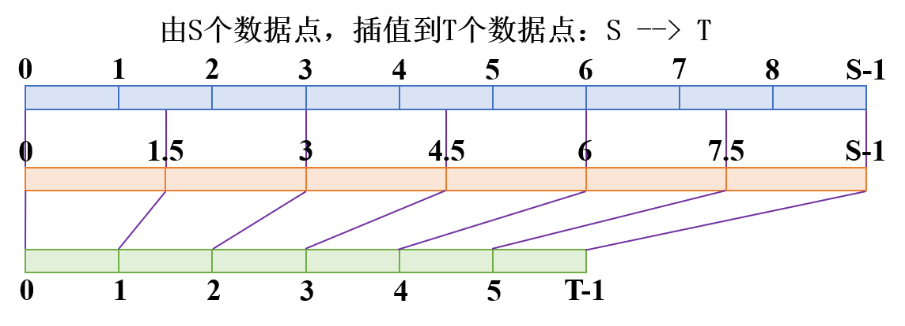
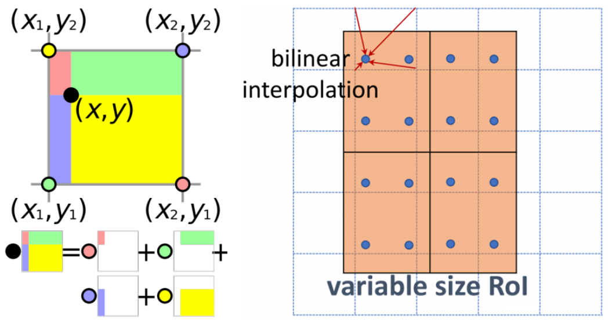

# 插值

插值是一种数学方法，主要用于在已知数据点之间建立函数值，以估算出函数在其他点处的近似值。假设由S个数据点，插值到T个数据点，则数据点所在的坐标轴的对应关系如下图所示。



若将一个数据点看作是一个像素块，则图中所示的边界位置，是按照边界像素块的边界值对其的，还有一种方式，是按照边界像素块的中心值对其的。对于第一种方式，通过为数据添加采用边界值的padding扩展，可等价于第二种方式。

根据所要插值的目标轴，可以求得相应数据点在原始轴中的坐标。
$$
\text{source\_points} = \text{target\_points} \times \text{scale} = \text{target\_points} \times \frac{S-1}{T-1}
$$
由此计算求得的点在原始轴中的坐标值，有可能为非整数（该坐标上数据点不存在值），需要将其转换为整数坐标（即对应周围存在值的数据点）。不同插值方法的区别就体现在如何根据$\text{source\_points}$转换为相应的整数坐标。

最近邻（nearest neighbor）插值，对非整数坐标直接四舍五入，其计算速度最快，但效果差。

双线性（bilinear）插值，利用与坐标轴平行的直线，将非整数坐标分解到相邻的4个整数坐标点，且权重与距离成反比，其计算速度快于双三次插值插值，效果略逊于双三次插值，是很多插值库的默认算法。

双三次（bicubic）插值，与双线性插值类似，但使用相邻的16个整数点，不能保证各方向的坐标权重之和等于一，需要截断，其效果最好，但计算代价很大。

双线性插值示意图如下所示。


$$
\begin{align}
\mathtt{bi\_interp}(x,y) &= \mathtt{bi\_interp}\Big(\mathtt{bi\_interp}(x,y_1),\mathtt{bi\_interp}(x,y_2)\Big) \\
\mathtt{bi\_interp}(x,y_1) &= \frac{x_2-x}{x_2-x_1}f(x_1,y_1) + \frac{x-x_1}{x_2-x_1}f(x_2,y_1) \\
\mathtt{bi\_interp}(x,y_2) &= \frac{x_2-x}{x_2-x_1}f(x_1,y_2) + \frac{x-x_1}{x_2-x_1}f(x_2,y_2) \\
\mathtt{bi\_interp}(x,y)
&= \frac{y_2-y}{y_2-y_1}\mathtt{bi\_interp}(x,y_1) + \frac{y-y_1}{y_2-y_1}\mathtt{bi\_interp}(x,y_2) \\
&= \frac{y_2-y}{y_2-y_1}\frac{x_2-x}{x_2-x_1}f(x_1,y_1) + \frac{y_2-y}{y_2-y_1}\frac{x-x_1}{x_2-x_1}f(x_2,y_1) \\
&+ \frac{y-y_1}{y_2-y_1}\frac{x_2-x}{x_2-x_1}f(x_1,y_2) + \frac{y-y_1}{y_2-y_1}\frac{x-x_1}{x_2-x_1}f(x_2,y_2)
\end{align}
$$
由上述公式可以看到，当数据点在轴上的坐标间隔为一个单位时，可将分母消掉，如下所示。
$$
\mathtt{bi\_interp}(x,y) = (y_2-y)(x_2-x)f(x_1,y_1) + (y_2-y)(x-x_1)f(x_2,y_1) + (y-y_1)(x_2-x)f(x_1,y_2) + (y-y_1)(x-x_1)f(x_2,y_2)
$$
使用Python实现双线性插值的代码如下所示。

```python
def bilinear_interpolate_align_corners(input: np.ndarray, Hout: int, Wout: int):
    Hin, Win = input.shape[-2], input.shape[-1]
    # H, W are prefixes for 'height' and 'width', respectively
    Hscale = (Hin - 1) / (Hout - 1)
    Hout_pt = np.arange(0, Hout)
    Hin_pt = Hout_pt * Hscale  # np.linspace(0, in_height - 1, out_height)
    Hin_pt0 = Hin_pt.astype(np.int32)
    Hin_pt1 = np.ones_like(Hin_pt0)
    Hin_pt1[Hin_pt0 >= Hin - 1] = 0
    Hin_delta1 = Hin_pt - Hin_pt0
    Hin_delta0 = 1 - Hin_delta1
    Wscale = (Win - 1) / (Wout - 1)
    Wout_pt = np.arange(0, Wout)
    Win_pt = Wout_pt * Wscale  # np.linspace(0, in_width - 1, out_width)
    Win_pt0 = Win_pt.astype(np.int32)
    Win_pt1 = np.ones_like(Win_pt0)
    Win_pt1[Win_pt0 >= Win - 1] = 0
    Win_delta1 = Win_pt - Win_pt0
    Win_delta0 = 1 - Win_delta1
    # compute
    Wval = Win_delta0.reshape(1, Wout) * input[..., :, Win_pt0] \
        + Win_delta1.reshape(1, Wout) * input[..., :, Win_pt0 + Win_pt1]
    output = Hin_delta0.reshape(Hout, 1) * Wval[..., Hin_pt0, :] \
        + Hin_delta1.reshape(Hout, 1) * Wval[..., Hin_pt0 + Hin_pt1, :]
    return output
```

# 四舍六入五成双

数字保留#位有效数字是指，从数字的第一个非零数字起，保留#个数字位，其中#位之前的数字，都是准确位；而#位上的数字，是近似位，由#位之后的数字舍入得到。小数点并不影响有效数字的个数，或者针对小数的情况，采用有效小数位的说法，即从小数点起，到之后的#个数字，称为有效小数位。

在确定数据的有效位数之后，需要对超出有效位数的数据进行舍入，舍入多余位数的过程称为数字修约，其所遵循的规则称为“数字修约规则”。在过去，人们习惯采用“四舍五入”的数字修约规则，但存在一个缺点，就是逢五就入，而5又是1至9这9个数字的中间位，这会导致修约后的数字往往偏高。

四舍六入五成双是一种更科学的数学修约规则，在大量运算时，它使舍入后的结果误差的均值趋于零，而不是像四舍五入那样逢五就入，导致结果偏向大数，使得误差产生积累进而产生系统误差，四舍六入五成双使结果受到舍入误差的影响降到最低。

设#位数字是近似位，要对#位之后的数字进行舍入，称#位之后的一位数字为舍入位，则分为如下几种情况。

1. 舍入位上的数字小于等于4，则舍弃，近似位数字不变；
2. 舍入位上的数字大于等于6，则入位，近似位数字进一；
3. 舍入位上的数字等于5，分为两种情况，
   1. 当舍入位上的5之后仍然存在有效数字，即5之后仍然存在非0数字，则入位，近似位数字加一；
   2. 当舍入位上的5之后不再存在有效数字，即5之后的数字全为0，则根据近似位数字确定，
      1. 若近似位数字为奇数，即5之前数字为奇数，则入位，近似位数字加一；
      2. 若近似位数字为偶数，即5之前数字为偶数，则舍弃，近似位数字不变。

可以看到，当舍入位等于5且是最后一位有效数字时，总是会使得近似位的数字变成偶数。

举例，使用四舍六入五成双规则，对下列数据保留3位有效数字。

```
9.8249  --> 9.82
9.8267  --> 9.83
9.82501 --> 9.83
9.83501 --> 9.84
9.82500 --> 9.82
9.83500 --> 9.84
```

# FP32、FP16、BF16

FP32是单精度浮点数，用8bit表示指数，23bit表示小数；FP16是半精度浮点数，用5bit表示指数，10bit表示小数；BF16是对FP32单精度浮点数的截断数据，用8bit表示指数，7bit表示小数。

在数据表示范围上，FP32和BF16表示的整数范围是一样的，小数部分表示不一样，存在舍入误差；FP32和FP16表示的数据范围不一样，在大数据计算中，FP16存在溢出风险。

> 需要注意的是，因为FP32浮点数采用23bit表示小数，故只能表示$2^{23}=8388608$的数值，即对应到10进制7位小数左右，更小的数会存在舍入误差。这点在计算时需要特别注意，例如Python中的`==`判断对于这种舍入误差会判断为相等，且numpy.allclose也会将其判定为相等。
