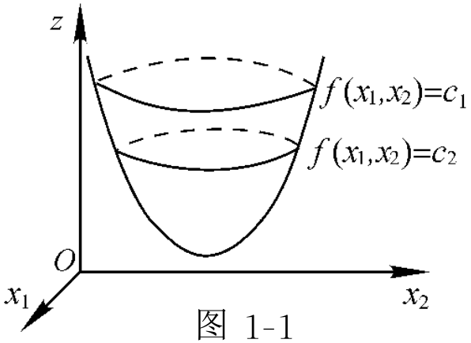
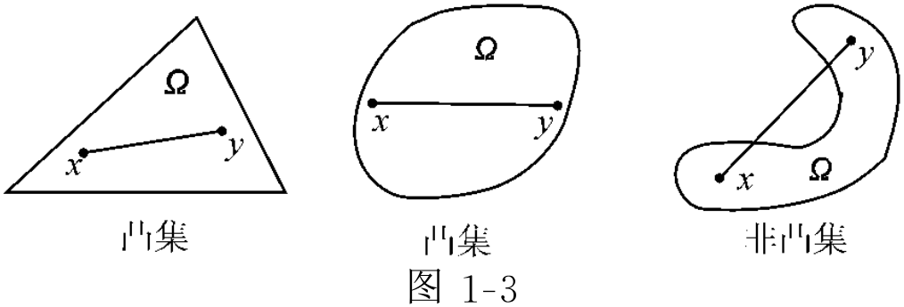
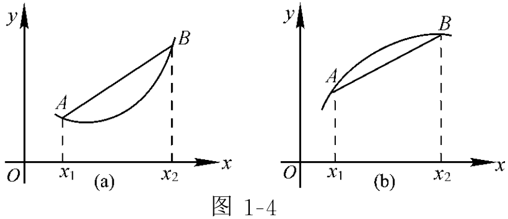
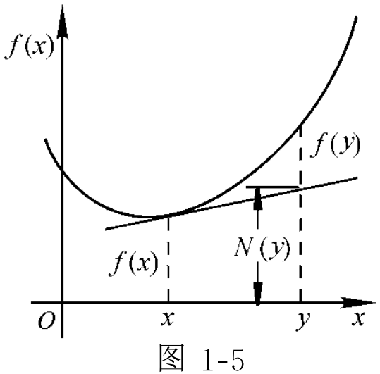
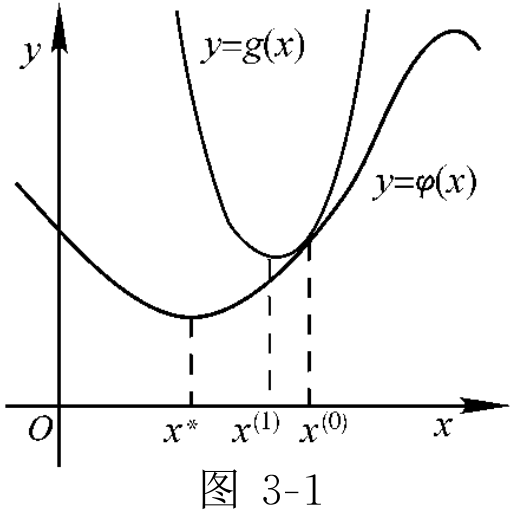
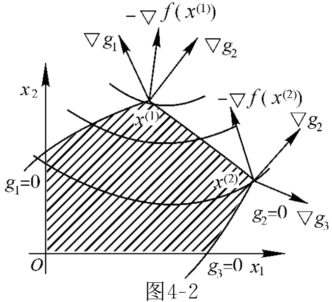
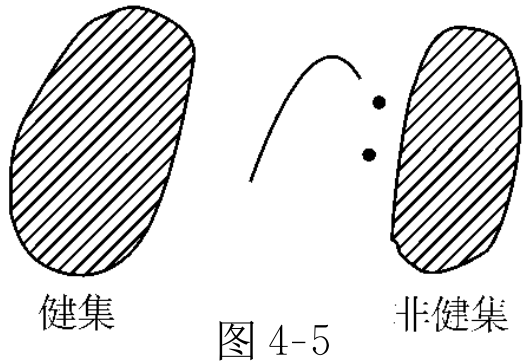

# 一、引论

本章首先介绍如何从实际问题中抽象出最优化问题，然后介绍最优化的一些基本概念和有关的预备知识。

## （一）最优化问题举例

利用最优化的理论和方法，解决生产实际和自然科学中的具体问题，一般分为两个步骤：

(1)建立数学模型。即对所要解决的具体问题进行分析研究，加以简化，形成最优化问题。

(2)进行数学加工和求解。主要包括：将所得的最优化问题进行整理和变换，使之成为易于求解的形式；选择或提出解决该问题的适当的计算方法；编制计算程序；分析计算结果看其是否符合实际。

【例】某化工厂生产$A,B,C,D$四种化工产品，生产每种产品一吨所消耗的工时和产值如下表：

| 产品         | $A$   | $B$   | $C$   | $D$   |
| ------------ | ----- | ----- | ----- | ----- |
| 工时（小时） | $100$ | $300$ | $400$ | $75$  |
| 产值（千元） | $1$   | $5$   | $10$  | $0.5$ |

要求全厂年产值在$1000$万元以上，求当消耗的总工时最少时，该厂生产各种产品的数量。

【解】设该厂全年生产$A,B,C,D$四种产品的数量分别为$x_1,x_2,x_3,x_4$（单位为吨），消耗的总工时为$y$，则
$$
y = 100x_1 + 300x_2 + 400x_3 + 75x_4
$$
消耗的总工时$y$最少是所追求的目标，所以把$y=f(x_1,x_2,x_3,x_4)$称为目标函数，而变量$x_1,x_2,x_3,x_4$的值是需要确定的，称为决策变量或设计变量。

因为要求全厂的年产值在$1000$万元以上，所以决策变量$x_1,x_2,x_3,x_4$还需要满足以下的限制条件
$$
\begin{align}
& x_1 + 5x_2 + 10x_3 + 0.5x_4 \ge 10000 \\
& x_i \ge 0 ,\quad i=1,2,3,4
\end{align}
$$
上述条件称为限制条件或约束条件。所以上述问题的数学模型可概述为：在约束条件之下，确定变量$x_1,x_2,x_3,x_4$的数值，使目标函数$y=f(x_1,x_2,x_3,x_4)$取得最小值。为叙述简便，常将此种问题简写为
$$
\begin{align}
\min\ & y = 100x_1 + 300x_2 + 400x_3 + 75x_4 \\
\text{s.t.}\ \ & x_1 + 5x_2 + 10x_3 + 0.5x_4 \ge 10000 \\
& x_i\ge0,\quad i=1,2,3,4
\end{align}
$$
其中$\min$是minimize的缩写，$\text{s.t.}$是subject to的缩写，即“受约束于”或“约束条件为”。此外，可用$\arg$表示求模型的最优解，如下
$$
x_i^* = \mathop{\text{arg min }}\limits_{x_i} f(x_1,x_2,x_3,x_4) ,\quad i=1,2,3,4
$$
上式表示优化$x_i$变量，使得目标函数$f(x_1,x_2,x_3,x_4)$最小，并用$\arg$符号表示求优解$x_i^*$。

由于在上述最优化问题中，目标函数$f(x_1,x_2,x_3,x_4)$是变量的线性函数，约束条件也是变量的线性不等式或等式，所以把该优化问题称为**线性规划**（Linear Programming，LP）问题。特殊地，若当$x_i$应取整数值时，线性规划问题又称为整数线性规划问题。

若目标函数也约束函数都是变量的非线性函数，问题就称为**非线性规划**（Nonlinear Programming，NLP）问题。若要优化的目标函数不止一个，问题又可称为多目标线性规划问题，或多目标非线性规划问题。

## （二）最优化的基本概念

近代解决最优化问题的方法，大致可分为两类。

(1)间接最优化（或解析最优化）方法。把所研究的问题（例如，物理、力学、化学和工程问题）用数学方程描述出来，然后用解析方法求其最优解。

(2)直接最优化（或试验最优化）方法。在某些情况下，所研究对象本身的机理尚不清楚，无法用数学方程描述，这时可设法在数学原理的指导之下，直接通过少量试验，根据试验结果的比较而求其最优解。

### 1. 最优化问题的基本概念

设$\mathbf x=(x_1,x_2,\cdots,x_n)^\top$为$n$维实欧氏空间$\R^n$内的一点，$f(\mathbf x),g_i(\mathbf x),h_j(\mathbf x)$为给定的$n$元函数，则一般的最优化问题的提法是，在约束条件
$$
\begin{align}
g_i(\mathbf x) &\le 0 ,\quad i=1,2,\cdots,m \\
h_j(\mathbf x) &= 0 ,\quad j=1,2,\cdots,p
\end{align}
$$
之下，求向量$\mathbf x$，使函数$f(\mathbf x)$取极小值或极大值。这里$f(\mathbf x)$称为**目标函数**，$g_i(\mathbf x)\le0$称为**不等式约束条件**，$h_j(\mathbf x)=0$称为**等式约束条件**，向量$\mathbf x$称为设计变量或**决策变量**。通常，我们总是使目标函数极小，若无特殊说明，后文的最优化问题都是最小化问题；最大化问题可通过在目标函数前添加负号转化成最小化问题。

一般地，把上述的最优化问题简写为
$$
\begin{cases}
\min & f(\mathbf x) \\
\text{s.t} & g_i(\mathbf x) \le 0 ,\quad i=1,2,\cdots,m \\
& h_j(\mathbf x) = 0 ,\quad j=1,2,\cdots,p
\end{cases}
$$
令$R=\set{\mathbf x|g_i(\mathbf x)\le0,h_j(\mathbf x)=0}$称为问题的**可行集**或容许集，称为$\mathbf x\in R$为问题的**可行解**或容许解。

**定义**：若有$\mathbf x^*\in R$，使得$\forall\mathbf x\in R$，均有$f(\mathbf x^*)\le f(\mathbf x)$成立，则称$\mathbf x^*$为问题的**全局最优解点**或**全局极小点**。

若$\exist\mathbf x^*\in R$，使得$\forall\mathbf x\in R,\mathbf x\ne\mathbf x^*$，均有$f(\mathbf x^*)<f(\mathbf x)$成立，则称$\mathbf x^*$为问题的严格全局极小点。

若$\mathbf x^*\in R$具有性质，存在$\mathbf x^*$的一个邻域$N(\mathbf x^*,\varepsilon),\varepsilon>0$，使得$\forall\mathbf x\in R\cap N(\mathbf x^*,\varepsilon)$，均有$f(\mathbf x^*)\le f(\mathbf x)$成立，则称$\mathbf x^*$为问题的**局部最优解点**或**局部极小点**。

若$\exist\mathbf x^*\in R,\varepsilon>0$，使得$\forall\mathbf x\in R\cap N(\mathbf x^*,\varepsilon)$，均有$f(\mathbf x^*)<f(\mathbf x)$成立，则称$\mathbf x^*$为问题的严格局部极小点。

显然，问题的一个全局最优解也是它的一个局部最优解，但局部最优解不一定是全局最优解。

求解最优化问题，就是要求问题的全局最优解，但在一般情况下，我们往往只能求出它的一个局部最优解。因此，本书中所介绍的最优化方法也主要是求局部最优解的数值方法。

**定理**：设$f(\mathbf x),g_i(\mathbf x),h_j(\mathbf x)$在$\R^n$上连续，则问题的可行集为闭集，它的全局最优解集合亦为闭集。

**定理（一阶必要条件）**：设函数$f(\mathbf x)\in C^1$是定义在$\Omega\sub\R^n$上的连续可微函数，$\mathbf x^*$是$\Omega$的一个内点，若$\mathbf x^*$为$f(\mathbf x)$的一个极小点，则$\nabla f(\mathbf x^*)=0$，其中
$$
\nabla f(\mathbf x) = (\frac{\part f(\mathbf x)}{\part x_1},\frac{\part f(\mathbf x)}{\part x_2},\cdots,\frac{\part f(\mathbf x)}{\part x_n})^\top
$$
为$f(\mathbf x)$的**梯度**。满足条件$\nabla f(\mathbf x^*)=0$的点$\mathbf x^*$称为的**稳定点**或**驻点**。

注意，空间$C^p[a,b]$表示定义在区间$[a,b]$上的，所有$p$阶连续可微的，函数的全体。

### 2. 二维最优化问题的几何意义

考察如下的二维最优化问题
$$
\begin{cases}
\min & z=f(x_1,x_2) \\
\text{s.t} & g_i(x_1,x_2) \le 0
\end{cases}
$$
其中，$z=f(x_1,x_2)$在三维欧氏空间中表示一张曲面，令$f(x_1,x_2)=C$称为等高线或**等值线**，让常数$C$依次取一系列的数值$c_1,c_2,\cdots$就得到一族等值线，见图1-1所示。从等值线族的图上可大致看出函数值的变化情况。

可通过作图来求得最优解，该方法称为图解法，其步骤可概述如下：

(1)画出问题的可行集$R$的图形；

(2)让常数$C$取一系列的数值，作出目标函数的等值线族；

(3)通过观察等值线族与可行集$R$，确定使目标函数取得最小值的可行点$\mathbf x^*$，即为所求的最优解。

### 3. 最优化问题分类

若$f(\mathbf x),g_i(\mathbf x),h_j(\mathbf x)$都是$\mathbf x$的线性函数，则问题称为**线性规划**（Linear Programming，LP）问题。一种表述形式为，已知$\mathbf A=(a_{ij})_{m\times n},\mathbf b=(b_1,b_2,\cdots,b_m)^\top,\mathbf c=(c_1,c_2,\cdots,c_n)^\top$，在约束条件$\mathbf{Ax}=\mathbf b,\mathbf x\ge\mathbf 0$之下，求变量$\mathbf x$，使得$f(\mathbf x)=\mathbf c^\top\mathbf x$取得最小（或最大）值。

若$g_i(\mathbf x),h_j(\mathbf x)$都是$\mathbf x$的线性函数，而$f(\mathbf x)$是$\mathbf x$的二次函数，则问题称为**二次规划**（Quadratic Programming）问题。

若$f(\mathbf x),g_i(\mathbf x),h_j(\mathbf x)$中至少有一个是$\mathbf x$的非线性函数，则问题称为**非线性规划**（Nonlinear Programming，NLP）问题。显然，二次规划是最简单的一种非线性规划。一般的非线性规划问题，根据约束条件的情况可分为

(1)**无约束非线性规划问题**，即没有任何约束条件限制的非线性规划问题，有时也称之为**无约束优化问题**，或简称为无约束问题，常写成$\min f(\mathbf x),\mathbf x\in\R^n$。

(2)**约束非线性规划问题**，即在问题中，至少有一个约束条件限制的非线性规划问题，有时也称之为**约束优化问题**，或简称为有约束问题。

在问题中，如果还要求某些设计变量或全部设计变量取非负的整数值，则问题称为**整数规划**（Integer Programming，IP）问题。如果所有的设计变量都要求取整数值，这类问题称为纯整数规划问题或全整数规划问题。如果只要求部分设计变量取整数值，而其余的设计变量为连续的非负变量，这类问题称为混合型整数规划问题。如果在整数规划问题中，要求其中的部分设计变量或所有的设计变量取值为$0$或$1$，这类问题称为$0-1$规划问题。整数规划也可以分为整数线性规划和整数非线性规划。

若目标函数$f(\mathbf x)$和约束函数$g_i(\mathbf x)\le0$都是设计变量$x_1,x_2,\cdots,x_n$的广义多项式，即形如
$$
\varphi(\mathbf x) = \sum_{i=1}^m c_i \prod_{j=1}^n x_{j}^{r_{ij}}
$$
的函数，其中$c_i,r_{ij}$可取任意实数值，而$x_i>0$，则称非线性规划为**几何规划**（Geometric Programming）问题。

若目标函数$\mathbf f(\mathbf x)=(f_1(\mathbf x),f_2(\mathbf x),\cdots,f_p(\mathbf x))^\top$是一个向量函数，则称问题为**多目标规划**（Multi-objective Programming）问题。

除上述规划问题外，还有动态规划、不可微规划、参数规划、随机规划等。

## （三）凸集和凸函数

凸集和凸函数的理论一般称为凸分析，是最优化的理论基础。本节介绍凸集和凸函数基本的知识。

### 1. 凸集

直观地看，三角形、矩形、圆形和球体等，其形体都是凸的。易见，凡是凸的形体，都有这样的几何特征：连接形体中任意两点的直线段，都在该形体之中，见图1-3所示。

**定义**：设$\Omega\sub\R^n$，如果对于任意的点$\mathbf x,\mathbf y\in\Omega$，连接点$\mathbf x,\mathbf y$的线段上的一切点都在$\Omega$中，即对于任意$0\le\mu\le1$，总有$\mu\mathbf x+(1-\mu)\mathbf y\in\Omega$，则称$\Omega$为一个**凸集**（convex set）。

显然，单个点$\mathbf x$组成的集合、整个空间$\R^n$都是凸集，并规定空集$\varnothing$为凸集。

【例】满足线性规划问题的约束条件$\mathbf{Ax}=\mathbf b,\mathbf x\ge\mathbf 0$的一切点$\mathbf x$所组成的集合$R$是一个凸集，且线性规划问题为凸规划问题。

**定义**：设实数$\alpha_i\ge0,\sum\limits_{i=1}^p\alpha_i=1,\mathbf x^{(i)}\in\R^n,\ i=1,2,\cdots,p$，则称$\mathbf x=\sum\limits_{i=1}^p\alpha_i\mathbf x^{(i)}$为点$\mathbf x^{(1)},\mathbf x^{(2)},\cdots,\mathbf x^{(p)}$的一个**凸组合**（convex combination）。

**定理**：集合$\Omega\sub\R^n$为**凸集的充要条件**是，点$\mathbf x^{(i)}\in\Omega,\ i=1,2,\cdots,p$的任意凸组合仍包含在$\Omega$中。

**定理**：任意一组凸集的交集仍为凸集。

**定义**：包含集合$\Omega\sub\R^n$的所有凸集的交集称为$\Omega$的**凸包**，记为$\text{Co}(\Omega)$或$H(\Omega)$，它实际上是$\R^n$中包含$\Omega$的最小凸集。

**定义**：设$\Omega\sub\R^n$，如果对于任何$\mathbf x\in\Omega$，及所有的$\alpha\ge0$，都有$\alpha\mathbf x\in\Omega$，则称集合$\Omega$为一个**锥**。一个同时为凸集的锥，称为**凸锥**。

### 2. 凸函数

**定义**：设$f(\mathbf x)$是定义在非空凸集$\Omega\sub\R^n$上的函数，若对任意$\mathbf x,\mathbf y\in\Omega$，不等式
$$
f(\lambda\mathbf x+(1-\lambda)\mathbf y) \le \lambda f(\mathbf x) + (1-\lambda)f(\mathbf y)
$$
对任意$0\le\lambda\le1$都成立，则称$f(\mathbf x)$为$\Omega$上的**凸函数**。

若对任意$0<\lambda<1$和$\mathbf x,\mathbf y\in\Omega,\mathbf x\ne\mathbf y$都有
$$
f(\lambda\mathbf x+(1-\lambda)\mathbf y) < \lambda f(\mathbf x) + (1-\lambda)f(\mathbf y)
$$
成立，则称$f(\mathbf x)$为$\Omega$上的**严格凸函数**。

如果将上式中的不等号$\le$和$<$反向，可类似地定义凹函数和严格凹函数。

一元凸函数$f(x)$有明显的几何意义，过函数图像上任意两点$A,B$的弦线段，处处都在函数图像的上方，而凹函数的情形则正好相反，见图1-4。

容易证明，若$f(\mathbf x)$是凸集$\Omega$上的凸函数，则$g(\mathbf x)=-f(\mathbf x)$是$\Omega$上的凹函数，反之亦然。

**定理**：设$f_1(\mathbf x),f_2(\mathbf x)$是凸集$\Omega\sub\R^n$上的凸函数，则$f_1(\mathbf x)+f_2(\mathbf x)$在$\Omega$上也是凸的。

**定理**：设$f(\mathbf x)$是凸集$\Omega\sub\R^n$上的凸函数，则对任意常数$a>0$，函数$af(\mathbf x)$在$\Omega$也是凸的。

**推论**：设$f_1(\mathbf x),f_2(\mathbf x),\cdots,f_p(\mathbf x)$是凸集$\Omega\sub\R^n$上的凸函数，实数$\lambda_i\ge0,\ i=1,2,\cdots,p$，则非负的线性组合$\sum\limits_{i=1}^p\lambda_if_i(\mathbf x)$在$\Omega$上也是凸的。

**定理**：设$f(\mathbf x)$是凸集$\Omega\sub\R^n$上的凸函数，则对任意一个实数$c$，**水平集**（等值集）
$$
\Omega_c = \set{\mathbf x|\mathbf x\in\Omega,f(\mathbf x)\le c}
$$
是凸集。

**推理**：设$f_i(\mathbf x),\ i=1,2,\cdots,p$为凸集$\Omega\sub\R^n$上的凸函数，$c_i$为实常数，则$\Omega$中同时满足$f_1(\mathbf x)\le c_1,f_2(\mathbf x)\le c_2,\cdots,f_p(\mathbf x)\le c_p$的点所构成的集合$\Omega_c$为凸集。

**定理**：定义在凸集$\Omega\sub\R^n$上的可微函数$f(\mathbf x)$为**凸函数的充要条件**是，对于所有的$\mathbf x,\mathbf y\in\Omega$都有
$$
f(\mathbf y) \ge f(\mathbf x) + (\nabla f(\mathbf x))^\top(\mathbf y-\mathbf x)
$$
从几何上看，若$f(\mathbf x)$是凸函数，则函数图像总是在切线（或切平面）的上方。上述定理说明，曲线（面）上任一点的切线（切平面）上的点的纵坐标$N(\mathbf y)=f(\mathbf x)+(\nabla f(\mathbf x))^\top(\mathbf y-\mathbf x)$，其值总不会大于曲线（面）在该点的纵坐标$f(\mathbf y)$，见图1-5所示。

**定理**：设$\Omega\sub\R^n$为含有内点的凸集，$f(\mathbf x)\in C^2$，则$f$在$\Omega$上为**凸函数的充要条件**是，$f(\mathbf x)$的海森矩阵$F(\mathbf x)=\nabla^2f(\mathbf x)$在整个$\Omega$上是半正定的。

函数$f(\mathbf x)$在一点$\mathbf x$处的**海森矩阵**（Hessian Matrix）是指下述的$n$阶对称矩阵
$$
F(\mathbf x) = \nabla^2f(\mathbf x) = \left( \frac{\part^2f(\mathbf x)}{\part x_i\part x_j} \right)_{n\times n}
$$
令$\mathbf A=(a_{ij})_{n\times n},\mathbf b=(b_1,b_2,\cdots,b_n)^\top$，若$f(\mathbf x)=\frac12\mathbf x^\top\mathbf{Ax}+\mathbf b^\top\mathbf x+c$，则有
$$
\nabla f(\mathbf x) = \mathbf{Ax}+\mathbf b ,\quad \nabla^2f(\mathbf x) = \mathbf A
$$
**定理**：设$\Omega\sub\R^n$为非空开凸集，$f(\mathbf x)\in C^2$，若$\nabla^2f(\mathbf x)$在$\Omega$上处处正定，则$f(\mathbf x)$是$\Omega$上的严格凸函数。注意，该定理的逆定理一般是不成立的。

### 3. 凸规划

考虑如下的非线性规划问题
$$
\begin{cases}
\min & f(\mathbf x) \\
\text{s.t} & g_i(\mathbf x) \le 0 ,\quad i=1,2,\cdots,m \\
& h_j(\mathbf x) = 0 ,\quad j=1,2,\cdots,p
\end{cases}
$$
易见，总可以把等式约束$h_j(\mathbf x)=0$改写为不等式约束，这是因为
$$
h_j(\mathbf x) = 0 \Longleftrightarrow h_j(\mathbf x) \le 0, -h_j(\mathbf x)\le 0
$$
因此，不失一般性，可以考虑仅包含不等式约束的优化问题
$$
\begin{cases}
\min & f(\mathbf x) \\
\text{s.t} & g_i(\mathbf x) \le 0 ,\quad i=1,2,\cdots,l
\end{cases}
$$
**定义**：在上述优化问题中若$f(\mathbf x),g_i(\mathbf x)\le0,\ i=1,2,\cdots,l$均为可行集上的凸函数，则称这样的问题为**凸规划**问题。

**定理**：凸规划问题的可行集是凸集。

**定理**：对于凸规划问题，目标函数$f(\mathbf x)$的任一**局部极小点**，都是$f(\mathbf x)$在非空可行集上的**全局极小点**。

上述定理的重要性在于，它使求解凸规划问题的全局极值问题与局部极值问题统一了起来。只要求得了凸规划问题的任一局部极小点，它也就是全局极小点，因而使问题大为简化。

应该指出，在一般情况下，优化问题的全局极小点不一定是唯一的，但可以证明，对凸规划问题来说是唯一的。

定理：对于凸规划问题，若$f(\mathbf x)$在非空可行集$R$上是严格凸函数，则问题的全局极小点是唯一的。

### 4. 拟凸函数

**定义**：设$\Omega\sub\R^n$为非空凸集，$f:\Omega\to\R^1$，若$\forall\mathbf x,\mathbf y\in\Omega$，均有
$$
f(\lambda\mathbf x+(1-\lambda)\mathbf y) \le \max\set{ f(\mathbf x),f(\mathbf y) }
$$
对$\forall\lambda\in(0,1)$成立，则称$f(\mathbf x)$在$\Omega$上为**拟凸函数**。

若$\forall\mathbf x,\mathbf y\in\Omega,f(\mathbf x)\ne f(\mathbf y)$，均有
$$
f(\lambda\mathbf x+(1-\lambda)\mathbf y) < \max\set{ f(\mathbf x),f(\mathbf y) }
$$
对$\forall\lambda\in(0,1)$成立，则称$f(\mathbf x)$在$\Omega$上为**严格拟凸函数**。注意，**严格拟凸函数不一定是拟凸函数**。

若$-f$是$\Omega$上的（严格）拟凸函数，则称$f$为$\Omega$上的（严格）拟凹函数。

**命题**：凸函数必为拟凸函数，但反之不真。

**定理**：设$\Omega\sub\R^n$为非空凸集，$f:\Omega\to\R^1$，则$f(\mathbf x)$是$\Omega$上的**拟凸函数的充要条件**是，$\forall c\in\R^1$，水平集$H_c(f)=\set{\mathbf x|\mathbf x\in\Omega,f(\mathbf x)\le c}$是凸集。

**定理**：设$\Omega\sub\R^n$为非空凸集，$f:\Omega\to\R^1$是可微函数，则$f(\mathbf x)$是$\Omega$上的**拟凸函数的充要条件**是，对$\forall\mathbf x^{(1)},\mathbf x^{(2)}\in\Omega$，若$f(\mathbf x^{(1)})\le f(\mathbf x^{(2)})$，则有$\nabla f(\mathbf x^{(2)})^\top(\mathbf x^{(1)}-\mathbf x^{(2)})\le0$。

### 5. 伪凸函数

**定义**：设$\Omega\sub\R^n$为非空**开凸集**，$f:\Omega\to\R^1$为可微函数，对$\forall\mathbf x^{(1)},\mathbf x^{(2)}\in\Omega$，如果对于
$$
\nabla f(\mathbf x^{(1)})^\top(\mathbf x^{(1)}-\mathbf x^{(2)})\le0
$$
必有$f(\mathbf x^{(1)})\le f(\mathbf x^{(2)})$，则称$f(\mathbf x)$是$\Omega$上的**伪凸函数**。

对$\forall\mathbf x^{(1)},\mathbf x^{(2)}\in\Omega,\mathbf x^{(1)}\ne\mathbf x^{(2)}$，如果对于
$$
\nabla f(\mathbf x^{(1)})^\top(\mathbf x^{(1)}-\mathbf x^{(2)})\le0
$$
必有$f(\mathbf x^{(1)})<f(\mathbf x^{(2)})$，则称$f(\mathbf x)$是$\Omega$上的**严格伪凸函数**。

若$-f(\mathbf x)$是$\Omega$上的（严格）伪凸函数，则称$f(\mathbf x)$是$\Omega$上的（严格）伪凹函数。

易证，可微的凸函数是伪凸函数，严格伪凸函数必是伪凸函数。注意，这里定义的（严格）伪凸函数一定是可微的。

**定理**：设$\Omega\sub\R^n$为非空凸集，$f:\Omega\to\R^1$为可微函数，若$f$是$\Omega$上的伪凸函数，则$f$是$\Omega$上的严格拟凸函数和拟凸函数。

### 6. 广义凸规划

考虑优化问题
$$
\begin{cases}
\min & f(\mathbf x) \\
\text{s.t} & g_i(\mathbf x) \le 0 ,\quad i=1,2,\cdots,l
\end{cases}
$$
若问题的可行集$R$是凸集，$f(\mathbf x)$是$R$上的（严格）拟凸函数或（严格）伪凸函数，则称问题为**广义凸规划**问题。

**定理**：设优化问题的可行集$R$是凸集，$f(\mathbf x)$是$R$上的严格拟凸函数，则广义凸规划的任一局部最优解$\mathbf x^*$，也是它的全局最优解。

**定理**：设优化问题的可行集$R$是开凸集，$f(\mathbf x)$是$R$上的严格伪凸函数，$\mathbf x^*\in R$，若$\nabla f(\mathbf x^*)=\mathbf0$，则$\mathbf x^*$是问题的全局最优解。

# 二、线性规划

前面讲过，线性规划的目标函数为决策变量的线性函数，约束条件为线性等式或线性不等式。它是数学规划中较简单的一类，因而也是最基本的一类数学规划问题。本章主要讨论标准形式的线性规划问题的解法，着重介绍最为常用且行之有效的解法，即单纯形法及对偶单纯形法。

## （一）线性规划的标准形式

线性规划问题的约束条件的一般形式为
$$
\begin{align}
(\text{I})& \begin{cases}
a_{11}x_1+a_{12}x_2+\cdots+a_{1n}x_n \le b_1 \\
\qquad \vdots \\
a_{i1}x_1+a_{i2}x_2+\cdots+a_{in}x_n \le b_i
\end{cases} \\
(\text{II})& \begin{cases}
a_{i+1,1}x_1+a_{i+1,2}x_2+\cdots+a_{i+1,n}x_n = b_{i+1} \\
\qquad \vdots \\
a_{t1}x_1+a_{t2}x_2+\cdots+a_{tn}x_n = b_t
\end{cases} \\
(\text{III})& \begin{cases}
a_{t+1,1}x_1+a_{t+1,2}x_2+\cdots+a_{t+1,n}x_n \ge b_{t+1} \\
\qquad \vdots \\
a_{m1}x_1+a_{m2}x_2+\cdots+a_{mn}x_n \ge b_m
\end{cases}
\end{align}
$$
指出，一般的线性规划问题，总可以化为如下的**标准形式**，标准形式的线性规划问题是指在约束条件
$$
\begin{cases}
a_{11}x_1+a_{12}x_2+\cdots+a_{1n}x_n = b_1 \\
\qquad \vdots \\
a_{m1}x_1+a_{m2}x_2+\cdots+a_{mn}x_n = b_1 \\
x_1\ge0,x_2\ge0,\cdots,x_n\ge0
\end{cases}
$$
之下，求一组数$x_1,x_2,\cdots,x_n$，使目标函数
$$
y=c_1x_1+c_2x_2+\cdots+c_nx_n
$$
取最小（大）值，其中$a_{ij},b_i,c_j,\ i=1,2,\cdots,m,\ j=1,2,\cdots,n$是给定的常数，且$b_i\ge0,\ i=1,2,\cdots,m$。

在将一个线性规划LP问题转化为标准形式的过程中，可能会遇到各种非标准形式的情况，大致可分为是三种情况，下面将分别讨论。

在化为标准形式的过程中，若对于右侧$b_i$的取值情况，若其$b_i<0$，可在该式两边同乘以$-1$，使之化为$-(\cdots)=b_i'=-b_i>0$的情况。

在化为标准形式的过程中，可将不等式约束化为等式约束的原因如下，对于
$$
a_{i1}x_1+a_{i2}x_2+\cdots+a_{i,n-1}x_{n-1} \le b_i
$$
引入松弛变量$x_n\ge0$，显然可使得
$$
a_{i1}x_1+a_{i2}x_2+\cdots+a_{i,n-1}x_{n-1}+x_n = b_i
$$
同样地，对于
$$
a_{i1}x_1+a_{i2}x_2+\cdots+a_{i,n-1}x_{n-1} \ge b_i
$$
引入松弛变量$x_n\ge0$，显然可使得
$$
a_{i1}x_1+a_{i2}x_2+\cdots+a_{i,n-1}x_{n-1}-x_n = b_i
$$
故线性不等式约束总是可化为等式约束，不失一般性，即可将其写为上述标准形式。

在化为标准形式的过程中，可能会存在自由变量。如果在一个线性规划问题中有，一部分变量不要求取非负的值，则这些变量就称为**自由变量**。下面来讨论对自由变量的处理办法。例如，在线性规划问题中，若不要求变量$x_1\ge0$，则$x_1$就是自由变量，可以用两种办法把它化为标准形式。

(1)令$x_1=u_1-v_1$，而要求$u_1,v_1\ge0$，将它代入上述的LP问题中，则目标函数和约束函数的线性性质仍然保持，问题转化为$n+1$个变量$u_1\ge0,v_1\ge0,x_2\ge0,x_3\ge0,\cdots,x_n\ge0$的LP问题。

(2)从约束方程之一解出$x_1$表达式，将其代入其他约束方程即模板函数中，则问题转化为$n-1$个变量和$m-1$个约束的等价的LP问题。

接下来，主要讨论的是标准形式的线性规划问题，即在约束条件
$$
\begin{cases}
\sum\limits_{j=1}^n a_{ij}x_j = b_i ,\quad i=1,2,\cdots,m \\
x_j\ge0 ,\quad j=1,2,\cdots,n
\end{cases}
$$
之下，求向量$\mathbf x=(x_1,x_2,\cdots,x_n)^\top$，使目标函数$y=\sum\limits_{i=1}^n c_ix_i$取最小（大）值，其中$m<n,b_i\ge0$。

变量的个数$n$称为线性规划的**维数**，等式约束方程的数目$m$称为线性规划的**阶数**。满足约束条件的点$\mathbf x$称为**可行点**或**可行解**，也叫容许解。

总而言之，一般线性规划问题，可将其转化为标准形式，且可简写为如下矩阵形式
$$
\begin{cases}
\min & y = \mathbf c^\top\mathbf x \\
\text{s.t.} & \mathbf{Ax}=\mathbf b,\ \mathbf x\ge\mathbf0
\end{cases}
$$
其中
$$
\begin{align}
& \mathbf c=(c_1,c_2,\cdots,c_n)^\top,\ \mathbf x=(x_1,x_2,\cdots,x_n)^\top \\
& \mathbf b=(b_1,b_2,\cdots,b_m)^\top,\ \mathbf b\ge\mathbf0 \\
& \mathbf A=(a_{ij})_{m\times n},\ \text{rank}(\mathbf A) = m\le n
\end{align}
$$
设$\mathbf A$的秩为$m$，则可从$A$的$n$列中选出$m$列，使它们线性无关，为了书写简便，不妨设$\mathbf A$的前$m$列是线性无关的，即设$\mathbf a_j=(a_{1j},a_{2j},\cdots,a_{mj})^\top,\ j=1,2,\cdots,m$是线性无关的。令
$$
\mathbf B = (\mathbf a_1,\mathbf a_2,\cdots,\mathbf a_m)
$$
易见矩阵$\mathbf B$是非奇异的，因此方程组
$$
\mathbf{Bx}_B = \mathbf b
$$
有唯一解$\mathbf x_B=\mathbf B^{-1}\mathbf b$，其中$\mathbf x_B$是一个$m$维列矢量。

令$\mathbf x^\top=(\mathbf x_B^\top,\mathbf0^\top)$，就得到约束方程$\mathbf{Ax}=\mathbf b$的一个解$\mathbf x$，这里$\mathbf x$的前$m$个分量等于$\mathbf x_B$的相应分量，而后面的$n-m$个分量均为零。

称矩阵$\mathbf B$为**基**或基底，称这样得到的解矢量$\mathbf x$为约束方程组关于基底$\mathbf B$的**基本解**（basic solution），而与$\mathbf B$的列相应的$\mathbf x$的分量$x_i$称为**基本变量**（basic variable）。当基本解中有一个或一个以上的基本变量$x_i$为零时，则称这个解为退化的基本解。

当一个可行解$\mathbf x$又是基本解时，称它为**基本可行解**（basic feasible solution），若它是退化的，则称它为退化的基本可行解。显然一个基本可行解$\mathbf x$是一个不超过$m$个正$x_i$的可行解，而一个非退化的基本可行解$\mathbf x$是恰有$m$个正$x_i$的可行解。

应该指出，一个$m$阶$n$维的线性规划问题，其基本可行解的个数不超过$C_n^m$个，而
$$
C_n^m = \frac{n!}{m!(n-m)!}
$$
这是因为从$n$列中选取$m$个线性无关的列向量的取法，至多只有$C_n^m$种。

设$\mathbf x=(x_1,x_2,\cdots,x_n)^\top$为线性规划问题的一个可行解，当它使目标函数$f(\mathbf x)$达到最小（大）值时，称其为最优可行解，简称为**最优解**或解，而目标函数所达到的最小（大）值称为线性规划问题的**最优值**或值。

## （二）线性规划的基本定理

这一节将介绍线性规划的基本定理，从而确定基本可行解在求解线性规划问题中的重要作用，并阐明基本可行解与可行集的极点之间的关系，为下一节讲述单纯形法奠定基础。

**定义**：称$H^+=\set{\mathbf x|\mathbf x\in\R^n,\mathbf c^\top\mathbf x\ge\mathbf b}$为**正闭半空间**，$H^-=\set{\mathbf x|\mathbf x\in\R^n,\mathbf c^\top\mathbf x\le\mathbf b}$为**负闭半空间**。$H^+,H^-$统称为**闭半空间**。

**定义**：有限个闭半空间的交集称为**多面凸集**，亦即集合$S=\set{\mathbf x|\mathbf{Ax}\le\mathbf b}$称为多面凸集或凸多胞形，其中$A=(a_{ij})_{m\times n}$。

**定义**：有界且非空的多面凸集，称为**多面凸体**或凸多面体。

**定义**：设$S$为凸集，$\mathbf x\in S$，若对于$\mathbf x$找不到$\mathbf x_1,\mathbf x_2\in S,\mathbf x_1\ne\mathbf x_2$，使$\mathbf x=\alpha\mathbf x_1+(1-\alpha)\mathbf x_2$（$0<\alpha<1$）成立，则称$\mathbf x$为凸集的**极点**或**顶点**。

**定理**：设$\mathbf A=(a_{ij})_{m\times n}$，其秩为$\text{rank}(\mathbf A)=m<n$，$\mathbf x=(x_1,x_2,\cdots,x_n)^\top,\mathbf b=(b_1,b_2,\cdots,b_m)^\top$，则矢量$\mathbf x$为凸集$R=\set{\mathbf x|\mathbf{Ax}=\mathbf b,\mathbf x\ge0}$的一个**极点的充要条件**是$\mathbf x$为$\mathbf{Ax}=\mathbf b,\mathbf x\ge\mathbf0$的一个基本可行解。

**定理**（线性规划的基本定理）：设给定的线性规划问题为
$$
\begin{cases}
\min & w = \mathbf c^\top\mathbf x \\
\text{s.t.} & \mathbf{Ax}=\mathbf b,\ \mathbf x\ge\mathbf0
\end{cases}
$$
其中$\mathbf A=(a_{ij})_{m\times n}$，且秩为$\text{rank}(\mathbf A)=m<n$，若

(1)问题有可行解，那么它必有基本可行解；

(2)问题有最优可行解，那么它必有最优的基本可行解。

该定理说明，在寻求线性规划问题的最优解时，只需要研究基本可行解就行了。也就是说，如果问题有最优解，则一定在凸集$R=\set{x|\mathbf{Ax}=\mathbf b,\mathbf x\ge\mathbf0}$（可行集）的极点上达到。

**推论**：若由线性规划问题确定的可行集$R=\set{\mathbf x|\mathbf{Ax}=\mathbf b,\mathbf x\ge0}$是非空的，则它至少有一个极点。

**推论**：如果一个线性规划问题存在有限的最优解，则至少存在一个是可行集$R$的极点的有限最优解。

**推论**：对应于线性规划问题的可行集$R$，其至多具有有限多个极点。

上面的定理和推论指出，一个线性规划问题的可行集$R$如果是非空的，那么该线性规划问题的基本可行解$\mathbf x$一定存在；如果线性规划问题的最优解存在，那么它一定在可行集$R$的一个极点（也即基本可行解）上达到。因此，寻求线性规划问题的解，只要在基本可行解（$R$的极点）中去寻找就行了，而极点的个数是有限的，这就从理论上保证了有可能在有限步内求得线性规划问题的最优解。

## （三）单纯形法

单纯形法（Simplex Method）是求解线性规划问题的一种通用的有效算法。几十年的计算实践说明，它不仅是求解线性规划的基本方法，而且是整数规划和非线性规划某些算法的基础。为了保证单纯形法是有限步收敛的，必须避免迭代过程的循环，避免循环的办法有：摄动法、字典序法、Bland法。

本节介绍单纯形法的基本原理和计算方法，下一节对单纯形法作进一步的说明和补充。

### 1. 单纯形法的基本思想

前面已经指出，一个线性规划问题若有最优解，则一定有最优的基本可行解，而且基本可行解的个数是有限的。因此求解线性规划问题的一个直观想法是，把所有的基本可行解求出来，并求出其相应的目标函数值，相互比较，即可求得其中相应目标函数值最小（大）的最优解。当线性规划问题的阶数$m$与维数$n$很小时，这种枚举法是可行的，当数$m,n$较大时，其计算量迅速增长，以至成为不可能。

单纯形法的基本思想是，给出一种规则，使LP问题由一个基本可行解（极点）转移到另一个基本可行解时，目标函数值是减小的，而且两个基本可行解之间的转换是容易实现的。经过有限次迭代，即可求得所需的最优基本可行解。

### 2. 基本解的转换

设线性规划问题为
$$
\begin{cases}
\min & w = \mathbf c^\top\mathbf x \\
\text{s.t.} & \mathbf{Ax}=\mathbf b,\ \mathbf x\ge\mathbf0
\end{cases}
$$
其中$\mathbf A=(a_{ij})_{m\times n}$，假定$\mathbf A$的秩为$m$，不妨设$\mathbf A$的前$m$列线性无关，则线性规划的约束条件化为
$$
\begin{cases}
x_1 + y_{1,m+1}x_{m+1}+\cdots+y_{1n}x_{n} = y_{10} \\
x_2 + y_{2,m+1}x_{m+1}+\cdots+y_{2n}x_{n} = y_{20} \\
\qquad \vdots \\
x_m + y_{m,m+1}x_{m+1}+\cdots+y_{mn}x_{n} = y_{m0}
\end{cases}
$$
称上述形式为约束方程组的**规范形式**，常简写为
$$
x_i + \sum_{j=m+1}^n y_{ij}x_j = y_{i0} ,\quad i=1,2,\cdots,m
$$
可得，其相应的基本解为
$$
\mathbf x = (y_{10},y_{20},\cdots,y_{m0},0,\cdots,0)^\top
$$
令$\mathbf x_B=(x_1,x_2,\cdots,x_m)^\top,\mathbf x_N=(x_{m+1},\cdots,x_n)^\top$，则$x_i,\ i=1,2,\cdots,m$为**基本变量**，而$x_i,\ i=m+1,\cdots,n$为**非基本变量**。记$\mathbf y_0=(y_{10},y_{20},\cdots,y_{m0})^\top$，因而上述约束方程也可写为
$$
\begin{bmatrix} \mathbf I_m & \mathbf N \end{bmatrix}
\begin{bmatrix} \mathbf x_B \\ \mathbf x_N \end{bmatrix}
= \mathbf y_0
$$
其中，$\mathbf I_m$为$m$阶单位矩阵，$\mathbf N=(y_{ij})_{m\times(n-m)},\ i=1,2,\cdots,m,j=m+1,\cdots,n$。

假定现在，要由基本解$\mathbf x=(y_{10},y_{20},\cdots,y_{m0},0,\cdots,0)^\top$转换到另一个基本解，例如，要把基本变量$x_1,x_2,\cdots,x_m$中的某一个$x_p$变为非基本变量，而把某一个非基本变量$x_q$变为基本变量。即在规范形式的约束方程组中，用非基本变量$x_q$来代替基本变量$x_p$（$1\le p\le m,\ m+1\le q\le n$），当且仅当$y_{pq}\ne0$时，才能做到这一点。用$y_{pq}$除第$p$个方程使$x_q$的系数变为$1$，然后用其他行中的每一行减去第$p$行的常数倍，使其他各行中$x_q$的系数变为零，这样就完成了用$x_q$代替$x_p$的过程。于是得到新的规范形式约束方程组的系数为
$$
\begin{cases}
j = 1,2,\cdots,n \\
y'_{pj} = \dfrac{y_{pj}}{y_{pq}} \\
y'_{ij} = y_{ij} - \dfrac{y_{pj}}{y_{pq}}y_{iq} ,\quad i\ne p
\end{cases}
$$
称系数$y_{pq}$为一次转换所取的**主元素**。

上面所述的把一个基本解转换为另一个基本解的过程，也可以作另外一种解释。

用$\mathbf a_1,\mathbf a_2,\cdots,\mathbf a_n$表示$\mathbf A$的列向量，则约束条件的方程组$\mathbf{Ax}=\mathbf b$可写为
$$
\sum_{i=1}^n x_i\mathbf a_i = \mathbf b
$$
其中$\mathbf a_i\in\R^m,\mathbf b\in\R^m$。

不妨设$\mathbf a_1,\mathbf a_2,\cdots,\mathbf a_m$为$\R^m$的一组**自然基**矢量，由于$\mathbf b\in\R^m$，所以有
$$
\sum_{i=1}^m x_i\mathbf a_i = \mathbf b
$$
令$\mathbf x=(x_1,x_2,\cdots,x_m,0,\cdots,0)^\top$为一个基本解，则对于$\mathbf a_1,\mathbf a_2,\cdots,\mathbf a_n$中的任一个矢量$\mathbf a_j$，因为
$$
y_{ij} = \begin{cases}
1 & i,j\le m,\ i=j \\
0 & i,j\le m,\ i\ne j \\
y_{ij} & i,j>m
\end{cases}
$$
有表达式
$$
\mathbf a_j = \sum_{i=1}^m y_{ij} \mathbf a_i
$$
假定现在要把一个**非基矢量**$\mathbf a_q$（$m+1\le q\le n$）引入基，而将某个**基矢量**$\mathbf a_p$（$1\le p\le m$）替换出去。称$\mathbf a_q$为**进基矢量**，$\mathbf a_p$为**离基矢量**。由于
$$
\mathbf a_q = \sum_{i=1}^m y_{iq}\mathbf a_i
= \sum_{i=1,i\ne p}^m y_{iq}\mathbf a_i + y_{pq}\mathbf a_p
$$
当$y_{pq}\ne0$时，有
$$
\mathbf a_p = \frac{1}{y_{pq}}(\mathbf a_q-\sum_{i=1,i\ne p}^m y_{iq}\mathbf a_i)
$$
则$\mathbf a_1,\cdots,\mathbf a_{p-1},\mathbf a_q,\mathbf a_{p+1},\cdots,\mathbf a_m$为$\R^m$的一组新的基，任一矢量$\mathbf a_j\in\R^m$的表达式为
$$
\begin{align}
\mathbf a_j &= \sum_{i=1,i\ne p}^m y_{ij}\mathbf a_i + y_{pj}\mathbf a_p \\
&= \sum_{i=1,i\ne p}^m (y_{ij}-\frac{y_{pj}}{y_{pq}}y_{iq})\mathbf a_i
+ \frac{y_{pj}}{y_{pq}}\mathbf a_q
\end{align}
$$
令
$$
\begin{align}
y'_{ij} &= y_{ij}-\frac{y_{pj}}{y_{pq}}y_{iq} ,\quad i\ne p \\
y'_{pj} &= \frac{y_{pj}}{y_{pq}}
\end{align}
$$
可以看到，该式与前述得到的，新的规范形式约束方程组的系数公式一样。

### 3. 基本可行解的转换（确定离基矢量）

在上一节说明了从一个基本解转换到另一个基本解的方法。如果转换前的基本解（满足$\mathbf{Ax}=\mathbf b$）同时又是一个可行解（满足$\mathbf x\ge\mathbf0$），那么经过转换后一般来说可行性将不再保持，即将不满足$\mathbf x\ge\mathbf 0$，由于进基矢量和离基矢量在上一节中是可以任意确定的。

下面来说明，只要按照某种规则来确定离基矢量，即按照某种规则来确定哪个基本变量变为非基本变量，就可以使可行性得到保持，从而从一个基本可行解转换到另一个基本可行解。

在以下的讨论中，总是假定每一个基本可行解都是非退化。这个假定应看做是仅仅为了方便而提出的，因为所有的推导论证都可以推广到包含退化的情况。

离基矢量的确定。

设$\mathbf x=(x_1,x_2,\cdots,x_m,0,\cdots,0)^\top$为LP问题(P)的一个基本可行解，在非退化的假定下，必有$x_i>0,\ i=1,2,\cdots,m$。假定进基矢量为$\mathbf a_k,\ k>m$，由于$\mathbf a_1,\mathbf a_2,\cdots,\mathbf a_m$为$\R^m$的一组基，所以
$$
\mathbf a_k = \sum_{i=1}^m y_{ik}\mathbf a_i
$$
用$\varepsilon>0$乘上式得
$$
\sum_{i=1}^m \varepsilon y_{ik}\mathbf a_i = \varepsilon\mathbf a_k
$$
又因为$\mathbf x$是一个基本可行解，所以有
$$
\sum_{i=1}^m x_i\mathbf a_i = \mathbf b
$$
对上述两式作差，得
$$
\sum_{i=1}^m (x_i-\varepsilon y_{ik})\mathbf a_i + \varepsilon\mathbf a_k = \mathbf b
$$
由于$x_i>0$，所以只要$\varepsilon>0$足够小，就可以使$x_i-\varepsilon y_{ik}\ge0$，因而
$$
\tilde{\mathbf x} = (x_1-\varepsilon y_{1k}, x_2-\varepsilon y_{2k}, \cdots, x_m-\varepsilon y_{mk}, 0, \cdots, 0, \varepsilon, 0, \cdots, 0)^\top
$$
是问题(P)的一个可行解，但不一定是基本解。

如果$\min\limits_{1\le i\le m}\set{\dfrac{x_i}{y_{ik}}|y_{ik}>0}=\dfrac{x_r}{y_{rk}}$（$1\le r\le m$）存在，那么取
$$
\varepsilon = \min_{1\le i\le m}\set{\frac{x_i}{y_{ik}}|y_{ik}>0} = \frac{x_r}{y_{rk}}
$$
则$\tilde{\mathbf x}$至多有$m$个分量大于零（第$r$个分量必为$0$），因而$\tilde{\mathbf x}$是一个基本可行解，这时取$\mathbf a_r$为离基矢量，就可实现从一个基本可行解到另一个基本可行解的转换。如果所有的$y_{ik}\le0$（$i=1,2,\cdots,m$），那么可任取$\varepsilon>0$，而$\tilde{\mathbf x}$的$m+1$个分量将随$\varepsilon$的增大而增大（或保持常数），而$\tilde{\mathbf x}$总是问题(P)的可行解，因而问题(P)的可行集
$$
R=\set{\mathbf x|\mathbf{Ax}=\mathbf b,\mathbf x\ge\mathbf0}
$$
是无界的。

### 4. 最优基本可行解的确定（确定进基矢量）

上节已经说明了从任一个基本可行解出发，只要$y_{ik}$（$i=1,2,\cdots,m$）至少有一个为正，按照使
$$
\min_{1\le i\le m}\set{\frac{x_i}{y_{ik}}|y_{ik}>0} = \frac{x_r}{y_{rk}}
$$
的下标$r$决定离基矢量$\mathbf a_r$，就可以实现从一个基本可行解到另一个基本可行解的转换。下面来说明，如何确定进基矢量$\mathbf a_k$，使从一个基本可行解转换到另一个基本可行解时，目标函数值是减小的。

设线性规划问题(P)的约束方程组已化为如下的规范形式
$$
x_i + \sum_{j=m+1}^n y_{ij}x_j = y_{i0} ,\quad i=1,2,\cdots,m
$$
其中$y_i0>0,\ i=1,2\cdots,m$。设矢量$\mathbf x=(y_{10},y_{20},\cdots,y_{m0},0,\cdots,0)^\top$为问题(P)的一个基本可行解，对应的目标函数值为
$$
z_0 = \mathbf c_B^\top \mathbf x_B = \sum_{k=1}^m c_ky_{k0}
$$
其中$\mathbf c_B=(c_1,c_2,\cdots,c_m)^\top$。而与问题(P)的任一可行解$\mathbf x=(x_1,x_2,\cdots,x_n)^\top$对应的目标函数值为
$$
z = \mathbf c^\top \mathbf x = \sum_{k=1}^n c_kx_k
$$
利用上述三个表达式，可将$z$的表达式改写为
$$
\begin{align}
z &= \sum_{k=1}^m c_kx_k + \sum_{j=m+1}^n c_jx_j \\
&= \sum_{k=1}^m c_k(y_{k0}-\sum_{j=m+1}^n y_{kj}x_j) + \sum_{j=m+1}^n c_jx_j \\
&= z_0 + \sum_{j=m+1}^n (c_j-\sum_{k=1}^m c_ky_{kj})x_j \\
&= z_0 + \sum_{j=m+1}^n (c_j-z_j)x_j
\end{align}
$$
其中
$$
z_0=\mathbf c_B^\top\mathbf x_B ,\quad z_j=\mathbf c_B^\top\mathbf y_{:,j} = \sum_{k=1}^m c_ky_{kj}
$$
上式说明了LP问题(P)的任一可行解与它的一个基本可行解的，目标函数值之间的关系。若对于某个$j$（$m+1\le j\le n$），使$(c_j-z_j)$是负的，那么当$x_j$由$0$增加到某一正值时，目标函数$z$就减小，这样就可以得到一个较优的解。

**定理**：已知一个非退化的基本可行解，其目标函数值为$z_0$，假定对于某一个$j$，有$c_j-z_j<0$，那么存在一个可行解，使其对应的目标函数值$z<z_0$。如果能用非基矢量$\mathbf a_j$代替原基中的某一矢量$\mathbf a_r$，而产生一个新的基本可行解，则这个新的解将使$z<z_0$。如果不能用$\mathbf a_j$来代替而产生一个基本可行解，则可行集$R$是无界的，而且目标函数值可任意的小（趋向$-\infty$）。

该定理说明，若$c_j-z_j<0$，则目标函数值就可以继续减小。剩下的问题是，若对所有的$j$，都有$c_j-z_j\ge0$，那么能否保证这个基本可行解就是最优解？下面的定理回答了这个问题。

**定理**：如果某一个基本可行解，对所有的$j$，都有$c_j-z_j\ge0$，那么这个解就是最优解。

由于$c_j-z_j=r_j$在单纯形法中起着重要的作用，所以称它为相对成本系数或检验数，有的文献也称为判别数。

### 5. 单纯形法的计算步骤

(1)将一般的线性规划问题化为标准形式。

(2)建立初始单纯形表。

(3)若所有的检验数$r_j=c_j-z_j\ge0$，就得到了一个最优解，运算结束，否则转到第(4)步。

(4)当有多于一个的$r_j<0$时，可选其中任一列矢量$\mathbf a_j$为进基矢量，通常是选使$\min\set{r_j|r_j<0}=r_k$的$\mathbf a_k$为进基矢量。

(5)对所有的$y_{ik}>0,\ i=1,2,\cdots,m$，计算比值$\dfrac{y_{i0}}{y_{ik}}$，设$\min\set{\dfrac{y_{i0}}{y_{ik}}|y_{ik}>0}=\dfrac{y_{r0}}{y_{rk}}$，则主元素为$y_{rk}$，当$\mathbf A=(\mathbf I_m,\mathbf N)$时，$x_r$为离基变量，转第(6)步；若所有的$y_{ik}\le0$，则LP问题的可行集$R$是无界的，且目标函数是无界的，运算结束。

(6)以$y_{rk}$为主元素，进行一次高斯（Gauss）消元，从而求得一个新的基本可行解，返回第(3)步。

对于如下标准形式的线性规划问题
$$
\begin{cases}
\min & z = \mathbf c^\top\mathbf x \\
\text{s.t.} & \mathbf{Ax}=\mathbf b,\ \mathbf x\ge\mathbf0
\end{cases}
$$
其初始单纯形表的格式如下所示

|   $\mathbf A$    | $\mathbf b$ |
| :--------------: | :---------: |
| $\mathbf c^\top$ |     $0$     |

表格的左上角称为“中心部位”，右上角称为“右列”，左下角称为“底行”或“检验行”，右下角称为“右下端”。事实上，右下端处的值，其实是$-z_0=-\mathbf c_B^\top\mathbf x_B$，而通常情况下，可以找到一个$\mathbf x_B$，使得$-z_0=z_0=0$。

对单纯形表进行上式步骤的变换，直到满足以下4条终止条件：

(1)中心部位具有$m$阶单位子块，即有$m$行$m$列可组成单位阵。

(2)右列元素非负。

(3)底行中相应于单位子块位置的元素为$0$，亦即，基变量对应底行元素为$0$。

(4)底行其他元素非负，亦即，自由变量对应的元素非负。

获得满足上述4条终止条件的单纯形表后，即可从表中读得LP问题的最优解和最优值，此时的单纯形表格式如下所示

|   $\mathbf A'$    | $\mathbf b'$ |
| :---------------: | :----------: |
| $\mathbf c'^\top$ |    $-z^*$    |

中心部位的基变量，对应的右列中的值，即为可行解的值；自由变量的值取$0$；右下端的值，即为最优解的相反值。

## （四）关于单纯形法的说明和补充

上一节介绍了单纯形法的基本原理和计算步骤，这一节将对单纯形法作一些说明和补充。

### 1. 初始基本可行解的确定

用单纯形法求解线性规划问题，首先需要确定一个初始基本可行解，以便使迭代计算能够进行下去。这里给出两种处理方法，它们都是通过引入人工变量的办法，来获得一个初始基本可行解的。

#### (1) 大$M$法

设要求解的线性规划问题的标准形式如下
$$
\begin{cases}
\min & z = \mathbf c^\top\mathbf x \\
\text{s.t.} & \mathbf{Ax}=\mathbf b,\ \mathbf x\ge\mathbf0
\end{cases} \tag{4-1}
$$
为了获得一个初始基本可行解，引入人工变量$y_1,y_2,\cdots,y_m$，令$\mathbf y=(y_1,y_2,\cdots,y_m)^\top$，考察另一个线性规划问题
$$
\begin{cases}
\min & z = \mathbf c^\top\mathbf x + M\mathbf E^\top\mathbf y \\
\text{s.t.} & \mathbf{Ax} + \mathbf y=\mathbf b \\
& \mathbf x,\mathbf y\ge\mathbf0
\end{cases} \tag{4-2}
$$
其中$M>0$是一个充分大的数，$\mathbf E=(1,1,\cdots,1)^\top\in\R^m$，则上述两个问题的解之间有如下的关系。

**定理**：设$\begin{bmatrix}\mathbf x^* \\ \mathbf y^*\end{bmatrix}$是问题(4-2)的最优解，若$\mathbf y^*=\mathbf0$，则$\mathbf x^*$是问题(4-1)的最优解；若$\mathbf y^*\ne\mathbf0$，则问题(4-1)没有可行解。反之若$\mathbf x^*$是问题(4-1)的最优解，则$\begin{bmatrix}\mathbf x^* \\ \mathbf0^*\end{bmatrix}$是问题(4-2)的最优解。

上述定理说明，为了获得问题(4-1)的最优解，可以直接去求解问题(4-2)，而问题(4-2)的初始基本可行解是明显的。其中的$M$较难确定，但在人工手算时不需要具体确定，只要把它作为一个足够大的正数来处理就行了。具体例子参看教材。

#### (2) 二阶段法

设要求解的$LP$问题为(4-1)，引入人工变量$y_1,y_2,\cdots,y_m$，令$\mathbf y=(y_1,y_2,\cdots,y_m)^\top$，构造一个辅助的LP问题
$$
\begin{cases}
\min & z = \sum\limits_{i=1}^m y_i \\
\text{s.t.} & \mathbf{Ax} + \mathbf y=\mathbf b \\
& \mathbf x,\mathbf y\ge\mathbf0
\end{cases} \tag{4-5}
$$
则问题(4-1)与(4-5)的解之间有如下关系。

**定理**：若问题(4-5)的最优基本可行解为$\begin{bmatrix}\mathbf x^* \\ \mathbf0^*\end{bmatrix}$，则$\mathbf x^*$为问题(4-1)的一个基本可行解；若问题(4-5)的最优基本可行解为$\begin{bmatrix}\mathbf x^* \\ \mathbf y^*\end{bmatrix}$，且$\mathbf y^*\ne0$，则问题(4-1)没有可行解。

上述定理说明，为了获得问题(4-1)的一个初始基本可行解，可以先求解辅助问题(4-5)，由它的最优基本可行解，即可得到问题(4-1)的一个基本可行解。所以可将求解问题(4-1)分为两个阶段：(1)求解辅助问题(4-5)，它的初始基本可行解是明显的；(2)求解原问题(4-1)。上述方法通常称为二阶段法。

具体来说，首先，用单纯形表法求解问题(4-5)；将第一阶段最终的单纯形表中的，人工变量所在的两列去掉，并将目标函数值$z=0$去掉，将原LP问题的目标函数值$w$计算出来，将$-w$填在$z$的位置，即得原LP问题的初始单纯形表。具体例子参看教材。

### 2. 单纯形法的矩阵形式

前一节讲的单纯形法比较通俗易懂，但书写较繁，进行理论分析不大方便，这里介绍一下单纯形法的矩阵形式。

设LP问题为
$$
\begin{cases}
\min & z=\mathbf c^\top\mathbf x \\
\text{s.t.} & \mathbf{Ax} = \mathbf b \\
& \mathbf x\ge\mathbf 0
\end{cases}
$$
其中矩阵$\mathbf A$的秩为$r(\mathbf A)=m<n$，且$\mathbf b\ge\mathbf 0$。

# 三、无约束优化方法

本章讨论无约束非线性规划问题的解法，包括一维搜索、基本下降算法、共轭梯度法、变尺度法、直接搜索法等。这些方法在以后将经常用到，也是学习约束优化方法的基础。

## （一）下降递推算法

第一章指出，无约束非线性规划问题是，求目标函数$f(\mathbf x),\ \mathbf x\in\R^n$的极小或极大值，而求$f(\mathbf x)$的极大值的问题可以化为求$-f(\mathbf x)$的极小值问题。而且，若$f(\mathbf x)\in C^1$，则$\mathbf x^*$为$f(\mathbf x)$的一个极小点的必要条件是
$$
\nabla f(\mathbf x^*)=\mathbf 0
$$
或
$$
\frac{\part f(\mathbf x^*)}{\part x_i} = 0 ,\quad i=1,2,\cdots,n
$$
这是$n$个未知量、$n$个方程的方程组，并且一般是非线性的。只有在比较特殊的情况下，上述方程组是可以求出准确解的。而在一般情况下，都不能用解析方法求得准确解，只能用数值方法**逐步求近似解**，这就是本章所要介绍的求解无约束最优化问题的各种迭代方法，简称为无约束优化方法。

**迭代法**的基本思想是，首先给出$f(\mathbf x)$极小点$\mathbf x^*$的一个初始估计$\mathbf x^{(0)}$（称为初始点），然后，计算一系列的点$\mathbf x^{(1)},\mathbf x^{(2)},\cdots,\mathbf x^{(k)},\cdots$，希望点列$\set{\mathbf x^{(k)}}$的极限就是$f(\mathbf x)$的一个极小点$\mathbf x^*$。

怎样产生这个点列呢？也即在有了点$\mathbf x^{(k)}$之后如何求得点$\mathbf x^{(k+1)}$呢？考虑到因为$\mathbf x^{(k+1)}-\mathbf x^{(k)}$是一个向量，而一个向量是由它的方向和长度确定的，即
$$
\mathbf x^{(k+1)}-\mathbf x^{(k)} = \lambda_k \mathbf s^{(k)}
$$
或
$$
\mathbf x^{(k+1)} = \mathbf x^{(k)} + \lambda_k \mathbf s^{(k)}
$$
其中$\mathbf s^{(k)}$是一个向量，$\lambda_k$是一个正实数，称为**步长**。当$\lambda_k$与$\mathbf s^{(k)}$确定以后，由$\mathbf x^{(k)}$就可以唯一的确定$\mathbf x^{(k+1)}$，这样就可以确定逼近极小点的一个序列$\set{\mathbf x^{(k)}}$，通常称它为一个**极小化序列**。

从而也就确定了一个算法，而各种不同算法的差别就在于，选取方向$\mathbf s^{(k)}$和步长$\lambda_k$的方法不同，特别是选取$\mathbf s^{(k)}$的方法不同。而选取$\mathbf s^{(k)}$和$\lambda_k$需要满足以下几条原则。

(1)要求极小化序列对应的函数值是逐次减少的，至少是不增的，即
$$
f(\mathbf x^{(0)})\ge f(\mathbf x^{(1)})\ge\cdots\ge f(\mathbf x^{(k)})\ge\cdots
$$
具有这种性质的算法，称为下降递推算法或**下降算法**，后面讨论的算法，一般都是下降算法。

(2)要求极小化序列具有下述性质，要么序列$\set{\mathbf x^{(k)}}$中的某一点$\mathbf x^{(N)}$本身是$f(\mathbf x)$的极小点，要么$\set{\mathbf x^{(k)}}$有一个极限$\mathbf x^*$是函数$f(\mathbf x)$的一个极小点。具有上述性质的算法称为**收敛**的。

收敛性的要求是很基本的，但却并不是容易做到的。事实上，有的算法尽管其收敛性尚未得到证明，但在某些实际问题的应用中显示出是很有效的，因而仍在不断地使用。它另一方面，任何一种算法也，只能对满足一定条件的目标函数来说是收敛的，但是当应用于不满足这些条件的时，有时也能收到很好的效果。由于本书的主要目的是介绍一些解决实际问题的最优化方法，所以对算法的收敛性一般不进行讨论。此外，当目标函数有多个极小值时，所求得的往往是局部极小值，这时可以改变初始点重新计算，如果经过几次计算求得的是同一个极小点，则就认为它是全局极小点。

一般把最优化算法的迭代过程分为如下四步。

(1)选择初始点$\mathbf x^{(0)}$。

(2)如果$\mathbf x^{(k)}$已求得，且$\mathbf x^{(k)}$不是极小点，设法选取一个方向$\mathbf s^{(k)}$，使目标函数$f(\mathbf x)$沿$\mathbf s^{(k)}$是下降的，至少是不增的，将$\mathbf s^{(k)}$称为**搜索方向**。

(3)在方向$\mathbf s^{(k)}$确定以后，在射线$\mathbf x^{(k)}+\lambda\mathbf s^{(k)}$（$\lambda\ge0$）上选取适当的步长$\lambda_k$，使$f(\mathbf x^{(k)}+\lambda_k\mathbf s^{(k)})\le f(\mathbf x^{(k)})$，如此确定出下一个点$\mathbf x^{(k+1)}=\mathbf x^{(k)}+\lambda_k\mathbf s^{(k)}$。在多数算法中，$\lambda_k$的选取是使$f(\mathbf x)$的值下降最多的，即沿射线$\mathbf x^{(k)}+\lambda\mathbf s^{(k)}$求$f(\mathbf x)$的极小值，这是关于单变量$\lambda$的函数求极小问题。这种确定步长$\lambda_k$的方法称为**一维搜索**或**线搜索**。

(4)检验所得的新点$\mathbf x^{(k+1)}$是否为极小点，或满足精度要求的近似极小点，检验的方法因算法而不同。例如，有些算法看梯度$\nabla f(\mathbf x)$的模是否小于某个预先指定的小正数$\varepsilon$，即若$\|\nabla f(\mathbf x^{(k+1)})\|<\varepsilon$，就认为$\mathbf x^{(k+1)}$是的近似极小点，迭代结束，否则继续进行迭代。

给定一个迭代算法，不仅要求它是收敛的，而且希望由这个算法产生的点列$\set{\mathbf x^{(k)}}$，能以较快的速度收敛于最优解$\mathbf x^*$。收敛的快慢通常用**收敛的阶**来度量。

**定义**：设$\mathbf x^*$为问题$\min f(\mathbf x),\ \mathbf x\in\R^n$的最优解，由算法$A$产生的序列$\set{\mathbf x^{(k)}}$收敛于$\mathbf x^*$，即
$$
\lim_{k\to+\infty} \mathbf x^{(k)} = \mathbf x^*
$$
若存在一个与$k$无关的常数$\beta\in(0,1)$，某个正整数$k_0$，使当$k>k_0$时，
$$
\|\mathbf x^{(k+1)}-\mathbf x^*\| \le \beta\|\mathbf x^{(k)}-\mathbf x^*\|
$$
成立，则称序列$\set{\mathbf x^{(k)}}$为**线性收敛**，有时也说算法$A$是线性收敛的。

不失一般性，可以假定上式对于$k\ge0$都成立，于是有
$$
\|\mathbf x^{(k)}-\mathbf x^*\| \le \beta\|\mathbf x^{(k-1)}-\mathbf x^*\| \le \beta^2\|\mathbf x^{(k-2)}-\mathbf x^*\| \le\cdots\le \beta^k\|\mathbf x^{(0)}-\mathbf x^*\|
$$
上式说明，点$\mathbf x^{(k)}$到点$\mathbf x^*$的距离，当$k\to+\infty$时，大致以公比为$\beta$的等比序列（几何序列）减小，因此线性收敛速度相当于相应的等比序列的收敛速度。

**定义**：设由算法$A$产生的序列$\set{\mathbf x^{(k)}}$收敛于最优解$\mathbf x^*$，如果存在一个与$k$无关的常数$\beta>0$和$\alpha>1$，某个正整数$k_0$，使得当$k>k_0$时，
$$
\|\mathbf x^{(k+1)}-\mathbf x^*\| \le \beta\|\mathbf x^{(k)}-\mathbf x^*\|^\alpha
$$
成立，则称序列$\set{\mathbf x^{(k)}}$的收敛阶为$\alpha$，或称序列是**$\alpha$阶收敛**的，有时也说算法$A$是$\alpha$阶收敛的。

当$1<\alpha<2$时，称序列$\set{\mathbf x^{(k)}}$是超线性收敛的；当$\alpha=2$时，称序列$\set{\mathbf x^{(k)}}$是二阶收敛的。一般来说，线性收敛是比较慢的，超线性收敛就比较快了，而二阶收敛就更快了。如果一个算法具有超线性收敛速度，就认为它是一个比较好的算法。

设由算法产生的序列$\set{\mathbf x^{(k)}}$收敛于最优解$\mathbf x^*$，显然，当$\|\mathbf x^{(k)}-\mathbf x^*\|\le\varepsilon$时，$\mathbf x^{(k)}$就是所求的近似最优解。但$\mathbf x^*$是未知的，因此$\|\mathbf x^{(k)}-\mathbf x^*\|$无法计算。不过当$\|\mathbf x^{(k)}-\mathbf x^*\|$很小时，$\|\mathbf x^{(k+1)}-\mathbf x^{(k)}\|$也必然很小，所以，可以用
$$
\|\mathbf x^{(k+1)}-\mathbf x^{(k)}\| \le \varepsilon
$$
作为计算结束的**检验条件**，$\varepsilon$是根据计算要求给定的一个小正数，称为**计算精度**或**终止限**。但是只用上式来作为结束准则是不够的，因为$\|\mathbf x^{(k+1)}-\mathbf x^{(k)}\|\le\varepsilon$并不能保证$\|\mathbf x^{(k)}-\mathbf x^*\|\le\varepsilon$，所以还需加上一个**检验条件**
$$
\|f(\mathbf x^{(k+1)})-f(\mathbf x^{(k)})\| \le \varepsilon
$$

## （二）一维搜索

由上节所述，在大多数无约束最优化算法中，为了确定极小化点列$\set{\mathbf x^{(k)}}$，要沿逐次确定的搜索方向$\mathbf s^{(k)}$，在射线$\mathbf x^{(k)}+\lambda\mathbf s^{(k)}$上确定适当的步长$\lambda_k$，使$f(\mathbf x^{(k+1)})\le f(\mathbf x^{(k)})$，这里$\mathbf x^{(k+1)}=\mathbf x^{(k)}+\lambda_k\mathbf s^{(k)}$。在不少算法中，步长$\lambda_k$是由求$\varphi(\lambda)=f(\mathbf x^{(k)}+\lambda\mathbf s^{(k)})$的极小值确定的，即$f(\mathbf x^{(k)}+\lambda_k\mathbf s^{(k)})=\min\limits_{\lambda\ge0}f(\mathbf x^{(k)}+\lambda\mathbf s^{(k)})$，这种确定步长$\lambda_k$的方法，称为精确一维搜索或简称**一维搜索**。

本节介绍几种常用的精确一维搜索方法，最后对不精确的一维搜索进行简单介绍。

设要求一元函数$\varphi(x)$的极小点问题为
$$
\min \varphi(x) \tag{2-1}
$$
若$\varphi(x)\in C^1$，则在极小点$x^*$处，应有
$$
\varphi'(x^*) = 0 \tag{2-2}
$$
精确一维搜索方法可以分为两类：(1)不用导数的方法，例如，$0.618$法（黄金分割法）、分数法、“成功失败”法，等；(2)使用导数的方法，例如，牛顿（Newton）法、抛物线法、三次插值法，等。

下面介绍的几种方法，有的是直接求解问题(2-1)，有的是通过求解问题(2-2)来求解问题(2-1)。

### 1. 牛顿（Newton）法

牛顿法的基本思想是，用$\varphi(x)$在已知点$x_0$处的二阶Taylor展开式来近似代替$\varphi(x)$，即取
$$
\varphi(x) \approx g(x) = \varphi(x_0) + \varphi'(x_0)(x-x_0) + \frac12\varphi''(x_0)(x-x_0)^2
$$
用$g(x)$的极小点$\hat{x}$作为$\varphi(x)$的近似极小点，参看图3-1所示。

由于$\varphi'(x^*)=0$，且$g(x)\approx\varphi(x)$，则令$g'(x)=\varphi'(x_0)+\varphi''(x_0)(x-x_0)=0$，在$x_0$时求得
$$
x_1 = x_0 - \frac{\varphi'(x_0)}{\varphi''(x_0)}
$$
类似地，若已知$x_k$点，则有
$$
x_{k+1} = x_k - \frac{\varphi'(x_k)}{\varphi''(x_k)} \qquad k=0,1,2,\cdots
$$
按上述公式进行迭代计算，可求得一个序列$\set{x_k}$，这种求一元函数极小值的一维搜索方法称为牛顿法。**终止检验条件**为，当$|\varphi'(x_k)|<\varepsilon$时（其中$\varepsilon>0$为计算精度），则迭代结束，$x_k$为$\varphi(x)$的近似极小点，即$x^*\approx x^k$。

牛顿法的优点是收敛速度快，可以证明它至少是二阶收敛的。缺点是需计算二阶导数，要求初始点$x_0$选得好，即要求$x_0\in N(x^*,\delta)$，否则可能不收敛。具体例子见教材。

应当指出，牛顿法产生的序列即使收敛，其极限也不一定是$f(x)$的极小点，而只能保证它是$f(x)$的驻点，驻点可能是极小点，也可能是极大点，也可能既不是极小点又不是极大点（鞍点）。因此，为了保证牛顿法收敛到极小点，应要求$f''(x_n)>0$，至少对足够大的$n$如此。

### 2. 抛物线法

抛物线法的基本思想也是用二次函数$g(x)$来近似地代替原来的函数$f(x)$，并以它的极小点作为函数$f(x)$的近似极小点。它与牛顿法不同的地方在于，牛顿法是用$f(x)$在$x_0$点的二阶Taylor展开式作为$g(x)$来逼近$f(x)$，即利用$x_0$处的$f(x_0),f'(x_0),f''(x_0)$值来构造二次函数$g(x)$。

而抛物线法则是利用$f(x)$在三个点$x_0,x_1,x_2$处的函数值$f(x_0),f(x_1),f(x_2)$来构造一个二次函数$g(x)=a_0+a_1x+a_2x^2$，使它满足
$$
\begin{cases}
y_0 = g(x_0) = f(x_0) \\
y_1 = g(x_1) = f(x_1) \\
y_2 = g(x_2) = f(x_2)
\end{cases}
$$
令$g'(x)=a_1+2a_2x=0$，求得
$$
\overline{x} = -\frac{a_1}{2a_2}
$$
上式就是计算$f(x)$的近似极小点的公式，为了求出近似极小点$\overline{x}$，只需算出$a_1,a_2$即可。

令$f(x_0)=f_0,f(x_1)=f_1,f(x_2)=f_2$，则上述表示可写为
$$
\begin{cases}
a_0 + a_1x_0 + a_2x_0^2 = f_0 \\
a_0 + a_1x_1 + a_2x_1^2 = f_1 \\
a_0 + a_1x_2 + a_2x_2^2 = f_2
\end{cases}
$$
消去$a_0$得
$$
\begin{cases}
a_1 + a_2(x_1+x_0) = \dfrac{f_1-f_0}{x_1-x_0} \\
a_1 + a_2(x_2+x_1) = \dfrac{f_2-f_1}{x_2-x_1}
\end{cases}
$$
消去$a_1$得
$$
a_2 = \frac{1}{x_2-x_0}\Big[ \frac{f_2-f_1}{x_2-x_1}-\frac{f_1-f_0}{x_1-x_0} \Big]
$$
令
$$
\begin{align}
b_1 &= \frac{f_1-f_0}{x_1-x_0} \\
b_2 &= \frac{f_2-f_1}{x_2-x_1}
\end{align}
$$
则得
$$
a_2 = \frac{b_2-b_1}{x_2-x_0}
$$
故
$$
a_1 = b_1-a_2(x_1+x_0) = b_2-a_2(x_2+x_1)
$$
由上述两式可求得$a_2$和$a_1$，则可得
$$
\overline{x} = \frac12(x_1+x_0-\frac{b_1}{a_2}) = \frac12(x_2+x_1-\frac{b_2}{a_2})
$$
即可求得$f(x)$的近似极小点$\overline{x}$。注意，通常假设$f(x)\in C^1,\ x_1<x_0<x_2,\ f(x_0)<f(x_1),\ f(x_0)<f(x_2)$，这时可以证明$a_2>0$，从而求得的$\overline{x}$确是$g(x)$的极小点，且$\overline{x}\in[x_1,x_2]$。

迭代方式为，若不满足终止检验条件，则在点$\overline{x},x_0,x_1,x_2$中，选取使$f$值最小的点为新的$x_0$，并使新$x_0$近旁的左右两点为$x_1,x_2$，继续进行新一轮迭代，直到获得近似最优解为止。**终止检验条件**可以采用以下几种：

(1)若$|f(\overline{x})-f(x_0)|<\varepsilon$（其中$\varepsilon>0$为计算精度），则迭代结束，取$x^*\approx\overline{x}$。

(2)若$|\overline{x}-x_0|<\varepsilon$，则迭代结束，取$x^*\approx\overline{x}$。

(3)若$|f(\overline{x})-g(\overline{x})|<\varepsilon$，则迭代结束，取$x^*\approx\overline{x}$。

应当指出，上面介绍的抛物线法并不能保证算法一定收敛，在迭代过程中可能出现上一次迭代点$x_k$与下一次迭代点$x_{k+1}$充分接近，而$x_{k+1}$并不是$f(x)$的近似极小点的退化情况。但是，若已知由抛物线法产生的点列$\set{x_k}$收敛于$f(x)$的极小点$x^*$，则可以证明，在一定的条件下，抛物线法是超线性收敛的，其收敛阶约为$1.3$，证明见相关文献。

### 3. 三次插值法

三次插值法是用$a,b$两点处的函数值$f(a),f(b)$和导数值$f'(a),f'(b)$来构造三次插值多项式$g(x)$，并以$g(x)$的极小点作为$f(x)$的近似极小点。一般来说，三次插值法比抛物线法的收敛速度要快些。

为了保证$f(x)$的极小点$x ^*\in[a,b]$，假定$f(x)\in C^1,\ a<b,\ f'(a)<0,\ f'(b)>0$，设插值多项式为
$$
g(x) = \alpha(x-a)^3 + \beta(x-a)^2 + \gamma(x-a) + \delta
$$
由插值条件知$\alpha,\beta,\gamma,\delta$应满足
$$
\begin{cases}
f(a) \approx g(a) = \delta \\
f'(a) \approx g'(x) = \gamma \\
f(b) \approx g(b) = \alpha(b-a)^3 + \beta(b-a)^2 + \gamma(b-a) + \delta \\
f'(b) \approx g'(b) = 3\alpha(b-a)^2 + 2\beta(b-a) + \gamma
\end{cases}
$$
下面来求$f(x)$的近似极小点。

令$g'(x)=3\alpha(x-a)^2+2\beta(x-a)+\gamma=0$，分两种情况进行讨论。

(1)当$\alpha=0$时，插值多项式$g(x)$为二次多项式，由$g'(x)=0$得
$$
\hat{x} = a-\frac{\gamma}{2\beta}
$$
(2)当$\alpha\ne0$时，
$$
\hat{x} = a+\frac{-\beta\pm\sqrt{\beta^2-3\alpha\gamma}}{3\alpha}
$$
为了保证所求的根为$g(x)$的极小点，在该点还需要满足
$$
g''(\hat{x}) = 6\alpha(\hat{x}-a)+2\beta = \pm2\sqrt{\beta^2-3\alpha\gamma} > 0
$$
故$\hat{x}$表达式中的根号前应取正号。

注意到当$\alpha\ne0$时，
$$
\hat{x}-a = \frac{-\beta\pm\sqrt{\beta^2-3\alpha\gamma}}{3\alpha}
= \frac{-\gamma}{\beta+\sqrt{\beta^2-3\alpha\gamma}}
$$
当$\alpha=0$时，上式可退化为$\hat{x}-\alpha=-\gamma/2\beta$，所以两种情况可合并写为
$$
\hat{x}-a = \frac{-\gamma}{\beta+\sqrt{\beta^2-3\alpha\gamma}}
$$
这就是由$g(x)$计算$f(x)$的近似极小点的公式。

为了求出$\hat{x}$，由$\alpha,\beta,\gamma,\delta$满足的插值条件的方程组，接下来推导计算$\alpha,\beta,\gamma$的公式，略写如下
$$
\begin{align}
\alpha &= \frac{v-2u}{(b-a)^2} \\
\beta &= \frac{3u-v}{b-a} \\
\gamma &= f'(a) \\
u &= \frac{f(b)-\delta}{b-a}-\gamma \\
v &= f'(b)-\gamma
\end{align}
$$
将求得的$\alpha,\beta,\gamma$代入$\hat{x}$表达式，即可求得$f(x)$的近似极小点$\hat{x}$。

若$|f'(\hat{x})|<\varepsilon$（其中$\varepsilon>0$为计算精度），则迭代结束，取$x^*\approx\hat{x}$；否则继续进行迭代，当$f'(x)>0$时，用$\hat{x}$代替$b$，否则用$\hat{x}$代替$a$，直到求得所要的近似极小点为止。

### 4. 平分法（对分法）

设$f(x)\in C^1$，点$x^*$为$f(x)$的极小点。

当$x<x^*$时，若$f'(x)<0$，则$f(x)$单调减少；当$x>x^*$时，若$f'(x)>0$，则$f(x)$单调增加。如果找到了一个区间$[a,b]$，且有$f'(a)<0$和$f'(b)>0$，则在$a,b$之间必有$f(x)$的一个极小点$x^*$，使$f'(x^*)=0$。可以通过下面的方式来求$x^*$点。

取$x_0=(a+b)/2$，若$f'(x_0)>0$，则$f(x)$在$[a,x_0]$中有极小点，用$[a,x_0]$代替$[a,b]$，再取$x_1=(a+x_0)/2$；若$f'(x_0)<0$，则$f(x)$在$[x_0,b]$中有极小点，用$[x_0,b]$代替$[a,b]$，再取$x_1=(x_0+b)/2$；依次类推，经过$k$次迭代，设所得小区间为$[a_k,b_k]$。

若$|b_k-a_k|<\delta$，或$|f'(x_k)|<\varepsilon$时，则迭代结束，取$x^*\approx x_k=(a_k+b_k)/2$；否则继续进行迭代。

平分法的优点是，每一步的计算量小，程序简单，总能收敛于一个局部极小点$x^*$；缺点是，收敛速度很慢。

### 5. 成功失败法

设要求解的问题为$\min\limits_{a\le x\le b}F(x)$，令
$$
f(x) = \begin{cases}
F(x) & x\in[a,b] \\
+\infty & x\notin[a,b]
\end{cases}
$$
容易看出
$$
\min_{a\le x\le b}F(x) = \min_{x\in\R}f(x) ,\quad \R=(-\infty,+\infty)
$$
因此，不失一般性，我们总可以研究$f(x)$在$(-\infty,+\infty)$上的无条件极值问题，即
$$
\min_{x\in\R}f(x)
$$
以下方法叫做成功失败法：

(1)取定初始点$x_0\in\R$，搜索步长$h>0$及精度$\varepsilon>0$。

(2)计算$x_1=x_0+h$，计算$f(x_1)$。

(3)若$f(x_1)<f(x_0)$，称为搜索成功，下一次搜索就大步前进，用$x_1$代替$x_0$，用$2h$代替$h$，继续进行搜索。若$f(x_1)\ge f(x_0)$，称为搜索失败，下一次搜索就小步后退。首先检验是否$|h|<\varepsilon$，若是则迭代结束，取$x^*\approx x_0$；否则继续计算，用$-h/4$代替$h$，返回第(2)步，继续进行搜索。

注意初始搜索步长$h>0$不能选得太小。

### 6. $0.618$法（黄金分割法）

$0.618$法也叫黄金分割法，是不用导数的一维搜索方法中比较常用的一种方法，它所需要进行的试验或函数计算次数略多于分数法。

考察一维搜索问题
$$
\begin{cases}
\min & \varphi(\lambda) \\
\text{s.t.} & a_1\le\lambda\le b_1
\end{cases}
$$
其中$\varphi(\lambda)$为凸函数，实际上当$\varphi(\lambda)$为拟凸函数时，下述结论仍然可用。

设$\varepsilon>0$为允许的最后的搜索区间长度，令$\alpha=0.618$，则计算步骤如下

(1)令$k=1$，并计算
$$
\begin{align}
\lambda_1 &= a_1 + (1-\alpha)(b_1-a_1) ,\quad \varphi(\lambda_1) \\
\mu_1 &= a_1 + \alpha(b_1-a_1) ,\quad \varphi(\mu_1)
\end{align}
$$
(2)若$b_k-a_k<\varepsilon$，则迭代结束，最优解$x^*\in[a_k,b_k]$，可取$x^*=(a_k+b_k)/2$；否则继续计算，若$\varphi(\lambda_k)>\varphi(\mu_k)$，转(3)；若$\varphi(\lambda_k)\le\varphi(\mu_k)$，则转(4)。

(3)令$a_{k+1}=\lambda_k,\ b_{k+1}=b_k$，再令$\lambda_{k+1}=\mu_k,\ \mu_{k+1}=a_{k+1}+\alpha(b_{k+1}-a_{k+1})$，计算$\varphi(\mu_{k+1})$，转(5)。

(4)令$a_{k+1}=a_k,\ b_{k+1}=\mu_k$，再令$\mu_{k+1}=\lambda_k,\ \lambda_{k+1}=a_{k+1}+(1-\alpha)(b_{k+1}-a_{k+1})$，计算$\varphi(\lambda_{k+1})$，转(5)。

(5)令$k=k+1$，返回(2)。

应当指出，$0.618$法收敛速度是比较慢的，它的优点是不要求$\varphi(\lambda)$可微，且每次迭代只需计算一个函数值，因此计算量小，程序简单。

### 7. 确定初始搜索区间和初始点的方法

前面介绍的一维搜索方法，有的需要从一个初始的搜索区间出发，逐次进行迭代计算。大多数算法都要从一个初始点出发，逐次进行迭代。

下面给出一种进退算法，它可以同时确定初始的搜索区间和初始点。设要求解的问题为$\min \varphi(x)$。

(1)选定初始点的一个估计值$t_0$，初始步长$h>0$，计算$\varphi(t_0)$。

(2)令$t_2=t_0+h$，计算$\varphi(t_2)$。

(3)若$\varphi(t_2)\le\varphi(t_0)$，转第(4)步；否则，若$\varphi(t_2)>\varphi(t_0)$，令$h=-h$，转第(4)步。

(4)令$t_1=t_0+h$，计算$\varphi(t_1)$。

(5)若$\varphi(t_1)\le\varphi(t_0)$，则令$h=2h,t_2=t_0,t_0=t_1$，转第(4)步；否则，若$\varphi(t_1)>\varphi(t_0)$，转第(6)步。

(6)令$a=\min\set{t_1,t_2},b=\max\set{t_1,t_2}$，则$[a,b]$即为所求的初始搜索区间，而$t_0=(a+b)/2$可作为所求的初始点，计算结束。

## （三）求多变量函数极值的基本下降法

本节介绍求多个变量函数的，无约束极小值的一些基本的下降算法：最速下降法、牛顿法、阻尼牛顿法。

### 1. 最速下降法（梯度下降法）

最速下降法也叫最速梯度下降法，简称梯度法，是用来求多个变量函数极值问题的最早的一种方法。后来提出的不少方法都是企图改进这种算法的结果。

设$f(\mathbf x)\in C^1$。由于函数$f(\mathbf x)$沿负梯度方向$-\nabla f(\mathbf x)$下降最快，所以选取它作为每次迭代的搜索方向，即$\mathbf s^{(k)}=-\nabla f(\mathbf x^{(k)})$。因此梯度法的计算步骤如下所述。

任给一个初始点$\mathbf x^{(0)}$，计算$\mathbf s^{(0)}=-\nabla f(\mathbf x^{(0)})$，从$\mathbf x^{(0)}$出发沿$\mathbf s^{(0)}$方向在射线$\mathbf x^{(0)}+\mathbf \lambda s^{(0)}$（$\lambda>0$）上求得$f(\mathbf x)$的第一个近似极小点$\mathbf x^{(1)}=\mathbf x^{(0)}+\lambda_0\mathbf s^{(0)}$；再以$\mathbf x^{(1)}$为起点，重复上述过程求得$f(\mathbf x)$的第二个近似极小点$\mathbf x^{(2)}=\mathbf x^{(1)}+\lambda_1\mathbf s^{(1)}$；依次类推，直到得到满意的结果为止。

梯度法的迭代步骤如下：

(1)给定初始点$\mathbf x^{(0)}$，精度$\varepsilon>0$，令$k=0$。

(2)计算$\nabla f(\mathbf x^{(k)})$。

(3)若$\|\nabla f(\mathbf x^{(k)})\|<\varepsilon$，则迭代结束，取$\mathbf x^*=\mathbf x^{(k)}$，否则转到(4)。

(4)这时$\|\nabla f(\mathbf x^{(k)})\|\ge\varepsilon$，用精确一维搜索求
$$
\min_\lambda \varphi(\lambda) = \min_\lambda f(\mathbf x^{(k)}-\lambda\nabla f(\mathbf x^{(k)}))
$$
的一个极小点$\lambda_k$，使$f(\mathbf x^{(k)}-\lambda_k\nabla f(\mathbf x^{(k)}))<f(\mathbf x^{(k)})$。

(5)令$\mathbf x^{(k+1)}=\mathbf x^{(k)}-\lambda_k\nabla f(\mathbf x^{(k)})$，令$k=k+1$，返回(2)。

**收敛性定理**：设$f:\R^n\to\R^1$连续可微，$\mathbf x^{(0)}\in\R^n$，如果水平集$L=\set{\mathbf x|f(\mathbf x)\le f(\mathbf x^{(0)})}$有界，则梯度法要么在有限步迭代后停止，要么得到点列$\set{\mathbf x^{(k)}}$，它的任何极限点都是$f(\mathbf x)$的稳定点。若进一步假设$f(\mathbf x)$为凸函数，则应用梯度法，要么有限步迭代后达到$f(\mathbf x)$的最小点，要么点列$\set{\mathbf x^{(k)}}$的任何极限点都是$f(\mathbf x)$的最小点。

最速梯度法的优点：(1)方法简单，每迭代一次的工作量较小，所需要的存储空间也少。(2)从一个不好的初始点出发，也能保证算法的收敛性。

最速梯度法的缺点如下所述：(1)在极小点附近收敛得很慢。因为梯度是函数的局部性质，从局部看在一点附近下降得快，但从总体上来看可能走许多弯路。事实上，若$\mathbf x^{(k+1)}$是沿方向$\mathbf s^{(k)}=-\nabla f(\mathbf x^{(k)})$用一维搜索求得的，即$\lambda_k$为$\varphi(\lambda)=f(\mathbf x^{(k)}+\lambda\mathbf s^{(k)})$的极小点，那么
$$
\frac{\mathrm d\varphi}{\mathrm d\lambda}\bigg|_{\lambda=\lambda_k}
= (\nabla f(\mathbf{x}^{(k)}+\lambda_k\mathbf s^{(k)}))^\top \mathbf s^{(k)} = 0
$$
即$(\nabla f(\mathbf x^{(k+1)}))^\top\nabla f(\mathbf x^{(k)})=0$。这说明，梯度法逐次下降的方向是彼此正交的，因此在极小点附近，梯度法产生的点列逼近函数的极小点会显得越来越慢。

(2)梯度法的收敛速度与变量的尺度关系很大。(3)梯度法关于小的扰动是不稳定的，而小的扰动在计算过程中是容易产生的，例如舍入误差的存在，或一维搜索时步长确定得不准确，这样就可能破坏方法的收敛性。

### 2. 牛顿法（Newton）

前面介绍过一维问题的牛顿法，它容易推广到多维的情况。这个方法也是求解无约束极值问题的最古老的算法之一，目前已发展成为一类算法，即牛顿型方法。

与一维问题类似，在局部，用一个二次函数$\varphi(\mathbf x)$近似地代替目标函数$f(\mathbf x)$，然后用$\varphi(\mathbf x)$的极小点作为$f(\mathbf x)$的近似极小点。

设$\mathbf x^{(k)}$为$f(\mathbf x)$的一个近似极小点，将$f(\mathbf x)$在点$\mathbf x^{(k)}$进行Taylor展开，并略去高于二次的项，则得
$$
\varphi(\mathbf x) \approx f(\mathbf x)
= f(\mathbf x^{(k)}) + (\nabla f(\mathbf x^{(k)}))^\top(\mathbf x-\mathbf x^{(k)}) 
+ \frac12(\mathbf x-\mathbf x^{(k)})^\top \nabla^2 f(\mathbf x^{(k)}) (\mathbf x-\mathbf x^{(k)})
$$
容易求得
$$
\nabla\varphi(\mathbf x) = \nabla f(\mathbf x^{(k)}) + \nabla^2 f(\mathbf x^{(k)})(\mathbf x-\mathbf x^{(k)})
$$
令$\nabla\varphi(\mathbf x)=\mathbf 0$，得$\varphi(\mathbf x)$的极小点为
$$
\hat{\mathbf x} = \mathbf x^{(k)} - (\nabla^2 f(\mathbf x^{(k)}))^{-1} \nabla f(\mathbf x^{(k)})
$$
取$\hat{\mathbf x}$作为$f(\mathbf x)$的近似极小点，这样就得到牛顿法的迭代公式
$$
\mathbf x^{(k+1)} = \mathbf x^{(k)} - (\nabla^2 f(\mathbf x^{(k)}))^{-1} \nabla f(\mathbf x^{(k)})
$$
从上述可以看出，对于二次函数，如果它的极小点存在，则用牛顿法只需迭代一次就可得到它的极小点。

收敛速度及优缺点评述。设$\mathbf x^*$为$f(\mathbf x)$的极小点，可以证明，在适当的条件下，牛顿法的收敛速度估计式为
$$
\|\mathbf x^{(k+1)}-\mathbf x^*\| < M \| \mathbf x^{(k)}-\mathbf x^* \|^2
$$
即牛顿法至少是二阶收敛的。所以，牛顿法的突出优点是收敛速度快。而缺点是(1)要求$f(\mathbf x)$二阶连续可微；在迭代，中要计算$(\nabla^2f(\mathbf x))^{-1}$是困难的；(3)初始点$\mathbf x^{(0)}$不能离极小点$\mathbf x^*$太远，否则迭代可能不收敛。为了克服这个缺点，人们对算法作了修正，提出了阻尼牛顿法，又称为修正牛顿法。

### 3. 阻尼牛顿法

在牛顿法中，步长$\lambda_k$总是取为$1$，而在阻尼法中，每步迭代沿方向
$$
\mathbf s^{(k)} = - (\nabla^2 f(\mathbf x^{(k)}))^{-1} \nabla f(\mathbf x^{(k)})
$$
进行一维搜索来决定$\lambda_k$，即取$\lambda_k$使
$$
f(\mathbf x^{(k)}+\lambda_k\mathbf s^{(k)}) = \min_{\lambda\ge0} f(\mathbf x^{(k)}+\lambda\mathbf s^{(k)})
$$
而用迭代公式
$$
\mathbf x^{(k+1)} = \mathbf x^{(k)} - \lambda_k(\nabla^2 f(\mathbf x^{(k)}))^{-1} \nabla f(\mathbf x^{(k)})
$$
来更新近似点列。

阻尼牛顿法保持了牛顿法快速收敛的优点，又不要求初始点选得很好，因而在实际应用中取得了较好的效果。当然迭代公式也要求海赛矩阵$\nabla^2f(\mathbf x^{(k)})$的逆矩阵。

迭代程序步骤如下所述。

(1)给定初始点$\mathbf x^{(0)}$，精度$\varepsilon>0$，令$k=0$。

(2)计算$\nabla f(\mathbf x^{(k)})$，若$\|\nabla f(\mathbf x^{(k)})\|<\varepsilon$成立，则迭代停止，$\mathbf x^{(k)}$即为所求；否则转到(3)。

(3)计算$(\nabla^2f(\mathbf x))^{-1}$，计算$\mathbf s^{(k)}=-(\nabla^2 f(\mathbf x^{(k)}))^{-1}\nabla f(\mathbf x^{(k)})$。

(4)沿$\mathbf s^{(k)}$进行一维搜索，决定步长$\lambda_k$。

(5)令$\mathbf x^{(k+1)}=\mathbf x^{(k)}+\lambda_k\mathbf s^{(k)}$，令$k=k+1$，返回(2)。

**收敛性定理**：设$f(\mathbf x)\in C^2$，矩阵$\nabla^2f(\mathbf x)$为正定矩阵，水平集$\set{\mathbf x|f(\mathbf x)\le f(\mathbf x^{(0)})}$有界，则由阻尼牛顿法得到的点列$\set{\mathbf x^{(k)}}$有如下性质：(1)$\set{f(\mathbf x^{(k)})}$为严格单调下降数列；(2)$\set{\mathbf x^{(k)}}$的任一极限点$\hat{\mathbf x}$必为$f(\mathbf x)$的极小点。

## （四）共轭方向法和共轭梯度法

之前介绍的最速梯度下降法，计算步骤简单，但收敛速度太慢，而牛顿法和阻尼牛顿法收敛速度快，但要计算二阶偏导数矩阵及其逆矩阵，计算量太大。因此希望有一种方法它兼有这两种方法的优点，又能克服它们的缺点。共轭方向法就是这样的一类方法，它比最速梯度下降法的收敛速度要快得多，同时又避免了像牛顿法所要求的海赛矩阵的计算存储和求逆。

共轭方向法，主要是其中的共轭梯度法，它对一般目标函数的无约束优化问题的求解具有较高的效率，因此在无约束优化算法中占有重要的地位，是目前最常用的方法之一。由于它的计算公式简单，存储空间占用少，可以用来求解比较大的问题，特别是用于最优控制问题时效果很好。

由于最速梯度下降方向不是理想的搜索方向，要提高收敛速度，就要寻找其他的搜索方向。为建立新的搜索方向，就需要一个判断算法优劣的标准。由于二次函数是一种简单的非线性函数，而一般的目标函数$f(\mathbf x)$在极小点附近的性态（当$f(\mathbf x)\in C^2$时）又近似于二次函数，所以常常把二次函数作为衡量一个算法优劣的指标。如果一种算法对于二次函数的效果尚且不好，就难以指望它对于一般函数会有更好的效果。因此在研究算法时常常是首先对二次函数进行仔细分析，然后再推广到一般的目标函数。

### 1. 共轭方向及其性质

**定义**：设$\mathbf A$为$n$阶对称矩阵，$\mathbf p,\mathbf q$为$n$维列向量，若
$$
\mathbf p^\top\mathbf{Aq} = 0
$$
则称向量$\mathbf p$和$\mathbf q$为**关于$\mathbf A$正交**，或**关于$\mathbf A$共轭**。

如果$\mathbf A=\mathbf I_n$，则上述定义式成为$\mathbf p^\top\mathbf q$，这就是通常意义下的正交性，故$\mathbf A$正交或$\mathbf A$共轭是正交概念的推广。

如果对于有限个向量$\mathbf p_1,\mathbf p_2,\cdots,\mathbf p_m$，有$\mathbf p_i^\top\mathbf{Ap}_j=0$（$i,j=1,2,\cdots,m,\ i\ne j$）成立，则称这个向量组为$\mathbf A$正交向量组或**$\mathbf A$共轭向量组**，也称它们是一组**$\mathbf A$共轭方向**。

**定理**：设$V$为$n$维欧氏空间，向量$\mathbf p_i\in V$（$i=1,2,\cdots,n$）是线性无关的（构成$V$的一组基），向量$\mathbf q\in V$，若$\mathbf q$与$\mathbf p_1,\mathbf p_2,\cdots,\mathbf p_n$都正交，则$\mathbf q=\mathbf 0$。

**定理**：设$\mathbf A$为$n$阶正定矩阵，$\mathbf p_1,\mathbf p_2,\cdots,\mathbf p_n$为**A共轭的$n$维非零向量组**，则此向量组必为**线性无关**的。

下面来研究$n$元二次函数的无约束优化问题。
$$
\min f(\mathbf x) = c + \mathbf b^\top\mathbf x + \frac12\mathbf x^\top\mathbf{Hx}
$$
其中$c$为常数，$\mathbf x,\mathbf b$为$n$维列向量，$\mathbf H$为$n$阶对称正定矩阵（即$f(\mathbf x)$的海森矩阵）。

这时$\nabla f(\mathbf x)=\mathbf b+\mathbf{Hx},\ \nabla^2f(\mathbf x)=\mathbf H$，函数$f(\mathbf x)$有唯一极小点，在极小点$\mathbf x^*$处，有
$$
\begin{align}
\nabla f(\mathbf x^*) &= \mathbf b + \mathbf{Hx}^* = \mathbf0 \\
\mathbf x^* &= -\mathbf H^{-1}\mathbf b
\end{align}
$$
对$n$元二次函数，有下述结果。

**定理**：设$\mathbf H$为$n$阶对称正定矩阵，$\mathbf s^{(0)},\mathbf s^{(1)},\cdots,\mathbf s^{(n-1)}\in\R^n$是一组$\mathbf H$共轭方向，对上述$n$元函数的无约束优化问题，若从任一初始点$\mathbf x^{(0)}\in\R^n$出发，依次沿方向$\mathbf s^{(0)},\mathbf s^{(1)},\cdots,\mathbf s^{(n-1)}$进行精确一维搜索，则至多经过$n$次迭代，即可求得$f(\mathbf x)$的最小点。

### 2. 共轭方向的生成与共轭梯度法

由上述可见，只要能选取一组$\mathbf H$共轭的方向$\mathbf s^{(0)},\mathbf s^{(1)},\cdots,\mathbf s^{(n-1)}$，就可以用上述方法在$n$步之内求得$n$元二次函数的极小点，称上述算法为**共轭方向法**。共轭方向的选取有很大的任意性，而对应于不同的一组共轭方向就有不同的共轭方向法。作为一种迭代算法，自然希望共轭方向能在迭代过程中逐次生成。

下面介绍一种生成共轭方向的方法，它是利用每次一维最优化所得到的点$\mathbf x^{(i)}$处的梯度来生成共轭方向，这种方法称为**共轭梯度法**，其具体作法如下。

任给初始点$\mathbf x^{(0)}$，令$\mathbf s^{(0)}=-\nabla f(\mathbf x^{(0)})$，由精确一维搜索
$$
f(\mathbf x^{(k)}+\lambda_k\mathbf s^{(k)}) = \min_{\lambda\ge0} f(\mathbf x^{(k)}+\lambda\mathbf s^{(k)})
$$
定出步长$\lambda_0$，令
$$
\begin{align}
\mathbf x^{(1)} &= \mathbf x^{(0)} + \lambda_0\mathbf s^{(0)} \\
\mathbf s^{(1)} &= -\nabla f(\mathbf x^{(1)}) + \mu_{10}\mathbf s^{(0)}
\end{align}
$$
其中$\mu_{10}$为待定系数，要使$\mathbf s^{(0)},\mathbf s^{(1)}$是$\mathbf H$共轭的，即要使
$$
(\mathbf s^{(1)})^\top\mathbf{Hs}^{(0)} = 0
$$
成立，由此可求得
$$
\mu_{10} = \frac{(\nabla f(\mathbf x^{(1)}))^\top\mathbf{Hs}^{(0)}}{(\mathbf s^{(0)})^\top\mathbf{Hs}^{(0)}}
$$
将$\mu_{10}$代入$\mathbf s^{(1)}$的表达式中，就可以求出搜索方向$\mathbf s^{(1)}$，令
$$
\begin{align}
\mathbf x^{(2)} &= \mathbf x^{(1)} + \lambda_1\mathbf s^{(1)} \\
\mathbf s^{(2)} &= -\nabla f(\mathbf x^{(2)}) + \mu_{20}\mathbf s^{(0)} + \mu_{21}\mathbf s^{(1)}
\end{align}
$$
其中$\lambda_1$由一维搜索确定，而$\mu_{20}$和$\mu_{21}$为待定系数，要使$\mathbf s^{(2)}$与$\mathbf s^{(0)},\mathbf s^{(1)}$分别是$\mathbf H$共轭的，即要
$$
\begin{align}
(\mathbf s^{(2)})^\top\mathbf{Hs}^{(0)} &= 0 \\
(\mathbf s^{(2)})^\top\mathbf{Hs}^{(1)} &= 0
\end{align}
$$
由此可求得
$$
\begin{align}
\mu_{20} &= \frac{(\nabla f(\mathbf x^{(2)}))^\top\mathbf{Hs}^{(0)}}{(\mathbf s^{(0)})^\top\mathbf{Hs}^{(0)}} \\
\mu_{21} &= \frac{(\nabla f(\mathbf x^{(2)}))^\top\mathbf{Hs}^{(1)}}{(\mathbf s^{(1)})^\top\mathbf{Hs}^{(1)}}
\end{align}
$$
类似地可得
$$
\begin{cases}
\mathbf s^{(i)} = -\nabla f(\mathbf x^{(i)}) + \sum\limits_{j=0}^{i-1}\mu_{ij}\mathbf s^{(j)} &\quad i=0,1,2,\cdots,n-1 \\
\mu_{ij} = \dfrac{(\nabla f(\mathbf x^{(i)}))^\top\mathbf{Hs}^{(j)}}{(\mathbf s^{(j)})^\top\mathbf{Hs}^{(j)}} &\quad j=0,1,2,\cdots,i-1
\end{cases}
$$
应用上述方法就可生成$n$个关于$\mathbf H$共轭的方向$\mathbf s^{(0)},\mathbf s^{(1)},\cdots,\mathbf s^{(n-1)}$。

分析上述公式会发现，在求$\mu_{ij}$时需要用到$f(\mathbf x)$的海森矩阵$\mathbf H$，这是我们所不希望的。因此，需要对上述公式作进一步的化简，使在生成共轭方向时，不需要直接用到海赛矩阵。

因为
$$
\nabla f(\mathbf x) = \mathbf b + \mathbf{Hx}
$$
为书写简便，令
$$
\nabla f(\mathbf x) = g(\mathbf x) ,\quad \nabla f(\mathbf x^{(i)}) = g(\mathbf x^{(i)}) = \mathbf g_i
$$
即用$\mathbf g_i$表示函数$f(\mathbf x)$对$\mathbf x^{(i)}$的梯度，故
$$
\mathbf g_i = \mathbf b + \mathbf{Hx}^{(i)} ,\quad \mathbf g_{i+1} = \mathbf b + \mathbf{Hx}^{(i+1)}
$$
作差得
$$
\mathbf g_{i+1} - \mathbf g_i = \mathbf H(\mathbf x^{(i+1)}-\mathbf x^{(i)})
$$
又由$\mathbf x^{(i+1)}=\mathbf x^{(i)}+\lambda_i\mathbf s^{(i)}$，所以得
$$
\mathbf g_{i+1} - \mathbf g_i = \lambda_i\mathbf{Hs}^{(i)}
$$
因此$\mu_{ij}$的表达式可改写为
$$
\mu_{ij} = \frac{\mathbf g_i^\top(\mathbf g_{j+1} - \mathbf g_j)}{\mathbf s^{(j)}(\mathbf g_{j+1} - \mathbf g_j)} \qquad j=0,1,2,\cdots,i-1
$$
据前面小节分析有$\mathbf g_{i+1}\perp\mathbf g_i \Rightarrow \mathbf g_{i+1}^\top\mathbf g_i=0$，注意到$\mathbf s^{(0)}=-\mathbf g_0$且$\mathbf g_1^\top\mathbf g_0=0$，由上式得
$$
\mu_{10} = \frac{\mathbf g_1^\top(\mathbf g_{1} - \mathbf g_0)}{-\mathbf g_0^\top(\mathbf g_{1} - \mathbf g_0)}
= \frac{\mathbf g_1^\top\mathbf g_1}{\mathbf g_0^\top\mathbf g_0}
= \frac{\|\mathbf g_1\|^2}{\|\mathbf g_0\|^2}
$$
类似地（推导过程略，见教材）可得
$$
\begin{align}
\mu_{ij} &= 0 ,\quad j=0,1,\cdots,i-2 \\
\mu_{i,i-1} &= \frac{\|\mathbf g_i\|^2}{\|\mathbf g_{i-1}\|^2}
\end{align}
$$
其中$\|\mathbf g_i\|\ne0,\ i=0,1,2,\cdots,n-1$，因此
$$
\mathbf s^{(i)} = -\mathbf g_i + \mu_{i,i-1} \mathbf s^{(i-1)}
$$
由上式即可求得的方向$\mathbf s^{(0)},\mathbf s^{(1)},\cdots,\mathbf s^{(n-1)}$，是关于$\mathbf H$共轭的方向，按照这些公式确定共轭方向的算法，就是通常所说的**F-R共轭梯度法**，它是由Fletcher和Reeves于1964年提出的。因为公式中不显含$f(\mathbf x)$的海赛矩阵，所以可毫无困难地将此方法应用于一般的目标函数。

### 3. 共轭梯度法的计算步骤

计算步骤如下

(1)给定初始点$\mathbf x^{(0)}$及精度$\varepsilon>0$。

(2)计算$\mathbf g_0=\nabla f(\mathbf x^{(0)})$，令$\mathbf s^{(0)}=-\mathbf g_0$，令$k=0$。

(3)求$\min\limits_{\lambda\ge0}f(\mathbf x^{(k)}+\lambda\mathbf s^{(k)})$决定$\lambda_k$，计算
$$
\begin{align}
\mathbf x^{(k+1)} &= \mathbf x^{(k)} + \lambda_k\mathbf s^{(k)} \\
\mathbf g_{k+1} &= \nabla f(\mathbf x^{(k+1)})
\end{align}
$$
(4)若$\|\mathbf g_{k+1}\|<\varepsilon$，则迭代结束；否则转(5)。

(5)若$k<n-1$，计算
$$
\begin{align}
\mu_{k+1} &= \mu_{k+1,k} = \frac{\|\mathbf g_{k+1}\|^2}{\|\mathbf g_k\|^2} \\
\mathbf s^{(k+1)} &= -\mathbf g_{k+1} + \mu_{k+1}\mathbf s^{(k)}
\end{align}
$$
令$k=k+1$，转回到(3)。若$k=n-1$，令$\mathbf x^{(0)}=\mathbf x^{(n)}$，转回到(2)。

应该注意的是，由于$n$维问题的共轭方向只有$n$个，在$n$步之后继续进行计算是无意义的，而且舍入误差的积累也会越来越大。因此，在实际应用时，通常是计算$n$步，就以所得的近似极小点$\mathbf x^{(n)}$为初始点，重新开始迭代。实际计算说明，这样做一般都可取得比较好的效果。具体应用举例看教材。

## （五）变尺度法

目前变尺度算法已发展成为一大类算法，被认为是求解无约束优化问题最有效的算法之一，得到了广泛的研究和应用。

### 1. 基本思想

如前所述，最速梯度下降法计算简便，但收敛速度太慢，牛顿法收敛速度快，但计算量太大，实现困难。能否设计一种算法，它既具有快速收敛的优点，又能不计算二阶偏导数矩阵及其逆阵，就可以构造出每次迭代的搜索方向$\mathbf s^{(k)}$呢？分析最速下降法和阻尼牛顿法的计算公式，发现它们可以用
$$
\mathbf x^{(k+1)} = \mathbf x^{(k)} - \lambda_k\mathbf H_k\nabla f(\mathbf x^{(k)})
$$
来统一描述。

若$\mathbf H_k=\mathbf I$为单位矩阵，则得最速梯度下降法的计算公式；若$\mathbf H_k=[\nabla^2f(\mathbf x^{(k)})]^{-1}$，则得阻尼牛顿法的计算公式，特别地若步长$\lambda_k=1$，则得到牛顿法的迭代公式。

为保持牛顿法的优点，我们希望$\mathbf H_k$能近似地等于$[\nabla^2f(\mathbf x^{(k)})]^{-1}$，并且希望$\mathbf H_k$能在迭代计算中逐次生成，即
$$
\mathbf H_{k+1}=\mathbf H_k+\mathbf C_k
$$
其中，称$\mathbf C_k$为修正矩阵，$\mathbf C_k$不同，就可以得到不同的算法。

为研究使$\mathbf H_k\approx[\nabla^2f(\mathbf x^{(k)})]^{-1}$的条件，考察$n$元二次函数
$$
f(\mathbf x) = a + \mathbf b^\top\mathbf x + \frac12\mathbf x^\top\mathbf{Gx}
$$
其中$\mathbf b,\mathbf x\in\R^n$为$n$维列向量，$\mathbf G$为$n$阶对称正定矩阵，$a$为常数。梯度为
$$
\nabla f(\mathbf x) = \mathbf b + \mathbf{Gx}
$$
令$\mathbf g(\mathbf x)=\nabla f(\mathbf x),\mathbf g_k=\mathbf g(\mathbf x^{(k)})=\nabla f(\mathbf x^{(k)})$，则
$$
\mathbf g_{k+1} - \mathbf g_k = \mathbf G(\mathbf x^{(k+1)}-\mathbf x^{(k)})
$$
令$\mathbf g_{k+1}-\mathbf g_k=\Delta\mathbf g_k,\mathbf x^{(k+1)}-\mathbf x^{(k)}=\Delta\mathbf x_k$，则上式可写成
$$
\begin{align}
\Delta\mathbf g_k &= \mathbf G\Delta\mathbf x_k \\
\Delta\mathbf x_k &= \mathbf G^{-1}\Delta\mathbf g_k
\end{align}
$$
对于一般的$n$元非二次函数$f(\mathbf x)\in C^2$，可以将$f(\mathbf x)$在点$\mathbf x^{(k+1)}$进行Taylor展开，可得
$$
f(\mathbf x) \approx f(\mathbf x^{(k+1)}) + \nabla f(\mathbf x^{(k+1)})^\top(\mathbf x-\mathbf x^{(k+1)}) + \frac12(\mathbf x-\mathbf x^{(k+1)})^\top \mathbf G_{k+1}(\mathbf x-\mathbf x^{(k+1)})
$$
其中$\mathbf G_{k+1}=\nabla^2f(\mathbf x^{(k+1)})$。则梯度为
$$
\nabla f(\mathbf x) \approx \nabla f(\mathbf x^{(k+1)}) + \mathbf G_{k+1}(\mathbf x-\mathbf x^{(k+1)})
$$
或写为
$$
\mathbf g(\mathbf x) = \nabla f(\mathbf x) \approx \mathbf g_{k+1} + \mathbf G_{k+1}(\mathbf x-\mathbf x^{(k+1)})
$$
所以
$$
\mathbf g_{k+1} - \mathbf g_k \approx \mathbf G_{k+1}(\mathbf x^{(k+1)}-\mathbf x^{(k)})
$$
即
$$
\begin{align}
\Delta\mathbf g_k &\approx \mathbf G_{k+1}\Delta\mathbf x_k \\
\Delta\mathbf x_k &\approx \mathbf G_{k+1}^{-1}\Delta\mathbf g_k
\end{align}
$$
称上述两个$\Delta$的表达式为**拟牛顿方程**。为了使$\mathbf H_k\approx\mathbf G_k^{-1}$，应要求$\mathbf H_{k+1}$满足拟牛顿方程，即
$$
\begin{align}
\Delta\mathbf x_k &= \mathbf H_{k+1}\Delta\mathbf g_k \\
\Delta\mathbf g_k &= \mathbf B_{k+1}\Delta\mathbf x_k
\end{align}
$$
其中$\mathbf B_{k+1}=\mathbf H_{k+1}^{-1}=\mathbf G_{k+1}$。

### 2. 对称秩$1$算法

为了使迭代计算简单易行，修正矩阵$\mathbf C_k$应选取尽可能简单的形式。而简单又可以从不同的角度来理解，通常是要求$\mathbf C_k$的秩越小越好。

若要求$\mathbf C_k$是秩为$1$的对称矩阵，则可设
$$
\mathbf C_k = \alpha_k \mathbf{uu}^\top
$$
其中$\alpha_k$为待定常数，$\mathbf u=(u_1,u_2,\cdots,u_n)^\top\ne\mathbf 0$为待定的$n$维向量。于是代入前式得
$$
\mathbf H_{k+1} = \mathbf H_k + \alpha_k\mathbf{uu}^\top
$$
讲上式代入拟牛顿方程得
$$
\begin{align}
& \Delta\mathbf x_k = \mathbf H_k\Delta\mathbf g_k + \alpha_k\mathbf{uu}^\top\Delta\mathbf g_k \\
\Rightarrow \quad & \mathbf u = \frac{\Delta\mathbf x_k - \mathbf H_k\Delta\mathbf g_k}{\alpha_k\mathbf u^\top\Delta\mathbf g_k}
\end{align}
$$
由于$\alpha_k\mathbf u^\top\Delta\mathbf g_k$为标量，所以$\mathbf u$与$\Delta\mathbf x_k-\mathbf H_k\Delta\mathbf g_k$成正比，不妨取
$$
\mathbf u = \Delta\mathbf x_k-\mathbf H_k\Delta\mathbf g_k
$$
故$\alpha_k\mathbf u^\top\Delta\mathbf g_k=1$，即
$$
\alpha_k = \frac{1}{\mathbf u^\top\Delta\mathbf g_k}
= \frac{1}{\Delta\mathbf g_k^\top\mathbf u}
= \frac{1}{\Delta\mathbf g_k^\top(\Delta\mathbf x_k-\mathbf H_k\Delta\mathbf g_k)}
$$
其中$\Delta\mathbf g_k^\top(\Delta\mathbf x_k-\mathbf H_k\Delta\mathbf g_k)\ne0$，则得
$$
\begin{align}
\mathbf H_{k+1} &= \mathbf H_k + \alpha_k\mathbf{uu}^\top \\
&= \mathbf H_k + \frac{(\Delta\mathbf x_k-\mathbf H_k\Delta\mathbf g_k)(\Delta\mathbf x_k-\mathbf H_k\Delta\mathbf g_k)^\top}
{\Delta\mathbf g_k^\top(\Delta\mathbf x_k-\mathbf H_k\Delta\mathbf g_k)}
\end{align}
$$
称上式为**对称秩$1$公式**。由对称秩$1$公式确定的变尺度算法，称为**对称秩$1$变尺度算法**。

此算法是简单的，但也存在明显的缺点。(1)当$\mathbf H_k$正定时，由上式确定的$\mathbf H_{k+1}$不一定是正定的，因此不能保证$\mathbf s^{(k)}=-\mathbf H_k\mathbf g_k$是下降方向。(2)上式的分母可能为零或近似为零，前者将使算法失效，后者将引起计算不稳定。

### 3. DFP算法

DFP算法是最先被研究的一种变尺度算法，也是目前仍在广法泛使用的一种算法，它是一种秩$2$对称算法。一般的秩$2$对称算法的修正矩阵公式可以写成
$$
\mathbf C_k = \alpha_k\mathbf{uu}^\top + \beta_k\mathbf{vv}^\top
$$
其中$\alpha_k,\beta_k$为待定常数，$\mathbf u,\mathbf v$为待定的$n$维向量，将上式代入$\mathbf H_{k+1}=\mathbf H_k+\mathbf C_k$，再代入拟牛顿方程得
$$
\alpha_k\mathbf u(\mathbf u^\top\Delta\mathbf g_k) + \beta_k\mathbf v(\mathbf v^\top\Delta\mathbf g_k) = \Delta\mathbf x_k - \mathbf H\Delta\mathbf g_k
$$
满足上式的$\alpha_k,\beta_k,\mathbf u,\mathbf v$有无数多种取法，比较简单的一种取法是
$$
\begin{align}
\mathbf u &= \mathbf H_k\Delta\mathbf g_k \\
\mathbf v &= \Delta\mathbf x_k \\
\alpha_k &= -\frac{1}{\mathbf u^\top\Delta\mathbf g_k} = -\frac{1}{\Delta\mathbf g_k^\top\mathbf H_k\Delta\mathbf g_k} \\
\beta_k &= \frac{1}{\mathbf v^\top\Delta\mathbf g_k} = \frac{1}{\Delta\mathbf x_k^\top\Delta\mathbf g_k}
\end{align}
$$
所以得
$$
\mathbf H_{k+1} = \mathbf H_k + \frac{\Delta\mathbf x_k\Delta\mathbf x_k^\top}{\Delta\mathbf x_k^\top\Delta\mathbf g_k} - \frac{\mathbf H_k\Delta\mathbf g_k(\mathbf H_k\Delta\mathbf g_k)^\top}{\Delta\mathbf g_k^\top\mathbf H_k\Delta\mathbf g_k}
$$
这就是DFP变尺度算法的计算公式。变尺度算法的计算步骤如下所述。

(1)给定初始点$\mathbf x^{(0)}$，计算精度$\varepsilon>0$，初始矩阵$\mathbf H_0=\mathbf I$为单位阵，令$k=0$。

(2)计算$\mathbf s^{(k)}=-\mathbf H_k\mathbf g_k$，沿$\mathbf s^{(k)}$进行精确一维搜索，求出步长$\lambda_k$使
$$
f(\mathbf x^{(k)}+\lambda_k\mathbf s^{(k)}) = \min_{\lambda\ge0} f(\mathbf x^{(k)}+\lambda\mathbf s^{(k)})
$$
令
$$
\mathbf x^{(k+1)} = \mathbf x^{(k)} + \lambda_k\mathbf s^{(k)}
$$
(3)若$\|\mathbf g_{k+1}\|<\varepsilon$，则迭代结束，取$\mathbf x^*=\mathbf x^{(k+1)}$。否则由上述DFP变尺度算法计算公式，计算$\mathbf H_{k+1}$，若$k\ne n-1$，则令$k=k+1$，返回(2)；若$k=n-1$，则令$k=0,\mathbf x^{(0)}=\mathbf x^{(k+1)}$，返回(2)。

# 四、约束优化方法

约束优化问题是应用中经常遇到的一类数学规划问题，它的解法是人们最为关心的，但目前尚没有一种对一切问题都普遍有效的算法，而且求得的解多是局部最优解。

约束优化方法大体可分为以下四类：

(1)用线性规划或二次规划来逐次逼近非线性规划的方法，如SLP法，SQP法等；

(2)把约束优化问题转化为无约束优化问题来求解的方法，如SUMT外点法，SUMT内点法，乘子法等；

(3)对约束优化问题不预先作转换，直接进行处理的分析方法，如可行方向法，梯度投影法，既约梯度法等；

(4)对约束优化问题不预先作转换，直接搜索的方法，如复形法，随机试验法等。

本章主要介绍求解约束优化问题的一些比较有效的算法，包SUMT外点法，SUMT内点法，可行方向法，梯度投影法，既约梯度法，乘子法，二次逼近法等。

## （一）Kuhn-Tucker条件

一般的约束优化问题是指
$$
\begin{cases}
\min & f(\mathbf x) \\
\text{s.t. } & g_i(\mathbf x)\le0, \,\quad i=1,2,\cdots,m \\
& h_j(\mathbf x)=0, \quad j=1,2,\cdots,p \\
& \mathbf x\in X\sub\R^n
\end{cases}
$$
其中$\mathbf x=(x_1,x_2,\cdots,x_n)^\top$，用$S$表示上述约束优化问题的可行域，即
$$
S=\set{\mathbf x | \mathbf x\in X, g_i(\mathbf x)\le0,i=1,2,\cdots,m,\ h_j(\mathbf x)=0,j=1,2,\cdots,p}
$$
以后若不另加说明，总是假定函数$f,g_i,h_j$具有解法所要求的各阶偏导数。

下面来叙述一点$\mathbf x^*\in S$为约束优化问题的（局部）极小点的必要条件和充分条件，因为许多方法都与这些条件有密切的联系。

**定义**：设$\mathbf x^0$为可行点，即$\mathbf x^0\in S$，定义
$$
I(\mathbf x^0) = \set{i | g_i(\mathbf x^0)=0, i=1,2,\cdots,m}
$$
当$i\in I(\mathbf x^0)$时，对应的约束$g_i(\mathbf x)\le0$称为在$\mathbf x^0$处的**紧约束**，或**有效约束**（起作用约束），而$I(\mathbf x^0)$称为$\mathbf x^0$点紧约束的**指标集**，显然
$$
I(\mathbf x^0)\sub\set{1,2,\cdots,m}
$$
相反，对应的若有$g_i(\mathbf x^{0})<0$，则称$g_i(\mathbf x)$为点$\mathbf x^{0}$处的的**松约束**，或**无效约束**。

**定理**（最优性的一阶必要条件）：设$\mathbf x^*$是约束优化问题的一个可行解，$X\sub\R^n$为非空开集，$f,g_i,i\in I(\mathbf x^*)$在点$\mathbf x^*$可微，$g_i,i\notin I(\mathbf x^*)$在点$\mathbf x^*$连续，$\nabla g_i(\mathbf x^*),i\in I(\mathbf x^*),\nabla h_j(\mathbf x^*),j=1,2,\cdots,p$线性无关，若$\mathbf x^*$是约束优化问题的局部最优解，则有实数$u_i,v_j,i\in I(\mathbf x^*),j=1,2,\cdots,p$使得
$$
\nabla f(\mathbf x^*) + \sum_{i\in I}u_i\nabla g_i(\mathbf x^*) + \sum_{j=1}^p v_j\nabla h_j(\mathbf x^*) = \mathbf0 \\
u_i\ge0,\quad i\in I(\mathbf x^*)
$$
如果加上$i\notin I$时，$g_i$在点$\mathbf x^*$可微，则上述条件可改写为
$$
\nabla f(\mathbf x^*) + \sum_{i=1}^m u_i\nabla g_i(\mathbf x^*) + \sum_{j=1}^p v_j\nabla h_j(\mathbf x^*) = \mathbf0 \\
u_i\ge0,\ u_ig_i(\mathbf x^*)=0,\quad i=1,2,\cdots,m
$$
上述条件称为**Kuhn-Tucker最优性必要条件**。满足上述条件的点称为Kuhn-Tucker点，简称为**KT点**。条件$u_ig_i(\mathbf x^*)=0$称为**互补松弛条件**。这就使得我们引入**Lagrange函数**
$$
L(\mathbf x,\mathbf u,\mathbf v) = f(\mathbf x) + \sum_{i=1}^m u_ig_i(\mathbf x) + \sum_{j=1}^p v_jh_j(\mathbf x)
$$
其中
$$
\mathbf u=(u_1,u_2,\cdots,u_m)^\top, \mathbf v=(v_1,v_2,\cdots,v_p)^\top
$$
称为**Lagrange乘子向量**。

由定理可知，若$\mathbf x^*$是约束优化问题的最优解，则存在$\mathbf u^*\ge\mathbf0,\mathbf v^*$，使得$(\mathbf x^*,\mathbf u^*,\mathbf v^*)$是$L(\mathbf x,\mathbf u,\mathbf v)$的稳定点。

Kuhn-Tucker条件的几何解释。为便于说明，假设约束优化问题中没有等式约束，即$p=0$的情况。令$C=\set{\mathbf y|\mathbf y=\sum\limits_{i\in I}u_i\nabla g(\mathbf x^*),i\in I,u_i\ge0,\mathbf u\ne\mathbf0}$，易见$C$是由紧约束梯度张成的锥。于是Kuhn-Tucker条件
$$
-\nabla f(\mathbf x^*) = \sum_{i\in I}u_i\nabla g_i(\mathbf x^*) ,\quad u_i\ge0, i\in I, \mathbf u^*\ne\mathbf0
$$
可以解释为：若$\mathbf x^*$是约束优化问题的最优解，则$-\nabla f(\mathbf x^*)$必位于点$\mathbf x^*$的上述锥$C$之中，即$-\nabla f(\mathbf x^*)\in C$。

图4-2画出了两个点$\mathbf x^{(1)}$和$\mathbf x^{(2)}$，注意到，$-\nabla f(\mathbf x^{(1)})$位于由点$\mathbf x^{(1)}$的紧约束的梯度张成的锥中，因而$\mathbf x^{(1)}$是KT点，另一方面，$-\nabla f(\mathbf x^{(2)})$位于由点$\mathbf x^{(2)}$的紧约束的梯度张成的锥之外，于是$\mathbf x^{(2)}$不是KT点。

**定理**（最优性的充分条件）：设$X\sub\R^n$为非空开集，$\mathbf x^*\in S$，在$\mathbf x^*$点处KT条件成立，即存在数$u_i\ge0,i\in I(\mathbf x^*)$和$v_j,j=1,2,\cdots,p$使得
$$
\nabla f(\mathbf x^*) + \sum_{i\in I}u_i\nabla g_i(\mathbf x^*) + \sum_{j=1}^p v_j\nabla h_j(\mathbf x^*) = \mathbf0
$$
令$J=\set{j|v_j>0},K=\set{j|v_j<0}$，设$f$在点$\mathbf x^*$伪凸，$g_i,i\in I$在点$\mathbf x^*$拟凸，$h_j,j\in J$在点$\mathbf x^*$拟凸，$h_j,j\in K$在点$\mathbf x^*$拟凹，则$\mathbf x^*$是约束优化问题的全局最优解。

这里指出，若函数为可微凸函数，则它一定是伪凸和拟凸的，若函数为凹函数，则它一定是拟凹的。

## （二） 惩罚函数法

考察约束优化问题
$$
\begin{cases}
\min & f(\mathbf x) \\
\text{s.t. } & g_i(\mathbf x)\le0, \,\quad i=1,2,\cdots,m \\
& h_j(\mathbf x)=0, \quad j=1,2,\cdots,p \\
& \mathbf x\in X\sub\R^n,\ \mathbf x=(x_1,x_2,\cdots,x_n)^\top
\end{cases}
$$
其中$f,g_i,h_j,\in C^1,\ i=1,2,\cdots,m,j=1,2,\cdots,p$。

下面将要介绍的惩罚函数法和碰壁函数法，是早期求解约束优化问题的一类重要而常用的方法，其基本思想是把约束问题转化为一个或一系列无约束问题来求解，所以也称为序列无约束极小化技术，简称为SUMT法，通常把惩罚函数法称为SUMT外点法，碰壁函数法称为SUMT内点法。

### 1. 惩罚函数的性质和构造

对约束优化问题定义**惩罚函数**
$$
F(\mathbf x,M) = f(\mathbf x) + Mp(\mathbf x)
$$
其中$M>0$为常数，称为**惩罚因子**，$p(\mathbf x)$是定义在$\R^n$上的一个函数，称为**惩罚项**，它满足：

(1)$p(\mathbf x)$是连续的；

(2)对任意$\mathbf x\in\R^n$，有$p(\mathbf x)\ge0$；

(3)当且仅当$\mathbf x\in S$时，$p(\mathbf x)=0$。

其中$S$是约束优化问题的可行集，即
$$
S=\set{\mathbf x | \mathbf x\in X, g_i(\mathbf x)\le0,i=1,2,\cdots,m,\ h_j(\mathbf x)=0,j=1,2,\cdots,p}
$$
通常对等式约束，定义
$$
g_j^+(\mathbf x) = (h_j(\mathbf x))^2, \quad j=1,2,\cdots,p
$$
对不等式约束，定义
$$
g_{i+p}^+(\mathbf x) = \begin{cases}
0 & g_i(\mathbf x)\le0, \\
(g_i(\mathbf x))^2 & g_i(\mathbf x)>0
\end{cases} \quad i=1,2,\cdots,m
$$
令$L=p+m$，于是，惩罚函数为
$$
F(\mathbf x,M_k) = f(\mathbf x) + M_k\sum_{i=1}^L g_i^+(\mathbf x)
$$
其中$M_k>0$，且$M_1<M_2<\cdots<M_k<M_{k+1}<\cdots$，且$\lim\limits_{k\to\infty}M_k=+\infty$。

容易验证，这样定义的惩罚项$p(\mathbf x)=\sum\limits_{i=1}^L g_i^+(\mathbf x)$满足上述的三条性质。

(1)显然$g_i^+(\mathbf x),\ i=1,2,\cdots,L$是连续的，因此$p(\mathbf x)=\sum\limits_{i=1}^L g_i^+(\mathbf x)$连续。

(2)对于所有的$\mathbf x\in\R^n$，显然有$g_i^+(\mathbf x)\ge0$，所以$p(\mathbf x)\ge0$。

(3)当$\mathbf x\in S$时，$g_i^+(\mathbf x)=0,\ i=1,2,\cdots,L$，所以$p(\mathbf x)=0$；反之若$p(\mathbf x)=0$，由于$g_i^+(\mathbf x)\ge0$，所以$g_i^+(\mathbf x)=0,\ i=1,2,\cdots,L$。

由上述分析可见，当$\mathbf x$满足约束条件，即$\mathbf x\in S$时，则$g_i^+(\mathbf x)=0,\ i=1,2,\cdots,L$；当约束条件被破坏，即$\mathbf x\notin S$时，则至少有一个$i$使$g_i^+(\mathbf x)>0$，从而$p(\mathbf x)>0$。约束条件被破坏得越厉害，则$p(\mathbf x)>0$取值越大，从而$F(\mathbf x,M)=f(\mathbf x)+Mp(\mathbf x)$也就越大，即对于“约束条件被破坏”是一种惩罚，越大则惩罚得越厉害。反之，当约束条件满足时，则$p(\mathbf x)=0$，这时不管$M>0$取多么大的值，$F(\mathbf x,M)\equiv f(\mathbf x)$，也即，当约束条件满足时，不受惩罚，由此可见惩罚项及惩罚函数的意义。

关于惩罚因子$M_k$的取法，根据计算经验可以选取$K_{k+1}=cK_k,\ c\in[2,50]$，常取$c\in[4,10]$。

### 2. SUMT外点法计算步骤

用惩罚函数法求解约束优化问题的计算步骤如下。

(1)选取$M_1>0$（常取$M_1=1$），精度$\varepsilon>0,c\ge2$，初始点$\mathbf x^{(0)}$，令$k=1$。

(2)以$\mathbf x^{(k-1)}$为初始点，求解无约束优化问题
$$
\min F(\mathbf x,M_k) = f(\mathbf x) + M_k\sum_{i=1}^L g_i^+(\mathbf x)
$$
设其最优解为$\mathbf x^{(k)}=\mathbf x(M_k)$。

(3)令
$$
\tau_1 = \max_{1\le i\le p}\set{|h_i(\mathbf x^{(k)})|}, \quad \tau_2 = \max_{1\le i\le m}\set{|g_i(\mathbf x^{(k)})|} \\
\tau = \max\set{\tau_1,\tau_2}
$$
(4)若$\tau<\varepsilon$，则迭代结束，取$\mathbf x^*=\mathbf x^{(k)}$；否则令$M_{k+1}=cM_k,\ k=k+1$，转回第(2)步。

上面，步骤(2)中无约束问题的惩罚项$p(\mathbf x)=\sum\limits_{i=1}^L g_i^+(\mathbf x)$，可采用之前的平方形式的定义，也可用其他的办法来定义，保证其具有前述三条性质即可。上述算法的结束准则，也可以改为$M_kp(\mathbf x^{(k)})<\varepsilon$。

用SUMT外点法求解的一个示例见教材例题。

### 3. 收敛性分析

设$\mathbf x^{(k)}=\mathbf x(M_k)$为上述步骤(2)中无约束优化问题的最优解。分两种情况进行讨论。

如果某一个$M_{k_0}$（$k_0\ge1$）对应的无约束问题的最优解$\mathbf x^{(k_0)}\in S$，则$\mathbf x^{(k_0)}$为原来的约束优化问题的最优解。

如果第一种情况总不发生，这时就得到一个无穷点列
$$
\set{\mathbf x^{(k)}}, \mathbf x^{(k)}\notin S,\ k=1,2,\cdots
$$
这时，可以证明在某些条件下，$\set{\mathbf x^{(k)}}$的任何极限点$\mathbf x^*$都是原来约束优化问题的最优解。为此，先给出以下两个引理。

**引理**：对$M_{k+1}>M_k$，下列不等式成立：(1)$F(\mathbf x^{(k)},M_k)\le F(\mathbf x^{(k+1)},M_{k+1})$；(2)$p(\mathbf x^{(k)})\ge p(\mathbf x^{(k+1)})$；(3)$f(\mathbf x^{(k)})\le f(\mathbf x^{(k+1)})$。

**引理**：设$\mathbf x^*$是约束优化问题的一个最优解，则对每一个$k$，有
$$
f(\mathbf x^*)\ge F(\mathbf x^{(k)},M_k)\ge f(\mathbf x^{(k)})
$$
**定理**：设$f(\mathbf x),g_i(\mathbf x),h_j(\mathbf x)\in C,\ i=1,2,\cdots,m,j=1,2,\cdots,p$，点列$\set{\mathbf x^{(k)}}$是由惩罚函数产生的一个序列，则这个序列的任一个极限点都是约束优化问题的一个最优解。

## （三）碰壁函数法

碰壁函数法适用于形如
$$
\begin{cases}
\min & f(\mathbf x) \\
\text{s.t. } & \mathbf x\in S
\end{cases}
$$
的约束优化问题，其中可行集$S$的内部（用$\text{int}S$表示）非空，而且$\text{int}S$中的点可以任意地接近于$S$的任一点。从直观上来看，就是$S$不能包含孤立点和孤立的弧段，这样的集合$S$称为**健集**（Robust Set），图4-5给出了一个健集与非健集的例子。

在这种要求下，显然$S$中不能包含有等式约束，即$S$只能是形如
$$
S=\set{\mathbf x |g_i(\mathbf x)\le0,i=1,2,\cdots,m}
$$
的约束集。

### 1. 碰壁函数的构造

碰壁函数法是从一个可行点$\mathbf x^{(0)}$出发，在可行点之间进行迭代的一种方法。为了使迭代点保持为可行点，在约束集$S$的边界上建造一道“围墙”（碰壁项），它阻挡迭代点列离开可行集$S$。**碰壁项**是定义于$\text{int}S$的一个函数$B(\mathbf x)$，它满足条件：

(1)$B(\mathbf x)$是连续的；

(2)$B(\mathbf x)\ge0$；

(3)当$\mathbf x$趋于$S$的边界时，$B(\mathbf x)\to\infty$。

通常定义碰壁项为
$$
B(\mathbf x) = \sum_{i=1}^m g_i^+(\mathbf x)
$$
其中
$$
g_i^+(\mathbf x) = -\frac{1}{g_i(\mathbf x)} ,\quad i=1,2,\cdots,m
$$
或
$$
g_i^+(\mathbf x) = -\ln(-g_i(\mathbf x)) ,\quad i=1,2,\cdots,m
$$
对于约束优化问题，**碰壁函数**定义为
$$
F(\mathbf x,r_k) = f(\mathbf x) + r_kB(\mathbf x)
$$
其中$r_k>0$，且$r_1>r_2>\cdots>r_k>r_{k+1}>\cdots$，且$\lim\limits_{k\to\infty}r_k=0$。

容易看出，当$\mathbf x$靠近可行域$S$的边界时，$g_1(\mathbf x),g_2(\mathbf x),\cdots,g_m(\mathbf x)$中，至少有一个$i$使$g_i(\mathbf x)\to0,g_i^+(\mathbf x)\to+\infty$，从而$B(\mathbf x)\to+\infty$。这样，求解约束优化问题，就可转化为求解问题
$$
\begin{cases}
\min & F(\mathbf x,r_k)=f(\mathbf x)+rB(\mathbf x) \\
\text{s.t. } & \mathbf x\in \text{int}S
\end{cases}
$$
其中$r>0$，虽然从形式上看，上述问题仍是一个约束问题，但是，由于在$S$的边界附近，它的目标函数值趋近于无穷大，所以只要从$S$的一个内点开始迭代，并注意控制一维搜索的步长，就可使$\mathbf x^{(k)}$不越出可行域，因而不必直接地与约束打交道，也就是说，从计算的观点来看，它是无约束问题。

### 2. SUMT内点法计算步骤

(1)选取$r_1>0$（常取$r_1=1$），$c\ge2$，一般取$c\in[2,50]$，常取$c\in[4,10]$，精度$\varepsilon>0$。

(2)求可行集$S$的一个内点$\mathbf x^{(0)}\in\text{int}S$，令$k=1$。

(3)以$\mathbf x^{(k-1)}$为初始点，使用求解无约束优化问题的方法求解
$$
\begin{cases}
\min & F(\mathbf x,r_k) = f(\mathbf x) + r_kB(\mathbf x) \\
\text{s.t. } & \mathbf x\in\text{int}S
\end{cases}
$$
设其最优解为$\mathbf x^{(k)}=\mathbf x(r_k)$。

(4)检查$\mathbf x^{(k)}$是否满足结束准则，若$\mathbf x^{(k)}$满足下面的结束准则，则迭代结束，取$\mathbf x^*=\mathbf x^{(k)}$；否则取$r_{k+1}<r_k$（例如取$r_{k+1}=\dfrac{r_k}{c}$），令$k=k+1$，返回第(3)步。

关于结束准则，常用的有以下四种。

(1)某种范数$\|\mathbf x^{(k)}-\mathbf x^{(k-1)}\|<\varepsilon$。

(2)$|f(\mathbf x^{(k)})-f(\mathbf x^{(k-1)})|<\varepsilon$。

(3)$|f(\mathbf x^{(k)})-f(\mathbf x^{(k-1)})|/|f(\mathbf x^{(k)})|<\varepsilon_1$，其中$\varepsilon_1>0$为精度。

(4)$r_kB(\mathbf x^{(k)})<\varepsilon$。

其中准则(4)应用得更广泛一些。可以选用其中之一，或要求其中两种同时满足才停止迭代。

用SUMT内点法求解的一个示例见教材例题。

### 3. 收敛性分析

**引理**：设$r_{k+1}<r_k$，对于由SUMT内点法产生的序列$\set{\mathbf x^{(k)}}$，下列不等式成立：(1)$F(\mathbf x^{(k)},r_k)\ge F(\mathbf x^{(k+1)},r_{k+1})$；(2)$B(\mathbf x^{(k)})\le B(\mathbf x^{(k+1)})$；(3)$f(\mathbf x^{(k)})\ge f(\mathbf x^{(k+1)})$。

**引理**：设$\mathbf x^*$是约束优化问题的一个最优解，其中$S$是不包含有等式约束的约束集，则对每一个$k$，有
$$
f(\mathbf x^*) \le f(\mathbf x^{(k)}) \le F(\mathbf x^{(k)},r_k)
$$
**定理**：设$f(\mathbf x),g_i(\mathbf x)\in C,\ i=1,2,\cdots,m$，序列$\set{\mathbf x^{(k)}}$是由SUMT内点法产生的，则它的任一个极限点都是约束优化问题的一个最优解。

## （四）混合罚函数法

无论是SUMT内点法还是SUMT外点法，都有一些缺点，人们往往将内点法和外点法结合起来使用。

当初始点$\mathbf x^{(0)}$给定以后，对$\mathbf x^{(0)}$满足的不等式约束，按内点法来构造碰壁项$B(\mathbf x)$，对$\mathbf x{(0)}$不满足的不等式约束和等式约束，按外点法构造惩罚项$p(\mathbf x)$，取**混合罚函数**为
$$
F(\mathbf x,r_k) = f(\mathbf x) + r_kB(\mathbf x) + \frac{1}{r_k}p(\mathbf x)
$$
其中
$$
\begin{align}
B(\mathbf x) &= \sum_{i\in I_1} g_i^+(\mathbf x) \\
p(\mathbf x) &= \sum_{i\in I_2} g_i^+(\mathbf x) + \sum_{j=1}^p (h_j(\mathbf x))^2 \\
I_1 &= \set{i | g_i(\mathbf x^{(k-1)})<0,i\in I} \\
I_2 &= \set{i | g_i(\mathbf x^{(k-1)})\ge0, i\in I} \\
I &= I_1\cup I_2 = \set{1,2,\cdots,m}
\end{align}
$$
且$r_0>r_1>r_2>\cdots>r_k>r_{k+1}>\cdots$，且$\lim\limits_{k\to\infty}r_k=0$。函数$g_i^+(\mathbf x)$可按外点法和内点法中所介绍的方法确定。

Lootsma建议取
$$
r_0 = \max\set{0.01,\frac{|v^*|}{100}},\ r_{k+1}=cr_k
$$
其中$0<c<1$，常取$c\in[0.1,0.25]$，而$v^*$为约束优化问题
$$
\begin{cases}
\min & f(\mathbf x) \\
\text{s.t. } & g_i(\mathbf x)\le0, \,\quad i=1,2,\cdots,m \\
& h_j(\mathbf x)=0, \quad j=1,2,\cdots,p \\
& \mathbf x\in X\sub\R^n,\ \mathbf x=(x_1,x_2,\cdots,x_n)^\top
\end{cases}
$$
的最优值$f(\mathbf x^*)$的一个估计值。

上述方法称为混合罚函数法，其计算步骤如下。

(1)选取初始点$\mathbf x^{(0)}$，参数$r_0<0$和$0<c<1$，计算精度$\varepsilon_1>0,\varepsilon_2>0$，令$k=1$。

(2)以$\mathbf x^{(k-1)}$为初始点，求解无约束优化问题$\min F(\mathbf x,r_k)$，得到最优解$\mathbf x^{(k)}=\mathbf x(r_k)$。

(3)若$\mathbf x^{(k)}$满足结束准则，那么迭代结束，取$\mathbf x^{(k)}$为近似最优解；否则令$r_{k+1}=cr_k,k=k+1$，返回第(2)步。

关于结束准则，有以下几种可供选用。

(1)$\|\mathbf x^{(k)}-\mathbf x^{(k-1)}\|<\varepsilon_1,\ |f(\mathbf x^{(k)})-f(\mathbf x^{(k-1)})|<\varepsilon_2$。

(2)$r_kB(\mathbf x^{(k)})<\varepsilon_1,\ \dfrac{1}{r_k}p(\mathbf x^{(k)})<\varepsilon_2$。

(3)$\|\mathbf x^{(k)}-\mathbf x^{(k-1)}\|_\infty<\varepsilon_1\|\mathbf x^{(k)}\|_\infty+\varepsilon_2$，且$|F(\mathbf x^{(k)},r_k)-F(\mathbf x^{(k-1)},r_{k-1})|<\varepsilon_1|F(\mathbf x^{(k)},r_k)|+\varepsilon_2$，其中$\|\mathbf x\|_\infty=\max\limits_i|x_i|$。

常取$\varepsilon_1=\varepsilon_2=10^{-5}$。