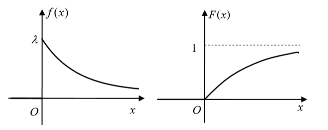

# 离散型分布

## 0-1分布

若离散型随机变量X只可能取0和1两个值，且其分布列为
$$
P(X=k)=p^k(1-p)^{1-k}, \qquad k=0,1
$$
其中0<p<1。则称X服从参数为p的0-1分布（也成为伯努利分布）。

## 二项分布

若离散型随机变量X的分布列为
$$
P(X=k)=C_n^kp^k(1-p)^{n-k}, \qquad k=0,1,2,\dots,n,
$$
其中0<p<1。则称X服从参数为n,p的二项分布，记为`X~B(n,p)`。n次，k个p出现。

显然P(X=k)≥0，而根据二项式定理有
$$
\sum_{k=0}^nC_n^kp^k(1-p)^{n-k}=(p+(1-p))^n=1
$$
即二项分布中X的分布列满足分布列的规范性。

二项分布的数学期望、方差为
$$
EX=np \\
DX=np(1-p)
$$
如果一个随机试验E的结果只有两个可能的结果，记为$A$和$\bar{A}$，称这种试验为伯努利试验。将伯努利试验E独立重复地进行n次，称为n重独立伯努利试验，简称为n重伯努利试验（在不需要指明具体的试验次数时，称为多重伯努利试验）。

**二项分布的泊松逼近**：设在n重伯努利试验中，p~n~为事件A在每次试验中出现的概率。若$\lim\limits_{n \rightarrow \infty}np_n=\lambda>0$，则对任意的k=0,1,2,...，有
$$
\lim_{n \rightarrow \infty}C_n^kp^k(1-p)^{n-k}=\cfrac{\lambda^k}{k!}e^{-\lambda}
$$
在应用中，当p很小且n较大（一般要求p≤0.1，而n≥20）时，就可以用下式作近似计算：
$$
C_n^kp^k(1-p)^{n-k}\approx\cfrac{\lambda^k}{k!}e^{-\lambda}
$$

## 泊松分布

一般，若随机变量X的分布列为
$$
P(X=k)=\cfrac{\lambda^k}{k!}e^{-\lambda}, \qquad k=0,1,2,\dots
$$
其中λ>0，则称X服从参数为λ的泊松分布，记为`X~P(λ)`。

泊松分布的数学期望、方差为
$$
EX=\lambda \\
DX=\lambda
$$

## 多项分布

设随机试验E有r个可能的结果A~1~, A~2~, ..., A~r~，P(A~i~)=p~i~，i=1,2,...,r，且p~1~+p~2~+...+p~r~=1。将试验E独立重复地进行n次（称为n重独立试验），用X~1~, X~2~, ..., X~r~分别表示A~1~, A~2~, ..., A~r~出现的次数，则(X~1~, X~2~, ..., X~r~)的概率分布为
$$
\begin{align}
P(X_1=k_1,X_2=k_2,\dots,X_r=k_r) &=
C_n^{k_1}p_1^{k_1}\cdot C_{n-k_1}^{k_2}p_2^{k_2}\cdot\dots\cdot C_{n-k_1-k_2-\dots-k_{r-1}}^{k_r}p_r^{k_r} \\
&= \cfrac{n!}{k_1!k_2!\dots k_r!}p_1^{k_1}p_2^{k_2}\dots p_r^{k_r}
\end{align}
$$
其中k~i~≥0, i=1,2,...,r，且k~1~+k~2~+...+k~r~=n。这种分布称为多项分布。由前r-1项可自然推得第r项。

## 超几何分布

设一批产品共N件，其中M件时次品，其余N-M件是合格品。现从中不放回任取n次，每次一件。记取得的次品的件数为X，则X的分布列为
$$
P(X=k)=\cfrac{C_M^kC_{N-M}^{n-k}}{C_N^n}, \qquad k=0,1,\dots,n
$$
其中n，M，N为参数，0≤k≤M，0≤k≤n，0≤n-k≤N-M。这种分布称为超几何分布，记为`X~H(n;M,N)`。

超几何分布的数学期望为
$$
EX=n\cfrac{M}{N}
$$

## 多维超几何分布

设袋中装有i好球N~i~个，i=1,2,...r，且N~1~+N~2~+...+N~r~=N。先采用无放回抽样方式从中随机取出n个，若用X~1~, X~2~, ..., X~r~分别表示取出1,2,...,r号球的数目，则(X~1~, X~2~, ..., X~r~)的概率分布为
$$
P(X_1=k_1,X_2=k_2,\dots,X_r=k_r)=\cfrac{C_{N_1}^{k_1}C_{N_2}^{k_2}\dots C_{N_r}^{k_r}}{C_N^n}
$$
其中0≤k~i~≤N~i~，i=1,2,...,r，且k~1~+k~2~+...+k~r~=n。这种分布称为多维超几何分布。多维超几何分布是超几何分布的自然推广。

## 几何分布

设E是一个伯努利试验，其结果为$A$（成功）和$\bar{A}$（失败），每次试验成功的概率P(A)=p不变。将伯努利试验E重复进行多次，以X表示成功（结果A）首次出现时的试验次数，则X是随机变量。前k-1次失败，第k次成功。

一般地，若随机变量X的分布列为
$$
P(X=k)=p(1-p)^{k-1}, \qquad k=1,2,\dots
$$
其中0<p<1，则称X服从参数为p的几何分布，记为`X~G(p)`。

几何分布的数学期望、方差为
$$
EX=\cfrac{1}{p} \\
DX=\cfrac{1-p}{p^2}
$$

## 帕斯卡分布

几何分布的首次成功延申到第r次成功，即为帕斯卡分布。前k-1次中有r-1次成功，第r次成功。

一般地，若随机变量X的分布列为
$$
P(X=k)=C_{k-1}^{r-1}p^{r-1}(1-p)^{k-r}\cdot  p=C_{k-1}^{r-1}p^r(1-p)^{k-r}, \qquad k=r,r+1,\dots
$$
其中0<p<1，则称X服从参数为r，p的帕斯卡分布，即为`X~Pa(r,p)`。显然参数r=1时帕斯卡分布即为几何分布。

# 连续性分布

## 均匀分布

若连续型随机变量X的概率分布函数为
$$
f(x)=\begin{cases}
\cfrac{1}{b-a} & x\in(a,b) \\
0 & x\notin(a,b)
\end{cases}
$$
则称随机变量X在区间(a,b)上服从均匀分布，记为`X~U(a,b)`。分布函数为
$$
F(x)=\begin{cases}
0 & x<a \\
\cfrac{x-a}{b-a} & a\le x<b \\
1 & x\ge b
\end{cases}
$$
概率密度函数和分布函数的图像如下

设X~U(a,b)，区间(c,d)是(a,b)的任一子区间，记a≤c<d≤b，则有
$$
P(c<X<d)=\int_c^d\cfrac{1}{b-a}dx=\cfrac{d-c}{b-a}
$$
这表明X在(a,b)的任意子区间内取值的概率与该子区间的长度成正比，而与子区间的任意位置无关，这正是分布均匀性的直观意义。

均匀分布的数学期望、方差为
$$
EX=\cfrac{a+b}{2} \\
DX=\cfrac{(b-a)^2}{12}
$$

## 二维均匀分布

设G为平面上的有界区域，面积为S，若二维随机向量(X,Y)的联合密度函数为
$$
f(x,y)=\begin{cases}
\cfrac{1}{S} & (x,y)\in G \\
0 & (x,y)\notin G
\end{cases}
$$
则称(X,Y)在区域G上服从均匀分布。

## 指数分布

若连续型随机变量X的密度函数为
$$
f(x)=\begin{cases}
\lambda e^{-\lambda x} & x\ge0 \\
0 & x < 0
\end{cases}
$$
则称X服从参数为λ的指数分布，记为`X~E(λ)`。分布函数为
$$
F(x)=\begin{cases}
1-e^{-\lambda x} & x\ge0 \\
0 & x<0
\end{cases}
$$
概率密度函数和分布函数的图像如下

指数分布具有**无后效性**，即若X~E(λ)，则对任意s,t>0，有$P(X>s+t|X>s)=P(X>t)$。

指数分布的数学期望、方差为
$$
EX=\cfrac{1}{\lambda} \\
DX=\cfrac{1}{\lambda^2}
$$

## 正态分布

若连续型随机变量X的概率密度函数为
$$
f(x)=\cfrac{1}{\sqrt{2\pi}\sigma}e^{-\cfrac{(x-\mu)^2}{2\sigma^2}}, \qquad -\infty<x<+\infty
$$
其中σ>0，则称X服从参数为μ,σ^2^的正态分布，记为$X\sim N(\mu,\sigma^2)$。密度函数没有原函数（即没有分布函数），密度函数的图像如下

正态分布的数学期望、方差为
$$
EX=\mu \\
DX=\sigma^2
$$
当μ=0且σ=1时的正态分布N(0,1)称为标准正态分布。通常用U表示标准正态变量，其密度函数记为
$$
\varphi(x)=\cfrac{1}{\sqrt{2\pi}}e^{-\cfrac{x^2}{2}}, \qquad -\infty<x<+\infty
$$
标准正态分布的分布函数用专有符号Φ(x)表示，它是标准正态密度函数φ(x)在区间(-∞,x]上的变上限积分，即
$$
\phi(x)=\cfrac{1}{\sqrt{2\pi}}\int_{-\infty}^xe^{-\cfrac{t^2}{2}}dt, \qquad -\infty<x<+\infty
$$
通过换元，若X服从参数为μ,σ^2^的正态分布，则$\cfrac{X-\mu}{\sigma}\sim N(0,1)$。

设X~1~,X~2~相互独立，$X_i\sim N(\mu_i,\sigma_i^2),\ i=1,2$，则正态分布具有可加性
$$
X_1+X_2\sim N(\mu_1+\mu_2, \sigma_1^2+\sigma_2^2)
$$
独立正态变量的线性组合仍为正态变量
$$
aX_1+bX_2\sim N(a\mu_1+b\mu_2, a^2\sigma_1^2+b^2\sigma_2^2)
$$
其中a^2^+b^2^≠0。

## 二元正态分布

若二维随机向量(X,Y)的联合密度函数为
$$
f(x,y)=\cfrac{1}{2\pi\sigma_1\sigma_2\sqrt{1-\rho^2}}\cdot exp\Bigg\{
\cfrac{-1}{2(1-\rho^2)}\left(
\cfrac{(x-\mu_1)^2}{\sigma_1^2}-2\rho\cfrac{(x-\mu_1)(y-\mu_2)}{\sigma_1\sigma_2}+\cfrac{(y-\mu_2)^2}{\sigma_2^2}
\right)
\Bigg\}
$$
其中μ~1~，μ~2~，σ~1~，σ~2~，ρ为常数，且σ~1~,σ~2~>0，|ρ|<1。则称(X,Y)服从二元正态分布，记为$(X,Y)\sim N(\mu_1,\mu_2,\sigma_1,\sigma_2,\rho)$。X与Y相互独立的充分必要条件是ρ=0。

二元正态分布(X,Y)的边际分布X，Y仍是正态分布，即$X\sim N(\mu_1,\sigma_1^2)$，$Y\sim N(\mu_2,\sigma_2^2)$，它们的边际密度函数为
$$
f_X(x)=\cfrac{1}{\sqrt{2\pi}\sigma_1}e^{-\cfrac{(x-\mu_1)^2}{2\sigma_1^2}} \\
f_Y(y)=\cfrac{1}{\sqrt{2\pi}\sigma_2}e^{-\cfrac{(y-\mu_2)^2}{2\sigma_2^2}}
$$
反之X和Y是正态分布，但(X,Y)不一定是二元正态分布。

设$(X_1,X_2)\sim N(\mu_1,\mu_2,\sigma_1,\sigma_2,\rho)$，若X~1~与X~2~不独立，则它们的可加性和线性组合增加了一项ρ，如下（其中a^2^+b^2^≠0）
$$
X_1+X_2\sim N(\mu_1+\mu_2, \sigma_1^2+\sigma_2^2+2\rho\sigma_1\sigma_2) \\
aX_1+bX_2\sim N(a\mu_1+b\mu_2, a^2\sigma_1^2+b^2\sigma_2^2+2\rho ab\sigma_1\sigma_2)
$$
若(X,Y)为二元正态分布，则(aX+bY,cX+dY)也是二元正态分布的充要条件是$\begin{array}{|cc|}a&b\\c&d\end{array}=ad-bc\ne0$。

协方差为和相关系数为
$$
cov(X,Y)=\rho\sigma_1\sigma_2 \\
\rho_{XY}=\cfrac{cov(X,Y)}{\sqrt{DX}\sqrt{DY}}=\cfrac{\rho\sigma_1\sigma_2}{\sigma_1\sigma_2}=\rho
$$

## 柯西分布

若连续型随机变量X的概率密度函数为
$$
f(x)=\cfrac{1}{\pi(1+x^2)}
$$
则称X服从柯西分布。