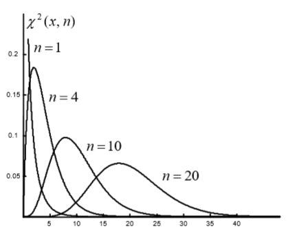
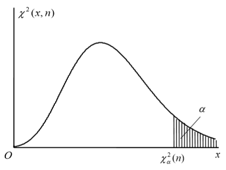
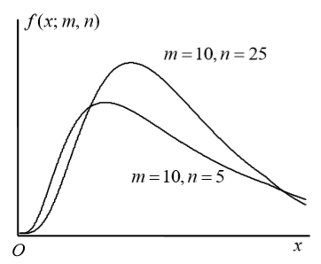
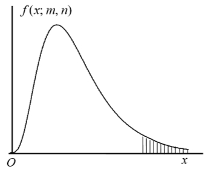
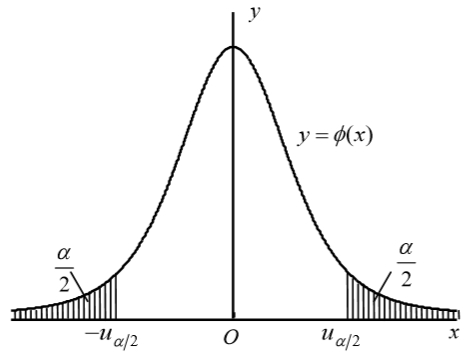
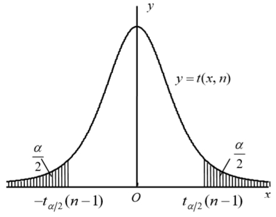
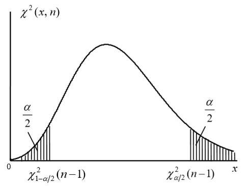
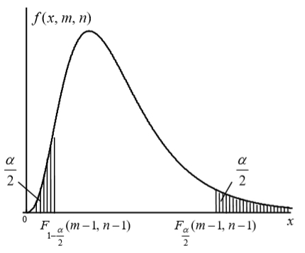

[toc]

# 一、样本和抽样分布

数理统计学就是通过收集、整理和分析实验数据以推断随机现象的客观规律性的理论与方法。

## （一）总体和样本

### 1. 定义和离散型连续型

**定义**：总体$X$是一个有确定分布的随机变量，其分布函数就称为**总体分布**。若$X_1,X_2,\cdots,X_n$是$n$个相互独立且与总体X同分布的随机变量，则称$(X_1,X_2,\cdots,X_n)$为总体$X$的容量为$n$的**简单随机样本**，简称**样本**。当$(X_1,X_2,\cdots,X_n)$取定一组常数值$(x_1,x_2,\cdots,x_n)$时称这组常量数值为总体$X$的一组**样本观测值**（或**样本实现**）。

设总体$X$的分布函数为$F(x)$，则样本$(X_1,X_2,\cdots,X_n)$的联合分布函数为
$$
F(x_1,x_2,\dots,x_n)=\prod_{i=1}^nP(X_i\le x_i)=\prod_{i=1}^nF(x_i)
$$
若总体$X$是离散型的，分布律为$p(x)=P(X=x),x\in\{a_k\}$，则样本的联合分布列为
$$
p_n(x_1,x_2,\dots,x_n)=P(X_1=x_1,X_2=x_2,\dots,X_n=x_n)=\prod_{i=1}^nP(X_i=x_i)=\prod_{i=1}^np(x_i) \qquad x_i\in\{a_k\}
$$
若总体$X$是连续型的，其密度函数为$f(x)$，则样本的联合密度函数为
$$
f(x_1,x_2,\dots,x_n)=\prod_{i=1}^nf(x_i)
$$

### 2. 统计量和样本矩

为了通过样本对总体作出推断，需要对样本进行必要的提炼和加工，以集中和提取与问题有关的信息。

**定义**：设$(X_1,X_2,\cdots,X_n)$是总体X的样本，$g(X_1,X_2,\cdots,X_n)$是$n$元的连续函数，且其中不含有任何未知参数，则称$g(X_1,X_2,\cdots,X_n)$为统计量。

统计量是仅与样本$(X_1,X_2,\cdots,X_n)$有关的随机变量，若$(x_1,x_2,\cdots,x_n)$是样本$(X_1,X_2,\cdots,X_n)$的观测值，则称$g(x_1,x_2,\cdots,x_n)$是统计量$g(X_1,X_2,\cdots,X_n)$的观测值。最常用的统计量是样本均值、样本方差以及各种类型的样本矩。

1. **样本均值**，$\bar{X}=\cfrac{1}{n}\sum\limits_{i=1}^nX_i$，样本均值的观测值记为$\bar{x}=\cfrac{1}{n}\sum\limits_{i=1}^nx_i$
2. **样本方差**，$S^2=\cfrac{1}{n-1}\sum\limits_{i=1}^n(X_i-\bar{X})^2$，样本方差的观测值为$s^2=\cfrac{1}{n-1}\sum\limits_{i=1}^n(x_i-\bar{x})^2$，若$X_i$相互独立，可以去括号，即$S^2=\cfrac{1}{n-1}(\sum\limits_{i=1}^nX_i^2-n\bar{X}^2)$
3. **样本k阶原点矩**，$A_k=\cfrac{1}{n}\sum\limits_{i=1}^nX_i^k \quad k=1,2,\cdots$，其观测值记为$a_k=\cfrac{1}{n}\sum\limits_{i=1}^nx_i^k \quad k=1,2,\cdots$
4. **样本k阶中心矩**，$M_k=\cfrac{1}{n}\sum\limits_{i=1}^n(X_i-\bar{X})^k \quad k=1,2,\cdots$，其观测值为$m_k=\cfrac{1}{n}\sum\limits_{i=1}^n(x_i-\bar{x})^k \quad k=1,2,\cdots$

实际上，根据大数定律可以证明，样本矩是依概率收敛于相应的总体矩的。特别地，样本均值依概率收敛于总体均值，样本方差依概率收敛于总体方差（样本二阶中心矩$M_2$也收敛于总体方差）。因此，样本均值刻画了总体（指标）的中心趋势，样本方差刻画了总体（指标）的波动趋势或离散程度。由此可得一些性质如下。

1. 如果总体$X$具有数学期望$E[X]=\mu$，则$E[\bar{X}]=E[X]=\mu$
2. 如果总体$X$具有方差$D[X]=\sigma^2$，则$D[\bar{X}]=\cfrac{1}{n}D[X]=\cfrac{\sigma^2}{n}$，$E(S^2)=D[X]=\sigma^2$
3. 如果总体$X$的$k$阶原点矩$E[X^k]$存在，则当$n$趋于无穷时，样本的$k$阶原点矩依概率收敛于总体$X$的$k$阶原点矩，即$\cfrac{1}{n}\sum\limits_{i=1}^nX_i^k\stackrel{P}{\longrightarrow}E[X^k]$

上面性质2中的后一个式子$E(S^2)=D[X]=\sigma^2$说明样本方差$S^2$是总体方差$D[X]$的无偏估计，其证明有两种方法，过程如下。
$$
\begin{align}
E(S^2)&=\cfrac{1}{n-1}E[\sum_{i=1}^n(X_i-\bar X)^2]=\cfrac{1}{n-1}E[\sum_{i=1}^n(X_i^2-2X_i\bar{X}+\bar{X}^2)] \\
&=\cfrac{1}{n-1}E[\sum_{i=1}^n(X_i^2)-n\bar X^2]=\cfrac{1}{n-1}[\sum_{i=1}^nE(X_i^2)-nE(\bar X^2)] \\
&=\cfrac{1}{n-1}\{n(\sigma^2+\mu^2)-n[D\bar X+(E\bar X)^2]\} \\
&=\cfrac{n}{n-1}[(\sigma^2+\mu^2)-(\cfrac{\sigma^2}{n}+\mu^2)]=\sigma^2
\end{align}
$$

$$
\begin{align}
E(S^2)&=\cfrac{1}{n-1}E\{\sum_{i=1}^n[(X_i-\mu)-(\bar X-\mu)]^2\} \\
&=\cfrac{1}{n-1}E\{\sum_{i=1}^n[(X_i-\mu)^2-2(X_i-\mu)(\bar X-\mu)-(\bar X-\mu)^2]\} \\
&=\cfrac{1}{n-1}E[\sum_{i=1}^n(X_i-\mu)^2-n(\bar X-\mu)^2] \\
&=\cfrac{1}{n-1}[\sum_{i=1}^n(X_i-\mu)^2-nE(\bar X-\mu)^2] \\
&=\cfrac{1}{n-1}[n\sigma^2-nD\bar X]=\cfrac{1}{n-1}[n\sigma^2-n\cfrac{\sigma^2}{n}] \\
&=\sigma^2
\end{align}
$$

### 3. 顺序统计量和经验分布函数

**定义**：设$(X_1,X_2,\cdots,X_n)$是总体$X$的样本，将$X_1,X_2,\cdots,X_n$按照从小到大的顺序排序，最小的记为$X_{(1)}$，次小的记为$X_{(2)}$，以此类推，最大的记为$X_{(n)}$，即有$X_{(1)}\le X_{(2)}\le \cdots\le X_{(n)}$。称$(X_{(1)},X_{(2)},\cdots,X_{(n)})$为样本的**顺序统计量**。每个$X_{(k)}$也称为顺序统计量（或第$k$位顺序统计量），其中$X_{(1)}=\min\{X_{(1)},X_{(2)},\cdots,X_{(n)}\}$也称为**样本极小值**，$X_{(n)}=\max\{X_{(1)},X_{(2)},\cdots,X_{(n)}\}$也称为**样本极大值**。**样本极差**定义为$X_{(n)}-X_{(1)}$。**样本中位数**定义为排序处于中间的数（$n$为奇数时）或中间的两个数的平均数（$n$为偶数时）。

**定义**：设$(X_1,X_2,\cdots,X_n)$是总体$X$的简单随机样本，总体$X$的经验分布函数定义为
$$
F^*_n(x)=\cfrac{|\{i|X_i\le x,1\le i\le n\}|}{n}
$$
即在样本分量$X_1,X_2,\cdots,X_n$中，落在点$x$处或其左方的点的个数，其中$|\{\}|$表示集合$\{\}$中的元素个数。

利用顺序统计量$(X_{(1)},X_{(2)},\cdots,X_{(n)})$可将经验分布函数改写成下列等价的形式：
$$
F^*_n(x)=\begin{cases}
0 & x<X_{(1)} \\
\cfrac{k}{n} & X_{(k)}\le x<X_{(k+1)} \\
1 & x\ge X_{(n)}
\end{cases}
$$
易见$F_n^*(x)$适合单调性、规范性和右连续性，即经验分布函数满足一般分布函数所具有的一切性质。

由于样本分布函数$F_n^*(x)$与样本$(X_1,X_2,\cdots,X_n)$有关，因此它也是随机变量，利用贝努利大数定律可以证明，对任意$\varepsilon>0$，有$\lim\limits_{x\to \infty}P(|F^*_n(x)-F(x)|\ge \varepsilon)=0$，即对任意的$x$，经验分布函数$F_n^*(x)$依概率收敛于总体分布函数$F(x)$。

**格列汶科定理**：当样本容量$n\to\infty$时，经验分布函数$F_n^*(x)$以概率1关于$x$一致收敛于总体分布函数$F(x)$，即
$$
P(\lim_{x\to\infty}\sup_{x\in R}|F^*_n(x)-F(x)|=0)=1
$$
由格列汶科定理，当样本容量$n$充分大时，经验分布函数$F_n^*(x)$是总体分布函数$F(x)$的很好的近似，这也是从总体中抽取的简单随机样本能够用以对总体进行良好的统计推断的依据。

## （二）抽样分布

### 1. $\chi^2$分布

**定义**：若随机变量$U_1,U_2,\cdots,U_n$相互独立，且均服从标准正态分布$N(0,1)$，则称随机变量$X=U_1^2+U_2^2+\cdots+U_n^2$的分布为自由度是$n$的卡方分布，记为$X\sim\chi^2(n)$。$n$是参数，它表示参与平方和运算的独立标准正态随机变量的个数。

根据上述定义导出$\chi^2$分布的密度函数为
$$
f_n(x)=\chi^2(x;n)=\begin{cases}
\cfrac{1}{2^{\frac{n}{2}}\Gamma(\cfrac{n}{2})}x^{\cfrac{n}{2}-1}e^{-\cfrac{x}{2}} & x\ge0 \\
0 & x<0
\end{cases}
$$
其中$\Gamma(\alpha)=\int_0^{+\infty}x^{\alpha-1}e^{-x}dx$在$\alpha=\cfrac{n}{2}$处的值。卡方分布的概率密度函数图像如下

$\chi^2$分布的性质：

1. 若$X\sim\chi^2(n)$，则$E[X]=n,D[X]=2n$
2. 可加性，随机变量$X$与$Y$相互独立，且$X\sim\chi^2(m)$，$Y\sim\chi^2(n)$，则$X+Y\sim\chi^2(m+n)$
3. 设$X\sim\chi^2(n)$，则当$n\to\infty$时，$\sqrt{2X}$的渐近分布为$N(\sqrt{2n-1},1)$

**定义**：设$F(x)$为某随机变量$X$的分布函数，对于给定的$\alpha\ (0<\alpha<1)$，称满足$P(X>x_\alpha)=1-F(x_\alpha)=\alpha$的$x_\alpha$为分布$F(x)$的上侧$\alpha$**分位数**或**分位点**，或上侧$100\alpha\%$分位点。

$\chi^2(n)$分布的上侧$\alpha$分位点记为$\chi_\alpha^2(n)$，如下图。当$n>45$时，$\chi_\alpha^2(n)$可利用性质3导出的近似分位点公式算出$\chi_\alpha^2(n)\approx\cfrac{1}{2}(u_\alpha+\sqrt{2n-1})^2$，其中$u_\alpha$时标准正态分布$N(0,1)$的上侧$\alpha$分位点。

### 2. $t$分布

设$U\sim N(0,1),Y\sim\chi^2(n)$，且$U$与$Y$相互独立，则称随机变量$T=\cfrac{U}{\sqrt{Y/n}}$的分布为自由度是$n$的$t$分布，记为$T\sim t(n)$。

可以导出$t(n)$分布的密度函数为
$$
t(x;n)=\cfrac{\Gamma(\cfrac{n+1}{2})}{\sqrt{n\pi}\cdot\Gamma(\cfrac{n}{2})}\left(1+\cfrac{x^2}{n}\right)^{-\cfrac{n+1}{2}} \qquad -\infty<x<+\infty
$$
图像如下

分布密度函数.jpg)

$t$分布的性质：

1. $t$分布的密度函数$t(x;n)$是偶函数，即对任意的$x\in R$，有$t(-x;n)=t(x;n)$
2. 渐近正态性，$\lim\limits_{n\to\infty}t(x;n)=\Phi(x)=\cfrac{1}{\sqrt{2\pi}}e^{-\cfrac{x^2}{2}}$，$n$趋于无穷时，密度函数接近标准正态分布的密度函数。

$t(n)$分布的上侧$\alpha$分位点记为$t_\alpha(n)$，如下图。当$n>45$时，由性质2可知$t_\alpha(n)\approx u_\alpha$，其中$u_\alpha$时标准正态分布$N(0,1)$的上侧$\alpha$分位点。

分布的上侧分位点.jpg)

### 3. $F$分布

**定义**：设$X\sim\chi^2(m),Y\sim\chi^2(n)$，且$X$与$Y$相互独立，则称随机变量$\cfrac{X/m}{Y/n}$的分布为自由度是$m,n$的$F$分布，记为$F\sim F(m,n)$。

可以导出$F(m,n)$分布的密度函数为
$$
f(x;m,n)=\begin{cases}
\cfrac{\Gamma(\cfrac{m+n}{2})}{\Gamma(\cfrac{m}{2})\Gamma(\cfrac{n}{2})}(\cfrac{m}{n})(\cfrac{m}{n}x)^{\cfrac{m}{2}-1}(1+\cfrac{m}{n}x)^{\cfrac{m+n}{2}} & x>0 \\
0 & x\le0
\end{cases}
$$
图像如下

$F$分布的性质：

1. 倒数不变性，若$F\sim F(m,n)$，则$1/F\sim F(n,m)$
2. 与$t$分布的关系，若$T\sim t(n)$，则$T^2\sim F(1,n)$
3. 分位点公式，$F_{1-\alpha}(m,n)=1/F_\alpha(n,m)$

$F(m,n)$分布的上侧$\alpha$分位点记为$F_\alpha(m,n)$，如下图。如果要求的$\alpha$较大，可以根据性质3转换。

### 4. 正态总体统计量的抽样分布

**定理**（正态总体统计量的抽样分布定理，Fisher费希尔定理）：设$(X_1,X_2,\cdots,X_n)$是取自正态总体$N(\mu,\sigma^2)$的容量为$n$的样本，则

1. $\bar{X}\sim N(\mu,\cfrac{\sigma^2}{n})$
2. $\cfrac{(n-1)S^2}{\sigma^2}=\cfrac{1}{\sigma^2}\sum\limits_{i=1}^n(X_i-\bar X)^2\sim\chi^2(n-1)$，$Y=\cfrac{1}{\sigma^2}\sum\limits_{i=1}^n(X_i-\mu)^2\sim\chi^2(n)$
3. 样本均值$\bar{X}$与样本方差$S^2$相互独立。

**推论1**，$\sqrt{n}\cfrac{\bar{X}-\mu}{\sigma}\sim N(0,1)$

**推论2**，$\sqrt{n}\cfrac{\bar{X}-\mu}{S}\sim t(n-1)$

设$(X_1,X_2,\cdots,X_m)$是取自正态总体$N(\mu_1,\sigma_1^2)$的样本容量为$m$的样本，设$(Y_1,Y_2,\cdots,Y_n)$是取自正态总体$N(\mu_2,\sigma_2^2)$的样本容量为$n$的样本，且$(X_1,X_2,\cdots,X_m)$与$(Y_1,Y_2,\cdots,Y_n)$相互独立，样本的均值分别记为$\bar{X},\bar{Y}$，样本方差分别记为$S_1^2,S_2^2$。

**推论3**，$\cfrac{S_1^2/\sigma_1^2}{S_2^2/\sigma_2^2}\sim F(m-1,n-1)$

**推论4**，$\bar{X}-\bar{Y}\sim N(\mu_1-\mu_2,\cfrac{\sigma_1^2}{m}+\cfrac{\sigma_2^2}{n})$，$U=\cfrac{(\bar{X}-\bar{Y})-(\mu_1-\mu_2)}{\sqrt{\cfrac{\sigma_1^2}{m}+\cfrac{\sigma_2^2}{n}}}\sim N(0,1)$

**推论5**，随机变量$\bar{X},S_1^2,\bar{Y},S_2^2$相互独立。

**推论6**，当$\sigma_1^2=\sigma_2^2=\sigma^2$时，$\cfrac{(\bar{X}-\bar{Y})-(\mu_1-\mu_2)}{S_w\sqrt{\cfrac{1}{m}+\cfrac{1}{n}}}\sim t(m+n-2)$，其中$S_w=\sqrt{\cfrac{(m-1)S_1^2+(n+1)S_2^2}{m+n-2}}$称为**混合样本标准差**。

### 5. 样本极大值与样本极小值的分布

设$(X_{(1)},X_{(2)},\cdots,X_{(n)})$为样本的顺序统计量，则样本最大值$X_{(n)}$的分布函数为
$$
\begin{align}
F_n(x)=P(X_{(n)}\le x) &= P(X_1\le x,X_2\le x,\dots,X_n\le x) \\
&= P(X_1\le x)P(X_2\le x)\cdots P(X_n\le x) \\
&= [F(x)]^n
\end{align}
$$
样本最小值$X_{(1)}$的分布函数为
$$
\begin{align}
F_1(x)=P(X_{(1)}\le x) &= 1-P(X_1>x,X_2>x,\dots,X_n>x) \\
&= 1-P(X_1>x)P(X_2>x)\cdots P(X_n>x) \\
&= 1-[1-F(x)]^n
\end{align}
$$

# 二、参数估计

在实际问题中，经常需要利用从总体中取得的样本，对总体的未知属性进行统计分析，即统计推断，最常见的统计推断问题包括参数估计和假设检验两类。

参数估计的具体形式有两种：一种是用一个数量作为某个参数的估计，称为点估计；另一种是用一个区间作为参数的可能存在的范围的估计，称为区间估计。在总体分布形式未知的情况下，也可以对总体的某些数字特征（如期望、方差）做出估计。

## （一）矩估计与极大似然估计

**定义**：设$\theta$为总体分布的未知参数（或某个数字特征），用样本$(X_1,X_2,\cdots,X_n)$的一个统计量$\hat{\theta}=\hat{\theta}(X_1,X_2,\dots,X_n)$来估计$\theta$，则称统计量$\hat{\theta}=\hat{\theta}(X_1,X_2,\dots,X_n)$为参数$\theta$的**估计量**，简记为$\hat{\theta}$。将样本的观测值$(x_1,x_2,\cdots,x_n)$代入估计量$\hat{\theta}=\hat{\theta}(X_1,X_2,\dots,X_n)$得到$\hat{\theta}=\hat{\theta}(x_1,x_2,\dots,x_n)$，称为参数$\theta$的一个**估计值**，在不致混淆的情况下，估计值仍简记为$\hat{\theta}$。

显然，估计量是随机变量，因此对于样本的不同观测值，$\theta$的估计值一般也不同。

### 1. 矩估计

矩估计的实质是用经验分布函数去替换总体分布函数（格列汶科定理），原理是用样本的矩来替换总体相应阶的矩，进而用样本矩的连续函数来替换总体的同一函数。这是因为待估参数通常是总体矩的某个连续函数，而根据大数定律，样本矩的任何连续函数都依概率收敛于总体矩的同一函数，因此大数定律保证了这种替换的合理性。

设总体X的分布函数为$F(x;\theta)$，其中$\theta=(\theta_1,\theta_2,\cdots,\theta_m)$是未知参数（向量），若总体$X$存在直到$m$阶的矩，易见总体的各阶原点距都是参数的函数，以样本的各阶原点距分别代替总体的各阶原点距，得关于未知参数$\theta=(\theta_1,\theta_2,\cdots,\theta_m)$的方程组：
$$
A_k=\cfrac{1}{n}\sum_{i=1}^nX_i^k=E[X^k]=\alpha_k(\theta_1,\theta_2,\dots,\theta_m) \qquad 1\le k\le m
$$
求解上述方程组，得到一组解$\hat{\theta_k}=\hat{\theta_k}(X_1,X_2,\dots,X_n),\ 1\le k\le m$，依次为未知参数$\theta=(\theta_1,\theta_2,\cdots,\theta_m)$的**矩估计量**，进一步地如果已知样本的一组观测值$(x_1,x_2,\cdots,x_n)$，代入矩估计量得到各参数$\theta_1,\theta_2,\cdots,\theta_m$的**矩估计值**，即$\hat{\theta_k}=\hat{\theta_k}(x_1,x_2,\dots,x_n),\ 1\le k\le m$。

中心矩也可以作为总体的中心矩的估计量，在二阶及以上阶数的矩估计中，通常使用中心矩而不是原点矩，如样本的二阶中心矩作为总体二阶中心矩的估计量：
$$
\cfrac{1}{n}\sum_{i=1}^nX_i^2=E[X^2]=D[X]+(E[X])^2=D[X]+\bar{X}^2 \\
\Rightarrow D[X]=\cfrac{1}{n}\sum_{i=1}^nX_i^2-\bar{X}^2=\cfrac{1}{n}\sum_{i=1}^n(X_i-\bar{X})^2\stackrel{\triangle}{=}\tilde{S}^2
$$
故通常来说，一阶原点矩就是用样本均值替换总体的数学期望，二阶也可用二阶中心矩，就是用样本方差替换总体的方差。特别地对于正态分布$\hat\mu=\bar{X},\hat\sigma^2=\tilde{S}^2$，对于下述极大似然估计，也有同样结果。

如果要估计得是$\theta$的某个函数$g(\theta)$，则可将$g(\theta)$设法表示为总体若干个矩的函数（所涉及的矩要求都存在），然后在其中用样本的各阶矩代替总体的相应各阶矩即得$g(\theta)$的矩估计量。需要注意的是，矩估计不是唯一的。

### 2. 极大似然估计

基本思想是，所求的未知参数的估计值，应当使试验得到的样本的观测值出现的概率，在未知参数的所有可能取值中达到最大。

假设$(X_1,X_2,\cdots,X_n)$是总体$X$的样本，$(x_1,x_2,\cdots,x_n)$是样本的观测值，总体$X$的分布中含有未知参数$\theta=(\theta_1,\theta_2,\cdots,\theta_m),\theta\in\Theta$，$\Theta$为参数空间。应当选取这样的$\hat{\theta}=(\hat\theta_1,\hat\theta_2,\dots,\hat\theta_m)$作为未知参数$\theta=(\theta_1,\theta_2,\cdots,\theta_m)$的估计：对于特定的观测值$(x_1,x_2,\cdots,x_n)$而言，当参数$\theta$的取值为$\hat{\theta}$时，样本$(X_1,X_2,\cdots,X_n)$得到这组观测值的概率相比较$\theta$的其他可能取值达到极大。因此，求极大似然估计的关键是求出样本取特定观测值$(x_1,x_2,\cdots,x_n)$的概率。

当总体$X$服从离散型分布时，可以利用总体$X$的分布列直接求出特定观测值$(x_1,x_2,\cdots,x_n)$的概率$P(X_1=x_1,X_2=x_2,\cdots,X_n=x_n)$；而当总体$X$服从连续型分布时，单点概率为零不再有意义，考虑用概率密度函数求出样本$(X_1,X_2,\cdots,X_n)$取值于观测值$(x_1,x_2,\cdots,x_n)$附近（邻域）的概率，由此引入似然函数和极大似然估计的定义。

**定义**：设总体$X$的概率密度函数为$f(x;\theta)$（当$X$服从离散型分布时，$f(x;\theta)$为$X$的概率分布列），其中$\theta=(\theta_1,\theta_2,\cdots,\theta_m)$是未知参数，$\theta\in\Theta$，$\Theta$为参数空间，$(x_1,x_2,\cdots,x_n)$是样本观测值，称
$$
L(\theta)\hat{=}L(x_1,x_2,\dots,x_n;\theta)=\prod_{i=1}^nf(x_i;\theta)
$$
为样本的**似然函数**，若存在某个$\hat{\theta}=(\hat\theta_1,\hat\theta_2,\dots,\hat\theta_m),\hat\theta\in \Theta$使得
$$
L(\hat\theta)=\max_{\theta\in\Theta}L(\theta)
$$
其中$\hat{\theta}_i=\hat{\theta}_i(x_1,x_2,\dots,x_n),i=1,2,...,m$，则称$\hat\theta$为参数$\theta$的**极大似然估计值**，而称$\hat{\theta}=\hat{\theta}(X_1,X_2,\dots,X_n)=(\hat{\theta}_1(X_1,X_2,\dots,X_n),\dots,\hat{\theta}_m(X_1,X_2,\dots,X_n))$为参数$\theta$的**极大似然估计量**。在不引起混淆的情况下，可将极大似然估计量与极大似然估计值统称为参数$\theta$的极大似然估计。

由定义，求参数的极大似然估计，就是求似然函数的最大值点问题，因$\ln L$与$L$有着相同的最大值点，故只需要求似然函数对数（称为**对数似然**）的最大值点即可。大多数情况下，最大值点是参数空间$\Theta$中的点，从而在最大值点处的一阶偏导数为零，此时只需求下列方程组，称为**似然方程组**
$$
\cfrac{\part\ln L(\theta)}{\part\theta_i}=0 \qquad i=1,2,\dots,m
$$
即可得到参数$\theta$的极大似然估计。如果只有一个未知参数，即求的是导数。

有时对似然函数求导得到的似然方程未必有解，此时可以直接对似然函数进行分析找出似然函数的最大值点，从而得到参数的极大似然估计。

极大似然估计的**不变性**，若$\hat\theta$是$\theta$的极大似然估计量，而$g(\theta)$是连续函数，则$g(\hat\theta)$也是$g(\theta)$的极大似然估计量，这一性质对$\theta$为多维参数的情形也是成立的。

## （二）估计的有优良性

同一个未知参数，用不同的估计方法可以得到许多不同的估计量，甚至用同一种方法也可以得到不同的估计量，很自然的要评价这些估计量的优劣，这里介绍几种常用的估计量优劣准则。

### 1. 无偏性

**定义**：设$\hat{\theta}=\hat{\theta}(X_1,X_2,\dots,X_n)$是未知参数$\theta$的估计量，若对任意的$\theta\in\Theta$，均有
$$
E(\hat\theta)=\theta
$$
则称$\hat\theta$是参数$\theta$的一个**无偏估计量**，记$b_n(\hat\theta)=E(\hat\theta)-\theta$，称$b_n(\hat\theta)$为估计$\hat\theta$的偏移量，偏移量不为零的估计称为**有偏估计**，若
$$
\lim_{n\to\infty}b_n(\hat\theta)=0
$$
则称$\hat\theta$是参数$\theta$的**渐进无偏估计**。

不论总体服从什么分布，样本$k$阶矩$A_k$总是总体的$k$阶矩$\alpha_k$的无偏估计，特别地若总体的数学期望存在，则样本均值$\bar X$是总体均值$E[X]$的无偏估计。样本方差$S^2=\cfrac{1}{n-1}\sum\limits_{i=1}^n(X_i-\bar X)^2$是总体方差$\sigma^2$的无偏估计，$\tilde{S}^2$是$\sigma^2$的有偏估计，渐进无偏估计。

### 2. 有效性

同一参数$\theta$的无偏估计量也不一定是唯一的，当样本容量相同时，在参数$\theta$的无偏估计量中，自然认为方差越小越好。

**定义**：设$\hat{\theta}_1=\hat{\theta}_1(X_1,X_2,\dots,X_n),\hat{\theta}_2=\hat{\theta}_2(X_1,X_2,\dots,X_n)$是参数$\theta$的无偏估计量，若有
$$
D(\hat\theta_1)<D(\hat\theta_2)
$$
则称$\hat\theta_1$**比**$\hat\theta_2$**有效**。

设$(X_1,X_2,\cdots,X_n)$为总体$X$的容量为$n$的样本，可证明在$\mu$所有线性无偏估计$\sum\limits_{i=1}^na_iX_i$当中（其中$a_1+a_2+\cdots+a_n=1$），以样本均值$\bar X$最为有效。

### 3. 一致性

关于估计量的无偏性和有效性讨论，均是在样本容量$n$固定的条件下进行的。自然希望当$n$不断增大是估计值会越来越接近参数的真值。

**定义**：设$\hat{\theta}=\hat{\theta}(X_1,X_2,\dots,X_n)$是未知参数$\theta$的估计量，若$\hat\theta$依概率收敛于参数$\theta$，即对任意的$\varepsilon>0$，有
$$
\lim_{n\to\infty}P(|\hat\theta-\theta|\ge\varepsilon)=0
$$
则称$\hat\theta$是$\theta$的**一致估计量**（或**相合估计量**）。

样本$k$阶矩$A_k$是总体的$k$阶矩$\alpha_k$的一致估计（$k\ge1$），可以证明若$g(x_1,x_2,\cdots,x_m)$是$m$元连续函数，则$g(A_1,A_2,\cdots,A_m)$是参数$g(a_1,a_2,\cdots,a_m)$的一致估计。

## （三）区间估计

### 1. 区间估计的概念

**定义**：设$\theta$为总体$X$的分布中的未知参数，$(X_1,X_2,\cdots,X_n)$是取自总体$X$的样本，对给定的$\alpha\ (0<\alpha<1)$，若统计量$\underline\theta=\underline\theta(X_1,X_2,\dots,X_n)$和$\overline\theta=\overline\theta(X_1,X_2,\dots,X_n)$满足
$$
P(\underline\theta<\theta<\overline\theta)=1-\alpha
$$
则称$(\underline\theta,\overline\theta)$为$\theta$的置信水平为$1-\alpha$的**置信区间**，$\underline\theta$称为**置信下限**，$\overline\theta$称为**置信上限**，$1-\alpha$称为**置信水平**。由于$\underline\theta$和$\overline\theta$都是统计量，故置信区间$(\underline\theta,\overline\theta)$是一个随机区间，它包含未知参数$\theta$的真值的概率为$1-\alpha$。

置信水平表示区间估计的可靠度，越接近1越好；区间长度范围表示估计的精度，长度越小越好；它们是此消彼长的。通常区间估计问题就是在给定置信水平$1-\alpha$的条件下，利用样本$(X_1,X_2,\cdots,X_n)$去构造长度最短（也可以是平均长度最短）的置信区间。

正态分布是最常见也是应用最广泛的分布，下面讨论正态总体未知参数置信区间的构造方法。

### 2. 正态总体均值的区间估计

设已给定置信水平$1-\alpha$，并设$(X_1,X_2,\cdots,X_n)$是正态总体$N(\mu,\sigma^2)$的样本，其中总体均值$\mu$为未知参数，要求$\mu$的水平为$1-\alpha$的置信区间。根据总体方差$\sigma^2$是否已知，可分为以下两种情形。

1. **$\sigma^2$已知时均值$\mu$的置信区间**

应考虑从$\mu$的优良估计量$\bar X$入手，根据正态总体统计量的抽样分布定理$\sqrt{n}\cfrac{\bar X-\mu}{\sigma}\sim N(0,1)$，所以有
$$
P\left(-\mu_{\alpha/2}<\sqrt{n}\cfrac{\bar X-\mu}{\sigma}<\mu_{\alpha/2}\right)=1-\alpha \\
\Rightarrow P\left(\bar X-\mu_{\alpha/2}\cfrac{\sigma}{\sqrt{n}}<\mu<\bar X+\mu_{\alpha/2}\cfrac{\sigma}{\sqrt{n}}\right)=1-\alpha
$$

这表明当$\sigma^2$已知时，均值$\mu$的置信水平为$1-\alpha$的置信区间和区间长度为
$$
\left(\bar X-\mu_{\alpha/2}\cfrac{\sigma}{\sqrt{n}},\ \bar X+\mu_{\alpha/2}\cfrac{\sigma}{\sqrt{n}}\right) \qquad l=\cfrac{2\sigma}{\sqrt{n}}\mu_{\alpha/2}
$$

2. **$\sigma^2$未知时均值$\mu$的置信区间**

上述所求仍然成立，但其中$\sigma$也为未知参数，故应考虑去掉$\sigma$来表示$\mu$，故考虑采用样本标准差$S$，且根据正态总体统计量的抽样分布定理的推论$\sqrt{n}\cfrac{\bar X-\mu}{S}\sim t(n-1)$，图像如下。

这里直接给出当$\sigma^2$未知时，均值$\mu$的置信水平为$1-\alpha$的置信区间为
$$
\left(\bar X-\cfrac{S}{\sqrt{n}}t_{\alpha/2}(n-1),\ \bar X+\cfrac{S}{\sqrt{n}}t_{\alpha/2}(n-1)\right)
$$
需要注意的是，水平为$1-\alpha$的置信区间并不是唯一的。可以证明对于像正态分布或$t$分布这样的单峰对称分布，取对称的分位数得到的置信区间长度最短，从而具有最高的精度。

不过对于非对称的分布，通常也是选择上侧$\alpha/2$分位数与下侧$\alpha/2$分位数（即上次$1-\alpha/2$分位数）来构造置信水平为$1-\alpha$的置信区间，这样虽然不能得到最短置信区间，但却大大简化了置信区间的构造过程。如下面正态总体方差的区间估计。

### 3. 正态总体方差的区间估计

设已给定置信水平$1-\alpha$，并设$(X_1,X_2,\cdots,X_n)$是正态总体$N(\mu,\sigma^2)$的样本，其中总体方差$\sigma$为未知参数，要求$\sigma$的水平为$1-\alpha$的置信区间。根据总体均值$\mu$是否已知，可分为以下两种情形。

1. **$\mu$已知时方差$\sigma^2$的置信区间**

这种情形在实用中比较少见，仅指出可以用服从$\chi^2(n)$分布的随机变量$\cfrac{1}{\sigma^2}\sum\limits_{i=1}^n(X_i-\mu)^2$构造$\sigma^2$的置信区间，即$\cfrac{1}{\sigma^2}\sum\limits_{i=1}^n(X_i-\mu)^2\sim \chi^2(n)$。

2. **$\mu$未知时方差$\sigma^2$的置信区间**

由于样本均值$S^2$是$\sigma^2$的无偏估计，且根据正态总体统计量的抽样分布定理$\cfrac{(n-1)S^2}{\sigma^2}\sim\chi^2(n-1)$，图像如下。

这里直接给出当$\mu$未知时，方差$\sigma^2$的置信水平为$1-\alpha$的置信区间（标准差开根号）为
$$
\left(\cfrac{(n-1)S^2}{\chi_{\alpha/2}^2(n-1)},\ \cfrac{(n-1)S^2}{\chi_{1-\alpha/2}^2(n-1)}\right)
$$

### 4. 两个正态总体均值差的区间估计

在实际中，为了对两个对象的同一特性进行比较，经常要对它们的均值差或方差比构造区间估计。

设$(X_1,X_2,\cdots,X_m)$是正态总体$N(\mu_1,\sigma_1^2)$的样本，设$(Y_1,Y_2,\cdots,Y_n)$是正态总体$N(\mu_2,\sigma_2^2)$的样本。

1. **两总体方差$\sigma_1^2,\sigma_2^2$已知时，均值差$\mu_1-\mu_2$的置信区间**

$$
\left(\bar X-\bar Y-\mu_{\alpha/2}\sqrt{\cfrac{\sigma_1^2}{m}+\cfrac{\sigma_2^2}{n}},\ \bar X-\bar Y+\mu_{\alpha/2}\sqrt{\cfrac{\sigma_1^2}{m}+\cfrac{\sigma_2^2}{n}}\right)
$$

2. **方差未知但相等（即$\sigma_1^2=\sigma_2^2=\sigma^2$）时均值差$\mu_1-\mu_2$的置信区间**

$$
\left(\bar X-\bar Y-t_{\alpha/2}(m+n-2)S_w\sqrt{\cfrac{1}{m}+\cfrac{1}{n}},\ \bar X-\bar Y-t_{\alpha/2}(m+n-2)S_w\sqrt{\cfrac{1}{m}+\cfrac{1}{n}}\right)
$$

其中$S_w=\sqrt{\cfrac{(m-1)S_1^2+(n+1)S_2^2}{m+n-2}}$

### 5. 两个正态总体方差比的区间估计

设$(X_1,X_2,\cdots,X_m)$是正态总体$N(\mu_1,\sigma_2^2)$的样本，设$(Y_1,Y_2,\cdots,Y_n)$是正态总体$N(\mu_2,\sigma_2^2)$的样本，只讨论$\mu_1$和$\mu_2$均未知的情况，方差比$\sigma_1^2/\sigma_2^2$的置信区间为
$$
\left(\cfrac{S_1^2}{S_2^2}\cfrac{1}{F_{\alpha/2(m-1,n-1)}},\ \cfrac{S_1^2}{S_2^2}\cfrac{1}{F_{1-\alpha/2(m-1,n-1)}}\right)
$$
图像如下

### 6. 单侧置信区间

在实际问题中有的只关心参数下限（如平均寿命的下限），或有的只关注参数上限（如对次品率的估计）。

**定义**：设$\theta$为总体分布中的未知参数，$(X_1,X_2,\cdots,X_n)$是总体的样本，对给定的$\alpha\ (0<\alpha<1)$，若统计量$\underline\theta=\underline\theta(X_1,X_2,\dots,X_n)$满足$P(\theta>\underline\theta)=1-\alpha$，则称随机区间$(\underline\theta,+\infty)$为参数$\theta$的水平为$1-\alpha$的**单侧置信区间**，$\underline\theta$称为**单侧置信区间下限**。

若统计量$\overline\theta=\overline\theta(X_1,X_2,\dots,X_n)$满足$P(\theta<\overline\theta)=1-\alpha$，则称随机区间$(-\infty,\overline\theta)$为参数$\theta$的水平为$1-\alpha$的**单侧置信区间**，$\overline\theta$称为**单侧置信区间上限**。

单侧置信区间的求法与双侧置信区间的情况完全类似，实际问题中，究竟选择双侧区间还是单侧区间，应根据实际问题确定。

# 三、假设检验

统计推断的另一类基本问题是假设检验，具体形式有两种：一种是关于总体的分布参数或数字特征的假设检验问题，称为参数性假设检验；另一种是不能归入参数性假设检验的其他情况，都称为非参数假设检验。

## （一）参数假设检验的问题与方法

### 1. 原假设与对立假设

可以对（未知的）某参数提出一个参数值是什么的命题，在统计中，把这种与总体分布有关的命题$H_0$称为一个**假设**或**统计假设**。通过样本对一个假设做出“接受”或“否定”的判断，称为检验这个假设，具体的判断规则称为这个假设的一个**检验**。

所提出的假设亦称为**原假设**或者**零假设**，通常用$H_0$表示；有时还要明确提出一个与原假设对立的假设，称为**备择假设**或**对立假设**，用$H_1$表示。

### 2. 检验法则与两类错误

假设检验问题的一般提法是：在给定备择假设$H_1$下要检验原假设$H_0$，也就是要对原假设$H_0$作出判断或决策。检验结果可能是否定原假设$H_0$（这同时意味着接受了备择假设$H_1$）；也可能是接受了原假设$H_0$（这同时意味着否定了备择假设$H_1$）。也就是要在原假设$H_0$和备择假设$H_1$之间决定取舍，作出否定哪一个、接受哪一个的判断。这类问题常简称为$H_0$对$H_1$的假设检验问题。

在$H_0$对$H_1$的检验问题中要作出否定$H_0$（即接受$H_1$）或接受$H_0$（即否定$H_1$）的结论，只能从样本$X^{(n)}=(X_1,X_2,\cdots,X_n)$出发，制定一个法则；一旦样本观测值$x^{(n)}=(x_1,x_2,\cdots,x_n)$确定后，就可以根据这一法则作出判断：否定还是接受$H_0$。这种方法称为**$H_0$对$H_1$的检验法则**，简称**检验法则**或**检验**。

要找到检验法则，实际上是要寻找一个适当的条件，当由样本$(X_1,X_2,\cdots,X_n)$计算出的统计量$U$的观测值$u$满足该条件时，作出否定原假设$H_0$的结论；而当观测值$u$不满足该条件时，作出接受原假设$H_0$的结论。这个条件通常是与某个统计量$Q(X_1,X_2,\cdots,X_n)$的观测值$Q(x_1,x_2,\cdots,x_n)$有关的一个不等式，且统计量$Q(X_1,X_2,\cdots,X_n)$的分布是完全确定的，如根据假设参数的无偏估计构造一个正态总体的分布。

若用$X^n$表示容量为$n$的样本空间，用$W$表示满足上述条件的样本的全体所构成的集合，则$W$显然是样本空间$X^n$的子集，称为检验的**否定域**或**拒绝域**，也称为**临界域**。而其余集$\overline{W}=X^n-W$称为检验的**接受域**。于是，检验法则完全取决于否定域$W$，而否定域$W$通常可以用一个在$H_0$为真时具有确定分布的统计量来构造。称在原假设$H_0$为真时具有确定分布的用于构造否定域的统计量为检验统计量。

因此，寻找检验法则关键在于找到合适的检验统计量。

通过样本去检验一个提出的假设$H_0$时，并不能从逻辑上证明假设$H_0$的真与假，而只能通过取得的样本观测值去判断原假设$H_0$与备择假设$H_1$中哪一个出现的可能性更大，从而接受这个假设。当作出了否定原假设$H_0$的判断，而事实上原假设$H_0$为真时，就犯了错误，称这种否定了真实的原假设$H_0$的错误为**第一类错误**（弃真），其发生的概率
$$
P\{否定H_0|H_0为真\}
$$
称为第一类错误概率；同样，当作出了接受原假设$H_0$的判断，而事实上原假设$H_0$并不成立时，也是犯了错误，称这种接受了不真实的原假设$H_0$的错误为**第二类错误**（采伪），其发生的概率
$$
P\{接受H_0|H_0不真\}
$$
称为第二类错误概率。

由于样本的随机性，检验中不可避免地会出现两类错误。

### 3. 显著性检验与显著性水平

一个好的检验法则应当使两类错误发生的概率都比较小，然而两类错误是相互制约的，在固定的样本容量之下，它们是此消彼长的。

这里只讨论较简单的一种假设检验方法，即只要求控制第一类错误概率的假设检验。取定一个较小的正数$\alpha\ (0.1,0.05,0.01)$，作为第一类错误概率的上限，然后去寻找第一类错误概率不超过$\alpha$的检验法则，即
$$
P\{否定H_0|H_0为真\}\le\alpha
$$
（若等号不能成立，可取小于）称这种只控制第一类错误概率的检验法则为**显著性检验**。在显著性检验中，称第一类错误概率的上限$\alpha$为检验的**显著性水平**。

### 4. 假设检验的一般步骤

为表述方便，可以使用前述的实际推断原理（即小概率原理）。

由上式，当原假设$H_0$成立时，$\{X^{(n)}\in W\}$为小概率事件，根据实际推断原理，在一次试验中它不可能发生。如果抽样得到的样本观测值$X^{(n)}\in W$，则表示在一次试验中小概率事件$\{X^{(n)}\in W\}$发生了，与实际推断原理相矛盾，故此时应当拒绝原假设$H_0$。

至此，假设检验的基本概念、思想和基本原理已经阐述完毕。

值得注意的是，同样一组样本观测值，取不同的显著性水平$\alpha$，会得到截然相反的结论，因此显著性水平$\alpha$对检验的结论有直接的影响，故显著性水平$\alpha$的选择要慎重。除了要考虑到实际情况以外，还要顾及第一类错误的后果，当第一类错误后果严重时，显著性水平$\alpha$要取得小一些（0.01, 0.005或者更小）。

解决假设检验问题的一般步骤为：

1. 依题意，提出适当的原假设$H_0$和备择假设$H_1$；
2. 寻找检验统计量$Q$，其形式应与待检验的参数有关，而其分布在原假设$H_0$成立时应与未知参数无关，即为已知的确定分布；
3. 根据给定的显著性水平$\alpha$，利用检验统计量$Q$确定检验的否定域$W$；
4. 算出$Q$的观测值，以确定所给样本是否落入否定域，从而决定是否定还是接受原假设$H_0$

## （二）正态总体参数的假设检验

这里将把前述分析得到的原理应用到最常见的情况，主要讨论正态总体参数的假设检验问题，也简单介绍非正态总体情形下的大样本近似检验。

### 1. 正态总体均值的假设检验

设$(X_1,X_2,\cdots,X_n)$为取自正态总体$N(\mu,\sigma^2)$的样本，检验问题为
$$
H_0:\mu=\mu_0\longleftrightarrow H_1:\mu\ne\mu_0
$$

1. **方差$\sigma^2$已知时均值$\mu$的正态检验**（也称$\mu$检验）

有之前参数估计可知，样本均值$\bar X$是总体均值$\mu$的无偏且一致估计，故当原假设$H_0$为真时，$\bar X$的观测值$\bar x$应落在$\mu_0$的附近，即偏差$|\bar x-\mu_0|$应比较小。因此若$\mu_0$与$\bar x$偏离较远，即当偏差$|\bar x-\mu_0|$较大时，我们有理由怀疑假设$H_0$的真实性，从而否定原假设$H_0$。由于方差已知，$\dfrac{\sqrt{n}}{\sigma}$是常数，故可得到统计量
$$
U=\sqrt{n}\cfrac{\bar{X}-\mu_0}{\sigma}
$$
当原假设$H_0$为真时，上述统计量$U\sim N(0,1)$，故检验的否定域为$|U|$大于某个待定正常数，若令显著水平为$\alpha$，则否定域为$W=\{(x_1,x_2,\cdots,x_n)|\ |u|\ge u_{\alpha/2}\}$，简记为
$$
W=\{|u|\ge u_{\alpha/2}\}
$$

计算检验统计量$U$的观测值$u$，若给定的样本落入否定域$W$，即有$|u|\ge u_{\alpha/2}$，则否定原假设$H_0$；而若有$|u|<u_{\alpha/2}$，则接受原假设$H_0$。

2. **方差$\sigma^2$未知时均值$\mu$的$t$检验**

若方差$\sigma^2$未知，则$U$不是统计量，不能用于检验，这是可考虑用样本标准差$S$代替总体标准差$\sigma$，这样就形成$T$统计量
$$
T=\sqrt{n}\cfrac{\bar{X}-\mu_0}{S}
$$
直观上，原假设$H_0$成立时，$|\bar X-\mu_0|$的值应比较小，从而$|T|$的值也应有较小的趋势；反之，若$|T|$的值较大，则应否定原假设。当原假设成立时，$T\sim t(n-1)$，故检验的否定域
$$
W=\{|t|\ge t_{\alpha/2}(n-1)\}
$$

计算统计量$T$的观测值$t$，若$|t|\ge t_{\alpha/2}(n-1)$，则否定原假设$H_0$；而若$|t|<t_{\alpha/2}(n-1)$，则接受原假设$H_0$。

### 2. 正态总体方差的假设检验

设$(X_1,X_2,\cdots,X_n)$为取自正态总体$N(\mu,\sigma^2)$的样本，检验问题为
$$
H_0:\sigma^2=\sigma_0^2\longleftrightarrow H_1:\sigma^2\ne\sigma_0^2
$$

1. **均值$\mu$未知时方差$\sigma^2$的检验**

要检验的参数是总体方差，由于样本方差$S^2$是总体方差$\sigma^2$的无偏估计，很自然地想到用样本方差$S^2$作检验，因此当原假设$H_0$为真时，$S^2$应当与比较接近，即比值$S^2/\sigma_0^2$应当在数值1的附近摆动；若$S^2/\sigma_0^2$比1大很多或者比1小很多，则与直观不符，这时我们有理由怀疑假设$H_0$的真实性，从而否定原假设$H_0$。

因此检验法则为：$d_1<S^2/\sigma_0^2<d_2$时接受原假设$H_0$，否则应否定原假设$H_0$，其中$d_1$和$d_2$是两个待定的正常数；等价地，检验法则为：当且仅当$c_1<(n-1)S^2/\sigma_0^2<c_2$时接受$H_0$，因此，检验统计量可取为
$$
\chi^2=\cfrac{(n-1)S^2}{\sigma_0^2}
$$
由于当原假设$H_0$：$\sigma^2=\sigma_0^2$成立时，$\chi^2\sim \chi^2(n-1)$，故检验的否定域为
$$
W=\{\chi^2\le\chi^2_{1-\alpha/2}(n-1)\}\cup\{\chi^2\ge\chi^2_{\alpha/2}(n-1)\}
$$

这里将水平$\alpha$二等分只是为了方便而已。由样本计算$\chi^2$的值，若落入否定域，则拒绝原假设$H_0$，否则接受原假设。

2. **均值$\mu$已知时方差$\sigma^2$的检验**

这种情况比较少见，因而缺乏实际的重要性，故不作详细讨论，只给出有关结果。这时的统计量为
$$
\chi^2=\cfrac{1}{\sigma^2}\sum_{i=1}^n(X_i-\mu)^2
$$
由于当原假设$H_0$：$\sigma^2=\sigma_0^2$成立时，$\chi^2\sim \chi^2(n)$，故检验的否定域为
$$
W=\{\chi^2\le\chi^2_{1-\alpha/2}(n)\}\cup\{\chi^2\ge\chi^2_{\alpha/2}(n)\}
$$

### 3. 两个正态总体均值差的假设检验

设$(X_1,X_2,\cdots,X_m)$为取自正态总体$N(\mu_1,\sigma_1^2)$的样本，设$(Y_1,Y_2,\cdots,Y_n)$为取自正态总体$N(\mu_2,\sigma_2^2)$的样本，欲检验假设
$$
H_0:\mu_1-\mu_2=\delta\longleftrightarrow H_1:\mu_1-\mu_2\ne\delta
$$

1. **两总体方差$\sigma_1^2,\sigma_2^2$已知时，均值差$\mu_1-\mu_2$的$u$检验**

由于样本均值之差$\bar X-\bar Y$是$\mu_1-\mu_2$的无偏估计，故当原假设$H_0$为真时，$\bar X-\bar Y$的值应落在$\delta$的附近，即偏差值$|\bar X-\bar Y-\delta|$应比较小；因此，若$\bar X-\bar Y$与$\delta$偏离较远，即当偏差$|\bar X-\bar Y-\delta|$较大时，有理由怀疑假设$H_0$的真实性，从而否定原假设$H_0$。

由此得到检验法则的具体形式：$|\bar X-\bar Y-\delta|\ge d$时应否定原假设$H_0$，而当$|\bar X-\bar Y-\delta|<d$时应接受原假设$H_0$，其中$d$是待定常数。由正态总体统计量的抽样分布定理的推论3，当原假设$H_0$为真时，统计量
$$
U=\cfrac{\bar X-\bar Y-\delta}{\sqrt{\cfrac{\sigma_1^2}{m}+\cfrac{\sigma_2^2}{n}}}
$$
服从标准正态分布$N(0,1)$。显然检验法则可以等价地用统计量$U$表示：$|U|\ge c$时应否定原假设$H_0$；当$|U|<c$时应接受原假设$H_0$，因显著性水平为$\alpha$，故应取$c=u_{\alpha/2}$，从而检验的否定域为
$$
W=\{|u|\ge u_{\alpha/2}\}
$$
计算检验统计量$U$的观测值$u$，若有$|u|\ge u_{\alpha/2}$，则否定原假设$H_0$；而若$|u|<u_{\alpha/2}$，则接受原假设$H_0$。

2. **方差未知但相等（即$\sigma_1^2=\sigma_2^2=\sigma^2$未知）时均值差$\mu_1-\mu_2$的$t$检验**

由正态总体统计量的抽样分布定理的推论4，当原假设$H_0$为真时，统计量
$$
T=\sqrt{\cfrac{mn}{m+n}}\cdot\cfrac{\bar X-\bar Y-\delta}{S_w}
$$
服从自由度为$m+n-2$的$t$分布，其中$S_w=\sqrt{\cfrac{(m-1)S_1^2+(n+1)S_2^2}{m+n-2}}$。

检验法则可以用统计量$T$构造：$|T|\ge c$时应否定原假设$H_0$；当$|T|<c$时应接受原假设$H_0$，从而检验的否定域为
$$
W=\{|t|\ge t_{\alpha/2}(m+n-2)\}
$$
计算检验统计量$T$的观测值$t$，若有$|t|\ge t_{\alpha/2}(m+n-2)$，则否定原假设$H_0$；而若$|t|<t_{\alpha/2}(m+n-2)$，则接受原假设$H_0$，其中$\delta=0$是最常用的情况，称为两总体的均值比较检验。

3. **基于成对数据的$t$检验**

关于两正态总体均值差的假设检验，另外有一种情况，即当两正态总体的方差均为未知，但样本容量相同时，也可以利用$t$分布进行检验。令
$$
Z_i=X_i-Y_i \ , \quad i=1,2,\dots,n,
$$
则$E[Z_i]=E[X_i-Y_i]=\mu_1-\mu_2=\mu \ ,\ D[Z_i]=D[X_i-Y_i]=\sigma_1^2+\sigma_2^2=\sigma^2$，即$Z_1,Z_2,\cdots,Z_n$独立且均服从正态分布$N(\mu,\sigma^2)$，这表示$(Z_1,Z_2,\cdots,Z_n)$可看成是正态总体$N(\mu,\sigma^2)$的样本。

于是两样本的假设检验问题
$$
H_0:\mu_1=\mu_2\longleftrightarrow H_1:\mu_1\ne\mu_2
$$
化为下列等价的一样本假设检验问题：$Z_1,Z_2,\cdots,Z_n$是总体$N(\mu,\sigma^2)$的样本，$\sigma^2$未知，检验假设
$$
H_0:\mu=0\longleftrightarrow H_1:\mu\ne0
$$
这是前面讨论过的情况，由于总体方差$\sigma^2$未知，利用“方差未知时均值$\mu$的$t$检验”中给出的式子（此时$\mu_0=0$），得检验统计量：
$$
T=\sqrt{n}\cfrac{\bar Z}{S_z}
$$
检验的否定域为
$$
W=\{|t|\ge t_{\alpha/2}(n-1)\}
$$
其中$t=\sqrt{n}\cfrac{\bar z}{s_z}$为统计量$T=\sqrt{n}\cfrac{\bar Z}{S_z}$的观测值。

### 4. 两个正态总体方差比的假设检验

设$(X_1,X_2,\cdots,X_m)$为取自正态总体$N(\mu_1,\sigma_1^2)$的样本，设$(Y_1,Y_2,\cdots,Y_n)$为取自正态总体$N(\mu_2,\sigma_2^2)$的样本，欲检验假设
$$
H_0:\sigma_2^2=k\cdot\sigma_1^2\longleftrightarrow H_1:\sigma_2^2\ne k\cdot\sigma_1^2
$$
由于样本方差$S_1^2,S_2^2$分别是$\sigma_1^2,\sigma_2^2$的无偏估计，故$S_1^2$应当与$\sigma_1^2$比较接近，$S_2^2$应当与$\sigma_2^2$比较接近，即$S_1^2/\sigma_1^2$与$S_2^2/\sigma_2^2$都应当接近1，从而二者的比值$\dfrac{S_1^2\sigma_2^2}{S_2^2\sigma_1^2}=\dfrac{S_1^2}{S_2^2}k$也应当在1的附近摆动。

因此当原假设$H_0$为真时，$d\frac{S_1^2}{S_2^2}k$应当在1的附近摆动，太大或太小都应当否定原假设。另一方面，当原假设$H_0$为真时，统计量
$$
F=\cfrac{S_1^2}{S_2^2}k=\cfrac{\cfrac{(m-1)S_1^2}{(m-1)\sigma_1^2}}{\cfrac{(n-1)S_2^2}{(n-1)\sigma_2^2}}
$$
服从自由度为$m-1,n-1$的$F$分布。故检验的否定域为
$$
W=\{f\le F_{1-\alpha/2}(m-1,n-1)\}\cup\{f\ge F_{\alpha/2}(m-1,n-1)\}
$$

其中$f=\dfrac{s_1^2}{s_2^2}k$是统计量$F$的观测值。$k=1$时是最常用的情况，称为两总体的方差比较检验。

### 5. 非正态总体均值的大样本假设检验

设总体分布非正态或未知，其均值为$\mu$，方差记为$\sigma^2$，$(X_1,X_2,\cdots,X_n)$为总体$X$的样本，其中样本容量$n\ge 50$（大样本），要检验总体$X$的均值
$$
H_0:\mu=\mu_0\longleftrightarrow H_1:\mu\ne\mu_0
$$
根据中心极限定理，当原假设$H_0$为真时，统计量
$$
\widetilde U=\sqrt{n}\cfrac{\bar X-\mu_0}{\sigma} \\
\widetilde T=\sqrt{n}\cfrac{\bar X-\mu_0}{S}
$$
的极限分布均为$N(0,1)$。故当方差$\sigma^2$已知时，利用上一个统计量，近似推得检验的否定域为
$$
W=\{|\widetilde u|\ge u_{\alpha/2}\}
$$

而当方差$\sigma^2$未知时，利用下一个统计量，近似得检验的否定域为
$$
W=\{|\widetilde t|\ge t_{\alpha/2}\}
$$
其中$\widetilde u,\widetilde t$分别表示统计量$\widetilde U,\widetilde T$的观测值。

## （三）单侧假设检验

前面我们研究的关于总体均值$\mu$假设检验问题的一般形式为
$$
H_0:\mu=\mu_0\longleftrightarrow H_1:\mu\ne\mu_0
$$
在实际问题中还会遇到下列两种形式的假设检验问题：
$$
H_0:\mu=\mu_0\longleftrightarrow H_1:\mu>\mu_0 \\
H_0:\mu=\mu_0\longleftrightarrow H_1:\mu<\mu_0
$$
其特点是备择假设$H_1$所表示的参数区域总在原假设$H_0$所表示的参数区域的一侧，称这种形式的假设为单侧假设，相应的检验问题为单侧假设检验；作为对照，称上一节研究的假设检验问题为双侧假设检验。

单侧假设检验与双侧假设检验所用的检验统计量是相同的，其主要不同之处在于否定域W的形式；单侧假设检验的否定域分布在一侧，而相应的双侧假设检验否定域是由分别位于两侧的两个区域的并集构成的。据此，将正态总体参数的假设检验的所有结果列于下表中。

而且，下述形式的单侧假设检验问题：
$$
H_0:\mu\le\mu_0\longleftrightarrow H_1:\mu>\mu_0
$$
由于备选假设与上述某一单侧检验问题的备选假设一样，故它们所要构造的否定域一样，检验方法完全相同，可认为它们等价，这是可以证明的。

只需证明$\mu\le\mu_0$时，$P\{X^{(n)}\in W|H_0为真\}\le\alpha$。由于上面$W=\{\mu\ge\mu_0\}$，于是
$$
P_{\mu_0}\{U\ge u_\alpha\}=P_{\mu_0}\{\sqrt{n}\cfrac{\bar X - \mu_0}{\sigma}\ge u_\alpha\}=\alpha
$$
而当$\mu<\mu_0$时，
$$
\begin{align}
P_{\mu_0}\{U\ge u_\alpha\} &= P_{\mu_0}\{\sqrt{n}\cfrac{\bar X - \mu_0}{\sigma}\ge u_\alpha\} \\
&= P_{\mu_0}\{\sqrt{n}\cfrac{\bar X - \mu}{\sigma}\ge \sqrt{n}\cfrac{\mu_0 - \mu}{\sigma}+u_\alpha\} \\
&= 1-\Phi(\sqrt{n}\cfrac{\mu_0 - \mu}{\sigma}+u_\alpha) \\
&< 1-\Phi(u_\alpha) \\
&=\alpha
\end{align}
$$
综上得到，当$\mu\le\mu_0$时，$P_\mu\{U\ge u_\alpha\}\le\alpha$，即有$P\{X^{(n)}∈W|H_0为真\}\le\alpha$。

## （四）总体分布的假设检验

在前面讨论的参数假设检验中，总体分布的类型是已知的，且一般都假定为正态分布，统计假设只是对总体分布中的未知参数提出的。

在实际问题中，有时会遇到总体的分布未知的情况，这就需要根据样本来检验关于总体分布的假设，即需要检验如下形式的统计假设：
$$
H_0:总体分布函数F(x)=F_0(x)
$$
其中$F_0(x)$是某个已知的分布函数。

我们知道，对总体$X$的统计分布，如果选用某一理论分布去拟合，则无论怎样选择，理论分布与统计分布之间总或多或少地存在着某些差异。这些差异可能是由于试验次数有限而导致的，也可能是由于选择的理论分布与总体$X$的统计分布之间具有实质性而导致的。为解决这个问题，数理统计中有几种不同的检验方法，本节只讨论最常用的皮尔逊（Pearson）$\chi^2$拟合检验法。

皮尔逊$\chi^2$拟合检验法的步骤是

1. 用分点$a_0<a_1<\cdots<a_m$将实数轴分成$m$个互不重叠的区间$(a_{i-1},a_i],\ i=1,2,\cdots,m$，其中$a_0,a_m$分别可以取为$-\infty,+\infty$。计算总体X的样本观测值$(x_1,x_2,\cdots,x_n)$落在第$i$个小区间$(a_{i-1},a_i]$的经验频数$ni$，和经验频率$n_i/n,\ i=1,2,\cdots,m$；
2. 计算当原假设$H_0$成立时，总体$X$取值于第$i$个小区间的理论概率

$$
p_i=P(a_{i-1}<X\le a_i)=F_0(a_i)-F_0(a_{i-1})\ ,\quad i=1,2,\dots,m
$$

进而求出理论频数$np_i,\ i=1,2,\cdots,m$；

3. 选取皮尔逊$\chi^2$统计量

$$
\chi^2=\sum_{i=1}^m\cfrac{(n_i-np_i)^2}{np_i}
$$

对关于总体分布的假设$H_0$进行检验。

易见上式是经验频数$n_i$与理论频数$np_i$的差异的加权平方和，且当$n_i$与$np_i$相差越小时，$\chi^2$的值也越小。因此，上述统计量$\chi^2$可以作为经验分布与总体理论分布之间差异的一种度量，换句话说，统计量$\chi^2$的值表示假设的理论分布$F_0$与总体的经验分布的拟合程度，其值越小，则拟合程度越高，拟合效果越好。

当统计量$\chi^2$的值大于某个临界值，即经验频数与通过原假设计算的理论频数的差异过大时，认为假设的理论分布$F_0$与总体的经验分布的拟合程度较差，此时应当否定原假设$H_0$。即假设$H_0$的检验的否定域的形式为
$$
W=\{(x_1,X_2,\dots,x_n)|\chi^2\ge c\}
$$
为了确定否定域中的临界值$c$，需要知道统计量$\chi^2$的分布，皮尔逊在1900年证明了如下的定理：

**定理**：当假设$H_0$为真时，$\chi^2$统计量的极限分布为$\chi^2(m-1)$，即当样本容量充分大时，$\chi^2$统计量的分布渐近于自由度为讲$m-1$的$\chi^2$分布。

定理证明超出了课程要求，故从略。

值得注意的是，当用皮尔逊$\chi^2$拟合检验法检验假设$H_0$时，$F_0(x)$必须是完全已知的，才能计算出理论概率$p_i$，如果$F_0$中含有未知参数$\theta_1,\theta_2,\cdots,\theta_r$，即$F_0(x)=(x;\theta_1,\theta_2,\cdots,\theta_r)$，就需要先求出这些参数的极大似然估计，$\hat \theta_1,\hat \theta_2,\dots,\hat \theta_r$，用它们代替未知参数，得到理论概率$p_i$的相应的估计：
$$
\hat{p_i}=F_0(a_i;\hat \theta_1,\hat \theta_2,\dots,\hat \theta_r)-F_0(a_{i-1};\hat \theta_1,\hat \theta_2,\dots,\hat \theta_r)\ ,\quad i=1,2,\dots,m
$$
这时，相应的统计量成为
$$
\chi^2=\sum_{i=1}^m\cfrac{(n_i-n\hat{p_i})^2}{n\hat{p_i}}
$$
然后再按上述步骤进行检验。这种情况下，费希尔推广了皮尔逊定理得到

**定理**：当假设$H_0$为真时，$\chi^2$统计量的极限分布为$\chi^2(m-r-1)$，其中$r$为待估参数的个数。

这里指出，由于皮尔逊$\chi^2$拟合检验法是根据$\chi^2$统计量的渐近分布得到的，因此使用时要求样本容量$n$足够大以及理论频数$np_i\ (i=1,2,\cdots,m)$都不能太小。一般要求$n>50$，理论频数$np_i>5$，如果某些子区间内的理论频数太小，则应适当地把相邻的两个或几个子区间合并起来，使得合并后的子区间内的理论频数满足条件$np_i>5$。当然，这时必须相应的减少统计量$\chi^2$的极限分布的自由度。

# 四、方差分析与回归分析

前面介绍了统计推断的基本内容，即参数估计和假设验证，在此基础上，这里介绍两个用途广泛的实用统计模型：方差分析和回归分析。

## （一）单因素方差分析

### 1. 单因素试验的数学模型

在工农业生产和科学实验中，常常需要分析哪些因素对实验结果有显著作用，哪些因素没有显著作用。利用实验数据，分析各个因素对实验结果的影响是否显著，数理统计中所采用的一种有效方法就是方差分析。这只讨论方差分析中最基本的内容，即单因素试验的方差分析。

在实际问题中，有时只需要考虑某一个因素（也称为因子）$A$在不同实验条件下对所考察的性能指标值$X$的影响。我们可以在试验时让其他因素保持不变，只让因素$A$改变，来观察指标值$X$的变化，称这样的试验为单因素试验，称因素$A$所处的状态为水平。

设因素$A$有$s$个水平$A_1,A_2,\cdots,A_s$，在水平$A_i$下进行$n_1$次试验，$i=1,2,\cdots,s$，得到如下表的样本。

|   水平   |              样本              |
| :------: | :----------------------------: |
|  $A_1$   | $X_{11},X_{12},\dots,X_{1n_1}$ |
|  $A_2$   | $X_{21},X_{22},\dots,X_{2n_2}$ |
| $\cdots$ |            $\cdots$            |
|  $A_s$   | $X_{s1},X_{s2},\dots,X_{sn_s}$ |

我们假定各水平$A_i\ (i=1,2,\cdots,s)$下的样本$X_{i1},X_{i2},\dots,X_{in_i}$取自方差为$\sigma^2$均值为$\mu_i$的正态总体$N(\mu_i,\sigma^2)$，其中$\mu_i,\sigma^2$未知。即假定在每个水平下，总体的分布都是正态分布，且方差相等。$s$个总体的方差都相等称为方差的齐性，方差齐性的假定是进行方差分析的前提。

因为不同水平下的取样过程是互不影响的，所以这$s$组样本相互独立。又由于$X_{ij}\sim N(\mu_i,\sigma^2)$，所以$\varepsilon_{ij}\stackrel{\triangle}{=}X_{ij}-\mu_{ij}\sim N(0,\sigma^2)\ ,i=1,2,\cdots,s,\ j=1,2,\cdots,n_i$。这样，可以得到如下
$$
\begin{cases}
X_{ij}=\mu_i+\varepsilon_{ij} & i=1,2,\cdots,s,\ j=1,2,\cdots,n_i \\
\varepsilon_{ij}\sim N(0,\sigma^2) & 各\varepsilon_{ij}相互独立
\end{cases}
$$
其中其中$\mu_i$和$\sigma^2$都是未知参数，上面的式子称为单因素方差分析的数学模型。对于上面的模型，方差分析的任务是，根据这$s$组样本来检验因素$A$对实验结果的影响是否显著。如果因素$A$的影响不显著，则所有的样本$X_{ij}$就可以看成是取自同一正态总体$N(\mu,\sigma^2)$。因此要检验的原假设是：
$$
H_0:\mu_1=\mu_2=\cdots=\mu_s \longleftrightarrow H_1:\mu_1,\mu_2,\cdots,\mu_s不全相等
$$
今后对这样的原假设对立假设可以省略不写。

### 2. 平方和分解

为了检验上述假设，需要选取适当的统计量。记$n=n_1+n_2+\cdots+n_s$为试验的总次数，引人全部样本$X_{ij},\ i=1,2,\cdots,s;\ j=1,2,\cdots,n_i$的总平均值
$$
\bar X=\cfrac{1}{n}\sum_{i=1}^s\sum_{j=1}^{n_i}X_{ij}
$$
以及第i组样本的组平均值
$$
\bar {X_i}=\cfrac{1}{n_i}\sum_{j=1}^{n_i}X_{ij}\ , i=1,2,\dots,s
$$
考虑全部样本$X_{ij}$对样本总平均值$\overline X$的总离差平方和
$$
S_T=\sum_{i=1}^s\sum_{j=1}^{n_i}(X_{ij}-\bar X)^2
$$
实验所得的全部数据（样本）$X_{ij},\ i=1,2,\cdots,s;\ j=1,2,\cdots,n_i$，其离散程度可用总平方和$S_T$来描述。若$S_T$比较大，表示数据的波动程度比较大；反之，若$S_T$比较小，数据的波动程度就比较小。而数据的波动是由试验的随机误差以及因素各水平效应的差异所引起的。事实上，我们有
$$
\begin{align}
S_T&=\sum_{i=1}^s\sum_{j=1}^{n_i}[(X_{ij}-\bar{X_i})+(\bar{X_i}-\bar X)]^2 \\
&=\sum_{i=1}^s\sum_{j=1}^{n_i}(X_{ij}-\bar{X_i})^2+\sum_{i=1}^sn_i(\bar{X_i}-\bar X)^2+2\sum_{i=1}^s\sum_{j=1}^{n_i}(X_{ij}-\bar{X_i})(\bar{X_i}-\bar X)
\end{align}
$$
注意到右边第三项（即交叉项）为
$$
\sum_{i=1}^s(\bar{X_i}-\bar X)\sum_{j=1}^{n_i}(X_{ij}-\bar{X_i})=\sum_{i=1}^s(\bar{X_i}-\bar X)[\sum_{j=1}^{n_i}X_{ij}-n_i\bar{X_i}]=0
$$
于是总离差平方和$S_T$就被分解成两个平方和之和：
$$
S_T=\sum_{i=1}^s\sum_{j=1}^{n_i}(X_{ij}-\bar{X_i})^2+\sum_{i=1}^sn_i(\bar{X_i}-\bar X)^2=S_E+S_A
$$
上式称为平方和分解式，它表明，全部数据的波动被分解为由试验的随机误差引起的波动以及因素各水平效应的差异所引起的波动两部分。其中
$$
S_A=\sum_{i=1}^sn_i(\bar{X_i}-\bar X)^2
$$
表示各组平均值$\bar{X_i}$，对总平均值$\bar{X}$的离差平方和，称为因素$A$的**效应平方和**或**组间平方和**；而
$$
S_E=\sum_{i=1}^s\sum_{j=1}^{n_i}(X_{ij}-\bar{X_i})^2
$$
表示各个观测值对本组平均值的离差平方和的总和，称为**误差平方和**或**组内平方和**。

组间平方和$S_A$反映了各组样本之间的差异程度，即由于因素$A$的不同水平所引起的系统误差；组内平方和$S_E$则反映了试验过程中各种随机因素所引起的试验误差。

### 3. 假设检验问题的否定域

如果原假设$H_0$为真，则所有的样本$X_{ij}$服从同一正态分布$N(\mu,\sigma^2)$，并且是相互独立的。所以，由正态总体统计量的抽样分布定理可知：
$$
\cfrac{S_T}{\sigma^2}=\cfrac{1}{\sigma^2}\sum_{i=1}^s\sum_{j=1}^{n_i}(X_{ij}-\bar X)^2
$$
服从自由度为$n-1$的卡方分布。与上同理，就各组样本来说，我们有
$$
\cfrac{1}{\sigma^2}\sum_{j=1}^{n_i}(X_{ij}-\bar{X_i})^2
$$
服从自由度为$n_i-1$的卡方分布。由于各组样本是独立的，故由卡方分布的可加性得
$$
\cfrac{S_E}{\sigma^2}=\sum_{i=1}^s\cfrac{1}{\sigma^2}\sum_{j=1}^{n_i}(X_{ij}-\bar{X_i})^2
$$
服从自由度为$\sum_\limits{i=1}^s(n_i-1)=n-s$的卡方分布。

此外，我们还可以证明，$S_A$与$S_E$是相互独立的，且当原假设$H_0$为真时
$$
\cfrac{S_A}{\sigma^2}=\cfrac{1}{\sigma^2}\sum_{i=1}^sn_i(\bar{X_i}-\bar X)^2
$$
服从自由度为$s-1$的卡方分布。

有了上述准备，现在可以建立用来检验假设的检验法了，取统计量
$$
F=\cfrac{S_A/(s-1)}{S_E/(n-s)}
$$
因为
$$
F=\cfrac{\cfrac{S_A/\sigma^2}{s-1}}{\cfrac{S_E/\sigma^2}{n-s}}
$$
所以由$F$分布的定义可知，统计量$F$服从自由度为$s-1$和$n-s$的$F$分布，即
$$
F=\cfrac{S_A/(s-1)}{S_E/(n-s)}\sim F(s-1,n-s)
$$
如果因素$A$的各个水平对指标值的影响差不多，则组间平方和$S_A$应较小，因而上式中$F$值也较小；反之，如果因素$A$的各个水平对指标值的影响显著不同，则组间平方和$S_A$应较大，因而上式中$F$值也较大。由此可见，可以根据$F$值的大小来检验原假设$H_0$。

对于给定的显著性水平$a$，由$F$分布表可查得相应的$F_a(s-1,n-s)$，如果由样本观测值计算得到的$F$值大于$F_a$，则在水平$a$下否定原假设$H_0$，即认为因素$A$的不同水平对指标值有显著影响；如果$F$值不大于$F_a$，则接受原假设，即认为因素$A$的不同水平对指标值无显著影响。即假设检验问题$H_0$的否定域为
$$
\Big\{F=\cfrac{S_A/(s-1)}{S_E/(n-s)}>F_a(s-1,n-s)\Big\}
$$
上述分析结果，常排成下表的形式，称为方差分析表。

| 方差来源     | 平方和          | 自由度          | 均方                        | F值                              | 临界值 | 显著性 |
| ------------ | --------------- | --------------- | --------------------------- | -------------------------------- | ------ | ------ |
| 因素 误差 | $S_A$  $S_E$ | $s-1$  $n-s$ | $\bar{S_A}$  $\bar{S_E}$ | $F=\cfrac{\bar{S_A}}{\bar{S_E}}$ | $F_a$  |        |
| 总和         | $S_T$           | $n-1$           |                             |                                  |        |        |

方差分析表中的各平方和可用如下公式计算：
$$
S_T=\sum_{i=1}^s\sum_{j=1}^{n_i}X_{ij}^2-\cfrac{1}{n}(\sum_{i=1}^s\sum_{j=1}^{n_i}X_{ij})^2 \\
S_A=\sum_{i=1}^s\cfrac{1}{n_i}(\sum_{j=1}^{n_i}X_{ij})^2-\cfrac{1}{n}(\sum_{i=1}^s\sum_{j=1}^{n_i}X_{ij})^2 \\
S_E=S_T-S_A
$$

## （二）一元线性回归

在现实世界中，常常会遇到多个变量处于同一个过程中，它们相互联系、相互依存，因而它们之间存在着一定的关系。一般说来，变量之间的关系大致可分为两类：确定性关系和相关关系。确定性关系是指当某些变量的值确定以后另一些变量的值随之完全确定的关系，也就是函数关系。相关关系是指一些变量的值确定以后，另一些变量的值并不能完全确定，而是在一定范围内变化。具有相关关系的变量，实则是随机变量，或其中至少有一个是随机变量。

变量之间的确定性关系或相关关系不是永恒不变的，在一定条件下可以相互转化。对具有确定性关系的变量，由于测量误差的存在，其表现形式也具有某种不确定性；对具有相关关系的（随机）变量，当人们充分认识了它们内部的关联关系和变化规律后，相关关系也有可能转化成确定性关系。

设两个变量之间存在着相关关系，这里总假定因变量是随机变量，而自变量可能是随机变量，也可能是普通变量（是可以严格控制或精确测量的），这里只讨论自变量是普通变量的情况。

### 1. 一元线性回归模型

设随机变量$Y$（因变量）与普通变量$x$（自变量）之间存在着某种相关关系。由于$Y$是随机变量，对于变量$x$的每一个确定值，变量$Y$的取值不能完全确定，但其取值有一个确定的分布$F(y|x)$。如果变量$Y$的数学期望存在，则此数学期望显然是$x$的函数，记为$f(x)$，称$f(x)$为$Y$关于$x$的**回归函数**，简称为回归，它是$Y$的数学期望。

在实际问题中，回归函数$f(x)$一般是未知的，回归分析的任务就是要根据观测数据对回归函数$f(x)$作出估计，进而讨论假设检验及预测和控制问题。

为了研究$x$与$Y$之间的关系，对变量$x$取定（或观测到）一组不完全相同的值$x_1,x_2,\cdots,x_n$，设$Y_1,Y_2,\cdots,Y_n$分别是在$x_1,x_2,\cdots,x_n$处对因变量$Y$的独立观察的结果。称$(x_1,Y_1),(x_2,Y_2),\cdots,(x_n,Y_n)$是一个容量为$n$的样本，对应的样本（观测）值记为$(x_1,y_1),(x_2,y_2),\cdots,(x_n,y_n)$。

若要利用样本来估计回归函数，先要推测回归函数$f(x)$的形式。在有些问题中，可以结合有关的专业背景知识获得有关回归函数形式的信息；但更多的情况下，需要根据实测数据去推测回归函数$f(x)$的形式，具体做法是，将样本观测值$(x_1,y_1),(x_2,y_2),\cdots,(x_n,y_n)$在直角坐标系中描出对应的点，得到的图形称为散点图。散点图可以帮助大致看出回归函数$f(x)$的形式。

这里只考虑回归函数为线性函数的情况，即假定变量$Y$的数学期望具有形式$E[Y]=a+bx$，其中$a,b$是不依赖于的未知参数。记$\varepsilon=Y-(a+bx)$，则$\varepsilon$是一个随机变量，且有$E[\varepsilon]=0$，称$\varepsilon$为随机误差。这样，因变量$Y$可以看成是由两部分叠加而成的，一部分是线性回归函数$a+bx$，另一部分是其他因素引起的随机误差$\varepsilon$。一般地，假设随机变量$Y$与普通变量$x$之间的相关关系可以表示为
$$
Y=a+bx+\varepsilon
$$
其中$a,b$为未知参数，$\varepsilon$为随机误差且$E[\varepsilon]=0$，通常对随机误差还假定方差存在，即$D[\varepsilon]=\sigma^2>0$。这就是所谓的一元线性回归模型。$y=a+bx$称为回归直线，$b$称为回归系数。

对于$(x,Y)$的样本$(x_1,y_1),(x_2,y_2),\cdots,(x_n,y_n)$，由该章第一节所述的式子有
$$
\begin{cases}
y_1=a+bx_1+\varepsilon_1 \\
y_2=a+bx_2+\varepsilon_2 \\
\dots \\
y_n=a+bx_n+\varepsilon_n
\end{cases}
$$
其中随机误差满足$\varepsilon_1,\varepsilon_2,\cdots,\varepsilon_n$独立，且$E[\varepsilon_i]=0,D[\varepsilon_i]=σ^2,\ i=1,2,\cdots,n$。称$Y=a+bx+\varepsilon$和上式为一元线性回归模型；如果对随机误差还有正态性假定，即$\varepsilon_i\sim N(0,σ^2),\ i=1,2,\cdots,n$，则称它们为一元正态线性回归模型。

### 2. 参数$a,b,\sigma^2$的估计

对上式给出的一元线性回归模型，未知参数$a,b$的估计经常采用高斯提出的最小二乘法；下面介绍最小二乘法的原理。令
$$
Q(a,b)=\sum_{i=1}^n\varepsilon_i^2=\sum_{i=1}^n(y_i-a-bx_i)^2
$$
$Q(a,b)$实际上是直线$y=a+bx$到各观测点$(x_i,y_i),\ i=1,2,\cdots,n$的偏差平方和。我们希望选择一条直线$y=\hat a+\hat bx$使$n$个观测点$(x_i,y_i),\ i=1,2,\cdots,n$到这条直线总的偏差平方和达到最小，即取使得$Q(a,b)$达到最小值的$\hat a,\hat b$分别作为$a,b$的估计。这种估计未知参数的方法称为最小二乘法，所得的估计称为参数的最小二乘估计（LS）。

我们用微分法来求解$a,b$的最小二乘估计，令
$$
\begin{cases}
\cfrac{\partial Q}{\partial a}=-2\sum_\limits{i=1}^n(y_i-a-bx_i)=0 \\
\cfrac{\partial Q}{\partial b}=-2\sum_\limits{i=1}^n(y_i-a-bx_i)x_i=0
\end{cases}
$$
经整理后得到
$$
\begin{cases}
na+(\sum_\limits{i=1}^nx_i)b=\sum_\limits{i=1}^ny_i\\
(\sum_\limits{i=1}^nx_i)a+(\sum_\limits{i=1}^nx_i^2)b=\sum_\limits{i=1}^nx_iy_i
\end{cases}
$$
记$\overline x = n^{-1}\sum_\limits{i=1}^nx_i,\overline y = n^{-1}\sum_\limits{i=1}^ny_i$，则由上式中一可得$a=\overline y-\overline xb$，代入第二式有
$$
(\sum_{i=1}^nx_i^2-n\overline x^2)b=\sum_{i=1}^nx_iy_i-n\overline x\overline y=\sum_\limits{i=1}^n(x_i-\overline x)(y_i-\overline y)
$$
从而解得$a,b$的最小二乘估计为
$$
\begin{cases}
\hat b=\cfrac{l_{xy}}{l_{xx}} \\
\hat a=\overline y-\hat b\overline x
\end{cases}
$$
其中
$$
l_{xx}=\sum_{i=1}^n(x_i-\bar x)^2=ns_x^2 \\
l_{xy}=\sum_{i=1}^n(x_i-\bar x)(y_i-\bar y)
$$
类似地，引进
$$
l_{yy}=\sum_{i=1}^n(y_i-\bar y)^2=ns_y^2
$$
其中$s_x^2,s_y^2$分别表示数据$x_1,x_2,\cdots,x_n$和$y_1,y_2,\cdots,y_n$的二阶中心矩。由此得当自变量的值为$x$时，$Y$的预测值为
$$
\hat y=\hat a+\hat bx
$$
它称为$Y$关于$x$的经验（线性）回归方程，或称经验公式，$b$称为回归系数。对应的直线称为（经验）回归直线，它是理论回归直线$y=a+bx$的估计。

将上面的$\hat a=\overline y-\hat b\overline x$代入上式得
$$
\hat y=\overline y+\hat b(x-\overline x)
$$
这表示经验回归直线$\hat y=\hat a+\hat bx$通过散点图的几何中心。

可以证明，$\hat a,\hat b$分别是$a,b$的无偏估计。事实上，因为$y_i=a+bx_i+\varepsilon_i$，有$E[y_i]=a+bx_i$，于是$E[\bar y]=a+b\bar x$，从而$E(y_i-\bar y)=b(x_i-\bar x)$，代入$l_{xy}$的表达式得
$$
E[l_{xy}]=\sum_{i=1}^n(x_i-\bar x)E[y_i-\bar y]=b\sum_{i=1}^n(x_i-\bar x)^2=bl_{xx}
$$
由此即得$E[\hat b]=b$，利用上面的$\hat a=\overline y-\hat b\overline x$得$E\hat a=a$。

下面讨论参数$\sigma^2$的估计，记
$$
e_i=y_i-\hat y_i=y_i-\hat a-\hat bx_i
$$
称$e_i$为第i个样本点的残差。而称
$$
Q(\hat a,\hat b)=\sum_{i=1}^ne_i^2=\sum_{i=1}^n(y_i-\hat a-\hat bx_i)^2=l_{yy}-\cfrac{l_{xy}^2}{l_{xx}}
$$
为残差平方和，并简记为$Q_e$，即
$$
Q_e=\sum_{i=1}^n(y_i-\hat{y_i})^2=l_{yy}-\cfrac{l_{xy}^2}{l_{xx}}
$$
由于$\sigma^2=E\varepsilon^2$，由矩阵估计原理，当$a,b$已知时，可用
$$
\cfrac{1}{n}\sum_{i=1}^n\varepsilon_i^2=\cfrac{1}{n}\sum_{i=1}^n(y_i-a-bx_i)^2
$$
作为$\sigma^2$的估计。而当$a,b$未知时，在上式中用$a,b$的最小二乘估计$\hat a,\hat b$代入可得$\sigma^2$的估计为
$$
\cfrac{1}{n}Q_e=\cfrac{1}{n}\sum_{i=1}^ne_i^2=\cfrac{1}{n}\sum_{i=1}^n(y_i-\hat a-\hat bx_i)^2
$$
通过计算可以得到$E[Q_e]=(n-2)\sigma^2$。因此上式修正后得$\sigma^2$的无偏估计如下
$$
\hat\sigma^2=\cfrac{1}{n-2}Q_e
$$
为了讨论假设检验、区间估计以及预测和控制问题，需要进一步假定随机误差服从正态分布，即对正态线性回归模型进行讨论。

**定理**：假设$\varepsilon_1,\varepsilon_2,\cdots,\varepsilon_n$独立同分布$N(0,\sigma^2)$，则有
$$
\hat a\sim N(a,[\cfrac{1}{n}+\cfrac{\bar x^2}{l_{xx}}]\sigma^2)\ ,\ \hat b\sim N(b,\cfrac{\sigma^2}{l_{xx}})\\
\cfrac{Q_e}{\sigma^2}\sim\chi^2(n-2)\\
(\hat a,\hat b)与Q_e独立
$$
