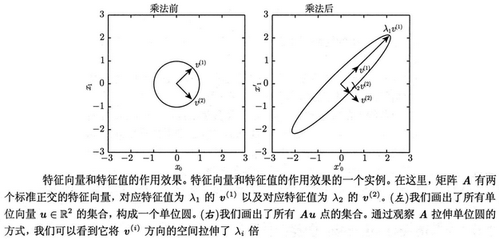
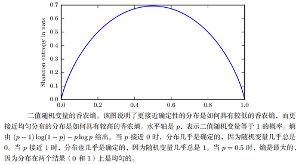
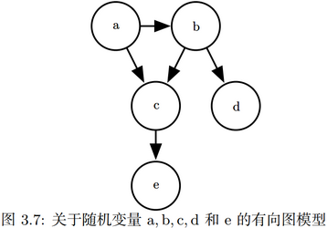
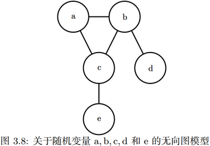
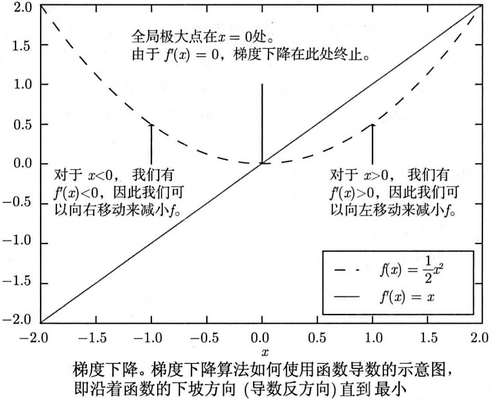
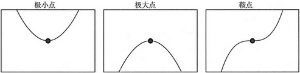
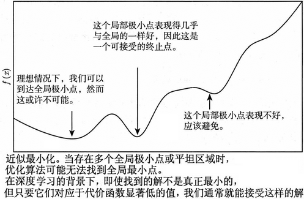
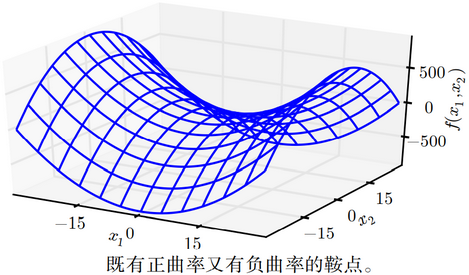
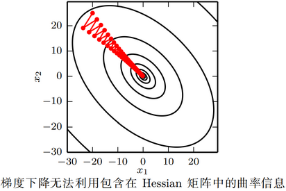

[toc]

# 一、线性代数

## （一）标量、向量、矩阵、张量

**标量**（scalar）：一个标量就是一个单独的数。通常使用小写斜体字母来表示标量，如令$n\in\N$表示数据的数目。

**向量**（vector）：一个向量是一列数，这些数是有序排列的。通过序列中的索引，可以确定每个单独的数。通常使用小写粗体字母来表示向量，如$\bold x\in\R^n$。我们可以把向量看作空间中的点，每个元素是不同坐标轴上的坐标。

**矩阵**（matrix）：矩阵是一个二维数组，其中的每一个元素被两个索引所确定。通常使用大写粗体字母来表示矩阵，如$\bold A\in\R^{m\times n}$。此外，使用不加粗体的$A_{i,j}$表示矩阵中的一个元素，分别使用粗体$\bold A_{i,:}$和$\bold A_{:,i}$表示第$i$行所有元素和第$i$列所有元素，它们都是一个向量。

**张量**（tensor）：一个数组中的元素分布在若干维坐标的规则网格中，则称之为张量。因为在某些情况下，会讨论到坐标超过两维的数组。通常使用字体$\bold{A}$来表示张量。张量$\bold{A}$中坐标为$(i,j,k)$的元素记作$A_{i,j,k}$。

**转置**（transpose）：以主对角线为轴，将矩阵进行镜像，即$\bold A^T_{i,j}=\bold A_{j,i}$。

在深度学习中，有时也使用一些不那么常规的符号。我们允许矩阵和向量相加，产生另一个矩阵$C=A+b$，其中$C_{i,j}=A_{i,j}+b_j$。换言之，就是列向量$\mathbf b$和矩阵$\mathbf A$的每一列都相加，这个简写方法使我们无需在加法操作前定义一个将列向量$\mathbf b$复制按列复制为一个矩阵。这种隐式地复制向量$\mathbf b$到很多位置的方式，被称为**广播**（broadcasting）。

## （二）矩阵和向量相乘

如果矩阵$\bold A,\bold B$的形状是分别是$m\times n,n\times p$，则它们相乘得到一个矩阵$\bold C=\bold{AB}$，其形状为$m\times p$，具体操作如下：
$$
C_{i,j}=\sum_kA_{i,k}B_{k,j}
$$
而如果两个矩阵中对应元素相乘，则被称为**元素对应乘积**（element-wise product）或者Hadamard乘积，记为$\bold A\odot\bold B$，具体操作如下：
$$
(\bold A\odot\bold B)_{i,j}=A_{i,j}B_{i,j}
$$
两个相同维数的列向量$\bold x,\bold y$的**点积**（dot product），即$\bold x\cdot\bold y$，它可看作是矩阵乘积$\bold x^T\bold y$，具体操作如下：
$$
\bold x\cdot\bold y=\bold x^T\bold y=\sum_k\bold x_k\bold y_k
$$

## （三）单位矩阵和逆矩阵

**单位矩阵**（identity matrix）：首先是$n$行$n$列的方阵，其次它所有主对角线元素都是$1$，而所有其他位置的元素都是$0$，记为$\bold I$。任何矩阵与单位矩阵相乘都得它本身，即$\bold{AI}=\bold{IA}=\bold A$；任意向量与单位矩阵相乘也都得它本身，即$\forall\bold x\in\R^n,\bold I_n\bold x=\bold x$。

**矩阵逆**（matrix inversion）：矩阵$\bold A$的逆矩阵记作$\bold A^{-1}$,其定义的矩阵满足$\bold A^{-1}\bold A=\bold{AA}^{-1}=\bold I$。

## （四）线性相关和生成子空间

为了分析方程$\bold{Ax}=\bold b$有多少个解，可以将$\mathbf A$的列向量看作从原点（origin）出发的不同方向，向量$\bold x$中的每个元素表示应该沿着这些方向走多远，即$x_i$表示我们需要沿着第$i$个向量的方向走多远。
$$
\bold{Ax}=\sum_ix_i\bold A_{:,i}
$$
若可以确定有方法可以到达向量$\bold b$，则方程有解，且方法的个数就是解的个数。

一般而言，这种操作被称为**线性组合**（linear combination）。形式上，一组向量的线性组合，是指每个向量乘以对应标量系数之后的和，即
$$
\sum_ic_i\bold v^{(i)}
$$
一组向量的**生成子空间**（span）是原始向量线性组合后所能抵达的**点的集合**。

确定$\bold{Ax}=\bold b$是否有解相当于确定向量$\bold b$是否在$\bold A$列向量的生成子空间中。这个特殊的生成子空间被称为$\bold A$的**列空间**（columnspace）或者$\bold A$的**值域**（range）。

为了使方程$\bold{Ax}=\bold b$对于任意向量$\bold b\in\R^m$都存在解，要求$\bold A$的列空间构成整个$\R^m$，这意味着$\bold A$至少有$m$列，即$n\ge m$，否则$\bold A$列空间的维数会小于$m$。例如，假设$\bold A$是一个$3\times2$的矩阵，目标$\bold b$是三维的，但是$\bold x$只有二维；无论如何修改$\bold x$的值，也只能描绘出$\R^3$空间中的二维平面；当且仅当向量$\bold b$在该二维平面中时，该方程才有解。

不等式$n\ge m$仅是方程对每一点都有解的必要条件，这不是一个充分条件。因为有些列向量可能是冗余的，这种冗余被称为**线性相关**（linear dependence）。如果一组向量中的任意一个向量都不能表示成其他向量的线性组合，那么这组向量称为**线性无关**（linearly independent）。如果某个向量是一组向量中某些向量的线性组合，那么我们将这个向量加入这组向量后不会增加这组向量的生成子空间。这意味着，如果一个矩阵的列空间涵盖整个$\R^m$，那么该矩阵必须包含至少一组$m$个线性无关的向量。

一个列向量线性相关的方阵被称为**奇异的**（singular）。如果矩阵$\mathbf A$不是一个方阵或者是一个奇异的方阵，该方程仍然可能有解。但是我们不能使用矩阵逆去求解。

## （五）范数

有时需要衡量一个向量的大小。在机器学习中，经常使用名为**范数**（norm）的函数衡量向量大小。形式上，$L^p$范数定义如下
$$
\|\bold x\|_p=\Big(\sum_i|x_i|^p\Big)^{\frac{1}{p}}
$$
其中$p\in\R,\ p\ge1$。

范数（包括$L^p$范数）是将向量映射到非负值的函数。直观上来说，向量$\mathbf x$的范数衡量从原点到点$\mathbf x$的距离。更严格地说，范数是满足下列性质的任意函数。

- $f(\bold x)=0\Longrightarrow\bold x=\bold 0$
- $f(\bold x+\bold y)\le f(\bold x)+f(\bold y)$
- $\forall\alpha\in\R,\ f(\alpha\bold x)=|\alpha|f(\bold x)$

当$p=2$时，$L^2$范数被称为**欧几里得范数**（Euclidean norm）。它表示从原点出发到向量$\bold x$确定的点的欧几里得距离。$L^2$范数在机器学习中出现地十分频繁，经常简化表示为$\|\bold x\|$，略去了下标。其值如下计算：
$$
\|\bold x\|_2=\sqrt{\sum_{i}x_i^2}
$$
平方$L^2$范数$\|\bold x\|_2^2$也经常用来衡量向量的大小，它可以通过点积$\bold x^T\bold x$来计算：
$$
\|\bold x\|_2^2=\bold x^T\bold x=\sum_ix_i^2
$$
平方$L^2$范数在数学和计算上都比$L^2$范数本身更方便。例如，平方$L^2$范数对$\bold x$中每个元素的导数只取决于对应的元素，而$L^2$范数对每个元素的导数却和整个向量相关。但是在很多情况下，平方$L^2$范数也可能不受欢迎，因为它在原点附近增长得十分缓慢。

在某些机器学习应用中，区分零元素和非零但值很小的元素是很重要的。在这些情况下，我们转而使用在各个位置斜率相同，同时保持简单的数学形式的函数，即$L^1$范数。
$$
\|\bold x\|_1=\sum_i|x_i|
$$
当机器学习问题中零和非零元素之间的差异非常重要时，通常会使用$L^1$范数。每当$\bold x$中某个元素从$0$增加$\varepsilon$，对应的$L^1$范数也会增加$\varepsilon$。

另外一个经常在机器学习中出现的范数是$L^\infty$范数，也被称为**最大范数**（max norm）。这个范数表示向量中具有最大幅值的元素的绝对值。
$$
\|\bold x\|_{\infty}=\max_i|x_i|
$$
有时候我们可能也希望衡量矩阵的大小。在深度学习中，最常见的做法是使用**F范数**（Frobenius norm），即
$$
\|\bold A\|_F=\sqrt{\sum_{i,j}A_{i,j}^2}
$$
其类似于向量的$L^2$范数。

两个向量的点积可以使用范数来表示，具体地：
$$
\bold x^T\bold y=\|\bold x\|_2\|\bold y\|_2\cos\theta
$$
其中$\theta$是$\bold x,\bold y$之间的夹角。

## （六）特殊类型的矩阵和向量

**对角矩阵**（diagonal matrix）：只在主对角线上含有非零元素，其他位置都是零的矩阵，形式上，矩阵$\bold D$是对角矩阵，当且仅当对于所有的$i\ne j,D_{i,j}=0$。

可以用$\bold\Lambda=\text{diag}(\bold v)$表示一个对角元素由向量$\bold v$的元素所确定的对角方阵。对角矩阵有一些特别的性质。如计算乘法$\bold{\Lambda x}=\text{diag}(\bold v)\bold x$，只需要将$\bold x$中的每个元$x_i$放大$v_i$倍，换言之，$diag(\bold v)\bold x=\bold v\odot\bold x$。对角方阵的逆矩阵存在，当且仅当对角元素都是非零值，且$\text{diag}(\bold v)^{-1}=\text{diag}([1/v_1,\cdots,1/v_n]^T)$。

不是所有的对角矩阵都是方阵，长方形的矩阵也有可能是对角矩阵。非方阵的对角矩阵没有逆矩阵，但仍然可以高效地计算它们的乘法。

**对称矩阵**（symmetric matrix）：指转置和自己相等的矩阵：
$$
\bold A^T=\bold A
$$
当某些不依赖参数顺序的双参数函数生成元素时，对称矩阵经常会出现。例如，如果$\bold A$是一个距离度量矩阵，$A_{i,j}$表示点$i$到点$j$的距离，那么$A_{i,j}=A_{j,i}$，因为距离函数是对称的。

**单位向量**（unit vector）：指具有**单位范数**（unit norm）的向量：
$$
\|\bold x\|_2=1
$$
如果$\bold x^T\bold y$，那么向量$\bold x,\bold y$互相**正交**（orthogonal）。如果两个向量都有非零范数，那么这两个向量之间的夹角是$90$度。在$\R^n$中，至多有$n$个范数非零的向量互相正交。如果这些向量不仅互相正交，并且范数都为$1$，那么称它们是**标准正交**（orthonormal）。

**正交矩阵**（orthogonal matrix）：指行向量和列向量是分别标准正交的方阵：
$$
\bold A^T\bold A=\bold{AA}^T=\bold I
$$
这意味着
$$
\bold A^{-1}=\bold A^T
$$
所以正交矩阵的求逆计算代价较小。

## （七）特征分解

许多数学对象可以通过将它们分解成多个组成部分或者找到它们的一些属性而更好地理解，这些属性是通用的，而不是由我们选择表示它们的方式产生的。

**特征分解**（eigen decomposition）是使用最广的矩阵分解之一，即我们将矩阵分解成一组**特征向量**（eigenvector）和**特征值**（eigenvalue）。矩阵特征值（奇异值）的集合称为**谱（spectral）**。

方阵$\bold A$的特征向量（eigenvector）是指与$\bold A$相乘后相当于对该向量进行缩放的非零向量$\bold v$：
$$
\bold{Av}=\lambda\bold v
$$
假设$n$阶方阵$\mathbf A$有$n$个线性无关的特征向量$\bold v_1,\bold v_2,\cdots,\bold v_n$，它们组成矩阵$\bold V=(\bold v_1,\bold v_2,\cdots,\bold v_n)$，其对应的特征值为$\lambda_1,\lambda_2,\cdots,\lambda_n$，记$\bold\Lambda=diag(\lambda_1,\lambda_2,\cdots,\lambda_n)$，则有$\bold A$的特征分解
$$
\bold A=\bold{V\Lambda V}^{-1}
$$
构建具有特定特征值和特征向量的矩阵$\bold A$，能够使我们在目标方向$\bold v$上延伸空间。且我们也常常希望将矩阵分解（decompose）成特征值和特征向量，这样可以帮助我们分析矩阵的特定性质。

不是每一个矩阵都可以分解成特征值和特征向量。在某些情况下，特征分解存在，但是其特征值为复数。

每个实对称矩阵都可以分解成实特征向量和实特征值$\bold A=\bold{Q\Lambda Q}^{-1}$，其中$\bold Q$是$\bold A$的特征向量组成的正交矩阵，$\bold\Lambda$是对角矩阵。特征值$\Lambda_{i,i}$对应的特征向量是矩阵$\bold Q$的第$i$列，记作$\bold Q_{:,i}$。因为$\bold Q$是正交矩阵，我们可以将$\bold A$看作沿方向$\bold v^{(i)}$延展$\lambda_i$倍的空间。如下图所示的例子。



虽然任意一个实对称矩阵$\bold A$都有特征分解，但是特征分解可能并不唯一。按照惯例，我们通常按降序排列$\bold\Lambda$的元素。在该约定下，特征分解唯一当且仅当所有的特征值都是唯一的。

实对称矩阵的特征分解也可以用于优化二次方程$f(\bold x)=\bold x^T\bold{Ax},\ s.t.\ \|\bold x\|_2=1$。当$\bold x$等于$\bold A$的某个特征向量时，$f$将返回对应的特征值。在限制条件下，函数$f$的最大值是最大特征值，最小值是最小特征值。

所有特征值都是正数的矩阵被称为**正定**（positive definite），所有特征值都是非负数的矩阵被称为**半正定**（positive semidefinite）。

## （八）奇异值分解

除了将矩阵分解成特征向量和特征值，还有一种**奇异值分解（singular value decomposition，SVD）**，它将矩阵分解为奇异向量（singular vector）和奇异值（singular value）。通过奇异值分解，可以得到一些与特征分解相同类型的信息，不过奇异值分解有更广泛的应用。不一定每个矩阵都有特征分解，如非方阵的矩阵，每个实数矩阵都有一个奇异值分解。

如前述，使用特征分解去分析矩阵$\bold A$时，得到特征向量构成的矩阵$\bold V$和特征值构成的对角矩阵$\bold\Lambda$，可以重新将$\bold A$写作$\bold A=\bold{V\Lambda V}^{-1}$。

奇异值分解是类似的，只不过是将矩阵$\bold A$分解成三个矩阵的乘积：
$$
\bold A=\bold{UDV}^T
$$
假设$\bold A\in\R^{m\times n}$，则有$\bold U\in\R^{m\times m},\bold D\in\R^{m\times n},\bold V\in\R^{n\times n}$，其中矩阵$\bold U,\bold V$都为单位正交矩阵，矩阵$\bold D$为对角矩阵，注意矩阵$\bold D$不一定是方阵。

对角矩阵$\bold D$对角线上的元素被称为矩阵$\bold A$的**奇异值**（singular value）；矩阵$\bold U$的列向量被称为**左奇异向量**（left singular vector），矩阵$\bold V$的列向量被称**右奇异向量**（right singular vector）。

事实上，可以用与$\bold A$相关的特征分解去解释其奇异值分解，$\bold A$的左奇异向量$\bold U$是$\bold{AA}^T$的特征向量，$\bold A$的右奇异向量$\bold V$是$\bold A^T\bold A$的特征向量，$\bold A$的非零奇异值是$\bold A^T\bold A$特征值的平方根，同时也是$\bold{AA}^T$特征值的平方根。

矩阵$\bold A$的奇异值越大，代表它所对应的奇异向量越重要。在图像特征提取中，可以使用最大的$k$个奇异值，并使用其对应左奇异向量$\bold U$中所对应的$k$个向量，来作为图像低维表征。

SVD最有用的一个性质是可以拓展非方矩阵的求逆运算上。

## （九）Morre-Penrose伪逆

对于非方矩阵而言，其逆矩阵没有定义。假设在下面的问题中，我们希望通过矩阵$\mathbf A$的左逆$\mathbf B$来求解线性方程$\mathbf{Ax}=\mathbf{y}$，等式两边左乘左逆$\mathbf B$后，得到$\mathbf{x}=\mathbf{By}$。

取决于问题的形式，我们可能无法设计一个唯一的映射将$\mathbf A$映射到$\mathbf B$。如果矩阵$\mathbf A$的行数大于列数，那么上述方程可能没有解。如果矩阵$\mathbf A$的行数小于列数，那么上述矩阵可能有多个解。

Moore-Penrose伪逆（Moore-Penrose pseudoinverse）使我们在这类问题上取得了一定的进展。矩阵$\mathbf A$的伪逆定义为：
$$
\mathbf{A}^+=\lim_{\alpha\searrow0}(\mathbf{A}^\text{T}\mathbf{A}+\alpha\mathbf{I})^{-1}\mathbf{A}^\text{T}
$$
计算伪逆的实际算法没有基于这个定义，而是使用下面的公式：
$$
\mathbf{A}^+=\mathbf{VD}^+\mathbf{U}^\text{T}
$$
其中，矩阵$\mathbf{U},\mathbf{D},\mathbf{V}$是矩阵$\mathbf{A}$奇异值分解后得到的矩阵。对角矩阵$\mathbf{D}$的伪逆$\mathbf{D}^+$是其非零元素取倒数之后再转置得到的。

当矩阵$\mathbf{A}$的列数多于行数时，使用伪逆求解线性方程是众多可能解法中的一种。特别地，$\mathbf{x}=\mathbf{A}^+\mathbf{y}$是方程所有可行解中欧几里得范数$\|\mathbf{x}\|_2$最小的一个。当矩阵$\mathbf{A}$的行数多于列数时，可能没有解。在这种情况下，通过伪逆得到的$\mathbf{x}$使得欧几里得距离$\|\mathbf{Ax}-\mathbf{y}\|_2$最小。

## （十）迹运算

迹运算返回的是矩阵对角元素的和：
$$
\text{Tr}(\mathbf{A})=\sum_i\mathbf{A}_{i,i}
$$
迹运算因为很多原因而有用。若不使用求和符号，有些矩阵运算很难描述，而通过矩阵乘法和迹运算符号可以清楚地表示。例如，迹运算提供了另一种描述矩阵Frobenius范数的方式：
$$
\|\mathbf{A}\|_F=\sqrt{\text{Tr}(\mathbf{AA}^\text{T})}
$$
用迹运算表示表达式，我们可以使用很多有用的等式巧妙地处理表达式。

## （十一）行列式

行列式，记作$\det(\bold A)$，是一个将方阵$\bold A$映射到实数的函数。行列式等于矩阵特征值的乘积。行列式的绝对值可以用来衡量矩阵参与矩阵乘法后空间扩大或者缩小了多少。如果行列式是$0$，那么空间至少沿着某一维完全收缩了，使其失去了所有的体积。如果行列式是$1$，那么这个转换保持空间体积不变。

# 二、概率与信息论

概率论是用于表示不确定性声明的数学框架。它不仅提供了量化不确定性的方法，也提供了用于导出新的不确定性声明（statement）的公理。在人工智能领域，概率论主要有两种用途。首先，概率法则告诉我们AI系统如何推理，据此我们设计一些算法来计算或者估算由概率论导出的表达式。其次，我们可以用概率和统计从理论上分析我们提出的AI系统的行为。

概率论使我们能够提出不确定的声明以及在不确定性存在的情况下进行推理，而信息论使我们能够量化概率分布中的不确定性总量。

## （一）为什么要使用概率？

机器学习通常必须处理不确定量，有时也可能需要处理随机(非确定性的)量。不确定性和随机性可能来自多个方面。几乎所有的活动都需要一些在不确定性存在的情况下进行推理的能力。事实上，除了那些被定义为真的数学声明，我们很难认定某个命题是千真万确的或者确保某件事一定会发生。

不确定性有三种可能的来源：

1. 被建模系统内在的随机性。例如，大多数量子力学的解释，都将亚原子粒子的动力学描述为概率的。此外，还可以创建一些假设具有随机动态的理论情境。
2. 不完全观测。即使是确定的系统，当不能观测到所有驱动系统行为的变量时，该系统也会呈现随机性。
3. 不完全建模。当使用一些必须舍弃某些观测信息的模型时，舍弃的信息会导致模型的预测出现不确定性。例如，采用离散化的空间，那么离散化的方法将使得我们无法确定对象的精确位置，因为每个对象都可能处于它被观测到的离散单元的任何一个角落。

在很多情况下，使用一些简单而不确定的规则要比复杂而确定的规则更为实用，即使真正的规则是确定的并且我们建模的系统可以足够精确地容纳复杂的规则。

尽管我们的确需要一种用以对不确定性进行表示和推理的方法，但是概率论并不能明显地提供我们在人工智能领域需要的所有工具。概率论最初的发展是为了分析事件发生的频率。我们可以很容易地看出概率论，对于像在扑克牌游戏中抽出一手特定的牌这种事件的研究中，是如何使用的。这类事件往往是可以重复的。当我们说一个结果发生的概率为$p$，这意味着如果我们反复实验无限次，有$p$的比例可能会导致这样的结果。**这种推理并不适用于那些不可重复的命题**。如果一个医生诊断了病人，并说该病人患流感的几率为$40\%$，这意味着与重复试验非常不同的事情：我们既不能让病人有无穷多的副本，也没有任何理由去相信病人的不同副本在具有不同的潜在条件下表现出相同的症状。在医生诊断病人的例子中，我们用概率来表示一种**信任度（degree of belief）**，其中$1$表示非常肯定病人患有流感，而$0$表示非常肯定病人没有流感。前面那种概率，直接与事件发生的频率相联系，被称为**频率派概率（frequentist probability）**；而后者，**涉及到确定性水平**，被称为**贝叶斯概率（Bayesian probability）**。

关于不确定性的常识推理，如果已经列出了若干条我们期望它具有的性质，那么满足这些性质的唯一一种方法就是将贝叶斯概率和频率派概率视为等同的。例如，如果我们要在扑克牌游戏中根据玩家手上的牌计算她能够获胜的概率，我们使用和医生情境完全相同的公式，就是我们依据病人的某些症状计算她是否患病的概率。

概率可以被看作是用于处理不确定性的逻辑扩展。逻辑提供了一套形式化的规则，可以在给定某些命题是真或假的假设下，判断另外一些命题是真的还是假的。概率论提供了一套形式化的规则，可以**在给定一些命题的似然后，计算其他命题为真的似然**。

## （二）随机变量

**随机变量（random variable）**是可以随机地取不同值的变量。就其本身而言，一个随机变量只是对可能的状态的描述；它必须伴随着一个概率分布来指定每个状态的可能性。

随机变量可以是离散的或者连续的。离散随机变量拥有有限或者可数无限多的状态。注意这些状态不一定非要是整数，它们也可能只是一些被命名的状态而没有数值。连续随机变量伴随着实数值。

## （三）概率分布

**概率分布（probability distribution）**用来描述随机变量或一簇随机变量在每一个可能取到的状态的可能性大小。描述概率分布的方式取决于随机变量是离散的还是连续的。

### 1. 离散型变量和概率质量函数

离散型变量的概率分布可以用**概率质量函数（probability mass function，PMF）**来描述，也称概率分布律。我们通常用大写字母$P$来表示概率质量函数，通常每一个随机变量都会有一个不同的概率质量函数。概率质量函数将随机变量能够取得的每个状态映射到随机变量取得该状态的概率$P(\mathrm x=x)$。

概率质量函数可以同时作用于多个随机变量。这种多个变量的概率分布被称为**联合概率分布（joint probability distribution）**。$P(\mathrm x=x,\mathrm y=y)$表示$\mathrm x=x$和$\mathrm y=y$同时发生的概率。也可以简写为$P(x,y)$。

### 2. 连续型变量和概率密度函数

当研究对象是连续型随机变量时，用**概率密度函数（probability density function，PDF）**来描述它的概率分布。本书中使用一般使用$p$表示概率密度函数。概率密度函数$p(x)$并没有直接对特定的状态给出概率，相对的，它给出了落在面积为$\delta x$的无限小的区域内的概率为$p(x)\delta x$。

可以对概率密度函数求积分来获得点集的真实概率质量。特别地，$x$落在集合$\mathbb S$中的概率可以通过$p(x)$对这个集合求积分来得到。在单变量的例子中，$x$落在区间$[a,b]$的概率是$\int_{[a,b]}p(x)dx$。

## （四）边缘概率

有时候，我们知道了一组变量的联合概率分布，但想要了解其中一个子集的概率分布。这种定义在子集上的概率分布被称为**边缘概率分布（marginal probability distribution）**。

可以依据**求和法则（sum rule）**来计算：
$$
\begin{align}
& P(\mathrm x=x) = \sum_y P(\mathrm x=x,\mathrm y =y) \tag{3.3} \\
& p(x) = \int p(x,y)dy \tag{3.4}
\end{align}
$$

## （五）条件概率

在很多情况下，我们感兴趣的是某个事件，在给定其他事件已经发生时出现的概率。这种概率叫做**条件概率**。我们将给定$\mathrm x=x$时，发生$\mathrm y =y$的条件概率记为$P(\mathrm y=y|\mathrm x=x)$。这个条件概率可以通过下面的公式计算：
$$
P(\mathrm y=y|\mathrm x=x) = \frac{P(\mathrm y=y,\mathrm x=x)}{P(\mathrm x=x)} \tag{3.5}
$$
条件概率只在$P(\mathrm x=x)>0$时有定义。我们不能计算给定在永远不会发生的事件上的条件概率。

这里需要注意的是，不要把条件概率和计算当采用某个动作后会发生什么相混淆。假定某个人说德语，那么他是德国人的条件概率是非常高的，但是如果随机选择的一个人会说德语，他的国籍不会因此而改变。计算一个行动的后果被称为干预查询（intervention query）。干预查询属于因果模型（causal modeling）的范畴，不会在本书中讨论。

## （六）条件概率的链式法则

任何多维随机变量的联合概率分布，都可以分解成只有一个变量的条件概率相乘的形式：
$$
P(\mathrm x^{(1)},\mathrm x^{(2)},\cdots,\mathrm x^{(n)}) = P(\mathrm x^{(1)}) \prod_{i=2}^n P(\mathrm x^{(i)} | \mathrm x^{(1)},\cdots,\mathrm x^{(i-1)}) \tag{3.6}
$$
这个规则被称为概率的**链式法则（chain rule）**或者**乘法法则（product rule）**。它可以直接从式(3.5)条件概率的定义中得到。

## （七）独立性和条件独立性

两个随机变量$\mathrm x$和$\mathrm y$，如果它们的概率分布可以表示成两个因子的乘积形式，并且一个因子只包含$\mathrm x$且另一个因子只包含$\mathrm y$，就称这两个随机变量是**相互独立的（independent）**，即对$\forall x\in\mathrm x,y\in\mathrm y$，有
$$
p(\mathrm x=x,\mathrm y=y) = p(\mathrm x=x)\cdot p(\mathrm y=y) \tag{3.7}
$$
如果关于$\mathrm x$和$\mathrm y$的条件概率分布对于$\mathrm z$的每一个值都可以写成乘积的形式，那么这两个随机变量$\mathrm x$和$\mathrm y$在给定随机变量$\mathrm z$时是**条件独立的（conditionally independent）**，即对$\forall x\in\mathrm x,y\in\mathrm y,z\in\mathrm z$，有
$$
p(\mathrm x=x,\mathrm y=y|\mathrm z=z) = p(\mathrm x=x|\mathrm z=z)\cdot p(\mathrm y=y|\mathrm z=z) \tag{3.8}
$$
可以采用一种简化形式来表示独立性和条件独立性，即$\mathrm x\perp\mathrm y$表示$\mathrm x$和$\mathrm y$相互独立，$\mathrm x\perp\mathrm y|\mathrm z$表示$\mathrm x$和$\mathrm y$在给定$\mathrm z$时条件独立。

## （八）期望、方差和协方差

函数$f(x)$关于某分布$P(\mathrm x)$的**期望（expectation）**或者**期望值（expected value）是指**，当$x$由$P$产生，$f$作用于$x$时，$f(x)$的平均值。对于离散型随机变量，这可以通过求和得到；对于连续型随机变量，可以通过求积分得到。即
$$
\begin{align}
& \mathbb E_{\mathrm x\sim P}[f(x)] = \sum_x P(x)f(x) \tag{3.9} \\
& \mathbb E_{\mathrm x\sim p}[f(x)] = \int p(x)f(x)dx \tag{3.10}
\end{align}
$$
**方差（variance）**衡量的是当我们对$x$依据它的概率分布进行采样时，随机变量$\mathrm x$的函数值会呈现多大的差异：
$$
\text{Var}(f(x)) = \mathbb E[\ (f(x)-\mathbb E[f(x)])^2 \ ] \tag{3.12}
$$
当方差很小时，**f(x)**的值形成的簇比较接近它们的期望值。方差的平方根被称为**标准差（standard deviation）**。

**协方差（covariance）**在某种意义上给出了两个变量线性相关性的强度以及这些变量的尺度：
$$
\text{Cov}(f(x),g(y)) = \mathbb E[\ (f(x)-\mathbb E[f(x)])(g(y)-\mathbb E[g(y)]) \ ] \tag{3.13}
$$
协方差的绝对值如果很大则意味着变量值变化很大并且它们同时距离各自的均值很远。如果协方差是正的，那么两个变量都倾向于同时取得相对较大的值。如果协方差是负的，那么其中一个变量倾向于取得相对较大的值的同时，另一个变量倾向于取得相对较小的值，反之亦然。其他的衡量指标如**相关系数（correlation）**将每个变量的贡献归一化，为了只衡量变量的相关性而不受各个变量尺度大小的影响。

协方差和相关性是有联系的，但实际上是不同的概念。它们是有联系的，因为两个变量如果相互独立那么它们的协方差为零，如果两个变量的协方差不为零那么它们一定是相关的。然而，独立性又是和协方差完全不同的性质。两个变量如果协方差为零，它们之间一定没有线性关系，但它们不一定相互独立。独立性比零协方差的要求更强，因为独立性还排除了非线性的关系。两个变量相互依赖但具有零协方差是可能的。

随机向量$\mathbf x\in\R^n$的**协方差矩阵（covariance matrix）**是一个$n\times n$的矩阵，它定义为
$$
\text{Cov}(\mathbf x)_{i,j} = \text{Cov}(x_i,x_j) \tag{3.14}
$$
协方差矩阵的对角元是方差：
$$
\text{Cov}(x_i,x_i) = \text{Var}(x_i) \tag{3.15}
$$

## （九）常用概率分布

许多简单的概率分布在机器学习的众多领域中都是有用的。

### 1. Bernoulli分布

**Bernoulli分布（Bernoulli distribution）**是单个二值随机变量的分布。它由单个参数$\phi\in[0,1]$控制，$\phi$给出了随机变量等于$1$的概率。它具有如下的一些性质：
$$
\begin{align}
& P(\mathrm x=1) = \phi \tag{3.16} \\
& P(\mathrm x=0) = 1-\phi \tag{3.17} \\
& P(\mathrm x=x) = \phi^x(1-\phi)^{1-x} \tag{3.18} \\
& \mathbb E[\mathrm x] = \phi \tag{3.19} \\
& \text{Var}(\mathrm x) = \phi(1-\phi) \tag{3.20}
\end{align}
$$

### 2. Multinoulli分布

**Multinoulli分布（multinoulli distribution）**或者**范畴分布（categorical distribution）**是指在具有$k$个不同状态的单个离散型随机变量上的分布，其中$k$是一个有限值。Multinoulli分布由向量$k$个属于$[0,1]$的值组成的向量$\mathbf p$参数化，其中每一个分量$p_i$表示第$i$个状态的概率，且它们的和为$1$。

Multinoulli分布经常用来表示对象分类的分布，所以我们很少假设状态具有数值$1$之类的。因此，我们通常不需要去计算Multinoulli分布的随机变量的期望和方差。

Multinoulli分布是多项式分布（multinomial distribution）的一个特例。多项式分布是$\set{0,\cdots,n}^k$中的向量的分布，用于表示当对Multinoulli分布采样$n$次时$k$个类中的每一个被访问的次数。Multinoulli分布是对n=1的情况。

### 3. 高斯分布

实数上最常用的分布就是**正态分布（normal distribution）**，也称为**高斯分布（Gaussian distribution）**，如下：
$$
\mathcal N(x;\mu,\sigma^2) = \frac{1}{\sqrt{2\pi\sigma^2}} \exp(-\frac{(x-\mu)^2}{2\sigma^2}) \tag{3.21}
$$
正态分布由两个参数控制，$\mu\in\R$和$\sigma\in(0,+\infty)$。参数$\mu$给出了中心峰值的坐标，这也是分布的均值$\mathbb E[\mathrm x]=\mu$。分布的方差用$\sigma^2$表示，标准差为$σ$。

正态分布可以推广到$\R^n$空间，这种情况下被称为**多维正态分布（multivariate normal distribution）**。它的参数是一个正定对称矩阵$\mathbf\Sigma$：
$$
\mathcal N(\mathbf x;\boldsymbol\mu,\mathbf\Sigma) = \frac{1}{\sqrt{(2\pi)^n\det(\mathbf\Sigma)}} \exp(-\frac12(\mathbf x-\boldsymbol\mu)^\text{T}\mathbf\Sigma^{-1}(\mathbf x-\boldsymbol\mu)) \tag{3.23}
$$
参数$\boldsymbol\mu$仍然表示分布的均值，只不过现在是向量值。参数$\mathbf\Sigma$给出了分布的协方差矩阵。

### 4. 指数分布和Laplace分布

在深度学习中，我们经常会需要一个在$x=0$点处取得边界点（sharp point）的分布。为了实现这一目的，可以使用**指数分布（exponential distribution）**，如下：
$$
p(x;\lambda) = \lambda \mathbf1_{x\ge0} \exp(-\lambda x) \tag{3.25}
$$
指数分布使用**指示函数（indicator function）**$\mathbf1_{x\ge0}$来使得当$x$取负值时的概率为零。

一个联系紧密的概率分布是**Laplace分布（Laplace distribution）**，它允许我们在任意一点$\mu$处设置概率质量的峰值
$$
\text{Laplace}(x;\mu,\gamma) = \frac{1}{2\gamma}\exp(-\frac{|x-\mu|}{\gamma}) \tag{3.26}
$$

### 5. Dirac分布和经验分布

在一些情况下，我们希望概率分布中的所有质量都集中在一个点上。这可以通过**Dirac delta函数（Dirac delta function）**$\delta(x)$定义概率密度函数来实现：
$$
p(x) = \delta(x-\mu) \tag{3.27}
$$
Dirac delta函数被定义成在“除了$0$以外的所有点的值都为$0$，但是积分为$1$”的函数。Dirac delta函数不像普通函数一样对$x$的每一个值都有一个实数值的输出，它是一种不同类型的数学对象，被称为**广义函数（generalized function）**，广义函数是依据积分性质定义的数学对象。我们可以把Dirac delta函数想成一系列函数的极限点，这一系列函数把除$0$以外的所有点的概率密度越变越小。

上面式(3.27)通过把$p(x)$定义成$\delta$函数左移$-\mu$个单位，得到了一个在$x=\mu$处具有无限窄也无限高的峰值的概率质量。

Dirac分布经常作为**经验分布（empirical distribution）**的一个组成部分出现：
$$
\hat{p}(\mathbf x) = \frac1m \sum_{i=1}^m \delta(\mathbf x-\mathbf x^{(i)}) \tag{3.28}
$$
经验分布将概率密度$\frac1m$赋给$m$个点$\mathbf x^{(1)},\cdots,\mathbf x^{(m)}$中的每一个，这些点是给定的数据集或者采样的集合。

只有在定义连续型随机变量的经验分布时，Dirac delta函数才是必要的。对于离散型随机变量，情况更加简单，经验分布可以被定义成一个Multinoulli分布，对于每一个可能的输入，其概率可以简单地设为在训练集上那个输入值的**经验频率（empirical frequency）**。

当我们在训练集上训练模型时，可以认为从这个训练集上得到的经验分布指明了我们采样来源的分布。另外一种观点是，经验分布是训练数据的似然最大的那个概率密度函数。

### 6. 分布的混合

通过组合一些简单的概率分布来定义新的概率分布也是很常见的。一种通用的组合方法是构造**混合分布（mixture distribution）**。混合分布由一些组件（component）分布构成。每次实验，样本是由哪个组件分布产生的取决于从一个Multinoulli分布中采样的结果：
$$
P(\mathrm x) = \sum_i P(\mathrm c=i) P(\mathrm x|\mathrm c=i) \tag{3.29}
$$
这里$P(\mathrm c)$是用来标识各组件的一个Multinoulli分布。

混合模型是组合简单概率分布来生成更丰富的分布的一种简单策略。在《深度学习中的结构化概率模型》章节中，将会更加详细地探讨从简单概率分布构建复杂模型的技术。

混合模型能够引入一个非常重要的概念，即**潜变量（latent variable）**。潜变量是我们不能直接观测到的随机变量。混合模型的组件标识变量$\mathrm c$就是其中一个例子。潜变量在联合分布中可能和$\mathrm x$有关，在这种情况下，$P(\mathrm x,\mathrm c)=P(\mathrm x|\mathrm c)P(\mathrm c)$。潜变量的分布$P(\mathrm c)$，以及关联潜变量和观测变量的条件分布$P(\mathrm x|\mathrm c)$，共同决定了分布$P(\mathrm x)$的形状，尽管描述$P(\mathrm x)$时可能并不需要潜变量。

一个非常强大且常见的混合模型是**高斯混合模型（Gaussian Mixture Model）**，它的组件$p(\mathbf x|\mathrm c=i)$是高斯分布。每个组件都有各自的参数，均值$\boldsymbol\mu^{(i)}$和协方差矩阵$\mathbf\Sigma^{(i)}$。有一些混合可以有更多的限制。例如，协方差矩阵可以通过$\mathbf\Sigma^{(i)}=\mathbf\Sigma,\forall i$的形式在组件之间共享参数。和单个高斯分布一样，高斯混合模型有时会限制每个组件的协方差矩阵为对角的或者各向同性的（标量乘以单位矩阵）。

除了均值和协方差以外，高斯混合模型的参数指明了给每个组件$i$的先验概率（prior probability）$\alpha_i=P(\mathrm c=i)$。“先验”一词表明了在观测到$\mathrm x$之前传递给模型关于$\mathrm c$的信念。作为对比，$P(\mathrm c|\mathbf x)$是**后验概率（posterior probability）**，因为它是在观测到$\mathbf x$之后进行计算的。高斯混合模型是概率密度的**万能近似器（universal approximator）**，在这种意义下，任何平滑的概率密度都可以用具有足够多组件的高斯混合模型以任意精度来逼近。

## （十）常用函数的有用性质

某些函数在处理概率分布时经常会出现，尤其是深度学习的模型中用到的概率分布。

其中一个函数是logistic sigmoid函数：
$$
\sigma(x) = \frac{1}{1+\exp(-x)} \tag{3.30}
$$
另外一个经常遇到的函数是softplus函数：
$$
\zeta(x) = \log(1+\exp(x)) \tag{3.31}
$$

## （十一）贝叶斯规则

我们经常会需要在已知$P(\mathrm y|\mathrm x)$时计算$P(\mathrm x|\mathrm y)$。幸运的是，如果还知道$P(\mathrm x)$，可以用**贝叶斯规则（Bayes’ rule）**来实现这一目的：
$$
P(\mathrm x|\mathrm y) = \frac{P(\mathrm x)P(\mathrm y|\mathrm x)}{P(\mathrm y)} \tag{3.42}
$$
注意到$P(\mathrm y)$出现在上面的公式中，它通常使用$P(\mathrm y)=\sum_x P(\mathrm y|x)P(x)$来计算，所以并不需要事先知道$P(\mathrm y)$的信息。

## （十二）连续型变量的技术细节

连续型随机变量和概率密度函数的深入理解需要用到数学分支**测度论（measure theory）**的相关内容来扩展概率论。测度论超出了本书的范畴。

## （十三）信息论

信息论是应用数学的一个分支，主要研究的是对一个信号所包含信息的多少进行量化。在机器学习中，我们主要使用信息论的一些关键思想来描述概率分布或者量化概率分布之间的相似性。

信息论的基本想法是：一个低概率事件的发生，比一个高概率事件的发生，能提供更多的信息。消息“今天早上太阳升起”的信息量是如此之少以至于没有必要发送，但另一条消息说“今天早上有日食”的信息量就很丰富。显然，包含信息量的多少就是不确定性，包含的信息越多，则不确定性越大。

我们想要通过这种基本想法来量化信息。特别地，

- 非常可能发生的事件信息量要比较少，并且极端情况下，必然事件应该没有信息量。
- 较不可能发生的事件具有更高的信息量。
- 独立事件应具有增量的信息。例如，“投掷硬币两次正面朝上”传递的信息量，应该是“投掷一次硬币正面朝上”信息量的两倍。

为满足上述三个性质，定义一个事件$\text X=x$的**自信息**（**信息量**）（self-information）为：
$$
I(x)=-\log P(x)
$$
其中，$\log$是对数运算，在省略底数的情况下，它用来表示自然对数，即$\log=\log_e=\ln$，此时所定义$I(x)$的单位是**奈特**（nats），$1$奈特是以$1/e$的概率观测到一个事件时获得的信息量。而若使用底数为$2$的对数，则其单位是**比特**（bit）或者**香农**（shannons）。通过比特度量的信息只是通过奈特度量信息的常数倍。在机器学习中，通常用奈特和自然对数。

自信息只处理单个的输出。我们使用**香农熵**（**信息熵**）（Shannon entropy）来对整个概率分布中的不确定性总量进行量化：
$$
\begin{align}
H_{X\sim P}(X)=H(P) &= E_{X\sim P}[I(X)]=-E_{X\sim P}[\log P(X)] \\
&= \sum_{x_i\in X}P(x_i)I(x_i)=-\sum_{x_i\in X}P(x_i)\log P(x_i)
\end{align}
$$
其中$E[\cdot]$是数学期望，$H(X)$也记作$H(P)$。换言之，一个分布的香农熵是指遵循这个分布的事件所产生的期望信息总量。当$x$是连续的，香农熵被称为**微分熵**（differential entropy）。

那些接近确定性的分布（输出几乎可以确定）具有较低的熵；那些接近均匀分布的概率分布具有较高的熵。下图给出了一个说明。



假设对于同一个随机变量$X$在两个单独的概率分布上有$P(X)$和$Q(X)$，可以使用**KL散度**（**相对熵**）（Kullback-Leibler divergence）来**衡量两个分布的差异（距离）**：
$$
\begin{align}
D_{KL}(P\|Q) &= E_{X\sim P}[\log\cfrac{P(x)}{Q(x)}]=E_{X\sim P}[\log P(x)-\log Q(x)] \\
&= \sum_{x\in X}P(x)\log\cfrac{P(X)}{Q(X)} \\
&= \sum_{x\in X}P(x)\log P(x)-\sum_{x\in X}P(x)\log Q(x) \\
&= -H(P)-E_{X\sim P}[\log Q(X)] \\
&= H_{X\sim P}(Q)-H(P)
\end{align}
$$
它度量的是，当真实分布为$P(X)$时，假设分布$Q(X)$的无效性。或者说是$P(X)$和$Q(X)$的**距离（重合度）**，当KL散度为$0$时，$P(X)$和$Q(X)$完全重合。

最大似然估计，就是最小化数据生成分布$\hat{p}_{data}$和数据真实分布$p_{data}$之间的KL散度。

值得注意的是，KL散度是不对称的，即$D_{KL}(P\|Q)\ne D_{KL}(Q\|P)$。而**JS散度**（Jensen–Shannon divergence）解决了不对称的问题，它的定义如下：
$$
JS(P_1\|P_2) = \frac12 KL(P_1\|\frac{P_1+P_2}{2}) + \frac12 KL(P_2\|\frac{P_1+P_2}{2})
$$
在信息论中（对数底数为$2$），信息熵$H(P)$给出了对真实分布$P$所需要的最小编码比特数，$H_{X\sim P}(Q)$表示在分布$P$下，使用$Q$进行编码所需要的比特数。因而KL散度衡量的是，当使用一种“被设计成能够使得概率分布$P$产生的消息长度最小”的编码，发送包含“由概率分布$Q$产生的符号”的消息时，所需要的额外信息量。

一个和KL散度密切联系的量是**交叉熵**（cross-entropy），对于两个分布$P(X)$和$Q(X)$它们在给定随机变量X上的交叉熵定义如下：
$$
CEH(P,Q)=-\sum_{x\in X}P(x)\log Q(x)=-E_{X\sim P}[\log Q(X)]=H_{X\sim P}(Q)
$$

## （十四）结构化概率模型

机器学习的算法经常会涉及到在非常多的随机变量上的概率分布。通常，这些概率分布涉及到的直接相互作用都是介于非常少的变量之间的。使用单个函数来描述整个联合概率分布是非常低效的（无论是计算上还是统计上）。

我们可以**把概率分布分解成许多因子的乘积**形式，而不是使用单一的函数来表示概率分布。例如，假设我们有三个随机变量$\mathrm a,\mathrm b,\mathrm c$，并且$\mathrm a$影响$\mathrm b$的取值，$\mathrm b$影响$\mathrm c$的取值，但是$\mathrm a$和$\mathrm c$在给定$\mathrm b$时是条件独立的。我们可以把全部三个变量的概率分布重新表示为两个变量的概率分布的连乘形式：
$$
p(\mathrm a,\mathrm b,\mathrm c) = p(\mathrm a)p(\mathrm b|\mathrm a)p(\mathrm c|\mathrm b) \tag{3.52}
$$
这种分解可以极大地减少用来描述一个分布的参数数量。每个因子使用的参数数目是它的变量数目的指数倍。这意味着，如果我们能够找到一种使每个因子分布具有更少变量的分解方法，我们就能极大地降低表示联合分布的成本。

我们可以用图论中图的概念来描述这种分解：这个图由一些可以通过边互相连接的顶点的集合构成。当用图来表示这种概率分布的分解，称之为**结构化概率模型（structured probabilistic model）**或者**图模型（graphical model）**。

有两种主要的结构化概率模型：有向的和无向的。两种图模型都使用图$\mathcal G$，其中图的每个节点对应着一个随机变量，连接两个随机变量的边意味着概率分布可以表示成这两个随机变量之间的直接作用。

**有向（directed）模型**使用带有有向边的图，它们用条件概率分布来表示分解，就像上面式(3.52)的例子。特别地，有向模型对于分布中的每一个随机变量$\mathrm x_i$都包含着一个影响因子，这个组成$\mathrm x_i$条件概率的**影响因子**被称为$\mathrm x_i$的**父节点**，记为$Pa_\mathcal G(\mathrm x_i)$，则
$$
p(\mathrm x) = \prod_i p(\mathrm x_i | Pa_\mathcal G(\mathrm x_i)) \tag{3.53}
$$
下图给出了一个有向图的例子以及它表示的概率分布的分解。



如图所示，这幅图对应的概率分布可以分解为
$$
p(\mathrm a,\mathrm b,\mathrm c,\mathrm d,\mathrm e) = p(\mathrm a) p(\mathrm b|\mathrm a) p(\mathrm c|\mathrm a,\mathrm b) p(\mathrm d|\mathrm b) p(\mathrm e|\mathrm c) \tag{3.54}
$$
该图模型使我们能够快速看出此分布的一些性质。例如，$\mathrm a$和$\mathrm c$直接相互影响，但$\mathrm a$和$\mathrm e$只有通过$\mathrm c$间接相互影响。

**无向（undirected）模型**使用带有无向边的图，它们将分解表示成一组函数；不像有向模型那样，这些函数通常不是任何类型的概率分布。$\mathcal G$中任何满足**两两之间有边连接的顶点的集合**被称为**团**（图的一个团是图中结点的一个子集，并且其中的点是全连接的），如顶点$a$和$b$之间的团可以定义为$\mathcal C=\set{a,b}$。无向模型中的每个团$\mathcal C^{(i)}$都伴随着一个因子$\phi^{(i)}(\mathcal C^{(i)})$。**这些因子仅仅是函数**，并不是概率分布。每个因子的输出都必须是非负的，但是并没有像概率分布中那样要求因子的和或者积分为$1$。

随机变量的联合概率与所有这些因子的乘积**成比例（proportional）**，这意味着因子的值越大则可能性越大。当然，不能保证这种乘积的求和为$1$。所以我们需要除以一个归一化常数$Z$来得到归一化的概率分布，归一化常数$Z$被定义为$\phi$函数乘积的所有状态的求和或积分。概率分布为：
$$
p(\mathbf x) = \frac1Z \prod_i \phi^{(i)}(\mathcal C^{(i)}) \tag{3.55}
$$
下图给出了一个无向图的例子以及它表示的概率分布的分解。



如图所示，这幅图对应的概率分布可以分解为
$$
p(\mathrm a,\mathrm b,\mathrm c,\mathrm d,\mathrm e) = \frac1Z \phi^{(1)}(\mathrm a,\mathrm b,\mathrm c) \phi^{(2)}(\mathrm b,\mathrm d) \phi^{(3)}(\mathrm c,\mathrm e) \tag{3.56}
$$
该图模型使我们能够快速看出此分布的一些性质。例如，$\mathrm a$和$\mathrm c$直接相互影响，但$\mathrm a$和$\mathrm e$只有通过$\mathrm c$间接相互影响。

需要注意的是，这些图模型表示的分解仅仅是描述概率分布的一种语言。它们不是互相排斥的概率分布族。有向或者无向不是概率分布的特性；它是概率分布的一种特殊**描述（description）**所具有的特性，而**任何概率分布都可以用这两种方式进行描述**。

# 三、数值计算

机器学习算法通常需要大量的数值计算。这通常是指通过迭代过程更新解的估计值来解决数学问题的算法，而不是通过解析过程推导出公式来提供正确解的方法。常见的操作包括优化（找到最小化或最大化函数值的参数）和线性方程组的求解。对数字计算机来说实数无法在有限内存下精确表示，因此仅仅是计算涉及实数的函数也是困难的。

## （一）上溢和下溢

连续数学在数字计算机上的根本困难是，需要通过有限数量的位模式来表示无限多的实数。这意味着在计算机中表示实数时，几乎总会引入一些近似误差。在许多情况下，这仅仅是舍入误差。舍入误差会导致一些问题，特别是当许多操作复合时，即使是理论上可行的算法，如果在设计时没有考虑最小化舍入误差的累积，在实践时也可能会导致算法失效。

一种极具毁灭性的舍入误差是下溢（underflow）。当接近零的数被四舍五入为零时发生下溢。许多函数在其参数为零而不是一个很小的正数时才会表现出质的不同。例如，我们通常要避免被零除（一些软件环境将在这种情况下抛出异常，有些会返回一个非数字NaN的占位符）或避免取零的对数（这通常被视为$-\infty$，进一步的算术运算会使其变成非数字）。另一个极具破坏力的数值错误形式是上溢（overflow）。当大量级的数被近似为$\pm\infty$时发生上溢。进一步的运算通常会导致这些无限值变为非数字。

必须对上溢和下溢进行数值稳定的一个例子是softmax函数，对一个向量$\mathbf{x}$来说，其定义为
$$
\text{softmax}(\mathbf{x})_i=\dfrac{\exp(x_i)}{\sum\limits_{j=1}^n\exp(x_j)}
$$
考虑一下当所有$x_i$都等于某个常数$c$时会发生什么。从理论分析上说，以发现所有的输出都应该为$1/n$。从数值计算上说，当$c$量级很大时，这可能不会发生。如果$c$是很小的负数，$\exp(c)$就会下溢，这意味着softmax函数的分母会变成$0$，所以最后的结果是未定义的。当$c$是非常大的正数时，$\exp(c)$的上溢再次导致整个表达式未定义。

这两个困难能通过计算$\text{softmax}(z)$同时解决，其中$\mathbf{z}=\mathbf{x}−\max\{x_i\}$。简单的代数计算表明，softmax解析上的函数值不会因为从输入向量减去或加上标量而改变。减去$\max\{x_i\}$导致$\exp$的最大参数为$0$，这排除了上溢的可能性。同样地，分母中至少有一个值为$1$的项，这就排除了因分母下溢而导致被零除的可能性。

还有一个小问题。分子中的下溢仍可以导致整体表达式被计算为零。这意味着，如果在计算$\log \text{softmax}(x)$时，先计算softmax再把结果传给$\log$函数，会错误地得到$-\infty$。相反，我们必须实现一个单独的函数，并以数值稳定的方式计算$\log \text{softmax}$。可以使用相同的技巧来稳定$\log \text{softmax}$函数。

## （二）病态条件

**条件数**表示函数相对于输入的微小变化而变化的快慢程度。输入被轻微扰动而迅速改变的函数对于科学计算来说可能是有问题的，因为输入中的舍入误差可能导致输出的巨大变化。数值分析中，一个问题的条件数是该数量在数值计算中的容易程度的衡量，也就是该问题的适定性。一个低条件数的问题称为良态的，而高条件数的问题称为病态（或者说非良态）的。

考虑函数$f(\mathbf{x})=\mathbf{A}^{-1}\mathbf{x}$。当$\mathbf A\in\R^{n\times n}$具有特征值分解时，其条件数为
$$
\max_{i,j}\left|\dfrac{\lambda_i}{\lambda_j}\right|
$$
这是最大和最小特征值的模之比（这里与通常的条件数定义有所不同）。当该数很大时，矩阵求逆对输入的误差特别敏感。

这种敏感性是矩阵本身的固有特性，而不是矩阵求逆期间舍入误差的结果。即使我们乘以完全正确的矩阵逆，病态条件的矩阵也会放大预先存在的误差。在实践中，该错误将与求逆过程本身的数值误差进一步复合。

## （三）基于梯度的优化方法

大多数深度学习算法都涉及某种形式的优化。优化指的是改变$x$以最小化或最大化某个函数$f(x)$的任务。通常以最小化$f(x)$指代大多数最优化问题，最大化可经由最小化算法最小化$-f(x)$来实现。把要最小化或最大化的函数称为**目标函数**（objective function）或准则（criterion）。当进行最小化时，也把它称为**代价函数**（cost function）、**损失函数**（loss function）或误差函数（error function）。

通常使用一个上标$^*$表示最小化或最大化函数的$x$值。如记$x^*=\arg \min f(x)$。

### 1. 最速梯度下降

假设有一个函数$y=f(x)$，其导数$f'(x)$代表$f(x)$在点$x$处的斜率。换句话说，它表明如何缩放输入的足够小的变化才能在输出获得相应的变化，即微分公式$f(x+\varepsilon)\approx f(x)+\varepsilon f'(x)$。因此导数对于最小化一个函数很有用，因为它告诉我们如何更改$x$来略微地改善$y$。例如，对于足够小的$\varepsilon$来说，$f(x-\varepsilon\text{sign}(f'(x)))$是比$f(x)$小的。因此我们可以将$x$往导数的反方向移动一小步来减小$f(x)$。这种技术被称为**梯度下降**（gradient descent）。下图展示了一个例子。



当$f'(x)=0$，导数无法提供往哪个方向移动的信息。$f'(x)=0$的点称为临界点（critical point）或驻点（stationary point）。一个局部极小点（local minimum）意味着这个点的$f(x)$小于所有邻近点，因此不可能通过移动无穷小的步长来减小$f(x)$。一个局部极大点（local maximum）意味着这个点的$f(x)$大于所有邻近点，因此不可能通过移动无穷小的步长来增大$f(x)$。有些临界点既不是最小点也不是最大点，这些点被称为鞍点（saddle point）。见下图给出的各种临界点的例子。



使$f(x)$取得绝对的最小值（相对所有其他值）的点是全局最小点（global minimum）。函数可能只有一个全局最小点或存在多个全局最小点，还可能存在不是全局最优的局部极小点。

在深度学习的背景下，要优化的函数可能含有许多不是最优的局部极小点，或者还有很多处于非常平坦的区域内的鞍点。尤其是当输入是多维的时候，所有这些都将使优化变得困难。因此，我们通常寻找使$f(x)$非常小的点，但这在任何形式意义下并不一定是最小。见下图的例子。



我们经常最小化具有多维输入的函数$f:\R^n\to\R$。为了使“最小化”的概念有意义，输出必须是一维的（标量）。

针对具有多维输入的函数（可以看成是向量$\mathbf{x}$的函数$f(\mathbf{x})$），需要用到偏导数（partial derivative）的概念，偏导数$\dfrac{\part}{\part x_i}f(\mathbf{x})$衡量点$\mathbf{x}$处只有$x_i$增加时$f(x)$如何变化。**梯度（gradient）**是相对一个向量函数$f(\mathbf{x})$求导的导数，且$f(\mathbf{x})$的导数是包含所有偏导数的向量，记为$\nabla_\mathbf{x}f(\mathbf{x})$。梯度的第$i$个元素是$f$关于$x_i$的偏导数。在多维情况下，临界点是梯度中所有元素都为零的点。

在$\mathbf{u}$方向（通常为单位向量）的**方向导数（directional derivative）**是函数$f$在$\mathbf{u}$方向的斜率。换句话说，方向导数是函数$f(\mathbf{x}+\alpha\mathbf{u})$关于$\alpha$的导数（在$\alpha=0$时取得）。使用链式法则，可以看到当$\alpha=0$时，$\dfrac{\part}{\part x_i}f(\mathbf{x}+\alpha\mathbf{u})=\mathbf{u}^\text{T}\nabla_\mathbf{x}f(\mathbf{x})$。

为了最小化$f$，我们希望找到使$f$下降得最快的方向。计算方向导数：
$$
\min_{\mathbf{u}}\mathbf{u}^\text{T}\nabla_\mathbf{x}f(\mathbf{x})=\min_{\mathbf{u}}\|\mathbf{u}\|_2\cdot\|\nabla_\mathbf{x}f(\mathbf{x})\|_2\cdot\cos\theta \qquad \text{s.t. }\mathbf{u}^\text{T}\mathbf{u}=1
$$
其中$\theta$是$\mathbf{u}$与梯度$\nabla_\mathbf{x}f(\mathbf{x})$的夹角。将$\|\mathbf{u}\|_2=1$代入，并忽略与$\mathbf{u}$无关的项，就能简化得到$\min\limits_{\mathbf{u}}\cos\theta$，这在$\mathbf{u}$与梯度$\nabla_\mathbf{x}f(\mathbf{x})$方向相反时取得最小。换句话说，梯度向量指向上坡，负梯度向量指向下坡。我们在负梯度方向上移动可以减小$f$，这被称为**最速下降法（method of steepest descent）**或**梯度下降（gradient descent）**。

最速下降建议新的点为
$$
\mathbf{x}'=\mathbf{x}-\varepsilon\nabla_\mathbf{x}f(\mathbf{x})
$$
其中$\varepsilon$为学习率（learning rate），是一个确定步长大小的正标量。可以通过几种不同的方式选择$\varepsilon$。普遍的方式是选择一个小常数；有时通过计算，选择使方向导数消失的步长；还有一种方法是根据几个$\varepsilon$计算$f(\mathbf{x}-\varepsilon\nabla_\mathbf{x}f(\mathbf{x}))$，并选择其中能产生最小目标函数值的$\varepsilon$，这种策略被称为线搜索。

最速下降在梯度$\nabla_\mathbf{x}f(\mathbf{x})$的每一个元素为零时收敛（或在实践中，很接近零时）。在某些情况下，也许能够避免运行该迭代算法，并通过解方程$\nabla_\mathbf{x}f(\mathbf{x})=0$直接跳到临界点。虽然梯度下降被限制在连续空间中的优化问题，但不断向更好的情况移动一小步（即近似最佳的小移动）的一般概念可以推广到离散空间。递增带有离散参数的目标函数被称为爬山（hill climbing）算法。

### 2. 梯度之上：Jacobian矩阵和Hessian矩阵

有时需要计算输入和输出都为向量的函数的所有偏导数，包含所有这样的偏导数的矩阵被称为**Jacobian（雅可比）矩阵**。具体来说，设函数$f:\R^m\to\R^n,\mathbf{y}=f(\mathbf{x}),\mathbf{x}\in\R^m,\mathbf{y}\in\R^n$，$f$的Jacobian矩阵$\mathbf{J}\in\R^{n\times m}$定义为：
$$
\mathbf{J}_{i,j}=\dfrac{\part}{\part x_j}\mathbf{y}_i=\dfrac{\part}{\part x_j}f(\mathbf{x})_i
$$
有时，还会用到导数的导数，即二阶导数（second derivative），它告诉我们，一阶导数将如何随着输入的变化而改变，它表示只基于梯度信息的梯度下降步骤是否会产生如我们预期的那样大的改善，我们可以认为，二阶导数是对曲率的衡量。

当函数具有多维输入时（输出为一个数值标量），二阶导数也有很多，将这些导数合并成一个矩阵，称为**Hessian（海森）矩阵**。设函数$y=f(\mathbf{x}),\mathbf{x}\in\R^n$，$f$的Hessian矩阵$\mathbf{H}\in\R^{n\times n}$定义为：
$$
\mathbf{H}_{i,j}=\dfrac{\part^2}{\part x_ix_j}f(\mathbf{x})
$$
雅可比矩阵实际是一阶梯度，海森矩阵实际是二阶梯度，Hessian等价于梯度的Jacobian矩阵。

微分算子在任何二阶偏导连续的点处可交换，也就是它们的顺序可以互换：
$$
\dfrac{\part^2}{\part x_ix_j}f(\mathbf{x})=\dfrac{\part^2}{\part x_jx_i}f(\mathbf{x})
$$
这意味着$\mathbf{H}_{i,j}=\mathbf{H}_{j,i}$，因此Hessian矩阵在这些点上是对称的。在深度学习背景下，我们遇到的大多数函数的Hessian几乎处处都是对称的。因为Hessian矩阵是实对称的，可以对齐进行正交分解，将其分解成一组实特征值$\Lambda=\text{diag }(\lambda_1,\cdots,\lambda_n)$和一组特征向量$\mathbf{D}=[\mathbf{d}_1,\cdots,\mathbf{d}_n]$的正交基$\mathbf{H}=\mathbf{D}\Lambda\mathbf{D}^\text{T} \Rightarrow \mathbf{D}^\text{T}\mathbf{HD}=\Lambda$。函数$f(\mathbf{x})$在特定方向$\mathbf{d}$上的二阶导数可以写成$\mathbf{d}^\text{T}\mathbf{Hd}$。当$\mathbf{d}$是$$\mathbf{H}$$的一个特征向量时，这个方向的二阶导数就是对应的特征值；对于其他的方向$\mathbf{d}$，方向二阶导数是所有特征值的加权平均，权重在$0$和$1$之间，且与$\mathbf{d}$夹角越小的特征向量的权重越大。最大特征值确定最大二阶导数，最小特征值确定最小二阶导数。

我们可以通过（方向）二阶导数预期一个梯度下降步骤能表现得多好。在当前点$\mathbf{x}^{(0)}$处作函数$f(\mathbf{x})$的近似二阶泰勒级数：
$$
f(\mathbf{x})\approx f(\mathbf{x}^{(0)})+(\mathbf{x}-\mathbf{x}^{(0)})^\text{T}\mathbf{g}+\dfrac{1}{2}(\mathbf{x}-\mathbf{x}^{(0)})^\text{T}\mathbf{H}(\mathbf{x}-\mathbf{x}^{(0)})
$$
其中$\mathbf{g}$是梯度，$\mathbf{H}$是$\mathbf{x}^{(0)}$点的Hessian。如果我们使用学习率$\varepsilon$的梯度下降，那么新的点$\mathbf{x}$将会是$\mathbf{x}^{(0)}-\varepsilon\mathbf{g}$。代入上述的近似，可得：
$$
f(\mathbf{x}^{(0)}-\varepsilon\mathbf{g})\approx f(\mathbf{x}^{(0)})-\varepsilon\mathbf{g}^\text{T}\mathbf{g}+\dfrac{1}{2}\varepsilon^2\mathbf{g}^\text{T}\mathbf{Hg}
$$
式中有三项：函数的原始值、函数斜率导致的预期改善、函数曲率导致的校正。当最后一项太大时，梯度下降实际上是可能向上移动的。当$\mathbf{g}^\text{T}\mathbf{Hg}$为零或负时，近似的泰勒级数表明增加$\varepsilon$将永远使$f$下降。在实践中，泰勒级数不会在$\varepsilon$较大的时候也保持准确，因此在这种情况下我们必须采取更启发式的选择。当$\mathbf{g}^\text{T}\mathbf{Hg}$为正时，通过计算可得，使近似泰勒级数下降最多的最优步长为：
$$
\varepsilon^*=\dfrac{\mathbf{g}^\text{T}\mathbf{g}}{\mathbf{g}^\text{T}\mathbf{Hg}}
$$
最坏的情况下，$\mathbf{g}$与$\mathbf{H}$最大特征值$\lambda_{max}$对应的特征向量对齐，则最优步长是$\dfrac{1}{\lambda_{max}}$。我们要最小化的函数能用二次函数很好地近似的情况下，Hessian的特征值决定了学习率的量级。

二阶导数还可以被用于确定一个临界点是否是局部极大点、局部极小点或鞍点，这就是所谓的二阶导数测试（second derivative test）。不幸的是，当$f''(x)=0$时测试是不确定的。在这种情况下，$\mathbf{x}$可以是一个鞍点或平坦区域的一部分。

在多维（二维）情况下，我们需要检测函数的所有二阶导数。而利用Hessian的特征值分解，我们正好可以将二阶导数测试扩展到多维情况。在临界点处$\nabla_\mathbf{x}f(\mathbf{x})=0$，我们通过检测Hessian的特征值来判断该临界点是一个局部极大点、局部极小点还是鞍点。当Hessian是正定的（所有特征值都是正的），则该临界点是局部极小点。因为方向二阶导数在任意方向都是正的，参考单变量的二阶导数测试就能得出此结论。同样的，当Hessian是负定的（所有特征值都是负的），这个点就是局部极大点。

在多维情况下，实际上我们可以找到确定该点是否为鞍点的积极迹象（某些情况下）。如果Hessian的特征值中至少一个是正的且至少一个是负的，那么$\mathbf{x}$是$f$某个横截面的局部极大点，却是另一个横截面的局部极小点。见下图中的例子。



如上图所示，示例中的函数是$f(\mathbf{x})=f(x_1,x_2)=x_1^2-x_2^2$。函数沿$x_1$轴向上弯曲，$x_1$轴是Hessian的一个特征向量，并且具有正特征值。函数沿$x_2$轴向下弯曲，该方向对应于Hessian负特征值的特征向量。名称“鞍点”源自该处函数的鞍状形状。这是具有鞍点函数的典型示例。维度多于一维时，鞍点不一定要具有$0$特征值，而仅需要同时具有正特征值和负特征值。可以想象一下这样一个鞍点（具有正负特征值），它在一个横截面内是局部极大点，而在另一个横截面内是局部极小点。

最后，多维二阶导数测试可能像单变量版本那样是不确定的。当所有非零特征值是同号的且至少有一个特征值是$0$时，这个检测就是不确定的。这是因为单变量的二阶导数测试在零特征值对应的横截面上是不确定的。

多维情况下，单个点处每个方向上的二阶导数是不同的。Hessian的条件数衡量这些二阶导数的变化范围。当Hessian的条件数很差时，梯度下降法也会表现得很差。这是因为一个方向上的导数增加得很快，而在另一个方向上增加得很慢。梯度下降不知道导数的这种变化，所以它不知道应该优先探索导数长期为负的方向。病态条件也导致很难选择合适的步长。步长必须足够小，以免冲过最小而向具有较强正曲率的方向上升。这通常意味着步长太小，以致于在其他较小曲率的方向上进展不明显。见下图的例子。



如图所示，这里我们使用梯度下降来最小化Hessian矩阵条件数为$5$的二次函数$\mathbf{x}$，这意味着最大曲率方向具有比最小曲率方向多五倍的曲率。如同在这种情况下，最大曲率在$[1,1]^\text{T}$方向上，最小曲率在$[1,-1]^\text{T}$方向上。这个非常细长的二次函数类似一个长峡谷。红线表示梯度下降的路径。梯度下降把时间浪费于在峡谷壁反复下降，因为它们是最陡峭的特征。由于步长有点大，有超过函数底部的趋势，因此下一次迭代时需要在对面的峡谷壁下降。与指向该方向的特征向量对应的Hessian的大的正特征值表示该方向上的导数快速增加，因此基于Hessian的优化算法可以预测，在此情况下最陡峭方向实际上不是有前途的搜索方向。

我们可以使用Hessian矩阵的信息来指导搜索，以解决这个问题。其中最简单的方法是牛顿法（Newton’s method）。牛顿法基于一个二阶泰勒展开来近似$\mathbf{x}^{(0)}$附近的$f(\mathbf{x})$：
$$
f(\mathbf{x})\approx f(\mathbf{x}^{(0)}) + (\mathbf{x}-\mathbf{x}^{(0)})^\text{T}\nabla_\mathbf{x}f(\mathbf{x}^{(0)}) + \dfrac{1}{2}(\mathbf{x}-\mathbf{x}^{(0)})^\text{T}\mathbf{H}(\mathbf{x}-\mathbf{x}^{(0)})
$$
接着通过计算，可以得到这个函数的临界点：
$$
\mathbf{x}^*=\mathbf{x}^{(0)}-\mathbf{H}^{-1}\nabla_\mathbf{x}f(\mathbf{x}^{(0)})
$$
当$f$是一个正定二次函数时，牛顿法只要应用一次上式就能直接跳到函数的最小点。如果$f$不是一个真正的二次函数但能在局部近似为正定二次函数时，牛顿法则需要多次迭代应用上式。迭代地更新近似函数和跳到近似函数的最小点可以比梯度下降更快地到达临界点。这在接近局部极小点时是一个特别有用的性质，但是在鞍点附近是有害的。如后面“深度模型中的优化”章所讨论的，当附近的临界点是最小点（Hessian的所有特征值都是正的）时牛顿法才适用，而梯度下降不会被吸引到鞍点（除非梯度指向鞍点）。

仅使用梯度信息的优化算法被称为**一阶优化算法（first-order optimization algorithms）**，如梯度下降，使用Hessian矩阵的优化算法被称为**二阶优化算法（second-order optimization algorithms）**（Nocedal and Wright,2006），如牛顿法。

在本书大多数上下文中使用的优化算法适用于各种各样的函数，但几乎都没有保证。因为在深度学习中使用的函数族是相当复杂的，所以深度学习算法往往缺乏保证。在许多其他领域，优化的主要方法是为有限的函数族设计优化算法。在深度学习的背景下，限制函数满足**Lipschitz连续（Lipschitz continuous）**或其导数Lipschitz连续可以获得一些保证。Lipschitz连续要求函数的变化速度以Lipschitz常数（Lipschitz constant）$\mathcal{L}$为界：
$$
\forall\mathbf{x},\forall\mathbf{y},\ |f(\mathbf{x})-f(\mathbf{y})|\le\mathcal{L}\|\mathbf{x}-\mathbf{y}\|_2
$$
这个属性允许量化我们的假设，即梯度下降等算法导致的输入的微小变化将使输出只产生微小变化，因此是很有用的。Lipschitz连续性也是相当弱的约束，并且深度学习中很多优化问题经过相对较小的修改后就能变得Lipschitz连续。

最成功的特定优化领域或许是**凸优化（Convex optimization）**。凸优化通过更强的限制提供更多的保证。凸优化算法只对凸函数适用，即Hessian处处半正定的函数。因为这些函数没有鞍点而且其所有局部极小点必然是全局最小点，所以表现很好。然而，深度学习中的大多数问题都难以表示成凸优化的形式。凸优化仅用作一些深度学习算法的子程序。凸优化中的分析思路对证明深度学习算法的收敛性非常有用，然而一般来说，深度学习背景下凸优化的重要性大大减少。

## （四）约束优化

有时候，我们并不止想要在$\mathbf{x}$的所有可能值下最大化或最小化一个函数$f(\mathbf{x})$；相反，我们可能希望在$\mathbf{x}$的某些集合$\mathbb{S}$中找$f(\mathbf{x})$的最大值或最小值。这被称为**约束优化（constrained optimization）**。在约束优化术语中，集合$\mathbb{S}$内的点$\mathbf{x}$被称为可行（feasible）点。我们常常希望找到在某种意义上小的解。针对这种情况下的常见方法是强加一个范数约束，如$\|\mathbf{x}\|\le 1$。

约束优化的一个简单方法是将约束考虑在内后简单地对梯度下降进行修改。如果使用一个小的恒定步长$\varepsilon$，可以先取梯度下降的单步结果，然后将结果投影回$\mathbb{S}$。如果使用线搜索，只能在步长为$\varepsilon$范围内搜索可行的新$\mathbf{x}$点，或者可以将线上的每个点投影到约束区域。如果可能的话，在梯度下降或线搜索前将梯度投影到可行域的切空间会更高效。

一个更复杂的方法是设计一个不同的、无约束的优化问题，其解可以转化成原始约束优化问题的解。例如，要在$\mathbf{x}\in\R^2$中最小化$f(\mathbf{x})$，其中$\mathbf{x}$约束为具有单位$L^2$范数。则可以转化为关于$\theta$最小化$g(\theta)=f([\cos\theta,\sin\theta]^\text{T})$，最后返回$[cosθ,sinθ]$作为原问题的解。这种方法需要创造性；优化问题之间的转换必须专门根据遇到的每一种情况进行设计。

**Karush–Kuhn–Tucker（KKT）方法**是针对约束优化非常通用的解决方案，它是Lagrange（拉格朗日）乘子法的推广，拉格朗日乘子法只允许等式约束。为介绍KKT方法，我们引入一个称为**广义Lagrangian（generalized Lagrangian）**或**广义Lagrange函数（generalized Lagrange function）**的新函数。

为了定义Lagrangian，先要通过等式和不等式的形式描述约束条件$\mathbb{S}$，我们希望通过$m$个函数$g^{(i)}$和$n$个函数$h^{(j)}$描述$\mathbb{S}$，那么$\mathbb{S}$可以表示为$\mathbb{S}=\{\mathbf{x}|\forall i,g^{(i)}(\mathbf{x})=0 \text{ and } \forall j,h^{(j)}(\mathbf{x})\le0\}$，其中涉及$g^{(i)}$的等式称为**等式约束（equality constraint）**，涉及$h^{(j)}$的不等式称为**不等式约束（inequality constraint）**。

我们为每个约束引入新的变量$\lambda_i$和$\alpha_j$，这些新变量被称为KKT乘子。则广义Lagrangian可以如下定义：
$$
L(\mathbf{x},\lambda,\alpha)=f(\mathbf{x})+\sum_{i}\lambda_ig^{(i)}(\mathbf{x})+\sum_j\alpha_jh^{(j)}(\mathbf{x})
$$
现在，我们可以通过优化无约束的广义Lagrangian解决约束最小化问题。只要存在至少一个可行点$\mathbf x$且$f(\mathbf{x})$不允许取$\infty$，那么
$$
\min_\mathbf{x}\max_\lambda\max_{\alpha,\alpha\ge0}L(\mathbf{x},\lambda,\alpha)
$$
与如下函数有相同的最优目标函数值和最优点集$\mathbf{x}$解
$$
\min_{\mathbf{x}\in\mathbb{S}}f(\mathbf{x})
$$
这是因为当约束满足时，有
$$
\max_\lambda\max_{\alpha,\alpha\ge0}L(\mathbf{x},\lambda,\alpha)=f(\mathbf{x})
$$
而违反任意约束时，有
$$
\max_\lambda\max_{\alpha,\alpha\ge0}L(\mathbf{x},\lambda,\alpha)=\infty
$$
这些性质保证不可行点不会是最佳的，并且可行点范围内的最优点不变。

要解决约束最大化问题，我们可以构造$-f(\mathbf{x})$的广义Lagrange函数，从而转化为以下优化问题：
$$
\min_\mathbf{x}\max_\lambda\max_{\alpha,\alpha\ge0} \left\{ -f(\mathbf{x})+\sum_{i}\lambda_ig^{(i)}(\mathbf{x})+\sum_j\alpha_jh^{(j)}(\mathbf{x}) \right\}
$$
当然我们也可将其转换为在外层最大化的问题：
$$
\max_\mathbf{x}\min_\lambda\min_{\alpha,\alpha\ge0} \left\{ f(\mathbf{x})+\sum_{i}\lambda_ig^{(i)}(\mathbf{x})-\sum_j\alpha_jh^{(j)}(\mathbf{x}) \right\}
$$
等式约束对应项的符号并不重要，因为优化可以自由选择每个$\lambda_i$的符号，我们可以随意将其定义为加法或减法。

不等式约束特别有趣。如果$h^{(i)}(\mathbf{x}^*)=0$，则称这个约束$h^{(i)}(\mathbf{x})$是活跃（active）的。如果约束不是活跃的，则有该约束的问题的解与去掉该约束的问题的解至少存在一个相同的局部解。一个不活跃约束有可能排除其他解。

例如，整个区域（代价相等的宽平区域）都是全局最优点的凸问题可能因约束消去其中的某个子区域，或在非凸问题的情况下，收敛时不活跃的约束可能排除了较好的局部驻点。然而，无论不活跃的约束是否被包括在内，收敛时找到的点仍然是一个驻点。因为一个不活跃的约束$h^{(i)}$必有负值，那么$\min\limits_\mathbf{x}\max\limits_\lambda\max\limits_{\alpha,\alpha\ge0}L(\mathbf{x},\lambda,\alpha)$中的$\alpha_i=0$。因此，我们可以观察到在该解中$\alpha\odot h(\mathbf{x})=0$。换句话说，对于所有的$i,\alpha_i\ge0$或$h^{(j)}(\mathbf{x})\le0$在收敛时必有一个是活跃的。为了获得关于这个想法的一些直观解释，可以说这个解是由不等式强加的边界，我们必须通过对应的KKT乘子影响$\mathbf{x}$的解；或者不等式对解没有影响，我们则归零KKT乘子。

我们可以使用一组简单的性质来描述约束优化问题的最优点。这些性质称为Karush–Kuhn–Tucker（KKT）条件。这些是确定一个点是最优点的必要条件，但不一定是充分条件。这些条件是：

- 广义Lagrangian的梯度为零。
- 所有关于$\mathbf{x}$和KKT乘子的约束都满足。
- 不等式约束显示的“互补松弛性”，即$\alpha\odot h(\mathbf{x})=0$。

有关KKT方法的详细信息，可参阅Nocedal,J. and Wright,S. Numerical Optimization. Springer. 2006:82-85。

## （五）实例：线性最小二乘

假设我们希望找到最小化下式的$\mathbf{x}$值
$$
f(\mathbf{x})=\dfrac{1}{2}\|\mathbf{Ax}-\mathbf{b}\|_2^2
$$
实际上，存在专门的线性代数算法能够高效地解决这个问题；但是，我们也可以探索如何使用基于梯度的优化来解决这个问题，这可以作为这些技术是如何工作的一个简单例子。

首先，我们计算梯度：
$$
\nabla_\mathbf{x}f(\mathbf{x})=\mathbf{A}^\text{T}(\mathbf{Ax}-\mathbf{b})=\mathbf{A}^\text{T}\mathbf{Ax}-\mathbf{A}^\text{T}\mathbf{b}
$$
然后，可以采用小的步长，并按照这个梯度下降，见下面算法中的详细信息。
$$
\begin{aligned}
& \rule{105mm}{1.5px} \\
& \textbf{算法}: 从任意点\mathbf{x}开始，使用梯度下降最优化上式的算法 \\[-1.0ex]
& \rule{105mm}{1.0px} \\
& \hspace{2mm}将步长(\varepsilon)和容差(\delta)设为小的正数 \\
& \hspace{2mm}\text{while } \|\mathbf{A}^\text{T}\mathbf{Ax}-\mathbf{A}^\text{T}\mathbf{b}\|_2>\delta \text{ do} \\
& \hspace{8mm}\mathbf{x} \gets \mathbf{x}-\varepsilon(\mathbf{A}^\text{T}\mathbf{Ax}-\mathbf{A}^\text{T}\mathbf{b}) \\
& \hspace{2mm}\text{end while} \\[-1.0ex]
&\rule{105mm}{1.5px}
\end{aligned}
$$
我们也可以使用牛顿法解决这个问题。因为在这个情况下，真实函数是二次的，牛顿法所用的二次近似是精确的，该算法会在一步后收敛到全局最小点。

现在假设希望最小化同样的函数，但受$\mathbf{x}^\text{T}\mathbf{x} \le 1$的约束。要做到这一点，引入广义Lagrangian函数：
$$
L(\mathbf{x},\lambda)=f(\mathbf{x})+\lambda(\mathbf{x}^\text{T}\mathbf{x}-1)
$$
现在，我们解决以下问题
$$
\min_\mathbf{x}\max_{\lambda,\lambda\ge0}L(\mathbf{x},\lambda)
$$
可以用Moore-Penrose伪逆：$\mathbf{x}=\mathbf{A}^+\mathbf{b}$找到无约束最小二乘问题的最小范数解。如果这一点是可行，那么这也是约束问题的解。否则，我们必须找到约束是活跃的解。关于$\mathbf{x}$对Lagrangian微分，得到方程
$$
\mathbf{A}^\text{T}\mathbf{Ax}-\mathbf{A}^\text{T}\mathbf{b}+2\lambda\mathbf{x}=0
$$
这就告诉我们，该解的形式将会是
$$
\mathbf{x}=(\mathbf{A}^\text{T}\mathbf{A}-2\lambda\mathbf{I})^{-1}\mathbf{A}^\text{T}\mathbf{b}
$$
其中，$\lambda$的选择必须使结果服从约束。我们可以关于$\lambda$进行梯度上升找到这个值。为了做到这一点，观察
$$
\dfrac{\part}{\part\lambda}L(\mathbf{x},\lambda)=\mathbf{x}^\text{T}\mathbf{x}-1
$$
当$\mathbf{x}$的范数超过1时，该导数是正的，所以为了跟随导数上坡并相对$\lambda$增加Lagrangian，我们需要增加$\lambda$。而因为$\mathbf{x}^\text{T}\mathbf{x}$的惩罚系数增加了，求解关于$\mathbf{x}$的线性方程现在将得到具有较小范数的解。求解线性方程和调整$\lambda$的过程将一直持续到$\mathbf{x}$具有正确的范数并且关于$\lambda$的导数是$0$。

# 四、函数矩阵微分

标量表示为小写细体字母如$a,b,c$，向量表示为小写粗体字母如$\mathbf{x},\mathbf{y},\mathbf{z}$，矩阵表示为大写粗体字母如$\mathbf{A},\mathbf{B},\mathbf{C}$。另，若无特殊说明，本文出现的向量均为列向量。

## （一）函数与标量、向量、矩阵

考虑一个函数$y=f(x)$，这是我们最常用的表示形式，现在将其抽象为更一般的形式
$$
\text{output}=\text{function}(\text{input})
$$
其中$\text{input}$称为函数的**变元**，而$\text{output}$实际上就是$\text{function}(\text{input})$函数输出的一种简便记法，它们的值和数值类型都是完全一样的。因此一个函数属于哪一类是由$\text{function}$和$\text{input}$的数值类型决定的。它们的数值类型可以是标量、向量、矩阵之一，因而我们可以将函数分为$3\times 3=9$类。下面分别介绍它们的含义。

### 1. $\text{function}$是标量

称$\text{function}$是一个**实值标量函数**，用小写细体字母$f$表示。

如果变元$\text{input}$是一个**标量**，用小写细体字母$x$表示，则函数为$f(x)$形式。例如，
$$
f(x) = ax^2 + bx + c
$$
如果变元$\text{input}$是一个**向量**，用小写粗体字母$\mathbf{x}$表示，则函数为$f(\mathbf{x})$形式。例如，设$\mathbf{x}=[x_1,x_2,x_3]^\text{T}$，则有
$$
f(\mathbf{x}) = a_1x_1^2 + a_2x_2^2 + a_3x_3^3 + a_4x_1x_2 + a_5x_1x_3 + a_6x_2x_3 + a_7x_1x_2x_3
$$
如果变元$\text{input}$是一个**矩阵**，用大写粗体字母$\mathbf{X}$表示，则函数为$f(\mathbf{X})$形式。例如，设$3\times 2$阶矩阵$\mathbf{X}_{i,j}=x_{ij}$，则有
$$
f(\mathbf{X}) = a_1x_{11}^2 + a_2x_{12}^2 + a_3x_{21}^2 + a_4x_{22}^2 + a_5x_{31}^2 + a_6x_{32}^2
$$

### 2. $\text{function}$是向量

称$\text{function}$是一个**实向量函数**，用小写粗体字母$\mathbf{f}$表示。其含义为$\mathbf{f}$是由若干$f_i$组成的一个向量。

如果变元$\text{input}$是一个**标量**，用小写细体字母$x$表示，则函数为$\mathbf{f}(x)$形式。例如，
$$
\mathbf{f}_{3\times 1}(x) 
= \begin{bmatrix} f_1(x) \\ f_2(x) \\ f_3(x) \end{bmatrix}
= \begin{bmatrix} ax+b \\ ax^2+bx+c \\ ax^3+bx^2+cx+d \end{bmatrix}
$$
如果变元$\text{input}$是一个**向量**，用小写粗体字母$\mathbf{x}$表示，则函数为$\mathbf{f}(\mathbf{x})$形式。例如，设$\mathbf{x}=[x_1,x_2,x_3]^\text{T}$，则有
$$
\mathbf{f}_{3\times 1}(\mathbf{x}) 
= \begin{bmatrix} f_1(\mathbf{x}) \\ f_2(\mathbf{x}) \\ f_3(\mathbf{x}) \end{bmatrix}
= \begin{bmatrix} x_1+x_2+x_3 \\ x_1^2+x_2^2+x_3^2 \\ x_1x_2+x_1x_3+x_2x_3 \end{bmatrix}
$$
如果变元$\text{input}$是一个**矩阵**，用大写粗体字母$\mathbf{X}$表示，则函数为$\mathbf{f}(\mathbf{X})$形式。例如，设$3\times 2$阶矩阵$\mathbf{X}_{i,j}=x_{ij}$，则有
$$
\mathbf{f}_{3\times 1}(\mathbf{X}) = \begin{bmatrix} f_1(\mathbf{X}) \\ f_2(\mathbf{X}) \\ f_3(\mathbf{X}) \end{bmatrix}
= \begin{bmatrix} 
x_{11}+x_{12}+x_{21}+x_{22}+x_{31}+x_{32} \\ 
x_{11}^2+x_{21}^2+x_{31}^2+x_{12}x_{22}+x_{12}x_{32}+x_{22}x_{32} \\ 
x_{11}x_{21}x_{31}+x_{12}x_{22}x_{32}
\end{bmatrix}
$$

### 3. $\text{function}$是矩阵

称$\text{function}$是一个**实矩阵函数**，用小写粗体字母$\mathbf{F}$表示。其含义为$\mathbf{F}$是由若干$f_{ij}$组成的一个矩阵。

如果变元$\text{input}$是一个**标量**，用小写细体字母$x$表示，则函数为$\mathbf{F}(x)$形式。例如，
$$
\mathbf{F}_{3\times 2}(x) = \begin{bmatrix} 
f_{11}(x) & f_{12}(x) \\ 
f_{21}(x) & f_{22}(x) \\ 
f_{31}(x) & f_{32}(x)
\end{bmatrix}
= \begin{bmatrix} 
x       & 2x+1 \\
x^2+1   & 2x^2 \\
x^3+x^2 & 3x
\end{bmatrix}
$$
如果变元$\text{input}$是一个**向量**，用小写粗体字母$\mathbf{x}$表示，则函数为$\mathbf{F}(\mathbf{x})$形式。例如，设$\mathbf{x}=[x_1,x_2,x_3]^\text{T}$，则有
$$
\mathbf{F}_{3\times 2}(\mathbf{x}) = \begin{bmatrix} 
f_{11}(\mathbf{x}) & f_{12}(\mathbf{x}) \\ 
f_{21}(\mathbf{x}) & f_{22}(\mathbf{x}) \\ 
f_{31}(\mathbf{x}) & f_{32}(\mathbf{x})
\end{bmatrix}
= \begin{bmatrix} 
x_1+x_2+x_2  & x_1x_2x_3 \\
x_1^2+x_2^2  & x_1x_2+x_3 \\
x_3^2+x_1x_2 & x_3^3
\end{bmatrix}
$$
如果变元$\text{input}$是一个**矩阵**，用大写粗体字母$\mathbf{X}$表示，则函数为$\mathbf{F}(\mathbf{X})$形式。例如，设$3\times 2$阶矩阵$\mathbf{X}_{i,j}=x_{ij}$，则有
$$
\mathbf{F}_{3\times 2}(\mathbf{X}) = \begin{bmatrix} 
f_{11}(\mathbf{X}) & f_{12}(\mathbf{X}) \\ 
f_{21}(\mathbf{X}) & f_{22}(\mathbf{X}) \\ 
f_{31}(\mathbf{X}) & f_{32}(\mathbf{X})
\end{bmatrix}
= \begin{bmatrix} 
x_{11}+x_{21}+x_{31}     & x_{12}x_{22}x_{32} \\
x_{12}^3+x_{22}^2+x_{32} & x_{11}x_{22} \\
x_{31}^2+x_{32}^2+x_{31}x_{32} & x_{12}+x_{21}
\end{bmatrix}
$$

### 4. 总结

| $\text{function}$ \\ $\text{input}$ | 标量变元        | 向量变元                 | 矩阵变元                 |
| :---------------------------------- | --------------- | ------------------------ | ------------------------ |
| 实值标量函数                        | $f(x)$          | $f(\mathbf{x})$          | $f(\mathbf{X})$          |
| 实向量函数                          | $\mathbf{f}(x)$ | $\mathbf{f}(\mathbf{x})$ | $\mathbf{f}(\mathbf{X})$ |
| 实矩阵函数                          | $\mathbf{F}(x)$ | $\mathbf{F}(\mathbf{x})$ | $\mathbf{F}(\mathbf{X})$ |

## （二）矩阵求导的本质与结果布局

我们知道，对于一个多元函数（实际上是向量函数），我们可以求它对变元的偏导。例如，
$$
f(x_1,x_2,x_3) = x_1^2 + x_2^2 + x_3^2  + 2x_1x_2 + 4x_1x_3 \\
\begin{cases}
\frac{\part f}{\part x_1} = 2x_1 + 2x_2 + 4x_3 \\
\frac{\part f}{\part x_2} = 2x_2 + 2x_1 \\
\frac{\part f}{\part x_3} = 2x_3 + 4x_1
\end{cases}
$$
矩阵求导也是一样，**本质就是$\text{function}$中的每个$f$分别对变元中的每个元素逐个求偏导，只不过写成了向量、矩阵的形式而已**。所以，如果$\text{function}$中有$m$个$f$，变元有$n$个元素，那么，每个$f$对变元中的每个元素逐个求偏导后，就会产生$m\times n$个结果。

至于这$m\times n$个结果的布局，是写成列向量，还是写成行向量，还是写成矩阵，就是下文所要讨论的事情。

不严谨地说，从直观上看，以分子分母谁按列向量排布，可以大致分为分子布局和分母布局。

**分子布局**：分子排为列向量，分母排为行向量。例如，
$$
\frac{\part \mathbf{f}_{2\times1}(\mathbf{x})}{\part x_{1\times3}} = \begin{bmatrix} 
\frac{\part f_1}{\part x_1} & \frac{\part f_1}{\part x_2} & \frac{\part f_1}{\part x_3} \\
\frac{\part f_2}{\part x_1} & \frac{\part f_2}{\part x_2} & \frac{\part f_2}{\part x_3}
\end{bmatrix}_{2\times3}
$$
**分母布局**：分母排为列向量，分子排为行向量。例如，
$$
\frac{\part \mathbf{f}_{1\times2}(\mathbf{x})}{\part x_{3\times1}} = \begin{bmatrix} 
\frac{\part f_1}{\part x_1} & \frac{\part f_2}{\part x_1} \\
\frac{\part f_1}{\part x_2} & \frac{\part f_2}{\part x_2} \\
\frac{\part f_1}{\part x_3} & \frac{\part f_2}{\part x_3}
\end{bmatrix}_{3\times2}
$$
直观地理解上面布局之后，我们针对不同类型的$\text{function}$和$\text{input}$，给出严谨的说明。

### 1. $\text{function}$是标量

#### (1) 向量变元

设变元是列向量$\mathbf{x}=[x_1,x_2,\cdots,x_n]^\text{T}$。

**行向量偏导**形式，如下
$$
d_\mathbf{x}f(\mathbf{x}) = \frac{\part f(\mathbf{x})}{\part \mathbf{x}^\text{T}}
= [\frac{\part f}{\part x_1},\frac{\part f}{\part x_2},\cdots,\frac{\part f}{\part x_n}]
$$
**列向量偏导**形式（又称**梯度向量**形式），如下
$$
\nabla_\mathbf{x}f(\mathbf{x}) = \frac{\part f(\mathbf{x})}{\part \mathbf{x}}
= [\frac{\part f}{\part x_1},\frac{\part f}{\part x_2},\cdots,\frac{\part f}{\part x_n}]^\text{T}
$$
可以看到，上面两种形式互为转置。

#### (2) 矩阵变元

设变元是$m\times n$阶矩阵$\mathbf{X}_{i,j}=x_{ij}$。引入对矩阵的运算$\text{vec}(\mathbf{X})$，其含义是将矩阵$\mathbf{X}$按列堆叠连接（concatenate）在一起，即按列展开为列向量，即
$$
\text{vec}(\mathbf{X})=[x_{11},x_{21},\cdots,x_{m1},x_{12},x_{22},\cdots,x_{m2},\cdots,x_{1n},x_{2n},\cdots,x_{mn}]^\text{T}
$$
**行向量偏导**形式，即先把矩阵变元$\mathbf{X}$按$\text{vec}$向量化，转换成向量变元，按之前向量变元的形式求偏导，如下
$$
d_{\text{vec}(\mathbf{X})}f(\mathbf{X}) 
= \frac{\part f(\mathbf{X})}{\part \text{vec}^\text{T}(\mathbf{X})}
= [
\frac{\part f}{\part x_{11}},\frac{\part f}{\part x_{21}},\cdots,\frac{\part f}{\part x_{m1}},
\frac{\part f}{\part x_{12}},\frac{\part f}{\part x_{22}},\cdots,\frac{\part f}{\part x_{m2}},
\cdots,
\frac{\part f}{\part x_{1n}},\frac{\part f}{\part x_{2n}},\cdots,\frac{\part f}{\part x_{mn}}
]
$$
**列向量偏导**形式（又称**梯度向量**形式），即先把矩阵变元$\mathbf{X}$按$\text{vec}$向量化，转换成向量变元，按之前向量变元的形式求偏导，如下
$$
\nabla_{\text{vec}(\mathbf{X})}f(\mathbf{X}) 
= \frac{\part f(\mathbf{X})}{\part \text{vec}(\mathbf{X})}
= [
\frac{\part f}{\part x_{11}},\frac{\part f}{\part x_{21}},\cdots,\frac{\part f}{\part x_{m1}},
\frac{\part f}{\part x_{12}},\frac{\part f}{\part x_{22}},\cdots,\frac{\part f}{\part x_{m2}},
\cdots,
\frac{\part f}{\part x_{1n}},\frac{\part f}{\part x_{2n}},\cdots,\frac{\part f}{\part x_{mn}}
]^\text{T}
$$
可以看到，上面两种形式互为转置。

**梯度矩阵**形式，直接对原矩阵变元$\mathbf{X}$的每个位置元素逐个求偏导，结果布局和原矩阵布局一样，如下
$$
\nabla_\mathbf{X}f(\mathbf{X}) = \frac{\part f(\mathbf{X})}{\part\mathbf{X}_{m\times n}}
= \begin{bmatrix}
\frac{\part f}{\part x_{11}} & \frac{\part f}{\part x_{12}} & \cdots & \frac{\part f}{\part x_{1n}} \\
\frac{\part f}{\part x_{21}} & \frac{\part f}{\part x_{22}} & \cdots & \frac{\part f}{\part x_{2n}} \\
\vdots & \vdots & \ddots & \vdots \\
\frac{\part f}{\part x_{m1}} & \frac{\part f}{\part x_{m2}} & \cdots & \frac{\part f}{\part x_{mn}}
\end{bmatrix}_{m\times n}
$$
**雅可比（Jacobian）矩阵**形式，先对矩阵变元$\mathbf{X}$转置，再其每个位置元素逐个求偏导，结果布局和原矩阵的转置矩阵布局一样，如下
$$
J_\mathbf{X}f(\mathbf{X}) = \frac{\part f(\mathbf{X})}{\part\mathbf{X}_{m\times n}^\text{T}}
= \begin{bmatrix}
\frac{\part f}{\part x_{11}} & \frac{\part f}{\part x_{21}} & \cdots & \frac{\part f}{\part x_{m1}} \\
\frac{\part f}{\part x_{12}} & \frac{\part f}{\part x_{22}} & \cdots & \frac{\part f}{\part x_{m2}} \\
\vdots & \vdots & \ddots & \vdots \\
\frac{\part f}{\part x_{1n}} & \frac{\part f}{\part x_{2n}} & \cdots & \frac{\part f}{\part x_{mn}}
\end{bmatrix}_{n\times m}
$$
可以看到，上面两种形式互为转置。且若矩阵$\mathbf{X}$只有一列，则上面的两种形式退化为向量变元的实值标量函数。

### 2. $\text{function}$是向量

#### (1) 向量变元

设向量函数为$\mathbf{f}=[f_1,f_2,\cdots,f_m]^\text{T}$，变元是列向量$\mathbf{x}=[x_1,x_2,\cdots,x_n]^\text{T}$。

那么，含$m$个标量函数$f$的向量函数$\mathbf{f}=[f_1,f_2,\cdots,f_m]^\text{T}$，对含$n$个元素的向量变元$\mathbf{x}=[x_1,x_2,\cdots,x_n]^\text{T}$求导，就是逐个使用标量函数$f_i$对向量变元$\mathbf{x}$的所有元素逐个求偏导，每个$f_i$对向量变元$\mathbf{x}$求偏导的结果都是含$n$个元素的向量，这些结果向量可以排为列向量，也可以排为行向量，由此分为梯度矩阵形式和雅可比矩阵形式，详细介绍如下。

**梯度矩阵**形式，向量函数$\mathbf{f}$按行向量排布，向量变元$\mathbf{x}$按列向量排布，结果是$n\times m$阶向量，如下
$$
\nabla_\mathbf{x}\mathbf{f}(\mathbf{x}) = \frac{\part\mathbf{f}^\text{T}(\mathbf{x})}{\part\mathbf{x}}
= \begin{bmatrix}
\frac{\part f_1}{\part x_1} & \frac{\part f_2}{\part x_1} & \cdots & \frac{\part f_m}{\part x_1} \\
\frac{\part f_1}{\part x_2} & \frac{\part f_2}{\part x_2} & \cdots & \frac{\part f_m}{\part x_2} \\
\vdots & \vdots & \ddots & \vdots \\
\frac{\part f_1}{\part x_n} & \frac{\part f_2}{\part x_n} & \cdots & \frac{\part f_m}{\part x_n}
\end{bmatrix}_{n\times m}
$$
**雅可比（Jacobian）矩阵**形式，向量函数$\mathbf{f}$按列向量排布，向量变元$\mathbf{x}$按行向量排布，结果是$m\times n$阶向量，如下
$$
J_\mathbf{x}\mathbf{f}(\mathbf{x}) = \frac{\part\mathbf{f}(\mathbf{x})}{\part\mathbf{x}^\text{T}} 
= \begin{bmatrix}
\frac{\part f_1}{\part x_1} & \frac{\part f_1}{\part x_2} & \cdots & \frac{\part f_1}{\part x_n} \\
\frac{\part f_2}{\part x_1} & \frac{\part f_2}{\part x_2} & \cdots & \frac{\part f_2}{\part x_n} \\
\vdots & \vdots & \ddots & \vdots \\
\frac{\part f_m}{\part x_1} & \frac{\part f_m}{\part x_2} & \cdots & \frac{\part f_m}{\part x_n}
\end{bmatrix}_{m\times n}
$$
可以看到，上面两种形式互为转置。

#### (2) 矩阵变元

对于变元是矩阵的实向量函数$\mathbf{f}(\mathbf{X})$而言，无法直接求偏导，需要先使用$\text{vec}(\mathbf{X})$运算将矩阵变元展开向量化。

这样就将向量函数对矩阵变元的求导，转化为了向量函数对向量变元的求导，这就如之前所述的一样，也拥有梯度矩阵形式和雅可比（Jacobian）矩阵形式两种情况，详见4.2.1.1所述。

### 3. $\text{function}$是矩阵

#### (1) 向量变元

对于变元是向量的实矩阵函数$\mathbf{F}(\mathbf{x})$而言，无法直接求偏导，需要先使用$\text{vec}(\mathbf{F})$运算将矩阵函数展开向量化。

这样就将矩阵函数对向量变元的求导，转化为了向量函数对向量变元的求导，这就如之前所述的一样，也拥有梯度矩阵形式和雅可比（Jacobian）矩阵形式两种情况，详见4.2.1.1所述。

#### (2) 矩阵变元

对于变元是矩阵的实矩阵函数$\mathbf{F}(\mathbf{X})$而言，无法直接求偏导，需要先使用$\text{vec}(\mathbf{F})$运算和$\text{vec}(\mathbf{X})$将矩阵函数和矩阵变元展开向量化。

这样就将矩阵函数对矩阵变元的求导，转化为了向量函数对向量变元的求导，这就如之前所述的一样，也拥有梯度矩阵形式和雅可比（Jacobian）矩阵形式两种情况，详见4.2.1.1所述。

## （三）矩阵求导的运算法则

正如标量变元的实值标量函数求导法则一样，矩阵求导也有一些类似的运算法则，下面将逐一阐述。

### 1. 向量变元的实值标量函数

对于向量变元$\mathbf{x}=[x_1,x_2,\cdots,x_n]^\text{T}$，有实值标量函数
$$
f(\mathbf{x}) = f(x_1,x_2,\cdots,x_n)
$$
我们使用**梯度向量**形式表示函数$f$对变元$\mathbf{x}$的导数，即
$$
\frac{\part f(\mathbf{x})}{\part\mathbf{x}} = \nabla_\mathbf{x}f(\mathbf{x})
= [\frac{\part f}{\part x_1},\frac{\part f}{\part x_2},\cdots,\frac{\part f}{\part x_n}]^\text{T}
$$
那么一些求导运算法则如下（与对标量的导数类似）。

**常数求导**：常数对向量的导数为零向量，如下
$$
\frac{\part c}{\part\mathbf{x}} = \mathbf{0}_{n\times1}
$$
其中，$c$为常数。

**线性法则**：两项线性组合后对向量的导数，相当于每项对向量求导再线性组合，如下
$$
\frac{\part[c_1f(\mathbf{x}) \pm c_2g(\mathbf{x})]}{\part\mathbf{x}}
= c_1\frac{\part f(\mathbf{x})}{\part\mathbf{x}} \pm c_2\frac{\part g(\mathbf{x})}{\part\mathbf{x}}
$$
其中，$c_1,c_2$为常数。上式可扩展到若干项的线性组合。

**乘法法则**：两项相乘后对向量求导，结果是“左求导右不变，加上左不变右求导”，如下
$$
\frac{\part[f(\mathbf{x})g(\mathbf{x})]}{\part\mathbf{x}}
= \frac{\part f(\mathbf{x})}{\part\mathbf{x}}g(\mathbf{x}) + \frac{\part g(\mathbf{x})}{\part\mathbf{x}}f(\mathbf{x})
$$
**商法则**：两项相除后对向量求导，结果是“上求导下不变，减去上不变下求导，最后除以分母的平方”，如下
$$
\frac{\part[\frac{f(\mathbf{x})}{g(\mathbf{x})}]}{\part\mathbf{x}} 
= \left[ 
\frac{\part f(\mathbf{x})}{\part\mathbf{x}}g(\mathbf{x}) - \frac{\part g(\mathbf{x})}{\part\mathbf{x}}f(\mathbf{x})
\right] \frac{1}{g^2(\mathbf{x})}
$$
其中，$g(\mathbf{x})\ne 0$。

有几个可能用到的公式，假设$\mathbf{a}=[a_1,a_2,\cdots,a_n]^\text{T},\mathbf{b}=[b_1,b_2,\cdots,b_n]^\text{T}$是两个常数向量，$n$阶方阵$\mathbf{A}_{i,j}=a_{ij}$是常数矩阵，则有如下公式。
$$
\begin{align}
\frac{\part(\mathbf{x}^\text{T}\mathbf{x})}{\part\mathbf{x}} &= 2\mathbf{x} \\
\frac{\part(\mathbf{x}^\text{T}\mathbf{a})}{\part\mathbf{x}} &= \frac{\part(\mathbf{a}^\text{T}\mathbf{x})}{\part\mathbf{x}} = \mathbf{a} \\
\frac{\part(\mathbf{x}^\text{T}\mathbf{Ax})}{\part\mathbf{x}} &= \mathbf{Ax} + \mathbf{A}^\text{T}\mathbf{x} \\
\frac{\part(\mathbf{a}^\text{T}\mathbf{xx}^\text{T}\mathbf{b})}{\part\mathbf{x}} &= \frac{\part(\mathbf{x}^\text{T}\mathbf{ab}^\text{T}\mathbf{x})}{\part\mathbf{x}} = \mathbf{ab}^\text{T}\mathbf{x} + \mathbf{ba}^\text{T}\mathbf{x}
\end{align}
$$

### 2. 矩阵变元的实值标量函数

对于$m\times n$阶矩阵变元$\mathbf{X}_{i,j}=x_{ij}$，有实值标量函数
$$
f(\mathbf{X})_{i,j} = f(x_{ij})
$$
我们使用**梯度矩阵**形式表示函数$f$对变元$\mathbf{X}$的导数，即
$$
\frac{\part f(\mathbf{X})}{\part\mathbf{X}} = \nabla_\mathbf{X}f(\mathbf{X})
= \begin{bmatrix}
\frac{\part f}{\part x_{11}} & \frac{\part f}{\part x_{12}} & \cdots & \frac{\part f}{\part x_{1n}} \\
\frac{\part f}{\part x_{21}} & \frac{\part f}{\part x_{22}} & \cdots & \frac{\part f}{\part x_{2n}} \\
\vdots & \vdots & \ddots & \vdots \\
\frac{\part f}{\part x_{m1}} & \frac{\part f}{\part x_{m2}} & \cdots & \frac{\part f}{\part x_{mn}}
\end{bmatrix}_{m\times n}
$$
那么一些求导运算法则如下（与对标量的导数类似）。

**常数求导**：常数对矩阵的导数为零矩阵，如下
$$
\frac{\part c}{\part\mathbf{X}} = \mathbf{0}_{m\times n}
$$
其中，$c$为常数。

**线性法则**：两项线性组合后对矩阵的导数，相当于每项对矩阵求导再线性组合，如下
$$
\frac{\part[c_1f(\mathbf{X}) \pm c_2g(\mathbf{X})]}{\part\mathbf{X}}
= c_1\frac{\part f(\mathbf{X})}{\part\mathbf{X}} \pm c_2\frac{\part g(\mathbf{X})}{\part\mathbf{X}}
$$
其中，$c_1,c_2$为常数。上式可扩展到若干项的线性组合。

**乘法法则**：两项相乘后对矩阵求导，结果是“左求导右不变，加上左不变右求导”，如下
$$
\frac{\part[f(\mathbf{X})g(\mathbf{X})]}{\part\mathbf{X}}
= \frac{\part f(\mathbf{X})}{\part\mathbf{X}}g(\mathbf{X}) + \frac{\part g(\mathbf{X})}{\part\mathbf{X}}f(\mathbf{X})
$$
**商法则**：两项相除后对矩阵求导，结果是“上求导下不变，减去上不变下求导，最后除以分母的平方”，如下
$$
\frac{\part[\frac{f(\mathbf{X})}{g(\mathbf{X})}]}{\part\mathbf{X}} 
= \left[ 
\frac{\part f(\mathbf{X})}{\part\mathbf{X}}g(\mathbf{X}) - \frac{\part g(\mathbf{X})}{\part\mathbf{X}}f(\mathbf{X})
\right] \frac{1}{g^2(\mathbf{X})}
$$
其中，$g(\mathbf{X})\ne 0$。

有几个可能用到的公式如下。

假设$\mathbf{a}=[a_1,a_2,\cdots,a_m]^\text{T},\mathbf{b}=[b_1,b_2,\cdots,b_n]^\text{T}$是两个常数向量，则有
$$
\begin{align}
\frac{\part(\mathbf{a}^\text{T}\mathbf{Xb})}{\part\mathbf{X}} &= \mathbf{ab}^\text{T} \\
\frac{\part(\mathbf{b}^\text{T}\mathbf{X}^\text{T}\mathbf{a})}{\part\mathbf{X}} &= \mathbf{ab}^\text{T}
\end{align}
$$
假设$\mathbf{a}=[a_1,a_2,\cdots,a_m]^\text{T},\mathbf{b}=[b_1,b_2,\cdots,b_m]^\text{T}$是两个常数向量，则有
$$
\frac{\part(\mathbf{a}^\text{T}\mathbf{XX}^\text{T}\mathbf{b})}{\part\mathbf{X}} = \mathbf{ab}^\text{T}\mathbf{X} + \mathbf{ba}^\text{T}\mathbf{X}
$$
假设$\mathbf{a}=[a_1,a_2,\cdots,a_n]^\text{T},\mathbf{b}=[b_1,b_2,\cdots,b_n]^\text{T}$是两个常数向量，则有
$$
\frac{\part(\mathbf{a}^\text{T}\mathbf{X}^\text{T}\mathbf{Xb})}{\part\mathbf{X}} = \mathbf{Xba}^\text{T} + \mathbf{Xab}^\text{T}
$$

## （四）矩阵迹与矩阵微分

下面介绍向量变元的实标量函数和矩阵变元的实标量函数对于变元求导的一些技巧，即矩阵的迹$\text{tr}(\mathbf{A})$与一阶矩阵微分$d\mathbf{X}$。上述小节介绍的是矩阵导数的定义，但在实际应用中，我们往往不会直接使用定义来求导，而是用一些技巧，正如各种简单函数求导一样。

设$n$阶方阵$\mathbf{A}_{i,j}=a_{ij}$，则它的迹为$\text{tr}(\mathbf{A})=\sum\limits_{i=1}^n a_{ii}$，且有一些性质，如$\text{tr}(x)=x,\ \text{tr}(\mathbf{A})=\text{tr}(\mathbf{A}^\text{T}),\ \text{tr}(c_1\mathbf{A}+c_2\mathbf{B})=c_1\text{tr}(\mathbf{A})+c_2\text{tr}(\mathbf{B})$等。

设有两个$m\times n$阶的矩阵$\mathbf{A},\mathbf{B}$，其中一个矩阵乘以另一个矩阵转置（$\mathbf{AB}^\text{T},\mathbf{B}\mathbf{A}^\text{T},\mathbf{A}^\text{T}\mathbf{B},\mathbf{B}^\text{T}\mathbf{A}$）的迹，其**本质上就是两个矩阵对应位置的元素相乘并相加**，可以理解为向量点积在矩阵上的推广，即
$$
\text{tr}(\mathbf{AB}^\text{T})
= a_{11}b_{11} + a_{12}b_{12} + \cdots + a_{1n}b_{1n}
+ a_{21}b_{21} + \cdots + a_{2n}b_{2n} + \cdots
+ a_{m1}b_{m1} + \cdots + a_{mn}b_{mn}
$$
由此很容易得出**交换律**：矩阵乘积左右顺序互换，迹不变。设$m\times n$阶矩阵$\mathbf{A}$和$n\times m$阶矩阵$\mathbf{B}$，则有
$$
\text{tr}(\mathbf{AB}) = \text{tr}(\mathbf{BA})
$$

### 1. 向量变元的实值标量函数

对于向量变元$\mathbf{x}=[x_1,x_2,\cdots,x_n]^\text{T}$，有实值标量函数
$$
f(\mathbf{x}) = f(x_1,x_2,\cdots,x_n)
$$
它其实就是多元函数，设其可微，则它的全微分为
$$
\begin{align}
df(\mathbf{x})
&= \frac{\part f}{\part x_1}dx_1 + \frac{\part f}{\part x_2}dx_2 + \cdots + \frac{\part f}{\part x_n}dx_n \\
&= [\frac{\part f}{\part x_1}, \frac{\part f}{\part x_2}, \cdots, \frac{\part f}{\part x_2}]
\begin{bmatrix} dx_1 \\ dx_2 \\ \vdots \\ dx_n \end{bmatrix} \\
&= \text{tr}(
[\frac{\part f}{\part x_1}, \frac{\part f}{\part x_2}, \cdots, \frac{\part f}{\part x_2}]
\begin{bmatrix} dx_1 \\ dx_2 \\ \vdots \\ dx_n \end{bmatrix}
)
\end{align}
$$

### 2. 矩阵变元的实值标量函数

对于$m\times n$阶矩阵变元$\mathbf{X}_{i,j}=x_{ij}$，有实值标量函数
$$
f(\mathbf{X})_{i,j} = f(x_{ij})
$$
它也是多元函数，设其可微，则它的全微分为
$$
\begin{align}
df(\mathbf{X})
&= \frac{\part f}{\part x_{11}}dx_{11} + \frac{\part f}{\part x_{12}}dx_{12} + \cdots + \frac{\part f}{\part x_{m1}}dx_{m1} + \cdots + \frac{\part f}{\part x_{mn}}dx_{mn} \\
&= \text{tr}(
\begin{bmatrix}
\frac{\part f}{\part x_{11}} & \cdots & \frac{\part f}{\part x_{m1}} \\
\vdots & \ddots & \vdots \\
\frac{\part f}{\part x_{1n}} & \cdots & \frac{\part f}{\part x_{mn}}
\end{bmatrix}_{n\times m} \begin{bmatrix}
dx_{11} & \cdots & dx_{1n} \\
\vdots & \ddots & \vdots \\
dx_{m1} & \cdots & dx_{mn}
\end{bmatrix}_{m\times n}
)
\end{align}
$$

### 3. 矩阵变元的实矩阵函数

对于$m\times n$阶矩阵变元$\mathbf{X}_{i,j}=x_{ij}$，有$p\times q$阶矩阵函数$\mathbf{F}_{i,j}=f_{ij}$，则矩阵变元的实矩阵函数如下
$$
\mathbf{F}_{i,j}(\mathbf{X})=f_{ij}(\mathbf{X})
$$
设每个$f_{ij}(\mathbf{X})$可微，则矩阵变元的实矩阵函数的矩阵微分，就是对每个位置的元素$f_{ij}(\mathbf{X})$求全微分，排列布局不变，如下
$$
d\mathbf{F}(\mathbf{X}) = \begin{bmatrix}
df_{11}(\mathbf{X}) & df_{12}(\mathbf{X}) & \cdots & df_{1q}(\mathbf{X}) \\
df_{21}(\mathbf{X}) & df_{22}(\mathbf{X}) & \cdots & df_{2q}(\mathbf{X}) \\
\vdots & \vdots & \ddots & \vdots \\
df_{p1}(\mathbf{X}) & df_{p2}(\mathbf{X}) & \cdots & df_{pq}(\mathbf{X})
\end{bmatrix}_{p\times q}
$$
矩阵微分的一些运算法则如下。

**常数求导**：常数矩阵的微分为零矩阵，如下
$$
d(\mathbf{A}) = \mathbf{0}_{m\times n}
$$
其中，$\mathbf{A}_{i,j}=a_{ij}$为$m\times n$阶常数矩阵。

**线性法则**：两个矩阵线性组合后的微分，相当于每个矩阵微分后再线性组合，如下
$$
d[c_1\mathbf{F}(\mathbf{X}) \pm c_2\mathbf{G}(\mathbf{X})]
= c_1d\mathbf{F}(\mathbf{X}) \pm c_2d\mathbf{G}(\mathbf{X})
$$
其中，$c_1,c_2$为常数。上式可扩展到若干项的线性组合。

**乘法法则**：两矩阵相乘后求微，结果是“左微右不微，加上左不微右微”，如下
$$
d[\mathbf{F}(\mathbf{X})\mathbf{G}(\mathbf{X})]
= d[\mathbf{F}(\mathbf{X})]\mathbf{G}(\mathbf{X}) + \mathbf{F}(\mathbf{X})d[\mathbf{G}(\mathbf{X})]
$$
其中，矩阵函数为$\mathbf{F}_{p\times q}(\mathbf{X}),\mathbf{G}_{q\times s}(\mathbf{X})$，此时微分的是矩阵，乘法左右顺序不能改变。

**转置法则**：矩阵函数先转置再微分，和先微分再转置，结果一样，如下
$$
d\mathbf{F}^\text{T}(\mathbf{X}) = (d\mathbf{F}(\mathbf{X}))^\text{T}
$$

### 4. 矩阵微分与矩阵求导的关系

显然，$m\times n$阶矩阵$\mathbf{X}$自己就是矩阵变元为$\mathbf{X}$的实矩阵函数，它的每个元素是$x_{ij}$，每个元素的微分是$dx_{ij}$，因此$\mathbf{X}$的矩阵微分是
$$
d\mathbf{X} = \begin{bmatrix}
dx_{11} & dx_{12} & \cdots & dx_{1n} \\
dx_{21} & dx_{22} & \cdots & dx_{2n} \\
\vdots & \vdots & \ddots & \vdots \\
dx_{m1} & dx_{m2} & \cdots & dx_{mn}
\end{bmatrix}_{m\times n}
$$
同样的，向量$\mathbf{x}=[x_1,x_2,\cdots,x_n]^\text{T}$的矩阵微分为
$$
d\mathbf{x} = \begin{bmatrix} dx_1 \\ dx_2 \\ \vdots \\ dx_n \end{bmatrix}_{n\times 1}
$$
于是，上一节所叙述的四个矩阵微分的运算法则，对于$d\mathbf{X},d\mathbf{x}$也是适用的。

回顾矩阵变元的实值标量函数的全微分，如下
$$
\begin{align}
df(\mathbf{X})
&= \frac{\part f}{\part x_{11}}dx_{11} + \frac{\part f}{\part x_{12}}dx_{12} + \cdots + \frac{\part f}{\part x_{m1}}dx_{m1} + \cdots + \frac{\part f}{\part x_{mn}}dx_{mn} \\
&= \text{tr}(
\begin{bmatrix}
\frac{\part f}{\part x_{11}} & \cdots & \frac{\part f}{\part x_{m1}} \\
\vdots & \ddots & \vdots \\
\frac{\part f}{\part x_{1n}} & \cdots & \frac{\part f}{\part x_{mn}}
\end{bmatrix}_{n\times m} \begin{bmatrix}
dx_{11} & \cdots & dx_{1n} \\
\vdots & \ddots & \vdots \\
dx_{m1} & \cdots & dx_{mn}
\end{bmatrix}_{m\times n}
)
\end{align}
$$
可以看到，实际上其左侧就是$f(\mathbf{X})$对矩阵变元$\mathbf{X}$的**雅可比（Jacobian）矩阵**形式的求导，如下
$$
J_\mathbf{X}f(\mathbf{X}) = \frac{\part f(\mathbf{X})}{\part\mathbf{X}_{m\times n}^\text{T}}
= \begin{bmatrix}
\frac{\part f}{\part x_{11}} & \frac{\part f}{\part x_{21}} & \cdots & \frac{\part f}{\part x_{m1}} \\
\frac{\part f}{\part x_{12}} & \frac{\part f}{\part x_{22}} & \cdots & \frac{\part f}{\part x_{m2}} \\
\vdots & \vdots & \ddots & \vdots \\
\frac{\part f}{\part x_{1n}} & \frac{\part f}{\part x_{2n}} & \cdots & \frac{\part f}{\part x_{mn}}
\end{bmatrix}_{n\times m}
$$
而其右侧就是矩阵$\mathbf{X}$的全微分，如下
$$
d\mathbf{X} = \begin{bmatrix}
dx_{11} & dx_{12} & \cdots & dx_{1n} \\
dx_{21} & dx_{22} & \cdots & dx_{2n} \\
\vdots & \vdots & \ddots & \vdots \\
dx_{m1} & dx_{m2} & \cdots & dx_{mn}
\end{bmatrix}_{m\times n}
$$
于是，矩阵变元的实值标量函数的全微分，可以写成下式
$$
df(\mathbf{X}) = \text{tr}( \frac{\part f(\mathbf{X})}{\part\mathbf{X}^\text{T}} d\mathbf{X} )
$$
我们的目标就是求得导数$\frac{\part f(\mathbf{X})}{\part\mathbf{X}^\text{T}}$，所以，只要我们把一个矩阵变元的实值标量函数的全微分写成如上式的形式$df(\mathbf{X})=\text{tr}(\mathbf{A}d\mathbf{X})$，我们就找到了矩阵求导的结果$\frac{\part f(\mathbf{X})}{\part\mathbf{X}^\text{T}}=\mathbf{A}$，且被证明$\mathbf{A}$是唯一的。

同样的，对于向量变元的实值标量函数的全微分，也可以写成如下类似的形式
$$
df(\mathbf{x}) = \text{tr}( \frac{\part f(\mathbf{x})}{\part\mathbf{x}^\text{T}} d\mathbf{x} )
$$
从而可以求得导数$\frac{\part f(\mathbf{x})}{\part\mathbf{x}^\text{T}}$，如上所述。

这里有一些常用的公式（推导过程略），可以帮助我们进行求导。

**夹层饼**：设$\mathbf{A}_{p\times m},\mathbf{B}_{n\times q}$是常数矩阵，矩阵变元为$\mathbf{X}_{m\times n}$，则有
$$
d(\mathbf{AXB}) = \mathbf{A}d(\mathbf{X})\mathbf{B}
$$
**行列式**：设矩阵变元为$n$阶方阵$\mathbf{X}$，$|\mathbf{X}|$是其行列式，则有
$$
d|\mathbf{X}| = |\mathbf{X}|\text{tr}(\mathbf{X}^{-1}d\mathbf{X})
= \text{tr}(|\mathbf{X}|\mathbf{X}^{-1}d\mathbf{X})
$$
**逆矩阵**：设矩阵变元为$n$阶方阵$\mathbf{X}$，$\mathbf{X}^{-1}$是其逆矩阵，则有
$$
d(\mathbf{X}^{-1})=-\mathbf{X}^{-1}d(\mathbf{X})\mathbf{X}^{-1}
$$

### 5. 用矩阵微分求导

对于实值标量函数$f(\mathbf{X})$，有$\text{tr}(f(\mathbf{X}))=f(\mathbf{X})$，则$df(\mathbf{X})=d[\text{tr}(f(\mathbf{X}))]$，又因为$df(\mathbf{X})$是标量，则$df(\mathbf{X})=\text{tr}[df(\mathbf{X})]$，从而有
$$
df(\mathbf{X}) = d[\text{tr}(f(\mathbf{X}))] = \text{tr}[df(\mathbf{X})]
$$
如果某个实值标量函数本身就是某个矩阵函数$\mathbf{F}_{p\times p}(\mathbf{X})$的迹$\text{tr}(\mathbf{F}(\mathbf{X}))$，那么同样有
$$
d[\text{tr}(\mathbf{F}(\mathbf{X}))] = d[\sum_{i=1}^pf_{ii}(\mathbf{X})] 
= \sum_{i=1}^pd(f_{ii}(\mathbf{X})) = \text{tr}[d\mathbf{F}(\mathbf{X})]
$$
接下来以几个例子来说明如何使用矩阵微分求导。

例(1)，假设$\mathbf{a}=[a_1,a_2,\cdots,a_m]^\text{T},\mathbf{b}=[b_1,b_2,\cdots,b_m]^\text{T}$是两个常数向量，矩阵变元是$m\times n$阶矩阵$\mathbf{X}$，求如下矩阵导数
$$
\frac{\part(\mathbf{a}^\text{T}\mathbf{XX}^\text{T}\mathbf{b})}{\part\mathbf{X}} = \mathbf{ab}^\text{T}\mathbf{X} + \mathbf{ba}^\text{T}\mathbf{X}
$$
可以看到，$(\mathbf{a}^\text{T}\mathbf{XX}^\text{T}\mathbf{b})$是一个标量，可以写成全微分形式如下
$$
d(\mathbf{a}^\text{T}\mathbf{XX}^\text{T}\mathbf{b}) 
= \text{tr}[d(\mathbf{a}^\text{T}\mathbf{XX}^\text{T}\mathbf{b})]
$$
然后想办法将右侧化为$\text{tr}(\mathbf{A}d\mathbf{X})$的形式，利用矩阵微分的一些运算法则，有
$$
\begin{align}
d(\mathbf{a}^\text{T}\mathbf{XX}^\text{T}\mathbf{b}) 
&= \text{tr}[ d(\mathbf{a}^\text{T}\mathbf{XX}^\text{T}\mathbf{b}) ] \\
&= \text{tr}[ \mathbf{a}^\text{T} d(\mathbf{XX}^\text{T}) \mathbf{b} ] \\
&= \text{tr}[ \mathbf{a}^\text{T} ( d(\mathbf{X})\mathbf{X}^\text{T} + \mathbf{X}d\mathbf{X}^\text{T} ) \mathbf{b} ] \\
&= \text{tr}[ \mathbf{a}^\text{T}d(\mathbf{X})\mathbf{X}^\text{T}\mathbf{b}
+ \mathbf{a}^\text{T}\mathbf{X}d(\mathbf{X}^\text{T})\mathbf{b} ] \\
&= \text{tr}[ \mathbf{a}^\text{T}d(\mathbf{X})\mathbf{X}^\text{T}\mathbf{b} ]
+ \text{tr}[ \mathbf{a}^\text{T}\mathbf{X}d(\mathbf{X}^\text{T})\mathbf{b} ] \\
&= \text{tr}[ \mathbf{X}^\text{T}\mathbf{b}\mathbf{a}^\text{T}d(\mathbf{X}) ]
+ \text{tr}[ \mathbf{b}\mathbf{a}^\text{T}\mathbf{X}d(\mathbf{X})^\text{T} ] \\
&= \text{tr}[ \mathbf{X}^\text{T}\mathbf{b}\mathbf{a}^\text{T}d(\mathbf{X}) ]
+ \text{tr}[ \mathbf{X}^\text{T}\mathbf{a}\mathbf{b}^\text{T} d(\mathbf{X}) ] \\
&= \text{tr}[ (\mathbf{X}^\text{T}\mathbf{b}\mathbf{a}^\text{T}
+ \mathbf{X}^\text{T}\mathbf{a}\mathbf{b}^\text{T}) d(\mathbf{X}) ]
\end{align}
$$
所以有
$$
\frac{\part(\mathbf{a}^\text{T}\mathbf{XX}^\text{T}\mathbf{b})}{\part\mathbf{X}^\text{T}}
= \mathbf{X}^\text{T}\mathbf{b}\mathbf{a}^\text{T} + \mathbf{X}^\text{T}\mathbf{a}\mathbf{b}^\text{T}
$$
则
$$
\frac{\part(\mathbf{a}^\text{T}\mathbf{XX}^\text{T}\mathbf{b})}{\part\mathbf{X}} = \mathbf{ab}^\text{T}\mathbf{X} + \mathbf{ba}^\text{T}\mathbf{X}
$$
例(2)，设矩阵变元是$n$阶方阵$\mathbf{X}$，求如下矩阵导数（这里的$\log$取自然对数$\ln$）
$$
\frac{\part\log|\mathbf{X}|}{\part\mathbf{X}}=(\mathbf{X}^{-1})^\text{T}
$$
可以看到，$\log|\mathbf{X}|$是一个标量，可以写成全微分形式如下
$$
\begin{align}
d(\log|\mathbf{X}|) &= \text{tr}[ d(\log|\mathbf{X}|) ] \\
&= \text{tr}[ \frac{1}{|\mathbf{X}|}d|\mathbf{X}| ] \\
&= \text{tr}[ \frac{1}{|\mathbf{X}|}|\mathbf{X}|\text{tr}(\mathbf{X}^{-1}d\mathbf{X}) ] \\
&= \text{tr}(\mathbf{X}^{-1}d\mathbf{X})
\end{align}
$$
所以有
$$
\frac{\part\log|\mathbf{X}|}{\part\mathbf{X}^\text{T}}=\mathbf{X}^{-1}
$$
则
$$
\frac{\part\log|\mathbf{X}|}{\part\mathbf{X}}=(\mathbf{X}^{-1})^\text{T}
$$

## （五）梯度传递示例

在神经网络中，经常需要求目标函数$\mathcal{L}$对于某层激活函数值$\mathbf{H}^{(i)}$或其权重参数$\mathbf{W}^{(i)}$的梯度，这里推导一下如何在已知$\mathcal{L}$对某层某变元（如输出$\mathbf{Y}$）梯度$\mathbf{G}$的情况下，求$\mathcal{L}$对该层的前一层的变元的梯度。

### 1. 向量输入

为简单引入，我们先考虑向量的情况。

设输入向量为$\mathbf{x}=(x_1,x_2,\cdots,x_d)^\text{T}$，其样本数据是$d$维，经网络$f(\mathbf{x})$后得到$\mathbf{h}=f(\mathbf{x})=(h_1,h_2,\cdots,h_s)^\text{T}$，经最后一层后输出为$\mathbf{y}=\mathbf{Wh}=(y_1,y_2,\cdots,y_t)^\text{T}$，则最后一层权重维数为$\mathbf{W}\in\R^{t\times s}$。写成矩阵向量形式如下
$$
\begin{bmatrix} y_1 \\ y_2 \\ \vdots \\ y_t \end{bmatrix}_{t\times 1}
= \begin{bmatrix}
w_{11} & w_{12} & \cdots & w_{1s} \\
w_{21} & w_{22} & \cdots & w_{2s} \\
\vdots & \vdots & \ddots & \vdots \\
w_{t1} & w_{t2} & \cdots & w_{ts}
\end{bmatrix}_{t\times s}
\begin{bmatrix} h_1 \\ h_2 \\ \vdots \\ h_s \end{bmatrix}_{s\times 1}
$$
设目标函数为$\mathcal{L}(\mathbf{y};\theta)$，则$\mathcal{L}$对$\mathbf{y}$的梯度为$\nabla_\mathbf{y}\mathcal{L}=\mathbf{g}_\mathbf{y}=(\frac{\part\mathcal{L}}{\part y_1},\frac{\part\mathcal{L}}{\part y_2},\cdots,\frac{\part\mathcal{L}}{\part y_t})^\text{T}$，下面分别求$\mathcal{L}$对$\mathbf{h}$和$\mathbf{W}$的梯度。

(I)设$\mathcal{L}$对$\mathbf{h}$的梯度为$\nabla_\mathbf{h}\mathcal{L}=\mathbf{g}_\mathbf{h}=(\frac{\part\mathcal{L}}{\part h_1},\frac{\part\mathcal{L}}{\part h_2},\cdots,\frac{\part\mathcal{L}}{\part h_s})^\text{T}$。

由$\mathbf{y}=\mathbf{Wh}$可知，$y_i=\sum\limits_j^s w_{ij}h_j$，则$\frac{\part y_i}{\part h_j}=w_{ij}$，又因每个$y_i$都包含所有的$h_j$（$j=1,2,\cdots,s$），则$\frac{\part\mathcal{L}}{\part h_j} = \sum\limits_i^t \frac{\part\mathcal{L}}{\part y_i} \frac{\part y_i}{\part h_j} = \sum\limits_i^t w_{ij}\frac{\part\mathcal{L}}{\part y_i}$，写出矩阵向量的形式如下
$$
\begin{bmatrix} \frac{\part\mathcal{L}}{\part h_1} \\ \frac{\part\mathcal{L}}{\part h_2} \\ \vdots \\ \frac{\part\mathcal{L}}{\part h_s} \end{bmatrix}_{s\times 1}
= \begin{bmatrix}
w_{11} & w_{21} & \cdots & w_{t1} \\
w_{12} & w_{22} & \cdots & w_{t2} \\
\vdots & \vdots & \ddots & \vdots \\
w_{1s} & w_{2s} & \cdots & w_{ts}
\end{bmatrix}_{s\times t}
\begin{bmatrix} \frac{\part\mathcal{L}}{\part y_1} \\ \frac{\part\mathcal{L}}{\part y_2} \\ \vdots \\ \frac{\part\mathcal{L}}{\part y_t} \end{bmatrix}_{t\times 1}
$$
即
$$
\nabla_\mathbf{h}\mathcal{L} = \mathbf{g}_\mathbf{h} = \mathbf{W}^\text{T}\mathbf{g}_\mathbf{y}
$$
(II)设$\mathcal{L}$对$\mathbf{W}$的梯度为
$$
\nabla_\mathbf{W}\mathcal{L} = \mathbf{G}_\mathbf{W} = 
\begin{bmatrix}
\frac{\part\mathcal{L}}{\part w_{11}} & \frac{\part\mathcal{L}}{\part w_{12}} & \cdots & \frac{\part\mathcal{L}}{\part w_{1s}} \\
\frac{\part\mathcal{L}}{\part w_{21}} & \frac{\part\mathcal{L}}{\part w_{22}} & \cdots & \frac{\part\mathcal{L}}{\part w_{2s}} \\
\vdots & \vdots & \ddots & \vdots \\
\frac{\part\mathcal{L}}{\part w_{t1}} & \frac{\part\mathcal{L}}{\part w_{t2}} & \cdots & \frac{\part\mathcal{L}}{\part w_{ts}} \\
\end{bmatrix}_{t\times s}
$$
由$\mathbf{y}=\mathbf{Wh}$可知，$y_i=\sum\limits_j^s w_{ij}h_j$，则$\frac{\part y_i}{\part w_{ij}}=h_j$，则$\frac{\part\mathcal{L}}{\part w_{ij}} = \frac{\part\mathcal{L}}{\part y_i} \frac{\part y_i}{\part w_{ij}} = h_j \frac{\part\mathcal{L}}{\part y_i}$，写成矩阵向量的形式如下
$$
\begin{bmatrix}
\frac{\part\mathcal{L}}{\part w_{11}} & \frac{\part\mathcal{L}}{\part w_{12}} & \cdots & \frac{\part\mathcal{L}}{\part w_{1s}} \\
\frac{\part\mathcal{L}}{\part w_{21}} & \frac{\part\mathcal{L}}{\part w_{22}} & \cdots & \frac{\part\mathcal{L}}{\part w_{2s}} \\
\vdots & \vdots & \ddots & \vdots \\
\frac{\part\mathcal{L}}{\part w_{t1}} & \frac{\part\mathcal{L}}{\part w_{t2}} & \cdots & \frac{\part\mathcal{L}}{\part w_{ts}} \\
\end{bmatrix}_{t\times s}
= \begin{bmatrix} \frac{\part\mathcal{L}}{\part y_1} \\ \frac{\part\mathcal{L}}{\part y_2} \\ \vdots \\ \frac{\part\mathcal{L}}{\part y_t} \end{bmatrix}_{t\times 1}
\begin{bmatrix} h_1 & h_2 & \cdots & h_s \end{bmatrix}_{1\times s}
$$
即
$$
\nabla_\mathbf{W}\mathcal{L} = \mathbf{G}_\mathbf{W} = \mathbf{g}_\mathbf{y}\mathbf{h}^\text{T}
$$
### 2. 矩阵输入

由上面的两种形式，对于变元全是矩阵形式的梯度，可以猜测其传递关系也应该类似。

设输入矩阵为$\mathbf{X}=[\mathbf{x}_1,\mathbf{x}_2,\cdots,\mathbf{x}_n]\in\R^{d\times n}$，其有$n$个样本数据，每个样本数据是$d$维的，经网络$f(\mathbf{X})$后得到$\mathbf{H}=f(\mathbf{X})=[\mathbf{h}_1,\mathbf{h}_2,\cdots,\mathbf{h}_n]\in\R^{s\times n}$，经最后一层后输出为$\mathbf{Y}=\mathbf{WH}=[\mathbf{y}_1,\mathbf{y}_2,\cdots,\mathbf{y}_n]\in\R^{t\times n}$，则最后一层权重维数为$\mathbf{W}\in\R^{t\times s}$。写成矩阵向量形式如下
$$
\begin{bmatrix}
y_{11} & y_{12} & \cdots & y_{1n} \\
y_{21} & y_{22} & \cdots & y_{2n} \\
\vdots & \vdots & \ddots & \vdots \\
y_{t1} & y_{t2} & \cdots & y_{tn}
\end{bmatrix}_{t\times n}
= \begin{bmatrix}
w_{11} & w_{12} & \cdots & w_{1s} \\
w_{21} & w_{22} & \cdots & w_{2s} \\
\vdots & \vdots & \ddots & \vdots \\
w_{t1} & w_{t2} & \cdots & w_{ts}
\end{bmatrix}_{t\times s}
\begin{bmatrix}
h_{11} & h_{12} & \cdots & h_{1n} \\
h_{21} & h_{22} & \cdots & h_{2n} \\
\vdots & \vdots & \ddots & \vdots \\
h_{s1} & h_{s2} & \cdots & h_{sn}
\end{bmatrix}_{s\times n}
$$
设目标函数为$\mathcal{L}(\mathbf{Y};\theta)$，则$\mathcal{L}$对$\mathbf{Y}$的梯度为
$$
\nabla_\mathbf{Y}\mathcal{L} = \mathbf{G}_\mathbf{Y} = 
\begin{bmatrix}
\frac{\part\mathcal{L}}{\part y_{11}} & \frac{\part\mathcal{L}}{\part y_{12}} & \cdots & \frac{\part\mathcal{L}}{\part y_{1n}} \\
\frac{\part\mathcal{L}}{\part y_{21}} & \frac{\part\mathcal{L}}{\part y_{22}} & \cdots & \frac{\part\mathcal{L}}{\part y_{2n}} \\
\vdots & \vdots & \ddots & \vdots \\
\frac{\part\mathcal{L}}{\part y_{t1}} & \frac{\part\mathcal{L}}{\part y_{t2}} & \cdots & \frac{\part\mathcal{L}}{\part y_{tn}} \\
\end{bmatrix}_{t\times n}
$$
下面分别求$\mathcal{L}$对$\mathbf{H}$和$\mathbf{W}$的梯度。

(I)设$\mathcal{L}$对$\mathbf{H}$的梯度为
$$
\nabla_\mathbf{H}\mathcal{L} = \mathbf{G}_\mathbf{H} = 
\begin{bmatrix}
\frac{\part\mathcal{L}}{\part h_{11}} & \frac{\part\mathcal{L}}{\part h_{12}} & \cdots & \frac{\part\mathcal{L}}{\part h_{1n}} \\
\frac{\part\mathcal{L}}{\part h_{21}} & \frac{\part\mathcal{L}}{\part h_{22}} & \cdots & \frac{\part\mathcal{L}}{\part h_{2n}} \\
\vdots & \vdots & \ddots & \vdots \\
\frac{\part\mathcal{L}}{\part h_{s1}} & \frac{\part\mathcal{L}}{\part h_{s2}} & \cdots & \frac{\part\mathcal{L}}{\part h_{sn}} \\
\end{bmatrix}_{s\times n}
$$
由$\mathbf{Y}=\mathbf{WH}$可知，$y_{ij}=\sum\limits_k^s w_{ik}h_{kj}$，则$\frac{\part y_{ij}}{\part h_{kj}}=w_{ik}$，又因为在矩阵乘法中$\mathbf{H}$是按列使用的，则对于第$j$列的$h_{ij}$来说，在计算$\mathbf{Y}$的第$j$列的任一元素$y_{pj}$（$k=1,2,\cdots,t$）时，都会用到$h_{ij}$，则$\frac{\part\mathcal{L}}{\part h_{ij}} = \sum\limits_p^t \frac{\part\mathcal{L}}{\part y_{pj}} \frac{\part y_{pj}}{\part h_{ij}} = \sum\limits_p^t w_{pi} \frac{\part\mathcal{L}}{\part y_{pj}}$，写成矩阵向量的形式如下
$$
\begin{bmatrix}
\frac{\part\mathcal{L}}{\part h_{11}} & \frac{\part\mathcal{L}}{\part h_{12}} & \cdots & \frac{\part\mathcal{L}}{\part h_{1n}} \\
\frac{\part\mathcal{L}}{\part h_{21}} & \frac{\part\mathcal{L}}{\part h_{22}} & \cdots & \frac{\part\mathcal{L}}{\part h_{2n}} \\
\vdots & \vdots & \ddots & \vdots \\
\frac{\part\mathcal{L}}{\part h_{s1}} & \frac{\part\mathcal{L}}{\part h_{s2}} & \cdots & \frac{\part\mathcal{L}}{\part h_{sn}} \\
\end{bmatrix}_{s\times n}
= \begin{bmatrix}
w_{11} & w_{21} & \cdots & w_{t1} \\
w_{12} & w_{22} & \cdots & w_{t2} \\
\vdots & \vdots & \ddots & \vdots \\
w_{1s} & w_{2s} & \cdots & w_{ts}
\end{bmatrix}_{s\times t}
\begin{bmatrix}
\frac{\part\mathcal{L}}{\part y_{11}} & \frac{\part\mathcal{L}}{\part y_{12}} & \cdots & \frac{\part\mathcal{L}}{\part y_{1n}} \\
\frac{\part\mathcal{L}}{\part y_{21}} & \frac{\part\mathcal{L}}{\part y_{22}} & \cdots & \frac{\part\mathcal{L}}{\part y_{2n}} \\
\vdots & \vdots & \ddots & \vdots \\
\frac{\part\mathcal{L}}{\part y_{t1}} & \frac{\part\mathcal{L}}{\part y_{t2}} & \cdots & \frac{\part\mathcal{L}}{\part y_{tn}} \\
\end{bmatrix}_{t\times n}
$$
即
$$
\nabla_\mathbf{H}\mathcal{L} = \mathbf{G}_\mathbf{H} = \mathbf{W}^\text{T}\mathbf{G}_\mathbf{Y}
$$
(II)类似地，可以推导出$\mathcal{L}$对$\mathbf{W}$的梯度为
$$
\nabla_\mathbf{W}\mathcal{L} = \mathbf{G}_\mathbf{W} = \mathbf{G}_\mathbf{Y}\mathbf{H}^\text{T}
$$
根据上面的梯度传播形式，可以从输出一直到输入，反向迭代的推出$\mathcal{L}$对各层各变元的梯度该如何表示。

### 3. 批量矩阵输入

由上面讨论，下面分析深度学习模型中最常用的批量矩阵输入情形。

设输入的批量矩阵为$\mathbf{X}\in[\text{batch},\text{len},\text{din}]$，而权重矩阵为$\mathbf{W}\in[\text{din},\text{dout}]$，偏差向量为$\mathbf{b}\in[\text{dout}]$，则线性映射后的输出矩阵为
$$
\mathbf{Y}
= \mathbf{XW} + \mathbf{b} 
= \mathtt{batchedAdd}(\mathtt{batchedGeMM}(\mathbf{X},\mathbf{W}), \mathbf{b})
\in [\text{batch},\text{len},\text{dout}]
$$
假设在后续反向传播过程中得到的梯度为
$$
\mathbf{G_Y} \in [\text{batch},\text{len},\text{dout}]
$$
则，可以得到输入矩阵的梯度为
$$
\mathbf{G_X}
= \mathbf{G_Y}\mathbf{W}^\text{T}
= \mathtt{batchedGeMM}(\mathbf{G_Y}, \mathbf{W}^\text{T})
\in [\text{batch},\text{len},\text{din}]
$$
得到偏差向量的梯度为
$$
\mathbf{G_b}
= \sum_{\text{batch},\text{len}} \mathbf{G_Y}
= \mathtt{sum}(\mathbf{G_Y},\text{dim}=[\text{batch},\text{len}])
\in [\text{dout}]
$$
得到权重矩阵的梯度为
$$
\mathbf{G_W}
= \sum_{\text{batch}} \mathbf{X}^\text{T}\mathbf{G_Y}
= \mathtt{sum}(\mathtt{batchedGeMM}(\mathbf{X}^\text{T}, \mathbf{G_Y}),\text{dim}=[\text{batch}])
\in [\text{din},\text{dout}]
$$
其中，中间结果
$$
\mathbf{X}^\text{T}\mathbf{G_Y}
= \mathtt{batchedGeMM}(\mathbf{X}^\text{T}, \mathbf{G_Y})
\in [\text{batch},\text{din},\text{dout}]
$$
然而，批量矩阵乘法batchedGeMM在实现上，无法调用cublas的对于特定情况即SplitK算法的支持，故而对上述操作进行如下等价变换
$$
\mathbf{G_W}
= \sum_{\text{batch}} \mathbf{X}^\text{T}\mathbf{G_Y}
= \mathtt{flatten}(\mathbf{X},\text{dim}=[0,1])^\text{T} \mathtt{flatten}(\mathbf{G_Y},\text{dim}=[0,1])
\in [\text{din},\text{dout}]
$$
在PyTorch中的代码实现如下所示。

```python
class MyLinear(torch.autograd.Function):
    @staticmethod
    def forward(ctx: Any, input: Tensor, weight: Tensor, bias: Tensor) -> Tensor:
        """
        Inputs:
            input   [batch, len, din]
            weight  [din, dout]
            bias    [dout]
        Returns:
            output  [batch, len, dout]
        """
        ctx.save_for_backward(input, weight)
        return torch.add(torch.matmul(input, weight), bias)

    @staticmethod
    def backward(ctx: Any, grad_out: Tensor) -> Any:
        """
        Inputs:
            grad_out  [batch, len, dout]
            input     [batch, len, din]
            weight    [din, dout]
        """
        input, weight, = ctx.saved_tensors
        grad_out = grad_out.contiguous()
        grad_input = torch.matmul(grad_out, weight.transpose(0, 1))
        grad_bias = torch.sum(grad_out, dim=[0, 1])
        # For Using cublas GeMM SplitK Algorithm
        grad_weight = torch.matmul(input.flatten(0, 1).transpose(0, 1), grad_out.flatten(0, 1))
        # grad_weight = torch.sum(torch.matmul(input.transpose(-2, -1), grad_out), dim=[0])  # Slower
        return grad_input, grad_weight, grad_bias
```

# 五、向量与矩阵的各种积

## （一）Inner Product

Inner Product是**内积**，运算**结果是一个数**，本质就是对应位置的数相乘再求和。它又可称为**点积（dot product）**、**数量积（scalar product）**、**标量积**。

设向量$\mathbf a=(a_1,a_2)^\top,\mathbf b=(b_1,b_2)^\top$，则两者的内积为：
$$
\mathbf a \cdot \mathbf b = a_1b_1 + a_2b_2
$$
设矩阵$\mathbf A=\begin{bmatrix} a_{11}&a_{12}\\a_{21}&a_{22} \end{bmatrix},\mathbf B=\begin{bmatrix} b_{11}&b_{12}\\b_{21}&b_{22} \end{bmatrix}$，则两者的内积为：
$$
\mathbf A \odot \mathbf B = a_{11}b_{11} + a_{12}b_{12} + a_{21}b_{21} + a_{22}b_{22}
$$

## （二）Outer Product

Outer Product是**外积**，运算**结果是一个矩阵**。

两个向量的外积指的是**线性代数中的向量积**，设向量$\mathbf a=(a_1,a_2)^\top,\mathbf b=(b_1,b_2)^\top$，如下：
$$
\mathbf a \otimes \mathbf b = \begin{bmatrix}
a_1b_1 & a_1b_2 \\ a_2b_1 & a_2b_2
\end{bmatrix}
$$
两个矩阵的外积指的是**克罗内克积（Kronecker Product）**，设矩阵$\mathbf A = \begin{bmatrix} a_{11} & a_{12} \\ a_{21} & a_{22} \end{bmatrix},\mathbf B = \begin{bmatrix} b_{11} & b_{12} \\ b_{21} & b_{22} \end{bmatrix}$，如下：
$$
\mathbf A \otimes \mathbf B = \begin{bmatrix}
a_{11}\mathbf B & a_{12}\mathbf B \\ a_{21}\mathbf B & a_{22}\mathbf B
\end{bmatrix} = \begin{bmatrix}
a_{11}b_{11} & a_{11}b_{12} & a_{12}b_{11} & a_{12}b_{12} \\
a_{11}b_{21} & a_{11}b_{22} & a_{12}b_{21} & a_{12}b_{22} \\
a_{21}b_{11} & a_{21}b_{12} & a_{22}b_{11} & a_{22}b_{12} \\
a_{21}b_{21} & a_{21}b_{22} & a_{22}b_{21} & a_{22}b_{22}
\end{bmatrix}
$$

## （三）Exterior Product

Exterior Product直译过来是外积，但它指的是两个向量的空间**解析几何中的向量积**，运算**结果是一个向量**，本质就是**叉积**。

设向量$\mathbf a=(a_1,a_2,a_3)^\top,\mathbf b=(b_1,b_2,b_3)^\top$，则两者的叉积为：
$$
\mathbf a \times \mathbf b = \begin{vmatrix}
\vec{i} & \vec{j} & \vec{k} \\
a_1 & a_2 & a_3 \\
b_1 & b_2 & b_3
\end{vmatrix}
$$

## （四）Element-wise Product

Element-wise Product是**逐元素积**，又可称为**哈达玛积（Hadamard product）**，向量的运算结果是向量，矩阵的运算结果是矩阵，本质就是对应位置元素相乘。

设向量$\mathbf a=(a_1,a_2)^\top,\mathbf b=(b_1,b_2)^\top$，则两者逐元素积的为：
$$
\mathbf a \circ \mathbf b = (a_1b_1, a_2b_2)^\top
$$
设矩阵$\mathbf A=\begin{bmatrix} a_{11}&a_{12}\\a_{21}&a_{22} \end{bmatrix},\mathbf B=\begin{bmatrix} b_{11}&b_{12}\\b_{21}&b_{22} \end{bmatrix}$，则两者的内积为：
$$
\mathbf A \circ \mathbf B = \begin{bmatrix}
a_{11}b_{11} & a_{12}b_{12} \\
a_{21}b_{21} & a_{22}b_{22}
\end{bmatrix}
$$
