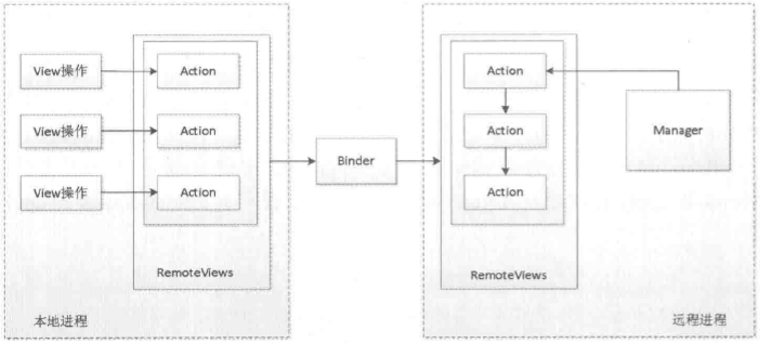
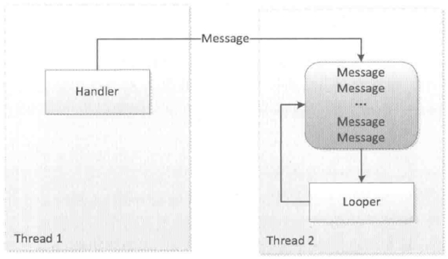

> ***《Android发艺术探索》***
>
> ***任玉刚 著***

[TOC]

# 一、Activity的生命周期和启动模式

## （一）典型情况下的生命周期

1. `onCreate`：表示Activity正在被创建，这是生命周期的第一个方法，此时一般调用`setContentView()`去加载界面布局资源、初始化Activity所需数据等。
2. `onRestart`：表示Activity正在重新启动，一般情况下，当前Activity从不可见变为可见状态时会被调用，一般由用户行为所致。
3. `onStart`：表示Activity正在被启动，即将开始，这时Activity已经可见了，但是还没有出现在前台，无法与用户交互。
4. `onResume`：表示Activity已经可见了，并且出现在前台开始活动。
5. `onPause`：表示Activity正在停止，正常情况下onStop会被调用或之后调用新Activity（如果有）的方法，待新Activity的onResume之后再调用该Activity的onStop。故此时可以做一些存储数据、停止动画等工作，但不能太耗时以免影响新Activity的显示。
6. `onStop`：表示Activity即将停止，可以做一些稍微重量级的回收工作，同样不能太耗时。
7. `onDestory`：表示Activity即将被销毁，这是Activity生命周期中的最后一个回调，此处做一些回收工作和最终的资源释放。


## （二）异常情况下的生命周期

### 1. 资源相关的系统配置发生改变

资源相关的系统配置发生改变时，会导致Activity被杀死调用到onDestory并重新创建，当且仅当系统在此异常情况下Activity被终止，系统才会调用`onSaveInstanceState()`来保存Activity状态，时机是在onStop之前，与onPause不定。之后在onCreate之后会调用`onRestoreInstanceState()`来恢复数据。

值得注意的是，在onSaveInstanceState和onRestoreInstanceState中，系统会自动做一些工作，如当前Activity的视图结构，比如文本框中用户输入的数据，ListView滚动的位置等。再次注意只有在异常情况下这两个方法才会被调用，在重建过种程中，系统把Activity销毁时onSaveInstanceState方法保存的`Bundle`对象作为参数同时传递给onRestoreInstanceState和onCreate方法，区别是onRestoreInstanceState一旦被调用，其参数Bundle savedInstanceState一定有值，不用额外判断是否为空；而若onCreate正常启动时，其参数入为null，所以必须额外判断。两者均可，官方推荐onRestoreInstanceState。

在默认情况下，如果Activity不做任何处理，那么当系统配置发生改变后，Activity会被销毁并重新创建，如图。


### 2. 系统内存资源不足

系统内存资源不足时会杀死优先级低的Activity所在的进程，并通过onSaveInstanceState和onRestoreInstanceState来存储和恢复数据，其过程和情况跟上述完全一致。

Activity按照优先级从高到低，可分为如下三种：

1. 前台Activity，正在和用户交互的Activity，优先级最高。
2. 可见但非前台Activity，比如Activity中弹出了一个对话框，导致Activity可见但位于后台无法和用户直接交互。
3. 后台Activity，已经被暂停的Activity，比如执行了onStop，优先级最低。

如果一个进程中没有四大组件（Activity、Service、ContentProvider、BroadcastReceiver）在执行，那么这个进程将很快被系统杀死，因此一些后台工作不适合脱离四大组件而独自运行在后台中，这样的进程很容易被系统杀死。比较好的方法是将后台工作放入Service中从而保证进程有一定的优先级，这样就不会被系统轻易杀死。

### 3. 系统配置

系统配置中有很多内容，如果当某项内容发生改变后，不想系统重新创建Activity，可以给Activity指定configChanges属性，即在AndroidMenifest.xml中为activity元素添加`android:configChanges`属性，多个值可用`|`连接。常用的有：

- locale：设备本地位置，一般指切换系统语言；
- keyboard：键盘类型，如插入了外接健盘；
- keyboardHidden：键盘的访问性，如调出键盘；
- navigation：系统导航方式，如采用球型导航；
- uiMode：用户界面模式，如开启夜间模式；
- orientation：屏幕方向是否变化等。

反之，若没有在configChanges中指定某属性时，当其发生变化就会使Activity重新创建。若指定某值使Activity没有重建，也不会调用onSaveInstanceState和onRestoreInstanceState来存储和恢复数据，取而代之的是系统调用了Activity的`onConfngurationChanged`方法，可重写它做一些客制化特殊处理。

## （三）Activity的启动模式

新创建的Activity会被放入任务栈中，每按一次back键或返回操作会将栈顶Activity出栈，直到栈空为止，系统就会回收这个任务栈。任务栈分为前台任务栈和后台任务栈，后台任务栈中的Activity位于暂停状态，用户可以通过切换将后台任务栈再次调到前台。

### 1. 四种启动模式分析

1. `standard`：标准模式，也是系统模默认的一种方式，每次启动一个Activity都会重新创建一个新的实例，不管其实例是否存在，它的onCreate、onStart、onResume都会被调用，符合典型的Activity生命周期。该模式中，谁启动了新Activity，那么这个Activity就运行在启动它的那个Activity所在的栈中。当用ApplicationContext去启动standard模式的Activity时会报错，因为standard模式的Activity默认会进入启动它的Activity所属的任务栈中，但是由于非Activity类型的Context（如ApplicationContext）并没有所谓的任务栈，故出现问题。解决方法是为待启动的Activity指定FLAG_ACTIVITY_NEW_TASK标记位，这样启动的时候就会创建一个新的任务栈，这时待启动的Activity实际上是以singleTask模式启动的。
2. `singleTop`：栈顶复用模式。该模式中，如果新Activity已经位于任务栈的栈顶，那么此Activity不会被重新创建（onCreate等方法不会被系统回调），同时它的`onNewIntent`方法会被回调，通过此方法的参数我们可以取出当前请求的信息。如果新Activity的实例已存在但不位于栈顶，那么新Activity仍然会重新创建。
3. `singleTask`：栈内复用模式。这是一种单实例模式，该模式中，只要Activity在一个栈中存在，那么多次启动此Activity都不会重新创建实例，系统会回调其`onNewIntent`。注：启动某Activity时会寻找是否存在它所需的任务栈，若不存在会创建该栈和Activity，若栈存在且该Activity在该栈中，由于singleTask默认具有clearTop效果，系统会将要启动的Activity之上的所有Activity全部出栈，使其成为栈顶。
4. `singleInstance`：单实例模式，这是一种加强的singleTask模式，它具有singleTask的所有特性，还加强了一点，具有此种模式的Activity，只能单独地位于一个任务栈中，且具有栈内复用特性。

若两个任务栈，前台栈为AB（由栈底到栈顶），后台栈为CD（假设CD均为singleTask模式）。现在清求D，那么整个后台任务栈会被切换到前台，这个时候后退列表会变成AB CD。

一个参数`TaskAffinity`（任务相关性）标识了一个Activity所需要的任务栈的名字，默认情况下所有Activity所需的任务栈的名字为应用的包名，也可以单独指定一个Activity的TaskAffinity属性，该属性主要和singleTask启动模式或者allowTaskReparenting属性配对使用，在其他情况下没有意义。注：该属性在AndroidMenifest.xml中activity元素中为`andnoid:taskAffinity`。

当TaskAffinity和singleTask启动模式配对使用的时候，它是具有该模式的Activity的目前任务栈的名字，待启动的Activity会运行在名字和TaskAffinity相同的任务栈中。

当TaskAffinity和allowTaskReparenting结合的时候情况会比较复杂，当一个应用A启动了启用B的某个Activity后，如果这个Activity的allowTaskReparenting属性为true的话，那么当应用B被启动后，此Activity会直接从应用A的任务栈转移到各应用B的任务栈中。

### 2. 指定Activity启动模式

第一种是通过AndroidMenifest.xml中activity元素的`android:launchMode`属性指定启动模式，另一种是在Intent中设置标志位`intent.addFlags(Inent.FLAG_XXX)`未为Activity指定启动模式。区别：动态指定优先级高，当两种同时存在时，以第二种方式为准；两种方式在限定范围上有所不同。

Activity的Flags有很多，作用也很多，有的标记位可以设定Activity的启动模式，有的可以影响Activity的运行状态。一些常用的如下：

1. `FLAG_ACTIVITY_NEW_TASK`：指定"singleTask"启动模式。
2. `FLAG_ACTLVITY_SINGLE_TOP`：指定"singleTop"启动模式。
3. `FLAG_ACTIVITY_CLEAR_TOP`：具有此标记位的Activity在启动时，在同一个任务栈中所有位于完上面的Activity都要出栈。一般和singleTask启动模式一起出现。如：若启动的Activity为standard启动模式，那么它和它之上的Activity都会出栈，系统会创建新的Activity实例压入栈中作为栈顶。
4. `FLAG_ACTIVITY_EXCLUDE_FROM_RECENTS`：具有这个标记的Activity不会出现在历史Activity的列表中，当某些情况下不希望用户通过历史列表回到某Activity的时候该标记比较有用。它等同于在AndroidMenifest.xml中指定activity的属性android:excludeFromRecents="true"。

## （四）IntentFilter的匹配规则

显示启动需要明确定被启动对象的组件信息，而隐式调用需要Intent能够匹配目标组件的IntentFilter中所设置的过滤信息，如果不匹配将无法启动目标Activity。IntentFilter中的过滤信息有action、category、data三种类别，每个类别可有多项，而且一个Activity中可以有多个intent-filter，一个Intent只要能匹配任何一组intent-filter即可成功启动对应的Activity。注：它们分别对应AndroidMenifest.xml的`action`、`category`、`data`的xml元素。

### 1. action、category、data

`action`是一个字符串（区分大小写），系统预定义了一些action，也可以在应用中自定义action。匹配规则是：Intent中的action存在且必须能够和过滤规则中的其中一个action匹配，即字符串值完全一样。

`category`是一个字符串（区分大小写）系统预定义了一些，也可以在应用中自定义category。匹配规则是：如果Intent中含有category，那么它所包含的所有category都必须能够匹配过滤规则中的其中一个。如果Intent中无category也能成功匹配，因为系统在调用startActivity或startActivityForResult时会默认为Intent加上`"android.intent.category.DEFAULT"`这个category。同时，在客制intent-filter时应指定默认的`<category android:name="android.intent.categry.DEFAULT"/>`。

`data`的匹配规则和action类似，如果过滤规则中定义了data，那么Intent中必须也要定义可匹配的data。一个data的结构比较复杂，如下`<data android:xxx="sss" etc. />`。另外在同一个intent-filter中，\<data x="" y="" />和\<data x="" /> \<data y="" />效果一样。

其中xxx可以为`mineType`，用来指媒体类型，如`image/jpeg`、`audio/mpeg4-generic`、`text/plain`、`video/*`等，属性名样式为`android:mineType`。

还可以为URI，结构为：`<scheme>://<host>:<port>/[<path>|<pathPrefix>|<pathPattern>]`，其中每个名称为一个xml元素的名称。整体的例子如`content://com.example.project:200/folder/subfolder/etc`、`http://www.baidu.com:80/search/info`。其中每个数据作为xml元素（如`android:host`）的含义如下：

- `scheme`，URI模式，比如http、file、content等，若过滤规则没有指定URI，那么默认值为content和file。如果指定URI却没有指定scheme，那么整个URI其他参数无效，即URI无效。
- `host`，URI主机名，若它未指定则URI也是无效的。
- `port`，URI中的端口号。
- `path`、`pathPattern`、`pathPrefix`，表示路径信息，其中path表示完整的路径信息，pathPattem也表示完整路经信息，且也可以包含通配符`*`等，pathPrefix表示路径的前缀信息。

另外，如果要为Intent指定完整的data，要调用`intent.setDataAndType`方法，而不是setData和setType，因为这两个方法会彼此请除对方的值。

### 2. 分析

Intent-filter的匹配规则对于Service和BroadcastReceiver也是同样的道理，不过系统对于Service的建议是尽量使用显示调用方式来启动服务。

通过隐式方式启动一个Activity对，可以判断一下是否有Activity能匹配客制的intent，以避免出现无法找到Activity的报错。判断方法有Intent的`resolveActivity`方法；`PackageManager`的`resolveActivity`或`queryIntentActivites`方法，它们找不到匹配的Activity就会返回null。

需要注意的是，其参数(Intent intent, int flags)中的第二个参数要使用`MATCH_DEFAULT_ONLY`这个标记位，表示仅匹配在intent-filter中声明为categony.DEFAULT的Activity。因为不含有DEFAULT的category的Activity无法接收隐式Intent，故不用这个标志位可能匹配到不含categony.DEFAULT的Activity从而startActivity失败。

另外，针对Service和BroadcastReceiver，PackageManager同样提供了类似的方法获取成功匹配的组件信息。

一组特殊的`<action andnoid:name="android.intent.MAIN"/> <category android:name="android.intent.category.LAUNCHER"/>`，用来标明这是一个入口Activity并且会出现在系统的应用列表中，二者缺一不可。

在\<intent-filter>中加入`<category android:name="android,intent.category.HOME"/> <category android:name="android.intent.category.DEFAULT"/>`，可将activity应用为主屏幕。

# 二、IPC机制

## （一）Android IPC简介

IPC是Inter-Process Communication的缩写，译为进程间通信或者跨进程通信，是指两个进程之间进行数据交换的过程。

按照操作系统中的描述，线程是CPU调度的最小单元，同时线程是一种有限的系统资源。而进程一般指一个执行单元，在PC和移动设备上指一个程序或者一个应用。一个进程可以包含多个线程，因此进程和线程是包含与被包含的关系。最简单的情况下，一个进程中可以只有一个线程，即主线程，在Android里面主线程也叫UI线程，在UI线程里才能操作界面元素。

很多时候，一个进程中需要执行大量耗时的任务，如果这些任务放在主线程中去执行就会造成界面无法响应，严重影响用户体验，这种情况在PC系统和移动系统中都存在，在Android中有一个特殊的名字叫做ANR（Application Not Responding）即应用无响应。解决这个问题就需要用到线程，把一些耗时的任务放在线程中即可。

IPC不是Android中所独有的，任何一个操作系统都需要有相应的IPC机制，比如Windows上可以通过剪贴板、管道和邮槽等来进行进程间通信；Linux上可以通过命名管道、共享内存、信号量等来进行进程间通信。可以看到不同的操作系统平台有着不同的进程间通信方式，对于Android来说，它是一种基于Linux内核的移动操作系统，但它的进程间通信方式并没有完全继承自Linux，相反它有自己的进程间通信方式。

在Android中最有特色的进程间通信方式就是Binder了，通过Binder可以轻松地实现进程间通信。除了Binder，Android还支持Socket，通过Socket也可以实现任意两个终端之间的通信，当然同一个设备上的两个进程通过Socket通信自然也是可以的。关于Binder的详解可以参看《Android的Binder通信》文章。

说到IPC的使用场景就必须提到多进程，只有面对多进程这种场景下，才需要考虑进程间通信。多进程的情况分为两种。

- 第一种情况是一个应用因为某些原因自身需要采用多进程模式来实现，至于原因，可能有很多，比如有些模块由于特殊原因需要运行在单独的进程中，又或者为了加大一个应用可使用的内存所以需要通过多进程来获取多份内存空间。Android对单个应用所使用的最大内存做了限制，早期的一些版本可能是16MB，不同设备有不同的大小。
- 另一种情况是当前应用需要向其他应用获取数据，由于是两个应用，所以必须采用跨进程的方式来获取所需的数据，甚至我们通过系统提供的ContentProvider去査询数据的时候，其实也是一种进程间通信，只不过通信细节被系统内部屏蔽了，我们无法感知而已。

总之，不管由于何种原因，我们采用了多进程的设计方法，那么应用中就必须妥善地处理进程间通信的各种问题。

## （二）Android中的多进程模式

开启多进程模式很简单，但是实际使用过程中却暗藏杀机，有时候通过多进程得到的好处甚至都不足以弥补使用多进程所带来的代码层面的负面影响。下面会详细分析这些问题。很多情况下都需要多进程间通信，每个进程都分配独立的虚拟机。在正常情况下，在Android多进程是指一个应用中存在的多个进程的情况。

### 1. 开启多进程模式

正常情况下，在Android中多进程是指一个应用中存在多个进程的情况，因此这里不讨两个应用之间的多进程情况。

首先，在Android中使用多进程只有一种方法，那就是给四大组件（Activity、Service、Receiver、ContentProvider）在AndroidMenifest中指定`android:process`属性，除此之外没有其他办法，也就是说我们无法给一个线程或者一个实体类指定其运行时所在的进程。其实还有另一种非常规的多进程方法，那就是通过JNI在native层去fork一个新的进程，但这种方法属于特殊情况，也不是常用的创建多进程的方式，因此我们暂时不考虑这种方式。

下面是一个示例，描述了如何在Android中创建多进程：

```xml
<?xml version="1.0" encoding="utf-8"?>
<manifest>
    <application>
        <activity android:name="package.main.MainActivity">
        	<intent-filter>
                <action android:name="android.intent.action.MAIN" />
                <category android:name="android.intent.category.LAUNCHER" />
            </intent-filter>
        </activity>
        
        <activity android:name="package.one.OneActivity"
                  android:process=":MyOneRemote">
        </activity>
        <activity android:name="package.two.TwoActivity"
                  android:process="package.some.MyTwoRemote">
        </activity>
    </application>
</manifest>
```

上面的示例分别为OneActivity和TwoActivity指定了process属性，并且它们的属性值不同，这意味着当前应用又增加了两个新进程。

- 假设当前应用的包名为"package.one"，当OneActivity启动时，系统会为它创建一个单独的进程，进程名为"package.one:MyOneRemote"。
- 当TwoActivity启动时，系统也会为它创建一个单独的进程，进程名为"package.some.MyTwoRemote"。
- 同时入口Activity是MainActivity，没有为它指定process属性，那么它运行默认进程中，默认进程的进程名是包名"package.main"。

从上面可以看到，不指定process时进程名为包名默认；指定进程名时若用`:`开头表明要在当前进程名前附加上包名，是一种简写，而且这种进程属于当前应用的私有进程，其他应用的组件不可以和它跑在同一个进程中。而进程名不以`:`开头的属于全局进程，其他应用通过ShareUID方式可以和它跑在同一个进程中。

Android系统会为每个应用分配唯一的UID，具有相同UID的应用才能共享数据。在两个应用有相同的ShareUID和签名才能通过ShareUID跑在同一进程中。而且在ShareUID和签名相同时，不管是否在同一进程，它们都可以相互访问对方的私有数据如data目录、组件信息等。当然如果它们跑在同一个进程中，那么还可以共享内存数据，看起来就像一个应用的两个部分。

### 2. 多进程模式的运行机制

Android为每个Application应用分配了一个独立的虚拟机，或者说为每一个进程都分配一个独立的虚拟机，不同的虚拟机在内存中分配有不同的内存地址空间，这就导致在不同的虚拟机中访问同一个类的对象会产生多份副本。

所有运行在不同进程中的四大组件，只要它们之间需要通过内存来共享数据，都会共享失败，这也是多进程所带来的主要影响。一般来说，使用多进程会造成如下几方面的问题：

1. 静态成员和单例模式完全失效；
2. 线程同步机制完失效；
3. SharedPreferences的可靠性下降；
4. Application会多次创建。

第2个问题本质上和第一个问题是类似的，既然都不是一块内存了，那么不管是锁对象还是锁全局类都无法保证线程同步，因为不同进程锁的不是同一个对象。

第3个问题是因为SharedPreferences不支持两个进程同时去执行写操作，否则会导致一定几率的数据丢失，这是因为SharedPreferences底层是通过读/写XML文件来实现的，并发写显然是可能出问题的，甚至并发读/写都有可能出问题。

第4个问题也是显而易见的，当一个组件跑在一个新的进程中的时候，由于系统要在创建新的进程同时分配独立的虚拟机，所以这个过程其实就是启动一个应用的过程。因此，相当于系统又把这个应用重新启动了一遍，既然重新启动了，那么自然会创建新的Application。

这个问题其实可以这么理解，运行在同一个进程中的组件是属于同一个虚拟机和同一个Application的。那么，运行在不同进程中的组件是属于两个不同的虚拟机和Application的，即不同进程的组件会拥有独立的虚拟机、Application以及内存空间，这会给实际的开发带来很多困扰，是尤其需要注意的。

或者我们也可以这么理解同一个应用间的多进程，它就相当于两个不同的应用采用了SharedUID的模式，这样能够更加直接地理解多进程模式的本质。

本节分析了多进程所带来的问题，为了解决这些问题，系统提供了很多跨进程通信方法，虽然说不能直接地共享内存，但是通过跨进程通信还是可以实现数据交互的。实现跨进程通信的方式很多，比如通过Intent来传递数据，共享文件和SharedPreferences，基于Binder的Messenger和AIDL，以及Socket等。

## （三）IPC基础概念介绍

这里主要介绍IPC中的一些基础概念，主要包含三方面内容：Serializable接口、Parcelable接口、以及Binder。Serializable和Parcelable接口可以完成对象的序列化过程，当我们需要通过Intent和Binder传输数据时就需要使用Parcelable或者Serializable来序列化对象。有的时候需要把对象持久化到存储设备上或者通过网络传输给其他客户端，这个时候也需要使用Serializable来完成对象的持久化。

### 1. Serializable接口

Serializable是Java所提供的一个序列化接口，它是一个空接口，为对象提供标准的序列化和反序列化操作，具体可以参看《Java面向对象编程（第二版）》笔记中的第八章。

### 2. Parcelable接口

Parcelable是Android所提供的一个序列化的接口，只要实现这个接口，一个类的对象就可以实现序列化，并可以通过Intent和Binder传递。系统提供了许多实现Parcelable接口的类，它们都是可以直接序列化的，此如Intent、Bundle、Bitmap等，同时List和Map也可以序列化，只要它们里的每个元素都是可序列化的。

一个自定义的可序列化类的例子如下所示。

```java
// User.java
public class User implements Parcelable {
    private String mName;
    private Book mBook; // Book 是另一个序列化的自定义对象

    public User(String name, Book user) {
        mName = name;
        mBook = user;
    }

    private User(Parcel in) {
        mName = in.readString();
        // 序列化对象反序列化时要用当前线程上下文类加载器
        mBook = in.readParcelable(Thread.currentThread().getContextClassLoader());  
    }

    @Override
    public void writeToParcel(Parcel dest, int flags) {
        // 在 Parcel 内部包含了可序列化的数据
        dest.writeString(mName);
        // 实现序列化，flags标记为0和1，为1标记当前对象需要作为返回值返回，不能立即释放资源
        // 有个标记PARCELABLE_WRITE_RETURN_VALUE；几乎所有情况都为0
        dest.writeParcelable(mBook, 0); 
    }

    @Override
    public int describeContents() {
        // 返回当前对象内容的描述，如果有文件描述符返回1，即CONTENTS_FILE_DESCRIPTOR，否则几乎所有情况都为0
        return 0;   
    }

    public static final Creator<User> CREATOR = new Creator<User>() {
        @Override
        public User createFromParcel(Parcel in) {
            return new User(in);
        }

        @Override
        public User[] newArray(int size) {
            return new User[size];
        }
    };
}
```

上面的代码中，Parcel内部包装了可序列化的数据，可以在Binder中自由传输。从上述代码中可以看出，在序列化过程中需要实现的功能有序列化、反序列化和内容描述。

- 序列化功能由writeToParcel方法来完成，最终是通过Parcel中的一系列write方法来完成的。
- 反序列化功能由Creator来完成，其内部标明了如何创建序列化对象和数组；并在对象的构造方法中通过Parcel的一系列read方法来完成反序列化过程。
- 内容描述功能由describeContents方法来完成，几乎在所有情况下这个方法都应该返回0，仅当当前对象中存在文件描述符时，此方法返回1。

需要注意的是，在构造方法User(Parcel in)方法中，由于Book是另一个可序列化对象，所以它的反序列化过程需要传递当前线程的上下文类加载器，否则会报无法找到类的错误。

对于所讨论的这两种序列化，Parcelable更适合Android平台，效率更高，主要用在内存序列化中，不适合永久保存数据；在存储设备、网络传输中更适合用Serializable。

### 3. Binder

Binder是个很深入复杂的话题，本节的侧重点只是介绍Binder的使用以及上层原理，为接下来的几节内容做铺垫。

直观表说，Binder是Android中的一个类，实现了IBinder接口。从IPC角度，Binder是Android中的一种跨进程通信方式，Binder还可以理解为一种虚拟的物理设备，它的设备驱动是/dev/binder，该通信方式在Linux中没有；从Android Framework角变来说，Binder是ServiceManager连接各种Manager（ActivityManager、WindowManager等等）和相应ManagerService的桥梁；从Android应用层来说，Binder是客户端和服务端进行通信的媒介，当bindService的时候，服务端会返回一个包含了服务端业务调用的Binder对象，通讨这个Binder对象，客户端就可获取服务端提供的服务或数据，这里的服务包括普通服务和基于AIDL的服务。

#### (1) 利用AIDL生成Binder类

Android开发中，Binder主要用在Service中，包括AIDL和Messenger，其中普通Service中的Binder不涉及进程间通信，所以较为简单，无法触及Binder的核心，而Messenger的底层其实是AIDL，所以这里选择用AIDL来分析Binder的工作机制。

为了分析Binder的工作机制，需要新建一个AIDL示例，SDK会自动为我们生产AIDL所对应的Binder类，然后我们就可以分析Binder的工作过程。所用的文件文件有Book.java、Book.aidl、IBookManager.aidl，它们都在com.sutdy.myaidl包中，代码如下。

```java
// com.study.myaidl.Book.java
package com.study.myaidl;

import android.os.Parcel;
import android.os.Parcelable;

public class Book implements Parcelable {
    private int mBookId;
    private String mBookName;

    public Book(int bookId, String bookName) {
        mBookId = bookId;
        mBookName = bookName;
    }

    private Book(Parcel in) {
        mBookId = in.readInt();
        mBookName = in.readString();
    }

    public static final Creator<Book> CREATOR = new Creator<Book>() {
        @Override
        public Book createFromParcel(Parcel in) {
            return new Book(in);
        }

        @Override
        public Book[] newArray(int size) {
            return new Book[size];
        }
    };

    @Override
    public int describeContents() {
        return 0;
    }

    @Override
    public void writeToParcel(Parcel dest, int flags) {
        dest.writeInt(mBookId);
        dest.writeString(mBookName);
    }
}
```

```idl
// Book.aidl
package com.study.myaidl;

// Declare Book in AIDL
parcelable Book;
```

```idl
// IBookManager.aidl
package com.study.myaidl;

// Declare any non-default types here with import statements
import com.study.myaidl.Book;

interface IBookManager {
    /**
     * Demonstrates some basic types that you can use as parameters
     * and return values in AIDL.
     */
//    void basicTypes(int anInt, long aLong, boolean aBoolean, float aFloat,
//            double aDouble, String aString);

    List<Book> getBookList();
    void addBook(in Book book);
}
```

上面三个文件中，Book.java是一个表示图书信息的类，它实现了Parcelable接口。Book.aidl是Book类在AIDL中的声明。IBookManager.aidl是自己定义的一个接口，里面有getBookList和addBook两个方法，其中getBookList用于从远程服务端获取图书列表，而addBook用于往图书列表中添加一本书，当然这两个方法主要是示例用，不一定要有实际意义。

可以看到，尽管Book类已经和IBookManager位于相同的包中，但是在IBookManager中仍然要导入Book类，这就是AIDL的特殊之处。

下面先看一下系统为IBookManager.aidl生产的Binder类，在gen类别下的com.study.myaidl包中有一个IBookManager.java的类（如果没有，可以手动Build一下），接下来就要根据这个系统生成的Binder类来分析Binder的工作原理，代码如下。

```java
// com.study.myaidl.IBookManager.java
/*
 * This file is auto-generated.  DO NOT MODIFY.
 */
package com.study.myaidl;
public interface IBookManager extends android.os.IInterface
{
  /** Default implementation for IBookManager. */
  public static class Default implements com.study.myaidl.IBookManager
  {
    /**
         * Demonstrates some basic types that you can use as parameters
         * and return values in AIDL.
         *///    void basicTypes(int anInt, long aLong, boolean aBoolean, float aFloat,
    //            double aDouble, String aString);

    @Override public java.util.List<com.study.myaidl.Book> getBookList() throws android.os.RemoteException
    {
      return null;
    }
    @Override public void addBook(com.study.myaidl.Book book) throws android.os.RemoteException
    {
    }
    @Override
    public android.os.IBinder asBinder() {
      return null;
    }
  }
  /** Local-side IPC implementation stub class. */
  public static abstract class Stub extends android.os.Binder implements com.study.myaidl.IBookManager
  {
    private static final java.lang.String DESCRIPTOR = "com.study.myaidl.IBookManager";
    /** Construct the stub at attach it to the interface. */
    public Stub()
    {
      this.attachInterface(this, DESCRIPTOR);
    }
    /**
     * Cast an IBinder object into an com.study.myaidl.IBookManager interface,
     * generating a proxy if needed.
     */
    public static com.study.myaidl.IBookManager asInterface(android.os.IBinder obj)
    {
      if ((obj==null)) {
        return null;
      }
      android.os.IInterface iin = obj.queryLocalInterface(DESCRIPTOR);
      if (((iin!=null)&&(iin instanceof com.study.myaidl.IBookManager))) {
        return ((com.study.myaidl.IBookManager)iin);
      }
      return new com.study.myaidl.IBookManager.Stub.Proxy(obj);
    }
    @Override public android.os.IBinder asBinder()
    {
      return this;
    }
    @Override public boolean onTransact(int code, android.os.Parcel data, android.os.Parcel reply, int flags) throws android.os.RemoteException
    {
      java.lang.String descriptor = DESCRIPTOR;
      switch (code)
      {
        case INTERFACE_TRANSACTION:
        {
          reply.writeString(descriptor);
          return true;
        }
        case TRANSACTION_getBookList:
        {
          data.enforceInterface(descriptor);
          java.util.List<com.study.myaidl.Book> _result = this.getBookList();
          reply.writeNoException();
          reply.writeTypedList(_result);
          return true;
        }
        case TRANSACTION_addBook:
        {
          data.enforceInterface(descriptor);
          com.study.myaidl.Book _arg0;
          if ((0!=data.readInt())) {
            _arg0 = com.study.myaidl.Book.CREATOR.createFromParcel(data);
          }
          else {
            _arg0 = null;
          }
          this.addBook(_arg0);
          reply.writeNoException();
          return true;
        }
        default:
        {
          return super.onTransact(code, data, reply, flags);
        }
      }
    }
    private static class Proxy implements com.study.myaidl.IBookManager
    {
      private android.os.IBinder mRemote;
      Proxy(android.os.IBinder remote)
      {
        mRemote = remote;
      }
      @Override public android.os.IBinder asBinder()
      {
        return mRemote;
      }
      public java.lang.String getInterfaceDescriptor()
      {
        return DESCRIPTOR;
      }
      /**
           * Demonstrates some basic types that you can use as parameters
           * and return values in AIDL.
           *///    void basicTypes(int anInt, long aLong, boolean aBoolean, float aFloat,
      //            double aDouble, String aString);

      @Override public java.util.List<com.study.myaidl.Book> getBookList() throws android.os.RemoteException
      {
        android.os.Parcel _data = android.os.Parcel.obtain();
        android.os.Parcel _reply = android.os.Parcel.obtain();
        java.util.List<com.study.myaidl.Book> _result;
        try {
          _data.writeInterfaceToken(DESCRIPTOR);
          boolean _status = mRemote.transact(Stub.TRANSACTION_getBookList, _data, _reply, 0);
          if (!_status && getDefaultImpl() != null) {
            return getDefaultImpl().getBookList();
          }
          _reply.readException();
          _result = _reply.createTypedArrayList(com.study.myaidl.Book.CREATOR);
        }
        finally {
          _reply.recycle();
          _data.recycle();
        }
        return _result;
      }
      @Override public void addBook(com.study.myaidl.Book book) throws android.os.RemoteException
      {
        android.os.Parcel _data = android.os.Parcel.obtain();
        android.os.Parcel _reply = android.os.Parcel.obtain();
        try {
          _data.writeInterfaceToken(DESCRIPTOR);
          if ((book!=null)) {
            _data.writeInt(1);
            book.writeToParcel(_data, 0);
          }
          else {
            _data.writeInt(0);
          }
          boolean _status = mRemote.transact(Stub.TRANSACTION_addBook, _data, _reply, 0);
          if (!_status && getDefaultImpl() != null) {
            getDefaultImpl().addBook(book);
            return;
          }
          _reply.readException();
        }
        finally {
          _reply.recycle();
          _data.recycle();
        }
      }
      public static com.study.myaidl.IBookManager sDefaultImpl;
    }
    static final int TRANSACTION_getBookList = (android.os.IBinder.FIRST_CALL_TRANSACTION + 0);
    static final int TRANSACTION_addBook = (android.os.IBinder.FIRST_CALL_TRANSACTION + 1);
    public static boolean setDefaultImpl(com.study.myaidl.IBookManager impl) {
      if (Stub.Proxy.sDefaultImpl == null && impl != null) {
        Stub.Proxy.sDefaultImpl = impl;
        return true;
      }
      return false;
    }
    public static com.study.myaidl.IBookManager getDefaultImpl() {
      return Stub.Proxy.sDefaultImpl;
    }
  }
  /**
       * Demonstrates some basic types that you can use as parameters
       * and return values in AIDL.
       *///    void basicTypes(int anInt, long aLong, boolean aBoolean, float aFloat,
  //            double aDouble, String aString);

  public java.util.List<com.study.myaidl.Book> getBookList() throws android.os.RemoteException;
  public void addBook(com.study.myaidl.Book book) throws android.os.RemoteException;
}
```

上述代码是系统根据IBookManager.aidl生成的IBookManager类，它继承了IInterface这个接口，同时它自己也还是个接口，所有可以在Binder中传输的接口都需要继承IInterface接口。这个IBookManager类刚开始看起来逻辑混乱，但是实际上还是很清晰的。

首先，它声明了两个方法getBookList和addBook，显然这就是在IBookManager.aidl中所声明的方法，同时它还声明了两个整型的id分别用于标识这两个方法，这两个id用于标识在transact过程中客户端所请求的到底是哪个方法。接着，它声明了一个内部类Stub，这个Stub就是一个Binder类，当客户端和服务端都位于同一个进程时，方法调用不会走跨进程的transact过程，而当两者位于不同进程时，方法调用需要走transact过程，这个逻辑由Stub的内部代理类Proxy来完成。


这么来看，这个IBookManager接口的核心实现就是它的内部类Stub和Stub的内部代理类Proxy，下面详细介绍针对这两个类的每个方法的含义。

- `DESCRIPTOR`，Binder的唯一标识，一般用当前Binder的类名表示，比如本例中的"com.study.my.IBookManager"。
- `Stub#asBinder`，此方法用于返回当前Binder对象。
- `Stub#asInterface(IBinder obj)`，用于将服务端的Binder对象转换成客户端所需的AIDL接口类型的对象，这种转换过程是区分进程的，如果客户端和服务端位于同一进程，那么此方法返回的就是服务端的Stub对象本身，否则返回的是系统封装后的Stub.Proxy对象。如本例中的IBookManager.Stub#asInterface方法。
- `Stub#onTransact`，这个方法运行在服务端中的Binder线程池中，当客户端发起跨进程请求时，远程请求会通过系统底层封装后交由此方法来处理。如上图，服务端通过code可以确定客户端所请求的目标方法是什么，接着从data中取出目标方法所需的参数（如果目标方法有参数的话），然后执行目标方法，向reply中写入返回值（如果目标方法有返回值的话）。
  - 需要注意的是，如果此方法返回false，那么客户端的请求会失败，因此我们可以利用这个特性来做权限验证，毕竟我们也不希望随便一个进程都能远程调用我们的服务。
- `Proxy#getBookList`，这个就是业务方法了，它运行在客户端，当客户端远程调用此方法时，它首先创建该方法所需要的输入型Parcel对象\_data、输出型Parcel对象\_reply和返回值List类型的\_result对象，然后把该方法的参数信息写入\_data中（如果有参数的话）；接着调用transact方法来发起RPC（远程过程调用）请求，同时当前线程挂起；然后服务端的onTransact方法会被调用，直到RPC过程返回后，当前线程继续执行，并从\_reply中取出RPC过程的返回结果赋给\_result对象，最后返回\_result对象。
- `Proxy#addBook`，这个方法运行在客户端，它的执行过程和getBookList是一样的，addBook没有返回值,所以它不需要从\_reply中取出返回值。

上面已经简单分析了Binder的工作机制，这里有两点还是需要额外说明一下。首先，当客户端发起远程请求时，由于当前线程会被挂起直至服务端进程返回数据，所以如果一个远程方法是很耗时的，那么不能在UI线程中发起此远程请求；其次，由于服务端的Binder方法运行在Binder的线程池中，所以Binder方法不管是否耗时都应该采用同步的方式去实现，因为它已经运行在一个线程中了。

为了更好地说明Binder，下面给出一个Binder的工作机制图。


从上述分析过程来看，完全可以不提供AIDL文件即可实现Binder，之所以提供AIDL文件，是为了方便系统生成代码。系统根据AIDL文件生成Java文件的格式是固定的，但是也可以抛开AIDL文件直接写一个Binder出来。

#### (2) 手写Binder类

接下来介绍如何手动写一个Binder，还是上面的例子，但是这次不给系统提供AIDL文件，并且避免命名冲突，这次采用包名"com.study.mybinder"。参考上面系统自动生成的IBookManager.java这个类的代码，并对它进行结构上的调整。可以发现这个类主要由两部分组成，首先它本身是一个用于Binder的继承了IInterface的接口，其次它的内部有一个Stub类，这个类就是个Binder。

从这一点来看，我们完全可以把Stub类提取出来直接作为一个独立的Binder类来实现，这样IBookManager中就只剩接口本身了，通过这种分离的方式可以让它的结构变得淸晰点。

根据上面的思想，手动实现一个Binder可以通过如下步骤来完成。

1. **声明一个AIDL性质的接口**

要声明这个I接口，只需要继承IInterface接口即可，这个接口的实现如下。

```java
// com.study.mybinder.IBookManager.java
public interface IBookManager extends IInterface {
    String DESCRIPTOR = "com.study.mybinder.IBookManager";
    int TRANSACTION_getBookList = IBinder.FIRST_CALL_TRANSACTION;
    int TRANSACTION_addBook = IBinder.FIRST_CALL_TRANSACTION + 1;

    List<Book> getBookList() throws RemoteException;

    void addBook(Book book) throws RemoteException;
}
```

可以看到，在接口中声明了一个Binder描述符和另外两个id，这两个id分别表示的是getBookList和addBook方法，这段代码原本也是系统生成的，现在仿照系统生成的规则去手动书写这部分代码。如果有更多的方法，只需要再声明一个id，然后按照固定模式声明这个新方法即可。

2. **实现Stub类和Stub类中的Proxy代理类**

这段代码我们可以自己写，但是写出来后会发现和系统自动生成的代码是一样的，因此这个Stub类我们只需要参考系统生成的代码即可，只是结构上需要做一下调整，调整后的代码如下所示。

```java
// com.study.mybinder.BookManagerImpl.java
public class BookManagerImpl extends Binder implements IBookManager {

    /* Construct the stub at attach it to the interface */
    public BookManagerImpl() {
        this.attachInterface(this, DESCRIPTOR);
    }

    public static IBookManager asInterface(IBinder obj) {
        if (obj == null) {
            return null;
        }
        IInterface iin = obj.queryLocalInterface(DESCRIPTOR);
        if ((iin != null) && (iin instanceof IBookManager)) {
            return (IBookManager) iin;
        }
        return new BookManagerImpl.Proxy(obj);
    }

    @Override
    public IBinder asBinder() {
        return this;
    }

    @Override
    protected boolean onTransact(int code, @NonNull Parcel data, @Nullable Parcel reply, int flags) throws RemoteException {
        switch (code) {
            case INTERFACE_TRANSACTION:
                reply.writeString(DESCRIPTOR);
                return true;
            case TRANSACTION_getBookList:
                data.enforceInterface(DESCRIPTOR);
                List<Book> result = this.getBookList();
                reply.writeNoException();
                reply.writeTypedList(result);
                return true;
            case TRANSACTION_addBook:
                data.enforceInterface(DESCRIPTOR);
                Book arg0;
                if (data.readInt() != 0) {
                    arg0 = Book.CREATOR.createFromParcel(data);
                } else {
                    arg0 = null;
                }
                this.addBook(arg0);
                reply.writeNoException();
                return true;
            default:
                return super.onTransact(code, data, reply, flags);
        }
    }

    private static class Proxy implements IBookManager {
        private IBinder mRemote;

        Proxy(IBinder remote) {
            mRemote = remote;
        }

        @Override
        public IBinder asBinder() {
            return mRemote;
        }

        @Override
        public List<Book> getBookList() throws RemoteException {
            Parcel data = Parcel.obtain();
            Parcel reply = Parcel.obtain();
            List<Book> result;
            try {
                data.writeInterfaceToken(DESCRIPTOR);
                mRemote.transact(TRANSACTION_getBookList, data, reply, 0);
                reply.readException();
                result = reply.createTypedArrayList(Book.CREATOR);
            } finally {
                reply.recycle();
                data.recycle();
            }
            return result;
        }

        @Override
        public void addBook(Book book) throws RemoteException {
            Parcel data = Parcel.obtain();
            Parcel reply = Parcel.obtain();
            try {
                data.writeInterfaceToken(DESCRIPTOR);
                if (book != null) {
                    data.writeInt(1);
                    book.writeToParcel(data, 0);
                } else {
                    data.writeInt(0);
                }
                mRemote.transact(TRANSACTION_addBook, data, reply, 0);
                reply.readException();
            } finally {
                reply.recycle();
                data.recycle();
            }
        }
    }

    @Override
    public List<Book> getBookList() throws RemoteException {
        // TODO 待实现
        return null;
    }

    @Override
    public void addBook(Book book) throws RemoteException {
        // TODO 待实现
    }
}
```

通过将上述代码和系统生成的代码对比，可以发现简直是一模一样的。手动去写的意义在于可以让我们更加理解Binder的工作原理，同时也提供了一种不通过AIDL文件来实现Binder的新方式。也就是说，AIDL文件并不是实现Binder的必需品。是否手动实现Binder没有本质区别，二者的工作原理完全一样，AIDL文件的本质是系统为我们提供了一种快速实现Binder的工具，仅此而已。

如果是我们手写的Binder，那么在服务端只需要创建一个BookManagerImpl的对象并在Service的onBind方法中返回即可。

#### (3) Binder死亡

我们知道，Binder运行在服务端进程，如果服务端进程由于某种原因异常终止，这个时候客户端到服务端的Binder连接就会断裂（称之为Binder死亡），会导致客户端的远程调用失败。更为关键的是，如果客户端不知道Binder连接已经断裂，那么客户端的功能就会受到影响。

为了解决这个问题，Binder中提供了两个配对的方法`linkToDeath`和`unlinkToDeath`。通过linkToDeath我们可以给Binder设置一个死亡代理，当Binder死亡时，我们就会收到通知，这个时候我们就可以重新发起连接请求从而恢复连接。

给Binder设置死亡代理的方法也很简单，首先声明一个DeathRecipient对象。DeathRecipient是一个IBinder接口内部的接口，其内部只有一个方法binderDied，我们需要实现这个方法，当Binder死亡的时候，系统就会调binderDied方法，然后我们就可以移出之前绑定的binder代理并重新绑定远程服务即可。

```java
private IBookManager mBookManager;
private IBinder.DeathRecipient mDeathRecipient = new IBinder.DeathRecipient() {
    @Override
    public void binderDied() {
        if (mBookManager == null) return;
        mBookManager.asBinder().unlinkToDeath(mDeathRecipient, 0);
        mBookManager = null;
        // TODO: 这里重新绑定远程Service
    }
};
```

其中，在客户端绑定远程服务成功后，给binder设置死亡代理。

```java
IBinder binder = BookManagerService.get().onBind(null);
mBookManager = IBookManager.Stub.asInterface(binder);
binder.linkToDeath(mDeathRecipient, 0);
```

在上面示例代码中，其中linkToDeath的第二个参数是个标记位，直接设为0即可。经过上面两个步骤，已经Binder设置了死亡代理，当Binder死亡时就可以收到通知了。另外，通过Binder的方法isBinderAlive也可以判断Binder是否死亡。

## （四）Android中的IPC方式

本节开始详细分析各种跨进程通信方式。具体方式有很多，比如可以通过在Intent中附加extras来传递信息，或者通过共享文件的方式来共享数据，还可以采用Binder方式来跨进程通信，另外，Contentprovider天生就是支持跨进程访问的，因此我们也可以采用它来进行IPC。此外，通过网络通信也是可以实现数据传递的，所以Socket也可以实现IPC。

上述所说的各种方法都能实现IPC，但它们在使用方法和侧重点上都有很大的区别，下面会一一进行展开。

### 1. 使用Bundle

四大组件中的三大组件（Activity、Service、Receiver）都是支持在Intent中传递Bundle数据的，由于Bundle实现了Parcelable接口，所以它可以方便地在不同的进程间传输。

基于这一点，当在一个进程中启动了另一个进程的Activity、Service和Receiver时，就可以在Bundle中附加所需要传输给远程进程的信息并通过Intent发送出去。当然传输的数据必须能被序列化，如基本类型、实现了Parcelable接口的对象，实现了Serializable接口的对象和一些Android支持的特殊类型，具体内容可查看Bundle这个类。这是一种最简单的进程间通信方式。

一种特殊的使用场景是，进程A正在执行一个计算，完成后要启动B进程的一个组件并传递结果，但结果不支持放入Bundle，因此无法用Intent传输，可考虑：用Intent启动B的一个Service（如IntentService）让Service在后台计算，完成后由它再启动B的目标组件，由于都在同一进程，所以目标组件就可以直接获取计算结果。这种方式的核心思想在于将原本需要在A进程的计算任务转移到B进程的后台Service中去执行，这样就成功地避免了进程间通信问题，而且只用了很小的代价。

### 2. 使用文件共享

两个进程通过读/写同一个文件来交换数据也是一种不错的进程间通信方式，比如A进程把数据写入文件，B进程通过读取这个文件来获取数据。Windows中文件锁存在，一个文件如果被加了排斥锁将会导致其他线程无法对其进行访问，包括读和写。而Android基于Linux使得并发读/写文件可以没有限制地进行，尽管可能存在风险。

通过文件共享这种方式来共享数据对文件格式是没有具体要求的，可以是文本文件，也可以是XML文件，只要读/写双方约定数据格式即可。而且不仅可以交换文本信息、还可以交互序列化信息等。

通过文件共享的方式也是有局限性的，文件共享方式适合在对数据同步要求不高的进程间进行通信，并且要受善处理并发读写问题，要尽量避免并发写这种情况的发生或者考虑使用线程同步来限制多个线程的写操作。

当然SharedPreference是个特例，它是Android中提供的轻量级存储方案，它通过键值对的方式来存储数据，在底层实现上它采用XML文件来存储键值对。一般来说，它位data/data/packagename/shared_prefs目录下。从本质上来说，SharedPreference也属于文件的一种，但是由于系统对它的读写有一定的缓存策略，即在内存中会有一份SharedPreference文件的缓存，因此在多进程模式下，系统对它的读/写就变得不可靠，当面对高并发的读/写访问时有很大机率会丢失数据，因此不建议在进程间通信中使用SharedPreferences。

### 3. 使用Messenger

Messenger可以翻译为信使，顾名思义，通过它可以在不同进程中传递Message对象，在Message中放入所需要传递的数据，就可以轻松地实现数据的进程间传递了。

Messenger是一种轻量级的IPC方案，它的底层实现是AIDL，从它两个构造函数所需要的参数类型Handler、IBinder可以明显看出AIDL的痕迹，它对AIDL做了封装，使得我们可以更简便地进行进程间通信。同时，由于它一次处理一个请求，即它是以串行的方式处理客户端的消息的，因此在服务端使我们不用考虑线程同步的问题，因为服务端中不存在并发执行的情形。

实现一个Messenger有如下几个步骤，分为服务端和客户端。

- 服务端进程：需要在服务端创建一个Service来处理客户端的连接请求，同时用一个客制的Handler，来作为参数创建一个Messenger对象，然后在Service的onBind中返回这个Messenger对象底层的Binder即可。
- 客户端进程：首先要绑定服务端的Service，绑定成功后用服务端返回的IBinder对象创建一个Messenger（代表service），通过这个Messenger就可以向服务端发送消息了，发消息类型为Message对象。如果需要服务端能够回应客户端，就和服务端一样，用一个客制Handler来创建一个接收Messenger，并把这个Messenger对象过Message.replyTo传递给服务端，服务端通过这个replyTo参数就可以回应客户端。

此处有一个典例。服务端如下。

```java
public class MessengerService extends Service {
    private static final String TAG = "MessengerService";
    private final Messenger mMessenger = new Messenger(new MessengerHandler()); // 服务端Messenger
    @Nullable
    @Override
    public IBinder onBind(Intent intent) {
        return mMessenger.getBinder();
    }
    // 客制化Handler
    private static class MessengerHandler extends Handler {
        @Override
        public void handleMessage(@NonNull Message msg) {
            switch (msg.what) {
                case MyConst.MES_FROM_CLIENT:
                    Log.i(TAG, "receive msg from client: " + msg.getData().getString("msg"));
                    // 接收客户端的消息，接下来回复客户端
                    Bundle data = new Bundle();
                    data.putString("reply", "Ok, i have received your msg and reply you soon.");
                    Message replyMessage = Message.obtain(null, MyConst.MES_FROM_SERVICE);
                    replyMessage.setData(data); // 封装好信息 Message 类型对象
                    Messenger client = msg.replyTo; // 由客户端发来的消息中取出客户端负责接收的Messenger
                    try {
                        client.send(replyMessage);  // 给客户端回应
                    } catch (RemoteException e) {
                        e.printStackTrace();
                    }
                    break;
                default:
                    super.handleMessage(msg);
            }
        }
    }
}
```

不要忘记在AndroidMenifest.xml中注册service，让其运行在单独的进程中，如：`<service android:name=".remote.MessengerService" android:process=":remoteService" />`。下面是客户端。

```java
public class MessengerActivity extends AppCompatActivity {
    private static final String TAG = "MessengerActivity";
    private Messenger mService; // 服务端的Messenger
    private Messenger mGetReplyMessenger = new Messenger(new MessengerHandler());   // 客户端用于接收回复的Messenger
    // 客户端的客制化Handler，同服务的Handler
    private static class MessengerHandler extends Handler {
        @Override
        public void handleMessage(@NonNull Message msg) {
            switch (msg.what) {
                case MyConst.MES_FROM_SERVICE:
                    Log.i(TAG, "receive msg from service: " + msg.getData().getString("reply"));
                    break;
                default:
                    super.handleMessage(msg);
            }
        }
    }

    // 一个服务连接对象，用于和服务建立连接
    private ServiceConnection mConnection = new ServiceConnection() {
        @Override
        public void onServiceConnected(ComponentName name, IBinder service) {
            mService = new Messenger(service);  // 获得服务端的Messenger，以给服务的发送消息
            // 这里在此处连接后就直接发送消息测试
            sendToService();
        }

        @Override
        public void onServiceDisconnected(ComponentName name) { }
    };

    // 向服务端发送消息
    private void sendToService() {
        Bundle data = new Bundle();
        data.putString("msg", "Hello, this is client.");
        Message message = Message.obtain(null, MyConst.MES_FROM_CLIENT);
        message.setData(data);
        message.replyTo = mGetReplyMessenger;   // 将客户端接收回复的Messenger一并放入所发送的Message中发送给服务端
        try {
            mService.send(message);
        } catch (RemoteException e) {
            e.printStackTrace();
        }
    }

    // 在onCreate和onDestroy中用例
    @Override
    protected void onCreate(@Nullable Bundle savedInstanceState) {
        super.onCreate(savedInstanceState);
        setContentView(R.layout.activity_messenger);
        Intent intent = new Intent(this, MessengerService.class);
        bindService(intent, mConnection, Context.BIND_AUTO_CREATE);
    }

    @Override
    protected void onDestroy() {
        unbindService(mConnection);
        super.onDestroy();
    }
}
```

通过上面的例子可以看出，在Messenger中进行数据传递必须将数据放入Message中，而Messenger和Message都实现了Parcelable接口，因此可以跨进程传输。简单来说，Message中所支持的数据类型就是Messenger所支持的传输类型。实际上，通过Messenger来传输Message，Message中能使用的载体只有what、arg1、arg2、Bundle以及replyTo。

Message中的另一个字段object在同一个进程中是很实用的，但是在进程间通信的时候，在Android 2.2以前object字段不支持跨进程传输，即便是2.2以后，也仅仅是系统提供的实现了Parcelable接口的对象才能通过它来传输。即我们自定义的Parcelable对象是无法通过object字段来传输的，这也导致了object字段的实用性大大降低，所幸还有Bundle，它之中可以支持大量的数据类型。

到这里，采用Messenger进行进程间通信的方法就介绍完了，下面给出一张Messenger的工作原理图。


### 4. 使用AIDL

上一节的rMessenger是以串行的方式处理客户端发来的消息，如果大景的消息同时发送到服务端，服务端仍然只能一个个处理，如果有大量的并发请求，那么用Messenger就不太合适了。同时，Messenger的作用主要是为了传递消息，很多时候我们可能需要跨进程调用服务端的方法，这种情形用Messenger就无法做到了。

这就可以使用AIDL来实现跨进程的方法调用。这里先介绍使用AIDL来进行进程间通信的流程，分为服务端和客户端两个方面。

- 服务端要创建一个Service用来监听客户端的连接请求，然后创建一个AIDL文件，将暴露给中客户的接口在这个AIDL文件中声明，最后在Service中实现这个AIDL即可。
- 客户端首先要绑定服务端的Service，绑定成功后，将服务端返回的Binder对象转成AIDL接口所属的类型，接着就可以调用AIDL中的方法了。

上面描述的只是一个感性的过程，AIDL的实现过程远不止这么简单，接下来会对其中的细节和难点进行详细介绍，并完善在Binder那一节所提供的的实例。

#### (1) AIDL接口的创建

首先看AIDL接口的创建，在AIDL文件中，并不是所有的数据类型都是可以使用的，AIDL文件所支持的数据类型有：基本数据类型（int、long、char、boolean、double等）、String和CharSequence、List只支持ArrayList（容器中元素都必须被AIDL支持）、Map只支持HashMap（容器中的key和value都必须被AIDL支持）、所有实现了Parcelable接口的对象（需要创建一个和.java文件同名的文件，并在其中声明名为parcelablc类型，如前述Book.aidl文件）。所有的AIDL接口本身也可以在AIDL文件中使用。其中自定义的Parcelable对象和AIDL对象必须要显式import进来，不管它们是否是当前的AIDL文件位于同一个包中。

ALDL中除基本数据类型外，其他类型的参数必须标上方向`in`、`out`和`inout`，表示输入型参数、输出型参数、输入输出型参数，如（in Sting org，out Sting reply）。根据实际需要去指定参数类型，不要一概使用inout，这在底层实现是有开销的。在ALDL中只支持方法，不支持静态常量，这一点有别于传统的Java接口。

为了方便AIDL的开发，建议把所有和AIDL相关的类和文件全部放入同一个包中，好处是当客户端是另一个应用时，可以直接把整个包复制到客户端工程中，需要注意的是，AIDL的包结构在服务端和客户端要保持一致，否则会出错，这是因为客户端反序列化服务端中和AIDL接口相关的所有类，如果类的完整路径不一样的话，就无法成功反序列化。

为了方便演示，本章的所有示例都是在同一个工程中进行的，但是读者要理解，一个工程和两个工程的多进程本质是一样的，两个工程的情况，除了需要复制AIDL接口所相关的包到客户端，其他完全一样，读者可以自行试验。

#### (2) 远程服务端Service的实现

上面讲述了如何定义AIDL接口，接下来我们就需要实现这个接口了。我们先创建一个Service，称为BookManagerService，这是一个常见的Binder服务实现，代码如下。

```java
public class BookManagerService extends Service {
	private static final String TAG = "BookManagerService";
    private List<Book> mBookList = new CopyOnWriteArrayList<>();	// 自动线程同步的List

    @Nullable
    @Override
    public IBinder onBind(Intent intent) {
        return mBinder;		// 将服务端的Binder返回给客户端
    }
    
    // 用来调用服务端方法调用的Binder
    private final Binder mBinder = new IBookManager.Stub() {
        @Override
        public List<Book> getBookList() throws RemoteException {
            return mBookList;
        }

        @Override
        public void addBook(Book book) throws RemoteException {
            synchronized (mBookList) {
                if (!mBookList.contains(book)) {
                    mBookList.add(book);
                }
            }
        }
    };
}
```

上面是一个服务端Service的典型实现，它首先创建了一个Binder对象并在onBind中返回它，这个对象继承自IBookManager.Stub并实现了它内部的AIDL方法，这个过程在Binder那一节已经介绍过了，这里就不多说了。

需要注意的是，这里的List列表采用了CopyOnWriteArrayList，它支持并发读/写。AIDL方法是在服务端的Binder线程池中执行的，因此当多个客户端同时连接的时候会存在多个线程同时访问的情形，所以要在AIDL方法中处理线程同步，这里直接使用CopyOnWriteArrayList来进行自动的线程同步。

前面提到AIDL只支持的List只有ArrayList，这里虽然服务端返回的是CopyOnWriteArrayList（不是ArrayList子类），但却是可行的。这是因为AIDL所支持的是List抽象接口，在Binder中会按照List规范去访问数据并最终形成一个ArrayList传递给客户端。所以在服务端采用CopyOnWriteArrayList是完全可以的，和此类似的还有ConcurrentHashMap。

不要忘记Service组件需要在AndroidMenifest中注册，注意它是运行在独立进程中的，如下所示。

```xml
<service
	android:name="com.study.myaidl.BookManagerService"
	android:process=":myremote">
</service>
```

#### (3) 客户端的实现

客户端的实现就比较简单了，首先要绑定远程服务，绑定成功后将服务端返回的Binder对象转换成AIDL接口，然后就可以通过这个接口去调用服务端的远程方法了，代码如下所示。

```java
public class BookManagerActivity extends AppCompatActivity {
    private static final String TAG = "BookManagerActivity";
    private IBookManager mRemoteBookManager;
    private ServiceConnection mConnection = new ServiceConnection() {
        @Override
        public void onServiceConnected(ComponentName name, IBinder service) {
            mRemoteBookManager = IBookManager.Stub.asInterface(service);
            interactToService();	// 在这里连接后就直接进行方法调用测试
        }
        @Override
        public void onServiceDisconnected(ComponentName name) { }
    };
    
    private void interactToService() {
        try {
            List<Book> list = mRemoteBookManager.getBookList();
            Log.i(TAG, "has got the book list, type: " + list.getClass().getCanonicalName());
            Log.i(TAG, "query book list: " + list.toString());
            // add a new book to service.
            mRemoteBookManager.addBook(new Book(1, "JK Rowling"));
            list = mRemoteBookManager.getBookList();
            Log.i(TAG, "new book list: " + list.toString());
        } catch (RemoteException e) {
            e.printStackTrace();
        }
    }
    
    @Override
    protected void onCreate(@Nullable Bundle savedInstanceState) {
        super.onCreate(savedInstanceState);
        setContentView(R.layout.activity_book_manager);

        Intent intent = new Intent(this, BookManagerService.class);
        bindService(intent, mConnection, Context.BIND_AUTO_CREATE);
    }

    @Override
    protected void onDestroy() {
        unbindService(mConnection);
        super.onDestroy();
    }
}
```

从上面代码可以看到，绑定成功以后，会通过mRemoteBookManager去调用getBookList方法，然后打印出所获取的图书信息。需要注意的是，服务端的方法有可能需要很久才能执行完毕，这个时候上面的代码就会导致ANR，这一点是需要注意的，这里这么写是为了更好地演示AIDL的实现步骤。

#### (4) 让服务端通知客户端

现在考虑一种需求，用户不想时不时地去査询图书列表，他要求图书馆：当有新书能把书的信息告诉我。很显然，这就是一种典型的观察者模式，每个感兴趣的用户都观察新书，当新书到的时候，图书馆就通知每一个对这本书感兴趣的用户，这种模式在实际开发中用得很多，下面就来模拟这种情形。

首先需要提供一个AIDL接口，每个用户都需要实现这个接口并且向图书馆申请新书的提醒功能，当然用户也可以随时取消这种提醒。之所以选择AIDL接口而不是普通接口，是因为AIDL中无法使用普通接口。

这里例子创建一个IOnNewBookArrivedListener.aidl文件，所期望的情况是：当服务端有新书到来时，就会通知每一个已经申请提醒功能的用户。从程序上来说就是调用所有IOnNewBookArrivedListener监听器对象中的onNewBookArrived方法，并把新书的对象通过参数传递给目标Subject角色客户端，内容如下所示。

```idl
// IOnNewBookArrivedListener.aidl
package com.study.myaidl;

// Declare any non-default types here with import statements
import com.study.myaidl.Book;

interface IOnNewBookArrivedListener {
    void onNewBookArrived(in Book newBook);
}
```

另外在IBookManager.aidl中加上监听器的注册和解除方法。

```idl
// IBookManager.aidl
package com.study.myaidl;

/* xxx */
import com.study.myaidl.IOnNewBookArrivedListener;

interface IBookManager {
    /* xxx */
    void registerListener(IOnNewBookArrivedListener listener);
    void unregisterListener(IOnNewBookArrivedListener listener);
}
```

1. 重构服务端

接着，需要重构服务端中Service的实现，即在BookManagerService中维护一个Listener的集合，其中listener是由客户端通过注册方法传递过来的。需要注意的是，在服务端Binder会把客户端传通过来的对象listener转化并生成一个新的对象，因为对象的跨进程传输本质上是反序列化的过程。

故对于在客户端调用的两个方法registerListener(lis)和unregisterListener(lis)来说，虽然在客户端lis是同一个，但在服务端对应的两次调用都是反序列化出的两个新对象。故服务端的解注册方法中，若通过remove方法来从Listener列表中删除，因为没有相同的对象而删除失败，即无法解除注册，正确做法是应该遍历已有集合，查找一致对象lis，然后删除。

对于上述问题。系统专门提供了远程回调列表RemoteCallbackList接口，它内部是一个ArrayMap<IBinder, Callback>，上述在服务端生成的Listener虽然是两个新对象，它们底层的Binder是同一个，根据此Binder提供识别已注册的Listener，从而可解除。而且当客户端进程终止后，它能够自动移除客户端所注册的Listener。另外，RemoteCallbackList内部自动实现了线程同步的功能，所以我们使用它来注册和解注册时，不需要做额外的线程同步工作。

RemoteCallbackList是系统专门提供的用于删除跨进程listener的接口。RemoteCallbackList是一个泛型，支持管理任意的AIDL接口，这点从它的声明就可以看出，因为所有的AIDL接口都继承自IInterface接口，如下。

```java
public class RemoteCallbackList<E extends IInterface> {}
```

故这个例子中在服务端BookManagerService中Listener的集合是RemoteCallbackList类型的。并且为了模拟新书到达的业务，在BookManagerService中开启了一个新线程，每隔5s就向书库中增加一本新书并通知所有感兴趣的用户，整个代码如下所示。

```java
public class BookManagerService extends Service {
	/* xxx */
    private AtomicBoolean mServiceDestroyed = new AtomicBoolean(false);	// 声明一个原子类型做标记
    private RemoteCallbackList<IOnNewBookArrivedListener> mListenerList = new RemoteCallbackList<>();
    private Binder mBinder = new IBookManager.Stub() {
		/* xxx */
        // 实现IBookManager.aidl中新增的方法
        @Override
        public void registerListener(IOnNewBookArrivedListener listener) 
            		throws RemoteException {
            mListenerList.register(listener);
        }
        @Override
        public void unregisterListener(IOnNewBookArrivedListener listener)
            		throws RemoteException {
            mListenerList.unregister(listener);
        }
    };

    // 在服务端写个方法用作测试唤起监听器，此处模拟一下买书的业务
    private void buyNewBook(Book newBook) throws RemoteException {
        Log.i(TAG, "remote has bought a new book.");
        mBookList.add(newBook);
        // RemoteCallbackList不是List，遍历时必须使用特定的方式，如下
        final int N = mListenerList.beginBroadcast();	// 该方法返回元素的个数
        for (int i = 0; i < N; ++i) {
            IOnNewBookArrivedListener listener = mListenerList.getBroadcastItem(i);
            if (listener != null) {
                listener.onNewBookArrived(newBook);
            }
        }
        mListenerList.finishBroadcast();
    }
    
    @Override
    public void onCreate() {
		/* xxx */
        // 在另一个线程中模拟买书业务，调用buyNewBook，以唤醒监听器
        new Thread(new Runnable() {
            private int no = 0;
            @Override
            public void run() {
                while (!mServiceDestroyed.get()) {
                    try {
                        Thread.sleep(5000);
                    } catch (InterruptedException e) {
                        e.printStackTrace();
                    }
                    Book newBook = new Book(no++, "Book #" + no);
                    try {
                        buyNewBook(newBook);
                    } catch (RemoteException e) {
                        e.printStackTrace();
                    }
                }
            }
        }).start();
    }
}
```

要注意的是，RemoteCallbackList不是List，遍历时须按上述方式进行，其中beginBroadcast和finishBroadcast必须配对使用，哪怕仅仅要获取RemoteCallbackList中元素的一个数也是如此。

2. 重构客户端

最后，我们还需要修改一下客户端的代码，主要有两方面：首先客户端要注册IOnNewBookArrivedListener到远程服务端，这样当有新书时服务端才能通知当前客户端，同时我们要在Activity退出时解除这个注册；另一方面，当有新书时，服务端会回调客户端的IOnNewBookArrivedListener对象中的onNewBookArrived方法，但是这个方法是在客户端的Binder线程池中执行的，因此，为了便于进行UI操作，我们需要有一个Handler可以将其切换到客户端的主线程中去执行。

代码修改如下：

```java
public class BookManagerActivity extends AppCompatActivity {
	/* xxx */
    private ServiceConnection mConnection = new ServiceConnection() {
        @Override
        public void onServiceConnected(ComponentName name, IBinder service) {
			/* xxx */
            try {
                mRemoteBookManager.registerListener(mListener);	// 注册监听器
            } catch (RemoteException e) {
                e.printStackTrace();
            }
        }
    };
    
    // 添加监听器作为成员（客户端的Binder）
    private IOnNewBookArrivedListener mListener = new IOnNewBookArrivedListener.Stub() {
        @Override
        public void onNewBookArrived(Book newBook) throws RemoteException {
            Log.i(TAG, "Client receive newBook msg, new Book: " + newBook.toString());
        }
    };

    @Override
    protected void onDestroy() {
        if (mRemoteBookManager != null && mRemoteBookManager.asBinder().isBinderAlive()) {
            try {
                mRemoteBookManager.unregisterListener(mListener);	// 解除监听器的注册
            } catch (RemoteException e) {
                e.printStackTrace();
            }
        }
        unbindService(mConnection);
        super.onDestroy();
    }
}	
```

运行程序，可以从log中可以看出，客户端的确收到了服务端每5s一次的新书推送，我们的功能也就实现了。到这里，AIDL的基本使用方法已经介绍完了，但是有几点还需要再次说明一下。

客户端调用远程服务的方法，被调用的方法运行在服务端的Binder线程池中，同时客户端线程会被挂起，这个时候若服务端方法执行比较耗时，就会导致客户端线程长时间阻塞，如果用户端是UI线程的话，就会导致客户端ANR。尤其要注意的是，客户端的onServiceConnected和onServiceDisconnected方法都运行在UI线程中，所以也不可以在它们里面直接调用服务端的耗时方法。在上面的例子中直接在onServiceConnected方法中访问服务端只是为了方便，在实际项目中千万不要这么做。

同理，当远程服务端要调用客户端的Listener中的方法，被调用的方法也远行在客户端的Binder线程池中，服务端就会挂起，所以同样不可以在服务端中调用客户端的耗时方法，若耗时方法运行在服务端的UI线程中，可能导致服务端无法响应。对于客户端来说，它的方法运行在Binder线程池中，所以不能在它里面去访问UI相关的内容，如果要访问UI，可以使用Hander切换到UI线程。

另外，由于服务端（客户端）的方法（在AIDL中声明）本身就运行在服务端（客户端）的Binder线程地中，所以服务端（客户端）的自己的方法本身就可以执行大量耗时的操作，这个时候切记不要在服务端（客户端）自己的方法中开线程进行异步任务，除非明确知道要干什么，否则不建议这么做。

#### (5) Binder意外死亡

为了程序的健壮性，我们还需要做一件事。Binder是可能意外死亡的，这往往是由于服务端进程意外停止了，这时我们需要重新连接服务。有两种方法，第一种方法是给Binder设置DeathRecipient监听，当Binder死亡时，我们会收到binderDied方法的回调，在binderDied方法中我们可以重连远程服务，具体方法在Binder那一节已经介绍过了，这里只是给出重绑定的完整代码。

```java
public class BookManagerActivity extends AppCompatActivity {
    /* xxx */
    private IBinder.DeathRecipient mDeathRecipient = new IBinder.DeathRecipient() {
        @Override
        public void binderDied() {
            if (mRemoteBookManager == null) return;
            mRemoteBookManager.asBinder().unlinkToDeath(mDeathRecipient, 0);
            mRemoteBookManager = null;
            // 这里重新绑定远程Service
            bindToService();
        }
    };

    // 绑定到服务端
    private void bindToService() {
        Intent intent = new Intent(this, BookManagerService.class);
        // 这会调用到mConnection的onServiceConnected方法
        bindService(intent, mConnection, Context.BIND_AUTO_CREATE);
        try {
            // 在客户端绑定远程服务成功后，设置binder死亡监听器
            mRemoteBookManager.asBinder().linkToDeath(mDeathRecipient, 0); 
        } catch (RemoteException e) {
            e.printStackTrace();
        }
    }
}
```

这种方法当Binder死亡时，会收到binderDied方法的回调，在这其中可以重连远程服务。binderDied是在客户端的Binder的线程池中被回调的，不能访问UI线程。

另一种方法是在ServiceConnection对象的onServiceDisconnected方法中重连远程服务，这个方法是在服务失去连接时被调用的，其具体代码可以同上面的binderDied中的代码。需要注意的是onServiceDisconnected在客户端的UI线程中被回调的。

#### (6) 给AIDL设置权限认证

默认情况下，远程服务任何人都可以连接，可在AIDL中进行权限验证，权限验证失败则无法调用服务中的方法。在AIDL中进行权限验证，这里介绍两种常用的方法。

第一种方法，我们可以在onBind中进行验证，验证不通过就直接返回null，这样验证失败的客户端直接无法绑定服务，至于验证方式可以有多种，比如使用permission验证。使用这种验证方式，我们要先在AndroidMenifest中声明所需的权限，示例如下。

```xml
<?xml version="1.0" encoding="utf-8"?>
<manifest>
    <permission android:name="com.study.permission.ACCESS_BOOK_SERVICE"
        android:protectionLevel="normal"/>
</manifest>
```

定义了权限以后，就可以在BookManagerService的onBind方法中做权限验证了，如下所示。

```java
public class BookManagerService extends Service {
    @Nullable
    @Override
    public IBinder onBind(Intent intent) {
        // 检验权限
        int check = checkCallingOrSelfPermission("com.study.permission.ACCESS_BOOK_SERVICE");
        if (check == PackageManager.PERMISSION_DENIED) {
            return null;
        }
        return mBinder;       // 将服务端的Binder返回给客户端
    }
}
```

上面的代码逻辑是，一个应用来绑定我们的服务时，会验证这个应用的权限，如果它没有使用这个权限，onBind方法就会直接返回null，最终结果是这个应用无法绑定到我们的服务，这样就达到了权限验证的效果。这种方法同样适用于Messenger中，读者可以自行扩展。

如果我们自己内部的应用想绑定到我们的服务中，只需要在它的AndroidMenifest文件中采用如下方式使用permission即可。

```xml
<?xml version="1.0" encoding="utf-8"?>
<manifest>
    <uses-permission android:name="com.study.permission.ACCESS_BOOK_SERVICE"/>
</manifest>
```

上面介绍了第一种方法，下面介绍第二种方法。

在服务端的onTransact方法中进行权限验证，验证不通过就了直接返回false，这样服务端就不会终止执行AIDL中的方法从而达到保护服务端的效果。验证的方式有很多，如上述的permission验证。还可以采用Uid和Pid来做验证，通过Binder类的getCallingUid和getCallingPid方法可以拿到客户端所属应用的Uid和Pid，通过这两个参数可以做一些验验证工作，比如验证包名。

在下面的代码中，既验证了permission，又验证了包名。一个应用如果想远程调用服务中的方法，首先要使用我们的自定义权限"com.study.permission.ACCESS_BOOK_SERVICE，其次包名必须以"com.study.my"开始，否则调用服务端的方法会失败。

```java
public class BookManagerService extends Service {
    // 用来调用服务端方法调用的Binder
    private final Binder mBinder = new IBookManager.Stub() {
        @Override
        public boolean onTransact(int code, Parcel data, Parcel reply, int flags) 
            		throws RemoteException {
            // 检验权限
            int check = checkCallingOrSelfPermission("com.study.permission.ACCESS_BOOK_SERVICE");
            if (check == PackageManager.PERMISSION_DENIED) {
                return false;
            }

            String packageName = null;
            String[] packages = getPackageManager().getPackagesForUid(getCallingUid());
            if (packages != null && packages.length > 0) {
                packageName = packages[0];
            }
            if (!packageName.startsWith("com.study.my")) {
                return false;
            }

            return super.onTransact(code, data, reply, flags);
        }
    }
}
```

上面介绍了两种AIDL中常用的权限验证方法，但是肯定还有其他方法可以做权限验证，比如为Service指定android:permission属性等，这里就不进行介绍了。

### 5. 使用ContentProvider

ContentProvider是Android中提供的专门用于不同应用间进行数据共享的方式，从这一点来看，它天生就适合进程间通信。和Messenger一样，ContentProvider的底层实现同样也是Binder，系统已经为我们做了封装，我们无须关心底层细节即可轻松实现IPC。ContentProvider虽然使用起来很简单，但它的细节还是相当多，比如CRUD操作、防止SQL注入和权限控制等。

系统预置了许多ContentProvider，比如通讯录信息、日程表信息等，要跨进程访问这些信息，只需要通过ContentResolver的query、update、insert、和delete方法即可，其中ContentResolver对象可以通过Context对象的getContentResolver方法获得。

由于章节主题限制，这里暂时不对ContentProvider的使用细节以及工作机制进行详细分析，而是介绍采用ContentProvider进行跨进程通信的主要流程。在这里实现一个自定义的ContentProvider，并演示如何在其他应用中获取ContentProvider中的数据从而实现进程间通信这一目的。

创建一个ContentProvider很简单，只需继承自ContentProvider实现其子类，然后实现onCreate、query、update、insert、delete、和getType六个抽象方法即可。这六个抽象方法都很好理解：

- onCreate，表示ContentProvider的创建，一般来说需要做一些初始化工作。
- getType(Uri)，用来返回一个Uri请求所对应的MIME类型（媒体类型），比如图片、视频等，这个媒体类型还是有点复杂的，如果应用不关注这个选项，可以直接在这个方法中返回null或者\*/\*。
- 剩下的四个方法对应于CRUD操作，即实现对数据表的增删改查功能。

根据Binder的工作原理，这六个方法均运行在ContentProvider的进程中，除了onCreate由系统回调并运行在主线程里，其他五个方法均由外界回调并运行在Binder线程池中，注意处理好不要让UI无响应。需要注意的是，query、update、insert、delete四大方法是存在多线程并发访问的，因此方法内部要做好线程同步。

ContentProvider除了支持对数据源的CRUD，还支持自定的调用，它是通过ContentResolver的Call和ContentProvider的Call方法来完成的。

ContentProvider主要以表格的形式来组织数据，并且可以包含多个表，对于每个表格来说，它们都具有行和列的层次性，行往往对应一条记录，而列对应一条记录中的一个字段，这点和数据库很类似。除了表格的形式，ContentProvider还支持文件数据，比如图片视频等。文件数据和表格数据的结构不同，因此处理这类数据时可以在ContentProvider中返回文件的句柄给外界从而让文件来访问ContentProvider中的文件信息。Andraid系统所提供的MediaStore功能就是文件类型的ContentProvider。

虽然ContentProvider的底层数据看起来很像一个SQLite数据库，但是ContentProvider对底层的数据存储方式没有任何要求，我们既可使用SQLite数据库，也可以使用普通文件，甚至可以采用内存中的一个对象来进行数据的存储。SQLiteDatabase内部对数据库的操作是有同步处理的，但是如果通过多个SQLiteDatabase对象来操作数据库就无法保证线程同步，关于SQLiteDatebase的使用此处不再赘述。

下面看一个最简单的示例，它演示了ContentProvider的工作过程。首先创建一个BookProvider类（在com.study.myprovider包中），它继承自ContentProvider并实现了ContentProvider的六个必须需要实现的抽象方法。在下面的代码中，我们什么都没干，尽管如此，这个BookProvider也是可以工作的，只是它无法向外界提供有效的数据而己。

```java
public class BookProvider extends ContentProvider {
    private static final String TAG = "BookProvider";
    @Override
    public boolean onCreate() {
        Log.d(TAG, "onCreate, current thread: " + Thread.currentThread().getName());
        return false;
    }

    @Override
    public Cursor query(Uri uri, String[] projection, String selection,
                        String[] selectionArgs, String sortOrder) {
        Log.d(TAG, "query, current thread: " + Thread.currentThread().getName());
        return null;
    }

    @Override
    public String getType(Uri uri) {
        Log.d(TAG, "getType");
        return null;
    }

    @Override
    public Uri insert(Uri uri, ContentValues values) {
        Log.d(TAG, "insert");
        return null;
    }

    @Override
    public int delete(Uri uri, String selection, String[] selectionArgs) {
        Log.d(TAG, "delete");
        return 0;
    }

    @Override
    public int update(Uri uri, ContentValues values, String selection, String[] selectionArgs) {
        Log.d(TAG, "update");
        return 0;
    }
}
```

需要注意的是，和query不同，update、insert、delete方法会引起数据源的改变，这个时候我们需要通过ContentResolver的notifyChange方法来通知外界当前ContentProvider中的数据已经发生改变。例如上面的update方法应该改成如下所示。

```java
public int update(Uri uri, ContentValues values, String selection, String[] selectionArgs) {
    Log.d(TAG, "update");
    boolean hasUpdated = false;
    /* xxx */
    if (hasUpdated) {
        getContext().getContentResolver().notifyChange(uri, null);
    }
    return 0;
}
```

要观察一个ContentProvider中数据改变的情况，可以通过ContentResolver的registerContentObserver和unregisterContentObserver方法来注册和解除观察者。

接着需要在AndroidMenifest中注册这个BookProvider，如下所示。

```xml
<?xml version="1.0" encoding="utf-8"?>
<manifest>
    <application>
        <provider
            android:name="com.study.myprovider.BookProvider"
            android:authorities="com.study.myprovider.book.provider"
            android:permission="com.study.PROVIDER"
            android:process=":myprovider"/>
    </application>
</manifest>
```

- 其中android:authorities是ContentProvider的唯一标识，通过这个属性外部应用就可以访问自定义的ContentProvider，因此这个属性必须是唯一的。
- ContentProvider还可以声明权限android:permission属性，其权限还可以细分为读权限和写权限，分别对应android:readPermission和android:writePermission属性。外界应用如果想访问声明了权限的ContentProvider，就必须声明相应的权限才可以进行读/写操作，否则外界应用会异常终止。

注册了ContentProvider之后，就可在外部应用中访问它了，为方便演示，这里仍然选择在同一个应用的其他进程中去访问这个BookProvider，故这里使用了android:process=":myprovider"开启了一个新进程。

```java
public class MainActivity extends AppCompatActivity {
    @Override
    protected void onCreate(Bundle savedInstanceState) {
        super.onCreate(savedInstanceState);
        setContentView(R.layout.activity_main);

        Uri uri = Uri.parse("content://com.study.myprovider.book.provider");
        getContentResolver().query(uri, null, null, null, null);
        getContentResolver().query(uri, null, null, null, null);
        getContentResolver().query(uri, null, null, null, null);

    }
}
```

在上面的代码中，通过ContentResolver对象的query方法去查询BookProvider中的数据，其中"content://com.study.myprovider.book.provider"唯一标识了BookProvider，而这个标识正是前面为BookProvider的android:authorities属性所指定的值。

```sh
2020-08-19 23:30:18.025 13674-13674/? D/BookProvider: onCreate, current thread: main
2020-08-19 23:30:18.038 13674-13686/? D/BookProvider: query, current thread: Binder:13674_1
2020-08-19 23:30:18.040 13674-13690/? D/BookProvider: query, current thread: Binder:13674_3
2020-08-19 23:30:18.041 13674-13690/? D/BookProvider: query, current thread: Binder:13674_3
```

从log可以看出，BookProvider中的query方法被调用了三次，并且这三次调用不在同一个线程中。可以看出，它们运行在一个Binder线程中，前面提到update、insert和delete方法同样也运行在Binder线程中。另外，onCreate运行在main线程中，也就是UI线程，所以不能在onCreate中做耗时操作。

到这里，整个ContentProvider的流程我们已经跑通了，虽然ContentProvider中没有返回任何数据。接下来只要继续完善BookProvider，使其能够对外部应用提供数据就可以了。例如用数据库来管理图书和用户信息等，关于数据库的操作这里就不在赘述了。

### 6. 使用Socket

使用Socket来实现进程向的通信，Socket也称“套接字”，是网络通信中的概念，它分为流式套接字和用户数据报套接字两种，分别对应网络的传输控制层中的TCP和UDP协议。TCP协议是面向连接的协议，提供稳定的双向通信功能，TCP连接的建立需要经过“三次握手”才能完成，为了提供稳定的数据传输功能，其本身提供了超时重传机制，因此具有很髙的稳定性；而UDP是无连接的，提供不稳定的单向通信功能，当然UDP也可以实现双向通信功能，在性能上，UDP比TCP具有更好的效率，其缺点是不保证数据一定能够正确传输，尤其是在网络拥塞的情况下。

这里举例Socket、ServerSocket，两个进程可以通过Socket来实现信息的传输，Socket本身可以支持传输字节流，另外它还可以实现不同设备间的通信，当然是这些设备之间的IP地址互相可见，这其中又涉及许多复杂概念。

值得注意的是，网络服务可能会耗时巨大，故网络操作不能放在主线程（强制报错）且注意用Handler来转接处理界面。另外不要忘记给应用声明网络使用权限，如下。

```xml
<?xml version="1.0" encoding="utf-8"?>
<manifest>
    <uses-permission android:name="com.study.permission.ACCESS_BOOK_SERVICE" />
    <uses-permission android:name="android.permission.INTERNET"/>
    <uses-permission android:name="android.permission.ACCESS_NETWORK_STATE"/>
</manifest>
```

因为Socket和ServerSocket类是Java提供的用于网络连接的类，因而它们的一个例子已经在《Java》文章中给出了，具体请参看其例子。在Android中使用Socket与之类似。

## （五）Binder连接池

使用AIDL的大致流程是，首先创建一个Service和一个AIDL接口，接着创建一个类继承自AIDL接口中的Stub类并实现Stub中的抽象方法，在Service的onBind方法中返回这个类的对象，然后客户端就可以绑定服务端Service，建立连接后就可以访问远程服务端的方法了。上述过程就是典型的AIDL的使用流程。

现在考虑一种情况，随着的项目越来越庞大，现在有成千上百个不同的业务模块都需要使用AIDL来进行进程间通信，那么显然，随着AIDL数量的增加，肯定不能随之无限制地增加Service。Service是四大组件之一，本身就是一种系统资源，而且太多的Service会使得应用看起来很重量级，因为正在运行的Service可以在应用详情页看到，这看起来并不是什么好事。

针对上述问题，需要减少Service的数量，将所有的AIDL放在同一个Service中去管理。在这种模式的整个工作机制是这样的：每个业务模块创建自己的AIDL接口并实现此接口，这时不同业务模块之间是不能有耦合的，所有实现细节都要单独开来；然后向服务端提供自己的唯一标识和其对应的Binder对象；对于服务端来说，只需要一个Service就可以了，服务端提供一个queryBinder接口，这个接口能够根据业务模块的特征来返回相应的Binder对象，不同的业务模块拿到所需的Binder对象后就可以进行远程方法调用了。

由此可见，Binder连接池的主要作用就是将每个业务模块的Binder请求统一转发到远程Service中去执行，从而避免了重复创建Service的过程，它的工作原理如下图所示。


下面对Binder连接池的代码实现做一下说明。在此例中用两个AIDL业务来模拟，即ISecurityCenter.aidl、ICompute.aidl和SDK自动生成的ISecurityCenter.java、ICompute.java文件，创建实现类SecurityCenterImpl和ComputeImpl分别实现SDK自动生成的ISecurityCenter和ICompute接口。它们的实现和之前的例子类似，为节省篇幅，这里略去。

对于Binder连接池，首先为它创建AIDL接口IBinderPool.aidl，代码如下所示。

```idl
// IBinderPool.aidl
package com.example.test;

interface IBinderPool {
    IBinder queryBinder(int binderCode);
}
```

对于服务端而言，只需要有一个Service就可以了，此处例中为BinderPoolService类，它持有一个Binder连接池，这个Binder连接池本身又是一个Binder。

```java
// BinderPoolService.java
public class BinderPoolService extends Service {
    private static final String TAG = "BinderPoolService";
    // Binder连接池的Binder
    private Binder mBinderPool = new BinderPool.BinderPoolImpl();
    @Nullable
    @Override
    public IBinder onBind(Intent intent) {
        return mBinderPool;
    }
    
    @Override
    public void onCreate() {
        super.onCreate();
    }
    
    @Override
    public void onDestroy() {
        super.onDestroy();
    }
}
```

下面还剩下Binder连接池BinderPool类的具体实现，在它的内部首先它要去绑定远程服务，绑定成功后，客户端就可以通过它的queryBinder方法去获取各自对应的Binder，拿到所需的Binder以后，不同业务模块就可以进行各自的操作了，Binder连接池的代码如下所示。

```java
public class BinderPool {
    public static final String TAG = "BinderPool";
    public static final int BINDER_NONE = -1;
    public static final int BINDER_COMPUTE = 0;
    public static final int BINDER_SECURITY_CENTER = 1;

    private Context mContext;
    private IBinderPool mBinderPool;    // Binder池
    private CountDownLatch mConnectBinderPoolCountDownLatch;    // 倒数计数器
    private static volatile BinderPool mSingletonInstance; // 单例
    
    // 获得实例
    public static Binders getInstance(Context context) {
        if (mSingletonInstance == null) {
            synchronized (Binders.class) {
                if (mSingletonInstance == null) {
                    mSingletonInstance = new Binders(context);
                }
            }
        }
        return mSingletonInstance;
    }
    
    private Binders(Context context) {
        mContext = context.getApplicationContext();
        connectBinderPoolService(); // 连接到持有Binder池的服务端
    }

    private synchronized void connectBinderPoolService() {
        mConnectBinderPoolCountDownLatch= new CountDownLatch(1);    // 初始计数器，总数1
        Intent serviceIntent = new Intent(mContext, BinderPoolService.class);
        mContext.bindService(serviceIntent, mBinderPoolConnection, Context.BIND_AUTO_CREATE);
        try {
            mConnectBinderPoolCountDownLatch.await();   // 等待其他线程执行，总数减至0时被唤醒
        } catch (InterruptedException e) {
            e.printStackTrace();
        }
    }

    private ServiceConnection mBinderPoolConnection = new ServiceConnection() {
        @Override
        public void onServiceConnected(ComponentName name, IBinder service) {
            mBinderPool = IBinderPool.Stub.asInterface(service);
            try {
                mBinderPool.asBinder().linkToDeath(mBinderPoolDeathRecipient, 0);
            } catch (RemoteException e) {
                e.printStackTrace();
            }
            mConnectBinderPoolCountDownLatch.countDown();   // 计数器减一
        }

        @Override
        public void onServiceDisconnected(ComponentName name) { }
    };

    private IBinder.DeathRecipient mBinderPoolDeathRecipient = new IBinder.DeathRecipient() {
        @Override
        public void binderDied() {
            Log.w(TAG, "binder died.");
            mBinderPool.asBinder().unlinkToDeath(mBinderPoolDeathRecipient, 0);
            mBinderPool = null;
            connectBinderPoolService(); // 重新连接到持有Binder池的服务端
        }
    };

    // 从Binder池中获得一个Binder的业务方法
    public IBinder queryBinder(int binderCode) {
        IBinder binder = null;
        if (mBinderPool != null) {
            try {
                binder = mBinderPool.queryBinder(binderCode);
            } catch (RemoteException e) {
                e.printStackTrace();
            }
        }
        return binder;
    }
    
    // Binder池的实现类
    public static class BinderPoolImpl extends IBinderPool.Stub {
        @Override
        public IBinder queryBinder(int binderCode) throws RemoteException {
            IBinder binder = null;
            switch (binderCode) {
                case BINDER_COMPUTE:
                    binder = new ComputeImpl();
                    break;
                case BINDER_SECURITY_CENTER:
                    binder = new SecurityCenterImpl();
                    break;
                default:
                    break;
            }
            return binder;
        }
    }
}
```

Binder连接池的具体实现就分析完了，客户端的一个测试应用如下所示。

```java
// 客户端
BinderPool binderPool = BinderPool.getInstance(ClientActivity.this);
// Compute业务
IBinder computeBinder = binderPool.queryBinder(BinderPool.BINDER_COMPUTE);
ICompute compute = ComputeImpl.asInterface(computeBinder);
compute.someOperation();
// 另一个AIDL业务
IBinder securityBinder = binderPool.queryBinder(BinderPool.BINDER_SECURITY_CENTER);
ISecurityCenter securityCenter = SecurityCenterImpl.asInterface(securityBinder);
securityCenter.selfMethod();
```

使用Binder连接池的好处是显然易见的，这里强调一下需要注意的地方。

在Binder连接池的实现中，通过CountDownLatch将bindService这一异步操作转换成了冋步操作，这就意味着它有可能是耗时的，然后就是Binder方法的凋用过程也可能是耗时的。因此客户端请求Binder操作时，不建议放在主线程去执行。

注意到BinderPool是一个单例实现，因此在同一个进程中只会初始化一次，所以如果提前初始化BinderPool，那么可以优化程序的体验。比如在Application中提前对BinderPool进行初始化，虽然这不能保证当客户端调用BinderPool时它一定是初始化好的，但是在大多数情况下，这种初始化工作（绑定远程服务）的时间开销（如果BinderPool没有提前初始化完成的话）是可以接受的。

另外，BinderPool中有断线重连的机制，当远程服务意外终止时，BinderPool会重新建立连接，这个时候如果业务模块中的Binder调用出现了异常，也需要手动去重新获取最新的Binder对象，这个是需要注意的。

使用BinderPool可以大幅度方便日常的开发工作，比如有一个新的业务模块需要添加新的AIDL，那么在它实现了自己的AIDL接口后，只需要修改BinderPoolImpl中的queryBinder方法，给自己添加一个新的binderCode并返回对应的Binder对象即可，不需要做其他修改，也不需要创建新的Service。由此可见，BinderPool能够极大地提髙AIDL的开发效率，并且可以避免大量的Service创建。

## （六）选用合适的IPC方式

不同IPC方式有不同的优缺点和适用场景，在实际的开发中，只要我们选择合适的IPC方式就可以轻松完成多进程的开发场景。


# 三、View的事件体系

## （一）View基础知识

View是Android中所有控件的基类，不管是简单的Button和TextView，还是复杂的RelativeLayout和ListView。View是一种界面层的控件的一种抽象，ViewGroup继承自View，意味着View本身即可以是单个控件也可以是由多个控件组成的一组控件，这形成了View树的结构（组合模式）。

### 1. 位置参数

View的位置参数有`top`、`left`、`right`、`bottom`是相对于父容器要来说的，是一种相对坐标。还有一组`x`、`y`、`translationX`、`translationY`，其中translationX、translationY是相对父容器的偏移量，默认为0。`x = left + translationX`、`y = top + tronslationY`。对于上述参数View为它们提供了getter和setter方法。


区别是View在平移的过程中，top和left表示的是原始左上角的信息，其值不会发生变化，此时改变的是x、y、translationX、translationY这四个参数。

### 2. 事件

在手指接触屏幕后所产生的一系列事件`MotionEvent`中，典型的事件类型有`ACTLON_DOWN`、`ACTION_MOVE`、`ACTION_UP`。通过MotionEvent对象可以得到点击事件的x、y坐标。`getX`、`getY`返回相对于当前View的左上角的x，y坐标，`getRawX`、`getRawY`返回相对于手机屏幕左上角的x、y坐标。

`TouchSlop`是系统所识别出被认为是滑动的最小距离，这是一个常量，它和设备相关，获取它的方法：`ViewConfiguration.get(getContext()).getScaledTouchSlop()`。它在源码 `frameworks/base/core/res/res/values/config.xml`中定义如`<dimen name="config_viewConfigurationTouchSlop"&gt;8dp&lt;/dimen&gt;`。

### 3. 速度追踪

速度追踪`VelocityTracker`用于追踪手指在滑动过程中的速度，包括水平和坚直方向的速度。首先在View的`onTouchEvent`方法中追踪当前单击事件的速度：`vt = VelocityTracker.dotain;  vt.addMovement(event);`，获取速度前要先计算：`vt.computeCurrentVelocity(n毫秒); vx = vt.getXVelocity();  vy = vt.getYVelocity();`。

这里的速度指一段时间内手指所滑过的像素数，速度 =（终点位置 - 起点位置）/ 时间段，单位为 x像素/n毫秒，最后当不需要用它的时候需要调用clear方法来重置并回收内存：`vt.clear();  vt.recycle();`。

### 4. 手势检测

手势检测`GestureDetector`用于辅助检测用产的单击、滑动、长按、双击等行为。创建一个GestureDetector对象并实现OnGestureListener接口，根据需要还可以实现OnDoubleTapListener从而监听双击行为，如`addListener`。可以使用`gd = new GestureDetector(this); gd.setIsLongpressEnabled(false);`，解决长按屏幕后无法拖动的现象。接下来接管目标View的onTouchEvent方法，在待监听的onTouchEvent方法中添加如下实现：`boolean consume = gd.onTouchEvent(event);  retum consume;`。

在日常开发中，比较常用的方法有`OnGestureListener`监听器的`onSingleTapUp`表示单击、`onFling`表示快速滑动、`onScroll`表示拖动、`onLongPress`表示长按，和`OnDoubleTapListener`监听器的`onDoubleTap`表示双击，还有其他方法等。

需要说明的是，在实际开发中可以不使用GestureDetector，完全在View的onTouchEvent方法中实现所需的监听。一个供参考的建议是：如果只是监听滑动相关的，建议在onTouchEvent中实现；如果监听双击这种行为的话，那么就使用GestureDetector。

### 5. 弹性滑动

弹性滑动对象`Scroller`用于实现View的弹性滑动。当使用View的`ScrollTo`、`scrollBy`方法进行滑动时是瞬时完成的，没有过度效果，莫得用户体验。而Scroller来实现有过度效果的弹性滑动。Scroller本身无法让View弹性滑动，它需要和View的`computeScroll`方法配合使用才能共同完成这个功能。它的典型代码是固定的。

## （二）View的滑动

### 1. 使用scrollTo/scrollBy

为了实现View的滑动，View提供了专门的`scrollTo(int x, int y)`和`scrollBy(int x, int y)`方法来实现这个功能。scrollTo实现基于所传参数的绝对滑动，scrollBy实际上调用了scrollTo，实现了基于当前位置的相对滑动。它们实际上改变的是View内容的位置而不改变View在布局中的位置，即只能将View的内容进行移动，并不能将View本身移动。不过它可以比较方便的实现滑动效果并且不影响内部元素的单击事件。

它们通过改变View的`mScrollX`和`mScrollY`属性来实现，它们可以通过`getScrollX`和`getScrollY`获得。mScrollX指的是View左边界减去内容左边界，mScrollY指的是View上边界减去内容上边界。初始情况下，内容完全填充在View中，mScrollX和mScrollY的值都为0。即，内容向左或向上移动时，mScrollX或mScrollY为正，反之为负。

### 2. 使用动画

通过动画能够让一个View进行平移，主要是操作View的translationX和translationY属性。可以采用传统的View动画，也可以采用属性动画（如果采用属性动画，为了兼容 3.0 以下版本，需要采用开源动画库[nineoldandroids](http://nineoldandroids.com/)）。View动画依靠xml文件实现；属性动画依靠代码实现，如将一个View在100毫秒内从原始位置向右平移100个像素：`ObjectAnimator.ofFloat(targetView, "translationX", 0, 100).setDuration(100).start();`。

值得注意的是，View动画是对View的影像做操作，它并不能真正改变View的位置参数，一系列与View有关的操作还是发生在原来的位置上，新的只是一个View的影像；并且如果希望影像的状态得以保留还必须将fillAfter属性设为true。而使用属性动画则不存在该问题。

而且在Android 3.0以下使用动画兼容库nineoldandroids时，实现的属性动画本质上仍然是View动画。针对3.0以下版本的移动带有事件交互的View时，所产生的问题，一个简单的解决方案是，在目标位置创建一个完全一样的对象，并将原对象隐藏。

### 3. 改变布局参数

即改变`LayoutParams`。比如想把一个Button向右平移100px，只需将这个Button所在布局的LayoutParams里的marginLeft参数增加100px即可。示例代码如下：

```java
MarginLayoutParams params = (MarginLayoutParams)mButton.getLayoutParams();
params.width += 100;
params.leftMargin += 100;
mButton.requestLayout();	// 重设布局，也可以使用以下方法
mButton.setLayoutParams(params);
```

### 4. 各种滑动方式对比

- scrollTo/scrollBy：操作简单，适合对View内容的滑动。
- 动画：操作简单，主要适用于没有交互的View和实现复杂的动画效果。
- 改变布局参数：操作稍微复杂，适用于由交互的View。

此处有一个例子，实现跟手滑动的效果，拖动它可以让他在整个屏幕上随意滑动。这个自定义View实现简单，只需要重写它的onTouchEvent方法并处理ACTON_MOVE事件，根据两次滑动之间的距离就可以实现它的滑动了。为了实现全屏滑动，采用动画的方式来实现（采用scrollTo无法实现）。值得注意的是，如果给它加上onClick事件，那么在3.0以下的版本它将无法在新位置响应用户的点击，这在之前已经提到过。核心代码如：

```java
// MyView.java
public class MyView extends View {
     /* xxx */
    private int mLastRawX;
    private int mLastRawY;
    
    @Override
    public boolean onTouchEvent(MotionEvent event) {
        int x = (int)event.getRawX();
        int y = (int)event.getRawY();
        switch (event.getAction()) {
            case MotionEvent.ACTION_DOWN:
                break;
            case MotionEvent.ACTION_MOVE:
                int deltaX = x - mLastRawX;
                int deltaY = y - mLastRawY;
                int translationX = (int)ViewHelper(this).getTranslationX(this) + deltaX;
                int translationY = (int)ViewHelper(this).getTranslationY(this) + deltaY;
                ViewHelper.setTranslationX(this, translationX);
                ViewHelper.setTranslationY(this, translationY);
                break;
            case MotionEvent.ACTION_UP:
                break;
            default:
                break;
        }
        mLastRawX = x;
        mLastRawY = y;
        return true;
    }
}
```

注：该方法中移动采用的是动画兼容库nineoldandroids中的ViewHelper类所提供的setTranslationX、setTranslationY方法。实际上，android的View提供了一系列的get和set方法，不过View的setTranslationX、setTranslationY方法只能在Android 3.0及其以上版本才能使用。但是ViewHelper所提供的方法是没有版本要求的，与此类似的还有setX、setScaleX、setAlpha等方法，这一系列方法实际上是为属性动画服务的。

## （三）弹性滑动

直接使用弹性滑动显得过于生硬，用户体验太差，因此需要实现渐进式滑动，即弹性滑动。基本思想是：将一次大的滑动分成若干次小的滑动，并在一个时间段内完成。这里的几种弹性滑动的实现方法，在介绍中侧重更多的是实现思想，在实际使用中可以对其灵活地进行扩展从而实现更多复杂的效果。

### 1. 使用Scroller

Scroller的使用方法是典型的，代码如下。注意这里滑动的是指View内容的滑动而非View本身位置的改变，因为配合使用了scrollTo方法。

```java
// MyView.java
public class MyView extends View {
    /* xxx */
    private Scroller mScroller;

    public MyView(Context context) {
        super(context);
        mScroller = new Scroller(context);
    }

    // 业务方法
    private void smoothScrollTo(int destX, int destY) {
        int scrollX = getScrollX();
        int deltaX = destX - scrollX;
        // 1000ms 内滑向 destX，效果就是慢慢滑动
        mScroller.startScroll(scrollX, 0, deltaX, 0, 1000);
        invalidate();
    }

    @Override
    public void computeScroll() {
        if (mScroller.computeScrollOffset()) {
            scrollTo(mScroller.getCurrX(), mScroller.getCurrY());
            postInvalidate();
        }
    }
}
```

在业务方法中mScroller对象调用`startScroll`方法时，Scroller内部什么也没做，它只是保存了我们传递的几个参数。接下来调用的View的`invalidate`方法，会导致View重绘，在View的`draw`方法中又会去调用`computeScroll`方法（在View中该方法是个空实现），我们自定义实现了这个computeScroll方法。

这个自实现的computeScroll又会去向mScroller获取当前的scrollX和scrollY，然后通过scrollTo方法实现滑动，接下来又调用`postInvalidate`方法来进行第二次重绘，这一次和第一次一样，再次在draw中调用computeScroll方法，依次递归，直到整个滑动过程结束。

自实现的computeScroll方法中调用了Scroller的`computeScrollOffset`方法，这个方法中根据时间的流逝来计算出当前的scrollX和scrollY的值，从而在整个过程中没有对View的丝毫引用；返回true是表示要继续进行View的滑动。

### 2. 通过动画

动画本身就是一种渐进的过程，通过它来实现的滑动天然就具有弹性效果。例如（因为配合scrollTo使用，故移动的是View的内容）：

```java
// MainActivity.java
public class MainActivity extends AppCompatActivity {
    /* xxx */
	private Button mButton;
    public void method() {
        final int startX = 0;
        final int deltaX = 100;
        final ValueAnimator animator = ValueAnimator.ofInt(0, 1).setDuration(1000);
        animator.addUpdateListener(new ValueAnimator.AnimatorUpdateListener() {
            @Override
            public void onAnimationUpdate(ValueAnimator animation) {
                float fraction = animation.getAnimatedFraction();
                mButton.scrollTo(startX + (int) (deltaX * fraction), 0);
            }
        });

        // 使用调用
        mButton.setOnClickListener(new View.OnClickListener() {
            @Override
            public void onClick(View v) {
                animator.start();
            }
        });
    }
}
```

动画对象的`getAnimatedFraction`方法获取每一帧来到时获取动画完成的比例，然后根据这个比例计算出当前View所要滑动的距离。这个思想其实和Scroller比较类似，都是通过改变一个百分比配合scrollTo方法来完成View的滑动。

需要说明的是，采用这种方法除了能够完成弹性滑动以外，还可以实现其他滑动效果，我们完全可以在`onAnimationUpdate`方法中加上我们想要的其他操作。

### 3. 使用延时策略

延时策略的核心思想是通过发送一系列延时消息从而达到一种渐进式的效果。具体来说可以使用Handler或View的`postDelayed`方法，通过它来延时发送一个消息，然后在消息中来进行View的滑动，如果接连不断的发送这种延时消息，那么就可以实现弹性滑动效果。也可以使用线程的sleep方法，通过在while循环中不断地滑动View和sleep，就可以实现弹性滑动的效果。注：该方法滑动的时间可能与所指定的时间有些微出入，因为系统的消息或线程调度也需要时间，并且所需的时间不定。

下面采用Handler来做个示例，在大约1000ms内将View的内容向左移动了100像素，该方法中的动画只能显示一次。

```java
// MainActivity.java
public class MainActivity extends AppCompatActivity {
    /* xxx */
    private static final int Message_Scroll_To = 1;
    private static final int Frame_Count = 30;
    private static final int Delayed_Time = 33;
    private int mCount = 0;
    private int deltaX = 100;
    private Button mButton;

    @SuppressLint("HandlerLeak")
    private Handler mScrollHandler = new Handler() {
        @Override
        public void handleMessage(@NonNull Message msg) {
            switch (msg.what) {
                case Message_Scroll_To:
                    ++mCount;
                    if (mCount <= Frame_Count) {
                        float fraction = mCount / (float) Frame_Count;
                        int scrollX = (int) (deltaX * fraction);
                        mButton.scrollTo(scrollX, 0);
                        mScrollHandler.sendEmptyMessageDelayed(Message_Scroll_To, Delayed_Time);
                    }
                    break;
                default:
                    break;
            }
        }
    };
    
    // 使用调用
    public void method() {
        mButton.setOnClickListener(new View.OnClickListener() {
            @Override
            public void onClick(View v) {
                mScrollHandler.sendEmptyMessageDelayed(Message_Scroll_To, Delayed_Time);
            }
        });
    }
}
```

## （四）View的事件分发机制

因为Android手机的交互主要是靠屏幕点击，因而这里主要的分析对象就是点击事件。

### 1. 点击事件的传递规则

在手指接触屏幕后会产生的一系列`MotionEvent`事件，即点击事件。所谓点击事件的事件分发，其实就是对MotionEvent事件的分发过程，即当一个MotionEvent产生了以后，系统需要把这个事件传递给一个具体的View，而这个传递的过程就是分发过程。

点击事件的分发过程由三个很重要的方法来共同完成，下面先介绍一下这几个方法。

```java
public boolean dispatchTouchEvent(MotionEvent ev);
```

- 用来进行事件的分发。如果事件能够传递给当前View，那么此方法一定会被调用，返回结果表示是否消耗当前事件，它受当前View的onTouchEvent()和下级View的dispatchTouchEvent()方法的影响。


```java
public boolean onInterceptTouchEvent(MotionEvent ev);
```

- 在dispatchTouchEvent()方法内部调用，用来判断是否拦截某个事件，如果当前View拦截了某个事件，那么在同一个事件序列当中，此方法不会被再次调用，返回结果表示是否拦截当前事件。


```java
public boolean onTouchEvent(MotionEvent ev);
```

- 在dispatchTouchEvent()方法中调用，用来处理点击事件，返回结果表示是否消耗当前事件，如果不消耗，则在同一个事件序列中，当前View无法再次接收到事件。

上述三个方法的关系可以用如下伪代码表示：

```java
public boolean dispatchTouchEvent(MotionEvent ev) { 
    boolean consume = false;
    if(onlnterceptTouchEvent(ev)) {
        consume = onTouchEvent(ev);
    } else {
        consume = child.dispatchTouchEvent(ev);
    }
    return consume;
}
```

通过上述伪代码，可大致了解点击事件的传递规则：

对于一个根ViewGroup来说，点击事件产生后，首先会传递给这个根ViewGroup，这时它的dispatchTouchEvent就会被调用，然后根据它的onlnterceptTouchEvent方法的返回值，来判断：

- 返回true，表示它要拦截当前事件，接着事件就会交给这个ViewGroup处理，即它的onTouchEvent方法就会被调用。
- 返回false，表示它不拦截当前事件，这时当前事件就会继续传递给它的子元素，接着子元素的dispatchTouchEvent方法就会被调用，如此反复直到事件被最终处理。
- dispatchTouchEvent方法的返回结果表示是否消耗（处理）了当前事件，如果没有处理，则在同一个事件序列中，该View不会再次接受事件。

当一个View需要处理事件时，如果它设置了OnTouchListener，那么OnTouchListener中的onTouch方法会被回调，这时事件如何处理还要看onTouch的返回值（表示是否消耗当前事件）：

- 返回true，那么onTouchEvent方法将不会被调用；给View设置的OnTouchListener会被调用，由此可见，其优先级比onTouchEvent要高。
- 返回false，则当前View的onTouchEvent方法会被调用，在onTouchEvent方法中，如果当前设置的有OnClickListener，那么它的onClick方法会被调用。可以看出，平时常用的OnClickListener，其优先级最低，即处于事件传递的尾端。
- 同样，如果没有设置OnTouchListener，也会去调用onTouchEvent方法，根据（可能）设置的OnClickListener去处理。

当一个点击事件产生后，它的传递过程遵循如下顺序，事件总是先传递给Activity，Activity再传递给Window，最后Window再传递给顶级View，顶级View接收到事件后，就会按照事件分发机制去分发事件。

考虑一种情况，如果一个View的onTouchEvent返回false，那么它的父容器的onTouchEvent将会被调用，依此类推；如果所有的元素都不处理这个事件，那么这个事件将会最终传递给Activity处理，即Activity的onTouchEvent方法会被调用。

这个过程其实也很好理解，我们可以换一种思路，假如点击事件是一个难题，这个难题最终被上级领导分给了一个程序员去处理（这是事件分发过程），结果这个程序员搞不定（onTouchEvent返回了false），现在该怎么办呢？难题必须要解决，那只能交给水平更高的上级解决（上级的onTouchEvent被调用），如果上级再搞不定，那只能交给上级的上级去解决，就这样将难题一层层地向上抛，这是公司内部一种很常见的处理问题的过程。

关于事件传递的机制，这里给出一些结论，根据这些结论可以更好地理解整个传递机制，如下。

1. 同一个事件序列是指从手指接触屏幕的那一刻起，到手指离开屏幕的那一刻结束，在这个过程中所产生的一系列事件；这个事件序列以down事件开始，中间含有数量不定的move事件，最终以up事件结束。
2. 某个View—旦决定拦截，那么这一个事件序列都只能由它来处理（如果事件序列能够传递给它的话），并且它的onlnterceptTouchEvent不会再被调用。
   - 就是说当一个View决定拦截一个事件后，那么系统会把同一个事件序列内的其他方法都直接交给它来处理，因此就不用再调用这个View的onlnterceptTouchEventi询问它是否要拦截了。
3. 正常情况下，一个事件序列只能被一个View拦截且消耗。因为一旦一个元素拦截了某此事件，那么同一个事件序列内的所有事件都会直接交给它处理，因此同一个事件序列中的事件不能分别由两个View同时处理，但是通过特殊手段可以做到，比如一个View将本该自己处理的事件通过onTouchEvent强行传递给其他View处理。
4. 某个View—旦开始处理事件，如果它不消耗ACTION_DOWN事件（onTouchEvent返回了false），那么同一事件序列中的其他事件都不会再交给它来处理，并且事件将重新交由它的父元素去处理，即父元素的onTouchEvent会被调用。
   - 意思就是事件一旦交给一个View处理，那么它就必须消耗掉，否则同一事件序列中剩下的事件就不再交给它来处理了，这就好比上级交给程序员一件事，如果这件事没有处理好，短期内上级就不敢再把事情交给这个程序员做了，二者是类似的道理。
5. 如果View不消耗除ACTION_DOWN以外的其他事件，那么这个点击事件会消失，此时父元素的onTouchEvent并不会被调用，并且当前View可以持续收到后续的事件，最终这些消失的点击事件会传递给Activity处理。
6. ViewGroup默认不拦截任何事件。Android源码中ViewGroup的onlnterceptTouchEvent方法默认返回false。
7. View没有onlnterceptTouchEvent方法，一旦有点击事件传递给它，那么它的onTouchEvent方法就会被调用。
8. View的onTouchEvent默认都会消耗事件（返回true），除非它是不可点击的（clickable和longClickable同时为false）。
   - View的longClickable属性默认都为false，clickable属性要分情况，比如Button的clickable属性默认为true，而TextView的clickable属性默认为false。
9. View的enable属性不影响onTouchEvent的默认返回值。哪怕一个View是disable状态的，只要它的clickable或者longClickable有一个为true，那么它的onTouchEvent就返回true。
10. onClick会发生的前提是当前View是可点击的，并且它收到了down和up的事件。
11. 事件传递过程是由外向内的，即事件总是先传递给父元素，然后再由父元素分发给子View，通过requestDisallowInterceptTouchEvent方法可以在子元素中干预父元素的事件分发过程，但是ACTION_DOWN事件除外。

### 2. 事件分发的源码解析

#### (1) Activity对点击事件的分发过程

点击事件用MotionEvent来表示，当一个点击操作发生时，事件最先传递给当前Activity，由Activity的dispatchTouchEvent来进行事件派发，具体的工作是由Activity内部的Window来完成的。

Window会将事件传递给decorview（装饰视图），decorview一般就是当前界面的底层容器（即setContentView所设置的View的父容器），通过Activity.getWindow().getDecorView()可以获得。

首先从Activity的dispatchTouchEvent方法开始分析。

```java
// 源码：Activity#dispatchTouchEvent
public boolean dispatchTouchEvent(MotionEvent ev) {
    if (ev.getAction() == MotionEvent.ACTION_DOWN) {
        onUserInteraction();
    }
    if (getWindow().superDispatchTouchEvent(ev)) {
        return true;
    }
    return onTouchEvent(ev);
}
```

- 首先事件开始交给Activity所附属的Window进行分发，如果返回true，整个事件循环就结束了，返回false意味着事件没人处理，所有View的onTouchEvent都返回了false，那么Activity的onTouchEvent就会被调用。

接下来看Window是如何将事件传递给ViewGroup的。通过源码我们知道，Window是个抽象类，它的superDispatchTouchEvent方法也是个抽象方法，因此我们必须找到Window的实现类才行。

```java
// 源码：Window#superDispatchTouchEvent
public abstract boolean superDispatchTouchEvent(MotionEvent event);
```

而Window的实现类其实是PhoneWindow，这一点从Window的源码中可以看出，Window的说明如下：

> Abstract base class for a top-level window look and behavior policy.  An instance of this class should be used as the top-level view added to the window manager. It provides standard UI policies such as a background, title area, default key processing, etc.
>
> The only existing implementation of this abstract class is android.view.PhoneWindow, which you should instantiate when needing a Window.

由于Window的唯一实现是PhoneWindow，因此接下来看一下PhoneWindow是如何处理点击事件的。

```java
// 源码：PhoneWindow#superDispatchTouchEvent
public boolean superDispatchTouchEvent(MotionEvent event) {
    return mDecor.superDispatchTouchEvent(event);
}
```

- 到这里逻辑就很清晰了，PhoneWindow将事件直接传递给了它的DecorView类型的成员mDecor。

这个DecorView类型如下，它继承了FrameLayout。

```java
// DecorView.java
public class DecorView extends FrameLayout implements RootViewSurfaceTaker, WindowCallbacks { /* xxx */ }
```

PhoneWindow的mDecor成员如下。

```java
// 源码：PhoneWindow#
// This is the top-level view of the window, containing the window decor.
private DecorView mDecor;
public final View getDecorView() {
    if (mDecor == null || mForceDecorInstall) {
        installDecor();
    }
    return mDecor;
}
```

- 这个mDecor显然就是getWindow().getDecorView()返回的View。

而我们通过setContentView设置的View就是mDecor的一个子View。通过((ViewGroup)(getWindow().getDecorView().findViewById(android.R.id.content))).getChildAt(0)方法就可以获取Activity所设置的View。

目前事件传递到了DecorView这里，由于DecorView继承自FrameLayout且最终父类是View，所以最终事件会传递给View。从这里开始，事件已经传递到顶级View了，即在Activity中通过setContentView所设置的View（或者没设置View的情况下，是mDecor自己），另外顶级View也叫根View，顶级View—般来说都是ViewGroup。

#### (2) 顶级View对点击事件的分发过程

关于点击事件如何在View中进行分发，前面已经做了简要的介绍，现叙述如下。

- 点击事件达到顶级View（一般是ViewGroup）以后，会调用ViewGroup的dispatchTouchEvent方法，然后的逻辑是这样的：

- 如果顶级ViewGroup拦截事件，即它的onlnterceptTouchEvent返回true，则事件由ViewGroup处理，这时：
  - 如果ViewGroup的mOnTouchListener被设置，则onTouch会被调用，否则onTouchEvent会被调用。也就是说，如果mOnTouchListener和mOnClickListener都提供的话，onTouch会屏蔽掉onTouchEvent。
  - 在onTouchEvent中，如果设置了mOnClickListener，则onClick会被调用。
- 如果顶级ViewGroup不拦截事件，则事件会传递给它所在的点击事件链上的子View，这时子View的dispatchTouchEvent会被调用。
  - 到此为止，事件已经从顶级View传递给了下一层View，接下来的传递过程和顶级View是一致的，如此循环，完成整个事件的分发。

首先看ViewGroup对点击事件的分发过程，其主要实现在ViewGroup的dispatchTouchEvent方法中，这个方法比较长，这里对其中的部分进行分段说明。

下面这一段描述的是当前View是否拦截点击事件这个逻辑。

```java
// 源码：ViewGroup#dispatchTouchEvent
	/* xxx */
    if (onFilterTouchEventForSecurity(ev)) {
        final int action = ev.getAction();
        final int actionMasked = action & MotionEvent.ACTION_MASK;

        // Handle an initial down.
        if (actionMasked == ACTION_DOWN) {
            // Throw away all previous state when starting a new touch gesture.
            // The framework may have dropped the up or cancel event for the previous gesture
            // due to an app switch, ANR, or some other state change.
            cancelAndClearTouchTargets(ev);
            resetTouchState();
        }

    // Check for interception.
    final boolean intercepted;
    if (actionMasked == MotionEvent.ACTION_DOWN || mFirstTouchTarget != null) {
        final boolean disallowIntercept = (mGroupFlags & FLAG_DISALLOW_INTERCEPT) != 0;
        if (!disallowIntercept) {
            intercepted = onInterceptTouchEvent(ev);
            ev.setAction(action); // restore action in case it was changed
        } else {
            intercepted = false;
        }
    } else {
        // There are no touch targets and this action is not an initial down
        // so this view group continues to intercept touches.
        intercepted = true;
    }
    /* xxx */
```

从上面代码可以看出，当事件类型为ACTION_DOWN，或者mFirstTouchTarget!=null时，ViewGroup才会执行判断是否要拦截当前事件的代码。对于`mFirstTouchTarget`，当事件由ViewGroup的子元素成功处理时，它会被赋值并指向子元素，即如果它为空，就说明当ViewGroup拦截了事件（子元素没有拦截）。

那么当ACTION_MOVE和ACTION_UP事件到来时，上述18行的条件是为false的，那么ViewGroup的onlnterceptTouchEvent不会再被调用，并且同一序列中的其他事件都会默认交给它处理。

一种特殊情况是`FLAG_DISALLOW_INTERCEPT`标记位，一般来说，它是通过子View中的`requestDisallowInterceptTouchEvent`方法来设置的，它一旦被设置后，ViewGroup将无法拦截除了ACTION_DOWN以外的其他点击事件，因为事件在一开始就会被判断（第8行），如果是ACTION_DOWN就会重置FLAG_DISALLOW_INTERCEPT这个标记位（第13行），将导致子View中设置的这个标记位无效。

因此，当面对ACTION_DOWN事件时，ViewGroup总是会调用自己的onlnterceptTouchEvent方法来询问自己是否要拦截事件，这一点从源码中也可以看出来。因此子View调用requestDisallowInterceptTouchEvent方法并不能影响ViewGroup对ACTION_DOWN事件的处理。

从上面的源码分析，可以得出结论：当ViewGroup决定拦截事件后，那么后续的点击事件将会默认交给它处理并且不再调用它的onlnterceptTouchEvent方法，这证实了上述*传递规则*中的第2条结论。

FLAG_DISALLOW_INTERCEPT这个标志的作用是让ViewGroup不再拦截事件，当然前提是ViewGroup不拦截ACTION_DOWN事件，这证实了上述*传递规则*中的第11条结论。

这段分析的价值呢主要有两点：

- onlnterceptTouchEvent不是每次事件都会被调用的，如果我们想提前处理所有的点击事件，要选择dispatchTouchEvent方法，只有这个方法能确保每次都会调用，当然前提是事件能够传递到当前的ViewGroup。
- FLAG_DISALLOW_INTERCEPT标记位的作用提供了一个思路，当面对滑动冲突时，可以考虑用这种方法去解决问题。关于滑动冲突问题，见下述。

接着再看当ViewGroup不拦截事件的时候，事件会向下分发交由它的子View进行处理，这段源码如下所示。

```java
// 源码：ViewGroup#dispatchTouchEvent
	/* xxx */
    final View[] children = mChildren;
    for (int i = childrenCount - 1; i >= 0; i--) {
        final int childIndex = getAndVerifyPreorderedIndex(
                childrenCount, i, customOrder);
        final View child = getAndVerifyPreorderedView(
                preorderedList, children, childIndex);
		/* xxx */
        if (!child.canReceivePointerEvents()
                || !isTransformedTouchPointInView(x, y, child, null)) {
            ev.setTargetAccessibilityFocus(false);
            continue;
        }

        newTouchTarget = getTouchTarget(child);
        if (newTouchTarget != null) {
            // Child is already receiving touch within its bounds.
            // Give it the new pointer in addition to the ones it is handling.
            newTouchTarget.pointerIdBits |= idBitsToAssign;
            break;
        }

        resetCancelNextUpFlag(child);
        if (dispatchTransformedTouchEvent(ev, false, child, idBitsToAssign)) {
            // Child wants to receive touch within its bounds.
            mLastTouchDownTime = ev.getDownTime();
            if (preorderedList != null) {
                // childIndex points into presorted list, find original index
                for (int j = 0; j < childrenCount; j++) {
                    if (children[childIndex] == mChildren[j]) {
                        mLastTouchDownIndex = j;
                        break;
                    }
                }
            } else {
                mLastTouchDownIndex = childIndex;
            }
            mLastTouchDownX = ev.getX();
            mLastTouchDownY = ev.getY();
            newTouchTarget = addTouchTarget(child, idBitsToAssign);
            alreadyDispatchedToNewTouchTarget = true;
            break;
        }
		/* xxx */
    }
```

上面这段代码逻辑，首先遍历ViewGroup的所有子元素，判断子元素是否能够接收到点击事件。如果子元素正在播动画且点击事件的坐标落在子元素的区域内，那么事件就会传递给它来处理。

可以看到，dispatchTransformedTouchEvent实际上调用的就是子元素的dispatchTouchEvent方法，在它的内部有如下一段内容：

```java
// 源码：ViewGroup#dispatchTransformedTouchEvent
	/* xxx */
	// Perform any necessary transformations and dispatch.
    if (child == null) {
        handled = super.dispatchTouchEvent(transformedEvent);
    } else {
		/* xxx */
        handled = child.dispatchTouchEvent(transformedEvent);
    }
	/* xxx */
```

而在上面的代码中child传递的不是null，因此它会直接调用子元素的dispatchTouchEvent方法，这样事件就交由子元素处理了，从而完成了一轮事件分发。

如果子元素的dispatchTouchEvent返回true，这时我们暂时不用考虑事件在子元素内部是怎么分发的，那么mFirstTouchTarget就会被赋值同时跳出for循环。

```java
// 源码：ViewGroup#dispatchTouchEvent
	newTouchTarget = addTouchTarget(child, idBitsToAssign);
	alreadyDispatchedToNewTouchTarget = true;
	break;
```

这几行代码完成了mFirstTouchTarget的赋值并终止对子元素的遍历。其实mFirstTouchTarget真正的赋值过程是在addTouchTarget内部完成的，从下面的addTouchTarget方法的内部结构可以看出，mFirstTouchTarget其实是一种单链表结构。

```java
// 源码：ViewGroup#addTouchTarget
private TouchTarget addTouchTarget(View child, int pointerIdBits) {
    final TouchTarget target = TouchTarget.obtain(child, pointerIdBits);
    target.next = mFirstTouchTarget;
    mFirstTouchTarget = target;
    return target;
}
```

mFirstTouchTarget是否被赋值，将直接影响到ViewGroup对事件的拦截策略，如果mFirstTouchTarget为null，那么ViewGroup就默认拦截接下来同一序列中所有的点击事件，这一点在前面己经做了分析。

如果子元素的dispatchTouchEvent返回false，ViewGroup就会把事件分发给下一个子元素（如果还有下一个子元素的话）。

如果遍历所有的子元素后事件都没有被合适地处理，这包含两种情况：第一种是ViewGroup没有子元索；第二种是子元素处理了点击事件，但是在dispatchTouchEvent中返回了false，这一般是因为子元素在onTouchEvent中返回了false。在这两种情况下，ViewGroup会自己处理点击事件，这里就证实了上述*传递规则*中的第4条结论。

```java
// 源码：ViewGroup#dispatchTouchEvent
	// Dispatch to touch targets.
    if (mFirstTouchTarget == null) {
        // No touch targets so treat this as an ordinary view.
        handled = dispatchTransformedTouchEvent(ev, canceled, null,
                TouchTarget.ALL_POINTER_IDS);
    } else {
        /* xxx */
    }
```

这段代码第三个参数child为null，从前面的分析可以知道，它会调用super.dispatchTouchEvent(event)，很显然，这里就转到了View的dispatchTouchEvent方法，即点击事件开始交由View来处理。因为ViewGroup的父类（super）和子元素都是View。请看下面的分析。

#### (3) View对点击事件的处理过程


View对点击事件的处理过程稍微简单一些，这里所说的View不包含ViewGroup。

先看它的dispatchTouchEvent方法，如下所示。

```java
// 源码：View#dispatchTouchEvent
public boolean dispatchTouchEvent(MotionEvent event) {
	/* xxx */
    boolean result = false;
	/* xxx */
    if (onFilterTouchEventForSecurity(event)) {
		/* xxx */
        //noinspection SimplifiableIfStatement
        ListenerInfo li = mListenerInfo;
        if (li != null && li.mOnTouchListener != null
                && (mViewFlags & ENABLED_MASK) == ENABLED
                && li.mOnTouchListener.onTouch(this, event)) {
            result = true;
        }

        if (!result && onTouchEvent(event)) {
            result = true;
        }
    }
	/* xxx */
    return result;
}
```

View对点击事件的处理过程就比较简单了，因为View（这里不包含ViewGroup）是一个单独的元素，它没有子元素，因此无法向下传递事件，所以它只能自己处理事件。

从上面的源码可以看出View对点击事件的处理过程，首先会判断有没有设置OnTouchListener，如果OnTouchListener中的onTouch方法返回true，那么onTouchEvent就不会被调用，可见OnTouchListener的优先级高于onTouchEvent，这样做的好处是方便在外界处理点击事件。

接着再分析onTouchEvent的实现。先看当View处于不可用状态下点击事件的处理过程，如下所示。很显然，不可用状态下的View照样会消耗点击事件，尽管它看起来不可用。

```java
// 源码：View#onTouchEvent
	if ((viewFlags & ENABLED_MASK) == DISABLED) {
        if (action == MotionEvent.ACTION_UP && (mPrivateFlags & PFLAG_PRESSED) != 0) {
            setPressed(false);
        }
        mPrivateFlags3 &= ~PFLAG3_FINGER_DOWN;
        // A disabled view that is clickable still consumes the touch
        // events, it just doesn't respond to them.
        return clickable;
    }
	if (mTouchDelegate != null) {
		if (mTouchDelegate.onTouchEvent(event)) {
			return true;
        }
    }
```

接着，如果View设置有代理，那么还会执行TouchDelegate的onTouchEvent方法，这个onTouchEvent的工作机制和OnTouchListener类似，这里不深入研究了。

下面再看一下onTouchEvent中对点击事件的具体处理，如下所示。

```java
// 源码：View#onTouchEvent
if (clickable || (viewFlags & TOOLTIP) == TOOLTIP) {
    switch (action) {
        case MotionEvent.ACTION_UP:
			/* xxx */
            boolean prepressed = (mPrivateFlags & PFLAG_PREPRESSED) != 0;
            if ((mPrivateFlags & PFLAG_PRESSED) != 0 || prepressed) {
				/* xxx */
                if (!mHasPerformedLongPress && !mIgnoreNextUpEvent) {
                    // This is a tap, so remove the longpress check
                    removeLongPressCallback();

                    // Only perform take click actions if we were in the pressed state
                    if (!focusTaken) {
                        // Use a Runnable and post this rather than calling
                        // performClick directly. This lets other visual state
                        // of the view update before click actions start.
                        if (mPerformClick == null) {
                            mPerformClick = new PerformClick();
                        }
                        if (!post(mPerformClick)) {
                            performClickInternal();
                        }
                    }
                }
                /* xxx */
            }
            break;
        /* xxx */
    }
    /* xxx */
    return true;
}
```

从上面的代码来看，只要View的CLICKABLE和LONG_CLICKABLE有一个为true，那么它就会消耗这个事件，即onTouchEvent方法返回true，不管它是不是DISABLE状态，这就证实了上*述传递规则*中的第8、第9和第10条结论。

然后就是当ACTION_UP事件发生时，会触发performClick方法，如果View设置了OnClickListener，那么performClick方法内部会调用它的onClick方法，如下所示。

```java
// 源码：View#performClick
	public boolean performClick() {
        /* xxx */
        final boolean result;
        final ListenerInfo li = mListenerInfo;
        if (li != null && li.mOnClickListener != null) {
            playSoundEffect(SoundEffectConstants.CLICK);
            li.mOnClickListener.onClick(this);
            result = true;
        } else {
            result = false;
        }
        sendAccessibilityEvent(AccessibilityEvent.TYPE_VIEW_CLICKED);
		/* xxx */
        return result;
    }
```

View的LONG_CLICKABLE属性默认为false，而CLICKABLE属性是否为false和具体的View有关，确切来说是可点击的View其CLICKABLE为true（如Button），不可点击的View其CLICKABLE为felse（如TextView）。通过setClickable和setLongClickable可以分别改变View的CLICKABLE和LONG_CLICKABLE属性。

另外，setOnClickListener会自动将View的CLICKABLE设为true，setOnLongClickListener则会自动将View的LONG_CLICKABLE设为true，这一点从源码中可以看出来，如下所示。

```java
// 源码：View#
	public void setOnClickListener(@Nullable OnClickListener l) {
        if (!isClickable()) {
            setClickable(true);
        }
        getListenerInfo().mOnClickListener = l;
    }
    public void setOnLongClickListener(@Nullable OnLongClickListener l) {
        if (!isLongClickable()) {
            setLongClickable(true);
        }
        getListenerInfo().mOnLongClickListener = l;
    }
```

到这里，点击事件的分发机制的源码实现已经分析完了。


## （五）View的滑动冲突

在界面中只要内外两层同时可以滑动，这个时候就会产生滑动冲突。其解决方法有固定的套路，只要知道了这个固定套路问题就好解决了。

### 1. 常见的滑动冲突场景

常见的滑动冲突场景可以简单分为如下三种。


- 场景1，外部滑动方向和内部滑动方向不一致。主要是将ViewPager和Fragment配合使用所组成的页面滑动效果，主流应用几乎都会使用这个效果。在这种效果中，可以通过左右滑动来切换页面，而每个页面内部往往又是个ListView。本来这种情况下是有滑动冲突的，但是ViewPager内部处理了这种滑动冲突，因此采用ViewPager时无须关注这个问题。
  - 如果采用的不是ViewPager而是ScrollView等，那就必须手动处理滑动冲突，否则造成的后果就是内外两层只能有一层能够滑动，这是因为两者之间的滑动事件有冲突。
  - 除了这种典型情况外，还存在其他情况，比如外部上下滑动、内部左右滑动等，但是它们属于同一类滑动冲突。

- 场景2，外部滑动方向和内部滑动方向一致。这种情况就稍微复杂一些，当内外两层都在同一个方向可以滑动的时候，显然存在逻辑问题。因为当手指开始滑动的时候，系统无法知道用户到底是想让哪一层滑动，所以当手指滑动的时候就会出现问题，要么只有一层能滑动，要么就是内外两层都滑动得很卡顿。
  - 在实际的开发中，这种场景主要是指内外两层同时能上下滑动或者内外两层同时能左右滑动。
- 场景3，上面两种情况的嵌套。比如在许多应用中会有这么一个效果：内层有一个场景1中的滑动效果，然后外层又有一个场景2中的滑动效果。具体说就是，外部有一个SlideMenu效果，然后内部有一个ViewPager，ViewPager的每一个页面中又是一个ListView。
  - 虽然说场景3的滑动冲突看起来更复杂，但是它是几个单一的滑动冲突的叠加，因此只需要分别处理内层和中层、中层和外层之间的滑动冲突即可，而具体的处理方法其实是和场景1、场景2相同的。

从本质上来说，这三种滑动冲突场景的复杂度其实是相同的，因为它们的区别仅仅是滑动策略的不同，至于解决滑动冲突的方法，它们几个是通用的。

### 2. 滑动冲突的处理规则

一般来说，不管滑动冲突多么复杂，它都有既定的规则，根据这些规则就可以选择合适的方法去处理。

场景1如上图所示，它的处理规则是：当用户左右滑动时，需要让外部的View拦截点击事件，当用户上下滑动时，需要让内部View拦截点击事件。这时就可以根据它们的特征来解决滑动冲突，具体来说是：根据滑动是水平滑动还是竖直滑动来判断到底由谁来拦截事件，如下图所示，根据滑动过程中两个点之间的坐标就可以得出到底是水平滑动还是竖直滑动。


根据坐标来得到滑动的方向的方法有很多可以参考，比如可以依据滑动路径和水平方向所形成的夹角，也可以依据水平方向和竖直方向上的距离差来判断，某些特殊时候还可以依据水平和竖直方向的速度差來做判断。

场景2比较特殊，它无法根据滑动的角度、距离差以及速度差来做判断，但是这个时候一般都能在业务上找到突破点，比如业务上有规定：当处于某种状态时需要外部View响应用户的滑动，而处于另外一种状态时则需要内部View来响应View的滑动，根据这种业务上的需求我们也能得出相应的处理规则，有了处理规则同样可以进行下一步处理。

场景3的滑动规则更复杂，和场景2—样，它也无法直接根据滑动的角度、距离差以及速度差来做判断，同样还是只能从业务上找到突破点，具体方法和场景2—样，都是从业务的需求上得出相应的处理规则。

### 3. 滑动冲突的解决方式

不管多复杂的滑动冲突，它们之间的区别仅仅是滑动冲突的处理规则不同而己。抛开滑动规则不谈，需要找到一种不依赖具体滑动规则的通用解决方法，在这里根据场景1的情况来得出通用的解决方案，然后场景2和场景3只需要修改有关滑动规则的逻辑即可。

针对场景1中的滑动，可以根据滑动的距离差来进行判断，这个距离差就是所谓的滑动规则。其实在滑动过程中得到滑动的角度这个是相当简单的，问题是如何将点击事件交给合适的View去处理。这时就要用到前述的事件分发机制。针对滑动冲突，这里给出两种解决滑动冲突的方式：外部拦截法和内部拦截法。

#### (1) 外部拦截法

所谓外部拦截法是指点击事情都先经过父容器的拦截处理，如果父容器需要此事件就拦截，如果不需要此事件就不拦截，这样就可以解决滑动冲突的问题，这种方法比较符合点击事件的分发机制。

外部拦截法需要**重写父容器**的`onInterceptTouchEvent`方法，在内部做相应的拦截即可，这种方法的伪代码如下所示。

```java
@Override
public boolean onInterceptTouchEvent(MotionEvent event) {
    boolean intercepted = false;
    int x = (int) event.getX();
    int y = (int) event.getY();
    switch (event.getAction()) {
        case MotionEvent.ACTION_DOWN:
            intercepted = false;
            break;
        case MotionEvent.ACTION_MOVE:
			int deltaX = x - mLastX;
            int deltaY = y - mLastY;
            if (父容器需要当前点击事件) {
                intercepted = true;
            } else {
                intercepted = false;
            }
            break;
        case MotionEvent.ACTION_UP:
            intercepted = false;
            break;
        default:
            break;
    }
    mLastXIntercept = x;
    mLastYIntercept = y;
    return intercepted;
}
```

上述代码是外部拦截法的典型逻辑，针对不同的滑动冲突，只需要修改“父容器需要当前点击事件”这个条件即可，其他均不需做修改并且也不能修改。这里对上述代码再描述一下，在onlnterceptTouchEvent方法中：

- 对于`ACTION_DOWN`事件，父容器必须返回false（即不拦截），这是因为一旦父容器拦截了ACTION_DOWN，那么后续的ACTION_MOVE和ACTION_UP事件都会直接交由父容器处理，这个时候事件就没法再传递给子元素了。
- 对于`ACTION_MOVE`事件，这个事件可以根据需要来决定是否拦截，如果父容器需要拦截就返回true，否则返回false。
- 对于`ACTION_UP`事件，这里必须要返回false，考虑一种情况，假设事件交由子元素处理，如果父容器在ACTION_UP时返回了true，就会导致子元素无法接收到ACTION_UP事件，这个时候子元素中的onClick事件就无法触发。
  - 但是父容器比较特殊，一旦它开始拦截任何一个事件，那么后续的事件都会交给它来处理，而ACTION_UP作为最后一个事件也必定可以传递给父容器，即便父容器的onlnterceptTouchEvent方法在ACTION_UP时返回了felse，故对父容器而言，ACTION_UP事件本身没有太多意义。

#### (2) 内部拦截法

内部拦截法是指父容器不拦截任何事件，所有的事件都传递给子元素，如果子元素需要此事件就直接消耗掉，否则就交由父容器进行处理，这种方法和Android中的事件分发机制不一致，需要配合requestDisallowInterceptTouchEvent方法才能正常工作，使用起来较外部拦截法稍显复杂。

内部拦截法需要**重写子元素**的`dispatchTouchEvent`方法，它的伪代码如下。

```java
@Override
public boolean dispatchTouchEvent(MotionEvent ev) {
    int x = (int) ev.getX();
    int y = (int) ev.getY();

    switch (ev.getAction()) {
        case MotionEvent.ACTION_DOWN:
            getParent().requestDisallowInterceptTouchEvent(true);
            break;
        case MotionEvent.ACTION_MOVE:
            int deltaX = x - mLastX;
            int deltaY = y - mLastY;
            if (父容器需要此类点击事件) {
                getParent().requestDisallowInterceptTouchEvent(false);
            }
            break;
        case MotionEvent.ACTION_UP:
            break;
        default:
            break;
    }

    mLastX = x;
    mLastY = y;
    return super.dispatchTouchEvent(ev);
}
```

上述代码是内部拦截法的典型代码，当面对不同的滑动策略时只需要修改里面的条件即可，其他不需要做改动而且也不能有改动。除了子元素需要做处理以外，父元素也要默认拦截除了ACTION_DOWN以外的其他事件，这样当子元素调用getParent().requestDisallowInterceptTouchEvent(false)方法时，父元素才能继续拦截所需的事件。

至于父容器不能拦截ACTION_DOWN事件的原因是该事件并不受FLAG_DISALLOW_INTERCEPT这个标记位的控制，所以一旦父容器拦截ACTION_DOWN事件，那么所有的事件都无法传递到子元素中去，这样内部拦截就无法起作用了。

**父元素**所做的修改如下所示。

```java
@Override
public boolean onInterceptTouchEvent(MotionEvent ev) {
	return ev.getAction() != MotionEvent.ACTION_DOWN;
}
```

# 四、View的工作原理

View是Android在视觉上的呈现。

Android提供了一套界面的GUI库，但是很多时候开发者并不满足于系统提供的控件，因为这会导致应用界面的同类化比较严重。通过自定义View，也可叫自定义控件，可以实现各种五花八门的效果。

为更好地自定义View，通常需要掌握View的底层工作原理，如View的测量流程、布局流程、以及绘制流程等；除三大流程之外，View常见的回调方法也是需熟练掌握，如构造方法、onAttach、onVisibilityChanged、onDetach等；另外对有滑动效果的自定义View，还需要处理其滑动，若遇到滑动冲突就还需要解决相应的滑动冲突。

总结来说，自定义View是有几种固定类型的，有的直接继承自View和ViewGroup，而有的则选择继承现有的系统控件，关键是要选择最适合当前需要的方式，选对自定义View的实现方式可以起到事半功倍的效果。

为更好地理解View的measure、layout、draw三大过程，先介绍一些基本概念。

## （一）初识ViewRoot和DecorView

ViewRoot对应于`ViewRootImpl`类，它是连接`WindowManager`和`DecorView`的纽带，View的三大流程均是通过ViewRoot来完成的。可以说，ViewRootImpl是实现View的绘制的类。从ActivityThread开始，经过WindowManager，最后到达ViewRootImpl，最终将DecorView添加到窗体上。

在ActivityThread中，当Activity对象被创建完毕后，会将DecorView添加到Window中，同时会创建ViewRootImpl对象，并将ViewRootImpl对象和DecorView建立关联，这个过程可参看如下源码：

```java
root = new ViewRootImpl(view.getContext(), display);
root.setView(view, wparams, panelParentView);
```

View的绘制流程是从ViewRoot的`performTraversals`方法开始的，它经过measure、layout、draw三个过程才能最终将一个View绘制出来，其中measure用来测量View的宽和高，layout用来确定View在父容器中的放置位置，而draw则负责将View绘制在屏幕上。针对performTraversals的大致流程，可用以下流程图来表示。


- 如上图所示，performTraversals会依次调用performMeasure、performLayout、performDraw三个方法，这三个方法分别完成顶级View的measure、layout、draw这三大流程。

- 其中在performMeasure中会调用measure方法，在measure方法中又会调用onMeasure方法，在onMeasure方法中则会对所有的子元素进行measure过程。这个时候measure流程就从父容器传递到子元素中了，这样就完成了一次measure过程。接着子元素会重复父容器的measure过程，如此反复就完成了整个View树的遍历。
- 同理，performLayout和performDraw的传递流程和performMeasure是类似的；唯一不同的是performDraw的传递过程是在draw方法中通过dispatchDraw来实现的，不过这并没有本质区别。

Measure过程决定了View的宽/髙，measure完成以后，可以通过getMeasuredWidth和getMeasuredHeight方法来获取到View测量后的宽/高，在几乎所有的情况下它都等同于View最终的宽/高，但是特殊情况除外。

Layout过程决定了最终View的四个顶点的坐标和实际的View的宽/髙，完成以后，可以通过getTop、getBottom、getLeft、getRight来拿到View的四个顶点的位置，并可以通过getWidth和getHeight方法来拿到View的最终宽/高。

Draw过程则决定了View的显示，只有draw方法完成以后View的内容才能呈现在屏幕上。

如下图所示（顶级View：DecorView的结构），DecorView作为顶级View，一般情况下它内部会包含一个竖直方向的LinearLayout，在这个LinearLayout里面有上下两个部分（*具体情况和Android版本及主题有关*），上面是标题栏，下面是内容栏。在Activity中通过setContentView所设置的布局文件其实就是被加到内容栏之中的，而内容栏的id是content，因此可以理解为Activity指定布局的方法不叫setView而叫setContentView，因为所添加的布局的确加到了id为content的FrameLayout中。


为得到content可使用以下方法：`ViewGroup content = findViewById(R.android.id.content)`。为得到所设置的View可使用以下方法：`content.getChildAt(0)`。

同时，通过源码可以知道，DecorView其实皇一个FrameLayout，View层的事件都先经过DecorView，然后才传递给程序员所设置的View。

## （二）理解MeasureSpec

通过源码可以发现，MeasureSpec（测量规格）参与了View的measure过程，它在很大程度上决定了一个View的尺寸规格，之所以说是很大程度上是因为这个过程还受父容器的影响，因为父容器影响View的MeasureSpec的创建过程。

在测量过程中，系统会将View的LayoutParams根据父容器所施加的规则转换成对应的MeasureSpec，然后再根据这个measureSpec来测量出View的宽/高。如前述，这里的宽/高是测量宽/高，不一定等于View的最终宽/髙。

### 1. MeasureSpec

MeasureSpec代表一个32位int值，高2位是SpecMode（代表测量模式），低30位是SpecSize（代表在某种测量模式下的规格大小）。

下面是MeasureSpec内部的一些常量成员及静态方法的定义。

```java
// 源码：View#MeasureSpec
public static class MeasureSpec {
    private static final int MODE_SHIFT = 30;
    private static final int MODE_MASK = 0x3 << MODE_SHIFT;
    public static final int UNSPECIFIED = 0 << MODE_SHIFT;
    public static final int EXACTLY = 1 << MODE_SHIFT;
    public static final int AT_MOST = 2 << MODE_SHIFT;

    public static int makeMeasureSpec(int size, int mode) {
        if (sUseBrokenMakeMeasureSpec) {
            return size + mode;
        } else {
            return (size & ~MODE_MASK) | (mode & MODE_MASK);
        }
    }

    public static int getMode(int measureSpec) {
        //noinspection ResourceType
        return (measureSpec & MODE_MASK);
    }

    public static int getSize(int measureSpec) {
        return (measureSpec & ~MODE_MASK);
    }
}
```

通过下面的代码，不难理解其工作原理，MeasureSpec通过将SpecMode和SpecSize打包成一个int值来避免过多的对象内存分配，为方便操作提供了打包和解包方法。SpecMode和SpecSize也是一个int值，一组SpecMode和SpecSize可以打包为一个MeasureSpec，而一个MeasureSpec可以通过解包的形式来得出其原始的SpecMode和SpecSize，需要注意的是这里提到的MeasureSpec是指MeasureSpec所代表的int值，而并非MeasureSpec本身。

SpecMode有三类，每一类都表示特殊的含义，如下所示。

|   SpecMode    |                             含义                             |
| :-----------: | :----------------------------------------------------------: |
| `UNSPECIFIED` | 父容器不对View有任何限制，要多大给多大，这种情况一般用于系统内部，表示一种测量的状态。 |
|   `EXACTLY`   | 父容器已经检测出View所需要的精确大小，这个时候View的最终大小就是SpecSize所指定的值。它对应于LayoutParams中的match_parent和具体的数值这两种模式。 |
|   `AT_MOST`   | 父容器指定了一个可用大小即SpecSize，View的大小不能大于这个值，具体是什么值要看不同View的具体实现。它对应于LayoutParams中的wrap_content。 |

### 2. MeasureSpec和LayoutParams的对应关系

上面说到，系统内部是通过MeasureSpec来进行View的测量，正常情况下开程序员使用View指定MeasureSpec。

可以给View设置LayoutParams，在View测量的时候，系统会将LayoutParams在父容器的约束下转换成对应的MeasureSpec，然后再根据这个MeasureSpec来确定View测量后的宽/高。需要注意的是，MeasureSpec不是唯一由LayoutParams决定的，LayoutParams需要和父容器一起才能决定View的MeasureSpec。

对于顶级View（即DecorView），其MeasureSpec由窗口的尺寸和其自身的LayoutParams来共同确定。对于普通View，其MeasureSpec由父容器的MeasureSpec和自身的LayoutParams来共同决定，MeasureSpec—旦确定后，onMeasure中就中以确定View的测量宽/高。

对于DecorView来说，在ViewRootImpl中的measureHierarchy方法中有如下一段代码，它展示了DecorView的MeasureSpec的创建过程，其中desiredWindowWidth和desiredWindowHeight是屏幕的尺寸：

```java
childWidthMeasureSpec = getRootMeasureSpec(desiredWindowWidth, lp.width);
childHeightMeasureSpec = getRootMeasureSpec(desiredWindowHeight, lp.height);
performMeasure(childWidthMeasureSpec, childHeightMeasureSpec);
```

其中的getRootMeasureSpec方法的实现：

```java
// 源码：ViewRootImpl#getRootMeasureSpec
private static int getRootMeasureSpec(int windowSize, int rootDimension) {
    int measureSpec;
    switch (rootDimension) {
        case ViewGroup.LayoutParams.MATCH_PARENT:
            // Window can't resize. Force root view to be windowSize.
            measureSpec = View.MeasureSpec.makeMeasureSpec(windowSize, View.MeasureSpec.EXACTLY);
            break;
        case ViewGroup.LayoutParams.WRAP_CONTENT:
            // Window can resize. Set max size for root view.
            measureSpec = View.MeasureSpec.makeMeasureSpec(windowSize, View.MeasureSpec.AT_MOST);
            break;
        default:
            // Window wants to be an exact size. Force root view to be that size.
            measureSpec = View.MeasureSpec.makeMeasureSpec(rootDimension, View.MeasureSpec.EXACTLY);
            break;
    }
    return measureSpec;
}
```

通过上述代码，DecorView的MeasureSpec的产生过程就很明确了，具体来说其遵守如下规则，根据它的LayoutParams中的宽/髙的参数来划分：

- `LayoutParams.MATCH_PARENT`，精确模式，大小就是窗口的大小。
- `LayoutParams.WRAP_CONTENT`，最大模式，大小不定，但是不能超过窗口的大小。
- 固定大小（比如100dp），精确模式，大小为LayoutParams中指定的大小。

对于普通View（这里是指所设置的布局中的View）来说，View的measure过程由ViewGroup传递而来，先看一下ViewGroup的measureChildWithMargins方法：

```java
// 源码：ViewGroupmeasureChildWithMargins
protected void measureChildWithMargins(View child,
                                       int parentWidthMeasureSpec, int widthUsed,
                                       int parentHeightMeasureSpec, int heightUsed) {
    final ViewGroup.MarginLayoutParams lp = (ViewGroup.MarginLayoutParams) child.getLayoutParams();

    final int childWidthMeasureSpec = getChildMeasureSpec(parentWidthMeasureSpec,
            mPaddingLeft + mPaddingRight + lp.leftMargin + lp.rightMargin
                    + widthUsed, lp.width);
    final int childHeightMeasureSpec = getChildMeasureSpec(parentHeightMeasureSpec,
            mPaddingTop + mPaddingBottom + lp.topMargin + lp.bottomMargin
                    + heightUsed, lp.height);
    child.measure(childWidthMeasureSpec, childHeightMeasureSpec);
}
```

上述方法最后会对子元素进行measure，在这之前会先通过getChildMeasureSpec方法来得到子元素的MeasureSpec。从代码看，显然子元素的MeasureSpec的创建与父容器的MeasureSpec和子元素本身的LayoutParams有关，此外还和View的margin及padding有关，具体情况可以看一下ViewGroup的getChildMeasureSpec方法，如下所示。

```java
// 源码：ViewGroup#getChildMeasureSpec
public static int getChildMeasureSpec(int spec, int padding, int childDimension) {
    int specMode = View.MeasureSpec.getMode(spec);
    int specSize = View.MeasureSpec.getSize(spec);
    int size = Math.max(0, specSize - padding);
    int resultSize = 0;
    int resultMode = 0;
    switch (specMode) {
        // Parent has imposed an exact size on us
        case View.MeasureSpec.EXACTLY:
            if (childDimension >= 0) {
                resultSize = childDimension;
                resultMode = View.MeasureSpec.EXACTLY;
            } else if (childDimension == ViewGroup.LayoutParams.MATCH_PARENT) {
                // Child wants to be our size. So be it.
                resultSize = size;
                resultMode = View.MeasureSpec.EXACTLY;
            } else if (childDimension == ViewGroup.LayoutParams.WRAP_CONTENT) {
                // Child wants to determine its own size. It can't be
                // bigger than us.
                resultSize = size;
                resultMode = View.MeasureSpec.AT_MOST;
            }
            break;
        // Parent has imposed a maximum size on us
        case View.MeasureSpec.AT_MOST:
            if (childDimension >= 0) {
                // Child wants a specific size... so be it
                resultSize = childDimension;
                resultMode = View.MeasureSpec.EXACTLY;
            } else if (childDimension == ViewGroup.LayoutParams.MATCH_PARENT) {
                // Child wants to be our size, but our size is not fixed.
                // Constrain child to not be bigger than us.
                resultSize = size;
                resultMode = View.MeasureSpec.AT_MOST;
            } else if (childDimension == ViewGroup.LayoutParams.WRAP_CONTENT) {
                // Child wants to determine its own size. It can't be
                // bigger than us.
                resultSize = size;
                resultMode = View.MeasureSpec.AT_MOST;
            }
            break;
        // Parent asked to see how big we want to be
        case View.MeasureSpec.UNSPECIFIED:
            if (childDimension >= 0) {
                // Child wants a specific size... let him have it
                resultSize = childDimension;
                resultMode = View.MeasureSpec.EXACTLY;
            } else if (childDimension == ViewGroup.LayoutParams.MATCH_PARENT) {
                // Child wants to be our size... find out how big it should
                // be
                resultSize = View.sUseZeroUnspecifiedMeasureSpec ? 0 : size;
                resultMode = View.MeasureSpec.UNSPECIFIED;
            } else if (childDimension == ViewGroup.LayoutParams.WRAP_CONTENT) {
                // Child wants to determine its own size.... find out how
                // big it should be
                resultSize = View.sUseZeroUnspecifiedMeasureSpec ? 0 : size;
                resultMode = View.MeasureSpec.UNSPECIFIED;
            }
            break;
    }
    //noinspection ResourceType
    return View.MeasureSpec.makeMeasureSpec(resultSize, resultMode);
}
```

上述方的主要作用是根据父容器的MeasureSpec同时结合View本身的LayoutParams来确定子元素的MeasureSpec，参数中的padding是指父容器中已占用的空间大小，因此子元素可用的大小为父容器的尺寸减去padding。

getChildMeasureSpec清楚展示了普通View的MeasureSpec的创建规则，梳理为下表。


- 表中的parentSize是指父容器中目前可使用的大小。

前面已经提到，对于普通View，其MeasureSpec由父容器的MeasureSpec和自身的LayoutParams来共同决定，那么针对不同的父容器和View本身不同的LayoutParams，View就可以有多种MeasureSpec。

- 当View采用固定宽/高的时候，不管父容器的MeasureSpec是什么，View的MeasureSpec都是精确模式并且其大小遵循Layoutparams中的大小。
- 当View的宽/高是match_parent时，如果父容器的模式是EXACTLY精准模式，那么View也是精准模式并且其大小是父容器的剩余空间；如果父容器是AT_MOST最大模式，那么View也是最大模式并且其大小不会超过父容器的剩余空间。
- 当View的宽/高是wrap_content时，不管父容器的模式是精准EXACTLY还是最大化AT_MOST，View的模式总是最大化并且大小不能超过父容器的剩余空间。
- 而对于UNSPECIFIED模式，那是因为这个模式主要用于系统内部多次Measure的情形，一般来说，我们不需要关注此模式。

## （三）View的工作流程

View的工作流程主要是指measure、layout、draw这三大流程，即测量、布局和绘制，其中measure确定View的测量宽/高，layout确定View的最终宽/高和四个顶点的位置，而draw则将View绘制到屏幕上。

### 1. measure过程

Measure过程要分情况来看，如果只是一个原始的View，那么通过measure方法就完成了其测量过程，如果是一个ViewGroup，除了完成自己的测量过程外，还会遍历去调用所有子元素的measure方法，各个子元素再递归去执行这个流程，下面针对这两种情况分别讨论。

#### (1) View的measure过程

View的measure过程由其measure方法来完成，measure方法是一个final类型的方法，这意味着子类不能重写此方法，在View的measure方法中会去调用View的onMeasure方法，因此只需要看onMeasure的实现即可，View的onMeasure方法如下所示。

```java
// 源码：View#onMeasure
protected void onMeasure(int widthMeasureSpec, int heightMeasureSpec) {
    setMeasuredDimension(getDefaultSize(getSuggestedMinimumWidth(), widthMeasureSpec), 
                     getDefaultSize(getSuggestedMinimumHeight(), heightMeasureSpec));
}
```

上述代码很简洁，但简洁并不代表简单，setMeasuredDimension方法会设置View宽/高的测量值，因此只需要看getDefaultSize这个方法即可：

```java
// 源码：View#getDefaultSize
public static int getDefaultSize(int size, int measureSpec) {
    int result = size;
    int specMode = View.MeasureSpec.getMode(measureSpec);
    int specSize = View.MeasureSpec.getSize(measureSpec);
    switch (specMode) {
        case View.MeasureSpec.UNSPECIFIED:
            result = size;
            break;
        case View.MeasureSpec.AT_MOST:
        case View.MeasureSpec.EXACTLY:
            result = specSize;
            break;
    }
    return result;
}
```

对于AT_MOST和EXACTLY两种情况，getDefaultSize返回的大小就是measureSpec中的specSize，就是View测量后的大小。

至于UNSPECIFIED这种情况，一般用于系统内部的测量过程，在这种情况下，getDefaultSize返回的大小为参数size，即宽/高分别为getSuggestedMinimumWidth和getSuggestedMinimumHeight这两个方法的返回值，它们的源码如下。

```java
// 源码：View#
protected int getSuggestedMinimumWidth() {
    return (mBackground == null) ? mMinWidth : max(mMinWidth, mBackground.getMinimumWidth());
}
protected int getSuggestedMinimumHeight() {
    return (mBackground == null) ? mMinHeight : max(mMinHeight, mBackground.getMinimumHeight());
}
```

从代码可看出，如果View没有设置背景，那么View的宽度为mMinWidth，而mMinWidth对应于android:minWidth这个属性所指定的值，这个属性如果不指定，那么mMinWidth则默认为0。

如果View指定了背景，则View的宽度为max(mMinWidth, mBackground.getMinimumWidth())，其中Drawable的getMinimumWidth方法，如下所示。

```java
// 源码：Drawable#getMinimumWidth
public int getMinimumWidth() {
    final int intrinsicWidth = getlntrinsicWidth();
    return intrinsicWidth > 0 ? intrinsicWidth : 0;
}
```

可以看出，getMinimumWidth返回的就是Drawable的原始宽度（如果有），否则就返回0。对于Drawable的原始宽度，ShapeDrawable无原始宽/高，而BitmapDrawable有原始宽/高（图片的尺寸），详细内容会在之后进行介绍。

从getDefaultSize方法的实现来看，View的宽/高由specSize决定，可得出结论：直接继承View的自定义控件需要重写onMeasure方法并设置wrap_content时的自身大小，否则在布局中使用wrap_content就相当于使用match_parent。原因如下。

从上述代码中知道，如果View在布局中使用wrap_content，那么它的specMode是AT_MOST模式，在这种模式下，它的宽/高等于specSize；查表可知，这种情况下View的specSize是parentSize，而parentSize是父容器中目前可以使用的大小，也就是父容器当前剩余的空间大小。很显然，View的宽/高就等于父容器当前剩余的空间大小，这种效果和在布局中使用match_parent完全一致。

解决这个问题的方法也很简单，代码如下所示。

```java
@Override
protected void onMeasure(int widthMeasureSpec, int heightMeasureSpec) {
    super.onMeasure(widthMeasureSpec, heightMeasureSpec);
    int widthMode = MeasureSpec.getMode(widthMeasureSpec);
    int widthSize = MeasureSpec.getSize(widthMeasureSpec);
    int heightMode = MeasureSpec.getMode(heightMeasureSpec);
    int heightSize = MeasureSpec.getSize(heightMeasureSpec);
    if (widthMode == MeasureSpec.AT_MOST && heightMode == MeasureSpec.AT_MOST) {
        setMeasuredDimension(mWidth, mHeight);
    } else if (widthMode == MeasureSpec.AT_MOST) {
        setMeasuredDimension(mWidth, heightSize);
    } else if (heightMode == MeasureSpec.AT_MOST) {
        setMeasuredDimension(widthSize, mHeight);
    }
}
```

在上面代码中，我们只需要给View指定一个默认的内部宽/高（mWidth和mHeight），并在wrap_content时设置此宽/高即可。对于非wrap_content情形，我们沿用系统的测量值即可，至于这个默认的内部宽/高的大小如何指定，这个没有固定的依据，根据需要灵活指定即可。

如果査看TextView、ImageView等的源码就可以知道，针对wrap_content情形，它们的onMeasure方法均做了特殊处理。

#### (2) ViewGroup的measure过程

对于ViewGroup来说，除了完成自己的measure过程以外，还会遍历去调用所有子元素的measure方法，各个子元素再递归去执行这个过程。和View不同的是，ViewGroup是一个抽象类，因此它没有重写View的onMeasure方法，但是它提供了一个叫measureChildren的方法，如下所示。

```java
// 源码：ViewGroup#measureChildren
protected void measureChildren(int widthMeasureSpec, int heightMeasureSpec) {
    final int size = mChildrenCount;
    final View[] children = mChildren;
    for (int i = 0; i < size; ++i) {
        final View child = children[i];
        if ((child.mViewFlags & VISIBILITY_MASK) != GONE) {
            measureChild(child, widthMeasureSpec, heightMeasureSpec);
        }
    }
}
```

从代码来看，ViewGroup在measure时，会使用measureChild方法对每一个子元素进行measure，如下所示。

```java
// 源码：ViewGroup#measureChild
protected void measureChild(View child, int parentWidthMeasureSpec,
                            int parentHeightMeasureSpec) {
    final ViewGroup.LayoutParams lp = child.getLayoutParams();
    final int childWidthMeasureSpec = getChildMeasureSpec(parentWidthMeasureSpec,
            mPaddingLeft + mPaddingRight, lp.width);
    final int childHeightMeasureSpec = getChildMeasureSpec(parentHeightMeasureSpec,
            mPaddingTop + mPaddingBottom, lp.height);
    child.measure(childWidthMeasureSpec, childHeightMeasureSpec);
}
```

很显然，measureChild的思想就是取出子元素的LayoutParams，然后再通过getChildMeasureSpec来创建子元素的MeasureSpec，接着将MeasureSpec直接传递给View的measure方法来进行测量。getChildMeasureSpec的工作过程已经在上面进行了详细分析，通过之前的表格表可以更清楚地了解它的逻辑。

我们知道，因为ViewGroup是一个抽象类，它并没有定义其测量的具体过程。因为不同的ViewGroup子类有不同的布局特性，它们的测量细节也各不相同，所以其测量过程的onMeasure方法由各个子类去具体实现，比如LinearLayout、RelativeLayout等。

下面就通过LinearLayout的onMeasure方法来分析ViewGroup的measure过程，其他Layout类型读者可以自行分析。首先来看LinearLayout的onMeasure方法，如下所示。

```java
// 源码：LinearLayout#onMeasure
protected void onMeasure(int widthMeasureSpec, int heightMeasureSpec) {
    if (mOrientation == VERTICAL) {
        measureVertical(widthMeasureSpec, heightMeasureSpec);
    } else {
        measureHorizontal(widthMeasureSpec, heightMeasureSpec);
    }
}
```

上述代码较简单，且垂直布局和水平布局的measure方法类似，这里选择垂直布局的measureVertical测量方法分析，因其源码较长，下面只描述其大概逻辑，首先看一段代码：

```java
// 源码：LinearLayout#measureVertical
void measureVertical(int widthMeasureSpec, int heightMeasureSpec) {
	/* xxx */
    // See how tall everyone is. Also remember max width.
    for (int i = 0; i < count; ++i) {
        final View child = getVirtualChildAt(i);
        /* xxx */
        {
            // Determine how big this child would like to be. If this or
            // previous children have given a weight, then we allow it to
            // use all available space (and we will shrink things later
            // if needed).
            final int usedHeight = totalWeight == 0 ? mTotalLength : 0;
            measureChildBeforeLayout(child, i, widthMeasureSpec, 0,
                    heightMeasureSpec, usedHeight);

            final int childHeight = child.getMeasuredHeight();
            final int totalLength = mTotalLength;
            mTotalLength = Math.max(totalLength, totalLength + childHeight + lp.topMargin + lp.bottomMargin + getNextLocationOffset(child));
        }
    	/* xxx */
    }
	/* xxx */
}
```

从上面这段代码可以看出，系统会遍历子元素并对每个子元素执行measureChildBeforeLayout方法，这个方法内部会调用子元素的measure方法，这样各个子元素就开始依次进入measure过程，并且系统会通过mTotalLength这个变量来存储LinearLayout在竖直方向的初步高度。

每测量一个子元素，mTotalLength就会增加，增加的部分主要包括了子元素的高度以及子元素在竖直方向上的margin等。当子元素测量完毕后，LinearLayout会测量自己的大小，源码如下所示。

```java
// 源码：LinearLayout#measureVertical
void measureVertical(int widthMeasureSpec, int heightMeasureSpec) {
	/* xxx */
    // Add in our padding
    mTotalLength += mPaddingTop + mPaddingBottom;
    int heightSize = mTotalLength;
    // Check against our minimum height
    heightSize = Math.max(heightSize, getSuggestedMinimumHeight());
    // Reconcile our calculated size with the heightMeasureSpec
    int heightSizeAndState = resolveSizeAndState(heightSize, heightMeasureSpec, 0);
    heightSize = heightSizeAndState & MEASURED_SIZE_MASK;
    /* xxx */
    setMeasuredDimension(resolveSizeAndState(maxWidth, widthMeasureSpec, childState), heightSizeAndState);
	/* xxx */
}
```

从上述代码中看出，当子元素测量完毕后，LinearLayout会根据子元素的情况来测量自己的大小。针对垂直的LinearLayout而言，它在水平方向的测量过程遵循View的测量过程，在竖直方向的测量过程则和View有所不同。如下resolveSizeAndState的源代码：

```java
// 源码：View#resolveSizeAndState
public static int resolveSizeAndState(int size, int measureSpec, int childMeasuredState) {
    final int specMode = View.MeasureSpec.getMode(measureSpec);
    final int specSize = View.MeasureSpec.getSize(measureSpec);
    final int result;
    switch (specMode) {
        case View.MeasureSpec.AT_MOST:
            if (specSize < size) {
                result = specSize | MEASURED_STATE_TOO_SMALL;
            } else {
                result = size;
            }
            break;
        case View.MeasureSpec.EXACTLY:
            result = specSize;
            break;
        case View.MeasureSpec.UNSPECIFIED:
        default:
            result = size;
    }
    return result | (childMeasuredState & MEASURED_STATE_MASK);
}
```

具体来说是指，如果它的布局中高度采用的是match_parent或者具体数值，那么它的测量过程和View一致，即高度为specSize；如果它的布局中高度采用的是wrap_content，那么它的高度是所有子元素所占用的高度总和，但是仍然不能超过它的父容器剩余空间，当然它的最终高度还需要考虑其在竖直方向的padding。

View的measure过程是三大流程中最复杂的一个，measure完成以后，通过getMeasuredWidth/Height方法就可以正确地获取到View的测量宽/高。需要注意的是，在某些极端情况下，系统可能需要多次measure才能确定最终的测量宽/高，在这种情形下，在onMeasure方法中拿到的测量宽/高很可能是不准确的。一个比较好的习惯是在onLayout方法中去获取View的测量宽/高或者最终宽/高。

#### (3) 获取某个View宽/高的一种情况

上面已经对View的measure过程进行了详细的分析，现在考虑一种情况，比如想在Activity已启动的时候就做一件任务，但是这一件任务需要获取某个View的宽/高。这无法在Activity生命周期的方法中去完成。

实际上在onCreate、onStart、onResume中均无法正确得到某个View的宽/高信息，这是因为View的measure过程和Activity的生命周期方法不是同步执行的，因此无法保证Activity执行了onCreate、onStart、onResume时某个View已经测量完毕了，如果View还没有测量完毕，那么获得的宽/高就是0。

这里给出四种方法来解决这个问题。

1. **Activity/View#onWindowFocusChanged**

onWindowFocusChanged被调用（会被多次调用）的时机是，当Activity的窗口得到焦点和失去焦点时，具体来说，当Activity继续执行和暂停执行时，频繁地进行onResume和onPause时，该方法会被频繁地调用。其含义是，View已经初始化完毕了，宽/高已经准备好了，这个时候去获取宽/高是没问题的。典型代码如下：

```java
@Override // MainActivity#onWindowFocusChanged
public void onWindowFocusChanged(boolean hasFocus) {
    super.onWindowFocusChanged(hasFocus);
    if (hasFocus) {
        int width = someView.getMeasuredWidth();
        int height = someView.getMeasuredHeight();
    }
}
```

2. **View.post(Runnable)**

通过post可以将一个Runnable投递到消息队列的尾部，然后等待Looper调用此runnable的时候，View也已经初始化好了。典型代码如下：

```java
@Override // MainActivity#onStart
protected void onStart() {
    super.onStart();
    someView.post(new Runnable() {
        @Override
        public void run() {
            int width = someView.getMeasuredWidth();
            int height = someView.getMeasuredHeight();
        }
    });
}
```

3. **ViewTreeObserver**

使用ViewTreeObserver的众多回调可以完成这个功能，如OnGlobalLayoutListener这个接口，当View树的状态发生改变或者View树内部的View的可见性发现改变时，onGlobalLayout方法将被回调，因此这是获取View的宽/高一个很好的时机。需要注意的是，伴随着View树的状态改变等，onGlobalLayout会被调用多次。典型代码如下：

```java
@Override // MainActivity#onStart
protected void onStart() {
    super.onStart();
    ViewTreeObserver observer = someView.getViewTreeObserver();
    observer.addOnGlobalLayoutListener(new ViewTreeObserver.OnGlobalLayoutListener() {
        @Override
        public void onGlobalLayout() {
            someView.getViewTreeObserver().removeOnGlobalLayoutListener(this);
            int width = someView.getMeasuredWidth();
            int height = someView.getMeasuredHeight();
        }
    });
}
```

4. **View.measure(int widthMeasureSpec, int heightMeasureSpec)**

通过手动对View进行measure来得到View的宽/高，这种方法比较复杂，需要根据View的LayoutParams来分情况处理。

**match_parent**。直接放弃，无法measure出具体的宽/高。原因很简单，根据View的measure过程，如之前表所示，构造此种MeasureSpec需要知道parentSize，即父容器的剩余空间，而这个时候我们无法知道parentSize的大小，所以理论上不可能测量出View的大小。

**具体数值**（dp/px）。比如宽/高都是100px，如下measure：

```java
int widthMeasureSpec = MeasureSpec.makeMeasureSpec(100, MeasureSpec.EXACTLY);
int heightMeasureSpec = MeasureSpec.makeMeasureSpec(100, MeasureSpec.EXACTLY);
someView.measure(widthMeasureSpec, heightMeasureSpec);
```

**wrap_content**。如下measure：

```java
int widthMeasureSpec = MeasureSpec.makeMeasureSpec((1<<30)-1, MeasureSpec.EXACTLY);
int heightMeasureSpec = MeasureSpec.makeMeasureSpec((1<<30)-1, MeasureSpec.EXACTLY);
someView.measure(widthMeasureSpec, heightMeasureSpec);
```

通过分析MeasureSpec的实现可以知道，View的尺寸使用30位二进制表示，也就是说最大是30个1（即2^30^-1），也就是(1<<30)-1，在最大化模式下，用View理论上能支持的最大值去构造MeasureSpec是合理的。

关于View的measure，网络上有两个错误的用法，首先其违背了系统的内部实现规范（因为无法通过错误的MeasureSpec去得出合法的SpecMode，从而导致measure过程出错），其次不能保证一定能measure出正确的结果。

第一种错误用法：

```java
int widthMeasureSpec = MeasureSpec.makeMeasureSpec(-1, MeasureSpec.UNSPECIFIED);
int heightMeasureSpec = MeasureSpec.makeMeasureSpec(-1, MeasureSpec.UNSPECIFIED);
view.measure(widthMeasureSpec, heightMeasureSpec);
```

第二种错误用法：

```java
view.measure(LayoutParams.WRAP_CONTENT, LayoutParams.WRAP_CONTENT);
```

### 2. layout过程

Layout过程的作用是确定某View和其子View的位置。layout方法确定View本身的位置，而onLayout方法则会遍历所有的子元素并调用其layout方法确定所有子元素的位置，在子元素的layout方法中onLayout方法又会被调用。

#### (1) View的layout过程

先看View的layout方法，如下所示。

```java
// 源码：View#layout
public void layout(int l, int t, int r, int b) {
    if ((mPrivateFlags3 & PFLAG3_MEASURE_NEEDED_BEFORE_LAYOUT) != 0) {
        onMeasure(mOldWidthMeasureSpec, mOldHeightMeasureSpec);
        mPrivateFlags3 &= ~PFLAG3_MEASURE_NEEDED_BEFORE_LAYOUT;
    }
    int oldL = mLeft;
    int oldT = mTop;
    int oldB = mBottom;
    int oldR = mRight;
    boolean changed = isLayoutModeOptical(mParent) ? setOpticalFrame(l, t, r, b) : setFrame(l, t, r, b);
    if (changed || (mPrivateFlags & PFLAG_LAYOUT_REQUIRED) == PFLAG_LAYOUT_REQUIRED) {
        onLayout(changed, l, t, r, b);
		/* xxx */
        ListenerInfo li = mListenerInfo;
        if (li != null && li.mOnLayoutChangeListeners != null) {
            ArrayList<View.OnLayoutChangeListener> listenersCopy = (ArrayList<View.OnLayoutChangeListener>) li.mOnLayoutChangeListeners.clone();
            int numListeners = listenersCopy.size();
            for (int i = 0; i < numListeners; ++i) {
                listenersCopy.get(i).onLayoutChange(this, l, t, r, b, oldL, oldT, oldR, oldB);
            }
        }
    }
	/* xxx */
    mPrivateFlags &= ~PFLAG_FORCE_LAYOUT;
    mPrivateFlags3 |= PFLAG3_IS_LAID_OUT;
	/* xxx */
}
```

layout方法的大致流程如下，首先会通过setFrame方法来设定View的四个顶点的位置，它有如下几句赋值语句，这样一来，View的四个顶点一旦确定，那么该子View在父容器中的位置也就确定了。

```java
// 源码：View#setFrame
protected boolean setFrame(int left, int top, int right, int bottom) {
    /* xxx */
        mLeft = left;
        mTop = top;
        mRight = right;
        mBottom = bottom;
    /* xxx */
}
```

接着会调用onLayout方法，这个方法的用途是父容器确定子元素的位置，和onMeasure方法类似，onLayout的具体实现同样和具体的布局有关，所以View和ViewGroup均没有真正实现onLayout方法。

#### (2) ViewGroup的layout过程

下面以LinearLayout的onLayout方法为例分析，如下所示。

```java
// 源码：LinearLayout#onLayout
protected void onLayout(boolean changed, int l, int t, int r, int b) {
    if (mOrientation == VERTICAL) {
        layoutVertical(l, t, r, b);
    } else {
        layoutHorizontal(l, t, r, b);
    }
}
```

LinearLayout中onLayout的实现逻辑和onMeasure的实现逻辑类似，这里选择layoutVertical继续分析，为更好地理解其逻辑，这里只给出了主要的代码：

```java
// 源码：LinearLayout#layoutVertical
void layoutVertical(int left, int top, int right, int bottom) {
	/* xxx */
    final int count = getVirtualChildCount();
	/* xxx */
    for (int i = 0; i < count; i++) {
        final View child = getVirtualChildAt(i);
        if (child == null) {
            childTop += measureNullChild(i);
        } else if (child.getVisibility() != GONE) {
            final int childWidth = child.getMeasuredWidth();
            final int childHeight = child.getMeasuredHeight();

            final LinearLayout.LayoutParams lp =
                    (LinearLayout.LayoutParams) child.getLayoutParams();
			/* xxx */
            if (hasDividerBeforeChildAt(i)) {
                childTop += mDividerHeight;
            }
            childTop += lp.topMargin;
            setChildFrame(child, childLeft, childTop + getLocationOffset(child),
                    childWidth, childHeight);
            childTop += childHeight + lp.bottomMargin + getNextLocationOffset(child);

            i += getChildrenSkipCount(child, i);
        }
    }
}
```

分析上述代码逻辑可看到，childTop会逐渐增大，这就意味着后面的子元素会被放置在靠下的位置，这符合垂直方向的LinearLayout的特性。而且此方法会遍历所有子元素并调用setChildFrame方法来为子元素指定对应的位置，setChildFrame调用了子元素的layout方法，子元素会通过自己的layout方法来确定自己的位置，这样一层一层地传递下去就完成了整个View树的layout过程。

setChildFrame方法的实现如下所示。

```java
// 源码：LinearLayout#setChildFrame
private void setChildFrame(View child, int left, int top, int width, int height) {
    child.layout(left, top, left + width, top + height);
}
```

注意到，setChildFrame中的width和height实际上就是子元素的测量宽/高，从下面的代码（LinearLayout#layoutVertical中的一部分）可以看出这一点：

```java
// 源码：LinearLayout#layoutVertical
final int childWidth = child.getMeasuredWidth();
final int childHeight = child.getMeasuredHeight();
setChildFrame(child, childLeft, childTop + getLocationOffset(child), childWidth, childHeight);
```

#### (3) View的测量宽/高和最终宽/高的区别

这个问题可以具体为：View的getMeasuredWidth/Height和getWidth/Height这两个方法有什么区别。为回答这个问题，首先看一下getwidth/Height的具体实现：

```java
// 源码：View#
public final int getWidth() {
    return mRight - mLeft;
}
public final int getHeight() {
    return mBottom - mTop;
}
```

从getWidth和getHeight的源码再结合mLeft、mRight、mTop、mBottom这四个变量的赋值过程来看，getWidth/Height方法的返回值刚好就是View的测量宽度和测景高度。

经过上述分析，可到的结论：在View的默认实现中，View的测量宽/高和最终宽/高是相等的，只不过测量宽/高形成于View的measure过程，而最终宽/高形成于View的layout过程，即两者的赋值时机不同，测量宽/高的赋值时机稍微早一些。

因此，在日常开发中，我们可以认为View的测量宽/高就等于最终宽/高，但是的确存在某些特殊情况会导致两者不一致，下面举例说明。如果重写View的layout方法，代码如下：

```java
public void layout(int l, int t, int r, int b) {
    super.layout(l, t, r + 100, b + 100);
}
```

上述代码会导致在任何情况下View的最终宽/高总是比测量宽/高大100px，虽然这样做会导致View显示不正常并且也没有实际意义，但是这证明了测量宽/高的确可以不等于最终宽/高。

另外一种情况是在某些情况下，View需要多次measure才能确定自己的测量宽/高，在前几次的测量过程中，其得出的测量宽/高有可能和最终宽/高不一致，但最终来说，测量宽/高还是和最终宽/高相同。

### 3. draw过程

Draw过程就比较简单，它的作用是将View绘制到屏幕上面，其绘制过程遵循如下几步：

1. 绘制背景（Drawable对象），drawBackground(canvas)；
2. 绘制自己，onDraw(canvas)；
3. 绘制children，dispatchDraw(canvas)；
4. 绘制装饰，onDrawForeground(canvas)。

这一点通过View类的draw方法的源码可以明显看出来，如下所示。

```java
// 源码：View#draw
public void draw(Canvas canvas) {
    final int privateFlags = mPrivateFlags;
    mPrivateFlags = (privateFlags & ~PFLAG_DIRTY_MASK) | PFLAG_DRAWN;

    /*
     * Draw traversal performs several drawing steps which must be executed
     * in the appropriate order:
     *
     *      1. Draw the background
     *      2. If necessary, save the canvas' layers to prepare for fading
     *      3. Draw view's content
     *      4. Draw children
     *      5. If necessary, draw the fading edges and restore layers
     *      6. Draw decorations (scrollbars for instance)
     */

    // Step 1, draw the background, if needed
    int saveCount;
    drawBackground(canvas);

    // skip step 2 & 5 if possible (common case)
    final int viewFlags = mViewFlags;
    boolean horizontalEdges = (viewFlags & FADING_EDGE_HORIZONTAL) != 0;
    boolean verticalEdges = (viewFlags & FADING_EDGE_VERTICAL) != 0;
    if (!verticalEdges && !horizontalEdges) {
        // Step 3, draw the content
        onDraw(canvas);

        // Step 4, draw the children
        dispatchDraw(canvas);
        drawAutofilledHighlight(canvas);

        // Overlay is part of the content and draws beneath Foreground
        if (mOverlay != null && !mOverlay.isEmpty()) {
            mOverlay.getOverlayView().dispatchDraw(canvas);
        }

        // Step 6, draw decorations (foreground, scrollbars)
        onDrawForeground(canvas);

        // Step 7, draw the default focus highlight
        drawDefaultFocusHighlight(canvas);

        if (debugDraw()) {
            debugDrawFocus(canvas);
        }

        // we're done...
        return;
    }
	/* xxx */
}
```

View绘制过程的传递是通过dispatchDraw来实现的，它会遍历调用所有子元素的draw方法，如此draw事件就一层层地传递了下去。

View有一个特殊的方法setWillNotDraw，先看一下它的源码，如下所示。

```java
/**
 * If this view doesn't do any drawing on its own, set this flag to
 * allow further optimizations. By default, this flag is not set on
 * View, but could be set on some View subclasses such as ViewGroup.
 * 
 * Typically, if you override {@link #onDraw(android.graphics.Canvas)}
 * you should clear this flag.
 *
 * @param willNotDraw whether or not this View draw on its own
 */
public void setWillNotDraw(boolean willNotDraw) {
    setFlags(willNotDraw ? WILL_NOT_DRAW : 0, DRAW_MASK);
}
```

从setWillNotDraw这个方法的注释中可以看出，如果一个View不需要绘制任何内容，那么设置这个标记位为true以后，系统会进行相应的优化。默认情况下，View没有启用这个优化标记位，但是ViewGroup会默认启用这个优化标记位。

这个标记位对实际开发的意义是：当自定义控件继承于ViewGroup井且本身不具备绘制功能时，就可以开启这个标记位从而便于系统进行后续的优化。当然，当明确知道一个ViewGroup需要通过onDraw来绘制内容时，我们需要显式地关闭WILL_NOT_DRAW这个标记位。

## （四）自定义View

如果想要做出绚丽的界面效果，仅靠系统的控件是远远不够的，这时就必须通过自定义View来实现这些绚丽的效果。自定义View是一个综合的技术体系，它涉及View的层次结构、事件分发机制和View的工作原理等技术细节。

### 1. 自定义View的分类

自定义View的分类标准不唯一，这里把自定义View分为4类。

1. **继承View重写onDraw方法**

这种方法主要用于实现一些不规则的效果，即不方便通过布局的组合方式来达到的效果，往往需要静态或者动态地显示一些不规则的图形，很显然这需要通过绘制的方式来实现，即重写onDraw方法。采用这种方式需要自己支持wrap_content，并且padding也需要自己处理。

2. **继承ViewGroup派生特殊的Layout**

这种方法主要用于实现自定义的布局，即除了LinearLayout、RelativeLayout、FrameLayout这几种系统的布局之外，重新定义一种新布局。当某种效果看起来很像几种View组合在一起的时候，可采用这种方法来实现。这种方式稍微复杂一些，需要合适地处理ViewGroup的测量measure、布局layout这两个过程，并同时处理子元素的测量和布局过程。

3. **继承特定的View**

这种方法比较常见，一般是用于扩展某种己有的View的功能（比如TextView），这种方法比较容易实现。这种方法不需要自己支持wrap_content和padding等。

4. **继承特定的ViewGroup**

这种方法也比较常见（比如继承LinearLayout），当某种效果看起来很像几种View组合在一起的时候，可以采用这种方法来实现。采用这种方法不需要自己处理ViewGroup的测量measure和布局layout这两个过程。需要注意这种方法和方法2的区别，一般来说方法2能实现的效果方法4也都能实现，两者的主要差别在于方法2更接近View的底层。

上面介绍了自定义View的4种方式，但需要知道的是，自定义View讲究的是灵活性，一种效果可能多种方法都可以实现，我们需要做的就是找到一种代价最小、最高效的方法去实现。

### 2. 自定义View应注意的地方

这里介绍自定义View过程中的一些注意事项，这些问题如果处理不好，有些会影响View的正常使用，而有些则会导致内存泄露等，具体的注意事项如下所示。

1. **让View支持wrap_content**

这是因为直接继承View或者ViewGroup的控件，如果不在onMeasure中对wrap_content做特殊处理，那么当外界在布局中使用wrap_content时就无法达到预期的效果，具体情形已经在前面做了详细的介绍，这里不再重复。

2. **如果有必要，让自定义View支持padding**

这是因为直接继承View的控件，如果不在draw方法中处理padding，那么padding属性是无法起作用的。另外，直接继承自ViewGroup的控件需要在onMeasure和onLayout中考虑padding和子元素的margin对其造成的影响，不然将导致padding和子元素的margin失效。

3. **尽量不要在View中使用Handler，没必要**

这是因为View内部本身就提供了post系列的方法，完全可以替代Handler的作用，当然除非很明确地要使用Handler来发送消息。

4. **View中如果有线程或者动画需要及时停止，参考View#onDetachedFromWindow**

如果有线程或者动画需要停止时，那么onDetachedFromWindow是一个很好的时机。当包含此View的Activity退出或者当前View被remove时，View的onDetachedFromWindow方法会被调用；和此方法对应的是onAttachedToWindow，当包含此View的Activity启动时，View的onAttachedToWindow方法会被调用。同时，当View变得不可见时我们也需要停止线程和动画，如果不及时处理这种问题，有可能会造成内存泄漏。

5. **View带有滑动嵌套情形时，需要处理好滑动冲突**

如果有滑动冲突，要合适地处理滑动冲突，否则将会严重影响View的效果，具体可参看前述。

### 3. 自定义View示例

这里按照自定义View的分类来介绍具体的实现细节，并给出两个典型的例子。

#### (1) 继承View重写onDraw方法

这种方法主要用于实现一些不规则的效果，一般需要重写onDraw方法。采用这种方式需要自己支持wrap_content，并且padding也需要自己处理。下面通过一个具体的例子来演示如何实现这种自定义View。

为了更好地展示一些平时不容易注意到的问题，这里选择实现一个很简单的自定义控件，简单到只是绘制一个圆，尽管如此，需要注意的细节还是很多的。为了实现一个规范的控件，在实现过程中必须考虑到wrap_content模式以及padding，同时为了提高便捷性，还要对外提供自定义属性。

```java
// MyCircleView.java
public class MyCircleView extends View {
    private int mColor = Color.RED;
    private Paint mPaint = new Paint(Paint.ANTI_ALIAS_FLAG);

    // 三个构造方法，必须全部重载，才能保证在任何状态下，都能构造成功
    public MyCircleView(Context context) {
        super(context);
        init();
    }
    public MyCircleView(Context context, @Nullable AttributeSet attrs) {
        super(context, attrs);
        init();
    }
    public MyCircleView(Context context, @Nullable AttributeSet attrs, int defStyleAttr) {
        super(context, attrs, defStyleAttr);
        init();
    }
    
    private void init() {
        mPaint.setColor(mColor);
    }

    @Override
    protected void onDraw(Canvas canvas) {
        super.onDraw(canvas);
        int paddingLeft = getPaddingLeft();
        int paddingRight = getPaddingRight();
        int paddingTop = getPaddingTop();
        int paddingBottom = getPaddingBottom();
        int width = getWidth() - paddingLeft - paddingRight;
        int height = getHeight() - paddingTop - paddingBottom;
        int radius = Math.min(width, height) / 2;
        canvas.drawCircle(paddingLeft + width / 2, paddingTop + height / 2, radius, mPaint);
    }

    @Override
    protected void onMeasure(int widthMeasureSpec, int heightMeasureSpec) {
        super.onMeasure(widthMeasureSpec, heightMeasureSpec);
        int width = 200;	// px
        int height = 200;	// px
        int widthMode = MeasureSpec.getMode(widthMeasureSpec);
        int widthSize = MeasureSpec.getSize(widthMeasureSpec);
        int heightMode = MeasureSpec.getMode(heightMeasureSpec);
        int heightSize = MeasureSpec.getSize(heightMeasureSpec);
        if (widthMode == MeasureSpec.AT_MOST && heightMode == MeasureSpec.AT_MOST) {
            setMeasuredDimension(width, height);
        } else if (widthMode == MeasureSpec.AT_MOST) {
            setMeasuredDimension(width, heightSize);
        } else if (heightMode == MeasureSpec.AT_MOST) {
            setMeasuredDimension(widthSize, height);
        }
    }
}
```

- 因为margin属性是由父容器控制的，因此不需要在MyCircleView中做特殊处理。
- 而padding则是某个View自己的事情，直接继承自View和ViewGroup的控件，需要自己处理，否则padding是默认无法生效的。在上述onDraw方法中就对padding做了处理，中心思想就是在绘制的时候考虑到View四周的空白即可，其中圆心和半径都会考虑到View四周的padding，从而做相应的调整。
- 同如前述，直接继承自View的控件，如果不对wrap_content做特殊处理，那么使用它就相当于使用match_parent。其解决方法也在之前做了详细介绍，这里只需要指定一个wrap_content模式的默认宽/高即可，比如选择200px作为默认的宽/高。在上述onMeasure方法中对wrap_content模式做了处理。

最后，为了让自定义View更加容易使用，很多情况下还需要为其提供自定义属性，像android:layout_width、android:padding等这种以android开头的属性是系统自带的属性；而要自定义属性大概需要三大步：为类添加属性声明的xml文件，在类的构造方法中解析属性，在布局文件中使用属性；下面以该例子说明。

1. **创建自定义属性的xml文件**

在values录下面创建自定义属性的XML，文件名可随便自定义，这里使用attrs_my_circle_view.xml，其内容如下。

```xml
<?xml version="1.0" encoding="utf-8"?>
<resources>
    <declare-styleable name="MyCircleView">
        <attr name="circle_color" format="color" />
    </declare-styleable>
</resources>
```

- 在上面的XML中声明了一个自定义属性集合"MyCircleView"，在这个集合里面可以有很多自定义属性，这里只定义了一个格式为"color"的名为"circle_color"的属性，这里的格式"color"指的是颜色。

除颜色格式，自定义属性还有其他格式，比如reference是指资源id，dimension是指尺寸，像string、integer、boolean这种是指基本数据类型。除此之外还有其他类型，可查看相关文档。

2. **在View的构造方法中解析自定义属性的值并做相应处理**

对于本例来说，我们需要解析circle_color这个属性的值，代码如下所示（这里展示修改后的两个构造方法）。

```java
// MyCircleView#MyCircleView
public MyCircleView(Context context, AttributeSet attrs, int defStyleAttr) {
    super(context, attrs, defStyleAttr);
    // 首先加载自定义属性集合MyCircleView
    TypedArray a = context.obtainStyledAttributes(attrs, R.styleable.MyCircleView);
    // 接着解析MyCircleView集合中的circle_color属性（以RED作为未设置属性时的默认值）
    mColor = a.getColor(R.styleable.MyCircleView_circle_color, Color.RED);
    // 最后通过recycle方法来释放资源
    a.recycle();
    init();
}

public MyCircleView(Context context, AttributeSet attrs) {
    this(context, attrs, 0);	// 该构造方法也要更改
}
```

3. **在布局文件中使用自定义属性**

如下所示。

```xml
<com.my.studydemo2.MyCircleView
    android:id="@+id/my_circle_view"
    android:layout_width="wrap_content"
    android:layout_height="100dp"
    android:layout_margin="20dp"
    android:padding="20dp"
    app:circle_color="#00FF00"
    android:background="#000000" />
```

需要注意的是，上述元素使用了`app`名称空间，故必须在布局根元素中添加声明`xmlns:app=http://schemas.android.com/apk/res-auto`，在这个声明中，app是自定义属性的前缀，当然可以换其他名字，但是MyCircleView中的自定义属性的前缀必须和声明的一致，然后就可以在MyCircleView中使用自定义属性了，如上的app:circle_color="#00FF00"。

另外，也有按照如下方式声明`xmlns:app=http://schemas.android.com/apk/res/com.my.studydemo2`，这种方式会在`apk/res/`后面附加应用的包名。这两种方式并没有本质区別，推荐使用第一种。

到这里自定义属性的使用过程就完成了，这时的MyCircleView已经是一个很规范的自定义View了。

#### (2) 继承ViewGroup派生特殊的Layout

这种方法主要用于实现自定义的布局，方式稍微复杂一些，需要合适地处理ViewGroup的测量、布局这两个过程，并同时处理子元素的测量和布局过程。需要说明的是，如果要采用此种方法（直接继承ViewGroup）实现一个很规范的自定义View，是有一定的代价的，这点通过查看LinearLayout等的源码就知道，它们的实现都很复杂。

这里给出一个名为HorizontalScrollViewEx的例子，对它来说，这里不打算实现它的方方面面，仅仅是完成主要功能，但是需要规范化的地方会给出说明。它主要是一个类似于ViewPager的控件，它内部的子元素可以进行水平滑动并且子元素的内部还可以进行竖直滑动，这显然是存在滑动冲突的，但是HorizontalScrollViewEx内部解决了水平和竖直方向的滑动冲突问题，具体解决方法可以参看之前的叙述。这里有一个假设，那就是**所有子元素的宽/高都是一样的**。

下面看一下它的onMeasure方法的实现。

```java
// HorizontalScrollViewEx.java
public class HorizontalScrollViewEx extends ViewGroup {
    /* xxx */
    @Override
    protected void onMeasure(int widthMeasureSpec, int heightMeasureSpec) {
        super.onMeasure(widthMeasureSpec, heightMeasureSpec);
        int measureWidth = 0;
        int measureHeight = 0;
        final int childCount = getChildCount();
        measureChildren(widthMeasureSpec, heightMeasureSpec);

        int widthSpecMode = MeasureSpec.getMode(widthMeasureSpec);
        int widthSpecSize = MeasureSpec.getSize(widthMeasureSpec);
        int heightSpecMode = MeasureSpec.getMode(heightMeasureSpec);
        int heightSpecSize = MeasureSpec.getSize(heightMeasureSpec);
        if (childCount == 0) {
            setMeasuredDimension(0, 0);
        } else if (widthSpecMode == MeasureSpec.AT_MOST && heightSpecMode == MeasureSpec.AT_MOST) {
            final View childView = getChildAt(0);
            measureWidth = childView.getMeasuredWidth() * childCount;
            measureHeight = childView.getMeasuredHeight();
            setMeasuredDimension(measureWidth, measureHeight);
        } else if (widthSpecMode == MeasureSpec.AT_MOST) {
            final View childView = getChildAt(0);
            measureWidth = childView.getMeasuredWidth() * childCount;
            setMeasuredDimension(measureWidth, heightSpecSize);
        } else if (heightSpecMode == MeasureSpec.AT_MOST) {
            final View childView = getChildAt(0);
            measureHeight = childView.getMeasuredHeight();
            setMeasuredDimension(widthSpecSize, measureHeight);
        }
    }
}
```

- 按上述代码的逻辑，首先判断是否有子元素，如果没有子元素就直接把自己的宽/高设为0。
- 然后就是判断宽和高是不是采用了wrap_content：
  - 如果宽采用了wrap_content，那么HorizontalScrollViewEx的宽度就是所有子元素的宽度之和；
  - 如果高度采用了wrap_content，那么HorizontalScrollViewEx的高度就是第一个子元素的高度。

上述代码不太规范的地方有两点：

1. 没有子元素的时候不应该直接把宽/高设为0，而应该根据LayoutParams中的宽/高来做相应处理。
2. 在测量HorizontalScrollViewEx的宽/高时没有考虑到它的padding以及子元素的margin，因为它的padding以及子元素的margin会影响到HorizontalScrollViewEx的宽/高。这是很好理解的，因为不管是自己的padding还是子元素的margin，占用的都是HorizontalScrollViewEx的空间。

接着再看一下HorizontalScrollViewEx的onLayout方法，如下所示。

```java
// HorizontalScrollViewEx.java
public class HorizontalScrollViewEx extends ViewGroup {
    private int mChildrenCount;
    private int mChildWidth;
	/* xxx */
    @Override
    protected void onLayout(boolean changed, int l, int t, int r, int b) {
        int childLeft = 0;
        final int childCount = getChildCount();
        mChildrenCount = childCount;

        for (int i = 0; i < childCount; ++i) {
            final View childView = getChildAt(i);
            if (childView.getVisibility() != View.GONE) {
                final int childWidth = childView.getMeasuredWidth();
                mChildWidth = childWidth;
                childView.layout(childLeft, 0, childLeft + childWidth, childView.getMeasuredHeight());
                childLeft += childWidth;
            }
        }
    }
}
```

- 上述代码的逻辑并不复杂，其作用是完成子元素的定位。首先会遍历所有的子元素，如果这个子元素不是处于GONE这个状态，那么就通过layout方法将其放置在合适的位置上。从代码上来看，这个放置过程是由左向右的，这和水平方向的LinearLayout比较类似。

上述代码的不完美之处仍然在于放置子元素的过程没有考虑到自身的padding以及子元素的margin，而从一个规范的控件的角度来看，这些都是应该考虑的。

下面给出HorizontalScrollViewEx的一些其他部分的代码，如下所示。

```java
public class HorizontalScrollViewEx extends ViewGroup {
    private static final String TAG = "HorizontalScrollViewEx";

    private int mChildrenSize;
    private int mChildWidth;
    private int mChildIndex;

    // 分别记录上次滑动的坐标
    private int mLastX = 0;
    private int mLatsY = 0;
    // 分别记录上次滑动的坐标（onInterceptTouchEvent）
    private int mLastXIntercept = 0;
    private int mLastYIntercept = 0;

    private Scroller mScroller;
    private VelocityTracker mVelocityTracker;

    private void init() {
        if (mScroller == null) {
            mScroller = new Scroller(getContext());
            mVelocityTracker = VelocityTracker.obtain();
        }
    }

    public HorizontalScrollViewEx(Context context) {
        super(context);
        init();
    }

    public HorizontalScrollViewEx(Context context, AttributeSet attrs) {
        super(context, attrs);
        init();
    }

    public HorizontalScrollViewEx(Context context, AttributeSet attrs, int defStyleAttr) {
        super(context, attrs, defStyleAttr);
        init();
    }

    @Override
    public boolean onInterceptTouchEvent(MotionEvent ev) {
        boolean intercept = false;
        int x = (int) ev.getX();
        int y = (int) ev.getY();

        switch (ev.getAction()) {
            case MotionEvent.ACTION_DOWN:
                intercept = false;
                if (!mScroller.isFinished()) {
                    mScroller.abortAnimation();
                    intercept = true;
                }
                break;
            case MotionEvent.ACTION_MOVE:
                int deltaX = x - mLastXIntercept;
                int deltaY = y - mLastYIntercept;
                if (Math.abs(deltaX) > Math.abs(deltaY)) {
                    intercept = true;
                } else {
                    intercept = false;
                }
                break;
            case MotionEvent.ACTION_UP:
                intercept = false;
                break;
            default:
                break;
        }

        Log.d(TAG, "intercept="+intercept);
        mLastX = x;
        mLatsY = y;
        mLastXIntercept = x;
        mLastYIntercept = y;
        return intercept;
    }

    @Override
    public boolean onTouchEvent(MotionEvent event) {
        mVelocityTracker.addMovement(event);
        int x = (int) event.getX();
        int y = (int) event.getY();

        switch (event.getAction()) {
            case MotionEvent.ACTION_DOWN:
                if (!mScroller.isFinished()) {
                    mScroller.abortAnimation();
                }
                break;
            case MotionEvent.ACTION_MOVE:
                int deltaX = x - mLastX;
                scrollBy(-deltaX, 0);
                break;
            case MotionEvent.ACTION_UP:
                int scrollX = getScrollX();
                mVelocityTracker.computeCurrentVelocity(1000);
                float xVelocity = mVelocityTracker.getXVelocity();
                if (Math.abs(xVelocity) >= 50) {
                    mChildIndex = xVelocity > 0 ? mChildIndex - 1 : mChildIndex + 1;
                } else {
                    mChildIndex = (scrollX + mChildWidth / 2) / mChildWidth;
                }
                mChildIndex = Math.max(0, Math.min(mChildIndex, mChildrenSize - 1));
                int dx = mChildIndex * mChildWidth - scrollX;
                smoothScrollBy(dx, 0);
                mVelocityTracker.clear();
                break;
            default:
                break;
        }

        mLastX = x;
        mLatsY = y;
        return true;
    }

    private void smoothScrollBy(int dx, int dy) {
        mScroller.startScroll(getScrollX(), 0, dx, 0, 500);
        invalidate();
    }

    @Override
    public void computeScroll() {
        if (mScroller.computeScrollOffset()) {
            scrollTo(mScroller.getCurrX(), mScroller.getCurrY());
            postInvalidate();
        }
    }

    @Override
    protected void onDetachedFromWindow() {
        mVelocityTracker.recycle();
        super.onDetachedFromWindow();
    }
    // onMeasure
    // onLayout
}
```

# 五、理解RemoteViews

RemoteViews是一种远程View，其实它和远程Service是一样的，RemoteViews表示的是一个View结构，它可以在其他进程中显示，而由于它在其他进程中显示，为了能够更新它的界面，RemoteViews提供了一组基础的操作用于跨进程更新它的界面。

## （一）RemoteViews的应用

RemoteViews在实际开发中，主要用在通知栏和桌面小部件的开发过程中。通知栏每个人都不陌生，主要是通过NotificationManager的notify方法来实现的，它除了默认效果外，还可以另外定义布局。桌面小部件则是通过AppWidgetProvider来实现的，AppWidgetProvider本质上是一个广播。

通知栏和桌面小部件的开发过程中都会用到RemoteViews，它们在更新界面时无法像在Activity里面那样去直接更新View，这是因为二者的界面都运行在其他进程中，确切来说是系统的SystemServer进程。为了跨进程更新界面，RemoteViews提供了一系列set方法，并且这些方法只是View全部方法的子集，另外RemoteViews中所支持的View类型也是有限的。

### 1. RemoteViews在通知栏上的应用

首先我们看一下RemoteViews在通知栏上的应用，我们知道，通知栏除了默认的效果外还支持自定义布局，下面分别说明这两种情况。使用系统默认的样式弹出一个通知是很简单的，代码如下：

```java
private void showNotification() {
    Intent intent = new Intent(this, MainActivity.class);
    PendingIntent pIntent = PendingIntent.getActivity(this, 0,
            intent, PendingIntent.FLAG_UPDATE_CURRENT);

    String channelId = "MyChannelId";
    String channelName = "MyChannelName";

    Notification.Builder nBuilder = new Notification.Builder(this, channelId);
    Notification n = nBuilder.setSmallIcon(R.drawable.ic_launcher_foreground)
            .setTicker("Hello World")
            .setWhen(System.currentTimeMillis())
            .setAutoCancel(true)
            .setContentTitle("New")
            .setContentText("You have a new message.")
            .setContentIntent(pIntent)
            .build();

   NotificationChannel channel = new NotificationChannel(channelId, channelName, NotificationManagerCompat.IMPORTANCE_LOW);
   NotificationManagerCompat nm = NotificationManagerCompat.from(this);
   nm.createNotificationChannel(channel);
   nm.notify(1, n);
}
```

上述代码会弹出一个系统默认样式的通知，单击通知后会打开MainActivity同时会清除本身。为了满足个性化需求，我们还可能会用到自定义通知。自定义通知也很简单，首先我们要提供一个布局文件，然后通过RemoteViews来加载这个布局文件即可改变通知的样式，代码如下所示。

```java
private void showMyNotification() {
	/* xxx */
    RemoteViews remoteViews = new RemoteViews(getPackageName(), R.layout.my_notification_layout);
    remoteViews.setTextViewText(R.id.my_notification_text_view, "Yo, yo, yo! Check it now!");
    remoteViews.setOnClickPendingIntent(R.id.my_notification_text_view, pIntent);

    Notification.Builder nBuilder = new Notification.Builder(this, channelId);
    Notification n = nBuilder.setSmallIcon(R.drawable.ic_launcher_foreground)
            .setContentIntent(pIntent)
            .setWhen(System.currentTimeMillis())
            .setAutoCancel(true)
            .setCustomContentView(remoteViews)
            .build();

    /* xxx */
    nm.notify(1, n);
}
```

从上述内容来看，自定义通知的效果需要用到RemoteViews，自定义通知的效果如下图所示。


可以看到，RemoteViews的使用很简单，只要提供当前应用的包名和布局文件的资源id即可创建一个RemoteViews对象。至于更新RemoteViews却和更新View有很大的不同，更新RemoteViews时，无法直接访问里面的View，而必须通过RemoteViews所提供的一系列方法来更新View。

比如设置TextView的文本，要采用RemoteViews的如下方法setTextViewText(int viewId, CharSequence text)，其两个参数分别为TextView的id和要设置的文本。而设置ImageView的图片也不能直接访问ImageView，必须通过RemoteViews的setImageViewResource(int viewId, int srcId)方法，其两个参数分别为ImageView的id和要设置的图片资源的id。

如果要给一个RemoteViews控件加单击事件，则要使用PendingIntent并通过setOnClickPendingIntent方法来实现，比如setOnClickPendingIntent(int viewId, PendingIntent pendingIntent)方法，这句代码会给设置在RemoteViews中的布局中的id为viewId的View元素加上单击事件，通过pendingIntent来响应意图。

关于Pendingintent，它表示的是一种待定的Intent，这个Intent中所包含的意图必须由用户来触发。

### 2. RemoteViews在桌面小部件上的应用

AppWidgetProvider是Android中提供的用于实现桌面小部件的类，其本质是一个广播，它继承了BroadcastReceiver类。所以在实际的使用中，可以把AppWidgetProvider当成一个BroadcastReceiver，以方便理解。

为了更好地展示RemoteViews在桌面小部件上的应用，这里先简单介绍桌面小部件的开发步骤，分为如下几步。

1. **定义小部件界面**

在res/layout/下新建一个XML文件，命名为my_widget.xml，名称和内容可以自定义，根据小部件要做成什么样子，例子内容如下所示。

```xml
<?xml version="1.0" encoding="utf-8"?>
<LinearLayout
    xmlns:android="http://schemas.android.com/apk/res/android"
    android:layout_width="match_parent"
    android:layout_height="match_parent"
    android:orientation="vertical">
    <ImageView
        android:id="@+id/my_image_view"
        android:layout_width="wrap_content"
        android:layout_height="wrap_content"
        android:src="@drawable/my_pic"/>
</LinearLayout>
```

2. **定义小部件配置信息**

在res/xml/下新建my_appwidget_info.xml，名称随意选择，添加如下内容。

```xml
<?xml version="1.0" encoding="utf-8"?>
<appwidget-provider xmlns:android="http://schemas.android.com/apk/res/android"
    android:initialLayout="@layout/my_widget"
    android:minWidth="84dp"
    android:minHeight="84dp"
    android:updatePeriodMillis="86400000">
</appwidget-provider>
```

上面几个参数的意义很明确，android:initialLayout就是指小工具所使用的初始化布局，android:minWidth和android:minHeight定义小工具的最小尺寸，android:updatePeriodMillis定义小工具的自动更新周期，亳秒为单位，每隔一个周期，小工具的自动更新就会触发。

3. **定义小部件的实现类**

这个类需要继承AppWidgetProvider，代码示例如下。

```java
public class MyAppWidgetProvider extends AppWidgetProvider {
    public static final String TAG = "MyAppWidgetProvider";
    public static final String CLICK_ACTION = "com.study.myapp.action.CLICK";
    public MyAppWidgetProvider() {}

    @Override
    public void onReceive(final Context context, Intent intent) {
        super.onReceive(context, intent);
        Log.i(TAG, "onReceive: action= " + intent.getAction());
        // 这里是判断自己的action，做自己的事情，比如小部件被单击了要干什么
        // 这里是做一个动画效果
        if (!CLICK_ACTION.equals(intent.getAction())) return;
        Toast.makeText(context, "clicked it", Toast.LENGTH_SHORT).show();
        new Thread(new Runnable() {
            @Override
            public void run() {
                Bitmap srcBitmap = BitmapFactory.decodeResource(context.getResources(), R.drawable.my_pic);
                AppWidgetManager appWidgetManager = AppWidgetManager.getInstance(context);
                for (int i = 0; i < 37; ++i) {
                    float degree = (i * 10) % 360;
                    RemoteViews remoteViews = new RemoteViews(context.getPackageName(), R.layout.my_widget);
                    remoteViews.setImageViewBitmap(R.id.my_image_view, rotateBitmap(context, srcBitmap, degree));
                    Intent intentClick = new Intent();
                    intentClick.setAction(CLICK_ACTION);
                    PendingIntent pendingIntent = PendingIntent.getBroadcast(context, 0, intentClick, 0);
                    remoteViews.setOnClickPendingIntent(R.id.my_image_view, pendingIntent);
                    appWidgetManager.updateAppWidget(new ComponentName(context, MyAppWidgetProvider.class), remoteViews);
                    SystemClock.sleep(30);
                }
            }
        }).start();
    }

    /**
     * 每次做桌面小部件更新时都调用一次该方法
     */
    @Override
    public void onUpdate(Context context, AppWidgetManager appWidgetManager, int[] appWidgetIds) {
        super.onUpdate(context, appWidgetManager, appWidgetIds);
        Log.i(TAG, "onUpdate");
        final int count = appWidgetIds.length;
        Log.i(TAG, "counter= " + count);
        for (int i = 0; i < count; ++i) {
            int appWidgetId = appWidgetIds[i];
            onWidgetUpdate(context, appWidgetManager, appWidgetId);
        }
    }

    /**
     * 桌面小部件更新
     * @param context
     * @param appWidgetManager
     * @param appWidgetId
     */
    private void onWidgetUpdate(Context context, AppWidgetManager appWidgetManager, int appWidgetId) {
        Log.i(TAG, "appWidgetId= " + appWidgetId);
        RemoteViews remoteViews = new RemoteViews(context.getPackageName(), R.layout.my_widget);

        // 桌面小部件，单击事件发送的Intent广播
        Intent intentClick = new Intent();
        intentClick.setAction(CLICK_ACTION);
        PendingIntent pendingIntent = PendingIntent.getBroadcast(context, 0, intentClick, 0);
        remoteViews.setOnClickPendingIntent(R.id.my_image_view, pendingIntent);
        appWidgetManager.updateAppWidget(appWidgetId, remoteViews);
    }

    private Bitmap rotateBitmap(Context context, Bitmap srcBitmap, float degree) {
        Matrix matrix = new Matrix();
        matrix.reset();
        matrix.setRotate(degree);
        return Bitmap.createBitmap(srcBitmap, 0, 0, srcBitmap.getWidth(), srcBitmap.getHeight(), matrix, true);
    }
}
```

上面的代码实现了一个简单的桌面小部件，在小部件上面显示一张图片，单击它后，这个图片就会旋转一周。当小部件被添加到桌面后，会通过RemoteViews来加载布局文件，而当小部件被单击后的旋转效果则是通过不断地更新RemoteViews来实现的，由此可见，桌面小部件不管是初始化界面还是后续的更新界面都必须使用RemoteViews来完成。

4. **在AndroidManifest.xml中声明小部件**

这是最后一步，因为桌面小部件本质上是一个广播组件，因此必须要注册，如下所示。

```xml
<?xml version="1.0" encoding="utf-8"?>
<manifest xmlns:android="http://schemas.android.com/apk/res/android"
    package="com.study.myapp">
    <application>
        <!-- xxx -->
        <receiver android:name=".MyAppWidgetProvider">
            <meta-data
                android:name="android.appwidget.provider"
                android:resource="@xml/my_appwidget_info">
            </meta-data>
            <intent-filter>
                <action android:name="android.appwidget.action.APPWIDGET_UPDATE"/>
                <action android:name="com.study.myapp.action.CLICK"/>
            </intent-filter>
        </receiver>
    </application>
</manifest>
```

上面的代码中有两个Action，其中第一个Action用于识别小部件的单击行为，而第二个Action则作为小部件的标识而必须存在，这是系统的规范，如果不加，那么这个receiver就不是一个桌面小部件并且也无法出现在手机的小部件列表里。

AppWidgetProvider除了最常用的onUpdate方法，还有其他几个方法：onEnabled、onDisabled、onDeleted、以及onReceive，这几个方法的调用时机如下所示。

- onEnable，当该窗口小部件第一次添加到桌面时调用该方法，可添加多次但只在第一次凋用。
- onUpdate，小部件被添加时或者每次小部件更新时都会调用一次该方法，小部件的更新时机由android:updatePeriodMillis来指定，每个周期小部件都会自动更新一次。
- onDeleted，每删除一次桌面小部件就调用一次。
- onDisabled，当最后一个该类型的桌面小部件被删除时调用该方法，注意是最后一个。
- onReceive，这是广播的内置方法，用于分发具体的事件给其他方法。

上面的这些方法会自动地被onReceive方法在合适的时间调用。确切来说，当广播到来以后，AppWidgetProvider会自动根据广播的Action通过onReceive方法来自动分发广播，也就是调用上述几个方法。关于AppWidgetProvider的onReceive方法的具体分发过程，可以参看源码中的实现，如下所示。通过下面的代码可以看出，onReceive中会根据不同的Action来分别调用onEnable、onDisable和onUpdate等方法。

```java
// 源码：AppWidgetProvider#onReceive
public void onReceive(Context context, Intent intent) {
    // Protect against rogue update broadcasts (not really a security issue,
    // just filter bad broacasts out so subclasses are less likely to crash).
    String action = intent.getAction();
    if (AppWidgetManager.ACTION_APPWIDGET_UPDATE.equals(action)) {
        Bundle extras = intent.getExtras();
        if (extras != null) {
            int[] appWidgetIds = extras.getIntArray(AppWidgetManager.EXTRA_APPWIDGET_IDS);
            if (appWidgetIds != null && appWidgetIds.length > 0) {
                this.onUpdate(context, AppWidgetManager.getInstance(context), appWidgetIds);
            }
        }
    } else if (AppWidgetManager.ACTION_APPWIDGET_DELETED.equals(action)) {
        Bundle extras = intent.getExtras();
        if (extras != null && extras.containsKey(AppWidgetManager.EXTRA_APPWIDGET_ID)) {
            final int appWidgetId = extras.getInt(AppWidgetManager.EXTRA_APPWIDGET_ID);
            this.onDeleted(context, new int[] { appWidgetId });
        }
    } else if (AppWidgetManager.ACTION_APPWIDGET_OPTIONS_CHANGED.equals(action)) {
        Bundle extras = intent.getExtras();
        if (extras != null && extras.containsKey(AppWidgetManager.EXTRA_APPWIDGET_ID)
                && extras.containsKey(AppWidgetManager.EXTRA_APPWIDGET_OPTIONS)) {
            int appWidgetId = extras.getInt(AppWidgetManager.EXTRA_APPWIDGET_ID);
            Bundle widgetExtras = extras.getBundle(AppWidgetManager.EXTRA_APPWIDGET_OPTIONS);
            this.onAppWidgetOptionsChanged(context, AppWidgetManager.getInstance(context),
                    appWidgetId, widgetExtras);
        }
    } else if (AppWidgetManager.ACTION_APPWIDGET_ENABLED.equals(action)) {
        this.onEnabled(context);
    } else if (AppWidgetManager.ACTION_APPWIDGET_DISABLED.equals(action)) {
        this.onDisabled(context);
    } else if (AppWidgetManager.ACTION_APPWIDGET_RESTORED.equals(action)) {
        Bundle extras = intent.getExtras();
        if (extras != null) {
            int[] oldIds = extras.getIntArray(AppWidgetManager.EXTRA_APPWIDGET_OLD_IDS);
            int[] newIds = extras.getIntArray(AppWidgetManager.EXTRA_APPWIDGET_IDS);
            if (oldIds != null && oldIds.length > 0) {
                this.onRestored(context, oldIds, newIds);
                this.onUpdate(context, AppWidgetManager.getInstance(context), newIds);
            }
        }
    }
}
```

上面描述了开发一个桌面小部件的典型过程，例子比较简单，实际开发中会稍微复杂一些，但是开发流程是一样的。可以发现，桌面小部件在界面上的操作都需要通过RemoteViews，不管是小部件的界面初始化还是界面更新都必须依赖它。

### 3. PendingIntent概述

顾名思义，PendingIntent表示一种处于pending状态的Intent意图，而pending状态表示的是一种待定、等待、即将发生的意思，就是说接下来有一个Intent（即意图）将在某个待定的时刻发生。可以看出PendingIntent和Intent的区别在于，PendingIntent是在将来的某个不确定的时刻发生，而Intent是立刻发生。

PendingIntent典型的使用场景是给RemoteViews添加单击事件，因为RemoteViews运行在远程进程中，因此RemoteViews不同于普通的View，所以无法直接向View那样通过setOnClickListener方法来设置单击事件。要想给RemoteViews设置单击事件，就必须使用PendingIntent。

PendingIntent通过send和cancel方法来发送和取消特定的待定Intent。PendingIntent支持三种待定意图：启动Activity、启动Service和发送Broadcast，PendingIntent提供了三个方法来获得它们，如下所示。

- static PendingIntent getActivity(Context context, int requestCode, Intent intent, int flags)，获得一个PendingIntent，该待定意图发生时，效果相当于context.startActivity(intent)。
- static PendingIntent getService(Context context, int requestCode, Intent intent, int flags)，获得一个PendingIntent，该待定意图发生时，效果相当于context.startService(intent)。
- static PendingIntent getBroadcast(Context context, int requestCode, Intent intent, int flags)，获得一个PendingIntent，该待定意图发生时，效果相当于context.sendBroadcast(intent)。

从上面可以看出，getActivity、getService和getBroadcast这三个方法的参数意义都是相同的。第一个和第三个参数比较好理解。而第二个参数requestCode表示PendingIntent发送方的请求码，多数情况下设为0即可，另外requestCode会影响到第四个参数flags的效果。flags常见的类型有：FLAG_ONE_SHOT、FLAG_NO_CREATE、FLAG_CANCEL_CURRENT、和FLAG_UPDATE_CURRENT。

在说明这四个标记位之前，必须要明白PendingIntent的匹配规则，即在什么情况下两个PendingIntent是相同的。PendingIntent的匹配规则为：如果两个PendingIntent它们内部的Intent相同并且requestCode也相同，那么这两个PendingIntent就是相同的。

而Intent相同则要满足Intent的匹配规则，即如果两个Intent的ComponentName和intent-filter都相同，那么这两个Intent就是相同的。需要注意的是Extras不参与Intent的匹配过程，只要Intent之间的ComponentName和intent-filter相同，即使它们的Extras不同，那么这两个Intent也是相同的。

了解了PendingIntent的匹配规则后，就可以进一步理解flags参数的含义了，如下所示。指定注意的是flags是在一系列获得PendingIntent对象的get方法中作为参数使用的。

- FLAG_ONE_SHOT，当前描述的PendingIntent只能被使用一次，然后它就会被自动cancel，如果后续还有相同的PendingIntent，那么它们的send方法就会调用失败。对于通知栏消息来说，如果采用此标记位，那么同类的通知只能使用一次，后续的通知单击后将无法打开。
- FLAG_NO_CREATE，当前描述的PendingIntent不会主动创建，如果当前PendingIntent之前不存在，那么getActivity、getService和getBroadcast方法会直接返回null，即获取PendingIntent失败。这个标记位很少见，它无法单独使用，因此在日常开发中它并没有太多的使用意义，这里就不再过多介绍了。
- FLAG_CANCEL_CURRENT，当前描述的PendingIntent如果己经存在，那么它们都会被cancel，然后系统会创建一个新的PendingIntent。对于通知栏消息来说，那些被cancel的消息单击后将无法打开。
- FLAG_UPDATE_CURRENT，当前描述的PendingIntent如果己经存在，那么它们都会被更新，即它们的Intent中的Extras会被替换成最新的。

对上面的分析这四个标记位，结合通知栏消息的PendingIntent再描述一遍。这里分两种情况，如下代码中：notificationManager.notify(aId, aNotification)，如果notify的第一个参数id是同一个数，那么多次调用notify只能弹出一个通知，后续的通知会把前面的通知完全替代掉，而如果每次id都不同，那么多次调用notify会弹出多个通知，下面一一说明。

如果notify方法的id是常量，那么不管PendingIntent是否匹配，后面的通知会直接替换前面的通知，这个很好理解。

如果notify方法的id每次都不同，那么当PendingIntent不匹配时，这里的匹配是指PendingIntent中的Intent相同并且requestCode相同，在这种情况下不管采用何种标记位，这些通知之间不会相互干扰。

而如果PendingIntent匹配时，这个时候要分情况讨论：如果釆用了FLAG_ONE_SHOT标记位，那么后续通知中的PendingIntent会和第一条通知保持完全一致，包括其中的Extras，单击任何一条通知后，剩下的通知均无法再打开，当所有的通知都被清除后，会再次重复这个过程。如果采用FLAG_CANCEL_CURRENT标记位，那么只有最新的通知可以打开，之前弹出的所有通知均无法打开。如果采用FLAG_UPDATE_CURRENT标记位，那么之前弹出的通知中的PendingIntent会被更新，最终它们和最新的一条通知保持完全一致，包括其中的Extras，并且这些通知都是可以打开的。

## （二）RemoteViews的内部机制

RemoteViews的作用是在其他进程中显示并更新View界面。

### 1. RemoteViews主要功能

为了更好地理解RemoteViews的内部机制，我们先来看一下它的主要功能。首先看一下它的构造方法，这里只介绍一个最常用的构造方法，如下。

```java
public RemoteViews(String packageName, int layoutId);
```

它接受两个参数，第一个表示当前应用的包名，第二个参数表示待加载的布局文件，这个很好理解。RemoteViews目前并不能支持所有的View类型，它所支持的所有类型如下。Layout：FrameLayout、LinearLayout、RelativeLayout、GridLayout，以及View：AnalogClock、Button、Chronometer、ImageButton、ImageView、ProgressBar、TextView、ViewFlipper、ListView、GridView、StackView、AdapterViewFlipper、ViewStub。

上面所描述的是RemoteViews所支持的所有的View类型，RemoteViews不支持它们的子类以及其他View类型，也就是说RemoteViews中不能使用除了上述列表中以外的View，也无法使用自定义View。比如如果我们在通知栏的RemoteViews中使用系统的EditText，那么通知栏消息将无法弹出并且会抛出如下异常：

"couldn't inflate view for notification xxx. android.view.InflateException: Binary XML file line #xx: Error inflating class android.widget.EditText. Caused by: android.view.InflateException: Binary XML file line #xx: Class not allowed to be inflated android.widget.EditText."

上面的异常信息很明确，android.widget.EditText不允许在RemoteViews中使用。

RemoteViews没有提供findViewById方法，因此无法直接访问里面的View元素，而必须通过RemoteViews所提供的一系列set方法来完成，当然这是因为RemoteViews在远程进程中显示，所以没办法直接findViewById。下表列举了部分常用的set方法，更多的方法可查看相关资料。

|                             方法                             |                      作用                       |
| :----------------------------------------------------------: | :---------------------------------------------: |
|        setTextViewText(int viewId, CharSequence text)        |               设置TextView的文本                |
|    setTextViewTextSize(int viewId, int units, float size)    |             设置TextView的字体大小              |
|             setTextColor(int viewId, int color)              |             设置TextView的字体颜色              |
|         setImageViewResource(int viewId, int srcId)          |             设置ImageView的图片资源             |
|        setImageViewBitmap(int viewId, Bitmap bitmap)         |               设置ImageView的图片               |
|       setInt(int viewId, String methodName, int value)       |      反射调用View对象的参数类型为int的方法      |
|      setLong(int viewId, String methodName, long value)      |     反射调用View对象的参数类型为long的方法      |
|   setBoolean(int viewId, String methodName, boolean value)   |    反射调用View对象的参数类型为boolean的方法    |
| setOnClickPendingIntent(int viewId, PendingIntent pendingIntent) | 为View添加点击事件，事件类型只能为PendingIntent |

从上表中可以看出，原本可以直接调用的View的方法，现在却必须要通过RemoteViews的一系列set方法才能完成，而且从方法的声明上来看，很像是通过反射来完成的，并且事实上大部分set方法的确是通过反射来完成的。

### 2. RemoteViews内部机制原理

下面描述一下RemoteViews的内部机制，由于RemoteViews主要用于通知栏和桌面小部件之中，这里就通过它们来分析RemoteViews的工作过程。

我们知道，通知栏和桌面小部件分别由NotificationManager和AppWidgetManager管理，而NotificationManager和AppWidgetManager通过Binder分别和SystemServer进程中的NotificationManagerService以及AppWidgetService进行通信。由此可见，通知栏和桌面小部件中的布局文件实际上是在NotificationManagerService以及AppWidgetService中被加载的，而它们运行在系统的SystemServer中，这就和我们的进程构成了跨进程通信的场景。

首先RemoteViews会通过Binder传递到SystemServer进程，这是因为RemoteViews实现了Parcelable接口，因此它可以跨进程传输，系统会根据RemoteViews中的包名等信息去得到该应用的资源。然后会通过LayoutInflater去加载RemoteViews中的布局文件。在SystemServer进程中加载后的布局文件是一个普通的View，只不过相对于我们的进程它是一个RemoteViews而已。

接着系统会对View执行一系列界面更新任务，这些任务就是之前我们通过set方法来提交的。set方法对View所做的更新并不是立刻执行的，在RemoteViews内部会记录所有的更新操作，具体的执行时机要等到RemoteViews被加载以后才能执行，这样RemoteViews就可以在SystemServer进程中显示了，这就是我们所看到的通知栏消息或者桌面小部件。

当需要更新RemoteViews时，我们需要调用系列set方法并通过NotificationManager和AppWidgetManager来提交更新任务，具体的更新操作也是在SystemServer进程中完成的。

从理论上来说，系统完全可以通过Binder去支持所有的View和View操作，但是这样做的话代价太大，因为View的方法太多了，另外就是大量的IPC操作会影响效率。为了解决这个问题，系统并没有通过Binder去直接支持View的跨进程访问，而是提供了一个Action（RemoteViews的内部类）的概念，Action代表一个View操作，Action同样实现了Parcelable接口。

系统首先将View操作封装到Action对象并将这些对象跨进程传输到远程进程，接着在远程进程中执行Action对象中的具体操作。在我们的应用中每调用一次set方法，RemoteViews中就会添加一个对应的Action对象，当我们通过NotificationManager和AppWidgetManager来提交我们的更新时，这些Action对象就会传输到远程进程并在远程进程中依次执行，这个过程可以参看下图。



远程进程通过RemoteViews的apply方法来进行View的更新操作，RemoteViews的apply方法内部则会去遍历所有的Action对象并调用它们的apply方法，具体的View更新操作是由Action对象的apply方法来完成的。

上述做法的好处是显而易见的，首先不需要定义大量的Binder接口，其次通过在远程进程中批量执行RemoteViews的修改操作从而避免了大量的IPC操作，这就提髙了程序的性能，由此可见，Android系统在这方面的设计的确很精妙。

### 3. RemoteViews源码分析

上面从理论上分析了RemoteViews的内部机制，接下来我们从源码的角度再来分析RemoteViews的工作流程。

#### (1) 执行到RemoteViews#applay

它的构造方法就不用多说了，这里我们首先看一下它提供的一系列set方法，比如setTextViewText方法，其源码如下所示。

```java
// 源码：RemoteViews#setTextViewText
public void setTextViewText(int viewId, CharSequence text) {
    setCharSequence(viewId, "setText", text);
}
```

可以看到上面的代码中，viewId是被操作的View的id，"setText"是View的方法名，text是要给TextView设置的文本，它和TextView的setText方法出奇的一致。接着再看setCharSequence的实现，如下所示。

```java
// 源码：RemoteViews#setCharSequence
public void setCharSequence(int viewId, String methodName, CharSequence value) {
    addAction(new ReflectionAction(viewId, methodName, ReflectionAction.CHAR_SEQUENCE, value));
}
```

从setCharSequence的实现可以看出，它的内部并没有对View进程直接的操作，而是添加了一个ReflectionAction对象，从名字来看，这应该是一个反射类型的动作。ReflectionAction类型是Action的实现类，它们的关系如下。

```java
// 源码：RemoteViews
public class RemoteViews implements Parcelable, Filter {
    private abstract static class Action implements Parcelable {}
    private final class ReflectionAction extends Action {}
}
```

再继续看addAction的实现，如下所示。

```java
// 源码：RemoteViews#addAction & mActions
private void addAction(Action a) {
    if (hasLandscapeAndPortraitLayouts()) {
        throw new RuntimeException("RemoteViews specifying separate landscape and portrait" +
                " layouts cannot be modified. Instead, fully configure the landscape and" +
                " portrait layouts individually before constructing the combined layout.");
    }
    if (mActions == null) {
        mActions = new ArrayList<>();
    }
    mActions.add(a);
}
private ArrayList<Action> mActions;
```

从上述代码可以知道，RemoteViews内部有一个mActions成员，它是一个ArrayList，外界每调用一次set方法，RemoteViews就会为其创建一个Action对象并加入到这个ArrayList中。需要注意的是，这里仅仅是将Action对象保存起来了，并未对View进行实际的操作，这一点在上面的理论分析中已经提到过了。

到这里setTextViewText这个方法的源码己经分析完了，看起来好像什么都没有进行，没关系，接着需要看一下这个ReflectionAction的实现就知道了。

在看它的实现之前，我们需要先看一下RemoteViews的apply方法以及Action类的实现。首先看一下RemoteViews的apply方法，根据上节的理论分析，RemoteViews的apply实际上是在远程SystemServer进程中被调用的，它返回一个操作完成的View对象，该方法如下所示。

```java
// 源码：RemoteViews#apply
public View apply(Context context, ViewGroup parent, OnClickHandler handler) {
    RemoteViews rvToApply = getRemoteViewsToApply(context);

    View result = inflateView(context, rvToApply, parent);
    rvToApply.performApply(result, parent, handler);
    return result;
}
```

从上面代码可以看出，它首先会调用inflateView方法来获得View，这个方法内部是通过LayoutInflater去加载RemoteViews中的布局文件的，如下所示。

```java
// 源码：RemoteViews#inflateView
private View inflateView(Context context, RemoteViews rv, ViewGroup parent, int applyThemeResId) {
    // RemoteViews may be built by an application installed in another
    // user. So build a context that loads resources from that user but
    // still returns the current users userId so settings like data / time formats
    // are loaded without requiring cross user persmissions.
    final Context contextForResources = getContextForResources(context);
    Context inflationContext = new RemoteViewsContextWrapper(context, contextForResources);
	/* xxx */
    LayoutInflater inflater = (LayoutInflater)
            context.getSystemService(Context.LAYOUT_INFLATER_SERVICE);

    // Clone inflater so we load resources from correct context and
    // we don't add a filter to the static version returned by getSystemService.
    inflater = inflater.cloneInContext(inflationContext);
    inflater.setFilter(this);
    View v = inflater.inflate(rv.getLayoutId(), parent, false);
    v.setTagInternal(R.id.widget_frame, rv.getLayoutId());
    return v;
}
```

可以看到，RemoteViews中的布局文件可以通过getLayoutId这个方法获得。

继续回到RemoteViews的apply方法，在加载完布局文件，获得View后，会通过RemoteViews的performApply去执行一些更新操作，代码如下所示。

```java
// 源码：RemoteViews#performApply
private void performApply(View v, ViewGroup parent, OnClickHandler handler) {
    if (mActions != null) {
        handler = handler == null ? DEFAULT_ON_CLICK_HANDLER : handler;
        final int count = mActions.size();
        for (int i = 0; i < count; i++) {
            Action a = mActions.get(i);
            a.apply(v, parent, handler);
        }
    }
}
```

从上面performApply代码中，其实现就比较好理解了，它的作用就是遍历mActions这个列表并执行每个Action对象的apply方法。mActions列表里面的一个Action对象都对应着RemoteViews的每一次的set操作，因此我们可以断定，Action对象的apply方法就是真正操作View的地方，实际上的确如此。

RemoteViews在通知栏和桌面小部件中的工作过程和上面描述的过程是一致的，当我们调用RemoteViews的set方法时，并不会立刻更新它们的界面，而必须要通过NotificationManager的notify方法以及AppWidgetManager的updateAppWidget才能更新它们的界面，实际上在它们的内部实现中，它们的确是通过RemoteViews的apply以及reapply方法来加载或者更新界面的。apply和reapply的区别在于：apply会加载布局并更新界面，而reapply则只会更新界面。通知栏和桌面小插件在初始化界面时会调用apply方法，而在后续的更新界面时则会调用reapply方法。

这里看一下BaseStatusBar的updateNotificationViews方法中，如下所示。

```java
// 源码（API 19）：BaseStatusBar#updateNotificationViews
private void updateNotificationViews(NotificationData.Entry entry,
        StatusBarNotification notification) {
    final RemoteViews contentView = notification.getNotification().contentView;
    final RemoteViews bigContentView = notification.getNotification().bigContentView;
    // Reapply the RemoteViews
    contentView.reapply(mContext, entry.expanded, mOnClickHandler);
    if (bigContentView != null && entry.getBigContentView() != null) {
        bigContentView.reapply(mContext, entry.getBigContentView(), mOnClickHandler);
    }
    // update the contentIntent
    final PendingIntent contentIntent = notification.getNotification().contentIntent;
    if (contentIntent != null) {
        final View.OnClickListener listener = makeClicker(contentIntent,
                notification.getPackageName(), notification.getTag(), notification.getId());
        entry.content.setOnClickListener(listener);
    } else {
        entry.content.setOnClickListener(null);
    }
}
```

很显然，上述代码表示当通知栏界面需要更新时，它会通过RemoteViews的reapply方法来更新界面。

接着再看一下AppWidgetHostView的updateAppWidget方法，在它的内部有如下一段代码。

```java
// 源码：AppWidgetHostView#updateAppWidget
protected void applyRemoteViews(RemoteViews remoteViews, boolean useAsyncIfPossible) {
	/* xxx */
    if (remoteViews == null) {
        /* xxx */
    } else {
        // Prepare a local reference to the remote Context so we're ready to
        // inflate any requested LayoutParams.
        mRemoteContext = getRemoteContext();
        int layoutId = remoteViews.getLayoutId();

        // If our stale view has been prepared to match active, and the new
        // layout matches, try recycling it
        if (content == null && layoutId == mLayoutId) {
            try {
                remoteViews.reapply(mContext, mView, mOnClickHandler);
                content = mView;
                recycled = true;
                if (LOGD) Log.d(TAG, "was able to recycle existing layout");
            } catch (RuntimeException e) {
                exception = e;
            }
        }

        // Try normal RemoteView inflation
        if (content == null) {
            try {
                content = remoteViews.apply(mContext, this, mOnClickHandler);
                if (LOGD) Log.d(TAG, "had to inflate new layout");
            } catch (RuntimeException e) {
                exception = e;
            }
        }
    }
}
```

从上述代码可以发现，桌面小部件在更新界面时也是通过RemoteViews的reapply方法来实现的。

#### (2) RemoteViews的Action及实现

了解了apply以及reapply的作用以后，我们再继续看一些Action的子类的具体实现，首先看一下ReflectionAction的具体实现，它的源码如下所示。

```java
// 源码：RemoteViews.ReflectionAction#apply
private final class ReflectionAction extends Action {
    ReflectionAction(int viewId, String methodName, int type, Object value) {
        this.viewId = viewId;
        this.methodName = methodName;
        this.type = type;
        this.value = value;
    }
    @Override
    public void apply(View root, ViewGroup rootParent, OnClickHandler handler) {
        final View view = root.findViewById(viewId);
        if (view == null) return;

        Class<?> param = getParameterType();
        if (param == null) {
            throw new ActionException("bad type: " + this.type);
        }
        try {
            getMethod(view, this.methodName, param, false /* async */).invoke(view, this.value);
        } catch (Throwable ex) {
            throw new ActionException(ex);
        }
    }
}
```

通过上述代码可以发现，ReflectionAction表示的是一个反射动作，通过它对View的操作会以反射的方式来调用，其中getMethod就是根据方法名来得到反射所需的Method对象。

使用ReflectionAction的RemoteViews的set方法有：setTextViewText、setBoolean、setLong、setDouble等。除了ReflectionAction，还有其他Action，比如TextViewSizeAction、ViewPaddingAction、SetOnClickPendingIntent等。这里再分析一下TextViewSizeAction，它的实现如下所示。

```java
// 源码：RemoteViews.TextViewSizeAction#apply
private class TextViewSizeAction extends Action {
    public TextViewSizeAction(int viewId, int units, float size) {
        this.viewId = viewId;
        this.units = units;
        this.size = size;
    }
    @Override
    public void apply(View root, ViewGroup rootParent, OnClickHandler handler) {
        final TextView target = root.findViewById(viewId);
        if (target == null) return;
        target.setTextSize(units, size);
    }
}
```

从上面代码可以看出，TextViewSizeAction的实现比较简单，它之所以不用反射来实现，是因为setTextSize这个方法有2个参数，因此无法复用ReflectionAction，因为ReflectionAction的反射调用只有一个参数。其他Action这里就不一一进行分析了，读者可以查看RemoteViews的源代码。

关于单击事件，RemoteViews中只支持发起Pendingintent，不支持onClickListener那种模式。另外，我们需要注意setOnClickPendingIntent、setPendingIntentTemplate以及setOnClickFillInIntent它们之间的区别和联系。首先setOnClickPendingIntent用于给普通View设置单击事件，但是不能给集合（ListView和StackView）中的View设置单击事件，比如我们不能给ListView中的item通过setOnClickPendingIntent这种方式添加单击事件，因为开销比较大，所以系统禁止了这种方式。如果要给ListView和StackView中的item添加单击事件，则必须将setPendingIntentTemplate和setOnClickFillInIntent组合使用才可以。

# 六、Android的Drawable

Android的Drawable表示的是一种可以在Canvas上进行绘制的抽象的概念，它的种类有很多，最常见的颜色和图片都可以是一个Drawable。由于Drawable的种类比较繁多，故可能显得比较混乱。熟练掌握各种类型的Drawable可以方便做出一些特殊的UI效果，这一点在UI相关的开发工作中尤其重要。

Drawable在开发中有着自己的优点：首先它使用简单，比自定义View的成本要低；其次，非图片类型的Drawable占用空间较小，这对减小apk的大小也很有帮助。

## （一）Drawable简介

Drawable有很多种，它们都表示一种图像的概念，但是它们又不全是图片，通过颜色也可以构造出各式各样的图像的效果，在实际开发中，Drawable常被用来作为View的背景使用。Drawable一般都是通过XML来定义的，当然我们也可以通过代码来创建具体的Drawable对象，只是用代码创建会稍显复杂。

Drawable的内部宽/高这个参数比较重要，通过getIntrinsicWidth和getIntrinsicHeight这两个方法可以获取到它们。但是并不是所有的Drawable都有内部宽/高，比如一张图片所形成的Drawable，它的内部宽/高就是图片的宽/高，但是一个颜色所形成的Drawable，它就没有内部宽/高的概念。

另外需要注意的是，Drawable的内部宽/高不等同于它的大小，一般来说，Drawable是没有大小概念的，当用作View的背景时，Drawable会被拉伸至View的同等大小。

另外通过它的`setLevel`方法可以设置Drawable的等级，有效等级为0~10000级，默认为0。

在Android的设计中，Drawable是一个抽象类，它是所有Drawable对象的基类，每个具体的Drawable都是它的子类，比如ShapeDrawable、BitmapDrawable等，Drawable的层次关系如下图所示。


## （二）Drawable的分类

Drawable的种类繁多，常见的有BitmapDrawable、ShapeDrawable、LayerDrawable、以及StateListDrawable等，这里就不一一列举了，下面会分别介绍它们的使用细节。

### 1. BitmapDrawable

这几乎是最简单的Drawable了，它表示的就是一张图片。在实际开发中，直接引用原始的图片即可，但也可以通过XML的方式来描述它，它对应`<bitmap>`标签，通过XML来描述的BitmapDrawable可以设置更多的效果，如下所示。

```xml
<?xml version="1.0" encoding="utf-8"?>
<bitmap xmlns:android="http://schemas.android.com/apk/res/android"
    android:src="@[package:]drawable/drawable_resource"
    android:antialias="true"
    android:dither="true"
    android:filter="true"
    android:gravity="center"
    android:mipMap="false"
    android:tileMode="disabled"/>
```

下面是\<bitmap\>标签的各个属性的含义。

- android:src，这个属性就是图片的资源id。
- android:antialias，是否开启图片抗锯齿功能。开启后会让图片变得平滑，同时也会在一定程度上降低图片的清晰度，但是这个降低的幅度较低以至于可以忽略，因此抗锯齿选项应该开启。
- android:dither，是否开启抖动效果。当图片的像素配置和手机屏幕的像素配置不一致时，开启这个选项可以让高质景的图片在低质景的屏幕上还能保持较好的显示效果。
  - 比如图片的色彩模式为ARGB8888，但是设备屏幕所支持的色彩模式为RGB555，这个时候开启抖动选项可以让图片显示不会过于失真。
  - 在Android中创建的Bitmap一般会选用ARGB8888这个模式，即ARGB四个通道各占8位，在这种色彩模式下，一个像素所占的大小为4个字节，一个像素的位数总和越高，图像也就越逼真。根据分析，抖动效果也应该开启。
- android:filter，是否开启过滤效果。当图片尺寸被拉伸或者压缩时，开启过滤效果可以保持较好的显示效果，因此此选项也应该开启。
- android:gravity，当图片小于容器的尺寸时，设置此选项可以对图片进行定位。这个属性的可选项比较多，不同的选项可以通过`|`来组合使用，如下次级列表所示：
  - top、bottom、left、right，将图片放在容器的顶部、底部、左部、右部，不改变图片的大小。
  - center_vertical、center_horizontal、center，使图片竖直、水平居中，以及使图片在水平和竖直方向同时居中，不改变图片的大小。
  - fill_vertical、fill_horizontal，fill，图片竖直、水平方向填充容器，以及使图片在水平和竖直方法均填充容器（这是默认值）。
  - clip_vertical、clip_horizontal，附加选项，表示竖直、水平方向的裁剪，较少使用。
- android:mipMap，这是一种图像相关的处理技术，也叫纹理映射，比较抽象，这里也不对其深究了，默认值为false，在日常开发中此选项不常用。
- android:tileMode，平铺模式。这个选项有如下几个值：
  - disable，表示关闭平铺模式，这也是默认值，而当开启平铺模式后，gravity属性会被忽略。
  - repeat，表示的是简单的水平和竖直方向上的平铺效果。
  - mirror，表示一种在水平和竖直方向上的镜面投影效果。
  - clamp，图片四周的像素会扩展到周围区域。

接下来介绍NinePatchDrawable，它表示的是一张.9格式的图片，.9图片可以自动地根据所需的宽/高进行相应的缩放并保证不失真，之所以把它和BitmapDrawable放在一起介绍是因为它们都表示一张图片。

和BitmapDrawable—样，在实际使用中直接引用图片即可，但是也可以通过XML来描述.9图，如下所示。

```xml
<?xml version="1.0" encoding="utf-8"?>
<nine-patch xmlns:android="http://schemas.android.com/apk/res/android"
    android:src="@[package:]drawable/drawable_resource"
    android:dither="true" />
```

上述XML中的属性的含义和BitmapDrawable中的对应属性的含义是相同的，这里就不再描述了。另外，在实际使用中发现在bitmap标签中也可以使用.9图，即BitmapDrawable也可以代表一个.9格式的图片。

### 2. ShapeDrawable

ShapeDrawable是一种很常见的Drawable，可以理解为通过颜色来构造的图形，它既可以是纯色的图形，也可以是具有渐变效果的图形。ShapeDrawable的语法稍显复杂，其对应`<shape>`标签，如下所示。

```xml
<?xml version="1.0" encoding="utf-8"?>
<shape
    xmlns:android="http://schemas.android.com/apk/res/android"
    android:shape="rectangle">
    <corners
        android:radius="1px"
        android:topLeftRadius="3px"
        android:topRightRadius="3px"
        android:bottomLeftRadius="3px"
        android:bottomRightRadius="3px"/>
    <gradient
        android:angle="0"
        android:centerX=""
        android:centerY=""
        android:startColor="#000000"
        android:centerColor="#FF0000"
        android:endColor="#00FFFF"
        android:type="radial"
        android:gradientRadius="15dp"
        android:useLevel="false"/>
    <solid
        android:color="#F0F0F0"/>
    <stroke
        android:width="3dp"
        android:color="#0000FF"
        android:dashWidth="2dp"
        android:dashGap="2dp"/>
    <padding
        android:left="3dp"
        android:right="3dp"
        android:top="3dp"
        android:bottom="3dp"/>
    <size
        android:width="30dp"
        android:height="30dp"/>
</shape>
```

需要注意的是\<shape\>标签创建的Drawable，其实体类实际上是GradientDrawable，下面分别介绍各个属性的含义。

- android:shape，表示图形的形状，有四个选项：rectangle（矩形）、oval（椭圆）、line（横线）和ring（圆环）。它的默认值是矩形，另外line和ring这两个选项必须要通过\<stroke\>标签来指定线的宽度和颜色等信息，否则将无法达到预期的显示效果。针对ring圆环这个形状，有5个特殊的属性，它们的名称和含义如下所示。
  - android:innerRadius，圆环的内半径，和android:innerRadiusRatio同时存在时，以android:innerRadius为准。
  - android:innerRadiusRatio，内半径占整个Drawable宽度的比例，默认值为9。如果为n，那么内半径=宽度/n。
  - android:thickness，圆环的厚度，即外半径减去内半径的大小，和android:thicknessRatio同时存在时，以android:thickness为准。
  - android:thicknessRatio，厚度占整个Drawable宽度的比例，默认值为3。如果为n，那么厚度=宽度/n。
  - android:useLevel，一般都应该使用false，否则有可能无法到达预期的显示效果，除非它被当作LevelListDrawable来使用。

\<corners\>标签表示shape的四个角的角度。它只适用于矩形shape，这里的角度是指圆角的程度，用px来表示，它有如下5个属性：

- android:radius，为四个角同时设定相同的角度，优先级较低，会被其他四个属性覆盖。
- android:topLeftRadius，设定左上角的角度。
- android:topRightRadius，设定右上角的角度。
- android:bottomLeftRadius，设定左下角的角度。
- android:bottomRightRadius，设定右下角的角度。

\<gradient\>标签与\<solid\>标签是互相排斥的，其中solid表示纯色填充，而gradient则表示渐变效果，gradient有如下几个属性：

- android:angle，渐变的角度，默认为0，其值必须为45的倍数，0表示从左到右，90表示从下到上，具体的效果可自行检测设置，角度会影响渐变的方向。
- android:centerX、android:centerY，渐变的中心点的横坐标、纵坐标，渐变的中心点会影响渐变的具体效果。
- android:startColor、android:centerColor、android:endColor，渐变的起始色、中间色、结束色。
- android:type，渐变的类别，有linear（线性渐变，默认）、radial（径向渐变）、sweep（扫描线渐变）。
- android:gradientRadius，渐变半径，仅当android:type="radial"时有效。
- android:useLevel，一般为false，当Drawable作为StateListDrawable使用时为true。

\<solid\>这个标签表示纯色填充，通过android:color即可指定shape中填充的颜色。

\<stroke\>标签表示Shape的描边，有如下几个属性：

- android:width，描边的宽度，越大则shape的边缘线就会看起来越粗。
- android:color，描边的颜色。
- android:dashWidth，成虚线的线段的宽度。
- android:dashGap，成虚线的线段之间的间隔，间隔越大则虚线看起来空隙就越大。注意如果android:dashWidth和android:dashGap有任何一个为0，那么虚线效果将不能生效。

\<padding\>标签表示外边距，即包含它的View的空白，有四个属性：android:left、android:top、android:right、和android:bottom。

\<size\>标签表示shape的大小，有两个属性：android:width和android:height。这个表示的是shape的固有大小，但是一般来说它并不是shape最终显示的大小，因为对于shape来说它并没有宽/高的概念，作为View的背景它会自适应View的宽/高。

我们知道Drawable的两个方法getlntrinsicWidth和getIntrinsicHeight表示的是Drawable的固有宽/高，对于有些Drawable例如图片来说，它的固有宽/高就是图片的尺寸。而对于shape来说，默认情况下它是没有固有宽/高这个概念的，这个时候getlntrinsicWidth和getlntrinsicHeight会返回-1，但是如果通过\<size\>标签来指定宽/高信息，那么这个时候shape就有了所谓的固有宽/高。

因此总结来说，\<size\>标签设置的宽/高就是ShapeDrawable的固有宽/高，但是作为View的背景时，shape还会被拉伸或者缩小为View的大小。

### 3. LayerDrawable

LayerDrawable对应的XML标签是`<layer-list>`，它表示一种层次化的Drawable集合，通过将不同的Drawable放置在不同的层上面从而达到一种叠加后的效果。它的语法如下所示。

```xml
<?xml version="1.0" encoding="utf-8"?>
<layer-list
    xmlns:android="http://schemas.android.com/apk/res/android">
    <item
        android:drawable="@[package:]drawable/drawable_resource"
        android:id="@[+][package:]id/resouce_name"
        android:top="3px"
        android:bottom="3px"
        android:left="3px"
        android:right="3px">
    	<shape>xxx</shape>
    </item>
</layer-list>
```

一个layer-list中可以包含多个item，每个item表示一个Drawable。item的结构也比较简单，比较常用的属性有android:top、android:bottom、android:left、和android:right，它们分别表示Drawable相对于View的上下左右的偏移量，单位为像素。

另外，可以通过android:drawable属性来直接引用一个已有的Drawable资源，也可以在item中自定义Drawable。默认情况下，layer-list中的所有的Drawable都会被缩放至View的大小，对于bitmap来说，需要使用android:gravity属性才能控制图片的显示效果。

layer-list有层次的概念，下面的item会覆盖上面的item，通过合理的分层，可以实现一些特殊的叠加效果。

### 4. StateListDrawable

StateListDrawable对应于`<selector>`标签，它也是表示Drawable集合，每个Drawable都对应着View的一种状态，这样系统就会根据View的状态来选择合适的Drawable显示。StateListDrawable主要用于设置可单击的View的背景，最常见的是Button，它的语法如下所示。

```xml
<?xml version="1.0" encoding="utf-8"?>
<selector
    xmlns:android="http://schemas.android.com/apk/res/android"
    android:constantSize="false"
    android:dither="true"
    android:variablePadding="false">
    <item
        android:drawable="@[package:]drawable/drawable_resource"
        android:state_pressed="true"
        android:state_focused="true"
        android:state_hovered="true"
        android:state_selected="true"
        android:state_checkable="true"
        android:state_checked="true"
        android:state_enabled="true"
        android:state_activated="true"
        android:state_window_focused="true">
    	<shape>xxx</shape>
    </item>
</selector>
```

针对上面的语法，下面做简单介绍。

- android:constantSize，表示StateListDrawable的固有大小是否不随着其状态的改变而改变的，因为状态的改变会导致StateListDrawable切换到具体的Drawable，而不同的Drawable具有不同的固有大小。true表示StateListDrawable的固有大小保持不变，这时它的固有大小是内部所有Drawable的固有大小的最大值，false则会随着状态的改变而改变。此选项默认值为false。
- android:dither，是否开启抖动效果，这个在BitmapDrawable中也有提到，开启此选项可以让图片在低质量的屏幕上仍然获得较好的显示效果。此选项默认值为true。
- android:variablePadding，表示SteteListDrawable的padding表示是否随着其状态的改变而改变，true表示会随着状态的改变而改变，false表示StateListDrawable的padding是内部所有Drawable的padding的最大值。此选项默认值为false，并且不建议开启此选项。

\<item\>标签表示一个具体的Drawable，它的结构也比较简单，其中android:drawable是一个已有Drawable的资源id，剩下的属性表示的是View的各种状态，每个item表示的都是一种状态下的Drawable信息。View的常见状态如下所示。

- android:state_pressed，表示按下状态，比如Button被按下后仍没有松开时的状态。
- android:state_focused，表示View己经获取了焦点。
- android:state_selected，表示用户选择了View。
- android:state_checked，表示用户选中了View，一般适用于CheckBox这类在选中和非选中状态之间进行切换的View。
- android:state_enabled，表示View当前处于对用状态。

系统会根据View当前的状态从selector中选择对应的item，每个item对应着一个具体的Drawable，系统按照从上到下的顺序査找，直至查找到第一条匹配的item。一般来说，默认的item都应该放在selector的最后一条并且不附带任何的状态，这样当上面的item都无法匹配View的当前状态时，系统就会选择默认的item，因为默认的item不附带状态，所以它可以匹配View的任何状态。

### 5. LevelListDrawable

LevelListDrawable对应于`<level-list>`标签，它同样表示一个Drawable集合，集合中的每个Drawable都有一个等级（level）的概念。根据不同的等级，LevelListDrawable会切换为对应的Drawable，它的语法如下所示。

```xml
<?xml version="1.0" encoding="utf-8"?>
<level-list
    xmlns:adnroid="http://schemas.android.com/apk/res/android">
    <item
        adnroid:drawable="@[package:]drawable/drawable_resource"
        adnroid:maxLevel="5"
        adnroid:minLevel="0">
        <shape>xxx</shape>
    </item>
</level-list>
```

上面的语法中，每个item表示一个Drawable，并且有对应的等级范围，由android:minLevel和android:maxLevel来指定，在最小值和最大值之间的等级会对应此item中的Drawable。

可以通过Drawable的setLevel方法来设置不同的等级从而切换具体的Drawable。如果它被用来作为ImageView的前景Drawable，那么还可以通过ImageView的setImageLevel方法来切换Drawable。

最后，Drawable的等级是有范围的，即0~10000，最小等级是0，这也是默认值，最大等级是10000。

### 6. TransitionDrawable

TransitionDrawable对应于`<transition>`标签，它用于实现两个Drawable之间的淡入淡出效果，它的语法如下所示。

```xml
<?xml version="1.0" encoding="utf-8"?>
<transition
    xmlns:android="http://schemas.android.com/apk/res/android">
    <item
        android:drawable="@[package:]drawable/drawable_resource"
        android:id="@[+][package:]id/resouce_name"
        android:top="3px"
        android:bottom="3px"
        android:left="3px"
        android:right="3px">
        <shape>xxx</shape>
    </item>
</transition>
```

上面语法中的属性前面已经都介绍过了，其中android:top、android:bottom、android:left、和android:right仍然表示的是Drawable四周的偏移量，这里就不多介绍了。

可以在XML使用上面的TransitionDrawable，也可以在ImageView等中直接作为Drawable来使用。最后，通过它的startTransition和reverseTransition方法来实现淡入淡出的效果以及它的逆过程，如下所示。

```xml
<textView
	android:background="@drawable/my_transition_drawable" />
```

```java
Textview textview = (Textview) findViewById(R.id.my_text_view);
TransitionDrawable drawable = (TransitionDrawable) textview.getBackground();
drawable.startTransition(1000);
```

### 7. InsetDrawable

InsetDrawable对应于`<inset>`标签，它可以将其他Drawable内嵌到自己当中，并可以在四周留出一定的间距。当一个View希望自己的背景比自己的实际区域小的时候，可以采用InsetDrawable来实现。通过LayerDrawable也可以实现这种效果。InsetDrawable的语法如下所示。

```xml
<?xml version="1.0" encoding="utf-8"?>
<inset
    xmlns:adnroid="http://schemas.android.com/apk/res/android"
    adnroid:drawable="@[package:]drawable/drawable_resource"
    adnroid:insetTop="3dp"
    adnroid:insetBottom="3dp"
    adnroid:insetLeft="3dp"
    adnroid:insetRight="3dp">
    <shape>xxx</shape>
</inset>
```

上面的属性都比较好理解，其中android:insetTop、android:insetBottom、android:insetLeft、和android:insetRight分别表示顶部、底部、左边和右边内凹的大小。

### 8. ScaleDrawable

ScaleDrawable对应于`<scale>`标签，它可以根据自己的等级（level）将指定的Drawable缩放到一定比例，它的语法如下所示。

```xml
<?xml version="1.0" encoding="utf-8"?>
<scale
    xmlns:android="http://schemas.android.com/apk/res/android"
    android:drawable="@[package:]drawable/drawable_resource"
    android:scaleGravity="center"
    android:scaleWidth="50%"
    android:scaleHeight="50%"/>
```

在上面的属性中，android:scaleGravity的含义等同于shape中的android:gravity，而android:scaleWidth和android:scaleHeight分别表示对指定Drawable宽和高的缩放比例，以百分比的形式表示。

上面说到ScaleDrawable会根据自己的等级（level）将指定的Drawable缩放到一定比例，当等级为0表示ScaleDrawable不可见，这是默认值，要想ScaleDrawable可见，需要等级不能为0，这一点从源码中可以得出。来看一下ScaleDrawable的draw方法，如下所示。

```java
// 源码：ScaleDrawable#draw
public class ScaleDrawable extends DrawableWrapper {
    public void draw(Canvas canvas) {
        final Drawable d = getDrawable();
        if (d != null && d.getLevel() != 0) {
            d.draw(canvas);
        }
    }
}
// 源码：DrawableWrapper#getDrawable
public abstract class DrawableWrapper extends Drawable /* xxx */ {
    private Drawable mDrawable;
    public Drawable getDrawable() {
        return mDrawable;
    }
}
```

很显然，由于ScaleDrawable的等级和mDrawable的等级是保持一致的，所以如果ScaleDrawable的等级为0（默认），那么它内部的mDrawable的等级也必然为0，这时mDrawable就无法绘制出来，也就是ScaleDrawable不可见。

下面再看一下ScaleDrawable的onBoundsChange方法，如下所示。

```java
protected void onBoundsChange(Rect bounds) {
    final Drawable d = getDrawable();
    final Rect r = mTmpRect;
    final boolean min = mState.mUseIntrinsicSizeAsMin;
    final int level = getLevel();

    int w = bounds.width();
    if (mState.mScaleWidth > 0) {
        final int iw = min ? d.getIntrinsicWidth() : 0;
        w -= (int) ((w - iw) * (MAX_LEVEL - level) * mState.mScaleWidth
                    / MAX_LEVEL);
    }

    int h = bounds.height();
    if (mState.mScaleHeight > 0) {
        final int ih = min ? d.getIntrinsicHeight() : 0;
        h -= (int) ((h - ih) * (MAX_LEVEL - level) * mState.mScaleHeight
                    / MAX_LEVEL);
    }

    final int layoutDirection = getLayoutDirection();
    Gravity.apply(mState.mGravity, w, h, bounds, r, layoutDirection);

    if (w > 0 && h > 0) {
        d.setBounds(r.left, r.top, r.right, r.bottom);
    }
}
```

在ScaleDrawable的onBoundsChange方法中，我们可以看出mDrawable的大小和等级以及缩放比例的关系，其中MAX_LEVEL定义为10000。

如上面的宽度。由于iw—般都为0，由此可见，如果ScaleDrawable的级别为最大值10000，那么就没有缩放的效果；如果ScaleDrawable的级别（level）越大，那么内部的Drawable看起来就越大；如果ScaleDrawable的XML中所定义的缩放比例越大，那么内部的Drawable看起来就越小。

另外，从ScaleDrawable的内部实现来看，ScaleDrawable的作用更偏向于缩小一个特定的Drawable。

通过上述分析，需要注意的是，必须设置ScaleDrawable的等级为大于0且小于等于10000的值，如下所示。

```xml
<view
	android:background="@drawable/my_scale_drawable" />
```

```java
View testScale = findViewByld(R.id.my_view);
ScaleDrawable testScaleDrawable = (ScaleDrawable) testScale.getBackground();
testScaleDrawable.setLevel(1);
```

### 9. ClipDrawable

ClipDrawable对应于`<clip>`标签，它可以根据自己当前的等级（level）来裁剪另一个Drawable，它的语法如下所示。

```xml
<?xml version="1.0" encoding="utf-8"?>
<clip
    xmlns:adnroid="http://schemas.android.com/apk/res/android"
    adnroid:drawable="@[package:]drawable/drawable_resource"
    adnroid:clipOrientation="horizontal"
    adnroid:gravity="center"/>
```

其中adnroid:clipOrientation表示裁剪方向，有水平horizontal和竖直vertical两个方向。

adnroid:gravity比较复杂，需要和adnroid:clipOrientation一起才能发挥作用，它的各种选项是可以通过`|`来组合使用，可选值如下。默认值为left。

- top、bottom，将内部的Drawable放在容器的顶部、底部，不改变它的大小，如果为竖直裁剪，那么从底部、顶部开始裁剪。
- left、right，将内部的Drawable放在容器的左边、右边，不改变它的大小，如果为水平裁剪，那么从右边、左边开始裁剪。
- center_vcrtical，使内部的Drawable在容器中竖直居中，不改变它的大小，如果为竖直裁剪，那么从上下同时开始裁剪。
- center_horizontal，使内部的Drawable在容器中水平居中，不改变它的大小，如果为水平裁剪，那么从左右两边同时开始裁剪。
- center，使内部的Drawable在容器中水平和竖直方向都居中，不改变它的大小，如果为竖直裁剪，那么从上下同时开始裁剪；如果为水平裁剪，那么从左右同吋开始裁剪。
- fill_vertical，使内部的Drawable在竖直方向上填充容器，如果为竖直裁剪，那么仅当ClipDrawable的等级为0（0表示ClipDrawable被完全裁剪，即不可见）时，才能有裁剪行为。
- fill_horizontal，使内部的Drawable在水平方向上填充容器，如果为水平裁剪，那么仅当ClipDrawable的等级为0时，才能有裁剪行为。
- fill，使内部的Drawable在水平和竖直方向上同时填充容器，仅当ClipDrawable的等级为0时，才能有裁剪行为。
- clip_vertical、clip_horizontal，附加选项，表示竖直、水平方向的裁剪，较少使用。

使用ClipDrawable也是很简单，可将它设置给ImageView，也可以作为普通View的背景。接着在代码中设置ClipDrawable的等级，如下所示。

```xml
<imageView
	android:src="@drawable/my_clip_drawable"/>
```

```java
ImageView testClip = (ImageView) findViewById(R.id.my_image_view);
ClipDrawable testClipDrawable = (ClipDrawable) testClip.getDrawable();
testClipDrawable.setLevel(8000);
```

对于ClipDrawable来说，等级越大，表示裁剪的区域越小，因此等级10000表示不裁剪，这个时候整个图片都可以完全显示出来；而等级0则表示裁剪全部区域，这个时候整个图片将不可见。另外裁剪效果还受裁剪方向和gravity属性的影响。

## （三）自定义Drawable

Drawable的使用范围很有限，一个是作为ImageView中的图像来显示，另外一个就是作为View的背景，大多数情况下Drawable都是以View的背景这种形式出现的。

Drawable的工作原理很简单，其核心就是draw方法。系统会调用Drawable的draw方法来绘制View的背景，从这一点我们明白，可以通过重写Drawable的draw方法来自定义Drawable。通常我们没有必要去自定义Drawable，因为自定义的Drawable无法在XML中使用，这就降低了自定义Drawable的使用范围。

在某些特殊情况下的确想自定义Drawable，这也是可以的，下面演示一个自定义Drawable的实现过程，通过自定义Drawable来绘制一个圆形的Drawable，并且它的半径会随着View的变化而变化，这种Drawable可以作为View的通用背景，代码如下所示。

```java
public class MyDrawable extends Drawable {
    private Paint mPaint;

    public MyDrawable(int color) {
        mPaint = new Paint(Paint.ANTI_ALIAS_FLAG);
        mPaint.setColor(color);
    }

    @Override
    public void draw(@NonNull Canvas canvas) {
        final Rect r = getBounds();
        float cx = r.exactCenterX();
        float cy = r.exactCenterY();
        canvas.drawCircle(cx, cy, Math.min(cx, cy), mPaint);
    }

    @Override
    public void setAlpha(int alpha) {
        mPaint.setAlpha(alpha);
        invalidateSelf();
    }

    @Override
    public void setColorFilter(@Nullable ColorFilter colorFilter) {
        mPaint.setColorFilter(colorFilter);
        invalidateSelf();
    }

    @Override
    public int getOpacity() {
        // not sure, so be safe
        return PixelFormat.TRANSLUCENT;
    }
}
```

在上面的代码中，draw、setAlpha、setColorFilter、和getOpacity这几个方法都是必须要实现的，其中draw是最主要的方法，这个方法就和View的draw方法类似，而setAlpha、setColorFilter和getOpacity这三个方法的实现都比较简单，这里不再多说了。

另外对于getIntrinsicWidth和getIntrinsicHeight这两个方法，当自定义的Drawable有固有大小时最好重写这两个方法，因为它会影响到View的wrap_content布局，比如自定义Drawable是绘制一张图片，那么这个Drawable的内部大小就可以选用图片的大小。若没有重写这两个方法，这个时候它的内部大小为-1，即内部宽度和内部高度都为-1。

需要注意的是，内部大小不等于Drawable的实际区域大小，Drawable的实际区域大小可以通过它的getBounds方法来得到，一般来说它和View的尺寸相同。

在上面的例子中，参考了ShapeDrawable和BitmapDrawable的源码，所以说源码是一个很好的学习资料，有些技术细节不清楚，就可以査看源码中类似功能的实现以及相应的文档，这样就可以更有针对性地解决一些问题。

# 七、Android动画深入分析

Android的动画可以分为三种：View动画、帧动画、和属性动画，其实帧动画也属于View动画的一种，只不过它和平移、旋转等常见的View动画在表现形式上略有不同而已。

View动画通过对场景里的对象不断做图像变换（平移、缩放、旋转、透明度）从而产生动画效果，它是一种渐近式动画，并且View动画支持自定义。帧动画通过顺序播放一系列图像从而产生动画效果，可以简单理解为图片切换动画，很显然，如果图片过多过大就会导致OOM（out of memory，内存耗尽）。属性动画通过动态地改变对象的属性从而达到动画效果，属性动画为API 11的新特性，在低版本无法直接使用属性动画，伹是我们仍然可以通过兼容库来使用它。

## （一）View动画

View动画的作用对象是View，它支持4种动画效果，分别是平移动画、缩放动画、旋转动画、和透明度动画。除了这四种典型的变换效果外，帧动画也属于View动画，但是帧动画的表现形式和上面的四种变换效果不太一样。

为了更好地区分这四种变换和帧动画，在本章中如果没有特殊说明，那么所提到的View动画均指这四种变换，帧动画会单独介绍。

### 1. View动画的种类

View动画的四种变换效果对应着Animation的四个子类：TranslateAnimation、ScaleAnimation、RotateAnimation、和AlphaAnimation，如下表所示。

|    名称    |     标签      |        子类        |       效果       |
| :--------: | :-----------: | :----------------: | :--------------: |
|  平移动画  | `<translate>` | TranslateAnimation |     移动View     |
|  缩放动画  |   `<scale>`   |   ScaleAnimation   |  放大或缩小View  |
|  旋转动画  |  `<rotate>`   |  RotateAnimation   |     旋转View     |
| 透明度动画 |   `<alpha>`   |   AlphaAnimation   | 改变View的透明度 |

这四种动画既可以通过XML来定义，也可以通过代码来动态创建，对于View动画来说，建议采用XML来定义动画，这是因为XML格式的动画可读性更好。

另外，View动画既可以是单个动画，也可以由一系列动画组成。`<set>`标签表示动画集合，对应AnimationSet类（也是Animation的子类），它可以包含若干个动画，并且它的内部也是可以嵌套其他动画集合的。

要使用View动画，首先要创建动画的XML文件，这个文件的路径为`res/anim/filename.xml`，View动画的描述文件是有固定的语法的，如下所示。

```xml
<?xml version="1.0" encoding="utf-8"?>
<set xmlns:android="http://schemas.android.com/apk/res/android"
    android:interpolator="@[package:]anim/interpolator_resource"
    android:shareInterpolator="true"
    android:duration="1000"
    android:fillAfter="true">
    <translate
        android:fromXDelta="0.0"
        android:toXDelta="0.0"
        android:fromYDelta="0.0"
        android:toYDelta="0.0"/>
    <scale
        android:fromXScale="0.0"
        android:toXScale="0.0"
        android:fromYScale="0.0"
        android:toYScale="0.0"
        android:pivotX="0.0"
        android:pivotY="0.0"/>
    <rotate
        android:fromDegrees="0.0"
        android:toDegrees="0.0"
        android:pivotX="0.0"
        android:pivotY="0.0"/>
    <alpha
        android:fromAlpha="0.0"
        android:toAlpha="0.0"/>
</set>
```

根据上面的语法，View动画集合set的两个属性的含义如下：

- android:interpolator，表示动画集合所采用的插值器，插值器影响动画的速度，比如非匀速动画就需要通过插值器来控制动画的播放过程。这个属性可以不指定，默认为@android:anim/accelerate_decelerate_interpolator，即加速减速插值器，关于插值器的概念会在之后进行具体介绍。
- android:shareInterpolator，表示集合中的动画是否和集合共享同一个插值器。如果集合不指定共享插值器，那么子动画就需要单独指定所需的插值器或者使用默认值。
- android:duration，动画的持续时间。
- android:fillAfter，动画结束以后View是否停留在结束位置，true表示View停留在结束位置，false则不停留。同样android:fillBefore表示的含义同理。

`<translate>`标签标示平移动画，对应TranslateAnimation类，它可以使一个View在水平和竖直方向完成平移的动画效果，它的一系列属性的含义如下：

- android:fromXDelta、android:toXDelta，表示x的起始值、结束值，比如0、100。
- android:fromYDelta、android:toYDelta，表示y的起始值、结束值。

`<scale>`标签表示缩放动画，对应ScaleAnimation，它可以使View具有放大或者缩小的动画效果，它的一系列属性的含义如下：

- android:fromXScale、android:toXScale，水平方向缩放的起始值、结束值，比如1.0、1.5。
- android:fromYScale、android:toYScale，竖直方向缩放的起始值、结束值。
- android:pivotX、android:pivotY，缩放的轴点的x坐标、y左边，它们会影响缩放的效果。
- 轴点默认情况下轴点是View的中心点，这个时候在水平方向进行缩放的话会导致View向左右两个方向同时进行缩放，但是如果把轴点设为View的右边界，那么View就只会向左边进行缩放，反之则向右边进行缩放，具体效果可以自己实验得知。

`<rotate>`标签表示旋转动画，对应RotateAnimation，它可以使View具有旋转的动画效果，它的属性的含义如下：

- android:fromDegrees、android:toDegrees，旋转开始、结束的角度，比如0、180。
- android:pivotX、android:pivotY，旋转的轴点的x坐标、y坐标，它们会影响到旋转的具体效果。
- 在旋转动画中，轴点扮演着旋转轴的角色，即View是围绕着轴点进行旋转的，默认情况下轴点为View的中心点。

`<alpha>`标签表示透明度动画，对应AlphaAnimation，它可以改变View的透明度，它的属性的含义如下：

- android:fromAlpha、android:toAlpha，表示透明度的起始值、结束值，比如1.0、0.1。

上面简单介绍了View动画的XML格式，具体的使用方法可査看相关文档。

在代码中应用上面的动画也很简单，如下所示。

```java
Button myButton = (Button) findViewById(R.id.my_button);
Animation animation = AnimationUtils.loadAnimation(aContext, R.anim.animation_test);
myButton.startAnimation(animation);
```

除了在XML中定义动画外，还可以通过代码来应用动画，这里举个例子，如下所示。

```java
AlphaAnimation alphaA = new AlphaAnimation(0, 1);
alphaA.setDuration(300);
myButton.startAnimation(alphaA);
```

在上面的代码中，创建了一个透明度动画，将一个Button的透明度在300ms内由0变为1，其他类型的View动画也可以通过代码来创建，这里就不做介绍了。

另外，通过Animation的setAnimationListener方法可以给View动画添加过程监听，接口如下所示。

```java
// 源码：Animation#setAnimationListener & .AnimationListener
public abstract class Animation implements Cloneable {
    public void setAnimationListener(AnimationListener listener) {
        mListener = listener;
    }
    /* xxx */
    public static interface AnimationListener {
        void onAnimationStart(Animation animation);
        void onAnimationEnd(Animation animation);
        void onAnimationRepeat(Animation animation);
    }
}
```

从接口的定义可以很清楚地看出每个方法的含义。

### 2. 自定义View动画

除了系统提供的四种View动画外，还可以自定义View动画。

派生一种新动画只需要继承Animation这个抽象类，然后重写它的initialize和applyTransformation方法，在initialize方法中做一些初始化工作，在applyTransformation中进行相应的矩阵变换即可，很多时候需要采用Camera来简化矩阵变换的过程。

需要注意的是，自定义View动画的过程主要是矩阵变换的过程，而矩阵变换是数学上的概念，如果对这方面的知识不熟悉的话，会感到很复杂。这里不打算详细地讲解自定义View动画的细节，因为这都是数学中的矩阵变换的细节。通过自定义View动画的方法，并在需要的时候参考矩阵变换的细节即可写出特定的自定义View动画。

在Android中如果想要实现3D效果一般有两种选择，一是使用Open GL ES，二是使用Camera。Open GL ES使用起来太过复杂，一般是用于比较高级的3D特效或游戏，像比较简单的一些3D效果，使用Camera就足够了。Camera中提供了三种旋转方法，分别是rotateX()、rotateY()、和rotateZ()，调用这三个方法，并传入相应的角度，就可以让视图围绕这三个轴进行旋转。

一般来说，在实际开发中很少用到自定义View动画。这里提供一个自定义View动画的例子，这个例子来自于Android的ApiDemos中的一个自定义View动画Rotate3dAnimation，可以围绕y轴旋转并且同时沿着z轴平移从而实现一种类似于3D的效果，它的代码如下：

```java
/**
 * An animation that rotates the view on the Y axis between two specified
 * angles. This animation also adds a translation on the Z axis (depth) to
 * improve the effect.
 */
public class Rotate3dAnimation extends Animation {
    private final float mFromDegrees;
    private final float mToDegrees;
    private final float mCenterX;
    private final float mCenterY;
    private final float mDepthZ;
    private final boolean mReverse;
    private Camera mCamera;

    /**
     * Creates a new 3D rotation on the Y axis. The rotation is defined by its
     * start angle and its end angle. Both angles are in degrees. The rotation
     * is performed around a center point on the 2D space, definied by a pair of
     * X and Y coordinates, called centerX and centerY. When the animation
     * starts, a translation on the Z axis (depth) is performed. The length of
     * the translation can be specified, as well as whether the translation
     * should be reversed in time.
     *
     * @param fromDegrees
     *            the start angle of the 3D rotation
     * @param toDegrees
     *            the end angle of the 3D rotation
     * @param centerX
     *            the X center of the 3D rotation
     * @param centerY
     *            the Y center of the 3D rotation
     * @param reverse
     *            true if the translation should be reversed, false otherwise
     */
    public Rotate3dAnimation(float fromDegrees, float toDegrees,
                             float centerX, float centerY, float depthZ, boolean reverse) {
        mFromDegrees = fromDegrees;
        mToDegrees = toDegrees;
        mCenterX = centerX;
        mCenterY = centerY;
        mDepthZ = depthZ;
        mReverse = reverse;
    }

    @Override
    public void initialize(int width, int height, int parentWidth, int parentHeight) {
        super.initialize(width, height, parentWidth, parentHeight);
        mCamera = new Camera();
    }

    @Override
    protected void applyTransformation(float interpolatedTime, Transformation t) {
        final float fromDegrees = mFromDegrees;
        float degrees = fromDegrees + ((mToDegrees - fromDegrees) * interpolatedTime);
        final float centerX = mCenterX;
        final float centerY = mCenterY;
        final Camera camera = mCamera;
        final Matrix matrix = t.getMatrix();
        // 将当前的摄像头位置保存下来，以便变换进行完成后恢复成原位，
        camera.save();
        // camera.translate，这个方法接受3个参数，
        // 分别是x,y,z三个轴的偏移量，我们这里只将z轴进行了偏移
        if (mReverse) {
            // z的偏移会越来越大，这就会形成这样一个效果，view从近到远
            camera.translate(0.0f, 0.0f, mDepthZ * interpolatedTime);
        } else {
            // z的偏移会越来越小，这就会形成这样一个效果，
            // View从一个很远的地方向我们移过来，越来越近，最终移到了我们的窗口上面
            camera.translate(0.0f, 0.0f, mDepthZ * (1.0f - interpolatedTime));
        }

        // 是给我们的View加上旋转效果，在移动的过程中，视图还会移Y轴为中心进行旋转
        camera.rotateY(degrees);
        // 是给我们的View加上旋转效果，在移动的过程中，视图还会移X轴为中心进行旋转
        // camera.rotateX(degrees);

        // 这个是将我们刚才定义的一系列变换应用到变换矩阵上面，
        // 调用完这句之后，我们就可以将camera的位置恢复了，以便下一次再使用
        camera.getMatrix(matrix);
        // camera位置恢复
        camera.restore();

        // 以View的中心点为旋转中心,如果不加这两句，就是以（0,0）点为旋转中心
        matrix.preTranslate(-centerX, -centerY);
        matrix.postTranslate(centerX, centerY);
    }
}
```

### 2. 帧动画

帧动画是顺序播放一组预先定义好的图片，类似于电影播放，不同于View动画，系统提供了另外一个类`AnimationDrawable`来使用帧动画。

帧动画的使用比较简单，首先需要通过XML来定义一个AnimationDrawable，它的文件路径是res/drawable分类下面的，如下所示。

```xml
<!-- my_animation_drawable.xml -->
<?xml version="1.0" encoding="utf-8"?>
<animation-list
    xmlns:android="http://schemas.android.com/apk/res/android"
    android:oneshot="false">
    <item android:drawable="@drawable/image1" android:duration="500"/>
    <item android:drawable="@drawable/image2" android:duration="500"/>
    <item android:drawable="@drawable/image3" android:duration="500"/>
</animation-list>
```

然后将上述的Drawable作为View的背景并通过Drawable来播放动画即可，如下。

```java
Button myButton = (Button) findViewByld(R.id.my_button);
myButton.setBackgroundResource(R.drawable.my_animation_drawable);
AnimationDrawable ad = (AnimationDrawable) myButton.getBackground();
ad.start();
```

帧动画的使用比较简单，但是比较容易引起OOM，所以在使用帧动画时应尽量避免使用过多尺寸较大的图片。

## （二）View动画的特殊使用场景

在上一节中介绍了View动画的四种形式，除了这四种形式外，View动画还可以在一些特殊的场景下使用，比如在ViewGroup中可以控制子元素的出场效果，在Activity中可以实现不同Activity之间的切换效果。

### 1. LayoutAnimation

LayoutAnimation作用于ViewGroup，为ViewGroup指定一个动画，这样当它的子元素出场时都会具有这种动画效果。这种效果常常被用在ListView上，我们时常会看到一种特殊的ListView，它的每个item都以一定的动画的形式出现，它使用的就是LayoutAnimation。

LayoutAnimation也是一个View动画，为了给ViewGroup的子元素加上出场效果，遵循如下几个步骤。

**定义LayoutAnimation，如下所示**

```xml
<!-- my_anim_layout.xml -->
<?xml version="1.0" encoding="utf-8"?>
<layoutAnimation
    xmlns:android="http://schemas.android.com/apk/res/android"
    android:delay="0.5"
    android:animationOrder="normal"
    android:animation="@anim/my_anim_item"/>
```

它的属性的含义如下所示。

- android:delay，表示子元素开始动画的时间延迟，比如子元素入场动画的时间周期为300ms，那么0.5表示每个子元素都需要延迟150ms才能播放入场动画。总体来说，第一个子元素延迟150ms开始播放入场动画，第2个子元素延迟300ms开始播放入场动画，依次类推。
- android:animationOrder，表示子元素动画的顺序，有三种选项：normal、reverse、和random，其中normal表示顺序显示，即排在前面的子元素先开始播放入场动画；reverse表示逆向显示，即排在后面的子元素先开始播放入场动画；random则是随机播放入场动画。
- android:animation，为子元素指定具体的入场动画。

**为子元素指定具体的入场动画，如下所示**

```xml
<!-- my_anim_item.xml -->
<?xml version="1.0" encoding="utf-8"?>
<set
    xmlns:android="http://schemas.android.com/apk/res/android"
    android:duration="300"
    android:interpolator="@android:anim/accelerate_decelerate_interpolator"
    android:shareInterpolator="true">
    <alpha
        android:fromAlpha="0.0"
        android:toAlpha="1.0"/>
    <translate
        android:fromXDelta="500"
        android:toXDelta="0"/>
</set>
```

**为ViewGroup指定android:layoutAnimation属性**

对于ListView来说，指定了android:layoutAnimation属性后，这样ListView的item就具有出场动画了，这种方式适用于所有的ViewGroup，如下所示。

```xml
<ListView
	android:layoutAnimation="@anim/my_anim_layout"/>
```

除了在XML中指定LayoutAnimation外，还可以通过LayoutAnimationController来实现，具体代码如下所示。

```java
Listview lv = (Listview) layout.findViewById(R.id.my_list);
Animation animItem = AnimationUtils.loadAnimation(aContext, R.anim.my_anim_item);
LayoutAnimationController lac = new LayoutAnimationController(animItem);
lac.setDelay(0.5f);
lac.setOrder(LayoutAnimationController.ORDER_NORMAL);
lv.setLayoutAnimation(lac);
```

### 2. Activity的切换效果

Activity有默认的切换效果，但是这个效果是可以自定义的，主要用到`overridePendingTransition(int enterAnim, int exitAnim)`这个方法，它的参数含义分别是Activity被打开、关闭时，所需的动画资源id。这个方法必须在startActivity(Intent)或者finish()之后被调用才能生效。

当启动一个Activity时，可以按照如下方式为其添加自定义的切换效果。

```java
Intent intent = new Intent(aContext, MyTestActivity.class);
startActivity(intent);
overridePendingTransition(R.anim.my_enter_anim, R.anim.my_exit_anim);
```

当Activity退出时，也可以为其指定自己的切换效果，如下所示。

```java
@Override
public void finish() {
    super.finish();
	overridePendingTransition(R.anim.my_enter_anim, R.anim.my_exit_anim);
}
```

需要注意的是，overridePendingTransition这个方法必须位于startActivity或者finish的后面，否则动画效果将不起作用。

Fragment也可以添加切换动画，由于Fragment是在API 11中新引入的类，因此为了兼容性需要使用support-v4这个兼容包，在这种情况下我们可以通过FragmentTransaction中的`setCustomAnimations()`方法来添加切换动画，这个切换动画需要是View动画。之所以不能采用属性动画是因为属性动画也是API 11新引入的。

还有其他方式可以给Activity和Fragment添加切换动画，但是它们大多都有兼容性问题，在低版本上无法使用，因此不具有很高的使用价值，这里就不再一一介绍了。

## （三）属性动画

属性动画是API 11新加入的特性，和View动画不同，它对作用对象进行了扩展，属性动画可以对任何对象做动画，甚至还可以没有对象。除了作用对象进行了扩展以外，属性动画的效果也得到了加强，不再像View动画那样只能支持四种简单的变换。属性动画中有ValueAnimator、ObjectAnimator、和AnimatorSet等概念，通过它们可以实现绚丽的动画效果。

### 1. 使用属性动画

属性动画可以对任意对象的属性进行动画而不仅仅是View，动画默认时间间隔300ms，默认帧率的刷新率为10ms/帧。其可以达到的效果是：在一个时间间隔内完成对象从一个属性值到另一个属性值的改变。因此，属性动画几乎是无所不能的，只要对象有这个属性，它都能实现动画效果。

属性动画要求对象的该属性有set方法和get方法（可选）。

但是属性动画从API 11才有，这就严格制约了属性动画的使用。可以采用开源动画库[nineoldandroids](http://nineoldandroids.com)来兼容以前的版本，可以在API 11以前的系统上使用属性动画。Nineoldandroids对属性动画做了兼容，在API 11以前的版本其内部是通过代理View动画来实现的，因此在Android低版本上，它的本质还是View动画，尽管使用方法看起来是属性动画。

Nineoldandroids的功能和系统原生对的android.animation.\*中类的功能完全一致，使用方法也完全一样，只要使用nineoldandroids来编写动画，就可以在所有的Android系统上运行。

比较常用的几个动画类是：ValueAnimator，ObjectAnimator（继承于ValueAnimator），AnimatorSet是动画集合，可以定义一组动画。

这里简单举几个使用属性动画的例子，方便理解和使用属性动画。

- **改变一个对象的属性**

让某对象（myObject）沿着Y轴（translationY属性）向上平移一段距离，该动画在默认时间内完成，动画的完成时间是可以定义的，想要更灵活的效果还可以定义插值器和估值算法，但是一般来说不需要自定义，系统已经预置了一些，能够满足常用的动画。

```java
ObjectAnimator.ofFloat(myObject, "translationY", -myObject.getHeight()).start();
```

- 改变一个对象的背景色属性

典型的情形是改变View的背景色，下面的动画可以让背景色在3秒内实现从红色到蓝色的渐变，动画会无限循环而且会有反转的效果。

```java
ValueAnimator colorAnim = ObjectAnimator.ofInt(aView, "backgroundColor",
									/*red*/ 0xFFFF8080, /*blue*/ 0xFF8080FF);
colorAnim.setDuration(3000);
colorAnim.setEvaluator(new ArgbEvaluator());
colorAnim.setRepeatCount(ValueAnimator.INFINITE);
colorAnim.setRepeatMode(ValueAnimator.REVERSE);
colorAnim.start();
```

- **动画集合**

5秒内对View的旋转、平移、缩放、透明度都进行了改变。

```java
AnimatorSet animSet = new AnimatorSet();
animSet.playTogether(
        ObjectAnimator.ofFloat(aView, "rotationX", 0, 360),
        ObjectAnimator.ofFloat(aView, "rotationY", 0, 180),
        ObjectAnimator.ofFloat(aView, "rotation", 0, -90),
        ObjectAnimator.ofFloat(aView, "translationX", 0, 90),
        ObjectAnimator.ofFloat(aView, "translationY", 0, 90),
        ObjectAnimator.ofFloat(aView, "scaleX", 1, 1.5f),
        ObjectAnimator.ofFloat(aView, "scaleY", 1, 0.5f),
        ObjectAnimator.ofFloat(aView, "alpha", 1, 0.25f, 1)
);
animSet.setDuration(5000).start();
```

处理上面，属性动画通过代码实现以外，还可以通过XML来定义。属性动画需要定义在`res/animator/`目录下，它的语法如下所示。

```xml
<?xml version="1.0" encoding="utf-8"?>
<set xmlns:android="http://schemas.android.com/apk/res/android"
    android:ordering="together">
    <objectAnimator
        android:propertyName="aName"
        android:duration="300"
        android:valueType="intType"
        android:valueFrom="0"
        android:valueTo="100"
        android:startOffset="0"
        android:repeatCount="infinite"
        android:repeatMode="restart"/>
    <animator xxx="xxx" />
    <set>xxx</set>
</set>
```

属性动画的各种参数都比较好理解，在XML中可以定义ValueAnimator对应`<animator>`标签、ObjectAnimator对应`<objectAnimator>`标签，以及AnimatorSet对应`<set>`标签。

\<set\>标签的android:ordering属性有两个可选值，默认是together，together表示集合中的子动画同时播放，sequentially表示动画集合中的子动画按照前后顺序依次播放。

对于\<objectAnimator\>标签的各个属性的含义，下面简单说明一下，对于\<animator\>标签这里就不再介绍了，因为它只是比\<objectAnimator\>少了一个android:propertyName属性而已，其他都是一样的。

- android:propertyName，表示属性动画的作用对象的属性的名称。
- android:duration，表示动画的时长。
- android:valueType，表示android:propertyName所指定的属性的类型，可选值有intType、floatType、colorType、pathType四种。另外如果android:propertyName所指定的属性表示的是颜色，那么不需要指定android:valueType，系统会自动对颜色类型的属性做处理。
- android:valueFrom、android:valueTo，表示属性的起始值、结束值。
- android:startOffset，表示动画的延迟时间，即当动画开始后，需要延迟多少毫秒才会真正播放此动画。
- android:repeatCount，表示动画的重复次数，其中infinite表示无数次即一直循环。
- android:repeatMode，表示动画的重复模式，可以由restart、reverse两种值。

使用XML定义的属性动画也很简单，如下所示。

```java
AnimatorSet aimaSet = (AnimatorSet) AnimatorInflater.loadAnimator(
    										aContext, R.animator.my_animator);
aimaSet.setTarget(myButton);
aimaSet.start();
```

在实际开发中建议采用代码来实现属性动画，这是因为通过代码来实现比较简单。更重要的是，很多时候一个属性的起始值是无法提前确定的，比如让一个Button从屏幕左边移动到屏幕的右边，由于我们无法提前知道屏幕的宽度，因此无法将属性动画定义在XML中，在这种情况下就必须通过代码来动态地创建属性动画。

### 2. 理解插值器和估值器

TimeInterpolator中文翻译为时间插值器，它的作用是根据时间流逝的百分比来计算出当前属性值改变的百分比，系统预置的有LinearInterpolator（线性插值器：匀速动画）、AccelerateDecelerateInterpolator（加速减速插值器：动画两头慢中间快）、和DecelerateInterpolator（减速插值器：动画越来越慢）等。

TypeEvaluator的中文翻译为类型估值算法，也叫估值器，它的作用是根据当前属性改变的百分比来计算改变后的属性值，系统预置的有IntEvaluator（针对整型属性）、FloatEvaluator（针对浮点型属性）、和ArgbEvaluator（针对Color属性）。

属性动画中的插值器（Interpolator）和估值器（TypeEvaluator）很重要，它们是实现非匀速动画的重要手段。

下面给出一个Android官方文档中的实例。如图所示，它表示一个匀速动画，采用了线性插值器和整型估值算法，在40ms内，View的x属性实现从0到40的变换。


由于动画的默认刷新率为10ms/帧，所以该动画将分5帧进行，我们来考虑第三帧（x=20，t=20ms），当时间t=20ms时，时间流逝的百分比是0.5（20/40=0.5），意味着现在时间过了一半，那x所要改变的值，就由插值器和估值算法来确定。

拿线性插值器来说，当时间流逝一半的时候，x的变换也应该是一半，即x的改变是0.5。这是因为它是线性插值器，是实现匀速动画的，下面看它的源码：

```java
// 源码：LinearInterpolator#getInterpolation
public class LinearInterpolator extends BaseInterpolator
    					implements NativeInterpolatorFactory {
    public float getInterpolation(float input) {
        return input;
    }
}
```

很显然，线性插值器的返回值和输入值一样，因此插值器返回的值是0.5，这意味着x的改变是0.5，这个时候插值器的工作就完成了。而具体x变成了什么值，这个需要估值算法来确定，我们来看看整型估值算法的源码：

```java
// 源码：IntEvaluator#evaluate
public class IntEvaluator implements TypeEvaluator<Integer> {
    public Integer evaluate(float fraction, Integer startValue, Integer endValue) {
        int startInt = startValue;
        return (int)(startInt + fraction * (endValue - startInt));
    }
}
```

上述算法很简单，evaluate的三个参数分别表示估值小数、开始值和结束值，对应于我们的例子就分别是0.5、0、40。根据上述算法，整型估值返回给我们的结果是20，这就是（x=20，t=20ms）的由来。

插值器和估值算法除了系统提供的外，我们还可以自定义。实现方式也很简单，因为插值器和估值算法都是一个接口，且内部都只有一个方法，我们只要派生一个类实现接口就可以了，然后就可以做出千奇百怪的动画效果了。

具体一点就是，自定义插值器需要实现Interpolator或者TimeInterpolator，自定义估值算法需要实现TypeEvaluator。另外如果要对其他类型（非int、float、Color）做动画，那么必须要自定义类型估值算法。

### 3. 属性动画的监听器

属性动画提供了监听器用于监听动画的播放过程，主要有两个接口：`AnimatorListener`和`AnimatorUpdateListener`。

AnimatorListener的定义如下：

```java
// 源码：Animator.AnimatorListener
public abstract class Animator implements Cloneable {
    public static interface AnimatorListener {
        default void onAnimationStart(Animator animation, boolean isReverse) {
            onAnimationStart(animation);
        }

        default void onAnimationEnd(Animator animation, boolean isReverse) {
            onAnimationEnd(animation);
        }
        void onAnimationStart(Animator animation);
        void onAnimationEnd(Animator animation);
        void onAnimationCancel(Animator animation);
        void onAnimationRepeat(Animator animation);
    }
}
```

从AnimatorListener的定义可以看出，它可以监听动画的开始、结束、取消、和重复播放。同时为了方便开发，系统还提供了`AnimatorListenerAdapter`这个类，它是AnimatorListener的适配器类，这样就可以有选择地重写上面的4个方法。

下面再看一下AnimatorUpdateListener的定义，如下所示。

```java
// 源码：ValueAnimator.AnimatorUpdateListener
public class ValueAnimator extends Animator
    			implements AnimationHandler.AnimationFrameCallback {
    public static interface AnimatorUpdateListener {
        void onAnimationUpdate(ValueAnimator animation);
    }
}
```

AnimatorUpdateListener比较特殊，它会监听整个动画过程，动画是由许多帧组成的，每播放**一帧**（默认10ms/帧），onAnimationUpdate就会被调用一次，利用这个特性，可以做一些特殊的事情。

### 4. 对任意属性做动画

这里先提出一个问题，给Button加一个动画，让这个Button的宽度从当前宽度增加到500px。

首先我们可能想到这很简单，用View动画就可以搞定。但实际是，View动画根本不支持对宽度进行动画，View动画只支持平移、旋转、缩放、不透明度四种类型。当然用x方向缩放（scaleX）可以让Button在x方向放大，看起来好像是宽度增加了，但实际上不是，只是Button被放大了而已，而且由于只x方向被放大，这个时候Button的背景以及上面的文本都被拉伸了，甚至有可能Button会超出屏幕，这种效果显然是很差的，而且也不是真正地对宽度做动画。

不过，所幸我们还有属性动画，我们用属性动画试试，如下所示。

```java
final Button myButton = findViewById(R.id.my_button);
myButton.setOnClickListener(new View.OnClickListener() {
    @Override
    public void onClick(View v) {
        ObjectAnimator.ofInt(myButton, "width", 500)
                .setDuration(500)
                .start();
    }
});
```

但是，上述代码运行后其实是没效果的，如果随便传递一个属性过去，轻则没动画效果，重则程序直接Crash。（上面的代码在较高版本上是有效果的，可能是较高版本的Android源码重构了其中的关键方法。）

下面从属性动画的原理来分析，属性动画要求动画作用的对象提供该属性的get和set方法，属性动画根据外界传递的该属性的初始值和最终值，以动画的效果多次去调用set方法，每次传递给set方法的值都不一样，确切来说是随着时间的推移，所传递的值越来越接近最终值。

总结一下，我们对object的属性abc做动画，如果想让动画生效，要同时满足两个条件：

1. object必须要提供setAbc方法，如果动画的时候没有传递初始值，那么还要提供getAbc方法，因为系统要去取abc属性的初始值。如果这条不满足，程序直接Crash。
2. object的setAbc对属性abc所做的改变必须能够通过某种方法反映出来，比如会带来UI的改变之类的。如果这条不满足，动画无效果但不会Crash。

以上条件缺一不可。

所以我们对Button的width属性做动画之所以没有效果，这是因为Button内部虽然提供了getWidth和setWidth方法，但是这个setWidth方法并不是改变视图的大小。它是TextView新添加的方法，View是没有这个setWidth方法的，由于Button继承了TextView，所以Button也就有了setWidth方法。下面看一下这个getWidth和setWidth方法的源码：

```java
// 源码：View#getWidth
public final int getWidth() {
    return mRight - mLeft;
}

// 源码：TextView#setWidth
/*
Sets the width of the TextView to be exactly {@code pixels} wide.
This value is used for width calculation if LayoutParams does not force TextView to have an exact width. Setting this value overrides previous minimum/maximum width configurations such as {@link #setMinWidth(int)} or {@link #setMaxWidth(int)}.
@param pixels, the exact width of the TextView in terms of pixels
@see #setEms(int)
@attr ref android.R.styleable#TextView_width
*/
public void setWidth(int pixels) {
    mMaxWidth = mMinWidth = pixels;
    mMaxWidthMode = mMinWidthMode = PIXELS;

    requestLayout();
    invalidate();
}
```

从上述源码可以看出，getWidth的确是获取View的宽度的，而setWidth是TextView和其子类的专属方法，它的作用不是设置View的宽度，而是设置TextView的最大宽度和最小宽度的，这个和TextView的宽度不是一个东西。具体来说，TextView的宽度对应的是XML中的android:layout_width属性；而TextView还有一个属性android:width，这个android:width属性就对应了TextView的setWidth方法。

总之，TextView和Button的setWidth、getWidth干的不是同一件事情，通过setWidth无法改变控件的宽度，所以对width做属性动画没有效果。对应于属性动画的两个条件来说，本例中动画不生效的原因是只满足了条件1而未满足条件2，针对上述问题，官方文档上告诉我们有3种解决方法，下面给出具体的介绍。

1. **给你的对象加上get和set方法，如果你有权限的话**

这个的意思很好理解，如果你有权限的话，加上get和set就搞定了。但是很多时候我们没权限去这么做。比如本文开头所提到的问题，你无法给Button加上一个合乎要求的setWidth方法，因为这是Android SDK内部实现的。这个方法最简单，但是往往是不可行的，这里就不对其进行更多的分析了。

2. **用一个类来包装原始对象，间接为其提供get和set方法**

这是一个很有用的解决方法，用起来很方便，也很好理解，下面将通过一个具体的例子来介绍它。

```java
public class ViewWrapper {
    private View mTargetView;
    public ViewWrapper(View targetView) {
        mTargetView = targetView;
    }
    public int getWidth() {
		// return mTargetView.getLayoutParams().width;
        return mTargetView.getWidth();
    }
    public void setWidth(int width) {
        mTargetView.getLayoutParams().width = width;
        mTargetView.requestLayout();
    }
}
```

对上面给出的Button的例子，可以这么使用。

```java
final Button myButton = findViewById(R.id.my_button);
myButton.setOnClickListener(new View.OnClickListener() {
    @Override
    public void onClick(View v) {
        ViewWrapper wrapper = new ViewWrapper(myButton);	// 包装原始对象
        ObjectAnimator.ofInt(wrapper, "width", 500)
                .setDuration(500)
                .start();
    }
});
```

这样一个间接属性动画就搞定了，上述代码同样适用于一个对象的其他属性。

3. **采用ValueAnimator，监听动画过程，自己实现属性的改变**

ValueAnimator本身不作用于任何对象，也就是说直接使用它没有任何动画效果。它可以对一个值做动画，然后我们可以监听其动画过程，在动画过程中修改我们的对象的属性值，这样也就相当于我们的对象做了动画。下面用例子来说明：

```java
private void performAnimate(final View targetView, 
                            final int startInt, final int endInt) {
    ValueAnimator valueAnima = ValueAnimator.ofInt(1, 100);
    valueAnima.addUpdateListener(new ValueAnimator.AnimatorUpdateListener() {
        // 持有一个估值器对象，方便下面估值时使用
        private IntEvaluator mIntEvaluator = new IntEvaluator();

        @Override
        public void onAnimationUpdate(ValueAnimator animation) {
            // 获得当前动画的进度值，整型，1~100之间
            int curValue = (int) animation.getAnimatedValue();
            Log.d(TAG, "current value: " + curValue);

            // 获得当前进度占整个动画过程的比例，浮点型，0~1之间
            float fraction = animation.getAnimatedFraction();

            // 调用估值器，获得目标值
            int targetValue = mIntEvaluator.evaluate(fraction, startInt, endInt);

            // 为目标View设置值
            targetView.getLayoutParams().width = targetValue;
            targetView.requestLayout();
        }
    });
    valueAnima.setDuration(500).start();    // 开始动画
}
```

对上面给出的Button的例子，可以这么使用。

```java
final Button myButton = findViewById(R.id.my_button);
myButton.setOnClickListener(new View.OnClickListener() {
    @Override
    public void onClick(View v) {
        performAnimate(myButton, myButton.getWidth(), 500);
    }
});
```

上述代码的效果图和采用ViewWrapper是一样的。

### 5. 属性动画的工作原理

属性动画要求动画作用的对象提供该属性的set方法，根据传递的该属性的初始值和最终值，以动画的效果多次去调用set方法。每次传递给set方法的值都不一样，确切来说是随着时间的推移，所传递的值越来越接近最终值。如果动画的时候没有传递初始值，那么还要提供get方法，因为系统要去获取属性的初始值。对于属性动画来说，其动画过程中所做的就是这么多。

下面看源码分析。首先我们要找一个入口，就从ObjectAnimator.ofInt(myButton, "width", 500).setDuration(500).start()开始，其他动画都是类似的。先看ObjectAnimator的start方法：

```java
// 源码：ObjectAnimator#start
public void start() {
    AnimationHandler.getInstance().autoCancelBasedOn(this);
    if (DBG) { /* xxx */ }
    super.start();
}
```

上面的代码逻辑很清楚，首先调用了AnimationHandler对象的autoCancelBasedOn方法，如下。

```java
// 源码：AnimationHandler#autoCancelBasedOn
void autoCancelBasedOn(ObjectAnimator objectAnimator) {
    for (int i = mAnimationCallbacks.size() - 1; i >= 0; i--) {
        AnimationFrameCallback cb = mAnimationCallbacks.get(i);
        if (cb == null) {
            continue;
        }
        if (objectAnimator.shouldAutoCancel(cb)) {
            ((Animator) mAnimationCallbacks.get(i)).cancel();
        }
    }
}
```

autoCancelBasedOn方法会判断动画接口列表中是否有对象应该取消，如果应该取消就调用它的cancel方法。取消的规则是由objectAnimator对象提供的，如下。

```java
// 源码：ObjectAnimator#shouldAutoCancel
boolean shouldAutoCancel(AnimationHandler.AnimationFrameCallback anim) {
    if (anim == null) {
        return false;
    }

    if (anim instanceof ObjectAnimator) {
        ObjectAnimator objAnim = (ObjectAnimator) anim;
        if (objAnim.mAutoCancel && hasSameTargetAndProperties(objAnim)) {
            return true;
        }
    }
    return false;
}
```

显然，取消规则是，如果当前动画、等待的动画（Pending）和延迟的动画（Delay）中有和当前动画相同属性的动画，那么就把相同的动画给取消掉。

接下来ObjectAnimator中的start方法是一段log，再接着就调用了父类的super.start方法。因为ObjectAnimator继承了ValueAnimator，所以看一下ValueAnimator的start方法。

```java
// 源码：ValueAnimator#start
private void start(boolean playBackwards) {
    if (Looper.myLooper() == null) {
        throw new AndroidRuntimeException("Animators may only be run on Looper threads");
    }
	/* xxx */
    if (mStartDelay == 0 || mSeekFraction >= 0 || mReversing) {
        startAnimation();
        if (mSeekFraction == -1) {
            setCurrentPlayTime(0);
        } else {
            setCurrentFraction(mSeekFraction);
        }
    }
}
```

可以看出属性动画需要运行在有Looper的线程中。并且最后调用了setCurrentPlayTime或者setCurrentFraction方法，在这两个方法中，最后都调用了animateValue方法，如下。

```java
// 源码：ValueAnimator#setCurrentPlayTime & setCurrentFraction
public void setCurrentPlayTime(long playTime) {
    float fraction = mDuration > 0 ? (float) playTime / mDuration : 1;
    setCurrentFraction(fraction);
}
public void setCurrentFraction(float fraction) {
    /* xxx */
    animateValue(currentIterationFraction);
}
```

可以看到，最终调用了animateValue方法，下面看animateValue的代码：

```java
// 源码：ValueAnimator#animateValue
void animateValue(float fraction) {
    fraction = mInterpolator.getInterpolation(fraction);
    mCurrentFraction = fraction;
    int numValues = mValues.length;
    for (int i = 0; i < numValues; ++i) {
        mValues[i].calculateValue(fraction);
    }
    if (mUpdateListeners != null) {
        int numListeners = mUpdateListeners.size();
        for (int i = 0; i < numListeners; ++i) {
            mUpdateListeners.get(i).onAnimationUpdate(this);
        }
    }
}
```

上述代码中的calculateValue方法就是计算每帧动画所对应的属性的值，并且调用了我们之前讨论过的属性监听器的onAnimationUpdate方法。

下面着重看一下到底是在哪里调用属性的get和set方法的，毕竟这个才是我们最关心的。在初始化的时候，如果属性的初始值没有提供，则get方法将会被调用，请看PropertyValuesHolder的setupValue方法，可以发现get方法是通过反射来调用的，如下所示。

```java
// 源码：PropertyValuesHolder#setupValue
private void setupValue(Object target, Keyframe kf) {
    if (mProperty != null) {
        Object value = convertBack(mProperty.get(target));
        kf.setValue(value);
    } else {
        try {
            if (mGetter == null) {
                Class targetClass = target.getClass();
                setupGetter(targetClass);
                if (mGetter == null) {
                    // Already logged the error - just return to avoid NPE
                    return;
                }
            }
            Object value = convertBack(mGetter.invoke(target));
            kf.setValue(value);
        } catch (InvocationTargetException e) {
            Log.e("PropertyValuesHolder", e.toString());
        } catch (IllegalAccessException e) {
            Log.e("PropertyValuesHolder", e.toString());
        }
    }
}
```

当动画的下一帧到来的时候，PropertyValuesHolder中的setAnimatedValue方法会将新的属性值设置给对象，调用其set方法。从下面的源码可以看出，set方法也是通过反射来调用的。

```java
// 源码：PropertyValuesHolder#setAnimatedValue
void setAnimatedValue(Object target) {
    if (mProperty != null) {
        mProperty.set(target, getAnimatedValue());
    }
    if (mSetter != null) {
        try {
            mTmpValueArray[0] = getAnimatedValue();
            mSetter.invoke(target, mTmpValueArray);
        } catch (InvocationTargetException e) {
            Log.e("PropertyValuesHolder", e.toString());
        } catch (IllegalAccessException e) {
            Log.e("PropertyValuesHolder", e.toString());
        }
    }
}
```

## （四）使用动画的注意事项

通过动画可以实现一些比较绚丽的效果，但是在使用过程中，也需要注意一些事情，主要分为下面几类。

OOM问题。这个问题主要出现在帧动画中，当图片数量较多且图片较大时就极易出现OOM，这个在实际的开发中要尤其注意，尽量避免使用帧动画。

内存泄露。在属性动画中有一类无限循环的动画，这类动画需要在Activity退出时及时停止，否则将导致Activity无法释放从而造成内存泄露，通过验证后发现View动画并不存在此问题。

兼容性问题。动画在Android 3.0以下的系统上有兼容性问题，在某些特殊场景可能无法正常工作，因此要做好适配工作。

View动画的问题。View动画是对View的影像做动画，并不是真正地改变View的状态，因此有时候会出现动画完成后View无法隐藏的现象，即setVisibility(View.GONE)失效了，这个时候只要调用view.clearAnimation()清除View动画即可解决此问题。

不要使用px。在进行动画的过程中，要尽量使用dp，使用px会导致在不同的设备上有不同的效果。

动画元素的交互。将view移动（平移）后，在Android 3.0以前的系统上，不管是View动画还是属性动画，新位置均无法触发单击事件，同时，老位置仍然可以触发单击事件。尽管View已经在视觉上不存在了，将View移回原位置以后，原位置的单击事件继续生效。从3.0开始，属性动画的单击事件触发位置为移动后的位置，但是View动画仍然在原位置。

硬件加速。使用动画的过程中，建议开启硬件加速，这样会提髙动画的流畅性。

# 八、理解Window和WindowManager

Window表示一个窗口的概念，在日常开发中直接接触Window的机会并不多，但是在某些特殊时候我们需要在桌面上显示一个类似悬浮窗的东西，那么这种效果就需要用到Window来实现。

Window是一个抽象类，其具体实现是PhoneWindow，创建一个Window很简单，只需要通过WindowManager即可完成。WindowManager是外界访问Window的入口，它也是一个抽象类，其具体实现是由WindowManagerImpl来完成的。

而IWindowManager是一个Binder接口，它的具体实现是WindowManagerService；WindowManager和WindowManagerService的交互是一个IPC过程，它们的交互是通过WindowSession进行的。并且WindowSession也是一个Binder，它的接口是IWindowSession，具体实现是Session类。

Android中所有的视图都是通过Window来呈现的，不管是Activity、Dialog还是Toast，它们的视图实际上都是附加在Window上的，因此Window实际是View的直接管理者。从View的事件分发机制也可以知道，单击事件由Window传递给DecorView，然后再由DecorView传递给我们的View，就连Activity的设置视图的方法setContentView在底层也是通过Window来完成的。

## （一）Window和WindowManager

为分析Window的工作机制，需要先了解如何使用WindowManager添加一个Window，下面的代码演示了通过WindowManager添加Window的过程。

```java
Button myFloatingButton = new Button(this);
myFloatingButton.setText("Akame");
WindowManager.LayoutParams wmlp = new WindowManager.LayoutParams(
        WindowManager.LayoutParams.WRAP_CONTENT,
        WindowManager.LayoutParams.WRAP_CONTENT,
        /*type*/0, /*flags*/0, PixelFormat.TRANSPARENT);
wmlp.type = WindowManager.LayoutParams.TYPE_APPLICATION_OVERLAY;
wmlp.flags = WindowManager.LayoutParams.FLAG_NOT_TOUCH_MODAL
        | WindowManager.LayoutParams.FLAG_NOT_FOCUSABLE
        | WindowManager.LayoutParams.FLAG_SHOW_WHEN_LOCKED;
wmlp.gravity = Gravity.LEFT | Gravity.TOP;
wmlp.x = 100;
wmlp.y = 300;
getWindowManager().addView(myFloatingButton, wmlp);
```

上述代码可以将一个Button添加到屏幕坐标为(100,300)的位置上。其中WindowManager.LayoutParams类是继承自ViewGroup.LayoutParams的。WindowManager.LayoutParams中的flags和type这两个参数比较重要，下面对其进行说明。

flags参数表示Window的属性，它有很多选项，通过这些选项可以控制Window的显示特性，这里主要介绍几个比较常用的选项，剩下的可査看官方文档。

- `FLAG_NOT_FOCUSABLE`，表示Window不需要获取焦点，也不需要接收各种输入事件，此标记会同时启用FLAG_NOT_TOUCH_MODAL，最终事件会直接传递给下层的具有焦点的Window。
- `FLAG_NOT_TOUCH_MODAL`，在此模式下，系统会将当前Window区域以外的单击事件传递给底层的Window，当前Window区域以内的单击事件则自己处理。这个标记很重要，一般来说都需要开启此标记，否则其他Window将无法收到单击事件。
- `FLAG_SHOW_WHEN_LOCKED`，开启此模式可以让Window显示在锁屏的界面上。

type参数表示Window的类型，Window有三种类型，分别是应用Window、子Window、和系统Window。应用类Window对应着一个Activity；子Window不能单独存在，它需要附属在特定的父Window之中，比如常见的一些Dialog就是一个子Window；系统Window是需要声明权限才能创建的Window，比如Toast和系统状态栏这些都是系统Window。

Window是分层的，每个Window都有对应的z-ordered属性，层级大的会覆盖在层级小的Window的上面，这和HTML中的z-index的概念是完全一致的。在三类Window中，应用Window的层级范围是1\~99，子Window的层级范围是1000\~1999，系统Window的层级范围是2000\~2999，这些层级范围对应着WindowManager.LayoutParams的type参数。

如果想要Window位于所有Window的最顶层，那么采用较大的层级即可。很显然系统Window的层级是最大的，而且系统层级有很多值，一般我们可以选用TYPE_APPLICATION_OVERLAY，只需要为type参数指定这个层级即可，同时声明权限：

```xml
<manifest>
    <uses-permission android:name="android.permission.SYSTEM_ALERT_WINDOW"/>
</manifest>
```

因为系统类型的Window是需要检査权限的，如果不在AndroidManifest中使用相应的权限，那么创建Window的时候就会报错。注意可以一开始就使用代码动态申请权限，否则可能还是会Crash，或者手动允许权限如下。


WindowManager所提供的功能很简单，常用的只有三个方法，即添加View、更新View、和删除View，这三个方法定义在ViewManager中，而WindowManager继承了ViewManager，如下所示。

```java
public interface ViewManager {
    public void addView(View view, ViewGroup.LayoutParams params);
    public void updateViewLayout(View view, ViewGroup.LayoutParams params);
    public void removeView(View view);
}
```

对开发者来说，WindowManager常用的就只有这三个功能而已。它可以创建一个Window并向其添加View，还可以更新Window中的View，另外如果想要删除一个Window，那么只需要删除它里面的View即可。由此来看，WindowManager操作Window的过程更像是在操作Window中的View。

常见的那种可以拖动的Window效果，其实是很好实现的，只需要根据手指的位置来设定LayoutParams中的x和y的值即可改变Window的位置。通过给View设置onTouchListener以便在onTouch方法中不断更新View的位置即可，如下。

```java
myFloatingButton.setOnTouchListener(new View.OnTouchListener() {
    @Override
    public boolean onTouch(View v, MotionEvent event) {
        int rawX = (int) event.getX();
        int rawY = (int) event.getY();
        switch (event.getAction()) {
            case MotionEvent.ACTION_MOVE:
                wmlp.x = rawX;	// WindowManager.LayoutParams
                wmlp.y = rawY;
                getWindowManager().updateViewLayout(myFloatingButton, wmlp);
                break;
            default:
                break;
        }
        return false;
    }
});
```

## （二）Window的内部机制

Window是一个抽象的概念，每一个Window都对应着一个View和一个ViewRootImpl，Window和View通过ViewRootImpl来建立联系，因此Window并不是实际存在的，它是以View的形式存在。这点从WindowManager的定义也可以看出，它提供的三个接口方法addView、updateViewLayout、以及removeView都是针对View的，这说明View才是Window存在的实体。在实际使用中无法直接访问Window，对Window的访问必须通过WindowManager。

为了分析Window的内部机制，这里从Window的添加、删除以及更新说起。

### 1. Window的添加过程

Window的添加过程需要通过WindowManager的addView来实现，WindowManager是一个接口，它的真正实现是WindowManagerImpl类。在WindowManagerImpl中Window的三大操作的实现如下：

```java
// 源码：WindowManagerImpl#addView & updateViewLayout & removeView
public void addView(View view, ViewGroup.LayoutParams params) {
    applyDefaultToken(params);
    mGlobal.addView(view, params, mContext.getDisplay(), mParentWindow);
}
public void updateViewLayout(View view, ViewGroup.LayoutParams params) {
    applyDefaultToken(params);
    mGlobal.updateViewLayout(view, params);
}
public void removeView(View view) {
    mGlobal.removeView(view, false);
}
private final WindowManagerGlobal mGlobal = WindowManagerGlobal.getInstance();
```

可以发现，WindowManagerImpl并没有直接实现Window的三大操作，而是全部交给了WindowManagerGlobal来处理，WindowManagerGlobal以工厂的形式向外提供自己的实例。WindowManagerImpl这种工作模式是典型的桥接模式，将所有的操作全部委托给WindowManagerGlobal来实现。

接下来看一下WindowManagerGlobal的addView方法，它主要分为如下几步。

1. **检查参数是否合法，如果是子Window那么还需要调整一些布局参数**

```java
// 源码：WindowManagerGlobal#addView
public void addView(View view, ViewGroup.LayoutParams params,
        Display display, Window parentWindow) {
    if (view == null) {
        throw new IllegalArgumentException("view must not be null");
    }
    if (display == null) {
        throw new IllegalArgumentException("display must not be null");
    }
    if (!(params instanceof WindowManager.LayoutParams)) {
        throw new IllegalArgumentException("Params must be WindowManager.LayoutParams");
    }

    final WindowManager.LayoutParams wparams = (WindowManager.LayoutParams) params;
    if (parentWindow != null) {
        parentWindow.adjustLayoutParamsForSubWindow(wparams);
    } else {
        // If there's no parent, then hardware acceleration for this view is
        // set from the application's hardware acceleration setting.
        final Context context = view.getContext();
        if (context != null
                && (context.getApplicationInfo().flags
                        & ApplicationInfo.FLAG_HARDWARE_ACCELERATED) != 0) {
            wparams.flags |= WindowManager.LayoutParams.FLAG_HARDWARE_ACCELERATED;
        }
    }
    /* xxx */
}
```

2. **创建ViewRootImpl并将View添加到列表中**

```java
// 源码：WindowManagerGlobal#addView
public void addView(View view, ViewGroup.LayoutParams params,
        Display display, Window parentWindow) {
    /* xxx */
    ViewRootImpl root;
    root = new ViewRootImpl(view.getContext(), display);
    view.setLayoutParams(wparams);
    mViews.add(view);
    mRoots.add(root);
    mParams.add(wparams);
    /* xxx */
}
```

上面的几个列表是在WindowManagerGlobal内部定义的，如下。

```java
// 源码：WindowManagerGlobal#mViews & mRoots & mParams
private final ArrayList<View> mViews = new ArrayList<View>();
private final ArrayList<ViewRootImpl> mRoots = new ArrayList<ViewRootImpl>();
private final ArrayList<WindowManager.LayoutParams> mParams =
        new ArrayList<WindowManager.LayoutParams>();
private final ArraySet<View> mDyingViews = new ArraySet<View>();
```

在上面的声明中，mViews存储的是所有Window所对应的View，mRoots存储的是所有Window所对应的ViewRootImpl，mParams存储的是所有Window所对应的布局参数，而mDyingViews则存储了那些正在被删除的View对象，或者说是那些已经调用removeView方法但是删除操作还未完成的Window对象。

3. **通过ViewRootImpl来更新界面并完成Window的添加过程**

最后，在WindowManagerGlobal的addView方法中调用了ViewRootImpl的setView方法，用来更新界面并完成Window的添加过程，从第4章可以知道，View的绘制过程是由ViewRootImpl来完成的，这里当然也不例外。

```java
// 源码：WindowManagerGlobal#addView
public void addView(View view, ViewGroup.LayoutParams params,
        Display display, Window parentWindow) {
    /* xxx */
    // do this last because it fires off messages to start doing things
    try {
        root.setView(view, wparams, panelParentView);
    }
    /* xxx */
}
// 源码：ViewRootImpl#setView
public void setView(View view, WindowManager.LayoutParams attrs,
                    View panelParentView) {
    synchronized (this) {
        if (mView == null) {
            mView = view;
            /* xxx */
            // Schedule the first layout -before- adding to the window
            // manager, to make sure we do the relayout before receiving
            // any other events from the system.
            requestLayout();
            /* xxx */
        }
    }
}
```

从上面的代码可以知道，在setView内部会通过requestLayout来完成异步刷新请求，requestLayout如下。

```java
// 源码：ViewRootImpl#requestLayout & scheduleTraversals
public void requestLayout() {
    if (!mHandlingLayoutInLayoutRequest) {
        checkThread();
        mLayoutRequested = true;
        scheduleTraversals();
    }
}
void scheduleTraversals() {
    if (!mTraversalScheduled) {
        mTraversalScheduled = true;
        mTraversalBarrier = mHandler.getLooper().getQueue().postSyncBarrier();
        mChoreographer.postCallback(
                Choreographer.CALLBACK_TRAVERSAL, mTraversalRunnable, null);
        if (!mUnbufferedInputDispatch) {
            scheduleConsumeBatchedInput();
        }
        notifyRendererOfFramePending();
        pokeDrawLockIfNeeded();
    }
}
```

在上面的代码中，scheduleTraversals实际是View绘制的入口，可以看到它是通过消息队列等方式进行的。

继续回到ViewRootImpl的setView方法中，在调用requestLayout了之后，还有如下一段。

```java
// 源码：WindowManagerGlobal#addView
public void addView(View view, ViewGroup.LayoutParams params,
        Display display, Window parentWindow) {
    /* xxx */
    try {
        mOrigWindowType = mWindowAttributes.type;
        mAttachInfo.mRecomputeGlobalAttributes = true;
        collectViewAttributes();
        res = mWindowSession.addToDisplay(mWindow, mSeq, mWindowAttributes,
                getHostVisibility(), mDisplay.getDisplayId(), mTmpFrame,
                mAttachInfo.mContentInsets, mAttachInfo.mStableInsets,
                mAttachInfo.mOutsets, mAttachInfo.mDisplayCutout, mInputChannel,
                mTempInsets);
        setFrame(mTmpFrame);
    } catch (RemoteException e) {
        mAdded = false;
        mView = null;
        mAttachInfo.mRootView = null;
        mInputChannel = null;
        mFallbackEventHandler.setView(null);
        unscheduleTraversals();
        setAccessibilityFocus(null, null);
        throw new RuntimeException("Adding window failed", e);
    } finally {
        if (restore) {
            attrs.restore();
        }
    }
}
```

可以看到，setView接着会通过WindowSession类型的mWindowSession对象的addToDisplay方法来最终完成Window的添加过程。其中mWindowSession的类型是IWindowSession，它是一个Binder对象，真正的实现类是Session，也就是说Window的添加过程是一次IPC调用。

Session是ViewRootImpl（或者WindowManager）和WindowManagerService用来通信的媒介类，它的定义如下。

```java
// 源码：Session
class Session extends IWindowSession.Stub implements IBinder.DeathRecipient {}
```

上面代码显示ViewRootImpl的setView方法调用了IWindowSession的addToDisplay方法，它在Session内部会通过WindowManagerService来实现Window的添加，代码如下所示。

```java
// 源码：WindowManagerService#addToDisplay
public int addToDisplay(IWindow window, int seq, WindowManager.LayoutParams attrs,
        int viewVisibility, int displayId, Rect outFrame, Rect outContentInsets,
        Rect outStableInsets, Rect outOutsets,
        DisplayCutout.ParcelableWrapper outDisplayCutout, 
		InputChannel outInputChannel,
        InsetsState outInsetsState) {
    return mService.addWindow(this, window, seq, attrs, viewVisibility, 
				displayId, outFrame, outContentInsets, outStableInsets, outOutsets,
				outDisplayCutout, outInputChannel, outInsetsState);
}
```

如此一来，Window的添加请求就交给WindowManagerService去处理了，在WindowManagerService内部会为每一个应用保留一个单独的Session。

具体Window在WindowManagerService内部是怎么添加的，本章不对其进行进一步的分析，这是因为到此为止Window的添加这一流程已经清楚了，而在WindowManagerService内部主要是代码细节，深入进去没有太大的意义。读者可参看详细的源码。

### 2. Window的删除过程

Window的删除过程和添加过程一样，都是先通过WindowManagerImpl后，再进一步通过WindowManagerGlobal来实现的。值得注意的是，在WindowManager中提供了两种删除接口removeView和removeViewImmediate，它们分别表示异步删除和同步删除，它们到WindowManagerGlobal中有相应的immediate参数对应，其中removeViewImmediate使用起来需要特别注意，一般来说不需要使用此方法来删除Window以免发生意外的错误。

下面是WindowManagerImpl的removeView方法和WindowManagerGlobal的removeView方法的实现。

```java
// 源码：WindowManagerImpl#removeView
public void removeView(View view) {
    mGlobal.removeView(view, false);
}
// 源码：WindowManagerGlobal#removeView
public void removeView(View view, boolean immediate) {
    if (view == null) {
        throw new IllegalArgumentException("view must not be null");
    }

    synchronized (mLock) {
        int index = findViewLocked(view, true);
        View curView = mRoots.get(index).getView();
        removeViewLocked(index, immediate);
        if (curView == view) {
            return;
        }

        throw new IllegalStateException("Calling with view " + view
                + " but the ViewAncestor is attached to " + curView);
    }
}
```

removeView的逻辑很清晰，首先通过findViewLocked来査找待删除的View的索引，这个査找过程就是建立的数组遍历，然后再调用removeViewLocked来做进一步的删除，这个过程如下所示。

```java
// 源码：WindowManagerGlobal#findViewLocked & removeViewLocked
private int findViewLocked(View view, boolean required) {
    final int index = mViews.indexOf(view);
    if (required && index < 0) {
        throw new IllegalArgumentException("View=" + view + " not attached to window manager");
    }
    return index;
}
private void removeViewLocked(int index, boolean immediate) {
    ViewRootImpl root = mRoots.get(index);
    View view = root.getView();

    if (view != null) {
        InputMethodManager imm = view.getContext()
            			.getSystemService(InputMethodManager.class);
        if (imm != null) {
            imm.windowDismissed(mViews.get(index).getWindowToken());
        }
    }
    boolean deferred = root.die(immediate);
    if (view != null) {
        view.assignParent(null);
        if (deferred) {
            mDyingViews.add(view);
        }
    }
}
```

可以看到，removeViewLocked是通过ViewRootImpl来完成删除操作的，具体的删除操作由ViewRootImpl的die方法来完成，这个方法的代码如下所示。

```java
// 源码：ViewRootImpl#die
boolean die(boolean immediate) {
    // Make sure we do execute immediately if we are in the middle of a traversal or the damage
    // done by dispatchDetachedFromWindow will cause havoc on return.
    if (immediate && !mIsInTraversal) {
        doDie();
        return false;
    }

    if (!mIsDrawing) {
        destroyHardwareRenderer();
    } else {
        Log.e(mTag, "Attempting to destroy the window while drawing!\n" +
                "  window=" + this + ", title=" + mWindowAttributes.getTitle());
    }
    mHandler.sendEmptyMessage(MSG_DIE);
    return true;
}
```

这里主要说异步删除的情况，在异步删除的情况下，die方法只是发送了一个请求删除的消息后就立刻返回true了，这个时候View并没有完成删除操作。所以再看一下WindowManagerGlobal的removeViewLocked方法，最后deferred得到的值为true，然后在if语句中会将view添加到mDyingViews中，mDyingViews表示待删除的View列表。

在ViewRootImpl的die方法内部只是做了简单的判断，如果是异步删除，那么就发送一个MSG_DIE的消息，ViewRootImpl中的Handler会处理此消息并调用doDie方法，如果是同步删除(立即删除)，那么就不发消息直接调用doDie方法，这就是这两种删除方式的区别。下面是ViewRootImpl的doDie方法的代码。

```java
// 源码：ViewRootImpl#doDie
void doDie() {
    checkThread();
    if (LOCAL_LOGV) Log.v(mTag, "DIE in " + this + " of " + mSurface);
    synchronized (this) {
        if (mRemoved) {
            return;
        }
        mRemoved = true;
        if (mAdded) {
            dispatchDetachedFromWindow();
        }
        if (mAdded && !mFirst) {
            destroyHardwareRenderer();
            /* xxx */
        }
        mAdded = false;
    }
    WindowManagerGlobal.getInstance().doRemoveView(this);
}
```

可以看到，在doDie内部会调用dispatchDetachedFromWindow方法，真正删除View的逻辑在这个方法内部实现的，如下所示。

```java
// 源码：ViewRootImpl#dispatchDetachedFromWindow
void dispatchDetachedFromWindow() {
    mFirstInputStage.onDetachedFromWindow();
    if (mView != null && mView.mAttachInfo != null) {
        mAttachInfo.mTreeObserver.dispatchOnWindowAttachedChange(false);
        mView.dispatchDetachedFromWindow();
    }

    mAccessibilityInteractionConnectionManager.ensureNoConnection();
    mAccessibilityManager.removeAccessibilityStateChangeListener(
            mAccessibilityInteractionConnectionManager);
    mAccessibilityManager.removeHighTextContrastStateChangeListener(
            mHighContrastTextManager);
    removeSendWindowContentChangedCallback();

    destroyHardwareRenderer();

    setAccessibilityFocus(null, null);

    mView.assignParent(null);
    mView = null;
    mAttachInfo.mRootView = null;

    destroySurface();

    if (mInputQueueCallback != null && mInputQueue != null) {
        mInputQueueCallback.onInputQueueDestroyed(mInputQueue);
        mInputQueue.dispose();
        mInputQueueCallback = null;
        mInputQueue = null;
    }
    if (mInputEventReceiver != null) {
        mInputEventReceiver.dispose();
        mInputEventReceiver = null;
    }
    try {
        mWindowSession.remove(mWindow);
    } catch (RemoteException e) {
    }

    // Dispose the input channel after removing the window so the Window Manager
    // doesn't interpret the input channel being closed as an abnormal termination.
    if (mInputChannel != null) {
        mInputChannel.dispose();
        mInputChannel = null;
    }

    mDisplayManager.unregisterDisplayListener(mDisplayListener);

    unscheduleTraversals();
}
```

从上面dispatchDetachedFromWindow方法中，可以看出它主要做四件事：

1. 垃圾回收相关的工作，比如清除数据和消息、移除回调。
2. 通过Session的remove方法删除Window，mWindowSession.remove(mWindow)，这同样是一个IPC过程，最终会调用WindowManagerService的removeWindow方法。
3. 调用View的dispatchDetachedFromWindow方法，在内部会调用View的onDetachedFromWindow()以及onDetachedFromWindowInternal()方法。对于onDetachedFromWindow来说是很熟悉的方法，当View从Window中移除时，这个方法就会被调用，可以在这个方法内部做一些资源回收的工作，比如终止动画、停止线程等。
4. （在doDie方法中）调用WindowManagerGlobal的doRemoveView方法刷新数据，包括mRoots、mParams、mViews以及mDyingViews，需要将当前Window所关联的对象从列表中删除。

Window的删除过程就分析到这里了，继续深入就是一些代码细节了，上述的四件事情读者可自行追溯源码考证。

### 3. Window的更新过程

下面分析Window的更新过程，还是要从WindowManagerImpl的updateViewLayout和WindowManagerGlobal的updateViewLayout方法开始，如下所示。

```java
// 源码：WindowManagerImpl#updateViewLayout
public void updateViewLayout(View view, ViewGroup.LayoutParams params) {
    applyDefaultToken(params);
    mGlobal.updateViewLayout(view, params);
}
// 源码：WindowManagerGlobal#updateViewLayout
public void updateViewLayout(View view, ViewGroup.LayoutParams params) {
    if (view == null) {
        throw new IllegalArgumentException("view must not be null");
    }
    if (!(params instanceof WindowManager.LayoutParams)) {
        throw new IllegalArgumentException("Params must be WindowManager.LayoutParams");
    }

    final WindowManager.LayoutParams wparams = (WindowManager.LayoutParams)params;

    view.setLayoutParams(wparams);

    synchronized (mLock) {
        int index = findViewLocked(view, true);
        ViewRootImpl root = mRoots.get(index);
        mParams.remove(index);
        mParams.add(index, wparams);
        root.setLayoutParams(wparams, false);
    }
}
```

可以看到，updateViewLayout方法做的事情就比较简申了，首先通过View的setLayoutParams方法更新自己的LayoutParams参数；之后会替换掉mParams列表中的老的LayoutParams，更新成新的LayoutParams；接着再通过ViewRootImpl的setLayoutParams方法更新它的LayoutParams。

```java
// 源码：ViewRootImpl#setLayoutParams
void setLayoutParams(WindowManager.LayoutParams attrs, boolean newView) {
    synchronized (this) {
		/* xxx */
        if (newView) {
            mSoftInputMode = attrs.softInputMode;
            requestLayout();
        }
		/* xxx */
        scheduleTraversals();
    }
}
```

在ViewRootImpl的setLayoutParams方法中会调用scheduleTraversals方法来对View重新布局，包括测量、布局、重绘这三个过程，通过消息通信机制，这最终会调用到performTraversals方法，到这里就很熟悉了，我们在第四章中简述过performTraversals方法所做的事情。

除了View本身的重绘以外，在ViewRootImpl的performTraversals方法中，还会通过WindowSession来更新Window的视图，这个过程最终是由WindowManagerService的relayoutWindow()来具体实现的，它同样是一个IPC过程。这部分代码如下所示。

```java
// 源码：ViewRootImpl#performTraversals
private void performTraversals() {
    /* xxx */
    if (mFirst || windowShouldResize || insetsChanged ||
            viewVisibilityChanged || params != null || mForceNextWindowRelayout) {
        try {
            relayoutResult = relayoutWindow(params, viewVisibility, insetsPending);
        }
    }
    mIsInTraversal = false;
}
```

```java
// 源码：ViewRootImpl#relayoutWindow
private int relayoutWindow(WindowManager.LayoutParams params, int viewVisibility,
        boolean insetsPending) throws RemoteException {
	/* xxx */
    int relayoutResult = mWindowSession.relayout(mWindow, mSeq, params,
            (int) (mView.getMeasuredWidth() * appScale + 0.5f),
            (int) (mView.getMeasuredHeight() * appScale + 0.5f), viewVisibility,
            insetsPending ? WindowManagerGlobal.RELAYOUT_INSETS_PENDING : 0, frameNumber,
            mTmpFrame, mPendingOverscanInsets, mPendingContentInsets, mPendingVisibleInsets,
            mPendingStableInsets, mPendingOutsets, mPendingBackDropFrame, mPendingDisplayCutout,
            mPendingMergedConfiguration, mSurfaceControl, mTempInsets);
    return relayoutResult;
}
```

```java
// 源码：Session#relayout
public int relayout(IWindow window, int seq, WindowManager.LayoutParams attrs,
        int requestedWidth, int requestedHeight, int viewFlags, int flags, long frameNumber,
        Rect outFrame, Rect outOverscanInsets, Rect outContentInsets, Rect outVisibleInsets,
        Rect outStableInsets, Rect outsets, Rect outBackdropFrame,
        DisplayCutout.ParcelableWrapper cutout, MergedConfiguration mergedConfiguration,
        SurfaceControl outSurfaceControl, InsetsState outInsetsState) {
	/* xxx */
    int res = mService.relayoutWindow(this, window, seq, attrs,
            requestedWidth, requestedHeight, viewFlags, flags, frameNumber,
            outFrame, outOverscanInsets, outContentInsets, outVisibleInsets,
            outStableInsets, outsets, outBackdropFrame, cutout,
            mergedConfiguration, outSurfaceControl, outInsetsState);
    return res;
}
```

```java
// 源码：WindowManagerService#relayoutWindow
public int relayoutWindow(Session session, IWindow client, int seq, LayoutParams attrs,
        int requestedWidth, int requestedHeight, int viewVisibility, int flags,
        long frameNumber, Rect outFrame, Rect outOverscanInsets, Rect outContentInsets,
        Rect outVisibleInsets, Rect outStableInsets, Rect outOutsets, Rect outBackdropFrame,
        DisplayCutout.ParcelableWrapper outCutout, MergedConfiguration mergedConfiguration,
        SurfaceControl outSurfaceControl, InsetsState outInsetsState) { /* xxx */ }
```

## （三）Window的创建过程

通过上面的分析可以看出，View是Android中的视图的呈现方式，但是View不能单独存在，它必须附着在Window这个抽象的概念上面，因此有视图的地方就有Window。而Android中可以提供视图的地方有Activity、Dialog、Toast，除此之外，还有一些依托Window而实现的视图，比如PopupWindow、菜单，它们也是视图。

有视图的地方就有Window，因此Activity、Dialog、Toast等视图都对应着一个Window，本节将分析这些视图元素中的Window的创建过程。

### 1. Activity的Window创建过程

要分析Activity中的Window的创建过程就必须了解Activity的启动过程。Activity的启动过程很复杂，最终会由ActivityThread中的performLaunchActivity来完成整个启动过程，这个方法内部会通过类加载器创建Activity的实例对象，并调用这个Activity对象的attach方法为其关联运行过程中所依赖的一系列上下文环境变景。

在Activity的attach方法里，系统会创建Activity所属的Window对象并为其设置回调接口，由于Activity实现了Window的Callback接口，因此当Window接收到外界的状态改变时就会回调Activity的方法。Window.Callback接口中的方法很多，对开发者而言非常熟悉的比如onAttachedToWindow、onDetachedFromWindow、dispatchTouchEvent等等。这个过程的代码如下所示。

```java
// 源码：Activity#attach
public class Activity /* xxx */implements Window.Callback /* xxx */{
    /* xxx */
    final void attach(Context context, ActivityThread aThread,
            Instrumentation instr, IBinder token, int ident,
            Application application, Intent intent, ActivityInfo info,
            CharSequence title, Activity parent, String id,
            NonConfigurationInstances lastNonConfigurationInstances,
            Configuration config, String referrer, IVoiceInteractor voiceInteractor,
            Window window, ActivityConfigCallback activityConfigCallback, IBinder assistToken) {
        /* xxx */
        mWindow = new PhoneWindow(this, window, activityConfigCallback);
        mWindow.setWindowControllerCallback(this);
        mWindow.setCallback(this);
        mWindow.setOnWindowDismissedCallback(this);
        mWindow.getLayoutInflater().setPrivateFactory(this);
        if (info.softInputMode != WindowManager.LayoutParams.SOFT_INPUT_STATE_UNSPECIFIED) {
            mWindow.setSoftInputMode(info.softInputMode);
        }
        if (info.uiOptions != 0) {
            mWindow.setUiOptions(info.uiOptions);
        }
        mUiThread = Thread.currentThread();
    }
}
```

从上面的分析可以看出，Activity的Window实际上是PhoneWindow类，这也与我们之前的分析一致。到这里Window已经创建完成了，下面分析Activity的视图是怎么附属在Window上的。

由于Activity的视图由setContentView方法提供，我们只需要看setContentView方法的实现即可。

```java
// 源码：Activity#setContentView
public void setContentView(int layoutResID) {
    getWindow().setContentView(layoutResID);
    initWindowDecorActionBar();
}
```

从Activity的setContentView的实现可以看出，Activity将具体实现交给了Window处理，而Window的具体实现是PhoneWindow，所以只需要看PhoneWindow的相关逻辑即可。

```java
// 源码：PhoneWindow#setContentView
public void setContentView(int layoutResID) {
    // Note: FEATURE_CONTENT_TRANSITIONS may be set in the process of installing the window
    // decor, when theme attributes and the like are crystalized. Do not check the feature
    // before this happens.
    if (mContentParent == null) {
        installDecor();
    } else if (!hasFeature(FEATURE_CONTENT_TRANSITIONS)) {
        mContentParent.removeAllViews();
    }

    if (hasFeature(FEATURE_CONTENT_TRANSITIONS)) {
        final Scene newScene = Scene.getSceneForLayout(mContentParent, layoutResID,
                getContext());
        transitionTo(newScene);
    } else {
        mLayoutInflater.inflate(layoutResID, mContentParent);
    }
    mContentParent.requestApplyInsets();
    final Callback cb = getCallback();
    if (cb != null && !isDestroyed()) {
        cb.onContentChanged();
    }
    mContentParentExplicitlySet = true;
}
```

从上面PhoneWindow的setContentView方法分析，它大致遵循如下几个步骤。

1. **如果没有DecorView，那么就创建它**

```java
// 源码：PhoneWindow#setContentView
if (mContentParent == null) {
    installDecor();
} else if (!hasFeature(FEATURE_CONTENT_TRANSITIONS)) {
    mContentParent.removeAllViews();
}
```

DecorView是一个FrameLayout，在第四章已经做了初步的介绍，这里再简单说一下。DecorView是Activity中的顶级View，一般来说它的内部包含标题栏和内部栏，但是这个会随着主题的变换而发生改变。不管怎么样，内容栏是一定要存在的，并且内容栏具有固定的id，那就是“content”，它的完整id是android.R.id.content。

从上面代码可知，DecorView的创建过程由installDecor方法来完成，它的部分代码如下。

```java
// 源码：PhoneWindow#installDecor
private void installDecor() {
    mForceDecorInstall = false;
    if (mDecor == null) {
        mDecor = generateDecor(-1);
        mDecor.setDescendantFocusability(ViewGroup.FOCUS_AFTER_DESCENDANTS);
        mDecor.setIsRootNamespace(true);
        if (!mInvalidatePanelMenuPosted && mInvalidatePanelMenuFeatures != 0) {
            mDecor.postOnAnimation(mInvalidatePanelMenuRunnable);
        }
    } else {
        mDecor.setWindow(this);
    }
    if (mContentParent == null) {
        mContentParent = generateLayout(mDecor);
        /* xxx */
    }
}
```

在installDecor方法内部，如果DecorView类型的mDecor对象为空，它会通过generateDecor方法来创建一个DecorView，generateDecor方法如下所示。

```java
// 源码：PhoneWindow#generateDecor
protected DecorView generateDecor(int featureId) {
    // System process doesn't have application context and in that case we need to directly use
    // the context we have. Otherwise we want the application context, so we don't cling to the
    // activity.
    Context context;
    if (mUseDecorContext) {
        Context applicationContext = getContext().getApplicationContext();
        if (applicationContext == null) {
            context = getContext();
        } else {
            context = new DecorContext(applicationContext, getContext());
            if (mTheme != -1) {
                context.setTheme(mTheme);
            }
        }
    } else {
        context = getContext();
    }
    return new DecorView(context, featureId, this, getAttributes());
}
```

可以看到PhoneWindow调用generateDecor方法获得了一个DecorView对象mDecor，然后再回去看PhoneWindow的installDecor方法，在获得了这个DecorView对象mDecor后，为了初始化DecorView的结构，installDecor又调用了generateLayout(mDecor)方法，如下所示。

```java
// 源码：PhoneWindow#installDecor
if (mContentParent == null) {
    mContentParent = generateLayout(mDecor);
    /* xxx */
}
```

可以看到，调用generateLayout方法返回了一个ViewGroup类型的mContentParent对象，这个对象就是DecorView的内容区域，除此之外，DecorView一般还有标题区域。下面是PhoneWindow的generateLayout方法，其代码如下。

```java
// 源码：PhoneWindow#generateLayout
protected ViewGroup generateLayout(DecorView decor) {
    /* xxx */
    // Inflate the window decor.
    int layoutResource;
    int features = getLocalFeatures();
    /* xxx */
    mDecor.startChanging();
    mDecor.onResourcesLoaded(mLayoutInflater, layoutResource);
    ViewGroup contentParent = (ViewGroup)findViewById(ID_ANDROID_CONTENT);
    if (contentParent == null) {
        throw new RuntimeException("Window couldn't find content container view");
    }
    /* xxx */
    mDecor.finishChanging();
    return contentParent;
}
```

在上面PhoneWindow的generateLayout方法中，它加载了具体的布局文件到DecorView中，具体的布局文件和系统版本以及主题有关，上面简化的代码省略了一系列判断系统版本与主题的代码。

其中上面generateLayout方法中的ID_ANDROID_CONTENT的定义如下，这个id所对应的ViewGroup就是mContentParent。

```java
// 源码：Window#ID_ANDROID_CONTENT
public static final int ID_ANDROID_CONTENT = com.android.internal.R.id.content;
```

到这里，PhoneWindow的setContentView方法的第一个步骤就分析完了，下面分析它的第二个步骤。

2. **将View添加到DecorView的mContentParent中**

```java
// 源码：PhoneWindow#setContentView
if (hasFeature(FEATURE_CONTENT_TRANSITIONS)) {
    final Scene newScene = Scene.getSceneForLayout(mContentParent, layoutResID, getContext());
    transitionTo(newScene);
} else {
    mLayoutInflater.inflate(layoutResID, mContentParent);
}
mContentParent.requestApplyInsets();
```

这个过程就比较简单了，由于在步骤1中已经创建并初始化了DecorView，因此这一步直接将Activity的视图添加到DecorView的mContentParent中即可，通过mLayoutInflater对象的inflate方法。到此为止，Activity的布局文件已经添加到DecorView里面了，更准确的说是，Activity的布局文件是被添加到DecorView的mContentParent中了。

3. **回调Activity的onContentChanged方法通知Activity视图已经发生改变**

```java
// 源码：PhoneWindow#setContentView
final Callback cb = getCallback();
if (cb != null && !isDestroyed()) {
    cb.onContentChanged();
}
mContentParentExplicitlySet = true;
```

这个过程就更简单了，由于Activity实现了Window的Callback接口，这里表示Activity的布局文件已经被添加到DecorView的mContentParent中了，于是需要通知Activity，使其可以做相应的处理。Activity的onContentChanged方法是个空实现，我们可以在子Activity中处理这个回调。

经过了上面的三个步骤，到这里为止DecorView已经被创建并初始化完毕，Activity的布局文件也已经成功添加到了DecorView的mContentParent中，但是这个时候DecorView还没有被WindowManager正式添加到Window中。

这里需要正确理解Window的概念，Window更多表示的是一种抽象的功能集合，虽然说早在Activity的attach方法中Window就已经被创建了，但是这个时候由于DecorView并没有被WindowManager识别，所以这个时候的Window无法提供具体功能，因为它还无法接收外界的输入信息。

在ActivityThread的handleResumeActivity方法中，首先会调用Activity的onResume方法，接着会调用Activity的makeVisible()方法，正是在makeVisible方法中，DecorView真正地完成了添加和显示这两个过程，到这里Activity的视图才能被用户看到，如下所示。

```java
// 源码：Activity#makeVisible
void makeVisible() {
    if (!mWindowAdded) {
        ViewManager wm = getWindowManager();
        wm.addView(mDecor, getWindow().getAttributes());
        mWindowAdded = true;
    }
    mDecor.setVisibility(View.VISIBLE);
}
```

可以看到，在这个makeVisible方法中，DecorView对象被WindowManager对象添加到了Window中，并调用mDecor对象的setVisibility(View.VISIBLE)方法使其显示在屏幕上。到这里，Activity中的Window的创建过程已经分析完了。

### 2. Dialog的Window创建过程

Dialog的Window的创建过程和Activity类似，有如下几个步骤。

1. **创建Window**

对于Dialog的构造方法，它们最终会调用到如下的构造方法。

```java
// 源码：Dialog#Dialog
public class Dialog implements Window.Callback /* xxx */ {
    Dialog(Context context, int themeResId, boolean createContextThemeWrapper) {
        if (createContextThemeWrapper) {
            if (themeResId == Resources.ID_NULL) {
                final TypedValue outValue = new TypedValue();
                context.getTheme().resolveAttribute(R.attr.dialogTheme, outValue, true);
                themeResId = outValue.resourceId;
            }
            mContext = new ContextThemeWrapper(context, themeResId);
        } else {
            mContext = context;
        }

        mWindowManager = (WindowManager) context.getSystemService(Context.WINDOW_SERVICE);

        final Window w = new PhoneWindow(mContext);
        mWindow = w;
        w.setCallback(this);
        w.setOnWindowDismissedCallback(this);
        w.setOnWindowSwipeDismissedCallback(() -> {
            if (mCancelable) {
                cancel();
            }
        });
        w.setWindowManager(mWindowManager, null, null);
        w.setGravity(Gravity.CENTER);

        mListenersHandler = new ListenersHandler(this);
    }
}
```

Dialog中创建的Window同样是PhoneWindow类的对象，而且同样Dialog也实现了Window的Callback接口，当Window接收到外界的状态改变时就会回调Dialog的方法。这个过程和Activity的Window的创建过程是一致的，这里就不再详细说明了。

2. **初始化DecorView并将Dialog的视图添加到DecorView中**

这个过程也和Activity的类似，都是通过Window去添加指定的布局文件。

```java
// 源码：Dialog#setContentView
public void setContentView(int layoutResID) {
    mWindow.setContentView(layoutResID);
}
```

其中mWindow对象声明为Window类型，实际上是PhoneWindow类型，这里也是通过PhoneWindow的setContentView方法来设置布局文件，这和上面Activity的setContentView方法是一样的，都是委托给Window去实现，它们而调用PhoneWindow的setContentView是一样的，可以参看上一节Activity过程中调用的PhoneWindow的setContentView方法。

3. **将DecorView添加到Window中并显示**

在Dialog的show方法中，会通过WindowManager将DecorView添加到Window中，并让其显示在屏幕上，如下所示。

```java
// 源码：Dialog#show
public void show() {
    if (mShowing) {
        if (mDecor != null) {
            if (mWindow.hasFeature(Window.FEATURE_ACTION_BAR)) {
                mWindow.invalidatePanelMenu(Window.FEATURE_ACTION_BAR);
            }
            mDecor.setVisibility(View.VISIBLE);
        }
        return;
    }
	/* xxx */
    onStart();
    mDecor = mWindow.getDecorView();

    if (mActionBar == null && mWindow.hasFeature(Window.FEATURE_ACTION_BAR)) {
        final ApplicationInfo info = mContext.getApplicationInfo();
        mWindow.setDefaultIcon(info.icon);
        mWindow.setDefaultLogo(info.logo);
        mActionBar = new WindowDecorActionBar(this);
    }
    /* xxx */
    WindowManager.LayoutParams l = mWindow.getAttributes();
    mWindowManager.addView(mDecor, l);
    mShowing = true;
    sendShowMessage();
}
```

在上面的方法中，同样调用了mDecor的setVisibility(View.VISIBLE)方法，让它显示在屏幕上。

从上面三个步骤可以发现，Dialog的Window创建和Activity的Window创建过程很类似，二者几乎没有什么区别。当Dialog被关闭时，它会通过WindowManager来移除DecorView，如下所示。

```java
// 源码：Dialog#dismissDialog
void dismissDialog() {
    if (mDecor == null || !mShowing) {
        return;
    }

    if (mWindow.isDestroyed()) {
        Log.e(TAG, "Tried to dismissDialog() but the Dialog's window was already destroyed!");
        return;
    }

    try {
        mWindowManager.removeViewImmediate(mDecor);
    } finally {
        if (mActionMode != null) {
            mActionMode.finish();
        }
        mDecor = null;
        mWindow.closeAllPanels();
        onStop();
        mShowing = false;

        sendDismissMessage();
    }
}
```

需要注意的是，普通的Dialog有一个特殊之处，那就是必须采用Activity的Context，如果采用Application的Context，那么就会报错，一个例子如下。

```java
TextView myTextView = new TextView(this);
myTextView.setText("Hello! My friend.");
Dialog myDialog = new Dialog(getApplicationContext());	// 采用Application的Context
myDialog.setContentView(myTextView);
myDialog.show();
```

上面的代码会报错："android.view.WindowManager$BadTokenException: Unable to addwindow -- token null is not for an application"。这个错误信息很明确，是没有应用token所导致的，而应用token一般只有Activity拥有，所以这里只需要用Activity作为Context来显示对话框即可。

另外，系统Window比较特殊，它可以不需要token，因此在上面的例子中，只需要指定对话框的Window为系统类型就可以正常弹出对话框。本章一开始讲到，WindowManager.LayoutParams中的type表示Window的类型，而系统Window的层级范围是2000\~2999，这些层级范围就对应着type参数。

系统Window的层级有很多值，对于本例来说，可以选用TYPE_APPLICATION_OVERLAY来指定对话框的Window类型为系统Window，如下所示。

```java
myDialog.getWindow().setType(WindowManager.LayoutParams.TYPE_APPLICATION_OVERLAY);
```

然后别忘了在AndroidManifest文件中声明权限从而可以使用系统Window，如下所示。

```xml
<uses-permission android:name="android.permission.SYSTEM_ALERT_WINDOW"/>
```

### 3. Toast的Window创建过程

Toast和Dialog不同，它的工作过程就稍显复杂。首先Toast也是基于Window来实现的，但是由于Toast具有定时取消这一功能，所以系统采用了Handler。在Toast的内部有两类IPC过程，第一类是Toast访问NotificationManagerService，第二类是NotificationManagerService回调Toast里的TN接口。为了便于描述，下面将NotificationManagerService简称为NMS。

Toast属于系统Window，它内部的视图由两种方式指定，一种是系统默认的样式，另一种是通过setView方法来指定一个自定义View。不管如何，它们都对应Toast的一个View类型的内部成员mNextView。Toast的关键定义如下。

```java
// 源码：Toast
public class Toast {
    View mNextView;
    private static INotificationManager sService;
    static private INotificationManager getService() {
        if (sService != null) {
            return sService;
        }
        sService = INotificationManager.Stub.asInterface(ServiceManager.getService("notification"));
        return sService;
    }
    private static class TN extends ITransientNotification.Stub { /* xxx */ }
    final TN mTN;
    public Toast(Context context, Looper looper) {
        mContext = context;
        mTN = new TN(context.getPackageName(), looper);
        /* xxx */
    }
}
```

Toast提供了show和cancel分别用于显示和隐藏Toast，它们的内部是一个IPC过程，show方法和cancel方法的实现如下。

```java
// 源码：Toast#show & cancel
public void show() {
    if (mNextView == null) {
        throw new RuntimeException("setView must have been called");
    }

    INotificationManager service = getService();
    String pkg = mContext.getOpPackageName();
    TN tn = mTN;
    tn.mNextView = mNextView;
    final int displayId = mContext.getDisplayId();

    try {
        service.enqueueToast(pkg, tn, mDuration, displayId);
    } catch (RemoteException e) {
        // Empty
    }
}
public void cancel() {
    mTN.cancel();
}
```

从上面的代码中可以看出，Toast的显示show方法和隐藏cancel方法，都需要通过NotificationManagerService来实现，由于NotificationManagerService运行在系统的进程中，所以只能通过远程调用的方式来显示和隐藏Toast。

需要注意的是TN这个类，它是一个Binder类，在Toast和NotificationManagerService进行IPC的过程中，当NotificationManagerService处理Toast的显示或隐藏请求时会跨进程回调TN中的方法，这个时候由于TN运行在Binder线程池中，所以需要通过Handler将其切换到当前线程中。这里的当前线程是指发送Toast请求所在的线程。

注意，由于这里使用了Handler，所以这意味着Toast无法在没有Looper的线程中弹出，这是因为Handler需要使用Looper才能完成切换线程的功能，关于Handler和Looper的具体介绍请参看第十章。

首先分析Toast的显示show方法过程，它调用了NotificationManagerService中的enqueueToast方法，如下所示。

```java
// 源码：Toast#show
public void show() {
    if (mNextView == null) {
        throw new RuntimeException("setView must have been called");
    }

    INotificationManager service = getService();
    String pkg = mContext.getOpPackageName();
    TN tn = mTN;
    tn.mNextView = mNextView;
    final int displayId = mContext.getDisplayId();

    try {
        service.enqueueToast(pkg, tn, mDuration, displayId);
    } catch (RemoteException e) {
        // Empty
    }
}
```

NotificationManagerService的enqueueToast方法的第一个参数表示当前应用的包名，第二个参数tn表示远程回调，第三个参数表示Toast的时长。

enqueueToast首先将Toast请求封装为ToastRecord对象并将其添加到一个名为mToastQueue的队列中，mToastQueue其实是一个ArrayList。对于非系统应用来说，mToastQueue中最多能同时存在50个ToastRecord，这样做是为了防止DOS（Denial of Service）攻击，如果不这么做，那么通过大量的循环去连续弹出Toast，这将会导致其他应用没有机会弹出Toast，那么对于其他应用的Toast请求，系统的行为就是拒绝服务，这就是拒绝服务攻击的含义，这种手段常用于网络攻击中。这个过程如下所示。

```java
// 源码：NotificationManagerService#mService#enqueueToast
final IBinder mService = new INotificationManager.Stub() {
    // Toasts
    // ==================================================

    @Override
    public void enqueueToast(String pkg, ITransientNotification callback, int duration, int displayId) {
        /* xxx */
        synchronized (mToastQueue) {
            int callingPid = Binder.getCallingPid();
            long callingId = Binder.clearCallingIdentity();
            try {
                ToastRecord record;
                int index = indexOfToastLocked(pkg, callback);
                // If it's already in the queue, we update it in place, we don't
                // move it to the end of the queue.
                if (index >= 0) {
                    record = mToastQueue.get(index);
                    record.update(duration);
                } else {
                    // Limit the number of toasts that any given package except the android
                    // package can enqueue.  Prevents DOS attacks and deals with leaks.
                    if (!isSystemToast) {
                        int count = 0;
                        final int N = mToastQueue.size();
                        for (int i=0; i<N; i++) {
                            final ToastRecord r = mToastQueue.get(i);
                            if (r.pkg.equals(pkg)) {
                                count++;
                                if (count >= MAX_PACKAGE_NOTIFICATIONS) {
                                    Slog.e(TAG, "Package has already posted " + count + " toasts. Not showing more. Package=" + pkg);
                                    return;
                                }
                            }
                        }
                    }

                    Binder token = new Binder();
                    mWindowManagerInternal.addWindowToken(token, TYPE_TOAST, displayId);
                    record = new ToastRecord(callingPid, pkg, callback, duration, token, displayId);
                    mToastQueue.add(record);
                    index = mToastQueue.size() - 1;
                    keepProcessAliveIfNeededLocked(callingPid);
                }
                // If it's at index 0, it's the current toast.  It doesn't matter if it's
                // new or just been updated.  Call back and tell it to show itself.
                // If the callback fails, this will remove it from the list, so don't
                // assume that it's valid after this.
                if (index == 0) {
                    showNextToastLocked();
                }
            } finally {
                Binder.restoreCallingIdentity(callingId);
            }
        }
    }
}
```

正常情况下，一个应用不可能达到上限，当ToastRecord被添加到mToastQueue中后，NotificationManagerService就会通过showNextToastLocked方法来显示当前的Toast，如下所示。

```java
// 源码：NotificationManagerService#showNextToastLocked
void showNextToastLocked() {
    ToastRecord record = mToastQueue.get(0);
    while (record != null) {
        if (DBG) Slog.d(TAG, "Show pkg=" + record.pkg + " callback=" + record.callback);
        try {
            record.callback.show(record.token);
            scheduleDurationReachedLocked(record);
            return;
        } catch (RemoteException e) {
            Slog.w(TAG, "Object died trying to show notification " + record.callback + " in package " + record.pkg);
            // remove it from the list and let the process die
            int index = mToastQueue.indexOf(record);
            if (index >= 0) {
                mToastQueue.remove(index);
            }
            keepProcessAliveIfNeededLocked(record.pid);
            if (mToastQueue.size() > 0) {
                record = mToastQueue.get(0);
            } else {
                record = null;
            }
        }
    }
}
```

上面的代码很好理解，需要注意的是，Toast的显示是由ToastRecord的callback来完成的，这个callback实际上就是Toast中的TN对象的远程Binder，通过callback来访问TN中的方法是需要跨进程来完成的，最终被调用的TN中的方法会运行在发起Toast请求的应用的Binder线程池中。

在上述showNextToastLocked方法中，Toast显示以后，NotificationManagerService还会通过scheduleDurationReachedLocked方法来发送一个延时消息，具体的延时取决于Toast的时长，如下所示。

```java
// 源码：NotificationManagerService#scheduleDurationReachedLocked
private void scheduleDurationReachedLocked(ToastRecord r) {
    mHandler.removeCallbacksAndMessages(r);
    Message m = Message.obtain(mHandler, MESSAGE_DURATION_REACHED, r);
    int delay = r.duration == Toast.LENGTH_LONG ? LONG_DELAY : SHORT_DELAY;
    delay = mAccessibilityManager.getRecommendedTimeoutMillis(delay, AccessibilityManager.FLAG_CONTENT_TEXT);
    mHandler.sendMessageDelayed(m, delay);
}
```

在上面的代码中，LONG_DELAY是3.5s，而SHORT_DELAY是2s。延迟相应的时间后，NotificationManagerService会通过mHandler发送、处理消息，来调用后续的一些隐藏、杀死Toast的处理方法，如下。

```java
// 源码：NotificationManagerService#mHandler & WorkerHandler & handleDurationReached
private WorkerHandler mHandler;
void init(/* xxx */) {
    /* xxx */
	mHandler = new WorkerHandler(looper);
}
protected class WorkerHandler extends Handler {
    public void handleMessage(Message msg) {
        switch (msg.what) {
            case MESSAGE_DURATION_REACHED:
                handleDurationReached((ToastRecord) msg.obj);
                break;
            /* xxx */
        }
    }
}
private void handleDurationReached(ToastRecord record) {
    synchronized (mToastQueue) {
        int index = indexOfToastLocked(record.pkg, record.callback);
        if (index >= 0) {
            cancelToastLocked(index);
        }
    }
}
```

可以看出，mHandler最终调用了的handleDurationReached方法，而在这个方法中，又调用了cancelToastLocked方法，cancelToastLocked方法来隐藏Toast并将其从mToastQueue中移除，这个时候如果mToastQueue中还有其他Toast，那么NotificationManagerService就继续显示其他Toast。这个cancelToastLocked方法如下所示。

```java
// 源码：NotificationManagerService#cancelToastLocked
void cancelToastLocked(int index) {
    ToastRecord record = mToastQueue.get(index);
    try {
        record.callback.hide();
    }
	/* xxx */
    ToastRecord lastToast = mToastQueue.remove(index);

    mWindowManagerInternal.removeWindowToken(lastToast.token, false /* removeWindows */,
            lastToast.displayId);
    // We passed 'false' for 'removeWindows' so that the client has time to stop
    // rendering (as hide above is a one-way message), otherwise we could crash
    // a client which was actively using a surface made from the token. However
    // we need to schedule a timeout to make sure the token is eventually killed
    // one way or another.
    scheduleKillTokenTimeout(lastToast);

    keepProcessAliveIfNeededLocked(record.pid);
    if (mToastQueue.size() > 0) {
        // Show the next one. If the callback fails, this will remove
        // it from the list, so don't assume that the list hasn't changed
        // after this point.
        showNextToastLocked();
    }
}
```

从上面代码可以看出，Toast的隐藏也是通过ToastRecord的callback来完成的，这同样也是一次IPC过程，它的工作方式和Toast的显示过程是类似的。

通过上面的分析，可以知道Toast的显示和影响过程实际上是通过Toast中的TN这个类来实现的，它有两个方法show和hide，分别对应Toast的显示和隐藏。由于这两个方法是被NotificationManagerService以跨进程的方式调用的，因此它们运行在Binder线程池中。TN类为了将执行环境切换到Toast请求所在的线程，在它们的内部使用了Handler，如下所示。

```java
// 源码：Toast.TN
private static class TN extends ITransientNotification.Stub {
    public void show(IBinder windowToken) {
        mHandler.obtainMessage(SHOW, windowToken).sendToTarget();
    }
    public void hide() {
        mHandler.obtainMessage(HIDE).sendToTarget();
    }
    
    final Handler mHandler;
    WindowManager mWM;
   
    TN(String packageName, Looper looper) {
        mHandler = new Handler(looper, null) {
            @Override
            public void handleMessage(Message msg) {
                switch (msg.what) {
                    case SHOW: {
                        IBinder token = (IBinder) msg.obj;
                        handleShow(token);
                        break;
                    }
                    case HIDE: {
                        handleHide();
                        // Don't do this in handleHide() because it is also invoked by
                        // handleShow()
                        mNextView = null;
                        break;
                    }
                    case CANCEL: {
                        handleHide();
                        // Don't do this in handleHide() because it is also invoked by
                        // handleShow()
                        mNextView = null;
                        try {
                            getService().cancelToast(mPackageName, TN.this);
                        } catch (RemoteException e) {
                        }
                        break;
                    }
                }
            }
        };
    }
}
```

可以看到TN最终调用了handleShow、handleHide方法，由此可见，handleShow、handleHide才是真正完成显示和隐藏Toast的地方。TN的handleShow中会将Toast的视图添加到Window中，如下所示。

```java
// 源码：Toast.TN#handleShow
public void handleShow(IBinder windowToken) {
	/* xxx */
    if (mView != mNextView) {
        // remove the old view if necessary
        handleHide();
        mView = mNextView;
        Context context = mView.getContext().getApplicationContext();
        /* xxx */
        mWM = (WindowManager)context.getSystemService(Context.WINDOW_SERVICE);
        try {
            mWM.addView(mView, mParams);
            trySendAccessibilityEvent();
        } catch (WindowManager.BadTokenException e) {
            /* ignore */
        }
    }
}
```

而NT的handleHide中会将Toast的视图从Window中移除，如下所示。

```java
// 源码：Toast.TN#handleHide
public void handleHide() {
    if (localLOGV) Log.v(TAG, "HANDLE HIDE: " + this + " mView=" + mView);
    if (mView != null) {
        // note: checking parent() just to make sure the view has
        // been added...  i have seen cases where we get here when
        // the view isn't yet added, so let's try not to crash.
        if (mView.getParent() != null) {
            if (localLOGV) Log.v(TAG, "REMOVE! " + mView + " in " + this);
            mWM.removeViewImmediate(mView);
        }
        // Now that we've removed the view it's safe for the server to release
        // the resources.
        try {
            getService().finishToken(mPackageName, this);
        } catch (RemoteException e) {
        }
        mView = null;
    }
}
```

到这里Toast的Window的创建过程已经分析完了。

除了上面已经提到的Activity、Dialog和Toast以外，PopupWindow、菜单以及状态栏等都是通过Window来实现的，这里就不一一介绍了。

# 九、四大组件的工作过程

四大组件是Activity、Service、BroadcastReceiver、ContentProvider。在这里会对四大组件的运行状态和工作方式做一个概括化的描述，接着对四大组件的工作过程进行分析。

为方便日常的开发工作，系统对四大组件的工作过程进行了很大程度的封装，这使得开发者无须关注实现细节即可快速地使用四大组件。虽然在日常开发中是不需要了解系统的底层工作原理，但是如果想要在技术上有进一步的提高，那么就必须了解一些系统的工作原理，这是一个开发人员成长为高级工程师乃至架构师所必须具备的技术能力。

从另外一个角度，Android作为一个优秀的基于Linux的移动操作系统，其内部一定有很多值得学习和借鉴的地方，因此了解系统的工作过程就是学习Android操作系统，通过对Android操作系统的学习可以提高我们对操作系统在技术实现上的理解，这对于加强开发人员的内功是很有帮助的。

但是有一点，由于Android的内部实现多数都比较复杂，在研究内部实现上应该更加侧重于对整体流程的把握，而不能深入代码细节不能自拔，太深入代码细节往往会导致“只见树木不见森林”的状态。处于这种状态下，无法对整体流程建立足够的认识，取而代之的是烦琐的代码细节，但是代码细节本身并不具有太多的指导意义，因此这种学习状态是要极力避免的。

鉴于这一点，本章对四个组件的工作过程的分析将会侧重于整体流程的讲解，目的是为了让读者对四大组件的工作过程有一个感性的认识并能够给予上层开发一些指导意义。但凡事不是绝对的，如果开发者从事的工作是Android Rom开发，那底层代码细节还是要有所涉猎的。

## （一）四大组件的运行状态

Android四大组件中除了BroadcastReceiver以外，其他三种组件都必须在AndroidManifest中注册，对于BroadcastReceiver来说，它既可以在AndroidManifest中注册也可以通过代码来注册。在调用方式上，Activity、Service、和BroadcastReceiver需要借助Intent，而ContentProvider则无须借助Intent。

`Activity`是一种展示型组件，用于向用户直接地展示一个界面，并且可以接收用户的输入信息从而进行交互，其他三大组件对用户来说都是不可感知的。

- Activity的启动由Intent触发，其中Intent可以分为显式Intent和隐式Intent，显式Intent可以明确地指向一个Activity组件；隐式Intent则指向一个或多个目标Activity组件，当然也可能没有任何一个Activity组件可以处理这个隐式Intent。
- 一个Activity组件可以具有特定的启动模式（参看第一章），同一个Activity组件在不同的启动模式下会有不同的效果。Activity组件是可以停止的，在实际开发中可以通过Activity的finish方法来结束一个Activity组件的运行。
- 由此来看，Activity组件的主要作用是展示一个界面并和用户交互，它扮演的是一种前台界面的角色。

`Service`是一种计算型组件，用于在后台执行一系列计算任务。由于Service组件工作在后台，因此用户无法直接感知到它的存在。

- Service组件和Activity组件略有不同，Activity组件只有一种运行模式，即Activity处于启动状态，但是Service组件却有两种状态：启动状态和绑定状态。
  - 当Service组件处于启动状态时，这个时候Service内部可以做一些后台计算，并且不需要和外界有直接的交互。尽管Service组件是用于执行后台计算的，但是它本身是运行在主线程中的，因此耗时的后台计算仍然需要在单独的线程中去完成。
  - 当Service组件处于绑定状态时，这个时候Service内部同样可以进行后台计算，但是处于这种状态时外界可以很方便地和Service组件进行通信。
- Service组件也是可以停止的，停止一个Service组件稍显复杂，需要灵活采用stopService和unBindService这两个方法才能完全停止一个Service组件。

`BroadcastReceiver`是一种消息型组件，用于在不同的组件乃至不同的应用之间传递消息。BroadcastReceiver同样无法被用户直接感知，因为它工作在系统内部。

- BroadcastReceiver也叫广播，广播的注册有两种方式：静态注册和动态注册。
  - 静态注册是指在AndroidManifest中注册广播，这种广播在应用安装时会被系统解析，此种形式的广播不需要应用启动就可以收到相应的广播。
  - 动态注册广播需要通过Context.registerReceiver()来实现，并且在不需要的时候要通过Context.unRegisterReceiver()来解除广播，此种形态的广播必须要应用启动才能注册并接收广播。因为应用不启动就无法注册广播，无法注册广播就无法收到相应的广播。
- 在实际开发中通过Context的一系列send方法来发送广播，被发送的广播会被系统发送给感兴趣的广播接收者，发送和接收过程的匹配是通过广播接收者的\<intent-filter\>来描述的。可以发现，BroadcastReceiver组件可以用来实现低耦合的观察者模式，观察者和被观察者之间可以没有任何耦合。
- 由于BroadcastReceiver的特性，它不适合用来执行耗时操作。BroadcastReceiver组件一般来说不需要停止，它也没有停止的概念。

`ContentProvider`是一种数据共享型组件，用于向其他组件乃至其他应用共享数据。和BroadcastReceiver一样，ContentProvider同样无法被用户直接感知。

- 对于一个ContentProvider组件来说，它的内部需要实现增删改査这四种操作，在它的内部维持着一份数据集合，这个数据集合既可以通过数据库来实现，也可以采用其他任何类型来实现，比如List和Map，ContentProvider对数据集合的具体实现并没有任何要求。
- 需要注意的是，ContentProvider内部的insert、delete、update、和query方法需要处理好线程同步，因为这几个方法是在Binder线程池中被调用的，另外ContentProvider组件也不需要手动停止。

## （二）Activity的工作过程

本节主要分析Activity的启动过程，以建立一个感性的认识，至于启动模式以及任务栈等概念本节中并未涉及，详细可参看源代码。

### 1. 从startActivity开始

使用显示的Intent，通用Context的startActivity方法就可以启动一个Activity。

```java
Intent intent = new Intent(this, MyActivity.class);
startActivity(intent);
```

这里从Activity的startActivity方法开始，它有好几种重载方式，但最终都会调用Activity的startActivityForResult方法，如下。

```java
// 源码：Activity#startActivityForResult
public void startActivityForResult(Intent intent, int requestCode, Bundle options) {
    if (mParent == null) {
        options = transferSpringboardActivityOptions(options);
        Instrumentation.ActivityResult ar =
            mInstrumentation.execStartActivity(
                this, mMainThread.getApplicationThread(), mToken, this,
                intent, requestCode, options);
        if (ar != null) {
            mMainThread.sendActivityResult(
                mToken, mEmbeddedID, requestCode, ar.getResultCode(),
                ar.getResultData());
        }
        if (requestCode >= 0) {
            // If this start is requesting a result, we can avoid making
            // the activity visible until the result is received.  Setting
            // this code during onCreate(Bundle savedInstanceState) or onResume() will keep the
            // activity hidden during this time, to avoid flickering.
            // This can only be done when a result is requested because
            // that guarantees we will get information back when the
            // activity is finished, no matter what happens to it.
            mStartedActivity = true;
        }

        cancelInputsAndStartExitTransition(options);
        // TODO Consider clearing/flushing other event sources and events for child windows.
    } else {
        if (options != null) {
            mParent.startActivityFromChild(this, intent, requestCode, options);
        } else {
            // Note we want to go through this method for compatibility with
            // existing applications that may have overridden it.
            mParent.startActivityFromChild(this, intent, requestCode);
        }
    }
}
```

在上面的代码中，只需要关注mParent\=\=null这部分逻辑即可，mParent代表的是ActivityGroup，它最开始被用来在一个界面中嵌入多个子Activity，但是在API 13中己经被废弃了，系统推荐采用Fragment来代替ActivityGroup。

需要注意mMainThread.getApplicationThread()这个参数，它的类型是ApplicationThread，它是ActivityThread的一个内部类，通过后面的分析可以发现，ApplicationThread和ActivityThread在Activity的启动过程中发挥着很重要的作用。

接着看一下Instrumentation的execStartActivity方法，如下所示。

```java
// 源码：Instrumentation#execStartActivity
public ActivityResult execStartActivity(
        Context who, IBinder contextThread, IBinder token, Activity target,
        Intent intent, int requestCode, Bundle options) {
    IApplicationThread whoThread = (IApplicationThread) contextThread;
    Uri referrer = target != null ? target.onProvideReferrer() : null;
    if (referrer != null) {
        intent.putExtra(Intent.EXTRA_REFERRER, referrer);
    }
    if (mActivityMonitors != null) {
        synchronized (mSync) {
            final int N = mActivityMonitors.size();
            for (int i=0; i<N; i++) {
                final ActivityMonitor am = mActivityMonitors.get(i);
                ActivityResult result = null;
                if (am.ignoreMatchingSpecificIntents()) {
                    result = am.onStartActivity(intent);
                }
                if (result != null) {
                    am.mHits++;
                    return result;
                } else if (am.match(who, null, intent)) {
                    am.mHits++;
                    if (am.isBlocking()) {
                        return requestCode >= 0 ? am.getResult() : null;
                    }
                    break;
                }
            }
        }
    }
    try {
        intent.migrateExtraStreamToClipData();
        intent.prepareToLeaveProcess(who);
        int result = ActivityTaskManager.getService()
            .startActivity(whoThread, who.getBasePackageName(), intent,
                    intent.resolveTypeIfNeeded(who.getContentResolver()),
                    token, target != null ? target.mEmbeddedID : null,
                    requestCode, 0, null, options);
        checkStartActivityResult(result, intent);
    } catch (RemoteException e) {
        throw new RuntimeException("Failure from system", e);
    }
    return null;
}
```
从上面的代码可以看出，启动Activity真正的实现由ActivityTaskManager.getService()返回的对象的startActivity方法来完成，getService()返回的其实是一个IActivityTaskManager类型对象，它的具体实现是ActivityTaskManagerService，继承自IActivityTaskManager.Stub，它是一个Binder对象。有关这里可以参看第二章AIDL的实现。

可以发现，在ActivityTaskManager中，ActivityTaskManagerService这个Binder对象采用单例模式对外提供，Singleton是一个单例的封装类，第一次调用它的get方法时它会通过create方法来初始化ActivityTaskManagerService这个Binder对象，在后续的调用中则直接返回之前创建的对象，这个过程的源码如下所示。

```java
// 源码：ActivityTaskManager#
public static IActivityTaskManager getService() {
    return IActivityTaskManagerSingleton.get();
}
private static final Singleton<IActivityTaskManager> IActivityTaskManagerSingleton =
        new Singleton<IActivityTaskManager>() {
            @Override
            protected IActivityTaskManager create() {
                final IBinder b = ServiceManager.getService(Context.ACTIVITY_TASK_SERVICE);
                return IActivityTaskManager.Stub.asInterface(b);
            }
        };
```

从上面的分析可以知道，Activity由ActivityTaskManager.getService()来启动，而它返回的实际上是ActivityTaskManagerService，因此Activity的启动过程又转移到了ActivityTaskManagerService中，为了继续分析这个过程，只需要査看ActivityTaskManagerService的startActivity方法即可。

在分析ActivityTaskManagerService的的startActivity方法之前，我们先回过头来看一下Instrumentation的execStartActivity方法，其中有一行代码为checkStartActivityResult(result, intent)，直观上看起来这个方法的作用像是在检査启动Activity的结果，它的具体实现如下所示。

```java
// 源码：Instrumentation#checkStartActivityResult
public static void checkStartActivityResult(int res, Object intent) {
    if (!ActivityManager.isStartResultFatalError(res)) {
        return;
    }
    switch (res) {
        case ActivityManager.START_INTENT_NOT_RESOLVED:
        case ActivityManager.START_CLASS_NOT_FOUND:
            if (intent instanceof Intent && ((Intent)intent).getComponent() != null)
                throw new ActivityNotFoundException(
                        "Unable to find explicit activity class "
                        + ((Intent)intent).getComponent().toShortString()
                        + "; have you declared this activity in your AndroidManifest.xml?");
            throw new ActivityNotFoundException(
                    "No Activity found to handle " + intent);
        case ActivityManager.START_PERMISSION_DENIED:
            throw new SecurityException("Not allowed to start activity "
                    + intent);
        case ActivityManager.START_FORWARD_AND_REQUEST_CONFLICT:
            throw new AndroidRuntimeException(
                    "FORWARD_RESULT_FLAG used while also requesting a result");
        case ActivityManager.START_NOT_ACTIVITY:
            throw new IllegalArgumentException(
                    "PendingIntent is not an activity");
        case ActivityManager.START_NOT_VOICE_COMPATIBLE:
            throw new SecurityException(
                    "Starting under voice control not allowed for: " + intent);
        case ActivityManager.START_VOICE_NOT_ACTIVE_SESSION:
            throw new IllegalStateException(
                    "Session calling startVoiceActivity does not match active session");
        case ActivityManager.START_VOICE_HIDDEN_SESSION:
            throw new IllegalStateException(
                    "Cannot start voice activity on a hidden session");
        case ActivityManager.START_ASSISTANT_NOT_ACTIVE_SESSION:
            throw new IllegalStateException(
                    "Session calling startAssistantActivity does not match active session");
        case ActivityManager.START_ASSISTANT_HIDDEN_SESSION:
            throw new IllegalStateException(
                    "Cannot start assistant activity on a hidden session");
        case ActivityManager.START_CANCELED:
            throw new AndroidRuntimeException("Activity could not be started for "
                    + intent);
        default:
            throw new AndroidRuntimeException("Unknown error code "
                    + res + " when starting " + intent);
    }
}
```

从上面的代码可以看出，checkStartActivityResult的作用很明显，就是检查启动Activity的结果，当无法正确地启动一个Activity时，这个方法会抛出异常信息，其中最熟悉不过的就是"Unable to find explicit activity class xxx; have you declared this activity in your AndroidManifest.xml?"这个异常了，当待启动的Activity没有在AndroidManifest中注册时，就会抛出这个异常。

接着我们继续分析ActivityTaskManagerService的startActivity方法，如下所示。

```java
// 源码：ActivityTaskManagerService#
public final int startActivity(IApplicationThread caller, String callingPackage,
        Intent intent, String resolvedType, IBinder resultTo, String resultWho, int requestCode,
        int startFlags, ProfilerInfo profilerInfo, Bundle bOptions) {
    return startActivityAsUser(caller, callingPackage, intent, resolvedType, resultTo,
            resultWho, requestCode, startFlags, profilerInfo, bOptions,
            UserHandle.getCallingUserId());
}

public int startActivityAsUser(IApplicationThread caller, String callingPackage,
        Intent intent, String resolvedType, IBinder resultTo, String resultWho, int requestCode,
        int startFlags, ProfilerInfo profilerInfo, Bundle bOptions, int userId) {
    return startActivityAsUser(caller, callingPackage, intent, resolvedType, resultTo,
            resultWho, requestCode, startFlags, profilerInfo, bOptions, userId,
            true /*validateIncomingUser*/);
}

int startActivityAsUser(IApplicationThread caller, String callingPackage,
        Intent intent, String resolvedType, IBinder resultTo, String resultWho, int requestCode,
        int startFlags, ProfilerInfo profilerInfo, Bundle bOptions, int userId,
        boolean validateIncomingUser) {
    enforceNotIsolatedCaller("startActivityAsUser");

    userId = getActivityStartController().checkTargetUser(userId, validateIncomingUser,
            Binder.getCallingPid(), Binder.getCallingUid(), "startActivityAsUser");

    // TODO: Switch to user app stacks here.
    return getActivityStartController().obtainStarter(intent, "startActivityAsUser")
            .setCaller(caller)
            .setCallingPackage(callingPackage)
            .setResolvedType(resolvedType)
            .setResultTo(resultTo)
            .setResultWho(resultWho)
            .setRequestCode(requestCode)
            .setStartFlags(startFlags)
            .setProfilerInfo(profilerInfo)
            .setActivityOptions(bOptions)
            .setMayWait(userId)
            .execute();

}
```

可以看出，Activity的启动过程是通过getActivityStartController()返回的ActivityStartController对象的obtainStarter()方法返回的ActivityStarter对象的execute方法来执行的，其execute方法的过程如下。

```java
// 源码：ActivityStarter#execute
int execute() {
    try {
        // TODO(b/64750076): Look into passing request directly to these methods to allow
        // for transactional diffs and preprocessing.
        if (mRequest.mayWait) {
            return startActivityMayWait(mRequest.caller, mRequest.callingUid,
                    mRequest.callingPackage, mRequest.realCallingPid, mRequest.realCallingUid,
                    mRequest.intent, mRequest.resolvedType,
                    mRequest.voiceSession, mRequest.voiceInteractor, mRequest.resultTo,
                    mRequest.resultWho, mRequest.requestCode, mRequest.startFlags,
                    mRequest.profilerInfo, mRequest.waitResult, mRequest.globalConfig,
                    mRequest.activityOptions, mRequest.ignoreTargetSecurity, mRequest.userId,
                    mRequest.inTask, mRequest.reason,
                    mRequest.allowPendingRemoteAnimationRegistryLookup,
                    mRequest.originatingPendingIntent, mRequest.allowBackgroundActivityStart);
        } else {
            return startActivity(mRequest.caller, mRequest.intent, mRequest.ephemeralIntent,
                    mRequest.resolvedType, mRequest.activityInfo, mRequest.resolveInfo,
                    mRequest.voiceSession, mRequest.voiceInteractor, mRequest.resultTo,
                    mRequest.resultWho, mRequest.requestCode, mRequest.callingPid,
                    mRequest.callingUid, mRequest.callingPackage, mRequest.realCallingPid,
                    mRequest.realCallingUid, mRequest.startFlags, mRequest.activityOptions,
                    mRequest.ignoreTargetSecurity, mRequest.componentSpecified,
                    mRequest.outActivity, mRequest.inTask, mRequest.reason,
                    mRequest.allowPendingRemoteAnimationRegistryLookup,
                    mRequest.originatingPendingIntent, mRequest.allowBackgroundActivityStart);
        }
    } finally {
        onExecutionComplete();
    }
}
```

可以看出，Activity的启动过程又转移到了ActivityStarter的startActivityMayWait方法中了，在这其中经过复杂的调用关系（一系列startActivity函数），又调用了startActivityUncheckedLocked方法，接着startActivityUncheckedLocked又调用了ActivityStack的resumeTopActivityUncheckedLocked方法，这个时候启动过程已经从ActivityStarter转移到了ActivityStack。

ActivityStack的resumeTopActivityUncheckedLocked方法的实现如下所示。

```java
// 源码：ActivityStack#resumeTopActivityUncheckedLocked
boolean resumeTopActivityUncheckedLocked(ActivityRecord prev, ActivityOptions options) {
    if (mInResumeTopActivity) {
        // Don't even start recursing.
        return false;
    }

    boolean result = false;
    try {
        // Protect against recursion.
        mInResumeTopActivity = true;
        result = resumeTopActivityInnerLocked(prev, options);
    } finally {
        mInResumeTopActivity = false;
    }

    return result;
}
```

从上面的代码可以看出，resumeTopActivityUncheckedLocked又凋用了resumeTopActivityInnerLocked方法，resumeTopActivityInnerLocked方法又调用了ActivityStackSupervisor的startSpecificActivityLocked方法，startSpecificActivityLocked的源码如下所示。

```java
// 源码：ActivityStackSupervisor#startSpecificActivityLocked
void startSpecificActivityLocked(ActivityRecord r, boolean andResume, boolean checkConfig) {
    // Is this activity's application already running?
    final WindowProcessController wpc =
            mService.getProcessController(r.processName, r.info.applicationInfo.uid);

    boolean knownToBeDead = false;
    if (wpc != null && wpc.hasThread()) {
        try {
            realStartActivityLocked(r, wpc, andResume, checkConfig);
            return;
        } catch (RemoteException e) {
            Slog.w(TAG, "Exception when starting activity "
                    + r.intent.getComponent().flattenToShortString(), e);
        }

        // If a dead object exception was thrown -- fall through to
        // restart the application.
        knownToBeDead = true;
    }
	/* xxx */
    try {
        final Message msg = PooledLambda.obtainMessage(ActivityManagerInternal::startProcess, mService.mAmInternal, r.processName, r.info.applicationInfo, knownToBeDead, "activity", r.intent.getComponent());
        mService.mH.sendMessage(msg);
    } finally {
        Trace.traceEnd(TRACE_TAG_ACTIVITY_MANAGER);
    }
}
```

从上面代码可以看出，startSpecificActivityLocked方法调用了realStartActivityLocked方法。在ActivityStackSupervisor的realStartActivityLocked方法中有如下一段代码：

```java
// 源码：ActivityStackSupervisor#realStartActivityLocked
// Create activity launch transaction.
final ClientTransaction clientTransaction = ClientTransaction.obtain(
        proc.getThread(), r.appToken);
/* xxx */
// Schedule transaction.
mService.getLifecycleManager().scheduleTransaction(clientTransaction);
```

所调用的该方法源代码如下。

```java
// 源码：ClientLifecycleManager#scheduleTransaction
void scheduleTransaction(ClientTransaction transaction) throws RemoteException {
    final IApplicationThread client = transaction.getClient();
    transaction.schedule();
    if (!(client instanceof Binder)) {
        // If client is not an instance of Binder - it's a remote call and at this point it is
        // safe to recycle the object. All objects used for local calls will be recycled after
        // the transaction is executed on client in ActivityThread.
        transaction.recycle();
    }
}
```

在上面的代码中，调用了ClientTransaction类型的transaction对象的schedule方法，其代码如下。

```java
// 源码：ClientTransaction#schedule
public void schedule() throws RemoteException {
    mClient.scheduleTransaction(this);
}
/* xxx */
/** Target client. */
private IApplicationThread mClient;
```

上面的这些代码很重要，可以看到，最终调用到了IApplicationThread类型对象的scheduleTransaction方法。

### 2. 调用到ActivityThread

继上面分析，调用已经传到了IApplicationThread的scheduleTransaction方法，而lApplicationThread是一个IInterface，它的声明如下：

```java
public interface IApplicationThread extends IInterface {
    void schedulePauseActivity(IBinder token, boolean finished, boolean userLeaving,
            int configChanges) throws RemoteException;
    void scheduleStopActivity(IBinder token, boolean showWindow,
            int configChanges) throws RemoteException;
    void scheduleWindowVisibility(IBinder token, boolean showWindow) throws RemoteException;
    void scheduleSleeping(IBinder token, boolean sleeping) throws RemoteException;
    void scheduleResumeActivity(IBinder token, int procState, boolean isForward) throws RemoteException;
    void scheduleSendResult(IBinder token, List<ResultInfo> results) throws RemoteException;
    void scheduleLaunchActivity(Intent intent, IBinder token, int ident,
            ActivityInfo info, Configuration curConfig, CompatibilityInfo compatInfo,
            int procState, Bundle state, List<ResultInfo> pendingResults,
          List<Intent> pendingNewIntents, boolean notResumed, boolean isForward,
          String profileName, ParcelFileDescriptor profileFd, boolean autoStopProfiler) throws RemoteException;
    void scheduleRelaunchActivity(IBinder token, List<ResultInfo> pendingResults,
            List<Intent> pendingNewIntents, int configChanges,
            boolean notResumed, Configuration config) throws RemoteException;
    void scheduleNewIntent(List<Intent> intent, IBinder token) throws RemoteException;
    void scheduleDestroyActivity(IBinder token, boolean finished,
            int configChanges) throws RemoteException;
    void scheduleReceiver(Intent intent, ActivityInfo info, CompatibilityInfo compatInfo, int resultCode, String data, Bundle extras, boolean sync, int sendingUser, int processState) throws RemoteException;
    static final int BACKUP_MODE_INCREMENTAL = 0;
    static final int BACKUP_MODE_FULL = 1;
    static final int BACKUP_MODE_RESTORE = 2;
    static final int BACKUP_MODE_RESTORE_FULL = 3;
    void scheduleCreateBackupAgent(ApplicationInfo app, CompatibilityInfo compatInfo,
            int backupMode) throws RemoteException;
    void scheduleDestroyBackupAgent(ApplicationInfo app, CompatibilityInfo compatInfo)
            throws RemoteException;
    void scheduleCreateService(IBinder token, ServiceInfo info,
            CompatibilityInfo compatInfo, int processState) throws RemoteException;
    void scheduleBindService(IBinder token,
            Intent intent, boolean rebind, int processState) throws RemoteException;
    void scheduleUnbindService(IBinder token,
            Intent intent) throws RemoteException;
    void scheduleServiceArgs(IBinder token, boolean taskRemoved, int startId,
            int flags, Intent args) throws RemoteException;
    void scheduleStopService(IBinder token) throws RemoteException;
    static final int DEBUG_OFF = 0;
    static final int DEBUG_ON = 1;
    static final int DEBUG_WAIT = 2;
    void bindApplication(String packageName, ApplicationInfo info, List<ProviderInfo> providers, ComponentName testName, String profileName, 
            ParcelFileDescriptor profileFd, boolean autoStopProfiler, 
            Bundle testArguments, IInstrumentationWatcher testWatcher,
            IUiAutomationConnection uiAutomationConnection, int debugMode,
            boolean openGlTrace, boolean restrictedBackupMode, boolean persistent,
            Configuration config, CompatibilityInfo compatInfo, 
            Map<String, IBinder> services, Bundle coreSettings) throws RemoteException;
    void scheduleExit() throws RemoteException;
    void scheduleSuicide() throws RemoteException;
    void requestThumbnail(IBinder token) throws RemoteException;
    void scheduleConfigurationChanged(Configuration config) throws RemoteException;
    void updateTimeZone() throws RemoteException;
    void clearDnsCache() throws RemoteException;
    void setHttpProxy(String proxy, String port, String exclList, String pacFileUrl) throws RemoteException;
    void processInBackground() throws RemoteException;
    void dumpService(FileDescriptor fd, IBinder servicetoken, String[] args)
            throws RemoteException;
    void dumpProvider(FileDescriptor fd, IBinder servicetoken, String[] args)
            throws RemoteException;
    void scheduleRegisteredReceiver(IIntentReceiver receiver, Intent intent,
            int resultCode, String data, Bundle extras, boolean ordered,
            boolean sticky, int sendingUser, int processState) throws RemoteException;
    void scheduleLowMemory() throws RemoteException;
    void scheduleActivityConfigurationChanged(IBinder token) throws RemoteException;
    void profilerControl(boolean start, String path, ParcelFileDescriptor fd, int profileType) throws RemoteException;
    void dumpHeap(boolean managed, String path, ParcelFileDescriptor fd) throws RemoteException;
    void setSchedulingGroup(int group) throws RemoteException;
    static final int PACKAGE_REMOVED = 0;
    static final int EXTERNAL_STORAGE_UNAVAILABLE = 1;
    void dispatchPackageBroadcast(int cmd, String[] packages) throws RemoteException;
    void scheduleCrash(String msg) throws RemoteException;
    void dumpActivity(FileDescriptor fd, IBinder servicetoken, String prefix, String[] args) throws RemoteException;
    void setCoreSettings(Bundle coreSettings) throws RemoteException;
    void updatePackageCompatibilityInfo(String pkg, CompatibilityInfo info) throws RemoteException;
    void scheduleTrimMemory(int level) throws RemoteException;
    void dumpMemInfo(FileDescriptor fd, Debug.MemoryInfo mem, boolean checkin, boolean dumpInfo, boolean dumpDalvik, String[] args) throws RemoteException;
    void dumpGfxInfo(FileDescriptor fd, String[] args) throws RemoteException;
    void dumpDbInfo(FileDescriptor fd, String[] args) throws RemoteException;
    void unstableProviderDied(IBinder provider) throws RemoteException;
    void requestAssistContextExtras(IBinder activityToken, IBinder requestToken, int requestType) throws RemoteException;
    void scheduleTranslucentConversionComplete(IBinder token, boolean timeout) throws RemoteException;
    void setProcessState(int state) throws RemoteException;
    void scheduleInstallProvider(ProviderInfo provider) throws RemoteException;

    String descriptor = "android.app.IApplicationThread";
	/* xxx */
}
```

因为它继承了IInterface接口，所以它是一个Binder类型的接口，从IApplicationTHread声明的接口方法可以看出，其内部包含了大量启动、停止Activity的接口，此外还包含了启动和停止服务的接口。它有个实现者，即ApplicationThread，它完成了大最和Activity以及Service启动/停止相关的功能，它是ActivityThread的内部类，定义如下所示。

```java
// 源码：ActivityThread#ApplicationThread#scheduleTransaction
private class ApplicationThread extends IApplicationThread.Stub {
    /* xxx */
    @Override
    public void scheduleTransaction(ClientTransaction transaction) throws RemoteException {
        ActivityThread.this.scheduleTransaction(transaction);
    }
}
```

可以看出，ApplicationThread继承了IApplicationThread.Stub，它是一个Binder并实现了IApplicationThread接口，种种迹象表明，ApplicationThread就是IApplicationThread最终的实现者。在上述代码中，ApplicationThread调用了ActivityThread对象this的scheduleTransaction方法，而该方法是由ActivityThread的抽象父类ClientTransactionHandler来实现的，如下。

```java
// 源码：ClientTransactionHandler#scheduleTransaction
/** Prepare and schedule transaction for execution. */
void scheduleTransaction(ClientTransaction transaction) {
    transaction.preExecute(this);
    sendMessage(ActivityThread.H.EXECUTE_TRANSACTION, transaction);
}
```

在上述代码中调用的sendMessage方法，指定了ActivityThread.H.EXECUTE_TRANSACTION整型，作为消息的信息，并且该抽象父类的sendMessage方法，由ActivityThread实现。

```java
// 源码：ActivityThread#sendMessage
private void sendMessage(int what, Object obj, int arg1, int arg2, boolean async) {
    if (DEBUG_MESSAGES) {
        Slog.v(TAG, "SCHEDULE " + what + " " + mH.codeToString(what) + ": " + arg1 + " / " + obj);
    }
    Message msg = Message.obtain();
    msg.what = what;
    msg.obj = obj;
    msg.arg1 = arg1;
    msg.arg2 = arg2;
    if (async) {
        msg.setAsynchronous(true);
    }
    mH.sendMessage(msg);
}
```

最后在ActivityThread中的实现很简单，就是发送一个启动Activity的消息交由Handler处理，实际上是在ActivityThread中实现的Handler的子类H，它对消息的处理实现如下所示。

```java
// 源码：ActivityThread#H
class H extends Handler {
    /* xxx */
    public static final int RECEIVER                = 113;
    public static final int STOP_SERVICE            = 116;
    public static final int DUMP_ACTIVITY           = 136;
    public static final int EXECUTE_TRANSACTION     = 159;
    public static final int RELAUNCH_ACTIVITY       = 160;
	/* xxx */
    public void handleMessage(Message msg) {
        if (DEBUG_MESSAGES) Slog.v(TAG, ">>> handling: " + codeToString(msg.what));
        switch (msg.what) {
			/* xxx */
            case EXECUTE_TRANSACTION:
                final ClientTransaction transaction = (ClientTransaction) msg.obj;
                mTransactionExecutor.execute(transaction);
                if (isSystem()) {
                    // Client transactions inside system process are recycled on the client side
                    // instead of ClientLifecycleManager to avoid being cleared before this
                    // message is handled.
                    transaction.recycle();
                }
                // TODO(lifecycler): Recycle locally scheduled transactions.
                break;
            case RELAUNCH_ACTIVITY:
                handleRelaunchActivityLocally((IBinder) msg.obj);
                break;
            case PURGE_RESOURCES:
                schedulePurgeIdler();
                break;
        }
        Object obj = msg.obj;
        if (obj instanceof SomeArgs) {
            ((SomeArgs) obj).recycle();
        }
        if (DEBUG_MESSAGES) Slog.v(TAG, "<<< done: " + codeToString(msg.what));
    }
}
```

从上述代码发现，对于整形ActivityThread.H.EXECUTE_TRANSACTION，Handler H的实现是调用了TransactionExecutor类型对象的execute方法，在该TransactionExecutor的execute方法中又调用了自己的executeCallbacks方法，在其中它对每一个抽象Callback类型取出，转换为它的子类ClientTransactionItem抽象类型，调用它们的execute和postExecute方法。

而ClientTransactionItem类型的一个实现类是LaunchActivityItem类型，它的execute实现如下。

```java
// 源码：LaunchActivityItem#execute
public void execute(ClientTransactionHandler client, IBinder token,
        PendingTransactionActions pendingActions) {
    Trace.traceBegin(TRACE_TAG_ACTIVITY_MANAGER, "activityStart");
    ActivityClientRecord r = new ActivityClientRecord(token, mIntent, mIdent, mInfo,
            mOverrideConfig, mCompatInfo, mReferrer, mVoiceInteractor, mState, mPersistentState,
            mPendingResults, mPendingNewIntents, mIsForward,
            mProfilerInfo, client, mAssistToken);
    client.handleLaunchActivity(r, pendingActions, null /* customIntent */);
    Trace.traceEnd(TRACE_TAG_ACTIVITY_MANAGER);
}
```

可见在上述代码中调用了client对象的handleLaunchActivity方法，而这个client对象的类型是ClientTransactionHandler，它的实现子类就是我们之前提到的ActivityThread，所以绕了一大圈之后，最终调用的方法是ActivityThread的handleLaunchActivity方法如下。

```java
// 源码：ActivityThread#handleLaunchActivity
public Activity handleLaunchActivity(ActivityClientRecord r,
        PendingTransactionActions pendingActions, Intent customIntent) {
	/* xxx */
    final Activity a = performLaunchActivity(r, customIntent);

    if (a != null) {
        r.createdConfig = new Configuration(mConfiguration);
        reportSizeConfigurations(r);
        if (!r.activity.mFinished && pendingActions != null) {
            pendingActions.setOldState(r.state);
            pendingActions.setRestoreInstanceState(true);
            pendingActions.setCallOnPostCreate(true);
        }
    }
	/* xxx */
    return a;
}
```

从上面的源码可以看出，performLaunchActivity方法最终完成了Activity对象的创建和启动过程。

上述代码中ActivityThread在成功完成Activity的创建和启动过程后，还通过setCallOnPostCreate方法设置了一个PendingTransactionActions对象的标志位。然后随着程序的运行，可能再通过类似上述的一通流程后，调用到类似如handleStartActivity之类的方法，然后在其中调用这个PendingTransactionActions对象的shouldCallOnPostCreate方法获得标志位，并判断是否调用一些Instrumentation对象的callActivityOnPostCreate等之类的方法，再走一遍流程调用到ActivityThread的一些对Activity的其他处理方法。

### 3. 最终到performLaunchActivity

从这里开始，就可以分析performLaunchActivity方法主要完成了哪几件事情了，如下。

1. **从ActivityClientRecord中获取待启动的Activity的组件信息**

首先，performLaunchActivity的代码获取要启动Activity的组件信息。

```java
// 源码：ActivityThread#performLaunchActivity
/**  Core implementation of activity launch. */
private Activity performLaunchActivity(ActivityClientRecord r, Intent customIntent) {
    ActivityInfo aInfo = r.activityInfo;
    if (r.packageInfo == null) {
        r.packageInfo = getPackageInfo(aInfo.applicationInfo, r.compatInfo,
                Context.CONTEXT_INCLUDE_CODE);
    }

    ComponentName component = r.intent.getComponent();
    if (component == null) {
        component = r.intent.resolveActivity(
            mInitialApplication.getPackageManager());
        r.intent.setComponent(component);
    }

    if (r.activityInfo.targetActivity != null) {
        component = new ComponentName(r.activityInfo.packageName,
                r.activityInfo.targetActivity);
    }
	/* xxx */
}
```

2. **通过Instrumentation的newActivity方法使用类加载器创建Activity对象**

其次，performLaunchActivity的代码正式创建了Activity。

```java
// 源码：ActivityThread#performLaunchActivity
/**  Core implementation of activity launch. */
private Activity performLaunchActivity(ActivityClientRecord r, Intent customIntent) {
	/* xxx */
    ContextImpl appContext = createBaseContextForActivity(r);
    Activity activity = null;
    try {
        java.lang.ClassLoader cl = appContext.getClassLoader();
        activity = mInstrumentation.newActivity(
                cl, component.getClassName(), r.intent);
        StrictMode.incrementExpectedActivityCount(activity.getClass());
        r.intent.setExtrasClassLoader(cl);
        r.intent.prepareToEnterProcess();
        if (r.state != null) {
            r.state.setClassLoader(cl);
        }
    } catch (Exception e) {
        if (!mInstrumentation.onException(activity, e)) {
            throw new RuntimeException(
                "Unable to instantiate activity " + component
                + ": " + e.toString(), e);
        }
    }
    /* xxx */
}
```

至于Instrumentation的newActivity方法，它的实现比较简单，是通过一个Activity工厂来创建Activity。

```java
// 源码：Instrumentation#newActivity
public Activity newActivity(ClassLoader cl, String className, Intent intent) throws InstantiationException, IllegalAccessException, ClassNotFoundException {
    String pkg = intent != null && intent.getComponent() != null
            ? intent.getComponent().getPackageName() : null;
    return getFactory(pkg).instantiateActivity(cl, className, intent);
}
```

其中getFactory返回的是AppComponentFactory类型的对象，所调用的它的instantiateActivity方法很简单，就是通过类加载器来创建Activity对象：

```java
public Activity instantiateActivity(ClassLoader cl, String className, Intent intent) throws InstantiationException, IllegalAccessException, ClassNotFoundException {
    return (Activity) cl.loadClass(className).newInstance();
}
```

3. **通过LoadedApk的makeApplication方法来尝试创建Application对象**

接着，performLaunchActivity的代码要创建Application对象，如下。

```java
// 源码：ActivityThread#performLaunchActivity
/**  Core implementation of activity launch. */
private Activity performLaunchActivity(ActivityClientRecord r, Intent customIntent) {
	/* xxx */
    try {
        Application app = r.packageInfo.makeApplication(false, mInstrumentation);
        /* xxx */
    }
    /* xxx */
}
```

而r.packageInfo对象其实是LoadedApk类型，它的makeApplication方法如下所示。

```java
// 源码：LoadedApk#makeApplication
public Application makeApplication(boolean forceDefaultAppClass, Instrumentation instrumentation) {
    if (mApplication != null) {
        return mApplication;
    }
    Trace.traceBegin(Trace.TRACE_TAG_ACTIVITY_MANAGER, "makeApplication");

    Application app = null;
    String appClass = mApplicationInfo.className;
    if (forceDefaultAppClass || (appClass == null)) {
        appClass = "android.app.Application";
    }

    try {
        java.lang.ClassLoader cl = getClassLoader();
        if (!mPackageName.equals("android")) {
            Trace.traceBegin(Trace.TRACE_TAG_ACTIVITY_MANAGER,
                    "initializeJavaContextClassLoader");
            initializeJavaContextClassLoader();
            Trace.traceEnd(Trace.TRACE_TAG_ACTIVITY_MANAGER);
        }
        ContextImpl appContext = ContextImpl.createAppContext(mActivityThread, this);
        app = mActivityThread.mInstrumentation.newApplication(cl, appClass, appContext);
        appContext.setOuterContext(app);
    } catch (Exception e) {
        if (!mActivityThread.mInstrumentation.onException(app, e)) {
            Trace.traceEnd(Trace.TRACE_TAG_ACTIVITY_MANAGER);
            throw new RuntimeException(
                "Unable to instantiate application " + appClass
                + ": " + e.toString(), e);
        }
    }
    mActivityThread.mAllApplications.add(app);
    mApplication = app;

    if (instrumentation != null) {
        try {
            instrumentation.callApplicationOnCreate(app);
        } catch (Exception e) {
            if (!instrumentation.onException(app, e)) {
                Trace.traceEnd(Trace.TRACE_TAG_ACTIVITY_MANAGER);
                throw new RuntimeException(
                    "Unable to create application " + app.getClass().getName()
                    + ": " + e.toString(), e);
            }
        }
    }
	/* xxx */
    return app;
}
```

从makeApplication的实现可以看出，如果Application已经被创建过了，那么就不会再重复创建了，这也意味着一个应用只有一个Application对象。

Application对象的创建也是通过Instrumentation来完成的，这个过程和Activity对象的创建一样，都是通过类加载器来实现的。Application创建完毕后，系统会通过Instrumentation的callApplicationOnCreate来调用Application的onCreate方法。

4. **创建ContextImpl对象并通过Activity的attach方法来完成一些重要数据的初始化**

接下来，继续看performLaunchActivity的代码，在执行完尝试创建Application的代码后，接下来的代码如下。

```java
// 源码：ActivityThread#performLaunchActivity
/**  Core implementation of activity launch. */
private Activity performLaunchActivity(ActivityClientRecord r, Intent customIntent) {
    ContextImpl appContext = createBaseContextForActivity(r);
    /* xxx */
    try {
        Application app = r.packageInfo.makeApplication(false, mInstrumentation);
		/* xxx */
        if (activity != null) {
            CharSequence title = r.activityInfo.loadLabel(appContext.getPackageManager());
            Configuration config = new Configuration(mCompatConfiguration);
            /* xxx */
            appContext.setOuterContext(activity);
            activity.attach(appContext, this, getInstrumentation(), r.token,
                    r.ident, app, r.intent, r.activityInfo, title, r.parent,
                    r.embeddedID, r.lastNonConfigurationInstances, config,
                    r.referrer, r.voiceInteractor, window, r.configCallback,
                    r.assistToken);
            /* xxx */
        }
    }
}
```

ContextImpl是一个很重要的数据结构，它是Context的具体实现，Context中的大部分逻辑都是由ContextImpl来完成的。ContextImpl是通过Activity的attach方法来和Activity建立关联的，除此以外，在attach方法中Activity还会完成Window的创建并建立自己和Window的关联，这样当Window接收到外部输入事件后就可以将事件传递给Activity。

5. **调用Activity的onCreate方法**

最后，performLaunchActivity终于执行到了所谓的Activity声明周期的时候，如下所示。

```java
// 源码：ActivityThread#performLaunchActivity
/**  Core implementation of activity launch. */
private Activity performLaunchActivity(ActivityClientRecord r, Intent customIntent) {
	/* xxx */
    try {
        if (activity != null) {
            /* xxx */
            if (r.isPersistable()) {
                mInstrumentation.callActivityOnCreate(activity, r.state, r.persistentState);
            } else {
                mInstrumentation.callActivityOnCreate(activity, r.state);
            }
            /* xxx */
        }
    }
}
```

最终由Instrumentation对象调用了它的callActivityOnCreate方法，它的实现很简单，如下所示。

```java
// 源码：Instrumentation#callActivityOnCreate
public void callActivityOnCreate(Activity activity, Bundle icicle,
        PersistableBundle persistentState) {
    prePerformCreate(activity);
    activity.performCreate(icicle, persistentState);
    postPerformCreate(activity);
}
```

在上述代码中，调用了Activity的performCreate方法，而在其中，调用的正是onCreate方法，如下。

```java
// 源码：Activity#performCreate
final void performCreate(Bundle icicle, PersistableBundle persistentState) {
    dispatchActivityPreCreated(icicle);
    mCanEnterPictureInPicture = true;
    restoreHasCurrentPermissionRequest(icicle);
    if (persistentState != null) {
        onCreate(icicle, persistentState);
    } else {
        onCreate(icicle);
    }
    writeEventLog(LOG_AM_ON_CREATE_CALLED, "performCreate");
    mActivityTransitionState.readState(icicle);

    mVisibleFromClient = !mWindow.getWindowStyle().getBoolean(
            com.android.internal.R.styleable.Window_windowNoDisplay, false);
    mFragments.dispatchActivityCreated();
    mActivityTransitionState.setEnterActivityOptions(this, getActivityOptions());
    dispatchActivityPostCreated(icicle);
}
```

上面的代码中，很显然的看到onCreate方法被调用，即所谓的Activity声明周期的第一个方法。至此，也意味着Activity已经完成了整个启动过程。


## （三）Service的工作过程

Service分为两种工作状态，一种是启动状态，主要用于执行后台计算；另一种是绑定状态，主要用于其他组件和Service的交互。这两种状态是可以共存的，即Service既可以处于启动状态也可以同时处于绑定状态。

通过Context的startService或bindScrvice方法即可启动或以绑定的方式启动一个Service，如下所示。

```java
Intent intentService = new Intent(this, MyService.class);
startService(intentService);	// or
bindService(intentService, mServiceConnection, BIND_AUTO_CREATE);
```

### 1. Service的启动过程

#### (1) 从startService开始

Service的启动过程从ContextWrapper（它是平常所用的Activity继承树上的一个父类，Context的子类）的startService开始，如下所示。

```java
// 源码：ContextWrapper#startService
public ComponentName startService(Intent service) {
    return mBase.startService(service);
}
```

上面代码的mBase声明为Context，实际上实现为ContextImpl，在上一节中知道，Activity被创建时会通过attach方法将一个ContextImpl对象关联起来，这个ContextImpl对象就是上述代码中的mBase。从ContextWrapper的实现可以看出，其大部分操作都是通过mBase来实现的，在设计模式中这是一种典型的桥接模式。

下面继续看ContextImpl的startService的实现，如下所示。

```java
// 源码：ContextImpl#startService & startServiceCommon
public ComponentName startService(Intent service) {
    warnIfCallingFromSystemProcess();
    return startServiceCommon(service, false, mUser);
}
private ComponentName startServiceCommon(Intent service, boolean requireForeground, UserHandle user) {
    try {
        validateServiceIntent(service);
        service.prepareToLeaveProcess(this);
        ComponentName cn = ActivityManager.getService().startService(
            mMainThread.getApplicationThread(), service, service.resolveTypeIfNeeded(
                        getContentResolver()), requireForeground,
                        getOpPackageName(), user.getIdentifier());
        if (cn != null) {
            if (cn.getPackageName().equals("!")) {
                throw new SecurityException(
                        "Not allowed to start service " + service
                        + " without permission " + cn.getClassName());
            } else if (cn.getPackageName().equals("!!")) {
                throw new SecurityException(
                        "Unable to start service " + service
                        + ": " + cn.getClassName());
            } else if (cn.getPackageName().equals("?")) {
                throw new IllegalStateException(
                        "Not allowed to start service " + service + ": " + cn.getClassName());
            }
        }
        return cn;
    } catch (RemoteException e) {
        throw e.rethrowFromSystemServer();
    }
}
```

在ContextImpl中，startService方法会调用startServiceCommon方法，而startServiceCommon方法又会通过ActivityManager.getService()方法获得的IActivityManager对象的startService方法来启动一个服务。*这和在Activity启动过程中通过ActivityTaskManager.getService()方法获得IActivityTaskManager对象的过程有很大的相似之处。*

对于ActivityManager.getService()获得的IActivityManager类型的对象，它的实现类是ActivityManagerService类，它继承于IActivityManager.Stub，是一个Binder对象。

在上述代码中通过ActivityManagerService对象来启动服务的行为是一个远程过程调用，ActivityManagerService的startService方法的实现如下所示。

```java
// 源码：ActivityManagerService#startService
public ComponentName startService(IApplicationThread caller, Intent service, 
                                  String resolvedType, boolean requireForeground, 
                                  String callingPackage, int userId) 
    throws TransactionTooLargeException {
    enforceNotIsolatedCaller("startService");
    // Refuse possible leaked file descriptors
    if (service != null && service.hasFileDescriptors() == true) {
        throw new IllegalArgumentException("File descriptors passed in Intent");
    }
	/* xxx */
    synchronized(this) {
        final int callingPid = Binder.getCallingPid();
        final int callingUid = Binder.getCallingUid();
        final long origId = Binder.clearCallingIdentity();
        ComponentName res;
        try {
            res = mServices.startServiceLocked(caller, service,
                    resolvedType, callingPid, callingUid,
                    requireForeground, callingPackage, userId);
        } finally {
            Binder.restoreCallingIdentity(origId);
        }
        return res;
    }
}
```

在上面的代码中，ActivityManagerService会通过mServices这个对象来完成Service后续的启动过程，mServices对象的类型是ActiveServices类，ActiveServices是一个辅助ActivityManagerService进行Service管理的类，包括Service的启动、绑定、和停止等。

上述代码中，调用了mServices对象（ActiveServices类型）的startServiceLocked方法，在startServiceLocked方法尾部会调用startServiceInnerLocked方法，startServiceInnerLocked的实现如下所示。

```java
// 源码：ActiveServices#startServiceInnerLocked
ComponentName startServiceInnerLocked(ServiceMap smap, Intent service, ServiceRecord r, boolean callerFg, boolean addToStarting) throws TransactionTooLargeException {
    ServiceState stracker = r.getTracker();
    if (stracker != null) {
        stracker.setStarted(true, mAm.mProcessStats.getMemFactorLocked(), r.lastActivity);
    }
	/* xxx */
    synchronized (r.stats.getBatteryStats()) {
        r.stats.startRunningLocked();
    }
    String error = bringUpServiceLocked(r, service.getFlags(), callerFg, false, false);
    if (error != null) {
        return new ComponentName("!!", error);
    }

    if (r.startRequested && addToStarting) {
        boolean first = smap.mStartingBackground.size() == 0;
        smap.mStartingBackground.add(r);
        r.startingBgTimeout = SystemClock.uptimeMillis() + mAm.mConstants.BG_START_TIMEOUT;
        if (DEBUG_DELAYED_SERVICE) {
            RuntimeException here = new RuntimeException("here");
            here.fillInStackTrace();
            Slog.v(TAG_SERVICE, "Starting background (first=" + first + "): " + r, here);
        } else if (DEBUG_DELAYED_STARTS) {
            Slog.v(TAG_SERVICE, "Starting background (first=" + first + "): " + r);
        }
        if (first) {
            smap.rescheduleDelayedStartsLocked();
        }
    } else if (callerFg || r.fgRequired) {
        smap.ensureNotStartingBackgroundLocked(r);
    }
    return r.name;
}
```

在上述代码中，ServiceRecord描述的是一个Service记录，ServiceRecord—直贯穿着整个Service的启动过程。

startServiceInnerLocked方法并没有完成具体的启动工作，而是把后续的工作交给了bringUpServiceLocked方法来处理，在bringUpServiceLocked方法中又凋用了realStartServiceLocked方法，从名字上来看，这个方法应该是真正地启动一个Service，它的实现如下所示。

```java
// 源码：ActiveServices#realStartServiceLocked
private final void realStartServiceLocked(ServiceRecord r,
        ProcessRecord app, boolean execInFg) throws RemoteException {
	/* xxx */
    boolean created = false;
    try {
        if (LOG_SERVICE_START_STOP) {
            String nameTerm;
            int lastPeriod = r.shortInstanceName.lastIndexOf('.');
            nameTerm = lastPeriod >= 0 ? r.shortInstanceName.substring(lastPeriod)
                    : r.shortInstanceName;
            EventLogTags.writeAmCreateService(r.userId, System.identityHashCode(r), nameTerm, r.app.uid, r.app.pid);
        }
		/* xxx */
        synchronized (r.stats.getBatteryStats()) {
            r.stats.startLaunchedLocked();
        }
        mAm.notifyPackageUse(r.serviceInfo.packageName,
                             PackageManager.NOTIFY_PACKAGE_USE_SERVICE);
        app.forceProcessStateUpTo(ActivityManager.PROCESS_STATE_SERVICE);
        app.thread.scheduleCreateService(r, r.serviceInfo,
                mAm.compatibilityInfoForPackage(r.serviceInfo.applicationInfo),
                app.getReportedProcState());
        r.postNotification();
        created = true;
    } catch (DeadObjectException e) {
        Slog.w(TAG, "Application dead when creating service " + r);
        mAm.appDiedLocked(app);
        throw e;
    } finally {
        if (!created) {
            // Keep the executeNesting count accurate.
            final boolean inDestroying = mDestroyingServices.contains(r);
            serviceDoneExecutingLocked(r, inDestroying, inDestroying);
            // Cleanup.
            if (newService) {
                app.services.remove(r);
                r.setProcess(null);
            }
            // Retry.
            if (!inDestroying) {
                scheduleServiceRestartLocked(r, false);
            }
        }
    }
	/* xxx */
    requestServiceBindingsLocked(r, execInFg);
    updateServiceClientActivitiesLocked(app, null, true);

    if (newService && created) {
        app.addBoundClientUidsOfNewService(r);
    }

    // If the service is in the started state, and there are no
    // pending arguments, then fake up one so its onStartCommand() will
    // be called.
    if (r.startRequested && r.callStart && r.pendingStarts.size() == 0) {
        r.pendingStarts.add(new ServiceRecord.StartItem(r, false, r.makeNextStartId(), null, null, 0));
    }
    sendServiceArgsLocked(r, execInFg, true);
	/* xxx */
}
```

在realStartServiceLocked方法中，首先通过app.thread的scheduleCreateService方法来创建Service对象并调用其onCreate；接着再通过sendServiceArgsLocked方法来调用Service的其他方法，比如onStartCommand，这两个过程均是进程间通信。下面先分析app.thread的scheduleCreateService方法。

#### (2) 调用到ActivityThread#handleCreateService

app.thread对象是IApplicationThread类型，它实际上是一个Binder，它的具体实现是ActivityThread的内部类ApplicationThread，在Activity工作过程那节已经对这个问题做了说明。由ApplicationThread继承实现了IApplicationThread.Stub，因此只需要看ApplicationThread对Service启动过程的处理即可。上述代码调用了它的scheduleCreateService方法，如下所示。

```java
// 源码：ActivityThread.ApplicationThread#scheduleCreateService
public final void scheduleCreateService(IBinder token,
        ServiceInfo info, CompatibilityInfo compatInfo, int processState) {
    updateProcessState(processState, false);
    CreateServiceData s = new CreateServiceData();
    s.token = token;
    s.info = info;
    s.compatInfo = compatInfo;
    sendMessage(H.CREATE_SERVICE, s);
}
```

很显然，这个过程和Activity的启动过程是类似的，都是通过发送消息给Handler H来完成的，H会接收这个CREATE_SERVICE消息并通过ActivityThread的handleCreateService方法来完成Service的最终启动，handleCreateService的源码如下所示。

```java
// 源码：ActivityThread#handleCreateService
private void handleCreateService(CreateServiceData data) {
    // If we are getting ready to gc after going to the background, well
    // we are back active so skip it.
    unscheduleGcIdler();

    LoadedApk packageInfo = getPackageInfoNoCheck(
            data.info.applicationInfo, data.compatInfo);
    Service service = null;
    try {
        java.lang.ClassLoader cl = packageInfo.getClassLoader();
        service = packageInfo.getAppFactory()
                .instantiateService(cl, data.info.name, data.intent);
    } catch (Exception e) {
        if (!mInstrumentation.onException(service, e)) {
            throw new RuntimeException(
                "Unable to instantiate service " + data.info.name
                + ": " + e.toString(), e);
        }
    }

    try {
        if (localLOGV) Slog.v(TAG, "Creating service " + data.info.name);

        ContextImpl context = ContextImpl.createAppContext(this, packageInfo);
        context.setOuterContext(service);

        Application app = packageInfo.makeApplication(false, mInstrumentation);
        service.attach(context, this, data.info.name, data.token, app,
                ActivityManager.getService());
        service.onCreate();
        mServices.put(data.token, service);
        try {
            ActivityManager.getService().serviceDoneExecuting(
                    data.token, SERVICE_DONE_EXECUTING_ANON, 0, 0);
        } catch (RemoteException e) {
            throw e.rethrowFromSystemServer();
        }
    } catch (Exception e) {
        if (!mInstrumentation.onException(service, e)) {
            throw new RuntimeException(
                "Unable to create service " + data.info.name
                + ": " + e.toString(), e);
        }
    }
}
```

上述handleCreateService代码的过程主要完成了如下几件事：

1. 首先通过类加载器创建Service的实例。
2. 然后创建Application对象，当然Application的创建过程只会有一次（见Activity的工作过程上节）。
3. 接着创建ContextImpl对象，并通过Service的attach方法建立二者之间的关系，这个过程和Activity实际上是类似的，毕竟Service和Activity都是一个Context。
4. 最后调用Service的onCreate方法，并将Service对象存储到ActivityThread中的一个列表mServices中，这个列表的定义如下所示。

```java
final ArrayMap<IBinder, Service> mServices = new ArrayMap<>();
```

到此为止，由于Service的onCreate方法被执行了，这也意味着Service己经启动了。

#### (3) 调用到ActivityThread#handleServiceArgs

除此之外，继续上面的ActiveServices类的realStartServiceLocked方法中，它在调用了IApplicationThread的scheduleCreateService方法之后；还调用了sendServiceArgsLocked方法，在其中会调用ApplicationThread的scheduleServiceArgs方法，它同scheduleCreateService一样，会发送消息给Handler H来完成，如下。

```java
// 源码：ActivityThread.ApplicationThread#scheduleServiceArgs
public final void scheduleServiceArgs(IBinder token, ParceledListSlice args) {
    List<ServiceStartArgs> list = args.getList();

    for (int i = 0; i < list.size(); i++) {
        ServiceStartArgs ssa = list.get(i);
        ServiceArgsData s = new ServiceArgsData();
        s.token = token;
        s.taskRemoved = ssa.taskRemoved;
        s.startId = ssa.startId;
        s.flags = ssa.flags;
        s.args = ssa.args;

        sendMessage(H.SERVICE_ARGS, s);
    }
}
```

Handler H会接收这个CREATE_SERVICE消息，并由ActivityThread的handleServiceArgs方法来完成，handleServiceArgs的源码如下所示。

```java
// 源码：ActivityThread#handleServiceArgs
private void handleServiceArgs(ServiceArgsData data) {
    Service s = mServices.get(data.token);
    if (s != null) {
        try {
            if (data.args != null) {
                data.args.setExtrasClassLoader(s.getClassLoader());
                data.args.prepareToEnterProcess();
            }
            int res;
            if (!data.taskRemoved) {
                res = s.onStartCommand(data.args, data.flags, data.startId);
            } else {
                s.onTaskRemoved(data.args);
                res = Service.START_TASK_REMOVED_COMPLETE;
            }

            QueuedWork.waitToFinish();

            try {
                ActivityManager.getService().serviceDoneExecuting(
                        data.token, SERVICE_DONE_EXECUTING_START, data.startId, res);
            } catch (RemoteException e) {
                throw e.rethrowFromSystemServer();
            }
        } catch (Exception e) {
            if (!mInstrumentation.onException(s, e)) {
                throw new RuntimeException(
                        "Unable to start service " + s
                        + " with " + data.args + ": " + e.toString(), e);
            }
        }
    }
}
```

上述方法中会调用Service的onStartCommand方法，而onStartCommand方法实现如下。

```java
// 源码：Service#onStartCommand
public int onStartCommand(Intent intent, int flags, int startId) {
    onStart(intent, startId);
    return mStartCompatibility ? START_STICKY_COMPATIBILITY : START_STICKY;
}
```

可以看到Service的onStart方法被调用了，到这里，Service的启动过程就已经分析完了。

### 2. Service的绑定过程

#### (1) 从bindService开始

和Service的启动过程一样，Service的绑定过程也是从ContextWrapper开始的，如下所示。

```java
// 源码：ContextWrapper#bindService
public boolean bindService(Intent service, ServiceConnection conn, int flags) {
    return mBase.bindService(service, conn, flags);
}
```

这个过程和Service的启动过程是类似的，mBase同样是ContextImpl类型的对象。ContextImpl的bindService方法最终会调用自己的bindServiceCommon方法，如下所示。

```java
// 源码：ContextImpl#bindService & bindServiceCommon
public boolean bindService(Intent service, ServiceConnection conn, int flags) {
    warnIfCallingFromSystemProcess();
    return bindServiceCommon(service, conn, flags, null, mMainThread.getHandler(), null, getUser());
}
private boolean bindServiceCommon(Intent service, ServiceConnection conn, int flags,
        String instanceName, Handler handler, Executor executor, UserHandle user) {
    // Keep this in sync with DevicePolicyManager.bindDeviceAdminServiceAsUser.
    IServiceConnection sd;
	if (conn == null) {
        throw new IllegalArgumentException("connection is null");
    }
    if (handler != null && executor != null) {
        throw new IllegalArgumentException("Handler and Executor both supplied");
    }
    if (mPackageInfo != null) {
        if (executor != null) {
            sd = mPackageInfo.getServiceDispatcher(conn, getOuterContext(), 
                                                   executor, flags);
        } else {
            sd = mPackageInfo.getServiceDispatcher(conn, getOuterContext(), 
                                                   handler, flags);
        }
    } else {
        throw new RuntimeException("Not supported in system context");
    }
    validateServiceIntent(service);
    try {
        IBinder token = getActivityToken();
        if (token == null && (flags&BIND_AUTO_CREATE) == 0 && mPackageInfo != null
                && mPackageInfo.getApplicationInfo().targetSdkVersion
                < android.os.Build.VERSION_CODES.ICE_CREAM_SANDWICH) {
            flags |= BIND_WAIVE_PRIORITY;
        }
        service.prepareToLeaveProcess(this);
        int res = ActivityManager.getService().bindIsolatedService(
            mMainThread.getApplicationThread(), getActivityToken(), service,
            service.resolveTypeIfNeeded(getContentResolver()),
            sd, flags, instanceName, getOpPackageName(), user.getIdentifier());
        if (res < 0) {
            throw new SecurityException(
                    "Not allowed to bind to service " + service);
        }
        return res != 0;
    } catch (RemoteException e) {
        throw e.rethrowFromSystemServer();
    }
}
```

bindServiceCommon方法主要完成如下两件事情。

#### (2) bindServiceCommon方法转换ServiceConnection并保存之

首先第一件事是通过LoadedApk类型的getServiceDispatcher方法将客户端的ServiceConnection对象转化为IServiceConnection类型的对象，它是一个Binder类型的对象，它的实现类实际上是LoadedApk.ServiceDispatcher.InnerConnection类。

之所以不能直接使用ServiceConnection对象，这是因为服务的绑定有可能是跨进程的，因此必须借助于Binder才能让远程服务端回调自己的方法。LoadedApk的getServiceDispatcher方法实现如下。

```java
// 源码：LoadedApk#getServiceDispatcher & getServiceDispatcherCommon
public final IServiceConnection getServiceDispatcher(ServiceConnection c,
        Context context, Handler handler, int flags) {
    return getServiceDispatcherCommon(c, context, handler, null, flags);
}
private IServiceConnection getServiceDispatcherCommon(ServiceConnection c,
        Context context, Handler handler, Executor executor, int flags) {
    synchronized (mServices) {
        LoadedApk.ServiceDispatcher sd = null;
        ArrayMap<ServiceConnection, LoadedApk.ServiceDispatcher> map = mServices.get(context);
        if (map != null) {
            sd = map.get(c);
        }
        if (sd == null) {
            if (executor != null) {
                sd = new ServiceDispatcher(c, context, executor, flags);
            } else {
                sd = new ServiceDispatcher(c, context, handler, flags);
            }
            if (map == null) {
                map = new ArrayMap<>();
                mServices.put(context, map);
            }
            map.put(c, sd);
        } else {
            sd.validate(context, handler, executor);
        }
        return sd.getIServiceConnection();
    }
}
```

代码的最后就是通过ServiceDispatcher类型的getIServiceConnection方法获得它内部保存的InnerConnection对象，即IServiceConnection的实现类，它刚好充当了Binder这个角色，其类结构和方法如下所示。

```java
// 源码：LoadedApk.ServiceDispatcher#
static final class ServiceDispatcher {
    private final ServiceConnection mConnection;
    private final ServiceDispatcher.InnerConnection mIServiceConnection;
	/* xxx */
    private static class InnerConnection extends IServiceConnection.Stub {}
	/* xxx */
    IServiceConnection getIServiceConnection() {
        return mIServiceConnection;
    }
}
```

而且在上面getServiceDispatcherCommon的代码中，mServices是一个ArrayMap，它存储了一个应用当前活动的ServiceConnection和ServiceDispatcher的映射关系，它的定义如下所示。

```java
// 源码：LoadedApk#mServices
private final ArrayMap<Context, 
	ArrayMap<ServiceConnection, LoadedApk.ServiceDispatcher>> mServices
        = new ArrayMap<>();
```

系统首先会査找是否存在相同的ServiceConnection，如果不存在就重新创建一个ServiceDispatcher对象并将其存储在mServices中，其中映射关系的key是ServiceConnection，value是ServiceDispatcher，在ServiceDispatcher的内部又保存了ServiceConnection和InnerConnection对象。当ServiceDispatcher创建好了以后，getServiceDispatcher会返回其保存的InnerConnection对象。

当Service和客户端建立连接后，系统会通过InnerConnection这个Binder来调用ServiceConnection中的onServiceConnected方法，以通知客户端成功建立了联系。

到这里客户端的ServiceConnection已经转换为了InnerConnection这个Binder并存储了起来，接下来看bindServiceCommon方法完成的第二件事情。


#### (3) bindServiceCommon绑定Service

bindService方法调用的ContextImpl类的bindServiceCommon方法中所做的第二件事情。为描述方便，这里再贴一遍ContextImpl类的bindServiceCommon方法后半部分的代码。

```java
// 源码：ContextImpl#bindServiceCommon
private boolean bindServiceCommon(Intent service, ServiceConnection conn, int flags,
        String instanceName, Handler handler, Executor executor, UserHandle user) {
	/* xxx */
    try {
        IBinder token = getActivityToken();
        if (token == null && (flags&BIND_AUTO_CREATE) == 0 && mPackageInfo != null
                && mPackageInfo.getApplicationInfo().targetSdkVersion
                < android.os.Build.VERSION_CODES.ICE_CREAM_SANDWICH) {
            flags |= BIND_WAIVE_PRIORITY;
        }
        service.prepareToLeaveProcess(this);
        int res = ActivityManager.getService().bindIsolatedService(
            mMainThread.getApplicationThread(), getActivityToken(), service,
            service.resolveTypeIfNeeded(getContentResolver()),
            sd, flags, instanceName, getOpPackageName(), user.getIdentifier());
        if (res < 0) {
            throw new SecurityException(
                    "Not allowed to bind to service " + service);
        }
        return res != 0;
    } catch (RemoteException e) {
        throw e.rethrowFromSystemServer();
    }
}
```

可以看到，接着bindServiceCommon方法会通过ActivityManager.getService()方法获得的IActivityManager类型对象，实际上实现为ActivityManagerService类型的对象，由它来完成Service的具体的绑定过程，即上述代码中的ActivityManagerService的bindIsolatedService方法，如下所示。

```java
// 源码：ActivityManagerService#bindIsolatedService
public int bindIsolatedService(IApplicationThread caller, IBinder token, Intent service, String resolvedType, IServiceConnection connection, int flags, String instanceName, String callingPackage, int userId) throws TransactionTooLargeException {
    enforceNotIsolatedCaller("bindService");

    // Refuse possible leaked file descriptors
    if (service != null && service.hasFileDescriptors() == true) {
        throw new IllegalArgumentException("File descriptors passed in Intent");
    }
	/* xxx */
    synchronized(this) {
        return mServices.bindServiceLocked(caller, token, service, resolvedType,
				connection, flags, instanceName, callingPackage, userId);
    }
}
```

从代码中可以看出，ActivityManagerService的bindIsolatedService方法中会调用mServices（即ActiveServices类型）的bindServiceLocked方法，bindServiceLocked再调用bringUpServiceLocked，bringUpServiceLocked又会调用realStartServiceLocked方法。

realStartServiceLocked方法的执行逻辑和上节中启动Service的逻辑类似，最终都是通过ApplicationThread来完成Service实例的创建并执行其onCreate方法，即调用ActivityThread的ApplicationThread的scheduleCreateService方法，通过Handler H发送消息，调用ActivityThread的handleCreateService方法。这里不再重复讲解了。

#### (4) 调用到ActivityThread#handleBindService

和启动Service不同的是，在bindServiceLocked方法的后半部分，它会通过一系列调用，最终调用到app.thread的scheduleBindService方法。包括上述调用bringUpServiceLocked方法，这里bindServiceLocked代码如下。

```java
// 源码：ActiveServices#bindServiceLocked
int bindServiceLocked(IApplicationThread caller, IBinder token, Intent service,
        String resolvedType, final IServiceConnection connection, int flags,
        String instanceName, String callingPackage, final int userId)
        throws TransactionTooLargeException {    
	/* xxx */
    try {
		/* xxx */
        if ((flags&Context.BIND_AUTO_CREATE) != 0) {
            s.lastActivity = SystemClock.uptimeMillis();
            if (bringUpServiceLocked(s, service.getFlags(), callerFg, false,
                    permissionsReviewRequired) != null) {
                return 0;
            }
        }
		/* xxx */
        if (s.app != null && b.intent.received) {
          	/* xxx */
            if (b.intent.apps.size() == 1 && b.intent.doRebind) {
                requestServiceBindingLocked(s, b.intent, callerFg, true);
            }
        } else if (!b.intent.requested) {
            requestServiceBindingLocked(s, b.intent, callerFg, false);
        }
        getServiceMapLocked(s.userId).ensureNotStartingBackgroundLocked(s);
    } finally {
        Binder.restoreCallingIdentity(origId);
    }
    return 1;
}
```

可以看到，在bindServiceLocked的最后调用了requestServiceBindingLocked方法，如下。

```java
// 源码：ActiveServices#requestServiceBindingLocked
private final boolean requestServiceBindingLocked(ServiceRecord r, IntentBindRecord i,
        boolean execInFg, boolean rebind) throws TransactionTooLargeException {
    if (r.app == null || r.app.thread == null) {
        // If service is not currently running, can't yet bind.
        return false;
    }
	/* xxx */
    if ((!i.requested || rebind) && i.apps.size() > 0) {
        try {
            bumpServiceExecutingLocked(r, execInFg, "bind");
            r.app.forceProcessStateUpTo(ActivityManager.PROCESS_STATE_SERVICE);
            r.app.thread.scheduleBindService(r, i.intent.getIntent(), rebind,
                    r.app.getReportedProcState());
            if (!rebind) {
                i.requested = true;
            }
            i.hasBound = true;
            i.doRebind = false;
        }
    }
    /* xxx */
    return true;
}
```

如上述代码所示，app.thread这个对象多次出现过，它实际上就是AppiicationThread，即最终requestServiceBindingLocked方法调用了IApplicationThread的，即ActivityThread的ApplicationThread的scheduleBindService方法。

ApplicationThread的一系列以schedule开头的方法，其内部都是通过Handler H来中转的，对于scheduleBindService方法来说也是如此，它的实现如下所示。

```java
// 源码：ActivityThread.ApplicationThread#scheduleBindService
public final void scheduleBindService(IBinder token, Intent intent,
        boolean rebind, int processState) {
    updateProcessState(processState, false);
    BindServiceData s = new BindServiceData();
    s.token = token;
    s.intent = intent;
    s.rebind = rebind;
	/* xxx */
    sendMessage(H.BIND_SERVICE, s);
}
```

在H内部，接收到BIND_SERVICE这类消息时，会交给ActivityThread的handleBindService方法来处理。

```java
// 源码：ActivityThread#handleBindService
private void handleBindService(BindServiceData data) {
    Service s = mServices.get(data.token);
    if (DEBUG_SERVICE)
        Slog.v(TAG, "handleBindService s=" + s + " rebind=" + data.rebind);
    if (s != null) {
        try {
            data.intent.setExtrasClassLoader(s.getClassLoader());
            data.intent.prepareToEnterProcess();
            try {
                if (!data.rebind) {
                    IBinder binder = s.onBind(data.intent);
                    ActivityManager.getService().publishService(
                            data.token, data.intent, binder);
                } else {
                    s.onRebind(data.intent);
                    ActivityManager.getService().serviceDoneExecuting(
                            data.token, SERVICE_DONE_EXECUTING_ANON, 0, 0);
                }
            } catch (RemoteException ex) {
                throw ex.rethrowFromSystemServer();
            }
        } catch (Exception e) {
            if (!mInstrumentation.onException(s, e)) {
                throw new RuntimeException(
                        "Unable to bind to service " + s
                        + " with " + data.intent + ": " + e.toString(), e);
            }
        }
    }
}
```

在handleBindService中，首先根据Service的token取出Service对象，然后调用Service的onBind方法，Service的onBind方法会返回一个Binder对象给客户端使用，Service有一个特性，当多次绑定同一个Service时，Service的onBind方法只会执行一次，除非Service被终止了。这个过程我们在Service的开发过程中应该都比较熟悉了。

#### (5) 通知客户端即调用ServiceConnection#onServiceConnected

原则上来说，Service的onBind方法被调用以后，Service就处于绑定状态了，但是onBind方法是Service的方法，这个时候客户端并不知道己经成功连接Service了，所以当Service的onBind执行以后，系统还需要告知客户端已经成功连接Service了，即调用客户端的ServiceConnection中的onServiceConnected方法。

这个过程是由ActivityManager.getService()返回的IActivityManager类型对象，实际上是ActivityManagerService对象的publishService方法完成的，它的源码如下所示。

```java
// 源码：ActivityManagerService#publishService
public void publishService(IBinder token, Intent intent, IBinder service) {
    // Refuse possible leaked file descriptors
    if (intent != null && intent.hasFileDescriptors() == true) {
        throw new IllegalArgumentException("File descriptors passed in Intent");
    }

    synchronized(this) {
        if (!(token instanceof ServiceRecord)) {
            throw new IllegalArgumentException("Invalid service token");
        }
        mServices.publishServiceLocked((ServiceRecord)token, intent, service);
    }
}
```

从上面代码可以看出，ActivityManagerService的publishService方法将具体的工作交给了ActiveServices类型的mServices对象的publishServiceLocked方法来处理。

```java
// 源码：ActiveServices#publishServiceLocked
void publishServiceLocked(ServiceRecord r, Intent intent, IBinder service) {
    try {
        if (r != null) {
            if (b != null && !b.received) {
                for (int conni = connections.size() - 1; conni >= 0; conni--) {
                    ArrayList<ConnectionRecord> clist = connections.valueAt(conni);
                    for (int i=0; i<clist.size(); i++) {
                        try {
                            c.conn.connected(r.name, service, false);
                            /* xxx */
                        }
                    }
                }
            }
        }
    }
}
```

上面省略后的ActiveServices的publishServiceLocked方法，其实核心代码就是调用了c.conn.connected(r.name, service)方法，其中c的类型是ConnectionRecord，c.conn是IServiceConnection类型，它的实现类是ServiceDispatcher.InnerConnection，service就是Service的onBind方法返回的Binder对象。

上面的代码已经说明ActivityManagerService的publishService方法调用了InnerConnection的connected方法。这里再看一下在(2)中给出的LoadedApk类的ServiceDispatcher类，及其内部类InnerConnection的定义，它是IServiceConnection的实现类，刚好充当了Binder这个角色，其类结构和方法如下所示。

```java
// 源码：LoadedApk.ServiceDispatcher#
static final class ServiceDispatcher {
    /* xxx */
    ServiceDispatcher(ServiceConnection conn, Context context, Handler activityThread, int flags) {
        mIServiceConnection = new InnerConnection(this);
        mConnection = conn;
        mContext = context;
        mActivityThread = activityThread;
        mActivityExecutor = null;
        mLocation = new ServiceConnectionLeaked(null);
        mLocation.fillInStackTrace();
        mFlags = flags;
    }
    private static class InnerConnection extends IServiceConnection.Stub {
        final WeakReference<LoadedApk.ServiceDispatcher> mDispatcher;
        public void connected(ComponentName name, IBinder service, boolean dead)
            	throws RemoteException {
            LoadedApk.ServiceDispatcher sd = mDispatcher.get();
            if (sd != null) {
                sd.connected(name, service, dead);
            }
        }
    }
	/* xxx */
    IServiceConnection getIServiceConnection() {
        return mIServiceConnection;
    }
    public void connected(ComponentName name, IBinder service, boolean dead) {
        if (mActivityExecutor != null) {
            mActivityExecutor.execute(new RunConnection(name, service, 0, dead));
        } else if (mActivityThread != null) {
            mActivityThread.post(new RunConnection(name, service, 0, dead));
        } else {
            doConnected(name, service, dead);
        }
    }
}
```

从InnerConnection的定义可以看出，它的connected方法又调用了ServiceDispatcher的connected方法，ServiceDispatcher的connected方法的实现如下所示。

```java
// 源码：LoadedApk.ServiceDispatcher#connected
public void connected(ComponentName name, IBinder service, boolean dead) {
    if (mActivityExecutor != null) {
        mActivityExecutor.execute(new RunConnection(name, service, 0, dead));
    } else if (mActivityThread != null) {
        mActivityThread.post(new RunConnection(name, service, 0, dead));
    } else {
        doConnected(name, service, dead);
    }
}
```

对于Service的绑定过程来说，ServiceDispatcher的mActivityThread是一个Handler，其实它就是ActivityThread中的H，从前面ServiceDispatcher的创建过程来说，mActivityThread不会为null，这样一来，RunConnection就可以经由H的post方法从而运行在主线程中，因此，客户端ServiceConnection中的方法是在主线程被回调的。

其中RunConnection是实现Runnable接口的简单封装，如下。

```java
// 源码：LoadedApk.ServiceDispatcher.RunConnection
private final class RunConnection implements Runnable {
	/* xxx */
    public void run() {
        if (mCommand == 0) {
            doConnected(mName, mService, mDead);
        } else if (mCommand == 1) {
            doDeath(mName, mService);
        }
    }

    final ComponentName mName;
    final IBinder mService;
    final int mCommand;
    final boolean mDead;
}
```

很显然，RunConnection的run方法也是简单凋用了ServiceDispatcher的doConnected方法，由于ServiceDispatcher内部保存了客户端的ServiceConnection对象，因此它可以很方便地调用ServiceConnection对象的onServiceConnected方法，如下所示。

```java
// 源码：LoadedApk.ServiceDispatcher#doConnected
public void doConnected(ComponentName name, IBinder service, boolean dead) {
    ServiceDispatcher.ConnectionInfo old;
    ServiceDispatcher.ConnectionInfo info;
	/* xxx */
    // If there was an old service, it is now disconnected.
    if (old != null) {
        mConnection.onServiceDisconnected(name);
    }
    if (dead) {
        mConnection.onBindingDied(name);
    }
    // If there is a new viable service, it is now connected.
    if (service != null) {
        mConnection.onServiceConnected(name, service);
    } else {
        // The binding machinery worked, but the remote returned null from onBind().
        mConnection.onNullBinding(name);
    }
}
```

可以看到，最终调用了mConnection对象即ServiceConnection类的onServiceConnected、onServiceDisconnected之类的一些方法。客户端的onServiceConnected方法执行后，Service的绑定过程也就分析完成了。

至于Service的停止过程和解除绑定的过程，系统的执行过程是类似的，如同样上面ServiceDispatcher的detach和RunContention类run方法最终也是这么调用doDetach方法，而doDetach方法最终也是调用的ServiceConnection的onServiceDisconnected方法。

```java
// 源码：LoadedApk.ServiceDispatcher#doDeath
public void doDeath(ComponentName name, IBinder service) {
	/* xxx */
    mConnection.onServiceDisconnected(name);
}
```

到这里ServiceContention类型的onServiceConnected、onServiceDisconnected之类方法的调用逻辑已经很清楚了。


## （四）BroadcastReceiver的工作过程

Broadcast Receiver主要包含两方面的内容，一个是广播的注册过程，另一个是广播的发送和接收过程。

这里先简单回顾一下广播的使用方法，首先要定义广播接收者，只需要继承Broadcast Receiver并重写onReceive方法即可，下面是一个典型的广播接收者的实现：

```java
public class MyReceiver extends BroadcastReceiver {
    @Override
    public void onReceive(Context context, Intent intent) {
        // onReceive不能做耗时的事情，参考值：10s以内
        Log.d("MyReceiver", "on receive action=" + intent.getAction());
        String action = intent.getAction();
        // do some works
    }
}
```

定义好了广播接收者，接着还需要注册广播接收者，注册分为两种方式，既可以在AndroidManifest文件中静态注册，也可以通过代码动态注册。

静态注册的示例如下：

```xml
<manifest>
    <application>
    	<receiver android:name=".MyReceiver">
            <intent-filter>
				<action android:name="android.intent.action.XXXXX"/>
            </intent-filter>
        </receiver>
    </application>
</manifest>
```

通过代码来动态注册广播也是很简単的，需要注意的是，动态注册的广播需要在合适的时机进行解注册，解注册采用unregisterReceiver方法，如下所示。

```java
IntentFilter filter = new IntentFilter();
filter.addAction(Intent.ACTION_XXXXX);
registerReceiver(new MyReceiver(), filter);
```

前面两步都完成了以后，就可以通过send方法来发送广播了，如下所示。

```java
Intent intent = new Intent();
intent.setAction(Intent.ACTION_XXXXX);
sendBroadcast(intent);
```

上面简单回顾了广播的使用方法，下面就幵始分析广播的工作过程，首先分析广播的注册过程，接着再分析广播的发送和接收过程。

### 1. 广播的注册过程

广播的注册分为静态注册和动态注册，其中静态注册的广播在应用安装时由系统自动完成注册，具体来说是由PMS（PackageManagerService）来完成整个注册过程的，除了广播以外，其他三个组件也都是在应用安装时由PMS解析并注册的。

这里只分析广播的动态注册的过程，动态注册的过程是从ContextWrapper的registerReceiver方法开始的，和Activity以及Service一样。

```java
// 源码：ContextWrapper#registerReceiver
public Intent registerReceiver(BroadcastReceiver receiver, IntentFilter filter) {
    return mBase.registerReceiver(receiver, filter);
}
```

ContextWrapper并没有做实际的工作，而是将注册过程交给了ContextImpl的registerReceiver方法来完成，而它又调用了自己的registerReceiverInternal方法，如下所示。

```java
// 源码：ContextImpl#registerReceiver & registerReceiverInternal
public Intent registerReceiver(BroadcastReceiver receiver, IntentFilter filter,
        String broadcastPermission, Handler scheduler, int flags) {
    return registerReceiverInternal(receiver, getUserId(),
            filter, broadcastPermission, scheduler, getOuterContext(), flags);
}
private Intent registerReceiverInternal(BroadcastReceiver receiver, int userId,
        IntentFilter filter, String broadcastPermission,
        Handler scheduler, Context context, int flags) {
    IIntentReceiver rd = null;
    if (receiver != null) {
        if (mPackageInfo != null && context != null) {
            if (scheduler == null) {
                scheduler = mMainThread.getHandler();
            }
            rd = mPackageInfo.getReceiverDispatcher(
                receiver, context, scheduler,
                mMainThread.getInstrumentation(), true);
        } else {
            if (scheduler == null) {
                scheduler = mMainThread.getHandler();
            }
            rd = new LoadedApk.ReceiverDispatcher(
                    receiver, context, scheduler, null, true).getIIntentReceiver();
        }
    }
    try {
        final Intent intent = ActivityManager.getService().registerReceiver(
                mMainThread.getApplicationThread(), mBasePackageName, rd, filter,
                broadcastPermission, userId, flags);
        if (intent != null) {
            intent.setExtrasClassLoader(getClassLoader());
            intent.prepareToEnterProcess();
        }
        return intent;
    } catch (RemoteException e) {
        throw e.rethrowFromSystemServer();
    }
}
```

首先，在上面registerReceiverInternal的代码中，系统首先从mPackageInfo获取IIntentReceiver对象，实际是LoadedApk的内部类ReceiverDispatcher的内部类InnerReceiver类；然后再采用跨进程的方式向ActivityManagerService发送广播注册的请求。

之所以采用IIntentReceiver而不是直接采用BroadcastReceiver，这是因为上述注册过程是一个进程间通信的过程，而BroadcastReceiver作为Android的一个组件是不能直接跨进程传递的，所以需要通过IIntentReceiver来中转一下。毫无疑问，IIntentReceiver必须是一个Binder接口，它的具体实现是LoadedApk的内部类ReceiverDispatcher的内部类InnerReceiver类。

对于获得这个IIntentReceiver对象，调用的是LoadedApk类型的mPackageInfo对象的getReceiverDispatcher方法，如下所示。

```java
// 源码：LoadedApk#getReceiverDispatcher
public IIntentReceiver getReceiverDispatcher(BroadcastReceiver r,
        Context context, Handler handler,
        Instrumentation instrumentation, boolean registered) {
    synchronized (mReceivers) {
        LoadedApk.ReceiverDispatcher rd = null;
        ArrayMap<BroadcastReceiver, LoadedApk.ReceiverDispatcher> map = null;
        if (registered) {
            map = mReceivers.get(context);
            if (map != null) {
                rd = map.get(r);
            }
        }
        if (rd == null) {
            rd = new ReceiverDispatcher(r, context, handler,
                    instrumentation, registered);
            if (registered) {
                if (map == null) {
                    map = new ArrayMap<BroadcastReceiver, LoadedApk.ReceiverDispatcher>();
                    mReceivers.put(context, map);
                }
                map.put(r, rd);
            }
        } else {
            rd.validate(context, handler);
        }
        rd.mForgotten = false;
        return rd.getIIntentReceiver();
    }
}
```

很显然，getReceiverDispatcher方法中，如果BroadcastReceiver不存在，则重新创建一个ReceiverDispatcher对象，然后将BroadcastReceiver和ReceiverDispatcher保存到一个ArrayMap即mReceivers中。并将ReceiverDispatcher保存的InnerReceiver对象作为返回值返回。可以发现，上述方法实际上返回的是ReceiverDispatcher.InnerReceiver对象。

因为ReceiverDispatcher的内部同时保存了BroadcastReceiver和InnerReceiver，这样当接收到广播时，ReceiverDispatcher可以很方便地调用BroadcastReceiver的onReceive方法。

BroadcastReceiver的这个过程和Service的实现原理类似，Service也有一个叫ServiceDispatcher的类，并且其内部类InnerConnection也是一个Binder接口，作用同样也是为了进程间通信，这点在上一节中已经描述过了，这里不再重复说明；将在下一节Broadcast广播的接收阶段展开。

接着在registerReceiverInternal方法的后部分，即真正实现广播注册的过程，调用ActivityManager.getService()返回的ActivityManagerService类型对象的registerReceiver方法，如下。

```java
// 源码：ActivityManagerService#registerReceiver
public Intent registerReceiver(IApplicationThread caller, String callerPackage, IIntentReceiver receiver, IntentFilter filter, String permission, int userId, int flags) {
    /* xxx */
    synchronized (this) {
        /* xxx */
        ReceiverList rl = mRegisteredReceivers.get(receiver.asBinder());
        if (rl == null) {
            rl = new ReceiverList(this, callerApp, callingPid, callingUid,
                    userId, receiver);
            /* xxx */
            mRegisteredReceivers.put(receiver.asBinder(), rl);
        }
        /* xxx */
        BroadcastFilter bf = new BroadcastFilter(filter, rl, callerPackage,
                permission, callingUid, userId, instantApp, visibleToInstantApps);
        if (rl.containsFilter(filter)) {
            Slog.w(TAG, "Receiver with filter " + filter
                    + " already registered for pid " + rl.pid
                    + ", callerPackage is " + callerPackage);
        } else {
            rl.add(bf);
            if (!bf.debugCheck()) {
                Slog.w(TAG, "==> For Dynamic broadcast");
            }
            mReceiverResolver.addFilter(bf);
        }
        /* xxx */
        return sticky;
    }
}
```

ActivityManagerService的registerReceiver方法看起来很长，其实关键点就是上面的部分，即它最终会把远程的InnerReceiver对象以及IntentFilter对象放到mRegisteredReceivers中保存起来，其定义如下。

```java
final HashMap<IBinder, ReceiverList> mRegisteredReceivers = new HashMap<>();
```

其中ReceiverList是一个专门用来保存BroadcastFilter的ArrayList如下。

```java
final class ReceiverList extends ArrayList<BroadcastFilter> /* xxx */ {}
```

而BroadcastFilter是继承于IntentFilter的一个子类。

```java
final class BroadcastFilter extends IntentFilter {}
```

这样整个广播的注册过程就完成了。

### 2. 广播的发送和接收过程

当通过send方法来发送广播时，ActivityManagerService会查找出匹配的广播接收者并将广播发送给它们处理。广播的发送有几种类型：普通广播、有序广播、和粘性广播；有序广播和粘性广播与普通广播相比具有不同的特性，但是它们的发送/接收过程的流程是类似的，因此这里只分析普通广播的实现。

广播的发送和接收，其本质是一个过程的两个阶段。

#### (1) 广播发送阶段

这里从广播的发送可以说起，广播的发送仍然开始于ContextWrapper的sendBroadcast方法，它把事情交给ContextImpl去处理，源码如下所示。

```java
// 源码：ContextWrapper#sendBroadcast
public void sendBroadcast(Intent intent) {
    mBase.sendBroadcast(intent);
}
// 源码：ContextImpl#sendBroadcast
public void sendBroadcast(Intent intent) {
    warnIfCallingFromSystemProcess();
    String resolvedType = intent.resolveTypeIfNeeded(getContentResolver());
    try {
        intent.prepareToLeaveProcess(this);
        ActivityManager.getService().broadcastIntent(
                mMainThread.getApplicationThread(), intent, resolvedType, null,
                Activity.RESULT_OK, null, null, null, AppOpsManager.OP_NONE, null,
            	false, false, getUserId());
    } catch (RemoteException e) {
        throw e.rethrowFromSystemServer();
    }
}
```

从上面的代码来看，ContextImpl也是几乎什么事都没干，它调用ActivityManager.getService()返回的IActivityManager对象实际上是ActivityManagerService对象的broadcastIntent方法，即接向ActivityManagerService发起了一个异步请求用于发送广播，ActivityManagerService的broadcastIntent方法的源码如下所示。

```java
// 源码：ActivityManagerService#broadcastIntent
public final int broadcastIntent(IApplicationThread caller,
        Intent intent, String resolvedType, IIntentReceiver resultTo,
        int resultCode, String resultData, Bundle resultExtras,
        String[] requiredPermissions, int appOp, Bundle bOptions,
        boolean serialized, boolean sticky, int userId) {
    enforceNotIsolatedCaller("broadcastIntent");
    synchronized(this) {
        intent = verifyBroadcastLocked(intent);

        final ProcessRecord callerApp = getRecordForAppLocked(caller);
        final int callingPid = Binder.getCallingPid();
        final int callingUid = Binder.getCallingUid();
        final long origId = Binder.clearCallingIdentity();
        try {
            return broadcastIntentLocked(callerApp,
                    callerApp != null ? callerApp.info.packageName : null,
                    intent, resolvedType, resultTo, resultCode, resultData, 
                    resultExtras, requiredPermissions, appOp, bOptions, serialized,
                    sticky, callingPid, callingUid, callingUid, callingPid, userId);
        } finally {
            Binder.restoreCallingIdentity(origId);
        }
    }
}
```

从上面代码来看，broadcastIntent调用了broadcastIntentLocked方法，ActivityManagerService的broadcastIntentLocked方法有六百多行代码，看起来比较复杂。在代码最开始有如下一行：

```java
// 源码：ActivityManagerService#broadcastIntentLocked
final int broadcastIntentLocked(ProcessRecord callerApp,
        String callerPackage, Intent intent, String resolvedType,
        IIntentReceiver resultTo, int resultCode, String resultData,
        Bundle resultExtras, String[] requiredPermissions, int appOp, Bundle bOptions,
        boolean ordered, boolean sticky, int callingPid, int callingUid, 
        int realCallingUid, int realCallingPid, int userId, 
        boolean allowBackgroundActivityStarts) {
    intent = new Intent(intent);
	/* xxx */
    // By default broadcasts do not go to stopped apps.
    intent.addFlags(Intent.FLAG_EXCLUDE_STOPPED_PACKAGES);
    /* xxx */
}
```

上面的intent的addFlags方法，表示默认情况下广播不会发送给已经停止的应用，从Android 3.1开始，广播遍具有这种特性了。这是因为系统在Android 3.1中为Intent添加了两个标记位，分别是

- `FLAG_INCLUDE_STOPPED_PACKAGES`，包含已经停止应用，这时广播会发送给已停止应用
- `FLAG_EXCLUDE_STOPPED_PACKAGES`，不包含已停止应用，这时广播不会发送给已停止应用

用来控制广播是否要对处于停止状态的应用起作用。这里需要补充一下，一个应用处于停止状态分为两种情形：第一种是用安装后未运行，第二种是应用被手动或者其他应用强停了。

从Android 3.1开始，系统为所有广播默认添加了FLAG_EXCLUDE_STOPPED_PACKAGES标志，这样做是为了防止广播无意间或者在不必要的时候调起已经停止运行的应用。如果的确需要调起未启动的应用，那么只需要为广播的Intent添加FLAG_INCLUDE_STOPPED_PACKAGES标记即可。当两种标记位共存时，以FLAG_INCLUDE_STOPPED_PACKAGES为准。

Android 3.1中广播的这个特性同样会影响开机广播，从Android 3.1开始，处于停止状态的应用同样无法接收到开机广播，而在Android 3.1之前，处于停止状态的应用是可以收到开机广播的。

继续看broadcastIntentLocked方法，在其内部，会根裾intent-filter査找出匹配的广播接收者，并经过一系列的条件过滤，最终会将满足条件的广播接收者添加到BroadcastQueue中，接着BroadcastQueue就会将广播发送给相应的广播接收者，这个过程的源码如下所示。

```java
// 源码：ActivityManagerService#broadcastIntentLocked
final int broadcastIntentLocked(/* xxx */) {
    /* xxx */
    // Figure out who all will receive this broadcast.
    List receivers = null;
    List<BroadcastFilter> registeredReceivers = null;
    /* xxx */
    if ((receivers != null && receivers.size() > 0) || resultTo != null) {
        BroadcastQueue queue = broadcastQueueForIntent(intent);
        BroadcastRecord r = new BroadcastRecord(queue, intent, callerApp,
                callerPackage, callingPid, callingUid, callerInstantApp, resolvedType,
                requiredPermissions, appOp, brOptions, receivers, resultTo, 
                resultCode, resultData, resultExtras, ordered, sticky, false, userId,
                allowBackgroundActivityStarts, timeoutExempt);
		/* xxx */
        final BroadcastRecord oldRecord =
                replacePending ? queue.replaceOrderedBroadcastLocked(r) : null;
        if (oldRecord != null) {
            // Replaced, fire the result-to receiver.
            if (oldRecord.resultTo != null) {
                final BroadcastQueue oldQueue = 
                    broadcastQueueForIntent(oldRecord.intent);
                try {
                    oldQueue.performReceiveLocked(oldRecord.callerApp, 
                            oldRecord.resultTo, oldRecord.intent,
                            Activity.RESULT_CANCELED, null, null,
                            false, false, oldRecord.userId);
                }
                /* xxx */
            }
        } else {
            queue.enqueueOrderedBroadcastLocked(r);
            queue.scheduleBroadcastsLocked();
        }
    } else {
        // There was nobody interested in the broadcast, but we still want to record
        // that it happened.
        if (intent.getComponent() == null && intent.getPackage() == null
                && (intent.getFlags()&Intent.FLAG_RECEIVER_REGISTERED_ONLY) == 0) {
            // This was an implicit broadcast... let's record it for posterity.
            addBroadcastStatLocked(intent.getAction(), callerPackage, 0, 0, 0);
        }
    }
    return ActivityManager.BROADCAST_SUCCESS;
}
```

从上面代码可以看出，BroadcastQueue调用了scheduleBroadcastsLocked方法，用来实现广播发送的过程，如下所示。

```java
// 源码：BroadcastQueue#scheduleBroadcastsLocked
public void scheduleBroadcastsLocked() {
    if (DEBUG_BROADCAST) Slog.v(TAG_BROADCAST, "Schedule broadcasts ["
            + mQueueName + "]: current="
            + mBroadcastsScheduled);
    if (mBroadcastsScheduled) {
        return;
    }
    mHandler.sendMessage(mHandler.obtainMessage(BROADCAST_INTENT_MSG, this));
    mBroadcastsScheduled = true;
}
```

BroadcastQueue的scheduleBroadcastsLocked方法并没有立即发送广播，而是通过BroadcastHandler类型的mHandler对象发送了一个BROADCAST_INTENT_MSG类型的消息，BroadcastHandler定义如下。

```java
// 源码：BroadcastQueue.BroadcastHandler
private final class BroadcastHandler extends Handler {
    public BroadcastHandler(Looper looper) { super(looper, null, true); }
    @Override
    public void handleMessage(Message msg) {
        switch (msg.what) {
            case BROADCAST_INTENT_MSG: {
				/* xxx */
                processNextBroadcast(true);
            } break;
            case BROADCAST_TIMEOUT_MSG: {
                synchronized (mService) {
                    broadcastTimeoutLocked(true);
                }
            } break;
        }
    }
}
```

可以看到BroadcastHandler收到消息后会调用BroadcastQueue类型的processNextBroadcast方法，而它又会调用processNextBroadcastLocked方法，它们对普通广播的处理如下所示。

```java
// 源码：BroadcastHandler#processNextBroadcast & processNextBroadcastLocked
final void processNextBroadcast(boolean fromMsg) {
    synchronized (mService) {
        processNextBroadcastLocked(fromMsg, false);
    }
}
final void processNextBroadcastLocked(boolean fromMsg, boolean skipOomAdj) {
    BroadcastRecord r;
	/* xxx */
    // First, deliver any non-serialized broadcasts right away.
    while (mParallelBroadcasts.size() > 0) {
        r = mParallelBroadcasts.remove(0);
        r.dispatchTime = SystemClock.uptimeMillis();
        r.dispatchClockTime = System.currentTimeMillis();
		/* xxx */
        final int N = r.receivers.size();
        for (int i=0; i<N; i++) {
            Object target = r.receivers.get(i);
            deliverToRegisteredReceiverLocked(r, (BroadcastFilter)target, false, i);
        }
        addBroadcastToHistoryLocked(r);
    }
    /* xxx */
}
```

可以看到，无序广播存储在mParallelBroadcasts中，系统会遍历mParallelBroadcasts并将其中的广播发送给它们所有的接收者，具体的发送过程是通过deliverToRegisteredReceiverLocked方法来实现的，该方法负责将一个广播发送给一个特定的接收者，如下：

```java
// 源码：BroadcastQueue#deliverToRegisteredReceiverLocked
private void deliverToRegisteredReceiverLocked(BroadcastRecord r,
        BroadcastFilter filter, boolean ordered, int index) {
    /* xxx */
    try {
        if (filter.receiverList.app != null&&filter.receiverList.app.inFullBackup) {
            // Skip delivery if full backup in progress
            // If it's an ordered broadcast, we need to continue to the next receiver.
            if (ordered) {
                skipReceiverLocked(r);
            }
        } else {
            r.receiverTime = SystemClock.uptimeMillis();
            maybeAddAllowBackgroundActivityStartsToken(filter.receiverList.app, r);
            performReceiveLocked(filter.receiverList.app, 
                    filter.receiverList.receiver, new Intent(r.intent),
                    r.resultCode, r.resultData, r.resultExtras, r.ordered, 
                    r.initialSticky, r.userId);
            // parallel broadcasts are fire-and-forget, not bookended by a call to
            // finishReceiverLocked(), so we manage their activity-start token here
            if (r.allowBackgroundActivityStarts && !r.ordered) {
                postActivityStartTokenRemoval(filter.receiverList.app, r);
            }
        }
        if (ordered) {
            r.state = BroadcastRecord.CALL_DONE_RECEIVE;
        }
    }
    /* xxx */
}
```

从上面方法的代码中看出，deliverToRegisteredReceiverLocked内部调用了performReceiveLocked方法来完成具体的发送过程，方法实现如下。

```java
// 源码：BroadcastQueue#performReceiveLocked
void performReceiveLocked(ProcessRecord app, IIntentReceiver receiver,
        Intent intent, int resultCode, String data, Bundle extras,
        boolean ordered, boolean sticky, int sendingUser)
        throws RemoteException {
    // Send the intent to the receiver asynchronously using one-way binder calls.
    if (app != null) {
        if (app.thread != null) {
            // If we have an app thread, do the call through that so it is
            // correctly ordered with other one-way calls.
            try {
                app.thread.scheduleRegisteredReceiver(receiver, intent, resultCode,
                        data, extras, ordered, sticky, sendingUser, 
                        app.getReportedProcState());
            }
            /* xxx */
        } else {
            // Application has died. Receiver doesn't exist.
            throw new RemoteException("app.thread must not be null");
        }
    } else {
        receiver.performReceive(intent, resultCode, data, extras, ordered,
                sticky, sendingUser);
    }
}
```

#### (2) 广播接收阶段

由于接收广播会调起应用程序，故在上述代码中，因此app.thread不为null，根据前面的分析我们知道这里的app.thread仍然指ApplicationThread，它的scheduleRegisteredReceiver的实现比较简单，它通过InnerReceiver来实现广播的接收，如下所示。

```java
// 源码：ActivityThread.ApplicationThread#scheduleRegisteredReceiver
public void scheduleRegisteredReceiver(IIntentReceiver receiver, Intent intent,
        int resultCode, String dataStr, Bundle extras, boolean ordered,
        boolean sticky, int sendingUser, int processState) throws RemoteException {
    updateProcessState(processState, false);
    receiver.performReceive(intent, resultCode, dataStr, extras, ordered,
            sticky, sendingUser);
}
```

上面代码中的IIntentReceiver类型的receiver，实际上就是LoadedApk类的内部类ReceiverDispatcher的内部InnerReceiver类型，它的performReceive方法如下。

```java
// 源码：LoadedApk.ReceiverDispatcher.InnerReceiver#performReceive
public void performReceive(Intent intent, int resultCode, String data,
        Bundle extras, boolean ordered, boolean sticky, int sendingUser) {
    final LoadedApk.ReceiverDispatcher rd;
    if (intent == null) {
        Log.wtf(TAG, "Null intent received");
        rd = null;
    } else {
        rd = mDispatcher.get();
    }
    if (rd != null) {
        rd.performReceive(intent, resultCode, data, extras,
                ordered, sticky, sendingUser);
    }
    /* xxx */
}
```

从上面代码可以看出，InnerReceiver的performReceive方法会调用ReceiverDispatcher的performReceive方法，LoadedApk.ReceiverDispatcher的performReceive方法的实现如下所示。

```java
// 源码：LoadedApk.ReceiverDispatcher#performReceive
public void performReceive(Intent intent, int resultCode, String data,
        Bundle extras, boolean ordered, boolean sticky, int sendingUser) {
    final Args args = new Args(intent, resultCode, data, extras, ordered,
            sticky, sendingUser);
	/* xxx */
    if (intent == null || !mActivityThread.post(args.getRunnable())) {
        if (mRegistered && ordered) {
            IActivityManager mgr = ActivityManager.getService();
            args.sendFinished(mgr);
        }
    }
}
```

在上面的代码中，会创建一个Args对象，并通过mActivityThread的post方法来执行Args对象的getRunnable方法返回的Runnable类型对象的逻辑，Args类型是ReceiverDispatcher的内部类，它内部的getRunnable方法实现了一个Runnable类型的对象返回，如下。

```java
// 源码：LoadedApk.ReceiverDispatcher.Args
final class Args extends BroadcastReceiver.PendingResult {
    /* xxx */
    public final Runnable getRunnable() {
        return () -> {
            final BroadcastReceiver receiver = mReceiver;
            final Intent intent = mCurIntent;
            /* xxx */
            try {
                ClassLoader cl = mReceiver.getClass().getClassLoader();
                intent.setExtrasClassLoader(cl);
                intent.prepareToEnterProcess();
                setExtrasClassLoader(cl);
                receiver.setPendingResult(this);
                receiver.onReceive(mContext, intent);
            }
            /* xxx */
        };
    }
}
```

很显然，Args返回的Runnable对象的逻辑中，BroadcastReceiver的onReceive方法被执行了，也就是说应用已经接收到广播了，同时onReceive方法是在广播接收者的主线程中被调用的，因为这个Runable对象是被mActivityThread线程的post方法执行的。

到这里，整个广播的注册、发送、和接收过程已经分析完了。


## （五）ContentProvider的工作过程

ContentProvider是一种内容共享型组件，它通过Binder向其他组件乃至其他应用提供数据。

### 1. ContentProvider概述

当ContentProvider所在的进程启动时，ContentProvider会同时启动并被发布到ActivityManagerService中。需要注意的是，这个时候ContentProvider的onCreate要先于Application的onCreate而执行，这在四大组件中是一个少有的现象。

当一个应用启动时，入口方法为ActivityThread的main方法，main方法是一个静态方法，在main方法中会创建ActivityThread的实例并创建主线程的消息队列，然后在ActivityThread的attach方法中会远程调用ActivityManagerService的attachApplication方法并将ApplicationThread对象提供给ActivityManagerService。

ApplicationThread是一个Binder对象，它的Binder接口是IApplicationThread，它主要用于ActivityThread和ActivityManagerService之间的通信，这一点在前面多次提到。

在ActivityManagerService的attachApplication方法中，会调用ApplicationThread的bindApplication方法，注意这个过程同样是跨进程完成的，bindApplication的逻辑会经过ActivityThread中的mH即它的Handler H对象切换到ActivityThread中去执行，具体的方法是handleBindApplication。

在handleBindApplication方法中，ActivityThread会创建Application对象并加载ContentProvider，需要注意的是，ActivityThread会先加载ContentProvider的onCreate方法，然后再调用Application的onCreate方法，整个流程可以参看下图。


这就是ContentProvider的启动过程，ContentProvider启动后，外界就可以通过它所提供的增删改査这四个接口来操作Contentprovider中的数据源，即insert、delete、update、和query四个方法。这四个方法都是通过Binder来调用的，外界无法直接访问ContentProvider，它只能通过ActivityManagerService根据Uri来获取对应的ContentProvider的Binder接口即IConentProvider，然后再通过IConentProvider来访问ContentProvider中的数据源。

—般来说，ContentProvider都应该是单实例的。但ContentProvider到底是不是单实例，这是由它的android:multiprocess属性来决定的，当android:multiprocess为false时，ContentProvider是单实例，这也是默认值；当android:multiprocess为true时，ContentProvider为多实例，这个时候在每个调用者的进程中都存在一个ContentProvider对象。

由于在实际的开发中，并未发现多实例的ContentProvider的具体使用场景，虽然官方文档中的解释是多实例可以避免进程间通信的开销，但是这在实际开发中仍然缺少使用价值。因此，我们可以简单认为ContentProvider都是单实例的。下面分析单实例的ContentProvider的启动过程。

### 2. ContentProvider启动过程

访问ContentProvider需要通过ContentResolver，它是一个抽象类，通过Context的getContentResolver方法获取的实际上是ApplicationContentResoIver对象，该对象的类继承了ContentResolver并实现了ContentResolver中的抽象方法，如下。

```java
// 源码：ContextWrapper#getContentResolver
public ContentResolver getContentResolver() {
    return mBase.getContentResolver();
}
// 源码：ContextImpl#getContentResolver & ApplicationContentResolver
class ContextImpl extends Context {
	public ContentResolver getContentResolver() {
    	return mContentResolver;
	}
	private final ApplicationContentResolver mContentResolver;
	private static final class ApplicationContentResolver extends ContentResolver {}
    /* xxx */
}
```

然后可以通过ContentResolver的insert、updata、delete、query访问，它们内部实现时，是调用的根据uri获得的ContentProvider的相应方法。

#### (1) 从ContentResolver#query开始

当ContentProvider所在的进程未启动时，第一次访问它时就会触发ContentProvider的创建，当然这也伴随着ContentProvider所在进程的启动。通过ContentResolver的四个方法的任何一个都可以触发ContentProvider的启动过程，这里选择query方法。

ContentResolver的query方法中，首先会获取IContentProvider对象，代码如下。

```java
// 源码：ContentResolver#query
public final Cursor query(Uri uri, String[] projection, Bundle queryArgs,
        CancellationSignal cancellationSignal) {
    /* xxx */
    IContentProvider unstableProvider = acquireUnstableProvider(uri);
    /* xxx */
    IContentProvider stableProvider = null;
    Cursor qCursor = null;
    try {
        /* xxx */
        try {
            qCursor = unstableProvider.query(mPackageName, uri, projection,
                    queryArgs, remoteCancellationSignal);
        } catch (DeadObjectException e) {
            unstableProviderDied(unstableProvider);
            stableProvider = acquireProvider(uri);
            qCursor = stableProvider.query( mPackageName, uri, projection, 
                                           queryArgs, remoteCancellationSignal);
            /* xxx */
        }
        if (qCursor == null) {
            return null;
        }
		/* xxx */
        final CursorWrapperInner wrapper = new CursorWrapperInner(qCursor, provider);
        stableProvider = null;
        qCursor = null;
        return wrapper;
    }
    /* xxx */
}
```

可以看到，上面的代码中可以使用acquireUnstableProvider方法和acquireProvider方法来获得IContentProvider对象，但这两个方法最终都会调用到ActivityThread类的acquireProvider方法，因此这里选择其中一个acquireUnstableProvider方法来分析，其代码如下。

```java
// 源码：ContentResolver#acquireUnstableProvider
public final IContentProvider acquireUnstableProvider(Uri uri) {
    if (!SCHEME_CONTENT.equals(uri.getScheme())) {
        return null;
    }
    String auth = uri.getAuthority();
    if (auth != null) {
        return acquireUnstableProvider(mContext, uri.getAuthority());
    }
    return null;
}
```

其中acquireProvider(Context c, String name)方法是在抽象类ContentResolver中声明的抽象方法，它的实现类是ApplicationContentResolver，其acquireProvider方法的具体实现如下。

```java
// 源码：ContextImpl.ApplicationContentResolver#acquireUnstableProvider
private static final class ApplicationContentResolver extends ContentResolver {
    protected IContentProvider acquireUnstableProvider(Context c, String auth) {
        return mMainThread.acquireProvider(c,
                    ContentProvider.getAuthorityWithoutUserId(auth),
                    resolveUserIdFromAuthority(auth), false);
    }
}
```

可以看到，ApplicationContentResolver的acquireUnstableProvider方法并没有处理任何逻辑，它直接调用了ActivityThread类型的mMainThread对象的acquireProvider方法。

#### (2) 请求ActivityThread#acquireProvider方法

ActivityThread的acquireProvider源码的上半部分，如下所示。

```java
// 源码：ActivityThread#acquireProvider
public final IContentProvider acquireProvider( Context c, String auth, int userId,
		boolean stable) {
    final IContentProvider provider = 
        	acquireExistingProvider(c, auth, userId, stable);
    if (provider != null) {
        return provider;
    }
    /* xxx */
}
```

上面的代码首先会从ActivityThread中查找是否已经存在目标ContentProvider了，如果存在就直接返回。已存在的ContentProvider是通过调用acquireExistingProvider方法获得的，如下。

```java
// 源码：ActivityThread#acquireExistingProvider
public final IContentProvider acquireExistingProvider(
        Context c, String auth, int userId, boolean stable) {
    synchronized (mProviderMap) {
        final ProviderKey key = new ProviderKey(auth, userId);
        final ProviderClientRecord pr = mProviderMap.get(key);
        if (pr == null) {
            return null;
        }
        IContentProvider provider = pr.mProvider;
        IBinder jBinder = provider.asBinder();
        if (!jBinder.isBinderAlive()) {
            // The hosting process of the provider has died; we can't
            // use this one.
            handleUnstableProviderDiedLocked(jBinder, true);
            return null;
        }
        // Only increment the ref count if we have one.  If we don't then the
        // provider is not reference counted and never needs to be released.
        ProviderRefCount prc = mProviderRefCountMap.get(jBinder);
        if (prc != null) {
            incProviderRefLocked(prc, stable);
        }
        return provider;
    }
}
```

在上面代码中可以看出，ActivityThread中通过mProviderMap来存储已经启动的ContentProvider对象，mProviderMap的声明如下所示。

```java
// 源码：ActivityThread#mProviderMap
final ArrayMap<ProviderKey, ProviderClientRecord> mProviderMap
    = new ArrayMap<ProviderKey, ProviderClientRecord>();
```

其中ProviderKey和ProviderClientRecord两个数据结构的封装，定义如下。

```java
// 源码：ActivityThread.ProviderKey & .ProviderClientRecord
private static final class ProviderKey {
    final String authority;
    final int userId;
    /* xxx */
}
final class ProviderClientRecord {
    final String[] mNames;
    final IContentProvider mProvider;
    final ContentProvider mLocalProvider;
    final ContentProviderHolder mHolder;
    /* xxx */
}
```

再次回到ActivityThread的acquireProvider方法中，在它下半部分代码中，此时目前ContentProvider没有启动，即没有存储的ContentProvider，如下。

```java
// 源码：ActivityThread#acquireProvider
public final IContentProvider acquireProvider( Context c, String auth, int userId,
		boolean stable) {
    /* xxx */
    // There is a possible race here.  Another thread may try to acquire
    // the same provider at the same time.  When this happens, we want to ensure
    // that the first one wins.
    // Note that we cannot hold the lock while acquiring and installing the
    // provider since it might take a long time to run and it could also potentially
    // be re-entrant in the case where the provider is in the same process.
    ContentProviderHolder holder = null;
    try {
        synchronized (getGetProviderLock(auth, userId)) {
            holder = ActivityManager.getService().getContentProvider(
                getApplicationThread(), c.getOpPackageName(), auth, userId, stable);
        }
    }
    /* xxx */
    if (holder == null) {
        return null;
    }
    // Install provider will increment the reference count for us, and break
    // any ties in the race.
    holder = installProvider(c, holder, holder.info,
            true /*noisy*/, holder.noReleaseNeeded, stable);
    return holder.provider;
}
```
上述逻辑过程中，发送一个了进程间请求给ActivityManagerService，即调用ActivityManager.getService()返回对象的getContentProvider方法，让其启动目标ContentProvider，最后再通过installProvider方法来修改引用计数。

下面来看一下ActivityManagerService的getContentProvider方法。

```java
// 源码：ActivityManagerService#getContentProvider
public final ContentProviderHolder getContentProvider(IApplicationThread caller,
		String callingPackage, String name, int userId, boolean stable) {
	/* xxx */
    return getContentProviderImpl(caller, name, null, callingUid, callingPackage,
            null, stable, userId);
}
// 源码：ActivityManagerService#getContentProviderImpl
private ContentProviderHolder getContentProviderImpl(IApplicationThread caller,
        String name, IBinder token, int callingUid, String callingPackage,
		String callingTag, boolean stable, int userId) {
    ContentProviderRecord cpr;
    ContentProviderConnection conn = null;
    ProviderInfo cpi = null;
    boolean providerRunning = false;
    
    synchronized(this) {
        /* xxx */
        ProcessRecord r = null;
        if (!providerRunning) {
            /* xxx */
            final int N = mLaunchingProviders.size();
            int i;
            for (i = 0; i < N; i++) {
                if (mLaunchingProviders.get(i) == cpr) {
                    break;
                }
            }
            // If the provider is not already being launched, then get it
            // started.
            if (i >= N) {
                final long origId = Binder.clearCallingIdentity();
                try {
                    ProcessRecord proc = getProcessRecordLocked(
                            cpi.processName, cpr.appInfo.uid, false);
                    if (proc != null && proc.thread != null && !proc.killed) {
							/* xxx */
                            proc.pubProviders.put(cpi.name, cpr);
                            try {
                                proc.thread.scheduleInstallProvider(cpi);
                            } catch (RemoteException e) {
                            }
                        }
                    } else {
                        proc = startProcessLocked(cpi.processName,
                                cpr.appInfo, false, 0,
                                new HostingRecord("content provider",
                                new ComponentName(cpi.applicationInfo.packageName,
                                        cpi.name)), false, false, false);
                        if (proc == null) {
                            return null;
                        }
                    }
                    cpr.launchingApp = proc;
                    mLaunchingProviders.add(cpr);
                } finally {
                    Binder.restoreCallingIdentity(origId);
                }
            }
			/* xxx */
        }
    }
	/* xxx */
    return cpr.newHolder(conn);
}
```

因为ContentProvider被启动时会伴随着进程的启动，在ActivityManagerService中，首先会启动ContentProvider所在的进程，然后再启动ContentProvider。

#### (3) 启动ContentProvider所在的进程

从上面代码中可以看出，启动进程是在ActivityManagerService的getContentProviderImpl方法中通过调用的startProcessLocked方法来完成的，如下所示。

```java
// 源码：ActivityManagerService#startProcessLocked
final ProcessRecord startProcessLocked(String processName,
        ApplicationInfo info, boolean knownToBeDead, int intentFlags,
        HostingRecord hostingRecord, boolean allowWhileBooting,
        boolean isolated, boolean keepIfLarge) {
    return mProcessList.startProcessLocked(processName, info, knownToBeDead,
		intentFlags, hostingRecord, allowWhileBooting, isolated, 
		0 /* isolatedUid */, keepIfLarge, null /* ABI override */, 
		null /* entryPoint */, null /* entryPointArgs */, null /* crashHandler */);
}
```

上面的代码很简单，它直接调用了ProcessList类型的mProcessList对象的startProcessLocked方法，该方法有多个重载版本，经过ProcessList内部的多次调用转发，最终调用的startProcessLocked方法如下。

```java
// 源码：ProcessList#startProcessLocked
boolean startProcessLocked(HostingRecord hostingRecord, String entryPoint,
        ProcessRecord app, int uid, int[] gids, int runtimeFlags, int mountExternal,
        String seInfo, String requiredAbi, String instructionSet, String invokeWith,
        long startTime) {
    app.pendingStart = true;
    app.killedByAm = false;
    app.removed = false;
    app.killed = false;
	/* xxx */
    final long startSeq = app.startSeq = ++mProcStartSeqCounter;
    app.setStartParams(uid, hostingRecord, seInfo, startTime);
    app.setUsingWrapper(invokeWith != null
            || SystemProperties.get("wrap." + app.processName) != null);
    mPendingStarts.put(startSeq, app);

    if (mService.mConstants.FLAG_PROCESS_START_ASYNC) {
        mService.mProcStartHandler.post(() -> {
            try {
                final Process.ProcessStartResult startResult = 
                    startProcess(app.hostingRecord, entryPoint, app, app.startUid,
							gids, runtimeFlags, mountExternal, app.seInfo,
                            requiredAbi, instructionSet, invokeWith, app.startTime);
                synchronized (mService) {
                    handleProcessStartedLocked(app, startResult, startSeq);
                }
            }
            /* xxx */
        });
        return true;
    } else {
        try {
            final Process.ProcessStartResult startResult = startProcess(hostingRecord,
                    entryPoint, app, uid, gids, runtimeFlags, mountExternal, seInfo,
					requiredAbi, instructionSet, invokeWith, startTime);
            handleProcessStartedLocked(app, startResult.pid, startResult.usingWrapper,
                    startSeq, false);
        }
        /* xxx */
        return app.pid > 0;
    }
}
```

可以看到上面的代码调用了的startProcess方法，来开始一个新的进程，下面看一下startProcess方法的代码。

```java
// 源码：ProcessList#startProcess
private Process.ProcessStartResult startProcess(HostingRecord hostingRecord, 
		String entryPoint,
        ProcessRecord app, int uid, int[] gids, int runtimeFlags, int mountExternal,
        String seInfo, String requiredAbi, String instructionSet, String invokeWith,
        long startTime) {
    try {
        /* xxx */
        final Process.ProcessStartResult startResult;
        if (hostingRecord.usesWebviewZygote()) {
            startResult = startWebView(entryPoint,
                    app.processName, uid, uid, gids, runtimeFlags, mountExternal,
                    app.info.targetSdkVersion, seInfo, requiredAbi, instructionSet,
                    app.info.dataDir, null, app.info.packageName,
                    new String[] {PROC_START_SEQ_IDENT + app.startSeq});
        } else if (hostingRecord.usesAppZygote()) {
            final AppZygote appZygote = createAppZygoteForProcessIfNeeded(app);

            startResult = appZygote.getProcess().start(entryPoint,
                    app.processName, uid, uid, gids, runtimeFlags, mountExternal,
                    app.info.targetSdkVersion, seInfo, requiredAbi, instructionSet,
                    app.info.dataDir, null, app.info.packageName,
                    /*useUsapPool=*/ false,
                    new String[] {PROC_START_SEQ_IDENT + app.startSeq});
        } else {
            startResult = Process.start(entryPoint,
                    app.processName, uid, uid, gids, runtimeFlags, mountExternal,
                    app.info.targetSdkVersion, seInfo, requiredAbi, instructionSet,
                    app.info.dataDir, invokeWith, app.info.packageName,
                    new String[] {PROC_START_SEQ_IDENT + app.startSeq});
        }
        return startResult;
    }
    /* xxx */
}
```

很显然，上面方法的内部主要是通过Process的start方法来完成一个新进程的启动，而Process的start方法中又调用了ZygoteProcess类的start方法，这里涉及到进程问题，就不再详细展开了。

新进程启动后其入口方法为ActivityThread的main方法，如下所示。

```java
// 源码：ActivityThread#main
public static void main(String[] args) {
    Trace.traceBegin(Trace.TRACE_TAG_ACTIVITY_MANAGER, "ActivityThreadMain");

    // Install selective syscall interception
    AndroidOs.install();

    // CloseGuard defaults to true and can be quite spammy.  We
    // disable it here, but selectively enable it later (via
    // StrictMode) on debug builds, but using DropBox, not logs.
    CloseGuard.setEnabled(false);

    Environment.initForCurrentUser();

    // Make sure TrustedCertificateStore looks in the right place for CA certificates
    final File configDir = Environment.getUserConfigDirectory(UserHandle.myUserId());
    TrustedCertificateStore.setDefaultUserDirectory(configDir);

    Process.setArgV0("<pre-initialized>");

    Looper.prepareMainLooper();

    // Find the value for {@link #PROC_START_SEQ_IDENT} if provided on the command line.
    // It will be in the format "seq=114"
    long startSeq = 0;
    if (args != null) {
        for (int i = args.length - 1; i >= 0; --i) {
            if (args[i] != null && args[i].startsWith(PROC_START_SEQ_IDENT)) {
                startSeq = Long.parseLong(
                        args[i].substring(PROC_START_SEQ_IDENT.length()));
            }
        }
    }
    ActivityThread thread = new ActivityThread();
    thread.attach(false, startSeq);

    if (sMainThreadHandler == null) {
        sMainThreadHandler = thread.getHandler();
    }

    if (false) {
        Looper.myLooper().setMessageLogging(new
                LogPrinter(Log.DEBUG, "ActivityThread"));
    }

    // End of event ActivityThreadMain.
    Trace.traceEnd(Trace.TRACE_TAG_ACTIVITY_MANAGER);
    Looper.loop();

    throw new RuntimeException("Main thread loop unexpectedly exited");
}
```

可以看到，ActivityThread的main方法是一个静态方法，在它内部首先会创建ActivityThread的实例并调用attach方法来进行一系列初始化，其中包括Runtime、ContextImpl、ViewRootImpl等初始化。

接着就开始进行消息循环了，即调用Looper的loop方法，在它里面有一个for(;;)循环。

#### (4) 开始创建初始化ContentProvider

ActivityThread的attach方法会将AppIicationThread对象通过ActivityManagerService的attachApplication方法跨进程传递给ActivityManagerService，最终ActivityManagerService会完成ContentProvider的创建过程。ActivityThread的attach方法的源码如下所示。

```java
// 源码：ActivityThread#attach
private void attach(boolean system, long startSeq) {
    /* xxx */
    sCurrentActivityThread = this;
    mSystemThread = system;
    if (!system) {
        android.ddm.DdmHandleAppName.setAppName("<pre-initialized>",
                                                UserHandle.myUserId());
        RuntimeInit.setApplicationObject(mAppThread.asBinder());
        final IActivityManager mgr = ActivityManager.getService();
        try {
            mgr.attachApplication(mAppThread, startSeq);
        } catch (RemoteException ex) {
            throw ex.rethrowFromSystemServer();
        }
    }
}
```

从上面代码可以看出，ActivityManagerService的attachApplication方法被调用，如下。

```java
// 源码：ActivityManagerService#attachApplication
public final void attachApplication(IApplicationThread thread, long startSeq) {
    synchronized (this) {
        int callingPid = Binder.getCallingPid();
        final int callingUid = Binder.getCallingUid();
        final long origId = Binder.clearCallingIdentity();
        attachApplicationLocked(thread, callingPid, callingUid, startSeq);
        Binder.restoreCallingIdentity(origId);
    }
}
// 源码：ActivityManagerService#attachApplicationLocked
private final boolean attachApplicationLocked(IApplicationThread thread,
        int pid, int callingUid, long startSeq) {
    /* xxx */
    try {
        if (app.isolatedEntryPoint != null) {
            // This is an isolated process which should just call an entry point 
            // instead of being bound to an application.
            thread.runIsolatedEntryPoint(app.isolatedEntryPoint, 
                                         app.isolatedEntryPointArgs);
        } /* xxx */ else {
            thread.bindApplication(processName, appInfo, providers, null, 
				profilerInfo, null, null, null, testMode,
                mBinderTransactionTrackingEnabled, enableTrackAllocation,
                isRestrictedBackupMode || !normalMode, app.isPersistent(),
                new Configuration(app.getWindowProcessController()
                                  .getConfiguration()),
                app.compat, getCommonServicesLocked(app.isolated),
                mCoreSettingsObserver.getCoreSettingsLocked(),
                buildSerial, autofillOptions, contentCaptureOptions);
        }
        /* xxx */
    }
    /* xxx */
    return true;
}
```

可以看出，ActivityManagerService的attachApplication方法调用attachApplicationLocked方法，而attachApplicationLocked中又调用了ApplicationThread对象thread的bindApplication方法，注意这个过程也是进程间调用。下面看一下ApplicationThread的bindApplication方法。

```java
// 源码：ActivityThread.ApplicationThread#bindApplication
public final void bindApplication(String processName, ApplicationInfo appInfo,
        List<ProviderInfo> providers, ComponentName instrumentationName,
        ProfilerInfo profilerInfo, Bundle instrumentationArgs,
        IInstrumentationWatcher instrumentationWatcher,
        IUiAutomationConnection instrumentationUiConnection, int debugMode,
        boolean enableBinderTracking, boolean trackAllocation,
        boolean isRestrictedBackupMode, boolean persistent, Configuration config,
        CompatibilityInfo compatInfo, Map services, Bundle coreSettings,
        String buildSerial, AutofillOptions autofillOptions,
        ContentCaptureOptions contentCaptureOptions) {
    if (services != null) {
        /* xxx */
        // Setup the service cache in the ServiceManager
        ServiceManager.initServiceCache(services);
    }

    setCoreSettings(coreSettings);

    AppBindData data = new AppBindData();
    data.processName = processName;
    data.appInfo = appInfo;
    data.providers = providers;
    data.instrumentationName = instrumentationName;
    data.instrumentationArgs = instrumentationArgs;
    data.instrumentationWatcher = instrumentationWatcher;
    data.instrumentationUiAutomationConnection = instrumentationUiConnection;
    data.debugMode = debugMode;
    data.enableBinderTracking = enableBinderTracking;
    data.trackAllocation = trackAllocation;
    data.restrictedBackupMode = isRestrictedBackupMode;
    data.persistent = persistent;
    data.config = config;
    data.compatInfo = compatInfo;
    data.initProfilerInfo = profilerInfo;
    data.buildSerial = buildSerial;
    data.autofillOptions = autofillOptions;
    data.contentCaptureOptions = contentCaptureOptions;
    sendMessage(H.BIND_APPLICATION, data);
}
```

可以看到，ApplicationThread的bindApplication会发送一个BIND_APPLICATION类型的消息给mH，mH即是ActivityThread中的H Handler，它已经出现过很多次了，它收到消息后会调用ActivityThread的handleBindApplication方法。

#### (5) 调用到ActivityThread#handleBindApplication

ActivityThread的handleBindApplication则完成了Application的创建以及ContentProvider的创建，可以分为如下四个步骤。

1. **创建ContextImpl和Instrumentation**

```java
// 源码：ActivityThread#handleBindApplication
private void handleBindApplication(AppBindData data) {
    /* xxx */
    final ContextImpl appContext = ContextImpl.createAppContext(this, data.info);
    /* xxx */
    // Continue loading instrumentation.
    if (ii != null) {
        /* xxx */
        final ContextImpl instrContext = ContextImpl.createAppContext(this, pi,
                appContext.getOpPackageName());
        try {
            final ClassLoader cl = instrContext.getClassLoader();
            mInstrumentation = (Instrumentation)
                cl.loadClass(data.instrumentationName.getClassName()).newInstance();
        }
        /* xxx */
        final ComponentName component = new ComponentName(ii.packageName, ii.name);
        mInstrumentation.init(this, instrContext, appContext, component,
                data.instrumentationWatcher, 
                data.instrumentationUiAutomationConnection);
        /* xxx */
    }
}
```

2. **创建Application对象**

```java
// 源码：ActivityThread#handleBindApplication
private void handleBindApplication(AppBindData data) {
    /* xxx */
    // Allow disk access during application and provider setup. This could
    // block processing ordered broadcasts, but later processing would
    // probably end up doing the same disk access.
    Application app;
    /* xxx */
    try {
        // If the app is being launched for full backup or restore, bring it up in
        // a restricted environment with the base application class.
        app = data.info.makeApplication(data.restrictedBackupMode, null);
        // Propagate autofill compat state
        app.setAutofillOptions(data.autofillOptions);
        // Propagate Content Capture options
        app.setContentCaptureOptions(data.contentCaptureOptions);
        mInitialApplication = app;
        /* xxx */
    }
}
```

3. **启动当前进程的ContentProvider并调用其onCreate方法**

紧接着上面的代码，handleBindApplication方法调用了installContentProviders方法，如下所示。

```java
// 源码：ActivityThread#handleBindApplication
private void handleBindApplication(AppBindData data) {
    /* xxx */
    // don't bring up providers in restricted mode; they may depend on the
    // app's custom Application class
    if (!data.restrictedBackupMode) {
        if (!ArrayUtils.isEmpty(data.providers)) {
            installContentProviders(app, data.providers);
        }
    }
    
    // Do this after providers, since instrumentation tests generally start their
   	// test thread at this point, and we don't want that racing.
    try {
    	mInstrumentation.onCreate(data.instrumentationArgs);
    }
    /* xxx */
}
```

ActivityThread的installContentProviders方法完成了ContentProvider的启动工作，它的实现如下所示。

```java
// 源码：ActivityThread#installContentProviders
private void installContentProviders(
        Context context, List<ProviderInfo> providers) {
    final ArrayList<ContentProviderHolder> results = new ArrayList<>();

    for (ProviderInfo cpi : providers) {
        if (DEBUG_PROVIDER) {
            StringBuilder buf = new StringBuilder(128);
            buf.append("Pub ");
            buf.append(cpi.authority);
            buf.append(": ");
            buf.append(cpi.name);
            Log.i(TAG, buf.toString());
        }
        ContentProviderHolder cph = installProvider(context, null, cpi,
                false /*noisy*/, true /*noReleaseNeeded*/, true /*stable*/);
        if (cph != null) {
            cph.noReleaseNeeded = true;
            results.add(cph);
        }
    }

    try {
        ActivityManager.getService().publishContentProviders(
            getApplicationThread(), results);
    } catch (RemoteException ex) {
        throw ex.rethrowFromSystemServer();
    }
}
```

从上面的逻辑可以看出，首先会遍历当前进程的ProviderInfo的列表并一一调用调用installProvider方法来启动它们，看一下installProvider创建ContentProvider对象的过程，代码如下。

```java
// 源码：ActivityThread#installProvider
private ContentProviderHolder installProvider(Context context,
        ContentProviderHolder holder, ProviderInfo info,
        boolean noisy, boolean noReleaseNeeded, boolean stable) {
    ContentProvider localProvider = null;
    IContentProvider provider;
    if (holder == null || holder.provider == null) {
        /* xxx */
        try {
            final java.lang.ClassLoader cl = c.getClassLoader();
            LoadedApk packageInfo = peekPackageInfo(ai.packageName, true);
            if (packageInfo == null) {
                // System startup case.
                packageInfo = getSystemContext().mPackageInfo;
            }
            localProvider = packageInfo.getAppFactory()
                    .instantiateProvider(cl, info.name);
            provider = localProvider.getIContentProvider();
            if (provider == null) {
                return null;
            }
            localProvider.attachInfo(c, info);
        }
        /* xxx */
    }
    ContentProviderHolder retHolder;
	/* xxx */
    return retHolder;
}
```

在installProvider方法中，很显然是通过类加载器完成了ContentProvider对象的创建，然后还会通过ContentProvider的attachInfo方法来调用它的onCreate方法，如下所示。

```java
// 源码：ContentProvider#attachInfo
private void attachInfo(Context context, ProviderInfo info, boolean testing) {
	/* xxx */
    /*
     * Only allow it to be set once, so after the content service gives
     * this to us clients can't change it.
     */
    if (mContext == null) {
        mContext = context;
        if (context != null && mTransport != null) {
            mTransport.mAppOpsManager = (AppOpsManager) context.getSystemService(
                    Context.APP_OPS_SERVICE);
        }
        /* xxx */
        ContentProvider.this.onCreate();
    }
}
```

到此为止，ContentProvider已经被创建并且其onCreate方法也已经被调用，这意味着ContentProvider已经启动完成了。

再次回到ActivityThread的installContentProviders方法中，在一一启动ContentProvider后，会将它们存储到一个名为results的列表中，最后将results发布到ActivityManagerService中，即调用它的publishContentProviders方法，如下。

```java
// 源码：ActivityManagerService#publishContentProviders
public final void publishContentProviders(IApplicationThread caller,
        List<ContentProviderHolder> providers) {
    if (providers == null) {
        return;
    }
    synchronized (this) {
		/* xxx */
        final int N = providers.size();
        for (int i = 0; i < N; i++) {
            ContentProviderHolder src = providers.get(i);
            if (src == null || src.info == null || src.provider == null) {
                continue;
            }
            ContentProviderRecord dst = r.pubProviders.get(src.info.name);
            if (dst != null) {
                ComponentName comp = new ComponentName(dst.info.packageName,
                                                       dst.info.name);
                mProviderMap.putProviderByClass(comp, dst);
                String names[] = dst.info.authority.split(";");
                for (int j = 0; j < names.length; j++) {
                    mProviderMap.putProviderByName(names[j], dst);
                }
				/* xxx */
            }
        }
        Binder.restoreCallingIdentity(origId);
    }
}
```

可以看到，ActivityManagerService会把它们存储在ProviderMap类型的ProviderMap对象中，这样一来外部调用者就可以直接从ActivityManagerService中获取ContentProvider了。

4. **调用Application的onCreate方法**

再继续向下看ActivityThread的handleBindApplication方法中的代码，这里还剩下最后一部分，如下所示。

```java
// 源码：ActivityThread#handleBindApplication
private void handleBindApplication(AppBindData data) {
    /* xxx */
    try {
        mInstrumentation.callApplicationOnCreate(app);
    }
    /* xxx */
}
```

上述代码调用了Instrumentation的callApplicationOnCreate方法，它的实现很简单，就是直接调用Application的onCreate方法，如下所示。

```java
// 源码：Instrumentation#callApplicationOnCreate
public void callApplicationOnCreate(Application app) {
    app.onCreate();
}
```

### 3. ContentProvider启动完成与使用分析

经过上面的四个步骤，ContentProvider已经成功启动，并且其所在进程的Application也已经启动，这意味着ContentProvider所在的进程已经完成了整个的启动过程。然后其他应用就可以通过ActivityManagerService来访问这个ContentProvider了。拿到了ContentProvider以后，就可以通过它所提供的接口方法来访问它了。

需要注意的是，这里的ContentProvider并不是原始的ContentProvider，而是ContentProvider的Binder类型的对象IContentProvider，IContentProvider的具体实现是ContentProviderNative和ContentProvider.Transport，其中ContentProvider.Transport继承了ContentProviderNative。

这里仍然选择query方法为例，首先其他应用会通过ActivityManagerService获取到ContentProvider的Binder对象即IContentProvider，而IContentProvider的实现者实际上是ContentProvider.Transport。因此其他应用调用IContentProvider的query方法时最终会以进程间通信的方式调用到ContentProvider.Transport的query方法，它的实现如下所示。

```java
// 源码：ContentProvider.Transport#query
public Cursor query(String callingPkg, Uri uri, String[] projection, 
                Bundle queryArgs, ICancellationSignal cancellationSignal) {
    uri = validateIncomingUri(uri);
    uri = maybeGetUriWithoutUserId(uri);
    if (enforceReadPermission(callingPkg, uri, null) != AppOpsManager.MODE_ALLOWED) {
        // The caller has no access to the data, so return an empty cursor with
        // the columns in the requested order. The caller may ask for an invalid
        // column and we would not catch that but this is not a problem in practice.
        // We do not call ContentProvider#query with a modified where clause since
        // the implementation is not guaranteed to be backed by a SQL database, hence
        // it may not handle properly the tautology where clause we would have created.
        if (projection != null) {
            return new MatrixCursor(projection, 0);
        }

        // Null projection means all columns but we have no idea which they are.
        // However, the caller may be expecting to access them my index. Hence,
        // we have to execute the query as if allowed to get a cursor with the
        // columns. We then use the column names to return an empty cursor.
        Cursor cursor;
        final String original = setCallingPackage(callingPkg);
        try {
            cursor = mInterface.query(
                    uri, projection, queryArgs,
                    CancellationSignal.fromTransport(cancellationSignal));
        } catch (RemoteException e) {
            throw e.rethrowAsRuntimeException();
        } finally {
            setCallingPackage(original);
        }
        if (cursor == null) {
            return null;
        }

        // Return an empty cursor for all columns.
        return new MatrixCursor(cursor.getColumnNames(), 0);
    }
    Trace.traceBegin(TRACE_TAG_DATABASE, "query");
    final String original = setCallingPackage(callingPkg);
    try {
        return mInterface.query(
                uri, projection, queryArgs,
                CancellationSignal.fromTransport(cancellationSignal));
    } catch (RemoteException e) {
        throw e.rethrowAsRuntimeException();
    } finally {
        setCallingPackage(original);
        Trace.traceEnd(TRACE_TAG_DATABASE);
    }
}
```

很显然，ContentProvider.Transport的query方法通过mInterface对象转发了query方法，而mInterface对象就是这个ContentProvider对象，它的定义如下。

```java
// 源码：ContentProvider.Transport#mInterface
class Transport extends ContentProviderNative {
	volatile ContentInterface mInterface = ContentProvider.this;
}
```

ContentProvider.Transport方法调用了ContentProvider的query方法，query方法的执行结果再通过Transport这个Binder对象返回给调用者，这样一来整个调用过程就完成了。

除了query方法，insert、delete、update方法也是类似的，这里就不再分析了。

# 十、Android的消息机制

从开发的角度来说，Handler是Android消息机制的上层接口，这使得在开发过程中只需要和Handler交互即可。Handler的使用过程很简单，通过它可以轻松地将一个任务切换到Handler所在的线程中去执行。

比如更新UI就是Handler的一个特殊的使用场景。有时候需要在子线程中进行耗时的IO操作，可能是读取文件或者访问网络等，当耗时操作完成以后可能需要在UI上做一些改变，由于Android开发规范的限制，并不能在子线程中访问UI控件，否则就会触发程序异常，这个时候通过Handler就可以将更新UI的操作切换到主线程中执行。

Android的消息机制主要是指Handler的运行机制，Handler的运行需要底层的MessageQueue和Looper的支撑。

MessageQueue的中文翻译是消息队列，顾名思义，它的内部存储了一组消息，以队列的形式对外提供插入和删除的工作。虽然叫消息队列，但是它的内部存储结构并不是真正的队列，而是采用单链表的数据结构来存储消息列表。

Looper的中文翻译为循环，在这里可以理解为消息循环。由于MessageQueue只是一个消息的存储单元，它不能去处理消息，而Looper就填补了这个功能，Looper会以永真循环的形式去查找是否有新消息，如果有的话就处理消息，否则就一直等待着。

Handler创建的时候会采用当前线程的Looper来构造消息循环系统，那么Handler内部想要获取到当前线程的Looper，这就要使用ThreadLocal了，ThreadLocal并不是线程，它的作用是在不同的线程中互不干扰地存储并提供数据，通过ThreadLocal可以轻松获取每个线程的Looper。

当然需要注意的是，线程是默认没有Looper的，如果需要使用Handler就必须为线程创建Looper。经常提到的主线程，也叫UI线程，它就是ActivityThread，它在被创建时就会初始化Looper，这也是在主线程中默认可以使用Handler的原因。

## （一）Android的消息机制概述

### 1. 系统提供Handler的原因

前面提到，Android的消息机制主要是指Handler的运行机制以及其所附带的MessageQueue和Looper的工作过程，这三者实际上是一个整体，只不过在开发过程中比较多地接触到Handler而已。

Handler的主要作用是将一个任务切换到某个指定的线程中去执行，这是因为Android规定访问UI只能在主线程中进行，如果在子线程中访问UI，那么程序就会抛出异常。ViewRootImpl中对UI操作做了验证，这个验证工作是由ViewRootImpl的checkThread方法来完成的，如下所示。

```java
// 源码：ViewRootImpl
void checkThread() {
    if (mThread != Thread.currentThread()) {
        throw new CalledFromWrongThreadException(
       "Only the original thread that created a view hierarchy can touch its views.");
    }
}
final Thread mThread;
public ViewRootImpl(Context context, Display display) {
    /* xxx */
	mThread = Thread.currentThread();
}
```

针对checkThread方法中的限制，导致必须在主线程中访问UI，但是Android又建议不要在主线程中进行耗吋操作，否则会导致程序无法响应即ANR。

考虑一种情况，假如我们需要从服务端拉取一些信息并将其显示在UI上，这个时候必须在子线程中进行拉取工作，拉取完毕后又不能在子线程中直接访问UI，如果没有Handler，那么我们的确没有办法将访问UI的工作切换到主线程中去执行。因此，系统之所以提供Handler，主要原因就是为了解决在子线程中无法访问UI的矛盾。

这里再延伸一点，系统不允许在子线程中访问UI是有原因的，这是因为Android的UI控件不是线程安全的，如果在多线程中并发访问可能会导致UI控件处于不可预期的状态。

虽然可以对UI控件的访问加上锁机制，但这是不可行的。因为加上锁机制会让UI访问的逻辑变得复杂；而且锁机制会降低UI访问的效率，因为锁机制会阻塞某些线程的执行。鉴于这两个缺点，最简单且高效的方法就是采用单线程模型来处理UI操作，对于开发者来说也不是很麻烦，只是需要通过Handler切换一下UI访问的执行线程即可。

### 2. Handler概述

Handler的使用方法这里就不做介绍了，这里描述一下Handler的工作原理。Handler创建时会釆用当前线程的Looper来构建内部的消息循环系统，如果当前线程没有Looper，那么就会报错。只需要为当前线程创建Looper即可，或者在一个有Looper的线程中创建Handler也行，具体会在后面进行介绍。

Handler创建完毕后，这个时候其内部的Looper以及MessageQueue就可以和Handler一起协同工作了，然后通过Handler的post方法将一个Runnable投递到Handler内部的Looper中去处理，也可以通过Handler的send方法（最终也是通过send方法来完成的）发送一个消息，这个消息同样会在Looper中去处理。

接下来主要来看一下send方法的工作过程。当Handler的send方法被调用时，它会调用MessageQueue的enqueueMessage方法将这个消息放入消息队列中，然后Looper发现有新消息到来时，就会处理这个消息，最终消息中的Runnable或者Handler的handleMessage方法就会被Looper所在的线程调用。

注意Looper是运行在创建Handler所在的线程中的，因为创建Handler时获得的是当前线程的Looper，这样一来Handler中的业务逻辑就被切换到创建Handler所在的线程中去执行了，这个过程可以用下图来表示。



## （二）Android的消息机制分析

Android的消息机制实际上就是Handler的运行机制，本节将对其实现原理做一个全面的分析。

### 1. ThreadLocal的工作原理

ThreadLocal是一个Java提供的线程内部的数据存储类，通过它可以在指定的线程中存储数据，数据存储以后，只有在指定线程中可以获取到存储的数据，对于其他线程来说则无法获取到数据。

在日常开发中用到ThreadLocal的地方较少，但是在某些特殊的场景下，通过ThreadLocal可以轻松地实现一些看起来很复杂的功能，这一点在Android的源码中也有所体现，比如Looper、ActivityThread以及ActivityManagerService中都用到了ThreadLocal。

#### (1) ThreadLocal使用场景

具体到ThreadLocal的使用场景，这个不好统一来描述，一般来说：

- 当某些数据是以线程为作用域并且不同线程具有不同的数据副本的时候，就可以考虑采用ThreadLocal。
  - 对于Handler来说，它需要获取当前线程的Looper，很显然Looper的作用域就是线程并且不同线程具有不同的Looper，这个时候通过ThreadLocal就可以轻松实现Looper在线程中的存取。
  - 如果不采用ThreadLocal，那么系统就必须提供一个全局的哈希表供Handler查找指定线程的Looper，这样一来就必须提供一个类似于LooperManager的类了，但是系统并没有这么做而是选择了ThreadLocal，这就是ThreadLocal的好处。
- ThreadLocal另一个使用场景是复杂逻辑下的对象传递，比如监听器的传递，有些时候一个线程中的任务过于复杂，这可能表现为函数调用栈比较深以及代码入口的多样性。在这种情况下，若需要监听器能够贯穿整个线程的执行过程，可以采用ThreadLocal。
  - 采用ThreadLocal可以让监听器作为线程内的全局对象而存在，在线程内部只要通过get方法就可以获取到监听器。
  - 若不采用ThreadLocal，那么能想到的解决方案可能是，将监听器通过参数的形式在函数调用栈中进行传递。这种方法的问题是当函数调用栈很深的时候，通过函数参数来传递监听器对象这几乎是不可接受的，这会让程序的设计看起来很糟糕。
  - 或者将监听器作为静态变量供线程访问。这种方法可接受，但不具有可扩充性，如同时有两个线程在执行，那么就需要提供两个静态的监听器对象，那么如果有更多数十个线程在并发执行，就要提供相应个数的静态的监听器对象，这显然是不可思议的。而采用ThreadLocal，每个监听器对象都在自己的线程内部存储，便不会有上述问题。

介绍了那么多ThreadLocal的知识，可能还是有点抽象，下面通过实际的例子来演示ThreadLocal的真正含义，首先定义一个ThreadLocal对象，这里选择Boolean类型的，如下所示。

```java
private ThreadLocal<Boolean> mBooleanThreadLocal = new ThreadLocal<>();
public void test() {
    mBooleanThreadLocal.set(true);
    String threadName = Thread.currentThread().getName();
    System.out.println(threadName + " mBooleanThreadLocal=" + 
                       mBooleanThreadLocal.get());
    new Thread("Thread#1") {
        @Override
        public void run() {
            super.run();
            mBooleanThreadLocal.set(false);
            String threadName = Thread.currentThread().getName();
            System.out.println(threadName + " mBooleanThreadLocal=" + 
                               mBooleanThreadLocal.get());
        }
    }.start();
    new Thread("Thread#2") {
        @Override
        public void run() {
            super.run();
            String threadName = Thread.currentThread().getName();
            System.out.println(threadName + " mBooleanThreadLocal=" + 
                               mBooleanThreadLocal.get());
        }
    }.start();
}
/* 输出：
main mBooleanThreadLocal=true
Thread#1 mBooleanThreadLocal=false
Thread#2 mBooleanThreadLocal=null
*/
```

从上面输出的内容可以看出，虽然在不同线程中访问的是同一个ThreadLocal对象，但是它们通过ThreadLocal获取到的值却是不一样的，这就是ThreadLocal的奇妙之处。

这是因为不同线程访问同一个ThreadLocal的get方法，ThreadLocal内部会从各自的线程中取出一个数组，然后再从数组中根据当前ThreadLocal的索引去查找出对应的value值。很显然，不同线程中的数组是不同的，这就是为什么通过ThreadLocal可以在不同的线程中维护一套数据的副本并且彼此互不干扰。

下面分析ThreadLocal的内部实现，ThreadLocal是一个泛型类，它的定义为`public class ThreadLocal<T>`，只要弄清楚ThreadLocal的get和set方法就可以明白它的工作原理。

#### (2) ThreadLocal的set方法

首先看ThreadLocal的set方法，如下所示。

```java
// 源码：ThreadLocal#set
public void set(T value) {
    Thread t = Thread.currentThread();
    ThreadLocalMap map = getMap(t);
    if (map != null)
        map.set(this, value);
    else
        createMap(t, value);
}
```

在上面的set方法中，首先会通过getMap方法来获取当前线程的存储数据的ThreadLocalMap对象，它是ThreadLocal类型的内部类，并作为Thread类内部的一个成员。getMap方法和Thread类的ThreadLocalMap成员定义如下：

```java
// 源码：ThreadLocal & Thread
public class ThreadLocal<T> {
    ThreadLocalMap getMap(Thread t) {
        return t.threadLocals;
    }
    static class ThreadLocalMap {}
}
public class Thread implements Runnable {
    /* ThreadLocal values pertaining to this thread. This map is maintained
     * by the ThreadLocal class. */
    ThreadLocal.ThreadLocalMap threadLocals = null;
}
```

根据上述代码，getMap方法获取当前线程的ThreadLocalMap数据对象就变得异常简単了。

如果getMap方法获得的对象的值为null，即一个线程Thread第一次调用ThreadLocal对象的set方法，那么就需要对其进行创建并插入值，即调用ThreadLocal调用createMap方法。

```java
// 源码：ThreadLocal#createMap
void createMap(Thread t, T firstValue) {
    t.threadLocals = new ThreadLocalMap(this, firstValue);
}
```

在上面createMap代码中创建了一个ThreadLocalMap并将它赋值给了Thread对象的threadLocals成员。

且在创建ThreadLocalMap时就进行了插入，它的内部有个Entry类型的名为table的数组，值就存储在这个table数组中，其中Entry是ThreadLocalMap的内部类，它是对数据值类型的包装并持有ThreadLocal弱引用。ThreadLocalMap和Entry的构造方法如下。

```java
// 源码：ThreadLocal#ThreadLocalMap
static class ThreadLocalMap {
    ThreadLocalMap(ThreadLocal<?> firstKey, Object firstValue) {
        table = new Entry[INITIAL_CAPACITY];
        int i = firstKey.threadLocalHashCode & (INITIAL_CAPACITY - 1);
        table[i] = new Entry(firstKey, firstValue);
        size = 1;
        setThreshold(INITIAL_CAPACITY);
    }
    static class Entry extends WeakReference<ThreadLocal<?>> {
        /** The value associated with this ThreadLocal. */
        Object value;
        Entry(ThreadLocal<?> k, Object v) {
            super(k);
            value = v;
        }
    }
}
```

再次返回到ThreadLocal的set方法中，如果获得的Thread线程的ThreadLocalMap对象不为空，则表示当前线程已经经过第一次调用过ThreadLocal的set方法并通过createMap方法创建了ThreadLocalMap对象，那么就直接通过ThreadLocalMap对象的set方法来存储值，如下所示。

```java
// 源码：ThreadLocal.ThreadLocalMap#set
private void set(ThreadLocal<?> key, Object value) {
    // We don't use a fast path as with get() because it is at
    // least as common to use set() to create new entries as
    // it is to replace existing ones, in which case, a fast
    // path would fail more often than not.

    Entry[] tab = table;
    int len = tab.length;
    int i = key.threadLocalHashCode & (len-1);

    for (Entry e = tab[i];
         e != null;
         e = tab[i = nextIndex(i, len)]) {
        ThreadLocal<?> k = e.get();

        if (k == key) {
            e.value = value;
            return;
        }

        if (k == null) {
            replaceStaleEntry(key, value, i);
            return;
        }
    }

    tab[i] = new Entry(key, value);
    int sz = ++size;
    if (!cleanSomeSlots(i, sz) && sz >= threshold)
        rehash();
}
```

上面的代码实现了数据的存储过程，可以得出一个存储规则，一个Thread有一个ThreadLocalMap类型的对象，其存储数据的实际上就是其内部的table数组，这个数组中可能存储多个与该线程Thread有关的ThreadLocal数据。

对于一个ThreadLocal来说，它的值就存储在一个Thread的table数组中，这个值在table数组中的存储位置，与table的长度和这个ThreadLocal的threadLocalHashCode有关，见上面代码逻辑，threadLocalHashCode是一个整型变量，如下。

```java
// 源码：ThreadLocal
public class ThreadLocal<T> {	
	private final int threadLocalHashCode = nextHashCode();
	private static AtomicInteger nextHashCode = new AtomicInteger();
    private static final int HASH_INCREMENT = 0x61c88647;
    private static int nextHashCode() {
        return nextHashCode.getAndAdd(HASH_INCREMENT);
    }
}
```

到这里很清晰了，一个ThreadLocal类型的变量，实际上是存储到了Thread线程本身的成员，即一个数组中，只不过这个值在数组中的位置会与数组本身和这个ThreadLocal变量有关罢了，所以当一个线程利用ThreadLocal来存储数据的时候，才能准确在线程的table数组中找到这个值的位置。

#### (3) ThreadLocal的get方法

上面分析了ThreadLocal的set方法，这里分析它的get方法，如下所示。

```java
// 源码：ThreadLocal#get
public T get() {
    Thread t = Thread.currentThread();
    ThreadLocalMap map = getMap(t);
    if (map != null) {
        ThreadLocalMap.Entry e = map.getEntry(this);
        if (e != null) {
            @SuppressWarnings("unchecked")
            T result = (T)e.value;
            return result;
        }
    }
    return setInitialValue();
}
```

可以发现，ThreadLocal的get方法的逻辑也比较淸晰，它同样是取出当前线程的ThreadLocalMap对象，如果这个对象不为空，就通过它的getEntry方法从中取得所存储的数据并返回，如下。

```java
// 源码：ThreadLocal.ThreadLocalMap#getEntry
private Entry getEntry(ThreadLocal<?> key) {
    int i = key.threadLocalHashCode & (table.length - 1);
    Entry e = table[i];
    if (e != null && e.get() == key)
        return e;
    else
        return getEntryAfterMiss(key, i, e);
}
```

如果getMap方法返回的当前线程的ThreadLocalMap对象为null，那么就为它设置初始值并返回，初始值由ThreadLocal的setInitialValue方法来设置并返回，它的实现如下所示。

```java
// 源码：ThreadLocal#setInitialValue
private T setInitialValue() {
    T value = initialValue();
    Thread t = Thread.currentThread();
    ThreadLocalMap map = getMap(t);
    if (map != null)
        map.set(this, value);
    else
        createMap(t, value);
    return value;
}
```

可以看到设置初始值的setInitialValue方法中，调用了initialValue方法来获得初始值，默认情况下是null，当然也可以重写这个方法，它的默认实现如下。

```java
// 源码：ThreadLocal#initialValue
protected T initialValue() {
    return null;
}
```

从ThreadLocal的set和get方法可以看出，它们所操作的对象都是当前线程Thread内部的ThreadLocalMap对象的table数组，因此在不同线程中访问同一个ThreadLocal的set和get方法，它们对ThreadLocal所做的读/写操作仅限于各自线程的内部，这就是为什么ThreadLocal可以在多个线程中互不干扰地存储和修改数据。

理解ThreadLocal的实现方式有助于理解Looper的工作原理。


### 2. 消息队列的工作原理

消息队列在Android中指的是MessageQueue，它主要包含两个操作，即插入和读取，它们对应的方法分别为enqueueMessage和next，其中enqueueMessage的作用是往消息队列中插入一条消息，而next的作用是从消息队列中取出一条消息并将其从消息队列中移除。

尽管MessageQueue叫消息队列，但是它的内部实现并不是用的队列，实际上是通过一个单链表的数据结构来维护消息列表，因为单链表在插入和删除上比较有优势。

对于消息队列中的元素Message类型来说，它除了有常用的arg1、arg2、what等参数外；还有一个Handler类型的target，表示消息的目标处理者；以及Message类型的next成员，可见消息队列天然就是适合用列表实现的。

这里看一下MessageQueue类的enqueueMessage方法，其源码如下所示。

```java
// 源码：MessageQueue#enqueueMessage
boolean enqueueMessage(Message msg, long when) {
    if (msg.target == null) {
        throw new IllegalArgumentException("Message must have a target.");
    }
	/* xxx */
    synchronized (this) {
		/* xxx */
        msg.markInUse();
        msg.when = when;
        Message p = mMessages;
        boolean needWake;
        if (p == null || when == 0 || when < p.when) {
            // New head, wake up the event queue if blocked.
            msg.next = p;
            mMessages = msg;
            needWake = mBlocked;
        } else {
            // Inserted within the middle of the queue.  Usually we don't have to wake
            // up the event queue unless there is a barrier at the head of the queue
            // and the message is the earliest asynchronous message in the queue.
            needWake = mBlocked && p.target == null && msg.isAsynchronous();
            Message prev;
            for (;;) {
                prev = p;
                p = p.next;
                if (p == null || when < p.when) {
                    break;
                }
                if (needWake && p.isAsynchronous()) {
                    needWake = false;
                }
            }
            msg.next = p; // invariant: p == prev.next
            prev.next = msg;
        }

        // We can assume mPtr != 0 because mQuitting is false.
        if (needWake) {
            nativeWake(mPtr);
        }
    }
    return true;
}
```

从enqueueMessage的实现来看，它的主要操作其实就是单链表的插入操作，这里就不再过多解释了，下面看一下next方法的实现，其主要逻辑如下所示。

```java
// 源码：MessageQueue#next
Message next() {
	/* xxx */
    int pendingIdleHandlerCount = -1; // -1 only during first iteration
    int nextPollTimeoutMillis = 0;
    for (;;) {
        if (nextPollTimeoutMillis != 0) {
            Binder.flushPendingCommands();
        }
        nativePollOnce(ptr, nextPollTimeoutMillis);

        synchronized (this) {
            // Try to retrieve the next message.  Return if found.
            final long now = SystemClock.uptimeMillis();
            Message prevMsg = null;
            Message msg = mMessages;
            if (msg != null && msg.target == null) {
                // Stalled by a barrier.  Find the next asynchronous message in the queue.
                do {
                    prevMsg = msg;
                    msg = msg.next;
                } while (msg != null && !msg.isAsynchronous());
            }
            if (msg != null) {
                if (now < msg.when) {
                    // Next message is not ready.  Set a timeout to wake up when it is ready.
                    nextPollTimeoutMillis = (int) Math.min(msg.when - now,
                                                           Integer.MAX_VALUE);
                } else {
                    // Got a message.
                    mBlocked = false;
                    if (prevMsg != null) {
                        prevMsg.next = msg.next;
                    } else {
                        mMessages = msg.next;
                    }
                    msg.next = null;
                    if (DEBUG) Log.v(TAG, "Returning message: " + msg);
                    msg.markInUse();
                    return msg;
                }
            } else {
                // No more messages.
                nextPollTimeoutMillis = -1;
            }
            // Process the quit message now that all pending messages have been handled.
            if (mQuitting) {
                dispose();
                return null;
            }
            /* xxx */
        }
		/* xxx */
        // Reset the idle handler count to 0 so we do not run them again.
        pendingIdleHandlerCount = 0;

        // While calling an idle handler, a new message could have been delivered
        // so go back and look again for a pending message without waiting.
        nextPollTimeoutMillis = 0;
    }
}
```

可以发现next方法是一个无限循环的方法，如果消息队列中没有消息，那么next方法会一直阻塞在这里，当有新消息到来时，next方法会返回这条消息并将其从单链表中移除。

### 3. Looper的工作原理

Looper在Android的消息机制中扮演着消息循环的角色，具体来说就是它会不停地从MessageQueue中査看是否有新消息，如果有新消息就会立刻处理，否则就一直阻塞在那里。

首先看一下Looper的构造方法，如下所示。

```java
// 源码：Looper#Looper
private Looper(boolean quitAllowed) {
    mQueue = new MessageQueue(quitAllowed);
    mThread = Thread.currentThread();
}
```

在上面构造方法中，Looper会创建一个MessageQueue即消息队列，并将当前线程的对象保存起来，这个线程成员mThread就是该Looper所运行在的线程。

#### (1) Looper使用分析

我们知道，Handler的工作需要Looper，没有Looper的线程就会报错，想要为一个线程创建Looper其实很简单。通过Looper.prepare()即可为当前线程创建一个Looper，接着通过Looper.loop()来开启消息循环，如下所示。

```java
new Thread("MyLooperThread") {
    @Override
    public void run() {
        super.run();
        Looper.prepare();
        Handler handler = new Handler();
        Looper.loop();
    }
}.start();
```

现在来简要分析一下上面的代码。首先来看一下Looper的prepare()方法，它会直接转调用prepare(true)方法。

```java
// Looper#prepare & sThreadLocal
private static void prepare(boolean quitAllowed) {
    if (sThreadLocal.get() != null) {
        throw new RuntimeException("Only one Looper may be created per thread");
    }
    sThreadLocal.set(new Looper(quitAllowed));
}
static final ThreadLocal<Looper> sThreadLocal = new ThreadLocal<Looper>();
```

可以看到，在prepare静态方法中，首先去访问线程独立的sThreadLocal变量，即一个ThreadLocal\<Looper\>变量，如果其值不为空，也就是说当前线程已经有了一个Looper，那么就抛出错误。如果获得的线程独立的Looper对象为空，那说明当前线程还没有Looper，就创建一个并存储起来。

经过prepare方法后，就为当前线程创建了一个Looper对象，并保存到了该线程的ThreadLocal中。下面来看一下上面代码中的Handler的构造方法。

```java
// 源码：Handler#Handler
public Handler(Callback callback, boolean async) {
	/* xxx */
    mLooper = Looper.myLooper();
    if (mLooper == null) {
        throw new RuntimeException(
            "Can't create handler inside thread " + Thread.currentThread()
                    + " that has not called Looper.prepare()");
    }
    mQueue = mLooper.mQueue;
    mCallback = callback;
    mAsynchronous = async;
}
```

上面的逻辑很简单，就是通过Looper的myLooper方法获得一个Looper对象，把它作为这个Handler所依赖的Looper，并存储起来它的消息对象。下面来看一下相关的Looper的myLooper方法。

```java
// 源码：Looper#myLooper & mQueue
public static Looper myLooper() {
    return sThreadLocal.get();
}
final MessageQueue mQueue;
```

可以看到，Looper的myLooper方法很直接，就是从线程独立的ThreadLocal\<Looper\>对象中获得当前线程的Looper对象。可以看出，如果当前线程没有通过Looper.prepare()方法获得Looper对象，这个时候就会出错。

在这之后，通过Looper.loop方法就可以使当前线程进入一个永真循环中了。

Looper除了prepare方法外，还提供了prepareMainLooper方法，这个方法主要是给主线程也就是ActivityThread创建Looper使用的，其本质也是通过prepare方法来实现的。由于主线程的Looper比较特殊，所以Looper提供了一个getMainLooper方法，通过它可以在任何地方获取到主线程的Looper。

Looper也是可以退出的，Looper提供了quit和quitSafely来退出一个Looper，二者的区别是：quit会直接退出Looper，而quitSafely只是设定一个退出标记，然后把消息队列中的已有消息处理完毕后才安全地退出。Looper退出后，通过Handler发送的消息会失败，这个时候Handler的send方法会返回false。

在子线程中，如果手动为其创建了Looper，那么在所有的事情完成以后应该调用quit方法来终止消息循环，否则这个子线程就会一直处于等待的状态，而如果退出Looper以后，这个线程就会立刻终止，因此建议不需要的时候终止Looper。

#### (2) Looper的loop永真循环

Looper最重要的一个方法是loop方法，只有调用了loop后，消息循环系统才会真正地起作用，它的实现如下所示。

```java
// 源码：Looper#loop
/**
 * Run the message queue in this thread. Be sure to call
 * {@link #quit()} to end the loop.
 */
public static void loop() {
    final Looper me = myLooper();
    if (me == null) {
        throw new RuntimeException("No Looper; Looper.prepare() wasn't called on this thread.");
    }
    final MessageQueue queue = me.mQueue;

    // Make sure the identity of this thread is that of the local process,
    // and keep track of what that identity token actually is.
    Binder.clearCallingIdentity();
    final long ident = Binder.clearCallingIdentity();
	/* xxx */
    for (;;) {
        Message msg = queue.next(); // might block
        if (msg == null) {
            // No message indicates that the message queue is quitting.
            return;
        }
        // This must be in a local variable, in case a UI event sets the logger
        final Printer logging = me.mLogging;
        if (logging != null) {
            logging.println(">>>>> Dispatching to " + msg.target + " " +
                    msg.callback + ": " + msg.what);
        }
        final Observer observer = sObserver;
		/* xxx */
        try {
            msg.target.dispatchMessage(msg);
            if (observer != null) {
                observer.messageDispatched(token, msg);
            }
        }
		/* xxx */
        // Make sure that during the course of dispatching the
        // identity of the thread wasn't corrupted.
        final long newIdent = Binder.clearCallingIdentity();
        if (ident != newIdent) {
            Log.wtf(TAG, "Thread identity changed from 0x"
                    + Long.toHexString(ident) + " to 0x"
                    + Long.toHexString(newIdent) + " while dispatching to "
                    + msg.target.getClass().getName() + " "
                    + msg.callback + " what=" + msg.what);
        }
        msg.recycleUnchecked();
    }
}
```

Looper的loop方法的工作过程也比较好理解，loop方法是一个死循环，唯一跳出循环的方式是MessageQueue的next方法返回了null。当Looper的quit方法被调用时，Looper就会调用MessageQueue的quit或者quitSafely方法来通知消息队列退出，当消息队列被标记为退出状态时，它的next方法就会返回null。也就是说，Looper必须退出，否则loop方法就会无限循环下去。

loop方法会调用MessageQueue的next方法来获取新消息，而next是一个阻塞操作，当没有消息时，next方法会一直阻塞在那里，这也导致loop方法一直阻塞在那里。

如果MessageQueue的next方法返回了新消息，Looper就会处理这条消息，即调用消息Message类型的msg对象的target成员的dispatchMessage(msg)方法，这里的msg.target是发送这条消息的Handler对象，这样Handler发送的消息最终又交给它的dispatchMessage方法来处理了。

但是这里不同的是，Handler的dispatchMessage方法是在创建Handler时所使用的Looper中执行的，即上面的Looper.loop()代码所运行在的线程，这样就成功地将代码逻辑切换到指定的线程中去执行了。

### 4. Handler的工作原理

Handler的工作主要包含消息的发送和接收过程。消息可以通过Handler或者Message的一系列的`obtainMessage`方法来获得，Handler的obtainMessage方法会调用Message的obtainMessage方法。

通过obtainMessage方法获得的消息，会将它的target默认设置成调用它的Handler对象。然后就可以调用Message对象的sendToTarget方法来把这个消息发送个目标了，它内部实际上调用的是目标Handler的sendMessage方法。这个过程如下所示。

```java
// 源码：Message#obtain & obtain & sendToTarget
public static Message obtain(Handler h, int what, int arg1, int arg2, Object obj) {
    Message m = obtain();
    m.target = h;
    m.what = what;
    m.arg1 = arg1;
    m.arg2 = arg2;
    m.obj = obj;
    return m;
}
public static Message obtain() {
    synchronized (sPoolSync) {
        if (sPool != null) {
            Message m = sPool;
            sPool = m.next;
            m.next = null;
            m.flags = 0; // clear in-use flag
            sPoolSize--;
            return m;
        }
    }
    return new Message();
}
public void sendToTarget() {
    target.sendMessage(this);
}
```

可以看到，一个消息的发送，最终是调用的Handler的sendMessage方法，下面就来分析之。

#### (1) sendMessage发送消息

消息的发送可以通过post的一系列方法以及send的一系列方法来实现，post的一系列方法最终又是通过send的一系列方法来实现的。发送一条消息的典型过程如下所示。

```java
// 源码：Handler#sendMessage & sendMessageDelayed &sendMessageAtTime & enqueueMessage
public final boolean sendMessage(Message msg) {
    return sendMessageDelayed(msg, 0);
}
public final boolean sendMessageDelayed(Message msg, long delayMillis) {
    if (delayMillis < 0) {
        delayMillis = 0;
    }
    return sendMessageAtTime(msg, SystemClock.uptimeMillis() + delayMillis);
}
public boolean sendMessageAtTime(Message msg, long uptimeMillis) {
    MessageQueue queue = mQueue;
    if (queue == null) {
        RuntimeException e = new RuntimeException(
                this + " sendMessageAtTime() called with no mQueue");
        Log.w("Looper", e.getMessage(), e);
        return false;
    }
    return enqueueMessage(queue, msg, uptimeMillis);
}
private boolean enqueueMessage(MessageQueue queue, Message msg, long uptimeMillis) {
    msg.target = this;
    msg.workSourceUid = ThreadLocalWorkSource.getUid();
    if (mAsynchronous) {
        msg.setAsynchronous(true);
    }
    return queue.enqueueMessage(msg, uptimeMillis);
}
```

可以发现，Handler发送消息的过程仅仅是向消息队列中插入了一条消息，这个过程是要处理线程同步的。因为这个消息队列是被它的Looper所在的线程拥有和访问的，而Handler的send方法有可能在其他线程中调用。

#### (2) dispatchMessage分发处理消息

之后MessageQueue的next方法就会返回这条消息给Looper，Looper收到消息后就开始处理了，最终消息由Looper交由Handler处理，即Handler的dispatchMessage方法会被调用，这时Handler就进入处理消息的阶段。如上面分析过的Looper的loop方法的一段代码。

```java
// 源码：Looper#loop
public static void loop() {
    /* xxx */
    msg.target.dispatchMessage(msg);
}
```

但这时Handler的dispatchMessage方法就是在它的Looper所在的线程中执行了，与调用它send方法线程可能不同，这就完成了线程的切换。Handler的dispatchMessage的方法实现如下所示。

```java
// 源码：Handler#dispatchMessage
public void dispatchMessage(Message msg) {
    if (msg.callback != null) {
        handleCallback(msg);
    } else {
        if (mCallback != null) {
            if (mCallback.handleMessage(msg)) {
                return;
            }
        }
        handleMessage(msg);
    }
}
```

上面的Handler处理消息的逻辑很清晰，过程如下：

首先，检查Message的callback是否为null，不为null就通过handleCallback来处理消息。Message的callback是一个Runnable对象，实上就是Handler的post方法所传递的Runnable参数。

```java
// 源码：Handler#post & getPostMessage
public class Handler {
    public final boolean post(Runnable r) {
       return  sendMessageDelayed(getPostMessage(r), 0);
    }
    private static Message getPostMessage(Runnable r) {
        Message m = Message.obtain();
        m.callback = r;
        return m;
    }
}
// 源码：Message#callback
public final class Message implements Parcelable {
	Runnable callback;
    /* xxx */
    public static Message obtain() {
        synchronized (sPoolSync) {
            if (sPool != null) {
                Message m = sPool;
                sPool = m.next;
                m.next = null;
                m.flags = 0; // clear in-use flag
                sPoolSize--;
                return m;
            }
        }
        return new Message();
    }
}
```

当Handler的dispatchMessage方法要处理的Message的callback不为空时，调用handleCallback方法，它的逻辑也是很简单，如下所示。

```java
// 源码：Handler#handleCallback
private static void handleCallback(Message message) {
    message.callback.run();
}
```

接着看Handler的dispatchMessage方法，当它要处理的Message的callback为空时，就去检査Handler的成员对象mCallback是否为null，它是Callback类型，不为null就调用mCallback的handleMessage方法来处理消息。Callback是个Handler的内部接口，它的定义如下：

```java
// 源码：Handler.Callback#handleMessage
public interface Callback {
    /**
     * @param msg A {@link android.os.Message Message} object
     * @return True if no further handling is desired
     */
    boolean handleMessage(Message msg);
}
```

通过Callback可以采用如下方式来创建Handler对象：

```java
Handler myHandler = new Handler(new Handler.Callback() {
    @Override
    public boolean handleMessage(@NonNull Message msg) {
        // Handle the msg.
        return true;
    }
});
```

使用Callback的意义在于，可以用来创建一个Handler的实例但并不需要派生Handler的子类。在日常开发中，创建Handler最常见的方式就是派生一个Handler的子类井重写其handleMessage方法来处理具体的消息，而Callback给我们提供了另外一种使用Handler的方式，当我们不想派生子类时，就可以通过Callback来实现。

再回来看Handler的dispatchMessage方法，它最后调用了Handler的handleMessage方法来处理消息，这个方法默认为空，就是说我们通常派生一个Handler子类并重写它的handleMessage方法来处理消息。

到这里，有在Looper所运行的线程中，通过Looper的loop方法使用msg.target的对象调用的dispatchMessage方法，即Handler的dispatchMessage方法执行流程已经分析完了，这里给出它的流程图。


Handler处理消息的过程可以Handler还有一个特殊的构造方法，那就是通过一个特定的Looper来构造Handler，通过这个构造方法可以实现一些特殊的功能，它的实现如下所示。

```java
// 源码：Handler#Handler
public Handler(Looper looper) {
    this(looper, null, false);
}
public Handler(Looper looper, Callback callback, boolean async) {
    mLooper = looper;
    mQueue = looper.mQueue;
    mCallback = callback;
    mAsynchronous = async;
}
```

下面看一下Handler的一个默认构造方法。

```java
public Handler() {
    this(null, false);
}
public Handler(Callback callback, boolean async) {
	/* xxx */
    mLooper = Looper.myLooper();
    if (mLooper == null) {
        throw new RuntimeException(
            "Can't create handler inside thread " + Thread.currentThread()
                    + " that has not called Looper.prepare()");
    }
    mQueue = mLooper.mQueue;
    mCallback = callback;
    mAsynchronous = async;
}
```

很明显，如果当前线程没有Looper的话，就会抛"Can't create handler inside thread xxx that has not called Looper.prepare()"这个异常，这也解释了在没有Looper的子线程中创建Handler会引发程序异常的原因。

## （三）主线程的消息循环

Android的主线程就是ActivityThread，主线程的入口方法为main，在main方法中系统会通过Looper的prepareMainLooper()方法来创建主线程的Looper以及MessageQueue，并通过Looper的loop()方法来开启主线程的消息循环，这个过程如下所示。

```java
public static void main(String[] args) {
	/* xxx */
    Process.setArgV0("<pre-initialized>");
    Looper.prepareMainLooper();
	/* xxx */
    ActivityThread thread = new ActivityThread();
    thread.attach(false, startSeq);
    if (sMainThreadHandler == null) {
        sMainThreadHandler = thread.getHandler();
    }
	/* xxx */
    Looper.loop();
    
    throw new RuntimeException("Main thread loop unexpectedly exited");
}
```

主线程的消息循环开始了以后，ActivityThread还需要一个Handler来和消息队列进行交互，即sMainThreadHandler对象，它是通过ActivityThread的getHandler方法获得的，如下所示。

```java
// 源码：ActivityThread#getHandler & sMainThreadHandler & H
public final class ActivityThread extends ClientTransactionHandler {
    final Handler getHandler() {
        return mH;
    }
    static volatile Handler sMainThreadHandler;  // set once in main()
    final H mH = new H();
    class H extends Handler {}
}
```

显然这个Handler的sMainThreadHandler对象就是ActivityThread内部类型H，它内部定义了一组消息类型，主要包含了四大组件的启动和停止等过程，如下所示。

```java
class H extends Handler {
    public static final int BIND_APPLICATION        = 110;
    public static final int EXIT_APPLICATION        = 111;
    public static final int RECEIVER                = 113;
    public static final int CREATE_SERVICE          = 114;
    public static final int SERVICE_ARGS            = 115;
    public static final int STOP_SERVICE            = 116;
    public static final int BIND_SERVICE            = 121;
    public static final int UNBIND_SERVICE          = 122;
    public static final int DUMP_SERVICE            = 123;
    public static final int REMOVE_PROVIDER         = 131;
    public static final int DUMP_ACTIVITY           = 136;
    public static final int INSTALL_PROVIDER        = 145;
    public static final int EXECUTE_TRANSACTION 	= 159;
    public static final int RELAUNCH_ACTIVITY 		= 160;
    /* xxx */
    public void handleMessage(Message msg) {
        switch (msg.what) {
            case BIND_APPLICATION:
                AppBindData data = (AppBindData)msg.obj;
                handleBindApplication(data);
                break;
            case EXIT_APPLICATION:
                Looper.myLooper().quit();
                break;
            /* xxx */
        }
        /* xxx */
    }
}
```

ActivityThread通过ApplicationThread和ActivityManagerService进行进程间通倍，ActivityManagerService以进程间通信的方式完成ActivityThread的请求后会回调ApplicationThread中的Binder方法，然后ApplicationThread会向H发送消息，H收到消息后会将ApplicationThread中的逻辑切换到ActivityThread中去执行，即切换到主线程中去执行，这个过程就是主线程的消息循环模型。


# 十一、Android的线程和线程池

线程在Android中是一个很重要的概念。从用途上来说，线程分为主线程和子线程，主线程主要处理和界面相关的事情，而子线程则往往用于执行耗时操作，由于Android的特性，如果在主线程中执行耗时操作那么就会导致程序无法及时地响应，因此耗时操作必须放在子线程中去执行。

除了Thread本身以外，在Android中可以扮演线程角色的还有很多，比如AsyncTask和IntentService，同时HandlerThread也是一种特殊的线程。尽管它们的表现形式都有别于传统的线程，但是它们的本质仍然是传统的线程。不同形式的线程虽然都是线程，但是它们仍然具有不同的特性和使用场景。

对于AsyncTask来说，它的底层用到了线程池，AsyncTask封装了线程池和Handler，它主要是为了方便开发者在子线程中更新UI。

对于HandlerThread来说，它的底层则直接使用了线程。HandlerThread是一种具有消息循环的线程，在它的内部可以使用Handler。

IntentService是一个服务，系统对其进行了封装使其可以更方便地执行后台任务，IntentService内部采用HandlerThread来执行任务，当任务执行完毕后IntentService会自动退出。从任务执行的角度来看，IntentService的作用很像一个后台线程，但是IntentService是一种服务，它不容易被系统杀死从而可以尽量保证任务的执行，而如果是一个后台线程，由于这个时候进程中没有活动的四大组件，那么这个进程的优先级就会非常低，会很容易被系统杀死，这就是IntentService的优点。

在操作系统中，线程是操作系统调度的最小单元，同时线程又是一种受限的系统资源，即线程不可能无限制地产生，并且线程的创建和销毁都会有相应的开销。当系统中存在大量的线程时，系统会通过时间片轮转的方式调度每个线程，因此线程不可能做到绝对的并行，除非线程数量小于等于CPU的核心数，一般来说这是不可能的。

如果在一个进程中频繁地创建和销毁线程，这显然不是高效的做法。正确的做法是采用线程池，一个线程池中会缓存一定数量的线程，通过线程池就可以避免因为频繁创建和销毁线程所带来的系统开销。Android中的线程池来源于Java，主要是通过Executor来派生特定类型的线程池，不同种类的线程池又具有各自的特性。

## （一）主线程和子线程

主线程是指进程所拥有的线程，在Java中默认情况下一个进程只有一个线程，这个线程就是主线程。

主线程主要处理界面交互相关的逻辑，因为用户随吋会和界面发生交互，因此主线程在任何时候都必须有较高的响应速度，否则就会产生一种界面卡顿的感觉。为了保持较高的响应速度，这就要求主线程中不能执行耗时的任务，这个时候子线程就派上用场了。

子线程也叫工作线程，除了主线程以外的线程都是子线程。Android沿用了Java的线程模型，也分为主线程和子线程，其中主线程也叫UI线程。主线程的作用是运行四大组件以及处理它们和用户的交互，而子线程的作用则是执行耗时任务，比如网络请求、IO操作等。

从Android 3.0开始系统要求网络访问必须在子线程中进行，否则网络访问将会失败井抛出NetworkOnMainThreadException这个异常，这样做是为了避免主线程由于被耗时操作所阻塞从而出现ANR现象。

## （二）Android中的线程形态

这里将对Android中的线程形态做一个全面的介绍，除了传统的Thread以外，还包含AsyncTask、HandlerThread以及IntentService，它们具有特殊的表现形式，同时在使用上也各有优缺点。

### 1. AsyncTask的使用

为了简化在子线程中访问UI的过程，系统提供了AsyncTask，AsyncTask经过几次修改，导致了对于不同的API版本AsyncTask具有不同的表现，尤其是多任务的并发执行上。由于这个原因，很多开发者对AsyncTask的使用上存在误区，本节将详细介绍使用AsyncTask时的注意事项，并从源码的角度来分析AsyncTask的执行过程。

AsyncTask是一种轻量级的异步任务类，它可以在线程池中执行后台任务，然后把执行的进度和最终结果传递给主线程并在主线程中更新UI。从实现上来说，AsyncTask封装了Thread和Handler，通过AsyncTask可以更加方便地执行后台任务以及在主线程中访问UI，但是AsyncTask并不适合进行特别耗时的后台任务，对于特别耗时的任务来说，建议使用线程池。

AsyncTask是一个抽象的泛型类，它提供了Params、Progress、和Result这三个泛型参数，其中Params表示参数的类型，Progress表示后台任务的执行进度的类型，而Result则表示后台任务的返回结果的类型，如果AsyncTask确实不需要传递具体的参数，那么这三个泛型参数可以用Void来代替。AsyncTask这个类的声明如下所示。

```java
public abstract class AsyncTask<Params, Progress, Result> { /* xxx */ }
```

可以使用它的execute方法来执行一个异步任务，即`execute(Params... params`，除此之外，AsyncTask还提供了4个核心方法，它们的含义如下所示。

```java
// 源码：AsyncTask
protected void onPreExecute() {}
protected abstract Result doInBackground(Params... params);
protected void onProgressUpdate(Progress... values) {}
protected void onPostExecute(Result result) {}
```

- onPreExecute，在主线程中执行，在异步任务执行之前，此方法会被调用，一般可以用于做一些准备工作。
- doInBackground，在线程池中执行，此方法用于执行异步任务，params参数表示异步任务的输入参数。在此方法中可以通过publishProgress方法来更新任务的进度，publishProgress方法会调用onProgressUpdate方法。另外此方法需要返回计算结果给onPostExecute方法。
- onProgressUpdate，在主线程中执行，当后台任务的执行进度发生改变时此方法会被调用。
- onPostExecute，在主线程中执行，在异步任务执行之后，此方法会被调用，其中result参数是后台任务的返回值，即doInBackground的返回值。
- 上面这几个方法，onPreExecute先执行，接着是doInBackground，最后才是onPostExecute。

除了上述四个方法以外，AsyncTask还提供了onCancelled()方法，它同样在主线程中执行，当异步任务被取消时，onCancelled方法会被调用，这个时候onPostExecute则不会被调用。

下面提供一个典型的示例，如下所示。

```java
class DownloadTask extends AsyncTask<URL, Integer, Long> {
    @Override
    protected Long doInBackground(URL... urls) {
        int count = urls.length;
        long totalSize = 0;
        for (int i = 0; i < count; ++i) {
            totalSize += Downloader.download(urls[i]);
            publishProgress((int) ((float)i / count * 100));
            if (isCancelled()) break;	// 判断下载任务是否被外界取消
        }
        return totalSize;
    }

    @Override
    protected void onProgressUpdate(Integer... values) {
        setProcessPercent(values[0]);
    }

    @Override
    protected void onPostExecute(Long aLong) {
        showDialog("Download " + aLong + " bytes");
    }
}
```

在上面的代码中，实现了一个具体的AsyncTask类，这个类主要用于模拟下载过程，它的输入参数类型为URL，后台任务的进度参数为Integer，而后台任务的返回结果为Long类型。当要执行上述下载任务吋，可以通过如下方式来完成，`new DownloadTask().execute(url1,url2,url3)`。

AsyncTask在具体的使用过程中也是有一些条件限制的，主要有如下几点：

- AsyncTask的类必须在主线程中加载，这就意味着第一次访问AsyncTask必须发生在主线程，当然这个过程在Android 4.1及以上版本中已经被系统自动完成，可以査看ActivityThread的main方法，它会调用AsyncTask的init方法，这就满足了AsyncTask的类必须在主线程中进行加载这个条件了。
- AsyncTask的对象必须在主线程中创建。
- execute方法必须在UI线程调用。
- 不要在程序中直接调用onPreExecute、onPostExecute、doInBackground、和onProgressUpdate方法。
- 一个AsyncTask对象只能执行一次，即只能调用一次execute方法，否则会报运行时异常。
- 在Android 1.6之前，AsyncTask是串行执行任务的，Android 1.6的时候AsyncTask开始采用线程池里处理并行任务，但是从Android 3.0开始，为了避免AsyncTask所带来的并发错误，AsyncTask又采用一个线程来串行执行任务。尽管如此，在Android 3.0以及后续的版本中，仍然可以通过AsyncTask的executeOnExecutor方法指定并行线程池，来并行地执行任务。

### 2. AsyncTask的工作原理

#### (1) AsyncTask的execute流程

为了分析AsyncTask的工作原理，我们从它的execute方法开始分析，execute方法又会调用executeOnExecutor方法，它们的实现如下所示。

```java
// 源码：AsyncTask#execute & executeOnExecutor
public final AsyncTask<Params, Progress, Result> execute(Params... params) {
    return executeOnExecutor(sDefaultExecutor, params);
}
public final AsyncTask<Params, Progress, Result> executeOnExecutor(
		Executor exec, Params... params) {
    if (mStatus != Status.PENDING) {
        switch (mStatus) {
            case RUNNING:
                throw new IllegalStateException("Cannot execute task:"
                        + " the task is already running.");
            case FINISHED:
                throw new IllegalStateException("Cannot execute task:"
                        + " the task has already been executed "
                        + "(a task can be executed only once)");
        }
    }
    mStatus = Status.RUNNING;
    onPreExecute();
    mWorker.mParams = params;
    exec.execute(mFuture);
    return this;
}
```

在executeOnExecutor方法中，AsyncTask的onPreExecute方法最先执行，然后系统会把params参数包装到mWorker中，它实际是一个Callable类型的对象，如下。

```java
// 源码：AsyncTask#mWorker & WorkerRunnable
private final WorkerRunnable<Params, Result> mWorker;
private static abstract class WorkerRunnable<Params, Result>
    	implements Callable<Result> {
    Params[] mParams;
}
```

其实，这个mWorker对象是被mFuture对象所引用的，在AsyncTask构造方法中确定了它们的引用关系，如下。

```java
// 源码：AsyncTask#AsyncTask
public AsyncTask(Looper callbackLooper) {
    /* xxx */
    mFuture = new FutureTask<Result>(mWorker) { /* xxx */ };
}
```

这个mFuture对象实际上是FutureTask类型的，它的定义如下。

```java
// 源码：AsyncTask#mFuture
private final FutureTask<Result> mFuture;
```

到这里，就可以很清楚的看出来了，execute方法的params参数被封装进了WorkerRunnable类型的mWorker对象中，而mWorker又被封装进了FutureTask类型的mFuture对象中，即最终params参数被封装成了FutureTask类型的mFuture。然后用这个mFuture作为参数，调用线程池Executor的exec对象的execute方法开始执行。

在上面的execute方法的代码中，sDefaultExecutor实际上是一个串行的线程池SerialExecutor，它是Executor接口的实现类，一个进程中所有的AsyncTask全部在这个串行的线程池中排队执行。在executeOnExecutor方法中，执行了exec对象的execute方法，即实际上的SerialExecutor的execute方法，它是AsyncTask的内部类，下面分析它的执行过程，如下所示。

```java
// 源码：AsyncTask#sDefaultExecutor & SerialExecutor
private static volatile Executor sDefaultExecutor = SERIAL_EXECUTOR;
public static final Executor SERIAL_EXECUTOR = new SerialExecutor();
private static class SerialExecutor implements Executor {
    final ArrayDeque<Runnable> mTasks = new ArrayDeque<Runnable>();
    Runnable mActive;
    public synchronized void execute(final Runnable r) {
        mTasks.offer(new Runnable() {
            public void run() {
                try {
                    r.run();
                } finally {
                    scheduleNext();
                }
            }
        });
        if (mActive == null) {
            scheduleNext();
        }
    }
    protected synchronized void scheduleNext() {
        if ((mActive = mTasks.poll()) != null) {
            THREAD_POOL_EXECUTOR.execute(mActive);
        }
    }
}
```

从SerialExecutor的实现可以分析其排队执行的过程。每次调用它的execute方法时，首先会把参数，即上面分析的包装成FutureTask类型的mFuture对象，把它插入到任务队列mTasks中，这个队列可能为空（首次执行SerialExecutor的execute方法），也可能不为空（已经多次执行了SerialExecutor的execute方法）。

如果这个时候没有正在活动的任务，即Runable类型的mActive对象为空，那么就会调用scheduleNext方法来获取mTask任务队列中的下一个任务并执行。

同时当一个任务执行完后，因为是任务的run方法被封装到了try和finally块中，故最后会再调用一次finally块中的scheduleNext方法，如果这时外部又一次调用SerialExecutor的execute方法向mTask中插入了一个新任务，那么这样mActive就不为空，会继续执行下一个任务。直到所有的任务都被执行为止，从这一点可以看出，在默认情况下，AsyncTask是串行执行的。

再来看一下scheduleNext方法，它是通过THREAD_POOL_EXECUTOR对象的execute方法来执行任务的，这个对象实际上是一个Executor类型。

```java
// 源码：AsyncTask#THREAD_POOL_EXECUTOR
public static final Executor THREAD_POOL_EXECUTOR;
```

#### (2) AsyncTask的其它流程

AsyncTask中有两个线程池（SerialExecutor、THREAD_POOL_EXECUTOR）和一个Handler（InternalHandler），其中线程池SerialExecutor用于任务的排队，而线程池THREAD_POOL_EXECUTOR用于真正地执行任务，InternalHandler用于将执行环境从线程池切换到主线程。

在之前的分析中，mWorker会被封装为FutureTask类型的mFuture对象，而FutureTask对象的run方法会调用mWorker的call方法，因此mWorker的call方法最终会在线程池中执行。

从AsyncTask的构造方法入手，在封装mFuture对象前有如下这么一段代码。

```java
// 源码：AsyncTask#AsyncTask
public AsyncTask(Looper callbackLooper) {
   	/* xxx */
    mWorker = new WorkerRunnable<Params, Result>() {
        public Result call() throws Exception {
            mTaskInvoked.set(true);
            Result result = null;
            try {
                Process.setThreadPriority(Process.THREAD_PRIORITY_BACKGROUND);
                //noinspection unchecked
                result = doInBackground(mParams);
                Binder.flushPendingCommands();
            } catch (Throwable tr) {
                mCancelled.set(true);
                throw tr;
            } finally {
                postResult(result);
            }
            return result;
        }
    };
}
```

从上面代码看出，在mWorker的call方法中，首先将mTaskInvoked设为true，表示当前任务已经被调用过了，然后执行AsyncTask的doInBackground方法，最终在finally块中，将其返回值传递给postResult方法，它的实现如下所示。

```java
// 源码：AsyncTask#postResult
private Result postResult(Result result) {
    Message message = getHandler().obtainMessage(MESSAGE_POST_RESULT,
            new AsyncTaskResult<Result>(this, result));
    message.sendToTarget();
    return result;
}
```

在上面的代码中postResult方法会通过getHandler()返回的Handler对象mHandler发送一个的消息，这个mHandler的定义与赋值逻辑如下所示。

```java
// 源码：AsyncTask#getHandler
private final Handler mHandler;
private Handler getHandler() {
    return mHandler;
}
public AsyncTask(Looper callbackLooper) {
    mHandler = callbackLooper == null || callbackLooper == Looper.getMainLooper()
        		? getMainHandler() : new Handler(callbackLooper);
}
```

可以发现，这个mHandler的赋值与AsyncTask的构造方法有关，如果传入一个Looper对象，那么它将用这个Looper对象构造，即这个AsyncTask的一些方法（与Handler的handleMessage有关的）会运行在Looper所在的线程中。

而大多数情况下都使用AsyncTask默认的构造方法（传入的Looper为空），则它将用getMainHandler返回的Handler赋值，getMainHandler方法如下。

```java
// 源码：AsyncTask#getMainHandler & InternalHandler
private static InternalHandler sHandler;
private static Handler getMainHandler() {
    synchronized (AsyncTask.class) {
        if (sHandler == null) {
            sHandler = new InternalHandler(Looper.getMainLooper());
        }
        return sHandler;
    }
}
private static class InternalHandler extends Handler {
    public InternalHandler(Looper looper) {
        super(looper);
    }
    public void handleMessage(Message msg) {
        AsyncTaskResult<?> result = (AsyncTaskResult<?>) msg.obj;
        switch (msg.what) {
            case MESSAGE_POST_RESULT:
                // There is only one result
                result.mTask.finish(result.mData[0]);
                break;
            case MESSAGE_POST_PROGRESS:
                result.mTask.onProgressUpdate(result.mData);
                break;
        }
    }
}
```

可以发现，sHandler是一个静态的Handler对象，为了能够将执行环境切换到主线程，这就要求sHandler这个对象必须在主线程中创建。由于静态成员会在加载类的时候进行初始化，因此这就变相要求AsyncTask的类必须在主线程中加载，否则同一个进程中的AsyncTask都将无法正常工作。

继续看上面的postResult方法，说到它getHandler通过获得一个Handler对象，而这个对象在使用默认构造函数时，它实际就是InternalHandler类型的sHandler对象。然后通过Message的sendToTarget方法向这个sHandler发送了一个MESSAGE_POST_RESULT类型的消息。

从上面InternalHandler的定义中可以看出，sHandler收到MESSAGE_POST_RESULT这个消息后会调用AsyncTaskResult类型的result对象的mTask成员的finish方法，而这个AsyncTaskResult类型的mTask成员实际上就是这个AsyncTask对象，因为在AsyncTask的postResult方法中，构造AsyncTaskResult对象的时候，传入的是this参数，即AsyncTask对象本身。AsyncTaskResult的定义如下所示。

```java
// 源码：AsyncTask.AsyncTaskResult
private static class AsyncTaskResult<Data> {
    final AsyncTask mTask;
    final Data[] mData;
    AsyncTaskResult(AsyncTask task, Data... data) {
        mTask = task;
        mData = data;
    }
}
```

也就是说sHandler对象收到MESSAGE_POST_RESULT消息后，调用了AsyncTask对象的finish方法，如下。

```java
// 源码：AsyncTask#finish
private void finish(Result result) {
    if (isCancelled()) {
        onCancelled(result);
    } else {
        onPostExecute(result);
    }
    mStatus = Status.FINISHED;
}
```

AsyncTask的finish方法的逻辑比较简单，如果AsyncTask被取消执行了，那么就调用onCancelled方法，否则就会调用onPostExecute方法，可以看到doInBackground的返回结果会传递给onPostExecute方法，到这里AsyncTask的整个工作过程就分析完毕了。

通过分析AsyncTask的源码，可以进一步确定，从Android 3.0开始，默认情况下AsyncTask的确是串行执行的，如果想要AsyncTask可以在Android 3.0及以上的版本上并行，可以采用AsyncTask的executeOnExecutor方法，需要注意的是这个方法是Android 3.0新添加的方法，并不能在低版本上使用，如下所示。

```java
new MyAsyncTask("My#1").executeOnExecutor(AsyncTask.THREAD_POOL_EXECUTOR, "");
new MyAsyncTask("My#2").executeOnExecutor(AsyncTask.THREAD_POOL_EXECUTOR, "");
new MyAsyncTask("My#3").executeOnExecutor(AsyncTask.THREAD_POOL_EXECUTOR, "");
```

这样在Android 3.0以上的版本中，让AsyncTask并行的运行起来了。

### 3. HandlerThread

HandlerThread继承了Thread，它是一种可以使用Handler的Thread，它的实现也很简单，就是在run方法中通过Looper.prepare()来创建消息队列，并通过Looper.loop()来开启消息循环，这样在实际的使用中就允许在HandlerThread中创建Handler了。HandlerThread的run方法如下所示。

```java
// 源码：HandlerThread#run
public class HandlerThread extends Thread {
    public void run() {
        mTid = Process.myTid();
        Looper.prepare();
        synchronized (this) {
            mLooper = Looper.myLooper();
            notifyAll();
        }
        Process.setThreadPriority(mPriority);
        onLooperPrepared();
        Looper.loop();
        mTid = -1;
    }
}
```

从HandierThread的实现来看，它和普通的Thread有显著的不同之处。普通Thread主要用于在run方法中执行一个耗时任务，而HandlerThread在内部创建了消息队列，外界需要通过Handler的消息方式来通知HandlerThread执行一个具体的任务。

由于HandlerThread的run方法是一个无限循环，因此当明确不需要再使用HandlerThread时，可以通过它的quit或者quitSafely方法来终止线程的执行，这是一个良好的编程习惯。

HandlerThread是一个很有用的类，它在Android中的一个具体的使用场景是IntentService。

### 4. IntentService

IntentService是一种特殊的Service，它继承了Service并且它是一个抽象类，因此必须创建它的子类才能使用IntentService。它可用于执行后台耗吋的任务，当任务执行完成后它会自动停止，冋时由于IntentService是服务的原因，这导致它的优先级比单纯的线程要高很多，所以IntentService比较适合执行一些髙优先级的后台任务，因为它优先级高不容易被系统杀死。

在实现上，IntentService封装了HandlerThread和Handler，这一点可以从它的onCreate方法中看出来，如下所示。

```java
// 源码：IntentService#onCreate
public abstract class IntentService extends Service {
    public void onCreate() {
        // TODO: It would be nice to have an option to hold a partial wakelock
        // during processing, and to have a static startService(Context, Intent)
        // method that would launch the service & hand off a wakelock.

        super.onCreate();
        HandlerThread thread = new HandlerThread("IntentService[" + mName + "]");
        thread.start();

        mServiceLooper = thread.getLooper();
        mServiceHandler = new ServiceHandler(mServiceLooper);
    }
}
```

当IntentService被第一次启动时，它的onCreate方法会被调用，onCreate方法会创建一个HandlerThread，然后使用它的Looper来构造一个Handler对象mServiceHandler，这样通过mServiceHandler发送的消息最终都会在线程HandlerThread中执行。从这个角度来看，IntentService也可以用于执行后台任务。

每次启动IntentService，它的onStartCommand方法就会凋用一次，IntentService在onStartCommand中处理每个后台任务的Intent，如下所示。

```java
// 源码：IntentService#onStartCommand & onStart
public int onStartCommand(Intent intent, int flags, int startId) {
    onStart(intent, startId);
    return mRedelivery ? START_REDELIVER_INTENT : START_NOT_STICKY;
}
public void onStart(Intent intent, int startId) {
    Message msg = mServiceHandler.obtainMessage();
    msg.arg1 = startId;
    msg.obj = intent;
    mServiceHandler.sendMessage(msg);
}
```

可以看到，onStartCommand调用了onStart，从onStart的实现中可以看出，IntentService仅仅是通过mServiceHandler发送了一个消息，这个消息会在HandlerThread所运行的线程中被处理。

在HandlerThread所运行的线程中，它的Looper从消息队列中获得消息，对消息进行分发，调用了消息的target的即mServiceHandler对象的handleMessage方法，如下。

```java
// 源码：IntentService#ServiceHandler & mServiceHandler
private volatile ServiceHandler mServiceHandler;
private final class ServiceHandler extends Handler {
    public ServiceHandler(Looper looper) {
        super(looper);
    }
    public void handleMessage(Message msg) {
        onHandleIntent((Intent)msg.obj);
        stopSelf(msg.arg1);
    }
}
```

可以看到，mServiceHandler收到消息后，会将Intent对象传递给onHandleIntent方法去处理，它是一个抽象方法，由具体的继承IntentService的子类去实现它，它的作用是从Intent参数中区分具体的任务并执行这些任务。

注意这个Intent对象的内容和外界的startService(intent)中的intent的内容是完全一致的，通过这个Intent对象即可解析出外界启动IntentService时所传递的参数，通过这些参数就可以区分具体的后台任务，这样在onHandlelntent方法中就可以对不同的后台任务做处理了。

另外，由于每执行一个后台任务就必须启动一次IntentService，而IntentService内部则通过消息的方式向HandlerThread请求执行任务，Handler中的Looper是顺序处理消息的，这就意味着IntentService也是顺序执行后台任务的，当有多个后台任务同时存在时，这些后台任务会按照外界发起的顺序排队执行。

当onHandleIntent方法执行结束后，IntentService会通过stopSelf(int startId)方法来尝试停止服务。如果目前只存在一个后台任务，那么stopSelf(int startld)就会直接停止服务。

如果目前存在多个后台任务，那么stopSelf(int startld)不会直接停止服务，而是返回false，接着退出handleMessage方法。当Looper从消息队列中取出下一个消息再次执行到mServiceHandler的handleMessage方法中，只有当onHandleIntent方法执行完最后一个任务时，stopSelf(int startld)才会直接停止服务。

这里之所以采用stopSelf(int startld)而不是stopSelf()来停止服务，那是因为stopSelf()会立刻停止服务，而这个时候可能还有其他消息未处理，stopSelf(int startld)则会等待所有的消息都处理完毕后才终止服务。

一般来说，stopSelf(int startld)在尝试停止服务之前会判断最近启动服务的次数是否和startld相等，如果相等就立刻停止服务，不相等则不停止服务，这个策略可以从ActivityManagerService的stopServiceToken方法的实现中找到依据，读者感兴趣的话可以自行查看源码实现，关键代码如下。

```java
// 源码：Service#stopSelf
public final void stopSelf(int startId) {
    if (mActivityManager == null) {
        return;
    }
    try {
        mActivityManager.stopServiceToken(
                new ComponentName(this, mClassName), mToken, startId);
    } catch (RemoteException ex) {
    }
}
// 源码：ActivityManagerService#stopServiceToken
public boolean stopServiceToken(ComponentName className, IBinder token, int startId) {
    synchronized(this) {
        return mServices.stopServiceTokenLocked(className, token, startId);
    }
}
// 源码：ActiveService#stopServiceTokenLocked
boolean stopServiceTokenLocked(ComponentName className, IBinder token, int startId) {
   	/* xxx */
    if (r.getLastStartId() != startId) { return false; }
    /* xxx */
    bringDownServiceIfNeededLocked(r, false, false);
}
```

## （三）Android中的线程池

线程池的优点可以概括为以下三点：

- 重用线程池中的线程，避免因为线程的创建和销毁所带来的性能开销。
- 能有效控制线程池的最大并发数，避免大量的线程之间因互相抢占系统资源而导致的阻塞现象。
- 能够对线程进行简单的管理，并提供定时执行以及指定间隔循环执行等功能。

Android中的线程池的概念来源于Java中的Executor，Executor是一个接口，真正的线程池的实现也是来自于Java中的ThreadPoolExecutor，它提供了一系列参数来配置线程池，通过不同的参数可以创建不同的线程池，Android对它进行了轻微的改动。

从线程池的功能特性上来说，Android的线程池主要分为4类，这4类线程池可以通过Executors所提供的工厂方法来得到，它们都是直接或者间接通过配置ThreadPoolExecutor来实现的。

### 1. ThreadPoolExecutor

ThreadPoolExecutor是线程池的真正实现，它的构造方法提供了一系列参数来配置线程池，下面介绍构造方法中各个参数的含义，这些参数将会直接影响到线程池的功能特性，一个比较常用的构造方法如下。

```java
// 源码：ThreadPoolExecutor#ThreadPoolExecutor
public ThreadPoolExecutor(int corePoolSize,
                          int maximumPoolSize,
                          long keepAliveTime,
                          TimeUnit unit,
                          BlockingQueue<Runnable> workQueue,
                          ThreadFactory threadFactory,
                          RejectedExecutionHandler handler) { /* xxx */ }
```

- corePoolSize，线程池的核心线程数，默认情况下，核心线程会在线程池中一直存活，即使它们处于闲置状态。
  - 如果将ThreadPoolExecutor的allowCoreThreadTimeOut属性设置为true，那么闲置的核心线程在等待新任务到来时会有超时策略，这个时间间隔由keepAliveTime所指定，当等待时间超过keepAliveTime所指定的时长后，核心线程就会被终止。
- maximumPoolSize，线程池所能容纳的最大线程数，当活动线程数达到这个数值后，后续的新任务将会被阻塞。
- keepAliveTime，非核心线程闲置时超时的时长，超过这个时长，非核心线程就会被回收。
  - 当ThreadPoolExecutor的allowCoreThreadTimeOut属性设置为true时，keepAliveTime同样会作用于核心线程。
- unit，用于指定keepAliveTime参数的吋间单位，这是一个枚举，常用的有TimeUnit.MILLISECONDS（毫秒）、TimeUnit.SECONDS（秒）以及TimeUnit.MINUTES（分钟）等。
- workQueue，线程池中的任务队列，通过线程池的execute方法提交的Runnable对象会存储在这个参数中。
- threadFactory，线程工厂，为线程池提供创建新线程的功能。ThreadFactory是一个接口，它只有一个Thread newThread(Runnable r)方法。
- handler，当线程池无法执行新任务时，这可能是由于任务队列已满或者是无法成功执行任务，这个时候ThreadPoolExecutor会调用handler的rejectedExecution方法来通知调用者，默认情况下rejectedExecution方法会直接抛出一个RejectedExecutionException。
  - ThreadPoolExecutor为RejectedExecutionHandler提供了几个可选的现有类型：AbortPolicy（默认）、CallerRunsPolicy、DiscardOldestPolicy、DiscardPolicy。

ThreadPoolExecutor执行任务时大致遵循如下规则：

1. 如果线程池中的线程数量未达到核心线程的数量，那么会直接启动一个核心线程来执行任务。
2. 如果线程池中的线程数量已经达到或者超过核心线程的数量，那么任务会被插入到任务队列中排队等待执行。
3. 如果在步骤2中无法将任务插入到任务队列中，这往往是由于任务队列已满，这个时候如果线程数量未达到线程池规定的最大值，那么会立刻启动一个非核心线程来执行任务。
4. 如果步骤3中线程数量已经达到线程池规定的最大值，那么就拒绝执行此任务，ThreadPoolExecutor会调用RejectedExecutionHandler的rejectedExecution方法来通知凋用者。

ThreadPoolExecutor的参数配置在AsyncTask中有明显的体现，下面是AsyncTask中的线程池的配置情况。

```java
// 源码：AsyncTask
private static final int CORE_POOL_SIZE = 1;
private static final int MAXIMUM_POOL_SIZE = 20;
private static final int KEEP_ALIVE_SECONDS = 3;

private static final ThreadFactory sThreadFactory = new ThreadFactory() {
    private final AtomicInteger mCount = new AtomicInteger(1);

    public Thread newThread(Runnable r) {
        return new Thread(r, "AsyncTask #" + mCount.getAndIncrement());
    }
};

public static final Executor THREAD_POOL_EXECUTOR;
static {
    ThreadPoolExecutor threadPoolExecutor = new ThreadPoolExecutor(
            CORE_POOL_SIZE, MAXIMUM_POOL_SIZE, KEEP_ALIVE_SECONDS, TimeUnit.SECONDS,
            new SynchronousQueue<Runnable>(), sThreadFactory);
    threadPoolExecutor.setRejectedExecutionHandler(sRunOnSerialPolicy);
    THREAD_POOL_EXECUTOR = threadPoolExecutor;
}
```

从上面的代码可以知道，AsyncTask对THREAD_POOL_EXECUTOR这个线程池进行了配置，规格一系列静态变量指定。

### 2. 线程池的分类

这里将接着介绍Android中（其实是Java提供的）最常见的四类具有不同功能特性的线程池，它们都直接或间接地通过配置ThreadPoolExecutor来实现自己的功能特性，这四类线程池分别是FixedThreadPool、CachedThreadPool、ScheduledThreadPool、以及SingleThreadExecutor。

1. **FixedThreadPool**

它是一种线程数量固定的线程池，当线程处于空闲状态时，它们并不会被回收，除非线程池被关闭了。当所有的线程都处于活动状态时，新任务都会处于等待状态，直到有线程空闲出来。由于FixedThreadPool只有核心线程并且这些核心线程不会被回收，这意味着它能够更加快速地响应外界的请求。

通过Executors的newFixedThreadPool方法来创建，newFixedThreadPool方法的实现如下。

```java
// 源码：Executors#newFixedThreadPool
public static ExecutorService newFixedThreadPool(int nThreads) {
    return new ThreadPoolExecutor(nThreads, nThreads,
                                  0L, TimeUnit.MILLISECONDS,
                                  new LinkedBlockingQueue<Runnable>());
}
```

可以发现FixedThreadPool中只有核心线程并且这些核心线程没有超吋机制，另外任务队列也是没有大小限制的。

2. **CachedThreadPool**

它是一种线程数量不定的线程池，它只有非核心线程，并且其最大线程数为lnteger.MAX_VALUE，由于这是一个很大的数，实际上就相当于最大线程数可以任意大。当线程池中的线程都处于活动状态时，线程池会创建新的线程来处理新任务，否则就会利用空闲的线程来处理新任务。线程池中的空闲线程都有超时机制，这个超时时长为60秒，超过60秒闲置线程就会被回收。

从CachedThreadPool的特性来看，这类线程池比较适合执行大量的耗时较少的任务。当整个线程池都处于闲置状态时，线程池中的线程都会超时而被停止，这个时候CachedThreadPool之中实际上是没有任何线程的，它几乎是不占用任何系统资源的。

通过Executors的newCachedThreadPool方法来创建，newCachedThreadPool方法的实现如下所示。

```java
// 源码：Executors#newCachedThreadPool
public static ExecutorService newCachedThreadPool() {
    return new ThreadPoolExecutor(0, Integer.MAX_VALUE,
                                  60L, TimeUnit.SECONDS,
                                  new SynchronousQueue<Runnable>());
}
```

和FixedThreadPool不同的是，CachedThreadPool的任务队列其实相当于一个空集合，这将导致任何任务都会立即被执行，因为在这种场景下SynchronousQueue是无法插入任务的。SynchronousQueue是一个非常特殊的队列，在很多情况下可以把它简单理解为一个无法存储元素的队列，由于它在实际中较少使用，这里就不深入探讨它了。

3. **ScheduledThreadPool**

它的核心线程数量是固定的，而非核心线程数是没有限制的，并且当非核心线程闲置时会被立即回收，这类线程池主要用于执行定时任务和具有固定周期的重复任务。

通过Executors的newScheduledThreadPool方法来创建，newScheduledThreadPool方法的实现如下所示。

```java
// 源码：Executors#newScheduledThreadPool
public static ScheduledExecutorService newScheduledThreadPool(int corePoolSize) {
    return new ScheduledThreadPoolExecutor(corePoolSize);
}
// 源码：ScheduledThreadPoolExecutor#ScheduledThreadPoolExecutor
public class ScheduledThreadPoolExecutor extends ThreadPoolExecutor /* xxx */ {
    public ScheduledThreadPoolExecutor(int corePoolSize) {
        super(corePoolSize, Integer.MAX_VALUE, 0, NANOSECONDS,
              new DelayedWorkQueue());
    }
}
```

4. **SingleThreadExecutor**

这类线程池内部只有一个核心线程，它确保所有的任务都在同一个线程中按顺序执行。SingleThreadExecutor的意义在于统一所有的外界任务到一个线程中，这使得在这些任务之间不需要处理线程同步的问题。

通过Executors的newSingleThreadExecutor方法来创建，newSingleThreadExecutor方法的实现如下所。

```java
public static ExecutorService newSingleThreadExecutor() {
    return new FinalizableDelegatedExecutorService
        (new ThreadPoolExecutor(1, 1,
                                0L, TimeUnit.MILLISECONDS,
                                new LinkedBlockingQueue<Runnable>()));
}
```

上面对Android中常见的4种线程池进行了详细的介绍，除了上面系统提供的4类线程池以外，也可以根据实际需要灵活地配置线程池。

# 十二、Bitmap的加载和Cache

由于Bitmap的特殊性以及Android对单个应用所施加的内存限制，比如16MB，这导致加载Bitmap的时候很容易出现内存溢出。在开发中经常遇到的错误信息如，"java.lang.OutofMemoryError: bitmap size exceeds VM budget"。

缓存策略是一个通用的思想，可以用在很多场景中，但是实际开发中经常需要用Bitmap做缓存。通过缓存策略，使用者不需要每次都从网络上请求图片或者从存储设备中加载图片，这样就极大地提高了图片的加载效率以及产品的用户体验。

目前比较常用的缓存策略是LruCache（常被用做内存缓存）和DiskLruCache（被用做存储缓存）。Lru是LeastRecentlyUsed的缩写，即最近最少使用算法，核心思想就是，当缓存快满时，会淘汰近期最少使用的缓存目标。

## （一）Bitmap的高效加载

Bitmap在Android中指的是一张阁片，可以是png、jpg或其他常见的图片格式。加载一个Bitmap，可以使用BitmapFactory类提供的四类方法，decodeFile、decodeResource、decodeStream、和decodeByteArray，分别用于支持从文件系统、资源、输入流、以及字节数组中加载出一个Bitmap对象，其中decodeFile和decodeResource又间接调用了decodeStream方法，这四类方法最终是在Android的底层实现的，对应着BitmapFactory类的几个native方法。

而高效加载Bitmap的核心思想也很简单，那就是采用BitmapFactory.Options来加载所需尺寸的图片。这里假设通过ImageView来显示图片，很多时候ImageView并没有图片的原始尺寸那么大，这时把整个图片加载进来后再设给ImageView，这显然是没必要的，因为ImageView并没有办法显示原始的图片。通过BitmapFactory.Options就可以按一定的采样率来加载缩小后的图片，将缩小后的图片在ImageView中显示，这样就会降低内存占用从而在一定程度上避免OOM，提高了Bitmap加载时的性能。

BitmapFactory提供的加载图片的四类方法都支持BitmapFactory.Options参数，通过它们就可以很方便地对一个图片进行采样缩放。通过BitmapFactory.Options来缩放图片，主要是用到了它的inSampleSize参数，即采样率。当inSampleSize为1时，采样后的图片大小为图片的原始大小；当inSampleSize为2时，那么采样后的图片其宽/高均为原图大小的1/2，而像素数为原图的1/4，其占有的内存大小也为原图的1/4；以此类推。

拿一张1024×1024像素的图片来说，假定采用ARGB8888格式存储，那么它占有的内存为1024×1024×4，即4MB，如果inSampleSize为2，那么采样后的图片其内存占用只有512×512×4，即1MB。

可以发现，inSampleSize必须是大于1的整数图片才会有缩小效果，并且采样率同时作用于宽/高，这将导致缩放后的图片大小以采样率的平方形式递减。有一种特殊情况，那就是当inSampleSize小于1时，其作用相当于1，即无缩放效果。另外最新的官方文档中指出，inSampleSize的取值应该总是为2的指数，比如1、2、4、8、16等等。如果外界传递给系统的inSampleSize不为2的指数，那么系统会向下取整并选择一个最接近的2的指数来代替，比如3会被选择2来代替，但是经过验证发现这个结论并非在所有的Android版本上都成立，因此把它当成一个开发建议即可。

考虑以下实际的情况，比如ImageView的大小是100×100像素，而图片的原始大小为200×200，那么只需将采样率inSampleSize设为2即可。但如果图片大小为200×300时，若采样率还应该选择2，这样缩放后的图片大小为100×150像素，仍然是不适合ImageView的，而如果采样率为3，那么缩放后的图片大小就会小于ImageView所期望的大小，这样图片就会被拉伸从而导致模糊。

因此获取合理的采样率，应该遵循如下流程：

1. 将BitmapFactory.Options的inJustDecodeBounds参数设为true并加载图片。
2. 从BitmapFactory.Options中取出图片的原始宽高信息，它们对应于outWidth和outHeight参数。
3. 根据采样率的规则并结合目标View的所需大小计算出采样率inSampleSize，并设置。
4. 将BitmapFactory.Options的inJustDecodeBounds参数没为false，然后重新加载图片。

经过上面4个步骤，加载出的图片就是最终缩放后的图片，当然也有可能不需要缩放。这里说明一下inJustDecodeBounds参数，当此参数没为true时，BitmapFactory只会解析图片的原始宽/高信息，并不会去真正地加载图片，所以这个操作是轻量级的。另外需要注意的是，这个时候BitmapFactory获取的图片宽/高信息和图片的位置以及程序运行的设备有关，比如同一张图片放在不同的drawable目录下或者程序运行在不同屏幕密度的设备上，这都可能导致BitmapFactory获取到不同的结果，之所以会出现这个现象，这和Android的资源加载机制有关。

将上面的4个流程用程序来实现，就产生了下面的代码：

```java
public Bitmap decodeSampledBitmapFromResource(Resources res, int resId, 
                                                     int reqWidth, int reqHeight) {
    // First decode with inJustDecodeBounds=true to check dimensions.
    final BitmapFactory.Options options = new BitmapFactory.Options();
    options.inJustDecodeBounds = true;
    BitmapFactory.decodeResource(res, resId, options);

    // Calculate inSampleSize
    options.inSampleSize = calculateInSampleSize(options, reqWidth, reqHeight);

    // Decode bitmap with inSampleSize set
    options.inJustDecodeBounds = false;
    return BitmapFactory.decodeResource(res, resId, options);
}

public int calculateInSampleSize(BitmapFactory.Options options, 
                                        int reqWidth, int reqHeight) {
    // Raw width and height of image
    final int width = options.outWidth;
    final int height = options.outHeight;
    int inSampleSize = 1;
    if (width > reqWidth || height > reqHeight) {
        final int halfWidth = width / 2;
        final int halfHeight = height / 2;
        // Calculate the largest inSampleSize value that is the power of 2 and keep both
        // height and width larger tha the requested height and width.
        while ((halfWidth / inSampleSize) >= reqWidth 
               && (halfHeight / inSampleSize) >= reqHeight) {
            inSampleSize *= 2;
        }
    }
    return inSampleSize;
}
```

有了上面的两个方法，实际使用的时候就很简单了，比如ImageView所期望的图片大小为100×100像素，这个时候就可以通过如下方式高效地加载并显示图片：

```java
mImageView.setImageBitmap(BitmapLoaderHelper.decodeSampledBitmapFromResource(getResources(), R.id.my_image, 100, 100));
```

除了BitmapFactory的decodeResource方法，其他三个decode系列的方法也是支持采样加载的，并且处理方式也是类似的。

但是decodeStream方法稍微有点特殊，通过BitmapFactory.Options对象来加载一张缩放后的图片，这种方法对FileInputStream的缩放存在问题，原因是FileInputStream是一种有序的文件流，而两次decodeStream调用影响了文件流的位置属性，导致了第二次decodeStream时得到的是null。

为了解决这个问题，可以通过文件流来得到它所对应的文件描述符，然后再通过BitmapFactory.decodeFileDescriptor方法来加载一张缩放后的图片。示例的包装方法如下。

```java
public Bitmap decodeSampledBitmapFromFileDescriptor(FileDescriptor fd, 
                                                           int reqWidth, int reqHeight) {
    // First decode with inJustDecodeBounds=true to check dimensions.
    final BitmapFactory.Options options = new BitmapFactory.Options();
    options.inJustDecodeBounds = true;
    BitmapFactory.decodeFileDescriptor(fd, null, options);

    // Calculate inSampleSize
    options.inSampleSize = calculateInSampleSize(options, reqWidth, reqHeight);

    // Decode bitmap with inSampleSize set
    options.inJustDecodeBounds = false;
    return BitmapFactory.decodeFileDescriptor(fd, null, options);
}
```

## （二）Android中的缓存策略

缓存策略在Android中有着广泛的使用场景，尤其在图片加载这个场景下，缓存策略就变得更为重要。

考虑一种场景：有一批网络图片，需要下载后在用户界面上予以显示，这个场景在PC环境下是很简单的，直接把所有的图片下载到本地再显示即可；但对移动设备来说，不管是Android还是iOS设备，流量对于用户来说都是一种宝贵的资源，由于流量是收费的，所以应用不能过多地消耗用户的流量，否则这个应用肯定不会被用户所接受。因此必须提供一种解决方案来解决流量的消耗问题。

这就要用到缓存。当程序第一次从网络加载图片后，就将其缓存到存储设备上，下次使用这张图片就不用再从网络上获取，这样就为用户节省了流量。很多时候为了提高应用的用户体验，往往还会把图片在内存中再缓存一份，这样当应用打算从网络上请求一张图片时，程序会首先从内存中去获取，如果内存中没有那就从存储设备中去获取，如果存储设备中也没有，那就从网络上下载这张图片。这样既提高了程序的效率又为用户节约了不必要的流量开销。上述的缓存策略不仅仅适用于图片，也适用于其他文件类型。

缓存策略其实并没有统一的标准。一般来说，缓存策略主要包含缓存的添加、获取、和删除这三类操作。因为不管是内存缓存还是存储设备缓存，它们的缓存大小都是有限制的，因此在使用缓存时总是要为缓存指定一个最大的容量。当缓存容量已满，就需要删除一些旧的缓存并添加新的缓存，目前常用的一种缓存算法是LRU（Least Recently Used），LRU是近期最少使用算法，它的核心思想是当缓存满时，会优先淘汰那些近期最少使用的缓存对象。

采用LRU算法的缓存有两种：LruCache和DiskLruCache，LruCache用于实现内存缓存，而DiskLruCache则充当了存储设备缓存，通过这二者的完美结合，就可以很方便地实现一个具有很高实用价值的ImageLoader，这也是本章的一个例子。本节首先会介绍LruCache和DiskLruCache，然后利用LruCache和DiskLruCache来实现一个优秀的ImageLoader，并且提供一个使用ImageLoader来从网络下载并展示图片的例子，在这个例子中体现了ImageLoader以及大批量网络图片加载所涉及的大量技术点。

### 1. LruCache

LruCache是Android 3.1所提供的一个缓存类，通过support-v4兼容包可以兼容到早期的Android版本，目前Android 2.2以下的用户量已经很少了，因此我们开发的应用兼容到Android 2.2就已经足够了。为了能够兼容Android 2.2版本，在使用LruCache时建议采用support-v4兼容包中提供的LruCache，而不要直接使用Android 3.1提供的LruCache。（仅建议）

LruCache是一个泛型类，它内部采用一个LinkedHashMap以强引用的方式存储外界的缓存对象，其提供了get和put方法来完成缓存的获取和添加操作，当缓存满时，LruCache会移除较早使用的缓存对象，然后再添加新的缓存对象。另外LruCache是线程安全的，下面是LruCache的定义。

```java
// 源码：LruCache
public class LruCache<K, V> {
    private final LinkedHashMap<K, V> map;
}
```

LruCache的实现比较简单，读者可以参考它的源码，这里仅介绍如何使用LruCache米实现内存缓存。仍然拿图片缓存来举例子，下面的代码展示了LruCache的典型的初始化过程。

```java
private LruCache<String, Bitmap> mMemoryCache;
void init() {
    int maxMemoryKB = (int) (Runtime.getRuntime().maxMemory() / 1024);
    int cacheSize = maxMemoryKB / 8;
    mMemoryCache = new LruCache<String, Bitmap>(cacheSize) {
        @Override
        protected int sizeOf(String key, Bitmap value) {
            return value.getRowBytes() * value.getHeight() / 1024;
        }
    };
}
```

在上面的代码中，只需要提供缓存的总容量大小并重写sizeOf方法即可。sizeOf方法的作用是计算缓存对象的大小，这里大小的单位需要和总容暈的单位一致。对于上面的示例代码来说，总容量的大小为当前进程的可用内存的1/8，单位为KB；而sizeOf方法则完成了Bitmap对象的大小计算，很明显，之所以除以1024也是为了将其单位转换为KB。一些特殊情况下，还需要重写LruCache的entryRemoved力法，LruCache移除旧缓存时会调用entryRemoved方法，因此可以在entryRemoved中完成一些资源回收工作(如果需要的话）。

除了LruCache的创建以外，还有缓存的获取和添加，这也很简单，只需要使用它的put和get方法即可。LruCache还支持删除操作，通过remove方法即可删除一个指定的缓存对象。

### 2. DiskLruCache

DiskLruCache用于实现存储设备缓存，即磁盘缓存，它通过将缓存对象写入文件系统从而实现缓存的效果。DiskLruCache得到了Android官方文档的推荐，但它不属于Android SDK的一部分，它的源码可以从[Android源码网站](https://android.googlesource.com/)（需要梯子）中得到，在如下层级目录中就可找到它。


需要注意的是，从上述网址获取的DiskLruCache的源码并不能直接在Android中使用，它需要库中一些其他文件的支持，建议把整个jb-mr2-release库都下载。并且需要修改一些因配置不同的错误。所需的文件列表如下。

- luni\src\main\java\libcore\io\DiskLruCache.java
- luni\src\main\java\libcore\io\IoUtils.java
- luni\src\main\java\libcore\io\Streams.java
- luni\src\main\java\libcore\io\StrictLineReader.java
- luni\src\main\java\java\nio\charset\Charsets.java

先将它们复制到项目的同一个包中，修改它们的包声明，并且把不必要的import java.nio.charset.Charsets包导入删掉后，如下。


可以发现，其中DiskLruCache、IoUtils、Streams都有错误，下面我们对分别它们进行一定的修改。

- Streams.java中删去其他不必要的方法，只保留它的`static String readFully(Reader reader)`方法。
- IoUtils.java中删去其他不必要的方法，只保留它的`static void closeQuietly(AutoCloseable closeable)`方法和`static void deleteContents(File dir)`方法。
- DiskLruCache.java中的错误较多，下面分别说明。
  - 一些方法中的`System.logW`错误，可以改为`Log.w`，可以为DiskLruCache定义一个TAG字符串。
  - `static void deleteIfExists(File file)`方法和`void trimToSize()`方法的错误，可以改为如下。

```java
private static void deleteIfExists(File file) throws IOException {
   if (file.exists() && !file.delete()) {
      throw new IOException();
   }
}
private void trimToSize() throws IOException {
   while (size > maxSize) {
      final Map.Entry<String, Entry> toEvict = lruEntries.entrySet().iterator().next();
      remove(toEvict.getKey());
   }
}
```

到此已经将DiskLruCache的错误修改完毕了。注意由于使用了文件存储，故记得需要为其添加存储权限，较高版本的Android系统可能还需要动态获取权限。

下面分别从DiskLruCache的创建、缓存添加、缓存查找这三个方面来介绍DiskLruCache的使用方式。

#### (1) DiskLruCache的创建

DiskLruCache并不能通过构造方法来创建，它提供了open方法用于创建自身，如下所示。

```java
public static DiskLruCache open(File directory, int appVersion, int valueCount, long maxSize)
```

- directory参数，表示磁盘缓存在文件系统中的存储路径。
  - 缓存路径可以选择SD卡上的缓存目录，具体是指/sdcard/Android/data/package_name/cache目录，其中package_name表示当前应用的包名，当应用被卸载后，此目录会一并被删除。
  - 当然也可以选择SD卡上的其他指定目录，还可以选择data下的当前应用的目录，具体可根据需要灵活设定。
  - 这里给出一个建议：如果应用卸载后就希望删除缓存文件，那么就选择SD卡上的缓存目录，如果希望保留缓存数据那就应该选择SD卡上的其他特定目录。
- appVersion参数，表示应用的版本号，一般设为1即可。当版本号发生改变时DiskLruCache会清空之前所有的缓存文件，而这个特性在实际开发中作用并不大，很多情况下即使应用的版本号发生了改变缓存文件却仍然是有效的，因此这个参数设为1比较好。
- valueCount参数，表示单个节点所对应的数据的个数，一般设为1即可。
- maxSize参数，表示缓存的总大小，当缓存大小超出这个设定值后，DiskLruCache会清除一些缓存从而保证总大小不大于这个设定值。

下面是一个典型的DiskLruCache的创建过程：

```java
private Context mContext = this;
private static final long DISK_CACHE_SIZE = 50 * 1024 * 1024;   // 50MB
private DiskLruCache mDiskLruCache;
void init() throws IOException {
    File diskCacheDir = new getDiskCacheDir(context, "bitmap");
    if (!diskCacheDir.exists()) {
        diskCacheDir.mkdirs();
    }
    mDiskLruCache = DiskLruCache.open(diskCacheDir, 1, 1, DISK_CACHE_SIZE);
}

public File getDiskCacheDir(Context context, String uniqueName) {
    boolean externalStorageAvailable = Environment.getExternalStorageState()
            		.equals(Environment.MEDIA_MOUNTED);
    final String cachePath;
    if (externalStorageAvailable) {
        cachePath = context.getExternalCacheDir().getPath();
    } else {
        cachePath = context.getCacheDir().getPath();
    }
    return new File(cachePath + File.separator + uniqueName);
}
```

#### (2) DiskLruCache的缓存添加

DiskLruCache的缓存添加的操作是通过Editor的一系列操作完成的，Editor对应一个缓存对象的编辑对象，Editor一般通过一个唯一的字符串Key来获得。通过Editor可以获得输入输出流，对这个流进行操作，就可以把要缓存的内容写入到磁盘或者从磁盘读出。

这里仍然以图片缓存举例，首先要获得图片的Key，这里不能直接使用图片的url，因为图片的url中很可能有特殊字符，这将影响url在Android中直接使用，一般采用url的md5值作为key，如下。

```java
private String hashKeyFromUrl(String urlString) {
    String cacheKey;
    try {
        MessageDigest messageDigest = MessageDigest.getInstance("MD5");
        messageDigest.update(urlString.getBytes());
        cacheKey = byteToHexString(messageDigest.digest());
    } catch (NoSuchAlgorithmException e) {
        cacheKey = String.valueOf(urlString.hashCode());
    }
    return cacheKey;
}

private String byteToHexString(byte[] bytes) {
    StringBuilder sb = new StringBuilder();
    String hex;
    for (byte aByte : bytes) {
        hex = Integer.toHexString(0xFF & aByte);
        if (hex.length() == 1) sb.append('0');
        sb.append(hex);
    }
    return sb.toString();
}
```

将图片的url转成key以后，就可以edit()方法获取Editor对象了。对于这个key来说，如果当前不存在其他Editor对象，那么edit()就会返回一个新的Editor对象，通过它就可以得到一个文件输出流。如果这个缓存正在被编辑，那么edit()会返回null。

```java
String key = hashKeyFromUrl(urlString);
DiskLruCache.Editor editor = mDiskLruCache.edit(key);
```

需要注意的是，由于前面在DiskLruCache的open方法中设置了一个节点只能有一个数据，因此上面的index直接设为0即可。

对于这个例子来说，有了文件输出流，当从网络下载图片时，图片就可以通过这个文件输出流写入到文件系统上，这个过程的实现如下所示。

```java
private boolean downloadUrlToStream(String urlString, OutputStream outputStream) {
    HttpURLConnection urlConnection = null;
    BufferedOutputStream out = null;
    BufferedInputStream in = null;
    int ioBufferSize = 1024;

    try {
        final URL url = new URL(urlString);
        urlConnection = (HttpURLConnection) url.openConnection();
        in = new BufferedInputStream(urlConnection.getInputStream(), ioBufferSize);
        out = new BufferedOutputStream(outputStream, ioBufferSize);

        int b;
        while ((b = in.read()) != -1) {
            out.write(b);
        }
        return true;
    } catch (IOException e) {
        e.printStackTrace();
    } finally {
        try {
            if (urlConnection != null) urlConnection.disconnect();
            if (out != null) out.close();
            if (in != null) in.close();
        } catch (IOException e) {
            e.printStackTrace();
        }
    }
    return false;
}
```

经过上面的步骤，其实并没有真正地将图片写入文件系统，还必须通过Editor的commit来提交写入操作，如果图片下载过程发生了异常，那么还可以通过Editor的abort()来回退整个操作，这个过程如下所示。

```java
private void toDiskCache(String urlString) throws IOException {
    String key = hashKeyFromUrl(urlString);
    DiskLruCache.Editor editor = mDiskLruCache.edit(key);
    if (editor != null) {
        int index = 0;
        OutputStream outputStream = editor.newOutputStream(index);
        if (downloadUrlToStream(urlString, outputStream)) {
            editor.commit();
        } else {
            editor.abort();
        }
        mDiskLruCache.flush();
    }
}
```

经过上面的几个步骤，图片已经被正确地写入到文件系统了，接下来图片获取的操作就不需要请求网络了。

#### (3) DiskLruCache的缓存查找

和缓存的添加过程类似，缓存查找过程也需要将url转换为key，然后通过DiskLruCache的get方法得到一个DiskLruCache.Snapshot对象，接着再通过Snapshot对象即可得到缓存的文件输入流，有了文件输出流，自然就可以得到Bitmap对象了。为了避免加载图片过程中导致的OOM问题，一般不建议直接加载原始图片。在Bitmap加载那节中经介绍了通过FileInputStream加载缩放存在问题，这里使用其解决方案即FileDescriptor来解决。

使用DiskLruCache的get方法来加载缓存，对应的这个图片的例子如下。

```java
Bitmap bitmap = null;
int reqWidth = 100;
int reqHeight = 100;
String key = hashKeyFromUrl(urlString);
DiskLruCache.Snapshot snapshot = mDiskLruCache.get(key);
if (snapshot != null) {
    int index = 0;
    FileInputStream fis = (FileInputStream) snapshot.getInputStream(index);
    FileDescriptor fd = fis.getFD();
    bitmap = BitmapResizer.decodeSampledBitmapFromFileDescriptor(fd, reqWidth, reqHeight);
    if (bitmap != null) {
        addBitmapToMemoryCache(key, bitmap);
    }
}
```

上面介绍了DiskLruCache的创建、缓存的添加和查找过程，除此之外，DiskLruCache还提供了remove、delete等方法用于磁盘缓存的删除操作。关于DiskLruCache的内部实现这里就不再介绍了，读者感可以查看它的源码实现。

## （三）ImageLoader

前面先后介绍了Bitmap的高效加载方式、LruCache以及DiskLruCache，现在来着手实现一个优秀的ImageLoader。一般来说，一个优秀的ImageLoader应该具备如下功能：图片的同步加载、图片的异步加载、图片压缩、内存缓存、磁盘缓存、网络拉取。

图片的同步加载是指能够以同步的方式向调用者提供所加载的图片，这个图片可能是从内存缓存中读取的，也可能是从磁盘缓存中读取的，还可能是从网络拉取的。图片的异步加载是一个很有用的功能，很多时候调用者不想在单独的线程中以同步的方式来获取图片，这个时候ImageLoader内部需要自己在线程中加载图片并将图片设置给所需的ImageView。

图片压缩的作用更毋庸置疑了，这是降低OOM概率的有效手段，ImageLoader必须合适地处理图片的压缩问题。内存缓存和磁盘缓存是ImageLoader的核心，也是ImageLoader的意义之所在，通过这两级缓存极大地提高了程序的效率并且有效地降低了对用户所造成的流量消耗，只有当这两级缓存都不可用时才需要从网络中拉取图片。

除此之外，ImageLoader还需要处理一些特殊的情况，比如在ListView或者GridView中，View复用既是它们的优点也是它们的缺点。考虑一种情况，在ListView或者GridView中，假设一个itemA正在从网络加载图片，它对应的ImageView为ImageViewA，这时用户快速向下滑动列表，很可能itemB复用了ImageViewA，然后等一会之前的图片下载完毕。如果直接给ImageViewA设置图片，由于这个吋候ImageViewA被itemB所复用，这个时候就会出现itemB中显示了itemA的图片，但是itemB要显示的图片显然不是itemA刚刚下载好的图片，这就是常见的列表的错位问题，ImageLoader需要正确地处理这些特殊情况。

### 1. ImageLoader实现

上面对ImageLoader的功能做了一个全面的分析，下面就可以一步步实现一个ImageLoader了，这里主要分为如下几步。

#### (1) 图片压缩功能的实现

这个已经在Bitmap高效加载那节做了介绍，这里就不再多说了，为了有良好的设计风格，这里单独抽象了一个类用于完成图片的压缩功能，这个类叫ImageResizer，它的实现如下所示。

```java
public class ImageResizer {
    private static final String TAG = "ImageResizer";
    public BitmapResizer() {}

    public Bitmap decodeSampledBitmapFromFileDescriptor(FileDescriptor fd,
                                                        int reqWidth, int reqHeight) {
        // First decode with inJustDecodeBounds=true to check dimensions.
        final BitmapFactory.Options options = new BitmapFactory.Options();
        options.inJustDecodeBounds = true;
        BitmapFactory.decodeFileDescriptor(fd, null, options);

        // Calculate inSampleSize
        options.inSampleSize = calculateInSampleSize(options, reqWidth, reqHeight);

        // Decode bitmap with inSampleSize set
        options.inJustDecodeBounds = false;
        return BitmapFactory.decodeFileDescriptor(fd, null, options);
    }

    public Bitmap decodeSampledBitmapFromResource(Resources res, 
                                                  int resId, int reqWidth, int reqHeight) {
        // First decode with inJustDecodeBounds=true to check dimensions.
        final BitmapFactory.Options options = new BitmapFactory.Options();
        options.inJustDecodeBounds = true;
        BitmapFactory.decodeResource(res, resId, options);

        // Calculate inSampleSize
        options.inSampleSize = calculateInSampleSize(options, reqWidth, reqHeight);

        // Decode bitmap with inSampleSize set
        options.inJustDecodeBounds = false;
        return BitmapFactory.decodeResource(res, resId, options);
    }

    public int calculateInSampleSize(BitmapFactory.Options options, int reqWidth, int reqHeight) {
        // Raw width and height of image
        final int width = options.outWidth;
        final int height = options.outHeight;
        Log.d(TAG, "origin width= " + width + " origin height= " + height);
        int inSampleSize = 1;
        if (width > reqWidth || height > reqHeight) {
            final int halfWidth = width / 2;
            final int halfHeight = height / 2;
            // Calculate the largest inSampleSize value that is the power of 2 and keep both
            // height and width larger tha the requested height and width.
            while ((halfWidth / inSampleSize) >= reqWidth 
                   && (halfHeight / inSampleSize) >= reqHeight) {
                inSampleSize *= 2;
            }
        }
        Log.d(TAG, "sampleSize:" + inSampleSize);
        return inSampleSize;
    }
}
```

#### (2) 内存缓存和磁盘缓存的实现

这里选择LruCache和DiskLruCache来分别完成内存缓存和磁盘缓存的工作。在ImageLoader初始化时，会创建LruCache和DiskLruCache，如下所示。

```java
public class ImageLoader {
    private LruCache<String, Bitmap> mMemoryCache;
    private DiskLruCache mDiskLruCache;
    private Context mContext;
    private boolean mIsDiskLruCacheCreated = false;

    private static final long DISK_CACHE_SIZE = 50 * 1024 * 1024;

    private ImageLoader(Context context) {
        mContext = context;
        int maxMemoryKB = (int) (Runtime.getRuntime().maxMemory() / 1024);
        int cacheSize = maxMemoryKB / 8;
        mMemoryCache = new LruCache<String, Bitmap>(cacheSize) {
            @Override
            protected int sizeOf(String key, Bitmap value) {
                return value.getRowBytes() * value.getHeight() / 1024;
            }
        };
        File diskCacheDir = getDiskCacheDir(context, "bitmap");
        if (!diskCacheDir.exists()) {
            diskCacheDir.mkdirs();
        }
        if (getUsableSpace(diskCacheDir) > DISK_CACHE_SIZE) {
            try {
                mDiskLruCache = DiskLruCache.open(diskCacheDir, 1, 1, DISK_CACHE_SIZE);
                mIsDiskLruCacheCreated = true;
            } catch (IOException e) {
                e.printStackTrace();
            }
        }
    }
    
    public File getDiskCacheDir(Context context, String uniqueName) {
        boolean externalStorageAvailable = Environment.getExternalStorageState()
            		.equals(Environment.MEDIA_MOUNTED);
        final String cachePath;
        if (externalStorageAvailable) {
            cachePath = context.getExternalCacheDir().getPath();
        } else {
            cachePath = context.getCacheDir().getPath();
        }
        return new File(cachePath + File.separator + uniqueName);
    }

    private long getUsableSpace(File path) {
        if (Build.VERSION.SDK_INT >= Build.VERSION_CODES.GINGERBREAD) {
            return path.getUsableSpace();
        }
        final StatFs statFs = new StatFs(path.getPath());
        return statFs.getBlockSizeLong() * statFs.getBlockCountLong();
    }
}
```

从上面的代码可以看出，在创建磁盘缓存时，这里做了一个判断，即有可能磁盘剩余空间小于磁盘缓存所需的大小，一般是指用户的手机空间已经不足了，因此没有办法创建磁盘缓存，这个时候磁盘缓存就会失效。上面的代码实现中，ImageLoader的内存缓存的容量为当前进程可用内存的1/8，磁盘缓存的容量为50MB。

内存缓存和磁盘缓存创建完毕后，还需要提供方法来完成缓存的添加和获取功能。首先看内存缓存，它的添加和读取过程比较简单，如下所示。

```java
public class ImageLoader {
	/* xxx */
    private void addBitmapToMemoryCache(String key, Bitmap bitmap) {
        if (mMemoryCache.get(key) == null) {
            mMemoryCache.put(key, bitmap);
        }
    }

    private Bitmap getBitmapFromMemCache(String key) {
        return mMemoryCache.get(key);
    }
}
```

而磁盘缓存的添加和读取功能稍微复杂一些，具体内容已经在DiskLruCache那节中进行了详细的介绍，这里再简单说明一下。磁盘缓存的添加需要通过Editor来完成，Editor提供了commit和abort方法来提交和撤销对文件系统的写操作，具体实现请参看下面的loadBitmapFromHttp方法。磁盘缓存的读取需要通过Snapshot来完成，通过Snapshot可以得到磁盘缓存对象对应的FileInputStream，但是FilelnputStream无法便捷地进行压缩，所以通过FileDescriptor来加载压缩后的图片，最后将加载后的Bitmap添加到内存缓存中，具体实现请参看下面的loadBitmapFromDiskCache方法。

```java
public class ImageLoader {
	/* xxx */
    private static final int DISK_CACHE_INDEX = 0;

    private ImageResizer mImageResizer = new ImageResizer();

    private Bitmap loadBitmapFromHttp(String urlString, int reqWidth, int reqHeight) 
                throws IOException {
        if (Looper.myLooper() == Looper.getMainLooper()) {
            throw new RuntimeException("can not visit network from UI Thread.");
        }
        if (mDiskLruCache == null) return null;

        String key = hashKeyFromUrl(urlString);
        DiskLruCache.Editor editor = mDiskLruCache.edit(key);
        if (editor != null) {
            OutputStream outputStream = editor.newOutputStream(DISK_CACHE_INDEX);
            if (downloadUrlToStream(urlString, outputStream)) {
                editor.commit();
            } else {
                editor.abort();
            }
            mDiskLruCache.flush();
        }
        return loadBitmapFromDiskCache(urlString, reqWidth, reqHeight);

    }

    private Bitmap loadBitmapFromDiskCache(String urlString, int reqWidth, int reqHeight)
                throws IOException {
        if (Looper.myLooper() == Looper.getMainLooper()) {
            Log.w(TAG, "load bitmap from UI Thread, it's not recommended!");
        }
        if (mDiskLruCache == null) return null;

        Bitmap bitmap = null;
        String key = hashKeyFromUrl(urlString);
        DiskLruCache.Snapshot snapshot = mDiskLruCache.get(key);
        if (snapshot != null) {
            FileInputStream fis = (FileInputStream) snapshot.getInputStream(DISK_CACHE_INDEX);
            FileDescriptor fd = fis.getFD();
            bitmap = mImageResizer.decodeSampledBitmapFromFileDescriptor(fd, reqWidth, reqHeight);
            if (bitmap != null) {
                addBitmapToMemoryCache(key, bitmap);
            }
        }
        return bitmap;
    }

    private String hashKeyFromUrl(String url) {
        String cacheKey;
        try {
            MessageDigest messageDigest = MessageDigest.getInstance("MD5");
            messageDigest.update(url.getBytes());
            cacheKey = byteToHexString(messageDigest.digest());
        } catch (NoSuchAlgorithmException e) {
            cacheKey = String.valueOf(url.hashCode());
        }
        return cacheKey;
    }

    private String byteToHexString(byte[] bytes) {
        StringBuilder sb = new StringBuilder();
        String hex;
        for (byte aByte : bytes) {
            hex = Integer.toHexString(0xFF & aByte);
            if (hex.length() == 1) sb.append('0');
            sb.append(hex);
        }
        return sb.toString();
    }

    private boolean downloadUrlToStream(String urlSting, OutputStream outputStream) {
        HttpURLConnection urlConnection = null;
        BufferedOutputStream out = null;
        BufferedInputStream in = null;
        int ioBufferSize = 1024;

        try {
            final URL url = new URL(urlSting);
            urlConnection = (HttpURLConnection) url.openConnection();
            in = new BufferedInputStream(urlConnection.getInputStream(), ioBufferSize);
            out = new BufferedOutputStream(outputStream, ioBufferSize);

            int b;
            while ((b = in.read()) != -1) {
                out.write(b);
            }
            return true;
        } catch (IOException e) {
            e.printStackTrace();
        } finally {
            try {
                if (urlConnection != null) urlConnection.disconnect();
                if (out != null) out.close();
                if (in != null) in.close();
            } catch (IOException e) {
                e.printStackTrace();
            }
        }
        return false;
    }
}
```

#### (3) 同步加载接口的设计

```java
public class ImageLoader {
	/* xxx */
    private static final int IO_BUFFER_SIZE = 8 * 1024;

    /**
     * load bitmap from memory cache or disk cache or network.
     * @param urlString http url
     * @param reqWidth the width ImageView requested
     * @param reqHeight the height ImageView requested
     * @return bitmap, maybe null.
     */
    public Bitmap loadBitmap(String urlString, int reqWidth, int reqHeight) {
        Bitmap bitmap = loadBitmapFromMemCache(urlString);
        if (bitmap != null) {
            Log.d(TAG, "loadBitmapFromMemCache, url: " + urlString);
            return bitmap;
        }
        try {
            bitmap = loadBitmapFromDiskCache(urlString, reqWidth, reqHeight);
            if (bitmap != null) {
                Log.d(TAG, "loadBitmapFromDiskCache, url: " + urlString);
                return bitmap;
            }
            bitmap = loadBitmapFromHttp(urlString, reqWidth, reqHeight);
            Log.d(TAG, "loadBitmapFromHttp, url: " + urlString);
        } catch (IOException e) {
            e.printStackTrace();
        }
        if (bitmap == null && !mIsDiskLruCacheCreated) {
            Log.w(TAG, "encounter error, DiskLruCache is not created.");
            bitmap = downloadBitmapFromUrl(urlString);
        }
        return bitmap;
    }

    private Bitmap loadBitmapFromMemCache(String urlString) {
        final String key = hashKeyFromUrl(urlString);
        return getBitmapFromMemCache(key);
    }

    private Bitmap downloadBitmapFromUrl(String urlString) {
        Bitmap bitmap = null;
        HttpURLConnection urlConnection = null;
        BufferedInputStream in = null;

        try {
            final URL url = new URL(urlString);
            urlConnection = (HttpURLConnection) url.openConnection();
            in = new BufferedInputStream(urlConnection.getInputStream(), IO_BUFFER_SIZE);
            bitmap = BitmapFactory.decodeStream(in);
        } catch (IOException e) {
            Log.e(TAG, "Error in downloadBitmap: " + e);
        } finally {
            try {
                if (urlConnection != null) urlConnection.disconnect();
                if (in != null) in.close();
            } catch (IOException e) {
                e.printStackTrace();
            }
        }
        return bitmap;
    }
}
```

从loadBitmap的实现可以看出，其工作过程遵循如下几步：首先尝试从内存缓存中读取图片，接着尝试从磁盘缓存中读取图片，最后才从网络中拉取图片。另外，这个方法不能在主线程中调用，否则就抛出异常。这个执行环境的检查是在loadBitmapFromHttp中实现的，通过检查当前线程的Looper是否为主线程的Looper来判断当前线程是否是主线程，如果是主线程就直接抛出异常中止程序。

#### (4) 异步加载接口的设计

接下来看异步加载接口的设计，如下所示。

```java
public class ImageLoader {
	/* xxx */
    private static final int TAG_KEY_URI = R.id.imageloader_uri;	// can be a constant integer
    private static final int MESSAGE_POST_RESULT = 1;

    /**
     * load bitmap from memory cache or disk cache or network.
     * @param urlString http url
     * @param imageView the ImageView want to set by image of url
     * @param reqWidth  the width ImageView requested
     * @param reqHeight the height ImageView requested
     */
    public void bindBitmap(final String urlString, final ImageView imageView,
                           final int reqWidth, final int reqHeight) {
        imageView.setTag(TAG_KEY_URI, urlString);
        final Bitmap bitmap = loadBitmapFromMemCache(urlString);
        if (bitmap != null) {
            imageView.setImageBitmap(bitmap);
            return;
        }
        Runnable loadBitmapTask = new Runnable() {
            @Override
            public void run() {
                Bitmap bp = loadBitmap(urlString, reqWidth, reqHeight);
                if (bp != null) {
                    LoaderResult result = new LoaderResult(imageView, urlString, bp);
                    mMainHandler.obtainMessage(MESSAGE_POST_RESULT, result).sendToTarget();
                }
            }
        };
        MY_THREAD_POOL_EXECUTOR.execute(loadBitmapTask);
    }

    private Handler mMainHandler = new Handler(Looper.getMainLooper()) {
        @Override
        public void handleMessage(@NonNull Message msg) {
            LoaderResult result = (LoaderResult) msg.obj;
            ImageView imageView = result.imageView;
            String uri = (String) imageView.getTag(TAG_KEY_URI);
            if (uri.equals(result.uri)) {
                imageView.setImageBitmap(result.bitmap);
            } else {
                Log.w(TAG, "set image bitmap, but url has changed, ignored!");
            }
        }
    };

    private static final int CPU_COUNT = Runtime.getRuntime().availableProcessors();
    private static final int CORE_POOL_SIZE = CPU_COUNT + 1;
    private static final int MAXIMUM_POOL_SIZE = CPU_COUNT * 2 + 1;
    private static final long KEEP_ALIVE = 10L;

    private static final ThreadFactory sThreadFactory = new ThreadFactory() {
        private final AtomicInteger mCount = new AtomicInteger(1);
        @Override
        public Thread newThread(Runnable r) {
            return new Thread(r, "ImageLoader#" + mCount.getAndIncrement());
        }
    };

    public static final Executor MY_THREAD_POOL_EXECUTOR = new ThreadPoolExecutor(
            CORE_POOL_SIZE, MAXIMUM_POOL_SIZE, KEEP_ALIVE, TimeUnit.SECONDS,
            new LinkedBlockingDeque<Runnable>(), sThreadFactory);

    private static class LoaderResult {
        public ImageView imageView;
        public String uri;
        public Bitmap bitmap;

        public LoaderResult(ImageView imageView, String uri, Bitmap bitmap) {
            this.imageView = imageView;
            this.uri = uri;
            this.bitmap = bitmap;
        }
    }
}
```

从bindBitmap的实现来看，bindBitmap方法会常试从内存缓存中读取图片，如果读取成功就直接返回结果，否则会在线程池中去调用loadBitmap方法，当图片加载成功后再将图片、图片的地址以及需要绑定的imageView封装成一个LoaderResult对象，然后再通过mMainHandler向主线程发送一个消息，这样就可以在主线程中给imageView设置图片了，之所以通过Handler来中转是因为子线程无法访问UI。

bindBitmap中用到了线程池和Handler。之所以采用线程池是有原因的，如果直接采用普通的线程去加载图片，随着列表的滑动这可能会产生大量的线程，这样并不利于整体效率的提升。另外一点，这里也没有选择采用AsyncTask，AsyncTask封装了线程池和Handler，按道理它应该适合ImageLoader的场景。

从十一章对AsyncTask的分析可知，AsyncTask在3.0的低版本和高版本上具有不同的表现，在3.0以上的版本AsyncTask无法实现并发的效果，这显然是不能接受的，因为ImageLoader就是需要并发特性，虽然可以通过改造AsyncTask或者使用AsyncTask的executeOnExecutor方法的形式来执行异步任务，但是这终归是不太自然的实现方式。

鉴于以上两点原因，这里选择线程池和Handler来提供ImageLoader的并发能力和访问UI的能力。

另外为了解决由于View复用所导致的列表错位这一问题，在给ImageView设置图片之前都会检查它的url有没有发生改变，通过View的setTag和getTag来实现，如果发生改变就不再给它设置图片，这样就解决了列表错位的问题。

#### (5) ImageLoader完整代码

到此为止，ImageLoader的细节都已经做了全面的分析，下面是ImageLoader的完整的代码。

```java
public class ImageLoader {
    private static final String TAG = "ImageLoader";

    private static final int MESSAGE_POST_RESULT = 1;

    private static final int CPU_COUNT = Runtime.getRuntime().availableProcessors();
    private static final int CORE_POOL_SIZE = CPU_COUNT + 1;
    private static final int MAXIMUM_POOL_SIZE = CPU_COUNT * 2 + 1;
    private static final long KEEP_ALIVE = 10L;

    private static final int TAG_KEY_URI = R.id.imageloader_uri;    // can be a constant integer

    private static final long DISK_CACHE_SIZE = 50 * 1024 * 1024;
    private static final int DISK_CACHE_INDEX = 0;
    private static final int IO_BUFFER_SIZE = 8 * 1024;

    private boolean mIsDiskLruCacheCreated = false;

    private static final ThreadFactory sThreadFactory = new ThreadFactory() {
        private final AtomicInteger mCount = new AtomicInteger(1);

        @Override
        public Thread newThread(Runnable r) {
            return new Thread(r, "ImageLoader#" + mCount.getAndIncrement());
        }
    };

    public static final Executor MY_THREAD_POOL_EXECUTOR = new ThreadPoolExecutor(
            CORE_POOL_SIZE, MAXIMUM_POOL_SIZE, KEEP_ALIVE, TimeUnit.SECONDS,
            new LinkedBlockingDeque<Runnable>(), sThreadFactory);

    private Handler mMainHandler = new Handler(Looper.getMainLooper()) {
        @Override
        public void handleMessage(@NonNull Message msg) {
            LoaderResult result = (LoaderResult) msg.obj;
            ImageView imageView = result.imageView;
            String uri = (String) imageView.getTag(TAG_KEY_URI);
            if (uri.equals(result.uri)) {
                imageView.setImageBitmap(result.bitmap);
            } else {
                Log.w(TAG, "set image bitmap, but url has changed, ignored!");
            }
        }
    };

    private Context mContext;
    private ImageResizer mImageResizer = new ImageResizer();
    private LruCache<String, Bitmap> mMemoryCache;
    private DiskLruCache mDiskLruCache;

    private ImageLoader(Context context) {
        mContext = context;
        int maxMemoryKB = (int) (Runtime.getRuntime().maxMemory() / 1024);
        int cacheSize = maxMemoryKB / 8;
        mMemoryCache = new LruCache<String, Bitmap>(cacheSize) {
            @Override
            protected int sizeOf(String key, Bitmap value) {
                return value.getRowBytes() * value.getHeight() / 1024;
            }
        };
        File diskCacheDir = getDiskCacheDir(context, "bitmap");
        if (!diskCacheDir.exists()) {
            diskCacheDir.mkdirs();
        }
        if (getUsableSpace(diskCacheDir) > DISK_CACHE_SIZE) {
            try {
                mDiskLruCache = DiskLruCache.open(diskCacheDir, 1, 1, DISK_CACHE_SIZE);
                mIsDiskLruCacheCreated = true;
            } catch (IOException e) {
                e.printStackTrace();
            }
        }
    }

    /**
     * build a new instance of ImageLoader
     * @param context a context
     * @return a new ImageLoader
     */
    public static ImageLoader build(Context context) {
        return new ImageLoader(context);
    }

    private void addBitmapToMemoryCache(String key, Bitmap bitmap) {
        if (mMemoryCache.get(key) == null) {
            mMemoryCache.put(key, bitmap);
        }
    }

    private Bitmap getBitmapFromMemCache(String key) {
        return mMemoryCache.get(key);
    }

    /**
     * load bitmap from memory cache or disk cache or network async, then bind imageView and bitmap.
     * NOTE THAT: should run in UI Thread
     *
     * @param urlString http url
     * @param imageView imageView bitmaps's bind object
     */
    public void bindBitmap(final String urlString, final ImageView imageView) {
        bindBitmap(urlString, imageView, 0, 0);
    }

    /**
     * load bitmap from memory cache or disk cache or network.
     *
     * @param urlString http url
     * @param imageView the ImageView want to set by image of url
     * @param reqWidth  the width ImageView requested
     * @param reqHeight the height ImageView requested
     */
    public void bindBitmap(final String urlString, final ImageView imageView, final int reqWidth, final int reqHeight) {
        imageView.setTag(TAG_KEY_URI, urlString);
        final Bitmap bitmap = loadBitmapFromMemCache(urlString);
        if (bitmap != null) {
            imageView.setImageBitmap(bitmap);
            return;
        }
        Runnable loadBitmapTask = new Runnable() {
            @Override
            public void run() {
                Bitmap bp = loadBitmap(urlString, reqWidth, reqHeight);
                if (bp != null) {
                    LoaderResult result = new LoaderResult(imageView, urlString, bp);
                    mMainHandler.obtainMessage(MESSAGE_POST_RESULT, result).sendToTarget();
                }
            }
        };
        MY_THREAD_POOL_EXECUTOR.execute(loadBitmapTask);
    }

    /**
     * load bitmap from memory cache or disk cache or network.
     *
     * @param urlString http url
     * @param reqWidth  the width ImageView requested
     * @param reqHeight the height ImageView requested
     * @return bitmap, maybe null.
     */
    public Bitmap loadBitmap(String urlString, int reqWidth, int reqHeight) {
        Bitmap bitmap = loadBitmapFromMemCache(urlString);
        if (bitmap != null) {
            Log.d(TAG, "loadBitmapFromMemCache, url: " + urlString);
            return bitmap;
        }
        try {
            bitmap = loadBitmapFromDiskCache(urlString, reqWidth, reqHeight);
            if (bitmap != null) {
                Log.d(TAG, "loadBitmapFromDiskCache, url: " + urlString);
                return bitmap;
            }
            bitmap = loadBitmapFromHttp(urlString, reqWidth, reqHeight);
            Log.d(TAG, "loadBitmapFromHttp, url: " + urlString);
        } catch (IOException e) {
            e.printStackTrace();
        }
        if (bitmap == null && !mIsDiskLruCacheCreated) {
            Log.w(TAG, "encounter error, DiskLruCache is not created.");
            bitmap = downloadBitmapFromUrl(urlString);
        }
        return bitmap;
    }

    private Bitmap loadBitmapFromMemCache(String urlString) {
        final String key = hashKeyFromUrl(urlString);
        return getBitmapFromMemCache(key);
    }

    private Bitmap loadBitmapFromHttp(String urlString, int reqWidth, int reqHeight) throws IOException {
        if (Looper.myLooper() == Looper.getMainLooper()) {
            throw new RuntimeException("can not visit network from UI Thread.");
        }
        if (mDiskLruCache == null) return null;

        String key = hashKeyFromUrl(urlString);
        DiskLruCache.Editor editor = mDiskLruCache.edit(key);
        if (editor != null) {
            OutputStream outputStream = editor.newOutputStream(DISK_CACHE_INDEX);
            if (downloadUrlToStream(urlString, outputStream)) {
                editor.commit();
            } else {
                editor.abort();
            }
            mDiskLruCache.flush();
        }
        return loadBitmapFromDiskCache(urlString, reqWidth, reqHeight);

    }

    private Bitmap loadBitmapFromDiskCache(String urlString, int reqWidth, int reqHeight) throws IOException {
        if (Looper.myLooper() == Looper.getMainLooper()) {
            Log.w(TAG, "load bitmap from UI Thread, it's not recommended!");
        }
        if (mDiskLruCache == null) return null;

        Bitmap bitmap = null;
        String key = hashKeyFromUrl(urlString);
        DiskLruCache.Snapshot snapshot = mDiskLruCache.get(key);
        if (snapshot != null) {
            FileInputStream fis = (FileInputStream) snapshot.getInputStream(DISK_CACHE_INDEX);
            FileDescriptor fd = fis.getFD();
            bitmap = mImageResizer.decodeSampledBitmapFromFileDescriptor(fd, reqWidth, reqHeight);
            if (bitmap != null) {
                addBitmapToMemoryCache(key, bitmap);
            }
        }
        return bitmap;
    }

    private boolean downloadUrlToStream(String urlString, OutputStream outputStream) {
        HttpURLConnection urlConnection = null;
        BufferedOutputStream out = null;
        BufferedInputStream in = null;
        int ioBufferSize = 1024;

        try {
            final URL url = new URL(urlString);
            urlConnection = (HttpURLConnection) url.openConnection();
            in = new BufferedInputStream(urlConnection.getInputStream(), ioBufferSize);
            out = new BufferedOutputStream(outputStream, ioBufferSize);

            int b;
            while ((b = in.read()) != -1) {
                out.write(b);
            }
            return true;
        } catch (IOException e) {
            e.printStackTrace();
        } finally {
            try {
                if (urlConnection != null) urlConnection.disconnect();
                if (out != null) out.close();
                if (in != null) in.close();
            } catch (IOException e) {
                e.printStackTrace();
            }
        }
        return false;
    }

    private Bitmap downloadBitmapFromUrl(String urlString) {
        Bitmap bitmap = null;
        HttpURLConnection urlConnection = null;
        BufferedInputStream in = null;

        try {
            final URL url = new URL(urlString);
            urlConnection = (HttpURLConnection) url.openConnection();
            in = new BufferedInputStream(urlConnection.getInputStream(), IO_BUFFER_SIZE);
            bitmap = BitmapFactory.decodeStream(in);
        } catch (IOException e) {
            Log.e(TAG, "Error in downloadBitmap: " + e);
        } finally {
            try {
                if (urlConnection != null) urlConnection.disconnect();
                if (in != null) in.close();
            } catch (IOException e) {
                e.printStackTrace();
            }
        }
        return bitmap;
    }

    private String hashKeyFromUrl(String url) {
        String cacheKey;
        try {
            MessageDigest messageDigest = MessageDigest.getInstance("MD5");
            messageDigest.update(url.getBytes());
            cacheKey = byteToHexString(messageDigest.digest());
        } catch (NoSuchAlgorithmException e) {
            cacheKey = String.valueOf(url.hashCode());
        }
        return cacheKey;
    }

    private String byteToHexString(byte[] bytes) {
        StringBuilder sb = new StringBuilder();
        String hex;
        for (byte aByte : bytes) {
            hex = Integer.toHexString(0xFF & aByte);
            if (hex.length() == 1) sb.append('0');
            sb.append(hex);
        }
        return sb.toString();
    }

    public File getDiskCacheDir(Context context, String uniqueName) {
        boolean externalStorageAvailable = Environment.getExternalStorageState().equals(Environment.MEDIA_MOUNTED);
        final String cachePath;
        if (externalStorageAvailable) {
            cachePath = context.getExternalCacheDir().getPath();
        } else {
            cachePath = context.getCacheDir().getPath();
        }
        return new File(cachePath + File.separator + uniqueName);
    }

    private long getUsableSpace(File path) {
        if (Build.VERSION.SDK_INT >= Build.VERSION_CODES.GINGERBREAD) {
            return path.getUsableSpace();
        }
        final StatFs statFs = new StatFs(path.getPath());
        return statFs.getBlockSizeLong() * statFs.getBlockCountLong();
    }


    private static class LoaderResult {
        public ImageView imageView;
        public String uri;
        public Bitmap bitmap;

        public LoaderResult(ImageView imageView, String uri, Bitmap bitmap) {
            this.imageView = imageView;
            this.uri = uri;
            this.bitmap = bitmap;
        }
    }
}
```

### 2. ImageLoader的使用示例

上面我们实现了一个功能完整的ImageLoader，本节将演示如何通过ImageLoader来实现一个照片墙的效果，实际上我们会发现，通过ImageLoader打造一个照片墙是轻而易举的事情。

照片墙效果实现照片墙效果需要用到GridView，下面先准备好GridView所需的布局文件以及item的布局文件，如下所示。

```xml
<!-- my_photo_wall.xml -->
<?xml version="1.0" encoding="utf-8"?>
<LinearLayout xmlns:android="http://schemas.android.com/apk/res/android"
    android:orientation="vertical"
    android:layout_width="match_parent"
    android:layout_height="match_parent"
    android:padding="5dp">

    <GridView
        android:id="@+id/my_gird_view"
        android:layout_width="match_parent"
        android:layout_height="match_parent"
        android:gravity="center"
        android:horizontalSpacing="5dp"
        android:verticalSpacing="5dp"
        android:listSelector="@android:color/transparent"
        android:numColumns="3"
        android:stretchMode="columnWidth"/>

</LinearLayout>
```

```xml
<!-- my_photo_wall_item.xml -->
<?xml version="1.0" encoding="utf-8"?>
<LinearLayout
    xmlns:android="http://schemas.android.com/apk/res/android"
    android:layout_width="match_parent"
    android:layout_height="wrap_content"
    android:gravity="center"
    android:orientation="vertical">

    <com.study.myui.SquareImageView
        android:id="@+id/my_square_image_view"
        android:layout_width="match_parent"
        android:layout_height="wrap_content"
        android:scaleType="centerCrop"
        android:src="@drawable/my_image_default"/>

</LinearLayout>
```

从上面的注意到，GridView的item的布局文件中没有采用ImageView，而是采用了一个叫SquareImageView的自定义控件，它的作用就是打造一个正方形的ImageView，这样整个照片墙看起来会比较整齐美观。要实现一个宽、高相等的ImageView是非常简单的一件事，只需要在它的onMeasure方法中稍微做一下处理，如下所示。

```java
public class SquareImageView extends androidx.appcompat.widget.AppCompatImageView {
    public SquareImageView(Context context) {
        super(context);
    }
    public SquareImageView(Context context, AttributeSet attrs) {
        super(context, attrs);
    }
    public SquareImageView(Context context, AttributeSet attrs, int defStyleAttr) {
        super(context, attrs, defStyleAttr);
    }

    @Override
    protected void onMeasure(int widthMeasureSpec, int heightMeasureSpec) {
        super.onMeasure(widthMeasureSpec, /*same*/widthMeasureSpec);
    }
}
```

可以看出，在SquarelmageView的onMeasure方法中将heightMeasureSpec替换为widthMeasureSpec，这样什么都不用做就可以一个宽、高相等的ImageView了。

接着需要实现一个BaseAdapter的子类给GridView使用，下面的代码展示了ImageAdapter的实现细节，其中mUrlList中存储的是图片的url的字符串。

```java
private class ImageAdapter extends BaseAdapter {
    @Override
    public int getCount() {
        return mUrlList.size();
    }

    @Override
    public String getItem(int position) {
        return mUrlList.get(position);
    }

    @Override
    public long getItemId(int position) {
        return position;
    }

    @Override
    public View getView(int position, View convertView, ViewGroup parent) {
        ViewHolder holder = null;
        if (convertView == null) {
            convertView = mInflater.inflate(R.layout.my_photo_wall_item, parent, false);
            holder = new ViewHolder();
            holder.imageView = convertView.findViewById(R.id.my_square_image_view);
            convertView.setTag(holder);
        } else {
            holder = (ViewHolder) convertView.getTag();
        }
        ImageView imageView = holder.imageView;
        final String tag = (String) imageView.getTag();
        final String urlString = getItem(position);
        if (!urlString.equals(tag)) {
            imageView.setImageDrawable(mDefaultDrawable);
        }
        if (mIsGirdViewIdle && mCanGetBitmapFromNetwork) {
            imageView.setTag(urlString);
            mImageLoader.bindBitmap(urlString, imageView, mImageWidth, mImageHeight);
        }
        return convertView;
    }
}
```

从上述代码来看，ImageAdapter的实现过程非常简捷，getView方法中核心代码只有一句行即：mImageLoader.bindBitmap(urlString, imageView, mImageWidth, mImageHeight)，通过bindBitmap方法很轻松地将复杂的图片加载过程交给了ImageLoader，ImageLoader加载图片以后会把图片自动设置给imageView，而整个过程，包括内存缓存、磁盘缓存以及图片压缩等工作过程对ImageAdapter来说都是透明的。

在这种设计思想下，ImageAdapter什么也不需要知道，因此这是一个极其轻量级的ImageAdapter。接着将ImageAdapter设置给GridView，如下所示。到此为止一个图片墙就完成了。

```java
mImageGirdView = findViewById(R.id.my_gird_view);
mImageAdapter = new ImageAdapter(this);
mImageGirdView.setAdapter(mImageAdapter);
```

### 3. 优化列表的卡顿现象

这个问题其实答案很简单，不要在主线程中做太耗时的操作即可提高滑动的流畅度，可以从三个方面来说明这个问题。

首先，不要在getView中执行耗时操作。对于上面的例子来说，如果直接在getView方法中加载图片，肯定会导致卡顿，因为加载图片是一个耗时的操作，这种操作必须通过异步的方式来处理，就像ImageLoader实现的那样。

其次，控制异步任务的执行频率。这一点也很重要，对于列表来说，仅仅在getView中采用异步操作是不够的。考虑一种情况，以照片墙来说，在getView方法中会通过ImageLoader的bindBitmap方法来异步加载图片，但是如果用户刻意地频繁向下滑动，这就会在一瞬间产生上百个异步任务，这些异步任务会造成线程池的拥堵并随即带来大量的UI更新操作，这是没有意义的。由于一瞬间存在大量的UI更新操作，这些UI操作是运行在主线程的，这就会造成一定程度的卡顿。

要解决这个问题，可以考虑在列表滑动的时候停止加载图片，尽管这个过程是异步的，等列表停下来以后再加载图片仍然可以获得良好的用户体验。具体实现时，可以给ListView或者GridView设置监听器即setOnScrollListener，并在OnScroUListener的onScrollStateChanged方法中判断列表是否处于滑动状态，如果是的话就停止加载图片，如下所示。

```java
mImageGirdView.setOnScrollListener(new AbsListView.OnScrollListener() {
    @Override
    public void onScrollStateChanged(AbsListView view, int scrollState) {
        if (scrollState == AbsListView.OnScrollListener.SCROLL_STATE_IDLE) {
            mIsGirdViewIdle = true;
            mImageAdapter.notifyDataSetChanged();
        } else {
            mIsGirdViewIdle = false;
        }
    }

    @Override
    public void onScroll(AbsListView view, int firstVisibleItem, 
                         int visibleItemCount, int totalItemCount) { }
});
```

上面的代码设置了mIsGirdViewIdle，在ImageAdapter的getView方法中会读取它，只要当列表静止，即mIsGirdViewIdle为true是才能加载图片，如上面ImageAdapter的代码所示。

一般来说，经过上面两个步骤，列表都不会有卡顿现象，但是在某些特殊情况下，列表还是会有偶尔的卡顿现象，这个时候还可以开启硬件加速。绝大多数情况下，硬件加速都可以解决莫名的卡顿问题，通过设置android:hardwareAccelerated属性即可为Activity开启硬件加速，如下所示。

```xml
<?xml version="1.0" encoding="utf-8"?>
<manifest>
    <application>
        <activity android:name=".MainActivity"
            android:hardwareAccelerated="true">
        </activity>
    </application>
</manifest>
```

# 十三、综合技术介绍

本章介绍的内容在日常开发中使用频率略低，但是对它们有一定的了解仍然是很有必要的，下面分别介绍它们的使用场景。

程序难免不crash，当程序crash后，如果能够知道程序crash的原因，对于开发人员修复错误来说是很有帮助的。可以通过自定义实现一个CrashHandler来监视应用的crash信息，实际上是实现一个Thread.UncaughtExceptionHandler子类，这是Java提供的概念，用来捕捉线程未处理的异常。给程序设置一个CrashHandler，这样当程序crash时就会调用CrashHandler的uncaughtException方法，在这个方法中可以获取crash信息井上传到服务器，开发人员就可以对一些错误进行修复了。

在Android中，有一个限制，那就是整个应用的方法数不能超过65536，否则就会出现编译错误，并且程序也无法成功地安装到手机上。当项目日益庞大后这个问题就比较容易遇到，Google提供了multidex方案专门用于解决这个问题，通过将一个dex文件拆分为多个dex文件来避免单个dex文件方法数越界的问题。方法数越界的另一种解决方案是动态加载。动态加载可以直接加载一个dex形式的文件，将部分代码打包到一个单独的dex文件中（也可以是dex格式的jar或者apk），并在程序运行时根据需要去动态加载dex中的类，这种方式既可以解决缓解方法数越界的问题，也可以为程序提供按需加载的特性，同时这还为应用按模块更新提供了可能性。

在Android中反编译主要通过dex2jar以及apktool来完成。dex2jar可以将一个apk转成一个jar包，这个jar包再通过反编译工具jd-gui来打开就可以查看到反编译后的Java代码了。Apktool主要用于应用的解包和二次打包，实际上通过Apktool的二次打包可以做很多事情。

## （一）使用CrashHandler来获取应用的crash信息

Android应用不可避免地会发生crash，也称之为崩溃，可能是由于Android系统底层的bug，也可能是由于不充分的机型适配或者是糟糕的网络状况。当crash发生时，系统会kill掉正在执行的程序，现象就是闪退或者提示用户程序已停止运行。可以通过Thread类中的setDefaultUncaughtExceptionHandler方法可以设置系统的默认未捕捉异常处理器，其实这个方法就可以解决上面所提到的crash问题，而且由于默认异常处理器是Thread类的静态成员，因此它的作用对象是当前进程的所有线程。具体机制可以参看《Java面向对象编程（第2版）》中的内容。

当crash发生的时候，系统就会回调UncaughtExceptionHandler的uncaughtException方法，在uncaughtException方法中就可以获取到异常信息，可以选择把异常信息存储到SD卡中，然后在合适的时机通过网络将crash信息上传到服务器上，这样开发人员就可以分析用户crash的场景从而在后面的版本中修复此类crash。我们还可以在crash发生时，弹出一个对话框告诉用户程序crash了，然后再退出，这样做比闪退要温和一点。

根据上面的分析，下面是一个典型的CrashHandler的实现。

```java
public class CrashHandler implements Thread.UncaughtExceptionHandler {
    private static final String TAG = "CrashHandler";
    private static final boolean DEBUG = true;

    private static final String FILENAME = "crash";
    private static final String FILENAME_SUFFIX = ".trace";

    private static CrashHandler sCrashHandler = new CrashHandler();

    private CrashHandler() {
    }

    public static CrashHandler getInstance() {
        return sCrashHandler;
    }

    private Thread.UncaughtExceptionHandler mDefaultCrashHandler;
    private Context mContext;
    private String mPath;

    public void init(Context context) {
        mDefaultCrashHandler = Thread.getDefaultUncaughtExceptionHandler();
        Thread.setDefaultUncaughtExceptionHandler(this);
        mContext = context.getApplicationContext();
        mPath = mContext.getExternalFilesDir(Environment.MEDIA_MOUNTED).getPath()
                + File.separator + "CrashLog" + File.separator;
    }

    /**
     * 这个是关键的函数，当程序中有未被捕获的异常时，系统会自动调用该方法
     *
     * @param t 出现未捕获异常的线程
     * @param e 未捕获的异常
     */
    @Override
    public void uncaughtException(@NonNull Thread t, @NonNull Throwable e) {
        try {
            // 导出异常信息到外部存储
            dumpExceptionToExternalStorage(e);
            // 这里可以上传异常信息到服务器，便于开发人员分析日志从而解决bug
            uploadExceptionToServer();
        } catch (IOException ioe) {
            ioe.printStackTrace();
        }

        e.printStackTrace();
        // 如果系统提供了默认的异常处理器，则交给系统去结束程序，否则就由自己结束自己
        if (mDefaultCrashHandler != null) {
            mDefaultCrashHandler.uncaughtException(t, e);
        } else {
            Process.killProcess(Process.myPid());
        }

    }

    private void dumpExceptionToExternalStorage(Throwable e) throws IOException {
        // 如果外部存储无法使用，则无法把异常信息写入外部存储
        if (!Environment.getExternalStorageState().equals(Environment.MEDIA_MOUNTED)) {
            Log.w(TAG, "external storage unmounted, skip dump exception.");
            return;
        }
        File dir = new File(mPath);
        if (!dir.exists()) {
            dir.mkdirs();
        }
        long current = System.currentTimeMillis();
        String time = new SimpleDateFormat("yyyy-MM-dd HH:mm:ss").format(new Date(current));
        File file = new File(mPath + FILENAME + time + FILENAME_SUFFIX);
        try {
            PrintWriter pw = new PrintWriter(new BufferedWriter(new FileWriter(file)));
            pw.println(time);
            dumpPhoneInfo(pw);
            pw.println();
            e.printStackTrace(pw);
            pw.close();
        }
        catch (Exception ex) {
            Log.e(TAG, "dump crash info failed.");
        }
    }

    private void dumpPhoneInfo(PrintWriter pw) throws PackageManager.NameNotFoundException {
        PackageManager pm = mContext.getPackageManager();
        PackageInfo pi = pm.getPackageInfo(mContext.getPackageName(), PackageManager.GET_ACTIVITIES);
        pw.print("App Version: ");
        pw.print(pi.versionName);
        pw.print("_");
        if (Build.VERSION.SDK_INT >= Build.VERSION_CODES.P) {
            pw.println(pi.getLongVersionCode());
        } else {
            pw.println(pi.versionCode);
        }

        // Android版本号
        pw.print("OS Version: ");
        pw.print(Build.VERSION.RELEASE);
        pw.print("_");
        pw.println(Build.VERSION.SDK_INT);

        // 手机制造商
        pw.print("Vendor: ");
        pw.println(Build.MANUFACTURER);

        // CPU架构
        pw.print("CPU ABI: ");
        if (Build.VERSION.SDK_INT >= Build.VERSION_CODES.LOLLIPOP) {
            pw.println(Build.SUPPORTED_ABIS[0]);
        } else {
            pw.println(Build.CPU_ABI);
        }
    }

    private void uploadExceptionToServer() {
        // TODO Upload Exception Message To Your Web Server
    }
}
```

从上面的代码可以看出，当应用崩溃时，CrashHandler会将异常信息以及设备信息写入外部存储，接着将异常交给系统处理，系统会帮我们中止程序，如果系统没有默认的异常处理机制，那么就自行中止。当然也可以选择将异常信息上传到服务器，本节中的CrashHandler并没有实现这个逻辑，但是在实际开发中一般都耑要将异常倍息上传到服务器。

上面CrashHandler的应用也很简单，如下所示。

```java
public class MainActivity extends AppCompatActivity {
    @Override
    protected void onCreate(Bundle savedInstanceState) {
        super.onCreate(savedInstanceState);
        setContentView(R.layout.activity_main);
		// 注册CrashHandler
        CrashHandler.getInstance().init(getApplication());
        Button b = findViewById(R.id.my_button);
        b.setOnClickListener(v -> {
            throw new RuntimeException("自定义异常：这个异常时自定义抛出的");
        });
    }
}
```

## （二）使用multidex来解决方法数越界

在Android中单个dex文件所能够包含的最大方法数为65536，这包含Android FrameWork、依赖的jar包以及应用本身的代码中的所有方法。65536是一个很大的数，一般来说一个简单应用的方法数的确很难达到65536，但是对于一些比较大型的应用来说，65536就很容易达到了。当应用的方法数达到65536后，编译器就无法完成编译工作并抛出类似下面的异常："UNEXPECTED TOP-LEVEL EXCEPTION: com.android.dex.DexIndexOverflowException: method ID not in [0, 0xffff]: 65536"。

另外一种情况有所不同，有时候方法数并没有达到65536，并且编译器也正常地完成了编译工作，但是应用在低版本手机安装时异常中止，异常信息如下："E/dalvikvm: Optimzation failed E/installd: dexopt failed on 'data/dalvik-cache/data@app@packagename.appname.apk@classes. dex' res = 65280"。

出现这种情况的原因如下。dexopt是一个程序，应用在安装时，系统会通过dexopt来优化dex文件，在优化过程中dexopt采用一个固定大小的缓冲区来存储应用中所有方法的信息，这个缓冲区就是LinearAlloc。该缓冲区在新版本的Android系统中其大小是8MB或者16MB，但是在Android 2.2和2.3中却只有5MB，当待安装的apk中的方法数比较多时，尽管它还没有达到65536这个上限，但是它的存储空间仍然有可能超出5MB，这种情况下dexopt程序就会报错，从而导致安装失败，这种情况主要在2.x系列的手机上出现。

可以看到，不管是编译时方法数越界还是安装时的dexopt错误，它们都给开发过程带来了很大的困扰。解决这个问题首先想到的肯定是删除无用的代码和第三方库，这的确是必须要做的工作，但是很多情况下即使删除了无用的代码，方法数可能仍然越界。

针对这个问题，之前很多应用都会考虑采用插件化的机制来动态加载部分dex，通过将一个dex拆分成两个或多个dex，这就在一定程度上解决了方法数组越界的问题。但是插件化是一套重量级的技术方案，并且其兼容性问题往往较多，从单纯解决方法数越界的角度来说，插件化并不是一个非常适合的方案。为解决这个问题，Google在2014年提出了multidex的解决方案，通过multidex可以很好地解决方法数越界的问题，并且使用起来非常简单。

在Android 5.0以前使用multidex需要引入Google提供的android-support-multidex.jar，这个jar包可以在Android SDK目录下的extras/android/support/multidex/library/libs下面找到。从Android5.0开始，Android默认支持了multidex，它可以从apk中加载多个dex文件。Multidex方案主要是针对Android Studio和Gradle编译环境的，如果是Eclipse和ant那就复杂一些，而且由于Android Studio作为官方IDE其最终会完全替代Eclipse ADT，因此本节中也不再介绍Eclipse中配置multidex的细节了。

在Android Studio和Gradle编译环境中，如果要使用multidex，旨先要使用Android SDK Build Tools 21.1及以上版本，接着修改工程中app目录下的build.gradle文件，在defaultConfig中添加multiDexEnabled true这个配置项，接着还需要在dependencies中添加multidex的依赖，整个文件如下所示。

```groovy
// build.gradle(:app)
apply plugin: 'com.android.application'
android {
    defaultConfig {
        // enable multidex support
        multiDexEnabled true
    }
}
dependencies {
	implementation 'androidx.multidex:multidex:2.0.1'
}
```

经过了上面的过程，还需要做另一项工作，那就是在代码中加入支持multidex的功能，这个过程是比较简单的，有三种方案可以选。

第一种方案，在manifest文件中指定Application为MultiDexApplication，如下所示。

```xml
<?xml version="1.0" encoding="utf-8"?>
<manifest>
    <application android:name="androidx.multidex.MultiDexApplication">
    </application>
</manifest>
```

第二种方案，让应用的Application继承MultiDexApplication，如下。

```java
public class MyApplication extends MultiDexApplication {}
```

第三种方案，如果不想让应用的Application继承MultiDexApplication，还可以选择重写Application的attachBaseContext方法，这个方法比Application的onCreate要先执行，如下所示。

```java
public class MyApplication extends Application {
    @Override
    protected void attachBaseContext(Context base) {
        super.attachBaseContext(base);
        MultiDex.install(this);
    }
}
```

现在所有的工作都已经完成了，可以发现，multidex使用起来还是很简单的，对于一个使用multidex方案的应用，采用了上面的配置项，如果这个应用的方法数没有越界，那么Gradle并不会生成多个dex文件，如果方法数越界后，Cradle就会在apk中打包2个或多个dex文件，具体会打包多少个dex文件要看当前项目的代码规模。

上面介绍的是multidex默认的配置，还可以通过build.gradle文件中一些其他配置项来定制dex文件的生成过程。在有些情况下，可能需要指定主dex文件中所要包含的类，这个时候就可以通过--main-dex-list选项来实现这个功能。下面是修改后的build.gradle文件，在里面添加了afterEvaluate区域，在afterEvaluate区域内部采用了--main-dex-list选项来指定主dex中要包含的类，如下所示。

```groovy
apply plugin: 'com.android.application'
android {}
afterEvaluate {
    println "afterEvaluate"
    tasks.matching {
        it.name.startsWith('dex')
    } .each { dx ->
        def listFile = project.rootDir.absolutePath + '/app/maindexlist.txt'
        println "root dir: " + dx.name
        if (dx.additionalParameters == null) {
            dx.additionalParameters = []
        }
        dx.additionalParameters += '--multi-dex'
        dx.additionalParameters += '--main-dex-list=' + listFile
        dx.additionalParameters += '--minimal-main-dex'
    }
}
dependencies {}
```

在上面的配置文件中，--multi-dex表示当方法数越界时则生成多个dex文件，--main-dex-list指定了要在主dex中打包的类的列表，--minimal-main-dex表明只有--main-dex-list所指定的类才能打包到主dex中。它的输入是一个文件，在上面的配置中，它的输入是工程中app目录下的maindexlist.txt这个文件，在maindexlist.txt中则指定了一系列的类，所有在maindexlist.txt中的类都会被打包到主dex中。注意maindexlist.txt这个文件名是可以修改的，但是它的内容必须要遵守一定的格式，下面是一个示例，这种格式是固定的。

```
com/stduy/myapp/TestApplication.class
com/stduy/myapp/MainActivity.class

//multidex
android/support/multidex/MultiDex.class
android/support/multidex/MultiDexApplication.class
android/support/multidex/MultiDexExtractor.class
android/support/multidex/MultiDexExtractor&1.class
android/support/multidex/MultiDex$V4.class
android/support/multidex/MultiDex$V14.class
android/support/multidex/MultiDex$Vl9.class
android/support/multidex/ZipUtil.class
android/support/multidex/ZipUtil$CentralDirectory.class
```

程序编译后可以反编译apk中生成的主dex文件，可以发现主dex文件的确只有maindexlist.txt文件中所声明的类。maindexlist.txt这个文件很多时候都是可以通过脚本来自动生成内容的，这个脚本需要根据当前的项目自行实现，如果不采用脚本，人工编辑maindexlist.txt也是可以的。

需要注意的是，multidex的jar包中的9个类必须也要打包到主dex中，否则程序运行时会抛出异常，告知无法找到multidex相关的类。这是因为Application对象被创建以后会在attachBaseContext方法中通过MultiDex.install(this)来加载其他dex文件，这个时候如果MultiDex相关的类不在主dex中，很显然这些类是无法被加载的，那么程序执行就会出错。同时由于Application的成员和代码块会先于attachBaseContext方法而初始化，而这个时候其他dex文件还没有被加载，因此不能在Application的成员以及代码块中访问其他dex中的类，否则程序也会因为无法加载对应的类而中止执行。

Multidex方法虽然很好地解决了方法数越界这个问题，但它也是有一些局限性的，下面是采用multidex可能带来的问题：

- 应用启动速度会降低。由于应用启动时会加载额外的dex文件，这将导致应用的启动速度降低，甚至可能出现ANR现象，尤其是其他dex文件较大的时候，因此要避免生成较大的dex文件。
- 由于Dalvik linearAlloc的bug，这可能导致使用multidex的应用无法在Android 4.0以前的手机上运行，因此需要做大量的兼容性测试。同时由于Dalvik linearAlloc的bug，有可能出现应用在运行中由于采用了multidex方案从而产生大量的内存消耗的情况，这会导致应用崩溃。

在实际的项目中，第一种现象是客观存在的，但是第二种现象目前极少遇到，综合来说，multidex还是一个解决方法数越界非常好的方案，可以在实际项目中使用。

## （三）Android的动态加载技术

动态加载技术（也叫插件化技术）在技术驱动型的公司中扮演着相当重要的角色，当项目越来越庞大的时候，需要通过插件化来减轻应用的内存和CPU占用，还可以实现热插拔，即在不发布新版本的情况下更新某些模块。

首先，宿主是指普通的apk，而插件一般是指经过处理的dex或者apk，在主流的插件化框架中多采用经过特殊处理的apk来作为插件，处理方式往往和编译以及打包环节有关，另外很多插件化框架都需要用到代理Activity的概念，插件Activity的启动大多数是借助一个代理Activity来实现的。

不同的插件化方案各有各的特色，但是它们都必须要解决三个基础性问题：资源访问、Activity生命周期的管理和ClassLoader的管理。这里给出任玉刚老师的解决方案[DL](https://github.com/singwhatiwanna/dynamic-load-apk)插件化框架。

事实上插件化的技术细节非常多，插件化作为一种核心技术，需要开发者有较深的开发功底才能够很好地理解，因此本节的内容更多是让读者对插件化开发有一个感性的了解，细节上还需要读者自己去钻研，也可以通过DL插件化框架去深入地学习。

## （四）反编译初步

反编译属于逆向工程中的一种，反编译有很多高级的手段和工具。本节主要介绍两方面的内容，一方面是介绍使用[dex2jar](https://github.com/pxb1988/dex2jar)和[jd-gui](http://jd.benow.ca/)来反编译apk的方式，另一方面是介绍使用[apktool](http://ibotpeaches.github.io/Apktool/)来对apk进行二次打包的方式。

### 1. 使用dex2jar和jd-gui反编译apk

Dex2jar和jd-gui在很多操作系统上都可以使用，本节只介绍它们在Windows和Linux上的使用方式。dex2jar是一个将dex文件转换为jar包的工具，它在Windows和Linux上都有对应的版本，dex文件来源于apk，将apk通过zip包的方式解压缩即可提取出里面的dex文件。有了jar包还不行，因为jar包中都是class文件，这个时候还需要jd-gui将jar包进一步转换为Java代码，jd-gui仍然支持Windows和Linux。不管是dex2jar还是jd-gui，它们在不同的操作系统中的使用方式都是一致的。

Dex2jar是命令行工具，它的使用方式如下。

```shell
Linux(Ubuntu): ./dex2jar.sh classes.dex
Windows: dex2jar.bat classes.dex
```

Jd-gui是图形化工具，直接双击打开后通过菜单打开jar包即可査看jar包的源码。

使用它们的整体流程是，首先将apk解压后提取出classes.dex文件，接着通过dex2jar反编译classes.dex，然后通过jd-gui来打开反编译后的jar包。可以发现反编译后的结果和其源代码已经比较接近了，通过左边的菜单可以査看其他类的反编译结果。

### 2. 使用apktool对apk进行二次打包

上面介绍的dex2jar和jd-gui，通过它们可以将一个dex文件反编译为Java代码，但是它们无法反编译出apk中的二进制数据资源，但是采用apktool就可以做到这一点。[apktool](https://ibotpeaches.github.io/Apktool/)另外一个常见的用途是二次打包，也就是常见的山寨版应用。将官方应用二次打包为山寨应用，这是一种不被提倡的行为，甚至是违法的，建议开发者不要去这么做，但是掌握以下二次打包的技术对于个人技术的提高还是很有意义的。

apktool同样有多个版本，这里同样只介绍Windows版和Linux版，apktool是一个命令行工具，在Linux上面使用的是./apktool；在Windows上使用的是apktool.bat；如果是jar形式的apltool，还可以使用`java -jar apktool.jar xxx`来使用。

一个例子如下，假定apk的文件名为MyApp.apk，对它的二次打包和解包操作如下。

```shell
apktool.bat d -f MyApp.apk MyAppDir		# 解包，参数d指定
apktool.bat b MyAppDir FakeMyApp.apk	# 二次打包，参数b指定
java -jar apksigner.jar sign --ks MyDemo.jks FakeMyApp.apk		# 签名
```

- 上面第一个MyAppDir是解包的输出目录，如果不指定，则默认采用当前目录，文件名为当前apk名。
- 二次打包后，会在MyAppDir目录下生成build和dist目录，它们就是二次打包生成的目标。
- 签名中，apksigner.jar由Android提供，它在Android SDK的build-tools目录下面的lib文件夹中可以找到。

通过apktool解包以后，可以查看到apk中的资源以及smali文件，smali文件是dex文件反编译（不同于dex2jar的反编译过程）的结果。smali有自己的语法并且可以修改，修改后可以被二次打包为apk，通过这种方式就可以修改apk的执行逻辑，显然这让山寨应用变得十分危险。需要注意的是，apk经过二次打包后并不能直接安装，必须要经过签名后才能安装。

签名命令中，采用apksigner.jar来完成签名，签名后生成的apk就是一个山寨版的apk，因为签名过程中所采用的签名文件不是官方的，最终FakeMyApp.apk就是二次打包形成的一个山寨版的apk。

在实际开发中，很多产品都会做签名校验，简单的二次打包所得到的山寨版apk安装后无法运行。尽管如此，还是可以通过修改smali的方式来绕过签名校验，这就是为什么市面上仍然有那么多的山寨版应用的原因，关于smali的语法以及如何修改smali，这就属于比较深入的话题了，本节不再对它们进行深入的介绍。

