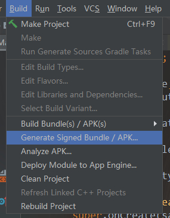
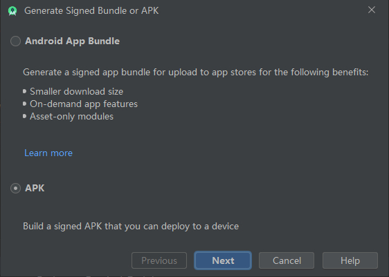
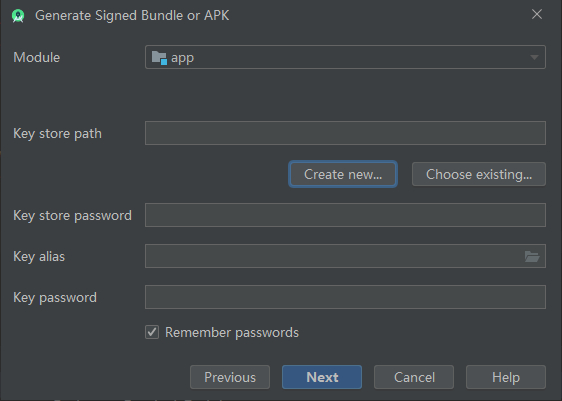
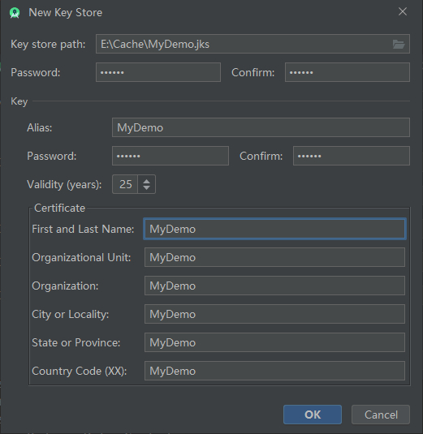
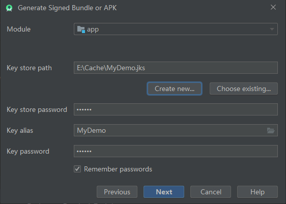
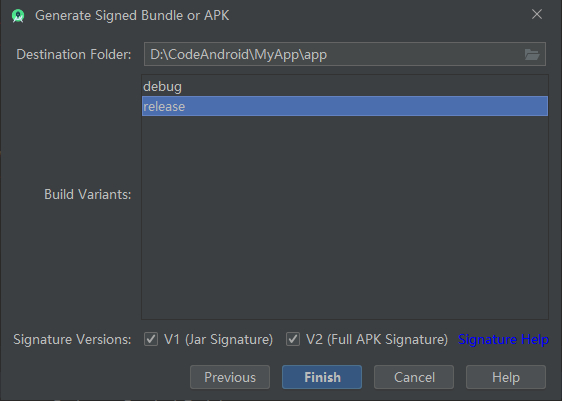

Android源码资源https://android.googlesource.com/

[toc]

# 嵌套Fragment

如果想要在一个Fragment（这里设为One）中嵌套另一个Fragment（这设为Two），可以直接在One的xml文件里面直接使用`<fragment>`标签，如下所示。

```xml
<!-- fragment_one.xml -->
<?xml version="1.0" encoding="utf-8"?>
<androidx.constraintlayout.widget.ConstraintLayout>
    <fragment
        android:layout_width="match_parent"
        android:layout_height="match_parent"
        android:name="com.study.myapp.TwoFragment"
        android:id="@+id/ones_sub_fragment" />
</androidx.constraintlayout.widget.ConstraintLayout>
```

上面OneFragment的xml布局文件中，通过\<fragment\>标签静态添加了另一个TwoFragment。然后在OneFragment的onCreateView方法中通过自己的LayoutInflater的inflate方法来加载View视图，读到\<fragment\>标签中的TwoFragment时，就会同时inflate一个TwoFragment的视图，最后TwoFragment会被放进One的FragmentManager中。

但是当操作一旦复杂起来，如One被切换到后台销毁，又再次显示到前台被创建，它的onCreateView会再次被调用，根据上面的分析，在One使用LayoutInflater加载自己的视图时，会再次加载TwoFragment的视图，然后把TwoFragment加到自己的FragmentManager中。而这时One的FragmentManager中已经存在TwoFragment了，故就会抛出错误。这里给出两个解决方案。

第一种是，在One的onCreateView方法中，每次都先判断自己的FragmentManager中，是否已经存在了布局\<fragment\>标签指定的Fragment，如果已经存在，就先把它移除掉，代码逻辑如下。

```java
public View onCreateView(LayoutInflater inflater, ViewGroup container, Bundle savedInstanceState) {
    Fragment f = getChildFragmentManager().findFragmentById(R.id.ones_sub_fragment);
    if (f != null) {
        // 布局的Fragment已经存在于FragmentManager中，移除之
        getChildFragmentManager().beginTransaction()
                .remove(f).commitAllowingStateLoss();
    }
    View v = inflater.inflate(R.layout.fragment_main, container, false);
    // some things
    return v;
}
```

第二种方法是，不使用\<fragment\>，而是在One的布局文件中使用\<FrameLayout\>标签替代，这样每次都可以通过代码来动态判断，如下。

```java
public View onCreateView(LayoutInflater inflater, ViewGroup container, Bundle savedInstanceState) {
    Fragment f = getChildFragmentManager().findFragmentById(R.id.ones_frame_layout);
    if (f == null) {
        f = new TwoFragment();
        getChildFragmentManager().beginTransaction()
                .add(R.id.my_frame_layout, f)
                .commit();
    }
    /* xxx */
}
```

# 不同Fragment间跳转

若一个只显示单一Fragment的Activity，想在切换不同的Fragment，即在不同Fragment之间跳转，而不重建Fragment，可以使用FragmentTransaction的hide与show方法，如下。

```java
FragmentTransaction ft = getActivity().getSupportFragmentManager().beginTransaction();
List<Fragment> fragmentList = getActivity().getSupportFragmentManager().getFragments();
for (Fragment f : fragmentList) {
    if (f == this) {
        ft.hide(f);
    } else if (/*some conds*/) {
        ft.show(f);
    } else if (/*some conds*/) {
        Fragment fragment = new SomeFragment();
        ft.add(R.id.my_single_frame_layout, fragment);
    }
}
ft.commit();
```

同理，如果要重建可以使用FragmentTransaction的repleace方法，除此之外，它还有remove等一系列方法。

# 覆盖后退键

如果是Activity，可以直接覆盖它的onBackPressed方法，来定制一些特殊的操作。

```java
@Override
public void onBackPressed() {
    Toast.makeText(this, "Going Back", Toast.LENGTH_SHORT).show();
    super.onBackPressed();
}
```

- 上面的调用super.onBackPressed方法后，才会真正退出当前的Activity，在这个方法中调用了Activity的finish方法。

而对于Fragment而言，其没有onBackPressed方法，如果想要当按下后退键时调用Fragment自定义的后退方法，而不是直接退出Activity，因为后退按键默认是交给Activity来处理。那么在Activity的onBackPressed方法中，调用Fragment给定的自实现的后退方法。

基于上述思路，可以在Activity中保存其托管Fragment的引用或者使用FragmentManager来调用Fragment给定的方法。对于单Fragment的Activity可以使用第一种方法，而对于多Fragment或者嵌套Fragment的Activity或Fragment来说应该使用第二种方法。这里给出第二种解决方案的思路。

定义一个可以处理后退按键的Fragment接口，需要处理后退按键的Fragment可以实现此接口，如下。

```java
public interface FragmentBackHandler {
    // 如果该Fragment已经处理了退出事件，则返回true
    // 如果该Fragment不处理退出事件，则返回false交给父容器处理
    boolean handleBackPress();
}
```

定义一个工具类，用来实现分发后退按键的逻辑代码，如下。更优秀的事件分发机制，参看《Android开发艺术探索》第四章。

```java
public class BackHandleHelper {
    public static boolean handleBackPress(FragmentActivity activity) {
        return scheduleHandle(activity.getSupportFragmentManager());
    }

    public static boolean handleBackPress(Fragment fragment) {
        return scheduleHandle(fragment.getChildFragmentManager());
    }

    private static boolean scheduleHandle(FragmentManager fragmentManager) {
        List<Fragment> fragmentList = fragmentManager.getFragments();
        if (fragmentList == null || fragmentList.size() == 0) return false;
        for (int i = fragmentList.size() - 1; i >= 0; --i) {
            if (onHandle(fragmentList.get(i))) {
                return true;
            }
        }
        if (fragmentManager.getBackStackEntryCount() > 0) {
            fragmentManager.popBackStack();
            return true;
        }
        return false;
    }

    private static boolean onHandle(Fragment fragment) {
        return fragment != null && fragment.isVisible() && fragment.getUserVisibleHint()
                && fragment instanceof FragmentBackHandler
                && ((FragmentBackHandler) fragment).handleBackPress();
    }
}
```

对上面的工具类，这里给出一个使用方式的例子，对于要处理后退按键的Fragment来说，它的逻辑如下。

```java
public class MainFragment extends Fragment implements FragmentBackHandler {
    @Override
    public boolean handleBackPress() {
        if (BackHandleHelper.subViewHandleBackPress(this)) {
            return true;    // 如果子元素处理了后退事件，返回true
        }
        if (interceptBackPress()) {
            // 如果要拦截后退事件
            FragmentTransaction ft = getActivity().getSupportFragmentManager().beginTransaction();
            List<Fragment> fragmentList = getActivity().getSupportFragmentManager().getFragments();
            for (Fragment f : fragmentList) {
                if (f == this) {
                    ft.hide(f);        // 隐藏当前Fragment
                }
            }
            ft.commit();
            // 如果要拦截后退事件返回true
            return true;
        }
        return false;   // 不处理后退事件，则交给父容器处理
    }
}
```

在托管类似上面Fragment的Activity中，它的onBackPressed分发实现如下。

```java
public class MainActivity extends AppCompatActivity {
    @Override
    public void onBackPressed() {
        if (!BackHandleHelper.subViewHandleBackPress(this)) {
            super.onBackPressed();
        }
    }
}
```

# 危险权限申请

当Android 6.0以上的系统第一次使用危险权限的时候，需要向用户申请，征得用户同意。且权限是被分为若干权限组的，当用户同意了该权限组中的某个权限后，应用再申请同组的其他权限时，系统会直接同意。

这里以获得外部存储的读写权限为例。

在AndroidManifest中的同\<application>的层级下，添加如下静态权限说明（使用普通权限仅添加静态权限即可）。

```xml
<uses-permission android:name="android.permission.READ_EXTERNAL_STORAGE" />
<uses-permission android:name="android.permission.WRITE_EXTERNAL_STORAGE" />
```

将动态申请权限的代码包装在一个方法中。

```java
public class PermissionHelper {
    public static final String[] PERMISSION_LIST = {
            Manifest.permission.READ_EXTERNAL_STORAGE,
            Manifest.permission.WRITE_EXTERNAL_STORAGE
    };

    public static final int PERMISSION_CODE_NOE = 0x1;

    public static void requestPermission(Activity activity, String[] permissions, int requiredCode) {
        int hasPermission = ContextCompat.checkSelfPermission(activity.getApplicationContext(), permissions[0]);
        if (hasPermission != PackageManager.PERMISSION_GRANTED) {
            ActivityCompat.requestPermissions(activity, permissions, requiredCode);
        }
    }

    // 在要获取权限的activity里面，覆盖接受申请结果的方法，然后调用此方法
    public static void onRequestPermissionResult(final Activity activity, int requestCode, String[] permissions, int[] grantResults) {
        // if (requestCode != PERMISSION_CODE_NOE) return;    // 请求码不匹配
        // 用户同意权限申请
        if (grantResults.length > 0 && grantResults[0] == PackageManager.PERMISSION_GRANTED) return;
        // 到这里就是用户拒绝了权限申请，然后判断是否再次显示权限申请界面
        // 下面的should方法返回true，表示申请权限被用户拒绝，则接下来显示再次申请
        // 若下面should方法放回false，表示用户已经同意了权限申请，或者拒绝并选择了不再提示
        if (ActivityCompat.shouldShowRequestPermissionRationale(activity, permissions[0])) {
            // 到这里说明用户拒绝权限，应该给一个提示，例如用一个提示框
            new AlertDialog.Builder(activity)
                    .setMessage("Need Permission.")
                    .setPositiveButton("OK", (dialog, which) ->
                            ActivityCompat.requestPermissions(activity, permissions, requestCode)
                    )
                    .setNegativeButton("CANCEL", null)
                    .create()
                    .show();

        }
    }
}
```

一般在LAUNCHER的activity的onCreate()中调用动态申请权限的代码，然后注意接受申请结果。

```java
public class MainActivity extends AppCompatActivity {
    @Override
    protected void onCreate(Bundle savedInstanceState) {
        super.onCreate(savedInstanceState);
        setContentView(R.layout.activity_main);
        // 申请权限
        PermissionHelper.requestPermission(this, PermissionHelper.PERMISSION_LIST, PermissionHelper.PERMISSION_CODE_NOE);
    }
}

// 在要获取权限的activity里面，覆盖接受申请结果的方法
@Override
public void onRequestPermissionsResult(int requestCode, String[] permissions, int[] grantResults) {
    PermissionHelper.onRequestPermissionResult(this, requestCode, permissions, grantResults);
}
```

# Android常用尺寸单位

Android开发中常用的尺寸单位有如下几种：

- dp，即设备无关像素（device independent pixels，dip），这种尺寸单位在不同的设备上，所表现出的物理大小相同，即1dp在不同的设备上物理大小是相同的。这是一种虚拟尺寸。
- px，即像素（pixels）。
- in，即英寸（inch），1英寸约等于2.54厘米，主要用来描述手机屏幕的大小。
- pt，通常用来作为字体的尺寸单位，1pt相当于1/72英寸。
- sp，通常用来作为字体单位，它即会在不同的屏幕上保持相同的物理尺寸，又可以根据用户的设置来进行一定程度的缩放。这是一种虚拟尺寸。

手机屏幕的dpi（dots per inch），指的是每英寸的像素个数，这个数值可以用DisplayMetrics.densityDpi来保存。规定以160dpi为基准，用DisplayMetrics.density来表示一个屏幕当前dpi与基准dpi（160）的比值，如下。

```java
DisplayMetrics dm = getResources().getDisplayMetrics();
Log.i("TAG", "densityDpi = " + dm.densityDpi);
Log.i("TAG", "density= " + dm.density);
```

对于Android手机来说，常见的dpi及DisplayMetrics.density其密度有以下几种：

|  表示  | 表示范围 | 通常代指 | DisplayMetrics.density |
| :----: | :------: | :------: | :--------------------: |
|  ldpi  |  0~120   |   120    |          0.75          |
|  mdpi  | 120~160  |   160    |           1            |
|  hdpi  | 160~240  |   240    |          1.5           |
| xhdpi  | 240~320  |   320    |           2            |
| xxhdpi | 320~480  |   480    |           3            |

选择160 dpi作为基准，它人为地建立起了dp与px间的关系，即**在dpi为160的Android设备上，令1dp=1px**。有了这个基准和规定后，就可以很方便地在不同设备间进行dp和px的单位转换了。显然$px=dp\times density$

同样，DisplayMetrics也有一个成员scaledDensity，即DisplayMetrics.scaledDensity，它表示的缩放密度，通常与字体有关，计算公式为$scaledDensity=density\times fontScale$，其中fontScale代码用户设定的字体缩放比例，默认为1。

那么字体的sp和pt单位的转换就是$px=sp\times scaleDensity$

上面的分析都可以参看系统提供的工具类TypedValue验证。

# Android Dalvikvm

Dalvikvm全称是Dalvik virtual machine（DVM），即安卓虚拟机，它是Google公司设计的用于Android平台的Java虚拟机，不同于其他堆栈结构的Java虚拟机，Dalvik采用的是基于寄存器的架构。每一个Dalvik应用都作为一个独立的Linux进程执行。

Android平台不用JVM来执行代码，而是把应用编译成Dalvik字节码，使用Dalvik虚拟机来执行，最终的应用只包含Dalvik字节码。DVM的编译过程可简单概括为：.java->.class->.dex。

其中.dex是专门为Android虚拟机DVM设计的一种压缩格式，DVM支持已经转换为.dex格式的java应用程序的执行。实际上，.dex其实就是DVM的可执行文件格式，即Dalvik Executable。

Dalvik虚拟机与Java虚拟机最显著的区别就是它们分别具有不同的指令集以及文件格式，Dalvik虚拟机使用的指令是基于寄存器的，而Java虚拟机使用的指令集是基于堆栈的。Dalvik虚拟机使用的是dex格式的类文件，而Java虚拟机使用的是class格式的类文件。

而APK（Android application package）是Android OS使用的一种应用程序包文件格式，用于分发和安装应用及其中间件，APK文件基于ZIP文件格式，与JAR文件的构造方式相似。一个APK文件内包含有被编译的代码文件（.dex文件），文件资源（resource）、原生资源文件（assets）、证书（certificates）、和清单文件（manifest file），它们的简介如下。

- META-INF，文件夹（.jar文件中常见）
  - MANIFEST.MF，清单文件。
  - CERT.RSA，保存着该应用程序的证书和授权信息。
  - CRET.SF，保存着SHA-1（Secure Hash Algorithm 1，安全散列算法1）的信息资源列表。
- res，APK所需的资源文件夹。
- AndroidManifest.xml，一个传统的Android清单文件，用于描述该应用的包名、版本号、所需授权、注册的服务、链接的其他程序等。该文件使用XML文件格式，可以编译为二进制的XML，使用的工具为AXML Printer或Apktool。
- classes.dex，它是通过dex编译后的文件，用于在Dalvik虚拟机上运行的主要代码部分。
- resources.arsc，程序的语言文件，可以通过AndroidResEdit等工具进行翻译，也可以用Apktool等工具进行反编译后再开始进行软件修改。

# Android Studio发布APK

首先选择工具栏中的Build选项，在其子目录中找到如下选项。



弹出的界面如下所示。



选择APK，点击Next。



这里需要开一个密钥库，如果没有密钥库，可以点击Create new...新建一个，如下。



- Key store path，选择创建密钥库的位置及秘钥库的文件名。
- Password（第一个），为密钥库创建并确认一个安全的密码。
- Alias，为密钥输入一个标识名。
- Password（第二个），为密钥创建并确认一个安全的密码，此密码应当与密钥库选择的密码不同。
- Validity(years)，以年为单位设置密钥的有效时长。密钥的有效期应至少为25年，以便开发者可以在应用的整个生命期内使用相同的密钥签署应用更新。
- Certificate，证书中是一些关于开发者的信息。此信息不会显示在应用中，但会作为APK的一部分包含在证书中。

选择密钥库之后，如下。



点击Next，进入下面最后一步。



注意要全面勾选V1和V2。其中V2是一个从Android 7.0系统出现的新的签名机制，这个新机制使得apk的签名方式更加安全，首先我们应该尝试把V1和V2两个选项全部勾选，并尽可能的去使用他们，但是如果全部勾选完毕出现了问题，那么我们可以忽略这种新的签名机制，只勾选第一个选项(V1)，依旧使用我们之前老的签名机制。进行完上面的步骤，APK就已经签名成功了。

点击Finish按钮，等待Android Studio编译完成后，就可以在app/release目录下找到发布的apk文件了。
