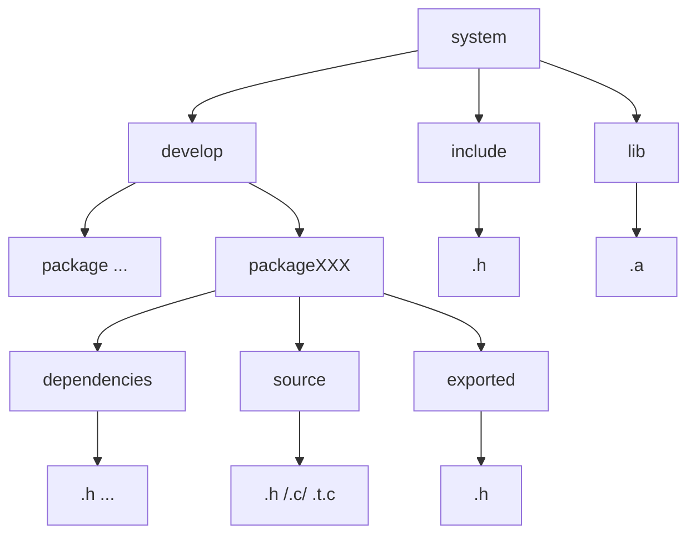
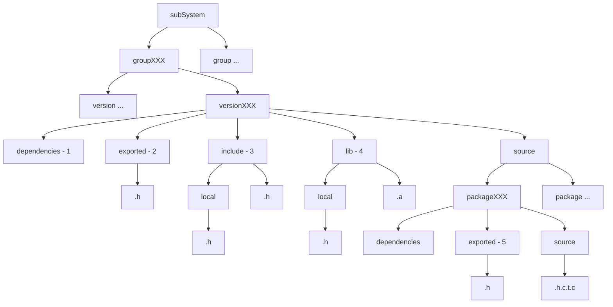
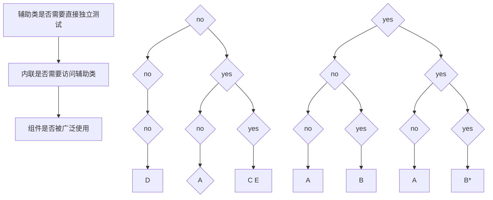

> **《大规模C++程序设计》**
>
> ***Large C++ Software Design***
>
> ***[美]John Lakos著，刘冰 张林译，周尚波审校，机械工业出版社，2014***

[TOC]

# 一、基础知识

## （一）概述

耦合（C++系统中）即指互相依赖的程度。可能遇到问题的一些具体实例。循环依赖导致紧密物理耦合。过度的链接时依赖：即开发一个具有大量代码功能完善但绝大多数客户没有使用大部分的类或组件（包括它本身实现所需的头文件等依赖）。过度的编译时依赖：包含一个头文件中的包含头文件中的包含头文件……，当有一个低级头文件需改动时，会引起许多编译单元重新编译。或包含众多乃不必要的头文件。全局标识符的广泛应用可能会引发问题，应尽可能规划好区域。逻辑设计和物理设计，避免选择组件之间隐含物理依赖关系的逻辑设计。为了能够成功的重用，组件或子系统一定不要与一大段不必要的代码绑定在一起，即必须能够重用所需要系统的一部分，同时不必链接系统的其他部分。质量有许多个维度，如可靠性、可用性、可维护性、性能等，必须在项目的最早期就考虑质量的各个方面，否则一旦设计完成，根本无法优化产品的质量。

## （二）符号的特性

一个声明将一个名字引入到一个程序中（引入作用域），一个定义提供了一个实体（例如类型、实例、函数）在一个程序中的唯一描述。另一方面，在文件作用域中的声明也是定义，因此在一个给定的作用域内不能出现超过一次。注：函数和静态数据成员声明是例外，不过它们虽然没有定义，但是在一个类中的定义也不能重复。

编译一个`.c`（实现文件）时，C预处理器（C Pre-Processer，CPP）首先递归地包含头文件，形成包含所有必要信息的单个源文件。之后，编译这个中间文件（称为编译单元）生成一个和根文件名字一样的`.o`文件（目标文件）。链接程序把各编译单元内产生的符号（在.o文件中）链接起来，生成一个可执行程序。有两种不同的链接：内部链接和外部链接。链接类型将会直接响影我们如何将一个给定的逻辑构造合并到物理设计中。

### 1. 内部链接和外部链接

如果一个名字对于它的编译单元来说是局部的，并且在链接时与其他编译单元中定义的标识符名称不冲突，那么这个名字有内部链接。意味着对这个定义的访问受到当前编译单元的限制，它在.o文件中没有符号，即一个有内部链接的定义对于任何其他编译单元都是不可见的，因此在链接过程中不能用来解析未定义的符号。为了让内定义可影响其他应放在`.h`头文件中。

如果一个名字有外部链接，那么在多文件程序中，在链接时这个名字可以和其他编译单元交互。意味着这个定义不局限于单个编译单元，它在.o文件中具有这个外部链接定义产生的外部符号，这些外部符号可以被所有其他编译单元访问，用来解析其他编译单元中未定义的符号。注：这种外部符号在整个程序中必须是唯一的，否则这个程序不能链接。

### 2. 常见内部/外部链接

内部链接：关键字static、枚举的定义和声明是同时的、结构和类的声明定义（描述）、内联函数的定义、typedef声明。

外部链接：非内联成员函数（包括静态成员）、非内联、非静态free函数（即非成员函数）、默认声明定义、静态类的数据成员（在类定义内声明，在.c文件中）。

注：非成员函数始终是指free函数而不是指友元函数，一个free函数不必是任何类的友元，而应该是指一个实现细节。C++编译器会在任何可能地方把一个内联函数调用替换成内联函数体，而不将任何符号引入.o文件。但有时出于种原因，例如递归或动态绑定，编译器会选择制定一个内联函数的静态拷贝。这个静态拷贝只是将一个局部符号引入当前的.o文件，这个符号不能与外部符号交互。

一个声明只对当前编译单元有用，所以声明本身根本未将任何内容引入到.o文件，每个声明（有的）只是命名了一个外部符号，让当前编译单元在需要的时候能够获取相应的全局定义的访问。这实际使用的是符号名（例如调用函数）而不是声明本身，将会在.o文件中加入一个未定义的符号。

### 3. 注意

不要将一带有外部链接的定义放置在一个.h文件的文件作用域中。在.h头文件的文件作用域内放一个带有内部链接的定义虽然合法，但却会污染全局名字空间（应放在类中）。在.c实现文件中的文件作用域内应避免定义那些未被声明为静态的数据和函数（因为它们有外部链接且可能在全局名字空间中与其他类似的名字冲突）。不想将实现暴露在编译单元外部，可用带有内部链接的：内联函数、静free函数、类声明、枚举定义、static的非成员对象、（默认）const数据、typedef声明、预处理宏指令。（不过typedefs和宏指令在C++中用处有限，滥用有害。）

## （三）设计规则、指南、原理（示例）

- 主规则：

保持数据成员私有。并提供适当的访问函数和操纵函数，即使改变了类内部的表示，也不必重新编写客户端程序的代码。注：对于完全隐藏（不是私有地隐藏在另一个类的内部，就是局部地隐藏在一个.c文件的内部）的一个结构体或类的数据成员的公共访问是一个单独的问题，不适用上述规则。当数据成员不是私有时，通过使用关键字struct而不是class来表示有意缺少的封装更合适。

避免在文件作用域内包含带有外部链接的数据。可以用类封装，将构造函数设为私有，提供静态get方法以获得唯一对象实例。聚合到包装中。

避免在.h文件作用域内使用自由函数（运算符函数除外），在.c文件中避免使用带有外部链接的自由函数（包括运算符函数）。自由函数可分组到一个只包含静态函数的工具类（结构体）中（虽不是最佳但减少全局命名污染）。

避免在.h文件作用域内使用校举、typedef和常量数据，应限定在诸如类的作用域内定义等。

除非作为包含卫哨，否则应该避免在文件中使用预处理宏。

在一个.h文件的文件作用域中只应该声明类、结构体、联合体和自由运算符函数，在.h文件作用域中只应该定义类、结构体、联合体和内联（成员或自由运算符）函数。

在每个头文件的内容周围放置一个唯一且可预知的（内部）包含卫哨，在每个头文件的预处理器包含指示符周围放置冗余的（外部）包含卫哨，例#ifndef xx  #include xxx  #endif，应注意xx和xxx中的卫哨一致。

- 次规则：

使用一个一致的方法（像d_前缀）突出类数据成员。使用一个一致的方法（像首字母大写）区分类型名字。使用一个一致的方法（像所有字母下写和添加下划线）识别储如枚举、常量数据和预处理器常量等不变的值。

- 指南：

将接记录成文档，以供其他开发者使用；除接口的设计者外，每个接口至少要经过一个其他开发者的审查。

明确给出未定义行为出现的条件。实现代码时，使用assert语句有助于对假设条件编写文档。

标识符名称必须一致，使用大写字母或下划线来分隔标识符单词，但不能同时使用大写字母和下划线。以相同方式使用的名称必须一致；特别是对于诸如选代之类的循环设计模式，要采用一致的方法名称和运算符。

# 二、组件

逻辑设计关系如：IsA、HasA、HoldsA、Uses、WasA、Uses-In-The_Interface、Uses-In-The-Implementation。物理设计关系：Depends On。物理设计只解决体系结构问题，物理设计解决文件目录组织问题。

## （一）组件定义

组件是物理设计的最小单位，是合适的设计基本单位。一个组件恰好由一个头文件`.h`和一个实现文件`.c`构成（它两个内部物理耦合）。组件和类不是等于关系。

一个组件的逻辑接口（定义在头文件中类型和功能的集合，不含私有）是以编程方式可访问或可被用户检测到的。一个组件的“公有”接口由该组件.h文件中声明的所有公共成员函数、typedef、枚举和自由（运算符）函数的集合组成。如果一个类型用于任何类定义的公有的（或受保护的）接口中，或者在一个组件的.h文件作用域声明为任何自由（运算符）函数，则这个类型就是一个组件的Used-In-The-Interface。

一个组件的物理接口由它头文件.h中所有可利用的信息构成（不考虑访问权限）。组件的.h文件中包含的信息越多，对组件的实现的修改就越有可能影响客户端程序，导致客户端需要重新编译。如果一个类型在组件的任何地方都通过名字引用，则这个类型就是组件的Used-In-The-Implementation类型。

## （二）一些规则

- 主规则：

在一个组件内部声明的逻辑实体，不应该在该组件的外部定义（类声明除外）。每个组件的.c文件都应该将包含它自己的.h文件作为第一行独立的代码。

若在一个组件的.c文件中带有外部选接，避免在相应的.h文件中没有显式声明。避免通过局部声明访问另一个组件中带有外部链接的定义，正确的做法是包含该组件的.h文件。

- 次规则：

组成一个组件的.c文件和.h文件的根名称应该完全匹配。通过确保一个组件的.h文件自动解析——不提供外部的声明或定义，可以避免潜在的使用错误。

## （三）依赖

### 1. 依赖定义

如果为了编译或链接组件y，需要组件x，则组件y依赖于（Depends On）组件x。如果编译y.c时需要x.h，那么组件y呈现了对组件x的编译时依赖。如果目标文件y.o（由编译y.c生成）包含未定义的符号，且标文件y.o在链接时可能直接或间接地调用x.o以帮助解析这些符号，那么就说明组件y呈现了对组件x的一种链接时依赖。一个编译时依赖几乎总是隐含一个链接时依赖。组件的Depends On关系是可传递的。

定义了某个函数的组件，通常会物理依赖于定义了某个类型的任意组件，该组件定义了函数所使用的类型（Uses、In-The-Interface、In-The-Implementation）。如果一个组件定义了IsA或HasA用户自定义类型的一个类，那么该组件总会编译时依赖于定义了该类型的组件。

从一个类型派生（IsA）或将实例嵌入（HasA）一个类型总是意味着一个类将在编译时依赖该类型，实际上，这些逻辑关系所表明的编译时依赖不仅存在于类本身，也存在于这个类的任何客户端程序。如果一个类拥有（HoldsA）类型，就是说如果对该类型有一个指针或引用作为一个数据成员，或者该类型被实质性地用在一个非内联函数体中，那么就不一定隐含这种强物理耦合。

### 2. 提取实际的依赖

仅凭C++预处理器#include指令所产生的包含图，足以推断出一个系统内提供系统编译的所有物理依赖。如果组件×直接实质性地使用了组件y，那么为了编译x，编译器就必须查看y.h提供的定义。唯一般做到这一点的就是组件×直接或间接地包含y.h。其逆否命题“如果x不包含y.h，那么x就没有对y的编译时依赖”也成立。故，只有当组件x实质性地直接使用了一个类或定义在y中的自由运算符时，组件x才应该包含y.h。设计则规规定，所有对一个组件的实质性使用都必须通过包含它的头文件（而不是通过局部的外部声明）来标记，以保证包含关系的传递为闭包，表明组件之间所有实际的物理依赖。

### 3. 封装

若组件无法通过一个组件的逻辑接口，以编程的方式访问或检测一个所包含的实现细节（类型、数据或函数），则称该组件封装了该实现细节。一个组件内的友元关系是该组件的一个实现细节。为在相同组件内定义的类授权（局部的在同一组件头文件中）友元关系不会违反封装，避免将（远距离的）友元关系授权给在另一个组件中定义的逻辑实体。对一个定义在系统单独物理部分的逻辑实体，授权（远距离的）友元关系，会违反授权予该支元关系的那个类的封装。在同一个组件内连同一个容器类一起定义一个迭代器类（声明友元，容器/选代器模式），可以在保持封装的同时，使客户端程序可扩展，提高可维护性并增强可重用性。远距离的友元关系影响访问特权，但是不影响隐含依赖（自由函数是否是一个类的友元绝不会影响系统中任何隐含的物理依赖）。

### 4. 测试

隔离测试、分层测试、增量式测试、回归测试。可测试设计（Design For Test，DFT），可测性（testability）是设计伊始的目标。

非循环物理依赖（Acyclic physical Dependencies）系统远比循环物理依赖的系统更易于有效测试，因为它（至少）存在一个测试系统的合理顺序。

隔离测试是指独立于系统的其他部分对单个组件或子系统进行测试。分层次测试是指在物理层结构的每一层上对单个组件进行的测试（分层测试的每个组件需要一个独立的测试驱动程序）。增量式测试是指只测试真正在被测试组件中实现的功能（特定组件添加的新功能）。白盒测试是指通过查看组件的底层实现来验证一个组件的预期行为；黑盒测试是指仅基于组件的规范而不了解其底层实现来验证一个组件的预期行为。

选择在合适的时机建立彻底的回归测试。考虑使用条件编译来测试等。

### 5. 层次

非循环物理依赖，将组件基于物理依赖划分成等价的类，称为层次，并分配一个非负整数索引，为层次编号，定义为其节点到初始输入（0层次，在我们包之外的组件）的最长路径。0为外部组件，1为无依赖组件（可依赖外部组件），N为最长N-1层依赖。

#### (1) 累积组件依赖

系统的累积组件依赖（Cumulative Component Dependency，CCD）是一个求和量，是对一个子系统内所有组件进行增量测试时，测试每个组件 Ci 时所需要的组件数量的总和。CCD提供的数值预示开发和维护一个特定子系统的相对开销，预示链接时间，测试时磁盘开销，系统的耦合程度。常见有：CCD[循环依赖图, N] = N^2^，O(N^2^)。CCD[平衡二又树, N] = (N+1) * (log2(N+1) - 1) + 1，O(NlogN)。

#### (2) 平均组件依赖

系统中的平均组件依赖（Average Component Dependency，ACD）是指一个子系统的CCD与系统中的组件数量N的比值：ACD = CCD / N。预示规范变化时所预期的开销。ACD越小，一个体系结构越扁平，软件规范的变化对整个系统产生影响的可能性就越小。

#### (3) 标准累积组件依赖

系统中的标准累积组件依赖（Normal Cumulative Component Dependency，NCCD）是指包含N个组件的子系统CCD值与相同大小的树型系统CCD值的比值：NCCD = CCD[子系统, N] / CCD[平衡二叉树, N]。

#### (4) 一些指标

一个重直的链是可层次化配置且有最高的CCD值的，其CCD值为N(N+1)/2。因此，CCD大于N(N+1)/2就说明至少有一个循环依赖存在。如果NCCD的值小子1.00，则可认为是较“水平化的”或松散耦合的，这样的系统可能没有使用多少重用；如果NCCD的值大于1.00，则可以认为是较“垂直的”或紧密藕合的，这样的系统可能正大量地重用组件；如果NCCD远大于1.00，则表明在系统中可能有明显的循环耦合。

# 三、层次化技术

与升级（escalation）和降级（demotion）相关的技术可把设计中的循环依赖部分地移到不同的物理层次上；不透明指针（opaque pointer)和哑数据（dumb data）被用来删除物理意义上的概念依赖；冗余（redundancy）和回调（callbacks）可用于防止不必要的物理依赖。管理类及两种通用技术（分解封装和升级封装）可助于建立高效、可测试性和可重用组件的封装层次。

## （一）升级

如果组件y在比组件x更高的层次上，并且y在物理上依赖x，则称组件y支配（dominate）组件x。支配是一种组件之间的属性。

对于两或多个循环相互依赖的组件，可以通过将引起循环依赖的功能部分移动一个更高层次上来避免让一个组件支配另一个组件，该技术称为升级（escalation）。如果同层次的组件是循环依赖的，那么就有可能把互相依赖的功能从每一个组件升级为一个潜在的新的更高层次组件（依赖于每一个初始组件的）静态成员。如定义某某Util使用关键字struct而不是class暗示这个类型只是为公共嵌套类型和公共静态成员函数提供一个作用域，在这个约定中，一个struct的所有成员都是公开的，没有数据成员。（虽然创建这样一个类型的实例是无意义的，但它不会造成真正的危害。）

## （二）降级

如果同一层次的组件循环依赖，那么就有可能把互相依赖的功能从每一个组件降到一个潜在的较低级（共享）新组件中，每一个原来的组件都依赖于这个新组件。

把公用的功能从两或多个组件中分解推到更低的物理层次的技术，在那里公共功能可以被共享甚至也可以被重用，该技术称为降级（demotion）。把一个具体的类分解为两个包含更高和更低层次功能的类可以促进层次化。将一个抽象的基类分解成两个类：一个类定义一个纯接口，另一个类定义它的部分实现，可以促进层次化。

- 升级，通常基于组件整体的操作；降级，通常在组件之内的部分公用功能。两者紧密相关，特性区别仅仅是功能移动的方向不同（都是通用重组装技术的特例）。要注意统一使用。

## （三）不透明指针

如果编译组件c（或函数f）时首先要求先看到T的定义，编译器要知道T的大小和布局，则称组件c（或函数f）实质（in size）使用了类型T。如果编译组件c（或函数f）以及其可能依赖的任何组件时不要求首先看到T的定义（只看到声明便可），则称组件c（或函数f）在名义（in name）上使用了类型T。只在名义上使用一个类型的意义在于这种用法没有隐含物理依赖，即使是在链接时，从而耦合就全部消除了。如果一个指针所指类型的定义不包含在当前的编译单元中，这个指针就被称为是不透明的（opaque）。

如果一个被包含的对象拥有一个指向其容器的指针（此处容器不同于STL的容器，而是包含某对象的更大的类），并且要实现那些实质依赖那个容器的功能，可通过以下方法消除相互依赖：

1. 让被包含类中的指针不透明，

2. 在被包含类的公共接上提供对容器指针的访问，

3. 将被包含类受影响的方法升级为容器类的静态成员。

这个体系结构变化的一个直接结果是，客户程序必须执行两个操作而不是一个操作。注：当把功能从被包含对象移到容器时，新静态成员的第一个参数必须：要么是一个const引用，要么是一个指向被包含对象的非const指针，这分别取决于原来的成员是一个const还是一个非const函数。

## （四）哑数据

哑数据（dumb data）是对不透明指针概念的一种泛化。一个对象拥有但不知道如何解释的任何类的信息都是哑数据，这样的数据，必定用在另一个对象的上下文中，通常用在一个较高的层次上。

哑数据可能比不透明指针更方便并且偶尔会更简洁。用哑数据索引方式来标识子对象存储而不是机器地址，包含较实际的意义，可以被显式测试，但其也许对子系统的客户是毫无意义的。因此使用哑数据是封装子系统的一种典型的优化实现技术，而且这种技术不会使子系统在一个系统的较高层次暴露。总之，哑数据可以打破in name only依赖，促进易测试性并缩小实现，不过它确实牺牲了相当程度的类型安全。但是不透明指针可以同时保持类型安全和封装，而哑数通常不能。哑数据的使用是典型的低层次实现细节，通常不会暴露在较高层次的子系统的接口中。

## （五）冗余

任何种类的重用都隐含着某种形式的耦合，当重用的数量比较多时，通常适合将通用代码降到一个较低的层次，在较低的层次上可以共享这些代码。但注意，在单个的子系统内也有一个阈值，在此阈值之下重用外部功能未必有益，有些重用产生的耦合可能会超过该重用带来的好处。当功能存在于一个独立的物理单位中并且对其重用较少，且重用因为会产生大量耦合而不再划算时，冗余是必要的。冗余是指为了避免由重用引起的不必要的物理依赖而故意重复代码或数据的技术。提供少量的冗余数据可以只在名义上使用一个对象，从而消除链接到那个对象类型定义所用的开销。注意和之前的技术结合使用。

## （六）回调

回调函数是一个函数，由客户提供，允许一个通常是较低层次的组件利用回调行为，该行为需要通常是较高层次的上下文。虚函数用来实现一个类型安全的回调函数机制。回调函数是打破协同操作类间依赖的强有力工具。回调方法对于图形学和基于事件的程序设计是极其重要的。

但如果不适当地使用，回调方法可能会模糊低层次对象的职责并导致不必要的概念上的耦合。通常，回调（像递旧一样）可能比传统函数调用更难以理解、维护和调试。它们的（伪）异步特性需要开发人员给予一种不同类型的关注。作为一个准则，回调应该被当作是最后求助的避难所。

## （七）管理类

建立清晰的协同操作对象所有权对良好设计是必不可少的。如果两个或更多的对象彼此共享所有权，那么该功能应该升级到一个管理者类。建立层次化的低级对象的所有权，使系统更易于理解和更易于维护。

## （八）分解封装

分解（factoring）的意思是提取小块的紧密结合的功能（数据），并把它们移到一个较低层次上，以便它们被独立地测试和重用。继承关系对这种分解比较理想。分解是减轻循环依赖类所强加负担的一种非常普通而高效的技术。分解和降级类似，只是分解的行为不一定消除循环。它只是减少参与到循环中的功能的数量。分解的效果是将循环依赖升级到一个更高层次，在此层次上其不利影响较不显著。在不可避免循环物理传赖的地方，将其升级到尽可能高的层次可减少CCD，甚至可以使循环被大小便于管理的单一组件代替。

## （九）升级封装

可以将大量有用的低层次类隐藏在单一组件的接口后面，使依层次类型没有用在那些定义子系统总接口的组件的接口上，这样的组件称为包装器（wrapper）。确保无法通过编程的方法来访问隐藏在包装器真正封装接口后的低层次实现的对象，可以用包装器组件来封装一个子系统内部实现类型的使用，同时允许其他类型通过它的接口，即用附加支持类（最大程度私有化接口，让包装器成为友元），放在同一个包装器组件内，为避免额外函数调用开销，包装器所有函数定义为内联。该技术为升级级封装。

# 四、隔离

隔离是一个物理设计问题，它的逻辑相似物一般称为封装。有类的封装，组件的封装，定义在层次结构子系统的头文件的文件作用域中类的封装，在每种情况下都重要的方面如下：某些细节是某些实体的一部分，细节是不能通过该实体的定义接口以编程方式访问的。即使使用封装接口，要隐藏专有实现也是困难的，内联函数由于将算法细节暴露给客户端，还会使问题更严重。

客户端有权要求一个组件的逻辑接口保持不变，在理想情况下，对一个组件的逻辑实现的修改不应该影响客户端程序。但在现实中，C++编译器依赖于头文件中的所有信息，包括私有数据。如果通过检查头文件来决定一个组件的实现策略，一旦该组件的实现策略发生了改变，那么组件的客户端程序很可能将会被迫重新编译。

有任何部分实现驻留在组件的头文件中，组件都不能将客户端程序与其逻辑实现的部分“隔离”。如果在被修改、添加或删除时一个被包含的实现细节（类型、数据或函数）不会迫使客户端程序重新编译，则称这样的实现细节被隔离了。

封装用于防止通过编程的方式来访问类的实现，而隔离消除了与组件的实现进行直接交互作用的任何可能。

通过使用下列结构，逻辑实现（.c文件）可以成为物理接口（.h文件）的一部分，从而无法隔离：继承（IsA）、分层（HasA/HoldsA）、内联函数、私有成员、保护成员、编译器生成的函数、包含指令、默认参数、枚举。都将被迫造成编译时耗合。

一般来说，隔离的目标是让客户端程序避开与已知不必要的封装实现细节相关的编译时依赖。隔离并不意味着能避免客户端程序通过编程方式来访问接口，或损坏类型安全。

## （一）局部隔离（指导性）技术

### 1. 移除私有继承

移除私有继承，使用一个不透明指针外向指向基类（注意处理好赋值语义等），不使用访问声明（base::func之类）来有选择的发布私有基类的成员，而是定义新的非内联成员函数，来转发调用请求给定义在基类中的相应函数。基类和派生类方法都要为非内联。

### 2. 消除嵌入数据成员

消除嵌入数据成员，可以通过将某个实现类的所有嵌入实例转换为指向那些类的指针（或引用），然后在类的构造函数，析构函数和赋值运算符中显式地管理这些指针，使客户端程序与单个实现类隔离。注意如何通过内联函数访问性能关键型数据成员的。

### 3. 消除私有成员函数

消除私有成员函数，将类的私有成员函数（在物理接口中）移植到一个组件的物理实现（.c文件）的文件作用域内声明定义成静态（static消除外部链接）自由函数或移植到另一组件（工具类）中作为公共静态成员函数，注意用参数是供函数对类操作的权限。

### 4. 移除保护成员

移除保护成员，基类的保护或员函数为派生类作者提供便利（如助手函数来实现虚函数等），但会给基类的一般用户造成额外开销，一些保护助手函数可移到一个独立的组件工具类中，但是从该基类中分离出部分实现需要更全面的努力。通过将类的纯接口和部分实现分解为两个独立的类（Class和ClassImpl），能将它们从物理上分开。通过将纯的接口（协议）放入一个独立的组件中，可使一般用户与实现细节隔离。

### 5. 消除私有成员数据

消除私有成员数据，私有静态成员数据的移除相对容易，只要内联成员函数（或远距离友元）不要求直接访向，通常有可能将静态成员数据移到组件的.c文件中，定义为文件作用域中的一个静态变量。可如之前从一个纯接口中继承不同的实现。

### 6. 移除编译器生成的函数

移除编译器生成的函数，显式地定义这些如构造、拷贝构造、析构函数和赋值运算符等。

### 7. 移除包含指令

移除包含指令，将头文件中所有不必要的包含指含移动到.c文件中，并且用适当的前向类声明替换它们。

### 8. 删除默认参数

删除默认参数，可用多个等价的不提供相应参数，而直接在函数体中使用的函数来替代有默认参数值的函数。

### 9. 删除枚举类型

删除枚举类型，合理使用枚举类型、类型定义（typedefs）以及其他在接口上有内部链接的结构，对于获得良好的隔离是必如不可少的，校举状态值应分发到合适的细件中并且不要试图重用它们，减少耦合。

## （二）整体隔离技术

### 1. 协议类

协议类，是近乎完美的隔离器。它是一个抽象类，满足：

1. 既不包含也不继承带有成员数据、非虚函数和任何形式私有或保护成员的类；

2. 有一个为空在.c文件（几乎是空的）中实现的非内联虚析构函数（因为编译器至少需要一个非内联虚函数的实现，以便知道把点虚表放到哪个编译单元）；

3. 没有用户指定的构造函数，除析构函数以外的所有成员函数，包括继承的函数都声明为纯虚函数而不定义。

在一个协议类的部分实现的派生类如ElemImpl（组件）中，可提供构造函数，非构造函数成员的接口中所用到类型的应该保持Elem类型，特别的如赋值运算符还要提供ElemImpl版本的。每个公共的非静态成员函数的声明virtual是可选的，且尽可能声明为非内联的。

创建另一个组件工具类如struct ElemUtil以存放所有公共静态函数，并重新实现（非内联），且包含转发参数来创建ElemImpl返回指针类型的Elem* createElem(xxx);静态函数。

### 2. 完全隔离的具体类

完全隔离的具体类，只保留一个不透明指针，指向包含一个类的所有私有成员的结构，会使一个具体类的实现能够与其客户端程序相隔离。

1. 正好包含一个不透明白指针，指向一个指定该类实现的non-const struct(定义在.c文件中）；
2. 不包含任何形式的其他私有的或受保护的成员；
3. 不继承任何类；
4. 不声明任何虚函数或内联函数。

类的所有私有成员数据和函数都成为一个辅助struct的一部分，该struct在.c文件中完全定义。类只包含指向它的私有指针（在头文件中前向声明struct类型）。注：struct中可能有外部链接，为防止命令冲突，命名应与一般不同，如Example_i）。完全隔离的类的重要特征是改变其表示法不会影响客户端程序理解一个实例的物理布局，因为它的实现（对象布局）永远只是个不透明指针，不管其目的或功能如何，一个完全隔离的类的实例看起来与其他完全隔离的类的实例是一样的。正是这种物理上的一致性，使我们不必以任何方式改变头文件就可以任意重新实现类的接口。所有完全隔离的实现都可以在不影响任何头文件的情况下进行修改。

### 3. 隔离的包装器

单组件包装器，把整体隔离技术（上述介绍）应用到封装的包装器中定义的单个对象上。多组件包装器，无论向时，将一个定义在包装器组件中的类型传递到定义在第二个包装器组件中的一个类型中，第二个组件都不能访问底层所包装的实现对象，那么对远距离友元关系的需求将很快变得很明显，这是违反封装的。尽管如此，若是选择合适的层次，创建多组件隔离包装器还是有可能的。

由于在较高层次上也进行隔离，所以没有必要在低层次上单独对每个组件进行隔离。在这些低层次的组件中，我们可以自由利用紧密的编译时耦合来提高性能（例如内联函数常用于访问数值数据，而对象经常嵌入到其他对象中以避免动态分配的开销）。总之，通过子系统更高层次上的“上游流”(upstream)，编译时耦合的问题已得到解决。为了执行封装，包装器组件本身通常很大，但是它们不是复杂的。包装器组件的一个重要功能是委派和调整复杂的任务，而不是执行它们。在低层次组件中实现的复杂功能可以独立地进行测试重用。包装器测试更多地应该核实，核实全面测试的底层组件是否已正确链接。

尽管信息在包装器层和低层次子系统之间件递时会有很大的开销，但是选择在合适的层次上进行隔离，可以确保对象之间的大部分通信出现在包装器层之下。如果小心设计，隔离不一定会增加很多性能上的负担。总的来说，一个隔离的包装器也是封装的，在不破坏包装器的封装性的前提下，隔离包装器的封装特性允许在别的子系统中独立重用被包装子系统的底层实现组件。也就是说，用于实现包装器的对象都可以通过它们在子系统较低层次上的封装（但通常是非隔离的）接口，自由地进行有效的交互。可将抽象接口组件和具体实现组件隔离。

### 4. 过程接口

过程接口，通常面向对象的大型商业系统（如数据库、框架）有必要为客户提供可编程访向其功能子集的接口（如一种高层次的语言解释器SQL或Scheme等，也经常会提供一个独立的接口，允许用C++式标准C来操纵）。通常包括以下内容：

1. 接口必须提供必要的功能来操纵底层系统；
2. 接口一定不能暴露专属的实现细节；
3. 底层组织的变化必须与客户端程序相隔离；
4. 与该接口相关的开销一定不能过大。

过程接口体系结构不应该彼此依赖，创建和析构不透明指针（常量和非常量的概念），只有过程接口的客户端明确分配的对象，才能由那个客户端程序析构，也就是说所有其他的对象都由系统管理和拥有。

从根本上说，句柄是一个用来引用其他对象的对象，通常一个handle除了持有指向一个“持有的”对象的指针之外，不含其他的。在本书中，句柄是一个类，它持有一个指向对象的指针，可以通过handle类的公共接口编程访向该对象。

## （三）分析与总结

### 1. 使用隔离的指导思想

隔离本身也会造成开销。隔离轻量级的，被广泛使用的，通常通过值这回的对象（如point等），会显著地降低整体运行时性能。除非已经知道性能不是问题，否则，应避免将广泛应用于整个系统的极小的访问底层类实现的函数进行隔离。当一个函数的工作比下隔离的调用开销大得多时，隔离不会引起严重的性能问题。因此，不考虑任何假设的性能需求，如果一个类被广泛地使用并且其成员函都很大，那么这个类的实现就应该隔离；另一方面，有极小的访问函数的高度重用的公共组件可能不应该隔离，降非性能很明显不是一个问题。某些组件不具有通用性，即受众是有限的，隔离也就不再是关键了。

对大型的，广泛使用的对象应尽早隔离，如果有必要，以后可以选择性地删除该隔离。在合适的层次位置上（在该层次下，对象或子系统己经做了大量的工作）实现隔离，在运行时的影响是可接受的。对极小的轻量级经常使用的函数，对象等进行隔离，带来的性能影响是灾难性的。

一般来说，如果一个组件在系统中被广泛地使用，那么其接口应该隔离，但是不是所有的接口都应该隔离。例如，隔离可能是不切实可行的，特别是对轻量级的可重用组件来说。选择不对组件进行隔离的常见原因包括如下几个：

1. 暴露：可能是已知客户端程序的数量很少；
2. 访问数据的时间：该类可能已嵌入了数据并且有效地利用了极小的内联函数来访向它；
3. 创建对象的时间：一个极小的类（例知point）可能未分配动态内存；
4. （初始）开发成本：可能没有令人信服的理由来隔离，额外的开发工作不符合成本效益；
5. 组件的数量：隔离可能要求再有另一个组件（例如，持有一个协议或包装器），从而增加了维护的成本；
6. 组件的复杂性：一个隔离的实现（例如，一个定义在.c文件中“完全隔离”的struct）可能比一个没有隔离的实现更难以理解和维护。

### 2. 部分隔离技术总结

在本章中，作为逻辑封装的物理模拟，我们介绍了隔离的概念。如果一个组件实现细节的修改不会迫使该组件的客户端程序重新编译，则该实现细节被隔离。

确实可能会潜在地导致不希望的编译时耦合的几种结构：

1. 继承、分层迫使客户端程序看到继承或嵌入对象的定义；
2. 内联函数和私有成员把对象的实现细节暴露给了客户端程序；
3. 保护成员把保护的细节暴露给了公共的客户端程序；
4. 编译器产生的函数迫使实现的变化影响声明的接口；
5. 包含指令人为地制造了编译时偶含；
6. 默认参数值把默认值暴露给了客户端程序；
7. 枚举类型会因不合适的放置或不适当的重用而引起不必要的编译时果离合。

在其他情况都一样的情况下，将一个特定的实现细节与一个客户进行隔离比不进行隔离要好，即使其他细节仍然不是隔离的。部分隔离实现技术可用来降低编译时耗合的程度，而不承担整体隔离带来的所有开销，这可能需要：

1. 通过将WasA转化为HoldsA来移除私有继承；
2. 通过将HasA转化为HoldsA关系，来移除嵌入的数据成员；
3. 通过使私有成员函数成为文件作用域内静态的函数，并将它们移到.c文件中，来移除该私有成员函数；
4. 通过创建独立的工具组件或提取协议来移除保护成员函数；
5. 通过提取协议或移动文件作用域的静态数据到.c文件中，来移除私有数据成员；
6. 通过明确地定义来移除编译器产生的函数；
7. 通过移除不必要的包含指令或使用前向类声明来替换它们来移除包含指令；
8. 通过用无效的默认值替换有效的默认值或使用多函数声明来移除默认参数，
9. 通过将枚举类型重新放置到.c文件中，用const静态类成员数据替换它们，或者重新分发枚举类型到使用它们的类中，来移除枚举类型。

### 3. 整体隔离技术总结

对于广泛使用的接口来说，避免对底层实现细节的所有编译时依赖是非常可取的，这里论述了将客户端程序与所有实现细节相隔离的三种一般方法：

1. 协议类：创建抽象“协议”类是一种通用的隔离技术，可以用以分离一个抽象基类的接口和实现。不仅客户端程序在编译时可以与实现细节的变化相隔离，而且可以消除对一个特定实现的链接时依赖。
2. 完全隔离具体的类：一个“完全隔离”的具体类持有一个不透明指针，指向一个全部定义在.c文件中的私有结构，该struct含了以前在原始类的私有部分中的所有实现细节。
3. 隔离包装器组件：封装包装器组件的概念可以扩展为完全隔离包装器组件。包装器一般用于对其他的几个组合甚至整个子系统进行隔离。与过程接口不一样，包装器层需要大量的前期规划和自顶而下的设计。特别是，要小心进行多组件包装器的设计，以避免对远距离友元关系的需求。

过程接口是函数的集合，出现在现有组件集合的顶部，并将功能的一个子集暴露给最终用户。过程接口是完全隔离的一种替代。与之前三种完全隔离技术不同，过程接口既不是逻辑封装，也不是整体隔离。对于还没有进行过程接口设计的非常大的系统来说，过程接口确实有独特的优势。

# 五、系统层次

引入组件作为物理设计的最小单元。一个典型的组件包含一两个直至多个类，且经常伴随着适当的自由运算符。通常一个组件由数百行C++源代码和注释构成，经常有相当长度的.h文件和.c文件。在低层次上定义的组件偶尔会有少于100行的代码，并且，.c文件是空的。有时大型子系统的包装器组件或者机器生成组件有数以千计的代码行，然而，根据经验，就有效的理解、测试和重用而言，良好组件的实际大小是几百行到一千行。

抽象和层次。当从最高层开始设计一个系统时，几乎总是有大型构件作为独立的单元进行抽象讨论是很重要的。较大单元之间的依赖表现为封套（envelope），其聚集构成每个系统的组件之间的依赖关系。

## （一）包

一包（package）就是一个组件集合，组成物理上紧密结合的一个单元。术语包通常是指一个非循环的、层次化的组件集合，通常这些组件的层次集合共同有一内聚的语义目标。在物理上，一个包由一个头文件的集合和一个包含相应目标文件.o信息的单个库文件组成。一个文件系统内部可能组织如：



### 1. 包的依赖

如果包x中的一个或多个组件依赖另一个包y中的一个或多个组件，则称包x依赖包y。包之间的依赖隐含于构成它们的组件之间的单个依赖关系。

通常一个包会拥有许多组件。一个典型的组件可能由0.5K\~1K行源代码组成，一个典型的包可能包含5K\~50K行源代码。

有一些叶子组件，即不依赖于该系统中其他任何组件的组件。在一个未组装的系统中，这些叶子组件都将有一个绝对的组件层次号1。因此许多叶子组件都倾向于落入未组装图表的较低层次，这可能掩盖了它们的目的。通过将这些叶子组件连同它们的客户程序一起组装，可以提高系统的模块性，更易于开发人员理解。

组装还允许系统架构师通过其他方式在更高的抽象层次上理解、论述和开发一个大型系统的整体体系结构。例如，架构师可以描绘一个包的职责，然后指定整体系统设计中完整的包之间可接受的依赖，而不必专注于单个的组件。真正的包依赖可以从源代码中提取，并与架构师的规范说明书相比较。

包作为内聚功能的单元，其大小的确定是自顶向下设计的自然结果，可能由因素影响，但不能说由某某决定。由于有单个组件内的类依赖，包内的组件依赖通常要比跨越包边界的依赖更多更复杂。因为组件有更多局部的性质，相对包间依赖，包内组件之间依赖关系的物理特性常常涉及更多的编译时耦合。

实际上，一些定义在包内的组件可能只是用来隔离定义在同一包内的其他组件的实现细节，这些实现细节组件的头不允许在包外访向。组装也反映了开发组织。通常，一个包由一个开发人员拥有或创作。包的拥有者可以很好地理解一个包内变化的影响，并对之持续有效地处理。跨越包边界的变化会影响其他开发人员，甚至影响整个系统。因此，将系统中高耦合的部分作为单个包的一部分往往比较好。系统的组成部分作为一个单元能被重用的程度也是影响包构成的一个因素。

### 2. 注册包前缀

注册包前缘，避免名称冲突，结构化系统。在每个全局标识符的前面加上它的包前缀。（在文件作用域中只许有类、结构体、联合体和自由运算符）。静态类成员数据和非内联成员函数有外部链接。因此在类名称前加上包前缀是合适的，即使这个类本身在一个.c文件内完整地定义和使用。而在类作用域内声明的标识符不必附加包前缀，因为封闭的类（已经加了前缀）提供了防止突冲的天然屏障，以及相关功能的一个合适分组。类似地，完全在单一的.c文件中声明和使用内部链接标识符也不需要附加前缀，因为在一个.c文件内指定的typedef、枚举类型、静态变量、静态（或内联）自由函数的作用域被限制在一个编译单元内，因而不会与局部定义在另一编译单元内同样的短名字相冲突。在每一个源文件的名字前加上它的包前缀（即在实现某组件的.c文件和.h文件也都要在文件名前面加上同样的前缀）。

命名空间（namespace）通常是用来标识公司或供应商的名字，不推荐用它代替包前缀（包前缀可以唯一地识别物理包中定义的组件或类）。通常结合包前缀和命名空间两种技术来使用。

前缀的用途是给组件或全局逻辑结构定义的物理位置提供层次结构的标识，迫使具有类似前缀的内聚的逻辑功能被打包在同一个物理库内。在理想的情况下，包前缀不仅表示定义的组件或类的物理库，还将反映包的内聚的逻辑特征和组织特征。

我们总觉得一个组件应该是可重用的，结果发现没有其他人需要它。将这样的负担放在高度可重用的包里，比潜在的可重用组件延迟放进pub包还要糟糕。使更多的功能成为公共的总是容易更。若是不确定，最好推迟将组件加入更广泛使用的包里，直到经验证明确实需要。

如果在系统中存在某个组件Btree组件的三个或者更多的兼容版本，这个组件也许是非常好的重用候选项。此时，也许应该考虑一下通过将Btree单一一致版本移到更公用的pub包（并将其前缀改为pub_）来统一系统。注意其系统依赖关系的变动，和组件责任和所有权的转移。

### 3. 包层次化

层次化，用来避免包间循环依赖的技术和那些用来避免组件间循环依赖的技术是相似的。对于多包子系统客户直接使用的组件的子集，不一定总能指定一个包前缀（即放在一个包中）。如某个包同时定义了协议类（本来就是非常低层次的）和包装组件（本来就是非常高层次的），就不可能将在单独的中间层次上实现包的组件隔开，并维持一个可层次化的包层次结构。常见解决方法是提供用来表示的两个单独的包，分别包含不同组件层次上的组件，分布在不同的包层次结构上。

分割系统时，不能简单地将大量可层次化的组件分割成另一个任意的可层次化包的集合。应考虑内聚性，一个包应该由有着相关语义特性、紧密精合的组件和逻辑实体组成，或由其他应该组装在一起，在更高层次抽象对待的组件和逻辑实体组成。将组件并到包中时，依赖也是一个应该考虑的因素。重量组件可放在包前缀类似的单独包中，以运免对轻量级包造成不必要开销（类似Class和ClassImpl）。

标识包和描述它们的相互依赖可以影响较大型项目的成败。最小化包间依赖的开销，在整个设计过程中都应该是每个系统架构师最先要考虑的。最重要的是，如果系统的灵活性和可维护性能够保持的话，避免包间循环依赖的昂贵开销是必要的。

### 4. 包隔离

包隔离，最小化导出头文件的大小和数量，可以提高可用性。有好的组件接口时，我们在包的接口中暴露的细节越少，包开发人员就越容易维护和调整它的实现。最小化暴露给客户端的物理接口的规模也能够提高可用性。其他包要用到的这个包中的组件的头文件要导出。

在实践中，有可能有一些低层次的（横向的）包导出相当大量的逻辑上相关且能被广泛使用的组件的头文件。大部分剩余的包通过操作上通用的，低层次的类型，来实现复杂的功能，理想情况下，这些较高层次的包会导出相对较小的，隔离包装器组件头文件形式的高层次接口。

一旦导出了一个头文件，我们对其接口进行的修改会潜在地影响重用其功能的许多客户端。即使我们保持了这个功能，对一个导出组件的头文件进行的任何修改都将强迫包含该头文件的客户端重新编译。

## （二）群

包群（package group）就是一个包的集合，以物理上内聚的单位为组织。超大型系统中（包含几十万行C++代码），在自顶向下的设计过程中，系统架构师将确定系统的主要部分，每个主要子系统都将由一个开发组来实现；每个子系统将由一个被称为群（group）的包的内聚集合构成。正如相关的组件被收集进包一样，相关的包被收集进群。一个包最初由单个开发人员拥有和维护，但一个包群通常由负责其实现的开发组的项目经理（或首席工程师）拥有。

关于单个包的组成和包之间的互相依赖（例如逻辑内聚性和避免循环依赖）的原理同样适用于整个包群。如果包群g的一个或多个包依赖另一包群h中的一个或多个包，则称包群g依赖包群h。

在一个包群内将协议包降级和将包装器包升级，有助于避免导出包（接口）和非导出包（实现）之间的循环依赖。与类相似，群的包也可分为公共包和私有包。

## （三）层

层（layer）对应于在系统的一个给定层次上的所有包群，在一个给定层次上的所有群都是彼此独立的，同层每一个群的发布过程都可以独立出现。坚持让一个给定层次上的所有群都在更高一层次的群的发布过程开始之前发布可以布简化发布过程。

## （四）发布过程

内部发布是任何大型开发项目的组成部分。群通常是发布的最小功能单元。每个一段固定的预定时间间隔，一个包群的代码就会被冻结，并开始建立一个稳定的内部发布过程。发布一个包的过程是以一种有秩序的，向上向下的方式来完成的，由群中包的层次化来控制。最低层的包在隔离环境中隔离和测试。一旦这些包通过它们的独立组件级分层次回归测试，只和第一层的包群链接的第二层的包群就可以建立和测试了。重建一个系统的过程和一个包内单个组件的开发测试方式极为相似，只是规模更大。

### 1. 版本结构

版本结构，系统开发层的一种组织方法，按版本version更新。示例如下：



1. dependencies目录指出这个群依赖其他群的名称和发布版本，每个依赖可能为一个链接符号，它向后引用用来构造这个群的较低层次的特定版本
2. exported目录下的件内容（.h文件），标识了哪些独立组件或完整包的头文件对群外的客户端是可访问的。在发布过程中，这些头文件（或符号链接）被直接拷贝进该群的include目录。
3. include目录下的local目录中的文件，只能从该群内部访向，包含了支持该群内包问通信所必须的头文件。include目录下是用于群之外的头文件的集合。
4. lib目录是该群的库目录，local目录中保持着每个包对应的库文件。lib目录下只提供一个库文件，即包含了代表包库的联合的单个库文件。（可在lib目录下，添加代表不同平台的子目录，如win10等。）
5. 包的exported导出目录包含一系列组件的头文件，它们将被拷贝到群的include目录（或其子目录local）中，供群外客户（或群内其他包）使用。因为不是所有定义在包里的头文件都打算供外部客户使用，所以可以被导出的头文件的集合可能是定义在包中的组件的一个恰当的子集。

### 2. 编译时开销说明

编译开销部分取决于一个include目录中头文件内的函数数量，但是它更使赖于编译器为了定位所需头文件而必须搜寻的include目录的数量。在大多数系统上当所有的文件都只驻留在少数几个目录中的时候，编译组件的速度要明显快于将头文件分散在许多单个（包级）include目录的情况。

减少重编译和重链接所花的时间量。最有效的办法是通过隔离来减少头文件的数量。效果差一些的就是减少编译器在一个给定的编译过程中需要搜录的include目录的数目。一种做法是，从由dependencies标识的所依赖的低层次群的导出头文件中选择所依赖的头文件传送到（拷贝）一个依赖群自己的导出文件目录中，也许一起传递的还有定义在导出文件中的额外过滤（可以避免客户端程序为了使用某群必须还要为某依赖低层次群指定不同的include目录的情况）。另一种不太友好的可行方法是，在编译之前让客户群负责将其所需要的头文件“预取”进单一的include目录中。要求用户创建一个专用目录来有效重用一个子系统，会明显地导致该子系统更不可重用。

### 3. 系统补丁、更新

有时稳定的版本中会出现不能等到下一版本才修改的严重错误。补丁（patch）是对前一次发布软件的局部修改，以修补细件内错误或严重低效的功能。最简单、最安全和最常用的补丁种类包括只对组件的.c文件进行修改。在.c文件被修改和编译之后，产生的.o文件可能被放在一个链接命令的一个库文件之前，以取代已有的.o文件。当然客户可以选择是否链接进这些补丁文件。不可以因为补丁影响任何已存在的内部布局。一个组件的实现越隔离，就越有可能在不影响包外组件的情况下修补该组件。理想状态下，一个补丁根本不会要求修改任何头文件。修改一个导出头文件中的信息会潜在地影响无数的客户端，最好避免。

下面几种修改是相对安全的：

1. 改变一个非内联函数的函数体；
2. 改变.c文件中任何有内部链接的结构；
3. 增加一个新的导出头文件到一个版本；
4. 对类增加友元声明；
5. 放宽一个已有的访向限定符（如从protected到public）；
6. 给一个类增加一个新的非虚函数（有风险）；
7. 在头文件中增加类或自由运算符（有风险）。

注意：后4种情况需要修改头文件。在进行了这样一个修改后，这个头文件该进行人工追溯，以防止客户端进行不必要的重编译（客户端不直接依赖修改的头文件）。最后2个修改是有风险的，因为有可能引入头文件中的函数或运算符重载的二义性，该头文件已被其些客户端包含。最后1个如果修改是对新的单独头文件进行的，那么这个结构就不会有机会影响任何已存在的用法。

下列修改可能会潜在地破坏一个版本：

1. 增加、重排序、修改、删除任何继承关系、任何数据成员、任何虚函数；
2. 改变任何函数的签名或返回值；
3. 改变头文件中任何有着内部链接的结构；
4. 缩小一个类成员的纺向权限（如从protected到private）；
5. 在相邻的数据成员之间引入访问限定符。

这里的列表不是完整的，是一个指导思路，修改通过补丁完成。真正的要求只有：

1. 确定修补后的链接时兼容性；
2. 避免因为在头文件时间戳上的修改而引起客户端重编译；
3. 确信系统能成功地重建。

## （五）系统运行

### 1. main程序

当我们用C++编写一程序时，C++语言要求我们提供唯一的main函数定义作为与操作系统的接口，用来处理任何命令行参数。然而，一个（大型）C++系统在创建时，系统不存在单一的顶部，即一个系统总是由若干个可执行文件共同构成，且它们都有自己的main过程，一起构成系统。设计方法应创建可重复使用的子系统的分层集合，而不是产生单一的程序。一个编译单元定义main的目的仅是为了，给一个C++子系统提供命令行接口、解释环境变量和管理全局资源。

main的所有权伴随着特权和责任。在一个给定的程序中只有一个main，这段代码应该负责读取环境变量和建立全员资源。拥有main的人拥有全局命名间空，文件中包含main定义，存取外部全局变量不使用包前缀是没有危害的；而系统的其他部分都不应该污染全局名字空间或企图侵占全局资源。只有main的拥有者才有权重新定义全局运算符new和delete（唯一资源）。

将main提供的功能（提供一个具有命令行接口，解释环境变量并管理全局资源的C++子系统）分解成单独的组件有助于分层测试，并且可以更容易地集成到更大型的系统。

### 2. 启动时间

启动时间（也称调用时间），就是程序被初次调用和控制线程进入main之间的时间。正是在这段时间，潜在地构造每个编译单元中的所有非局部静态对象。（按照C++语言规范，一个编译单元内的所有非局部静态对象都必须在那个编译单元内定义的任何函数或对象被第一次使用之前构造；但是在实践中，所有这样的初始化都可能并且通常在启动时进行。）因为定义在单独编译单元中的非局部静态变量的初始化顺序是依赖于实现的，必须非常小心确保这样的静态对象在被使用之前初始化。注：程序中每一个非局部静态对象的构造都会潜在地增加启动时间。

当目标是提供一个全局可访问的对象的单一实例时，设计原则对全局数据的排斥引导我们寻找一个替代方法。不在文件作用域内创建一个有外部链接的对象实例，而是通常用一个逻辑结构来达到我们的目的，这个逻辑结构一般称为模块，在C++中被作为一个只包含静态成员的类来实现。尽量使用模块而不使用对象的非局部静态实例尤其是在以下情况：需要在一个编译单元之外对结构进行直接访向；该结构在启动期间不需要或在启动之后不是马上需要，并且初始化结构本身的时间明显很长（一旦被初始化，模块可以成功地返回它现在持有的动态对象的引用）。

#### (1) 唤醒初始化技术

唤醒初始化技术，迄今为止初始化模块的最好方式是将这些处于初始化状态的模块“唤醒”（使用这种唤醒方法，一个全局注册的模块可能作为记录链接的一个链表来实现）。只要所有的静态数据成员都是基本类型（指针、整型、浮点型，字符数组等），它们在装载时（即在启动之前）被初始化，不会影响启动时间。指向用户自定义类型的非局部静态指针能够在加载时被初始化，通常初始化为0，空。

#### (2) 显示init函数技术

显式的init函数技术，给每一个定义模块或包含静态结构的组件提供一个init函数，初始低可以完全延迟到启动阶段之后，并且只有当这个组件初次真正需要的时候才调用init逐数。不过客户一般会忘记在使用一个组件之前初始化，常常导致致命的运行时错误。为缓解此问题，一般提供一个带有init函数的独特包级组件，它可以初始化任何定义在这个包中，需要运行时初始化的组件，同时它也可以调用该包依赖的所有其他包的init函数。包级init函数方法也有一些明显的弊端。为确保每个组件的init函数和这些组件依赖的每个包的init函数都被包级别的init函数的调用，会有明显的维护负担。而且初始化不直接依赖的组件会显著地增加CCD，初始化整个包会显著地增加耦合，在链接时潜在地拖入许多并不需要的组件。

#### (3) 灵巧计数器技术

灵巧计数器技术，一个初始化类的虚拟静态实例被放在一个组件头文件的文件作用域中，这个虚拟对象每一个被编译单元包含的静态实例都将在启动时（以某种顺序）被构造。这个静态实例的部分用途是计算包含这个组件头文件的其他组件的数量，该虚拟对象要知道去初始化它的组件。

```c++
// pub_List.h
class pub_List { /*...*/ };
struct pub_ListInit {
    pub_ListInit();
    ~pub_ListInit();
} pub_listInit;

// pub_List.c
#include "pub_List.h"
static int s_notifyCounter = 0;
pub_listInit::pub_ListInit {
    if (s_notifyCounter++ == 0) { // init pub_List's static constructs. }
}
pub_listInit::~pub_ListInit {
    if (--s_notifyCounter == 0) { // cleap-up pub_ListInit's static constructs. }
}
```

在一个编译单元内定义的所有非内联函数的使用，都将触发那个编译单元内（假设已被进入main()）定义的所有非局部静态实例的构造。想使用一个需要运行时初始的组件而不先包含该组件的头文件是不可能的，这样做将导致构造一个虚拟对象，它反过来迫使一个未初始化的组件变成已初始化的。所有的这些都发生在包含该组件的编译单元访向该组件之前。因而一个使用这种灵巧计数器初始化方法的类，可以被安全地静态实例化，即使这个类本身使用了其他也使用这种技术的非局部静态对象。另一个好处是：只有链接时真正需要的包中的那些组件才会被初始化。主要缺点是：可能在运行时使用的组件，在启动时也被初始化。对于在运行时需要加载的动态库，一个非局部静态初始化常常要求在启动时插入这些库，这会破坏需求加载的目的。非局部静态对象一般用来在启动时将独立具体类型的集合载入一个全局注册表。但是，链接到一些库实现并不会并入一个编译单元的.o文件，除非有一个引用明确指向一个被.o文件解析的外部符号。通常可以通过在.c文件中完整地手工仿真非局部静态初始化来隔离客户端：

```c++
// a.c
#include "a.h"
#include "b.h"
inline B& force() { static B b;  return b; }
A::A() { static B& b = force();  /* use b with confidence. */ }
```

#### (4) 每次检查技术

每次检查技术（用个.c文件的static的flag标识）。十分安全并且初始化不需要在启动时发生。缺点是对于大量使用的轻量级对象，这种方法通常不实用，而且无论何时将一个新的函数加入到我们的组件中，都要包含这个初始化检查。

#### (5) 清除

清除（clean-up），给每个可能包含隐匿动态内存分配的静态变量或对象的组件提供一个清除函数，释放分配给组件内静态结构的任何动态内存。

# 六、设计细节

## （一）组件架构

### 1. 抽象

抽象是完成一个共同目标的一组对象和相关行为的抽象规范。一个类是一个ADT的具体规范，一个组件是一个抽象的具体规范。在可能的情况下，延续不必要功能的实现可以降低开发和维护的成本，并且避免过早地实施精确的接口和行为设计。通常，一个完整的接口相比足以满足单个客户的接口需要更为复杂的实施策略，更多的成本和运行时更多的开销，更慢的效率。让功能保持在一个可行可用的最小范围内可以增强可
用性和可重用性。

### 2. 耦合

耦合这术语适用于逻辑设计和物理设计。物理耦合来源于将逻辑实体放在相同的组件中，由于建立了一个组件对另一个组件的物理依赖而产生。逻辑耦合起源于在一个组件接口中使用了由其他组件定义或提供的类型。在一个组件接口中尽可能少地使用外部定义类型，可便于在更多种类的上下文中重用，通常可以使一个组件更易于使用和维护。高内聚，低耦合。

### 3. 封装

对于封装，好的测试就是要看一个给定接口（客户代码）是否不用修改，就可以同时支持两种显著不同的实现策略。完全封装的接口可能会为给定的实现带来很大的性能负担。通过赋给先前构造对象的地址以返回值（由参数返回），能在保持整体封装的同时提高性能（通过值返回一个对象会引起至少一个临时变量的构造和析构）。引用能很好地改善性能（给包含的对象提一个可写的引用）。与隔离类似，在运行时对一个非常低级（轻常级）的对象完全封装的成本可能会极为昂贵。

### 4. 辅助类

通常一个组件会在其实现中使用一个或多个小的辅助类Helper，它们在组件中定义的主要类Main的接口中是不能以编程方式访问的。有多种方式实现辅助类，它们各有优缺点。如下：

1. (A)，辅助类的定义放在定义主要类的组件的头文件中；
2. (B)，将辅助类放到它自己的组件中，优点是允许独立测试和重用，但对于极小的Helper，由重用带来的耦合和第二个组件的额外额外复杂度使其成为不可能的选择；
3. (C)，将Main声明为Helper类的一个友元，并使Helper所有成员私有，将Helper作为Main的“隶属”类；
4. (D)，将Helper类定义成一个局部定义，使其完全包含在Main的.c文件中，优点是将Helper与客户端程序隔离，但阻止了直接测试，也阻止了Main中任何大量使用Helper的成员内联，如果组件Main包含了一个迭代器，就不能内联迭代器函数，这可能会极大降低运行时性能
5. (E)，可以使Helper类成为私有或公共的嵌套类，其定义完全包含在Main类中。

下面有个表格：

|                   | 可直接测试 | 影响全局命名空间 | 可用于内联体 | 没有物理耦合 | 可被隔离 | 可重用 |
| :---------------: | :--------: | :--------------: | :----------: | :----------: | :------: | :----: |
| (A)，头文件作用域 |     Y      |        Y         |      Y       |      Y       |    N     |   N    |
|  (B)，独立的组件  |     Y      |        Y         |      Y       |      N       |    Y     |   Y    |
|  (C)，隶属友元类  |     N      |        Y         |      Y       |      Y       |    N     |   N    |
| (D)，.c文件局部类 |     N      |        N*        |      N       |      Y       |    Y     |   N    |
|  (E)，私有嵌套类  |     N      |        N         |      Y       |      Y       |    N     |   N    |
| (E')，公有嵌套类  |     Y      |        N         |      Y       |      Y       |    N     |   N    |

注：上表中一个N*为：假设类不涉及拥有外部链接的构造函数。

仅起指导性作用的一个决策数如下：辅助类是否需要直接（独立）测试？内联函数是否需要访问辅助类？组件是否被广泛使用？



注：上树状图中一个B*为：辅助类的头文件被包含在主要直接.h文件而不是.c文件中。

## （二）函数设计

函数设计的目标是对由抽象定义的行为是供安全、简单、有效的访问，主要有函数接口说明，在接口中使用的（基本）类型，特殊情况函数三个方面。函数接口说明此处总结了14个应考虑的方向，起指导性建议：

1. 是否为运算符函数？yes：可读性（readability，指能让软件工程师快速而准确地领悟不熟悉的源代码体预期行为）比易用性（ease of use，指能让软件工程师利用对象有效地开发新软件）的提高。no：用户自定义类型上的操作不能反映类型已定义的性质。
2. 自由运算符or成员运算符？free：可以为左参启用隐士用户自定义类型转换（注意二义性问题）。它是语法上对称的（如==、<、+）。no：禁用左侧参数进行隐式用户自定义类型转换。它修改一个实参（如=、+=、*=、++)。C++语言规定的成员的运算符有：=、[]、->、()、type()、new、delete。
3. 是否为虚函数？yes：其行为在一个派生类中必须能够被重写。no：它是一个对称的运算符函数。它是一种能支持其参数进行用户自定义类型转换的一元运算符。其行为能被实现为成员数值的变化。
4. 是否为纯虚函数？yes：在派生类中没有重写其行为很可能是一个错误。物理上将接口与实现解耦。许多客产端程序将使用该类。该类定义了一个协议。no：默认行为是有意义的。在许多情况下其默认行为是正确的。该类不会被广泛使用。
5. 是否为静态成员函数？yes：它使用一个struct仅用来限制逐数名的作用域。它实现了从一个更低层次的对象升级为单独工具类中的非基本功能。在其所有参数中，需要关于用户自定义类型转换的对称性。no：它依赖包含在该类一个特定实例内的数据。它是一个运算符函数。
6. 是否为常量成员函数？*引理：一个常量（引用）无法通过返回等方法获得一个相同目标的非常量（可写）引用（不使用显示强制类型转换），则称为是常量校正（const-correct）。一个系统和其每一个对象应是常量校正的。*yes：它并不修饰嵌入在class或struct中的位。它只修饰物理值（代码上），这些物理值从来不会由客户端以编程方式访问。no：它修饰逻辑值。它返回一个可能会违背常量校正类型的非常量版本。它是静态的。*ps：为了删除不必要的限制，应将一个成员函数声明为常量，在任何地方这都是合理的。常量成员函数有义务将不违法常量校正性的非常量对象返回。*
7. 是否返回常量？yes：要返回一个指针或引用，指向该类的一个数据成员。返回非常量会违返常量校正性。要返回一个指向一个共享虚拟对象的引用。no：要通过值返回。要提供一个被包含对象的直接可写访向。*ps：为了消除不必要的限制，尽量采用常量操作数并返回非常量的结果，同时维持常量校正性。*
8. 是否将实参作为常量作递？yes：实参通过引用或指针传递，不被修改。no：实参（如一个校举类型或基本类型）通过值传递。
9. 要设计通过值、引用、指针还是参数返回？由值返回：没有预先已存在的对象可供返回。保存完全封装，这很重要。由引用返回：总是有某些内容要返回。要返回一个多态对象的访问，对象内存在其他地方被管理。由指针返回：某些内容可能要返回。函数可能失败（空指针）。由实参（指针类型）返回：希望在一个句柄中返回一个新分配的多态对象，这个句柄将管理这个外象，从而减少内存泄露的可能性。返回重量级对象比通过值返回更有效，同时要保存完全封装。希望返回多个项。状态和值都必须返回。
10. 通过值、引用还是指针传递实参？通过值传递：实参是一个基本类型或枚举类型。通过引用传递：实参是一个未被修饰（改）的用户自定义类型。通过指针传递：修饰（改）实参。获取实参地址。删除实参。省略实参。
11. 是否带有可选（默认参数）？yes：已向现有代码添加了一个新的实参。有单一的算法。希望代码能自我文档化。默认实参是无效值。no：这是广泛使用的接口。默认值是用户定义类型。隔离是重要的。
12. 要设计的是公有、保护还是私有成员函数？公有：其目的是供一般的公共程序直接使用。保护：其目的是仅供派生类的作者使用。私有：它是一个非虚拟的实现细节（对于分解一个公有的内联函数的实现尤其如此）。它是一个必须编程的虚拟函数，但是它不需要通过派生类访问。
13. 是否设计为内联函数？yes：内联函数体会比非内联函数调用更小。性能显然是关键的，并且它是合理的小型函数或者只从一些地方调用。no：它不是内联的。只有当动态绑定时，它才是有用的。隔离是重要的。
14. 是否设计为友元函数？yes：封装的实施不是（或很少是）问题。no：有一个适合的实现的非友元函数的可利用的成员函数（如运算符==用compareTo代替）或友元类。

## （三）在接口中使用的基本类型

C++语言要求，在参与一个表达式之前，将char类型或short类型的变量声明自动提升为int类型。即除了限定它们规模的函数（sizeof）或获取它们地址的函数（一元&）之外，一个表达式中不会直接使用char值或short值；避免在接口中使用short类型，应使用int类型。C++语言要求，涉及一个unsigned整数的二元运算符在执行操作之前，首先要将另一个整数转换成unsigned，通常这个转换不是问题，而一旦这个转换所产生的问题，调试绝非易事。避免在接口中使用unsigned类型，应使用int类型。如果依赖增加类型的长度，代码将不可移植，不同平台上类型所占字不同，避免使用long类型应使用int类型。使用如short、long、unsigned等会出现干扰函数解析（隐式转换后）、干扰模板实例化等问题。在接口中对浮点类型只考虑使用double类型，除非有无法控制的原因才使用float类型或long double类型。

在实际出现的大多数情况下，为了在接口中能表达整数和浮点数，所需要的唯一基本类型分别是int和double。一致性、错误检测、运算符函数重载以及模板实例化等适用于整型的问题，同样也适用于浮点型。

特殊情况函数。转换运算符（单参构造函数，尤其使用广泛的基本类型作单参的，和cast运算符）和类型安全相悖，会引入二义性，破坏由强类型所提供的安全性。推荐实现成员函数实现转换。（隐式地转换为一个const void*是安全的，因为结果的唯一用处是与0进行比较。）应该总是显式地声明暴露类的值语义运算符（拷贝构造函数、赋值运算符）。

在声明虚函数的类或其派生类中，把析构函数显式地声明为类中的第一个虚函数，并且非内联地定义它。在没有另外声明虚函数的类中，显式地把析构函数声明为非虚拟的并且适当地对它进行定义（内联的或外联的）。

## （四）一些经验原则

不要自作聪明。在设计函数、组件、包、完整的系统时，使用最简单技术时有效的。

### 1. 数据成员的声明顺序

声明数据成员的顺序能够影响对象的大小。C++语言保证在不插入存取说明符（例如public、protected和private）的情况下，非静态数据成员按照递增的地址分配内存，与其在结构体中的声明顺序是一致的；但是，它们不必是连续的，一个结构体的对齐可能导致结构体的中间部分及尾部产生间隙。

### 2. 在实现中使用的基本类型

在实现中所使用的基本类型也用int和double。正如任何局部化的代码调试工作一样，在对象中使用可选择的基本类型（如short、char）以优化存储的决定，最好推迟到该对象正在工作，已进行了功能测试并得到性能分析数据后再进行。在实现中使用typedef，可在如sys_type.h之类的文件中定义精确长度，以存储跨越异构平台共享的信息（只需改动此文件，以适应不同平台）。

### 3. 异常处理

抛出异常时，容错系统应该能够有针对性地捕获并从这些错误中恢复，而不是自动退出，在任何级别有足够的语镜都要尽可能这样做。注意：通过利用异常处理，在效果上，我们已经将处理错误的责任“升级”到一个更高层的组件上。若未能成功捕获错误，则程序可能退化为异常终止。

### 4. 避免特例

自然包括其边界条件的算法，通常比将边界条件作为特例来处理的算法更简单、更短小、更易于理解和测试。函数中的路径（条件分支）越多，就越难保证函数在所有情况下都可靠。通过增加一个额外的间接层能解决各种各样的问题。维护一个指针的地址（即双重指针）而不是维护指针本身的技术，是操作各种链表结构精练而强有力的习惯用法。

### 5. 用分解代替副本

用分解代替副本（代码复制），在一个设计良好的组件中，定义基本函数的一个小集合，以便从这个基本公用功能中提取共性，这是很有用的。如：默认构造函数init();、拷贝构造函数init();copy();、析构函数clean();、赋值运算符clean();init();copy();。注意，有趣的是，赋值运算符不是完全原语，它可以按原语的析构函数和拷贝构造函数实现：`#include "new.h"  T& T::operator=(const T& that) { if (this != that) { T::~T(); new(this) T(that); } return *this; }`，这个观察结果对于基于模板的容器类设计有重要启示。

# 七、内存管理

在许多实现中，对象直接管理动态内存，存在两种截然不同的数据成员来定义对象的“状态”：逻辑的和物理的。如果和对象状态相关的值有助于表达该对象语义（即ADT的基本行为），那么它是逻辑值，否则就是物理值。

对于一个完全装的接口，每个可编程访向的值都是逻辑值，避免允许编程访问物理值。封装的目标是隐藏所有的物理状态，同时使逻辑状态可通过接口获得。通常，我们希望避免通过对象的接口提供编程访问物理值，但效率基至实用性，有时会与这个目标相抵触。在成员函数中可作为参数传递一个提示（只写的，write-only），如何处理提示是对象自己的事。最佳的提示与特定的实现没有直接关系。

物理参数，如实现动态数组的INITIAL_SIZE和GROW_FACTOR，如果知道数组的最大长度时，对正确的最大深度的提示显然是一种胜利，否则，用一个线性的GROW_SIZE代替指数性的递增被数GROW_FACTOR，是一种潜在的空间利用率更高但鲁棒性却差得多的方法。

尽管内存管理是一个复杂的课题，但是这方面的考虑对于大多数高性能的系统是必要的。

## （一）内存分配器

内存分配器（memory allocator）是一个具有丰富理论的课题，此处仅论述一些基本且常用的分配器。

### 1. 使用一个类来拥有并管理内存

使用一个类来拥有并管理内存，并提供储如allocate()和release()之类方法来分配释放内存等。插装全局运算符new和delete是在系统中理解和测试动态内存分配行为简单有效的方法。当插装全局的new和delete时，使用iostream会产生副作用，因为iostream使用全局运算符new，所以当重定义全局运算符new时，避免在如void* operator new(size_t)中使用iostream，而使用更原始的stdio，以避免在插装全局运算符new和delete时的递归。ps：真正释放内存的信号：分配一块内存A，释放之，再分配相同大小的B，若B的地址和之前的A相同，则说明A的内存被正确释放。

### 2. 缓冲池分配

缓冲池分配（pool allocation）对于大量的固定大小的对象分配内存是非常理想的。（可用链表，每个结点为一块内存，从表头取收等。）

### 3. 特定类型内存分配释放例程

C++语言允许在逐个类的基础上，通过重新定义特定类（class-specify）的运算等new和delete接收动态内存分配过程。代码如果分配一个类的动态实例，将自动接收一个指向由特定类分配器所提供内存的指针（如：在new中检查，如果是首次，则分配一大块，之后利用之）。待定类的内存分配器倾向于占用全局分配的内存，因此增加了整个内存的使用。且在一个大型系统环境中，会有很多类，且都保持在最大内存使用，显然不合适，可以使用计数器技术缓解。滥用特定类的内存管理，是自私的，会对一个集成系统的整体性能产生负面影响。问题的根源是我们依赖低级类去完成超过它合理能力的事。解决方案是将分配职责再次升级到一个更高级别，在该级别上可以更有效的实现。

### 4. 特定对象的内存管理

一个特定对象的内存分配方案有足够的上下文知道何时不再需要这些实例的子集并可以释放它们，这些实例子集是由一个特定对象分配并管理的。尽量使用特定对象的内存管理，不用特定类的内存管理。即用管理者，通常为容器/集合类，使用一个non-const指针数据成员保存托管对象（如pub_pool*)，放在要管理对象的集合类中，作为成员数据。在.c文件中引入<new.h>以使用其内置语法，如`... = new(pool->alloc()) T();`，以在特定内存上分配对象；delete时为destroy然后将内存返回给特定对象的分配器。当程序失去释放动态分配的内存块的能力时，就会发生内存泄漏。

## （二）大型项目中使用C++模板

在模板中，如何为类型T分配数组，若是T* p = new T[size];这样做很不好，我们在物理数组中隐式地分配内存和初始化所有对象，这样做可能是非常低效的，特别是对重量级的类型。可以为（在cotr-list中）：使用`p((T*) new char[size * sizeof(*p)]);`。通常，使用对象的赋值运算符不能将对象拷贝或移动到未初始化的内存。此时应使用之前的启示，赋值=析构+拷贝构造。拷贝构造函数如`Stack::Stack(const Stack& s) : p((T*) new char[size * sizeof(*p)]) { for(...) { new(&p[i]) T(&s.p[i]); } }`，析构函数撤销内存时，必须显示地撤消每个活动的条目，如本例所示：`Stack::~Stack() { for(...) { p[i].T::~T(); }  delete[] (char*)p; }`。当为一个通用的、参数化的容器模板实现内存管理，且赋值的目标内存未初始化时，要注意不能使用被包含类型的赋值运算符，要假定参数化类型T仅定义了一个拷贝构造函数和一个析构函数。

## （三）设计模式

设计模式是类或对象的一个抽象组织，它被反复证明在不同应用领域对解决相似类型的问题是有效的。设计模式是在体系结构层上交流可重用概念和思想的有效方式。设计模式，与设计过程本身一样，能处理逻辑问题和物理向题。

# 八、快速参考

本书《大规模C++程序设计》的章节和章节名为：1、预备知识，2、基本规则，3、组件，4、物理层，5、层次化，6、隔离，7、包，8、组件架构，9、函数设计，10、对象实现。附录D，快速参考。

## （一）D5.原理

2、实现代码时，使用assert语句有助于对假设条件编写文档。

3、逻辑设计只解决体系结构问题，物理设计解决组织问题。

组件是合适的设计基本单位。

通过确保一个组件的.c文件自动解析——不提供外部的声明或定义，可以避免潜在的使用错误。

一个编译时依赖几乎总是隐含一个链接时依赖。

组件的Depends On关系是可传递的。

定义了某一个函数的组件，通常会物理依赖于某组件（该组件定义由该函数所使用的类型）。

如果一个组件定义了IsA或HasA用户自定义类型的一个类，那么该组件总会编译时依赖于定义了该类型的组件。

仅凭C++预处理器#include指令所产生的包含图，足以推导出一个系统内提供系统编译的所有物理依赖。

一个组件内的友元关系是该组件的一个实现细节。

为在相同组件内定义的类授权（局部的）友元关系不会违反封装。

在同一个组件内连同一个容器类一起定义一个选代器类，可以在保持封装的同时，使客户端程序可扩展，提高可维护性并增强可重用性。

对一个定义在系统单独物理部分的逻辑实体，授权（远距离）友元关系，会违反授予该友元关系的那个类的封装。

友元关系影响访问特权，但是不影响隐含依赖。

4、关于测试，软件中的类与现实世界中的实例类似。

对于整个层次结构的设计进行分布式测试，相比只在最高层接口进行测试更加有效。

独立测试可以减少一部分与软件集成相关的风险。

隔离测试组件是确保可靠性的有效办法。

每个有向非循环图都可被赋于唯一的层次号，有循环的图则不能。

在大多数实际情况下，要有效地测试大型设计，其必须是可层次化的。

分层测试的每个组件需要一个独立的测试驱动程序。

在一个组件中只测试直接实现的功能，能够使测试的复杂性与组件的复杂性成正比。

彻底的回归测试是昂贵的但也是必需的。建立彻底的回归测试的适当时间，与要测试子系统的稳定性密切相关。

组件之间的循环物理依赖限制了组件的理解、测试和重用。

令N为系统中组件的数量，则CCD[循环依赖图, N] = 组件总数 * 测试一个组件的链接时开销 = N^2。

非循环物理依赖可以明显减少大型系统开发、维护和测试相关的链接时向开销。

CCD的主要目的是，对于一个给定体系结构的较小改动引起的整个耦合的变化进行量化。

最小化一个给定组件集合的CCD是一个设计目标。

5、允许两个组件通过#include指令“相知”，会引入循环物理依赖。

相关抽象接口中内在的耦合，使得它们对于层次化分解有更强的抵抗力。

如果同层次的组件是循环依赖的，那么就有可能把互相依赖的功能从每一个组件移出，升级为一个潜在的新的更高层次组件的（依赖于每一个初始组件的）静态成员。

在大的低层次子系统中，循环物理依赖将最大程度地增加维护系统的成本。

将通用的代码降级可实现独立重用。

升级第照与基本结构降级相结合可以增强独立重用。

把一个具体的类分解成两个包含更高和更低层次功能的类可以促进层次化。

将一个抽象的基类分解成两个类——一个类定义一个纯接口，另一个类定义它的部分实现——可以促进层次化。

把一个系统分解成更小的组件，使它更灵活，也使它更复杂，因为分解后要与更多的物理部件起工作。

只在名义上使用了对象的组件，可以独立于命各对象进行彻底的测试。

如果一个被包含的对象拥有一个指向其容器的指针，并且要实现那些实质依赖那个容器的功能，那么我们可以通过以下方法来消除相互依赖：(1) 让被包含类中的指针不透明；(2) 在被包含类的公共接口上提供对容器指针的访向；(3) 将被包含类受影响的方法升级为容器类的静态成员。

哑数据可以用来打破in-name-only依赖，促进易测性并缩小实现。但是不透明指针可以同时保持类型安全和封装，而哑数据通常不能。

有些重用产生的附加来耦合可能会超过该重用带来的好处。

提供少量的冗余数据可以只在名义上使用一个对象，从而消除链接到那个对象类型定义的开销。

将子系统组装，以便使链接其他子系统的开销最小化，这是一个设计目标。

不加选择地使用回调可能导致设计难以理解、调试和维护。

建立层次化的低级对象的所有权，使系统更易于理解和更易于维护。

对回调的需求可能是不良的整体体系结构的一种表现。

将独立可测试实现细节分解出来并降级，能够减少维护循环依赖的类的集合的开销。

在不可避免循环物理依赖的地方，将其升级到尽可能高的层次可减少CCD，甚至以使循环被大小便于管理的单一组件代替。

授权友元关系不会产生依赖，但是为了保持封装，可能会引起物理耦合。

什么是和什么不是实现细节取决于物理层次结构内的抽象级别。

将封装所在的层次升级，能够消除子系统内协同操作的组件间私有访问授权的需求。

私有头文件不能替代适当封装，因为它们禁止并排（side-by-side）重用。

封装器组件可以用来封装一个子系统内实现类型的使用，同时允许其他类型通过它的接口。

6、以基类的保护成员函数形式为派生类作者提供支持，将使派生类的未隔离的实现细节暴露给基类的公共客户。

授权较高层次的客户程序修改较低层次共享资源的接口，会隐含地耦合所有的客户端程序。

协议类是一个近乎完美的隔离器。

一个协议类可以用来消除编译时和链接时依赖。

只保留一个不透明指针，指向包含一个类的所有私有成员的结构，会使一个具体类的实现能够与客户端程序相隔离。

所有完全隔离的类的物理结构从表面上看起来都是一样的。

所有完全隔离的实现都可以在不影响任何头文件的情况下进行修改。

没有什么办法可以从一个组件的外部以编程的方式确定这个组件是否为一个包装器。

无论何时，将一个定义在包装器组件中的类型传递到定义在第二个包装器组件中的一个类型中，第二个组件都不能访向底层的所包装的实现对象，只能访向包装器的公共功能。

在一个过程接口中，使客户程序只明确地析构那些他们明确创建的对象，可以减少所有权关系上的混乱，并提高性能。

尽管计算机体系结构和编译器各不相同，但是下列的经验规则可以帮助系统设计师决定：在设计的早期，是否隔离以及如何地隔离。

不隔离一个组件的实现，可基于该组件不是很广泛使用的判断。

除非已经知道性能不是问题，否则，避免使用广泛应用于整个系统的极小访问函数对底层类的实现进行隔离可能是比较明智的。

隔离轻量级的，被广泛使用的通常通过值返回的对象，会显著地降低整体运行时性能。

对大型的，广泛使用的对象尽早隔离。如果有必要，以后可以选择性地删除该隔离。

有时整体隔离的运行时开销不会比部分隔离大。

有时最后获得10%的隔离，会在运行时增加10倍的开销。

7、前缀的主要目的是唯一地识别在物理包中定义的组件或类。

理想的情况下，包前缀不仅表示定义的组件或类的物理库，还反映包的内聚的逻辑特征和组织特征。

对多包子系统客户直接使用的组件的子集，不一定总能指定一个包前缀。

当把一个新组件加入到包中时，该组件的逻辑特性和物理特性都应该纳入考虑。

最小化导出头文件的数量和大小，可以提高可用性。

在一个包群内将协议降级和将包装升级，有助于避免导出（表出）和非导出（实现）包间的循环依赖。

最小化修改后源代码的重编译时间，可以显著地减少开发开销。

不可以因为补丁影响任何已存在的对象的内部布局。

从一个定义了main的编译单元中分解出独立可测试的和潜在可重用的功能，本质上在一个更大型的程序中能够使程序的整个实现重用。

程序中每一个非局部静态对象的构造都会潜在地增加启动时间。

初始化不直接依赖的组件会显着地增加CCD。

8、一个类是一个ADT的具体规范；一个组件是一个抽象的具体规范。

私有接口应该是充分的（sufficient），公共接口应该是完整的（complete)，类接口应该是基本的（primitive），组件接口应该是最小但可用的（minimal yet usable）。

在可能的情况下，延续不必要功能的实现可以降低开发和维护的成本，并且避免过早地进行精确的接口和行为设计。

让功能保持在一个可行的最小范围内可以增强可用性和可重用性。

在一个组件接口中尽可能少地使外部定义类型，可便不在更多种类的上下文中重用。

对于封装，好的测试是要看一个给定接口是否不要修改，就会同时支持两种显著不同的实现策略。

完全封装的接可能会为给定的实现带来很大的性能负担。

通过赋给先前构造对象的地址以返回值（称为由参数返回），能在保持封装的同时提高性能。

少用完全封装有时是正确的选择。

9、可读性（超过易用性）应该是采用运算符重载的主要原因。

预定义C++运算符后，模式化用户自定义运算符的语法特征，可以避免意外并且使它们的使用具有更高的可预测性。

C++语言本身作为目标和相关的标准，之后可用于对用户自定义的运算特进行建模。

不需要为了获得多态行为而向语法问题妥协，例如二元运算符的对称隐式转换。

虚函数实现行为的变化；数据成员实现值的变化。

静态成员函数通常用于实现单独工具类中的非基本功能。

从一个常量成员函数返回一个非常量对象会破坏一个系统的常量校正性。

非公共成员函数会将普通用户暴露于未隔离的实现细节。

所有的虚函数和保护函数都由派生类的作者考虑预期目标。

通常一个函数正常工作只有一种方式，而函数失败却有许多种方式、作为客户，我们可以不关心它为什么失败。

通过加载一个可修改的句柄参数这回一个动态分配对象，比通过指针返回该对象更不容易产生内存泄漏。

默认参数可以是函数重载的一种有效的选择，尤其是在与隔离不相关的地方。

避免不必要的交元关系（即使在相同组件内部）可以提高可维护性。

在代码中直接明确设计决策而不依赖于注释，是一个设计目标；设计能安全使用并易于维护的健壮接口有时会与这个目标相抵触。

与试图在代码中直接表达一个接口的决策相比较，有时注释更好（如unsigned）。

在实际出现的大多数情况下，为了在接口中能表达整数和浮点数，所需要的唯一基本类型分别是int和double。

启用隐式转换的构造函数，尤其是从广泛使用的类型或基本类型（如int）的转换，会破坏由强类型所提供的安全性。

10、声明数据成员的顺序能够影响对象的大小。

在实现中使用unsigned类型以“获得少量的增益”，是基本的整数类型没有大到足够安全的标志。

自然包括其边界条件的算法，通常比将边界条件作为特例处理的算法更简单、更短小、更易于理解和测试。

通过增加一个额外的间接层能解决各种各样的问题。

在一组件中分解出通用可重用的功能，可以减少代码的长度并提高可靠性，运行时性能也只有很少的损失。

对于一个完全封装的接口，每个可编程访向的值都是逻辑值。

提示是只写的（write-only）。

最佳的是示与特定的实现没有直接的关系。

如果一个支持值语义的类型有两个实例，这两个实例各自所有的逻辑值都相等（\==），那么这两个实例是相等的（==）；只要有任何单个逻辑值不相符（!=），这两个实例就是不相等的。

插装全局运算符new和delete，是在系统中理解和测试动态内存分配行为简单有效的方法。

当插装全局的new和delete时，使用iostream会产生副作用。

从不返还其内存的特定类的分配方案，使得对内存泄露的自动监测变得更加困难。

特定类的内存分配器倾向于占用全局分配的内存，因此增加了整个内存的使用。

滥用特定类的内存管理，是自私的，会对一个集成系统的整体性能产生负面影响。

一个特定对象的内存分配方案有足够的上下文知道何时不再需要这些实例的子集并可以释放它们，这些实例子集是由一个特定对象分配并管理的。

如果能够利用有关特定用户使用模式的知识，我们通常可以为其管理的对象编写更高效的分配器。

在一个虚拟参数化类型中嵌入实际参数类型（如gen_StackItem\<T>锁入到gen_Stack\<T>），允许我们像处理用户自定类型那样处理基本类型（就继承而言），并且能够寻地址和分配在所有用户自定义类型中可能不可用的功能。

通常，一个对象不能使用按位拷贝进行拷贝（或移动）。

通常，使用对象的赋值运算符不能将对象拷贝或移动到未初始化的内存。

设计模式是在体系结构层上交流可重用概念和思想的有效方式。

设计模式，与设计过程本身一样，能处理逻辑问题和物理问题。

## （二）D2.主要设计规则、D3.次要设计规则、D4.指南

- 格式：**主要设计规则**、*次要设计规则*、指南。

2、**保持数据成员私有。**

**避免在文件作用域内包含带有外部链接的数据。**

**避免在.c文件的文件作用域内使用自由函数（运算符函数除外）；在.c文件中避免使用带有外部链接的自由函数（包括运算符函数）。**

**避免在.h文件作用域内使用枚举、typedef和常量数据。**

**除非作为包含卫哨，否则应该避免在头文件中使用预处理宏。**

**在一个.h文件作用域中只应该声明类、结构体、共用体和自由运算符函数；在.h文件作用域中只应该定义类、结构体、共用体和内联（成员或自由运算符）函数。**

**在每个头文件的内容周围放置一个唯一的和可预知的（内部）包含卫哨。**

*在每个头文件的预处理器包含指示符周周放置见余的（外部的）包含卫哨。*

*使用一个一致的方法（像d_或m前缀）突出数据成员。*

*使用一个一致的方法（做首字母大写）区分类型名字。*

*使用一个一致的方法（像所有字母大写和下划线）识别诸如枚举、常量数据和预处理器常量等不变的值。*

将接口记录成文档，以供其他开发者使用；除接口的设计者之外，每个接口至少要经过一个其他开发者的审查。

明确给未定义行为出现的条件。

标识符名称必须一致；使用大写字母或下划线来分隔标识符单词，但不能同时使用大写字母和下划线。

以相同方式使用的名称必须一致；特别是对于诸如选代器之类的循环设计模式，要采用一致的方法名称和运算符。

3、**在一个组件内部声明的逻辑实体，不应该在组件的外部定义。**

**每个组件的.c文件都应该将包含它自己的.h文件作为第一行独立的代码。**

**避免这样的定义：该定义在一个组件的.c文件中带有外部链接，而在相应的.h文件中没有显式地声明。**

**避免通过局部声明访向另一个组件中带有外部链接的定义；正确的做法是包含该组件的.h文件。**

*组成一个组件的.c文件和.h文件的根名称应该完全匹配。*

客户端程序应该包含直接提供所需类型定义的头文件；除了非私有继承，应避免依靠第一个头文件去包含另一个头文件。

只有当组件x实质性地使用了一个类或定义在y中的自由运算符函数时，组件x才应该包含y.h。

避免将（远距离的）友元关系授权给在另一个组件中定义的逻辑实体。

4、避免组件之间的循环物理依赖。

7、**在每个全局标识符的前面加上它的包前缀。**

**在每一个源文件的名字前面加上它的包前缀。**

**避免包之间的循环依赖。**

**只有定义了main的.c文件才有权重新定义全局的new和delete。**

**提供一种机制来释放分配给组件内静态结构的任何动态内存。**

通常，应避免赋予一个组件这样的许可：如果这个许可也被其他组件采用，将对整个系统产生不利的影响。

尽量使用模块而不使用对象的非局部静态实例，尤其是在以下情况下：(1) 需要在一个编译单元之外对结构进行直接访向。(2) 该结构在启动时不需要或不是马上需要，并且初始化结构本身的时间是明显增长。

9、*千万不要通过值来传递用户自定义类型（例如类、结构体或联合体）给一个函数。*

*永远不要删除一个通过引用传递的对象。*

*在声明虚函数的类或其派生类中，把析构函数显式地声明为类中的第一个虚函数，并且非内联地定义它。*

一个重载运算符的语义对于用户来说应该是自然的、明显的和直观的。

用户自定义类型重载运算符的语法特征，应该反应基本类型已被定义的特征。

避免在一个派生类中隐藏一个基类函数。

系统中的每一个对象都应该是常量校正的。

一个系统应该是常量校正的。

去掉const之前（至少）要三思。

对于一个返回错误的状态来说，为0的整数应该总是意味着成功。

应该适当命名（例如isValid）回答“是”或“否”问题的函数，并返回一个不是0（"no"）就是1的int/bool值。

避免将函数的结果返回声明为const。

在由值、const引用或const指针传递实参的形参之前，考虑放置允许可修改的形参（可能要排除那些有默认实参的形参）。

避免给单个函数接予友元关系。

如果函数体产生的对象代码大于等价的非内联函数调用本身产生的对象代码，那么应该避免声明该函数为inline。

若编译器不会产生内联函数，那么应避免将一个函数声明为inline。

避免在接口中使用short、unsigned类型，应使用的int类型。

避免在接口中使用long类型；assert(sizeof(int))>=4) 并使用int类型或用户自定义的大整数类型。

在接口中对于将点类型只考虑使用double类型，除非有无法控制的原因才使用float或long double类型。

考虑避免使用“强类型转换（cast）”运算符，尤其是对基本整数类型，而应进行显示的转换。

为定义在头文件中的所有类，显式地声明（公有或私有）构造函数和赋值运算符，甚至在默认实现时也是适当的。

在没有另外声明虚函数的类中，显式地把析构函数声明为非虚拟的并且适当地对它进行定义（内联或外联的）。

10、*在初始化期间，在一个对象中避免依赖数据成员定义的顺序。*

*当为一个通用的，参数化的容器模板实现内存管理，且赋值的目标是未初始化的内存时，要注意不能使用被包含类型的赋值运算符。*

只有当已知这样做安全时，才能在实现中使用short而不是int作为一种优化。

即使在实现中也尽量考虑不要使用unsigned。

在函数设计、组件、包或完整的系统时，使用最简单的技术是有效的。

避免允许编程访向物理值。

调用一个const成员函数不应该改变对象中任何可编程访向的值。

尽量用特定对象的内存管理，不用特定类的内存管理。

使用一个non-const指针数据成员保存托管对象。

考虑在块分配和独立的动态内存分配之间提供一种转换方式。

当为一个完全通用的、参数化并管理其所包含对象内存的容器实现内存管理时，要假定参数化类型仅定义了一个拷贝构造函数和一个析构函数。

在可能的情况下，应在分解可重用的void*指针类型的顶部，使用内联函数实现模板，以重建类型安全性。