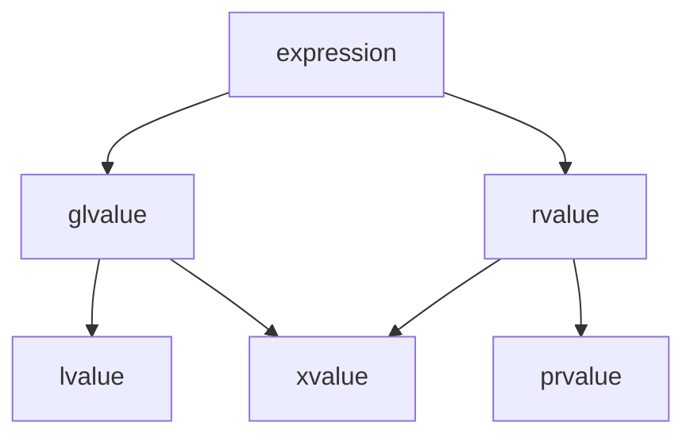
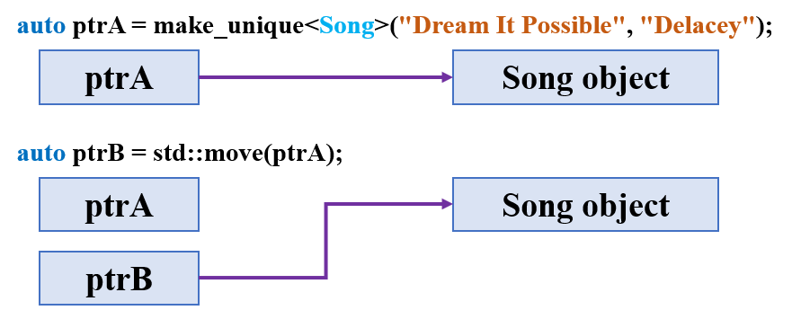
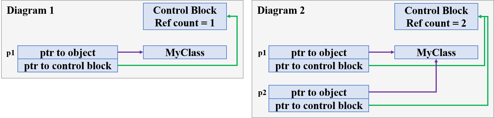

# 现代C++建议

正确编写的C++程序快速、高效，它可以在最高的抽象级别上运行，还可以在最低的抽象级别（如硅级别）上运行。C++提供高度优化的标准库，它支持访问低级别硬件功能，从而最大限度地提高速度并最大程度地降低内存需求。

C++的原始要求之一是与C语言向后兼容。因此，C++始终允许C风格（C-style）编程，包含原始指针（raw pointer）、数组（array）、以null（\0）结尾的字符串和其他特性等，它们可以实现良好的性能，但也可能会引发BUG并增加复杂性。C++演变注重减少对C风格例程的需求，现代C++代码更加简单、安全、美观，而且速度仍像以往一样快速。

下面几个部分概述了现代C++的主要功能，此处列出的功能在C++11及更高版本中可用，除非另有说明。

## 资源和智能指针（resources and smart pointers）

C风格编程的一类主要BUG是内存泄漏（memory leak），通常是由于未能使用delete释放由new分配的内存所导致的。现代C++强调资源获取即初始化（resource acquisition is initialization，RAII）原则。资源（堆内存、文件句柄、套接字等）应该由对象拥有（owned），该对象在其构造函数中创建或接收新分配的资源，并在其析构函数中将此资源删除。RAII原则可确保当所属对象超出范围时，所有资源都能正确返回到操作系统。

为支持RAII原则，C++标准库在头文件\<memory\>中提供了std::unique_ptr、std::shared_ptr、std::weak_ptr三种智能指针，可处理对其拥有的内存的分配和删除。请尽可能地使用智能指针管理堆内存，如果必须显式使用new和delete运算符，请遵循RAII原则。

## std::string和std::string_view（C++17）

C风格字符串（string）是BUG的另一个主要来源，通过使用std::string和std::wstring，几乎可以消除与C风格字符串有关的所有错误。还可以利用std::string和std::string_view成员函数的优势进行字符串搜索、追加等操作，两者都对速度进行了高度优化。在将字符串作为只读参数传递给函数时，在C++17中，可以使用std::string_view进一步提高性能。

## std::vector和其他标准库容器

标准库容器（standard library container）都遵循RAII原则，它们为安全遍历元素提供迭代器（iterators）。此外，它们对性能进行了高度优化，并且已充分测试正确性。通过使用这些容器，可以消除自定义数据结构中可能引入的BUG或低效问题。

使用std::vector替代原始数组，来作为C++中的序列容器（sequential container）；使用std::map作为默认的关联容器（associative container）。

需要进行性能优化时，请考虑以下用法：

- 当嵌入（embedding）非常重要时，使用\<array\>头文件中的std::array类型作为类成员。
- 使用无序的关联容器，例如std::unordered_map，它们的每个元素的开销较低，并且具有固定时间查找功能，但正确高效地使用它们的难度更高。
- 使用排序的std::vector，有关详细信息，请参阅\<algorithm\>和\<numeric\>头文件中的C++标准库算法。

请勿使用C风格数组，对于需要直接访问数据的旧API，请改用诸如vec.data()和vec.size()等访问器方法。

## 标准库算法

在假设需要为程序编写自定义算法之前，请先查看C++标准库算法（standard library algorithm）。标准库包含许多常见操作（如搜索、排序、筛选、随机化）的算法分类，目前仍在不断扩充，且在C++17及及更高版本中，提供了许多算法的并行版本。

以下是一些重要使用示例：

- for_each，默认遍历（traversal）算法，以及基于范围（range-based）的for循环。
- transform，用于对容器元素进行非就地（not-in-place）修改。
- find_if，默认搜索（search）算法。
- sort、lower_bound，以及其他默认的排序和搜索算法。

若要编写比较运算符（comparator），请使用严格的`<`符号，并尽可能使用命名lambda表达式，如下示例。

```c++
auto comp = [](const widget& w1, const widget& w2) { return w1.weight() < w2.weight(); }
sort(vec.begin(), vec.end(), comp);
auto i = lower_bound(vec.begin(), vec.end(), widget{0}, comp);
```

## 用auto替代显式类型名称

C++11引入`auto`关键字，以用于变量、函数、模板的声明，auto指示编译器推导对象的类型，这样就无需显式指定类型。当推导类型是嵌套模板时，auto尤其有用，如下所示。

```c++
map<int,list<string>>::iterator i = m.begin();  // C-style
auto i = m.begin();                             // modern C++
```

## 基于范围的for循环

对数组和容器的C风格迭代容易引发索引错误，若要消除这些错误，提高代码的可读性，可使用基于范围（range-based）的for循环，可用于标准库容器和原始数组。

```c++
std::vector<int> vec{ 1,2,3,4,5,6,7,8 };
// C-style
for (int i = 0; i < vec.size(); ++i) {
    std::cout << vec[i] << std::endl;
}
// Modern C++:
for (const auto &num : vec) {
    std::cout << num << std::endl;
}
```

## 用constexpr表达式替代宏

C和C++中的宏是指编译之前由预处理器处理的标记，在编译文件之前，宏标记的每个实例都将替换为其定义的值或表达式。C风格编程通常使用宏来定义编译时常量值，但宏容易出错且难以调试。在现代C++中，应优先使用`constexpr`变量定义编译时常量。

```c++
#define SIZE 10           // C-style
constexpr int size = 10;  // modern C++
```

## 统一初始化（uniform initialization）

C++11之前的初始化语法很乱，有四种初始化方式，而且每种之前甚至不能相互转换。

```c++
int var1(0);     // C++98
int var2 = 0;    // C++98
int var3{0};     // C++98成功，C++11成功
int var4 = {0};  // C++98失败，C++11成功
```

在现代C++中，可以使用任何类型的统一初始化，也称为`{}`大括号初始化，在初始化array、vector或其他容器时会非常方便。如下示例所示。

```c++
struct Str {
    std::string name;
    float num;
    Str(std::string s, float f) : name(s), num(f) {}
};

int main(int argc, char* argv[]) {
    // C-style initialization
    std::vector<Str> vec;
    Str s1("Norah", 2.7f);
    Str s2("Frank", 3.5f);
    Str s3("Jeri", 85.9f);
    vec.push_back(s1);
    vec.push_back(s2);
    vec.push_back(s3);

    // Modern C++:
    std::vector<Str> vec2{ s1, s2, s3 };
    // or
    std::vector<Str> vec3{ {"Norah", 2.7f}, {"Frank", 3.5f}, {"Jeri", 85.9f} };
    return 0;
}
```

统一初始化实际上使用的是位于\<initializer_list\>头文件中的initializer_list类，它相当于一个提供迭代器的数组，以提供访问元素数组的权限，其中数组的每个成员均具有指定的类型。

当编译器遇到大括号初始化{}语句时，就会生成一个initializer_list数组，并将数组内的元素逐一传递给构造函数；而当构造函数的参数就是initializer_list类型时，则不会逐一分解，而是直接调用所对应的构造函数。

## 移动语义（move semantics）

现代C++提供了移动语义，此功能可以避免进行不必要的内存复制。在C++的早期版本中，在某些情况下无法避免复制。使用移动操作会将资源的所有权从一个对象转移到下一个对象，而不必再进行复制。

一些类拥有堆内存、文件句柄等资源，在实现资源所属的类时，可以定义此类的移动构造函数（move constructor）和移动赋值运算符（move assignment operator）。如果不需要进行复制，编译器会选择这些特殊的重载成员函数。如果定义了移动构造函数，则标准库容器类型会在对象中调用此函数。

## Lambda表达式

在C风格编程中，可以通过使用函数指针将函数传递到另一个函数。但函数指针不便于维护和理解，它们引用的函数可能是在源代码的其他位置中定义的，而不是从调用它的位置定义的。此外，它们不是类型安全的。

现代C++提供了函数对象和重写`operator()`运算符的类，可以像调用函数一样调用它们。创建函数对象的最简便方法是使用内联lambda表达式。下面的示例演示如何使用lambda表达式传递函数对象，然后由find_if函数在vector的每个元素中调用此函数对象。

```c++
std::vector<int> vec{ 1,2,3,4,5,6,7,8 };
int x = 2;
int y = 4;
auto result = find_if(begin(vec), end(vec), [=](int i) { return i > x && i < y; });
```

## 异常（exceptions）

与错误代码相比，现代C++更注重异常（exceptions），将其作为报告和处理错误条件的最佳方法。

## std::atomic

对线程间通信机制使用C++标准库std::atomic结构和相关类型。

## std::variant（C++17）

C风格编程通常使用联合体（union）使不同类型的成员可以占用同一个内存位置，从而节省内存。但是，联合体不是类型安全的，并且容易导致编程错误。

C++17引入了更加安全可靠的std::variant类，来作为联合体的替代项，它可以使用std::visit函数以类型安全的方式访问variant类型的成员。

# 词法约定与基本概念

## 范围

当声明诸如类（class）、函数（function）、变量（variable）等程序元素（program element）时，其名称（name）只能在程序的某些部分查看和使用。名称可见的上下文称为范围（scope）。程序中可能存在具有相同名称的其他变量，只要它们位于不同的范围，就不会违反一个定义规则（One Definition Rule，ODR），也不会引发任何错误。对于自动非静态（automatic non-static）变量，范围还确定它们在程序内存中创建和销毁的时间。

程序有六种类型的范围：

- 全局范围（global scope），全局名称（global name）是在任何类、函数或命名空间（namespace）之外声明的名称，不过在C++中，这些名称具有隐式的全局命名空间。全局名称的范围从声明点（point of declaration）到文件末尾可见。对于全局名称，其可见性还受链接规则（rules of linkage）的约束，这些规则确定名称在程序的其他文件中是否可见。
- 命名空间范围（namespace scope），在命名空间中声明的名称，在任何类或枚举定义或函数块之外，其范围从声明点到命名空间末尾可见。命名空间可以跨不同文件定义。
- 局部范围（local scope），在函数或lambda中声明的名称（包括参数名称）具有局部范围，它们通常被称为局部变量（locals）。它们仅从声明点到函数或lambda体的末尾可见。
- 类范围（class scope），类成员的名称具有类范围，该范围在整个类定义中可见，与声明点位置无关。类成员的访问性（accessibility）由public、private、protected关键字进一步控制。
- 语句范围（statement scope），在for、if、while、switch语句中声明的名称在语句块结束之前可见。
- 函数范围（function scope），goto语句的标签（label）具有函数范围，这意味着即使在声明点之前，它在整个函数体中也是可见的，函数范围允许在声明cleanup标签之前编写诸如goto cleanup之类等语句。

通过在块范围中显式声明相同的名称，可以隐藏带全局范围的名称。但是，可以使用范围解析运算符`::`访问全局范围名称。

## 编译单元和链接类型

在C++程序中，符号（symbol），例如变量或函数名称，可以在其范围内进行任意次数的声明。但是，一个符号只能被定义一次，也即单一定义规则（One Definition Rule，ODR）。声明在程序中引入（或重新引入）一个名称以及足够的信息，以便以后将该名称与定义联系起来；而定义引入一个名称，并提供创建它所需的全部信息，如果名称表示变量，则定义会显式创建存储并进行初始化。必须在使用变量、函数、类等程序元素的名称之前对其进行声明，以告知编译器元素是何种类型。此外，必须在使用每个名称的.cpp文件中（直接或间接）声明每个名称。

一个程序包括一个或多个编译单元（translation units），一个编译单元由一个实现文件及其直接或间接包含的所有标头组成。实现文件通常具有.cpp或.cxx扩展名，标头文件通常具有.h或.hpp扩展名。每个编译单元由编译器独立编译，编译完成后，链接器会将编译后的编译单元合并到单个程序中。在多个编译单元中定义同一名称时，ODR规则的冲突通常显示为链接器错误。通常，使变量在多个文件中可见的最佳方式是在头文件中声明它，然后，在需要声明的每个.cpp文件中通过#include指令包含头文件，通过在标头内容周围添加include防范，以确保标头声明的名称对每个编译单元只声明一次。

在某些情况下，可能需要在.cpp文件中声明全局变量或类。在这些情况下，需要一种方法来告知编译器和链接器，名称所具有的链接（linkage）类型，用于指定对象的名称是仅在一个文件中可见，还是在所有文件中可见。链接的概念仅适用于全局名称，不适用于在一定范围内声明的名称。外部链接（externa linkage）意味着，变量的名称在用于声明变量的文件的外部是可见的。相反，内部链接（internal linkage）意味着，名称在用于声明变量的文件的外部是不可见的。一个具有外部链接的符号，可简称为该符号具有链接（linkage）。

自由（free）函数是在全局范围或命名空间范围内定义的函数，默认情况下，自由函数、非常量全局变量、非内联成员（包括静态成员）函数，以及静态类的数据成员具有外部链接，它们在程序中的任何编译单元内可见；其他任何全局对象都不能具有该名称。具有内部链接或无链接的符号仅在声明它的编译单元内可见；当一个名称具有内部链接时，同一名称可能存在于另一个编译单元中。类定义或函数体中声明的变量没有外部链接。

如果要强制一个全局名称具有内部链接，可以将它显式声明为static，此关键字将它的可见性限制在声明它的同一编译单元内。在此上下文中，static表示与应用于局部变量时不同的内容。默认情况下，以下对象具有内部链接：(1)const对象，(2)constexpr对象，(3)typedef对象，(4)命名空间范围中的static对象。若要为const对象提供外部链接，请将其声明为extern并为其赋值。

## 左值和右值

每个C++表达式都有一个类型，属于值类别（value category），它是编译器在表达式计算期间创建、复制和移动临时对象时必须遵循的规则的基础。

C++17标准对表达式值类别的定义如下：

- glvalue（泛左值，general lvalue）是一个表达式，它的计算可以确定对象、位域（bit-field），或函数的标识（identity）。
- prvalue（纯右值，pure rvalue）是一个表达式，它的计算可以初始化对象、位域，或计算运算符的操作数值，这是由它出现的上下文所指定的。
- xvalue（消亡值，expiring value）表示一个资源可重复使用的对象或位域（通常是因为其生命周期即将结束）。某些涉及rvalue引用的表达式会生成xvalue，例如返回值为rvalue引用或强制转化为rvalue引用类型的函数调用。

其中，左值（lvalue）为非xvalue的glvalue，右值（rvalue）是一个prvalue或xvalue，如下图所示。



左值（lvalue）具有程序可访问的地址（address）。例如，lvalue表达式包括（const）变量名称、数组元素、返回lvalue引用的函数调用、位域、联合体和类成员。

纯右值（prvalue）表达式没有可供程序访问的地址。例如，prvalue表达式包括字面量（literal）、返回非引用类型的函数调用，以及在表达式计算期间创建的但只能由编译器访问的临时对象（temporary object）。

消亡值（xvalue）表达式有一个地址，该地址不再可供程序访问，但可用于初始化rvalue引用，以提供对表达式的访问。例如，xvalue表达式包括返回rvalue引用的函数调用、数组下标、数组或对象是rvalue引用的成员和成员指针表达式。


## 临时对象

临时对象（temporary object）是由编译器创建的未命名对象，用于存储临时值。在某些情况下，编译器可能会出于下列原因创建这些临时对象。

- 使用不同类型的初始值来初始化一个底层类型的const引用时。
- 存储用户定义类型（user-defined type，UDT）函数返回值时，仅当程序未将返回值复制到对象时，才会创建这些临时对象。
- 存储强制转换为用户定义类型的结果时。在给定类型的对象显式转换为用户定义类型时，将构造一个新对象作为临时对象。
- 更常见的情况是，在计算必须调用重载运算符函数的表达式时，这些重载的运算符函数将返回用户定义类型，该类型通常不会复制到另一个对象。

临时对象具有生命周期，任何创建多个临时对象的表达式最终都会按与创建顺序相反的顺序来销毁它们。临时销毁发生的时间取决于它的使用方式。

- 用于初始化const引用的临时对象。如果一个初始值表达式类型与正在初始化的引用类型不同，且初始值不是lvalue时，则会创建底层对象类型的临时值，初始化表达式会对其进行初始化。此临时对象将在其绑定到的引用对象销毁后立即销毁。由于此销毁很可能在创建临时表达式之后发生，因此有时称为扩展。
- 作为表达式计算结果创建的临时对象。所有不属于第一类的临时对象，以及作为表达式计算结果而创建的所有临时对象，都在表达式语句的末尾（即分号处）或用于for、if、while、do、switch语句的控制表达式的末尾销毁。

## 对齐方式

C++的低级特性（low-level feature）之一是能够指定内存中对象的精确对齐方式（alignment），以最大限度利用特定的硬件体系结构。默认情况下，编译器会根据大小（size）对齐类和结构成员，bool/char在1字节边界上对齐，short在2字节边界上对齐，int/float在4字节边界上对齐，long long/double在8字节边界上对齐。

大多数情况下，默认对齐方式已经是最佳的。但在某些情况下，可以通过指定数据结构的自定义对齐方式，获得显著的性能提升或节约内存。在MSVC编程中，可以使用Microsoft专用关键字\_\_alignof和\_\_declspec(align)来指定大于默认值的对齐方式。从C++11标准开始，可使用关键字`alignof`和`alignas`指定对齐方式，以获得更好的可移植性。新关键字实质上以与Microsoft专用扩展相同的方式运行。C++标准不指定用于在小于目标平台编译器默认值的边界上对齐的装箱行为（packing behavior），在这种情况下，仍需要使用#pragma pack预处理指令。

对齐方式是内存地址的一个属性，表现为地址对2的幂次方取模，如果一个地址的对齐方式是对X取模余0，其中X是2的幂次方，则称该地址对齐到X。CPU执行指令处理内存中的数据，数据在内存中用地址标识。一个数据有一个大小（size），如果一个数据的地址对齐到其size，则称它为自然对齐，否则称为未对齐。

编译器会尝试以防止数据未对齐的方式分配数据内存。对于简单的数据类型，编译器将分配数据类型大小（以字节为单位）的倍数的地址。编译器还以自然对齐每一个元素的方式填充结构体，如下所示。

```c++
struct Data {
   char a;   // 1 byte
   int b;    // 4 byte
   short c;  // 2 byte
} bar[2];
```

```c++
// Shows the actual memory layout
struct Data {
   char a;       // 1 byte
   char __0[3];  // padding to put 'b' on 4-byte boundary
   int b;        // 4 byte
   short c;      // 2 byte
   char __1[2];  // padding to make sizeof(Data) multiple of 4
} bar[2];
```

对这两种声明来说，sizeof(struct Data)都将返回12字节，这种填充允许以自然访问的方式对齐bar[4]的元素。

C++标准中的alignas说明符用于指定变量和用户定义类型的自定义对齐方式，可以在类、结构、联合体，或者单个成员上使用alignas说明符，多个alignas说明符会选择其中值最大的一个；alignof用于获取指定类型或变量的对齐方式，如下所示。

```c++
struct alignas(16) Data {
    int a, b;  // 4 * 2 byte
    char alignas(4) arr[3];
};

int main() {
    std::cout << alignof(Data) << std::endl;  // 16
    std::cout << sizeof(Data) << std::endl;   // 16
}
```

## 运算符优先级

运算符需要与周围的简单符号相结合才能起作用，结合性指的是，运算符尝试与周围符号结合时所遵循的顺序。左到右表示先结合左侧符号再结合右侧符号，右到左表示先结合右侧符号再结合左侧符号。无论是左到右还是右到左，都是针对双目运算符而言的，对于单目运算符，只会与第一个符号相结合，而不存在第二个符号。

若存在多个运算符与简单符号结合，会按运算符的优先级从高到低依次进行，一旦某个运算符与简单符号完成结合后，就可将它们看作是一个符号整体，然后再与其它运算符结合。

按照运算符的优先级从高到低，将其分为若干等级，如[下表](https://en.cppreference.com/w/cpp/language/operator_precedence)所示。值得注意的是，单独一个括号()的优先级最高。

| 优先级 | 运算符            |                                           | 描述                                                   | 结合性 |
| ------ | ----------------- | ----------------------------------------- | ------------------------------------------------------ | ------ |
| 1      | ::                | MyClz::member                             | 范围解析                                               | 左到右 |
| 2      | typeid            | typeid(var)                               | 获取变量或类型的类型信息                               | 左到右 |
|        | type(), type{}    | float(var), float{var}                    | 强制类型转换                                           | 左到右 |
|        | static_cast, etc. | static_cast\<float\>(var)                 | C++强制类型转换                                        | 左到右 |
|        | ++, --            | var++, var--                              | 后自增，后自减                                         | 左到右 |
|        | .                 | obj.member                                | 从实例对象访问成员                                     | 左到右 |
|        | ->                | obj_ptr->member                           | 从实例指针访问成员                                     | 左到右 |
|        | []                | array[index]                              | 数组索引                                               | 左到右 |
|        | ()                | function(para)                            | 函数调用                                               | 左到右 |
| 3      | sizeof            | sizeof(float)                             | 获取变量或类型的字节大小                               | 右到左 |
|        | (type)            | (float)var                                | 强制类型转换                                           | 右到左 |
|        | ++, --            | ++var, --var                              | 前自增，前自减                                         | 右到左 |
|        | +, -              | +var, -var                                | 一元运算符，正数，负数                                 | 右到左 |
|        | !, ~              | !var, ~var                                | 逻辑取反，按位取反                                     | 右到左 |
|        | &                 | &var                                      | 取地址                                                 | 右到左 |
|        | *                 | *var_ptr                                  | 间接运算indirection，解除引用dereference，根据地址取值 | 右到左 |
|        | new, new[]        | new array[length]                         | 内存分配、创建对象                                     | 右到左 |
|        | delete, delete[]  | delete[] array                            | 销毁对象、内存释放                                     | 右到左 |
| 4      | .*                | Clz::\*vp = &Clz::v, obj.\*vp = new_v     | 对实例对象访问成员指针，并对指针解除引用               | 左到右 |
|        | ->*               | Clz::\*vp = &Clz::v, obj_ptr->*vp = new_v | 从实例指针访问成员指针，并对指针解除引用               | 左到右 |
| 5      | *, /, %           | v1 \* v2, v1 / v2, v1 % v2                | 乘法，除法，取模（余数）                               | 左到右 |
| 6      | +, -              | v1 + v2, v1 - v2                          | 加法，减法                                             | 左到右 |
| 7      | <<, >>            | v1 << v2, v1 >> v2                        | 按位左移低位补0，按位右移高位补符号位                  | 左到右 |
| 8      | <, <=, >, >=      | v1 <= v2, v1 >= v2                        | 小于，小于等于，大于，大于等于                         | 左到右 |
| 9      | ==, !=            | v1 == v2, v1 != v2                        | 等于，不等于                                           | 左到右 |
| 10     | &                 | v1 & v2                                   | 按位与                                                 | 左到右 |
| 11     | ^                 | v1 ^ v2                                   | 按位异或                                               | 左到右 |
| 12     | \|                | v1 \| v2                                  | 按位或                                                 | 左到右 |
| 13     | &&                | v1 && v2                                  | 逻辑与                                                 | 左到右 |
| 14     | \|\|              | v1 \|\| v2                                | 逻辑或                                                 | 左到右 |
| 15     | ?:                | v1 ? v2 : v3                              | 三元条件                                               | 右到左 |
|        | throw             | throw exception                           | 抛出异常                                               | 右到左 |
|        | =                 | var = new_value                           | 赋值                                                   | 右到左 |
|        | *=, /=, %=        | v1 \*= v2, v1 /= v2, v1 %= v2             | 乘法并赋值，除法并赋值，取模并赋值                     | 右到左 |
|        | +=, -=            | v1 += v2, v1 -= v2                        | 加法并赋值，减法并赋值                                 | 右到左 |
|        | <<=, >>=          | v1 <<= v2, v1 >>= v2                      | 按位左移并赋值，按位右移并赋值                         | 右到左 |
|        | &=, ^=, \|=       | v1 &= v2, v1 ^= v2, v1 \|= v2             | 按位与并赋值，按位异或并赋值，按位或并赋值             | 右到左 |
| 16     | ,                 | expression, expression                    | 逗号                                                   | 左到右 |

无论是表达式计算，还是变量声明，运算符优先级都会对语义造成一定的影响。例如，数组索引[]运算符优先级高于解除引用\*优先级，示例如下所示。

```c++
int  *var1;      cout << typeid(var1).name() << endl;  // Pi     // 指针，其指向一个int
int   var2[8];   cout << typeid(var2).name() << endl;  // A8_i   // 数组，元素类型是int
int  *var3[8];   cout << typeid(var3).name() << endl;  // A8_Pi  // 指针数组，元素类型是指针，其指向一个int
int (*var4)[8];  cout << typeid(var4).name() << endl;  // PA8_i  // 数组指针，其指向一个数组，元素类型是int
```

在声明int \*var[N]语句中，符号var会先与[]结合，形成var[N]整体，符号var表示数组，符号var[N]表示数组元素；然后再与\*结合，形成\*var[N]整体，表示对数组元素var[N]解除引用；然后再与int结合，表示这是int声明语句；于是，\*var[N]是声明的int类型，则var[N]是int指针，则var是int指针数组。

在声明int (\*var)[N]语句中，符号var会先与\*结合，形成(\*var)整体，符号var表示指针，符号(\*var)表示对var解除引用；然后再与[]结合，形成(\*var)[N]整体，符号(\*var)表示数组，符号(\*var)[N]表示数组元素；然后再与int结合，表示这是int声明语句；于是，(\*var)[N]是声明的int类型，则(\*var)是int数组，则var是指向int数组的指针。

同样地，函数调用()运算符优先级高于解除引用\*优先级，示例如下所示。

```c++
int* next(int* ptr, int* last) { return ptr < last ? ++ptr : nullptr; }
int* (*func_ptr)(int*,int*) = next;  // 函数指针
int* *func_ptr(int*,int*) = next;    // 错误声明
```

另一个示例是，声明const指针时，本质上是const对所声明符号整体类型的修饰，示例如下所示。

```c++
const int *ptr;        // 指向常量的指针，ptr所指向的数值不可修改
int *const ptr;        // 常指针，ptr所指向的地址不可修改
const int *const ptr;  // 指向常量的常指针，ptr所指向的地址及所指向的数值，都不可更改
```

在上述声明当中，符号ptr先与\*结合，形成\*ptr整体，符号ptr表示指针，符号\*ptr是声明的int类型。在声明const int \*ptr语句中，说明符const修饰\*ptr整体为常量，即表示ptr指向常量数值；在声明int *const ptr语句中，说明符const修饰ptr为常量，即表示指针ptr指向常量地址。

# 内存布局

布局（layout）是指类（class）、结构（struct）或联合体（union）类型的成员在内存中的排列方式。某些情况下，布局由语言规范明确定义。但是，当类或结构包含某些C++特性时，例如具有虚拟基类（virtual base class）、虚拟函数（virtual function）、不同访问控制的成员时，编译器可以自由选择布局。该布局可能会因为正在执行的优化而有所不同，并且在许多情况下，该对象甚至可能不会占用连续内存区域。例如，如果某个类具有虚拟函数，则该类的所有实例可能会共享单个虚拟函数表。

由于布局未定义，因此无法将这种类型传递到使用其他语言（例如C语言）编写的程序，并且由于它们可能是非连续（non-contiguous）的，因此无法使用快速低级函数（如memcopy函数）对其进行可靠的复制，或者通过网络对其进行序列化（serialize）。

为使编译器以及C++程序和元程序能够推断出任何给定类型对于依赖于特定内存布局的操作的适用性，C++14引入了三种简单的类和结构，普通（trivial）类型、标准布局（standard-layout）类型，和POD类型。标准库函数模板is_trivial\<T\>、is_standard_layout\<T\>和is_pod\<T\>可以确定某一给定类型是否属于某一给定类别。

## 普通类型

当C++中的类或结构具有编译器提供的，或显式设置为默认的构造函数/赋值函数/析构函数时，该类或结构为普通类型（trivial type），它占用连续内存区域。普通类型可以具有不同访问修饰符控制的成员，编译器可以自由选择在此情况下对成员排序的方式。因此，用户可以在内存中复制此类对象，但不能从C程序中可靠地使用它们；可以将普通类型T复制到char或无符号char数组，并安全地复制回T变量。请注意，由于对齐要求，类型成员之间可能存在填充字节。

普通类型具有默认构造函数（default constructor）、复制构造函数（copy constructor）、复制赋值运算符（copy assignment operator）和析构函数（destructor）。在各种情况下，普通（trivial）意味着构造函数、运算符、析构函数并非用户提供，或显式设置为默认，并且类型满足以下情况：

- 没有虚拟函数或虚拟基类，
- 所继承的基类没有非普通构造函数、运算符、析构函数，
- 所持有的数据成员没有非普通构造函数、运算符、析构函数。

以下示例演示了普通类型，其中因为Trivial定义了非默认构造函数Trivial(int age, int length)，若想使其成为普通类型，则需要手动显式指定默认构造函数（default constructor），如Trivial2中所示。

```c++
struct Trivial {
public:  int m_age;
    Trivial(int age, int length): m_age(age), m_length(length) {}
private: int m_length;
};

struct Trivial2 {
public:  int m_age;
    Trivial2() = default;
    Trivial2(int age, int length): m_age(age), m_length(length) {}
private: int m_length;
};

int main() {
    std::cout << std::is_trivial<Trivial>() << std::endl;   // 0
    std::cout << std::is_trivial<Trivial2>() << std::endl;  // 1
    return 0;
}
```

## 标准布局类型

当类或结构不包含某些C++特性时，例如不包含在C语言不存在的虚拟函数时，并且所有成员都具有相同的访问控制时，该类或结构为标准布局（standard-layout）类型，它占用连续内存区域。标准布局类型可以具有用户定义的构造函数/赋值函数/析构函数。可以在内存中对其进行复制，并且布局经过充分定义，可以由C程序使用。

此外，标准布局类型还具有以下特征：

- 没有虚拟函数或虚拟基类，
- 所有非静态数据成员都具有相同的访问控制，
- 类的所有非静态成员均为标准布局，
- 所有基类都为标准布局，
- 基类的类型与第一个非静态数据成员的类型不同，
- 最底层派生类（most-derived class）中没有非静态数据成员，并且具有非静态数据成员的基类不超过一个，或者没有含非静态数据成员的基类。

以下代码演示标准布局类型的一个示例。

```c++
struct Base1 { int i, j; };
struct Derived1 : public Base1 { int x, y; };
struct Base2 { void foo() {} };
struct Derived2 : public Base2 { int x, y; };

int main() {
    std::cout << std::is_standard_layout<Derived1>() << std::endl;  // 0
    std::cout << std::is_standard_layout<Derived2>() << std::endl;  // 1
    return 0;
}
```

## POD类型

当某一类或结构同时为普通（trivial）和标准布局（standard-layout）时，该类或结构为POD（纯旧数据）类型。因此，POD类型的内存布局是连续的，并且每个成员的地址都比在其之前声明的成员要高，以便可以对这些类型执行逐字节复制和二进制IO操作。标量类型是POD类型，作为类的POD类型只能具有POD类型的非静态数据成员。

```c++
struct A {
protected:
	virtual void Foo() {}
};

// Neither trivial nor standard-layout
struct B : A {
	int a, b;
	virtual void Foo() override {}  // Virtual function
};

// Trivial but not standard-layout
struct C {
public:  int a;
private: int b;  // Different access control
};

// Standard-layout but not trivial
struct D {
	int a, b;
	D(int a, int b): a(a), b(b) {}  //User-defined constructor
};

struct POD {
	int a, b;
};

int main() {
	std::cout << std::is_trivial<B>() << std::endl;  // 0
	std::cout << std::is_trivial<C>() << std::endl;  // 1
	std::cout << std::is_trivial<D>() << std::endl;  // 0
	std::cout << std::is_standard_layout<B>() << std::endl;  // 0
	std::cout << std::is_standard_layout<C>() << std::endl;  // 0
	std::cout << std::is_standard_layout<D>() << std::endl;  // 1
	std::cout << std::is_trivial<POD>() << std::endl;          // 1
	std::cout << std::is_standard_layout<POD>() << std::endl;  // 1
	std::cout << std::is_pod<POD>() << std::endl;              // 1
	return 0;
}
```

## 字面量类型

字面量（literal）类型是可在编译时确定其布局的类型，包括void类型、标量类型、引用类型，及其构成的数组；具有普通析构函数以及一个或多个非移动（not move）和非复制（not copy）的constexpr构造函数的类，且所有非静态数据成员和基类必须是字面量类型且不可变（not volatile）。

# 类型系统

在C++中，类型（type）的概念非常重要，每个变量（variable）、函数参数（arguments）和返回值（return value）必须具有一个类型以进行编译。此外，在计算表达式（expression）前，编译器会隐式给出每个表达式，包括字面量值（literal value）的类型。例如，用于存储整数值的int，用于存储浮点值的double，或用于存储文本的标准库类型std::basic_string类等。

可以通过定义class、struct等创建自己的类型，类型指定为变量（或表达式结果）分配的内存量，类型还指定可存储的值类型、编译器如何解释这些值中的位模式以及可以对它们执行的操作。

本节包含对C++类型系统的主要功能的非正式概述。

- 标量（scalar）类型，具有某范围的单个值的类型。包括算术类型（整型或浮点值）、枚举类型成员、指针类型、指针到成员（pointer-to-member）类型以及std::nullptr_t类型。
- 复合（compound）类型，不是标量类型的类型。包括数组类型、函数类型、类（或结构）类型、联合体类型、枚举、引用（reference）和指向非静态类成员的指针。
- 变量（variable），数据量的符号名称（symbolic name of a quantity of data），该名称可用于访问它在代码范围内引用的数据。在C++中，变量通常指标量数据类型的实例，而其他类型的实例通常称为对象。
- 对象（object），为简洁一致，本文使用术语对象指代类或结构的任何实例。在一般意义上使用时，它包括所有类型，甚至标量变量。
- 纯旧数据（plain old data，POD）类型，这种非正式的数据类型在C++中指的是标量类型或POD类（POD class）。POD类没有不是POD的静态数据成员，没有用户定义的构造函数、析构函数或用户定义的赋值运算符。此外，POD类没有虚函数、基类、私有或保护的非静态数据成员。POD类型通常用于外部数据交换，例如与用C语言编写的模块（仅具有POD类型）进行的数据交换。

C++既是强类型（strongly typed）语言，也是静态类型（statically typed）语言，每个对象都有一个类型，并且该类型永远不会更改。声明变量时，必须显式指定类型或使用auto关键字指示编译器通过初始值推断类型。声明函数时，必须指定其返回值的类型以及每个参数的类型。例外情况是使用允许任意类型的函数模板（function template）时。

## 基本内置类型

不同于其他某些语言，C++中不存在派生所有其他类型的通用基类型（universal base type），而是包含许多基本内置类型（fundamental built-in type），它们由C++语言标准指定，内置于编译器中，未在任何头文件中定义。编译器可识别这些内置类型，并具有内置规则，用于控制可对其执行的操作，以及如何将其转换为其他基本类型。

这些类型包括如int、double、bool的数值类型、void空类型，以及分别针对ASCII和UNICODE的char和wchar_t字符类型，大多数基础类型具有unsigned无符号版本，这些版本的类型更改了变量可存储的值的范围。void是一种特殊类型，主要用于声明不返回值的函数，或用于声明指向非类型化或任意类型化数据的一般void*指针，当分配原始非类型化内存时这样做很有必要。

下表显示不同平台上C++实现中内置类型的相对大小。

|                | bool/char | short/wchar_t | int/float | long long/double | void* |
| :------------: | :-------: | :-----------: | :-------: | :--------------: | :---: |
| 32bit Platform |     1     |       2       |     4     |        8         |   4   |
| 64bit Platform |     1     |       2       |     4     |        8         |   8   |

其中，类型bool表示可为true或false的值，类型unsigned char可用来表示一个字节值，因为C++中没有专门的字节类型。

## 复数类型

在C++11标准中，在<complex.h>头文件中引入了复数类型，用于支持数学上形如$x+yi$的复数，其主要的模板类型及其实例化的定义如下代码描述。

```c++
// Forward declarations.
template<typename _Tp> class complex;
template<> class complex<float>;
template<> class complex<double>;
template<> class complex<long double>;

/**
*  Template to represent complex numbers.
*  Specializations for float, double, and long double are part of the library.
*  Results with any other type are not guaranteed.
*  @param  Tp  Type of real and imaginary values.
*/
template<typename _Tp>
class complex {
private:
    _Tp _M_real;
    _Tp _M_imag;
public:
    typedef _Tp value_type;  // Value typedef.
    // Default constructor.
    constexpr complex(const _Tp& __r = _Tp(), const _Tp& __i = _Tp()): _M_real(__r), _M_imag(__i) { }
    // Return real part and imaginary of complex number.
    constexpr _Tp real() const { return _M_real; }
    constexpr _Tp imag() const { return _M_imag; }
};
```

可以看到，一个complex复数类型的实部与虚部分别存储在\_M\_real与\_M\_imag成员变量中，其在内存中是相邻连续存储的，且实部在虚部之前，多个复数的实部虚部交叉连续存储。

```c++
#include <complex>
#include <iostream>
int main(int argc, char *argv[]) {
    std::complex<float> a = {3.f, 4.f};
    std::complex<float> b = {4.f, 3.f};
    std::cout << a * b << std::endl;
}
```

## 字符串类型

类型char用于早期C风格字符串或std::string对象中无需转换为UNICODE的ASCII字符。类型wchar_t表示可能以UNICODE格式进行编码的宽字符值（wide character value），在Windows平台上为UTF-16，其他操作系统上可能不同，且wchar_t是std::wstring字符串中使用的字符类型。

严格来说，C++语言没有内置的字符串（string）类型，类型char和wchar_t存储单个字符，必须声明这些类型的数组来表示一个字符串，从而会需要一个添加到最后一个有效字符后的数组元素，即表示字符串终止的null值（例如ASCII中`\0`），也称为C风格字符串。C风格字符串需要编写额外的代码或者需要使用外部实用的字符串库函数。

在现代C++中，标准库提供了类型std::string（用于8位char型字符串）和类型std::wstring（用于16位wchar_t型字符串）。这些C++标准库容器可被视为本地字符串（native string）类型，因为它们是C++标准库的一部分，兼容所有C++生成环境。通过包含\<string\>头文件，即可使这些类型在程序中可用。建议不要在现代C++中使用含null终止符的C风格字符数组。

在C/C++编程中，使用双引号`""`表示的字符串字面量（string literal），会自动与仅由空格分隔的任何相邻的字符串字面量，拼接（concatenate）为一个完整的更长的字符串字面量，这是字符串字面量的连接规则，如下所示。

```c++
int main() {
    const char *str1 = "Hello" "," "World" "!";
    const char *str2 = "Hello,World!";
    std::cout << str1 << std::endl;  // Hello,World!
    std::cout << str2 << std::endl;  // Hello,World!
    return 0;
}
```

## 指针类型

与早期C语言一样，C++继续使用`*`声明指针类型的变量，指针类型存储数据实际储存在内存中的位置地址（address of the location in memory）。在现代C++中，这些指针类型称为原始指针，它们通过特殊运算符`*`或`->`在代码中访问。此内存访问操作称为取消引用（dereferencing），所使用的运算符取决于是取消引用指向标量的指针，还是取消引用指向对象中成员的指针。

在现代C++中，由于智能指针的引入，因此不再需要（或建议）将原始指针用于对象所有权。使用原始指针来观察对象仍然是有用和安全的。但是，如果必须将其用于对象所有权，则需要谨慎操作，并仔细考虑如何创建和销毁其拥有的对象。

需要注意的是，原始指针变量声明只分配足够的内存来存储地址（指针在取消引用时引用的内存位置），指针声明不会分配存储数据值所需的内存，该内存也称为后备存储（backing store）。换言之，通过声明原始指针变量，将创建内存地址变量而非实际数据变量。实际应用中，指针的后备存储通常是用户定义类型，这些类型通过使用new关键字表达式（在C风格编程中使用malloc()运行时函数）动态分配到称为堆内存区域中。使用new分配的内存必须由相应的delete语句释放（在C风格编程中使用free()运行时函数）。

需要注意的是，关键字`nullptr`是类型为`std::nullptr_t`的空指针（null pointer）常量，该类型可转换为任何原始指针类型。尽管可以使用关键字nullptr而不包含任何标头，但如果代码使用类型std::nullptr_t，则需要包含\<cstddef\>头文件。

在现代C++中，避免将`NULL`宏或`0`值用作空指针常量，而应该使用nullptr，它在大多数情况下效果更好。例如，给定myFunction(std::pair<const char\*, double>)，那么调用myFunction(std::make_pair(NULL, 3.14))会导致编译器错误，因为宏NULL将扩展到0，会产生std::pair<int, double>调用，不可转换为myFunction的std::pair<const char\*, double>参数类型。而调用myFunction(std::make_pair(nullptr, 3.14))将会成功编译，因为std::make_pair(nullptr, 3.14)返回std::pair<std::nullptr_t, double>，此结果可转换std::pair<const char*, double>参数类型。

> 需要注意的是，使用std::cout打印指针类型时，例如int\*指针、float\*指针等，会直接打印该指针的地址；而如果是char\*指针，使用std::cout打印时，会被解析为C风格字符串，从而打印出可能乱码的字符。想要使用std::cout打印char\*指针的地址，可以打印(void\*)pChar对象。

## Windows数据类型	

在C和C++的经典Win32编程中，大多数函数使用Windows特定的typedef和#define宏来指定参数类型和返回值，它们在windef.h头文件中定义。这些Windows数据类型通常是为C/C++内置类型提供的特殊别名。其中一些typedef（例如HRESULT和LCID）很有用且具有描述性，而INT等其他类型没有特殊含义，只是基础C++类型的别名。

其他Windows数据类型的名称自C编程和16位处理器得到保留，并且在现代硬件或操作系统中不具有目的和意义。还有与Windows运行时库（Windows Runtime Library）相关的特定数据类型，它们为Windows运行时基础数据类型。在现代C++中，一般准则是首选C++基本类型，除非Windows类型传达一些有关如何解释值的额外意义。

## 强制类型转换

C++语言定义了基础类型、指针类型、引用类型的转换，称为标准转换（standard conversion）。当表达式包含不同内置类型的操作数且不存在显式强制转换时，编译器将使用内置的标准转换来转换其中一个操作数，从而使类型相匹配，编译器将尝试按一个明确定义的顺序进行转换，直到有一个转换成功。如果所选转换是提升转换，则编译器不会发出警告，如果转换是收缩转换，则编译器会发出有关数据可能丢失的警告。

C++允许使用C风格或函数调用样式的显式类型转换（explicit type casting）。此外，有几种特定于C++语言的转换运算符（casting operator），这些运算符用于删除旧式C语言风格转换中的一些多义性和危险继承。

### C风格类型转换

```c++
type_id val = (type_id)expression_cast;  // C-style casting
type_id val = type_id(expression_list);  // function-call style casting
```

其中，type_id是目标类型，expression_cast是参与转换的表达式，expression_list是参与转换的表达式列表。当从单个值转换时，C风格转换和函数调用样式转换都有相同的结果；但是，在函数样式的语法中，可以为转换指定多个自变量，此差异对用户定义的类型非常重要。

```c++
struct Point {
    int x, y;
    Point(int x, int y) : x(x), y(y) {}
};

int main() {
    int *buffer = (int*)malloc(1024);  // C-style casting
    free(buffer);
    float pi = 3.14f;
    int pi_1 = (int)pi;  // C-style casting
    int pi_2 = int(pi);  // function-call style casting
    // Point p = (Point)(pi_1, pi_2);  // C-style casting: error
    Point p = Point(pi_1, pi_2);       // function-call style casting: ok
    std::cout << pi_1 << ", " << pi_2 << std::endl;
    std::cout << p.x << ", " << p.y << std::endl;
    return 0;
}
```

### static_cast

运算符`static_cast<type_id>`用于非多态类型（nonpolymorphic type）的转换，根据表达式中存在的类型，将expression转换为type_id类型，如下所示。

```c++
type_id val = static_cast<type_id>(expression);
```

运算符static_cast可用于执行任何隐式转换，包括标准转换和用户定义的转换。static_cast可以将整数值显式转换为枚举类型，如果整型值不在枚举值的范围内，生成的枚举值是不确定的。任何表达式都可以通过static_cast显式转换为void类型，目标void类型可以选择性地包含const属性。

示例如下所示。

```c++
class Point {
private:
    int x, y;
public:
    Point(int x, int y) : x(x), y(y) {}
    operator double() const {
        return sqrt(x * x + y * y);
    }
};

int main(int argc, char *argv[]) {
    int i = 65;
    float f = 3.14f;
    Point p(4, 5);
    char ch = static_cast<char>(i);
    const double df = static_cast<const double>(f);
    double dp = static_cast<double>(p);
    std::cout << ch << ", " << df << ", " << dp << std::endl;  // A, 3.14, 6.40312
    return 0;
}
```

运算符static_cast还可用于基类指针和派生类指针之间的类型转换，但static_cast转换的安全性不如dynamic_cast转换，因为static_cast不执行运行时类型检查（run-time type check），而dynamic_cast执行该检查。总之，static_cast和dynamic_cast运算符都可以在整个类层次结构中移动指针。

```c++
class Base { public: virtual ~Base() {}  /* make class polynomial */ };
class Derived : public Base {};

int main(int argc, char *argv[]) {
    // from Base* to Derived*
    Base *pb = new Base();
    Derived *pd1 = static_cast<Derived*>(pb);
    Derived *pd2 = dynamic_cast<Derived*>(pb);
    std::cout << pd1 << ", " << pd2 << std::endl;  // 00C60178, 00000000
    // from Derived* to Base*
    Derived *pd = new Derived();
    Base *pb1 = static_cast<Base*>(pd);
    Base *pb2 = dynamic_cast<Base*>(pd);
    std::cout << pb1 << ", " << pb2 << std::endl;  // 00C570E0, 00C570E0
    return 0;
}
```

### dynamic_cast

运算符`dynamic_cast<type_id>`用于多态类型（polymorphic type）的转换，根据表达式中存在的类型，将expression转换为type_id类型，如下所示。

```c++
type_id val = dynamic_cast<type_id>(expression);
```

类型type_id必须是已定义类型的指针或引用，或是void\*指针。如果type_id是指针，则expression类型必须为指针，如果type_id是引用，则expression必须为左值。运算符dynamic_cast在类型转换时，会执行运行时类型检查（run-time type check），以确保多态转换的正确性。

如果type_id是一个指针，且指向的是expression可明确访问（unambiguous accessible）的直接或间接基类，则转换结果是指向type_id类型的唯一子对象（unique subobject）的指针。这种类型转换称为向上转换（upcast），因为它将指针向上移动一个类层次结构，从派生类移至它的基类，向上转换是一种隐式转换。

如果type_id是一个指针，且指向的是expression可明确访问（unambiguous accessible）的直接或间接派生类，则会进行运行时类型检查，检查expression是否实际指向type_id类型的完整对象，如果是，则转换结果是指向type_id类型的完整对象的指针。这种类型转换称为向下转换（downcast），因为它将指针向下移动一个类层次结构，从基类移至它的派生类。

```c++
class A { virtual void foo() {} };
class B : public A { virtual void foo() {} };
class C { virtual void foo() {} };
class D : public B, public C { virtual void foo() {} };

int main(int argc, char *argv[]) {
    C *pc = dynamic_cast<C*>(new D());
    // Way1
    D *pd = dynamic_cast<D*>(pc);   // downcast:  C* --> D*
    B *pb = dynamic_cast<B*>(pd);   // upcast  :  D* --> B*
    A *pa = dynamic_cast<A*>(pb);   // upcast  :  B* --> A*
    // Way2
    A *pa2 = dynamic_cast<A*>(pc);  // cross-cast + upcast
    std::cout << pa << ", " << pa2 << std::endl;  // 011F1DF8, 011F1DF8
    return 0;
}
```

使用dynamic_cast时，如果expression无法安全地转换为type_id类型，运行时检查将导致强制转换失败，未能强制转换的指针类型的值是空指针。如果对引用类型的强制转换失败，会引发std::bad_cast异常。

```c++
class Base { public: virtual ~Base() {}  /* make class polynomial */ };
class Derived : public Base {};

int main() {
   Base base;
   Base& ref_base = base;
   try {
       Derived& ref_derived = dynamic_cast<Derived&>(ref_base);
   } catch (const std::bad_cast& bc) {
       std::cout << bc.what() << std::endl;;  // Bad dynamic_cast!
   }
   return 0;
}
```

### const_cast

运算符`const_cast<type_id>`用于删除名称的const属性、volatile属性、\_\_unaligned属性。

```c++
type_id val = const_cast<type_id>(expression);
```

指向任何类型或数据成员的指针，可显式转换为无const属性、无volatile属性、无\_\_unaligned属性的完全相同的类型，转换结果指向原始对象。但通过结果指针或引用对原始对象进行修改，可能会产生未定义的行为。不能使用const_cast运算符直接重写常量变量的常量状态（constant status）。

```c++
class MyClass {
public:
    int m_age;
    void print_age() const {
        std::cout << "Age: " << m_age << ", ";
        const_cast<MyClass*>(this)->m_age++;
        std::cout << m_age << std::endl;
    }
};

int main() {
    MyClass mc{ 12 };
    mc.print_age();  // Age: 12, 13
    const MyClass* pmc = &mc;
    // pmc->m_age = 16;  // Error
    const_cast<MyClass*>(pmc)->m_age = 16;
    pmc->print_age();  // Age: 16, 17
    return 0;
}
```

> 在旧式C++编程风格中，常量限定符const通常位于类型左侧，例如const int *var；而在新式C++编程风格中，会将const置于类型右侧，例如int const *var表示一个指向常量值的指针，其表示更清晰。

### reinterpret_cast

运算符`reinterpret_cast<type_id>`用于对位进行简单的重新解释（simple reinterpretation of bit），允许将任何指针转换为任何其他指针类型，也允许将任何整数类型转换为任何指针类型以及反向转换。滥用reinterpret_cast运算符可能很容易带来风险。

```c++
type_id val = reinterpret_cast<type_id>(expression);
```

运算符reinterpret_cast可用于char\*到int\*或OneClass\*到UnrelatedClass\*等完全无关类型之间的转换，这本身并不安全。reinterpret_cast的转换结果，除非转换回原始类型，否则其他任何用途都是不安全且不可移植的。

reinterpret_cast允许将指针视为整数类型，随后对结果按位移位并与自身进行异或运算，以用于生成唯一索引（具有唯一性的概率非常高），将索引执行标准C风格强制转换，截断为函数的返回类型。一个实际用途是用于在哈希函数中生成索引，不同的值几乎绝对会生成不同的索引。

```c++
// return a hash code based on an address
unsigned short hash(void *p) {
   unsigned int val = reinterpret_cast<unsigned int>(p);
   return (unsigned short)(val ^ (val >> 16));
}

int main() {
    int arr[8];
    for (int i = 0; i < 8; ++i) {
        std::cout << hash(&arr[i]) << " ";
        // 64295 64299 64303 64275 64279 64283 64287 64259
    }
    return 0;
}
```

## 运行时类型信息

运行时类型信息（Run-time Type Information，RTTI）是一种允许在程序执行过程中确定对象类型的机制。目前，RTTI已添加到C++标准库的\<typeinfo\>头文件中。历史遗留问题，此前许多第三方类库供应商自行实现此功能，导致类库之间存在不兼容的情况。此处讨论的C++标准支持的RTTI对指针和引用都适用。

```c++
const type_info& ty_info = typeid(type_id);
const type_info& ty_info = typeid(expression);
```

其中，typeid运算符允许在运行时确定对象的类型，其返回结果是const type_info&类型的实例，用于对type_id或expression的类型信息提供描述。

运算符typeid在用于访问多态类型的对象时，会执行运行时检查，因为其实际类型不能由提供的静态信息确定。例如，对类的实例对象的引用，对指针的取消引用（dereference）访问的实例对象，对指针的下标运算（subscript）访问的实例对象；如果不取消引用指针，则结果是指针的type_info类型信息，而不是它指向的实例对象。

如果expression指向基类，但该对象实际上是派生类的实例，则typeid的结果是派生类的type_info类型信息。需要注意的是，expression指向的类应是具有虚函数的多态类型，否则，结果是就是expression中引用的静态类的type_info类型信息。如果expression正在取消引用某个指针，并且该指针的值是零（null），则typeid将引发std::bad_typeid异常。

```c++
class Base { public: virtual ~Base() {}  /* make class polynomial */ };
class Derived : public Base {};

int main() {
    Derived *pd = new Derived();
    Base *pb = dynamic_cast<Base*>(pd);
    std::cout << typeid(pb).name() << std::endl;   // class Base *
    std::cout << typeid(*pb).name() << std::endl;  // class Derived
    std::cout << typeid(pd).name() << std::endl;   // class Derived *
    std::cout << typeid(*pd).name() << std::endl;  // class Derived
    Base *pnull = nullptr;
    try {
        std::cout << typeid(*pnull).name() << std::endl;
    } catch (const std::bad_typeid& bt) {
        std::cout << bt.what() << std::endl;  // Attempted a typeid of nullptr pointer!
    }
    return 0;
}
```

typeid也可以在模板中使用，以确定模板参数的类型，如下所示。

```c++
template <typename T>
T max(T a, T b) {
    std::cout << "Compare " << typeid(T).name() << " values." << std::endl;
    return a > b ? a : b;
}
```

# 存储类型关键字

在C++变量声明的上下文中，存储类型（storage class）是管理对象的生命周期（lifetime）、链接类型（linkage）、内存位置（memory location）的类型说明符（type specifier），一个给定对象只能有一个存储类型。

默认情况下，在块中定义的变量具有自动存储（automatic storage）类型，除非使用`static`、`extern`、`thread_local`说明符另行指定。自动存储类型的对象和变量不具有外部链接，它们对于块外部的代码是不可见的。在程序执行进入块时，会自动为其分配内存，并在退出块时释放分配内存。不再将`auto`关键字作为C++存储类型说明符。

可将`mutable`关键字视为存储类型说明符，但它只存在于类定义的成员列表中。此关键字只能应用于类的非静态和非常量数据成员，如果某个数据成员被声明为mutable，则从const成员函数为此数据成员赋值是合法的。如下所示。

```c++
class MyClass {
private:
    mutable unsigned int uuid = 0;
public:
    unsigned int get_uuid() const {
        return uuid++;
    }
};
```

上述示例代码在编译时不会出错，因为uuid已声明为mutable，因此可以由get_uuid修改，即使get_uuid是const成员函数也是如此。

## static

关键字`static`用于修饰全局范围、命名空间范围、类范围中的变量和函数，以及局部范围中的变量，指定它们为static存储类型。静态存储持续时间（static storage duration）意味着，对象或变量在程序启动时分配，在程序结束时释放。默认情况下，**在全局命名空间中定义的对象或变量，默认具有静态持续时间（static）和外部链接（extern）**。

在一些情况下，可使用static关键字修饰名称的存储类型。

- 在文件范围（全局或命名空间范围）内声明变量或函数时，使用static关键字能指定变量或函数具有内部链接。声明的变量具有静态持续时间，若不指定其它初始值，则编译器会将变量初始化为0值。
- 在函数体中声明变量时，使用static关键字可以使变量在多次调用该函数时保持状态。
- 在类或结构体中声明数据成员时，使用static关键字可以使类或结构体的所有实例共享该数据成员的副本；因此类或结构体中的静态数据成员不存储到类对象内存空间中，也即不占用类对象的字节数，也即sizeof()运算符不统计静态数据成员的字节。注意，类的static数据成员必须在类范围外文件范围内定义，声明为static const的整型数据成员可以有初始值。
- 在类中声明成员函数时，使用static关键字可以使类的所有实例共享该函数。注意，由于static成员函数没有隐式的this指针，因此不能访问实例成员。若要访问实例成员，可将类实例的指针或引用作为该成员函数的参数传递。
- 不能将联合体union的成员声明为static存储类型，但是全局范围内声明的匿名联合体必须显式声明为static存储类型。

以下示例代码展示了static存储类型说明符的一些应用场景。

```c++
static float PI = 3.14f;
class MyClass {
private:
    float length;
public:
    static float offset;
    MyClass(float length) : length(length) {}
    static float with_eps(const MyClass &mc) {
        return mc.length + offset++;
    }
    float with_eps() {
        return length + offset++;
    }
};
float MyClass::offset = 100.f;

int main() {
    MyClass mc(PI);
    std::cout << mc.offset << std::endl;              // 100
    std::cout << mc.with_eps() << std::endl;          // 103.14
    std::cout << MyClass::with_eps(mc) << std::endl;  // 104.14
    return 0;
}
```

从C++11开始，使用static存储类型说明符指定的局部变量（local variable），其初始化过程是线程安全（thread-safe）的。但在多线程应用中，所有的后续分配应手动确保是同步的。一个例子是线程安全的单例设计模式，如下所示。

```c++
class MySingleClass {
private:
    MySingleClass() : uuid(0) {};
    mutable unsigned int uuid;
public:
    static MySingleClass &get() {
        static MySingleClass msc;  // Single Instance
        return msc;
    }
    unsigned int get_uuid() const {
        return uuid++;
    }
};

int main() {
    std::cout << MySingleClass::get().get_uuid() << std::endl;  // 0
    std::cout << MySingleClass::get().get_uuid() << std::endl;  // 1
    return 0;
}
```

## extern

关键字`extern`用于修饰全局变量、函数、模板声明，指定它们为extern存储类型，表明该符号具有外部链接，是在另一个编译单元或封闭范围内定义的。在编译时，提示编译器遇到此变量或函数时，知道这个名称在其他文件中定义过，可以编译通过；在链接时，提示链接器在其他文件中寻找其定义。

在一些情况下，可使用extern关键字修饰名称的存储类型。

- 在声明全局的非const变量时，使用extern关键字指定变量或函数是在另一个编译单元中定义的，除变量定义文件之外的所有文件中，都应使用extern声明变量。
- 在声明const变量（默认具有内部链接）时，使用extern关键字指定变量具有外部链接，所有文件中，都应使用extern声明变量。
- 在函数声明中，使用extern "C"指定函数在别处定义并遵循C风格的调用约定（calling convention），也可指定一个代码块中的多个函数声明。
- 在模板声明中，extern指定模板已在其他位置实例化（instantiate），告知编译器可以重复使用另一个实例化，而不是在当前位置创建新的实例化。

以下示例代码展示了extern存储类型说明符的一些应用场景。

```c++
/* mydef.cpp */
float eps = 1.e-8f;             // definition which has default external linkage
extern const float PI = 3.14f;  // definition which has external linkage by using `extern`
```

```c++
/* main.cpp */
extern float eps;
extern const float PI;

int main() {
    eps = 1.e-12f;
    std::cout << eps << ", " << PI << std::endl;  // 1e-12, 3.14
    return 0;
}
```

## extern "C"

在C++编程中，extern "C"指定函数遵循C风格的调用约定（calling convention）和链接约定（linkage convention），同样的还有extern "FORTRAN"指定函数遵循FORTRAN风格的调用约定和链接约定。

在C++编程中，只有函数符号被声明具有C风格链接的情况下，才能正确访问C风格函数和数据，但是这些函数必须在单独的编译单元中定义。不能重载声明为extern "C"的函数，因为C语言不支持函数重载。同理，如果要从C++语言代码中导出函数，以供C语言程序使用，也需要在C++源文件要导出的函数前使用extern "C"来修饰，以按C风格进行编译，让C程序可以调用。

说明符extern "C"是C++编程为兼容C编程、使用C运行时库，实现C++语言与C语言以及其他语言混合编程所引入的。为更好地支持原来的C代码和已经写好的C语言库，需要在C++中尽可能的支持C风格编程，说明符extern "C"就是其中的一个策略。在C++编程中使用C函数的时候，常常会出现编译器无法找到目标模块中的C函数定义，从而导数链接失败。原因如下所述。

对于一个函数int add(int a, int b)来说，由于C++支持重载，编译器为解决函数的重载问题，会将函数名和参数类型一起加到编译后的代码中，合起来生成一个中间的函数名称，如\_int\_add\_int\_int这样的符号；而C语言并不支持函数重载，因此编译器在编译C代码函数时不会带上函数的参数类型，一般只包括函数名，如\_add这样的符号。不同的编译器可能生成的名字不同，但是都采用了相同的机制，生成的新的中间名字称为混淆名称（mangled name）。同样地，本质上，编译器在编译C++中的类成员变量等时，与函数的处理相似，也为类中的变量取了一个独一无二的名字，这个名字与代码中的名字不同。

由于在C++代码中编译的符号和C代码中编译的符号不同，自然链接不成功。extern "C"的主要作用就是为了能够正确实现C++代码调用C语言代码，加上extern "C"后，会指示编译器这部分C++代码按C风格方式（而不是C++）进行编译，即函数编译后的符号不带参数类型信息，从而C++代码编译后生成的目标文件中的符号，就和C代码编译成的符号一样，自然可以链接成功。

一般来说extern "C"有三种使用方式，如下所示。

```c++
/* main.cpp */
// 对单一函数使用
extern "C" int add(int, int);
// 对代码块使用
extern "C" {
    int sub(int, int);
    double mul(int, int);
}
// 对头文件使用，相当于头文件中的声明都使用 extern "C" 说明符
extern "C" {
    #include <cmath>
}
```

如果C++调用一个C语言编写的.dll动态库文件时，当包括.dll的头文件或声明接口函数时，应用代码块的形式。

由于.h头文件无法靠后缀名等形式区分是C的头文件还是C++的头文件，所以常使用一个C++编译器才有的宏来判断是否是C++文件，如下所示。

```c++
/* myheader.h */
// C++编译器才有的宏定义，如果定义了，就说明这是C++代码
#ifdef __cplusplus
extern "C" {
#endif
int sub(int a, int b);
#ifdef __cplusplus
}
#endif
```

注意，不可以将extern "C"添加在函数内部。如果函数有多个声明，可以都添加extern "C"，也可以只出现在第一次声明中，后面的声明会接受第一次声明中指定的extern "C"链接说明符。

```c++
extern "C" int c_func_1();  // first declaration
int c_func_1();             // redeclaration, C linkage is retained.
int c_func_2();
extern "C" int c_func_2();  // Error: not the first declaration of c_func_2, cannot contain linkage specifier.
```

## thread_local

关键字`thread_local`用于修饰变量，指定它们为thread_local存储类型，表示该变量可在创建它的线程上访问。每个线程都有其自己的变量副本，变量在创建线程时创建，并在销毁线程时销毁。注意，说明符thread_local只能用于数据的声明与定义，不能用于函数的声明与定义。若一个对象为线程本地对象，则必须为其指定thread_local属性，无论是在同一文件中还是在不同的单独文件中。

只能在具有静态存储持续时间（static storage duration）的数据上指定thread_local属性，包括全局数据对象、局部静态对象和类的静态数据成员。说明符thread_local可以与static或extern一起使用。如果未提供其它存储类型说明符，则声明为thread_local的任何局部变量都隐式地默认为static静态存储类型，也即在局部范围内，thread_local声明等效于thread_local static声明。

```c++
// Global namespace. Not implicitly static.
thread_local float eps = 1.e-6f;

struct S {
    thread_local int m_age;           // Illegal. The member must be static.
    thread_local static char buf[16]; // OK
};

void DoSomething() {
    // Apply thread_local to a local variable.
    // Implicitly `thread_local static S my_struct`.
    thread_local S my_struct;
}
```

需要注意的是，在.dll动态库中动态初始化的线程本地变量，可能无法在所有调用线程上正确初始化。不建议将thread_local变量与std::launch::async一起使用，有关详细信息，请参阅std::future函数。

## register

关键字`register`用于声明变量，指定它们为register存储类型，表示该变量存储在寄存器上。无法对寄存器对象应用取址运算符`&`，也无法对数组使用register关键字。自C++17标准及更高版本中，将不再支持register关键字。

# 指针

指针（pointer）是一个变量（variable），它存储一个对象的内存地址（memory address），并用于访问该对象。指针在C和C++中广泛用于三个主要用途：

- 在堆内存（heap memory）上分配新对象；
- 迭代访问数组或其他数据结构中的元素；
- 将函数传递给其他函数。

在C风格编程中，原始指针（raw pointer）用于所有这些场景，但可能会导致许多严重的编程错误。现代C++提供了智能指针（smart pointer）用于分配对象，提供了迭代器（iterator）用于遍历数据结构，提供了lambda表达式用于传递函数，它们可使程序更安全、更易于调试，以及更易于理解和维护。

## 原始指针

原始指针（raw pointer）是指其生命周期不受封装对象控制的指针，例如智能指针。可以为原始指针分配另一个非指针变量的地址，也可以为其分配nullptr值，未分配值的指针包含随机数据。通过取消引用（dereference）以访问指针所指向的对象值，通过成员访问运算符（member access operator）实现对对象成员的访问。

指针可以指向类型化对象，当程序在堆内存上分配对象时，它会以指针的形式接收该对象的地址，这种指针称为所有权指针（owning pointer）；当不再需要堆分配的对象时，必须使用所有权指针（或其副本）显式释放该对象。未释放内存会导致内存泄漏（memory leak），并使该内存位置无法供计算机上的任何其他程序使用。

```c++
class MyClass {
public:
	void print() { std::cout << "MyClass::print()" << std::endl; }
};

int main() {
	MyClass* mc = new MyClass[2];
	mc[0].print();
	mc[1].print();
	delete[] mc;
	return 0;
}
```

指针（未声明为const）可以递增或递减（`++`、`--`、`+=`、`-=`），以指向内存中的另一个位置，此操作称为指针运算（pointer arithmetic），它用于在C风格编程中循环访问数组或其他数据结构中的元素，类型化指针按其类型的大小递增。

指向void的指针仅指向原始内存位置，有时需要使用void*指针，例如在C++代码和C函数之间传递时。将类型化指针强制转换为void指针时，内存位置的内容保持不变，但是类型信息会丢失，因此无法执行递增或递减操作。

```c++
class MyClass {
public:
    std::string name;
    int age;
    void print() { std::cout << name << ": " << age << std::endl; }
};

extern "C" {
    void func(void* data, int length) {
        char* c = (char*)(data);
        for (int i = 0; i < length; ++i) {
            *c++ = 'A';  // fill in the buffer with data
        }
    }
}

int main() {
    MyClass* mc = new MyClass{ "Marian", 12 };
    void* p = static_cast<void*>(mc);
    MyClass* mc2 = static_cast<MyClass*>(p);
    mc2->print();  // Marian: 12
    delete mc;

    // use operator new to allocate untyped memory block
    void* pvoid = operator new(1000);
    char* pchar = static_cast<char*>(pvoid);
    for (char* c = pchar; c < pchar + 1000; *c++ = 0x00);  // initialization
    func(pvoid, 1000);
    char ch = static_cast<char*>(pvoid)[0];
    std::cout << ch << std::endl;  // A
    delete pvoid;
    return 0;
}
```

在C风格的编程中，函数指针主要用于将函数传递给其他函数，此方法使调用方能够在不修改函数的情况下自定义函数的行为。在现代C++中，lambda表达式提供了相同的功能，并且提供了更高的类型安全性和其他优势。

```c++
using std::string;
string forward (string s1, string s2) { return s1.append(", ").append(s2); }
string backward(string s1, string s2) { return s2.append(", ").append(s1); }
string combine (string str1, string str2, string(*func_ptr)(string, string)) {
    return (*func_ptr)(str1, str2);
}

int main() {
    // Hello, Bloonow, Nice to meet you.
    std::cout << combine("Nice to meet you.", combine("Hello", "Bloonow", forward), backward) << std::endl;
    return 0;
}
```

```c++
void (*func_ptr)();  // 无参数，无返回值，函数指针
int (*func_ptr)(string, int, double);  // 接受string,int,double参数，返回int值，函数指针
```

## 成员指针

指向类成员或结构体成员的指针是指针声明的一个特例。指向类成员的指针与普通指针不同，因为它同时具有该成员所属类型的信息和该成员所属的类的信息。普通指针只标识内存中的一个对象或只具有其地址，而成员指针则标识类的所有实例中的成员对象。

需要注意的是，指向成员的指针不能指向类的静态成员、引用类型成员或void类型。静态成员的地址不是指向成员的指针，它是指向静态成员的一个实例的常规指针，因为对于给定类的所有对象，只存在一个静态成员的实例。

与普通指针一样，允许在单个声明中使用多个指针变量名称，以及任何关联的初始值；语法格式如下所示，其中Type是类成员的数据类型。

```c++
Type ClassName::*pointer_variable = &ClassName::member;
```

对于一个成员指针来说，无法直接对其解除引用，而需要通过类的实例对象进行访问，对象使用`.*`运算符访问成员指针，对象指针使用`->*`访问成员指针。

```c++
class Window {
public:
    int W, H;
    char* WinCaption;
    Window(int width, int height, const char* caption) {
        W = width; H = height;
        strcpy(WinCaption, caption);
    }
    bool SetCaption(const char* caption) {
        strcpy(WinCaption, caption);
        return true;
    }
};

int main(int argc, char *argv[]) {
    // 指向成员变量的指针
    int Window::*pW = &Window::W, Window::*pH = &Window::H;
    char* Window::*pCaption = &Window::WinCaption;
    // 指向成员函数的指针
    bool (Window::*pFunction)(const char*) = &Window::SetCaption;
    Window win(800, 600, "HelloWindow");
    std::cout << win.*pCaption << std::endl;  // HelloWindow
    // 因为函数调用运算符()的优先级更高，所以成员指针解除运算符.*需要加上括号
    (win.*pFunction)("SayWindow");
    std::cout << win.*pCaption << std::endl;  // SayWindow
    return 0;
}
```

## 数组与指针

在多数情况下，数组的首地址可以看作是一个指针，但在有些情况下，数组和指针并不可以完全等同。有一些概念需要区分：指针数组（int \*arr[8]）、数组指针（int (\*arr)[8]）等，它们的不同来源于取指符号\*的优先级低于索引符号[]的优先级。

- 指针，它是一个内存的地址；指针变量存放的是一个指针，它的值是某个地址。
- 数组，用于存储多个相同类型变量的数据结构；数组某个元素的地址或者数组首地址才是指针。

最简单常见的一个例子就是，使用`sizeof`关键字时，对数组来说是整个数组的字节大小，对指针就是当前机器的字长，如下所示。

```c
int arr[10];
int *p;
printf("%d, %d \n", sizeof(arr), sizeof(arr) / sizeof(int));	// 40, 10
printf("%d \n", sizeof(p));		// 4（32位）/ 8（64位）
```

最直接的体现就是传参退化现象。C语言只会以值拷贝（value copy）的方式传递参数，参数传递时，如果拷贝整个数组，效率会大大降低，并且在参数位于栈上时，太大的数组拷贝将会导致栈溢出。因此，C语言将数组的传参进行了退化。将整个数组拷贝一份传入函数时，将数组名看做常量指针，只传数组首元素的地址。

传参退化导致的最直接的结果就是，如同上述代码示例中，如果用指针接收数组参数，那么在函数内就丢失了数组结构的长度等信息。因此，接收一维数组的函数形式参数可以为int a[]、int a[8]、int\* p、int\* p[8]、int\*\* p2等形式；接收二维数组的函数形式参数可以为int a\[3\]\[4\]、int a\[\]\[4\]、int\* p、int\* p\[4\]、int (\*p)\[4\]、int\*\* p2等形式；但它们需要其他参数来传入数组信息，和在函数内部的处理方式并不完全一样，应特别注意。

另外对于函数指针、函数指针数组等，也存在与上述问题对应的问题，此处不再赘述。

```c
int *ptr;    // right
int* ptr;    // wrong, but clearer
```

## const和volatile指针

`const`和`volatile`关键字可更改指针的处理方式。

const关键字指定指针在初始化后无法修改，此后指针将受到保护，防止进行修改。声明带const关键字的成员函数将指定该函数是一个只读函数，它不能修改任何非静态数据成员或调用任何非const成员函数。若要声明常量成员函数，请在参数列表的右括号后放置const关键字，声明和定义中都需要const关键字。

volatile关键字指定某个名称关联的值可以被用户应用程序以外的操作修改。因此，volatile关键字可用于声明共享内存（shared memory）中由多个进程访问的对象，或用于声明与中断服务例程（interrupt service routine）进行通信的全局数据区域（global data area）。如果某个名称被声明为volatile，则每当程序访问该名称时，编译器都会重新加载内存中的值，这将显著减少可能的优化。但是，当对象的状态可能意外更改时，这是保证程序可预见性的唯一方法。

```c++
const char *cp;     // 指针指向的对象为 const 类型
volatile char *vp;  // 指针指向的对象为 volatile 类型
char *const pc;     // 指针的值（即指针中存储的实际地址）为 const 类型
char *volatile pv;  // 指针的值（即指针中存储的实际地址）为 volatile 类型
```

可使用const_cast\<Ty\>类型转换运算符删除名称的const属性、volatile属性、\_\_unaligned属性，如强制类型转换小节所述。

对于const指针类型的声明，本质上是const对所声明符号整体类型的修饰，示例如下所示。

```c++
const int *ptr;        // 指向常量的指针，ptr所指向的数值不可修改
int *const ptr;        // 常指针，ptr所指向的地址不可修改
const int *const ptr;  // 指向常量的常指针，ptr所指向的地址及所指向的数值，都不可更改
```

在上述声明当中，符号ptr先与\*结合，形成\*ptr整体，符号ptr表示指针，符号\*ptr是声明的int类型。在声明const int \*ptr语句中，说明符const修饰\*ptr整体为常量，即表示ptr指向常量数值；在声明int *const ptr语句中，说明符const修饰ptr为常量，即表示指针ptr指向常量地址。

## new和delete运算符

C++支持使用`new`（或`new[]`）分配内存空间，使用`delete`（或`delete[]`）释放内存空间，使用delete运算符也会导致调用类的析构函数（如果存在）。这些运算符从自由存储（free store）也称为堆内存（heap memory）中为对象分配内存空间。

编译器会将new运算符转换为对特殊函数operator new的调用，将delete运算符转换为对特殊函数operator delete的调用，如下所示，其中第一个size_t类型的参数表示所需的内存空间的大小，以字节为单位。

```c++
void* operator new(size_t);
void* operator new(size_t, std::nothrow_t const&) noexcept;
void* operator new[](size_t);
void* operator new[](size_t, std::nothrow_t const&) noexcept;
void operator delete(void*) noexcept;
void operator delete(void*, std::nothrow_t const&) noexcept;
void operator delete[](void*) noexcept;
void operator delete[](void*, std::nothrow_t const&) noexcept;
void operator delete(void*, size_t) noexcept;
void operator delete[](void*, size_t) noexcept;
```

在使用new/delete运算符分配/释放内置类型的对象、不存在自定义operator new/delete函数的类对象，以及任何类型的数组时，将调用全局operator new/delete函数。如果自定义类存在自定义operator new/delete函数，则将调用该类的operator new/delete函数，此时全局operator new/delete函数将被隐藏。

```c++
class Blanks {
public:
    Blanks() {}
    void* operator new(size_t bytes, char init_val) {
        std::cout << "Blanks::operator new" << std::endl;
        void* ptr = malloc(bytes);
        if (ptr != nullptr) memset(ptr, init_val, bytes);
        return ptr;
    }
    void operator delete(void* ptr) {
        std::cout << "Blanks::operator delete" << std::endl;
        free(ptr);
    }
};

int main() {
    Blanks* ptr = new('A') Blanks;  // Blanks::operator new
    std::cout << *reinterpret_cast<char*>(ptr) << std::endl;  // A
    delete ptr;  // Blanks::operator delete
    return 0;
}
```

C++标准库中的new运算符支持自C++98以来在C++标准中指定的行为，如果分配请求的内存不足，operator new会引发std::bad_alloc异常，如果使用不抛出异常的版本operator new(std::nothrow)，则分配失败时会返回nullptr指针。

标准C++要求分配器（allocator）在失败时抛出std::bad_alloc异常或派生自std::bad_alloc子类异常，可以处理此类异常，如以下示例所示。

```c++
#include <new>

int main() {
    constexpr size_t big_number = 0x7FFFFFFF;
    try {
        char* ptr1 = new char[big_number];
    } catch (std::bad_alloc& ex) {
        std::cout << ex.what() << std::endl;  // bad allocation
    }
    char* ptr2 = new(std::nothrow) char[big_number];
    if (ptr2 == nullptr) {
        std::cout << "Insufficient memory" << std::endl;
    }
    return 0;
}
```

可以为失败的内存分配请求提供处理程序（handler），可以编写自定义恢复例程来处理此类失败，例如，它可以释放一些保留内存，然后允许分配再次运行，通过\<new\>头文件中的_set_new_handler()函数来设置自定义处理函数。

## 智能指针

在现代C++编程中，标准库\<memory\>头文件提供了智能指针（smart pointer），用于确保程序不会发生内存和资源泄漏且是异常安全（exception-safe）的。智能指针用来支持RAII（Resource Acquisition Is Initialization，获取资源即初始化）编程原则，主要目的是确保资源获取与对象初始化同时发生，从而能够在一行代码中创建对象的所有资源。

实际上，RAII的主要原则是，将所有在堆上分配的资源（heap-allocated resource）的所有权（ownership），例如动态分配的内存或系统对象的句柄，提供给在栈上分配的对象（stack-allocated object），这些对象会在析构函数中删除或释放任何相关联的堆上分配的资源。

大多数情况下，当初始化原始指针或资源句柄以指向实际资源时，即可将指针传递给智能指针。下面的示例将原始指针声明与智能指针声明进行了比较。

```c++
struct Song {
	string m_name;
	float m_duration;
	Song(const string &name, const float &duration) : m_name(name), m_duration(duration) {}
	~Song() { std::cout << "Delete Song: " << m_name << std::endl; }
	void print() { std::cout << "Song: " << m_name << ", " << m_duration << std::endl; }
};

int main(int argc, char* argv[]) {
	// using a raw pointer
	Song* pSong1 = new Song("See You Again", 230.f);
	pSong1->print();
	delete pSong1;  // don't forget to delete

	// declare a smart pointer on stack, and it will delete automatically
	std::unique_ptr<Song> pSong2 = std::unique_ptr<Song>(new Song("Dream It Possible", 204.f));
	pSong2->print();
	return 0;
}
```

如上述示例所示，智能指针是在栈上声明的模板类实例，它使用某个指向堆上分配对象的原始指针进行初始化。在智能指针初始化后，它将拥有（own）原始指针，这意味着智能指针负责删除原始指针指向的内存空间。在智能指针的析构函数中对原始指针调用delete运算符，并且由于智能指针在栈上声明，则当超出范围时就会调用其析构函数。智能指针重载了指针运算符`->`和`*`，以提供对所封装的原始指针的访问。

> 注意，应确保在单独代码行（separate line of code）上创建智能指针，而不应该在函数调用的参数列表中创建智能指针，以避免由于某些参数列表分配规则而发生轻微资源泄露。

智能指针的设计原则是在内存和性能上尽可能高效，例如，unique_ptr中的唯一数据成员是封装的指针，这意味着，unique_ptr与该指针的大小完全相同。使用重载`->`和`*`运算符的智能指针访问封装指针的速度不会明显慢于直接访问原始指针的速度。

此外，智能指针具有一些额外的成员函数，例如，使用get()函数获得原始指针，使用reset()函数释放原始指针及其所有权，如下所示。

```c++
int main(int argc, char* argv[]) {
	std::unique_ptr<Song> pSong = std::unique_ptr<Song>(new Song("Dream It Possible", 204.f));
	Song *pRaw = pSong.get();
	pRaw->print();
	pSong.reset();
	return 0;
}
```

应使用智能指针作为将原始指针封装为纯旧C++对象（plain old C++ object，POCO）的首选项，下面介绍了现代C++中提供的智能指针。

### unique_ptr

unique_ptr不共享它所持有的原始指针，只允许原始指针存在一个所有者（owner），unique_ptr仅存储其拥有的原始指针或nullptr，所占据的内存量与原始指针占据的内存量完全相同。

一个unique_ptr无法复制给另一个unique_ptr，故而无法通过值传递到函数，也无法用于需要复制的C++标准库算法中。但可以将unique_ptr转移（move）给新的所有者，这意味着原始指针及其内存资源的所有权将转移到另一个unique_ptr，并且原来的unique_ptr不再拥有此资源。unique_ptr支持rvalue引用，因此可用于C++标准库容器，因为通过unique_ptr的移动构造函数，不再需要进行复制操作。



当构造unique_ptr时，使用std::make_unique辅助函数。

```c++
std::unique_ptr<Song> SongFactory(const string &name, const float duration) {
	// Implicit move operation into the variable that stores the result.
	return std::make_unique<Song>(name, duration);
}

void display_song(const std::unique_ptr<Song> &song) {
	song->print();
}

int main(int argc, char* argv[]) {
	std::unique_ptr<Song> pSong1 = SongFactory("Dream It Possible", 204.f);
	// std::unique_ptr<Song> pSong2 = pSong1;  // Error
	std::unique_ptr<Song> pSong2 = std::move(pSong1);
	display_song(pSong2);
	return 0;
}
```

可使用std::make_unique创建数组的unique_ptr指针，但无法使用std::make_unique初始化数组元素，如下所示。

```c++
int main(int argc, char* argv[]) {
	std::unique_ptr<int[]> p = std::make_unique<int[]>(16);
	for (int i = 0; i < 16; p[i++] = i);
	for (int i = 0; i < 16; i++) {
		std::cout << p[i] << " ";
	}
	return 0;
}
```

### shared_ptr

shared_ptr是采用引用计数（reference-counted）的智能指针，它的原始指针可以分配给多个所有者（owner），shared_ptr存储两个指针，一个是其拥有的原始指针，另一个是包含引用计数的共享控制块。适用于要将一个原始指针分配给多个所有者的情况，在使用复制元素的STL算法时，shared_ptr在C++标准库容器中很有用，可以将元素包装在shared_ptr中，然后将其复制到其他容器中。例如，从容器返回指针副本又想保留原始指针时。

一个shared_ptr可以复制给其他shared_ptr实例，故可以通过值传递到函数，所有实例均指向同一个对象，并共享对同一个控制块的访问权限，每当新的shared_ptr添加/超出范围/重置时，会相应地增加和减少引用计数。直至原始指针的所有shared_ptr所有者都超出范围或放弃所有权时，引用计数达到零，控制块将删除内存资源和自身，释放原始指针。

下图显示了指向同一个内存位置的多个shared_ptr实例。



当构造shared_ptr时，使用std::make_shared辅助函数，该辅助函数是异常安全（exception-safe）的，它使用同一调用（same call）为控制块和资源分配内存，这会减少构造开销。如果不使用std::make_shared，则必须先使用显式new表达式来创建对象，然后将其传递到shared_ptr构造函数。如下所示。

```c++
int main(int argc, char* argv[]) {
	std::shared_ptr<Song> pSong1 = std::make_shared<Song>("See You Again", 230.f);
	std::shared_ptr<Song> pSong2 = std::shared_ptr<Song>(new Song("See You Again", 230.f));
	auto pSong3(pSong1);
	auto pSong4 = pSong2;
	pSong3->print();
	pSong4->print();
	// unrelated shared_ptrs are never equal.          // 0, 0
	std::cout << (pSong1 == pSong2) << ", " << (pSong3 == pSong4) << std::endl;
	// related shared_ptr instances are always equal.  // 1, 1
	std::cout << (pSong1 == pSong3) << ", " << (pSong2 == pSong4) << std::endl;
	return 0;
}
```

可以对shared_ptr智能指针进行类型转换，C++标准提供了`const_pointer_cast`、`static_pointer_cast`、`dynamic_pointer_cast`运算符来对shared_ptr进行类型转换，它们的作用类似于const_cast、static_cast、dynamic_cast转换运算符。如下所示。

```c++
struct MediaAsset {
    virtual ~MediaAsset() = default;  // make it polymorphic
};

struct Song : public MediaAsset {
	string m_name;
	float m_duration;
	Song(const string &name, const float &duration) : m_name(name), m_duration(duration) {}
	~Song() { std::cout << "Delete Song: " << m_name << std::endl; }
	void print() { std::cout << "Song: " << m_name << ", " << m_duration << std::endl; }
};

struct Photo : public MediaAsset {
	int m_width, m_height;
    Photo(const int &width, const int &height): m_width(width), m_height(height) {}
	~Photo() { std::cout << "Delete Photo" << std::endl; }
	void print() { std::cout << "Photo: " << m_width << ", " << m_height << std::endl; }
};

int main(int argc, char* argv[]) {
	std::vector<std::shared_ptr<MediaAsset>> assets = {
		std::make_shared<Song>("See You Again", 230.f),
		std::make_shared<Photo>(1920, 1080),
		std::make_shared<Photo>(800, 600)
	};
	std::vector<std::shared_ptr<MediaAsset>> photos;
	std::copy_if(assets.begin(), assets.end(), std::back_inserter(photos), [](std::shared_ptr<MediaAsset> p) -> bool {
		// Use dynamic_pointer_cast to test whether element is a shared_ptr<Photo>.
		std::shared_ptr<Photo> tmp = std::dynamic_pointer_cast<Photo>(p);
		return tmp.get() != nullptr;
	});
	for (const auto &p : photos) {
		// We know that the photos vector contains only shared_ptr<Photo> objects, so use static_cast.
		std::static_pointer_cast<Photo>(p)->print();
	}
	return 0;
}
```

可以通过下列方式将shared_ptr作为参数传递给函数。

- 按值传递shared_ptr给函数，将使用复制构造函数（copy constructor），增加引用计数，并使被调用函数成为所有者。此操作开销的大小具体取决于要传递多少shared_ptr对象。当调用方（caller）和被调用方（callee）之间的代码约定（code contract）要求被调用方是所有者时，请使用此选项。
- 按引用或常量引用传递shared_ptr给函数，引用计数不会增加，并且只要调用方不超出范围，被调用方就可以访问指针。或者，被调用方可以基于引用创建一个shared_ptr实例，并成为一个共享所有者（shared owner）。当调用方并不知道被调用方，或由于性能原因必须传递一个shared_ptr且希望避免复制操作时，请使用此选项。
- 传递原始指针或对原始对象的引用，这使被调用方能够使用对象，但不会使其能共享所有权或延长生命周期。如果被调用方通过原始指针创建一个shared_ptr实例，则新的shared_ptr会独立于原来的shared_ptr，并且不会控制底层资源。当调用方和被调用方之间的协定明确指定调用方保留shared_ptr生命周期的所有权时，请使用此选项。

在决定如何传递shared_ptr时，确定被调用方是否必须共享底层资源的所有权，所有者（owner）指的是只要它需要就可以使底层资源一直有效的对象或函数。如果调用方必须保证被调用方可以将指针的生命周期延长到其（函数）生命周期以外，则请使用第一个选项。如果不关心被调用方是否延长生命周期，则按引用传递并让被调用方复制或不复制它。

如果必须为辅助函数提供对底层指针的访问权限，并且知道辅助函数只是使用该指针并且在被调用函数返回前返回，则该函数不必共享底层指针的所有权，它只需在调用方的shared_ptr的生命周期内访问指针即可。在这种情况下，按引用传递shared_ptr或传递原始指针或传递底层对象引用是安全的。有时，在一个vector\<shared_ptr\<T\>\>中，可能必须将每个shared_ptr传递给lambda表达式，如果lambda表达式没有存储指针，则将按引用传递shared_ptr可以避免调用每个元素的复制构造函数。

```c++
void use_shared_ptr_by_value(std::shared_ptr<int> sp) { std::cout << sp.use_count() << std::endl; }
void use_shared_ptr_by_reference(std::shared_ptr<int> &sp) { std::cout << sp.use_count() << std::endl; }
void use_shared_ptr_by_const_reference(const std::shared_ptr<int> &sp) { std::cout << sp.use_count() << std::endl; }
void use_raw_pointer(int *p) { std::cout << *p << std::endl; }
void use_reference(int &r) { std::cout << r << std::endl; }

int main(int argc, char* argv[]) {
	std::shared_ptr<int> sp = std::make_shared<int>(1024);
	std::cout << sp.use_count() << std::endl;  // 1
	use_shared_ptr_by_value(sp);               // 2
	std::cout << sp.use_count() << std::endl;  // 1
	use_shared_ptr_by_reference(sp);           // 1
	std::cout << sp.use_count() << std::endl;  // 1
	use_shared_ptr_by_const_reference(sp);     // 1
	std::cout << sp.use_count() << std::endl;  // 1
	use_raw_pointer(sp.get());  // 1024
	use_reference(*sp);         // 1024
	// std::move() invokes move constructor, doesn't increment reference count, but transfers ownership to callee.
	use_shared_ptr_by_value(std::move(sp));    // 1
	std::cout << sp.use_count() << std::endl;  // 0
	return 0;
}
```

### weak_ptr

特殊情况下，与shared_ptr一起使用的智能指针，weak_ptr提供对shared_ptr持有的底层对象的访问，但不会增加引用计数，因此它无法阻止引用计数变为零，如果内存已被删除，则weak_ptr的bool运算符将返回false。如果需要观察（observe）某个对象但不需要其保持活动状态（alive），可使用weak_ptr实例。例如，需要断开shared_ptr实例间的循环引用（circular reference）时，会选择使用weak_ptr实例。

最佳设计应该尽量避免指针的共享所有权（shared ownership）；但是，如果必须拥有shared_ptr实例的共享所有权，请避免它们之间的循环引用；如果循环引用不可避免，请使用weak_ptr为所有者提供对其他shared_ptr所有者的弱引用（weak reference）。

```c++
class Controller {
public:
	int number;
	string status;
	std::vector<std::weak_ptr<Controller>> others;
	explicit Controller(int no): number(no), status("On") { std::cout << "Creating Controller" << no << std::endl; }
	~Controller() { std::cout << "Destroying Controller" << number << std::endl; }
	void check_status() {
		// Test whether the pointed-to memory still exists or not.
		std::for_each(others.begin(), others.end(), [](std::weak_ptr<Controller> wp) {
			auto p = wp.lock();  // convert to shared_ptr
			if (p != nullptr) {
				std::cout << "Controller" << p->number << " is On" << std::endl;
			} else {
				std::cout << "Null Object" << std::endl;
			}
		});
	}
};

void run() {
	std::vector<std::shared_ptr<Controller>> vec{
		std::make_shared<Controller>(0),
		std::make_shared<Controller>(1),
		std::make_shared<Controller>(2),
		std::make_shared<Controller>(3)
	};
	// Each controller depends on all others not being deleted.
	for (size_t i = 0; i < vec.size(); ++i) {
		std::for_each(vec.begin(), vec.end(), [&vec, i](std::shared_ptr<Controller> p) {
			if (p->number != i) {
				vec[i]->others.push_back(std::weak_ptr<Controller>(p));
				std::cout << "push_back to vec[" << i << "]: " << p->number << std::endl;
			}
		});
	}
	std::for_each(vec.begin(), vec.end(), [](std::shared_ptr<Controller> &p) {
		std::cout << "use_count = " << p.use_count() << std::endl;  // 1
		p->check_status();  // all ohter controllers are On
	});
}

int main(int argc, char* argv[]) {
	run();
	// Destroying Controller 0, 1, 2, 3
	return 0;
}
```

在上述代码中，若将others中的元素改为shared_ptr类型，则在程序结束时，并不会调用Controller的析构函数，这是因为shared_ptr之间存在循环依赖。

# 引用

与指针类似的是，引用（reference）存储一个对象在内存中的地址（address），与指针不同的是，初始化后的引用无法指向不同对象或设置为null空。存在两种引用类型，对命名变量（named variable）的左值引用（lvalue reference），使用`&`运算符表示，对临时对象的右值引用（rvalue reference），使用`&&`运算符表示；此外，&&还可以表示通用引用（universal reference），具体取决于上下文。

```c++
[storage_class_specifier] [cv_qualifier] type_specifier {&|&&} [cv_qualifier] identifier [= expression];
```

- storage_class_specifier，可选的存储类型说明符，管理对象的生命周期、链接类型和内存位置的说明符。
- cv_qualifier，可选的const或volatile限定符。
- type_specifier，变量类型说明符。

## 左值引用`&`说明符

左值引用（lvalue reference）持有一个对象的地址，但语法行为与对象一样。

可以将lvalue引用视为对象的另一名称，引用必须初始化且无法更改。任何可以将地址转换为给定指针类型的对象，都可以转换为给定的引用类型。例如，可将地址转换为char*的对象也可转换为char&类型。

```c++
struct MyStruct {
	int age;
};

int main(int argc, char* argv[]) {
	MyStruct s;
	MyStruct &ref = s;
	s.age = 12;
	std::cout << s.age << ", " << ref.age << std::endl;  // 12, 12
	ref.age = 18;
	std::cout << s.age << ", " << ref.age << std::endl;  // 18, 18
	return 0;
}
```

## 右值引用`&&`说明符

右值引用（rvalue reference）持有一个rvalue表达式的引用（reference to an rvalue expression）。rvalue引用可以将lvalue与rvalue显式区分开（distinguish），lvalue引用和rvalue引用在语法和语义上相似，但它们遵循的规则稍有不同。

为提高应用程序的性能，rvalue引用可以消除不必要的内存分配和复制操作的需求。下面介绍rvalue引用如何支持移动语义和完美转发的实现。

### 移动语义

rvalue引用支持移动语义（move semantic）的实现，这可以显著提高应用程序的性能。利用移动语义，可以编写将资源（如动态分配内存）从一个对象转移到另一个对象的代码，使rvalue对象拥有的资源无需复制即可移动到lvalue中。同时，移动语义允许从临时对象（无法在程序其他位置引用）中转移资源。

可使用标准库中`std::move()`无条件将其参数强制转换为rvalue引用，从而表示其可以移动（如果其类型支持移动）。

```c++
template <class _Ty>
constexpr remove_reference_t<_Ty>&& move(_Ty&& arg) noexcept {
    return static_cast<remove_reference_t<_Ty>&&>(arg);
}
```

要实现移动语义，可以给自定义类提供移动构造函数（move constructor），或移动赋值运算符（move assignment operator），其源操作数是rvalue类型，复制操作和赋值操作会自动利用移动语义。此外，还可以重载普通函数和运算符以利用移动语义。

此处示例代码基于管理内存缓冲区的C++自定义类，如下所示。

```c++
class MemoryBlock {
private:
    size_t bytes;  // The bytes of the resource.
    void* buffer;  // The resource.
public:
    MemoryBlock() : bytes(0), buffer(nullptr) {};
    MemoryBlock(size_t bytes) : bytes(bytes), buffer((void*)(new char[bytes])) {
        std::cout << "[Constructor] Allocating " << bytes << " Buffer." << std::endl;
    }
    ~MemoryBlock() {
        if (buffer != nullptr) {
            std::cout << "[~Destructor] Deleting " << bytes << " Buffer." << std::endl;
            delete[] buffer; buffer = nullptr; bytes = 0;
        } else {
            std::cout << "[~Destructor] Buffer has been nullptr." << std::endl;
        }
    }
    // Copy Constructor.
    MemoryBlock(const MemoryBlock &other) : bytes(other.bytes), buffer((void*)(new char[other.bytes])) {
        std::cout << "[Copy Constructor] Allocating and Copying " << other.bytes << " Buffer." << std::endl;
        std::copy((char*)(other.buffer), (char*)(other.buffer) + other.bytes, (char*)buffer);
    }
    // Move Constructor.
    MemoryBlock(MemoryBlock &&other) noexcept : bytes(0), buffer(nullptr) {
        std::cout << "[Move Constructor] Moving Buffer." << std::endl;
        // Copy the buffer pointer and its bytes from the source object.
        buffer = other.buffer; bytes = other.bytes;
        // Release the source object buffer pointer avoiding the destructor free memory multiple times.
        other.buffer = nullptr; other.bytes = 0;
    }
    // Copy Assignment Operator.
    MemoryBlock& operator=(const MemoryBlock &other) {
        std::cout << "[Copy Assignment Operator] Allocating and Copying " << other.bytes << " Buffer." << std::endl;
        if (this != &other) {
            if (buffer != nullptr) delete[] buffer;  // Free the existing resource.
            buffer = (void*)(new char[other.bytes]);
            bytes = other.bytes;
            std::copy((char*)(other.buffer), (char*)(other.buffer) + other.bytes, (char*)buffer);
        }
        return *this;
    }
    // Move Assignment Operator.
    MemoryBlock& operator=(MemoryBlock &&other) noexcept {
        std::cout << "[Move Assignment Operator] Moving Buffer." << std::endl;
        if (this != &other) {
            if (buffer != nullptr) delete[] buffer;  // Free the existing resource.
            buffer = other.buffer; bytes = other.bytes;
            other.buffer = nullptr; other.bytes = 0;
        }
        return *this;
    }
};
```

考虑将元素插入vector中，如果超出vector容量，则vector必须为其元素重新分配足够的内存，然后将所有元素复制到其他内存位置。当复制元素时，它首先创建一个新元素，然后调用复制构造函数将数据从上一个元素复制到新元素，最后会销毁上一个元素。利用移动语义，可以直接移动对象而不必执行成本高昂的内存分配和复制操作。

```
[Constructor] Allocating 1024 Buffer.
[Move Constructor] Moving Buffer.
[~Destructor] Buffer has been nullptr.
[Constructor] Allocating 4096 Buffer.
[Move Constructor] Moving Buffer.
[Move Constructor] Moving Buffer.
[~Destructor] Buffer has been nullptr.
[~Destructor] Buffer has been nullptr.
[Constructor] Allocating 2048 Buffer.
[Move Constructor] Moving Buffer.
[Move Constructor] Moving Buffer.
[Move Constructor] Moving Buffer.
[~Destructor] Buffer has been nullptr.
[~Destructor] Buffer has been nullptr.
[~Destructor] Buffer has been nullptr.
[~Destructor] Deleting 2048 Buffer.
[~Destructor] Deleting 1024 Buffer.
[~Destructor] Deleting 4096 Buffer.
```

使用移动语义的版本比不使用移动语义的版本更高效，如果注释掉代码中的移动构造函数和移动赋值运算符，则vector的操作将使用复制构造函数和复制赋值运算符，此时会存在实际上的内存复制，开销更大。

如果为自定义类同时提供了移动构造函数和移动赋值运算符，则可以在移动构造函数中调用移动赋值运算符，从而消除冗余代码，如下所示。

```c++
class MemoryBlock {
	// Move Constructor.
    MemoryBlock(MemoryBlock &&other) noexcept : bytes(0), buffer(nullptr) {
        *this = std::move(other);
    }
}
```

当编译器不能使用返回值优化（Return Value Optimization，RVO）或命名返回值优化（Named Return Value Optimization，NRVO）时，移动语义也很有用。在这些情况下，如果类型定义了移动构造函数，则编译器将调用该移动构造函数。

### 完美转发

完美转发（perfect forwarding）可减少对重载函数的需求（overloaded function），并有助于避免转发问题。当编写用引用类型作参数的泛型函数（generic function）时，会导致转发问题（forwarding problem）。

> 一个函数（通常是辅助函数）接受参数，并将参数传递到所调用的其他函数，此过程称为参数转发（parameter forwarding）。

在将参数传递（转发）到一个泛型函数时，如果函数接受const Ty&类型的参数，则函数无法修改该参数的值，如果函数接受Ty&类型的参数，则无法使用rvalue类型（如临时对象或字面量）来调用该函数。通常，若要解决此问题，则必须为每个参数提供Ty&类型和const Ty&类型的重载版本。因此，重载函数的数量将基于参数的数量呈指数增加。

使用rvalue引用允许编写一个接受任意参数的函数版本，然后使用`std::forward()`转发函数，这会将参数的rvalue状态还原到被调用函数，以将参数完美转发到各种参数版本的泛型函数。

```c++
template <class _Ty>
constexpr _Ty&& forward(remove_reference_t<_Ty>&& arg) noexcept {
    return static_cast<_Ty&&>(arg);
}
```

假设存在St1、St2、St3、St4四种类型，它们接受四种不同情况的参数，现打算使用一个工厂函数构造它们，如下示例所示。

```c++
struct St1 { St1(int& a, int& b) { std::cout << "St1" << std::endl; } };
struct St2 { St2(const int& a, int& b) { std::cout << "St2" << std::endl; } };
struct St3 { St3(int& a, const int& b) { std::cout << "St3" << std::endl; } };
struct St4 { St4(const int& a, const int& b) { std::cout << "St4" << std::endl; } };

//template <typename Ty, typename TA, typename TB>
//Ty* factory(TA& a, TB& b) {
//    return new Ty(a, b);  // TA&, TB& can only used with modifiable lvalue
//}

template <typename Ty, typename TA, typename TB>
Ty* factory(TA&& a, TB&& b) {
	return new Ty(std::forward<TA>(a), std::forward<TB>(b));
}

int main(int argc, char* argv[]) {
	int a = 3, b = 4;
	St1* p1 = factory<St1>(a, b);  // St1
	St2* p2 = factory<St2>(3, b);  // St2
	St3* p3 = factory<St3>(a, 4);  // St3
	St4* p4 = factory<St4>(3, 4);  // St4
	delete p1, p2, p3, p4;
	return 0;
}
```

## rvalue引用的属性

**可以重载采用lvalue引用和rvalue引用的函数。**

通过重载函数参数，分别采用const lvalue引用或rvalue引用，可以编写代码来区分不可更改的对象（lvalue）和可修改的临时值（rvalue）。如下所示。

```c++
class MemoryBlock {};

void foo(const MemoryBlock &mb) {
	std::cout << "foo(const MemoryBlock &)" << std::endl;
}

void foo(MemoryBlock &&mb) {
	std::cout << "foo(MemoryBlock &&)" << std::endl;
}

int main(int argc, char* argv[]) {
	MemoryBlock mb;
	foo(mb);             // foo(const MemoryBlock &)
    foo(MemoryBlock());  // foo(MemoryBlock &&)
	return 0;
}
```

在此示例中，对foo的第一个调用将局部变量（lvalue）作为参数传递；对foo的第二个调用将临时对象作为参数传递，由于无法在程序中的其他位置引用临时对象，因此调用会绑定到采用rvalue引用的foo重载版本，该版本可以随意修改对象；对foo的第三个调用使用std::move()将lvalue对象强制转换为rvalue对象。

**编译器将已命名的rvalue引用视为lvalue，而将未命名的rvalue引用视为rvalue。**

函数采用rvalue引用作为参数，在函数体内，命名的参数被视为lvalue。编译器将命名的rvalue引用视为lvalue，这是因为命名对象可由程序的多个部分引用。

```c++
MemoryBlock&& bar(MemoryBlock &&mb) {
	// In bar's body, named parameter 'mb' is taken as a lvalue.
	foo(mb);
	return std::move(mb);
}

int main(int argc, char* argv[]) {
	foo(bar(MemoryBlock()));
	// foo(const MemoryBlock &)
	// foo(MemoryBlock&&)
	return 0;
}
```

**可以将lvalue强制转换为rvalue引用。**

C++标准库std::move()函数可以将某个对象转换为对该对象的rvalue引用，也可以使用static_cast关键字将lvalue强制转换为rvalue引用，如下示例。

```c++
int main(int argc, char* argv[]) {
	MemoryBlock mb;
	foo(mb);                              // foo(const MemoryBlock &)
	foo(std::move(mb));                   // foo(MemoryBlock &&)
	foo(static_cast<MemoryBlock&&>(mb));  // foo(MemoryBlock &&)
	return 0;
}
```

**函数模板会推导出其模板参数类型，然后使用引用折叠规则（reference collapsing rules）。**

一个模板函数将参数传递（转发）给另一个函数是一种常见的设计模式，了解接受rvalue引用的模板函数如何进行模板类型推导（template type deduction）是很重要的。

如果函数实际参数是rvalue，则编译器将参数推导为rvalue引用。例如，假设将类型MyClass对象的rvalue引用传递给采用Ty&&做参数的模板函数，模板参数推导推断Ty为MyClass，因此该参数具有MyClass&&类型。如果函数实际参数是lvalue或const lvalue，则编译器将其类型推导为该类型的lvalue引用或const lvalue引用。

```c++
template<typename T> struct S;
template<typename T> struct S<T&> { static void print(T& t) { cout << "print<T&>: " << t << endl; } };
template<typename T> struct S<T&&> { static void print(T&& t) { cout << "print<T&&>: " << t << endl; } };

// This function forwards its parameter to a specialized version of the S type.
template <typename Ty> void print_type_and_value(Ty&& t) {
    S<Ty&&>::print(std::forward<Ty>(t));
}

int main() {
    string s1("first");
    print_type_and_value(s1);                // print<T&>: first
    print_type_and_value(string("second"));  // print<T&&>: second
    return 0;
}
```

为解析每个对print_type_and_value函数的调用，编译器首先会执行模板参数推导（template arguments deduction），然后，编译器用推导出的模板参数替换参数类型，同时执行引用折叠规则（reference collapsing rule）。

例如，将局部变量s1和临时变量string("second")传递给print_type_and_value函数将导致编译器生成以下函数签名，

```c++
print_type_and_value<string&>(string& &&) { S<string& &&>::print<string& &&>(); }
print_type_and_value<string&&>(string&& &&){ S<string&& &&>::print<string&& &&>(); }
```

编译器使用引用折叠规则将签名缩短，然后调用正确版本的模板函数，如下所示

```c++
print_type_and_value<string&>(string&) { S<string&>::print<string&>(); }
print_type_and_value<string&&>(string&&){ S<string&&>::print<string&&>(); }
```

但是因为在函数体内的命名参数被视为lvalue，故在print_type_and_value函数体中的参数t是lvalue引用，为成功转发到rvalue版本，应使用std::forward()辅助函数，以将其参数转发到正确实例化版本的S::print方法。

下表汇总了模板参数类型推导的引用折叠规则。

| Expanded type | Collapsed type | Rule                                 |
| ------------- | -------------- | ------------------------------------ |
| Ty& &         | Ty&            | lvalue_ref + lvalue_ref = lvalue_ref |
| Ty& &&        | Ty&            | lvalue_ref + rvalue_ref = lvalue_ref |
| Ty&& &        | Ty&            | rvalue_ref + lvalue_ref = lvalue_ref |
| Ty&& &&       | Ty&&           | rvalue_ref + rvalue_ref = rvalue_ref |

模板类型推导是实现完美转发的重要因素。

## 引用类型的函数参数与返回值

向函数传递引用而非大型对象的效率通常更高，这使编译器能够在保持访问对象的语法的同时传递对象的地址。任何接受引用的函数原型，都能接受相同类型的对象，这是因为存在从Ty到Ty&的标准转换（standard conversion）。

如果函数返回的是一个足够大的对象，可将函数的返回值声明为引用类型，这通常会更有效，因为引用类型的返回值使得函数不必在返回时将对象复制到临时位置。当函数的计算结果必须为左值时，引用返回类型也可能很有用，大多数重载运算符属于此类别，尤其是赋值运算符。

需要注意的是，在使用引用类型的返回值时，应确保返回的引用对象在函数结束后不会超出范围。例如以引用类型返回显式extern对象、类成员对象、函数的参数对象等，均不会超出范围；而在函数中定义的局部对象，在函数结束时会被销毁，如果返回该对象的引用，调用方可能会获得nullptr引用。

```c++
class Point {
private:
    int _x, _y;
public:
    int& x() { return _x; }
    int& y() { return _y; }
    int& z() { int _z = 5; return _z; /* Never do this */ }
};

int main() {
    Point p;
    p.x() = 7;
    p.y() = 8;
    std::cout << p.x() << "," << p.y() << "," << p.z() << std::endl;  // 7, 8, 5
    return 0;
}
```

在上述示例的函数z()中，编译器将发出warning C4172: returning address of local variable or temporary警告。在简单程序中，如果调用方在覆盖内存位置之前访问引用，则有时可能不会发生访问冲突，但这纯属运气，请注意该警告。

# 模板

作为强类型语言，C++要求所有变量都具有特定类型，由程序员显式声明或编译器推导。但是，许多数据结构和算法在无论在哪种类型上操作，都具有相同的结构和逻辑。使用模板可以定义类或函数的操作，并让用户指定这些操作应处理的具体类型。

## 类模板与函数模板

模板是C++泛型编程的基础，其核心思想是类型占位与替换。使用template关键字与\<\>尖括号声明一个模板。类模板可定义一系列相关类，这些类基于在实例化时传递到类的类型参数。函数模板类似于类模板，但定义的是一系列函数，利用函数模板，可以指定基于相同代码但作用于不同类型或类的函数集。

使用typename关键字或class可以指定一个占位符，用于向编译器提供未知标识符是类型的提示，也即声明一个类型占位符，称为类型参数；在将类型参数应用到函数调用参数或变量声明语句之前，不会以任何方式对其进行限定，而函数调用参数或变量声明通常会对类型添加const限定符或引用修饰符。与其它编程语言中的泛型类型不同，C++模板支持非类型参数，也成为值参数；例如，可以提供常量整型值来指定数组的长度。类和函数模板可以具有默认参数，如果模板具有默认参数，可以在使用时不指定该参数。

```c++
template <typename Ty>
Ty minimum(const Ty& lhs, const Ty& rhs) {
    return lhs < rhs ? lhs : rhs;
}

template <typename Ty, size_t num>
class MyArray {
    Ty array[num];
};

template <typename A = int, typename B = double> class MyClass;
```

模板参数可以在模板参数列表中重复使用，如下所示。

```c++
template <typename Ty, typename Type = Ty, Type* ptr> struct MyStruct;
```

可以在类模板的内部或外部定义成员函数；如果在类模板的外部定义成员函数，则会像定义函数模板一样定义它们。同时，成员函数可以是函数模板，并指定额外的模板参数。成员函数模板不能是虚函数。

模板可以在类或类模板中定义，在这种情况下，它们被称为成员模板；作为类的成员模板称为嵌套类模板。嵌套类模板被声明为外部类范围内的类模板，可以在封闭类的内部或外部定义它们。局部类不允许具有成员模板。

```c++
template <typename Ty, size_t num>
struct MyArray {
    Ty array[num];
    template <typename IndexType>
    Ty at(IndexType idx);
    template <typename IndexType>
    struct Iterator {
        IndexType next(IndexType idx);
    };
};

template <typename Ty, size_t num>
template <typename IndexType>
Ty MyArray<Ty, num>::at(IndexType idx) {
    return array[idx];
}

template <typename Ty, size_t num>
template <typename IndexType>
IndexType MyArray<Ty, num>::Iterator<IndexType>::next(IndexType idx) {
    return idx + 1;
}
```

函数模板可以重载具有相同名称的非模板函数，在此方案中，编译器首先尝试使用模板参数推导来解析函数调用，以实例化具有唯一专用化的函数模板。如果模板参数推导失败，则编译器会考虑实例化函数模板重载和非模板函数重载来解析调用。如果非模板函数是函数模板的很好的匹配，则选择非模板函数，除非已显式指定模板参数；而如果非模板函数需要转换，则完全匹配的函数模板是首选的。

## 模板实例化

在编译时，编译器会将每个模板参数替换为用户指定的或由编译器推导的具体类型参数，编译器从模板生成类或函数的过程称为模板实例化。可以使用显式实例化来创建模板类或模板函数的实例化，而不用将其实际用于代码。这在创建使用模板进行分发的库文件时非常有用，因为未实例化的模板定义不会放入到目标文件中，而显示实例化可以将对应类型的模板定义放入到目标文件。

```c++
template <typename Ty, size_t num>
struct MyStack {
    Ty stack[num];
    Ty push(Ty val);
};

template struct MyStack<double, 8>;             // 创建类的实例化，为所有成员生成代码
template float MyStack<float, 8>::push(float);  // 仅实例化其中一个成员函数
```

在实例化时，可以使用extern关键字防止自动实例化成员，以阻止编译器在多个对象模块中生成相同的实例化代码。如果调用该函数，则必须在至少一个链接模块中使用指定的显式模板参数来实例化该函数模板；否则，生成程序时会出现链接器错误。

```c++
extern template struct MyStack<double, 8>;
extern template float MyStack<float, 8>::push(float);
```

在某些情况下，模板不可能或不需要为任何类型都定义完全相同的代码，而是希望为某个特殊类型定义专用的代码路径。此时，可以为该特定类型定义模板的专用化。当用户使用该类型对模板进行实例化时，编译器使用该专用化来生成类，而对于所有其他类型，编译器会选择更常规的模板。如果专用化中的所有参数都是专用的，则称为完整专用化；如果只有一些参数是专用的，则称为部分分专用化。

```c++
template <typename Ty, typename IndexType>
struct MyClz {
    void operator()() { std::cout << "regular template" << std::endl; }
};

template <typename Ty>
struct MyClz<Ty,int> {
    void operator()() { std::cout << "specialization for int" << std::endl; }
};
```

如果在专用化中使用extern关键字，则仅适用于在类主体外定义的成员函数；类声明中定义的函数被视为内联函数，并且始终实例化。

当存在多个与函数调用的参数列表匹配的函数模板可用时，编译器从可能的匹配项中选择可用的专用化程度最高的函数模板。例如，如果一个函数模板采用Ty类型，而另一个采用Ty\*的函数模板可用，则称Ty\*版本的专用化程度更高，只要参数是指针类型，它就优先于泛型Ty版本，即使两者都是允许的匹配项。

```c++
template <typename Ty>
void print(Ty val) { std::cout << typeid(val).name() << std::endl; }

template <typename Ty>
void print(Ty* val) { std::cout << typeid(val).name() << std::endl; }

template <typename Ty>
void print(const Ty* val) { std::cout << typeid(val).name() << std::endl; }

int main(int argc, char *argv[]) {
    int val = 5;
    int *ptr = &val;
    const int* cptr = &val;
    print(val);   // i
    print(ptr);   // Pi
    print(cptr);  // PKi
    return 0;
}
```

## 模板名称解析

在模板定义中，有三种类型的名称。

- 局部声明的名称，包括模板本身的名称（即作为模板参数的类型名称与非类型名称），以及在模板定义中声明的任何名称。
- 模板定义之外的封闭范围中的名称。
- 在某种程度上依赖于模板参数的名称，称为依赖名称。

尽管前两个名称也属于类和函数范围，但模板定义中仍然需要特殊规则的名称解析，来处理由依赖名称引入的额外复杂性。原因在于，在对模板进行实例化之前，编译器几乎不知道这些名称的具体类型，因为它们可能是依赖于所使用的模板参数的完全不同的类型。对于非依赖名称来说，会在模板定义时根据通用规则查找非依赖名称；对于这些独立于模板参数的名称，会为所有的模板专用化都查找一次。在将模板实例化并为每个专用化单独查找名称之前，将不会查找依赖名称。

如果某个类型依赖于模板参数，则该类型属于依赖类型。具体而言，如果类型是以下之一，则属于依赖类型。

```c++
template <typename Ty> 
struct Val {
    using type = Ty;
};

template <typename Type, size_t length>
class My {
    using Ty = Type;               // (1) template argument itself
    using vTy = typename Ty::type; // (2) qualified name with a qualification
    using kTy = const Ty;          // (3) const or volatile type based on a dependent type
    using pTy = Ty*;               // (4) pointer           type based on a dependent type
    using rTy = Ty&;               // (5) reference         type based on a dependent type
    using aTy = Ty[8];             // (6) array             type based on a dependent type
    using fTy = Ty(*)();           // (7) function pointer  type based on a dependent type
    using tTy = My<Val<int>, 8>;   // (8) a template type constructed from a template parameter
    int array[length];             // (9) array whose size is based on a template parameter
};
```

模板参数上的名称和表达式依赖项分为类型依赖项或值依赖项，具体取决于模板参数是类型参数还是值参数。此外，在模板参数上有类型依赖项的模板中声明的任何标识符都被视为依赖值，使用值依赖表达式初始化的整数类型或枚举类型也是如此。

## 可变参数模板

可变参数模板是支持任意数量的类型参数或值参数的类模板或函数模板，可以提供广泛的类型安全且非凡的功能和灵活性。可变参数模板以两种方式使用省略号，用在模板参数名称的左侧，表示参数包（parameter pack）；用在模板参数名称的右侧，或者函数实际参数的右侧，表示将参数包扩展为单独的名称。

可变参数类模板的语法示例如下所示，其中Arguments是一个模板参数包，类MyClass是一个接受可变模板参数的模板类。

```c++
template <typename ...Arguments> class MyClass {};

MyClass<> mc1;
MyClass<int> mc2;
MyClass<int, float> mc3;
MyClass<int, float, std::vector<std::string>> mc4;
```

可变参数函数模板的语法示例如下所示，其中Arguments是一个模板的类型参数包，args是一个函数的形式参数包，使用`sizeof...()`运算符，可以从参数包Arguments或者args中，获得实际调用时传入的模板参数的个数。

```c++
template <typename ...Arguments> int my_function(Arguments ...args) { return sizeof...(args); }
template <typename ...Arguments> int my_function(Arguments* ...args) { return sizeof...(args); }
template <typename ...Arguments> int my_function(Arguments& ...args) { return sizeof...(args); }
template <typename ...Arguments> int my_function(Arguments&& ...args) { return sizeof...(args); }
template <typename ...Arguments> int my_function(const Arguments& ...args) { return sizeof...(args); }
```

对于可变参数模板而言，通常以模板元编程中的递归形式，来使用可变参数模板，一个使用示例如下所示。

```c++
template <typename Ty>
void print(const Ty& value) {
    std::cout << value << std::endl;
}

template <typename First, typename ...Rest>
void print(const First& first, const Rest&... rest) {
    std::cout << first << " ";
    print(rest...);
}

int main(int argc, char *argv[]) {
    print(15, 3.14, "Hello!");  // 15 3.14 Hello!
    return 0;
}
```

此外，也可以使用大括号`{}`初始化列表，直接将可变参数展开，但此时要求所有形参都是同一个数据类型，如下所示。

```c++
template <typename ...Arguments>
int print(Arguments ...args) {
    int num = sizeof...(args);
    auto values = { args... };
    for (auto val : values) {
        std::cout << val << " ";
    }
    std::cout << std::endl;
    return num;
}

int main(int argc, char *argv[]) {
    print(1, 2, 3, 4, 5);  // 1 2 3 4 5
    return 0;
}
```

此外，直接将可变参数展开时，支持先逐个调用函数再逐个展开的语法糖，如下所示。

```c++
template <typename Ty>
Ty pick(const Ty& arg) { return arg; }

template <typename ...Arguments>
void foo(Arguments ...args) {
    // { pick(args[0]), pick(args[1]), pick(args[2]), ... }
    auto values = { pick(args)... };
}
```

# 函数与Lambda表达式

## C风格可变参数列表函数

当函数参数列表中的参数数目可变时，称为可变参数列表函数。在实现机制上，可变参数列表的函数，是通过控制函数栈帧的参数传递部分来支持的。

在C/C++的实现中，通过`...`省略号占位符和va_start()宏定义、va_arg()宏定义、va_end()宏义来支持可变参数列表。这些宏实际上是对诸如\_\_builtin\_va\_start()函数、\_\_builtin\_va\_arg()函数、\_\_builtin\_va\_end()函数等内置函数的封装。这些宏定义在\<stdarg.h\>头文件中或者\<cstdarg\>头文件中提供。

所有具有可变参数列表的函数都至少应该有一个已命名参数（通常用于表示实际传入参数的数目），并使用`...`省略号占位符表示可变参数。使用示例如下所示。

```c++
void print_ints(int length, ...) {
	va_list args;                     // 用于表示可变参数列表
	va_start(args, length);           // 初始化可变参数列表的起始位置，其中 length 是可变参数列表的前一个参数
	for (int i = 0; i < length; ++i) {
        int val = va_arg(args, int);  // 从可变参数列表中获取一个 int 类型的数据，并移动堆栈指针
		std::cout << val << " ";
	}
	va_end(args);                     //释放内存，确保函数结束后，堆栈处于稳定状态
    std::cout << std::endl;
}

int main(int argc, char *argv[]) {
    print_ints(5, 10, 20, 30, 40, 50);
    return 0;
}
```

需要注意的是，可变参数列表无结束标志，因而要显式规定，例如可以让第一个参数表示传入参数的数目，或当参数是一组指针时，可以要求最后一个指针是NULL等。注意，不推荐使用C风格的可变参数列表，因为其十分不安全，不知道参数的数目，不知道参数的类型。

## C++中的Lambda表达式

在C++11及其更高版本中，Lambda表达式是定义匿名函数对象（闭包）的一种简便方法，用于被其它代码调用，或作为函数参数进行传递。

```c++
void select_print(int a, int b, int(*fn)(int, int)) {
    std::cout << fn(a, b) << std::endl;
}

int main(int argc, char* argv[]) {
    select_print(3, 5, [](int a, int b) -> int {
        return a < b ? a : b;
    });  // 3
    return 0;
}
```

Lambda通常用于封装传递给算法或异步函数的少量代码行，其语法格式如下所示。

```c++
[capture_clause] (parameter_list) mutable noexcept -> return_type { body; }
```

通常来说，Lambda表达式的函数调用运算符是常量函数，但可以通过指定mutable关键字，使Lambda表达式的主体部分可以修改通过值捕获的变量。但因为是值捕捉，此修改并不会反映到周边封闭范围内的原始变量。

在常量表达式中允许初始化捕获或引入的每个数据成员时，可以将Lambda表达式声明为constexpr常量函数，即在mutable关键字的位置指定constexpr关键字。如果Lambda表达式结果满足constexpr函数的要求，则Lambda表达式是隐式的constexpr函数。

此外，可以使用noexcept异常规范来指示Lambda表达式不会引发任何异常，与普通函数一样，如果Lambda表达式声明noexcept异常规范且Lambda主体引发异常，则编译器将生成警告。其中，noexcept关键字等价于throw()关键字。

### 捕捉子句

capture_clause，捕捉子句，也称为Lambda引导（introducer），用于在Lambda表达式的主体种引入新的变量，还可以访问（或捕捉）周边封闭范围内的变量。Lambda表达式以捕捉子句开始，用于指定捕捉哪些变量，多个捕捉变量之间使用逗号分隔，且不允许重复捕捉。同时可以指定捕捉是通过引用还是通过值进行的，使用&前缀的变量通过引用进行访问，而没有该前缀的变量通过值进行访问。

需要注意的是，通过值捕捉会将整个闭包（即封装Lambda表达式的匿名函数对象）复制到Lambda被调用的每个位置点。当Lambda表达式在并行或异步操作中执行时，通过值捕捉非常有用；它在某些硬件体系结构（例如NUMA）上特别有用。在使用多线程的Lambda表达式时，尤其需要注意以下几点。

- 引用捕捉可用于修改外部变量，而值捕捉却不能修改外部变量，即是指定mutable允许修改副本，而不能修改原始项。
- 引用捕捉会反映外部变量的更新，而值捕捉不会。
- 引用捕捉引入生存期依赖项，而值捕捉却没有生存期依赖项；当Lambda表达式以异步方式运行时，这一点尤其重要。假设异步Lambda表达式通过引用捕捉局部变量，而如果该局部变量在Lambda表达式运行时被释放，则代码可能会导致在运行时发生访问冲突。

可以使用默认的捕捉模式指示如何捕捉在Lambda表达式主体中访问的任何外部变量，使用[]指示Lambda主体不访问封闭范围中的变量，使用[&]指示通过引用捕捉所有变量，使用[=]指示通过值捕捉所有变量。可以使用默认捕捉模式，然后为特定变量显式指定相反的模式。在使用默认捕捉时，只有Lambda主体中提及的变量才会真正被捕捉。

```c++
int main(int argc, char* argv[]) {
    int min = 0, max = 10;
    auto clamp = [min, max](int value) -> int {
        int val = value;
        val = val < min ? min : val;
        val = val > max ? max : val;
        return val;
    };
    std::cout << clamp(-25) << std::endl;  // 0
    return 0;
}
```

在类成员函数体中使用Lambda表达式时，使用[this]子句可以捕捉this指针，以提供对封闭类的成员数据和成员函数的访问权限，如下所示。在C++17及更高版本中，使用[\*this]子句可以通过值来捕捉this指针。

```c++
class MyClass {
public:
    std::string self_name;
    MyClass(std::string self_name_) : self_name(self_name_) {}
    void say_hello(std::string name) {
        auto greetings = [this](std::string name) -> std::string {
            return "Hello, " + name + ", love from " + this->self_name + "!";
        };
        std::cout << greetings(name) << std::endl;
    }
};

int main(int argc, char* argv[]) {
    MyClass mc("MyClass");
    mc.say_hello("Bloonow");  // Hello, Bloonow, love from MyClass!
    return 0;
}
```

在C++14中，可在capture_clause捕捉子句中引入并初始化新的变量，而无需让这些变量存在于Lambda函数所在的封闭范围内。初始化可以使用任意表达式表示，并且会从该表达式生成的类型推导新变量的类型。借助此功能，可以从周边范围捕捉只能移动的变量并使用它们，例如std::unique_ptr智能指针。

```c++
int main(int argc, char* argv[]) {
    std::unique_ptr<int> pInt = std::make_unique<int>(99);
    auto fn = [ptr = std::move(pInt)]() -> void {
        std::cout << *ptr << std::endl;
    };
    fn();  // 99
    return 0;
}
```

### 参数列表与返回类型

parameter_list，参数列表，也称为Lambda声明符（declarator），是可选的，它在许多方面都类似于函数的参数列表。在C++14中，如果参数类型是泛型，则可以使用auto关键字作为类型说明符，此关键字将告知编译器以函数模板的形式创建函数调用运算符，参数列表中的每个auto实例等效于一个不同的类型参数。

```c++
int main(int argc, char* argv[]) {
    auto fn = [](auto var1, auto var2) -> void {
        std::cout << var1 << " " << var2 << std::endl;
    };
    fn(3.14, "Good");  // 3.14 Good
    return 0;
}
```

由于参数列表是可选的，因此在不使用参数列表，并且不使用mutable、noexcept、return_type的情况下，可以省略()空括号。

由于Lambda表达式已类型化，因此可以将其与C++模板一起使用。

```c++
template <typename Ty>
void negate_all(std::vector<Ty>& vec) {
    std::for_each(vec.begin(), vec.end(), [](Ty& val) { val = -val; });
}
```

return_type，返回类型，用于表示Lambda表达式的主体部分的返回值的类型。若指定拖尾返回类型return_type，则编译器会检测Lambda表达式的返回类型。如果Lambda表达式的主体仅包含一个返回语句，或者Lambda表达式无返回值，则可以省略Lambda表达式的return_type部分。如果Lambda表达式的主体包含单个返回语句，编译器将从返回表达式的类型推导返回类型，而无需使用auto关键字；否则，编译器会将返回类型推导为void。

### 表达式的主体

Lambda表达式的主体部分可以包含普通函数或成员函数中允许访问的任何内容，包括，从封闭范围捕获变量，参数，本地声明变量，类数据成员（在类内部声明并且捕获this时），具有静态存储持续时间的任何变量（例如全局变量）。

```c++
int main(int argc, char* argv[]) {
    std::vector<int> vec(8);
    static int gen_value = 1;
    std::generate(vec.begin(), vec.end(), []() { return gen_value++; });
    return 0;
}
```

## 函数对象与Lambda表达式

编写代码时，可能会使用函数指针和函数对象来解决问题和执行计算，尤其是当使用C++标准库算法时。函数指针和函数对象各有利弊。例如，函数指针具有最低的语法开销，但不保持范围内的状态，函数对象可保持状态，但需要类定义的语法开销。

Lambda表达式结合函数指针和函数对象的优点并避免其缺点。与函数对象一样，Lambda表达式是灵活的并且可以保持状态，但与函数对象不同之处在于其简洁的语法不需要显式类定义。使用Lambda表达式，可以编写出比等效的函数对象代码更简洁、更不容易出错的代码。

```c++
void demo_fn_lambda() {
    std::vector<int> vec = { 1, 2, 3, 4, 5, 6, 7, 8, 9 };
    int even_count = 0;
    std::for_each(vec.begin(), vec.end(), [&even_count](int val) {
        std::cout << val;
        if (val % 2 == 0) {
            std::cout << " is even" << std::endl;
            even_count++;
        } else {
            std::cout << " is odd" << std::endl;
        }
    });
    std::cout << "There are " << even_count << " even numbers in vector." << std::endl;
}
```

```c++
struct Functor {
    int& even_count;
    Functor(int& even_count_) : even_count(even_count_) {}
    void operator()(int val) {
        std::cout << val;
        if (val % 2 == 0) {
            std::cout << " is even" << std::endl;
            this->even_count++;
        } else {
            std::cout << " is odd" << std::endl;
        }
    }
};

void demo_fn_object() {
    std::vector<int> vec = { 1, 2, 3, 4, 5, 6, 7, 8, 9 };
    int even_count = 0;
    std::for_each(vec.begin(), vec.end(), Functor(even_count));
    std::cout << "There are " << even_count << " even numbers in vector." << std::endl;
}
```
