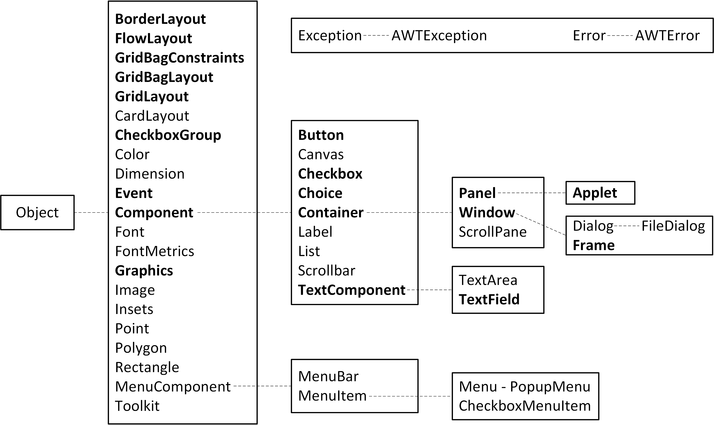
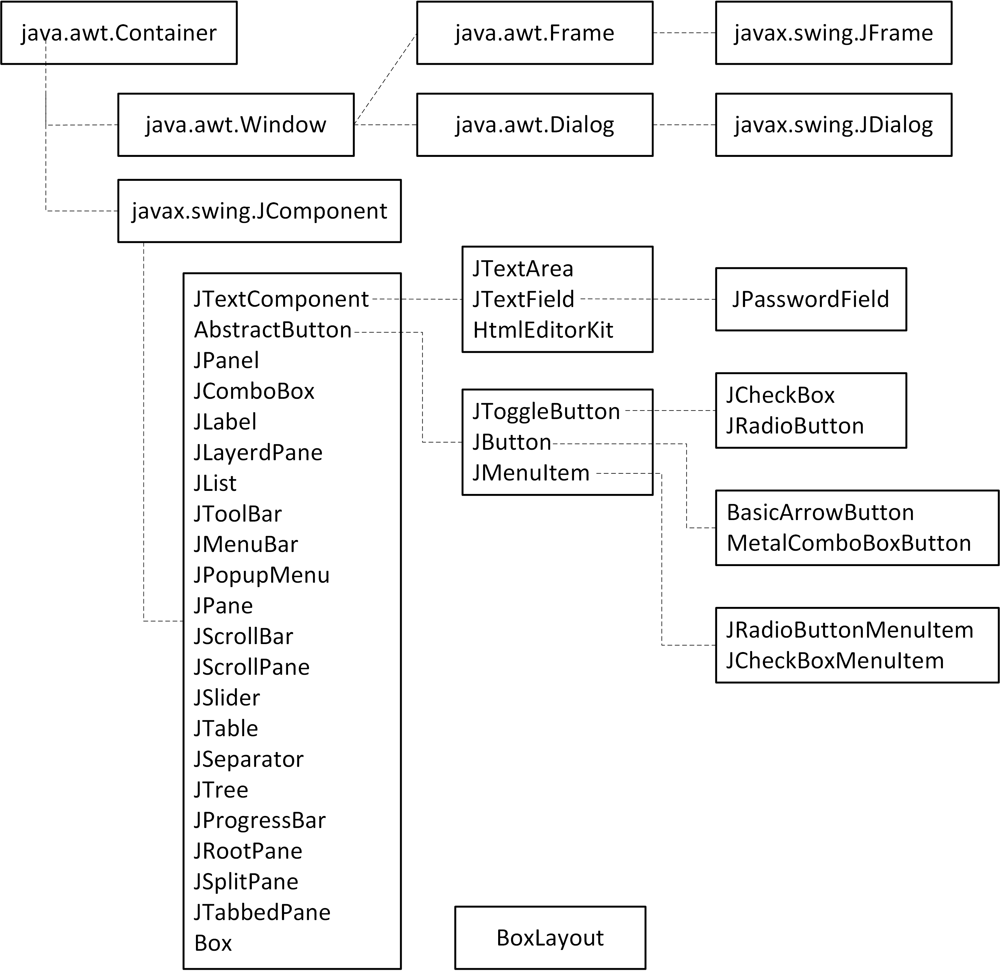
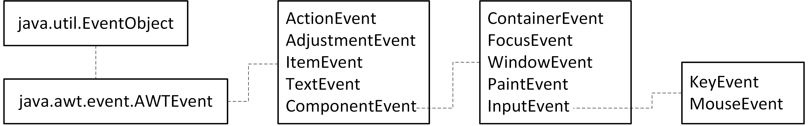
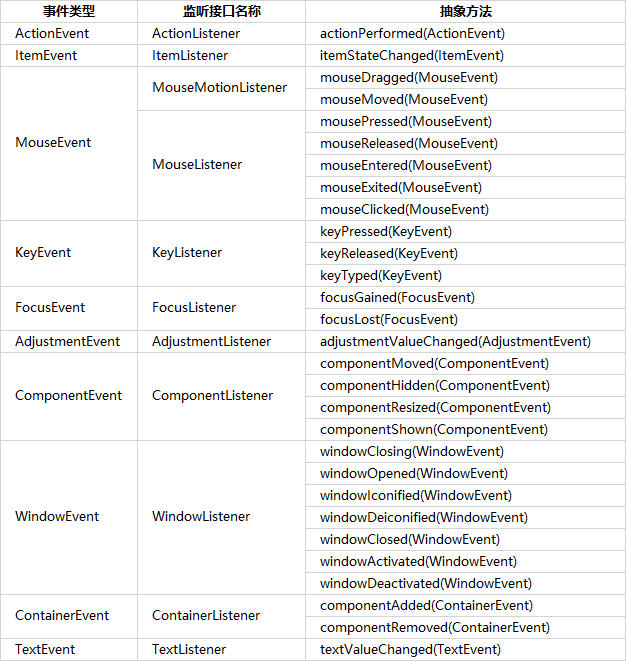
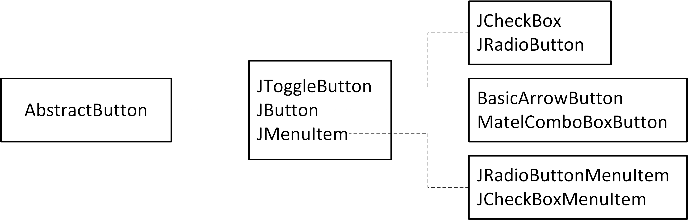
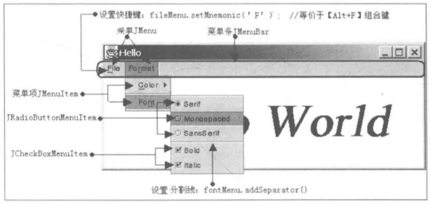
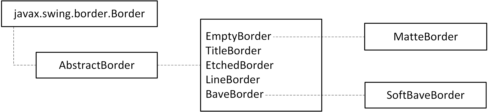
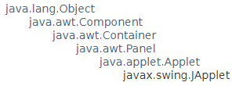

[toc]

# 一、图形用户界面

图形用户界面（Graphics User Interface，GUI）是用户与程序交互的窗口，构建图形用户界面的机制包括：

- 提供一些容器组件（如JFrame和Jpanel），用来容纳其他组件（如按钮JButton、复选框JCheckBox、文本框JTextField等）。
- 用布局管理器来管理组件在容器上的布局。
- 组件委托监听器来响应各种事件，实现用户与图形界面的交互。
- 提供一套绘图机制，来自动维护或刷新图形界面。

## （一）AWT组件和Swing组件

### 1. AWT简述

抽象窗口工具箱（Abstract Window Toolkit，AWT）是Java GUI的基本库，位于`java.awt`包中。AWT按照面向对象思想来创建GUI，提供了容器类、众多组件类和布局管理类，其层次结构图如下（粗体是比较重要的类）。



`Toolkit`中提供了一些常用工具，可以用它获得屏幕信息、设置图片等常用操作，`Toolkit.getDefaultToolkit()`。

java.awt包中提供了一个抽象类Component，它是所有AWT组件（除菜单类组件外）的父类，类中声明了所有组件都拥有的方法：

|                       方法                       |            描述            |
| :----------------------------------------------: | :------------------------: |
|                `getBackground()`                 |      返回组件的背景色      |
|                 `getGraphics()`                  |     返回组件使用的画笔     |
|                  `getHeight()`                   |       返回组件的高度       |
|                 `getLocation()`                  |   返回组件在容器中的位置   |
|                   `getSize()`                    |       返回组件的大小       |
|                   `getWidth()`                   |       返回组件的宽度       |
|                     `getX()`                     | 返回组件在容器中的x坐标值  |
|                     `getY()`                     | 返回组件在容器中的y坐标值  |
|                  `isVisible()`                   |      判断组件是否可见      |
|             `setBackground(Color c)`             |      设置组件的背景色      |
| `setBounds(int x, int y, int width, int height)` |    设置组件的位置及大小    |
|             `setEnabled(boolean b)`              |      设置组件是否可用      |
|                `setFont(Font f)`                 |       设置组件的字体       |
|             `setForeground(Color c)`             |      设置组件的前景色      |
|           `setLocation(int x, int y)`            | 设置组件在容器中的坐标位置 |
|              `setSize(Dimension d)`              |       设置组件的大小       |
|         `setSize(int width, int height)`         |      设置组件的宽和高      |
|             `setVisivle(boolean b)`              |      设置组件是否可见      |

Container类表示容器，继承了Component类。容器用来存放别的组件，有两种类型的容器

- Window（窗口）类是不依赖于其他容器而独立存在的容器。其两个子类：Frame（窗体）类带有标题，而且可以调整大小；Dialog（对话框）类可以被移动，但是不能改变大小。
- Panel（面板）类不能单独存在，只能存在于其他容器（Window或其子类）中，一个Panel对象即一个可以容纳其他组件的矩形区域。它的一个子类Applet可以在Web浏览器的窗口中运行。

在java.awt包中，还提供了可以加入到容器类组件中的各种具体组件，如按钮Button、文本框TextField和文本区域TextArea等。

AWT组件的优点是简单、稳定，兼容于任何一个JDK版本，缺点是依赖于本地操作系统的GUI，缺乏平台独立性。每个AWT组件都有一个同位体（peer），它们位于java.awt.peer包中，这辟peer负责与本地操作系统的交互，而本地操作系统负责显示和操作组件。由于AWT组件与本地平台的GUI绑定，因此用AWT组件创建的图形界面在不同的操作系统中会有不同的外观。

### 2. Swing简述

为了使用Java的GUI能够跨平台，即在不同操作系统中保持相同的外观，从JDK1.2版本开始引入了Swing组件，位于javax.swing包中，成为JDK基础类库的一部分。Swing组件是用纯Java语言编写而成的，不依赖于本地操作系统的GUI，可以跨平台运行。这种独立于本地平台的Swing组件也被称为轻量级组件，而依赖于本地平台的AWT组件则被称为重量级组件。

多数Swing组件的父类为javax.swing.JComponent，且名字都以大写字母`J`开头，Swing组件的类层次结构如下图。



### 3. 创建GUI的基本步骤

创建图形化用户程序的主要步骤为：

1. 创建容器，并设置相应的属性。
2. 设置容器的布局管理器，或采用默认的方式。
3. 创建某组件，设置相应的属性，将组件添加到容器中。
4. 注册事件监听，处理事务。
5. 显示容器组件。

```java
public static void main(String[] args) {
    JButton jb = new JButton("Swing Button");	// 创建一个JButton，传参是显示字符串
    jb.setMnemonic('i');	// 设置快捷键，当按下 Alt+I 时，就相当于选择了该 JButton
    jb.setToolTipText("Press me");	// 当鼠标移动到JButton区域时显示的提示信息
    JFrame jf = new JFrame("Hello");	// 创建一个JFrame，参数是标题
    jf.add(jb);		// 将jb组件添加到jf容器
    jf.pack();		// 自动确定JFrame的大小
    jf.setDefaultCloseOperation(JFrame.EXIT_ON_CLOSE);	// 点击关闭图标，程序结束
    jf.setVisible(true);	// 设置JFrame可见
}
```

- 每个JFrame都有一个与之关联的内容面板（ContentPane），它也是一个容器，加入JFrame容器的组件实际上都是加入到这个ContentPane中，故上面代码的jf.add(jb)可以等价写成`jf.getContentPane().add(jb)`。
- JFrame的`setContentPane(Container contentPane)`用来重新设置内容面板，因此也可以按以下方法向JFrame容器中加入组件，`jf.setContentPane(new Jpanel().add(jb))`。
- jf.pack()，用来自动确定JFrame的大小，pack()方法会确保JFrame容器中的组件都有与布局相适应的合理大小。
  - 也可以调用`setSize(int width, int height)`显示设置JFrame的大小，也可用`setExtendedState()`方法来设置窗口大小，参数可如`JFrame.MAXIMIZED_BOTH`表示最大化。
  - 如果希望用户不能调整窗口的大小，可以使用`setResizable(false)`来设置。也可以使用`setMinimumSize()`和`setMaximumSize()`方法来设置窗口的最小和最大的尺寸。
  - 使用`setLocation()`方法可以确定窗口的显示位置；使用`setLocationRelativeTo()`会让窗口根据某个组件的位置来定位，传参为`null`则表示显示在屏幕中间。
- JFrame的`setDefaultCloseOperation(int operation)`方法用来决定如何相应用户关闭窗体的操作，参数operation有以下选项：
  - `JFrame.DO_NOTHING_ON_CLOSE`，什么也不做。
  - `JFrame.HIDE_ON_CLOSE`，隐藏窗体（JFrame默认选项），但程序不会结束，只有在命令行控制台按下Ctrl+C才能结束程序。
  - `JFrame.DISPOSE_ON_CLOSE`，销毁窗体。
  - `JFrame.EXIT_ON_CLOSE`，结束程序。
- 也可以通过监听关闭事件，自定义窗口关闭操作，如下。

```java
addWindowListener(new WindowAdapter() {
	@Override
	public void windowClosing(WindowEvent e) {
		super.windowClosing(e);
	}
});
```

### 4. 常用功能

JFrame的`setLocationRelativeTo(null)`可以选择窗口的出现位置，传入null表示屏幕中间。

设置窗口图标，可以使用Toolkit工具箱，如下。

```java
Toolkit tk = Toolkit.getDefaultToolkit();
Image img = tk.getImage("title.jpg");
setIconImage(img);
```

## （二）布局管理器

### 1. 基础知识介绍

组件在容器中的位置和尺寸是由布局管理器来决定的，所有容器都会引用一个布局管理器实例，通过它来自动进行组件的布局管理。一个容器有相应的默认布局管理器，JFrame和与它关联的内容面板的布局管理器都是BorderLayout，JPanel的默认布局管理器是FlowLayout。

容器类的`setLayout(Layout layout)`方法用来设置容器新的布局管理器；`validate()`重建当前布局，使新的布局生效。JFrame的该方法会自动把关联的内容面板也为采用参数layout指定布局管理器。

*值得注意的是，早期JDK版本中，JFrame没有add()和setLayout()方法，必须调用关联的内容面板的相应方法；后来的JDK版本中，JFrame类重现实现了add()和setLayout()方法，默认情况下，这两个方法会自动调用与之关联的内容面板的add()和setLayout()方法。*

AWT提供了5种布局管理器：`FlowLayout`（流式布局管理器）、`BorderLayout`（边界布局管理器）、`GridLayout`（网格布局管理器）、`CardLayout`（卡片布局管理器）、`GridBagLayout`（网格包布局管理器）。Swing提供了一种`BoxLayout`布局管理器。

如果不想用布局管理器来管理布局，可以调用容器类的`setLayout(null)`方法，取消布局管理器。接下来必须调用容器中每个组件的`setLocation()`、`setSize()`或`setBounds()`方法，确定这些组件在容器的位置。

与布局管理器管理方式不同，这种手工布局将导致图形界面的布局不再是和平台无关的，而是图形界面的布局将依赖于操作系统环境。

### 2. FlowLayout（流式布局管理器）

FlowLayout按照组件添加次序将它们从左到右地放置在容器中，当到达容器边界时，组件将放置在下一行中。FlowLayout的特性如下：

- 允许以左对齐、居中对齐（默认方式）、右对齐的方式排列组件。
- 不限制它所管理的组件的大小，而是允许它们有自己的最佳大小。
- 当容器被缩放时，组件的位置可能会变化，但组件的大小不改变。

```java
FlowLayout([int align, int hgap, int vgap]);
```

- 构造方法，有可选参数。
- align，用来决定组件在每行中相对于容器边界的对齐方式，可选值有：`FlowLayout.LEFT`（左对齐）、`FlowLayout.RIGHT`（右对齐）、`FlowLayout.CENTER`（居中对齐，默认）。
- hgap、vgap，分别设置组件之间的水平和垂直间隙。

Layout布局类的`setAlignment(int align)`用来设置对齐方式；`layoutContainer(Container c)`使容器重新布局，可用来更新界面。

### 3. BorderLayout（边界布局管理器）

BorderLayout把容器分为5个区域，北南西东中（即上下左右中），其中间区域是在北南西东都填满后剩下的区域。BorderLayout的特性如下：

- 位于东、西区域的组件保持最佳宽度，高度被垂直拉伸至和所在区域一样高；位于南、北区域的组件保持最佳的高度，宽度被水平拉伸至和所在区域一样宽（默认占据全部的宽）；位于中部区域的组件宽度和高度都被拉伸至和所在区域一样大小。
- 当窗口垂直拉伸时，东、西、中区域被拉伸；当窗口水平拉伸时，南、北、中区域被拉伸。
- 对于容器的东、南、西、北区域，如果某个区域没有组件，那么这个区域面积为零，会被其他区域填充；对于中部区域，不管有没有组件，BorderLayout都会为它分配空间（即中间区域隐藏后，不会被其他区域填充）；如果该区域没有组件，那么在中部区域显示容器的背景颜色。
- 当容器被缩放时，组件所在的相对位置不变化，但组件大小改变。
- 如果在某个区域添加的组件不止一个，只有最后添加的一个是可见的。

```java
BorderLayout([int hgap, int vgap]);
```

- 构造方法，参数hgap、vgap，分别设置组件之间的水平和垂直间隙。

采用BorderLayout的容器，当用它的add()方法添加一个组件时，可以为组件指定在容器中的区域：

```java
void add(Component comp, Object constraints);
```

- 参数constraints实际上是String类型，可选值为BorderLayout提供的5个常量：
  - `BorderLayout.NORTH`，北区域，值为`"North"`。
  - `BorderLayout.SOUTH`，南区域，值为`"South"`。
  - `BorderLayout.EAST`，东区域，值为`"East"`。
  - `BorderLayout.WEST`，西区域，值为`"West"`。
  - `BorderLayout.CENTER`，中区域，值为`"Center"`。
- 如果不指定add()方法的constraints参数，默认情况下把组件放在中部区域。

### 4. GridLayout（网格布局管理器）

GridLayout将容器分割成许多行和列，组件按照添加顺序被填充到每个网格中，按照从左到右从上到下的顺序。GridLayout的特性如下：

- 组件的相对位置不随区域的缩放而改变，但组件的大小会随之改变。组件始终占据网格的整个区域。
- GridLayout总是忽略组件的最佳大小，所有组件的宽度相同，高度也相同。

```java
GridLayout([int rows, int cols, int hgap, int vgap]);
```

- 构造方法，参数rows、cols，分别代表行数和列数。
- 参数hgap、vgap，分别设定水平和垂直方向的间隙。水平间隙是指网格之间的水平距离，垂直间隙是指网格之间的垂直距离。

### 5. CardLayout（卡片布局管理器）

CardLayout将界面看作一系列的卡片，在任何时候只有其中一张卡片是可见的，这张卡片占据容器的整个区域。

```java
GardLayout([int hgap, int vgap]);
```

- 参数hgap、vgap，分别设定卡片和容器左右边界之间和上下边界之间的间隙。

采用CardLayout的容器，当用add()方法添加一个组件时，需要为组件指定所在卡片的名字：

```java
void add(Component comp, Object constraints);
```

- 参数constraints，实际上是一个字符串，表示卡片的名字。
- 默认情况下，容器显示第一个用add()方法加入到容器中的组件。

```java
show(Containcr parent, String name);
```

- CardLayout布局的方法，用于指定显示哪张卡片。
- 参数parent指定父容器（即该布局所在管理的容器），参数name指定卡片的名字。

### 6. GridBagLayout（网格包布局管理器）

GridBagLayout允许容器中各个组件的大小各不相同，还允许单个组件所在的显示区域占据多个网格。使用GridBagLayout布局管理器的步骤如下：

```java
GridBagLayout gbl = new GridBagLayout();	// 创建 GridBagLayout 布局管理器
someContainer.setLayout(bgl);				// 将某容器采用该布局管理器
GirdBagConstraints gbc = new GirdBagConstraints();		// 创建网格包约束对象
gbc.gridx = gbc.gridy = gbc.girdwidth = gbc.gridheight = 1;	// 设置约束属性
gbl.setConstraints(someComponent, gbc);		// 通知布局管理器设置某组件的约束信息
someContainer.add(someComponent);			// 向容器中添加组件
```

- 重复上面4~6行代码的步骤，将每个组件添加到容器中。

GridBagConstraints对象包含如何把一个组件添加到容器中的布局信息，只需创建一个该对象，它被多次重用，只需在每次向容器中加入组件时，先设置GridBagConstraints对象的属性。其具有以下属性：

- `gridx`、`gridy`，分别指定组件显示区域左上角的x和y的坐标（按列或行为单位），默认值为`GridBagConstraints.RELATIVE`，表示当前组件紧跟在上一个组件的后面。
- `gridwidth`、`gridheight`，分别指定组件显示区域占据宽度和高度（按列或行为单位），默认值为1。
  - 如果把gridwidth或gridheight设为`GridBagConstraints.REMAINDER`，表示当前组件在其行或列上为最后一个组件。
  - 如果把gridwidth或gridheight设为`GridBagConstraints.RELATIVE`，表示当前组件在其行或列上为倒数第二个组件。
- `fill`，在组件小于其显示区域时使用，决定是否及如何改变组件的大小，有效值包括：
  - `GridBagConstraints.NONE`，默认，不改变组件的大小。
  - `GridBagConstraints.HORIZONTAL`，使组件足够大，以填充其显示区域的水平方向，但不改变其高度。
  - `GridBagConstraints.VERTICAL`，使组件足够大，以填充其显示区域的垂直方向，但不改变其宽度。
  - `GridBagConstraints.BOTH`，使组件足够大，以填充其整个显示区域。
- `ipadx`、`ipady`，这两属性指定内部填充的大小。组件的宽度必须至少为其最小宽度加ipadx×2个像素（因为填充作用于组件的两边）；组件的高度必须至少为其最小高度加ipady×2个像素。
- `insets`，指定组件的外部填充大小，即组件与其显示区域边界之间的最小空间大小。
- `anchor`，在组件小于其显示区域时使用，决定组件放置在该区域中的位置，有效值包括`GridBagConstraints.CENTER`（默认值），还有`GridBagConstraints.NORTH`、`NORTHEAST`、`EAST`、`SOUTHEAST`、`SOUTH`、`SOUTHWEST`、`WEST`、`NORTHWEST`（注意这里简去了GridBagConstraints）。
- `weightx`、`weighty`，分别为水平权重和垂直权重，用来决定容器水平方向和垂直方向多余的空白区域如何分配。如一行或一列没有组件指定了权重，都采用默认值0，GridBagLayout把所有空白区域放在组件的显示区域和容器边界之间。

### 7. BoxLayout（箱式布局管理器）

GridBagLayout能够灵活制定布局，但使用起来比较麻烦。为了简化布局管理器的使用方法，javax.swing包提供了`BoxLayout`布局管理器，它通常和Box容器联合使用。

Box有两个静态工厂方法：

- `createHorizontalBox()`，返回一个Box对象，它采用水平BoxLayout，即BoxLayout沿着水平方向放置组件。
- `createVerticalBox()`，返回一个Box对象，它采用垂直BoxLayout，即BoxLayout沿着垂直方向放置组件。

Box还提供了用于决定组件之间间隔的静态方法：

- `createHorizontalGlue()`，创建水平Glue。
- `createVerticalGlue()`，创建垂直Glue。
- `createHorizontalStrut(int width)`，创建水平Strut，参数width指定Strut宽度。
- `createVerticalStrut(int height)`，创建垂直Strut，参数height指定Strut高度。
- `createRigidArea(Dimension d)`，创建一个硬区域，参数d指定硬区域的尺寸。

以上方法都返回一个Component类型的实例，分别表示Glue（胶水）、Strut（支柱）和RigidArea（硬区域）：

- `Glue`，胶水是一种不可见的组件，用于占据其他大小固定的GUI组件之间的多余空间。在调整容器的大小时，由胶水组件分割的GUI组件保持原有的尺寸，但胶水组件本身将被拉伸或收缩，以占据其他组件之间的多余空间。
- `Strut`，支柱是一种不可见的组件，水平支柱具有固定像素的宽度，垂直支柱具有固定像素的高度。支柱用于确保GUI组件之间保持固定的间隔。在调整容器的大小时，GUI组件之间由支柱分开的距离保持不变。
- `RigidArea`，硬区域是一种不可见的，具有固定像素高度和宽度的GUI组件。在调整容器的大小时，硬区域的大小保持不变。

## （三）事件处理

事件源触发事件，事件由对应监听器接收和处理。

### 1. 事件处理的软件实现

每个具体的事件都是某种事件类的实例，有ActionEvent、ItemEvent、MouseEvent、KeyEvent、FocusEven、WindowEvent等，可以调用事件类的`getSource()`获得事件源；每个事件类对应一个事件监听接口，如ActionListener、ItemListener、MouseListener、KeyListener等。

若程序需要处理某种事件，就需要实现相应的事件监听接口。实现监听接口有以下几种实现方式：

- 用内部类实现监听接口，定义一个内部匿名类作为参数传递给addXXXListener()函数。能够直接访问外部类的成员变量和方法。
- 用容器类实现监听接口，即将自定义容器继承某容器并实现XXXListener接口，将自定义容器类本身this作为参数传递给addXXXListener()函数。
- 定义专门的顶层类实现监听接口，自定义监听类实现XXXListener接口。优点是处理事件的代码与创建GUI界面的代码分类；缺点是自定义监听类无法直接访问事件源组件，必须通过事件类的getSource()方法来获得事件源。
- 采用事件适配器，若实现监听器接口，必须实现其所有方法，但实际应用中，往往不需要实现所有的法。为编程方便，AWT为部分方法较多的监听器接口（如MouseListener）提供了适配器类（如MouseAdapter），它们以空方法实现了监听接口。实际应用时就可以继承适配器，只覆盖所需的方法。
- 一个组件可注册多个监听器，所有监听器都会接收到相应的事件，但它们响应事件的次序是不确定的，与它们被注册到组件中的次序没有关系。

### 2. 事件源、事件、监听器的类层次和关系

在`java.util`包中定义了事件类`EventObject`，在`java.awt.event`包中定义了事件类`AWTEvent`，并继承于java.util.EventObject；所有具体AWT事件类都继承于java.awt.event.AWTEvent，位于java.awt.event包中。



EventObject类有一个`getSource()`方法，用来返回触发事件的对象；ComponentEvent类堤供了`getComponent()`方法，用来返回触发事件的组件。这两个方法返回同一个事件源对象的引用。

每类事件都有一个监听接口，监听接口中定义了一个或多个处理事件的方法，当发生特定的事件时，AWT会决定调用哪个方法。下表列出了主要的事件类型和监听接口的关系。



- MouseMotionListener和MouseListener都监听MouseEvent事件。
- MouseMotionListener主要处理和鼠标移动有关的事件，它包括以下方法：
  - mouseMoved()，用户未按下鼠标，直接移动鼠标时调用此方法。
  - mouseDragged()，用户按下鼠标，然后拖动鼠标时调用此方法。
- MouseListener主要处理和鼠标被单击有关的事件，它包括以下方法：
  - mouseClicked()，当用户单击鼠标时调用此方法。
  - mousePressed()，当用户按下鼠标时调用此方法。
  - mouseReleased()，当用户释放鼠标时调用此方法。
  - mouseExited()，鼠标退出组件的显示区域时调用此方法。
  - mouseEntered()：鼠标进入组件的显示区域时调用此方法。
- MouseEvent事件有一些方法，可以获得鼠标事件的详细信息，如:
  - `getButton()`获得是哪个鼠标按键的操作，预定义的常量有`MouseEvent.BUTTON1`（鼠标左键）、`MouseEvent.BUTTON2`（鼠标中建）、`MouseEvent.BUTTON3`（鼠标右键）。
  - `getClickCount()`获得按下的次数（连按），如果要监听双击事件，就可以判断它是否为2。
- 对于FocusEvent焦点变化的事件，有的组件默认一开始就获得焦点，有的组件则没有，故如果想要监听某些组件失去焦点的事件，可以使用`setFocusable(true)`手动使其获得焦点。

一个组件作为事件源，可触发多种事件，可通过addXXXListener方法（XXX表示某种事件）注册监听器。下表列出了组件和其注册监听器的方法。

|             组件              |                       注册监听器的方法                       |
| :---------------------------: | :----------------------------------------------------------: |
|           Component           | addComponentListener、addFocusListener、addHierarchyListener、addHierarchyBoundsListener、addKeyListener、addMouseListener、addMouseMotionListener、addInputMethodListener |
|           Container           |                     addContainerListener                     |
|            Window             |                      addWindowListener                       |
|          JComponent           |                     addAncestorListener                      |
| JCheckBox、JComboBox、JButton |              addItemListener、addActionListener              |
|             JList             |                   addListSelectionListener                   |
|          JScrollBar           |                    addAdjustmentListener                     |
|             JMenu             |                       addMenuListener                        |
|           JMenuIten           | addActionListener、addChangedListener、addItemListener、addMenuKeyListener |
|          JTextField           |                      addActionListener                       |

并不是所有的监听接口都有适配器，下表列出了监听接口和适配器的对应关系。

|      监听接口       |       适配器       |
| :-----------------: | :----------------: |
|  ComponentListener  |  ComponentAdapter  |
|    FocusListener    |    FocusAdapter    |
|     KeyListener     |     KeyAdapter     |
|    MouseListener    |    MouseAdapter    |
| MouseMotionListener | MouseMotionAdapter |
|  ContainerListener  |  ContainerAdapter  |
|   WindowListener    |   WindowAdapter    |
|    ItemListener     |     没有适配器     |
|   ActionListener    |     没有适配器     |
| InputMethodListener |     没有适配器     |

## （四）AWT绘图

### 1. 概述

AWT组件与Swing组件的绘图机制稍微有一些区别，这里主要介绍Swing级组件的绘图机制。

Component类提供了与绘图有关的方法：`paint(Graphics g)`，绘制组件的外观；`repaint()`，调用paint()方法，刷新组件的外观。Component类还有一个update()方法。对于AWT重量级组件，repaint()方法会先调用update()方法，update()方法再调用paint()方法；而对于Swing轻量级组件，repaint()方法直接调用paint()方法。

在以下几种情况，AWT线程会执行组件的paint()方法：

- 当组件第一次在屏幕上显示时，AWT线程会自动调用paint()方法来绘制组件。
- 用户在屏幕上伸缩组件，使组件的大小发生变化，此时AWT线程会自动调用组件的paint()方法，刷新组件的外观。
- 用户在屏幕上最小化界面，然后又恢复界面，此时AWT线程会自动调用组件的paint()方法，重新显示组件的外观。
- 程序中调用repaint()方法，该方法会促使AWT线程尽可能快地执行组件的paint()方法。

JComponent类继承自Component类并覆盖了paint()方法，把绘图任务委派给3个protected方法：

- `paintComponent()`，画当前组件，会以组件的背景色来覆盖整个组件区域。
- `paintBorder()`，画组件的边界。
- `paintChildren()`，如果组件为容器，则画容器所包含的组件。

用户自定义的Swing组件，如需要绘制图形，只需要覆盖paintComponent()方法，若想先清空组件上遗留的图形，可先调用super.paintComponent()方法，以背景色覆盖组件区域。然后再需要的地方调用repaint()即可。

在Component中可以通过getGraphics()方法获得它的Graphics对象，它可以直接作为Graphics对象，或向下转换为Graphics2D对象。

### 2. Graphics类

Component类的paint(Graphics g)方法有一个`java.awt.Graphics`类型的参数，Graphics类代表画笔，提供绘制各种图形的方法，常见的如下。

- `setColor(Color color)`，设置画笔颜色，若没设置则默认采用组件前景色。
- `setFont(Font font)`，设置画笔的字体。
- `drawLine(int x1, int y1, int x2, int y2)`，画一条端点为(x1,y1)和(x2,y2)的直线。
- `drawString(String string, int left, int bottom)`，写一个字符串，注此处就是bottom，而非笔误。
- `drawlmage(Image image, int left, int top, ImageObserver observer)`，画一个图片。
- `drawRect(int left, int top, int width, int height)`，画一个矩形。
- `drawOval(int x, int y, int width, int height)`，画一个椭圆。
- `fillRect(int left, int top, int width, int height)`，填充一个矩形。
- `fillOvaI(int x, int y, int width, int height)`，填充一个椭圆。

一个画板的例子程序如下所示。

```java
public class DrawPanel extends JPanel {
    private java.util.List<java.util.List<Point>> lines = new ArrayList<>();
    private java.util.List<Point> curLine;

    public DrawPanel() {
        setBackground(Color.WHITE);

        addMouseListener(new MouseAdapter() {
            @Override
            public void mousePressed(MouseEvent e) {
                super.mousePressed(e);
                curLine = new ArrayList<>();
                lines.add(curLine);
                curLine.add(new Point(e.getX(), e.getY()));
            }
        });

        addMouseMotionListener(new MouseMotionAdapter() {
            @Override
            public void mouseDragged(MouseEvent e) {
                super.mouseDragged(e);
                curLine.add(new Point(e.getX(), e.getY()));
                repaint();
            }
        });
    }

    @Override
    protected void paintComponent(Graphics g) {
        super.paintComponent(g);
        g.setColor(Color.RED);
        for (List<Point> points : lines) {
            int x1 = -1, y1 = -1, x2 = -1, y2 = -1;
            for (Point p : points) {
                x2 = (int) p.getX();
                y2 = (int) p.getY();
                if (x1 != -1 && x2 != -1) {
                    g.drawLine(x1, y1, x2, y2);
                }
                x1 = x2;
                y1 = y2;
            }
        }
    }
}
```

### 3. Graphics2D类

`java.awt.Graphics2D`类继承于Graphics类（可以通过对Graphics参数进行强制类型转换），它具有更强大的绘图功能，它绘制图形的方法有：`draw(Shape shape)`，画参数指定的图形；`fill(Shape shape)`，填充参数指定的图形区域，`setStroke(new BasicStroke())`方法用来设置画笔的粗细。

`java.awt.Shape`接口表示形状，它有一些抽象的实现类，例如`java.awt.geom.Line2D`（直线）、`java.awt.geom.Ellipse2D`（橢圆）、`java.awt.geom.Rectangle2D`（矩形）。

以上抽象图形类都有两个具体子类，`Double`和`Float`，如Line2D.Double和Line2D.Float。这两个子类以不同的精度来构建图形，Double精度要高，程序中常用Double来绘制图形。但若程序涉及很多图形，为节省内存，可考虑Float类。其构造函数都要求传入x,y,width,height参数。

```java
Toolkit tk = Toolkit.getDefaultToolkit();
Dimension d = tk.getScreenSize();		// 获得屏幕大小
int screenWidth = (int) d.getWidth();	// 获得屏幕的宽
int screenHeight = (int) d.getHeight();	// 获得屏幕的高
```

## （五）AWT线程（事件分派线程）

Java虚拟机提供专门的线程负责绘制图形用户界面（执行paintComponent等），以及响应种事件，执行相应的处理事件的方法（actionPerformed等），这个专门的线程称作AWT线程，由于它的一个重要任务就是处理事件，因此也称作事件分派线程（Event Dispatch Thread）。一个事件发生时，该事件被加入到事件队列中，AWT线程会按照先进先出的原则，依次处理事件队列中的事件。

为提高图形用户程序的运行性能，大多数Swing组件都没有考虑线程的同步，因此它们不是线程安全的。为避免潜在的并发问题，建议所有与图形界面有关的操作都由单个线程来执行。

`java.awt.EventQueue`类的`invokeLater(Runnable r)`方法会把参数r指定的任务提交给AWT线程来执行；`javax.swing.SwingUtilities`类对java.awt.EventQueue类做了轻量级封装，它的`invokeLater(Runnable r)`方法会调用EventQueue类的invokeLater()方法。

# 二、常用Swing组件

## （一）AbstractButton按钮组件

所有的按钮都继承自AbstractButton类，如普通按钮(JButton)、触发器按钮(JToggleButton)、复选框(JCheckBox)、单选按钮(JRadioButton)、箭头按钮(BasicArrowButton)、菜单项(JMenuItem)等，下图显示了按钮类的层次结构。



在按钮中可以显示图标，`ImageIcon`类表示图标。在AbstractButton中提供了以下和设置图标有关的方法：

- `setlcon(lcon icon)`，设置按钮有效状态下的图标。
- `setRolloverIcon(Icon icon)`，设置鼠标移动到按钮区域的图标。
- `setPressedIcon(Icon icon)`，设置按下按钮时的图标。
- `setDisabledIcon(Icon icon)`，设置按钮无效状态下的图标。

### 1. JCheckBox复选框与JRadioButton单选按钮

`JCheckBox`表示复选框，用户可以同时选择多个复选框。当用户选择或者取消选择一个复选框时，将触发一个ActionEvent事件，可以用ActionListener来响应该事件。

`JRadioButton`表示单选按钮，可以把一组单选按钮加入到一个按钮组（`ButtonGroup`）中，在任何时候，用户只能选择按钮组中的一个按钮。当用户选择了一个单选按钮时，将触发一个ActionEvent事件，可以用ActionListener来响应该事件。

## （二）JTextComponent文本组件

### 1. JTextField文本框

`JTextField`表示文本框，只能输入一行文本。当用户在文本框内按【Enter】键时，将触发ActionEvent事件。

JTextField与一个`javax.swing.text.PlajnDocument`关联，其保存了JTextField的文档，当用户向文本输入文本时，AWT线程会自动调用PlainDocument的insertString()方法，把用户输入的文本存放到PlainDocument中。

可以通过JTextField的`setDocument(Document doc)`方法与一个Document关联，可以通过实现自定义Document子类，来客制化文本框的输入显示等功能。

### 2. JTextArea文本区域与JScrollPane滚动面板

`JTextArea`表示文本区域，可以输入多行文本。当用户在文本区域内按【Enter】键时，仅仅意味着换行输入文本，并不会触发ActionEvent事件。如果希望对文本区域内的文本进行保存或复制等操作，应该使用另外的按钮或菜单来触发ActionEvent事件。

JTextArea也与一个Document关联，同样可以通过`setDocument(Document doc)`方法来设置其关联的Document。可调用JTextArea的`setLineWrap(true)`和`setWrapStyleWord(true)`方法来实现自动换行和断行不断字的功能。

`JScrollPane`表示带滚动条的面板，默认情况下，只有当面板中的内容超过了面板的面积时，才会显示滚动条。此外，在构造JScrollPane对象时，也可以指定在水平方向和垂直方向滚动条的显示方式。

可以将JTextArea放到JScrollPane容器中，以实现带有滚动条的输入窗口等功能。

## （三）列表

### 1. JComboBox下拉列表

`JComboBox`表示下拉列表，其和单选按钮组一样，也可以提供多个选项，并且只允许用户选择一项。当用户选择了列表中的一项以后，就会触发ActionEvent事件。

通过`getSelectedIndex()`可以返回下拉列表中被选中项的索引。

默认情况下，JComboBox是不可编辑的，可以调用`setEditable(true)`使它可以被编辑。可以通过`addItem(String str)`向下拉列表中添加一项。

### 2. JList列表框

`JList`表示列表框，它在界面上占据固定行数的空间，并且既支持单项选择，也支持多项选择。当用户在列表框中选择一些选项时，将触发ListSelectionEvent事件，ListSelectionListener监听器负责处理该事件。

JList是一个泛型类，通常使用`JList<String> ls`以字符串形式来存储每一项，它的`setMode(new AbstractListModel<String>())`方法或者`setListDate()`方法能够重新设置其中的项。`setVisibleRowCount(int count)`方法设置在界面上显示count个选项。`List<String> getSelectedVaulesList()`方法返回选中的项。

JList的`setSelectionMode(int selectionMode)`方法用来设置列表框的选择模式，参数有可选值：

- `ListSelectionModel.SINGLE_SELECTION`，一次只能选择一项。
- `ListSelectionModel.SINGLE_INTERVAL_SELECTION`，允许选择连续范围内的多个项。如果用户按住【Shift】键，可以选中某两个选项之间的所有选项。
- `ListSelectionModel.MULTIPLE_INTERVAL_SELECTION`，允许选择多个项，这是列表框的默认选择模式。用户按住【Ctrl】键，然后单击列表框的多个选项，这些选项都会被选中。

## （四）菜单工具栏等

### 1. JTabbedPane页签面板

`JTabbedPane`表示页签面板，它可以包含多个页面，每个页面和一个标签对应。当用户选择特定的标签，就会显示相应的页面，并且会触发一个ChangeEvent事件，该事件由ChangeListener监听器响应。

它的`addTab(String title, Component component)`方法用于页签集合中添加一个页面；`getSelectedIndex()`返回被选中页面标签的索引。

```java
public JTabbedPane([int tabPlacement, int tabLayoutPolicy])
```

- tabPlacement参数，指定标签在容器上的位置，可选值有`JTabbedPane.TOP`（默认）、`JTabbedPane.BOTTOM`、`JTabbedPane.LEFT`、`JTabbedPane.RIGHT`等。
- tabLayoutPolicy参数，设置标签的布局，有两个可选值：
  - `JTabbedPane.WRAP_TAB_LAYOUT`（默认），在容器内显示所有标签，如果在一排内不能容纳所有标签，则把剩下的标签放到下一排。
  - `JTabbedPane.SCROLL_TAB_LAYOUT`，只显示一排标签，剩下的标签可通过滚动图标显示。

### 2. JMenu菜单

菜单的组织方式为：一个菜单条（`JMenuBar`）中可以包含多个菜单（`JMenu`），一个菜单（JMenu）中可以包含多个菜单项（`JMenuItem`）；JMenuBar可以通过`add()`方法添加JMenu，JMenu可以通过`add()`方法添加JMenuItem。它们的关系如下图。



有一些支持菜单的组件，如JFrame、JDialog、JApplet组件，可以通过`setMenuBar(JMenuBar bar)`方法来设置菜单条。分隔符可以由`JSeparator`类表示。

JMenuItem对象的`setAccelerator(KeyStroke)`方法来设置按键，它能直接调用菜单项的操作监听器而不必显示菜单的层次结构。JMenuItem对象貌似不会响应MouseEvent事件，即使注册了它的监听器，而是只响应ActionEvent事件。

除了以上下拉式菜单，javax.swing包还提供了弹出式菜单`JPopupMenu`，当用户按下或松开鼠标右键时触发MouseEvent事件，此时MouseEvent的isPopupTrigger()方法返回true，如果希望显示弹出式菜单，只需要调用JPopupMenu的show()方法。菜单本质上就是带有关联的JPopupMenu的按钮。

JPopupMenu的`getInvoker()`和`setInvoker(Component invoker)`方法可以获得或者设置弹出此菜单的“调用者”组件，即弹出菜单在其中显示的组件。

需要注意的是，AWT包中提供了`PopupMenu`和`MenuItem`，用来设置右键菜单（MenuItem的事件要先设置事件监听再加入到PopupMenu中，若先加入再添加可能会无效）；其中MenuItem只能注册ActionListener事件监听器。

### 3. JToolBar工具栏

`JToolBar`提供了一个用来显示常用按钮和操作的组件，可把任意类型的组件附加到工具条上，但是通常是按钮；与JMenuBar不一样，JToolBar对象可以直接被添加到容器中，它的常用方法如下。

|             方法              |                             说明                             |
| :---------------------------: | :----------------------------------------------------------: |
|        `add(Action a)`        |                添加一个指派动作的新的JButton                 |
|       `addSeparator()`        |                  将分隔符添加到工具栏的末尾                  |
| `getComponentAtIndex(int i)`  |                    返回指定索引位置的组件                    |
|     `setMargin(Insets m)`     |              设置工具栏边框和它的按钮之间的空白              |
|   `setFloatable(boolean b)`   |            如果要移动工具栏，此属性必须设置为true            |
| `setBorderPainted(boolean b)` |               如果需要绘制边框，则此属性为true               |
|   `setRollover(boolean b)`    | 若为true，则仅当鼠标指针悬停在工具栏按钮上时，才绘制该工具栏按钮的边框 |

## （五）对话框选择框等

### 1. JDialog对话框

`JDialog`表示对话框，它是在现有窗口的基础上弹出的另一个窗口，其默认布局管理器为BorderLayout，构造方法如下：

```java
public JDialog(Frame owner, String title, boolean modal);
```

- owner参数，表示对话框所属的Frame。
- title参数，表示对话框的标题。
- modal参数有两个可选值：
  - modal为true（默认），表示模式对话框，如果对话框被显示，那么其他窗口都处于不活动状态，只有当用户关闭了对话框，才能操作其他窗口。
  - modal为false，表示非模式对话框，当对话框被显示时，其他窗口照样处于活动状态。

可以调用`setVisible(true)`显示对话框。当对话框被关闭时，通常不希望结束整个应用程序，因此只需调用JDialog的`dispose()`方法销毁对话框，从而释放对话框所占用的资源。

### 2. JOptionPane消息框

`JOptionPane`类有一系列静态的showXXXDialog()方法，可用来生成各种类型的消息框。

```java
void showMessageDialog(Component parentComponent, Object message, String title, int messageType, Icon icon);
```

- 消息对话框，即显示包含提示信息的对话框。
- 只有parentComponent和message参数是必须的，parentComponent可以是任意组件或者为空，message用来定义提示信息，它是一个对象，但是通常使用字符串表示。
- title参数是设置对话框标题的字符串。
- messageType用来设置消息类型，不同的类型有不同的图标，也可以通过icon自定义图标；预定义值有以下几种：
  - `JOptionPane.ERROR_MESSAGE`（0），错误消息类型。
  - `JOptionPane.INFORMATION_MESSAGE`（1，默认），提示消息类型。
  - `JOptionPane.WARNING_MESSAGE`（2），警告消息类型。
  - `JOptionPane.QUESTION_MESSAGE`（3），问题消息类型。
  - `JOptionPane.PLAIN_MESSAGE`，文本消息类型，没有图标。
- 这些参数，在其他消息框中的也是同样的意义，就不再赘述。

```java
int showConfirmDialog(Component parentComponent, Object message, String title, int optionType, int messageType, Icon icon);
```

- 确认对话框，即显示让用户选择Yes/No的对话框。
- optionType参数用于控制在对话框上显示的按钮，可选值如下：
  - `JOptionPane.YES_NO_OPTIION`（0）。
  - `JOptionPane.YES_NO_CANCEL_OPTIION`（1）。
  - `JOptionPane.OK_CANCEL_OPTIION`（2）。
- messageType参数设置消息类型，参考上述，这里默认是QUESTION_MESSAGE，问题消息类型。
- 返回值对应所选的项，即激活的按钮，预定义的常量值如下：
  - `JOptionPane.YES_OPTIION`（0）或`JOptionPane.OK_OPTIION`（0）。
  - `JOptionPane.NO_OPTIION`（1）。
  - `JOptionPane.CANCEL_OPTIION`（2）。
  - `JOptionPane.CLOSED_OPTIION`（-1），表示对话框在没有任何按钮激活的情况下关闭，例如点击对话框右上角的关闭图标按钮。

```java
int showOptionDialog(Component parentComponent, Object message, String title, int optionType, int messageType, Icon icon, Object[] options, Object initValue);
```

- 选择对话框，即显示让用户选择一个可选项的对话框。
- options参数指定一组可选值/项（字符串数组或JButton数组），它们以按钮的方式显示出来。
- initValue参数用于指定默认获得焦点的选项。
- 返回表明激活的按钮的一个整型值，它是在一组选项中的索引。

```java
String showInputDialog(Component parentComponent, Object message, String title, int messageType);
Object showInputDSalog(Component parentComponent, Object message, String title, int messageType, Icon icon, Object[] selectionValue, Object initValue);
```

- 输入对话框，即显示接收用户输入文本的对话框。
- messageType参数设置消息类型，参考上述，这里默认是QUESTION_MESSAGE，问题消息类型。
- 第一个方法用于文本框输入，返回的是输入框中的字符串。
- 第二个用于下拉列表或列表框的显示方式，返回的是选中的对象。如果一组可选值的个数小于20，则用下拉列表显示；大于或等于20，则通过列表框显示。

### 3. JFileChooser文件选择框

`JFileChooser`类表示文件对话框，它有两个主要静态方法：

- `int showOpenDialog()`，显示用于打开文件的对话框。
- `int showSaveDialog()`，显示用于保存文件的对话框。

返回值有`JFileChooser.CANCEL_OPTION`（取消）、`JFileChooser.APPROVE_OPTION`（确定）等，可以判断它们的返回值，如果用户点击了确定，可以通过JFileChooser提供的`getCurrentDirectory()`和`getSelectedFile()`返回目录文件和选中文件。

在打开文件选择器之前，通过调用`setCurrentDirectory(File)`方法用来设置当前打开时的默认目录。调用JFileChooser对象的`setFileSelectionMode(int)`方法用来确定可选择的文件类型，其参数值有以下三个：

- `JFileChooser.FILES_ONLY`（0），只选择文件。
- `JFileChooser.DIRECTORIES_ONLY`（1），只选择目录。
- `JFileChooser.FILES_AND_DIRECTORIES`（2），可选择目录和文件。

### 4. JColorChooser颜色选择框

`JColorChooser`类提供一个用于允许用户操作和选择颜色的控制器窗格，一般使用它的静态方法`showDialog(Component component, String title, Color initialColor)`，创建一个颜色对话框，在隐藏对话框之前线程一直阻塞进程；其中initialColor参数指定对话框返回的初始颜色，即对话框消失后的默认值。

可以用`getColor()`方法获得颜色选取器的当前颜色值。

## （六）边框表格树等

### 1. Border边框

JComponent类有一个`setBorder(Border border)`方法，用来为组件设置边框。所有的边框类都实现了javax.swing.border.Border接口，其层次结构如下图。



不同的边框有不同的效果，使用时可以注意区分。

### 2. JTable表格

`JTable`是Swing新增的组件，主要功能是把数据以二维表格的形式显示出来，并且允许用户对表格中的数据进行编辑。

表格组件是最复杂的组件之一，它的表格模型功能非常强大、灵活而易于执行。由于篇幅有限，这里只介绍默认的表格模型；表格模型TableModel里面支持设置表格列名等属性。

JTable有多种构造方法，能够只等列数行数或者显示的内容及列名等；`setSelectionMode()`可以设置选择模式，还有常用方法如下。

|                       方法                        |                        说明                        |
| :-----------------------------------------------: | :------------------------------------------------: |
| `setValueAt(Object a Value, int row, int column)` |                 设置指定单元格的值                 |
|         `getValueAt(int row, int column)`         |                 返回指定单元格的值                 |
|                  `getRowCount()`                  |     返回JTable中可以显示的行数（给定无限空间）     |
|                `getColumnCount()`                 |                 返回列模型中的列数                 |
|            `getColumnName(int column)`            |       返回出现在视图中column列位置处的列名称       |
|                `getSelectedRow()`                 | 返回第一个选定行的索引，如果没有选定的行，则返回-1 |
|               `getSelectedColumn()`               | 返回第一个选定列的索引，如果没有选定的列，则返回-1 |

可以用`DefaultTableModel tableModel = (DefaultTableModel)table.getModel();`获得默认的表格模型对象，从而对其中的数据进行一些常见操作。如各种添加add和删除remove方法，一系列set和get方法，以及一些其他常用方法。

最后不要忘记调用`table.setModel(tableModel)`应用修改后的表格模型。

### 3. JTree树

如果要显示一个层次关系分明的一组数据，用树结构是最合适的；树如同Windows资源管理器的左半部，可通过单击文件夹展开或者收缩内容。

Swing使用`JTree`类实现树，主要功能是把数据按照树状进行显示，其数据来源于其他对象；它有多个构造方法，可以接受一组数据或者一个根节点等。

树以垂直方式显示数据，每行显示一个节点；一棵树只有一个根节点，节点由`javax.swing.tree.TreeNode`接口定义，该接口被`DefaultMutableTreeNode`类实现。

构造方法`DefaultMutableTreeNode(Object userObject[, boolean allowsChildren])`创建一个没有父节点和子节点的树节点，使用指定的对象对它进行初始化，allowsChildren参数用来指定他是否可以拥有子节点。

DefaultMutableTreeNode类的`add()`和`remove()`方法，用来添加或删除子节点，`setParent()`方法用来设置父节点，以及提供了一系列的get方法和其他辅助方法。

## （七）滑块进度条组件

### 1. JSlider滑块

`JSlider`是一个允许用户在有限区域内通过移动滑块来选择值的组件，它有几个重载的构造方法，还有如`getValue()`和`setValue()`的方法用来获得和设置滑块的值。

一些常用的方法如下（一些经典的如获得和设置最大最小值的方法因太简单，此处省略）。

|                 方法                  |                             说明                             |
| :-----------------------------------: | :----------------------------------------------------------: |
| `createStandardLabels(int increment)` |     创建一个数字文本标签的Hashtable，用来表示滑块刻度值      |
|  `setLabelTable(Dictionary labels)`   |             用标签确定在给定刻度值处绘制哪些刻度             |
|      `setPaintLabels(boolean b)`      |                   确定是否在滑块上绘制标签                   |
|      `setPaintTicks(boolean b)`       |                 确定是否在滑块上绘制刻度标记                 |
|      `setPaintTrack(boolean b)`       |                   确定是否在滑块上绘制滑道                   |
|      `setSnapToTicks(boolean b)`      | 指定为true，则滑块（及其所表示的值）解析为最靠近用户放置滑块处的刻度标记的值 |
|     `setMajorTickSpacing(int n)`      |                     设置主刻度标记的间隔                     |
|     `setMinorTickSpacing(int n)`      |                     设置次刻度标记的间隔                     |

- 滑块可以显示主刻度标记和次刻度标记，刻度标记之间的值的个数由`setMajorTickSpacing()`方法和`setMinorTickSpacing()`方法来控制，是否绘制刻度标记由`setPaintTicks()`方法控制。
- 滑块也可以在固定间隔（或在任意位置）沿滑块刻度打印文本标签，通常标签由`createStandardLabels()`方法创建，绘制由`setLabelTable()`方法和`setPaintLabels()`方法控制。

### 2. JPorcessBar进度条

`JPorcessBar`是一种以可视化形式显示某些任务进度的组件。JProgressBar类实现了为长时间的操作提供可视化指示器的GUI进度条，它的构造方法类似于JSlider。

进度条显示的是某任务完成的百分比，通常由一个矩形表示，初始为空，随着任务的完成逐渐被填充；此外，进度条可显示此百分比的文本表示形式。

它有一系列经典的set与get方法，此外`setIndeterminate(boolean b)`用来设置进度条是否处于不确定模式，传入true则表示不确定的进度条，他将持续显示动画来表示正在进行的操作；一旦可以确定任务长度和进度量，则应该更新进度条的值，将其切换到确定模式。

它的`setString(String s)`方法可以用来设置进度字符串的值；`setStringPainted(boolean b)`方法用来确定进度条是否应该呈现进度字符串。


## （八）其他功能性组件

### 1. 播放音频文件

在java.applet包中有一个`AudioClip`类，它可以用来播放音频文件，支持格式包括：Sun Audio（以.au为扩展名）、Windows Wav（以.wav为扩展名）、Macintosh AIFF文件格式（以.aif为扩展名）、Musical Instrument Digital Interface（MIMD，以.mid或.rmi为扩展名）。

AudioClip类具有以下方法：

- `play()`，播放音频文件一次。
- `loop()`，重复播放音频文件。
- `stop()`，停止播放音频文件。

`java.applet.Applet`类的`newAudioClip(URL url)`方法创建一个AudioClip对象，参数url指定音频文件的URL路径。

`JApplet`作为Swing组件，是Applet类的子类，它在继承树上的位置如图所示。



JApplet的默认布局管理器为BorderLayout，JApplet和Panel一样，不能单独存在，必须加入到其他容器中。

JApplet及Applet与其他组件的最大区别在于，它们可以作为小应用程序，在浏览器中运行。当浏览器访问Web服务器中的一个嵌入了Applet的网页时，这个Applet的.class文件会从Web服务器端下载到浏览器端，浏览器启动一个Java虚拟机来运行Applet。

### 2. Swing Timer计时器

计时器（`javax.swing.Timer`）组件可以在指定时间间隔触发一个或多个`ActionEvent`，通过向Timer注册一个或多个动作监听器`ActionListener`来响应；即以一定的时间规律执行监听器中自实现的方法。

```java
new Timer(1000, new ActionListener() {
    @Override
    public void actionPerformed(ActionEvent e) {
        // do some task here.
    }
}).start();
```

- delay，延迟时间参数，时间间隔的单位是毫秒（milliseconds）。它表示第一个事件在start()多长时间后触发；在第一个事件触发后，之后的事件每相隔多长时间触发一次，一直往复下去直到被停止。
- 如果希望计时器只在第一次触发后停止，可以调用Timer对象的`setRepeats(false)`方法。
- 创建Timer类的对象之后，可以单独更改初始延迟时间（事件触发间隔时间），并且可以添加其他的ActionListener。
- 题外话，如果仅仅是在some task处打印与上次执行的时间间隔，则平均每次会比实际多1.5毫秒；如果时间间隔是1秒（1000毫秒），则一小时平均会比实际多出5.4秒。

下面是Timer常用的一些方法。

|                  方法                   |                             说明                             |
| :-------------------------------------: | :----------------------------------------------------------: |
| `addActionListener(ActionListener lis)` |                 将一个动作监听器添加到Timer                  |
|              `getDelay()`               |           返回两次触发动作事件间延迟，以毫秒为单位           |
|          `setDelay(int delay)`          |   设置 Timer 的事件间延迟、两次连续的动作事件之间的毫秒数    |
|       `setRepeats(boolean flag)`        |   如果flag为false，则指示Timer只向其监听器发送一次动作事件   |
|             `isCoalesce()`              | 如果Timer组合多个挂起的动作事件，将其作为一个事件发送，则返回true |
|       `setCoalesce(boolean flag)`       |            设置Timer是否组合多个挂起的ActionEvent            |
|                `start()`                |          启动Timer，使它开始向其监听器发送动作事件           |
|                `stop()`                 |          停止Timer，使它停止向其监听器发送动作事件           |
|               `restart()`               |    重新启动Timer，取消所有挂起的触发并使它按初始延迟触发     |
|              `isRunning()`              |                如果Timer正在运行，则返回true                 |
|      `setLogTimers(boolean flag)`       |                     启用/禁用计时器日志                      |

计时器可以用来模拟进度条的进度变化，可以用来计时实现某些操作。

## （九）外观与颜色

### 1. 设置Swing界面的外观和感觉

AWT组件不是跨平台的，它的外观取决于程序运行时所在的操作系统。

Swing采用UIManager类来管理Swing界面（包括界面中的所有Swing组件）的外观，它的有静态方法用来设置界面的外观：

- `setLookAndFeel(LookAndFeel lookAndFeel)`，参数lookAndFeel对象代表某种外观。
- `setLookAndFeel(String className)`，参数className指定代表某种外观的类的名字。

设置Swing界面的外观有以下几种策略。

1. 采用程序运行时所在操作系统的组件的外观，此时Swing组件就像AWT组件那样，在不同的操作系统中显示时，采用本地操作系统的组件外观。

```java
UIManager.setLookAndFeel(UIManager.getSystemLookAndFeeICIassName());
```

2. 在所有操作系统中保持同样的跨平台的金属（Metal）外观，这是UIManager采用的默认外观。
3. 为界面显式地指定某种外观，例如以下代码指定界面采用Motif外观：

```java
UIManager.setLookAndFeel("com.sun.java.swing.plaf.motif.MotifLookAndFeel");
```

### 2. 颜色

java.awt.`Color`是Java GUI中的颜色类，它除了提供了诸如`Color.RED`、`Color.BLUE`等默认的静态颜色对象外，还可以根据各种RGBA的值来构造实例对象。

说明：当RGBA分开的时候，它们的值都是从0\~255变化的。也可采用一个16进制数来表示，如果只是RGB则为6位16进制数，格式如0xRRGGBB，每一位的取值为0\~F；如果再加上A，则为8位16进制数，格式如0xAARRGGBB，每一位的取值为0~F。例如0x80FF0000就表示半透明的红色。

# 补充例子与功能

## （一）自定义组件

### 1. 自定义JList每项的显示

在源码实现中，JList的每一项（cell）如何显示，是通过一个cell renderer来确定的，它实现了`ListCellRenderer`接口；JList默认使用的`DefaultListCellRenderer`，它实现了上述接口，并继承了`JLabel`类，即将传入的每一项渲染成一个Jlabel来显示。

因而默认情况下可以向JList传入字符串数组（或Icon图标），它们被渲染成一组JLabel显示，但若传入其他类型的对象，就会被调用`toString()`用来构造JLabel，从而显示的是一串表示对象信息的字符串，无法到达预期的效果。

可以通过自定义实现ListCellRenderer接口的类，覆盖`getListCellRendererComponent()`方法，来渲染所需的对象类型的显示方式，下面是一个在JList显示JProcess的例子。

```java
// JProcessCellRender.java
public class JProcessCellRender extends JProgressBar implements ListCellRenderer<Object> {
    public JProcessCellRender() {
        super();
        setOpaque(true);
        setBorder(getNoFocusBorder());
        setName("List.JProcessCellRender");
    }

    /**
     * @param list，持有该render的JList对象
     * @param value，JList中的每一项，即JList<AType>中的AType类型的对象，它是通过调用list.getModel().getElementAt(index)方法获得的
     * @param index，项的索引
     * @param isSelected，该项是否被选中
     * @param cellHasFocus，该项是否获得焦点
     */
    @Override
    public Component getListCellRendererComponent(JList<?> list, Object value, int index, boolean isSelected, boolean cellHasFocus) {
        // 设置一些其他属性，如边框样式、被选中时样式等
        setOtherProperties(list, index, isSelected, cellHasFocus);

        MyTask myTask = (MyTask) value;
        int cur = myTask.getCur();
        int total = myTask.getTotal();
        setMinimum(0);
        setMaximum(total);
        setValue(cur);
        String text = String.valueOf(cur * 100 / total) + "%";
        setStringPainted(true);
        setString(text);

        return this;
    }

    // DefaultListCellRenderer的部分实现
    private void setOtherProperties(JList<?> list, int index, boolean isSelected, boolean cellHasFocus) {
        setComponentOrientation(list.getComponentOrientation());
//        Color bg = null;
//        Color fg = null;
//        JList.DropLocation dropLocation = list.getDropLocation();
//        if (dropLocation != null
//                && !dropLocation.isInsert()
//                && dropLocation.getIndex() == index) {
//            bg = DefaultLookup.getColor(this, ui, "List.dropCellBackground");
//            fg = DefaultLookup.getColor(this, ui, "List.dropCellForeground");
//            isSelected = true;
//        }
//        if (isSelected) {
//            setBackground(bg == null ? list.getSelectionBackground() : bg);
//            setForeground(fg == null ? list.getSelectionForeground() : fg);
//        }
//        else {
//            setBackground(list.getBackground());
//            setForeground(list.getForeground());
//        }
        if (isSelected) {
            setBackground(new Color(156, 156, 156));
            setForeground(new Color(255, 128, 128));
        }
        else {
            setBackground(new Color(192, 192, 192));
            setForeground(new Color(128, 128, 255));
        }
        setEnabled(list.isEnabled());
        setFont(list.getFont());
        Border border = null;
        if (cellHasFocus) {
            if (isSelected) {
                border = DefaultLookup.getBorder(this, ui, "List.focusSelectedCellHighlightBorder");
            }
            if (border == null) {
                border = DefaultLookup.getBorder(this, ui, "List.focusCellHighlightBorder");
            }
        } else {
            border = getNoFocusBorder();
        }
        setBorder(border);
    }

    // DefaultListCellRenderer的实现
    private Border getNoFocusBorder() {
        Border border = DefaultLookup.getBorder(this, ui, "List.cellNoFocusBorder");
        if (System.getSecurityManager() != null) {
            if (border != null) return border;
            return SAFE_NO_FOCUS_BORDER;
        } else {
            if (border != null &&
                    (noFocusBorder == null ||
                            noFocusBorder == DEFAULT_NO_FOCUS_BORDER)) {
                return border;
            }
            return noFocusBorder;
        }
    }
    // DefaultListCellRenderer的实现
    private static final Border SAFE_NO_FOCUS_BORDER = new EmptyBorder(1, 1, 1, 1);
    private static final Border DEFAULT_NO_FOCUS_BORDER = new EmptyBorder(1, 1, 1, 1);
    protected static Border noFocusBorder = DEFAULT_NO_FOCUS_BORDER;
}

class MyTask {
    private int mCur;
    private int mTotal;
    public MyTask(int cur, int total) { mCur = cur; mTotal = total; }
    public int getTotal() { return mTotal; }
    public int getCur() { return mCur; }
}
```

- 上述例子中主要展示的是getListCellRendererComponent()方法的自定义方式；其他的一些方法如setOtherProperties()设置属性等可以自定义实现，也并不是必须的，这里是为了方便而直接copy的DefaultListCellRenderer的部分实现。

一个使用的例子如下。

```java
// MyUI.java
public class MyUI extends JFrame {
    public MyUI() {
        MyTask[] mts = new MyTask[10];
        for (int i = 0; i < 10; ++i) {
            mts[i] = new MyTask(i, 9);
        }
        JList<MyTask> myList = new JList<>(mts);
        myList.setCellRenderer(new JProcessCellRender());

        JScrollPane jScrollPane = new JScrollPane();
        jScrollPane.getViewport().setView(myList);
        add(jScrollPane, BorderLayout.CENTER);
    }

    public static void main(String[] args) {
        MyUI myUI = new MyUI();
        myUI.setDefaultCloseOperation(JFrame.EXIT_ON_CLOSE);
        myUI.setTitle("Excel Bloonow");
        myUI.setSize(400, 240);
        myUI.setVisible(true);
    }
}
```

### 2. 限制JTextField等文本框的输入格式

默认情况下JTextField之类的文本框，是可以接受所有输入字符的，可以通过自定义它们的Document的`insetString()`方法，来实现对输入的限制。

下面是一个限制JTextField只能接受小数的输入示例。

```java
/**
 * 仿造的 com.sun.deploy.panel.NumberDocument 类
 */
public class NumberOnlyDocument extends PlainDocument {
    public NumberOnlyDocument() {
    }
	
    // 覆盖该方法，如果输入 str 满足所需格式，则允许输入，否则不允许
    @Override
    public void insertString(int off, String str, AttributeSet a) throws BadLocationException {
        if (isFloatNumeric(off, str)) {
            // 如果输入的数据满足小数格式，则调用父类的方法，否则什么也不做
            super.insertString(off, str, a);
        }
    }

    // 判断当前输入字符和已输入的字符是否满足小数
    private boolean isFloatNumeric(int off, String str) {
        if (off == 0) {
            //  输入的第一个数，只能是0~9
            return isNumber(str);
        } else {
            // 输入的不是第一个数，可以为0~9，也可以为 . 表示小数点（要保证小数点是第一次出现）
            boolean hasDot = false;
            try {
                String hasStr = getText(0, getLength());
                hasDot = hasStr.contains(".");
            } catch (BadLocationException e) {
                e.printStackTrace();
            }
            if (hasDot) {
                // 如果已经有了小数点，则只能输入0~9
                return isNumber(str);
            } else {
                // 如果没有小数点，则可以输入 .
                return isNumber(str) || (str.length() == 1 && str.equals("."));
            }
        }
    }

    // 判断是否是整数
    private boolean isNumber(String str) {
        try {
            Long.valueOf(str);
            return true;
        } catch (NumberFormatException e) {
            return false;
        }
    }
}
```

一个使用的例子如下。

```java
JTextField jTextField = new JTextField();
jTextField.setDocument(new NumberOnlyDocument());
```

## （二）系统功能

### 1. 系统托盘

若要实现“将应用程序关闭时，隐藏到系统托盘，点击托盘会重新显示主窗口，右击托盘图标可以选择关闭”，需要实现如下功能：自定义主窗口监听器、设置托盘图标、设置托盘右键菜单等功能。

使用到的类主要是AWT包中提供的`SystemTray`（系统托盘）、`TrayIcon`（托盘图标）两个类，注意使用时记得判断当前操作系统是否支持托盘，`SystemTray.isSupported()`。示例代码如下。

```java
public class MainUI extends JFrame {
    private SystemTray mSystemTray;
    private TrayIcon mTrayIcon;

    public MainUI() {
        super();
        setTitle("Hello");              // 标题
        setSize(200, 100);
        setLocationRelativeTo(null);    // 屏幕居中显示

        Toolkit toolkit = Toolkit.getDefaultToolkit();
        Image img = toolkit.getImage("title.jpg");
        setIconImage(img);              // 标题图标

        // 判断系统是否支持托盘程序
        if (SystemTray.isSupported()) {
            // 设置托盘图标的右键菜单
            PopupMenu popupMenu = new PopupMenu();
            MenuItem menuItem = new MenuItem("Close");
            menuItem.addActionListener(new ActionListener() {
                @Override
                public void actionPerformed(ActionEvent e) {
                    System.exit(0); // 程序关闭
                }
            });
            popupMenu.add(menuItem);

            mSystemTray = SystemTray.getSystemTray();   // 获得系统托盘和图标
            ImageIcon icon = new ImageIcon("title.jpg");
            mTrayIcon = new TrayIcon(icon.getImage(), "Hello Program", popupMenu);  // 设置托盘图标
            mTrayIcon.setImageAutoSize(true);   // 托盘图标自适应大小（必须，否则可能不显示图标）

            mTrayIcon.addMouseListener(new MouseAdapter() {
                @Override
                public void mouseClicked(MouseEvent e) {
                    super.mouseClicked(e);
                    // 监听托盘图标的鼠标事件，按下左键弹出主窗口
                    if (e.getButton() == MouseEvent.BUTTON1) {
                        mSystemTray.remove(mTrayIcon);  // 移除系统托盘
                        setVisible(true);               // 显示主窗口
                        // 设置窗口状态，如最大化或最小化等，这里使用正常
                        setExtendedState(JFrame.NORMAL);
                    }
                }
            });
        }

        // 注册关闭监听器，主窗口关闭时添加到托盘
        addWindowListener(new WindowAdapter() {
            @Override
            public void windowClosing(WindowEvent e) {
                super.windowClosing(e);
                try {
                    mSystemTray.add(mTrayIcon); // 添加托盘图标
                    setVisible(false);          // 隐藏主窗口
                } catch (AWTException ex) {
                    ex.printStackTrace();
                }
            }
        });
    }

    public static void main(String[] args) {
        new MainUI().setVisible(true);
    }
}
```

