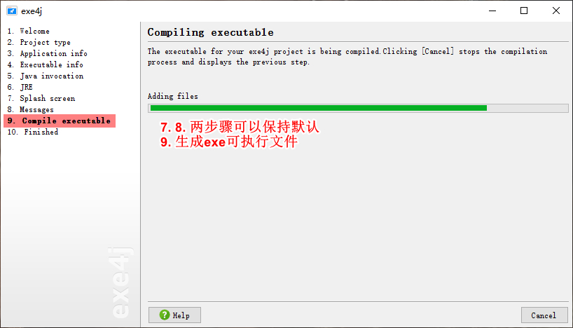
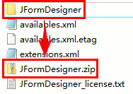

[toc]

# 一些关键字

**`native`**（本地）

native关键字是Java与C/C++联合编程时使用的，它说明某个方法是原生函数，即用C/C++语言实现，并被编译成了dll，由java去调用。

这些原生函数的实现体在dll中，JDK的源代码中并不包含，且对于不同平台它们也是不同的。这是java的底层机制，实际上java就是在不同的平台上调用不同的native方法实现对操作系统的访问的。

java是跨平台的语言，既然是跨了平台，所付出的代价就是牺牲一些对底层的控制，而java要实现对底层的控制，就需要一些其他语言的帮助，这就是native的作用了。

**`strictfp`**（严格，精确）

strictfp关键字的意思是FP-strict，即精确浮点。若没有指定strictfp关键字，在JVM进行浮点运算时，Java编译器以及运行环境对浮点运算的表达式所采取的，是一种近似于我行我素的行为来完成其操作的，以致于得到的结果往往无法令人满意。

可以使用strictfp来声明一个类、接口或者方法（不允许对接口中的方法以及构造函数声明strictfp关键字），所声明范围内Java的编译器以及运行环境会完全依照浮点规范IEEE-754来执行，不会因为不同的硬件平台导致所执行的结果不一致。

**`transient`**（短暂）

transient关键字用在对象序列化中（实现了Serilizable接口的类，其所有属性和方法都会自动序列化），加上该关键字的字段，其生命周期仅存于调用者的内存中而不会写到磁盘里持久化或在网络序列化传输。

**`volatile`**（易失）

volatile关键字用于多线程并发编程中，它是轻量级的synchronized，用volatile修饰的共享变量，Java线程内存模型会确保所有线程看到这个变量的值是一致的。

即线程每次访问该变量时，都被强迫从主内存中重读该成员变量的值（而不是使用缓存）；当该变量变化时，强迫线程将变化值回写到主内存（而不是缓存）。这样在任何时刻，不同线程总是看到该成员变量的同一个值。

与synchronized不同，volatile变量不会引起线程的上下文切换和调度，在适合的场景下拥有更低的执行成本和更高的效率。

`default`（默认）

default关键字除了可以用作访问修饰符、switch子句中。从JDK 8开始，为了加强接口的能力，使得接口可以存在具体的方法，可以使用default或static关键字修饰方法。这样做的好处是接口的每个实现类如果都想要相同的功能，就不需要重复代码，而是在接口进行定义即可。默认方法在子类也可以被重写。

# XML、DOM、Java操作库

`XML元素`是从（且包括）开始标签直到（且包括）结束标签的部分。一个元素可以包含：其他元素、文本、属性或混合以上所有。例如：

```xml
<!-- book.xml -->
<bookstore>
	<book category="Classic">
    	<title>Harry Potter</title>
        <author>JK. Rowling</author>
        <year>2005</year>
        <price>29.99$</price>
    </book>
</bookstore>
```

`XML文档`必须包含根元素，它是所有其他元素的父元素。XML文档中的元素形成了一棵文档树，所有的元素都可以有子元素。XML DOM把XML文档视为一种树结构，这种树结构被称为节点树。

`DOM`（Document Object Model，文档对象模型），是W3C标准（Word Wide Web Consortium）。在DOM中，XML文档的每个成分都是一个节点。规定：整个文档是一个文档节点；每个xml元素是一个元素结点（Element）；每一个xml属性是一个属性节点（Attr）；包含在xml元素中的文本是文本节点（Text）。

需要注意的是，org.w3c.dom.Node也会把**空白换行符**（即回车）当作一个文本节点（Text），因此在解析时会发现getLength()比所看到的节点数要大，且遍历时会莫名其妙的打印空行等问题。在使用时注意用正确的方法处理这些无用的节点。

在`javax.xml.parsers`和`org.w3c.dom`库中提供了相应的操作：

```java
DocumentBuilderFactory dbf = DocumentBuilderFactory.newInstance();
DocumentBuilder dBuilder = dbf.newDocumentBuilder();
Document docu = dBuilder.parse(new File("book.xml"));

// 获得所有<bookstore>元素节点的列表，因为此处就一个，故List长度为1
NodeList bookstoreNodeList = docu.getElementsByTagName("bookstore");
Node bookstoreNode = bookstoreNodeList.item(0);	// 取得第一个<bookstore>元素节点

// 获得第一个<bookstore>元素节点所有孩子节点组成的列表，其中有<title>、<author>、<year>、<price>元素节点
NodeList allChildsList = bookstoreNode.getChildNodes();
Node titleNode = allChildsList.item(0);		// 获得<title>元素节点
String value = titleNode.getNodeValue();	// 此处为 Harry Potter
```

- `Document.getElementsByTagName(String tag)`，返回所有以tag为名称的节点list，不分XML树结构。
- `NodeList.item(int index)`，从NodeList中获得index上的节点Node，索引index从0开始。
- `Node.getChildNodes()`，获得当前节点的所有孩子节点。另外还有`getFirstChild()`、`getLastChild()`等方法。
- `Node.getTextContent()`，获得节点的文本内容，通常使用。
- `Node.getNodeValue()`，若当前节点值。文本节点（Text）返回文本内容；属性节点（Attr）返回属性值；元素节点（Element）总是返回`null`。
- `Node.getNodeName()`，返回当前节点名称。元素节点（Element）返回元素名；属性节点（Attr）返回属性名；文本节点（Text）返回的都是`#text`。
- `Node.getNodeType() == Node.ELEMENT_NODE`，获得节点的类型，可以跟预定义常量比较来判断是否是某一类型的节点。


值得注意的是，可能会存在所要打开的xml文件的编码格式无法匹配dom操作的情况，可以指定文件的编码如下。

```java
InputStream is = new FileInputStream("task.xml");
Reader reader = new InputStreamReader(is, StandardCharsets.UTF_8);
InputSource iSource = new InputSource(reader);
iSource.setEncoding("UTF-8");

DocumentBuilderFactory dbf = DocumentBuilderFactory.newInstance();
DocumentBuilder dBuilder = dbf.newDocumentBuilder();
Document docu = dBuilder.parse(iSource);
```

# 基本网络连接

## （一）使用URL

实现利用URL从获取网页源代码。

```java
// UrlFetcher.java
public class UrlFetcher {
    public byte[] getUrlBytes(String urlSpec) throws IOException {
        URL url = new URL(urlSpec);
        HttpURLConnection connection = (HttpURLConnection) url.openConnection();
        if (connection.getResponseCode() != HttpURLConnection.HTTP_OK) {
            throw new IOException(connection.getResponseMessage() + " : with " + urlSpec);
        }
        try {
            InputStream in = connection.getInputStream();
            ByteArrayOutputStream out = new ByteArrayOutputStream();
            int bytesRead = 0;
            byte[] buffer = new byte[1024];
            while ((bytesRead = in.read(buffer)) > 0) {
                out.write(buffer, 0, bytesRead);
            }
            in.close();
            out.close();
            return out.toByteArray();
        } finally {
            connection.disconnect();
        }
    }

    public String getUrlString(String urlSpec) throws IOException {
        return new String(getUrlBytes(urlSpec));
    }
}
```

一个使用的例子，获取[烟台大学官网](http://www.ytu.edu.cn)网页源代码，如下：

```java
// Main.java
UrlFetcher urlFetcher = new UrlFetcher();
try {
    String res = urlFetcher.getUrlString("http://www.ytu.edu.cn");
    System.out.println(res);
} catch (IOException e) {
    e.printStackTrace();
}
```

## （二）使用Socket

Socket类中有一个closed成员，可以调用Socket.isClosed()方法返回其值；需要注意的是，当调用Socket.getOutputStream().close()方法的时候，会将Socket对象的closed成员置为false。

这里举一个使用Socket进行网络传输的例子，Socket本身支持传输任意字节流，这里为了方便而是用的字符串。

```java
public class MyTCPServer {

    private boolean mIsServiceDestroyed = false;

    private class TcpServer implements Runnable {
        @Override
        public void run() {
            ServerSocket serverSocket = null;
            try {
                // 监听本地8688端口
                serverSocket = new ServerSocket(8688);
            } catch (IOException e) {
                System.err.println("establish tcp server failed, port: 8688");
                e.printStackTrace();
                return;
            }
            while (!mIsServiceDestroyed) {
                try {
                    // 接受客户端请求
                    Socket client = serverSocket.accept();
                    System.out.println("accept: " + client);
                    new Thread() {
                        @Override
                        public void run() {
                            try {
                                responseClient(client);
                            } catch (IOException e) {
                                e.printStackTrace();
                            }
                        }
                    }.start();
                } catch (IOException e) {
                    e.printStackTrace();
                }
            }
        }
    }

    private void responseClient(Socket client) throws IOException {
        // 用于接受客户端消息
        BufferedReader br = new BufferedReader(new InputStreamReader(client.getInputStream()));
        // 用于向客户端发送消息
        PrintWriter pr = new PrintWriter(new BufferedWriter(new OutputStreamWriter(client.getOutputStream())), true);
        pr.write("欢迎连接服务!");
        while (!mIsServiceDestroyed) {
            String str = br.readLine();
            System.out.println("client: " + client + " sent a message: " + str);
            if (str == null) break;     // 客户端断开连接
            String replyStr = "Hello there client! Would you like some coffee?";
            pr.println(replyStr);       // 回复客户端
        }
        System.out.println("client quit.");
        pr.close();
        br.close();
        client.close();
    }

    public void runServer() {
        new TcpServer().run();
    }

    public static void main(String[] args) {
        new MyTPCServer().runServer();
    }

}
```

```java
public class MyTCPClient {
    private Socket mServerSocket;
    private PrintWriter mPrintWriter;

    public void connectServer() {
        Socket socket = null;
        while (socket == null) {
            try {
                socket = new Socket("localhost", 8688);
            } catch (IOException e) {
                System.err.println("connect tcp server failed, retry...");
                try {
                    Thread.sleep(1000);
                } catch (InterruptedException ex) {
                    ex.printStackTrace();
                }
            }
        }
        mServerSocket = socket;
        try {
            mPrintWriter = new PrintWriter(new BufferedWriter(new OutputStreamWriter(socket.getOutputStream())), true);
        } catch (IOException e) {
            e.printStackTrace();
        }
        System.out.println("connect tcp server succeed.");

        new Thread(() -> {
            // 接收服务器端的消息
            try {
                while (true) {
                    BufferedReader br = new BufferedReader(new InputStreamReader(mServerSocket.getInputStream()));
                    String msg = br.readLine();
                    System.out.println("receive: " + msg);
                }
            } catch (IOException e) {
                e.printStackTrace();
            }
        }).start();

        while (mServerSocket != null && mServerSocket.isConnected()) {
            mPrintWriter.println("Hello server!");
            try {
                Thread.sleep(2000);
            } catch (InterruptedException e) {
                e.printStackTrace();
            }
        }

        try {
            mServerSocket.shutdownInput();
            mServerSocket.close();
            mPrintWriter.close();
        } catch (IOException e) {
            e.printStackTrace();
        }
    }


    public static void main(String[] args) {
        new MyTCPClient().connectServer();
    }
}
```

实际上通过Socket不仅仅能实现进程间通信，还可以实现设备间的网络通信，或者说它本就是为此而设计的，当然前提是这些设备之间的IP地址是互相可见的。

# 用exec()调用shell命令与创建进程

调用Windows系统的cmd命令，通过代码`Runtime.getRuntime().exec("shutdown -s -t 60")`。特殊地，在CMD中使用"E:/MyVideo.mp4"或"start E:/MyVideo.mp4"可以播放视频，但如果直接放到上述的exec()方法中会报错，可以在前面加上"cmd /c"，如`Runtime.getRuntime.exec("cmd /c start E:/MyVideo.mp4")`。

实际上，Runtime.getRuntime().exec(cmdStr)方法返回的是一个`Process`对象，这是运行该cmd命令的进程；可以使用它的`Process.getInputStream()`和`Process.getErrorStream()`等方法获得控制台的输出结果。

除了直接使用exec()执行shell命令，还可以使用`ProcessBuilder`创建一个cmd进程来执行，且ProcessBuilder能够设置关于进程一些参数，以获得更高的灵活性。如下例子。

```java
String cmdStr = "start.exe";
ProcessBuilder processBuilder = new ProcessBuilder(cmd);
// 设置进程的执行目录、输入文件、输出文件
processBuilder.directory(workDirFile)
    .redirectInput(ProcessBuilder.Redirect.from(inFile))
    .redirectOutput(ProcessBuilder.Redirect.to(retFile));
Process p = processBuilder.start();
p.waitFor();
```

# 计算文件的MD5以比较文件内容相等

传统上，可以通过读取文件的所有内容类比较两个文件是否相等。此外，还可以通过计算两个文件的MD5是否相等，来快速高效地比较两个文件是否相等。

```java
/**
* 计算文件的 MD5 值
*/
private String getFileMD5(File file) {
    if (!file.isFile()) {
        return null;
    }
    MessageDigest digest = null;
    FileInputStream in = null;
    byte[] buffer = new byte[8192];
    int len;
    try {
        digest = MessageDigest.getInstance("MD5");
        in = new FileInputStream(file);
        while ((len = in.read(buffer)) != -1) {          
            digest.update(buffer, 0, len);
        }
        BigInteger bigInt = new BigInteger(1, digest.digest());       
        return bigInt.toString(16);
    } catch (Exception e) {
        e.printStackTrace();
        return null;
    } finally {
        try {
            if (in != null) {
                in.close();
            }
        } catch (Exception e) {
            e.printStackTrace();
        }   
    }
}

public boolean isFileSame(File f1, File f2) {
    if (!f1.exists() || !f2.exists()) return false;
    if (Objects.equals(getFileMD5(f1), getFileMD5(f2))) {
        return true;
    }
}
```

# 解析JSON对象

JSON（JavaScript Object Notation）是一种一种轻量级的数据交换格式。JSON对象是一系列包含在`{}`中的键值对，每个键的类型是一个字符串；值的类型可以是：一个字符串、一个JSON对象、一个JSON对象数组。JSON对象数组是包含在`[]`中的，用逗号`,`隔开的JSON对象的列表。对象之间可以嵌套，形成层级关系。

使用Java语言解析JSON对象，需要`org.json`包，这里给出[网址](https://www.json.org/json-en.html)。该包中有一些类和方法用来处理JSON对象，如`JSONObejct`类、`JSONArray`类，以及`getJSONOjbect()`方法、`getJSONArray()`方法和一系列`get`方法。

一个JSON对象示例如下：

```javascript
{
    "bookstore" : 
    [
        {
            "bookname" : "Harry Potter",
            "author" : "J.K. Rowling",
            "year" : "1997"
        },
        {
            "bookname" : "Bible",
            "author" : "Moses",
            "year" : "200"
        }
    ]
}
```

使用Java解析上面JSON对象的示例如下：

```java
public class JsonParserTest {
    private static final String mJsonString = "Above String";

    public List<String> parseItem(String bookProperty) throws JSONException {
        List<String> results = new ArrayList<>();
        JSONObject rootJsonObject = new JSONObject(mJsonString);
        JSONArray booksJsonArray = rootJsonObject.getJSONArray("bookstore");
        for (int i = 0; i < booksJsonArray.length(); ++i) {
            JSONObject bookJsonObject = booksJsonArray.getJSONObject(i);
            String str = bookJsonObject.getString(bookProperty);
            results.add(str);
        }
        return results;
    }
}

// 一个使用示例
List<String> booknames = jsonParserTest.parseItem("bookname");
booknames.forEach(System.out::println);
```

# Java字符串对象的format()方法

format()方法需要一个格式化字符串，对于不同的格式对象（如整数、浮点数、字符）有不同的组成部分，但总体上有以下几部分组成：`%[index$][标识][最小宽度][.精度]转换方式`。

- index，从1开始取值，表示将第index个参数拿来进行格式化。
- 最小宽度，指定最终该格式化转换最少包含多少个字符。
- 标识用来指定格式化的样式，有的可以一起使用，有的不能一起使用。常用的有如下：
  - `0`，如果格式化后字符没有占满最小宽度，则剩余字符用0填充，缺省时为空格。
  - `-`，在最小宽度内左对齐，缺省时右对齐。不可与`0`（用0填充）同时使用。
  - `,`，只适用于10进制，每三位数字之间用`,`分隔。
  - `#`，只适用于8、16进制，8进制时在数值前加0，16进制时在数值前加0x。
  - `+`，结果总是包含一个符号。一般情况下只适用于10进制，若对象为BigInteger才可以用于8、16进制。
  - ``（空格），正值前加空格，负值前加符号。一般情况下只适用于10进制，若对象为BigInteger才可以用于8、16进制。
  - `(`，若参数是负数，则结果中不添加负号，而是使用圆括号把数字括起来。一般情况下只适用于10进制，若对象为BigInteger才可以用于8、16进制。
- 转换方式一般用来指定进制或记数形式等信息，常用的如下（注意C风格的`%s`，`%c`等格式也被支持）。
  - `d`，指定10进制。
  - `o`，指定8进制。
  - `x`、`X`，指定16进制。
  - `e`、`E`，将结果格式化为用计算机科学记数法表示的10进制数。
  - `f`，将结果格式化为10进制普通的表示方式。
  - `g`、`G`，根据情况，自动选择使用普通表示方式还是科学记数法。
  - `a`、`A`，结果被格式化为带有有效位数和指数的16进制浮点数。

# Java正则表达式regex类库

正则表达式的基础知识，都是相同的内容，请参阅笔记《C++高级编程（第3版）》中的ECMAScript语法一节。这里主要介绍Java的regex的主要的`Pattern`类和`Matcher`类。

Pattern对象是一个正则表达式的编译表示。

```java
public static Pattern compile(String regex);	// class Pattern
```

- Pattern类没有公共构造方法，要创建一个Pattern对象，需要使用Pattern的静态公共编译方法，它返回一个Pattern对象，第一个参数是一个正则表达式的字符串。

```java
public static boolean matches(String regex, CharSequence input);	// class Pattern
```

- 判断输入的字符串input是否匹配字符串regex表示的正则表达式。

Matcher对象是对输入字符串进行解锁和匹配的引擎。

```java
public Matcher matcher(CharSequence input);		// class Pattern
```

- Matcher类没有公共构造方法，要创建一个Matcher对象，需要调用Pattern对象的matcher()方法，返回一个Matcher对象。

```java
// in class Mathcer 捕获组相关方法
public int groupCount();
public String group();
public String group(int group);
```

- groupCount()，返回匹配的捕获组的个数，如果没有捕获组就返回0。
- group()，返回上次所指向的捕获组所匹配的字符串。
- group(int group)，返回序号为group的捕获组字符串；如果参数group为0时表示整个表达式，它不包含在groupCount返回的值中。

```java
// in class Matcher 查找方法
public boolean find();
public boolean find(int start);
public boolean matches();
public boolean lookingAt();
```

- find()，尝试查找与该模式匹配的输入序列的下一个子序列。每次调用该方法，matcher对象当前所指向的匹配的捕获组就跳向下一个。使用`while(m.find()) {m.group();}`可以找出所有匹配的字符串。
- find(int start)，重置此匹配器，然后尝试查找匹配该模式、从指定索引开始的输入序列的下一个子序列。
- matches()，尝试将整个区域与模式匹配。
- lookingAt()，尝试将从区域开头开始的输入序列与该模式匹配，不要求整个序列匹配。

```java
// in class Matcher 索引方法
public int start();
public int start(int group);
public int end();
public int end(int group);
```

- start()，返回上次匹配的子序列第一个字符在整个字符串中的索引。参数group指定一个捕获组，返回该捕获组对应的索引。
- end()，返回上次匹配的子序列最后一个字符的后一个字符在整个字符串中的索引。参数group指定一个捕获组，返回该捕获组对应的索引。

```java
// in class Matcher 替换方法
public String replaceAll(String replacement);
public String replaceFirst(String replacement);
public Matcher appendReplacement(StringBuffer sb, String replacement);
public StringBuffer appendTail(StringBuffer sb);
public static String quoteReplacement(String s);
```

- replaceAll()，将模式字符串中每个匹配的子序列，替换为replacement，替换后的结果以字符串返回。
- replaceFirst()，将模式字符串中第一个匹配的子序列，替换为replacement，替换后的结果以字符串返回。
- appendReplacement()，将上次匹配的子字符串替换为replacement，并将替换后的结果append添加到sb中，替换后的结果为上次调用appendReplacement()所匹配的最后一个字符的后一个开始，到该次调用所匹配的最后一个字符结束。
- appendTail()，将调用appendReplacement()匹配添加后剩下的字符串，添加append到sb中。一般使用如：`StringBuffer sb = new StringBuffer(); while(m.find()){ m.appendReplacement(sb, REPLACE); } m.appendTail(sb);`。

# JDBC连接到数据库

要想使用JDBC连接数据库，首先要安装对应的DBMS Driver到JDBC环境，这里使用SQL Server作为示例。

## （一）SQL Server

给出[JDBC Driver for SQL Server](https://docs.microsoft.com/en-us/sql/connect/jdbc/download-microsoft-jdbc-driver-for-sql-server?view=sql-server-ver15)的下载连接，下载完成后，解压可以得到用于SQL Server数据库操作的`jar`库文件。

有可能SQL Server的端口未打开，需要手动设置。在计算机上搜索SQL Server Configuration Manager并打开，启用TCP/IP，打开属性配置TCP端口（1433是默认端口，可以选择其他）。下面的已启用选项，如果数据库服务器在本机，可以选否；若数据库服务器为远程，则需要选是，此时注意TCP端口最好不用使用默认，以免被恶意访问，具体应对方案请查阅资料。


对于一个IntelliJ IDEA的Java项目来说，通过`File > Project Structure`打开项目结构配置界面，点击下面的加号，选择之前下载并解压好的`jar`文件，添加之。


之后就可以在Java应用程序中使用一些库访问数据库了。

```java
// DbUtil.java
public class DbUtil {
    // 数据库驱动名
    private static String sDriverName = "com.microsoft.sqlserver.jdbc.SQLServerDriver";
    // localhost表示本机地址（127.0.0.1），DatabaseName后面用=引出要连接的数据库名字
    private static String sDbURL = "jdbc:sqlserver://localhost:1433;DatabaseName=School";
    private static String sUserName = "sa";	 // 数据库账户名
    private static String sUserPassword = "xxxxx";	// 账户密码
    private static Connection sDbConnection = null;	// 数据库连接
    static {
        try {
            Class.forName(sDriverName);
            sDbConnection = DriverManager.getConnection(sDbURL, sUserName, sUserPassword);
        } catch(Exception e) {
            e.printStackTrace();
        }
    }

    private DbUtil() {}	// 私有构造函数，不允许外部拥有实例

    public static Connection getConnection() {
        return sDbConnection;	// 返回数据库连接
    }
}
```

使用示例如下。

```java
// Main.java
public class Main {
    public static void main(String []args) throws SQLException {
        Connection dbConn = DbUtil.getConnection();	// 获得数据库连接
        
        String sqlText = "SELECT * FROM STUDENTS WHERE grade = ?";	// 动态SQL语句，?是占位符，表示一个宿主语言的变量
        PreparedStatement preparedStatement = dbConn.prepareStatement(sqlText);	// 预处理语句
        preparedStatement.setInt(1, 2000);	// 为预处理语句设置参数
        ResultSet resultSet = preparedStatement.executeQuery();	// 执行查询，获得ResultSet结果，元组的集合
        
        String sqlText1 = "SELECT * FROM STUDENTS WHERE grade = 2001";
        Statement statement = dbConn.createStatement();	// 也可以直接使用Statement语句
        ResultSet resultSet1 = statement.executeQuery(sqlText1);
        
        // ResultSet的next方法将游标向下移动一条，并返回是否到达EOF
        while (resultSet.next()) {
            // ResultSet的一系列get方法，返回所查询到的元组的属性，可以传表的属性名，也可以传Index
            System.out.println(resultSet.getString("sname"));
        }
    }
}
```

## （二）MySQL

同SQL Server一样，连接MySQL也需要驱动jar包，导入到项目中，具体步骤参考上述，这里仅给出[下载地址](https://dev.mysql.com/downloads/connector/j/)。注意在下载页面选择Platform Independent，选择下载驱动包。

值得注意的是，MySQL默认使用的本机端口是`3306`。

需要注意的是，MySQL 8.0及以上的版本，和之前版本之间，驱动名和连接方式有所不同，下面分布叙述。

- 5.x及之前的版本。
  - 数据库驱动名为`"com.mysql.jdbc.Driver"`。
  - 数据库URL为`"jdbc:mysql://localhost:3306/School"`，其中端口序号后紧跟数据库名，如School是一个数据库。
- 8.x及以上版本，不需要建立SSL连接的，需显式关闭；要允许客户端从服务器获取公钥；要设置时区。
  - 数据库驱动名为`"com.mysql.cj.jdbc.Driver"`。
  - 数据库URL为`"jdbc:mysql://localhost:3306/School?useSSL=false&allowPublicKeyRetrieval=true&serverTimezone=UTC"`，其中端口序号后紧跟数据库名，如School是一个数据库；以及一些其他信息。
  - 对于5.x版本的数据库，也可以使用上述数据库驱动名和URL连接，原因未知。

其他步骤与上述无异，连接后就可以使用Java语言访问数据库了，注意Statement语句要符合MySQL的SQL Transaction规范。

# Java代码发布为exe可执行文件

Java程序打包成exe可执行文件，分为两大步骤：将Java程序导成jar包、通过`exe4j`工具将jar包程序生成exe可执行文件。

## （一）jar包的生成

### 1. 通过IDE生成jar文件

通过IDE提供的一些图形化窗口，进行jar包的生成，如Intellij IDEA、Eclipse等。这里给出使用IntelliJ IDEA打包java代码成jar的示例。

首先要为IDEA添加一个导出jar包的设置，如下：


选择主类，即有main函数的类，作为程序入口；在该界面还可以选择manifest文件的存放位置：


接下来的窗口中，可以配置要导出的文件名，文件类型（jar），导出位置等信息：


配置完成后，就可以在菜单栏通过`Build`工具下单命令导出jar文件了：


导出后，就会在之前配置的导出目录下，生成jar文件。

### 2. 通过jar命令生成jar文件

除了使用IDE的窗口化方法之外，还可以使用JDK提供的`jar.exe`，通过命令行的方式生成jar文件。`jar`命令可以生产.jar文件、可执行的.jar文件、清单manifest文件、zip文件等。有关jar命令的使用，可以在命令行窗口直接键入jar来查看使用方法，该处不在赘述，只是给出一个示例。

```shell
# 在源代码.java文件目录下
javac filename.java				# 递归import的类会被一起编译
jar cvf target.jar *.class		# 将编译得的.class文件打包成target.jar文件
```

## （二）使用exe4j工具生产exe可执行文件

首先要从网络上获取[exe4j](https://exe4j.apponic.com/download/)工具，并安装到本机上，首次使用要输入License激活软件。这里用一个示例演示：





到此为止，生成就已经完成了，可以在第3步中指定的Output directory目录中找到exe可执行文件。

# 为IntelliJ IDEA安装JFormDesigner插件

`JFormDesigner`是一款支持可视化Swing GUI设计的插件，使用它可以通过用鼠标拖拽组件的方式设计GUI。

首先在IDEA的插件市场（File > Setting > Plugins）中搜索JFormDesigner，安装成功并重启IDEA，以配置好插件。


之后通过在项目某个包中新建`JFormDesigner Form`，填写选择好相应的组件，点击OK即可。


如果没有获得插件的key，则需要使用licenses激活，如下所示。


下面记录的是破解过程。首先下载好破解软件（在Excel Bloonow的百度网盘中），打开并填好基本信息。


然后点击Patch，选择组件的jar文件，一般在IDEA的插件目录下面，如`C:\Users\<UserName>\.IdeaIC2019.3\config\plugins\JFormDesigner\lib`下（值得注意的是，不同版本的IDEA，其插件的位置路径可能不同，请注意根据本机的插件路径选择），是`JFormDesigner-Idea.jar`文件。


选中确定之后，会弹出成功的提示信息（如失败请重试或查阅其他资料）；然后选择Generate生成licenses文件，一般为`JFormDesigner_license.txt`，注意该文件保存的位置。


之后再回到需要激活的界面，点击Register，然后选择Browse浏览文件，找到刚才生成的licenses文件，选中确定即可。


有可能遇到点击OK没有任何反应的情况。这时点击Cancel暂时取消激活过程，找到IDEA的插件目录，将JFormDesigner插件打包成ZIP文件（注意破解生成的.jar和.bak文件要在原来的位置）。



然后在IDEA中找到已安装的插件的信息，将JFormDesigner插件卸（若上图JFormDesigner文件夹没有删除，需要手动删除），并重启IDEA使配置生效。接下来再从插件商店里面选择离线导入，将之前生成的ZIP包导入即可。


重启IDEA使插件生效，至此就可以正常使用了，新建JFormDesigner Form使用。