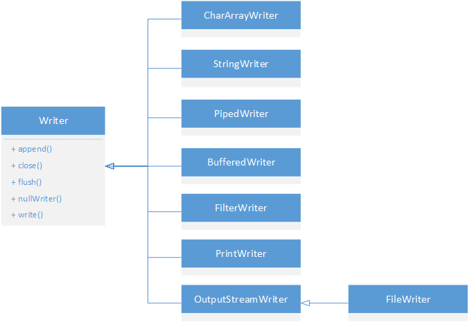

> **《Java面向对象编程（第2版）》**
>
> ***孙卫琴 编著***

[TOC]

# 一、介绍

## （一）平台与开发环境

`JDK`是`Java Development Kit`（Java开发工具包）的缩写，它为Java应用程序提供了基本的开发和运行环境，JDK也称为标准开发环境（`Java Standard Edition`，`JavaSE`）。JDK主要包括以下内容：

Java虚拟机（`Java Virtual Machine`，`JVM`）负责解析和执行Java程序。JDK类库（`JavaSE API`）提供了基础的Java类及各种实用类。开发工具，这些开发工具都是可执行工具，主要包括`javac.exe`（编件工具）、`java.exe`（运行工具）、`javadoc.exe`（生成`JavaDoc`文档的工具）和`jar.exe`（打包工具）等。这些工具一般有可选参数等特殊用法。

注：在JavaSE API的官方文档中，把JDK8也称作JDK1.8，以此类推。

在构成JavaDoc文档的注释语句中，可以用JavaDoc标记来描述一些信息，如：`@version`、`@since`、`@author`、`@see`、`@link`、`@deprecated`、`@param`、`@return`、`@throws`等。且注释样式为`/** xxx */`。

## （二）一些知识

如果将引用类型的变量用`final`修饰，那么读变量只能给终引用一个对象，但可以改变对象的内容。

类中可包含静态代码块`static { xxx }`，它不存在于任何方法中，而是直接放在类体中。在Java虚拟机加载类时，会执行这些静态代码块。如果类中包含多个静态块，那么Java虚拟机按它们在类中出现的顺存依次执行它们，每个静态代码块只会被执行一次。类的构造方法用于初始化类的实例，而类的静态代码则可用于初始化类，给类的静态变量赋初始值。栈区、堆区、方法区、CPU。

从JDK5开始引入了静态导入语`import static xxx`，其目的是为了在需要经常访问同一个类的方法或成员变量的场合，简化程序代码。接口中的成员变量默认都是`public static final`类型的，必须被显式初始化。接口中的方法默人都是`public abstract`类型的。不过从JDK8开始，为了提高代码的可重用性，允许在接口中定义默认方法和静态方法。默认方法用`default`关键字来声明，拥有默认的实现。接口中的静态方法`static`，只能在接口内部或用接口名来访问，若尝试用实现接口的类的实例来访问接口的静态方法，会导致编译错误。

Java虚拟机在内存中采用的是`Unicode`编码，Java语言中`char`为16位，占2字节。

## （三）数组

Java支持多维数组，并且支持不规则数组（交错数组）。创建多维数组时必须按照从高维度到低维度（从左到右）的顺序创建每一维数组。数组被创建后，每个元素被自动赋子其数据类型的默认值，另外还可以在程序中将数组的元素显式地初始化。

Java数组继录了Object类，因此继承了Object类的所有方法，如equals()、instanceof操作符。

在java.util包中，有一个用于操纵数组的实用类：`java.util.Arrays`，它提供了一系列静态方法。`equals()`，两个数组元素个数相等且对应相同才返回true。`fill()`向数组中填充数据。`sort()`把数组中的元素按升序排列，如果数组中的元素为引用类型，会采用自然排序方式。`paralleSort()`，开启多个线程，以并发的方式对数组中的元素进行排序，提高排序的效率（适合数据量很大的数组）。`binarySearch()`，二分查找有序序列。`asList()`，把数组转换成一个List对象。`toString()`返回包含数组中所有元素的信息的字符串。

用`...`符号声明数目可变参数。

# 二、类的生命周期

通过Java命令运行一个Java程序时，就启动了一个Java虚拟机进程。Java虚拟机进程从启动到终止的过程，称为Java虚执机的生命周期。当：

1. 程序正常执行结束；
2. 正在执行中的程序因出现异常或错误而异常终止；
3. 执行了`System.exit()`方法；
4. 由于操作系统出现错误而导致Java虚拟机进程终止；

等情况时，Java虚拟机将结束生命周期。当Java虚拟机处于生命周期中时，它的总任务就是运行Java程序，Java程序从开始运行到终止的过程
，称为程序的生命周期，它和Java虚拟机的生命周期是一致的。

## （一）类的加载

当Java程序需要使用某个类时，Java控拟机会确保这个类已被加载、连接（验证、准备、解析）、初始化。

1. 加载：查找并加载类的二述制数据；
2. 连接：包括验证、准备和解析类的二进制数据：
   1. 验证：确保被加载类的正确性；
   2. 准备：为类的静态变量分配内存，并将其初始化为默认值；
   3. 解析：把类中的符号引用转换为直接引用；
3. 初始化：给类的静态变量赋予正确的初始值。

Java虚拟机规范给类或接口被加载和连接的时机上接供了一定的灵活性，但严格定义了初始化的时机，即所有的Java虚拟机实现必须在每个类或接口被Java程序“首次主动使用”时才初始化它们。Java程序对类的使用方式可分为两种：主动使用和被动使用。

### 1. 加载

类的加载是指把类的`.class`文件中的二进制数据读入到内存中，把它存放在运行时数据区的方法区内；然后在堆区创建一个`java.lang.class`对象，用来封装类在方法区内的数据结构。Java虚拟机能够从多种来源加载类的二进制数据，包括：

1. 从本地文件系统中加载类的.class文件，这是最常见的加藏方式；
2. 通过网络下载类的.class文件；
3. 从ZIP、JAR或其他类型的归档文件提取.class文件；
4. 从一个专有数据库中提取.class文件；
5. 把一个Java源文件动态编译为.class文件。

类的加载的最终产品是位于运行时数据区的堆区的`Class`对象，Class对象封装了类在方法区内的数据结构，并且向Java程序提供了访问类在方法区内的数据结构的接口。

类的加载是由类加载器完成的，类加载器分为两种：Java虚拟机自带的加载器，包括：启动类加载器、扩展类加载器、系统类加载器；用户自定义的类加载器（`java.lang.classloader`类的子类的实例）。类加载器并不需要等到某个类“首次主动使用”时加载它，Java虚拟机规范允许类加载器在预测到某个类将要被使用时就预先加载它，如果在预先加载过程中遇到.class文件缺失或者存在错误，类加载器必须等到程序首次主动使用该类时才报告错误（抛出一个LinkagerError实例），如果这个类一直没有被程序主动使用，那么类加载器将不会报告错误。

### 2. 连接

类的加载完成后，就进入连接阶段。连接就是把已读入到内存的类的二进制数据合并到虚拟机的运行时环境中去。连接的第一步是类的验证，保证被加载的类有正确的内部结构，并且与其他类协调一致。如果虚拟机检查到错误，就会抛出相应的Error对象。类的验证主要包括以下内容：

1. 类文件的结构检查，确保类文件遵从Java类文件的固定格式；
2. 语义检查；
3. 字节码验证，确保字节码流可以被Java虚批机安全的执行（操作码和地址码正确）；
4. 二进制兼容的验证，确保相互引用的类之间协调一致。

在准备阶段，Java虚拟机为类的静态变量分配内存，并设置默认值（不是初始值）。

在解析阶段，Java虚拟机会把类的二进制数据中的符号引用替换成直接引用（地址）。

### 3. 初始化

在初始化阶段，Java虚拟机执行类的初始化语句，为类的（非编译时常量的）静态变量赋予初始值（按初始化语句在类中的先后顺序来依次执行）。Java虚拟机初始化一个类包含以下步骤：

1. 若类还没有加载和连接，那么先加载和连接之；
2. 如果类存在直接的父类且父类没有被初始化，那么就先初始化直接的父类，确保当程序主动使用一个类时这个类及所有的父类都已经被初始化，程序中的第一个被初始的类是object类；
3. 如果程序中存在初始化语句，那么就依次执行这些初始化语句。

类的初始化时机，Java虚拟机只有在程序首次主动使用一个类或接口时才会初始化它，只有6种活动被看作是程序对类或接口的主动使用：

1. 创建类的实例：用new语句、反射、克隆、反序列化手段；
2. 调用类的静态方法；
3. 访问或修改类或接口的静态变量；
4. 调用Java API中某些反射方法，如`java.lang.Class.forname(xxx)`方法；
5. 初始化一个类的子类；
6. Java虚拟机启动时被标明为启动类的类。

除了上述6种情形，其他使用Java类的方式都被看作是被动使用，都不会导致类的初始化，如：

1. 编译时final常静态变量；
2. 若final的静态变量值不能在编译时得到，那么对这种final变量的使用会看作类的主动使用，使其初始化；
3. 只有当程序访问的静念成员实实在在地在当前类的接口中定义时，才看作是对类或接口的主动使用。如调用sub.staticMemberInheritedFromSupenClass只初始化父类而不初始化子类；
4. 调用`ClassLoader.loadclass()`方法加载一个类，并不是对类的主动使用，不会初始化类。

## （二）类加载器

类加载器用来把类加载到Java虚拟机中，从JDK1.2版本开始，类的加载过程采用父亲委托机制（Parent Delegation）：当Java程序请求加载器loader加载Sample类时，loader先从自己的命名空间中查找Sample类是否已被加载，如果已加载则直接返回代表Sample类的Class对象的引用；否则先请求其父亲代为加载（递归），直到根类加载器。若父亲不能加载Sample类，则让其儿子加载器自己加载（递归），若加载成功，则依次将Sample类所对应的Class对象的引用返回给子加载器（递归），直到最开始的类加载器。若所有加载器都不能加载，则抛出`ClassNotFoundExecpetion`异常。

需要指出的是，加载器之间的父子关系实际上指的是加载器对象之间的包装关系，而不是类之间的继承关系，在子加载器对象中包装了一个父加载器对象。若有一个类加载器能成功加载Sample，那么这个类加载器被称为定义类加载器，所有能成功这回Class对象的引用的类加载器（包括定义类加载器）被称为初始类加载器。

上述中，命名空间：每个类加载器都有自己的命名空间，由所有父加载器所加载的类和该加载器所加载的类组成。运行时包：由同一类加载器所加载的有相同包名（属于同一个包）的类组成了运行时包，只有属于同一运行时包的类才能相互访问包可见（即默认访问级别）的类和类成员。这样的限制能避免用户自定义的类冒充核心类库的类，去访问核心类库的包可见的成员。

不同类加载器的命令空间存在以下关系：同一个命名空间内的类是相互可见的。子加载器的命名空间包含所有父加载器的命名空间。由父加载器加载的类不能看见子加载器加载的类。没有直接或间接父子关系的两个加载器，它们各自加载的类相互不可见。

父亲委托机制的优点是能提供软件系统的安全性，在此机制下用户自定义的类加载器不可能加载应该由父亲加载的可靠类，从而防止不可靠的甚至危险的恶意代码代替父加载器加载的可靠代码。

Java虚拟机有以下几种自带的加载器：


除了Java虚拟机自带的根类加载器无父亲之外，其余的类加载器都有且只有一个父载器。

注：Java虚拟机并不会向Java程序提供根类加载器的引用，而是用null来表示根加载器，这样做是为了保护了java虚拟机的安全，防止黑客利用根类加载器来加戴非法的类，从而破坏Java虚拟机的核心代码。

### 1. 根类加载器

根（Bootstrap）类加载器：负责加虚拟机的核心类库，如`java.lang.*`等（Object）。根类加载器从系统属性sun.boot.class.path所指定的目录中加载类库，根类加载器的实现依赖于底层操作系统，属于虚拟机实现一部分，它并没有继承java.lang.ClassLoader类。

### 2. 扩展类加载器

扩展（Extension）类加载器：它从java.ext.dirs系统属性所指定的目录中加载类库，或者从JDK的安装目录的jre\lib\ext子目录（扩展目录）下加载类库，如果把用户创建的JAR文件放在这个目录下，也会自动由扩展类加载器加载。扩展类加载器是纯Java类，是java.lang.ClassLoader类的子类。

### 3. 系统类加载器

系统（system）类加载器：也称为应用类加载器，它的是从classpath环境变量或者系统属性java.class.path所指定的目录中加载类，它是用户自定义的类加载器的默认父加载器。系统类加载器是纯Java类，是java.lang.ClassLoader类的子类。

### 4. 创建用户自定义的类加载器

创建用户自定义的类加载器，只需扩展java.lang.ClassLoader类，然后覆盖它的 findClass(String) 方法，该方法根据参数指定的类的名字，返回对应的Class对象的引用。示例如下：

```java
// MyClassLoader.java
public class MyClassLoader extends ClassLoader {
    private String mLoaderName; // The loader name used to distinguish different loader only here.
    private String mLoadPath = "./";    // The directory for loading the .class file.
    private final String FILE_TYPE = ".class";

    public MyClassLoader(String loaderName, ClassLoader parent) {
        super(parent);
        mLoaderName = loaderName;
    }
    public MyClassLoader(String loaderName) {
        super();  // By default, this loader's parent is SystemClassLoader.
        mLoaderName = loaderName;
    }

    public void setLoadPath(String loadPath) {
        mLoadPath = loadPath;
    }

    // Gets the binary data loading to memory from the .class file.
    private byte[] loadClassBinaryData(String className) throws ClassNotFoundException {
        // Conveying from a package name to disk name, like com.test.www to com/test/www and etc.
        className = className.replaceAll("\\.", "/");
        byte[] data = null;
        try {
            FileInputStream fis = new FileInputStream(new File(mLoaderName + className + FILE_TYPE));
            data = fis.readAllBytes();
            fis.close();
        } catch (IOException ioe) {
            throw new ClassNotFoundException("Class is not found:" + ioe);  // Exception translation.
        }
        return data;
    }

    @Override
    protected Class<?> findClass(String name) throws ClassNotFoundException {
        byte[] data = loadClassBinaryData(name);
        return defineClass(name, data, 0, data.length);
    }

    @Override
    public String toString() {
        return "MyClassLoader{" +
                "mLoaderName='" + mLoaderName + '\'' +
                '}';
    }
}

// 一个测试调用如下    Client.java
MyClassLoader loader = new MyClassLoader("my loader");
Class cla = loader.loadClass("MyClassLoader");
String str = cla.toString();
System.out.println(str);    // 输出：class MyClassLoader
```

以上MyClassLoader类仅是一种简单的类加载器的实现方式，在JDK的java.net包中，提供了一个功能比较强大的`URLCLassLoader`类，它扩展了ClassLoader类，其不仅能从本地文件系统中加载类，还可以从网络中下载类。Java程序可直接用URLCLassLoader类作为用户自定义的类加载器。

## （三）类的卸载

类的卸载，当一个类被加载、连接和初始化后，它的生命周期就开始了，当代表该类的Class对象的变量不再被引用时，即不再被可触及时，那么Class对象就会结束的周期，该类在方法区的数据也会被卸载。由此可见，一个类的生命周期何时结束，取决于代表它的Class对象何时结束生命周期。

Java虚拟机本身会终始引用其自带的类加载器，这些类加载器则会给终引用它们所加载的类的Class对象，因此由Java虚拟机自带的类加载器加载的类，在虚拟机的生命周期中，始终不会被卸载，这些Class对象是始终可触及的。由用户自定类的类加载器所加载的类是可以被卸载的，所有的引用变量都置为null。

在类加载器的内部实现中，用一个Java集合来存放所有加载类的引用，另一方面一个Class对象总是会引用它的类加载器（可用Class对象的`getClassLoader()`方法获得），即代表类的Class实例与其加载器之间为双向关联关系。

一个类的实例对象总是引用代表这个类的Class对象，在Object类中定义了`getClass()`方法用以返回代表对象所属类的Class对象的引用。此外，所有的Java类都有一个静态属性class引用代表这个类的Class对象。

# 三、对象的生命周期

## （一）创建对象

在Java程序中，对象可以被显式地或隐含地创建，创建一个对象就是指构建一个类的实例，前提条件是这个类已初始化。有4种显式地创建对象的方式：

1. 用new语句创建对象；
2. 运用反射手段，调用java.lang.class或者java.lang.reflect.Constructor类的`newInstance()`实例方法（会执行类的构造方法）；
3. 调用对象的clone()方法（Object中定义的protected的clone()方法，抛出CloneNottSupportedException异常，子类须实现Cloneable接口，可扩大访问权限，生一个属性相同而地址不同的对象返回）。
4. 运用反序列化手段，调用java.io.ObjectInputStream对象的`readObjact()`方法。

除了以上4种显式地创建对象的方式，在程序中还可以隐含地创建对象。

Java虚拟机创建一个对象都包含以下步骤：

1. 给对象分配内存；
2. 将对象的成员变量自动初始化为默认值；
3. 初始化对象主要负责给实例变量赋予正确的初始值。

## （二）垃圾回收

Java虚拟机提供了一个系统级的垃圾回收线程，它负责自动回收那些无用对象所占用的内存，这种回收过程被称为垃圾回收（Garbage Collection）。在Java虚拟机的垃圾回收器看来，堆区中的每个对象都可能处于以下3种状态之一：

1. 可触及状态：当一个对象被创建后，只要程序中还有引用变量引用它，那么它就始终处于可触及状态。
2. 可复活状态：当程序中不再有任何变量引用某对象时，则其处于该状态。在该状态中，垃圾回收器会准备释放它占用的内存，在释放之前，会调用该对象以及所有处于该状态的对象的`finalize()`方法，这些finalize()方法有可能使该对象重新转到可触及状态。
3. 不可触及状态：当Java虚拟机执行完所有可复活状态的对象的finalize()方法后，假如这些方法都没有使某对象进入到可触及状态，那么其就进入不可触及状态，该状态中的对象，垃圾回收器才会真正的回收它的内存。

垃圾回收器作为低优先级线程独立运行。在任何时候，程序都无法迫使垃圾回收器立即执行垃圾回收操作。在程序中可以调用`system.gc()`或者`Runtime.gc()`方法提示垃圾回收器尽快执行垃圾回收操作，但不能保证其立即执行。

在Java的Object祖先类中提供了protected类型finalize()方法，因此任向Java类都可以覆盖finalize()方法，在这个方法中进行释放对象所占用的相关资源的操作。Java虚拟机的垃圾回收操作对程序完全是透明的，因此程序无法预料某个无用对象的finalize()方法向时被调用（且垃圾回收器在执行finalize()方法时，如果出现异常，垃圾回收器不会报告异常，程序继续正常运行）。另外，除非垃圾回收器认为程序需要额外的内存，否则它不会试图释放无用对象的内存。

在程序中，注意在合适的位置和时机清除某个不再需要的一个对象的引用，使得它变为无用对象，它的内存可以被回收。

## （三）对象的强、弱、软、虚引用

从JDK1.2开始，把对象的引用分为4种级别，从而使程序能更加灵活地控制对象的生命周期。在`java.lang.ref`包中提供了一个表示引用的抽象父类Reference，它有3个具体的子类`SoftReference<>`类，`WeakReference<>`类，`PhantomReference<>`类，其`get()`方法获得它所引用的对象，可构造如（对象，队列）`ReferenceQueue<>`类表示引用队，它可以和这3种引用类型联合使用，以便跟踪虚拟机回收所引用对象的活动。

弱引用、软引用的对象被垃圾回收，Java虚拟机就会把这个引用加入到与之关联的队列中；在虚引用对象被回收之前，就会加入到相关取队列中，Reference的`isEnqueued()`方法来判断当前引用是否已加入队列中，可在虚引用所引用的对象的内存被回收之前采取必要的行动，ReferenceQueue的`poll()`方法用于返回队列的头部的引用，并在队列中删除该引用，如果队列为空则返回null。

4种引用类型如下：

1. 强引用即使用最普遍的引用。

2. 软引用，如果一个对象只持有软引用，当内存足够时，垃圾回收器就不会回收它，当内存不足时，则回收它。只要垃圾回收器没有回收它，该对象就可以被程序使用。它可以和一个ReferenceQueue联合使用。软引用可用来实现内存敏感的高速缓存。

3. 弱引用，类似于软引用，只不过生命周期更短。在垃圾回收线程扫描它所管辖的内存区域的过程中，一旦发现了只具有弱引用的，不管内存是否足够，都会回收它的内存。

4. 虚引用，即形同虚设，任何时候都可能被垃圾回收。其主要用来跟踪对象被垃圾回收器的回收活动。当垃圾回收器准备回收一个对象时，如果发现它还有虚引用，就会在回收对象之前，把这个引用加入到其队列中。

在Java集合中有一种特殊的Map类型，即弱散列映射`WeakHashMap`。

## （四）内部类

实例内部类是成员内部类的一种，没有static修饰。在创建实例内部类时，外部类的实例必须已经存在，实例内部类的实例自动持有外部类的实例的引用，在内部类中可以直接访问外部类的所有成员。在实例类内部类中不能定义静态成员。

静态内部类是用static修饰的成员内部类，它能静态访问。

局部内部类是在一个方法中定义的内部类，它不能有静态成员，可访问外部类。

从一个内部类继承需要显式指定实例内部类的外部类引用。如：`class Outter { class Inner {} }  class Sample extends Outter.Inner { public Sample(Outter o) { o.super(); } }`。

内部类并不存在覆盖的概念，如果子类与父类中存在同名的内部类，那么这两个内部类分别在不同的命名空间中，不会发生冲突。

匿名类是一种特殊的内部类，本身没有构造方法，但是会调用父类的构造方法，可以在匿名类的类体中提供一段静态实例初始化代码`{xxx}`，Java虚拟机会在调用了公类的构造方法后执行这段代码。

内部接口以及接口中的内部类。对每个内部类，Java编译器会生成独立的.class文件，这些文件的命名规则如下，成员内部类：外部类名\$内部类名；局部内部类：外部类名​\$数字和内部类名；匿名类：外部类名\&数字。

# 四、多线程

注：本章的部分线程机制细节等，可以参看《Android开发艺术探索》第十一章，Android的线程和线程池。

## （一）Java线程的运行机制

在Java虚拟机进程中，执行程序代码是由线程来完成的。每个线程都有一个独立的程序计数器和方法调用栈（method invocation stack）。

程序计数器：也称为PC寄存器，当线程执行一个方法时，程序计数器指向方法区中下一条要执行的字节码指令。方法调用栈：简称方法栈，用来跟踪线程运行中一系列的方法调用过程，栈中的元素称为栈帧。每当线程调用一个方法时，就会向方法栈压入一个新栈帧，帧用来存储方法的参数、局部度量和运算过程中的临时数据。

栈帧由三部分组成：局部变量区存放局部变量和方法参数。操作数栈，是线程的工作区，用来存放运算过程中生成的临时数据。栈数据区，为线程执行指令提供相关的信息，包括如何定位到位于堆区和方法区的特定数据，如何正常退出方法或异常中断方法。

## （二）线程的创建和启动

Java虚拟机的主线程，它从启动类的main()方法开始运行。此外还可以创建用户自己的线程，它将和主线程并发运行，可以通过扩展java.lang.Thread类或实现Runnable接口来启动/创建线程。

### 1. 继承Thread类

用户的线程类只需继承`Thread`类，覆盖类的`run()`方法，该方法没有声明抛出何异常，子类的run()方法也不能声明抛出异常。`start()`方法会启动子类线程，它不会简单的执行调用run()方法，所以不推荐覆盖start()，就算覆盖，一定确保要有`super.start();`。如果简单的在main()中调用子线程类.run()，那么它只是被当作普通的方法调用，它的run()所在仍然是主线程，务必使用子线程类的start()开启一个子线程。`Thread th = Thread.currentThread();`，会返回当前正在执行这行代码的线程的引用。`String name = th.getName();`，来获得线程的名字，每个线程都有默认的名字，主线程默认为“main”用创建的线程默认名字为“Thread-0"、"Thread-1”以此类推。Thread类的`setName()`方法可以显式地设置线程的名字。Thread类的`sleep()`静态方法能让当前线程放弃CPU并且睡眠若于时间。一个线程只能启动一次，多次调用在第二次启动start()方法时，会执出java.lang.IllegalThreadStateException异常。

### 2. 实现Runnable接口

实现Runnable接口，并实现run()方法，如下：`public class Machine implements Runnable { @Override public void run() { xxx } }`。启动线程如：`Thread th = new Thread(new Machine());  th.start();`。在Thread类中定义了如下形式的构造方法，`Thread(Runnable r)`，当线程启动时，会执行参数r所引用对象的run()方法，另外Thread类本身也实现了Runnable接口，因此也可以作为以上构造方法的参数。

Runnable接口只提供了一个run()方法，只是接口而已。

### 3. 线程的状态转换

线程的状态转换，线程在它的生命周期中会处于各种不同的状态，大约有5种。

新建状态（`New`），用new语句创建的线程处于New，此时它和其他Java对象一样，仅仅在堆区中被分配了内存。

就绪状态（`Runnable`），当一个线程对象创建后，其它线程调用它的start()方法，该线程就进入Runnable，Java虚拟机会为它创建方法调用栈和程序计数器，处于这个状态的线程位于可运行池中，等待CPU的使用权。

运行状态（`Running`）的线程占用CPU，执行程序代码，在并发运行环境中，如果计算机只有一个CPU，那么任何时刻只会有一个线程处于这个状态，若计算机有多个CPU，那么同一时刻可以让几个线程占用不同的CPU，使它们都处于运行状态。只有处于Runnable的线程才有机会转到Running。

阻塞状态（`Blocked`）是指线程因为某些原因放弃CPU，暂时停止运行。当线程处于Blocked时，Java虚拟机不会给线程分配CPU，直到线程重新进入Runnable，它才有机会转到Running。阻塞状态分为3种：位于对象等待池中的阻塞状态（Blocked in object's wait pool），当线程在Running时，如果执行了某个对象的wait()方法，Java虚拟机就会把线程放到这个对象的等待池中。位于对象锁池中的阻塞状态（Blocked in object's lock pool），当线程在Running时，如果过图获得某个对象的同步锁时，如果该对象的同步锁已经被其他线程占用，Java虚拟机就会把这个线程放到这个对象的锁池中。其他阻塞状态（Otherwise Blocked），当前线程执行了sleep()方法，或者调用了其他线程的join()方法，或者发出了I/O请求时，就会进入这个状态。（当一个线程执行System.out.pritln()或者System.in.read()等方法后，就会发出一个I/O请求，该线程放弃CPU，进入Blocked，直到I/O处理完毕，该线程才会恢复运行。）

死亡状态（`Dead`），当线程正常执行完run()法退出或可能遇到异常退出，就进入Dead，该线程的生命周期结束（不管正常或异常结束，都不会对其他线程造成影响）。Thread类的`isAlive()`方法用于判断一个线程是否还活着，当线程处于New或Dead时，该方法返回false，其余状态为true。


## （三）线程调度

Java虚拟机的一项任务就是负责线程的调度，指按照特定的机制为多个线程分配CPU的使用权，有两种调度模型：分时调度模型（轮流平均）、抢占式调度模型（优先级高的先使用CPU，平级则随机）。

Java虚拟机采用抢占式调度模型，处于Running的线程会一直运行，直至它不得不放弃CPU，一个线程会因为以下原因而放弃CPU：

1. Java虚拟机让当前线程暂时放弃CPU，转到Runnable，使其他线程获得运行机会；
2. 当前线程因某些原因进入Blacked；
3. 线程运行结束。

值得注意的是，线程调度不是跨平台的，它取决于Java虚拟机，还依赖于操作系统。在有的OS中，只要Running的Thread没有Blocked，就不会放弃CPU；在有的OS中，即使没有Blocked，也会在Running一段时间后放弃CPU（时间片），给其他线程机会。

如果希望明确地让一个线程给另一个线程运行的机会，可以采取：

1. 调整各个线程的优先级；
2. 让Running的线程调用Thread.sleep()方法；
3. 让Running的线程调用Thread.yield()方法；
4. 让Running的线程调用另一个线程的`join()`方法。

调整各个线程的优先级，所有Runnable的线程根据优先级放在可运行池中，优先级越高运行机会越多。Thread类的`setPriority(int)`和`getPrority()`来写/读优先级，其范围是1~10的整数。Thread类有三个静态常量，MAX_PRIORITY为10最高，MIN_PRIORIT为1最低，NORM_PRIORITY为5默认。值得注意的是，尽管Java提供了10个优先级，但它与多数操作系统都不能很好的进行优先级的映射。比如Windows有7个优先级且不固定。如果希望程序能移植到各个操作系统中，应确保在设置份先级时只使用Thread的3个静态常量。

注：如果线程A创建了线程B，那么线程B将和线程A具有相同的优先级。

当一在Running的线程执行了`Thread.sleep(毫秒);`，方法它就会放弃CPU，转到Blocked，睡眠结束后转到Runnable。若在睡眠中的线程被中断，就会收到个InterruptedException异常，线程跳到异常处理代码块（该方法会抛出InterruptedException异常）。当一个Running的线程执行了`Thread.yield();`方法，此时若有Runnable的相同或更高优先级的其他线程，yield()方法将把当前运行的线程放到Runnable池，并使另一个线程运行；否则什么也不做。该方法不抛出异常且主要用于在测试期间人为地提高并发性能检修代码。当一个Running的线程执行了`Thread.join();`或`Thread.join(毫秒);`调用另一个线程的join()方法，当前线程转到Blocked，直至另一个线程运行结束或超时，它才恢复至Runnable（抛错）。

## （四）后台线程

后台线程，指为其他线程提供服务的线程，也称守护线程。Java虚拟机的垃圾回是典型的后台线程，它负责回收其他线程不再使用的内存。主线程默认情况下是前台线程。由前台线程创建的线程默认也是前台线程，由后台线程创建的线程默认也是后台线程。

在线程启动（被调用start()）之前可用Thread类的`setDaemon(true);`方法把一个线程设置为后台线程（在线程启动后再setDaemon）会导致IllegalThreadStateException异常。Thread类`isDaemon();`方法用来判断一个线程是否是后到线程。

Java虚拟机所能保证的是：当所有前台线程运行结束，假如后台线程还在运行，Java虚拟机会终止后台线程，此外后台线程是否一定在前台线程全结束后，再结束生命周期，还取决于程序的实现（后台线程是否主动结束）。

## （五）定时器

在JDK的java.util包中提供了一个实用定时器`Timer`，它能够执行特定的任务。`TimerTask`类表示定时器执行的一项任务。TimerTask类是一个抽象类，它实现了Runnable接口。Timer类的构造方法有几种重载形式，其中`Timer(boolean isDaeman)`允许把与Timer关联的线程设为后台线程。

Timer类本身并不是线程类，但是在它的实现中，利用线程执行定时任务。Timer类的`schedule(TimerTask task, long delay[, long period]);`方法用来设置定时器需要执行的任务，task表示任务参数，delay参数表示延迟执行的时间，period参数表示每次执行任务的间隔时间，以毫妙为单位。

一个Timer就一个线程，开一个线程执行TimerTask的run()方法，不同的task用一个Timer的线程。

## （六）线程的同步

原子操作由相关的一组操作完成，这些操作可能会操作与其他线程共享的资源。为了保证正确的运行逻辑，一个线程在执行原子操作的期间，应该采取措施使得其他线程不能操作共享资源。

### 1. 同步代码块与对象的同步锁

为了保证每个线程能正常执行原子操作，Java引入了同同步机制，具体做法是在代表原子操作的程序代码前加上`synchronized`标记，这样的代码被称为同步代码。如：`synchronized [(对象或this)] { }`。如果一个方法中的所有代码都属于同步代码，可直接修饰方法，等价于：`public synchronized 返回类型 方法名(形参) { }`。

每个Java对象都有且只有一个同步锁（只是概念上的一种锁，也可以称为以一个对象为标记的锁），在任何时刻，最多只允许一个线程拥有这把锁。当A线程试图执行带有synchronized(this)标记的代码块时，A线程必须首先获得this关键字引用的obj对象的锁，大体分两种情况：

1. 假如这个锁已经被其他线程占用，Java虚拟机就会把这个A线程放到obj对象的锁池中（Blocked in object's lock pool），A线程进入Blocked。在obj对象的锁池中可能会有许多等待线程的锁。等到其他线程释放了锁，Java虚拟机会从锁池中随机地取出一个线程，使这个线程拥有锁，并且转到Runnable。
2. 假如这个锁没有被其他线程占用，A线程就会获得这把锁，开始执行同步代码块。一般情况下，A线程只有执行完同步代码块，才会释放锁，使得其他线程能够获得锁，但当然也有一些例外情况（某些方法）。

### 2. 线程同步具有以下特征

1. 如果一个同步代码块和非同步代码块操作共享资源，这仍然会造成对共享资源的竞争。因为当一个线程执行一个对象的同步代码块时，其他线程仍然可以执行对象的非同步化码块。所谓线程之间保持同步，是指不同的线程在执行同一个对象的同步代码块时，因为要获得这个对象的锁而相互牵制。
2. 每个对象都有唯一的同步锁。
3. 在静态方法前面也可以使用synchronized修饰符，每个被加载到Java虚拟机方法区的类也有唯一的同步锁和类的锁池。
4. 当一个线程开始执行同步代码块时，并不意味着必须以不中断的方式运行。进入同步代码块的线程也可以执行Thread.sleep()或Thread.yield()方法，此时它并没有释放锁，只是把机会（即CPU）让给了其他的线程
5. synchronized声明不会被继承，如果一个用synchronized修饰的方法被子类覆盖，那么子类中这个方法不再保持同步，除非也用synchronized修饰。

### 3. 同步与并发

同步与并发是多线程一对此消彼长的矛盾，为了提高并发性能，应该使得同步代码中包含尽可能少的操作，使得一个线程能尽快的释放锁，减少其他线程的等待锁的时间。如：避免对整个for循环的同步，将其改到for内部；为共享的对象提供同步方法，而非从调用者处同步等。

### 4. 线程安全的类

一个线程安全的类满足以下条件：

1. 这个类的对象可以同时被多个线程实全地访问；
2. 每个线程都能正常执行原子操作，得到正确的结果；
3. 每个线程的原子操作完成后，对象处于逻辑上合理的状态。

对于不可变类来说（只有getter，对象状态始终不变）总是线程安全的。对于可变类，如果要保证它线程安全，必须根据实际情况，对某些原子操作进行同步。可变类的线程安全往往以降低并发性能为代价，为了减少这一负面影响，可以采取以下措施：

1. 只对可能导致资源竞争的代码进行同步（写入、更新操作等）；
2. 如果一个可变类有两种运行环境，单线程运行环境（类的对象只会被一个线程访问）和多线程运行环境（类的同一个对象会被多个线程同时访问），可以为这个类提供两种实现，在单线程运行环境中使用未采取同步的类实现，在多线程运行环境中采取同步的类实现。如Java中的HashSet是线程不安全的，java.util.Collection类的`synchronizedSet(Set set)`返回原始集合HashSet的同步版本，在多线程中
   可以访问这个同步版本。

如：默认的Simple类未采取同步，其有一个静态内部类SyncSimple它包装了一个原始的Simple对象，并且采取了同步手段，Simple的静态方法synchronizedSimple(Simple simple)返回一个Simple对象的同步版本。

### 5. 释放对象的锁

由于等待一个锁的线程只有获得这把锁之后，才能恢复运行，所以让持有锁的线程在不需要锁的时候及时释放锁是很重要的。在以下情况下，持有锁的线程会释放锁：

1. 执行完同步代码块，就会释放锁；

2. 在执行同步代码块的过程中，遇到异常而导致线程终止，锁也会被释放；

3. 在执行同步代码块的过程中，执行了锁所属对象的`wait()`方法的这个线程会释放锁，进入对象的等待池（Blocked in object's wait pool）。

除了以上情况，只要持有锁的线程还没有执行完同步代码块，就不会释放锁，如sleep()、yield()或被其他线程执行了当前线程对象的suspend()方法（已废弃），当前线程被暂停，但不会释放锁。

### 6. 死锁

当一个线程等待由另一个线程持有的锁，而后者正在等待已被第一个线程持有的锁时，就会发生死锁，两个线程都被Blocked，谁都无法恢复运行。避免死锁的一个通用的经验法则是：当几个线程都要访问共享资源A、B、C时，保证每个线程按照同样的顺序去访问它们，比如都先访问A，再访问B，最后访问C。避免多个线程分别持有彼此的锁而造成死锁。此外，Thread类的`suspend()`方法也很容易导致死锁，因此这个方法已被废弃。

## （七）线程通信

java.lang.Obgect类中提供了两个用于线程通信的方法：`wait()`，执行某对象该方法的线程会释放对象的锁，Java虚拟机把该线程放到该对象的等待池中，该线程等待其他线程将它唤醒。`notify()`，执行某对象该方法的线程唤醒在对象等待池中等待的一个线程，Java虚拟机从对象的等待讲池中随机地选择一个线程，把它转到对象的锁池中。如果对象的等待池中没有任何线程，那么notify()方法什么也不做。Object类还有一个`notifyAll()`方法，故名思义将对象等待池中的所有线程转到锁池中。

值得注意的是，wait()方法必须放在一个循环中（通常是while(xxx)），因为在多线程环境中，共享对象的状态随时可能被改变。当一个因wait()而被放在对象等待池中的线程被唤醒后，并不一定立即到Running，等到这个线程获得了锁和CPU后，有可能对象的状态已经发生了变换，又因满足while条件而需要再次wait()。此处，对一个对象的wait()和notify()的调用应该放在同步代码块中，并且同步代码块采用这个对象的锁。如果违反了这一规则尽管在编译时不会检查这种错误，但在运行时会抛出IllegalMonitorStateException异常。

## （八）中断阻塞

当线程A处于阻塞状态时，如果线程B调用线程A的`interrupt()`方法，那么线程A会接收到一个InterruptedException，线程A退出Blocked状态，开始进行异常处理。当一个阻塞的线程抛出InterruptedException异常时，应该根据实际情况来决定如何处理它，如果是由于潜在的程序错误导致这种异常，那么可以在catch代码块中把它包装为运行时异常RuntimeException再将其抛出。

## （九）线程控制

当线程执行完run()方法后，它将自然终止运行，但在实际应用中，线程往往是一个永真循环或循环次数不确定，到底何时结束线程，由外部程序决定。Thread类提供了一些控制线程的方法，start()启动线程；`suspend()`和`resume()`可以直接控制线程的暂停与恢复运行，suspend()方法使一个线程放弃CPU，暂停运行，而resume()方法使暂停的线程恢复运行，但从JDK1.2开始，这两个方法被废弃，因为它们会导致以下危险：容易导致死锁，一个线程强制暂停另一个线程的运行，会造成另一个线程的数据停留在逻辑上不合理的状态。`stop()`可以强制终止一个线程，但因可能会使共享数据留在不稳定的中间状态，从JDK1.2被废弃。

只有一个线程本身才可以决定何时暂停运行和何时终止运行。可以通过编程的手段来控制线程的暂停与结束。如在实际编程中，一般是在受控制的线程中定义一个标示变量，其他线程通过改变标示变量的值，来指示控制线程。例如：

```java
// ControlledThread.java
public class ControlledThread extends Thread {
    public static final int SUSP = 0x1;
    public static final int STOP = 0x2;
    public static final int RUN = 0x0;
    private int mState = RUN;
    
    public synchronized void setState(int state) {
        mState = state;
        if (state == RUN) notify();
    }

    public synchronized boolean checkState() {
        while (mState == SUSP) {
            try { wait(); } catch (InterruptedException e) {
                e.printStackTrace();
            }
        }
        if (mState == STOP) return false;
        return true;
    }
}

// 一个使用例子如下 Machine.java
public class Machine extends ControlledThread {
    @Override
    public void run() {
        while (true) {
            synchronized (this) { /* The operations. */ }
            if (!checkState()) break;
        }
    }
}
```

值得注意的是：以上控制方式不是实时的，machine并不会立即做出反应，它必须先获得CPU，执行checkState()，才会根据其他线程的控制做出反应。

## （十）线程组

Java中的`ThreadGroup`类表示线程组，它能够对一组线程进行集中管理。用户创建的线程均属于某个线程的线程组，当Java应用程序运行时，Java虚拟机会创建名为main的线程组，默认情况下所有线程都属于这个线程组。在创建一个线程对象时，也可以通过以下构造方法指定它所属的线程组：`Thread(ThreadGroup group, Sting name);`。假设线程A创建了线程B，如果创建线程B时没有在构造方法中指定B的线程组，该线程B会加入到线程A所属的线程组中。一旦线程加入某线程组，该线程就一直存在于该线程组中，直到线程死亡，不能在中途改变线程所属的线程组。

用户创建的线程组都有一个父亲线程组（main线程组的父亲线程组为null），默认情况下，线程A创建了一个新线程组group，那么这个线程组group以线程A所属的线程组作为父亲线程线。此外，在构造线程组实例时，也可以显式地指定它的父亲线程组`ThreadGroup(ThreadGroup parentGroup, String name);`。

ThreadGroup类的`activeCount()`方法返回当前线程组活着线程的数目，`enumerate(Thread[] tarray)`方法把当前活着的线程的引用复制到参数tarray中。

JDK提供的ThreadGroup API不是很健状，因此不推荐使用ThreadGroup类，它比较唯一有用的功能是它的`uncaughtException()`方法，处理线程未捕获的异常。

## （十一）处理线程未捕获的异常

从JDK5版本开始，加强了对线程的异常处理。如果线程没有捕获异常，那么Java虚拟机会寻找相关的`Thread.UncaughtExceptionHandler`实例（一个Thread类的内部公共静态接口），如果找到就调用它唯一的`uncaughtException(Thread t, Throwable e);`方法。Thread类中提供了两个设置异常处理者的方法，静态方法设置线程类的默认异常处理器：`setDefaultUncaughtExceptionHandler(Thread.UncaughtExceptionHandler eh);`，实例方法设置一个线程实例的异常处理器：`setUncaughtExceptionHandler(Thread.UncaughtExceptionHandler eh);`。

每个线程实例都属于一个线程组ThreadGroup，它实现了Thread.UncaughtExceptionHandler接口。当一个线程实例抛出未捕获异常时，Java虚拟机首先寻找线程实例的当前异常处理器，如果找到就调用它的uncaughtException()方法，否则，把线程组作为异常处理器，调用线程组的uncaughtException()方法。共中，ThreadGroup类的uncaughtException()默认实现如下：`if(有父线程组) { super.XX(); } else { if(线程所属线程类有默认处理器) { 默认; } else { System.err.XXX(); } }`。

## （十二）ThreadLocal

`Java.lang.ThreadLocal`可用来存放线程的局部变量，它为每个线程提供了与存放局部变量的支持，彼此之间不会共享（一般作为一个静态公共被包装）。ThreadLocal\<T>主要包括：`public T get();`，返回当前线程的局部变量；`public void set(T value)`，设置当前线程的局部交量；`protected T initialValue()`返回当前线程的局部变量的初始值，它是一个延迟方法，当线程第一次调用get()或set()时才执行并且仅执行一次。在ThreadLocal类本身实现中它这回一个null，一般在创建实例时用匿名类继承覆盖之。（在实现上，ThreadLocal类中有一个同步的Map，用于存储每一个线程的局部变量。）

它的详细分析参看《Android开发艺术探索》第十章：Android的消息机制。

## （十三）concurrent并发包

编写多线程的程序代码时，既要保证线程的同步，又要避免死锁，还要考虑并发性能，因此对开发人员的要求很高。为了帮助开发人员编写出高效安全的多线程代码，从JDK5开始，增加了`java.util.concurrent`并发包，它提供了许多线程的接口和类，主要包括：

1. 用于线程同步的`Lock`外部锁接口；
2. 用于线程通信的`Condition`条件接口
3. 支持异步运算的`Callable`接口和`Future`接口（所谓异步计算，简单地说就是线程A负责计算，线程B获取线程A的运算结果）；
4. 利用线程池来高效管理多个线程的`Executors`类和`Executor`接口；
5. 支持线程同步的BlockingQueue阻塞队列接口；
6. 线程安全的类。

### 1. 用于线程同步的Lock外部锁

前述每个Java对象都有一个用于同步的锁，但这实际上是概念上的锁，而在java.util.concurrent.locks包中，Lock接口以及它的实现类专门表示用于同步的锁。（为叙述方便，把Lock锁称为外部锁，前文所述的Java对象的锁称为Java对象内部锁。）Lock锁的优势在于它提供了更灵活地获得同步代码块的锁的方式。接口中的一些方法如：

- `lock()`，当前线程获得同步代码的锁，若锁被其他线程占用，那就进入Blocked（这种处理机制和Java对象内部锁一样）。
- `tryLock()`，当前线程试图获得同步代码块的锁，如果锁被其他线程占用，那就立即返回false；否则返回true。
- `tryLock(long time, TimeUnit unit)`，设定了时间限制，如果锁被其他线程占用，那当前线程进入Blocked，如果在时间限定范围内获得了锁那就返回true，如果超过时间限定还没有获得锁，那就这回false()，恢复至Runnable。
- `unlock()`，方法用于释放线程所占用的同步代码的锁。

Lock接口有一个实现类`ReentrantLock`，其构造方法如下：`ReentrantLock([bodean fair])`，无参数或fair为false时创建一个常规的锁；参数fair为true时会创建一个带有公平策略的锁，即指保证阻塞较长时间的线程有可能（更多）有机会获得锁。值得注意的是，公平锁的公平机制是以降低运行性能为代价的，且依赖于底层线程调度的实现，不能完全保证公平。

在利用外部锁来对线程同步时，一般采用以下编程模式：

```java
public class Sample {
    private final Lock mLock = new ReentrantLock();
    public void method() {
        mLock.lock();
        try {
            // 需要同步的原子操作;
        } finaly {
            mLock.unlock();
        }
    }
}
```

使用外部锁时，将需要同步的操作放在try代码块中，且为了保证在出现异常的情况下也会执行释放锁的操作，特意把unlock()语句放在finally代码块中。

### 2. 用于线程通信的Condition条件接口

`java.util.concurrent.locks.Condition`条件接口用于线程之间的通信，Lock接口的`newCondition()`方法返回实现了Condition接口的实例（在使用时也和Lock一样作为类的成员数据）。

Condition接口中有以下方法：`await([long time, TimeUnit unit])`，作用和类的wait()方法类似。无参版本，当前线程释放外部锁进入等待池中Blocked，等待其他线程将它唤醒。如果在参数设定的时间范围内没有被唤醒，就不再等待，直接返回false；否则被唤醒就返回true。`signal()`、`signalAll()`作用和Object类的notify()和notifyAll()方法类似，当前线程唤醒等待池中的一个或所有线程。

### 3. 支持异步计算的Callable接口和Future接口

Runnable接口的run()方法的返回类型为void，假如线程A执行一个运算任务，线程B需要获取线程A的运算结果，如果直接靠编程来实现，就需要定义一个存放运算结果的共享变量。线程A和线程B都可以访问这个共享变量，并且需要对操作共享变量的代码块进行同步。在JDK5中，java.util.concurrent包中的一些接口和类提供了更简单的支持异步运算的类和接口：

1. `Callable<V>`接口，它和Runnable有点类似，在它的call()方法中指定线程所要执行的操作，并且有泛型的返回值`<V>`。此外，Callable实例不能作为Thread构造函数的参数。
2. `Future<V>`接口，能够保存异步运算的结果，它有方法如：
   - `get([long timeout, TimeUnit unit])`，无参版本返回异步运算的结果，如果运算结果还没出来，当前线程就会Blocked，直到获得运算结果，才结束阻塞。参数为阻塞设定了限定时间，如果超过参数设置的限定时间，还没有获得运算结果，就会抛出TimeoutException异常。
   - `cancel(boolean mayInterrupt)`，取消该运算，如果运算没开始，那就立即取消；如果运算已经开始，根据参数mayInterrupt判断，为true会强制取消运算，为false不会取消该运算而是让其继续执行下去。
   - `isCancelled()`，如果运算已经被取消，那就返回true。
   - `isDone()`判断运算是否已经完成，如果已经完成就返回true。
3. `FutureTask<v>`类，它是一个适配器，同时实现了Runnable接口和Future接口，又会关联一个Callable实例，接收一个Callable实例，构造函数，它实际上把Callable接口转换成了Runnable接口，FutureTask实例可以作为Thread类的构造函数的参数。

如下应用：

```java
Callable myCallable = new Callable<Integer> {
    @Override
    public Integer call() {
        return 0; // a Integer
    }
}
FutureTask<Integer> aTask = new FutureTask<Integer>(myCallable);
Thread th = new Thread(aTask);
th.start();
// somewhere, get the computed result.
Integer i = aTask.get();    // 获得运算结果
```

### 3. 通过线程池来高效管理多个线程

在多线程环境中，不断地创建和销毁线程既费时又消耗系统资源。为了提高程序性能，java.util.concurrent并发包提供了用线程池来管理的多线程机制，它的基本原理是仅仅创建数量有限的线程，每个线程都会持续不断地执行各种任务。其中与线程池有关的类和接口有：

1. `Executor`接口表示线程池与程序的接口，它的`execute(Runnable command)`方法用于来提交Runnable类型参数的run()方法所指定的任务，线程池会调度空闲的线程来执行该任务。不过到底何时执行该任务，这是由线程池在运行时动态决定的。
2. `ExecutorService`是Executor的子接口，具有管理线程池的一些方法。
   - `shutdown()`，预备关闭线程池，如果有已开始的任务会等待这些任务执行完毕后才会真正关闭线程池，那些还没有开始的任务则会被忽略，不再执行。
   -  `shutdownNow()`，终止已开始的任务，立即关闭线程池。
   - `awaitTermination()`，等待线程池关闭。
   - `isTerminated()`，判断线程池是否关闭，如果关闭就返回true，否则返回false。
   - `submit(Runable task)`、`submit(Callable<T> task)`，两个方法的作用与Executor接口的execute()方法相似，都用于向线程池提交任务，区别在于两个submit方法支持异步运算，它们都会这回表示异步运算结果的Future对象。
3. `Executors`类包含一些静态方法，负责生成各种类型的ExecutorrService线程池实例。
   - `newCachedThreadpool()`，创建拥有缓存的线程池，有任务时才会新建线程，空闲的线程在缓存中被保留60秒。
   - `newFixedThreadPool(int nThreads)`，创建拥有固定数目的线程地，空闲线程会一直保留，如果有线程意外终止，线程池会重新创建一个新的线程来替代它继续执行任务。
   - `newSingleThreadExecutor()`，创建只有一个线程的线程池，这一单个线会依次执行每个任务，如果这个线程因异常而终业，不会创建替代它的新线程。
   - `newScheduledThreadPool(int corePoolSize)`，线程池会按时间计划来执行任务，允许用户设定计划执行任务的时间，参数corePoolSize设定线程池中线程的最小数目，当任务较多时，线程池可能会创建更多的线程来执行任务。
   - `newSingleThreadScheduledExecutor()`，创建只有单个线程且能按照时间计划来执行任务的线程池。

例子如：

```java
ExecutorService service = Executors.newFixedThreradPool(2);
for (int i = 0; i < 5; ++i) service.submit(new XXXThread(i));
service.shutdown();
```

## （十四）BlockingQueue阻塞队列

`java.util.concurrent.BlockingQueue`接口继承了java.util.Queue接口，`BlockingQuene`接口为多个线程操作同一个队列提供了4种处理方案：

1. 执出异常：`add(e)`向队尾添加元素时，队列已满则抛出IllegalStateException异常；`remove()`、`element()`分别从队头删除或访问元素时，若队空则执出NoSuchElementException。
2. 返回特定值：`offer(e)`向队尾添加元素时，若队满则返回false；`poll()`、`peek()`分从队头删除或访问元素时，若队空则返回null。
3. 线程阻塞：`put(e)`向队列尾部添加元素时，若队满则当前线程进入Blocked，直到队列有剩余容量来添加元素才退出阻塞；`take()`从队头删除并这回元素时，若队空则当前线程进入阻塞Blocked，直到从队中有元素以删除并这回元素为止。
4. 超时：和线程阻塞有一些共同之处。当线程在特定条件下进入Blacked后，如果超过了`offer(e, time, unit)`和`poll(time, unit)`，方法的参数所设置的时间限制，那么也会退出Blocked状态，分别返回false和null。

在java.util.concurrent包中，BlockingQueue接口主要有以下实现类：`LinkedBlockingQueue`类基于链表的队列。`ArrayBlockingQueue(int capacity, boolean fair)`基于数组，如果参数fair被设置为true，那么等待时间最长的线程会优先访问队列。其底层实现是通过将ReetrantLock设置使用公平策略来达到这种公平性的，通常公平性以降运行性能为代价，所以只有在确实非常需要的时候才使用公平机制。`PriorityBlackingQueue`是一个带优先级的队列，元素按优先级顺序来删除，而不是先进先出队列。`DelayQueue`在这个队列中存放的是延期元素，也就是说这些元素必须实现java.util.concurrent.Delayed接口。只有延期满的元素才能被取出或删除，当一个元素的`getDelay(TimeUnit unit)`返回小于或等于零的值时表示元素延期满。

# 五、Java集合

所有Java集合都位于java.util包中，集合不能存放基本类型数据，而只能存放对象的引用。Java集合主要分为四种类型：`Set`（集）、`List`（列表）、`Queue`（队列）、`Map`（映射），它们都是`Collection`接口的子接口（Map接口没有继承Collection接口），继承了Iterator接口。

## （一）Collection接口

在Collection接口中声明了适用于Java集合（Set、List、Queue）的通用方法。`boolean add(Object o)`，向集合中加入一个对象的引用。`void clear()`，删除集合中的所有对象，即不再持有这些对象的引用。`boolean contains(Object o)`，判断在集合中是否持有特定对象的引用。`boolean isEmpty()`，判断集合是否为空。`boolean remove(Object o)`，从集合中删除一个对象的引用。`int size()`，返回集合中元素的数目。`Object[] toArray()`，返回一个包含集合中所有元素的数组。`Iterator iterator()`，返回一个Iterator对象，可用它来遍历集合中的元素。

如果需要一次处理大批量数据，可以调用集合支持的批量操作的方法，在Collection接口中定义了以下方法：`boolean retainAll(Collection coll)`，在当前集合中保留那些同时位于子集合中的元素，删除其余元素，如果当前集合最终做了改动，就这回true。`boolean removeAll(Collection coll)`，删除当前集合中同时位于coll集合中的元素。`boolean addAll(Collection coll)`，把coll集合中的元素加入到当前集合中。`boolean containsAll(Collection coll)`，判断当前集合中是否存在集合coll中的元素。此外`List subList(int fromIndex, int toIndex)`在List接口中还有一个用于获得子列表视图的方法。

## （二）Iterator接口

Iterator接口隐藏底层集合的数据结构，向客户程序提供了遍历各种类型集合的统一接口，Iterator接口中声明了如下方法：`hasNext()`，判断集合中是否还有下个元素，是否遍历完，若没遍历完则返回true。`next()`，返回iterator位置的相邻下一个元素。`remove()`，从集合删除当前iterator指向（即上一次next()方法返回）的元素。（如果集合中的元素没有排序，Iterator遍历集合中元素的顺序可能是任意的，并不一定与向集合中加入元素的顺序一致。）注意迭代器失效。

当通过Collection集合iterator()方法得到一个Iterator对象后，如果当前线程或其他线程又通过Collection集合的一些方法对集合进行了修改（调用当前Iterator对象的remove()方法除外），接下来访问这个Iterator对象的next()方法会导致java.util.ConcurrentModificationException运行时异常。Iterator对象运用了快速失败机制（fail-fast），一旦监测到集合已被修改（有可能是被其他线程修改的），就抛出ConcurrentModificationExeception运行时异常，而不是显示修改后的集合的当前内容，这可以避免潜在的由于共享资源竞争而导致的并发问题。

## （三）Set接口

Set（集）是最简单的一种集合，其中的对象不按特定方式排序，并且无重复对象。Set接口主要有两个实现类：`HashSet`类（有一个子类`LinkedHashSet`类）和`TreeSet`类（实现了SortedSet接口，该接口继承自Set接口）。Set采用对象的`equals()`方法来判断两个对象是否相等，而不是采用“==”比较运算符。

### 1. HashSet类

HashSet类按照哈希算法来存取集合中的对象，具有很好的存取和查找性能。当向集合中加入一个对象时，HashSet会先调用对象的`hashCode()`方法获得哈希码，然后计算出散列地址。若地址上不存在元素，直接插入；若存在元素则调用两元素的`equals(Object o)`，（一定要注意参数是Object而非特定类型的特定实现），若不相等，解决哈希冲突插入，若相等则不插入该元素。

在Object类中定义了hashCode()和equals()方法，Object类的equals()方法为true时要求（内部实现）两元素的内存地址比较相等。为了保证HashSet能正常工作，要求：当两个对象用equals()方法比较的结果为true时，它们的hashCode()也应该相等；如果两个对象用equals()方法比较不相等，HashSet或HashMap并不要求这两个对象的哈希码也必须不相等，但是尽量保证用equals()方法比较不相等的两个对象有不同的哈希码，可以减少哈希冲突，提高HashSet和HashMap的性能。

### 2. TreeSet类

TreeSet类实现了SortedSet接口，能够对集合中的对象进行排存。向TreeSet集合中加入一种类型的对象必须实现`Comparable`接口，覆盖其中的`compareTo(Object o)`方法，它返回整数类型。

TreeSet调用对象的compareTo(Object o)方法比较集合中对象的大小，然后进行升序排存。在一个类Sample的compareTo(Object o)方法中，首先对参数o进行类型转换，如果参数o实际上引用的不是Sample类型的对象或类没有实现Comparable接口，当需要调用compareTo()方法（集合中元素两个以上）时，就会抛出ClassCastException异常。为了保证TreeSet能正确排序，要求类的compareTo()与equals()方法按相同规则比较，且在上节指出，对象的equals()比较相同时应具有相同的hashCode()，故在TreeSet存的对象应实现Comparable接口，覆盖equals()和hashCode()方法。

另外，TreeSet也可以接收一个匿名的实现了`java.util.Comparator<T>`接口的类的对象指定的排序方式。\<T>指定被比较的对象的类型，Comparator有个`compare(T x, T y)`方法，它返回整数类型。值得注意的是，对于TreeSet中已存在的对象，如果修改了他们的属性，TreeSet并不会进行重新排序，最适合TreeSet的是不可变类。

## （四）List接口

List（列表）的主要特征是以线性方式存储，集合中允许存放重复对象，其接口的主要的实现类包括：

`LinkedList`类在实现中采用链表，插入删除较快而随机访问较慢，它单独具有`addFirst()`、`addLast()`,`getFirst()`、`getLast()`、`removeFirst()`、`removeLast()`方法，这些方法使得LinkedList可以作为堆栈队列和双向队列使用。

`ArrayList`类实现于长度可变的数组，随机访问较快而插入删除较慢，该类还实现了RandomAccess接口，该接口仅仅是个标识类型的接口，不包含任何方法，凡是实现该接口的类意味着具有良好的快速访问的性能。

List的`listIterator()`方法返回一个`ListIterator`对象，List接口继承实现了ListIterator接口，ListIterator接口继承了Iterator接口，此外还提供了专门操纵列表的方法，迭代器对象的方法：`add()`向列表中插入一个元素，`hasNext()`、`hasPrevious()`、`next()`、`previous()`、`set()`等。

在JDK1.0有一个Vector类也表示列表，在了DK1.2中把Vector类改为实现了List接口，现在它属于历史集合类，目前已不提倡使用。

## （五）Queue接口

从JDK5开始，用`java.util.Queue`接口来表示队列。它的向队尾添加元素、从队头删除元素，访问队头元素的方法分别有，第一组：`boolean add(E element)`、`E remove()`、`E element()`；第二组：`boolean offer(E element)`、`E poll()`、`E peek()`。前一组在队满时添加会抛出异常IllegalStateException，在队空时会抛出NoSuchElementException异常；第二组在队满时添加会返回false，在队空时访问会返回null。

### 1. Deque接口

Deque双端队列是Queue的子接口，它能在队列两端进行添加或删除操作，有如下方法，第一组：`void addFirsr(E element)`、`void addLast(E element)`、`E removeFirst()`、`E removeLast()`、`E getFirst()`、`E getLast()`；第二组：`boolean offerFirst(E element)`、`boolean offerLast(E element)`、`E pollFirst()`、`E pollLast()`、`E peekFirst()`、`E peekLast()`。它们的特征如前述一样。`LinkedList`类和`ArrayDeque`类都实现了Deque接口。

### 2. PriorityQueue

PriorityQueue（优先级队列）会按照排序的方式对队列中的元素进行排序和检查，因此其中的对象必须实现Comparable接口或提供Comparator。默认状态下为升序排序，队首小队尾大，remove方法删除队首即最小元素。

## （六）Map接口

Map（映射）是一种把键和值进行映射的集合，它的每一个元素都包含一个键对象和值对象，而值对象仍可是Map类型，以此类推，就形成了多级映。向Map集合中加入元素时，必须提供一对键对象和值对象，从Map集合中检索元素时，只要给出键对象就会返回对应的值对象。它的`put(Object key, Object value)`方法向集合中加入元素，`get(Object key)`方法来检索键对应的值对象。Map的`entrySet()`方法返回一Set集合，其中存放了代表Map中所有键值对的`Map.Entry`类型的元素，Map.Entry对象的`getKey()`和`getValue()`分别返回键和值。

值得注意的是，Map接口没有继承自Collection接口。Map集合中的键对象不允许重复（可对同一键调用多次put()，但上一次的值会被最后一次覆盖），也就是说任意两键用equals()比较都返回false，而对于值对象没有唯一性要求。

Map有两种比较常用的实现：`HashMap`类和`TreeMap`类。HashMap按照哈希算法来存取键值对，有很好的存取性能，为了保证HashMap能正常工作，和HashSet一样要求当两个键对象通过equals()方法比较为true时，这两个键对象的hashCode()方法返回的哈希码也一样。TreeMap实现了SortedMap接口（Map的子接扣），能对键对象进行排序，它和TreeSet类似。

Map接口还有一个实现：`WeakHashMap`类，弱散射映射，在这种Map中存放了键对象的弱引用，一个键对象被垃圾回收器回收后，那么相应的值对象的引用也会从Map中删除，WeakHashMap能够节约空间，可用来缓存那些非必须存在的数据。

HashMap和HashSet用哈希算法来存取元素，哈希表中的每个位置也称为桶（bucket），在发生哈希冲突的时候，在桶中以键表的形式存放多个元素。一些属性：容量（capacity），哈希表中桶的数量；初始容量（initial capacity），允许在构造方法中设置桶的数量；大小（size），元素的个数；负载因子（load factor），为size/capacity，允许在构造方法中指定（默认的为0.75)。当哈希表的当前的负载达到负载因子时，会自动成倍地增加容量（即桶的数量），并且重新分配原有元素的位置。

## （七）工具类

在java.util包中，有一个用于操纵数组的实用类：`java.util.Arrays`，它提供了一系列静态方法。`equals()`，两个数组元素个数相等且对应相同才返回true。`fill()`向数组中填充数据。`sort()`把数组中的元素按升序排列，如果数组中的元素为引用类型，会采用自然排序方式。`paralleSort()`，开启多个线程，以并发的方式对数组中的元素进行排序，提高排序的效率（适合数据量很大的数组）。`binarySearch()`，二分查找有序序列。`toString()`返回包含数组中所有元素的信息的字符串。

Arrays的`asList()`方法能够把java数组包装为一个List对象，这个List对象代表固定长度的数组。所有对List对象的操作都会被作用到底层的Java数组（引用），由于数组的长度不能改变，因此不能调用这种List对象的add()和remove()方法（可修改，不可增减），否则会抛出java.lang.UnsupportedOperationException运行时异常。

`java.util.Collections`类是Java集合类库中的辅助类，它提供了操纵集合的各种静态方法，它的一部分静态方法专门用形操纵List类型集合，还有一部分静态方法可用于操纵所有的Collection类型或Map类型集合。有部分方法有多个重载版本，此处仅展示一个。

List代表长度可变的数组，Collections的以下方法适用于List：`copy(List dest,List src)`，把一个List中的元素复制到另一个List中（值语义，要求dest的大小比src大）。`fill(List list, Object o)`，向列表中填充元素。`sort(List list)`，把List中的元素进行自然排序。`binanySearch(List list, Object key)`，查找list中与给定对象则相同的元素（要求list有序）。`shuffle(List list)`随机化list。

Collections的以下特定方法活用于Collection类型或Map类型：`Object max(Collection coll)`，返回集合中的最大元素。`Object min(Collection coll)`，返回集合中最小元素。`Set singleton(Object o)`、`List singletonList(Object o)`、`Map singletonMap(Object key, Object value)`，返回一个只包含一个参数的不可改变的Set、List、Map。

有的方法为一个系列，此处用XXX表示。`XXX synchronizedXXX(XXX x)`，在原来的基础上，返回支持同步的（即线程安全的）XXX，有Collection、List、Map、Set。`XXX unmodifiableXXX(XXX x)`，在原来的基础上，返回不允许修改的XXX视图（如果直接对原始x做了修改，视图会反映修改后的x的内容），有Collection、List、Map、Set。

## （八）线程安全的类

在java集合框架中，Set、List、Queue、Map的实现类都没有采用同步机制，在单线程环境中，这种实现方式会提高操纵集合的效率，Java虚拟机不必因为管理同步锁而产生额外的开销。在多线程环境中，可能会有多个线程同时操纵同一集合，为避免并发问题，可以采用以下几种解决措施：

1. 在程序中对可能导致并发问题的代码进行同步。
2. 利用Collections的synchronizedXXX()方法获得原始集合的同步版本，所有线程只对这个同步版本的集合对象操作。值得注意的是，若一个线程操纵同步版本而另一线程操纵原始集合，仍会导致并发问题。
3. 如果集合中只包含单个元素且不允许被修改，可用Collections的singletonXXX()方法来构造这样的集合，这样可以避免集合被线程错误地修改，且由于不必采取同步措施，可以提高并发性能。
4. 如果集合的元素不允许被修改，可用Collections的unmodifiableXXX()方法来生成原始的集合视图，让线程只访问这个集合视图，这可以避免被线程被错误地修改，且不必采取同步手段，可以提高并发能。
5. 为了避免(2)中的问题，可直接采用java.util.concurrent并发包提供的线程安全的集合，例如：`ConcurrentHashMap`、`ConcurrentSkipListMap`、`ConcurrentSkipListSet`、`ConcurrentLinkedQueue`等。这些集合的底层实现采用了复杂的算法，保证多线程访问集合时，既能能保证线程之间的同步，又具有高效的并发性能。

## （九）历史集合类

在早期的JDK1.0远古版本中，代表集合的类只有`Vector`、`Stack`、`Heshtable`、`Properties`、`Enumeration`和`BitSet`类。直到JDK1.2版本开始，才出现了Collection、Set、List和Map接口以及各种实现类，它们构成了比较完整的Java集合框架，在JDK5版本中又增加了Queue接口及各种实现类。JDK1.0版本中的集合也称为历史集合类。

从JDK1.2版本开始，对Vector和Hashtable做了修改，使它们实现了List和Map接口（Stack继承Vector），但由于Vector、Stack、Hashtable和Enumeration在实现中都使用了同步机制，并发性能差，因此不提倡使用它们。Properties类和BitSet类有着特殊用途，在某些场合仍然可以使用它们。

Properties类是一种特殊的Map类，它继承了Hashtable<Object, Object>类，它的`load(InputStream in)`方法能够把从输入流中的数据加载到Properties对象中，若文件中数据形式为：name=value，调用`getProperty("name")`方法就会返回value。`System.getProperties()`，方法返回一个包含了一系列系统属性的Properties对象。BitSet类表示一组boolean类型数据的集合，每个元素为boolean类型，默认值为false，构造方法如`BitSet([int nbits])`，它会自动增加容量，其具有方法`set (int index)`、`clear(int index)`，分别把index位置上设为true和false。`get(int index)`，获得index位置的值。`and(BitSet bs)`、`or(BitSet bs)`、`xor(BitSet bs)`，分别与指定的BitSet进行与、或、异或运算，结果保存在当前BitSet对象中。

## （十）枚举类型

不同于C++，java中枚举类型可以是任意类型而非只有整型。枚举类的主要特点是它的实例的个数是有限的，这些实例是枚举类的静态常量，枚举类提供了获取这些实例的静态工厂方法。

为了提高代码的重用性，从JDK5开始，提供了抽象的java.lang.Enum枚举类它声明如下：`public abstract class Enum<E extends E<E>>`，用户自定义的枚举类只需继承Enum。例如：`public class Sample extends Enum { public static final Sample aSample; xxx }`。为了进一步简化编程，JDK与提供了专门用于声明枚举类型的`enum`关键字，以上代码等价于：`public enum Sample { aSample, xxx }`。在自定义的枚举类中也可以定义构造方法和属性，这个构造方法必须是private类型的。在枚举类中声明多个枚举常量时，常量之间以逗号`,`隔开，最后一个常量以分号`;`结尾。

Enum类具有以下非抽象的方法：`int compareTo(E e)`，比较当前枚举常量与指定对象的大小。`Class<E> getDeclaringClass()`，返回表示当前枚举常量的枚举类的Class对象。`String name()`，返回当前枚举常量的名称。`int ordinal()`，返回当前枚举常量的序数，即它在枚举声明中的位置（默认从0开始）。`String toString()`，返回一个字符串对象。

`static Enum[] values()`，以数组的形式返回枚举类型的所有枚举常量的实例。`static <T extends Enum<T>> T valueOf(Class<T> enumType, String name)`，根据指定的枚举类型和名称返回相应的枚举常量实例。

在Java API中，还为Enum类提供了两个适配器。`java.util.EnumSet`类，把枚举类型转换为集合类型，它的静态方法`allOf(Class<E> enumType)`，能把枚举类的所有常量实例存放到EnumSet类型的集合中，然后返回这个集合。`java.util.EnumMap`类，把校举类型转换为映射类型，它的构造方法`EnumMap(Class<E> enumType)`，其中参数用来指定具体的校举类型（如 Sample.class），枚举常量以Key的形式存放在Map中。

# 六、泛型

在JDK版本升级的过程中，致力于把一些运行时异常转变为编译时错误，在JDK5版本中，引入了泛型的概念，它有助于把ClassCastException运行时异常转变为编译时的类型不兼容错误，从JDK5开始，所有Java集合都采用了泛型机制，在声明和创建集合对象时，使用`<>`标记指定集合中元素的类型。

定义泛型类或接口形式如下：`class 类名<T1, T2, ..., Tn> { xxx }`、`interface 接口名<T1, T2, ..., Tn>`。定义泛型的方法：在一个方法中，如果方法的参数或返回值的类型带有\<T>形式的参数类型，那么这个方法称为泛型方法，在普通的类或泛型类中都可以定义泛型方法，如下：`<T1, T2, ...Tn> 返回类型 函数名(形参列表) { xxx }`。泛型数组类型`T[]`，不允许用泛型来创建数组实例，如以下编译出错：`T[] array = new T[10];`。

在定义泛型类时，可以用`extends`关键字来限定类型参数，如下：`<T extends Type>`，其中Type可以是类或接口，T是Type的子类或接口的实现类，注此处Type为一个实际特定类型，如一个类名或一个接口名，此处用Type代指而已，它不是泛型。

在泛型机制中，`Base<类名> b = new Sub<类名>();`，是合法的向上转型，而`类名<Base> b = new 类名<Sub>();`，会编译出错，为不兼容的类型，可以使用通配符`?`解决，它常出现在返回类型、参数类型、声明类型等场合。如`Collection<?> coll`等，表示泛型类中可以存放任意类型的元素。

通配符?还可以与extends连用来限定类型参数的上限，如`List<? extends Base> list = new ArrayList<Sub>();`，表示类型Sub只能是Base类或其子类型（Base表示特定的类型）。通配符?还可以与super关键字连用来限定类型参数下限，如`List<? super Sub> list = new ArrayList<Base>();`，表示类型Base只能是Sub类型或其父类型（Sub表示特定类型）。

值得注意的是：

1. 泛型类是被所有这种类的实例共享的。例在编译时被看作不同类型的Sample\<A>和Sample\<B>，在编译后的字节码中泛型会被擦除，它们都被看作Sample类型，其实例的Class实例是相同的。
2. 故`func(Sample<A> a)`和`func(Sample<B> b)`是非法重载，它们被看作同名方法。
3. 不能对确切的泛型类型使用instanceof操作，如：`instanceof Sample<A>`会编译出错，可以用通配符?代替A。
4. 不能用泛型类型来进行强制类型转换，这样会存在安全隐患，如：`list = (ArrayList<String>)coll;`。

# 七、lambda表达式

## （一）基本语法规则

`(参数表) -> 表达式;`或`(参数表) -> { 语句; }`。

- 可选参数类型声明：不需要声明参数类型，编译器可以统一识别参数值。如：`(x, y) -> x + y;`。
- 可选参数圆括号：一个参数的时候无需定义圆括号，但多个参数的时候就需要定义圆括号。如：`x -> 2 * x;`。
- 可选花括号：如果主体只包含了一条语句，就不需要用花括号。
- 可选的返回关键字：如果主体只有一个表达式返回值，则编译器回自动返回值；花括号需要指明表达式返回了一个值。

## （二）lambda表达式的一些用法

1. 用Lambda表达式代替内部类。
2. Lambda表达式和集合的forEach()方法，从JDK5开始Java集合都实现了java.util.Iterable接口它的forEach()方法，能够遍历集合中的每个元素，其完整定义为：`default void forEach(Consumer<? super T> action)`，Consumer接口类型的参数action所引用的实例必须实现Consumer接口的`accept(T t)`方法，在该方法中指定对参数t所执行的具体操作。
3. 用Lambda表达式指定对集合进行排序的规则。
4. Lambda表达式与Stream API联合使用。从JDK8开始，专门抽象出了`java.util.stream.Stream`流接口，它可以充当Java集合的适配器，使得程序能按照操纵流的方式来访问集合中的元素（链式方法调用）。Collection接口的`stream()`、`parallelStream()`方法分别返回一个Stream流和一个并行流。Stream接口提供了一组功能强大的操纵集合的方法：`filter(Predicate<? super T> pred)`，对集合中的元素进行过滤，返回包含符合条件的元素的流。`limit(long maxSize)`，返回参数maxSize所指定个数元素的流。`forEach()`、`max()`、`min()`、`sorted()`、`toArray()`等常见方法。还有`mapToInt(ToIntFunction<? super T> mapper)`、`mapToLong(ToLongFunction<? super T> mapper)`，把当前流映射为int/long类型的流，返回一个IntStream/longStream对象。ToIntFunction/ToLongFunction接口类型的参数指定映射方式，接口有一个返回值为int/long类型的`applyAsInt(T value)`、`applyAsLong(T value)`方法，该方法把参数value映射为int/long类型。
5. Lambda表达式可以访问它所属的外部类的变量，包括外部类的实例变量、静态变量、局部变量，此外lambda表达式不可以引用this关键字，它实际上引用的是外部类的实例。值得注意的是，在Lambda表达式中访问的局部变量必须是最终局部变量，即用final修饰或实际上的最终局部变量，即虽然没有被final修饰，但在程序中不会改变局部变量的值。
6. 在编译器能根据上下文来推断Lambda表达式的参数的场合，可以在Lambda表达式中省略参数，直接通过`::`符号来引用方法，方法引用的语法格式有以下三种：`objectNamen::instanceMethod`、`ClassName::instanceMethod`、`ClassName::staticMethod`。如：`coll.forEach(System.in::printin);`。在Lambda表达式中，对构造方法的引用的语法如下：`className::new`。
7. 在JDK8中，定义了一个Annotation注解类型的函数接口FunctionalInterface，`public @interface FunctionalInterface`。Lambda表达式只能赋给声明为函数式接口的Java类型变量，否则编译出错。

# 八、输入流与输出流I/O

Java I/O类库负责负理程序的输入和输出，位于java.io包中，它对各种常见的输入流和输出流进行了抽象。从JDK1.4版本开始引入了新I/O类库，它位于java.nio包中，新I/O类库利用通道和缓冲区来提高I/O操作的效率。

为了提高程序的健壮性，从JDK7开始，提供了自动释放资源的机制，I/O类库中的绝大多数的输入流和输出流都实现了AutoCloseable接口（如InputStream、OutputStream等），Java虚拟机会在以下两种情况下自动调用所有实现AutoCloseable接口的对象的close()方法：在try语句中打开的资源，当try代码块中的内容正常执行结束，退出try代码块前自动调用close()方法；当try代码块产生异常时，在抛出异常前自动调用close()方法。

## （一）字节流

在java.io包中，`java.to.InputStream`表示字节输入流，`java.io.OutputStream`表示字节输出流，它们都是抽象类不能被实例化。

InputStream类提供了一系列和读数据有关的方法：

1. `int read()`，从输入流中读取一个八位的字节，把它转换成0\~255（00000000\~11111111）的整数，返回它，如果遇到输入流的结尾，则返回-1（注意编码格式，实际二进制码与显示字符的编解码）。`int read(byte[] b[, int off, int len])`，从输入流中读取若干字节，把它们保存在参数b指定的字节数组中，参数off指定在字节数组中开始保存数据的起始下标，参数len指定读取的字节数目。返回的整数表示实际读取的字节数，如果遇到流的结尾，则返回-1。
2. `void close()`，释放和流有关的系统资源。
3. `int available()`，返回可以从流中读取的字节数目。
4. `void skip(long n)`从输入流中跳过参数n指定数目的字节。
5. `boolean markSupported()`、`void mark(int readLimit)`、`void reset()`，如果要从流中重复读入数据，可以先用markSupported()方法来判断这个流是否支持标记（重复读入数据），如果返回true则可以调用mark(int readLimit)方法从流的当前位置开始设置标记，readLimit参数指定在流上作了标记的字节数，然后用read方法读取在标记范围内的字节，最后调用reset()方法使输入流重新定位到刚才做了标记的起始位置。

OutputStream类提供了一系列和写数据有关的方法：

1. `void write(int b)`，向输出流写入一个字节，int型参数的低8位有效，高24位被忽略。`void write(byte[] b[, int off, int len])`，把参数b指定的字节数组中的若干字节写到输出流，参数off指定字节数组的起始下标，从这个位置开始输出由参数len指定数目的字节。
2. `void close()`，释放输出流所占用的系统资源。
3. `void flush()`强制把缓冲区（如果有缓中区的子类）的内容写到输出流。

### 1. 字节输入流

所有的字节输入流都是InputStream类的直接或间接子类，输入流的类层次结构如：


1. `ByteArrayInputStream`，字节数组输入流，从内存的字节数组中读取数据，因此它的数据源是一个字节数组，构造方法如：`ByteArrayInputStream(byte[] buf[, int offset, int length])`，参数buf指定字节数组数类型的数据源，参数offset指定从数组中开始读数据的起始的下标位置，length指定从数组中读取的字节数。对于read()读到的每一个字节类型的元素，都会转换为int类型，如-9为11111011转换成int为247。
2. `FileInputStream`，文件输入流，从文件中读取数据，它有以下构造方法`FileInputStream(File file)`、`FileInputStream(String filepath)`，如果文件与主类的.class文件位于同一个目录下，也可以通过Class的`getResourceceAsStream()`方法来获得输入流，例：InputStream is = ClassName.class.getResourceAsStream(filename);或this.getClass().getResourceAsStream(filename);。（注意文件的编码格式和操作系统默认的编码格式、程序的编码格式等是否一致。）
3. `PipedInputStream`，管道输入流，从一个管道输出流中读取数据。通常由一个线程向管道输出流写数据，由另一个线程从管道输入流中读取数据，两个线程可以用管道来通信。构造方法如：`PipedInputStream(PipedOutputStream src[, int bufSize])`，参数src指定要连接的输出管道流。当线程A执行管道输入流的read()方法时，如果暂时还没有数据，那么这个线程就会Blocked，只有当线程B向管道输出流写了新的数据时，线程A才会恢复运行。
4. `SequenceInputStream`，顺序输入流，可以将几个输入流串联在一起，合并为一个输入流。当通过这个类来读取数据时，它会依次从所有被串联的输入流中读取数据。对程序来说，就好像是对同一个流操作。构造方法如：`SequenceInputStream(Enumeration<? extends InputStream> e)`、`SequenceInputStream(InputStream s1, InputStream s2)`。程序只要关闭顺序输入流，它的close()方法就会依次关闭所有被串联的输入流。
5. `FilterInputStream`，过滤输入流，是一种用于扩展输入流功能的装饰器，它有好几个子类分别用来扩展输入流的某一种功能。它的构造方法为protected访问级别，因此外部程序不能创建这个类本身的实例，该类及其子类的构造方法都有一个InputStream类型的参数，该参数指定需要被装饰的输入流。程序只需关闭过滤输入流，它的close()方法会调用被装饰的输入流的close()方法。
   1. `DataInputStream(InputStream in)`，与DataOutputStream搭配使用，可以按照与平台无关的方式从流中读取基本类型和UTF-8编码的字符串的`readUTF()`。注：这一对流采用的是适合Java语言的UTF-8变体，且在Java程序内存中处理的字符串采用Unicode编码，故应用DataInputStream读取由DataOutputStream写出的数据这样才能保证获得正确的数据。
   2. `BufferedInputStream(Inputstream in[, int size])`，覆盖了被装饰的输入流的读数据行为，利用缓冲区来提高读数据的效率，它先把一批数据读入到缓冲区，接下来read()方法只需从缓冲区内获取数据，这样就能减少物理性读数据的次数。
   3. `PushbackInputStream(InputStream in)`，有一个后推缓冲区，用于存放已经读入的当前字节。它的`unread()`方法能把已读的字节压回到流。在需要根据当前读入的字节来判断对下一个字节做什么操作的时候，这个类非常有用。某些分析器（比如编译器中的语法分析器）就需要用这个类来扫描源文件，在普通程序中一般很少用这个类。

### 2. 字节输出流

所有字节输出流都是OutputStream类的直接或者间接子类，输出流的类层次结构如：


1. `ByteArrayOutputStream`，字节数组输出流，向内存中的字节数组写数据，它的数据汇是一个字节数组，默认构造方法。write()方法写出到流中，它的`toByteArray()`方法将输出流返回为一个字节数组，`toSting(Sting charseName)`，返回一个字符串。（注，String类的`getBytes(String encode)`方法返回字符串中所有字符的编码，参数encode指定字符编码的类型，默认为本地操作系统默认的编码。）
2. `FileOutputStream`，文件输出流，向文件写数据，构造方法如：`FileOutputStream(File file)`、`FileOutputStream(Sting filename[, boolean append])`。在创建实例时，如果文件不存在则自动创建一个空文件，如果是一个目录则返回抛出FileNotFoundException异常。默认情况下向文件写数据时会覆盖文件中原有的内容，可选参数append为true时将在文件未尾添加数据。
3. `PipedOutputStream([pipedInputStream in])`，管道输出流，向一个管道中写出数据。管道的输入输出流都有一个公共`connect()`方法用来连接彼此，仅连接一次即可，多次至接会抛出IOException("Already connect")异常。
4. `FilterOutputStream`，过滤输出流，是一种扩展写功能的装饰器。它的构造方法为protected访问级别，外部程序不能创建这个类本身的实例，该类及其子类的构造方法都有一个OutputStream类型的参数，该参数指定需要被装饰的输出流。程序只需要关闭过滤输出流，它的close()方法会调用被装饰的输出流的close()方法，此外，该方法还会调用自身和被装饰流的flush()方法，确保在关闭流之前，可能在于缓冲区中的数据写到数据汇中。
   1. `DataOutputStream(OutputStream out)`，用于向输出流写基本类型的数据和采用UTF-8编码的字符串的`writeUTF()`方法。
   2. `BufferedOutputStream(OutputStream out[, int size])`，覆盖了被装饰的输出流的写数据行为，利用缓冲区来提高写数据的效率，它先把数据写到缓冲区，默认情况下只有当缓冲区满的时候，才会把缓冲区的数据真正写到数据汇，这样就能感少物理写数据的次数。
   3. `PrintStream(OutputStream out[, boolean autoflush])`、`PrintStream(File file)`、`PrintStream(String filename)`，和DataOutputStream一样也能格式化输出数据，其方法有各种基本数据类型的`print()`和`println()`方法，它们都没有声明抛出IOException，客户程序可以通过`checkError()`方法来判断写数据是否成功，如果返回true新表示遇到了错误。构造对参数autoFlush若为true，则在输出一个字节组、换行符\n、或println()时刷新缓冲区。PrintStream的print(String s)和DataOutputStream的writeUTF(String s)一样输出字符串，区别在于前者采用本地操作系统默认的字体编码，而后者采用适用于Java语言的UTF-8变体的编码。

## （二）字符流

InputStream和OutputStream类处理的是字节流，也就是说数据流中的最小单元为一个字节，它包括8个二进制位。在许多应用场合，Java程序需要读写文本文件，在文本文件中存放采用特定字符编码的字符。为了便于读写采用各种字符编码的字符，java.io包中提供了`Reader`/`Writer`类，它们分别表示字符输入流和字符输出流。

在处理字符流时，最主要的问题是进行字符编码的转换。Java语言在内存中采用Unicode字符编码，对子每一个字符Java虚拟机会为其分配两个字节的内容。而在文本文件中，字符有可能采用其他类型的编码，比如GBK和UTF-8编码等。

在Java程序中，可用编程方式访向Java虚拟机运行时所处的本地操作系统的默认字符的编码（即本地平台的字符编码）：`String encode = System.getProperty("file.encoding")`或`Charset cs = Charset.defaultCharset();`。

Reader类能够将输入流中采用其他编码类型的字符转换成Unicode字符然后在内存中为这些Unicode字符分配内存。Writer类能把内存中的Unicode字符转换成其他编码类型的字符，再写到输出流中。默认情况下，Reader和Writer会在本地平台的字符编码和Unicode编码之间进行编码转换。由于Reader和writer采用了字符编码转换技术，Java I/O系统能够正确地访问采用各种编码的文本文件；另一方面，在为字符分配内存时，Java虚拟机对字符统一采用Unicode编码，因此java程序处理字符具有平台独立性。

如果要输入或输出采用特定类型编码的字符串，可以使用InputStreamReader类和OutputStreamWriter类，在它们的构造方法中，可以指定输入流或输出流的采用的字符编码。

### 1. 字符输入流

Reader类层次结构如下：


1. `CharArrayReader(char[] buf[, int offset, int length])`，字符数组输入流，从内存的字符数组中读取字符，它的数据源是一个字符数组。它本身采用了适配器设计模式，把字符数组类型转换为Reader类型使得程序能对字符数组进行读操作，它的read()方法每次读取一个字符，用整数表示，返回之，如果读到字符尾则返回-1。
2. `StringReader(Strng s)`，字符串输入流，它的数据源是一个字等串，read()方法返回一个整数。
3. `PipedReader`，管道输入字符流，它连接一个PipedWriter成对使用，类似于PipedInputStream和PipedOutputStream。
4. `BufferedReader(Reader in[, int szie])`，带有缓冲区，它可以先把一批数据读到缓中区内，接下来的读操作都是从缓冲区内获取数据，避免每次都从数据源读取数据并进行字符编码转换，从而提高读操作的效率。构造参数in指定被装饰的Reader，可选参数size指定缓冲区大小，以字符为单位，它的`readLine()`方法可以一次读入一行字符，以字符串的形式返回，如果读到字符流尾则这回null。它的子类`LineNumberReader`还可以跟踪字符输入流中的行号。
5. `FilterReader`和它的子类`PushbackReader`都是装饰器，用来扩展其它Reader的功能，且PushbackReader能够把一个读到的一个字符压回到缓冲区中，通常用作编译器的扫描器，在程序中一般很少使用它，`unread()`方法。
6. `InputStreamReader(InputStream in[, String charsetName])`，它本身采用了适配器设计模式，把InputStream类型转换为Reader类型，构造方法的第一个参数指定一个输入流，charsetName参数指定输入流的字符编码，默认为本地平台的默认编码。如：InputStreamReader isr = new InputStreamReader(new FileInputStream("filename"), "UTF-8");，它的read()方法从输入流中读取一个UTF-8字符（3字节）再把它转换成Unicode字符（2字节）。为了提高操作效率，可以用BufferedReader来装饰InputStreamReader。它的子类`FileReader(File file)`、`FileReader(String name)`，用于从文件中读取字符数据，该类只能按照本地平台的字符编码来读取数据，用户不能指定其他字符编码类型。

### 2. 字符输出流

Writer类层次结构如下：



1. `CharArrayWriter`，字符数组输出流，它的数据汇是一个字符数组，它的write()向字符输出流写出字符，它的`toCharArray()`方法返回包含所有输出数据的字符数组。
2. `StringWriter`，字符串输出流，它的数据汇是一个字符串。
3. `PipedWriter`，管道输出字等流和PipedReader配合使用。
4. `FilterWriter`是一个装饰器用来扩展其他Writer的功能。
5. `BufferedWriter(Writer out[, int size])`，带有缓冲区，它可以先把一批数据写到缓冲区内，当缓冲区满的时候，再把缓冲区的数据写到字符输出流中，这可以避免每次都执行物理写操作，从而提高I/O操作的效率，注：BufferedWriter没有与BufferedReader相对应的writeLine()方法。如果要输出一行字符串，应再用PrintWriter来装饰BufferedWriter，它的println()方法可以输出一行字符串。
6. `PrintWriter(Writer out[, boolean autoFlush])`、`PrintWriter(File file)`、`PrintWriter(Sting filename[, String charsetName])`、`PrintWriter(OutputStream out[, boolean autoFlush, Charset charset])`，和PrintStream一样，也能输出格式化的数据，两者的方法很相似，其方法有各种基本类型的`print()`和`println()`方法，它们都没有抛出IOException异常，客户程序可以通过PrintWriter的`checkError()`方法来判断写数据是否成功，返回true则表示遇到了错误。PrintWriter和PrintStream的print(String s)方法都能写字符串，区别在于后者只能使用本地平台的字符编码，而前者使用的字符编码取决于被装饰的Writer类所用的字符编码。在输出字符数据的场合，优先考虑使用PrintWriter。
7. `OutputStreamWriter(OutputStream out[, Charset charset])`，本身采用了适配器设计模式，把OutputStream类型转换为Writer类型。构造方法中参数out指定一个输出流，charset指定输出流的字符编码，默认为本地平台的字符编码。如：OutputStreamWriter osw = new OutputStreamWriter(new FileOutputStream("filename"), "UTF-8");，它的write(int c)方法取c的低两个字节为一个char，内容为Unicode的编码（2字节），把它转换成一个UTF-8字符（3字节）写到流中。为了提高写数据的效率，可以把OutputStreamWriter包装在BufferedWriter里面，然后再把BufferedWriter包装在PrintWriter中。它的一个子类是`FileWriter(File file)`、`FileWriter(String name)`，用于向文件中写字符，该类只能按照本地平台的字符编码来写数据，用户不能指定其他字符编码类型。

## （三）标准I/O

在JDK的java.lang.System类中，提供了三个静态变量：`System.in`为InputStream类型，代表标准输入流，默认的数据源为键盘，`System.out`、`System.err`为PrintStream类型，分别代表标准输出流和标准错误输出流，默认的数据汇都是控制台。以上三种流都是由Java虚拟机创建的，它们存在于程序运行的整个生命周期中，始终处于打开状态，除非显式地关闭它们，可以用一些装饰器对System.in或System.out进行包装，以使其达到客户所需的效率或功能，如：`Scanner scanner = new Scanner(System.in);`。

而且System类提供了一些用于重定向流的静态方法：`setIn(InputStream in)`、`setOut(PrintStream out)`、`setErr(printStream er)`。注意：在重定向前可以先用变量存储标准流，以便恢复重定向。

随机访向文件类`RandomAccessFile`。InputStream、OutputStream、Reader、Writer代表的字节字符流只能按照数据的先后顺序读取数据源的数据，以及按照数据的先后顺序向数据汇写数据，而RandomAccessFile类不属于流，它具有随机读写文件的功能，能够从文件的位意位置开始执行读写操作。它的构造方法有`RandomAccessFile(File file, String mode)`、`RandomAccessFile(Sting filename, String mode)`，其中参数mode指定访问模式，可选值包括`r`随机读模式，`rw`随机写模式（不支持`w`只写模式）。RandomAccessFile类实现了Datalnput和DataOutput接口，因此能够读写格式化的（基本类型）数据，有一系列read()和write()方法。RandomAccessFile类提供了用于定位文件位置的方法：`getFilePointer()`返回当前读写指针所处的位置。`seek(long pos)`设定读写指针位置，与文件开头相隔pos个字节数。`skipBytes(int n)`使读写指针从当前位置开始，跳过n个字节。`length()`返回文件包含的字节数。

## （四）新I/O类库

从JDK1.4开始，引入了新的I/O类库，它们位于java.nio包中，其目的在于提高I/O操作的效率。java.nio包引入了4个关键的数据类型：`Buffer`缓冲区，临时存放输入或输出数据。`Channel`数据传输通道，能把Buffer中的数据写到数据汇，或者把数据源的数据读入到Buffer。`Charset`字符编码集具有转换不同字符编码的功能。`Selector`支持异步I/O操作，也称为非阻塞I/O操作，它可以被看作是UNIX中的select()函数或Win32中WaitForSingleEvent()函数的面向对象版本，一般在编写服务器程存时需要用到它。

新I/O类库主要从两个方面提高I/O操作的效率：利用Buffer缓冲区和Channel通道来提高I/O操作的速度；利用Selector来支持非阻塞的I/O操作。

### 1. Buffer

缓冲区Buffer概述，数据输入和输出往往是出较耗时的操作，缓冲区从两个方面提高I/O操作的效率：减少实际的物理读写次数；缓冲区在创建时被分配内存，这决块内存一直被重用，这可以减少动态分配和回收内存区域的次数。新I/O库公开了Buffer API，使得程序可以直接控制和运用缓冲区，Buffer类的层次结构如下：

`Buffer`子类：`ByteBuffer`（子类：`MappedByteBuffer`)、`CharBuffer`、`DoubleBuffer`、`FloatBuffer`、`IntBuffer`、`LongBuffer`、`ShortBuffer`。

所有缓冲区都有以下属性：`capacity`，容量表示该缓冲区可以保存多少数据。`limit`，极限表示缓冲区的当前终点，不能对缓冲区中超过极限位置的数据进行读写操作，极限值是可以修改的，这有利于缓中区的重用。`position`，位置表示缓冲区中下一个读写单元的位置，每次读写缓冲区的数据时都会改变该值，为下一次读写数据做准备。以上三个属性的关系为：`0 <= position <= limit <= capacity`。

缓冲区提供了它们的同名无参方法用来返回它们的值：`capacity()`、`limit()`、`position()`，带参数的`limit(int newLimit)`、`position(int newPostion)`方法用来设置它们的值。此外还有方法：`clear()`，效果是limit = capacity; position = 0;。`flip()`，效果是limit = position; position = 0;。`rewind()`，效果是position = 0;。

java.nio.Buffer类是一个抽象类，不能被实例化。有8个具体的缓冲区类，其中ByteBuffer、CharBuffer、DoubleBuffer、FloatBuffer、IntBuffer、LongBuffer、ShortBuffer类并没有提供公共的构造方法，但提供了一个能够返回自身实例的静态工厂方法`allocate(int capacity)`。

其中最基本的缓冲区是ByteBuffer，它存放的数据单元是字节，它还有一个`directAllocate(int capacity)`方法，返回一个直接缓冲区，它与当前操作系统能够更好的耦合，因此能进一些提高I/O操作的速度，但是分配直接缓冲区的代价高昂，因此只有在缓冲区较大并且长期存在时，或需要经常重用时，才使用这种缓冲区。静志方法`wrap(Type[] array)`把一个类型的数组包装成一个对应的Buffer对象。

所有具体的缓冲区类都提供了读写缓中区的方法：`put([int index, Type[] src, int offset, int length])`，参数index指定缓冲区内的绝对位置，没有则表示当前位置，剩下的3个参数指定数据来源，注：该操作会覆盖掉原本缓冲区中的数据。`get([int index, Type[] dst, int offset, int length])`，参数与put相对应。这两个方法操作完后，位置position会增加相应的值以到下次操作的位置。Buffer还有方法`remaining()`方法返回limit-position值、`hasRemaining()`方法、`slice()`等。

ByteBuffer类还提供了`asCharBuffer()`、`asIntBuffer()`、`asFloatBuffer()`等方法会返回一个相应类型的缓冲区Buffer视图。通过视图，程序可以从底层的ByteBuffer中读取各种基本类型的数据，或者向底层的ByteBuffer中写入各种基本类型的数据。ByteBuffer类提供的`getChar()`、`getInt()`、`getFloat()`等方法，它们能够多读取由CharBuffer、IntBuffer、FloatBuffer等视图填充到缓冲区内的数据。注：CharBuffer缓冲区内存放的数据单元为Unicode字符。

### 2. Channel

通带道用来连接缓冲区与数据源或数据汇，数据源的数据经过通道到达缓冲区，缓冲区的数据经过通道到达数据汇。Channel接口主要层次结构如下：


java.nio.channels.Channel接口只声明了两个方法：`isOpen()`判断通道是否打开，`close()`关闭通道，通道在创建时被打开，一旦关闭通道就不能重新打开它。

它的子接口ReadableByteChannel、WritableByteChannel分别声明了`read(ByteBuffer dst)`和`write(ByteBuffer src)`方法，分别用于把数据源的数据读入到参数dst指定的缓冲区，和把方法参数src指定的缓冲区的数据写到数据汇中。

ScatteringByteChannel、GatheringByteChannel分别继承扩展了ReadableByteChannel、WritableByteChannel，新增声明了`read(ByteBuffer[] dsts[, int offset, int length])`、`write(ByteBuffer[] srcs[, int offset, int length])`方法，分别用于分散读取数据，即单个读取操作能填充多个缓冲区，把从数据源读取的数据依次填充到参数指定的ByteBuffer数组的各个ByteBuffer中；和集中写入数据，指单个写入操作能把多个缓冲区的数据写到数据汇，依次把参数ByteBuffer数组的每个ByteBuffer中的数据写到数据汇。分散读取数据和集中写入数据能够进一步提高输入和输出操作的速度。

ByteChannel仅继承了ReadableByteChannel和WritableByteChannel接口。

FileChannel类是Channel接口的实现类，代表一个与文件相连的通道，该类实现了ByteChannel、ScatteringByteChannel和GatheringByteChannel接口，支持读操作、写操作、分散读操作和集中写操作。该类没有提供公开的构造方法，不过可用`open()`得到一个实例。而且，在FileInputStream、FileOutputStream和RandomAccessFile类中提供了`getChannel()`方法返回相应的FileChannel对象。它有一系列的`read()`和`write()`方法，还有`transferTo(long position, long count, WritableByteChannel taget)`、`transferFrom(ReadableByteChannel src, long position, long count)`等方法用来转移复制。

### 3. Charset

`java.nio.Charset`字符编码集类的每个实例代表特定的字符编码类型，它的静态方法`forName(String charsetName)`，返回代表参数编码类型的Charset对象；静态方法`defaultCharset()`，返回代表本地平台的字符编码的Charset对象。Charset类提供了以下用于编码转换的方法：`ByteBuffer encode(Sting str)`、`ByteBuffer encode(CharBuffer cb)`，把参数str指定的字符串或cb指定的字符缓冲区中的字符（Unicode编码）转换为当前Charset对象指定的字符编码，并存放在一个ByteBuffer对象中返回它。`Charbuffer decode(Bytebuffer bb)`，把参数bb的指定的ByteBuffer中的字符编码值转换成Unicode编码并存放到一个CharBuffer中返回。

### 4. 文件映射缓冲区

文件映射缓冲区`MappedByteBuffer`，用于创建和修改那些因为太大而不能放入内存的文件，它可用来映射文件中的一块区域，所有对MappedByteBuffer的读写操作都会被映射到对文件的物理读写操作。FileChannel类提供了获得MappedByteBuffer对象的方法，`MappedByteBuffer map(FileChannel.MapMode mode, long position, long size)`，map方法的position指定文件映射区域的起始位置，参数size指定映射区域的大小，参数mode指定映射模式，它是FileChannel内部静态类MapMode类型，有3个可选值：`MapMode.READ_ONLY`，只能对映射区域进行读操作，`MapMode.READ_WRITE`，可对映射区域进行读写操作，`MapMode.PRIVATE`，对MappedByteBuffer缓冲区中数据的修改不会被保存到文件中，并且这种修改对其他程序不可见。MappedByteBuffer继承了ByteBuffer类，因此也继承了它的方法操作。

### 5. 文件加锁

新Java I/O类库引入了文件加锁机制，允许程序同步访问某个作为共享资源的文件，竞争同一个文件的多个来源有可能是同一个Java虚拟机中的不同线程，也有可能在不同的Java虚拟机进程中，还有可能在本地操作系统的其他进程中。Java使用的
文件锁`FileLock`对操作系统的其他线程进程是可见的，因为这种文件锁直接映射到本地操作系统的加锁工具。

FileChannel的`tryLock([long position, long size, boolean shared])`、`lock([long position, long size, boolean shared])`，方法用于锁定文件，如果操作成功会返回一个FileLock对象，如果不能获取锁，tryLock()返回null而lock()会使该线程阻塞Blocked，直到获得锁才恢复Runnable。可选参数position参数指定文件中开始加锁的位置，参数size指定文件中加锁区域的大小，参数shared指定锁的类型，为true表示共享锁，为false表示排他锁。如果有些操作系统不支持共享锁，那么实际上请求的是排它锁。

文件锁分为两种类型，如果一个线称程已获得文件的共享锁，其他线程也可以获得该文件的共享锁但不能获得排它锁；如果有一个线程已经获得了文件的排它锁，那么其他线程不允许获得该文件的任何一种锁。

FileLock类的`isShared()`方法判断个锁是否为共享锁，`release()`方法用于释放文件锁，如果程序没有调用该方法，那么在Java虚拟机结束进程前，也会自动释放进程占用的所有文件锁。

有些巨大的文件，如数据库的存储文件，可能会有多个用户同时访问它们。为了提高并发性能，可对巨大文件进行部分加锁，使得其他线程或进程能同时访问文件中未加锁的部分。

## （五）对象的序列化与反序列化

对象的序列化是指把对象写到一个输出流，对象的反序列化是指从一个输入流中读取一个对象，Java语言要求只有实现了`java.in.Serializable`接口的类的对象才能被序列化和反房列化。JDK类库中有些类（如String、包装类和Data类等）都实现了Serializable接口。

对象的序列化：创建一个对象的输出流（可以包装一个其他类型的输出流，如文件流），通过输出流的`writeObject(Object obj)`方法写对象。如：`ObjectOutputStream oos = new ObjectOutputStream(new FileOutputStream(filename)); oos.writeObject(obj);`。这种保存了对象的字列化形式的数据无法用普通的文本编辑器（比如Windows的记事本）打开，这种文件里的数据只有ObjectInputStream类才能识别它，并且能对它进行反序列化。

对象的反序列化：创建一个对象的输入流（可以包装一个其他类型的输入流，如文件流），通过输入流的`Object readObject()`方法读对象。如：`ObjectInputStream ois = new ObjectInputStream(new FileInputStream(filename)); Type obj = (Type)ois.readObject();`。为了能读出正确的数据，必须保证向对象输出流写对象的顺序与从对象输入流读对象的顺序一致。（不必用对象的构造方法。）

通常，对象中的所有属性都会被序列化。而对于一步比较敏感的信息（如用户的密码），一旦序到化后，就可以通过读取文件或拦载网络传输数据的方式来偷窥这些信息。因此出于安全的原因，应该禁止对这种属性进行（自动）序列化，解决方法是把这种属性用`transient`修饰。

如果希望进一步控制序列化与反序列化的方式，可以在User类中提供`readObject()`、`writeObject()`方法，在序列化时如果用户有提供，就会调用户提供的方法，否则采用默认方式。ObjectOutputStream和ObjectInputStream提供了默认的序列化与反序列化的方法`defaultWriteObject()`和`defaultReadObject()`。一个遵守了序列化规范的例子如下：

```java
public class User implements Serializable {
    private static final long serialVersionUID = 4359723511352400087L;
    private String name;
    private transient String password;  
    
    private byte[] encrypt(byte[] buff) { /* xxx */ }
    private byte[] decrypt(byte[] buff) { /* xxx */ } 
    
    private void writeObject(ObjectOutputStream out) throws IOException {
        out.defaultWriteObjcet();
        out.wirteObject(encrypt(password.getBytes()));
    }
    private void readObject(ObjectInputStream in) throws IOException, ClassNotFoundException {
        in.defaultReadObject();
        password = new String(decrypt((byte[])in.readObject()));
    }
}
```

## （六）File、Path、Files管理文件系统

`File`类提供了管理文件或目录的方法，它的实例表示一个文件或者目录。`String getCanonicalPath()`，获取该File对象所代表文件的或目录的正规路径，它会解析符号`.`（当前目录）或者符号`..`（上级目录），返回该File对象所代表的文件或者目录在文件系统中的唯一标识。它的`renameTo(File newFile)`方法实现文件重命名。

从JDK 7开始，引入了java.nio.file包，封装了一些操作文件和目录的细节，提供了一组功能强大的实用方法，最常用的类包括：

`Path`接口，表示文件系统中的一个路径，这个路径可以表示一棵包含多层子目录和文件的目录树。`Paths`类提供了静态方法`Path get(Sting first, String... more)`，返回一个Path对象，它代表以first为根路径，以more为子路径的路径Path对象。

`Files`类提供了一系列操作文件和目录的静态方法，如移动文件`Path move(Path source, Path target, CopyOption... options)`，复制文件`Path copy(Path source, Path target, CopyOption... options)`，按照指定条件搜索目录树的`find()`方法等。此外，Files类的`DirectoryStream<Path> newDirectoryStream(Path dir, ...)`，方法会创建一个目录流，能够方便地遍历整棵目录树。该Files类的`Path walkFileTree(Path start, ...)`，方法也能遍历目录树，而且能在参数中指定遍历目录树中每个文件时的具体操作。

`FileSystem`类可以表示文件系统（默认本地磁盘文件系统），还可以表示ZIP压缩文件系统。`FileSystems`类提供了一系例创建Filesystem对象的静态方法，如`newFileSystem()`等。

# 九、图型用户界面

介绍。图型用户界面，GUI的基本类库位于java.awt包中，这个包也被称为抽象窗口具箱（Abstract Window Toolkit，AWT)，它按照面向对象的思想未创建GUI，它提供了容器类、众多的组件类和布局管理类。AWT组件的优点是简单、稳定，兼容于任何一个JDK版本；缺点是依赖于本地操作系统的GUI，缺乏平台独立性，每个AWT组件都有一个同位体（peer），它们位于java,autt.peer包中，这些peer负责与本地操作系统的交互，而本地操作系统负责显示和操作组件。由于AWT组件与本地平台的GUI绑定，因此用AWT组件创建的图形界面在不同操作系统中会有不同的外观。

为了使用Java语言创建的图形界面也能跨平台，即在不同操作系统中保持相同的外观，从了DK1.2版本开始引入了位于javax.swing包中的Swing组件为类库的一部分。Swing组件是纯Java语言编写而成的，不依赖于本地操作系统的GUI，Swing组件可以跨平台运行，多数Swing组件类都以大写字母J开头。这种独立本地平台的Swing组件也被称为轻量级组件，而依赖于本地平台的AWT组件则被称为重量级组件。

事件处理模式（委托模式）、每一个可以触发事件的组件都被当作事件源，它委托相应的事件监听器接收和处理这种事件。

AWT绘图、AWT线程（事件分配线程）。常用Swing组件。

# 十、Java常用类和常用方法

## （一）String类的静态format()方法

Sting类的静态format()方法用于创建格式化的字符串。`String.format([Locale locale, ]String format, Object...args)`，locale参数指定格式化所使用的语言环境，若缺省则使用本地默认的语言环境，format用特定的转换符来指定转换格式，参数args指定待格式化的对象，如果指定了多个待格式化的参数，那么1\$表示第一个参数，2\$表示第2个参数，如%2$d。

下面给出了`常用日期`格式转换符（args为Date类的实例）：`%tb %tB`、`%ta %tA`、`%ty %tY`、`%tm`、`%td %te %tj`、`%tc %tF %tD`。下面给出了`常用时间`格式转换符（args为Date类实例）：`%tH %tI %tk %tl %tM %tS %tL %tN %tp`、`%tz %tZ`、`%ts %tQ`、`%tr %tR %tT`。

下面给出了`常规类型`的格式化：`%b %B`、`%h %H`、`%s %S %c %C`、`%d %o`、`%x %X %f %e %a`、`%n %%`。下面给出了对常规数据进行格式化的`转换标记`（用于%和d之间）：`+`、`-`、`0`、` `、`,`、`(`、`#`、`<`、`$`。

## （二）包装类

包装类用来把基本类型的数据转换为对象，每个Java基本类型在java.lang包中都有一个相应的包装类，其提供了一系列实用的方法。比如Integer类的静态方法`parseInt(String s)`能把字符串转换为整数，静态方法`toBinaryString(int number)`返回包含整数number的二进制形式的字符串。

## （三）Math类

`java.lang.Matn`类提供了许多数学运算的静态方法，包括指数运算、对数运算、平方根运算和三角运算等。它还有两个静念常量：`E`（自然对数）、`PI`(周率）。Math类的主要方法包括：`abs()`、`ceil()`、`floor()`、`max()`、`min()`、`random()`、`round()`、`sin()`、`cos()`、`tan()`、`exp()`、`sqrt()`、`pow()`等。

## （四）Random

`java.util.Random`类提供了一系列用于生成随机数的方法。`nextInt(int n)`生成范围为[0, n)，`nextInt()`、
`nextLong()`分别返回整个带符号int和long范围内的数；`nextFloat()`、`nextDouble()`分别返回float和double类型的位于[0, 1.0)内的数；`nextBoolean()`返回随机的true或false。

## （五）传统的处理日期/时间的类

在JDK8以前的版本中，Java语言提供了以下3个类来处理日期和时间：

`java.util.Date`，包装了一个long数据类型，表示与GMT（格林尼治标准时间）的1970年1月1日00:00:00这一刻所相距的毫秒数。构造参数`Date([long date])`，无参版本会创建一个代表当前日期和时间的对象，它调用`System.currentTimeMillis()`方法获取当前时间。

`java.text.DateFormat`抽象类用于定制日期的格式（一个具体子类为SimpleDateFormat）。它的静态工厂方法`getDateInstance()`、`getTimeInstance()`，获得DateFormat实例，也有`getInstance()`和`getDateTimeInstance()`来获得DateFormat实例。实例方法`format(Date date)`，会返回相应格式时间的字符串。`Date parse(String source)`，会按特定格式将字符串解析成Date对象。

子类`SimpleDateFormat`也可以通过时间日期模式字符指定格式，如`"yyyy-MMMM-dd-EEEE hh:mm:ss"`表示`"年-月-日-星期 时:分:秒"`。

`java.util.Calendar`抽象类可以灵活地设置或读取日期中的年、月、日、时、分、秒等信息（一个具体子类为GnegorianCalendar采用格林尼治标准时间）。它的静态工厂方法`getInstance()`获得Calendar实例，`getTime()`返回一个Date对象，它的一系列`set()`、`get()`方法用来设置和读取日期的特定部分，该类有一系列静态常量用来表示相应的值或操作，如Calender.get(Calender.MONTH)。

## （六）新的处理日期/时间类

JDK8引入了新的处理时期和时间的Date/Time API，它比传统的Date/Time API具有更强大的功能，而且使用起来也更加方便。新的Date/Time API主要位于java.time包中，常用的类包括：`java.time.LocalDate`类、`java.tmie.LocalTime`类、`java.time.LocalDateTime`类，分别表示日期、时间、日期时间，默认格式分别为`"yyyy-MM-dd"`、`"hh:mm:ss.zzz"`、`yyyy-MM-dd T HH-mm-ss.zzz`。它们都是不可变类且都提供了相应的静态工厂方法，如`now()`、`of()`来得到相应的实例。

另外还有一些其他实用类，如`java.time.format.DateTimeFormatter`负责对日期和时间进行格式化。`java.time.Clock`类表示依据特定时区的时钟。`java.time.Duration`类能计算两个日期之间的时间间隔。

## （七）高精度类

`BigInteger`和`BigDecimal`类分别用来支持对任意大小的整数的精确运算和浮点数的精确运算。值得注意的时，高精度类在做除法运算时，需要显示指定保留位数，以避免无限小数。可以在`divide()`方法种指定（推荐），或使用`setScale()`方法设定。

如：`BigDecimal.valueOf(1).divide(BigDecimal.valueOf(down), 4, BigDecimal.ROUND_HALF_UP);`，保留4位小数，并四舍五入。

## （八）Optional

用Optional类避免究指针异常，在JDK8中引入了`java.util.Optional<T>`类，可以包装null或对象，它有两个静态工厂方法`of(T value)`、`ofNullable(T value)`，返回一个Opthonal对象，前者不可用null参数，会抛出异常，后者可以。`isPresent()`判断包装值是否为空，`get()`得到所包装的值，如果为空抛出异常。此外还有`OptionalInt`、`OptionalLong`、`OptionalDouble`类等，它们的作用与Optional类似，只不过专门针对int、long、double类型的数据作了包装。

# 十一、Annotation注解

运用注解机制主要包括：自定义Annotation类型，在类的源代码中引用注解类型，在程序中运用反射读取类的注解信息（直接引用成员等）。

## （一）注解类型

注解类型也是一种Java类型，它是一个实现了`java.lang.annotation.Annotation`接口的类，但通常用`@interface`关键字来声明（两者等价），如下：

```java
public @interface MyAnnotation {
    String value() default "Somthing";
    Class type() default void.class;
}
```

当MyAnnotation解类的类体为空行不含任何成员时，这样的注解称为标识型注解（Marked Annotation），也可以有一些成员，成员的可选类型包括：`String`字符串类型、`Class`类类型、`primitive`基本类型、`enumerated`枚举类型、`annotation`注解类型，以及这些类型的数组，比如String[]、Class[]等。

以上value和type是成员的名称，如果注解中只有一个成员，通常把它命名为value。关键字`default`用于设置成员默认值，如上的type成员的默认值为void.class。注解类型的成员可以使用默认值或手动赋值，如`@MyAnnotation`或`@MyAnnotation(value="Love", type=int.dass)`。

## （二）定义注解时的内置注解

在定义注解类型时，还可以引用JDK内置的一些注解类型来进行相关的限定，这些注解类型主要包括@Target、@Retention、@Documented、@Inherited注解：

- `@Target`注解用来指定当前注解所适用的目标，它有一个用于设定目标的成员value为ElementType数组类型，其可选值由java.lang.annotation.ElementType枚举类的枚举常量来表示，如下：`TYPE`指定各种类型，包括类、接口、枚举类、注解类；`FIELD`指定成员变量以及枚举常量；`METHOD`指定成员方法；`PARAMETER`指定方法参数；`CONSTRUCTOR`指定构造方法；`LOCAL_VARIABLE`指定局部变量；`ANNOTATLON_TYPE`指定注解类型；`PACKAGE`指定包；`TYPE_PARAMETER`指定类型参数；`TYPE_USE`；`MODULE`。
- @`Retention`注解用来指定当前注解的有效范围，它有一个用于设定有效范围的成员，其可选值由java.lang.annotation.RetentionPolicy枚举类的枚举常量来表示，如下：`SOURCE`，表示仅存在于源代码中，不会把程序中对注解类型的引用编译到类.class文件中，此范围最小；`CLASS`，会把程序中对注解类型的引用编译到类文件中；`RUNTIME`，包含以上CLASS的范围，并且还能在运行时把注解加载到Java虚拟机中，此范围最大。
- `@Documented`注解是标识型注解，表示注解类型包含的信息，会被加入到JavaDoc文档中。一些JavaDoc标记有，@version、@since、@author、@see、@link、@deprecated、@param、@return、@throws、@code，还可使用一些HTML标记。
- `@Inherited`注解是标识型注解，表示被它限定的注解如果注解了某个父类，那么这个父类的子类也会继承得到这个注解。

## （三）内置注解

除此之外，JDK还提供了以下可以在各种Java类型中引用的内置注解：

`@Override`注解是标识型注解，如果一个方法引用了该注解，表明该方法覆盖父类中的方法，编译器会检查法方法是否正确覆盖父类方法。

`@Deprecated`注解是标识型注解，用来表明被注解的类成员变量或方法已经过时，不再提倡使用。

`@SuppreseWarnings`注解用于关闭编译时产生的特定警告信息，它有一个String[]的数组成员，用于指定待关闭的警告类型，它的可选值包括：`deprecation`使用了过时的类或方法的警告；`unchecked`使用了未检查的类型转换的警告，如集合未指定泛型类型；`fallthought`在switch程序块中流程直接通住下一种而没有break语句的警告；`path`在类路经或源文件路径中不存在的路径的警告；`serial`在可序列化的类中缺少serialVersionUID定义的警告；`finally`finally语句不能正常完成的警告；`all`包含以上所有警告。

# 十二、Java反射机制

Java反射机制是在运行状态中，对于任意一个类，都知道这个类的所有属性和方法；对于任意一个对象，都能够调用它的任意方法和属性。这种动态获取信息以及动态调用对象方法的功能称为java语言的反射机制。

与Java反射相关的类库在java.lang.refect中和java.lang.Class类。可以通过以下方法获得一个Class对象：`类名.class`、`对象实例.getClass()`、`Class.forName("类名")`。

`Class`代表类的实体，在运行的java程序中表示类和接口（枚举、数组、基本类型等都是代表一个类，注解代表是一个接口），它有一系列与类相关的方法，可以获得各种信息或创建实例或判断等。

如获得类的Field、Method、Constructor等的一系列的`get`方法，如`getField(String name)`，它获得的是公有信息；而用`Declared`限定的是所有信息，如`getDeclaredField(String name)`。还有一些其他判断方法如`isAnnotation()`判断是否是一个注解类，或`getAnnotation()`获得注解类型Annotation的对象。

`Field`、`Method`、`Constructor`分别为成员变量类、类的方法类，类的构造方法类，它们分别有一系列的`get`方法以及一些其他的重要方法（如Method的`invoke()`调用方法），还有一些判断方法等。

如：`Object obj = Class.forName("MyType").getDeclaredConstructor().newInstance();`，获得一个类的实例。