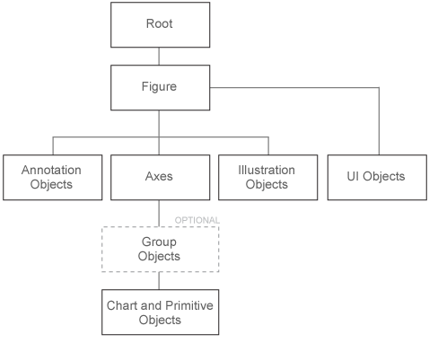

# MATLAB快速入门

## （一）桌面基础知识

启动MATLAB时，名为桌面（desktop）的主窗口会以默认布局显示。桌面包括下列面板：当前文件夹（Current Folder），显示所访问的文件，命令行窗口（Command Window），可在命令行中输入命令（由提示符>>表示）；工作区（Workspace），浏览所创建或从文件导入的数据。

**MATLAB索引从1开始。**

**存储方式是列主序存储。对维度轴(i,j,k)来说，第1个轴i是其存储方向的最小维度轴，也即对应的列轴，之后第2个轴j对应的是更高一维的行轴，依此类推。MATLAB所提供的对多维张量进行操作的函数，诸如sum(axis),mean(axis)函数，它的维度轴axis即是列主序下的维度轴。**

**在进行数组索引时，因为人习惯将矩阵表述成几行几列，故如A(i,j,k)的矩阵索引方式，第1个维度i所表示的是行轴，第2个维度j表示的是列轴，而从第3个维度k开始再向高维，与存储顺序一致。**

### 1. 命令行窗口

使用MATLAB时，可发出创建**变量（variable）**和调用函数（function）的命令。如果未指定输出变量，MATLAB将使用变量`ans`（answer的缩略）来存储计算结果。如果语句以分号`;`结束，MATLAB会执行计算，但不在命令行窗口中显示输出。

```matlab
a = 1
b = 2
c = a + b
sin(c)  % ans = sin(c)
disp('Hello World!')
```

其中，使用`disp()`函数在命令行窗口显示信息。

在MATLAB中使用`%`单行注释，使用`%{ comment %}`多行注释。

如果语句无法容纳在一行中，使用三个句点`...`，后跟回车以指示该语句在下一行继续，如下所示。

```matlab
s = 1 - 1/2 + 1/3 - 1/4  + 1/5  - 1/6 + 1/7 ...
      - 1/8 + 1/9 - 1/10 + 1/11 - 1/12;
```

### 2. 工作区

工作区包含在MATLAB中创建的，或从数据文件或其他程序导入的变量。要清除工作区中的所有变量，可使用`clear`命令。

使用`whos`可以查看工作区的内容，使用`whos var_name`可查看具体的变量。此外，桌面上的工作区窗格也会显示变量。

```matlab
A = magic(4);
B = rand(3,5,2);
whos
```

其中magic()函数表示创建一个4阶的幻方矩阵，该矩阵每行之和、每列之和、对角线之和，都为相同的值。

退出MATLAB后，工作区变量不会保留。使用`save`命令可以保存数据到.mat文件，使用`load`将.mat文件中的数据还原到工作区。

```matlab
save myfile.mat
load myfile.mat
```

上述两个命令，工作目录都是在“当前文件夹”目录下。二进制.mat文件（例如durer.mat）是用于提供保存MATLAB变量的一种方法，称为MAT文件。

### 3. format

MATLAB将数字存储为浮点值，算术运算可以区分实际值与其浮点表示之间的细微差别。

使用`format long`命令可以显示更多的位数，使用`format short`显示更少的位数。

```matlab
format long
p = a * inv(a)  % 1.000000000000001
format short
p = a * inv(a)  % 1.0000
```

使用`format compact`让MATLAB不在输出中使用多个空行。

如果要进一步控制输出格式，使用`sprintf()`和`fprintf()`函数。

### 4. 并行加速

对于许多线性代数函数和按元素的数值函数，MATLAB软件支持多线程计算。这些函数将自动在多个线程上执行。要使函数或表达式在多个CPU上更快地执行，必须满足许多条件：

1. 函数执行的运算可轻松划分为并发执行的多个部分。这些部分必须能够在进程之间几乎不通信的情况下执行。它们应需要很少的序列运算。
2. 数据大小足以使并发执行的优势在重要性方面，超过对数据分区和管理各个执行线程所需的时间。例如，仅当数组包含数千个或以上的元素时，大多数函数才会加速。
3. 运算未与内存绑定，处理时间不受内存访问时间控制。一般而言，复杂函数比简单函数速度更快。

对于大型双精度数组（约10000个元素），矩阵乘法和矩阵幂乘运算符会大幅加快计算速度。矩阵分析函数`det()`、`rcond()`、`hess()`、`expm()`等也会对大型双精度数组大幅增加速度。如果启用多线程，`inv()`、`lscov()`、`linsolve()`、`mldivide()`等将会对大型双精度数组大幅加快计算速度。其他各种计算函数也会自动进行并行加速。

## （二）变量与数字

与大多数其他编程语言一样，MATLAB语言提供数学表达式，但与大多数编程语言不同的是，这些表达式涉及整个矩阵。通常将MATLAB的一切内容都视为矩阵，实际上，MATLAB采用其他方法来存储数值数据和非数值数据。

### 1. 变量

MATLAB不需要任何类型声明或维度说明。当MATLAB遇到新的变量名称时，它会自动创建变量，并分配适当大小的存储。如果此变量已存在，MATLAB会更改其内容，并根据需要分配新存储。**注意，MATLAB是列主序存储的。**

### 2. 数字

MATLAB使用“10进制记数法、可选的小数点、前导加号或减号”来表示数字。科学记数法使用字母`e`来指定10次方的缩放因子。

MATLAB复数使用`i`或`j`作为虚数单位，会存储复数的实部和虚部，并根据上下文采用不同方法来处理各个部分的量值。例如，`sort()`函数根据复数的量值（模）进行排序，如果量值相等，再根据相位角度排序。等于关系运算符`==`要求实部和虚部相等；其他二元关系运算符`>`、`<`、`>=`和`<=`忽略复数的虚部，而仅考虑实部。

### 3. 数学函数

MATLAB提供了大量标准初等数学函数，包括`abs()`、`sin()`、`exp()`、`sqrt()`等。MATLAB还提供了许多其他高等数学函数，其中的大多数函数都接受复数参数。有关初等数学函数的列表，可键入`help elfun`命令；有关更多高等数学函数和矩阵函数的列表，可键入`help specfun`和`help elmat`命令。

一些特殊函数提供了有用的常量值，例如`i`、`j`、`pi`、`eps`、`realmin`、`realmax`、`Inf`、`NaN`等。通过将非零值除以零或计算明确定义的溢出（即超过realmax）的数学表达式，会生成无穷值Inf。通过尝试计算$0/0$或$\text{Inf}-\text{Inf}$等没有明确定义的数值的表达式，会生成非数字NaN。

这些特殊函数名称不会作为关键字保留，可以使用新变量eps=1.e-6之类的方式覆盖任何函数名称，也可使用clear eps之类的命令恢复原始函数。

## （三）文本和字符

### 1. 字符串数组中的文本

注意，只有在MATLAB R2017a之后的版本，才支持用双引号`"`创建文本字符串。

当处理文本时，将字符序列括在双引号`"`中，可以将文本赋给变量。如果文本包含双引号，可在定义中使用两个双引号`""`来转义双引号。

```matlab
t = "Hello, world";
q = "Something ""quoted"" and something else."
% q = "Something "quoted" and something else."
```

字符串数组的类或数据类型是`string`。

```matlab
whos t
%{
  Name        Size            Bytes  Class     Attributes
  t           1x1               174  string 
%}
```

要将文本添加到字符串的末尾，可使用加号运算符`+`。

```matlab
f = 71;
c = (f-32)/1.8;
tempText = "Temperature is " + c + "C"
% tempText = "Temperature is 21.6667C"
```

与数值数组类似，字符串数组可以有多个元素。使用`strlength()`函数求数组中每个字符串的长度。

```matlab
A = ["a","bb","ccc"; "dddd","eeeeee","fffffff"]
strlength(A)
%{
ans =
     1     2     3
     4     6     7
%}
```

### 2. 字符数组中的数据

有时，字符表示的数据并不对应到文本，例如DNA序列。可以将此类数据存储在数据类型为`char`的字符数组中。

字符数组使用单引号`'`括起来。如果字符数组包含单引号，可在定义中使用两个单引号`''`来转义单引号。

```matlab
seq = 'GCTAGAATCC';
whos seq
%{
  Name      Size            Bytes  Class    Attributes
  seq       1x10               20  char    
%}
```

数组的每个元素都包含单个字符，可以使用`()`进行索引。

```matlab
seq(4)
# ans = 'A'
```

字符在内部作为数字存储，而不会采用浮点格式存储。可使用`double()`等函数将每个字符转换成其对应的ASCII码数值。

可使用方括号`[]`串联字符数组，就像串联数值数组一样。

```matlab
seq2 = [seq, 'ATTAGAAACC']
# seq2 = 'GCTAGAATCCATTAGAAACC'
```

通常来说，都是对字符数组按行串联，其Size由$1\times M$和$1\times N$变成$1\times(M+N)$。而若要按列串联，需要注意保证两个字符数组变量的列数相等。

而若要操作包含不同长度的行字符串，有两种选择，一是填充较短的字符串，二是使用元胞数组。使用`char()`函数可执行填充操作（在短字符串后用空格填充），如下所示。

```matlab
S = char('I', 'Love', 'You')
%{
S =
  3×4 char array
    'I   '
    'Love'
    'You '
%}
```

在MATLAB R2017a中引入双引号来创建字符串之前编写的程序中，字符数组很常见。接受`string`数据的所有MATLAB函数都能接受`char`数据，反之亦然。

## （四）矩阵和数组

MATLAB是matrix laboratory的缩写形式。MATLAB主要用于处理整个的矩阵和数组，而其他编程语言大多逐个处理数值。在MATLAB环境中，矩阵是由数字组成的矩形数组。MATLAB会优先处理矩阵的列（即MATLAB是列主序的）。有时，$1\times1$矩阵（即标量）和只包含一行或一列的矩阵（即向量）会附加特殊含义。

**所有MATLAB变量都是多维数组**，与数据类型无关。矩阵是指通常用来进行线性代数运算的二维数组。

### 1. 矩阵和数组创建

要创建一行包含若干元素的数组，可使用逗号`,`或空格分隔各元素，这种数组为行向量。要创建包含多行的矩阵，可使用分号`;`分隔各行。

```matlab
a = [1 2 3 4]
a = [1 2 3; 4 5 6; 7 8 9]
```

创建矩阵的另一种方法是使用`ones()`、`zeros()`、`rand()`、`randn()`等函数。例如，创建一个由零组成的列向量如下。

```matlab
z = zeros(4, 1)
```

此外，可使用`eye(m,n)`创建单位矩阵。

### 2. 矩阵和数组运算

要共轭转置矩阵，使用单引号`'`；若要实数转置矩阵，使用`.'`；若要计算逆矩阵，使用`inv()`函数。

MATLAB允许使用单一的算术运算符或函数来处理矩阵中的所有值。

```matlab
a = [1 2 3; 4 5 6; 7 8 9]
a + 10
sin(a)
```

可使用`*`运算符执行标准矩阵乘法，这将计算行与列之间的内积。要执行元素级乘法（而非矩阵乘法），使用`.*`运算符。

```matlab
p = a * inv(a)
p = a .* a
```

乘法、除法、幂的矩阵运算符分别具有执行元素级运算的对应运算符`.*`、`./`、`.^`。例如，计算矩阵的各个元素的三次方如下。

```matlab
a .^ 3
```

此外，可对矩阵和数组做一些统计运算，例如`sum(A, axis)`和`prod(A, axis)`等函数，这两个函数都默认在第1个维度轴axis=1上运算，即默认在列轴上运算。

使用`norm(x,p)`对张量x求p范数，p的取值通常为1、2、inf。

### 3. 串联

**串联**是连接数组以便形成更大数组的过程。实际上，第一个数组是通过将其各个元素串联起来而构成的。成对的方括号`[]`即为串联运算符。使用逗号`,`将彼此相邻的数组串联起来称为水平串联，每个数组必须具有相同的行数。同样，如果各数组具有相同的列数，则可以使用分号`;`垂直串联。

```matlab
a = [1 2 3; 4 5 6; 7 8 9]
A = [a, a]
A = [a; a]
```

### 4. 数组索引

MATLAB中的每个变量都是一个可包含许多数字的数组。如果要访问数组的特定元素，可使用索引`()`。

引用数组中的特定元素有两种方法。最常见的方法是指定行和列下标，另一种方法是指定单一下标（按列主序存储的方式线性索引整个数组）。

```matlab
A = [1 2 3 4; 5 6 7 8; 9 10 11 12; 13 14 15 16]
A(4,2)  % ans = 14
A(8)    % ans = 14
```

另外，可以使用end关键字，来索引数组中的最后一个元素，如下所示。

```matlab
A(end)  % ans = 16
```

如果尝试在赋值语句右侧引用数组外部元素，MATLAB会引发错误。不过，可以在赋值语句左侧指定当前维外部的元素，数组大小会增大以便容纳新元素。

```matlab
test = A(4,5)
% Index in position 2 exceeds array bounds (must not exceed 4).
A(4,5) = 17
```

要引用多个数组元素，可使用冒号运算符`:`，指定一个格式为`start:end`的范围（左闭右闭的[start:end]区间）。单独的冒号（没有起始值或结束值）指定该维中的所有元素。

```matlab
A(3:4,:)
%{
ans = 
     9    10    11    12     0
    13    14    15    16    17
%}
```

此外，冒号运算符还允许使用较通用的格式`start:step:end`创建等间距向量值。若省略中间的step（如start:end），MATLAB会使用1作为默认步长。

### 5. 删除行和列

只需使用一对方括号`[]`即可从矩阵中删除行和列。例如，删除4阶方阵中的第2列，如下所示。

```matlab
A = [1 2 3 4; 5 6 7 8; 9 10 11 12; 13 14 15 16];
A(:,2) = []
%{
A =
     1     3     4
     5     7     8
     9    11    12
    13    15    16
%}
```

### 6. find()函数

`find()`函数可用于确定与指定逻辑条件相符的数组元素的索引。find()以最简单的形式返回索引的列向量。

```matlab
A = [1 2 3 4; 5 6 7 8; 9 10 11 12; 13 14 15 16];
find(isprime(A))'
%{
ans =
     2     4     5     9    10    11
%}
```

### 7. 元胞数组

MATLAB中的**元胞数组**是以其他数组的副本为元素的多维数组，各维度的维数可以不相等，即非规范矩阵。使用`cell()`函数可以创建空矩阵的元胞数组。但更普遍的做法是，通过将其他内容的集合括入花括号`{}`中来创建元胞数组。花括号还可以与下标配合使用，以便访问各个元胞的内容，如下示例。

```matlab
A = [1 2 3 4; 5 6 7 8; 9 10 11 12; 13 14 15 16];
C = {A sum(A) prod(prod(A))}
%{
C =
  1×3 cell array
    {4×4 double}    {1×4 double}    {[2.0923e+13]}
%}
```

上例生成一个$1\times3$元胞数组，这三个元胞包含4阶方阵、列总和的行向量、及其所有元素的乘积。

注意，要检索某个元胞的内容，需要使用花括号`{}`下标，例如C{1}；元胞数组包含其他数组的副本，而不是指向这些数组的指针，修改原数据，元胞数据并不会改变。

## （五）结构体

当有要按名称组织的数据时，可以使用结构体来存储这些数据。**结构体（struct）**将数据存储在名为字段（field）的容器中，可以按指定的名称访问这些字段。

使用`structName.fieldName`圆点表示法创建、分配和访问结构体字段中的数据。创建字段后，可以继续使用圆点表示法来访问和更改它存储的值。

如果存储在字段中的值是数组，则可以使用数组索引来访问数组的元素。

将多个结构体存储为一个结构体数组时，可以使用数组索引和圆点表示法来访问单个结构体及其字段。

### 1. 创建标量结构体

首先，创建一个名为patient的结构体，其中包含存储患者数据的字段，使用圆点表示法添加name、billing和test字段，为每个字段分配数据，如下所示。

```matlab
patient.name = 'John Doe';
patient.billing = 127;
patient.test = [79 75 73; 180 178 177.5; 220 210 205];
%{
patient = 
  struct with fields:
       name: 'John Doe'
    billing: 127
       test: [3×3 double]
%}
```

像patient这样的结构体也称为标量结构体，因为该变量只存储一个结构体。

### 2. 非标量结构体数组

结构体数组可以是非标量的，可以创建任意大小的结构体数组，只要数组中的每个结构体都有相同的字段即可。

例如，向patients添加第二个结构体，其中包含第二个患者的有关数据。

```matlab
patient(2).name = 'Ann Lane';
patient(2).billing = 28.50;
patient(2).test = [68 70 68; 118 118 119; 172 170 169];
patient(1).billing = 255;
%{
patient = 
  1×2 struct array with fields:
    name
    billing
    test
%}
```

数组中的每个记录都是struct类的结构体。

由结构体构成的数组有时称为结构体数组，或简称为结构数组。与其他MATLAB数组类似，结构体数组可以具有任意维度。结构体数组具有下列属性：

- 数组中的所有结构体都具有相同数目的字段。
- 所有结构体都具有相同的字段名称。
- 不同结构体中的同名字段可包含不同类型或大小的数据。

如果向数组中添加新结构体而未指定其所有字段，则未指定的字段包含空数组，如下所示。

```matlab
patient(3).name = 'New Name';
patient(3)
%{

ans = 
  struct with fields:
       name: 'New Name'
    billing: []
       test: []
%}
```

## （六）控制流

### 1. 条件控制

条件语句可用于在运行时选择要执行的代码块。最简单的条件语句为`if`语句，最后使用`end`关键字结束代码块。

```matlab
% Generate a random number
a = randi(100, 1);
% If it is even, divide by 2
if rem(a, 2) == 0
    disp('a is even')
    b = a / 2;
end
```

通过使用可选关键字`elseif`或`else`，可以包含备用选项。

```matlab
a = randi(100, 1);
if a < 30
    disp('small')
elseif a < 80
    disp('medium')
else
    disp('large')
end
```

再者，当希望针对一组已知值测试相等性时，请使用`switch`语句。

```matlab
[dayNum, dayString] = weekday(date, 'long', 'en_US');

switch dayString
   case 'Monday'
      disp('Start of the work week')
   case 'Tuesday'
      disp('Day 2')
   case 'Wednesday'
      disp('Day 3')
   case 'Thursday'
      disp('Day 4')
   case 'Friday'
      disp('Last day of the work week')
   otherwise
      disp('Weekend!')
end
```

如果要判断两个矩阵之间的关系，不要使用`==`、`>`、`<`等二元运算符，它们会返回对应位置元素的关系构成的矩阵。可以使用`isequal()`、`isempty()`、`all()`、`any()`等函数判断。

### 2. 循环控制

循环使用`for`或`while`关键字，最后使用`end`关键字结束代码块。

例如，创建一个名为fibseq的脚本，该脚本使用for循环来计算斐波那契数列的前100个数。在这个序列中，最开始的两个数是1，随后的每个数是前面两个数的和，如下所示。

```matlab
% fibseq.m
N = 100;
fib(1) = 1;
fib(2) = 1;
for n = 3:N
    fib(n) = fib(n-1) + fib(n-2);
end
```

其中，fib是使用for循环定义的数组。若要访问该数组，可先在命令行窗口执行该脚本fibseq，创建fib数组（此时便可在工作区看到fib数组），然后即可按访问数组的方式使用fib数组，如下所示。

```matlab
fibseq
fib(1:10)
%{
ans =
     1     1     2     3     5     8    13    21    34    55 
%}
```

`continue`语句将控制传递给它所在的for循环或while循环的下一迭代，并跳过该层循环体中剩余的其余语句。`break`语句用于提前从for循环或while循环中退出，在嵌套循环中，break仅从最里面的循环退出。

### 3. 向量化与预分配

提高MATLAB程序的运行速度的一种方法是向量化，即将原来的循环迭代操作转为向量化执行，因为MATLAB对向量或矩阵的运算提供了专门的优化加速。

下面给出一个创建对数表的示例。

```matlab
x = 0.01;
y = log10(x);
for k = 1:999
  x(k+1) = x(k) + 0.01;
  y(k+1) = log10(x(k+1));
end
```

相同代码段的向量化版本如下所示。

```matlab
x = .01:.01:10;
y = log10(x);
```

如果无法向量化某段代码，可以通过预分配输出结果的存储空间，即预分配任何向量或数组来提高for循环的运行速度。

例如，下面的代码使用函数zeros()来预分配在for循环中创建的向量，这会显著提高for循环的执行速度。

```matlab
r = zeros(32,1);
for n = 1:32
    r(n) = rank(magic(n));
end
```

如果未经过上述示例中的预分配，MATLAB解释器会在每次遍历循环时将r向量增大一个元素。向量预分配避免了此步骤，并提高了执行速度。

### 4. 程序终止

在程序运行完成之前，使用`return`终止当前命令序列，并将控制权返回给调用函数或键盘。

被调用的函数通常在到达函数末尾时将控制权转交给调用它的函数，可以在被调用的函数中插入一个return语句，以便强制提前终止并将控制权转交给调用者。

## （七）脚本与函数

MATLAB可以向某个文件写入一系列命令，按照执行任何MATLAB函数的相同方式来执行这些命令。使用MATLAB编辑器或任何其他文件编辑器可以创建用户自己的函数文件。按照调用任何其他MATLAB函数或命令的相同方式来调用这些函数。

两种程序文件：

- 脚本，不接受输入参数或返回输出参数。它们处理工作区中的数据。
- 函数，可接受输入参数，并返回输出参数。内部变量是函数的局部变量。

要查看程序文件的内容，可使用`type fname.m`命令。

### 1. 编写脚本

**脚本（script）**是最简单的一种MATLAB程序，脚本是一个包含多行连续的MATLAB命令的文件。在命令行中键入脚本名称即可运行该脚本。

当调用脚本时，MATLAB仅执行在文件中找到的命令。脚本可以处理工作区中的现有数据，也可以创建要在其中运行脚本的新数据。尽管脚本不会返回输出参数，单其创建的任何变量都会保留在工作区中，以便在后续计算中使用。此外，脚本可以使用plot()等函数生成图形输出。

要创建脚本，可使用`edit fname`命令，该命令会打开一个名为fname.m的空白文件。

这里编写一个脚本mysphere.m，其创建一个单位球，然后将半径加倍并绘制结果图。

```matlab
edit mysphere
```

```matlab
% mysphere.m
% Create and plot a sphere with radius r.
[x,y,z] = sphere;       % Create a unit sphere.
r = 2;
surf(x*r, y*r, z*r)     % Adjust each dimension and plot.
axis equal              % Use the same scale for each axis. 
 
% Find the surface area and volume.
A = 4*pi*r^2;
V = (4/3)*pi*r^3;
```

将脚本文件保存在当前文件夹中。若要运行脚本，直接在命令行中键入脚本名称fname即可。

```matlab
mysphere
```

此外，还可以使用编辑器中的运行按钮运行脚本。

也可以使用**实时脚本**中的格式设置选项来增强代码，而不是以纯文本编写代码和注释。实时脚本有助于查看代码和输出并与之交互，还可以包含格式化文本、方程和图像。例如，通过另存为，可将.m脚本文件，更改为实时代码.mlx文件。然后，可用格式化文本替换代码注释。

可使用edit name.mlx命令创建新的实时脚本。


### 2. 脚本位置

MATLAB在特定位置中查找脚本及其他文件。要运行脚本，该文件必须位于当前文件夹，或位于搜索路径中的某个文件夹内。

默认情况下，MATLAB安装程序创建的MATLAB文件夹位于搜索路径中。如果要将程序存储在其他文件夹，或者要运行其他文件夹中的程序，可将其添加到搜索路径。在当前文件夹浏览器中选中相应的文件夹，右键点击，然后选择添加到路径。

### 3. 编写函数

函数是可接受输入参数并返回输出参数的文件。文件名和函数名称应当相同，若函数名为myfunc，则文件名为myfunc.m。函数处理其自己的工作区中的变量，此工作区不同于在MATLAB命令提示符下访问的工作区。

#### (1) 定义函数

函数的第一行以关键字`function`开头，它提供函数名称和参数列表，如果函数没有输入和输出，可以只指定函数名称。注意，编写函数体时，每一行最后要以`;`结尾。

```matlab
function [ret1,ret2] = func_name(arg1,arg2,...)
```

这里有个示例，文件夹名为sayhello.m，它具有两个输入参数和一个输出参数。

```matlab
function ret = sayhello(name, greetings)
% Say hello and greetings to name.

% Set default value of args.
if nargin < 1
    name = 'Bloonow';
    greetings = 'Good morning';
elseif nargin < 2
    greetings = 'Good morning';
end

disp(['nargin: ', num2str(nargin), ', nargout: ', num2str(nargout)]);

hello_str = ['Hello, ', name, ', ', greetings];
disp(hello_str);
ret = hello_str;

end
```

第一个空行或可执行代码行前面的几行是提供帮助文本的注释行。当键入`help funcname`命令时，会输出这些行。

MATLAB函数参数数量是可变的（需要提供参数的默认值），如果未提供相应的输入参数，函数会运用默认值进行计算。函数体中提供了两个名为`nargin`和`nargout`的局部变量，用于告知函数每次调用时的输入参数数量和输出参数数量。

#### (2) 全局变量

如果想要多个函数共享一个变量副本，只需在所有函数中将此变量声明为`global var_name`。全局声明必须在函数中实际使用该变量之前进行。如果想要在基础工作区访问此变量，那么只需在命令行中执行相同操作。

通常来说，全局变量名称全部使用大写字母表示，有助于将其与其他变量区分开来。

```matlab
function foo1()
    global G_NAME;
    G_NAME = 'Bloonow';
end
```

```matlab
function foo2()
    global G_NAME;
    disp(G_NAME);
end
```

```matlab
foo1()
foo2()
% Bloonow
```

### 4. 调用函数

MATLAB提供了大量执行计算任务的函数。在其他编程语言中，函数等同于子例程或方法。

要调用函数func，需要将其输入参数括在圆括号`()`中，用逗号`,`分隔多个输入参数。通过将函数赋值给变量，可获得该函数返回的输出，如果存在多个输出参数，可将其括在方括号`[]`中。

```matlab
A=[1 3 5];
B=[2 3 4];
union(A, B)
%{
ans =
     1     2     3     4     5
%}
```

要调用不需要任何输入且不会返回任何输出的函数，可只键入函数名称。如`clear`函数清空工作区，`clc`函数清空命令行窗口。

### 5. 函数句柄

可以创建任何MATLAB函数的**句柄**，并将该句柄用作引用该函数的一种方式，即**函数指针**。函数句柄通常在参数列表中传递给其他函数，然后，其他函数可以使用该句柄执行或计算相应函数。在MATLAB中，使用`@`符号在函数名称前面构造函数句柄。

下面的示例为sin函数创建一个函数句柄，并将其赋值给变量fhandle。

```matlab
fhandle = @sin;
```

与调用普通函数一样，可通过函数句柄来调用函数。

### 6. 函数类型

#### (1) 匿名函数

匿名函数是一种简单形式的MATLAB函数，该函数在一个MATLAB语句中定义。可以直接在MATLAB命令行中定义匿名函数，也可以在函数或脚本中定义匿名函数。匿名函数包含一个MATLAB表达式和任意数量的输入和输出参数。使用`@(args)`语法，根据表达式创建匿名函数的格式如下。

```matlab
func = @(arg1, arg2) experssion;
```

下面的示例，创建一个求某个数字的平方的匿名函数。

```matlab
sqr = @(x) x.^2;
```

#### (2) 主函数和局部函数

任何非匿名函数必须在文件中定义。这样的函数文件都包含一个必需的主函数（最先显示）和任意数目的局部函数（位于主函数后面）。

主函数的作用域比局部函数更广，因此，主函数可以从定义这些函数的文件外（例如，从MATLAB命令行或从其他文件的函数中）调用，而局部函数则没有此功能。局部函数仅对其自己的文件中的主函数和其他局部函数可见。

#### (3) 私有函数

私有函数是一种主函数。其特有的特征是，仅对一组有限的其他函数可见。如果希望限制对某个函数的访问，或者当选择不公开某个函数的实现时，此种函数非常有用。

私有函数位于带专有名称private的子文件夹中，它们是仅可在母文件夹中可见的函数。例如，假定文件夹mydir位于MATLAB搜索路径中，则mydir目录下的名为private子文件夹中的函数，只能供mydir中的函数调用。

由于私有函数在父文件夹外部不可见，因此可以使用与其他文件夹中的函数相同的名称。如果您希望创建您自己的特定函数的版本，并在其他文件夹中保留原始函数，此功能非常有用。由于MATLAB在标准函数之前搜索私有函数，因此在查找名为test.m的非私有文件之前，它将查找名为test.m的私有函数。

#### (4) 嵌套函数

可以在函数体中定义其他函数。这些函数称为外部函数中的嵌套函数。嵌套函数包含任何其他函数的任何或所有组成部分。与其他函数一样，嵌套函数具有其自己的工作区，可用于存储函数所使用的变量。但是，它还可以访问其嵌套在的所有函数的工作区。

因此，主函数赋值的变量可以由嵌套在主函数中的任意级别的函数读取或覆盖。类似地，嵌套函数中赋值的变量可以由包含该函数的任何函数读取或被覆盖。

```matlab
% foo.m
function [r1, r2] = foo()
    f_name = 'foo';
    function r = in_foo()
        f_name = 'in_foo';
        r = f_name;
    end
    r1 = f_name;
    r2 = in_foo();
end
```

```matlab
[r1, r2] = foo()
%{
r1 =
    'foo'
r2 =
    'in_foo'
%}
```

## （八）绘图

实际上，使用matlab绘图之后，在所显示图窗上方的菜单栏中，选择打开Property Inspector窗口，可以非常方便的调整图窗的各种属性。

若要在绘图窗口的文本中显示下划线，通过代码指定时，应指定文本解释器Interpreter为none，表示使用原生字符串，否则会使用默认的tex模式，如下所示。

```matlab
xlabel('batch_size', 'Interpreter','none')
```


### 1. plot

要创建二维线图，可使用`plot()`函数。例如，从$0$到$2\pi$，取线性间距的值组成向量，在其上绘制正弦函数如下。

```matlab
x = linspace(0, 2*pi)
y = sin(x)
plot(x, y)
```

可以用`xlabel()`、`ylabel()`、`title()`函数标记轴并添加标题，需要在plot()函数调用之后执行。实际上是需要在绘制面板被创建后执行。

```matlab
plot(x, y)
xlabel("x")
ylabel("sin(x)"")
title("Plot of the Sine Function")
```

plot()函数的第三个参数指定**线条设定**，可以控制绘制线条的显示形状，如`"r--"`指定使用红色虚线绘制相同的变量。

```matlab
plot(x, y, "r--")
```

每个线条设定可包含表示线条颜色、样式和标记字符。标记是在绘制的每个数据点上显示的符号，如`+`、`o`、`*`标记。例如，"g:*"绘制使用\*标记的绿色点线。

注意，为之前的绘图定义的标题和标签，不再被用于当前的**图窗**窗口。默认情况下，每次调用绘图函数、重置坐标区及其他元素以准备新绘图时，MATLAB都会清空图窗。要将绘图添加到现有图窗中，可使用`hold on`，以实现在同一坐标系中绘制多种数据的功能。在使用`hold off`或关闭窗口之前，当前图窗窗口中会显示所有绘图。

```matlab
x = linspace(0, 2*pi);
y = sin(x);
y2 = cos(x);

plot(x, y);       hold on;
plot(x, y2, ":"); hold off;

legend("sin", "cos");
```

通过设置坐标区对象的XTick和XTickLabel属性，指定x轴刻度标签，其中XTick属性用于指定沿x轴的刻度值位置，XTickLabel属性用于指定每个刻度值要使用的文本，使用XTickLabelRotation属性旋转标签。使用圆点表示法设置属性。示例如下所示。

```matlab
% 设置位于绘图函数之后
% gca表示当前坐标区域
gca.XTick = [1 2 3 4 5]; 
gca.XTickLabels = {'January','February','March','April','May'};  % 注意此处字符串长度不同，应该使用{}元胞数组，而不是[]数组
gca.XTickLabelRotation = 45;
```

```matlab
set(gca, 'XTick', [1 2 3 4 5]);
set(gca, 'XTickLabels', {'January','February','March','April','May'});
set(gca, 'XTickLabelRotation', 45);
```

### 2. bar()

```matlab
x = 0:.1:0.9;
y = [75 91 105 123.5 131 150 179 203 226 249];
bar(x, y)
```

为条形图添加x轴文本标签，可指示条形图的类别，一种方法是将x指定为分类数组，但是bar()函数会使用经过排序的类别列表，因此条形的显示顺序可能与所指定的顺序不同，要保留顺序，可用reordercats函数，如下所示。

```matlab
x = categorical({'Small','Medium','Large','Extra Large'});
x = reordercats(x,{'Small','Medium','Large','Extra Large'});
y = [10 21 33 52];
bar(x, y);
```

要在条形图同一个类别中指定多个条形，可通过将多个y的值堆叠在一起实现，如下所示。

```matlab
x =  [1, 2, 3, 4, 5];
y1 = [4, 5, 6, 7, 8];
y2 = [7, 6, 5, 4, 3];
y = [y1; y2];
bar(x, y);
```

同样的，plot()也支持类似的操作，以在同意给坐标轴中绘制多个线条。

### 3. surf()

三维图通常用于显示二元函数$z=f(x,y)$所定义的曲面。例如，给定行向量x和y，每个向量包含[-2,2]范围内的20个点，计算$z=xe^{-(x^2+y^2)}$，如下所示。

```matlab
x = linspace(-2, 2, 20);
y = x';
z = x .* exp(-x.^2 - y.^2);
```

然后，使用`surf()`函数创建曲面。

```matlab
surf(x, y, z)
```

surf()函数及其伴随函数`mesh()`以三维形式显示曲面图，surf()使用颜色显示曲面图的连接线和面，mesh()仅以颜色标记连接线条的线框。

### 4. 多个绘图

可以使用`tiledlayout()`或`subplot()`在同一窗口的不同部分显示多个绘图。tiledlayout()函数是在R2019b中引入的，该函数比subplot()提供更多对标签和间距的控制。

例如，在图窗窗口中创建$2\times2$布局，每当要在下一区域中绘图时，调用`nexttile`即可，如下所示。

```matlab
t = tiledlayout(2, 2);
title(t, "Trigonometric Functions")
x = linspace(0, 30);

nexttile
plot(x, sin(x))
title("Sine")

nexttile
plot(x, cos(x))
title("Cosine")

nexttile
plot(x, tan(x))
title("Tangent")

nexttile
plot(x, sec(x))
title("Secant")
```

若MATLAB版本早于R2019b，可使用`subplot(m,n,idx)`绘制多个图表，其表示将图窗分割成m行n列的布局，从左到右、从上到下依次从1开始编号，在绘制之前使用idx指定要绘制的区域。使用示例如下所示。

```matlab
subplot(1, 3, 1); bar(x1, y1); title('x1-y1');
subplot(1, 3, 2); bar(x2, y2); title('x2-y2');
subplot(1, 3, 3); bar(x3, y3); title('x3-y3');
```

此外，有的绘图函数支持在同一次调用中指定多种数据，以在同一个坐标轴内绘制多种数据，例如plot(x1,y1,x2,y2,...)函数。

## （九）图像显示

可以将二维的数值数组显示为图像，数组元素决定了图像的亮度或颜色。例如，加载一个MATLAB自带的图像数组及其颜色图，如下所示。

```matlab
load durer
whos
Name          Size         Bytes  Class

  X           648x509      2638656  double array
  caption     2x28             112  char array
  map         128x3           3072  double array
```

加载文件durer.mat，向工作区添加三个变量。数组X是一个$648\times509$矩阵，map是作为此图像的颜色图的$128\times3$数组。X的元素是介于1和128之间的整数，用作颜色图map的索引。

使用`imshow(X,map)`函数可以显示图像数据。

使用`imread(fname,fmt)`函数可以读取标准图像文件（TIFF、JPEG、PNG等），imread()返回的数据类型取决于读取的图像类型。

使用`imwrite(A,fname)`函数可以将MATLAB数据写入到各种标准图像格式。

## （十）处理图形对象

### 1. 图形对象



当调用绘图函数时，MATLAB使用各种图形对象（例如，图窗窗口、轴、线条、文本等）创建图形。每个对象都具有一组固定的属性，可以使用这些属性控制图形的行为和外观。

例如，以下语句使用变量y中的数据创建条形图，并设置关于条形显示方式的属性。

```matlab
y = [75 91 105 123.5 131 150 179 203 226 249 281.5];
bar(y, 'FaceColor', 'green', 'EdgeColor', 'black', 'LineWidth', 1.5)
```

当调用函数以便创建图形时，MATLAB会创建图形对象的层次结构。例如，调用plot()函数会创建下列图形对象：

- 图窗（figure），包含轴、工具栏、菜单等的窗口。
- 轴（axis），包含表示数据的对象的坐标系
- 线条（line），代表传递至plot()函数的数据值的线条。
- 文本（text），用于轴刻度线和可选标题及注释的标签。

不同类型的图形使用不同对象来表示数据。由于存在许多种图形，因此也存在许多数据对象类型。其中一些用于一般用途，例如线条和矩形，还有一些是用于高度专业的用途，例如误差条、颜色栏和图例。

绘图函数可返回用于创建图形的对象。例如，以下语句将创建一个图形并返回由plot()函数创建的线条对象。

```matlab
x = 1:10;
y = x.^3;
h = plot(x, y);
```

使用h即可设置线条对象的属性。例如，设置它的Color属性。

```matlab
h.Color = 'red';
```

当然，也可以在调用绘图函数时指定线条属性。

```matlab
h = plot(x, y, 'Color', 'red');
```

可以使用get()和set()方法访问或设置对象的属性。

### 2. 设置对象属性

可以使用`set(H,Name,Value)`函数或`set(H,NameArray,ValueArray)`函数设置对象属性。

例如，下面的语句绘制一个$5\times5$矩阵（创建五个线条对象，每列各一个），然后将Marker属性设置为正方形，并将MarkerFaceColor属性设置为绿色。

```matlab
y = magic(5);
h = plot(y);
set(h,'Marker','s','MarkerFaceColor','g')
%{
h' = 
  1×5 Line array:
    Line    Line    Line    Line    Line
%}
```

在本示例中，h是一个包含五个句柄的向量，图形中的每个线条（共五个）各一个句柄。set()语句将所有线条的Marker和MarkerFaceColor属性设置为相同值。

如果要将每个线条的属性设置为不同值，可以使用元胞数组存储所有数据，并将其传递给set()命令。

一个示例，假设要为每个线条添加不同标记，并使标记的面颜色与线条的颜色相同，需要定义两个元胞数组，一个prop_name包含属性名，另一个prop_values包含属性所需的值。

```matlab
figure
y = magic(5);
h = plot(y);
prop_name(1) = {'Marker'};
prop_name(2) = {'MarkerFaceColor'};
prop_values(1,1) = {'s'};
prop_values(1,2) = {h(1).Color};
prop_values(2,1) = {'d'};
prop_values(2,2) = {h(2).Color};
prop_values(3,1) = {'o'};
prop_values(3,2) = {h(3).Color};
prop_values(4,1) = {'p'};
prop_values(4,2) = {h(4).Color};
prop_values(5,1) = {'h'};
prop_values(5,2) = {h(5).Color};
set(h, prop_name, prop_values)
```

### 3. 用于处理对象的函数

此表列出了处理对象的常用函数。

| 函数                                                         | 用途                               |
| :----------------------------------------------------------- | :--------------------------------- |
| [`allchild`](https://ww2.mathworks.cn/help/matlab/ref/allchild.html) | 查找指定对象的所有子级。           |
| [`ancestor`](https://ww2.mathworks.cn/help/matlab/ref/ancestor.html) | 查找图形对象的前代。               |
| [`copyobj`](https://ww2.mathworks.cn/help/matlab/ref/copyobj.html) | 复制图形对象。                     |
| [`delete`](https://ww2.mathworks.cn/help/matlab/ref/delete.html) | 删除对象。                         |
| [`findall`](https://ww2.mathworks.cn/help/matlab/ref/findall.html) | 查找所有图形对象（包括隐藏句柄）。 |
| [`findobj`](https://ww2.mathworks.cn/help/matlab/ref/findobj.html) | 查找具有指定属性值的对象的句柄。   |
| [`gca`](https://ww2.mathworks.cn/help/matlab/ref/gca.html)   | 返回当前轴的句柄。                 |
| [`gcf`](https://ww2.mathworks.cn/help/matlab/ref/gcf.html)   | 返回当前图窗的句柄。               |
| [`gco`](https://ww2.mathworks.cn/help/matlab/ref/gco.html)   | 返回当前对象的句柄。               |
| [`get`](https://ww2.mathworks.cn/help/matlab/ref/get.html)   | 查询对象的属性的值。               |
| [`ishandle`](https://ww2.mathworks.cn/help/matlab/ref/ishandle.html) | 如果值是有效对象句柄，则为True。   |
| [`set`](https://ww2.mathworks.cn/help/matlab/ref/set.html)   | 设置对象的属性的值。               |

### 4. 查找现有对象的句柄

`findobj()`函数可用于通过搜索具有特定属性值的对象，来获取图形对象的句柄。使用findobj()，可以指定任何属性组合的值，这样可以方便地从多个对象中选取一个对象。此外，findobj()还可识别正则表达式。

由于所有对象都具有标识对象类型的`Type`属性，因此可以查找特定对象类型的所有匹配项的句柄。如下所示，查找所有patch对象的句柄。

```matlab
h = findobj('Type', 'patch');
```

可以指定多个属性以便缩小搜索范围。如下所示，查找所有红色点线的句柄。

```matlab
plot(rand(5), 'r:')
h = findobj('Type', 'line', 'Color', 'r', 'LineStyle', ':')
%{
h' = 
  1×5 Line array:
    Line    Line    Line    Line    Line
%}
```

通过将起始图窗或轴的句柄作为传递的第一个参数，可以在对象层次结构中指定起点。如下所示，仅在当前坐标区中查找$\pi/2$。

```matlab
h = findobj(gca, 'Type', 'text', 'String', '\pi/2');
```
