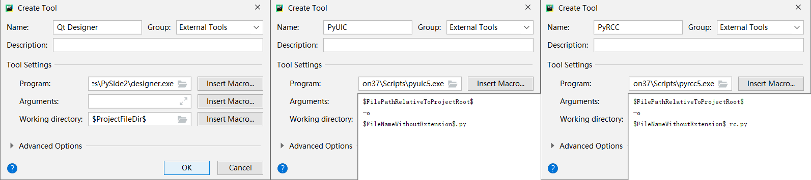
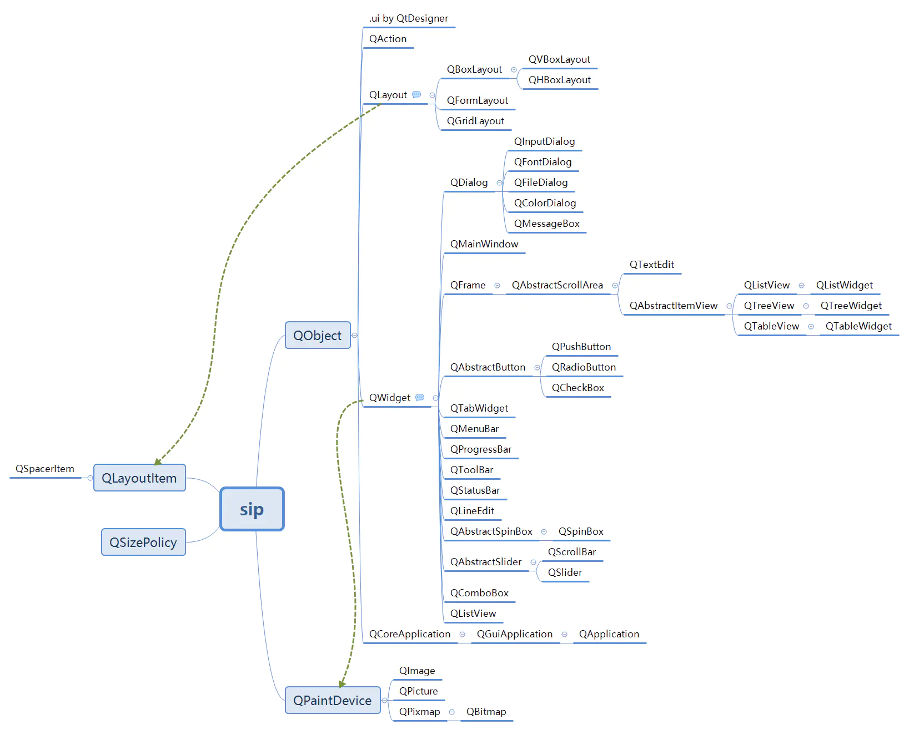
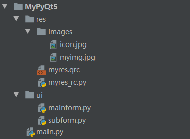

# 简介

Python GUI方案的选择，需要根据实际项目的需求和规模而确定。如果只是最简单最基本的功能，而不考虑界面布局和美观程度，可以使用Python自带的GUI标准库Tkinter；而如果功能复杂一些，则可以使用wxPython、PyQt或PySide2。一些较为详细的介绍如下。

Tkinter是Python自带的一个GUI标准库，轻便灵活，易于学习，主要用于简单的桌面开发，基本组件和容器可以完全满足日常开发需求，但在界面布局和美观程度上有一定欠缺。

wxPython是一个非常优秀的Python GUI开发库，免费、开源、跨平台，在早期GUI开发中，有着较高的使用率和欢迎度，相比较Tkinter来说，wxPython提供了更为丰富的组件和容器，因此在界面布局和美观程度上更胜一筹，而且代码量更少、更简洁。可以按如下命令安装。

```shell
pip install wxPython
```

PyQt是一个功能强大的Python GUI开发库，基于Qt接口封装而来，组件和容器更多也更为丰富，借助于Qt强大的可视化功能，Python也可以直接拖拽控件设计界面，开发效率也更为快捷，尤其适合功能复杂的中大型应用。可以按如下命令安装。

```shell
pip install pyqt5
pip install pyqt5-tools		# Qt Designer
```

PySide2是对标PyQt5的，它们来自于不同的开发商，其中PySide2是由Qt官方开发的，它们只需要很小的修改就可以接口兼容。不同的是PyQt使用的是GPLv3开源协议，即使用PyQt的软件商用必须开源；而PySide2是使用LGPL协议的，使用它的商用软件不必开源。可以使用如下命令安装。

```shell
pip install pyside2
```

# PyQt5

## （一）为PyCharm添加Qt5工具

在进行PyQt5（或Qt5）开发的过程中，常用的工具有Qt Designer、pyuic5（Convert .ui to .py）、pyrcc5（Convert .qrc to .py）。在使用pip命令安装PyQt5或者PySide2时，它们会一起被下载到Python相应的安装目录中，如下所示。

```
C:\Program Files\Python37\Lib\site-packages\PySide2\designer.exe
C:\Program Files\Python37\Scripts\pyuic5.exe
C:\Program Files\Python37\Scripts\pyrcc5.exe
```

当然可以手动使用上述exe文件来进行相应操作，但为了方便，通常将其添加到IDE的外部工具中，以便在IDE中直接使用。将这些工具添加到PyCharm中应操作'PyCharm->File->Settings->Tools->External Tools->Add'过程。

按照上述操作依次进行，最后打开如下Create Tool界面，在此可以配置相应外部工具，包括名称、描述、程序位置、参数、工作目录等。



在使用PyUIC和PyRCC的工具时，先用PyCharm打开相应的.ui和.qrc文件，在工具栏中选择'Tools->External Tools->PyUIC/PyRCC'即可。

## （二）基础示例

PyQt5是Qt图形库用Python的实现，它基本上完全实现了Qt的功能，且它们的API接口几乎完全一致，只是编程语言风格上的差异。PyQt5的类派生结构如下图所示。



这里由一个使用PyQt5编写GUI的比较完整的例子，在该例子中将UI界面和业务逻辑进行了分离。该例中的项目结构如下所示。



- ./res/images/\*.jpg，原生资源文件。
- ./res/myres.qrc，资源描述文件.qrc（实质是XML文件），使用PyRCC将其生成_rc.py文件。
- ./res/myres_rc.py，\_rc.py文件，供ui.py文件import，以使用相应资源。

项目中，./res/myres.qrc文件内容如下。

```xml
<RCC>
  <qresource prefix="pic">
    <file>images/icon.jpg</file>
    <file>images/myimg.jpg</file>
  </qresource>
</RCC>

<!-- 注释不能加在第一行，不然PyRCC无法正常工作 -->
<!-- 使用Qt Designer创建的.qrc资源描述文件，对该文件使用PyRCC，以生成相应的_rc.py文件 -->
<!-- 在描述UI界面的.py文件中import _rc.py文件，以使用该资源描述文件所描述的资源 -->
<!-- 可以按如下字符串来引用相应资源：':pic/images/icon.jpg' -->
```

项目中，./ui/mainform.py文件内容如下。

```python
from PyQt5 import QtWidgets, QtGui, QtCore
from PyQt5.QtGui import QIcon
from PyQt5.QtWidgets import QMainWindow, QMessageBox, QFileDialog
from ui.subform import MyChildForm
import res.myres_rc

class Ui_MyMainWindow:
    """
    UI界面类，只构建静态UI界面，与动态和业务逻辑分离，通常由Qt Designer生成.ui文件，然后使用PyUIC生成.py代码
    """

    def setupUi(self, main_window):
        """
        :param main_window: 界面业务逻辑类对象，通常是QMainWindow或QWidget的子类
        """
        # 字体格式
        font = QtGui.QFont('Times New Roman', pointSize=14)

        # 主窗口
        main_window.resize(800, 600)
        main_window.setWindowIcon(QIcon(':pic/images/icon.jpg'))
        size_policy = QtWidgets.QSizePolicy(QtWidgets.QSizePolicy.Expanding, QtWidgets.QSizePolicy.Expanding)
        size_policy.setHorizontalStretch(0)
        size_policy.setVerticalStretch(0)
        size_policy.setHeightForWidth(main_window.sizePolicy().hasHeightForWidth())
        main_window.setSizePolicy(size_policy)

        # 为主窗口设置中心控件，并为其设置格栅布局
        self.center_widget = QtWidgets.QWidget(parent=main_window)
        self.gridLayout_center = QtWidgets.QGridLayout(self.center_widget)
        main_window.setCentralWidget(self.center_widget)

        # 水平布局：输入框、按钮、标签
        self.horizontalLayout_hello = QtWidgets.QHBoxLayout()
        self.horizontalLayout_hello.setSizeConstraint(QtWidgets.QLayout.SetDefaultConstraint)
        # 输入框：输入姓名
        self.lineEdit_input_name = QtWidgets.QLineEdit(parent=self.center_widget)
        self.lineEdit_input_name.setFont(font)
        # 按钮：Say Hello
        self.pushButton_say_hello = QtWidgets.QPushButton(parent=self.center_widget)
        self.pushButton_say_hello.setFont(font)
        # 标签：显示Hello
        self.label_show_hello = QtWidgets.QLabel(parent=self.center_widget)
        self.label_show_hello.setFont(font)
        self.label_show_hello.setScaledContents(False)
        self.label_show_hello.setWordWrap(False)
        self.label_show_hello.setTextFormat(QtCore.Qt.TextFormat.AutoText)
        self.label_show_hello.setAlignment(QtCore.Qt.AlignmentFlag.AlignLeft | QtCore.Qt.AlignmentFlag.AlignVCenter)
        # 在该水平布局中添加控件
        self.horizontalLayout_hello.addWidget(self.lineEdit_input_name)
        self.horizontalLayout_hello.addWidget(self.pushButton_say_hello)
        self.horizontalLayout_hello.addWidget(self.label_show_hello)

        # 垂直布局：按钮、图片
        self.verticalLayout_image = QtWidgets.QVBoxLayout()
        # 按钮：显示图片
        self.pushButton_show_image = QtWidgets.QPushButton(parent=self.center_widget)
        self.pushButton_show_image.setFont(font)
        # 标签：显示图片
        self.label_show_image = QtWidgets.QLabel(parent=self.center_widget)
        size_policy = QtWidgets.QSizePolicy(QtWidgets.QSizePolicy.Maximum, QtWidgets.QSizePolicy.Maximum)
        size_policy.setHorizontalStretch(0)
        size_policy.setVerticalStretch(0)
        size_policy.setHeightForWidth(self.label_show_image.hasHeightForWidth())
        self.label_show_image.setSizePolicy(size_policy)
        self.label_show_image.setMaximumSize(400, 400)
        self.label_show_image.setFont(font)
        # 在该垂直布局中添加控件
        self.verticalLayout_image.addWidget(self.pushButton_show_image)
        self.verticalLayout_image.addWidget(self.label_show_image)

        # 为中心控件的格栅布局添加上述水平布局
        self.gridLayout_center.addLayout(self.horizontalLayout_hello, 0, 0, 1, 1)
        # 水平衬垫，用来填充空白位置
        spacerItem = QtWidgets.QSpacerItem(40, 20, hPolicy=QtWidgets.QSizePolicy.Expanding, vPolicy=QtWidgets.QSizePolicy.Minimum)
        self.gridLayout_center.addItem(spacerItem, 0, 1, 1, 1)
        # 为中心控件的格栅布局添加上述垂直布局
        self.gridLayout_center.addLayout(self.verticalLayout_image, 1, 0, 1, 1)
        # 水平衬垫，用来填充空白位置
        spacerItem = QtWidgets.QSpacerItem(40, 20, hPolicy=QtWidgets.QSizePolicy.Expanding, vPolicy=QtWidgets.QSizePolicy.Minimum)
        self.gridLayout_center.addItem(spacerItem, 1, 1, 1, 1)
        # 垂直衬垫，用来填充空白位置
        spacerItem = QtWidgets.QSpacerItem(20, 40, hPolicy=QtWidgets.QSizePolicy.Minimum, vPolicy=QtWidgets.QSizePolicy.Expanding)
        self.gridLayout_center.addItem(spacerItem, 2, 0, 1, 1)

        # 为主窗口设置菜单栏
        self.menubar = QtWidgets.QMenuBar(parent=main_window)
        self.menubar.setGeometry(QtCore.QRect(0, 0, 800, 24))
        main_window.setMenuBar(self.menubar)
        # 菜单项：文件
        self.menu_file = QtWidgets.QMenu(parent=self.menubar)
        # 动作：打开文件、关闭文件
        self.action_open_file = QtWidgets.QAction(parent=main_window)
        self.action_close_file = QtWidgets.QAction(parent=main_window)
        self.menu_file.addAction(self.action_open_file)
        self.menu_file.addAction(self.action_close_file)
        # 菜单项：编辑
        self.menu_edit = QtWidgets.QMenu(parent=self.menubar)
        # 为菜单栏添加菜单项的默认动作
        self.menubar.addAction(self.menu_file.menuAction())
        self.menubar.addAction(self.menu_edit.menuAction())

        # 为主窗口设置工具栏
        self.toolbar = QtWidgets.QToolBar(parent=main_window)
        main_window.addToolBar(QtCore.Qt.ToolBarArea.TopToolBarArea, self.toolbar)
        # 动作：工具一、工具二
        self.action_tool_1 = QtWidgets.QAction(parent=main_window)
        self.action_tool_2 = QtWidgets.QAction(parent=main_window)
        self.toolbar.addAction(self.action_tool_1)
        self.toolbar.addAction(self.action_tool_2)

        # 为主窗口设置状态栏
        self.statusbar = QtWidgets.QStatusBar(parent=main_window)
        main_window.setStatusBar(self.statusbar)

        self.retranslateUi(main_window)
        QtCore.QMetaObject.connectSlotsByName(main_window)

    def retranslateUi(self, main_window):
        """
        对UI界面的文本信息进行设置并重翻译，以解决国际化及区域编码问题
        """
        # 上下文
        ctx = 'main_window'
        # Qt的翻译器，不仅可以翻译相应的语言，还可以按照其编码及字符集进行正确的转换
        tr = QtCore.QCoreApplication.translate
        main_window.setWindowTitle(tr(ctx, '主窗口'))
        self.pushButton_show_image.setText(tr(ctx, 'ShowImage'))
        self.label_show_image.setText(tr(ctx, 'Here will show an image.'))
        self.lineEdit_input_name.setPlaceholderText(tr(ctx, 'Input Your Name'))
        self.pushButton_say_hello.setText(tr(ctx, 'SayHello'))
        self.label_show_hello.setText(tr(ctx, 'Hello,World!'))
        self.menu_file.setTitle(tr(ctx, '文件(&F)'))
        self.menu_edit.setTitle(tr(ctx, '编辑(&E)'))
        self.toolbar.setWindowTitle(tr(ctx, 'toolBar'))
        self.action_open_file.setText(tr(ctx, '打开'))
        self.action_open_file.setShortcut(tr(ctx, 'Alt+O'))
        self.action_close_file.setText(tr(ctx, '关闭'))
        self.action_close_file.setShortcut(tr(ctx, 'Alt+C'))
        self.action_tool_1.setText(tr(ctx, '对话框'))
        self.action_tool_2.setText(tr(ctx, '新窗口'))


class MyMainWindow(QMainWindow, Ui_MyMainWindow):
    """
    UI界面的逻辑类，为UI界面的控件设置信号与槽，并为某些控件编写相应的业务逻辑
    """

    def __init__(self, parent=None):
        super(MyMainWindow, self).__init__(parent)
        self.setupUi(self)

        # 控件有的方法被注释为[signal]，表示可以对其使用connect()来添加槽函数或自定义函数
        self.action_open_file.triggered.connect(self.openFileMsg)
        self.action_close_file.triggered.connect(self.close)
        self.action_tool_1.triggered.connect(self.showMessage)
        self.action_tool_2.triggered.connect(self.newWindow)
        self.pushButton_say_hello.clicked.connect(self.sayHello)
        self.pushButton_show_image.clicked.connect(self.showImage)

    def openFileMsg(self):
        file_name, filter = QFileDialog.getOpenFileName(self, '打开文件', filter='All Files (*);;Text Files (*.txt)')
        self.statusbar.showMessage(file_name, msecs=1000)

    def showMessage(self):
        reply = QMessageBox.information(self, '提示', 'You have a new message.', QMessageBox.Ok | QMessageBox.Close)
        if reply == QMessageBox.Ok:
            print('Ok')
        elif reply == QMessageBox.Close:
            print('Close')

    def newWindow(self):
        child_form = MyChildForm(parent=self)
        left, top = (self.width() - child_form.width()) / 2, (self.height() - child_form.height()) / 2
        child_form.move(left, top)
        child_form.show()

    def sayHello(self):
        name = self.lineEdit_input_name.text()
        self.label_show_hello.setText(f'Hello, {name}!')

    def showImage(self):
        self.label_show_image.setPixmap(QtGui.QPixmap(':/pic/images/myimg.jpg'))
        self.label_show_image.setScaledContents(True)
```

项目中，./ui/subform.py文件内容如下。

```python
from PyQt5 import QtWidgets, QtGui, QtCore
from PyQt5.QtWidgets import QWidget

class Ui_MyChildForm:
    """
    UI界面类，只构建静态UI界面，与动态和业务逻辑分离，通常由Qt Designer生成.ui文件，然后使用PyUIC生成.py代码
    """

    def setupUi(self, this_form):
        this_form.resize(300, 200)
        size_policy = QtWidgets.QSizePolicy(QtWidgets.QSizePolicy.Expanding, QtWidgets.QSizePolicy.Expanding)
        size_policy.setHorizontalStretch(0)
        size_policy.setVerticalStretch(0)
        size_policy.setHeightForWidth(this_form.sizePolicy().hasHeightForWidth())
        this_form.setSizePolicy(size_policy)

        self.pushButton = QtWidgets.QPushButton(parent=self)
        self.pushButton.setFont(QtGui.QFont('Times New Roman', pointSize=14))
        size_policy = QtWidgets.QSizePolicy(QtWidgets.QSizePolicy.MinimumExpanding, QtWidgets.QSizePolicy.MinimumExpanding)
        size_policy.setHorizontalStretch(0)
        size_policy.setVerticalStretch(0)
        size_policy.setHeightForWidth(self.pushButton.hasHeightForWidth())
        self.pushButton.setSizePolicy(size_policy)
        self.pushButton.setMinimumSize(300, 200)

        self.retranslateUi(this_form)
        QtCore.QMetaObject.connectSlotsByName(this_form)

    def retranslateUi(self, this_form):
        ctx = 'this_form'
        tr = QtCore.QCoreApplication.translate
        this_form.setWindowTitle(tr(ctx, '子窗口'))
        self.pushButton.setText(tr(ctx, 'Hay, this is a child window.\nClick to close.'))


class MyChildForm(QWidget, Ui_MyChildForm):
    def __init__(self, parent=None):
        super(MyChildForm, self).__init__(parent)
        self.setupUi(self)

        self.pushButton.clicked.connect(self.close)
```

项目中，./main.py文件内容如下。

```python
from PyQt5.QtWidgets import QApplication
from ui.mainform import MyMainWindow

app = QApplication([])
mmw = MyMainWindow()
mmw.show()
app.exec_()
```

## （三）使用QSS美化界面

QSS（Qt Style Sheets），用于美化Qt程序界面，类似于CSS，但不如CSS强大，选择器和属性较少。Qt-Material是一个仿Material的样式，适用于PySide6、PySide2、PyQt6、PyQt5。可以使用如下pip命令按照Qt-Material。

```shell
pip install qt-material
```

Qt-Material的使用也非常简单，一个例子如下。

```python
import sys
from PyQt5.QtWidgets import QApplication
from qt_material import apply_stylesheet
from ui.mainform import MainForm

if __name__ == '__main__':
    app = QApplication(sys.argv)
    mf = MainForm()
    
    # 使用Qt-Material
    extra = {
        'font_family': 'Microsoft YaHei UI',
        'font_size': 16
    }
    apply_stylesheet(app, theme='dark_teal.xml', extra=extra)
    
    mf.show()
    sys.exit(app.exec_())
```

