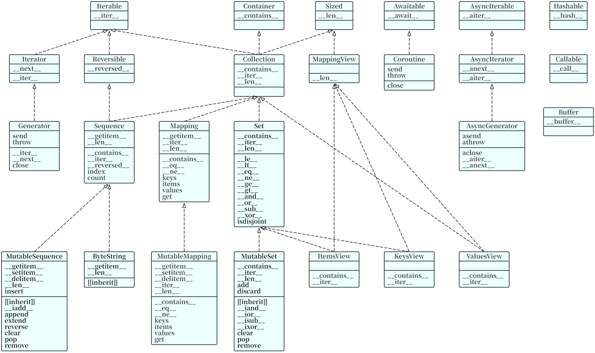
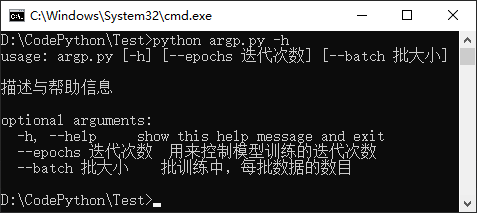

[toc]

# 一、Python基础与工具

## 零散整理

Python语言的解释器有多种实现，例如CPython（使用C语言实现），PyPy（使用Python自导实现）、Jython（使用Java实现）。其中，CPython是用C语言开发的Python解释器，是目前应用最广泛的解释器，也是Python的官方实现。

用`float('inf')`表示无穷大，`float('-inf')`表示无穷小。运算`a // b`表示取不大于运算结果的最大整数，它与`math.floor(a/b)`运算是一样的。

Python中的原生字符串使用小写字母r标识，如`r'E:\Cache\pics'`。原生字符串不会进行特殊字符的转义。

`lambda`函数又称为匿名函数，其基本格式为`lambda args: expression`。它是一个函数，具有函数的特性。参数的数量可以任意，0个或者多个（用逗号隔开）；表达式的值即为函数的返回值，因为不需要return关键词，也不允许使用`=`赋值符号。

```python
def foo(x, y, *, z):
    print(x, y, z)
```

可以看到，在Python函数定义中，允许出现单独的`*`星号或`/`斜杆，它表示，在`*`或`/`之后的参数，只允许按键值对的形式传递，而不能使用位置参数的形式传递。如上述例子，只能foo(1,2,z=3)调用，而不能foo(1,2,3)调用。

Python支持直接判断一个数是否属于某个范围的语法糖，如C语言中的`a <= x && x <= b`，在Python中可直接写为`a <= x <= b`。

注意，Python内置的cmath模块中的sqrt()函数，返回结果总是一个复数，即使原来的数据不为复数。

Python的异常类型都派生自Exception基类，可以使用raise抛出一个异常类的实例对象，并使用except捕获该异常对象。

```python
class BaseException: ...
class Exception(BaseException): ...
```

```python
try:
    raise NotImplementedError('the feature is not implemented')
except NotImplementedError as ex:
    print(ex)  # the feature is not implemented
```

其中，异常类NotImplementedError用于表示一个未实现异常。需要注意的是，Python的某些内部算法具有多种实现，在执行时会选择其中一种，这需要逐个进行测试，并在某个实现不支持时，返回“未实现异常”，然后继续测试剩余的实现。这里的未实现异常，并不是NotImplementedError异常类的实例对象，也不是通过raise语法抛出的，因为异常机制会导致程序停止执行。于是，Python提供一个普通类的实例对象NotImplemented来表示这种“未实现异常”，并通过普通的return语句返回，以进行剩余测试。

```python
@final
class _NotImplementedType(Any):
    # A little weird, but typing the __call__ as NotImplemented makes the error message for NotImplemented() much better
    __call__: NotImplemented  # type: ignore[valid-type]  # pyright: ignore[reportInvalidTypeForm]
NotImplemented: _NotImplementedType
```

## Python内置函数及工具函数

Python解释器内置许多函数和类型，它们在任何时间都可用，位于builtins.pyi文件中，参见https://docs.python.org/3.12/library/functions.html官方文档。

```python
def abs(x: SupportsAbs[_T], /) -> _T: ...
```

返回一个数的绝对值。参数x可以是整数、浮点数或任何实现\_\_abs\_\_()的对象，如果是一个复数，则返回它的模。

```python
def all(iterable: Iterable[object], /) -> bool: ...
```

如果iterable的所有元素均为真值（或可迭代对象为空）则返回True，否则返回False。

```python
def any(iterable: Iterable[object], /) -> bool: ...
```

如果iterable的任一元素为真值则返回True，否则或可迭代对象为空，则返回False。

```python
def ascii(obj: object, /) -> str: ...
```

与repr()类似，返回一个包含对象的可打印表示形式的字符串，但是使用\x、\u、\U对repr()返回的字符串中非ASCII编码的字符进行转义。

```python
def aiter(async_iterable: SupportsAiter[_SupportsAnextT], /) -> _SupportsAnextT: ...
```

返回async_iterable对象的AsyncIterator迭代器，相当于调用其\_\_aiter\_\_()方法。

```python
def anext(async_iterator: _SupportsSynchronousAnext[_AwaitableT], /) -> _AwaitableT: ...
async def anext(async_iterator: SupportsAnext[_T], default: _VT, /) -> _T | _VT: ...
```

当进入await状态时，从async_iterator对象返回下一项数据，迭代完毕则返回default值。这是内置函数next()的异步版本，等价于调用async_iterator的\_\_anext\_\_()方法，返回一个awaitable，等待返回迭代器的下一个值。

```python
def bin(number: int | SupportsIndex, /) -> str: ...
```

将一个整数number转换为带"0b"前缀的二进制数字符串，如果如果x不是一个int对象，则它必须定义返回一个整数的\_\_index\_\_()方法。

```python
class bytes(Sequence[int]):
    def __new__(cls, string: str, /, encoding: str, errors: str = ...) -> Self: ...
```

返回一个新的bytes对象，这是一个不可变序列，每个元素值的包含范围为[0,256)的整数。

```python
class bytearray(MutableSequence[int]):
    def __init__(self, string: str, /, encoding: str, errors: str = ...) -> None: ...
```

返回一个新的bytes数组，这是一个可变序列，每个元素值的包含范围为[0,256)的整数。

```python
class bool(int):
    def __new__(cls, obj: object = ..., /) -> Self: ...
```

返回布尔值，对象obj将使用标准的逻辑值检测过程来转换。bool类只有False和True两个实例。

> 任何对象都可以进行逻辑值的检测，以便在if等语句中作为条件，或是作为布尔运算的操作数来使用。在默认情况下，一个object对象会被视为具有True真值，除非其定义了返回False的\_\_bool\_\_()方法或者返回零的\_\_len\_\_()方法。
>
> 此处列出具有False假值的内置对象。被定义为False假值的常量，None、False；任何数值类型的零，0、0.0、0j、Decimal(0)、Fraction(0, 1)；空的序列和集合，''、()、[]、{}、set()、range(0)。

```python
def breakpoint(*args: Any, **kws: Any) -> None: ...
```

此函数会在调用点进入调试器，具体来说，它调用sys.breakpointhook()，并直接传递args和kws参数。默认情况下，sys.breakpointhook()调用pdb.set_trace()且没有参数，在这种情况下，它纯粹是一个便利函数，因为用户不必显式导入pdb且键入尽可能少的代码即可进入调试器。

```python
def chr(i: int, /) -> str: ...
```

返回Unicode码位为整数i的字符的字符串格式，这是ord()的逆函数。例如，chr(97)返回字符串'a'，chr(8364)返回字符串'€'（欧元符号）。

```python
class complex:
    def __new__(cls, real, imag) -> Self: ...
```

返回值为$\text{real}+\text{imag}\times j$的复数，若省略imag则默认值为零，或将字符串或数字转换为复数。对于一个普通对象x，complex(x)会委托给x.\_\_complex\_\_()，如果\_\_complex\_\_()未定义则将回退至\_\_float\_\_()，如果\_\_float\_\_()未定义则将回退至\_\_index\_\_()。

```python
def callable(obj: object, /) -> TypeGuard[Callable[..., object]]: ...
```

如果obj参数是可调用的则返回True，否则返回False。如果返回True，调用仍可能失败，但如果返回False，则调用obj肯定不会成功。值得注意，类是可调用的，调用类将返回一个新的实例；如果实例具有\_\_call\_\_()方法，则它就是可调用的。

```python
class classmethod(Generic[_T, _P, _R_co]):
    def __init__(self, f: Callable[Concatenate[type[_T], _P], _R_co], /) -> None: ...
```

把一个方法封装成类方法。类方法隐含的第一个参数就是类本身，就像实例方法接收实例作为参数一样。类方法的调用可以在类上进行，也可以在实例上进行。如果类方法在其所属类的派生类上调用，则该派生类对象会被作为隐含的第一个参数被传入。类方法与C++或Java中的静态方法不同，静态方法使用staticmethod装饰。

```python
class MyClz:
    @classmethod
    def say_hello(cls, name: str):
        print(f"Hello, {name}!")
MyClz.say_hello("Bloonow")
MyClz().say_hello("Akame")
```

```python
def compile(source, filename, mode, flags, dont_inherit=False, optimize=-1) -> Union[CodeType | AST]: ...
```

将source编译成CodeType代码对象或AST（抽象语法树，abstract syntax tree）对象，代码对象可以被exec()或eval()执行。其中，source可以是常规的字符串、字节字符串，或者AST对象。

```python
def divmod(x: SupportsDivMod[_T_contra, _T_co], y: _T_contra, /) -> _T_co: ...
def divmod(x: _T_contra, y: SupportsRDivMod[_T_contra, _T_co], /) -> _T_co: ...
```

以两个（非复数）数字为参数，在作整数除法时，返回商和余数，即返回(x//y, x%y)元组。若操作数为混合类型，则适用二进制算术运算符的规则。

```python
def delattr(obj: object, name: str, /) -> None: ...
```

其参数是一个对象和一个字符串，其中字符串必须是对象的某个属性的名称，该函数会删除指定的属性。例如，delattr(x, 'foo')等价于del x.foo。

```python
def dir(obj: object = ..., /) -> list[str]: ...
```

如果没有实参，则返回当前局部作用域中的变量名称列表，如果有实参obj，会返回该对象的有效属性列表。如果对象有一个名为\_\_dir\_\_()的方法，则该方法将被调用并且必须返回由属列组成的列表。如果对象未提供\_\_dir\_\_()，该函数会尽量从对象所定义的\_\_dict\_\_属性和其类型对象中收集信息，结果列表不一定是完整的，并且当对象具有自定义的\_\_getattr\_\_()时还可能是不准确的。

默认的dir()机制对不同类型的对象行为不同，它会试图返回最相关而不是最全的信息。如果obj是模块对象，则列表包含模块的属性名称。如果obj是类型，则列表包含它们的属性名称，并且递归查找所有基类的属性。否则obj是对象实例时，列表包含对象的属性名称，它的类属性名称，并且递归查找它的类的所有基类的属性。

```python
class dict(MutableMapping[_KT, _VT]):
    def __init__(self, map: SupportsKeysAndGetItem[str, _VT], /, **kwargs: _VT) -> None: ...
```

创建一个新的字典，dict对象是一个字典类。

```python
class enumerate(Iterator[tuple[int, _T]]):
    def __new__(cls, iterable: Iterable[_T], start: int = ...) -> Self: ...
    def __next__(self) -> tuple[int, _T]: ...
```

返回一个枚举对象，参数iterable必须是一个序列或其它支持迭代的对象。enumerate()返回的迭代器的\_\_next\_\_()方法返回一个元组，里面包含一个计数值（从start开始，默认从0开始）和通过迭代iterable获得的值。

```python
def eval(
    expression: str | ReadableBuffer | CodeType, 
    globals: dict[str, Any] | None = None, 
    locals: Mapping[str, object] | None = None, /
) -> Any: ...
```

解析参数expression并作为Python表达式进行求值。采用globals和locals字典作为全局和局部命名空间。如果locals字典被省略则它默认为globals字典，如果两个字典都被省略，则将使用调用eval()的环境中的globals()和locals()来执行该表达式。注意，eval()无法访问闭包环境中的嵌套作用域（非局部变量）。

```python
a, b = 30, 40
print(eval("a+b"))  # 70
```

```python
def exec(
    source: str | ReadableBuffer | CodeType,
    globals: dict[str, Any] | None = None,
    locals: Mapping[str, object] | None = None, /, *,
    closure: tuple[_Cell, ...] | None = None,
) -> None: ...
```

该函数支持动态执行Python代码，source必须是字符串或者代码对象。采用globals和locals字典作为全局和局部命名空间。如果locals字典被省略则它默认为globals字典，如果两个字典都被省略，则将使用调用eval()的环境中的globals()和locals()来执行该表达式。

```python
exec("print('Hello World!')")
```

```python
class float:
    def __new__(cls, x: ConvertibleToFloat = ..., /) -> Self: ...
```

返回从数字或字符串x生成的浮点数，如果该参数是一个字符串，则它应当包含一个十进制数字，前面可以选择带一个+加号或-减号，也可以选择嵌入空格。该参数还可以是一个代表NaN或正负无穷大的字符串（忽略大小写），例如"nan"、"inf"等。对于一个普通对象x，float(x)会委托给x.\_\_float\_\_()方法，如果\_\_float\_\_()未定义则将回退至\_\_index\_\_()。

```python
class frozenset(AbstractSet[_T_co]):
    def __new__(cls, iterable: Iterable[_T_co], /) -> Self: ...
```

返回一个新的frozenset对象，它包含可选参数iterable中的元素。

```python
class filter(Iterator[_T]):
    def __new__(cls, function: Callable[[_T], Any], iterable: Iterable[_T], /) -> Self: ...
```

使用可迭代对象iterable中的通过function判断并返回真值的元素，构造一个迭代器。如果function为None，则会使用标识号函数，即iterable中所有具有假值的元素都将被移除。

```python
def format(value: object, format_spec: str = "", /) -> str: ...
```

将value转换为格式化后的形式，格式由format_spec进行控制，可参考字符串对象的format()方法。

```python
def getattr(obj: object, name: str, default: _T, /) -> Any | _T: ...
```

获取obj中指定名称的属性的值，name必须是字符串。如果该字符串是对象的某一属性的名称，则结果将为该属性的值，如果指定名称的属性不存在，则返回default值。例如，getattr(x, 'foo')等同于x.foo。

```python
def globals() -> dict[str, Any]: ...
```

返回当前模块命名空间的字典，对于函数内的代码，这是在定义函数时设置的，无论函数在哪里被调用都保持不变。

```python
def hex(number: int | SupportsIndex, /) -> str: ...
```

将一个整数number转换为带"0x"前缀的小写十六进制数字符串，如果如果x不是一个int对象，则它必须定义返回一个整数的\_\_index\_\_()方法。

```python
def hasattr(obj: object, name: str, /) -> bool: ...
```

该实参是一个对象和一个字符串，如果字符串是对象的属性之一的名称，则返回True，否则返回False。

```python
def hash(obj: object, /) -> int: ...
```

返回obj对象的哈希值（如果存在）。哈希值是整数，在字典查找元素时使用哈希值来快速比较字典的键。相同大小的数字变量有相同的哈希值，即使它们类型不同，如1和1.0。

```python
def help(request: object = ...) -> None: ...
```

启动内置的帮助系统，此函数主要在交互式中使用。如果没有实参，解释器控制台里会启动交互式帮助系统。如果实参是一个字符串，则在模块、函数、类、方法、关键字或文档主题中搜索该字符串，并在控制台上打印帮助信息。如果实参是其他任意对象，则会生成该对象的帮助页。

```python
class int:
    def __new__(cls, x: ConvertibleToInt = ..., /) -> Self: ...
    def __new__(cls, x: str | bytes | bytearray, /, base: SupportsIndex) -> Self: ...
```

返回一个基于数字或字符串x构造的整数对象，或者在未给出参数时返回0值。如果x定义了\_\_int\_\_()，则int(x)将返回x.\_\_int\_\_()方法；如果x定义了\_\_index\_\_()，则将返回x.\_\_index\_\_()。如果x不是一个数字或者如果给定了base，则x必须是一个表示以base为基数的整数的字符串、bytes或bytearray实例。字符串前面还能加上可选的+或-符号、带有前导的零等。

```python
def input(prompt: object = "", /) -> str: ...
```

如果存在prompt实参，则将其写入标准输出，末尾不带换行符。接下来，该函数从输入中读取一行，将其转换为字符串（除了末尾的换行符）并返回。当读取到EOF时，则触发EOFError错误。如果加载了readline模块，input()将使用它来提供复杂的行编辑和历史记录功能。

```python
def iter(obj: SupportsIter[_SupportsNextT], /) -> _SupportsNextT: ...
def iter(obj: _GetItemIterable[_T], /) -> Iterator[_T]: ...
def iter(obj: Callable[[], _T], sentinel: object, /) -> Iterator[_T]: ...
```

返回一个iterator对象。其中，obj必须是一个支持iterable协议（有\_\_iter\_\_()方法）的多项集对象，或者必须支持序列协议（有\_\_getitem\_\_()方法并使用从0开始的整数索引）。如果给出第二个参数sentinel，则obj必须是一个可调用对象，在这种情况下创建的迭代器在调用\_\_next\_\_()时会不带参数地调用obj，如果返回的值等于sentinel，则会引发StopIteration，否则将返回该值。

```python
def id(obj: object, /) -> int: ...
```

返回对象的标识值，该值是一个整数，在此对象的生命周期中保证是唯一且恒定的。两个生命期不重叠的对象可能具有相同的id()值。在CPython实现细节中，这是对象在内在中的地址。

```python
def issubclass(cls: type, class_or_tuple: _ClassInfo, /) -> bool: ...
```

如果cls是另一个类classinfo的子类（直接、间接或虚拟的），则返回True。一个类会被视为自己的子类。classinfo可为类对象的元组，这时如果cls是classinfo中任何条目的子类，则返回True。

```python
def isinstance(obj: object, class_or_tuple: _ClassInfo, /) -> bool: ...
```

如果obj参数是classinfo类的实例，或者是其（直接、间接、虚拟）子类的实例，则返回True，否则总是返回False。

```python
def len(obj: Sized, /) -> int: ...
```

返回对象的长度，即元素个数，实参obj可以是序列（如string、bytes、tuple、list、range等）或集合（如dictionary、set、frozenset等）。在CPython实现细节中，len()对于大于sys.maxsize的长度会引发OverflowError错误。

```python
class list(MutableSequence[_T]):
    def __init__(self, iterable: Iterable[_T], /) -> None: ...
```

一种可变序列类型，构造一个列表，其中的项与iterable中的项具有相同的的值与顺序。

```python
def locals() -> dict[str, Any]: ...
```

更新并返回表示当前本地符号表的字典，在函数代码块但不是类代码块中调用locals()时将返回自由变量。注意在模块层级上，locals()和globals()是同一个字典。注意，不要更改此字典的内容，更改不会影响解释器使用的局部变量或自由变量的值。

```python
def max(arg1: _T, arg2: _T, /, *_args: _T, key: Callable[[_T], SupportsRichComparison]) -> _T: ...
def max(iterable: Iterable[_T], /, *, key: Callable[[_T], SupportsRichComparison]) -> _T: ...
```

返回可迭代对象中最大的元素，或者返回两个及以上实参中最大的。实参key指定排序函数用的参数，如传给list.sort()的，default实参是当可迭代对象为空时返回的值。如果有多个最大元素，则此函数将返回第一个找到的，这和其他稳定排序工具行为一致。

```python
def min(arg1: _T, arg2: _T, /, *_args: _T, key: Callable[[_T], SupportsRichComparison]) -> _T: ...
def min(iterable: Iterable[_T], /, *, key: Callable[[_T], SupportsRichComparison]) -> _T: ...
```

返回可迭代对象中最小的元素，或者返回两个及以上实参中最小的。实参key指定排序函数用的参数，如传给list.sort()的，default实参是当可迭代对象为空时返回的值。如果有多个最小元素，则此函数将返回第一个找到的，这和其他稳定排序工具行为一致。

```python
class map(Iterator[_S]):
    def __new__(cls, func: Callable[[_T1], _S], iter1: Iterable[_T1], /) -> Self: ...
```

返回一个将func应用于iterable的每一项，并产生其结果的迭代器，如果传入了额外的iterables参数，则function必须接受相同个数的参数并被用于到从所有可迭代对象中并行获取的项。当有多个可迭代对象时，当最短的可迭代对象耗尽则整个迭代将会停止。

```python
class memoryview(Sequence[int]):
    def __new__(cls, obj: ReadableBuffer) -> Self: ...
```

返回由给定实参obj创建的内存视图对象

```python
def next(iterator: SupportsNext[_T], default: _VT, /) -> _T | _VT: ...
```

通过调用iterator的\_\_next\_\_()方法获取下一个元素，如果迭代器耗尽，则返回给定的default，如果没有默认值则触发StopIteration。

```python
def oct(number: int | SupportsIndex, /) -> str: ...
```

将一个整数number转换为带"0o"前缀的八进制数字符串，如果如果x不是一个int对象，则它必须定义返回一个整数的\_\_index\_\_()方法。

```python
def ord(c: str | bytes | bytearray, /) -> int: ...
```

对表示单个Unicode字符的字符串，返回代表它Unicode码点的整数，这是chr()的逆函数。例如，ord('a')返回整数97，ord('€')返回8364。

```python
class object:
    def __init__(self) -> None: ...
```

返回一个不带特征的新对象，object类是所有类的基类，它带有所有Python类实例均通用的方法。本函数不接受任何参数。

```python
def open(
    file: FileDescriptorOrPath, mode: str, buffering=-1,
    encoding=None, errors=None, newline=None, closefd=True, opener=None,
) -> IO: ...
```

打开file文件并返回对应的（文件）读写对象。其中，参数file可以是文件的路径，也可以是文件对应的整数类型文件描述符；参数mode是一个指明文件打开模式的可选字符串；参数buffering是一个可选的整数，用于设置缓冲策略；参数encoding指定文本模式下，所使用的编码格式。

```python
def pow(base, exp, mod=None): ...
```

返回base的exp次幂，如果mod存在，则返回base的exp次幂对mod取余，这比直接运行pow(base, exp) % mod更高效。

```python
def print(
    *values: object,
    sep: str | None = " ",
    end: str | None = "\n",
    file: SupportsWrite[str] | None = None,
    flush: Literal[False] = False,
) -> None: ...
```

将所有values转换成字符串，并打印到标准输出，以sep分隔并在末尾加上end符。如果指定file文本流，则打印输出到文件中。

```python
class property:
    def __init__(
        self,
        fget: Callable[[Any], Any] | None = ...,
        fset: Callable[[Any, Any], None] | None = ...,
        fdel: Callable[[Any], None] | None = ...,
        doc: str | None = ...,
    ) -> None: ...
```

返回一个定义的property属性，fget是获取属性值的函数，fset是设置属性值的函数，fdel是删除属性值的函数。使用property作为装饰器decorator创建只读的特征属性可以很容易地实现。

```python
class Clz:
    def __init__(self, val=None) -> None:
        self.val = val
    @property
    def value(self):
        return self.val
```

```python
class partial:
    def __new__(cls, func, /, *args, **keywords): ...
    def __call__(self, /, *args, **keywords): ...
```

该类是functools模块中的一个辅助类，它接受一个函数，以及一些参数，将这些参数固定给接受的函数，从而返回一个新创建的函数。即用于固定某个函数的部分参数值，返回一个带有较少参数的函数。

```python
def round(number, ndigits: SupportsIndex) -> _T: ...
```

返回number舍入到小数点后ndigits位精度的值，如果ndigits被省略或为None，则返回最接近输入值的整数。

```python
def repr(obj: object, /) -> str: ...
```

返回包含一个对象obj的可打印表示形式的字符串，对于许多类型而言，此函数会尝试返回一个具有与传给eval()时相同的值的字符串。在其他情况下，其表示形式将为一个包含对象类型名称和通常包括对象名称和地址的额外信息的用尖括号括起来的字符串。

```python
class reversed(Iterator[_T]):
    def __new__(cls, sequence: Reversible[_T], /) -> Iterator[_T]: ...
    def __new__(cls, sequence: SupportsLenAndGetItem[_T], /) -> Iterator[_T]: ...
```

返回一个反向的iterator迭代器，序列sequence必须是一个具有\_\_reversed\_\_()方法或是支持序列协议（具有\_\_len\_\_()方法和从0开始的整数索引的\_\_getitem\_\_()方法）的对象。

```python
class range(Sequence[int]):
    def __new__(cls, start: SupportsIndex, stop: SupportsIndex, step: SupportsIndex = ..., /) -> Self: ...
```

返回一个不可变的序列类型，构造参数必须为整数，省略step参数时默认为1，省略start参数时默认为0。

```python
class str(Sequence[str]):
    def __new__(cls, obj: object = ...) -> Self: ...
    def __new__(cls, obj: ReadableBuffer, encoding: str = ..., errors: str = ...) -> Self: ...
```

将一个obj对象转换为一个str字符串，如果未提供obj则返回空字符串。

```python
class set(MutableSet[_T]):
    def __init__(self, iterable: Iterable[_T], /) -> None: ...
```

返回一个新的set对象，可以选择带有从iterable获取的元素。

```python
def setattr(obj: object, name: str, value: Any, /) -> None: ...
```

本函数与getattr()相对应，用于为一个对象obj设置其名为name的属性，属性的取值为val所表示。

```python
class super:
    def __init__(self, ty: Any, object_or_type: Any, /) -> None: ...
```

返回一个代理对象，它会将方法调用委托给ty的父类或兄弟类，这对于访问已在类中被重写的继承方法很有用，常用于\_\_init\_\_()方法中。object_or_type确定要用于搜索的method resolution order，搜索会从ty之后的类开始。

```python
class staticmethod(Generic[_P, _R_co]):
    def __init__(self, f: Callable[_P, _R_co], /) -> None: ...
```

将类的一个方法转换为静态方法，静态方法不会接收隐式的第一个参数。

```python
class slice:
    def __new__(cls, start: Any, stop: Any, step: Any = ..., /) -> Self: ...
```

返回一个表示由range(start,stop,step)指定的索引集的slice切片对象，start和step参数默认为None。

```python
def sorted(iterable: Iterable[_T], /, *, key: Callable[_T], reverse: bool = False) -> list[_T]: ...
```

根据iterable中的项返回一个新的已排序列表，该方法的排序是稳定的。key指定带有单个参数的函数，用于从iterable的每个元素中提取用于比较的键，默认值为None（直接比较元素）。reverse为一个布尔值，如果设为True，则每个列表元素将按反向顺序比较进行排序。

```python
def sum(iterable, /, start: int = 0) -> int: ...
```

从start开始自左向右对iterable的项求和并返回总计值，iterable的项通常为数字，而start值则不允许为字符串。对某些用例来说，存在sum()的更好替代。拼接字符串序列的更好更快方式是调用str.join(sequence)；要以扩展精度对浮点值求和，请参阅math.fsum()；要拼接一系列可迭代对象，请考虑使用itertools.chain()方法。

```python
class tuple(Sequence[_T_co]):
    def __new__(cls, iterable: Iterable[_T_co] = ..., /) -> Self: ...
```

返回一个不可变的序列类型，通常用于储存异构数据的多项集，元组也被用于需要同构数据的不可变序列的情况。

```python
class type:
    def __init__(self, obj: object, /) -> None: ...
    def __init__(self, name: str, bases: tuple[type, ...], di: dict[str, Any], /, **kwds: Any) -> None: ...
```

传入一个参数obj时，返回其类型，返回值是一个type对象，通常与obj.\_\_class\_\_所返回的对象相同。传入三个参数时，返回一个新的类型（类名由name指定），这在本质上是class语句的一种动态形式；bases元组包含基类并会成为\_\_bases\_\_属性，如果为空则会添加object作为基类；di字典包含类主体的属性和方法定义，它在成为\_\_dict\_\_属性之前可能会被拷贝或包装。

```python
Clz = type('Clz', (), {'say_hello': lambda self: print("Hello World!")})
myinstance = Clz()
myinstance.say_hello()  # Hello World!
```

```python
def vars(obj: Any = ..., /) -> dict[str, Any]: ...
```

返回模块、类、实例或任何其它具有\_\_dict\_\_属性的对象的\_\_dict\_\_属性，模块和实例这样的对象具有可更新的\_\_dict\_\_属性，但是其它对象的\_\_dict\_\_属性可能会设为限制写入。

```python
class zip(Iterator[_T_co]):
    def __new__(cls, iter1: Iterable[_T1], iter2: Iterable[_T2], /) -> zip[tuple[_T1, _T2]]: ...
```

在多个迭代器上并行迭代，从每个迭代器返回一个数据项组成元组。更正式的说法，zip()返回元组的迭代器，其中第i个元组包含的是每个参数迭代器的第i个元素。zip()是延迟执行的，直至迭代时才会对元素进行处理，例如for循环或放入list中。

```python
for pair in zip([1, 2, 3], ['A', 'B', 'C']):
    print(pair)
"""
(1, 'A')
(2, 'B')
(3, 'C')
"""
```

## Python类的特性

可以用装饰器来对Python类中方法的进行定义。

用`@staticmethod`作装饰器，则为静态方法，不需self参数，无需将类实例化，直接在类之后使用`.`号运算符。对于一个无self的方法来说，只能类调用。

用`@classmethod`作装饰器，则为类方法，第一个参数为类本身，可以由类或实例来调用。若存在继承，则类方法获取的类是类树上最底层的类。

用`@property`作装饰器，可把一个实例方法，转化为一个只读实例属性，使得函数可像实例属性一样被访问，而无需括号。

除静态与类方法外，其他都为实例方法。

### 1. 类的特殊属性与函数

类中还有很多特殊属性，具体如下所示。

ClassName.\_\_name\_\_，表示类ClassName的名字。

ClassName.\_\_doc\_\_，表示类ClassName的文档字符串。

ClassName.\_\_bases\_\_，表示类ClassName的所有父类构成的元组。

ClassName.\_\_dict\_\_，表示类ClassName的属性。

ClassName.\_\_module\_\_，表示类ClassName定义所在的模块。

Instance.\_\_slots\_\_，表示实例Instance只能定义在\_\_slots\_\_声明过的属性。

Instance.\_\_class\_\_，表示实例Instance所对应的类。

super(cla, self)函数，用于找出相应的类的父类，然后调用父类的方法与属性，如下所示。

```python
class MyNet(torch.nn.Module):
    def __init__(self, *args, **kwargs) -> None:
        super(MyNet, self).__init__(*args, **kwargs)
```

### 2. 访问控制

Python中没有真正的私有属性或方法，约定成俗来说，私有的方法和属性前加上单下划线或双下划线，以提示该属性和方法不应在外部调用。

\_foo，可将foo看作是protected的。对类而言，它只应该被类本身和子类访问，但是仍可以在类外使用obj.\_foo访问。对模块而言，使用from module_name import \*模糊导入时不会加载模块中的\_foo，但使用import module_name导入时仍然可以加载。

\_\_foo，可将foo看作是private的。对类而言，子类和在类外都不可访问它，但它真正作用是用来避免子类覆盖其父类的内容。它实际上是将变量重命名，在类Clz中的\_\_foo实际上是\_Clz\_\_foo，仍然可以通过这个名字使用实例来访问它，当不应当如此使用。

\_\_foo\_\_，一般是Python自身的一些特殊方法，不建议使用这种变量名。

### 3. 对象销毁

在Python中，当一个对象被创建时，就自动地创建了一个引用计数器。

对象的引用计数在下列情况会增加：(1)对象被创建时；(2)创建了另一个别名时；(3)被作为参数传递给函数时；(4)成为容器对象的一个元素时。

对象的引用计数在下列情况会减少：(1)一个本地引用离开了其作用范围时，比如函数结束；(2)对象别名被销毁时；(3)对象本身被销毁时。

当对象的引用计数变为0时，它会被垃圾管理器回收。Python中的垃圾回收机制可以处理两种情况，一种是引用为0，另一种是循环引用，循环引用是指两个对象互相引用，且都没有外部的对象对它们进行引用。

\_\_del\_\_()为一个析构函数。当使用del语句删除对象或对象被当垃圾回收时，会调用这析构函数，如下所示。

```python
class Person:
    def __del__(self):
        print('I am dead.')

p = Person()
del p
"""
I am dead.
"""
```

### 4. 元类

元类（MetaClass）是Python中用于创建和控制类的特殊类，类之于元类，相当于对象之于类。在Python中，一切皆对象，类也不例外，因此，当使用class定义一个类时，实际上是在创建一个类对象，而这个类对象是由元类创建的。元类的主要功能是定义类的行为，包括如何创建类的实例、如何调用类的方法等。

在Python中，如果没有特别指定元类，Python会使用内置的type函数作为元类来创建类对象。这意味着，当定义一个类时，Python实际上会执行以下操作。首先，创建一个字典，其中包含类定义体中所有的属性和方法；然后，通过元类（通常是type）使用这个类字典来创建一个类对象；最后，将这个新创建的类对象赋值给类定义头中的类名。

类创建过程可通过在定义行传入metaclass关键字参数，或是通过继承一个包含此参数的现有类来进行定制，如下所示。

```python
class MyMeta(type): ...
class MyClz(metaclass=MyMeta): ...
class MySubClz(MyClz): ...
```

## Python的package包结构

若要为Python解释器添加自定义包含路径，需要在site-packages目录下创建mypath.pth文件，在其中以绝对路径指定自定义Python包所在的路径。

一个项目结构的例子如下所示。

```shell
TestProject
├── packageA
│   ├── __init__.py
│   ├── A1.py
│   └── A2.py
└── dirB
    └── B.py
```

每个文件的内容简单如下所示。

```python
# packageA  __init__.py
__all__ = ['member_1', 'func_1', 'func_2']
```

```python
# packageA  A1.py
member_1 = 'something'
def func_1():
    print('func_1()')
```

```python
# packageA  A2.py
def func_2():
    print('func_2()')
```

```python
# packageB  B.py
import xxx
```

其中，\_\_init\_\_.py的主要作用是：(1)Python中package的标识；(2)定义\_\_all\_\_列表用来模糊导入；(3)编写Python代码，但不建议在\_\_init\_\_.py中写Python模块，可以在包中另创建模块来写，尽量保证\_\_init\_\_.py文件简单。

对于Python来说，它的模块和包有两种导入方式，即精确导入和模糊导入。

以上为例，如果B.py需要引用A1.py和A2.py中的成员与函数，以精确导入的方式如下：

```python
from packageA.A1 import member_1, func_1
from packageA.A2 import func_2
```

而如果需要引用的方法较多，通常会使用模糊导入，即将模块或包中的成员全部导入，如下：

```python
from packageA.A1 import *
from packageA.A2 import *
```

可以看到，上述模糊导入代码，是直接定位到A1.py和A2.py模块文件后再进行模糊导入的，此时会将模块文件内的所有全局成员都导入。

而当直接对一个包（由其\_\_init\_\_.py文件定义）或模型进行模糊导入时，可使用\_\_all\_\_列表声明可供其他模块模糊导入的成员。例如，packageA包的\_\_init\_\_.py文件内容如下：

```python
from .A1 import member_1, func_1
from .A2 import func_2

__all__ = ['func_1', 'func_2']
```

那么，在使用如下模糊导入语句导入packageA时，只能导入\_\_all\_\_列表所定义的一些成员。

```python
from packageA import *
```

当然，若不定义\_\_all\_\_列表，则可模糊导入包的或模块的所有全局成员。

最后，直接使用import packageA导入一个包时，并不会导入包packageA中的任何成员，它只是为当前模块引入一个符号packageA，在要使用这个包中的成员时，可以通过`packageA.member`的方式引用它。

## 虚拟Python环境

### Python自带venv工具

在Python 3.3之后，用于虚拟环境（virtual environment）管理的venv工具包已经嵌入到Python的标准库中，而之前的Python版本需要借助第三方库virtualenv来实现。在终端使用python -m venv -h可以显示venv工具的用法。

可以使用如下命令创建一个Python虚拟环境。

```shell
[eb@Bloonow ~]$ python -m venv mpy
```

该命令会在当前目录下，创建一个名为mpy的目录，包括Include、Lib、Scripts文件夹和pyvenv.cfg文件；在Linux平台为include、lib、bin文件夹。其中，Include为空；Lib中仅有第三方库site-packages的文件夹，而site-packages中仅有pip库和setuptools库的文件夹；Scripts中仅有python、pip可执行文件和activate、deactivate脚本。

当然，在创建一个虚拟环境时，可以使用--system-site-packages选项，继承系统根Python环境的第三方库，如下所示。

```shell
[eb@Bloonow ~]$ python -m venv mpyall --system-site-packages
```

虚拟环境最重要的作用是，在激活某个虚拟环境时，无论使用python setup.py install安装第三方库，还是使用pip install xxx或pip install xxx.whl安装第三方库，都只是把库安装在该虚拟环境的site-packages中，而不会影响其他Python环境。

在Windows平台下，可以使用虚拟环境中的Scripts/activate脚本和Scripts/deactivate脚本分别激活和撤销虚拟环境。在Linux平台下，还可以使用source activate env_name命令来激活某个虚拟环境。

```shell
[eb@Bloonow ~/mpy/Scripts]$ activate
(mpy) [eb@Bloonow ~/mpy/Scripts]$ python --version
Python 3.9.16
(mpy) [eb@Bloonow ~/mpy/Scripts]$ pip list
Package    Version
---------- -------
pip        22.0.4
setuptools 58.1.0
(mpy) [eb@Bloonow ~/mpy/Scripts]$ deactivate
[eb@Bloonow ~/mpy/Scripts]$
```

可以看到，在激活虚拟环境后，终端命令行提示符最前面的会多出当前虚拟环境的名称，如(mpy)，在撤销虚拟环境后，命令行提示符又会恢复原样。际上，激活虚拟环境activate就是在PATH环境变量的最前面，插入该虚拟环境的路径，而撤销虚拟环境deactivate就是将该路径从PATH环境变量中删除。

此外，可以使用一些命令，将当前环境的第三方库依赖导出到文件，或者从依赖文件安装第三方库，如下所示。

```shell
pip freeze > requirements.txt    # 导出环境文件
pip install -r requirements.txt  # 导入环境文件
```

### anaconda/conda

Conda发行并开源于2012年，是一个可以在Windows、maxOS和Linux上运行的包和环境管理系统，它能够适用于任何语言的打包和分发，包括Python、R、Ruby、Lua、Java、C/C++等。Conda允许用户方便地安装、运行和更新不同版本的二进制软件包与该计算平台所需要的所有库（以及库的依赖项）。

Anaconda是一个大而全的软件发行版，是一个预先建立和配置好的模块集，能够安装在操作系统上使用；它包含了Python本身和数百个第三方开源项目的二进制文件，如numpy、scipy、ipython、matplotlib等，这些库基本是为了方便处理数据科学相关的问题。Miniconda也是一个软件发行版，但它仅包含python、conda和conda的依赖项，本质上就是一个空的用来安装conda环境的安装器，它没有Anaconda中那么多的包，可以理解为Anaconda的精简版，能够方便用户按照自己的需求，从零开始构建任意的环境。

可以从诸如https://mirrors.tuna.tsinghua.edu.cn/anaconda/miniconda/Miniconda3-latest-Linux-x86_64.sh链接下载所需的软件版本。执行安装脚本即可进行安装，并且可以修改安装路径。在安装完成之后，可以键入yes令Miniconda3自动配置.bashrc文件（推荐），也可以手动将prefix/miniconda3/bin可执行路径添加到.bashrc文件并指定PATH路径环境变量。

在Anaconda的虚拟环境中主要用conda和pip下载和管理各种包，conda是一个跨平台的包和运行环境管理工具，其安装的包通常来自于Anaconda repository和Anaconda Cloud镜像网站。和pip安装的包不同的是，conda包是二进制格式的，因此无需预先安装编译器。

可以使用如下命令创建一个Python虚拟环境。

```shell
conda create -n env_name python=3.9.12
```

或者从一个原有的虚拟环境克隆一个新的虚拟环境，以完成类似重命名的操作。

```shell
conda create -n env_name --clone old_env_name
conda remove -n old_env_name --all
```

可使用如下命令列出当前所有的虚拟环境列表。

```shell
conda env list
```

可使用如下命令激活和撤销一个虚拟环境，并使用remove命令彻底删除一个虚拟环境，在某个环境中使用info命令可显示当前环境的基本信息。

```shell
conda activate env_name
conda deactivate
conda remove -n env_name --all
conda info
```

如果在使用Environment Modules软件管理环境变量的集群上，并且在.bashrc文件中使用诸如module load anaconda命令加载模块，则要按照如下方式激活。因为module load命令会简单地将路径拼接到\$PATH变量之前，而conda activate则会检查\$PATH环境中是否存在已激活的python环境，这将导致可能的逻辑错误。例如，在登录节点加载.bashrc时加载anaconda并激活所需env_name环境，而使用sbatch将任务run.sh提交到计算机点，再次加载.bashrc时，因module load只执行简单拼接，而conda activate会先检查再确定是否激活，这使得anaconda路径被重复拼接到\$PATH变量之前，而目标python环境env_name因已存在于\$PATH路径中不会重复激活，从而导致anaconda的基础base环境覆盖掉所需python环境。

```shell
conda deactivate
conda activate env_name
```

> 或者说，在任务脚本run.sh中，不必再使用module load加载环境，直接继承使用.bashrc所配置的环境，则无需上述步骤。

与pip类似，可使用如下命令进行第三方库的安装与卸载，使用list命令列出当前安装的第三方库，如下所示。

```shell
conda install package_name [==version]
conda remove package_name
conda list
```

此外，可以使用一些命令，将当前环境的第三方库依赖导出到文件，或者从依赖文件安装第三方库，如下所示。

```shell
conda list -e > requirements.txt             # 导出环境文件
conda install --yes --file requirements.txt  # 导入环境文件
```

## 软件包管理工具

本质上，pip和conda都是Python的软件包管理工具，它们都具有的常用命令如下所示。

| pip或conda命令 | 描述                                                         |
| -------------- | ------------------------------------------------------------ |
| install        | 在指定虚拟环境下，安装软件包；pip工具使用package-name==version指定版本；conda工具使用package-name=version指定版本 |
| uninstall      | 在指定虚拟环境下，卸载软件包；conda工具的uninstall命令是remove命令的别名 |
| search         | 搜索指定名称的软件包                                         |
| list           | 在指定虚拟环境下，列出当前已经安装的软件包                   |
| inspect/info   | pip工具使用inspect命令查看当前环境信息；conda工具使用info命令查看当前环境信息 |

对于任何软件包管理工具而言，都会使用一个或多个软件仓库镜像源。对于pip工具的相关命令而言，其默认情况下使用Python官方提供的软件仓库镜像源，即https://pypi.org/simple网站，即https://pypi.org/simple网站。对于conda工具的相关命令而言，其默认情况下使用Anaconda官方提供的软件仓库镜像源，即https://repo.anaconda.com/pkgs/main网站。

pip工具可以使用-i选项或--index选项指定所使用的镜像源，如下所示。

```shell
pip install -i https://pypi.tuna.tsinghua.edu.cn/simple package-name
```

或者，可以在用户家目录下，创建.pip/pip.conf文件，配置pip工具所使用的镜像源，添加清华的镜像源如下所示。

```
[global]
index-url = https://pypi.tuna.tsinghua.edu.cn/simple
[install]
use-mirrors = true
mirrors = https://pypi.tuna.tsinghua.edu.cn/simple
trusted-host = pypi.tuna.tsinghua.edu.cn
```

conda工具可以使用-c选项或--channel选项指定所使用的镜像源，如下所示。并且需要注意的是，若不使用--channel指定目标软件仓库，则在搜索软件包时，会默认先搜索默认软件仓库，当安装一些比较混乱的包时，需要正确指定--channel仓库，以正确处理版本依赖。

```shell
conda install -c https://mirrors.tuna.tsinghua.edu.cn/anaconda/pkgs/main package-name
```

或者，可以在用户家目录下，创建.condarc文件，配置conda工具所使用的镜像源，添加清华的镜像源如下所示。

```
channels:
  - defaults
show_channel_urls: true
default_channels:
  - https://mirrors.tuna.tsinghua.edu.cn/anaconda/pkgs/main
  - https://mirrors.tuna.tsinghua.edu.cn/anaconda/pkgs/r
  - https://mirrors.tuna.tsinghua.edu.cn/anaconda/pkgs/msys2
custom_channels:
  conda-forge: https://mirrors.tuna.tsinghua.edu.cn/anaconda/cloud
  pytorch: https://mirrors.tuna.tsinghua.edu.cn/anaconda/cloud
```

如果想要安装GCC和GXX开发环境，可以在https://anaconda.org/conda-forge/repo?label=main查看软件仓库。

```shell
conda install gcc=11.4.0 gxx=11.4.0 -c conda-forge
```

如果想要在conda中安装纯CUDA开发环境，可以先使用conda search命令搜索所需要的软件包，例如cuda、cudatoolkit、cudnn等，并查看需要满足的版本依赖关系。但需要注意的是，在安装指定CUDA版本时，应该使用-c nvidia/label/cuda-11.8.0指定所访问的软件仓库，否则会定位到默认软件仓库，从而会安装最新版本的lib库，导致依赖关系错误。可以从https://anaconda.org/nvidia/repo?label=cuda-11.8.0查看软件仓库。

```shell
conda install nvidia/label/cuda-11.8.0::cuda -c nvidia/label/cuda-11.8.0
```

```shell
conda install cudnn=8.9.2.26=cuda11_0
```

上述在安装cudnn时，指定8.9.2.26版本，并指定cuda11_0的build以用于CUDA 11.X版本，该cudnn包是存在于默认软件仓库中的。

# 二、Python语言特性

## 生成器与可迭代对象

迭代（iterate）是一种行为操作，比如字典dict、列表list、元组tuple等这些可迭代对象都可进行循环遍历，以访问容器中的每一个元素，而这个循环遍历的过程就是迭代。

迭代器（iterator）是一个可迭代对象，这种对象每次只能访问一个数据元素，可用`iter()`函数将某些可迭代对象转变成迭代器。获得迭代器中的元素，需要不断调用`next()`方法，每次调用会获得迭代器中的下一个元素。当迭代器中没有下一个元素时，调用next()方法会抛出StopIteration的错误。

不过，对于可迭代对象iter_obj，其最常使用的场景还是在for循环中，例如`for i in iter_obj`形式，而这种语法糖，其本质上还是依次调用迭代器的next()方法。

### 1. yield生成器

生成器（generator）是使用yield表达式的函数，称之为生成器函数。调用生成器函数会返回一个生成器，实际上就是一个特殊的迭代器，表示可迭代对象。

与普通函数不同，生成器函数被调用后，其函数体内的代码并**不会立即执行**，而是返回一个生成器。当对生成器调用next()或send()方法时，相应的生成器函数中的代码才会执行。关于yield生成器的具体运行逻辑，见下述一个例子。

```python
def MyRange(begin: int, stop: int, step: int):
    val = begin
    while val < stop:
        yield val
        val += step

generator = MyRange(0, 10, 2)
for i in generator:
    print(i)
```

在第7行调用yield生成器函数MyRange()时，其函数代码并不会真正执行，而是返回一个生成器。当在第8行对生成器进行遍历时（本质是依次调用next()方法），才会执行生成器函数中的代码。

当第一次对生成器调用next()时，会从生成器函数的开始处执行；当执行到yield语句时，会返回当前的生成值val，但函数没有退出，而是先记录下当前yield语句的位置，程序转去执行next()方法调用者的代码；也即，next()调用者获得一个生成值，用于执行自己的业务代码；当再次对生成器调用next()方法时，会从生成器函数所记录的yield语句的后一语句开始执行，直到再次遇到yield语句，会返回当前的生成值val，记录下当前yield语句位置，转去执行调用者的代码；如此反复执行，直到遍历完整个可迭代对象。

需要注意的是，yield val语句会将生成值val直接返回，在yield之后再访问val，其值为None，故若将yield生成语句赋值给某个对象，那么这个对象得到的值是None。但可使用生成器的send()函数，指定在下次从生成器函数的yield语句处开始执行时，为yield val语句传送的值，以可能在之后的yield生成器函数中使用。需要注意，send()内部会自动调用一次next()方法，它与next()作用类似。如下例子所示。

```python
def MyRange(begin: int, stop: int, step: int):
    val = begin
    while val < stop:
        tmp = yield val
        print(f'@In MyRange(): tmp={tmp}.')
        val += step

gen_obj = MyRange(0, 10, 2)
print(next(gen_obj))
print(next(gen_obj))
print(gen_obj.send(30))
"""
0
@In MyRange(): tmp=None.
2
@In MyRange(): tmp=30.
4
"""
```

需要注意，yield生成器函数的第一次执行，必须为next(generator)或generator.send(None)。

### 2. zip()

`zip()`函数，该函数用于将可迭代的对象作为参数，将对象中对应的相同索引上的元素“打包”成一个个元组，然后返回由这些元组组成的列表。该函数返回一个zip对象，可以使用`list()`转换来输出列表。如果各个迭代器的元素个数不一致，则返回列表长度与最短的对象相同。利用`*`号操作符，可以将打包好的或符合相应形式的对象解压出来。如下所示。

```python
a1 = [1, 2, 3]
a2 = [4, 5, 6, 7]
packed = zip(a1, a2)
print(list(packed))
'''
[(1, 4), (2, 5), (3, 6)]
'''
unpacked = zip(*packed)
print(list(unpacked))
'''
[(1, 2, 3), (4, 5, 6)]
'''
```

### 3. map()

如果想要对一个可迭代对象中的所有数据做某种处理，可以使用如下形式简写代码：

```python
arr = [1, 2, 3, 4, 5]
arr_square = [x ** 2 for x in arr]
'''
[1, 4, 9, 16, 25]
'''
```

上述简写的迭代操作形式中，还可以使用if做条件筛选，如下所示：

```python
arr = [1, 2, 3, 4, 5]
arr_even = [x for x in arr if x % 2 == 0]
'''
[2, 4]
'''
```

更复杂的，map(function, iterable, ...)函数是一个内置函数，可以根据提供的函数function对指定序列做映射；当不传入function时，map()就等同于zip()，将多个列表相应位置的元素归并到一个元组。map()会返回一个迭代器，可以用list()转换为列表。一个使用例子如下所示：

```python
arr_1 = [1, 3, 5, 7, 9]
arr_2 = [2, 4, 6, 8, 10]
result = list(map(lambda x, y: (x + y, x - y, x * y, x / y), arr_1, arr_2))
'''
[(3, -1, 2, 0.5), (7, -1, 12, 0.75), (11, -1, 30, 0.83), (15, -1, 56, 0.875), (19, -1, 90, 0.9)]
'''
```

此外，可使用如下方式将两层循环合并为一层循环，它们是等价的，如下所示。

```python
RowIndices = [0, 1]
ColIndices = [0, 1, 2]
for i in RowIndices:
    for j in ColIndices:
        print(f'(i,j) = ({i},{j})')
for i, j in itertools.product(RowIndices, ColIndices):
    print(f'(i,j) = ({i},{j})')
for i, j in [(i, j) for i in RowIndices for j in ColIndices]:
    print(f'(i,j) = ({i},{j})')
```

## 函数用作装饰器

### 1. 自定义函数装饰器

可以将某个自定义函数用作装饰器，它在不改变原函数的调用以及内部代码的情况下，为其添加新功能的函数。函数装饰器@function_decorator可以接受参数，默认情况下，它所接受的参数是被装饰函数的引用。一个函数可被多个装饰器装饰，执行顺序为从近到远。函数装饰器的使用形式如下所示。

```python
def function_decorator(func):
    print(func)  # Here we can see what the func is.
    def wrapper(*args, **kwargs):
        print('New Function')         # New Function
        return func(*args, **kwargs)  # Old Function
    return wrapper

@function_decorator
def say_hello(name: str):
    print('Hello,', name)

if __name__ == '__main__':
    say_hello('Bloonow')
"""
<function say_hello at 0x7f18eb46ce50>
New Function
Hello, Bloonow
"""
```

使用@function_decorator装饰某个函数，本质就等同于创建一个与原函数同名的变量，其关联到内嵌的wrapper函数，故调用原函数时执行的是内嵌函数。上述示例与下面的写法等价。

```python
def say_bye(name: str):
    print('Bye,', name)
say_bye = function_decorator(say_bye)

if __name__ == '__main__':
    say_bye('Bloonow')
```

这样的话，会出现一个小问题，假设say_hello函数被某个装饰器function_decorator装饰，它关联到内嵌的wrapper函数，那么在打印say_hello.\_\_name\_\_函数名的时候，会打印出wrapper的函数名，如下所示。

```python
@function_decorator
def say_hello(name: str):
    print('Hello,', name)

if __name__ == '__main__':
	print(say_hello.__name__)
"""
wrapper
"""
```

可以通过在内嵌函数wrapper前加上@functools.wraps(func)来解决该问题，如下所示。

```python
def function_decorator(func):
    @functools.wraps(func)
    def wrapper(*args, **kwargs):
        return func(*args, **kwargs)
    return wrapper

@function_decorator
def say_hello(name: str):
    print('Hello,', name)

if __name__ == '__main__':
    print(say_hello.__name__)
"""
say_hello
"""
```

### 2. 带参数的函数装饰器

此外，也可手动为装饰器@function_decorator(arg)指定arg参数；如此，装饰器不再接受其所装饰函数的引用作为参数，而是将被装饰函数的引用作为内嵌函数的参数。如下所示，以下两种写法是一致的。

```python
def args_decorator(num):
    print(f'In args_decorator, num={num}')
    def decorator(func):
        print('In args_decorator.decorator')
        return func
    return decorator

@args_decorator(6)
def say_hello(name: str):
    print('Hello,', name)

if __name__ == '__main__':
    say_hello('Bloonow')
"""
In args_decorator, num=6
In args_decorator.decorator
Hello, Bloonow
"""
```

```python
def say_bye(name: str):
    print('Bye', name)
say_bye = args_decorator(6)(say_bye)

if __name__ == '__main__':
    say_bye('Bloonow')
```

### 2. 函数装饰器应用

装饰器的主要作用包括：(1)添加额外的功能或逻辑，如日志记录、性能分析、输入验证（权限控制或身份验证）等；(2)修改函数的行为，如缓存结果（避免重复计算）、重试机制等；(3)分离关注点，将横切关注点（cross-cutting concerns）从核心业务逻辑中分离出来，如性能分析或调试、事务处理或错误处理等。

#### (1) 日志记录

```python
def log_decorator(func):
    def wrapper(*args, **kwargs):
        print(f'Calling function: {func.__name__}')
        return func(*args, **kwargs)
    return wrapper

@log_decorator
def add(a, b):
    return a + b
```

#### (2) 性能分析

```python
def performance_decorator(func):
    def wrapper(*args, **kwargs):
        start_time = time.time()
        result = func(*args, **kwargs)
        end_time = time.time()
        print('[{}]: {:6.2f} s'.format(func.__name__, end_time - start_time))
        return result
    return wrapper

@performance_decorator
def add(a, b):
    return a + b
```

#### (3) 限制函数执行次数

```python
def limit_execution_times(max_executions):
    def decorator(func):
        def wrapper(*args, **kwargs):
            if wrapper.execution_count < max_executions:
                result = func(*args, **kwargs)
                wrapper.execution_count += 1
                return result
            else:
                print(f'Function {func.__name__} has executed {max_executions} times.')
                return None
        wrapper.execution_count = 0
        return wrapper
    return decorator

@limit_execution_times(1)
def say_hello(name: str):
    print('Hello,', name)

if __name__ == '__main__':
    say_hello('Bloonow')
    say_hello('Bloonow')
"""
Hello, Bloonow
Function say_hello has executed 1 times.
"""
```

## 上下文管理器

上下文管理器是指，可用于`with statement as xxx`语句的类或函数，最常见的上下文管理器用于打开文件的with open('/to/path/file') as f用例。下面介绍如何实现自定义的上下文管理器。

对于一个类来说，只要其实现了的\_\_enter\_\_()和\_\_exit\_\_()方法，就可以用作一个上下文管理。使用with语句进入一个自定义的上下文时，会调用管理器的\_\_enter\_\_()方法，在退出由with指定的上下文时，会调用管理器的\_\_exit\_\_()方法。一个示例如下所示。

```python
class MyFileContextManager:
    def __init__(self, file_path: str) -> None:
        self.file_path = file_path

    def __enter__(self):
        self.file = open(self.file_path, encoding='utf-8')
        return self.file

    def __exit__(self, exc_type, exc_val, exc_tb) -> bool:
        """
        exc      : Exception 在上下文语句中所抛出的异常
        exc_type : 异常类型
        exc_val  : 异常信息
        exc_tb   : 异常栈
        return   : 返回True，表示在__exit__()处理完成异常，不再向上一层传递；否则返回False，将异常传给调用者
        """
        self.file.close()
        return False

if __name__ == '__main__':
    with MyFileContextManager('test.txt') as f:
        raw_str = f.read()
        print(raw_str)
```

注意，如果\_\_enter\_\_()方法没有返回值，则不能使用as xxx取到返回值。

此外，还可以将一个函数作为上下文管理器，此时需要对该函数使用@contextlib.contextmanager函数装饰器装饰，该装饰器实际上是将自定义函数封装为一个类，并实现其\_\_enter\_\_()和\_\_exit\_\_()方法。一个示例如下所示。

```python
@contextlib.contextmanager
def my_open(file_path: str):
    file = open(file_path, encoding='utf-8')
    try:
        yield file
    except Exception as exc:
        # tackle `exc` or re-raise it
        raise exc
    finally:
        file.close()

if __name__ == '__main__':
    with my_open('test.txt') as f:
        raw_str = f.read()
        print(raw_str)
```

注意，如果yield没有返回值，则不能使用as xxx取到返回值。

使用上下文管理器，用于测试代码执行时间和内存占用的示例如下所示。

```python
@contextmanager
def timer(label: str, verbose=True) -> None:
    """
    1. the time the code block takes to run.
    2. the memory usage.
    """
    start_time = time()
    if verbose:
        proc = psutil.Process(os.getpid())
        memory_0 = proc.memory_info()[0] * 1.0 / 2 ** 30   # get rss (Resident Set Size) of Memory by GiB
        print(colored(f'{label}: Time start at {start_time:.2f}', color='blue'))
        print(colored(f'Local ram usage start at {memory_0:.2f} GiB', color='green'))
        try:
            yield    # yield to body of `with` statement
        finally:
            end_time = time()
            memory_1 = proc.memory_info()[0] * 1.0 / 2 ** 30
            mem_delta = memory_1 - memory_0
            sign = '+' if mem_delta >= 0 else '-'
            print(colored(f'{label}: Time end at {end_time:.2f} (Elapse {end_time - start_time:.4f} secs)', color='blue'))
            print(colored(f'Local ram usage end at {memory_1:.2f} GiB (Changed {sign}{math.fabs(mem_delta):.4} GiB)\n',
                          color='green'))
    else:
        yield
        print(colored(f'{label}: Elapse {time() - start_time:.4f} secs\n', color='blue'))

if __name__ == '__main__':
    with timer('My Code Fragment'):
        len = int(1e7)
        a = [i * 0.1 for i in range(len)]
        b = [i * 0.01 for i in range(len)]
        c = [a[i] + b[i] for i in range(len)]
"""
My Code Fragment: Time start at 1692513541.53
Local ram usage start at 0.16 GiB
My Code Fragment: Time end at 1692513543.72 (Elapse 2.1885 secs)
Local ram usage end at 1.30 GiB (Changed +1.134 GiB)
"""
```

## 类型提示注解typing模块

本节内容若无特殊说明，均在`typing`模块的命名空间中。该文档写于Python 3.11.5版本，若有的内容无法使用，请检查Python版本。

对类型提示的运行时支持是自Python 3.5以来新增的功能，其源码位于Lib/typing.py文件。注意，新的功能频繁地被添加到typing模块中，typing_extensions模块提供了这些新功能对旧版本Python的向后移植。

> Python运行时不强制要求函数与变量类型注解，不过它们可用于类型检查器、IDE开发环境、错误检查器等第三方工具。

一个简单的示例，若函数接收与返回的都是字符串，注解方式如下所示。

```python
def greeting(name: str) -> str:
    return 'Hello, ' + name
```

### 1. 类型别名与NewType子类型

将某个类型赋值为某个变量（指定的别名），可以定义一个类型别名（type alias），类型别名适用于简化复杂的类型签名。如下所示。

```python
# type alias
Address = tuple[str, int]
ConnectionOptions = dict[str, str]
Server = tuple[Address, ConnectionOptions]

def send_message(message: str, server: Server) -> None: ...
```

类型别名可以用`TypeAlias`来标记，以显式指明该语句是类型别名声明，而不是普通的变量赋值。如下所示。

```python
from typing import TypeAlias

Vector: TypeAlias = list[float]

print(Vector, type(Vector))
"""
list[float] <class 'types.GenericAlias'>
"""
```

可以使用`typing.NewType()`函数来创建不同的类型。使用示例如下所示。

```python
from typing import NewType

UserId = NewType('UserId', int)
some_id = UserId(7400)
```

静态类型检查器会把新类型当作原始类型的子类，这种方式适用于捕捉逻辑错误，如下所示。

```python
def get_user_name(user_id: UserId) -> str: ...

user_a = get_user_name(UserId(7400))  # pass type checking
user_b = get_user_name(-1)            # fail type checking, an int is not a UserId
```

UserId类型的变量可执行int的所有操作，但返回结果都是int类型，这种方式允许在预期int时传入UserId，还能防止意外创建无效的UserId。

需要注意的是，使用类型别名声明两个类型是相互等价的，用于简化复杂的类型签名；而NewType声明把一种类型当作另一种类型的子类型，用于以最小运行时成本防止逻辑错误。

### 2. 标注Callable可调用对象

函数，或Callable可调用对象，可以使用collections.abc.Callable或typing.Callable来标注，其语法格式如下所示。

```python
# collections.abc.Callable
class Callable(metaclass=ABCMeta): ...
```

```python
# typing.Callable
Callable = _CallableType(collections.abc.Callable, 2)
```

示例如下所示，Callable[[int], str]表示一个可调用对象，其接受一个int参数，返回一个str结果值。

```python
def register_hanlder(func: Callable[[int], str]) -> None: ...
```

可以看到，Callable[param_list, return_type]总是使用两个值，分别表示参数类型列表和返回类型，其中参数类型列表必须是一个由类型组成的列表或者是省略号，返回类型必须是单一类型。如果将一个省略号字面值`...`作为参数列表，则表示可以接受包含任意形参列表的可调用对象，如下所示。

```python
def concat2(x: str, y: str) -> str: return x + y
def concat3(x: str, y: str, z: str) -> str: return x + y + z

func: Callable[..., str] = concat2  # Ok
func: Callable[..., str] = concat3  # also Ok
```

Callable无法表达复杂的函数签名，例如，接受可变数量参数的函数、重载的函数 或具有仅限关键字形参的函数。不过，这些签名可通过继承typing.Protocol类并定义其\_\_call\_\_()方法来表达，如下所示。

```python
class Combiner(Protocol):
    def __call__(self, *vals: bytes, maxlen: int = 0) -> list[bytes]: ...

def batch_process(data: Iterable[bytes], combiner: Combiner) -> bytes: ...

def my_combiner(*vals: bytes, maxlen: int = 0) -> list[bytes]: ...
def bad_combiner(*vals: bytes, maxitems: int = 0) -> list[bytes]: ...

batch_process([], my_combiner)    # Ok
batch_process([], bad_combiner)   # Error, missing parameter "maxlen"
```

### 3. Generics泛型类

通常来说，无法以通用方式静态的推断容器中所保存对象的类型信息，Python标准库中的许多容器类都支持用[]下标（subscription）来表示容器元素的预期类型。如下所示。

```python
class Employee: ...

def notify_by_email(employees: Sequence[Employee], overrides: Mapping[str, str]) -> None: ...
```

如上所述，Sequence[Employee]表示sequence的所有元素都必须是Employee的实例，Mapping[str, str]表示其所有的键和值都必须是字符串类型。

可以使用`typing.TypeVar`函数生成一个泛型，如下所示。

```python
T = TypeVar('T')

# Function is generic over the TypeVar "T"
def first(list: Sequence[T]) -> T:
    return list[0]
```

### 4. 自定义泛型类

用户可以将类定义为泛型类，只需继承Generics泛型基类，具体语法如下所示。

```python
T = TypeVar('T')

class MyVector(Generic[T]):
    def __init__(self, values: Sequence[T]) -> None:
        self.values = values
        
    def __getitem__(self, idx):
        return self.values[idx]
```

可以看到，Generic[T]作为泛型类的基类，它使得可以使用类型T在整个类内部表示泛型。基类Generic内部定义了\_\_class_getitem\_\_()方法，因此可以将诸如MyVector[T]的形式作为一个类型提示，如下所示。

```python
def merge(vectors: list[MyVector[T]]) -> MyVector[T]: ...
```

### 5. 特殊类型

类型typing.Any可在注解中表示任意类型，其与所有类型兼容，不支持使用[]下标返回。

类型typing.NoReturn可在注解中表示没有返回值，如下所示。

```python
from typing import NoReturn

def func() -> NoReturn:
    raise NotImplementedError('The func() has no implemention')
```

类型typing.Union可在注解中表示一个联合类型，Union[X,Y]表示要么是X类型要么是Y类型，如下所示。

```python
def say_hello(age: Union[int, float]) -> None: ...
```

需要注意，联合类型的联合类型会被展平，即Union[Union[str, int], float]类型等价于Union[str, int, float]类型。

类型typing.Optional可在注解中表示可选类型，Optional[T]等价于Union[T, None]，如下所示。

```python
def say_hello(age: Optional[int]) -> None: ...
```

类型typing.Iterable(Generic[T_co])表示可迭代对象类型。

类型typing.Callable表示可调用对象。

## 容器抽象基类

本节内容若无特殊说明，均在`collections.abc`模块的命名空间中，源代码位于Lib/\_collections_abc.py文件中。该文档写于Python 3.12.3版本，若有的内容无法使用，请检查Python版本。

该模块自Python 3.3以来，从collections模块中单独移出，并于Python 3.10移除collections模块。模块collections.abc提供一些抽象基类（abstract base classes，ABC）的定义，用于判断一个具体类是否具有某一个特定接口，例如某个类是否可以哈希（hashable）或是否为映射（mapping）类型。

若要使一个类或对象通过issubclass()或isinstance()测试，有三种方式，即(1)直接继承ABC，并实现抽象方法；(2)注册成为ABC的虚拟子类（virtual subclass）；(3)一些简单的接口开头直接通过某些方法识别。

```python
from collections.abc import Iterable, Sequence

class Clz1(Sequence):
    def __init__(self): super().__init__()
    def __getitem__(self, index): ...
    def __len__(self): ...
    def count(self, value): ...  # mixin method

class Clz2:
    def __init__(self): ...
    def __getitem__(self, index): ...
    def __len__(self): ...
    def count(self, value): ...  # mixin method
Sequence.register(Clz2)

class Clz3:
    def __init__(self): ...
    def __iter__(self): ...
    def __next__(self): ...

print(issubclass(Clz1, Sequence), isinstance(Clz1(), Sequence))  # True True
print(issubclass(Clz2, Sequence), isinstance(Clz2(), Sequence))  # True True
print(issubclass(Clz3, Iterable), isinstance(Clz3(), Iterable))  # True True
```

值得注意的是，复杂接口不支持上述第(3)种方式，因为接口不只是作为方法名称而存在，例如一个类定义\_\_getitem\_\_、\_\_len\_\_、\_\_iter\_\_方法，并不足以区分Sequence和Mapping接口。

在Python编程中，一个类的抽象方法使用@abstractmethod函数装饰器进行装饰。因为Python支持多基类继承，可应用Mixin混入编程技术，即在基类中实现特定功能mixin_function()，然后让需要该功能的类继承这个基类，将这个功能混入到派生类中。

模块collections.abc中定义的抽象基类的类图如下所示，其中第一栏为类名称，第二栏为该类的抽象方法，第三栏为Mixin方法。



Python在`abc`模块的命名空间中，提供ABC抽象基类（abstract base classes）的定义，用于定义抽象基类，以及一个元类ABCMeta的定义，用于定义抽象基类，源代码位于Lib/abc.py文件中。

```py
class ABCMeta(type):
    def __new__(mcls, name, bases, namespace, /, **kwargs): ...
    def register(cls, subclass): ...
class ABC(metaclass=ABCMeta): ...
```

# 三、Python基础应用

## 字符串对象的format()方法

python的字符串对象的format()方法，`模板字符串.format([逗号分隔的参数])`。模板字符串的控制模板格式为`{[参数序号]:[格式控制标识符]}`，最简可为`{}`。参数序号从0开始，格式控制标识符包括：

1. `[填充]`，指[宽度]内除了参数外的字符串采用什么方式表示，默认为空格，可以用[填充]替换。
2. `[对齐]`，`<`左对齐，`>`右对齐，`^`居中对齐。
3. `[宽度]`，若实际宽度大于设定，则使用实际宽度，否则多出的会被填充。
4. `[,]`，逗号表示千位分隔符。
5. `[.精度]`，对浮点数表示输出位数；对字符串表示最大长度。
6. `[类型]`，指定数据类型，有b、c、d、o、x、X、e、E、f、%。

一个例子如：

```python
str = 'Hello, my {0:-^12}, good morning and give me {1:,.2} dollars please!'
resultStr = str.format('friend', 3000.275)
print(resultStr)	# Hello, my ---friend---, good morning and give me 3e+03 dollars please!
```

  当然，在format()的参数中，也可以传入列表、字典、对象等参数，则目标字符串也要做相应的改变。如：

```python
myList = ['apple', 'banane', 'watermelon', 'orange']
str1 = 'I love {0[0]}, and {0[1]} also is my love.'
resultStr1 = str1.format(myList)
print(resultStr1)	# I love apple, and banane also is my love.

myDict = {'name':'Akame', 'job':'student', 'age':24, 'location':'Heaven'}
str2 = 'Hello everyone, I am a {job} from {location}, and my name is {name}, {age} years old.'
resultStr2 = str2.format(**myDict)
print(resultStr2)	# Hello everyone, I am a student from Heaven, and my name is Akame, 24 years old.

class Studnet:
    def __init__(self, name):
        self.name = name
aStudent = Studnet('Akame')
str3 = 'There is a student named {0.name}.'
resultStr3 = str3.format(aStudent)
print(resultStr3)	# There is a student named Akame.
```

除了上述方法外，还可以直接在模式字符串前使用`f`，如`f'A pattern string.'`，以直接在模式串中使用`{placeholder}`占位符按照已有变量名引用。还可以使用已有对象的属性或方法调用。如下例子。

```python
name = 'Excel Bloonow'
age = 24.5
s = f'My name is {name}, and i am {age:.2f} years old.'
print(s)
"""
My name is Excel Bloonow.
"""

class Car:
    def __init__(self, name):
        self.name = name
    def run(self):
        return self.name + 'is running...'

my_car = Car('Laplacian')
print(f'I have a car named {my_car.name}, and I make it run like this: {my_car.run()}')
"""
I have a car named Laplacian, and I make it run like this: Laplacianis running...
"""
```

除了前述各种形式，Python还可以C语言printf()的风格来格式化字符串，如下所示。

```python
my_str = 'My name is %s, and i am %.1f years old.' % ('Bloonow', 24.5)
print(my_str)
"""
My name is Bloonow, and i am 24.5 years old.
"""
```

## 正则表达式

这个模块提供了与Perl语言类似的正则表达式匹配操作，具体匹配规则见《C++高级编程（第3版）》中的“正则表达式”章节。通常，模式字符串和匹配字符串是Unicode字符串（str）。而且，通常在Python代码中使用原始字符串如`r'a raw string'`来表示字符串。

Python的正则表达式在`re`库中，通过import来导入。下面介绍这个库常用的一些函数。

```python
pattern_obj = re.compile(pattern_str, flags=0)
```

该re.compile()函数将一个模式字符串编译为一个模式（Pattern）对象，这个对象可用于Pattern类或re库的match()、search()、findall()方法等函数；此外，这些方法函数也可以直接使用模式字符串来作为目标模式。也即，下面的操作是等价的：

```python
pat_obj = re.compile(pat_str)
result = pat_obj.match(string)
# the effect same as to
result = re.match(pat_str, string)
```

使用模式对象是因为可以使用re.compile()函数的flags参数指定模式表达式的行为。flags参数可取一些标识常量的值，标志常量现在是RegexFlag类的实例，常用取值有：re.A（只匹配ASCII，而不是Unicode）、re.M（更改头尾匹配^和$的行为）、re.S（让特殊字符.匹配任何字符，包括换行符），多个标识取值可用`|`连接。

```python
re.search(pattern, string, flags=0)
```

扫描整个string找到匹配样式的第一个位置，并返回一个相应的匹配（Match）对象；如果没有匹配，就返回一个None。注意，这和找到一个零长度匹配是不同的。

```python
re.match(pattern, string, flags=0)
```

如果string开始的0或者多个字符匹配到了正则表达式模式串的样式，就返回一个相应的匹配（Match）对象；如果没有匹配，就返回None。注意，它跟零长度匹配是不同的。

需要注意，match()检查字符串开头，search()检查字符串的任意位置。在re.M多行模式中函数，match()也只匹配字符串的开始，但search()和以^开始的正则表达式会匹配每行的开始。

```python
re.findall(pattern, string, flags=0)
```

对string返回一个不重复的由pattern匹配的列表，string从左到右进行扫描，按找到的匹配顺序返回。如果样式里存在一到多个匹配组，就返回一个组合列表，即元组的列表，空匹配也会包含在结果里。

需要注意的是，上述举例的search()、match()、findall()函数都是由re库提供的；实际上，模式（Pattern）对象类也有这些方法，其功能是一样的，如上面所举的例子。

最后，上述无论re库还是Pattern类提供的匹配函数，都会返回一个匹配（Match）对象，可用通过访问这个对象来获得匹配结果。该Mathc类的常用方法在下面列出。

```python
Match.group([num, ...])
Match.groups()
```

函数group()返回一个或者多个匹配的子组。如果只有一个参数，结果就是一个字符串；如果有多个参数，结果就是一个元组（每个参数对应一个项）；如果没有参数（或参数num为0），则返回整个所匹配的字符串；其他情况，num为1就返回所匹配的第1个子组，num为2就返回所匹配的第2个子组，以此类推。而groups()函数返回的是，所有匹配到的子组的列表，可直接遍历获得所有匹配到的子字符串。

此外，Match对象还直接实现了索引访问，可以直接使用`match_obj[no]`来代替`match_obj.group(no)`函数。

```python
Match.start(num=0)
Match.end(num=0)
Match.span(num=0)
```

函数start(num)和函数end(num)，分别返回第num个匹配到的子组字符串的，在整个被匹配串string中的，开始和结束的索引。如果第num个子组未产生匹配，则返回-1；默认num为0，表示整个匹配字串。例如，对于一个匹配对象m，和一个匹配的子组g，即m.group(g)，其产生的匹配字串是m.string[m.start(g): m.end(g)]。而对于span(num)函数来说，它返回的是一个二元组，即(m.start(num), m.end(num))。

## 对象序列化存储

```python
import _pickle as pickle 	# C实现，效率更快
# import pickle as pickle 	# Python实现
my_data = get_data_with_someways()
# 对预处理的数据存储、读取
with open('mydata.pkl', 'wb') as f:
    pickle.dump(my_data, f)
with open('mydata.pkl', 'rb') as f:
    data_pkl = pickle.load(f)
my_data = data_pkl
```

## 控制台彩色输出

对于python的标准输出函数`print()`，可以使用一个模式串`'\033[DF;FC;BCm<Something wanted printed.>\033[0m'`，用来控制print()函数的显示方式DF、前景色FC、背景色BC。需要注意的是，如果像采用默认的输出方式，无需指定对应的值，且如果它之后没有别的值需要指定，则最后的`;`也不要使用。DF、FC、BC都是一个整数值，其对应意义如下。

显示方式DF：0-默认，1-高亮显示，4-下划线，5-闪烁，7-反白显示，8-不可见。

| 颜色            | 前景色 | 背景色 | 颜色                    | 前景色 | 背景色 |
| :-------------- | :----- | :----- | ----------------------- | ------ | ------ |
| 黑色(black)     | 30     | 40     | 浅灰色(light_grey)      | 37     | 47     |
| 灰色(grey)      | 30     | 40     | 深灰色(dark_grey)       | 90     | 100    |
| 红色(red)       | 31     | 41     | 浅红色(light_red)       | 91     | 101    |
| 绿色(green)     | 32     | 42     | 浅绿色(light_green)     | 92     | 102    |
| 黄色(yellow)    | 33     | 43     | 浅黄色(light_yellow)    | 93     | 103    |
| 蓝色(blue)      | 34     | 44     | 浅蓝色(light_blue)      | 94     | 104    |
| 品红色(magenta) | 35     | 45     | 浅品红色(light_magenta) | 95     | 105    |
| 青色(cyan)      | 36     | 46     | 浅青色(light_cyan)      | 96     | 106    |
| 白色(white)     | 37     | 47     | 白色(white)             | 97     | 107    |

例如，使用标准的错误信息红色输出，可以采用如下格式，可以按如下输出。

```python
my_str = '\033[0;31m{}\033[0m'.format('I LOVE YOU')
print(my_str)
```

此外，可使用跨平台的第三方库termcolor，方便的实现对控制台打印颜色的控制，它本质就是对上述方法的包装。使用示例如下所示。

```python
from termcolor import colored, cprint

my_str = colored('Hello', color='red') + ', ' + colored('World', 'green') + '!'
print(my_str)

cprint('Hello, World!', color='blue')
```

## 函数调用的堆栈信息

可以使用`traceback`模块用来跟踪堆栈信息，以获得一些函数的调用信息，一个使用例子如下。

```python
"""
OB.py @copyright Excel Bloonow
"""
import traceback
from os import getcwd

def __print_info(**kwargs):
    info = str()
    for key in kwargs:
        info += f'\033[0;31m{key}\033[0m' + ': ' + f'\033[0;32m{kwargs[key]}\033[0m' + ' | '
    print(info[:-3])

def what(*args):
    # return
    # 栈顶是 traceback.extract_stack() 的调用信息
    # 故栈顶的下一个栈帧，是该函数 what(*args) 被调用时的信息
    frame = traceback.extract_stack()[-2]
    # FrameSummary.__slots__ = ('filename', 'lineno', 'name', 'line', 'locals')
    # 其中的 line 属性包含了函数被调用时的函数名和参数名的信息，如 what(x, y, z)
    fn, ln, call = frame.filename, frame.lineno, frame.line
    where = 'At : ' + fn[len(getcwd()) + 1:] + ' ' + '{:<3}'.format(ln) + ' : ' + call
    print(f'\033[0;34m{where}\033[0m')

    # 按最大的参数名称长度对齐
    ans = call[call.find('(') + 1: call.rfind(')')].split(',')
    max_len, arg_names = 0, []
    for an in ans:
        an = str.strip(an)
        arg_names.append(an)
        max_len = max(len(an), max_len)
    p_str = '{:<' + str(max_len) + '}'

    for name, arg in zip(arg_names, args):
        name = p_str.format(name)
        type_str = str(type(arg))
        if type_str in ["<class 'str'>", "<class 'list'>", "<class 'tuple'>", "<class 'dict'>", 
                        "<class 'torch.nn.modules.container.ModuleList'>"]:
            shape = len(arg)
        elif type_str in ["<class 'numpy.ndarray'>", "<class 'torch.nn.parameter.Parameter'>"]:
            shape = arg.shape
            arg = None
        elif type_str == "<class 'torch.Tensor'>":
            shape = arg.size()
            arg = None
        else:
            shape = None
        __print_info(name=name, type=type_str, shape=shape, value=arg)

def log(info_str):
    print(f'\033[0;35m{info_str}\033[0m')
```

## 用于数据统计的statistics库

Python的原生模块statistics，提供了用来计算数据一些统计值的函数，包括计算平均值、中位数、方差、标准差的函数，这些函数参数接收的数据类型是可迭代（iterable）的对象，如列表、元组、collections库中的一些容器等。

```python
"""
Calculating averages
==================  =============================================
Function            Description
==================  =============================================
mean                Arithmetic mean (average) of data.
harmonic_mean       Harmonic mean of data.
median              Median (middle value) of data.
median_low          Low median of data.
median_high         High median of data.
median_grouped      Median, or 50th percentile, of grouped data.
mode                Mode (most common value) of data.
==================  =============================================
"""
"""
Calculating variability or spread
==================  =============================================
Function            Description
==================  =============================================
pvariance           Population variance of data.
variance            Sample variance of data.
pstdev              Population standard deviation of data.
stdev               Sample standard deviation of data.
==================  =============================================
"""
```

## 时间处理

python提供了一些与时间、日期相关的库，用来处理它们以及它们之间的转换等问题，如`time`、`calendar`、`datetime`等库。

使用`time.time()`获得当前的时间戳，自1970-1-1以来到现在所经过的秒数。调用`time.sleep(s)`使程序睡眠s秒。

使用`datetime.datetime.now()`，获得当前时刻的时间，它是`datetime.datetime`类的实例对象，格式为"%Y-%m-%d %H:%M:%S"，"年-月-日 时:分:秒.小数"。使用`datetime.timedelta()`表示两个时刻之间的跨度，可将该跨度加减到某个时刻上。

## OS操作系统模块

### 1. 常用OS属性与操作

操作系统接口os模块提供了许多与操作系统相关联的属性与函数。

```python
"""OS routines for NT or Posix depending on what system we're on.
This exports:
  - all functions from posix or nt, e.g. unlink, stat, etc.
  - os.path is either posixpath or ntpath
  - os.name is either 'posix' or 'nt'
  - os.curdir is a string representing the current directory (always '.')
  - os.pardir is a string representing the parent directory (always '..')
  - os.sep is the (or a most common) pathname separator ('/' or '\\')
  - os.extsep is the extension separator (always '.')
  - os.altsep is the alternate pathname separator (None or '/')
  - os.pathsep is the component separator used in $PATH etc
  - os.linesep is the line separator in text files ('\r' or '\n' or '\r\n')
  - os.defpath is the default search path for executables
  - os.devnull is the file path of the null device ('/dev/null', etc.)
"""
```

```python
import os

os.getcwd()     # Return a unicode string representing the current working directory.
os.chdir()      # Change the current working directory to the specified path.
os.chroot()     # Change the root directory of the current process to path.

os.chmod()      # Change the access permissions of a file.
os.chown()      # Change the owner and group id of path to the numeric uid and gid.

os.mkdir()      # Create a directory.
os.rmdir()      # Remove a directory.
os.remove()     # Remove a file (same as unlink()).

os.listdir()    # Return a list containing the names of the files in the directory.
os.scandir()    # Return an iterator of DirEntry objects for given path.
os.walk()       # Directory tree generator.

os.rename()     # Rename a file or directory.
os.replace()    # Rename a file or directory, overwriting the destination.

os.times()      # Return a collection containing process timing information.

os.cpu_count()  # Return the number of CPUs in the system; return None if indeterminable.
os.device_encoding()  # Return a string describing the encoding of a terminal's file descriptor.

os.getpid()  # Return the current process id.
os.getgid()  # Return the real group id of the current process.
os.getuid()  # Return the current process's user id.
```

### 2. os.environ环境

环境变量（environment variables）一般是指在操作系统中用来指定操作系统运行环境的一些参数，如临时文件夹位置和系统文件夹位置等。在编程时，有些字符不宜明文写入进代码，如数据库密码、账户密码等，那么就可以写入本机的环境变量中（当然也可作为程序的命令行参数），在程序代码中用os.environ.get()读取即可。如此一来，开发人员本机测试时，使用的是本机的一套密码，生产环境部署时，使用的是公司的公共账号和密码，这样就能增加安全性。

在Python中，可以通过os.environ获取系统的环境变量，它是一个环境变量的字典。如Python字典一样，可以通过`os.environ.keys()`获得所有键，`os.environ.values()`获得所有值，`os.environ.items()`获得所有键值对；也可使用`os.environ.get(key_name)`或`os.environ[key_name]`的形式获得某个键对应的值，通常来说key_name和其对应的value都是字符串形式。

下面给出一些常见的用法。

```python
# 获得环境变量key_name的值，若不存在则返回default_value
os.environ[key_name]
os.environ.get(key_name[, default_value])
os.getenv(key_name)

# 设置或更新环境变量
os.environ[key_name] = value
os.environ.setdefault(key_name, value)
os.putenv(key_name, value)

# 删除环境变量
del os.environ[key_name]
```

## 文件目录操作

可使用`os.linesep`获得当前操作系统的换行符，使用`os.path.sep`获得文件路径中父目录与子目录之间的分隔符。

文件打开与读写，可以直接使用`open()`、`read()`、`write()`方法。打开时需要注意指定打开方式（mode），基本的方式有'r'、'w'、'a'、'b'、'+'等，并根据需要可以对其进行合理的组合。文件读写完毕后，可以使用`close()`关闭文件，也可以将读写操作放到`with`语句块中，使其自动关闭。

```python
f_path = 'name.txt'

with open(f_path, 'w') as f:
    f.write('Hello World!')

fr = open(f_path, 'r')
fb = open(f_path, 'rb')
c1 = fr.read()
c2 = fb.read()
fr.close()
fb.close()
"""
print(type(c1), c1)
print(type(c2), c2)
<class 'str'> Hello World!
<class 'bytes'> b'Hello World!'
"""
```

模块shutil提供了复制和压缩文件及目录的一些函数，如下。

```python
import shutil

shutil.move()   # Recursively move a file or directory to another location.
shutil.copy()   # Copy data and mode bits ("cp src dst"). Return the file's destination.
shutil.make_archive()   # Create an archive file (eg. zip or tar).
```

可以使用os.path模块来对目录路径进行一些简单操作，其中os.path.expanduser('~')和os.path.expandvars('$PATH')可以用户获得当前用户家目录，以及shell环境变量的值。

```python
""" Instead of importing this module directly, import os and refer to this module as os.path. """
import os

os.path.isdir()      # Return true if the pathname refers to an existing directory.
os.path.isfile()     # Test whether a path is a regular file.
os.path.isabs()      # Test whether a path is absolute.
os.path.exists()     # Test whether a path exists.  Returns False for broken symbolic links.

os.path.abspath()    # Return the absolute version of a path.
os.path.dirname()    # Returns the directory component of a pathname.
os.path.basename()   # Returns the final component of a pathname.

os.path.expanduser() # Expand ~ and ~user constructions.
os.path.expandvars() # Expand shell variables of form $var and ${var}.

os.path.split()      # Split a pathname. Return tuple (head, tail) where tail is everything after the final slash.
os.path.commonpath() # Given a sequence of path names, returns the longest common sub-path.

os.path.getsize()    # Return the size of a file, reported by os.stat().
```

此外还可以使用pathlib模块，它提供了表示文件系统路径的类，能够适用不同操作系统。路径类分为纯路径和具体路径，纯路径提供纯计算操作，无需IO；具体路径继承自纯路径，但也提供IO操作。

## argparse参数解析

argparse是一个用来解析命令行参数的Python库，它是Python标准库的一部分，使得编写用户友好的命令行界面变得容易。许多程序的运行需要一些（命令行）参数，而argparse则负责定义如何从命令行sys.argv中解析这些参数。argparse模块还会自动生成帮助和使用信息（在命令行执行程序，使用-h或--help选项即可查看usage说明页），并在用户为程序提供无效参数时发出错误警告。如下名为argp.py的示例文件。

```python
# 导入库
import argparse

# 1. 定义命令行解析器对象
parser = argparse.ArgumentParser(description='描述与帮助信息')

# 2. 添加命令行参数
parser.add_argument('--epochs', type=int, default=100, metavar='迭代次数', help='用来控制模型训练的迭代次数')
parser.add_argument('--batch', type=int, default=64, metavar='批大小', help='批训练中，每批数据的数目')

# 3. 从命令行中结构化解析参数
args = parser.parse_args()
epochs = args.epochs
batch = args.batch
print(args, epochs, batch)
```

其中，add_argument()函数有许多可选参数，`tpye`指定将命令行中输入的字符串解析为何种数据类型的参数；`metavar`指定usage说明中的参数名称，对于必选参数默认就是参数名称，对于可选参数默认是全大写的参数名称，指定metavar为空字符串''可以不显示参数名称；而`help`指定usage说明中的参数描述。

在命令行中执行带-h选项的上述示例文件，结果如下所示。



需要注意的是，因为运行的.py脚本，需要通过python.exe来执行上述示例文件。而一般情况下，会将程序发布为.exe可执行文件，能够直接在命令行中执行。下面的一些例子中，均是采用python.exe执行的.py脚本文件。

如果要定义如何解析命令行参数，可以调用ArgumentParser的`ArgumentParser.add_argument()`实例方法，给其对象parser添加程序的参数信息（本质上时一种“参数名-参数值”的键值对形式），用来指定parser如何获取命令行字符串并将其转换为参数对象，以供后续使用。如下所示。

```python
add_argument(name or flags... [,action][,nargs][,const][,default][,type][,choices][,required][,help][,metavar][,dest])
```

### 1. 各种类型的参数

按照命令行参数的使用方式，大致可以分为如下几种类型的参数。

#### (1) 可选参数

通过在参数名前加`--`，设置为可选参数；如果未在命令行输入，则使用default默认值；若未设置default，则会默认赋值None。如下所示。

```python
parser.add_argument('--epochs', type=int, default=100)
```

此外，可以为可选参数设置引用名，以缩短参数名，简化命令行参数输入。如下所示。

```python
parser.add_argument('-e', '--epochs', type=int, default=100)
```

在命令行中可以按如下方式指定可选参数，也可不指定可选参数。

```shell
> python argp.py --epochs=200
> python argp.py -e=200
```

#### (2) 必选参数与位置参数

可以通过设置add_argument()函数的`required=True`，定义一个必选参数，无论其是否是可选参数，都必须输入。如下所示。

```python
parser.add_argument('-e', '--epochs', type=int, default=100, required=True)
```

此外，还有一种位置参数（没有`-`前缀），也是必须需要在命令行中输入的（此时选项default无效）；且在命令行中指定位置参数时，无法通过参数名指定，而只能直接指定参数的值。所以，当定义有多个位置参数时，需要按位置参数定义的顺序来指定参数值。如下所示。

```python
parser.add_argument('width', type=int)
parser.add_argument('height', type=int)
```

可以在命令行中按如下顺序指定width和height参数。

```shell
> python argp.py 100 20
Namespace(batch=64, epochs=100, height=20, width=100)
```

#### (3) 列表参数（多参数）

可以通过add_argument()函数的`nargs`选项，来使得一个参数名读取多个参数值（参数列表）。nargs选项的值可以是如下值：一个具体数字，表示具体多少个参数；'*'表示0或多个参数；'+'表示1或多个参数。示例如下所示。

```python
parser.add_argument('-n', '--num', type=int, nargs='+', help='多个参数')
```

可以在命令行中以如下形式使用多个参数。

```shell
> python argp.py -n 1 2 3 4 5
Namespace(batch=64, epochs=100, num=[1, 2, 3, 4, 5])
```

#### (4) 互斥参数

互斥参数指的是，在一条命令中，只能使用某些参数中的一个，如下所示。

```python
# 在参数对象中添加互斥组
group = parser.add_mutually_exclusive_group()  
# 在互斥组中添加参数
group.add_argument('-b', '--brief', action='store_true', help='打印简洁信息')  
group.add_argument('-v', '--verbose', action='store_true', help='打印详细信息')
```

对于上述示例，在命令行中，只能使用-b或-v中的一个，或都不使用。此外，action表示在命令行中遇到参数时的动作，其值为store_true表示，遇到参数时（即在命令行中使用了该参数），保存其相应的布尔值True，否则（没使用该参数）为False。

### 2. add_argument()的其他选项

```python
add_argument(name or flags... [,action][,nargs][,const][,default][,type][,choices][,required][,help][,metavar][,dest])
```

action选项，表示命令行遇到参数时的动作，它可以取值如下：

- 'store'，默认操作，将“参数名-参数值”的键值对保存到parser中；
- 'store_true'或'store_false'，分别表示，在命令行遇到参数名时，将参数名对应的值存储为True或False，如果命令行没出现该参数则将其值置为相反的布尔值；
- 'store_const'，将参数名赋值为const定义的值；
- 'append'，将遇到的值存储成一个列表，也就是如果参数重复则会保存多个值；
- 'append_const'，将const定义的值存储成一个列表；
- 'count'，存储遇到该参数的次数。

dest选项，表示用parse_args()函数解析后的参数名称。默认情况下，对于可选参数选取最长的名称，中划线-转换为下划线。详见下一小节。

### 3. parse_args()

在使用ArgumentParser.add_argument()函数定义完如何处理参数后，即可调用`ArgumentParser.parse_args()`方法，来解析命令行的输入，以获得相应参数信息，它返回一个Namespace类型的对象。如下所示。

```python
args = parser.parse_args()
```

解析得到的Namespace类型的args对象，可以通过访问其成员的方式来访问相应的参数。默认情况下，对于可选参数选取最长的名称，中划线-转换为下划线。如下所示。

```python
parser.add_argument('-e', '--epochs', type=int, default=100)
args = parser.parse_args()
epochs = args.epochs  # 访问可选参数epochs
```

此外，前面提到过，可以在add_argument()函数调用时指定dest选项，来更改解析后的参数名称，如下所示。

```python
parser.add_argument('-e', '--epochs', type=int, default=100, dest='MyEpochs')
args = parser.parse_args()
epochs = args.MyEpochs  # 访问可选参数epochs
```

# 四、Python第三方库

## Python程序打包发布

注意，如果目标路径是系统路径，则需要管理员权限。

### 1. 使用distutils模块

该模块包是指，自己编写的、安装到Python37\Lib\site-packages使用的第三方模块。

Python自带的`distutils`模块提供了在Python环境中构建和安装额外模块的支持。新的模块可以是存粹的Python模块，也可以是C语言等编写的扩展模块，也可以是Python这两种模块的集合。对于大规模应用，通常使用distutils模块的扩展，即`setuptools`模块来构建程序。

下面展示如何使用distutils生成Python模块安装包。首先编写setup.py以设置模块配置。

```python
# setup.py
from distutils.core import setup
setup(name='MyModel',
      version='1.0',
      description='This is my first python model',
      author='Akame',
      py_modules=['core.in_model', 'core.cal', 'ui.main'],	# 模块列表
      packages=['core', 'ui'])								# 包列表
```

- py_models，指定要安装的模块名，注意之前使用包名前缀。如果不指定该项，会默认使用packages所指定的包下的所有模块。

使用build进行构建。

```shell
python setup.py build
```

在setup.py目录中打开终端，输入命令，程序会在当前目录下自动创建build\lib\目录，然后按照setup.py脚本，将模块和相关联的其他文件复制到lib目录下，完成安装包的构建。实际上就是根据setup.py将相关的内容全部复制出来，形成一个单独的包。

使用install进行安装。

```
python setup.py install
```

在终端中输入命令，安装命令install就是在build包的基础之上进行安装。实际上，在本机直接安装自定义模块（或第三方模块/包），我们无需执行build命令，在执行install命令的同时，程序会自动的先执行build命令。

程序会将build包中的内容复制到Python安装目录下的Python37\Lib\site-packages目录下，完成了自定义模块（第三方模块/包）的安装。如果提示权限不足，注意使用管理员权限打开cmd。

使用sdist进行分发。如果想把自己开发的自定义模块发给他人并能够通过install命令进行安装，可以通过sdist命令进行程序发布。

```shell
python setup.py sdist
```

在终端输入命令，程序就开始进行安装包的创建。这个过程中会出现一些警告信息，例如没有在setup.py中设置作者的邮箱等。

当程序完成发布，在项目目录下，会出现一个新的dist包，在这个包里面是新生成的安装包文件`name-version.tar.gz`，它里面有build包中的文件和setup.py脚本文件。之后就可以使用install进行安装。

实际上，完全可以自己创建这样的压缩文件，只需要将setup.py脚本和所需发布的文件整理到一起，压缩之后发给他人，也能够进行安装。

如果要做成一个带有安装向导界面的安装包，就无法自己整理完成了，可使用如下命令。

```shell
python setup.py bdist_wininst
```

在终端中输入命令，程序会自动创建build和dist包，在dist包中会出现一个Windows可执行程序exe文件，例如`name-version.win-amd64.exe`。

通过这个文件，就可以根据安装向导界面，进行第三方模块和包的安装。

### 2. 发布成Windows可执行文件

需要使用第三方库PyInstaller，可使用pip install pyinstaller命令安装。

pyinstaller是跨平台的，它既可以在Windows平台上使用、也可在Mac OS X平台上使用，在不同的平台上使用Pyinstaller工具的方法是一样的。此处的是Windows10平台的例子。安装之后，为方便使用，可以为`pyinstaller.exe`配置系统环境变量，例如C:\Program Files\Python37\Scripts。

使用pyinstaller的基本语法格式如下所示。

```shell
pyinstaller [-options] file.py
```

先cd到指定目录，然后在命令行输入命令，就可以生成file.exe可执行文件，即位于dist目录下的exe文件。不管这个Python应用是单文件的应用，还是多文件的应用，只要在使用pyinstaller命令时编译作为程序入口的Python程序即可。

如果程序没有图形用户界面，则只能看到程序窗口一闪就消失了，可以使用While Ture循环或添加GUI。

下面列出了pyinstaller常用的options选项。

- `-D`，默认选项，产生一个目录（包含多个文件）作为可执行程序。它会在目录下创建一个dist目录，并且有一个file子目录，在该子目录下包含了大量的.dll和.pyz文件，它们都是file.exe程序的支撑文件。
- `-F`，产生单个的可执行文件。在dist目录下，会生成单独一个file.exe文件，不会有其他文件，这个exe文件相对源程序规模一遍会显得很大。
- `-w`，指定程序运行时不显示命令行窗口（仅对Windows有效）。值得注意的是，如果程序只是一个控制台应用而没有GUI，那么再使用该参数禁用了控制台，那么程序可能无法正常运行。
- `-c`，指定使用命令行窗口运行程序（仅对Windows有效）。
- `-o DIR`， 指定spec文件的生成目录，如果没有指定，则默认使用当前目录来生成.spec文件。
- `-n NAME`，指定项目说明文件（产生的spec）名字。如果省略该选项，那么第一个脚本的主文件名将作为spec的名字。
- `-p DIR`，设置Python导入模块的路径（和设置PYTHONPATH环境变量的作用相似）。也可使用路径分隔符（Windows使用分号`;`，Linux 使用冒号`:`）来分隔多个路径。
- `-i APP.ico`，为生成的exe可执行文件指定图标。
- `--help`，帮助。

为程序添加依赖文件。一款程序，往往不是一个模块文件，还可能包含其他相关的文件。打开.spec文件，将其中的datas值修改：

```
datas=[('src_pathname' , 'gen_dir')]
```

- src_pathname，是要依赖的文件路径，如`myfile/res/*.*`。
- gen_dir，为生成的依赖文件的目录，如resource。

然后删除之前生成的build、dist等目录，再使用命令行用pyinstaller命令来执行这个.spec文件：

```shell
pyinstaller file.spec
```

重新生成可执行程序文件成功之后，就能够在可执行程序所在的目录中看到名为“resource”文件夹，里面包含我们想要一起打包的文件。

## 网络爬虫

首先爬取网站的html源文件，对其进行解析，对解析到的数据进行处理。用到的第三方库有`requests`、`chardet`、`beautifulsoup4`、`lxml`、`webbrowser`。

```python
import requests
import chardet
from bs4 import BeautifulSoup
import webbrowser

'''
使用requests爬取信息
'''
# 要爬取的网站
url = 'http://xxx.com'
# 用户浏览器代理模拟
userAgent = 'Mozilla/5.0 (Windows NT 10.0; Win64; x64)'
header = {'User-Agent': userAgent}
# 网站cookies，用来标识用户，保持登陆状态
cookie = {'key1': 'value1', 'key2': 'value2'}

# 通过HTTP协议的GET方法获取，返回字节数据
ret = requests.get(url, headers=header, cookies=cookie)
# 使用chardet根据字节内容推测最可能的编码形式，并设置给返回的结果
ret.encoding = chardet.detect(ret.content)['encoding']

'''
使用BeautifulSoup解析爬取到的html源文件
'''
# 构建一个BeautifulSoup对象，它是一个树形结构，每个节点都是Python对象，代表html标签（Tag）等其他信息
# lxml是BeautifulSoup的解析器，也可以使用其他的
soup = BeautifulSoup(ret.text, features='lxml')
# 根据css属性匹配所有符合的html标签，也可以使用find等其他方法
allTags = soup.select('.box .img-box img')
file = open('imgsrcs.txt', encoding='utf-8', mode='w+')
for tag in allTags:
    # 对每个html标签进行处理
    file.write(tag.attrs['src'] + '\n')
file.close()

'''
使用webbrowser可以快速在浏览器中打开连接
'''
file = open('imgsrcs.txt', encoding='utf-8', mode='r')
allLines = file.read().split('\n')
file.close()
for line in allLines:
    # 这里的line是之前写进去的网址字符串
    webbrowser.open(line)

print('Over!')
```

## Pandas

Pandas是Python的一个扩展程序库，用于数据分析，是一个强大的分析结构化数据的工具集，它是基于NumPy的。Pandas可以从各种文件格式如CSV、JSON、SQL、Microsoft Excel导入数据。并可以对各种数据进行运算操作，如归并、再成形、选择，还有数据清洗和数据加工特征。可以按照如下形式按照Pandas。

```shell
pip install pandas
```

在使用中，通常使用pd别名，如下。

```python
import pandas as pd
```

### 1. Pandas数据结构

Pandas的主要数据结构是Series（一维数据）和DataFrame（二维数据），这两种数据结构足以处理金融、统计、社会科学、工程等领域里的大多数典型用例。

#### (1) Series

pandas.Series是类似于一维数组的对象，它由一组一维数据以及一组与之相关的一维数据标签（即索引）组成。它类似表格中的一个列（column），可以保存任何数据类型。它构造函数的一些参数如下。

- data：类一维数据。
- index：类一维索引，应与data长度相同，索引与数据一一对应。若不指定，默认为数字并从0开始。
- dtype：数据类型，默认自动判断。
- copy：是否拷贝数据，默认为False。
- name：为Series设置名称，默认为None。

如下例子。

```python
import pandas as pd

x = [f'str#{i}' for i in range(5)]
idx = [f'idx#{i}' for i in range(len(x))]
s1 = pd.Series(x)
s2 = pd.Series(x, index=idx, name='My data with index')

print(s1[0], s2['idx#0'])
"""
str#0 str#0
"""
```

#### (2) DataFrame

pandas.DataFrame是一个表格型的数据结构，它含有一组有序的列，每列可以是不同的值类型（数值、字符串、布尔型值）。DataFrame既有行索引也有列索引，它可以被看做由Series组成的字典，不过这些Series列共同用一个索引。如下图所示。


DataFrame构造函数的一些参数如下。

- data：类二维数据（ndarray、series、map、lists、dict等）。
- index：索引值，或者可以称为行标签。
- columns：列标签，默认为RangeIndex(0,1,...,n)序列。
- dtype：数据类型，默认自动判断。
- copy：是否拷贝数据，默认为False。

DataFrame对象构造完成后，可以使用`loc`和`iloc`按行索引访问数据，直接使用`[]`按列索引访问数据，或使用`loc[ridx,cidx]`访问某个具体元素。值得注意的是，若只访问一行或一列，则返回的是一个Series对象，若访问多行或多列，则返回的是一个子DataFrame对象。如下例子。

```python
import pandas as pd

x = [[f'R#{i},C#{j}' for j in range(5)] for i in range(3)]
cols_idx = [f'Cidx#{j}' for j in range(5)]
rows_idx = [f'Ridx#{i}' for i in range(3)]
df = pd.DataFrame(x, index=rows_idx, columns=cols_idx)

# 访问一行，返回该行数据构成的Series对象
print(df.loc['Ridx#0'])
print(df.iloc[0])   # 使用整数索引
# 访问多个行，返回这些行和所有列数据构成的一个子DataFrame对象
print(df.loc[['Ridx#0', 'Ridx#1']])
print(df.iloc[[0, 1]])  # 使用整数索引

# 访问一列，返回该列数据构造的Series对象
print(df['Cidx#0'])
# 访问多个列，返回这些列和所有行数据构成的一个子DataFrame对象
print(df[['Cidx#0', 'Cidx#1']])

# 访问第0行，第0列的数据
print(df.loc['Ridx#0', 'Cidx#0'])
print(df.iloc[0, 0])    # 使用整数索引
```

需要注意的是，使用iloc索引对DataFrame进行切片，是不包含最后一个位置的元素，而使用loc对DataFrame进行切片，会包含最后一个位置的元素，如下所示。

```python
raw_data = [
    [0, 1, 2, 3, 4, 5, 6, 7],
    [0, 1, 2, 3, 4, 5, 6, 7]
]
df = pd.DataFrame(
    data=raw_data,
    index=['A', 'B'],
    columns=['a', 'b', 'c', 'd', 'e', 'f', 'g', 'h']
)
print(df.iloc[0, 0: 4])       # 0, 1, 2, 3
print(df.loc['B', 'a': 'e'])  # 0, 1, 2, 3, 4
```

### 2. Pandas常用操作

Pandas为Series和DataFrame对象提供了许多常用操作，如下所示。

```python
rename() # Alter Series index labels or name.
astype() # Cast a pandas object to a specified dtype ``dtype``.
append() # Concatenate two or more Series.
join()   # Join columns of another DataFrame.
update() # Modify Series in place using values from passed Series.
where()  # Replace values where the condition is {cond_rev}.
eval()   # Evaluate a string describing operations on DataFrame columns.

info()   # Return some basic information of the Series or DataFrame object.
item()   # Return the first element of the underlying data as a Python scalar.
items()  # Lazily iterate over (index, value) tuples.
get()    # Get item from object for given key (ex: DataFrame column).
head()   # Return the first `n` rows.
tail()   # Return the last `n` rows.
first()  # Select initial periods of time series data based on a date offset.
last()   # Select final periods of time series data based on a date offset.

dot()    # Compute the dot product between the Series and the columns of other.
cov()    # Compute covariance with Series, excluding missing values.
sum()    # Return the sum of the values over the requested axis.
prod()   # Return the product of the values over the requested axis.
max()    # Return the maximum value of the Index.
min()    # Return the minimum value of the Index.
round()  # Round each value in a Series to the given number of decimals.
abs()    # Return a Series/DataFrame with absolute numeric value of each element.

argsort()    # Return the integer indices that would sort the Series values.
add_prefix() # Prefix labels with string `prefix`.
add_suffix() # Suffix labels with string `suffix`.
aggregate()  # Result of aggregation, or None if agg cannot be performed by this method.
```

### 3. Pandas操作CSV文件

CSV（Comma-Separated Values）是逗号分隔值文件，有时也称为字符分隔值，因为分隔字符也可以不是逗号。这种文件以纯文本形式存储表格数据（数字和文本）， 是一种通用的、相对简单的文件格式，被商业和科学广泛应用。另外一种可能会遇到的文件是TSV（Tab-Separated Values）文件，它是一种使用制表符`\t`（Tab）来分割值的文件。可以用如下代码转换CSV文件和TSV文件。

```python
import pandas as pd

# TSV 转为 CSV
df = pd.read_csv('MyTSV.tsv', sep='\t', encoding='utf-8')
df.to_csv('MyCSV.csv', sep=',', encoding='utf-8')
# CSV 转为 TSV
df = pd.read_csv('MyCSV.csv', sep=',', encoding='utf-8')
df.to_csv('MyTSV.tsv', sep='\t', encoding='utf-8', index=False)
```

Pandas可以很方便的处理CSV文件。

```python
import pandas as pd

df = pd.read_csv('mydata.csv')
print(type(df))
"""
<class 'pandas.core.frame.DataFrame'>
"""
# 操作DataFrame对象
# 存储到CSV文件
df.to_csv('mydata_path.csv')
```

除了CSV，Pandas还可以方便的操作其他各种格式或文件，无论是Series还是DataFrame都定义了一系列`to_xxx()`操作，以用来将Series或DataFrame对象向目标格式转换或存储到目标格式文件，如下所示。

```python
to_string()      # Render a string representation of the Series.
to_html()        # Render a DataFrame as an HTML table.
to_xml()         # Render a DataFrame to an XML document.
to_latex()       # Render object to a LaTeX tabular, longtable, or nested table/tabular.
to_list()        # Return a list of the values.
to_xarray()      # Return an xarray object from the pandas object.
to_numpy()       # A NumPy ndarray representing the values in this Series or Index.
to_stata()       # Export DataFrame object to Stata dta format.

to_json()        # Convert the object to a JSON string.
to_frame()       # Convert Series to DataFrame.
to_dict()        # Convert Series to {label -> value} dict or dict-like object.
to_period()      # Convert Series from DatetimeIndex to PeriodIndex.
to_records()     # Convert DataFrame to a NumPy record array.
to_timestamp()   # Cast to DatetimeIndex of Timestamps, at *beginning* of period.
to_clipboard()   # Copy object to the system clipboard.

to_csv()         # Write object to a comma-separated values (csv) file.
to_excel()       # Write {klass} to an Excel sheet.
to_sql()         # Write records stored in a DataFrame to a SQL database.
to_gbq()         # Write a DataFrame to a Google BigQuery table.
to_hdf()         # Write the contained data to an HDF5 file using HDFStore.
to_feather()     # Write a DataFrame to the binary Feather format.
to_parquet()     # Write a DataFrame to the binary parquet format.
to_pickle()      # Pickle (serialize) object to file.
to_markdown()    # Print {klass} in Markdown-friendly format.
```

与to_xxx()操作相对，也可以使用`pandas.read_xxx()`形式进行读取操作，常用的如，read_csv()、read_excel()、read_json()、read_html()、read_xml()、read_table()、read_sql()、read_sql_query()、read_sql_table()、read_orc()、read_clipboard()、read_feather()、read_fwf()、read_gbq()、read_hdf()、read_parquet()、read_stata()、read_sas()、read_spss()。

## YAML

YAML是一种用于表示配置的标记语言。PyYAML模块是Python的YAML解析器和发射器，可用如下pip命令安装该模块，推荐使用ruamel.yaml模块，因为pyyaml疑似停止维护，且ruamel.yaml还可在读取.yaml文件时保留注释信息。

```shell
pip install pyyaml
pip install ruamel.yaml
```

YAML对大小写敏感，使用缩进来表示层次关系，一个缩进可以是若干个空格，相同空格数的缩进表示同一级关系，应注意缩进不能使用TAB。YAML配置文件的格式，与Python中的字典、数组等相对应。

**需要注意的是**，在使用yaml库读取.yaml文件时，会将非数字量和非Boolean量读取为字符串，也即如果想表示Python中的None，不能直接在.yaml文件中写None，因为yaml用空白（即什么也不写）或null字面量表示None类型。而写True和False可正确识别为布尔类型。

一个例子，文件config.yaml中的内容如下所示。

```yaml
name: root   # 这是中文注释
attr:        # This is English comment
  size: 512
  unit: KB
items:
- file 01
- file 02
```

使用`load()`函数和`dump()`函数对.yaml文件进行读写，如下所示。

```python
from ruamel.yaml import YAML

with open('config.yaml', mode='r+', encoding='UTF-8') as f:
    cfg = YAML().load(f)
print(cfg)
'''
ordereddict([
('name', 'root'), 
('attr', ordereddict([
         ('size', 512), 
         ('unit', 'KB') 
         ])), 
('items', ['file 01', 
           'file 02'])
])
'''
del cfg['attr']
cfg['items'].append('file 03')
with open('config.yaml', mode='w+', encoding='UTF-8') as f:
    YAML().dump(cfg, f)
```

需要注意，在打开文件时指定'UTF-8'编码是为了保存中文注释信息，以避免读取时丢弃注释信息。

对cfg操作后，再次写入到config.yaml中，内容如下所示。

```yaml
name: root   # 这是中文注释
items:
- file 01
- file 02
- file 03
```

## tqdm进度条

tqdm是一个快速的，易扩展的进度条提示模块，可使用pip install tqdm命令进行安装，其使用方式非常简单，如下所示。更详细的使用方式与配置参数，可参考官网https://tqdm.github.io/指导手册。

```python
import time
from tqdm import tqdm

# (1) 基于可迭代对象
iterable_object = range(100)
for obj in tqdm(iterable=iterable_object):
    time.sleep(0.01)

# (2) 使用上下文管理器，并手动更新进度
iterable_object = range(100)
with tqdm(total=len(iterable_object)) as pbar:
    for obj in iterable_object:
        pbar.set_description(f'提示信息 process at {obj}')
        time.sleep(0.01)
        pbar.update()

# (3) 直接使用tqdm对象，并手动更新进度
iterable_object = range(100)
pbar = tqdm(total=len(iterable_object))
for obj in iterable_object:
    time.sleep(0.01)
    pbar.set_description(f'提示信息 process at {obj}')
    pbar.update()
pbar.close()  # 必须手动关闭
```

## 图像处理

常用的python图像处理库有PIL（Python Image Library）、OpenCV（Open Source Computer Vision Library）、matplotlib、skimage，它们使用pip安装的方法如下。

```shell
pip install pillow			# PIL
pip install opencv-python	# OpenCV
pip install matplotlib		# matplotlib
pip install scikit-image	# skimage
```

### 1. 读取与显式

使用PIL读取图片。

```python
from PIL import Image
import numpy as np

img_path = 'res/000_0.bmp'
img_PIL = Image.open(img_path)
"""
print(type(img_PIL))
print(img_PIL)
<class 'PIL.BmpImagePlugin.BmpImageFile'>
<PIL.BmpImagePlugin.BmpImageFile image mode=RGB size=640x480 at 0x1FA54ED0EF0>
"""
img = np.array(img_PIL)
"""
print(type(img), img.shape, img.dtype)
<class 'numpy.ndarray'> (480, 640, 3) uint8
"""
```

使用OpenCV读取图片。

```python
import cv2

img_path = 'res/000_0.bmp'
img = cv2.imread(img_path)	# 读取的图片是(B,G,R)格式的
"""
print(type(img), img.shape, img.dtype)
<class 'numpy.ndarray'> (480, 640, 3) uint8
"""
```

使用matplotlib读取图片有两种方法。

```python
import matplotlib.image as mpig
import matplotlib.pyplot as plt

img_path = 'res/000_0.bmp'
img = mpig.imread(img_path)
img = plt.imread(img_path)
"""
print(type(img), img.shape, img.dtype)
<class 'numpy.ndarray'> (480, 640, 3) uint8
"""
```

使用skimage读取图片。

```python
from skimage import io

img_path = 'res/000_0.bmp'
img = io.imread(img_path)	# 读取的图片是(R,G,B)格式的
"""
print(type(img), img.shape, img.dtype)
<class 'numpy.ndarray'> (480, 640, 3) uint8
"""
```

此外还可以使用TensorFlow中的库来读取图片。

```python
# TensorFlow 2.1.0
import tensorflow as tf

img_path = 'res/000_0.bmp'
img_raw = tf.io.read_file(img_path)
img_tensor = tf.image.decode_bmp(img_raw, channels=3)
# 还有其他方法如 tf.image.decode_jpeg() tf.image.decode_image()
"""
print(type(img_tensor))
<class 'tensorflow.python.framework.ops.EagerTensor'>
print(img_tensor.shape, img_tensor.dtype)
(480, 640, 3) <dtype: 'uint8'>
tf.print(img_tensor)
[[[],...,[]],...,[[],...,[]]]
"""
img = img_tensor.numpy()
"""
print(type(img), img.shape, img.dtype)
<class 'numpy.ndarray'> (480, 640, 3) uint8
"""
```

除此之外，matplotlib还是常用的绘制各种图像的库，如下所示。

```python
import matplotlib.pyplot as plt
import numpy as np

x = np.linspace(0, 2, 100)
plt.plot(x, x, label='linear')
plt.plot(x, x ** 2, label='quadratic')
plt.plot(x, x ** 3, label='cubic')
# legend用于默认获取各组数据的label并展示在图框左上角
plt.legend()

plt.xlabel('x label')
plt.ylabel('y label')
plt.title("Simple Plot")

plt.show()
```

```python
import matplotlib.pyplot as plt

img_path = 'res/000_0.bmp'
img = plt.imread(img_path)		# 读取的图片是(R,G,B)格式的
plt.imshow(img)
plt.show()
```

### 2. 图像灰度化

彩色图像中的每个像素的颜色有R、G、B三个分量（Red、Green、Blue）决定，值为0到255，一个像素点有1600多万种颜色变化范围（$255\times255\times255$）。而灰度图像是R、G、B三个分量相同的一种特殊的彩色图像，其一个像素点的变化范围为0到255。所以在数字图像处理种一般先将各种格式的图像转变成灰度图像，以使后续的计算量变得少一些。灰度图像的描述与彩色图像一样仍然反映了整幅图像的整体和局部的色度和亮度等级的分布和特征。

将彩色图像转化成为灰度图像的过程成为图像的灰度化处理。常用的图像灰度化处理方法有四种，即分量法、最大值法、平均值法、加权平均法。

- 分量法，即在R、G、B三种分量中，随机选择一种颜色作为灰度值。
- 最大值法，使用R、G、B分量中的最大值作为灰度值，即$Y=\max\{R,G,B\}$。
- 平均值法，使用R、G、B分量的平均值作为灰度值，即$Y=(R+G+B)/3$。
- 加权平均法，使用R、G、B分量的加权平均值作为灰度值，即$Y=\alpha R+\beta G+\gamma B$。

YUV是指亮度参量和色度参量分开表示的像素格式，这样分开的好处是可以避免相互干扰，还可以降低色度的采样率而不会对图像质量影响太大。Y表示明亮度（Luminance、Luma），U、V表示色度（Chrominance、Chroma），而色度又定义了颜色的色调和饱和度两个方面。它的Y和UV分量是可以分离的，没有UV分量一样可以显示完整的图像，只不过是黑白的。因而可以使用图像的Y分量来表示灰度图像。YUV和RGB的转换公式如下。
$$
\begin{bmatrix} 0.299 & 0.587 & 0.114 \\ -0.147 & -0.289 & 0.436 \\ 0.615 & -0.515 & -0.100 \end{bmatrix}\begin{bmatrix}R\\G\\B\end{bmatrix}=\begin{bmatrix}Y\\U\\V\end{bmatrix}
$$

$$
\begin{bmatrix} 1 & 0 & 1.14 \\ 1 & -0.39 & -0.58 \\ 1 & 2.03 & 0 \end{bmatrix}\begin{bmatrix}Y\\U\\V\end{bmatrix}=\begin{bmatrix}R\\G\\B\end{bmatrix}
$$

若要用YUV编码中的Y值来表示图像的灰度，实际上就可以根据上述公式对R、G、B分量实施加权平均法，即按如下公式$Y=0.299R+0.587G+0.114B$。代码可参考如下。

```python
import numpy as np
import matplotlib.pyplot as plt

img_path = 'res/000_0.bmp'
img = plt.imread(img_path)
"""
print(type(img), img.shape, img.dtype)
<class 'numpy.ndarray'> (480, 640, 3) uint8
"""

# Y=0.299R+0.587G+0.114B
factor = np.array([0.299, 0.587, 0.114])
img_gray = np.dot(img, factor)

fig, axs = plt.subplots(2, 2)
axs[0, 0].imshow(img)
axs[0, 1].imshow(img_gray)
axs[1, 0].imshow(img_gray, cmap='gray')
axs[1, 1].imshow(img_gray, cmap='gray_r')

# plt.imshow(img_gray, cmap='gray')
plt.show()
```

还可以直接使用skimage库来对图片进行灰度化，且除此之外skimage库还有更多强大功能。

```python
from skimage import color

img_path = 'res/000_0.bmp'
img = imread(img_path)
img_gray = color.rgb2gray(img)
```

## Matplotlib

> Matplotlib is a comprehensive library for creating static, animated, and interactive visualizations in Python.

Matplotlib是一个用于在Python中创建静态、动画和交互式可视化的综合性库。可以使用pip按如下格式安装。

```
pip install matplotlib
```

通常，按如下格式在Python中导入matplotlib包。

```python
import matplotlib as mpl
import matplotlib.pyplot as plt
```

Matplotlib在图表Figures（如windows、widgets）上绘制数据，每个Figure包含一或多个Axes对象，在Axes中可以为数据指定具体的坐标系，如x-y直角坐标系、极坐标系、三维坐标系等。一个Matplotlib图表Figure包含如下图所示的几个部分。


图表Figure包含了所有子Axes的信息（如标题、图标、坐标轴等）和嵌套的子Figure对象。可以使用`pyplot.subplots()`方法创建一个新的Figure对象。

```python
fig = plt.figure()				# 一个空的Figure，不含Axes
fig, ax = plt.subplots()		# 一个Figure，含一个Axes
fig, axs = plt.subplots(2, 2)	# 一个Figure，其所含的Axes按(2,2)网格分布
```

可以按如上方法创建含多个Axes的Figure，还可以使用`pyplot.subplots_mosaic()`方法按Axes对象所跨的行数列数创建复杂的布局。下面有一个例子。

```python
fig, axs = plt.subplot_mosaic([['upleft', 'right'],
                               ['lowleft', 'right']], layout='constrained')
axs['upleft'].set_title('upleft')
axs['lowleft'].set_title('lowleft')
axs['right'].set_title('right')
plt.show()
```

通常来说可以直接创建包含Axes的Figure对象，但也可以后来手动为Figure添加Axes。

Axes对象是属于Figure的“画家”（Artist），它包含了一个绘制数据的区域，通常包含两个（或三个）坐标轴Axis对象，坐标轴Axis提供了刻度（tick）和刻度标签（tick label）为Axes中的数据提供缩放尺度（scale）。每个Axes对象也包含一个标题（用`set_title()`设置）、一个x轴标签（用`set_xlabel()`设置）和一个y轴标签（用`set_ylabel()`设置）。

Axis对象设置了缩放尺度和范围，并生成刻度和刻度标签。其中刻度tick的位置由Locator对象决定，刻度标签ticklabel字符串的格式由Formatter格式化。将Locator和Formatter正确组合，可以非常精确的控制刻度和它的标签。

从根本上说，在Figure中的任何可视化都是一个Artist，这包含Text对象、Line2D对象、集合collections对象、Patch对象，甚至包含Figure、Axes、Axis对象。当渲染Figure时，所有Artist都被会画到画布（canvas）上。大部分的Artist同一个Axes绑定在一起，这些Artist不能被其他Axes共享，也不能从一个Axes上移动到另一个Axes上。

### 1. 绘制方式

Matplotlib的绘制函数（plotting function）接受的输入为numpy.ndarray对象和其他可以被传给numpy.asarray()方法的对象。泛数组结构如pandas对象和numpy.matrix可能无法按预期工作。大多数方法也能够解析可处理的对象如字典dict类型、pandas.DataFrame类型，Matplotlib允许提供关键字参数data，并通过传递与x、y变量相对应的索引字符串来进行绘制。

```python
my_data = {'a': np.arange(50)}
my_data['b'] = my_data['a'] + 10 * np.random.randn(50)
fig, ax = plt.subplots()
ax.scatter(x='a', y='b', c='#FF0A0A', s=5, data=my_data)
plt.show()
```

Matplotlib有使用面向对象方法和pyplot接口两种编码风格。一种是显式的创建Figure和Axes对象，并通过调用它们的方法来绘制图像；另一种是使用pyplot函数方法绘制图像，它会自动创建和管理Figure和Axes对象。这两种方式如下所示。

```python
fig, ax = plt.subplots()
ax.plot(x, x**2, label='quadratic')
ax.set_xlabel('x label')
ax.set_ylabel('y label')
ax.set_title("Simple Plot")
ax.legend()

plt.figure()
plt.plot(x, x**2, label='quadratic')
plt.xlabel('x label')
plt.ylabel('y label')
plt.title("Simple Plot")
plt.legend()
```

此外，还有第三种方式，即将Matplotlib嵌入到GUI应用中时，这时将完全抛弃pyplot甚至创建Figure，详细可参阅[Embedding Matplotlib in GUI](https://matplotlib.org/stable/gallery/index.html#user-interfaces)。

多个Axes子图共享一处图例位置的代码如下所示。

```python
# 利用循环得到每一个子图的图例
handles = []
labels = []
for ax in fig.axes:
    axLine, axLabel = ax.get_legend_handles_labels()
    handles.extend(axLine)
    labels.extend(axLabel)
fig.legend(handles, labels, loc='upper center', bbox_to_anchor=(0.5, 0.98), ncol=4)
```

### 2. 基本样式

大多数绘制方法有为Artist提供样式（style）选项，可以直接在调用绘制方法时设置样式，还可以在Artist上调用setter方法设置样式。

```python
fig, ax = plt.subplots()
# plot方法返回的是一个列表，表示绘制的图像列表
# 若只绘制了一个对象，则列表中只有一个元素，可按 elem, = [0,] 方式接收列表中第一个元素
line1, = ax.plot(x, np.cumsum(data1), color='blue', linewidth=3, linestyle='--')
line2, = ax.plot(x, np.cumsum(data2), color='orange', linewidth=2)
line2.set_linestyle(':')
plt.show()
```

Matplotlib大多数的Artist都可以接受灵活的颜色属性，如'red'、'#FF0000'、(1,0,0,0.5)。有些Artist还可以接受多个颜色属性，如Axes.scatter绘制方法，它的边缘颜色（edgecolor）和内部颜色（facecolor）可以不同。

拥有线条的Artist还有线条样式（linestyle）、线条宽度（linewidth）属性，详细可参阅[linestyles example](https://matplotlib.org/stable/gallery/lines_bars_and_markers/linestyles.html)。

记号（marker）属性可以指定点的样式，它可以使用字符串或预定义的MarkerStyle对象，详细可参阅[`markers`](https://matplotlib.org/stable/api/markers_api.html#module-matplotlib.markers)。记号的大小依赖于所调用的方法，如plot或scatter。

### 3. 标签

使用`Axes.set_xlabel()`、`Axes.set_ylabel()`和`Axes.set_title()`方法添加表述区域的文本，或使用`Axes.text(x,y,s)`方法直接在图表上添加文本，其中x和y确定text在图表中的坐标，s是要绘制的文本。无论是label、title还是text，它们可以接收一个字符串，也可以接收一个LaTex数学公式的字符串。

```python
fig, ax = plt.subplots()
ax.set_xlabel('Length [cm]')
ax.set_ylabel('Probability')
ax.set_title('Data lengths\n (not really)')
ax.text(0.5, 0.5, r'$\mu=115,\ \sigma=15$')
plt.show()
```

使用`Axes.annotate()`方法来对图表添加注释，详细可参阅[Annotations](https://matplotlib.org/stable/tutorials/text/annotations.html#plotting-guide-annotation)。下面有一个例子。

```python
x = np.arange(0.0, 5.0, 0.01)
y = np.cos(2 * np.pi * x)

fig, ax = plt.subplots()
ax.plot(x, y)
ax.annotate('local max', xy=(2, 1), xytext=(3, 1.5), arrowprops=dict(facecolor='black', shrink=0.05, width=1))
ax.set_ylim(-2, 2)
plt.show()
```

通常，我们使用`Axes.legend()`来为线条或记号点来添加图标，详细可参阅[Legend guide](https://matplotlib.org/stable/tutorials/intermediate/legend_guide.html)。下面有一个例子。

```python
fig, ax = plt.subplots()
ax.plot(x, y, label='The amount')
ax.legend()
# 或采用如下格式
# ax.legend([x, y], ['xlabel', 'ylabel'])
plt.show()
```

### 4. 坐标轴缩放和刻度

每个Axes拥有两个或三个Axis对象表示x或y轴，它们可以控制坐标轴的缩放尺度、刻度位置和刻度格式。

除了线性缩放尺度，Matplotlib还提供了非线性缩放尺度，如log缩放尺度，因其被大量使用，故提供了直接的方法如Axes.loglog、Axes.semilogx、Axes.semilogy。详细可参阅[Scales](https://matplotlib.org/stable/gallery/scales/scales.html)。下面有一个例子。

```python
fig, axs = plt.subplots(1, 2, layout='constrained')
axs[0].plot(x, y)
axs[1].set_yscale('log')
axs[1].plot(x, y)
plt.show()
```

缩放尺度（scale）设置了从原始数据值到坐标轴空间的映射，这在两个方向上都会发生，并且会组合到一个转换器transform中，它使得Matplotlib将数据坐标映射到Axes坐标、Figure坐标或屏幕坐标。详细可参阅[Transformations Tutorial](https://matplotlib.org/stable/tutorials/advanced/transforms_tutorial.html)。

每一个坐标轴Axis对象都有一个定位器（locator）和格式器（formatter），用来在沿着Axis上选择放置刻度记号的位置。

```python
fig, axs = plt.subplots(2, 1, layout='constrained')
axs[0].plot(x, y)
axs[0].set_title('Automatic ticks')

axs[1].plot(x, y)
axs[1].set_title('Manual ticks')
axs[1].set_xticks(np.arange(0, 100, 30), ['zero', '30', 'sixty', '90'])
axs[1].set_yticks([0, 10, 50])
plt.show()
```

不同的缩放尺度拥有不同的定位器和格式器，如上述的log缩放尺度使用LogLoactor、LogFormatter。详细可参考[Tick locators](https://matplotlib.org/stable/gallery/ticks/tick-locators.html)和[Tick formatters](https://matplotlib.org/stable/gallery/ticks/tick-formatters.html)。Matplotlib也可以绘制一组日期或字符串，它们使用特定的Locator和Formatter，详细可参阅[Date tick labels](https://matplotlib.org/stable/gallery/text_labels_and_annotations/date.html)和[Plotting categorical variables](https://matplotlib.org/stable/gallery/lines_bars_and_markers/categorical_variables.html)。下面有一个例子。

```python
x = np.arange(np.datetime64('2022-01-15'), np.datetime64('2022-03-15'), np.timedelta64(1, 'h'))
y = np.cumsum(np.random.randn(len(x)))

fig, ax = plt.subplots()
ax.plot(x, y)
cdf = mpl.dates.ConciseDateFormatter(ax.xaxis.get_major_locator())
ax.xaxis.set_major_formatter(cdf)
plt.show()
```

```python
x = ['turnips', 'rutabaga', 'cucumber', 'pumpkins']

fig, ax = plt.subplots()
ax.bar(x, np.random.rand(len(x)))
plt.show()
```

一个需要注意的警告，对于从文件中读取数据来说，它们通常返回的是一组字符串的列表，即使这些字符串字面意义表示的是数值，但如果不将它们转换为数值的列表，而直接将字符串列表传给Matplotlib的绘制函数，则它会按照categorical变量创建相应的categories和ticks。

Plotting data of different magnitude in one chart may require an additional y-axis. Such an Axis can be created by using [`twinx`](https://matplotlib.org/stable/api/_as_gen/matplotlib.axes.Axes.twinx.html#matplotlib.axes.Axes.twinx) to add a new Axes with an invisible x-axis and a y-axis positioned at the right (analogously for [`twiny`](https://matplotlib.org/stable/api/_as_gen/matplotlib.axes.Axes.twiny.html#matplotlib.axes.Axes.twiny)). See [Plots with different scales](https://matplotlib.org/stable/gallery/subplots_axes_and_figures/two_scales.html) for another example.

Similarly, you can add a [`secondary_xaxis`](https://matplotlib.org/stable/api/_as_gen/matplotlib.axes.Axes.secondary_xaxis.html#matplotlib.axes.Axes.secondary_xaxis) or [`secondary_yaxis`](https://matplotlib.org/stable/api/_as_gen/matplotlib.axes.Axes.secondary_yaxis.html#matplotlib.axes.Axes.secondary_yaxis) having a different scale than the main Axis to represent the data in different scales or units. See [Secondary Axis](https://matplotlib.org/stable/gallery/subplots_axes_and_figures/secondary_axis.html) for further examples.

有时需要将不同量级的数据显示到同一个图表上，这就需要额外的x轴或y轴。这样的坐标轴可以使用`Axes.twinx()`和`Axes.twiny()`方法创建，这两个方法会创建一个新的Axes，并且twinx会与原Axes共享同一个x轴而在图表右边采用不同y轴，twiny会与原Axes共享同一个y轴而在图表上边采用不同x轴。详细请参考[Plots with different scales](https://matplotlib.org/stable/gallery/subplots_axes_and_figures/two_scales.html)。下面有一个例子。

```python
x = np.arange(20, step=0.01)
y = np.sin(x)

fig, ax = plt.subplots()
l1, = ax.plot(x, y)
ax2 = ax.twinx()
l2, = ax2.plot(x, range(len(x)), color='red')
ax.legend([l1, l2], ['Sine (left)', 'Straight (right)'])
plt.show()
```

类似地，还可以采用`Axes.secondary_xaxis()`方法和`Axes.secondary_yaxis()`方法创建另一个坐标轴以不同的缩放尺度或单位来表示数据。详细请参考[Secondary Axis](https://matplotlib.org/stable/gallery/subplots_axes_and_figures/secondary_axis.html)。下面有一个例子。

```python
x = np.arange(20, step=0.01)
y = np.sin(x)

fig, ax = plt.subplots()
ax.plot(x, y)
ax.set_xlabel('Angle [rad]')
ax2 = ax.secondary_xaxis('top', functions=(np.rad2deg, np.deg2rad))
ax2.set_xlabel('Angle [°]')
plt.show()
```

## einops张量操作

张量（Tensor）操作是机器学习、深度学习中的常用操作，这些操作在NumPy、Tensorflow、PyTorch、Mxnet、Paddle等框架都有相应的函数。einops是提供常用张量操作的Python包，支持原生Python矩阵、NumPy、Tensorflow、PyTorch等框架，可以与这些框架有机衔接。ein就是爱因斯坦的ein。

einops功能涵盖了reshape、view、transpose、permute等操作，其特点是可读性强、逻辑更清晰、易维护，如变更轴的顺序的操作。可以使用pip直接安装einops，如下所示。

```shell
pip install einops
```

einops有三个常用方法，分别是`rearrange`、`repeat`、`reduce`，下面对其进行介绍。需要注意的是，einops对张量某维度轴进行操作时，是“从维数0开始直到最后一个维数结束”的，即无法“从该维度轴的最后一个维数开始直到维数0结束”。

### 1. rearrange()

```python
def rearrange(tensor, pattern_str, **axes_lengths)
```

其中，pattern_str是转换模式的字符串，其形式如'h w c -> w h c'，其中h,w,c都是自定义名称，用来指代tensor不同维度的轴，'->'是用来分割前后的表示转换的字符。需要注意的是，自定义名称的数量，应与张量的维度相同，每个名称对应着一个维度，该名称所代表的维数，即是其对应维度下的维数。另外，多个名称在一个括号中则对应一个维度，例如(ex w)，它表示这个括号整体对应着一个维度，且ex与w的乘积，为对应维度下的维数。

一个最简单的使用例子如下所示。

```python
X = np.random.rand(1, 100, 200, 3)
X = rearrange(X, 'b h w c -> b w h c')
print(X.shape)
'''
(1, 200, 100, 3)
'''
```

此外，还可以在模式字符串中引入一些额外名称，并用括号将其括起来，如(ex w)，以执行一些进阶操作。在转换符'->'左侧，这种形式表示，将原维度上的维数平分成ex份，每份有w维数；在转换符'->'右侧，这些ex份维数为w的数据，会被重分布到其他维数上。

需要注意的是，若一个括号中有N个名称(ex1 ex2 ... w)，则必须在axes_lengths可选参数中，通过键值对的方式指定前N-1个名称所表示的维数，剩余最后一个维数einops会自动求得。但前N-1个名称之积仍表示将当前维度划分的份数，最后一个名称w才是每份的维数。

下面有一个使用例子。

```python
X = np.random.rand(1, 100, 200, 3)
X = rearrange(X, 'b h (ex1 w) c -> b (ex1 h) w c', ex1=4)
print(X.shape)
'''
(1, 400, 50, 3)
'''
```

当然，也可以改变维度，即原张量和转换后张量的维度不一定相等。如下面一个例子将张量展平。

```python
X = np.random.rand(1, 100, 200, 3)
X = rearrange(X, 'b h w c -> b (h w) c')
print(X.shape)
'''
(1, 20000, 3)
'''
```

### 2. repeat()

```python
def repeat(tensor, pattern_str, **axes_lengths)
```

其中，pattern_str是转换模式的字符串，在使用repeat()函数时，其模式字符串通常只会在转换符'->'右侧某个维度上添加括号与额外的名称，表示将该维度下的维数与数据重复多少次。

下面有一个使用例子。

```python
X = np.random.rand(1, 100, 200, 3)
X = repeat(X, 'b h w c -> b (re1 h) (re2 w) c', re1=2, re2=3)
print(X.shape)
'''
(1, 200, 600, 3)
'''
```

当然，也可以改变维度，即原张量和转换后张量的维度不一定相等。如下面一个例子将灰度图转换为RGB三通道彩色图。

```python
X = np.random.rand(1, 100, 200)
X = repeat(X, 'b h w -> b h w c', c=3)
print(X.shape)
'''
(1, 100, 200, 3)
'''
```

### 3. reduce()

```python
def reduce(tensor, pattern_str, reduction, **axes_lengths)
```

函数reduce()能实现的效果很多，它的一般语义是，按照转换字符串pattern_str所定义的轴，对相应维度上的数据进行某种reduction规约操作。参数reduction可以取给定字符串'min','max','sum','mean','prod'，也可以使用诸如`f(tensor, reduced_axes) -> tensor`形式的回调函数，如np.max()，tf.reduce_logsumexp()等。

下面有一个使用例子，求某个维度上的平均值。

```python
X = np.random.rand(1, 100, 200, 3)
X = reduce(X, 'b h w c -> b h c', reduction='mean')
print(X.shape)
'''
(1, 100, 3)
'''
```

上述代码中，在某个维度上进行规划，使得该维度上是矢量变为一个标量时，该维度会自动被删除（类似np.squeeze()函数）；如果想要保留该维度，可以使用如下形式的转换字符串：

```python
X = np.random.rand(1, 100, 200, 3)
X = reduce(X, 'b h w c -> b h () c', reduction='mean')
print(X.shape)
'''
(1, 100, 1, 3)
'''
```

下面有另一个使用例子，对图像数据进行卷积核为$2\times2$的最大池化。

```python
X = np.random.rand(1, 100, 200, 3)
X = reduce(img, 'b (h ex1) (w ex2) c -> b h w c', ex1=2, ex2=2, reduction='max')
print(X.shape)
'''
(1, 50, 100, 3)
'''
```

## einsum()张量求和

einsum()规定了一套简洁优雅的张量运算规则，可用于内积、外积、矩阵乘法、转置、张量收缩（contraction）等操作，PyTorch、TensorFlow、NumPy等库都实现了这个函数。在一些包括batch维度的高阶张量的相关计算中，使用普通的矩阵乘法、求和、转置等算子来实现很容易出现维度匹配等问题，但换成einsum则会特别简单。在Pytorch中，torch.einsum()和其它Pytorch中的函数一样，支持求导和反向传播。

einsum()这个函数的思想起源于爱因斯坦。爱因斯坦发现，求和导致维度收缩，因此在某个维度上的索引下标，只会出现在求和公式的一边，在另一边会被求和操作收缩掉。

例如在矩阵乘法中
$$
C_{i,j} = \sum_{k} A_{i,k}B_{k,j}
$$
其中，索引$k$所在的维度被求和，导致这个维度的消失，所以$k$只出现在右边而不出现在左边。这种只出现在张量公式的一边的索引，被称之为**哑指标**，反之为**自由指标**。

torch.einsum()函数定义如下

```python
def einsum(pattern_str, tensor...)
```

其中，pattern_str是指定求和收缩模式的字符串，形如'ik,kj -> ij'，其中i,j,k都是自定义名称，用来代指tensor不同维度的轴，'->'是用来分割前后的字符。左侧表示要参与运算的张量索引，若有多个用','分隔开；右侧表示结果张量的索引，通常是一个张量。

张量索引用多个字母表示，字母的个数表示要索引的维度轴的个数。例如'ik,kj -> ij'字符串；左侧表示在第一个张量的两个维度轴上分别用i和k索引，在第二个张量的两个维度轴上分别用k和j索引；右侧表示在结果张量的两个维度轴上用i和j索引。若不清楚运算张量的维度轴的个数，可用'...'省略表示，如'...ij'表示对张量的最后两个维度轴用i和j进行索引。

对于操作字符串，根据右侧结果张量用的索引（**自由指标**），来索引左侧运算张量中的元素（自由指标在索引两个张量时**同步**变化），左侧运算张量的其他维度轴（没有被自由指标索引的），则使用**哑指标**索引，然后进行乘法得到结果，如果左侧张量存在被收缩掉的哑指标索引，则在该哑指标索引所对应的维度轴上进行求和操作，将维度轴收缩掉。

一个例子如下所示。

```python
A = torch.tensor([
    [1, 2, 3, 4],
    [1, 2, 3, 4]
])
B = torch.tensor([
    [[1, 1, 1], [2, 2, 2], [3, 3, 3], [4, 4, 4]],
    [[5, 5, 5], [6, 6, 6], [7, 7, 7], [8, 8, 8]]
])
C = torch.einsum('bk,bko -> bo', A, B)
what(A, B, C)
'''
name: A | type: <class 'torch.Tensor'> | shape: torch.Size([2, 4])
name: B | type: <class 'torch.Tensor'> | shape: torch.Size([2, 4, 3])
name: C | type: <class 'torch.Tensor'> | shape: torch.Size([2, 3]) | value:
tensor([[30, 30, 30],
        [70, 70, 70]])
'''
```

该例子表示的是求和操作是
$$
C_{b,o} = \sum_{k} A_{b,k} B_{b,k,o}
$$
另一个例子如下所示。


```python
A = torch.tensor([
    [1, 2, 3, 4],
    [1, 2, 3, 4]
])
B = torch.tensor([
    [[1, 1, 1], [2, 2, 2], [3, 3, 3], [4, 4, 4]],
    [[5, 5, 5], [6, 6, 6], [7, 7, 7], [8, 8, 8]]
])
C = torch.einsum('bi,bjo -> bo', A, B)
what(A, B, C)
'''
name: A | type: <class 'torch.Tensor'> | shape: torch.Size([2, 4])
name: B | type: <class 'torch.Tensor'> | shape: torch.Size([2, 4, 3])
name: C | type: <class 'torch.Tensor'> | shape: torch.Size([2, 3]) | value:
tensor([[100, 100, 100],
        [260, 260, 260]])
'''
```

该例子表示的是求和操作是
$$
C_{b,o} = \sum_{i}\sum_j A_{b,i} B_{b,j,o}
$$
注意上面两个例子的区别与联系。
