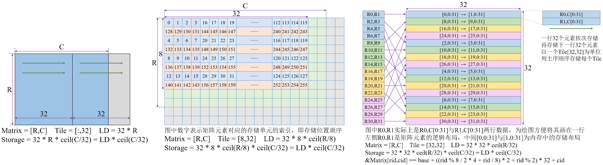

# CUDA标准库

CUDA开发工具套件中有很多有用的库，涵盖线性代数、图像处理、机器学习等众多应用领域，广泛用于科学与工程计算。

| 库名     | 简介                                                   |
| -------- | ------------------------------------------------------ |
| Thrust   | 类似于C++的标准模板库（standard template library）     |
| cuBLAS   | 基本线性代数子程序（basic linear algebra subroutines） |
| cuFFT    | 快速傅里叶变换（fast Fourier transforms）              |
| cuSPARSE | 稀疏矩阵（sparse matrix）                              |
| cuRAND   | 随机数生成器（random number generator）                |
| cuSolver | 稠密（dense）矩阵和稀疏（sparse）矩阵计算库            |
| cuDNN    | 深度神经网络（deep neural networks）                   |

使用CUDA程序库，有许多优点，如下所示。

(1)可以节约程序开发时间，有些库的功能自己实现需要花费很多人力物力与时间。

(2)可以获得更值得信赖的程序，这些常用库都是业界专家精英们的智慧结晶，一般来说比自己实现更加可靠。

(3)可以简化代码，有些功能自己实现可能需要成百上千行代码，但适当使用库函数也许用几十行代码就能完成。

(4)可以加速程序，对于常见的计算来说，库函数能够获得的性能往往是比较高的。

但是，对于某些特定问题，使用库函数得到的性能不一定能胜过自己的实现。例如，Thrust和cuBLAS库中的很多功能是很容易实现的，有时一个计算任务通过编写一个核函数就能完成，而使用这些库却可能需要调用几个函数，从而增加全局内存的访问量。此时，用这些库就有可能得到比较差的性能。

## Thrust

Thrust是一个实现众多基本并行算法的C++模板库，类似于C++的标准模板库（standard template library，STL），该库自动包含在CUDA工具箱中，在使用该库的某个功能时，包含所需的头文件即可。该库中的所有类型与函数都在命名空间thrust中定义，都以thrust::开头。

Thrust中的主要数据结构是向量容器（vector container），类似于STL中的std::vector向量。在Thrust中，有两种向量，一种是存储于主机的向量thrust::host\_vector\<typename\>模板，另一种是存储于设备的向量thrust::device\_vector\<typename\>模板，这里的typename可以是任何数据类型。这两种向量分别位于thrust/host\_vector.h头文件和thrust/device_vector.h头文件中。

Thrust提供五类常用算法，包括：(1)变换（transformation），例如数组求和计算就是一种变换操作；(2)归约（reduction），例如求和归约计算等；(3)前缀和（prefix sum）或扫描（scan）；(4)排序（sorting）与搜索（searching）；(5)选择性复制、替换、移除、分区等重排（reordering）操作。除thrust::copy()函数外，Thrust算法的参数必须都来自于主机向量host\_vector或都来自于设备向量device\_vector，否则编译器会报错。

此处以前缀和操作为例，通常也称为扫描操作，对于给定的标量序列$x_0,x_1,x_2,\cdots$，该操作会获得一个新的序列$y_0,y_1,y_2,\cdots$，其中新的元素表达式为
$$
y_k = x_0 + x_1 + \cdots + x_k
$$
其中，对于原序列各元素之间的运算可以是加法$+$求累加和、乘法$\times$求累乘积，默认操作时求累加和。若$y_k$的表达式包含$y_k$，则称为包含扫描（inclusive scan）；若$y_k$的表达式只包含到$x_{k-1}$​，则称为非包含扫描（exclusive scan）。

使用thrust::device_vector设备向量的一个示例如下所示。

```c++
#include <thrust/device_vector.h>
#include <thrust/scan.h>

int main(int argc, char *argv[]) {
    int N = 32;
    thrust::device_vector<int> x(N, 0);
    thrust::device_vector<int> y(N, 0);
    for (int i = 0; i < x.size(); i++) x[i] = i + 1;
    thrust::inclusive_scan(x.begin(), x.end(), y.begin());
    for (int i = 0; i < y.size(); i++) {
        printf("%d ", (int)y[i]);
    }
    printf("\n");
    return 0;
}
```

直接使用设备内存指针的一个示例如下所示。

```c++
#include <thrust/device_vector.h>
#include <thrust/scan.h>
#include <thrust/execution_policy.h>

int main(int argc, char *argv[]) {
    int N = 32;
    int *h_x = (int*)malloc(sizeof(int) * N);
    int *h_y = (int*)malloc(sizeof(int) * N);
    for (int i = 0; i < N; i++) h_x[i] = i + 1;

    int *d_x, *d_y;
    cudaMalloc(&d_x, sizeof(int) * N);
    cudaMalloc(&d_y, sizeof(int) * N);
    cudaMemcpy(d_x, h_x, sizeof(int) * N, cudaMemcpyHostToDevice);
    thrust::inclusive_scan(thrust::device, d_x, d_x + N, d_y);
    cudaMemcpy(h_y, d_y, sizeof(int) * N, cudaMemcpyDeviceToHost);
    cudaFree(d_x);
    cudaFree(d_y);

    for (int i = 0; i < N; i++) {
        printf("%d ", (int)h_y[i]);
    }
    printf("\n");
    free(h_x);
    free(h_y);
    return 0;
}
```

相比使用设备向量的版本，该版本的inclusive_scan()使用了一个thrust::device参数，它表示执行策略（execution policy），位于thrust/execution_policy.h头文件中。

如果程序中大量使用了Thrust库提供的功能，那么直接使用设备向量存储数据是比较好的方法；而如果程序中大部分代码都是手写的核函数，只是偶尔使用Thrust库提供的功能，那么使用设备内存指针是比较好的方法。

## cuBLAS

cuBLAS是CUDA Basic Linear Algebra Subroutine的缩写，是基本线性代数子程序BLAS库基于CUDA运行时环境的实现。cuBLAS库提供四个API接口集合，分别描述如下所示。

- cuBLAS API，自CUDA 6.0引入。计算所使用到的矩阵和向量必须位于GPU设备内存中，cuBLAS提供辅助函数用于在主机和设备之间传输数据。
- cuBLASLt API，自CUDA 10.1引入。轻量级的通用矩阵乘法GEMM（GEneral Matrix-to-matrix Multiply）库，提供灵活的API配置接口。
- cuBLASXt API，自CUDA 6.0引入。计算所使用到的数据可位于主机或多个GPU设备内存中，库会基于用户操作将数据传输到合适的GPU设备。
- cuBLASDx API，属于MathDx库的一部分，需要单独配置。用于在kernel核函数中执行BLAS计算，可进行算子融合。

BLAS库最初是在CPU环境中使用Fortran编程语言实现的，Fortran风格中的的多维数组是列主序存储的，而C风格中的多维数组是行主序存储的。因而，cuBLAS库对于矩阵和向量的存储和计算都是按照列主序的方式进行的，这一点需要特别注意。

按照人类的阅读习惯，符号(M,N)表示M行N列矩阵，符号[rid,cid]表示行索引为rid列索引为cid的相应元素，推广到多维张量时，对应到各给维度轴上。例如，一个2行3列的矩阵A[2,3]，其各个元素的值如下所示。
$$
A = \begin{bmatrix} 0.0 & 1.0 & 2.0 \\ 3.0 & 4.0 & 5.0 \end{bmatrix}
$$
这样的二维数组或多维数组，本质上都是以一维数组的形式在计算机内存中连续存储的，根据所采用的存储方式不同，其存储的一维数组元素也不尽相同。

```c++
float A_row_major[] = { 0.0, 1.0, 2.0, 3.0, 4.0, 5.0 };  // row-major
float A_col_major[] = { 0.0, 3.0, 1.0, 4.0, 2.0, 5.0 };  // col-major
```

注意，对于一个矩阵来说，若对其底层存储的一维数组，采用逻辑上不同的存储方式进行解释，会得到不同的存储顺序。例如，行主序存储的M行N列的矩阵，也可以看作是列存储的N行M列的矩阵。这种逻辑上的解释方式不同于矩阵转置，矩阵转置不会改变逻辑上对存储方式的解释，只会真正改变矩阵元素在内存中的存储位置。例如行主序存储的M行N列的矩阵，在执行转置操作后，会变为行主序存储的N行M列的矩阵。

## cuFFT

快速傅里叶变换（FFT，Fast Fourier Transform）是一种分治算法，用于高效计算复数或实数的离散傅立叶变换，是物理计算和通用信号处理中最重要和应用最广泛的数值算法之一。cuFFT库是FFT基于CUDA运⾏时的实现，并提供简单易用的API接口。cuFFT库提供四个API接⼝集合，分别描述如下所⽰。

- cuFFT API，标准FFT的CUDA运行时实现，计算所使⽤到的数据必须位于GPU设备内存中。
- cuFFTXt API，将FFT计算扩展到单节点多GPU环境。
- cuFFTMp API，将FFT计算扩展到多节点分布式环境。
- cuFFTDx API，属于MathDx库的⼀部分，需要单独配置。用于在kernel核函数中执行FFT计算，可进行算子融合。

离散傅立叶变换（Discrete Fourier transform，DFT）将复数向量从时域$x_n$映射到频域$X_k$，离散傅里叶逆变换则与之相反。这两个过程可由下式给出。
$$
\begin{align}
X_k &= \sum_{n=0}^{N-1} x_n \cdot \exp(-2\pi i\cdot\frac{nk}{N}) \\
x_n &= \frac{1}{N}\sum_{k=0}^{N-1} X_k \cdot \exp(+2\pi i\cdot\frac{nk}{N})
\end{align}
$$
其中，$x_n$与$X_k$​​​都是长度为N的复数向量。需要注意的是，注意，在逆变换时需要对结果除以N进行标准化，但由于正变换与逆变换仅相差一个正负号，故可以直接由一个函数实现，因此并未考虑缩放，所以在执行逆变换时，需要手动对元素数据执行1/N的标准化，在变换之前或之后均可。

当执行多维变换时，需要将数据坐标改写为多维形式，过程由下式给出。
$$
\begin{align}
X_{(k_1,k_2,\cdots,k_d)} &= \sum_{n_1=0}^{N_1-1}\sum_{n_2=0}^{N_2-1}\cdots\sum_{n_d=0}^{N_d-1}
x_{(n_1,n_2,\cdots,n_d)} \cdot
\exp(-2\pi i\cdot(\frac{n_1k_1}{N_1}+\frac{n_2k_2}{N_2}+\cdots+\frac{n_dk_d}{N_d})) \\
x_{(n_1,n_2,\cdots,n_d)} &= \dfrac{1}{N_1N_2\cdots N_d}
\sum_{k_1=0}^{N_1-1}\sum_{k_2=0}^{N_2-1}\cdots\sum_{k_d=0}^{N_d-1}
X_{(k_1,k_2,\cdots,k_d)} \cdot
\exp(+2\pi i\cdot(\frac{n_1k_1}{N_1}+\frac{n_2k_2}{N_2}+\cdots+\frac{n_dk_d}{N_d}))
\end{align}
$$
其中，d为数据的维度的数目。

# cuBLAS API

> 使用示例见https://github.com/Bloonow/BlnCuda/tree/master/learn/cublas网址。

自CUDA 4.0以来，cuBLAS库提供新版本的API接口，位于cublas_v2.h头文件当中，而cublas_v2.h头文件又包含cublas_api.h头文件。实际上，真正的声明位于cublas_api.h头文件中，许多函数声明都以\_v2后缀结尾，而在cublas_v2.h头文件中，提供这些以\_v2后缀结尾函数的宏，用于兼容遗留API接口。

要使用cuBLAS库，在程序编译链接时需要链接到指定库，在Linux平台上是libcublas.so动态库，在Windows上是cublas.dll动态库。在Linux平台上，也可以链接到libcublas_static.a静态库和libculibos.a静态库。

在描述API函数接口时，使用\<type\>表示可能的数值类型，使用\<t\>表示相应类型的缩写，其小写表示计算结果是标量，大写表示计算结果是张量，如下所示。为简化表述，在介绍API函数接口时，通常只以s与S表示的单精度浮点数类型为示例。

| \<type\>        | \<t\> | Meaning                  |
| --------------- | ----- | ------------------------ |
| float           | s, S  | real single-precision    |
| double          | d, D  | real double-precision    |
| cuComplex       | c, C  | complex single-precision |
| cuDoubleComplex | z, Z  | complex double-precision |

使用Re()表示复数的实部，使用Im()表示复数的虚部，使用小写希腊字母α,β等表示标量，使用小写拉丁字母a,b表示向量，使用大写拉丁字母A,B表示矩阵。

## General Description

所有cuBLAS库函数都以cublasStatus_t作为返回类型，表示错误状态（error status）信息。

使用cuBLAS库必须通过cublasCreate()函数初始化一个cublasHandle_t类型的句柄，句柄持有一个cuBLAS库的上下文环境。在后续使用cuBLAS库函数时，将该句柄传入调用，最后需要通过cublasDestroy()函数释放cuBLAS库上下文句柄所关联的计算资源。在使用主机多线程控制多个GPU设备时，这种方式能够允许用户显式控制cuBLAS库的初始化。例如，不同的主机线程可使用cudaSetDevice()函数关联到不同的GPU设备，然后主机线程可初始化自己唯一的cuBLAS库上下文句柄，以使用不同的GPU设备。需要注意的是，一个cuBLAS上下文句柄所关联的GPU设备在cublasCreate()调用与cublasDestroy()调用之间应保持不变，也即一个cuBLAS句柄与一个GPU设备所绑定。若一个主机线程需要使用不同的GPU设备，则需要创建不同的cuBLAS上下文句柄。cuBLAS上下文句柄与CUDA上下文紧密绑定，使用多个CUDA上下文环境的应用，需要在不同的CUDA上下文环境创建不同的cuBLAS上下文句柄。cuBLAS库是线程安全的，可以从多个主机线程中调用，即这些主机线程使用同一个句柄。当多个主机线程使用同一个句柄时，需要注意的是，当改变句柄配置时可能会影响cuBLAS调用的执行顺序，包括cublasDestroy()函数的调用时机。因此，不推荐在多个主机线程中使用同一个cuBLAS句柄。

只要确保CUDA套件版本一致、GPU架构一致、SM数目一致，就能保证每次cuBLAS API调用的结果是完全可重现的，即按位（bit-wise）一致。而当使用多个CUDA流时，则不一定能获得按位一致的结果。此外，对于symv例程以及hemv例程来说，如果通过cublasSetAtomicsMode()函数启用原子操作，则也不能保证获得按位一致的结果。

在cuBLAS库函数中，可能会用到两类标量参数。一是gemm系列函数，使用alpha和beta控制结果的缩放和偏置；二是诸如amax、amin、asum、rotg、rotmg、dot、nrm2之类的函数，它们计算的结果是一个标量值。对于第一类函数，当指针模式设置为CUBLAS_POINTER_MODE_HOST时，标量参数alpha与beta可以位于主机的栈内存或堆内存上，不应该位于托管内存上，此时标量值会随着API调用传递到设备，在调用完成后即可释放标量变量的内存，而无需等待API核函数执行完毕；当指针模式设置为CUBLAS_POINTER_MODE_DEVICE时，标量参数alpha与beta必须位于设备内存上，且它们的值在API核函数执行完毕之前不允许修改。对于第二类函数，当指针模式设置为CUBLAS_POINTER_MODE_HOST时，这些API函数会阻塞CPU，直到GPU完成计算并将标量结果写回主机内存；当指针模式设置为CUBLAS_POINTER_MODE_DEVICE时，API调用会立刻返回不阻塞CPU，但结果需要在API核函数执行完毕后才能访问，因此需要进行同步。无论时哪一类函数，指针模式CUBLAS_POINTER_MODE_DEVICE都允许kernel异步执行，哪怕alpha与beta标量参数是由之前调用的CUDA核函数生成的。

当应用程序存在多个相互独立的任务时，可使用多个CUDA流以重叠多个任务之间的计算。使用cudaStreamCreate()函数创建一个CUDA流，并使用cublasSetStream()函数为每个cuBLAS句柄设置对应的CUDA流。需要注意的是，cublasSetStream()函数会将用户提供的workspace工作缓冲区重置为默认的工作缓冲区池。当执行大量的小矩阵乘法kernel时，无法获得执行大矩阵乘法kernel时的FLOPS。例如，执行$n\times n$的矩阵乘法时，针对$n^2$的输入会执行$n^3$的浮点运算；而执行1024个$\frac{n}{32}\times\frac{n}{32}$的矩阵乘法时，同样是$n^2$的输入，但只会获得$1024\times(\frac{n}{32})^3=\frac{n^3}{32}$的浮点运算。但通过将小的矩阵乘法kernel并行执行，可以尽可能地获得更好的性能。这可以通过使用多个CUDA流来实现，使用cublasSetStream()函数创建相应个数的CUDA流，并在调用gemm系列函数之前，使用cublasSetStream()函数设置所使用的CUDA流。尽管可以创建许多CUDA流，但在实践应用中发现，同时并行执行的CUDA流不太可能超过32个。

在某些设备上，L1 Cache缓存与共享内存使用相同的硬件资源，可以使用cudaDeviceSetCacheConfig()进行cache配置，或使用cudaFuncSetCacheConfig()为特定函数进行cache配置。因为修改cache配置会影响kernel的并发性，cuBLAS库并未设置任何cache配置首选项，而是使用当前的设置。然而一些cuBLAS API函数，特别是矩阵乘法函数，其性能严重依赖于共享内存的空间，这一点需特别注意。

尤其是当K远大于M和N时，为达到更高的GPU占用率，某些GEMM算法会沿着K维度划分计算，然后将每个划分的部分结果求和归约，以得到最终结果。对于gemmEx系列函数，当计算精度大于输出精度时，求和归约可能会发生数值溢出。而如果所有求和归约以计算精度执行，并在最后转换为输出精度，则不会发生数值溢出，而只有精度舍弃。当计算类型computeType是CUDA_R_32F，而矩阵类型Atype、Btype、Ctype是CUDA_R_16F时，则会导致精度溢出，可使用cublasSetMathMode()函数设置CUBLAS_MATH_DISALLOW_REDUCED_PRECISION_REDUCTION精度模式以控制这种行为。

自GPU Volta架构（计算能力7.0）以来，引入Tensor Core计算核心，可以显著加速矩阵乘法的性能。自cuBLAS 11.0.0版本以来，只要能够获得更好的性能，cuBLAS库就会在条件满足的情况下自动使用Tensor Core计算核心，除非手动使用cublasSetMathMode()函数将cublasMath_t数学模式设置为cublasSetMathMode模式。自cuBLAS 11.0.0版本以来，使用Tensor Core不再具有矩阵维度和内存对齐的限制，然而特定的矩阵维度和内存指针对齐会获得最好的性能。特别是，满足特定条件时，如下所示。

```
m % 8 == 0
k % 8 == 0
n % 8 == 0 || op_B == CUBLAS_OP_N
intptr_t(A) % 16 == 0
intptr_t(B) % 16 == 0
intptr_t(C) % 16 == 0
intptr_t(A+lda) % 16 == 0
intptr_t(B+ldb) % 16 == 0
intptr_t(C+ldc) % 16 == 0
```

大部分情况下，cuBLAS例程可以被CUDA Graph图捕获，例外是在使用CUBLAS_POINTER_MODE_HOST指针模式时的dot系列函数，它会将结果标量写回主机内存，这需要强制同步。而对于使用alpha和beta标量参数的gemm系列函数，在CUBLAS_POINTER_MODE_HOST指针模式时，标量参数的值会被捕捉到CUDA图当中，在CUBLAS_POINTER_MODE_DEVICE指针模式时，CUDA图会在执行时从设备内存中访问标量参数的值。

## cuBLAS Type Reference

头文件cublas_api.h提供一些cuBLAS库的类型定义，用于控制cuBLAS API函数的特定行为。

```c++
struct cublasContext;
typedef struct cublasContext* cublasHandle_t;
```

类型cublasHandle_t，指向cuBLAS库上下文环境的指针类型。使用cublasCreate()函数创建，使用cublasDestroy()函数释放。

```c++
typedef enum {
    CUBLAS_STATUS_SUCCESS = 0,
    CUBLAS_STATUS_NOT_INITIALIZED = 1,
    CUBLAS_STATUS_ALLOC_FAILED = 3,
    CUBLAS_STATUS_INVALID_VALUE = 7,
    CUBLAS_STATUS_ARCH_MISMATCH = 8,
    CUBLAS_STATUS_MAPPING_ERROR = 11,
    CUBLAS_STATUS_EXECUTION_FAILED = 13,
    CUBLAS_STATUS_INTERNAL_ERROR = 14,
    CUBLAS_STATUS_NOT_SUPPORTED = 15,
    CUBLAS_STATUS_LICENSE_ERROR = 16
} cublasStatus_t;
```

类型cublasStatus_t，表示cuBLAS API函数的返回状态。

```c++
typedef enum {
    CUBLAS_OP_N = 0,         // non-transpose operation
    CUBLAS_OP_T = 1,         // transpose operation
    CUBLAS_OP_C = 2,         // conjugate transpose operation
    CUBLAS_OP_HERMITAN = 2,  // synonym if CUBLAS_OP_C
    CUBLAS_OP_CONJG = 3      // conjugate, placeholder - not supported in the current release
} cublasOperation_t;
```

类型cublasOperation_t，表示对矩阵执行的操作，表示参与计算的矩阵是否需要转置。

```c++
typedef enum {
    CUBLAS_FILL_MODE_LOWER = 0,
    CUBLAS_FILL_MODE_UPPER = 1,
    CUBLAS_FILL_MODE_FULL = 2
} cublasFillMode_t;
```

类型cublasFillMode_t，表示矩阵元素的填充部分，即矩阵的哪一部分参与API函数的计算，可以是矩阵的下三角部分或上三角部分，或整个矩阵的元素。

```c++
typedef enum {
    CUBLAS_DIAG_NON_UNIT = 0,  // 矩阵的主对角线元素正常参与计算，并支持被修改
    CUBLAS_DIAG_UNIT = 1       // 矩阵的主对角线元素以单位值1参与计算，并不支持被API函数修改
} cublasDiagType_t;
```

类型cublasDiagType_t，表示矩阵主对角线元素的访问模式。

```c++
typedef enum {
    CUBLAS_SIDE_LEFT = 0,
    CUBLAS_SIDE_RIGHT = 1
} cublasSideMode_t;
```

类型cublasSideMode_t，表示矩阵是位于左侧还是右侧。

```c++
typedef enum {
    CUBLAS_POINTER_MODE_HOST = 0,   // The scalars are passed by reference on the host
    CUBLAS_POINTER_MODE_DEVICE = 1  // The scalars are passed by reference on the device
} cublasPointerMode_t;
```

类型cublasPointerMode_t，表示用于API函数的标量指针是指向主机内存还是指向设备内存。可使用cublasSetPointerMode()函数设置指针模式。

```c++
typedef enum {
    CUBLAS_ATOMICS_NOT_ALLOWED = 0,
    CUBLAS_ATOMICS_ALLOWED = 1
} cublasAtomicsMode_t;
```

类型cublasAtomicsMode_t，表示某些cuBLAS函数的实现是否可以使用原子操作。可使用cublasSetAtomicsMode()函数设置原子操作模式。

```c++
typedef enum {
    CUBLAS_GEMM_DFALT = -1,
    CUBLAS_GEMM_DEFAULT = -1,
    CUBLAS_GEMM_ALGO0 = 0,
    /* CUBLAS_GEMM_ALGO1 - CUBLAS_GEMM_ALGO16 */
    CUBLAS_GEMM_ALGO17 = 17,
    CUBLAS_GEMM_ALGO18 = 18,  // sliced 32x32
    CUBLAS_GEMM_ALGO19 = 19,  // sliced 64x32
    CUBLAS_GEMM_ALGO20 = 20,  // sliced 128x32
    CUBLAS_GEMM_ALGO21 = 21,  // sliced 32x32  - splitK
    CUBLAS_GEMM_ALGO22 = 22,  // sliced 64x32  - splitK
    CUBLAS_GEMM_ALGO23 = 23,  // sliced 128x32 - splitK
} cublasGemmAlgo_t;
```

类型cublasGemmAlgo_t，表示矩阵乘法GEMM所采用的特定算法，该项只在sm_75架构之前有效，在sm_80及更新的架构上无效。

```c++
typedef enum {
    CUBLAS_DEFAULT_MATH = 0,
    CUBLAS_PEDANTIC_MATH = 2,
    CUBLAS_TF32_TENSOR_OP_MATH = 3,
    CUBLAS_MATH_DISALLOW_REDUCED_PRECISION_REDUCTION = 16,
} cublasMath_t;
```

类型cublasMath_t，表示所使用的计算精度模式，具体描述如下表所示。可使用cublasSetMathMode()函数设置计算精度的模式。

| cublasMath_t枚举值                               | 描述                                                         |
| ------------------------------------------------ | ------------------------------------------------------------ |
| CUBLAS_DEFAULT_MATH                              | 默认且性能最高的模式，计算和中间结果所使用精度的尾数位和指数位至少与所请求的计算精度相同，只要有可能就使用Tensor Core计算核心 |
| CUBLAS_PEDANTIC_MATH                             | 在计算的所有阶段都使用规定精度和标准算法，性能不如其它模式   |
| CUBLAS_TF32_TENSOR_OP_MATH                       | 允许单精度浮点数计算使用TF32类型的Tensor Core计算核心        |
| CUBLAS_MATH_DISALLOW_REDUCED_PRECISION_REDUCTION | 当矩阵乘法操作的计算精度高于输出精度时，强制相关的归约操作使用计算精度而不是输出精度，该模式是一个flag标志，可以与其它精度模式一起使用 |

```c++
typedef enum {
    CUBLAS_COMPUTE_16F = 64,            // half - default
    CUBLAS_COMPUTE_16F_PEDANTIC = 65,   // half - pedantic
    CUBLAS_COMPUTE_32F = 68,            // float - default
    CUBLAS_COMPUTE_32F_PEDANTIC = 69,   // float - pedantic
    CUBLAS_COMPUTE_32F_FAST_16F = 74,   // float - fast, allows down-converting inputs to half or TF32
    CUBLAS_COMPUTE_32F_FAST_16BF = 75,  // float - fast, allows down-converting inputs to bfloat16 or TF32
    CUBLAS_COMPUTE_32F_FAST_TF32 = 77,  // float - fast, allows down-converting inputs to TF32
    CUBLAS_COMPUTE_64F = 70,            // double - default
    CUBLAS_COMPUTE_64F_PEDANTIC = 71,   // double - pedantic
    CUBLAS_COMPUTE_32I = 72,            // signed 32-bit int - default
    CUBLAS_COMPUTE_32I_PEDANTIC = 73,   // signed 32-bit int - pedantic
} cublasComputeType_t;
```

类型cublasComputeType_t，用于cublasGemmEx()函数和cublasLtMatmul()函数，以及Batched版本与StridedBatched版本的函数，以选择计算精度。若将环境变量NVIDIA_TF32_OVERRIDE设置为0，则会覆盖NVIDIA库的默认配置与编程配置，使得cuBLAS库不使用TF32类型的Tensor Core计算核心加速FP32精度的计算。

## CUDA Type Reference

头文件library_types.h中提供一些公用的类型定义，许多CUDA库都会使用其中的类型定义，包括cuBLAS库。

```c++
typedef enum cudaDataType_t {
    /* CUDA_R_16F, CUDA_C_16F, CUDA_R_16BF, CUDA_C_16BF */
    CUDA_R_32F  =  0,  // real as a float
    CUDA_C_32F  =  4,  // complex as a pair of float numbers
    CUDA_R_64F  =  1,  // real as a double
    CUDA_C_64F  =  5,  // complex as a pair of double numbers
	/* CUDA_R_4I, CUDA_C_4I, CUDA_R_8I, CUDA_C_8I, CUDA_R_16I, CUDA_C_16I */
	/* CUDA_R_4U, CUDA_C_4U, CUDA_R_8U, CUDA_C_8U, CUDA_R_16U, CUDA_C_16U */
    /* CUDA_R_32U, CUDA_C_32U, CUDA_R_64U, CUDA_C_64U */
    CUDA_R_32I  = 10,     // real as a signed 32-bit int
    CUDA_C_32I  = 11,     // complex as a pair of signed 32-bit int numbers
    CUDA_R_64I  = 24,     // real as a signed 64-bit int
    CUDA_C_64I  = 25,     // complex as a pair of signed 64-bit int numbers
    CUDA_R_8F_E4M3 = 28,  // real as a nv_fp8_e4m3
    CUDA_R_8F_E5M2 = 29,  // real as a nv_fp8_e5m2
} cudaDataType;
typedef cudaDataType cublasDataType_t;
```

在library_types.h中的类型cudaDataType_t或cudaDataType，提供数值精度类型的定义，cuBLAS库在头文件cublas_api.h中使用cublasDataType_t作为数值精度类型的别名，用于指定数值精度。

```c++
typedef enum libraryPropertyType_t {
    MAJOR_VERSION,
    MINOR_VERSION,
    PATCH_LEVEL
} libraryPropertyType;
```

类型libraryPropertyType_t，用于控制在使用cublasGetProperty()函数时，所请求的属性。

## Helper Function Reference

此处列举cuBLAS库提供的辅助函数，其中一些函数在之前内容提起过，此处只简要列出。

```c++
cublasStatus_t cublasGetVersion_v2(cublasHandle_t handle, int* version);
cublasStatus_t cublasGetProperty(libraryPropertyType type, int* value);
size_t cublasGetCudartVersion(void);
const char* cublasGetStatusName(cublasStatus_t status);
const char* cublasGetStatusString(cublasStatus_t status);
```

```c++
cublasStatus_t cublasCreate_v2(cublasHandle_t* handle);
cublasStatus_t cublasDestroy_v2(cublasHandle_t handle);
cublasStatus_t cublasSetStream_v2(cublasHandle_t handle, cudaStream_t streamId);
cublasStatus_t cublasGetStream_v2(cublasHandle_t handle, cudaStream_t* streamId);
cublasStatus_t cublasSetPointerMode_v2(cublasHandle_t handle, cublasPointerMode_t mode);
cublasStatus_t cublasGetPointerMode_v2(cublasHandle_t handle, cublasPointerMode_t* mode);
cublasStatus_t cublasSetAtomicsMode(cublasHandle_t handle, cublasAtomicsMode_t mode);
cublasStatus_t cublasGetAtomicsMode(cublasHandle_t handle, cublasAtomicsMode_t* mode);
cublasStatus_t cublasSetMathMode(cublasHandle_t handle, cublasMath_t mode);
cublasStatus_t cublasGetMathMode(cublasHandle_t handle, cublasMath_t* mode);
```

上述函数已经在cuBLAS Type Reference中提起过，此处只列出其函数原型而不过多介绍。

```c++
cublasStatus_t cublasSetSmCountTarget(cublasHandle_t handle, int smCountTarget);
cublasStatus_t cublasGetSmCountTarget(cublasHandle_t handle, int* smCountTarget);
```

函数cublasSetSmCountTarget()，用于设置cuBLAS上下文句柄可用的SM流处理器数目，设置为0时恢复默认行为，不能超过GPU物理设备实际拥有的SM数目。当cuBLAS库与其他CUDA核函数一起共用GPU设备时，设置更大的SM数目可以提高cuBLAS库的性能。

```c++
cublasStatus_t cublasSetWorkspace_v2(cublasHandle_t handle, void* workspace, size_t workspaceSizeInBytes);
```

函数cublasSetWorkspace_v2()，用于设置cuBLAS库所使用的工作缓冲区，工作缓冲区的指针地址必须至少256字节对齐。如果未指定，则会使用在创建cuBLAS上下文时分配的默认工作缓冲区池（workspace pool）。将workspaceSizeInBytes参数指定为0时，指定cuBLAS库函数不使用工作缓冲区，而指定过小空间可能会使得某些API函数导致CUBLAS_STATUS_ALLOC_FAILED错误。根据GPU架构推荐（也是默认工作缓冲区池），在Hopper以上的架构使用32MiB空间，而其它架构使用4MiB空间。

```c++
cublasStatus_t cublasSetVector(int n, int elemSize, const void* x, int incx, void* y, int incy);
cublasStatus_t cublasGetVector(int n, int elemSize, const void* x, int incx, void* y, int incy);
cublasStatus_t cublasSetVectorAsync(
    int n, int elemSize, const void* x, int incx, void* y, int incy, cudaStream_t stream
);
cublasStatus_t cublasGetVectorAsync(
    int n, int elemSize, const void* x, int incx, void* y, int incy, cudaStream_t stream
);
```

函数cublasSetVector()从主机复制向量到设备，函数cublasGetVector()从设备复制向量到主机。其中，参数n指定元素数目；参数elemSize指定一个元素的字节数；参数x指定源向量地址；参数y指定目标向量地址；参数incx和incy指定向量中两个相邻元素之间的存储位置间隔，指定为1表示两个相邻元素在内存中连续存储。

```c++
cublasStatus_t cublasSetMatrix(int rows, int cols, int elemSize, const void* A, int lda, void* B, int ldb);
cublasStatus_t cublasGetMatrix(int rows, int cols, int elemSize, const void* A, int lda, void* B, int ldb);
cublasStatus_t cublasSetMatrixAsync(
    int rows, int cols, int elemSize, const void* A, int lda, void* B, int ldb, cudaStream_t stream
);
cublasStatus_t cublasGetMatrixAsync(
    int rows, int cols, int elemSize, const void* A, int lda, void* B, int ldb, cudaStream_t stream
);
```

函数cublasSetMatrix()从主机复制矩阵到设备，函数cublasGetMatrix()从设备复制矩阵到主机。参数rows和cols分别指定矩阵的行数和列数；参数elemSize指定一个元素的字节数；参数A指定源矩阵地址；参数B指定目标矩阵地址；参数lda和ldb指定矩阵的前导维度轴的维数。

## Level-1 Function Reference

该部分介绍线性代数子程序BLAS1，用于执行标量-向量操作。由于要兼容Fortran版本的BLAS库，在该部分中若无特殊说明，向量所使用的索引从1开始。

```c++
cublasStatus_t cublasIsamax_v2(cublasHandle_t handle, int n, const float* x, int incx, int* result);
cublasStatus_t cublasIsamin_v2(cublasHandle_t handle, int n, const float* x, int incx, int* result);
```

以元素的|Re()|+|Im()|值作为操作数，获取向量中最大元素或最小元素的索引，存在多个相同最值元素时，获得这些元素中最小的索引。其中，参数n指定向量中元素的数目；参数x指定设备向量地址；参数incx指定向量中两个相邻元素的存储位置之间的差距；参数result指定主机或设备地址，用于存储计算结果。

```c++
cublasStatus_t cublasSasum_v2(cublasHandle_t handle, int n, const float* x, int incx, float* result);
```

以元素的|Re()|+|Im()|值作为操作数，计算向量中各个元素之和。

```c++
cublasStatus_t cublasSaxpy_v2(
    cublasHandle_t handle, int n, const float* alpha, const float* x, int incx, float* y, int incy
);
```

对向量元素执行乘加操作，可用y[i]=alpha\*x[i]+y[i]公式表示。其中，参数y指定设备向量地址；参数incy指定向量中两个相邻元素的存储位置之间的差距。

```c++
cublasStatus_t cublasSscal_v2(cublasHandle_t handle, int n, const float* alpha, float* x, int incx);
```

对向量元素执行缩放操作，可用x[i]=α\*x[i]公式表示。

```c++
cublasStatus_t cublasScopy_v2(cublasHandle_t handle, int n, const float* x, int incx, float* y, int incy);
```

对向量元素执行拷贝操作，可用y[i]=x[i]公式表示。

```c++
cublasStatus_t cublasSswap_v2(cublasHandle_t handle, int n, float* x, int incx, float* y, int incy);
```

交换两个向量之间的元素。

```c++
cublasStatus_t cublasSdot_v2(
    cublasHandle_t handle, int n, const float* x, int incx, const float* y, int incy, float* result
);
cublasStatus_t cublasCdotu_v2(
    cublasHandle_t handle, int n, const cuComplex* x, int incx, const cuComplex* y, int incy,
    cuComplex* result
);
cublasStatus_t cublasCdotc_v2(
    cublasHandle_t handle, int n, const cuComplex* x, int incx, const cuComplex* y, int incy,
    cuComplex* result
);
```

计算向量元素的点积，可用Σ(x[i]\*y[i])公式表示。对于复数的情况，当函数名称以u后缀结尾时，直接执行复数乘法，当函数名称以c后缀结尾时，先将向量x的元素进行共轭后再执行复数乘法。

```c++
cublasStatus_t cublasSnrm2_v2(cublasHandle_t handle, int n, const float* x, int incx, float* result);
```

计算向量元素的L2范数，可用公式sqrt(Σ(x[i]\*x[i]))公式表示。

```c++
cublasStatus_t cublasSrot_v2(
    cublasHandle_t handle, int n, float* x, int incx, float* y, int incy, const float* c, const float* s
);
```

对向量x,y应用旋转矩阵，以逆时针方向旋转，旋转角度α由参数sin(α)=s,cos(α)=c定义。

```c++
cublasStatus_t cublasSrotg_v2(cublasHandle_t handle, float* a, float* b, float* c, float* s);
```

根据指定参数构建旋转矩阵。

```c++
cublasStatus_t cublasSrotm_v2(
    cublasHandle_t handle, int n, float* x, int incx, float* y, int incy, const float* param
);
```

对向量x,y应用变换矩阵。

```c++
cublasStatus_t cublasSrotmg_v2(
    cublasHandle_t handle, float* d1, float* d2, float* x1, const float* y1, float* param
);
```

根据指定参数构建变换矩阵。

## Level-2 Function Reference

该部分介绍线性代数子程序BLAS2，用于执行矩阵-向量操作，mv是matrix-vector矩阵-向量。该部分API函数的命名存在特定规范，例如，g或ge是general通用矩阵，s或sy是symmetric对称矩阵，h或he是Hermite对称矩阵，b是banded带状矩阵，t或tr是triangular三角矩阵，p是packed紧凑存储的对称矩阵或三角矩阵，r是rank秩。

需要注意的是，在Level-2函数接口中，m,n是指矩阵A的行数与列数；而在Level-3函数接口中，m是指矩阵Op(A)与矩阵C的行数，n是指矩阵Op(B)与矩阵C的列数，k是指矩阵Op(A)的列数与矩阵Op(B)的行数。

```c++
cublasStatus_t cublasSgemv_v2(
    cublasHandle_t handle, cublasOperation_t trans, int m, int n,
    const float* alpha, const float* A, int lda, const float* x, int incx, 
    const float* beta, float* y, int incy
);
```

执行矩阵-向量乘法，可用y=α·Op(A)x+β·y公式表示。其中，参数trans表示对矩阵执行的操作Op()；参数m,n分别表示矩阵A的行数与列数；参数alpha,beta表示缩放因子；参数A表示矩阵；参数lda表示矩阵A的前导维数；参数x表示向量，其长度与Op(A)的列数一致；参数y表示向量，其长度与Op(A)的行数一致；参数incx,incy分别表示向量中两个相邻元素的存储位置之间的差距。

```c++
cublasStatus_t cublasSgemvBatched(
    cublasHandle_t handle, cublasOperation_t trans, int m, int n,
    const float* alpha, const float* const Aarray[], int lda,
    const float* const xarray[], int incx,
    const float* beta, float* const yarray[], int incy,
    int batchCount
);
```

执行批量矩阵-向量乘法，可用y[i]=α·Op(A[i])x[i]+β·y[i]公式表示，其中i为批量索引。其中，参数batchCount表示批量中矩阵和向量的数目。

```c++
cublasStatus_t cublasSgemvStridedBatched(
    cublasHandle_t handle, cublasOperation_t trans, int m, int n,
    const float* alpha, const float* A, int lda, long long int strideA,
    const float* x, int incx, long long int stridex,
    const float* beta, float* y, int incy, long long int stridey,
    int batchCount
);
```

执行跨步批量矩阵-向量乘法，可用y[i]=α·Op(A[i])x[i]+β·y[i]公式表示，其中i为批量索引。其中，参数strideA,stridex,stridey分别表示批量中两个相邻矩阵或向量的存储位置之间的跨步差距。

```c++
cublasStatus_t cublasSsymv_v2(
    cublasHandle_t handle, cublasFillMode_t uplo, int n,
    const float* alpha, const float* A, int lda, const float* x, int incx,
    const float* beta, float* y, int incy
);
cublasStatus_t cublasChemv_v2(
    cublasHandle_t handle, cublasFillMode_t uplo, int n,
    const cuComplex* alpha, const cuComplex* A, int lda, const cuComplex* x, int incx,
    const cuComplex* beta, cuComplex* y, int incy
);
```

执行对称矩阵-向量乘法或Hermite对称矩阵-向量乘法，可用y=α·Ax+β·y公式表示。其中，参数uplo表示矩阵元素的填充部分，CUBLAS_FILL_MODE_LOWER表示仅访问矩阵下三角部分，CUBLAS_FILL_MODE_UPPER表示仅访问矩阵上三角部分，CUBLAS_FILL_MODE_FULL表示访问整个矩阵；参数n表示方阵的阶数。该API函数提供使用原子操作实现的快速版本，可使用cublasSetAtomicsMode()设置允许原子操作。

```c++
cublasStatus_t cublasSspmv_v2(
    cublasHandle_t handle, cublasFillMode_t uplo, int n,
    const float* alpha, const float* AP, const float* x, int incx,
    const float* beta, float* y, int incy
);
cublasStatus_t cublasChpmv_v2(
    cublasHandle_t handle, cublasFillMode_t uplo, int n,
    const cuComplex* alpha, const cuComplex* AP, const cuComplex* x, int incx,
    const cuComplex* beta, cuComplex* y, int incy
);
```

执行紧凑对称矩阵-向量乘法或紧凑Hermite对称矩阵-向量乘法，可用y=α·Ax+β·y公式表示。其中，参数AP表示按uplo方式紧凑存储的下三角矩阵或上三角矩阵，仅需存储n(n+1)/2个元素。

```c++
cublasStatus_t cublasStrmv_v2(
    cublasHandle_t handle, cublasFillMode_t uplo, cublasOperation_t trans, cublasDiagType_t diag,
    int n, const float* A, int lda, float* x, int incx
);
```

执行三角矩阵-向量乘法，可用x=Op(A)x公式表示。其中，参数diag表示矩阵主对角线元素的访问模式，CUBLAS_DIAG_NON_UNIT表示矩阵的主对角线元素正常参与计算并支持被修改，CUBLAS_DIAG_UNIT表示矩阵的主对角线元素以单位值1参与计算，并不支持被API函数修改；参数n表示方阵的阶数。

```c++
cublasStatus_t cublasStpmv_v2(
    cublasHandle_t handle, cublasFillMode_t uplo, cublasOperation_t trans, cublasDiagType_t diag,
    int n, const float* AP, float* x, int incx
);
```

执行紧凑三角矩阵-向量乘法，可用x=Op(A)x公式表示。其中，参数AP表示按uplo方式紧凑存储的下三角矩阵或上三角矩阵，仅需存储n(n+1)/2个元素。

```c++
cublasStatus_t cublasSgbmv_v2(
    cublasHandle_t handle, cublasOperation_t trans, int m, int n, int kl, int ku,
    const float* alpha, const float* A, int lda, const float* x, int incx,
    const float* beta, float* y, int incy
);
```

执行带状矩阵-向量乘法，可用y=α·Op(A)x+β·y公式表示。其中，参数kl,ku分别表示矩阵的上带宽对角线条数和下带宽对角线条数；参数A是带状矩阵，以带状矩阵的存储方式进行存储。

```c++
cublasStatus_t cublasSsbmv_v2(
    cublasHandle_t handle, cublasFillMode_t uplo, int n, int k,
    const float* alpha, const float* A, int lda, const float* x, int incx,
    const float* beta, float* y, int incy
);
cublasStatus_t cublasChbmv_v2(
    cublasHandle_t handle, cublasFillMode_t uplo, int n, int k,
    const cuComplex* alpha, const cuComplex* A, int lda, const cuComplex* x, int incx,
    const cuComplex* beta, cuComplex* y, int incy
);
```

执行对称带状矩阵-向量乘法或Hermite对称带状矩阵-向量乘法，可用y=α·Ax+β·y公式表示。其中，参数n表示方阵的阶数；参数k表示矩阵的上带宽对角线条数和下带宽对角线条数；参数A是对称或Hermite对称的带状矩阵，以带状矩阵的存储方式进行存储。

```c++
cublasStatus_t cublasStbmv_v2(
    cublasHandle_t handle, cublasFillMode_t uplo, cublasOperation_t trans, cublasDiagType_t diag,
    int n, int k, const float* A, int lda, float* x, int incx
);
```

执行三角带状矩阵-向量乘法，可用x=Op(A)x公式表示。其中，参数diag表示矩阵主对角线元素的访问模式；参数A是三角带状矩阵，以带状矩阵的存储方式进行存储。

```c++
cublasStatus_t cublasStrsv_v2(
    cublasHandle_t handle, cublasFillMode_t uplo, cublasOperation_t trans, cublasDiagType_t diag,
    int n, const float* A, int lda, float* x, int incx
);
```

求解三角矩阵线性方程组，可用Op(A)x=b公式表示。其中，参数n表示方阵的阶数；参数x在函数执行前表示右侧向量b，执行函数所求的解写回到x中。该函数不进行奇异值检测。

```c++
cublasStatus_t cublasStpsv_v2(
    cublasHandle_t handle, cublasFillMode_t uplo, cublasOperation_t trans, cublasDiagType_t diag,
    int n, const float* AP, float* x, int incx
);
```

求解紧凑三角矩阵线性方程组，可用Op(A)x=b公式表示。其中，参数AP表示按uplo方式紧凑存储的下三角矩阵或上三角矩阵，仅需存储n(n+1)/2个元素。

```c++
cublasStatus_t cublasStbsv_v2(
    cublasHandle_t handle, cublasFillMode_t uplo, cublasOperation_t trans, cublasDiagType_t diag,
    int n, int k, const float* A, int lda, float* x, int incx
);
```

求解三角带状矩阵线性方程组，可用Op(A)x=b公式表示。其中，参数n表示方阵的阶数；参数k表示矩阵的上带宽对角线条数和下带宽对角线条数；参数diag表示矩阵主对角线元素的访问模式；参数A是三角带状矩阵，以带状矩阵的存储方式进行存储。

```c++
cublasStatus_t cublasSger_v2(
    cublasHandle_t handle, int m, int n, 
    const float* alpha, const float* x, int incx, const float* y, int incy, 
    float* A, int lda
);
cublasStatus_t cublasCgeru_v2(
    cublasHandle_t handle, int m, int n,
    const cuComplex* alpha, const cuComplex* x, int incx, const cuComplex* y, int incy,
    cuComplex* A, int lda
);
cublasStatus_t cublasCgerc_v2(
    cublasHandle_t handle, int m, int n,
    const cuComplex* alpha, const cuComplex* x, int incx, const cuComplex* y, int incy,
    cuComplex* A, int lda
);
```

对矩阵添加秩为1的矩阵，可用A=α·xy^T^+A公式或A=α·xy^H^+A公式表示。对于复数的情况，当函数名称以u后缀结尾时，对向量y执行普通转置，当函数名称以c后缀结尾时，对向量y执行共轭转置。

```c++
cublasStatus_t cublasSsyr_v2(
    cublasHandle_t handle, cublasFillMode_t uplo, int n,
    const float* alpha, const float* x, int incx, float* A, int lda
);
cublasStatus_t cublasCher_v2(
    cublasHandle_t handle, cublasFillMode_t uplo, int n,
    const float* alpha, const cuComplex* x, int incx, cuComplex* A, int lda
);
```

对矩阵添加秩为1的对称矩阵或Hermite对称矩阵，可用A=α·xx^T^+A公式或A=α·xx^H^+A公式表示。其中，参数uplo表示矩阵元素的填充部分；参数n表示方阵的阶数。

```c++
cublasStatus_t cublasSspr_v2(
    cublasHandle_t handle, cublasFillMode_t uplo, int n,
    const float* alpha, const float* x, int incx, float* AP
);
cublasStatus_t cublasChpr_v2(
    cublasHandle_t handle, cublasFillMode_t uplo, int n,
    const float* alpha, const cuComplex* x, int incx, cuComplex* AP
);
```

对矩阵添加秩为1的紧凑对称矩阵或紧凑Hermite对称矩阵，可用A=α·xx^T^+A公式或A=α·xx^H^+A公式表示。其中，参数AP表示按uplo方式紧凑存储的下三角矩阵或上三角矩阵，仅需存储n(n+1)/2个元素。

```c++
cublasStatus_t cublasSsyr2_v2(
    cublasHandle_t handle, cublasFillMode_t uplo, int n,
    const float* alpha, const float* x, int incx, const float* y, int incy,
    float* A, int lda
);
cublasStatus_t cublasCher2_v2(
    cublasHandle_t handle, cublasFillMode_t uplo, int n,
    const cuComplex* alpha, const cuComplex* x, int incx, const cuComplex* y, int incy,
    cuComplex* A, int lda
);
```

对矩阵添加秩为2的对称矩阵或Hermite对称矩阵，可用A=α·(xy^T^+yx^T^)+A公式或A=α·(xy^H^+yx^H^)+A公式表示。其中，参数uplo表示矩阵元素的填充部分。

```c++
cublasStatus_t cublasSspr2_v2(
    cublasHandle_t handle, cublasFillMode_t uplo, int n,
    const float* alpha, const float* x, int incx, const float* y, int incy, float* AP
);
cublasStatus_t cublasChpr2_v2(
    cublasHandle_t handle, cublasFillMode_t uplo, int n,
    const cuComplex* alpha, const cuComplex* x, int incx, const cuComplex* y, int incy, cuComplex* AP
);
```

对矩阵添加秩为2的紧凑对称矩阵或紧凑Hermite对称矩阵，可用A=α·(xy^T^+yx^T^)+A公式或A=α·(xy^H^+yx^H^)+A公式表示。其中，参数AP表示按uplo方式紧凑存储的下三角矩阵或上三角矩阵，仅需存储n(n+1)/2个元素。

## Level-3 Function Reference

该部分介绍线性代数子程序BLAS3，用于执行矩阵-矩阵操作，mm是matrix-matrix矩阵-矩阵。该部分API函数的命名存在特定规范，例如，g或ge是general通用矩阵，s或sy是symmetric对称矩阵，h或he是Hermite对称矩阵，t或tr是triangular三角矩阵，r是rank秩。

需要注意的是，在Level-2函数接口中，m,n是指矩阵A的行数与列数；而在Level-3函数接口中，m是指矩阵Op(A)与矩阵C的行数，n是指矩阵Op(B)与矩阵C的列数，k是指矩阵Op(A)的列数与矩阵Op(B)的行数。

```c++
cublasStatus_t cublasSgemm_v2(
    cublasHandle_t handle, cublasOperation_t transa, cublasOperation_t transb, int m, int n, int k,
    const float* alpha, const float* A, int lda, const float* B, int ldb,
    const float* beta, float* C, int ldc
);
```

执行矩阵-矩阵乘法，可用y=α·Op(A)Op(B)+β·C公式表示。其中，参数transa,transb分别表示对矩阵A和矩阵B执行的操作Op()；参数m表示矩阵Op(A)与矩阵C的行数；参数n表示矩阵Op(B)与矩阵C的列数；参数k表示矩阵Op(A)的列数与矩阵Op(B)的行数；参数alpha,beta表示缩放因子；参数A,B,C表示矩阵；参数lda,ldb,ldc分别表示矩阵A,B,C的前导维数。

```c++
cublasStatus_t cublasCgemm3m(
    cublasHandle_t handle, cublasOperation_t transa, cublasOperation_t transb, int m, int n, int k,
    const cuComplex* alpha, const cuComplex* A, int lda, const cuComplex* B, int ldb,
    const cuComplex* beta, cuComplex* C, int ldc
);
```

执行复数矩阵-矩阵乘法，可用C=α·Op(A)Op(B)+β·C公式表示。该函数使用高斯复杂度归约算法，相较于cublasCgemm版本约有25%性能提升，仅在计算能力大于等于5.0的GPU设备上支持。

```c++
cublasStatus_t cublasSgemmBatched(
    cublasHandle_t handle, cublasOperation_t transa, cublasOperation_t transb, int m, int n, int k,
    const float* alpha, const float* const Aarray[], int lda, const float* const Barray[], int ldb,
    const float* beta, float* const Carray[], int ldc,
    int batchCount
);
```

执行批量矩阵-矩阵乘法，可用C[i]=α·Op(A[i])Op(B[i])+β·C[i]公式表示，其中i为批量索引。其中，参数batchCount表示批量中矩阵和向量的数目。

```c++
cublasStatus_t cublasSgemmStridedBatched(
    cublasHandle_t handle, cublasOperation_t transa, cublasOperation_t transb, int m, int n, int k,
    const float* alpha, const float* A, int lda, long long int strideA,
    const float* B, int ldb, long long int strideB,
    const float* beta, float* C, int ldc, long long int strideC,
    int batchCount
);
```

执行跨步批量矩阵-矩阵乘法，可用C[i]=α·Op(A[i])Op(B[i])+β·C[i]公式表示，其中i为批量索引。其中，参数strideA,strideB,strideC分别表示批量中两个相邻矩阵的存储位置之间的跨步差距。

```c++
cublasStatus_t cublasSgemmGroupedBatched(
    cublasHandle_t handle, const cublasOperation_t transa_array[], const cublasOperation_t transb_array[],
    const int m_array[], const int n_array[], const int k_array[],
    const float alpha_array[], const float *const Aarray[], const int lda_array[],
    const float *const Barray[], const int ldb_array[],
    const float beta_array[], float *const Carray[], const int ldc_array[],
    int group_count, const int group_size[]
)
```

执行分组批量矩阵-矩阵乘法，即异质批量矩阵-矩阵乘法，可用C[gid,i]=α·Op(A[gid,i])Op(B[gid,i])+β·C[gid,i]公式表示，其中gid为组索引，i为批量索引。将一个批量矩阵乘法看作是一个组，不同规模的批量矩阵乘法构成不同的组。其中，参数group_count表示一共有多少个组；参数group_size表示每个组所对应的批量矩阵乘法的批量；参数transa_array,transb_array指定在对应的组当中，对矩阵A和矩阵B执行的操作Op()；参数m_array,n_array,k_array指定在对应的组当中，矩阵Op(A),Op(B),C的形状；参数alpha_array,beta_array指定在对应的组当中，所使用的缩放因子；参数lda_array,ldb_array,ldc_array指定在对应的组当中，矩阵A,B,C的前导维数；参数Aarray,Barray,Carray表示所有组的所有批量的矩阵，即先存储第一个组的group_size[0]批量个矩阵，再存储第二个组的group_size[1]批量个矩阵，依次类推，故一共存储Σ(group\_size[gid])个矩阵。

注意，该API函数是自cuBLAS 12.4版本才提供的实验性接口。其所对应的操作可用下述伪代码表示。

```c++
int idx = 0;
for (int gid = 0; gid < group_count; gid++) {
    int batchCount = group_size[gid];
    gemmBatched(
        handle, transa_array[gid], transb_array[gid], m_array[gid], n_array[gid], k_array[gid],
        alpha_array[gid], &Aarray[idx], lda_array[gid], &Barray[idx], ldb_array[gid],
        beta_array[gid], &Carray[idx], ldc_array[gid],
        batchCount
    );
    idx += batchCount;
}
```

```c++
cublasStatus_t cublasSsymm_v2(
    cublasHandle_t handle, cublasSideMode_t side, cublasFillMode_t uplo, int m, int n,
    const float* alpha, const float* A, int lda, const float* B, int ldb,
    const float* beta, float* C, int ldc
);
cublasStatus_t cublasChemm_v2(
    cublasHandle_t handle, cublasSideMode_t side, cublasFillMode_t uplo, int m, int n,
    const cuComplex* alpha, const cuComplex* A, int lda, const cuComplex* B, int ldb,
    const cuComplex* beta, cuComplex* C, int ldc
);
```

执行对称矩阵-矩阵乘法或Hermite对称矩阵-矩阵乘法，可用C=α·AB+β·C公式或C=α·BA+β·C公式表示。其中，参数A表示对称矩阵或Hermite对称矩阵；参数B,C表示普通矩阵；参数side表示矩阵A位于左侧还是右侧，CUBLAS_SIDE_LEFT表示矩阵位于左侧，即作AB乘法，CUBLAS_SIDE_RIGHT表示矩阵位于右侧，即作BA乘法；参数uplo表示矩阵元素的填充部分，CUBLAS_FILL_MODE_LOWER表示仅访问矩阵下三角部分，CUBLAS_FILL_MODE_UPPER表示仅访问矩阵上三角部分；参数m,n分别表示矩阵B,C的行数与列数，矩阵A的行数和列数根据所作乘法相匹配。

```c++
cublasStatus_t cublasSsyrk_v2(
    cublasHandle_t handle, cublasFillMode_t uplo, cublasOperation_t trans, int n, int k,
    const float* alpha, const float* A, int lda, const float* beta, float* C, int ldc
);
cublasStatus_t cublasCherk_v2(
    cublasHandle_t handle, cublasFillMode_t uplo, cublasOperation_t trans, int n, int k,
    const float* alpha, const cuComplex* A, int lda, const float* beta, cuComplex* C, int ldc
);
```

向对称矩阵或Hermite对称矩阵添加秩为k的对称矩阵或Hermite对称矩阵，可用C=α·Op(A)Op(A)^T^+β·C公式表示。其中，参数n表示方阵的阶数；参数C表示n阶对称矩阵或Hermite对称矩阵；参数uplo表示矩阵元素的填充部分；参数n,k表示矩阵Op(A)的行数与列数。

```c++
cublasStatus_t cublasSsyrkx(
    cublasHandle_t handle, cublasFillMode_t uplo, cublasOperation_t trans, int n, int k,
    const float* alpha, const float* A, int lda, const float* B, int ldb,
    const float* beta, float* C, int ldc
);
cublasStatus_t cublasCherkx(
    cublasHandle_t handle, cublasFillMode_t uplo, cublasOperation_t trans, int n, int k,
    const cuComplex* alpha, const cuComplex* A, int lda, const cuComplex* B, int ldb,
    const float* beta, cuComplex* C, int ldc
);
```

向对称矩阵或Hermite对称矩阵添加秩为k的矩阵，可用C=α·Op(A)Op(B)^T^+β·C公式表示。其中，参数C表示n阶对称矩阵或Hermite对称矩阵；参数uplo表示矩阵元素的填充部分；参数n,k表示矩阵Op(A),Op(B)的行数与列数。

```c++
cublasStatus_t cublasSsyr2k_v2(
    cublasHandle_t handle, cublasFillMode_t uplo, cublasOperation_t trans, int n, int k,
    const float* alpha, const float* A, int lda, const float* B, int ldb,
    const float* beta, float* C, int ldc
);
cublasStatus_t cublasCher2k_v2(
    cublasHandle_t handle, cublasFillMode_t uplo, cublasOperation_t trans, int n, int k,
    const cuComplex* alpha, const cuComplex* A, int lda, const cuComplex* B, int ldb,
    const float* beta,  cuComplex* C, int ldc
);
```

向对称矩阵或Hermite对称矩阵添加秩为2k的对称矩阵或Hermite对称矩阵，可用C=α·(Op(A)Op(B)^T^+Op(B)Op(A)^T^)+β·C公式表示。其中，参数C表示n阶对称矩阵或Hermite对称矩阵；参数uplo表示矩阵元素的填充部分；参数n,k表示矩阵Op(A),Op(B)的行数与列数。

```c++
cublasStatus_t cublasStrmm_v2(
    cublasHandle_t handle, cublasSideMode_t side, cublasFillMode_t uplo,
    cublasOperation_t trans, cublasDiagType_t diag, int m, int n,
    const float* alpha, const float* A, int lda, const float* B, int ldb,
    float* C, int ldc
);
```

执行三角矩阵-矩阵乘法，可用C=α·Op(A)B公式或C=α·BOp(A)公式表示。其中，参数A表示三角矩阵；参数B,C表示普通矩阵；参数side表示矩阵A位于左侧还是右侧；参数uplo表示矩阵元素的填充部分；参数diag表示矩阵主对角线元素的访问模式，CUBLAS_DIAG_NON_UNIT表示矩阵的主对角线元素正常参与计算并支持被修改，CUBLAS_DIAG_UNIT表示矩阵的主对角线元素以单位值1参与计算，并不支持被API函数修改；参数m,n表示矩阵B的行数与列数，矩阵Op(A)的行数和列数根据所作乘法相匹配。

```c++
cublasStatus_t cublasStrsm_v2(
    cublasHandle_t handle, cublasSideMode_t side, cublasFillMode_t uplo,
    cublasOperation_t trans, cublasDiagType_t diag, int m, int n,
    const float* alpha, const float* A, int lda, float* B, int ldb
);
```

求解三角矩阵线性方程组，可用Op(A)X=α·B公式或XOp(A)=α·B公式表示。其中，参数B在函数执行前表示右侧矩阵B，执行函数所求的解X写回到B中；参数m,n表示矩阵B的行数与列数，矩阵Op(A)的行数和列数根据所作乘法相匹配。该函数不进行奇异值检测。

```c++
cublasStatus_t cublasStrsmBatched(
    cublasHandle_t handle, cublasSideMode_t side, cublasFillMode_t uplo,
    cublasOperation_t trans, cublasDiagType_t diag, int m, int n,
    const float* alpha, const float* const A[], int lda, float* const B[], int ldb,
    int batchCount
);
```

求解批量三角矩阵线性方程组，可用Op(A[i])X[i]=α·B[i]公式或X[i]Op(A[i])=α·B[i]公式表示。其中，参数B在函数执行前表示右侧矩阵B，执行函数所求的解X写回到B中；参数m,n表示矩阵B的行数与列数，矩阵Op(A)的行数和列数根据所作乘法相匹配。该函数不进行奇异值检测。

## BLAS-like Extension

该部分介绍BLAS-extension扩展，用于执行扩展的向量操作与矩阵操作。该部分API函数的命名存在特定规范，例如，g或ge是general通用矩阵，s或sy是symmetric对称矩阵，h或he是Hermite对称矩阵，t或tr是triangular三角矩阵。

```c++
cublasStatus_t cublasStrttp(
    cublasHandle_t handle, cublasFillMode_t uplo, int n, const float* A, int lda, float* AP
);
cublasStatus_t cublasStpttr(
    cublasHandle_t handle, cublasFillMode_t uplo, int n, const float* AP, float* A, int lda
);
```

转换三角矩阵的存储模式，trttp从标准存储到紧凑存储，tpttr从紧凑存储到标准存储。其中，参数uplo表示矩阵元素的填充部分，CUBLAS_FILL_MODE_LOWER表示仅访问矩阵下三角部分，CUBLAS_FILL_MODE_UPPER表示仅访问矩阵上三角部分；参数n表示方阵的阶数；参数A表示标准存储方式的矩阵；参数lda表示矩阵A的前导维数；参数AP表示紧凑存储方式的矩阵。

```c++
cublasStatus_t cublasSgetrfBatched(
    cublasHandle_t handle, int n, float* const A[], int lda, int* PivotArray,
    int* infoArray, int batchSize
);
```

执行批量矩阵的LU分解，可用公式PA[i]=L[i]U[i]表示，其中矩阵L为主对角线为单位值的下三角矩阵，矩阵U为上三角矩阵，其中i为批量索引。其中，参数n表示方阵的阶数；参数A表示要进行LU分解的矩阵，分解完成得到的矩阵L和矩阵U将写回到A的对应位置当中，但不写回L的单位主对角元素；参数lda表示矩阵A的前导维数；参数PivotArray表示初等行变换矩阵P，是以一维数组存储的batchSize\*n个元素，指定为NULL时不使用；参数infoArray用于在LU分解无法进行时（矩阵A是奇异矩阵），报告第一个无法LU分解的行索引，是以一维数组存储的batchSize个元素。

```c++
cublasStatus_t cublasSgetrsBatched(
    cublasHandle_t handle, cublasOperation_t trans, int n, int nrhs,
    const float* const Aarray[], int lda, const int* PivotArray, float* const Barray[], int ldb,
    int* infoArray, int batchSize
);
```

求解批量矩阵线性方程组，可用Op(A[i])X[i]=B[i]公式表示，其中i为批量索引。其中，参数n表示方阵A的阶数，矩阵X,B的行数；参数nrhs表示矩阵X,B的列数；参数A表示矩阵，实际上存储的是调用cublas\<t\>getrfBatched()函数分解得到的LU矩阵写回的结果；参数B在函数执行前表示右侧矩阵B，执行函数所求的解X写回到B中。

```c++
cublasStatus_t cublasSgetriBatched(
    cublasHandle_t handle, int n,
    const float* const A[], int lda, const int* PivotArray, float* const C[], int ldc, 
    int* infoArray, int batchSize
);
```

计算批量矩阵的逆矩阵。其中，参数n表示方阵的阶数；参数A表示矩阵，实际上存储的是调用cublas\<t\>getrfBatched()函数分解得到的LU矩阵写回的结果；参数C表示所求的逆矩阵。

```c++
cublasStatus_t cublasSmatinvBatched(
    cublasHandle_t handle, int n,
    const float* const A[], int lda, float* const Ainv[], int lda_inv,
    int* infoArray, int batchSize
);
```

计算批量矩阵的逆矩阵，等价于cublas\<t\>getrfBatched()函数和cublas\<t\>getriBatched()函数，但只能用于n小于等于32的情况，若n大于32则需手动调用上述函数。其中，参数n表示方阵的阶数；参数A表示矩阵；参数Ainv表示所求的逆矩阵。

```c++
cublasStatus_t cublasSgeqrfBatched(
    cublasHandle_t handle, int m, int n,
    float* const Aarray[], int lda, float* const TauArray[],
    int* infoArray, int batchSize
);
```

执行批量矩阵的QR分解，该分解使用由Tau构造的Householder变换进行。其中，参数m,n表示矩阵A行数和列数；参数A表示要进行QR分解的矩阵，分解完成得到的酉矩阵Q将写回到A的对应位置当中；参数TauArray表示用于构造Householder的实值标量数组。

```c++
cublasStatus_t cublasSgelsBatched(
    cublasHandle_t handle, cublasOperation_t trans, int m, int n, int nrhs,
    float* const Aarray[], int lda, float* const Carray[], int ldc,
    int* infoArray, int* devInfoArray, int batchSize
);
```

计算批量超定系统（overdetermined system）的最小二乘解（least squares solution），可用min{|C-Op(A)X|~2~}公式表示，函数执行完毕后QR分解的结果写回到参数A中，最小二乘解写回到参数C中。其中，参数m表示矩阵Op(A)的行数；参数n表示矩阵Op(A)的列数；参数nrhs表示矩阵C的列数。

```c++
cublasStatus_t cublasSdgmm(
    cublasHandle_t handle, cublasSideMode_t side, int m, int n,
    const float* A, int lda, const float* x, int incx, float* C, int ldc
);
```

执行矩阵-矩阵乘法，可用C=ADiag(x)公式或C=Diag(x)A公式表示。其中，参数side表示矩阵Diag(x)位于左侧还是右侧，CUBLAS_SIDE_LEFT表示矩阵位于左侧，即作Diag(x)A乘法，CUBLAS_SIDE_RIGHT表示矩阵位于右侧，即作ADiag(x)乘法；参数m,n分别表示矩阵A,C的行数和列数；参数x表示一个向量，用于构造对角矩阵Diag(x)，向量的元素数目与矩阵乘法相匹配；参数incx表示向量中两个相邻元素的存储位置之间的差距。例如，对于两个矩阵A,B来说，若要计算ADiag(diag(B))，可指定参数x为B，参数incx为ldb+1。

```c++
cublasStatus_t cublasSgeam(
    cublasHandle_t handle, cublasOperation_t transa, cublasOperation_t transb, int m, int n,
    const float* alpha, const float* A, int lda, const float* beta, const float* B, int ldb,
    float* C, int ldc
);
```

执行矩阵-矩阵加法，也可以执行矩阵转置，可用C=α·Op(A)+β·Op(B)公式表示。其中，参数m,n分别表示矩阵Op(A),Op(B),C的行数和列数。

```c++
cublasStatus_t cublasAxpyEx(
    cublasHandle_t handle, int n, const void* alpha, cudaDataType alphaType,
    const void* x, cudaDataType xType, int incx, void* y, cudaDataType yType, int incy,
    cudaDataType executiontype
);
```

对向量元素执行乘加操作，可用y[i]=alpha\*x[i]+y[i]公式表示，与cublas\<t\>axpy_v2函数类似，可使用cudaDataType指定数值精度类型。

```c++
cublasStatus_t cublasScalEx(
    cublasHandle_t handle, int n, const void* alpha, cudaDataType alphaType,
    void* x, cudaDataType xType, int incx, cudaDataType executionType
);
```

对向量元素执行缩放操作，可用x[i]=α\*x[i]公式表示，与cublas\<t\>scal_v2函数类似，可使用cudaDataType指定数值精度类型。

```c++
cublasStatus_t cublasDotEx(
    cublasHandle_t handle, int n,
    const void* x, cudaDataType xType, int incx, const void* y, cudaDataType yType, int incy,
    void* result, cudaDataType resultType, cudaDataType executionType
);
```

计算向量元素的点积，可用Σ(x[i]\*y[i])公式表示，与cublas\<t\>dot_v2函数类似，可使用cudaDataType指定数值精度类型。

```c++
cublasStatus_t cublasNrm2Ex(
    cublasHandle_t handle, int n, const void* x, cudaDataType xType, int incx,
    void* result, cudaDataType resultType, cudaDataType executionType
);
```

计算向量元素的L2范数，可用公式sqrt(Σ(x[i]\*x[i]))公式表示，与cublas\<t\>nrm2_v2函数类似，可使用cudaDataType指定数值精度类型。

```c++
cublasStatus_t cublasRotEx(
    cublasHandle_t handle, int n, 
    void* x, cudaDataType xType, int incx, void* y, cudaDataType yType, int incy,
    const void* c, const void* s, cudaDataType csType, cudaDataType executiontype
);
```

对向量x,y应用旋转矩阵，以逆时针方向旋转，旋转角度α由参数sin(α)=s,cos(α)=c定义，与cublas\<t\>rot_v2函数类似，可使用cudaDataType指定数值精度类型。

```c++
cublasStatus_t cublasSgemmEx(
    cublasHandle_t handle, cublasOperation_t transa, cublasOperation_t transb, int m, int n, int k,
    const float* alpha, const void* A, cudaDataType Atype, int lda, const void* B, cudaDataType Btype, 
    int ldb, const float* beta, void* C, cudaDataType Ctype, int ldc
);
cublasStatus_t cublasGemmEx(
    cublasHandle_t handle, cublasOperation_t transa, cublasOperation_t transb, int m, int n, int k,
    const void* alpha, const void* A, cudaDataType Atype, int lda,
    const void* B, cudaDataType Btype, int ldb,
    const void* beta, void* C, cudaDataType Ctype, int ldc,
    cublasComputeType_t computeType, cublasGemmAlgo_t algo
);
```

执行矩阵-矩阵乘法，可用y=α·Op(A)Op(B)+β·C公式表示，与cublas\<t\>gemm_v2函数类似，可使用cudaDataType或cublasComputeType_t指定数值精度类型。其中，参数algo表示所使用的矩阵乘算法。

```c++
cublasStatus_t cublasGemmBatchedEx(
    cublasHandle_t handle, cublasOperation_t transa, cublasOperation_t transb, int m, int n, int k,
    const void* alpha, const void* const Aarray[], cudaDataType Atype, int lda,
    const void* const Barray[], cudaDataType Btype, int ldb,
    const void* beta, void* const Carray[], cudaDataType Ctype, int ldc,
    int batchCount, cublasComputeType_t computeType, cublasGemmAlgo_t algo
);
```

执行批量矩阵-矩阵乘法，可用C[i]=α·Op(A[i])Op(B[i])+β·C[i]公式表示，与cublas\<t\>gemmBatched函数类似，可使用cudaDataType或cublasComputeType_t指定数值精度类型。其中，参数algo表示所使用的矩阵乘算法。

```c++
cublasStatus_t cublasGemmStridedBatchedEx(
    cublasHandle_t handle, cublasOperation_t transa, cublasOperation_t transb, int m, int n, int k,
    const void* alpha, const void* A, cudaDataType Atype, int lda, long long int strideA,
    const void* B, cudaDataType Btype, int ldb, long long int strideB,
    const void* beta, void* C, cudaDataType Ctype, int ldc, long long int strideC,
    int batchCount, cublasComputeType_t computeType, cublasGemmAlgo_t algo
);
```

执行跨步批量矩阵-矩阵乘法，可用C[i]=α·Op(A[i])Op(B[i])+β·C[i]公式表示，与cublas\<t\>gemmStridedBatched函数类似，可使用cudaDataType或cublasComputeType_t指定数值精度类型。其中，参数algo表示所使用的矩阵乘算法。

```c++
cublasStatus_t cublasCsyrkEx(
    cublasHandle_t handle, cublasFillMode_t uplo, cublasOperation_t trans, int n, int k,
    const cuComplex* alpha, const void* A, cudaDataType Atype, int lda,
    const cuComplex* beta, void* C, cudaDataType Ctype, int ldc
);
cublasStatus_t cublasCherkEx(
    cublasHandle_t handle, cublasFillMode_t uplo, cublasOperation_t trans, int n, int k,
    const float* alpha, const void* A, cudaDataType Atype, int lda,
    const float* beta, void* C, cudaDataType Ctype, int ldc
);
cublasStatus_t cublasCsyrk3mEx(
    cublasHandle_t handle, cublasFillMode_t uplo, cublasOperation_t trans, int n, int k,
    const cuComplex* alpha, const void* A, cudaDataType Atype, int lda,
    const cuComplex* beta, void* C, cudaDataType Ctype, int ldc
);
cublasStatus_t cublasCherk3mEx(
    cublasHandle_t handle, cublasFillMode_t uplo, cublasOperation_t trans, int n, int k,
    const float* alpha, const void* A, cudaDataType Atype, int lda,
    const float* beta, void* C, cudaDataType Ctype, int ldc
);
```

向对称矩阵或Hermite对称矩阵添加秩为k的对称矩阵或Hermite对称矩阵，可用C=α·Op(A)Op(A)^T^+β·C公式表示，与cublas\<t\>syr2k_v2函数和cublas\<t\>her2k_v2函数类似，可使用cudaDataType指定数值精度类型。其中，以后缀3m结尾的函数，使用高斯复杂度归约算法，相较于cublasCsyrkEx或cublasCherkEx版本约有25%性能提升，仅在计算能力大于等于5.0的GPU设备上支持。

# cuBLASLt API

> 使用示例见https://github.com/Bloonow/BlnCuda/tree/master/learn/cublas网址。

自CUDA 10.1以来，cuBLASLt库提供通用矩阵乘法GEMM操作的灵活的轻量级API接口，支持配置矩阵的数据布局，以参数启发式的方法选择算法。cuBLASLt库位于cublasLt.h头文件当中，而cublasLt.h头文件又包含cublas_api.h头文件。

要使用cuBLASLt库，在程序编译链接时需要链接到指定库，在Linux平台上是`libcublasLt.so`动态库，在`Windows`上是cublasLt.dll动态库。

## General Description

由于CUDA编程模型的固有限制，在使用cuBLASLt库时会存在问题规模限制，例如，因为网格在z维度上的维数不能超过65535，将导致许多kernel核函数不支持超过65535的batch大小。在问题规模无法由单个kernel核函数处理时，cuBLASLt会尝将问题分解成多个子问题，并在每个子问题上启动kernel核函数。

cuBLASLt会基于问题规模和GPU配置以及其他参数，使用heuristics启发式方法选择最合适的矩阵乘法kernel实现，这需要先在CPU执行一些计算，会消耗几十微秒（microsecond）的时间。对于多次计算的问题规模，推荐先使用cublasLtMatmulAlgoGetHeuristic()函数获取启发式信息，并在后续计算中直接传入。对于不能查询一次执行多次的情况，cuBLASLt提供一个启发式cache缓存，用于存储多个问题规模的启发式信息以及其执行kernel配置，该缓存使用LRU替换策略并且是线程安全的。用户可以使用CUBLASLT_HEURISTICS_CACHE_CAPACITY环境变量或者是cublasLtHeuristicsCacheSetCapacity()函数控制缓存空间。缓存空间的大小使用缓存项的条目数量来衡量，默认为8192条目，每条目大约占360字节，但可能会改变。值得注意的是，缓存cache不总是理想的，实际设置时通常会设为问题数目的1.5倍到2.0倍。

cuBLASLt使用启发式方法会在CPU上执行一些计算密集型操作，为加速该过程，库实现会检测CPU特性并使用可能的特殊指令，例如x86-64指令集架构的CPU上，会使用高级向量扩展（Advanced Vector Extensions，AVE）指令。然而有时这种高级指令会导致CPU以低频运行，从而影响其它主机端代码性能。用户可使用CUBLASLT_DISABLE_CPU_INSTRUCTIONS_MASK环境变量或cublasLtDisableCpuInstructionsSetMask()函数指示cuBLASLt库不使用某些CPU指令，默认设为0，表示无限制。

cuBLASLt库支持log日志输出，可通过CUBLASLT_LOG_LEVEL环境变量控制日志级别，使用CUBLASLT_LOG_MASK环境变量设置日志类别，使用CUBLASLT_LOG_FILE环境变量指定输出的日志文件，若未指定则打印到标准输出。同时，该库提供一些函数，例如cublasLtLoggerSetLevel()、cublasLtLoggerSetMask()、cublasLtLoggerSetFile()等用于控制cuBLASLt库的日志行为。

FP8计算精度类型首次在Ada及Hopper架构（计算能力8.9及更新）的GPU设备上引入，用于加速矩阵乘法运算。包括CUDA_R_8F_E4M3和CUDA_R_8F_E5M2两种数值精度类型，其中E指的是指数的二进制位数，M指的是尾数的二进制位数。为保持FP8矩阵乘法的精度，cuBLASLt在标准矩阵乘法公式中，加入缩放因子，具体信息参考官方文档。

该特性目前尽在Hopper架构用于FP8计算精度的非batched情况下，属于实验性功能。原子同步（atomics synchronization）使得cublasLtMatmul()函数与其他并发执行的kernel函数构成生产者或消费者关系，能够优化矩阵乘法的工作负载，这允许在更小粒度上重叠计算与通信。概念上，cublasLtMatmul()持有一个32位整数计数器的数组。在消费者模式，要么是矩阵A按行划分块，要么是矩阵B按列划分块，当前实现不支持同时划分行和列，不支持Batched批量情况；当相应原子计数器的值变为0时，可以从内存中读取一个块并用于计算；生产者应该执行内存栅栏（memory fence）以确保所写的值对于同时并发执行的cublasLtMatmul()核函数是可见的。在生产者模式，输出矩阵C或D将被按行或按列划分，当一个块计算完毕时，相应的原子计数器将被设为0值；每个一原子计数器会被cublasLtMatmul()核函数初始化为1值。

> 内存栅栏（memory fence）的一个可能实现是使用cuda::atomic_thread_fence()函数，或者是cuda::memory_order_seq_cst()函数或cuda::thread_scope::thread_scope_device()函数。

计数器数组必须具有足够的元素来表示所有的分块，并且计数器数组将通过CUBLASLT_MATMUL_DESC_ATOMIC_SYNC_IN_COUNTERS_POINTER计算描述符或CUBLASLT_MATMUL_DESC_ATOMIC_SYNC_OUT_COUNTERS_POINTER计算描述符分别传递给消费者和生产者模式。分块的数目将由CUBLASLT_MATMUL_DESC_ATOMIC_SYNC_NUM_CHUNKS_D_ROWS和CUBLASLT_MATMUL_DESC_ATOMIC_SYNC_NUM_CHUNKS_D_COLS计算描述符控制，这些属性必须大于0以启用分块功能。

## cuBLASLt Type Reference

头文件cublasLt.h提供一些cuBLASLt库的类型定义，用于控制cuBLASLt API函数的特定行为。某个问题规模的矩阵乘法操作，可以采用不同的实现算法，可以进行启发式信息搜索以获得最合适的实现算法。

```c++
typedef void (*cublasLtLoggerCallback_t)(int logLevel, const char* functionName, const char* message);
```

类型cublasLtLoggerCallback_t，表示一个用于日志回调的函数指针。可用cublasLtLoggerSetCallback()设置一个回调函数。

```c++
typedef struct cublasLtContext* cublasLtHandle_t;
```

类型cublasLtHandle_t，指向cuBLASLt库上下文环境的指针类型。使用cublasLtCreate()函数创建，使用cublasLtDestroy()函数释放。注意，一个cublasHandle_t句柄会封装一个cublasLtHandle_t句柄，可将cublasHandle_t句柄简单转换为cublasLtHandle_t句柄，并替换使用。然而，与cublasHandle_t句柄不一样的是，cublasLtHandle_t句柄不与任何CUDA上下文环境绑定。

```c++
typedef enum {
    CUBLASLT_POINTER_MODE_HOST = CUBLAS_POINTER_MODE_HOST,      // 主机内存上的标量
    CUBLASLT_POINTER_MODE_DEVICE = CUBLAS_POINTER_MODE_DEVICE,  // 设备内存上的标量
    CUBLASLT_POINTER_MODE_DEVICE_VECTOR = 2,                    // 设备内存上的数组，表示向量
    CUBLASLT_POINTER_MODE_ALPHA_DEVICE_VECTOR_BETA_ZERO = 3,    // alpha是设备内存上的一个向量，beta取值0无需指定
    CUBLASLT_POINTER_MODE_ALPHA_DEVICE_VECTOR_BETA_HOST = 4,    // alpha是设备内存上的一个向量，beta是主机内存上的一个标量
} cublasLtPointerMode_t;
```

类型cublasLtPointerMode_t，指针模式，表示指向alpha和beta的指针所指向的地址类型，也即缩放因子alpha与beta所存储的地址空间范围。

```c++
typedef enum {
    CUBLASLT_POINTER_MODE_MASK_NO_FILTERING = 0,
    CUBLASLT_POINTER_MODE_MASK_HOST = 1,
    CUBLASLT_POINTER_MODE_MASK_DEVICE = 2,
    CUBLASLT_POINTER_MODE_MASK_DEVICE_VECTOR = 4,
    CUBLASLT_POINTER_MODE_MASK_ALPHA_DEVICE_VECTOR_BETA_ZERO = 8,
    CUBLASLT_POINTER_MODE_MASK_ALPHA_DEVICE_VECTOR_BETA_HOST = 16,
} cublasLtPointerModeMask_t;
```

类型cublasLtPointerModeMask_t，用于定义和查询指针模式能力的掩码。

```c++
typedef enum {
    CUBLASLT_ORDER_COL = 0,    // 以元素为单位，列主序存储，前导维数为矩阵行数 R
    CUBLASLT_ORDER_ROW = 1,    // 以元素为单位，行主序存储，前导维数为矩阵列数 C
    CUBLASLT_ORDER_COL32 = 2,         // 以一个Tile[ :,32]分片为单位，列主序存储，前导维数为 32 * R
    CUBLASLT_ORDER_COL4_4R2_8C = 3,   // 以一个Tile[ 8,32]分片为单位，列主序存储，前导维数为 32 * 8 * ceil(R/8)
    CUBLASLT_ORDER_COL32_2R_4R4 = 4,  // 以一个Tile[32,32]分片为单位，列主序存储，前导维数为 32 * 32 * ceil(R/32)
} cublasLtOrder_t;
```

类型cublasLtOrder_t，表示矩阵元素的存储顺序。其中，后三种存储方式是针对Ampere和Turing架构特定优化的存储方式，其组织方式如下图所示。



```c++
typedef struct {
    uint64_t data[8];
} cublasLtMatrixLayoutOpaque_t;
typedef cublasLtMatrixLayoutOpaque_t* cublasLtMatrixLayout_t;
```

类型cublasLtMatrixLayout_t，表示矩阵布局的描述符。使用cublasLtMatrixLayoutCreate()函数创建一个矩阵布局描述符，使用cublasLtMatrixLayoutDestroy()函数释放一个矩阵布局描述符。

```c++
    typedef enum {
    CUBLASLT_MATRIX_LAYOUT_TYPE = 0,
    CUBLASLT_MATRIX_LAYOUT_ORDER = 1,
    CUBLASLT_MATRIX_LAYOUT_ROWS = 2,
    CUBLASLT_MATRIX_LAYOUT_COLS = 3,
    CUBLASLT_MATRIX_LAYOUT_LD = 4,
    CUBLASLT_MATRIX_LAYOUT_BATCH_COUNT = 5,
    CUBLASLT_MATRIX_LAYOUT_STRIDED_BATCH_OFFSET = 6,
    CUBLASLT_MATRIX_LAYOUT_PLANE_OFFSET = 7,
} cublasLtMatrixLayoutAttribute_t;
```

类型cublasLtMatrixLayoutAttribute_t，表示矩阵布局的详细配置属性，如下表所示。使用cublasLtMatrixLayoutSetAttribute()函数为一个矩阵布局配置某个属性，使用cublasLtMatrixLayoutGetAttribute()函数从一个矩阵布局中获取某个属性。

| cublasLtMatrixLayoutAttribute_t类型         | 值类型   | 描述                                                         |
| ------------------------------------------- | -------- | ------------------------------------------------------------ |
| CUBLASLT_MATRIX_LAYOUT_TYPE                 | uint32_t | 矩阵元素的数值精度类型                                       |
| CUBLASLT_MATRIX_LAYOUT_ORDER                | int32_t  | 矩阵元素的存储顺序，默认为CUBLASLT_ORDER_COL，由cublasLtOrder_t类型指定 |
| CUBLASLT_MATRIX_LAYOUT_ROWS                 | uint64_t | 矩阵的行数，通常情况下只接受int32_t范围的值                  |
| CUBLASLT_MATRIX_LAYOUT_COLS                 | uint64_t | 矩阵的列数，通常情况下只接受int32_t范围的值                  |
| CUBLASLT_MATRIX_LAYOUT_LD                   | int64_t  | 前导维数；目前不支持负数；必须足够大以保证矩阵元素不重叠     |
| CUBLASLT_MATRIX_LAYOUT_BATCH_COUNT          | int32_t  | 在批量矩阵乘法操作时，表示批量数目                           |
| CUBLASLT_MATRIX_LAYOUT_STRIDED_BATCH_OFFSET | int64_t  | 在批量矩阵乘法操作时，表示批量中两个相邻矩阵的存储位置之间的跨步差距；当数据是二维复数的情况时，描述的是对于复数实部而言的存储位置之间的跨步差距 |
| CUBLASLT_MATRIX_LAYOUT_PLANE_OFFSET         | int64_t  | 二维复数（planar-complex）的虚部相对于起始地址的偏置，以字节为单位；值为0表示采用标准复数存储，即实部与虚部交替连续存储 |

```c++
typedef struct {
    uint64_t data[8];
} cublasLtMatrixTransformDescOpaque_t;
typedef cublasLtMatrixTransformDescOpaque_t* cublasLtMatrixTransformDesc_t;
```

类型cublasLtMatrixTransformDesc_t，表示矩阵变换的描述符。使用cublasLtMatrixTransformDescCreate()函数创建一个矩阵变换描述符，使用cublasLtMatrixTransformDescDestroy()函数释放一个矩阵布局描述符。

```c++
typedef enum {
    CUBLASLT_MATRIX_TRANSFORM_DESC_SCALE_TYPE,    // 缩放因子的数值精度类型，由cudaDataType_t类型指定
    CUBLASLT_MATRIX_TRANSFORM_DESC_POINTER_MODE,  // 指针模式，由cublasLtPointerMode_t类型指定
    CUBLASLT_MATRIX_TRANSFORM_DESC_TRANSA,        // 对矩阵A所执行的变换操作，由cublasOperation_t类型指定
    CUBLASLT_MATRIX_TRANSFORM_DESC_TRANSB,        // 对矩阵B所执行的变换操作，由cublasOperation_t类型指定
} cublasLtMatrixTransformDescAttributes_t;
```

类型cublasLtMatrixTransformDescAttributes_t，表示矩阵变换的详细配置属性。使用cublasLtMatrixTransformDescSetAttribute()函数为一个矩阵变换配置某个属性，使用cublasLtMatrixTransformDescGetAttribute()函数从一个矩阵变换中获取某个属性。

```c++
typedef enum {
    CUBLASLT_EPILOGUE_DEFAULT = 1,
    CUBLASLT_EPILOGUE_RELU = 2,
    CUBLASLT_EPILOGUE_RELU_AUX = (CUBLASLT_EPILOGUE_RELU | 128),
    CUBLASLT_EPILOGUE_BIAS = 4,
    CUBLASLT_EPILOGUE_RELU_BIAS = (CUBLASLT_EPILOGUE_RELU | CUBLASLT_EPILOGUE_BIAS),
    CUBLASLT_EPILOGUE_RELU_AUX_BIAS = (CUBLASLT_EPILOGUE_RELU_AUX | CUBLASLT_EPILOGUE_BIAS),
    CUBLASLT_EPILOGUE_DRELU = 8 | 128,
    CUBLASLT_EPILOGUE_DRELU_BGRAD = CUBLASLT_EPILOGUE_DRELU | 16,
    CUBLASLT_EPILOGUE_GELU = 32,
    CUBLASLT_EPILOGUE_GELU_AUX = (CUBLASLT_EPILOGUE_GELU | 128),
    CUBLASLT_EPILOGUE_GELU_BIAS = (CUBLASLT_EPILOGUE_GELU | CUBLASLT_EPILOGUE_BIAS),
    CUBLASLT_EPILOGUE_GELU_AUX_BIAS = (CUBLASLT_EPILOGUE_GELU_AUX | CUBLASLT_EPILOGUE_BIAS),
    CUBLASLT_EPILOGUE_DGELU = 64 | 128,
    CUBLASLT_EPILOGUE_DGELU_BGRAD = CUBLASLT_EPILOGUE_DGELU | 16,
    CUBLASLT_EPILOGUE_BGRADA = 256,
    CUBLASLT_EPILOGUE_BGRADB = 512,
} cublasLtEpilogue_t;
```

类型cublasLtEpilogue_t，表示矩阵乘法的后置操作，如下表所示。即在矩阵乘法cublasLtMatmul()计算得到结果之后，函数调用结束之前，对矩阵乘法结果所要执行的可选后置操作；将执行后置操作之后的最终结果写回到输出矩阵C或D当中。需要注意的是，许多后置操作会产生额外输出或者会用到额外输入。若无特殊说明，通常使用cublasLtMatmulDescAttributes_t类型的CUBLASLT_MATMUL_DESC_EPILOGUE_AUX_POINTER属性设置额外输入或输出的地址指针，并且需要使用CUBLASLT_MATMUL_DESC_EPILOGUE_AUX_LD属性设置额外输入或输出的前导维数；而对于与Bias偏差向量相关的额外输入或输出，通常使用cublasLtMatmulDescAttributes_t类型的CUBLASLT_MATMUL_DESC_BIAS_POINTER属性设置额外输入或输出的地址指针。

> 注意，凡是涉及到额外输入输出缓冲区的后置操作，此时必须要求矩阵乘法结果的输出矩阵按照列主序存储，目前暂不支持行主序存储，否则会发生未定义行为。并且，无论是CUBLASLT_MATMUL_DESC_EPILOGUE_AUX_POINTER额外存储空间，还是CUBLASLT_MATMUL_DESC_BIAS_POINTER额外存储空间，都需要以列主序的方式存储。

| cublasLtEpilogue_t类型          | 描述                                                         |
| ------------------------------- | ------------------------------------------------------------ |
| CUBLASLT_EPILOGUE_DEFAULT       | 无特殊后置操作，仅在必要时执行缩放或量化操作                 |
| CUBLASLT_EPILOGUE_RELU          | 应用逐元素的ReLU变换                                         |
| CUBLASLT_EPILOGUE_RELU_AUX      | 应用逐元素的ReLU变换，产生额外输出，即ReLU位掩码矩阵（bit-mask matrix）；ReLU位掩码矩阵没有数据类型的概念，只是二进制位矩阵，每个有效二进制位都对应输出矩阵的一个元素；置位1表示对应矩阵元素大于等于0未被ReLU过滤，置位0表示对应矩阵元素小于0已被ReLU过滤；二进制矩阵以列主序的方式存储，每列即是一个二进制位序列，根据系统配置会以小端序或大端序在内存中存储；在实现上，要求二进制矩阵按列主序存储的前导维数，应该大于等于结果输出矩阵的行数，且应该是128的整数倍，以用于地址对齐 |
| CUBLASLT_EPILOGUE_BIAS          | 添加Bias偏差向量，以广播形式将偏差向量添加到结果矩阵的每一列，然后可能会执行其它后置操作；Bias偏差向量长度等于结果矩阵D的行数，且向量元素连续存储，由CUBLASLT_MATMUL_DESC_BIAS_POINTER指定 |
| CUBLASLT_EPILOGUE_RELU_BIAS     | 添加Bias偏差向量，然后应用逐元素的ReLU变换                   |
| CUBLASLT_EPILOGUE_RELU_AUX_BIAS | 添加Bias偏差向量，然后应用逐元素的ReLU变换，产生额外的输出，即ReLU位掩码矩阵 |
| CUBLASLT_EPILOGUE_DRELU         | 应用ReLU梯度，需要额外输入，即正向过程中的ReLU位掩码矩阵；用于反向过程，假设正向过程存在B=ReLU(A)计算，并根据A产生ReLU位掩码矩阵，则在反向过程中使用cublasLtMatmul()计算矩阵B的梯度G~B~时，此后置操作可以对G~B~进一步应用ReLU梯度，并根据ReLU位掩码矩阵，求得矩阵A的梯度G~A~并输出 |
| CUBLASLT_EPILOGUE_DRELU_BGRAD   | 应用ReLU梯度和Bias梯度，需要额外收入，即正向过程中的ReLU位掩码矩阵；ReLU梯度存储到输出矩阵，Bias梯度存储到额外输出，由CUBLASLT_MATMUL_DESC_BIAS_POINTER指定 |
| CUBLASLT_EPILOGUE_GELU          | 应用逐元素的GeLU变换                                         |
| CUBLASLT_EPILOGUE_GELU_AUX      | 应用逐元素的GeLU变换，产生额外输出，即GeLU输入矩阵，也即矩阵乘法结果；在实现上，要求GeLU输入矩阵按列主序存储的前导维数，应该大于等于结果输出矩阵的行数，且应该是8的整数倍，以用于地址对齐 |
| CUBLASLT_EPILOGUE_GELU_BIAS     | 添加Bias偏差向量，然后应用逐元素的GeLU变换                   |
| CUBLASLT_EPILOGUE_GELU_AUX_BIAS | 添加Bias偏差向量，然后应用逐元素的GeLU变换，产生额外输出，即GeLU输入矩阵，也即矩阵乘法结果添加Bias偏差向量之后的结果 |
| CUBLASLT_EPILOGUE_DGELU         | 应用GeLU梯度，需要额外输入，即正向过程中的GeLU输入矩阵；用于反向过程 |
| CUBLASLT_EPILOGUE_DGELU_BGRAD   | 应用GeLU梯度和Bias梯度，需要额外收入，即正向过程中的GeLU()输入；GeLU梯度存储到输出矩阵，Bias梯度存储到额外输出，由CUBLASLT_MATMUL_DESC_BIAS_POINTER指定 |
| CUBLASLT_EPILOGUE_BGRADA        | 针对矩阵乘法的输入矩阵A应用Bias梯度，Bias偏差向量长度等于结果矩阵D的行数，会在矩阵K维度上归约 |
| CUBLASLT_EPILOGUE_BGRADB        | 针对矩阵乘法的输入矩阵B应用Bias梯度，Bias偏差向量长度等于结果矩阵D的列数，会在矩阵K维度上归约 |

```c++
typedef enum {
    CUBLASLT_CLUSTER_SHAPE_AUTO = 0,
    CUBLASLT_CLUSTER_SHAPE_1x1x1 = 2,
    CUBLASLT_CLUSTER_SHAPE_2x1x1 = 3,
    CUBLASLT_CLUSTER_SHAPE_4x1x1 = 4,
    /* ... */
    CUBLASLT_CLUSTER_SHAPE_END
} cublasLtClusterShape_t;
```

类型cublasLtClusterShape_t，用于配置线程块簇在各个维度上的维数。

```c++
typedef enum {
    CUBLASLT_MATMUL_INNER_SHAPE_UNDEFINED = 0,
    CUBLASLT_MATMUL_INNER_SHAPE_MMA884 = 1,
    CUBLASLT_MATMUL_INNER_SHAPE_MMA1684 = 2,
    CUBLASLT_MATMUL_INNER_SHAPE_MMA1688 = 3,
    CUBLASLT_MATMUL_INNER_SHAPE_MMA16816 = 4,
    CUBLASLT_MATMUL_INNER_SHAPE_END
} cublasLtMatmulInnerShape_t;
```

类型cublasLtMatmulInnerShape_t，表示矩阵乘法kernel设计的各种情况，不会影响CUDA的网格规模，但会对kernel产生细微影响。其中，矩阵乘法累加操作MMA是Matrix Multiply Accumulate的缩写，它是矩阵乘法kernel中在沿着维度K迭代时，一个线程所执行的最基本操作，采用MNK顺序描述一个线程所计算的矩阵块。例如，MMA1688表示M16N8K8，表示在一轮迭代中，一个线程负责16×8的矩阵A、8×8的矩阵B、16×8的矩阵C，计算得到16×8的矩阵D的部分局部累加结果。

```c++
typedef enum {
    CUBLASLT_MATMUL_TILE_UNDEFINED = 0,
    CUBLASLT_MATMUL_TILE_8x8 = 1,   // Tile size is 8 rows x 8 columns
    CUBLASLT_MATMUL_TILE_8x16 = 2,  // Tile size is 8 rows x 16 columns
    CUBLASLT_MATMUL_TILE_16x8 = 3,  // Tile size is 16 rows x 8 columns
    /* 8x32, 16x16, 32x8, 8x64, 16x32, 32x16, 64x8 */
    /* 32x32, 32x64, 64x32, 32x128, 64x64, 128x32 */
    /* 64x128, 128x64, 64x256, 128x128, 256x64, 64x512, 128x256, 256x128, 512x64 */
    /* 64x96, 96x64, 96x128, 128x160, 160x128, 192x128, 128x192, 128x96 */
    CUBLASLT_MATMUL_TILE_END
} cublasLtMatmulTile_t;
```

类型cublasLtMatmulTile_t，表示矩阵乘法kernel对矩阵进行划分时，各种规模的Tile分片。

```c++
typedef enum {
    CUBLASLT_MATMUL_STAGES_UNDEFINED = 0,
    CUBLASLT_MATMUL_STAGES_16x1 = 1,   // Stage size is 16, number of stages is 1
    CUBLASLT_MATMUL_STAGES_16x2 = 2,   // Stage size is 16, number of stages is 2
    /* 16x3, 16x4, 16x5, 16x6 */
    /* 32x1, 32x2, 32x3, 32x4, 32x5, 32x6 */
    /* 64x1, 64x2, 64x3, 64x4, 64x5, 64x6 */
    /* 128x1, 128x2, 128x3, 128x4, 128x5, 128x6 */
    /* 32x10, 8x4, 16x10, 8x5, 16x80, 64x80, 8x3 */
    CUBLASLT_MATMUL_STAGES_8xAUTO = 32,    // Stage size is 8, number of stages is selected automatically
    CUBLASLT_MATMUL_STAGES_16xAUTO = 33,   // Stage size is 16, number of stages is selected automatically
    CUBLASLT_MATMUL_STAGES_32xAUTO = 34,   // Stage size is 32, number of stages is selected automatically
    CUBLASLT_MATMUL_STAGES_64xAUTO = 35,   // Stage size is 64, number of stages is selected automatically
    CUBLASLT_MATMUL_STAGES_128xAUTO = 36,  // Stage size is 128, number of stages is selected automatically
    CUBLASLT_MATMUL_STAGES_END
} cublasLtMatmulStages_t;
```

类型cublasLtMatmulStages_t，表示矩阵乘法kernel在沿着维度K迭代时，在一轮迭代中，使用共享内存进行缓存的输入元素的数目。缓冲区的数目即是矩阵乘法kernel流水线的深度。

```c++
typedef enum {
    CUBLASLT_REDUCTION_SCHEME_NONE = 0,     // 不应用归约，依次计算求得点积
    CUBLASLT_REDUCTION_SCHEME_INPLACE = 1,  // 使用输出缓冲区就地执行归约，工作缓冲区中持有用于保证顺序的计数器，中间结果采用输出精度类型
    CUBLASLT_REDUCTION_SCHEME_COMPUTE_TYPE = 2,  // 以单独步骤非就地执行归约，使用自定义的工作缓冲区，中间结果采用输出精度类型
    CUBLASLT_REDUCTION_SCHEME_OUTPUT_TYPE = 4,   // 以单独步骤非就地执行归约，使用自定义的工作缓冲区，中间结果采用计算精度类型
    CUBLASLT_REDUCTION_SCHEME_MASK = 0x7,        // 允许所有归约模式
} cublasLtReductionScheme_t;
```

类型cublasLtReductionScheme_t，指定矩阵乘法中对点积局部和进行归约时的归约模式，即split-K算法所使用的归约模式。

```c++
#define CUBLASLT_NUMERICAL_IMPL_FLAGS_FMA                   (0x01ull << 0)   // 基于[H,F,D]FMA（fused multiply-add）指令集
#define CUBLASLT_NUMERICAL_IMPL_FLAGS_HMMA                  (0x02ull << 0)   // 基于HMMA（tensor operation）指令集
#define CUBLASLT_NUMERICAL_IMPL_FLAGS_IMMA                  (0x04ull << 0)   // 基于IMMA（integer tensor operation）指令集
#define CUBLASLT_NUMERICAL_IMPL_FLAGS_DMMA                  (0x08ull << 0)   // 基于DMMA（double precision tensor operation）指令集
#define CUBLASLT_NUMERICAL_IMPL_FLAGS_TENSOR_OP_MASK        (0xfeull << 0)   // 用于过滤使用HMMA,IMMA,DMMA的任意实现
#define CUBLASLT_NUMERICAL_IMPL_FLAGS_OP_TYPE_MASK          (0xffull << 0)   // 用于过滤乘加指令的实现
#define CUBLASLT_NUMERICAL_IMPL_FLAGS_ACCUMULATOR_16F       (0x01ull << 8)   // 内部点积计算使用半精度累加器
#define CUBLASLT_NUMERICAL_IMPL_FLAGS_ACCUMULATOR_32F       (0x02ull << 8)   // 内部点积计算使用单精度累加器
#define CUBLASLT_NUMERICAL_IMPL_FLAGS_ACCUMULATOR_64F       (0x04ull << 8)   // 内部点积计算使用双精度累加器
#define CUBLASLT_NUMERICAL_IMPL_FLAGS_ACCUMULATOR_32I       (0x08ull << 8)   // 内部点积计算使用32位整型累加器
#define CUBLASLT_NUMERICAL_IMPL_FLAGS_ACCUMULATOR_TYPE_MASK (0xffull << 8)   // 用于过滤累加器相关的实现
#define CUBLASLT_NUMERICAL_IMPL_FLAGS_INPUT_16F             (0x01ull << 16)  // 内部点积计算的乘加指令使用半精度输入
#define CUBLASLT_NUMERICAL_IMPL_FLAGS_INPUT_16BF            (0x02ull << 16)  // 内部点积计算的乘加指令使用BF16精度输入
#define CUBLASLT_NUMERICAL_IMPL_FLAGS_INPUT_TF32            (0x04ull << 16)  // 内部点积计算的乘加指令使用TF32精度输入
#define CUBLASLT_NUMERICAL_IMPL_FLAGS_INPUT_32F             (0x08ull << 16)  // 内部点积计算的乘加指令使用单精度输入
#define CUBLASLT_NUMERICAL_IMPL_FLAGS_INPUT_64F             (0x10ull << 16)  // 内部点积计算的乘加指令使用双精度输入
#define CUBLASLT_NUMERICAL_IMPL_FLAGS_INPUT_8I              (0x20ull << 16)  // 内部点积计算的乘加指令使用8位整型输入
#define CUBLASLT_NUMERICAL_IMPL_FLAGS_INPUT_8F_E4M3         (0x40ull << 16)  // 内部点积计算的乘加指令使用8位E4M3浮点输入
#define CUBLASLT_NUMERICAL_IMPL_FLAGS_INPUT_8F_E5M2         (0x80ull << 16)  // 内部点积计算的乘加指令使用8位E5M2浮点输入
#define CUBLASLT_NUMERICAL_IMPL_FLAGS_OP_INPUT_TYPE_MASK    (0xffull << 16)  // 用于过滤累加器所使用的输入类型
#define CUBLASLT_NUMERICAL_IMPL_FLAGS_GAUSSIAN              (0x01ull << 32)  // 在复数矩阵乘法中使用高斯归约算法以降低计算复杂度
typedef uint64_t cublasLtNumericalImplFlags_t;
```

类型cublasLtNumericalImplFlags_t，一组用于选择实现细节的二进制标志的集合，可使用按位或运算符`|`组合不同的标志，会影响算法的数值行为。

```c++
typedef struct {
    uint64_t data[8];
} cublasLtMatmulAlgo_t;
```

类型cublasLtMatmulAlgo_t，表示矩阵乘法的一个实现算法。半透明结构体，可序列化存储并在相同版本的cuBLAS库中使用，以节省算法选择开销。使用cublasLtMatmulAlgoInit()函数初始化矩阵乘法的一个实现算法。

```c++
typedef enum {
    CUBLASLT_ALGO_CAP_SPLITK_SUPPORT = 0,
    CUBLASLT_ALGO_CAP_REDUCTION_SCHEME_MASK = 1,
    CUBLASLT_ALGO_CAP_CTA_SWIZZLING_SUPPORT = 2,
    CUBLASLT_ALGO_CAP_STRIDED_BATCH_SUPPORT = 3,
    CUBLASLT_ALGO_CAP_OUT_OF_PLACE_RESULT_SUPPORT = 4,
    CUBLASLT_ALGO_CAP_UPLO_SUPPORT = 5,
    CUBLASLT_ALGO_CAP_TILE_IDS = 6,
    CUBLASLT_ALGO_CAP_CUSTOM_OPTION_MAX = 7,
    CUBLASLT_ALGO_CAP_MATHMODE_IMPL = 8,
    CUBLASLT_ALGO_CAP_GAUSSIAN_IMPL = 9,
    CUBLASLT_ALGO_CAP_CUSTOM_MEMORY_ORDER = 10,
    CUBLASLT_ALGO_CAP_POINTER_MODE_MASK = 11,
    CUBLASLT_ALGO_CAP_EPILOGUE_MASK = 12,
    CUBLASLT_ALGO_CAP_STAGES_IDS = 13,
    CUBLASLT_ALGO_CAP_LD_NEGATIVE = 14,
    CUBLASLT_ALGO_CAP_NUMERICAL_IMPL_FLAGS = 15,
    CUBLASLT_ALGO_CAP_MIN_ALIGNMENT_A_BYTES = 16,
    CUBLASLT_ALGO_CAP_MIN_ALIGNMENT_B_BYTES = 17,
    CUBLASLT_ALGO_CAP_MIN_ALIGNMENT_C_BYTES = 18,
    CUBLASLT_ALGO_CAP_MIN_ALIGNMENT_D_BYTES = 19,
} cublasLtMatmulAlgoCapAttributes_t;
```

类型cublasLtMatmulAlgoCapAttributes_t，表示矩阵乘法的某个算法所支持的功能特性，如下表所示。使用cublasLtMatmulAlgoCapGetAttribute()函数从一个已初始化的矩阵乘法算法中获取该算法所支持的功能特性。

| cublasLtMatmulAlgoCapAttributes_t类型         | 值类型            | 描述                                                         |
| --------------------------------------------- | ----------------- | ------------------------------------------------------------ |
| CUBLASLT_ALGO_CAP_SPLITK_SUPPORT              | int32_t           | 是否支持split-K算法，值0不支持，其它值支持                   |
| CUBLASLT_ALGO_CAP_REDUCTION_SCHEME_MASK       | uint32_t          | 所支持的归约模式的掩码，未被掩码屏蔽的模式即是所支持的模式，归约模式由cublasLtReductionScheme_t类型指定 |
| CUBLASLT_ALGO_CAP_CTA_SWIZZLING_SUPPORT       | uint32_t          | 是否支持线程块重排（CTA-swizzling），值0不支持，值1支持      |
| CUBLASLT_ALGO_CAP_STRIDED_BATCH_SUPPORT       | int32_t           | 是否支持批量跨步算法，值0不支持，其它值支持                  |
| CUBLASLT_ALGO_CAP_OUT_OF_PLACE_RESULT_SUPPORT | int32_t           | 是否支持非就地（out-of-place）算法，值0不支持，其它值支持    |
| CUBLASLT_ALGO_CAP_UPLO_SUPPORT                | int32_t           | 是否支持syrk与herk更新，值0不支持，其它值支持                |
| CUBLASLT_ALGO_CAP_TILE_IDS                    | Array of uint32_t | 可能用到的tile分片策略的编号，由cublasLtMatmulTile_t类型指定 |
| CUBLASLT_ALGO_CAP_STAGES_IDS                  | Array of uint32_t | 可能用到的stage阶段策略的编号，由cublasLtMatmulStages_t类型指定 |
| CUBLASLT_ALGO_CAP_CUSTOM_OPTION_MAX           | int32_t           | 表示自定义选项的范围，从0到该值且包含该值                    |
| CUBLASLT_ALGO_CAP_MATHMODE_IMPL               | int32_t           | 是使用标准计算还是使用Tensor Core计算核心，值0为标准计算，值1为Tensor Core计算核心，已弃用 |
| CUBLASLT_ALGO_CAP_GAUSSIAN_IMPL               | int32_t           | 是否实现复数矩阵乘法的高斯优化，值0为标准计算，值1为高斯优化，已弃用 |
| CUBLASLT_ALGO_CAP_CUSTOM_MEMORY_ORDER         | int32_t           | 是否支持自定义内存布局，值0为仅支持行主序或列主序，值1为支持cublasLtOrder_t的不同内存布局 |
| CUBLASLT_ALGO_CAP_POINTER_MODE_MASK           | uint32_t          | 所支持的指针模式的掩码，指针模式由cublasLtPointerModeMask_t类型指定 |
| CUBLASLT_ALGO_CAP_EPILOGUE_MASK               | uint32_t          | 所支持后置操作的掩码，后置操作由cublasLtEpilogue_t类型指定   |
| CUBLASLT_ALGO_CAP_LD_NEGATIVE                 | uint32_t          | 是否支持负数作为ld前导维数，值0不支持，其它值支持            |
| CUBLASLT_ALGO_CAP_NUMERICAL_IMPL_FLAGS        | uint64_t          | 影响数值行为的算法实现的详细信息，由cublasLtNumericalImplFlags_t类型指定 |
| CUBLASLT_ALGO_CAP_MIN_ALIGNMENT_A_BYTES       | uint32_t          | 矩阵A所要求的最小对齐字节数                                  |
| CUBLASLT_ALGO_CAP_MIN_ALIGNMENT_B_BYTES       | uint32_t          | 矩阵B所要求的最小对齐字节数                                  |
| CUBLASLT_ALGO_CAP_MIN_ALIGNMENT_C_BYTES       | uint32_t          | 矩阵C所要求的最小对齐字节数                                  |
| CUBLASLT_ALGO_CAP_MIN_ALIGNMENT_D_BYTES       | uint32_t          | 矩阵D所要求的最小对齐字节数                                  |
| CUBLASLT_ALGO_CAP_ATOMIC_SYNC                 | int32_t           | 是否支持使用原子计数器进行同步                               |

```c++
typedef enum {
    CUBLASLT_ALGO_CONFIG_ID = 0,
    CUBLASLT_ALGO_CONFIG_TILE_ID = 1,
    CUBLASLT_ALGO_CONFIG_SPLITK_NUM = 2,
    CUBLASLT_ALGO_CONFIG_REDUCTION_SCHEME = 3,
    CUBLASLT_ALGO_CONFIG_CTA_SWIZZLING = 4,
    CUBLASLT_ALGO_CONFIG_CUSTOM_OPTION = 5,
    CUBLASLT_ALGO_CONFIG_STAGES_ID = 6,
    CUBLASLT_ALGO_CONFIG_INNER_SHAPE_ID = 7,
    CUBLASLT_ALGO_CONFIG_CLUSTER_SHAPE_ID = 8,
} cublasLtMatmulAlgoConfigAttributes_t;
```

类型cublasLtMatmulAlgoConfigAttributes_t，表示矩阵乘法的某个算法所配置的属性，如下表所示。在对某个算法进行属性配置时，首先应该确保该算法支持相应的功能特性。可使用cublasLtMatmulAlgoConfigSetAttribute()函数为一个算法设置属性，使用cublasLtMatmulAlgoConfigGetAttribute()函数从一个算法中获取属性。

| cublasLtMatmulAlgoConfigAttributes_t类型 | 值类型   | 描述                                                         |
| ---------------------------------------- | -------- | ------------------------------------------------------------ |
| CUBLASLT_ALGO_CONFIG_ID                  | int32_t  | 标识一个算法的索引编号，只读；使用cublasLtMatmulAlgoInit()函数初始化一个cublasLtMatmulAlgo_t矩阵乘法的实现算法 |
| CUBLASLT_ALGO_CONFIG_TILE_ID             | uint32_t | tile分片策略的编号，由cublasLtMatmulTile_t类型指定           |
| CUBLASLT_ALGO_CONFIG_SPLITK_NUM          | uint32_t | 进行split-K划分的数目，若划分数大于1，则SPLIT_NUM个部分矩阵乘法同时执行，其结果根据CUBLASLT_ALGO_CONFIG_REDUCTION_SCHEME所指定的模式执行归约 |
| CUBLASLT_ALGO_CONFIG_REDUCTION_SCHEME    | uint32_t | 当split-K划分的数目大于1时，所使用的归约模式，由cublasLtReductionScheme_t类型指定 |
| CUBLASLT_ALGO_CONFIG_CTA_SWIZZLING       | uint32_t | 启用或关闭线程块重排（CTA-swizzling），会改变CUDA线程坐标所映射到的矩阵块 |
| CUBLASLT_ALGO_CONFIG_CUSTOM_OPTION       | uint32_t | 自定义选项值，每个算法能支持一些自定义选项，这些选项不至于作为通用属性描述 |
| CUBLASLT_ALGO_CONFIG_STAGES_ID           | uint32_t | stage阶段策略的编号，由cublasLtMatmulStages_t类型指定        |
| CUBLASLT_ALGO_CONFIG_INNER_SHAPE_ID      | uint16_t | 内部形状编号，由cublasLtMatmulInnerShape_t类型指定           |
| CUBLASLT_ALGO_CONFIG_CLUSTER_SHAPE_ID    | uint16_t | 簇形状编号，由cublasLtClusterShape_t类型指定                 |

```c++
typedef enum {
    CUBLASLT_SEARCH_BEST_FIT = 0,            // 针对给定问题规模，搜索最合适算法
    CUBLASLT_SEARCH_LIMITED_BY_ALGO_ID = 1,  // 仅在指定的算法范围内进行搜索
} cublasLtMatmulSearch_t;
```

类型cublasLtMatmulSearch_t，指定进行启发式信息搜索时的模式。

```c++
typedef struct {
    uint64_t data[10];
} cublasLtMatmulPreferenceOpaque_t;
typedef cublasLtMatmulPreferenceOpaque_t* cublasLtMatmulPreference_t;
```

类型cublasLtMatmulPreference_t，指示cublasLtMatmulAlgoGetHeuristic()函数搜索启发式信息时的偏好。使用cublasLtMatmulPreferenceCreate()函数创建一个偏好，使用cublasLtMatmulPreferenceDestroy()函数释放。

```c++
typedef enum {
    CUBLASLT_MATMUL_PREF_SEARCH_MODE = 0,
    CUBLASLT_MATMUL_PREF_MAX_WORKSPACE_BYTES = 1,
    CUBLASLT_MATMUL_PREF_REDUCTION_SCHEME_MASK = 3,
    CUBLASLT_MATMUL_PREF_MIN_ALIGNMENT_A_BYTES = 5,
    CUBLASLT_MATMUL_PREF_MIN_ALIGNMENT_B_BYTES = 6,
    CUBLASLT_MATMUL_PREF_MIN_ALIGNMENT_C_BYTES = 7,
    CUBLASLT_MATMUL_PREF_MIN_ALIGNMENT_D_BYTES = 8,
    CUBLASLT_MATMUL_PREF_MAX_WAVES_COUNT = 9,
    CUBLASLT_MATMUL_PREF_IMPL_MASK = 12,
} cublasLtMatmulPreferenceAttributes_t;
```

类型cublasLtMatmulPreferenceAttributes_t，表示搜索启发式信息时的偏好的配置属性，如下表所示。使用cublasLtMatmulPreferenceSetAttribute()函数为一个偏好设置属性，使用cublasLtMatmulPreferenceGetAttribute()函数从一个偏好中获取属性。

| cublasLtMatmulPreferenceAttributes_t类型   | 值类型   | 描述                                                         |
| ------------------------------------------ | -------- | ------------------------------------------------------------ |
| CUBLASLT_MATMUL_PREF_SEARCH_MODE           | uint32_t | 启发式信息的搜索模式，由cublasLtMatmulSearch_t类型指定       |
| CUBLASLT_MATMUL_PREF_MAX_WORKSPACE_BYTES   | uint64_t | 工作缓冲区允许使用的最大内存空间，默认为0表示禁用工作缓冲区  |
| CUBLASLT_MATMUL_PREF_REDUCTION_SCHEME_MASK | uint32_t | 归约模式，仅搜索未被掩码屏蔽的模式，由cublasLtReductionScheme_t类型指定 |
| CUBLASLT_MATMUL_PREF_MIN_ALIGNMENT_A_BYTES | uint32_t | 矩阵A缓冲区的最小对齐字节数，默认256字节，较小的值会过排除需要严格对齐的算法 |
| CUBLASLT_MATMUL_PREF_MIN_ALIGNMENT_B_BYTES | uint32_t | 矩阵B缓冲区的最小对齐字节数，默认256字节，较小的值会过排除需要严格对齐的算法 |
| CUBLASLT_MATMUL_PREF_MIN_ALIGNMENT_C_BYTES | uint32_t | 矩阵C缓冲区的最小对齐字节数，默认256字节，较小的值会过排除需要严格对齐的算法 |
| CUBLASLT_MATMUL_PREF_MIN_ALIGNMENT_D_BYTES | uint32_t | 矩阵D缓冲区的最小对齐字节数，默认256字节，较小的值会过排除需要严格对齐的算法 |
| CUBLASLT_MATMUL_PREF_MAX_WAVES_COUNT       | float    | 允许的最大wavesCount值，表示设备利用率，较大的值会排除对设备占用更高的算法 |
| CUBLASLT_MATMUL_PREF_IMPL_MASK             | uint64_t | 允许的数值行为，默认为-1表示允许所有，由cublasLtNumericalImplFlags_t类型指定 |

```c++
typedef struct {
    cublasLtMatmulAlgo_t algo;
    size_t workspaceSize;
    cublasStatus_t state;
    float wavesCount;
    int reserved[4];
} cublasLtMatmulHeuristicResult_t;
```

类型cublasLtMatmulHeuristicResult_t，表示cublasLtMatmulAlgoGetHeuristic()函数进行启发式信息搜索的结果，或者用该类型的数组指定要搜索的算法范围。其中，成员algo表示矩阵乘法的一个实现算法，若指定cublasLtMatmulSearch_t搜索模式为CUBLASLT_SEARCH_LIMITED_BY_ALGO_ID范围搜索时，使用algo表示待搜索算法，此时需手动调用cublasLtMatmulAlgoInit()函数初始化algo成员；成员workspaceSize表示实现算法实际所需的工作缓冲区空间；成员wavesCount表示算法对设备的利用率，值为1.0表示kernel执行时完全占用设备资源；成员state表示搜索结果状态，只有为CUBLAS_STATUS_SUCCESS时才表示搜索成功，此时其它成员才为有效值。

```c++
typedef struct {
    uint64_t data[23];
} cublasLtMatmulDescOpaque_t;
typedef cublasLtMatmulDescOpaque_t* cublasLtMatmulDesc_t;
```

类型cublasLtMatmulDesc_t，表示一个矩阵乘法操作的描述符。使用cublasLtMatmulDescCreate()函数创建一个矩阵乘法操作描述符，使用cublasLtMatmulDescDestroy()函数释放。

```c++
typedef enum {
    CUBLASLT_MATMUL_DESC_COMPUTE_TYPE = 0,
    CUBLASLT_MATMUL_DESC_SCALE_TYPE = 1,
    CUBLASLT_MATMUL_DESC_POINTER_MODE = 2,
    CUBLASLT_MATMUL_DESC_TRANSA = 3,
    CUBLASLT_MATMUL_DESC_TRANSB = 4,
    CUBLASLT_MATMUL_DESC_TRANSC = 5,
    CUBLASLT_MATMUL_DESC_FILL_MODE = 6,
    CUBLASLT_MATMUL_DESC_EPILOGUE = 7,
    CUBLASLT_MATMUL_DESC_BIAS_POINTER = 8,
    CUBLASLT_MATMUL_DESC_BIAS_BATCH_STRIDE = 10,
    CUBLASLT_MATMUL_DESC_EPILOGUE_AUX_POINTER = 11,
    CUBLASLT_MATMUL_DESC_EPILOGUE_AUX_LD = 12,
    CUBLASLT_MATMUL_DESC_EPILOGUE_AUX_BATCH_STRIDE = 13,
    CUBLASLT_MATMUL_DESC_ALPHA_VECTOR_BATCH_STRIDE = 14,
    CUBLASLT_MATMUL_DESC_SM_COUNT_TARGET = 15,
    CUBLASLT_MATMUL_DESC_A_SCALE_POINTER = 17,
    CUBLASLT_MATMUL_DESC_B_SCALE_POINTER = 18,
    CUBLASLT_MATMUL_DESC_C_SCALE_POINTER = 19,
    CUBLASLT_MATMUL_DESC_D_SCALE_POINTER = 20,
    CUBLASLT_MATMUL_DESC_AMAX_D_POINTER = 21,
    CUBLASLT_MATMUL_DESC_EPILOGUE_AUX_DATA_TYPE = 22,
    CUBLASLT_MATMUL_DESC_EPILOGUE_AUX_SCALE_POINTER = 23,
    CUBLASLT_MATMUL_DESC_EPILOGUE_AUX_AMAX_POINTER = 24,
    CUBLASLT_MATMUL_DESC_FAST_ACCUM = 25,
    CUBLASLT_MATMUL_DESC_BIAS_DATA_TYPE = 26,
} cublasLtMatmulDescAttributes_t;
```

类型cublasLtMatmulDescAttributes_t，表示一个矩阵乘法操作所配置的属性，如下表所示。使用cublasLtMatmulDescSetAttribute()函数为一个矩阵乘法操作设置属性，使用cublasLtMatmulDescGetAttribute()函数从一个矩阵乘法操作中获取属性。

| cublasLtMatmulDescAttributes_t类型              | 值类型   | 描述                                                         |
| ----------------------------------------------- | -------- | ------------------------------------------------------------ |
| CUBLASLT_MATMUL_DESC_COMPUTE_TYPE               | int32_t  | 计算类型，乘法操作和累加操作所使用的数值类型，由cublasComputeType_t指定 |
| CUBLASLT_MATMUL_DESC_SCALE_TYPE                 | int32_t  | 缩放类型，缩放因子alpha与beta所使用的数值类型，矩阵乘法AB的累加值与矩阵C的值首先转换为缩放类型，然后再转换为矩阵D的数值类型，默认情况下与CUBLASLT_MATMUL_DESC_COMPUTE_TYPE所指定数值类型一致 |
| CUBLASLT_MATMUL_DESC_POINTER_MODE               | int32_t  | 指针模式，指定传递alpha参数和beta参数的指针是主机指针还是设备指针，由cublasLtPointerMode_t类型指定 |
| CUBLASLT_MATMUL_DESC_TRANSA                     | int32_t  | 在矩阵乘法之前对矩阵A所执行的变换操作，由cublasOperation_t类型指定 |
| CUBLASLT_MATMUL_DESC_TRANSB                     | int32_t  | 在矩阵乘法之前对矩阵B所执行的变换操作，由cublasOperation_t类型指定 |
| CUBLASLT_MATMUL_DESC_TRANSC                     | int32_t  | 在矩阵乘法之前对矩阵C所执行的变换操作，由cublasOperation_t类型指定，目前只支持CUBLAS_OP_N操作 |
| CUBLASLT_MATMUL_DESC_FILL_MODE                  | int32_t  | 矩阵元素的填充部分，即矩阵的哪一部分参与计算，可以是矩阵的下三角部分或上三角部分，或整个矩阵的元素，由cublasFillMode_t类型指定 |
| CUBLASLT_MATMUL_DESC_EPILOGUE                   | uint32_t | 表示矩阵乘法的后置操作，由cublasLtEpilogue_t类型指定         |
| CUBLASLT_MATMUL_DESC_BIAS_POINTER               | void\*   | Bias偏差向量或Bias梯度的设备内存地址指针，用于cublasLtEpilogue_t设置为某些与Bias偏差向量相关后置操作时的情况 |
| CUBLASLT_MATMUL_DESC_BIAS_BATCH_STRIDE          | int64_t  | 使用批量跨步Bias向量的情况，两个相邻向量的存储位置之间的跨步差距 |
| CUBLASLT_MATMUL_DESC_EPILOGUE_AUX_POINTER       | void\*   | 额外输入或输出的设备内存地址指针，用于cublasLtEpilogue_t设置为某些会产生额外输出或会使用额外输入时的情况，需要同时设置CUBLASLT_MATMUL_DESC_EPILOGUE_AUX_LD属性 |
| CUBLASLT_MATMUL_DESC_EPILOGUE_AUX_LD            | int64_t  | 额外输入或输出的前导维数，为地址对齐，在ReLU情况时应是128的整数倍，在GeLU情况时应是8的整数倍 |
| CUBLASLT_MATMUL_DESC_EPILOGUE_AUX_BATCH_STRIDE  | int64_t  | 使用批量跨步矩阵乘法的情况，额外输入或输出的设备内存地址中，两个相邻批量的存储位置之间的跨步差距，为地址对齐，在ReLU情况时应是128的整数倍，在GeLU情况时应是8的整数倍 |
| CUBLASLT_MATMUL_DESC_ALPHA_VECTOR_BATCH_STRIDE  | int64_t  | 使用批量跨步alpha向量的情况，两个相邻的alpha向量的存储位置之间的跨步差距；当矩阵D布局属性CUBLASLT_MATRIX_LAYOUT_BATCH_COUNT大于1，并使用CUBLASLT_POINTER_MODE_ALPHA_DEVICE_VECTOR_BETA_ZERO指针模式时才启用；批量中的一个alpha向量对应一个矩阵乘法，且alpha向量中的一个元素对应输出矩阵D的一行，也即每个alpha向量的长度应与矩阵D的行数匹配 |
| CUBLASLT_MATMUL_DESC_SM_COUNT_TARGET            | int32_t  | 并行执行所使用的SM数目，当用户期望并发流使用某些设备资源时，优化在不同数目SM上执行时的heuristics启发式信息 |
| CUBLASLT_MATMUL_DESC_A_SCALE_POINTER            | void\*   | 标量缩放因子的设备指针，将矩阵A元素转换为计算类型，执行缩放  |
| CUBLASLT_MATMUL_DESC_B_SCALE_POINTER            | void\*   | 标量缩放因子的设备指针，将矩阵B元素转换为计算类型，执行缩放  |
| CUBLASLT_MATMUL_DESC_C_SCALE_POINTER            | void\*   | 标量缩放因子的设备指针，将矩阵C元素转换为计算类型，执行缩放  |
| CUBLASLT_MATMUL_DESC_D_SCALE_POINTER            | void\*   | 标量缩放因子的设备指针，将矩阵D元素转换为计算类型，执行缩放  |
| CUBLASLT_MATMUL_DESC_AMAX_D_POINTER             | void\*   | 设备指针，在矩阵乘法计算完成后，将输出矩阵中绝对值最大的元素写到该地址 |
| CUBLASLT_MATMUL_DESC_EPILOGUE_AUX_DATA_TYPE     | int32_t  | 额外输入或输出数据的数值类型，若未指定则采用默认-1值，表示与输出矩阵D的数据类型一致，由cudaDataType类型指定；当额外输入或输出是ReLU位掩码矩阵时，额外数据的数值类型固定为二进制位 |
| CUBLASLT_MATMUL_DESC_EPILOGUE_AUX_SCALE_POINTER | void\*   | 标量缩放因子的设备指针，将结果矩阵从计算类型转换为额外数据类型，执行缩放 |
| CUBLASLT_MATMUL_DESC_EPILOGUE_AUX_AMAX_POINTER  | void\*   | 设备指针，当CUBLASLT_MATMUL_DESC_EPILOGUE_AUX_POINTER所指向的额外输入或输出数据计算完成后，将额外数据中绝对值最大的元素写到该地址 |
| CUBLASLT_MATMUL_DESC_FAST_ACCUM                 | int8_t   | 快速FP8模式的标志位，是否损失精度获得更快的FP8执行速度，值0禁用 |
| CUBLASLT_MATMUL_DESC_BIAS_DATA_TYPE             | int32_t  | Bias偏差向量或Bias梯度数据的数值类型，若未指定则采用默认-1值，表示与输出矩阵D的数据类型一致，由cudaDataType类型指定 |

## cuBLASLt API Reference

此处列举cuBLASLt库提供的API函数，其中一些函数在之前内容提起过，此处只简要列出。

```c++
size_t cublasLtGetCudartVersion(void);
size_t cublasLtGetVersion(void);
cublasStatus_t cublasLtGetProperty(libraryPropertyType type, int* value);
const char* cublasLtGetStatusName(cublasStatus_t status);
const char* cublasLtGetStatusString(cublasStatus_t status);
```

```c++
cublasStatus_t cublasLtLoggerForceDisable();
cublasStatus_t cublasLtLoggerSetLevel(int level);
cublasStatus_t cublasLtLoggerSetMask(int mask);
cublasStatus_t cublasLtLoggerSetCallback(cublasLtLoggerCallback_t callback);
cublasStatus_t cublasLtLoggerSetFile(FILE* file);
cublasStatus_t cublasLtLoggerOpenFile(const char* logFile);
```

```c++
cublasStatus_t cublasLtCreate(cublasLtHandle_t* lightHandle);
cublasStatus_t cublasLtDestroy(cublasLtHandle_t lightHandle);
```

```c++
cublasStatus_t cublasLtMatrixLayoutCreate(
    cublasLtMatrixLayout_t* matLayout, cudaDataType type,
    uint64_t rows, uint64_t cols, int64_t ld
);
cublasStatus_t cublasLtMatrixLayoutInit(
    cublasLtMatrixLayout_t matLayout, cudaDataType type,
    uint64_t rows, uint64_t cols, int64_t ld
);
cublasStatus_t cublasLtMatrixLayoutDestroy(cublasLtMatrixLayout_t matLayout);
cublasStatus_t cublasLtMatrixLayoutSetAttribute(
    cublasLtMatrixLayout_t matLayout, cublasLtMatrixLayoutAttribute_t attr,
    const void* buf, size_t sizeInBytes
);
cublasStatus_t cublasLtMatrixLayoutGetAttribute(
    cublasLtMatrixLayout_t matLayout, cublasLtMatrixLayoutAttribute_t attr,
    void* buf, size_t sizeInBytes, size_t* sizeWritten
);
```

```c++
cublasStatus_t cublasLtMatrixTransformDescCreate(cublasLtMatrixTransformDesc_t* transformDesc, cudaDataType scaleType);
cublasStatus_t cublasLtMatrixTransformDescInit(cublasLtMatrixTransformDesc_t transformDesc, cudaDataType scaleType);
cublasStatus_t cublasLtMatrixTransformDescDestroy(cublasLtMatrixTransformDesc_t transformDesc);
cublasStatus_t cublasLtMatrixTransformDescSetAttribute(
    cublasLtMatrixTransformDesc_t transformDesc, cublasLtMatrixTransformDescAttributes_t attr,
    const void* buf, size_t sizeInBytes
);
cublasStatus_t cublasLtMatrixTransformDescGetAttribute(
    cublasLtMatrixTransformDesc_t transformDesc, cublasLtMatrixTransformDescAttributes_t attr,
    void* buf, size_t sizeInBytes, size_t* sizeWritten
);
```

```c++
cublasStatus_t cublasLtMatrixTransform(
    cublasLtHandle_t lightHandle, cublasLtMatrixTransformDesc_t transformDesc,
    const void* alpha, const void* A, cublasLtMatrixLayout_t Adesc,
    const void* beta, const void* B, cublasLtMatrixLayout_t Bdesc,
    void* C, cublasLtMatrixLayout_t Cdesc, cudaStream_t stream
);
```

该函数对矩阵执行变换操作，可用C=α·trans(A)+β·trans(B)公式表示。其中，参数transformDesc是一个矩阵变换的描述符，通过配置其cublasLtMatrixTransformDescAttributes_t属性来指定要执行的矩阵变换操作，即trans()操作；参数alpha与beta时标量缩放因子；参数A与B是输入矩阵，参数C是输出矩阵；参数Adesc与Bdesc分别描述输入矩阵A与B的布局，参数Cdesc描述输出矩阵C的布局。注意，若仅对一个矩阵进行操作，另一个矩阵可指定为nullptr空指针。

```c++
cublasStatus_t cublasLtMatmulAlgoInit(
    cublasLtHandle_t lightHandle, cublasComputeType_t computeType, cudaDataType_t scaleType,
    cudaDataType_t Atype, cudaDataType_t Btype, cudaDataType_t Ctype, cudaDataType_t Dtype,
    int algoId, cublasLtMatmulAlgo_t* algo
);
cublasStatus_t cublasLtMatmulAlgoCapGetAttribute(
    const cublasLtMatmulAlgo_t* algo, cublasLtMatmulAlgoCapAttributes_t attr,
    void* buf, size_t sizeInBytes, size_t* sizeWritten
);
cublasStatus_t cublasLtMatmulAlgoConfigSetAttribute(
    cublasLtMatmulAlgo_t* algo, cublasLtMatmulAlgoConfigAttributes_t attr,
    const void* buf, size_t sizeInBytes
);
cublasStatus_t cublasLtMatmulAlgoConfigGetAttribute(
    const cublasLtMatmulAlgo_t* algo, cublasLtMatmulAlgoConfigAttributes_t attr,
    void* buf, size_t sizeInBytes, size_t* sizeWritten
);
```

```c++
cublasStatus_t cublasLtMatmulAlgoCheck(
    cublasLtHandle_t lightHandle, cublasLtMatmulDesc_t operationDesc, 
    cublasLtMatrixLayout_t Adesc, cublasLtMatrixLayout_t Bdesc, cublasLtMatrixLayout_t Cdesc, cublasLtMatrixLayout_t Ddesc,
    const cublasLtMatmulAlgo_t* algo, cublasLtMatmulHeuristicResult_t* result
);
```

该函数检测矩阵乘法与实现算法的正确性，以及是否支持当前设备，并返回相关信息。

```c++
cublasStatus_t cublasLtMatmulAlgoGetIds(
    cublasLtHandle_t lightHandle, cublasComputeType_t computeType, cudaDataType_t scaleType,
    cudaDataType_t Atype, cudaDataType_t Btype, cudaDataType_t Ctype, cudaDataType_t Dtype,
    int requestedAlgoCount, int algoIdsArray[], int* returnAlgoCount
);
cublasStatus_t cublasLtMatmulAlgoGetHeuristic(
    cublasLtHandle_t lightHandle, cublasLtMatmulDesc_t operationDesc,
    cublasLtMatrixLayout_t Adesc, cublasLtMatrixLayout_t Bdesc, cublasLtMatrixLayout_t Cdesc, cublasLtMatrixLayout_t Ddesc,
    cublasLtMatmulPreference_t preference, int requestedAlgoCount,
    cublasLtMatmulHeuristicResult_t heuristicResultsArray[], int* returnAlgoCount
);
```

函数cublasLtMatmulAlgoGetIds()获取所有可行的矩阵乘法算法的编号，所返回的算法无特定顺序。函数cublasLtMatmulAlgoGetHeuristic()获取所有可行的矩阵乘法算法，并以执行时间升序的顺序返回。

```c++
unsigned cublasLtDisableCpuInstructionsSetMask(unsigned mask);
```

该函数指定cuBLASLt库不使用某些CPU指令集，优先级高于CUBLASLT_DISABLE_CPU_INSTRUCTIONS_MASK环境变量。其中，参数mask用于指定指令集掩码，目前只支持取0x1值，表示x86-64 AVX512 ISA指令集。

```c++
cublasStatus_t cublasLtHeuristicsCacheSetCapacity(size_t capacity);
cublasStatus_t cublasLtHeuristicsCacheGetCapacity(size_t* capacity);
```

函数cublasLtHeuristicsCacheSetCapacity()用于设置启发式信息的cache缓存空间，设为0表示禁用。函数cublasLtHeuristicsCacheGetCapacity()用于获取启发式信息的cache缓存空间。

```c++
cublasStatus_t cublasLtMatmulPreferenceCreate(cublasLtMatmulPreference_t* pref);
cublasStatus_t cublasLtMatmulPreferenceInit(cublasLtMatmulPreference_t pref);
cublasStatus_t cublasLtMatmulPreferenceDestroy(cublasLtMatmulPreference_t pref);
cublasStatus_t cublasLtMatmulPreferenceSetAttribute(
    cublasLtMatmulPreference_t pref, cublasLtMatmulPreferenceAttributes_t attr,
    const void* buf, size_t sizeInBytes
);
cublasStatus_t cublasLtMatmulPreferenceGetAttribute(
    cublasLtMatmulPreference_t pref, cublasLtMatmulPreferenceAttributes_t attr,
    void* buf, size_t sizeInBytes, size_t* sizeWritten
);
```

```c++
cublasStatus_t cublasLtMatmulDescCreate(
    cublasLtMatmulDesc_t* matmulDesc, cublasComputeType_t computeType, cudaDataType_t scaleType
);
cublasStatus_t cublasLtMatmulDescInit(
    cublasLtMatmulDesc_t matmulDesc, cublasComputeType_t computeType, cudaDataType_t scaleType
);
cublasStatus_t cublasLtMatmulDescDestroy(cublasLtMatmulDesc_t matmulDesc);
cublasStatus_t cublasLtMatmulDescSetAttribute(
    cublasLtMatmulDesc_t matmulDesc, cublasLtMatmulDescAttributes_t attr,
    const void* buf, size_t sizeInBytes
);
cublasStatus_t cublasLtMatmulDescGetAttribute(
    cublasLtMatmulDesc_t matmulDesc, cublasLtMatmulDescAttributes_t attr,
    void* buf, size_t sizeInBytes, size_t* sizeWritten
);
```

```c++
cublasStatus_t cublasLtMatmul(
    cublasLtHandle_t lightHandle, cublasLtMatmulDesc_t computeDesc,
    const void* alpha, const void* A, cublasLtMatrixLayout_t Adesc,
    const void* B, cublasLtMatrixLayout_t Bdesc, const void* beta,
    const void* C, cublasLtMatrixLayout_t Cdesc, void* D, cublasLtMatrixLayout_t Ddesc,
    const cublasLtMatmulAlgo_t* algo, void* workspace, size_t workspaceSizeInBytes, cudaStream_t stream
);
```

执行矩阵乘法，可用D=α·AB+β·C公式表示。其中，参数computeDesc描述矩阵乘法的配置属性；参数algo表示执行矩阵乘法所用的实现算法，若指定为nullptr空指针，则每次执行会搜索最佳的实现算法；参数workspace提供的工作缓冲区，若指定为nullptr空指针，则会使用默认的工作缓冲区池；参数workspaceSizeInBytes指定工作缓冲区的空间，若指定为0则会禁用工作缓冲区。

> 需要注意的是，对于cuBLAS库来说，将workspace设为0表示使用默认的缓冲区；而对于cuBLASLt来说，将workspace设为0表示不使用缓冲区，也即在使用cuBLASLt库时，需要手动的显式指定workspace缓冲区大小。当然缓冲区不是必要的，而且设置缓冲区并不一定能够提升性能。

# cuFFT API

> 使⽤⽰例⻅https://github.com/Bloonow/BlnCuda/tree/master/learn/cufft⽹址。

cuFFT库位于cufft.h头文件中，仿照FFTW接口构建，提供名为计划（plan）的配置机制，它使用内部构建块来优化基于给定配置和GPU硬件的傅里叶变换。然后，当调用执行函数时，实际的变换操作将按照计划执行。这种方式好处是，一旦用户创建计划句柄，库就会保留执行该计划所需的状态，而无需重新计算配置。

要使⽤cuFFT库，在程序编译链接时需要链接到指定库，在Linux平台上是libcufft.so动态库，在Windows上是cufft.dll动态库。

在描述API函数接口时，使用\<type\>表示可能的数值类型，使用\<t\>表示相应类型的缩写，其小写表示计算结果是标量，大写表示计算结果是张量，如下所示。

| \<type\>        | \<t\> | Meaning                  |
| --------------- | ----- | ------------------------ |
| float           | R     | real single-precision    |
| double          | D     | real double-precision    |
| cuComplex       | c, C  | complex single-precision |
| cuDoubleComplex | z, Z  | complex double-precision |

使用Re()表示复数的实部，使用Im()表示复数的虚部，使用小写希腊字母α,β等表示标量，使用小写拉丁字母a,b表示向量，使用大写拉丁字母A,B表示矩阵。

## General Description

某个特定规模与数值精度类型的计划配置，cuFFT库会生成所需执行的内部步骤，可能包含多次kernel核函数启动、内存复制等，所有中间缓冲区会在创建计划时分配，并在销毁计划时释放。根据计划配置，最坏情况下，cuFFT库会分配$8\times\text{Batch}\times N_0\times\cdots\times N_{\text{rank}-1}$个元素的存储空间，最好情况下，cuFFT库会分配$1\times\text{Batch}\times N_0\times\cdots\times N_{\text{rank}-1}$​​​​​个元素的存储空间，其中rank表示数据维度，N表示数据在对应维度上的维数，元素类型可以是cufftComplex数值类型或cufftDoubleComplex数值类型。

一个cuFFT计划与一个CUDA流相关，一旦绑定则该计划所有的内部步骤都会在该CUDA流上执行，不同的计划可以绑定不同的CUDA流以重叠计算与通信。使⽤cudaStreamCreateWithFlags()函数可创建⼀个流，使⽤cufftSetStream()函数可为plan配置指定所使⽤的流对象。值得注意的是，如果希望用一个计划句柄重叠多个变换，需要用户手动管理缓冲区，每个变换都需要专用缓冲区，可使用cufftSetWorkArea()函数设置缓冲区。

在主机多线程情况的下，只要每个主机线程使用不同的计划句柄，且每个变换的输出内存空间不重叠，则cuFFT库可以保证API函数是线程安全的。

离散傅里叶变换DFT可以使⽤矩阵向量乘法实现，需要O(N^2^)的时间复杂度。不过，cuFFT库采⽤[Cooley-Tukey](http://en.wikipedia.org/wiki/Cooley-Tukey_FFT_algorithm)实现算法来减少所需操作的数量，能够取得针对任意输入规模的O(NlogN)时间复杂度，并对特定规模下的变换提供特定性能优化。

Cooley-Tukey算法将DFT矩阵表⽰为稀疏构建块（sparse building block）矩阵的乘积，cuFFT实现以2、3、5、7为基数的构建块，因此，任何能够分解为$2^a\times3^b\times5^c\times7^d$形式的输⼊规模都由cuFFT库提供了优化（其中a、b、c、d为⾮负整数）。此外，对于所有采⽤[2,128)之间质数的构建块，也有特定优化，当⻓度⽆法分解为[2,128)之间质数幂的倍数时，使⽤[Bluestein](http://en.wikipedia.org/wiki/Bluestein's_FFT_algorithm)算法。由于Bluestein实现对每个输出点的计算⽐Cooley-Tukey实现更多，因此Cooley-Tukey算法的准确性更好，纯Cooley-Tukey算法的相对误差按log~2~(N)的⽐例增⻓，其中N为参与变换的元素数⽬。

## cuFFT Type Reference

头⽂件cufft.h提供⼀些cuFFT库的类型定义，⽤于控制cuFFT API函数的特定⾏为。

```c++
typedef enum cufftResult_t {
    CUFFT_SUCCESS        = 0x0,
    CUFFT_INVALID_PLAN   = 0x1,
    CUFFT_ALLOC_FAILED   = 0x2,
    CUFFT_INVALID_TYPE   = 0x3,
    CUFFT_INVALID_VALUE  = 0x4,
    CUFFT_INTERNAL_ERROR = 0x5,
    CUFFT_EXEC_FAILED    = 0x6,
    CUFFT_SETUP_FAILED   = 0x7,
    CUFFT_INVALID_SIZE   = 0x8,
    CUFFT_UNALIGNED_DATA = 0x9,
    CUFFT_INCOMPLETE_PARAMETER_LIST = 0xA,
    CUFFT_INVALID_DEVICE  = 0xB,
    CUFFT_PARSE_ERROR     = 0xC,
    CUFFT_NO_WORKSPACE    = 0xD,
    CUFFT_NOT_IMPLEMENTED = 0xE,
    CUFFT_LICENSE_ERROR   = 0x0F,
    CUFFT_NOT_SUPPORTED   = 0x10
} cufftResult;
```

类型cufftResult，表示cuFFT API函数的返回状态。

```c++
typedef enum cufftType_t {
    CUFFT_R2C = 0x2a,     // Real to Complex (interleaved)
    CUFFT_C2R = 0x2c,     // Complex (interleaved) to Real
    CUFFT_C2C = 0x29,     // Complex to Complex, interleaved
    CUFFT_D2Z = 0x6a,     // Double to Double-Complex
    CUFFT_Z2D = 0x6c,     // Double-Complex to Double
    CUFFT_Z2Z = 0x69      // Double-Complex to Double-Complex
} cufftType;
```

类型cufftType，表示cuFFT库傅里叶变换所支持的变换类型。

```c++
#define CUFFT_FORWARD -1  // Forward FFT
#define CUFFT_INVERSE  1  // Inverse FFT
```

预定义宏CUFFT_FORWARD和CUFFT_INVERSE分别表示正向变换与逆向变换，使用正负符号标识。cuFFT执行非标准化的快速傅里叶变换，也即对输入数据执行正向变换之后立即执行逆向变换，所得结果并不等于输入结果，而是输入结果的N倍缩放，需要手动对数据进行缩放。

```c++
typedef int cufftHandle;
```

类型cufftHandle，表示一个傅里叶变换的计划，即一个句柄，持有执行相关变换所需的配置与资源。

```c++
typedef float           cufftReal;           // single-precision
typedef double          cufftDoubleReal;     // double-precision
typedef cuComplex       cufftComplex;        // interleaved real and imaginary, single-point
typedef cuDoubleComplex cufftDoubleComplex;  // interleaved real and imaginary, double-precision
```

数据数值精度类型，表示数据的一个元素的数值类型。

## Data Layout

cuFFT库提供复数到复数（complex-to-complex，C2C）变换、实数到复数（real-to-complex，R2C）变换、复数到实数（complex-to-real，C2R）变换。在许多应用场景中，输入数据是实数向量，则此时输出数据满足Hermite对称性，也即$X_k=X_{N-k}^H$，其中上标H表示共轭，对于多维情况，也存在类似的多维Hermite对称性，也即$X_{k_1,k_2,\cdots,k_d}=X^H_{N_1-k_1,N_2-k_2,\cdots,N_d-k_d}$​，其中d表示数据的维度数目。同样地，逆变换亦然，对于满足Hermite对称性的复数输入数据，其输出数据为实数。

cuFFT库可以基于Hermite对称性，仅对Hermite对称的复数数据的前一半进行操作和存储，下表展示不同情况下变换的维度与维数。

| Dims | FFT Type | input data size                  | output data size                 |
| ---- | -------- | -------------------------------- | -------------------------------- |
| 1D   | C2C      | N, cufftComplex                  | N, cufftComplex                  |
| 1D   | R2C      | N, cufftReal                     | N/2+1, cufftComplex              |
| 1D   | C2R      | N/2+1, cufftComplex              | N, cufftReal                     |
| 2D   | C2C      | N~1~N~2~, cufftComplex           | N~1~N~2~, cufftComplex           |
| 2D   | R2C      | N~1~N~2~, cufftReal              | N~1~(N~2~/2+1), cufftComplex     |
| 2D   | C2R      | N~1~(N~2~/2+1), cufftComplex     | N~1~N~2~, cufftReal              |
| 3D   | C2C      | N~1~N~2~N~3~, cufftComplex       | N~1~N~2~N~3~, cufftComplex       |
| 3D   | R2C      | N~1~N~2~N~3~, cufftReal          | N~1~N~2~(N~3~/2+1), cufftComplex |
| 3D   | C2R      | N~1~N~2~(N~3~/2+1), cufftComplex | N~1~N~2~N~3~, cufftReal          |

⼀般情况下，C2C变换的输⼊输出具有相同数⽬的元素，为N个复数元素；⽽R2C和C2R变换的输⼊元素数⽬和输出元素数⽬并不相等，分别为N个实数元素和N/2+1个复数元素。R2C隐式地是正向变换，对于就地执⾏，输入数据的N个实数元素，其存储空间需要填充到N/2+1个复数元素，即N+2个实数元素的存储空间；C2R隐式地是逆向变换，对于就地执⾏，输入数据假定具有N/2+1个复数元素。

## Plan Configuration

此处列举cuFFT库创建计划句柄的函数API，用于配置特定的变换。

```c++
cufftResult cufftCreate(cufftHandle *handle);
cufftResult cufftDestroy(cufftHandle plan);
```

函数cufftCreate()仅创建一个计划句柄，但不进行初始化配置。函数cufftDestroy()销毁一个计划句柄，并释放相关资源。

```c++
cufftResult cufftMakePlan1d(cufftHandle plan, int nx, cufftType type, int batch, size_t *workSize);
cufftResult cufftMakePlan2d(cufftHandle plan, int nx, int ny, cufftType type, size_t *workSize);
cufftResult cufftMakePlan3d(cufftHandle plan, int nx, int ny, int nz, cufftType type, size_t *workSize);
```

函数cufftMakePlanXd()用于在一个已创建的计划句柄上进行变换配置。其中，参数nx,ny,nz表示数据在三个维度上的维数；参数workSize用于指定或接受工作缓冲区的内存空间大小，在多GPU情况下，该参数是一个数组。

```c++
cufftResult cufftMakePlanMany(
    cufftHandle plan, int rank, int *n,
    int *inembed, int istride, int idist,
    int *onembed, int ostride, int odist,
    cufftType type, int batch, size_t *workSize
);
```

函数cufftMakePlanMany()用于配置变换的高级数据布局。其中，参数n表示数据在每个维度上的维数，其值应该小于等于inembed和onembed参数所指定的值；参数idist和odist，表⽰批量数据元素中，两个相邻张量对象的存储位置之间的跨步差距，也即一个批次的数据元素的数目；参数istride和ostride，表示最内层（最右侧）维度轴上，两个相邻元素的存储位置之间的差距，为1时则表示数据元素在内存中连续存储；参数inembed和onembed，表⽰数据元素在每个维度轴上的维数，即每个维度轴上的元素数⽬，使⽤索引0表⽰最左侧维度轴（最外层），使⽤索引rank-1表⽰最右侧维度轴（最内层）；参数nembed[rank-1]，表⽰最内层维度上有效元素的数⽬，并不计入stride跨步的填充，⽽总数据的个数为nembed[rank-1]与stride之积；参数nembed[0]，表⽰最外层维度上数据元素的数⽬，但提供的dist参数可以更⾼效取代该参数的功能，故通常忽略nembed[0]参数。

设批量数据中批量索引为batch，数据索引为[x,y,z]的元素，在采⽤⾼级数据布局时，实际访问的数据地址如下所⽰。

```c++
value = data[batch * dist + (x * nembed[1] * nembed[2] + y * nembed[2] + z) * stride];
```

值得注意的是，可以将inembed参数或onembed参数设置为nullptr，这是⼀种特殊情况，指示cuFFT API函数将采⽤与n相同的值作为实参，这与基本数据布局相同，并且其他⾼级布局参数如stride或dist将被忽略。

```c++
cufftResult cufftPlan1d(cufftHandle *plan, int nx, cufftType type, int batch);
cufftResult cufftPlan2d(cufftHandle *plan, int nx, int ny, cufftType type);
cufftResult cufftPlan3d(cufftHandle *plan, int nx, int ny, int nz, cufftType type);
cufftResult cufftPlanMany(
    cufftHandle *plan, int rank, int *n,
    int *inembed, int istride, int idist,
    int *onembed, int ostride, int odist,
    cufftType type, int batch
);
```

函数cufftPlanXd()和函数cufftPlanMany()用于创建一个计划句柄，并进行初始化配置，等价于cufftCreate()函数与cufftMakePlanXd()函数。

## Workspace

在计划执行期间，cuFFT库会使用额外的临时缓冲区来保存中间结果，不同的问题规模可能需要不同的工作缓冲区。使用cuFFT库提供的一些函数可以管理工作缓冲区及其行为。

```c++
cufftResult cufftEstimate1d(int nx, cufftType type, int batch, size_t *workSize);
cufftResult cufftEstimate2d(int nx, int ny, cufftType type, size_t *workSize);
cufftResult cufftEstimate3d(int nx, int ny, int nz, cufftType type, size_t *workSize);
cufftResult cufftEstimateMany(
    int rank, int *n, 
    int *inembed, int istride, int idist,
    int *onembed, int ostride, int odist,
    cufftType type, int batch, size_t *workSize
);
```

该系列函数用于评估在指定问题规模下，所需的工作缓冲区的空间大小。其中，参数workSize用于接受所评估的缓冲区空间大小，以字节为单位。

```c++
cufftResult cufftGetSize1d(cufftHandle handle, int nx, cufftType type, int batch, size_t *workSize);
cufftResult cufftGetSize2d(cufftHandle handle, int nx, int ny, cufftType type, size_t *workSize);
cufftResult cufftGetSize3d(cufftHandle handle, int nx, int ny, int nz, cufftType type, size_t *workSize);
cufftResult cufftGetSizeMany(
    cufftHandle handle, int rank, int *n,
    int *inembed, int istride, int idist,
    int *onembed, int ostride, int odist,
    cufftType type, int batch, size_t *workArea
);
```

该系列函数用于评估在指定问题规模下，所需的工作缓冲区的空间大小，相比cufftEstimateXd()系列函数更准确。

> 注意，当维数不可分解为2,3,5,7的整数次幂之积时，由函数cufftEstimateXd()所评估的缓冲区空间大小可能仍然小于实际所需的空间，由函数cufftGetSizeXd()可返回更精确的缓冲区空间大小，但仍然可能是保守的。

```c++
cufftResult cufftGetSize(cufftHandle handle, size_t *workSize);
```

该函数用于返回一个计划实际所需的缓冲区空间大小。一旦一个计划配置完毕，则其所需的缓冲区空间即被确定，该函数必须在计划配置完成后调用才有意义，用于手动管理工作缓冲区的场景。

```c++
cufftResult cufftSetAutoAllocation(cufftHandle plan, int autoAllocate);
```

该函数用于设置是否自动为计划创建工作缓冲区。因为默认情况下工作缓冲区会在创建计划时分配，将值设置为0表示在创建计划时不再自动分配缓冲区，此时用户可手动设置并提供工作缓冲区。

```c++
cufftResult cufftSetWorkArea(cufftHandle plan, void *workArea);
```

该函数为一个计划设置工作缓冲区，如果该计划已经自动分配缓冲区，则cuFFT会首先释放掉已分配的工作缓冲区。cuFFT库假设该函数设置的工作缓冲区地址指针是合法的且不与其它地址空间重叠。

## Transform API

```c++
cufftResult cufftExecC2C(cufftHandle plan, cufftComplex       *idata, cufftComplex       *odata, int direction);
cufftResult cufftExecR2C(cufftHandle plan, cufftReal          *idata, cufftComplex       *odata);
cufftResult cufftExecC2R(cufftHandle plan, cufftComplex       *idata, cufftReal          *odata);
cufftResult cufftExecZ2Z(cufftHandle plan, cufftDoubleComplex *idata, cufftDoubleComplex *odata, int direction);
cufftResult cufftExecD2Z(cufftHandle plan, cufftDoubleReal    *idata, cufftDoubleComplex *odata);
cufftResult cufftExecZ2D(cufftHandle plan, cufftDoubleComplex *idata, cufftDoubleReal    *odata);
```

该系列函数执行傅里叶变换，包括复数到复数C2C变换、实数到复数R2C变换（隐式地为正向变换）、复数到实数C2R变换（隐式地为逆向变换）。其中，参数direction指示通用变换的方向，使用CUFFT_FORWARD表示正向变换，使用CUFFT_INVERSE表示逆向变换。

## Callback Routines

回调例程是用户提供的设备函数，用于指定cuFFT库在加载数据或存储数据时执行的函数调用，允许用户在不使用额外kernel函数的情况下，在执行FFT操作之前，重定向输入数据的加载并对数据执行特定操作，并在执行FFT操作之后，重定向计算结果的存储并对结果执行特定操作。

对于预处理（pre-processing）回调，cuFFT库会为其参数传入数据的地址指针、当前值相对于第一个值的元素数目偏移（不是字节偏移）、可选的用户提供信息、可选的共享内存地址，并将其返回值作为FFT操作实际用到的数据。对于后处理（post-processing）回调，cuFFT库会为其参数传入数据存储的地址指针、当前值相对于第一个值的元素数目偏移（不是字节偏移）、FFT操作计算求得的结果值、可选的用户提供信息、可选的共享内存地址。

通过对load/store、real/complex、float/double组合，cuFFT库共支持八种类型的回调函数，需要由用户确保所执行变换的种类与所使用的数值精度类型。

```c++
typedef cufftReal          (*cufftCallbackLoadR)(void *dataIn, size_t offset, void *callerInfo, void *sharedPointer);
typedef cufftDoubleReal    (*cufftCallbackLoadD)(void *dataIn, size_t offset, void *callerInfo, void *sharedPointer);
typedef cufftComplex       (*cufftCallbackLoadC)(void *dataIn, size_t offset, void *callerInfo, void *sharedPointer);
typedef cufftDoubleComplex (*cufftCallbackLoadZ)(void *dataIn, size_t offset, void *callerInfo, void *sharedPointer);
typedef void (*cufftCallbackStoreR)(void *dataOut, size_t offset, cufftReal          val, void *callerInfo, void *sharedPointer);
typedef void (*cufftCallbackStoreD)(void *dataOut, size_t offset, cufftDoubleReal    val, void *callerInfo, void *sharedPointer);
typedef void (*cufftCallbackStoreC)(void *dataOut, size_t offset, cufftComplex       val, void *callerInfo, void *sharedPointer);
typedef void (*cufftCallbackStoreZ)(void *dataOut, size_t offset, cufftDoubleComplex val, void *callerInfo, void *sharedPointer);
```

其中，参数dataIn表示输入数据的设备地址；参数dataOut表示存储结果的设备地址；参数offset表示当前值相对于第一个值的元素数目偏移（不是字节偏移）；参数callerInfo表示用户提供的可选信息的设备地址；参数sharedPointer表示所请求的共享内存地址指针，仅当调用cufftXtSetCallbackSharedSize()函数之后才有效；参数val表示执行变换所得的计算结果。

例如，为R2C变换执行变换时，一个加载数据的回调函数可以如下所示。

```c++
__device__ cufftReal callback_function(void *dataIn, size_t offset, void *callerInfo, void *sharedPtr) {
	cufftReal val = *(reinterpret_cast<cufftReal*>(dataIn) + offset);
    return val > 0 ? val : 0;  // 对数据的操作
}
__device__ cufftCallbackLoadR gpu_callback_ptr = callback_function;  // 设备指针，持有设备函数的设备内存地址
```

需要注意的是，说明符\_\_device\_\_是一种存储类型说明符，所以在尝试获取设备函数地址指针时，其地址实际上是设备内存中的地址，故需要使用设备指针变量gpu_callback_ptr接受设备函数的地址。而在设置时，需要使用主机指针变量，需要使用cudaMemcpyFromSymbol()函数将设备函数的设备内存地址，从设备指针中拷贝到主机指针当中，如下所示。

```c++
cufftCallbackLoadR host_callback_ptr;  // 主机指针，持有设备函数的设备内存地址
cudaMemcpyFromSymbol(&host_callback_ptr, gpu_callback_ptr, sizeof(cufftCallbackLoadR), 0, cudaMemcpyDeviceToHost);
```

如上述，主机指针变量host_callback_ptr指向一个设备函数的地址，可以用来设置cuFFT库的回调函数。当多GPU情况时，应该使用一个指针数组，并依次遍历每个GPU上的设备函数地址。

要给cuFFT提供回调函数，可使用cufftXtSetCallback()函数为一个计划配置绑定相关联的回调函数，如下所示。若某个计划配置已存在一个回调函数，则新设置的回调函数会替换掉原有的回调函数。调用者也可是指定一个不透明结构体的设备地址指针以提供可选信息，该指针会由cuFFT库传递给相应的回调函数；调用者可使用该结构保存计划的维度、跨步、额外数据等信息。回调函数可以请求使用共享内存，如果所请求的共享内存空间可用，则cuFFT会将共享内存的指针传递给相应的回调函数。

```c++
cufftResult cufftXtSetCallback(cufftHandle plan, void **callbackRoutine, cufftXtCallbackType type, void **callerInfo);
```

其中，参数callbackRoutine指向一个设备函数的内存地址；参数callerInfo表示提供给回调函数的用户信息；参数cufftXtCallbackType表示回调函数的类型。

> 注意，当维数不可分解为小于等于127的质数之积时，无法为这种计划配置指定回调函数；当维数能够分解为2,3,5,7的整数次幂之积时，可以安全地使用__syncthreads()同步函数，否则会产生未定义结果。

```c++
cufftResult cufftXtClearCallback(cufftHandle plan, cufftXtCallbackType type);
```

该函数用于清除一个计划配置所关联的回调函数。

```c++
cufftResult cufftXtSetCallbackSharedSize(cufftHandle plan, cufftXtCallbackType type, size_t sharedSize);
```

该函数指示cuFFT在启动变换的kernel时动态分配共享内存，以传给回调函数使用。其中，参数sharedSize表示给回调函数分配的共享内存空间大小，最大可用空间为16KiB。该共享内存空格仅在预处理回调或后处理回调中有效，在变换操作执行期间，该共享内存可能被cuFFT库用作其它用途。

```c++
typedef enum cufftXtCallbackType_t {
    CUFFT_CB_LD_COMPLEX = 0x0,
    CUFFT_CB_LD_COMPLEX_DOUBLE = 0x1,
    CUFFT_CB_LD_REAL = 0x2,
    CUFFT_CB_LD_REAL_DOUBLE = 0x3,
    CUFFT_CB_ST_COMPLEX = 0x4,
    CUFFT_CB_ST_COMPLEX_DOUBLE = 0x5,
    CUFFT_CB_ST_REAL = 0x6,
    CUFFT_CB_ST_REAL_DOUBLE = 0x7,
    CUFFT_CB_UNDEFINED = 0x8
} cufftXtCallbackType;
```

类型cufftXtCallbackType，用于指定回调函数所使用的数值精度类型。

# CUTLASS

> 文档可参阅https://github.com/NVIDIA/cutlass/tree/main/media/docs网址。

CUTLASS是CUDA Templates for Linear Algebra Subroutines and Solvers的缩写，是基于CUDA运行时的线性代数例程与求解器的C++抽象模板库，用于实现高性能的矩阵乘法GEMM及其相关计算。除通用矩阵乘法之外，CUTLASS通过隐式GEMM算法实现高性能的卷积操作。

CUTLASS其采用与cuBLAS和cuDNN相似的层级分解（hierarchical decomposition）与数据移动策略，并将这些功能组件实现为C++模板类。通过自定义Tile大小、数据类型、算法策略，可以对并行层级分解中的不同层级的基本操作（primitive）进行定制和微调。为支持各种应用，CUTLASS提供对特定数据移动、乘法累加（multiply-accumulate）抽象的混合精度支持，包括FP16、BF16、Tensor Float 32，FP32、FP64，以及整型和二进制数据类型。

CUTLASS 3.0引入一个新的核心库CuTe，是一个C++抽象模板的集合，用于对线程和数据的层级多维布局进行定义和操作。CuTe提供Layout和Tensor对象，将类型、形状、内存空间、数据布局等概念结合在一起，为用户执行复杂的索引操作。CuTe的核心抽象是层级多维布局（hierarchically multidimensional layout），可以与数据数组一起表示张量。在CUTLASS 3.0及之后的版本中，广泛使用CuTe以简化设计并提高代码可读性。可参阅[CuTe文档](https://github.com/NVIDIA/cutlass/tree/main/media/docs/cute)描述。

