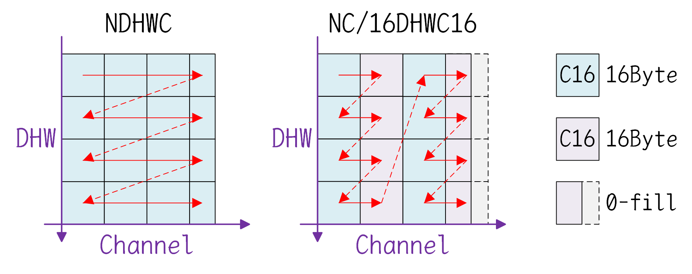

# 基本语法

一般情况下，使用高级语言编写的程序，可以通过编译器直接转换成机器指令以在硬件上运行。但NVIDIA历代GPU产品的底层架构不尽相同，运行的机器指令也存在一定的差异，为保证软件层面的兼容性，CUDA定义了一套稳定的指令集架构和编程模型，称为PTX（Parallel Thread Execution），这是一种并行线程执行的底层虚拟机（Low-Level Virtual Machine）及其指令集（Instruction Set Architecture）。PTX指令集是一种中间表示，它展示了GPU支持的功能，但是不同架构的GPU对这些功能的实现方式存在差异。这种虚拟让PTX代码与GPU底层硬件架构基本无关，能够跨越多种硬件，从而更具有通用性。

在需要时，PTX代码可以即时编译（Just-In-Time）得到更底层的二进制机器指令代码，这是由编译器根据GPU硬件的实际计算能力与具体架构所生成的二进制cubin目标代码，可以由机器直接执行的二进制目标代码对应的汇编称为SASS（Streaming Assembly）流汇编代码，又称为低级汇编指令（Low-Level Assembly Instruction），是特定于GPU架构的。机器指令SASS相比于PTX指令更接近GPU的底层架构，SASS指令集可以体现出特定架构的GPU对于PTX功能的实现方式。

PTX代码和SASS代码中的标识符都是区分大小写的，但预留关键字并不区分大小写，但通常PTX代码使用小写，SASS代码使用大写。

PTX程序的源文件（模块）通常是以.ptx作为后缀的文本文件，其语法具有汇编语言样式的风格。PTX语句可以是指令（instruction），也可以是指示（directive），语句以可选标签（label）开头，以分号`;`结尾，以`\n`表示换行。PTX源文件使用C风格的注释，例如`//`和`/**/`注释。使用C风格的以`#`开头的预处理指令，例如#include、#define、#if、#endif等预处理指令。源文件中所有空白字符都是等效的，并且空格将被忽略，除非它在语言中用于分隔标记。

每个PTX文件必须在开头使用.version指示PTX版本，后跟.target指示所假设的目标架构，一个示例代码如下。

```
.version 8.5
.target sm_70, sm_75, sm_86, sm_89

.reg.b32 r1, r2;
.global.f32 array[N];

_start:
mov.b32 r1, %tid.x;           // move threadIdx.x to r1
shl.b32 r1, r1, 2;            // shift left tidx by 2 bits
ld.global.b32 r2, array[r1];  // thread[tidx] gets array[tidx << 2]
add.f32 r2, r2, 0.5;          // add 0.5
```

指令语句（Instruction Statement）用于表示某个具体的功能，与机器指令一一对应，所有指令语句的集合即构成一个指令集。指令由指令操作码（instruction opcode）组成，后跟以逗号分隔的操作数（operand）列表，并以分号结尾。SASS的习惯是第一个作为目的操作数，然后是源操作数；操作数可以是寄存器变量、常量表达式、地址表达式、标签（label）名称。指令具有可选的表示预测谓词（predication）的哨兵（guard），用于控制指令是否按照条件谓词的结果执行；谓词位于可选的label之后，指令的opcode之前，通常写作`@p`或者`@!p`，其中p是声明的谓词寄存器，叹号`!`表示对谓词进行取反。

指示语句（Directive Statement）用于指示一个特定属性或特定行为，对指令起到修饰和限定的作用，或用于指示编译器的行为，指示语句以点号`.`开头。

<table>
    <caption>Directive Statement</caption>
    <tr>
        <td>.address_size</td> <td>.alias</td> <td>.align</td> <td>.branchtargets</td> <td>.callprototype</td>
        <td>.calltargets</td> <td>.common</td> <td>.const</td> <td>.entry</td>
    </tr>
    <tr>
        <td>.explicitcluster</td> <td>.extern</td> <td>.file</td> <td>.func</td> <td>.global</td> 
        <td>.loc</td> <td>.local</td> <td>.maxclusterrank</td> <td>.maxnctapersm</td>
    </tr>
    <tr>
        <td>.maxnreg</td> <td>.maxntid</td> <td>.minnctapersm</td> <td>.noreturn</td> <td>.param</td>
        <td>.pragma</td> <td>.reg</td> <td>.reqnctapercluster</td> <td>.reqntid</td>
    </tr>
    <tr>
        <td>.section</td> <td>.shared</td> <td>.sreg</td> <td>.target</td> <td>.tex</td> 
        <td>.version</td> <td>.visable</td> <td>.weak</td>
    </tr>
</table>

用户定义的标识符（Identifier）遵循扩展的C++规则，它们以字母开头，后跟零个或多个字母、数字、下划线或美元字符，或者，它们以下划线、美元字符或百分号字符开头，后跟一个或多个字母、数字、下划线或美元字符。

```
followsym:   [a-zA-Z0-9_$]
identifier:  [a-zA-Z]{followsym}* | [_$%]{followsym}+
```

许多高级语言的标识符名称遵循类似的规则，只是不允许使用百分号，而PTX允许百分号作为标识符的第一个字符，这可以用于避免名称冲突，例如，用户定义的变量名称和编译器生成的名称之间的冲突。不过，PTX预定义了一个WARP_SZ常量和少量以百分号开头的特殊寄存器，如下所述。

<table>
    <caption>Predefined Identifier</caption>
    <tr>
        <td>%clock</td> <td>%clock64</td> <td>%ctaid</td> <td>%envreg<32></td> <td>%gridid</td> <td>%laneid</td>
        <td>%lanemask_eq</td> <td>%lanemask_le</td> <td>%lanemask_lt</td> <td>%lanemask_ge</td>
    </tr>
    <tr>
        <td>%lanemask_gt</td> <td>%nctaid</td> <td>%ntid</td> <td>%nsmid</td> <td>%nwarpid</td> <td>%pm0, ..., %pm7</td>
        <td>%smid</td> <td>%tid</td> <td>%warpid</td> <td>WARP_SZ</td>
    </tr>
</table>

PTX支持整数和浮点常量以及常量表达式，这些常量可用于数据初始化，并用作指令的操作数。在PTX中，整数常量可用作谓词，零值为False，非零值为True。

假设存在一个名称为mycode.ptx的PTX模块文件，可以通过cuModuleLoad()方法和cuModuleGetFunction()方法在CUDA C++代码中加载PTX提供的内核函数，并使用cuLaunchKernel()方法在CUDA C++代码中启动PTX提供的内核函数。需要注意的是，此处使用的以cu前缀开头的API函数，是由CUDA的驱动API提供的，而不是由诸如cudaXXX()的运行时提供的接口，因此在编译时要使用-lcuda链接到相应的库文件。

```c++
#include <cuda.h>

int main(int argc, char *argv[]) {
    CUdevice device;
    CUcontext context;
    cuInit(0);
    cuDeviceGet(&device, 0);
    cuCtxCreate(&context, 0, device);

    CUmodule ptx_module;
    CUfunction ptx_kernel_function;
    cuModuleLoad(&ptx_module, "/path/to/mycode.ptx");
    cuModuleGetFunction(&ptx_kernel_function, ptx_module, "my_kernel");

    float* d_input;  cudaMalloc(&d_input, 128 * sizeof(float));
    float* d_output; cudaMalloc(&d_output, 128 * sizeof(float));
    // args是指向实际参数的地址的指针的数组
    void* args[2] = { &d_input, &d_output };
    cuLaunchKernel(ptx_kernel_function, 1, 1, 1, 128, 1, 1, 0, nullptr, args, nullptr);

    cuModuleUnload(ptx_module);
    cuCtxDestroy(context);
    return 0;
}
```

```shell
nvcc -arch=sm_89 -lcuda demo.cu -o run
```

# 特殊寄存器

PTX提供许多预定义的只读变量，这些变量以特殊寄存器的形式可见，其名称统一以百分号%作为前缀，可以通过mov指令或cvt指令访问。

一些用于表示各种或概念上或硬件上的标识符寄存器，用于在代码执行时判断当前资源的编号，如下所示。

| 名称                 | 预定义类型                       | 描述                        | 备注                                                         |
| -------------------- | -------------------------------- | --------------------------- | ------------------------------------------------------------ |
| %tid                 | .sreg.v4.u32 %tid;               | CTA中各个维度上的线程标识符 | 有效值为三维的%tid.x、%tid.y、%tid.z                         |
| %ntid                | .sreg.v4.u32 %ntid;              | CTA中各个维度上的线程数目   | 有效值为三维的%ntid.x、%ntid.y、%ntid.z                      |
| %laneid              | .sreg.u32 %laneid;               | Warp中的线程标识符          | 有效值为0到WARP_SZ－1                                        |
| %warpid              | .sreg.u32 %warpid;               | CTA中的Warp标识符           | 该值表示线程的位置，但由于抢占式的线程重调度，该值在执行中可能会更改 |
| %nwarpid             | .sreg.u32 %nwarpid;              | CTA中的Warp数目             |                                                              |
| %ctaid               | .sreg.v4.u32 %ctaid;             | 网格中各个维度上的CTA标识符 | 有效值为三维的%ctaid.x、%ctaid.y、%ctaid.z                   |
| %nctaid              | .sreg.v4.u32 %nctaid;            | 网格中各个维度的CTA数目     | 有效值为三维的%nctaid.x、%nctaid.y、%nctaid.z                |
| %smid                | .sreg.u32 %smid;                 | 正在执行线程的SM标识符      | 该值表示线程的位置，但由于抢占式的线程重调度，该值在执行中可能会更改；<br>不保证SM标识符是连续的，因为SM是否可用于调度执行受很多因素影响 |
| %nsmid               | .sreg.u32 %nsmid;                | 正在执行线程的SM数目        | 由于不保证SM标识符是连续的，因此%nsmid可能大于物理硬件中的SM数目 |
| %gridid              | .sreg.u64 %gridid;               | 上下文中的网格标识符        | 执行期间会启动多次核函数，该值提供上下文中的临时网格编号     |
| %is_explicit_cluster | .sreg.pred %is_explicit_cluster; | 用户是否指定以簇组启动      |                                                              |
| %clusterid           | .sreg.v4.u32 %clusterid;         | 网格中各个维度的簇组标识符  | 有效值为三维的%clusterid.x、%clusterid.y、%clusterid.z       |
| %nclusterid          | .sreg.v4.u32 %nclusterid;        | 网格中各个维度上的簇组数目  | 有效值为三维的%nclusterid.x、%nclusterid.y、%nclusterid.z    |
| %cluster_ctaid       | .sreg.v4.u32 %cluster_ctaid;     | 簇组中各个维度的CTA标识符   | 有效值为三维的%cluster_ctaid.x、%cluster_ctaid.y、%cluster_ctaid.z |
| %cluster_nctaid      | .sreg.v4.u32 %cluster_nctaid;    | 簇组中各个维度上的CTA数目   | 有效值为三维的%cluster_nctaid.x、%cluster_nctaid.y、%cluster_nctaid.z |
| %cluster_ctarank     | .sreg.u32 %cluster_ctarank;      | 簇组中平铺的CTA标识符       | 有效值为0到%cluster_nctarank－1                              |
| %cluster_nctarank    | .sreg.u32 %cluster_nctarank;     | 簇组中平铺的CTA数目         |                                                              |

一些用于表示共享内存使用信息的寄存器，如下所示。其中，预留共享内存是给NVIDIA系统软件使用的。

| 名称                        | 预定义类型                             | 描述                                                         |
| --------------------------- | -------------------------------------- | ------------------------------------------------------------ |
| %reserved_smem_offset_begin | .sreg.b32 %reserved_smem_offset_begin; | 预留共享内存区域开始处的偏移                                 |
| %reserved_smem_offset_end   | .sreg.b32 %reserved_smem_offset_end;   | 预留共享内存区域结束处的偏移                                 |
| %reserved_smem_offset_cap   | .sreg.b32 %reserved_smem_offset_cap;   | 预留共享内存区域的总容量大小                                 |
| %reserved_smem_offset_<2>   | .sreg.b32 reserved_smem_offset_<2>;    | 预留共享内存区域中的偏移                                     |
| %total_smem_size            | .sreg.u32 %total_smem_size;            | 内核的CTA使用的共享内存总大小，包括静态分配和动态分配的，不包括系统预留的 |
| %aggr_smem_size             | .sreg.u32 %aggr_smem_size;             | 内核的CTA使用的共享内存总大小，包括静态分配和动态分配的，以及系统预留的 |
| %dynamic_smem_size          | .sreg.u32 %dynamic_smem_size;          | 内核启动时一个CTA动态分配的共享内存大小                      |

一些预定义的线程掩码寄存器，使用32位无符号整数表示一个Warp中的32个线程，从高位到低位以[31:30:29:28:...:3:2:1:0]的形式表示对应线程，如下所示。

| 名称         | 预定义类型              | 描述                                                         |
| ------------ | ----------------------- | ------------------------------------------------------------ |
| %lanemask_eq | .sreg.u32 %lanemask_eq; | 仅当前线程的位为1，其它线程的位为0；该寄存器对不同线程具有不同的值 |
| %lanemask_le | .sreg.u32 %lanemask_le; | 仅当前线程和编号更小线程的位为1，其它线程的位为0             |
| %lanemask_lt | .sreg.u32 %lanemask_lt; | 仅编号更小线程的位为1，其它线程的位为0                       |
| %lanemask_ge | .sreg.u32 %lanemask_ge; | 仅当前线程和编号更大线程的位为1，其它线程的位为0             |
| %lanemask_gt | .sreg.u32 %lanemask_gt; | 仅编号更大线程的位为1，其它线程的位为0                       |

一些与时间计时和性能采样等相关的寄存器，如下所示。

| 名称                               | 预定义类型                      | 描述                                                   |
| ---------------------------------- | ------------------------------- | ------------------------------------------------------ |
| %clock                             | .sreg.u32 %clock;               | 时钟计数器，32位无符号整数                             |
| %clock64                           | .sreg.u64 %clock64;             | 时钟计数器，64位无符号整数                             |
| %clock_hi                          | .sreg.u32 %clock_hi;            | 时钟计数器%clock64的高32位数据                         |
| %globaltimer                       | .sreg.u64 %globaltimer;         | 全局的纳秒计数器，64位无符号整数                       |
| %globaltimer_lo                    | .sreg.u32 %globaltimer_lo;      | 全局的纳秒计数器的低32位数据                           |
| %globaltimer_hi                    | .sreg.u32 %globaltimer_hi;      | 全局的纳秒计数器的高32位数据                           |
| %pm0, %pm1, ..., %pm7              | .sreg.u32 %pm<8>;               | 性能监视计数器，目前行为未定义                         |
| %pm0_64, %pm1_64, ..., %pm7_64     | .sreg.u64 %pm<8>_64;            | 性能监视计数器，目前行为未定义                         |
| %envreg0, %envreg1, ..., %envreg31 | .sreg.b32 %envreg<32>;          | 用于捕获PTX虚拟机外部的PTX程序执行环境，由驱动程序定义 |
| %current_graph_exec;               | .sreg .u64 %current_graph_exec; | 如果执行的内核不是CUDA设备图的一部分，则此寄存器值为0  |

# 类型系统

不同架构的GPU中可用的硬件资源数目不同，但资源类型在各个架构上是通用的，这些资源在PTX中通过存储状态空间和数据类型进行抽象化，以一种概念表示。

## 存储状态空间

存储状态空间（State Space）指的是具有某种特征的存储区域，所有变量都驻留在某个存储状态空间中。存储状态空间的特征包括容量大小、可寻址性、访问速度、访问权限、线程之间的共享级别。在PTX中定义的存储状态空间如下所示。

| 名称    | 描述               | 是否可寻址 | 是否可初始化 | 可访问性 | 共享级别           |
| ------- | ------------------ | ---------- | ------------ | -------- | ------------------ |
| .reg    | 寄存器             | 否         | 否           | 可读可写 | 一个线程私有       |
| .sreg   | 特殊寄存器         | 否         | 否           | 只读     | 一个线程块之内共享 |
| .const  | 常量内存           | 是         | 是           | 只读     | 一个网格之内共享   |
| .global | 全局内存           | 是         | 是           | 可读可写 | 一个上下文之内共享 |
| .local  | 局部内存           | 是         | 否           | 可读可写 | 一个线程私有       |
| .param  | 内核函数的参数     | 是         | 否           | 只读     | 一个网格之内共享   |
| .param  | 设备函数的参数     | 受限的     | 否           | 可读可写 | 一个线程私有       |
| .shared | 共享内存           | 是         | 否           | 可读可写 | 一个簇组之内共享   |
| .tex    | 纹理内存（已弃用） | 否         | 是           | 只读     | 一个上下文之内共享 |

对于一个数据变量而言，它一定位于某个存储状态空间中，使用mov指令获得变量的地址时，该地址是该变量在该存储状态空间中的地址，即该变量相对于该存储状态空间起始位置的偏移量（字节）。PTX提供了一个运算符generic()来将某个存储状态空间中的地址转换为一个通用地址，或者在运行时使用诸如cvta.global的指令将某个存储状态空间中的地址转换为通用地址。当然，如果使用带有存储状态空间修饰符的指令，则可以直接使用相应的存储状态空间中的地址（而无需转换为通用地址）。

如果一个使用地址的指令未指明存储状态空间，则使用通用地址进行寻址操作。存储状态空间.const、.local、.shared、.param实际上都是通用地址空间中的一个窗口，每个窗口都由一个窗口基址和窗口大小的定义。除了.const、.local、.shared窗口之外，一个通用地址映射到设备的全局内存之上，参数.param窗口包含在.global窗口之中。对于一个地址，减去其所在窗口的基址，即可得到数据在相应存储状态空间中的地址。

寄存器.reg是快速存储状态空间，且数量是有限的，当超过限制时，寄存器变量将溢出到内存中，从而导致性能下降。寄存器可以是类型化的（有符号整数、无符号整数、浮点数、谓词），也可以是无类型的。寄存器变量的大小具有限制，谓词占用1位，标量可以占用8位、16位、32位、64位、128位，向量可以占用16位、32位、64位、128位。其中，8位寄存器常用于ld、st和cvt指令，或作为向量元组的元素。在加载或存储多字长（multi-word）数据时，寄存器可能需要边界对齐。

特殊寄存器.sreg是预定义的、特定于平台的专用寄存器空间，例如网格、簇组、线程块、线程等专用标识寄存器，时钟计数、性能监控寄存器等。寄存器空间与其它存储状态空间的不同之处在于，寄存器是不可寻址的，即不可以引用寄存器的地址。

常量.const是由主机初始化的只读的存储状态空间，大小限制为64KB，用于保存固定内存大小的常量数据，可通过ld.const指令访问。固定内存大小的常量变量可以指定初始值，若不指定则默认初始化为零。此外，还有一个640KB的常量内存空间，组织为10个独立的64KB区域，驱动程序可以在这些区域中分配和初始化常量缓冲区，并将指向缓冲区的指针作为内核函数的参数传递。由于这10个区域不是连续的，因此驱动程序必须确保缓冲区不会越界。

全局.global存储状态空间是上下文中所有线程都可以访问的内存，不同网格、簇组、线程块之中的线程可以使用全局内存进行通信，可通过ld.global指令、st.global指令和atom.global指令访问全局内存变量。全局内存中的变量可以指定初始值，若不指定则默认初始化为零。

局部.local存储状态空间是每个线程的私有内存，用于保留自己的数据，它通常是带缓存的标准内存。局部私有内存的大小是有限的，因为它必须基于每个线程进行分配。可通过ld.local指令和st.local指令访问局部内存变量。

参数.param存储状态空间用于：(1)将输入参数从主机传递给内核函数；(2)声明设备函数的输入参数和返回值参数；(3)声明局部范围的字节数组变量，通常用于按值传递（而非引用）将大型结构体参数给函数。需注意，内核函数的参数是在一个网格之内共享的，设备函数的参数是一个线程私有的。对于指令而言，为区分不同类型的参数，使用xxx.param::entry形式访问内核函数参数，使用xxx.param::func形式访问设备函数参数，若省略::entry或::func后缀，则会根据指令推断。

> 参数空间的位置是特定于实现的。例如，某些实现中，内核函数参数是驻留在全局内存中的，在这种情况下，参数空间和全局内存空间不提供访问保护；尽管内核参数空间的确切位置是特定于实现的，但内核参数空间窗口（kernel parameter space window）是始终包含在全局空间窗口中的。同样地，函数参数会根据ABI的函数调用约定将所传递的参数映射到寄存器或堆栈位置。因此，PTX代码不应该对.param空间变量的相对位置或顺序做出任何假设。

每个内核函数定义都包含一个可选的参数列表，这些参数是在.param存储状态空间中声明的可寻址的只读变量。可通过mov指令将内核参数的地址移动到寄存器中，生成的地址属于.param存储状态空间，可使用ld.param{::entry}指令访问这些参数变量。一个示例如下所示。

```
.entry foo (.param.b32 len, .param .align 8 .b8 buffer[64]) {
    .reg.u32 %addr;
    .reg.u32 %len1;
    .reg.u32 %len2;
    .reg.f64 %data;
    
    mov.u32      %addr, len;
    ld.param.u32 %len1, [%addr];    // 使用mov和ld.param加载参数
    ld.param.u32 %len2, [len];      // 直接使用ld.param
    ld.param.f64 %data, [buffer];
}
```

内核函数参数可以表示正常的数据值，也可以保存常量内存、全局内存、局部内存、共享内存中对象的地址指针。对于地址指针，编译器和运行时系统需要一些信息，来判断哪些参数是地址指针，以及这些指针指向哪个存储状态空间。内核参数的属性指示语句用于在PTX级别提供这些信息。内核函数参数可以使用可选的.ptr属性进行声明，以指示该参数是指向内存的指针，还可以指示所指向的存储状态空间和对齐方式，如下所示。

```
.param .align N .type .ptr .space varname;
.param .align N .type .ptr        varname;
```

当使用.ptr指示参数为地址指针时，可以使用.space指定存储状态空间，可以是.const、.global、.local、.shared存储状态空间，若未指定则假定指针是指向const、global、local、shared之一的通用地址，对齐值N应是2的整数次幂（单位为字节），若未指定则假定4字节对齐。

```
.entry foo (
    .param.u32 arg1,
    .param .align 16 .u32.ptr.global arg2,
    .param .align 8 .u32.ptr.const arg3,
    .param .align 16 .u32.ptr arg4  // generic address pointer
) { ... }
```

PTX 2.0版本将.param参数空间的使用扩展到设备函数参数。最常见用途是按值传递将大型结构体给函数（不适合使用PTX寄存器传递），这种情况下，会使用参数空间中的字节数组，被调用方声明一个.param形式的参数，该参数与传递的实参具有相同的大小和对齐方式。如下所示。

```
struct MyStruct { double fp; int val; };

// pass object of type MyStruct, 8 + 4 = 12Byte
.func foo (.reg.b32 len, .param .align 8 .b8 buffer[12]) {
    .reg.f64 %fp;
    .reg.s32 %val;

    ld.param.f64 %fp, [buffer];
    ld.param.s32 %val, [buffer + 8];
}
```

共享.shared存储状态空间是正在执行的一个CTA所持有的内存空间，簇组内的所有CTA的线程都可以访问，可通过ld.shared指令和st.shared指令进行访问。使用.shared::cta指示当前正在执行的CTA的共享内存窗口，使用.shared::cluster指示同簇组中其它CTA的共享内存窗口，当然.shared::cta的地址窗口也位于.shared::cluster地址窗口中；若省略后缀则默认是.shared::cta指定的内存窗口。在.shared中声明的变量是值当前CTA中的内存地址，使用mapa指令获得簇组中另一个CTA中的相应变量的.shared::cluster地址。

## 基本数据类型

在PTX代码中，基本数据类型（Fundamental Data Type）反映了目标架构所支持的本机数据类型，其中寄存器变量始终是基本类型。类型大小（type-size）修饰符同时用于变量定义和指令说明中，如下所示。

| 基本类型         | 类型说明符                   |
| ---------------- | ---------------------------- |
| unsigned integer | .u8、.u16、.u32、.u64        |
| signed integer   | .s8、.s16、.s32、.s64        |
| floating point   | .f16、.f32、.f64             |
| bits（untyped）  | .b8、.b16、.b32、.b64、.b128 |
| predicate        | .pred                        |

大多数指令都有一个或多个类型说明符，以指定指令的行为，指令会根据类型检查操作数类型和大小以确保兼容性。只要类型和大小完全相同就是兼容的，此外，无符号整数和有符号整数只要具有相同的大小，也是兼容的，bit位类型与具有相同大小的任何基本类型都是兼容的。原则上，所有变量（谓词除外）都可以仅使用bit位类型进行声明，但类型化的变量增强了程序的可读性，并允许更好的操作数类型检查。

类型.u8、.s8、.b8仅用于ld、st、cvt指令。为方便起见，ld、st、cvt指令允许操作数的类型大小比指令的类型大小更宽，因此可以使用常规宽度的寄存器加载、存储和转换更窄的值。例如，8位或16位值在加载、存储或转换为其他类型和大小时，可以直接保存在32位或64位寄存器中。

PTX中支持的基本浮点类型具有隐式的位表示形式，即用于存储指数和尾数的位数，例如，类型.f16为指数保留5位，为尾数保留10位。除基本的浮点类型之外，PTX还支持一些其它格式的浮点类型。类型bf16一共16位，8位指数，7位尾数，包含bf16数据的寄存器必须声明为.b16类型；类型e4m3一共8位，4位指数，3位尾数，包含e4m3数据的寄存器必须声明为.b8类型；类型e5m2一共8位，5位指数，2位尾数，包含e5m2数据的寄存器必须声明为.b8类型；类型tf32一共32位，范围与.f32相同，精度降低（仍然大于等于10位），数据的内部布局是基于实现的，包含tf32数据的寄存器必须声明为.b32类型。

某些PTX指令在两组输入上并行运行，并产生两个输出，此类指令可以使用以打包（packed）格式存储的数据。PTX支持将相同标量数据类型的两个值打包到一个更大的值中，打包的值被视为打包数据类型的值。打包数据类型包括.f16x2、.bf16x2、.e4m3x2、.e5m2x2类型。

值得注意的是，在PTX代码中，浮点立即数可以使用不同的前缀，单精度使用`0f`，双精度用`0d`，后面跟对应的十六进制数字，例如，0d3F80000000000000立即数表示的是double类型的双精度浮点数，解析后面的十六进制数据（符号位1位，指数11位，尾数52位），可算出数字是双精度的0.0078125，也即1/128的值。

## 变量的声明

在PTX中，声明一个变量（Variable）时需要描述变量的存储状态空间及其数据类型，除基本类型之外，PTX还支持简单的聚合类型，例如向量和数组。数据的所有存储状态空间都在变量声明时指定，谓词变量只能在寄存器空间中声明。变量声明指定一个名称的存储状态空间、类型、大小、可选初始值、可选的数组大小、可选的固定地址。

```
.global.u32 var1;
.global.u8  var2[4] = { 0, 0, 0, 0 };
.const.f32  var3[] = { -1.0, 1.0 };
.reg.s32    var4;
.reg.v4.f32 var5;
.reg.pred   p, q, r, s;
```

PTX支持有限长度的向量类型，任何非谓词基本类型的长度为2或4的向量都可以通过在类型前加上.v2或.v4来声明，如下所示。向量必须基于基本类型，并且它们可以驻留在寄存器空间中。但需要注意的是，向量的总长度不能超过128位，例如，不允许使用.v4.f64类型。可以使用.v4处理三元素向量，其中第四个元素提供无效的填充值，这是3D网格纹理的常见情况。

```
.shared.v2.u16 var1;  // a length-2 vector of unsigned ints
.global.v4.f32 var2;  // a length-4 vector of floats
.global.v4.b8  var3;  // a length-4 vector of bytes
```

默认情况下，向量变量与其总大小的倍数（向量长度乘以基本类型大小）对齐，以启用向量化的加载和存储指令，这些指令需要地址与访问大小的倍数对齐。

PTX提供数组声明以允许程序员预留内存空间。声明数组时，变量名称后跟维度声明，类似于C语言中的固定大小的数组声明，每个维度的大小都是一个常量表达式。当使用初始值设定项声明时，可以省略数组的第一个维度，第一个数组维度的大小由数组初始值中的元素数决定。

```
.shared.u8  var1[128];
.local.u16  var2[16][16];
.global.u32 var3[] = { 0, 1, 2, 3, 4, 5, 6, 7 };
.global.s32 var4[][2] = { {-1, 0}, {0, -1}, {1, 0}, {0, 1} };
```

声明的变量可以使用类似于C的语法指定初始值，标量采用单个值，而向量和数组采用大括号内的嵌套值列表，如下所示。目前只有.const常量存储状态空间和.global全局存储状态空间支持变量初始化，外部.extern变量不允许初始化。默认情况下，没有显式初始值的变量会被初始化为零。

```
.const.f32     var1 = 3.14;
.global.v4.f32 var2 = { 3.14, 2.71, 1.5 };       // sane to { 3.14, 2.71, 1.5, 0.0 };
.global.f32    var2[8] = { 0.33, 0.25, 0.125 };  // same to { 0.33, 0.25, 0.125, 0.0, 0.0, 0.0, 0.0, 0.0 };
.global.s32    var3[3][2] = { {1, 2}, {3} };     // same to { {1, 2}, {3, 0}, {0, 0} };
```

如果在初始值列表中出现一个变量名称，则表示的是该变量的地址（即变量在某个存储状态空间中的偏移量），这可用于静态初始化指向变量的指针。可以使用设备函数的名称作为初始化值，表示函数中第一条指令的地址，这可用于初始化间接调用的函数指针表。从PTX 3.1版本开始，内核函数名称也可以用作初始化值，例如初始化内核函数指针表，与CUDA动态并行一起使用，从而可以从GPU端启动内核函数。需要注意的是，保存地址的变量应为.u8、.u32或者.u64类型。

```
.const.u32 arr[] = { 3, 5, 7, 9, 11 };
.global.u64 addr1 = foo;               // .const address of arr, namely offset in .const space
.global.u64 addr2 = generic(foo);      // generic address of arr[0], the value is 3
.global.u64 addr3 = generic(foo) + 8;  // generic address of arr[2], the value is 7
```

对使用地址作初始值的情况，也可以使用addr＋offset的形式，表示addr添加offset字节偏移之后的地址。需要注意的是，默认情况下，这种地址是某个存储状态空间中的地址，也即相对于存储状态空间起始位置的偏移量，就像使用mov指令获得的变量地址一样。PTX提供了一个运算符generic()来将某个存储状态空间中的地址转换为一个通用地址，或者在运行时使用诸如cvta.global的指令将某个存储状态空间中的地址转换为通用地址。

在PTX中声明变量时，可以指定可寻址变量的存储地址的字节对齐，对齐方式使用紧跟在存储状态空间说明符后面的可选的.align N说明符指定，对齐值N以字节为单位，且必须是2的整数次幂。所声明的变量的存储地址将是对齐值的整数倍。对于数组而言，对齐是指整个数组的起始地址的对齐方式，而不是单个元素的地址对齐方式。标量变量和数组变量的默认对齐方式是基本类型大小的倍数；向量变量的默认对齐方式是整体向量大小的倍数。

```
// Allocate array at 4-byte aligned address. Elements are bytes.
.const .align 4 .b8 arr[8] = { 0, 1, 2, 3, 4, 5, 6, 7 };
```

需要注意的是，所有访存指令都要求访问地址与访问大小的倍数对齐，访存指令的访问大小是内存中访问的总字节数。例如，ld.v4.b32的访问大小为16字节。

> 需注意的是，在语法上，.align N符号需要位于.param等存储空间之后，并位于诸如.b32等数据类型之前，且数字N左右两侧都需要一个空格分隔。

由于PTX支持虚拟寄存器，因此编译器前端生成大量寄存器名称是很常见的，PTX支持创建一组变量的语法，该变量具有通用的前缀字符串，以及附加的整数后缀。此语法糖可用于任何基本类型和任何存储状态空间，并且可以在前面带有对齐方式说明符，但数组变量不能以这种方式声明，也不允许设定初始值。例如，假设一个程序使用大量的寄存器，示例如下所示。

```
.reg.b32 %r<100>;  // declare %r0, %r1, ..., %r99
```

## 张量的声明

PTX支持操作张量数据的指令，包括wmma.xxx系列指令、mma.xxx系列指令、wgmma.mma_async.xxx系列指令。PTX张量指令将全局内存中的张量数据视为多维结构，而将共享内存中的数据视为线性数据。

张量（Tensor）是内存中的多维矩阵结构，一个张量由维度（Rank）、维数（Extent）、跨步（Stride）、元素类型（Element Type）四个部分定义。张量可以是一维（1D）、二维（2D）、三维（3D）、四维（4D）、五维（5D）的，每个维度都有一个维数大小，表示沿着该维度轴上的元素数目。张量可以在每个维度的末尾进行填充，以便为后续维度中的数据提供对齐。跨步表示两个相应元素的存储位置之间的差距，从而可以间接表示填充数量。

元素可以是位类型、亚字节（Sub-Byte）类型、整数类型、浮点类型，其中，亚字节类型因为一个元素所占用的位数不足一个字节，通常需要将多个元素连续打包存储到全局内存中，并且在使用张量复制指令时，通常会进行一定的空白填充。一些亚字节数据类型如.b4x16、.b4x16_p64、.b6x16、.b6x16_p32，这些类型处.b4x16无需空白填充之外，其它类型都需要一些空白填充，如下一些图片所示。


张量数据可以通过两种方式访问，一是Tile平铺模式，目标张量与源张量的布局相同；二是Im2Col模式，目标张量布局会对来自源张量边界框（Bounding Box）内的元素进行重排列。实际上，Im2Col操作多用于卷积计算，该操作会将一个二维图像Image按照边界框进行重排列，并按逐列的顺序生成新的张量。

例如，一个NHWC形状的输入图像，在H×W维度上执行卷积核大小为M×N跨步为1且不填充的卷积，会得到(H－M＋1)×(W－N＋1)形状的输出；在卷积实现中，Im2Col操作会将H×W形状的图像转换成一个[M×N, (H－M＋1)×(W－N＋1)]形状的中间张量，同时卷积核会展开为N×M长度的行向量，以将卷积操作转换为矩阵乘法操作。如下一个4×4的输入图像应用2×2的卷积核的示例。
$$
\begin{matrix}
 1 &  2 &  3 &  4 \\
 5 &  6 &  7 &  8 \\
 9 & 10 & 11 & 12 \\
13 & 14 & 15 & 16
\end{matrix}
\quad\xrightarrow[(2,2)]{\text{im2col}}\quad
\begin{matrix}
 1 &  5 &  9 &  2 &  6 & 10 &  3 &  7 & 11 \\
 5 &  9 & 13 &  6 & 10 & 14 &  7 & 11 & 15 \\
 2 &  6 & 10 &  3 &  7 & 11 &  4 &  8 & 12 \\
 6 & 10 & 14 &  7 & 11 & 15 &  8 & 12 & 16
\end{matrix}
$$

张量映射（Tensor Map）是一个位数为128字节的不透明结构体对象，位于.const常量存储状态空间或者.param内核参数存储状态空间或者.global全局存储状态空间中，该不透明的对象描述了一个张量的张量属性和访问属性，这些属性将在本节介绍。可以使用CUDA编程中的API函数创建一个张量映射对象。

### 平铺模式

张量可以按边界框块（Bounding Box Chunk）的形式进行访问，边界框与张量具有相同数目的维度轴，边界框大小必须是16字节的整数倍，边界框的起始地址也必须与16字节对齐。在PTX张量指令中会指定张量坐标（Tensor Coordinate），张量坐标用于指定边界框的起始偏移量（starting offset），边界框的起始偏移量与访问属性一起确定要访问的元素。一个边界框的访问属性包括：边界框维数大小（bounding box dimension size）；越界访问模式（out of boundary access mode）；遍历跨步（traversal stride）。

当一个边界框在一个张量遍历时，遍历跨步用于指定每次访问下一个元素时要跳过的元素数目，如果要逐个元素地依次遍历，则遍历跨步必须指定为1默认值。在维度轴0上的遍历跨步可以用于构成交错布局（Interleave Layout），对于非交错布局，则维度轴0上的遍历跨步必须始终为1值。如下图所示，描述了张量大小、张量跨步、遍历跨步之间的关系。


PTX张量操作可以检测和处理边界框在任何维度上越界时的情况，并在越界时填充，可指定零填充（zero fill mode）或无效数据填充（OOB-NaN fill mode）。


此外，还存在一种仅适用于二维张量数据的.tile::scatter4平铺模式和.tile::gather4平铺模式，这些模式被用于访问张量数据的多个非连续的（non-contiguous）行。在.tile::scatter4模式下，单个二维的源张量在目标张量中被分为4行；而在.tile::gather4模式下，源张量中的4行被组合成单个二维的目标张量。这些模式在4行数据上工作，因此指令将采用4个张量坐标，其中坐标从左到右采用形如(columnIndex, rowIndex)的含义解释。4个请求坐标在张量空间中形成4个边界框，其中边界框从左到右采用形如(width, 1)的含义解释。一个示例，请求的张量坐标依次为(1,2)、(1,5)、(1,0)、(1,9)，边界框大小为(4,1)，如下图所示。


### im2col模式

模式im2col支持三维（3D）、四维（4D）、五维（5D）的张量形状，在此模式下，张量数据被视为一批图像数据，这些图像的属性包括：一个批量中的图像数目N（Number）；三维图像的维数大小DHW（Depth，Height，Width）；每个图像元素的通道数C（Channel）。这些属性正好与三维、四维、五维张量相关联，即，三维张量表示NWC图像，四维张量表示NHWC图像，五维张量表示NDHWC图像。一个张量在im2col模式下可以使用如下示意图表示。


> 对于NDHWC形状的张量数据，其在内层空间中存储时，先存储C维度轴上的元素，再依次存储W、H、D维度轴上的元素，最后存储N维度轴上的元素。需要注意的是，在PyTorch等深度学习框架中，用于卷积计算的张量数据的维度形状可能是按照NCDHW排布的，即先依次存储W、H、D维度轴上的元素，再存储C维度轴上的元素，最后存储N维度轴上的元素。

在im2col模式下，边界框是在DHW空间中定义的，而沿其它维度轴的边界是由每列像素数（Pixels-per-Column）和每像素通道数（Channels-per-Pixel）指定的，因此边界框维度要比张量维度少2个维度轴。边界框的维数大小使用下角（Lower Corner）和上角（Upper Corner）定义，下角和上角指定DHW空间中边界框的两个相对的角，下角指定拥有最小坐标的角，上角指定拥有最大坐标的角，值得注意的是，下角和上角使用的是相对于张量空间边角的相对坐标。如下所示。


边界框的下角和上角仅仅是用于框定一个访问范围，并不是指定要访问的元素。真正要访问的元素位置由PTX张量指令中的张量坐标（Tensor Coordinate）和im2col偏移（Offset）指定。在确定元素的访问起始位置之后，真正要访问的元素数目由每列像素数（Pixels-per-Column）指定，每个访问位置上要读取的通道数目由每像素通道数（Channels-per-Pixel）指定。

张量坐标根据张量诸如(N, D, H, W, C)的形状，以维度形状含义如(nIdx, dIdx, hIdx, wIdx, cIdx)的形式指定，张量坐标用于指定卷积核（convolution filter）在张量空间中的起始位置，所谓的位置都是相对于各个维度轴上的0号元素而言的，因此由诸如dIdx、hIdx、wIdx坐标值指定的起始位置也与边界框无关，但所指定的起始位置应必须落在边界框中。im2col偏移指定一个相对于卷积核起始位置的核内元素偏移量，维度形状为(dOffset, hOffset, wOffset)含义，将卷积核的起始位置和核内偏移量相加，即可得到张量空间中真正要访问元素位置。

一个NHWC张量在im2col模式下的访问示例如下所示，二维卷积核采用3×3的大小。

```
Tensor Size [N, H, W, C] = [64, 14, 9, 64]
Bounding Box Lower Corner [H, W] = [-1, -1]
Bounding Box Upper Corner [H, W] = [-1, -1]
Tensor Coordinate [nIdx, hIdx, wIdx, cIdx] = [7, 7, 4, 0]
im2col Offset [hOffset, wOffset] = [1, 0]
Pixels-per-Column = 64
Channels-per-Pixel = 8
```


与tile平铺模式不同，在im2col模式下，遍历跨步（Traversal Stride）仅在DHW维度轴上指定，并且遍历跨步不会影响需要访问的元素的总数，真正要访问的元素数目仍然由每列像素数（Pixels-per-Column）指定。一个NHWC张量在im2col模式下的访问示例如下所示，二维卷积核采用3×3的大小。

```
Tensor Size [N, H, W, C] = [64, 9, 8, 64]
Bounding Box Lower Corner [H, W] = [0, 0]
Bounding Box Upper Corner [H, W] = [0, 0]
Tensor Coordinate [nIdx, hIdx, wIdx, cIdx] = [7, 2, 5, 0]
im2col Offset [hOffset, wOffset] = [1, 1]
Traversal Stride [hStride, wStride] = [2, 2]
Pixels-per-Column = 20
Channels-per-Pixel = 8
```


在im2col模式下，当Pixels-per-Column指定的NDHW空间中请求的元素数目超过该批量图像中的可用的元素数目时，则执行越界访问。与平铺模式类似，可以指定零填充（zero fill mode）或无效数据填充（OOB-NaN fill mode）。

### im2col::w模式

此外，对于形如NDHWC等维度的张量，还存在一种在D维度和H维度上保持不变而只沿着W维度访问元素的模式，即im2col::w模式。

这种im2col::w模式的边界框在D维度和H维度上的维数大小都固定为1，边界框的下角（Lower Corner W）和上角（Upper Corner W）用于指定在W维度上的维数大小。张量坐标仍然以(nIdx, dIdx, hIdx, wIdx, cIdx)的形式指定，但此时表示的不再是卷积核在张量空间中的起始位置，而是要访问的元素在张量空间中的起始位置。在im2col::w模式下访问的元素数目由Pixels-per-Column字段指定，而im2col::w::128模式又进一步将访问元素的数目固定为128个。

同样的是，使用遍历跨步（Traversal Stride W）指定在W维度上访问元素时的跨步长度。不同的是，在PTX张量复制指令中，可以使用一个wOffset偏移参数同时调整边界框的位置和张量坐标的位置，即使用调整后的W＋wOffset作为边界框的下角和上角坐标，使用调整后的wIdx＋wOffset作为张量坐标。因为在卷积计算中，沿着W维度的相同元素可能会被重复应用到卷积核的不同位置，根据wOffset偏移可以在不同共享内存缓存区中的不同位置加载某个元素。

```
Tensor Size [N, H, W, C] = [64, #, 7, 64]
Bounding Box Lower Corner [W] = [-1]
Bounding Box Upper Corner [W] = [-1]
Tensor Coordinate [nIdx, hIdx, wIdx, cIdx] = [7, #, -1, 0]
Traversal Stride [wStride] = [3]
Pixels-per-Column = 64
Channels-per-Pixel = 8
wOffset = [0] or [1] or [2]
```


与im2col模式的一大不同之处在于，im2col::w模式下的PTX张量指令允许指定一个wHalo值，表示在加载完由Pixels-per-Column指定的元素数目之后，再在末尾紧接着向后加载wHalo个紧跟元素。一个取wHalo值为2的示例如下图所示。


而在im2col::w::128模式下，则每加载完32个元素之后，再加载wHalo个紧跟元素，则对于总的128个访问元素，一共加载4×wHalo个紧跟元素，但需要注意的是，在存储到共享内存中时，所有的128个元素存储在一起，每个紧跟元素存储在一起。一个取wHalo值为2的示例如下图所示。


### 交错布局

一般的NDHWC布局先连续存储C维度轴上的元素，再依次存储W、H、D维度轴上的元素，最后存储N维度轴上的元素。此外，还支持维度形状为NDHWC的张量在维度轴C上的交错布局（Interleave Layout），这实际上是在C维度轴上的一种分组存储。

维度轴C上的元素以切片（slice）的形式组织，即C维度轴顺序上的元素以16字节或32字节的大小分组，每组存储为一个切片。交错布局首先存储C维度轴上的一个切片，然后再依次存储D、H、W维度轴上的元素，然后再存储C维度轴上的下一个切片，然后再依次存储D、H、W维度轴上的元素，依次类推，直到C维度轴上的元素全部存储完成。如果通道C的总维数不是一个切片通道数的整数倍，则必须用零填充最后一个切片，以使其完成16字节或32字节的切片。

8字节交错（8 byte interleave）布局NC/8DHWC8，其中C8表示每8个字节使用一个编号，一个C8内部的8个字节一定连续存储，多个C8之间可能连续存储也可能不连续存储。该交错布局假定每个通道2字节，并将16个字节作为一个切片（包含8个通道元素），于是能够划定2个C8。

16字节交错（16 byte interleave）布局NC/16DHWC16，其中C16表示每16个字节使用一个编号，一个C16内部的16个字节一定连续存储，多个C16之间可能连续存储也可能不连续存储。该交错布局假定每个通道4字节，并将32个字节作为一个切片（包含8个通道元素），于是能够划定2个C16。



交错的NC/8DHWC8布局和NC/16DHWC16布局，也可以直接写明在C维度轴上连续存储的字节数目，例如NC/(16B)DHWC(16B)布局和NC/(32B)DHWC(32B)布局，这种直接写明连续存储字节数目的方式，是一种更为通用且清晰的表示方法。

### 重排模式

出于访问的性能原因，共享内存中的数据布局可能与全局内存中的数据布局不同，具体的访问布局由重排模式（swizzle mode）指定，包括32字节重排模式（32 byte swizzle mode）、64字节重排模式（64 byte swizzle mode）、128字节重排模式（128 byte swizzle mode）。需要注意的是，这些重排模式都是以16字节为单位的，即每个连续16字节使用一个编号，在示意图中用一个方格表示，一个16字节一定连续存储，即重排原子性（swizzle atomicity）的粒度是16字节的。

32字节重排模式需要2×8个16字节参与，起始地址需要256字节对齐，示意图如下所示。假设一个通道元素的位数为2字节，对于形状为NC/(32B)HWC(32B)的实际维数为1×2×10×10×32的交错布局的张量数据，在全局内存中的重排之前的布局，和共享内存中的重排之后的布局，如下图所示。


64字节重排模式需要4×8个16字节参与，起始地址需要512字节对齐，示意图如下所示。假设一个通道元素的位数为2字节，对于形状为NHWC的实际维数为1×10×10×32的张量数据，在全局内存中的重排之前的布局，和共享内存中的重排之后的布局，如下图所示。


128字节重排模式需要8×8个16字节参与，起始地址需要1024字节对齐，示意图如下所示。假设一个通道元素的位数为2字节，对于形状为NHWC的实际维数为1×10×10×64的张量数据，在全局内存中的重排之前的布局，和共享内存中的重排之后的布局，如下图所示。


如前所述，上面介绍的这些重排模式都是以16字节为单位的，即每个连续16字节使用一个编号，在示意图中用一个方格表示，一个16字节一定连续存储，即重排原子性（swizzle atomicity）的粒度是16字节的。而在128字节的重排模式中，还允许使用其它粒度的重排原子性的子模式。

64字节原子性子模式（64 byte atomicity sub-mode）保证重排是以64字节为单位的，一个64字节一定连续存储，这要求共享内存的起始地址需要64字节对齐。在此子模式下，全局内存中的重排之前的布局，和共享内存中的重排之后的布局，如下图所示。


32字节原子性子模式（32 byte atomicity sub-mode）保证重排是以32字节为单位的，一个32字节一定连续存储，这要求共享内存的起始地址需要32字节对齐。在此子模式下，全局内存中的重排之前的布局，和共享内存中的重排之后的布局，如下图所示。


此外，还支持32字节原子性下具有8字节翻转的子模式（32 byte atomicity with 8 byte flip sub-mode），这类似于32字节原子性子模式，但不同之处在于，此时一些16字节内部的2个8字节会相互反转，即16字节内部的8字节彼此交换位置。如下图所示，注意此时图中的一个编号表示的是一个8字节而不是16字节，而图中的同一个颜色仍然表示一个16字节。


# 内存系统

## 寻址方式

对于非访存的计算指令，其描述的是ALU等计算单元的工作负载，因此指令的源操作数和目标操作数都必须全部位于.reg寄存器存储状态空间中。而对于涉及访存的指令，诸如ld、st、mov、cvt指令，会将数据从一个位置复制到另一个位置，指令ld会将数据从可寻址存储状态空间中移动到寄存器中，指令st会将数据从寄存器中移动到某个存储状态空间中，指令mov可以在寄存器之间复制数据。不同存储状态空间的操作数会影响操作的速度，寄存器最快，而设备全局内存最慢。

如果一个使用地址的指令未指明存储状态空间，则使用通用地址进行寻址操作。存储状态空间.const、.local、.shared、.param实际上都是通用地址空间中的一个窗口，每个窗口都由一个窗口基址和窗口大小的定义。除了.const、.local、.shared窗口之外，一个通用地址映射到设备的全局内存之上，参数.param窗口包含在.global窗口之中。对于一个地址，减去其所在窗口的基址，即可得到数据在相应存储状态空间中的地址。

所有访存指令都采用一个地址（address）作为操作数，指定要访问的存储状态空间中的位置，可寻址的操作数可以是如下类型之一。地址算术使用整数算术和逻辑指令执行，例如指针算术和指针比较。PTX中的所有地址和地址计算都是基于字节的，不支持C样式的指针算术。例如，对于uint32_t数组array，在C语言中，array[1]表示数组中的第2个元素，其距离首地址有sizeof(int32_t)即4个字节，而在PTX中，array[1]表示数组中的第2个字节，其距离首地址有1个字节。

| 语法形式      | 描述                                                         |
| ------------- | ------------------------------------------------------------ |
| [immAddr]     | immAddr是一个绝对地址，用32位无符号整数表示，[immAddr]为对应地址位置的数据 |
| [reg]         | 寄存器reg中存储的地址，访问对应地址处的数据，用[reg]表示；寄存器所包含的地址可以声明为bit位类型或是整数类型 |
| [reg＋immOff] | 寄存器reg中存储的地址，再加上一个32位有符号整数的（字节）偏移，访问对应地址处的数据，用[reg＋immOff]表示 |
| [var]         | 名称var是变量的地址，例如mov r0, var指令会将var地址复制给r0寄存器；[var]是变量数据，即访问变量所在地址处的数据 |
| [var＋immOff] | 变量的地址var，再加上一个32位有符号整数的（字节）偏移，访问对应地址处的数据，用[var＋immOff]表示 |
| var[immOff]   | 名称var此时被当作数组名称，表示数组的首地址，根据一个32位无符号整数的（字节）偏移，访问对应地址处的数据，用var[immOff]表示 |

地址大小可以是32位或64位，不支持128位的地址。地址可以根据需要扩展到指定的宽度，如果寄存器宽度超过目标架构的存储状态空间的地址宽度，则截断地址。需要注意的是，所有访存指令都要求访问地址与访问大小的倍数对齐，访存指令的访问大小是内存中访问的总字节数。例如，ld.v4.b32的访问大小为16字节。如果地址未正确对齐，则结果行为未定义。

mov指令可用于将变量的地址移动到一个地址指针中，地址值是变量在其存储状态空间中的偏移量，加载和存储操作在可寻址存储状态空间中的位置和寄存器之间移动数据。该语法类似于许多汇编语言中的语法，其中变量只是简单地命名称，通过将地址放置在[]方括号中来取消引用。地址表达式包括地址寄存器、变量名称、字节偏移量、立即数地址，这些表达式在编译时计算为常量地址。

```
.shared.u16    var1;
.global.v4.f32 var2;
.const.s32     var3[4] = { 0, 1, 2, 3 };
.reg.u16    r0;
.reg.v4.f32 r1;
.reg.s32    r2;
.reg.b32    r3;

ld.shared.u16    r0, [var1];
ld.global.v4.f32 r1, [var2];
ld.const.s32     r2, [var3 + 8];  // value is 2
mov.u32          r3, var3;
```

mov指令也可以使用一个函数名称作为操作数，用于将函数的地址放入寄存器中，以便在间接调用中使用。不过，可以直接使用call指令调用函数，使用bra指令和brx.idx指令调转到某个label标签处执行代码。

向量操作数由有限的指令子集支持，包括mov、ld、st、atom、red、tex指令，向量也可以作为参数传递给被调用的函数。对于向量数据而言，可以使用.x、.y、.z、.w后缀访问其中的元素，或者使用.r、.g、.b、.a后缀进行访问。向量化加载和向量化存储可用于实现更宽的加载和存储，这可能会提高内存性能。使用{}花括号可以用于展开向量。如下所示。

```
.reg.f32    a, b, c, d;
.reg.v4.f32 var1;
.global.f32 var2;

ld.global.v4.f32 var1, [var2 + 16];
mov.v4.f32       {a, b, c, d}, var1;         // a, b, c, d = var1.x, var1.y, var1.z, var1.w;
ld.global.v4.f32 {a, b, c, d}, [var2 + 32];
```

指令中的所有操作数的类型都是已知的，其类型在声明时确定，每个操作数类型必须与指令指示的类型兼容。相同大小的无符号整数和有符号整数兼容，位bit类型与具有相同大小的任何类型兼容，而对于浮点数指令，操作数的类型与大小必须一致。

## 内存一致性模型

在多线程执行中，每个线程所执行内存操作的副作用（side-effect），将按“部分的且不同顺序的（partial and non-identical order）”的形式对其它线程可见。这意味着，任何两个内存操作结果的可见性，都是没有顺序的或者是不同顺序的。例如，0号线程写入一个位置，1号线程读取同一个位置，则无法保证1号线程读取的是写入之前的数据还是写入之后的数据。

内存一致性模型（Memory Consistency Model）引入的一些公理（Axiom）精确地指定了不同线程在观察内存操作的执行顺序时应禁止哪些矛盾。在没有任何约束的情况下，每个读取操作都会返回指定内存位置上的由某个写入操作提交的值，包括对该内存位置的初始化写入。内存一致性模型有效地限制了读取操作可以从一个内存位置读取到的候选值的子集，这些候选值是由所有可能的写入操作提交指定的。值得注意的是，内存一致性模型中定义的关系独立于存储状态空间。

内存一致性模型指定的约束只在计算能力7.0（Volta架构）及更高的设备上适用，并且只适用于全局内存访问，而不适用于纹理访问和表面访问。

### 内存操作

PTX内存模型中的基本存储单元是一个字节，由8个二进制位组成。PTX程序可以访问的存储状态空间都是内存中的连续字节序列，存储状态空间中的每个字节对于可访问的所有线程来说都具有唯一地址。内存中的每个字节都将在程序任何线程启动之前由假定写入（hypothetical write）W0完成初始化，如果该字节包含在程序变量中并且具有初始值，则W0会写入该字节位置的相应初始化值，否则假定W0已将未知但恒定的值写入字节。

每个PTX内存指令都指定一个地址操作数（address）和一个数据类型（type），地址操作数实际上是一个虚拟地址，该地址会在内存访问期间转换为物理地址。物理地址和数据类型大小共同确定物理内存位置，该位置是从物理地址起始开始并且一直延伸到数据类型大小的字节范围。在内存一致性模型中，使用术语内存地址（memory address）来表示虚拟地址，使用术语内存位置（memory location）来表示物理内存位置。当一个位置的起始地址位于构成另一个位置的字节范围内时，则称两个内存位置重叠（overlap）；当两个内存位置完全相同时，则称重叠是完全的，否则称为部分重叠。如果两个不同的虚拟地址映射到相同的内存位置，则称它们为别名（alias）。

内存一致性模型将在内存位置上执行的操作与标量（scalar）数据类型相关联，标量类型的最大大小和对齐方式为64个二进制位。而具有向量（vector）数据类型的内存操作被建模为一组具有标量类型的等效内存操作，以未指定的顺序对向量中的元素执行。打包（packed）数据类型由相同标量类型的两个值组成，这些值在相邻的内存位置进行访问，对打包类型的内存操作被建模为对标量类型的一对等效内存操作，以未指定的顺序对打包数据的每个元素执行。

### 内存操作的顺序

每个线程执行的操作序列被捕获为程序顺序（program order），而线程之间的内存同步被捕获为因果顺序（causality order）。一个内存操作对其它内存操作的副作用的可见性被捕获为通信顺序（communication order）。内存一致性模型定义了通信顺序与因果顺序和程序顺序之间不允许的矛盾。

程序顺序将线程执行的所有操作与顺序处理器（sequential processor）按相应PTX源码指令的执行顺序相关联。这是一个传递关系，它对一个线程执行的操作形成总顺序，但不关联来自不同线程的操作。一些PTX指令执行与线程异步的操作（例如cp.async、wgmma.mma_async指令），这些异步操作在同一线程中的先前指令之后排序，但它们不是该线程的程序顺序的一部分。

观察顺序（observation order）通过可选的原子读改写操作（atomic read-modify-write）序列，将写入操作W与读取操作R相关联。满足以下情况之一时，在观察顺序中，写入W位于读取R之前：(1)W和R是道德上强操作，R读取W写入的值；(2)对于某个原子操作Z，在观察顺序中，W在Z之前，Z在R之前。

栅栏顺序（Fence-SC order）是一个非循环的部分顺序，在运行时确定，它与每对道德上强大的fence.sc相关。

不同线程执行的同步操作在运行时彼此同步，这种同步效果是用于建立跨线程的因果顺序，如此处所述。(1)两个栅栏操作X和Y，如果X按栅栏顺序在Y之前，则栅栏X与栅栏Y同步。(2)一个barrier{.cta}.arrive或barrier{.cta}.sync或barrier{.cta}.red会与同一个栅障资源对象上的barrier{.cta}.sync或barrier{.cta}.red进行同步。(3)barrier.cluster.arrive操作与barrier.cluster.wait操作同步。(4)发布模式的一系列操作X与获取模式的一系列操作Y，如果在观察顺序上，X中的一个写入操作在Y中的一个读取操作之前，并且X中的第一个操作和Y中的最后一个操作都是道德上强操作，则X与Y进行同步。

因果顺序捕获内存操作如何通过同步操作在线程之间可见，公理使用此顺序来约束读取操作可以从写入操作中读取的值集合。因果顺序分为基本因果顺序（base causality order）和代理预留的基本因果顺序（proxy-preserved base causality order），其中基本因果顺序是在运行时确定的。

如果满足以下条件之一，则操作X在基本因果顺序中位于操作Y之前：(1)在程序顺序上，X位于Y之前；(2)X与Y同步；(3)存在某些操作Z，(3.1)X在程序顺序中位于Z之前，Z在基本因果顺序中位于Y之前，或者(3.2)X在基本因果顺序中位于Z之前，Z在程序顺序中位于Y之前；或者(3.3)X在基本因果顺序中位于Z之前，Z在基本因果顺序中位于Y之前。

如果X在基本因果顺序中位于Y之前，则内存操作X在代理预留的基本因果顺序中也位于内存操作Y之前，并且：(1)X和Y使用通用代理对同一地址执行；(2)X和Y使用相同的代理和相同的线程块对同一地址执行；(3)X和Y是别名，并且沿从X到Y的基本因果顺序路径存在别名代理栅栏。

### 内存操作的类型

每个PTX指令还要指定对内存位置执行的操作，包括读取（read）、写入（write），以及原子读改写（atomic read-modify-write），详细可描述如下表。

| 内存操作类型                             | 指令或操作                                                   |
| ---------------------------------------- | ------------------------------------------------------------ |
| 原子操作（atomic）                       | atom指令或red指令                                            |
| 读取操作（read）                         | ld系列指令和atom系列指令                                     |
| 写入操作（write）                        | st系列指令和atom系列指令                                     |
| 内存操作（memory）                       | 读取或写入操作                                               |
| 内存映射IO操作（Memory Mapped IO，MMIO） | 带有.mmio限定符的ld指令或st指令                              |
| 易失操作（volatile）                     | 带有.volatile限定符的指令                                    |
| 发布操作（release）                      | 带有.release或.acq_rel限定符的内存操作                       |
| 获得操作（acquire）                      | 带有.acquire或.acq_rel限定符的内存操作                       |
| 内存栅栏操作（memory fence）             | membar指令、fence.sc指令、fence.acq_rel指令                  |
| 代理栅栏操作（proxy fence）              | membar.proxy指令、fence.proxy指令                            |
| 强操作（strong）                         | 内存栅栏操作，或带有.mmio、.volatile、.relaxed、.acquire、.release、.acq_rel限定符的内存操作 |
| 弱操作（weak）                           | 带有.weak限定符的ld指令或st指令，这是缺省时的默认限定符      |
| 同步操作（synchronization）              | barrier栅障指令、fence栅栏操作、acquire操作、release操作     |

限定符.mmio指定内存操作在一个内存位置上执行，该内存位置通常是同等IO设备（peer IO device）的控制寄存器。mmio操作的语义无法精确定义，因为它是由底层IO设备定义的。如果从内存一致性模型的角度来看mmio操作语义的正式规范，它等效于.strong强操作的语义。但是，如果它在指定范围内满足CUDA原子性要求，则它遵循一些特定于实现的属性。一是写入操作始终被执行，并且不会被合并（combine）。二是读取操作始终被执行，并且不会被转发（forward）、预取（prefetch）、合并（combine）、缓存（cache），例外情况是在某些实现中，读取操作也可能会加载周围的位置，这种情况下加载的数据量是特定于实现的，大小在32字节到128字节之间变换。

限定符.volatile的语义等效于系统范围内的relaxe内存操作，但具有以下额外的特定于实现的约束。编译器不会拆分、组合、重复易失指令，也就是说，程序中易失指令（不是操作）的数量将保持不变；但硬件可以合并多个不同易失指令发出的易失操作，即程序中易失操作的数量不会被保留。不同的易失指令之间不会进行重排序优化，但不同的易失操作之间可以进行重排序。

> PTX易失操作旨在让编译器将CUDA编程语言和其它共享CUDA易失语义的编程语言的易失性读取和写入操作下降到PTX层面。由于PTX易失操作在系统范围内是relaxed的并且具有额外约束，因此最好使用其它strong强操作（例如ld.relaxed.sys或st.relaxed.sys）代替，这可能会提供更好的性能。PTX易失操作不适用于内存映射IO操作，应该使用.mmio限定符，因为易失操作不会保留执行的内存操作数，并且可能会以非确定性的方式执行比请求的操作更多或更少的操作。

内存代理（memory proxy）是用于描述内存访问方法（method of memory access）的抽象标签，当两个内存操作使用不同的内存访问方法时，它们被称为不同的代理。实际上，内存代理指的就是使用不同的存储状态空间中的地址进行访问。例如，使用通用地址进行访问，即是通用代理（generic proxy），使用某个存储状态空间中的地址进行访问，则是不同的访问方法。不同代理之间的内存操作，需要使用代理栅栏（proxy fence）来进行同步，尽管虚拟别名使用通用的内存访问方法，但由于使用不同的虚拟地址的行为就像使用不同的代理一样，因此它们需要代理栅栏来建立内存顺序。

每个.strong强操作都必须指定一个范围（Scope），该范围是可以直接与该操作交互并建立内存一致性模型中描述的任何关系的线程集，如下表所示。请注意，Warp不是一个范围，CTA是符合内存一致性模型中范围条件的最小线程集合。

| 范围     | 描述                                                         |
| -------- | ------------------------------------------------------------ |
| .cta     | 与当前线程在同一个CTA中执行的所有线程的集合                  |
| .cluster | 与当前线程在同一个簇组中执行的所有线程的集合                 |
| .gpu     | 当前程序中与当前线程在同一个GPU设备上执行的所有线程的集合，包括同一GPU设备上主机程序启动的其它内核网格（kernel grid） |
| .sys     | 当前程序中与当前线程在同一个系统上执行的所有线程的集合，包括主机程序在所有GPU设备上启动的所有内核网格，以及主机程序本身的所有线程 |

### 道德上强操作

如果两个操作对于彼此而言是道德上强大的（morally strong），则它们需要满足如下条件：(1)这些操作是程序顺序的（即都由同一个线程执行），或者每个操作都是强操作，并指定一个范围，该范围是包含另一个操作执行的范围；(2)这两个操作都通过同一个代理执行；(3)如果两者都是内存操作，则它们的内存位置是完全重叠的。值得注意的是，内存一致性模型中的大多数（但不是全部）公理都依赖于道德上强大的存在。

当两个重叠的内存操作中至少有一个是写入操作时，则称它们发生冲突（conflict）。如果两个内存操作不存在因果顺序，并且都不是道德上强操作，则它们存在数据争用（data-race）。完全重叠的操作之间的数据争用称为统一大小数据争用（uniform-size data-race），而部分重叠的操作之间的数据争用称为混合大小数据争用（mixed-size data-race）。如果一个PTX程序中包含一个或多个混合大小数据争用，则内存一致性模型中的公理不再适用；但这些公理足以描述同一大小数据争用场景下的行为。

### release和acquire模式

一些指令序列会造成参与内存同步的模式（pattern）。发布模式（release pattern）使当前线程之前的操作，对于其它线程的操作而言是可见的。获取模式（acquire pattern）使其它线程的操作，对于当前线程之后的操作而言是可见的。对于release模式和acquire模式，这种影响通过因果关系顺序的传递性质进一步扩展到其它线程中的操作。

在内存位置M上的发布模式或获取模式由以下部分之一组成。由发布模式建立的任何内存同步都只影响程序顺序。由获取模式建立的任何内存同步都只影响按照程序顺序排列的，该模式最后一条指令之后的操作。

| 发布模式                                   | 示例                                                         | 获取模式                                   | 示例                                                         |
| ------------------------------------------ | ------------------------------------------------------------ | ------------------------------------------ | ------------------------------------------------------------ |
| 执行发布操作                               | st.release [M]; *or*<br/>atom.acq_rel [M]; *or*<br/>mbarrier.arrive.release [M]; | 执行获取操作                               | ld.acquire [M]; *or*<br/>atom.acq_rel [M]; *or*<br/>mbarrier.test_wait.acquire [M]; |
| 执行发布操作，然后按程序顺序执行强写入     | st.release [M];<br/>st.relaxed [M];                          | 执行强读取，然后按程序顺序执行获取操作     | ld.relaxed [M];<br/>ld.acquire [M];                          |
| 执行一个内存栅栏，然后按程序顺序执行强写入 | fence;<br/>st.relaxed [M];                                   | 执行强读取，然后按程序顺序执行一个内存栅栏 | ld.relaxed [M];<br/>fence;                                   |

# 指令系统

指令由opcode操作码和operand操作数组成，多个操作数之间以逗号分隔，习惯是第一个作为目的操作数，然后是源操作数，如下所示。对于一些操作而言，目标操作数是可选的或者是不需要的，则可以使用下划线`_`表示的bit bucket来代替目标操作数。此外，指令还具有一个可选的谓词哨兵（predication guard），用于控制指令是否按照条件谓词的结果执行。

```
@p opcode  d, a, b, c;  // if(p == true) d = op(a, b, c);
@!p opcode d, a, b, c;  // if(p != true) d = op(a, b, c);
```

在PTX中，谓词寄存器是虚拟的，并且使用.pred作为声明时的类型说明符。谓词寄存器通常使用setp指令设置为比较指令的bool结果，setp最多可以指定两个目标寄存器，并使用`|`进行分隔。所有指令都有一个可选的guard谓词，用于控制指令的条件执行，语法是在谓词寄存器之前加上`@`或`@!`语法，如下所示。

```
.reg.pred p, q;
setp.lt.s32 p|q, a, b;  // p = (a < b); q = !(a < b);
@p add.s32 a, a, 1;     // if (p == true) a = a + 1;
```

谓词可以使用and、or、xor、not、mov指令操作。谓词和整数值之间没有直接转换，也没有直接的方法来加载或存储谓词寄存器值。但是，setp可用于从整数生成谓词，而基于谓词的selp指令可用于根据谓词的值生成整数值。 

一条指令必须指定类型大小（type-size）修饰符作为操作码的后缀，对于类型转换指令cvt和cvta则需要多个类型大小修饰符，并且这些修饰符的放置顺序与操作数顺序相同。通常，操作数的类型必须与指令的类型大小修饰符一致，或者至少兼容。相同大小的无符号整数和有符号整数兼容，位bit类型与具有相同大小的任何类型兼容，而对于浮点数指令，操作数的类型与大小必须一致。当源操作数的大小超过指令类型大小时，源数据将被截断为指令类型大小指定的适当位数。当目标操作数的大小超过指令类型大小时，目标数据将以符号（仅针对有符号整数）或零扩展到目标寄存器的大小。

为方便起见，ld、st、cvt指令允许操作数的类型大小比指令的类型大小更宽，因此可以使用常规宽度的寄存器加载、存储和转换更窄的值。例如，8位或16位值在加载、存储或转换为其他类型和大小时，可以直接保存在32位或64位寄存器中。操作数类型检查规则对于整数指令和位数据指令放宽，而浮点指令仍要求操作数类型大小完全匹配，除非操作数是位数据类型。

## 算术运算指令

整数算术指令（integer arithmetic instruction）对寄存器操作数和立即数进行操作，一些最常见的指令操作如下所示。

| 指令 | 语法                      | 语义                             | 备注                                                         |
| ---- | ------------------------- | -------------------------------- | ------------------------------------------------------------ |
| add  | add.type d, a, b;         | d = a + b;                       | .type = { .u16, .u32, .u64, .s16, .s32, .s64, .u16x2, .s16x2 }; |
| sub  | sub.type d, a, b;         | d = a - b;                       | .type = { .u16, .u32, .u64, .s16, .s32, .s64 };              |
| mul  | mul.mode.type d, a, b;    | d = a * b;                       | .mode = { .hi, .lo, .wide };<br/>.type = { .u16, .u32, .u64, .s16, .s32, .s64 }; |
| mad  | mad.mode.type d, a, b, c; | d = a * b + c;                   | .mode = { .hi, .lo, .wide };<br/>.type = { .u16, .u32, .u64, .s16, .s32, .s64 }; |
| div  | div.type d, a, b;         | d = a / b;                       | .type = { .u16, .u32, .u64, .s16, .s32, .s64 };              |
| rem  | rem.type d, a, b;         | d = a % b;                       | .type = { .u16, .u32, .u64, .s16, .s32, .s64 };              |
| neg  | neg.type d, a;            | d = -a;                          | .type = { .s16, .s32, .s64 };                                |
| abs  | abs.type d, a;            | d = \|a\|;                       | .type = { .s16, .s32, .s64 };                                |
| sad  | sad.type d, a, b, c;      | d = (a < b ? b - a : a - b) + c; | .type = { .u16, .u32, .u64, .s16, .s32, .s64 };              |
| min  | min.type d, a, b;         | d = a < b ? a : b;               | .type = { .u16, .u32, .u64, .u16x2, .s16, .s64 };            |
| max  | max.type d, a, b;         | d = a > b ? a : b;               | .type = { .u16, .u32, .u64, .u16x2, .s16, .s64 };            |

<table>
    <tr>
        <td>popc</td> <td>clz</td> <td>bfind</td> <td>fns</td> <td>letter</td> <td>bfe</td> <td>bfi</td>
        <td>sext</td> <td>bmsk</td> <td>dp4a</td> <td>dp2a</td>
    </tr>
    <tr>
        <td>add.cc</td> <td>addc</td> <td>sub.cc</td> <td>subc</td> <td>mad.cc</td> <td>madc</td>
    </tr>
</table>

浮点指令（floating-point instruction）对.f32类型和.f64类型的寄存器和立即数进行操作。其中舍入修饰符.rnd可以指定.rn、.rz、.rm、.rp四种模式之一，且有的指令具有默认舍入模式.rn，而有的指令无默认舍入模式，使用时注意分别。一些最常见的指令操作如下所示。

| 指令     | 语法                     | 语义                        | 备注                                                         |
| -------- | ------------------------ | --------------------------- | ------------------------------------------------------------ |
| testp    | testp.op.type p, a;      | p = op(a);                  | .op = { .finite, .infinite, .number, .notanumber, .normal, .subnormal };<br/>.type = { .f32, .f64 }; |
| copysign | copysign.type d, a, b;   | b.sign = a.sign;<br/>d = b; | .type = { .f32, .f64 };                                      |
| add      | add.rnd.type d, a, b;    | d = a + b;                  | .type = { .f32, .f32x2, .f64 };                              |
| sub      | sub.rnd.type d, a, b;    | d = a - b;                  | .type = { .f32, .f32x2, .f64 };                              |
| mul      | mul.rnd.type d, a, b;    | d = a * b;                  | .type = { .f32, .f32x2, .f64 };                              |
| fma      | fma.rnd.type d, a, b, c; | d = a * b + c;              | .type = { .f32, .f32x2, .f64 };                              |
| mad      | mad.rnd.type d, a, b, c; | d = a * b + c;              | .type = { .f32, .f64 };                                      |
| div      | div.mode.type d, a, b;   | d = a / b;                  | .mode = { .approx, .full, .rnd };  .rnd = { .rn, .rz, .rm, .rp };<br/>.type = { .f32, .f64 }; |
| neg      | neg.type d, a;           | d = -a;                     | .type = { .f32, .f64 };                                      |
| abs      | abs.type d, a;           | d = \|a\|;                  | .type = { .f32, .f64 };                                      |
| min      | min.type d, a, b;        | d = a < b ? a : b;          | .type = { .f32, .f64 };                                      |
| max      | max.type d, a, b;        | d = a > b ? a : b;          | .tpye = { .f32, .f64 };                                      |
| rcp      | rcp.mode.type d, a;      | d = 1 / a;                  | .mode = { .approx, .rnd };  .rnd = { .rn, .rz, .rm, .rp };<br/>.tpye = { .f32, .f64 }; |
| sqrt     | sqrt.mode.type d, a;     | d = sqrt(a);                | .mode = { .approx, .rnd };  .rnd = { .rn, .rz, .rm, .rp };<br/>.tpye = { .f32, .f64 }; |
| rsqrt    | rsqrt.approx.type d, a;  | d = 1 / sqrt(a);            | .tpye = { .f32, .f64 };                                      |
| sin      | sin.approx.f32 d, a;     | d = sin(a);                 |                                                              |
| cos      | cos.approx.f32 d, a;     | d = cos(a);                 |                                                              |
| tanh     | tanh.approx.f32 d, a;    | d = tanh(a);                |                                                              |
| lg2      | lg2.approx.f32 d, a;     | d = log~2~(a);              |                                                              |
| ex2      | ex2.approx.f32 d, a;     | d = 2 ^ a;                  |                                                              |

半精度浮点指令（half-precision floating-point instruction）对.f16类型和.bf16类型的寄存器和立即数进行操作。其中舍入修饰符几乎默认仅支持.rn模式，下面描述中将省略。一些最常见的指令操作如下所示。

| 指令 | 语法                   | 语义               | 备注                                              |
| ---- | ---------------------- | ------------------ | ------------------------------------------------- |
| add  | add.type d, a, b;      | d = a + b;         | .type = { .f16, .f16x2, .bf16, .bf16x2 };         |
| sub  | sub.tpye d, a, b;      | d = a - b;         | .type = { .f16, .f16x2, .bf16, .bf16x2 };         |
| mul  | mul.tpye d, a, b;      | d = a * b;         | .type = { .f16, .f16x2, .bf16, .bf16x2 };         |
| fma  | fma.tpye d, a, b, c;   | d = a * b + c;     | .type = { .f16, .f16x2, .bf16, .bf16x2 };         |
| neg  | neg.tpye d, a;         | d = -a;            | .type = { .f16, .f16x2, .bf16, .bf16x2 };         |
| abs  | abs.type d, a;         | d = \|a\|;         | .type = { .f16, .f16x2, .bf16, .bf16x2 };         |
| min  | min.type d, a, b;      | d = a < b ? a : b; | .type = { .f16, .f16x2, .bf16, .bf16x2 };         |
| max  | max.type d, a, b;      | d = a > b ? a : b; | .type = { .f16, .f16x2, .bf16, .bf16x2 };         |
| tanh | tanh.approx.type d, a; | d = tanh(a);       | .type = { .f16, .f16x2, .bf16, .bf16x2 };         |
| ex2  | ex2.approx.type d, a;  | d = 2 ^ a;         | .type = { .f16, .f16x2, .ftz.bf16, .ftz.bf16x2 }; |

混合精度浮点指令（mixed precision floating-point instruction）对具有不同浮点精度的数据进行作操作。其中舍入修饰符.rnd可以指定.rn、.rz、.rm、.rp四种模式之一，且默认舍入模式.rn。在操作执行之前，需要转换具有不同精度的操作数，以便指令的所有操作数都可以用一致的浮点精度表示；不同操作数使用的寄存器类型也根据指令类型的组合有所不同。

| 指令 | 语法                           | 语义                                     | 备注                       |
| ---- | ------------------------------ | ---------------------------------------- | -------------------------- |
| add  | add.rnd.f32.atype d, a, b;     | d = convert_f32(a) + b;                  | .atype = { .f16, .bf16 };  |
| sub  | sub.rnd.f32.atype d, a, b;     | d = convert_f32(a) - b;                  | .atype = { .f16, .bf16 };  |
| fma  | fma.rnd.f32.abtype d, a, b, c; | d = convert_f32(a) * convert_f32(b) + c; | .abtype = { .f16, .bf16 }; |

## 逻辑和移位指令

逻辑指令（logic instruction）和移位指令（shift instruction）基本上是无类型的或者是无符号整数类型的，只要操作数的位数大小相同，就可以对任何类型的操作数执行逐bit位元素的操作，这甚至允许对浮点数执行按位运算且不考虑符号位。此外，逻辑运算还可以对.pred谓词寄存器进行操作。

| 指令 | 语法                                      | 语义                                                         | 备注                                                         |
| ---- | ----------------------------------------- | ------------------------------------------------------------ | ------------------------------------------------------------ |
| and  | and.type d, a, b;                         | d = a & b;                                                   | .type = { .pred, .b16, .b32, .b64 };                         |
| or   | or.type d, a, b;                          | d = a \| b;                                                  | .type = { .pred, .b16, .b32, .b64 };                         |
| xor  | xor.type d, a, b;                         | d = a ^ b;                                                   | .type = { .pred, .b16, .b32, .b64 };                         |
| not  | not.type d, a;                            | d = ~a;                                                      | .type = { .pred, .b16, .b32, .b64 };                         |
| cnot | cnot.type d, a;                           | d = a == 0 ? 1 : 0;                                          | .type = { .b16, .b32, .b64 };                                |
| lop3 | lop3.BoolOp.b32 d\|p, a, b, c, immLut, q; | d = get_op_table(immLut)(a, b, c);<br/>p = (d != 0) BoolOp q; | .BoolOp = { .and, .or };<br/>see PTX Document for immLut Table |
| shl  | shl.type d, a, b;                         | d = a << b;  /* fill 0 to right */                           | .type = { .b16, .b32, .b64 };                                |
| shr  | shr.type d, a, b;                         | d = a >> b;  /* fill 0 or sign-bit to left */                | .type = { .b16, .b32, .b64, .u16, .u32, .u64, .s16, .s32, .s64 }; |

shf指令用于更复杂的移位操作，它先将两个32位数据拼接成64位数据，a是低32位，b是高32位，然后进行c次移位得到结果，若左移则取高32位写入目标操作数，若右移则取低32位写入目标操作数，如下所示。其中，.mode指定为.clamp表示移位次数c最多是32次，指令为.warp表示移位次数c最多是31次。

```
shf.l.mode.b32  d, a, b, c;  // left shift
shf.r.mode.b32  d, a, b, c;  // right shift

.mode = { .clamp, .wrap };
```

```
u32 cnt = .mode == .clamp ? min(c, 32) : c & 0x1f;
if (shf.direction == shf.l) {
    d = (b << cnt) | (a >> (32 - cnt));
} else if (shf.direction == shf.r) {
    d = (b << (32 - cnt)) | (a >> cnt);
}
```

## 比较和选择指令

比较指令（comparison instruction）根据两个源操作数的比较结果，对谓词寄存器或目标操作数进行赋值；而选择指令（select instruction）则根据谓词寄存器或第三个源操作数的值，选择前两个操作数之中的一个。不同类型的操作数支持不同的比较运算符，如下所述。

有符号整数具有6个比较运算符，分别是：eq、ne、lt、le、gt、ge。无符号整数具有6个比较运算符，分别是：eq、ne、lo（lower）、ls（lower-or-same）、hi（higher）、hs（higher-or-same）。位数据具有2个比较运算符，分别是：eq、ne。浮点数具有6个比较运算符，分别是：eq、ne、lt、le、gt、ge，但如果任一操作数为NaN，则比较结果为False；此外浮点数还具有6个比较运算符，分别是：equ、neu、ltu、leu、gtu、geu，如果两个操作数都是数值，则正常进行比较，若任一操作数为NaN，则比较结果为True。为测试NaN，提供两个运算符num和nan，其中，num当前仅当两个操作数都是数值时才返回True，nan当任一操作数为NaN时就返回True。

set指令比较两个数值，（可选的）将比较结果与一个谓词c做布尔运算，然后将最终结果写入到目标寄存器当中，目标寄存器是.dtype类型，如下所示。

```
set.CmpOp.dtype.stype        d, a, b;
set.CmpOp.BoolOp.dtype.stype d, a, b, {!}c;

.CmpOp  = { eq, ne, lt, le, gt, ge, lo, ls, hi, hs, equ, neu, ltu, leu, gtu, geu, num, nan };
.BoolOp = { and, or, xor };
.dtype  = { .f16, .bf16, .u32, .s32, .f32 };
.stype  = { .f16, .f16x2, .bf16, .bf16x2, .b16, .b32, .b64, .u16, .u32, .u64, .s16, .s32, .s64, .f32, .f64 };
```

```
t = (a CmpOp b) ? 1 : 0;
if (isFloat(dtype)) {
    d = BoolOp(t, c) ? 1.0 : 0;
} else {
    d = BoolOp(t, c) ? 0xffffffff : 0;
}
```

setp指令比较两个数值，（可选的）将比较结果与一个谓词c做布尔运算，然后将最终结果写入到寄存器当中，目标寄存器是.pred谓词类型，如下所示。

```
setp.CmpOp.type        p[|q], a, b;
setp.CmpOp.BoolOp.type p[|q], a, b, {!}c;

.CmpOp  = { eq, ne, lt, le, gt, ge, lo, ls, hi, hs, equ, neu, ltu, leu, gtu, geu, num, nan };
.BoolOp = { and, or, xor };
.type   = { .f16, .bf16, .b16, .b32, .b64, .u16, .u32, .u64, .s16, .s32, .s64, .f32, .f64 };
```

```
t = (a CmpOp b) ? 1 : 0;
p = BoolOp(t, c);
q = BoolOp(!t, c);
```

若setp指令的源操作数使用.f16x2和.bf16x2的形式，则指令的语法和语义有些微不同，主要体现在目标寄存器p和q不再是相反值，如下所示。

```
setp.CmpOp.f16x2        p|q, a, b;
setp.CmpOp.BoolOp.f16x2 p|q, a, b, {!}c;
```

```
tp = (a[31:16] CmpOp b[31:16]) ? 1 : 0;
tq = (a[15:0] CmpOp b[15:0]) ? 1 : 0;
p = BoolOp(tp, c);
q = BoolOp(tq, c);
```

slct指令根据第三个操作数的符号，选择前两个操作数之中的一个，写入到目标操作数，如下所示。

```
slct.dtype.ctype d, a, b, c;

.dtype = { .b16, .b32, .b64, .u16, .u32, .u64, .s16, .s32, .s64, .f32, .f64 };
.ctype = { .u32, .f32 };
```

```
d = c >= 0 ? a : b;
```

selp指令根据第三个谓词操作数c的值，选择前两个操作数之中的一个，写入到目标操作数，如下所示。

```
selp.type d, a, b, c;

.type = { .b16, .b32, .b64, .u16, .u32, .u64, .s16, .s32, .s64, .f32, .f64 };
```

```
d = c == 1 ? a : b;
```

## 控制流指令

控制流指令和语法（control flow instruction and syntax）用于控制PTX程序的执行流程。指令分组（instruction grouping）语法使用大符号`{}`包含一组指令，主要用于定义函数体，此外大括号还提供了一种确定变量范围的机制，使得在大括号范围内声明的任何变量在范围之外不可用。谓词执行（predicated execution）语法使用`@`符号引用一个谓词寄存器，从而可以按条件谓词是否为True来执行一条指令，带有False谓词的线程不执行任何操作。

bra指令将控制流转到一个label标签分支处继续执行，使用.uni告诉编译器该跳转是非发散的，即当前Warp的所有活动线程具有相同的条件谓词和target标签。

```
@p bra{.uni} target;  // target is a label
   bra{.uni} target;  // unconditional branch
```

```
if (p) {
    %pc = target;
}
```

brx.idx指令将控制流转到一个label标签处继续执行，该标签是从一个标签列表中根据一个索引选出来的，标签列表tlist必须是由.branchtargets指示声明的。

```
@p brx.idx{.uni} index, tlist;
   brx.idx{.uni} index, tlist;
```

```
if (p) {
    if (index < length(tlist)) {
        %pc = tlist[index];
    } else {
        %pc = undefined;
    }
}
```

call指令调用一个函数，并记录该函数的返回位置，也即下一条指令的地址，因此在执行ret指令后，可以在该点恢复执行。函数调用被假定为发散的，使用.uni后缀告诉编译器该调用是非发散的，即当前Warp中的所有活动线程都具有相同的谓词和目标函数地址。输入参数和返回值是可选的，参数可以是.const常量、.reg寄存器、.param参数状态存储空间，并且参数是按值进行传递的。

```
call{.uni} (ret-param), func_name, (param-list);         // direct call to named function, func_name is a symbol
call{.uni} (ret-param), func_ptr, (param-list), flist;   // indirect call via pointer, with full list of call targets
call{.uni} (ret-param), func_ptr, (param-list), fproto;  // indirect call via pointer, with no knowledge of call targets
```

call指令可以使用函数符号名称func_name直接调用，也可以使用函数地址func_ptr间接调用，间接调用时func_ptr必须是寄存器中保存的函数地址。间接调用需要额外的flist或fproto操作数，其中flist提供底层的调用目标的完整列表，后端可以自由优化调用约定；而在不知底层的完整列表时，使用fproto给出调用目标的通用函数原型，并且调用必须遵循ABI的调用约定。

flist操作数要么是一个数组的名称，该数组（调用表）使用函数名称列表进行初始化，要么是一个使用.calltargets指示声明的标签。在这两种情况下，func_ptr寄存器都保存调用表或.calltargets列表中一个函数的地址，并且根据flist指示的函数类型签名对操作数进行类型检查。fproto操作数是一个与.callprototype指示关联的标签，它会根据原型对调用操作数进行类型检查，代码生成将遵循ABI调用约定。

```
// example of direct call
call (%ret) func_bar (%a, %b);

.func (.reg.u32 ret) func1 (.reg.u32 a, .reg.u32 b) { ... }
.func (.reg.u32 ret) func2 (.reg.u32 a, .reg.u32 b) { ... }
.func (.reg.u32 ret) func3 (.reg.u32 a, .reg.u32 b) { ... }

// call-via-pointer using jump table
.global.u32 jmptbl[] = { func1, func2, func3 };
ld.global.u32 %r0, [jmptbl + 4];
call (%ret) %r0, (%x, %y), jmptbl;

// call-via-pointer using .calltargets directive
flist: .calltargets func1, func2, func3;
mov.u32 %r0, func2;
call (%ret) %r0, (%x, %y), flist;

// call-via-pointer using .callprototype directive
.func foo (.reg.u32 a, .reg.u32 b) { ... }
fproto: .callprototype _ (.param.u32 _, .param.u32 _);
mov.u32 %r0, foo;
call %r0, (%x, %y), fproto;
```

ret指令将程序执行的控制权返回到调用者的环境，默认假定返回是发散的，发散会挂起线程，直到所有线程都准备好返回给调用者，这允许多个发散的ret指令，使用.uni后缀执行返回是非发散的。需要注意的是，在执行ret指令之前，应将函数返回的任何值移动到返回值指定的参数变量中。

exit指令用于终止线程的执行。当线程退出时，将检查等待所有线程的栅障，以查看退出线程是否阻碍了栅障，如果退出线程阻碍了栅障，则释放栅障。

## 栈操作指令

栈操作指令（stack manipulation instruction）可用于在当前函数的栈帧（stack frame）上动态分配和释放内存。

stacksave指令用于保存栈帧的当前栈顶指针到一个寄存器当中，stackrestore指令使用一个寄存器的值并将其设置为当前的栈顶指针，在stacksave指令和stackrestore指令之间，修改保存栈顶指针的寄存器的值，会导致无法恢复到正确的栈顶指针，破坏栈中的数据。

```
stacksave.type d;     // d = stackptr;
// Code that may modify stack pointer using `alloca` instruction. Register d cannot be modified.
stackrestore.type d;  // stackptr = d;

.type = { .u32, .u64 };
```

alloca指令用于在当前函数的栈帧上动态分配一块内存区域，并相应地更新栈顶指针到正确位置，返回所分配内存区域的地址。所分配的内存区域实际上是线程的局部内存区域，可以使用ld.local和st.local指令进行访问。分配size字节的内存区域，并按照immAlign字节对齐（默认8字节），返回ptr指向所分配内存。

```
alloca.type ptr, size;
alloca.type ptr, size, immAlign;

.type = { .u32, .u64 };
```

如果没有足够的内存用于栈上的分配，则执行alloca可能会导致堆栈溢出，此时尝试访问分配的内存将导致未定义的程序行为。使用alloca分配的内存，将按照以下情况释放：(1)函数退出时，函数栈帧自动释放；(2)使用stackrestore指令恢复之前保存的栈顶指针。

```
.reg.u32 stackptr, ptr;
stacksave.u32 stackptr;
alloca ptr, 128, 8,
st.local.u32 [ptr], %value;
stackrestore.u32 stackptr;
```

## 数据移动和转换指令

数据移动和转换指令（data movement and conversion instruction）可以将数据从一个地方复制到另一个地方，从一个存储状态空间复制到另一个存储状态空间，可能还会将数据从一种格式转换为另一种格式。一些指令诸如ld、st、suld、sust支持可选的缓存运算符。

### 地址映射指令

isspacep指令用于查询一个通用地址是否指向某个存储状态空间的地址窗口内，如果通用地址a位于指定存储空间的地址窗口内，则谓词寄存器p为1，否则为0。

```
isspacep.space p, a;  // result is .pred

.space = { .const, .global, .local, .shared{::cta, ::cluster}, .param{::entry} };
```

需要注意的是，isspacep.global为内核函数的.param参数返回1值，因为内核函数的参数存储空间的地址窗口位于.global窗口之中。在使用簇组编程环境时，指令isspacep.shared::cluster为所有可以访问分布式共享内存的线程块返回1，isspacep.shared::cta只为当前共享内存所属的线程块返回1。

cvta指令用于将某个存储状态空间中的地址转换为通用地址，或将通用地址转换为某个存储状态空间中的地址。在将通用地址转换为某个存储空间中的地址时，若通用地址指向的地址窗口不是该存储空间的窗口，则转换得到的地址时未定义的，程序可以使用isspacep来防止此类不正确的行为。该指令的源地址与目标地址的位数大小必须相同，也即必须都是32位地址或64位地址，使用cvt.u64.u32指令或cvt.u32.u64指令可以截断地址或进行零扩展。

```
cvta.space.size p, a;                  // get generic address of source address in register a
cvta.space.size p, variable + immOff;  // get generic address of variable with offset (optional)
cvta.to.space.size p, a;               // convert generic address to const, global, local, or shared address

.space = { .const, .global, .local, .shared{::cta, ::cluster}, .param{::entry} };
.size  = { .u32, .u64 };
```

getctarank指令用于获取一个CTA线程块的编号，写入到32位寄存器d中，源操作数可以是共享内存中的一个变量variable，也可以是包含一个共享内存地址的寄存器a，如果指令未指定.shared::cluster修饰符，则a是包含指向共享内存的通用地址的寄存器。该指令主要用于簇组编程，要求计算能力9.0（Hopper架构）及以上的设备。

```
getctarank.shared::cluster.type d, variable + immOff;  // Get cta rank from shared memory variable with offset (optional)
getctarank.shared::cluster.type d, a;  // Get cta rank from source shared memory address in register `a`
getctarank                .type d, a;  // Get cta rank from generic address of shared memory variable in register `a`

.type  = { .u32, .u64 }
```

mapa指令用于获取某个地址映射到指定CTA中的地址，通常是将簇组中的分布式共享内存的地址，映射到某个具体CTA中的共享内存地址，然后写入到寄存器d当中。操作数b使用一个编号指定CTA线程块，源操作数可以是共享内存中的一个变量variable，也可以是包含一个共享内存地址的寄存器a；如果指令未指定.shared::cluster修饰符，则a是包含指向共享内存的通用地址的寄存器，此时寄存器d中获得的地址也是一个通用地址。

```
mapa.shared::cluster.type d, variable + immOff, b;  // Maps shared memory variable (with optional offset) into CTA `b`
mapa.shared::cluster.type d, a, b;  // Maps shared memory address in register `a` into CTA `b`
mapa                .type d, a, b;  // Maps generic address in register `a` into CTA `b`

.type  = { .u32, .u64 }
```

### 缓存操作指令

PTX 2.0版本为加载指令ld和存储指令st引入了可选的缓存运算符（cache operator），这种缓存运算符仅被用作性能提示，并不会改变程序的内存一致性行为。

| 缓存  | 描述                                                         |
| ----- | ------------------------------------------------------------ |
| ld.ca | Cache at all levels, likely to be accessed again. 数据使用所有级别缓存（L1和L2），可能会被再次访问。<br/>ld.ca是加载指令的默认缓存操作，它使用正常的驱逐策略在所有级别缓存（L1和L2）中分配缓存行。全局数据在L2级别是一致性的，但多个SM上的L1缓存对于全局内存数据来说不一定是一致的。如果一个线程通过一个L1缓存将数据存储到全局内存，第二个线程使用ld.ca在其它SM上通过L1加载该地址，则第二个线程可能会获得过时的L1缓存数据，而不是第一个线程存储的数据。NVIDIA驱动程序必须使得网格依赖线程之间的L1缓存行失效，如此才能强迫其它具有数据依赖的线程从全局内存中获取到正确数据，并更新自己所在SM的L1缓存。 |
| ld.cg | Cache at global level (cache in L2 and below, not L1). 数据在全局内存级别缓存（在L2及以下级别而非L1缓存）。<br/>使用ld.cg仅在读取全局内存时使用缓存，并且仅将数据缓存到L2缓存行中，而绕过L1缓存。 |
| ld.cs | Cache streaming, likely to be accessed once or twice. 数据使用流式缓存，即可能仅被访问一次或两次。<br/>使用ld.cs访问全局内存时，会在L1和L2缓存中分配具有优先驱逐（evict first）策略的缓存行，以避免可能仅访问一两次的流式数据对缓存造成长时间污染。当使用指令ld.cs访问位于局部窗口的局部地址时，它会执行ld.lu操作。 |
| ld.lu | Last use. 最后一次使用。<br/>编译器或程序员在恢复溢出寄存器（即从局部内存中读取溢出的寄存器值）或弹出函数栈帧时，可以使用ld.lu读取局部内存，并且该局部地址的该次读取是最后一次使用缓存行，在缓存失效时无需将缓存行写回，从而避免非写回不会再次使用的缓存行。当使用ld.lu指令访问位于全局窗口的全局地址时，它会执行ld.cs操作。 |
| ld.cv | Don’t cache and fetch again (consider cached system memory lines stale, fetch again). 数据不进行缓存也不再次获取；当系统内存缓存失效时再次获取。<br/>使用ld.cv访问全局内存时，会将已匹配（如果存在）的L2缓存行失效（丢弃），并在每次读取全局内存数据时，都重新配置L2缓存行，并读取。 |
| st.wb | Cache write-back all coherent levels. 将数据在内存一致性模型中的，所有层级的缓存行写回。<br/>st.wb是存储指令的默认缓存操作，它使用正常的驱逐策略写回一致性缓存中分配缓存行。如果一个线程绕过L1缓存写回到全局内存，第二个线程使用ld.ca指令通过不同SM上的L1缓存加载数据，则有可能会命中过时的数据，而不是从L2缓存中获取第一个线程存储的数据。NVIDIA驱动程序必须使得网格依赖线程之间的L1缓存行失效，如此才能强迫其它具有数据依赖的线程在读取自己的L1时出现缓存缺失（miss），从而需要从全局内存中获取到正确数据，并更新自己所在的L1缓存。 |
| st.cg | Cache at global level (cache in L2 and below, not L1). 数据在全局内存级别缓存（在L2及以下级别而非L1缓存）。<br/>使用st.cg仅在写入全局内存时使用缓存，并且仅将数据缓存到L2缓存行中，而绕过L1缓存。 |
| st.cs | Cache streaming, likely to be accessed once or twice. 数据使用流式缓存，即可能仅被访问一次或两次。<br/>使用st.cs访问全局内存时，会在L1和L2缓存中分配具有优先驱逐（evict first）策略的缓存行，以避免可能仅访问一两次的流式数据对缓存造成长时间污染。 |
| st.wt | Cache write-through (to system memory). 数据通过缓存直接写入到系统内存。<br/>使用st.wt直接用于全局的系统内存地址，通过L2缓存进行写入。 |

PTX 7.4版本为加载指令ld和存储指令st添加了可选的缓存驱逐策略优先级暗示（cache eviction priority hint），在计算能力7.0（Volta架构）及以上的设备上支持。这种驱逐策略仅被用作性能提示，支持.global存储状态空间的地址指针，以及指向.global地址窗口的通用地址指针。

| 缓存驱逐优先级  | 描述                                                         |
| --------------- | ------------------------------------------------------------ |
| evict_normal    | 缓存行具有正常的驱逐优先级，这是默认的驱逐优先级。           |
| evict_first     | 缓存行排在驱逐顺序的首位，并在需要时优先被驱逐，适用于流式数据。 |
| evict_last      | 缓存行排在驱逐顺序的末尾，只有在驱逐evict_first数据和evict_normal数据之后才被驱逐，适用于持久性数据。 |
| evict_unchanged | 该操作不改变已有缓存行的驱逐策略。                           |
| evict_allocate  | 不将数据分配到缓存行，适用于流式数据。                       |

prefetch指令和prefetchu指令从一个地址中预取数据，放入到指定级别的缓存行当中，操作数a指定一个存储状态空间中的地址，或者指定一个通用地址。

```
prefetch{.space}.level                 [a];  // prefetch to data cache
prefetch.global .L2::eviction_priority [a];  // prefetch to data cache

.space                 = { .global, .local };
.level                 = { .L1, .L2 };
.L2::eviction_priority = { .L2::evict_last, .L2::evict_normal };
```

prefetch还可以指定.tensormap限定符，这会将包含指定地址数据的缓存行移入到.const或.param存储状态空间，以供后续的cp.async.bulk.tensor指令使用。

```
prefetch{.tensormap_space}.tensormap [a];  // prefetch the tensormap

.tensormap_space = { .const, .param };
```

prefetchu指令可以将某个地址的数据，预取到统一高速缓存（uniform cache）当中，此时需要使用通用地址，否则是未定义行为。

```
prefetchu.L1 [a];  // prefetch to uniform cache
```

applypriority指令用于为某个内存区域对应的缓存行设置驱逐优先级，操作数a指定起始地址，size是一个整数常量，用于指定内存区域的大小，以字节为单位，且size的值必须是128。目前仅支持为[a, a＋size－1]内存区域对应的缓存行设置驱逐策略，且驱逐优先级为evict_normal。

```
applypriority{.global}.L2::evict_normal [a], size;
```

discard指令用于使某个内存地址对应的缓存行失效，操作数a指定起始地址，size指定内存区域的大小，以字节为单位，且size的值必须是128。该操作是丢弃某个缓存行，并不会写回缓存行的数据。

```
discard{.global}{.L2} [a], size;
```

createpolicy在一个64位寄存器中创建一个不透明的缓存策略对象，用作ld或st等指令的cache_policy操作数，与.L2::cache_hint一起指定缓存行的驱逐策略。

```
createpolicy.range{.global}.L2::primary_priority{.L2::secondary_priority}.b64 cache_policy, [a], primary_size, total_size;
createpolicy.fractional    .L2::primary_priority{.L2::secondary_priority}.b64 cache_policy{, fraction};
createpolicy.cvt.L2.b64 cache_policy, access_property;  // Converting the access property from CUDA APIs

.L2::primary_priority   = { .L2::evict_normal, .L2::evict_first, .L2::evict_last, .L2::evict_unchanged };
.L2::secondary_priority = { .L2::evict_first, .L2::evict_unchanged };
```

createpolicy.range指令使用内存地址的范围指定驱逐策略，地址范围[a, a＋primary_size－1]指定的内存区域使用.L2::primary_priority缓存行驱逐策略，地址范围[a＋primary_size, a＋total_size－1]指定的内存区域使用.L2::secondary_priority缓存行驱逐策略，其它地址范围的缓存行驱逐策略未指定。其中，操作数primary_size和total_size都是32位的，用于指定内存区域范围（以字节为单位），primary_size必须小于等于total_size，且total_size最大可以指定4GB的内存区域。如果.L2::secondary_priority未指定，则默认采用.L2::evict_unchanged缓存行驱逐策略。

createpolicy.fractional指令使用分数比例指定内存地址区域的缓存行驱逐策略，操作数fraction是取值范围为(0.0, 1.0]的32位浮点数，缺省时默认值为1.0，这是一个概率参数，表示有fraction的概率使用.L2::primary_priority缓存行驱逐策略，有1－fraction的概率使用.L2::secondary_priority缓存行驱逐策略。

createpolicy.cvt指令用于将一个在CUDA API层面构建的access_property对象转换为一个缓存行驱逐策略对象cache_policy，其中，源操作数access_property是一个64位的不透明寄存器。

### 加载指令

ld指令从可寻址的存储状态空间中加载数据到寄存器变量，操作数a指定一个数据地址，地址的寻址方式和对齐方式见之前所述，操作数d是目标寄存器。值得注意的是，{.vec}.type类型可以指定所读取数据的位数，而目标寄存器d的位数可以大于指令指定的数据位数，多出的高位数据将被扩展填充，对于无符号数据和bit位数据，高位填充为0值，对于有符号数据，高位填充为符号位的值。

```
ld{.weak}       {.ss}{.cache_op}             {.L2::cache_hint}{.L2::prefetch_size}{.vec}.type d, [a]{.unified}{, cache_policy};
ld{.weak}       {.ss}{.L1::eviction_priority}{.L2::cache_hint}{.L2::prefetch_size}{.vec}.type d, [a]{.unified}{, cache_policy};
ld.volatile     {.ss}                                         {.L2::prefetch_size}{.vec}.type d, [a];
ld.relaxed.scope{.ss}{.L1::eviction_priority}{.L2::cache_hint}{.L2::prefetch_size}{.vec}.type d, [a]{.unified}{, cache_policy};
ld.acquire.scope{.ss}{.L1::eviction_priority}{.L2::cache_hint}{.L2::prefetch_size}{.vec}.type d, [a]{.unified}{, cache_policy};
ld.mmio.relaxed.sys{.global}.type d, [a];

.ss                    = { .const, .global, .local, .shared{::cta, ::cluster}, .param{::entry, ::func} };
.cache_op              = { .ca, .cg, .cs, .lu, .cv };
.L1::eviction_priority = { .L1::evict_normal, .L1::evict_first, .L1::evict_last, .L1::evict_unchanged, .L1::no_allocate };
.L2::cache_hint        = { .L2::cache_hint }
.L2::prefetch_size     = { .L2::64B, .L2::128B, .L2::256B }
.vec                   = { .v2, .v4 }
.type                  = { .b8, .b16, .b32, .b64, .b128, .u8, .u16, .u32, .u64, .s8, .s16, .s32, .s64, .f32, .f64 };
.scope                 = { .cta, .cluster, .gpu, .sys };
```

内存一致性模型规定了.weak（默认）、.volatile、.relaxed、.acquire四种修饰符，这四种修饰符是互斥的。修饰符.weak表示没有同步的内存指令，只有通过其它方式建立同步时，指令的效果才会对其它线程可见。修饰符.volatile的语义等效于具有.sys范围的.relaxed内存操作，此外还告知编译器，不要拆分或组合.volatile指令（不是易失操作），即.volatile指令的数目不会被编译器优化，同时这些.volatile指令不会进行重排序；不过，硬件在发射.volatile指令时可以进行拆分、组合、重排等对易失操作的优化。修饰符.relaxed和修饰符.acquire表示具有同步的内存指令，可以直接在.scope指定的线程集上进行同步。

.ss指定操作数a所表示的地址位于哪一个存储状态空间，若未指定.ss则使用通用地址进行寻址。当指定为.shared存储空间时，默认采用::cta子限定符；当指定为.param存储空间时，是使用::entry子限定符还是使用::func子限定符，根据函数是核函数还是设备函数确定。如果数据地址a是（主机内存和设备内存）统一地址，则需要在操作数a之后使用.unified修饰符。

.L1::eviction_priority指定在内存访问期间，缓存行的驱逐策略，详见之前所述。

.L2::cache_hint指示该次访存操作将使用高速缓存器，并使用64位操作数cache_policy指定缓存策略，仅支持.global存储状态空间。当使用cache_policy缓存策略时，必须指定.L2::cache_hint修饰符，它是对缓存系统的一种性能暗示，不会更改程序的内存一致性行为。

.L2::prefetch_size指定在内存访问期间，当需要将数据从内存中放入缓存行中时，同时读取的一个内存块的字节大小，这仅是一种性能暗示。可设置为64字节、128字节、256字节，这些字节中通常包含其它非该次读取所需的数据，不过为充分利用内存事务的位宽，这是一种预取操作。

ld.global.nc指令通过非一致性只读缓存（non-coherent read-only cache）从全局存储状态空间中加载数据到寄存器变量，操作数d是目标寄存器，操作数a指定一个数据地址，可以是.global存储状态空间中的地址，也可以是指向.global空间的通用地址。

```
ld.global{.cache_op}.nc                        {.L2::cache_hint}{.L2::prefetch_size}{.vec}.type d, [a]{, cache_policy};
ld.global           .nc{.L1::eviction_priority}{.L2::cache_hint}{.L2::prefetch_size}{.vec}.type d, [a]{, cache_policy};

.cache_op              = { .ca, .cg, .cs };
.L1::eviction_priority = { .L1::evict_normal, .L1::evict_unchanged, .L1::evict_first, .L1::evict_last, .L1::no_allocate };
.L2::cache_hint        = { .L2::cache_hint };
.L2::prefetch_size     = { .L2::64B, .L2::128B, .L2::256B }
.vec                   = { .v2, .v4 };
.type                  = { .b8, .b16, .b32, .b64, .b128, .u8, .u16, .u32, .u64, .s8, .s16, .s32, .s64, .f32, .f64 };
```

非一致性只读缓存指的是纹理缓存，在某些架构上，纹理缓存（texture cache）比全局内存缓存更大、带宽更高、延迟更长，对于具有足够并行度以覆盖较长延迟的程序而言，ld.global.nc应该在此类架构上提供比ld.global更好的性能。

ldu指令从全局存储状态空间中加载只读数据到寄存器变量，操作数d是目标寄存器，操作数a指定一个全局存储状态空间的数据地址，也可以是指向全局存储状态空间的通用地址。与普通ld指令的不同之处在于，一个Warp中的所有线程，使用的地址a都是相同的，即一个Warp中的所有线程都访问同一个地址。

```
ldu{.global}{.vec}.type d, [a];

.vec  = { .v2, .v4 };
.type = { .b8, .b16, .b32, .b64, .b128, .u8, .u16, .u32, .u64, .s8, .s16, .s32, .s64, .f32, .f64 };
```

### 存储指令

st指令将寄存器数据存储到可寻址的存储状态空间中，目标操作数a指定一个数据地址，操作数b是源寄存器。值得注意的是，{.vec}.type类型可以指定所读取数据的位数，而源寄存器b的位数可以大于指令指定的数据位数，多出的高位数据将被截断。

```
st{.weak}       {.ss}{.cache_op}             {.L2::cache_hint}{.vec}.type [a], b{, cache_policy};
st{.weak}       {.ss}{.L1::eviction_priority}{.L2::cache_hint}{.vec}.type [a], b{, cache_policy};
st.volatile     {.ss}                                         {.vec}.type [a], b;
st.relaxed.scope{.ss}{.L1::eviction_priority}{.L2::cache_hint}{.vec}.type [a], b{, cache_policy};
st.release.scope{.ss}{.L1::eviction_priority}{.L2::cache_hint}{.vec}.type [a], b{, cache_policy};
st.mmio.relaxed.sys{.global}.type [a], b;

.ss                    = { .global, .local, .shared{::cta, ::cluster}, .param{::func} };
.L1::eviction_priority = { .L1::evict_normal, .L1::evict_unchanged, .L1::evict_first, .L1::evict_last, .L1::no_allocate };
.L2::cache_hint        = { .L2::cache_hint };
.cache_op              = { .wb, .cg, .cs, .wt };
.vec                   = { .v2, .v4 };
.type                  = { .b8, .b16, .b32, .b64, .b128, .u8, .u16, .u32, .u64, .s8, .s16, .s32, .s64, .f32, .f64 };
.scope                 = { .cta, .cluster, .gpu, .sys };
```

st.async是一个非阻塞指令，启动异步存储操作，将源寄存器数据b写入到地址a所指定的内存位置，mbar是内存栅障对象的地址。

```
st.async{.mmio}.release{.scope}{.global}.type [a], b;
.scope = { .gpu, .sys };
.type  = { .b8, .b16, .b32, .b64, .u8, .u16, .u32, .u64, .s8, .s16, .s32, .s64, .f32, .f64 };

st.async{.weak}{.cluster}{.shared::cluster}{.complete}{.vec}.type [a], b, [mbar];
.vec      = { .v2, .v4 };
.type     = { .b32, .b64, .u32, .u64, .s32, .s64, .f32, .f64 };
.complete = { .mbarrier::complete_tx::bytes };
```

.complete指定用于观察异步操作的完成机制（completion mechanism），.mbarrier::complete_tx::bytes表示在异步操作完成之后，对操作数mbar所指定的内存栅障对象执行complete-tx操作，其completeCount参数等于以字节为单位的进行存储的数据量。

st.bulk指令用于对一块内存区域进行初始化，即使用一个初始值填充内存区域，该初始值必须为0，内存区域的起始地址由操作数a指定，且该区域是.shared共享存储状态空间，内存区域的大小由64位整数size指定，以字节为单位，且必须是8的整数倍。

```
st.bulk{.weak}{.shared::cta} [a], size, initval;  // initval must be zero
```

### 数据移动指令

mov指令为目标寄存器d赋值，源操作数a可以是寄存器、特殊寄存器、在可寻址内存空间中具有可选偏移量的变量或函数名称。mov指令可以使用寄存器变量a的值，或者使用立即数为目标寄存器d设置一个值，或者用于获取.local空间、.global空间、.shared空间中变量符号的非通用地址。在使用mov指令获得某个存储状态空间的非通用地址之后，可以使用cvta指令将其转换为通用地址。需要注意的是，如果使用mov指令将设备函数的参数的地址移动到寄存器，则该参数将会被复制到函数栈帧上，并且地址将位于.local局部存储状态空间中。

```
mov.type  d, a;                  // get value of register
mov.type  d, variable + immOff;  // get address of variable with offset (optional)
mov.utype d, func_name;          // get address of device function or kernel function

.type = { .pred, .b16, .b32, .b64, .u16, .u32, .u64, .s16, .s32, .s64, .f32, .f64 };
.utype = { .u32, .u64 };
```

mov指令还可以用于将多个标量打包（pack）成一个向量，或将一个向量解包（unpack）成多个标量，如下所示。

```
mov.type d, a;

.type = { .b16, .b32, .b64, .b128 };
```

```
mov.b64 d, { x, y, z, w };  // d = x | y << 16 | z << 32 | w << 48;  where x, y, z, w have type .b16, and d has type .b64
mov.b32 { x, y }, a;        // x = a[31:16];  y = a[15:0];           where x, y have type .b16, and a has type .b32
```

shfl.sync指令在一个线程束Warp之内交换寄存器数据，并使用一个32位掩码membermask指定所参与的线程，该指令会阻塞直到所有参与线程完成执行。当前Warp中的每个线程，根据.mode模式，使用操作数b和c来计算要从哪个源线程中获取数据，如果数据源的线程索引未超出范围，则寄存器d获得对应源线程的数据a，谓词p置为True，而如果数据源的线程索引超出范围，则简单地将寄存器d赋值为自己线程的数据a，位置p置为False。

```
shfl.sync.mode.b32 d[|p], a, b, c, membermask;

.mode = { .up, .down, .bfly, .idx };
```

操作数b[4:0]指定源线程索引srcLane或源线程的索引偏移offset，具体取决于.mode模式。操作数c包含两个打包的有效值，c[12:8]指定一个用于将Warp拆分为多个子集的掩码segmask，c[4:0]指定一个用于设置索引边界的clamp值，通常取clamp值为0x1F表示范围是整个Warp的线程。该指令的语义如下。

```
wait_for_specified_threads(membermask);  // wait for all threads in membermask to arrive
if (isActive(%laneid)) {
    SourceA[%laneid] = a;                // all active threads set the source value of operand `a`
}

offset[4:0] = b[4:0];    // lane offset or srcLane
clamp[4:0] = c[4:0];     // clamp value
segmask[4:0] = c[12:8];  // sub-segments mask of a Warp
minLane = (%laneid & segmask);
maxLane = (%laneid & segmask) | (clamp & ~segmask);

switch (.mode) {
case .up  :  srcLane = %laneid - offset;  p = (srcLane >= maxLane);  break;
case .down:  srcLane = %laneid + offset;  p = (srcLane <= maxLane);  break;
case .bfly:  srcLane = %laneid ^ offset;  p = (srcLane <= maxLane);  break;
case .idx :  srcLane = minLane | (offset & ~sgemask);  p = (srcLane <= maxLane);  break;
}

if (p == False) srcLane = %laneid;  // copy from own lane
d = SourceA[srcLane];               // copy input `a` from lane `srcLane`
```

参考CUDA提供的\_\_shfl_xxx_sync()线程束函数，其使用width表示一个逻辑线程束子集的长度，且width只能取2、4、8、16、32其中的一个才为有效值。而PTX指令shfl.sync中操作数c所指定的segmask掩码，实际上表示的就是warpSize－width的值，可取二进制值11110、11100、11000、10000、00000，分别对应着width取值2、4、8、16、32。可以看出，segmask是一个逆掩码（0有效），这是为了可以直接使用%laneid&segmask操作获得线程子集的索引下界minLane。于是，可以得到相应的索引下界二进制值为XXXX0、XXX00、XX000、X0000、00000。

操作数c所指定的clamp值，用于设置一个线程索引的界限maxLane，若数据源的线程索引超过这个界限，则当前线程就直接使用自己的值，而不再去获取源数据。至于超过界限是指大于maxLane，还是小于maxLane，取决于.mode模式。因为segmask是逆掩码，因此\~segmask即可以表示一个子集中有效索引（低位数据）的最大值，使用clamp&\~segmask操作即可从低位截取一个界限，然后与表示高位的minLane取或，即可得到每个线程子集中的索引界限maxLane。

如下所述的一个示例，指定clamp界限的取值为00111时，在不同witdh情况下，所参与的线程子集的索引范围minLane和maxLane的值。

| width | segmask | minLane = %laneid & segmask | ~segmask | clamp | clamp & ~segmask | maxLane = minLane \| (clamp & ~segmask) |
| ----- | ------- | --------------------------- | -------- | ----- | ---------------- | --------------------------------------- |
| 2     | 11110   | XXXX0                       | 00001    | 00111 | 00001            | XXXX1                                   |
| 4     | 11100   | XXX00                       | 00011    | 00111 | 00011            | XXX11                                   |
| 8     | 11000   | XX000                       | 00111    | 00111 | 00111            | XX111                                   |
| 16    | 10000   | X0000                       | 01111    | 00111 | 00111            | X0111                                   |
| 32    | 00000   | 00000                       | 11111    | 00111 | 00111            | 00111                                   |

prmt指令从一对32位寄存器数据中按照.mode模式重新排列（permute）字节，即从2个32位寄存器a和b中，挑选4个字节，然后重新排列成一个32位的数据，写入到目标寄存器。操作数d是目标寄存器，其4个字节组成为d={d3,d2,d1,d0}。操作数a和b是源数据，组成一个64位的数据，其中a是低32位，b是高32位，即src[63:0]={b,a}={{b7,b6,b5,b4},{b3,b2,b1,b0}}，共8个字节。操作数c用于指定排列方式，当指定.mode时和未指定.mode时，操作数c控制排列的方式不同。

```
prmt.b32{.mode}  d, a, b, c;

.mode = { .f4e, .b4e, .rc8, .ecl, .ecr, .rc16 };
```

当指令省略.mode模式未指定时，操作数c使用四个4bit的值控制排列方式，即c[15:12]、c[11:8]、c[7:4]、c[3:0]四个值，分别用于指定目标寄存器中所选择的从高位到低位的4个字节。一个4bit值的LSB低3位指定选择源数据8个字节中的哪一个，最高位MSB指定是否复制符号位，最高位为0表示原封不动地复制源字节8bit值，最高位为1表示使用源字节的最高符号位覆盖目标字节的8bit值，即目标字节8bit全是源字节的符号位。

当指令指定.mode模式时，操作数c仅使用最低2位c[1:0]即可配合.mode控制排列方式，具体的控制方式如下表，其中{d3,d2,d1,d0}列的值是源字节b#的编号。

<table>
<tr style="background-color:#F0F0F0">
    <th rowspan=2>.mode</th> <th rowspan=2>description</th> <th colspan=4>{d3,d2,d1,d0}</th>
</tr>
<tr style="background-color:#F0F0F0">
    <th>c[1:0]=00</th> <th>c[1:0]=01</th> <th>c[1:0]=10</th> <th>c[1:0]=11</th>
</tr>
<tr>
    <td>.f4e</td> <td>forward 4 extract</td> <td>{3,2,1,0}</td> <td>{4,3,2,1}</td> <td>{5,4,3,2}</td> <td>{6,5,4,3}</td>
</tr>
<tr>
    <td>.b4e</td> <td>backward 4 extract</td> <td>{5,6,7,0}</td> <td>{6,7,0,1}</td> <td>{7,0,1,2}</td> <td>{0,1,2,3}</td>
</tr>
<tr>
    <td>.rc8</td> <td>replicate 8</td> <td>{0,0,0,0}</td> <td>{1,1,1,1}</td> <td>{2,2,2,2}</td> <td>{3,3,3,3}</td>
</tr>
<tr>
    <td>.rc16</td> <td>replicate 16</td> <td>{1,0,1,0}</td> <td>{3,2,3,2}</td> <td>{1,0,1,0}</td> <td>{3,2,3,2}</td>
</tr>
<tr>
    <td>.ecl</td> <td>edge clamp left</td> <td>{3,2,1,0}</td> <td>{3,2,1,1}</td> <td>{3,2,2,2}</td> <td>{3,3,3,3}</td>
</tr>
<tr>
    <td>.ecr</td> <td>edge clamp right</td> <td>{0,0,0,0}</td> <td>{1,1,1,0}</td> <td>{2,2,1,0}</td> <td>{3,2,1,0}</td>
</tr>
</table>

tensormap.replace指令将张量映射（tensor-map）对象在地址addr位置上的字段替换为新值，新值由参数new_val指定。限定符.tile指定位于地址addr处的tensor-map对象的模式，限定符.b1024表示张量映射对象的大小，为1024位。仅计算能力9.0（Hopper架构）及以上的设备支持。

```
tensormap.replace.tile.field1{.ss}.b1024.type [addr], new_val;
tensormap.replace.tile.field2{.ss}.b1024.type [addr], ord, new_val;
tensormap.replace.tile.field3{.ss}.b1024.type [addr], new_val;

.field1 = { .global_address, .rank };
.field2 = { .box_dim, .global_dim, .global_stride, .element_stride  };
.field3 = { .elemtype,  .interleave_layout, .swizzle_mode, .swizzle_atomicity, .fill_mode };
.ss     = { .global, .shared::cta };
.type   = { .b32, .b64 };
```

### 类型转换指令

cvt指令用于将数据从一种类型大小转换成另一种类型大小，操作数都是寄存器变量。数据类型大小的转换，本质上就是对寄存器数据二进制位的重新解读。除下述语法中所展示的常见数据类型大小，cvt指令还支持一些特殊类型的转换，包括.f16x2、.bf16x2、.tf32、.e5m2x2、.e4m3x2、.e3m2x2、.e2m3x2等，具体的数据类型和转换规则，详见NVIDIA PTX ISA文档。

```
cvt{.irnd}{.ftz}{.sat}.dtype.atype d, a;  // integer rounding
cvt{.frnd}{.ftz}{.sat}.dtype.atype d, a;  // float-point rounding

.irnd   = { .rni, .rzi, .rmi, .rpi };
.frnd   = { .rn,  .rz,  .rm,  .rp  };
.dtype = { .u8, .u16, .u32, .u64, .s8, .s16, .s32, .s64, .bf16, .f16, .f32, .f64 };
.atype = { .u8, .u16, .u32, .u64, .s8, .s16, .s32, .s64, .bf16, .f16, .f32, .f64 };
```

在进行浮点数到浮点数转换（目标类型位数小于源类型位数）、浮点数到整数转换、整数到浮点数转换时，需要指定舍入修饰符，如下所示。

| 整数舍入修饰符 | 描述                                               | 浮点舍入修饰符 | 描述                                                         |
| -------------- | -------------------------------------------------- | -------------- | ------------------------------------------------------------ |
| .rni           | 舍入到最近的整数，若被舍弃的是中间值，则向偶数舍入 | .rn            | 尾数部分的最低有效位（Least Significant Bit，LSB）舍入到最近的偶数 |
| .rzi           | 在零值方向上进行舍入到最近的整数                   | .rz            | 尾数部分的LSB向零值进行舍入                                  |
| .rmi           | 舍入到负无穷大方向上的最近的整数                   | .rm            | 尾数部分的LSB向负无穷大进行舍入                              |
| .rpi           | 舍入到正无穷大方向上的最近的整数                   | .rp            | 尾数部分的LSB向正无穷大进行舍入                              |

对于浮点数，.ftz修饰符表示支持非规格化数（bubnormal number），.sat修饰符表示将结果限制在[0.0, 1.0]的范围内，NaN被刷新为0。对于整数，.sat修饰符表示将结果限制在[MININT, MAXINT]的范围内，仅在转换结果的范围超出数据范围时可用。

cvt.pack指令将两个32位整数a和b转换为指定类型.convertType，转换后的值会被限制在[MIN(.convertType), MAX(.convertType)]的范围内，然后将两个值进行打包，b在低位，a在高位，可选的c在最高位，存储到32位无符号整数d当中，即d={c,convert(a),convert(b)}。

```
cvt.pack.sat.convertType.abType d, a, b;
.convertType = { .u16, .s16 };
.abType      = { .s32 };

cvt.pack.sat.convertType.abType.cType d, a, b, c;
.convertType = { .u2, .s2, .u4, .s4, .u8, .s8 };
.abType      = { .s32 };
.cType       = { .b32 };
```

### 异步复制指令

异步复制可以在后台执行底层的数据复制操作，从而允许相关线程执行后续任务。异步复制作可以是对大量数据进行作的整块操作（bulk operation），也可以是对少量数据进行作的非整块操作（non-bulk operation），其中，整块异步操作处理的数据量必须是16字节的倍数。异步复制操作通常可以分解为如下几个阶段的语义：(1)从源位置读取数据；(2)将数据写入目标位置；(3)使得写入结果对执行线程或其它线程是可见的，即标识异步复制已完成。

需要计算能力8.0（Ampere架构）及其以上的设备才能支持异步复制操作。

#### 异步操作的完成机制

线程必须显式等待异步复制作完成之后才能访问操作结果，在异步操作完成之前修改源内存位置或从目标内存位置读取数据，将导致未定义行为。PTX支持两种完成机制（completion mechanism）来实现对异步操作的跟踪（track），这些跟踪机制是特定于指令语句的，一是异步组机制（async-group mechanism），二是基于内存栅障的机制（memory barrier based mechanism）。

使用异步组完成机制时，线程使用提交（commit）操作指定一组异步操作（称为async-group异步组），并使用等待（wait）操作跟踪异步组的完成情况。提交操作会为每个线程创建一个异步组对象，该异步组包含执行线程之前启动的所有异步操作，这些异步操作由该异步组跟踪完成情况；在提交操作之后再启动的异步操作不属于这个的异步组（而属于下一个异步组）。当异步组完成时，属于该组的所有异步操作都已经完成执行，此时启动异步操作的执行线程可以正确读取异步操作的结果。

由执行线程提交的多个不同的异步组始终按照其提交的顺序完成执行，而一个异步组之内的多个异步操作的执行顺序是不确定的。值得注意的是，对于整块bulk异步操作和非整块non-bulk异步操作而言，它们必须使用不同的异步组。

使用异步组完成机制的典型编程模型为：(1)启动异步操作；(2)使用commit将异步操作提交到一个异步组；(3)使用wait等待一个异步组完成执行；(4)在异步组完成之后，即可访问该异步组中所有异步操作的结果。

使用内存栅障机制时，线程可以使用mbarrier栅障对象的当前阶段跟踪异步操作的完成情况，当mbarrier栅障对象的当前阶段完成时，这意味着此阶段跟踪的所有异步操作均已完成，并且参与该mbarrier栅障的所有线程都可以访问异步操作的结果。

用于跟踪异步操作完成情况的mbarrier栅障对象，可以与异步操作一起作为语法的一部分，也可以指定为单独的操作。对于整块bulk异步操作，必须在异步操作中指定mbarrier栅障对象，而对于非整块non-bulk异步操作，可以在异步操作之后指定mbarrier栅障对象。

使用mbarrier内存栅障完成机制的典型编程模型为：(1)启动异步操作；(2)设置mbarrier对象以跟踪当前阶段的异步操作，可以作为异步操作的一部分或着作为单独操作；(3)使用mbarrier.try_wait()或mbarrier.test_wait()方法等待栅障对象完成当前阶段；(4)等待wait返回True之后，即可访问所跟踪的异步操作的结果。

#### 非整块non-bulk异步复制

cp.async指令启动一个非阻塞的异步复制操作，将数据从全局.global存储状态空间的源地址src中，搬运到共享.shared存储状态空间的目标地址dst当中，操作数cp_size是一个整数常量，表示要搬运的数据量大小，以字节为单位，只能是4、8、16值。该指令在内存一致性模型中被视为.weak弱内存操作，.ca限定符表示在所有级别（包括L1和L2）进行数据缓存。

```
cp.async.ca.shared{::cta}.global{.L2::cache_hint}{.L2::prefetch_size} [dst], [src], cp_size{, src_size}{, cache_policy};
cp.async.ca.shared{::cta}.global{.L2::cache_hint}{.L2::prefetch_size} [dst], [src], cp_size{, ignore_src}{, cache_policy};

.L2::prefetch_size = { .L2::64B, .L2::128B, .L2::256B };
cy_size            = { 4, 8, 16 };
```

cp.size指令允许使用32位整数作为可选的src_size操作数，指定要从src地址复制的数据量的大小，以字节为单位，必须小于等于cp_size。这种情况下，只会从src地址处复制src_size字节的数据到dst地址处，而剩余的cp_size－src_size字节的数据将使用0值进行填充。当src_size大于cp_size时，行为未定义。cp.size指令还允许使用.pred谓词作为ignore_src操作数，指定是否完全忽略来自src源地址的数据，缺省默认为False值，如果忽略则使用0值填充dst地址处数据。可选的src_size操作数和ignore_src操作数允许程序在PTX指令层面，正确处理数据加载过程中的边界问题。

必须的.async限定符指示cp指令将启动异步内存复制操作，并且程序的控制权在复制作完成之前就会返回给执行线程。然后，执行线程可以使用异步组完成机制，即cp.async.wait_group指令或cp.async.wait_all指令，来等待异步复制操作的完成。或者，执行线程使用mbarrier内存栅障完成机制，即mbarrier指令，来等待异步复制操作的完成。

cp.async.commit_group指令将之前启动的所有未提交的异步操作提交（commit）到一个异步组async-group当中。该指令的提交操作会为每个线程创建一个新的异步组，其中包含之前启动的所有未提交的异步操作，这些异步操作由该异步组跟踪完成情况。

```
cp.async.commit_group;
```

cp.async.wait_all指令会等待之前启动的所有异步操作完成执行，即使这些异步操作并未提交到某个异步组当中。cp.async.wait_group指令会等待之前提交的异步组完成，即等待异步组中的所有异步操作执行完成。假设有若干个异步组需要等待执行完成，则cp.async.wait_group N指令会等待，直到至多还有N个异步组没有执行完成，当N等于0时，表示等待之前提交的所有异步组完成执行，此时该指令等价于cp.async.wait_all指令。

```
cp.async.wait_all;
cp.async.wait_group N;
```

cp.async.wait_all和cp.async.wait_group不为除cp.async之外的任何其他内存操作提供任何执行顺序和可见性的保证。

#### 整块bulk异步复制

> 该小节描述的整块bulk异步复制指令需要计算能力9.0（Ampere架构）及以上的设备才能支持。

cp.async.bulk指令启动一个非阻塞的异步复制操作，将数据从一个存储状态空间的源地址srcMem中，搬运到另一个存储状态空间的目标地址dstMem当中，地址srcMem和dstMem必须是按照16字节对齐的。操作数size是一个32位整数，表示要搬运的数据量大小，以字节为单位，必须是16的整数倍。源内存范围[srcMem, srcMem＋size－1]和目标内存范围[dstMem, dstMem＋size－1]不能使内存空间的地址溢出，否则会导致未定义行为。

```
// .global --> .shared::cta
cp.async.bulk.dst.src.complete{.L2::cache_hint} [dstMem], [srcMem], size, [mbar]{, cache_policy};
.dst.src  = { .shared::cta.global };
.complete = { .mbarrier::complete_tx::bytes };

// .shared::cta --> .global
cp.async.bulk.dst.src.complete{.L2::cache_hint}{.cp_mask} [dstMem], [srcMem], size{, cache_policy}{, byteMask};
.dst.src  = { .global.shared::cta };
.complete = { .bulk_group };

// .global --> .shared::cluster
cp.async.bulk.dst.src.complete{.multicast::cluster}{.L2::cache_hint} [dstMem], [srcMem], size, [mbar]{, ctaMask}{, cache_policy};
.dst.src  = { .shared::cluster.global };
.complete = { .mbarrier::complete_tx::bytes };

// .shared::cta --> .shared::cluster
cp.async.bulk.dst.src.complete [dstMem], [srcMem], size, [mbar];
.dst.src  = { .shared::cluster.shared::cta };
.complete = { .mbarrier::complete_tx::bytes };
```

修饰符.complete指定异步操作的完成机制（completion mechanism），用于标识异步操作已经完成执行。使用.mbarrier::complete_tx::bytes是基于mbarrier内存栅障的完成机制，会在由mbar操作数指定的栅障对象上执行complete-tx操作。使用.bulk_group是基于异步组的完成机制。

如果指定.cp_mask修饰符，则必须使用16位宽的byteMask操作数，操作数的第i位上的值，指定每16个字节数据中的第i个字节是否复制到目标位置，若该位为1则表示复制对应的字节，否则不复制。

可选修饰符.multicast::cluster允许将数据从全局内存中复制到簇组中的多个CTA的共享内存当中，16位宽的ctaMask操作数用于指定簇组中的目标CTA，每个二进制位对应着目标CTA的线程块编号%ctaid，即第0位置对应着0号线程块。在多个CTA共享内存中使用与dstMem相同的CTA相对偏移量。

cp.reduce.async.bulk指令启动一个非阻塞的异步操作，读取srcMem指定的数组数据，与dstMem指定的数组数据，根据.redOp指定的操作进行归约，结果写入到dstMem指定的内存地址处。由srcMem地址指定的数组数据的字节量，和由dstMem地址指定的数组数据的字节量，必须是相同的，由操作数size指定。

```
// .shared::cta --> .shared::cluster
cp.reduce.async.bulk.dst.src.complete.redOp.type [dstMem], [srcMem], size, [mbar];
.dst.src  = { .shared::cluster.shared::cta };
.complete = { .mbarrier::complete_tx::bytes };
.redOp    = { .and, .or, .xor, .add, .inc, .dec, .min, .max };
.type     = { .b32, .u32, .s32, .b64, .u64 };

// .shared::cta --> .global
cp.reduce.async.bulk.dst.src.complete{.L2::cache_hint}.redOp.type [dstMem], [srcMem], size{, cache_policy};
.dst.src  = { .global.shared::cta };
.complete = { .bulk_group };
.redOp    = { .and, .or, .xor, .add, .inc, .dec, .min, .max };
.type     = { .f16, .bf16, .b32, .u32, .s32, .b64, .u64, .s64, .f32, .f64 };

// .shared::cta --> .global
cp.reduce.async.bulk.dst.src.complete{.L2::cache_hint}.add.noftz.type [dstMem], [srcMem], size{, cache_policy};
.dst.src  = { .global.shared::cta };
.complete = { .bulk_group };
.type     = { .f16, .bf16 };
```

cp.async.bulk.prefetch指令启动一个非阻塞的异步操作，从全局内存空间中预取数据到L2缓存之中。

```
cp.async.bulk.prefetch.L2.global{.L2::cache_hint} [srcMem], size{, cache_policy};
```

#### 张量Tensor异步复制^$

> 该小节描述的张量Tensor异步复制指令需要计算能力9.0（Hopper架构）及以上的设备才能支持。

## 并行同步和通信指令

### 内存栅栏

membar指令或fence指令都可以用于强制规定内存操作的顺序，其中membar是计算能力7.0之前的指令，fence是计算能力7.0及之后的指令。membar与fence.sc作用相同，membar.cta、membar.gl、membar.sys与fence.cta、fence.gpu、fence.sys作用相同，membar.proxy与fence.proxy作用相同。

membar指令用于强制规定内存操作的顺序，它能保证一个线程在membar之前请求的内存访问（如ld、st、atom、red指令），能够在“membar之后请求的内存访问”之前完成执行，并使用.level指定观察到此效果的线程范围。

> 从内存一致性模型看，一个要读取的值从内存中传输（transmit）出来时，内存读取操作（例如ld和atom）就已经被执行完成了，并且无法再被参与栅障的其它线程修改；一个要写入的值被参与栅障的其它线程可见时，内存写入操作（例如st、red和atom）就已经被执行完成了，该内存位置的之前值就无法被读取了。

```
// Old style membar
membar.level;
membar.proxy.proxykind;

.level     = { .cta, .gl, .sys };
.proxykind = { .alias, .async, .async.global, .async.shared::{cta, cluster} };
```

fence指令在线程请求的内存访问（如ld、st、atom、red指令）之间建立顺序，如内存一致性模型中所述，限定符.scope指定可以观察到此效果的线程范围。

```
// Thread fence
fence{.sem}.scope;
// Thread fence (uni-directional)
fence.acquire.sync_restrict::shared::cluster.cluster;
fence.release.sync_restrict::shared::cta.cluster;
// Operation fence (uni-directional):
fence.mbarrier_init.release.cluster;
// Proxy fence (bi-directional):
fence.proxy.proxykind;
// Proxy fence (uni-directional):
fence.proxy{.tensormap::generic}.release.scope;
fence.proxy{.tensormap::generic}.acquire.scope [addr], size;
fence.proxy.async::generic.acquire.sync_restrict::shared::cluster.cluster;
fence.proxy.async::generic.release.sync_restrict::shared::cta.cluster;

.sem       = { .sc, .acq_rel, .acquire, .release };
.scope     = { .cta, .cluster, .gpu, .sys };
.proxykind = { .alias, .async, .async.global, .async.shared::{cta, cluster} };
```

fence.acq_rel是一个轻量级的栅栏，足以在大多数程序中实现内存同步，如果缺少可选的.sem限定符，则缺省为.acq_rel默认。fence.sc是一种速度较慢的栅栏，当在足够多的地方使用时，它可以恢复顺序一致性，但会降低性能。具有足够范围的fence.sc实例始终通过形成每个范围的总顺序（在运行时确定）来同步，程序中的其他同步可以进一步限制此总顺序。限定符.sync_restrict用于限制fence指令为其提供内存顺序保证时的内存类型。

### 栅障对象与同步

barrier{.cta}指令，也可以说是barrier{.cta}.arrive指令，用于指定一个栅障对象，并在执行线程到达barrier栅障时发出达到信号（arrival signal），并使已到达的线程等待同一Warp中的所有未退出线程到达并发出达到信号，然后标记该Warp已到达barrier栅障。此外，barrier{.cta}.sync指令和barrier{.cta}.red指令除了向barrier发出达到信号之外，还会使已到达的线程等待所有Warp中的参与barrier栅障的未退出线程到达（arrival），由此可以实现同步（synchronization）功能。而barrier{.cta}.arrive指令仅标记当前Warp已到达，不会阻塞等待其它Warp中的参与线程到达栅障。

当一个barrier栅障完成时，所有等待的线程将立即恢复执行，并且该barrier将重新初始化，并立即可以被重新使用。barrier{.cta}.xxx指令可以保证当barrier完成时，栅障之前的所有内存请求的操作结果，对于所有参与线程而言是可见的。barrier{.cta}.sync指令和barrier{.cta}.red指令进一步保证，在barrier栅障完成之前，线程在barrier栅障之后请求的新的内存操作不会被执行。

> 从内存一致性模型看，一个要读取的值从内存中传输（transmit）出来时，内存读取操作（例如ld和atom）就已经被执行完成了，并且无法再被参与栅障的其它线程修改；一个要写入的值被参与栅障的其它线程可见时，内存写入操作（例如st、red和atom）就已经被执行完成了，该内存位置的之前值就无法被读取了。

下述语法示例中，操作数a、b、d是32位无符号整数.u32类型，操作数p、c是.pred谓词寄存器。

```
barrier{.cta}.arrive  {.aligned}      a, b;
barrier{.cta}.sync    {.aligned}      a{, b};
barrier{.cta}.red.op  {.aligned}.pred p, a{, b}, {!}c;
barrier{.cta}.red.popc{.aligned}.u32  d, a{, b}, {!}c;

bar{.cta}.arrive       a, b;
bar{.cta}.sync         a{, b};
bar{.cta}.red.op.pred  p, a{, b}, {!}c;
bar{.cta}.red.popc.u32 d, a{, b}, {!}c;

.op = { .and, .or };
```

在底层硬件资源实现上，每个CTA实例都具有16个栅障对象，可以使用从0到15的编号指定。操作数a可以是立即数也可以是寄存器，用于指定从0到15的编号，表示使用哪一个逻辑栅障对象。操作数b用于指定参与栅障的线程数目，该数目必须是warpSize＝32的整数倍，若未指定则表示CTA中的所有线程都将参与栅障。需要注意的是，barrier{.cta}.arrive指令需要b指定非零的线程数目。

barrier{.cta}.red指令对该CTA中所有线程的谓词寄存器c或!c的值，执行由.op修饰符或.popc修饰符指定的跨线程归约操作，并将归约结果写入到谓词寄存器p或者目标寄存器d当中。其中，.and操作对所有参与线程执行逻辑与，.or操作对所有参与线程执行逻辑或，.popc操作会统计谓词为True的所有参与线程数目。

修饰符.aligned表示CTA中的所有线程都执行相同的barrier{.cta}指令，在条件分支执行的代码中，仅当已知CTA中的所有线程使用相同的条件谓词时，才能够使用具有.aligned修饰的barrier{.cta}.xxx.aligned指令。bar{.cta}.xxx系列指令等价于barrier{.cta}.xxx.aligned系列指令，并具有相同限制。

不同的Warp可能会使用相同的barrier名称和线程数目来执行不同形式的barrier{.cta}指令。一个混合使用barrier{.cta}.sync和barrier{.cta}.arrive的示例是生产者/消费者模型。生产者线程执行barrier{.cta}.arrive来告知它们到达barrier并继续执行以生成下一个值，而消费者线程执行barrier{.cta}.sync以等待生成资源。然后，使用不同的barrier对象反转角色，其中生产者线程执行barrier{.cta}.sync以等待资源被消耗，而消费者线程则告知资源已被barrier{.cta}.arrive消耗。需要注意的是，在重置barrier之前，必须注意防止Warp执行比预期更多的barrier{.cta}指令，即同一个barrier对象上的barrier{.cta}.arrive指令，以及后跟的任何其它barrier{.cta}指令。

```
// Producer code places produced value in shared memory.
st.shared  [smem_addr], tmp;
bar.arrive 0, 64;
ld.global  tmp, [gmem_addr];
bar.sync   1, 64;

// Consumer code, reads value from shared memory
bar.sync   0, 64;
ld.shared  val, [smem_addr];
bar.arrive 1, 64;
```

bar.warp.sync指令使得执行线程在一个Warp线程束的范围之内进行栅障同步，操作数membermask是一个32位无符号整数掩码，用于指示一个Warp内参与同步的线程编号，从最右侧低位到最左侧高位，依次表示Warp内的0到31号线程，二进制位为1表示参与栅障同步，为0表示不参与同步。

```
bar.warp.sync membermask;
```

barrier.cluster指令使得执行线程在一个簇组的范围之内参与barrier栅障对象，可用于簇组内的线程同步和通信。barrier.cluster.arrive用于标记当前Warp已到达栅障，barrier.cluster.wait指令用于等待所有Warp中的参与栅障的未退出线程达到栅障。该指令要求计算能力9.0（Ampere架构）及以上的设备。

```
barrier.cluster.arrive{.sem}{.aligned};
barrier.cluster.wait{.acquire}{.aligned};

.sem = { .release, .relaxed };
```

### 线程之间的协作

atom指令用于执行线程之间的原子操作，首先将地址a处的原始值加载到目标寄存器d中，然后将原始值与操作数b进行.op运算，最后将结果写回到地址a处，覆盖原始值。其中，操作数a指定.global全局存储状态空间或.shared共享存储状态空间中的一个地址，若未提供状态空间则使用通用地址进行访问。原子操作的整个过程都是原子性的，能够保证多个线程在处理同一个地址处的数据时，不会出现数据争用错误。

```
atom{.sem}{.scope}{.space}.op                 .type d, [a], b, c;
atom{.sem}{.scope}{.space}.op{.L2::cache_hint}.type d, [a], b{, cache_policy};
atom{.sem}{.scope}{.space}.cas.b16  d, [a], b, c;
atom{.sem}{.scope}{.space}.cas.b128 d, [a], b, c{, cache_policy};
atom{.sem}{.scope}{.space}.exch{.L2::cache_hint}.b128 d, [a], b{, cache_policy};
atom{.sem}{.scope}{.space}.add.noftz{.L2::cache_hint}.f16   d, [a], b{, cache_policy};
atom{.sem}{.scope}{.space}.add.noftz{.L2::cache_hint}.f16x2 d, [a], b{, cache_policy};

.sem   = { .relaxed, .acquire, .release, .acq_rel };
.scope = { .cta, .cluster, .gpu, .sys };
.space = { .global, .shared{::cta, ::cluster} };
.op    = { .and, .or, .xor, .cas, .exch, .add, .inc, .dec, .min, .max };
.type  = { .b32, .b64, .u32, .u64, .s32, .s64, .f32, .f64 };
```

```
atom{.sem}{.scope}{.global}.add{.L2::cache_hint}.vec.f32 d, [a], b{, cache_policy};

.sem   = { .relaxed, .acquire, .release, .acq_rel };
.scope = { .cta, .cluster, .gpu, .sys };
.vec   = { .v2, .v4 };
```

red指令用于对全局内存区域中的数据或共享内存区域中的数据执行归约操作，使用地址a处的数据和操作数b进行归约操作，结果写回到地址a处，覆盖原始值。

```
red{.sem}{.scope}{.space}.op{.L2::cache_hint}.type         [a], b{, cache_policy};
red{.sem}{.scope}{.space}.add.noftz{.L2::cache_hint}.f16   [a], b{, cache_policy};
red{.sem}{.scope}{.space}.add.noftz{.L2::cache_hint}.f16x2 [a], b{, cache_policy};

.sem   = { .relaxed, .release };
.scope = { .cta, .cluster, .gpu, .sys };
.space = { .global, .shared{::cta, ::cluster} };
.op    = { .and, .or, .xor, .add, .inc, .dec, .min, .max };
.type  = { .b32, .b64, .u32, .u64, .s32, .s64, .f32, .f64 };
```

```
red{.sem}{.scope}{.global}.add{.L2::cache_hint}.vec.f32 [a], b{, cache_policy};

.sem   = { .relaxed, .release };
.scope = { .cta, .cluster, .gpu, .sys };
.op    = { .add, .min, .max };
.vec   = { .v2, .v4 };
```

red.async指令执行异步的归约操作，这是一个非阻塞的指令，它启动由.op指定的异步归约操作。

redux.sync指令在一个Warp中执行归约，源操作数是Warp中所有未退出线程的src寄存器，执行结果写入到每个未退出线程的dst目标寄存器当中。当指定.NaN修饰符时，只要有一个线程的src寄存器中是NaN，则归约结果就是NaN；当未指定.NaN修饰符时，则会跳过NaN的情况，也即不考虑为NaN的线程，除非所有线程都是NaN，此时最终结果就是NaN。

```
redux.sync.op.type dst, src, membermask;
.op   = { .add, .min, .max };
.type = { .u32, .s32 };

redux.sync.op.b32 dst, src, membermask;
.op   = { .and, .or, .xor };

redux.sync.op{.abs}{.NaN}.f32 dst, src, membermask;
.op   = { .min, .max };
```

activemask指令用于查询当前Warp中的所有未退出的活动线程，并设置32位整数的线程掩码，从最右侧低位到最左侧高位，依次表示Warp内的0到31号线程。

```
activemask.b32 d;
```

vote.sync指令按照同步阻塞的方式，在一个Warp中对谓词a执行投票操作，并将结果写入到目标寄存器d当中，由membermask指定要参与的线程索引编号。当使用.all、.any、.uni操作时，目标操作数d是谓词寄存器；操作.all表示只有所有线程的谓词a为True时，结果d才为True；操作.any表示只要任一线程的谓词a为True时，结果d就为True；.uni表示只有所有线程的谓词a都相同时，结果d才为True。当使用.ballot操作时，目标操作数d是32位寄存器，此时该指令将使用每个线程的谓词a的值，来设置d中的二进制位，当0号线程谓词a为True时，则d中最右侧表示0号线程的二进制位被置为1，依次类推。

```
vote.sync.mode.pred  d, {!}a, membermask;
vote.sync.ballot.b32 d, {!}a, membermask;  // `ballot` form, returns bitmask

.mode = { .all, .any, .uni };
```

match.sync指令按照同步阻塞的方式，在一个Warp中对操作数a进行匹配，并将结果写入到目标寄存器d当中，由membermask指定要参与的线程索引编号，目标操作数d是一个32位整数。当使用.any操作时，一个线程在整个Warp中，匹配与自己a值相同的线程，并将匹配线程的对应二进制位在d中设置为1。当使用.all操作时，只有当Warp中所有未退出线程都具有相同的a值时，才会将d设置为线程编号的掩码，否则设置为0；同时，若能够匹配则将谓词p置为True。

```
match.any.sync.atype d, a, membermask;
match.all.sync.atype d[|p], a, membermask;

.atype = { .b32, .b64 };
```

### 内存栅障对象

mbarrier内存栅障（memory barrier）实际上是在共享内存中创建的cuda::barrier栅障对象，这是C++标准库中std::barrier栅障对象的GPU实现，可用参考CUDA编程中cuda::barrier类型的工作机制，即先arrive到达，再wait等待。mbarrier对象支持：(1)同步CTA中的任意线程子集；(2)一个簇组中跨CTA之间的线程单向同步（one-way synchronization），单向是因为shared::cluster空间中的mbarrier对象只能执行arrive操作，而不能执行wait操作；(3)用于等待线程之前启动的异步内存复制操作完成，并使结果对其它线程可见。

mbarrier对象表示为一个64位的.b64不透明句柄，并且该对象必须存储在.shared共享内存当中，其地址按照8字节对齐。值得注意的是，使用barrier{.cta}指令时，每个CTA中可以访问的栅障资源数目是有限的，而内存mbarrier栅障对象是用户在共享内存中定义的，其可用数目完全取决于内存容量的限制。

一个mbarrier内存栅障对象，可以使用mbarrier.init指令初始化，使用mbarrier.inval指令释放内存，并支持mbarrier.expect_tx操作、mbarrier.arrive操作、mbarrier.arrive_drop操作、mbarrier.try_wait操作、mbarrier.test_wait操作、mbarrier.pending_count操作，以及cp.async.mbarrier.arrive操作。与异步栅障cuda::barrier类型相似，mbarrier对象中也会跟踪一些信息和计数器，包括：mbarrier的当前阶段（current phase）；mbarrier当前阶段的还需要预期到达的线程数目；mbarrier下一阶段预期到达的线程数目；mbarrier当前阶段跟踪的待完成的异步内存复制操作（事务）的计数，也即tx-count计数。

mbarrier栅障对象的阶段使用从0开始递增的编号表示，当mbarrier对象当前阶段的预期到达线程数目归零，并且tx-count归零时，当前阶段即可完成，它会自动重新初始化，以便在下一个阶段立即使用。从当前阶段完成到进入下一阶段，并重新初始化预期到达线程数目，这个过程是原子性的。

mbarrier.init指令在共享内存中初始化一个mbarrier栅障对象，mbar_addr是一个.shared共享内存地址，count是32位无符号整数，表示预期到达线程的数目。默认情况下，tx-count初始化为0值，需要注意的是，tx-count只有在计算能力9.0（Hopper架构）及以上的设备才支持。

```
mbarrier.init{.shared{::cta}}.b64 [mbar_addr], count;
```

mbarrier.inval指令用于使一个mbarrier对象失效，并释放其所占用的共享内存位置。

```
mbarrier.inval{.shared{::cta}}.b64 [mbar_addr];
```

mbarrier.expect_tx指令为一个mbarrier栅障对象的tx-count计数添加一个txCount值，其中txCount操作数是32位无符号整数。

```
mbarrier.expect_tx{.relaxed}{.scope}{.space}.b64 [mbar_addr], txCount;

.scope = { .cta, .cluster };
.space = { .shared{::cta}, .shared::cluster };
```

mbarrier.complete_tx指令为一个mbarrier栅障对象的tx-count计数减少一个txCount值，其中txCount操作数是32位无符号整数。

```
mbarrier.complete_tx{.relaxed}{.scope}{.space}.b64 [mbar_addr], txCount;
.scope = { .cta, .cluster };
.space = { .shared{::cta}, .shared::cluster };
```

mbarrier.arrive指令标识当前执行线程已到达，并向mbarrier栅障对象发出一个到达（arrival）信号，将mbarrier当前阶段的预期到达线程数目减少一个32位无符号整数的count值，缺省默认时为1。如果指定可选的.expect_tx修饰符，则表示在线程达到之前，执行mbarrier.expect_tx操作，使用txCount参数，默认count参数为1。当指定.noComplete限定符时，表示当前线程的到达不得导致mbarrier对象完成当前阶段，否则会导致未定义行为。使用一个64位寄存器state，来捕获在执行mbarrier.arrive指令之前的mbarrier栅障对象的阶段信息，state中的内容是特定于实现的，该寄存器state信息通常用于mbarrier栅障的wait指令。

```
mbarrier.arrive          {.sem}{.scope}{.shared{::cta}}  .b64  state, [mbar_addr]{, count};
mbarrier.arrive          {.sem}{.scope}{.shared::cluster}.b64      _, [mbar_addr]{, count};
mbarrier.arrive.expect_tx{.sem}{.scope}{.shared{::cta}}  .b64  state, [mbar_addr], txCount;
mbarrier.arrive.expect_tx{.sem}{.scope}{.shared::cluster}.b64      _, [mbar_addr], txCount;
mbarrier.arrive.noComplete{.release}{.cta}{.shared{::cta}}.b64 state, [mbar_addr], count;

.sem   = { .release, .relaxed };
.scope = { .cta, .cluster };
```

mbarrier.arrive_drop指令标识当前执行线程已到达，并向mbarrier栅障对象发出一个到达（arrival）信号，将mbarrier当前阶段以及下一个阶段的预期到达线程数目减少一个32位无符号整数的count值，缺省默认时为1。该指令与mbarrier.arrive的区别在于，当线程到达时，mbarrier栅障对象不仅会减少当前阶段的预期达到线程数目，还会减少下一个阶段的预期达到线程数目；于是，当该mbarrier进入下一阶段时，初始化时的预期线程达到数目会比上一阶段更少，这实际上等效于，将当前线程自身从mbarrier栅障对象的所有参与线程中移除，并不再参与后续的mbarrier栅障。

```
mbarrier.arrive_drop{.sem}{.scope}{.shared{::cta}}.b64 state, [mbar_addr]{, count};
mbarrier.arrive_drop{.sem}{.scope}{.shared::cluster}.b64   _, [mbar_addr]{, count};
mbarrier.arrive_drop.expect_tx{.shared{::cta}} {.sem}{.scope}.b64 state, [mbar_addr], tx_count;
mbarrier.arrive_drop.expect_tx{.shared::cluster}{.sem}{.scope}.b64    _, [mbar_addr], tx_count;
mbarrier.arrive_drop.noComplete{.release}{.cta}{.shared{::cta}}.b64 state, [mbar_addr], count;

.sem   = { .release, .relaxed };
.scope = { .cta, .cluster };
```

cp.async.mbarrier.arrive指令用于为之前启动的所有异步复制操作设置一个触发器，当之前的cp.async异步操作完成之后，系统会对mbarrier内存栅障对象执行mbarrier.arrive操作，使得预期达到计数递减，这是一种异步的执行机制。如果未指定.noinc修饰符，则该指令会对mbarrier栅障对象的预期达到计数递增1，如此才能使得由该触发器导致的mbarrier.arrive操作不会让mbarrier的预期达到计数提前减至0值。如果指定.noinc修饰符，则触发器不会为mbarrier栅障对象递增预期达到计数，这要求用户需要在mbarrier栅障对象初始化时，预先考虑到异步复制操作执行完成时导致预期计数递减的情况，并将预期达到计数初始化为实际参与线程数目与异步操作同步次数之和。

```
cp.async.mbarrier.arrive{.noinc}{.shared{::cta}}.b64 [mbar_addr];
```

mbarrier.try_wait指令会阻塞执行并等待，直到一个mbarrier栅障对象的所有未退出的参与线程执行mbarrier.arrive达到，使得mbarrier进入下一个阶段，或者等待阻塞时间超出由32位无符号整数suspendTimeHint指定的限制，该时间限制以纳秒（nanosecond）为单位。谓词寄存器waitComplete是返回值，如果mbarrier栅障对象成功进入下一个阶段，则waitComplete返回True值，如果mbarrier栅障对象当前阶段仍然没有完成，则waitComplete返回False值。

```
mbarrier.try_wait       {.sem}{.scope}{.shared{::cta}}.b64 waitComplete, [mbar_addr], state{, suspendTimeHint};
mbarrier.try_wait.parity{.sem}{.scope}{.shared{::cta}}.b64 waitComplete, [mbar_addr], phaseParity{, suspendTimeHint};

.sem   = { .acquire, .relaxed };
.scope = { .cta, .cluster };
```

操作数state是由mbarrier.arrive指令返回的64位寄存器，标识在mbarrier.arrive执行之前的阶段信息。如果当前线程不是最后一个未到达的线程，则未进入下一个阶段的mbarrier栅障对象的阶段信息和state阶段是相同的，于是阻塞等待；如果当前线程是最后一个未到达的线程，则会导致mbarrier进入下一个阶段，那么所有参与线程都会发现mbarrier栅障对象的阶段信息不再和state阶段相同，于是继续向后执行。

当使用.parity修饰符时，则会使用mbarrier栅障对象的阶段信息的奇偶校验位标识是否成功进入下一个阶段，奇数阶段的校验位是1，偶数阶段的校验位是0。此时使用phaseParity操作数，指定mbarrier栅障对象的当前阶段的校验位，或紧跟的上一阶段的校验位，用于判断wait时是否已经成功进入下一阶段。需要注意的是，使用.parity修饰符时，需要跟踪mbarrier栅障对象在其整个声明周期中的阶段信息的校验位。

mbarrier.test_wait指令与mbarrier.try_wait指令类似，但mbarrier.test_wait并不会阻塞线程执行，而是会立即将判断结果返回为谓词waitComplete的值。通常情况下，非阻塞的mbarrier.test_wait指令会与诸如@p bra waitLoopLabel的语句一起使用，来构造一个忙等待。

```
mbarrier.test_wait       {.sem}{.scope}{.shared{::cta}}.b64 waitComplete, [mbar_addr], state;
mbarrier.test_wait.parity{.sem}{.scope}{.shared{::cta}}.b64 waitComplete, [mbar_addr], phaseParity;

.sem   = { .acquire, .relaxed };
.scope = { .cta, .cluster };
```

mbarrier.pending_count指令用于查询一个mbarrier栅障对象当前阶段的预期到达线程数目，并将查询结果写入到32位无符号整数目标寄存器count当中，操作数state是由mbarrier.arrive返回表示阶段信息的64位寄存器。

```
mbarrier.pending_count.b64 count, state;
```

## Warp矩阵乘法累加指令

矩阵乘法累加（Matrix Multiply Accumulate，MMA）操作执行D＝A×B＋C运算，其中D和C称为累加器（accumulator）矩阵，它们可以指向同一个矩阵。

矩阵乘加运算支持的操作数是一组矩阵A、B、C、D，所有矩阵操作数的形状由元组M×N×K共同描述，其中A是M×K矩阵，B是K×N矩阵，C和D是M×N矩阵。在PTX指令中使用诸如.m16n16k16的修饰符表示该指令支持的一整个Warp所处理的矩阵片段的形状，PTX矩阵指令所支持的矩阵形状可在此[链接](https://docs.nvidia.com/cuda/parallel-thread-execution/index.html#warp-level-matrix-shape)查看。

矩阵元素的数据类型可以是二进制位、亚字节类型、整数、浮点数之一，但所有操作数都必须是相同的基本类型，对于整数和浮点数的PTX矩阵乘加指令，不同的矩阵操作数可能具有不同的精度，通常是输入矩阵A、B的精度较低，而累加器矩阵C和D的精度较高，PTX矩阵指令所支持的数据类型可在此[链接](https://docs.nvidia.com/cuda/parallel-thread-execution/index.html#warp-level-matrix-data-types)查看。

PTX提供了两种执行矩阵乘加运算的方法，一是使用wmma.xxx系列指令，二是使用mma.xxx系列指令，这些指令都是由一整个Warp中的所有线程协同执行。

对于wmma.xxx系列指令而言。使用wmma.load指令将矩阵A、B、C从内存加载到寄存器中，每个线程中的目标寄存器将保存已加载矩阵的片段（fragment）。使用wmma.mma指令对所加载的矩阵片段执行矩阵乘加运算，每个线程中的目标寄存器将保存wmma.mma操作返回的结果矩阵D的片段。使用wmma.store指令将该线程所持有的结果矩阵D的片段存储到内存，或者结果矩阵D也可以用作后续wmma.mma指令的参数C。值得注意的是，wmma.load指令和wmma.store指令在从内存中加载片段以及将结果存储回内存时，会隐式地处理矩阵元素的排列布局组织。

对于mma.xxx系列指令而言，也要求一整个Warp中的所有线程协同执行，但是在调用mma操作之前，需要手动在Warp中的不同线程之间完成显式的矩阵元素的排列布局。此外，mma.sp.xxx系列指令还支持对稀疏矩阵的操作。此外，mma.xxx系列指令还允许使用.kind修饰符来执行具有块缩放（block scaling）的矩阵乘加运算，由形如D＝(A×scale_A)×(B×scale_B)＋C的公式定义。

Tensor Core硬件在计算时需要特殊的数据格式，这种特殊数据格式对于不同计算能力（架构）的设备而言可能是不同的，线程仅持有整个矩阵的一个fragment片段。对于wmma.xxx系列指令而言，fragment片段是特定于设备架构的不透明的ABI数据结构，开发人员不能对各个参数数据如何映射到寄存器作出任何假设。例如对于sm_70（Volta架构）和sm_75（Turning架构）而言，其fragment片段的格式就不相同。

实际上，NVIDIA在计算能力7.0（Volta架构）的设备上设计了第一代Tensor Core硬件单元，与之配套设计的指令即是wmma.xxx系列指令。但是，第一代Tensor Core硬件单元及其wmma.xxx系列指令，所需的数据格式（即fragmen片段）比较复杂，矩阵元素在寄存器中还需要进行线程分组，同一数据还需要存储多次，非常不简洁，因此需要使用wmma.load指令和wmma.store指令辅助加载和存储数据。因而，wmma.xxx系列指令在更新了几次扩展之后，就不再进行大的更新，但指令集仍然被后续的设备所支持。

NVIDIA在计算能力7.5（Turning架构）的设备上设计了第二代Tensor Core硬件单元，与之配套设计的指令即是mma.xxx系列指令，该系列指令也向前兼容计算能力7.0的架构。从第二代Tensor Core硬件单元及其mma.xxx系列指令开始，所需的数据格式（即fragment片段）就比较简洁，矩阵元素在寄存器中的摆放方式非常规整，这允许手动为mma.xxx系列指令显式地排列矩阵元素的布局，从而不再需要诸如wmma.load指令和wmma.store指令的辅助。

### wmma矩阵形状

一个Warp中的每个线程都持有矩阵的一个fragment片段，但片段的具体分布和标识均是未指定的，片段中各个矩阵元素的标识也是未指定的，这取决于设备的体系结构。如果基础矩阵的形状、布局、元素类型都匹配且受支持，则一个wmma操作返回的片段可以用作另一个wmma操作的操作数。

在PTX代码中，一个线程使用形如{r0, r1, r2, r3}的寄存器向量来表示所持有的一个fragment片段，具体使用几个几位的寄存器，则取决于wmma矩阵的形状和数据类型。在wmma.xxx系列指令中，若支持多个类型，则类型.atype和.btype必须是相同的，而类型.ctype和.btype可以相互组合。更详细的配置如下表，其中，CC表示设备计算能力，Shape表示wmma矩阵形状，\_fragment表示片段的数据类型和所需寄存器，寄存器的类型尽量匹配。

<table>
    <tr style="background-color:#F0F0F0">
        <td>CC</td>
        <td>Shape</td>
        <td colspan=2>A_fragment</td>
        <td colspan=2>B_fragment</td>
        <td colspan=2>C_fragment</td>
        <td colspan=2>D_fragment</td>
    </tr>
    <tr>
        <td rowspan=3 style="background-color:#FEEFEF">sm_70</td>
        <td style="background-color:#EFFEFF">.m16n16k16</td>
        <td rowspan=3 style="background-color:#DAFEEF">.f16</td>
        <td rowspan=3 style="background-color:#DAFEEF">8个32位寄存器</td>
        <td rowspan=3 style="background-color:#DAFEEF">.f16</td>
        <td rowspan=3 style="background-color:#DAFEEF">8个32位寄存器</td>
        <td rowspan=3 style="background-color:#EFEEFE">.f16/.f32</td>
        <td rowspan=3 style="background-color:#EFEEFE">4个/8个32位寄存器</td>
        <td rowspan=3 style="background-color:#EFEEFE">.f16/.f32</td>
        <td rowspan=3 style="background-color:#EFEEFE">4个/8个32位寄存器</td>
    </tr>
    <tr>
        <td style="background-color:#EFFFEF">.m8n32k16</td>
    </tr>
    <tr>
        <td style="background-color:#EFFEFF">.m32n8k16</td>
    </tr>
        <tr>
        <td rowspan=5 style="background-color:#FFFEDD">sm_80</td>
        <td style="background-color:#EFFEFF">.m16n16k16</td>
        <td rowspan=3 style="background-color:#EFEEFE">.bf16</td>
        <td style="background-color:#EFFEFF">4个32位寄存器</td>
        <td rowspan=3 style="background-color:#EFEEFE">.bf16</td>
        <td style="background-color:#EFFEFF">4个32位寄存器</td>
        <td rowspan=4 style="background-color:#DAFEEF">.f32</td>
        <td rowspan=4 style="background-color:#DAFEEF">8个32位寄存器</td>
        <td rowspan=4 style="background-color:#DAFEEF">.f32</td>
        <td rowspan=4 style="background-color:#DAFEEF">8个32位寄存器</td>
    </tr>
    <tr>
        <td style="background-color:#EFFFEF">.m8n32k16</td>
        <td style="background-color:#EFFFEF">2个32位寄存器</td>
        <td style="background-color:#EFFFEF">8个32位寄存器</td>
    </tr>
    <tr>
        <td style="background-color:#EFFEFF">.m32n8k16</td>
        <td style="background-color:#EFFEFF">8个32位寄存器</td>
        <td style="background-color:#EFFEFF">2个32位寄存器</td>
    </tr>
    <tr style="background-color:#EFFFEF">
        <td>.m16n16k8</td>
        <td>.tf32</td>
        <td>4个32位寄存器</td>
        <td>.tf32</td>
        <td>4个32位寄存器</td>
    </tr>
    <tr style="background-color:#EFFEFF">
        <td>.m8n8k4</td>
        <td>.f64</td>
        <td>1个64位寄存器</td>
        <td>.f64</td>
        <td>1个64位寄存器</td>
        <td>.f64</td>
        <td>2个64位寄存器</td>
        <td>.f64</td>
        <td>2个64位寄存器</td>
    </tr>
    <tr>
        <td rowspan=3 style="background-color:#FEEFEF">sm_72</td>
        <td style="background-color:#EFFFEF">.m16n16k16</td>
        <td rowspan=3 style="background-color:#DAFEEF">.u8/.s8</td>
        <td style="background-color:#EFFFEF">2个32位寄存器</td>
        <td rowspan=3 style="background-color:#DAFEEF">.u8/.s8</td>
        <td style="background-color:#EFFFEF">2个32位寄存器</td>
        <td rowspan=3 style="background-color:#EFEEFE">.s32</td>
        <td rowspan=3 style="background-color:#EFEEFE">8个32位寄存器</td>
        <td rowspan=3 style="background-color:#EFEEFE">.s32</td>
        <td rowspan=3 style="background-color:#EFEEFE">8个32位寄存器</td>
    </tr>
    <tr>
        <td style="background-color:#EFFEFF">.m8n32k16</td>
        <td style="background-color:#EFFEFF">1个32位寄存器</td>
        <td style="background-color:#EFFEFF">4个32位寄存器</td>
    </tr>
    <tr>
        <td style="background-color:#EFFFEF">.m32n8k16</td>
        <td style="background-color:#EFFFEF">4个32位寄存器</td>
        <td style="background-color:#EFFFEF">1个32位寄存器</td>
    </tr>
    <tr>
        <td rowspan=2 style="background-color:#FFFEDD">sm_73</td>
        <td style="background-color:#EFFEFF">.m8n8k32</td>
        <td style="background-color:#EFFEFF">.u4/.s4</td>
        <td rowspan=2 style="background-color:#EFEEFE">1个32位寄存器</td>
        <td style="background-color:#EFFEFF">.u4/.s4</td>
        <td rowspan=2 style="background-color:#EFEEFE">1个32位寄存器</td>
        <td rowspan=2 style="background-color:#DAFEEF">.s32</td>
        <td rowspan=2 style="background-color:#DAFEEF">2个32位寄存器</td>
        <td rowspan=2 style="background-color:#DAFEEF">.s32</td>
        <td rowspan=2 style="background-color:#DAFEEF">2个32位寄存器</td>
    </tr>
    <tr>
        <td style="background-color:#EFFFEF">.m8n8k128</td>
        <td style="background-color:#EFFFEF">.b1</td>
        <td style="background-color:#EFFFEF">.b1</td>
    </tr>
</table>
例如，当.m32n8k16形状使用.u8类型时，对于输入矩阵A而言，一个线程负责16个元素，则会使用4个.b32寄存器，对于输入矩阵B而言，一个线程负责4个元素，则会使用1个.b32寄存器。例如，当.m32n8k16形状使用.s32类型时，对于累加器矩阵C或D而言，一个线程负责8个元素，则会使用8个.s32寄存器。

在内存中存储时，一个矩阵可以按照行主序（row-major）存储或列主序（column-major）存储。在行主序格式中，每行的连续元素都连续存储在内存中，在列主序格式中，每列的连续元素的连续存储在内存中。元素相邻存储的维度轴称为前导维度（leading dimension），连续存储的元素之间跨步为1。前导维度（行或列）的连续实例不需要连续存储在内存中。对于行主序存储的矩阵，每一行之间不必连续，对于列主序存储的矩阵，每一列之间不必连续。

wmma.load指令和wmma.store指令可以接收一个stride跨步参数，用于指定两个相邻的行或列之间的跨步，即两个相邻行或列中同一位置上的元素之间的跨步，以元素数目为单位，而不是以字节为单位。若未指定stride参数，则跨步的默认值是wmma矩阵的前导维度的维数大小，例如对于8×32×16形状，如果矩阵A、B、C都是行主序存储，则默认情况下，A的跨步是16，B的跨步是32，C的跨步是32。

前导维度（行或列）的每个实例的起始地址必须与相应片段的大小（以字节为单位）对齐。请注意，起始地址由基指针和可选的stride确定。如下一个指令所示。

```
wmma.load.a.sync.aligned.row.m16n16k16.f16 {x0, x1, x2, x3, x4, x5, x6, x7}, [ptr], stride;
```

从指令中可以看出，矩阵A片段使用8个32为寄存器，一共32字节，跨步stride指定16个元素，一共16×sizeof(.f16)＝32字节，因此要使矩阵的每一行都以片段大小对齐，需要满足ptr地址是32的整数倍，2×stride是32的整数倍。

### wmma系列指令

#### wmma.load指令

wmma.load指令从内存中加载一个矩阵fragment片段，该指令由一整个Warp中的所有线程协同执行，从地址ptr加载数据到目标寄存器reg当中。寄存器reg是使用大括号括起来的寄存器列表，例如{r0, r1, r2, r3}等形状。地址ptr只能是.global存储状态空间或.shared存储状态空间中的地址，若未指定状态空间，则表示一个通用地址。强制的.sync修饰符表示该指令会使得一个Warp中线程等待，直到该Warp中的所有线程都执行到该wmma指令，然后再继续执行。修饰符.layout表示矩阵数据存储方式，支持行主序.row和列主序.col两种存储方式。修饰符.ss指定状态空间，支持.global全局内存和.shared{::cta}共享内存。

```
wmma.load.a.sync.aligned.layout.shape{.ss}.type reg, [ptr]{, stride};
wmma.load.b.sync.aligned.layout.shape{.ss}.type reg, [ptr]{, stride};
.shape = { .m16n16k16, .m8n32k16, .m32n8k16 };
.type  = { .f16, .bf16, .u8, .s8 };

wmma.load.a.sync.aligned.layout.shape{.ss}.tf32 reg, [ptr]{, stride};
wmma.load.b.sync.aligned.layout.shape{.ss}.tf32 reg, [ptr]{, stride};
.shape = { .m16n16k8 };

wmma.load.a.sync.aligned.layout.shape{.ss}.f64 reg, [ptr]{, stride};
wmma.load.b.sync.aligned.layout.shape{.ss}.f64 reg, [ptr]{, stride};
.shape = { .m8n8k4 };

wmma.load.a.sync.aligned.row.shape{.ss}.type reg, [ptr]{, stride};
wmma.load.b.sync.aligned.col.shape{.ss}.type reg, [ptr]{, stride};
.shape = { .m8n8k32 };
.type = { .u4, .s4 };

wmma.load.a.sync.aligned.row.shape{.ss}.b1 reg, [ptr]{, stride};
wmma.load.b.sync.aligned.col.shape{.ss}.b1 reg, [ptr]{, stride};
.shape = { .m8n8k128 };
```

```
wmma.load.c.sync.aligned.layout.shape{.ss}.f16 reg, [ptr]{, stride};
.shape = { .m16n16k16, .m8n32k16, .m32n8k16 };

wmma.load.c.sync.aligned.layout.shape{.ss}.f32 reg, [ptr]{, stride};
.shape = { .m16n16k16, .m8n32k16, .m32n8k16, .m16n16k8 };

wmma.load.c.sync.aligned.layout.shape{.ss}.f64 reg, [ptr]{, stride};
.shape = { .8n8k4 };

wmma.load.c.sync.aligned.layout.shape{.ss}.s32 reg, [ptr]{, stride};
.shape = { .m16n16k16, .m8n32k16, .m32n8k16, .m8n8k32, .m8n8k128 };
```

#### wmma.store指令

wmma.store指令将一个矩阵fragment片段存储到内存中，该指令由一整个Warp中的所有线程协同执行，将数据从源寄存器reg当中存储到地址ptr位置。修饰符.layout表示矩阵数据存储方式，支持行主序.row和列主序.col两种存储方式。修饰符.ss指定状态空间，支持.global全局内存和.shared{::cta}共享内存。

```
wmma.store.d.sync.aligned.layout.shape{.ss}.f16 [ptr], reg{, stride};
.shape = { .m16n16k16, .m8n32k16, .m32n8k16 };

wmma.store.d.sync.aligned.layout.shape{.ss}.f32 [ptr], reg{, stride};
.shape = { .m16n16k16, .m8n32k16, .m32n8k16, .m16n16k8 };

wmma.store.d.sync.aligned.layout.shape{.ss}.f64 [ptr], reg{, stride};
.shape = { .m8n8k4 };

wmma.store.d.sync.aligned.layout.shape{.ss}.s32 [ptr], reg{, stride};
.shape = { .m16n16k16, .m8n32k16, .m32n8k16, .m8n8k32, .m8n8k128 };
```

#### wmma.mma指令

wmma.mma指令执行一次矩阵乘加操作，该指令由一整个Warp中的所有线程协同执行。寄存器d、a、b、c都是使用大括号括起来的寄存器列表，分别表示相应矩阵操作数的fragment片段。修饰符.alayout和.blayout表示矩阵A和矩阵B的数据存储方式，支持行主序.row和列主序.col两种存储方式。

Half Floating Point (.f16)：

```
wmma.mma.sync.aligned.alayout.blayout.shape.dtype.ctype d, a, b, c;
.shape = { .m16n16k16, .m8n32k16, .m32n8k16 };
.dtype = .ctype = { .f16, .f32 };
```

Alternate Half Floating Point (.bf16)：

```
wmma.mma.sync.aligned.alayout.blayout.shape.f32.atype.btype.f32 d, a, b, c;
.shape = { .m16n16k16, .m8n32k16, .m32n8k16 };
.atype = .btype = { .bf16 };
```

Alternate Floating Point (.tf32)：

```
wmma.mma.sync.aligned.alayout.blayout.shape.f32.atype.btype.f32 d, a, b, c;
.shape = { .m16n16k8 };
.atype = .btype = { .tf32 };
```

Double Floating Point (.f64)：

```
wmma.mma.sync.aligned.alayout.blayout.shape{.rnd}.f64.atype.btype.f64 d, a, b, c;
.shape = { .m8n8k4 };
.atype = .btype = { .f64 };
.rnd   = { .rn, .rz, .rm, .rp };
```

Integer Type (.u8/.s8)：

```
wmma.mma.sync.aligned.alayout.blayout.shape.s32.atype.btype.s32{.satfinite} d, a, b, c;
.shape = { .m16n16k16, .m8n32k16, .m32n8k16 };
.atype = .btype = { .u8, .s8 };
```

Sub-Type Data (.u4/.s4)：

```
wmma.mma.sync.aligned.row.col.shape.s32.atype.btype.s32{.satfinite} d, a, b, c;
.shape = { .m8n8k32 };
.atype = .btype = { .u4, .s4 };
```

Single Bit (.b1)：

```
wmma.mma.op.popc.sync.aligned.row.col.shape.s32.atype.btype.s32 d, a, b, c;
.shape = { .m8n8k128 };
.atype = .btype = { .b1 };
.op    = { .and, .xor };
```

一个使用wmma.xxx系列指令执行矩阵乘加运算的示例如下。

```
.global .align 32 .f16 A[256], B[256];
.global .align 32 .f32 C[256], D[256];
.reg .b32 a<8>, b<8>, c<8>, d<8>;

wmma.load.a.sync.aligned.m16n16k16.global.row.f16 { a0, a1, a2, a3, a4, a5, a6, a7 }, [A];
wmma.load.b.sync.aligned.m16n16k16.global.col.f16 { b0, b1, b2, b3, b4, b5, b6, b7 }, [B];
wmma.load.c.sync.aligned.m16n16k16.global.row.f32 { c0, c1, c2, c3, c4, c5, c6, c7 }, [C];

wmma.mma.sync.aligned.m16n16k16.row.col.f32.f32 { d0, d1, d2, d3, d4, d5, d6, d7 },
    { a0, a1, a2, a3, a4, a5, a6, a7 }, { b0, b1, b2, b3, b4, b5, b6, b7 }, { c0, c1, c2, c3, c4, c5, c6, c7 };

wmma.store.d.sync.aligned.m16n16k16.global.col.f32 [D], { d0, d1, d2, d3, d4, d5, d6, d7 };
```

### mma矩阵形状

对于mma.xxx系列指令而言，也要求一整个Warp中的所有线程协同执行，但是在调用mma操作之前，需要手动在Warp中的不同线程之间完成显式的矩阵元素的排列布局。对于不同的mma矩阵形状，矩阵元素的排列布局以及线程的排列布局都不尽相同，此小节描述各种mma矩阵形状下的排列布局。

在PTX代码中，一个线程使用形如{r0, r1, r2, r3}的寄存器向量来表示所持有的一个fragment片段，具体使用几个几位的寄存器，则取决于mma矩阵的形状和数据类型。对于.m8n8k4形状而言，当.ctype为.f32类型时，则.dtype也必须为.f32类型；对于.m16n8k8形状而言，.atype必须与.btype相同，.ctype必须与.dtype相同。更详细的配置如下表，其中，CC表示设备计算能力，Shape表示wmma矩阵形状，\_fragment表示片段的数据类型和所需寄存器，寄存器的类型尽量匹配。

<table>
    <tr style="background-color:#F0F0F0">
        <td>CC</td>
        <td>Shape</td>
        <td colspan=2>A_fragment</td>
        <td colspan=2>B_fragment</td>
        <td colspan=2>C_fragment</td>
        <td colspan=2>D_fragment</td>
    </tr>
    <tr style="background-color:#EFFEFF">
        <td style="background-color:#FEEFEF">sm_70</td>
        <td>.m8n8k4</td>
        <td>.f16</td>
        <td>2个32位寄存器</td>
        <td>.f16</td>
        <td>2个32位寄存器</td>
        <td>.f16/.f32</td>
        <td>4个/8个32位寄存器</td>
        <td>.f16/.f32</td>
        <td>4个/8个32位寄存器</td>
    </tr>
    <tr style="background-color:#EFFFEF">
        <td rowspan=3 style="background-color:#FFFEDD">sm_75</td>
        <td>.m16n8k8</td>
        <td>.f16</td>
        <td>2个32位寄存器</td>
        <td>.f16</td>
        <td>1个32位寄存器</td>
        <td>.f16/.f32</td>
        <td>2个/4个32位寄存器</td>
        <td>.f16/.f32</td>
        <td>2个/4个32位寄存器</td>
    </tr>
    <tr>
        <td style="background-color:#EFFEFF">.m8n8k16</td>
        <td style="background-color:#EFFEFF">.u8/.s8</td>
        <td rowspan=2 style="background-color:#DAFEEF">1个32位寄存器</td>
        <td style="background-color:#EFFEFF">.u8/.s8</td>
        <td rowspan=2 style="background-color:#DAFEEF">1个32位寄存器</td>
        <td rowspan=2 style="background-color:#EFEEFE">.s32</td>
        <td rowspan=2 style="background-color:#EFEEFE">2个32位寄存器</td>
        <td rowspan=2 style="background-color:#EFEEFE">.s32</td>
        <td rowspan=2 style="background-color:#EFEEFE">2个32位寄存器</td>
    </tr>
    <tr>
        <td style="background-color:#EFFFEF">.m8n8k32</td>
        <td style="background-color:#EFFFEF">.u4/.s4</td>
        <td style="background-color:#EFFFEF">.u4/.s4</td>
    </tr>
    <tr style="background-color:#EFFEFF">
        <td rowspan=13 style="background-color:#FEEFEF">sm_80</td>
        <td rowspan=2>.m16n8k16</td>
        <td>.f16</td>
        <td rowspan=2>4个32位寄存器</td>
        <td>.f16</td>
        <td rowspan=2>2个32位寄存器</td>
        <td>.f16/.f32</td>
        <td>2个/4个32位寄存器</td>
        <td>.f16/.f32</td>
        <td>2个/4个32位寄存器</td>
    </tr>
    <tr style="background-color:#EFFEFF">
        <td>.bf16</td>
        <td>.bf16</td>
        <td>.f32</td>
        <td>4个32位寄存器</td>
        <td>.f32</td>
        <td>4个32位寄存器</td>
    </tr>
    <tr style="background-color:#EFFFEF">
        <td rowspan=2>.m16n8k8</td>
        <td>.bf16</td>
        <td>2个32位寄存器</td>
        <td>.bf16</td>
        <td>1个32位寄存器</td>
        <td rowspan=3 style="background-color:#DAFEEF">.f32</td>
        <td rowspan=3 style="background-color:#DAFEEF">4个32位寄存器</td>
        <td rowspan=3 style="background-color:#DAFEEF">.f32</td>
        <td rowspan=3 style="background-color:#DAFEEF">4个32位寄存器</td>
    </tr>
    <tr style="background-color:#EFFFEF">
        <td>.tf32</td>
        <td>4个32位寄存器</td>
        <td>.tf32</td>
        <td>2个32位寄存器</td>
    </tr>
    <tr style="background-color:#EFFEFF">
        <td>.m16n8k4</td>
        <td>.tf32</td>
        <td>2个32位寄存器</td>
        <td>.tf32</td>
        <td>1个32位寄存器</td>
    </tr>
    <tr style="background-color:#EFFFEF">
        <td>.m8n8k4</td>
        <td>.f64</td>
        <td>1个64位寄存器</td>
        <td>.f64</td>
        <td>1个64位寄存器</td>
        <td>.f64</td>
        <td>2个64位寄存器</td>
        <td>.f64</td>
        <td>2个64位寄存器</td>
    </tr>
    <tr style="background-color:#EFFEFF">
        <td>.m16n8k16</td>
        <td>.u8/.s8</td>
        <td>2个32位寄存器</td>
        <td>.u8/.s8</td>
        <td>1个32位寄存器</td>
        <td rowspan=4 style="background-color:#EFEEFE">.s32</td>
        <td rowspan=4 style="background-color:#EFEEFE">4个32位寄存器</td>
        <td rowspan=4 style="background-color:#EFEEFE">.s32</td>
        <td rowspan=4 style="background-color:#EFEEFE">4个32位寄存器</td>
    </tr>
    <tr style="background-color:#EFFFEF">
        <td rowspan=2>.m16n8k32</td>
        <td>.u8/.s8</td>
        <td>4个32位寄存器</td>
        <td>.u8/.s8</td>
        <td>2个32位寄存器</td>
    </tr>
    <tr style="background-color:#EFFFEF">
        <td>.u4/.s4</td>
        <td>2个32位寄存器</td>
        <td>.u4/.s4</td>
        <td>1个32位寄存器</td>
    </tr>
    <tr style="background-color:#EFFEFF">
        <td>.m16n8k64</td>
        <td>.u4/.s4</td>
        <td>4个32位寄存器</td>
        <td>.u4/.s4</td>
        <td>2个32位寄存器</td>
    </tr>
    <tr>
        <td style="background-color:#EFFFEF">.m16n8k128</td>
        <td rowspan=2 style="background-color:#EFEEFE">.b1</td>
        <td style="background-color:#EFFFEF">2个32位寄存器</td>
        <td rowspan=2 style="background-color:#EFEEFE">.b1</td>
        <td style="background-color:#EFFFEF">1个32位寄存器</td>
        <td rowspan=2 style="background-color:#DAFEEF">.s32</td>
        <td rowspan=2 style="background-color:#DAFEEF">4个32位寄存器</td>
        <td rowspan=2 style="background-color:#DAFEEF">.s32</td>
        <td rowspan=2 style="background-color:#DAFEEF">4个32位寄存器</td>
    </tr>
    <tr style="background-color:#EFFEFF">
        <td>.m16n8k256</td>
        <td>4个32位寄存器</td>
        <td>2个32位寄存器</td>
    </tr>
    <tr style="background-color:#EFFFEF">
        <td>.m8n8k128</td>
        <td>.b1</td>
        <td>1个32位寄存器</td>
        <td>.b1</td>
        <td>1个32位寄存器</td>
        <td>.s32</td>
        <td>2个32位寄存器</td>
        <td>.s32</td>
        <td>2个32位寄存器</td>
    </tr>
    <tr>
        <td rowspan=2 style="background-color:#FFFEDD">sm_89</td>
        <td style="background-color:#EFFEFF">.m16n8k16</td>
        <td rowspan=2 style="background-color:#DAFEEF">.e4m3/.e5m2</td>
        <td style="background-color:#EFFEFF">2个32位寄存器</td>
        <td rowspan=2 style="background-color:#DAFEEF">.e4m3/.e5m2</td>
        <td style="background-color:#EFFEFF">1个32位寄存器</td>
        <td rowspan=2 style="background-color:#EFEEFE">.f32</td>
        <td rowspan=2 style="background-color:#EFEEFE">4个32位寄存器</td>
        <td rowspan=2 style="background-color:#EFEEFE">.f32</td>
        <td rowspan=2 style="background-color:#EFEEFE">4个32位寄存器</td>
    </tr>
    <tr style="background-color:#EFFFEF">
        <td>.m16n8k32</td>
        <td>4个32位寄存器</td>
        <td>2个32位寄存器</td>
    </tr>
    <tr>
        <td rowspan=3  style="background-color:#FEEFEF">sm_90</td>
        <td style="background-color:#EFFEFF">.m16n8k4</td>
        <td rowspan=3 style="background-color:#EFEEFE">.f64</td>
        <td style="background-color:#EFFEFF">2个64位寄存器</td>
        <td rowspan=3 style="background-color:#EFEEFE">.f64</td>
        <td style="background-color:#EFFEFF">1个64位寄存器</td>
        <td rowspan=3 style="background-color:#DAFEEF">.f64</td>
        <td rowspan=3 style="background-color:#DAFEEF">4个64位寄存器</td>
        <td rowspan=3 style="background-color:#DAFEEF">.f64</td>
        <td rowspan=3 style="background-color:#DAFEEF">4个64位寄存器</td>
    </tr>
    <tr style="background-color:#EFFFEF">
        <td>.m16n8k8</td>
        <td>4个64位寄存器</td>
        <td>2个64位寄存器</td>
    </tr>
    <tr style="background-color:#EFFEFF">
        <td>.m16n8k16</td>
        <td>8个64位寄存器</td>
        <td>4个64位寄存器</td>
    </tr>
</table>


从上表中可以看出，对于计算能力7.0的设备，由于第一代Tensor Core的设计原因，mma矩阵的数据格式比较复杂，所涉及的矩阵元素被多次重复存储，所需要的寄存器数目明显超过之后的设备。此处将计算能力7.0设备上所支持的mma矩阵形状单独阐述，后续会统一阐述更新架构支持的mma矩阵形状。

架构sm_70支持.m8n8k4矩阵形状，矩阵A和B为.f16类型，矩阵C和D为.f16和.f32类型。布局.alayout和.blayout可以使用.row和.col相互组合。需要注意的是，这两条指令针对sm_70架构进行了优化，但在其它架构上运行时，性能可能会大幅度降低。

```
mma.sync.aligned.m8n8k4.alayout.blayout.f16.f16.f16.f16 d, a, b, c;
mma.sync.aligned.m8n8k4.alayout.blayout.f32.f16.f16.f32 d, a, b, c;
```

在sm_70架构上执行上述指令时，一个Warp线程束会执行4次矩阵乘加运算，分别对应着结果矩阵的一部分，这4次MMA运算存在重叠，由32个线程负责。

| MMA Computation   | Thread participating in MMA Computation      |
| ----------------- | -------------------------------------------- |
| MMA Computation 1 | %laneid = {0, 1, 2, 3}, {16, 17, 18, 19}     |
| MMA Computation 2 | %laneid = {4, 5, 6, 7}, {20, 21, 22, 23}     |
| MMA Computation 3 | %laneid = {8, 9, 10, 11}, {24, 25, 26, 27}   |
| MMA Computation 4 | %laneid = {12, 13, 14, 15}, {28, 29, 30, 31} |

矩阵A和B的片段使用2个32位寄存器，即4个.f16元素，矩阵C和D的片段使用4个/8个32位寄存器，即8个.f16/.f32元素，这些矩阵元素的排列布局如下图。


#### 矩阵A的片段布局

从mma矩阵形状的表格中可以统计出，矩阵A的片段支持多种形状和数据类型，如下表所示。

| M×K    | Shape      | 数据类型                              | 该类型的元素数目 | 所需寄存器         | 计算能力    |
| ------ | ---------- | ------------------------------------- | ---------------- | ------------------ | ----------- |
| 8×4    | .m8n8k4    | .f64                                  | 1个              | 1个64位寄存器      | sm_80       |
| 8×16   | .m8n8k16   | .u8/.s8                               | 4个              | 1个32位寄存器      | sm_75       |
| 8×32   | .m8n8k32   | .u4/.s4                               | 8个              | 1个32位寄存器      | sm_75       |
| 8×128  | .m8n8k128  | .b1                                   | 32个             | 1个32位寄存器      | sm_80       |
| 16×4   | .m16n8k4   | .tf32/.f64                            | 2个              | 2个32位/64位寄存器 | sm_80/sm_90 |
| 16×8   | .m16n8k8   | .f16/.bf16                            | 4个              | 2个32位寄存器      | sm_75/sm_80 |
| 16×8   | .m16n8k8   | .tf32/.f64                            | 4个              | 4个32位/64位寄存器 | sm_80/sm_90 |
| 16×16  | .m16n8k16  | .f16/.bf16                            | 8个              | 4个32位寄存器      | sm_80       |
| 16×16  | .m16n8k16  | .f64                                  | 8个              | 8个64位寄存器      | sm_90       |
| 16×16  | .m16n8k16  | .u8/.s8/.e4m3/.e5m2                   | 8个              | 2个32位寄存器      | sm_80/sm_89 |
| 16×32  | .m16n8k32  | .u4/.s4                               | 16个             | 2个32位寄存器      | sm_80       |
| 16×32  | .m16n8k32  | .u8/.s8/.e4m3/.e5m2/.e3m2/.e2m3/.e2m1 | 16个             | 4个32位寄存器      | sm_80/sm_89 |
| 16×64  | .m16n8k64  | .u4/.s4/.e2m1                         | 32个             | 4个32位寄存器      | sm_80/sm_89 |
| 16×128 | .m16n8k128 | .b1                                   | 64个             | 2个32位寄存器      | sm_80       |
| 16×256 | .m16n8k256 | .b1                                   | 128个            | 4个32位寄存器      | sm_80       |


#### 矩阵B的片段布局

从mma矩阵形状的表格中可以统计出，矩阵B的片段支持多种形状和数据类型，如下表所示。

| K×N   | Shape      | 数据类型                              | 该类型的元素数目 | 所需寄存器         | 计算能力    |
| ----- | ---------- | ------------------------------------- | ---------------- | ------------------ | ----------- |
| 4×8   | .m8n8k4    | .f64                                  | 1个              | 1个64位寄存器      | sm_80       |
| 4×8   | .m16n8k4   | .tf32/.f64                            | 1个              | 1个32位/64位寄存器 | sm_80/sm_90 |
| 8×8   | .m16n8k8   | .f16/.bf16                            | 2个              | 1个32位寄存器      | sm_75/sm_80 |
| 8×8   | .m16n8k8   | .tf32/.f64                            | 2个              | 2个32位/64位寄存器 | sm_80/sm_90 |
| 16×8  | .m8n8k16   | .u8/.s8                               | 4个              | 1个32位寄存器      | sm_75       |
| 16×8  | .m16n8k16  | .f16/.bf16                            | 4个              | 2个32位寄存器      | sm_80       |
| 16×8  | .m16n8k16  | .f64                                  | 4个              | 4个64位寄存器      | sm_90       |
| 16×8  | .m16n8k16  | .u8/.s8/.e4m3/.e5m2                   | 4个              | 1个32位寄存器      | sm_80/sm_89 |
| 32×8  | .m8n8k32   | .u4/.s4                               | 8个              | 1个32位寄存器      | sm_75       |
| 32×8  | .m16n8k32  | .u4/.s4                               | 8个              | 1个32位寄存器      | sm_80       |
| 32×8  | .m16n8k32  | .u8/.s8/.e4m3/.e5m2/.e3m2/.e2m3/.e2m1 | 8个              | 2个32位寄存器      | sm_80/sm_89 |
| 64×8  | .m16n8k64  | .u4/.s4/.e2m1                         | 16个             | 2个32位寄存器      | sm_80/sm_89 |
| 128×8 | .m8n8k128  | .b1                                   | 32个             | 1个32位寄存器      | sm_80       |
| 128×8 | .m16n8k128 | .b1                                   | 32个             | 1个32位寄存器      | sm_80       |
| 256×8 | .m16n8k256 | .b1                                   | 64个             | 2个32位寄存器      | sm_80       |


#### 矩阵CD的片段布局

从mma矩阵形状的表格中可以统计出，矩阵CD的片段支持多种形状和数据类型，如下表所示。

| M×N  | Shape                                                   | 数据类型 | 该类型的元素数目 | 所需寄存器    |
| ---- | ------------------------------------------------------- | -------- | ---------------- | ------------- |
| 8×8  | .m8n8k4                                                 | .f64     | 2个              | 2个64位寄存器 |
| 8×8  | .m8n8k16、.m8n8k32、.m8n8k128                           | .s32     | 2个              | 2个32位寄存器 |
| 16×8 | .m16n8k8、.m16n8k16、.m16n8k32                          | .f16     | 4个              | 2个32位寄存器 |
| 16×8 | .m16n8k4、.m16n8k8、.m16n8k16、.m16n8k32、.m16n8k64     | .f32     | 4个              | 4个32位寄存器 |
| 16×8 | .m16n8k4、.m16n8k8、.m16n8k16                           | .f64     | 4个              | 4个64位寄存器 |
| 16×8 | .m16n8k16、.m16n8k32、.m16n8k64、.m16n8k128、.m16n8k256 | .s32     | 4个              | 4个32位寄存器 |


### mma系列指令

#### mma指令

mma指令执行一次矩阵乘加操作，该指令由一整个Warp中的所有线程协同执行。寄存器d、a、b、c都是使用大括号括起来的寄存器列表，分别表示相应矩阵操作数的fragment片段。强制的.sync修饰符表示该指令会使得一个Warp中线程等待，直到该Warp中的所有线程都执行到该mma指令，然后再继续执行。

Half Floating Point (.f16)：

```
mma.sync.aligned.shape.row.col.dtype.f16.f16.ctype d, a, b, c;
.shape = { .m8n8k4, .m16n8k8, .m16n8k16 };
.dtype = .ctype = { .f16, .f32 };
```

Alternate Half Floating Point (.bf16)：

```
mma.sync.aligned.shape.row.col.f32.atype.btype.f32 d, a, b, c;
.shape = { .m16n8k8, .m16n8k16 };
.atype = .btype = { .bf16 };
```

Alternate Floating Point (.tf32)：

```
mma.sync.aligned.shape.row.col.f32.atype.btype.f32 d, a, b, c;
.shape = { .m16n8k4, .m16n8k8 };
.atype = .btype = { .tf32 };
```

Alternate Floating Point (.e4m3/.e5m2)：

```
mma.sync.aligned.shape.row.col.dtype.atype.btype.ctype d, a, b, c;
.shape = { .m16n8k16, .m16n8k32 };
.atype = .btype = { .e4m3, .e5m2 };
.dtype = .ctype = { .f16, .f32 };
```

Alternate Floating Point (.e4m3/.e5m2/.e3m2/.e2m3/.e2m1)：

```
mma.sync.aligned.shape.row.col.kind.dtype.atype.btype.ctype d, a, b, c;
.shape = { .m16n8k32 };
.kind  = { .kind::f8f6f4 };
.atype = .btype = { .e4m3, .e5m2, .e3m2, .e2m3, .e2m1 };
.dtype = .ctype = { .f16, .f32 };
```

Double Floating Point (.f64)：

```
mma.sync.aligned.shape.row.col.f64.atype.btype.f64 d, a, b, c;
.shape = { .m8n8k4, .m16n8k4, .m16n8k8, .m16n8k16 };
.atype = .btype = { .f64 };
```

Integer Type (.u8/.s8)：

```
mma.sync.aligned.shape.row.col{.satfinite}.s32.atype.btype.s32 d, a, b, c;
.shape = { .m8n8k16, .m16n8k16, .m16n8k32 };
.atype = .btype = { .u8, .s8 };
```

Sub-Type Data (.u4/.s4)：

```
mma.sync.aligned.shape.row.col{.satfinite}.s32.atype.btype.s32 d, a, b, c;
.shape = { .m8n8k32, .m16n8k32, .m16n8k64 };
.atype = .btype = { .u4, .s4 };
```

Single Bit (.b1)：

```
mma.sync.aligned.shape.row.col.s32.b1.b1.s32.bitOp.popc d, a, b, c;
.shape = { .m8n8k128, .m16n8k128, .m16n8k256 };
.bitOp = { .and, .xor };
```

上述指令执行M×N×K的矩阵乘加运算D＝A×B＋C，其中矩阵A形状为M×K，矩阵B形状为K×N，矩阵C和矩阵D形状为M×N。

一个使用mma指令执行矩阵乘加运算的示例如下。

```
.reg .b32 a<2>, b<2>, c<4>, d<8>;
mma.sync.aligned.m8n8k4.row.col.f32.f16.f16.f16 { d0, d1, d2, d3, d4, d5, d6, d7 }, { a0, a1 }, { b0, b1 }, { c0, c1, c2, c3 };

.reg .b32 a<4>, b<2>, c<4>, d<4>;
mma.sync.aligned.m16n8k8.row.col.f32.tf32.tf32.f32 { d0, d1, d2, d3 }, { a0, a1, a2, a3 }, { b0, b1 }, { c0, c1, c2, c3 };
```

#### ldmatrix指令

ldmatrix指令从共享内存地址ptr中加载一个或多个矩阵的数据到目标寄存器reg当中，以用作mma运算的操作数，该指令由一整个Warp中的所有线程协同执行。强制的.sync修饰符表示该指令会使得一个Warp中线程等待，直到该Warp中的所有线程都执行到该ldmatrix指令，然后再继续执行。

```
ldmatrix.sync.aligned.shape.num{.trans}{.ss}.type reg, [ptr];
.shape = { .m8n8, m16n16 };
.type  = { .b16, .b8 };
.num   = { .x1, .x2, .x4 };
.ss    = { .shared{::cta} };

ldmatrix.sync.aligned.m8n16 .num      {.ss}.dst_fmt.src_fmt reg, [ptr];
ldmatrix.sync.aligned.m16n16.num.trans{.ss}.dst_fmt.src_fmt reg, [ptr];
.dst_fmt = { .b8x16 };
.src_fmt = { .b6x16_p32, .b4x16_p64 };
```

其中，.shape指示要加载矩阵的维数形状，.type指定一个元素的类型（也即占用的二进制位数），.dst_fmt和.src_fmt指定元素的类型。需要注意的是，矩阵的维数形状.m8n16、.m16n16，以及元素类型.b8、.dst_fmt、.src_fmt都要求在sm_100计算能力（Hopper架构）及更新的设备上才受支持。

| .shape  | Matrix Shape | 元素类型               | 一个元素占用的二进制位 | 计算能力 |
| ------- | ------------ | ---------------------- | ---------------------- | -------- |
| .m8n8   | 8×8          | .b16                   | 16-bit                 | sm_75    |
| .m16n16 | 16×16        | .b8                    | 8-bit                  | sm_100   |
| .m8n16  | 8×16         | .b4x16_p64、.b6x16_p32 | 4-bit、6-bit           | sm_100   |
| .m16n16 | 16×16        | .b4x16_p64、.b6x16_p32 | 4-bit、6-bit           | sm_100   |

在ldmatrix指令中，地址ptr只能是.shared存储状态空间中的地址，若未指定状态空间，则表示一个通用地址。矩阵数据的每一行元素不必在内存中连续存储。

对于.m8n8形状和.m8n16形状的矩阵而言，一个矩阵的8行数据需要8个地址来指定，由8个线程提供，每个地址即是所对应行的起始地址。若.num取值为复数，则需要更多的线程来指定矩阵的行地址，例如，0\~7号线程指定第1个矩阵的8个行地址，8\~15号线程指定第2个矩阵的8个行地址，依次类推，如下表所示。

| .num | 第1个矩阵地址，Thread 0~7 | 第2个矩阵地址，Thread 8~15 | 第3个矩阵地址，Thread 16~23 | 第4个矩阵地址，Thread 24~31 |
| ---- | ------------------------- | -------------------------- | --------------------------- | --------------------------- |
| .x1  | addr0 ~ addr7             |                            |                             |                             |
| .x2  | addr0 ~ addr7             | addr8 ~ addr15             |                             |                             |
| .x4  | addr0 ~ addr7             | addr8 ~ addr15             | addr16 ~ addr23             | addr23 ~ addr31             |

> 需要注意的是，对于sm_75计算能力及更低的设备而言，所有线程都必须包含有效地址，否则将是未定义行为。于是，对于.num取值为.x1或.x2时，可以将较低编号的线程中包含的地址复制到较高编号的线程中，以实现预期行为。

对于.m16n16形状的矩阵而言，一个矩阵的16行数据需要16个地址来指定，由16个线程提供，每个地址即是所对应行的起始地址。若.num取值为复数，则需要更多的线程来指定矩阵的行地址，例如，0\~15号线程指定第1个矩阵的16个行地址，16\~31号线程指定第2个矩阵的16个行地址，如下表所示。因此当矩阵形状为.m16n16时，修饰符.num只能取.x1和.x2其中之一。

| .num | 第1个矩阵地址，Thread 0~15 | 第2个矩阵地址，Thread 16~31 |
| ---- | -------------------------- | --------------------------- |
| .x1  | addr0 ~ addr15             |                             |
| .x2  | addr0 ~ addr15             | addr16 ~ addr31             |

在ldmatrix指令中，寄存器reg是使用大括号括起来的寄存器列表，可以是1个、2个、4个32位寄存器，例如{r0, r1, r2, r3}等形状。寄存器列表reg中的每一个寄存器分量，都持有所加载矩阵的相应fragment片段。修饰符.num表示加载的矩阵数目，取值可以是.x1、.x2、.x4，分别表示加载1个、2个、4个矩阵。

对于.m8n8形状和.b16类型而言，.num取值即是所需的32位寄存器的数目，这是因为，当一整个Warp的32个线程负责8×8形状的一个矩阵时，每个线程负责2个.b16数据，也即一个32位寄存器，于是，加载几个矩阵，就需要几个32位寄存器。

在读取.m8n8形状和.b16类型的矩阵时，一整个Warp共32个线程分为8组，一组4个连续线程负责一行元素的16个字节，一个线程负责自己的4字节矩阵片段，矩阵地址必须自然对齐。当.num取值为复数时，线程的第1个寄存器加载第1个矩阵，线程的第2个寄存器加载第2个矩阵，依次类推。如下图左侧所示。

对于.m8n16形状和.b8、.b6、.b4类型而言，亚字节数据类型会被填充到一个字节，.num取值即是所需的32位寄存器的数目，这是因为，当一整个Warp的32个线程负责8×16形状的一个矩阵时，每个线程负责4个.b8数据，也即一个32位寄存器，于是，加载几个矩阵，就需要几个32位寄存器。

在读取.m8n16形状和.b8、.b6、.b4类型的矩阵时，一整个Warp共32个线程分为8组，一组4个连续线程负责一行元素的16个字节，一个线程负责自己的4字节矩阵片段，矩阵地址必须自然对齐。当.num取值为复数时，线程的第1个寄存器加载第1个矩阵，线程的第2个寄存器加载第2个矩阵，依次类推。如下图右侧所示。


对于.m16n16形状和.b8类型而言，所需的32位寄存器的数目是.num取值的2倍，这是因为，当一整个Warp的32个线程负责16×16形状的一个矩阵时，每个线程负责8个.b8数据，也即2个32位寄存器，于是，加载几个矩阵，就需要2倍数目的32位寄存器。由于寄存器reg最多使用4个32位寄存器，于是，当使用.m16n16形状和.b8类型时，.num的取值只能是.x1和.x2其中之一。

在读取.m16n16形状和.b8类型的矩阵时，一整个Warp共32个线程分为8组，一组4个连续线程负责2行元素的共32个字节，一个线程负责自己的2个4字节片段，矩阵地址必须自然对齐。线程的第1个寄存器加载第1个矩阵的第1部分，线程的第2个寄存器加载第1个矩阵的第1部分，当.num取值为.x2复数时，线程的第3个寄存器加载第2个矩阵的第1部分，线程的第4个寄存器加载第2个矩阵的第2部分。如下图所示。


可选的修饰符.trans表示矩阵按照列主序的格式加载，片段的排列布局将是列主序的。对于.m16n16形状的矩阵而言，修饰符.trans是必需的。

一些使用ldmatrix指令加载矩阵数据的示例如下所示。

```
// Load a single 8x8 matrix
.reg .b32 d<1>;
ldmatrix.sync.aligned.m8n8.x1.shared.b16 { d0 }, [addr];

// Load four 8x8 matrices in column-major format
.reg .b32 d<4>;
ldmatrix.sync.aligned.m8n8.x4.trans.shared.b16 { d0, d1, d2, d3 }, [addr];

// Load one 16x16 matrices of 64-bit elements and transpose them
.reg .b32 d<2>;
ldmatrix.sync.aligned.m16n16.x1.trans.shared.b8 { d0, d1 }, [addr];

// Load two 16x16 matrices of 6-bit elements and transpose them
.reg .b32 d<4>;
ldmatrix.sync.aligned.m16n16.x2.trans.shared.b8x16.b6x16_p32 { d0, d1, d2, d3 }, [addr];
```

#### stmatrix指令

stmatrix指令将一个或多个矩阵的数据存储到共享内存当中，该指令由一整个Warp中的所有线程协同执行。强制的.sync修饰符表示该指令会使得一个Warp中线程等待，直到该Warp中的所有线程都执行到该stmatrix指令，然后再继续执行。

```
stmatrix.sync.aligned.shape.num{.trans}{.ss}.type [ptr], reg;

.shape = { .m8n8, .m16n8 };
.num   = { .x1, .x2, .x4 };
.ss    = { .shared{::cta} };
.type  = { .b16, .b8 };
```

在stmatrix指令中，地址ptr只能是.shared存储状态空间中的地址，若未指定状态空间，则表示一个通用地址。矩阵数据的每一行元素不必在内存中连续存储。对于.m8n8形状的矩阵而言，一个矩阵的8行数据需要8个地址来指定，由8个线程提供，每个地址即是所对应行的起始地址。若.num取值为复数，则需要更多的线程来指定矩阵的行地址，例如，0\~7号线程指定第1个矩阵的8个行地址，8\~15号线程指定第2个矩阵的8个行地址，依次类推。

在stmatrix指令中，寄存器reg是使用大括号括起来的寄存器列表，可以是1个、2个、4个32位寄存器，例如{r0, r1, r2, r3}等形状。寄存器列表reg中的每一个寄存器分量，都持有要存储矩阵的相应fragment片段。修饰符.num表示存储的矩阵数目，取值可以是.x1、.x2、.x4，分别表示存储1个、2个、4个矩阵。

对于.m8n8形状和.b16类型而言，.num取值即是所需的32位寄存器的数目，这是因为，当一整个Warp的32个线程负责8×8形状的一个矩阵时，每个线程负责2个.b16数据，也即一个32位寄存器，于是，存储几个矩阵，就需要几个32位寄存器。

在存储.m8n8形状和.b16类型的矩阵时，一整个Warp共32个线程分为8组，一组4个连续线程负责一行元素的16个字节，一个线程负责自己的4字节矩阵片段，矩阵地址必须自然对齐。当.num取值为复数时，线程的第1个寄存器存储第1个矩阵，线程的第2个寄存器存储第2个矩阵，依次类推。如下图左侧所示。

对于.m16n8形状和.b8类型而言，.num取值即是所需的32位寄存器的数目，这是因为，当一整个Warp的32个线程负责16×8形状的一个矩阵时，每个线程负责4个.b8数据，也即一个32位寄存器，于是，加载几个矩阵，就需要几个32位寄存器。

在读取.m16n8形状和.b8类型的矩阵时，一整个Warp共32个线程分为8组，一组4个连续线程负责2行元素的共16个字节，一个线程负责自己的2个2字节片段，矩阵地址必须自然对齐。寄存器的低16位存储矩阵的第1部分，寄存器的高16位存储矩阵的第2部分，当.num取值为复数时，线程需要更多寄存器。如下图右侧所示。使用e0表示r0[7:0]，使用e1表示r0[15:8]，使用e2表示r0[23:16]，使用e3表示r0[31:24]，使用e4表示r1[7:0]，依次类推。


可选的修饰符.trans表示矩阵按照列主序的格式加载，片段的排列布局将是列主序的。对于.m16n16形状的矩阵而言，修饰符.trans是必需的。

一些使用stmatrix指令存储矩阵数据的示例如下所示。

```
// Store a single 8x8 matrix
.reg .b32 r<1>;
stmatrix.sync.aligned.m8n8.x1.shared.b16 [addr], {r0};

// Store four 8x8 matrices in column-major format
.reg .b32 r<4>;
stmatrix.sync.aligned.m8n8.x4.trans.shared.b16 [addr], { r0, r1, r2, r3 };

// Store two 16x8 matrices in column-major format
.reg .b32 r<2>;
stmatrix.sync.aligned.m16n8.x2.trans.shared.b8 [addr],{ r0, r1 };
```

#### movmatrix指令

movmatrix指令对一整个Warp中的所有线程寄存器中的矩阵数据进行转置，从源寄存器a中读取，转置后写入到目标寄存器d中，寄存器a和d都是32位寄存器。强制的.sync修饰符表示该指令会使得一个Warp中线程等待，直到该Warp中的所有线程都执行到该movmatrix指令，然后再继续执行。

```
movmatrix.sync.aligned.shape.trans.type d, a;
.shape = { .m8n8 };
.type  = { .b16 };
```


一个使用movmatrix指令转置矩阵数据的示例如下所示。

```
.reg .b32 d, a;
movmatrix.sync.aligned.m8n8.trans.b16 d, a;
```

## 异步Warpgroup矩阵乘法累加指令^$

## 第五代TensorCore指令^$

## 其它指令^$

PTX支持对纹理（texture）和采样器描述符（sampler descriptor）执行以下操作：纹理和采样器描述符的静态初始化；纹理和采样器描述符的模块范围（module-scope）定义和核函数范围（per-entry scope）定义；查询纹理和采样器描述符中的字段。涉及tex、tld4、txq等指令。PTX支持对表面（surface）描述符执行以下操作：表面描述符的静态初始化；表面描述符的模块范围定义和核函数范围定义；查询表面描述符中的字段。涉及suld、sust、sured、suq指令。

PTX支持视频指令（video instruction），包括视频标量指令和视频SIMD指令。涉及vadd、vsub、vabsdiff、vmin、vmax、vshl、vshr、vmad、vset等标量指令，以及vadd2、vadd4、vsub2、vsub4、vavrg2、vavrg4、vabsdiff2、vabsdiff4、vmin2、vmin4、vmax2、vmax4、vset2、vset4等向量化指令。

brkpt;

nanosleep;

pmevent;

trap;

setmaxnreg;

# 指示语句

指示语句（Directive Statement）用于指示一个特定属性或特定行为，对指令起到修饰和限定的作用，或用于指示编译器的行为，指示语句以点号.开头。

.version指示PTX ISA的版本号，.target指示目标平台的架构，每个PTX模块必须以.version指示开头，后跟.target指示目标平台的架构。此外，.address_size指示在PTX代码中使用的地址位数大小，可选值为32和64，若未指定，则默认地址大小是32位。

```
.version major.minor  // major, minor are integers
.target stringlist    // comma separated list of target specifiers, e.g. sm_10, sm_20, sm_30, sm_50, sm_60, sm_70, sm_80, ...
.address_size 64
```

## 函数定义与ABI接口

PTX并没有公开堆栈布局、函数调用约定、程序二进制接口ABI的详细信息，而是提供了更高级别的ABI抽象，以支持多个ABI实现。本节将介绍PTX所提供的ABI抽象的功能，包括函数定义、函数调用、参数传递等机制。

在PTX中，使用.entry指示声明和定义一个核函数（kernel function），使用.func指示声明和定义一个设备函数（device function），函数声明需要指定函数名称、输入参数列表、（仅设备函数的）返回值列表，函数定义需要指定函数主体。函数在调用之前必须声明或定义。

```
.entry kernel-name (param-list) {
    kernel-body;
}
.func (ret-param) func_name (param-list) {
    function-body;
}
```

在函数声明时，形式参数可以是.reg变量、.param变量，设置返回值的变量可以是.reg类型、.param类型；在函数调用时，实际参数可以是.const变量、.reg变量、.param变量，接收返回值的变量可以是.reg类型、.param类型。在使用.reg类型的变量时，既支持使用标量也支持使用向量。需要注意的是，在使用抽象ABI时，作为参数的.reg变量的大小必须至少是32位，在C++/PTX混合编程环境中，在C++中不足32位的数据，在PTX中应该提升为32位寄存器。

值得注意的是，为参数传递选择.reg空间或.param空间对参数最终是在物理寄存器中传递还是在堆栈中传递没有影响，参数到物理寄存器或堆栈位置的映射取决于ABI定义以及参数的顺序、大小和对齐方式。更多.param的论述可见之前的关于.param存储状态空间的论述。

此处讨论一下在函数中，使用.param参数存储状态空间的概念性方法，.param变量只能用于传递参数和接收返回值，不能他用。对于调用者，.param用于设置传递给函数的参数值，以及在调用之后接收函数返回值；对于被调用者，.param用于接收参数值，并用于向调用者设置函数返回值。在调用者代码中，设置实参的st.param指令必须紧跟在call指令之前，接收返回值的ld.param指令必须紧跟在call指令之后，不得更改任何控制流。用于参数传递的st.param和ld.param指令不能设置条件谓词，否则会启用编译器优化。

如果函数的参数或返回值是诸如大型结构体等非基本数据类型，则可以使用.param存储空间的字节数组作为参数类型或返回值类型，且实际参数必须也是类型、大小、对齐方式都匹配的.param字节数组数据，且必须在调用者的本地范围内声明.param实际参数。

一段示例的CUDA C++代码如下所示。

```c++
struct arg_t {
    double value;
    unsigned char byte[2];
};

struct result_t {
    double bias;
    uint4 vec;
};

__device__ __noinline__ result_t my_device_func(arg_t arg, uint2 pair, double factor) {
    result_t result;
    result.bias = arg.value * factor;
    result.vec = { pair.x + pair.y, pair.x - pair.y, arg.byte[0], arg.byte[1] };
    return result;
}

extern "C" __global__ void my_kernel(uint32_t* output) {
    const uint32_t tid = threadIdx.x;
    arg_t arg = { (double)(tid), (u_char)(tid % 32), (u_char)(tid % 64) };
    uint2 pair = { tid * 2, tid / 2 };
    double factor = (double)(tid) / 128;
    result_t res = my_device_func(arg, pair, factor);
    output[tid] = res.vec.x + res.vec.y + res.vec.z + res.vec.w + res.bias;
}
```

上述CUDA C++代码的PTX代码如下所示。

```
.version 7.8
.target sm_89
.address_size 64

.func (.param.align 8 .b8 retval[24]) my_device_func(
    .param.align 8 .b8 arg[16], .param.align 4 .b8 pair[8], .reg.b64 factor
) {
    .reg.f64 value;
    .reg.u8 byte_0, byte_1;
    .reg.u32 pair_x, pair_y;
    .reg.f64 bias;
    .reg.u32 vx, vy, vz, vw;

    ld.param.f64 value, [arg];
    ld.param.v2.u8 { byte_0, byte_1 }, [arg + 8];
    ld.param.v2.u32 { pair_x, pair_y }, [pair];
    mul.f64 bias, value, factor;
    add.s32 vx, pair_x, pair_y;
    sub.s32 vy, pair_x, pair_y;
    cvt.u32.u8 vz, byte_0;
    cvt.u32.u8 vw, byte_1;
    st.param.f64 [retval], bias;
    st.param.v4.u32 [retval + 8], { vx, vy, vz, vw };
    ret;
}

.visible .entry my_kernel(.param.u64.ptr.global output) {   
    .reg.u64 ptr_output;
    .reg.u32 tid;
    .reg.f64 tid_fp;
    .reg.u8 byte_0, byte_1;
    .reg.u32 pair_x, pair_y;
    .reg.f64 factor;
    .reg.f64 bias;
    .reg.u32 vx, vy, vz, vw;
    .reg.u32 tmp_u32;
    .reg.u64 tmp_u64;
    .reg.f64 tmp_f64;

    // cvta.to.global.u64 is no longer needed because .param `output` has .ptr.global identifier
    ld.param.u64 ptr_output, [output];
    mov.u32 tid, %tid.x;
    cvt.rn.f64.u32 tid_fp, tid;
    and.b32 tmp_u32, tid, 31;
    cvt.u8.u32 byte_0, tmp_u32;
    and.b32 tmp_u32, tid, 63;
    cvt.u8.u32 byte_1, tmp_u32;
    shl.b32 pair_x, tid, 1;
    shr.u32 pair_y, tid, 1;
    // div.rn.f64 factor, tid_fp, 128.0;
    mul.f64 factor, tid_fp, 0d3F80000000000000;
    {
        //.reg .b32 temp_param_reg;
        .param.align 8 .b8 arg[16];
        .param.align 4 .b8 pair[8];
        .param.align 8 .b8 retval[24];
        st.param.f64 [arg], tid_fp;
        st.param.v2.u8 [arg + 8], { byte_0, byte_1 };
        st.param.v2.u32 [pair], { pair_x, pair_y };
        call.uni (retval), my_device_func, (arg, pair, factor);
        ld.param.f64 bias, [retval];
        ld.param.v4.b32 { vx, vy, vz, vw }, [retval + 8];
    }
    add.u32 tmp_u32, vx, vy;
    add.u32 tmp_u32, tmp_u32, vz;
    add.u32 tmp_u32, tmp_u32, vw;
    cvt.rn.f64.u32 tmp_f64, tmp_u32;
    add.f64 tmp_f64, tmp_f64, bias;
    cvt.rzi.u32.f64 tmp_u32, tmp_f64;
    mul.wide.u32 tmp_u64, tid, 4;
    add.u64 ptr_output, ptr_output, tmp_u64;
    st.global.u32 [ptr_output], tmp_u32;
    ret;
}
```

函数参数列表中的最后一个参数可以是.b8类型的.param字节数组，并且不指定数组长度，此时可以将任意参数打包到字节数组中，从而实现可变参数的传递。

```
.func (.param.u32 retval) foo (.param.u32 N, .param.align 4 .b8 args[]) { ... }
```

.alias可以定义现有函数符号的别名，该别名仅在一个PTX模块范围内（也即一个PTX文件内）有效。

```
.alias alias_name, source_name;
```

其中，符号source_name具有完整的函数定义，且不能使用.weak链接，而符号alias_name是原型与source_name完全匹配的函数声明。

## 控制流指示

.branchtargets指示为之后跳转指令brx.idx声明一个潜在的目标标签列表，使得brx.idx能够跳转到其中一个标签处执行。列表中的标签必须与.branchtargets指示和brx.idx指令位于同一个函数体中，也即只能在同一个函数范围内使用。

```
tlist_label: .branchtargets list-of-labels;
```

```
.func foo () {
    L1: ...;
    L2: ...;
    L3: ...;
    tlist: .branchtargets L1, L2, L3;
    
    mov.u32 %r0, 1;
    brx.idx %r0, tlist;  // goto tlist[%r0], i.e. tlist[1]
    ret;
}
```

.calltargets指示为之后call指令的间接调用声明一个潜在的目标函数列表，使得call在间接调用时，能够选择其中的一个函数进行调用。

```
flist_label: .calltargets list-of-functions;
```

```
.func (.reg.u32 ret) func1 (.reg.u32 a, .reg.u32 b) { ... }
.func (.reg.u32 ret) func2 (.reg.u32 a, .reg.u32 b) { ... }
.func (.reg.u32 ret) func3 (.reg.u32 a, .reg.u32 b) { ... }

// call-via-pointer using .calltargets directive
flist: .calltargets func1, func2, func3;
mov.u32 %r0, func2;
call (%ret) %r0, (%x, %y), flist;
```

.callprototype指示为之后call指令的间接调用声明一个没有特定名称的函数原型，并与一个标签关联，使得call能够进行间接调用。可以使用.noreturn指示该原型没有返回值，使用`_`作为无意义的参数占位符。

```
fproto_label: .callprototype (ret-param) _ (param-list);
```

```
// call-via-pointer using .callprototype directive
.func foo (.reg.u32 a, .reg.u32 b) { ... }
fproto: .callprototype _ (.param.u32 _, .param.u32 _) .noreturn;
mov.u32 %r0, foo;
call %r0, (%x, %y), fproto;
```

## 链接指示

.extern指示声明一个外部符号，告诉编译器该符号是在当前模块文件的外部定义的，无需在编译时解析定义，而需要与其它编译单元进行链接。

```
.extern identifier;
```

.visable指示声明一个外部可见的符号，即具有外部链接的符号，其它编译单元在链接时可以获取定义。与C/C++不同，PTX的全局符号默认是内部链接的。

```
.visible identifier;
```

.weak指示声明一个外部可见的符号（具有外部链接）。与.visable的不同之处在于，使用.weak指示的外部符号，具有较弱的可见性，即在链接期间，.weak符号会在.visable符号之后选择，当没有相同名称的.visable符号进行解析时，才会选择解析.weak符号。并且，允许多个PTX文件中存在多个相同的.weak外部符号。

```
.weak identifier;
```

.common指示声明一个外部可见的符号（具有外部链接）。与.visable的不同之处在于，多个文件中可能声明相同的.common符号，并且它们具有不同的类型和大小，在使用时将解析具有最大大小的.common符号。只有一个PTX文件可以初始化.common符号，并且该PTX文件中的定义必须具有最大大小。需要注意的是，.common只能用于.global变量，无法用于函数或定义不透明的符号。

```
.common.global.type identifier;
```

## 性能调整指示

PTX提供一种底层的性能优化机制，并使用一些指示将相关信息传递给后端优化编译器。.maxnreg指示指定一个线程能够分配的最大寄存器数目，.maxntid指示指定一个线程块CTA中的最大线程数目，.reqntid指示指定一个线程块CTA中所需的线程数目，.minnctapersm指示一个流式多处理器SM上调度的最少线程块CTA数目。.maxnctapersm指示一个SM上的最多线程块CTA数目，但该指示现已弃用。

```
.entry foo .maxnreg N { ... }
.entry foo .maxntid Nx, Ny, Nz { ... }
.entry foo .reqntid Nx, Ny, Nz { ... }
.entry foo .minnctapersm Ncta { ... }
```

使用.minnctapersm指示、.maxntid指示或.reqntid指示，可以权衡线程的寄存器数目和SM的利用率，而无需直接指定最大寄存器数目，当为SM具有不同数目寄存器的不同架构的设备编译PTX代码时，这可能会获得更好的性能。

.noreturn指示一个设备函数没有返回值。

```
.func foo .noreturn { ... }
```

.pragma将一些字符串指示传递给后端编译器，这些字符串的解释是特定于实现的，对PTX语义无影响，可用于模块范围、核函数范围、语句范围，如下所示。

```
// disable unrolling for current kernel
.entry foo .pragma "nounroll" { ... }
```

## 簇组指示

.reqnctapercluster指示一个簇组中的线程块CTA数目，.maxclusterrank指示一个簇组中的最大线程块CTA数目。

```
.entry foo .reqnctapercluster Nx, Ny, Nz { ... }
.entry foo .maxclusterrank N { ... }
```

.explicitcluster指示一个内核函数，必须在明确指定簇组配置的情况下启动，否则将出现运行错误。

```
.entry foo .explicitcluster { ... }
```

