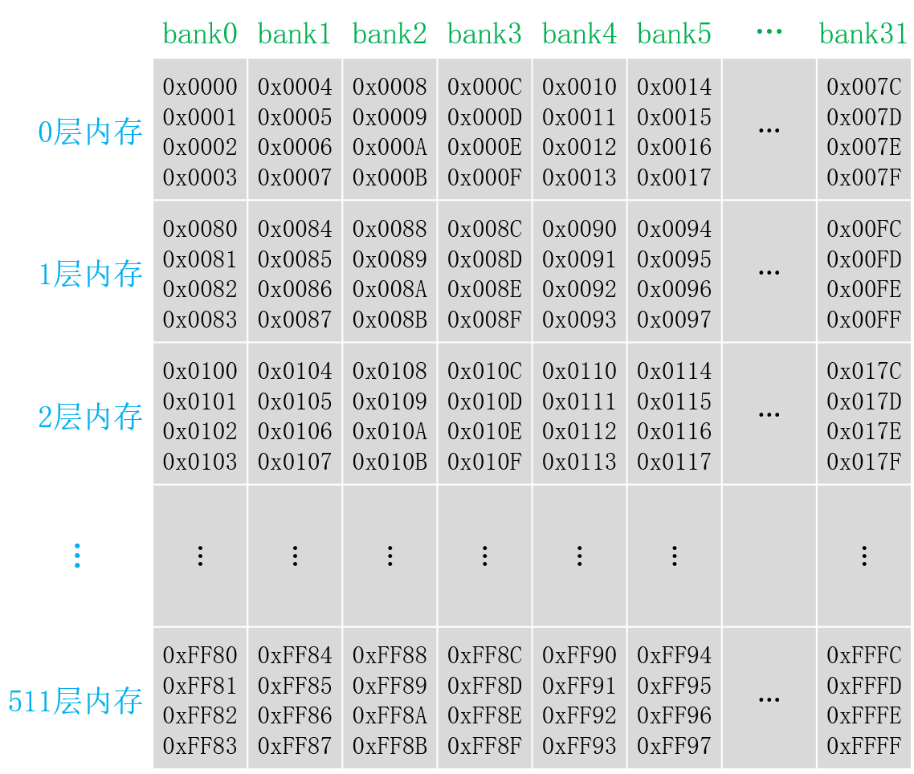
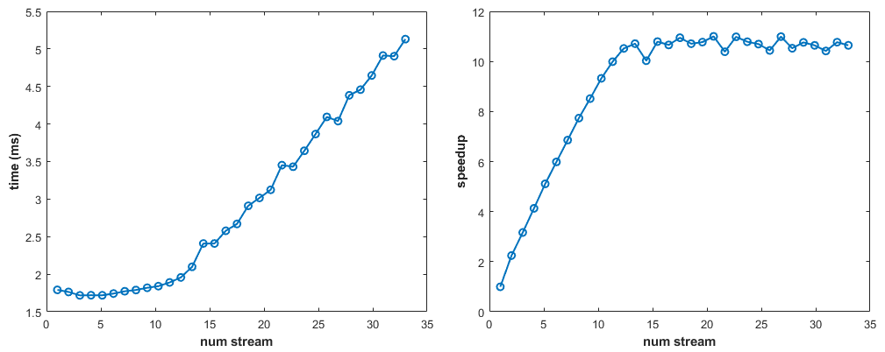

[toc]

在维基百科查询GPU与CUDA的各种信息，可在https://en.wikipedia.org/wiki/List_of_Nvidia_graphics_processing_units网站查询各GPU设备的硬件信息，可在https://en.wikipedia.org/wiki/CUDA网站查询各计算能力架构下的硬件规格配置。

# 一、GPU硬件与CUDA程序开发工具

## （一）GPU硬件简介

GPU是英文Graphics Processing Unit的首字母缩写，意为图形处理器，GPU也常被称为显卡（Graphics Card）。与它对应的一个概念是CPU，即Central Processing Unit（中央处理器）的首字母缩写。

从硬件的角度来看，一个GPU由若干**图形处理簇（Graphics Processing Cluster，GPC）**构成，每个GPC包含一些诸如光栅化引擎（Raster Engine）等部件。每个GPC由若干**流多处理器（streaming multiprocessor，SM）**构成，每个SM是相对独立的，而每个SM中有若干**流处理器（streaming processor，SP）**，流处理器又称为**CUDA核心**；若一个SM中的SP单元数量大于32个时，则每32个SP单元（物理上）构成一个分区，称为一个SM分区（partition）。

GPU计算不是指单独的GPU计算，而是CPU+GPU的异构（heterogeneous）计算。一块单独的GPU是无法独立地完成所有计算任务的，它必须在CPU的调度下才能完成特定任务。在由CPU和GPU构成的异构计算平台中，通常将起控制作用的CPU成为**主机（host）**，将起加速作用的GPU称为**设备（device）**。主机和（非集成）设备都有自己的DRAM内存，它们之间一般由PCIE总线连接。

CUDA（Compute Unified Device Architecture）是显卡厂商NVIDIA推出的运算平台，目前CUDA编程只支持NVIDIA推出的GPU，以下几个系列GPU都支持CUDA编程。

(1)Tesla系列：其中的内存为纠错内存（Error-Correcting Code，ECC），稳定性好，主要用于高性能、高强度的科学计算。

(2)Quadro系列：支持高速OpenGL（Open Graphics Library）渲染，主要用于专业绘图设计。

(3)GeForce系列：主要用于游戏与娱乐，但也常用于科学计算。GeForce系列的GPU没有纠错内存，用于科学计算时具有一定的风险。

(4)Jetson系列：嵌入式设备中的GPU系列。

每一款GPU都有一个用以表示其**计算能力（Compute Capability，CC）**的版本号，可以写为形如X.Y的形式，其中，X表示主版本号，Y表示次版本号。版本号决定了GPU硬件所支持的功能，可为应用程序在运行时判断硬件特征提供依据。CC版本号越大的GPU架构（architecture）越新，主版本号与GPU的核心架构相关。在主版本号相同时，具有较大次版本号的GPU的架构稍有更新。

可在https://developer.nvidia.com/cuda-gpus网站查询任何一款支持CUDA的GPU的信息。具体一个架构示例为https://images.nvidia.com/aem-dam/Solutions/design-visualization/technologies/turing-architecture/NVIDIA-Turing-Architecture-Whitepaper.pdf文档，其它架构可以查阅NVIDIA公司公布的各GPU架构的白皮书。

下表列出了各个GPU主计算能力的架构代号与名称。

| 年份 | 计算能力 | 架构代号             | Tesla系列                 | Quadro系列   | GeForce 系列             | Jetson系列 |
| ---- | -------- | -------------------- | ------------------------- | ------------ | ------------------------ | ---------- |
| 2006 | 1.0      | 特斯拉（Tesla）      |                           |              | GeForce 8/200/300系列    |            |
| 2010 | 2.0      | 费米（Fermi）        |                           |              | GeForce 400/500系列      |            |
| 2012 | 3.0      | 开普勒（Kepler）     | Tesla K系列               | Quadro K系列 | GeForce 600/700/800M系列 | Tegra K1   |
| 2014 | 5.0      | 麦克斯韦（Maxwell）  | Tesla M系列               | Quadro M系列 | GeForce 900系列          | Tegra X1   |
| 2016 | 6.0      | 帕斯卡（Pascal）     | Tesla P系列               | Quadro P系列 | GeForce 10系列           | Tegra X2   |
| 2017 | 7.0      | 伏特（Volta）        | Tesla V系列               |              |                          | AGX Xavier |
| 2018 | 7.5      | 图灵（Turning）      | Tesla T系列               | Quadro T系列 | GeForce 16/20系列        |            |
| 2020 | 8.0      | 安培（Ampere）       | Tesla A系列               |              | GeForce 30系列           | AGX Orin   |
| 2022 | 8.9      | 艾达（Ada·Lovelace） | Tesla L系列               |              | GeForce 40系列           |            |
| 2022 | 9.0      | Hopper               | Tesla H系列（H100、H200） |              |                          |            |
| 2024 | 10.0     | Blackwell            | Tesla B系列（B40）        |              | GeForce 50系列           |            |

需要注意的是，特斯拉（Tesla）既是第一代GPU架构的代号，也是科学计算系列GPU的统称，其具体含义要根据上下文确定。

值得注意的是，计算能力和性能没有简单的正比关系。计算能力并不等价于计算性能。例如，GeForce RTX 2000系列的计算能力高于Tesla V100，但后者在其他很多方面的性能更高（售价也高得多）。

表征计算性能的一个重要参数是浮点数运算峰值，即最多能**每秒执行的浮点数运算次数（Floating-Point Operations Per Second，FLOPS）**。GPU的浮点数运算峰值在10^12^FLOPS，即tera FLOPS（TFLOPS）的量级。浮点数运算峰值有单精度和双精度之分。对Tesla系列的GPU来说，双精度浮点数运算峰值一般是单精度浮点数运算峰值的1/2左右；对GeForce系列的GPU来说，双精度浮点数运算峰值一般是单精度浮点数运算峰值的1/32左右。

另一个影响计算性能的参数是GPU中的内存带宽（Memory Bandwidth）。GPU中的内存通常称为显存。显存容量也是制约应用程序性能的一个因素。如果一个应用程序所需要的显存数量超过了一个GPU的显存容量，则在不使用统一内存的情况下程序就无法正确运行。

## （二）CUDA开发工具

有多种软件开发工具，都可以用来进行GPU编程，如下所示。

(1)CUDA（Compute Unified Device Architecture），显卡厂商NVIDIA推出的运算平台，与其GPU显卡相适配。

(2)OpenCL（Open Computing Language），这是一个更为通用的为各种异构平台编写的并行程序框架，也是AMD（Advanced Micro Devices）公司的GPU的主要程序开发工具。

(3)OpenACC，这是一个由多个公司共同开发的异构并行编程标准。

CUDA提供了两层API接口供编程人员使用，即CUDA驱动（driver）API和CUDA运行时（runtime）API。其中，CUDA驱动API是更加底层的API，它为程序员提供了更为灵活的编程接口；CUDA运行时API是在CUDA驱动API的基础上构建的一个更为高级的API，更容易使用。这两种API在性能上几乎没有差别。从程序的可读性来看，使用CUDA运行时API是更好的选择；而在其他编程语言中使用CUDA时，驱动API很多时候是必需的。


上图展示了CUDA开发环境的主要组件。可以看到，开发的应用程序是以主机（CPU）为出发点的，应用程序可以调用CUDA运行时API、CUDA驱动API及一些已有的CUDA库，所有这些调用都将利用设备（GPU）的硬件资源。

CUDA版本也可由形如X.Y的两个数字表示，但它并不等同于GPU的计算能力。CUDA版本是GPU软件开发平台的版本，而计算能力对应着GPU硬件架构的版本。虽然它们之间没有严格的对应关系，但一个具有较高计算能力的GPU通常需要一个较高的CUDA版本才能支持。

如前所示，GPU计算实际上是CPU+GPU（主机+设备）的异构计算。在CUDA程序中，既有运行于主机的代码，又有运行于设备的代码。其中，运行于主机的代码需要由主机的C++编译器进行编译和链接。

> 注意，常用CUDA运行时API接口可以在CUDA/v11.8/include/cuda_runtime_api.h头文件中查看，类型定义可以在CUDA/v11.8/include/builtin_types.h头文件，及其所包含的driver_types.h头文件及vector_types头文件中查看。

## （三）用nvidia-smi检查与设置设备

可以通过nvidia-smi（nvidia's system management interface）程序检查与设置设备，它包含在CUDA开发工具套件内。该程序最基本的用法就是在终端中使用不带任何参数的nvidia-smi命令，会得到如下文本形式的输出。

```
+-----------------------------------------------------------------------------------------+
| NVIDIA-SMI 550.67                 Driver Version: 550.67         CUDA Version: 12.4     |
|-----------------------------------------+------------------------+----------------------+
| GPU  Name                 Persistence-M | Bus-Id          Disp.A | Volatile Uncorr. ECC |
| Fan  Temp   Perf          Pwr:Usage/Cap |           Memory-Usage | GPU-Util  Compute M. |
|                                         |                        |               MIG M. |
|=========================================+========================+======================|
|   0  NVIDIA GeForce RTX 4090        Off |   00000000:01:00.0 Off |                  Off |
|  0%   41C    P5             33W /  450W |      31MiB /  24564MiB |      0%      Default |
|                                         |                        |                  N/A |
+-----------------------------------------+------------------------+----------------------+
                                                                                         
+-----------------------------------------------------------------------------------------+
| Processes:                                                                              |
|  GPU   GI   CI        PID   Type   Process name                              GPU Memory |
|        ID   ID                                                               Usage      |
|=========================================================================================|
|    0   N/A  N/A      1027      G   /usr/lib/xorg/Xorg                              9MiB |
|    0   N/A  N/A      1199      G   /usr/bin/gnome-shell                           10MiB |
|    0   N/A  N/A     11716      C   python                                        N/A    |
+-----------------------------------------------------------------------------------------+
```

从中可以看出一些有用的信息。例如，上方表格第一行显示了NVIDIA Driver驱动的版本，以及所支持的最大CUDA版本。第二行为表格每列信息的标题；第三行为对应具体信息，具体每项表示意义如下。

- GPU，设备编号（从0开始），在多GPU系统中，可以通过设置CUDA_VISIBLE_DEVICES环境变量来控制使用哪个GPU设备。

- Name，设备名称，GPU类型名称。

- Persistence-M，对于架构较新的GPU设备，TCC/WDDM位置会变为Persistence-M，表示是否支持持久性内存，这是一种用于保存显卡驱动状态的特殊内存类型，以便在不需要重新加载的情况下加速显卡操作。可通过如下命令启用持久内存。

  - ```shell
    sudo nvidia-smi -g GPU_ID -pm 0  # 关闭
    sudo nvidia-smi -g GPU_ID -pm 1  # 启用
    ```

- TCC/WDDM，对于架构较旧的GPU设备，Persistence-M位置会变为TCC/WDDM，表示设备驱动运行模式，TTC表示Tesla Compute Cluster，用于集群计算，仅在Tesla、Quadro和Titan系列GPU中可选；WDDM表示Windows Display Driver Model，为显示模型，用于渲染显示图形化窗口。可通过如下命令修改运行模式。

  - ```shell
    sudo nvidia-smi -g GPU_ID -dm 0  # WDDM
    sudo nvidia-smi -g GPU_ID -dm 1  # TCC

- Fan，设备风扇转速。

- Temp，设备温度。

- Perf，设备性能状态，从P0（最大性能）到P12（最小性能）。

- Pwr:Usage/Cap，设备能耗，实际使用能耗/额定能耗。

- Bus-Id，设备总线信息。

- Disp.A，设备显示是否初始化（Display Active）。

- Memory-Usage，设备内存（显存）使用率。

- GPU-Util，设备使用率。

- Volatile Uncorr. ECC，设备是否开启错误检查和纠错内存技术，0为开启，1为关闭，N/A为不支持。

- Compute M.，设备计算模式，0为DEFAULT默认，1为EXCLUSIVE_PROCESS独占进程，2为PROHIBITED禁用。在默认模式中，同一个GPU中允许存在多个计算进程，但每个计算进程对应程序的运行速度一般来说会降低。在独占进程模式（E. Process），同一个GPU只能运行一个计算进程，但该模式不适用于处于WDDM的GPU设备。可通过如下命令修改计算模式。

  - ```shell
    sudo nvidia-smi -i GPU_ID -c 0  # DEFAULT
    sudo nvidia-smi -i GPU_ID -c 1  # EXCLUSIVE_PROCESS
    ```

- MIG M.，设备多实例模式（Multi-Instance GPU Mode），通过划分技术，将一个GPU设备划分为多个GPU实例。

- Processes，设备目前运行的进程情况。

注意，更详细的GPU与CUDA信息，可使用CUDA安装目录下的CUDA/v11.8/extras/demo_suite/deviceQuery可执行程序查询。

NVIDIA官方文档网址为https://docs.nvidia.com/cuda，其包括安装指南、编程指南、针对GPU架构的优化指南、各种CUDA API手册等。

## （四）用NVCC编译CUDA程序

首先明确，GPU只是一个设备，它要工作的话，还需要有一个主机（CPU）给它下达命令。所以，一个使用GPU的CUDA程序既有主机代码（由CPU执行），又有设备代码（由GPU执行）；主机对设备的调用是通过核函数（Kernel Function）来实现的。所以，一个典型的CUDA程序的结构具有下面的形式。

```c++
__global__ void func_cuda_kernel(data_on_device) { /* body */; }

int main(int argc, char* argv[]) {
    host_code_pre();
    func_cuda_kernel<<<gird_size, block_size>>>(data_on_device);
    host_code_post();
    return 0;
}
```

CUDA中的核函数与C++中的函数是类似的，但一个显著的差别是，它必须被限定词\_\_global\_\_修饰，此外，核函数的返回类型必须为void空。

众所周知，在编写C++程序时，需要在源文件中包含一些标准的头文件。CUDA中也有一些头文件，但是在使用NVCC编译器编译.cu文件时，将自动包含必要的CUDA头文件，例如cuda.h和cuda_runtime.h头文件，又因为cuda.h头包含stdlib.h头文件，故使用NVCC编译CUDA程序时，甚至不需要在.cu文件中包含stdlib.h头。当然，程序员可手动在.cu文件中包含所需头文件，因为正确编写的头文件不会在一个编译单元中被包含多次。

CUDA程序的源文件用.cu作为扩展名。CUDA程序的编译器NVCC在编译一个CUDA程序时，先将全部源代码分离为主机代码和设备代码，主机代码（纯粹C++代码）交给C++编译器（例如g++或cl）负责编译，而设备代码（剩余部分）则由NVCC负责编译。主机代码完整地支持C++语法，但设备代码只部分地支持C++语法。

对于设备代码，NVCC先将设备代码编译为虚拟的**PTX（Parallel Thread Execution）伪汇编代码**，它是一种中间表示；再将PTX代码编译为二进制的cubin目标代码，可以由机器直接执行的二进制目标代码对应的汇编称为**SASS（Streaming Assembly）流汇编代码**，它是基于特定GPU架构的。

在将.cu源代码编译为PTX代码时，需要用编译器选项-arch=compute_XY指定一个虚拟架构的计算能力，用以确定代码中能够使用的CUDA功能。在将PTX代码编译为cubin代码时，需要用选项-code=sm_ZW指定一个真实架构的计算能力，用以确定可执行文件能够使用的GPU设备。真实架构的计算能力必须大于等于虚拟架构的计算能力。如果仅针对一个GPU编译程序，一般情况下建议将以上两个计算能力都指定为目标GPU的计算能力。

用以上的方式编译出来的可执行文件，只能在少数几个GPU中才能运行。选项-code=sm_ZW指定GPU的真实架构的计算能力为Z.W，对应的可执行文件只能在主版本号为Z，且次版本号大于等于W的GPU中运行。

如果希望编译出来的可执行文件能够在更多的GPU中执行，可以使用-gencode选项，同时指定多组计算能力，每一组用如下形式的编译选项。

```shell
-gencode arch=compute_XY,code=sm_ZW
```

例如，使用如下选项进行编译。

```shell
nvcc demo.cu -o demo.exe             \
-gencode arch=compute_35,code=sm_35  \
-gencode arch=compute_50,code=sm_50  \
-gencode arch=compute_60,code=sm_60  \
-gencode arch=compute_70,code=sm_70
```

编译出来的可执行文件将包含4个二进制文件版本，这样可执行文件称为**胖二进制文件（fatbinary）**，其在不同架构的GPU中运行是会自动选择对应的二进制版本。需要注意的是，指定多个计算能力，会增加编译时间和可执行文件大小。

NVCC有一种称为即时编译（just-in-time compilation）的机制，可以在运行可执行文件时，从其中保留的PTX代码，临时编译出一个cubin目标代码。要在可执行文件中保留（或者说嵌入）一个这样的PTX代码，就必须用如下方式指定所保留PTX代码的虚拟架构，如下所示。

```shell
-gencode arch=compute_XY,code=compute_XY
```

这里的两个计算能力都是虚拟架构的计算能力，必须完全一致。使用示例如下所示。

```shell
nvcc demo.cu -o demo.exe             \
-gencode arch=compute_60,code=sm_60  \
-gencode arch=compute_70,code=sm_70  \
-gencode arch=compute_80,code=sm_80  \
-gencode arch=compute_80,code=compute_80
```

其中，前3行的选项分别对应3个真实架构的cubin目标代码，第4行的选项对应保留的PTX代码，这样编译出来的可执行文件可以直接在计算能力为8.Y的GPU中运行，只不过不一定能充分利用其硬件功能。在8.Y架构的GPU中运行时，会根据虚拟架构为8.0的PTX代码即时地编译出一个适用于当前GPU的目标代码。

除上述编译器选项外，还有一个简化的编译器选项，如下所示。

```shell
-arch=sm_XY
```

它等价于

```shell
-gencode arch=compute_XY,code=sm_XY
-gencode arch=compute_XY,code=compute_XY
```

此外，也可以不为NVCC指定目标计算能力，此时会使用默认的目标计算能力。对于CUDA 6.0及更早，默认计算能力为1.0；对于CUDA 6.5至CUDA 8.0，默认计算能力为2.0；对于CUDA 9.0至CUDA 10.2，默认计算能力为3.0。将来更新版本的情况，请查阅CUDA官网信息。

# 二、CUDA的线程组织

一个典型的CUDA程序如下所示。注意，CUDA程序不支持C++的iostream库。

```c++
// main.cpp

extern void say_hello_cuda_call(
    unsigned int gDimx, unsigned int gDimy, unsigned int gDimz, 
    unsigned int bDimx, unsigned int bDimy, unsigned int bDimz);

int main(int argc, char* argv[]) {
    say_hello_cuda_call(1,1,1, 2,3,1);
    return 0;
}
```

```c++
// hello.cu

#include <stdio.h>
#include <stdlib.h>
#include <cuda.h>
#include <cuda_runtime.h>

__global__ void say_hello_cuda_kernel() {
    printf("Hello, love from (%d,%d,%d)(%d,%d,%d).\n", 
        blockIdx.x, blockIdx.y, blockIdx.z, threadIdx.x, threadIdx.y, threadIdx.z);
}

extern __host__ void say_hello_cuda_call(
    unsigned int gDimx, unsigned int gDimy, unsigned int gDimz, 
    unsigned int bDimx, unsigned int bDimy, unsigned int bDimz) {
    printf("[gridDim.x = %d, gridDim.y = %d, gridDim.z = %d]\n", gDimx, gDimy, gDimz);
    printf("[blockDim.x = %d, blockDim.y = %d, blockDim.z = %d]\n", bDimx, bDimy, bDimz);
    dim3 gDim(gDimx, gDimy, gDimz);
    dim3 bDim(bDimx, bDimy, bDimz);
    say_hello_cuda_kernel<<<gDim, bDim>>>();
    cudaDeviceSynchronize();
}
```

```shell
g++ -c main.cpp -o main.o
nvcc -c hello.cu -o hello.o
nvcc main.o hello.o -o run
./run
```

```
[gridDim.x = 1, gridDim.y = 1, gridDim.z = 1]
[blockDim.x = 2, blockDim.y = 3, blockDim.z = 1]
Hello, love from (0,0,0)(0,0,0).
Hello, love from (0,0,0)(1,0,0).
Hello, love from (0,0,0)(0,1,0).
Hello, love from (0,0,0)(1,1,0).
Hello, love from (0,0,0)(0,2,0).
Hello, love from (0,0,0)(1,2,0).
```

可以看到，对核函数say_hello_cuda_kernel进行调用时，函数名和参数括号()之间，存在一对<<<grid_size,block_size>>>三括号，其中指定核函数运行线程的信息。一块GPU中有很多个计算核心，可以支持很多线程（thread）同时执行，主机在调用一个核函数时，必须指明需要在设备中指派多少个线程，否则设备不知道如何工作。三括号中的信息就是用来指明核函数中的线程数目及其排列情况的。

在调用核函数之后，调用了CUDA运行时API提供的cudaDeviceSynchronize()函数，以使得CUDA同步主机与设备。在CUDA调用printf()输出函数时，输出流是先存放在缓冲区中，而缓冲区不会自动刷新，只有程序遇到某种同步操作时，缓冲区才会刷新。调用cudaDeviceSynchronize()函数的作用是同步主机与没备，以促使缓冲区刷新，否则终端将不会显示输出的字符串。

需要注意的是，核函数的调用是异步的，即主机调用核函数后，会继续执行之后的语句，使用同步函数cudaDeviceSynchronize()可以使主机等待设备上的核函数执行完成。或者可以将环境变量CUDA_LAUNCH_BLOCKING设为1，表示以阻塞方式调用核函数，也即主机调用一个核函数后，必须等待核函数执行完成。这样的设置一般仅适用于调试程序，因为它会影响程序性能。

## （一）线程块与网格

核函数中的线程通常组织为若干**线程块（thread block）**，一个核函数的全部线程块构成一个**网格（grid）**。三括号中的第一项即线程块的数目，也即网格维度，称为网格大小（grid size）；第二项即每个线程块中线程的数目，也即线程块维度，称为线程块大小（block size）。所以，核函数中的线程总数就等于网格大小乘以线程块大小。

> 在并行编程中存在协作线程组（Cooperative Thread Array，CTA）的概念，协作组中的线程可以互相通信，且执行相同的指令。CTA对应到CUDA编程模型中，即是指线程块的概念。在CUDA中也提供协作组（cooperative groups）的概念，其是线程块和线程束同步机制的推广，它提供了更为灵活的线程协作方式，包括线程块内部（线程块级别）的同步协作，线程块之间（网格级别）的同步协作，设备之间的同步协作。

一个GPU往往有几千个计算核心，当总线程数大于计算核心数时，才能更充分地利用GPU中的计算资源，因为这会让计算和内存访问之间及不同的计算之间合理地重叠，从而减小计算核心空闲的时间。一般来说，只要线程数比GPU中的计算核心数（几百甚至几千）多几倍时，就有可能充分利用GPU中的全部计算资源。需要指出，虽然可指定核函数的线程数，但在执行时同时活跃（不活跃的线程处于等待状态）的线程数是由硬件（主要是CUDA核心数）和软件（核函数代码）决定的。

CUDA中对对能够定义的网格大小和线程块大小做了限制。从GPU计算能力3.0开始，最大允许的网格大小在x,y,z三个维度分别是2^31^-1,65535,65535；最大允许的线程块大小在x,y,z三个维度分别是1024,1024,64；此外，还要求线程块最大线程数目不得超过1024，即blockDim三成员之积不得大于1024。这些限制是必须牢记的。

## （二）核函数执行配置

由前所述，可以为一个核函数指派多个线程，而这些线程的组织结构由一对三括号指定，称为**执行配置（execution configuration）**，如下所示：

```c++
<<<grid_size, block_size>>>
/* or */
<<<blocks_layout, threads_layout>>>
```

这里的grid_size（网格大小）和block_size（线程块大小），一般来说是结构体类型的变量，结构体类型的定义如下所示；但也可以使用普通整型变量，此时会自动使用结构体类型的构造方法。

```c++
struct __device_builtin__ dim3 {
    unsigned int x, y, z;
    __host__ __device__ constexpr dim3(unsigned int vx = 1, unsigned int vy = 1, unsigned int vz = 1)
        : x(vx), y(vy), z(vz) {}
    __host__ __device__ constexpr dim3(uint3 v) : x(v.x), y(v.y), z(v.z) {}
    __host__ __device__ constexpr operator uint3(void) const { return uint3{x, y, z}; }
};
typedef __device_builtin__ struct dim3 dim3;
```

在核函数内部，程序知道配置参数grid_size,block_size的值，它们保存于两个内建变量（built-in variable），如下所示。

```c++
dim3 __device_builtin__ __STORAGE__ gridDim;   // == grid_size
dim3 __device_builtin__ __STORAGE__ blockDim;  // == block_size
```

每个线程在核函数中都有一个唯一的身份标识，也有两个内建的变量作为线程的标识。

```c++
struct __device_builtin__ uint3 {
    unsigned int x, y, z;
};
typedef __device_builtin__ struct uint3 uint3;
```

```c++
uint3 __device_builtin__ __STORAGE__ blockIdx;   // [0, gridDim - 1]
uint3 __device_builtin__ __STORAGE__ threadIdx;  // [0, blockDim - 1]
```

有上述dim3和uint3的结构体定义可以看出，内建变量gridDim,blockDim,blockIdx,threadIdx都具有x,y,z三个无符号整型成员。若只使用一维整型作为执行配置，则默认使用其中的.x成员，而.y和.z成员使用1的默认值，在这种情况下，网格和线程块可看作是一维的。

实际上，多维的网格和线程块本质上还是一维的，就像“多维数组本质上也是一维数组，在内存中顺序存储”一样。根据上述内建变量，计算某个线程在其所在线程块之中的一维标识的公式如下所示。

```c++
int tid = threadIdx.z * blockDim.x * blockDim.y + threadIdx.y * blockDim.x + threadIdx.x;
```

也就是说，x维度是最内层的（变化速度最快），y维度是中间层的（变化速度中等），z维度是最外层的（变化速度最慢）。

此外，因为**各个线程块的执行是独立的**，故计算某个线程块在其网格中的一位标识的公式，没有唯一定义，一个类似的计算公式可如下所示。

```c++
int bid = blockIdx.z * gridDim.x * gridDim.y + blockIdx.y * gridDim.x + blockIdx.x;
```

一个线程块还可以细分为不同的**线程束（thread warp）**，一个线程束（即一束线程）是同一个线程块中的相邻的warpSize个线程，其中warpSize也是一个内建变量，表示线程束的大小，如下所示。

```c++
int __device_builtin__ __STORAGE__ warpSize;
```

目前，对于所有GPU架构来说，warpSize的值都是32。所以，一个线程束就是连续的32个线程，具体的说，一个线程块中的第0\~31号线程属于0号线程束，第32\~63号线程属于1号线程束，以此类推。

一般情况下，不同线程块的数据样本是完全不同的，例如，有batch_size个数据样本，一个样本对应一个线程块，这时在核函数中无需考虑线程块的id索引。但有时，同一个数据样本可能会划分到不同的线程块上，例如，将一维数组进行划分，不同线程块处理数组中的不同部分，则需要考虑包括线程块id和线程id在内的全局索引，一种计算方式如下所示。

```c++
int bid = blockIdx.z * gridDim.x * gridDim.y + blockIdx.y * gridDim.x + blockIdx.x;
int tid = threadIdx.z * blockDim.x * blockDim.y + threadIdx.y * blockDim.x + threadIdx.x;
tid = tid + bid * blockDim.x * blockDim.y * blockDim.z;
```

# 三、简单CUDA程序的基本框架

在CUDA运行时API中，没有明确的初始化GPU设备的函数。在第一次调用“和设备管理及版本查询功能无关的”运行时API函数时，设备将自动初始化。所有的CUDA运行时函数都以cuda前缀开头。

以一个简单的计算为例，求两个相等长度的一维数组的对应元素之和。

```c++
// main.cpp

extern void add_cuda_call(const double *h_x, const double *h_y, double *h_z, const int len);

int main(int argc, char* argv[]) {
    const int len = 1e8;
    double *h_x = (double*)malloc(sizeof(double) * len);
    double *h_y = (double*)malloc(sizeof(double) * len);
    double *h_z = (double*)malloc(sizeof(double) * len);
    for (int i = 0; i < len; i++) {
        h_x[i] = i * 0.1;
        h_y[i] = i * 0.01;
    }
    add_cuda_call(h_x, h_y, h_z, len);
    // using array h_z.
    free(h_x);
    free(h_y);
    free(h_z);
    return 0;
}
```

```c++
// add.cu

__global__ void add_cuda_kernel(const double *d_x, const double *d_y, double *d_z, const int len) {
    int bid = blockIdx.z * gridDim.x * gridDim.y + blockIdx.y * gridDim.x + blockIdx.x;
    int tid = threadIdx.z * blockDim.x * blockDim.y + threadIdx.y * blockDim.x + threadIdx.x;
    tid = tid + bid * blockDim.x * blockDim.y * blockDim.z;
    if (tid < len) d_z[tid] = d_x[tid] + d_y[tid];
}

extern __host__ void add_cuda_call(const double *h_x, const double *h_y, double *h_z, const int len) {
    cudaError_t stat;
    // Choose which GPU to run on, change this on a multi-GPU system.
    stat = cudaSetDevice(0);
    
    double *d_x, *d_y, *d_z;
    stat = cudaMalloc((void**)&d_x, sizeof(double) * len);
    stat = cudaMalloc((void**)&d_y, sizeof(double) * len);
    stat = cudaMalloc((void**)&d_z, sizeof(double) * len);
    stat = cudaMemcpy(d_x, h_x, sizeof(double) * len, cudaMemcpyHostToDevice);
    stat = cudaMemcpy(d_y, h_y, sizeof(double) * len, cudaMemcpyHostToDevice);

    const int bDimx = 128;
    const int gDimx = len % bDimx == 0 ? len / bDimx : len / bDimx + 1;
    const dim3 bDim(bDimx, 1, 1);
    const dim3 gDim(gDimx, 1, 1);
    add_cuda_kernel<<<gDim, bDim>>>(d_x, d_y, d_z, len);
    // Check for any errors launching the kernel
    stat = cudaGetLastError();

    stat = cudaMemcpy(h_z, d_z, sizeof(double) * len, cudaMemcpyDeviceToHost);
    cudaFree(d_x);
    cudaFree(d_y);
    cudaFree(d_z);
    
    // Actually, every CUDA Runtime API needs a status check, here omit it for clarity.
    if (stat != cudaSuccess) {
        fprintf(stderr, "add_cuda_call failed!");
        exit(1);
    }
}
```

注意，为区分主机和设备中的变量，遵循CUDA编程的传统，使用d\_作为设备变量的前缀，使用h\_作为主机变量的前缀。

在对核函数进行调用时，为了确保每个元素都有线程执行，当一个线程仅处理一个元素时，需确保线程总数大于等于元素总数，并在核函数中使用if判断。设存在len个元素，线程块中的线程数量为block_size（即thread_num），则需要确定网格中线程块的数量grid_size（即block_num），以下三种方式是等价的。

```c++
int grid_size = len % block_size == 0 ? len / block_size : len / block_size + 1;
int grid_size = (len - 1) / block_size + 1;
int grid_size = (len + block_size - 1) / block_size;  // 推荐
```

## （一）设备内存的使用

正如在C++可有malloc()函数动态分配主机内存，在CUDA中，可由cudaMalloc()函数动态分配设备内存，函数原型如下。

```c++
extern __host__ __cudart_builtin__ cudaError_t cudaMalloc(void **devPtr, size_t size);
```

- devPtr参数，待分配设备内存的指针。
- size参数，待分配设备内存的字节数。

函数返回值是一个枚举cudaError_t类型的变量值，表示错误代号，如果函数执行成功，则返回cudaSuccess值。

```c++
enum __device_builtin__ cudaError {
    cudaSuccess                   = 0,
    cudaErrorInvalidValue         = 1,
    cudaErrorMemoryAllocation     = 2,
    cudaErrorInitializationError  = 3,
    /* ... */
}
typedef __device_builtin__ enum cudaError cudaError_t;
```

用cudaMalloc()函数分配的设备内存，需要使用cudaFree()函数释放，函数原型如下。

```c++
extern __host__ __cudart_builtin__ cudaError_t cudaFree(void *devPtr);
```

此外，从计算能力2.0开始，CUDA还允许在核函数内部用malloc()和free()动态地分配与释放一定数量的全局内存。一般情况下，这样容易导致较差的程序性能，不建议使用。

在分配设备内存后，就可以使用CUDA运行时的cudaMemcpy()，进行主机内存和设备内存之间的数据交换，将源地址的一定字节的数据，复制到目标地址，函数原型如下。

```c++
extern __host__ cudaError_t cudaMemcpy(void *dst, const void *src, size_t count, enum cudaMemcpyKind kind);
```

- dst参数，目标地址，可以是主机地址，也可以是设备地址。

- src参数，源地址，可以是主机地址，也可以是设备地址。

- count参数，复制数据的字节数。

- kind参数，枚举cudaMemcpyKind类型的变量值，标志复制数据的传输方向，它只能取如下几个值。

  - ```c++
    enum __device_builtin__ cudaMemcpyKind {
        cudaMemcpyHostToHost          =   0,      /* Host   -> Host   */
        cudaMemcpyHostToDevice        =   1,      /* Host   -> Device */
        cudaMemcpyDeviceToHost        =   2,      /* Device -> Host   */
        cudaMemcpyDeviceToDevice      =   3,      /* Device -> Device */
        cudaMemcpyDefault             =   4       /* Direction of the transfer is inferred */
    };
    ```

  - 其中，值为0,1,2,3的前4个枚举值，可以手动指定数据的传输方向；cudaMemcpyDefault枚举值表示根据指针dst和src所指向的地址，自动推断数据的传输方向，这要求系统支持统一虚拟寻址（unified virtual addressing）的功能，要求主机是64位主机。CUDA目前正在逐步放弃对32位主机的支持，故一般情况下用该选项自动确定数据传输方向是没有问题的。

函数返回值是一个枚举cudaError_t类型的变量值，如果函数执行成功，则返回cudaSuccess值。

## （二）核函数的要求

核函数必须使用\_\_global\_\_限定符，也可加上其他C++限定符，例如static，多个限定符的次序无要求。

核函数的返回类型必须是void，虽然可在核函数中使用return关键字，但不能返回任何值。

核函数名无特殊要求，而且支持C++中的重载，即可用同一个函数名表示具有不同参数列表的函数。

核函数不支持可变数量的参数列表，即参数的个数必须确定。

除非使用同统一内存编址机制，否则传递给核函数的指针必须指向设备内地的地址。

核函数不可成为一个类的成员，通常的做法是用一个包装函数xxx_call()调用核函数xxx_kernel()，而将包装函数定义为类的成员。

在计算能力3.5之前，核函数之间不能相互调用；从计算能力3.5开始，CUDA引入动态并行（dynamic parallelism）机制，在核函数内部可以调用其他核函数，甚至可以递归地调用自己。

无论是从主机调用，还是从设备调用，核函数都是在设备中执行。调用核函数时必须指定执行配置，即三括号及其参数。

## （三）函数执行空间标识符

核函数可以调用不带执行配置的自定义函数，这样的自定义函数成为设备函数（device function），它是在设备中执行，并在设备中被调用的。与之相比，核函数是在设备中执行，但在主机端被调用的。设备函数可采用返回值、指针、引用传递计算结果。

在CUDA程序中，由以下标识符确定一个函数是何种函数，以确定其在哪里执行，以及在哪里被调用。

由\_\_global\_\_修饰的函数为**核函数（kernel function）**，一般由主机调用，在设备中执行。如果使用动态并行，则也可以在核函数中调用核函数。

由\_\_device\_\_修饰的函数为**设备函数（device function）**，只能被核函数或其他设备函数调用，在设备中执行。

由\_\_host\_\_修饰的函数为**主机函数（host function）**，由主机调用，在主机中执行，即主机端的普通C++函数。对于主机端的函数，该修饰符可以省略。之所以提供这样一个修饰符，是因为有时可以用\_\_host\_\_和\_\_device\_\_同时修饰一个函数，使得该函数既是一个主机端的C++普通函数，也是一个设备函数。这样做可以避免重复编写代码，编译器将针对主机和设备分别编译该函数。

注意，不能同时使用\_\_global\_\_和\_\_device\_\_修饰一个函数，即不能将一个函数同时定义为核函数和设备函数；不能同时使用\_\_global\_\_和\_\_host\_\_修饰一个函数，即不能将一个函数同时定义为核函数和主机函数。

编译器NVCC会自动决定是否把一个设备函数作为内联函数（inline function）或非内联函数，可以使用限定符\_\_noinline\_\_建议一个设备函数为非内联函数（编译器不一定接受），也可以用限定符\_\_forceinline\_\_建议一个设备函数为内联函数。

## （四）CUDA中常用的数据类型

除了诸如C++语言中基本的数据类型bool、char、int、long、long long、float、double及其无符号unsigned版本之外，CUDA编程为实现数据的向量化传输，又额外提供了最高4个数据的向量化类型，例如float向量化类型如下所示，其他类型与之相似。

```c++
struct __device_builtin__               float1 { float x;          };
struct __device_builtin__ __align__(8)  float2 { float x, y;       };
struct __device_builtin__               float3 { float x, y, z;    };
struct __device_builtin__ __align__(16) float4 { float x, y, z, w; };
typedef __device_builtin__ struct float1 float1;
typedef __device_builtin__ struct float2 float2;
typedef __device_builtin__ struct float3 float3;
typedef __device_builtin__ struct float4 float4;
```

对于向量化类型，可以使用如下语句进行向量化读写，如下所示。

```c++
// 注意，若采用4个float向量化读写，则地址 addr_ptr 应按 4 * sizeof(float) 对齐，否则会出
float *addr_ptr;  // 数据的内存地址，可以是设备全内存或设备共享内存
float data[4];    // 可采用4个float的数组
*reinterpret_cast<float4*>(data) = *reinterpret_cast<float4*>(addr_ptr);  // 读
*reinterpret_cast<float4*>(addr_ptr) = *reinterpret_cast<float4*>(data);  // 写
float4 data_v4;   // 可直接采用float4类型
data_v4 = *reinterpret_cast<float4*>(addr_ptr);  // 读
*reinterpret_cast<float4*>(addr_ptr) = data_v4;  // 写
```

此外，为支持复数计算，CUDA目前提供了对float与double的复数类型的支持。

```c++
typedef float2 cuFloatComplex;
typedef double2 cuDoubleComplex;
typedef cuFloatComplex cuComplex;
```

可以看到，一个cuComplex复数类型的实部与虚部分别存储在x与y成员变量中，其在内存中是相邻连续存储的，且实部在虚部之前，多个复数的实部虚部交叉连续存储。这与C++11中引入的std::complex\<Type\>存储策略一致，因而两种类型可以相互转换。

# 四、CUDA程序的错误检测

有的错误在编译的过程中就可以被编译器检查出来，称为编译错误。有的错误在编译期间没有被发现，但在运行期间出现，称为运行时错误，此类错误较难排查。

```c++
// marco.cuh
#ifndef MARCO_CUH
#define MARCO_CUH

#ifndef CUDA_CALL
#define CUDA_CALL(call) do {                                                                      \
    const cudaError_t stat = (call);                                                              \
    if (stat != cudaSuccess) {                                                                    \
        fprintf(stderr, "CUDA Error at File '%s', at Line '%d'\n", __FILE__, __LINE__);           \
        fprintf(stderr, "     Error Code: %d, Error Text: %s\n", stat, cudaGetErrorString(stat)); \
        cudaDeviceReset();                                                                        \
    }                                                                                             \
} while(0);
#endif

#endif
```

其中，代码中使用了do-while(0)，这是C语言中常用的编程技巧。它创建了一个作用域，允许在其中使用局部变量，而无需考虑变量名重复。在宏定义中使用，可以让宏定义中的多条语句在逻辑上看起来像是一个语句，这样不管在调用代码中怎么使用分号和大括号，该宏总能确保其行为是一致的。

上述宏定义用于检查CUDA运行时API的调用，可如CUDA_CALL(cudaMalloc((void\*\*)d_x, sizeof(double)\*len));之类的形式使用。这个宏可以用于绝大部分CUDA运行时API函数，有一个例外是cudaEventQuery()函数，它很有可能返回cudaErrorNotReady，但这并不代表程序出现了错误。

上述方法不能捕捉核函数中的错误，因为核函数不返回任何值，可以通过在调用核函数之后，添加如下两条语句来捕获核函数中的错误。

```c++
CUDA_CALL(cudaGetLastError());
CUDA_CALL(cudaDeviceSynchronize());  // optional, any else function which synchronizes device is ok.
```

需要注意的是，上述同步函数是比较耗时的，如果在程序的较内层循环使用，很可能会严重降低程序性能。所以，一般不在程序的较内层循环使用同步函数。只要在核函数的调用之后还有对其他任何能返回错误值的API函数进行同步调用，都将触发主机与设备之间的同步，并能捕捉到核函数调用中可能发生的错误。

CUDA提供了名为CUDA-MEMCHECK的工具集，具体包括memcheck、racecheck、initcheck、syncchekc共4个工具，它们可由可执行文件cuda-memcheck调用，如下所示。

```shell
cuda-memcheck --tool memcheck  [options] app_name [options]
cuda-memcheck --tool racecheck [options] app_name [options]
cuda-memcheck --tool initcheck [options] app_name [options]
cuda-memcheck --tool syncchekc [options] app_name [options]
```

对于memcheck工具，可简化为

```shell
cuda-memcheck [options] app_name [options]
```

对于某个CUDA可执行文件，其示例如下所示。

```shell
cuda-memcheck run.exe
```

```
========= CUDA-MEMCHECK
========= ERROR SUMMARY: 0 errors
```

上述cuda-memcheck工具将被弃用，推荐使用compute-sanitizer工具，等价使用方式如下所示。

```shell
compute-sanitizer --launch-timeout=0 --tool=memcheck run.exe 2>&1 > result.txt
```

最后，介绍一种编程技巧，可以使用条件编译的方式选择程序中所使用浮点数的精度，即在程序初始化时，添加如下几行代码。为便于使用，将其写在mydef.h头文件中，并假设后续程序默认包含该头文件。

```c++
// mydef.h
#ifndef MYDEF_H
#define MYDEF_H

#ifdef USE_DP
    typedef double real;
    const real EPSILON = 1.e-15;
#else
    typedef float real;
    const real EPSILON = 1.e-6f;
#endif

#endif
```

当宏USE_DP有定义时，程序中的real代表double类型，否则代表float类型，该宏定义可以使用-D USE_DP编译选项为编译器指定。

# 五、获得GPU加速的关键

在开发CUDA程序时往往要验证某些改变是否提高了程序的性能，这就需要对程序进行比较精确的计时。

## （一）用CUDA事件计时

在C++中，有多种方法可以对一段代码进行计时，可以使用GCC和MSVC都有的clock()函数和头文件\<chrono\>的时间库，或者使用GCC中的gettimeofday()函数，或者使用MSVC中的QueryPerformanceCounter()函数和QueryPerformanceFrequency()函数等。

CUDA提供了一种基于CUDA事件（CUDA event）的计时方式，可用来给一段CUDA代码（可包含主机代码和设备代码）计时，如下所示。

```c++
void time_it() {
    cudaEvent_t start, end;
    cudaEventCreate(&start);
    cudaEventCreate(&end);
    cudaEventRecord(start);
    cudaEventQuery(start);

    /* Code to be measured */

    cudaEventRecord(end);
    cudaEventSynchronize(end);
    float elapsed_time;
    cudaEventElapsedTime(&elapsed_time, start, end);
    cudaEventDestroy(start);
    cudaEventDestroy(end);
    printf("Elapsed Time = %g ms.\n", elapsed_time);
}
```

可以看到，首先定义两个CUDA事件类型（cudaEvent_t）的变量，并使用cudaEventCreate()对其初始化，在代码的最后再使用cudaEventDestroy()对事件进行销毁。然后使用cudaEventRecord(start)记录一个代表开始的事件。

需要注意的是cudaEventQuery()函数，对于设备WDDM运行模式来说必须保留，而对于设备TCC运行模式可以省略。这是因为，对于处于WDDM驱动模式的GPU来说，一个CUDA流（CUDA stream）中的操作（例如这里的cudaEventRecord()函数），并不是直接提交给GPU执行，而是先提交到一个软件队列，需要添加一条对该流的cudaEventQuery()操作（或者使用cudaEventSynchronize()函数），以刷新队列，才能促使前面的操作在GPU执行。

接下来即是需要计时的代码块，它可以是一段主机代码，例如对一个主机函数的调用，也可以是一段设备代码，例如对一个核函数的调用，还可以是一段混合代码。通常来说，为例避免CPU和GPU的预热时间也被统计，通常先执行一次代码块（称为warming-up预热），然后再迭代统计若干次代码块的执行时间，最后取所统计时间的平均值（或最好的统计时间）。

然后，使用cudaEventRecord(end)记录一个代表结束的事件，并使用cudaEventSynchronize()函数让主机等待end结束事件被记录完毕。之后，即可调用cudaEventElapsedTime()函数统计start和end两个事件之间的时间差，即可表示被测试代码段的执行时间，该时间差的单位是毫秒（ms）。

为便于使用，将上述统计时间的代码封装为宏，并单独写在一个头文件timer.h中，如下所示。

```c++
// timer.cuh
#ifndef TIMER_CUH
#define TIMER_CUH

#define time_it(__call, __repeat) do {                        \
    cudaEvent_t __start, __end;                               \
    cudaEventCreate(&__start);                                \
    cudaEventCreate(&__end);                                  \
    cudaEventRecord(__start);                                 \
    cudaEventQuery(__start);                                  \
    (__call);                                                 \
    for (int __i = 0; __i < __repeat; __i++) (__call);        \
    cudaEventRecord(__end);                                   \
    cudaEventSynchronize(__end);                              \
    float __elapse;                                           \
    cudaEventElapsedTime(&__elapse, __start, __end);          \
    cudaEventDestroy(__start);                                \
    cudaEventDestroy(__end);                                  \
    printf("Elapse = %g ms, Average = %g ms, Repeat = %d.\n", \
            __elapse, __elapse / __repeat, __repeat);         \
} while (0);
// #define time_it(__call, __repeat)

#define time_it_v2(__call, __repeat, __ave) do {              \
    cudaEvent_t __start, __end;                               \
    cudaEventCreate(&__start);                                \
    cudaEventCreate(&__end);                                  \
    cudaEventRecord(__start);                                 \
    cudaEventQuery(__start);                                  \
    (__call);                                                 \
    for (int __i = 0; __i < __repeat; __i++) (__call);        \
    cudaEventRecord(__end);                                   \
    cudaEventSynchronize(__end);                              \
    float __elapse;                                           \
    cudaEventElapsedTime(&__elapse, __start, __end);          \
    __ave = __elapse / __repeat;                              \
    cudaEventDestroy(__start);                                \
    cudaEventDestroy(__end);                                  \
} while (0);
// #define time_it_v2(__call, __repeat, __ave)

#endif
```

### 1. 为C++程序计时

先考虑C++版本的程序，该程序中没有使用核函数，仍为其使用.cu扩展名，并使用NVCC进行编译。对于C++程序来说，其性能显著的依赖于编译器优化选项，对于之后的代码，都默认使用-O3编译器优化选项。代码如下所示。

```c++
// a.cu

void add(real *x, real *y, real *ret, int len) {
    for (int i = 0; i < len; i++) ret[i] = x[i] + y[i];
}

int main(int argc, char *argv[]) {
    const int len = 1e8;
    real *x = (real*)malloc(sizeof(real) * len);
    real *y = (real*)malloc(sizeof(real) * len);
    real *z = (real*)malloc(sizeof(real) * len);
    for (int i = 0; i < len; i++) {
        x[i] = i * 0.1;
        y[i] = i * 0.01;
    }
    printf("sizeof(real) = %zd Bytes\n", sizeof(real));
    time_it(add(x, y, z, len), 20);
    free(x);
    free(y);
    free(z);
    return 0;
}
```

虽然，对于本例来说GPU架构是无关的，但还是可以指定一个具体的架构选项。对上述代码编译测试运行如下所示。

```shell
nvcc a.cu -o a.exe -O3 -arch=sm_61 -D USE_DP
a.exe
```

```
sizeof(real) = 8 Bytes
Elapse = 2728.98 ms, Average = 136.449 ms, Repeat = 20.
```

```shell
nvcc a.cu -o a.exe -O3 -arch=sm_61
a.exe
```

```
sizeof(real) = 4 Bytes
Elapse = 1293.66 ms, Average = 64.6829 ms, Repeat = 20.
```

可以看到，双精度版本所用时间大概是单精度版本所用时间的两倍，这对于访存主导的程序来说是合理的。

需要知道，对于数据传输来说，所用时间只与数据量的多少有关，即当数据量充足的情况下，传输双精度数据所耗时间，是传输单精度数据所耗时间的两倍。而对于计算来说则不一样，即对单精度数据的计算能力，不一定是对双精度数据计算能力的两倍。这种差异与硬件特性有关。

### 2. 为CUDA程序计时

此处采取用前述的示例，即求两个相等长度的一维数组的对应元素之和，并将其元素类型改为前述定义的real类型，代码如下所示。

```c++
// add.cu

__global__ void add_cuda_kernel(real *d_x, real *d_y, real *d_z, int len) {
    int bid = blockIdx.z * gridDim.x * gridDim.y + blockIdx.y * gridDim.x + blockIdx.x;
    int tid = threadIdx.z * blockDim.x * blockDim.y + threadIdx.y * blockDim.x + threadIdx.x;
    tid = tid + bid * blockDim.x * blockDim.y * blockDim.z;
    if (tid < len) d_z[tid] = d_x[tid] + d_y[tid];
}

__host__ void add_cuda_call(real *h_x, real *h_y, real *h_z, int len) {
    real *d_x, *d_y, *d_z;
    cudaMalloc((void**)&d_x, sizeof(real) * len);
    cudaMalloc((void**)&d_y, sizeof(real) * len);
    cudaMalloc((void**)&d_z, sizeof(real) * len);
    cudaMemcpy(d_x, h_x, sizeof(real) * len, cudaMemcpyHostToDevice);
    cudaMemcpy(d_y, h_y, sizeof(real) * len, cudaMemcpyHostToDevice);

    const int bDimx = 128;
    const int gDimx = len % bDimx == 0 ? len / bDimx : len / bDimx + 1;
    const dim3 bDim(bDimx, 1, 1);
    const dim3 gDim(gDimx, 1, 1);
    
    time_it((add_cuda_kernel<<<gDim,bDim>>>(d_x, d_y, d_z, len)), 20);

    cudaMemcpy(h_z, d_z, sizeof(real) * len, cudaMemcpyDeviceToHost);
    cudaFree(d_x);
    cudaFree(d_y);
    cudaFree(d_z);
}

int main(int argc, char* argv[]) {
    const int len = 1e8;
    real *x = (real*)malloc(sizeof(real) * len);
    real *y = (real*)malloc(sizeof(real) * len);
    real *z = (real*)malloc(sizeof(real) * len);
    for (int i = 0; i < len; i++) {
        x[i] = i * 0.1;
        y[i] = i * 0.01;
    }
    add_cuda_call(x, y, z, len);
    free(x);
    free(y);
    free(z);
    return 0;
}
```

对上述代码编译测试运行如下所示。

```shell
nvcc add.cu -o add.exe -O3 -arch=sm_61 -D USE_DP
add.exe
```

```
Elapse = 330.316 ms, Average = 16.5158 ms, Repeat = 20.
```

```shell
nvcc add.cu -o add.exe -O3 -arch=sm_61
add.exe
```

```
Elapse = 165.341 ms, Average = 8.26706 ms, Repeat = 20.
```

可以看到，在GPU设备上执行，双精度所耗时间仍然是单精度所耗时间的两倍。在不同GPU上进行测试，可以得到如下表格，可以看到，时间比值仍在两倍左右。

| GPU型号            | 计算能力 | 理论显存带宽 (GB/s) | 浮点运算峰值TFLOPS (double/float) | add_cuda_kernel耗时 (ms) |
| ------------------ | -------- | ------------------- | --------------------------------- | ------------------------ |
| Tesla K40          | 3.5      | 288                 | 1.4 (4.3)                         | 13.0 (6.5)               |
| Tesla P100         | 6.0      | 732                 | 4.7 (9.3)                         | 4.3 (2.2)                |
| Tesla V100         | 7.0      | 900                 | 7.0 (14.0)                        | 3.0 (1.5)                |
| GeForce RTX 2070   | 7.5      | 448                 | 0.2 (6.5)                         | 6.8 (3.3)                |
| GeForce RTX 2080ti | 7.5      | 616                 | 0.4 (13.0)                        | 4.3 (2.1)                |

注：在上述表格的“浮点运算峰值TFLOPS”和“add_cuda_kernel耗时”两栏，括号前数字表示双精度浮点数版本，括号内数字表示单精度浮点数版本。

从表中可以看到，双精度所耗时间与单精度所耗时间之比，与双精度/单精度浮点运算峰值无关，即与浮点数计算能力无关。这是因为，对于数组相加的问题，其执行速度是由显存带宽决定的，而不是由浮点数运算峰值决定的。即，数组相加问题是访存密集型问题，而不是计算密集型问题。

更进一步，还可以计算数组相加问题在GPU中达到的**有效显存带宽（effective memory bandwidth）**，并与上表中的**理论显存带宽（theoretical memory bandwidth）**进行比较，有效显存带宽定义为GPU在单位时间内访问设备内存的字节数。以上表中的GeForce RTX 2070为例，可算得有效显存带宽为
$$
\frac{3\times10^8\times4 \text{ B}}{3.3\times10^{-3}\text{ s}} \approx 363.6 \text{ GB/s}
$$
可见，有效显存带宽略小于理论显存带宽，这进一步说明该数组问题是访存主导的，即该问题中的浮点数运算耗时所占比例几乎可以忽略不计。

此外，在上述程序中，仅仅只是对核函数add_cuda_kernel()进行了计时，而忽略了主存数据到显存数据的拷贝时间，修改代码，在主函数main()中对add_cuda_call()进行计时，将数据的复制时间也加入到计时当中，代码和执行结果分别如下所示。

```c++
// add.cu

/* __global__ void add_cuda_kernel(); */
/* __host__   void add_cuda_call();   */

int main(int argc, char* argv[]) {
    const int len = 1e8;
    real *x = (real*)malloc(sizeof(real) * len);
    real *y = (real*)malloc(sizeof(real) * len);
    real *z = (real*)malloc(sizeof(real) * len);
    for (int i = 0; i < len; i++) {
        x[i] = i * 0.1;
        y[i] = i * 0.01;
    }
    time_it(add_cuda_call(x, y, z, len), 20);
    free(x);
    free(y);
    free(z);
    return 0;
}
```

```shell
nvcc add.cu -o add.exe -O3 -arch=sm_61 -D USE_DP
nvcc add.cu -o add.exe -O3 -arch=sm_61
```

```
Elapse = 9674.25 ms, Average = 483.713 ms, Repeat = 20.
Elapse = 4911.78 ms, Average = 245.589 ms, Repeat = 20.
```

可以看到，核函数add_cuda_kernel()的运行时间只是总的add_cuda_call()执行时间的百分之几的级别，而绝大部分时间都花费在主存与显存的数据复制上。如果将CPU与GPU之间的数据传输时间也计入，CUDA程序相对于C++程序得到的不是性能提升，而是性能降低。总之，如果一个程序的计算任务仅仅是将来自主机端的两个数组相加，并且要将结果传回主机端，使用GPU就不是一个明智的选择。

### 3. nvprof分析工具

在CUDA安装目录CUDA/v11.8/bin中有一个名为nvprof的可执行文件，可用于对CUDA程序进行更详细的性能剖析，其使用命令如下所示。

```shell
nvprof app_name [options]
```

如果遇到"Unable to profile application. Unified Memory profiling failed."错误，可为nvprof添加--unified-memory-profiling选项。

使用nvprof工具分析上述生成的使用双精度浮点的add.exe可执行文件，如下所示。

```shell
nvprof add.exe
```

```
==8524== NVPROF is profiling process 8524, command: add.exe
==8524== Profiling application: add.exe
==8524== Profiling result:
            Type  Time(%)      Time     Calls       Avg       Min       Max  Name
 GPU activities:   54.70%  231.25ms         2  115.62ms  111.15ms  120.09ms  [CUDA memcpy HtoD]
                   41.59%  175.84ms         1  175.84ms  175.84ms  175.84ms  [CUDA memcpy DtoH]
                    3.71%  15.704ms         1  15.704ms  15.704ms  15.704ms  add_cuda_kernel(double*, double*, double*, int)
      API calls:   73.99%  480.34ms         3  160.11ms  111.23ms  191.91ms  cudaMemcpy
                   17.83%  115.75ms         3  38.583ms  4.9353ms  105.26ms  cudaMalloc
                    4.80%  31.129ms         3  10.376ms  8.1888ms  11.685ms  cudaFree
                    3.37%  21.845ms         1  21.845ms  21.845ms  21.845ms  cuDevicePrimaryCtxRelease
                    0.01%  58.600us         1  58.600us  58.600us  58.600us  cudaLaunchKernel
                    0.00%  18.700us         1  18.700us  18.700us  18.700us  cuModuleUnload
                    0.00%  14.900us       101     147ns     100ns     700ns  cuDeviceGetAttribute
                    0.00%  4.7000us         3  1.5660us     200ns  4.1000us  cuDeviceGetCount
                    0.00%  2.3000us         1  2.3000us  2.3000us  2.3000us  cuModuleGetLoadingMode
                    0.00%  1.5000us         2     750ns     200ns  1.3000us  cuDeviceGet
                    0.00%     900ns         1     900ns     900ns     900ns  cuDeviceGetName
                    0.00%     400ns         1     400ns     400ns     400ns  cuDeviceGetLuid
                    0.00%     300ns         1     300ns     300ns     300ns  cuDeviceTotalMem
                    0.00%     200ns         1     200ns     200ns     200ns  cuDeviceGetUuid
```

可以看到，有GPU activities所列出的总时间，与前述手动分析的时间是一致的。

此外，在CUDA安装目录CUDA/v11.8/libnvvp中还有一个名为nvvp的可执行文件，它可以用于对使用CUDA流的程序进行可视化性能剖析，通常可以配合nvprof一起使用。其使用示例如下所示。

```shell
nvprof --pring-gpu-trace run.exe         # or
nvprof --pring-gpu-trace python main.py
```

```shell
nvprof -o run_prof run.exe
nvvp run_prof
```

除上述在命令行窗口中，使用nvprof和nvvp生产日志文件与打开日志文件之外，还可以直接打开nvvp可执行文件，以可视化的方式执行文件并分析。

不过在最近几年，英伟达官方推出了新的性能分析工具NSight Systems，可在官方网址https://developer.nvidia.com/nsight-systems/get-started下载。若要进行更进一步的高级分析，可能还需要下载更专业的NSight Compute等工具。

```shell
nsys profile -o run_prof run.exe         # or
nsys profile -o run_prof python main.py
```

官方更加建议使用新的工具，因为NSight Systems运行时消耗的资源更少，统计的数据更加贴近实际运行情况的数据。而且，nvprof不支持计算能力8.0及更高的架构，在这种设备上需要使用新版的性能分析工具NSight Systems和NSight Compute。

```shell
ncu -o run_prof run.exe
```

## （二）影响GPU加速的关键因素

### 1. 数据传输的比例

从上述讨论可知，如果一个程序花在数据传输（CPU与GPU之间）上的时间比计算本身还要多很多，那么用GPU可能比用CPU还要慢。GPU计算核心和设备内存（显存）之间数据传输的峰值理论带宽，要远高于GPU和CPU之间数据传输的带宽。典型GPU的显存带宽理论值为几百GB/s级别，而常用的连接GPU和CPU内存的PCIe x16 Gen3仅有16GB/s的带宽，它们相差几十倍。

要获得可观的GPU加速，就必须尽量缩减数据传输所花时间的比例。有时，即使有些计算在GPU中的速度并不高，也要尽量在GPU中实现，避免过多的数据经由PCIe传递，这是CUDA编程中较重要的原则之一。

假设计算任务不是做一次数组相加的计算，而是做10000次数组相加的计算，而且只需要在程序的开始和结束部分进行数据传输，那么数据传输所占的比例将可以忽略不计。此时，整个CUDA程序的性能将大为提高。再例如，在分子动力学模拟程序中，仅仅在程序的开始部分将一些数据从主机复制到设备，在程序的中间部分偶尔将一些在GPU中计算的数据复制到主机。对这样的计算，用CUDA就有可能获得可观的加速。

### 2. 算术强度

从前面测试的数据可以看到，数组相加的核函数比对应的C++函数取得了可观的加速比，但远远没有达到极限。其实，对于很多计算问题，能够得到的加速比更高。数组相加的问题之所以很难得到更高的加速比，是因为该问题的算术强度不高。

一个计算问题的**算术强度（arithmetic intensity）**指的是其中算术操作的工作量与必要的内存操作的工作量之比，工作量通常用操作的数据字节数表示。例如，在数组相加的问题中，在对每一对数据进行求和时，需要先将一对数据从设备内存中取出来，然后对它们实施求和计算，最后将计算的结果存放到设备内存。这个问题的算术强度其实是不高的，因为在取两次数据、存一次数据的情况下只做了一次求和计算。在CUDA中，设备内存的读写都是代价高昂（比较耗时）的。

对设备内存的访问速度取决于GPU的显存带宽。以GeForce RTX 2070为例，其显存带宽理论值为448GB/s；相比之下，该GPU的单精度浮点数计算的峰值性能为6.5TFLOPS，若以FMA（fused multiply-add）指令为例，其运算$d=a\times b+c$涉及4个浮点数及2次浮点操作（乘与加），这意味着其**理论寄存器带宽**为
$$
\frac{4\times4\text{ B}}{2} \times 6.5\text{ T/s} = 52 \text{ TB/s}
$$
其中，分子是每个FMA操作所涉及的浮点数据字节数，分母是浮点计算次数，分式表示每次浮点计算所涉及字节数，乘以其浮点运算峰值，得到**每秒浮点运算字节数**。又因参与计算的数据是在寄存器上的，也可称之为寄存器带宽。每秒访存字节数448GB与每秒浮点运算字节数52TB相比，可知该GPU中的数据存取比浮点数计算慢116倍。

若考虑双精度浮点数0.2TFLOPS峰值性能，比单精度浮点数6.5TFLOPS峰值性能低32.5倍左右，单因为是双精度，故数据字节数是单精度的两倍，则考虑同一个FMA计算，双精度的每秒浮点运算字节数为
$$
\frac{52}{32.5}\times2=3.2\text{ TB/s}
$$
这与直接计算得到的结果一样。可算得，双精度浮点数的访存速度比计算速度慢7倍左右。

需要注意的是，浮点数计算峰值性能TFLOPS是所有计算操作的平均性能，若能确切知道所参与计算操作的浮点数峰值性能，应该使用该特定的峰值性能来分析计算。

如果一个问题需要的计算不是简单的单次求和，而是更为复杂的浮点数运算，那么就有可能得到更高的加速比。为得到较高的算术强度，编写如下程序。

```c++
// a.cu

__global__ void increase_kernel(real *x, real *y, real limit, int len) {
    int bid = blockIdx.z * gridDim.x * gridDim.y + blockIdx.y * gridDim.x + blockIdx.x;
    int tid = threadIdx.z * blockDim.x * blockDim.y + threadIdx.y * blockDim.x + threadIdx.x;
    tid = tid + bid * blockDim.x * blockDim.y * blockDim.z;
    if (tid < len) {
        real tmp = x[tid];
        while (sqrt(tmp) < limit) tmp += 1.0;
        y[tid] = tmp;
    }
}

__host__ void increase_call(real *x, real *y, real limit, int len) {
    real *d_x, *d_y;
    cudaMalloc((void **)&d_x, sizeof(real) * len);
    cudaMalloc((void **)&d_y, sizeof(real) * len);
    cudaMemcpy(d_x, x, sizeof(real) * len, cudaMemcpyHostToDevice);

    const int bDimx = 128;
    const int gDimx = len % bDimx == 0 ? len / bDimx : len / bDimx + 1;
    const dim3 bDim(bDimx, 1, 1);
    const dim3 gDim(gDimx, 1, 1);
    increase_kernel<<<gDim, bDim>>>(d_x, d_y, limit, len);

    cudaMemcpy(y, d_y, sizeof(real) * len, cudaMemcpyDeviceToHost);
    cudaFree(d_x);
    cudaFree(d_y);
}

__host__ void increase_host(real *x, real *y, real limit, int len) {
    real tmp;
    for (int i = 0; i < len; i++) {
        tmp = x[i];
        while (sqrt(tmp) < limit) tmp += 1.0;
        y[i] = tmp;
    }
}

int main(int argc, char *argv[]) {
    const int len = 1e4;
    real *x = (real*)malloc(sizeof(real) * len);
    real *y = (real*)malloc(sizeof(real) * len);

    for (int i = 0; i < len; x[i++] = 0.01);
    time_it(increase_host(x, y, 100.0, len), 5);
    for (int i = 0; i < len; x[i++] = 0.01);
    time_it(increase_call(x, y, 100.0, len), 5);

    free(x);
    free(y);
    return 0;
}
```

注意，上述代码统计的是increase_call()函数，并没有只统计increase_kernel()核函数，因为此时数据在CPU和GPU之间的传输时间占比已经很低，大部分时间是用于计算。

编译运行结果如下所示，已经可以看出一些明显规律。

```shell
nvcc a.cu -o a.exe -O3 -arch=sm_61 -D USE_DP
a.exe
```

```
Elapse = 960.55 ms, Average = 192.11 ms, Repeat = 5.
Elapse = 144.01 ms, Average = 28.803 ms, Repeat = 5.
```

```shell
nvcc a.cu -o a.exe -O3 -arch=sm_61
a.exe
```

```
Elapse = 2200.49 ms, Average = 440.099 ms, Repeat = 5.
Elapse = 12.1047 ms, Average = 2.42094 ms, Repeat = 5.
```

可以看到，主机CPU的单精度就算能力甚至不如双精度计算能力，而设备GPU（GeForce RTX 1060）的单精度计算能力明显高于双精度计算能力。

更换主机，在GeForce RTX 2070设备上测试，因CPU执行较慢，对CPU采用10^4^数组长度，耗时分别为450ms(320ms)，对GPU采用10^6^数组长度，耗时分别为1000ms(28ms)，其中括号前是双精度，括号内是单精度。考虑数组长度之比，分析GPU相对于CPU的加速比分别如下，双精度为
$$
\frac{450\text{ ms}\times100}{1000\text{ ms}} = 45
$$
和单精度为
$$
\frac{320\text{ ms}\times100}{28\text{ ms}} = 1142
$$
可见，提高算术强度能够显著地提高GPU相对于CPU的加速比。

另外，值得注意的是，当算术强度很高时，GeForce系列GPU的单精度浮点数的运算能力就能更加充分地发挥出来。在上述GeForce RTX 2070中，双精度版本核函数速度是单精度版本核函数速度的$28/1000\approx1/36$，接近理论比值$0.2/65\approx1/32$，进一步说明该问题是计算主导的，而不是访存主导的。而用Tesla V100测试，双精度浮点和单精度浮点核函数的执行时间分别是28ms(11ms)，只相差$11/28\approx1/2.5$左右。可见

可见，对于算术强度很高的问题，在使用双精度浮点数时，Tesla系列的GPU相对于GeForce系列的GPU有很大的优势；而在使用单精度浮点数时，Tesla系列没有显著的优势。对于算术强度不高的问题，Tesla系列的GPU在使用单精度浮点数或双精度浮点数时都没有显著的优势；在使用单精度浮点数时，GeForce系列的GPU具有更高的性价比。

### 3. 硬件资源与并行规模

另一个影响CUDA程序性能的因素是**并行规模**，并行规模可用GPU中总的线程数目来衡量。

从硬件的角度来看，一个GPU由若干**图形处理簇（Graphics Processing Cluster，GPC）**构成，每个GPC包含一些诸如光栅化引擎（Raster Engine）等部件。每个GPC由若干**流多处理器（streaming multiprocessor，SM）**构成，每个SM是相对独立的，而每个SM中有若干**流处理器（streaming processor，SP）**，流处理器又称为**CUDA核心**；若一个SM中的SP单元数量大于32个时，则每32个SP单元（物理上）构成一个分区，称为一个SM分区（partition）。

在执行核函数时，GPU会以线程块Block为单位分配给SM单元，一个Block只能占用一个SM，一个SM可以同时运行多个Block。对于SM单元来说，它的Warp Scheduler会调度线程束执行，其每个线程会被分配到SP单元即CUDA核心上执行，但至于具体如何执行，是在一个指令周期执行完毕，还是分次在多个指令周期执行完毕，还是执行若干指令周期后被挂起转而执行另一个Warp，则与具体情况有关，这由GPU根据执行情况自行决定。

一块GPU中的SM数目从几个到几十个不等，具体取决于GPU设备型号。对于GeForce RTX 4090来说，其有128个SM流多处理器，每个SM有128个SP核心，则一个SM最多同时执行128个线程，一个GPU最多同时执行16384个线程。更进一步分析，它的一个SM能够同时**驻留（reside）**的线程个数最多是1536个线程，一个GPU最多能够驻留196608‬个线程。同时驻留的线程即能够同时被处理。

所以通常来说，一块GPU一共可以驻留几万到几十万个线程。如果一个核函数中定义的线程数目远小于这个数的话，就很难得到很高的加速比。为此，在对某个操作进行加速时，可以逐渐增加线程数量，分别测试核函数执行时间，以及所取得的加速比。若数据总数不变，可测得强可扩展性，若数据总数以同等程度增加，可测得弱可扩展性。

通常来说，在数据充足的情况下，当线程总数很小时（未填满GPU的CUDA核心），则增加线程数，总执行时间不会增加，加速比会成比例提高；当线程总数很大是（已填满GPU的CUDA核心），则增加线程数，总执行时间会成比例增加，加速比达到饱和不再提高。

### 4. 总结

通过本节论述，一个CUDA程序能够获得高性能的必要（但不充分）条件有如下几点，(1)数据传输比例较小；(2)核函数的算术强度较高；(3)核函数中定义的线程数目较多。 

所以，在编写与优化CUDA程序时，一定要想方设法（主要是指仔细设计算方法）做到以下几点，(1)减少主机与设备之间的数据传输；(2)提高核函数的算术强度；(3)增大核函数的并行规模。

## （三）CUDA中的数学函数库

在前面的示例中，在核函数中使用了求平方根的数学函数。在CUDA数学库中，还有很多类似的数学函数，如幂函数、三角函数、指数函数、对数函数等。这些函数可以在http://docs.nvidia.com/cuda/cuda-math-api网站查询。CUDA数学库中的函数可以归纳如下。

(1)单精度浮点数内建函数和数学函数（single precision intrinsics and math functions），使用该类函数时不需要包含任何额外的头文件。

(2)双精度浮点数内建函数和数学函数（double precision intrinsics and math functions），使用该类函数时不需要包含任何额外的头文件。

(3)半精度浮点数内建函数和数学函数（half precision intrinsics and math func-tions)，使用该类函数时需要包含\<cuda_fp16.h\>头文件。

(4)整数类型的内建函数（integer intrinsics），使用该类函数时不需要包含任何额外的头文件。

(5)类型转换内建函数（type casting intrinsies），使用该类函数时不需要包含任何额外的头文件。

(6)单指令多数据内建函数（SIMD intrinsics），使用该类函数时不需要包含任何额外的头文件。

内建函数指的是一些准确度较低，但效率较高的函数。在开发CUDA程序时，浮点数精度的选择及数学函数和内建函数之间的选择都要视应用程序的要求而定。

# 六、CUDA的内存组织

前章介绍了几个获得GPU加速的必要但不充分条件，在满足那些条件之后，要获得尽可能高的性能，还有很多需要注意的方面，其中最重要的是合理地使用各种设备内存。

## （一）CUDA的内存组织简介

现代计算机中的内存往往存在一种**内存组织结构（hierarchy）**，在这种结构中，含有多种类型的内存，每种内存的延迟（latency）各不相同，延迟可以理解为处理器访存时等待内存芯片准备数据读写的时间。一般来说，延迟低（速度高）的内存成本高，故而容量小，延迟高（速度低）的内存成本低，故而容量大。当前被处理的数据一般存放于低延迟、低容量的内存中，当前没有被处理但之后将要被处理的大量数据一般存放于高延迟、高容量的内存中。

相对于不用分级的内存，用这种分级的内存可以降低延迟，提高计算效率。CPU和GPU中都有内存分级的设计。相对于CPU编程来说，CUDA编程模型向程序员提供更多的控制权。因此，对CUDA编程来说，熟悉其内存的分级组织是非常重要的。

下表列出了GPU上的几种内存和它们的主要特征，这些特征包括物理位置、设备的访问权限、可见范围及对应变量的生命周期。

| 内存类型           | 物理位置   | 访问权限   | 可见范围         | 变量生命周期     |
| ------------------ | ---------- | ---------- | ---------------- | ---------------- |
| 全局内存           | 在SM芯片外 | 可读可写   | 所有线程和主机端 | 由主机分配与释放 |
| 常量内存           | 在SM芯片外 | 仅可读     | 所有线程和主机端 | 由主机分配与释放 |
| 纹理内存与表面内存 | 在SM芯片外 | 一般仅可读 | 所有线程和主机端 | 由主机分配与释放 |
| 寄存器内存         | 在SM芯片内 | 可读可写   | 单个线程         | 所在线程         |
| 局部内存           | 在SM芯片外 | 可读可写   | 单个线程         | 所在线程         |
| 共享内存           | 在SM芯片内 | 可读可写   | 单个线程块       | 所在线程块       |

下图进一步展示了CUDA中的内存组织，其中箭头方向表示数据可以移动的方向。


上图中需要注意，局部内存只是全局内存的一部分，但因为它只能被所拥有的单个线程访问，故将之放至单个线程内部。

| 计算能力 | GPU代表          | 寄存器/SM | 寄存器/Block | 寄存器/Thread | 共享内存/SM | 共享内存/Block |
| -------- | ---------------- | --------- | ------------ | ------------- | ----------- | -------------- |
| 3.5      | Tesla K40        | 64K       | 64K          | 255           | 48          | 48             |
| 6.0      | Tesla P100       | 64K       | 64K          | 255           | 64          | 48             |
| 7.0      | Tesla V100       | 64K       | 64K          | 255           | 96          | 96             |
| 7.5      | GeForce RTX 2080 | 64K       | 64K          | 255           | 64          | 64             |

## （二）CUDA中不同类型的内存

### 1. 全局内存

GPU中的**全局内存（global memory）**位于设备的DRAM上，其含义是核函数中的所有线程都能够访问的内存空间，即对所有线程都可见。全局内存由于没有存放在GPU的SM芯片上，因此具有较高的延迟和较低的访问速度。然而，它的容量是所有设备内存中最大的，其容量基本上就是显存容量。

全局内存的主要作用是为核函数提供数据，并在主机与设备，以及设备与设备之间传递数据。可在主机端使用cudaMalloc()函数分配设备的全局内存空间，然后，可以直接在核函数中访问分配的内存，改变其中的数据值。可在主机端使用cudaMemcpy()函数将主机的数据复制到设备全局内存，反之亦可。如下所示。

```c++
cudaMemcpy(d_ptr, h_ptr, sizeof(double) * N, cudaMemcpyHostToDevice);
cudaMemcpy(h_ptr, d_ptr, sizeof(double) * N, cudaMemcpyDeviceToHost);
cudaMemcpy(d_dst, d_src, sizeof(double) * N, cudaMemcpyDeviceToDevice);
```

全局内存对整个网格的所有线程可见，也即，一个网格的所有线程都可以访问（读或写）设备全局内存空间中的全部地址，即设备全局内存指针所指向的全部数据。

全局内存变量的**生命周期（lifetime）**不是由核函数决定的，而是由主机端决定的，从主机端用cudaMalloc()函数分配设备全局内存开始，到主机端用cudaFree()函数释放设备全局内存结束。在这期间，可在相同的或不同的所有核函数及设备函数中，多次访问这些设备全局内存中的数据。

在处理**逻辑上**的两维或三维问题时，还可以用cudaMallocPitch()和cudaMalloc3D()函数分配逻辑上的多维内存，用cudaMemcpy2D()和cudaMemcpy3D()复制数据，释放时依然用cudaFree()函数。其语法格式如下所示。

```c++
extern __host__ __cudart_builtin__ cudaError_t cudaMalloc(void **devPtr, size_t size);
extern __host__ cudaError_t cudaMallocPitch(void **devPtr, size_t *pitch, size_t width, size_t height);
extern __host__ cudaError_t cudaMalloc3D(struct cudaPitchedPtr* pitchedDevPtr, struct cudaExtent extent);
extern __host__ __cudart_builtin__ cudaError_t cudaFree(void *devPtr);

extern __host__ cudaError_t cudaMemcpy(void *dst, const void *src, size_t count, enum cudaMemcpyKind kind);
extern __host__ cudaError_t cudaMemcpy2D(
    void *dst, size_t dpitch, const void *src, size_t spitch, size_t width, size_t height, enum cudaMemcpyKind kind);
extern __host__ cudaError_t cudaMemcpy3D(const struct cudaMemcpy3DParms *p);
```

以上所有的设备全局内存都称为**线性内存（linear memory）**，在CUDA中还有一种内部构造的对用户不透明的（not transparent）全局内存，称为CUDA Array，它是的数据排列方式不对用户公开，专为纹理拾取服务。

前述所介绍的设备全局内存空间都是动态分配与释放的，此外，在CUDA中也允许使用“全局变量”，即直接在文件作用域定义的变量，相当于C/C++编程中的全局变量。**在CUDA编程中的全局变量，是存放在设备的全局内存当中的**，其所占内存数量是在编译期间就确定的。这种全局变量的作用域（可见范围）从其定义处开始，对一个编译单元内的所有设备函数直接可见，如果采用分离编译（separate compiling）方式，还可将其作用域进一步扩大到所涉及的目标文件中。

注意，C/C++中的全局变量是以静态的方式存储的，故默认情况下全局变量就是**静态全局变量**，其所占内存空间是在编译时就分配好的，且持续到程序结束。

CUDA全局变量可按如下方式在文件作用域内定义，如下所示。

```c++
__device__ const int N = 2048;
__device__ int ARR[N];
```

其中，修饰符`__device__`说明变量是设备内存中的变量，而不是主机内存中的变量，此处是在设备全局内存上的全局变量。

在核函数中，可直接对设备全局内存上的全局变量进行访问；而在主机函数中则不能直接访问设备全局内存上的全局变量，但可使用cudaMemcpyFromSymbol()函数和cudaMemcpyToSymbol()函数，对全局内存上\_\_device\_\_变量进行（跨设备）拷贝或赋值，其语法格式如下。

```c++
extern __host__ cudaError_t cudaMemcpyFromSymbol(
    void *dst, const void *symbol, size_t count, size_t offset __dv(0), 
    enum cudaMemcpyKind kind __dv(cudaMemcpyDeviceToHost));
extern __host__ cudaError_t cudaMemcpyToSymbol(
    const void *symbol, const void *src, size_t count, size_t offset __dv(0), 
    enum cudaMemcpyKind kind __dv(cudaMemcpyHostToDevice));
```

需要注意的是，cudaMemcpyFromSymbol()函数和cudaMemcpyToSymbol()函数还有重载版本，即当符号symbol是单个标量值（而不是数组或指针）时，此时对symbol进行访问时，也无需取其地址，而是仍使用符号symbol即可，如下所示。

```c++
extern __host__ cudaError_t cudaMemcpyFromSymbol(
    void *dst, const T &symbol, size_t count, size_t offset = 0,
    enum cudaMemcpyKind kind = cudaMemcpyDeviceToHost);
extern __host__ cudaError_t cudaMemcpyToSymbol(
    const T &symbol, const void *src, size_t count, size_t offset = 0,
    enum cudaMemcpyKind kind = cudaMemcpyHostToDevice);
```

对设备全局内存上的全局变量使用示例如下所示。

```c++
#define N 4096
__device__ const int D_N = N;
__device__ int D_ARR[D_N];

__global__ void multiply_arr(int alpha) {
    int tid = threadIdx.x + blockIdx.x * blockDim.x;
    if (tid < D_N) D_ARR[tid] *= alpha;
}

int main(int argc, char *argv[]) {
    int arr[N];
    for (int i = 0; i < N; arr[i++] = i);

    cudaMemcpyToSymbol(D_ARR, arr, sizeof(int) * N);
    multiply_arr<<<4, 1024>>>(2);
    cudaMemcpyFromSymbol(arr, D_ARR, sizeof(int) * N);
    
    return 0;
}
```

### 2. 常量内存

GPU中的**常量内存（constant memory）**同样位于设备的DRAM上，它其实只是全局内存的一种虚拟地址形式，并没有特殊保留的物理上的常量内存块。不过常量内存额外配有一个专用的**片上常量缓存（constant cache）**，其仅有64KB大小的容量。常量内存的可见范围和生命周期与全局内存一样，不同的是，常量内存仅可读而不可写。

若能从常量内存的cache缓存中读取数据，比直接从常量内存读取数据要快得多。访问常量内存最高效的模式是，一个线程束中的线程（即一个线程块中相邻的32个线程）都访问常量内存中相同地址的数据，即整个线程束访问常量内存上的相同的数据，这会充分使用常量内存的Cache缓存。

一个使用CUDA常量内存的方法是，在文件作用域内使用`__constant__`定义变量，该变量会被放到GPU的常量内存上，然后可以使用cudaMemcpyToSymbol()函数对常量内存进行初始化，使用cudaMemcpyFromSymbol()函数对常量内存上的数据进行拷贝。需要注意的是，cudaMemcpyFromSymbol()函数和cudaMemcpyToSymbol()函数还有重载版本，即当符号symbol是单个标量值（而不是数组或指针）时，此时对symbol进行访问时，也无需取其地址，而是仍使用符号symbol即可。如下所示。

```c++
__constant__ int N = 1e8;
__constant__ real ALPHA = 0.01;

int main(int argc, char *argv[]) {
    real alpha = 0.1;
    cudaMemcpyToSymbol(ALPHA, &alpha, sizeof(real));
    int len = 0;
    cudaMemcpyFromSymbol(&len, N, sizeof(int));
    return 0;
}
```

实际上，当计算能力大于2.0时，在通过传值方式（而不是引用或指针）给核函数传递参数时，该参数会被存放在常量内存中（将主机内存上的实参拷贝到设备常量内存），以供调用核函数使用。不过在核函数内部，其形参变量仍位于核函数自己的栈帧上，而核函数自己的栈帧位于对应线程的局部内存上。需要注意的是，给核函数传递参数最多只能在一个核函数中使用4KB的常量内存空间。

### 3. 纹理内存和表面内存

GPU中的**纹理内存（texture memory）**和**表面内存（surface memory）**同样位于设备的DRAM上，它其实只是全局内存的一种虚拟地址形式，并没有特殊保留的物理上的纹理内存块和表面内存块。与常量内存类似，纹理内存与表面内存也额外配有专用的**片上缓存（cache）**，不同的是，纹理内存与表面内存的cache缓存容量更大，且使用方式也不同。纹理内存和表面内存的可见范围和生命周期与全局内存一样，一般来说，纹理内存仅可读，而表面内存可读可写。

当计算能力大于3.5时，如果设备全局内存上的数据只被读取而不被修改，可通过\_\_ldg()函数将其通过**只读数据缓存（read-only data cache）**来读取，既可以达到使用纹理内存的加速效果，又可使代码简洁。\_\_ldg()函数的语法格式如下。

```c++
T __ldg(const T *address);
```

其中，T是需要读取的数据的类型，address是数据的地址。一个使用如下所示。

```c++
__global__ void func_kernel(real *x, int N) {
    real sum = 0.0;
    for (int i = 0; i < N; i++) {
        sum += __ldg(&x[i]);  // use __ldg()
    }
}

```

需要注意的是，对于采用Pascal（计算能力6.0）及更高架构的GPU来说，对全局内存的读取在默认情况下就使用了__ldg()函数，即通过数据缓存来读取，故而显式使用该函数。

### 4. 寄存器

GPU中的**寄存器堆（register file）**位于设备的SM流多处理器芯片的各自的SM Partition分区上（每个SM分区包含32个SP单元），一个寄存器容量为**32位**（即4字节），一个双精度浮点数占用两个寄存器。每个SM分区拥有的寄存器数量非常有限，具体跟GPU设备型号有关，如Tuning架构的GPU每个SM分区拥有16384个寄存器，平均每个SP持有512个寄存器。

寄存器变量**仅被一个线程可见**，可读可写，其访问速度是所有类型内存中速度最快的。寄存器变量的生命周期也与其所属线程的生命周期一致，从寄存器变量定义开始，到线程消失时（或寄存器被其他变量占用）结束。

一般来说，在核函数中定义的不加任何限定符修饰的变量，就存放于寄存器（register）中，而不加任何限定符修饰的数组有可能存放于寄存器中，但也有可能存放于局部内存中。此外，前述的各种内建变量，例如gridDim、blockDim、blockIdx、threadIdx、warpSize等都保存在特殊的寄存器中，在核函数中访问这些内建变量是很高效的。

### 5. 局部内存

GPU中的**局部内存（local memory）**同样位于设备的DRAM上，它其实只是全局内存的一种虚拟地址形式，并没有特殊保留的物理上的局部内存块。不同的是，局部内存**仅被其所属的线程可见**，可读可写，生命周期与其所属线程的生命周期一致，每个线程最多只能使用512KB的局部内存。

从用法上看，局部内存和寄存器几乎一样。在核函数中定义的不加任何限定符修饰的变量，有可能在寄存器中，也有可能在局部内存中。显然，对于寄存器中放不下的变量，以及索引值不能在编译时就确定的数组，都有可能放在局部内存中。这种判断是由编译器自动执行的。也就是说，属于单个线程的局部内存，可用于寄存器溢出、存放C/C++自动数组变量、函数调用的参数传递。

### 6. 共享内存

GPU中的**共享内存（shared memory）**位于设备的SM流多处理器芯片上，其访问速度仅次于寄存器的读写速度。可使用`__shared__`声明共享内存上的变量，可在核函数内声明，也可在核函数外（即文件作用域）声明，其具体使用见后续章节。

不同于寄存器的是，共享内存**对整个线程块可见**，其生命周期也与整个线程块一致。对同一线程块内的线程来说，其位于共享内存上的同名变量是同一个数据（同一个共享内存地址）；对不同线程块来说，则互相隔离，不同线程块占用共享内存的不同空间。共享内存的主要作用是减少对全局内存的访问，或者改善对全局内存的访问模式（非合并访存转换为合并访存）。

### 7. L1 Cache和L2 Cache

从Ferim架构（计算能力2.0）开始，在SM流多处理器中配置了L1 Cache缓存，在GPU设备中配置了L2 Cache缓存，它们主要用来缓存全局内存和局部内存的访问，减少延迟。

从硬件的角度来看，Kepler架构（计算能力3.0）中，L1 Cache和共享内存使用同一块物理芯片；在Maxwell架构（计算能力5.0）和Pascal架构（计算能力6.0）中，L1 Cache和纹理缓存统一起来，而共享内存是独立的；在Volta架构（计算能力7.0）和Turning架构（计算能力7.5）中，L1 Cache和纹理缓存及共享内存三者统一起来。

从编程的角度来看，共享内存能看作是可编程的缓存，其使用完全由用户操控，而L1 Cache和L2 Cache是不可编程的缓存，用户最多能引导编译器做一些选择。

对某些架构来说，还可以针对单个核函数或者整个程序配置L1 Cache和共享内存的比例（若L1 Cache和共享内存共用同一物理芯片），具体如下。

(1)计算能力3.5，L1 Cache和共享内存共有64KB，可以将共享内存上限设置成16KB、32KB、48KB（默认），其余空间用于L1 Cache。

(2)计算能力3.7，L1 Cache和共享内存共有128KB，可以将共享内存上限设置成80KB、96KB、112KB（默认），其余空间用于L1 Cache。

(3)Maxwell架构（计算能力5.0）和Pascal架构（计算能力6.0），不允许调整共享内存的上限。

(4)计算能力7.0，统一的（L1 Cache/纹理缓存/共享内存）共有128KB，可以将共享内存上限设置成0KB、8KB、16KB、32KB、64KB、96KB。

(5)计算能力7.5，统一的（L1 Cache/纹理缓存/共享内存）缓存共有96KB，可以将共享内存上限设置成32KB、64KB。

以上关于共享内存比例的设置不是通用的，具体方式可参考NVIDAI官方的CUDA C++ Programming Guide文档。

## （三）用CUDA运行时API函数查询设备信息

前面介绍，可以使用nvidia-smi程序对设备进行某些方面的查询与设置，本节介绍使用CUDA运行时API函数查询所用GPU的规格，如下所示。

```c++
int main(int argc, char *argv[]) {
    int device_id = 0;
    cudaSetDevice(device_id);
    cudaDeviceProp p;
    cudaGetDeviceProperties(&p, device_id);

    printf("Device id:                       GPU %d\n",   device_id);
    printf("Device name:                     %s\n",       p.name);
    printf("Compute capability:              %d.%d\n",    p.major, p.minor);
    printf("Amount of global memory:         %g GiB\n",   p.totalGlobalMem / (1024.0 * 1024 * 1024));
    printf("Amount of constant memory:       %g KiB\n",   p.totalConstMem / 1024.0);
    printf("Maximum grid size:               %d %d %d\n", p.maxGridSize[0], p.maxGridSize[1], p.maxGridSize[2]);
    printf("Maximum block size:              %d %d %d\n", p.maxThreadsDim[0], p.maxThreadsDim[1], p.maxThreadsDim[2]);
    printf("Number of SMs:                   %d\n",       p.multiProcessorCount);
    printf("Maximum shared memory per block: %g KiB\n",   p.sharedMemPerBlock / 1024.0);
    printf("Maximum shared memory per SM:    %g KiB\n",   p.sharedMemPerMultiprocessor / 1024.0);
    printf("Maximum registers per block:     %d K\n",     p.regsPerBlock / 1024);
    printf("Maximum registers per SM:        %d K\n",     p.regsPerMultiprocessor / 1024);
    printf("Maximum threads per block:       %d\n",       p.maxThreadsPerBlock);
    printf("Maximum threads per SM:          %d\n",       p.maxThreadsPerMultiProcessor);

    return 0;
}
```

```
Device id:                       GPU 0
Device name:                     NVIDIA GeForce GTX 1060 with Max-Q Design
Compute capability:              6.1
Amount of global memory:         5.99982 GiB
Amount of constant memory:       64 KiB
Maximum grid size:               2147483647 65535 65535
Maximum block size:              1024 1024 64
Number of SMs:                   10
Maximum shared memory per block: 48 KiB
Maximum shared memory per SM:    96 KiB
Maximum registers per block:     64 K
Maximum registers per SM:        64 K
Maximum threads per block:       1024
Maximum threads per SM:          2048
```

注意，更详细的GPU与CUDA信息，可使用CUDA安装目录下的CUDA/v11.8/extras/demo_suite/deviceQuery可执行程序查询。

## （四）SM及其占有率

### 1. SM简介

一个GPU是由多个SM流多处理器构成的，一个SM包含如下资源：

- 一定数量的寄存器；
- 一定数量的共享内存；
- 常量内存的缓存；纹理内存和表面内存的缓存；
- L1 Cache缓存；
- 两个或四个线程束调度器（warp scheduler），用于在不同线程的上下文之间迅速地切换，以及为准备就绪的线程束发出执行指令；
- 执行核心，包括：
  - 若干整型数运算的核心（INT32）；
  - 若干单精度浮点数运算的核心（FP32）；
  - 若干双精度浮点数运算的核心（FP64）；
  - 若干单精度浮点数超越函数（transcendental functions）的特殊函数单元（special function units，SFUs）；
  - 若干混合精度的张量核心（tensor cores），由Volta架构引入，适用于机器学习中的低精度矩阵计算。

同一个设备上的，不同SM流多处理器之间相对独立。

### 2. SM占有率

因为一个SM中的各种计算资源是有限的，那么在有些情况下，一个SM中驻留的线程数目就可能达不到理想的最大值，对于这种情况，则说该SM的不足100%的**占有率（Occupancy）**。获得100%的占有率并不是获得高性能的必要或充分条件，但一般来说，要尽量让SM的占有率不小于某个值（如25%），才有可能获得较高的性能。目标是通过设置核函数的执行配置，在具体的硬件资源条件下，**尽可能达到SM所能驻留的最大线程个数**。更精细的说，是要将SM的硬件资源占满。

前述讨论了并行规模，当并行规模较小时，有些SM可能就没有被利用到，其占有率为0，这是导致程序性能低下的原因之一。当并行规模足够大时，也并非都能够达到100%的占有率，这就是下面要讨论的情形。

针对CUDA编程模型，以计算能力7.0的采用Volta架构的Tesla V100计算卡为例，其相关配置为：(1)一个**线程块中的最大线程个数**不能超过1024个，(2)一个**SM中的最大线程块个数**不能超过32个，(3)一个**SM中的最大线程个数**不能超过2048个，(4)一个**SM的寄存器个数**为64K个，(5)一个**线程块能占有的最大寄存器个数**为64K个，(6)一个**线程能占有的最大寄存器个数**为255个，(7)一个**SM的共享内存容量**为96KiB，(8)一个**线程块能占有的最大共享内存容量**为96KiB。

下面，在并行规模足够大（即核函数执行配置中定义的总线程数足够多）的前提下，分几种情况来分析SM的理论占有率。

1. 寄存器和共享内存充足。此时，SM的占有率完全由执行配置中的线程块大小决定，由于SM中线程的执行是以线程束为单位的，所以最好将线程块大小取值为线程束大小（32个线程）的整数倍。此时计算“SM最大线程个数”除以“SM最大线程块个数”，以Tesla V100为例得到比值为64，那么只要“线程块中线程的个数”大于该值且能整除“SM最大线程个数”，就能得到100%的占有率。以Tesla V100为例，若线程块中线程的个数小于64时，则SM中达到最大线程块个数时，仍未达到SM最大线程个数，存在计算资源的浪费。
2. 寄存器数量有限。以Tesla V100为例，一个SM寄存器个数为64K，若希望达到最大SM驻留线程个数2048，则核函数中的每个线程最多只能使用32个寄存器。若一个线程使用寄存器大于32个时，SM占有率将小于100%，若使用寄存器大于64个时，SM占有率将小于50%，若使用寄存器大于128个时，SM占有率将小于25%。
3. 共享内存容量有限。以Tesla V100为例，一个SM共享内存为96KiB，若希望达到最大SM驻留线程个数2048，对于一个线程块中有64个线程的执行配置，则需要激活32个线程块才能有2048个线程（达到100%占有率），此时一个线程块最多能使用3KiB的共享内存。若一个线程块使用共享内存大于3KiB时，SM占有率将小于100%，若使用共享内存大于6KiB，SM占有率将小于50%，若使用共享内存大于12KiB，SM占有率将小于25%。如果一个线程块使用共享内存超过96KiB，会直接导致核函数无法运行。

以上单独分析了线程块大小、寄存器数量、共享内存容量对SM占有率的影响，一般情况下，需要综合以上三点分析。

值得注意的是，在使用NVCC编译CUDA程序时，可使用--ptxas-options=-v编译选项，查询每个核函数的寄存器使用数量。CUDA还提供了对\_\_global\_\_核函数的\_\_launch\_bounds\_\_(N)修饰符，以对某个核函数中能使用的寄存器数量进行控制；此外，还可以使用NVCC提供的--maxrregcount=N编译选项，来对所有核函数中能够使用的寄存器数量进行控制。

此外，CUDA工具套件提供了NVIDIA/CUDA/v11.8/tools/CUDA_Occupancy_Calculator.xls表格文件，可用于计算SM占有率。或直接使用在网址https://xmartlabs.github.io/cuda-calculator/使用其网页版。

### 3. cudaOccupancy API

此外，CUDA提供了用于在程序中动态分析占用率的API接口，其使用示例的代码如下所示。

```c++
__global__ void scale_kernel(int *d_array, int alpha, int count) {
    int idx = threadIdx.x + blockIdx.x * blockDim.x;
    if (idx < count) d_array[idx] *= alpha;
}

__host__ void scale_call_occupancy(int *d_array, int alpha, int count) {
    int min_grid_size;  // The minimun grid size needed to achieve the maximum occupancy for a full device launch
    int grid_size;      // The actual grid size needed, based on input size
    int block_size;     // The launch configurator returned block size
    cudaOccupancyMaxPotentialBlockSize(&min_grid_size, &block_size, scale_kernel, 0, 0);

    grid_size = (count + block_size - 1) / block_size;
    scale_kernel<<<grid_size, block_size>>>(d_array, alpha, count);
    cudaDeviceSynchronize();

    int maxActiveBlocks;
    cudaOccupancyMaxActiveBlocksPerMultiprocessor(&maxActiveBlocks, scale_kernel, block_size, 0);

    int device_id;
    cudaDeviceProp props;
    cudaGetDevice(&device_id);
    cudaGetDeviceProperties(&props, device_id);
    float occupancy = (float)(maxActiveBlocks * block_size) / (float)(props.maxThreadsPerMultiProcessor);

    printf("grid_size: %d, block_size: %d, min_grid_size: %d\n", grid_size, block_size, min_grid_size);
    printf("MaxActiveBlocksPerMultiprocessor: %d\n", maxActiveBlocks);
    printf("Theoretical occupancy: %.2f\n", occupancy);
}
```

# 七、全局内存的合理使用

在GPU设备的各种内存中，全局内存具有最低的访问速度（最高的延迟），往往是一个CUDA程序性能的瓶颈，所以值得特别地关注。

## （一）全局内存的合并与非合并访问

由CUDA的执行模型可知，CUDA执行的基本单位是线程束，即指令必须以线程束为单位进行发射和执行，对于访存操作也是如此，即内存访问也是以线程束为基本单位发射和执行的。在默认情况下，**一次全局内存的数据传输，所传输的数据量是32字节**；当传输数据超过32字节时，则需要多次数据传输。也就是说，即使请求1个字节，但实际内存处理和总线经过的数据也是32字节，这与内存硬件特性有关。

对全局内存的访问请求，将触发以32字节为粒度的若干次的**内存事务（memory transaction）**，也就是数据传输（data transfer）。如前所述，从Fermi架构开始，GPU配有SM层次的L1缓存和设备层次的L2缓存，可以用于缓存全局内存和局部内存的访问。在启用L1缓存的情况下，对全局内存的读取将首先尝试经过L1缓存，如果未命中，则尝试经过L2缓存，如果再次未命中，则直接从全局内存DRAM中读取。

关于全局内存的访问模式，有**合并访存（coalesced）**与**非合并访存（uncoalesced）**之分。合并访问指的是，一个线程束对全局内存的一次访问请求（读或写）所产生的实际传输数据量，能够达到理论上的最小数据传输量（即请求的数据量）；否则，若产生的实际传输数据量，大于所请求的数据量，则称为非合并访问。

定量地说，可以定义一个**合并度（degree of coalescing）**，它等于“线程束请求的字节数”除以由该请求产生的“实际数据传输的字节数”。如果所有的实际传输数据都是线程束所需要的，那么合并度就是100%，即对应合并访问。所以，也可以将合并度理解为一种资源利用率，合并度越高，硬件资源利用率越高，核函数中与全局内存访问有关的部分的性能就更好；利用率低则意味着对显存带宽的浪费。

注意，当一个warp线程束的线程依次访问连续地址时，GPU硬件会将这些访问合并，但需要注意的是，对一个线程束的连续地址访问的合并，会占用硬件的访问队列等资源。例如，一个线程访问4Byte数据，下一个线程访问下4Byte数据，每8个线程可进行合并访问，在访问1024Byte数据时，所有线程共产生256次访问请求，最终合并为32次内存事务；同样的，若一个线程访问16Byte数据，下一个线程访问下16Byte数据，则每2个线程可进行合并访问，在访问1024Byte数据时，所有线程共产生64次访问请求，最终合并为32次内存事务。可以看到，虽然最终都是32次内存事务，但第二种策略只需要64次访问请求，对于访问队列来说压力更小。也就是说，可以让一个线程一次性访问更多bit位的连续数据，来减轻访存合并的硬件压力。**目前，CUDA最大支持128bit的向量化**，也即16Byte数据，故通常可以让一个线程使用128bit向量化指令，一次访问128bit数据来减轻访问队列的合并压力。但需要注意的是，在使用向量化对设备全局内存进行读取时，应确保所访问的全局内存地址是按向量化的粒度所对齐的，否则会出现CUDA_ERROR_MISALIGNED_ADDRESS错误。

本节后面主要探讨合并度与全局内存访问模式之间的关系。为简单起见，本节主要以全局内存的读取和仅使用L2缓存的情况为例。在此情况下，一次数据传输指的就是，将32字节的数据从全局内存DRAM通过**32字节的L2缓存片段（cache sector）**传输到SM中，且L2的缓存行（cache line）为128字节（也即包含4个32字节的片段）。考虑一个线程束访问单精度浮点数类型的全局内存变量的情形，因为一个单精度浮点数占有4字节，故该线程束将请求128字节的数据，在理想（合并度为100%）的情况，这将仅触发128/32=4次用L2缓存的数据传输。此外，还会有其他情况导致数据传输次数大于4次。

需要知道的是，**硬件上对数据的传输不是任意的，它要求数据传输的地址是以某个粒度（32字节）对齐的**。也即，在一次传输中，从全局内存转移到L2缓存的一块内存空间的首地址必须是某个粒度（32字节）的整数倍。例如，一次数据传输只能从全局内存读取地址为0\~31字节、32\~63字节、64\~95字节、96\~127字节等片段的数据。如果线程束请求的全局内存数据的地址刚好为0\~127字节或者128\~255字节等，就能与4次数据传输所处理的数据完全吻合，这种情况下的访问就是合并访问。

在CUDA编程中，所使用的CUDA运行时API函数，例如cudaMalloc()函数，其所分配的设备全局内存的空间，其首地址至少是256字节的整数倍。

下面通过几个具体的核函数列举几种常见的内存访问模式及其合并度。

(1)顺序的合并访问，如下所示。其中，x,y,z指针指向由cudaMalloc()分配的设备全局内存空间。

```c++
__global__ void add_kernel(float *x, float *y, float *z) {
    int n = threadIdx.x + blockIdx.x * blockDim.x;
    z[n] = x[n] + y[n];
}
```

```c++
add_kernel<<<128, 64>>>(x, y, z);
```

可以看到，核函数中x,y,z指针对设备全局内存的访问都是合并访问，例如0号线程块中的0号线程束，将访问数组x中的0\~31号数据，对应128字节的连续内存，且内存空间的首地址一定是256的整数倍，故只需要4次实际的数据传输即可完成，实际传输数据量也为128字节，故而是合并访问。

(2)乱序的合并访问，将核函数稍作修改，如下所示。

```c++
__global__ void add_kernel_permute(float *x, float *y, float *z) {
    int n = (threadIdx.x ^ 0x1) + blockIdx.x * blockDim.x;
    z[n] = x[n] + y[n];
}
```

```c++
add_kernel_permute<<<128, 64>>>(x, y, z);
```

其中，某一系列整数都对0x1做异或操作，则其所产生的效果是，交换相邻的两个整数，例如序列{0,1,2,3,4,5,6,7}对0x1异或后为{1,0,3,2,5,4,7,6}。

可以看到，0号线程块中的0号线程束，其所访问的仍然是数组x中的0\~31号数据，只不过该线程束内的线程号与数组元素索引不完全一致而已。这样的访问是乱序（交叉）的，但对一整个线程束来说，仍是对应128字节的连续内存，故而是合并访问。

(3)不对齐的非合并访问，将核函数稍作修改，如下所示。

```c++
__global__ void add_kernel_offset(float *x, float *y, float *z) {
    int n = threadIdx.x + blockIdx.x * blockDim.x + 1;
    z[n] = x[n] + y[n];
}
```

```c++
add_kernel_offset<<<128, 64>>>(x, y, z);
```

可以看到，0号线程块中的0号线程束，其所访问的是数组x中的1\~32号数据，若x的首地址为0，则所访问的是全局内存中地址为4\~132的连续数据，此时需要5次实际的数据传输（160字节）才可完成，故而是非合并访问，合并度为$128/160=80\%$。

(4)跨越式的非合并访问，将核函数稍作修改，如下所示。

```c++
__global__ void add_kernel_stride(float *x, float *y, float *z) {
    int n = threadIdx.x * gridDim.x + blockIdx.x;  // changed here.
    z[n] = x[n] + y[n];
}
```

```c++
add_kernel_stride<<<128, 64>>>(x, y, z);
```

可以看到，0号线程块中的0号线程束，其所访问的是数组x中的索引为0,128,256,384,512,...,3840,3968的数据，因为这些数据都不在一个连续的32字节内存片段，故该线程束将触发32次实际的数据传输（1024字节），故而是非合并访问，合并度为$128/1024=12.5\%$。

(5)广播式的非合并访问，将核函数稍作修改，如下所示。

```c++
__global__ void add_kernel_broadcast(float *x, float *y, float *z) {
    int n = threadIdx.x + blockIdx.x * blockDim.x;
    z[n] = x[0] + y[n];
}
```

```c++
add_kernel_broadcast<<<128, 64>>>(x, y, z);
```

可以看到，0号线程块中的0号线程束，其所访问的是数组x中的索引0号的数据，但请求它仍会产生32字节的实际数据传输，故而是非合并访问，合并度为$4/32=12.5\%$。这样的访问属于广播式的非合并访问，如果仅是读取数据，可以使用常量内存。

## （二）以矩阵转置为例

本节将通过一个矩阵转置的示例讨论全局内存的合理使用。矩阵转置是线性代数中一个基本的操作，这里仅考虑行数与列数相等的方阵。

### 1. 矩阵复制

在讨论矩阵转置之前，先考虑一个更简单的矩阵赋值问题，假设矩阵为N阶方阵，则示例代码如下所示。

```c++
// a.cu

const int TILE_DIM = 32;

__global__ void matrix_copy_kernel(const real* A, real* B, const int N) {
    const int tidx = blockIdx.x * blockDim.x + threadIdx.x;
    const int tidy = blockIdx.y * blockDim.y + threadIdx.y;
    const int tid = tidy * N + tidx;
    if (tidx < N && tidy < N) B[tid] = A[tid];
}

__host__ void matrix_copy_call(const real *A, real *B, const int N) {
    real *d_A, *d_B;
    cudaMalloc(&d_A, sizeof(real) * N * N);
    cudaMalloc(&d_B, sizeof(real) * N * N);
    cudaMemcpy(d_A, A, sizeof(real) * N * N, cudaMemcpyHostToDevice);

    int tNum_x = TILE_DIM, tNum_y = TILE_DIM;
    int bNum_x = (N + TILE_DIM - 1) / TILE_DIM, bNum_y = (N + TILE_DIM - 1) / TILE_DIM;
    dim3 gDim(bNum_x, bNum_y, 1);
    dim3 bDim(tNum_x, tNum_y, 1);
    time_it((matrix_copy_kernel<<<gDim, bDim>>>(d_A, d_B, N)), 1000);

    cudaMemcpy(B, d_B, sizeof(real) * N * N, cudaMemcpyDeviceToHost);
    cudaFree(d_A);
    cudaFree(d_B);
}

int main(int argc, char *argv[]) {
    const int N = 1e4;
    real *A = (real*)malloc(sizeof(real) * N * N);
    real *B = (real*)malloc(sizeof(real) * N * N);
    for (int i = 0; i < N * N; i++) A[i] = i * 0.1;
    matrix_copy_call(A, B, N);
    free(A);
    free(B);
    return 0;
}
```

对于方阵来说，将其划分为固定大小的片（tile），每个tile的维度用TILE_DIM表示，并且一片tile分配给一个线程块执行，一片中的一个元素由一个线程负责。那么，一个tile中有多少元素，则线程块中有多少个线程，整个矩阵有多少个tile片，则配置多少个线程块。

在GeForce RTX 1060设备上编译运行，测得以下执行时间。

```shell
nvcc a.cu -o a.exe -O3 -arch=sm_61 -D USE_DP
a.exe
```

```
Elapse = 10880.3 ms, Average = 10.8803 ms, Repeat = 1000.
```

```shell
nvcc a.cu -o a.exe -O3 -arch=sm_61
a.exe
```

```
Elapse = 5803.9 ms, Average = 5.8039 ms, Repeat = 1000.
```

上述核函数访问设备全局内存的模式是顺序的合并访问。已知GeForce 1060设备理论显存带宽为192GB/s，而根据上述测试结果，计算得到实际利用带宽为$10000^2\times2\times8\text{ B}/10.8803\text{ ms}=147\text{ GB/s}$，带宽利用率为$147/192=76.5\%$。

测试矩阵复制的性能是为后面讨论矩阵转置核函数的性能确定一个可以比较的基准。

### 2. 使用全局内存进行矩阵转置

本节将在矩阵复制的基础上，继续讨论矩阵转置的问题。对于矩阵复制来说，其核函数中的关键语句是

```c++
B[tidy * N + tidx] = A[tidy * N + tidx];
```

从数学角度来看，这相当于做了$B_{ij}=A_{ij}$的操作，如果要实现矩阵转置，即需要$B_{ij}=A_{ji}$的操作，代码实现为

```c++
B[tidx * N + tidy] = A[tidy * N + tidx];
// same to
B[tidy * N + tidx] = A[tidx * N + tidy];
```

以上两条语句都能实现矩阵转置，但是其性能并不相同，与它们对应的核函数实现分别如下所示。

```c++
__global__ void matrix_transpose1_kernel(const real *A, real *B, const int N) {
    const int tidx = blockIdx.x * blockDim.x + threadIdx.x;
    const int tidy = blockIdx.y * blockDim.y + threadIdx.y;
    if (tidx < N && tidy < N) B[tidx * N + tidy] = A[tidy * N + tidx];
}

__global__ void matrix_transpose2_kernel(const real *A, real *B, const int N) {
    const int tidx = blockIdx.x * blockDim.x + threadIdx.x;
    const int tidy = blockIdx.y * blockDim.y + threadIdx.y;
    if (tidx < N && tidy < N) B[tidy * N + tidx] = A[tidx * N + tidy];
}
```

在数据地址都对齐条件的情况下，在核函数matrix_transpose1_kernel()中，对矩阵A中数据的读取是顺序的，且是合并访存，对矩阵B中数据的写入不是顺序的，且是非合并访存；在核函数matrix_transpose2_kernel()中，对矩阵A中数据的读取不是顺序的，且是非合并访存，对矩阵B中数据的写入是顺序的，且是合并访存。

虽然两个核函数都分别有合并访存与非合并访存，但对于核函数matrix_transpose2_kernel()中的非合并访存来说，它只是对矩阵A中数据的读取，而由前所述，如果设备全局内存上的数据只被读取而不被修改，可通过\_\_ldg()函数将其通过只读数据缓存（read-only data cache）来读取，可以达到使用纹理内存的加速效果，故可使用\_\_ldg()函数读取矩阵A中的数据，将该方式实现为如下核函数。

```c++
__global__ void matrix_transpose3_kernel(const real *A, real *B, const int N) {
    const int tidx = blockIdx.x * blockDim.x + threadIdx.x;
    const int tidy = blockIdx.y * blockDim.y + threadIdx.y;
    if (tidx < N && tidy < N) B[tidy * N + tidx] = __ldg(&A[tidx * N + tidy]);
}
```

编写代码，在GeForce RTX 1060设备上测试三个核函数的时间，结果如下所示。

```c++
__host__ void matrix_transpose_call(const real *A, real *B, const int N) {
    real *d_A, *d_B;
    cudaMalloc(&d_A, sizeof(real) * N * N);
    cudaMalloc(&d_B, sizeof(real) * N * N);
    cudaMemcpy(d_A, A, sizeof(real) * N * N, cudaMemcpyHostToDevice);

    int tNum_x = TILE_DIM, tNum_y = TILE_DIM;
    int bNum_x = (N + TILE_DIM - 1) / TILE_DIM, bNum_y = (N + TILE_DIM - 1) / TILE_DIM;
    dim3 gDim(bNum_x, bNum_y, 1);
    dim3 bDim(tNum_x, tNum_y, 1);

    printf("[ matrix_transpose1_kernel ]: ");
    time_it((matrix_transpose1_kernel<<<gDim, bDim>>>(d_A, d_B, N)), 1000);
    printf("[ matrix_transpose2_kernel ]: ");
    time_it((matrix_transpose2_kernel<<<gDim, bDim>>>(d_A, d_B, N)), 1000);
    printf("[ matrix_transpose3_kernel ]: ");
    time_it((matrix_transpose3_kernel<<<gDim, bDim>>>(d_A, d_B, N)), 1000);

    cudaMemcpy(B, d_B, sizeof(real) * N * N, cudaMemcpyDeviceToHost);
    cudaFree(d_A);
    cudaFree(d_B);
}
```

```shell
nvcc a.cu -o a.exe -O3 -arch=sm_61 -D USE_DP
a.exe
```

```
[ matrix_transpose1_kernel ]: Elapse = 15060.5 ms, Average = 15.0605 ms, Repeat = 1000.
[ matrix_transpose2_kernel ]: Elapse = 18190.5 ms, Average = 18.1905 ms, Repeat = 1000.
[ matrix_transpose3_kernel ]: Elapse = 10891.1 ms, Average = 10.8911 ms, Repeat = 1000.
```

```shell
nvcc a.cu -o a.exe -O3 -arch=sm_61
a.exe
```

```
[ matrix_transpose1_kernel ]: Elapse = 14930.8 ms, Average = 14.9308 ms, Repeat = 1000.
[ matrix_transpose2_kernel ]: Elapse = 13931.3 ms, Average = 13.9313 ms, Repeat = 1000.
[ matrix_transpose3_kernel ]: Elapse = 6812.67 ms, Average = 6.81267 ms, Repeat = 1000.
```

从Pascal架构（计算能力6.0）开始，如果编译器能够判断一个全局内存上的变量在整个核函数的范围都只可读，则会自动使用函数\_\_ldg()读取全局内存（若编译器无法自定使用，可手动添加），从而对数据的读取进行缓存，缓解非合并访问带来的影响。而对于全局内存的非合并访存式的写入，则没有类似的函数可用。所以，在不能满足读取和写入都是合并访存的情况下，一般来说应当尽量做到**合并访存式的写入**，而用\_\_ldg()缓解非合并访存式的只读操作。

# 八、共享内存的合理使用

共享内存是一种可被程序员直接操控的缓存，主要作用有两个，一个是减少核函数中对全局内存的访问次数，实现高效的线程块内部的通信；二是提高全局内存访问的合并度。本章将通过两个具体的示例，来阐明共享内存的合理使用，包括一个数组归约的示例，和矩阵转置的示例。

## （一）以数组归约为例

考虑一个有N个元素的数组x，需要计算该数组中所有元素的和，其C++代码实现如下所示。

```c++
real reduce(const real* x, const int N) {
    real sum = 0.0;
    for (int i = 0; i < N; sum += x[i++]);
    return sum;
}
```

考虑一个长度为10^8^的一维数组，在主函数中初始化数组每个元素值为1.23，编译运行结果如下所示。

```c++
int main(int argc, char *argv[]) {
    const int N = 1e8;
    real* x = (real*)malloc(sizeof(real) * N);
    for (int i = 0; i < N; x[i++] = 1.23);

    real sum = reduce(x, N);
    printf("Sum of x = %f\n", sum);
    time_it(reduce(x, N), 10);

    free(x);
    return 0;
}
```

需要注意的是，因为数组x中的元素都是固定值，故在编译时不要启用-O3编译器优化，否则编译器可以通过直接计算最终结果来优化，这达不到测试时间的目的。

```shell
nvcc a.cu -o a.exe -arch=sm_61 -D USE_DP
a.exe
```

```
Sum of x = 123000000.110771
Elapse = 2714.77 ms, Average = 271.477 ms, Repeat = 10.
```

```shell
nvcc a.cu -o a.exe -arch=sm_61
a.exe
```

```
Sum of x = 33554432.000000
Elapse = 2641 ms, Average = 264.1 ms, Repeat = 10.
```

可以看到，对于输出结果来说，在双精度的情况下，其整数部分都正确，而小数部分出现了误差，则是因为在计算过程中出现了“大数吃小数”的现象。具体原因与浮点数的表示标准与浮点加法的运算过程有关，对于IEEE 754双精度浮点数，其符号位用1位表示，指数部分用11位表示，底数部分用52位表示。在本例中，最终计算结果为$10^8$数量级，则在最后的计算中，指数部分为$8_{(10)}=1000_{(2)}$，由浮点加法运算过程可知，相加之前需要进行指数对齐，则对于1.23来说，若其指数部分是$10^8$，那么其底数部分则应为$(1.23\times10^{-8})_{(10)}=0.(00000000\ 00000000\ 00000000\ 00110100\ 11011001)_{(2)}$，这里仅列出了其从小数点后开始的40位，可以看到其底数如此之小，最前面有26个0，这会导致误差，从而使得最终的归约结果出现误差。更甚者，对于IEEE 754单精度浮点数来说，其底数部分只有23位，根本无法表示如此之小的数，肯定会导致错误的结果。

现在已经发展出更加安全的求和算法，如Kahan求和算法。下面，讨论对应的CUDA程序的开发与优化。

### 1. 仅使用全局内存

数组归约的并行计算显然比数组对应元素相加的并行计算复杂一些。对于数组归约的并行计算问题，需要从一个数组出发，最终得到一个数，这需要一个迭代过程。可以将数组后半部分的各个元素与前半部分对应的元素相加，重复此过程，最后得到的第一个数组元素就是最初的数组中各个元素的和，也即折半归约（binary reduction）法。请注意，这会改变原始数组元素。

需要注意的是，因为是迭代过程，可能会出现这种情况，即第二轮迭代中的某个线程，要用到第一轮迭代中其他线程的结果，如果这时这个其他线程还未结束第一轮迭代，则会出现结果错误。因此，需要在每轮迭代之后添加一个栅障（barrier），以使所有的线程进行同步。

在CUDA编程中，可在核函数中使用`__syncthreads()`函数进行同步，该函数可保证，一个**线程块的所有线程**（或者说所有线程束）在执行该语句是进入一个栅障，必须等到该线程块中的所有线程都达到栅障后，才能继续向后执行。也即，该函数可使得同一个线程块中的所有线程同步，而不同线程块的线程执行次序仍是不确定的。

那么，可以在线程块的层面对数组进行归约，代码如下所示。

```c++
__global__ void reduce_gm_kernel(real *x, real* y, const int N) {
    int len = blockDim.x;
    if (blockIdx.x * blockDim.x + len > N) len = N - blockIdx.x * blockDim.x;
    real *x_ptr = &x[blockIdx.x * blockDim.x];
    real sum = 0.0;
    do {
        int offset = len / 2;
        if (threadIdx.x < offset) {
            x_ptr[threadIdx.x] += x_ptr[threadIdx.x + offset];
        }
        if (threadIdx.x == 0 && len % 2 == 1) sum += x_ptr[len - 1];
        len = offset;
        __syncthreads();
    } while(len != 1);
    if (threadIdx.x == 0) y[blockIdx.x] = x_ptr[0] + sum;
}
```

假设线程块中线程的个数为tNumx，那么该核函数仅是将长度为N的数组，初步归约到另一个长度为$\text{N}/\text{tNumx}$的数组中，需要再对结果数组进行归约，依次迭代，以得到最终结果。编译运行结果如下所示。

```c++
__host__ real reduce_call(real *x, const int N) {
    real *d_x, *d_y;
    cudaMalloc(&d_x, sizeof(real) * N);
    cudaMemcpy(d_x, x, sizeof(real) * N, cudaMemcpyHostToDevice);

    real sum = 0.0;
    int len = N, tNumx = 128, bNumx;
    while (true) {
        bNumx = (len + tNumx - 1) / tNumx;
        cudaMalloc(&d_y, sizeof(real) * bNumx);
        reduce_gm_kernel<<<bNumx, tNumx>>>(d_x, d_y, len);
        // iteration        
        cudaFree(d_x);
        d_x = d_y;
        len = bNumx;
        // check
        if (len == 1) break;
    }

    cudaMemcpy(&sum, d_x, sizeof(real), cudaMemcpyDeviceToHost);
    cudaFree(d_x);
    return sum;
}

int main(int argc, char *argv[]) {
    const int N = 1e8;
    real* x = (real*)malloc(sizeof(real) * N);
    for (int i = 0; i < N; x[i++] = 1.23);

    real sum = reduce_call(x, N);
    printf("Sum of x = %f\n", sum);
    time_it(reduce_call(x, N), 10);

    free(x);
    return 0;
}
```

```shell
nvcc a.cu -o a.exe -O3 -arch=sm_61 -D USE_DP
a.exe
```

```
Sum of x = 123000000.000000
Elapse = 17649.4 ms, Average = 176.494 ms, Repeat = 100.
```

```shell
nvcc a.cu -o a.exe -O3 -arch=sm_61
a.exe
```

```
Sum of x = 123000000.000000
Elapse = 9549.2 ms, Average = 95.492 ms, Repeat = 100.
```

可以看到，使用GPU加速效果并不是特别显著，这是因为，该问题主要还是访存主导型问题。而且，为了让核函数正确处理数组的边界条件，在核函数的实现中添加了很多if判断语句，这会影响性能，此外，核函数中也存在很多对全局内存的访问，也会影响性能。

此处使用nvprof工具分析真正用于归约的核函数执行时间，双精度浮点数版本的运行时间如下。

```
            Type  Time(%)      Time     Calls       Avg       Min       Max  Name
 GPU activities:   83.58%  119.04ms         1  119.04ms  119.04ms  119.04ms  [CUDA memcpy HtoD]
                   16.42%  23.386ms         4  5.8465ms  3.3930us  23.205ms  reduce_gm_kernel(double*, double*, int)
                    0.00%     544ns         1     544ns     544ns     544ns  [CUDA memcpy DtoH]
```

如果只看数组归约部分，而忽略数据在主机内存与设备内存之间的传输时间，可看到归约核函数执行时间为23.386毫秒，相比于CPU版本加速约为11.6倍。

### 2. 使用共享内存

注意到，在前一个版本的核函数中，对全局内存的访问是很频繁的。而全局内存的访问速度是所有内存中最低的，应该尽量减少对它的使用。所有设备内存中，寄存器是最高效的，但在需要线程合作的问题中，用仅对单个线程可见的寄存器是不够的，故而需要使用对整个线程块可见的共享内存。

在核函数中，要将一个变量存储为设备SM芯片上的共享内存上的变量，需要在变量声明语句中加上`__shared__`限定符，可在核函数内声明，也可在核函数外声明。当在核函数外声明，即在文件作用域内声明共享内存变量时，该变量是放置在共享内存上的全局变量，其声明对整个编译单元可见。语法格式如下。

```c++
__shared__ Type variable_name;
```

所声明的共享内存变量，在同一个线程块内，对于所有的线程是共享的；而对于不同的线程块，是互不影响的。也即，不同的线程块，在设备SM芯片上的共享内存上，开辟不同的共享内存空间，存储线程块自己的共享内存变量。对于不同线程块来说，这些共享变量虽然是同名的，但不同线程块的同名变量实际存储的共享内存地址不同。从而，同一个线程块中的所有线程，访问自己线程块在共享内存上存储的变量；而不同线程块的其他线程，则访问它们所属线程块在共享内存上存储的变量。

为减少设备全局内存的访问，将上述归约核函数修改如下。

```c++
const int BLOCK_DIM_X = 128;

__global__ void reduce_sm_kernel(real *x, real* y, const int N) {
    __shared__ real s_ptr[BLOCK_DIM_X];
    int tid = threadIdx.x + blockIdx.x * blockDim.x;
    s_ptr[threadIdx.x] = (tid < N) ? x[tid] : 0.0;
    __syncthreads();

    for (int offset = BLOCK_DIM_X / 2; offset > 0; offset /= 2) {
        if (threadIdx.x < offset) s_ptr[threadIdx.x] += s_ptr[threadIdx.x + offset];
        __syncthreads();
    }
    if (threadIdx.x == 0) {
        y[blockIdx.x] = s_ptr[0];
    }
}
```

需要注意的是，为正确归约求和，需要对共享内存变量s_ptr数组正确初始化，且保证所有线程都对其初始化完毕，故需要在之后使用\_\_syncthreads()函数手动同步，以确保所有所需数组元素，都已从全局内存上的数组，拷贝到共享内存的数组上。

测试函数不变，编译运行，使用nvprof分析归约核函数运行时间，双精度浮点数版本的运行时间如下。

```
            Type  Time(%)      Time     Calls       Avg       Min       Max  Name
 GPU activities:   89.23%  121.44ms         1  121.44ms  121.44ms  121.44ms  [CUDA memcpy HtoD]
                   10.77%  14.660ms         4  3.6649ms  3.4240us  14.533ms  reduce_sm_kernel(double*, double*, int)
                    0.00%     544ns         1     544ns     544ns     544ns  [CUDA memcpy DtoH]
```

可以看到，核函数归约时间从使用全局内存版本的23.386毫秒，降低至使用共享内存版本的14.660毫秒，相比于CPU版本加速约为18.5倍。这说明一般情况下，使用共享内存减少全局内存的访问一般来说会带来性能的提升。

共享内存的另一个作用是改善全局内存的访问方式，即可以将非合并的全局内存访问，转化为合并的共享内存访问，这将在之后的使用共享内存进行矩阵转置的示例中进一步讨论。

### 3. 使用动态共享内存

在前述的核函数中，在定义共享内存上的数组变量时，显式指定了数组长度（即BLOCK_DIM_X线程块维度），即假定共享数组的长度与核函数执行配置中的线程块维度一致。除此之外，还可以在程序中动态地分配使用共享内存空间，即开辟动态长度的共享内存数组，其使用方式如下所述。

(1)在启动核函数时，手动指定核函数中的每个线程块所分配的共享内存空间大小（字节数），如下所示。

```c++
__host__ void func_call() {
    int block_num = 8;
    int thread_num = 128;
    // dynamically malloc 'shared_bytes' shared memory for shared array to use
    int shared_bytes = thread_num * (sizeof(double));
    func_kernel<<<block_num, thread_num, shared_bytes>>>();
}
```

可以看到，在核函数中的执行配置中，使用第三项（默认为0），可动态指定每个线程块所分配的共享内存的字节数。

(2)在核函数中按如下方式声明动态的共享内存数组变量，即采用空数组变量表示动态的共享内存上的数组。

```c++
__global__ void func_kernel() {
    // dynamically shread array length
    extern __shared__ char s_ptr[];
}
```

注意，必须要使用extern关键字修饰共享内存数组变量，且不能使用如下的指针变量。

```c++
__global__ void func_kernel() {
    extern __shared__ char *s_ptr;  // Error
}
```

虽然指针和数组名都能表示地址，但数组并不等价与指针，数组变量相比于指针变量，其实会有额外的如数组长度等结构信息。

此外，还需注意的是，不能声明多个空数组，即使声明多个共享内存上的空数组，这多个数组的首地址是相同的，即都为该线程块所分配的共享内存空间的首地址。如下所示。

```c++
__global__ void func_kernel() {
    extern __shared__ float  s_ptr1[];
    extern __shared__ double s_ptr2[];
}
```

上述两个数组的首地址其实是相同的，即s_ptr1数组与s_ptr2数组从同一个地址开始。若要使用共享内存数组表示多个类型的变量，可提前计算好所需的总空间（字节数），然后手动类型转换并使用。如下所示。

```c++
__global__ void func_kernel() {
    // dynamically shread array length
    extern __shared__ char s_ptr[];   void *s_free_ptr = (void*)&s_ptr[0];
    float  *s_float  = (float*) s_free_ptr; s_free_ptr = &s_float [blockDim.x];
    double *s_double = (double*)s_free_ptr; s_free_ptr = &s_double[blockDim.x];

    s_float [threadIdx.x] = threadIdx.x *  0.1;
    s_double[threadIdx.x] = threadIdx.x * -0.1;
    __syncthreads();

    if (blockIdx.x == 0 && threadIdx.x == 0) {
        for (int i = 0; i < blockDim.x; i++) {
            printf("s_float[%d] = %f, s_double[%d] = %f\n", i, s_float[i], i, s_double[i]);
        }
    }
}

__host__ void func_call() {
    int block_num = 8;
    int thread_num = 128;
    // For shared memory, one thread use one float and one double
    int shared_bytes = thread_num * (sizeof(float) + sizeof(double));
    func_kernel<<<block_num, thread_num, shared_bytes>>>();
}
```

上述示例中，每个线程块都使用一个float数组和一个double数组，其长度都是线程块维度thread_num，故在核函数的执行配置中，手动指定两个数组总共所占的共享内存空间大小，并在核函数中手动将线程块的总共享内存空间划分给float数组和double数组使用。

此外，无论使用什么GPU进行测试，使用动态共享内存的核函数，与使用静态共享内存的核函数，其在执行时间上几乎没有差别。所以，使用动态共享内存不会影响程序性能，但有时可提高程序的可维护性。

## （二）使用共享内存进行矩阵转置

在上一章中，展示了如何使用设备全局内存进行矩阵转置，重点分析了全局内存的访存模式对核函数性能的影响。继续上一章的矩阵转置示例，如果使用全局内存的话，总会存在一个非合并访存的写入，或者一个非合并访存的读取。

此处，可使用共享内存改善全局内存的访问模式，使得对全局内存的访问都是合并式的。以非合并访存的写入为例，其原来的代码如下所示，对矩阵A顺序读取（合并访存），对矩阵B的非顺序写入（非合并访存）。

```c++
const int TILE_DIM = 32;

__global__ void matrix_transpose1_kernel(const real *A, real *B, const int N) {
    const int tidx = blockIdx.x * blockDim.x + threadIdx.x;
    const int tidy = blockIdx.y * blockDim.y + threadIdx.y;
    if (tidx < N && tidy < N) B[tidx * N + tidy] = A[tidy * N + tidx];
}
```

此处，可以使用共享内存，先将矩阵的一个tile片（由一个线程块负责）存储到共享内存上，然后再将转换后的tile片，然后将tile在共享内存中转置后，再复制到全局内存的正确位置上。直接将矩阵A对应的一个tile片存储到共享内存上的示例代码如下所示，该过程是顺序读取且是合并访存。

```c++
__global__ void matrix_transpose_sm_kernel(const real *A, real *B, const int N) {
    __shared__ real S[TILE_DIM][TILE_DIM];
    const int tidx = blockIdx.x * blockDim.x + threadIdx.x;
    const int tidy = blockIdx.y * blockDim.y + threadIdx.y;
    if (tidx < N && tidy < N) S[threadIdx.y][threadIdx.x] = A[tidy * N + tidx];
    __syncthreads();
    /* ... */
}
```

然后再将共享内存中的tile转置后，复制到全局内存中的矩阵B的正确位置上，即先将tile的块位置，先转置到正确的块位置，然后再在该块内按行主序方向存放转置后的tile块各元素。因为threadIdx.x是最内层变化最快的，故若要对矩阵B顺序写入（合并访问），则需按threadIdx.x的增加方向，对矩阵B按行顺序写入，如下所示。

```c++
const int tidx_trans = blockIdx.y * blockDim.y + threadIdx.x;  // transpose block of tile, increase in threadIdx.x
const int tidy_trans = blockIdx.x * blockDim.x + threadIdx.y;  // transpose block of tile, increase in threadIdx.y
if (tidx_trans < N && tidy_trans < N) B[tidy_trans * N + tidx_trans] = val;
```

接下来就需要将正确的val赋值为矩阵B的相应元素。显然，在把位置进行转置后的tile块内，对矩阵B的访问是按threadIdx.x的增加方向，以行主序访问，则根据threadIdx.x和threadIdx.y的值，以转置坐标读取共享内存中存储的tile片，即可正确的为矩阵B的相应元素赋值，如下所示。

```c++
B[tidy_trans * N + tidx_trans] = S[threadIdx.x][threadIdx.y];  // transpose elements in tile
```

故完整的转置代码如下所示。

```c++
__global__ void matrix_transpose_sm_kernel(const real *A, real *B, const int N) {
    __shared__ real S[TILE_DIM][TILE_DIM];
    const int tidx = blockIdx.x * blockDim.x + threadIdx.x;
    const int tidy = blockIdx.y * blockDim.y + threadIdx.y;
    if (tidx < N && tidy < N) S[threadIdx.y][threadIdx.x] = A[tidy * N + tidx];
    __syncthreads();

    const int tidx_trans = blockIdx.y * blockDim.y + threadIdx.x;
    const int tidy_trans = blockIdx.x * blockDim.x + threadIdx.y;
    if (tidx_trans < N && tidy_trans < N) B[tidy_trans * N + tidx_trans] = S[threadIdx.x][threadIdx.y];
}
```

至此，仍使用前述的调用函数，对各个版本的矩阵转置实现测试运行时间，如下所示。

```shell
nvcc a.cu -o a.exe -O3 -arch=sm_61 -D USE_DP
a.exe
```

```
[ matrix_transpose1_kernel ]: Elapse = 1557.17 ms, Average = 15.5717 ms, Repeat = 100.
[ matrix_transpose2_kernel ]: Elapse = 1841.34 ms, Average = 18.4134 ms, Repeat = 100.
[ matrix_transpose3_kernel ]: Elapse = 1102.63 ms, Average = 11.0263 ms, Repeat = 100.
[ matrix_transpose_sm_kernel ]: Elapse = 1204.36 ms, Average = 12.0436 ms, Repeat = 100.
```

```shell
nvcc a.cu -o a.exe -O3 -arch=sm_61
a.exe
```

```
[ matrix_transpose1_kernel ]: Elapse = 1493.26 ms, Average = 14.9326 ms, Repeat = 100.
[ matrix_transpose2_kernel ]: Elapse = 1412.95 ms, Average = 14.1295 ms, Repeat = 100.
[ matrix_transpose3_kernel ]: Elapse = 694.247 ms, Average = 6.94247 ms, Repeat = 100.
[ matrix_transpose_sm_kernel ]: Elapse = 1003.48 ms, Average = 10.0348 ms, Repeat = 100.
```

可以看到，使用设备共享内存版本的转置，比直接使用设备全局内存的版本要块，但与使用\_\_ldg()只读缓存的版本相比要慢一些。这是因为，即使上述代码通过共享内存改善了全局内存的访问方式，将非合并访存转换为合并访存，但其实在使用共享内存变量S进行转置时，存在对S所在共享内存空间的非顺序访问，这会导致共享内存的bank冲突，即共享内存的存储体（bank）冲突。

## （三）避免共享内存的bank冲突

关于共享内存，需要注意它的**存储体（bank）**的概念。为获得更高的共享内存带宽，共享内存在物理设计上被分为32个存储体（bank），也即与线程束中线程的个数WarpSize相等，因为CUDA指令（包括访存指令）都是以一个线程束为单位执行的。这32个存储体完全相同，对Kepler架构（计算能力3.0）来说，每个存储体的位宽是64位（8字节），之后所有其他架构，每个**存储体位宽是32位**（4字节），故而通常情况下不再考虑Kepler架构的情况。

这32个bank在逻辑上采用**以4字节位宽为粒度的交叉编址**，每个bank内4字节连续编址，然后再在bank之间连续编址。也就是说，0号存储体0\~3号存储单元编址为0x00\~0x03，然后1号存储体0\~3号存储单元编址为0x04\~0x07，依此类推，直到31号存储体0\~3号存储单元编制为0x7C\~0x7F；然后再从0号存储体开始一轮新的编址，即0号存储体4\~7号存储单元编制为0x80\~0x83，然后1号存储体4\~7号存储单元编址为0x84\~0x87，依此类推。

其中，对bank来说，其自己的每4个存储单元（一个位宽）称为一层内存，即0层内存指0\~3号存储单元构成的连续内存，1层内存指4\~7号存储单元构成的连续内存，依此类推。对于所有32个bank来说，它们所组成的一层内存有128字节，对于有64KiB的共享内存来说，一共有512层内存，如下图所示。



这样每次对bank请求一个位宽的数据，一次**内存事务（memory transaction）**即可完成。那么，只要同一线程束内的多个线程不同时访问同一个bank中不同层的数据，该线程束对共享内存的访问就只需要一次内存事务。当同一线程束内的多个线程试图同时访问同一个bank中不同层的数据时，就会发生bank冲突。在一个线程束内对同一个bank中的N层数据同时访问将导致N次内存事务，称为发生了N路bank冲突。最坏的情况是线程束内的32个线程同时访问同一个bank中32个不同层的地址，这将导致32路bank冲突。这种N很大的bank冲突是要尽量避免的。

在上一小节的核函数matrix_transpose_sm_kernel()中，定义了一个长度为$32\times32=1024$个元素的浮点类型变量的数组。当采用单精度浮点数时，每32个元素占用连续的128字节共享内存空间，正好对应到一层共享内存中。那么，以threadIdx.x行主序变化时，由上述代码可知，使用S\[threadIdx.y\]\[threadIdx.x\]访问时没有bank冲突，而使用S\[threadIdx.x\]\[threadIdx.y\]访问时，会产生跨度为128字节的访问，正好使其落在同一个bank的不同层中，将导致32路bank冲突。

通常，可以用**改变共享内存数组大小**的方式来消除或减轻共享内存的bank冲突，其原理是通过增加或减少若干个位宽的存储空间（若干个4字节），使得一个线程束同时访问的跨地址的数据，能在物理上放到不同bank当中。例如，将上述核函数中的共享内存定义修改如下。

```c++
__shared__ float S[32][32 + 1];
```

就可以完全消除S\[threadIdx.x\]\[threadIdx.y\]访问时的bank冲突，此时0号线程访问0号bank的0层内存，1号线程访问1号bank的1层内存，依此类推，31号线程访问31号bank的31层内存。这样，可以完全消除该示例中访问共享内存时的bank冲突，对该情况测试时间如下所示。

```shell
nvcc a.cu -o a.exe -O3 -arch=sm_61 -D USE_DP
a.exe
```

```
[ matrix_transpose_sm_kernel ]: Elapse = 1204.36 ms, Average = 12.0436 ms, Repeat = 100.
[ matrix_transpose_sm2_kernel ]: Elapse = 1151.22 ms, Average = 11.5122 ms, Repeat = 100.
```

```shell
nvcc a.cu -o a.exe -O3 -arch=sm_61
a.exe
```

```
[ matrix_transpose_sm_kernel ]: Elapse = 1003.48 ms, Average = 10.0348 ms, Repeat = 100.
[ matrix_transpose_sm2_kernel ]: Elapse = 723.017 ms, Average = 7.23017 ms, Repeat = 100.
```

可以看到相比存在bank冲突的共享内存访问模式，不存在bank冲突的共享内存访问速度更快。

本章最后，总结一下各个版本的数组转置的核函数性能，如下表所示。

| GPU              | V100 (FP32) / ms | V100 (FP64) / ms | 2080ti (FP32) / ms | 2080ti (FP64) / ms |
| ---------------- | ---------------- | ---------------- | ------------------ | ------------------ |
| 矩阵复制         | 1.1              | 2.0              | 1.6                | 2.9                |
| 合并读取的转置   | 4.5              | 6.2              | 5.3                | 5.4                |
| 合并写入的转置   | 1.6              | 2.2              | 2.8                | 3.7                |
| 有bank冲突的转置 | 1.8              | 2.6              | 3.5                | 4.3                |
| 无bank冲突的转置 | 1.4              | 2.5              | 2.3                | 4.2                |

可以看到，对Tesla V100和GeForce RTX 2080ti来说，在使用单精度浮点数时，使用共享内存并消除bank冲突的核函数最为高效，但在使用双精度浮点数时，使用全局内存且保证写入（对非合并读取利用只读缓存加速）时合并访存时最为高效。这说明，使用共享内存来改善全局内存的访问方式并不一定能够提高核函数的性能，所以在优化CUDA程序时，一般需要对不同的优化方案进行测试与比较。

# 九、原子函数的合理使用

本章介绍一类实施**原子操作（atomic operation）**的函数，简称为原子函数。在CUDA中，一个线程的原子操作是指，可以在不受其他线程的任何操作的影响下，完成对某个（全局内存或共享内存）地址上数据的一套“读-改-写”操作，该套操作是不可分的，要么全部执行完毕，要么什么也不执行。

## （一）完全在GPU中进行归约

在上一章的数组归约函数中，核函数并没有做全部的计算，而只是将一个长一些的数组归约成了一个短一些的数组，后者中的每个元素为前者中若干元素的和。然后有两种方法求得最终归约结果，一是再对短数组进行归约，迭代启动新的核函数；二是在每个核函数最后，每个线程块将自己归约所得的局部和s_ptr[0]，加到全局内存的x[0]元素上，这需要使用原子函数，如下所示。

```c++
__global__ void reduce_atomic_kernel(real *x, real* ret, const int N) {
    extern __shared__ real s_ptr[];
    int tid = threadIdx.x + blockIdx.x * blockDim.x;
    s_ptr[threadIdx.x] = (tid < N) ? x[tid] : 0.0;
    __syncthreads();

    for (int offset = blockDim.x / 2; offset > 0; offset /= 2) {
        if (threadIdx.x < offset) s_ptr[threadIdx.x] += s_ptr[threadIdx.x + offset];
        __syncthreads();
    }
    if (threadIdx.x == 0) {
        atomicAdd(ret, s_ptr[0]);
    }
}
```

其中使用了原子函数，其函数语法格式如下所示。

```c++
float atomicAdd(float *address, float val);
```

参数address表示待累加变量的地址，参数val是需要累加的值。该函数先将地址address中的旧值old读出，计算old+val，然后将计算的值存入地址address中。这些操作在一次**原子事务（atomic transaction）**中完成，不会被别的线程中的原子操作所干扰。原子函数不能保证各个线程的执行具有特定的次序，但是能够保证每个线程的操作一气呵成，不被其他线程干扰。

编写下述程序测试程序运行时间，如下所示。

```c++
__host__ real reduce_atomic_call(real *x, const int N) {
    real *d_x, *d_y;
    cudaMalloc(&d_x, sizeof(real) * N);
    cudaMalloc(&d_y, sizeof(real));
    cudaMemcpy(d_x, x, sizeof(real) * N, cudaMemcpyHostToDevice);

    int tNumx = BLOCK_DIM_X;
    int bNumx = (N + tNumx - 1) / tNumx;
    reduce_atomic_kernel<<<bNumx, tNumx>>>(d_x, d_y, N);

    real sum;
    cudaMemcpy(&sum, d_y, sizeof(real), cudaMemcpyDeviceToHost);
    cudaFree(d_x);
    cudaFree(d_y);
    return sum;
}

int main(int argc, char *argv[]) {
    const int N = 1e8;
    real* x = (real*)malloc(sizeof(real) * N);
    for (int i = 0; i < N; x[i++] = 1.23);

    real sum = reduce_atomic_call(x, N);
    printf("Sum of x = %f\n", sum);
    time_it(reduce_call(x, N), 10);

    free(x);
    return 0;
}
```

```shell
nvcc a.cu -o a.exe -O3 -arch=sm_61 -D USE_DP
nvprof a.exe
```

```
==4112== NVPROF is profiling process 4112, command: a.exe
Sum of x = 122999999.998770
Elapse = 1779.52 ms, Average = 177.952 ms, Repeat = 10.
==4112== Profiling application: a.exe
==4112== Profiling result:
            Type  Time(%)      Time     Calls       Avg       Min       Max  Name
 GPU activities:   88.91%  1.33331s        12  111.11ms  108.08ms  116.40ms  [CUDA memcpy HtoD]
                   10.17%  152.51ms        44  3.4661ms  3.3280us  13.749ms  reduce_sm_kernel(double*, double*, int)
                    0.92%  13.743ms         1  13.743ms  13.743ms  13.743ms  reduce_atomic_kernel(double*, double*, int)
                    0.00%  6.4000us        12     533ns     511ns     704ns  [CUDA memcpy DtoH]
```

可以看到，双精度浮点数版本，核函数归约时间为14.660毫秒。

## （二）原子函数

原子函数对它的第一个address参数指向的数据进行一次“**读改写**”的原子操作，地址address可以指向全局内存，也可以指向共享内存。对所有参与的线程来说，这个“读改写”的原子操作是一个线程一个线程轮流做的、但没有明确的次序。另外，原子函数没有同步功能。

下面，列出所有原子函数的原型，并介绍它们的功能。约定，对每一个线程来说，在实施与该线程对应的原子函数前，address所指变量的值为old，在实施与该线程对应的原子函数后，address所指变量的值为new。对每一个原子函数来说，它们都有返回值，其返回值都是old。

```c++
T atomicAdd (T *addr, T val);          // new = old + val;                                 // 加法
T atomicSub (T *addr, T val);          // new = old - val;                                 // 减法
T atomicInc (T *addr, T val);          // new = old < val              ? (old + 1) : 0;    // 自增
T atomicDec (T *addr, T val);          // new = old <= val && old != 0 ? (old - 1) : val;  // 自减
T atomicMin (T *addr, T val);          // new = old < val              ? old       : val;  // 最小值
T atomicMax (T *addr, T val);          // new = old > val              ? old       : val;  // 最大值
T atomicExch(T *addr, T val);          // new = val;                                       // 交换
T atomicCAS (T *addr, T comp, T val);  // new = old == comp            ? val       : old;  // 比较-交换
T atomicAnd (T *addr, T val);          // new = old & val;                                 // 按位与
T atomicOr  (T *addr, T val);          // new = old | val;                                 // 按位或
T atomicXor (T *addr, T val);          // new = old ^ val;                                 // 按位异或
```

需要注意的是，这些原子函数都是\_\_device\_\_函数，只能在核函数中使用。其中T表示相关变量的数据类型，各个原子函数对于数据类型的支持见下表所示。

| 原子函数   | int  | unsigned | unsigned long long | float | double | \_\_half | \_\_half2 |
| ---------- | ---- | -------- | ------------------ | ----- | ------ | -------- | --------- |
| atomicAdd  | Yes  | Yes      | Yes                | Yes   | Yes    | Yes      | Yes       |
| atomicSub  | Yes  | Yes      |                    |       |        |          |           |
| atomicInc  |      | Yes      |                    |       |        |          |           |
| atomicDec  |      | Yes      |                    |       |        |          |           |
| atomicMin  | Yes  | Yes      | Yes                |       |        |          |           |
| atomicMax  | Yes  | Yes      | Yes                |       |        |          |           |
| atomicExch | Yes  | Yes      | Yes                | Yes   |        |          |           |
| atomicCAS  | Yes  | Yes      |                    |       |        |          |           |
| atomicAnd  | Yes  | Yes      | Yes                |       |        |          |           |
| atomicOr   | Yes  | Yes      | Yes                |       |        |          |           |
| atomicXor  | Yes  | Yes      | Yes                |       |        |          |           |

可以看到，atomicAdd()对数据类型的支持是最全面的，其中，atomicAdd()对double的支持始于Pascal架构，对\_\_half2的支持始于Pascal架构，对\_\_half的支持始于Volta架构。

从Pascal架构（计算能力3.0）开始，在原来的原子函数的基础上引入了两类新的原子函数。例如，对原子函数atomicAdd()来说，从Pascal架构起引入了另外两个原子函数，分别是atomicAdd_system()和atomicAdd_block()，前者将原子函数的作用范围扩展到一个计算节点，包括主机和所有设备（而不只是一张GPU设备），后者将原子函数的作用范围缩小到一个线程块的范围。

在所有原子函数中，atomicCAS()函数是比较特殊的，所有其他原子函数都可以用它实现，例如，在Pascal架构以前，atomicAdd()函数不支持双精度浮点数，就可用atomicCAS()函数实现一个支持双精度浮点数的atomicAdd()函数，如下所示。但其比Pascal架构提供的支持双精度浮点数的atomicAdd()函数慢得多，不建议使用。

```c++
__device__ double my_atomicAdd(double *address, double val) {
    unsigned long long *address_ull = (unsigned long long *)address;
    unsigned long long old = *address_ull;
    unsigned long long assumed_old;
    do {
        assumed_old = old;
        old = atomicCAS(address_ull, assumed_old, __double_as_longlong(__longlong_as_double(assumed_old) + val));
    } while (assumed_old != old);
    return __longlong_as_double(old);
}
```

之后的内容是以建立邻居列表为例，演示如何使用原子函数，此处从略。需要注意的有，将C++程序的最外层循环展开为核函数多线程并行，是开发CUDA程序时经将用到的模式。如下所示。

```c++
for (int idx = 0; idx < N; idx++) { /* ... */ }   // C++ in serial execution
```

```c++
int tid = threadIdx.x + blockIdx.x * blockDim.x;  // CUDA in multiple threads
if (tid < N) { /* ... */ }
```

另外需要注意的有，要合理使用原子函数返回的旧值，例如下述C++操作，多线程环境下使用原子函数。

```c++
val_arr[num_arr[idx]++] = val;  // num_arr is critical resource (all threads can acess it), error in multiple threads
```

```c++
val_arr[atomicAdd(&num_arr[idx], 1)] = val;  // right
// same to
int old = atomicAdd(&num_arr[idx], 1);
val_arr[old] = val;
// not same to
val_arr[num_arr[idx]] = val;  // error in multiple threads
atomicAdd(&num_arr[idx], 1);  // error in multiple threads
```

# 十、线程束基本函数与协作组

线程束是指一个线程块中连续的32个线程，本章将对它及相关的CUDA语法和编程模型进行更加深入介绍。本章涉及的大部分CUDA编程功能由CUDA 9引入，而且有些功能仅受Pascal或更高架构的支持。

## （一）单指令多线程执行模式

从硬件上来看，一个GPU被分为若干个SM流多处理器。核函数中定义的线程块在执行时将被分配到还没有完全占满的SM中。一个线程块不会被分配到不同的SM中，而总是在一个SM中，但一个SM可以有一个或多个线程块。不同的线程块之间可以并发或顺序地执行，一般来说，线程块之间不能进行同步。当某些线程块完成计算任务后，对应的SM会部分或完全地空闲，然后会有新的线程块被分配到空闲的SM。

从更细的粒度看，**一个SM以32个线程为单位产生、管理、调度、执行线程**，这样的32个线程称为一个线程束。一个SM可以处理一个或多个线程块，一个线程块又可分为若干个线程束。例如，一个128线程的线程块将被分为4个线程束，其中每个线程束包含32个具有连续线程号的线程，这样的划分对所有的GPU架构都是成立的。

在Volta架构（计算能力7.0）之前，一个线程束中的线程拥有同一个**程序计数器（program counter）**，但拥有各自不同的**状态寄存器（status register）**，从而可以根据程序的逻辑判断选择不同的分支。虽然可以选择分支，但是在执行时，**各个条件分支是依次顺序执行的**。在同一时刻，一个线程束中的线程只能执行一个共同的指令或者闲置，也即，若当前指令是某个线程要执行的分支，则会执行指令，若当前指令不是某个线程要执行的分支，则会闲置。这称为**单指令多线程（single instruction multiple thread，SIMT）**的执行模式。

当一个线程束中的线程顺序地执行判断语句中的不同分支时，则称发生了**分支发散（branch divergence）**。例如，假如核函数中有如下判断语句

```c++
if (condition) { A(); } else { B(); }
```

首先，满足condition的线程会执行语句A()，其他的线程将闲置，然后，不满足condition的线程会执行语句B()，其他的线程将闲置。这样，当语句A()和语句B()的指令数差不多时，整个线程束的执行效率就比没有分支的情形低一半。

需要注意的是，**分支发散是针对同一个线程束内部的线程的**，如果不同的线程束执行条件语句的不同分支，则不属于分支发散。假设线程块的大小是128，考察如下两种情况的代码。

```c++
int warp_idx = threadIdx.x / 32;
switch (warp_idx) {
    case 0:  S0(); break;
    case 1:  S1(); break;
    case 2:  S2(); break;
    case 3:  S3(); break;
    /* ... */
    case 31: S31(); break;
    default: break;
}
```

```c++
int lane_idx = threadIdx.x % 32;
    switch (lane_idx) {
    case 0:  S0(); break;
    case 1:  S1(); break;
    case 2:  S2(); break;
    case 3:  S3(); break;
    /* ... */
    case 31: S31(); break;
    default: break;
}
```

其中，变量warp_idx在不同的线程束中取不同的值，但在同一个线程束中取相同的值，所以这里没有分支发散；而变量lane_idx在同一个线程束内部可以取32个不同的值，这将导致严重的分支发散。

一般来说，在编写核函数时要尽量避免分支发散，有时能够通过合并判断语句（将两个判断条件使用&&或||连接起来）减少分支发散。但是在很多情况下，根据算法的需求，是无法完全避免分支发散的。例如，在很多程序中，都会在核函数中使用如下判断语句。

```c++
if (tid < N) { /* ... */ }
```

该判断语句最多导致最后一个线程块最后一个线程束中的某些线程束发生分支发散，故一般来说不会显著地影响程序的性能。而且，如果一个判断语句的两个分支中有一个分支不包含指令，那么即使发生了分支发散也不会显著地影响程序性能。总之，须把程序的正确性放在第一位，不能因为担心发生分支发散而不敢写判断语句。

从Volta架构（计算能力7.0）开始以来，引入了**独立线程调度（independent thread scheduling）**机制。每个线程有自己的程序计数器，这使得Volta架构有了一些以前的架构所没有的，新的线程束内同步与通信的模式，从而提高了编程的灵活性，降低了移植已有CPU代码的难度。要实现独立线程调度机制，一个代价是增加了寄存器负担，即单个线程一般需要占用两个寄存器作为自己的程序计数器。也就是说，Volta架构的独立线程调度机制使得SM中每个线程可利用的寄存器少了两个。

另外，独立线程调度机制使得“假设满足线程束同步（warp synchronous）的代码”变得不再安全。例如，在数组归约的示例中，当线程号小于32时，省去线程块同步函数\_\_syncthreads()在Volta架构之前是允许的做法，但从Volta架构开始便是不再安全的做法。可使用粒度更细的线程束内同步\_\_syncwarp()函数。如果要在Volta或者更高架构的GPU中运行“假设满足线程束同步”的程序，则可以在编译时将PTX虚拟架构指定为低于伏特架构的计算能力，可以用如下编译选项。

```shell
nvcc demo.cu -o demo.exe -arch=compute_60 -code=sm_70
```

这将在生成PTX代码时使用Pascal架构以来的线程调度机制，而忽略Volta架构以来的独立线程调度机制。

## （二）线程束内的线程同步函数

相比于在整个线程块范围内进行同步的\_\_syncthreads()函数，仅在一个线程束内进行同步的\_\_syncwarp()函数开销更低，它可简称为束内同步函数，该函数的原型如下。

```c++
void __syncwarp(unsigned mask = 0xfffffff);
```

该函数可以接受一个32位的无符号整型的mask参数，以高位在左地位在右，用[31:0]依次表示31号线程到0号线程，也即从最低位到最高位分别表示0号线程到31号线程。某位的值为1表示对应线程参与该同步函数，为0表示忽略对应的线程，即不参与同步。如果要排除一些线程，可以将对应的二进制位置为0，例如，掩码0xffffffe代表排除0号线程，使其不参与同步。

使用束内同步函数，可将第九章的归约示例代码修改为如下所示。

```c++
__global__ void reduce_syncwarp_kernel(real *x, real* ret, const int N) {
    extern __shared__ real s_ptr[];
    int tid = threadIdx.x + blockIdx.x * blockDim.x;
    s_ptr[threadIdx.x] = (tid < N) ? x[tid] : 0.0;
    __syncthreads();

    for (int offset = blockDim.x / 2; offset >= 32; offset /= 2) {
        if (threadIdx.x < offset) s_ptr[threadIdx.x] += s_ptr[threadIdx.x + offset];
        __syncthreads();
    }
    for (int offset = 16; offset > 0; offset /= 2) {
        if (threadIdx.x < offset) s_ptr[threadIdx.x] += s_ptr[threadIdx.x + offset];
        __syncwarp();
    }
    if (threadIdx.x == 0) {
        atomicAdd(ret, s_ptr[0]);
    }
}
```

测试运行代码如下所示。

```c++
__host__ real reduce_ret_call(real *x, const int N) {
    real *d_x, *d_y;
    cudaMalloc(&d_x, sizeof(real) * N);
    cudaMalloc(&d_y, sizeof(real));
    cudaMemcpy(d_x, x, sizeof(real) * N, cudaMemcpyHostToDevice);

    int tNumx = 128;
    int bNumx = (N + tNumx - 1) / tNumx;
    printf("[ reduce_atomic_kernel ]: ");
    time_it((reduce_atomic_kernel<<<bNumx, tNumx, tNumx * sizeof(real)>>>(d_x, d_y, N)), 100);
    printf("[ reduce_syncwarp_kernel ]: ");
    time_it((reduce_syncwarp_kernel<<<bNumx, tNumx, tNumx * sizeof(real)>>>(d_x, d_y, N)), 100);

    real sum;
    cudaMemcpy(&sum, d_y, sizeof(real), cudaMemcpyDeviceToHost);
    cudaFree(d_x);
    cudaFree(d_y);
    return sum;
}
```

```shell
nvcc a.cu -o a.exe -O3 -arch=sm_61 -D USE_DP
a.exe
```

```
[ reduce_atomic_kernel ]: Elapse = 1327.66 ms, Average = 13.2766 ms, Repeat = 100.
[ reduce_syncwarp_kernel ]: Elapse = 1083.85 ms, Average = 10.8385 ms, Repeat = 100.
```

```shell
nvcc a.cu -o a.exe -O3 -arch=sm_61
a.exe
```

```
[ reduce_atomic_kernel ]: Elapse = 820.635 ms, Average = 8.20635 ms, Repeat = 100.
[ reduce_syncwarp_kernel ]: Elapse = 599.647 ms, Average = 5.99647 ms, Repeat = 100.
```

## （三）更多线程束内的基本函数

### 1. 表决函数与洗牌函数

在最近的若干CUDA版本中更新引入许多线程束内的基本函数，包括线程束表决函数（warp vote）、线程束匹配函数（warp match）、线程束洗牌函数（warp shuffle）、线程束矩阵函数（warp matrix）等。其中，线程束匹配函数和线程束矩阵函数都只能在Volta及更高架构的GPU中使用。这里仅介绍线程束表决函数和线程束洗牌函数，这两类函数都是从Kepler架构开始就可以用的，但在CUDA 9版本中进行了更新。

所有函数都接受一个32位的无符号整型的mask参数，以高位在左低位在右，用[31:0]依次表示31号线程到0号线程，也即从最低位到最高位分别表示0号线程到31号线程。某位的值为1表示对应线程参与函数计算，为0表示忽略对应的线程。特别注意，各种函数的返回结果对于被掩码排除的线程来说是没有定义的，所以，不要尝试在被排除的线程中使用这些函数的返回值。

更新之后的线程束表决函数的原型如下。

```c++
unsigned __ballot_sync(unsigned mask, int predicate);
int __all_sync(unsigned mask, int predicate);
int __any_sync(unsigned mask, int predicate);
```

\_\_ballot\_sync()函数，返回一个无符号整数，如果线程束内idx号线程参与计算且predicate值非零，则返回值在[idx]位置上的二进制位为1，否则为0，表示idx号线程满足predicate条件。该函数的功能相当于从一个旧的掩码出发，产生一个新的掩码。

\_\_all\_sync()函数，只有当线程束内所有参与线程的predicate值都不为零才返回1，否则返回0。

\_\_any\_sync()函数，只要当线程束内任意参与线程的predicate值不为零就可返回1，否则返回0。

```c++
__global__ void func_kernel() {
    unsigned new_mask = __ballot_sync(0xffffffff, threadIdx.x < 16);
    int is_all = __all_sync(new_mask, threadIdx.x < 16);
    int is_any = __any_sync(new_mask, threadIdx.x > 16);
    if (threadIdx.x == 0) {
        printf("new_mask = 0x%08x, is_all = %d, is_any = %d\n", new_mask, is_all, is_any);
    }
}

int main(int argc, char *argv[]) {
    func_kernel<<<1, 32>>>();
    return 0;
}
```

```
new_mask = 0x0000ffff, is_all = 1, is_any = 0
```

更新之后的线程束洗牌函数的原型如下，其中类型T可以是int、long、long long、unsigned、unsigned long、unsigned long long、float、double。

```c++
T __shfl_sync     (unsigned mask, T var, int srcLane,    int width = warpSize);
T __shfl_up_sync  (unsigned mask, T var, unsigned delta, int width = warpSize);
T __shfl_down_sync(unsigned mask, T var, unsigned delta, int width = warpSize);
T __shfl_xor_sync (unsigned mask, T var, int laneMask,   int width = warpSize);
```

每个线程束洗牌函数的最后一个参数width都是可选的，其默认值为warpSize（即32），而且，参数width只能取2、4、8、16、32其中的一个。当width小于32时，就相当于（逻辑上的）线程束大小是width而不是32，其他规则不变。线程束洗牌函数采用逻辑线程束，**操作范围都在一个逻辑线程束内进行**。

对于这种一般的情况，可以定义一个**束内索引**，假设使用一维线程块，有如下定义

```c++
int lane_idx = threadIdx.x % width;
// same to
int lane_idx = threadIdx.x & (width - 1);  // efficiently
```

假如一维线程块大小为128个线程，逻辑线程束的大小width为8，则从threadIdx.x为0开始，每8个连续线程的束内索引为0\~7取值，并与之后线程的连续重复，其对应关系如下所示。

```c++
threadIdx.x = {0, 1, 2, 3, 4, 5, 6, 7, 8, 9, 10, 11, 12, 13, 14, 15, 16, ...};
lane_idx    = {0, 1, 2, 3, 4, 5, 6, 7, 0, 1,  2,  3,  4,  5,  6,  7,  0, ...};
```

若是多维线程块，其变化仍从最内层的threadIdx.x开始，遍历完z=0,y=0的全部x值，再遍历z=0,y=1的全部x值，以此类推。对于其他任何情况，即任何线程块大小和任何width的值，在使用线程束内的函数时都需要特别注意线程索引和束内索引的对应关系。

\_\_shfl\_sync()函数，参与线程将返回逻辑线程束内索引为srcLane线程中的var变量值。若整个线程束的srcLane值相同，则会将srcLane线程中的var数据广播到其所在的逻辑线程束内的所有参与线程中，包括自己。需注意srcLane的值不能大于width的值。

\_\_shfl\_up\_sync()函数，对于逻辑线程束内索引为idx的线程，其返回逻辑线程束内索引为idx-delta线程中的var变量值，当idx-delta小于0时，则idx线程返回它自己的var变量值。形象地说，这是一种将数据向上平移的操作，将小索引线程的数据传给大索引线程。

\_\_shfl\_down\_sync()函数，对于逻辑线程束内索引为idx的线程，其返回逻辑线程束内索引为idx+delta线程中的var变量值，当idx+delta大于等于width时，则idx线程返回它自己的var变量值。形象地说，这是一种将数据向下平移的操作，将大索引线程的数据传给小索引线程。通常用于线程束内归约，其速度应比\_\_shfl_sync()与\_\_shfl_xor_sync()更快。

\_\_shfl\_xor\_sync()函数，对于逻辑线程束内索引为idx的线程，其返回逻辑线程束内索引为idx\^laneMask线程中的var变量值，这里idx\^laneMask表示两个整数按位异或运算。针对不同的width值和laneMask值，可以取得让线程束内两两线程之间交换数据的效果，例如取laneMask为1时，可让相邻线程之间两两交换数据。

最后需要注意的是，这些线程束内的基本函数都以\_sync()结尾，表明都具有隐式的同步功能，而无需显式调用\_\_syncwarp()同步。在使用这些函数时必须使用由CUDA 9引入的新版本，不要再使用原来的没有\_sync()的版本。

### 2. 利用线程束洗牌函数进行归约

可以利用线程束洗牌函数进行归约计算，函数\_\_shfl\_down\_sync()的作用是将高线程号的数据平移到低线程号中，这正是在归约问题中需要的操作。

```c++
__global__ void reduce_shuffle_kernel(real *x, real* ret, const int N) {
    extern __shared__ real s_ptr[];
    int tid = threadIdx.x + blockIdx.x * blockDim.x;
    s_ptr[threadIdx.x] = (tid < N) ? x[tid] : 0.0;
    __syncthreads();

    for (int offset = blockDim.x / 2; offset >= 32; offset /= 2) {
        if (threadIdx.x < offset) s_ptr[threadIdx.x] += s_ptr[threadIdx.x + offset];
        __syncthreads();
    }
    real y = s_ptr[threadIdx.x];
    for (int offset = 16; offset > 0; offset /= 2) {
        y += __shfl_down_sync(0xffffffff, y, offset);
    }
    if (threadIdx.x == 0) {
        atomicAdd(ret, y);
    }
}
```

测试运行代码如下所示。

```shell
nvcc a.cu -o a.exe -O3 -arch=sm_61 -D USE_DP
a.exe
```

```
[ reduce_atomic_kernel ]: Elapse = 1327.66 ms, Average = 13.2766 ms, Repeat = 100.
[ reduce_syncwarp_kernel ]: Elapse = 1083.85 ms, Average = 10.8385 ms, Repeat = 100.
[ reduce_shuffle_kernel ]: Elapse = 1461.42 ms, Average = 14.6142 ms, Repeat = 100
```

```shell
nvcc a.cu -o a.exe -O3 -arch=sm_61
a.exe
```

```
[ reduce_atomic_kernel ]: Elapse = 820.635 ms, Average = 8.20635 ms, Repeat = 100.
[ reduce_syncwarp_kernel ]: Elapse = 599.647 ms, Average = 5.99647 ms, Repeat = 100.
[ reduce_shuffle_kernel ]: Elapse = 496.177 ms, Average = 4.96177 ms, Repeat = 100.
```

## （四）协作组

在有些并行算法中，需要若干线程之间的协作，协作就必须要有同步机制。**协作组（cooperative groups）**可以看作线程块和线程束同步机制的推广，它提供了更为灵活的线程协作方式，包括线程块内部（线程块级别）的同步协作，线程块之间（网格级别）的同步协作，设备之间的同步协作。协作组在CUDA 9才被引入，但关于线程块级别的协作组功能可以用于Kepler及以上的架构，而其他级别的协作组功能则需要Pascal及以上的架构才能使用。类似于MPI中的通信子（communicator）。

使用协作组的功能时需要包含cooperative_groups.h头文件，而且需要注意，所有与协作组相关的数据类型和函数都定义在cooperative_groups命名空间中。

### 1. 线程块级别的协作组

在协作组编程模型中，最基本的类型是线程组thread_group类，它是cooperative_groups中的基类，定义如下所示。

```c++
class thread_group {
public:
    void sync() const;                       // 栅障，同步组内的所有线程
	unsigned long long size() const;         // 线程组中所有线程的数目
    unsigned long long thread_rank() const;  // 当前线程在该线程组中的编号，取值于[0, size() - 1]范围
    unsigned long long num_threads() const;  // 一个tile片中线程的数目
protected:
    thread_group(unsigned int type);
    friend class thread_block;
};

template<unsigned int TyId>
struct thread_group_base : public thread_group {
    thread_group_base() : thread_group(TyId) {}	
};
```

```c++
class grid_group   : public thread_group_base<details::grid_group_id> {}
class thread_block : public thread_group_base<details::thread_block_id> {
public:
    dim3 group_index();   // 当前线程的线程块指标，等价于blockIdx
    dim3 thread_index();  // 当前线程的线程指标，等价于threadIdx
    dim3 group_dim();     // 当前线程的线程块维度，等价于blockDim
    dim3 dim_threads();   // 当前线程的线程块维度，也等价blockDim
    int num_threads();    // 当前线程块中所有线程的数目，即blockDim.x * blockDim.y * blockDim.z
};

thread_block this_thread_block() { return (thread_block()); }  // 用于初始化一个thread_block对象
thread_group tiled_partition(const thread_block& parent, unsigned int tilesz);
thread_group tiled_partition(const thread_group& parent, unsigned int tilesz);
```

线程组thread_group类有一个名为thread_block的派生类，它可以表示**线程块对象**，也即平常所说的线程块，可初始化一个thread_block实例，如下所示。

```c++
thread_block g = this_thread_block();
```

其中，this_thread_block()返回的对象相当于一个线程块类型的实例，这样定义的g就代表熟知的线程块，只不过这里把它包装成了一个类型。例如，g.sync()方法完全等价于\_\_syncthreads()函数，g.group_index()完全等价于blockIdx内建变量，g.thread_index()完全等价于threadIdx内建变量。

可以用tiled_partition()函数将一个线程块划分为若干**片（tile）**，每一片构成一个新的线程组。目前，仅仅可以将片的大小设置为2的正整数次方且不大于32，也即只可取2、4、8、16、32中的其中一个值。

例如，下述代码即是将一个线程块分割为**线程组对象**，每个线程组有32个线程，这也即平常所说的线程束。

```c++
thread_group g32 = tiled_partition(this_thread_block(), 32);
```

还可以将这个g32线程组分割为更细的线程组，如下语句将每个线程束再分割为包含4个线程的线程组。

```c++
thread_group g4 = tiled_partition(g32, 4);
```

如果所需用到的线程组大小在编译期间就为已知的，可以使用如下模板化的tiled_partition()版本，性能可能更加高效。

```c++
template <unsigned int Size, typename ParentT>
thread_block_tile<Size, ParentT> tiled_partition(const ParentT& g);
```

```c++
thread_block_tile<32> g32 = tiled_partition<32>(this_thread_block());
thread_block_tile<4> g4 = tiled_partition<4>(g32);
```

一般称thread_block_tile类的实例为**线程块片（thread block tile）**，对于模板化的thread_block_tile线程块片类型来说，它还额外地定义了如下函数，其类似于线程束内的基本函数。

```c++
template <unsigned int Size>
class thread_block_tile<Size, void> : public details::thread_block_tile_impl {
    unsigned int ballot(int predicate) const;
	int any(int predicate) const;
    int all(int predicate) const;
    TyRet shfl     (TyElem&& elem, int srcRank) const;
    TyRet shfl_down(TyElem&& elem, unsigned int delta) const;
    TyRet shfl_up  (TyElem&& elem, unsigned int delta) const;
    TyRet shfl_xor (TyElem&& elem, unsigned int laneMask) const;
};
```

相比前述普通的线程束内的基本函数，线程块片的函数有两点不同。第一，线程块片的函数没有mask掩码掩码参数，因为线程组内的所有线程都必须参与相关函数的运算。第二，线程块片的洗牌函数没有width宽度参数，因为该宽度就是线程块片的大小，即定义线程块片的Size模板参数。

### 2. 利用协作组进行归约计算

既然线程块片类型中也有洗牌函数，显然也可以利用线程块片来进行数组归约的计算，对使用线程束基本函数的归约代码做进一步修改，如下所示。

```c++
__global__ void reduce_cp_shuffle_kernel(real *x, real* ret, const int N) {
    extern __shared__ real s_ptr[];
    int tid = threadIdx.x + blockIdx.x * blockDim.x;
    s_ptr[threadIdx.x] = (tid < N) ? x[tid] : 0.0;
    __syncthreads();

    for (int offset = blockDim.x / 2; offset >= 32; offset /= 2) {
        if (threadIdx.x < offset) s_ptr[threadIdx.x] += s_ptr[threadIdx.x + offset];
        __syncthreads();
    }
    real y = s_ptr[threadIdx.x];
    thread_block_tile<32> g32 = tiled_partition<32>(this_thread_block());
    for (int offset = g32.size() / 2; offset > 0; offset /= 2) {
        y += g32.shfl_down(y, offset);
    }
    if (threadIdx.x == 0) {
        atomicAdd(ret, y);
    }
}
```

```shell
nvcc a.cu -o a.exe -O3 -arch=sm_61 -D USE_DP
a.exe
```

```
[ reduce_shuffle_kernel ]: Elapse = 1454.33 ms, Average = 14.5433 ms, Repeat = 100.
[ reduce_cp_shuffle_kernel ]: Elapse = 1455.41 ms, Average = 14.5541 ms, Repeat = 100.
```

```shell
nvcc a.cu -o a.exe -O3 -arch=sm_61
a.exe
```

```
[ reduce_shuffle_kernel ]: Elapse = 499.836 ms, Average = 4.99836 ms, Repeat = 100.
[ reduce_cp_shuffle_kernel ]: Elapse = 498.87 ms, Average = 4.9887 ms, Repeat = 100.
```

可以看到，使用协作组的核函数，和使用线程束洗牌函数的核函数，具有等价的执行效率。

## （五）数组归约程序的进一步优化

### 1. 提高线程利用率

注意到，在之前的归约中，线程的利用率并不高。在线程块大小为128的情况下，当offset等于64时，只用了1/2的线程进行计算，其余线程闲置，当offset等于32时，只用了1/4的线程进行计算，其余线程闲置，最终当offset等于1时，只用了1/128的线程进行计算，其余线程闲置。归约过程一共用$\log_2 128=7$步，归约过程中线程的平均利用率只有($1/2+1/4+\cdots+1/128)/7\approx1/7$。

相比之下，在正式归约操作之前，将全局内存中的数据复制到共享内存的操作对线程的利用率是100%，因而，如果能够提高正式归约操作之前的计算占比，则可以从整体上提升对线程的利用率。在之前的版本中，共享内存数组中的每一个元素，仅保存全局内存数组的一个数据。为提高正式归约操作之前的计算比例，可以在正式归约前，将全局内存数组的多个数据累加到共享内存数组的一个元素中。

为做到这一点，可以让每个线程处理多于一个的若干数据，但应注意的是，不要让一个线程处理全局内存数组中相邻的若干数据，因为这必然会导致全局内存的非合并访问。也即，一个线程束32个连续线程对全局内存执行一次访问操作，那么这32个线程所访问的地址是无法连续的。要保证全局内存的合并访问，在该数组归约问题中，必须让相邻的线程访问相邻的数据，从而同一个线程所访问的数据之间必然具有某种跨度。该跨度可以是一个线程块的线程数，也可以是整个网格的线程数，对于一维的情形，分别是blockDim.x和blockDim.x\*gridDim.x。

此处采用跨度为整个网格的做法，对将上一节的归约核函数进行改写，代码如下所示。

```c++
__global__ void reduce_cp_shuffle_v2_kernel(real *x, real* y, const int N) {
    extern __shared__ real s_ptr[];
    real sum = 0.0;
    int stride = blockDim.x * gridDim.x;
    for (int idx = blockIdx.x * blockDim.x + threadIdx.x; idx < N; idx += stride) {
        sum += x[idx];
    }
    s_ptr[threadIdx.x] = sum;
    __syncthreads();

    for (int offset = blockDim.x / 2; offset >= 32; offset /= 2) {
        if (threadIdx.x < offset) s_ptr[threadIdx.x] += s_ptr[threadIdx.x + offset];
        __syncthreads();
    }
    sum = s_ptr[threadIdx.x];

    thread_block_tile<32> g32 = tiled_partition<32>(this_thread_block());
    for (int offset = g32.size() / 2; offset > 0; offset /= 2) {
        sum += g32.shfl_down(sum, offset);
    }
    if (threadIdx.x == 0) {
        y[blockIdx.x] = sum;
    }
}

__host__ void reduce_cp_shuffle_v2_call(real *x, real* ret, const int N) {
    const int GRID_SIZE = 1024 * 10;
    const int BLOCK_SIZE = 128;
    real *d_y;
    cudaMalloc(&d_y, sizeof(real) * GRID_SIZE);
    reduce_cp_shuffle_v2_kernel<<<GRID_SIZE, BLOCK_SIZE, sizeof(real) * BLOCK_SIZE>>>(x, d_y, N);
    reduce_cp_shuffle_v2_kernel<<<1, 1024, sizeof(real) * 1024>>>(d_y, ret, GRID_SIZE);
    cudaFree(d_y);
}
```

其中，并没有使用原来的atomicAdd()函数，本章的归约核函数非常灵活，可以在不使用原子函数的情况下，通过对其调用两次方便地得到最终的结果。当然，这里依然可以用原子函数，但在后面将会看到，用两个核函数可获得更加精确的结果。

测试运行代码如下所示。

```c++
__host__ real reduce_ret_call(real *x, const int N) {
    real *d_x, *d_y;
    cudaMalloc(&d_x, sizeof(real) * N);
    cudaMalloc(&d_y, sizeof(real));
    cudaMemcpy(d_x, x, sizeof(real) * N, cudaMemcpyHostToDevice);

    int tNumx = 128;
    int bNumx = (N + tNumx - 1) / tNumx;
    printf("[ reduce_shuffle_kernel ]: ");
    time_it((reduce_shuffle_kernel<<<bNumx, tNumx, tNumx * sizeof(real)>>>(d_x, d_y, N)), 100);
    printf("[ reduce_cp_shuffle_kernel ]: ");
    time_it((reduce_cp_shuffle_kernel<<<bNumx, tNumx, tNumx * sizeof(real)>>>(d_x, d_y, N)), 100);
    printf("[ reduce_cp_shuffle_v2_call ]: ");
    time_it((reduce_cp_shuffle_v2_call(d_x, d_y, N)), 100);

    real sum;
    cudaMemcpy(&sum, d_y, sizeof(real), cudaMemcpyDeviceToHost);
    cudaFree(d_x);
    cudaFree(d_y);
    return sum;
}
```

```shell
nvcc a.cu -o a.exe -O3 -arch=sm_61 -D USE_DP
a.exe
```

```
[ reduce_shuffle_kernel ]: Elapse = 1452.93 ms, Average = 14.5293 ms, Repeat = 100.
[ reduce_cp_shuffle_kernel ]: Elapse = 1452.2 ms, Average = 14.522 ms, Repeat = 100.
[ reduce_cp_shuffle_v2_call ]: Elapse = 507.564 ms, Average = 5.07564 ms, Repeat = 100.
Sum of x = 123000000.000000
```

```shell
nvcc a.cu -o a.exe -O3 -arch=sm_61
a.exe
```

```
[ reduce_shuffle_kernel ]: Elapse = 494.309 ms, Average = 4.94309 ms, Repeat = 100.
[ reduce_cp_shuffle_kernel ]: Elapse = 494.286 ms, Average = 4.94286 ms, Repeat = 100.
[ reduce_cp_shuffle_v2_call ]: Elapse = 261.496 ms, Average = 2.61496 ms, Repeat = 100.
Sum of x = 123000064.000000
```

可以看到，使用两次核函数调用，相比使用原子函数所得到的结果更加准确。

### 2. 避免反复分配与释放设备内存

在上一节的包装函数reduce_cp_shuffle_v2_call()中，需要分配临时数组d_y以存储两次归约核函数中间的结果。实际上，设备内存的分配与释放是比较耗时的，一种优化方案是使用**静态全局内存**代替这里的动态全局内存，因为静态内存是编译期间就会分配好的，不会在程序运行时反复地分配，故比动态内存分配要高效很多。

回顾设备的CUDA内存类型可知，使用\_\_device\_\_修饰符在文件作用域内，可以在设备全局内存上定义一个静态全局内存变量，如下所示。

```c++
__device__ real static_y[GRID_SIZE];
```

可以直接在核函数中使用该变量，但这需要改变核函数代码。此外，还可以使用CUDA运行时API函数cudaGetSymbolAddress()获得一个指静态全局内存变量的指针，以供核函数使用，其语法格式如下所示。

```c++
extern __host__ cudaError_t cudaGetSymbolAddress(void **devPtr, const void *symbol);
```

其中，参数devPtr是指向静态全局内存变量地址的指针，参数symbol可以是设备全局内存上的静态全局变量（使用\_\_device\_\_修饰）的变量名，或是常量（使用\_\_constant\_\_修饰）的变量名。通过函数cudaGetSymbolAddress()获得的设备全局内存地址的指针可以像其他设备全局内存地址的指针一样使用。除了将该指针传入核函数外，还可以利用它进行主机和设备之间的数据传输。

对上一节的包装函数reduce_cp_shuffle_v2_call()进行修改，代码如下所示。

```c++
const int GRID_SIZE = 1024 * 10;
const int BLOCK_SIZE = 128;
__device__ real static_y[GRID_SIZE];

__host__ void reduce_cp_shuffle_v2_call_v2(real *x, real* ret, const int N) {
    real *d_y;
    cudaGetSymbolAddress((void**)&d_y, static_y);
    
    cudaMalloc(&d_y, sizeof(real) * GRID_SIZE);
    reduce_cp_shuffle_v2_kernel<<<GRID_SIZE, BLOCK_SIZE, sizeof(real) * BLOCK_SIZE>>>(x, d_y, N);
    reduce_cp_shuffle_v2_kernel<<<1, 1024, sizeof(real) * 1024>>>(d_y, ret, GRID_SIZE);
    // cudaFree(d_y);  NO cudaFree(d_y) HERE !!!
}
```

```shell
nvcc a.cu -o a.exe -O3 -arch=sm_61 -D USE_DP
a.exe
```

```
[ reduce_shuffle_kernel ]: Elapse = 1464.24 ms, Average = 14.6424 ms, Repeat = 100.
[ reduce_cp_shuffle_kernel ]: Elapse = 1465.71 ms, Average = 14.6571 ms, Repeat = 100.
[ reduce_cp_shuffle_v2_call ]: Elapse = 507.339 ms, Average = 5.07339 ms, Repeat = 100.
[ reduce_cp_shuffle_v2_call_v2 ]: Elapse = 499.344 ms, Average = 4.99344 ms, Repeat = 100.
Sum of x = 123000064.000000
```

```shell
nvcc a.cu -o a.exe -O3 -arch=sm_61
a.exe
```

```
[ reduce_shuffle_kernel ]: Elapse = 497.857 ms, Average = 4.97857 ms, Repeat = 100.
[ reduce_cp_shuffle_kernel ]: Elapse = 497.799 ms, Average = 4.97799 ms, Repeat = 100.
[ reduce_cp_shuffle_v2_call ]: Elapse = 262.469 ms, Average = 2.62469 ms, Repeat = 100.
[ reduce_cp_shuffle_v2_call_v2 ]: Elapse = 254.242 ms, Average = 2.54242 ms, Repeat = 100.
Sum of x = 123000064.000000
```

可以看到，在适当的情况下使用静态全局内存替换动态全局内存，尽量避免在较内层循环反复地分配与释放设备内存，可以取得更好的性能。

# 十一、CUDA流

CUDA程序并行主要有两个层面，一是核函数内部的并行，二是核函数外部的并行。之前讨论的都是核函数内部的并行，而核函数外部的并行主要是下面几点。

(1)核函数计算与主机计算之间的并行。

(2)核函数计算与数据传输之间的并行。

(3)主机计算与数据传输之间的并行。

(4)不同的数据传输之间的并行。

(5)不同核函数计算之间的并行。

一般来说，核函数外部的并行不是开发CUDA程序时考虑的重点，正如前面强调过，要获得较高的加速比，需要减少主机与设备之间的数据传输以及主机中的计算，尽量在设备中完成所有计算。如果能够做到这点，也即只有程序开始与结束时才有主机设备数据传输，而中间所有计算都在CUDA上完成，则可获得最高理论加速。那么，上述前前四种核函数外部的并行就显得不那么重要了；另外，如果单个核函数的并行规模已经足够大，在同一个设备中同时运行多个核函数也不会带来太多性能提升，那么，上述第五种核函数外部的并行也不再重要了。

对于有的程序，无法满足最高理论加速的条件，那么核函数外部的并行还是比较重要的。为实现这种并行，需合理使用**CUDA流（CUDA stream）**的概念。

## （一）CUDA流概述

一个CUDA流指的是由主机发出的在一个设备中执行的**CUDA操作序列**，即和CUDA有关的操作序列，例如，主机设备数据传输与核函数执行等。除了主机端发出的流之外，还有设备端发出的流。一个CUDA流中各个操作的次序是由主机控制的，按照主机发布的次序执行。然而，来自于两个不同CUDA流中的操作不一定按照某个次序执行，而有可能并发或交错地执行。

任何CUDA操作都存在于某个CUDA流中，要么是**默认流（default stream）**，也称为**空流（null stream）**，要么是明确指定的非空流。如果没有明确地指定CUDA流，则所有的CUDA操作都是在默认的空流中执行的。非默认的CUDA流（也称非空流），是在主机端产生与销毁的。

一个CUDA流由类型为cudaStreamt\_t的变量表示，它可由下述CUDA运行时API函数产生与销毁。

```c++
extern __host__ cudaError_t cudaStreamCreate(cudaStream_t *pStream);
extern __host__ cudaError_t cudaStreamDestroy(cudaStream_t stream);
```

为实现不同CUDA流之间的并发，主机在向某个CUDA流发布一系列命令之后，必须马上获得程序的控制权，不等待该CUDA流中的命令在设备中执行完毕，转而向另一个CUDA流发布命令。这样，就可以通过主机产生多个相互独立的CUDA流，使其并发或交错执行。也可以考虑用多个主机线程操控多个CUDA流，这属于主机端的多线程编程问题。至于主机是如何在向某个CUDA流发布一系列命令之后马上获得程序控制权的，将在后续几个小节进一步讨论。

可使用如下CUDA运行时API函数，来检查一个CUDA流中的所有操作是否都在设备中执行完毕。

```c++
extern __host__ cudaError_t cudaStreamSynchronize(cudaStream_t stream);
extern __host__ cudaError_t cudaStreamQuery(cudaStream_t stream);
```

其中，函数cudaStreamSynchronize()会强制阻塞主机，直到CUDA流stream中的所有操作都执行完毕。函数cudaStreamQuery()不会阻塞主机，只是检查CUDA流stream中的所有操作是否都执行完毕，若都执行完毕则返回cudaSuccess，否则返回cudaErrorNotReady。

## （二）在默认流中重叠主机和设备计算

虽然同一个CUDA流中的所有CUDA操作都是顺序执行的，但依然可以在默认流中重叠主机和设备的计算。此处以数组相加的示例进行分析，其中与CUDA操作有关的代码片段如下所示。

```c++
cudaMemcpy(d_x, h_x, sizeof(double) * len, cudaMemcpyHostToDevice);
cudaMemcpy(d_y, h_y, sizeof(double) * len, cudaMemcpyHostToDevice);
sum_kernel<<<grid_size, block_size>>>(d_x, d_y, d_z, len);
/* overlap compute here */
cudaMemcpy(h_z, d_z, sizeof(double) * len, cudaMemcpyDeviceToHost);
```

从设备的角度来看，以上4个CUDA操作语句将在默认的CUDA流中按代码顺序依次执行。

从主机的角度来看，数据传输是同步的（synchronous），是阻塞的（blocking），主机发出cudaMemcpy()命令之后，会等待该命令执行完毕，再继续执行后续代码。在进行数据传输时，主机是闲置的，不能进行其他操作。不同的是，核函数的启动是异步的（asynchronous），是非阻塞的（non-blocking），主机发出sum_kernel()命令之后，不会等待该命令执行完毕，而会立刻得到程序的控制权。主机紧接着会发出从设备到主机传输数据的cudaMemcpy()命令，然而，该命令不会被立即执行，因为这是默认流中的CUDA操作，必须等待前个CUDA操作（即核函数）执行完毕才会开始执行。

根据上述分析可知，主机在发出核函数调用的命令之后，会立刻发出下一个命令，即**核函数启动是异步的**。那么，在主机启动核函数调用之后，如果下一个命令是主机中的某个计算任务，那么主机就会在设备执行核函数的同时进行一些计算。这样，主机和设备就可以同时进行计算。

对于某种计算，应该先测得其完全由核函数执行的时间，与完全由主机执行的时间，然后按比例估算出主机与设备分别处理的数据量，以使得主机与设备同时执行完成。当主机和设备函数的计算时间相当时，将主机计算放在设备核函数调用之后，可以达到主机计算与设备计算并发执行的效果，提升整个程序的性能。然而，当主机计算时间与设备计算时间相差很多的极端情况下，加速效果就不再明显。

## （三）用非默认CUDA流重叠多个核函数的执行

虽然在一个默认流中就可以实现主机计算和设备计算的并行，但是要实现多个核函数之间的并行必须使用多个CUDA流。这是因为，同一个CUDA流中的CUDA操作在设备中是顺序执行的，故同一个CUDA流中的核函数也必须在设备中顺序执行，虽然主机在发出每一个核函数调用的命令后都立刻重新获得程序控制权。

需要注意的是，因为一个核函数启动一个线程网格，而不同计算能力的GPU设备所能够支持的最大驻留网格数也不同，那么当并发核函数执行时，其性能还会受到GPU设备所**能驻留的最大网格数**（也即最大核函数并发执行的数目）限制。

### 1. 核函数执行配置中的流参数

在使用多个CUDA流时，其中一个可以是默认流，此时，各个流之间并不完全独立，此处不讨论这种情况。这里仅讨论使用多个非默认流的情况，使用非默认流时，核函数的执行配置中必须包含一个流对象。

一个名为func_kernel()的核函数只能用如下三种方式调用。

```c++
func_kernel<<<grid_size, block_size>>>(args_list);                            // without shared memory
func_kernel<<<grid_size, block_size, shared_bytes>>>(args_list);              // with shared memory
func_kernel<<<grid_size, block_size, shared_bytes, steram_var>>>(args_list);  // run on steram_var with shared memory
func_kernel<<<grid_size, block_size, 0, steram_var>>>(args_list);             // run on steram_var without shared memory
```

需要注意的是，steram_var是cudaStream_t类型的变量。若要使用非空流但不使用动态共享内存，必须将shared_bytes配置参数设为0，而不能直接省略。

### 2. 以数组相加为例

下述数组相加的示例展示了如何使用非默认流重叠多个核函数执行。

```c++
__global__ void sum_kernel(real *d_x, real *d_y, real *d_z, int len) {
    const int tid = blockIdx.x * blockDim.x + threadIdx.x;
    if (tid < len) {
        // repeat for adequate calculation
        for (int i = 0; i < 10000; i++) d_z[tid] = d_x[tid] + d_y[tid];
    }
}

// Let one thread calculate one element
// === GeForce RTX 1060 ===
// Num of SM: 10
// Maximum grids         : 32
// Max threads per SM    : 2048
// Max threads per Block : 1024
const int NUM_STREAM = 32;
const int LEN_PER_STREAM = 1024;
const int LEN_TOTAL = LEN_PER_STREAM * NUM_STREAM;
const int NUM_THREAD = 128;
const int NUM_BLOCK = (LEN_PER_STREAM + NUM_THREAD - 1) / NUM_THREAD;
cudaStream_t STREAMS[NUM_STREAM];

__host__ void sum_call_single_stream(real *d_x, real *d_y, real *d_z, int num_stream) {
    for (int stream_id = 0; stream_id < num_stream; stream_id++) {
        int base = stream_id * LEN_PER_STREAM;
        sum_kernel<<<NUM_BLOCK, NUM_THREAD, 0, STREAMS[0]>>>(&d_x[base], &d_y[base], &d_z[base], LEN_PER_STREAM);
    }
}

__host__ void sum_call_multi_stream(real *d_x, real *d_y, real *d_z, int num_stream) {
    for (int stream_id = 0; stream_id < num_stream; stream_id++) {
        int base = stream_id * LEN_PER_STREAM;
        sum_kernel<<<NUM_BLOCK, NUM_THREAD, 0, STREAMS[stream_id]>>>(&d_x[base], &d_y[base], &d_z[base], LEN_PER_STREAM);
    }
}

int main(int argc, char *argv[]) {
    real *h_x = (real*)malloc(sizeof(real) * LEN_TOTAL);
    real *h_y = (real*)malloc(sizeof(real) * LEN_TOTAL);
    real *h_z = (real*)malloc(sizeof(real) * LEN_TOTAL);
    for (int i = 0; i < LEN_TOTAL; i++) {
        h_x[i] = i * 0.1;
        h_y[i] = i * 0.01;
    }
    real *d_x, *d_y, *d_z;
    cudaMalloc(&d_x, sizeof(real) * LEN_TOTAL);
    cudaMalloc(&d_y, sizeof(real) * LEN_TOTAL);
    cudaMalloc(&d_z, sizeof(real) * LEN_TOTAL);
    cudaMemcpy(d_x, h_x, sizeof(real) * LEN_TOTAL, cudaMemcpyHostToDevice);
    cudaMemcpy(d_y, h_y, sizeof(real) * LEN_TOTAL, cudaMemcpyHostToDevice);

    for (int i = 0; i < NUM_STREAM; i++) cudaStreamCreate(&STREAMS[i]);
    for (int num = 1; num <= NUM_STREAM; num++) {
        float t1, t2;
        time_it_v2(sum_call_single_stream(d_x, d_y, d_z, num), 10, t1); cudaDeviceSynchronize();
        time_it_v2(sum_call_multi_stream(d_x, d_y, d_z, num), 10, t2);  cudaDeviceSynchronize();
        printf("[use %2d streams]: single_time = %f, multi_time = %f, speedup = %f\n", num, t1, t2, t1/t2);
    }
    for (int i = 0; i < NUM_STREAM; i++) cudaStreamDestroy(STREAMS[i]);

    cudaMemcpy(h_z, d_z, sizeof(real) * LEN_TOTAL, cudaMemcpyDeviceToHost);
    cudaFree(d_x);
    cudaFree(d_y);
    cudaFree(d_z);
    free(h_x);
    free(h_y);
    free(h_z);
    return 0;
}
```

上述代码中，随着CUDA流数量的增多，总的数据个数也成比例地增多，以保证用于计算数据充足。

在设备GeForce RTX 1060上测试运行上述代码，按上述代码中的配置，一个线程处理一个数组元素，一个核函数就需要1024个线程，每个线程块128个线程共8个线程块。在多CUDA流环境下，每个CUDA流执行一个核函数，一个流中有1024个线程。一个SM能驻留2048个线程，故一个SM理论上能处理2个CUDA流，设备GeForce RTX 1060共有10个SM芯片，故理论上能够同时处理上述的CUDA流共20个。也就是说，当CUDA流数量小于20个时，其相比于单个CUDA流的加速提升，应该是成比例的线性提升。实际执行结果如下所示。

```shell
nvcc a.cu -o a.exe -O3 -arch=sm_61
a.exe
```



由图可以看到，当CUDA流的数目增加到10个左右时，多CUDA流加速似乎就已饱和，似乎是一个SM仅处理一个CUDA流，这也许是理论值与实际值的差别。

值得注意的是，将上述代码中的LEN_PER_STREAM数字改小，使一个核函数使用的线程变少，同时也使一个CUDA流中的线程变少，经过测试，多CUDA流比单CUDA流的加速上限会变得更高。

## （四）用非默认CUDA流重叠核函数的执行与数据传递

### 1. 异步数据传输函数

要实现核函数执行与数据传输的并发（重叠），必须让这两个操作处于不同的非默认流，而且数据传输必须使用cudaMemcpy()函数的异步版本，即cudaMemcpyAsync()函数。异步传输由GPU中的**直接内存访问（direct memory access，DMA）**直接实现，不需要主机参与。

如果使用同步的数据传输函数cudaMemcpy()，主机在向一个流发出数据传输的命令后，将无法立刻获得控制权，必须等待数据传输完毕。也就是说，主机无法同时向另一个流发送命令（启动核函数调用），这样核函数与数据传输的重叠也就无法实现。异步传输函数的原型如下所示。

```c++
extern __host__ cudaError_t cudaMemcpyAsync(
    void *dst, const void *src, size_t count, enum cudaMemcpyKind kind, 
    cudaStream_t stream __dv(0)
);
```

可以看到，异步传输函数cudaMemcpyAsync()只比cudaMemcpy()多一个stream参数，该参数为一个CUDA流对象，表示该传输操作在哪个CUDA流中执行。

在使用异步的数据传输函数时，需要将主机内存定义为**不可分页内存（non-pageable memory）**或者**固定内存（pinned memory）**，不可分页内存是相对于可分页内存（pageable memory）而言的。

> 操作系统可以在一个程序运行期间，改变程序中所使用的可分页主机内存的物理存储地址；相反，若将主机内存声明为不可分页内存，则在程序运行期间，操作系统会保持其对应的物理存储地址不变。

如果将可分页内存传给cudaMemcpyAsync()函数，则会导致同步传输，退化为cudaMemcpy()函数的效果，达不到重叠核函数执行与数据传输的效果。这是因为，主机内存为可分页内存时，数据传输过程在使用GPU中的DMA之前，必须先将数据从可分页内存移动到不可分页内存，从而必须与主机同步。主机无法在发出数据传输的命令后立刻获得程序的控制权，从而无法实现不同CUDA流之间的并发。

可使用如下CUDA运行时API函数在主机内存上分配不可分页内存，以及释放不可分页内存，如下所示。

```c++
extern __host__ cudaError_t cudaMallocHost(void **hostPtr, size_t size);
extern __host__ cudaError_t cudaHostAlloc(void **hostPtr, size_t size, unsigned int flags = cudaHostAllocDefault);
extern __host__ cudaError_t cudaFreeHost(void *hostPtr);
```

上述前两个分配函数cudaMallocHost()和cudaHostAlloc()完全等价。需要注意的是，由上述函数分配的不可分页主机内存，必须由cudaFreeHost()函数释放，否则会发生错误。

### 2. 重叠核函数执行与数据传输的示例

在编写CUDA程序时要尽量避免主机与设备之间的数据传输，但这种数据传输一般来说是无法完全避免的，故而需要将数据传输与计算的过程重叠起来。

假设在一段CUDA程序中，需要先从主机向设备传输一定数量的数据（将此CUDA操作称为H2D），然后在GPU中使用所传输的数据做一些计算（将此CUDA操作称为KER），最后将一些数据从设备传输至主机（将此CUDA操作称为D2H）。首先从理论上分析使用CUDA流可能带来的性能提升。

如果仅使用一个CUDA流（如默认流），那么以上3个操作在设备中是顺序的，如下。

```
Stream 0: H2D -> KER -> D2H
```

如果简单地将以上3个CUDA操作放入3个不同的流，相比仅使用一个CUDA流的情形依然不能得到加速，因为以上3个操作在逻辑上是有先后次序的，如下。

```
Stream 0: H2D
Stream 1:     -> KER
Stream 2:            -> D2H
```

要利用多个流提升性能，必须创造出在逻辑上可以并发执行的CUDA操作，一个方法是将以上3个CUDA操作都分成若干等份，然后在每个流中发布一个CUDA操作序列。例如，使用两个流时，可以将以上3个CUDA操作都分成两等份，在理想情况下，它们的执行流程可以如下。

```
Stream 0: H2D -> KER -> D2H
Stream 1:        H2D -> KER -> D2H
```

注意，这里的每个CUDA操作所处理的数据量只有原来的一半。注意到，两个流中的H2D操作不能并发地执行（受硬件资源的限制），但第二个流的H2D操作可以和第一个流的KER操作并发地执行，第二个流的KER操作也可以和第一个流的D2H操作并发地执行。如果这3个CUDA操作的执行时间都相同，那么就能有效地隐藏一个CUDA流中两个CUDA操作的执行时间，使得总的执行效率相比使用单个CUDA流的情形提升到$6/4=1.5$倍。

类似地，可以分析使用更多流的情形，例如，当使用4个流并将每个流中的CUDA操作所处理的数据量变为最初的1/4时，在理想的情况下可以得到如下执行流程。

```
Stream 0: H2D -> KER -> D2H
Stream 1:        H2D -> KER -> D2H
Stream 2:               H2D -> KER -> D2H
Stream 3:                      H2D -> KER -> D2H
```

此时，总的执行效率相比使用单个CUDA流的情形提升到$12/6=2$倍，显然，随着流的数目的增加，在理想情况下能得到的加速比将趋近于3倍。

下面给出了一个使用CUDA流重叠核函数执行和数据传输的示例，代码如下所示。为了让核函数所用时间与数据传输时间相当，程序故意让核函数中的求和操作重复50次。

```c++
__global__ void sum_kernel(real *d_x, real *d_y, real *d_z, int len) {
    const int tid = blockIdx.x * blockDim.x + threadIdx.x;
    if (tid < len) {
        // repeat for adequate calculation
        for (int i = 0; i < 50; i++) d_z[tid] = d_x[tid] + d_y[tid];
    }
}

const int MAX_NUM_STREAM = 64;
const int LEN_TOTAL = 1 << 22;  // 2^22
cudaStream_t STREAMS[MAX_NUM_STREAM];

__host__ void sum_call_single_stream(real *h_x, real *h_y, real *h_z, real *d_x, real *d_y, real *d_z, int num_stream) {
    int len = LEN_TOTAL / num_stream;
    for (int i = 0; i < num_stream; i++) {
        int base = i * len;
        cudaMemcpyAsync(&d_x[base], &h_x[base], sizeof(real) * len, cudaMemcpyHostToDevice, STREAMS[0]);
        cudaMemcpyAsync(&d_y[base], &h_y[base], sizeof(real) * len, cudaMemcpyHostToDevice, STREAMS[0]);

        int block_size = 128;
        int grid_size = (len + block_size - 1) / block_size;
        sum_kernel<<<grid_size, block_size, 0, STREAMS[0]>>>(&d_x[base], &d_y[base], &d_z[base], len);

        cudaMemcpyAsync(&h_z[base], &d_z[base], sizeof(real) * len, cudaMemcpyDeviceToHost, STREAMS[0]);
    }
}

__host__ void sum_call_multi_stream(real *h_x, real *h_y, real *h_z, real *d_x, real *d_y, real *d_z, int num_stream) {
    int len = LEN_TOTAL / num_stream;
    for (int i = 0; i < num_stream; i++) {
        int base = i * len;
        cudaMemcpyAsync(&d_x[base], &h_x[base], sizeof(real) * len, cudaMemcpyHostToDevice, STREAMS[i]);
        cudaMemcpyAsync(&d_y[base], &h_y[base], sizeof(real) * len, cudaMemcpyHostToDevice, STREAMS[i]);

        int block_size = 128;
        int grid_size = (len + block_size - 1) / block_size;
        sum_kernel<<<grid_size, block_size, 0, STREAMS[i]>>>(&d_x[base], &d_y[base], &d_z[base], len);

        cudaMemcpyAsync(&h_z[base], &d_z[base], sizeof(real) * len, cudaMemcpyDeviceToHost, STREAMS[i]);
    }
}

int main(int argc, char *argv[]) {

    real *h_x, *h_y, *h_z;  // non-pageable memory in host
    cudaMallocHost(&h_x, sizeof(real) * LEN_TOTAL);
    cudaMallocHost(&h_y, sizeof(real) * LEN_TOTAL);
    cudaMallocHost(&h_z, sizeof(real) * LEN_TOTAL);
    for (int i = 0; i < LEN_TOTAL; i++) {
        h_x[i] = i * 0.1;
        h_y[i] = i * 0.01;
    }
    real *d_x, *d_y, *d_z;
    cudaMalloc(&d_x, sizeof(real) * LEN_TOTAL);
    cudaMalloc(&d_y, sizeof(real) * LEN_TOTAL);
    cudaMalloc(&d_z, sizeof(real) * LEN_TOTAL);

    for (int i = 0; i < MAX_NUM_STREAM; i++) cudaStreamCreate(&STREAMS[i]);
    for (int num = 1; num <= MAX_NUM_STREAM; num *= 2) {
        float t1, t2;
        time_it_v2(sum_call_single_stream(h_x, h_y, h_z, d_x, d_y, d_z, MAX_NUM_STREAM), 10, t1); cudaDeviceSynchronize();
        time_it_v2(sum_call_multi_stream(h_x, h_y, h_z, d_x, d_y, d_z, MAX_NUM_STREAM), 10, t2);  cudaDeviceSynchronize();
        printf("[use %2d streams]: single_time = %f, multi_time = %f, speedup = %f\n", num, t1, t2, t1/t2);
    }
    for (int i = 0; i < MAX_NUM_STREAM; i++) cudaStreamDestroy(STREAMS[i]);

    cudaFree(d_x);
    cudaFree(d_y);
    cudaFree(d_z);
    cudaFreeHost(h_x);
    cudaFreeHost(h_y);
    cudaFreeHost(h_z);
    return 0;
}
```

在GeForce RTX 1060上编译测试运行，结果如下所示。

```shell
nvcc a.cu -o a.exe -O3 -arch=sm_61
a.exe
```

```
[use  1 streams]: single_time = 8.829849, multi_time = 3.691430, speedup = 2.391986
[use  2 streams]: single_time = 9.162649, multi_time = 3.687437, speedup = 2.484829
[use  4 streams]: single_time = 9.084416, multi_time = 3.688669, speedup = 2.462790
[use  8 streams]: single_time = 9.146163, multi_time = 3.690202, speedup = 2.478500
[use 16 streams]: single_time = 9.173914, multi_time = 3.683955, speedup = 2.490235
[use 32 streams]: single_time = 9.110630, multi_time = 3.684157, speedup = 2.472921
[use 64 streams]: single_time = 9.056460, multi_time = 3.689574, speedup = 2.454608
```

此外，可以用CUDA工具箱中CUDA/v11.8/bin/nvvp.bat工具对使用CUDA流的程序进行可视化性能剖析。不过在最近几年，英伟达官方推出了新的性能分析工具NSight，官方更加建议使用新的工具，因为NSight运行时消耗的资源更少，统计的数据更加贴近实际运行情况的数据。

# 十二、使用统一内存编程

在之前的章节中，介绍了如何分配与释放显存、在主机与设备之间传输数据、以及调用核函数进行计算。本章将介绍一种新编程模型，**统一内存（unified memory）编程**，在这种新的编程模型下，将不再需要手动地在主机与设备间传输数据。统一内存编程模型由CUDA 6引入，从Kepler架构（计算能力3.0）开始就可用，而且其易用程度和性能都随着GPU架构的更新有所提高。然而，到目前为止，统一内存的某些功能在Windows操作系统中依然受到限制，本章一些示例也只能在Linux系统中通过测试。

需要强调的是，统一内存编程对CUDA程序开发来说并不是必需的，一个CUDA项目完全可以不使用统一内存。统一内存编程在很大程度上涉及多GPU编程。

## （一）统一内存简介

统一内存是一种逻辑上的概念，它既不是显存，又不是主机的内存，而是一种系统中的任何处理器（CPU或者GPU)都可以访问，并能保证一致性的虚拟存储器，其采用统一的虚拟地址编址。这种虚拟存储器是通过CPU和GPU各自内部集成的内存管理单元（memory management unit）实现的。在某种程度上，可以将系统中处理器的内存看成整个统一内存的超级大缓存。

统一内存编程从Kepler架构起就受到支持，但Kepler架构和Maxwell架构的GPU提供的统一内存编程功能相对较弱，从Pascal架构（计算能力6.0）以来，统一内存的功能加强了很多，主要是因为这些架构的GPU具有了精细的**缺页异常处理（page-fault handling）**能力。一般把Kepler架构和Maxwell架构的统一内存称为第一代统一内存，把从Pascal架构开始的统一内存称为第二代统一内存。在统一内存之前，还有一种零复制内存（zero-copy memory），它们都提供了一种统一的能被CPU和GPU都访问到的存储器，但零复制内存只是用主机内存作为存储介质，而统一内存则能将数据放在一个最合适的地方（可以是主机内存，也可以是设备内存）。

使用统一内存对硬件有较高的要求，如下所示。

(1)对于所有的功能，GPU的架构都必须不低于Kepler架构，主机应用程序必须为64位。

(2)对于一些较新的功能，至少需要Pascal架构的GPU，而且主机要用Linux系统。无论用什么GPU，在Windows系统中都只能用第一代统一内存的功能。

下面是使用统一内存可能带来的好处。

(1)统一内存使CUDA编程更加简单。使用统一内存，不再需要手动将数据在主机与设备之间传输，也不需要针对同一组数据定义两个指针，并分别分配主机和设备内存。对于某个统一内存变量，可以直接从GPU或者CPU中进行访问。

(2)可能会提供比手工移动数据更好的性能。底层的统一内存实现，可能会自动将一部分数据放置到离某个存储器更近的位置（如部分放置到某卡的显存中，部分放置到内存中），这种自动的就近数据存放，有可能提升性能。

(3)允许GPU在使用了统一内存的情况下，进行超量分配，超出GPU内存额度的部分可能存放在主机上。这可能是使用统一内存时最大的好处，因为一般来说CPU的内存可以更多，而GPU内存（显存）数量有限。该功能要求Pascal架构或更高架构，以及使用Linux操作系统。

## （二）统一内存的基本使用方法

统一内存在设备中是当作全局内存使用的，而且必须在主机端定义或分配内存，而不能在设备端定义或分配内存，即不能在核函数和设备函数中分配统一内存。例如，在核函数中由malloc()分配的堆内存不属于统一内存，从而无法被CPU访问。

### 1. 动态统一内存

为分配统一内存，需要使用CUDA运行时API函数，其语法格式如下。

```c++
extern __host__ cudaError_t cudaMallocManaged(void **devPtr, size_t size, unsigned int flags = cudaMemAttachGlobal);
```

相比cudaMalloc()函数，该函数有一个额外的flags参数，默认取值为cudaMemAttachGlobal，表示分配的全局内存可由任何设备通过任何CUDA流访问。由该函数分配的统一内存仍然使用cudaFree()函数释放。值得强调的是，只能在主机端使用该函数分配统一内存，而不能在核函数中使用该函数。

分配了统一内存的变量既可以被设备访问，又可以被主机访问。从核函数的角度来看，统一内存和普通设备内存在使用上没有任何区别，也就是说，在将一个程序从不使用统一内存的版本改为使用统一内存的版本时，不需要对核函数进行修改，反之一样。而且，可以逐步地将非统一内存改为统一内存，即同一个程序中可以同时使用统一内存和非统一内存，反之一样。

仍然以数组相加作为示例，用统一内存改写后代码如下。

```c++
__global__ void sum_kernel(real *x, real *y, real *z, int len) {
    const int tid = blockIdx.x * blockDim.x + threadIdx.x;
    if (tid < len) z[tid] = x[tid] + y[tid];
}

int main(int argc, char *argv[]) {
    const int N = 1e8;
    real *x, *y, *z;
    cudaMallocManaged((void**)&x, sizeof(real) * N);
    cudaMallocManaged((void**)&y, sizeof(real) * N);
    cudaMallocManaged((void**)&z, sizeof(real) * N);
    for (int i = 0; i < N; i++) {
        x[i] = i * 0.1;
        y[i] = i * 0.01;
    }
    
    const int block_size = 128;
    const int grid_size = (N + block_size - 1) / block_size;
    sum_kernel<<<grid_size, block_size>>>(x, y, z, N);
    cudaDeviceSynchronize();
    
    cudaFree(x);
    cudaFree(y);
    cudaFree(z);
    return 0;
}
```

### 2. 静态统一内存

正如GPU中的全局内存除了动态分配外，还可以静态分配，统一内存也可以静态地分配。要定义统一内存上的静态全局变量，只需要在修饰符\_\_device\_\_的基础上再加上修饰符\_\_managed\_\_即可，如下所示。

```
__device__ __managed__ int array[LEN];
```

注意，这样的变量是定义在文件作用域内的，其可见范围是全局（准确的说是其所在的编译单元）。

## （三）使用统一内存申请超量的内存

使用统一内存的一个好处是在适当的时候可以超量申请设备内存，这是第二代统一内存的功能，该功能要求GPU的架构不低于Pascal架构。注意，该功能目前无法在Windows操作系统中使用。需要注意的是，当要分配的字节数比较大时，不能再使用int整型表示，这会导致int类型溢出，从而出现程序错误。

```c++
int main(int argc, char *argv[]) {
    const int MAX_MEMORY = 256;  // GiB
    for (int gb = 1; gb <= MAX_MEMORY; gb *= 2) {
        // can not use int type, it will overflow
        size_t bytes = (size_t)(gb) * 1024 * 1024 * 1024;
        double *ptr;
#ifdef USE_UNIFIED_MEM
        CUDA_CALL(cudaMallocManaged(&ptr, bytes));
        CUDA_CALL(cudaFree(ptr));
        printf("Unified Memory: %2d GiB allocated!\n", gb);
#else
        CUDA_CALL(cudaMalloc(&ptr, bytes));
        CUDA_CALL(cudaFree(ptr));
        printf("Device Memory: %2d GiB allocated!\n", gb);
#endif // USE_UNIFIED_MEM
    }
    return 0;
}
```

见上述代码，在GeForce RTX 4090 24GB设备上测试运行，得到的结果如下所示。

```shell
nvcc a.cu -o a.exe -O3 -arch=sm_89
a.exe
```

```
Device Memory:  1 GiB allocated!
Device Memory:  2 GiB allocated!
Device Memory:  4 GiB allocated!
Device Memory:  8 GiB allocated!
Device Memory: 16 GiB allocated!
CUDA Error at File 'a.cu', at Line '25'
     Error Code: 2, Error Text: out of memory
```

```shell
nvcc a.cu -o a.exe -O3 -arch=sm_89 -D USE_UNIFIED_MEM
a.exe
```

```
Unified Memory:  1 GiB allocated!
Unified Memory:  2 GiB allocated!
Unified Memory:  4 GiB allocated!
Unified Memory:  8 GiB allocated!
Unified Memory: 16 GiB allocated!
Unified Memory: 32 GiB allocated!
Unified Memory: 64 GiB allocated!
Unified Memory: 128 GiB allocated!
Unified Memory: 256 GiB allocated!
```

实际上，对于第二代统一内存来说，函数cudaMallocManaged()的成功调用只代表成功地预定了一段地址空间，而统一内存的实际分配发生在主机或者设备第一次访问预留的内存时。在上述测试例子中，在调用cudaMallocManaged()分配统一内存之后，在调用cudaFree()释放统一内存之前，没有做任何事情，实际上相当于没有真正地分配统一内存。

在上述程序的基础上稍做修改，由设备访问统一内存，使其真正分配内存空间，代码如下所示。

```c++
__global__ void gpu_touch(double *ptr, const size_t len) {
    const size_t tid = blockIdx.x * blockDim.x + threadIdx.x;
    if (tid < len) ptr[tid] = 0.0;
}

int main(int argc, char *argv[]) {
    const int MAX_MEMORY = 256;  // GiB
    for (int gb = 1; gb <= MAX_MEMORY; gb *= 2) {
        // can not use int type, it will overflow
        size_t bytes = (size_t)(gb) * 1024 * 1024 * 1024;
        size_t len = bytes / sizeof(double);
        double *ptr;
        CUDA_CALL(cudaMallocManaged(&ptr, bytes));
        gpu_touch<<<(len + 1023) / 1024 , 1024>>>(ptr, len);
        CUDA_CALL(cudaFree(ptr));
        printf("Unified Memory: %2d GiB allocated with GPU touch!\n", gb);
    }
    return 0;
}
```

```shell
nvcc a.cu -o a.exe -O3 -arch=sm_89
a.exe
```

```
Unified Memory:  1 GiB allocated with GPU touch!
Unified Memory:  2 GiB allocated with GPU touch!
Unified Memory:  4 GiB allocated with GPU touch!
Unified Memory:  8 GiB allocated with GPU touch!
Unified Memory: 16 GiB allocated with GPU touch!
Unified Memory: 32 GiB allocated with GPU touch!
CUDA Error at File 'a.cu', at Line '25'
     Error Code: 77, Error Text: an illegal memory access was encountered
```

该测试说明，在GPU中对统一内存进行初始化时触发了统一内存的真正分配，因为主机内存为32GB，设备内存为24GB，所以在尝试分配64GB统一内存时出错。

因为主机也可以访问统一内存，此处由主机访问统一内存，使其真正分配内存空间，代码如下所示。

```c++
__host__ void cpu_touch(double *ptr, const size_t len) {
    for (size_t i = 0; i < len; i++) ptr[i] = 0.0;
}

int main(int argc, char *argv[]) {
    const int MAX_MEMORY = 256;  // GiB
    for (int gb = 1; gb <= MAX_MEMORY; gb *= 2) {
        // can not use int type, it will overflow
        size_t bytes = (size_t)(gb) * 1024 * 1024 * 1024;
        size_t len = bytes / sizeof(double);
        double *ptr;
        CUDA_CALL(cudaMallocManaged(&ptr, bytes));
        cpu_touch(ptr, len);
        CUDA_CALL(cudaFree(ptr));
        printf("Unified Memory: %2d GiB allocated with CPU touch!\n", gb);
    }
    return 0;
}
```

```shell
nvcc a.cu -o a.exe -O3 -arch=sm_89
a.exe
```

```
Unified Memory:  1 GiB allocated with CPU touch!
Unified Memory:  2 GiB allocated with CPU touch!
Unified Memory:  4 GiB allocated with CPU touch!
Unified Memory:  8 GiB allocated with CPU touch!
Unified Memory: 16 GiB allocated with CPU touch!
Killed: Out of Memory.
```

该测试说明，让主机对统一内存进行初始化分配时，在使用完主机内存后不会自动使用设备内存。所以，若要将主机和设备的内存都编址为统一内存，则需要及时地让GPU访问统一内存以初始化分配或者调用cudaMemPrefetchAsync()函数实现数据从主机内存到设备内存的预取迁移。

## （四）优化使用统一内存的程序

为了在使用统一内存时获得较高性能，需要避免缺页异常现象；保持数据局部性，即让相关数据尽量靠近对应的处理器；但应避免内存抖动，即避免频繁地在不同的处理器之间传输数据。CUDA的统一内存机制可以部分地自动做到这些，但很多情况下还是需要手动地给编译器一些**提示（hints）**，例如使用CUDA运行时API接口的cudaMemPrefetchAsync()函数。这是第二代统一内存的功能，要求GPU的架构不低于Pascal架构，且使用Linux平台。

```c++
extern __host__ cudaError_t cudaMemPrefetchAsync(
    const void *devPtr, size_t count, int dstDevice, cudaStream_t stream __dv(0));
```

该函数的作用是，在CUDA流stream中，将指向统一内存的devPtr指针所指向缓冲区内的，count个字节的数据，迁移到设备号dstDevice所表示的内存区域中，从而防止（或减少）缺页异常，并提高数据的局部性。其中，参数stream表示所采用的CUDA流，传入NULL表示使用默认的空流。

其中，主机的设备号用cudaCpuDeviceId表示，而GPU设备的设备号使用cudaGetDevice()函数获取，函数原型如下所示。

```c++
extern __host__ cudaError_t cudaGetDevice(int *device);
```

下述仍以数组相加为例，修改后代码如下所示。

```c++
int main(int argc, char *argv[]) {
    int device_id = 0;
    cudaGetDevice(&device_id);

    const int N = 1e8;
    real *x, *y, *z;
    cudaMallocManaged((void**)&x, sizeof(real) * N);
    cudaMallocManaged((void**)&y, sizeof(real) * N);
    cudaMallocManaged((void**)&z, sizeof(real) * N);
    for (int i = 0; i < N; i++) {
        x[i] = i * 0.1;
        y[i] = i * 0.01;
    }
    
    const int block_size = 128;
    const int grid_size = (N + block_size - 1) / block_size;
    cudaMemPrefetchAsync(x, sizeof(real) * N, device_id, NULL);
    cudaMemPrefetchAsync(y, sizeof(real) * N, device_id, NULL);
    cudaMemPrefetchAsync(z, sizeof(real) * N, device_id, NULL);
    sum_kernel<<<grid_size, block_size>>>(x, y, z, N);
    cudaMemPrefetchAsync(z, sizeof(real) * N, cudaCpuDeviceId, NULL);
    cudaDeviceSynchronize();
    
    cudaFree(x);
    cudaFree(y);
    cudaFree(z);
    return 0;
}
```

一般来说，在使用统一内存时，要尽可能多地使用cudaMemPrefetchAsync()函数，将缺页异常的次数最小化。此外，还可以使用cudaMemAdvise()函数，它提供更细致的控制方法。

