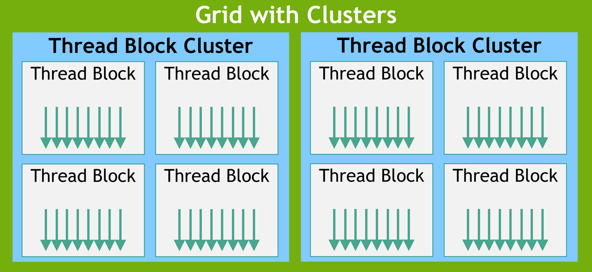

> 本文章摘抄自NVIDIA官方，CUDA编程指南、CUDA最佳实践。

# 编程模型

## 线程层次结构

核函数中的线程通常组织为若干线程块（thread block），一个核函数的全部线程块构成一个网格（grid）。三括号中的第一项即线程块的数目，也即网格维度，称为网格大小（grid size）；第二项即每个线程块中线程的数目，也即线程块维度，称为线程块大小（block size）。

### 线程块簇

随着NVIDIA设备计算能力9.0引入，CUDA编程模型提供一个可选的线程层次，称为线程块簇（Thread Block Cluster），由线程块组成。线程块可以保证其中的线程在一个流多处理器上协同调度，线程块簇也保证其中的线程块在一个GPU处理簇（GPU Processing Cluster，CPC）上协同调度。

> 从硬件的角度来看，一个GPU由若干图形处理簇（Graphics Processing Cluster，GPC）构成，每个GPC包含一些诸如光栅化引擎（Raster Engine）等部件。每个GPC由若干流多处理器（streaming multiprocessor，SM）构成，每个SM是相对独立的，而每个SM中有若干流处理器（streaming processor，SP），流处理器又称为CUDA核心；若一个SM中的SP单元数量大于32个时，则每32个SP单元（物理上）构成一个分区，称为一个SM分区（partition）。

与线程块类似，线程块簇也可组织为一维、二维、三维形式，如下图所示。一个簇中的线程块数目可以由用户定义，并且CUDA最大支持一个簇中持有8个线程块。值得注意的是，若GPU硬件或MIG配置太小不足以支持8个流多处理器时，则簇的最大规模则会相应的减小。较小配置，与支持超过8个线程块的较大配置，是基于特定架构的，可使用cudaOccupancyMaxPotentialClusterSize()函数进行查询。



为兼容性考虑，gridDim变量仍然表示线程块的数目规模，blockIdx变量仍然表示线程块在网格中的编号；使用Cluster Group簇组API用于获取一个簇在网格中的编号，以及一个线程块在簇中的编号。但应注意，在使用线程块簇时，线程网格中线程块的规模，应该是线程块簇中线程块规模的整数倍，以将线程网格划分为整数个线程块簇。

可以在定义核函数时使用\_\_cluster_dims\_\_(X,Y,Z)属性说明符指定一个核函数的线程块簇配置，这种配置会作为编译时核函数属性，并能够使用经典的<<<>>>指定核函数执行配置。一旦指定编译时簇配置，则无法在启动核函数时更改。

```c++
// Compile time cluster size 2 in X-dimension and 1 in Y and Z dimension
__global__ void __cluster_dims__(2,1,1) cluster_kernel(float *input, float *output) {}

int main(int argc, char *argv[]) {
    float *input, *output;
    dim3 blockDim(32, 32);
    dim3 gridDim((M + blockDim.x - 1) / M, (N + blockDim.y - 1) / N);
    // The grid dimension must be a multiple of cluster size
    cluster_kernel<<<gridDim, blockDim>>>(input, output);
    return 0;
}
```

也可以在启动核函数时使用cudaLaunchKernelEx()配置线程块簇属性。

```c++
// No compile time attribute attached to the kernel
__global__ void cluster_kernel(float *input, float *output) {}

int main(int argc, char *argv[]) {
    float *input, *output;
    dim3 blockDim(32, 32);
    dim3 gridDim((M + blockDim.x - 1) / M, (N + blockDim.y - 1) / N);

    cudaLaunchAttribute attrs[1];
    attrs[0].id = cudaLaunchAttributeClusterDimension;
    attrs[0].val.clusterDim.x = 2;
    attrs[0].val.clusterDim.y = 1;
    attrs[0].val.clusterDim.z = 1;

    cudaLaunchConfig_t config = {0};
    config.blockDim = blockDim;
    config.gridDim = gridDim;
    config.attrs = attrs;
    config.numAttrs = 1;

    cudaLaunchKernelEx(&config, cluster_kernel, input, output);
    return 0;
}
```

在计算能力9.0的设备上，一个线程块簇中的所有线程块会保证在一个GPU处理簇上协同调度，并且同一个簇的这些线程块之间能够使用Cluster Group簇组API接口，例如使用cluster.sync()函数执行硬件支持的同步操作。簇组提供一系列函数，例如使用num_blocks()函数查询簇组的线程块数目，使用num_threads()函数查询簇组的线程数目；使用dim_blocks()函数查询当前线程块在簇组中的编号，使用dim_threads()函数查询当前线程在簇组的编号。

一个簇组中的所有线程块能够访问分布式共享内存（Distributed Shared Memory），能够在分布式共享内存的任意地址执行读取、写入、原子操作。

# CUDA运行时

CUDA Runtime运行时环境在cudart库中实现，使用CUDA的应用程序都需要链接到该运行时库，要么是cudart.lib或libcudart.a静态库，要么是cudart.dll或libcuda.so动态库。因此需要动态链接到cudart.dll或libcudart.so库的应用程序，通常会将CUDA动态库包含在安装目录。只有链接到同一个CUDA运行时实例的多个组件，才能安全地传递地址信息。

## 初始化

自CUDA 12.0以来，cudaInitDevice()调用或cudaSetDevice()调用都会初始化特定设备的CUDA运行时以及主上下文环境（primary context），若没有手动执行该初始化调用，CUDA运行时会使用编号为0的GPU设备，并在执行其它运行时API时执行自初始化。在统计API时间或分析第一次调用错误时，需要注意这一点。在CUDA 12.0之前，函数cudaSetDevice()并不会初始化CUDA运行时，应用程序通常会使用cudaFree(0)函数以初始化CUDA运行时环境。

CUDA运行时会为系统中的每个GPU设备创建一个CUDA上下文环境（context），称为该设备的主上下文环境，并在运行时API首次需要上下文环境时被初始化。在创建主上下文环境时，如果需要，设备代码会即时编译（just-in-time compile）并加载到设备内存中。主上下文环境会在应用的所有主机线程之间共享，可使用驱动API访问主上下文环境。

当主机线程调用cudaDeviceReset()函数时，当前主机线程正在使用设备的主上下文环境会被销毁，并在下次调用运行时API函数时，在相应的GPU设备上创建一个新的主上下文环境。
