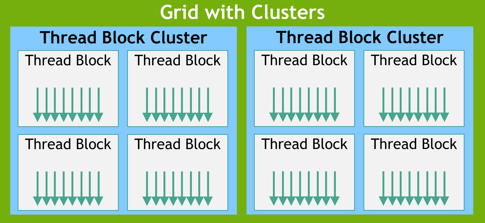
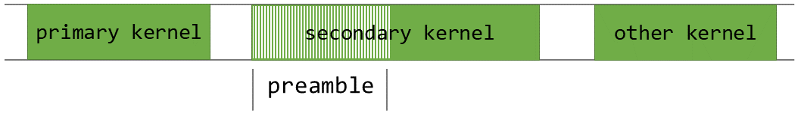
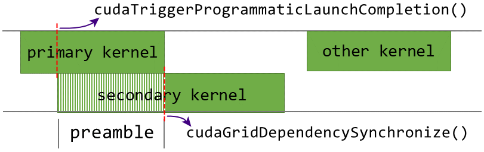
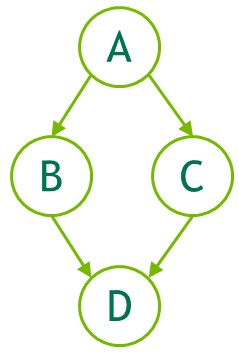

# 性能优化指南

性能优化围绕四个基本策略展开，最大化并行执行以实现最大利用率（maximize parallel execution to achieve maximum utilization），优化内存使用以实现最大内存吞吐量（optimize memory usage to achieve maximum memory throughput），优化指令使用以实现最大的指令吞吐量（optimize instruction usage to achieve maximum instruction throughput），最大限度地减少内存抖动（minimize memory thrashing）。

哪些策略将为应用程序的特定部分产生最佳性能增益，具体取决于该部分的性能限制，应通过测量和监控性能限制来不断指导优化工作。此外，将特定内核的浮点运算吞吐量或内存吞吐量（以更有意义的为准）与设备的相应峰值理论吞吐量进行比较，可以表示内核还有多大的改进空间。

## 最大化利用率

为最大化利用率，应用程序的结构应尽可能多地公开并行性，并有效地将这种并行性映射到系统的各个器件，以使它们在大部分时间都保持忙碌。在应用程序级别（application level），应该使用异步函数和流来最大化主机、设备、总线之间的并行执行。在设备级别（device level），多个内核可以在一个设备上并发执行，因此也可以通过使用流来启动足够多的内核来并发执行。在流式多处理器级别（streaming multiprocessor level），应该最大化SM中各个功能单元之间的并行执行。

SM主要依赖于线程级并行性来最大限度地利用其功能单元，因此利用率与驻留的Warp数目直接相关。在每个指令发出时，Warp调度器都会选择一条准备执行的指令，此指令可以是同一Warp的另一个独立指令，以利用指令级并行性，或者更常见的是另一个Warp的指令，以利用线程级并行性；如果选择了准备执行的指令，则会将其发送到Warp的活动线程。

Warp执行一条指令所需的时钟周期（clock cycle）数目称为延迟（latency），当一个SM处理块子分区上的Warp调度器在该latency延迟期间的每个时钟都有一些指令要为某个Warp发射时，也即当latency完全隐藏时，就可以实现该处理块子分区的完全利用；当一个SM上的所有处理块子分区都可以掩盖其Warp的延迟时，就可以实现该SM的完全利用。隐藏一个长达L时钟周期的延迟所需的指令数目取决于这些指令各自的吞吐量，吞吐量是指满流水线情况下的每SM每时钟执行的指令数目，这与具体的GPU架构有关，例如，具有4个Warp调度器的SM需要4L的指令数目，具有2个Warp调度器的SM需要2L的指令数目。

Warp没有准备好执行下一条指令的最常见原因是该指令的输入操作数尚不可用。如果所有输入操作数都在寄存器上，则延迟是由寄存器依赖引起的，即一些输入操作数是由一些尚未完成执行的先前指令得到的。在这种情况下，延迟等于前一条指令的执行时间，并且Warp调度器必须在该时间内调度其它Warp的指令。指令执行时间因指令类型而异，在计算能力大于等于7.X的设备上，大多数算术指令的执行通常需要4个时钟周期，这意味着每个SM的处理块子分区需要4个活动Warp来隐藏算术指令延迟。如果单个Warp表现出指令级并行性，即在其指令流中有多个独立的指令，则需要更少的Warp数目，因为来自单个Warp的多个独立指令可以连续发射。如果一些输入操作数驻留在片外内存中，则延迟要高得多，通常为数百个时钟周期。在如此高延迟期间，使Warp调度器保持忙碌所需的Warp数目取决于内核代码及其指令级并行度。通常，如果没有片外存储器操作数的指令数目（通常是算术指令）与具有片外存储器操作数的指令数目（通常是访存指令）之比较低，也即算术强度较低，则需要更多的Warp掩盖延迟。

Warp没有准备好执行下一条指令的另一个原因是它正在等待某个内存栅栏函数（Memory Fence Function）或同步（Synchronization）。同步可以强制多处理器空闲，因为会有越来越多的Warp等待同一线程块中的其它Warp完成同步点之前的指令。在这种情况下，每个SM拥有多个常驻线程块有助于减少空闲，因为来自不同块的Warp不需要在同步点相互等待。

对于给定的内核调用，驻留在每个SM的线程块和Warp的数目取决于调用时的执行配置（execution configuration）、SM的各种资源以及内核对资源的需求。使用--ptxas-options=-v编译选项进行编译时，编译器会报告寄存器和共享内存使用情况。内核使用的寄存器数目对驻留Warp的数目有很大影响，因此编译器会尝试最小化寄存器使用，同时保持寄存器溢出和指令数目最少。可以使用--maxrregcount编译器选项、\_\_launch_bounds\_\_()限定符或\_\_maxnreg\_\_()限定符来控制寄存器的使用。线程块所需的共享内存总量等于静态分配的共享内存量和动态分配的共享内存量之和。

使用cudaOccupancyMaxActiveBlocksPerMultiprocessor()函数可以根据内核的线程块大小、寄存器使用情况、共享内存使用情况提供占用率预测，此函数根据每个SM的并发线程块数目来报告占用率；此值可以转换为其它量度，乘以每个线程块的Warp数目可以得到每个SM的并发Warp数数目，进一步除以每个SM的最大Warp数目可以得到占用率百分比。使用cudaOccupancyMaxPotentialBlockSize()函数和cudaOccupancyMaxPotentialBlockSizeVariableSMem()函数可以启发式地计算实现最大SM占用率的执行配置。

## 最大化内存吞吐量

最大化应用程序的整体内存吞吐量的第一步是最小化低带宽的数据传输。这意味着需要最大限度地减少主机和设备之间的数据传输，因为它们的带宽比全局内存和设备之间的数据传输低得多。实现此目的的一种方法是将更多代码从主机移动到设备，即使这意味着运行的内核没有公开足够的并行度，无法在设备上高效执行。中间数据结构可以在设备内存中创建，由设备操作，并在不被主机映射或复制到主机内存的情况下销毁。此外，由于与每次传输相关的开销，将许多小型传输批处理为单个大型传输始终比单独进行每个传输效果更好。

最大限度地减少主机和设备之间的数据传输，也意味着需要最大限度地利用片上存储来最大限度地减少全局内存和设备之间的数据传输，即最大化地利用共享内存和高速缓存（L1缓存、L2缓存、常量缓存、纹理缓存）。共享内存等同于用户管理的缓存，应用程序可以显式分配和访问它。典型的编程模式是将来自设备内存的数据暂存到共享内存中，对于一个线程块的每个线程而言，典型流程为，将数据从设备内存加载到共享内存；与线程块的所有其它线程同步，以便每个线程都可以安全地读取由不同线程填充的共享内存位置；处理共享内存中的数据；如有必要再次同步，以确保共享内存的数据是最新的；将结果写回设备内存。

最大化内存吞吐量的下一步是根据最佳的内存访问模式，尽可能优化地组织内存和访问。这种优化对于全局内存访问尤其重要，因为与可用的片上带宽和算术指令吞吐量相比，全局内存带宽较低，因此非最佳的全局内存访问通常对性能有很大影响，内核的内存访问吞吐量可能会相差一个数量级。访问可寻址内存（即全局内存、本地内存、共享内存等）的指令可能需要多次重新发射（re-issue），具体取决于内存地址在Warp线程之间的分布。不同的分布如何影响指令吞吐量特定于每种类型的内存，例如，对于全局内存而言，通常地址越分散，吞吐量越低。

全局内存空间的物理存储器是设备内存，通过32字节、64字节、128字节的内存事务（memory transaction），这些内存事务必须自然对齐，也即只有起始地址是32字节、64字节、128字节的整数倍的内存段才能被内存事务读取或写入。当Warp执行访问全局内存的指令时，它会根据每个线程访问的数据大小和内存地址在线程之间的分布，将Warp中线程的内存访问合并到一个或多个这些内存事务中。一般来说，需要的事务越多，则除了线程访问的所需数据之外，传输的未使用的数据就越多，从而相应地降低了指令吞吐量。

全局内存指令支持读取或写入大小等于1、2、4、8、16字节的数据，当且仅当数据类型的大小为1、2、4、8、16字节，并且数据自然对齐（即其地址是该大小的倍数）时，那么，对驻留在全局内存中的数据的任何访问（通过变量或指针）都会被编译为单个全局内存指令。如果未满足此大小和对齐要求，则访问将编译为多个指令，这些指令具有交错访问模式，这会阻止这些指令完全合并。因此，建议对驻留在全局内存中的数据使用满足此要求的类型。内置向量类型会自动满足对齐要求，而对自定义结构体而言，可以使用\_\_align\_\_说明符来强制内存对齐。

为最小化内存抖动，应尝试在应用程序的早期以适当大小的分配方式分配内存，并且仅在应用程序没有任何用途时分配内存，减少应用程序中cudaMalloc()和cudaFree()调用的次数，尤其是在性能关键区域。过于频繁地不断分配和释放内存的应用程序可能会发现，分配调用往往会随着时间的推移而变慢，直到达到限制。这通常是意料之中的，因为将内存释放回操作系统之后，会被操作系统用于执行其它任务，从而导致过于离散且零碎的内存空间。

## 最大化指令吞吐量

为最大限度地提高指令吞吐量，应用程序应该注意以下几点。最大限度地减少使用低吞吐量的算术指令，在不影响最终结果的情况下用精度换取速度，使用内建的快速数学函数而不是常规函数、使用单精度而不是双精度、或将非规范化浮点数刷新为零。最大限度地减少由控制流指令引起的Warp发散。减少指令数，尽可能地优化同步点，使用\_\_restrict\_\_受限指针。

指令吞吐量可以使用一个SM一个时钟周期所执行的操作次数来计算得到，对于一个拥有32个线程的Warp而言，一条指令对应32次操作，因此如果一个时钟周期执行N次操作，则一个SM的指令吞吐量为一个时钟周期N/32个指令。本机算术指令（Native Arithmetic Instruction）的吞吐量可以见表格Instruction Throughput所示，而其他指令和函数是在本机指令之上实现的，不同计算能力的设备，实现可能会有所不同。

通常，使用-ftz=true编译的代码（非规范化浮点数刷新为零）往往比使用-ftz=false编译的代码具有更高的性能，使用-prec-div=false（低精确的除法）编译的代码往往比使用-prec-div=true编译的代码具有更高的性能，使用-prec-sqrt=false（低精确的平方根）编译的代码往往比使用-prec-sqrt=true编译的代码具有更高的性能。NVCC编译器手册中有更详细的描述。

任何流控制指令（if、switch、do、while、for）都可能导致同一Warp的线程发散（即线程具有不同的执行路径），从而显著影响有效指令的吞吐量。如果发生这种情况，则必须串行执行不同的路径，从而增加Warp需要执行的指令总数。有时，编译器可能会展开循环，或者可能会使用分支预测断言来优化短的if块，在这些情况下，任何Warp都不会发散。

# 编程模型

二进制库[libcu++(libcudacxx)](https://nvidia.github.io/cccl/libcudacxx/)提供了基本且惯用的C++抽象，以及CUDA C++的基础抽象，例如cuda::atomic线程块范围、cuda::memcpy_async接口等。

## 线程块簇

随着NVIDIA设备计算能力9.0（Hopper架构）引入，CUDA编程模型提供一个可选的线程层次，称为**线程块簇（Threadblock Cluster）**，由线程块组成。线程块可以保证其中的线程在一个流多处理器上协同调度，线程块簇也保证其中的线程块在一个GPU处理簇（GPU Processing Cluster，CPC）上协同调度。

与线程块类似，线程块簇也可组织为一维、二维、三维形式，如下图所示。一个簇中的线程块数目可以由用户定义，并且CUDA最大支持一个簇中持有8个线程块。值得注意的是，若GPU硬件或MIG配置太小不足以支持8个流多处理器时，则簇的最大规模则会相应的减小。较小配置，与支持超过8个线程块的较大配置，是基于特定架构的，可使用cudaOccupancyMaxPotentialClusterSize()函数进行查询。



为兼容性考虑，gridDim变量仍然表示线程块的数目规模，blockIdx变量仍然表示线程块在网格中的编号；使用Cluster Group簇组API用于获取一个簇在网格中的编号，以及一个线程块在簇中的编号。但应注意，在使用线程块簇时，线程网格中线程块的规模，应该是线程块簇中线程块规模的整数倍，以将线程网格划分为整数个线程块簇。

可以在定义核函数时使用\_\_cluster_dims\_\_(X,Y,Z)属性说明符指定一个核函数的线程块簇配置，这种配置会作为编译时核函数属性，并能够使用经典的<<<>>>指定核函数执行配置。一旦指定编译时簇配置，则无法在启动核函数时更改。

```c++
// Compile time cluster size 2 in X-dimension and 1 in Y and Z dimension
__cluster_dims__(2,1,1)
__global__ void cluster_kernel(float *input, float *output) {}

int main(int argc, char *argv[]) {
    float *input, *output;
    dim3 blockDim(32, 32);
    dim3 gridDim((M + blockDim.x - 1) / M, (N + blockDim.y - 1) / N);
    // The grid dimension must be a multiple of cluster size
    cluster_kernel<<<gridDim, blockDim>>>(input, output);
    return 0;
}
```

也可以在启动核函数时使用cudaLaunchKernelEx()配置线程块簇属性。

```c++
// No compile time attribute attached to the kernel
__global__ void cluster_kernel(float *input, float *output) {}

int main(int argc, char *argv[]) {
    float *input, *output;
    dim3 blockDim(32, 32);
    dim3 gridDim((M + blockDim.x - 1) / M, (N + blockDim.y - 1) / N);

    cudaLaunchAttribute attrs[1];
    attrs[0].id = cudaLaunchAttributeClusterDimension;
    attrs[0].val.clusterDim.x = 2;
    attrs[0].val.clusterDim.y = 1;
    attrs[0].val.clusterDim.z = 1;

    cudaLaunchConfig_t config = {0};
    config.blockDim = blockDim;
    config.gridDim = gridDim;
    config.attrs = attrs;
    config.numAttrs = 1;

    cudaLaunchKernelEx(&config, cluster_kernel, input, output);
    return 0;
}
```

在计算能力9.0的设备上，一个线程块簇中的所有线程块会保证在一个GPU处理簇上协同调度，并且同一个簇的这些线程块之间能够使用Cluster Group簇组API接口，例如使用cluster.sync()函数执行硬件支持的同步操作。簇组提供一系列函数，例如使用num_blocks()函数查询簇组的线程块数目，使用num_threads()函数查询簇组的线程数目；使用dim_blocks()函数查询当前线程块在簇组中的编号，使用dim_threads()函数查询当前线程在簇组的编号。

一个簇组中的所有线程块能够访问所有参与线程块的共享内存，称为**分布式共享内存（Distributed Shared Memory）**，相应的地址空间称为分布式共享内存地址空间。属于线程块簇的线程可以在分布式共享内存的任意地址执行读取、写入、执行原子操作，无论该地址是属于本地线程块还是远程线程块。无论内核是否使用分布式共享内存，使用共享内存规范声明的静态或动态共享内存仍然是属于每个线程块的，分布式共享内存的大小只是簇组中的线程块的数目乘以每个线程块的共享内存大小。

访问分布式共享内存中的数据需要所有线程块都存在，用户可以使用簇组API中的cluster.sync()函数保证所有线程块都已经开始执行，用户还需要确保所有的分布式共享内存操作都发生在线程块退出之前。例如，如果当前线程块需要读取远程线程块的共享内存，则用户需要确保该次读取操作在远程线程块退出之前完成。

## 运行时环境

CUDA Runtime运行时环境在cudart库中实现，使用CUDA的应用程序都需要链接到该运行时库，要么是cudart.lib或libcudart.a静态库，要么是cudart.dll或libcuda.so动态库。因此需要动态链接到cudart.dll或libcudart.so库的应用程序，通常会将CUDA动态库包含在安装目录。只有链接到同一个CUDA运行时实例的多个组件，才能安全地传递地址信息。

CUDA运行时API构建在更低级别的API之上，即CUDA驱动程序，驱动程序API通过公开更低级别的概念来提供额外的控制，例如，CUDA Context上下文（设备的主机进程模拟），CUDA Module模块（设备的动态加载库的模拟）。在使用CUDA运行时环境时，上下文和模块的管理是隐式的，这可以产生更简洁的代码。

CUDA运行时的所有函数都以cuda为前缀，这些函数用于分配和释放设备内存、在主机内存和设备内存之间传输数据、管理具有多个设备的系统等。

在CUDA 12.0之前，函数cudaSetDevice()并不会初始化CUDA运行时，应用程序通常会使用cudaFree(0)函数以初始化CUDA运行时环境。而自CUDA 12.0以来，cudaInitDevice()调用或cudaSetDevice()调用都会初始化特定设备的CUDA运行时以及主上下文环境（primary context），若没有手动执行该初始化调用，CUDA运行时会使用编号为0的GPU设备，并在执行其它运行时API时执行自初始化。在统计API时间或分析第一次调用错误时，需要注意这一点。

CUDA运行时会为系统中的每个GPU设备创建一个CUDA上下文环境（Context），称为该设备的主上下文环境，并在运行时API首次需要上下文环境时被初始化。在创建主上下文环境时，如果需要，设备代码会即时编译（Just-In-Time compile，JIT）并加载到设备内存中。主上下文环境会在应用程序的所有主机线程之间共享，可使用驱动API访问主上下文环境。当主机线程调用cudaDeviceReset()函数时，当前主机线程正在使用设备的主上下文环境会被销毁，并在下次调用运行时API函数时，在相应的GPU设备上创建一个新的主上下文环境。

> 需要注意的是，CUDA接口需要使用一个在主机程序启动期间初始化并在主机程序终止期间销毁的全局状态，CUDA运行时和驱动API无法检测此状态是否无效，因此在程序启动期间或main函数之后的终止期间（隐式或显式）使用这些CUDA接口都将导致未定义的行为。

## 设备内存管理

CUDA编程模型假设系统由主机和设备组成，每个主机和设备都有自己独立的内存。内核在设备内存之外运行，因此运行时环境提供分配、释放、复制设备内存，以及在主机内存和设备内存之间传输数据的函数。设备内存可以分配为线性内存或CUDA数组（CUDA Array），其中CUDA数组是针对纹理获取进行了优化的不透明内存布局，主要用于纹理内存和表面内存。

线性内存被分配到一个统一的地址空间中，这意味着单独分配的实体可以通过指针相互引用。地址空间的大小取决于主机系统CPU和所用GPU的计算能力。在Maxwell架构（计算能力5.3）之前，地址空间最高是40位，而在Pascal架构（计算能力6.0）之后，在x86_64架构上地址空间最高47位，在ARM64架构上地址空间最高48位，在PowerPC架构上地址空间最高49位。需要注意的是，CUDA驱动程序会创建一个未提交的虚拟地址预留，以确保内存分配（指针）在支持的范围内，此预留显示为预留的虚拟内存，但在程序实际分配内存之前不会占用任何物理内存。

线性内存通常使用cudaMalloc()分配，并使用cudaFree()释放，主机内存和设备内存之间的数据传输通常使用cudaMemcpy()完成。线性内存也可以通过cudaMallocPitch()和cudaMalloc3D()进行分配，建议使用这些函数进行2D或3D数组的分配，因为它可以确保内存分配进行适当的填充，以满足设备内存访问的对齐要求，从而确保在访问行地址或在执行设备内存上的2D数组复制（使用cudaMemcpy2D()和cudaMemcpy3D()函数）时获得最佳性能。具体分配内存的填充信息，可以由cudaMallocPitch()和cudaMalloc3D()的返回参数获得，详细可参考文档。

CUDA运行时环境提供了cudaHostAlloc()和cudaFreeHost()函数，允许分配和释放页锁定（page-locked）主机内存，也称为页固定（page-pinned）主机内存，或使用cudaHostRegister()函数对由malloc()分配的主机内存进行页锁定。

使用页锁定主机内存有几个好处。对于某些设备，页锁定主机内存和设备内存之间的复制可以与内核执行同时执行；在某些设备上，页锁定主机内存可以映射到设备的地址空间，而无需将其复制到设备内存或从设备内存复制到主机内存；在具有前端总线的系统上，如果主机内存被分配为页锁定内存，则主机内存和设备内存之间的带宽会更高，如果另外分配为写合并（write-combining）内存，则主机内存和设备内存之间的带宽会更高。

## L2缓存管理

在设备全局内存中的数据区域，从概念上可以分为两类。当CUDA内核执行时，会被内核多次重复访问的数据区域，视为**持久（persisting）数据**，而只会被内核访问一次的数据区域，视为**流式（streaming）数据**。从CUDA 11.0开始，计算能力8.0（Ampere架构）及以上的设备能够配置L2缓存中数据的持久性，从而有可能获得更高的带宽和更低的全局内存访问延迟。

L2缓存的一部分可以预留出来，用于持久化对全局内存的数据访问。持久访问会优先使用L2缓存的这一预留部分，而普通或流式访问只能在持久访问未使用这一部分时利用它。可以使用cudaDeviceSetLimit()函数调整L2缓存的用于持久访问的容量大小。

而在多实例GPU（Multi-Instance GPU，MIG）模式下配置GPU时，L2缓存的预留功能将被禁用。使用多进程服务（Multi-Process Service，MPS）时，cudaDeviceSetLimit()无法更改L2缓存预留大小，相反，只能通过环境变量CUDA_DEVICE_DEFAULT_PERSISTING_L2_CACHE_PERCENTAGE_LIMIT指定预留大小。

访问策略窗口（access policy window）指定L2缓存的持久属性，以及全局内存的一个连续区域，落在该区域内的内存访问都会按照指定策略进行。

```c++
struct __device_builtin__ cudaAccessPolicyWindow {
    void *base_ptr;    // Starting address of the access policy window. CUDA driver may align it.
    size_t num_bytes;  // Size in bytes of the window policy. CUDA driver may restrict the maximum size and alignment.
    float hitRatio;    // hitRatio specifies percentage of lines assigned hitProp, rest are assigned missProp.
    enum cudaAccessProperty hitProp;   // ::CUaccessProperty set for hit.
    enum cudaAccessProperty missProp;  // ::CUaccessProperty set for miss. Must be either NORMAL or STREAMING.
};
```

当访问全局内存范围[ptr, ptr＋num_bytes)中的数据时，比访问其它位置的数据更有可能保留在L2缓存中。更具体的说，该全局内存范围中的hitRatio比例的内存访问具有persisting持久属性，而剩下比例的内存访问具有streaming流式属性；因为hitProp通常会被设置为cudaAccessPropertyPersisting持久，而missProp通常会被设置为cudaAccessPropertyStreaming流式。但具体哪些特定的内存访问被归类为持久是随机的，概率约为hitRatio，概率分布取决于硬件架构和内存范围。

例如，如果L2预留的缓存大小为16KB，而accessPolicyWindow中的num_bytes为32KB时。当hitRatio为0.5时，硬件将随机选择32KB窗口中的16KB作为持久访问，并缓存在预留的L2缓存区域中。当hitRatio为1.0时，硬件将尝试在预留的L2缓存区域中缓存整个32KB窗口，而由于预留区域小于窗口，因此有的缓存行会被逐出（evict），以将32KB数据中最近使用的16KB保留在L2缓存的预留部分中。

因此，hitRatio可用于避免缓存行的抖动，并总体上减少移入和移出L2缓存的数据量。低于1.0的hitRatio值可用于手动控制并发CUDA流中的不同accessPolicyWindow可以在L2中缓存的数据量。例如，假设L2预留缓存大小为16KB，两个不同CUDA流中的两个并发内核，每个内核都有一个16KB的accessPolicyWindow，并且都将hitRatio值设置为1.0，那么在竞争共享的L2资源时，可能会逐出彼此的缓存行。但是，如果两个accessPolicyWindows的hitRatio值均为0.5，则它们不太可能逐出自己或彼此的持久缓存行。

在cudaAccessPolicyWindow类型定义中，hitProp属性和missProp属性的取值都是cudaAccessProperty枚举类型，如下所示。

```c++
enum __device_builtin__  cudaAccessProperty {
    cudaAccessPropertyNormal = 0,       // Normal cache persistence
    cudaAccessPropertyStreaming = 1,    // Streaming access is less likely to persit from cache
    cudaAccessPropertyPersisting = 2    // Persisting access is more likely to persist in cache
};
```

使用cudaAccessPropertyPersisting属性发生的内存访问更有可能保留在L2缓存的预留部分中，使用cudaAccessPropertyStreaming属性发生的内存访问不太可能保留在L2缓存中，因为这些访问会被优先驱逐。

通过指定cudaAccessPropertyNormal属性，可以将之前应用的持久化属性强制重置为正常状态。假设之前的CUDA内核使用持久访问将数据保留在L2缓存中，那么这种持久性会减少后续未使用持久访问的内核的可用的L2缓存容量。使用cudaAccessPropertyNormal属性重置访问策略窗口，会删除之前持久访问所保留的状态，就像之前的访问没有访问属性一样。此外，还可以通过cudaCtxResetPersistingL2Cache()函数将所有持久的L2缓存行重置为正常。

可以使用cudaStreamAttrValue.accessPolicyWindow属性以及cudaStreamSetAttribute()函数，为一个CUDA流配置访问策略窗口，如下代码所示。

```c++
int main(int argc, char* argv[]) {
    cudaDeviceProp prop;
    cudaGetDeviceProperties(&prop, device_id);
    size_t persisting_l2_size = min(int(prop.l2CacheSize * 0.75), prop.persistingL2CacheMaxSize);
    // set-aside 0.75 of L2 cache for persisting accesses or the max allowed
    cudaDeviceSetLimit(cudaLimitPersistingL2CacheSize, persisting_l2_size);

    cudaStreamAttrValue stream_attr;
    // The global memory address within [ptr, ptr + num_bytes) are more likely to persist in the L2 cache
    // And num_bytes must be less than cudaDeviceProp::accessPolicyMaxWindowSize
    stream_attr.accessPolicyWindow.base_ptr  = reinterpret_cast<void*>(ptr);
    stream_attr.accessPolicyWindow.num_bytes = num_bytes;
    stream_attr.accessPolicyWindow.hitRatio  = 0.6;                          // Hint for cache hit ratio
    stream_attr.accessPolicyWindow.hitProp   = cudaAccessPropertyPersisting; // Type of access property on cache hit
    stream_attr.accessPolicyWindow.missProp  = cudaAccessPropertyStreaming;  // Type of access property on cache miss
    // Set the attributes to a CUDA stream of type cudaStream_t
    cudaStreamSetAttribute(stream, cudaStreamAttributeAccessPolicyWindow, &stream_attr);
    
    my_kernel<<<128, 512>>>();
    cudaCtxResetPersistingL2Cache();
    return 0;
}
```

也可以使用cudaKernelNodeAttrValue.accessPolicyWindow属性以及cudaGraphKernelNodeSetAttribute()函数，为一个CUDA图内核节点配置访问策略窗口，如下代码所示。

```c++
int main(int argc, char* argv[]) {
    cudaDeviceProp prop;
    cudaGetDeviceProperties(&prop, device_id);
    size_t persisting_l2_size = min(int(prop.l2CacheSize * 0.75), prop.persistingL2CacheMaxSize);
    // set-aside 0.75 of L2 cache for persisting accesses or the max allowed
    cudaDeviceSetLimit(cudaLimitPersistingL2CacheSize, persisting_l2_size);
    
    cudaKernelNodeAttrValue node_attr;
    // The global memory address within [ptr, ptr + num_bytes) are more likely to persist in the L2 cache
    // And num_bytes must be less than cudaDeviceProp::accessPolicyMaxWindowSize
    node_attr.accessPolicyWindow.base_ptr  = reinterpret_cast<void*>(ptr);
    node_attr.accessPolicyWindow.num_bytes = num_bytes;
    node_attr.accessPolicyWindow.hitRatio  = 0.6;                          // Hint for cache hit ratio
    node_attr.accessPolicyWindow.hitProp   = cudaAccessPropertyPersisting; // Type of access property on cache hit
    node_attr.accessPolicyWindow.missProp  = cudaAccessPropertyStreaming;  // Type of access property on cache miss
    // Set the attributes to a CUDA Graph Kernel node of type cudaGraphNode_t
    cudaGraphKernelNodeSetAttribute(node, cudaKernelNodeAttributeAccessPolicyWindow, &node_attr);

    my_kernel<<<128, 512>>>();
    cudaCtxResetPersistingL2Cache();
    return 0;
}
```

## 异步栅障

CUDA线程是执行计算或访存操作的最低级别的抽象。CUDA异步编程模型定义了异步栅障（asynchronous barrier）的行为，用于CUDA线程之间的同步，该模型还定义并解释了在GPU上计算时如何使用memcpy_async()从全局内存中异步移动数据。从计算能力8.0（Ampere架构）设备开始，GPU设备支持异步的内存操作，并由异步编程模型定义了异步操作相对于CUDA线程的行为。

在cuda/barrier头文件中，CUDA标准库引入了std::barrier栅障的GPU版本实现cuda::barrier，并扩展以允许用户指定barrier栅障对象的范围。计算能力8.0（Ampere架构）或者更高版本的设备，可以为barrier栅障操作提供硬件层面的加速，并将这些barrier栅障与memcpy_async()异步内存复制功能集成。

### 简单同步模式

如果不使用到达/等待栅障（arrive/wait barrier），则同步功能可以使用__syncthreads()或cooperative_groups::thread_block.sync()实现。

```c++
__global__ void simple_sync_kernel(int iteration_count) {
    cooperative_groups::thread_block block = cooperative_groups::this_thread_block();
    
    for (int curr_iter = 0; curr_iter < iteration_count; ++curr_iter) {
        // 1. Code before arrive
        // 2. Wait for all threads to arrive here
        block.sync();
        // 3. Code after wait
    }
}
```

在这种模式中，线程在同步点block.sync()处被阻塞，直到所有线程都到达同步点。这能够保证在同一个线程块中，同步点之前发生的内存更新，对同步点之后的所有线程可见，即等效于atomic_thread_fence(memory_order_seq_cst, thread_scope_block)内存栅栏。

此模式分三个阶段：(1)同步点之前的代码执行内存更新，该更新会在同步点之后读取；(2)同步点；(3)同步点之后的代码，此时同步点之前的内存更新已经可见。

### 时间划分和五阶段同步

使用barrier栅障的时间划分（temporal splitting）的同步模式如下所示。

```c++
__device__ void compute_operation(float* data, int curr_iteration) { }

__global__ void split_arrive_wait_kernel(float* data, int iteration_count) {
    using block_barrier_t = cuda::barrier<cuda::thread_scope_block>;
    __shared__ block_barrier_t barrier;
    cooperative_groups::thread_block block = cooperative_groups::this_thread_block();

    if (block.thread_rank() == 0) {
        // Initialize the barrier with expected arrival count (All threads in a block)
        init(&barrier, block.size());  // cuda::__4::init() as a friend of barrier
    }
    block.sync();

    for (int curr_iter = 0; curr_iter < iteration_count; ++curr_iter) {
        // 1. Code before arrive
        // 2. This thread arrives. Arrival does not block a thread.
        block_barrier_t::arrival_token token = barrier.arrive();
        // 3. Code between arrive and wait
        compute_operation(data, curr_iter);
        // 4. Wait for all threads participating in the barrier to complete barrier.arrive() function
        barrier.wait(std::move(token));
        // 5. Code after wait
    }
}
```

在这种模式中，同步点block.sync()被拆分为到达点barrier.arrive()和等待点barrier.wait(std::move(token))两部分。线程第一次调用barrier.arrive()时开始参与cuda::barrier栅障同步，当线程调用barrier.wait(std::move(token))时会被阻塞，直到所有参与线程完成barrier.arrive()调用，所有参与线程的数目在使用init()初始化时指定。对于所有参与线程能够保证，在barrier.arrive()之前发生的内存更新，对barrier.wait(std::move(token))之后的所有线程可见。值得注意的是，对barrier.arrive()的调用不会阻塞线程，它可以继续进行其它工作，这些工作不依赖于其它参与线程调用barrier.arrive()之前发生的内存更新。

此模式分五个阶段：(1)到达点之前的代码执行内存更新，该更新会在等待点之后读取；(2)等效于atomic_thread_fence(memory_order_seq_cst, thread_scope_block)内存栅栏的，具有隐式内存栅栏的到达点；(3)到达点和等待点之间的代码，可以执行不依赖于内存更新的计算；(4)等待点；(5)等待点之后的代码，此时到达点之前的内存更新已经可见。

栅障cuda::barrier可以灵活地指定线程如何参与（拆分到达点和等待点）以及哪些线程参与，相比之下，来自协作组的this_thread_block().sync()或\_\_syncthreads()适用于一个完整的线程块，\_\_syncwarp(mask)适用于一个Warp的指定子集。当然，如果用户的目的是同步一个完整的线程块或一个完整的Warp，出于性能原因，则建议使用\_\_syncthreads()和\_\_syncwarp(mask)。

在参与一个cuda::barrier之前，必须使用init()初始化该栅障，并指定预期的参与线程的数目，即在参与线程对barrier.wait(std::move(token))的调用被取消阻塞之前，参与线程将调用barrier.arrive()的次数。当参与线程调用barrier.arrive()时，cuda::barrier会从预期到达数目开始倒数直到为零，当倒数达到零时，当前阶段的cuda::barrier完成。当最后一次调用barrier.arrive()导致倒数为零时，会唤醒所有阻塞线程，并且倒数计数会自动重置为初始化的预期到达数目（原子操作），并将cuda::barrier移动至下一个阶段，也即是说一个cuda::barrier可以重复使用。

从barrier.arrive()函数返回的block_barrier_t::arrival_token对象是与该cuda::barrier的当前阶段相关联的。正常情况下，当cuda::barrier也处于当前阶段时，arrival_token阶段与cuda::barrier阶段相匹配，对barrier.wait(std::move(token))的调用会阻塞线程。如果线程在调用barrier.wait(std::move(token))时，cuda::barrier已经进入到下一阶段（因为调用barrier.arrive()使得倒数计数已经到达零），则当前线程不会再阻塞，并且会唤醒阻塞中的其它线程。

### 空间划分模式

线程块可以在空间上进行划分，以便Warp专门用于执行独立的计算。空间划分适用于生产者消费者模式（producer and consumer pattern），其中线程的一个子集生成的数据，而另一个（不相交的）子集使用数据。

生产者消费者的空间划分模式需要两个单侧同步来管理生产者和消费者之间的数据缓冲区。对于完整的生产者消费者模式，至少需要具有两个独立的缓冲区才能正常运行，每个缓冲区需要两个cuda::barrier栅障。对于一个缓冲区而言，生产者等待缓冲区变为空，以填充数据，之后发送缓冲区已填满的信号，而消费者等待缓冲区被填满，以使用数据，然后发送缓冲区已变空的信号。

```c++
using block_barrier_t = cuda::barrier<cuda::thread_scope_block>;

__device__ void producer_task(
    block_barrier_t empty_barrier[2], block_barrier_t filled_barrier[2], float* in, float* buffer, int N, int buf_len
) {
    for (int i = 0; i < N / buf_len; ++i) {
        // 1. Wait for buffer[i % 2] to be ready to be filled
        empty_barrier[i % 2].arrive_and_wait();
        // 2. Code to produce data and fill in buffer[i % 2]
        // 3. buffer[i % 2] is filled
        block_barrier_t::arrival_token token = filled_barrier[i % 2].arrive();
    }
}

__device__ void consumer_task(
    block_barrier_t empty_barrier[2], block_barrier_t filled_barrier[2], float* out, float* buffer, int N, int buf_len
) {
    // Initialize buffer to be emtpy and ready for fill
    block_barrier_t::arrival_token token0 = empty_barrier[0].arrive();
    block_barrier_t::arrival_token token1 = empty_barrier[1].arrive();
    for (int i = 0; i < N / buf_len; ++i) {
        // 1. Wait for buffer[i % 2] to be filled
        filled_barrier[i % 2].arrive_and_wait();
        // 2. Code to consume the data in buffer[i % 2]
        // 3. buffer[i % 2] is ready to be re-filled
        block_barrier_t::arrival_token token = empty_barrier[i % 2].arrive();
    }
}

__global__ void producer_consumer_pattern_kernel(float* in, float* out, int N, int buf_len) {
    // The total size is buf_len * 2 for double buffer
    extern __shared__ float buffer[];
    __shared__ block_barrier_t empty_barrier[2];
    __shared__ block_barrier_t filled_barrier[2];
    cooperative_groups::thread_block block = cooperative_groups::this_thread_block();

    if (block.thread_rank() < 2) {
        init(&empty_barrier[block.thread_rank()], block.size());
        init(&filled_barrier[block.thread_rank()], block.size());
    }
    block.sync();

    if (block.thread_rank() < warpSize) {
        producer_task(empty_barrier, filled_barrier, in, buffer, N, buf_len);   // The first Warp do producer task
    } else {
        consumer_task(empty_barrier, filled_barrier, out, buffer, N, buf_len);  // The remaining Warp do consumer task
    }
}
```

在此示例中，第一个Warp作为生产者，剩余的其它Warp作为消费者，所有生产者线程和消费者线程都参与四个cuda::barrier中的每一个，因此预期的参与线程的数目为block.size()。

生产者线程等待消费者线程发出信号，表明共享内存缓冲区已为空可以被填充，为了等待cuda::barrier，生产者线程必须首先执行empty_barrier.arrive()到达以获取token，然后使用该token执行empty_barrier.wait(token)等待。为简化代码，生产者线程使用empty_barrier.arrive_and_wait()组合了这些操作。消费者线程首先发出信号，表明两个缓冲区都已准备好填充，消费者线程此时不会等待，而是等待此迭代的缓冲区被填充，即filled_barrier.arrive_and_wait()等待。在消费者线程使用缓冲区后，它们会发出信号，表明缓冲区又已经准备好再次填充，即empty_barrier.arrive()到达，然后等待下一次迭代的缓冲区被填充。

### 提前退出

当参与cuda::barrier栅障同步的线程必须提前退出该栅障同步时，该线程必须在退出之前显式调用barrier.arrive_and_drop()以退出参与，这会使得之后的cuda::barrier栅障的预期参与线程数目递减一，如此才能使得其余参与线程可以正常执行后续的barrier.arrive()操作和barrier.wait(token)操作。

```c++
__device__ bool condition_check() {}

__global__ void early_exit_kernel(int iteration_count) {
    using block_barrier_t = cuda::barrier<cuda::thread_scope_block>;
    __shared__ block_barrier_t barrier;
    cooperative_groups::thread_block block = cooperative_groups::this_thread_block();

    if (block.thread_rank() == 0) {
        init(&barrier , block.size());
    }
    block.sync();

    for (int curr_iter = 0; curr_iter < iteration_count; ++curr_iter) {
        if (condition_check()) {
          barrier.arrive_and_drop();
          return;
        }
        block_barrier_t::arrival_token token = barrier.arrive();
        // code between arrive and wait
        barrier.wait(std::move(token));
    }
}
```

## 异步内存复制

CUDA线程是执行计算或访存操作的最低级别的抽象。CUDA异步编程模型定义了异步栅障（asynchronous barrier）的行为，用于CUDA线程之间的同步，该模型还定义并解释了在GPU上计算时如何使用memcpy_async()从全局内存中异步移动数据。从计算能力8.0（Ampere架构）设备开始，GPU设备支持异步的内存操作，并由异步编程模型定义了异步操作相对于CUDA线程的行为。

CUDA 11引入了memcpy_async()异步数据复制，以允许显式管理数据的异步复制，使得CUDA内核能够将计算与数据移动重叠。有多个memcpy_async()接口在cuda/barrier头文件、cuda/pipeline头文件、cooperative_groups/memcpy_async.h头文件中提供。其中，cuda::memcpy_async()与cuda::barrier和cuda::pipeline同步原语一起使用，而cooperative_groups::memcpy_async()则与coopertive_groups::wait()同步一起使用。这些API接口具有非常相似的语义，将对象从src异步复制到dst，并在复制完成后，使用cuda::barrier和cuda::pipeline进行同步，或使用coopertive_groups::wait()进行同步。

CUDA应用程序的主要操作即是计算和访存，并且会通过共享内存暂存数据，即，(1)从全局内存获取数据；(2)将数据存储到共享内存；(3)对共享内存数据执行计算，并将结果写回全局内存。如果不使用异步复制，则从全局内存复制数据到共享内存，需要使用中间寄存器进行搬运。

```c++
__device__ void compute_and_stg(float* smem_buf, float* batched_block_out) {
    cooperative_groups::thread_block block = cooperative_groups::this_thread_block();
    // Computes using all values of current batch from shared memory
    float result = compute(smem_buf[block.thread_rank()]);
    // Stores this thread's result back to global memory
    batched_block_out[block.thread_rank()] = result;
}

__global__ void simple_copy_kernel(float* in, float* out, int N, int batch_size) {
    extern __shared__ float smem_buf[];
    cooperative_groups::grid_group grid = cooperative_groups::this_grid();
    cooperative_groups::thread_block block = cooperative_groups::this_thread_block();

    // [NEXT][batch] = block_offset + grid.size()
    int block_offset = grid.block_rank() * block.size();
    for (int batch = 0; batch < batch_size; ++batch) {
        // 1. Read data from global memory and write data to shared memory (via register)
        smem_buf[block.thread_rank()] = in[block_offset + block.thread_rank()];
        // 2. Wait for all copies to complete
        block.sync();
        // 3. Compute and write result to global memory
        compute_and_stg(smem_buf, out + block_offset);
        // 4. Wait for compute using shared memory to finish
        block.sync();
        block_offset += grid.size();
    }
}
```

可以看到，每个线程块都需要在smem_buf赋值之后进行同步，以确保在计算阶段开始之前完成对共享内存的所有写入。线程块还需要在计算阶段之后再次同步，以防止在所有线程完成计算之前覆盖共享内存。

### 使用memcpy_async()

在计算能力8.0（Ampere架构）及之后的设备上，从全局内存到共享内存的memcpy_async()传输可以从硬件加速中受益，从而避免使用中间寄存器传输数据。

使用cooperative_groups::memcpy_async()异步数据复制的代码如下所示。

```c++
__global__ void memcpy_async_kernel(float* in, float* out, int N, int batch_size) {
    extern __shared__ float smem_buf[];
    cooperative_groups::grid_group grid = cooperative_groups::this_grid();
    cooperative_groups::thread_block block = cooperative_groups::this_thread_block();

    // [NEXT][batch] = block_offset + grid.size()
    int block_offset = grid.block_rank() * block.size();
    for (int batch = 0; batch < batch_size; ++batch) {
        // 1. Whole thread-group cooperatively copies whole batch to shared memory
        cooperative_groups::memcpy_async(block, smem_buf, in + block_offset, block.size() * sizeof(float));
        // 2. Joins all threads, thread-group wait all previously submitted memcpy_async() to complete
        cooperative_groups::wait(block);
        // 3. Compute and wait to finish
        compute_and_stg(smem_buf, out + block_offset);
        block.sync();
        block_offset += grid.size();
    }
}
```

异步复制cooperative_groups::memcpy_async()以另一个线程执行的方式发生，该辅助线程在复制完成之后，与调用cooperative_groups::wait()的当前线程进行同步。在复制操作完成之前，修改全局数据或读取或写入共享内存数据会导致数据争用。

cuda::memcpy_async()支持使用cuda::barrier栅障对象来同步异步数据传输，这会使得异步复制操作就像绑定到cuda::barrier栅障的另一个线程一样，即在创建时递增cuda::barrier当前阶段的预期到达线程计数，并在复制操作完成时递减它。这样，仅当参与栅障的所有线程都已到达，并且绑定到屏障当前阶段的所有异步cuda::memcpy_async()都已经完成时，cuda::barrier栅障才能够进入到下一阶段。

```c++
__global__ void memcpy_async_kernel(float* in, float* out, int N, int batch_size) {
    extern __shared__ float smem_buf[];
    __shared__ cuda::barrier<cuda::thread_scope_block> barrier;
    cooperative_groups::grid_group grid = cooperative_groups::this_grid();
    cooperative_groups::thread_block block = cooperative_groups::this_thread_block();

    // Create a cuda::barrier synchronization object
    if (block.thread_rank() == 0) {
        init(&barrier, block.size());
    }
    block.sync();

    // [NEXT][batch] = block_offset + grid.size()
    int block_offset = grid.block_rank() * block.size();
    for (int batch = 0; batch < batch_size; ++batch) {
        // 1. Whole thread-group cooperatively copies whole batch to shared memory
        cuda::memcpy_async(block, smem_buf, in + block_offset, block.size() * sizeof(float), barrier);
        // 2. Waits for all copies to complete
        barrier.arrive_and_wait();
        // 3. Compute and wait to finish
        compute_and_stg(smem_buf, out + block_offset);
        block.sync();
        block_offset += grid.size();
    }
}
```

### 使用cuda::pipeline

CUDA提供了名为cuda::pipeline流水线的协作机制，可以将诸如异步复制的异步操作，转换为流水线阶段，用于管理异步数据移动和计算操作的重叠。实际上，cooperative_groups::memcpy_async()接口和cuda::memcpy_async()接口在实现时，都使用了cuda::pipeline流水线对象，并自动管理。

流水线对象是一个具有头和尾的双端N阶段队列，它按照FIFO先进先出的顺序处理工作。线程按照一定步骤与流水线对象交互：(1)获取（acquire）流水线阶段；(2)将一些操作提交（commit）到阶段；(3)等待（wait）之前提交的操作完成；(4)释放（release）流水线阶段。

```c++
template <cuda::thread_scope Scope>
class cuda::pipeline {
public:
    __host__ __device__ void producer_acquire();
    __host__ __device__ void producer_commit();
    __host__ __device__ void consumer_wait();
    __host__ __device__ void consumer_release();
    __host__ __device__ bool quit();
};
```

producer_acquire()用于从流水线的内部队列中获取一个可用的阶段，该函数会阻塞当前线程，直到返回下一个可用的流水线阶段。

producer_commit()用于将当前线程在调用producer_acquire()之后发出的异步操作提交到当前流水线阶段。

consumer_wait()会阻塞当前线程，直到流水线队列中最旧的一个阶段完成其上提交的所有异步操作的执行。

consumer_release()用于释放流水线队列中最旧的一个阶段，以供之后重用。

在使用cuda::pipeline流水线时，通常会使用一些辅助类和函数。模板类cuda::pipeline_shared_state<Scope,N_stage>对象用于在共享内存上存储一个N阶段流水线的状态，以协调参与流水线的各个线程。函数cuda::make_pipeline()方法用于初始化一个pipeline_shared_state类对象。流水线可以是统一的（unified），此时，所有参与线程既是生产者又是消费者；流水线也可以是划分的（partitioned），此时，一个线程要么是生产者要么是消费者。在使用make_pipeline()初始化一个pipeline_shared_state对象时，可以通过传入cuda::pipeline_role枚举类的值来指定当前线程的角色。

在上一小节使用memcpy_async()进行异步数据复制的示例中，线程在发起异步复制之后立即等待直到共享内存的数据传输完成，这可以避免使用中间寄存器，但是计算操作和异步数据移动并没有重叠。这里，使用一个双阶段cuda::pipeline流水线对象，来实现将异步数据移动与计算重叠，示例代码如下。

```c++
// Pipeline with stages_count stages
template <int stages_count = 2>
__global__ void memcpy_async_kernel(float* in, float* out, int N, int batch_size) {
    extern __shared__ float smem_buf[];  // 2 * block.size() float for double buffer
    cooperative_groups::grid_group grid = cooperative_groups::this_grid();
    cooperative_groups::thread_block block = cooperative_groups::this_thread_block();

    int shared_offset[stages_count]; for (int i = 0; i < stages_count; ++i) shared_offset[i] = i * block.size();
    auto global_offset = [&](int batch) -> int { return grid.block_rank() * block.size() + grid.size() * batch; };

    // Allocate shared storage for a two-stage cuda::pipeline
    __shared__ cuda::pipeline_shared_state<cuda::thread_scope_block, stages_count> pipeline_state;
    cuda::pipeline<cuda::thread_scope_block> pipeline = cuda::make_pipeline(block, &pipeline_state);
    // Pipelined `fetch` and `compute` along with batch dimension
    // The outer loop iterates over the computation of the batches
    for (int compute_batch = 0, fetch_batch = 0; compute_batch < batch_size; ++compute_batch) {
        // This inner loop iterates over the memory transfers, making sure that the pipeline is always full
        for (; fetch_batch < batch_size && fetch_batch < (compute_batch + stages_count); ++fetch_batch) {
            // 1. Collectively acquire the pipeline head stage from all producer threads
            pipeline.producer_acquire();
            // 2. Submit async copies to the pipeline's head stage to be computed in the next loop iteration
            cuda::memcpy_async(
                block, smem_buf + shared_offset[fetch_batch % stages_count], in + global_offset(fetch_batch), 
                block.size() * sizeof(float), pipeline
            );
            // 3. Collectively commit (advance) the pipeline's head stage
            pipeline.producer_commit();
        }
        // 4. Collectively wait for the operations committed to the previous `compute` stage to complete
        pipeline.consumer_wait();
        // 5. Computation overlapped with the memcpy_async of the `copy` stage
        compute_and_stg(smem_buf + shared_offset[compute_batch % stages_count], out + global_offset(compute_batch));
        // 6. Collectively release the stage resources
        pipeline.consumer_release();
    }
}
```

可以看到，在使用cuda::make_pipeline()创建并初始化一个流水线对象时，参数可以非常灵活，线程块中任何任意线程子集都可以参与流水线，所参与的线程中任何子集都可以是生产者、消费者，或者两者兼而有之。当所有线程都既是生产者又是消费者时，流水线会执行一些优化，但一般来说，支持流水线所有功能的成本无法完全消除。例如，流水线对象在共享内存中存储，并且会使用一组cuda::barrier栅障进行同步，但如果块中的所有线程都参与流水线，则这实际上并不是真正必要的。

对于线程块中所有线程都参与流水线的特殊情况，可以使用pipeline<thread_scope_thread>和\_\_syncthreads()来优化实现，这种优化实现的性能比使用pipeline<thread_scope_block>直接实现要好，如下代码所示。

```c++
template <int stages_count = 2>
__global__ void memcpy_async_kernel(float* in, float* out, int N, int batch_size) {
    extern __shared__ float smem_buf[];  // 2 * block.size() float for double buffer
    cooperative_groups::grid_group grid = cooperative_groups::this_grid();
    cooperative_groups::thread_block block = cooperative_groups::this_thread_block();
    cooperative_groups::thread_block_tile<1> thread = cooperative_groups::this_thread();

    int shared_offset[stages_count]; for (int i = 0; i < stages_count; ++i) shared_offset[i] = i * block.size();
    auto global_offset = [&](int batch) -> int { return grid.block_rank() * block.size() + grid.size() * batch; };

    // No cuda::pipeline_shared_state needed
    cuda::pipeline<cuda::thread_scope_thread> pipeline = cuda::make_pipeline();
    // Pipelined `fetch` and `compute` along with batch dimension
    for (int compute_batch = 0, fetch_batch = 0; compute_batch < batch_size; ++compute_batch) {
        for (; fetch_batch < batch_size && fetch_batch < (compute_batch + stages_count); ++fetch_batch) {
            pipeline.producer_acquire();
            // The copy is performed by a single `thread` and the size of the batch is now that of a single element
            cuda::memcpy_async(
                thread, smem_buf + shared_offset[fetch_batch % stages_count] + block.thread_rank(),
                in + global_offset(fetch_batch) + block.thread_rank(), sizeof(float), pipeline
            );
            pipeline.producer_commit();
        }
        pipeline.consumer_wait();
        // __syncthreads(): All memcpy_async of all threads in the block for this stage have completed here
        block.sync();
        compute_and_stg(smem_buf + shared_offset[compute_batch % stages_count], out + global_offset(compute_batch));
        pipeline.consumer_release();
    }
}
```

# 异步并发执行

在CUDA执行模型中，可以彼此并发执行的独立操作包括：主机上的计算、设备上的计算、从主机到设备的内存传输、从设备到主机的内存传输、设备之内的内存传输、设备之间的内存传输。这些操作之间的并发级别取决于设备的特性和计算能力。

并发主机执行（concurrent host execution）可以通过异步库函数（asynchronous library function）来实现，这些异步函数能够在设备完成所请求的任务之间，就将程序控制权返回给主机线程。使用异步调用，许多设备操作可以一起排队，以便在设备资源可用的适当时机由CUDA驱动程序执行。这减轻了主机线程管理设备的大部分责任，使其可以自由地执行其它任务。对于主机而言可以异步执行的设备操作包括：内核启动、单个设备内存上的复制、主机到设备内存上的小于等于64KB的复制、由后缀为Async的函数执行的内存复制、内存赋值函数（memset）的调用。

可以通过将CUDA_LAUNCH_BLOCKING环境变量设置为1来禁用系统上运行的所有CUDA应用程序的内核启动的异步性，不过此功能仅用于调试目的，不应该用作使程序可靠运行的一种方式。如果硬件计数器是通过分析器（例如Nsight）收集的，则内核启动是同步的，除非启用了并发内核分析。如果异步内存复制涉及未进行页锁定的主机内存，则异步内存复制也可能是同步的。

计算能力2.0（Fermi架构）及更高版本的设备，支持多个内核并发执行，可以通过cudaDeviceProp.concurrentKernels设备属性来查询该值，它实际上是一个设备所能够支持的并发执行的最大网格数目。设备可以并发执行的最大内核数目取决于其计算能力，如表格[Technical Specifications](https://docs.nvidia.com/cuda/cuda-c-programming-guide/index.html#features-and-technical-specifications-technical-specifications-per-compute-capability)所示。来自一个CUDA上下文的内核不能与来自另一个CUDA上下文的内核同时执行。GPU可能会对GPU进行时间切片，以对每个CUDA上下文提供服务。如果用户想在SM上同时运行来自多个进程的内核，则必须启用MPS服务。

某些设备可以在内核执行的期间，同时执行主机和设备之间的内存复制以及设备内存上的复制，可以通过cudaDeviceProp.asyncEngineCount设备属性来查询此功能，对于支持它的设备，该属性大于零。如果复制过程中涉及主机内存，则必须对其进行页锁定。

## 编程依赖启动

CUDA应用程序通过在GPU上启动和执行多个内核来利用GPU，典型的GPU活动时间线如下图。其中，第二内核secondary_kernel在第一内核primary_kernel完成执行之后启动，这种串行化通常是必要的，因为secondary_kernel依赖于primary_kernel生成的结果数据。如果secondary_kernel不依赖primary_kernel，则可以通过CUDA流并发启动执行。但是，即使secondary_kernel依赖于primary_kernel，也存在一些并发执行的可能性。例如，几乎所有的内核都有一些称为序言preamble的部分，在此期间执行诸如将缓冲区归零或加载常量值之类的任务。



在计算能力9.0（Hopper架构）引入的编程依赖启动（Programmatic Dependent Launch）机制，允许第二内核在它所依赖的同一CUDA流中的第一内核完成执行之前启动。并发启动还允许将secondary_kernel的启动延迟隐藏在执行primary_kernel后面。当第二内核可以完成不依赖于第一内核结果的重要工作时，此技术可以提供性能优势。



编程依赖启动引入了对CUDA内核启动API的更改，需要使用cudaLaunchKernelEx()函数启动相应的CUDA内核，编程框架如下所示。

```c++
__global__ void primary_kernel() {
    // 1. Initial work that should finish before starting secondary kernel.
    // 2. Trigger the secondary kernel.
    cudaTriggerProgrammaticLaunchCompletion();
    // 3. Work that can coincide with the secondary kernel.
}

__global__ void secondary_kernel() {
    // 1. Independent work.
    // 2. Will block until all dependent primary kernels have completed and flushed results to global memory.
    cudaGridDependencySynchronize();
    // 3. Dependent work.
}

int main(int argc, char* argv[]) {
    primary_kernel<<<grid_dim, block_dim, 0, stream>>>();
    cudaLaunchAttribute attribute[1];
    attribute[0].id = cudaLaunchAttributeProgrammaticStreamSerialization;
    attribute[0].val.programmaticStreamSerializationAllowed = 1;
    cudaLaunchConfig_t secondary_config;
    secondary_config.gridDim = grid_dim;
    secondary_config.blockDim = block_dim;
    secondary_config.attrs = attribute;
    secondary_config.numAttrs = 1;
    cudaLaunchKernelEx(&secondary_config, secondary_kernel);
    return 0;
}
```

当使用cudaLaunchAttributeProgrammaticStreamSerialization属性启动第二内核时，CUDA驱动程序可以安全地提前启动第二内核，而不是等待第一内核完成和内存刷新后再启动第二内核。CUDA驱动程序可以在第一内核的所有线程块都启动并执行后，使用cudaTriggerProgrammaticLaunchCompletion()启动第二内核。如果第一内核不执行该触发器，则它会在第一内核中的所有线程块都退出后隐式触发。无论哪种情况，第二内核的线程块都可能在第一内核写入的数据可见之前启动。因此，第二内核必须始终使用cudaGridDependencySynchronize()或其它方法来验证第一内核的结果数据是否可用。

需要注意的是，这种方法为第一内核和第二内核提供了并发执行的机会，但这种行为是机会主义的，不能保证一定会并发内核执行。以这种方式依赖并发执行是不安全的，并且可能导致死锁。

## CUDA流

应用程序可以通过流来管理并发的操作，**CUDA流（Stream）是按顺序执行的一系列命令，可能由不同的主机线程发出**。另一方面，不同的流会并发地执行它们的命令，不同流中操作的执行顺序无法保证。当满足命令的所有依赖项时，对流发出一个命令可能会被执行，依赖项可以是在同一流上以前启动的命令，也可以是来自其它流的依赖项。使用cudaStream_t类型表示一个CUDA流，使用cudaStreamCreate()函数创建一个流，使用cudaStreamDestroy()函数销毁一个流。如果在CUDA API函数接口中未指定任何流，等效于将stream参数设置为0流（等价于空的NULL流），则会使用默认流。

如果使用--default-stream legacy编译选项（默认编译选项），则默认流是一个称为0流（NULL流）的特殊流（会导致隐式同步），每个设备具有一个用于所有主机线程的0流（NULL流）。如果使用--default-stream per-thread编译选项，或者在包含cuda.h和cuda_runtime.h头文件之前定义CUDA_API_PER_THREAD_DEFAULT_STREAM宏为1，则默认流是常规流，每个主机线程都有自己的默认流。

有多种方法可以显式地将流彼此同步。cudaDeviceSynchronize()会等待，直到所有主机线程的所有流中的所有操作都已完成。cudaStreamSynchronize()接收一个流作为参数，并等待给定流中所有之前的操作完成，可用于与特定流进行同步，从而允许其它流继续在设备上执行。cudaStreamWaitEvent()接收一个流和事件作为参数，使得给定流上的所有后续操作等待，直到给定事件完成。cudaStreamQuery()可以查询某个流中之前的操作是否都已经执行完成。

如果在两个流的两个操作之间发出以下任何一个操作，则会导致两个流的两个操作无法并发执行，也即会导致隐式同步。包括：页锁定主机内存的分配、设备内存分配、设备内存赋值、两个地址到同一个设备的内存复制、任何添加到0流（NULL流）中的操作、L1缓存与共享内存之间的配置切换。

流的相对优先级可以在创建时使用cudaStreamCreateWithPriority()函数指定，优先级的取值范围可以使用cudaDeviceGetStreamPriorityRange()函数获得，数值越小，优先级越高。在运行时，高优先级流中的待处理操作优先于低优先级流中的待处理操作。

## CUDA事件

运行时提供了一种密切监视设备进度以及执行准确计时的方法，方法是异步地记录程序中任意点的事件，并查询这些事件何时完成。**一个CUDA事件（Event）是插入到一个CUDA流中的一个标签（同步点），可用于同步流的执行，并记录抵达该事件的时间**。当事件所在流的之前的所有任务都已完成时，即可抵达事件并报告完成。默认0流（NULL流）中的事件会在所有流中的任务都完成之后完成。

事件的主要作用是实现流之间的同步和计时。通过在流中插入事件，可以确保某些操作在其它操作之前或之后执行，从而实现程序的正确性。通过测量事件之间的执行时间，可以了解程序的性能瓶颈，从而进行相应的优化。

```c++
int main(int argc, char* argv[]) {
    float elapsed_time;
    cudaEvent_t start, stop;
    cudaStream_t stream = cudaStreamDefault;
    cudaEventCreate(&start);
    cudaEventCreate(&stop);

    cudaEventRecord(start, stream);
    cudaEventQuery(start);
    my_kernel<<<128, 512, 0, stream>>>();
    cudaEventRecord(stop, stream);
    cudaEventSynchronize(stop);
    cudaEventElapsedTime(&elapsed_time, start, stop);

    cudaEventDestroy(start);
    cudaEventDestroy(stop);
    return 0;
}
```

使用cudaEventCreate()和cudaEventDestroy()创建和销毁一个事件。使用cudaEventRecord()会将一个事件插入到流中，并且会在该事件被抵达时记录事件，这是一个异步接口。使用cudaEventQuery()可以异步查询事件是否完成，这是一个异步接口，不会阻塞主机线程。使用cudaEventSynchronize()会使主机线程忙等待（busy-wait）或者阻塞（block）直到流中的事件被完成，具体如何等待取决于事件在创建时是否指定cudaEventBlockingSync标志。使用cudaEventElapsedTime()可以获取两个事件之间的时间间隔。

使用cudaStreamWaitEvent()会使得一个流等待一个事件完成，流可以是事件所属流之外的其它流，这可以用于在多个流之间进行同步。

## CUDA图

图为CUDA中的工作提交提供了一种新的模型。**一个CUDA图（Graph）是通过依赖关系（dependency）连接起来的一系列操作，例如内核启动等**。图的定义与执行分离开来，这允许对图进行一次定义，就可以重复多次启动。将图形的定义与其执行分离可以实现许多优化。首先，与CUDA流相比，CPU启动成本降低，因为大部分设置都是提前完成的；其次，图可以将整个工作流呈现给CUDA，这允许使用一些优化技术，而流的分段工作提交机制可能无法实现。

使用图提交工作分为三个不同的阶段，定义（definition）、实例化（instantiation）、执行（execution）。

1. 在定义阶段，程序会在图中创建操作的描述以及它们之间的依赖关系。
2. 实例化生成图的快照（snapshot），对其进行验证，并执行大部分设置和初始化，以最大限度地减少启动时需要完成的工作。生成的实例称为可执行图。
3. 可执行图可以启动到流中，类似于任何其它CUDA工作，它可以启动任意次数，而无需重复实例化。

一个操作在图形中是一个节点（node），操作之间的依赖关系是一条边（edge），这些依赖关系制定了操作的执行顺序。一旦操作所依赖的节点完成，就可以随时对相应的操作进行调度，这由CUDA系统决定。

图的节点可以是以下操作之一：内核（kernel）、CPU函数调用（CPU function call）、内存复制（memory copy）、内存赋值（memset）、记录事件（recording an event）、等待事件（waiting on an event）、向外部信号量发出信号（signalling an external semaphore）、等待外部信号量（waiting on an external semaphore）、条件节点（conditional node）、执行独立的嵌套子图（nested child graph）。

对于图的边来说，CUDA 12.3引入了边数据（edge data），边数据修改了边指定的依赖关系，由入口端（incoming port）、出口端（outgoing port）、类型（type）三个部分组成。入口端指定节点的哪个部分依赖于关联的边；出口端指定何时触发关联的边；类型修改端点之间的关系。端口值取决于节点类型和方向，边类型可能仅受限于特定节点类型。在所有情况下，零初始化的边数据都表示默认行为。传入端0阻止整个任务，传出端0等待整个任务，边缘类型0与内存同步行为的完全依赖关系相关联。

条件节点（conditional node）允许IF条件执行和WHILE循环执行中中包含一个CUDA图，这允许条件选择和循环迭代的工作流完全在图中表示，从而释放主机CPU以并行执行其它工作。条件值由条件句柄访问，该句柄必须在节点之前创建，条件值可以通过设备代码使用cudaGraphSetConditional()进行设置，还可以在创建句柄时指定应用于每个图启动的默认值。具体见官方文档。

### 创建CUDA图

可以通过显式API来创建一个CUDA图，它是cudaGraph_t类型的对象，包含图的结构和内容等信息，如下是使用显式API创建和执行图的示例。

```c++
int main(int argc, char* argv[]) {
    cudaGraph_t graph;
    // Create the graph - it starts out empty
    cudaGraphCreate(&graph, 0);
    cudaGraphNode_t a_node, b_node, c_node, d_node;
    cudaKernelNodeParams a_param, b_param, c_param, d_param;

    a_param.func = a_kernel;
    b_param.func = b_kernel;
    c_param.func = c_kernel;
    d_param.func = d_kernel;
    // For the purpose of this example, we'll create the nodes separately from the dependencies to demonstrate 
    // that it can be done in two stages. Note that dependencies can also be specified at node creation.
    cudaGraphAddKernelNode(&a_node, graph, NULL, 0, &a_param);
    cudaGraphAddKernelNode(&b_node, graph, NULL, 0, &b_param);
    cudaGraphAddKernelNode(&c_node, graph, NULL, 0, &c_param);
    cudaGraphAddKernelNode(&d_node, graph, NULL, 0, &d_param);
    // Now set up dependencies on each node.
    cudaGraphAddDependencies(graph, &a_node, &b_node, 1);  // A --> B
    cudaGraphAddDependencies(graph, &a_node, &c_node, 1);  // A --> C
    cudaGraphAddDependencies(graph, &b_node, &d_node, 1);  // B --> D
    cudaGraphAddDependencies(graph, &c_node, &d_node, 1);  // C --> D

    cudaGraphDestroy(graph);
    return 0;
}
```



流捕获（Stream Capture）提供了一种机制，用于从现有的基于流的API创建CUDA图。使用cudaStreamBeginCapture()和cudaStreamEndCapture()可以捕获在流中启动的一段代码，如下所示。

```c++
int main(int argc, char* argv[]) {
    cudaStream_t stream;
    cudaGraph_t graph;
    cudaStreamCreate(&stream);
    cudaGraphCreate(&graph, 0);

    cudaStreamBeginCapture(stream, cudaStreamCaptureModeGlobal);
    a_kernel<<<128, 512, 0, stream>>>();
    b_kernel<<<256, 256, 0, stream>>>();
    libraryCall(stream);
    c_kernel<<<128, 512, 0, stream>>>();
    cudaStreamEndCapture(stream, &graph);
    
    cudaGraphDestroy(graph);
    cudaStreamDestroy(stream);
    return 0;
}
```

使用cudaStreamBeginCapture()会将一个流置于捕获模式，成为捕获流，启动到流中的工作不会排队等待执行，而是会被附加到一个正在逐步构建的内部临时图当中，然后调用cudaStreamEndCapture()即可返回此图，这也将结束流的捕获模式。由流捕获主动构建的图称为捕获图（capture graph）。捕获可以使用除了cudaStreamLegacy流之外的任何CUDA流。也可以直接使用cudaStreamBeginCaptureToGraph()将工作捕获到一个现有的用户构建的图当中，而不是使用内部临时的图。

流捕获可以处理用cudaEventRecord()和cudaStreamWaitEvent()表示的跨流依赖关系，前提是正在等待的事件被记录到同一个捕获图中。在处于捕获模式的流中记录事件时，将生成一个捕获事件（capture event），一个捕获的事件表示捕获图中的一组节点。当一个其它的流使用cudaStreamWaitEvent()等待这个捕获事件时，它会将流置于捕获模式（如果尚未），并且流中的下一项将对捕获事件中的节点具有额外依赖关系。然后，这就可以两个流捕获到同一捕获图中。

当流捕获中存在跨流依赖项时，cudaStreamEndCapture()仍必须在调用cudaStreamBeginCapture()的同一流中调用，这是源流（origin stream）。由于基于事件的依赖关系，被捕获到同一捕获图的任何其它流也必须联接回（join to）源流，未能重新合并入源流将导致整个捕获操作失败。如下所示。

```c++
int main(int argc, char* argv[]) {
    cudaStream_t origin_stream, another_stream;
    cudaEvent_t origin_event, another_event;
    cudaGraph_t graph;
    cudaStreamCreate(&origin_stream);
    cudaStreamCreate(&another_stream);
    cudaEventCreate(&origin_event);
    cudaEventCreate(&another_event);
    cudaGraphCreate(&graph, 0);

    // Begin capture in the origin_stream
    cudaStreamBeginCapture(origin_stream, cudaStreamCaptureModeGlobal);
    a_kernel<<<128, 512, 0, origin_stream>>>();
    // Fork into another_stream
    cudaEventRecord(origin_event, origin_stream);
    cudaStreamWaitEvent(another_stream, origin_event);
    b_kernel<<<128, 512, 0, origin_stream>>>();
    c_kernel<<<256, 256, 0, another_stream>>>();
    // Join another_stream back to origin_stream
    cudaEventRecord(another_event, another_stream);
    cudaStreamWaitEvent(origin_stream, another_event);
    d_kernel<<<128, 512, 0, origin_stream>>>();
    // End capture in the origin_stream
    cudaStreamEndCapture(origin_stream, &graph);

    cudaGraphDestroy(graph);
    cudaEventDestroy(origin_event);
    cudaEventDestroy(another_event);
    cudaStreamDestroy(origin_stream);
    cudaStreamDestroy(another_stream);
    return 0;
}
```

在处于捕获状态时，查询或者同步流或事件的执行状态是无效的，因为他们并不表示执行项目。在流捕获期间尝试执行无效操作时，任何关联的捕获图都将失效，cudaStreamEndCapture()会返回错误和空的图。

此外，CUDA图还具有一组用于更新的API接口，例如cudaGraphExecUpdate()用于更新图结构，cudaGraphNodeSetEnabled()用于启用或禁用图中的某个节点，cudaGraphExecKernelNodeSetParams()用于更新内核节点所接收的参数，等等各种详解接口可以查阅官方文档。

### 启动CUDA图

在创建或捕获一个CUDA图之后，需要实例化一个可执行图（executable graph），它是cudaGraphExec_t类型的对象，可以像单个内核一样启动和执行。

使用cudaGraphInstantiate()可以实例化一个CUDA图，该函数会创建并预初始化所有内核工作描述符，以便可以尽可能快地重复启动它们。然后可以使用cudaGraphLaunch()函数提交生成的实例图以启动执行。至关重要的是，只需要捕获和实例化一次，就可以在所有后续时间步中重复使用相同的实例图。

```c++
int main(int argc, char* argv[]) {
    cudaStream_t stream;
    cudaGraph_t graph;
    cudaGraphExec_t graph_instance;
    cudaStreamCreate(&stream);
    cudaGraphCreate(&graph, 0);

    cudaStreamBeginCapture(stream, cudaStreamCaptureModeGlobal);
    a_kernel<<<128, 512, 0, stream>>>();
    cudaStreamEndCapture(stream, &graph);

    // Instantiate and launch a graph
    cudaGraphInstantiate(&graph_instance, graph, NULL, NULL, 0);
    cudaGraphLaunch(graph_instance, stream);
    cudaStreamSynchronize(stream);
    
    cudaGraphExecDestroy(graph_instance);
    cudaGraphDestroy(graph);
    cudaStreamDestroy(stream);
    return 0;
}
```

图的执行是在流中完成的，以便与其它异步工作一起排序，但是，这个流也仅用于排序，它不会限制图的内部并行性，也不会影响图中节点的执行。需要注意的是，一个执行图的对象，不能与相同图的另一个执行图对象并发执行，它同一个图的执行图对象将在之前启动同一可执行图之后排序。

有许多工作流需要在运行时做出依赖于数据的决策，并根据这些决策执行不同的操作。与其将此决策过程卸载给主机（这可能需要从设备往返），用户可能更愿意在设备上执行它。为此，CUDA提供一种从设备端直接启动一个图的机制。设备图启动（device graph launch）提供了一种从设备执行动态控制流的便捷方法，无论是像循环（loop）这样简单的东西，还是像设备端调度（device-side work scheduler）这样复杂的东西。此功能仅在支持统一寻址的系统上可用。

可以从设备启动的图称为设备图，无法从设备启动的图称为主机图。设备图可以从主机和设备启动，而主机图只能从主机启动，并且当设备图正在执行时重复启动同一设备图将会导致错误。因此，不能同时从设备启动设备图两次，同时从主机和设备启动设备图将导致未定义的行为。

为了从设备启动一个图，必须为设备启动显式实例化该执行图，即指定cudaGraphInstantiateFlagDeviceLaunch参数标志给cudaGraphInstantiate()函数，以实例化一个可以从设备启动的图。要在设备上启动一个图，必须先将其上传到设备以填充必要的设备资源，可以通过cudaGraphUpload()上传，或通过cudaGraphInstantiateWithParams()函数并指定cudaGraphInstantiateParams参数来上传。

需要注意的是，从设备启动一个图时，必须从另一个图中启动这个设备图，即从设备端的核函数代码中启动一个设备图。设备端图的启动是按线程进行的，并且可能会同时从不同的线程进行多次启动，因此用户需要选择一个线程来启动给定的设备图。在使用cudaGraphLaunch()从设备端启动设备图时，可以使用参数标志cudaStreamGraphFireAndForget、cudaStreamGraphTailLaunch、cudaStreamGraphFireAndForgetAsSibling来指定启动行为，具体参考官方文档。

```c++
__global__ void my_kernel() { }

__global__ void launchTailGraph(cudaGraphExec_t graph_exec) {
    cudaGraphLaunch(graph_exec, cudaStreamGraphTailLaunch);
}

int main(int argc, char* argv[]) {
    cudaStream_t stream;
    cudaGraph_t g1, g2;
    cudaGraphExec_t g_exec1, g_exec2;
    cudaStreamCreate(&stream);

    // Create, instantiate, and upload the device graph.
    cudaGraphCreate(&g2, 0);
    cudaGraphInstantiate(&g_exec2, g2, cudaGraphInstantiateFlagDeviceLaunch);
    cudaGraphUpload(g_exec2, stream);

    // Create and instantiate the launching graph.
    cudaStreamBeginCapture(stream, cudaStreamCaptureModeGlobal);
    my_kernel<<<128, 512, 0, stream>>>();
    launchTailGraph<<<1, 1, 0, stream>>>(g_exec2);
    cudaStreamEndCapture(stream, &g1);
    cudaGraphInstantiate(&g_exec1, g1);

    // Launch the host graph, which will in turn launch the device graph.
    cudaGraphLaunch(g_exec1, stream);
    cudaStreamSynchronize(stream);

    cudaGraphExecDestroy(g_exec1);
    cudaGraphExecDestroy(g_exec2);
    cudaGraphDestroy(g1);
    cudaGraphDestroy(g2);
    cudaStreamDestroy(stream);
    return 0;
}
```

上述代码会尾部启动一个设备图，当图完成时，尾部启动列表中下一个图的环境会将替换掉已完成的环境，一个图可以有多个图排队等待尾部启动。

# CUDA C++语言扩展

## 时钟与睡眠函数

```c++
clock_t clock();
long long int clock64();
```

在设备代码中执行上述函数时，会返回所在SM的时钟计数器的值。在一个内核的开头和结尾对这个计数器进行采样，取两个样本的差值，并记录每个线程的结果，可以得到每个线程执行所需的时钟周期的数目，这是墙上时钟，而不是指令实际执行的时钟周期数，因为线程执行是时间切片的。

```c++
void __nanosleep(unsigned ns);
```

将线程挂起大约ns纳秒的睡眠时间，最大睡眠时间约为1毫秒，仅在计算能力7.0或更高版本的设备支持。

## 栅栏与同步函数

CUDA假设设备的内存模型是弱序的（weakly-ordered），也即一个线程将数据写入设备内存、共享内存、主机内存的顺序，对于另一个线程而言，其所观察到的顺序可能不同。两个线程在不同步的情况下写入或读取同一内存位置是未定义的行为。此处以一个示例说明。

```c++
__device__ int X = 1, Y = 2;

__device__ void writeXY() {
    X = 10;
    Y = 20;
}

__device__ void readXY() {
    int B = Y;
    int A = X;
}
```

假设，线程0执行writeXY()写入数据，线程1执行readXY()读取数据。整个过程所涉及的X和Y位于内存的同一位置，由于内存模型是弱序的，则任何数据争用都是未定义的行为。对于线程1而言，A和B的结果可以是任意值，即，A=1,B=2、A=1,B=20、A=10,B=1、A=10,B=20，共四种情况。

内存栅栏函数（Memory Fence Function）可以强制内存访问的一致性顺序（sequentially-consistent），即一个线程对内存的访问顺序，对于另一个线程而言，其能够观察到一致的执行顺序。

```c++
void __threadfence_block();
void __threadfence();
void __threadfence_system();
```

函数\_\_threadfence_block()在线程块的范围生效，\_\_threadfence()在设备内存的范围生效，\_\_threadfence_system()在整个系统的范围生效，包括设备内存、主机内存、对等设备的内存。这些函数等价于在cuda/atomic头文件中定义的cuda::atomic_thread_fence(cuda::memory_order_seq_cst, XXXX)函数，其中参数占位符XXXX分别是cuda::thread_scope_block、cuda::thread_scope_device、cuda::thread_scope_system枚举值。

在某一个线程T调用\_\_threadfence_block()之后，那么对于同一个线程块的所有其它线程而言，其观察到的顺序是，线程T在\_\_threadfence_block()之前的所有内存写入（或读取），一定会在\_\_threadfence_block()之后的所有内存写入（或读取）之前发生。上述代码使用\_\_threadfence_block()的示例如下。

```c++
__device__ int X = 1, Y = 2;

__device__ void writeXY() {
    X = 10;
    __threadfence_block();
    Y = 20;
}

__device__ void readXY() {
    int B = Y;
    __threadfence_block();
    int A = X;
}
```

于是，对于其它线程观察的结果而言，线程0一定是先对X赋值再对Y进行赋值，线程1一定是先读取Y再读取X。于是，A=1,B=20，这一结果一定不会发生。如果B读取到20是正确的，那么对于X和Y的赋值必然已经完成，于是A只能读取到10。如果A读取到1是正确的，那么B的读取也必然已经完成，而由A读到1可知对于X和Y的赋值还没执行，于是B只能读取到2。

同步函数（Synchronization Function）用于同步一定范围内的线程的执行。

```c++
void __syncthreads();
int __syncthreads_count(int predicate);
int __syncthreads_and(int predicate);
int __syncthreads_or(int predicate);
```

\_\_syncthreads()函数将等待线程块中的所有线程到达此同步点，并且这些线程在\_\_syncthreads()之前的所有全局和共享内存操作对线程块中所有线程都可见。

\_\_syncthreads_count()函数执行同步，同时计算线程块的所有线程的predicate断言，并返回predicate计算结果为非零的线程的数目。

\_\_syncthreads_and()函数执行同步，同时计算线程块的所有线程的predicate断言，当且仅当所有线程的predicate非零时，才返回非零。

\_\_syncthreads_or()函数执行同步不，同时计算线程块的所有线程的predicate断言，只要存在线程的predicate非零，即返回非零。

```c++
void __syncwarp(unsigned mask=0xffffffff);
```

\_\_syncwarp()函数将等待线程束中的所有与mask掩码匹配的线程到达此同步点，掩码mask是无符号的32位整数，从低位到高位分别对应着0号线程到31号线程，一个线程的掩码位为1表示着该线程被选中参与同步。

## 缓存暗示函数

只读数据缓存加载函数（Read-Only Data Cache Load Function）在加载数据的过程中，会经过并使用只读数据缓存，在重复加载时可以提高性能。

```c++
T __ldg(const T* address);
```

缓存暗示的加载函数（Load Functions Using Cache Hints）在加载数据的过程中，会使用相应的缓存操作符，对应着PTX伪汇编代码。

```c++
T __ldca(const T* address);
T __ldcg(const T* address);
T __ldcs(const T* address);
T __ldlu(const T* address);
T __ldcv(const T* address);
```

缓存暗示的存储函数（Store Functions Using Cache Hints）在存储数据的过程中，会使用相应的缓存操作符，对应着PTX伪汇编代码。

```c++
void __stwb(T* address, T value);
void __stcg(T* address, T value);
void __stcs(T* address, T value);
void __stwt(T* address, T value);
```

需要注意的是，这些函数仅在计算能力5.0及更高版本的设备上支持。

## 地址空间函数

地址空间断言函数（Address Space Predicate Function）可以判断一个指针所指向的内存空间，是否属于给定的内存空间，是则返回1，否则返回0。

```c++
__device__ unsigned int __isGlobal(const void* ptr);
__device__ unsigned int __isLocal(const void* ptr);
__device__ unsigned int __isShared(const void* ptr);
__device__ unsigned int __isConstant(const void* ptr);
__device__ unsigned int __isGridConstant(const void* ptr);
```

地址空间转换函数（Address Space Conversion Function）可以将一个指针转换为一个整数地址，或将一个整数地址转换为一个指针，如下所示。

```c++
__device__ size_t __cvta_generic_to_global(const void* ptr);
__device__ size_t __cvta_generic_to_local(const void* ptr);
__device__ size_t __cvta_generic_to_shared(const void* ptr);
__device__ size_t __cvta_generic_to_constant(const void* ptr);
```

```c++
__device__ void* __cvta_global_to_generic(size_t rawbits);
__device__ void* __cvta_local_to_generic(size_t rawbits);
__device__ void* __cvta_shared_to_generic(size_t rawbits);
__device__ void* __cvta_constant_to_generic(size_t rawbits);
```

## 线程束基本函数

线程束函数在一个Warp之内的所有线程之间执行某种操作，包括线程束表决函数（Warp Vote Function）、线程束匹配函数（Warp Match Function）、线程束归约函数（Warp Reduce Function）、线程束洗牌函数（Warp Shuffle Function）、线程束矩阵函数（Warp Matrix Function）。

所有函数都接受一个32位的无符号整型的mask参数，以高位在左低位在右，用[31:0]依次表示31号线程到0号线程，也即从最低位到最高位分别表示0号线程到31号线程。某位的值为1表示对应线程参与函数计算，为0表示忽略对应的线程。特别注意，各种函数的返回结果对于被掩码排除的线程来说是没有定义的，所以，不要尝试在被排除的线程中使用这些函数的返回值。

```c++
unsigned __activemask();
```

该函数用于返回当前处于活动线程状态的32位无符号整数掩码，如果线程束内idx号线程处于活动状态，则[idx]二进制位值为1，否则值为0。已退出程序的线程始终标记为非活动状态。

```c++
int __all_sync(unsigned mask, int predicate);
int __any_sync(unsigned mask, int predicate);
unsigned __ballot_sync(unsigned mask, int predicate);
```

\_\_all_sync()在mask选中的所有线程中计算predicate断言，当且仅当所有线程的predicate非零时，才返回非零。

\_\_any_sync()在mask选中的所有线程中计算predicate断言，只要存在线程的predicate非零，即返回非零。

\_\_ballot_sync()在mask选中的所有线程中计算predicate断言，如果线程束内idx号线程的predicate值非零，则返回值在[idx]二进制位上值为1，否则值为0，表示idx号线程满足predicate断言。该函数的功能相当于从一个旧的掩码出发，产生一个新的掩码。

```c++
unsigned int __match_any_sync(unsigned mask, T value);
unsigned int __match_all_sync(unsigned mask, T value, int* pred);
```

\_\_match_any_sync()在mask选中的所有线程中比较value的值，并返回具有相同value值的新的掩码。

\_\_match_all_sync()在mask选中的所有线程中比较value的值，如果所有线程具有相同的value值，则返回原来的mask掩码，并将pred置为true，否则返回0，并将pred置为false。

```c++
unsigned __reduce_add_sync(unsigned mask, unsigned value);
unsigned __reduce_min_sync(unsigned mask, unsigned value);
unsigned __reduce_max_sync(unsigned mask, unsigned value);
int __reduce_add_sync(unsigned mask, int value);
int __reduce_min_sync(unsigned mask, int value);
int __reduce_max_sync(unsigned mask, int value);
```

\_\_reduce_add_sync()在mask选中的所有线程中，对所有value应用add归约，并返回运算结果。

\_\_reduce_min_sync()在mask选中的所有线程中，对所有value应用min归约，并返回运算结果。

\_\_reduce_max_sync()在mask选中的所有线程中，对所有value应用max归约，并返回运算结果。

```c++
unsigned __reduce_and_sync(unsigned mask, unsigned value);
unsigned __reduce_or_sync(unsigned mask, unsigned value);
unsigned __reduce_xor_sync(unsigned mask, unsigned value);
```

\_\_reduce_and_sync()在mask选中的所有线程中，对所有value应用and归约，并返回运算结果。

\_\_reduce_or_sync()在mask选中的所有线程中，对所有value应用or归约，并返回运算结果。

\_\_reduce_xor_sync()在mask选中的所有线程中，对所有value应用xor归约，并返回运算结果。

```c++
T __shfl_sync(unsigned mask, T var, int srcLane, int width=warpSize);
T __shfl_up_sync(unsigned mask, T var, unsigned int delta, int width=warpSize);
T __shfl_down_sync(unsigned mask, T var, unsigned int delta, int width=warpSize);
T __shfl_xor_sync(unsigned mask, T var, int laneMask, int width=warpSize);
```

\_\_shfl_sync()在mask选中的所有线程中，当前idx号线程可以获得srcLane号线程中的var变量值，若整个线程束的srcLane值相同，则会将srcLane线程中的var数据广播到其所在的逻辑线程束内的所有参与线程中，包括自己。需注意srcLane的值不能大于width的值，且width只能取2、4、8、16、32其中的一个。

__shfl_up_sync()在mask选中的所有线程中，当前idx号线程可以获得idx－delta号线程中的var变量值，当idx－delta小于0时，则idx线程返回它自己的var变量值。形象地说，这是一种将数据向上平移的操作，将小索引线程的数据传给大索引线程。

\_\_shfl_down_sync()在mask选中的所有线程中，当前idx号线程可以获得idx＋delta号线程中的var变量值，当idx＋delta大于等于width时，则idx线程返回它自己的var变量值。形象地说，这是一种将数据向下平移的操作，将大索引线程的数据传给小索引线程。通常用于线程束内归约，其速度应比\_\_shfl_sync()与\_\_shfl_xor_sync()更快。

\_\_shfl\_xor\_sync()在mask选中的所有线程中，当前idx号线程可以获得idx\^laneMask号线程中的var变量值，这里idx\^laneMask表示两个整数按位异或运算。针对不同的width值和laneMask值，可以取得让线程束内两两线程之间交换数据的效果，实现蝶形寻址模式，例如取laneMask为1时，可让相邻线程之间两两交换数据。

## 线程束矩阵函数

