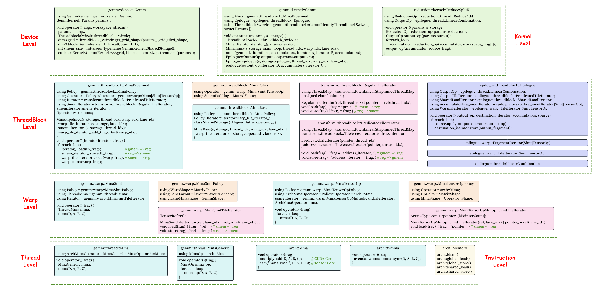

# CUTLASS

CUTLASS是CUDA Templates for Linear Algebra Subroutines and Solvers的缩写，是基于CUDA运行时的线性代数例程与求解器的C++模板库，用于实现高性能的矩阵乘法GEMM及其相关计算。除通用矩阵乘法之外，CUTLASS通过隐式GEMM算法实现高性能的卷积操作。

> 使用模板库的优势在于，一些在计算过程中不变的配置，例如分片形状与迭代策略，可以使用模板参数在编译期间确定，从而只使用函数参数传递数据。

CUTLASS库的源码可在https://github.com/NVIDIA/cutlass网址获得，其包括CUTLASS模板库与CuTe模板库。其中CUTLASS模板库是指CUTLASS 2.X实现版本，通过各层级的模板库抽象提供GEMM实现；而CuTe模板库是自CUTLASS 3.0版本引入的新模板库，通过Layout对象和Tensor对象提供GEMM实现。需要注意的是，CUTLASS 3.0版本需要CUDA 11.4及以上版本，且GPU设备的计算能力为SM70及以上版本。

CUTLASS库包括若干组件。在顶层include目录中提供CUTLASS模板库和CuTe模板库的头文件，应用程序编程需要将顶层include目录添加到编译器的头文件搜索路径；在顶层tools目录中提供CUTLASS Instance模板实例、CUTLASS Profiler分析器、CUTLASS Utilities额外工具；在顶层examples目录中提供使用示例；在顶层media目录中提供文档；在顶层test目录中提供测试组件。

```shell
.
├── include       # Top-level include directory. Client applications should target this path.
│   ├── cutlass   # CUTLASS Template Library, CUDA Templates for Linear Algebra Subroutines and Solvers
│   └── cute      # CuTe Template Library, CuTe Layout, layout algebra, MMA/Copy atoms, tiled MMA/Copy
├── tools
│   ├── library   # CUTLASS Instance Library, static/dynamic library containing all kernel instantiations of interest
│   ├── profiler  # CUTLASS Profiler
│   └── util      # CUTLASS Utilities
├── examples      # CUTLASS Examples
├── media         # Documentation
└── test
```

> 在项目结构中，通常文件目录与命名空间的组成方式是一致的，例如，命名空间cutlass::gemm::device对应到cutlass/gemm/device目录。因为CUTLASS模板库的所有代码都位于cutlass根命名空间中，故在介绍时默认省略cutlass::命名空间。

多维对象（multidimensional object）是一个统称，可以指数组（array）、矩阵（matrix）、张量（tensor）、索引空间（index space）、形状（shape）、跨步（stride）、布局（layout）等。逻辑数目（logical number）是指，在逻辑表示上，有效元素的数目。实际存储数目（physical number）是指，在内存空间中进行存储时，占用物理存储空间的实际存储的元素数目，包括有效元素和填充元素。

使用Index表示某个逻辑维度轴上的索引，使用Extent表示某个逻辑维度轴上的逻辑维数，使用Rank表示维度轴的数目，使用Size表示全部逻辑元素的数目；使用LongIndex表示在内存空间中存储位置的线性偏移，使用Capacity表示多维对象在内存中实际需要存储的元素数目，包括填充元素。

# Host Utility

在项目顶层的tools/util/include/cutlass目录中，提供CUTLASS的各种功能的工具模板类，实际使用时可查阅目录中所提供的头文件，此处只是列举一些常用的工具模板类。注意，应用程序需要将顶层tools/util/include目录添加到编译器的头文件搜索路径，完整的是tools/util/include/cutlass/util路径。

在cutlass/util/device_memory.h头文件中，提供GPU设备全局内存管理函数的C++包装接口DeviceAllocation\<T\>模板类，其使用smart_ptr智能指针对内存空间地址指针进行管理，在模板类的实例对象超出作用域时，会自动释放已分配的设备内存，避免内存泄漏问题。

```c++
__global__ void demo_device_alloc_kernel(float *device_ptr) {}

void demo_device_alloc() {
    int num_of_float = 1024;
    // using allocation = cutlass::DeviceAllocation<T>;
    cutlass::device_memory::allocation<float> device_alloc(num_of_float);
    demo_device_alloc_kernel<<<128, 128>>>(device_alloc.get());
    // Device memory is automatically freed when device_alloc goes out of scope
}
```

在cutlass/util/host_tensor.h头文件中，提供HostTensor<T,Layout>模板类，用于表示一个张量对象，并在主机端或设备端分配存储空间。

```c++
template <
    typename Element,  // Data type of element stored within tensor (concept: NumericType)
    typename Layout    // Defines a mapping from logical coordinate to linear memory (concept: Layout)
>
class HostTensor {
public:
    // Note: Below is used to handle packing of subbyte elements
    // kBitsStoredVec          : The bits of store vec that could be divisiable by the element
    // kElementsPerStoredVec   : The number of elements could be stored in per store vec
    // kNumStoragePerStoredVec : How much storage(i.e. sizeof(element storage)) the store vec needs to consume.
    //                           Usually the element storage of subbyte is uint8_t.
    // Example
    //  int2:  kBitsStoredVec = 8; kElementsPerStoredVec = 4; kNumStoragePerStoredVec = 1 uint8_t;
    //  int4:  kBitsStoredVec = 8; kElementsPerStoredVec = 2; kNumStoragePerStoredVec = 1 uint8_t;
    static constexpr int kBitsStoredVec = (sizeof_bits<Element>::value < 8)
        ? cutlass::lcm(sizeof_bits<Element>::value, 8) : sizeof_bits<Element>::value;
    static constexpr int kElementsPerStoredVec = kBitsStoredVec / sizeof_bits<Element>::value;
    static constexpr int kNumStoragePerStoredVec = kBitsStoredVec / (sizeof(Element) * 8);

private:
    TensorCoord extent_;  // Extent of tensor in logical dimensions
    Layout layout_;       // Layout object
    
    // Host-side memory allocation. Avoid the std::vector<bool> specialization
    std::vector<std::conditional_t<std::is_same_v<Element,bool>, uint8_t, Element>> host_;
    // Device-side memory. using allocation = cutlass::DeviceAllocation<T>
    device_memory::allocation<Element> device_;

public:
    // Constructs a tensor given an extent and layout
    HostTensor(TensorCoord const &extent, Layout const &layout, bool device_backed = true) {
        this->reset(extent, layout, device_backed);
    }
    
    // Updates the extent and layout of the HostTensor. Allocates memory according to the new extent and layout.
    void reset(TensorCoord const &extent, Layout const &layout, bool device_backed_ = true) {                        
        extent_ = extent;
        layout_ = layout;
        this->reserve(size_t(layout_.capacity(extent_)), device_backed_);
    }
    
    // Resizes internal memory allocations without affecting layout or extent
    void reserve(size_t count, bool device_backed_ = true) {
        // @param count             size of tensor in elements
        // @param device_backed_    if true, device memory is also allocated
        device_.reset();
        host_.clear();
        count = (count + kElementsPerStoredVec - 1) / kElementsPerStoredVec * kNumStoragePerStoredVec;
        host_.resize(count);
        // Allocate memory
        Element* device_memory = nullptr;
        if (device_backed_) { device_memory = device_memory::allocate<Element>(count); }
        device_.reset(device_memory, device_backed_ ? count : 0);
    }
```

一个示例如下所示，使用单精度列主序存储一个二维矩阵张量，并获得该矩阵的主机内存地址指针与设备内存地址指针，及其TensorRef和TensorView对象。

```c++
void demo_tensor() {
    int rows = 128;
    int columns = 96;
    cutlass::HostTensor<float, cutlass::layout::ColumnMajor> tensor({rows, columns});
    float *host_ptr = tensor.host_data();
    cutlass::TensorRef<float, cutlass::layout::ColumnMajor> host_ref = tensor.host_ref();
    cutlass::TensorView<float, cutlass::layout::ColumnMajor> host_view = tensor.host_view();
    float *device_ptr = tensor.device_data();
    cutlass::TensorRef<float, cutlass::layout::ColumnMajor> device_ref = tensor.device_ref();
    cutlass::TensorView<float, cutlass::layout::ColumnMajor> device_view = tensor.device_view();
}
```

在使用HostTensor<T,Layout>模板类时，应用程序需要保证主机内存中数据与设备内存中数据的同步，该模板类提供若干同步方法，如下所示。

```c++
template <typename Element, typename Layout>
class HostTensor {
private:
    std::vector<std::conditional_t<std::is_same_v<Element,bool>, uint8_t, Element>> host_;
    device_memory::allocation<Element> device_;

public:
    // Returns true if device memory is allocated
    bool device_backed() const { return (device_.get() == nullptr) ? false : true; }
    
    // Copies data from device to host
    void sync_host() {
        if (device_backed()) { device_memory::copy_to_host(host_data(), device_data(), size()); }
    }
    
    // Copies data from host to device
    void sync_device() {
        if (device_backed()) { device_memory::copy_to_device(device_data(), host_data(), size()); }
    }
};
```

在cutlass/util/tensor_view_io.h头文件中，对位于主机端上的TensorView对象重载了流输出运算符operator<<()，以方便打印元素数据，如下所示。

```c++
void demo_print() {
    int rows = 2;
    int columns = 3;
    cutlass::HostTensor<int, cutlass::layout::ColumnMajorInterleaved<2>> tensor({rows, columns});
    cutlass::TensorView<int, cutlass::layout::ColumnMajorInterleaved<2>> host_view = tensor.host_view();
    int val = 1;
    for (int i = 0; i < rows; i++) {
        for (int j = 0; j < columns; j++) {
            host_view[{i, j}] = val++;
        }
    }
    std::cout << tensor.host_view() << std::endl;
    int *host_ptr = tensor.host_data();
    for (int i = 0; i < tensor.capacity(); printf("%d ", host_ptr[i++]));
    printf("\n");
}
```

```shell
1, 2, 3,
4, 5, 6
1 2 4 5 3 0 6 0 
```

在cutlass/util/reference/host/tensor_fill.h头文件和cutlass/util/reference/device/tensor_fill.h头文件中，提供用于初始化TensorView对象的各种辅助方法，可对主机内存对象或设备内存对象进行指定模式的初始化，包括填充指定值、正则随机初始化、高斯随机初始化等。

```c++
void demo_fill() {
    int rows = 128;
    int columns = 96;
    cutlass::HostTensor<float, cutlass::layout::ColumnMajor> tensor({rows, columns});

    // 填充给定值
    float x = 3.14159f;
    cutlass::reference::host::TensorFill(tensor.host_view(), x);
    cutlass::reference::device::TensorFill(tensor.device_view(), x);

    uint64_t seed = 0x2024;
    int non_zero_bits = 2;

    // 正则随机初始化
    float maximum = 4;
    float minimum = -4;
    cutlass::reference::host::TensorFillRandomUniform(tensor.host_view(), seed, maximum, minimum, non_zero_bits);
    cutlass::reference::device::TensorFillRandomUniform(tensor.device_view(), seed, maximum, minimum, non_zero_bits);

    // 高斯初始化
    float mean = 0.5;
    float stddev = 2.0;
    cutlass::reference::host::TensorFillRandomGaussian(tensor.host_view(), seed, mean, stddev, non_zero_bits);
    cutlass::reference::device::TensorFillRandomGaussian(tensor.device_view(), seed, mean, stddev, non_zero_bits);
}
```

其中，随机初始化方法都可以接受一个non_zero_bits参数，用于指定二进制小数部分至少多少位数字不为零值。

在cutlass/util/reference/host/gemm.h头文件中，提供主机端GEMM通用矩阵乘法计算的实现，一个使用示例如下所示。

```c++
void demo_host_gemm() {
    int M = 64, N = 32, K = 16;
    cutlass::half_t alpha = 1.5_hf, beta = -1.25_hf;

    cutlass::HostTensor<cutlass::half_t, cutlass::layout::ColumnMajor> A({M, K});
    cutlass::HostTensor<cutlass::half_t, cutlass::layout::ColumnMajor> B({K, N});
    cutlass::HostTensor<cutlass::half_t, cutlass::layout::ColumnMajor> C({M, N});
    uint64_t seed = 0x2024;
    cutlass::half_t mean = 0.5_hf;
    cutlass::half_t stddev = 2.0_hf;
    cutlass::reference::host::TensorFillRandomGaussian(A.host_view(), seed, mean, stddev);
    cutlass::reference::host::TensorFillRandomGaussian(B.host_view(), seed, mean, stddev);
    cutlass::reference::host::TensorFillRandomGaussian(C.host_view(), seed, mean, stddev);

    cutlass::reference::host::Gemm<
        cutlass::half_t, cutlass::layout::ColumnMajor,
        cutlass::half_t, cutlass::layout::ColumnMajor,
        cutlass::half_t, cutlass::layout::ColumnMajor,
        cutlass::half_t, cutlass::half_t
    > gemm_op;

    gemm_op({M, N, K}, alpha, A.host_view(), B.host_view(), beta, C.host_view());
    std::cout << C.host_view() << std::endl;
}
```

在cutlass/util/reference/host/tensor_compare.h头文件中，提供主机端的TensorEquals()方法，用于判断两个主机端的HostTensor对象是否相等。

```c++
bool same = cutlass::reference::host::TensorEquals(tensor1.host_view(), tensor2.host_view());
```

在cutlass/util/reference/host/tensor_elementwise.h头文件中，提供主机端内存中TensorView对象的逐元素操作，例如TensorAdd()函数、TensorSub()函数、TensorMul()函数、TensorDiv()函数、TensorModulus()函数，以及自定义的TensorFuncBinaryOp结构体等。

# Common Concept

在项目顶层的cutlass目录中，提供CUTLASS在各个硬件层级对GEMM的实现代码，以及所需要的辅助类型，如下所示。

```shell
cutlass  # CUTLASS Template Library
├── *          # Fundamental types
├── layout     # Layout type for matrix, tensor and other mathematical Object in memory
├── detail     # Helper for macros and others
├── platform   # Platform features
├── arch       # Architecture features (including instruction implementation)
├── gemm       # GEneral Matrix Multiply computations
│   ├── device       # Launch kernels
│   ├── kernel       # Kernels
│   ├── threadblock  # Cta Tile
│   ├── warp         # Warp Tile
│   └── thread       # Thread Tile
├── transform  # Code specialized for layout, type, and domain transformations
├── epilogue   # Epilogue rearranges result to canonical layouts, and supports conversion and reduction operations
├── reduction  # Reduction kernels
└── conv       # Implict GEMM for Convolution
```

## Fundamental Type

CUTLASS沿用C++标准库的基本类型，可用于主机端代码与设备端代码，并且与设备的计算能力无关。此外，CUTLASS还额外定义了一些数值类型。需要注意的是，一些类型或函数在较低的架构上并不支持，例如hrsqrt函数，可在编译时使用-arch=sm_70指定目标架构。

在cutlass/numeric_types.h头文件中，提供一些特殊数值类型的定义，如下所示。

| 数值类型   | 字面量后缀 | 描述                                   |
| ---------- | ---------- | -------------------------------------- |
| half_t     | _hf        | IEEE半精度浮点数；尾数10位，指数5位    |
| bfloat16_t | _bf16      | BFloat16类型；尾数7位，指数8位         |
| tfloat32_t | _tf32      | Tensor Float 32类型；尾数10位，指数8位 |
| int4_t     | _s4        | 有符号4位整型                          |
| uint4_t    | _u4        | 无符号4位整型                          |
| bin1_t     | _b1        | 一位二进制位                           |

```c++
template <int Bits, bool Signed = true>
struct integer_subbyte {
    using Storage = uint8_t;  // Storage type
    static constexpr Storage bits_mask_ = Storage(Storage(-1) >> (8 - Bits));       // bitmask for truncation
    static constexpr Storage sign_mask_ = Storage((Signed ? 1 : 0) << (Bits - 1));  // bitmask for the sign bit
    Storage storage;
}

using int4b_t = integer_subbyte<4, true>;    // 4-bit Integer type
using uint4b_t = integer_subbyte<4, false>;  // 4-bit Unsigned integer type
using bin1_t = bool;                         // 1-bit binary type
```

在cutlass/numeric_size.h头文件中，提供辅助模板sizeof_bits\<T\>的定义，用于获取一个类型所占用的二进制位的数目。

```c++
// defines the size of an element in bits
template <typename T>
struct sizeof_bits { static constexpr int value = int(sizeof(T) * 8); };

template <int Bits, bool Signed>
struct sizeof_bits<integer_subbyte<Bits,Signed>> { static constexpr int value = Bits; };

template <>
struct sizeof_bits<bin1_t> { static constexpr int value = 1; };

template <>
struct sizeof_bits<void> { static constexpr int value = 0; };
```

## Macro and Platform

在cutlass/cutlass.h头文件中，提供一个枚举类型Status的定义，用于标识CUTLASS库的执行状态，此外还提供一些常量定义。

```c++
/// Status code returned by CUTLASS operations
enum class Status {
    kSuccess,                  ///< Operation was successful.
    kErrorMisalignedOperand,   ///< operands fail alignment requirements.
    kErrorInvalidDataType,     ///< DataType fails requirement.
    kErrorInvalidLayout,       ///< Layout fails alignment requirement.
    kErrorInvalidProblem,      ///< Specified problem size is not supported by operator.
    kErrorNotSupported,        ///< Operation is not supported on current device.
    kErrorWorkspaceNull,       ///< The given workspace is null when it is required to be non-null.
    kErrorInternal,            ///< An error within CUTLASS occurred.
    kErrorArchMismatch,        ///< CUTLASS runs on a device that it was not compiled for.
    kErrorInsufficientDriver,  ///< CUTLASS runs with a driver that is too old.
    kErrorMemoryAllocation,    ///< Kernel launch failed due to insufficient device memory.
    kInvalid                   ///< Status is unspecified.
};

static const int NumThreadsPerWarp = 32;
static const int NumThreadsPerWarpGroup = 128;
static const int NumWarpsPerWarpGroup = NumThreadsPerWarpGroup / NumThreadsPerWarp;
static const int NumThreadsPerHalfWarp = NumThreadsPerWarp / 2;
static const int NumThreadsPerQuad = 4;
static const int NumThreadsPerQuadPair = NumThreadsPerQuad * 2;
```

在cutlass/detail/helper_macros.hpp头文件中，提供一些辅助宏定义，如下所示。

```c++
#define CUTLASS_HOST_DEVICE __forceinline__ __device__ __host__
#define CUTLASS_DEVICE      __forceinline__ __device__
#define CUTLASS_HOST        __host__
#define CUTLASS_GLOBAL      __global__ static
```

在cutlass/platform/platform.h头文件中，提供一些模板元的定义，如下所示。这些模板元与C++标准库中的类似，用于在编译过程中对一些类型做出假设。

```c++
template<typename _Tp, _Tp __v>
struct integral_constant {
    static constexpr _Tp value = __v;
    typedef integral_constant<_Tp, __v> type;
    typedef _Tp value_type;
    constexpr   operator value_type() const noexcept { return value; }
    constexpr value_type operator()() const noexcept { return value; }
};

using true_type  = integral_constant<bool, true>;   // compile-time boolean with true value
using false_type = integral_constant<bool, false>;  // compile-time boolean with false value

template<typename _Tp, typename _Up>
struct is_same : public false_type {};

template<typename _Tp>               
struct is_same<_Tp, _Tp> : public true_type {};

template<bool, typename _Tp = void>
struct enable_if {};

template<typename _Tp>
struct enable_if<true, _Tp> { typedef _Tp type; };                        // Partial specialization for true

template<bool _Cond, typename _Iftrue, typename _Iffalse>
struct conditional { typedef _Iftrue type; };

template<typename _Iftrue, typename _Iffalse>
struct conditional<false, _Iftrue, _Iffalse> { typedef _Iffalse type; };  // Partial specialization for false
```

## Array

模板类Array<T,N>是一个固定长度的数组，存储N个T类型的元素，元素的数据类型可以是小于一个字节的亚类型（Sub-Type），亚类型的元素之间紧凑存储。需要注意的是，对于亚类型元素而言，在使用sizeof(Array<T,N>)运算符时，其返回结果仍然是以字节为单位的，且最小是一个字节。

在CUTLASS中实例化Array<T,N>对象时，一个线程通常会使用多个寄存器来存储数组元素，并且常被用于表示一个Fragment矩阵片段。当线程的寄存器溢出时，则会使用线程的局部内存来存储数组元素。当使用\_\_shared\_\_修饰符时，则会使用共享内存来存储数组元素。

### Array<T,N>

在cutlass/array.h头文件中，提供Array<T,N>的定义，如下所示。

```c++
/// Statically sized array for any data type
template <typename T, int N, bool RegisterSized = sizeof_bits<T>::value >= 32>
struct Array;

/// Statically sized array for any data type
template<typename T, int N>
struct Array<T, N, true> {
    using Storage = T;  /// Storage type
    using Element = T;  /// Element type
    static constexpr size_t kStorageElements = N;  /// Number of storage elements
    static constexpr size_t kElements = N;         /// Number of logical elements
    
    Storage storage[kElements];  /// Internal storage
    
    typedef T value_type;
    typedef size_t size_type;
    typedef value_type& reference;
    typedef value_type* pointer;

    reference operator[](size_type pos) { return reinterpret_cast<reference>(storage[pos]); }
    pointer data()                      { return reinterpret_cast<pointer>(storage); }
    constexpr size_type size() const    { return kElements; }
};
```

AlignedArray继承自Array<T,N>模板类，但AlignedArray<T,N,Align>可以指定其内部的用于存储元素的内存空间按照Alignment字节进行对齐。

在cutlass/array.h头文件中，提供AlignedArray<T,N,Align>的定义，如下所示。

```c++
/// Aligned array type
template<typename T, int N, int Alignment = (sizeof_bits<T>::value * N + 7) / 8>
class alignas(Alignment) AlignedArray: public Array<T,N> { };
```

### AlignedBuffer

模板类AlignedBuffer<T,N,Align>是一个固定长度的缓冲区，存储N个T类型的元素，并且内部的用于存储元素的内存空间按照Align字节进行对齐。AlignedBuffer常用于获取一段按照指定字节对齐的连续内存空间，例如设备的全局内存或共享内存，以用于向量化操作。

在cutlass/aligned_buffer.h头文件中，提供AlignedBuffer<T,N,Align>的定义，如下所示。

```c++
/// Modifies semantics of cutlass::Array<> to provide guaranteed alignment. 
template <typename T, int N, int Align = 16>
struct AlignedBuffer {
public:
    using Storage = uint8_t;          /// Internal storage type
    static int const kCount = N;      /// Number of logical elements held in buffer
    static int const kAlign = Align;  /// Alignment requirement in bytes
    static int const kBytes = (sizeof_bits<T>::value * N + 7) / 8;  /// Number of storage elements

    typedef T value_type;
    typedef size_t size_type;
    typedef value_type& reference;
    typedef value_type* pointer;

private:
    alignas(Align) Storage storage[kBytes];  /// Internal storage

public:
    pointer data()                   { return reinterpret_cast<pointer>(storage); }
    constexpr size_type size() const { return kCount; }
};
```

如下一个示例，在共享内存上获取一段连续的内存空间，元素是half_t类型。

```c++
__global__ void demo_aligned_buffer_kernel() {
    const int kN = 1024;
    __shared__ AlignedBuffer<half_t, kN> smem_buffer;
    AlignedArray<half_t, 8> *ptr = reinterpret_cast<AlignedArray<half_t, 8>*>(smem_buffer.data());
    AlignedArray<half_t, 8> value = ptr[threadIdx.x];  // 128-bit shared memory load
}
```

## Type Caster

模板类NumericConverter<T,S>是一个类型转换器，用于将一个一个对象从S类型转换成T类型，该类型转换的过程会尽可能地在目标架构上使用硬件加速。模板类NumericArrayConverter<T,S,N>是一个数组的类型转换器，用于将一个数组中的所有N个元素从S类型转换成T类型。

### NumericConverter

在cutlass/numeric_conversion.h头文件中，提供一个枚举类型FloatRoundStyle的定义，如下所示。该枚举类的值用于标识转换过程中的浮点数舍入方式。

```c++
/// Floating-point rounding style similare to Standard Library's formats but supporting additional rounding options.
enum class FloatRoundStyle {
    round_indeterminate,         ///< rounding mode unknown
    round_toward_zero,           ///< round toward zero
    round_to_nearest,            ///< round to nearest even
    round_to_nearest_satfinite,  ///< round to nearest even, capping value to min and max of destination type
    round_toward_infinity,       ///< round toward infinity
    round_toward_neg_infinity,   ///< round toward negative infinity
    round_half_ulp_truncate,     ///< add 0.5ulp to integer representation then round toward zero
    round_half_ulp_trunc_dntz    ///< like round_half_ulp_truncate, except denorms are rounded *toward* zero
};
```

在cutlass/numeric_conversion.h头文件中，提供NumericConverter<T,S>的定义，如下所示。

```c++
template <typename T, typename S, FloatRoundStyle Round = FloatRoundStyle::round_to_nearest>
struct NumericConverter {
    using result_type = T;
    using source_type = S;
    static FloatRoundStyle const round_style = Round;

    static result_type convert(source_type const & s)  { return static_cast<result_type>(s); }
    result_type operator()(source_type const &s) const { return convert(s); }
};
```

### NumericArrayConverter

在cutlass/numeric_conversion.h头文件中，提供NumericArrayConverter<T,S,N>的定义，如下所示。

```c++
/// Conversion operator for Array
template <
    typename T, typename S, int N,
    FloatRoundStyle Round = FloatRoundStyle::round_to_nearest,
    typename Transform = cutlass::transform::thread::UnaryTransform::Identity
>
struct NumericArrayConverter {
    using result_type = Array<T, N>;
    using source_type = Array<S, N>;
    static FloatRoundStyle const round_style = Round;

    static result_type convert(source_type const & s) {
        result_type result;
        NumericConverter<T, S, Round> convert_;

        for (int i = 0; i < N; ++i) {
            if (platform::is_same<Transform, cutlass::transform::thread::UnaryTransform::Identity>::value) {
                result[i] = convert_(s[i]);
            } else {
                // platform::is_same<Transform, cutlass::transform::thread::UnaryTransform::Conjugate>::value == true
                result[i] = conj(convert_(s[i]));
            }
        }
        return result;
    }

    result_type operator()(source_type const &s) const {
        return convert(s);
    }
};
```

如下一个示例，将一个int类型的数组，转换为一个int8_t类型的数组。

```c++
void demo_converter() {
    int const kN = 16;
    Array<int8_t, kN> destination;
    Array<int, kN> source;
    NumericArrayConverter<int8_t, int, kN> convert;
    destination = convert(source);
}
```

## Coordinate

模板类Coord\<Rank\>是一个通用的逻辑坐标（Logical Coordinate），它具有Rank个维度轴，每个维度轴上可以使用一个索引坐标来确定该维度轴上的元素位置。多个Coord\<Rank\>坐标对象之间支持四则运算，这种坐标之间的加减乘除运算是逐元素（element-wise）的。

在CUTLASS中，常用的坐标是二维的矩阵坐标MatrixCoord、三维的矩阵乘法坐标GemmCoord、四维的批量矩阵乘法坐标BatchedGemmCoord，以及四维的张量坐标Tensor4DCoord和五维的张量坐标Tensor5DCoord。这些坐标常用于在各个层级中表示某种类型的某个元素的逻辑位置。


### Coord\<Rank\>

在cutlass/coord.h头文件中，提供Coord\<Rank\>的定义，如下所示。

```c++
/// Statically-sized array specifying Coords within a tensor
template <
    int Rank_,                     ///< Logical rank of coordinate
    typename Index_ = int,         ///< Index type used for each dimension
    typename LongIndex_ = int64_t  ///< Long index type used for linear offsets
>
struct Coord {
public:
    static int const kRank = Rank_;  /// Number of elements in Coord
    using Index = Index_;            /// Index type used to store elements
    using LongIndex = LongIndex_;    /// Type used to represent linear offsets

private:
    Index idx[kRank];  /// Indices

public:
    /// Default ctor initializes uniformly
    explicit Coord(Index value = Index(0)) {
        for (int i = 0; i < kRank; ++i) {
            idx[i] = value;
        }
    }

    /// Constructs from an array of integers
    Coord(Index const (&_idx)[kRank]) {
        for (int i = 0; i < kRank; ++i) {
            idx[i] = _idx[i];
        }
    }

    /// Member access operator
    Index& operator[](int dim) { return idx[dim]; }
    
    /// Access via index; may limit unrolling potential
    Index& at(int dim) { return idx[dim]; }

    /// Element-wise operators
    Coord operator+(Coord const& b) const { Coord c; for (int i = 0; i < kRank; ++i) { c.idx[i] = idx[i] + b.idx[i]; } return c; }
    Coord operator-(Coord const& b) const { Coord c; for (int i = 0; i < kRank; ++i) { c.idx[i] = idx[i] - b.idx[i]; } return c; }
    Coord operator*(Coord const& b) const { Coord c; for (int i = 0; i < kRank; ++i) { c.idx[i] = idx[i] * b.idx[i]; } return c; }
    Coord operator/(Coord const& b) const { Coord c; for (int i = 0; i < kRank; ++i) { c.idx[i] = idx[i] / b.idx[i]; } return c; }

    /// In-place element-wise operators
    Coord& operator+=(Coord const& b) { for (int i = 0; i < kRank; ++i) { idx[i] += b.idx[i]; } return *this; }
    Coord& operator-=(Coord const& b) { for (int i = 0; i < kRank; ++i) { idx[i] -= b.idx[i]; } return *this; }
    Coord& operator*=(Coord const& b) { for (int i = 0; i < kRank; ++i) { idx[i] *= b.idx[i]; } return *this; }
    Coord& operator/=(Coord const& b) { for (int i = 0; i < kRank; ++i) { idx[i] /= b.idx[i]; } return *this; }

    /// Compare operators
    bool operator< (Coord const &b) const { for (int i = 0; i < kRank; ++i) { if (!(idx[i] <  b[i])) { return false; } } return true; }
    bool operator<=(Coord const &b) const { for (int i = 0; i < kRank; ++i) { if (!(idx[i] <= b[i])) { return false; } } return true; }
    bool operator> (Coord const &b) const { return !(*this <= b); }
    bool operator>=(Coord const &b) const { return !(*this <  b); }
};
```

在cutlass/coord.h头文件中，还提供关于Coord\<Rank\>的辅助函数，如下所示。

```c++
/// Scalar multiplication
template <int Rank, typename Index>
Coord<Rank, Index> operator*(Index s, Coord<Rank, Index> coord) {
    for (int i = 0; i < Rank; ++i) { coord[i] *= s; }
    return coord;
}
/// Scalar multiplication
template <int Rank, typename Index>
Coord<Rank, Index> operator*(Coord<Rank, Index> coord, Index s) {
    for (int i = 0; i < Rank; ++i) { coord[i] *= s; }
    return coord;
}

/// Scalar division
template <int Rank, typename Index>
Coord<Rank, Index> operator/(Index s, Coord<Rank, Index> coord) {
    for (int i = 0; i < Rank; ++i) { coord[i] = s / coord[i]; }
    return coord;
}
/// Scalar division
template <int Rank, typename Index>
Coord<Rank, Index> operator/(Coord<Rank, Index> coord, Index s) {
    for (int i = 0; i < Rank; ++i) { coord[i] = coord[i] / s; }
    return coord;
}

/// Helper to make a 2-element coordinate
template <typename T>
Coord<2, T> make_Coord(T _0, T _1) {
    T values[2] = { _0, _1 };
    return Coord<2, T>(values);
}

/// Helper to make a 3-element coordinate
template <typename T>
Coord<3, T> make_Coord(T _0, T _1, T _2) {
    T values[3] = { _0, _1, _2 };
    return Coord<3, T>(values);
}

/// Helper to make a 4-element coordinate
template <typename T>
Coord<4, T> make_Coord(T _0, T _1, T _2, T _3) {
    T values[4] = { _0, _1, _2, _3 };
    return Coord<4, T>(values);
}

/// Helper to make a 5-element coordinate
template <typename T>
Coord<5, T> make_Coord(T _0, T _1, T _2, T _3, T _4) {
    T values[5] = { _0, _1, _2, _3, _4 };
    return Coord<5, T>(values);
}
```

### MatrixCoord

在cutlass/matrix_coord.h头文件中，提供MatrixCoord的定义，如下所示。

```c++
/// MatrixCoord wraps Coord<2, int> to provide a helper for accessing named dimensions.
/// Classes expecting a coordinate in the rank=2 index space of a matrix should use MatrixCoord.
struct MatrixCoord : public Coord<2, int> {
public:
    using Index = int;                           /// Integer-valued index
    using Base = Coord<2, Index>;                /// Base type is a Coord of rank=2
    using LongIndex = typename Base::LongIndex;  /// LongIndex type

private:
    /// Syntax = (row, column)
    static int const kRow = 0;     /// Rows dimension
    static int const kColumn = 1;  /// Columns dimension

public:
    /// Default ctor
    MatrixCoord() {}

    /// Helper to construct from a row and column
    MatrixCoord(Index row, Index column) : Base(make_Coord(row, column)) {}

    /// Returns the row of the coordinate
    Index & row() { return this->at(kRow); }

    /// Returns the column of the coordinate
    Index & column() { return this->at(kColumn); }
};
```

### GemmCoord

在cutlass/gemm_coord.h头文件中，提供GemmCoord和BatchedGemmCoord的定义，如下所示。

```c++
/// GemmCoord is a structure derived from Coord<3> that specifies a location within the coordinate space of a GEMM problem.
struct GemmCoord : public Coord<3, int> {
    typedef int Index;             /// Integer-valued index
    typedef Coord<3, Index> Base;  /// Base type is a Coord of rank=3

    /// Syntax = (m, n, k)
    static int const kM = 0;  /// GEMM M dimension - rows of the output C matrix
    static int const kN = 1;  /// GEMM N dimension - columns of the output C matrix
    static int const kK = 2;  /// GEMM K dimension - inner dimension of the GEMM problem

    /// Default ctor
    GemmCoord() {}

    /// Helper to construct from a K, N, M, batch variables
    GemmCoord(Index m, Index n, Index k) : Base(make_Coord(m, n, k)) {}

    /// Returns reference to the GEMM M coordinate
    Index & m() { return this->at(kM); }

    /// Returns reference to the GEMM N coordinate
    Index & n() { return this->at(kN); }

    /// Returns reference to the GEMM K coordinate
    Index & k() { return this->at(kK); }
};

/// BatchedGemmCoord is a structure derived from Coord<4> that specifies a location within the coordinate space of a batched GEMM problem.
struct BatchedGemmCoord : public Coord<4, int> {
    typedef int Index;             /// Integer-valued index
    typedef Coord<4, Index> Base;  /// Base type is a Coord of rank=4

    /// Syntax = (m, n, k, batch)
    static int const kM = 0;      /// GEMM M dimension - rows of the output C matrix
    static int const kN = 1;      /// GEMM N dimension - columns of the output C matrix
    static int const kK = 2;      /// GEMM K dimension - inner dimension of the GEMM problem
    static int const kBatch = 3;  /// GEMM Batch dimension - inner dimension of the GEMM problem

    /// Default ctor
    BatchedGemmCoord() {}

    /// Helper to construct from a K, N, M, and batch variables
    BatchedGemmCoord(Index m, Index n, Index k, Index b) : Base(make_Coord(m, n, k, b)) {}

    /// Returns reference to the GEMM M coordinate
    Index & m() { return this->at(kM); }

    /// Returns reference to the GEMM N coordinate
    Index & n() { return this->at(kN); }

    /// Returns reference to the GEMM K coordinate
    Index & k() { return this->at(kK); }

    /// Returns reference to the GEMM batch coordinate
    Index & batch() { return this->at(kBatch); }
};
```

### Tensor[4D|5D]Coord

在cutlass/tensor_coord.h头文件中，提供Tensor4DCoord和Tensor5DCoord的定义，如下所示。

```c++
/// Defines a canonical 4D coordinate used by tensor operations.
struct Tensor4DCoord : public Coord<4> {
    using Base = Coord<4>;                       /// Base class
    using Index = typename Base::Index;          /// Index type
    using LongIndex = typename Base::LongIndex;  /// LongIndex type

    /// Syntax = (n, h, w, c)
    static int const kN = 0;  /// Batch dimension
    static int const kH = 1;  /// Height dimension
    static int const kW = 2;  /// Width dimension
    static int const kC = 3;  /// Channels dimension

    /// Default ctor
    Tensor4DCoord() {}

    /// Helper to construct from N, H, W, and C.
    Tensor4DCoord(Index n, Index h, Index w, Index c) : Base(make_Coord(n, h, w, c)) {}

    /// Returns the batch of the coordinate
    Index & n() { return this->at(kN); }

    /// Returns the row of the coordinate
    Index & h() { return this->at(kH); }

    /// Returns the column of the coordinate
    Index & w() { return this->at(kW); }

    /// Returns the channel of the coordinate
    Index & c() { return this->at(kC); }
};

/// Defines a canonical 5D coordinate used by tensor operations.
struct Tensor5DCoord : public Coord<5> {
    using Base = Coord<5>;                       /// Base class
    using Index = typename Base::Index;          /// Index type
    using LongIndex = typename Base::LongIndex;  /// LongIndex type

    /// Syntax = (n, d, h, w, c)
    static int const kN = 0;  /// Batch dimension
    static int const kD = 1;  /// Depth dimension
    static int const kH = 2;  /// Height dimension
    static int const kW = 3;  /// Width dimension
    static int const kC = 4;  /// Channels dimension

    /// Default ctor
    Tensor5DCoord() {}

    /// Helper to construct from N, D, H, W, and C.
    Tensor5DCoord(Index n, Index d, Index h, Index w, Index c) : Base(make_Coord(n, d, h, w, c)) {}

    /// Returns the batch of the coordinate
    Index & n() { return this->at(kN); }

    /// Returns the batch of the coordinate
    Index & d() { return this->at(kD); }

    /// Returns the row of the coordinate
    Index & h() { return this->at(kH); }

    /// Returns the column of the coordinate
    Index & w() { return this->at(kW); }

    /// Returns the channel of the coordinate
    Index & c() { return this->at(kC); }
};
```

## Shape

在CUTLASS中，与坐标类似的概念是形状（Shape），模板类MatrixShape<Row,Column>用于表示一个二维矩阵的维数形状，模板类GemmShape<M,N,K>用于表示一个三维矩阵乘法的维数形状。实际上，也可以直接使用一个Coord\<Rank\>来表示形状，这能起到同样的作用，但为了代码可读性，还是提供常用形状MatrixShape和GemmShape的类型定义。

### MatrixShape

在cutlass/matrix_shape.h头文件中，提供MatrixShape<Row,Column>的定义，如下所示。

```c++
/// Describes the size of a matrix tile
template <
    int Row_,    ///< rows of a matrix
    int Column_  ///< columns of a matrix
>
struct MatrixShape {
    static int const kRow = Row_;              ///< rows of a matrix
    static int const kColumn = Column_;        ///< columns of a matrix
    static int const kCount = Row_ * Column_;  ///< total number of elements in a matrix

    /// Returns a Coord object
    static Coord<2> toCoord() {
        return make_Coord(kRow, kColumn);
    }
};
```

### GemmShape

在cutlass/gemm_coord.h头文件中，提供GemmShape<M,N,K>的定义，如下所示。

```c++
/// Shape of a matrix multiply-add operation
template <
    int M = 1,  /// Rows of matrix product
    int N = 1,  /// Columns of matrix product
    int K = 1   /// Inner dimension of matrix product
>
struct GemmShape {
    static int const kM = M;
    static int const kN = N;
    static int const kK = K;
    static int const kMN = M * N;
    static int const kMK = M * K;
    static int const kKN = N * K;
    static int const kMNK = M * N * K;
    static int const kCount = kMNK;

    /// Returns a Coord object
    static Coord<3> toCoord() {
        return make_Coord(kM, kN, kK);
    }
};

/// Type alias of the transpose of a GemmShape
template <
    typename Shape  /// concept: GemmShape
>
using GemmShapeTranspose = GemmShape<Shape::kN, Shape::kM, Shape::kK>;
```

## Layout

布局（Layout）是一个用于将元素坐标转换为偏移量的映射（Mapping），它将一个逻辑坐标映射为一个偏移量（Offset）。偏移值是指，多维数组的某个元素的存储位置，与第一个元素的存储位置之间的间距。一个布局由存储顺序（Storage Order）和跨步（Stride）确定，存储顺序是指多个维度轴存储时的先后顺序，跨步是指两个相应元素的存储位置之间的间距。

需要注意的是，在CUTLASS中，偏移和跨步，都是以元素类型Element为单位的，而不是以字节为单位的。

CUTLASS常用的布局是行主序布局RowMajor、列主序布局ColumnMajor、行主序交错布局RowMajorInterleaved、列主序交错布局ColumnMajorInterleaved。这些布局常用于在各个层级中将某种类型的某个元素的逻辑坐标，转换成该元素在内存空间中的偏移量。


### RowMajor

在cutlass/layout/matrix.h头文件中，提供RowMajor的定义，如下所示。

```c++
/// Mapping function for row-major matrices.
class RowMajor {
public:
    static int const kRank = 2;        /// Logical rank of tensor
    static int const kStrideRank = 1;  /// Rank of stride vector

    using Index = int32_t;                         /// Index type used for coordinates
    using LongIndex = int64_t;                     /// Long index type used for offsets
    using TensorCoord = MatrixCoord;               /// Logical coordinate
    using Stride = Coord<kStrideRank, LongIndex>;  /// Stride vector

private:
    Stride stride_;  /// Stride data member

public:
    /// Constructor
    RowMajor(Stride stride) : stride_(stride) {}

    /// Constructor
    RowMajor(LongIndex ldm = 0) : stride_(ldm) {}

    /// Helper returns a layout to a tightly packed tensor
    static RowMajor packed(MatrixCoord const &extent) {
        return RowMajor(extent.column());
    }

    /// Returns the offset of a coordinate in linear memory.
    /// Assumes coordinate has convention (row, column)
    LongIndex operator()(MatrixCoord const &coord) const {
        return LongIndex(coord.row()) * LongIndex(stride_[0]) + coord.column();
    }

    /// Inverse of layout function, mapping linear offset to logical coordinate
    MatrixCoord inverse(LongIndex offset) const {
        return MatrixCoord(Index(offset / stride_[0]), Index(offset % stride_[0]));
    }

    /// Compute the number of contiguous elements needed to store a tensor with the given size
    LongIndex capacity(MatrixCoord const &extent) const {
        return LongIndex(extent.row()) * LongIndex(stride_[0]);
    }
};
```

### ColumnMajor

在cutlass/layout/matrix.h头文件中，提供ColumnMajor的定义，如下所示。

```c++
/// Mapping function for column-major matrices.
class ColumnMajor {
public:
    static int const kRank = 2;        /// Logical rank of tensor
    static int const kStrideRank = 1;  /// Rank of stride vector

    using Index = int32_t;                         /// Index type used for coordinates
    using LongIndex = int64_t;                     /// Long index type used for offsets
    using TensorCoord = MatrixCoord;               /// Logical coordinate
    using Stride = Coord<kStrideRank, LongIndex>;  /// Stride vector

private:
    Stride stride_;  /// Stride data member

public:
    /// Constructor
    ColumnMajor(Stride stride) : stride_(stride) {}

    /// Constructor
    ColumnMajor(LongIndex ldm = 0) : stride_(ldm) {}

    /// Helper returns a layout to a tightly packed tensor
    static ColumnMajor packed(MatrixCoord const &extent) {
        return ColumnMajor(extent.row());
    }

    /// Returns the offset of a coordinate in linear memory. 
    /// Assumes coordinate has convention (row, column)
    LongIndex operator()(MatrixCoord const &coord) const {
        return LongIndex(coord.column()) * LongIndex(stride_[0]) + coord.row();
    }

    /// Inverse of layout function, mapping linear offset to logical coordinate
    MatrixCoord inverse(LongIndex offset) const {
        return MatrixCoord(Index(offset % stride_[0]), Index(offset / stride_[0]));
    }

    /// Compute the number of contiguous elements needed to store a tensor with the given size
    LongIndex capacity(MatrixCoord const &extent) const {
        return LongIndex(extent.column()) * LongIndex(stride_[0]);
    }
};
```

### RowMajorInterleaved

在cutlass/layout/matrix.h头文件中，提供RowMajorInterleaved\<Interleave\>的定义，如下所示。

```c++
/// Mapping function for interleaved matrices. 
/// Matrix is structured as row-major arrangement of fixed-size columns.
template <int Interleave>
struct RowMajorInterleaved {
public:
    static int const kRank = 2;        /// Logical rank of tensor
    static int const kStrideRank = 1;  /// Rank of stride vector

    using Index = int32_t;                         /// Index type used for coordinates
    using LongIndex = int64_t;                     /// Long index type used for offsets
    using TensorCoord = MatrixCoord;               /// Logical coordinate
    using Stride = Coord<kStrideRank, LongIndex>;  /// Stride vector

    static int const kInterleave = Interleave;  /// Size of interleaved columns

private:
    Stride stride_;  /// Stride data member

public:
    /// Constructor
    RowMajorInterleaved(Stride stride) : stride_(stride) {}

    /// Constructor
    RowMajorInterleaved(LongIndex ldm = 0) : stride_(ldm) {}

    /// Helper returns a layout to a tightly packed tensor
    static RowMajorInterleaved packed(MatrixCoord const &extent) {
        return RowMajorInterleaved(extent.column() * kInterleave);
    }

    /// Returns the offset of a coordinate in linear memory. 
    /// Assumes coordinate has convention (row, column)
    LongIndex operator()(MatrixCoord const &coord) const {
        Index row_major = coord.row() / kInterleave;
        Index row_minor = coord.row() % kInterleave;
        return LongIndex(row_major) * LongIndex(stride_[0]) + LongIndex(coord.column()) * kInterleave + row_minor;
    }

    /// Inverse of layout function, mapping linear offset to logical coordinate
    MatrixCoord inverse(LongIndex offset) const {
        Index row_major = Index(offset / stride_[0]);
        Index residual  = Index(offset % stride_[0]);
        Index column    = residual / kInterleave;
        Index row_minor = residual % kInterleave;
        return MatrixCoord(row_major * kInterleave + row_minor, column);
    }

    /// Compute the number of contiguous elements needed to store a tensor with the given size
    LongIndex capacity(MatrixCoord const &extent) const {
        return (extent.row() + kInterleave - 1) / kInterleave * stride_[0];
    }
};
```

### ColumnMajorInterleaved

在cutlass/layout/matrix.h头文件中，提供ColumnMajorInterleaved\<Interleave\>的定义，如下所示。

```c++
/// Mapping function for interleaved matrices. 
/// Matrix is structured as row-major arrangement of fixed-size columns.
template <int Interleave>
struct RowMajorInterleaved {
public:
    static int const kRank = 2;        /// Logical rank of tensor
    static int const kStrideRank = 1;  /// Rank of stride vector

    using Index = int32_t;                         /// Index type used for coordinates
    using LongIndex = int64_t;                     /// Long index type used for offsets
    using TensorCoord = MatrixCoord;               /// Logical coordinate
    using Stride = Coord<kStrideRank, LongIndex>;  /// Stride vector

    static int const kInterleave = Interleave;  /// Size of interleaved columns

private:
    Stride stride_;  /// Stride data member

public:
    /// Constructor
    RowMajorInterleaved(Stride stride) : stride_(stride) {}

    /// Constructor
    RowMajorInterleaved(LongIndex ldm = 0) : stride_(ldm) {}

    /// Helper returns a layout to a tightly packed tensor
    static RowMajorInterleaved packed(MatrixCoord const &extent) {
        return RowMajorInterleaved(extent.column() * kInterleave);
    }

    /// Returns the offset of a coordinate in linear memory. 
    /// Assumes coordinate has convention (row, column)
    LongIndex operator()(MatrixCoord const &coord) const {
        Index row_major = coord.row() / kInterleave;
        Index row_minor = coord.row() % kInterleave;
        return LongIndex(row_major) * LongIndex(stride_[0]) + LongIndex(coord.column()) * kInterleave + row_minor;
    }

    /// Inverse of layout function, mapping linear offset to logical coordinate
    MatrixCoord inverse(LongIndex offset) const {
        Index row_major = Index(offset / stride_[0]);
        Index residual  = Index(offset % stride_[0]);
        Index column    = residual / kInterleave;
        Index row_minor = residual % kInterleave;
        return MatrixCoord(row_major * kInterleave + row_minor, column);
    }

    /// Compute the number of contiguous elements needed to store a tensor with the given size
    LongIndex capacity(MatrixCoord const &extent) const {
        return (extent.row() + kInterleave - 1) / kInterleave * stride_[0];
    }
};
```

## Pitch Linear Mode

连续线性模式（Pitch Linear Mode）是一种元素在内存中的组织方式，其最内层维度轴上的元素连续存储，外层维度轴上的元素以内存维度轴的维数为单位进行连续存储。在CUTLASS中，使用的是，二维的连续线性坐标PitchLinearCoord、二维的连续线性形状PitchLinearShape、二维的连续线性布局PitchLinear。


### PitchLinearCoord

在cutlass/pitch_linear_coord.h头文件中，提供PitchLinearCoord的定义，如下所示。

```c++
/// Coordinate in pitch-linear space
struct PitchLinearCoord : public Coord<2, int> {
public:
    using Index = int;                           /// Integer-valued index
    using Base = Coord<2, Index>;                /// Base type is a Coord of rank=2
    using LongIndex = typename Base::LongIndex;  /// Long integer type

private:
    static int const kContiguous = 0;  /// Contiguous dimension
    static int const kStrided = 1;     /// Strided dimension

public:
    /// Default ctor
    PitchLinearCoord() {}

    /// Helper to construct from a row and column
    PitchLinearCoord(Index contiguous_, Index strided_) : Base(make_Coord(contiguous_, strided_)) {}

    /// Returns the contiguous dimension
    Index & contiguous() { return this->at(kContiguous); }

    /// Returns the strided dimension
    Index & strided() { return this->at(kStrided); }
};
```

### PitchLinearShape

在cutlass/pitch_linear_coord.h头文件中，提供PitchLinearShape的定义，如下所示。

```c++
/// Template defining a shape used by pitch-linear operators
template <
    int Contiguous,
    int Strided
>
struct PitchLinearShape {
    static int const kContiguous = Contiguous;
    static int const kStrided = Strided;
    static int const kCount = Contiguous * Strided;
};
```

### PitchLinear

在cutlass/layout/pitch_linear.h头文件中，提供PitchLinear的定义，如下所示。

```c++
/// Mapping function for pitch-linear memory
class PitchLinear {
public:
    static int const kRank = 2;        /// Logical rank of tensor
    static int const kStrideRank = 1;  /// Rank of stride vector

    using Index = int32_t;                         /// Index type used for coordinates
    using LongIndex = int64_t;                     /// Long index type used for offsets
    using TensorCoord = PitchLinearCoord;          /// Logical coordinate
    using Stride = Coord<kStrideRank, LongIndex>;  /// Stride vector

private:
    Stride stride_;  /// Stride data member

public:
    /// Constructor
    PitchLinear(Stride _stride) : stride_(_stride) {}

    /// Constructor
    PitchLinear(LongIndex ldm = 0) : stride_(ldm) {}

    /// Helper returns a layout to a tightly packed tensor
    static PitchLinear packed(TensorCoord const &extent) {
        return PitchLinear(extent.contiguous());
    }

    /// Returns the offset of a coordinate in linear memory. 
    /// Assumes coordinate has convention (contiguous, strided)
    LongIndex operator()(TensorCoord const &coord) const {
        return LongIndex(coord.contiguous()) + LongIndex(coord.strided()) * LongIndex(stride_[0]);
    }

    /// Returns the logical coordinate given an offset.
    TensorCoord inverse(LongIndex index) const {
        return make_Coord(TensorCoord::Index(index % stride_[0]), TensorCoord::Index(index / stride_[0]));
    }
};
```

## TensorOp Layout

为高效利用Tensor Core硬件单元进行矩阵乘加运算，需要对矩阵A、矩阵B、矩阵C和矩阵D的元素布局方式做出规定，使其满足mma.xxx系列指令的要求。

在CUTLASS中，相关布局的基本概念是TensorOpMultiplicand布局，该布局是基于元素位数（Element Size in bits）和交叉数目（Crosswise Size in elements）来定义，适用于.b8、.b16、.b32位数的元素，并且假设所使用的内存是连续线性的PitchLinear内存。


### TensorOpMultiplicand

在cutlass/layout/tensor_op_multiplicand_sm75.h头文件中，提供TensorOpMultiplicand的定义，如下所示。

```c++
/// Template based on element size (in bits) - defined in terms of pitch-linear memory and Crosswise size (in elements).
/// This one is the base class of all Ampere/Turing fp16/bf16/int8/int4/int1 tensor core kernels. tf32 TN uses this too.
/// 通常情况下，Crosswise = platform::min(128 / sizeof(Element), ThreadblockShape::k[M|N]);
/// 于是，Crosswise的取值，对于.b8为128，对于.b16为64，对于.b32为32
template <int ElementSize, int Crosswise>
struct TensorOpMultiplicand {
    static int const kRank = 2;        /// Logical rank of tensor
    static int const kStrideRank = 1;  /// Rank of stride vector

    using Index = int32_t;                                /// Index type used for coordinates
    using LongIndex = int64_t;                            /// Long index type used for offsets
    using TensorCoord = PitchLinearCoord;                 /// Logical coordinate
    using Stride = Coord<kStrideRank, Index, LongIndex>;  /// Stride vector

    /// This layout is optimized for 128b accesses.
    /// 一次访问的粒度是128位，后文将128位的数据称为一个vector向量，通常使用形如.shared.v4.b32的向量访问
    static int const kAccessSize = 128;
    /// 一个元素的位数，例如.b8、.b16、.b32类型
    static int const kElementSize = ElementSize;
    /// 一次128位的向量访问，能访问几个元素，即，16个.b8元素，8个.b16元素，4个.b32元素
    static int const kElementsPerAccess = kAccessSize / kElementSize;
    /// 交叉数目，指定多少个元素为“一折”，如'Z'型布局中的“一折”
    static int const kCrosswise = Crosswise;

    /// Contiguous dimension of the tile shape matches one shared memory cache line - 128B.
    /// For 128bit access size, it equals to 8 accesses.
    /// 缓冲行是128字节，也是共享内存32个Bank一层的字节数，这等于8次粒度为128位的向量访问
    static int const kTileShapeContiguous = 128 / (kAccessSize / 8);
    /// Number of kblocks to store PartitionShape::kContiguous Elements.
    /// 8次粒度为128位的向量访问的元素数目，除以kCrosswise交叉数目，得到，一个128字节访问的所有元素能构成几个一折
    static int const kFactor = kTileShapeContiguous * kElementsPerAccess / kCrosswise;
    /// The strided dimension needs to be at least (WarpSize(32) / kTileShapeContiguous) = 4 for a warp to access.
    /// To ensure conflict free access, it also needs to be at least (kTileShapeContiguous / kFactor) = 8 / kFactor.
    static int const kTileShapeStride = platform::max(kTileShapeContiguous / kFactor, 32 / kTileShapeContiguous);

    /// Fundamental tile shape in units of vectors to guarantee bank conflict free shared memory load/store.
    /// For kFactor = 1, TileShape = PitchLinearShape<8, 8>;
    /// For kFactor > 1, TileShape = PitchLinearShape<8, 4>;
    using TileShape = PitchLinearShape<kTileShapeContiguous, kTileShapeStride>;

    /// Fundamental partition shape in units of vectors
    using PartitionShape = PitchLinearShape<4, 4>;
    using PartitionCount = PitchLinearShape<
        TileShape::kContiguous / PartitionShape::kContiguous, TileShape::kStrided / PartitionShape::kStrided>;
    using AccessCount = PitchLinearShape<PartitionShape::kContiguous, PartitionShape::kStrided>;

private:
    /// Stride data member. For GEMM, it equals to `kCrosswise * stage`.
    Stride stride_;

public:
    /// Constructor
    TensorOpMultiplicand(Stride stride) : stride_(stride) {}

    /// Constructor
    TensorOpMultiplicand(Index ldm = 0) : stride_(ldm) {}

    /// Helper returns a layout to a tightly packed tensor
    static TensorOpMultiplicand packed(TensorCoord const &extent) {
        return TensorOpMultiplicand(extent[0]);
    }

    /// Returns the offset of a coordinate in linear memory.
    /// Assumes coordinate has convention (contiguous, strided)
    LongIndex operator()(TensorCoord const &coord) const {
        // First, compute cIdx and sIdx of vector within source (in units of vector accesses)
        int vec_contiguous_idx = coord.contiguous() / kElementsPerAccess;
        int vec_strided_idx = coord.strided() / kFactor;

        // Compute the fundamental tile being accessed
        int tile_contiguous_idx = vec_contiguous_idx / (TileShape::kContiguous / kFactor);
        int tile_contiguous_residual = vec_contiguous_idx % (TileShape::kContiguous / kFactor)
            + ((coord.strided() % kFactor) * (TileShape::kContiguous / kFactor));
        int tile_strided_residual = vec_strided_idx % TileShape::kStrided;

        // Compute the 'partition' within the fundamental tile
        int partition_contiguous_idx = tile_contiguous_residual / PartitionShape::kContiguous;
        int partition_strided_idx = tile_strided_residual / PartitionShape::kStrided;
        int partition_contiguous_residual = tile_contiguous_residual % PartitionShape::kContiguous;
        int partition_strided_residual = tile_strided_residual % PartitionShape::kStrided;

        // Then swizzle
        int permuted_vec_contiguous_within_partition = partition_contiguous_residual ^ (partition_strided_residual % 4);
        int permuted_partition_contiguous_within_tile = partition_contiguous_idx ^ (partition_strided_idx % 2);

        // Compute final element location
        int element_contiguous = (tile_contiguous_idx * TileShape::kContiguous
            + permuted_partition_contiguous_within_tile * PartitionShape::kContiguous
            + permuted_vec_contiguous_within_partition)
            * kElementsPerAccess
            + (coord.contiguous() % kElementsPerAccess);
        int element_strided = vec_strided_idx;
        return element_contiguous + element_strided * stride_[0] * kFactor;
    }
};
```

### TensorOpMultiplicandCongruous

以TensorOpMultiplicand布局为基本（称之为基本布局），CUTLASS提出各种其它用途的相关布局。例如，TensorOpMultiplicandCongruous布局是对基本布局的包装，ColumnMajorTensorOpMultiplicandCongruous布局将列主序布局映射为基本布局，RowMajorTensorOpMultiplicandCongruous布局将行主序布局映射为基本布局。

在cutlass/layout/tensor_op_multiplicand_sm75.h头文件中，提供TensorOpMultiplicandCongruous的定义，如下所示。

```c++
/// Template based on element size (in bits) - defined in terms of pitch-linear memory and Crosswise size (in elements).
template <int ElementSize, int Crosswise>
struct TensorOpMultiplicandCongruous {
    static int const kRank = 2;        /// Logical rank of tensor
    static int const kStrideRank = 1;  /// Rank of stride vector

    using Index = int32_t;                                /// Index type used for coordinates
    using LongIndex = int64_t;                            /// Long index type used for offsets
    using TensorCoord = PitchLinearCoord;                 /// Logical coordinate
    using Stride = Coord<kStrideRank, Index, LongIndex>;  /// Stride vector
    
    /// This layout is optimized for 128b accesses
    using Base = TensorOpMultiplicand<ElementSize, Crosswise>;
    static int const kAccessSize = Base::kAccessSize;
    static int const kElementSize = Base::kElementSize;
    static int const kElementsPerAccess = Base::kElementsPerAccess;
    static int const kCrosswise = Base::kCrosswise;
    static int const kFactor = Base::kFactor;
    using TileShape = typename Base::TileShape;
    using PartitionShape = typename Base::PartitionShape;
    using PartitionCount = typename Base::PartitionCount;
    using AccessCount = typename Base::AccessCount;

private:
    Base layout_;

public:
    /// Constructor
    TensorOpMultiplicandCongruous(Stride stride) : layout_(stride) {}
    
    /// Constructor
    TensorOpMultiplicandCongruous(Index ldm = 0) : layout_(ldm) {}

    /// Helper returns a layout to a tightly packed tensor
    static TensorOpMultiplicandCongruous packed(TensorCoord const &extent) {
        return TensorOpMultiplicandCongruous(extent[0]);
    }

    /// Returns the offset of a coordinate in linear memory.
    /// Assumes coordinate has convention (contiguous, strided)
    LongIndex operator()(TensorCoord const &coord) const {
        return layout_(coord);
    }

    /// Inverse of layout function, mapping linear offset to logical coordinate
    TensorCoord inverse(LongIndex offset) const {
        PitchLinearCoord coord = layout_.inverse(offset);
        return coord;
    }
};
```

在cutlass/layout/tensor_op_multiplicand_sm75.h头文件中，提供ColumnMajorTensorOpMultiplicandCongruous的定义，如下所示。

```c++
/// Template mapping a column-major view of pitch-linear memory to TensorOpMultiplicand
template <int ElementSize, int Crosswise>
struct ColumnMajorTensorOpMultiplicandCongruous {
    static int const kRank = 2;        /// Logical rank of tensor
    static int const kStrideRank = 1;  /// Rank of stride vector

    using Index = int32_t;                                /// Index type used for coordinates
    using LongIndex = int64_t;                            /// Long index type used for offsets
    using TensorCoord = MatrixCoord;                      /// Logical coordinate
    using Stride = Coord<kStrideRank, Index, LongIndex>;  /// Stride vector

    /// This layout is optimized for 128b accesses
    using Base = TensorOpMultiplicandCongruous<ElementSize, Crosswise>;
    static int const kAccessSize = Base::kAccessSize;
    static int const kElementSize = Base::kElementSize;
    static int const kElementsPerAccess = Base::kElementsPerAccess;
    static int const kCrosswise = Base::kCrosswise;
    static int const kFactor = Base::kFactor;
    using TileShape = typename Base::TileShape;
    using PartitionShape = typename Base::PartitionShape;
    using PartitionCount = typename Base::PartitionCount;
    using AccessCount = typename Base::AccessCount;

private:
    Base layout_;

public:
    /// Constructor
    ColumnMajorTensorOpMultiplicandCongruous(Stride stride) : layout_(stride) {}

    /// Constructor
    ColumnMajorTensorOpMultiplicandCongruous(Index ldm = 0) : layout_(ldm) {}

    /// Helper returns a layout to a tightly packed tensor
    static ColumnMajorTensorOpMultiplicandCongruous packed(TensorCoord const &extent) {
        return ColumnMajorTensorOpMultiplicandCongruous(extent.row());
    }

    /// Returns the offset of a coordinate in linear memory. 
    /// Assumes coordinate has convention (contiguous, strided)
    LongIndex operator()(TensorCoord const &coord) const {
        return layout_(PitchLinearCoord(coord.row(), coord.column()));
    }

    /// Inverse of layout function, mapping linear offset to logical coordinate
    TensorCoord inverse(LongIndex offset) const {
        PitchLinearCoord coord = layout_.inverse(offset);
        return MatrixCoord(coord.contiguous(), coord.strided());
    }
};
```

在cutlass/layout/tensor_op_multiplicand_sm75.h头文件中，提供RowMajorTensorOpMultiplicandCongruous的定义，如下所示。

```c++
/// Template mapping a row-major view of pitch-linear memory to TensorOpMultiplicand
template <int ElementSize, int Crosswise>
struct RowMajorTensorOpMultiplicandCongruous {
    static int const kRank = 2;        /// Logical rank of tensor
    static int const kStrideRank = 1;  /// Rank of stride vector

    using Index = int32_t;                                /// Index type used for coordinates
    using LongIndex = int64_t;                            /// Long index type used for offsets
    using TensorCoord = MatrixCoord;                      /// Logical coordinate
    using Stride = Coord<kStrideRank, Index, LongIndex>;  /// Stride vector

    /// This layout is optimized for 128b accesses
    using Base = TensorOpMultiplicandCongruous<ElementSize, Crosswise>;
    static int const kAccessSize = Base::kAccessSize;
    static int const kElementSize = Base::kElementSize;
    static int const kElementsPerAccess = Base::kElementsPerAccess;
    static int const kCrosswise = Base::kCrosswise;
    static int const kFactor = Base::kFactor;
    using TileShape = typename Base::TileShape;
    using PartitionShape = typename Base::PartitionShape;
    using PartitionCount = typename Base::PartitionCount;
    using AccessCount = typename Base::AccessCount;

private:
    Base layout_;

public:
    /// Constructor
    RowMajorTensorOpMultiplicandCongruous(Stride stride) : layout_(stride) {}

    /// Constructor
    RowMajorTensorOpMultiplicandCongruous(Index ldm = 0) : layout_(ldm) {}

    /// Helper returns a layout to a tightly packed tensor
    static RowMajorTensorOpMultiplicandCongruous packed(TensorCoord const &extent) {
        return RowMajorTensorOpMultiplicandCongruous(extent.column());
    }

    /// Returns the offset of a coordinate in linear memory. 
    /// Assumes coordinate has convention (contiguous, strided)
    LongIndex operator()(TensorCoord const &coord) const {
        return layout_(PitchLinearCoord(coord.column(), coord.row()));
    }

    /// Inverse of layout function, mapping linear offset to logical coordinate
    TensorCoord inverse(LongIndex offset) const {
        PitchLinearCoord coord = layout_.inverse(offset);
        return MatrixCoord(coord.strided(), coord.contiguous());
    }
}
```

### TensorOpMultiplicandCrosswise

以TensorOpMultiplicand布局为基本（称之为基本布局），CUTLASS提出各种其它用途的相关布局。例如，TensorOpMultiplicandCrosswise布局是对基本布局的包装，ColumnMajorTensorOpMultiplicandCrosswise布局将列主序布局映射为基本布局，RowMajorTensorOpMultiplicandCrosswise布局将行主序布局映射为基本布局。

在cutlass/layout/tensor_op_multiplicand_sm75.h头文件中，提供TensorOpMultiplicandCrosswise的定义，如下所示。

```c++
/// Template based on element size (in bits) - defined in terms of pitch-linear memory and Crosswise size (in elements).
template <int ElementSize, int Crosswise>
struct TensorOpMultiplicandCrosswise {
    static int const kRank = 2;        /// Logical rank of tensor
    static int const kStrideRank = 1;  /// Rank of stride vector

    using Index = int32_t;                                /// Index type used for coordinates
    using LongIndex = int64_t;                            /// Long index type used for offsets
    using TensorCoord = PitchLinearCoord;                 /// Logical coordinate
    using Stride = Coord<kStrideRank, Index, LongIndex>;  /// Stride vector

    /// This layout is optimized for 128b accesses
    using Base = TensorOpMultiplicand<ElementSize, Crosswise>;
    static int const kAccessSize = Base::kAccessSize;
    static int const kElementSize = Base::kElementSize;
    static int const kElementsPerAccess = Base::kElementsPerAccess;
    static int const kCrosswise = Base::kCrosswise;
    static int const kFactor = Base::kFactor;
    using TileShape = typename Base::TileShape;
    using PartitionShape = typename Base::PartitionShape;
    using PartitionCount = typename Base::PartitionCount;
    using AccessCount = typename Base::AccessCount;

private:
    Base layout_;

public:
    /// Constructor
    TensorOpMultiplicandCrosswise(Stride stride) : layout_(stride) {}

    /// Constructor
    TensorOpMultiplicandCrosswise(Index ldm = 0) : layout_(ldm) {}

    /// Helper returns a layout to a tightly packed tensor
    static TensorOpMultiplicandCrosswise packed(TensorCoord const &extent) {
        return TensorOpMultiplicandCrosswise(extent[0]);
    }

    /// Returns the offset of a coordinate in linear memory.
    /// Assumes coordinate has convention (contiguous, strided)
    LongIndex operator()(TensorCoord const &coord) const {
        return layout_(coord);
    }

    /// Inverse of layout function, mapping linear offset to logical coordinate
    TensorCoord inverse(LongIndex offset) const {
        PitchLinearCoord coord = layout_.inverse(offset);
        return coord;
    }
}
```

在cutlass/layout/tensor_op_multiplicand_sm75.h头文件中，提供ColumnMajorTensorOpMultiplicandCrosswise的定义，如下所示。

```c++
/// Template mapping a column-major view of pitch-linear memory to TensorOpMultiplicandCrosswise
template <int ElementSize, int Crosswise>
struct ColumnMajorTensorOpMultiplicandCrosswise {
    static int const kRank = 2;        /// Logical rank of tensor
    static int const kStrideRank = 1;  /// Rank of stride vector

    using Index = int32_t;                                /// Index type used for coordinates
    using LongIndex = int64_t;                            /// Long index type used for offsets
    using TensorCoord = MatrixCoord;                      /// Logical coordinate
    using Stride = Coord<kStrideRank, Index, LongIndex>;  /// Stride vector
    
    /// This layout is optimized for 128b accesses
    using Base = TensorOpMultiplicandCrosswise<ElementSize, Crosswise>;
    static int const kAccessSize = Base::kAccessSize;
    static int const kElementSize = Base::kElementSize;
    static int const kElementsPerAccess = Base::kElementsPerAccess;
    using TileShape = typename Base::TileShape;
    using PartitionShape = typename Base::PartitionShape;
    using PartitionCount = typename Base::PartitionCount;
    using AccessCount = typename Base::AccessCount;

private:
    Base layout_;

public:
    /// Constructor
    ColumnMajorTensorOpMultiplicandCrosswise(Stride stride) : layout_(stride) {}

    /// Constructor
    ColumnMajorTensorOpMultiplicandCrosswise(Index ldm = 0) : layout_(ldm) {}

    /// Helper returns a layout to a tightly packed tensor
    static ColumnMajorTensorOpMultiplicandCrosswise packed(TensorCoord const &extent) {
        return ColumnMajorTensorOpMultiplicandCrosswise(extent.row());
    }

    /// Returns the offset of a coordinate in linear memory.
    /// Assumes coordinate has convention (contiguous, strided)
    LongIndex operator()(TensorCoord const &coord) const {
        return layout_(PitchLinearCoord(coord.row(), coord.column()));
    }

    /// Inverse of layout function, mapping linear offset to logical coordinate
    TensorCoord inverse(LongIndex offset) const {
        PitchLinearCoord coord = layout_.inverse(offset);
        return MatrixCoord(coord.contiguous(), coord.strided());
    }
}
```

在cutlass/layout/tensor_op_multiplicand_sm75.h头文件中，提供RowMajorTensorOpMultiplicandCrosswise的定义，如下所示。

```c++
/// Template mapping a row-major view of pitch-linear memory to TensorOpMultiplicandCrosswise
template <int ElementSize, int Crosswise>
struct RowMajorTensorOpMultiplicandCrosswise {
    static int const kRank = 2;        /// Logical rank of tensor
    static int const kStrideRank = 1;  /// Rank of stride vector

    using Index = int32_t;                                /// Index type used for coordinates
    using LongIndex = int64_t;                            /// Long index type used for offsets
    using TensorCoord = MatrixCoord;                      /// Logical coordinate
    using Stride = Coord<kStrideRank, Index, LongIndex>;  /// Stride vector

    /// This layout is optimized for 128b accesses
    using Base = TensorOpMultiplicandCrosswise<ElementSize, Crosswise>;
    static int const kAccessSize = Base::kAccessSize;
    static int const kElementSize = Base::kElementSize;
    static int const kElementsPerAccess = Base::kElementsPerAccess;
    using TileShape = typename Base::TileShape;
    using PartitionShape = typename Base::PartitionShape;
    using PartitionCount = typename Base::PartitionCount;
    using AccessCount = typename Base::AccessCount;

private:
    Base layout_;

public:
    /// Constructor
    RowMajorTensorOpMultiplicandCrosswise(Stride stride) : layout_(stride) {}

    /// Constructor
    RowMajorTensorOpMultiplicandCrosswise(Index ldm = 0) : layout_(ldm) {}

    /// Helper returns a layout to a tightly packed tensor
    static RowMajorTensorOpMultiplicandCrosswise packed(TensorCoord const &extent) {
        return RowMajorTensorOpMultiplicandCrosswise(extent.column());
    }

    /// Returns the offset of a coordinate in linear memory.
    /// Assumes coordinate has convention (contiguous, strided)
    LongIndex operator()(TensorCoord const &coord) const {
        return layout_(PitchLinearCoord(coord.column(), coord.row()));
    }

    /// Inverse of layout function, mapping linear offset to logical coordinate
    TensorCoord inverse(LongIndex offset) const {
        PitchLinearCoord coord = layout_.inverse(offset);
        return MatrixCoord(coord.strided(), coord.contiguous());
    }
}
```

## Tensor Accessor

张量访问器（Accessor），用于访问在内存中张量的一个元素，它接收一个元素的逻辑坐标，根据张量的起始指针和排列布局，从相应的内存位置上访问元素。

### TensorRef

模板类TensorRef<Element,Layout>持有一个指向张量起始元素位置的ptr\_指针，和一个描述张量元素排列方式的layout\_布局。在访问时，TensorRef接收一个元素的逻辑坐标，然后使用布局layout\_获得该元素在内存中的偏移量，然后根据起始元素的指针ptr\_，使用基址偏移寻址，从相应的内存位置上访问到该元素的值。

值得注意的是，在CUTLASS中，使用TensorRef<Element,Layout>访问内存位置时，其元素类型Element通常是一个基本数据类型，或者是一个Array数组。

在cutlass/tensor_ref.h头文件中，提供TensorRef<Element,Layout>的定义，如下所示。

```c++
/// TensorRef is a template for objects pointing to the start of tensors of arbitrary rank and layout within memory.
/// A TensorRef combines a pointer and a Layout concept.
template <
    typename Element_,  /// Data type of element stored within tensor (concept: NumericType)
    typename Layout_    /// Defines a mapping from logical coordinate to linear memory (concept: Layout)
>
class TensorRef {
public:
    using Element = Element_;    /// Data type of individual access
    using Layout = Layout_;      /// Mapping function from logical coordinate to linear memory
    using Reference = Element&;  /// Reference type to an element

    static int const kRank = Layout::kRank;  /// Logical rank of tensor index space

    using Index = typename Layout::Index;              /// Index type
    using LongIndex = typename Layout::LongIndex;      /// Long index used for pointer offsets
    using TensorCoord = typename Layout::TensorCoord;  /// Coordinate in logical tensor space
    using Stride = typename Layout::Stride;            /// Layout's stride vector

private:
    Element* ptr_;   /// Pointer
    Layout layout_;  /// Layout object maps logical coordinates to linear offsets

public:
    /// Constructs a TensorRef.
    TensorRef() : ptr_(nullptr) {}

    /// Constructs a TensorRef with a pointer and layout object.
    TensorRef(
        Element *ptr,         ///< pointer to start of tensor
        Layout const &layout  ///< layout object containing stride and mapping function
    ) : ptr_(ptr), layout_(layout) {}

    /// Updates the pointer and layout object
    void reset(Element* ptr, Layout const &layout) {
        ptr_ = ptr;
        layout_ = layout;
    }

    /// Returns the pointer to referenced data
    Element * data() const {
        return ptr_;
    }

    /// Returns a reference to the element at a given linear index
    Reference data(LongIndex idx) const { 
        return ptr_[idx];
    }

    /// Computes the offset of an index from the origin of the tensor
    LongIndex offset(TensorCoord const& coord) const {
        return layout_(coord);
    }

    /// Returns a reference to the element at a given Coord
    Reference at(TensorCoord const& coord) const {
        return data(offset(coord));
    }

    /// Returns a reference to the element at a given Coord
    Reference operator[](TensorCoord const& coord) const {
        return data(offset(coord));
    }

    /// Adds an offset to each pointer
    TensorRef & add_pointer_offset(LongIndex offset_) {
        ptr_ += offset_;
        return *this;
    }

    /// Adds an offset to each pointer
    TensorRef & add_coord_offset(TensorCoord const &coord) {
        add_pointer_offset(offset(coord));
        return *this;
    }

    /// Returns a TensorRef offset by a given amount
    TensorRef operator+(TensorCoord const& b) const {
        TensorRef result(*this);
        result.add_coord_offset(b);
        return result;
    }

    /// Returns a TensorRef offset by a given amount
    TensorRef & operator+=(TensorCoord const& b) {
        add_coord_offset(b);
        return *this;
    }

    /// Returns a TensorRef offset by a given amount
    TensorRef operator-(TensorCoord const& b) const {
        TensorRef result(*this);
        result.add_pointer_offset(-offset(b));
        return result;
    }

    /// Returns a TensorRef offset by a given amount
    TensorRef & operator-=(TensorCoord const& b) {
        add_pointer_offset(-offset(b));
        return *this;
    }
};
```

### TensorView

TensorView<Element,Layout>继承自TensorRef<Element,Layout>模板类，但TensorView<Element,Layout>是一个维数都确定的访问器，它假设所访问的张量是确定维数的，即张量在每个维度轴上的维数都是提前确定的。由此性质，TensorView<Element,Layout>可以定义一些有用的函数。

在cutlass/tensor_view.h头文件中，提供TensorView<Element,Layout>的定义，如下所示。

```c++
template <
    typename Element_,  /// Data type of element stored within tensor
    typename Layout_    /// Maps a Coord<Rank_> in the logical tensor index space to the internal n-D array
>
class TensorView : public TensorRef<Element_, Layout_> {
public:
    using Base = cutlass::TensorRef<Element_, Layout_>;  /// Base tensor reference
    using Layout = Layout_;      /// Mapping function from logical coordinate to internal n-D array
    using TensorRef = Base;      /// Underlying TensorRef type
    using Element = Element_;    /// Data type of individual access
    using Reference = Element&;  /// Reference type to an element

    static int const kRank = Layout::kRank;  /// Logical rank of tensor index space

    using Index = typename Layout::Index;              /// Index type
    using LongIndex = typename Layout::LongIndex;      /// Long index used for pointer offsets
    using TensorCoord = typename Layout::TensorCoord;  /// Coordinate in logical tensor space
    using Stride = typename Layout::Stride;            /// Coordinate in storage n-D array

private:
    TensorCoord extent_;  /// View extent

public:
    /// Constructs a TensorView object
    TensorView() {}

    /// Constructs a TensorView object
    TensorView(
        Element *ptr,              ///< pointer to start of tensor
        Layout const &layout,      ///< layout object containing stride and mapping function
        TensorCoord const &extent  ///< size of the view in logical coordinates
    ) : Base(ptr, layout), extent_(extent) {}

    /// Updates the pointer and layout object
    void reset(Element* ptr, Layout const &layout, TensorCoord const &extent) {
        Base::reset(ptr, layout);
        this->resize(extent);
    }

    /// Changes the size of the view without affecting pointer or layout
    void resize(TensorCoord const &extent) {
        this->extent_ = extent;
    }

    /// Returns the number of logical elements
    LongIndex size() const {
        return extent_.product();
    }

    /// Determines whether a location is within a tensor
    bool contains(TensorCoord const& coord) const {
        for (int dim = 0; dim < kRank; ++dim) {
            if (!(coord[dim] >= 0 && coord[dim] < extent(dim))) {
                return false;
            }
        }
        return true;
    }
};
```

# Usage Examples

在cutlass/gemm/device目录中，提供设备层级的GEMM接口，用于在GPU设备上启动矩阵乘法的kernel核函数，主要包括标准GEMM计算、分组GEMM计算、批量GEMM计算、SplitK算法GEMM计算。由模板类提供实现，即cutlass::gemm::device::Gemm模板类、cutlass::gemm::device::GemmArray模板类、cutlass::gemm::device::GemmBatched模板类、cutlass::gemm::device::GemmSplitKParallel模板类。一些GEMM计算的示例如下。

```c++
void demo_gemm() {
    using Gemm = cutlass::gemm::device::Gemm<
        float, cutlass::layout::ColumnMajor,
        float, cutlass::layout::ColumnMajor,
        float, cutlass::layout::ColumnMajor, float
    >;
    Gemm gemm_op;
    cutlass::Status stat = gemm_op(
        {{M, N, K}, {d_A, M}, {d_B, K}, {d_C, M}, {d_C, M}, {alpha, beta}}
    );
}

void demo_gemm_batched() {
    using GemmBatched = cutlass::gemm::device::GemmBatched<
        float, cutlass::layout::ColumnMajor,
        float, cutlass::layout::ColumnMajor,
        float, cutlass::layout::ColumnMajor, float
    >;
    GemmBatched gemm_batched_op;
    cutlass::Status status = gemm_batched_op(
        {{M, N, K}, {d_A, M}, M * K, {d_B, K}, K * N, {d_C, M}, M * N, {d_C, M}, M * N, {alpha, beta}, Batch}
    );
}

void demo_gemm_array() {
    using GemmArray = cutlass::gemm::device::GemmArray<
        float, cutlass::layout::ColumnMajor,
        float, cutlass::layout::ColumnMajor,
        float, cutlass::layout::ColumnMajor, float
    >;
    GemmArray gemm_array_op;
    gemm_array_op(
        {{M, N, K}, d_A_array, M, d_B_array, K, d_C_array, M, d_C_array, M, {alpha, beta}, Batch}
    );
}

void demo_gemm_splitK() {
    using GemmSplitK = cutlass::gemm::device::GemmSplitKParallel<
        float, cutlass::layout::ColumnMajor,
        float, cutlass::layout::ColumnMajor,
        float, cutlass::layout::ColumnMajor, float
    >;
    GemmSplitK gemm_splitK_op;
    int split_num = 16;  // Split K dimension into 16 partitions
    GemmSplitK::Arguments args({M, N, K}, {d_A, M}, {d_B, K}, {d_C, M}, {d_C, M}, {alpha, beta}, split_num);
    size_t workspace_size = GemmSplitK::get_workspace_size(args);
    cutlass::device_memory::allocation<uint8_t> workspace_buffer(workspace_size);
    cutlass::Status status = gemm_splitK_op.initialize(args, workspace_buffer.get());
    status = gemm_splitK_op();
}
```

# GEMM API ^$

CUTLASS模板库对于矩阵乘法GEMM的核心实现代码如下目录所示。并且，在实现代码的几乎每个层级都提供了以default为前缀的默认配置default_xxx.cu，若不清楚每个层级的模板参数如何指定，可以参考这些默认配置。

```shell
cutlass
├── arch       # Architecture features (including instruction implementation)
├── gemm       # GEneral Matrix Multiply computations
│   ├── device       # Launch kernels
│   ├── kernel       # Kernels
│   ├── threadblock  # Cta Tile
│   ├── warp         # Warp Tile
│   └── thread       # Thread Tile
├── transform  # Code specialized for layout, type, and domain transformations
├── epilogue   # Epilogue rearranges result to canonical layouts, and supports conversion and reduction operations
└── reduction  # Reduction kernels
```

实现代码组织为如下图所示的层级结构。注意，图中所展示的一些名称，均是充当API接口的概念，作用可分为两点，即(1)使用下一层级API接口实现某功能，(2)作为API接口提供给上一层级。而其它一些“仅仅是作为某个层级工具类实现，但未参与API接口构建”的概念则未在图中展示。



CUTLASS对通用矩阵乘法GEMM进行并行分片，映射到CUDA并行编程模型中的多个层级资源上，整个流程的示意图如下所示。


## Common Tag

在cutlass/gemm/gemm_enumerated_types.h头文件中，提供一些枚举类型的定义，用于标识操作数、指定操作类型、设置共享内存清除策略，如下所示。

```c++
/// GEMM operand enumeration: D = A * B + C
enum class Operand {
    kA,  /// A multiplicand
    kB,  /// B multiplicand
    kC,  /// Source accumulator
    kD   /// Destination accumulator
};

enum class GemmUniversalMode {
    kGemm,
    kGemmSplitKParallel,
    kBatched,
    kArray,
    kGrouped,
    kInvalid
};

/// Some options for clearing shared memory
enum class SharedMemoryClearOption {
    kNone,           ///< SMEM is in don't-care state
    kZfill,          ///< Kernels fill out of bounds accesses with zeros
    kClearLastStage  ///< Last SMEM stage is explicitly cleared. Mainloop uses 'kNone'
};
```

## Architecture

在cutlass/arch目录中，提供一些基本操作的PTX汇编指令实现，主要包括内存访问指令、mma.xxx系列矩阵乘加指令、wmma.xxx系列矩阵乘加指令。这些PTX汇编指令直接与硬件架构进行交互，不同的硬件架构支持不同的PTX汇编指令，该层级的代码是对PTX汇编指令的包装。

在cutlass/arch/arch.h头文件中，提供LaneId()与SmId()辅助函数，以及设备架构与计算能力的标识。

```c++
/// Computes laneId within a warp
int LaneId() {
    int ret;
    asm("mov.u32 %0, %%laneid;" : "=r"(ret) : );
    return ret;
}

/// Computes SM number the thread is running on
int SmId() {
    int ret;
    asm("mov.u32 %0, %%smid;" : "=r"(ret) : );
    return ret;
}

struct Sm50 { static int const kMinComputeCapability = 50; };
struct Sm60 { static int const kMinComputeCapability = 60; };
struct Sm61 { static int const kMinComputeCapability = 61; };
struct Sm70 { static int const kMinComputeCapability = 70; };
struct Sm72 { static int const kMinComputeCapability = 72; };
struct Sm75 { static int const kMinComputeCapability = 75; };
struct Sm80 { static int const kMinComputeCapability = 80; };
struct Sm86 { static int const kMinComputeCapability = 86; };
struct Sm89 { static int const kMinComputeCapability = 89; };
struct Sm90 { static int const kMinComputeCapability = 90; };
```

在cutlass/arch/cache_operation.h头文件中，提供标识Cache缓存行为的枚举类。

```c++
/// Controls PTX cache operations
struct CacheOperation {
    enum Kind {
        Always,       /// Cache at all levels - accessed again
        Global,       /// Cache at global level
        Streaming,    /// Streaming - likely to be accessed once
        LastUse,      /// Indicates the line will not be used again
        Volatile,     /// Don't cache, and fetch again
        WriteBack,    /// Write back at all coherent levels
        WriteThrough  /// Write through to system memory
    };
};
```

### global_load, global_store

在cutlass/arch/memory.h头文件中，提供从全局内存中加载数据的操作，并支持不同的加载粒度，即支持一次性加载1、2、4、8、16、32个字节的数据。

```c++
template <
    typename AccessType,                                    /// Fragment type to store loaded data
    int LoadBytes,                                          /// The bytes of loading
    CacheOperation::Kind cache_op = CacheOperation::Always  /// Cache operation
>
struct global_load;

template <typename AccessType>
struct global_load<AccessType, 16, CacheOperation::Always> {
    global_load(AccessType &D, void const *ptr, bool pred_guard) {
        uint4 &data = reinterpret_cast<uint4 &>(D);
        // The redundant mov PTX instruction is used to enforce the compiler to keep the initializing code before ld.global
        asm volatile(
            "{\n"
            "  .reg .pred p;\n"
            "  setp.ne.b32 p, %5, 0;\n"
            "  mov.b32 %0, %6;\n"
            "  mov.b32 %1, %7;\n"
            "  mov.b32 %2, %8;\n"
            "  mov.b32 %3, %9;\n"
        #if CUTLASS_ENABLE_L2_PREFETCH
            "  @p ld.global.L2::128B.v4.u32 {%0, %1, %2, %3}, [%4];\n"
        #else
            "  @p ld.global.v4.u32 {%0, %1, %2, %3}, [%4];\n"
        #endif
            "}\n"
            : "=r"(data.x), "=r"(data.y), "=r"(data.z), "=r"(data.w)
            : "l"(ptr), "r"((int)pred_guard), "r"(data.x), "r"(data.y), "r"(data.z), "r"(data.w)
        );
    }
};
```

在cutlass/arch/memory.h头文件中，提供向全局内存中写入数据的操作，并支持不同的写入粒度，即支持一次性写入1、2、4、8、16、32个字节的数据。

```c++
template <
    typename AccessType,  /// Fragment type to store data
    int StoreBytes        /// The bytes of storing
>
struct global_store;

template <typename AccessType>
struct global_store<AccessType, 16> {
    global_store(AccessType const &D, void *ptr, bool pred_guard) {
        uint4 const &data = reinterpret_cast<uint4 const &>(D);
        asm volatile(
            "{\n"
            "  .reg .pred p;\n"
            "  setp.ne.b32 p, %5, 0;\n"
            "  @p st.global.v4.u32 [%0], {%1, %2, %3, %4};\n"
            "}\n"
            :
            : "l"(ptr), "r"(data.x), "r"(data.y), "r"(data.z), "r"(data.w), "r"((int)pred_guard)
        );
    }
};
```

### shread_load, shared_store

在cutlass/arch/memory.h头文件中，提供从共享内存中加载数据的操作，并支持不同的加载粒度，即支持一次性加载2、4、8、16个字节的数据。

```c++
/// ld.shared
template <int Bytes>
void shared_load(void *dst, uint32_t ptr);

/// ld.shared - 128b
template <>
void shared_load<16>(void *dst, uint32_t ptr) {
    uint4 *dst_u128 = reinterpret_cast<uint4 *>(dst);
    asm volatile(
        "ld.shared.v4.u32 {%0, %1, %2, %3}, [%4];\n"
        : "=r"(dst_u128->x), "=r"(dst_u128->y), "=r"(dst_u128->z), "=r"(dst_u128->w)
        : "r"(ptr)
    );
}
```

在cutlass/arch/memory.h头文件中，提供向共享内存中写入数据的操作，并支持不同的写入粒度，即支持一次性写入2、4、8、16个字节的数据。

```c++
/// st.shared
template <int Bytes>
void shared_store(uint32_t ptr, void const *src);

/// st.shared - 128b
template <>
void shared_store<16>(uint32_t ptr, void const *src) {
    uint4 const *dst_u128 = reinterpret_cast<uint4 const *>(src);
    asm volatile(
        "st.shared.v4.u32 [%0], {%1, %2, %3, %4};\n"
        : 
        : "r"(ptr), "r"(dst_u128->x), "r"(dst_u128->y), "r"(dst_u128->z), "r"(dst_u128->w)
    );
}
```

需要注意的是，在使用PTX汇编指令ld.shared和st.shared访问共享内存时，所使用的地址是位于.shared共享存储状态空间的，而不是一个通用地址，因此需要使用cvta指令将通用地址转换为一个位于共享存储状态空间的地址。相应的辅助函数如下所示。

```c++
// helper to cast SMEM pointer to unsigned integer
uint32_t cast_smem_ptr_to_uint(void const* const ptr) {
    uint32_t smem_ptr;
    asm volatile(
        "{\n"
        "  .reg .u64 smem_ptr;"
        "  cvta.to.shared.u64 smem_ptr, %1;"
        "  cvt.u32.u64 %0, smem_ptr;"
        "}\n"
        : "=r"(smem_ptr)
        : "l"(ptr)
    );
    return smem_ptr;
    #endif
}
```

### ldsm

在cutlass/arch/memory_sm75.h头文件中，提供从共享内存中加载数据的操作，这是对ldmatrix指令的包装，可以一次性加载1、2、3、4个矩阵。

```c++
template <
    typename Layout,  /// Layout of destination matrix (column-major implies transpose)
   int MatrixCount    /// .x1, .x2, or .x4
>
void ldsm(Array<unsigned, MatrixCount> & D, void const* ptr);

template <>
void ldsm<layout::RowMajor, 4>(Array<unsigned, 4> & D, void const* ptr) {
    unsigned addr = cutlass_get_smem_pointer(ptr);
    int x, y, z, w;
    asm volatile (
        "ldmatrix.sync.aligned.x4.m8n8.shared.b16 {%0, %1, %2, %3}, [%4];"
        : "=r"(x), "=r"(y), "=r"(z), "=r"(w)
        : "r"(addr)
    );
    reinterpret_cast<int4 &>(D) = make_int4(x, y, z, w);
}

template <>
void ldsm<layout::ColumnMajor, 4>(Array<unsigned, 4> & D, void const* ptr) {
    unsigned addr = cutlass_get_smem_pointer(ptr);
    int x, y, z, w;
    asm volatile (
        "ldmatrix.sync.aligned.x4.trans.m8n8.shared.b16 {%0, %1, %2, %3}, [%4];" 
        : "=r"(x), "=r"(y), "=r"(z), "=r"(w)
        : "r"(addr)
    );
    reinterpret_cast<int4 &>(D) = make_int4(x, y, z, w);
}
```

### SIMD

大多数指令都是在CUDA Core硬件上执行的。对于一个线程而言，有的操作是单指令多数据（SIMD）的，这对于GPU而言是依赖于循环展开的。对于一个Warp调度器而言，有的操作时单指令多线程（SIMT）的，这依赖于Warp调度器的调度机制。

在cutlass/arch/simd.h头文件中，提供一个线程依赖于循环展开的SIMD操作，此处列举几个有代表性的操作。

```c++
template <typename T, int N>
Array<T, N> operator*(Array<T, N> const &a, Array<T, N> const &b) {
    Array<T, N> d;
    for (int i = 0; i < N; ++i) { d[i] = a[i] * b[i]; }
    return d;
}

template <typename T, int N>
Array<T, N> mac(Array<T, N> const &a, Array<T, N> const &b, Array<T, N> const &c) {
    Array<T, N> d;
    for (int i = 0; i < N; ++i) { d[i] = a[i] * b[i] + c[i]; }
    return d;
}

template <typename T, typename Accumulator, int N>
Accumulator dot(Array<T, N> const &a, Array<T, N> const &b, Accumulator accum) {
    for (int i = 0; i < N; ++i) { accum += a[i] * b[i]; }
    return accum;
}
```

### MMA

矩阵乘加操作可以在Tensor Core硬件上由mma.xxx系列指令执行，这些指令在CUTLASS中被抽象为arch::Mma模板类。

在cutlass/arch/mma.h头文件中，提供对各类操作的标识符（用于提示编译器选择合适的部分实例化的模板类），如下所示。

```c++
struct OpMultiplyAdd {};        // Tag indicating the operation implied by MMA.
struct OpClassSimt {};          // Tag classifying math operators as thread-level operations.
struct OpClassTensorOp {};      // Tag classifying operators as Tensor Core operations.
struct OpClassWmmaTensorOp {};  // Tag classifying operators as WMMA Tensor Core operations.
```

在cutlass/arch/mma.h头文件中，提供arch::Mma的定义，如下所示。

```c++
/// Matrix multiply-add operation
template <
    typename Shape,     /// Size of the matrix product (concept: GemmShape)
    int kThreads,       /// Number of threads participating
    typename ElementA,  /// Data type of A elements
    typename LayoutA,   /// Layout of A matrix (concept: MatrixLayout)
    typename ElementB,  /// Data type of B elements
    typename LayoutB,   /// Layout of B matrix (concept: MatrixLayout)
    typename ElementC,  /// Element type of C matrix
    typename LayoutC,   /// Layout of C matrix (concept: MatrixLayout)
    typename Operator   /// Inner product operator
>
struct Mma;

/// Matrix multiply-add operation - specialized for 1x1x1x1 matrix multiply operation
template <
    typename ElementA,  /// Data type of A elements
    typename LayoutA,   /// Layout of A matrix (concept: MatrixLayout)
    typename ElementB,  /// Data type of B elements
    typename LayoutB,   /// Layout of B matrix (concept: MatrixLayout)
    typename ElementC,  /// Element type of C matrix
    typename LayoutC,   /// Layout of C matrix (concept: MatrixLayout)
    typename Operator   /// Inner product operator
>
struct Mma<gemm::GemmShape<1, 1, 1>, 1, ElementA, LayoutA, ElementB, LayoutB, ElementC, LayoutC, Operator> {
    void operator()(
        Array<ElementC, 1> &d,
        Array<ElementA, 1> const &a,
        Array<ElementB, 1> const &b,
        Array<ElementC, 1> const &c
    ) {
        multiply_add<ElementA, ElementB, ElementC> op;
        d[0] = op(a[0], b[0], c[0]);
    }
};
```

在诸如cutlass/arch/mma_sm80.h等头文件中，提供arch::Mma特定于一个硬件架构的代码实现，如下所示。

```c++
/// Matrix multiply-add operation: F32 = F16 * F16 + F32
template <>
struct Mma<
    gemm::GemmShape<16, 8, 16>,
    32,
    half_t,
    layout::RowMajor,
    half_t,
    layout::ColumnMajor,
    float,
    layout::RowMajor,
    OpMultiplyAdd
> {
    using Shape = gemm::GemmShape<16, 8, 16>;
    using ElementA = half_t;
    using LayoutA = layout::RowMajor;
    using FragmentA = Array<half_t, 8>;
    using ElementB = half_t;
    using LayoutB = layout::ColumnMajor;
    using FragmentB = Array<half_t, 4>;
    using ElementC = float;
    using LayoutC = layout::RowMajor;
    using FragmentC = Array<float, 4>;
    using Operator = OpMultiplyAdd;
    using ArchTag = arch::Sm80;

    /// Computes multiply-add
    void operator()(FragmentC &d, FragmentA const &a, FragmentB const &b, FragmentC const &c) const {
        uint32_t const *A = reinterpret_cast<uint32_t const *>(&a);
        uint32_t const *B = reinterpret_cast<uint32_t const *>(&b);
        float const *C = reinterpret_cast<float const *>(&c);
        float *D = reinterpret_cast<float *>(&d);
        asm volatile(
            "mma.sync.aligned.m16n8k16.row.col.f32.f16.f16.f32 {%0,%1,%2,%3}, {%4,%5,%6,%7}, {%8,%9}, {%10,%11,%12,%13};\n"
            : "=f"(D[0]), "=f"(D[1]), "=f"(D[2]), "=f"(D[3])
            : "r"(A[0]), "r"(A[1]), "r"(A[2]), "r"(A[3]), "r"(B[0]), "r"(B[1]), "f"(C[0]), "f"(C[1]), "f"(C[2]), "f"(C[3])
        );
    }
};
```

### WMMA

矩阵乘加操作可以在Tensor Core硬件上由wmma.xxx系列指令执行，这些指令在CUTLASS中被抽象为arch::Wmma模板类。

在cutlass/arch/wmma.h头文件中，提供arch::Wmma的定义，如下所示。

```c++
// WMMA template structure defines nvcuda::wmma::fragments and static assertion chaeks
// for a specific template paramterized data type (Element[A|B|C]), layout (Layout[A|B|C]), and native wmma size (Shape)
template <
    typename Shape_,                                   ///< Size of the matrix product (concept: GemmShape)
    typename ElementA_,                                ///< Data type of A elements 
    typename LayoutA_,                                 ///< Layout of A matrix (concept: MatrixLayout)  
    typename ElementB_,                                ///< Data type of B elements
    typename LayoutB_,                                 ///< Layout of B matrix (concept: MatrixLayout)  
    typename ElementC_,                                ///< Element type of C matrix  
    typename LayoutC_,                                 /// Layout of C matrix (concept: MatrixLayout)
    typename Operator_ = cutlass::arch::OpMultiplyAdd  ///< Inner product operator (multiply-add, xor.popc)
>
struct Wmma;
```

在诸如cutlass/arch/wmma_sm70.h等头文件中，提供arch::Wmma特定于一个硬件架构的代码实现，如下所示。

```c++
// WMMA template structure defines nvcuda::wmma::fragments and static assert for
// wmma native instruction sizes supported for half
template <typename Shape_, typename LayoutA_, typename LayoutB_, typename ElementC_, typename LayoutC_>
struct Wmma<
    Shape_,                       ///< Size of the matrix product (concept: GemmShape)
    cutlass::half_t,              ///< ElementA
    LayoutA_,                     ///< LayoutA
    cutlass::half_t,              ///< ElementB
    LayoutB_,                     ///< LayoutB
    ElementC_,                    ///< ElementC
    LayoutC_,                     ///< LayoutC
    cutlass::arch::OpMultiplyAdd  ///< Operator (multiply-add, xor.popc)
> {
    using Shape = Shape_;
    using ElementA = cutlass::half_t;
    using LayoutA = LayoutA_;
    using ElementB = cutlass::half_t;
    using LayoutB = LayoutB_;
    using ElementC = ElementC_;
    using LayoutC = LayoutC_;
    using Operator = cutlass::arch::OpMultiplyAdd;
    using ArchTag = arch::Sm70;

    // Wmma Fragment
    using FragmentA = nvcuda::wmma::fragment<
        nvcuda::wmma::matrix_a, Shape::kM, Shape::kN, Shape::kK,
        typename CutlassToWmmaDataType<ElementA>::Type, typename CutlassToWmmaLayout<LayoutA>::Layout
    >;
    using FragmentB = nvcuda::wmma::fragment<
        nvcuda::wmma::matrix_b, Shape::kM, Shape::kN, Shape::kK,
        typename CutlassToWmmaDataType<ElementB>::Type, typename CutlassToWmmaLayout<LayoutB>::Layout
    >;
    using FragmentC = nvcuda::wmma::fragment<
        nvcuda::wmma::accumulator, Shape::kM, Shape::kN, Shape::kK,
        typename CutlassToWmmaDataType<ElementC>::Type
    >;

    /// Performs a nvcuda::wmma matrix multiply-accumulate operation
    void operator()(FragmentC &D, FragmentA const &A, FragmentB const &B, FragmentC const &C) const {
        nvcuda::wmma::mma_sync(D, A, B, C);
    }
};
```

## Thread Level

在cutlass/gemm/thread目录中，提供矩阵乘加操作在Thread线程层级的实现，主要是线程使用SIMD浮点指令在CUDA Core上的实现，这些操作被抽象为gemm::thread::Mma模板类。

在cutlass/gemm/thread/mma.h头文件中，提供gemm::thread::Mma的定义，如下所示。

```c++
/// Structure to compute the matrix product
template <
    typename Shape,                           /// Size of the Gemm problem - concept: gemm::GemmShape<>
    typename ElementA,                        /// Data type of A elements
    typename LayoutA,                         /// Layout of A matrix (concept: MatrixLayout)
    typename ElementB,                        /// Data type of B elements
    typename LayoutB,                         /// Layout of B matrix (concept: MatrixLayout)
    typename ElementC,                        /// Element type of C matrix
    typename LayoutC,                         /// Layout of C matrix (concept: MatrixLayout)
    typename Operator = arch::OpMultiplyAdd,  /// Concept: arch::OpMultiplyAdd or arch::Mma<>
    typename Enable = bool                    /// Used for partial specialization
>
struct Mma;
```

在cutlass/gemm/thread/mma_sm50.h头文件中，提供通用的gemm::thread::MmaGeneric实现，并且该实现由gemm::thread::Mma使用。

```c++
/// Gemplate that handles all packed matrix layouts
template <
    typename Shape_,     /// Size of the Gemm problem - concept: gemm::GemmShape<>
    typename ElementA_,  /// Data type of A elements
    typename LayoutA_,   /// Layout of A matrix (concept: layout::MapFunc)
    typename ElementB_,  /// Data type of B elements
    typename LayoutB_,   /// Layout of B matrix (concept: layout::MapFunc)
    typename ElementC_,  /// Element type of C matrix
    typename LayoutC_,   /// Layout of C matrix (concept: layout::MapFunc)
    typename Operator_   /// Operator used to compute GEMM
>
struct MmaGeneric {
    using Shape = Shape_;        /// Size of the Gemm problem - concept: gemm::GemmShape<>
    using ElementA = ElementA_;  /// Data type of operand A
    using LayoutA = LayoutA_;    /// Layout of A matrix (concept: layout::MapFunc)
    using ElementB = ElementB_;  /// Data type of operand B
    using LayoutB = LayoutB_;    /// Layout of B matrix (concept: layout::MapFunc)
    using ElementC = ElementC_;  /// Element type of operand C
    using LayoutC = LayoutC_;    /// Layout of C matrix (concept: layout::MapFunc)
    using Operator = Operator_;  /// Underlying mathematical operator

    using FragmentA = Array<ElementA, Shape::kMK>;  /// A operand storage
    using FragmentB = Array<ElementB, Shape::kKN>;  /// B operand storage
    using FragmentC = Array<ElementC, Shape::kMN>;  /// C operand storage

    /// Instruction
    using MmaOp = arch::Mma<gemm::GemmShape<1, 1, 1>, 1, ElementA, LayoutA, ElementB, LayoutB, ElementC, LayoutC, Operator>;

    /// Computes a matrix product D = A * B + C
    void operator()(FragmentC & D, FragmentA const & A, FragmentB const & B, FragmentC const & C) {
        TensorRef<ElementA const, LayoutA> a_ref(reinterpret_cast<ElementA const *>(&A), LayoutA::packed({ Shape::kM, Shape::kK }));
        TensorRef<ElementB const, LayoutB> b_ref(reinterpret_cast<ElementB const *>(&B), LayoutB::packed({ Shape::kK, Shape::kN }));
        TensorRef<ElementC, LayoutC> d_ref(reinterpret_cast<ElementC *>(&D), LayoutC::packed(make_Coord(Shape::kM, Shape::kN)));
        MmaOp mma_op;

        // Copy accumulators
        D = C;
        // Compute matrix product
        for (int k = 0; k < Shape::kK; ++k) {
            for (int n = 0; n < Shape::kN; ++n) {
                for (int m = 0; m < Shape::kM; ++m) {
                    // ◦┌┐┌┐
                    // ↓↑↓↑↓
                    // └┘└┘◦
                    int m_serpentine = (n % 2) ? (Shape::kM - 1 - m) : m;
                    MatrixCoord mn(m_serpentine, n);
                    MatrixCoord mk(m_serpentine, k);
                    MatrixCoord kn(k, n);
                    Array<ElementC, 1> d;
                    Array<ElementA, 1> a;
                    Array<ElementB, 1> b;
                    d[0] = d_ref.at(mn);
                    a[0] = a_ref.at(mk);
                    b[0] = b_ref.at(kn);
                    mma_op(d, a, b, d);
                    d_ref.at(mn) = d[0];
                }
            }
        }
    }
};

/// Gemplate that handles conventional layouts for FFMA and DFMA GEMM
template <
    typename Shape_,     /// Size of the Gemm problem - concept: gemm::GemmShape<>
    typename ElementA_,  /// Data type of A elements
    typename LayoutA_,   /// Layout of A matrix (concept: layout::MapFunc)
    typename ElementB_,  /// Data type of B elements
    typename LayoutB_,   /// Layout of B matrix (concept: layout::MapFunc)
    typename ElementC_,  /// Element type of C matrix
    typename LayoutC_    /// Layout of C matrix (concept: layout::MapFunc)
>
struct Mma<Shape_, ElementA_, LayoutA_, ElementB_, LayoutB_, ElementC_, LayoutC_, arch::OpMultiplyAdd, bool> {
    using Shape = Shape_;                  /// Size of the Gemm problem - concept: gemm::GemmShape<>
    using ElementA = ElementA_;            /// Data type of operand A
    using LayoutA = LayoutA_;              /// Layout of A matrix (concept: layout::MapFunc)
    using ElementB = ElementB_;            /// Data type of operand B
    using LayoutB = LayoutB_;              /// Layout of B matrix (concept: layout::MapFunc)
    using ElementC = ElementC_;            /// Element type of operand C
    using LayoutC = LayoutC_;              /// Layout of C matrix (concept: layout::MapFunc)
    using Operator = arch::OpMultiplyAdd;  /// Underlying mathematical operator
    
    using FragmentA = Array<ElementA, Shape::kMK>;  /// A operand storage
    using FragmentB = Array<ElementB, Shape::kKN>;  /// B operand storage
    using FragmentC = Array<ElementC, Shape::kMN>;  /// C operand storage

    /// Underlying matrix multiply operator (concept: arch::Mma)
    using ArchMmaOperator = typename MmaGeneric<Shape, ElementA, LayoutA, ElementB, LayoutB, ElementC, LayoutC, Operator>::MmaOp;

    /// Computes a matrix product D = A * B + C
    void operator()(FragmentC & D, FragmentA const & A, FragmentB const & B, FragmentC const & C) {
        MmaGeneric<Shape, ElementA, LayoutA, ElementB, LayoutB, ElementC, LayoutC, Operator> mma;
        mma(D, A, B, C);
    }
};
```
