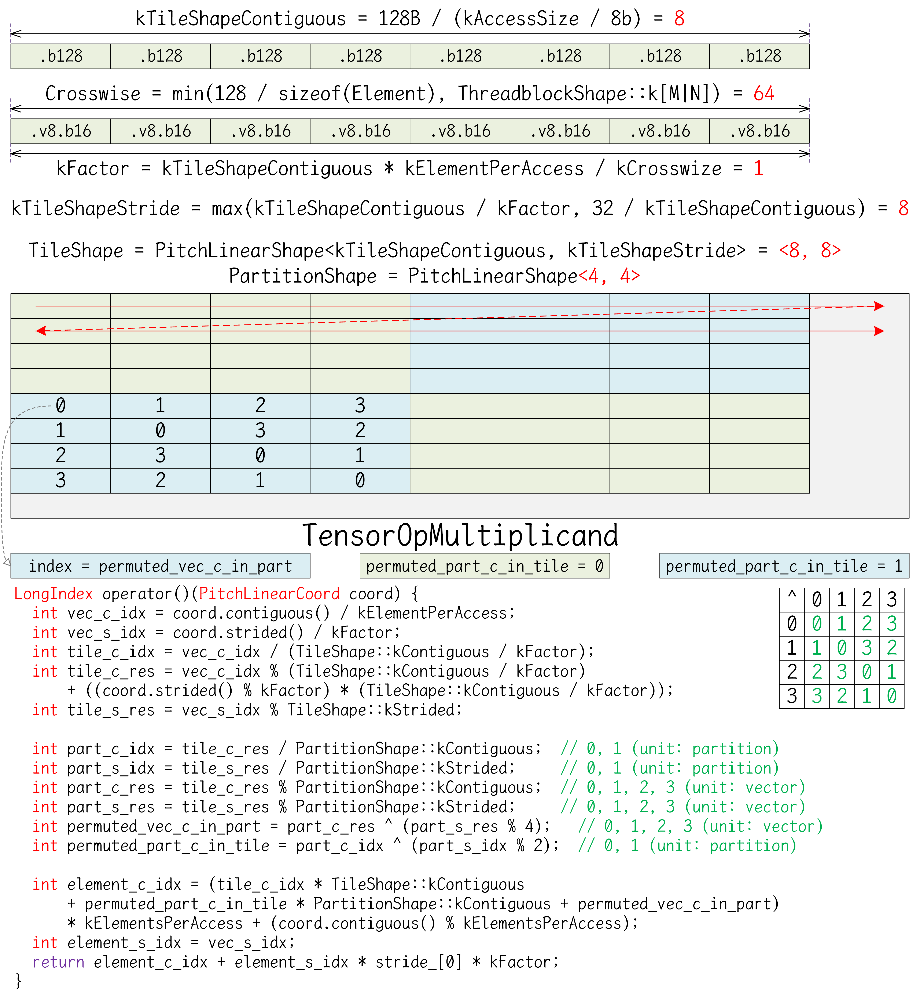

# CUTLASS

CUTLASS是CUDA Templates for Linear Algebra Subroutines and Solvers的缩写，是基于CUDA运行时的线性代数例程与求解器的C++模板库，用于实现高性能的矩阵乘法GEMM及其相关计算。除通用矩阵乘法之外，CUTLASS通过隐式GEMM算法实现高性能的卷积操作。

> 使用模板库的优势在于，一些在计算过程中不变的配置，例如分片形状与迭代策略，可以使用模板参数在编译期间确定，从而只使用函数参数传递数据。

CUTLASS库的源码可在https://github.com/NVIDIA/cutlass网址获得，其包括CUTLASS模板库与CuTe模板库。其中CUTLASS模板库是指CUTLASS 2.X实现版本，通过各层级的模板库抽象提供GEMM实现；而CuTe模板库是自CUTLASS 3.0版本引入的新模板库，通过Layout对象和Tensor对象提供GEMM实现。需要注意的是，CUTLASS 3.0版本需要CUDA 11.4及以上版本，且GPU设备的计算能力为SM70及以上版本。

CUTLASS库包括若干组件。在顶层include目录中提供CUTLASS模板库和CuTe模板库的头文件，应用程序编程需要将顶层include目录添加到编译器的头文件搜索路径；在顶层tools目录中提供CUTLASS Instance模板实例、CUTLASS Profiler分析器、CUTLASS Utilities额外工具；在顶层examples目录中提供使用示例；在顶层media目录中提供文档；在顶层test目录中提供测试组件。

```shell
.
├── include        # Top-level include directory. Client applications should target this path.
│   ├── cutlass   # CUTLASS Template Library, CUDA Templates for Linear Algebra Subroutines and Solvers
│   └── cute      # CuTe Template Library, CuTe Layout, layout algebra, MMA/Copy atoms, tiled MMA/Copy
├── tools
│   ├── library   # CUTLASS Instance Library, static/dynamic library containing all kernel instantiations of interest
│   ├── profiler  # CUTLASS Profiler
│   └── util      # CUTLASS Utilities
├── examples       # CUTLASS Examples
├── media          # Documentation
└── test
```

> 在项目结构中，通常文件目录与命名空间的组成方式是一致的，例如，命名空间cutlass::gemm::device对应到cutlass/gemm/device目录。因为CUTLASS模板库的所有代码都位于cutlass根命名空间中，故在介绍时默认省略cutlass::命名空间。

多维对象（multidimensional object）是一个统称，可以指数组（array）、矩阵（matrix）、张量（tensor）、索引空间（index space）、形状（shape）、跨步（stride）、布局（layout）等。逻辑数目（logical number）是指，在逻辑表示上，有效元素的数目。实际存储数目（physical number）是指，在内存空间中进行存储时，占用物理存储空间的实际存储的元素数目，包括有效元素和填充元素。

使用Index表示某个逻辑维度轴上的索引，使用Extent表示某个逻辑维度轴上的逻辑维数，使用Rank表示维度轴的数目，使用Size表示全部逻辑元素的数目；使用LongIndex表示在内存空间中存储位置的线性偏移，使用Capacity表示多维对象在内存中实际需要存储的元素数目，包括填充元素。

# Host Utility

在项目顶层的tools/util/include/cutlass目录中，提供CUTLASS的各种功能的工具模板类，实际使用时可查阅目录中所提供的头文件，此处只是列举一些常用的工具模板类。注意，应用程序需要将顶层tools/util/include目录添加到编译器的头文件搜索路径，完整的是tools/util/include/cutlass/util路径。

在cutlass/util/device_memory.h头文件中，提供GPU设备全局内存管理函数的C++包装接口DeviceAllocation\<T\>模板类，其使用smart_ptr智能指针对内存空间地址指针进行管理，在模板类的实例对象超出作用域时，会自动释放已分配的设备内存，避免内存泄漏问题。

```c++
__global__ void demo_device_alloc_kernel(float *device_ptr) {}

void demo_device_alloc() {
    int num_of_float = 1024;
    // using allocation = cutlass::DeviceAllocation<T>;
    cutlass::device_memory::allocation<float> device_alloc(num_of_float);
    demo_device_alloc_kernel<<<128, 128>>>(device_alloc.get());
    // Device memory is automatically freed when device_alloc goes out of scope
}
```

在cutlass/util/host_tensor.h头文件中，提供HostTensor<T,Layout>模板类，用于表示一个张量对象，并在主机端或设备端分配存储空间。

```c++
template <
    typename Element,  // Data type of element stored within tensor (concept: NumericType)
    typename Layout    // Defines a mapping from logical coordinate to linear memory (concept: Layout)
>
class HostTensor {
public:
    // Note: Below is used to handle packing of subbyte elements
    // kBitsStoredVec          : The bits of store vec that could be divisiable by the element
    // kElementsPerStoredVec   : The number of elements could be stored in per store vec
    // kNumStoragePerStoredVec : How much storage(i.e. sizeof(element storage)) the store vec needs to consume.
    //                           Usually the element storage of subbyte is uint8_t.
    // Example
    //  int2:  kBitsStoredVec = 8; kElementsPerStoredVec = 4; kNumStoragePerStoredVec = 1 uint8_t;
    //  int4:  kBitsStoredVec = 8; kElementsPerStoredVec = 2; kNumStoragePerStoredVec = 1 uint8_t;
    static constexpr int kBitsStoredVec = (sizeof_bits<Element>::value < 8)
        ? cutlass::lcm(sizeof_bits<Element>::value, 8) : sizeof_bits<Element>::value;
    static constexpr int kElementsPerStoredVec = kBitsStoredVec / sizeof_bits<Element>::value;
    static constexpr int kNumStoragePerStoredVec = kBitsStoredVec / (sizeof(Element) * 8);

private:
    TensorCoord extent_;  // Extent of tensor in logical dimensions
    Layout layout_;       // Layout object
    
    // Host-side memory allocation. Avoid the std::vector<bool> specialization
    std::vector<std::conditional_t<std::is_same_v<Element,bool>, uint8_t, Element>> host_;
    // Device-side memory. using allocation = cutlass::DeviceAllocation<T>
    device_memory::allocation<Element> device_;

public:
    // Constructs a tensor given an extent and layout
    HostTensor(TensorCoord const &extent, Layout const &layout, bool device_backed = true) {
        this->reset(extent, layout, device_backed);
    }
    
    // Updates the extent and layout of the HostTensor. Allocates memory according to the new extent and layout.
    void reset(TensorCoord const &extent, Layout const &layout, bool device_backed_ = true) {                        
        extent_ = extent;
        layout_ = layout;
        this->reserve(size_t(layout_.capacity(extent_)), device_backed_);
    }
    
    // Resizes internal memory allocations without affecting layout or extent
    void reserve(
        size_t count,               // size of tensor in elements
        bool device_backed_ = true  // if true, device memory is also allocated
    ) {
        device_.reset();
        host_.clear();
        count = (count + kElementsPerStoredVec - 1) / kElementsPerStoredVec * kNumStoragePerStoredVec;
        host_.resize(count);
        // Allocate memory
        Element* device_memory = nullptr;
        if (device_backed_) { device_memory = device_memory::allocate<Element>(count); }
        device_.reset(device_memory, device_backed_ ? count : 0);
    }
```

一个示例如下所示，使用单精度列主序存储一个二维矩阵张量，并获得该矩阵的主机内存地址指针与设备内存地址指针，及其TensorRef和TensorView对象。

```c++
void demo_tensor() {
    int rows = 128;
    int columns = 96;
    cutlass::HostTensor<float, cutlass::layout::ColumnMajor> tensor({rows, columns});
    float *host_ptr = tensor.host_data();
    cutlass::TensorRef<float, cutlass::layout::ColumnMajor> host_ref = tensor.host_ref();
    cutlass::TensorView<float, cutlass::layout::ColumnMajor> host_view = tensor.host_view();
    float *device_ptr = tensor.device_data();
    cutlass::TensorRef<float, cutlass::layout::ColumnMajor> device_ref = tensor.device_ref();
    cutlass::TensorView<float, cutlass::layout::ColumnMajor> device_view = tensor.device_view();
}
```

在使用HostTensor<T,Layout>模板类时，应用程序需要保证主机内存中数据与设备内存中数据的同步，该模板类提供若干同步方法，如下所示。

```c++
template <typename Element, typename Layout>
class HostTensor {
private:
    std::vector<std::conditional_t<std::is_same_v<Element,bool>, uint8_t, Element>> host_;
    device_memory::allocation<Element> device_;

public:
    // Returns true if device memory is allocated
    bool device_backed() const { return (device_.get() == nullptr) ? false : true; }
    
    // Copies data from device to host
    void sync_host() {
        if (device_backed()) { device_memory::copy_to_host(host_data(), device_data(), size()); }
    }
    
    // Copies data from host to device
    void sync_device() {
        if (device_backed()) { device_memory::copy_to_device(device_data(), host_data(), size()); }
    }
};
```

在cutlass/util/tensor_view_io.h头文件中，对位于主机端上的TensorView对象重载了流输出运算符operator<<()，以方便打印元素数据，如下所示。

```c++
void demo_print() {
    int rows = 2;
    int columns = 3;
    cutlass::HostTensor<int, cutlass::layout::ColumnMajorInterleaved<2>> tensor({rows, columns});
    cutlass::TensorView<int, cutlass::layout::ColumnMajorInterleaved<2>> host_view = tensor.host_view();
    int val = 1;
    for (int i = 0; i < rows; i++) {
        for (int j = 0; j < columns; j++) {
            host_view[{i, j}] = val++;
        }
    }
    std::cout << tensor.host_view() << std::endl;
    int *host_ptr = tensor.host_data();
    for (int i = 0; i < tensor.capacity(); printf("%d ", host_ptr[i++]));
    printf("\n");
}
```

```shell
1, 2, 3,
4, 5, 6
1 2 4 5 3 0 6 0 
```

在cutlass/util/reference/host/tensor_fill.h头文件和cutlass/util/reference/device/tensor_fill.h头文件中，提供用于初始化TensorView对象的各种辅助方法，可对主机内存对象或设备内存对象进行指定模式的初始化，包括填充指定值、正则随机初始化、高斯随机初始化等。

```c++
void demo_fill() {
    int rows = 128;
    int columns = 96;
    cutlass::HostTensor<float, cutlass::layout::ColumnMajor> tensor({rows, columns});

    // 填充给定值
    float x = 3.14159f;
    cutlass::reference::host::TensorFill(tensor.host_view(), x);
    cutlass::reference::device::TensorFill(tensor.device_view(), x);

    uint64_t seed = 0x2024;
    int non_zero_bits = 2;

    // 正则随机初始化
    float maximum = 4;
    float minimum = -4;
    cutlass::reference::host::TensorFillRandomUniform(tensor.host_view(), seed, maximum, minimum, non_zero_bits);
    cutlass::reference::device::TensorFillRandomUniform(tensor.device_view(), seed, maximum, minimum, non_zero_bits);

    // 高斯初始化
    float mean = 0.5;
    float stddev = 2.0;
    cutlass::reference::host::TensorFillRandomGaussian(tensor.host_view(), seed, mean, stddev, non_zero_bits);
    cutlass::reference::device::TensorFillRandomGaussian(tensor.device_view(), seed, mean, stddev, non_zero_bits);
}
```

其中，随机初始化方法都可以接受一个non_zero_bits参数，用于指定二进制小数部分至少多少位数字不为零值。

在cutlass/util/reference/host/gemm.h头文件中，提供主机端GEMM通用矩阵乘法计算的实现，一个使用示例如下所示。

```c++
void demo_host_gemm() {
    int M = 64, N = 32, K = 16;
    cutlass::half_t alpha = 1.5_hf, beta = -1.25_hf;

    cutlass::HostTensor<cutlass::half_t, cutlass::layout::ColumnMajor> A({M, K});
    cutlass::HostTensor<cutlass::half_t, cutlass::layout::ColumnMajor> B({K, N});
    cutlass::HostTensor<cutlass::half_t, cutlass::layout::ColumnMajor> C({M, N});
    uint64_t seed = 0x2024;
    cutlass::half_t mean = 0.5_hf;
    cutlass::half_t stddev = 2.0_hf;
    cutlass::reference::host::TensorFillRandomGaussian(A.host_view(), seed, mean, stddev);
    cutlass::reference::host::TensorFillRandomGaussian(B.host_view(), seed, mean, stddev);
    cutlass::reference::host::TensorFillRandomGaussian(C.host_view(), seed, mean, stddev);

    cutlass::reference::host::Gemm<
        cutlass::half_t, cutlass::layout::ColumnMajor,
        cutlass::half_t, cutlass::layout::ColumnMajor,
        cutlass::half_t, cutlass::layout::ColumnMajor,
        cutlass::half_t, cutlass::half_t
    > gemm_op;

    gemm_op({M, N, K}, alpha, A.host_view(), B.host_view(), beta, C.host_view());
    std::cout << C.host_view() << std::endl;
}
```

在cutlass/util/reference/host/tensor_compare.h头文件中，提供主机端的TensorEquals()方法，用于判断两个主机端的HostTensor对象是否相等。

```c++
bool same = cutlass::reference::host::TensorEquals(tensor1.host_view(), tensor2.host_view());
```

在cutlass/util/reference/host/tensor_elementwise.h头文件中，提供主机端内存中TensorView对象的逐元素操作，例如TensorAdd()函数、TensorSub()函数、TensorMul()函数、TensorDiv()函数、TensorModulus()函数，以及自定义的TensorFuncBinaryOp结构体等。

# Common Concept

在项目顶层的cutlass目录中，提供CUTLASS在各个硬件层级对GEMM的实现代码，以及所需要的辅助类型，如下所示。

```shell
cutlass  # CUTLASS Template Library
├── *          # Fundamental types
├── layout     # Layout type for matrix, tensor and other mathematical Object in memory
├── detail     # Helper for macros and others
├── platform   # Platform features
├── arch       # Architecture features (including instruction implementation)
├── gemm       # GEneral Matrix Multiply computations
│   ├── device       # Launch kernels
│   ├── kernel       # Kernels
│   ├── threadblock  # Cta Tile
│   ├── warp         # Warp Tile
│   └── thread       # Thread Tile
├── transform  # Code specialized for layout, type, and domain transformations
├── epilogue   # Epilogue rearranges result to canonical layouts, and supports conversion and reduction operations
├── reduction  # Reduction kernels
└── conv       # Implict GEMM for Convolution
```

## Fundamental Type

CUTLASS沿用C++标准库的基本类型，可用于主机端代码与设备端代码，并且与设备的计算能力无关。此外，CUTLASS还额外定义了一些数值类型。需要注意的是，一些类型或函数在较低的架构上并不支持，例如hrsqrt函数，可在编译时使用-arch=sm_70指定目标架构。

在cutlass/numeric_types.h头文件中，提供一些特殊数值类型的定义，如下所示。

| 数值类型   | 字面量后缀 | 描述                                   |
| ---------- | ---------- | -------------------------------------- |
| half_t     | _hf        | IEEE半精度浮点数；尾数10位，指数5位    |
| bfloat16_t | _bf16      | BFloat16类型；尾数7位，指数8位         |
| tfloat32_t | _tf32      | Tensor Float 32类型；尾数10位，指数8位 |
| int4_t     | _s4        | 有符号4位整型                          |
| uint4_t    | _u4        | 无符号4位整型                          |
| bin1_t     | _b1        | 一位二进制位                           |

```c++
template <int Bits, bool Signed = true>
struct integer_subbyte {
    using Storage = uint8_t;  // Storage type
    static constexpr Storage bits_mask_ = Storage(Storage(-1) >> (8 - Bits));       // bitmask for truncation
    static constexpr Storage sign_mask_ = Storage((Signed ? 1 : 0) << (Bits - 1));  // bitmask for the sign bit
    Storage storage;
}

using int4b_t = integer_subbyte<4, true>;    // 4-bit Integer type
using uint4b_t = integer_subbyte<4, false>;  // 4-bit Unsigned integer type
using bin1_t = bool;                         // 1-bit binary type
```

在cutlass/numeric_size.h头文件中，提供辅助模板sizeof_bits\<T\>的定义，用于获取一个类型所占用的二进制位的数目。

```c++
// defines the size of an element in bits
template <typename T>
struct sizeof_bits { static constexpr int value = int(sizeof(T) * 8); };

template <int Bits, bool Signed>
struct sizeof_bits<integer_subbyte<Bits, Signed>> { static constexpr int value = Bits; };

template <>
struct sizeof_ bits<bin1_t> { static constexpr int value = 1; };

template <>
struct sizeof_bits<void> { static constexpr int value = 0; };
```

在cutlass/numeric_size.h头文件中，提供模板元index_sequence的定义，这是一个索引序列的类型，如下所示。

```c++
template <size_t... Seq>
struct index_sequence;

template <size_t... Next>
struct index_sequence_helper<0, 0, Next...> {
    using type = index_sequence<0, Next...>;
};

template <size_t N, size_t... Next>
struct index_sequence_helper : index_sequence_helper<N - 1, N - 1, Next...> {
    // 模板元递归：从空的Next参数包和N开始，逐步生成`N-1`值加入到Next参数包当中，直到N等于0时终止
};

template <size_t N>
using make_index_sequence = typename index_sequence_helper<N>::type;  // index_sequence<0, 1, 2, ..., N-1>
```

在cutlass/functional.h头文件中，提供一些基本运算的函数定义，如下所示。

```c++
template <typename T>
struct plus {
    T operator()(T lhs, T const &rhs) const {
        lhs += rhs;
        return lhs;
    }
};

template <typename T>
struct multiplies {
    T operator()(T lhs, T const &rhs) const {
        lhs *= rhs;
        return lhs;
    }
};

/// Fused multiply-add
template <typename A, typename B = A, typename C = A>
struct multiply_add {
    C operator()(A const &a, B const &b, C const &c) const {
        return C(a) * C(b) + c;
    }
};
```

在cutlass/semaphore.h头文件中，提供一个Semaphore信号量类型，用于在同一个Grid网格之内的所有Threadblock线程块之间进行同步，如下所示。

```c++
/// CTA-wide semaphore for inter-CTA synchronization.
class Semaphore {
public:
    int *lock;         /// a global memory address for each Threadblock
    bool wait_thread;  /// participating thread id
    int state;

    /// Implements a semaphore to wait for a flag to reach a given value 
    Semaphore(int *lock_, int thread_id) : lock(lock_), wait_thread(thread_id < 0 || thread_id == 0), state(-1) {}

    /// Permit fetching the synchronization mechanism early. Fetch the synchronization lock initially but do not block.
    void fetch() {
        if (wait_thread) {
        #if defined(__CUDA_ARCH__) && __CUDA_ARCH__ >= 700
            asm volatile ("ld.global.acquire.gpu.b32 %0, [%1];\n" : "=r"(state) : "l"(lock));
        #else
            asm volatile ("ld.global.cg.b32 %0, [%1];\n" : "=r"(state) : "l"(lock));
        #endif
        }
    }

    /// Gets the internal state
    int get_state() const {
        return state;
    }

    /// Waits until the semaphore is equal to the given value
    void wait(int status = 0) {
        while (__syncthreads_and(state != status)) {
            fetch();
        }
        __syncthreads();
    }

    /// Updates the lock with the given result
    void release(int status = 0) {
        __syncthreads();
        if (wait_thread) {
        #if defined(__CUDA_ARCH__) && __CUDA_ARCH__ >= 700
            asm volatile ("st.global.release.gpu.b32 [%0], %1;\n" : : "l"(lock), "r"(status));
        #else
            asm volatile ("st.global.cg.b32 [%0], %1;\n" : : "l"(lock), "r"(status));
        #endif
        }
    }
};
```

## Macro and Platform

在cutlass/cutlass.h头文件中，提供一个枚举类型Status的定义，用于标识CUTLASS库的执行状态，此外还提供一些常量定义。

```c++
/// Status code returned by CUTLASS operations
enum class Status {
    kSuccess,                  ///< Operation was successful.
    kErrorMisalignedOperand,   ///< operands fail alignment requirements.
    kErrorInvalidDataType,     ///< DataType fails requirement.
    kErrorInvalidLayout,       ///< Layout fails alignment requirement.
    kErrorInvalidProblem,      ///< Specified problem size is not supported by operator.
    kErrorNotSupported,        ///< Operation is not supported on current device.
    kErrorWorkspaceNull,       ///< The given workspace is null when it is required to be non-null.
    kErrorInternal,            ///< An error within CUTLASS occurred.
    kErrorArchMismatch,        ///< CUTLASS runs on a device that it was not compiled for.
    kErrorInsufficientDriver,  ///< CUTLASS runs with a driver that is too old.
    kErrorMemoryAllocation,    ///< Kernel launch failed due to insufficient device memory.
    kInvalid                   ///< Status is unspecified.
};

static const int NumThreadsPerWarp = 32;
static const int NumThreadsPerWarpGroup = 128;
static const int NumWarpsPerWarpGroup = NumThreadsPerWarpGroup / NumThreadsPerWarp;
static const int NumThreadsPerHalfWarp = NumThreadsPerWarp / 2;
static const int NumThreadsPerQuad = 4;
static const int NumThreadsPerQuadPair = NumThreadsPerQuad * 2;
```

在cutlass/device_kernel.h头文件中，提供一个辅助的内核函数cutlass::Kernel定义，可以用于启动所需的内核函数，如下所示。

```c++
/// Generic CUTLASS kernel template.
template <typename Operator>
__global__ static void Kernel(typename Operator::Params params) {
    // Dynamic shared memory base pointer
    extern __shared__ int SharedStorageBase[];
    // Declare pointer to dynamic shared memory.
    typename Operator::SharedStorage *shared_storage = reinterpret_cast<typename Operator::SharedStorage *>(SharedStorageBase);
    Operator op;
    op(params, *shared_storage);
    cutlass::arch::synclog_print();
}
```

在cutlass/detail/helper_macros.hpp头文件中，提供一些辅助宏定义，如下所示。

```c++
#define CUTLASS_HOST_DEVICE __forceinline__ __device__ __host__
#define CUTLASS_DEVICE      __forceinline__ __device__
#define CUTLASS_HOST        __host__
#define CUTLASS_GLOBAL      __global__ static
```

在cutlass/platform/platform.h头文件中，提供一些模板元的定义，如下所示。这些模板元与C++标准库中的类似，用于在编译过程中对一些类型做出假设。

```c++
template<typename _Tp, _Tp __v>
struct integral_constant {
    static constexpr _Tp value = __v;
    typedef integral_constant<_Tp, __v> type;
    typedef _Tp value_type;
    constexpr   operator value_type() const noexcept { return value; }
    constexpr value_type operator()() const noexcept { return value; }
};

using true_type  = integral_constant<bool, true>;   // compile-time boolean with true value
using false_type = integral_constant<bool, false>;  // compile-time boolean with false value

template<typename _Tp, typename _Up>
struct is_same : public false_type {};

template<typename _Tp>               
struct is_same<_Tp, _Tp> : public true_type {};

template<bool, typename _Tp = void>
struct enable_if {};

template<typename _Tp>
struct enable_if<true, _Tp> { typedef _Tp type; };                        // Partial specialization for true

template<bool _Cond, typename _Iftrue, typename _Iffalse>
struct conditional { typedef _Iftrue type; };

template<typename _Iftrue, typename _Iffalse>
struct conditional<false, _Iftrue, _Iffalse> { typedef _Iffalse type; };  // Partial specialization for false
```

## Array

模板类Array<T,N>是一个固定长度的数组，存储N个T类型的元素，元素的数据类型可以是小于一个字节的亚类型（Sub-Type），亚类型的元素之间紧凑存储。需要注意的是，对于亚类型元素而言，在使用sizeof(Array<T,N>)运算符时，其返回结果仍然是以字节为单位的，且最小是一个字节。

在CUTLASS中实例化Array<T,N>对象时，一个线程通常会使用多个寄存器来存储数组元素，并且常被用于表示一个Fragment矩阵片段。当线程的寄存器溢出时，则会使用线程的局部内存来存储数组元素。当使用\_\_shared\_\_修饰符时，则会使用共享内存来存储数组元素。

### Array<T,N>

在cutlass/array.h头文件中，提供Array<T,N>的定义，如下所示。

```c++
/// Statically sized array for any data type
template <typename T, int N, bool RegisterSized = sizeof_bits<T>::value >= 32>
struct Array;

/// Statically sized array for any data type
template<typename T, int N>
struct Array<T, N, true> {
    using Storage = T;  /// Storage type
    using Element = T;  /// Element type
    static constexpr size_t kStorageElements = N;  /// Number of storage elements
    static constexpr size_t kElements = N;         /// Number of logical elements
    
    Storage storage[kElements];  /// Internal storage
    
    typedef T value_type;
    typedef size_t size_type;
    typedef value_type& reference;
    typedef value_type* pointer;

    reference operator[](size_type pos) { return reinterpret_cast<reference>(storage[pos]); }
    pointer data()                      { return reinterpret_cast<pointer>(storage); }
    constexpr size_type size() const    { return kElements; }
};
```

AlignedArray继承自Array<T,N>模板类，但AlignedArray<T,N,Align>可以指定其内部的用于存储元素的内存空间按照Alignment字节进行对齐。

在cutlass/array.h头文件中，提供AlignedArray<T,N,Align>的定义，如下所示。

```c++
/// Aligned array type
template<typename T, int N, int Alignment = (sizeof_bits<T>::value * N + 7) / 8>
class alignas(Alignment) AlignedArray: public Array<T,N> { };
```

### AlignedBuffer

模板类AlignedBuffer<T,N,Align>是一个固定长度的缓冲区，存储N个T类型的元素，并且内部的用于存储元素的内存空间按照Align字节进行对齐。AlignedBuffer常用于获取一段按照指定字节对齐的连续内存空间，例如设备的全局内存或共享内存，以用于向量化操作。

在cutlass/aligned_buffer.h头文件中，提供AlignedBuffer<T,N,Align>的定义，如下所示。

```c++
/// Modifies semantics of cutlass::Array<> to provide guaranteed alignment. 
template <typename T, int N, int Align = 16>
struct AlignedBuffer {
public:
    using Storage = uint8_t;          /// Internal storage type
    static int const kCount = N;      /// Number of logical elements held in buffer
    static int const kAlign = Align;  /// Alignment requirement in bytes
    static int const kBytes = (sizeof_bits<T>::value * N + 7) / 8;  /// Number of storage elements

    typedef T value_type;
    typedef size_t size_type;
    typedef value_type& reference;
    typedef value_type* pointer;

private:
    alignas(Align) Storage storage[kBytes];  /// Internal storage

public:
    pointer data()                   { return reinterpret_cast<pointer>(storage); }
    constexpr size_type size() const { return kCount; }
};
```

如下一个示例，在共享内存上获取一段连续的内存空间，元素是half_t类型。

```c++
__global__ void demo_aligned_buffer_kernel() {
    const int kN = 1024;
    __shared__ AlignedBuffer<half_t, kN> smem_buffer;
    AlignedArray<half_t, 8> *ptr = reinterpret_cast<AlignedArray<half_t, 8>*>(smem_buffer.data());
    AlignedArray<half_t, 8> value = ptr[threadIdx.x];  // 128-bit shared memory load
}
```

## Type Caster

模板类NumericConverter<T,S>是一个类型转换器，用于将一个一个对象从S类型转换成T类型，该类型转换的过程会尽可能地在目标架构上使用硬件加速。模板类NumericArrayConverter<T,S,N>是一个数组的类型转换器，用于将一个数组中的所有N个元素从S类型转换成T类型。

### NumericConverter

在cutlass/numeric_conversion.h头文件中，提供一个枚举类型FloatRoundStyle的定义，如下所示。该枚举类的值用于标识转换过程中的浮点数舍入方式。

```c++
/// Floating-point rounding style similare to Standard Library's formats but supporting additional rounding options.
enum class FloatRoundStyle {
    round_indeterminate,         ///< rounding mode unknown
    round_toward_zero,           ///< round toward zero
    round_to_nearest,            ///< round to nearest even
    round_to_nearest_satfinite,  ///< round to nearest even, capping value to min and max of destination type
    round_toward_infinity,       ///< round toward infinity
    round_toward_neg_infinity,   ///< round toward negative infinity
    round_half_ulp_truncate,     ///< add 0.5ulp to integer representation then round toward zero
    round_half_ulp_trunc_dntz    ///< like round_half_ulp_truncate, except denorms are rounded *toward* zero
};
```

在cutlass/numeric_conversion.h头文件中，提供NumericConverter<T,S>的定义，如下所示。

```c++
template <typename T, typename S, FloatRoundStyle Round = FloatRoundStyle::round_to_nearest>
struct NumericConverter {
    using result_type = T;
    using source_type = S;
    static FloatRoundStyle const round_style = Round;

    static result_type convert(source_type const & s)  { return static_cast<result_type>(s); }
    result_type operator()(source_type const &s) const { return convert(s); }
};
```

### NumericArrayConverter

在cutlass/numeric_conversion.h头文件中，提供NumericArrayConverter<T,S,N>的定义，如下所示。

```c++
/// Conversion operator for Array
template <
    typename T, typename S, int N,
    FloatRoundStyle Round = FloatRoundStyle::round_to_nearest,
    typename Transform = cutlass::transform::thread::UnaryTransform::Identity
>
struct NumericArrayConverter {
    using result_type = Array<T, N>;
    using source_type = Array<S, N>;
    static FloatRoundStyle const round_style = Round;

    static result_type convert(source_type const & s) {
        result_type result;
        NumericConverter<T, S, Round> convert_;

        for (int i = 0; i < N; ++i) {
            if (platform::is_same<Transform, cutlass::transform::thread::UnaryTransform::Identity>::value) {
                result[i] = convert_(s[i]);
            } else {
                // platform::is_same<Transform, cutlass::transform::thread::UnaryTransform::Conjugate>::value == true
                result[i] = conj(convert_(s[i]));
            }
        }
        return result;
    }

    result_type operator()(source_type const &s) const {
        return convert(s);
    }
};
```

如下一个示例，将一个int类型的数组，转换为一个int8_t类型的数组。

```c++
void demo_converter() {
    int const kN = 16;
    Array<int8_t, kN> destination;
    Array<int, kN> source;
    NumericArrayConverter<int8_t, int, kN> convert;
    destination = convert(source);
}
```

## Coordinate

模板类Coord\<Rank\>是一个通用的逻辑坐标（Logical Coordinate），它具有Rank个维度轴，每个维度轴上可以使用一个索引坐标来确定该维度轴上的元素位置。多个Coord\<Rank\>坐标对象之间支持四则运算，这种坐标之间的加减乘除运算是逐元素（element-wise）的。

在CUTLASS中，常用的坐标是二维的矩阵坐标MatrixCoord、三维的矩阵乘法坐标GemmCoord、四维的批量矩阵乘法坐标BatchedGemmCoord，以及四维的张量坐标Tensor4DCoord和五维的张量坐标Tensor5DCoord。这些坐标常用于在各个层级中表示某种类型的某个元素的逻辑位置。


### Coord\<Rank\>

在cutlass/coord.h头文件中，提供Coord\<Rank\>的定义，如下所示。

```c++
/// Statically-sized array specifying Coords within a tensor
template <
    int Rank_,                     ///< Logical rank of coordinate
    typename Index_ = int,         ///< Index type used for each dimension
    typename LongIndex_ = int64_t  ///< Long index type used for linear offsets
>
struct Coord {
public:
    static int const kRank = Rank_;  /// Number of elements in Coord
    using Index = Index_;            /// Index type used to store elements
    using LongIndex = LongIndex_;    /// Type used to represent linear offsets

private:
    Index idx[kRank];  /// Indices

public:
    /// Default ctor initializes uniformly
    explicit Coord(Index value = Index(0)) {
        for (int i = 0; i < kRank; ++i) {
            idx[i] = value;
        }
    }

    /// Constructs from an array of integers
    Coord(Index const (&_idx)[kRank]) {
        for (int i = 0; i < kRank; ++i) {
            idx[i] = _idx[i];
        }
    }

    /// Member access operator
    Index& operator[](int dim) { return idx[dim]; }
    
    /// Access via index; may limit unrolling potential
    Index& at(int dim) { return idx[dim]; }

    /// Element-wise operators
    Coord operator+(Coord const& b) const { Coord c; for (int i = 0; i < kRank; ++i) { c.idx[i] = idx[i] + b.idx[i]; } return c; }
    Coord operator-(Coord const& b) const { Coord c; for (int i = 0; i < kRank; ++i) { c.idx[i] = idx[i] - b.idx[i]; } return c; }
    Coord operator*(Coord const& b) const { Coord c; for (int i = 0; i < kRank; ++i) { c.idx[i] = idx[i] * b.idx[i]; } return c; }
    Coord operator/(Coord const& b) const { Coord c; for (int i = 0; i < kRank; ++i) { c.idx[i] = idx[i] / b.idx[i]; } return c; }

    /// In-place element-wise operators
    Coord& operator+=(Coord const& b) { for (int i = 0; i < kRank; ++i) { idx[i] += b.idx[i]; } return *this; }
    Coord& operator-=(Coord const& b) { for (int i = 0; i < kRank; ++i) { idx[i] -= b.idx[i]; } return *this; }
    Coord& operator*=(Coord const& b) { for (int i = 0; i < kRank; ++i) { idx[i] *= b.idx[i]; } return *this; }
    Coord& operator/=(Coord const& b) { for (int i = 0; i < kRank; ++i) { idx[i] /= b.idx[i]; } return *this; }

    /// Compare operators
    bool operator< (Coord const &b) const { for (int i = 0; i < kRank; ++i) { if (!(idx[i] <  b[i])) { return false; } } return true; }
    bool operator<=(Coord const &b) const { for (int i = 0; i < kRank; ++i) { if (!(idx[i] <= b[i])) { return false; } } return true; }
    bool operator> (Coord const &b) const { return !(*this <= b); }
    bool operator>=(Coord const &b) const { return !(*this <  b); }
};
```

在cutlass/coord.h头文件中，还提供关于Coord\<Rank\>的辅助函数，如下所示。

```c++
/// Scalar multiplication
template <int Rank, typename Index>
Coord<Rank, Index> operator*(Index s, Coord<Rank, Index> coord) {
    for (int i = 0; i < Rank; ++i) { coord[i] *= s; }
    return coord;
}
/// Scalar multiplication
template <int Rank, typename Index>
Coord<Rank, Index> operator*(Coord<Rank, Index> coord, Index s) {
    for (int i = 0; i < Rank; ++i) { coord[i] *= s; }
    return coord;
}

/// Scalar division
template <int Rank, typename Index>
Coord<Rank, Index> operator/(Index s, Coord<Rank, Index> coord) {
    for (int i = 0; i < Rank; ++i) { coord[i] = s / coord[i]; }
    return coord;
}
/// Scalar division
template <int Rank, typename Index>
Coord<Rank, Index> operator/(Coord<Rank, Index> coord, Index s) {
    for (int i = 0; i < Rank; ++i) { coord[i] = coord[i] / s; }
    return coord;
}

/// Helper to make a 2-element coordinate
template <typename T>
Coord<2, T> make_Coord(T _0, T _1) {
    T values[2] = { _0, _1 };
    return Coord<2, T>(values);
}

/// Helper to make a 3-element coordinate
template <typename T>
Coord<3, T> make_Coord(T _0, T _1, T _2) {
    T values[3] = { _0, _1, _2 };
    return Coord<3, T>(values);
}

/// Helper to make a 4-element coordinate
template <typename T>
Coord<4, T> make_Coord(T _0, T _1, T _2, T _3) {
    T values[4] = { _0, _1, _2, _3 };
    return Coord<4, T>(values);
}

/// Helper to make a 5-element coordinate
template <typename T>
Coord<5, T> make_Coord(T _0, T _1, T _2, T _3, T _4) {
    T values[5] = { _0, _1, _2, _3, _4 };
    return Coord<5, T>(values);
}
```

### MatrixCoord

在cutlass/matrix_coord.h头文件中，提供MatrixCoord的定义，如下所示。

```c++
/// MatrixCoord wraps Coord<2, int> to provide a helper for accessing named dimensions.
/// Classes expecting a coordinate in the rank=2 index space of a matrix should use MatrixCoord.
struct MatrixCoord : public Coord<2, int> {
public:
    using Index = int;                           /// Integer-valued index
    using Base = Coord<2, Index>;                /// Base type is a Coord of rank=2
    using LongIndex = typename Base::LongIndex;  /// LongIndex type

private:
    /// coord = (row, column)
    static int const kRow = 0;     /// Rows dimension
    static int const kColumn = 1;  /// Columns dimension

public:
    /// Default ctor
    MatrixCoord() {}

    /// Helper to construct from a row and column
    MatrixCoord(Index row, Index column) : Base(make_Coord(row, column)) {}

    /// Returns the row of the coordinate
    Index & row() { return this->at(kRow); }

    /// Returns the column of the coordinate
    Index & column() { return this->at(kColumn); }
};
```

### GemmCoord

在cutlass/gemm_coord.h头文件中，提供GemmCoord和BatchedGemmCoord的定义，如下所示。

```c++
/// GemmCoord is a structure derived from Coord<3> that specifies a location within the coordinate space of a GEMM problem.
struct GemmCoord : public Coord<3, int> {
    typedef int Index;             /// Integer-valued index
    typedef Coord<3, Index> Base;  /// Base type is a Coord of rank=3

    /// coord = (m, n, k)
    static int const kM = 0;  /// GEMM M dimension - rows of the output C matrix
    static int const kN = 1;  /// GEMM N dimension - columns of the output C matrix
    static int const kK = 2;  /// GEMM K dimension - inner dimension of the GEMM problem

    /// Default ctor
    GemmCoord() {}

    /// Helper to construct from a K, N, M, batch variables
    GemmCoord(Index m, Index n, Index k) : Base(make_Coord(m, n, k)) {}

    /// Returns reference to the GEMM M coordinate
    Index & m() { return this->at(kM); }

    /// Returns reference to the GEMM N coordinate
    Index & n() { return this->at(kN); }

    /// Returns reference to the GEMM K coordinate
    Index & k() { return this->at(kK); }
};

/// BatchedGemmCoord is a structure derived from Coord<4> that specifies a location within the coordinate space of a batched GEMM problem.
struct BatchedGemmCoord : public Coord<4, int> {
    typedef int Index;             /// Integer-valued index
    typedef Coord<4, Index> Base;  /// Base type is a Coord of rank=4

    /// coord = (m, n, k, batch)
    static int const kM = 0;      /// GEMM M dimension - rows of the output C matrix
    static int const kN = 1;      /// GEMM N dimension - columns of the output C matrix
    static int const kK = 2;      /// GEMM K dimension - inner dimension of the GEMM problem
    static int const kBatch = 3;  /// GEMM Batch dimension - inner dimension of the GEMM problem

    /// Default ctor
    BatchedGemmCoord() {}

    /// Helper to construct from a K, N, M, and batch variables
    BatchedGemmCoord(Index m, Index n, Index k, Index b) : Base(make_Coord(m, n, k, b)) {}

    /// Returns reference to the GEMM M coordinate
    Index & m() { return this->at(kM); }

    /// Returns reference to the GEMM N coordinate
    Index & n() { return this->at(kN); }

    /// Returns reference to the GEMM K coordinate
    Index & k() { return this->at(kK); }

    /// Returns reference to the GEMM batch coordinate
    Index & batch() { return this->at(kBatch); }
};
```

### Tensor[4D|5D]Coord

在cutlass/tensor_coord.h头文件中，提供Tensor4DCoord和Tensor5DCoord的定义，如下所示。

```c++
/// Defines a canonical 4D coordinate used by tensor operations.
struct Tensor4DCoord : public Coord<4> {
    using Base = Coord<4>;                       /// Base class
    using Index = typename Base::Index;          /// Index type
    using LongIndex = typename Base::LongIndex;  /// LongIndex type

    /// coord = (n, h, w, c)
    static int const kN = 0;  /// Batch dimension
    static int const kH = 1;  /// Height dimension
    static int const kW = 2;  /// Width dimension
    static int const kC = 3;  /// Channels dimension

    /// Default ctor
    Tensor4DCoord() {}

    /// Helper to construct from N, H, W, and C.
    Tensor4DCoord(Index n, Index h, Index w, Index c) : Base(make_Coord(n, h, w, c)) {}

    /// Returns the batch of the coordinate
    Index & n() { return this->at(kN); }

    /// Returns the row of the coordinate
    Index & h() { return this->at(kH); }

    /// Returns the column of the coordinate
    Index & w() { return this->at(kW); }

    /// Returns the channel of the coordinate
    Index & c() { return this->at(kC); }
};

/// Defines a canonical 5D coordinate used by tensor operations.
struct Tensor5DCoord : public Coord<5> {
    using Base = Coord<5>;                       /// Base class
    using Index = typename Base::Index;          /// Index type
    using LongIndex = typename Base::LongIndex;  /// LongIndex type

    /// coord = (n, d, h, w, c)
    static int const kN = 0;  /// Batch dimension
    static int const kD = 1;  /// Depth dimension
    static int const kH = 2;  /// Height dimension
    static int const kW = 3;  /// Width dimension
    static int const kC = 4;  /// Channels dimension

    /// Default ctor
    Tensor5DCoord() {}

    /// Helper to construct from N, D, H, W, and C.
    Tensor5DCoord(Index n, Index d, Index h, Index w, Index c) : Base(make_Coord(n, d, h, w, c)) {}

    /// Returns the batch of the coordinate
    Index & n() { return this->at(kN); }

    /// Returns the batch of the coordinate
    Index & d() { return this->at(kD); }

    /// Returns the row of the coordinate
    Index & h() { return this->at(kH); }

    /// Returns the column of the coordinate
    Index & w() { return this->at(kW); }

    /// Returns the channel of the coordinate
    Index & c() { return this->at(kC); }
};
```

## Shape

在CUTLASS中，与坐标类似的概念是形状（Shape），模板类MatrixShape<Row,Column>用于表示一个二维矩阵的维数形状，模板类GemmShape<M,N,K>用于表示一个三维矩阵乘法的维数形状。实际上，也可以直接使用一个Coord\<Rank\>来表示形状，这能起到同样的作用，但为了代码可读性，还是提供常用形状MatrixShape和GemmShape的类型定义。

### MatrixShape

在cutlass/matrix_shape.h头文件中，提供MatrixShape<Row,Column>的定义，如下所示。

```c++
/// Describes the size of a matrix tile
template <
    int Row_,    ///< rows of a matrix
    int Column_  ///< columns of a matrix
>
struct MatrixShape {
    static int const kRow = Row_;              ///< rows of a matrix
    static int const kColumn = Column_;        ///< columns of a matrix
    static int const kCount = Row_ * Column_;  ///< total number of elements in a matrix

    /// Returns a Coord object
    static Coord<2> toCoord() {
        return make_Coord(kRow, kColumn);
    }
};
```

### GemmShape

在cutlass/gemm_coord.h头文件中，提供GemmShape<M,N,K>的定义，如下所示。

```c++
/// Shape of a matrix multiply-add operation
template <
    int M = 1,  /// Rows of matrix product
    int N = 1,  /// Columns of matrix product
    int K = 1   /// Inner dimension of matrix product
>
struct GemmShape {
    static int const kM = M;
    static int const kN = N;
    static int const kK = K;
    static int const kMN = M * N;
    static int const kMK = M * K;
    static int const kKN = N * K;
    static int const kMNK = M * N * K;
    static int const kCount = kMNK;

    /// Returns a Coord object
    static Coord<3> toCoord() {
        return make_Coord(kM, kN, kK);
    }
};

/// Type alias of the transpose of a GemmShape
template <
    typename Shape  /// concept: GemmShape
>
using GemmShapeTranspose = GemmShape<Shape::kN, Shape::kM, Shape::kK>;
```

## Layout

布局（Layout）是一个用于将元素坐标转换为偏移量的映射（Mapping），它将一个逻辑坐标映射为一个偏移量（Offset）。偏移值是指，多维数组的某个元素的存储位置，与第一个元素的存储位置之间的间距。一个布局由存储顺序（Storage Order）和跨步（Stride）确定，存储顺序是指多个维度轴存储时的先后顺序，跨步是指两个相应元素的存储位置之间的间距。

需要注意的是，在CUTLASS中，偏移和跨步，都是以元素类型Element为单位的，而不是以字节为单位的。

CUTLASS常用的布局是行主序布局RowMajor、列主序布局ColumnMajor、行主序交错布局RowMajorInterleaved、列主序交错布局ColumnMajorInterleaved。这些布局常用于在各个层级中将某种类型的某个元素的逻辑坐标，转换成该元素在内存空间中的偏移量。


### RowMajor

在cutlass/layout/matrix.h头文件中，提供RowMajor的定义，如下所示。

```c++
/// Mapping function for row-major matrices.
class RowMajor {
public:
    static int const kRank = 2;        /// Logical rank of tensor
    static int const kStrideRank = 1;  /// Rank of stride vector

    using Index = int32_t;                         /// Index type used for coordinates
    using LongIndex = int64_t;                     /// Long index type used for offsets
    using TensorCoord = MatrixCoord;               /// Logical coordinate
    using Stride = Coord<kStrideRank, LongIndex>;  /// Stride vector

private:
    Stride stride_;  /// Stride data member

public:
    /// Constructor
    RowMajor(Stride stride) : stride_(stride) {}

    /// Constructor
    RowMajor(LongIndex ldm = 0) : stride_(ldm) {}

    /// Helper returns a layout to a tightly packed tensor
    static RowMajor packed(MatrixCoord const &extent) {
        return RowMajor(extent.column());
    }

    /// Returns the offset of a coordinate in linear memory.
    /// Assumes coordinate has convention (row, column)
    LongIndex operator()(MatrixCoord const &coord) const {
        return LongIndex(coord.row()) * LongIndex(stride_[0]) + coord.column();
    }

    /// Inverse of layout function, mapping linear offset to logical coordinate
    MatrixCoord inverse(LongIndex offset) const {
        return MatrixCoord(Index(offset / stride_[0]), Index(offset % stride_[0]));
    }

    /// Compute the number of contiguous elements needed to store a tensor with the given size
    LongIndex capacity(MatrixCoord const &extent) const {
        return LongIndex(extent.row()) * LongIndex(stride_[0]);
    }
};
```

### ColumnMajor

在cutlass/layout/matrix.h头文件中，提供ColumnMajor的定义，如下所示。

```c++
/// Mapping function for column-major matrices.
class ColumnMajor {
public:
    static int const kRank = 2;        /// Logical rank of tensor
    static int const kStrideRank = 1;  /// Rank of stride vector

    using Index = int32_t;                         /// Index type used for coordinates
    using LongIndex = int64_t;                     /// Long index type used for offsets
    using TensorCoord = MatrixCoord;               /// Logical coordinate
    using Stride = Coord<kStrideRank, LongIndex>;  /// Stride vector

private:
    Stride stride_;  /// Stride data member

public:
    /// Constructor
    ColumnMajor(Stride stride) : stride_(stride) {}

    /// Constructor
    ColumnMajor(LongIndex ldm = 0) : stride_(ldm) {}

    /// Helper returns a layout to a tightly packed tensor
    static ColumnMajor packed(MatrixCoord const &extent) {
        return ColumnMajor(extent.row());
    }

    /// Returns the offset of a coordinate in linear memory. 
    /// Assumes coordinate has convention (row, column)
    LongIndex operator()(MatrixCoord const &coord) const {
        return LongIndex(coord.column()) * LongIndex(stride_[0]) + coord.row();
    }

    /// Inverse of layout function, mapping linear offset to logical coordinate
    MatrixCoord inverse(LongIndex offset) const {
        return MatrixCoord(Index(offset % stride_[0]), Index(offset / stride_[0]));
    }

    /// Compute the number of contiguous elements needed to store a tensor with the given size
    LongIndex capacity(MatrixCoord const &extent) const {
        return LongIndex(extent.column()) * LongIndex(stride_[0]);
    }
};
```

### RowMajorInterleaved

在cutlass/layout/matrix.h头文件中，提供RowMajorInterleaved\<Interleave\>的定义，如下所示。

```c++
/// Mapping function for interleaved matrices. 
/// Matrix is structured as row-major arrangement of fixed-size columns.
template <int Interleave>
struct RowMajorInterleaved {
public:
    static int const kRank = 2;        /// Logical rank of tensor
    static int const kStrideRank = 1;  /// Rank of stride vector

    using Index = int32_t;                         /// Index type used for coordinates
    using LongIndex = int64_t;                     /// Long index type used for offsets
    using TensorCoord = MatrixCoord;               /// Logical coordinate
    using Stride = Coord<kStrideRank, LongIndex>;  /// Stride vector

    static int const kInterleave = Interleave;  /// Size of interleaved columns

private:
    Stride stride_;  /// Stride data member

public:
    /// Constructor
    RowMajorInterleaved(Stride stride) : stride_(stride) {}

    /// Constructor
    RowMajorInterleaved(LongIndex ldm = 0) : stride_(ldm) {}

    /// Helper returns a layout to a tightly packed tensor
    static RowMajorInterleaved packed(MatrixCoord const &extent) {
        return RowMajorInterleaved(extent.column() * kInterleave);
    }

    /// Returns the offset of a coordinate in linear memory. 
    /// Assumes coordinate has convention (row, column)
    LongIndex operator()(MatrixCoord const &coord) const {
        Index row_major = coord.row() / kInterleave;
        Index row_minor = coord.row() % kInterleave;
        return LongIndex(row_major) * LongIndex(stride_[0]) + LongIndex(coord.column()) * kInterleave + row_minor;
    }

    /// Inverse of layout function, mapping linear offset to logical coordinate
    MatrixCoord inverse(LongIndex offset) const {
        Index row_major = Index(offset / stride_[0]);
        Index residual  = Index(offset % stride_[0]);
        Index column    = residual / kInterleave;
        Index row_minor = residual % kInterleave;
        return MatrixCoord(row_major * kInterleave + row_minor, column);
    }

    /// Compute the number of contiguous elements needed to store a tensor with the given size
    LongIndex capacity(MatrixCoord const &extent) const {
        return (extent.row() + kInterleave - 1) / kInterleave * stride_[0];
    }
};
```

### ColumnMajorInterleaved

在cutlass/layout/matrix.h头文件中，提供ColumnMajorInterleaved\<Interleave\>的定义，如下所示。

```c++
/// Mapping function for interleaved matrices. 
/// Matrix is structured as row-major arrangement of fixed-size columns.
template <int Interleave>
struct RowMajorInterleaved {
public:
    static int const kRank = 2;        /// Logical rank of tensor
    static int const kStrideRank = 1;  /// Rank of stride vector

    using Index = int32_t;                         /// Index type used for coordinates
    using LongIndex = int64_t;                     /// Long index type used for offsets
    using TensorCoord = MatrixCoord;               /// Logical coordinate
    using Stride = Coord<kStrideRank, LongIndex>;  /// Stride vector

    static int const kInterleave = Interleave;  /// Size of interleaved columns

private:
    Stride stride_;  /// Stride data member

public:
    /// Constructor
    RowMajorInterleaved(Stride stride) : stride_(stride) {}

    /// Constructor
    RowMajorInterleaved(LongIndex ldm = 0) : stride_(ldm) {}

    /// Helper returns a layout to a tightly packed tensor
    static RowMajorInterleaved packed(MatrixCoord const &extent) {
        return RowMajorInterleaved(extent.column() * kInterleave);
    }

    /// Returns the offset of a coordinate in linear memory. 
    /// Assumes coordinate has convention (row, column)
    LongIndex operator()(MatrixCoord const &coord) const {
        Index row_major = coord.row() / kInterleave;
        Index row_minor = coord.row() % kInterleave;
        return LongIndex(row_major) * LongIndex(stride_[0]) + LongIndex(coord.column()) * kInterleave + row_minor;
    }

    /// Inverse of layout function, mapping linear offset to logical coordinate
    MatrixCoord inverse(LongIndex offset) const {
        Index row_major = Index(offset / stride_[0]);
        Index residual  = Index(offset % stride_[0]);
        Index column    = residual / kInterleave;
        Index row_minor = residual % kInterleave;
        return MatrixCoord(row_major * kInterleave + row_minor, column);
    }

    /// Compute the number of contiguous elements needed to store a tensor with the given size
    LongIndex capacity(MatrixCoord const &extent) const {
        return (extent.row() + kInterleave - 1) / kInterleave * stride_[0];
    }
};
```

## Pitch Linear Mode

连续线性模式（Pitch Linear Mode）是一种元素在内存中的组织方式，其最内层维度轴上的元素连续存储，外层维度轴上的元素以内存维度轴的维数为单位进行连续存储。在CUTLASS中，使用的是，二维的连续线性坐标PitchLinearCoord、二维的连续线性形状PitchLinearShape、二维的连续线性布局PitchLinear。


### PitchLinearCoord

在cutlass/pitch_linear_coord.h头文件中，提供PitchLinearCoord的定义，如下所示。

```c++
/// Coordinate in pitch-linear space
struct PitchLinearCoord : public Coord<2, int> {
public:
    using Index = int;                           /// Integer-valued index
    using Base = Coord<2, Index>;                /// Base type is a Coord of rank=2
    using LongIndex = typename Base::LongIndex;  /// Long integer type

private:
    static int const kContiguous = 0;  /// Contiguous dimension
    static int const kStrided = 1;     /// Strided dimension

public:
    /// Default ctor
    PitchLinearCoord() {}

    /// Helper to construct from a row and column
    PitchLinearCoord(Index contiguous_, Index strided_) : Base(make_Coord(contiguous_, strided_)) {}

    /// Returns the contiguous dimension
    Index & contiguous() { return this->at(kContiguous); }

    /// Returns the strided dimension
    Index & strided() { return this->at(kStrided); }
};
```

### PitchLinearShape

在cutlass/pitch_linear_coord.h头文件中，提供PitchLinearShape的定义，如下所示。

```c++
/// Template defining a shape used by pitch-linear operators
template <
    int Contiguous,
    int Strided
>
struct PitchLinearShape {
    static int const kContiguous = Contiguous;
    static int const kStrided = Strided;
    static int const kCount = Contiguous * Strided;
};
```

### PitchLinear

在cutlass/layout/pitch_linear.h头文件中，提供PitchLinear的定义，如下所示。

```c++
/// Mapping function for pitch-linear memory
class PitchLinear {
public:
    static int const kRank = 2;        /// Logical rank of tensor
    static int const kStrideRank = 1;  /// Rank of stride vector

    using Index = int32_t;                         /// Index type used for coordinates
    using LongIndex = int64_t;                     /// Long index type used for offsets
    using TensorCoord = PitchLinearCoord;          /// Logical coordinate
    using Stride = Coord<kStrideRank, LongIndex>;  /// Stride vector

private:
    Stride stride_;  /// Stride data member

public:
    /// Constructor
    PitchLinear(Stride _stride) : stride_(_stride) {}

    /// Constructor
    PitchLinear(LongIndex ldm = 0) : stride_(ldm) {}

    /// Helper returns a layout to a tightly packed tensor
    static PitchLinear packed(TensorCoord const &extent) {
        return PitchLinear(extent.contiguous());
    }

    /// Returns the offset of a coordinate in linear memory. 
    /// Assumes coordinate has convention (contiguous, strided)
    LongIndex operator()(TensorCoord const &coord) const {
        return LongIndex(coord.contiguous()) + LongIndex(coord.strided()) * LongIndex(stride_[0]);
    }

    /// Returns the logical coordinate given an offset.
    TensorCoord inverse(LongIndex index) const {
        return make_Coord(TensorCoord::Index(index % stride_[0]), TensorCoord::Index(index / stride_[0]));
    }
    
    /// Returns the stride of the layout
    LongIndex & stride(int rank) {
        return stride_[rank];
    }
};
```

## AffineRankN

仿射（Affine）是一种元素在内存中的组织方式，在这种布局之下，所有维度上都有一个跨步，这是最一般化的数据布局。在CUTLASS中由AffineRankN提供。


在cutlass/layout/matrix.h头文件中，提供AffineRankN的定义，如下所示。

```c++
/// Mapping function for scenario in which both rows and columns are separated by a stride.
template <int Rank>
struct AffineRankN {
    static int const kRank = Rank;         /// Logical rank of tensor
    static int const kStrideRank = kRank;  /// Rank of stride vector

    using Index = int32_t;                         /// Index type used for coordinates
    using LongIndex = int64_t;                     /// Long index type used for offsets
    using TensorCoord = Coord<kRank, Index>;       /// Logical coordinate
    using Stride = Coord<kStrideRank, LongIndex>;  /// Stride vector

private:
    Stride stride_;  /// Stride data member

public:
    /// Constructor
    AffineRankN(Stride const &stride = Stride()) : stride_(stride) {}

    /// Constructor for N = 2
    AffineRankN(LongIndex const &stride_m, LongIndex const &stride_n) {
        stride_[0] = stride_m;
        stride_[1] = stride_n;
    }

    /// Returns the offset of a coordinate in linear memory. 
    /// Assumes coordinate has convention (row, column)
    LongIndex operator()(TensorCoord const &coord) const {
        LongIndex acc = LongIndex();
        for (int i = 0; i < kRank; ++i) {
            acc += LongIndex(coord[i]) * stride_[i];
        }
        return acc;
    }

    /// Returns the stride of the layout
    typename Stride::Index & stride(int idx) {
        return stride_[idx];
    }

    /// Compute the number of contiguous elements needed to store a tensor with the given size
    LongIndex capacity(TensorCoord const &extent) const {
        int idx = stride_.max_dim_index();
        return extent[idx] * stride_[idx];
    }
};
```

## TensorOp Layout

为高效利用Tensor Core硬件单元进行矩阵乘加运算，需要对矩阵A、矩阵B、矩阵C和矩阵D的元素布局方式做出规定，使其满足mma.xxx系列指令的要求。

在CUTLASS中，相关布局的基本概念是TensorOpMultiplicand布局，该布局是基于元素位数（Element Size in bits）和交叉数目（Crosswise Size in elements）来定义，适用于.b8、.b16、.b32位数的元素，并且假设所使用的内存是连续线性的PitchLinear内存。



当一个PitchLinear布局的维数大于一个TensorOpMultiplicand布局的维数时，会先在Contiguous维度轴上使用多个TensorOpMultiplicand布局，并且以tile_contiguous_idx标识每个TensorOpMultiplicand布局；然后再在Strided维度轴上使用多个TensorOpMultiplicand布局。

### TensorOpMultiplicand

在cutlass/layout/tensor_op_multiplicand_sm75.h头文件中，提供TensorOpMultiplicand的定义，如下所示。

```c++
/// Template based on element size (in bits) - defined in terms of pitch-linear memory and Crosswise size (in elements).
/// This one is the base class of all Ampere/Turing fp16/bf16/int8/int4/int1 tensor core kernels. tf32 TN uses this too.
/// 通常情况下，Crosswise = platform::min(128 / sizeof(Element), ThreadblockShape::k[M|N]);
/// 于是，Crosswise的取值，对于.b8为128，对于.b16为64，对于.b32为32
template <int ElementSize, int Crosswise>
struct TensorOpMultiplicand {
    static int const kRank = 2;        /// Logical rank of tensor
    static int const kStrideRank = 1;  /// Rank of stride vector

    using Index = int32_t;                                /// Index type used for coordinates
    using LongIndex = int64_t;                            /// Long index type used for offsets
    using TensorCoord = PitchLinearCoord;                 /// Logical coordinate
    using Stride = Coord<kStrideRank, Index, LongIndex>;  /// Stride vector

    /// This layout is optimized for 128b accesses.
    /// 一次访问的粒度是128位，后文将128位的数据称为一个vector向量，通常使用形如.shared.v4.b32的向量访问
    static int const kAccessSize = 128;
    /// 一个元素的位数，例如.b8、.b16、.b32类型
    static int const kElementSize = ElementSize;
    /// 一次128位的向量访问，能访问几个元素，即，16个.b8元素，8个.b16元素，4个.b32元素
    static int const kElementsPerAccess = kAccessSize / kElementSize;
    /// 交叉数目，指定多少个元素为“一折”，如'Z'型布局中的“一折”
    static int const kCrosswise = Crosswise;

    /// Contiguous dimension of the tile shape matches one shared memory cache line - 128B.
    /// For 128bit access size, it equals to 8 accesses.
    /// 缓冲行是128字节，也是共享内存32个Bank一层的字节数，这等于8次粒度为128位的向量访问
    static int const kTileShapeContiguous = 128 / (kAccessSize / 8);
    /// Number of kblocks to store PartitionShape::kContiguous Elements.
    /// 8次粒度为128位的向量访问的元素数目，除以kCrosswise交叉数目，得到，一个128字节访问的所有元素能构成几个一折
    static int const kFactor = kTileShapeContiguous * kElementsPerAccess / kCrosswise;
    /// The strided dimension needs to be at least (WarpSize(32) / kTileShapeContiguous) = 4 for a warp to access.
    /// To ensure conflict free access, it also needs to be at least (kTileShapeContiguous / kFactor) = 8 / kFactor.
    static int const kTileShapeStride = platform::max(kTileShapeContiguous / kFactor, 32 / kTileShapeContiguous);

    /// Fundamental tile shape in units of vectors to guarantee bank conflict free shared memory load/store.
    /// For kFactor = 1, TileShape = PitchLinearShape<8, 8>;
    /// For kFactor > 1, TileShape = PitchLinearShape<8, 4>;
    using TileShape = PitchLinearShape<kTileShapeContiguous, kTileShapeStride>;

    /// Fundamental partition shape in units of vectors
    using PartitionShape = PitchLinearShape<4, 4>;
    using PartitionCount = PitchLinearShape<
        TileShape::kContiguous / PartitionShape::kContiguous, TileShape::kStrided / PartitionShape::kStrided>;
    using AccessCount = PitchLinearShape<PartitionShape::kContiguous, PartitionShape::kStrided>;

private:
    /// Stride data member. For GEMM, it equals to `kCrosswise * stage`.
    Stride stride_;

public:
    /// Constructor
    TensorOpMultiplicand(Stride stride) : stride_(stride) {}

    /// Constructor
    TensorOpMultiplicand(Index ldm = 0) : stride_(ldm) {}

    /// Helper returns a layout to a tightly packed tensor
    static TensorOpMultiplicand packed(TensorCoord const &extent) {
        return TensorOpMultiplicand(extent[0]);
    }

    /// Returns the offset of a coordinate in linear memory.
    /// Assumes coordinate has convention (contiguous, strided)
    LongIndex operator()(TensorCoord const &coord) const {
        // First, compute cIdx and sIdx of vector within source (in units of vector accesses)
        int vec_contiguous_idx = coord.contiguous() / kElementsPerAccess;
        int vec_strided_idx = coord.strided() / kFactor;

        // Compute the fundamental tile being accessed
        int tile_contiguous_idx = vec_contiguous_idx / (TileShape::kContiguous / kFactor);
        int tile_contiguous_residual = vec_contiguous_idx % (TileShape::kContiguous / kFactor)
            + ((coord.strided() % kFactor) * (TileShape::kContiguous / kFactor));
        int tile_strided_residual = vec_strided_idx % TileShape::kStrided;

        // Compute the 'partition' within the fundamental tile
        int partition_contiguous_idx = tile_contiguous_residual / PartitionShape::kContiguous;
        int partition_strided_idx = tile_strided_residual / PartitionShape::kStrided;
        int partition_contiguous_residual = tile_contiguous_residual % PartitionShape::kContiguous;
        int partition_strided_residual = tile_strided_residual % PartitionShape::kStrided;

        // Then swizzle
        int permuted_vec_contiguous_within_partition = partition_contiguous_residual ^ (partition_strided_residual % 4);
        int permuted_partition_contiguous_within_tile = partition_contiguous_idx ^ (partition_strided_idx % 2);

        // Compute final element location
        int element_contiguous = (tile_contiguous_idx * TileShape::kContiguous
            + permuted_partition_contiguous_within_tile * PartitionShape::kContiguous
            + permuted_vec_contiguous_within_partition)
            * kElementsPerAccess
            + (coord.contiguous() % kElementsPerAccess);
        int element_strided = vec_strided_idx;
        return element_contiguous + element_strided * stride_[0] * kFactor;
    }
};
```

### TensorOpMultiplicandCongruous

以TensorOpMultiplicand布局为基本（称之为基本布局），CUTLASS提出各种其它用途的相关布局。例如，TensorOpMultiplicandCongruous布局是对基本布局的包装，ColumnMajorTensorOpMultiplicandCongruous布局将列主序布局映射为基本布局，RowMajorTensorOpMultiplicandCongruous布局将行主序布局映射为基本布局。

在cutlass/layout/tensor_op_multiplicand_sm75.h头文件中，提供TensorOpMultiplicandCongruous的定义，如下所示。

```c++
/// Template based on element size (in bits) - defined in terms of pitch-linear memory and Crosswise size (in elements).
template <int ElementSize, int Crosswise>
struct TensorOpMultiplicandCongruous {
    static int const kRank = 2;        /// Logical rank of tensor
    static int const kStrideRank = 1;  /// Rank of stride vector

    using Index = int32_t;                                /// Index type used for coordinates
    using LongIndex = int64_t;                            /// Long index type used for offsets
    using TensorCoord = PitchLinearCoord;                 /// Logical coordinate
    using Stride = Coord<kStrideRank, Index, LongIndex>;  /// Stride vector
    
    /// This layout is optimized for 128b accesses
    using Base = TensorOpMultiplicand<ElementSize, Crosswise>;
    static int const kAccessSize = Base::kAccessSize;
    static int const kElementSize = Base::kElementSize;
    static int const kElementsPerAccess = Base::kElementsPerAccess;
    static int const kCrosswise = Base::kCrosswise;
    static int const kFactor = Base::kFactor;
    using TileShape = typename Base::TileShape;
    using PartitionShape = typename Base::PartitionShape;
    using PartitionCount = typename Base::PartitionCount;
    using AccessCount = typename Base::AccessCount;

private:
    Base layout_;

public:
    /// Constructor
    TensorOpMultiplicandCongruous(Stride stride) : layout_(stride) {}
    
    /// Constructor
    TensorOpMultiplicandCongruous(Index ldm = 0) : layout_(ldm) {}

    /// Helper returns a layout to a tightly packed tensor
    static TensorOpMultiplicandCongruous packed(TensorCoord const &extent) {
        return TensorOpMultiplicandCongruous(extent[0]);
    }

    /// Returns the offset of a coordinate in linear memory.
    /// Assumes coordinate has convention (contiguous, strided)
    LongIndex operator()(TensorCoord const &coord) const {
        return layout_(coord);
    }

    /// Inverse of layout function, mapping linear offset to logical coordinate
    TensorCoord inverse(LongIndex offset) const {
        PitchLinearCoord coord = layout_.inverse(offset);
        return coord;
    }
};
```

在cutlass/layout/tensor_op_multiplicand_sm75.h头文件中，提供ColumnMajorTensorOpMultiplicandCongruous的定义，如下所示。

```c++
/// Template mapping a column-major view of pitch-linear memory to TensorOpMultiplicand
template <int ElementSize, int Crosswise>
struct ColumnMajorTensorOpMultiplicandCongruous {
    static int const kRank = 2;        /// Logical rank of tensor
    static int const kStrideRank = 1;  /// Rank of stride vector

    using Index = int32_t;                                /// Index type used for coordinates
    using LongIndex = int64_t;                            /// Long index type used for offsets
    using TensorCoord = MatrixCoord;                      /// Logical coordinate
    using Stride = Coord<kStrideRank, Index, LongIndex>;  /// Stride vector

    /// This layout is optimized for 128b accesses
    using Base = TensorOpMultiplicandCongruous<ElementSize, Crosswise>;
    static int const kAccessSize = Base::kAccessSize;
    static int const kElementSize = Base::kElementSize;
    static int const kElementsPerAccess = Base::kElementsPerAccess;
    static int const kCrosswise = Base::kCrosswise;
    static int const kFactor = Base::kFactor;
    using TileShape = typename Base::TileShape;
    using PartitionShape = typename Base::PartitionShape;
    using PartitionCount = typename Base::PartitionCount;
    using AccessCount = typename Base::AccessCount;

private:
    Base layout_;

public:
    /// Constructor
    ColumnMajorTensorOpMultiplicandCongruous(Stride stride) : layout_(stride) {}

    /// Constructor
    ColumnMajorTensorOpMultiplicandCongruous(Index ldm = 0) : layout_(ldm) {}

    /// Helper returns a layout to a tightly packed tensor
    static ColumnMajorTensorOpMultiplicandCongruous packed(TensorCoord const &extent) {
        return ColumnMajorTensorOpMultiplicandCongruous(extent.row());
    }

    /// Returns the offset of a coordinate in linear memory. 
    /// Assumes coordinate has convention (contiguous, strided)
    LongIndex operator()(TensorCoord const &coord) const {
        return layout_(PitchLinearCoord(coord.row(), coord.column()));
    }

    /// Inverse of layout function, mapping linear offset to logical coordinate
    TensorCoord inverse(LongIndex offset) const {
        PitchLinearCoord coord = layout_.inverse(offset);
        return MatrixCoord(coord.contiguous(), coord.strided());
    }
};
```

在cutlass/layout/tensor_op_multiplicand_sm75.h头文件中，提供RowMajorTensorOpMultiplicandCongruous的定义，如下所示。

```c++
/// Template mapping a row-major view of pitch-linear memory to TensorOpMultiplicand
template <int ElementSize, int Crosswise>
struct RowMajorTensorOpMultiplicandCongruous {
    static int const kRank = 2;        /// Logical rank of tensor
    static int const kStrideRank = 1;  /// Rank of stride vector

    using Index = int32_t;                                /// Index type used for coordinates
    using LongIndex = int64_t;                            /// Long index type used for offsets
    using TensorCoord = MatrixCoord;                      /// Logical coordinate
    using Stride = Coord<kStrideRank, Index, LongIndex>;  /// Stride vector

    /// This layout is optimized for 128b accesses
    using Base = TensorOpMultiplicandCongruous<ElementSize, Crosswise>;
    static int const kAccessSize = Base::kAccessSize;
    static int const kElementSize = Base::kElementSize;
    static int const kElementsPerAccess = Base::kElementsPerAccess;
    static int const kCrosswise = Base::kCrosswise;
    static int const kFactor = Base::kFactor;
    using TileShape = typename Base::TileShape;
    using PartitionShape = typename Base::PartitionShape;
    using PartitionCount = typename Base::PartitionCount;
    using AccessCount = typename Base::AccessCount;

private:
    Base layout_;

public:
    /// Constructor
    RowMajorTensorOpMultiplicandCongruous(Stride stride) : layout_(stride) {}

    /// Constructor
    RowMajorTensorOpMultiplicandCongruous(Index ldm = 0) : layout_(ldm) {}

    /// Helper returns a layout to a tightly packed tensor
    static RowMajorTensorOpMultiplicandCongruous packed(TensorCoord const &extent) {
        return RowMajorTensorOpMultiplicandCongruous(extent.column());
    }

    /// Returns the offset of a coordinate in linear memory. 
    /// Assumes coordinate has convention (contiguous, strided)
    LongIndex operator()(TensorCoord const &coord) const {
        return layout_(PitchLinearCoord(coord.column(), coord.row()));
    }

    /// Inverse of layout function, mapping linear offset to logical coordinate
    TensorCoord inverse(LongIndex offset) const {
        PitchLinearCoord coord = layout_.inverse(offset);
        return MatrixCoord(coord.strided(), coord.contiguous());
    }
}
```

### TensorOpMultiplicandCrosswise

以TensorOpMultiplicand布局为基本（称之为基本布局），CUTLASS提出各种其它用途的相关布局。例如，TensorOpMultiplicandCrosswise布局是对基本布局的包装，ColumnMajorTensorOpMultiplicandCrosswise布局将列主序布局映射为基本布局，RowMajorTensorOpMultiplicandCrosswise布局将行主序布局映射为基本布局。

在cutlass/layout/tensor_op_multiplicand_sm75.h头文件中，提供TensorOpMultiplicandCrosswise的定义，如下所示。

```c++
/// Template based on element size (in bits) - defined in terms of pitch-linear memory and Crosswise size (in elements).
template <int ElementSize, int Crosswise>
struct TensorOpMultiplicandCrosswise {
    static int const kRank = 2;        /// Logical rank of tensor
    static int const kStrideRank = 1;  /// Rank of stride vector

    using Index = int32_t;                                /// Index type used for coordinates
    using LongIndex = int64_t;                            /// Long index type used for offsets
    using TensorCoord = PitchLinearCoord;                 /// Logical coordinate
    using Stride = Coord<kStrideRank, Index, LongIndex>;  /// Stride vector

    /// This layout is optimized for 128b accesses
    using Base = TensorOpMultiplicand<ElementSize, Crosswise>;
    static int const kAccessSize = Base::kAccessSize;
    static int const kElementSize = Base::kElementSize;
    static int const kElementsPerAccess = Base::kElementsPerAccess;
    static int const kCrosswise = Base::kCrosswise;
    static int const kFactor = Base::kFactor;
    using TileShape = typename Base::TileShape;
    using PartitionShape = typename Base::PartitionShape;
    using PartitionCount = typename Base::PartitionCount;
    using AccessCount = typename Base::AccessCount;

private:
    Base layout_;

public:
    /// Constructor
    TensorOpMultiplicandCrosswise(Stride stride) : layout_(stride) {}

    /// Constructor
    TensorOpMultiplicandCrosswise(Index ldm = 0) : layout_(ldm) {}

    /// Helper returns a layout to a tightly packed tensor
    static TensorOpMultiplicandCrosswise packed(TensorCoord const &extent) {
        return TensorOpMultiplicandCrosswise(extent[0]);
    }

    /// Returns the offset of a coordinate in linear memory.
    /// Assumes coordinate has convention (contiguous, strided)
    LongIndex operator()(TensorCoord const &coord) const {
        return layout_(coord);
    }

    /// Inverse of layout function, mapping linear offset to logical coordinate
    TensorCoord inverse(LongIndex offset) const {
        PitchLinearCoord coord = layout_.inverse(offset);
        return coord;
    }
}
```

在cutlass/layout/tensor_op_multiplicand_sm75.h头文件中，提供ColumnMajorTensorOpMultiplicandCrosswise的定义，如下所示。

```c++
/// Template mapping a column-major view of pitch-linear memory to TensorOpMultiplicandCrosswise
template <int ElementSize, int Crosswise>
struct ColumnMajorTensorOpMultiplicandCrosswise {
    static int const kRank = 2;        /// Logical rank of tensor
    static int const kStrideRank = 1;  /// Rank of stride vector

    using Index = int32_t;                                /// Index type used for coordinates
    using LongIndex = int64_t;                            /// Long index type used for offsets
    using TensorCoord = MatrixCoord;                      /// Logical coordinate
    using Stride = Coord<kStrideRank, Index, LongIndex>;  /// Stride vector
    
    /// This layout is optimized for 128b accesses
    using Base = TensorOpMultiplicandCrosswise<ElementSize, Crosswise>;
    static int const kAccessSize = Base::kAccessSize;
    static int const kElementSize = Base::kElementSize;
    static int const kElementsPerAccess = Base::kElementsPerAccess;
    using TileShape = typename Base::TileShape;
    using PartitionShape = typename Base::PartitionShape;
    using PartitionCount = typename Base::PartitionCount;
    using AccessCount = typename Base::AccessCount;

private:
    Base layout_;

public:
    /// Constructor
    ColumnMajorTensorOpMultiplicandCrosswise(Stride stride) : layout_(stride) {}

    /// Constructor
    ColumnMajorTensorOpMultiplicandCrosswise(Index ldm = 0) : layout_(ldm) {}

    /// Helper returns a layout to a tightly packed tensor
    static ColumnMajorTensorOpMultiplicandCrosswise packed(TensorCoord const &extent) {
        return ColumnMajorTensorOpMultiplicandCrosswise(extent.row());
    }

    /// Returns the offset of a coordinate in linear memory.
    /// Assumes coordinate has convention (contiguous, strided)
    LongIndex operator()(TensorCoord const &coord) const {
        return layout_(PitchLinearCoord(coord.row(), coord.column()));
    }

    /// Inverse of layout function, mapping linear offset to logical coordinate
    TensorCoord inverse(LongIndex offset) const {
        PitchLinearCoord coord = layout_.inverse(offset);
        return MatrixCoord(coord.contiguous(), coord.strided());
    }
}
```

在cutlass/layout/tensor_op_multiplicand_sm75.h头文件中，提供RowMajorTensorOpMultiplicandCrosswise的定义，如下所示。

```c++
/// Template mapping a row-major view of pitch-linear memory to TensorOpMultiplicandCrosswise
template <int ElementSize, int Crosswise>
struct RowMajorTensorOpMultiplicandCrosswise {
    static int const kRank = 2;        /// Logical rank of tensor
    static int const kStrideRank = 1;  /// Rank of stride vector

    using Index = int32_t;                                /// Index type used for coordinates
    using LongIndex = int64_t;                            /// Long index type used for offsets
    using TensorCoord = MatrixCoord;                      /// Logical coordinate
    using Stride = Coord<kStrideRank, Index, LongIndex>;  /// Stride vector

    /// This layout is optimized for 128b accesses
    using Base = TensorOpMultiplicandCrosswise<ElementSize, Crosswise>;
    static int const kAccessSize = Base::kAccessSize;
    static int const kElementSize = Base::kElementSize;
    static int const kElementsPerAccess = Base::kElementsPerAccess;
    using TileShape = typename Base::TileShape;
    using PartitionShape = typename Base::PartitionShape;
    using PartitionCount = typename Base::PartitionCount;
    using AccessCount = typename Base::AccessCount;

private:
    Base layout_;

public:
    /// Constructor
    RowMajorTensorOpMultiplicandCrosswise(Stride stride) : layout_(stride) {}

    /// Constructor
    RowMajorTensorOpMultiplicandCrosswise(Index ldm = 0) : layout_(ldm) {}

    /// Helper returns a layout to a tightly packed tensor
    static RowMajorTensorOpMultiplicandCrosswise packed(TensorCoord const &extent) {
        return RowMajorTensorOpMultiplicandCrosswise(extent.column());
    }

    /// Returns the offset of a coordinate in linear memory.
    /// Assumes coordinate has convention (contiguous, strided)
    LongIndex operator()(TensorCoord const &coord) const {
        return layout_(PitchLinearCoord(coord.column(), coord.row()));
    }

    /// Inverse of layout function, mapping linear offset to logical coordinate
    TensorCoord inverse(LongIndex offset) const {
        PitchLinearCoord coord = layout_.inverse(offset);
        return MatrixCoord(coord.strided(), coord.contiguous());
    }
}
```

## Tensor Accessor

张量访问器（Accessor），用于访问在内存中张量的一个元素，它接收一个元素的逻辑坐标，根据张量的起始指针和排列布局，从相应的内存位置上访问元素。

### TensorRef

模板类TensorRef<Element,Layout>持有一个指向张量起始元素位置的ptr\_指针，和一个描述张量元素排列方式的layout\_布局。在访问时，TensorRef接收一个元素的逻辑坐标，然后使用布局layout\_获得该元素在内存中的偏移量，然后根据起始元素的指针ptr\_，使用基址偏移寻址，从相应的内存位置上访问到该元素的值。

值得注意的是，在CUTLASS中，使用TensorRef<Element,Layout>访问内存位置时，其元素类型Element通常是一个基本数据类型，或者是一个Array数组。

在cutlass/tensor_ref.h头文件中，提供TensorRef<Element,Layout>的定义，如下所示。

```c++
/// TensorRef is a template for objects pointing to the start of tensors of arbitrary rank and layout within memory.
/// A TensorRef combines a pointer and a Layout concept.
template <
    typename Element_,  /// Data type of element stored within tensor (concept: NumericType)
    typename Layout_    /// Defines a mapping from logical coordinate to linear memory (concept: Layout)
>
class TensorRef {
public:
    using Element = Element_;    /// Data type of individual access
    using Layout = Layout_;      /// Mapping function from logical coordinate to linear memory
    using Reference = Element&;  /// Reference type to an element

    static int const kRank = Layout::kRank;  /// Logical rank of tensor index space

    using Index = typename Layout::Index;              /// Index type
    using LongIndex = typename Layout::LongIndex;      /// Long index used for pointer offsets
    using TensorCoord = typename Layout::TensorCoord;  /// Coordinate in logical tensor space
    using Stride = typename Layout::Stride;            /// Layout's stride vector

private:
    Element* ptr_;   /// Pointer
    Layout layout_;  /// Layout object maps logical coordinates to linear offsets

public:
    /// Constructs a TensorRef.
    TensorRef() : ptr_(nullptr) {}

    /// Constructs a TensorRef with a pointer and layout object.
    TensorRef(
        Element *ptr,         ///< pointer to start of tensor
        Layout const &layout  ///< layout object containing stride and mapping function
    ) : ptr_(ptr), layout_(layout) {}

    /// Updates the pointer and layout object
    void reset(Element* ptr, Layout const &layout) {
        ptr_ = ptr;
        layout_ = layout;
    }

    /// Returns the pointer to referenced data
    Element * data() const {
        return ptr_;
    }

    /// Returns a reference to the element at a given linear index
    Reference data(LongIndex idx) const { 
        return ptr_[idx];
    }

    /// Computes the offset of an index from the origin of the tensor
    LongIndex offset(TensorCoord const& coord) const {
        return layout_(coord);
    }

    /// Returns a reference to the element at a given Coord
    Reference at(TensorCoord const& coord) const {
        return data(offset(coord));
    }

    /// Returns a reference to the element at a given Coord
    Reference operator[](TensorCoord const& coord) const {
        return data(offset(coord));
    }

    /// Adds an offset to each pointer
    TensorRef & add_pointer_offset(LongIndex offset_) {
        ptr_ += offset_;
        return *this;
    }

    /// Adds an offset to each pointer
    TensorRef & add_coord_offset(TensorCoord const &coord) {
        add_pointer_offset(offset(coord));
        return *this;
    }

    /// Returns a TensorRef offset by a given amount
    TensorRef operator+(TensorCoord const& b) const {
        TensorRef result(*this);
        result.add_coord_offset(b);
        return result;
    }

    /// Returns a TensorRef offset by a given amount
    TensorRef & operator+=(TensorCoord const& b) {
        add_coord_offset(b);
        return *this;
    }

    /// Returns a TensorRef offset by a given amount
    TensorRef operator-(TensorCoord const& b) const {
        TensorRef result(*this);
        result.add_pointer_offset(-offset(b));
        return result;
    }

    /// Returns a TensorRef offset by a given amount
    TensorRef & operator-=(TensorCoord const& b) {
        add_pointer_offset(-offset(b));
        return *this;
    }
    
    /// Returns the layout object's stride in a given physical dimension
    typename Layout::Stride::Index & stride(int dim) {
        return layout_.stride().at(dim);
    }
};
```

### TensorView

TensorView<Element,Layout>继承自TensorRef<Element,Layout>模板类，但TensorView<Element,Layout>是一个维数都确定的访问器，它假设所访问的张量是确定维数的，即张量在每个维度轴上的维数都是提前确定的。由此性质，TensorView<Element,Layout>可以定义一些有用的函数。

在cutlass/tensor_view.h头文件中，提供TensorView<Element,Layout>的定义，如下所示。

```c++
template <
    typename Element_,  /// Data type of element stored within tensor
    typename Layout_    /// Maps a Coord<Rank_> in the logical tensor index space to the internal n-D array
>
class TensorView : public TensorRef<Element_, Layout_> {
public:
    using Base = cutlass::TensorRef<Element_, Layout_>;  /// Base tensor reference
    using Layout = Layout_;                              /// Mapping function from logical coordinate to internal n-D array
    using TensorRef = Base;                              /// Underlying TensorRef type
    using Element = Element_;                            /// Data type of individual access
    using Reference = Element&;                          /// Reference type to an element

    static int const kRank = Layout::kRank;  /// Logical rank of tensor index space

    using Index = typename Layout::Index;              /// Index type
    using LongIndex = typename Layout::LongIndex;      /// Long index used for pointer offsets
    using TensorCoord = typename Layout::TensorCoord;  /// Coordinate in logical tensor space
    using Stride = typename Layout::Stride;            /// Coordinate in storage n-D array

private:
    TensorCoord extent_;  /// View extent

public:
    /// Constructs a TensorView object
    TensorView() {}

    /// Constructs a TensorView object
    TensorView(
        Element *ptr,              ///< pointer to start of tensor
        Layout const &layout,      ///< layout object containing stride and mapping function
        TensorCoord const &extent  ///< size of the view in logical coordinates
    ) : Base(ptr, layout), extent_(extent) {}

    /// Updates the pointer and layout object
    void reset(Element* ptr, Layout const &layout, TensorCoord const &extent) {
        Base::reset(ptr, layout);
        this->resize(extent);
    }

    /// Changes the size of the view without affecting pointer or layout
    void resize(TensorCoord const &extent) {
        this->extent_ = extent;
    }

    /// Returns the number of logical elements
    LongIndex size() const {
        return extent_.product();
    }

    /// Determines whether a location is within a tensor
    bool contains(TensorCoord const& coord) const {
        for (int dim = 0; dim < kRank; ++dim) {
            if (!(coord[dim] >= 0 && coord[dim] < extent(dim))) {
                return false;
            }
        }
        return true;
    }
};
```

# GEMM API

CUTLASS模板库对于矩阵乘法GEMM的核心实现代码如下目录所示。并且，在实现代码的几乎每个层级都提供了以default为前缀的默认配置default_xxx.cu，若不清楚每个层级的模板参数如何指定，可以参考这些默认配置。

```shell
cutlass
├── arch       # Architecture features (including instruction implementation)
├── gemm       # GEneral Matrix Multiply computations
│   ├── device       # Launch kernels
│   ├── kernel       # Kernels
│   ├── threadblock  # Cta Tile
│   ├── warp         # Warp Tile
│   └── thread       # Thread Tile
├── transform  # Code specialized for layout, type, and domain transformations
├── epilogue   # Epilogue rearranges result to canonical layouts, and supports conversion and reduction operations
└── reduction  # Reduction kernels
```

CUTLASS对通用矩阵乘法GEMM进行并行分片，映射到CUDA并行编程模型中的多个层级资源上，整个流程的示意图如下所示。


## Common Tag

在cutlass/gemm/gemm_enumerated_types.h头文件中，提供一些枚举类型的定义，用于标识操作数、指定操作类型、设置共享内存清除策略，如下所示。

```c++
/// GEMM operand enumeration: D = A * B + C
enum class Operand {
    kA,  /// A multiplicand
    kB,  /// B multiplicand
    kC,  /// Source accumulator
    kD   /// Destination accumulator
};

enum class GemmUniversalMode {
    kGemm,
    kGemmSplitKParallel,
    kBatched,
    kArray,
    kGrouped,
    kInvalid
};

/// Some options for clearing shared memory
enum class SharedMemoryClearOption {
    kNone,           ///< SMEM is in don't-care state
    kZfill,          ///< Kernels fill out of bounds accesses with zeros
    kClearLastStage  ///< Last SMEM stage is explicitly cleared. Mainloop uses 'kNone'
};
```

## Architecture

在cutlass/arch目录中，提供一些基本操作的PTX汇编指令实现，主要包括内存访问指令、mma.xxx系列矩阵乘加指令、wmma.xxx系列矩阵乘加指令。这些PTX汇编指令直接与硬件架构进行交互，不同的硬件架构支持不同的PTX汇编指令，该层级的代码是对PTX汇编指令的包装。


在cutlass/arch/arch.h头文件中，提供LaneId()与SmId()辅助函数，以及设备架构与计算能力的标识。

```c++
/// Computes laneId within a warp
int LaneId() {
    int ret;
    asm volatile("mov.u32 %0, %%laneid;" : "=r"(ret) : );
    return ret;
}

/// Computes SM number the thread is running on
int SmId() {
    int ret;
    asm volatile("mov.u32 %0, %%smid;" : "=r"(ret) : );
    return ret;
}

struct Sm50 { static int const kMinComputeCapability = 50; };
struct Sm60 { static int const kMinComputeCapability = 60; };
struct Sm61 { static int const kMinComputeCapability = 61; };
struct Sm70 { static int const kMinComputeCapability = 70; };
struct Sm72 { static int const kMinComputeCapability = 72; };
struct Sm75 { static int const kMinComputeCapability = 75; };
struct Sm80 { static int const kMinComputeCapability = 80; };
struct Sm86 { static int const kMinComputeCapability = 86; };
struct Sm89 { static int const kMinComputeCapability = 89; };
struct Sm90 { static int const kMinComputeCapability = 90; };
```

在cutlass/arch/cache_operation.h头文件中，提供标识Cache缓存行为的枚举类。

```c++
/// Controls PTX cache operations
struct CacheOperation {
    enum Kind {
        Always,       /// Cache at all levels - accessed again
        Global,       /// Cache at global level
        Streaming,    /// Streaming - likely to be accessed once
        LastUse,      /// Indicates the line will not be used again
        Volatile,     /// Don't cache, and fetch again
        WriteBack,    /// Write back at all coherent levels
        WriteThrough  /// Write through to system memory
    };
};
```

### ld.global, st.global

在cutlass/arch/memory.h头文件中，提供从全局内存中加载数据的操作，并支持不同的加载粒度，即支持一次性加载1、2、4、8、16、32个字节的数据。

```c++
template <
    typename AccessType,                                    /// Fragment type to store loaded data
    int LoadBytes,                                          /// The bytes of loading
    CacheOperation::Kind cache_op = CacheOperation::Always  /// Cache operation
>
struct global_load;

template <typename AccessType>
struct global_load<AccessType, 16, CacheOperation::Always> {
    global_load(AccessType &D, void const *ptr, bool pred_guard) {
        uint4 &data = reinterpret_cast<uint4 &>(D);
        // The redundant mov PTX instruction is used to enforce the compiler to keep the initializing code before ld.global
        asm volatile(
            "{\n"
            "  .reg .pred p;\n"
            "  setp.ne.b32 p, %5, 0;\n"
            "  mov.b32 %0, %6;\n"
            "  mov.b32 %1, %7;\n"
            "  mov.b32 %2, %8;\n"
            "  mov.b32 %3, %9;\n"
        #if CUTLASS_ENABLE_L2_PREFETCH
            "  @p ld.global.L2::128B.v4.u32 {%0, %1, %2, %3}, [%4];\n"
        #else
            "  @p ld.global.v4.u32 {%0, %1, %2, %3}, [%4];\n"
        #endif
            "}\n"
            : "=r"(data.x), "=r"(data.y), "=r"(data.z), "=r"(data.w)
            : "l"(ptr), "r"((int)pred_guard), "r"(data.x), "r"(data.y), "r"(data.z), "r"(data.w)
        );
    }
};
```

在cutlass/arch/memory.h头文件中，提供向全局内存中写入数据的操作，并支持不同的写入粒度，即支持一次性写入1、2、4、8、16、32个字节的数据。

```c++
template <
    typename AccessType,  /// Fragment type to store data
    int StoreBytes        /// The bytes of storing
>
struct global_store;

template <typename AccessType>
struct global_store<AccessType, 16> {
    global_store(AccessType const &D, void *ptr, bool pred_guard) {
        uint4 const &data = reinterpret_cast<uint4 const &>(D);
        asm volatile(
            "{\n"
            "  .reg .pred p;\n"
            "  setp.ne.b32 p, %5, 0;\n"
            "  @p st.global.v4.u32 [%0], {%1, %2, %3, %4};\n"
            "}\n"
            :
            : "l"(ptr), "r"(data.x), "r"(data.y), "r"(data.z), "r"(data.w), "r"((int)pred_guard)
        );
    }
};
```

### ld.shared, st.shared

在cutlass/arch/memory.h头文件中，提供从共享内存中加载数据的操作，并支持不同的加载粒度，即支持一次性加载2、4、8、16个字节的数据。

```c++
/// ld.shared
template <int Bytes>
void shared_load(void *dst, uint32_t ptr);

/// ld.shared - 128b
template <>
void shared_load<16>(void *dst, uint32_t ptr) {
    uint4 *dst_u128 = reinterpret_cast<uint4 *>(dst);
    asm volatile(
        "ld.shared.v4.u32 {%0, %1, %2, %3}, [%4];\n"
        : "=r"(dst_u128->x), "=r"(dst_u128->y), "=r"(dst_u128->z), "=r"(dst_u128->w)
        : "r"(ptr)
    );
}
```

在cutlass/arch/memory.h头文件中，提供向共享内存中写入数据的操作，并支持不同的写入粒度，即支持一次性写入2、4、8、16个字节的数据。

```c++
/// st.shared
template <int Bytes>
void shared_store(uint32_t ptr, void const *src);

/// st.shared - 128b
template <>
void shared_store<16>(uint32_t ptr, void const *src) {
    uint4 const *dst_u128 = reinterpret_cast<uint4 const *>(src);
    asm volatile(
        "st.shared.v4.u32 [%0], {%1, %2, %3, %4};\n"
        : 
        : "r"(ptr), "r"(dst_u128->x), "r"(dst_u128->y), "r"(dst_u128->z), "r"(dst_u128->w)
    );
}
```

需要注意的是，在使用PTX汇编指令ld.shared和st.shared访问共享内存时，所使用的地址是位于.shared共享存储状态空间的，而不是一个通用地址，因此需要使用cvta指令将通用地址转换为一个位于共享存储状态空间的地址。相应的辅助函数如下所示。

```c++
// helper to cast SMEM pointer to unsigned integer
uint32_t cast_smem_ptr_to_uint(void const* const ptr) {
    uint32_t smem_ptr;
    asm volatile(
        "{\n"
        "  .reg .u64 smem_ptr;"
        "  cvta.to.shared.u64 smem_ptr, %1;"
        "  cvt.u32.u64 %0, smem_ptr;"
        "}\n"
        : "=r"(smem_ptr)
        : "l"(ptr)
    );
    return smem_ptr;
    #endif
}
```

### ldmatrix

在cutlass/arch/memory_sm75.h头文件中，提供从共享内存中加载数据的操作，这是对ldmatrix指令的包装，可以一次性加载1、2、3、4个矩阵。

```c++
template <
    typename Layout,  /// Layout of destination matrix (column-major implies transpose)
   int MatrixCount    /// .x1, .x2, or .x4
>
void ldsm(Array<unsigned, MatrixCount> & D, void const* ptr);

template <>
void ldsm<layout::RowMajor, 4>(Array<unsigned, 4> & D, void const* ptr) {
    unsigned addr = cutlass_get_smem_pointer(ptr);
    int x, y, z, w;
    asm volatile (
        "ldmatrix.sync.aligned.x4.m8n8.shared.b16 {%0, %1, %2, %3}, [%4];"
        : "=r"(x), "=r"(y), "=r"(z), "=r"(w)
        : "r"(addr)
    );
    reinterpret_cast<int4 &>(D) = make_int4(x, y, z, w);
}

template <>
void ldsm<layout::ColumnMajor, 4>(Array<unsigned, 4> & D, void const* ptr) {
    unsigned addr = cutlass_get_smem_pointer(ptr);
    int x, y, z, w;
    asm volatile (
        "ldmatrix.sync.aligned.x4.trans.m8n8.shared.b16 {%0, %1, %2, %3}, [%4];" 
        : "=r"(x), "=r"(y), "=r"(z), "=r"(w)
        : "r"(addr)
    );
    reinterpret_cast<int4 &>(D) = make_int4(x, y, z, w);
}
```

### cp.async

在cutlass/arch/memory_sm80.h头文件中，提供将数据直接从设备全局内存中加载到共享内存中的异步复制操作，这是对cp.async系列指令的包装。

```c++
/// Initiates an asynchronous copy from global memory to shared memory. `cp.async`
template <
    int SizeInBytes,                                        /// Size of the access in bytes
    CacheOperation::Kind cache_op = CacheOperation::Always  /// Cache operation
>
struct cp_async;

/// Initiates an asynchronous copy from global memory to shared memory. `cp.async`
/// Rather than predicate the entire transfer, zeros are written to SMEM if the guard predicate is false.
template <
    int SizeInBytes,                                        /// Size of the access in bytes
    CacheOperation::Kind cache_op = CacheOperation::Always  /// Cache operation
>
struct cp_async_zfill;
```

```c++
template <int SizeInBytes>
struct cp_async<SizeInBytes, CacheOperation::Always> {
    cp_async(void *smem_ptr, void const *global_ptr, bool pred_guard = true) {
        static_assert((SizeInBytes == 4 || SizeInBytes == 8 || SizeInBytes == 16), "Size is not supported");
        unsigned int smem_uint_ptr = cutlass_get_smem_pointer(smem_ptr);
        asm volatile(
            "{\n"
            "  .reg .pred p;\n"
            "  setp.ne.b32 p, %0, 0;\n"
        #if CUTLASS_ENABLE_L2_PREFETCH
            "  @p cp.async.ca.shared.global.L2::128B [%1], [%2], %3;\n"
        #else
            "  @p cp.async.ca.shared.global [%1], [%2], %3;\n"
        #endif
            "}\n"
            :
            : "r"((int)pred_guard), "r"(smem_uint_ptr), "l"(global_ptr), "n"(SizeInBytes)
        );
    }
};

template <int SizeInBytes>
struct cp_async_zfill<SizeInBytes, CacheOperation::Always> {
    cp_async_zfill(void *smem_ptr, void const *global_ptr, bool pred_guard) {
        static_assert((SizeInBytes == 4 || SizeInBytes == 8 || SizeInBytes == 16), "Size is not supported");
        unsigned int smem_uint_ptr = cutlass_get_smem_pointer(smem_ptr);
        int src_in_bytes = (pred_guard ? SizeInBytes : 0);
        asm volatile(
        #if CUTLASS_ENABLE_L2_PREFETCH
            "cp.async.ca.shared.global.L2::128B [%0], [%1], %2, %3;\n"
        #else
            "cp.async.ca.shared.global [%0], [%1], %2, %3;\n"
        #endif
            :
            : "r"(smem_uint_ptr), "l"(global_ptr), "n"(SizeInBytes), "r"(src_in_bytes)
        );
    }
};
```

```c++
/// Establishes an ordering w.r.t previously issued cp.async instructions. Does not block.
void cp_async_fence() {
    asm volatile("cp.async.commit_group;\n" : : );
}

/// Blocks until all but <N> previous cp.async.commit_group operations have committed.
template <int N>
void cp_async_wait() {
    asm volatile("cp.async.wait_group %0;\n" : : "n"(N));
}

/// Blocks until all previous cp.async.commit_group operations have committed.
template <>
void cp_async_wait<0>() {
    asm volatile("cp.async.wait_all;\n" : : );
}
```

### SIMD

大多数指令都是在CUDA Core硬件上执行的。对于一个线程而言，有的操作是单指令多数据（SIMD）的，这对于GPU而言是依赖于循环展开的。对于一个Warp调度器而言，有的操作时单指令多线程（SIMT）的，这依赖于Warp调度器的调度机制。

在cutlass/arch/simd.h头文件中，提供一个线程依赖于循环展开的SIMD操作，此处列举几个有代表性的操作。

```c++
template <typename T, int N>
Array<T, N> operator*(Array<T, N> const &a, Array<T, N> const &b) {
    Array<T, N> d;
    for (int i = 0; i < N; ++i) { d[i] = a[i] * b[i]; }
    return d;
}

template <typename T, int N>
Array<T, N> mac(Array<T, N> const &a, Array<T, N> const &b, Array<T, N> const &c) {
    Array<T, N> d;
    for (int i = 0; i < N; ++i) { d[i] = a[i] * b[i] + c[i]; }
    return d;
}

template <typename T, typename Accumulator, int N>
Accumulator dot(Array<T, N> const &a, Array<T, N> const &b, Accumulator accum) {
    for (int i = 0; i < N; ++i) { accum += a[i] * b[i]; }
    return accum;
}
```

### MMA

矩阵乘加操作可以在Tensor Core硬件上由mma.xxx系列指令执行，这些指令在CUTLASS中被抽象为arch::Mma模板类。

在cutlass/arch/mma.h头文件中，提供对各类操作的标识符（用于提示编译器选择合适的部分实例化的模板类），如下所示。

```c++
struct OpMultiplyAdd {};        // Tag indicating the operation implied by MMA.
struct OpClassSimt {};          // Tag classifying math operators as thread-level operations.
struct OpClassTensorOp {};      // Tag classifying operators as Tensor Core operations.
struct OpClassWmmaTensorOp {};  // Tag classifying operators as WMMA Tensor Core operations.
```

在cutlass/arch/mma.h头文件中，提供arch::Mma的定义，如下所示。

```c++
/// Matrix multiply-add operation
template <
    typename Shape,     /// Size of the matrix product (concept: GemmShape)
    int kThreads,       /// Number of threads participating
    typename ElementA,  /// Data type of A elements
    typename LayoutA,   /// Layout of A matrix (concept: MatrixLayout)
    typename ElementB,  /// Data type of B elements
    typename LayoutB,   /// Layout of B matrix (concept: MatrixLayout)
    typename ElementC,  /// Element type of C matrix
    typename LayoutC,   /// Layout of C matrix (concept: MatrixLayout)
    typename Operator   /// Inner product operator
>
struct Mma;

/// Matrix multiply-add operation - specialized for 1x1x1x1 matrix multiply operation
template <
    typename ElementA,  /// Data type of A elements
    typename LayoutA,   /// Layout of A matrix (concept: MatrixLayout)
    typename ElementB,  /// Data type of B elements
    typename LayoutB,   /// Layout of B matrix (concept: MatrixLayout)
    typename ElementC,  /// Element type of C matrix
    typename LayoutC,   /// Layout of C matrix (concept: MatrixLayout)
    typename Operator   /// Inner product operator
>
struct Mma<gemm::GemmShape<1, 1, 1>, 1, ElementA, LayoutA, ElementB, LayoutB, ElementC, LayoutC, Operator> {
    void operator()(
        Array<ElementC, 1> &d,
        Array<ElementA, 1> const &a,
        Array<ElementB, 1> const &b,
        Array<ElementC, 1> const &c
    ) {
        multiply_add<ElementA, ElementB, ElementC> op;
        d[0] = op(a[0], b[0], c[0]);
    }
};
```

在诸如cutlass/arch/mma_sm80.h等头文件中，提供arch::Mma特定于一个硬件架构的代码实现，如下所示。

```c++
/// Matrix multiply-add operation: F32 = F16 * F16 + F32
template <>
struct Mma<
    gemm::GemmShape<16, 8, 16>,
    32,
    half_t,
    layout::RowMajor,
    half_t,
    layout::ColumnMajor,
    float,
    layout::RowMajor,
    OpMultiplyAdd
> {
    using Shape = gemm::GemmShape<16, 8, 16>;
    using ElementA = half_t;
    using LayoutA = layout::RowMajor;
    using FragmentA = Array<half_t, 8>;
    using ElementB = half_t;
    using LayoutB = layout::ColumnMajor;
    using FragmentB = Array<half_t, 4>;
    using ElementC = float;
    using LayoutC = layout::RowMajor;
    using FragmentC = Array<float, 4>;
    using Operator = OpMultiplyAdd;
    using ArchTag = arch::Sm80;

    /// Computes multiply-add
    void operator()(FragmentC &d, FragmentA const &a, FragmentB const &b, FragmentC const &c) const {
        uint32_t const *A = reinterpret_cast<uint32_t const *>(&a);
        uint32_t const *B = reinterpret_cast<uint32_t const *>(&b);
        float const *C = reinterpret_cast<float const *>(&c);
        float *D = reinterpret_cast<float *>(&d);
        asm volatile(
            "mma.sync.aligned.m16n8k16.row.col.f32.f16.f16.f32 {%0,%1,%2,%3}, {%4,%5,%6,%7}, {%8,%9}, {%10,%11,%12,%13};\n"
            : "=f"(D[0]), "=f"(D[1]), "=f"(D[2]), "=f"(D[3])
            : "r"(A[0]), "r"(A[1]), "r"(A[2]), "r"(A[3]), "r"(B[0]), "r"(B[1]), "f"(C[0]), "f"(C[1]), "f"(C[2]), "f"(C[3])
        );
    }
};
```

### WMMA

矩阵乘加操作可以在Tensor Core硬件上由wmma.xxx系列指令执行，这些指令在CUTLASS中被抽象为arch::Wmma模板类。

在cutlass/arch/wmma.h头文件中，提供arch::Wmma的定义，如下所示。

```c++
// WMMA template structure defines nvcuda::wmma::fragments and static assertion chaeks
// for a specific template paramterized data type (Element[A|B|C]), layout (Layout[A|B|C]), and native wmma size (Shape)
template <
    typename Shape_,                                   ///< Size of the matrix product (concept: GemmShape)
    typename ElementA_,                                ///< Data type of A elements 
    typename LayoutA_,                                 ///< Layout of A matrix (concept: MatrixLayout)  
    typename ElementB_,                                ///< Data type of B elements
    typename LayoutB_,                                 ///< Layout of B matrix (concept: MatrixLayout)  
    typename ElementC_,                                ///< Element type of C matrix  
    typename LayoutC_,                                 /// Layout of C matrix (concept: MatrixLayout)
    typename Operator_ = cutlass::arch::OpMultiplyAdd  ///< Inner product operator (multiply-add, xor.popc)
>
struct Wmma;
```

在诸如cutlass/arch/wmma_sm70.h等头文件中，提供arch::Wmma特定于一个硬件架构的代码实现，如下所示。

```c++
// WMMA template structure defines nvcuda::wmma::fragments and static assert for
// wmma native instruction sizes supported for half.
template <typename Shape_, typename LayoutA_, typename LayoutB_, typename ElementC_, typename LayoutC_>
struct Wmma<
    Shape_,                       ///< Size of the matrix product (concept: GemmShape)
    cutlass::half_t,              ///< ElementA
    LayoutA_,                     ///< LayoutA
    cutlass::half_t,              ///< ElementB
    LayoutB_,                     ///< LayoutB
    ElementC_,                    ///< ElementC
    LayoutC_,                     ///< LayoutC
    cutlass::arch::OpMultiplyAdd  ///< Operator (multiply-add, xor.popc)
> {
    using Shape = Shape_;
    using ElementA = cutlass::half_t;
    using LayoutA = LayoutA_;
    using ElementB = cutlass::half_t;
    using LayoutB = LayoutB_;
    using ElementC = ElementC_;
    using LayoutC = LayoutC_;
    using Operator = cutlass::arch::OpMultiplyAdd;
    using ArchTag = arch::Sm70;

    // Wmma Fragment
    using FragmentA = nvcuda::wmma::fragment<
        nvcuda::wmma::matrix_a, Shape::kM, Shape::kN, Shape::kK,
        typename CutlassToWmmaDataType<ElementA>::Type, typename CutlassToWmmaLayout<LayoutA>::Layout
    >;
    using FragmentB = nvcuda::wmma::fragment<
        nvcuda::wmma::matrix_b, Shape::kM, Shape::kN, Shape::kK,
        typename CutlassToWmmaDataType<ElementB>::Type, typename CutlassToWmmaLayout<LayoutB>::Layout
    >;
    using FragmentC = nvcuda::wmma::fragment<
        nvcuda::wmma::accumulator, Shape::kM, Shape::kN, Shape::kK,
        typename CutlassToWmmaDataType<ElementC>::Type
    >;

    /// Performs a nvcuda::wmma matrix multiply-accumulate operation
    void operator()(FragmentC &D, FragmentA const &A, FragmentB const &B, FragmentC const &C) const {
        nvcuda::wmma::mma_sync(D, A, B, C);
    }
};
```

## Thread Level

在cutlass/gemm/thread目录中，提供矩阵乘加操作在Thread线程层级的实现，主要是线程使用SIMD指令在CUDA Core硬件单元上的实现，这些操作被抽象为gemm::thread::Mma模板类。


在cutlass/gemm/thread/mma.h头文件中，提供gemm::thread::Mma的定义，如下所示。

```c++
/// Structure to compute the matrix product
template <
    typename Shape,                           /// Size of the Gemm problem - concept: gemm::GemmShape<>
    typename ElementA,                        /// Data type of A elements
    typename LayoutA,                         /// Layout of A matrix (concept: MatrixLayout)
    typename ElementB,                        /// Data type of B elements
    typename LayoutB,                         /// Layout of B matrix (concept: MatrixLayout)
    typename ElementC,                        /// Element type of C matrix
    typename LayoutC,                         /// Layout of C matrix (concept: MatrixLayout)
    typename Operator = arch::OpMultiplyAdd,  /// Concept: arch::OpMultiplyAdd or arch::Mma<>
    typename Enable = bool                    /// Used for partial specialization
>
struct Mma;
```

在cutlass/gemm/thread/mma_sm50.h头文件中，提供通用的gemm::thread::MmaGeneric实现，并且该实现由gemm::thread::Mma使用，如下所示。

```c++
/// Gemplate that handles all packed matrix layouts
template <
    typename Shape_,     /// Size of the Gemm problem - concept: gemm::GemmShape<>
    typename ElementA_,  /// Data type of A elements
    typename LayoutA_,   /// Layout of A matrix (concept: layout::MapFunc)
    typename ElementB_,  /// Data type of B elements
    typename LayoutB_,   /// Layout of B matrix (concept: layout::MapFunc)
    typename ElementC_,  /// Element type of C matrix
    typename LayoutC_,   /// Layout of C matrix (concept: layout::MapFunc)
    typename Operator_   /// Operator used to compute GEMM
>
struct MmaGeneric {
    using Shape = Shape_;        /// Size of the Gemm problem - concept: gemm::GemmShape<>
    using ElementA = ElementA_;  /// Data type of operand A
    using LayoutA = LayoutA_;    /// Layout of A matrix (concept: layout::MapFunc)
    using ElementB = ElementB_;  /// Data type of operand B
    using LayoutB = LayoutB_;    /// Layout of B matrix (concept: layout::MapFunc)
    using ElementC = ElementC_;  /// Element type of operand C
    using LayoutC = LayoutC_;    /// Layout of C matrix (concept: layout::MapFunc)
    using Operator = Operator_;  /// Underlying mathematical operator

    using FragmentA = Array<ElementA, Shape::kMK>;  /// A operand storage
    using FragmentB = Array<ElementB, Shape::kKN>;  /// B operand storage
    using FragmentC = Array<ElementC, Shape::kMN>;  /// C operand storage

    /// Instruction
    using MmaOp = arch::Mma<gemm::GemmShape<1, 1, 1>, 1, ElementA, LayoutA, ElementB, LayoutB, ElementC, LayoutC, Operator>;

    /// Computes a matrix product D = A * B + C
    void operator()(FragmentC & D, FragmentA const & A, FragmentB const & B, FragmentC const & C) {
        TensorRef<ElementA const, LayoutA> a_ref(reinterpret_cast<ElementA const *>(&A), LayoutA::packed({ Shape::kM, Shape::kK }));
        TensorRef<ElementB const, LayoutB> b_ref(reinterpret_cast<ElementB const *>(&B), LayoutB::packed({ Shape::kK, Shape::kN }));
        TensorRef<ElementC, LayoutC> d_ref(reinterpret_cast<ElementC *>(&D), LayoutC::packed(make_Coord(Shape::kM, Shape::kN)));
        MmaOp mma_op;

        // Copy accumulators
        D = C;
        // Compute matrix product
        for (int k = 0; k < Shape::kK; ++k) {
            for (int n = 0; n < Shape::kN; ++n) {
                for (int m = 0; m < Shape::kM; ++m) {
                    // ◦┌┐┌┐
                    // ↓↑↓↑↓
                    // └┘└┘◦
                    int m_serpentine = (n % 2) ? (Shape::kM - 1 - m) : m;
                    MatrixCoord mn(m_serpentine, n);
                    MatrixCoord mk(m_serpentine, k);
                    MatrixCoord kn(k, n);
                    Array<ElementC, 1> d;
                    Array<ElementA, 1> a;
                    Array<ElementB, 1> b;
                    d[0] = d_ref.at(mn);
                    a[0] = a_ref.at(mk);
                    b[0] = b_ref.at(kn);
                    mma_op(d, a, b, d);
                    d_ref.at(mn) = d[0];
                }
            }
        }
    }
};

/// Gemplate that handles conventional layouts for FFMA and DFMA GEMM
template <
    typename Shape_,     /// Size of the Gemm problem - concept: gemm::GemmShape<>
    typename ElementA_,  /// Data type of A elements
    typename LayoutA_,   /// Layout of A matrix (concept: layout::MapFunc)
    typename ElementB_,  /// Data type of B elements
    typename LayoutB_,   /// Layout of B matrix (concept: layout::MapFunc)
    typename ElementC_,  /// Element type of C matrix
    typename LayoutC_    /// Layout of C matrix (concept: layout::MapFunc)
>
struct Mma<Shape_, ElementA_, LayoutA_, ElementB_, LayoutB_, ElementC_, LayoutC_, arch::OpMultiplyAdd, bool> {
    using Shape = Shape_;                  /// Size of the Gemm problem - concept: gemm::GemmShape<>
    using ElementA = ElementA_;            /// Data type of operand A
    using LayoutA = LayoutA_;              /// Layout of A matrix (concept: layout::MapFunc)
    using ElementB = ElementB_;            /// Data type of operand B
    using LayoutB = LayoutB_;              /// Layout of B matrix (concept: layout::MapFunc)
    using ElementC = ElementC_;            /// Element type of operand C
    using LayoutC = LayoutC_;              /// Layout of C matrix (concept: layout::MapFunc)
    using Operator = arch::OpMultiplyAdd;  /// Underlying mathematical operator
    
    using FragmentA = Array<ElementA, Shape::kMK>;  /// A operand storage
    using FragmentB = Array<ElementB, Shape::kKN>;  /// B operand storage
    using FragmentC = Array<ElementC, Shape::kMN>;  /// C operand storage

    /// Underlying matrix multiply operator (concept: arch::Mma)
    using ArchMmaOperator = typename MmaGeneric<Shape, ElementA, LayoutA, ElementB, LayoutB, ElementC, LayoutC, Operator>::MmaOp;

    /// Computes a matrix product D = A * B + C
    void operator()(FragmentC & D, FragmentA const & A, FragmentB const & B, FragmentC const & C) {
        MmaGeneric<Shape, ElementA, LayoutA, ElementB, LayoutB, ElementC, LayoutC, Operator> mma;
        mma(D, A, B, C);
    }
};
```

## Warp Level

在cutlass/gemm/warp目录中，提供矩阵乘加操作在Warp线程束层级的实现，主要包括使用CUDA Core硬件的实现与使用Tensor Core硬件的实现，这些操作被抽象为gemm::warp::MmaSimt模板类和gemm::warp::MmaTensorOp模板类。此外，还提供一些相关的辅助类型，包括线程排列策略，数据访问策略等。

一个Threadblock线程块层级的矩阵乘加由若干个Warp线程束层级的矩阵乘加实现。通常，一个线程块的ThreadblockShape::kM和ThreadblockShape::kN维数是大于一个线程束的WarpShape::kM和WarpShape::kN维数的，因此一个线程块才能在kM和kN两个维度上划分出多个线程束。通常，ThreadblockShape::kK维数是等于WarpShape::kK维数的，因此，不会将线程束在Threadblock::kK维度上进行平铺。实际上，可以令ThreadblockShape::kK维数大于WarpShape::kK维数，此时一个线程块的Threadblock::kK维度上同样需要多个线程束来计算，此时需要指定kPartitionsK的值，即是ThreadblockShape::kK/WarpShape::kK的值，这实际上是SliceK算法。


### MmaSimtPolicy

当使用CUDA Core硬件实现矩阵乘加操作时，需要明确，一整个Warp中32个线程的排列布局、一个MMA计算的形状，以及一个线程负责几个MMA计算。这些属性被抽象为gemm::warp::MmaSimtPolicy模板类。

在cutlass/gemm/warp/mma_simt_policy.h头文件中，提供gemm::warp::MmaSimtPolicy的定义，如下所示。

```c++
/// Describes the arrangement and configuration of per-lane operations in warp-level matrix multiply 
template <
    typename WarpShape_,   /// shape of the warp in lanes (concept: MatrixShape). 一整个Warp的线程形状，如4×8或8×4
    typename LaneLayout_,  /// layout function of lanes. 一整个Warp的线程排列布局，如'Z'形布局
    /// size of each lane's thread-level matrix product (concept: GemmShape). 一个线程负责的一个MMA形状，一个线程可执行多个MMA计算
    typename LaneMmaShape_
>
struct MmaSimtPolicy {
    using WarpShape = WarpShape_;
    using LaneLayout = LaneLayout_;
    using LaneMmaShape = LaneMmaShape_;
    using MmaShape = LaneMmaShape;

    /// Returns a layout functor mapping lane position in the warp to thread ID
    static LaneLayout get_lane_layout() {
        return LaneLayout::packed({ WarpShape::kRow, WarpShape::kColumn });
    }
};
```

### MmaSimtTileIterator

当在线程束Warp层级执行矩阵乘加计算时，需要将数据从共享内存中读取到寄存器中，这种数据迭代器被抽象为gemm::warp::MmaSimtTileIterator模板类。


在cutlass/gemm/warp/mma_simt_tile_iterator.h头文件中，提供gemm::warp::MmaSimtTileIterator的定义，如下所示。

```c++
/// Iterates over operands to warp-level matrix multiply operations targeting SIMT instructions
/// concept: MutableRandomAccessContiguousTileIteratorConcept
template <
    typename Shape_,            /// Size of the matrix to load (concept: MatrixShape). 一整个Warp要加载的矩阵形状
    Operand Operand,            /// Operand identity. 用于标识操作数矩阵，可以是矩阵A、矩阵B、矩阵C、矩阵D
    typename Element_,          /// Data type of elements. 元素的基本类型
    typename Layout_,           /// Layout of operand. 标识矩阵元素的排列布局，可以是行主序或列主序，矩阵A和B还支持sliced-K布局
    typename Policy_,           /// Shape of the warp in units of thread (concept: MmaSimtPolicy). 线程束Warp的策略
    int PartitionsK = 1,        /// Number of partitions along K dimension - used in sliced-K
    int PartitionGroupSize = 1  /// Group Size along kPartition - used in sliced-K
>
class MmaSimtTileIterator;
```

在实现时，会根据所访问的矩阵操作数，以及矩阵操作数的排列布局，来提供最高效的访问方式，即模板类的部分实例化。例如，对于矩阵A而言，最优布局是列主序存储，对于矩阵B而言，最优布局是行主序存储，对于矩阵C和矩阵D而言，最优布局是行主序布局或列主序布局。

当矩阵A在共享内存中按照列主序存储时，gemm::warp::MmaSimtTileIterator访问器的实现代码如下所示。当矩阵B在共享内存中按照行主序存储时，gemm::warp::MmaSimtTileIterator访问器的实现代码与矩阵A的情况类似，此处不再赘述。

```c++
/// Specialization for A operands of column-major layouts
/// Concept: MutableRandomAccessContiguousTileIteratorConcept
template <
    typename Shape_,        /// Size of the matrix to load (concept: MatrixShape)
    typename Element_,      /// Data type of A elements
    typename Policy_,       /// Shape of the warp in units of thread (concept: MmaSimtPolicy)
    int PartitionsK,        /// Number of partitions along K dimension - used in sliced-K
    int PartitionGroupSize  /// Group Size along kPartition - used in sliced-K
>
class MmaSimtTileIterator<Shape_, Operand::kA, Element_, layout::ColumnMajor, Policy_, PartitionsK, PartitionGroupSize> {
public:
    using Shape = Shape_;
    static Operand const kOperand = Operand::kA;
    using Element = Element_;
    using Layout = layout::ColumnMajor;
    using Policy = Policy_;
    using TensorRef = TensorRef<Element, Layout>;         /// TensorRef type for loading element from a tensor
    using Index = typename TensorRef::Index;              /// Index type
    using LongIndex = typename TensorRef::LongIndex;      /// Long Index type
    using TensorCoord = typename TensorRef::TensorCoord;  /// Coordinate for an element in the tensor

    /// Thread-level shape of a fragment.
    using ThreadShape = MatrixShape<Shape::kRow / Policy::WarpShape::kRow, Shape::kColumn>;
    /// Number of individual loads.
    using Iterations = MatrixShape<ThreadShape::kRow / Policy::LaneMmaShape::kM, ThreadShape::kColumn>;
    /// Fragment object holding a thread's part of a tile.
    using Fragment = Array<Element, ThreadShape::kCount>;

private:
    /// Internal reference. 张量引用，类型单位是一个Array，表示乘加计算中矩阵A对应的一个MMA形状
    /// 加载和存储，都是以一个Array为单位的，即每次访问一个Array类型，偏移计算也以Array为单位，而不是以单个元素为单位的
    cutlass::TensorRef<Array<Element, Policy::LaneMmaShape::kM>, layout::ColumnMajor> ref_;

public:
    /// Default ctor constructs null iterator
    MmaSimtTileIterator() {}
    
    /// Constructor from TensorRef
    MmaSimtTileIterator(TensorRef ref, int lane_id) {
        // compute offset based on thread ID and lane layout
        typename Policy::LaneLayout lane_layout = Policy::get_lane_layout();
        MatrixCoord lane_offset = lane_layout.inverse(lane_id) * MatrixCoord(Policy::LaneMmaShape::kM, 0);
        ref.add_coord_offset(lane_offset);
        ref_.reset(reinterpret_cast<Array<Element, Policy::LaneMmaShape::kM> *>(ref.data()), ref.stride(0) / Policy::LaneMmaShape::kM);
    }

    /// Advances an iterator along logical dimensions of matrix in units of whole tiles
    MmaSimtTileIterator & add_tile_offset(TensorCoord const &coord) {
        ref_.add_coord_offset({ coord.row() * Shape::kRow / Policy::LaneMmaShape::kM, coord.column() * Shape::kColumn });
        return *this;
    }

    /// Advances the iterator along the advance dimension
    MmaSimtTileIterator & operator++() {
        ref_.add_coord_offset({ 0, Shape::kColumn });
        return *this;
    }

    /// Loads a fragment from memory at the location pointed to by the iterator. (vector loads)
    void load_with_pointer_offset(Fragment &frag, Index pointer_offset) const {
        Array<Element, Policy::LaneMmaShape::kM> *dst_ptr = reinterpret_cast<Array<Element, Policy::LaneMmaShape::kM> *>(&frag);
        for (int k = 0; k < Iterations::kColumn; ++k) {
            for (int m = 0; m < Iterations::kRow; ++m) {
                auto src_ptr = ref_.data() + ref_.offset({ m * Policy::WarpShape::kRow, k }) + pointer_offset / Policy::LaneMmaShape::kM;
                arch::shared_load(dst_ptr[m + k * Iterations::kRow], src_ptr);
            }
        }
    }

    /// Loads a fragment from memory at the location pointed to by the iterator.
    void load(Fragment &frag) const {
        load_with_pointer_offset(frag, 0);
    }
};
```

当矩阵C或矩阵D在共享内存中按照行主序存储时，gemm::warp::MmaSimtTileIterator访问器的实现代码如下所示。

```c++
/// Specialization for C operands of row-major layouts
/// Concept: MutableRandomAccessContiguousTileIteratorConcept
template <
    typename Shape_,    /// Size of the matrix to load (concept: MatrixShape)
    typename Element_,  /// Data type of A elements
    typename Policy_    /// Shape of the warp in units of thread (concept: MmaSimtPolicy)
>
class MmaSimtTileIterator<Shape_, Operand::kC, Element_, layout::RowMajor, Policy_> {
public:
    using Shape = Shape_;
    static Operand const kOperand = Operand::kC;
    using Element = Element_;
    using Layout = layout::RowMajor;
    using Policy = Policy_;
    using TensorRef = TensorRef<Element, Layout>;         /// TensorRef type for loading element from a tensor
    using Index = typename TensorRef::Index;              /// Index type
    using LongIndex = typename TensorRef::LongIndex;      /// Long Index type
    using TensorCoord = typename TensorRef::TensorCoord;  /// Coordinate for an element in the tensor

    /// Thraed-level shape of a fragment
    using ThreadShape = MatrixShape<Shape::kRow / Policy::WarpShape::kRow, Shape::kColumn / Policy::WarpShape::kColumn>;
    /// Number of individual loads
    using Iterations = MatrixShape<ThreadShape::kRow / Policy::LaneMmaShape::kM, ThreadShape::kColumn / Policy::LaneMmaShape::kN>;
    /// Delta of MmaShape in unit of element in shared memory
    using Delta = MatrixShape<Policy::WarpShape::kRow * Policy::LaneMmaShape::kM, Policy::WarpShape::kColumn * Policy::LaneMmaShape::kN>;
    /// Fragment object holding a thread's part of a tile
    using Fragment = Array<Element, ThreadShape::kCount>;

private:
    TensorRef ref_;  /// Internal reference

public:
    /// Default ctor constructs null iterator
    MmaSimtTileIterator() {}
    
    /// Constructor from TensorRef
    MmaSimtTileIterator(TensorRef const &ref, int lane_id) : ref_(ref) {
        // compute offset based on thread ID and lane layout
        typename Policy::LaneLayout lane_layout = Policy::get_lane_layout();
        MatrixCoord lane_offset = lane_layout.inverse(lane_id) * MatrixCoord(Policy::LaneMmaShape::kM, Policy::LaneMmaShape::kN);
        ref_.add_coord_offset(lane_offset);
    }

    /// Advances an iterator along logical dimensions of matrix in units of whole tiles
    MmaSimtTileIterator & add_tile_offset(TensorCoord const &coord) {
        ref_.add_coord_offset({ coord.row() * Shape::kRow, coord.column() * Shape::kColumn });
        return *this;
    }
    
    /// Advances the iterator along the advance dimension
    MmaSimtTileIterator & operator++() {
        ref_.add_coord_offset({ Shape::kRow, 0 });
        return *this;
    }

    /// Loads a fragment from memory with additional logical offset; linear offset (in units of Element) when loading
    void load_with_pointer_offset(Fragment &frag, Index pointer_offset) const {
        for (int mma_m = 0; mma_m < Iterations::kRow; ++mma_m) {
            for (int m = 0; m < Policy::LaneMmaShape::kM; ++m) {
                Array<Element, Policy::LaneMmaShape::kN> const *src_ptr = reinterpret_cast<Array<Element, Policy::LaneMmaShape::kN> const *>
                    (ref_.data() + pointer_offset + ref_.offset({ mma_m * Delta::kRow + m, 0 }));
                for (int mma_n = 0; mma_n < Iterations::kColumn; ++mma_n) {
                    Array<Element, Policy::LaneMmaShape::kN> *dst_ptr = reinterpret_cast<Array<Element, Policy::LaneMmaShape::kN> *>
                        (&frag) + mma_n + Iterations::kColumn * (m + mma_m * Policy::LaneMmaShape::kM);
                    *dst_ptr = src_ptr[mma_n * Policy::WarpShape::kColumn];
                }
            }
        }
    }

    /// Loads a fragment from memory at the location pointed to by the iterator.
    void load(Fragment &frag) const {
        load_with_pointer_offset(frag, 0);
    }

    /// Stores a fragment to memory at the location pointed to by the iterator
    void store_with_pointer_offset(Fragment const &frag, Index pointer_offset) const {
        for (int mma_m = 0; mma_m < Iterations::kRow; ++mma_m) {
            for (int m = 0; m < Policy::LaneMmaShape::kM; ++m) {
                Array<Element, Policy::LaneMmaShape::kN> *dst_ptr = reinterpret_cast<Array<Element, Policy::LaneMmaShape::kN> *>
                    (ref_.data() + pointer_offset + ref_.offset({ mma_m * Delta::kRow + m, 0 }));
                for (int mma_n = 0; mma_n < Iterations::kColumn; ++mma_n) {
                    Array<Element, Policy::LaneMmaShape::kN> const *src_ptr = reinterpret_cast<Array<Element, Policy::LaneMmaShape::kN> const *>
                        (&frag) + mma_n + Iterations::kColumn * (m + mma_m * Policy::LaneMmaShape::kM);
                    dst_ptr[mma_n * Policy::WarpShape::kColumn] = *src_ptr;
                }
            }
        }
    }

    /// Stores a fragment to memory at the location pointed to by the iterator
    void store(Fragment const &frag) const {
        store_with_pointer_offset(frag, 0);
    }
};
```

### MmaSimt

当在CUDA Core硬件上使用SIMD指令实现矩阵乘加操作时，在Warp线程束层级的实现被抽象为gemm::warp::MmaSimt模板类。

在cutlass/gemm/warp/mma_simt.h头文件中，提供gemm::warp::MmaSimt的定义，如下所示。

```c++
/// Structure to compute the matrix product targeting CUDA cores and SIMT math instructions.
template <
    typename Shape_,      /// Size of the Gemm problem - concept: gemm::GemmShape<>
    typename ElementA_,   /// Data type of A elements
    typename LayoutA_,    /// Layout of A matrix (concept: MatrixLayout)
    typename ElementB_,   /// Data type of B elements
    typename LayoutB_,    /// Layout of B matrix (concept: MatrixLayout)
    typename ElementC_,   /// Element type of C matrix
    typename LayoutC_,    /// Layout of C matrix (concept: MatrixLayout)
    typename Policy_,     /// Shape of the warp in units of thread (concept: MmaSimtPolicy)
    int PartitionsK = 1,  /// Number of partitions along K dimension
    ComplexTransform TransformA = ComplexTransform::kNone,  /// Complex transformation on operand A
    ComplexTransform TransformB = ComplexTransform::kNone,  /// Complex transformation on operand B
    typename Enable = bool                                  /// Used for partial specialization
>
class MmaSimt {
public:
    using Shape = Shape_;                     /// Shape of warp-level matrix operation (concept: GemmShape)
    using ElementA = ElementA_;               /// Data type of multiplicand A
    using LayoutA = LayoutA_;                 /// Layout of multiplicand A
    using ElementB = ElementB_;               /// Data type of multiplicand B
    using LayoutB = LayoutB_;                 /// Layout of multiplicand B
    using ElementC = ElementC_;               /// Data type of accumulator matrix C
    using LayoutC = LayoutC_;                 /// Layout of accumulator matrix C
    using Policy = Policy_;                   /// Shape of the warp in units of thread (concept: MmaLanePolicySimt)
    using ArchTag = arch::Sm50;               /// Hard-coded for now
    using OperatorClass = arch::OpClassSimt;  /// Indicates class of matrix operator
    static ComplexTransform const kTransformA = TransformA;  /// Complex transform on A operand
    static ComplexTransform const kTransformB = TransformB;  /// Complex transform on B operand

    /// Layout of element at thread level
    using ThreadLayoutA = typename platform::conditional<
        platform::is_same<layout::ColumnMajorInterleaved<4>, LayoutA>::value, layout::ColumnMajor,
        typename platform::conditional<platform::is_same<layout::RowMajorInterleaved<4>, LayoutA>::value, layout::RowMajor, LayoutA>::type
    >::type;
    using ThreadLayoutB = typename platform::conditional<
        platform::is_same<layout::ColumnMajorInterleaved<4>, LayoutB >::value, layout::ColumnMajor,
        typename platform::conditional<platform::is_same<layout::RowMajorInterleaved<4>, LayoutB >::value, layout::RowMajor, LayoutB>::type
    >::type;

    /// Thread-level matrix multiply accumulate operator
    using ThreadMma = thread::Mma<
        GemmShape<Shape::kM / Policy::WarpShape::kRow, Shape::kN / Policy::WarpShape::kColumn, Policy::LaneMmaShape::kK>,
        ElementA, ThreadLayoutA, ElementB, ThreadLayoutB, ElementC, LayoutC, arch::OpMultiplyAdd>;
    using ArchMmaOperator = typename ThreadMma::ArchMmaOperator;  /// Underlying matrix multiply operator (concept: arch::Mma)
    using MathOperator = typename ArchMmaOperator::Operator;      /// Indicates math operator
    using InstructionShape = GemmShape<1, 1, 1>;                  /// Shape of the underlying instruction

public:
    /// Iterates over the A operand in memory
    using IteratorA = MmaSimtTileIterator<MatrixShape<Shape::kM, Policy::LaneMmaShape::kK>,
        Operand::kA, ElementA, LayoutA, Policy, PartitionsK, Shape::kK>;
    using FragmentA = typename IteratorA::Fragment;  /// Storage for A tile

    /// Iterates over the B operand in memory
    using IteratorB = MmaSimtTileIterator<MatrixShape<Policy::LaneMmaShape::kK, Shape::kN>,
        Operand::kB, ElementB, LayoutB, Policy, PartitionsK, Shape::kK>;
    using FragmentB = typename IteratorB::Fragment;  /// Storage for B tile

    /// Iterates over the C operand in memory
    using IteratorC = MmaSimtTileIterator<MatrixShape<Shape::kM, Shape::kN>, Operand::kC, ElementC, LayoutC, Policy>;
    using FragmentC = typename ThreadMma::FragmentC;  /// Storage for C tile

public:
    /// Constructor
    MmaSimt() {}
  
    /// Performs a warp-level matrix multiply-accumulate operation
    void operator()(FragmentC &d, FragmentA a, FragmentB b, FragmentC const &c, int group_idx = 0) const {
        ThreadMma mma;
        if (kTransformA == ComplexTransform::kConjugate) { a = conjugate<FragmentA>()(a); }
        if (kTransformB == ComplexTransform::kConjugate) { b = conjugate<FragmentB>()(b); }
        mma(d, a, b, c);
    }
};
```

### DefaultMmaTensorOp

当使用Tensor Core硬件实现矩阵乘加操作时，CUTLASS提供一个默认的模板配置，抽象为gemm::warp::DefaultMmaTensorOp模板类。

在cutlass/gemm/warp/default_mma_tensor_op.h头文件中，提供gemm::warp::DefaultMmaTensorOp的定义，如下所示。

```c++
template <
    typename WarpShape_,                       /// Size of the Gemm problem - concept: gemm::GemmShape<>
    typename InstructionShape_,                /// Shape of one matrix production operation (concept: GemmShape)
    typename ElementA_,                        /// Data type of A elements
    typename LayoutA_,                         /// Layout of A matrix (concept: MatrixLayout)
    typename ElementB_,                        /// Data type of B elements
    typename LayoutB_,                         /// Layout of B matrix (concept: MatrixLayout)
    typename ElementC_,                        /// Element type of C matrix
    typename LayoutC_,                         /// Layout of C matrix (concept: MatrixLayout)
    typename Operator_ = arch::OpMultiplyAdd,  /// Operator describing the tensor operation
    int PartitionsK = 1,                       /// Number of partitions along K dimension
    /// Store the accumulators in row major or column major. Row major is used when output layout is interleaved.
    bool AccumulatorsInRowMajor = false
>
struct DefaultMmaTensorOp;

/// Partial specialization for m-by-n-by-kgroup
template <
    typename WarpShape_,         /// Shape of one matrix production operation (concept: GemmShape)
    typename InstructionShape_,  /// Shape of one matrix production operation (concept: GemmShape)
    typename ElementA,           /// Data type of A elements
    typename LayoutA,            /// Layout of A matrix (concept: MatrixLayout)
    typename ElementB,           /// Data type of B elements
    typename LayoutB,            /// Layout of B matrix (concept: MatrixLayout)
    typename ElementC,           /// Element type of C matrix
    typename LayoutC,            /// Layout of C matrix (concept: MatrixLayout)
    typename Operator_,          /// Operator describing the tensor operation
    int PartitionsK,             /// Number of partitions along K dimension
    /// Store the accumulators in row major or column major. Row major is used when output layout is interleaved.
    bool AccumulatorsInRowMajor
>
struct DefaultMmaTensorOp {
    using Policy = cutlass::gemm::warp::MmaTensorOpPolicy<cutlass::arch::Mma<InstructionShape_, 32, ElementA, cutlass::layout::RowMajor,
            ElementB, cutlass::layout::ColumnMajor, ElementC, cutlass::layout::RowMajor, Operator_>, cutlass::MatrixShape<1, 1>>;

    // Define the warp-level tensor op
    using Type = cutlass::gemm::warp::MmaTensorOp<WarpShape_, ElementA, LayoutA, ElementB, LayoutB, ElementC, LayoutC,
        Policy, PartitionsK, AccumulatorsInRowMajor>;
};
```

### MmaTensorOpPolicy

当使用Tensor Core硬件实现矩阵乘加操作时，需要明确，所使用的底层arch::Mma<>操作，由此指定具体使用的mma.xxx指令，以及一个Warp线程束所负责的多个MMA形状之间的间距，间距以一个MMA形状为单位。这些属性被抽象为gemm::warp::MmaTensorOpPolicy模板类。

在cutlass/gemm/warp/mma_tensor_op_policy.h头文件中，提供gemm::warp::MmaTensorOpPolicy的定义，如下所示。

```c++
/// Mma Tensor Op Policy
template <
    typename Operator_,  ///< hardware instruction(s) performing TensorOp (concept: arch::Mma)
    typename OpDelta_    ///< distance between operations (concept: MatrixShape)
>
struct MmaTensorOpPolicy {
    using Operator = Operator_;  ///< hardware instruction(s) performing TensorOp (concept: arch::Mma)
    using OpDelta = OpDelta_;    ///< distance between operations (concept: MatrixShape)
    using MmaShape = typename Operator::Shape;
};
```

### MmaTensorOpMultipicandTileIterator

当在线程束Warp层级执行矩阵乘加计算时，需要将数据从共享内存中读取到寄存器中，这被抽象为gemm::warp::MmaTensorOpMultipicandTileIterator模板类，分别适用于操作数矩阵A和矩阵B。值得注意的是，在从共享内存中加载矩阵数据时，使用的是ldmatrix指令。


在cutlass/gemm/warp/mma_tensor_op_tile_iterator.h头文件中，提供gemm::warp::MmaTensorOpMultipicandTileIterator的定义，如下所示。

```c++
template <
    typename Shape_,             /// Size of the matrix to load (concept: MatrixShape)
    Operand Operand,             /// Operand identity
    typename Element_,           /// Data type of A elements
    typename Layout_,            /// Layout of operand
    typename InstructionShape_,  /// Shape of one matrix production operation (concept: GemmShape)
    int OpDelta_,                /// Delta between *MMA operations (in units of *MMA operations, concept: MatrixShape)
    int Threads,                 /// Number of threads participating in one matrix operation
    int PartitionsK_ = 1         /// Number of partitions along K dimension
>
class MmaTensorOpMultiplicandTileIterator;
```

当使用layout::TensorOpMultiplicandCongruous基础布局时，gemm::warp::MmaTensorOpMultipicandTileIterator访问器的实现代码如下所示。

```c++
/// This tile iterator is specialized for 32-thread TensorOps. 
/// It uses LDSM to load from shared memory and therefore must be initialized with a TensorRef to shared memory.
/// Satisfies: ReadableRandomAccessContiguousTileIteratorConcept
template <
    typename Shape_,             /// Size of the matrix to load (concept: PitchLinearShape)
    Operand Operand_,            /// Identifies A or B multiplicand
    typename Element_,           /// Data type of elements
    typename InstructionShape_,  /// Shape of one matrix product operation (concept: PitchLinearShape)
    int OpDelta_,                /// Interval between adjacent *MMA instructions (in units of MMA instructions)
    int PartitionsK_             /// Number of partitions along K dimension
>
class MmaTensorOpMultiplicandTileIterator<Shape_, Operand_, Element_,
    cutlass::layout::TensorOpMultiplicandCongruous<sizeof_bits<Element_>::value, 64>,
    InstructionShape_, OpDelta_, 32, PartitionsK_
> {
public:
    using Shape = Shape_;                      /// Shape of tile to load (concept: PitchLinearShape)
    static Operand const kOperand = Operand_;  /// Operand tag
    using Element = Element_;                  /// Element type
    using Layout = cutlass::layout::TensorOpMultiplicandCongruous<sizeof_bits<Element_>::value, 64>;  /// Layout of source tile
    using InstructionShape = InstructionShape_;    /// Shape of one matrix product operation (concept: GemmShape)
    static int const kOpDelta = OpDelta_;          /// Delta between *MMA operations (in units of *MMA operations, concept: MatrixShape)
    static int const kThreads = 32;                /// Number of participating threads
    static int const kPartitionsK = PartitionsK_;  /// Number of partitions along K dimension

    using TensorRef = TensorRef<Element, Layout>;                   /// TensorRef type for loading element from a tensor
    using Index = typename TensorRef::Index;                        /// Index type
    using LongIndex = typename TensorRef::LongIndex;                /// Long Index type
    using StrideIndex = typename TensorRef::Layout::Stride::Index;  /// Long Index type
    using TensorCoord = typename TensorRef::TensorCoord;            /// Coordinate for an element in the tensor

    /// Internal structure of iterator - made public to enable introspection
    struct Policy {
        /// Determine number of elements along outer and inner dimension per individual LDSM op (.m8n8)
        static int const kLdsmOpOuter = Layout::kElementsPerAccess;  /// along InstructionShape::kContiguous
        static int const kLdsmOpInner = 8;                           /// along InstructionShape::kStrided

        /// Shape of one individual LDSM instruction.
        /// 使用一条`ldmatrix.sync.aligned.m8n8.x4.shared.b16`指令，同时加载4个矩阵（8x8），这4个矩阵的排布即是LdsmShape
        static int const LdsmShapeStrided = InstructionShape::kStrided / kLdsmOpInner;
        static int const LdsmShapeContiguous = 4 / LdsmShapeStrided;
        using LdsmShape = layout::PitchLinearShape<LdsmShapeContiguous, LdsmShapeStrided>;  // <4, 1> or <2, 2>

        /// Number and arrangement of LDSM instructions
        using LdsmIterations = layout::PitchLinearShape<Shape::kContiguous / Layout::kElementsPerAccess / LdsmShapeContiguous, 1>;
        /// Number of groups for each tile
        static int const kGroupsPerTile = Shape::kStrided / InstructionShape::kStrided;
    };

    /// Fragment object holding a thread's part of a tile
    using Fragment = Array<Element, Shape::kContiguous * InstructionShape::kStrided / kThreads>;

private:
    /// Pointer type used for accesses
    using AccessType = Array<Element, Layout::kElementsPerAccess>;

    /// Number of internal pointers needed to reference shared memory
    static int const kPointerCount = Layout::TileShape::kContiguous / Policy::LdsmShape::kContiguous;

    AccessType const *pointer_[kPointerCount];  /// Shared memory base pointers - not advanced
    StrideIndex stride_;                        /// Layout object storing stride values
    Index byte_offset_;                         /// Byte offset incremented as iterator advances
    int k_group_idx_;                           /// Internal counter used to jump to next K partition

public:
    /// Default ctor constructs null iterator
    MmaTensorOpMultiplicandTileIterator() : stride_(0), byte_offset_(0) {}

    /// Constructor from TensorRef
    MmaTensorOpMultiplicandTileIterator(TensorRef const &ref, int lane_id)
        : stride_(ref.stride(0) / Layout::kElementsPerAccess), byte_offset_(0), k_group_idx_(0) {
        // 因为一个`ldmatrix.x4`指令加载4个矩阵（8×8），共32个行地址由32个线程负责，那么
        // 一个quad指的是32的1/4，即是8；一个quad_pair指的是32的1/4的1/2，即是4；一个quad_quad指的是32的1/4的1/4，即是2
        int quad_pair = (lane_id >> 3);          // 0 ~ 3
        int quad_quad = (lane_id >> 4);          // 0 ~ 1
        int lane_in_quad = (lane_id & 3);        // 0 ~ 3
        int lane_in_quad_pair = (lane_id & 7);   // 0 ~ 7
        int lane_in_quad_quad = (lane_id & 15);  // 0 ~ 15
        
        for (int i = 0; i < kPointerCount; ++i) {
            int partition_contiguous_idx = -1;
            int access_contiguous_idx = -1;
            int access_strided_idx = -1;
            // Q stands for one 8x128bit block, i.e. one 8x8 matrix with .b16 type
            if (Policy::LdsmShape::kContiguous == 4) {
                // Matrix multiply .m16n8k8 A/B
                // Q0 Q1 Q2 Q3
                // Four blocks are next to each other in the contiguous dimension.
                partition_contiguous_idx = ((lane_in_quad_pair >> 2) ^ i);
                access_contiguous_idx = (quad_pair ^ lane_in_quad);
                access_strided_idx = lane_in_quad_pair;
            } else if (Policy::LdsmShape::kContiguous == 2 && kOperand == Operand::kA) {
                // Matrix multiply .m16n8k16 A
                // Q0 Q1
                // Q2 Q3
                partition_contiguous_idx = ((lane_in_quad_pair >> 2) ^ (i >> 1));
                access_contiguous_idx = (((quad_pair & 1) + ((i & 1) << 1)) ^ lane_in_quad);
                access_strided_idx = lane_in_quad_pair + (lane_id >> 4 << 3);
            } else if (Policy::LdsmShape::kContiguous == 2 && kOperand == Operand::kB) {
                // Matrix multiply .m16n8k16 B
                // Q0 Q2
                // Q1 Q3
                partition_contiguous_idx = ((lane_in_quad_pair >> 2) ^ (i >> 1));
                access_contiguous_idx = ((quad_quad + ((i & 1) << 1)) ^ lane_in_quad);
                access_strided_idx = lane_in_quad_quad;
            } else if (Policy::LdsmShape::kContiguous == 1) {
                // Matrix multiply .m16n8k32.SP B
                // Q0
                // Q1
                // Q2
                // Q3
                partition_contiguous_idx = ((lane_in_quad_pair >> 2) ^ (i >> 2));
                access_contiguous_idx = ((i & 3) ^ lane_in_quad);
                access_strided_idx = lane_id;
            }
            int access_contiguous = partition_contiguous_idx * Layout::PartitionShape::kContiguous + access_contiguous_idx;
            int access_strided = access_strided_idx;
            pointer_[i] = reinterpret_cast<AccessType const *>(ref.data()) + access_contiguous + access_strided * stride_;
        }
    }

    /// Adds a pointer offset to internal pointer(s) to advance through memory
    MmaTensorOpMultiplicandTileIterator & add_pointer_offset(LongIndex offset) {
        byte_offset_ += offset * sizeof(Element);
        return *this;
    }

    /// Advances an iterator along logical dimensions of matrix in units of whole tiles
    MmaTensorOpMultiplicandTileIterator & add_tile_offset(TensorCoord const &tile_offset) {
        int contiguous_offset = tile_offset.contiguous();
        if (Shape::kContiguous == Layout::PartitionShape::kContiguous * Layout::kElementsPerAccess) {
            if (tile_offset.contiguous() % 2) {
                for (int i = 0; i < kPointerCount / 2; ++i) {
                    AccessType const *tmp_pointer = pointer_[i];
                    pointer_[i] = pointer_[i + kPointerCount / 2];
                    pointer_[i + kPointerCount / 2] = tmp_pointer;
                }
            }
            contiguous_offset = (tile_offset.contiguous() >> 1) << 1;
        }
        int offset = (tile_offset.strided() * InstructionShape::kStrided) * stride_ * Layout::kElementsPerAccess
            + contiguous_offset * Shape::kContiguous;
        add_pointer_offset(offset);
        return *this;
    }

    /// Advances the iterator along the advance dimension
    MmaTensorOpMultiplicandTileIterator & operator++() {
        add_tile_offset({ 0, 1 });
        if (kPartitionsK > 1) {
            ++k_group_idx_;
            // Jump to next stage
            if (k_group_idx_ == Policy::kGroupsPerTile) {
                k_group_idx_ = 0;
                add_tile_offset({ 0, ((kPartitionsK - 1) * Policy::kGroupsPerTile) });
            }
        }
        return *this;
    }

    /// Loads a fragment from memory with additional logical offset
    void load_with_byte_offset(Fragment &frag, Index byte_offset) const {
        Array<unsigned, Policy::LdsmShape::kCount> *fetch_ptr = reinterpret_cast<Array<unsigned, Policy::LdsmShape::kCount> *>(&frag);
        for (int s = 0; s < Policy::LdsmIterations::kStrided; ++s) {
            for (int c = 0; c < Policy::LdsmIterations::kContiguous; ++c) {
                int access_idx = c + s * Policy::LdsmIterations::kContiguous;
                AccessType const *source_ptr = pointer_[c % kPointerCount] + Layout::TileShape::kContiguous * (c / kPointerCount)
                    + Policy::kLdsmOpInner * Policy::LdsmShape::kStrided * s * stride_;
                char const *source_byte_ptr = reinterpret_cast<char const *>(source_ptr) + byte_offset + byte_offset_;
                cutlass::arch::ldsm<layout::ColumnMajor, Policy::LdsmShape::kCount>(fetch_ptr[access_idx], source_byte_ptr);
            }
        }
    }

    /// Loads a fragment from memory at the location pointed to by the iterator.
    void load(Fragment &frag) const {
        load_with_byte_offset(frag, 0);
    }
        
    /// Notify the iterator which k-group it is currently pointing to.
    /// This does not advance the iterator. Rather, it overrides its internal tracking with constant-valued k-group index
    /// to enable the compiler to fold constants and achieve more efficient code.
    /// This is used by some nontrivial permuted layouts.
    void set_kgroup_index(int k_group) {
        // no op
    }
};
```

在实现时，会根据所访问的矩阵操作数，以及矩阵操作数的排列布局，来提供最高效的访问方式，即模板类的部分实例化。例如，对于矩阵A而言，最优布局是layout::ColumnMajorTensorOpMultiplicandCongruous布局，对于矩阵B而言，最优布局是layout::RowMajorTensorOpMultiplicandCongruous布局。

当矩阵A使用layout::ColumnMajorTensorOpMultiplicandCongruous布局时，gemm::warp::MmaTensorOpMultipicandTileIterator访问器的实现代码如下。当矩阵B使用layout::RowMajorTensorOpMultiplicandCongruous布局时，gemm::warp::MmaTensorOpMultipicandTileIterator访问器的实现代码与矩阵A的情况类似，此处不再赘述。

```c++
/// This tile iterator is specialized for 32-thread TensorOps.
/// It uses LDSM to load from shared memory and therefore must be initialized with a TensorRef to shared memory. 
/// Satisfies: ReadableRandomAccessContiguousTileIteratorConcept
template <
    typename Shape_,             /// Size of the matrix to load (concept: MatrixShape)
    Operand Operand_,            /// Identifies A or B multiplicand
    typename Element_,           /// Data type of elements
    typename InstructionShape_,  /// Shape of one matrix product operation (concept: MatrixShape)
    int OpDelta_,                /// Interval between adjacent *MMA instructions (in units of MMA instructions)
    int Crosswise,               /// Element number when the layout crosses (in units of elements)
    int PartitionsK_             /// Number of partitions along K dimension
>
class MmaTensorOpMultiplicandTileIterator<Shape_, Operand_, Element_,
    cutlass::layout::ColumnMajorTensorOpMultiplicandCongruous<sizeof_bits<Element_>::value, Crosswise>,
    InstructionShape_, OpDelta_, 32, PartitionsK_
> {
public:
    using Shape = Shape_;                      /// Shape of tile to load (concept: PitchLinearShape)
    static Operand const kOperand = Operand_;  /// Operand tag
    using Element = Element_;                  /// Element type
    static int const kCrosswise = Crosswise;   /// MBlock or NBlock size
    using Layout = cutlass::layout::ColumnMajorTensorOpMultiplicandCongruous<sizeof_bits<Element_>::value, kCrosswise>;  /// source layout
    using InstructionShape = InstructionShape_;  /// Shape of one matrix product operation (concept: MatrixShape)
    static int const kOpDelta = OpDelta_;        /// Delta between *MMA operations (in units of *MMA operations, concept: MatrixShape)
    static int const kThreads = 32;              /// Number of participating threads

    using TensorRef = TensorRef<Element, Layout>;                   /// TensorRef type for loading element from a tensor
    using Index = typename TensorRef::Index;                        /// Index type
    using LongIndex = typename TensorRef::LongIndex;                /// Long Index type
    using StrideIndex = typename TensorRef::Layout::Stride::Index;  /// Long Index type
    using TensorCoord = typename TensorRef::TensorCoord;            /// Coordinate for an element in the tensor

    /// Underlying tile iterator implementation
    using Base = MmaTensorOpMultiplicandTileIterator<
        layout::PitchLinearShape<Shape::kRow, Shape::kColumn>, kOperand, Element,
        layout::TensorOpMultiplicandCongruous<sizeof_bits<Element_>::value, kCrosswise>,
        layout::PitchLinearShape<InstructionShape::kRow, InstructionShape::kColumn>,
        kOpDelta, kThreads, PartitionsK_>;

    /// Underlying tile iterator
    Base iterator_;
        
    /// Fragment object holding a thread's part of a tile
    using Fragment = typename Base::Fragment;

public:
    /// Default Constructor constructs null iterator
    MmaTensorOpMultiplicandTileIterator() {}

    /// Constructor from TensorRef
    MmaTensorOpMultiplicandTileIterator(TensorRef const &ref, int lane_id) : iterator_({ ref.data(), ref.stride() }, lane_id) {}

    /// Adds a pointer offset to internal pointer(s) to advance through memory
    MmaTensorOpMultiplicandTileIterator & add_pointer_offset(LongIndex offset) {
        iterator_.add_pointer_offset(offset);
        return *this;
    }

    /// Advances an iterator along logical dimensions of matrix in units of whole tiles
    MmaTensorOpMultiplicandTileIterator & add_tile_offset(TensorCoord const &tile_offset) {
        iterator_.add_tile_offset({ tile_offset.row(), tile_offset.column() });
        return *this;
    }

    /// Advances the iterator along the advance dimension
    MmaTensorOpMultiplicandTileIterator & operator++() {
        ++iterator_;
        return *this;
    }

    /// Loads a fragment from memory with additional logical offset
    void load_with_byte_offset(Fragment &frag, Index byte_offset) const {
        iterator_.load_with_byte_offset(frag, byte_offset);
    }

    /// Loads a fragment from memory at the location pointed to by the iterator.
    void load(Fragment &frag) const {
        iterator_.load(frag);
    }

    /// Notify the iterator which k-group it is currently pointing to.
    /// This does not advance the iterator. Rather, it overrides its internal tracking with constant-valued k-group index 
    /// to enable the compiler to fold constants and achieve more efficient code.
    /// This is used by some nontrivial permuted layouts.
    void set_kgroup_index(int k_group) {
        iterator_.set_kgroup_index(k_group);
    }
};
```

### MmaTensorOpAccumulatorTileIterator

当在线程束Warp层级执行矩阵乘加计算时，需要将数据从共享内存中读取到寄存器中，并将计算结果从寄存器中写入到共享内存中，这被抽象为gemm::warp::MmaTensorOpAccumulatorTileIterator模板类，适用于累加器矩阵C和矩阵D。


在cutlass/gemm/warp/mma_tensor_op_tile_iterator.h头文件中，提供gemm::warp::MmaTensorOpAccumulatorTileIterator的定义，如下所示。

```c++
template <
    typename Shape_,             /// Size of the matrix to load (concept: MatrixShape)
    typename Element_,           /// Element type
    typename Layout_,            /// Layout of operand in memory
    typename InstructionShape_,  /// Shape of one matrix product operation (concept: MatrixShape)
    typename OpDelta_            /// Interval between adjacent *MMA instructions (in units of MMA instructions, concept: MatrixShape)
>
class MmaTensorOpAccumulatorTileIterator;
```

当矩阵C和矩阵D使用layout::RowMajor布局时，性能最优，gemm::warp::MmaTensorOpAccumulatorTileIterator访问器的实现代码如下。

```c++
/// This tile iterator is specialized for 32-thread TensorOps.
/// It is used to load or store accumulators from memory and is agnostic to layout.
/// It could be faster if it assumed row-major accumulator layout.
/// Satisfies: ReadableRandomAccessContiguousTileIteratorConcept | WriteableRandomAccessContiguousTileIteratorConcept
template <
    typename Shape_,             /// Size of the matrix to load (concept: MatrixShape)
    typename Element_,           /// Element type
    typename InstructionShape_,  /// Shape of one matrix product operation (concept: MatrixShape)
    typename OpDelta_            /// Interval between adjacent *MMA instructions (in units of MMA instructions, concept: MatrixShape)
>
class MmaTensorOpAccumulatorTileIterator<Shape_, Element_, cutlass::layout::RowMajor, InstructionShape_, OpDelta_> {
public:
    using Shape = Shape_;                         /// Shape of tile to load (concept: MatrixShape)
    static Operand const kOperand = Operand::kC;  /// Operand tag
    using Element = Element_;                     /// Element type
    using Layout = cutlass::layout::RowMajor;     /// Layout of source tile
    using InstructionShape = InstructionShape_;   /// Shape of one matrix product operation (concept: MatrixShape)
    using OpDelta = OpDelta_;                     /// Delta between *MMA operations (in units of *MMA operations, concept: MatrixShape)
    static int const kThreads = 32;               /// Number of participating threads

    using TensorRef = TensorRef<Element, Layout>;         /// TensorRef type for loading element from a tensor
    using Index = typename TensorRef::Index;              /// Index type
    using LongIndex = typename TensorRef::LongIndex;      /// Long Index type
    using TensorCoord = typename TensorRef::TensorCoord;  /// Coordinate for an element in the tensor

    /// Internal structure of iterator - made public to enable introspection
    struct Policy {
        /// Number of mma operations performed
        using MmaIterations = MatrixShape<(Shape::kRow + InstructionShape::kM - 1) / InstructionShape::kM,
            (Shape::kColumn + InstructionShape::kN - 1) / InstructionShape::kN>;
    };

    /// Fragment object holding a thread's part of a tile
    using Fragment = Array<Element, Policy::MmaIterations::kCount * InstructionShape::kMN / kThreads>;

private:
    // Assume accumulator tile is an arrangement of 8-by-8 tiles replicated over the entire shape,
    // with each quad mapped to one row and each thread mapped to 1/4 of the elements of that row.
    // The accumulators within one row are assumed to be consecutive.
    static int const kElementsPerAccess = InstructionShape::kN / 4;
    static int const kRowsPerTile = 8;
    static int const kAccumulatorRows = InstructionShape::kM / kRowsPerTile;

    /// Reference to output tensor
    TensorRef ref_;

public:
    /// Default Constructor constructs null iterator
    MmaTensorOpAccumulatorTileIterator() {}

    /// Constructor from TensorRef
    MmaTensorOpAccumulatorTileIterator(TensorRef const &ref, int lane_id) : ref_(ref) {
        // Each thread has two elements with .b16 type
        // | T0  | T1  | T2  | T3  |
        // | T4  | T5  | T6  | T7  |
        // | T8  | T9  | T10 | T11 |
        // | T12 | T13 | T14 | T15 |
        // | T16 | T17 | T18 | T19 |
        // | T20 | T21 | T22 | T23 |
        // | T24 | T25 | T26 | T27 |
        // | T28 | T29 | T30 | T31 |
        int quad = (lane_id >> 2);
        int lane_in_quad = (lane_id & 3);
        MatrixCoord lane_offset(quad, lane_in_quad * kElementsPerAccess);
        ref_.add_coord_offset(lane_offset);
    }

    /// Advances an iterator along logical dimensions of matrix in units of whole tiles
    MmaTensorOpAccumulatorTileIterator & add_tile_offset(TensorCoord const &tile_offset) {
        ref_.add_coord_offset(tile_offset * make_Coord(Shape::kRow, Shape::kColumn));
        return *this;
    }

    /// Loads a fragment from memory with additional logical offset
    void load_with_pointer_offset(Fragment &frag, Index pointer_offset) const {
        TensorRef offset_ref(ref_);
        offset_ref.add_pointer_offset(pointer_offset);
        for (int mma_n = 0; mma_n < Policy::MmaIterations::kColumn; ++mma_n) {
            for (int mma_m = 0; mma_m < Policy::MmaIterations::kRow; ++mma_m) {
                int mma_accum_start = kAccumulatorRows * kElementsPerAccess * (mma_n * Policy::MmaIterations::kRow + mma_m);
                for (int row = 0; row < kAccumulatorRows; ++row) {
                    for (int col = 0; col < kElementsPerAccess; ++col) {
                        int accum_m = mma_m * InstructionShape::kM * OpDelta::kRow + row * kRowsPerTile;
                        int accum_n = mma_n * InstructionShape::kN * OpDelta::kColumn + col;
                        frag[mma_accum_start + row * kElementsPerAccess + col] = offset_ref.at({ accum_m, accum_n });
                    }
                }
            }
        }
    }

    /// Loads a fragment from memory at the location pointed to by the iterator.
    void load(Fragment &frag) const {
        load_with_pointer_offset(frag, 0);
    }

    /// Stores a fragment to memory with additional pointer offset
    void store_with_pointer_offset(Fragment const &frag, Index pointer_offset) const {
        TensorRef offset_ref(ref_);
        offset_ref.add_pointer_offset(pointer_offset);
        for (int mma_n = 0; mma_n < Policy::MmaIterations::kColumn; ++mma_n) {
            for (int mma_m = 0; mma_m < Policy::MmaIterations::kRow; ++mma_m) {
                int mma_accum_start = kAccumulatorRows * kElementsPerAccess * (mma_n * Policy::MmaIterations::kRow + mma_m);
                for (int row = 0; row < kAccumulatorRows; ++row) {
                    for (int col = 0; col < kElementsPerAccess; ++col) {
                        int accum_m = mma_m * InstructionShape::kM * OpDelta::kRow + row * kRowsPerTile;
                        int accum_n = mma_n * InstructionShape::kN * OpDelta::kColumn + col;
                        offset_ref.at({ accum_m, accum_n }) = frag[mma_accum_start + row * kElementsPerAccess + col];
                    }
                }
            }
        }
    }

    /// Stores a fragment to memory
    void store(Fragment const &frag) const {
        store_with_pointer_offset(frag, 0);
    }
};
```

### MmaTensorOp

当在Tensor Core硬件上使用mma.xxx系列指令实现矩阵乘加操作时，在Warp线程束层级的实现被抽象为gemm::warp::MmaTensorOp模板类。

在cutlass/gemm/warp/mma_tensor_op.h头文件中，提供gemm::warp::MmaTensorOp的定义，如下所示。

```c++
/// Structure to compute the matrix product targeting Tensor Cores.
template <
    typename Shape_,        /// Size of the Gemm problem - concept: gemm::GemmShape<>
    typename ElementA_,     /// Data type of A elements
    typename LayoutA_,      /// Layout of A matrix (concept: MatrixLayout)
    typename ElementB_,     /// Data type of B elements
    typename LayoutB_,      /// Layout of B matrix (concept: MatrixLayout)
    typename ElementC_,     /// Element type of C matrix
    typename LayoutC_,      /// Layout of C matrix (concept: MatrixLayout)
    typename Policy_,       /// Policy describing warp-level MmaTensorOp (concept: MmaTensorOp policy)
    int PartitionsK_ = 1,   /// Number of partitions along K dimension
    /// Store the accumulators in row major or column major. Row major is used when output layout is interleaved.
    bool AccumulatorsInRowMajor = false,
    typename Enable = bool  /// Used for partial specialization
>
class MmaTensorOp {
public:
    using Shape = Shape_;        /// Shape of warp-level matrix operation (concept: GemmShape)
    using ElementA = ElementA_;  /// Data type of multiplicand A
    using LayoutA = LayoutA_;    /// Layout of multiplicand A
    using ElementB = ElementB_;  /// Data type of multiplicand B
    using LayoutB = LayoutB_;    /// Layout of multiplicand B
    using ElementC = ElementC_;  /// Data type of accumulator matrix C
    using LayoutC = LayoutC_;    /// Layout of accumulator matrix C

    using Policy = Policy_;                                    /// Shape of the warp in units of thread (concept: MmaLanePolicySimt)
    using ArchMmaOperator = typename Policy::Operator;         /// Underlying matrix multiply operator (concept: arch::Mma)
    using MathOperator = typename ArchMmaOperator::Operator;   /// Indicates math operator
    using ArchTag = typename ArchMmaOperator::ArchTag;         /// Architecture tag from underlying instruction
    using OperatorClass = arch::OpClassTensorOp;               /// Indicates class of matrix operator
    using InstructionShape = typename ArchMmaOperator::Shape;  /// Shape of underlying instruction

    static int const kThreadCount = 32;            /// Number of threads participating in warp-level matrix product
    static int const kPartitionsK = PartitionsK_;  /// Number of partitions along K dimension

public:
    /// Iterates over the A operand in memory
    using IteratorA = MmaTensorOpMultiplicandTileIterator<MatrixShape<Shape::kM, Shape::kK>, Operand::kA, ElementA, LayoutA,
        MatrixShape<ArchMmaOperator::Shape::kM, ArchMmaOperator::Shape::kK>, Policy::OpDelta::kRow, kThreadCount, kPartitionsK>;
    using FragmentA = typename IteratorA::Fragment;  /// Storage for A tile
    using TransformedFragmentA = Array<typename ArchMmaOperator::ElementA, FragmentA::kElements>;  /// Storage for transformed A tile

    /// Iterates over the B operand in memory
    using IteratorB = MmaTensorOpMultiplicandTileIterator<MatrixShape<Shape::kK, Shape::kN>, Operand::kB, ElementB, LayoutB,
        MatrixShape<ArchMmaOperator::Shape::kK, ArchMmaOperator::Shape::kN>, Policy::OpDelta::kRow, kThreadCount, kPartitionsK>;
    using FragmentB = typename IteratorB::Fragment;  /// Storage for B tile
    using TransformedFragmentB = Array<typename ArchMmaOperator::ElementB, FragmentB::kElements>;  /// Storage for transformed B tile

    /// Iterates over the C operand in memory
    using IteratorC = MmaTensorOpAccumulatorTileIterator<MatrixShape<Shape::kM, Shape::kN>, ElementC, LayoutC,
        typename ArchMmaOperator::Shape, typename Policy::OpDelta>;
    using FragmentC = typename IteratorC::Fragment;  /// Storage for C tile

    /// Number of mma operations performed
    using MmaIterations = MatrixShape<(Shape::kM + ArchMmaOperator::Shape::kM - 1) / ArchMmaOperator::Shape::kM,
        (Shape::kN + ArchMmaOperator::Shape::kN - 1) / ArchMmaOperator::Shape::kN>;

public:
    /// Underlying matrix multiply operator (concept: arch::Mma)
    ArchMmaOperator mma;

public:
    /// Constructor
    MmaTensorOp() {}

    /// Performs a warp-level matrix multiply-accumulate operation
    void operator()(FragmentC &D, TransformedFragmentA const &A, TransformedFragmentB const &B, FragmentC const &C) const {
        using MmaOperandA = typename ArchMmaOperator::FragmentA;
        using MmaOperandB = typename ArchMmaOperator::FragmentB;
        using MmaOperandC = typename ArchMmaOperator::FragmentC;
        D = C;
        MmaOperandA const *ptr_A = reinterpret_cast<MmaOperandA const *>(&A);
        MmaOperandB const *ptr_B = reinterpret_cast<MmaOperandB const *>(&B);
        MmaOperandC *ptr_D = reinterpret_cast<MmaOperandC *>(&D);

        for (int n = 0; n < MmaIterations::kColumn; ++n) {
            for (int m = 0; m < MmaIterations::kRow; ++m) {
                int m_serpentine = ((n % 2) ? (MmaIterations::kRow - 1 - m) : m);
                mma(ptr_D[m_serpentine + n * MmaIterations::kRow], ptr_A[m_serpentine], ptr_B[n],
                    ptr_D[m_serpentine + n * MmaIterations::kRow]
                );
            }
        }
    }
    
    /// Transform the mma operands to the required types
    void transform(TransformedFragmentA &dst_A, TransformedFragmentB &dst_B, FragmentA const &A, FragmentB const &B) const {
        // Define conversions from source type to instruction type
        FloatRoundStyle const kRoundA = FloatRoundStyle::round_to_nearest;
        FloatRoundStyle const kRoundB = FloatRoundStyle::round_to_nearest;
        // Usually, float --> f16, float --> bf16, float --> tf32, etc.
        detail::ConvertAndPack<typename ArchMmaOperator::ElementA, ElementA, FragmentA::kElements, kRoundA> convert_A;
        detail::ConvertAndPack<typename ArchMmaOperator::ElementB, ElementB, FragmentB::kElements, kRoundB> convert_B;
        dst_A = convert_A(A);
        dst_B = convert_B(B);
    }
};
```

```c++
namespace detail {
template <typename T, typename S, int N, FloatRoundStyle Round>
struct ConvertAndPack {
    using Converter = NumericArrayConverter<T, S, N, Round>;
    Array<T, N> operator()(Array<S, N> const &source) {
        Converter converter;
        return converter(source);
    }
};
}
```

## Threadblock Level

在cutlass/gemm/threadblock目录中，提供矩阵乘加操作在Threadblock线程块层级的实现，主要包括双缓冲的实现与多级流水线的实现，这些操作被抽象为gemm::threadblock::MmaPipelined模板类和gemm::threadblock::MmaMultiStage模板类。此外，还提供一些相关的辅助类型，例如默认执行配置等。此外，在线程块级别，负责将数据从全局内存加载到寄存器当中，以及将寄存器中数据写入到共享内存当中，这需要cutlass/transform目录中提供的数据转移器。


### MmaPolicy

当在Threadblock线程块层级实现矩阵乘加操作时，需要明确，一个Warp线程束所使用的矩阵乘加实现、共享内存偏移、维度K上的划分数目。这些属性被抽象为gemm::threadblock::MmaPolicy模板类。

在cutlass/gemm/threadblock/mma_base.h头文件中，提供gemm::threadblock::MmaPolicy的定义，如下所示。

```c++
/// Policy object describing MmaTensorOp and MmaSimt
template <
    typename Operator_,      /// Warp-level GEMM operator (concept: gemm::warp::Mma)
    typename SmemPaddingA_,  /// Padding used for A operand in shared memory (concept: MatrixShape)
    typename SmemPaddingB_,  /// Padding used for B operand in shared memory (concept: MatrixShape)
    int PartitionsK = 1      /// Number of partitions of K dimension of GEMM
>
struct MmaPolicy {
    using Operator = Operator_;             /// Warp-level GEMM operator (concept: gemm::warp::MmaTensorOp or gemm::warp::MmaSimt)
    using SmemPaddingA = SmemPaddingA_;     /// Padding used for A operand in shared memory
    using SmemPaddingB = SmemPaddingB_;     /// Padding used for B operand in shared memory
    static int kPartitionsK = PartitionsK;  /// Number of partitions of K dimension
};
```

### DefaultMma

当在Threadblock线程块层级实现矩阵乘加操作时，CUTLASS提供一个默认的模板配置，抽象为gemm::threadblock::DefaultMma模板类。在默认的模板配置中，会使用一个默认的核心模板配置，抽象为gemm::threadblock::DefaultMmaCore模板类，见下一小节所述。此外，根据底层实现使用的CUDA Core硬件或Tensor Core硬件的不同，以及底层实现使用的双缓冲或多级流水线的方式不同，默认的核心模板配置会使用不同的Warp线程束层级的矩阵乘加实现，以及使用不同的数据转移器。

在cutlass/gemm/threadblock/default_mma.h头文件中，提供gemm::threadblock::DefaultMma的定义，如下所示。

```c++
template <
    typename ElementA_,            /// Element type for A matrix operand
    typename LayoutA_,             /// Layout type for A matrix operand
    int kAlignmentA,               /// Access granularity of A matrix in units of elements
    typename ElementB_,            /// Element type for B matrix operand
    typename LayoutB_,             /// Layout type for B matrix operand
    int kAlignmentB,               /// Access granularity of B matrix in units of elements
    typename ElementAccumulator_,  /// Element type for internal accumulation
    typename LayoutC_,             /// Layout type for C and D matrix operands
    typename OperatorClass_,       /// Operator class tag
    typename ArchTag_,             /// Tag indicating architecture to tune for
    typename ThreadblockShape_,    /// Threadblock-level tile size (concept: GemmShape)
    typename WarpShape_,           /// Warp-level tile size (concept: GemmShape)
    typename InstructionShape_,    /// Instruction-level tile size (concept: GemmShape)
    int Stages,                    /// Number of stages used in the pipelined mainloop
    typename Operator,             /// Operation perfomed by GEMM
    /// Store the accumulators in row major or column major. Row major is used when output layout is interleaved.
    bool AccumulatorsInRowMajor = false,
    /// Use zfill or predicate for out-of-bound cp.async
    SharedMemoryClearOption SharedMemoryClear = SharedMemoryClearOption::kNone,
    bool GatherA = false,                         /// Gather operand A by using an index array
    bool GatherB = false,                         /// Gather operand B by using an index array
    typename PermuteALayout = layout::NoPermute,  /// Permute operand A
    typename PermuteBLayout = layout::NoPermute   /// Permute operand B
>
struct DefaultMma;
```

当使用gemm::threadblock::MmaPipelined实现时，gemm::threadblock::DefaultMma的实现代码如下所示，这可用CUDA Core或Tensor Core实现。

```c++
/// Specialization for row-major output (OperatorClass Simt)
template <
    typename ElementA,            /// Element type for A matrix operand
    typename LayoutA,             /// Layout type for A matrix operand
    int kAlignmentA,              /// Access granularity of A matrix in units of elements
    typename ElementB,            /// Element type for B matrix operand
    typename LayoutB,             /// Layout type for B matrix operand
    int kAlignmentB,              /// Access granularity of B matrix in units of elements
    typename ElementAccumulator,  /// Element type for internal accumulation
    typename LayoutC,             /// Layout type for C and D matrix operand
    typename ArchTag,             /// Tag indicating architecture to tune for
    typename ThreadblockShape,    /// Threadblock-level tile size (concept: GemmShape)
    typename WarpShape,           /// Warp-level tile size (concept: GemmShape)
    typename InstructionShape,    /// Instruction-level tile size (concept: GemmShape)
    typename Operator,            /// Operation performed by GEMM
    bool GatherA,                 /// Gather operand A by using an index array
    bool GatherB,                 /// Gather operand B by using an index array
    typename PermuteALayout,      /// Permute operand A
    typename PermuteBLayout       /// Permute operand B
>
struct DefaultMma<ElementA, LayoutA, kAlignmentA, ElementB, LayoutB, kAlignmentB, ElementAccumulator, LayoutC,
    arch::OpClassSimt, ArchTag, ThreadblockShape, WarpShape, InstructionShape, 2, Operator, false,
    SharedMemoryClearOption::kNone, GatherA, GatherB, PermuteALayout, PermuteBLayout
> {
    // Define the MmaCore components
    using MmaCore = typename cutlass::gemm::threadblock::DefaultMmaCore<ThreadblockShape, WarpShape, InstructionShape,
        ElementA, LayoutA, ElementB, LayoutB, ElementAccumulator, LayoutC, arch::OpClassSimt, 2, Operator>;

    // Define iterators over tiles from the A operand. Iterators to read from global memory.
    using IteratorA = cutlass::transform::threadblock::PredicatedTileIterator<
        cutlass::MatrixShape<MmaCore::Shape::kM, MmaCore::Shape::kK>,
        ElementA, LayoutA, 1, typename MmaCore::IteratorThreadMapA, kAlignmentA, GatherA, PermuteALayout>;

    // Define iterators over tiles from the B operand. Iterators to read from global memory.
    using IteratorB = cutlass::transform::threadblock::PredicatedTileIterator<
        cutlass::MatrixShape<MmaCore::Shape::kK, MmaCore::Shape::kN>,
        ElementB, LayoutB, 0, typename MmaCore::IteratorThreadMapB, kAlignmentB, GatherB, PermuteBLayout>;

    // Define the threadblock-scoped pipelined matrix multiply
    using ThreadblockMma = cutlass::gemm::threadblock::MmaPipelined<typename MmaCore::Shape,
        IteratorA, typename MmaCore::SmemIteratorA, IteratorB, typename MmaCore::SmemIteratorB,
        ElementAccumulator, LayoutC, typename MmaCore::MmaPolicy>;
};
```

```c++
/// Specialization for row-major output (OperatorClass TensorOp)
template <
    typename ElementA,                          /// Element type for A matrix operand
    typename LayoutA,                           /// Layout type for A matrix operand
    int kAlignmentA,                            /// Access granularity of A matrix in units of elements
    typename ElementB,                          /// Element type for B matrix operand
    typename LayoutB,                           /// Layout type for B matrix operand
    int kAlignmentB,                            /// Access granularity of B matrix in units of elements
    typename ElementAccumulator,                /// Element type for internal accumulation
    typename ArchTag,                           /// Tag indicating architecture to tune for
    typename ThreadblockShape,                  /// Threadblock-level tile size (concept: GemmShape)
    typename WarpShape,                         /// Warp-level tile size (concept: GemmShape)
    typename InstructionShape,                  /// Instruction-level tile size (concept: GemmShape)
    typename Operator,                          /// Operation performed by GEMM
    SharedMemoryClearOption SharedMemoryClear,  /// Use zfill or predicate for out-of-bound cp.async
    bool GatherA,                               /// Gather operand A by using an index array
    bool GatherB,                               /// Gather operand B by using an index array
    typename PermuteALayout,                    /// Permute operand A
    typename PermuteBLayout                     /// Permute operand B
>
struct DefaultMma<ElementA, LayoutA, kAlignmentA, ElementB, LayoutB, kAlignmentB, ElementAccumulator, layout::RowMajor,
    arch::OpClassTensorOp, ArchTag, ThreadblockShape, WarpShape, InstructionShape, 2, Operator, false, 
    SharedMemoryClear, GatherA, GatherB, PermuteALayout, PermuteBLayout
> {
    // Define the MmaCore components
    using MmaCore = typename cutlass::gemm::threadblock::DefaultMmaCore<ThreadblockShape, WarpShape, InstructionShape,
        ElementA, LayoutA, ElementB, LayoutB, ElementAccumulator, layout::RowMajor, arch::OpClassTensorOp, 2, Operator>;

    // Define iterators over tiles from the A operand. Iterators to read from global memory.
    using IteratorA = cutlass::transform::threadblock::PredicatedTileIterator<
        cutlass::MatrixShape<MmaCore::Shape::kM, MmaCore::Shape::kK>,
        ElementA, LayoutA, 1, typename MmaCore::IteratorThreadMapA, kAlignmentA, GatherA, PermuteALayout>;

    // Define iterators over tiles from the B operand. Iterators to read from global memory.
    using IteratorB = cutlass::transform::threadblock::PredicatedTileIterator<
        cutlass::MatrixShape<MmaCore::Shape::kK, MmaCore::Shape::kN>,
        ElementB, LayoutB, 0, typename MmaCore::IteratorThreadMapB, kAlignmentB, GatherB, PermuteBLayout>;

    // Define the threadblock-scoped pipelined matrix multiply
    using ThreadblockMma = cutlass::gemm::threadblock::MmaPipelined<typename MmaCore::Shape,
        IteratorA, typename MmaCore::SmemIteratorA, IteratorB, typename MmaCore::SmemIteratorB,
        ElementAccumulator, layout::RowMajor, typename MmaCore::MmaPolicy>;
};
```

当使用gemm::threadblock::MmaMultiStage实现时，gemm::threadblock::DefaultMma的实现代码如下所示，这可用CUDA Core或Tensor Core实现。

```c++
/// Specialization for row-major output (OperatorClass Simt)
template <
    typename ElementA,            /// Element type for A matrix operand
    typename LayoutA,             /// Layout type for A matrix operand
    int kAlignmentA,              /// Access granularity of A matrix in units of elements
    typename ElementB,            /// Element type for B matrix operand
    typename LayoutB,             /// Layout type for B matrix operand
    int kAlignmentB,              /// Access granularity of B matrix in units of elements
    typename ElementAccumulator,  /// Element type for internal accumulation
    typename LayoutC,             /// Layout type for C and D matrix operand
    typename ArchTag,             /// Tag indicating architecture to tune for
    typename ThreadblockShape,    /// Threadblock-level tile size (concept: GemmShape)
    typename WarpShape,           /// Warp-level tile size (concept: GemmShape)
    typename InstructionShape,    /// Instruction-level tile size (concept: GemmShape)
    int Stages,                   /// Number of stages used in the multistage mainloop
    typename Operator,            /// Operation perfomed by GEMM
    bool GatherA,                 /// Gather operand A by using an index array
    bool GatherB,                 /// Gather operand B by using an index array
    typename PermuteALayout,      /// Permute operand A
    typename PermuteBLayout       /// Permute operand B
>
struct DefaultMma<ElementA, LayoutA, kAlignmentA, ElementB, LayoutB, kAlignmentB, ElementAccumulator, LayoutC,
    arch::OpClassSimt, ArchTag, ThreadblockShape, WarpShape, InstructionShape, Stages, Operator, false,
    SharedMemoryClearOption::kNone, GatherA, GatherB, PermuteALayout, PermuteBLayout
> {
    // Define the MmaCore components
    using MmaCore = typename cutlass::gemm::threadblock::DefaultMmaCore<ThreadblockShape, WarpShape, InstructionShape,
        ElementA, LayoutA, ElementB, LayoutB, ElementAccumulator, LayoutC, arch::OpClassSimt, Stages, Operator>;

    // Define iterators over tiles from the A operand. Iterators to read from global memory.
    using ThreadMapA = typename MmaCore::IteratorThreadMapA;
    using AccessTypeA = cutlass::Array<ElementA, kAlignmentA>;
    using IteratorA = cutlass::transform::threadblock::PredicatedTileAccessIterator<
        cutlass::MatrixShape<ThreadblockShape::kM, ThreadblockShape::kK>,
        ElementA, LayoutA, 1, ThreadMapA, AccessTypeA, GatherA, PermuteALayout>;

    // Define iterators over tiles from the B operand. Iterators to read from global memory.
    using ThreadMapB = typename MmaCore::IteratorThreadMapB;
    using AccessTypeB = cutlass::Array<ElementB, kAlignmentB>;
    using IteratorB = cutlass::transform::threadblock::PredicatedTileAccessIterator<
        cutlass::MatrixShape<ThreadblockShape::kK, ThreadblockShape::kN>,
        ElementB, LayoutB, 0, ThreadMapB, AccessTypeB, GatherB, PermuteBLayout>;

    // Define the threadblock-scoped multistage matrix multiply
    using ThreadblockMma = cutlass::gemm::threadblock::MmaMultistage<typename MmaCore::Shape,
        IteratorA, typename MmaCore::SmemIteratorA, MmaCore::kCacheOpA, IteratorB, typename MmaCore::SmemIteratorB, MmaCore::kCacheOpB,
        ElementAccumulator, LayoutC, typename MmaCore::MmaPolicy, Stages>;
};
```

```c++
/// Specialization for row-major output (OperatorClass TensorOp)
template <
    typename ElementA,                          /// Element type for A matrix operand
    typename LayoutA,                           /// Layout type for A matrix operand
    int kAlignmentA,                            /// Access granularity of A matrix in units of elements
    typename ElementB,                          /// Element type for B matrix operand
    typename LayoutB,                           /// Layout type for B matrix operand
    int kAlignmentB,                            /// Access granularity of B matrix in units of elements
    typename ElementAccumulator,                /// Element type for internal accumulation
    typename LayoutC,                           /// Layout type for C and D matrix operand
    typename ArchTag,                           /// Tag indicating architecture to tune for
    typename ThreadblockShape,                  /// Threadblock-level tile size (concept: GemmShape)
    typename WarpShape,                         /// Warp-level tile size (concept: GemmShape)
    typename InstructionShape,                  /// Instruction-level tile size (concept: GemmShape)
    int Stages,                                 /// Number of stages used in the multistage mainloop
    typename Operator,                          /// Operation perfomed by GEMM
    SharedMemoryClearOption SharedMemoryClear,  /// Use zfill or predicate for out-of-bound cp.async
    bool GatherA,                               /// Gather operand A by using an index array
    bool GatherB,                               /// Gather operand B by using an index array
    typename PermuteALayout,                    /// Permute operand A
    typename PermuteBLayout                     /// Permute operand B
>
struct DefaultMma<ElementA, LayoutA, kAlignmentA, ElementB, LayoutB, kAlignmentB, ElementAccumulator, LayoutC,
    arch::OpClassTensorOp, ArchTag, ThreadblockShape, WarpShape, InstructionShape, Stages, Operator, false,
    SharedMemoryClear, GatherA, GatherB, PermuteALayout, PermuteBLayout
> {
    static cutlass::arch::CacheOperation::Kind const CacheOpA = ((sizeof_bits<ElementA>::value * kAlignmentA) == 128)
        ? cutlass::arch::CacheOperation::Global : cutlass::arch::CacheOperation::Always;

    static cutlass::arch::CacheOperation::Kind const CacheOpB = ((sizeof_bits<ElementB>::value * kAlignmentB) == 128)
        ? cutlass::arch::CacheOperation::Global : cutlass::arch::CacheOperation::Always;

    // Define the MmaCore components
    using MmaCore = typename cutlass::gemm::threadblock::DefaultMmaCore<ThreadblockShape, WarpShape, InstructionShape,
        ElementA, LayoutA, ElementB, LayoutB, ElementAccumulator, LayoutC, arch::OpClassTensorOp, Stages, Operator, false, CacheOpA, CacheOpB>;

    // Define iterators over tiles from the A operand. Iterators to read from global memory.
    using ThreadMapA = typename MmaCore::IteratorThreadMapA;
    using AccessTypeA = cutlass::Array<ElementA, kAlignmentA>;
    using IteratorA = cutlass::transform::threadblock::PredicatedTileAccessIterator<
        cutlass::MatrixShape<ThreadblockShape::kM, ThreadblockShape::kK>,
        ElementA, LayoutA, 1, ThreadMapA, AccessTypeA, GatherA, PermuteALayout>;

    // Define iterators over tiles from the B operand. Iterators to read from global memory.
    using ThreadMapB = typename MmaCore::IteratorThreadMapB;
    using AccessTypeB = cutlass::Array<ElementB, kAlignmentB>;
    using IteratorB = cutlass::transform::threadblock::PredicatedTileAccessIterator<
        cutlass::MatrixShape<ThreadblockShape::kK, ThreadblockShape::kN>,
        ElementB, LayoutB, 0, ThreadMapB, AccessTypeB, GatherB, PermuteBLayout>;

    // Define the threadblock-scoped multistage matrix multiply
    using ThreadblockMma = cutlass::gemm::threadblock::MmaMultistage<typename MmaCore::Shape,
        IteratorA, typename MmaCore::SmemIteratorA, MmaCore::kCacheOpA, IteratorB, typename MmaCore::SmemIteratorB, MmaCore::kCacheOpB,
        ElementAccumulator, LayoutC, typename MmaCore::MmaPolicy, Stages, SharedMemoryClear>;
};
```

### DefaultMmaCore

当在Threadblock线程块层级实现矩阵乘加操作时，CUTLASS提供一个默认的核心模板配置，抽象为gemm::threadblock::DefaultMmaCore模板类。此外，根据底层实现使用的CUDA Core硬件或Tensor Core硬件的不同，以及底层实现使用的双缓冲或多级流水线的方式不同，默认的核心模板配置会使用不同的Warp线程束层级的矩阵乘加实现，以及使用不同的数据转移器。

在cutlass/gemm/threadblock/default_mma_core.h头文件中，提供gemm::warp::DefaultMmaCore的定义，如下所示。

```c++
/// Template defininng default matrix multiply operators inferred from threadblock tile size,
/// global memory data layout, and target math instruction.
template <
    typename Shape,                                    /// Shape of threadblock-scoped matrix multiply operator
    typename WarpShape,                                /// Shape of warp-level matrix multiply operator
    typename InstructionShape,                         /// Shape of one matrix production operation (concept: GemmShape)
    typename ElementA,                                 /// Element data type of A operand
    typename LayoutA,                                  /// Layout of operand A
    typename ElementB,                                 /// Element data type of B operand
    typename LayoutB,                                  /// Layout of operand B
    typename ElementC,                                 /// Data type of accumulator
    typename LayoutC,                                  /// Layout of accumulator
    typename OperatorClass,                            /// Indicates type of math operator (arch::OpClassSimt or arch::OpClassTensorOp)
    int Stages = 2,                                    /// Number of stages
    typename Operator = cutlass::arch::OpMultiplyAdd,  /// Operation performed by MMA
    /// Store the accumulators in row major or column major. Row major is used when output layout is interleaved.
    bool AccumulatorsInRowMajor = false,
    cutlass::arch::CacheOperation::Kind CacheOpA = cutlass::arch::CacheOperation::Global,  /// Cache operation of operand A
    cutlass::arch::CacheOperation::Kind CacheOpB = cutlass::arch::CacheOperation::Global,  /// Cache operation of operand B
    ComplexTransform TransformA = ComplexTransform::kNone,  /// per-element transformation for elements of A
    ComplexTransform TransformB = ComplexTransform::kNone,  /// per-element transformation for elements of B
    bool IsComplex = false                                  /// (is_complex<ElementA>::value || is_complex<ElementB>::value)
>
struct DefaultMmaCore;
```

在cutlass/gemm/threadblock/default_mma_core_simt.h头文件中，CUTLASS在CUDA Core硬件上使用SIMD指令，gemm::threadblock::DefaultMmaCore的实现代码如下所示。

```c++
namespace detail {
// convert a WarpShape which is the whole tile of elements into warp num threads.
// The goal is for each thread's tile of elements to be as square as possible for performance (4x4 will be faster than 2x8).
template<typename WarpShape>
constexpr int simt_get_warp_threads_m() {
    return (WarpShape::kM > WarpShape::kN) ? 8 : 4;
}
// Computes padding in shared memory to perform efficient transpose without bank conflicts.
constexpr int simt_transpose_padding(int threads, int crosswise, int size_in_bits) {
    return (size_in_bits >= 32
        ? threads / crosswise / (size_in_bits / 32)
        : threads / crosswise * (32 / size_in_bits));
}
}
```

```c++
/// A: row-major    : needs transposition and smem padding
/// B: column-major : needs transposition and smem padding
/// Operator: simt class
/// This uses the default warp-level operator given tile sizes.
template <
    typename Shape_,      /// Shape of threadblock-scoped matrix multiply operator (concept: GemmShape)
    typename WarpShape_,  /// Shape of warp-level matrix multiply operator (concept: GemmShape)
    typename ElementA_,   /// Data type of A operand
    typename ElementB_,   /// Data type of B operand
    typename ElementC_,   /// Data type of accumulator
    typename LayoutC_,    /// Layout of accumulator
    typename Operator_    /// Operation performed by GEMM
>
struct DefaultMmaCore<Shape_, WarpShape_, GemmShape<1, 1, 1>,
    ElementA_, layout::RowMajor, ElementB_, layout::ColumnMajor, ElementC_, LayoutC_, arch::OpClassSimt, 2, Operator_
> {
    using Shape = Shape_;
    using WarpShape = WarpShape_;
    using InstructionShape = GemmShape<1, 1, 1>;
    using ElementA = ElementA_;
    using LayoutA = layout::ColumnMajor;
    using ElementB = ElementB_;
    using LayoutB = layout::RowMajor;
    using ElementC = ElementC_;
    using LayoutC = LayoutC_;
    using OperatorClass = arch::OpClassSimt;
    using Operator = Operator_;  /// Default Operator

    static int const PartitionsK = Shape::kK / WarpShape::kK;
    /// Number of warps present
    using WarpCount = GemmShape<Shape::kM / WarpShape::kM, Shape::kN / WarpShape::kN, PartitionsK>;
    static int const kWarpSize = warp::WarpSize<arch::OpClassSimt>::value;  /// Number of threads per warp
    static int const kThreads = WarpCount::kCount * kWarpSize;              /// Number of threads total
    static int const kElementsPerAccess = 1;

    /// ThreadMap of iterator A
    using IteratorThreadMapA = transform::PitchLinearStripminedThreadMap<
        layout::PitchLinearShape<Shape::kK, Shape::kM>, kThreads, kElementsPerAccess>;
    /// Transpose the ThreadMap of iterator A
    using SmemThreadMapA = transform::TransposePitchLinearThreadMapSimt<IteratorThreadMapA>;
    /// Shared memory layout of A
    using SmemLayoutA = layout::ColumnMajor;
    /// Shared memory iterator of A operand. Iterators to write to shared memory.
    using SmemIteratorA = transform::threadblock::RegularTileIterator<
        MatrixShape<Shape::kM, Shape::kK>, ElementA, SmemLayoutA, 1, SmemThreadMapA>;  /// SmemThreadMapA was IteratorThreadMapA

    /// ThreadMap of iterator B
    using IteratorThreadMapB = transform::PitchLinearStripminedThreadMap<
        layout::PitchLinearShape<Shape::kK, Shape::kN>, kThreads, kElementsPerAccess>;
    /// Transpose the ThreadMap of iterator B
    using SmemThreadMapB = transform::TransposePitchLinearThreadMapSimt<IteratorThreadMapB>;
    /// Shared memory layout of B
    using SmemLayoutB = layout::RowMajor;
    /// Shared memory iterator to B operand. Iterators to write to shared memory.
    using SmemIteratorB = transform::threadblock::RegularTileIterator<
        MatrixShape<Shape::kK, Shape::kN>, ElementB, SmemLayoutB, 0, SmemThreadMapB>;  /// SmemThreadMapB was IteratorThreadMapB

    /// Warp-level matrix multiply operator
    static const int WarpNumThreadsM = detail::simt_get_warp_threads_m<WarpShape>();
    static const int WarpNumThreadsN = kWarpSize / WarpNumThreadsM;
    static const int ThreadTileM = WarpShape::kM / WarpNumThreadsM;
    static const int ThreadTileN = WarpShape::kN / WarpNumThreadsN;
    static const int LaneLayoutKI = ThreadTileM > 4 && ThreadTileN > 4 ? 2 : 1;
    static const int numElementsA = 128 / sizeof_bits<ElementA>::value;
    static const int numElementsB = 128 / sizeof_bits<ElementB>::value;
    static const int LaneM = cutlass::const_min(numElementsA, ThreadTileM);
    static const int LaneN = cutlass::const_min(numElementsB, ThreadTileN);
    /// these should have max of thread tile also
    using LaneMmaShape = cutlass::gemm::GemmShape<LaneM, LaneN, 1>;
    using Policy = cutlass::gemm::warp::MmaSimtPolicy<
        cutlass::MatrixShape<WarpNumThreadsM, WarpNumThreadsN>,   /// WarpShape in unit of Thread
        cutlass::layout::RowMajorInterleaved<LaneLayoutKI>,       /// LaneLayout
        LaneMmaShape
    >;

    using MmaWarpSimt = cutlass::gemm::warp::MmaSimt<
        WarpShape,    /// Size of the Gemm problem - concept: gemm::GemmShape<> 128, 128, 8
        ElementA,     /// Data type of A elements
        SmemLayoutA,  /// Layout of A matrix (concept: MatrixLayout)
        ElementB,     /// Data type of B elements
        SmemLayoutB,  /// Layout of B matrix (concept: MatrixLayout)
        ElementC,     /// Element type of C matrix
        LayoutC,      /// Layout of C matrix (concept: MatrixLayout)
        Policy        /// Policy describing warp-level MmaSimtOp (concept: MmaSimtOp policy)
    >;

    static int const kPaddingM = detail::simt_transpose_padding(kWarpSize, Shape::kK, sizeof_bits<ElementA>::value);
    static int const kPaddingN = detail::simt_transpose_padding(kWarpSize, Shape::kK, sizeof_bits<ElementB>::value);

    /// Policy used to define MmaPipelined 
    using MmaPolicy = MmaPolicy<
        MmaWarpSimt,
        MatrixShape<kPaddingM, 0>,    // skew for A matrix to avoid SMEM bank conflicts
        MatrixShape<0, kPaddingN>,    // skew for B matrix to avoid SMEM bank conflicts
        WarpCount::kK
    >;
};
```

在cutlass/gemm/threadblock/default_mma_core_sm75.h头文件中，CUTLASS在Tensor Core硬件上使用mma指令，gemm::threadblock::DefaultMmaCore的实现代码如下所示。

```c++
/// A: column-major
/// B: row-major
/// Operator: tensor op class
/// This uses the default warp-level operator given tile sizes
template <
    typename Shape_,             /// Shape of threadblock-scoped matrix multiply operator (concept: GemmShape)
    typename WarpShape_,         /// Shape of warp-level matrix multiply operator (concept: GemmShape)
    typename InstructionShape_,  /// Shape of one matrix production operation (concept: GemmShape)
    typename ElementA_,          /// Data type of A operand
    typename ElementB_,          /// Data type of B operand
    typename ElementC_,          /// Data type of accumulator
    typename LayoutC_,           /// Layout of accumulator
    typename Operator_           /// Operation performed by GEMM
>
struct DefaultMmaCore<Shape_, WarpShape_, InstructionShape_,
    ElementA_, layout::ColumnMajor, ElementB_, layout::RowMajor, ElementC_, LayoutC_, arch::OpClassTensorOp, 2, Operator_
> {
    using Shape = Shape_;
    using WarpShape = WarpShape_;
    using InstructionShape = InstructionShape_;
    using ElementA = ElementA_;
    using LayoutA = layout::ColumnMajor;
    using ElementB = ElementB_;
    using LayoutB = layout::RowMajor;
    using ElementC = ElementC_;
    using LayoutC = LayoutC_;
    using OperatorClass = arch::OpClassTensorOp;
    using Operator = Operator_;  /// Default Operator

    /// Number of warps present
    using WarpCount = GemmShape<Shape::kM / WarpShape::kM, Shape::kN / WarpShape::kN, Shape::kK / WarpShape::kK>;
    static int const kWarpSize = warp::WarpSize<arch::OpClassTensorOp>::value;  /// Number of threads per warp
    static int const kThreads = WarpCount::kCount * kWarpSize;                  /// Number of threads total
    static int const kAccessSizeInBits = 128;                                   /// Size of a threadblock-scoped access

    /// Warp thread arrangement
    static int const kWarpThreadArrangementContiguousA = platform::min(Shape::kM / (kAccessSizeInBits / sizeof_bits<ElementA>::value), 8);
    static int const kWarpThreadArrangementStridedA = kWarpSize / kWarpThreadArrangementContiguousA;
    /// ThreadMap of iterator A
    using IteratorThreadMapA = transform::PitchLinearWarpRakedThreadMap<layout::PitchLinearShape<Shape::kM, Shape::kK>,
        kThreads, layout::PitchLinearShape<kWarpThreadArrangementContiguousA, kWarpThreadArrangementStridedA>,
        kAccessSizeInBits / sizeof_bits<ElementA>::value>;
    /// Shared memory layout of A
    static int const Crosswise_A = platform::min(int(128 / sizeof(ElementA)), Shape::kM);
    using SmemLayoutA = layout::ColumnMajorTensorOpMultiplicandCongruous<sizeof_bits<ElementA>::value, Crosswise_A>;
    /// Shared memory iterator to A operand. Iterators to write to shared memory.
    using SmemIteratorA = transform::threadblock::RegularTileIterator<
        MatrixShape<Shape::kM, Shape::kK>, ElementA, SmemLayoutA, 1, IteratorThreadMapA>;

    /// Warp thread arrangement
    static int const kWarpThreadArrangementContiguousB = platform::min(Shape::kN / (kAccessSizeInBits / sizeof_bits<ElementB>::value), 8);
    static int const kWarpThreadArrangementStridedB = kWarpSize / kWarpThreadArrangementContiguousB;
    /// ThreadMap of iterator B
    using IteratorThreadMapB = transform::PitchLinearWarpRakedThreadMap<layout::PitchLinearShape<Shape::kN, Shape::kK>,
        kThreads, layout::PitchLinearShape<kWarpThreadArrangementContiguousB, kWarpThreadArrangementStridedB>,
        kAccessSizeInBits / sizeof_bits<ElementB>::value>;
    /// Shared memory layout of B
    static int const Crosswise_B = platform::min(int(128 / sizeof(ElementB)), Shape::kN);
    using SmemLayoutB = layout::RowMajorTensorOpMultiplicandCongruous<sizeof_bits<ElementB>::value, Crosswise_B>;
    /// Shared memory iterator to B operand. Iterators to write to shared memory.
    using SmemIteratorB = transform::threadblock::RegularTileIterator<
        MatrixShape<Shape::kK, Shape::kN>, ElementB, SmemLayoutB, 0, IteratorThreadMapB>;

    /// Warp-level matrix multiply operator
    using MmaTensorOp = typename cutlass::gemm::warp::DefaultMmaTensorOp<WarpShape, InstructionShape,
        ElementA, SmemLayoutA, ElementB, SmemLayoutB, ElementC, LayoutC, Operator, WarpCount::kK>::Type;

    /// Policy used to define MmaPipelined
    using MmaPolicy = MmaPolicy<MmaTensorOp, MatrixShape<0, 0>, MatrixShape<0, 0>, WarpCount::kK>;
};
```

### MmaBase

矩阵乘加操作在Threadblock线程块层级实现时，包括双缓冲的实现与多级流水线的实现，这些实现都派生自一个gemm::threadblock::MmaBase模板类。

在cutlass/gemm/threadblock/mma_base.h头文件中，提供gemm::threadblock::MmaBase的定义，如下所示。

```c++
/// Policy object describing MmaTensorOp and MmaSimt
template <
    typename Operator_,      /// Warp-level GEMM operator (concept: gemm::warp::Mma)
    typename SmemPaddingA_,  /// Padding used for A operand in shared memory (concept: MatrixShape)
    typename SmemPaddingB_,  /// Padding used for B operand in shared memory (concept: MatrixShape)
    int PartitionsK = 1      /// Number of partitions of K dimension of GEMM
>
struct MmaPolicy {
    using Operator = Operator_;          /// Warp-level GEMM operator (concept: gemm::warp::MmaTensorOp or gemm::warp::MmaSimt)
    using SmemPaddingA = SmemPaddingA_;  /// Padding used for A operand in shared memory
    using SmemPaddingB = SmemPaddingB_;  /// Padding used for B operand in shared memory
    static int const kPartitionsK = PartitionsK;  /// Number of partitions of K dimension
};

////////////////////////////////////////////////////////////////////////////////

/// Structure to compute the matrix product targeting CUDA cores and SIMT math instructions.
template <
    typename Shape_,        /// Size of the Gemm problem - concept: gemm::GemmShape<>
    typename Policy_,       /// Policy describing tuning details (concept: MmaPolicy)
    int Stages,             /// Number of stages,
    typename Enable = bool  /// Used for partial specialization
>
class MmaBase {
public:
    using Shape = Shape_;               /// Size of the Gemm problem - concept: gemm::GemmShape<>
    using Policy = Policy_;             /// Policy describing tuning details
    static int const kStages = Stages;  /// Number of stages

    /// Warp-level Mma
    using Operator = typename Policy::Operator;
    /// Shape describing the overall GEMM computed from shared memory by each warp.
    using WarpGemm = typename Policy::Operator::Shape;
    /// Shape describing the number of warps filling the CTA
    using WarpCount = GemmShape<Shape::kM / WarpGemm::kM, Shape::kN / WarpGemm::kN, Shape::kK / WarpGemm::kK>;
    /// Number of warp-level GEMM oeprations
    static int const kWarpGemmIterations = (WarpGemm::kK / Operator::Policy::MmaShape::kK);

    using TensorRefA = TensorRef<typename Operator::ElementA, typename Operator::LayoutA>;  /// Tensor reference to the A operand
    using TensorRefB = TensorRef<typename Operator::ElementB, typename Operator::LayoutB>;  /// Tensor reference to the B operand

    /// Shared storage object needed by threadblock-scoped GEMM
    class SharedStorage {
    public:
        /// Shape of the A matrix operand in shared memory
        using ShapeA = MatrixShape<Shape::kM + Policy::SmemPaddingA::kRow, Shape::kK * kStages + Policy::SmemPaddingA::kColumn>;
        /// Shape of the B matrix operand in shared memory
        using ShapeB = MatrixShape<Shape::kK * kStages + Policy::SmemPaddingB::kRow, Shape::kN + Policy::SmemPaddingB::kColumn>;

        AlignedBuffer<typename Operator::ElementA, ShapeA::kCount> operand_A;  /// Buffer for A operand
        AlignedBuffer<typename Operator::ElementB, ShapeB::kCount> operand_B;  /// Buffer for B operand

    public:
        /// Returns a layout object for the A matrix
        static typename Operator::LayoutA LayoutA() {
            return Operator::LayoutA::packed({ ShapeA::kRow, ShapeA::kColumn });
        }

        /// Returns a layout object for the B matrix
        static typename Operator::LayoutB LayoutB() {
            return Operator::LayoutB::packed({ ShapeB::kRow, ShapeB::kColumn });
        }

        /// Returns a TensorRef to the A operand
        TensorRefA operand_A_ref() {
            return TensorRefA{ operand_A.data(), LayoutA() };
        }

        /// Returns a TensorRef to the B operand
        TensorRefB operand_B_ref() {
            return TensorRefB{ operand_B.data(), LayoutB() };
        }
    };

protected:
    typename Operator::IteratorA warp_tile_iterator_A_;  /// Iterator to load a warp-scoped tile of A operand from shared memory
    typename Operator::IteratorB warp_tile_iterator_B_;  /// Iterator to load a warp-scoped tile of B operand from shared memory

public:
    /// Construct from tensor references
    MmaBase(
        SharedStorage &shared_storage,  ///< Shared storage needed for internal use by threadblock-scoped GEMM
        int thread_idx,                 ///< ID within the threadblock
        int warp_idx,                   ///< ID of warp
        int lane_idx                    ///< ID of each thread within a warp
    ) : warp_tile_iterator_A_(shared_storage.operand_A_ref(), lane_idx),
        warp_tile_iterator_B_(shared_storage.operand_B_ref(), lane_idx) {}
};
```

### MmaPipelined

当使用双缓冲实现在Threadblock线程块层级的矩阵乘加操作时，相关实现被抽象为gemm::threadblock::MmaPipelined模板类。

在cutlass/gemm/threadblock/mma_pipelined.h头文件中，提供gemm::threadblock::MmaPipelined的定义，如下所示。

```c++
/// Structure to compute the matrix product targeting CUDA cores and SIMT math instructions.
template <
    /// Size of the Gemm problem - concept: gemm::GemmShape<>
    typename Shape_,
    /// Iterates over tiles of A operand in global memory. (concept: ReadableTileIterator | ForwardTileIterator | MaskedTileIterator)
    typename IteratorA_,
    /// Iterates over tiles of A operand in shared memory. (concept: WriteableTileIterator | RandomAccessTileIterator)
    typename SmemIteratorA_,
    /// Iterates over tiles of B operand in global memory. (concept: ReadableTileIterator | ForwardTileIterator | MaskedTileIterator)
    typename IteratorB_,
    /// Iterates over tiles of B operand in shared memory. (concept: WriteableTileIterator | RandomAccessTileIterator)
    typename SmemIteratorB_,
    typename ElementC_,  /// Data type of accumulator matrix
    typename LayoutC_,   /// Data type of accumulator matrix
    typename Policy_,    /// Policy describing tuning details (concept: MmaPolicy)
    /// Transformation applied to A operand
    typename TransformA_ = NumericArrayConverter<
        typename SmemIteratorA_::Element, typename IteratorA_::Element, IteratorA_::Fragment::kElements>,
    /// Transformation applied to B operand
    typename TransformB_ = NumericArrayConverter<
        typename SmemIteratorB_::Element, typename IteratorB_::Element, IteratorB_::Fragment::kElements>,
    /// Used for partial specialization
    typename Enable = bool
>
class MmaPipelined : public MmaBase<Shape_, Policy_, 2> {
public:
    using Base = MmaBase<Shape_, Policy_, 2>;  /// Base class
    using Shape = Shape_;                      /// Size of the Gemm problem - concept: gemm::GemmShape<>
    using IteratorA = IteratorA_;              /// Iterates over tiles of A operand in global memory
    using IteratorB = IteratorB_;              /// Iterates over tiles of B operand in global memory
    using SmemIteratorA = SmemIteratorA_;      /// Iterates over tiles of A operand in shared memory
    using SmemIteratorB = SmemIteratorB_;      /// Iterates over tiles of B operand in shared memory
    using ElementC = ElementC_;                /// Data type of accumulator matrix
    using LayoutC = LayoutC_;                  /// Layout of accumulator matrix
    using Policy = Policy_;                    /// Policy describing tuning details
    using TransformA = TransformA_;            /// Transformation applied to A operand
    using TransformB = TransformB_;            /// Transformation applied to B operand

    using FragmentA = typename IteratorA::Fragment;          /// Fragment of operand A loaded from global memory
    using FragmentB = typename IteratorB::Fragment;          /// Fragment of operand B loaded from global memory
    using FragmentC = typename Policy::Operator::FragmentC;  /// Fragment of accumulator tile
    using Operator = typename Policy::Operator;              /// Warp-level Mma
    using ArchTag = typename Policy::Operator::ArchTag;      /// Obtain the arch tag from the warp-level operator
    
    static ComplexTransform const kTransformA = Operator::kTransformA;  /// Complex transform on A operand
    static ComplexTransform const kTransformB = Operator::kTransformB;  /// Complex transform on B operand

protected:
    Operator warp_mma;               /// Warp-level MMA operator
    SmemIteratorA smem_iterator_A_;  /// Iterator to write threadblock-scoped tile of A operand to shared memory
    SmemIteratorB smem_iterator_B_;  /// Iterator to write threadblock-scoped tile of B operand to shared memory
    TransformA transform_A_;         /// transformation applied to A fragment
    TransformB transform_B_;         /// transformation applied to B fragment
    int smem_write_stage_idx;        /// Shared memory write stage index

public:
    /// Construct from tensor references
    MmaPipelined(
        typename Base::SharedStorage &shared_storage,  ///< Shared storage needed for internal use by threadblock-scoped GEMM
        int thread_idx,                                ///< ID of each thread within the threadblock
        int warp_idx,                                  ///< ID of each warp within the threadblock
        int lane_idx,                                  ///< ID of each thread within a warp
        TransformA transform_A = TransformA(),         ///< transformation applied to A fragment
        TransformB transform_B = TransformB()          ///< transformation applied to B fragment
    ) : Base(shared_storage, thread_idx, warp_idx, lane_idx),
        smem_iterator_A_(shared_storage.operand_A_ref(), thread_idx),
        smem_iterator_B_(shared_storage.operand_B_ref(), thread_idx),
        transform_A_(transform_A), transform_B_(transform_B), smem_write_stage_idx(0) {
        // Compute warp location within threadblock tile by mapping the warp_id to three coordinates:
        // idx_m: the warp's position within the threadblock along the M dimension
        // idx_n: the warp's position within the threadblock along the N dimension
        // idx_k: the warp's position within the threadblock along the K dimension
        int warp_idx_mn = warp_idx % (Base::WarpCount::kM * Base::WarpCount::kN);
        int warp_idx_m = warp_idx_mn % Base::WarpCount::kM;
        int warp_idx_n = warp_idx_mn / Base::WarpCount::kM;
        int warp_idx_k = warp_idx / (Base::WarpCount::kM * Base::WarpCount::kN);
        // Add per-warp offsets in units of warp-level tiles
        this->warp_tile_iterator_A_.add_tile_offset({ warp_idx_m, Base::kWarpGemmIterations * warp_idx_k });
        this->warp_tile_iterator_B_.add_tile_offset({ Base::kWarpGemmIterations * warp_idx_k, warp_idx_n });
    }

    /// Advance shared memory write-iterators to the next stage
    void advance_smem_write_stage() {
        ++this->smem_iterator_A_;
        ++this->smem_iterator_B_;
        // Add negative offsets to return iterators to the 'start' of the circular buffer in shared memory
        if (smem_write_stage_idx == 1) {
            this->smem_iterator_A_.add_tile_offset({ 0, -Base::kStages });
            this->smem_iterator_B_.add_tile_offset({ -Base::kStages, 0 });
        }
        smem_write_stage_idx ^= 1;
    }

    /// GEMM prologue.
    /// The "last residual partial" kblock is loaded in the prologue.
    /// Bootstrap the `global->shared` memory pipeline by fetching the global fragments
    /// needed by the first `kStages - 1` threadblock mainloop iterations.
    void prologue(
        IteratorA &iterator_A,  ///< [in|out] iterator over A operand in global memory
        IteratorB &iterator_B,  ///< [in|out] iterator over B operand in global memory
        int &gemm_k_iterations  ///< [in|out] number of threadblock mainloop iterations remaining
    ) {
        // Load A fragment from global A
        FragmentA tb_frag_A;
        tb_frag_A.clear();
        iterator_A.load(tb_frag_A);
        ++iterator_A;
        // Load B fragment from global B
        FragmentB tb_frag_B;
        tb_frag_B.clear();
        iterator_B.load(tb_frag_B);
        ++iterator_B;
        // Store A and B fragments to shared
        this->smem_iterator_A_.store(transform_A_(tb_frag_A));
        this->smem_iterator_B_.store(transform_B_(tb_frag_B));
        // Advance write stage
        advance_smem_write_stage();
    }

    /// Wait until we have at least one completed global fetch stage
    void gmem_wait() {
        __syncthreads();
    }

    /// Advance shared memory read-iterators and write-iterators to the next stage
    void advance_smem_stages() {
        ++this->smem_iterator_A_;
        ++this->smem_iterator_B_;
        // Add negative offsets to return iterators to the 'start' of the circular buffer in shared memory
        if (smem_write_stage_idx == 1) {
            // wrap write stage
            this->smem_iterator_A_.add_tile_offset({ 0, -Base::kStages });
            this->smem_iterator_B_.add_tile_offset({ -Base::kStages, 0 });
        } else {
            // wrap read stage
            this->warp_tile_iterator_A_.add_tile_offset({ 0, -Base::kStages * Policy::kPartitionsK * Base::kWarpGemmIterations });
            this->warp_tile_iterator_B_.add_tile_offset({ -Base::kStages * Policy::kPartitionsK * Base::kWarpGemmIterations, 0 });
        }
        smem_write_stage_idx ^= 1;
    }
    
    /// Perform the specified number of threadblock mainloop iterations of matrix multiply-accumulate.
    /// Assumes prologue has been initiated.
    void gemm_iters(
        int gemm_k_iterations,  ///<     [in] number of threadblock mainloop iterations
        FragmentC &accum,       ///< [in|out] accumulator tile
        IteratorA &iterator_A,  ///< [in|out] iterator over A operand in global memory
        IteratorB &iterator_B   ///< [in|out] iterator over B operand in global memory
    ) {
        // Avoid reading out of bounds
        iterator_A.clear_mask(gemm_k_iterations <= 1);
        iterator_B.clear_mask(gemm_k_iterations <= 1);

        using WarpFragmentA = typename Operator::FragmentA;
        using WarpFragmentB = typename Operator::FragmentB;
        // Pair of fragments used to overlap shared memory loads and math instructions
        WarpFragmentA warp_frag_A[2];
        WarpFragmentB warp_frag_B[2];
        // Load A fragment from shared A
        this->warp_tile_iterator_A_.set_kgroup_index(0);
        this->warp_tile_iterator_A_.load(warp_frag_A[0]);
        ++this->warp_tile_iterator_A_;
        // Load B fragment from shared B
        this->warp_tile_iterator_B_.set_kgroup_index(0);
        this->warp_tile_iterator_B_.load(warp_frag_B[0]);
        ++this->warp_tile_iterator_B_;

        // Pair of fragments used to overlap global memory loads and math instructions
        FragmentA tb_frag_A;
        FragmentB tb_frag_B;

        // Mainloop.
        // Note: The main loop does not support Base::kWarpGemmIterations == 2.
        for (; gemm_k_iterations > 0; --gemm_k_iterations) {
            // Loop over GEMM K dimension
            for (int warp_mma_k = 0; warp_mma_k < Base::kWarpGemmIterations; ++warp_mma_k) {
                // Load warp-level tiles from shared memory, wrapping to k offset if this is the last group as the case may be.
                if (warp_mma_k == Base::kWarpGemmIterations - 1) {
                    // Write fragments to shared memory
                    this->smem_iterator_A_.store(transform_A_(tb_frag_A));
                    this->smem_iterator_B_.store(transform_B_(tb_frag_B));
                    // Wait until we have at least one completed global fetch stage
                    gmem_wait();
                    // Advance smem read and write stages
                    advance_smem_stages();
                }
                this->warp_tile_iterator_A_.set_kgroup_index((warp_mma_k + 1) % Base::kWarpGemmIterations);
                this->warp_tile_iterator_B_.set_kgroup_index((warp_mma_k + 1) % Base::kWarpGemmIterations);
                this->warp_tile_iterator_A_.load(warp_frag_A[(warp_mma_k + 1) % 2]);
                this->warp_tile_iterator_B_.load(warp_frag_B[(warp_mma_k + 1) % 2]);
                ++this->warp_tile_iterator_A_;
                ++this->warp_tile_iterator_B_;
                if (warp_mma_k == 0) {
                    // Load fragment from global A
                    tb_frag_A.clear();
                    iterator_A.load(tb_frag_A);
                    ++iterator_A;
                    // Load fragment from global B
                    tb_frag_B.clear();
                    iterator_B.load(tb_frag_B);
                    ++iterator_B;
                    // Avoid reading out of bounds if this was the last loop iteration
                    iterator_A.clear_mask(gemm_k_iterations <= 2);
                    iterator_B.clear_mask(gemm_k_iterations <= 2);
                }
                warp_mma(accum, warp_frag_A[warp_mma_k % 2], warp_frag_B[warp_mma_k % 2], accum);
            }
        }
    }

    /// Perform a threadblock-scoped matrix multiply-accumulate
    void operator()(
        int gemm_k_iterations,      ///< number of iterations of the mainloop. `(problem_size_k + Shape::kK - 1) / Shape::kK`
        FragmentC &accum,           ///< destination accumulator tile
        IteratorA iterator_A,       ///< iterator over A operand in global memory
        IteratorB iterator_B,       ///< iterator over B operand in global memory
        FragmentC const &src_accum  ///< source accumulator tile
    ) {
        // Prologue (start fetching iterations of global fragments into shared memory)
        prologue(iterator_A, iterator_B, gemm_k_iterations);
        // Wait until we have at least one completed global fetch stage
        gmem_wait();
        // Initialize destination accumulators with source accumulators
        accum = src_accum;
        // Perform the MAC-iterations
        gemm_iters(gemm_k_iterations, accum, iterator_A, iterator_B);
    }
};
```

### MmaMultiStage

当使用多级流水线实现在Threadblock线程块层级的矩阵乘加操作时，相关实现被抽象为gemm::threadblock::MmaMultiStage模板类。

在cutlass/gemm/threadblock/mma_multistage.h头文件中，提供gemm::threadblock::MmaMultiStage的定义，如下所示。

```c++
/// Structure to compute the matrix product targeting CUDA cores and SIMT math instructions.
template <
    /// Size of the Gemm problem - concept: gemm::GemmShape<>
    typename Shape_,
    /// Iterates over tiles of A operand in global memory. (concept: ReadableTileIterator | ForwardTileIterator | MaskedTileIterator)
    typename IteratorA_,
    /// Iterates over tiles of A operand in shared memory. (concept: WriteableTileIterator | RandomAccessTileIterator)
    typename SmemIteratorA_,
    /// Cache operation for operand A
    cutlass::arch::CacheOperation::Kind CacheOpA,
    /// Iterates over tiles of B operand in global memory. (concept: ReadableTileIterator | ForwardTileIterator | MaskedTileIterator)
    typename IteratorB_,
    /// Iterates over tiles of B operand in shared memory. (concept: WriteableTileIterator | RandomAccessTileIterator)
    typename SmemIteratorB_,
    /// Cache operation for operand B
    cutlass::arch::CacheOperation::Kind CacheOpB,
    typename ElementC_,     /// Data type of accumulator matrix
    typename LayoutC_,      /// Data type of accumulator matrix
    typename Policy_,       /// Policy describing tuning details (concept: MmaPolicy)
    int Stages,             /// Number of stages,
    SharedMemoryClearOption SharedMemoryClear = SharedMemoryClearOption::kNone,  /// Use zfill or predicate for out-of-bound cp.async
    typename Enable = bool  /// Used for partial specialization
>
class MmaMultistage : public MmaBase<Shape_, Policy_, Stages> {
public:
    using Base = MmaBase<Shape_, Policy_, Stages>;  /// Base class
    using Shape = Shape_;                           /// Size of the Gemm problem - concept: gemm::GemmShape<>
    using IteratorA = IteratorA_;                   /// Iterates over tiles of A operand in global memory
    using IteratorB = IteratorB_;                   /// Iterates over tiles of B operand in global memory
    using SmemIteratorA = SmemIteratorA_;           /// Iterates over tiles of A operand in shared memory
    using SmemIteratorB = SmemIteratorB_;           /// Iterates over tiles of B operand in shared memory
    using ElementC = ElementC_;                     /// Data type of accumulator matrix
    using LayoutC = LayoutC_;                       /// Layout of accumulator matrix
    using Policy = Policy_;                         /// Policy describing tuning details

    using FragmentC = typename Policy::Operator::FragmentC;  /// Fragment of accumulator tile
    using Operator = typename Policy::Operator;              /// Warp-level Mma
    using ArchTag = arch::Sm80;                              /// Minimum architecture is Sm80 to support cp.async

    static cutlass::arch::CacheOperation::Kind const kCacheOpA = CacheOpA;
    static cutlass::arch::CacheOperation::Kind const kCacheOpB = CacheOpB;
    static ComplexTransform const kTransformA = Operator::kTransformA;  /// Complex transform on A operand
    static ComplexTransform const kTransformB = Operator::kTransformB;  /// Complex transform on B operand

    /// Internal structure exposed for introspection.
    struct Detail {
        /// Number of stages
        static int const kStages = Stages;

        /// 一个Stage流水线，处理一个Threadblock::Shape形状的矩阵乘加，需要若干次gmem->smem复制，以及若干次MMA计算。
        /// 一个Stage中，从gmem中读取数据到smem中，每个Thread线程需要ThreadMap::Iterations次迭代，即AsyncCopyIterationsPerStage[A|B]；
        /// 一个Stage中，计算Threadblock::Shape形状的矩阵乘加，每个Warp线程束需要Base::kWarpGemmIterations次迭代，即这些次数的MMA计算。
        /// 计算与加载重叠，指的是，将一个Stage中的，所有的gmem->smem复制，平均插入到所有的MMA计算过程之间，
        /// 那么，下面kAccessesPerGroup[A|B]的含义就是，一个MMA计算之后，应该进行的gmem->smem复制的次数，通常是1。

        /// Number of cp.async instructions to load one stage of operand A
        static int const AsyncCopyIterationsPerStageA = IteratorA::ThreadMap::Iterations::kCount;
        /// Number of cp.async instructions to load one stage of operand B
        static int const AsyncCopyIterationsPerStageB = IteratorB::ThreadMap::Iterations::kCount;
        /// Number of cp.async instructions to load on group of operand A
        static int const kAccessesPerGroupA = (AsyncCopyIterationsPerStageA + Base::kWarpGemmIterations - 1) / Base::kWarpGemmIterations;
        /// Number of cp.async instructions to load on group of operand B
        static int const kAccessesPerGroupB = (AsyncCopyIterationsPerStageB + Base::kWarpGemmIterations - 1) / Base::kWarpGemmIterations;
    };

private:
    // Structure encapsulating pipeline state live from one iteration to the next
    struct PipeState {
        using WarpLoadedFragmentA = typename Operator::FragmentA;
        using WarpLoadedFragmentB = typename Operator::FragmentB;
        using WarpTransformedFragmentA = typename Operator::TransformedFragmentA;
        using WarpTransformedFragmentB = typename Operator::TransformedFragmentB;

        /// Pair of A fragments used to overlap shared memory loads and math instructions
        WarpLoadedFragmentA warp_loaded_frag_A_[2];
        WarpTransformedFragmentA warp_transformed_frag_A_[2];

        /// Pair of B fragments used to overlap shared memory loads and math instructions
        WarpLoadedFragmentB warp_loaded_frag_B_[2];
        WarpTransformedFragmentB warp_transformed_frag_B_[2];
    };

    Operator warp_mma_;              /// Warp-level MMA operator
    SmemIteratorA smem_iterator_A_;  /// Iterator to write threadblock-scoped tile of A operand to shared memory
    SmemIteratorB smem_iterator_B_;  /// Iterator to write threadblock-scoped tile of B operand to shared memory
    int smem_write_stage_idx_;       /// Shared memory write stage index
    int smem_read_stage_idx_;        /// Shared memory read stage index

public:
    /// Construct from tensor references
    MmaMultistage(
        typename Base::SharedStorage &shared_storage,  ///< Shared storage needed for internal use by threadblock-scoped GEMM
        int thread_idx,                                ///< ID within the threadblock
        int warp_idx,                                  ///< ID of warp
        int lane_idx                                   ///< ID of each thread within a warp
    ) : Base(shared_storage, thread_idx, warp_idx, lane_idx),
        smem_iterator_A_(shared_storage.operand_A_ref(), thread_idx),
        smem_iterator_B_(shared_storage.operand_B_ref(), thread_idx),
        smem_write_stage_idx_(0),
        smem_read_stage_idx_(0) {
        // Compute warp location within threadblock tile by mapping the warp_id to three coordinates:
        // idx_m: the warp's position within the threadblock along the M dimension
        // idx_n: the warp's position within the threadblock along the N dimension
        // idx_k: the warp's position within the threadblock along the K dimension
        int warp_idx_mn = warp_idx % (Base::WarpCount::kM * Base::WarpCount::kN);
        int warp_idx_m = warp_idx_mn % Base::WarpCount::kM;
        int warp_idx_n = warp_idx_mn / Base::WarpCount::kM;
        int warp_idx_k = warp_idx / (Base::WarpCount::kM * Base::WarpCount::kN);
        // Add per-warp offsets in units of warp-level tiles
        this->warp_tile_iterator_A_.add_tile_offset({ warp_idx_m, Base::kWarpGemmIterations * warp_idx_k });
        this->warp_tile_iterator_B_.add_tile_offset({ Base::kWarpGemmIterations * warp_idx_k, warp_idx_n });
    }

    /// Advance global memory read-iterators and shared memory write-iterators to the stage
    void advance_smem_write_stage(IteratorA &iterator_A, IteratorB &iterator_B) {
        // Advance global iterators
        iterator_A.add_tile_offset({ 0, 1 });
        iterator_B.add_tile_offset({ 1, 0 });

        // Advance shared iterators
        smem_iterator_A_.add_tile_offset({ 0, 1 });
        smem_iterator_B_.add_tile_offset({ 1, 0 });

        // Increment shared memory write stage index
        ++smem_write_stage_idx_;
        if (smem_write_stage_idx_ == Base::kStages) {
            // Wrap back around to the 'start' of the circular buffer in shared memory
            smem_iterator_A_.add_tile_offset({ 0, -Base::kStages });
            smem_iterator_B_.add_tile_offset({ -Base::kStages, 0 });
            smem_write_stage_idx_ = 0;
        }
    }

    /// GEMM prologue.
    /// Bootstrap the `global->shared` memory pipeline by fetching the global fragments
    /// needed by the first `kStages-1` threadblock mainloop iterations
    void prologue(
        IteratorA &iterator_A,  ///< [in|out] iterator over A operand in global memory
        IteratorB &iterator_B,  ///< [in|out] iterator over B operand in global memory
        int &gemm_k_iterations  ///< [in|out] number of threadblock mainloop iterations remaining
    ) {
        // Issue several complete stages
        for (int stage = 0; stage < Base::kStages - 1; ++stage, --gemm_k_iterations) {
            // Disable global fetching if done with global fetch iterations
            iterator_A.clear_mask(gemm_k_iterations == 0);
            iterator_B.clear_mask(gemm_k_iterations == 0);

            // Async Copy for operand A
            iterator_A.set_iteration_index(0);
            this->smem_iterator_A_.set_iteration_index(0);
            for (int j = 0; j < Detail::AsyncCopyIterationsPerStageA; ++j) {
                typename IteratorA::AccessType *dst_ptr = reinterpret_cast<typename IteratorA::AccessType *>(this->smem_iterator_A_.get());
                for (int v = 0; v < IteratorA::kAccessesPerVector; ++v) {
                    int const kSrcBytes = (IteratorA::ThreadMap::kElementsPerAccess / IteratorA::kAccessesPerVector)
                        * sizeof_bits<typename IteratorA::Element>::value / 8;
                    cutlass::arch::cp_async_zfill<kSrcBytes, kCacheOpA>(dst_ptr + v, iterator_A.get(), iterator_A.valid());
                    ++iterator_A;
                }
                ++this->smem_iterator_A_;
            }
            // Async Copy for operand B
            iterator_B.set_iteration_index(0);
            this->smem_iterator_B_.set_iteration_index(0);
            for (int j = 0; j < Detail::AsyncCopyIterationsPerStageB; ++j) {
                typename IteratorB::AccessType *dst_ptr = reinterpret_cast<typename IteratorB::AccessType *>(this->smem_iterator_B_.get());
                for (int v = 0; v < IteratorB::kAccessesPerVector; ++v) {
                    int const kSrcBytes = (IteratorB::ThreadMap::kElementsPerAccess / IteratorB::kAccessesPerVector)
                        * sizeof_bits<typename IteratorB::Element>::value / 8;
                    cutlass::arch::cp_async_zfill<kSrcBytes, kCacheOpB>(dst_ptr + v, iterator_B.get(), iterator_B.valid());
                    ++iterator_B;
                }
                ++this->smem_iterator_B_;
            }

            // Move to the next write stage
            advance_smem_write_stage(iterator_A, iterator_B);
            // Defines the boundary of a stage of cp.async.
            cutlass::arch::cp_async_fence();
        }
    }

    /// Wait until we have at least one completed global fetch stage.
    void gmem_wait() {
        // cp_async_wait<kStages-2>()会阻塞等待，直到流水线中最多就只有kStages-2个未完成的阶段
        // 因为prologue()已经提交了kStages-1个阶段，所以，在阻塞解除时，至少会有1个阶段是已完成的
        cutlass::arch::cp_async_wait<Base::kStages - 2>();
        __syncthreads();
    }

    /// Perform the `global->shared` memory pipeline during kWarpGemmIterations MAC iters
    void copy_tiles_and_advance(IteratorA &iterator_A, IteratorB &iterator_B, int group_start_A = 0, int group_start_B = 0) {
        // Async Copy for operand A
        iterator_A.set_iteration_index(group_start_A * IteratorA::kAccessesPerVector);
        this->smem_iterator_A_.set_iteration_index(group_start_A);
        for (int j = 0; j < Detail::kAccessesPerGroupA; ++j) {
            if (group_start_A + j < Detail::AsyncCopyIterationsPerStageA) {
                typename IteratorA::AccessType *dst_ptr = reinterpret_cast<typename IteratorA::AccessType *>(this->smem_iterator_A_.get());
                int const kSrcBytes = (IteratorA::ThreadMap::kElementsPerAccess / IteratorA::kAccessesPerVector)
                    * sizeof_bits<typename IteratorA::Element>::value / 8;
                for (int v = 0; v < IteratorA::kAccessesPerVector; ++v) {
                    if (SharedMemoryClear == SharedMemoryClearOption::kZfill) {
                        cutlass::arch::cp_async_zfill<kSrcBytes, kCacheOpA>(dst_ptr + v, iterator_A.get(), iterator_A.valid());
                    } else {
                        cutlass::arch::cp_async<kSrcBytes, kCacheOpA>(dst_ptr + v, iterator_A.get(), iterator_A.valid());
                    }
                    ++iterator_A;
                }
                ++this->smem_iterator_A_;
            }
        }
        // Async Copy for operand B
        iterator_B.set_iteration_index(group_start_B * IteratorB::kAccessesPerVector);
        this->smem_iterator_B_.set_iteration_index(group_start_B);
        for (int j = 0; j < Detail::kAccessesPerGroupB; ++j) {
            if (group_start_B + j < Detail::AsyncCopyIterationsPerStageB) {
                typename IteratorB::AccessType *dst_ptr = reinterpret_cast<typename IteratorB::AccessType *>(this->smem_iterator_B_.get());
                int const kSrcBytes = sizeof_bits<typename IteratorB::Element>::value * IteratorB::ThreadMap::kElementsPerAccess
                    / IteratorB::kAccessesPerVector / 8;
                for (int v = 0; v < IteratorB::kAccessesPerVector; ++v) {
                    if (SharedMemoryClear == SharedMemoryClearOption::kZfill) {
                        cutlass::arch::cp_async_zfill<kSrcBytes, kCacheOpB>(dst_ptr + v, iterator_B.get(), iterator_B.valid());
                    } else {
                        cutlass::arch::cp_async<kSrcBytes, kCacheOpB>(dst_ptr + v, iterator_B.get(), iterator_B.valid());
                    }
                    ++iterator_B;
                }
                ++this->smem_iterator_B_;
            }
        }
    }

    /// Advance shared memory read-iterators to the next stage
    void advance_smem_read_stage() {
        ++smem_read_stage_idx_;
        if (smem_read_stage_idx_ == Base::kStages) {
            // Wrap back around to the 'start' of the circular buffer in shared memory
            this->warp_tile_iterator_A_.add_tile_offset({ 0, -Base::kStages * Policy::kPartitionsK * Base::kWarpGemmIterations });
            this->warp_tile_iterator_B_.add_tile_offset({ -Base::kStages * Policy::kPartitionsK * Base::kWarpGemmIterations, 0 });
            smem_read_stage_idx_ = 0;
        }
    }

    /// Perform a threadblock mainloop iteration of matrix multiply-accumulate
    void mac_loop_iter(
        PipeState &pipe_state,  ///< [in|out] loop-carried pipeline state
        FragmentC &accum,       ///< [in|out] destination accumulator tile
        IteratorA &iterator_A,  ///< [in|out] iterator over A operand in global memory
        IteratorB &iterator_B,  ///< [in|out] iterator over B operand in global memory
        int &gemm_k_iterations  ///< [in|out] number of threadblock mainloop iterations remaining
    ) {
        // Unroll the warp-level MMA tiles of a threadblock's mainloop iteration
        for (int warp_mma_k = 0; warp_mma_k < Base::kWarpGemmIterations; ++warp_mma_k) {
            // Load the next warp-tile's A fragment from shared memory
            this->warp_tile_iterator_A_.set_kgroup_index((warp_mma_k + 1) % Base::kWarpGemmIterations);
            this->warp_tile_iterator_A_.load(pipe_state.warp_loaded_frag_A_[(warp_mma_k + 1) % 2]);
            ++this->warp_tile_iterator_A_;
            // Load the next warp-tile's B fragment from shared memory
            this->warp_tile_iterator_B_.set_kgroup_index((warp_mma_k + 1) % Base::kWarpGemmIterations);
            this->warp_tile_iterator_B_.load(pipe_state.warp_loaded_frag_B_[(warp_mma_k + 1) % 2]);
            ++this->warp_tile_iterator_B_;

            // Except for the first warp-tile, all warp-tiles convert their incoming shared memory fragments as necessary
            if (warp_mma_k > 0) {
                warp_mma_.transform(
                    pipe_state.warp_transformed_frag_A_[warp_mma_k % 2], pipe_state.warp_transformed_frag_B_[warp_mma_k % 2],
                    pipe_state.warp_loaded_frag_A_[warp_mma_k % 2], pipe_state.warp_loaded_frag_B_[warp_mma_k % 2]
                );
            }

            // Execute the current warp-tile of MMA operations
            warp_mma_(accum, pipe_state.warp_transformed_frag_A_[warp_mma_k % 2], pipe_state.warp_transformed_frag_B_[warp_mma_k % 2], accum);

            // Except for the last warp-tile, all warp-tiles issue their share of global->shared fragment copies
            if (warp_mma_k < Base::kWarpGemmIterations - 1) {
                int group_start_iteration_A = warp_mma_k * Detail::kAccessesPerGroupA;
                int group_start_iteration_B = warp_mma_k * Detail::kAccessesPerGroupB;
                copy_tiles_and_advance(iterator_A, iterator_B, group_start_iteration_A, group_start_iteration_B);
            }

            // The second-to-last warp-tile also:
            // - performs the last warp-tile's share of global->shared fragment copies
            // - moves to the next global fetch stage
            if (warp_mma_k == Base::kWarpGemmIterations - 2) {
                // Performs the last warp-tile's share of global->shared fragment copies
                int group_start_iteration_A = (warp_mma_k + 1) * Detail::kAccessesPerGroupA;
                int group_start_iteration_B = (warp_mma_k + 1) * Detail::kAccessesPerGroupB;
                copy_tiles_and_advance(iterator_A, iterator_B, group_start_iteration_A, group_start_iteration_B);

                // Inserts a memory fence between stages of cp.async instructions.
                cutlass::arch::cp_async_fence();
                // Wait until we have at least one completed global fetch stage
                gmem_wait();
                // Move to the next global fetch stage
                advance_smem_write_stage(iterator_A, iterator_B);
                // 开头的this->warp_tile_iterator_.load(warp_loaded_frag_[(warp_mma_k + 1) % 2])已完成最后一轮smem->frag加载
                advance_smem_read_stage();

                // Disable global fetching when done with global fetch iterations
                --gemm_k_iterations;
                iterator_A.clear_mask(gemm_k_iterations == 0);
                iterator_B.clear_mask(gemm_k_iterations == 0);
            }

            // The last warp-tile also converts the shared memory fragments used by the first warp-tile of the next iteration,
            // if necessary (so we can immediately start issuing MMA instructions at the top of the loop)
            if (warp_mma_k == Base::kWarpGemmIterations - 1) {
                warp_mma_.transform(
                    pipe_state.warp_transformed_frag_A_[(warp_mma_k + 1) % 2], pipe_state.warp_transformed_frag_B_[(warp_mma_k + 1) % 2],
                    pipe_state.warp_loaded_frag_A_[(warp_mma_k + 1) % 2], pipe_state.warp_loaded_frag_B_[(warp_mma_k + 1) % 2]
                );
            }
        }
    }

    /// Perform the specified number of threadblock mainloop iterations of matrix multiply-accumulate.
    /// Assumes prologue has been initiated.
    void gemm_iters(
        int gemm_k_iterations,  ///< number of threadblock mainloop iterations
        FragmentC &accum,       ///< [in|out] accumulator tile
        IteratorA &iterator_A,  ///< [in|out] iterator over A operand in global memory
        IteratorB &iterator_B   ///< [in|out] iterator over B operand in global memory
    ) {
        PipeState pipe_state;
        // Disable global fetching if done with global fetch iterations
        iterator_A.clear_mask(gemm_k_iterations == 0);
        iterator_B.clear_mask(gemm_k_iterations == 0);

        // Load first warp-tile's A fragment from shared memory
        this->warp_tile_iterator_A_.set_kgroup_index(0);
        this->warp_tile_iterator_A_.load(pipe_state.warp_loaded_frag_A_[0]);
        ++this->warp_tile_iterator_A_;
        // Load first warp-tile's B fragment from shared memory
        this->warp_tile_iterator_B_.set_kgroup_index(0);
        this->warp_tile_iterator_B_.load(pipe_state.warp_loaded_frag_B_[0]);
        ++this->warp_tile_iterator_B_;

        // Transform, if necessary, the first warp-tile's shared memory fragments
        warp_mma_.transform(
            pipe_state.warp_transformed_frag_A_[0], pipe_state.warp_transformed_frag_B_[0],
            pipe_state.warp_loaded_frag_A_[0], pipe_state.warp_loaded_frag_B_[0]
        );

        // Mainloop
        for (; gemm_k_iterations > (-Base::kStages + 1); ) {
            mac_loop_iter(pipe_state, accum, iterator_A, iterator_B, gemm_k_iterations);
        }

        // Commit and drain all pending and predicated cp.async pnz from the GEMM mainloop
        cutlass::arch::cp_async_fence();
        cutlass::arch::cp_async_wait<0>();
        __syncthreads();
    }

    /// Perform a threadblock-scoped matrix multiply-accumulate
    void operator()(
        int gemm_k_iterations,      ///< number of iterations of the mainloop. `(problem_size_k + Shape::kK - 1) / Shape::kK`
        FragmentC &accum,           ///< destination accumulator tile
        IteratorA iterator_A,       ///< iterator over A operand in global memory
        IteratorB iterator_B,       ///< iterator over B operand in global memory
        FragmentC const &src_accum  ///< source accumulator tile
        ) {
        // Prologue (start fetching iterations of global fragments into shared memory)
        prologue(iterator_A, iterator_B, gemm_k_iterations);
        // Wait until we have at least one completed global fetch stage
        gmem_wait();
        // Initialize destination accumulators with source accumulators
        accum = src_accum;
        // Perform the MAC-iterations
        gemm_iters(gemm_k_iterations, accum, iterator_A, iterator_B);
    }
};
```

### ThreadblockSwizzle

在GPU上启动一个kernel内核函数时，需要指定内核函数的执行配置，即grid_size、block_size、shared_memory_size、stream等配置。其中，stream由Device层级的接口在启动时指定，shared_memory_size由Threadblock层级的Mma::SharedStorage结构或Epilogue::SharedStorage结构的字节大小指定，block_size由Kernel层级的Gemm::kThreadCount指定。

而grid_size执行配置，即线程块在网格层面的排列布局，则由Threadblock层级的线程块重排方式（Threadblock Swizzle）指定，这在CUTLASS中被抽象为gemm::threadblock::GemmIdentityThreadblockSwizzle模板类、gemm::threadblock::GemmBatchedIdentityThreadblockSwizzle模板类、以及gemm::threadblock::GemmSplitKIdentityThreadblockSwizzle模板类。


在cutlass/gemm/threadblock/threadblock_swizzle.h头文件中，提供gemm::threadblock::GemmIdentityThreadblockSwizzle的定义，如下所示。

```c++
/// Implements several possible threadblock-swizzling functions mapping blockIdx to GEMM problems.
template <int N = 1>
struct GemmIdentityThreadblockSwizzle {
    GemmIdentityThreadblockSwizzle() {}

    /// Returns the shape of the problem in units of logical tiles
    /// *Gemm* problem size: gemm(M, N, K)
    static GemmCoord get_tiled_shape(GemmCoord problem_size, GemmCoord tile_size, int split_k_slices) {
        return GemmCoord(
            (problem_size.m() + tile_size.m() - 1) / tile_size.m(),
            (problem_size.n() + tile_size.n() - 1) / tile_size.n(),
            split_k_slices
        );
    }

    /// Calculates optimal swizzle width
    static int get_log_tile(GemmCoord tiled_shape) {
        auto n = tiled_shape.n();
        // Thresholds picked so that it doesn't cause too many no-op CTAs
        if (N >= 8 && n >= 6)      return 3;
        else if (N >= 4 && n >= 3) return 2;
        else if (N >= 2 && n >= 2) return 1;
        else /* N == 1 */          return 0;
    }

    /// Computes CUDA grid dimensions given a size in units of logical tiles. Used for launch configuration <<<grid_shape>>>.
    static dim3 get_grid_shape(GemmCoord tiled_shape) {
        int tile = 1 << get_log_tile(tiled_shape);
        return dim3(tiled_shape.m() * tile, (tiled_shape.n() + tile - 1) / tile, tiled_shape.k());
    }

    /// Obtains the threadblock offset (in units of threadblock-scoped tiles)
    static GemmCoord get_tile_offset(int log_tile) {
        int block_idx_x = RematerializeBlockIdxX();  // blockIdx.x;
        int block_idx_y = RematerializeBlockIdxY();  // blockIdx.y;
        int block_idx_z = RematerializeBlockIdxZ();  // blockIdx.z;
        return GemmCoord{
            (block_idx_x >> log_tile),
            (block_idx_y << log_tile) + ((block_idx_x) & ((1 << log_tile) - 1)),
            block_idx_z
        };
    }

    /// Obtains the threadblock offset (in units of threadblock-scoped tiles)
    static GemmCoord get_tile_offset(GemmCoord tiled_shape) {
        int const kTile = N;
        int block_idx_x = RematerializeBlockIdxX();
        int block_idx_y = RematerializeBlockIdxY();
        if (tiled_shape.m() < kTile || tiled_shape.n() < kTile) {
            return GemmCoord{ block_idx_x, block_idx_y, RematerializeBlockIdxZ() };
        }
        return GemmCoord{
            (block_idx_x / kTile),
            (block_idx_y * kTile) + (block_idx_x % kTile),
            RematerializeBlockIdxZ()
        };
    }
};
```

在cutlass/gemm/threadblock/threadblock_swizzle.h头文件中，提供gemm::threadblock::GemmBatchedIdentityThreadblockSwizzle的定义，如下所示。

```c++
/// Threadblock swizzling function for batched GEMMs
struct GemmBatchedIdentityThreadblockSwizzle {
    /// Returns the shape of the problem in units of logical tiles
    static GemmCoord get_tiled_shape(GemmCoord problem_size, GemmCoord tile_size, int batch_count) {
        return GemmCoord(
            (problem_size.m() + tile_size.m() - 1) / tile_size.m(),
            (problem_size.n() + tile_size.n() - 1) / tile_size.n(),
            batch_count % (1 << 16)
        );
    }

    /// Calculates optimal swizzle width
    static int get_log_tile(GemmCoord tiled_shape) {
        return 0;
    }

    /// Computes CUDA grid dimensions given a size in units of logical tiles
    static dim3 get_grid_shape(GemmCoord tiled_shape) {
        return dim3(tiled_shape.m(), tiled_shape.n(), tiled_shape.k());
    }

    /// Obtains the threadblock offset (in units of threadblock-scoped tiles)
    static GemmCoord get_tile_offset(GemmCoord tiled_shape) {
        return GemmCoord{
            RematerializeBlockIdxX(),
            RematerializeBlockIdxY(),
            RematerializeBlockIdxZ()
        };
    }

    /// Gets the batch index
    static int get_batch_idx() {
        return RematerializeBlockIdxZ();
    }
};
```

在cutlass/gemm/threadblock/threadblock_swizzle.h头文件中，提供gemm::threadblock::GemmSplitKIdentityThreadblockSwizzle的定义，如下所示。

```c++
/// Threadblock swizzling function for split-K GEMMs
template <int N = 1>
struct GemmSplitKIdentityThreadblockSwizzle {
    /// Returns the shape of the problem in units of logical tiles
    static GemmCoord get_tiled_shape(GemmCoord problem_size, GemmCoord tile_size, int partitions) {
        return GemmCoord(
            (problem_size.m() + tile_size.m() - 1) / tile_size.m(),
            (problem_size.n() + tile_size.n() - 1) / tile_size.n(),
            partitions
        );
    }

    /// Calculates optimal swizzle width
    static int get_log_tile(GemmCoord tiled_shape) {
        auto n = tiled_shape.n();
        // Thresholds picked so that it doesn't cause too many no-op CTAs
        if (N >= 8 && n >= 6)      return 3;
        else if (N >= 4 && n >= 3) return 2;
        else if (N >= 2 && n >= 2) return 1;
        else /* N == 1 */          return 0;
    }

    /// Computes CUDA grid dimensions given a size in units of logical tiles
    static dim3 get_grid_shape(GemmCoord tiled_shape) {
        int tile = 1 << get_log_tile(tiled_shape);
        return dim3(tiled_shape.m() * tile, (tiled_shape.n() + tile - 1) / tile, tiled_shape.k());
    }

    /// Obtains the threadblock offset (in units of threadblock-scoped tiles)
    static GemmCoord get_tile_offset(int log_tile) {
        int block_idx_x = RematerializeBlockIdxX();
        int block_idx_y = RematerializeBlockIdxY();
        int block_idx_z = RematerializeBlockIdxZ();
        return GemmCoord{
            (block_idx_x >> log_tile),
            (block_idx_y << log_tile) + ((block_idx_x) & ((1 << (log_tile)) - 1)),
            block_idx_z
        };
    }

    /// Obtains the threadblock offset (in units of threadblock-scoped tiles)
    static GemmCoord get_tile_offset(GemmCoord tiled_shape) {
        int const kTile = N;
        int block_idx_x = RematerializeBlockIdxX();
        int block_idx_y = RematerializeBlockIdxY();
        if ((tiled_shape.m() < kTile) || (tiled_shape.n() < kTile)) {
            return GemmCoord{ block_idx_x, block_idx_y, RematerializeBlockIdxZ() };
        }
        return GemmCoord{
            (block_idx_x / kTile),
            (block_idx_y * kTile) + (block_idx_x % kTile),
            RematerializeBlockIdxZ()
        };
    }
};
```

## Kernel Level

在cutlass/gemm/kernel目录中，提供矩阵乘法GEMM在Kernel内核层级的实现，用于设置各种参数，并对底层的Threadblock线程块层级的矩阵乘加操作进行封装，以及对诸如epilogue::threadblock::Epilogue的尾处理操作进行封装。这些操作被抽象为gemm::kernel::Gemm模板类、gemm::kernel::GemmBatched模板类、gemm::kernel::GemmSplitKParallel模板类。此外，还提供一些相关的辅助类型，例如默认执行配置等。


### DefaultGemm

当在Kernel内核层级实现矩阵乘法GEMM时，CUTLASS提供一个默认的模板配置，抽象为gemm::kernel::DefaultGemm模板类。

在cutlass/gemm/kernel/default_gemm.h头文件中，提供gemm::kernel::DefaultGemm的定义，如下所示。

```c++
template <
    typename ElementA_,           /// Element type for A matrix operand
    typename LayoutA_,            /// Layout type for A matrix operand
    int kAlignmentA,              /// Access granularity of A matrix in units of elements
    typename ElementB_,           /// Element type for B matrix operand
    typename LayoutB_,            /// Layout type for B matrix operand
    int kAlignmentB,              /// Access granularity of B matrix in units of elements
    typename ElementC_,           /// Element type for C and D matrix operands
    typename LayoutC_,            /// Layout type for C and D matrix operands
    typename ElementAccumulator,  /// Element type for internal accumulation
    typename OperatorClass,       /// Operator class tag
    typename ArchTag,             /// Tag indicating architecture to tune for
    typename ThreadblockShape,    /// Threadblock-level tile size (concept: GemmShape)
    typename WarpShape,           /// Warp-level tile size (concept: GemmShape)
    typename InstructionShape,    /// Warp-level tile size (concept: GemmShape)
    typename EpilogueOutputOp,    /// Epilogue output operator
    typename ThreadblockSwizzle,  /// Threadblock-level swizzling operator
    int Stages,                   /// Number of stages used in the pipelined mainloop
    bool SplitKSerial,            /// If true, kernel is configured to support serial reduction in the epilogue
    typename Operator,            /// Operation performed by GEMM
    SharedMemoryClearOption SharedMemoryClear = SharedMemoryClearOption::kNone,  /// Use zfill or predicate for out-of-bound cp.async
    bool GatherA = false,                         /// Gather operand A by using an index array
    bool GatherB = false,                         /// Gather operand B by using an index array
    bool ScatterD = false,                        /// Scatter result D by using an index array
    typename PermuteDLayout = layout::NoPermute,  /// Permute result D
    typename PermuteALayout = layout::NoPermute,  /// Permute operand A
    typename PermuteBLayout = layout::NoPermute,  /// Permute operand B
    typename Enable = void
>
struct DefaultGemm;
```

当使用CUDA Core硬件实现矩阵乘法时，gemm::kernel::DefaultGemm的实现代码如下所示。

```c++
/// Partial specialization for SIMT
template <
    typename ElementA,            /// Element type for A matrix operand
    typename LayoutA,             /// Layout type for A matrix operand
    int kAlignmentA,              /// Access granularity of A matrix in units of elements
    typename ElementB,            /// Element type for B matrix operand
    typename LayoutB,             /// Layout type for B matrix operand
    int kAlignmentB,              /// Access granularity of A matrix in units of elements
    typename ElementC,            /// Element type for C and D matrix operands
    typename LayoutC,             /// Layout type for C and D matrix operand
    typename ElementAccumulator,  /// Element type for internal accumulation
    typename ArchTag,             /// Tag indicating architecture to tune for
    typename ThreadblockShape,    /// Threadblock-level tile size (concept: GemmShape)
    typename WarpShape,           /// Warp-level tile size (concept: GemmShape)
    typename EpilogueOutputOp,    /// Epilogue output operator
    typename ThreadblockSwizzle,  /// Threadblock-level swizzling operator
    bool SplitKSerial,            /// If true, kernel is configured to support serial reduction in the epilogue
    typename Operator,            /// Operation performed by GEMM
    SharedMemoryClearOption SharedMemoryClear,  /// Use zfill or predicate for out-of-bound cp.async
    bool GatherA,             /// Gather operand A by using an index array
    bool GatherB,             /// Gather operand B by using an index array
    bool ScatterD,            /// Scatter result D by using an index array
    typename PermuteDLayout,  /// Permute result D
    typename PermuteALayout,  /// Permute operand A
    typename PermuteBLayout   /// Permute operand B
>
struct DefaultGemm<ElementA, LayoutA, kAlignmentA, ElementB, LayoutB, kAlignmentB, ElementC, LayoutC, ElementAccumulator,
    arch::OpClassSimt, ArchTag, ThreadblockShape, WarpShape, GemmShape<1, 1, 1>, EpilogueOutputOp, ThreadblockSwizzle, 2,
    SplitKSerial, Operator, SharedMemoryClear, GatherA, GatherB, ScatterD, PermuteDLayout, PermuteALayout, PermuteBLayout,
    typename platform::enable_if<!platform::is_same<ArchTag, arch::Sm80>::value>::type> {

    static_assert((platform::is_same<LayoutC, layout::RowMajor>::value || platform::is_same<LayoutC, layout::AffineRankN<2>>::value),
        "Epilogue in the kernel level must be row major");

    /// Define the threadblock-scoped matrix multiply-accumulate
    using Mma = typename cutlass::gemm::threadblock::DefaultMma< ElementA, LayoutA, kAlignmentA, ElementB, LayoutB, kAlignmentB,
        ElementAccumulator, LayoutC, arch::OpClassSimt, arch::Sm50, ThreadblockShape, WarpShape, GemmShape<1, 1, 1>, 2,
        Operator, false, SharedMemoryClear, GatherA, GatherB, PermuteALayout, PermuteBLayout>::ThreadblockMma;

    static int const kEpilogueElementsPerAccess = EpilogueOutputOp::kCount;
    static_assert(kEpilogueElementsPerAccess == 1, "simt epilogue must operate on scalars");

    /// Define the epilogue
    using RegularEpilogue = typename cutlass::epilogue::threadblock::DefaultEpilogueSimt<ThreadblockShape,
        typename Mma::Operator, EpilogueOutputOp, kEpilogueElementsPerAccess, ScatterD, PermuteDLayout>::Epilogue;

    using Affine2Epilogue = typename cutlass::epilogue::threadblock::DefaultEpilogueSimtAffineRankN<2, ThreadblockShape,
        typename Mma::Operator, EpilogueOutputOp, kEpilogueElementsPerAccess>::Epilogue;

    using Epilogue = typename platform::conditional<platform::is_same<LayoutC, layout::RowMajor>::value,
        RegularEpilogue, Affine2Epilogue>::type;

    /// Define the kernel-level GEMM operator.
    using GemmKernel = kernel::Gemm<Mma, Epilogue, ThreadblockSwizzle, SplitKSerial>;
};
```

当使用Tensor Core硬件实现矩阵乘法时，gemm::kernel::DefaultGemm的实现代码如下所示。

```c++
/// Partial specialization for Turing Architecture
template <
    typename ElementA,            /// Element type for A matrix operand
    typename LayoutA,             /// Layout type for A matrix operand
    int kAlignmentA,              /// Access granularity of A matrix in units of elements
    typename ElementB,            /// Element type for B matrix operand
    typename LayoutB,             /// Layout type for B matrix operand
    int kAlignmentB,              /// Access granularity of B matrix in units of elements
    typename ElementC,            /// Element type for C and D matrix operands
    typename ElementAccumulator,  /// Element type for internal accumulation
    typename ThreadblockShape,    /// Threadblock-level tile size (concept: GemmShape)
    typename WarpShape,           /// Warp-level tile size (concept: GemmShape)
    typename InstructionShape,    /// Warp-level tile size (concept: GemmShape)
    typename EpilogueOutputOp,    /// Epilogue output operator
    typename ThreadblockSwizzle,  /// Threadblock-level swizzling operator
    bool SplitKSerial,            /// If true, kernel is configured to support serial reduction in the epilogue
    typename Operator,            /// Operation performed by GEMM
    SharedMemoryClearOption SharedMemoryClear,  /// Use zfill or predicate for out-of-bound cp.async
    bool GatherA,             /// Gather operand A by using an index array
    bool GatherB,             /// Gather operand B by using an index array
    bool ScatterD,            /// Scatter result D by using an index array
    typename PermuteDLayout,  /// Permute result D
    typename PermuteALayout,  /// Permute operand A
    typename PermuteBLayout   /// Permute operand B
>
struct DefaultGemm<ElementA, LayoutA, kAlignmentA, ElementB, LayoutB, kAlignmentB, ElementC, layout::RowMajor, ElementAccumulator,
    arch::OpClassTensorOp, arch::Sm75, ThreadblockShape, WarpShape, InstructionShape, EpilogueOutputOp, ThreadblockSwizzle, 2,
    SplitKSerial, Operator, SharedMemoryClear, GatherA, GatherB, ScatterD, PermuteDLayout, PermuteALayout, PermuteBLayout> {

    /// Define the threadblock-scoped matrix multiply-accumulate
    using Mma = typename cutlass::gemm::threadblock::DefaultMma<ElementA, LayoutA, kAlignmentA, ElementB, LayoutB, kAlignmentB,
        ElementAccumulator, layout::RowMajor, arch::OpClassTensorOp, arch::Sm75, ThreadblockShape, WarpShape, InstructionShape, 2,
        Operator, false, SharedMemoryClear, GatherA, GatherB, PermuteALayout, PermuteBLayout>::ThreadblockMma;

    static const int kPartitionsK = ThreadblockShape::kK / WarpShape::kK;

    /// Define the epilogue
    using Epilogue = typename cutlass::epilogue::threadblock::DefaultEpilogueTensorOp<ThreadblockShape,
        typename Mma::Operator, kPartitionsK, EpilogueOutputOp, EpilogueOutputOp::kCount, ScatterD, PermuteDLayout>::Epilogue;

    /// Define the kernel-level GEMM operator.
    using GemmKernel = kernel::Gemm<Mma, Epilogue, ThreadblockSwizzle, SplitKSerial>;
};
```

### Gemm

在Kernel内核层级实现矩阵乘法GEMM时，需要对底层Threadblock线程块层级的操作进行封装，包括矩阵乘加操作和尾处理操作。首先要定义一个Grid网格中的各个Threadblock线程块的排列方式，以及每个一线程块所负责的数据在整个矩阵操作数中的偏移，然后根据偏移定义在矩阵操作数之上的迭代器，之后定义线程块层级的矩阵乘加ThreadblockMma操作并执行，以及尾处理Epilogue操作并执行，最后由尾处理使用OutputTileIterator迭代器将结果数据写回。

在cutlass/gemm/kernel/gemm.h头文件中，提供gemm::kernel::Gemm的定义，如下所示。

```c++
template <
    typename Mma_,                 /// Threadblock-scoped matrix multiply-accumulate 
    typename Epilogue_,            /// Epilogue
    typename ThreadblockSwizzle_,  /// Threadblock swizzling function. gemm::threadblock::GemmIdentityThreadblockSwizzle
    bool SplitKSerial              /// If true, code supporting split-K via serial reduction is enabled.
>
struct Gemm {
    using Mma = Mma_;
    using Epilogue = Epilogue_;
    using OutputOp = typename Epilogue::OutputOp;
    using ThreadblockSwizzle = ThreadblockSwizzle_;
    static bool const kSplitKSerial = SplitKSerial;

    using WarpCount = typename Mma::WarpCount;  /// Warp count (concept: GemmShape)
    static int const kThreadCount = 32 * WarpCount::kCount;

    /// Parameters structure
    struct Params {
        cutlass::gemm::GemmCoord problem_size;
        cutlass::gemm::GemmCoord grid_tiled_shape;
        int swizzle_log_tile;
        typename Mma::IteratorA::Params params_A;
        typename Mma::IteratorA::TensorRef ref_A;
        typename Mma::IteratorB::Params params_B;
        typename Mma::IteratorB::TensorRef ref_B;
        typename Epilogue::OutputTileIterator::Params params_C;
        typename Epilogue::OutputTileIterator::TensorRef ref_C;
        typename Epilogue::OutputTileIterator::Params params_D;
        typename Epilogue::OutputTileIterator::TensorRef ref_D;
        typename OutputOp::Params output_op;
        int *semaphore;
        int gemm_k_size;  // 大于等于problem_size.k()的最小整数，是ThreadblockShape::kK的整数倍
        int const *gather_A_indices;  // For gather and scatter operations
        int const *gather_B_indices;
        int const *scatter_D_indices;

        Params() : swizzle_log_tile(0), semaphore(0), gemm_k_size(0) {}

        Params(
            cutlass::gemm::GemmCoord const & problem_size,
            cutlass::gemm::GemmCoord const & grid_tiled_shape,
            typename Mma::IteratorA::TensorRef ref_A,
            typename Mma::IteratorB::TensorRef ref_B,
            typename Epilogue::OutputTileIterator::TensorRef ref_C,
            typename Epilogue::OutputTileIterator::TensorRef ref_D,
            typename OutputOp::Params output_op = typename OutputOp::Params(),
            int *workspace = nullptr,
            int const *gather_A_indices = nullptr,
            int const *gather_B_indices = nullptr,
            int const *scatter_D_indices = nullptr
        ) : problem_size(problem_size),
            grid_tiled_shape(grid_tiled_shape),
            swizzle_log_tile(ThreadblockSwizzle().get_log_tile(grid_tiled_shape)),
            params_A(ref_A.layout()), ref_A(ref_A),
            params_B(ref_B.layout()), ref_B(ref_B),
            params_C(ref_C.layout()), ref_C(ref_C),
            params_D(ref_D.layout()), ref_D(ref_D),
            output_op(output_op),
            gather_A_indices(gather_A_indices),
            gather_B_indices(gather_B_indices),
            scatter_D_indices(scatter_D_indices) {
            // compute iterations along K dimension
            int total_gemm_k_iterations = (problem_size.k() + Mma::Shape::kK - 1) / Mma::Shape::kK;
            int gemm_k_iterations = (total_gemm_k_iterations + grid_tiled_shape.k() - 1) / grid_tiled_shape.k();
            gemm_k_size = gemm_k_iterations * Mma::Shape::kK;
            semaphore = workspace;
        }
    };

    /// Shared memory storage structure
    union SharedStorage {
        typename Mma::SharedStorage main_loop;
        typename Epilogue::SharedStorage epilogue;
    };

    /// Default Constructor
    Gemm() {}

    /// Executes one GEMM
    void operator()(Params const &params, SharedStorage &shared_storage) {
        // Compute threadblock location
        ThreadblockSwizzle threadblock_swizzle;
        cutlass::gemm::GemmCoord threadblock_tile_offset = threadblock_swizzle.get_tile_offset(params.swizzle_log_tile);

        // Early exit if CTA is out of range
        if (threadblock_tile_offset.m() >= params.grid_tiled_shape.m() || threadblock_tile_offset.n() >= params.grid_tiled_shape.n()) {
            return;
        }

        // Compute initial location in logical coordinates
        cutlass::MatrixCoord tb_offset_A = {
            threadblock_tile_offset.m() * Mma::Shape::kM,     // threadblock offset in M dimension
            threadblock_tile_offset.k() * params.gemm_k_size  // threadblock offset in K dimension, usually 0
        };
        cutlass::MatrixCoord tb_offset_B = {
            threadblock_tile_offset.k() * params.gemm_k_size,  // threadblock offset in K dimension, usually 0
            threadblock_tile_offset.n() * Mma::Shape::kN       // threadblock offset in N dimension
        };

        // Problem size is a function of threadblock index in the K dimension
        int problem_size_k = min(params.problem_size.k(), (threadblock_tile_offset.k() + 1) * params.gemm_k_size);
        // Compute threadblock-scoped matrix multiply-add
        int gemm_k_iterations = (problem_size_k - tb_offset_A.column() + Mma::Shape::kK - 1) / Mma::Shape::kK;

        // Compute position within threadblock
        int thread_idx = threadIdx.x;

        // Construct iterators to A operand
        typename Mma::IteratorA iterator_A(
            params.params_A,      // Stride of Layout to construct gemm::threadblock::PredicatedTileIterator::Params
            params.ref_A.data(),  // Pointer to start of tensor
            { params.problem_size.m(), problem_size_k },  // Size of Tensor
            thread_idx,           // ID of each participating thread
            tb_offset_A,          // Initial offset of threadblock
            params.gather_A_indices
        );
        // Construct iterators to B operand
        typename Mma::IteratorB iterator_B(
            params.params_B,      // Stride of Layout to construct gemm::threadblock::PredicatedTileIterator::Params
            params.ref_B.data(),  // Pointer to start of tensor
            { problem_size_k, params.problem_size.n() },  // Size of Tensor
            thread_idx,           // ID of each participating thread
            tb_offset_B,          // Initial offset of threadblock
            params.gather_B_indices
        );

        // Broadcast the warp_id computed by lane 0 to ensure dependent code is compiled as warp-uniform.
        int warp_idx = canonical_warp_idx_sync();
        int lane_idx = threadIdx.x % 32;

        // Mainloop
        // Construct thread-scoped matrix multiply
        Mma mma(shared_storage.main_loop, thread_idx, warp_idx, lane_idx);
        typename Mma::FragmentC accumulators;
        accumulators.clear();
        if (kSplitKSerial == false || gemm_k_iterations > 0) {
            // Compute threadblock-scoped matrix multiply-add
            mma(gemm_k_iterations, accumulators, iterator_A, iterator_B, accumulators);
        }

        // Epilogue operator
        OutputOp output_op(params.output_op);
        // Masked tile iterators constructed from members
        threadblock_tile_offset = threadblock_swizzle.get_tile_offset(params.swizzle_log_tile);
        // Assume identity swizzle
        MatrixCoord threadblock_offset = {
            threadblock_tile_offset.m() * Mma::Shape::kM,  // threadblock offset in M dimension
            threadblock_tile_offset.n() * Mma::Shape::kN   // threadblock offset in N dimension
        };

        // re-compute the index of each threadblock
        int block_idx = threadblock_tile_offset.m() + threadblock_tile_offset.n() * params.grid_tiled_shape.m();

        // Construct the CTA-wide semaphore for inter-CTA synchronization.
        Semaphore semaphore(params.semaphore + block_idx, thread_idx);
        // If performing a reduction via split-K, fetch the initial synchronization
        if (kSplitKSerial == true && params.grid_tiled_shape.k() > 1) {
            // Fetch the synchronization lock initially but do not block.
            semaphore.fetch();
            // Indicate which position in a serial reduction the output operator is currently updating
            output_op.set_k_partition(threadblock_tile_offset.k(), params.grid_tiled_shape.k());
        }

        // Tile iterator loading from source tensor.
        typename Epilogue::OutputTileIterator iterator_C(
            params.params_C,           // Stride of Layout to construct epilogue::threadblock::PredicatedTileIteratorParams
            params.ref_C.data(),       // Pointer to start of tensor
            params.problem_size.mn(),  // Size of Tensor
            thread_idx,                // ID of each participating thread
            threadblock_offset,        // Initial offset of threadblock
            params.scatter_D_indices
        );
        // Tile iterator writing to destination tensor.
        typename Epilogue::OutputTileIterator iterator_D(
            params.params_D,           // Stride of Layout to construct epilogue::threadblock::PredicatedTileIteratorParams
            params.ref_D.data(),       // Pointer to start of tensor
            params.problem_size.mn(),  // Size of Tensor
            thread_idx,                // ID of each participating thread
            threadblock_offset,        // Initial offset of threadblock
            params.scatter_D_indices
        );

        // Epilogue
        Epilogue epilogue(shared_storage.epilogue, thread_idx, warp_idx, lane_idx);

        // Wait on the semaphore - this latency may have been covered by iterator construction
        if (kSplitKSerial == true && params.grid_tiled_shape.k() > 1) {
            // For subsequent threadblocks, the source matrix is held in the 'D' tensor.
            if (threadblock_tile_offset.k()) {
                iterator_C = iterator_D;
            }
            semaphore.wait(threadblock_tile_offset.k());
        }

        // Execute the epilogue operator to update the destination tensor.
        epilogue(output_op, iterator_D, accumulators, iterator_C);

        // Release the semaphore
        if (kSplitKSerial == true && params.grid_tiled_shape.k() > 1) {
            int lock = 0;
            if (threadblock_tile_offset.k() == params.grid_tiled_shape.k() - 1) {
                lock = 0;  // The final threadblock resets the semaphore for subsequent grids.
            } else {
                lock = threadblock_tile_offset.k() + 1;  // Otherwise, the semaphore is incremented
            }
            semaphore.release(lock);
        }
    }
};
```

### GemmBatched

在cutlass/gemm/kernel/gemm_batched.h头文件中，提供gemm::kernel::GemmBatched的定义，如下所示。

```c++
template <
    typename Mma_,                 /// Threadblock-scoped matrix multiply-accumulate 
    typename Epilogue_,            /// Epilogue
    typename ThreadblockSwizzle_   /// Threadblock swizzling function. gemm::threadblock::GemmBatchedIdentityThreadblockSwizzle
>
struct GemmBatched {
    using Mma = Mma_;
    using Epilogue = Epilogue_;
    using OutputOp = typename Epilogue::OutputOp;
    using ThreadblockSwizzle = ThreadblockSwizzle_;

    using WarpCount = typename Mma::WarpCount;  /// Warp count (concept: GemmShape)
    static int const kThreadCount = 32 * WarpCount::kCount;

    /// Parameters structure
    struct Params {
        cutlass::gemm::GemmCoord problem_size{};
        cutlass::gemm::GemmCoord grid_tiled_shape{};
        int swizzle_log_tile{ 0 };
        typename Mma::IteratorA::Params params_A{};
        typename Mma::IteratorA::TensorRef ref_A{};
        int64_t stride_A{ 0 };
        typename Mma::IteratorB::Params params_B{};
        typename Mma::IteratorB::TensorRef ref_B{};
        int64_t stride_B{ 0 };
        typename Epilogue::OutputTileIterator::Params params_C{};
        typename Epilogue::OutputTileIterator::TensorRef ref_C{};
        int64_t stride_C{ 0 };
        typename Epilogue::OutputTileIterator::Params params_D{};
        typename Epilogue::OutputTileIterator::TensorRef ref_D{};
        int64_t stride_D{ 0 };
        typename OutputOp::Params epilogue{};
        int batch_count{ 1 };
        int gemm_k_iterations{ 0 };

        Params() = default;

        Params(
            cutlass::gemm::GemmCoord const & problem_size_,
            cutlass::gemm::GemmCoord const & grid_tiled_shape_,
            typename Mma::IteratorA::TensorRef ref_A_,
            int64_t stride_A_,
            typename Mma::IteratorB::TensorRef ref_B_,
            int64_t stride_B_,
            typename Epilogue::OutputTileIterator::TensorRef ref_C_,
            int64_t stride_C_,
            typename Epilogue::OutputTileIterator::TensorRef ref_D_,
            int64_t stride_D_,
            typename OutputOp::Params epilogue_,
            int batch_count_
        ) : problem_size(problem_size_),
            grid_tiled_shape(grid_tiled_shape_),
            swizzle_log_tile(ThreadblockSwizzle().get_log_tile(grid_tiled_shape)),
            params_A(ref_A_.layout()), ref_A(ref_A_), stride_A(stride_A_),
            params_B(ref_B_.layout()), ref_B(ref_B_), stride_B(stride_B_),
            params_C(ref_C_.layout()), ref_C(ref_C_), stride_C(stride_C_),
            params_D(ref_D_.layout()), ref_D(ref_D_), stride_D(stride_D_),
            epilogue(epilogue_),
            batch_count(batch_count_),
            gemm_k_iterations((problem_size.k() + Mma::Shape::kK - 1) / Mma::Shape::kK) {}
    };

    /// Shared memory storage structure
    union SharedStorage {
        typename Mma::SharedStorage main_loop;
        typename Epilogue::SharedStorage epilogue;
    };

    /// Default Constructor
    GemmBatched() = default;

    /// Executes one GEMM
    void operator()(Params const &params, SharedStorage &shared_storage) {
        // Compute threadblock location
        ThreadblockSwizzle threadblock_swizzle;
        cutlass::gemm::GemmCoord threadblock_tile_offset = threadblock_swizzle.get_tile_offset(params.swizzle_log_tile);

        // Early exit if CTA is out of range
        if (params.grid_tiled_shape.m() <= threadblock_tile_offset.m() || params.grid_tiled_shape.n() <= threadblock_tile_offset.n()) {
            return;
        }


        // Each CTA handles multiple batch indices to accommodate limited range of CUDA grid's Z dimension
        for (int batch_idx = threadblock_swizzle.get_batch_idx(); batch_idx < params.batch_count; batch_idx += gridDim.z) {
            // Compute initial location in logical coordinates
            cutlass::MatrixCoord tb_offset_A{ threadblock_tile_offset.m() * Mma::Shape::kM, 0 };
            cutlass::MatrixCoord tb_offset_B{ 0, threadblock_tile_offset.n() * Mma::Shape::kN };

            // Compute position within threadblock
            int thread_idx = threadIdx.x;

            // Construct iterators to A and B operands
            typename Mma::IteratorA iterator_A(params.params_A, params.ref_A.data(), params.problem_size.mk(), thread_idx, tb_offset_A);
            iterator_A.add_pointer_offset(params.stride_A * batch_idx);
            typename Mma::IteratorB iterator_B(params.params_B, params.ref_B.data(), params.problem_size.kn(), thread_idx, tb_offset_B);
            iterator_B.add_pointer_offset(params.stride_B * batch_idx);

            // Broadcast the warp_id computed by lane 0 to ensure dependent code is compiled as warp-uniform.
            int warp_idx = canonical_warp_idx_sync();
            int lane_idx = threadIdx.x % 32;

            // Main loop
            Mma mma(shared_storage.main_loop, thread_idx, warp_idx, lane_idx);
            typename Mma::FragmentC accumulators;
            accumulators.clear();
            // Compute threadblock-scoped matrix multiply-add
            mma(params.gemm_k_iterations, accumulators, iterator_A, iterator_B, accumulators);

            // Epilogue
            OutputOp output_op(params.epilogue);
            // Masked tile iterators constructed from members
            threadblock_tile_offset = threadblock_swizzle.get_tile_offset(params.swizzle_log_tile);

            //assume identity swizzle
            MatrixCoord threadblock_offset(threadblock_tile_offset.m() * Mma::Shape::kM, threadblock_tile_offset.n() * Mma::Shape::kN);
            // Tile iterator writing to output tile
            typename Epilogue::OutputTileIterator iterator_C(
                params.params_C, params.ref_C.data(), params.problem_size.mn(), thread_idx, threadblock_offset
            );
            iterator_C.add_pointer_offset(params.stride_C * batch_idx);
            // Tile iterator writing to output tile
            typename Epilogue::OutputTileIterator iterator_D(
                params.params_D, params.ref_D.data(), params.problem_size.mn(), thread_idx, threadblock_offset
            );
            iterator_D.add_pointer_offset(params.stride_D * batch_idx);

            Epilogue epilogue(shared_storage.epilogue, thread_idx, warp_idx, lane_idx);
            // run efficient epilogue
            epilogue(output_op, iterator_D, accumulators, iterator_C);
        }
    }
};
```

## Device Level

在cutlass/gemm/device目录中，提供矩阵乘法GEMM在Device设备层级的接口，用于在GPU设备上启动矩阵乘法的kernel内核函数，主要包括标准GEMM计算、分组GEMM计算、批量GEMM计算、SplitK算法GEMM计算。这些操作被抽象为gemm::device::Gemm模板类、gemm::device::GemmBatched模板类、gemm::device::GemmSplitKParallel模板类。此外，还提供一些相关的辅助类型，例如默认执行配置等。


### DefaultGemmConfiguration

当在Device设备层级实现矩阵乘法GEMM时，CUTLASS提供一个默认的模板配置，抽象为gemm::device::DefaultGemmConfiguration模板类。

在cutlass/gemm/device/default_gemm_configuration.h头文件中，提供gemm::device::DefaultGemmConfiguration的定义，如下所示。

```c++
template <
    typename OperatorClass,
    typename ArchTag,
    typename ElementA,
    typename ElementB,
    typename ElementC,
    typename ElementAccumulator
>
struct DefaultGemmConfiguration;

/// Simt
template <
    typename ArchTag,
    typename ElementA,
    typename ElementB,
    typename ElementC,
    typename ElementAccumulator
>
struct DefaultGemmConfiguration<arch::OpClassSimt, ArchTag, ElementA, ElementB, ElementC, ElementAccumulator> {
    static int const kAlignmentA = 1;
    static int const kAlignmentB = 1;
    using ThreadblockShape = GemmShape<128, 128, 8>;
    using WarpShape = GemmShape<32, 64, 8>;
    using InstructionShape = GemmShape<1, 1, 1>;
    static int const kStages = 2;
    using EpilogueOutputOp = epilogue::thread::LinearCombination<ElementC, 1, ElementAccumulator, ElementAccumulator>;
    using Operator = arch::OpMultiplyAdd;
};

/// TensorOp
template <
    typename ElementA,
    typename ElementB,
    typename ElementC,
    typename ElementAccumulator
>
struct DefaultGemmConfiguration<arch::OpClassTensorOp, arch::Sm75, ElementA, ElementB, ElementC, ElementAccumulator> {
    static int const kAlignmentA = 128 / sizeof_bits<ElementA>::value;
    static int const kAlignmentB = 128 / sizeof_bits<ElementA>::value;
    using ThreadblockShape = GemmShape<128, 256, 32>;
    using WarpShape = GemmShape<64, 64, 32>;
    using InstructionShape = GemmShape<16, 8, 8>;
    static int const kStages = 2;
    using EpilogueOutputOp = epilogue::thread::LinearCombination<
        ElementC, 128 / sizeof_bits<ElementC>::value, ElementAccumulator, ElementAccumulator>;
    using Operator = typename platform::conditional<(
        platform::is_same<ElementA, int8_t>::value || platform::is_same<ElementA, int4b_t>::value ||
        platform::is_same<ElementA, uint8_t>::value || platform::is_same<ElementA, uint4b_t>::value),
        arch::OpMultiplyAddSaturate, arch::OpMultiplyAdd>::type;
};
```

### Gemm

在Device设备层级实现矩阵乘法GEMM时，需要为用户提供调用接口，接收、处理、存储矩阵乘加GEMM的各种配置参数。首先需要设置底层Kernel内核函数的启动配置，包括Grid网格与Threadblock线程块的尺寸大小，所需的共享内存空间大小，所需的操作缓冲区的内存空间大小等，然后需要启动内核函数执行。

在cutlass/gemm/device/gemm.h头文件中，提供gemm::device::Gemm的定义，如下所示。

```c++
template <
    typename ElementA_,  /// Element type for A matrix operand
    typename LayoutA_,   /// Layout type for A matrix operand
    typename ElementB_,  /// Element type for B matrix operand
    typename LayoutB_,   /// Layout type for B matrix operand
    typename ElementC_,  /// Element type for C and D matrix operands
    typename LayoutC_,   /// Layout type for C and D matrix operands
    typename ElementAccumulator_ = ElementC_,     /// Element type for internal accumulation
    typename OperatorClass_ = arch::OpClassSimt,  /// Operator class tag
    typename ArchTag_ = arch::Sm70,               /// Tag indicating architecture to tune for
    /// Threadblock-level tile size (concept: GemmShape)
    typename ThreadblockShape_ = typename DefaultGemmConfiguration<
        OperatorClass_, ArchTag_, ElementA_, ElementB_, ElementC_, ElementAccumulator_>::ThreadblockShape,
    /// Warp-level tile size (concept: GemmShape)
    typename WarpShape_ = typename DefaultGemmConfiguration<
        OperatorClass_, ArchTag_, ElementA_, ElementB_, ElementC_, ElementAccumulator_>::WarpShape,
    /// Instruction-level tile size (concept: GemmShape)
    typename InstructionShape_ = typename DefaultGemmConfiguration<
        OperatorClass_, ArchTag_, ElementA_, ElementB_, ElementC_, ElementAccumulator_>::InstructionShape,
    /// Epilogue output operator
    typename EpilogueOutputOp_ = typename DefaultGemmConfiguration<
        OperatorClass_, ArchTag_, ElementA_, ElementB_, ElementC_, ElementAccumulator_>::EpilogueOutputOp,
    /// Threadblock-level swizzling operator
    typename ThreadblockSwizzle_ = typename threadblock::GemmIdentityThreadblockSwizzle<>,
    /// Number of stages used in the pipelined mainloop
    int Stages = DefaultGemmConfiguration<
        OperatorClass_, ArchTag_, ElementA_, ElementB_, ElementC_, ElementAccumulator_>::kStages,
    /// Access granularity of A matrix in units of elements
    int AlignmentA = DefaultGemmConfiguration<
        OperatorClass_, ArchTag_, ElementA_, ElementB_, ElementC_, ElementAccumulator_>::kAlignmentA,
    /// Access granularity of B matrix in units of elements
    int AlignmentB = DefaultGemmConfiguration<
        OperatorClass_, ArchTag_, ElementA_, ElementB_, ElementC_, ElementAccumulator_>::kAlignmentB,
    /// If true, kernel supports split-K with serial reduction
    bool SplitKSerial = false,
    /// Operation performed by GEMM
    typename Operator_ = typename DefaultGemmConfiguration<
        OperatorClass_, ArchTag_, ElementA_, ElementB_, ElementC_, ElementAccumulator_>::Operator,
    bool GatherA = false,   /// Gather operand A by using an index array
    bool GatherB = false,   /// Gather operand B by using an index array
    bool ScatterD = false,  /// Scatter result D by using an index array
    typename PermuteDLayout = layout::NoPermute  /// Permute result D
>
class Gemm {
public:
    using ElementA = ElementA_;
    using LayoutA = LayoutA_;
    using TensorRefA = TensorRef<ElementA const, LayoutA>;
    using ElementB = ElementB_;
    using LayoutB = LayoutB_;
    using TensorRefB = TensorRef<ElementB const, LayoutB>;
    using ElementC = ElementC_;
    using LayoutC = LayoutC_;
    using TensorRefC = TensorRef<ElementC const, LayoutC>;
    using TensorRefD = TensorRef<ElementC, LayoutC>;
    using ElementAccumulator = ElementAccumulator_;
    using OperatorClass = OperatorClass_;
    using ArchTag = ArchTag_;
    using ThreadblockShape = ThreadblockShape_;
    using WarpShape = WarpShape_;
    using InstructionShape = InstructionShape_;
    using EpilogueOutputOp = EpilogueOutputOp_;
    using ThreadblockSwizzle = ThreadblockSwizzle_;
    using Operator = Operator_;
    static int const kStages = Stages;
    static int const kAlignmentA = AlignmentA;
    static int const kAlignmentB = AlignmentB;
    static int const kAlignmentC = EpilogueOutputOp::kCount;
    static bool const kSplitKSerial = SplitKSerial;
    static ComplexTransform const kTransformA = ComplexTransform::kNone;
    static ComplexTransform const kTransformB = ComplexTransform::kNone;

    /// Define the kernel
    using GemmKernel = typename kernel::DefaultGemm<
        ElementA, LayoutA, kAlignmentA, ElementB, LayoutB, kAlignmentB, ElementC, LayoutC, ElementAccumulator,
        OperatorClass, ArchTag, ThreadblockShape, WarpShape, InstructionShape, EpilogueOutputOp, ThreadblockSwizzle,
        kStages, kSplitKSerial, Operator, SharedMemoryClearOption::kNone, GatherA, GatherB, ScatterD, PermuteDLayout
    >::GemmKernel;

    /// Argument structure
    struct Arguments {
        GemmCoord problem_size;
        TensorRef<ElementA const, LayoutA> ref_A;
        TensorRef<ElementB const, LayoutB> ref_B;
        TensorRef<ElementC const, LayoutC> ref_C;
        TensorRef<ElementC, LayoutC> ref_D;
        typename EpilogueOutputOp::Params epilogue;
        int split_k_slices;
        int const *gather_A_indices;  // For gather and scatter operations
        int const *gather_B_indices;
        int const *scatter_D_indices;

        /// Default Constructor
        Arguments() : problem_size(0, 0, 0), split_k_slices(1) {}

        /// Constructs an Arguments structure 
        Arguments(
            GemmCoord problem_size_,
            TensorRef<ElementA const, LayoutA> ref_A_,
            TensorRef<ElementB const, LayoutB> ref_B_,
            TensorRef<ElementC const, LayoutC> ref_C_,
            TensorRef<ElementC, LayoutC> ref_D_,
            typename EpilogueOutputOp::Params epilogue_ =
            typename EpilogueOutputOp::Params(),
            int split_k_slices = 1,
            int const *gather_A_indices_ = nullptr,
            int const *gather_B_indices_ = nullptr,
            int const *scatter_D_indices_ = nullptr
        ) : problem_size(problem_size_),
            ref_A(ref_A_), ref_B(ref_B_), ref_C(ref_C_), ref_D(ref_D_),
            epilogue(epilogue_),
            split_k_slices(split_k_slices),
            gather_A_indices(gather_A_indices_),
            gather_B_indices(gather_B_indices_),
            scatter_D_indices(scatter_D_indices_) {}
    };

private:
    typename GemmKernel::Params params_;  /// Kernel parameters object

public:
    /// Constructs the GEMM.
    Gemm() {}

    /// Gets the workspace size
    static size_t get_workspace_size(Arguments const &args) {
        size_t bytes = 0;
        // Determine grid shape
        ThreadblockSwizzle threadblock_swizzle;
        cutlass::gemm::GemmCoord tiled_shape = threadblock_swizzle.get_tiled_shape(
            args.problem_size, { ThreadblockShape::kM, ThreadblockShape::kN, ThreadblockShape::kK }, args.split_k_slices
        );
        if (kSplitKSerial == true && args.split_k_slices > 1) {
            // One Threadblock use one `int` as its workspace for SplitK algorithm
            bytes += size_t(tiled_shape.m()) * size_t(tiled_shape.n()) * sizeof(int);
        }
        return bytes;
    }

    /// Initializes GEMM state from arguments.
    Status initialize(Arguments const &args, void *workspace = nullptr, cudaStream_t stream = nullptr) {
        // Determine grid shape
        ThreadblockSwizzle threadblock_swizzle;
        cutlass::gemm::GemmCoord grid_tiled_shape = threadblock_swizzle.get_tiled_shape(
            args.problem_size, { ThreadblockShape::kM, ThreadblockShape::kN, ThreadblockShape::kK }, args.split_k_slices
        );

        if (kSplitKSerial == true) {
            if (args.split_k_slices > 1) {
                if (workspace == nullptr) {
                    return Status::kErrorWorkspaceNull;
                }
                size_t bytes = get_workspace_size(args);
                cudaError_t result = cudaMemsetAsync(workspace, 0, bytes, stream);
                if (result != cudaSuccess) {
                    return Status::kErrorInternal;
                }
            }
        } else {
            if (args.split_k_slices > 1) {
                return Status::kErrorInvalidProblem;
            }
        }

        // Initialize the Params structure
        params_ = typename GemmKernel::Params{
            args.problem_size,
            grid_tiled_shape,
            args.ref_A.non_const_ref(),
            args.ref_B.non_const_ref(),
            args.ref_C.non_const_ref(),
            args.ref_D,
            args.epilogue,
            static_cast<int *>(workspace),
            args.gather_A_indices,
            args.gather_B_indices,
            args.scatter_D_indices
        };
        return Status::kSuccess;
    }

    /// Lightweight update given a subset of arguments
    Status update(Arguments const &args, void *workspace = nullptr) {
        if (kSplitKSerial == true && args.split_k_slices > 1) {
            if (workspace == nullptr) {
                return Status::kErrorWorkspaceNull;
            }
        }
        params_.ref_A.reset(args.ref_A.non_const_ref().data());
        params_.ref_B.reset(args.ref_B.non_const_ref().data());
        params_.ref_C.reset(args.ref_C.non_const_ref().data());
        params_.ref_D.reset(args.ref_D.data());
        params_.output_op = args.epilogue;
        params_.semaphore = static_cast<int *>(workspace);
        return Status::kSuccess;
    }

    /// Runs the kernel using initialized state.
    Status run(cudaStream_t stream = nullptr) {
        ThreadblockSwizzle threadblock_swizzle;
        dim3 grid = threadblock_swizzle.get_grid_shape(params_.grid_tiled_shape);
        dim3 block(GemmKernel::kThreadCount, 1, 1);
        cudaError_t result;

        int smem_size = int(sizeof(typename GemmKernel::SharedStorage));
        if (smem_size >= (48 << 10)) {
            result = cudaFuncSetAttribute(Kernel<GemmKernel>, cudaFuncAttributeMaxDynamicSharedMemorySize, smem_size);
            if (result != cudaSuccess) {
                return Status::kErrorInternal;
            }
        }
        cutlass::arch::synclog_setup();
        cutlass::Kernel<GemmKernel><<<grid, block, smem_size, stream>>>(params_);
        result = cudaGetLastError();

        return result == cudaSuccess ? Status::kSuccess : Status::kErrorInternal;
    }

    /// Runs the kernel using initialized state.
    Status operator()(Arguments const &args, void *workspace = nullptr, cudaStream_t stream = nullptr) {
        Status status = initialize(args, workspace, stream);
        if (status == Status::kSuccess) {
            status = run(stream);
        }
        return status;
    }

    /// Runs the kernel using initialized state.
    Status operator()(cudaStream_t stream = nullptr) {
        return run(stream);
    }

};
```

### GemmBatched

在cutlass/gemm/device/gemm_batched.h头文件中，提供gemm::device::GemmBatched的定义，如下所示。

```c++
template <
    typename ElementA_,  /// Element type for A matrix operand
    typename LayoutA_,   /// Layout type for A matrix operand
    typename ElementB_,  /// Element type for B matrix operand
    typename LayoutB_,   /// Layout type for B matrix operand
    typename ElementC_,  /// Element type for C and D matrix operands
    typename LayoutC_,   /// Layout type for C and D matrix operands
    typename ElementAccumulator_ = ElementC_,     /// Element type for internal accumulation
    typename OperatorClass_ = arch::OpClassSimt,  /// Operator class tag
    typename ArchTag_ = arch::Sm70,               /// Tag indicating architecture to tune for
    /// Threadblock-level tile size (concept: GemmShape)
    typename ThreadblockShape_ = typename DefaultGemmConfiguration<
        OperatorClass_, ArchTag_, ElementA_, ElementB_, ElementC_, ElementAccumulator_>::ThreadblockShape,
    /// Warp-level tile size (concept: GemmShape)
    typename WarpShape_ = typename DefaultGemmConfiguration<
        OperatorClass_, ArchTag_, ElementA_, ElementB_, ElementC_, ElementAccumulator_>::WarpShape,
    /// Instruction-level tile size (concept: GemmShape)
    typename InstructionShape_ = typename DefaultGemmConfiguration<
        OperatorClass_, ArchTag_, ElementA_, ElementB_, ElementC_, ElementAccumulator_>::InstructionShape,
    /// Epilogue output operator
    typename EpilogueOutputOp_ = typename DefaultGemmConfiguration<
        OperatorClass_, ArchTag_, ElementA_, ElementB_, ElementC_, ElementAccumulator_>::EpilogueOutputOp,
    /// Threadblock-level swizzling operator
    typename ThreadblockSwizzle_ = threadblock::GemmBatchedIdentityThreadblockSwizzle,
    /// Number of stages used in the pipelined mainloop
    int Stages = DefaultGemmConfiguration<
        OperatorClass_, ArchTag_, ElementA_, ElementB_, ElementC_, ElementAccumulator_>::kStages,
    /// Access granularity of A matrix in units of elements
    int AlignmentA = DefaultGemmConfiguration<
        OperatorClass_, ArchTag_, ElementA_, ElementB_, ElementC_, ElementAccumulator_>::kAlignmentA,
    /// Access granularity of B matrix in units of elements
    int AlignmentB = DefaultGemmConfiguration<
        OperatorClass_, ArchTag_, ElementA_, ElementB_, ElementC_, ElementAccumulator_>::kAlignmentB,
    /// Operation performed by GEMM
    typename Operator_ = typename DefaultGemmConfiguration<
        OperatorClass_, ArchTag_, ElementA_, ElementB_, ElementC_, ElementAccumulator_>::Operator
>
class GemmBatched {
public:
    using ElementA = ElementA_;
    using LayoutA = LayoutA_;
    using TensorRefA = TensorRef<ElementA const, LayoutA>;
    using ElementB = ElementB_;
    using LayoutB = LayoutB_;
    using TensorRefB = TensorRef<ElementB const, LayoutB>;
    using ElementC = ElementC_;
    using LayoutC = LayoutC_;
    using TensorRefC = TensorRef<ElementC const, LayoutC>;
    using TensorRefD = TensorRef<ElementC, LayoutC>;
    using ElementAccumulator = ElementAccumulator_;
    using OperatorClass = OperatorClass_;
    using ArchTag = ArchTag_;
    using ThreadblockShape = ThreadblockShape_;
    using WarpShape = WarpShape_;
    using InstructionShape = InstructionShape_;
    using EpilogueOutputOp = EpilogueOutputOp_;
    using ThreadblockSwizzle = ThreadblockSwizzle_;
    using Operator = Operator_;
    static int const kStages = Stages;
    static int const kAlignmentA = AlignmentA;
    static int const kAlignmentB = AlignmentB;
    static int const kAlignmentC = EpilogueOutputOp::kCount;

    /// Define the kernel
    using DefaultGemmKernel = typename kernel::DefaultGemm<
        ElementA, LayoutA, kAlignmentA, ElementB, LayoutB, kAlignmentB, ElementC, LayoutC, ElementAccumulator,
        OperatorClass, ArchTag, ThreadblockShape, WarpShape, InstructionShape, EpilogueOutputOp, ThreadblockSwizzle,
        kStages, false, Operator
    >::GemmKernel;
    using GemmKernel = kernel::GemmBatched<typename DefaultGemmKernel::Mma, typename DefaultGemmKernel::Epilogue, ThreadblockSwizzle>;

    /// Argument structure
    struct Arguments {
        GemmCoord problem_size;
        TensorRef<ElementA const, LayoutA> ref_A;
        int64_t stride_A;
        TensorRef<ElementB const, LayoutB> ref_B;
        int64_t stride_B;
        TensorRef<ElementC const, LayoutC> ref_C;
        int64_t stride_C;
        TensorRef<ElementC, LayoutC> ref_D;
        int64_t stride_D;
        typename EpilogueOutputOp::Params epilogue;
        int batch_count;

        /// Default Constructor
        Arguments() {}

        /// Constructs an Arguments structure 
        Arguments(
            GemmCoord problem_size_,
            TensorRef<ElementA const, LayoutA> ref_A_,
            int64_t stride_A_,
            TensorRef<ElementB const, LayoutB> ref_B_,
            int64_t stride_B_,
            TensorRef<ElementC const, LayoutC> ref_C_,
            int64_t stride_C_,
            TensorRef<ElementC, LayoutC> ref_D_,
            int64_t stride_D_,
            typename EpilogueOutputOp::Params epilogue_,
            int batch_count_
        ) : problem_size(problem_size_),
            ref_A(ref_A_), stride_A(stride_A_),
            ref_B(ref_B_), stride_B(stride_B_),
            ref_C(ref_C_), stride_C(stride_C_),
            ref_D(ref_D_), stride_D(stride_D_),
            epilogue(epilogue_),
            batch_count(batch_count_) {}
    };

private:
    typename GemmKernel::Params params_;  /// Kernel parameters object

public:
    /// Constructs the GEMM.
    GemmBatched() {}

    /// Gets the workspace size
    static size_t get_workspace_size(Arguments const &args) {
        return 0;
    }

    /// Initializes GEMM state from arguments.
    Status initialize(Arguments const &args, void *workspace = nullptr, cudaStream_t stream = nullptr) {
        // Determine grid shape
        ThreadblockSwizzle threadblock_swizzle;
        cutlass::gemm::GemmCoord grid_shape = threadblock_swizzle.get_tiled_shape(
            args.problem_size, { ThreadblockShape::kM, ThreadblockShape::kN, ThreadblockShape::kK }, args.batch_count
        );

        // Initialize the Params structure
        params_ = typename GemmKernel::Params{
            args.problem_size,
            grid_shape,
            args.ref_A.non_const_ref(),
            args.stride_A,
            args.ref_B.non_const_ref(),
            args.stride_B,
            args.ref_C.non_const_ref(),
            args.stride_C,
            args.ref_D,
            args.stride_D,
            args.epilogue,
            args.batch_count
        };
        return Status::kSuccess;
    }

    /// Lightweight update given a subset of arguments
    Status update(Arguments const &args, void *workspace = nullptr) {
        params_.ref_A.reset(args.ref_A.non_const_ref().data());
        params_.ref_B.reset(args.ref_B.non_const_ref().data());
        params_.ref_C.reset(args.ref_C.non_const_ref().data());
        params_.ref_D.reset(args.ref_D.data());
        return Status::kSuccess;
    }

    /// Runs the kernel using initialized state.
    Status run(cudaStream_t stream = nullptr) {
        ThreadblockSwizzle threadblock_swizzle;
        dim3 grid = threadblock_swizzle.get_grid_shape(params_.grid_tiled_shape);
        dim3 block(GemmKernel::kThreadCount, 1, 1);
        cudaError_t result;

        int smem_size = int(sizeof(typename GemmKernel::SharedStorage));
        if (smem_size >= (48 << 10)) {
            result = cudaFuncSetAttribute(Kernel<GemmKernel>, cudaFuncAttributeMaxDynamicSharedMemorySize, smem_size);
            if (result != cudaSuccess) {
                return Status::kErrorInternal;
            }
        }
        cutlass::arch::synclog_setup();
        cutlass::Kernel<GemmKernel><<<grid, block, smem_size, stream>>>(params_);
        result = cudaGetLastError();

        return result == cudaSuccess ? Status::kSuccess : Status::kErrorInternal;
    }

    /// Runs the kernel using initialized state.
    Status operator()(Arguments const &args, void *workspace = nullptr, cudaStream_t stream = nullptr) {
        Status status = initialize(args, workspace);
        if (status == Status::kSuccess) {
            status = run(stream);
        }
        return status;
    }

    /// Runs the kernel using initialized state.
    Status operator()(cudaStream_t stream = nullptr) {
        return run(stream);
    }
};
```

# Transform API

在cutlass/transform目录中，提供在不同域之间进行数据转移的代码实现，主要用于解决数据布局变换带来的问题。该功能主要用在Threadblock线程块层级，用于将数据从设备全局内存加载到寄存器，以及将寄存器中的数据写入到共享内存。加载全局内存的操作被抽象为transform::threadblock::PredicatedTileIterator模板类，写入共享内存的操作被抽象为transform::threadblock::RegularTileIterator模板类。


## ThreadMap

当一个线程块从设备的全局内存中加载数据时，或向设备的全局内存中写入数据时；当一个线程块向共享内存中写入数据时，或从共享内存中读取数据时。这需要指定一个线程所负责的数据位置，即指定线程到数据的映射关系，这是一个名为线程映射（ThreadMap）的概念。

在CUTLASS中，常用映射是PitchLinearStripminedThreadMap映射、TransposePitchLinearThreadMapSimt映射、PitchLinearWarpRakedThreadMap映射。


在cutlass/transform/pitch_linear_thread_map.h头文件中，提供transform::PitchLinearStripminedThreadMap的定义，如下所示。

```c++
/// Strip-mines a pitch-linear tile among a given number of threads,
/// first along the contiguous dimension then along the strided dimension.
/// The tile must be divisible by the thread count such that all threads
/// may execute the same number of iterations with the same delta to exhaustively cover the tile.
/// This ThreadMap is used by SIMT kernels and operand E of the sparse tensor kernels.
/// Satisfies: RegularThreadMapping
template <
    typename Shape_,           /// Overall shape to partition in units of elements - concept: layout::PitchLinearShape<>
    int Threads,               /// Number of partiticipation threads
    /// Number of elements accessed by each thread per memory operation (i.e. vector size). 1 for SIMT.
    int ElementsPerAccess = 1
>
struct PitchLinearStripminedThreadMap {
    using TensorCoord = layout::PitchLinearCoord;             /// Tensor coordinate
    using Shape = Shape_;  /// Tile shape. The contiguous dimension matches leading dimension of data in global memory.
    static int const kThreads = Threads;                      /// Number of threads total
    static int const kElementsPerAccess = ElementsPerAccess;  /// Extract vector length from Layout
    using ThreadAccessShape = layout::PitchLinearShape<kElementsPerAccess, 1>;  /// Shape of access by each thread

    /// Shape of the tile in units of vectors
    using ShapeVec = layout::PitchLinearShape<Shape::kContiguous / kElementsPerAccess, Shape::kStrided>;

    /// Number of iterations by each thread
    using Iterations = typename platform::conditional<Threads >= ShapeVec::kContiguous,
        layout::PitchLinearShape<1, (ShapeVec::kStrided + (kThreads / ShapeVec::kContiguous - 1)) / (kThreads / ShapeVec::kContiguous)>,
        layout::PitchLinearShape<ShapeVec::kContiguous / kThreads, ShapeVec::kStrided>
    >::type;

    /// Interval between accesses along each dimension of the tensor's logical coordinate space. (in units of Elements)
    using Delta = typename platform::conditional<Threads >= ShapeVec::kContiguous,
        layout::PitchLinearShape<1, kThreads / ShapeVec::kContiguous>,
        layout::PitchLinearShape<kThreads * kElementsPerAccess, 1>
    >::type;

    /// Maps thread ID to a coordinate offset within the tensor's logical coordinate space. (in units of Elements)
    static TensorCoord initial_offset(int thread_id) {
        return TensorCoord((thread_id % ShapeVec::kContiguous) * kElementsPerAccess, thread_id / ShapeVec::kContiguous);
    }
};
```

在cutlass/transform/pitch_linear_thread_map.h头文件中，提供transform::TransposePitchLinearThreadMapSimt的定义，如下所示。

```c++
template <typename ThreadMap_>
struct TransposePitchLinearThreadMapSimt {
    using ThreadMap = ThreadMap_;                                         /// Underlying ThreadMap
    using TensorCoord = typename ThreadMap::TensorCoord;                  /// Tensor coordinate
    using Shape = typename ThreadMap::Shape;                              /// Tile shape
    static int const kThreads = ThreadMap::kThreads;                      /// Number of threads total
    static int const kElementsPerAccess = ThreadMap::kElementsPerAccess;  /// Extract vector length from Layout
    using ThreadAccessShape = typename ThreadMap::ThreadAccessShape;      /// Shape of access by each thread

    /// Iterations along each dimension (concept: PitchLinearShape)
    using Iterations = layout::PitchLinearShape<ThreadMap::Iterations::kStrided, ThreadMap::Iterations::kContiguous>;

    /// Delta betweeen accesses (units of elements, concept: PitchLinearShape)
    using Delta = layout::PitchLinearShape<ThreadMap::Delta::kStrided, ThreadMap::Delta::kContiguous>;

    /// Maps thread ID to a coordinate offset within the tensor's logical coordinate space.
    /// Note this is slightly different from the one of PitchLinearWarpRakedThreadMap.
    static TensorCoord initial_offset(int thread_id) {
        TensorCoord coord = ThreadMap::initial_offset(thread_id);
        return TensorCoord(coord.strided(), coord.contiguous());
    }
};
```

在cutlass/transform/pitch_linear_thread_map.h头文件中，提供transform::PitchLinearWarpRakedThreadMap的定义，如下所示。

```c++
/// Policy defining a warp-raked arrangement in which a shape is partitioned into contiguous elements.
/// This ThreadMap is used by tensor core kernels.
/// Satisfies: RegularThreadMapping
template <
    typename Shape_,                  /// Overall shape to partition in units of elements - concept: layout::PitchLinearShape<>
    int Threads,                      /// Number of partiticipation threads
    typename WarpThreadArrangement_,  /// Warp thread arrangement
    /// Number of elements accessed by each thread per memory operation (i.e. vector size). `128 / sizeof_bits<Element>::value` for TensorOp.
    int ElementsPerAccess = 1
>
struct PitchLinearWarpRakedThreadMap {
    using TensorCoord = layout::PitchLinearCoord;  /// Tensor coordinate
    using Shape = Shape_;  /// Tile shape. The contiguous dimension matches leading dimension of data in global memory.
    static int const kThreads = Threads;                      /// Number of threads total
    static int const kElementsPerAccess = ElementsPerAccess;  /// Extract vector length from Layout
    using ThreadAccessShape = layout::PitchLinearShape<kElementsPerAccess, 1>;  /// Shape of access by each thread

    /// Internal details made public to facilitate introspection
    struct Detail {
        using WarpThreadArrangement = WarpThreadArrangement_;        /// Fixed arrangement of threads within a warp (units of threads).
        static int const kWarpSize = WarpThreadArrangement::kCount;  /// Number of threads per warp
        static int const kWarpCount = kThreads / kWarpSize;          /// Number of participating warps

        /// Compute the 'shape' of the overall tile in units of vectors
        using ShapeInAccesses = layout::PitchLinearShape<Shape::kContiguous / kElementsPerAccess, Shape::kStrided>;

        /// Compute number of warp-level accesses total. Assuming there is only one warp to access all vectors.
        using WarpAccessIterations = layout::PitchLinearShape<
            ShapeInAccesses::kContiguous / WarpThreadArrangement::kContiguous, ShapeInAccesses::kStrided / WarpThreadArrangement::kStrided>;

        /// Divide it into the number of warps, first partitioning the strided dimension then the contiguous.
        static int const kWarpsStrided = (WarpAccessIterations::kStrided >= kWarpCount ? kWarpCount : WarpAccessIterations::kStrided);
        static int const kWarpsContiguous = (kWarpCount > WarpAccessIterations::kStrided ? kWarpCount / kWarpsStrided : 1);

        /// Arrangement of warps within a threadblock-scoped tile
        using WarpArrangement = layout::PitchLinearShape<kWarpsContiguous, kWarpsStrided>;
    };

    /// Iterations along each dimension (concept: PitchLinearShape)
    using Iterations = layout::PitchLinearShape<
        Detail::WarpAccessIterations::kContiguous / Detail::kWarpsContiguous,
        Detail::WarpAccessIterations::kStrided / Detail::kWarpsStrided
    >;

    /// Delta betweeen accesses (units of elements, concept: PitchLinearShape)
    using Delta = layout::PitchLinearShape<
        Detail::WarpThreadArrangement::kContiguous * kElementsPerAccess,
        Detail::WarpThreadArrangement::kStrided
    >;

    /// Maps thread ID to a coordinate offset within the tensor's logical coordinate space
    static TensorCoord initial_offset(int thread_id) {
        int warp_id = (thread_id / Detail::kWarpSize);
        int lane_id = (thread_id % Detail::kWarpSize);

        // compute warp-level offset
        // This is the shape of the entire area covered by a warp's memory access (in units of vectors)
        layout::PitchLinearCoord warp_footprint{
            Detail::WarpThreadArrangement::kContiguous * Iterations::kContiguous,
            Detail::WarpThreadArrangement::kStrided * Iterations::kStrided
        };

        // This is the offset of a specific warp (in units of vectors)
        layout::PitchLinearCoord warp_offset{
            (warp_id % Detail::kWarpsContiguous),
            (warp_id / Detail::kWarpsContiguous)
        };

        // This is the offset of a specific thread within a warp (units of vectors)
        layout::PitchLinearCoord thread_offset_in_warp{
            lane_id % Detail::WarpThreadArrangement::kContiguous,
            lane_id / Detail::WarpThreadArrangement::kContiguous
        };

        // This is the offset of a thread within a threadblock tile (units of vectors)
        layout::PitchLinearCoord thread_offset_in_threadblock_tile_vec = warp_footprint * warp_offset + thread_offset_in_warp;

        // This is the offset of a thread within a threadblock tile (units of elements)
        layout::PitchLinearCoord thread_offset_in_threadblock_tile_base{
            thread_offset_in_threadblock_tile_vec.contiguous() * kElementsPerAccess,
            thread_offset_in_threadblock_tile_vec.strided()
        };

        return thread_offset_in_threadblock_tile_base;
    }
};
```

## Load Global Memory

在从设备的全局内存中加载数据时，或向设备的全局内存中写入数据时，需要一块一块的迭代进行，当迭代到边界位置时，需要判断一个线程要访问的数据是否越界。谓词迭代器（PredicatedTileIterator）使用一个预计算的谓词向量来控制线程的访问行为，是进行访问或是进行零填充或是什么也不做，并使用@p条件谓词来控制访存指令是否执行，这样就可用避免在每次访问时都使用条件语句判断边界条件。这被抽象为transform::threadblock::PredicatedTileIterator模板类。

在CUTLASS中实现transform::threadblock::PredicatedTileIterator时，需要用到一个名为谓词访问迭代器（PredicatedTileAccessIterator）的概念，这是一个底层的负责计算地址和谓词掩码的迭代器，该迭代器首先访问一个“最后剩余部分（last residual partial）的Tile分块”，然后之后再访问的都是“稳定完整（steady state complete）的Tile分块”。这被抽象为transform::threadblock::PredicatedTileAccessIterator模板类。

在CUTLASS中实现transform::threadblock::PredicatedTileAccessIterator时，需要用到一个专门用于表示谓词并预计算谓词条件的结构体，这被抽象为transform::threadblock::PredicatedTileAccessIteratorPredicates模板类。同时，需要使用一个结构体表示谓词访问迭代器在初始化时所用到的配置参数，这被抽象为transform::threadblock::PredicatedTileAccessIteratorParams模板类。

### PredicatedTileAccessIteratorParams

在CUTLASS中实现transform::threadblock::PredicatedTileAccessIterator时，需要使用一个结构体表示谓词访问迭代器在初始化时所用到的配置参数，这被抽象为transform::threadblock::PredicatedTileAccessIteratorParams模板类。

在cutlass/transform/threadblock/predicated_tile_access_iterator_params.h头文件中，提供transform::threadblock::PredicatedTileAccessIteratorDesc的定义，如下所示。

```c++
/// Predicated tile access iterator descriptor object containing template dependent state
struct PredicatedTileAccessIteratorDesc {
    int element_size_bits = -1;
    int advance_rank = -1;
    layout::PitchLinearCoord threadblock_shape;
    layout::PitchLinearCoord threadmap_iterations;
    layout::PitchLinearCoord threadmap_delta;

    PredicatedTileAccessIteratorDesc() = default;
    
    PredicatedTileAccessIteratorDesc(
        int element_size_bits_,
        int advance_rank_,
        layout::PitchLinearCoord threadblock_shape_,
        layout::PitchLinearCoord threadmap_iterations_,
        layout::PitchLinearCoord threadmap_delta_
    ) : element_size_bits(element_size_bits_),
        advance_rank(advance_rank_),
        threadblock_shape(threadblock_shape_),
        threadmap_iterations(threadmap_iterations_),
        threadmap_delta(threadmap_delta_) {}
};

/// Helper template to construct an PredicatedTileAccessIteratorDesc from a template dependent state.
template <typename Shape, typename Element, typename Layout, int AdvanceRank, typename ThreadMap>
struct MakePredicatedTileAccessIteratorDesc;

/// Specialization of PredicatedTileAccessIterator for pitch-linear data.
template <typename Shape, typename Element, int AdvanceRank, typename ThreadMap>
struct MakePredicatedTileAccessIteratorDesc<Shape, Element, layout::PitchLinear, AdvanceRank, ThreadMap> {
    PredicatedTileAccessIteratorDesc operator()() {
        return PredicatedTileAccessIteratorDesc(
            sizeof_bits<Element>::value, AdvanceRank,
            { Shape::kContiguous, Shape::kStrided },
            { ThreadMap::Iterations::kContiguous, ThreadMap::Iterations::kStrided },
            { ThreadMap::Delta::kContiguous, ThreadMap::Delta::kStrided }
        );
    }
};

/// Specialization of PredicatedTileAccessIterator for column-major data.
template <typename Shape, typename Element, int AdvanceRank, typename ThreadMap>
struct MakePredicatedTileAccessIteratorDesc<Shape, Element, layout::ColumnMajor, AdvanceRank, ThreadMap> {
    static int const kAdvanceRank = AdvanceRank;
    using UnderlyingMakeOperator = MakePredicatedTileAccessIteratorDesc<
        layout::PitchLinearShape<Shape::kRow, Shape::kColumn>, Element,
        layout::PitchLinear, (kAdvanceRank == 0 ? 0 : 1), ThreadMap>;

    PredicatedTileAccessIteratorDesc operator()() {
        return UnderlyingMakeOperator()();
    }
};

/// Specialization of PredicatedTileAccessIterator for row-major data.
template <typename Shape, typename Element, int AdvanceRank, typename ThreadMap>
struct MakePredicatedTileAccessIteratorDesc<Shape, Element, layout::RowMajor, AdvanceRank, ThreadMap> {
    static int const kAdvanceRank = AdvanceRank;
    using UnderlyingMakeOperator = MakePredicatedTileAccessIteratorDesc<
        layout::PitchLinearShape<Shape::kColumn, Shape::kRow>, Element,
        layout::PitchLinear, (kAdvanceRank == 0 ? 1 : 0), ThreadMap>;

    PredicatedTileAccessIteratorDesc operator()() {
        return UnderlyingMakeOperator()();
    }
};
```

在cutlass/transform/threadblock/predicated_tile_access_iterator_params.h头文件中，提供transform::threadblock::PredicatedTileAccessIteratorParams的定义，如下所示。

```c++
struct PredicatedTileAccessIteratorParams {
    using Index = int32_t;
    using LongIndex = int64_t;

    LongIndex stride_ = 0;       /// stride of pitch-linear layout (units of Element)
    LongIndex inc_strided_ = 0;  /// amount (in byte) to increment pointer to move to next access along strided dimension
    LongIndex inc_next_ = 0;     /// amount (in byte) to increment pointer from last access to first access of next tile
    LongIndex inc_advance_ = 0;  /// amount (in byte) to increment pointer from first access of current tile to first access of next tile

    PredicatedTileAccessIteratorParams() = default;
    
    PredicatedTileAccessIteratorParams(LongIndex stride, PredicatedTileAccessIteratorDesc desc) {
        initialize(stride, desc);
    }

    Status initialize(LongIndex stride, PredicatedTileAccessIteratorDesc desc) {
        stride_ = stride;
        inc_strided_ = LongIndex(stride_) * desc.threadmap_delta.strided() * desc.element_size_bits / 8;
        if (desc.advance_rank == 1) {
            // Advance along strided dimension. When using RowMajor and ColumnMajor as PitchLinear, advance_rank is always 1.
            inc_advance_ = desc.threadblock_shape.strided() * LongIndex(stride_) * desc.element_size_bits / 8;
        } else /* desc.advance_rank == 0 */ {
            // Advance along contiguous dimension.
            inc_advance_ = desc.threadblock_shape.contiguous() * desc.element_size_bits / 8;
        }
        // 在提前预取的流水线中，当使用inc_next_的时候，已经在strided维度上迭代了若干次，距离下一个块只差一次迭代，
        // 因此要先退回到当前块的最开始位置（即减去当前迭代的偏移），然后再直接定位到下一个块的位置（即加上一整个块的偏移）
        inc_next_ = inc_advance_ - LongIndex(desc.threadmap_iterations.strided() - 1) * desc.threadmap_delta.strided()
            * LongIndex(stride_) * desc.element_size_bits / 8;
        return Status::kSuccess;
    }
};
```

### PredicatedTileAccessIteratorPredicates

在CUTLASS中实现transform::threadblock::PredicatedTileAccessIterator时，需要用到一个专门用于表示谓词并预计算谓词条件的结构体，这被抽象为transform::threadblock::PredicatedTileAccessIteratorPredicates模板类。

在cutlass/transform/threadblock/predicated_tile_access_iterator.h头文件中，提供transform::threadblock::PredicatedTileAccessIteratorPredicates的定义，如下所示。

```c++
/// PredicatedTileAccessIteratorPredicates
template <
    typename Shape_,      /// Shape of threadblock-scoped matrix multiply operator (concept: PitchLinearShape)
    typename Element_,    /// Data type of matrix operand
    typename Layout_,     /// Layout of matrix operand
    int AdvanceRank,      /// Advancing dimension within Shape. { Contiguous, Strided } = { 0, 1 }.
    typename ThreadMap_,  /// Mapping a thread to element location
    typename AccessType_  /// AlignedArray<Element, ThreadMap::kElementsPerAccess>
>
class PredicatedTileAccessIteratorPredicates {
public:
    using Shape = Shape_;
    using Element = Element_;
    using Layout = Layout_;
    static int const kAdvanceRank = AdvanceRank;
    using ThreadMap = ThreadMap_;
    using AccessType = AccessType_;
    
    using Index = typename Layout::Index;
    using LongIndex = typename Layout::LongIndex;
    using TensorCoord = typename Layout::TensorCoord;

    static int const kAccessesPerVector = ThreadMap::kElementsPerAccess / AccessType::kElements;  // Always 1
    static int const kPredicateCount = ThreadMap::Iterations::kCount * kAccessesPerVector;        // Predicates needed by one thread
    static int const kPredicatesPerByte = 4;                       // One Byte (8-bits), containing 4 predicates
    static int const kPredicatesPerWord = 4 * kPredicatesPerByte;  // One Word (32-bits), containing 16 predicates
    static int const kPredicateByteCount = (kPredicateCount + kPredicatesPerByte - 1) / kPredicatesPerByte;
    static int const kPredicateWordCount = (kPredicateByteCount + 3) / 4;        // Number of 32b words containing predicates
    static unsigned int const kPredicateMask = (1u << kPredicatesPerByte) - 1u;  // 0b00001111

    using Mask = Array<uint32_t, kPredicateWordCount>;  /// Predicate vector stores mask to guard accesses
    uint32_t predicates_[kPredicateWordCount];          /// Guard predicates
    TensorCoord extent_;          /// Size of Tensor. From the actual Problem_Size GemmShape<M, N, K>.
    TensorCoord thread_offset_;   /// Initial offset for each thread
    TensorCoord residue_offset_;  /// Offset to the first steady-state tile
    int iteration_vector_;        /// Iteration along vectors implied by the thread map
    int iteration_contiguous_;    /// Iteration in the contiguous dimension
    int iteration_strided_;       /// Iteration in the strided dimension

public:
    /// Default constructor
    PredicatedTileAccessIteratorPredicates() = default;

    /// Constructor. extent from the actual Problem_Size GemmShape<M, N, K>.
    PredicatedTileAccessIteratorPredicates(TensorCoord extent) : extent_(extent) {}

    /// Computes predicates based on internally tracked per-thread offset.
    void compute_predicates_(
        TensorCoord extent,           ///< Extent of the matrix window
        bool is_steady_state = false  ///< optionally, simplify predicate calculation during 'steady state' phase
    ) {
        for (int i = 0; i < kPredicateWordCount; ++i) {
            predicates_[i] = 0u;
        }
        for (int access_idx = 0; access_idx < ThreadMap::Iterations::kCount * kAccessesPerVector; ++access_idx) {
            int s = access_idx / (ThreadMap::Iterations::kContiguous * kAccessesPerVector);
            int access_residual = access_idx % (ThreadMap::Iterations::kContiguous * kAccessesPerVector);
            int c = access_residual / kAccessesPerVector;
            int v = access_residual % kAccessesPerVector;
            TensorCoord iteration_coord(c * ThreadMap::Delta::kContiguous + v * AccessType::kElements, s * ThreadMap::Delta::kStrided);
            TensorCoord coord = thread_offset_ + iteration_coord;
            bool guard;
            if (is_steady_state) {
                if (kAdvanceRank == 0) {
                    // Contiguous dimension is already in 'steady state' phase
                    guard = (coord.strided() < extent.strided());
                } else /* kAdvanceRank == 1 */ {
                    // Strided dimension is already in 'steady state' phase
                    guard = (coord.contiguous() < extent.contiguous());
                }
            } else {
                // Contiguous dimension and Strided dimension are not in 'steady state', and extent is residue_extent.
                guard = (coord.strided() < extent.strided() && coord.contiguous() < extent.contiguous());
            }
            int pred_idx = v + kAccessesPerVector * (c + ThreadMap::Iterations::kContiguous * s);
            int word_idx = pred_idx / kPredicatesPerWord;
            int residual = pred_idx % kPredicatesPerWord;
            int byte_idx = residual / kPredicatesPerByte;
            int bit_idx = residual % kPredicatesPerByte;
            // One Word[31:0] is `0b ----???? ----???? ----???? ----????`, where `-` is meaningless placeholder and `?` is the guard.
            predicates_[word_idx] |= (static_cast<unsigned int>(guard) << (byte_idx * 8 + bit_idx));
        }
    }

    void set_predicates(int thread_id, TensorCoord const &threadblock_offset) {
        TensorCoord residue_extent;
        if (kAdvanceRank == 1) {
            typename TensorCoord::Index residue_size = (extent_[kAdvanceRank] - threadblock_offset.strided()) % Shape::kStrided;
            if (residue_size == 0) {
                residue_size = Shape::kStrided;
            }
            residue_offset_ = make_Coord(0, residue_size);
            residue_extent = make_Coord(extent_.contiguous(), min(threadblock_offset.strided() + residue_size, extent_.strided()));
        } else /* kAdvanceRank == 0 */ {
            typename TensorCoord::Index residue_size = (extent_[kAdvanceRank] - threadblock_offset.contiguous()) % Shape::kContiguous;
            if (residue_size == 0) {
                residue_size = Shape::kContiguous;
            }
            residue_offset_ = make_Coord(residue_size, 0);
            residue_extent = make_Coord(min(extent_.contiguous(), threadblock_offset.contiguous() + residue_size), extent_.strided());
        }
        // Per-thread offset in logical coordinates of tensor
        thread_offset_ = threadblock_offset + ThreadMap::initial_offset(thread_id);
        compute_predicates_(residue_extent, false);
        set_iteration_index(0);
    }
    
    /// Increment and return an instance to self.
    PredicatedTileAccessIteratorPredicates &operator++() {
        return *this;
    }
    
    /// Sets the predicate mask, overriding value stored in predicate iterator
    void set_mask(Mask const &mask) {
        for (int i = 0; i < kPredicateWordCount; ++i) {
            predicates_[i] = mask[i];
        }
    }

    /// Gets the mask
    void get_mask(Mask &mask) {
        for (int i = 0; i < kPredicateWordCount; ++i) {
            mask[i] = predicates_[i];
        }
    }

    /// Enables the predicate set efficiently
    void enable_mask() {
        for (int i = 0; i < kPredicateWordCount; ++i) {
            predicates_[i] = 0xFFFFFFFF;
        }
    }

    /// Clears the predicate set efficiently
    void clear_mask(bool enable = true) {
        for (int i = 0; i < kPredicateWordCount; ++i) {
            predicates_[i] = enable ? 0u : predicates_[i];
        }
    }

    /// Overrides the internal iteration index
    void set_iteration_index(int index) {
        iteration_vector_ = index % kAccessesPerVector;
        int residual_access = index / kAccessesPerVector;
        iteration_contiguous_ = residual_access % ThreadMap::Iterations::kContiguous;
        iteration_strided_ = residual_access / ThreadMap::Iterations::kContiguous;
    }

    /// Returns whether access is valid or not
    bool valid() const {
        int pred_idx = (iteration_contiguous_ + iteration_strided_ * ThreadMap::Iterations::kContiguous) * kAccessesPerVector
            + iteration_vector_;
        int word_idx = pred_idx / kPredicatesPerWord;
        int residual = pred_idx % kPredicatesPerWord;
        int byte_idx = residual / kPredicatesPerByte;
        int bit_idx = residual % kPredicatesPerByte;
        bool pred = (predicates_[word_idx] & (1u << (byte_idx * 8 + bit_idx))) != 0;
        return pred;
    }
};
```

### PredicatedTileAccessIterator

在CUTLASS中实现transform::threadblock::PredicatedTileIterator时，需要用到一个名为谓词访问迭代器（PredicatedTileAccessIterator）的概念，这是一个底层的用于计算地址和谓词掩码的迭代器，这被抽象为transform::threadblock::PredicatedTileAccessIterator模板类。

在cutlass/transform/threadblock/predicated_tile_access_iterator.h头文件中，提供transform::threadblock::PredicatedTileAccessIterator的定义，如下。

```c++
/// PredicatedTileAccessIterator
/// Satisfies: ForwardTileIteratorConcept | MaskedTileIteratorConcept |
///            ReadableContiguousTileIteratorConcept | WriteableContiguousTileIteratorConcept
template <
    typename Shape,       /// Shape of threadblock-scoped matrix multiply operator (concept: MatrixShape | PitchLinearShape)
    typename Element,     /// Data type of matrix operand
    typename Layout,      /// Layout of matrix operand
    int AdvanceRank,      /// Advancing dimension within Shape. { Row, Column } = { 0, 1 }. { Contiguous, Strided } = { 0, 1 }.
    typename ThreadMap,   /// Mapping a thread to element location
    typename AccessType,  /// AlignedArray<Element, ThreadMap::kElementsPerAccess>
    bool Gather = false,
    typename PermuteLayout = layout::NoPermute
>
class PredicatedTileAccessIterator;
```

当数据在设备全局内存中的布局是layout::PitchLinear时，transform::threadblock::PredicatedTileAccessIterator访问器的实现代码如下所示。

```c++
/// Specialization of PredicatedTileAccessIterator for pitch-linear data.
/// Satisfies: ForwardTileIteratorConcept | MaskedTileIteratorConcept |
///            ReadableContiguousTileIteratorConcept | WriteableContiguousTileIteratorConcept
template <typename Shape_, typename Element_, int AdvanceRank, typename ThreadMap_, typename AccessType_, bool Gather, typename PermuteLayout>
class PredicatedTileAccessIterator<Shape_, Element_, layout::PitchLinear, AdvanceRank, ThreadMap_, AccessType_, Gather, PermuteLayout> {
public:
    using Shape = Shape_;
    using Element = Element_;
    using Layout = layout::PitchLinear;
    static int const kAdvanceRank = AdvanceRank;
    using ThreadMap = ThreadMap_;
    using AccessType = AccessType_;
    using Pointer = Element*;
    using NonConstPointer = typename platform::remove_const<Element>::type*;

    using Index = typename Layout::Index;
    using LongIndex = typename Layout::LongIndex;
    using TensorRef = TensorRef<Element, Layout>;
    using TensorView = TensorView<Element, Layout>;
    using TensorCoord = typename Layout::TensorCoord;
    using UnderlyingPredicates = PredicatedTileAccessIteratorPredicates<Shape, Element, Layout, AdvanceRank, ThreadMap, AccessType>;
    using Mask = typename UnderlyingPredicates::Mask;  /// Predicate vector stores mask to guard accesses
    static int const kAccessesPerVector = ThreadMap::kElementsPerAccess / AccessType::kElements;
    
    /// Permute usually is false.
    static bool constexpr Permute = (!platform::is_same<PermuteLayout, layout::NoPermute>::value)
        && (!platform::is_same<PermuteLayout, layout::InversePermute<layout::NoPermute>>::value);

    /// Uses a non-template class
    struct Params : PredicatedTileAccessIteratorParams {
        using Base = PredicatedTileAccessIteratorParams;

        /// Default constructor
        Params() = default;

        /// Construct the Params object given a pitch-linear tensor's layout
        Params(Layout const &layout) : Base(
            layout.stride(0), MakePredicatedTileAccessIteratorDesc<Shape, Element, Layout, kAdvanceRank, ThreadMap>()()
        ) {}
    };

private:
    using BytePointer = char*;            /// Internal pointer type permits fast address arithmetic
    BytePointer pointer_;                 /// Internal pointer to first access of tile
    UnderlyingPredicates the_predicates;  /// PredicatedTileAccessIteratorPredicates
    bool is_residue_tile_;                /// Used for out-of-order visitation
    Params params_;                       /// Parameters object with precomputed internal state

    /// Computes predicates based on internally tracked per-thread offset.
    void compute_predicates_(
        TensorCoord extent,           ///< Extent of the matrix window
        bool is_steady_state = false  ///< optionally, simplify predicate calculation during 'steady state' phase
    ) {
        the_predicates.compute_predicates_(extent, is_steady_state);
    }

public:
    /// Default constructor
    PredicatedTileAccessIterator() = default;

    /// Constructs a TileIterator from its precomputed state, threadblock offset, and thread ID
    PredicatedTileAccessIterator(
        Params const &params,                   ///< Precomputed parameters object
        Pointer pointer,                        ///< Pointer to start of tensor
        TensorCoord extent,                     ///< Size of Tensor. From the actual Problem_Size GemmShape<M, N, K>.
        int thread_id,                          ///< ID of each participating thread
        TensorCoord const &threadblock_offset,  ///< Initial offset of threadblock
        int const *indices = nullptr            ///< Gather indices
    ) : params_(params),
        pointer_(reinterpret_cast<BytePointer>(const_cast<NonConstPointer>(pointer))),
        the_predicates(extent),
        is_residue_tile_(true),
        indices_(indices),
        permute_layout_(TensorCoord(extent.contiguous(), extent.strided()), params.stride_) {
        // initialize member `the_predicates`, `pointer_` and `coord_offset_`.
        the_predicates.set_predicates(thread_id, threadblock_offset);
        // update internal pointers
        Layout layout(params_.stride_);
        if (Gather == false && Permute == false) {
            add_pointer_offset(layout(the_predicates.thread_offset_));
        }
    }

    /// Adds a pointer offset in units of Element
    void add_pointer_offset(LongIndex pointer_offset) {
        pointer_ += sizeof_bits<Element>::value * pointer_offset / 8;
    }

    /// Advances an iterator along logical dimensions of matrix in units of whole tiles
    void add_tile_offset(TensorCoord const &tile_offset) {
        if (is_residue_tile_ == true) {
            the_predicates.thread_offset_ += the_predicates.residue_offset_;
            // when `is_steady_state` is true, simplify predicate calculation during 'steady state' phase
            the_predicates.compute_predicates_(the_predicates.extent_, true);
            Layout layout(params_.stride_);
            if (Gather == false && Permute == false) {
                add_pointer_offset(layout(the_predicates.residue_offset_));
                if (kAdvanceRank == 1) {
                    pointer_ += params_.inc_advance_ * LongIndex(tile_offset.strided() - 1);
                    pointer_ += Shape::kContiguous * tile_offset.contiguous() * sizeof_bits<Element>::value / 8;
                } else /* kAdvanceRank == 0 */ {
                    pointer_ += params_.inc_advance_ * LongIndex(tile_offset.contiguous() - 1);
                    pointer_ += Shape::kStrided * tile_offset.strided() * sizeof_bits<Element>::value / 8;
                }
            }
        } else /* is_residue_tile_ == false */ {
            if (Gather == false && Permute == false) {
                if (kAdvanceRank == 1) {
                    pointer_ += params_.inc_advance_ * LongIndex(tile_offset.strided());
                    pointer_ += Shape::kContiguous * tile_offset.contiguous() * sizeof_bits<Element>::value / 8;
                } else /* kAdvanceRank == 0 */ {
                    pointer_ += params_.inc_advance_ * LongIndex(tile_offset.contiguous());
                    pointer_ += Shape::kStrided * tile_offset.strided() * sizeof_bits<Element>::value / 8;
                }
            }
        }
        is_residue_tile_ = false;
    }

    /// Increment and return an instance to self.
    PredicatedTileAccessIterator &operator++() {
        the_predicates.operator++();
        ++the_predicates.iteration_vector_;
        if (the_predicates.iteration_vector_ < kAccessesPerVector) {
            return *this;
        }
        // Enter here only if (iteration_vector_ == kAccessesPerVector)
        the_predicates.iteration_vector_ = 0;
        ++the_predicates.iteration_contiguous_;
        if (the_predicates.iteration_contiguous_ < ThreadMap::Iterations::kContiguous) {
            return *this;
        }
        // Enter here only if (iteration_contiguous_ == ThreadMap::Iteration::kContiguous)
        the_predicates.iteration_contiguous_ = 0;
        ++the_predicates.iteration_strided_;
        if (the_predicates.iteration_strided_ < ThreadMap::Iterations::kStrided) {
            if (Gather == false && Permute == false) {
                pointer_ += params_.inc_strided_;
            }
            return *this;
        }
        // Enter here only if (iteration_stride_ == ThreadMap::Iteration::kStrided), which means we enter the next tile.
        the_predicates.iteration_strided_ = 0;
        if (Gather == false && Permute == false) {
            // Advance to next tile.
            pointer_ += params_.inc_next_;
            // Now return to start tile. Guess: Mabey has used `add_tile_offset({0, 1})` to next tile.
            pointer_ -= params_.inc_advance_;
            // if the iterator is subsequently advanced, this subtraction as well as the subsequent integer addition 
            // are both elided by the compiler.
        }
        return *this;
    }

    /// Sets the predicate mask, overriding value stored in predicate iterator
    void set_mask(Mask const &mask) {
        the_predicates.set_mask(mask);
    }

    /// Gets the mask
    void get_mask(Mask &mask) {
        the_predicates.get_mask(mask);
    }

    /// Enables the predicate set efficiently
    void enable_mask() {
        the_predicates.enable_mask();
    }

    /// Clears the predicate set efficiently
    void clear_mask(bool enable = true) {
        the_predicates.clear_mask(enable);
    }

    /// Returns whether access is valid or not
    bool valid() const {
        return the_predicates.valid();
    }

    /// Overrides the internal iteration index
    void set_iteration_index(int index) {
        the_predicates.set_iteration_index(index);
    }

    /// Returns a pointer
    AccessType *get() const {
        return reinterpret_cast<AccessType *>
            (pointer_ + the_predicates.iteration_contiguous_ * ThreadMap::Delta::kContiguous * sizeof_bits<Element>::value / 8)
            + the_predicates.iteration_vector_;
    }
};
```

当数据在设备全局内存中的布局是layout::ColumnMajor时，transform::threadblock::PredicatedTileAccessIterator访问器的实现代码如下所示（有省略）。

```c++
/// Specialization of PredicatedTileAccessIterator for column-major data.
/// Satisfies: ForwardTileIteratorConcept | MaskedTileIteratorConcept |
///            ReadableContiguousTileIteratorConcept | WriteableContiguousTileIteratorConcept
template <typename Shape_, typename Element_, int AdvanceRank, typename ThreadMap_, typename AccessType_, bool Gather, typename PermuteLayout>
class PredicatedTileAccessIterator<Shape_, Element_, layout::ColumnMajor, AdvanceRank, ThreadMap_, AccessType_, Gather, PermuteLayout> {
public:
    /* ... */
    using Layout = layout::ColumnMajor;
    using UnderlyingIterator = PredicatedTileAccessIterator<
        layout::PitchLinearShape<Shape::kRow, Shape::kColumn>, Element,
        layout::PitchLinear, (kAdvanceRank == 0 ? 0 : 1), ThreadMap, AccessType, Gather, PermuteLayout>;
    using Mask = typename UnderlyingIterator::Mask;  /// Predicate vector stores mask to guard accesses

    /// Parameters object is precomputed state and is host-constructible
    class Params {
    private:
        friend PredicatedTileAccessIterator;
        typename UnderlyingIterator::Params params_;  /// Parameters object

    public:
        /// Construct the Params object given a pitch-linear tensor's layout
        Params(Layout const &layout) : params_(layout::PitchLinear(layout.stride(0))) {};
    };

private:
    UnderlyingIterator iterator_;  /// Underlying pitch-linear tile iterator

public:
    /// Constructs a TileIterator from its precomputed state, threadblock offset, and thread ID
    PredicatedTileAccessIterator(
        Params const &params,                   ///< Precomputed parameters object
        Pointer pointer,                        ///< Pointer to start of tensor
        TensorCoord extent,                     ///< Size of Tensor. From the actual Problem_Size GemmShape<M, N, K>.
        int thread_id,                          ///< ID of each participating thread
        TensorCoord const &threadblock_offset,  ///< Initial offset of threadblock
        int const *indices = nullptr            ///< gather/scatter indices. Note: no support at this specialization
    ) : iterator_(params.params_, pointer, layout::PitchLinearCoord(extent.row(), extent.column()), thread_id,
        layout::PitchLinearCoord(threadblock_offset.row(), threadblock_offset.column()), indices) {}

    /// Advances an iterator along logical dimensions of matrix in units of whole tiles
    void add_tile_offset(TensorCoord const &tile_offset) {
        iterator_.add_tile_offset({ tile_offset.row(), tile_offset.column() });
    }

    /// Advances to the next tile in memory.
    /// The first time this method is called, predicates are updated, and 
    /// the iterator's internal pointer is reverted to the first "steady state" tile.
    /// Subsequent calls are lightweight and must only update the internal pointer.
    PredicatedTileAccessIterator &operator++() {
        ++iterator_;
        return *this;
    }
    
    /// Returns a pointer
    AccessType *get() const {
        return reinterpret_cast<AccessType *>(iterator_.get());
    }
};
```

当数据在设备全局内存中的布局是layout::RowMajor时，transform::threadblock::PredicatedTileAccessIterator访问器的实现代码如下所示（有省略）。

```c++
/// Specialization of PredicatedTileAccessIterator for row-major data.
/// Satisfies: ForwardTileIteratorConcept | MaskedTileIteratorConcept |
///            ReadableContiguousTileIteratorConcept | WriteableContiguousTileIteratorConcept
template <typename Shape_, typename Element_, int AdvanceRank, typename ThreadMap_, typename AccessType_, bool Gather, typename PermuteLayout>
class PredicatedTileAccessIterator<Shape_, Element_, layout::RowMajor, AdvanceRank, ThreadMap_, AccessType_, Gather, PermuteLayout> {
public:
    /* ... */
    using Layout = layout::RowMajor;
    using UnderlyingIterator = PredicatedTileAccessIterator<
        layout::PitchLinearShape<Shape::kColumn, Shape::kRow>, Element,
        layout::PitchLinear, (kAdvanceRank == 0 ? 1 : 0), ThreadMap, AccessType, Gather, PermuteLayout>;
    using Mask = typename UnderlyingIterator::Mask;  /// Predicate vector stores mask to guard accesses

    /// Parameters object is precomputed state and is host-constructible
    class Params {
    private:
        friend PredicatedTileAccessIterator;
        typename UnderlyingIterator::Params params_;  /// Parameters object

    public:
        /// Construct the Params object given a pitch-linear tensor's layout
        Params(Layout const &layout) : params_(layout::PitchLinear(layout.stride(0))) {};
    };

private:
    UnderlyingIterator iterator_;  /// Underlying pitch-linear tile iterator

public:
    /// Constructs a TileIterator from its precomputed state, threadblock offset, and thread ID
    PredicatedTileAccessIterator(
        Params const &params,                   ///< Precomputed parameters object
        Pointer pointer,                        ///< Pointer to start of tensor
        TensorCoord extent,                     ///< Size of Tensor. From the actual Problem_Size GemmShape<M, N, K>.
        int thread_id,                          ///< ID of each participating thread
        TensorCoord const &threadblock_offset,  ///< Initial offset of threadblock
        int const *indices = nullptr            ///< gather/scatter indices. Note: no support at this specialization
    ) : iterator_(params.params_, pointer, layout::PitchLinearCoord(extent.column(), extent.row()), thread_id,
        layout::PitchLinearCoord(threadblock_offset.column(), threadblock_offset.row()), indices) {}

    /// Advances an iterator along logical dimensions of matrix in units of whole tiles
    void add_tile_offset(TensorCoord const &tile_offset) {
        iterator_.add_tile_offset({ tile_offset.column(), tile_offset.row() });
    }

    /// Advances to the next tile in memory.
    /// The first time this method is called, predicates are updated, and
    /// the iterator's internal pointer is reverted to the first "steady state" tile.
    /// Subsequent calls are lightweight and must only update the internal pointer.
    PredicatedTileAccessIterator &operator++() {
        ++iterator_;
        return *this;
    }

    /// Returns a pointer
    AccessType *get() const {
        return reinterpret_cast<AccessType *>(iterator_.get());
    }
};
```

### PredicatedTileIterator

在从设备的全局内存中加载数据时，或向设备的全局内存中写入数据时，需要一块一块的迭代进行，当迭代到边界位置时，需要判断一个线程要访问的数据是否越界。谓词迭代器（PredicatedTileIterator）使用一个预计算的谓词向量来控制线程的访问行为，是进行访问或是进行零填充或是什么也不做，并使用@p条件谓词来控制访存指令是否执行，这样就可用避免在每次访问时都使用条件语句判断边界条件。这被抽象为transform::threadblock::PredicatedTileIterator模板类。

在cutlass/transform/threadblock/predicated_tile_iterator.h头文件中，提供transform::threadblock::PredicatedTileIterator的定义，如下所示。

```c++
/* Regular tile iterator using a precomputed control structure to minimize register liveness and integer arithmetic.
 Base pointer and tensor extents may be specified at the time the iterator is constructed. Layout is assumed to
 be invariant at the time the precomputed "Params" object is constructed. Subsequently, they are assumed to be immutable.
 Adding a logical coordinate offset may be performed at the time the iterator is constructed.
 Subsequent additions to logical coordinate offset may be performed but are relatively expensive.

 Visitation order is intended to first visit a "residual" tile that may be partially full in both the advance dimension
 and the steady-state dimension. This is assumed to be the last tile in the iteration sequence.
 Advancing an iterator that has just been constructed moves to the first tile that is full in the advance dimension
 and recomputes predicates. Subsequent accesses may be performed without updating internal predicates and are efficient
 in terms of live register state and pointer arithmetic instructions.

 To be efficient, this assumes the iterator will be dereferenced and advanced at least once
 outside any looping structure to minimize integer arithmetic.
 Acceses out of bounds are safe so long as `clear_mask()` is called prior to dereferencing the iterator. */
/// Satisfies: ForwardTileIteratorConcept | MaskedTileIteratorConcept |
///            ReadableContiguousTileIteratorConcept | WriteableContiguousTileIteratorConcept
template <
    typename Shape,      /// Shape of threadblock-scoped matrix multiply operator (concept: MatrixShape | PitchLinearShape)
    typename Element,    /// Data type of matrix operand
    typename Layout,     /// Layout of matrix operand
    int AdvanceRank,     /// Advancing dimension within Shape. { Row, Column } = { 0, 1 }. { Contiguous, Strided } = { 0, 1 }.
    typename ThreadMap,  /// Mapping a thread to element location
    /// Namely `kAlignment`. 1 for SIMT, and `128 / sizeof_bits<Element>::value` for TensorOp.
    int AccessSize = ThreadMap::kElementsPerAccess,
    bool Gather = false,
    typename PermuteLayout = layout::NoPermute
>
class PredicatedTileIterator;
```

当数据在设备全局内存中的布局是layout::PitchLinear时，transform::threadblock::PredicatedTileIterator访问器的实现代码如下所示。

```c++
/// Specialization of PredicatedTileIterator for pitch-linear data.
/// Satisfies: ForwardTileIteratorConcept | MaskedTileIteratorConcept
///            ReadableContiguousTileIteratorConcept | WriteableContiguousTileIteratorConcept
template <typename Shape_, typename Element_, int AdvanceRank, typename ThreadMap_, int AccessSize, bool Gather, typename PermuteLayout>
class PredicatedTileIterator<Shape_, Element_, layout::PitchLinear, AdvanceRank, ThreadMap_, AccessSize, Gather, PermuteLayout> {
public:
    using Shape = Shape_;
    using Element = Element_;
    using Layout = layout::PitchLinear;
    static int const kAdvanceRank = AdvanceRank;
    using ThreadMap = ThreadMap_;
    using Pointer = Element*;
    using NonConstPointer = typename platform::remove_const<Element>::type*;

    using Index = typename Layout::Index;
    using LongIndex = typename Layout::LongIndex;
    using TensorRef = TensorRef<Element, Layout>;
    using TensorView = TensorView<Element, Layout>;
    using TensorCoord = typename Layout::TensorCoord;

    /// Underlying iterator to compute the addresses
    using TileAccessIterator = PredicatedTileAccessIterator<
        Shape, Element, Layout, kAdvanceRank, ThreadMap, AccessType, Gather, PermuteLayout>;
    using Mask = typename TileAccessIterator::Mask;  /// Predicate vector stores mask to guard accesses
    static int const kAccessesPerVector = TileAccessIterator::kAccessesPerVector;
    
    /// Type used for internal memory accesses.
    /// AccessSize namely is `kAlignment`. 1 for SIMT, and `128 / sizeof_bits<Element>::value` for TensorOp.
    using AccessType = AlignedArray<Element, AccessSize, (AccessSize * sizeof_bits<Element>::value / 8)>;

    /// Fragment object to be loaded or stored
    using Fragment = cutlass::Array<Element, ThreadMap::Iterations::kCount * ThreadMap::kElementsPerAccess>;

    /// Parameters object is precomputed state and is host-constructible
    class Params {
    private:
        typename TileAccessIterator::Params params_;  /// Parameters object

    public:
        friend PredicatedTileIterator;
        using Base = typename TileAccessIterator::Params::Base;

        /// Default constructor
        Params() = default;

        /// Construct the Params object given a pitch-linear tensor's layout
        Params(Layout const &layout) : params_(layout) {}
    };

private:
    using BytePointer = char*;             /// Internal pointer type permits fast address arithmetic
    TileAccessIterator address_iterator_;  /// Data member to the tile access iterator

public:
    /// Default constructor
    PredicatedTileIterator() = default;

    /// Constructs a TileIterator from its precomputed state, threadblock offset, and thread ID
    PredicatedTileIterator(
        Params const &params,                   ///< Precomputed parameters object
        Pointer pointer,                        ///< Pointer to start of tensor
        TensorCoord extent,                     ///< Size of Tensor. From the actual Problem_Size GemmShape<M, N, K>.
        int thread_id,                          ///< ID of each participating thread
        TensorCoord const &threadblock_offset,  ///< Initial offset of threadblock
        int const *indices = nullptr            ///< Gather indices
    ) : address_iterator_(params.params_, pointer, extent, thread_id, threadblock_offset, indices) {}

    /// Adds a pointer offset in units of Element
    void add_pointer_offset(LongIndex pointer_offset) {
        address_iterator_.add_pointer_offset(pointer_offset);
    }

    /// Advances to the next tile in memory.
    /// The first time this method is called, predicates are updated, and 
    /// the iterator's internal pointer is reverted to the first "steady state" tile.
    /// Subsequent calls are lightweight and must only update the internal pointer.
    PredicatedTileIterator &operator++() {
        if (kAdvanceRank) {
            address_iterator_.add_tile_offset({ 0, 1 });
        } else {
            address_iterator_.add_tile_offset({ 1, 0 });
        }
        return *this;
    }

    /// Sets the predicate mask, overriding value stored in predicate iterator
    void set_mask(Mask const &mask) {
        address_iterator_.set_mask(mask);
    }

    /// Gets the mask
    void get_mask(Mask &mask) {
        address_iterator_.get_mask(mask);
    }

    /// Enables the predicate set efficiently
    void enable_mask() {
        address_iterator_.enable_mask();
    }

    /// Clears the predicate set efficiently
    void clear_mask(bool enable = true) {
        address_iterator_.clear_mask(enable);
    }

    void load_with_byte_offset(Fragment &frag, LongIndex byte_offset) {
        AccessType *frag_ptr = reinterpret_cast<AccessType *>(&frag);
        for (int s = 0; s < ThreadMap::Iterations::kStrided; ++s) {
            for (int c = 0; c < ThreadMap::Iterations::kContiguous; ++c) {
                for (int v = 0; v < kAccessesPerVector; ++v) {
                    int idx = v + kAccessesPerVector * (c + s * ThreadMap::Iterations::kContiguous);
                    address_iterator_.set_iteration_index(idx);
                    char const *byte_ptr = reinterpret_cast<char const *>(address_iterator_.get()) + byte_offset;
                    AccessType const *access_ptr = reinterpret_cast<AccessType const *>(byte_ptr);
                    cutlass::arch::global_load<AccessType, sizeof(AccessType)>(frag_ptr[idx], access_ptr, address_iterator_.valid());
                    ++address_iterator_;
                }
            }
        }
    }

    /// Loads a fragment from memory
    void load(Fragment &frag) {
        load_with_byte_offset(frag, 0);
    }

    /// Store a fragment to memory
    void store_with_byte_offset(Fragment const &frag, LongIndex byte_offset) {
        address_iterator_.set_iteration_index(0);
        AccessType const *frag_ptr = reinterpret_cast<AccessType const *>(&frag);
        for (int s = 0; s < ThreadMap::Iterations::kStrided; ++s) {
            for (int c = 0; c < ThreadMap::Iterations::kContiguous; ++c) {
                for (int v = 0; v < kAccessesPerVector; ++v) {
                    int idx = v + kAccessesPerVector * (c + s * ThreadMap::Iterations::kContiguous);
                    char *byte_ptr = reinterpret_cast<char *>(address_iterator_.get()) + byte_offset;
                    AccessType *access_ptr = reinterpret_cast<AccessType *>(byte_ptr);
                    if (address_iterator_.valid()) {
                        *access_ptr = frag_ptr[idx];
                    }
                    ++address_iterator_;
                }
            }
        }
    }

    /// Store a fragment to memory
    void store(Fragment const &frag) {
        store_with_byte_offset(frag, 0);
    }
};
```

当数据在设备全局内存中的布局是layout::ColumnMajor时，transform::threadblock::PredicatedTileIterator访问器的实现代码如下所示（有省略）。

```c++
/// Specialization of PredicatedTileIterator for column-major data.
/// Satisfies: ForwardTileIteratorConcept | MaskedTileIteratorConcept
///            ReadableContiguousTileIteratorConcept | WriteableContiguousTileIteratorConcept
template <typename Shape_, typename Element_, int AdvanceRank, typename ThreadMap_, int AccessSize, bool Gather, typename PermuteLayout>
class PredicatedTileIterator<Shape_, Element_, layout::ColumnMajor, AdvanceRank, ThreadMap_, AccessSize, Gather, PermuteLayout> {
public:
    /* ... */
    using Layout = layout::ColumnMajor;
    using UnderlyingIterator = PredicatedTileIterator<
        layout::PitchLinearShape<Shape::kRow, Shape::kColumn>, Element,
        layout::PitchLinear, (kAdvanceRank == 0 ? 0 : 1), ThreadMap, AccessSize, Gather, PermuteLayout>;
    using Mask = typename UnderlyingIterator::Mask;  /// Predicate vector stores mask to guard accesses
    using AccessType = typename UnderlyingIterator::AccessType;

    /// Parameters object is precomputed state and is host-constructible
    class Params {
    private:
        friend PredicatedTileIterator;
        typename UnderlyingIterator::Params params_;  /// Parameters object

    public:
        /// Construct the Params object given a pitch-linear tensor's layout
        Params(Layout const &layout) : params_(layout::PitchLinear(layout.stride(0))) {}
    };

private:
    UnderlyingIterator iterator_;  /// Underlying pitch-linear tile iterator

public:
    /// Constructs a TileIterator from its precomputed state, threadblock offset, and thread ID
    PredicatedTileIterator(
        Params const &params,                   ///< Precomputed parameters object 
        Pointer pointer,                        ///< Pointer to start of tensor
        TensorCoord extent,                     ///< Size of Tensor. From the actual Problem_Size GemmShape<M, N, K>.
        int thread_id,                          ///< ID of each participating thread
        TensorCoord const &threadblock_offset,  ///< Initial offset of threadblock
        int const *indices = nullptr            ///< gather/scatter indices. Note: no support at this specialization
        ) : iterator_(params.params_, pointer, layout::PitchLinearCoord(extent.row(), extent.column()), thread_id,
            layout::PitchLinearCoord(threadblock_offset.row(), threadblock_offset.column()), indices) {}

    /// Advances an iterator along logical dimensions of matrix in units of whole tiles
    void add_tile_offset(TensorCoord const &tile_offset) {
        iterator_.add_tile_offset({tile_offset.row(), tile_offset.column()});
    }

    /// Advances to the next tile in memory.
    /// The first time this method is called, predicates are updated, and
    /// the iterator's internal pointer is reverted to the first "steady state" tile.
    /// Subsequent calls are lightweight and must only update the internal pointer.
    PredicatedTileIterator &operator++() {
        ++iterator_;
        return *this;
    }

    /// Loads a fragment from memory
    void load_with_pointer_offset(Fragment &frag, Index pointer_offset) {
        iterator_.load_with_pointer_offset(frag, pointer_offset);
    }

    /// Store a fragment to memory
    void store_with_pointer_offset(Fragment const &frag, Index pointer_offset) {
        iterator_.store_with_pointer_offset(frag, pointer_offset);
    }
};
```

当数据在设备全局内存中的布局是layout::RowMajor时，transform::threadblock::PredicatedTileIterator访问器的实现代码如下所示（有省略）。

```c++
/// Specialization of PredicatedTileIterator for row-major data.
/// Satisfies: ForwardTileIteratorConcept | MaskedTileIteratorConcept
///            ReadableContiguousTileIteratorConcept | WriteableContiguousTileIteratorConcept
template <typename Shape_, typename Element_, int AdvanceRank, typename ThreadMap_, int AccessSize, bool Gather, typename PermuteLayout>
class PredicatedTileIterator<Shape_, Element_, layout::RowMajor, AdvanceRank, ThreadMap_, AccessSize, Gather, PermuteLayout> {
public:
    /* ... */
    using Layout = layout::RowMajor;
    using UnderlyingIterator = PredicatedTileIterator<
        layout::PitchLinearShape<Shape::kColumn, Shape::kRow>, Element,
        layout::PitchLinear, (kAdvanceRank == 0 ? 1 : 0), ThreadMap, AccessSize, Gather, PermuteLayout>;
    using Mask = typename UnderlyingIterator::Mask;  /// Predicate vector stores mask to guard accesses
    using AccessType = typename UnderlyingIterator::AccessType;

    /// Parameters object is precomputed state and is host-constructible
    class Params {
    private:
        friend PredicatedTileIterator;
        typename UnderlyingIterator::Params params_;  /// Parameters object

    public:
        /// Construct the Params object given a pitch-linear tensor's layout
        Params(Layout const &layout) : params_(layout::PitchLinear(layout.stride(0))) {}
    };

private:
    UnderlyingIterator iterator_;  /// Underlying pitch-linear tile iterator

public:
    /// Constructs a TileIterator from its precomputed state, threadblock offset, and thread ID
    PredicatedTileIterator(
        Params const &params,                   ///< Precomputed parameters object 
        Pointer pointer,                        ///< Pointer to start of tensor
        TensorCoord extent,                     ///< Size of Tensor. From the actual Problem_Size GemmShape<M, N, K>.
        int thread_id,                          ///< ID of each participating thread
        TensorCoord const &threadblock_offset,  ///< Initial offset of threadblock
        int const *indices = nullptr            ///< gather/scatter indices. Note: no support at this specialization
    ) : iterator_(params.params_, pointer, layout::PitchLinearCoord(extent.column(), extent.row()), thread_id,
        layout::PitchLinearCoord(threadblock_offset.column(), threadblock_offset.row()), indices) {}

    /// Advances an iterator along logical dimensions of matrix in units of whole tiles
    void add_tile_offset(TensorCoord const &tile_offset) {
        iterator_.add_tile_offset({tile_offset.column(), tile_offset.row()});
    }

    /// Advances to the next tile in memory.
    /// The first time this method is called, predicates are updated, and
    /// the iterator's internal pointer is reverted to the first "steady state" tile.
    /// Subsequent calls are lightweight and must only update the internal pointer.
    PredicatedTileIterator &operator++() {
        ++iterator_;
        return *this;
    }

    /// Loads a fragment from memory
    void load_with_pointer_offset(Fragment &frag, Index pointer_offset) {
        iterator_.load_with_pointer_offset(frag, pointer_offset);
    }

    /// Store a fragment to memory
    void store_with_pointer_offset(Fragment const &frag, Index pointer_offset) {
        iterator_.store_with_pointer_offset(frag, pointer_offset);
    }
};
```

## Store Shared Memory

在向共享内存中写入数据时，或从共享内存中读取数据时，需要用到一个名为规则迭代器（RegularTileIterator）的概念，它根据线程的映射ThreadMap，以及共享内存中的数据布局方式，来提供对共享内存的访问操作。这被抽象为transform::threadblock::RegularTileIterator模板类。

在CUTLASS中实现transform::threadblock::RegularTileIterator模板类时，如果数据在共享内存中的布局是layout::PitchLinear布局、layout::ColumnMajor布局、layout::RowMajor布局时，这主要是用于CUDA Core硬件单元的布局，则可以直接提供共享内存的访问操作的实现。

此外，如果数据在共享内存中的布局是layout::TensorOpMultiplicandCongruous时，这主要是用于Tensor Core硬件单元的布局，则需要一个名为规则访问迭代器（RegularTileAccessIterator）的概念，这是一个底层的负责计算地址的迭代器。这被抽象为transform::threadblock::RegularTileAccessIterator模板类。

### RegularTileIterator - SIMT

在cutlass/transform/threadblock/regular_tile_iterator.h头文件中，提供transform::threadblock::RegularTileIterator的定义，如下所示。

```c++
template <
    typename Shape,      /// Shape of threadblock-scoped matrix multiply operator (concept: MatrixShape | PitchLinearShape)
    typename Element,    /// Data type of matrix operand
    typename Layout,     /// Layout of matrix operand
    int AdvanceRank,     /// Advancing dimension within Shape. { Row, Column } = { 0, 1 }. { Contiguous, Strided } = { 0, 1 }.
    typename ThreadMap,  /// Mapping a thread to element location
    int Alignment = ThreadMap::kElementsPerAccess * sizeof_bits<Element>::value / 8
>
class RegularTileIterator;
```

在cutlass/transform/threadblock/regular_tile_iterator_pitch_linear.h头文件中，当数据在共享内存中的布局是layout::PitchLinear时，transform::threadblock::RegularTileIterator访问器的实现代码如下所示。

```c++
/// Regular tile iterator specialized for pitch-linear.
/// This one is used by 2-stage SIMT kernels and sparse tensor core meta data.
template <typename Shape_, typename Element_, int AdvanceRank, typename ThreadMap_, int Alignment>
class RegularTileIterator<Shape_, Element_, layout::PitchLinear, AdvanceRank, ThreadMap_, Alignment> {
public:
    using Shape = Shape_;
    using Element = Element_;
    using Layout = layout::PitchLinear;
    static int const kAdvanceRank = AdvanceRank;
    using ThreadMap = ThreadMap_;
    static int const kAlignment = Alignment;

    using Index = typename Layout::Index;
    using LongIndex = typename Layout::LongIndex;
    using StrideIndex = typename Layout::Stride::Index;
    using TensorRef = TensorRef<Element, Layout>;
    using TensorCoord = typename Layout::TensorCoord;
    
    using AccessType = AlignedArray<Element, ThreadMap::kElementsPerAccess, kAlignment>;  /// Element type per access
    using Fragment = Array<Element, ThreadMap::Iterations::kCount * ThreadMap::kElementsPerAccess>;

private:
    uint8_t *pointer_;         /// Pointer to memory
    StrideIndex stride_;       /// Stride quantity
    Index increment_strided_;  /// Amount to increment pointer along strided dimension
    Index increment_advance_;  /// Amount to advance pointer between tiles

public:
    RegularTileIterator() : pointer_(nullptr), increment_strided_(0), increment_advance_(0) {}

    RegularTileIterator(
        TensorRef ref,  ///< Pointer to start of tensor
        int thread_id   ///< ID of each participating thread
    ) : pointer_(reinterpret_cast<uint8_t *>(ref.data())
        + (ref.offset(ThreadMap::initial_offset(thread_idx)) * sizeof_bits<Element>::value / 8)) {
        stride_ = ref.stride()[0];
        increment_strided_ = ThreadMap::Delta::kStrided * ref.stride()[0] * sizeof_bits<Element>::value / 8;
        increment_advance_ = (kAdvanceRank == 0
            ? Shape::kContiguous * sizeof_bits<Element>::value / 8
            : Shape::kStrided * ref.stride()[0] * sizeof_bits<Element>::value / 8);
    }

    /// Adds a pointer offset in units of Byte
    void add_pointer_offset(LongIndex pointer_offset) {
        pointer_ += pointer_offset;
    }

    /// Adds a tile offset in the unit of tile.
    /// In GEMM/Conv implementation, this is used to move in the k dimension in the shared memory.
    /// Below layouts are the shared memory layouts.
    ///   For row major A operand, k dimension is contiguous dimension;
    ///   For col major A operand, k dimension is strided dimension;
    ///   For row major B operand, k dimension is strided dimension;
    ///   For col major B operand, k dimension is contiguous dimension.
    /// Below two classes map col/row major to the pitch linear coordinates used in this base class.
    void add_tile_offset(TensorCoord const &coord) {
        LongIndex offset = (coord.strided() * Shape::kStrided * stride_ + coord.contiguous() * Shape::kContiguous)
            * sizeof_bits<Element>::value / 8;
        add_pointer_offset(offset);
    }

    /// Advances the pointer
    RegularTileIterator &operator++() {
        pointer_ += increment_advance_;
        return *this;
    }

    /// Advances the pointer
    RegularTileIterator &operator--() {
        pointer_ -= increment_advance_;
        return *this;
    }

    /// Overrides the internal iteration index
    void set_iteration_index(int index) {}

    /// Returns a pointer
    AccessType *get() const {
        return reinterpret_cast<AccessType *>(pointer_);
    }

    /// Loads a fragment
    void load_with_pointer_offset(Fragment &frag, Index pointer_offset) {
        AccessType *frag_ptr = reinterpret_cast<AccessType *>(&frag);
        uint8_t const *byte_pointer = pointer_ + pointer_offset * sizeof_bits<Element>::value / 8;
        for (int s = 0; s < ThreadMap::Iterations::kStrided; ++s) {
            AccessType const *access_ptr = reinterpret_cast<AccessType const *>(byte_pointer);
            for (int c = 0; c < ThreadMap::Iterations::kContiguous; ++c) {
                int idx = c + s * ThreadMap::Iterations::kContiguous;
                frag_ptr[idx] = access_ptr[c * ThreadMap::Delta::kContiguous / ThreadMap::kElementsPerAccess];
            }
            if (s + 1 < ThreadMap::Iterations::kStrided) {
                byte_pointer += increment_strided_;
            }
        }
    }

    /// Loads a fragment
    void load(Fragment &frag) {
        load_with_pointer_offset(frag, 0);
    }

    /// Stores a fragment
    void store_with_pointer_offset(Fragment const &frag, Index pointer_offset) {
        AccessType const *frag_ptr = reinterpret_cast<AccessType const*>(&frag);
        uint8_t *byte_pointer = pointer_ + pointer_offset * sizeof_bits<Element>::value / 8;
        for (int s = 0; s < ThreadMap::Iterations::kStrided; ++s) {
            AccessType *access_ptr = reinterpret_cast<AccessType *>(byte_pointer);
            for (int c = 0; c < ThreadMap::Iterations::kContiguous; ++c) {
                int idx = c + s * ThreadMap::Iterations::kContiguous;
                access_ptr[c * ThreadMap::Delta::kContiguous / ThreadMap::kElementsPerAccess] = frag_ptr[idx];
            }
            if (s + 1 < ThreadMap::Iterations::kStrided) {
                byte_pointer += increment_strided_;
            }
        }
    }

    /// Stores a fragment
    void store(Fragment const &frag) {
        store_with_pointer_offset(frag, 0);
    }
};
```

在cutlass/transform/threadblock/regular_tile_iterator_pitch_linear.h头文件中，当数据在共享内存中的布局是layout::ColumnMajor时，transform::threadblock::RegularTileIterator访问器的实现代码如下所示（有省略）。

```c++
/// Regular tile iterator specialized for column major
template <typename Shape_, typename Element_, int AdvanceRank, typename ThreadMap_, int Alignment>
class RegularTileIterator<Shape_, Element_, layout::ColumnMajor, AdvanceRank, ThreadMap_, Alignment> {
public:
    /* ... */
    using Layout = layout::ColumnMajor;
    using Underlying = RegularTileIterator<
        layout::PitchLinearShape<Shape::kRow, Shape::kColumn>, Element,
        layout::PitchLinear, (kAdvanceRank == 0 ? 0 : 1), ThreadMap, kAlignment>;
    using AccessType = typename Underlying::AccessType;  /// Element type per access
    using Fragment = Array<Element, ThreadMap::Iterations::kCount * ThreadMap::kElementsPerAccess>;

private:
    Underlying iterator_;

public:
    RegularTileIterator(TensorRef const &ref, int thread_idx) : iterator_({ ref.data(), ref.stride() }, thread_idx) {}

    /// Adds a tile offset
    void add_tile_offset(TensorCoord const &coord) {
        iterator_.add_tile_offset({ coord.row(), coord.column() });
    }

    /// Advances the pointer
    RegularTileIterator &operator++() {
        ++iterator_;
        return *this;
    }

    /// Loads a fragment
    void load_with_pointer_offset(Fragment &frag, Index pointer_offset) {
        iterator_.load_with_pointer_offset(frag, pointer_offset);
    }

    /// Stores a fragment
    void store_with_pointer_offset(Fragment const &frag, Index pointer_offset) {
        iterator_.store_with_pointer_offset(frag, pointer_offset);
    }
};
```

在cutlass/transform/threadblock/regular_tile_iterator_pitch_linear.h头文件中，当数据在共享内存中的布局是layout::RowMajor时，transform::threadblock::RegularTileIterator访问器的实现代码如下所示（有省略）。

```c++
/// Regular tile iterator specialized for row major
template <typename Shape_, typename Element_, int AdvanceRank, typename ThreadMap_, int Alignment>
class RegularTileIterator<Shape_, Element_, layout::RowMajor, AdvanceRank, ThreadMap_, Alignment> {
public:
    /* ... */
    using Layout = layout::RowMajor;
    using Underlying = RegularTileIterator<
        layout::PitchLinearShape<Shape::kColumn, Shape::kRow>, Element,
        layout::PitchLinear, (kAdvanceRank == 0 ? 1 : 0), ThreadMap, kAlignment>;
    using AccessType = typename Underlying::AccessType;  /// Element type per access
    using Fragment = Array<Element, ThreadMap::Iterations::kCount * ThreadMap::kElementsPerAccess>;

private:
    Underlying iterator_;

public:
    RegularTileIterator(TensorRef const &ref, int thread_idx) : iterator_({ ref.data(), ref.stride() }, thread_idx) {}

    /// Adds a tile offset
    void add_tile_offset(TensorCoord const &coord) {
        iterator_.add_tile_offset({ coord.column(), coord.row() });
    }

    /// Advances the pointer
    RegularTileIterator &operator++() {
        ++iterator_;
        return *this;
    }

    /// Loads a fragment
    void load_with_pointer_offset(Fragment &frag, Index pointer_offset) {
        iterator_.load_with_pointer_offset(frag, pointer_offset);
    }

    /// Stores a fragment
    void store_with_pointer_offset(Fragment const &frag, Index pointer_offset) {
        iterator_.store_with_pointer_offset(frag, pointer_offset);
    }
};
```

### RegularTileAccessIterator - TensorOp

在cutlass/transform/threadblock/regular_tile_access_iterator.h头文件中，提供transform::threadblock::RegularTileAccessIterator的定义，如下所示。

```c++
template <
    typename Shape,      /// Shape of threadblock-scoped matrix multiply operator (concept: MatrixShape | PitchLinearShape)
    typename Element,    /// Data type of matrix operand
    typename Layout,     /// Layout of matrix operand
    int AdvanceRank,     /// Advancing dimension within Shape. { Row, Column } = { 0, 1 }. { Contiguous, Strided } = { 0, 1 }.
    typename ThreadMap,  /// Mapping a thread to element location
    int Alignment = ThreadMap::kElementsPerAccess * sizeof_bits<Element>::value / 8
>
class RegularTileAccessIterator;
```

在cutlass/transform/threadblock/regular_tile_access_iterator_pitch_linear.h头文件中，当数据在共享内存中的布局是layout::PitchLinear时，transform::threadblock::RegularTileAccessIterator访问器的实现代码如下所示。

```c++
/// Tile iterator specialized for congruous arrangements for TensorOps
/// Satisfies: ForwardTileIteratorConcept | ReadableContiguousTileIteratorConcept | WriteableContiguousTileIteratorConcept
template <typename Shape_, typename Element_, int AdvanceRank, typename ThreadMap_, int Alignment>
class RegularTileAccessIterator<Shape_, Element_, layout::PitchLinear, AdvanceRank, ThreadMap_, Alignment> {
public:
    using Shape = Shape_;
    using Element = Element_;
    using Layout = layout::PitchLinear;
    static int const kAdvanceRank = AdvanceRank;
    using ThreadMap = ThreadMap_;
    static int const kAlignment = Alignment;

    using Index = typename Layout::Index;
    using LongIndex = typename Layout::LongIndex;
    using StrideIndex = typename Layout::Stride::Index;
    using TensorRef = TensorRef<Element, Layout>;
    using TensorCoord = typename Layout::TensorCoord;
    
    using AccessType = Array<Element, ThreadMap::kElementsPerAccess>;  /// Element type per access

private:
    StrideIndex stride_;        /// Stride value
    Index byte_offset_;         /// Internal byte offset
    AccessType *pointer_;       /// Internal pointer to first access of tile
    int iteration_contiguous_;  /// Iteration in the contiguous dimension
    int iteration_strided_;     /// Iteration in the strided dimension

public:
    /// Construct a TileIterator with zero threadblock offset
    RegularTileAccessIterator(
        TensorRef ref,  ///< Pointer to start of tensor
        int thread_id   ///< ID of each participating thread
    ) : stride_(ref.stride(0) / ThreadMap::kElementsPerAccess), byte_offset_(0) {
        // initialize pointer
        pointer_ = reinterpret_cast<AccessType *>(ref.data() + ref.offset(ThreadMap::initial_offset(thread_id)));
        set_iteration_index(0);
    }

    /// Overrides the internal iteration index
    void set_iteration_index(int index) {
        iteration_contiguous_ = index % ThreadMap::Iterations::kContiguous;
        iteration_strided_ = index / ThreadMap::Iterations::kContiguous;
    }

    /// Adds a pointer offset in units of Element
    void add_pointer_offset(LongIndex pointer_offset) {
        byte_offset_ += pointer_offset * sizeof(Element);
    }

    /// Adds a tile offset in the unit of tile.
    /// In GEMM/Conv implementation, this is used to move in the k dimension in the shared memory.
    /// Below layouts are the shared memory layouts.
    ///   For row major A operand, k dimension is contiguous dimension;
    ///   For col major A operand, k dimension is strided dimension;
    ///   For row major B operand, k dimension is strided dimension;
    ///   For col major B operand, k dimension is contiguous dimension.
    /// Below two classes map col/row major to the pitch linear coordinates used in this base class.
    void add_tile_offset(TensorCoord const &coord) {
        LongIndex offset = coord.contiguous() * Shape::kContiguous
            + coord.strided() * Shape::kStrided * stride_ * ThreadMap::kElementsPerAccess;
        add_pointer_offset(offset);
    }

    /// Advances to the next tile in memory.
    RegularTileAccessIterator &operator++() {
        ++iteration_contiguous_;
        if (iteration_contiguous_ < ThreadMap::Iterations::kContiguous) {
            return *this;
        }
        // Enter here only if (iteration_contiguous_ == ThreadMap::Iteration::kContiguous)
        iteration_contiguous_ = 0;
        ++iteration_strided_;
        if (iteration_strided_ < ThreadMap::Iterations::kStrided) {
            return *this;
        }
        // Enter here only if (iteration_stride_ == ThreadMap::Iteration::kStrided). which means we enter the next tile.
        iteration_strided_ = 0;
        return *this;
    }

    /// Returns a pointer
    AccessType *get() const {
        AccessType *access_ptr = pointer_;
        int access_offset = iteration_strided_ * ThreadMap::Delta::kStrided * stride_
            + iteration_contiguous_ * ThreadMap::Delta::kContiguous / ThreadMap::kElementsPerAccess;
        char *access_byte_ptr = reinterpret_cast<char *>(access_ptr + access_offset);
        return reinterpret_cast<AccessType *>(access_byte_ptr + byte_offset_);
    }
};
```

在cutlass/transform/threadblock/regular_tile_access_iterator_tensor_op.h头文件中，当数据在共享内存中的布局是layout::TensorOpMultiplicandCongruous时，transform::threadblock::RegularTileAccessIterator访问器的实现代码如下所示。

```c++
/// Tile iterator specialized for congruous arrangements for TensorOps
/// Satisfies: ForwardTileIteratorConcept | ReadableContiguousTileIteratorConcept | WriteableContiguousTileIteratorConcept
template <typename Shape_, typename Element_, int AdvanceRank, typename ThreadMap_, int Alignment, int Crosswise>
class RegularTileAccessIterator<Shape_, Element_,
    layout::TensorOpMultiplicandCongruous<sizeof_bits<Element_>::value, Crosswise>,
    AdvanceRank, ThreadMap_, Alignment> {
public:
    using Shape = Shape_;
    using Element = Element_;
    using Layout = layout::TensorOpMultiplicandCongruous<sizeof_bits<Element_>::value, Crosswise>;
    static int const kAdvanceRank = AdvanceRank;
    using ThreadMap = ThreadMap_;
    static int const kAlignment = Alignment;
    static int const kCrosswise = Crosswise;

    using Index = typename Layout::Index;
    using LongIndex = typename Layout::LongIndex;
    using StrideIndex = typename Layout::Stride::Index;
    using TensorRef = TensorRef<Element, Layout>;
    using TensorCoord = typename Layout::TensorCoord;

    using AccessType = Array<Element, Layout::kElementsPerAccess>;  /// Element type per access

    /// Internal details made public to facilitate introspection
    struct Detail {
        /// This iterator is specialized for an access size that is 128 bits in length.
        static int const kAccessSizeInBits = 128;

        /// Number of pointers
        static int const kPointerCount = (ThreadMap::Iterations::kStrided > 1 ? 2 : 1);
    };

private:
    StrideIndex stride_;                          /// Stride value
    Index byte_offset_;                           /// Internal byte offset
    AccessType *pointer_[Detail::kPointerCount];  /// Internal pointer to first access of tile
    int iteration_contiguous_;                    /// Iteration in the contiguous dimension
    int iteration_strided_;                       /// Iteration in the strided dimension

public:
    /// Construct a TileIterator with zero threadblock offset
    RegularTileAccessIterator(
        TensorRef ref,  ///< Pointer to start of tensor
        int thread_id   ///< ID of each participating thread
    ) : stride_(ref.stride(0) * Layout::kFactor / Layout::kElementsPerAccess), byte_offset_(0) {
        layout::PitchLinearCoord thread_offset_base = ThreadMap::initial_offset(thread_id);
        for (int i = 0; i < Detail::kPointerCount; ++i) {
            // This is the offset of a thread within a threadblock tile for a specific pointer (units of elements)
            layout::PitchLinearCoord thread_offset_in_threadblock_tile = thread_offset_base
                + layout::PitchLinearCoord{ 0, ThreadMap::Detail::WarpThreadArrangement::kStrided * i };
            // initialize pointer
            pointer_[i] = reinterpret_cast<AccessType *>(ref.data() + ref.offset(thread_offset_in_threadblock_tile));
        }
        set_iteration_index(0);
    }

    /// Overrides the internal iteration index
    void set_iteration_index(int index) {
        iteration_contiguous_ = index % ThreadMap::Iterations::kContiguous;
        iteration_strided_ = index / ThreadMap::Iterations::kContiguous;
    }

    /// Adds a pointer offset in units of Element
    void add_pointer_offset(LongIndex pointer_offset) {
        byte_offset_ += pointer_offset * sizeof(Element);
    }

    /// Adds a tile offset
    void add_tile_offset(TensorCoord const &coord) {
        add_pointer_offset(coord.contiguous() * Shape::kContiguous * Layout::kFactor
            + coord.strided() * Shape::kStrided * stride_ * Layout::kElementsPerAccess / Layout::kFactor);
    }

    /// Advances to the next tile in memory.
    RegularTileAccessIterator &operator++() {
        ++iteration_contiguous_;
        if (iteration_contiguous_ < ThreadMap::Iterations::kContiguous) {
            return *this;
        }
        // Enter here only if (iteration_contiguous_ == ThreadMap::Iteration::kContiguous)
        iteration_contiguous_ = 0;
        ++iteration_strided_;
        if (iteration_strided_ < ThreadMap::Iterations::kStrided) {
            return *this;
        }
        // Enter here only if (iteration_strided_ == ThreadMap::Iteration::kStrided). which means we enter the next tile.
        iteration_strided_ = 0;
        return *this;
    }

    /// Returns a pointer
    AccessType *get() const {
        AccessType *access_ptr = pointer_[iteration_strided_ & 1];
        int stride_idx = (iteration_strided_ & ~1);
        int access_offset = stride_idx * ThreadMap::Delta::kStrided * stride_ / Layout::kFactor
            + iteration_contiguous_ * ThreadMap::Delta::kContiguous / ThreadMap::kElementsPerAccess;
        char *access_byte_ptr = reinterpret_cast<char *>(access_ptr + access_offset);
        return reinterpret_cast<AccessType *>(access_byte_ptr + byte_offset_);
    }
};
```

在cutlass/transform/threadblock/regular_tile_access_iterator_tensor_op.h头文件中，当数据在共享内存中的布局是layout::ColumnMajorTensorOpMultiplicandCongruous时，transform::threadblock::RegularTileAccessIterator访问器的实现代码如下所示（有省略）。

```c++
/// Tile Iterator specialized for column-major congruous TensorOp formats.
/// Satisfies: ForwardTileIteratorConcept | ReadableContiguousTileIteratorConcept | WriteableContiguousTileIteratorConcept
template <typename Shape_, typename Element_, int AdvanceRank, typename ThreadMap_, int Alignment, int Crosswise>
class RegularTileAccessIterator<Shape_, Element_,
    layout::ColumnMajorTensorOpMultiplicandCongruous<sizeof_bits<Element_>::value, Crosswise>,
    AdvanceRank, ThreadMap_, Alignment> {
public:
    /* ... */
    using Layout = layout::ColumnMajorTensorOpMultiplicandCongruous<sizeof_bits<Element_>::value, Crosswise>;
    using UnderlyingIterator = RegularTileAccessIterator<
        layout::PitchLinearShape<Shape::kRow, Shape::kColumn>, Element,
        layout::TensorOpMultiplicandCongruous<sizeof_bits<Element_>::value, Crosswise>,
        (kAdvanceRank == 0 ? 0 : 1), ThreadMap_, kAlignment>;
    using AccessType = typename UnderlyingIterator::AccessType;

private:
    UnderlyingIterator iterator_;  /// Underlying iterator

public:
    /// Construct a TileIterator with zero threadblock offset
    RegularTileAccessIterator(
        TensorRef ref,  ///< Pointer to start of tensor
        int thread_id   ///< ID of each participating thread
    ) : iterator_({ ref.data(), ref.stride() }, thread_id) {}

    /// Adds a tile offset
    void add_tile_offset(TensorCoord const &coord) {
        iterator_.add_tile_offset({ coord.row(), coord.column() });
    }

    /// Advances to the next tile in memory.
    RegularTileAccessIterator &operator++() {
        ++iterator_;
        return *this;
    }

    /// Returns a pointer
    AccessType *get() const {
        return reinterpret_cast<AccessType *>(iterator_.get());
    }
};
```

在cutlass/transform/threadblock/regular_tile_access_iterator_tensor_op.h头文件中，当数据在共享内存中的布局是layout::RowMajorTensorOpMultiplicandCongruous时，transform::threadblock::RegularTileAccessIterator访问器的实现代码如下所示（有省略）。

```c++
/// Tile Iterator specialized for row-major congruous TensorOp formats.
/// Satisfies: ForwardTileIteratorConcept | ReadableContiguousTileIteratorConcept | WriteableContiguousTileIteratorConcept
template <typename Shape_, typename Element_, int AdvanceRank, typename ThreadMap_, int Alignment, int Crosswise>
class RegularTileAccessIterator<Shape_, Element_,
    layout::RowMajorTensorOpMultiplicandCongruous<sizeof_bits<Element_>::value, Crosswise>,
    AdvanceRank, ThreadMap_, Alignment> {
public:
    /* ... */
    using Layout = layout::RowMajorTensorOpMultiplicandCongruous<sizeof_bits<Element_>::value, Crosswise>;
    using UnderlyingIterator = RegularTileAccessIterator<
        layout::PitchLinearShape<Shape::kColumn, Shape::kRow>, Element,
        layout::TensorOpMultiplicandCongruous<sizeof_bits<Element_>::value, Crosswise>,
        (kAdvanceRank == 0 ? 1 : 0), ThreadMap_, kAlignment>;
    using AccessType = typename UnderlyingIterator::AccessType;

private:
    UnderlyingIterator iterator_;  /// Underlying iterator

public:
    /// Construct a TileIterator with zero threadblock offset
    RegularTileAccessIterator(
        TensorRef ref,  ///< Pointer to start of tensor
        int thread_id   ///< ID of each participating thread
    ) : iterator_({ ref.data(), ref.stride() }, thread_id) {}

    /// Adds a tile offset
    void add_tile_offset(TensorCoord const &coord) {
        iterator_.add_tile_offset({ coord.column(), coord.row() });
    }

    /// Advances to the next tile in memory.
    RegularTileAccessIterator &operator++() {
        ++iterator_;
        return *this;
    }

    /// Returns a pointer
    AccessType *get() const {
        return reinterpret_cast<AccessType *>(iterator_.get());
    }
};
```

### RegularTileIterator - TensorOp

在cutlass/transform/threadblock/regular_tile_iterator_tensor_op.h头文件中，当数据在共享内存中的布局是layout::TensorOpMultiplicandCongruous时，transform::threadblock::RegularTileIterator访问器的实现代码如下所示。

```c++
/// Tile iterator specialized for congruous arrangements for TensorOps
/// Satisfies: ForwardTileIteratorConcept | ReadableContiguousTileIteratorConcept |  WriteableContiguousTileIteratorConcept
template <typename Shape_, typename Element_, int AdvanceRank, typename ThreadMap_, int Alignment, int Crosswise>
class RegularTileIterator<Shape_, Element_,
    layout::TensorOpMultiplicandCongruous<sizeof_bits<Element_>::value, Crosswise>,
    AdvanceRank, ThreadMap_, Alignment> {
public:
    using Shape = Shape_;
    using Element = Element_;
    using Layout = layout::TensorOpMultiplicandCongruous<sizeof_bits<Element_>::value, Crosswise>;
    static int const kAdvanceRank = AdvanceRank;
    using ThreadMap = ThreadMap_;
    static int const kAlignment = Alignment;

    using Index = typename Layout::Index;
    using LongIndex = typename Layout::LongIndex;
    using TensorRef = TensorRef<Element, Layout>;
    using TensorCoord = typename Layout::TensorCoord;

    /// Internal details made public to facilitate introspection
    struct Detail {
        /// This iterator is specialized for an access size that is 128 bits in length.
        static int const kAccessSizeInBits = 128;
    };

    /// Fragment object to be loaded or stored
    using Fragment = Array<Element, ThreadMap::Iterations::kCount * Layout::kElementsPerAccess>;
    /// Underlying iterator to compute the addresses
    using TileAccessIterator = RegularTileAccessIterator<Shape, Element, Layout, kAdvanceRank, ThreadMap>;

private:
    using AccessType = Array<Element, Layout::kElementsPerAccess>;  /// Element type per access
    TileAccessIterator address_iterator_;                           /// Data member to the tile access iterator

public:
    /// Construct a TileIterator with zero threadblock offset
    RegularTileIterator(
        TensorRef ref,  ///< Pointer to start of tensor
        int thread_id   ///< ID of each participating thread
    ) : address_iterator_(ref, thread_id) {}


    /// Adds a pointer offset in units of Element
    void add_pointer_offset(LongIndex pointer_offset) {
        address_iterator_.add_pointer_offset(pointer_offset);
    }

    /// Adds a tile offset
    void add_tile_offset(TensorCoord const &coord) {
        address_iterator_.add_tile_offset(coord);
    }

    /// Advances to the next tile in memory.
    RegularTileIterator &operator++() {
        address_iterator_.add_tile_offset({ 0, 1 });
        return *this;
    }

    /// Loads a fragment from memory
    void load_with_byte_offset(Fragment &frag, Index byte_offset) {
        address_iterator_.set_iteration_index(0);
        AccessType *frag_ptr = reinterpret_cast<AccessType *>(&frag);
        for (int s = 0; s < ThreadMap::Iterations::kStrided; ++s) {
            for (int c = 0; c < ThreadMap::Iterations::kContiguous; ++c) {
                int access_idx = c + s * ThreadMap::Iterations::kContiguous;
                char const *byte_ptr = reinterpret_cast<char const *>(address_iterator_.get()) + byte_offset;
                AccessType const *access_ptr = reinterpret_cast<AccessType const *>(byte_ptr);
                frag_ptr[access_idx] = *access_ptr;
                ++address_iterator_;
            }
        }
    }

    /// Loads a fragment from memory
    void load_with_pointer_offset(Fragment &frag, Index pointer_offset) {
        load_with_byte_offset(frag, pointer_offset * sizeof_bits<Element>::value / 8);
    }

    /// Loads a fragment from memory
    void load(Fragment &frag) {
        load_with_pointer_offset(frag, 0);
    }

    void store_with_byte_offset(Fragment const &frag, Index byte_offset) {
        address_iterator_.set_iteration_index(0);
        AccessType const *frag_ptr = reinterpret_cast<AccessType const *>(&frag);
        for (int s = 0; s < ThreadMap::Iterations::kStrided; ++s) {
            for (int c = 0; c < ThreadMap::Iterations::kContiguous; ++c) {
                int access_idx = c + s * ThreadMap::Iterations::kContiguous;
                char *byte_ptr = reinterpret_cast<char *>(address_iterator_.get()) + byte_offset;
                AccessType *access_ptr = reinterpret_cast<AccessType *>(byte_ptr);
                *access_ptr = frag_ptr[access_idx];
                ++address_iterator_;
            }
        }
    }

    /// Store a fragment to memory
    void store_with_pointer_offset(Fragment const &frag, Index pointer_offset) {
        store_with_byte_offset(frag, pointer_offset * sizeof_bits<Element>::value / 8);
    }

    /// Store a fragment to memory
    void store(Fragment const &frag) {
        store_with_byte_offset(frag, 0);
    }
};
```

在cutlass/transform/threadblock/regular_tile_iterator_tensor_op.h头文件中，当数据在共享内存中的布局是layout::ColumnMajorTensorOpMultiplicandCongruous时，transform::threadblock::RegularTileIterator访问器的实现代码如下所示。

```c++
/// Tile Iterator specialized for column-major congruous TensorOp formats.
/// Satisfies: ForwardTileIteratorConcept | ReadableContiguousTileIteratorConcept | WriteableContiguousTileIteratorConcept
template <typename Shape_, typename Element_, int AdvanceRank, typename ThreadMap_, int Alignment, int Crosswise>
class RegularTileIterator<Shape_, Element_,
    layout::ColumnMajorTensorOpMultiplicandCongruous<sizeof_bits<Element_>::value, Crosswise>,
    AdvanceRank, ThreadMap_, Alignment> {
public:
    /* ... */
    using Layout = layout::ColumnMajorTensorOpMultiplicandCongruous<sizeof_bits<Element_>::value, Crosswise>;
    using UnderlyingIterator = RegularTileIterator<
        layout::PitchLinearShape<Shape::kRow, Shape::kColumn>, Element,
        layout::TensorOpMultiplicandCongruous<sizeof_bits<Element_>::value, Crosswise>,
        (kAdvanceRank == 0 ? 0 : 1), ThreadMap_>;

private:
    UnderlyingIterator iterator_;  /// Underlying iterator

public:
    /// Construct a TileIterator with zero threadblock offset
    RegularTileIterator(
        TensorRef ref,  ///< Pointer to start of tensor
        int thread_id   ///< ID of each participating thread
    ) : iterator_({ ref.data(), ref.stride() }, thread_id) {}

    /// Adds a tile offset
    void add_tile_offset(TensorCoord const &coord) {
        iterator_.add_tile_offset({ coord.row(), coord.column() });
    }

    /// Advances to the next tile in memory.
    RegularTileIterator &operator++() {
        ++iterator_;
        return *this;
    }

    /// Loads a fragment from memory
    void load_with_pointer_offset(Fragment &frag, Index pointer_offset) {
        iterator_.load_with_pointer_offset(frag, pointer_offset);
    }
    
    /// Store a fragment to memory
    void store_with_pointer_offset(Fragment const &frag, Index pointer_offset) {
        iterator_.store_with_pointer_offset(frag, pointer_offset);
    }
};
```

在cutlass/transform/threadblock/regular_tile_iterator_tensor_op.h头文件中，当数据在共享内存中的布局是layout::RowMajorTensorOpMultiplicandCongruous时，transform::threadblock::RegularTileIterator访问器的实现代码如下所示。

```c++
/// Tile Iterator specialized for row-major congruous TensorOp formats.
/// Satisfies: ForwardTileIteratorConcept | ReadableContiguousTileIteratorConcept | WriteableContiguousTileIteratorConcept
template <typename Shape_, typename Element_, int AdvanceRank, typename ThreadMap_, int Alignment, int Crosswise>
class RegularTileIterator<Shape_, Element_,
    layout::RowMajorTensorOpMultiplicandCongruous<sizeof_bits<Element_>::value, Crosswise>,
    AdvanceRank, ThreadMap_, Alignment> {
public:
    /* ... */
    using Layout = layout::RowMajorTensorOpMultiplicandCongruous<sizeof_bits<Element_>::value, Crosswise>;
    using UnderlyingIterator = RegularTileIterator<
        layout::PitchLinearShape<Shape::kColumn, Shape::kRow>, Element,
        layout::TensorOpMultiplicandCongruous<sizeof_bits<Element_>::value, Crosswise>,
        (kAdvanceRank == 0 ? 1 : 0), ThreadMap_>;

private:
    UnderlyingIterator iterator_;  /// Underlying iterator

public:
    /// Construct a TileIterator with zero threadblock offset
    RegularTileIterator(
        TensorRef ref,  ///< Pointer to start of tensor
        int thread_id   ///< ID of each participating thread
    ) : iterator_({ ref.data(), ref.stride() }, thread_id) {}

    /// Adds a tile offset
    void add_tile_offset(TensorCoord const &coord) {
        iterator_.add_tile_offset({ coord.column(), coord.row() });
    }

    /// Advances to the next tile in memory.
    RegularTileIterator &operator++() {
        ++iterator_;
        return *this;
    }

    /// Loads a fragment from memory
    void load_with_pointer_offset(Fragment &frag, Index pointer_offset) {
        iterator_.load_with_pointer_offset(frag, pointer_offset);
    }

    /// Store a fragment to memory
    void store_with_pointer_offset(Fragment const &frag, Index pointer_offset) {
        iterator_.store_with_pointer_offset(frag, pointer_offset);
    }
};
```


# Epilogue API

在cutlass/epilogue目录中，提供尾处理操作（Epilogue）的代码实现，用于在执行完矩阵乘法GEMM计算之后，执行尾处理计算。在整个尾处理过程中，可能涉及多种层级的存储器访问。

在Thread线程层级。最常见的尾处理计算是线性的D=α×Accumulator＋β×Sourc运算。各种尾处理计算被抽象为诸如epilogue::thread::LinearCombination模板类、epilogue::thread::LinearCombinationRelu模板类等。

在Warp线程束层级。从线程存储累加器矩阵的Fragment寄存器中收集数据并整理成所需的共享内存布局，这被抽象为epilogue::warp::FragmentIteratorSimt模板类和epilogue::warp::FragmentIteratorTensorOp模板类；将累加器数据写入到共享内存，这被抽象为epilogue::warp::TileIteratorSimt模板类和epilogue::warp::TileIteratorTensorOp模板类。此外，在Warp线程束层级的数据迭代器，还需要一个名为策略的概念，这被抽象为epilogue::warp::SimtPolicy模板类和epilogue::warp::TensorOpPolicy模板类。

在Threadblock线程块层级。从共享内存中加载累加器数据，这被抽象为epilogue::threadblock::SharedLoadIterator模板类；从设备全局内存中读取源数据，以及向设备全局内存中写入最终结果数据，这被抽象为epilogue::threadblock::PredicatedTileIterator模板类。需要注意的是，在一个线程块访问共享内存和设备全局内存时，需要一个将线程映射到内存位置的概念，这被抽象为epilogue::threadblock::OutputTileOptimalThreadMap模板类。

将计算操作、共享内存读写、设备全局内存读写整合在一起，即是一个完整的尾处理操作，这被抽象为epilogue::threadblock::Epilogue模板类，该模板类继承自epilogue::threadblock::EpilogueBase模板类和epilogue::threadblock::EpilogueBaseStreamK模板类。


## Thread Level

在cutlass/epilogue/thread目录中，提供尾处理计算在Thread线程层级的实现，主要是线程使用SIMD指令在CUDA Core硬件单元上的实现。

在cutlass/epilogue/thread/scale_type.h头文件中，提供epilogue::thread::ScaleType的定义，用于标识线性运算的类型，如下所示。

```c++
/// Specifies internal data type for computation. Note:
/// 1. Scalar means alpha/beta is a single value from host(constant param) or device memory.
/// 2. Vector means alpha/beta is a vector always from device memory.
struct ScaleType {
    enum Kind {
        Default,                     // D = scalar_alpha x Acc + scalar_beta x C
        NoBetaScaling,               // D = scalar_alpha x Acc + C
        OnlyAlphaScaling,            // D = scalar_alpha x Acc
        PerChannelScaling,           // D = vector_alpha x Acc + vector_beta x C
        OnlyAlphaPerChannelScaling,  // D = vector_alpha x Acc
        Nothing                      // D = Acc
    };
};
```

在cutlass/epilogue/thread/activation.h头文件中，提供常用激活函数的的定义，如下所示。

```c++
/// ReLu operator - propagates NaNs
/// Always put threshold in the right hand side of max to propagate NaN.
template <typename T>
struct ReLu {
    T operator()(T threshold, T value) const {
        maximum<T> max_op;
        return max_op(value, threshold);
    }
    T operator()(T value) const {
        maximum<T> max_op;
        return max_op(value, T(0));
    }
};
```

### LinearCombination

在cutlass/epilogue/thread/linear_combination.h头文件中，提供epilogue::thread::LinearCombination的定义，如下所示。

```c++
/// Applies a linear combination operator to an array of elements.
/// D = alpha * accumulator + beta * source
template <
    typename ElementOutput_,  /// Data type used to load and store tensors
    int Count,  /// Number of elements computed per operation. 1 for SIMT, and `128 / sizeof_bits<Element>::value` for TensorOp.
    typename ElementAccumulator_ = ElementOutput_,  /// Accumulator data type
    typename ElementCompute_ = ElementOutput_,      /// Data type used to compute linear combination
    ScaleType::Kind Scale = ScaleType::Default,     /// Control Alpha and Beta scaling
    FloatRoundStyle Round = FloatRoundStyle::round_to_nearest,
    typename ElementSource_ = ElementOutput_
>
class LinearCombination {
public:
    using ElementOutput = ElementOutput_;
    using ElementSource = ElementSource_;
    using ElementAccumulator = ElementAccumulator_;
    using ElementCompute = ElementCompute_;
    using ElementScalar = ElementCompute;
    using ElementC = ElementSource_;
    using ElementD = ElementOutput_;
    static int const kCount = Count;
    static ScaleType::Kind const kScale = Scale;
    static FloatRoundStyle const kRound = Round;

    using FragmentOutput = Array<ElementOutput, kCount>;
    using FragmentSource = Array<ElementSource, kCount>;
    using FragmentAccumulator = Array<ElementAccumulator, kCount>;
    using FragmentCompute = Array<ElementCompute, kCount>;

    /// Host-constructable parameters structure
    struct Params {
        ElementCompute alpha;                          /// scales accumulators
        ElementCompute beta;                           /// scales source tensor
        ElementCompute const *alpha_ptr;               /// pointer to accumulator scalar - if not null, loads it from memory
        ElementCompute const *beta_ptr;                /// pointer to source scalar - if not null, loads it from memory
        ElementCompute const* const* alpha_ptr_array;  /// array of pointers to accumulator scalar per group/batch
        ElementCompute const* const* beta_ptr_array;   /// array of pointers to source scalar per group/batch

        Params() : alpha(ElementCompute(1)), beta(ElementCompute(0)),
            alpha_ptr(nullptr), beta_ptr(nullptr), alpha_ptr_array(nullptr), beta_ptr_array(nullptr) {}

        Params(ElementCompute alpha, ElementCompute beta) : alpha(alpha), beta(beta),
            alpha_ptr(nullptr), beta_ptr(nullptr), alpha_ptr_array(nullptr), beta_ptr_array(nullptr) {}

        Params(ElementCompute const *alpha_ptr, ElementCompute const *beta_ptr) : alpha(0), beta(0),
            alpha_ptr(alpha_ptr), beta_ptr(beta_ptr), alpha_ptr_array(nullptr), beta_ptr_array(nullptr) {}

        Params(ElementCompute const* const* alpha_ptr_array, ElementCompute const* const* beta_ptr_array) : alpha(0), beta(0),
            alpha_ptr(nullptr), beta_ptr(nullptr), alpha_ptr_array(alpha_ptr_array), beta_ptr_array(beta_ptr_array) {}
    };

private:
    ElementCompute alpha_;
    ElementCompute beta_;

public:
    /// Constructs the function object, possibly loading from pointers in host memory
    explicit LinearCombination(Params const &params, int group_idx) {
        if (params.alpha_ptr_array != nullptr && params.alpha_ptr_array[group_idx] != nullptr) {
            alpha_ = *(params.alpha_ptr_array[group_idx]);
        } else if (params.alpha_ptr != nullptr) {
            alpha_ = *params.alpha_ptr;
        } else {
            alpha_ = params.alpha;
        }
        if (params.beta_ptr_array != nullptr && params.beta_ptr_array[group_idx] != nullptr) {
            beta_ = *(params.beta_ptr_array[group_idx]);
        } else if (params.beta_ptr != nullptr) {
            beta_ = *params.beta_ptr;
        } else {
            beta_ = params.beta;
        }
    }

    /// Returns true if source is needed
    bool is_source_needed() const {
        if (kScale == ScaleType::NoBetaScaling)              return true;
        if (kScale == ScaleType::OnlyAlphaScaling)           return false;
        if (kScale == ScaleType::OnlyAlphaPerChannelScaling) return false;
        if (kScale == ScaleType::Nothing)                    return false;
        return beta_ != ElementCompute(0);
    }

    /// Computes linear scaling with source: D = alpha * accumulator + beta * source
    FragmentOutput operator()(FragmentAccumulator const &accumulator, FragmentSource const &source) const {
        // Convert source to internal compute numeric type, and to destination numeric type
        NumericArrayConverter<ElementCompute, ElementSource, kCount, kRound> source_converter;
        NumericArrayConverter<ElementCompute, ElementAccumulator, kCount, kRound> accumulator_converter;
        NumericArrayConverter<ElementOutput, ElementCompute, kCount, kRound> destination_converter;
        FragmentCompute converted_source = source_converter(source);
        FragmentCompute converted_accumulator = accumulator_converter(accumulator);

        // Perform binary operations
        FragmentCompute intermediate;
        cutlass::multiplies<FragmentCompute> mul_op;
        cutlass::multiply_add<FragmentCompute> mul_add_op;

        if (Scale == ScaleType::Nothing) {
            return destination_converter(converted_accumulator);
        }
        if (Scale == ScaleType::NoBetaScaling) {
            intermediate = converted_source;
        } else {
            intermediate = mul_op(beta_, converted_source);  // X =  beta * C  
        }
        intermediate = mul_add_op(alpha_, converted_accumulator, intermediate);  // D = alpha * Accum + X

        return destination_converter(intermediate);
    }
};
```

### LinearCombinationRelu

在cutlass/epilogue/thread/linear_combination_relu.h头文件中，提供epilogue::thread::LinearCombinationRelu的定义，如下所示。

```c++
/// Applies a linear combination operator to an array of elements.
/// D = ReLu(alpha * accumulator + beta * source)
template <
    typename ElementOutput_,  /// Data type used to load and store tensors
    int Count,  /// Number of elements computed per operation. 1 for SIMT, and `128 / sizeof_bits<Element>::value` for TensorOp.
    typename ElementAccumulator_ = ElementOutput_,  /// Accumulator data type
    typename ElementCompute_ = ElementOutput_,      /// Data type used to compute linear combination
    ScaleType::Kind Scale = ScaleType::Default,     /// Control Alpha and Beta scaling
    FloatRoundStyle Round = FloatRoundStyle::round_to_nearest
>
class LinearCombinationRelu {
public:
    using ElementOutput = ElementOutput_;
    using ElementAccumulator = ElementAccumulator_;
    using ElementCompute = ElementCompute_;
    static int const kCount = Count;
    static ScaleType::Kind const kScale = Scale;
    static FloatRoundStyle const kRound = Round;

    using FragmentOutput = Array<ElementOutput, kCount>;
    using FragmentSource = Array<ElementOutput, kCount>;
    using FragmentAccumulator = Array<ElementAccumulator, kCount>;
    using FragmentCompute = Array<ElementCompute, kCount>;

    /// Host-constructable parameters structure
    struct Params {
        ElementCompute alpha;             /// scales accumulators
        ElementCompute beta;              /// scales source tensor
        ElementCompute threshold;         /// minimum value that is output 
        ElementCompute const *alpha_ptr;  /// pointer to accumulator scalar - if not null, loads it from memory
        ElementCompute const *beta_ptr;   /// pointer to source scalar - if not null, loads it from memory

        Params() : alpha(ElementCompute(1)), beta(ElementCompute(0)), threshold(ElementCompute(0)),
            alpha_ptr(nullptr), beta_ptr(nullptr) {}

        Params(ElementCompute alpha, ElementCompute beta, ElementCompute threshold) :
            alpha(alpha), beta(beta), threshold(threshold), alpha_ptr(nullptr), beta_ptr(nullptr) {}

        Params(ElementCompute const *alpha_ptr, ElementCompute const *beta_ptr, ElementCompute threshold) :
            alpha(0), beta(0), threshold(threshold), alpha_ptr(alpha_ptr), beta_ptr(beta_ptr) {}
    };

private:
    ElementCompute alpha_;
    ElementCompute beta_;
    ElementCompute threshold_;

public:
    /// Constructs the function object, possibly loading from pointers in host memory
    LinearCombinationRelu(Params const &params) {
        alpha_ = (params.alpha_ptr ? *params.alpha_ptr : params.alpha);
        beta_ = (params.beta_ptr ? *params.beta_ptr : params.beta);
        threshold_ = params.threshold;
    }

    /// Returns true if source is needed
    bool is_source_needed() const {
        if (kScale == ScaleType::NoBetaScaling)              return true;
        if (kScale == ScaleType::OnlyAlphaScaling)           return false;
        if (kScale == ScaleType::OnlyAlphaPerChannelScaling) return false;
        if (kScale == ScaleType::Nothing)                    return false;
        return beta_ != ElementCompute(0);
    }

    /// Computes linear scaling: D = ReLu(alpha * accumulator + beta * source)
    FragmentOutput operator()(FragmentAccumulator const &accumulator, FragmentOutput const &source) const {
        // Convert source to interal compute numeric type, and to destination numeric type
        NumericArrayConverter<ElementCompute, ElementOutput, kCount, kRound> source_converter;
        NumericArrayConverter<ElementCompute, ElementAccumulator, kCount, kRound> accumulator_converter;
        NumericArrayConverter<ElementOutput, ElementCompute, kCount, kRound> destination_converter;
        FragmentCompute converted_source = source_converter(source);
        FragmentCompute converted_accumulator = accumulator_converter(accumulator);

        // Perform binary operations
        FragmentCompute intermediate;
        multiplies<FragmentCompute> mul_op;
        multiply_add<FragmentCompute> mul_add_op;
        ReLu<FragmentCompute> relu_op;

        if (kScale == ScaleType::Nothing) {
            intermediate = converted_accumulator;
        } else if (kScale == ScaleType::NoBetaScaling) {
            intermediate = converted_source;
            intermediate = mul_add_op(alpha_, converted_accumulator, intermediate);  // D = alpha * Accum + X
        } else {
            intermediate = mul_op(beta_, converted_source);                          // X =  beta * C + uniform
            intermediate = mul_add_op(alpha_, converted_accumulator, intermediate);  // D = alpha * Accum + X
        }
        intermediate = relu_op(threshold_, intermediate);  // Compute threshold optionally

        return destination_converter(intermediate);
    }
};
```

## Warp Level

在cutlass/epilogue/warp目录中，提供尾处理操作在Warp线程束层级的实现。需要从线程存储累加器矩阵的Fragment寄存器中收集数据并整理成所需的共享内存布局，这被抽象为epilogue::warp::FragmentIteratorSimt模板类和epilogue::warp::FragmentIteratorTensorOp模板类；以及需要将累加器数据写入到共享内存，这被抽象为epilogue::warp::TileIteratorSimt模板类和epilogue::warp::TileIteratorTensorOp模板类。

### SimtPolicy

在Warp线程束层级的数据迭代器，还需要一个名为策略的概念，这被抽象为epilogue::warp::SimtPolicy模板类和epilogue::warp::TensorOpPolicy模板类。

在cutlass/epilogue/warp/simt_policy.h头文件中，提供epilogue::warp::SimtPolicy的定义，如下所示。

```c++
template <
    typename WarpShape,     /// shape of warp-level GEMM (concept: GemmShape)
    typename Operator,      /// matrix multiply operation (concept: arch::Mma)
    typename Layout,        /// destination layout in shared memory
    typename MmaSimtPolicy  /// policy defining lane arrangement (concept: gemm::warp::MmaSimtPolicy)
>
struct SimtPolicy;

/// Partial specialization for row-major
template <
    typename WarpShape_,     /// shape of warp-level GEMM (concept: MatrixShape)
    typename Operator_,      /// matrix multiply operation (concept: arch::Mma)
    typename MmaSimtPolicy_  /// policy defining lane arrangement (concept: gemm::warp::MmaSimtPolicy)
>
struct SimtPolicy<WarpShape_, Operator_, layout::RowMajor, MmaSimtPolicy_> {
    using WarpShape = WarpShape_;
    using Operator = Operator_;
    using MmaSimtPolicy = MmaSimtPolicy_;

    /// Number of iterations. 一个线程处理几行元素，即需要几次迭代，一次迭代一行元素
    static int const kIterations = WarpShape::kM / MmaSimtPolicy::WarpShape::kRow;
    /// Number of accumulators written per iteration. 一个线程一次迭代处理一行数据中的几个元素，由多个线程负责处理一行数据
    static int const kElementsPerIteration = (WarpShape::kN / MmaSimtPolicy::WarpShape::kColumn);
    /// Total number of accumulators. 一个线程负责的所有元素的数目
    static int const kAccumulatorElementCount = kElementsPerIteration * kIterations;
    /// Number of consecutive elements. 一次向量访问的元素数目，等于一个MMA计算的形状的一行
    static int const kElementsPerAccess = MmaSimtPolicy::LaneMmaShape::kN;
    /// Number of rows per epilogue iteration. 一个Warp线程束一次能够迭代几行，等于一个Warp中的线程排列的行数
    static int const kRowsPerIteration = MmaSimtPolicy::WarpShape::kRow;
    /// Number of accesses made in one iteration. 一个线程的一次迭代需要几个向量访问来完成
    static int const kAccessesPerIteration = kElementsPerIteration / kElementsPerAccess;

    /// Number of elements in between accumulator chunks of (LaneMmaShape::kM x LaneMmaShape::kN)
    using Delta = MatrixShape<
        MmaSimtPolicy::WarpShape::kRow * MmaSimtPolicy::LaneMmaShape::kM,
        MmaSimtPolicy::WarpShape::kColumn * MmaSimtPolicy::LaneMmaShape::kN
    >;
};
```

### FragmentIteratorSimt

一个线程束从线程存储累加器矩阵的Fragment寄存器中收集数据并整理成所需的共享内存布局，这被抽象为epilogue::warp::FragmentIteratorSimt模板类。

在cutlass/epilogue/warp/fragment_iterator_simt.h头文件中，提供epilogue::warp::FragmentIteratorSimt的定义，如下所示。

```c++
/// Fragment iterator for SIMT accumulator arrangements
template <
    typename WarpShape,     /// shape of warp-level GEMM (concept: MatrixShape)
    typename Operator,      /// matrix multiply operation (concept: arch::Mma)
    typename Layout,        /// target shared memory layout
    typename MmaSimtPolicy  /// policy defining lane arrangement (concept: MmaSimtPolicy)
>
class FragmentIteratorSimt;

/// Partial specialization for row-major shared memory
template <
    typename WarpShape_,     /// shape of the warp-level GEMM tile
    typename Operator_,      /// matrix multiply operator (concept: arch::Mma)
    typename MmaSimtPolicy_  /// policy defining lane arrangement (concept: MmaSimtPolicy)
>
class FragmentIteratorSimt<WarpShape_, Operator_, layout::RowMajor, MmaSimtPolicy_> {
public:
    using WarpShape = WarpShape_;
    using Operator = Operator_;
    using Layout = layout::RowMajor;
    using Policy = SimtPolicy<WarpShape, Operator, Layout, MmaSimtPolicy_>;  /// Policy for warp-level epilogue components

    /// This is the fragment size produced by one access of the iterator.
    using Fragment = Array<typename Operator::ElementC, Policy::kElementsPerIteration>;
    /// This is the complete warp-level accumulator tile.
    using AccumulatorTile = Array<typename Operator::ElementC, Policy::kAccumulatorElementCount>;
    using OutputAccumulatorTile = AccumulatorTile;
    /// Number of times this iterator can be incremented
    static int const kIterations = Policy::kIterations;

private:
    using AccessType = Array<typename Operator::ElementC, Policy::kElementsPerAccess>;  /// Internal access type
    AccessType const *accumulators_;  /// Accumulator tile
    int index_;                       /// Internal index. [0, Policy::kIterations - 1]

public:
    /// Constructs an iterator
    FragmentIteratorSimt(AccumulatorTile const &accum) : accumulators_(reinterpret_cast<AccessType const *>(&accum)), index_(0) {}

    /// Increments
    FragmentIteratorSimt &operator++() {
        ++index_;
        return *this;
    }

    /// Loads a fragment from the referenced part of the accumulator tile
    void load(Fragment &frag, int index_offset = 0) const {
        AccessType *frag_ptr = reinterpret_cast<AccessType *>(&frag);
        for (int n = 0; n < Policy::kAccessesPerIteration; ++n) {
            int accumulator_access_offset = index_ * Policy::kAccessesPerIteration + n;
            frag_ptr[n] = accumulators_[accumulator_access_offset];
        }
    }
};
```

### TileIteratorSimt

一个线程束将累加器数据写入到共享内存，这被抽象为epilogue::warp::TileIteratorSimt模板类。

在cutlass/epilogue/warp/tile_iterator_simt.h头文件中，提供epilogue::warp::TileIteratorSimt的定义，如下所示。

```c++
/// Template for reading and writing tiles of accumulators to shared memory
template <
    typename WarpShape,     /// shape of warp-level GEMM (concept: MatrixShape)
    typename Operator,      /// matrix multiply operation (concept: arch::Mma)
    typename Element,       /// data type of element to be written
    typename Layout,        /// target shared memory layout
    typename MmaSimtPolicy  /// policy defining lane arrangement (concept: MmaSimtPolicy)
>
class TileIteratorSimt;

/// Template for reading and writing tiles of accumulators to shared memory
template <
    typename WarpShape_,     /// shape of warp-level GEMM (concept: GemmShape)
    typename Operator_,      /// matrix multiply operation (concept: arch::Mma)
    typename Element_,       /// data type of element to be written
    typename MmaSimtPolicy_  /// policy defining lane arrangement (concept: MmaSimtPolicy)
>
class TileIteratorSimt<WarpShape_, Operator_, Element_, layout::RowMajor, MmaSimtPolicy_> {
public:
    using WarpShape = WarpShape_;
    using Operator = Operator_;
    using Element = Element_;
    using Layout = layout::RowMajor;
    using TensorRef = TensorRef<Element, Layout>;  /// Tensor Reference object
    using TensorCoord = MatrixCoord;               /// Logical coordinate in referenced tensor
    using Index = typename TensorRef::Index;
    using LongIndex = typename TensorRef::LongIndex;

    using Policy = SimtPolicy<WarpShape, Operator, Layout, MmaSimtPolicy_>;
    /// Shape of the tile in memory
    using Shape = MatrixShape<Policy::kRowsPerIteration, WarpShape::kN>;
    /// This is the fragment size produced by one access of the iterator.
    using Fragment = Array<typename Operator::ElementC, Policy::kElementsPerIteration>;
    /// This is the complete warp-level accumulator tile.
    using AccumulatorTile = Array<typename Operator::ElementC, Policy::kAccumulatorElementCount>;
    /// Number of times this iterator can be incremented
    static int const kIterations = Policy::kIterations;

#if CUTLASS_SIMT_EPILOGUE_USE_SCALAR_STORES
    using Padding = MatrixCoord<0, 4 * Policy::kElementsPerAccess + 1>;  /// Padding quantity
    using AccessType = AlignedArray<Element, 1>;                         /// Storage type for accessing memory
#else
    using Padding = MatrixCoord<0, 4 * Policy::kElementsPerAccess>;
    using AccessType = AlignedArray<Element, Policy::kElementsPerAccess>;
#endif

private:
    AccessType *pointer_;  /// Internal pointer to memory
    Layout layout_;        /// Internal layout object. 一个AccessType作为元素单位

public:
    /// Constructor from TensorRef
    TileIteratorSimt(TensorRef const &ref, unsigned lane_id)
        : pointer_(reinterpret_cast<AccessType *>(ref.data())), layout_(ref.stride()[0] / AccessType::kElements) {
        // Initalize thread offset
        auto lane_layout = Policy::MmaSimtPolicy::get_lane_layout();
        MatrixCoord lane_offset = lane_layout.inverse(lane_id);
        pointer_ += layout_({ lane_offset.row(), lane_offset.column() * Policy::kElementsPerAccess / AccessType::kElements });
    }

    /// advances in units of whole tiles along the logical coordinate space of the tensor
    TileIteratorSimt & add_tile_offset(TensorCoord const &tile_offset) {
        pointer_ += layout_({ tile_offset.row() * Shape::kRow, (tile_offset.column() * Shape::kColumn / AccessType::kElements) });
        return *this;
    }

    TileIteratorTensorOp & operator++() {
        return add_tile_offset({ 1, 0 });
    }

    /// Set smem base address
    void set_smem_base_address(Index address) {}

    /// Store
    void store_with_pointer_offset(Fragment const &frag, Index pointer_offset) {
    #if CUTLASS_SIMT_EPILOGUE_USE_SCALAR_STORES
        // de-vectorized stores
        using ScalarAccessType = AlignedArray<Element, 1>;
        ScalarAccessType const *scalarFragPtr = reinterpret_cast<ScalarAccessType const *>(&frag);
        ScalarAccessType *scalarPointer = reinterpret_cast<ScalarAccessType *>(pointer_) + pointer_offset;
        for (int n = 0; n < Policy::kAccessesPerIteration; ++n) {
            for (int s = 0; s < Policy::kElementsPerAccess; ++s) {
                scalarPointer[n * Policy::MmaSimtPolicy::WarpShape::kColumn * Policy::kElementsPerAccess + s]
                    = scalarFragPtr[n * Policy::kElementsPerAccess + s];
            }
        }
    #else
        // original vector stores
        using VectorAccessType = AlignedArray<Element, Policy::kElementsPerAccess>;
        VectorAccessType const *frag_ptr = reinterpret_cast<VectorAccessType const *>(&frag);
        for (int n = 0; n < Policy::kAccessesPerIteration; ++n) {
            pointer_[n * Policy::MmaSimtPolicy::WarpShape::kColumn + pointer_offset / VectorAccessType::kElements] = frag_ptr[n];
        }
    #endif
    }

    /// Store
    void store(Fragment const &frag) {
        store_with_pointer_offset(frag, 0);
    }

    /// Load
    void load_with_pointer_offset(Fragment &frag, Index pointer_offset) const {
        // original vector loads
        using VectorAccessType = AlignedArray<Element, Policy::kElementsPerAccess>;
        VectorAccessType *frag_ptr = reinterpret_cast<VectorAccessType *>(&frag);
        for (int n = 0; n < Policy::kAccessesPerIteration; ++n) {
            frag_ptr[n] = pointer_[n * Policy::MmaSimtPolicy::WarpShape::kColumn + pointer_offset / VectorAccessType::kElements];
        }
    }

    /// Load
    void load(Fragment &frag) const {
        load_with_pointer_offset(frag, 0);
    }
};
```

### TensorOpPolicy

在Warp线程束层级的数据迭代器，还需要一个名为策略的概念，这被抽象为epilogue::warp::SimtPolicy模板类和epilogue::warp::TensorOpPolicy模板类。

在cutlass/epilogue/warp/tensor_op_policy.h头文件中，提供epilogue::warp::TensorOpPolicy的定义，如下所示。

```c++
/// Policy details related to the epilogue
template <
    typename WarpShape,      /// shape of warp-level GEMM (concept: MatrixShape)
    typename OperatorShape,  /// matrix multiply operation shape (concept: gemm:GemmShape)
    typename Layout          /// target shared memory layout
>
struct TensorOpPolicy;

/// Partial specialization for row-major
template <
    typename WarpShape,     /// shape of warp-level GEMM (concept: MatrixShape)
    typename OperatorShape  /// matrix multiply operation shape (concept: gemm::GemmShape)
>
struct TensorOpPolicy<WarpShape, OperatorShape, layout::RowMajor> {
    using Layout = layout::RowMajor;
    
    /// Number of operations. 一个Warp负责的元素中，一共有几个MMA形状
    using OperatorCount = MatrixShape<
        (WarpShape::kM + OperatorShape::kM - 1) / OperatorShape::kM,
        (WarpShape::kN + OperatorShape::kN - 1) / OperatorShape::kN
    >;

    // Hard-coded constants regarding Tensor Operations.
    static int const kElementsPerAccess = 2;  // 一次向量访问的元素数目，对于一个168#的mma指令，有两个8×8块，一个线程负责两个块中的2元素
    static int const kRowsPerIteration = 8;   // 一个Warp一次迭代访问的行数，一个Warp一次迭代访问8整行的所有数据，即8×WarpShape::kN的数据

    // Number of 'externally visible' iterations per actual instruction. 一个MMA计算的形状需要几次迭代，即需要几次8整行的访问
    static int const kIterationsPerInstruction = OperatorShape::kM / kRowsPerIteration;
    // Number of 'externally visible' iterations. 一个Warp负责的数据，一共需要几次迭代，即需要几次8整行的访问，一次迭代8整行元素
    static int const kIterations = OperatorCount::kRow * kIterationsPerInstruction;
    using TileIterations = MatrixShape<kIterations, 1>;

    // 对于一个64×64的累加器矩阵而言，其数据在每个线程的寄存器中，是按照ColumnMajorInterleaved<2>存储的
    static int const kAccumulatorColumnStride = kElementsPerAccess * OperatorCount::kRow * kIterationsPerInstruction;
    static int const kAccumulatorRowStride = kElementsPerAccess;
};

```

### FragmentIteratorTensorOp

一个线程束从线程存储累加器矩阵的Fragment寄存器中收集数据并整理成所需的共享内存布局，这抽象为epilogue::warp::FragmentIteratorTensorOp模板类。

在cutlass/epilogue/warp/fragment_iterator_tensor_op.h头文件中，提供epilogue::warp::FragmentIteratorTensorOp的定义，如下所示。

```c++
template <
    typename WarpShape,          /// shape of warp-level GEMM tile (concept: MatrixShape)
    typename OperatorShape,      /// matrix multiply operation shape (concept: gemm::GemmShape)
    typename OperatorElementC,   /// matrix multiply operation data type (concept: data type)
    typename OperatorFragmentC,  /// matrix multiply operation fragment (concept: Array<fp, 4> for floating-point 168# mma instruction)
    typename Layout              /// target shared memory layout
>
class FragmentIteratorTensorOp;

/// Partial specialization for row-major shared memory
template <
    typename WarpShape_,         /// shape of the warp-level GEMM tile (concept: MatrixShape)
    typename OperatorShape_,     /// matrix multiply operation shape (concept: gemm::GemmShape)
    typename OperatorElementC_,  /// matrix multiply operation data type (concept: data type)
    typename OperatorFragmentC_  /// matrix multiply operation fragment (concept: Array<fp, 4> for floating-point 168# mma instruction)
>
class FragmentIteratorTensorOp<WarpShape_, OperatorShape_, OperatorElementC_, OperatorFragmentC_, layout::RowMajor> {
public:
    using WarpShape = WarpShape_;
    using OperatorShape = OperatorShape_;
    using OperatorElementC = OperatorElementC_;
    using OperatorFragmentC = OperatorFragmentC_;
    using Layout = layout::RowMajor;
    using Policy = TensorOpPolicy<WarpShape, OperatorShape, Layout>;

    /// This is the fragment size produced by one access of the iterator. 一个线程一次迭代所负责的数据，整行
    using Fragment = Array<OperatorElementC, Policy::OperatorCount::kColumn * Policy::kElementsPerAccess>;
    /// This is the complete warp-level accumulator tile. 一个线程所负责的全部数据
    using AccumulatorTile = Array<OperatorElementC,
        OperatorFragmentC::kElements * Policy::OperatorCount::kRow * Policy::OperatorCount::kColumn>;
    using OutputAccumulatorTile = AccumulatorTile;

    /// Number of times this iterator can be incremented
    static int const kIterations = Policy::kIterations;
    using TileIterations = typename Policy::TileIterations;                      // MatrixShape<kIterations, 1>
    static int const kIterationsPerTile = kIterations / TileIterations::kCount;  // always 1

private:
    using AccessType = Array<OperatorElementC, Policy::kElementsPerAccess>;  /// Internal access type
    AccessType const *accumulators_;  /// Accumulator tile
    int index_;                       /// Internal index

public:
    /// Constructs an iterator
    FragmentIteratorTensorOp(AccumulatorTile const &accum) : accumulators_(reinterpret_cast<AccessType const *>(&accum)), index_(0) {}

    /// Increments
    FragmentIteratorTensorOp &operator++() {
        ++index_;
        return *this;
    }

    /// Loads a fragment from the referenced part of the accumulator tile
    void load(Fragment &frag, int index_offset = 0) const {
        int index = index_ + index_offset;
        AccessType *frag_ptr = reinterpret_cast<AccessType *>(&frag);
        for (int n = 0; n < Policy::OperatorCount::kColumn; ++n) {
            int accumulator_access_offset = index + n * Policy::kAccumulatorColumnStride / Policy::kElementsPerAccess;
            frag_ptr[n] = accumulators_[accumulator_access_offset];
        }
    }
};
```

### TileIteratorTensorOp

一个线程束将累加器数据写入到共享内存，这被抽象为epilogue::warp::TileIteratorTensorOp模板类。

在cutlass/epilogue/warp/tile_iterator_tensor_op.h头文件中，提供epilogue::warp::TileIteratorTensorOp的定义，如下所示。

```c++
/// Template for reading and writing tiles of accumulators to shared memory
template <
    typename WarpShape,      /// shape of warp-level GEMM (concept: MatrixShape)
    typename OperatorShape,  /// matrix multiply operation shape (concept: gemm::GemmShape)
    typename Element,        /// data type of element to be written
    typename Layout          /// target shared memory layout
>
class TileIteratorTensorOp;

/// Template for reading and writing tiles of accumulators to shared memory
template <
    typename WarpShape_,      /// shape of warp-level GEMM (concept: GemmShape)
    typename OperatorShape_,  /// matrix multiply operation shape (concept: gemm::GemmShape)
    typename Element_         /// data type of element to be written
>
class TileIteratorTensorOp<WarpShape_, OperatorShape_, Element_, layout::RowMajor> {
public:
    using WarpShape = WarpShape_;
    using OperatorShape = OperatorShape_;
    using Element = Element_;
    using Layout = layout::RowMajor;
    using TensorLayout = Layout;
    using TensorRef = TensorRef<Element, Layout>;  /// Tensor Reference object
    using TensorCoord = MatrixCoord;               /// Logical coordinate in referenced tensor
    using Index = typename TensorRef::Index;
    using LongIndex = typename TensorRef::LongIndex;

    using Policy = TensorOpPolicy<WarpShape, OperatorShape, Layout>;
    /// Shape of the tile in memory
    using Shape = MatrixShape<Policy::kRowsPerIteration, WarpShape::kN>;
    /// This is the fragment size produced by one access of the iterator.
    using Fragment = Array<Element, Policy::OperatorCount::kColumn * Policy::kElementsPerAccess>;
    /// Number of times this iterator can be incremented
    static int const kIterations = Policy::kIterations;

    // Internal constants
    struct Detail {
        static int const kLanesInQuad = 4;  // 与mma指令匹配
    };
    /// Padding quantity
    using Padding = MatrixShape<0, Detail::kLanesInQuad * Policy::kElementsPerAccess>;

private:
    using AccessType = AlignedArray<Element, Policy::kElementsPerAccess>;  /// Storage type for accessing memory
    AccessType *pointer_;        /// Internal pointer to memory
    Layout layout_;              /// Internal layout object. 一个AccessType作为元素单位
    MatrixCoord thread_offset_;  /// Thread offset

public:
    /// Constructor from TensorRef
    TileIteratorTensorOp(TensorRef const &ref, unsigned lane_id)
        : pointer_(reinterpret_cast<AccessType *>(ref.data())), layout_(ref.stride()[0] / Policy::kElementsPerAccess) {
        // Initalize thread offset
        // | T0  | T1  | T2  | T3  |
        // | T4  | T5  | T6  | T7  |
        // | T8  | T9  | T10 | T11 |
        // | T12 | T13 | T14 | T15 |
        // | T16 | T17 | T18 | T19 |
        // | T20 | T21 | T22 | T23 |
        // | T24 | T25 | T26 | T27 |
        // | T28 | T29 | T30 | T31 |
        int quad_id = (lane_id / Detail::kLanesInQuad);
        int lane_in_quad = (lane_id % Detail::kLanesInQuad);
        thread_offset_ = { quad_id, lane_in_quad * Policy::kElementsPerAccess };
        pointer_ += layout_({ thread_offset_.row(), thread_offset_.column() / Policy::kElementsPerAccess });
    }

    /// advances in units of whole tiles along the logical coordinate space of the tensor
    TileIteratorTensorOp & add_tile_offset(TensorCoord const &tile_offset) {
        MatrixCoord coord_offset(tile_offset.row() * Shape::kRow, tile_offset.column() * Shape::kColumn);
        thread_offset_ += coord_offset;
        pointer_ += layout_({ coord_offset.row(), coord_offset.column() / Policy::kElementsPerAccess });
        return *this;
    }

    TileIteratorTensorOp & operator++() {
        return add_tile_offset({ 1, 0 });
    }

    /// Set smem base address
    void set_smem_base_address(Index address) {}

    /// Store
    void store_with_pointer_offset(Fragment const &frag, Index pointer_offset) {
        AccessType const *frag_ptr = reinterpret_cast<AccessType const *>(&frag);
        for (int n = 0; n < Policy::OperatorCount::kColumn; ++n) {
            pointer_[n * Detail::kLanesInQuad + pointer_offset / Policy::kElementsPerAccess] = frag_ptr[n];
        }
    }

    /// Store
    void store(Fragment const &frag) {
        store_with_pointer_offset(frag, 0);
    }

    /// Load
    void load_with_pointer_offset(Fragment &frag, Index pointer_offset) const {
        AccessType *frag_ptr = reinterpret_cast<AccessType *>(&frag);
        for (int n = 0; n < Policy::OperatorCount::kColumn; ++n) {
            frag_ptr[n] = pointer_[n * Detail::kLanesInQuad + pointer_offset / Policy::kElementsPerAccess];
        }
    }

    /// Load
    void load(Fragment &frag) const {
        load_with_pointer_offset(frag, 0);
    }
};
```

## Threadblock Level

在cutlass/epilogue/thredblock目录中，提供对共享内存的读取操作，这被抽象为epilogue::threadblock::SharedLoadIterator模板类，以及对设备全局内存的读写操作，这被抽象为epilogue::threadblock::PredicatedTileIterator模板类。需要注意的是，在一个线程块访问共享内存和设备全局内存时，需要一个将线程映射到内存位置的概念，这被抽象为epilogue::threadblock::OutputTileOptimalThreadMap模板类。

### ThreadMap

在cutlass/epilogue/threadblock/output_tile_thread_map.h头文件中，提供epilogue::threadblock::OutputTileShape的定义，用于标识输出块的形状。该结构定义了在划分数据时用到的一些概念，包括列（Column）、行（Row）、组（Group）、簇（Cluster）、块（Tile），通常，Column和Row由Thread线程负责处理，而Group和Cluster由Warp线程束负责处理。

```c++
/// 5D-Tuple defining point in output tile.
/// 通常而言，在Column和Row维度轴上，使用一个Warp线程束中的32个Thread线程进行平铺
/// 而在Group和Cluster维度上，使用一个Threadblock线程块中若干个Warp线程束进行平铺
template <int Column, int Row, int Group, int Cluster, int Tile>
struct OutputTileShape {
    static int const kColumn = Column;
    static int const kRow = Row;
    static int const kGroup = Group;
    static int const kCluster = Cluster;
    static int const kTile = Tile;  // 通常用于指定一个线程需要的迭代次数
    static int const kCount = kColumn * kRow * kGroup * kCluster * kTile;
};
```

#### OutputTileThreadMapHelpers

在cutlass/epilogue/threadblock/output_tile_thread_map.h头文件中，提供epilogue::threadblock::OutputTileThreadMapHelpers的定义，这是一个辅助类，用于根据一个总的索引编号，计算出各个层级的索引编号。通常，一个Row持有若干个Column、一个Group持有若干个Row、一个Cluster持有若干个Group等。

```c++
template <
    typename Iterations,  /// Iterations of thread to cover ThreadblockShape in unit of element. - epilogue::threadblock::OutputTileShape
    typename Delta        /// Delta between two iter-accesses in unit of Iterations::Shape.      - epilogue::threadblock::OutputTileShape
>
struct OutputTileThreadMapHelpers {
    /// Determines the iteration index of a vector access according to the thread map
    static void iteration_index(int &column_idx, int &row_idx, int &group_idx, int &cluster_idx, int &tile_idx, int iter_idx) {
        int residual = iter_idx;
        column_idx  = residual % Iterations::kColumn;
        residual    = residual / Iterations::kColumn;
        row_idx     = residual % Iterations::kRow;
        residual    = residual / Iterations::kRow;
        group_idx   = residual % Iterations::kGroup;
        residual    = residual / Iterations::kGroup;
        cluster_idx = residual % Iterations::kCluster;
        tile_idx    = residual / Iterations::kCluster;
    }

    /// Computes the offset of a given vector access
    static MatrixCoord iteration_offset(int iter_idx) {
        int column_idx;
        int row_idx;
        int group_idx;
        int cluster_idx;
        int tile_idx;
        iteration_index(column_idx, row_idx, group_idx, cluster_idx, tile_idx, iter_idx);
        return MatrixCoord(
            row_idx * Delta::kRow + group_idx * Delta::kGroup + cluster_idx * Delta::kCluster + tile_idx * Delta::kTile,
            column_idx * Delta::kColumn
        );
    }
};
```

#### OutputTileOptimalThreadMap

在CUTLASS中实际使用线程映射时，会使用性能优化版本的epilogue::threadblock::OutputTileOptimalThreadMap模板类，该模板类跨Warp线程束进行了四维（4D）的划分，用于划分数据的单位是Warp线程束。这种划分可以取得最优的性能，包括合并128字节内存访问、最少的地址计算次数、最少的谓词计算次数。


在将Warp线程束在Cluster维度和Group维度上划分完成之后，一个Row会被若干个Warp线程束负责处理，这些需要对“行”和“列”的概念进行重排，这被抽象为epilogue::threadblock::detail::RowArrangement模板类。值得注意的是，一个Row可以包含一行single-row元素，或者多行single-row元素。

在cutlass/epilogue/threadblock/output_tile_thread_map.h头文件中，提供epilogue::threadblock::detail::RowArrangement的定义。

```c++
namespace detail {
/// RowArrangement determines how one or more warps cover a region of consecutive rows.
template <
    typename Shape,         /// Shape of the output tile - epilogue::threadblock::OutputTileShape
    int WarpsRemaining,     /// Remaining Warps to cover on Rows
    int ElementsPerAccess,  /// 1 for SIMT, and `128 / sizeof_bits<Element>::value` for TensorOp.
    int ElementSize,        /// Element bits
    bool Is2dTile
>
struct RowArrangement;

/// RowArrangement in which each warp's access is a 1D tiled arrangement.
/// 一个Warp负责一行数据（one single-row element）
template <typename Shape, int WarpsRemaining, int ElementsPerAccess, int ElementSize>
struct RowArrangement<Shape, WarpsRemaining, ElementsPerAccess, ElementSize, false> {
    static int const kWarpSize = 32;
    static int const kElementsPerAccess = ElementsPerAccess;  // 一个线程一次访问向量中的元素数目
    static int const kElementSize = ElementSize;

    static int const kIterationsRow = 1;
    static int const kDeltaRow = 1;
    static int const kIterationsColumn = Shape::kColumn / kWarpSize / kElementsPerAccess;
    static int const kDeltaColumn = kWarpSize * kElementsPerAccess;

    static int const kAccessWidth = kWarpSize;  // 一个Warp在一行数据上，一次访问能够覆盖的向量个数
    static int const kAccessRows = 1;           // 一个Warp在一次访问时，能够覆盖的行数
    static int const kWarpPartitionsRow = 1;
    static int const kWarpPartitionsColumn = WarpsRemaining;
};

/// RowArrangement in which each warp's access is a 2D tiled arrangement.
/// 一个Warp负责多行数据（more than one single-row element）
template <typename Shape, int WarpsRemaining, int ElementsPerAccess, int ElementSize>
struct RowArrangement<Shape, WarpsRemaining, ElementsPerAccess, ElementSize, true> {
    // Preferred access size (Bytes). 在访问一行时，最好能够一次性访问256字节的数据，即粒度是256字节
    static int const kMemoryAccessSize = 256;
    static int const kWarpSize = 32;
    static int const kElementsPerAccess = ElementsPerAccess;  // 一个线程一次访问向量中的元素数目
    static int const kElementSize = ElementSize;

    struct Detail {
        static int const kShapeRow = Shape::kRow / WarpsRemaining;           // 一个Warp负责处理几行数据
        static int const kShapeWidth = Shape::kColumn / kElementsPerAccess;  // 一行数据需要几次向量访问

        // (kElementsPerAccess*kElementSize/8)，一个线程一次向量访问的字节数，对于Simt常为4（一个float元素），对TensorOp常为16（一个128位访问）
        // kTargetMemoryAccessWidth是指，一个256字节访问，需要由几个线程的向量访问构成，对于Simt常为64，对于TensorOp常为16
        static int const kTargetMemoryAccessWidth = kMemoryAccessSize / (kElementsPerAccess * kElementSize / 8);
        // 一个Warp所有线程的向量访问可以构成多个256字节访问，这最好划分到多行数据上，对于Simt常是0，对于TensorOp常是2
        static int const kTargetAccessRows = kWarpSize / kTargetMemoryAccessWidth;
    };

    // 将一个Warp一次提供的多个256字节访问，在该Warp负责的多行数据上划分，得到，一个Warp在一行数据上，一次访问能够覆盖的向量个数
    static int const kAccessWidth = Detail::kTargetAccessRows > Detail::kShapeRow
        ? kWarpSize / Detail::kShapeRow
        : const_min(Detail::kShapeWidth, const_min(kWarpSize, Detail::kTargetMemoryAccessWidth));
    // 一个Warp在一次访问时，能够覆盖的行数
    static int const kAccessRows = Detail::kTargetAccessRows > Detail::kShapeRow
        ? Detail::kShapeRow
        : const_min(Shape::kRow, kWarpSize / kAccessWidth);

    static int const kIterationsRow = Detail::kShapeRow / kAccessRows;
    static int const kDeltaRow = kAccessRows;
    static int const kIterationsColumn = Detail::kShapeWidth / kAccessWidth;
    static int const kDeltaColumn = kAccessWidth * kElementsPerAccess;

    static int const kWarpPartitionsRow = 1;
    static int const kWarpPartitionsColumn = 1;
};
}
```

在cutlass/epilogue/threadblock/output_tile_thread_map.h头文件中，提供epilogue::threadblock::OutputTileOptimalThreadMap的定义。

```c++
/// Template metaprogram for partitioning a 4D space across warps to achieve several performance objectives:
/// - coalesced memory accesses in units of 128 Byte lines
/// - minimal address arithmetic
/// - minimal predicate calculations
template <
    typename Shape_,        /// Shape of the output tile - epilogue::threadblock::OutputTileShape
    typename Count_,        /// Number of iterator iterations - epilogue::threadblock::OutputTileShape
    int Threads,            /// Number of threads participating in the operation
    int ElementsPerAccess,  /// 1 for SIMT, and `128 / sizeof_bits<Element>::value` for TensorOp.
    int ElementSize         /// Element bits
>
struct OutputTileOptimalThreadMap {
    using Shape = Shape_;
    using Count = Count_;
    static int const kWarpSize = 32;
    static int const kThreads = Threads;                      /// Number of threads
    static int const kWarpCount = kThreads / kWarpSize;
    static int const kElementsPerAccess = ElementsPerAccess;  /// Number of elements within each vector access
    static int const kElementSize = ElementSize;

    // Metaprogram computation
    struct Detail {
        // Clusters
        // 将可用数目的Warp在Cluster上平铺，若Cluster数目多于Warp数目，则需要进行多次迭代
        static int const kIterationsCluster = (Shape::kCluster > kWarpCount)
            ? Shape::kCluster / kWarpCount
            : 1;
        // 在Cluster维度上，在普通布局下，一个Warp两次迭代之间的间距
        static int const kDeltaCluster = (Shape::kCluster > kWarpCount)
            ? Shape::kRow * Count::kRow * Shape::kGroup * Count::kGroup * Shape::kCluster / kIterationsCluster
            : 1;
        // 在Culster维度上，在紧凑布局下，一个Warp两次迭代之间的间距
        static int const kCompactedDeltaCluster = (Shape::kCluster > kWarpCount)
            ? Shape::kRow * Shape::kGroup * Shape::kCluster / kIterationsCluster
            : 1;
        // 一个Cluster能够划分到多少个Warp进行处理
        static int const kWarpPartitionsCluster = (Shape::kCluster > kWarpCount)
            ? kWarpCount
            : kWarpCount / Shape::kCluster;
        // 一个Cluster能够划分到多少个Warp进行处理，以进一步在Group维度上平铺
        static int const kWarpsRemainingForGroups = (Shape::kCluster > kWarpCount)
            ? 1
            : kWarpCount / Shape::kCluster;

        // Groups
        // 将可用数目的Warp在Group上平铺，若Group数目多于Warp数目，则需要进行多次迭代
        static int const kIterationsGroup = (Shape::kGroup > kWarpsRemainingForGroups)
            ? Shape::kGroup / kWarpsRemainingForGroups
            : 1;
        // 在Group维度上，在普通布局下，一个Warp两次迭代之间的间距
        static int const kDeltaGroup = (Shape::kGroup > kWarpsRemainingForGroups)
            ? Shape::kRow * Count::kRow * Shape::kGroup / kIterationsGroup
            : 1;
        // 在Group维度上，在紧凑布局下，一个Warp两次迭代之间的间距
        static int const kCompactedDeltaGroup = (Shape::kGroup > kWarpsRemainingForGroups)
            ? Shape::kRow * Shape::kGroup / kIterationsGroup
            : 1;
        // 一个Group能够划分到多少个Warp进行处理，
        static int const kWarpPartitionsGroup = (Shape::kGroup > kWarpsRemainingForGroups)
            ? 1
            : kWarpsRemainingForGroups / Shape::kGroup;
        // 一个Group能够划分到多少个Warp进行处理，以进一步在Row维度上平铺
        static int const kWarpsRemainingForRows = (Shape::kGroup > kWarpsRemainingForGroups)
            ? 1
            : kWarpsRemainingForGroups / Shape::kGroup;

        // Rows. 将可用数目的Warp在Row上平铺
        using RowArrangement = detail::RowArrangement<
            Shape,
            kWarpsRemainingForRows,  // 通常是1，一个Warp线程束负责一个Row
            kElementsPerAccess,
            kElementSize,
            (Shape::kRow > kWarpsRemainingForRows)
        >;

        // Warp partitions. 在各个维度上，能够划分到多少个Warp进行处理
        using WarpPartitions = OutputTileShape<
            RowArrangement::kWarpPartitionsColumn,
            RowArrangement::kWarpPartitionsRow,
            kWarpPartitionsGroup,
            kWarpPartitionsCluster,
            1
        >;

        static int const kAccessWidth = RowArrangement::kAccessWidth;  // [1D] WarpSize | [2D] 16 for TensorOp
        static int const kAccessRows = RowArrangement::kAccessRows;    // [1D] 1        | [2D] 2  for TensorOp
    };

    // 在各个维度上，所需要的迭代次数
    using Iterations = OutputTileShape<
        Detail::RowArrangement::kIterationsColumn,
        Detail::RowArrangement::kIterationsRow,
        Detail::kIterationsGroup,
        Detail::kIterationsCluster,
        1
    >;

    // 在各个维度上，两次迭代之间的间距
    using Delta = OutputTileShape<
        Detail::RowArrangement::kDeltaColumn,
        Detail::RowArrangement::kDeltaRow,
        Detail::kDeltaGroup,
        Detail::kDeltaCluster,
        1
    >;

    /// Initial offset function
    static MatrixCoord initial_offset(int thread_idx) {
        int warp_idx = thread_idx / kWarpSize;
        int lane_idx = thread_idx % kWarpSize;

        // Compute warp location
        int cluster_idx      = warp_idx / Detail::WarpPartitions::kCluster;
        int residual_cluster = warp_idx % Detail::WarpPartitions::kCluster;
        int group_idx      = residual_cluster / Detail::WarpPartitions::kGroup;
        int residual_group = residual_cluster % Detail::WarpPartitions::kGroup;
        int row_idx = residual_group / Detail::WarpPartitions::kRow;
        int col_idx = residual_group % Detail::WarpPartitions::kRow;

        // Compute per-lane offset
        int lane_row_offset = lane_idx / Detail::kAccessWidth;
        int lane_col_offset = lane_idx % Detail::kAccessWidth;

        // Compute coordinate in output space
        int cluster_offset = cluster_idx * Shape::kRow * Count::kRow * Shape::kGroup * Count::kGroup;
        int group_offset   = group_idx * Shape::kRow * Count::kRow;
        int row_offset     = row_idx * Iterations::kRow * Detail::kAccessRows;
        int column_offset  = col_idx * Iterations::kColumn * Detail::kAccessWidth * kElementsPerAccess;

        return MatrixCoord(
            cluster_offset + group_offset + row_offset + lane_row_offset,
            column_offset + lane_col_offset * kElementsPerAccess
        );
    }

    /// Computes the offset of a given vector access
    static MatrixCoord iteration_offset(int iter_idx) {
        return OutputTileThreadMapHelpers<Iterations, Delta>::iteration_offset(iter_idx);
    }

    /// Compacted thread map in which the 4D region is contiguous. Count::XXX is 1.
    struct CompactedThreadMap {
        using Shape = Shape_;
        using TileShape = MatrixShape<
            Shape::kTile * Shape::kCluster * Shape::kGroup * Shape::kRow,
            Shape::kColumn
        >;

        // 在各个维度上，所需要的迭代次数
        using Iterations = OutputTileShape<
            Detail::RowArrangement::kIterationsColumn,
            Detail::RowArrangement::kIterationsRow,
            Detail::kIterationsGroup,
            Detail::kIterationsCluster,
            1
        >;

        // 在各个维度上，两次迭代之间的间距
        using Delta = OutputTileShape<
            Detail::RowArrangement::kDeltaColumn,
            Detail::RowArrangement::kDeltaRow,
            Detail::kCompactedDeltaGroup,
            Detail::kCompactedDeltaCluster,
            1
        >;

        /// Function to compute each thread's initial offset
        static MatrixCoord initial_offset(int thread_idx) {
            int warp_idx = thread_idx / kWarpSize;
            int lane_idx = thread_idx % kWarpSize;

            // Compute warp location
            int cluster_idx      = warp_idx / Detail::WarpPartitions::kCluster;
            int residual_cluster = warp_idx % Detail::WarpPartitions::kCluster;
            int group_idx      = residual_cluster / Detail::WarpPartitions::kGroup;
            int residual_group = residual_cluster % Detail::WarpPartitions::kGroup;
            int row_idx = residual_group / Detail::WarpPartitions::kRow;
            int col_idx = residual_group % Detail::WarpPartitions::kRow;

            // Compute per-lane offset
            int lane_row_offset = lane_idx / Detail::kAccessWidth;
            int lane_col_offset = lane_idx % Detail::kAccessWidth;

            // Compute coordinate in output space
            int cluster_offset = cluster_idx * Shape::kRow * Shape::kGroup;
            int group_offset   = group_idx * Shape::kRow;
            int row_offset     = row_idx * Iterations::kRow * Detail::kAccessRows;
            int column_offset  = col_idx * Iterations::kColumn * Detail::kAccessWidth * kElementsPerAccess;

            return MatrixCoord(
                cluster_offset + group_offset + row_offset + lane_row_offset,
                column_offset + lane_col_offset * kElementsPerAccess
            );
        }
    };
};
```

#### DefaultThreadMapSimt

如果矩阵乘法GEMM是在CUDA Core上实现的，则尾处理操作的线程映射由epilogue::threadblock::DefaultThreadMapSimt模板类提供默认配置。

在cutlass/epilogue/threadblock/default_thread_map_simt.h头文件中，提供epilogue::threadblock::DefaultThreadMapSimt的定义。

```c++
/// Defines the optimal thread map for SIMT accumulator layouts
template <
    typename ThreadblockShape_,  /// Threadblock-level tile size - gemm::GemmShape
    typename WarpShape_,         /// Warp-level tile size - gemm::GemmShape
    typename MmaSimtPolicy_,     /// gemm::warp::MmaSimtPolicy
    int PartitionsK,             /// Number of partitions along K dimension
    typename Element_,           /// Data type of element
    int ElementsPerAccess        /// 1 for SIMT, and `128 / sizeof_bits<Element>::value` for TensorOp.
>
struct DefaultThreadMapSimt {
    using ThreadblockShape = ThreadblockShape_;
    using WarpShape = WarpShape_;
    using MmaSimtPolicy = MmaSimtPolicy_;
    static int const kPartitionsK = PartitionsK;
    using Element = Element_;
    static int const kElementsPerAccess = ElementsPerAccess;

    struct Detail {
        static int const kWarpSize = 32;
        /// Number of warps
        using WarpCount = gemm::GemmShape<ThreadblockShape::kM / WarpShape::kM, ThreadblockShape::kN / WarpShape::kN, kPartitionsK>;
        /// Number of participating threads
        static int const kThreads = WarpCount::kCount * kWarpSize;

        /// Computes number of thread-level matrix multiplies are needed to span a warp. 一个Thread在一列上有几个MMA计算
        static int const kGroupCount = WarpShape::kM / (MmaSimtPolicy::WarpShape::kRow * MmaSimtPolicy::LaneMmaShape::kM);

        /// Number of iterations
        static int const kIterations = MmaSimtPolicy::LaneMmaShape::kM * kGroupCount;
    };

    /// ThreadMap to be used by epilogue::PredicatedTileIterator satisfying concept OutputTileThreadMap
    using Type = OutputTileOptimalThreadMap<
        ///< Shape，在各个维度上的元素形状
        OutputTileShape<
            ThreadblockShape::kN,             // Column  : 一个CTA的元素的列数
            1,                                // Row     : 一行
            MmaSimtPolicy::WarpShape::kRow,   // Group   : 一个Warp在一列上有几个Thread
            Detail::WarpCount::kM,            // Cluster : 一个CTA在一列上有几个Warp
            1                                 // Tile    : 一个Tile
        >,
        ///< Count，在各个维度上有多少个Shape形状
        OutputTileShape<
            1,                                // Column  * Shape::Column  : 一个CTA的元素的列数
            MmaSimtPolicy::LaneMmaShape::kM,  // Row     * Shape::Row     : 一个MMA计算的元素的行数
            Detail::kGroupCount,              // Group   * Shape::Group   : 一个Warp在一列上的线程一共有几个MMA计算
            1,                                // Cluster * Shape::Cluster : 一个CTA在一列上有几个Warp
            Detail::kIterations               // Tile    * Shape::Tile    : 一个Thread执行完一列MMA需要迭代几行元素
        >,
        Detail::kThreads,
        kElementsPerAccess,
        sizeof_bits<Element>::value
    >;
};
```

#### DefaultThreadMapTensorOp

如果矩阵乘法GEMM是在Tensor Core上实现的，则尾处理操作的线程映射由epilogue::threadblock::DefaultThreadMapTensorOp模板类提供默认配置。

在cutlass/epilogue/threadblock/default_thread_map_tensor_op.h头文件中，提供epilogue::threadblock::DefaultIteratorsTensorOp的定义。

```c++
/// Defines the optimal thread map for TensorOp accumulator layouts
template <
    typename ThreadblockShape_,  /// Threadblock-level tile size - gemm::GemmShape
    typename WarpShape_,         /// Warp-level tile size - gemm::GemmShape
    int PartitionsK,             /// Number of partitions along K dimension
    typename Element_,           /// Data type of element
    int ElementsPerAccess        /// 1 for SIMT, and `128 / sizeof_bits<Element>::value` for TensorOp.
>
struct DefaultThreadMapTensorOp {
    using ThreadblockShape = ThreadblockShape_;
    using WarpShape = WarpShape_;
    static int const kPartitionsK = PartitionsK;
    using Element = Element_;
    static int const kElementsPerAccess = ElementsPerAccess;

    struct Detail {
        /// Number of warps
        using WarpCount = gemm::GemmShape<ThreadblockShape::kM / WarpShape::kM, ThreadblockShape::kN / WarpShape::kN, kPartitionsK>;
        /// Number of participating threads
        static int const kThreads = WarpCount::kCount * kWarpSize;

        /// Tensor Operations fundamentally perform operations on 8 rows
        static int const kTensorOpRows = 8;
        static int const kWarpSize = 32;
    };

    /// ThreadMap to be used by epilogue::PredicatedTileIterator satisfying concept OutputTileThreadMap
    using Type = OutputTileOptimalThreadMap<
        OutputTileShape<ThreadblockShape::kN, Detail::kTensorOpRows, Detail::WarpCount::kM, 1, 1>,
        OutputTileShape<1, WarpShape::kM / Detail::kTensorOpRows, 1, 1, WarpShape::kM / Detail::kTensorOpRows>,
        Detail::kThreads,
        kElementsPerAccess,
        sizeof_bits<Element>::value
    >;
};
```

### PredicatedTileIteratorParams

在CUTLASS中实现epilogue::threadblock::PredicatedTileIterator时，需要使用一个结构体表示谓词访问迭代器在初始化时所用到的配置参数，这被抽象为epilogue::threadblock::PredicatedTileIteratorParams模板类。

在cutlass/epilogue/threadblock/predicated_tile_iterator_params.h头文件中，提供epilogue::threadblock::OutputTileShapeDesc的定义，以及epilogue::threadblock::OutputTileThreadMapDesc的定义，如下所示。

```c++
struct OutputTileShapeDesc {
    int column;
    int row;
    int group;
    int cluster;
    int tile;

    /// Constructor
    OutputTileShapeDesc(int column_, int row_, int group_, int cluster_, int tile_)
        : column(column_), row(row_), group(group_), cluster(cluster_), tile(tile_) {}

    /// Total number of points in the 5D space
    int count() const { return column * row * group * cluster * tile; }
};

/// Helper template to construct an OutputTileShapeDesc from a OutputTileShape template.
template <typename Shape>
OutputTileShapeDesc make_OutputTileShapeDesc() {
    return OutputTileShapeDesc(Shape::kColumn, Shape::kRow, Shape::kGroup, Shape::kCluster, Shape::kTile);
}

/// Thread map description
struct OutputTileThreadMapDesc {
    int threads;
    int elements_per_access;
    OutputTileShapeDesc shape;
    OutputTileShapeDesc iterations;
    OutputTileShapeDesc delta;
    OutputTileShapeDesc count;
    
    OutputTileThreadMapDesc(
        int threads_, int elements_per_access_,
        OutputTileShapeDesc shape_, OutputTileShapeDesc iterations_, OutputTileShapeDesc delta_, OutputTileShapeDesc count_
    ) : threads(threads_), elements_per_access(elements_per_access_),
        shape(shape_), iterations(iterations_), delta(delta_), count(count_) {}
};

/// Helper template to construct an OutputTileShapeDesc from a OutputTileThreadMap template.
template <typename ThreadMap>
OutputTileThreadMapDesc make_OutputTileThreadMapDesc() {
    return OutputTileThreadMapDesc(
        ThreadMap::kThreads, ThreadMap::kElementsPerAccess,
        make_OutputTileShapeDesc<typename ThreadMap::Shape>(),
        make_OutputTileShapeDesc<typename ThreadMap::Iterations>(),
        make_OutputTileShapeDesc<typename ThreadMap::Delta>(),
        make_OutputTileShapeDesc<typename ThreadMap::Count>()
    );
}
```

在cutlass/epilogue/threadblock/predicated_tile_iterator_params.h头文件中，提供epilogue::threadblock::PredicatedTileIteratorParams的定义。

```c++
// Parameters struct for PredicatedTileIterator
struct PredicatedTileIteratorParams {
    using Index = int32_t;
    using LongIndex = int64_t;

    LongIndex stride;               /// stride in bytes between rows. 以字节为单位
    LongIndex increment_row;        /// increment quantity (in bytes) to advance when moving between rows
    LongIndex increment_group;      /// increment quantity (in bytes) to advance when moving to the next group
    LongIndex increment_cluster;    /// increment quantity (in bytes) to advance when moving to the next cluster
    LongIndex advance_row;          /// amount to add to move to the next 'row' position
    LongIndex advance_group;        /// amount to add to move to the next 'group' position
    LongIndex advance_cluster;      /// amount to add to move to the next 'cluster' position
    LongIndex advance_tile;         /// amount to add to move to the next 'tile'

    Status initialize(LongIndex stride_, OutputTileThreadMapDesc thread_map) {
        stride = stride_;
        // increment是在一轮迭代之中，每一次迭代之间的间距；先进行迭代，迭代完一轮之后，再移动到下一个分块
        increment_row = stride * thread_map.delta.row;
        increment_group = stride * thread_map.delta.group
            - stride * thread_map.delta.row * (thread_map.iterations.row - 1);
        increment_cluster = stride * thread_map.delta.cluster
            - stride * thread_map.delta.group * (thread_map.iterations.group - 1)
            - stride * thread_map.delta.row * (thread_map.iterations.row - 1);

        // advance是指在多个分块之间，每一个分块之间的间距；先进行迭代，迭代完一轮之后，再移动到下一个分块
        advance_row = stride * thread_map.shape.row;
        advance_group = stride * (thread_map.shape.group - 1) * thread_map.shape.row * thread_map.count.row;
        advance_cluster = stride * thread_map.count.group * thread_map.shape.group * thread_map.count.row * thread_map.shape.row;
        advance_tile = stride * thread_map.shape.group * thread_map.shape.row * thread_map.shape.cluster * thread_map.shape.tile;
        return Status::kSuccess;
    }

    PredicatedTileIteratorParams(LongIndex stride, OutputTileThreadMapDesc thread_map) {
        initialize(stride, thread_map);
    }
};
```

### PredicatedTileIterator

一个线程块从设备全局内存中读取源数据，以及向设备全局内存中写入最终结果数据，这被抽象为epilogue::threadblock::PredicatedTileIterator模板类。

在cutlass/epilogue/threadblock/predicated_tile_iterator.h头文件中，提供epilogue::threadblock::PredicatedTileIterator的定义。

```c++
/// Tile iterator used to load and store output tile from global memory in epilogue.
/// Satisfies: ReadableTileIterator | PredicatedTileIterator | ForwardTileIterator
template <
    typename ThreadMap_,                          /// Thread map (conept: OutputTileThreadMap)
    typename Element_,                            /// Element data type
    bool ScatterD = false,                        /// Scatter D operand or not
    typename PermuteDLayout = layout::NoPermute,  /// Permute D operand or not
    bool UseCUDAStore = false
>
class PredicatedTileIterator {
public:
    using ThreadMap = ThreadMap_;
    using Element = Element_;
    using Shape = typename ThreadMap::Shape;
    using Layout = layout::RowMajor;
    using TensorRef = TensorRef<Element, Layout>;
    using ConstTensorRef = typename TensorRef::ConstTensorRef;
    using Index = typename Layout::Index;
    using LongIndex = typename Layout::LongIndex;
    using TensorCoord = MatrixCoord;

    static int const kElementsPerAccess = ThreadMap::kElementsPerAccess;
    static int const kThreads = ThreadMap::kThreads;
    static int const kIterations = ThreadMap::Count::kTile;  // 通常用于指定一个线程需要的迭代次数
    static bool constexpr PermuteD = !platform::is_same<Permute, layout::NoPermute>::value;

    /// Fragment object
    using Fragment = Array<Element, ThreadMap::kElementsPerAccess
        * ThreadMap::Iterations::kColumn * ThreadMap::Iterations::kRow * ThreadMap::Iterations::kGroup * ThreadMap::Iterations::kCluster>;

    /// Memory access size
    using AccessType = AlignedArray<Element, ThreadMap::kElementsPerAccess>;

    /// Uses a non-template class
    struct Params : PredicatedTileIteratorParams {
        Params(Layout const &layout) : PredicatedTileIteratorParams(
            layout.stride(0) * int(sizeof(AccessType)) / kElementsPerAccess,  // in unit of Bytes
            make_OutputTileThreadMapDesc<ThreadMap>()
        ) {}
    };

    /// Mask object
    struct Mask {
        static int const kCount = ThreadMap::Iterations::kColumn;  // 一次访问一行数据
        bool predicates[kCount];  /// Predicate state
        Mask() {
            enable();
        }

        /// enables all accesses guarded by mask
        void enable() {
            for (int i = 0; i < kCount; ++i) {
                predicates[i] = true;
            }
        }

        /// Efficiently disables all accesses guarded by mask
        void clear() {
            for (int i = 0; i < kCount; ++i) {
                predicates[i] = false;
            }
        }
    };

private:
    /// Byte-level pointer for both load() and store(). When having PermuteD, byte_pointer_ is only for load().
    uint8_t *byte_pointer_;
    /// Byte-level pointer for store() when having PermuteD. It may be with different address computation compared to byte_pointer_.
    uint8_t *store_byte_pointer_;

    PredicatedTileIteratorParams params_;  /// Parameters structure containing reference and precomputed state.
    Mask mask_;                  /// Array of boolean values to contain steady-state predicates
    Index extent_row_;           /// Extent of the matrix tile in rows
    Index extent_column_;        /// Extent of the matrix tile in columns
    Index thread_start_row_;     /// A thread's starting row position (assuming steady-state predicates have been computed)
    Index thread_start_column_;  /// A thread's starting column
    int state_[3];  /// Internal state counter. [0] = Row. [1] = Group. [2] = Cluster.

    int const* indices_;             /// Scatter indices
    PermuteDLayout permute_layout_;  /// PermuteDLayout

public:
    /// Constructor
    PredicatedTileIterator(
        PredicatedTileIteratorParams const & params, Element *pointer, TensorCoord extent,
        int thread_idx, TensorCoord threadblock_offset = TensorCoord(), int const *indices = nullptr
    ) : params_(params), indices_(indices),
        permute_layout_(PitchLinearCoord(extent.column(), extent.row()), params_.stride * kElementsPerAccess / sizeof(AccessType)) {
        // Initialize thread offset
        TensorCoord thread_offset = ThreadMap::initial_offset(thread_idx) + threadblock_offset;
        thread_start_row_ = thread_offset.row();
        thread_start_column_ = thread_offset.column();
        extent_row_ = extent.row();
        extent_column_ = extent.column();

        // Initialize predicates
        for (int c = 0; c < ThreadMap::Iterations::kColumn; ++c) {
            mask_.predicates[c] = ((thread_offset.column() + ThreadMap::Delta::kColumn * c) < extent.column());
        }

        // Null pointer performs no accesses
        if (pointer == nullptr) {
            mask_.clear();
        }

        // Initialize byte_pointer_
        byte_pointer_ = reinterpret_cast<uint8_t *>(pointer) +
            LongIndex(thread_offset.row()) * LongIndex(params_.stride) +
            LongIndex(thread_offset.column()) * sizeof(AccessType) / kElementsPerAccess;

        // store_byte_pointer_ is set to be the same with byte_pointer_ unless PermuteD is used.
        store_byte_pointer_ = PermuteD == true ? reinterpret_cast<uint8_t *>(pointer) : byte_pointer_;

        // Initialize internal state counter
        state_[0] = state_[1] = state_[2] = 0;
    }

    /// Adds a pointer offset in units of Element
    void add_pointer_offset(LongIndex pointer_offset) {
        byte_pointer_ += pointer_offset * sizeof_bits<Element>::value / 8;
        store_byte_pointer_ += pointer_offset * sizeof_bits<Element>::value / 8;
    }

    /// Advances to the next position to load or store
    PredicatedTileIterator &operator++() {
        // 为简化代码中的分支判断，假设ScatterD和PermuteD全都是false
        ++state_[0];
        byte_pointer_ += params_.advance_row;
        store_byte_pointer_ += params_.advance_row;
        thread_start_row_ += ThreadMap::Shape::kRow;
        if (state_[0] < ThreadMap::Count::kRow) {
            return *this;
        }
        // Enter here only if (state_[0] == ThreadMap::Count::kRow)
        state_[0] = 0;
        ++state_[1];
        byte_pointer_ += params_.advance_group;
        store_byte_pointer_ += params_.advance_group;
        thread_start_row_ += (ThreadMap::Shape::kGroup - 1) * ThreadMap::Shape::kRow * ThreadMap::Count::kRow;
        if (state_[1] < ThreadMap::Count::kGroup) {
            return *this;
        }
        // Enter here only if (state_[1] == ThreadMap::Count::kGroup)
        state_[1] = 0;
        ++state_[2];
        byte_pointer_ += params_.advance_cluster;
        store_byte_pointer_ += params_.advance_cluster;
        thread_start_row_ += ThreadMap::Count::kGroup * ThreadMap::Shape::kGroup * ThreadMap::Count::kRow * ThreadMap::Shape::kRow;
        if (state_[2] < ThreadMap::Count::kCluster) {
            return *this;
        }
        // Enter here only if (state_[2] == ThreadMap::Count::kCluster)
        state_[2] = 0;
        byte_pointer_ += params_.advance_tile;
        store_byte_pointer_ += params_.advance_tile;
        thread_start_row_ += ThreadMap::Shape::kGroup * ThreadMap::Shape::kRow * ThreadMap::Shape::kCluster * ThreadMap::Shape::kTile;
        return *this;
    }

    /// Advances a number of positions to load or store
    PredicatedTileIterator &operator+=(int increment) {
        // Row
        state_[0] += increment;
        state_[0] = state_[0] % ThreadMap::Count::kRow;
        byte_pointer_ += (params_.advance_row * increment);
        store_byte_pointer_ += (params_.advance_row * increment);
        thread_start_row_ += increment * ThreadMap::Shape::kRow;
        int increment_row = state_[0] / ThreadMap::Count::kRow;
        // Group
        state_[1] += increment_row;
        state_[1] = state_[1] % ThreadMap::Count::kGroup;
        byte_pointer_ += (params_.advance_group * increment_row);
        store_byte_pointer_ += (params_.advance_group * increment_row);
        thread_start_row_ += increment_row
            * (ThreadMap::Shape::kGroup - 1) * ThreadMap::Shape::kRow * ThreadMap::Count::kRow;
        int increment_group = state_[1] / ThreadMap::Count::kGroup;
        // Cluster
        state_[2] += increment_group;
        state_[2] = state_[2] % ThreadMap::Count::kCluster;
        byte_pointer_ += (params_.advance_cluster * increment_group);
        store_byte_pointer_ += (params_.advance_cluster * increment_group);
        thread_start_row_ += increment_group
            * ThreadMap::Count::kGroup * ThreadMap::Shape::kGroup * ThreadMap::Count::kRow * ThreadMap::Shape::kRow;
        int increment_cluster = state_[2] / ThreadMap::Count::kCluster;
        // Tile
        byte_pointer_ += (params_.advance_tile * increment_cluster);
        store_byte_pointer_ += (params_.advance_tile * increment_cluster);
        thread_start_row_ += increment_cluster
            * ThreadMap::Shape::kGroup * ThreadMap::Shape::kRow * ThreadMap::Shape::kCluster * ThreadMap::Shape::kTile;
        return *this;
    }

    /// Sets the mask
    void set_mask(Mask const &mask) {
        mask_ = mask;
    }

    /// Sets the mask
    void get_mask(Mask &mask) const {
        mask = mask_;
    }

    /// Efficiently enables all accesses guarded by mask
    void enable_mask() {
        mask_.enable();
    }

    /// Efficiently disables all accesses guarded by mask
    void clear_mask() {
        mask_.clear();
    }

    /// Loads a fragment from memory
    void load_with_byte_offset(Fragment &frag, int64_t byte_offset) const {
        uint8_t *byte_pointer = byte_pointer_;
        AccessType *frag_ptr = reinterpret_cast<AccessType *>(&frag);
        for (int cluster = 0; cluster < ThreadMap::Iterations::kCluster; ++cluster) {
            for (int group = 0; group < ThreadMap::Iterations::kGroup; ++group) {
                for (int row = 0; row < ThreadMap::Iterations::kRow; ++row) {
                    int frag_row_idx = (cluster * ThreadMap::Iterations::kGroup + group) * ThreadMap::Iterations::kRow + row;
                    int row_offset = row * ThreadMap::Delta::kRow + group * ThreadMap::Delta::kGroup + cluster * ThreadMap::Delta::kCluster;
                    bool row_guard = (thread_start_row_ + row_offset) < extent_row_;
                    AccessType *memory_pointer = reinterpret_cast<AccessType *>(byte_pointer + byte_offset);
                    for (int column = 0; column < ThreadMap::Iterations::kColumn; ++column) {
                        bool guard = row_guard && mask_.predicates[column];
                        cutlass::arch::global_load<AccessType, sizeof(AccessType)>(
                            frag_ptr[frag_row_idx * ThreadMap::Iterations::kColumn + column],
                            (void *)&memory_pointer[column * ThreadMap::Delta::kColumn / kElementsPerAccess], guard
                        );
                    }
                    if (row < ThreadMap::Iterations::kRow - 1) {
                        byte_pointer += params_.increment_row;
                    }
                }
                if (group < ThreadMap::Iterations::kGroup - 1) {
                    byte_pointer += params_.increment_group;
                }
            }
            if (cluster < ThreadMap::Iterations::kCluster - 1) {
                byte_pointer += params_.increment_cluster;
            }
        }
    }

    /// Loads a fragment from memory
    void load(Fragment &frag) const {
        load_with_byte_offset(frag, 0);
    }

    /// Stores a fragment to memory
    void store_with_byte_offset(Fragment const &frag, int64_t byte_offset) const {
        uint8_t *byte_pointer = store_byte_pointer_;
        AccessType const *frag_ptr = reinterpret_cast<AccessType const *>(&frag);
        for (int cluster = 0; cluster < ThreadMap::Iterations::kCluster; ++cluster) {
            for (int group = 0; group < ThreadMap::Iterations::kGroup; ++group) {
                for (int row = 0; row < ThreadMap::Iterations::kRow; ++row) {
                    int frag_row_idx = (cluster * ThreadMap::Iterations::kGroup + group) * ThreadMap::Iterations::kRow + row;
                    int row_offset = row * ThreadMap::Delta::kRow + group * ThreadMap::Delta::kGroup + cluster * ThreadMap::Delta::kCluster;
                    bool row_guard = ((row_offset + thread_start_row_) < extent_row_);
                    AccessType *memory_pointer = reinterpret_cast<AccessType *>(byte_pointer + byte_offset);
                    for (int column = 0; column < ThreadMap::Iterations::kColumn; ++column) {
                        bool guard = row_guard && mask_.predicates[column];
                        cutlass::arch::global_store<AccessType, sizeof(AccessType)>(
                            frag_ptr[frag_row_idx * ThreadMap::Iterations::kColumn + column],
                            (void *)&memory_pointer[column * ThreadMap::Delta::kColumn / kElementsPerAccess], guard
                        );
                    }
                    if (row < ThreadMap::Iterations::kRow - 1) {
                        byte_pointer += params_.increment_row;
                    }
                }
                if (group < ThreadMap::Iterations::kGroup - 1) {
                    byte_pointer += params_.increment_group;
                }
            }
            if (cluster < ThreadMap::Iterations::kCluster - 1) {
                byte_pointer += params_.increment_cluster;
            }
        }
    }

    /// Stores a fragment to memory
    void store(Fragment const &frag) const {
        store_with_byte_offset(frag, 0);
    }
};
```

### SharedLoadIterator

一个线程块从共享内存中加载累加器数据，这被抽象为epilogue::threadblock::SharedLoadIterator模板类。

在cutlass/epilogue/threadblock/shared_load_iterator.h头文件中，提供epilogue::threadblock::SharedLoadIterator的定义。

```c++
/// Tile iterator used to load output tile from shared memory in epilogue.
/// Satisfies: ReadableTileIterator
template <
    typename ThreadMap_,  /// Thread map (conept: OutputTileOptimalThreadMap::CompactedThreadMap)
    typename Element_,    /// Element data type
    int MaxAlignment = ThreadMap_::kElementsPerAccess * sizeof_bits<Element_>::value / 8
>
class SharedLoadIterator {
public:
    using ThreadMap = ThreadMap_;
    using Element = Element_;
    using Layout = layout::RowMajor;
    using TensorRef = TensorRef<Element, Layout>;
    using ConstTensorRef = typename TensorRef::ConstTensorRef;
    using Index = typename Layout::Index;
    using LongIndex = typename Layout::LongIndex;
    using TensorCoord = MatrixCoord;

    // ThreadMap::TileShape = MatrixShape<Shape::kTile * Shape::kCluster * Shape::kGroup * Shape::kRow, Shape::kColumn>;
    using Shape = typename ThreadMap::TileShape;
    /// 1 for SIMT, and `128 / sizeof_bits<Element>::value` for TensorOp.
    static int const kElementsPerAccess = ThreadMap::kElementsPerAccess;
    static int const kMinAlignment = ThreadMap_::kElementsPerAccess * sizeof_bits<Element_>::value / 8;
    static int const kAlignment = (MaxAlignment < kMinAlignment ? MaxAlignment : kMinAlignment);
    static int const kThreads = ThreadMap::kThreads;

    /// Fragment object
    using Fragment = Array<Element, ThreadMap::kElementsPerAccess
        * ThreadMap::Iterations::kColumn * ThreadMap::Iterations::kRow * ThreadMap::Iterations::kGroup * ThreadMap::Iterations::kCluster>;
    /// Memory access size
    using AccessType = AlignedArray<Element, ThreadMap::kElementsPerAccess, kAlignment>;
    /// Vector type used for SMEM loads. 1 for SIMT, and `128 / sizeof_bits<Element>::value` for TensorOp.
    using LoadType = AlignedArray<Element,
        const_min(128 / sizeof_bits<Element>::value, ThreadMap::kElementsPerAccess), const_min(16, kAlignment)>;
    static int const kLoadsPerAccess = AccessType::kElements / LoadType::kElements;  // always 1

private:
    uint8_t *byte_pointer_;  /// Byte-level pointer
    int stride_;             /// Stride along adjacent rows. 以字节为单位

public:
    /// Constructor
    SharedLoadIterator(TensorRef ref, int thread_idx) :
        byte_pointer_(reinterpret_cast<uint8_t *>(ref.data())),
        stride_(ref.stride(0) * sizeof_bits<Element>::value / 8) {
        // Initialize pointer
        TensorCoord thread_offset = ThreadMap::initial_offset(thread_idx);
        byte_pointer_ += thread_offset.row() * stride_ + thread_offset.column() * sizeof(AccessType) / kElementsPerAccess;
    }

    void add_tile_offset(TensorCoord const &offset) {
        byte_pointer_ += offset.row() * Shape::kRow * stride_ + offset.column() * Shape::kColumn * sizeof_bits<Element>::value / 8;
    }

    /// Loads a fragment from memory
    void set_smem_base_address(Index address) {}

    /// Loads a fragment from memory
    void load_with_pointer_offset(Fragment &frag, Index pointer_offset) const {
        LoadType *frag_ptr = reinterpret_cast<LoadType *>(&frag);
        for (int cluster = 0; cluster < ThreadMap::Iterations::kCluster; ++cluster) {
            for (int group = 0; group < ThreadMap::Iterations::kGroup; ++group) {
                for (int row = 0; row < ThreadMap::Iterations::kRow; ++row) {
                    uint8_t const *byte_pointer = byte_pointer_
                        + row * ThreadMap::Delta::kRow * stride_
                        + group * ThreadMap::Delta::kGroup * stride_
                        + cluster * ThreadMap::Delta::kCluster * stride_
                        + pointer_offset * sizeof_bits<Element>::value / 8;
                    LoadType const *memory_pointer = reinterpret_cast<LoadType const *>(byte_pointer);
                    int frag_row_idx = (cluster * ThreadMap::Iterations::kGroup + group) * ThreadMap::Iterations::kRow + row;
                    for (int column = 0; column < ThreadMap::Iterations::kColumn; ++column) {
                        int frag_idx = frag_row_idx * ThreadMap::Iterations::kColumn + column;
                        for (int v = 0; v < kLoadsPerAccess; ++v) {
                            frag_ptr[frag_idx * kLoadsPerAccess + v] =
                                memory_pointer[(column * ThreadMap::Delta::kColumn / kElementsPerAccess) * kLoadsPerAccess + v];
                        }
                    }
                }
            }
        }
    }

    /// Loads a fragment
    void load(Fragment &frag) const {
        load_with_pointer_offset(frag, 0);
    }
};
```

## Epilogue Level

在实现代码中，会在矩阵乘法GEMM的Kernel内核层级实例化一个Threadblock线程块层级的Epilogue模板类，并在内核函数中使用。CUTLASS会提供各个层级访问器的默认配置，这被抽象为epilogue::threadblock::DefaultEpilogueSimt模板类、epilogue::threadblock::DefaultEpilogueTensorOp模板类。

默认配置包括，实例化线程映射OutputTileOptimalThreadMap模板类、实例化设备全局内存访问器PredicatedTileIterator模板类、实例化共享内存读取器SharedLoadIterator模板类、实例化共享内存写入器TileIteratorSimt模板类、TileIteratorTensorOp模板类、实例化累加器矩阵读取器FragmentIteratorSimt模板类、FragmentIteratorTensorOp模板类。

### DefaultEpilogueSimt

在cutlass/epilogue/threadblock/default_epilogue_simt.h头文件中，提供epilogue::threadblock::DefaultEpilogueSimt的定义，如下所示。

```c++
/// Defines sensible defaults for epilogues for SimtOps.
template <
    typename Shape_,        /// Threadblock-level tile size - gemm::GemmShape
    typename WarpMmaSimt_,  /// Warp-level operator - gemm::warp::MmaSimt
    typename OutputOp_,     /// Epilogue output operator - epilogue::thread::LinearCombination
    int ElementsPerAccess,  /// 1 for SIMT, and `128 / sizeof_bits<Element>::value` for TensorOp.
    bool ScatterD = false,
    typename PermuteDLayout = layout::NoPermute,
    conv::StrideSupport StrideSupport = conv::StrideSupport::kUnity,
    int Rank = 4
>
struct DefaultEpilogueSimt {
    using Shape = Shape_;
    using WarpMmaSimt = WarpMmaSimt_;
    using OutputOp = OutputOp_;
    static int const kElementsPerAccess = ElementsPerAccess;
    static int const kRank = Rank;
    static int const kPartitionsK = Shape::kK / WarpMmaSimt::Shape::kK;
    using LayoutC = typename WarpMmaSimt::LayoutC;
    using ElementOutput = typename OutputOp::ElementOutput;
    using ElementAccumulator = typename WarpMmaSimt::ElementC;

    // Thread map
    using OutputTileThreadMap = typename cutlass::epilogue::threadblock::DefaultThreadMapSimt<
        Shape, typename WarpMmaSimt::Shape, typename WarpMmaSimt::Policy,
        kPartitionsK, ElementOutput, kElementsPerAccess>::Type;

    static bool const UseCUDAStore = platform::is_same<ElementOutput, double>::value;

    using OutputTileIterator = cutlass::epilogue::threadblock::PredicatedTileIterator<
        OutputTileThreadMap, ElementOutput, ScatterD, PermuteDLayout, UseCUDAStore>;

    using AccumulatorFragmentIterator = cutlass::epilogue::warp::FragmentIteratorSimt<
        typename WarpMmaSimt::Shape, typename WarpMmaSimt::ThreadMma,
        layout::RowMajor, typename WarpMmaSimt::Policy>;

    using WarpTileIterator = cutlass::epilogue::warp::TileIteratorSimt<
        typename WarpMmaSimt::Shape, typename WarpMmaSimt::ThreadMma,
        ElementAccumulator, layout::RowMajor, typename WarpMmaSimt::Policy>;

    using SharedLoadIterator = cutlass::epilogue::threadblock::SharedLoadIterator<
        typename OutputTileThreadMap::CompactedThreadMap, ElementAccumulator>;

    /// Hard-coded padding elements added 
    using Padding = typename WarpTileIterator::Padding;

    // Define the epilogue
    using Epilogue = cutlass::epilogue::threadblock::Epilogue<
        Shape, WarpMmaSimt, kPartitionsK,
        OutputTileIterator, AccumulatorFragmentIterator, WarpTileIterator, SharedLoadIterator,
        OutputOp, Padding>;
};
```

### DefaultEpilogueTensorOp

在cutlass/epilogue/threadblock/default_epilogue_tensor_op.h头文件中，提供epilogue::threadblock::DefaultEpilogueTensorOp的定义，如下所示。

```c++
namespace detail {
template<
    typename ElementOutput,
    typename ElementAccumulator,
    int ElementsPerAccess,
    typename ThreadblockShape,
    typename WarpShape,
    typename InstructionShape,
    typename ThreadMap
>
struct DefaultIteratorsTensorOp {
    using WarpTileIterator = cutlass::epilogue::warp::TileIteratorTensorOp<
        WarpShape, InstructionShape, ElementAccumulator, layout::RowMajor>;

    using SharedLoadIterator = cutlass::epilogue::threadblock::SharedLoadIterator<
        ThreadMap, ElementAccumulator>;

    static int const kFragmentsPerIteration = 1;
};
} // namespace detail

/// Defines sensible defaults for epilogues for TensorOps.
template <
    typename Shape_,            /// Threadblock-level tile size - gemm::GemmShape
    typename WarpMmaTensorOp_,  /// Warp-level operator - gemm::warp::MmaTensorOp
    int PartitionsK,            /// Shape::kK / WarpMmaTensorOp::Shape::kK
    typename OutputOp_,         /// Epilogue output operator - epilogue::thread::LinearCombination
    int ElementsPerAccess,      /// 1 for SIMT, and `128 / sizeof_bits<Element>::value` for TensorOp.
    bool ScatterD = false,
    typename PermuteDLayout = layout::NoPermute,
    conv::StrideSupport StrideSupport = conv::StrideSupport::kUnity,
    int Rank = 4
>
struct DefaultEpilogueTensorOp {
    using Shape = Shape_;
    using WarpMmaTensorOp = WarpMmaTensorOp_;
    static int const kPartitionsK = PartitionsK;
    using OutputOp = OutputOp_;
    static int const kElementsPerAccess = ElementsPerAccess;
    static int const kRank = Rank;
    using LayoutC = typename WarpMmaTensorOp::LayoutC;
    using ElementOutput = typename OutputOp::ElementOutput;
    using ElementAccumulator = typename WarpMmaTensorOp::ElementC;

    // Thread map
    using OutputTileThreadMap = typename cutlass::epilogue::threadblock::DefaultThreadMapTensorOp<
        Shape, typename WarpMmaTensorOp::Shape,
        kPartitionsK, ElementOutput, kElementsPerAccess>::Type;

    static bool const UseCUDAStore = platform::is_same<ElementOutput, double>::value;

    using OutputTileIterator = cutlass::epilogue::threadblock::PredicatedTileIterator<
        OutputTileThreadMap, ElementOutput, ScatterD, PermuteDLayout, UseCUDAStore>;

    using AccumulatorFragmentIterator = cutlass::epilogue::warp::FragmentIteratorTensorOp<
        typename WarpMmaTensorOp::Shape, typename WarpMmaTensorOp::Policy::Operator::Shape,
        typename WarpMmaTensorOp::Policy::Operator::ElementC, typename WarpMmaTensorOp::Policy::Operator::FragmentC, LayoutC>;

    /// Support several implementations depending on structure of epilogue
    using DefaultIterators = detail::DefaultIteratorsTensorOp<
        ElementOutput, ElementAccumulator, kElementsPerAccess, Shape,
        typename WarpMmaTensorOp::Shape, typename WarpMmaTensorOp::Policy::Operator::Shape,
        typename OutputTileThreadMap::CompactedThreadMap>;

    using WarpTileIterator = typename DefaultIterators::WarpTileIterator;
    using SharedLoadIterator = typename DefaultIterators::SharedLoadIterator;

    /// Hard-coded padding elements added 
    using Padding = cutlass::MatrixShape<0, 64 / sizeof_bits<ElementAccumulator>::value * 4>;
    static int const kFragmentsPerIteration = (kPartitionsK == 1 ? DefaultIterators::kFragmentsPerIteration : 1);

    // Define the epilogue
    using Epilogue = cutlass::epilogue::threadblock::Epilogue<
        Shape, WarpMmaTensorOp, kPartitionsK,
        OutputTileIterator, AccumulatorFragmentIterator, WarpTileIterator, SharedLoadIterator,
        OutputOp, Padding, kFragmentsPerIteration>;
};
```

### EpilogueBase

将计算操作、共享内存读写、设备全局内存读写整合在一起，即是一个完整的尾处理操作，这被抽象为epilogue::threadblock::Epilogue模板类，该模板类继承自epilogue::threadblock::EpilogueBase模板类和epilogue::threadblock::EpilogueBaseStreamK模板类。

其中，父类epilogue::threadblock::EpilogueBase用于声明一个Threadblock线程块所需的共享内存空间，并为Warp线程束层级的用于将累加器数据写入到共享内存的TileIteratorSimt模板类和TileIteratorTensorOp模板类设置每个Warp线程束的初始偏移。

在cutlass/epilogue/threadblock/epilogue_base.h头文件中，提供epilogue::threadblock::EpilogueBase的定义，如下所示。

```c++
/// Base class for epilogues defining warp-level 
template <
    typename Shape_,                        /// Shape of threadblock tile (concept: GemmShape)
    typename WarpShape_,                    /// Warp-level MMA operator (concept: gemm::warp::MmaTensorOp)
    int PartitionsK,                        /// Number of partitions of the K dimension
    typename AccumulatorFragmentIterator_,  /// Fragment iterator selecting accumulators
    typename WarpTileIterator_,             /// Warp-scoped tile iterator writing accumulators to SMEM
    typename Padding_,                      /// Padding added to SMEM allocation to avoid bank conflicts (concept: MatrixShape)
    int FragmentsPerIteration = 1
>
class EpilogueBase {
public:
    using Shape = Shape_;
    using WarpShape = WarpShape_;
    static int const kPartitionsK = PartitionsK;
    using AccumulatorFragmentIterator = AccumulatorFragmentIterator_;
    using WarpTileIterator = WarpTileIterator_;
    using Padding = Padding_;

    using Layout = layout::RowMajor;  /// Output layout is always row-major
    using WarpCount = gemm::GemmShape<Shape::kM / WarpShape::kM, Shape::kN / WarpShape::kN, kPartitionsK>;  /// Number of warps

    using AccumulatorTile = typename AccumulatorFragmentIterator::AccumulatorTile;  /// The complete warp-level accumulator tile
    using ElementAccumulator = typename AccumulatorTile::Element;                   /// Accumulator element

    /// Use this to control the granularity of one epilogue 'iteration'
    static int const kFragmentsPerIteration = FragmentsPerIteration;

public:
    /// Shared storage allocation needed by the epilogue
    struct SharedStorage {
        using Element = typename WarpTileIterator::Element;      /// Element type of shared memory
        using TensorRef = typename WarpTileIterator::TensorRef;  /// Tensor reference to shared memory allocation
        using Layout = typename WarpTileIterator::Layout;        /// Layout of shared memory allocation
        /// Logical shape of the shared memory tile written to by all warps.
        using Shape = MatrixShape<
            WarpCount::kM * WarpTileIterator::Shape::kRow * WarpCount::kK,
            WarpCount::kN * WarpTileIterator::Shape::kColumn
        >;
        /// Shape of the shared memory allocation with padding for the epilogue.
        using StorageShape = MatrixShape<
            (Shape::kRow + Padding::kRow) * kFragmentsPerIteration,
            Shape::kColumn + Padding::kColumn
        >;
        
        AlignedBuffer<Element, StorageShape::kCount> storage;  /// shared memroy storage
        
        /// Returns a pointer to the shared memory buffer
        Element *data() {
            return storage.data();
        }

        /// Returns a tensor reference to the shared memory buffer
        TensorRef reference() {
            return TensorRef(storage.data(), Layout::packed({ StorageShape::kRow, StorageShape::kColumn }));
        }
    };

protected:
    SharedStorage &shared_storage_;        /// shared memroy storage
    WarpTileIterator warp_tile_iterator_;  /// Stores a warp's fragment of accumulators to SMEM

public:
    /// Constructor
    EpilogueBase(
        SharedStorage &shared_storage,  ///< Shared storage object    
        int thread_idx,                 ///< ID of a thread within the threadblock
        int warp_idx,                   ///< ID of warp within threadblock
        int lane_idx                    ///< Id of thread within warp
    ) : shared_storage_(shared_storage), warp_tile_iterator_(shared_storage.reference(), lane_idx) {
        // Compute warp location within threadblock tile by mapping the warp_id to three coordinates:
        // idx_m: the warp's position within the threadblock along the M dimension
        // idx_n: the warp's position within the threadblock along the N dimension
        // idx_k: the warp's position within the threadblock along the K dimension
        int warp_k = warp_idx / (WarpCount::kM * WarpCount::kN);
        int warp_mn = warp_idx % (WarpCount::kM * WarpCount::kN);
        int warp_m = warp_mn % WarpCount::kM;
        int warp_n = warp_mn / WarpCount::kM;
        MatrixCoord warp_offset{ warp_k * WarpCount::kM + warp_m, warp_n };
        warp_tile_iterator_.add_tile_offset(warp_offset);
    }
};
```

### EpilogueBaseStreamK

将计算操作、共享内存读写、设备全局内存读写整合在一起，即是一个完整的尾处理操作，这被抽象为epilogue::threadblock::Epilogue模板类，该模板类继承自epilogue::threadblock::EpilogueBase模板类和epilogue::threadblock::EpilogueBaseStreamK模板类。

其中，父类epilogue::threadblock::EpilogueBaseStreamK用于为每个Thread线程所持有的累加器数据执行可选的归约操作。

在cutlass/block_striped.h头文件中，提供一些用于逐条带（strip）访问线程块数据的辅助类，如下所示。

```c++
/// Computes the maximal power-of-two that evenly divides the size of T, capped at Limit
template <typename T, int Limit>
struct AccessWidth {
    // Inductive case
    template <
        int ObjectBytes,  /// Size of T in bytes
        int AlignBytes,   /// Template induction variable
        /// Whether ObjectBytes is an even multiple of AlignBytes
        bool IsAligned = (AlignBytes <= Limit) && (ObjectBytes % AlignBytes == 0)
    >
    struct Detail {
        // 模板元递归：AlignBytes从一个值开始倍增，直到达到Limit上限，或者ObjectBytes不再是AlignBytes的整数倍
        static const int value = Detail<ObjectBytes, AlignBytes * 2>::value;
    };

    // Base case (ObjectBytes is not an even multiple of AlignBytes)
    template <
        int ObjectBytes,  /// Size of T in bytes
        int AlignBytes    /// Template induction variable
    >
    struct Detail<ObjectBytes, AlignBytes, false> {
        static const int value = AlignBytes / 2;
    };

    /// The maximal power-of-two that evenly divides the size of T
    static const int value = Detail<(int)sizeof(T), 1>::value;
};

/// ReinterpretCast type for striping a trivially-copyable type in global memory.
/// Default specialization. Striping granularity is type T.
template <
    typename T,                                    /// Data type of each thread, i.e. Fragment
    int TransferBytes = AccessWidth<T, 16>::value  /// Data access width (16 byte max for global memory access)
>
struct alignas(TransferBytes) StripedAccessType : public T {};

/// ReinterpretCast type for striping a trivially-copyable type in global memory.
/// Specialization for cutlass::Array<T>. Striping granularity is a multiple of T.
template <
    typename T,          /// Array element type
    int N,               /// Number of elements in array
    bool RegisterSized,  /// T is register-sized
    int TransferBytes    /// Data access width, Alignment of StripedAccessType
>
struct StripedAccessType<Array<T, N, RegisterSized>, TransferBytes>
    : public AlignedArray<T, __NV_STD_MAX(1, TransferBytes / sizeof(T)), TransferBytes> {};
```

在cutlass/block_striped.h头文件中，提供cutlass::BlockStriped的定义，用于逐条带（strip）访问线程块数据，如下所示。

```c++
/// Utility for performing block-striped access (load, store) of trivially-copyable, statically-sized array types to global memory
/// 一整个线程块的所有线程连续访问一个条带（strip），然后再访问下一个条带，依此类推。[T0,T1,..,TN][T0,T1,..TN]
template <
    int BlockThreads,  /// Participating threads in one Threadblock
    typename ArrayT,   /// Array type of each thread, i.e. Fragment = Array<Element, kElementsPerIteration>
    typename AccessT = StripedAccessType<ArrayT>
>
struct BlockStriped {
    /// Number of striped accesses
    static const int kStripes = int(sizeof(ArrayT) / sizeof(AccessT));

    /// Load
    static void load(ArrayT &data, ArrayT *ptr, int thread_idx) {
        AccessT *access_input = reinterpret_cast<AccessT*>(ptr);
        AccessT *access_data = reinterpret_cast<AccessT*>(&data);
        for (int i = 0; i < kStripes; ++i) {
            access_data[i] = access_input[(BlockThreads * i) + thread_idx];
        }
    }

    /// Load & Add
    static void load_add(ArrayT &data, ArrayT *ptr, int thread_idx) {
        AccessT *access_input = reinterpret_cast<AccessT*>(ptr);
        AccessT *access_data = reinterpret_cast<AccessT*>(&data);
        plus<AccessT> add;
        for (int i = 0; i < kStripes; ++i) {
            access_data[i] = add(access_data[i], access_input[(BlockThreads * i) + thread_idx]);
        }
    }

    /// Store
    static void store(ArrayT *ptr, const ArrayT &data, int thread_idx) {
        AccessT *access_output = reinterpret_cast<AccessT*>(ptr);
        const AccessT *access_data = reinterpret_cast<const AccessT*>(&data);
        for (int i = 0; i < kStripes; ++i) {
            access_output[(BlockThreads * i) + thread_idx] = access_data[i];
        }
    }
};

```

在cutlass/epilogue/threadblock/epilogue_base_streamk.h头文件中，提供epilogue::threadblock::EpilogueBaseStreamK的定义，如下所示。

```c++
/// StreamK epilogue functionality for cross-block accumulator fragment reduction
template <
    typename Shape,                       /// Shape of threadblock tile (concept: GemmShape)
    int PartitionsK,                      /// Number of partitions of the K dimension
    typename WarpMmaOperator,             /// Warp-level MMA operator (concept: gemm::warp::Mma[Simt|TensorOp])
    typename AccumulatorFragmentIterator  /// Iterator for enumerating fragments within the per-thread tile of raw accumulators
>
class EpilogueBaseStreamK {
protected:
    /// Number of threads per block
    static int const kBlockThreads = 32 * WarpCount::kCount;
    /// Number of warps
    using WarpCount = gemm::GemmShape<Shape::kM / WarpMmaOperator::Shape::kM, Shape::kN / WarpMmaOperator::Shape::kN, PartitionsK>;

    /// Numerical accumulation element type
    using ElementAccumulator = typename WarpMmaOperator::ElementC;
    /// The per-thread tile of raw accumulators
    using AccumulatorTile = typename AccumulatorFragmentIterator::AccumulatorTile;
    /// Fragment used by the accumulator tile's fragment iterator
    using AccumulatorFragment = typename AccumulatorFragmentIterator::Fragment;

public:
    /// Number of AccumulatorTile fragments per thread
    static int const kAccumulatorFragments = AccumulatorFragmentIterator::Policy::kIterations;

protected:
    /// Block-striped transfer utility for sharing AccumulatorFragment
    using BlockStripedT = BlockStriped<kBlockThreads, AccumulatorFragment>;

    /// Number of AccumulatorTile fragments per block output tile
    static int const kOutputTileFragments = kBlockThreads * kAccumulatorFragments;
    /// AccumulatorFragment stride in the shared workspace between different peer blocks.
    /// (each Threadblock can share accumulators for up to two threadblock output tiles)
    /// The first tile is the reduced output tile that will be modify by the Threadblock.
    /// The second tile is the original tile that contain the non-modifing srouce data.
    static const int kPeerFragmentStride = kOutputTileFragments * 2;

public:
    /// Workspace bytes per Threadblock
    static size_t const kWorkspaceBytesPerBlock = sizeof(AccumulatorFragment) * kPeerFragmentStride;
    int thread_idx;  /// Thread index in the threadblock

public:
    /// Constructor
    EpilogueBaseStreamK(int thread_idx) : thread_idx(thread_idx) {}

    /// Aggregates the accumulator sets shared by peer blocks in the global workspace
    /// @param accum_fragment [out] : sum of all shared accumulator fragments for these peer partials
    void reduce(AccumulatorFragment &accum_fragment, int peer_idx_begin, int peer_idx_end, int reduce_fragment_idx, void *workspace_ptr) {
        plus<AccumulatorFragment> add_fragments_op;

        AccumulatorFragment *fragment_workspace = reinterpret_cast<AccumulatorFragment *>(workspace_ptr);
        int fragment_offset = (peer_idx_begin * kPeerFragmentStride) + (reduce_fragment_idx * kBlockThreads);
        // Load first peer fragment
        BlockStripedT::load(accum_fragment, fragment_workspace + fragment_offset, this->thread_idx);
        fragment_offset += kPeerFragmentStride;   // Move to next peer
        fragment_offset += kOutputTileFragments;  // Move to the set of fragments for this peer's "non-started" output tile

        // Reduce fragments from additional peers
        for (; fragment_offset < peer_idx_end * kPeerFragmentStride; fragment_offset += kPeerFragmentStride) {
            // Load peer fragment
            AccumulatorFragment addend_fragment;
            BlockStripedT::load(addend_fragment, fragment_workspace + fragment_offset, this->thread_idx);
            // Add peer fragment
            accum_fragment = add_fragments_op(accum_fragment, addend_fragment);
        }
    }

    /// Shares the accumulator set with peers in the global workspace
    /// @param started_tile : Whether this threadblock computed the first work volume for the current output tile
    void share(int peer_idx, void *workspace_ptr, AccumulatorTile const &accumulators, bool started_tile) {
        AccumulatorFragment *fragment_workspace = reinterpret_cast<AccumulatorFragment *>(workspace_ptr);
        int fragment_offset = peer_idx * kPeerFragmentStride;
        if (started_tile == false) {
            fragment_offset += kOutputTileFragments;  // Move to the set of fragments for the "non-started" output tile
        }

        AccumulatorFragmentIterator accum_fragment_iterator(accumulators);
        // Convert raw accumulator tile to fragments and store
        for (int iter = 0; iter < kAccumulatorFragments; ++iter) {
            // Acquire reordered accumulator fragment
            AccumulatorFragment accum_fragment;
            accum_fragment_iterator.load(accum_fragment);
            ++accum_fragment_iterator;
            // Store accumulator fragment
            BlockStripedT::store(fragment_workspace + fragment_offset, accum_fragment, this->thread_idx);
            fragment_offset += kBlockThreads;
        }
    }
};
```

### Epilogue

将计算操作、共享内存读写、设备全局内存读写整合在一起，即是一个完整的尾处理操作，这被抽象为epilogue::threadblock::Epilogue模板类。

在cutlass/epilogue/threadblock/epilogue.h头文件中，提供epilogue::threadblock::Epilogue的定义，如下所示。

```c++
/// Epilogue operator
template <
    typename Shape_,                        /// Shape of threadblock tile (concept: GemmShape)
    typename WarpMmaOperator_,              /// Warp-level MMA operator (concept: gemm::warp::MmaTensorOp)
    int PartitionsK,                        /// Number of partitions of the K dimension
    typename OutputTileIterator_,           /// Tile iterator reading and writing output tensors
    typename AccumulatorFragmentIterator_,  /// Fragment iterator selecting accumulators
    typename WarpTileIterator_,             /// Warp-scoped tile iterator writing accumulators to SMEM
    typename SharedLoadIterator_,           /// Threadblock-scoped tile iterator loading from SMEM
    typename OutputOp_,                     /// Output operator
    typename Padding_,                      /// Padding added to SMEM allocation to avoid bank conflicts (concept: MatrixShape)
    int FragmentsPerPartition = 1,          /// Used to coarsten the epilogue granularity
    int IterationsUnroll = 1                /// Used to reduce binary size when epilogue op is large
>
class Epilogue
    : public EpilogueBase<Shape_, typename WarpMmaOperator_::Shape, PartitionsK,
                          AccumulatorFragmentIterator_, WarpTileIterator_, Padding_, FragmentsPerPartition>,
      public EpilogueBaseStreamK<Shape_, PartitionsK, WarpMmaOperator_, AccumulatorFragmentIterator_> {
public:
    using Base = EpilogueBase<Shape_, typename WarpMmaOperator_::Shape, PartitionsK,
        AccumulatorFragmentIterator_, WarpTileIterator_, Padding_, FragmentsPerPartition>;
    using BaseStreamK = EpilogueBaseStreamK<Shape_, PartitionsK, WarpMmaOperator_, AccumulatorFragmentIterator_>;

    using Shape = Shape_;
    using WarpMmaOperator = WarpMmaOperator_;
    static int const kPartitionsK = PartitionsK;
    using OutputTileIterator = OutputTileIterator_;
    using AccumulatorFragmentIterator = AccumulatorFragmentIterator_;
    using WarpTileIterator = WarpTileIterator_;
    using SharedLoadIterator = SharedLoadIterator_;
    using OutputOp = OutputOp_;
    using Padding = Padding_;
    using Layout = layout::RowMajor;
    using LongIndex = typename Layout::LongIndex;

    using WarpCount = typename Base::WarpCount;               /// Number of warps per block
    static int const kBlockThreads = 32 * WarpCount::kCount;  /// Number of threads per block

    /// Per-thread complete warp-level accumulator tile
    using AccumulatorTile = typename Base::AccumulatorTile;
    /// Fragment type used by the accumulator tile's fragment iterator
    using AccumulatorFragment = typename AccumulatorFragmentIterator::Fragment;

    using ElementAccumulator = typename WarpMmaOperator::ElementC;  /// Numerical accumulation element type
    using ElementOutput = typename OutputTileIterator::Element;     /// Output element
    static int const kElementsPerAccess = OutputTileIterator::kElementsPerAccess;  /// Output access size
    using TensorRef = typename OutputTileIterator::TensorRef;                      /// Tensor reference to destination tensor
    using ConstTensorRef = typename OutputTileIterator::ConstTensorRef;            /// Const tensor reference to source tensor

    /// Vector type used by the global output iterator
    using OutputAccessType = Array<typename OutputTileIterator::Element, OutputTileIterator::kElementsPerAccess>;
    /// Vector type used by the shared output iterator
    using AccumulatorAccessType = Array<typename WarpTileIterator::Element, OutputTileIterator::kElementsPerAccess>;

    static int constexpr kSmemTiles = Base::kFragmentsPerIteration > 1 ? Base::kFragmentsPerIteration : kPartitionsK;  // always 1
    static int constexpr kSmemPointerOffset = Base::SharedStorage::StorageShape::kCount / kSmemTiles;

public:
    /// Aspect for when epilogue source is not needed
    struct SourceAspectNotNeeded {
        /// Constructor
        SourceAspectNotNeeded() {}

        void load() {}  /// no-op

        /// Invoke the output functor over each vector of output
        void apply_output_operator(
            typename OutputTileIterator::Fragment &output_fragment, OutputOp const &output_op,
            typename SharedLoadIterator::Fragment const &aligned_accum_fragment
        ) {
            OutputAccessType *output_frag_ptr = reinterpret_cast<OutputAccessType *>(&output_fragment);
            AccumulatorAccessType const *compute_frag_ptr = reinterpret_cast<AccumulatorAccessType const *>(&aligned_accum_fragment);
            int const kOutputOpIterations = OutputTileIterator::Fragment::kElements / OutputTileIterator::kElementsPerAccess;
            for (int i = 0; i < kOutputOpIterations; ++i) {
                // Call the output operator
                output_frag_ptr[i] = output_op(compute_frag_ptr[i]);
            }
        }
    };

    /// Aspect for when epilogue source is needed
    struct SourceAspectNeeded {
        OutputTileIterator source_iterator;
        typename OutputTileIterator::Fragment source_fragment;

        /// Constructor
        SourceAspectNeeded(OutputTileIterator source_iterator) :
            source_iterator(source_iterator) {
            source_fragment.clear();
        }

        // Load addend source fragment from global memory
        void load() {
            source_iterator.load(source_fragment);
            ++source_iterator;
        }

        /// Invoke the output functor over each vector of output
        static void apply_output_operator(
            typename OutputTileIterator::Fragment &output_fragment, OutputOp const &output_op,
            typename SharedLoadIterator::Fragment const &aligned_accum_fragment,
            typename OutputTileIterator::Fragment const &source_fragment
        ) {
            OutputAccessType *output_frag_ptr = reinterpret_cast<OutputAccessType *>(&output_fragment);
            AccumulatorAccessType const *compute_frag_ptr = reinterpret_cast<AccumulatorAccessType const *>(&aligned_accum_fragment);
            OutputAccessType const *source_frag_ptr = reinterpret_cast<OutputAccessType const *>(&source_fragment);
            int const kOutputOpIterations = OutputTileIterator::Fragment::kElements / OutputTileIterator::kElementsPerAccess;
            for (int i = 0; i < kOutputOpIterations; ++i) {
                // Call the output operator
                output_frag_ptr[i] = output_op(compute_frag_ptr[i], source_frag_ptr[i]);
            }
        }

        /// Invoke the output functor over each vector of output
        void apply_output_operator(
            typename OutputTileIterator::Fragment &output_fragment, OutputOp const &output_op,
            typename SharedLoadIterator::Fragment const &aligned_accum_fragment
        ) {
            apply_output_operator(output_fragment, output_op, aligned_accum_fragment, source_fragment);
        }
    };

private:
    SharedLoadIterator shared_load_iterator_;  /// Loads fragment from shared memory aligned with output tensor
    int thread_idx;  /// Thread index in the threadblock
    int warp_idx;    /// Warp index in the threadblock

public:
    /// Constructor
    Epilogue(
        typename Base::SharedStorage &shared_storage,  ///< Shared storage object
        int thread_idx,  ///< ID of a thread within the threadblock
        int warp_idx,    ///< ID of warp within threadblock
        int lane_idx     ///< ID of thread within warp
    ) : Base(shared_storage, thread_idx, warp_idx, lane_idx), BaseStreamK(thread_idx),
        shared_load_iterator_(shared_storage.reference(), thread_idx),
        thread_idx(thread_idx), warp_idx(warp_idx) {}

    /// Perform the epilogue computations and stream the result to global memory.
    void operator()(
        OutputOp const &output_op,                ///< Output operator
        OutputTileIterator destination_iterator,  ///< Tile iterator for destination
        AccumulatorTile const &accumulators       ///< Complete warp-level accumulator tile
    ) {
        operator()(output_op, destination_iterator, accumulators, SourceAspectNotNeeded());
    }

    /// Perform the epilogue computations and stream the result to global memory.
    /// Implements two alternative codepaths, depending on whether the output op requires addend data to be loaded.
    void operator()(
        OutputOp const &output_op,                ///< Output operator
        OutputTileIterator destination_iterator,  ///< Tile iterator for destination
        AccumulatorTile const &accumulators,      ///< Complete warp-level accumulator tile
        OutputTileIterator source_iterator        ///< Tile iterator for addend source
    ) {
        if (output_op.is_source_needed()) {
            operator()(output_op, destination_iterator, accumulators, SourceAspectNeeded(source_iterator));
        } else {
            operator()(output_op, destination_iterator, accumulators, SourceAspectNotNeeded());
        }
    }

    /// Perform the epilogue computations and stream the result to global memory.
    /// Implements a single codepath, regardless of whether the output op requires addend data to be loaded
    void unified(
        OutputOp const &output_op,                ///< Output operator
        OutputTileIterator destination_iterator,  ///< Tile iterator for destination
        AccumulatorTile const &accumulators,      ///< Complete warp-level accumulator tile
        OutputTileIterator source_iterator        ///< Tile iterator for addend source
    ) {
        if (output_op.is_source_needed() == false) {
            source_iterator.clear_mask();
            __syncthreads();  // Dummy (CUDA 11.0)
        }
        operator()(output_op, destination_iterator, accumulators, SourceAspectNeeded(source_iterator));
    }

    template<class Seq>
    struct acc2smem;
    template <size_t... Seq>
    struct acc2smem<cutlass::index_sequence<Seq...>> {
        template<int Advance>
        static void helper(AccumulatorFragmentIterator accum_fragment_iterator, WarpTileIterator &warp_tile_iterator) {
            for (int i = 0; i < Advance; i++) {
                ++accum_fragment_iterator;
            }
            typename AccumulatorFragmentIterator::Fragment accum_fragment;
            accum_fragment_iterator.load(accum_fragment);
            ++accum_fragment_iterator;
            warp_tile_iterator.store(accum_fragment);
        }

        static void push(size_t pos, AccumulatorFragmentIterator const &iterator_begin, WarpTileIterator &warp_tile_iterator) {
            // int dummy[] = {
            //     (pos == 0) && (helper<0>(iterator_begin, warp_tile_iterator), 0),
            //     (pos == 1) && (helper<1>(iterator_begin, warp_tile_iterator), 0),
            //     (pos == 2) && (helper<2>(iterator_begin, warp_tile_iterator), 0),
            //     ...
            // };
            int dummy[] = { (pos == Seq) && (helper<Seq>(iterator_begin, warp_tile_iterator), 0)... };
        }
    };

    /// Streams the result to global memory
    template <typename SourceAspect>
    void operator()(
        OutputOp const &output_op,                ///< Output operator
        OutputTileIterator destination_iterator,  ///< Tile iterator for destination
        AccumulatorTile const &accumulators,      ///< Complete warp-level accumulator tile
        SourceAspect source
    ) {
        // Iterator over warp-level accumulator fragment
        AccumulatorFragmentIterator accum_fragment_iterator(accumulators);

        // Iterate over accumulator tile
        for (int iter = 0; iter < OutputTileIterator::kIterations; ++iter) {
            // Load the source
            source.load();

            // Convert and store fragment
            __syncthreads();
            // acc2smem<cutlass::index_sequence<0, 1, 2, ..., N-1>>::push()
            acc2smem<cutlass::make_index_sequence<OutputTileIterator::kIterations>>::push(
                iter, accum_fragment_iterator, this->warp_tile_iterator_
            );
            __syncthreads();

            // Load fragments from shared memory
            typename SharedLoadIterator::Fragment aligned_accum_fragment[kPartitionsK];
            shared_load_iterator_.load(aligned_accum_fragment[0]);
            if (kPartitionsK > 1) {
                plus<typename SharedLoadIterator::Fragment> add_fragments_op;
                for (int i = 1; i < kPartitionsK; ++i) {
                    shared_load_iterator_.add_pointer_offset(kSmemPointerOffset);
                    shared_load_iterator_.load(aligned_accum_fragment[i]);
                    aligned_accum_fragment[0] = add_fragments_op(aligned_accum_fragment[0], aligned_accum_fragment[i]);
                }
                shared_load_iterator_.add_pointer_offset((1 - kPartitionsK) * kSmemPointerOffset);
            }

            // Compute the output result
            typename OutputTileIterator::Fragment output_fragment;
            source.apply_output_operator(output_fragment, output_op, aligned_accum_fragment[0]);

            // Store the final result
            destination_iterator.store(output_fragment);
            ++destination_iterator;
        }
    }
};
```
