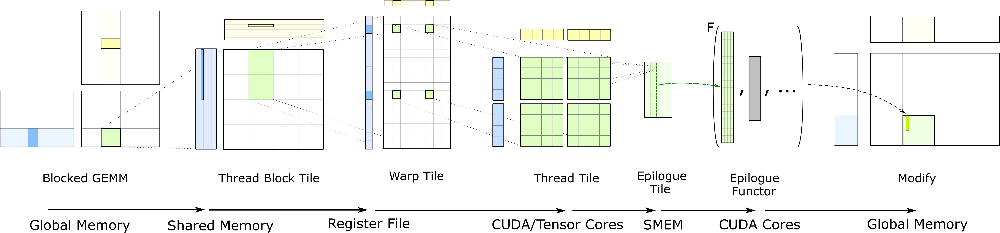
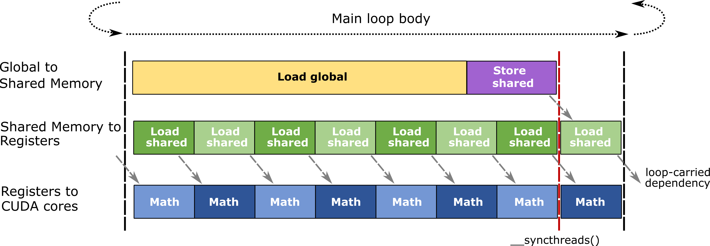

# Efficient GEMM in CUDA

朴素地，矩阵乘法可以使用多层嵌套循环实现，在并行编程环境下，可以使用不同的并行资源对多层嵌套的矩阵乘法计算进行Tiling平铺分片，以利用并行硬件的并发性、数据的存储局部性等。CUTLASS将通用矩阵乘法GEMM映射到GPU设备上，并使用CUDA并行编程模型中的并行资源，包括Device设备、Kernel核函数、Threadblock线程块、Warp线程束、Thread线程、Instruction指令等多个层级，对矩阵乘法进行并行分片，伪代码如下所示。

```c++
for (int cta_n = 0; cta_n < GemmN; cta_n += CtaTileN)  // for each threadblock_y
for (int cta_m = 0; cta_m < GemmM; cta_m += CtaTileM)  // for each threadblock_x
for (int cta_k = 0; cta_k < GemmK; cta_k += CtaTileK)  // GEMM mainloop, no unrolling; one iteration is one "stage"
    for (int warp_n = 0; warp_n < CtaTileN; warp_n += WarpTileN)  // for each warp_y
    for (int warp_m = 0; warp_m < CtaTileM; warp_m += WarpTileM)  // for each warp_x
    for (int warp_k = 0; warp_k < CtaTileK; warp_k += WarpTileK)  // fully unroll across CtaTileK; one iteration is one "k Group"
        for (int mma_k = 0; mma_k < WarpTileK; mma_k += MmaK)  // outer product loop, fully unroll across WarpTileK
        for (int mma_n = 0; mma_n < WarpTileN; mma_n += MmaN)  // for each mma instruction
        for (int mma_m = 0; mma_m < WarpTileM; mma_m += MmaM)  // for each mma instruction
			mma_instruction(d, a, b, c);  // one single mma instruction by Tensor Core or CUDA Core
```

MMA（Matrix Multiply Accumulate）是指矩阵乘法累加操作，是矩阵乘法的实现代码中的基本操作，因为实现代码必须对K维度进行迭代循环，每次迭代都需要执行矩阵乘法操作与累加操作，也即MMA矩阵乘法累加操作。

CUTLASS对矩阵乘法的划分如下图所示，从左至右，每个层级对应着CUDA编程模型中不同的并行资源。



## Tiling and Epilogue

线程块分片（Threadblock Tile），一个线程块负责计算结果矩阵的一部分，会迭代地从全局内存中加载输入矩阵分片到共享内存，并执行矩阵乘法累加操作。在线程块层级，线程块尺寸与矩阵分片策略是算法性能的关键。一个更大的线程块往往持有更大的矩阵分片，意味着更少的全局内存读取，从而能够保证DRAM带宽不是性能瓶颈；然而线程块分片与问题规模并不能总是相匹配。如果M维度或N维度较小，则线程块中的一些线程可能因为已经超出问题边界而在做无效计算。如果M维度和N维度较小而K维度较大，这种朴素的线程块分片模式只会启动很少的工作线程，而每个工作线程又会负责较长的K维度迭代计算负载，这无法充分利用GPU设备的流多处理器。在K维度上进行线程块或线程束的划分，然后对每个线程块计算得到的部分矩阵乘法结果执行求和归约，可以对这种问题规模的计算进行优化。在CUTLASS中，可以使用ThreadblockShape::{kM,kN,kK}指定线程块分片的尺寸，以匹配不同的硬件架构和问题规模。

线程束分片（Warp Tile），一个线程束负责计算线程块分片的一部分，会迭代地从共享内存中加载输入矩阵分片到寄存器，并执行矩阵乘法累加操作。在实现上，线程束的矩阵乘法累加操作，可以通过mma.sync指令或wmma指令由Tensor Core完成计算，或通过线程分片由CUDA Core完成计算。为取得最高性能，对共享内存的访问应该避免bank冲突。为重用数据，应该尽可能划分更大尺寸的线程束分片。

线程分片（Thread Tile），一个线程负责计算线程束分片的一部分，会迭代地获取寄存器中的数据，并执行矩阵乘法累加操作。因为一个线程无法访问其它线程的寄存器，故应该合理安排线程布局，使得一个线程的多条计算指令能够重用寄存器中的数据。即一个线程计算一个二维矩阵分片，从而使线程能够将一组独立的计算指令发射给CUDA Core计算，以执行矩阵乘法累加操作。SGEMM、DGEMM、HGEMM、IGEMM等通过单指令多线程SIMT指令完成计算。

在完成上述划分的矩阵乘法累加操作之后，计算所得的结果矩阵的一部分存在于一个线程的寄存器中，这种划分策略能够取得最高的矩阵乘法计算效率，但在将结果矩阵写回到全局内存中时不能实现高效的合并访存模式。

结尾分片（Epilogue Tile）操作是一个单独阶段，一个线程负责处理结果矩阵分片的一部分，用以对计算所得的结果矩阵执行后置操作。通常情况下，一个线程节计算所得的结果矩阵分片以特定布局写回到共享内存中，这种结果矩阵分片在共享内存中的布局方式有利于线程以高效合并访存的模式写回结果。同时，一个线程可以对所负责结果矩阵分片的一部分执行其它可选的逐元素操作。CUTLASS定义一些典型的结尾操作，例如线程缩放与收缩等。

## Pipeline

层级划分结构使得每个CUDA线程需要占用大量的寄存器，且每个线程所持有的累加值至少要占用寄存器预算的一半以上；因此GPU设备的占用率较低，线程块、线程束、线程数目通常低于其它任务的工作负载；这会导致GPU难以隐藏内存延迟和切换线程上下文时所带来停顿间隔（stall）。为减轻内存延迟，CUTLASS使用软件流水线，也即使用双缓冲技术，以重叠线程的访存和计算，如下所示。

- 线程块层级，持有两个共享内存空间，一个用于为当前次的矩阵计算提供数据，另一个用于从设备全局内存中加载下一次主循环迭代所需的数据。
- 线程束层级，持有两个存储于寄存器的矩阵片段fragment，一个用于传递给CUDA Core或Tensor Core执行当前次的矩阵计算，另一个用于从共享内存中加载下一次Warp循环迭代所需的数据。

下图展示CUTLASS所使用的GEMM主循环流水线。



## SplitK and SliceK

矩阵乘法中线程块的划分具有在O(MN)上的并行性，并独立地执行内积计算。当问题规模M,N足够大时，CUTLASS的矩阵乘法kernel能够达到最大理论计算吞吐量；而当问题规模M,N较小时，则启动的线程块数目太少难以充分利用整个GPU设备。

SplitK（reduction across Block）通过将内积计算过程中的归约操作并行化，可以启动更多的线程块并发执行，从而在线程块层级充分利用计算吞吐量。CUTLASS在问题规模的K维度上进行划分，并在每个划分上启动一组线程块执行计算，然后执行并行的归约操作。用户需要管理工作缓冲区以保存中间结果。

划分维度K的GEMM允许指定问题规模以及划分数目，并且允许维度K无法被整除的情况。例如M,N,K=128,128,4096的问题规模和SplitNum=20的划分数目，会产生20个矩阵乘法kernel，前19个计算所划分到的SplitK=4096/20=204，最后一个计算所划分到的SplitK=220，这能完整处理K维度上的计算。然后再在维度K上执行归约操作，以获得最终结果。

因为每个线程块负责blockM,blockN的输出矩阵，那么线程束的划分具有在O(blockM,blockN)上的并行性。更大的线程束分片warpM,warpN允许更好的指令并行和重用，但当问题规模M,N更小时，这会限制每个线程块所持有的线程束数目，从而导致效率降低。

SliceK（reduction across Warp）通过在blockK维度上划分线程束，能够允许一个线程块产生更多线程束并发执行。SliceK策略不仅会将blockM,blockN划分给warpM,warpN，还会将线程块的计算在blockK维度进一步划分给warpK。然后在线程块的所有线程束计算完成后，再在相关的线程束之间执行归约操作。

## Warp Specialization

从Hopper架构开始，CUTLASS 3.0引入线程束专业化的概念，即一个线程块中的线程束被分为两组，分别是生产者线程束与消费者线程束。生产者使用新架构的张量内存加速器（Tensor Memory Accelerator，TMA）将数据从设备全局内存中加载到共享内存缓冲区中，并更新该阶段所关联的栅障以通知相关消费者数据已填充；消费者等待生产者的填充信号，然后启动Tensor Core的MMA操作，然后释放共享内存缓冲区，并使用新引入的Async Pipeline Class类通知生产者共享内存缓冲区已为空，以执行下一组TMA工作负载。

# CUTLASS and Utility

CUTLASS是CUDA Templates for Linear Algebra Subroutines and Solvers的缩写，是基于CUDA运行时的线性代数例程与求解器的C++模板库，用于实现高性能的矩阵乘法GEMM及其相关计算。除通用矩阵乘法之外，CUTLASS通过隐式GEMM算法实现高性能的卷积操作。

> 使用模板库的优势在于，一些在计算过程中不变的配置，例如分片形状与迭代策略，可以使用模板参数在编译期间确定，从而只使用函数参数传递数据。

CUTLASS库的源码可在https://github.com/NVIDIA/cutlass网址获得，其包括CUTLASS模板库与CuTe模板库。其中CUTLASS模板库是指CUTLASS 2.X实现版本，通过各层级的模板库抽象提供GEMM实现；而CuTe模板库是自CUTLASS 3.0版本引入的新模板库，通过Layout对象和Tensor对象提供GEMM实现。需要注意的是，CUTLASS 3.0版本需要CUDA 11.4及以上版本，且GPU设备的计算能力为SM70及以上版本。

CUTLASS库包括若干组件。在顶层include目录中提供CUTLASS模板库和CuTe模板库的头文件，应用程序编程需要将顶层include目录添加到编译器的头文件搜索路径；在顶层tools目录中提供CUTLASS Instance模板实例、CUTLASS Profiler分析器、CUTLASS Utilities额外工具；在顶层examples目录中提供使用示例；在顶层media目录中提供文档；在顶层test目录中提供测试组件。

```shell
.
├── include       # Top-level include directory. Client applications should target this path.
│   ├── cutlass   # CUTLASS Template Library, CUDA Templates for Linear Algebra Subroutines and Solvers
│   └── cute      # CuTe Template Library, CuTe Layout, layout algebra, MMA/Copy atoms, tiled MMA/Copy
├── tools
│   ├── library   # CUTLASS Instance Library, static/dynamic library containing all kernel instantiations of interest
│   ├── profiler  # CUTLASS Profiler
│   └── util      # CUTLASS Utilities
├── examples      # CUTLASS Examples
├── media         # Documentation
└── test
```

多维对象（multidimensional object）是一个统称，可以指数组（array）、矩阵（matrix）、张量（tensor）、索引空间（index space）、形状（shape）、跨步（stride）、布局（layout）等。逻辑数目（logical number）是指，在逻辑表示上，有效元素的数目。实际存储数目（physical number）是指，在内存空间中进行存储时，占用物理存储空间的实际存储的元素数目，包括有效元素和填充元素。

使用Index表示某个逻辑维度轴上的索引，使用Extent表示某个逻辑维度轴上的逻辑维数，使用Rank表示维度轴的数目，使用Size表示全部逻辑元素的数目；使用LongIndex表示在内存空间中存储位置的线性偏移，使用Capacity表示多维对象在内存中实际需要存储的元素数目，包括填充元素。

在项目顶层的tools/util/include/cutlass目录中，提供CUTLASS的各种功能的工具模板类，实际使用时可查阅目录中所提供的头文件，此处只是列举一些常用的工具模板类。注意，应用程序需要将顶层tools/util/include目录添加到编译器的头文件搜索路径。

在cutlass/util/device_memory.h头文件中，提供GPU设备全局内存管理函数的C++包装接口DeviceAllocation\<T\>模板类，其使用smart_ptr智能指针对内存空间地址指针进行管理，在模板类的实例对象超出作用域时，会自动释放已分配的设备内存，避免内存泄漏问题。

```c++
__global__ void device_alloc_demo_kernel(float *device_ptr) {}

void device_alloc_demo() {
    int num_of_float = 1024;
    // using allocation = cutlass::DeviceAllocation<T>;
    cutlass::device_memory::allocation<float> device_alloc(num_of_float);
    device_alloc_demo_kernel<<<128, 128>>>(device_alloc.get());
    // Device memory is automatically freed when device_alloc goes out of scope
}
```

在cutlass/util/host_tensor.h头文件中，提供HostTensor\<T,Layout\>模板类，用于表示一个张量对象，并在主机端或设备端分配存储空间。

```c++
template <
    typename Element,  // Data type of element stored within tensor (concept: NumericType)
    typename Layout    // Defines a mapping from logical coordinate to linear memory (concept: Layout)
>
class HostTensor {
public:
    // Note: Below is used to handle packing of subbyte elements
    // kBitsStoredVec          : The bits of store vec that could be divisiable by the element
    // kElementsPerStoredVec   : The number of elements could be stored in per store vec
    // kNumStoragePerStoredVec : How much storage(i.e. sizeof(element storage)) the store vec needs to consume.
    //                           Usually the element storage of subbyte is uint8_t.
    // Example
    //  int2:  kBitsStoredVec = 8; kElementsPerStoredVec = 4; kNumStoragePerStoredVec = 1 uint8_t;
    //  int4:  kBitsStoredVec = 8; kElementsPerStoredVec = 2; kNumStoragePerStoredVec = 1 uint8_t;
    static constexpr int kBitsStoredVec = (sizeof_bits<Element>::value < 8)
        ? cutlass::lcm(sizeof_bits<Element>::value, 8) : sizeof_bits<Element>::value;
    static constexpr int kElementsPerStoredVec = kBitsStoredVec / sizeof_bits<Element>::value;
    static constexpr int kNumStoragePerStoredVec = kBitsStoredVec / (sizeof(Element) * 8);
private:
    TensorCoord extent_;  // Extent of tensor in logical dimensions
    Layout layout_;       // Layout object
    // Host-side memory allocation. Avoid the std::vector<bool> specialization
    std::vector<std::conditional_t<std::is_same_v<Element,bool>, uint8_t, Element>> host_;
    // Device-side memory. using allocation = cutlass::DeviceAllocation<T>
    device_memory::allocation<Element> device_;
public:
    // Constructs a tensor given an extent and layout
    HostTensor(TensorCoord const &extent, Layout const &layout, bool device_backed = true) {
        this->reset(extent, layout, device_backed);
    }
    // Updates the extent and layout of the HostTensor. Allocates memory according to the new extent and layout.
    void reset(TensorCoord const &extent, Layout const &layout, bool device_backed_ = true) {                        
        extent_ = extent;
        layout_ = layout;
        this->reserve(size_t(layout_.capacity(extent_)), device_backed_);
    }
    // Resizes internal memory allocations without affecting layout or extent
    void reserve(size_t count, bool device_backed_ = true) {
        // @param count             size of tensor in elements
        // @param device_backed_    if true, device memory is also allocated
        device_.reset();
        host_.clear();
        count = (count + kElementsPerStoredVec - 1) / kElementsPerStoredVec * kNumStoragePerStoredVec;
        host_.resize(count);
        // Allocate memory
        Element* device_memory = nullptr;
        if (device_backed_) { device_memory = device_memory::allocate<Element>(count); }
        device_.reset(device_memory, device_backed_ ? count : 0);
    }
```

一个示例如下所示，使用单精度列主序存储一个二维矩阵张量，并获得该矩阵的主机内存地址指针与设备内存地址指针，及其TensorRef和TensorView对象。

```c++
void tensor_demo() {
    int rows = 128;
    int columns = 96;
    cutlass::HostTensor<float, cutlass::layout::ColumnMajor> tensor({rows, columns});
    float *host_ptr = tensor.host_data();
    cutlass::TensorRef<float, cutlass::layout::ColumnMajor> host_ref = tensor.host_ref();
    cutlass::TensorView<float, cutlass::layout::ColumnMajor> host_view = tensor.host_view();
    float *device_ptr = tensor.device_data();
    cutlass::TensorRef<float, cutlass::layout::ColumnMajor> device_ref = tensor.device_ref();
    cutlass::TensorView<float, cutlass::layout::ColumnMajor> device_view = tensor.device_view();
}
```

在使用HostTensor\<T,Layout\>模板类时，应用程序需要保证主机内存中数据与设备内存中数据的同步，该模板类提供若干同步方法，如下所示。

```c++
template <typename Element, typename Layout>
class HostTensor {
private:
    std::vector<std::conditional_t<std::is_same_v<Element,bool>, uint8_t, Element>> host_;
    device_memory::allocation<Element> device_;
public:
    // Returns true if device memory is allocated
    bool device_backed() const { return (device_.get() == nullptr) ? false : true; }
    // Copies data from device to host
    void sync_host() {
        if (device_backed()) { device_memory::copy_to_host(host_data(), device_data(), size()); }
    }
    // Copies data from host to device
    void sync_device() {
        if (device_backed()) { device_memory::copy_to_device(device_data(), host_data(), size()); }
    }
};
```

在cutlass/util/tensor_view_io.h头文件中，对位于主机端上的TensorView对象重载了流输出运算符operator\<\<()，以方便打印元素数据，如下所示。

```c++
void print_demo() {
    int rows = 2;
    int columns = 3;
    cutlass::HostTensor<int, cutlass::layout::ColumnMajorInterleaved<2>> tensor({rows, columns});
    cutlass::TensorView<int, cutlass::layout::ColumnMajorInterleaved<2>> host_view = tensor.host_view();
    int val = 1;
    for (int i = 0; i < rows; i++) {
        for (int j = 0; j < columns; j++) {
            host_view[{i, j}] = val++;
        }
    }
    std::cout << tensor.host_view() << std::endl;
    int *host_ptr = tensor.host_data();
    for (int i = 0; i < tensor.capacity(); printf("%d ", host_ptr[i++]));
    printf("\n");
}
```

```shell
1, 2, 3,
4, 5, 6
1 2 4 5 3 0 6 0 
```

在cutlass/util/reference/host/tensor_fill.h头文件和cutlass/util/reference/device/tensor_fill.h头文件中，提供用于初始化TensorView对象的各种辅助方法，可对主机内存对象或设备内存对象进行指定模式的初始化，包括填充指定值、正则随机初始化、高斯随机初始化等。

```c++
void fill_demo() {
    int rows = 128;
    int columns = 96;
    cutlass::HostTensor<float, cutlass::layout::ColumnMajor> tensor({rows, columns});

    // 填充给定值
    float x = 3.14159f;
    cutlass::reference::host::TensorFill(tensor.host_view(), x);
    cutlass::reference::device::TensorFill(tensor.device_view(), x);

    uint64_t seed = 0x2024;
    int non_zero_bits = 2;

    // 正则随机初始化
    float maximum = 4;
    float minimum = -4;
    cutlass::reference::host::TensorFillRandomUniform(tensor.host_view(), seed, maximum, minimum, non_zero_bits);
    cutlass::reference::device::TensorFillRandomUniform(tensor.device_view(), seed, maximum, minimum, non_zero_bits);

    // 高斯初始化
    float mean = 0.5;
    float stddev = 2.0;
    cutlass::reference::host::TensorFillRandomGaussian(tensor.host_view(), seed, mean, stddev, non_zero_bits);
    cutlass::reference::device::TensorFillRandomGaussian(tensor.device_view(), seed, mean, stddev, non_zero_bits);
}
```

其中，随机初始化方法都可以接受一个non_zero_bits参数，用于指定二进制小数部分至少多少位数字不为零值。

在cutlass/util/reference/host/gemm.h头文件中，提供主机端GEMM通用矩阵乘法计算的实现，一个使用示例如下所示。

```c++
void host_gemm_demo() {
    int M = 64, N = 32, K = 16;
    cutlass::half_t alpha = 1.5_hf, beta = -1.25_hf;

    cutlass::HostTensor<cutlass::half_t, cutlass::layout::ColumnMajor> A({M, K});
    cutlass::HostTensor<cutlass::half_t, cutlass::layout::ColumnMajor> B({K, N});
    cutlass::HostTensor<cutlass::half_t, cutlass::layout::ColumnMajor> C({M, N});
    uint64_t seed = 0x2024;
    cutlass::half_t mean = 0.5_hf;
    cutlass::half_t stddev = 2.0_hf;
    cutlass::reference::host::TensorFillRandomGaussian(A.host_view(), seed, mean, stddev);
    cutlass::reference::host::TensorFillRandomGaussian(B.host_view(), seed, mean, stddev);
    cutlass::reference::host::TensorFillRandomGaussian(C.host_view(), seed, mean, stddev);

    cutlass::reference::host::Gemm<
        cutlass::half_t, cutlass::layout::ColumnMajor,
        cutlass::half_t, cutlass::layout::ColumnMajor,
        cutlass::half_t, cutlass::layout::ColumnMajor,
        cutlass::half_t, cutlass::half_t
    > gemm_op;

    gemm_op({M, N, K}, alpha, A.host_view(), B.host_view(), beta, C.host_view());
    std::cout << C.host_view() << std::endl;
}
```

在cutlass/util/reference/host/tensor_compare.h头文件中，提供主机端的TensorEquals()方法，用于判断两个主机端的HostTensor对象是否相等。

```c++
bool same = cutlass::reference::host::TensorEquals(tensor1.host_view(), tensor2.host_view());
```

在cutlass/util/reference/host/tensor_elementwise.h头文件中，提供主机端内存中TensorView对象的逐元素操作，例如TensorAdd()函数、TensorSub()函数、TensorMul()函数、TensorDiv()函数、TensorModulus()函数，以及自定义的TensorFuncBinaryOp结构体等。

# CUTLASS Type Reference

```shell
cutlass  # CUTLASS Template Library
├── *          # Fundamental types
├── layout     # Layout type for matrix, tensor and other mathematical Object in memory
├── detail     # Helper for macros and others
├── platform   # Platform features
├── arch       # Architecture features (including instruction implementation)
├── gemm       # GEneral Matrix Multiply computations
│   ├── device       # Launch kernels
│   ├── kernel       # Kernels
│   ├── threadblock  # Cta Tile
│   ├── warp         # Warp Tile
│   └── thread       # Thread Tile
├── transform  # Code specialized for layout, type, and domain transformations
├── epilogue   # Epilogue rearranges result to canonical layouts, and supports conversion and reduction operations
├── reduction  # Reduction kernels
└── conv       # Implict GEMM for Convolution
```

> 在项目结构中，通常文件目录与命名空间的组成方式是一致的，例如，命名空间cutlass::gemm::device对应到cutlass::gemm::device目录。
>
> 因为CUTLASS模板库的所有代码都位于cutlass根命名空间中，故在介绍时默认省略cutlass::命名空间。

## Fundamental Type

CUTLASS沿用C++标准库的基本类型，可用于主机端代码与设备端代码，并且与设备的计算能力无关。此外，CUTLASS还额外定义了一些数值类型与容器。需要注意的是，一些类型或函数在较低的架构上并不支持，例如hrsqrt函数，可在编译时使用-arch=sm_70指定目标架构。

在cutlass/numeric_types.h头文件，提供一些特殊数值类型的定义，如下所示。

| 数值类型   | 字面量后缀 | 描述                                   |
| ---------- | ---------- | -------------------------------------- |
| half_t     | _hf        | IEEE半精度浮点数；尾数10位，指数5位    |
| bfloat16_t | _bf16      | BFloat16类型；尾数7位，指数8位         |
| tfloat32_t | _tf32      | Tensor Float 32类型；尾数10位，指数8位 |
| int4_4     | _s4        | 有符号4位整型                          |
| uint4_t    | _u4        | 无符号4位整型                          |
| bin1_t     | _b1        | 一位二进制位                           |

```c++
template <int Bits, bool Signed = true>
struct integer_subbyte {
    using Storage = uint8_t;  // Storage type
    static constexpr Storage bits_mask_ = Storage(Storage(-1) >> (8 - Bits));       // bitmask for truncation
    static constexpr Storage sign_mask_ = Storage((Signed ? 1 : 0) << (Bits - 1));  // bitmask for the sign bit
    Storage storage;
}
using  int4b_t = integer_subbyte<4, true>;   // 4-bit Integer type
using uint4b_t = integer_subbyte<4, false>;  // 4-bit Unsigned integer type
using bin1_t = bool;                         // 1-bit binary type
```

在cutlass/numeric_size.h头文件中，提供辅助模板sizeof_bits\<T\>的定义，用于获取一个类型所占用的二进制位的数目。

```c++
// defines the size of an element in bits
template<typename T>
struct sizeof_bits { static constexpr int value = int(sizeof(T) * 8); };
template <int Bits, bool Signed>
struct sizeof_bits<integer_subbyte<Bits,Signed>> { static constexpr int value = Bits; };
template <>
struct sizeof_bits<bin1_t> { static constexpr int value = 1; };
template <>
struct sizeof_bits<void> { static constexpr int value = 0; };
```

在cutlass/array.h头文件中，提供Array\<T,N\>容器和AlignedArray\<T,N,Align\>容器的定义，如下所示。

```c++
template<typename T, int N, bool RegisterSized = sizeof_bits<T>::value >= 32>
struct Array;
```

```c++
template<typename T, int N>
struct Array<T, N, true> {
    static constexpr size_t kElements = N;
    typedef T value_type;
    typedef value_type& reference;
    typedef value_type* pointer;
    using Storage = T;
    Storage storage[kElements];
    CUTLASS_HOST_DEVICE pointer data()                      { return reinterpret_cast<pointer>(storage); }
    CUTLASS_HOST_DEVICE reference operator[](size_type pos) { return reinterpret_cast<reference>(storage[pos]); }
};
```

```c++
template<typename T, int N, int Alignment = (sizeof_bits<T>::value * N + 7) / 8>
class alignas(Alignment) AlignedArray: public Array<T,N> {};
```

Array\<T,N\>是一个固定长度的数组，与C++标准库std::array相似，但可存储小于1B的类型，且小类型的对象之间紧凑存储。在使用sizeof(Array\<T,N\>)运算符时，其返回结果仍然是以字节为单位，且最小是1个字节。应尽量避免对Array单个元素的操作，而应使用其成员方法，这些方法会使用效率更高的向量化指令。

AlignedArray\<T,N\>是一个固定长度的数组，继承自Array\<T,N\>模板类，但可以指定其内存空间按多少字节对齐。

在cutlass/aligned_buffer.h头文件中，提供AlignedBuffer\<T,N,Align\>容器的定义，如下所示。

```c++
template<typename T, int N, int Align = 16>
struct AlignedBuffer {
    static int const kBytes = (sizeof_bits<T>::value * N + 7) / 8;
    typedef T value_type;
    typedef value_type* pointer;
    using Storage = uint8_t;
    alignas(Align) Storage storage[kBytes];
    CUTLASS_HOST_DEVICE pointer data() { return reinterpret_cast<pointer>(storage); }
};
```

AlignedBuffer\<T,N,Align\>是一个固定长度的缓冲区，不会调用所持有类型的构造方法。可使用AlignedBuffer<>::data()方法获得内存空间的地址指针。常用于获取一段以给定字节对齐的连续内存空间，如设备全局内存或共享内存，以用于向量化操作，一个示例如下所示。

```c++
__global__ void aligned_buffer_demo_kernel() {
    const int kN = 1024;
    __shared__ AlignedBuffer<half_t, kN> smem_buffer;
    AlignedArray<half_t, 8> *ptr = reinterpret_cast<AlignedArray<half_t, 8>*>(smem_buffer.data());
    AlignedArray<half_t, 8> value = ptr[threadIdx.x];  // 128-bit shared memory load
}
```

在cutlass/numeric_conversion.h头文件中，提供NumericConverter\<T,S\>转换器与NumericArrayConverter\<T,S,N\>转换器的定义，如下所示。

```c++
enum class FloatRoundStyle {
    round_indeterminate,          // rounding mode unknown
    round_toward_zero,            // round toward zero
    round_to_nearest,             // round to nearest even
    round_to_nearest_satfinite,   // round to nearest even, capping value to min and max of destination type
    round_toward_infinity,        // round toward infinity
    round_toward_neg_infinity,    // round toward negative infinity
    round_half_ulp_truncate,      // add 0.5ulp to integer representation then round toward zero
    round_half_ulp_trunc_dntz     // like round_half_ulp_truncate, except denorms are rounded *toward* zero
};
```

```c++
template<typename T, typename S, FloatRoundStyle Round = FloatRoundStyle::round_to_nearest>
struct NumericConverter {
    static FloatRoundStyle const round_style = Round;
    using result_type = T;
    using source_type = S;
    CUTLASS_HOST_DEVICE static result_type convert(source_type const &s)   { return static_cast<result_type>(s); }
    CUTLASS_HOST_DEVICE result_type operator()(source_type const &s) const { return convert(s); }
};
```

NumericConverter\<T,S\>会尽可能地在目标架构上使用硬件加速，并支持多种舍入模式。此外，NumericArrayConverter\<T,S,N\>支持转换Array数组类型，一个示例如下所示。

```c++
void converter_demo() {
    int const kN = 16;
    Array<int8_t, kN> destination;
    Array<int, kN> source;
    NumericArrayConverter<int8_t, int, kN> convert;
    destination = convert(source);
}
```

在cutlass/predicate_vector.h头文件中，提供PredicateVector的定义，如下所示。

```c++
template <int kPredicates, int kPredicatesPerByte = 4, int kPredicateStart = 0>
struct PredicateVector {
    // Storage type of individual elements
    typedef uint32_t Storage;
    // Number of bytes needed
    static constexpr int kBytes = (kPredicates + kPredicatesPerByte - 1) / kPredicatesPerByte;
    // Number of storage elements needed
    static constexpr int kWordCount = (kBytes + int(sizeof(Storage)) - 1) / int(sizeof(Storage));
    Storage storageData[kWordCount];
}
```

PredicateVector是一个由谓词构成的固定长度的向量，也即掩码向量，可以在循环展开代的码段中使用寄存器加速访问。

在cutlass/functional.h头文件中，提供一些模板函数的定义，该头文件是模仿C++标准库的functional头文件，一个操作的示例如下所示。

```c++
template<typename A, typename B = A, typename C = A>
struct multiply_add {
    CUTLASS_HOST_DEVICE C operator()(A const &a, B const &b, C const &c) const {
		return C(a) * C(b) + c;
    }
};
```

其中，multiply_add\<T\>表示乘法与加法操作，由CUTLASS进行扩展，以支持复数complex\<T\>类型的乘法与加法操作，并尽可能调用本地硬件指令。

## Shape and Coord

在cutlass/coord.h头文件中，提供Coord\<Rank\>容器的定义，如下所示。

```c++
template<int Rank, typename Index = int, typename LongIndex = int64_t>
struct Coord {
    static int const kRank = Rank;
    Index idx[kRank];
    CUTLASS_HOST_DEVICE Index& operator[](int dim) { return idx[dim]; }
};
```

Coord\<Rank\>是一个通用的逻辑坐标，或表示维数形状，可用于张量中的索引下标，并支持两个坐标之间的加减乘除操作，逐元素操作。

在cutlass/matrix_coord.h头文件和cutlass/tensor_coord.h头文件中，提供MatrixCoord坐标和Tensor4DCoord坐标的定义，如下所示。

```c++
struct MatrixCoord : public Coord<2, int> {
    static int const kRow = 0;
    static int const kColumn = 1;
    CUTLASS_HOST_DEVICE Index& row()    { return this->at(kRow); }
    CUTLASS_HOST_DEVICE Index& column() { return this->at(kColumn); }
};
```

```c++
struct Tensor4DCoord : public Coord<4> {
    static int const kN = 0;
    static int const kH = 1;
    static int const kW = 2;
    static int const kC = 3;
    CUTLASS_HOST_DEVICE Index& n() { return this->at(kN); }
    CUTLASS_HOST_DEVICE Index& h() { return this->at(kH); }
    CUTLASS_HOST_DEVICE Index& w() { return this->at(kW); }
    CUTLASS_HOST_DEVICE Index& c() { return this->at(kC); }
}
```

MatrixCoord和Tensor4DCoord分别提供专用于二维矩阵和四维张量情况下的坐标，并提供相关特定的成员方法。

在cutlass/gemm_coord.h头文件中，提供GemmCoord和GemmShape的定义，如下所示。

```c++
// GemmCoord is a structure derived from Coord<3> that 
// specifies a location within the coordinate space of a GEMM problem.
struct GemmCoord : public Coord<3, int> {
    typedef int Index;
    typedef Coord<3, Index> Base;
    static int const kM = 0;  // GEMM M dimension - rows of the output C matrix
    static int const kN = 1;  // GEMM N dimension - columns of the output C matrix
    static int const kK = 2;  // GEMM K dimension - inner dimension of the GEMM problem
    CUTLASS_HOST_DEVICE Index & m() { return this->at(kM); }
    CUTLASS_HOST_DEVICE Index & n() { return this->at(kN); }
    CUTLASS_HOST_DEVICE Index & k() { return this->at(kK); }
};
```

```c++
// Shape of a matrix multiply-add operation
template<int M = 1, int N = 1, int K = 1>
struct GemmShape {
    static int const kM = M;  // Rows of matrix product
    static int const kN = N;  // Columns of matrix product
    static int const kK = K;  // Inner dimension of matrix product
    static int const kMN = M * N;
    static int const kMK = M * K;
    static int const kKN = N * K;
    static int const kMNK = M * N * K;
    static int const kCount = kMNK;
    // Returns a Coord object
    CUTLASS_HOST_DEVICE static Coord<3> toCoord() { return make_Coord(kM, kN, kK); }
};
```

GemmCoord表示一个GEMM问题中的坐标，GemmShape表示一个矩阵乘法累加MMA操作的形状。

在cutlass/matrix_shape.h头文件中，提供MatrixShape的定义，如下所示。

```c++
// Describes the size of a matrix tile
template<int Row, int Column>
struct MatrixShape {
    static int const kRow = Row;             // rows of a matrix
    static int const kColumn = Column;       // columns of a matrix
    static int const kCount = Row * Column;  // total number of elements in a matrix
    CUTLASS_HOST_DEVICE static Coord<2> toCoord() { return make_Coord(kRow, kColumn); }
};
```

MatrixShape表示一个矩阵的形状，包括行数与列数。

## Layout and Tensor

张量是一个多维对象，由内存中多维的数值元素数组表示。例如，二维矩阵通常用于经典数值计算，多维张量通常用于深度学习任务等。本节描述CUTLASS库的设计，如何使用Layout概念将逻辑索引空间映射到内存布局，如何使用TensorRef和TensorView概念间接访问内存中的张量元素。同时，CUTLASS提供一些与C++标准库一致的概念；size指张量的元素总数；capacity指实际存储的元素总数；rank指张量逻辑维度的数目；extent指张量每个维度上的维数。

布局Layout将逻辑索引空间映射到内存空间中存储位置的实际偏移，并存储用于计算映射的状态，定义其它CUTLASS组件需要使用的部分实例化。

在cutlass/layout目录的若干头文件中，提供各种布局类型的定义。例如cutlass/layout/vector.h头文件、cutlass/layout/matrix.h头文件、cutlass/layout/tensor.h头文件、cutlass/layout/pitch_linear.h头文件等，还有cutlass/layout/permute.h头文件提供变换概念的定义。矩阵列主序存储的布局如下所示。

```c++
// Mapping function for column-major matrices.
class ColumnMajor {
public:  
    static int const kRank = 2;                    // Logical rank of tensor
    static int const kStrideRank = 1;              // Rank of stride vector
    using Index = int32_t;                         // Index type used for coordinates
    using LongIndex = int64_t;                     // Long index type used for offsets
    using TensorCoord = MatrixCoord;               // Logical coordinate
    using Stride = Coord<kStrideRank, LongIndex>;  // Stride vector
private:
    Stride stride_;  // Stride data member
public:
    CUTLASS_HOST_DEVICE ColumnMajor(LongIndex ldm = 0): stride_(ldm) { }
    CUTLASS_HOST_DEVICE ColumnMajor(Stride stride): stride_(stride) { }
    // Helper returns a layout to a tightly packed tensor
    CUTLASS_HOST_DEVICE static ColumnMajor packed(MatrixCoord const &extent) {
        return ColumnMajor(extent.row());
    }
    // Returns the offset of a coordinate in linear memory
    CUTLASS_HOST_DEVICE LongIndex operator()(MatrixCoord const &coord) const {
        return LongIndex(coord.column()) * LongIndex(stride_[0]) + coord.row();
    }
};
```

在cuBLAS库中，存在前导维数的概念，在默认采用列主序存储的矩阵布局时，这意味着矩阵元素{rid,cid}具有值为rid+cid\*ld的偏移，等价于CUTLASS提供的ColumnMajor布局类型；同时CUTLASS也提供RowMajor、RowMajorInterleaved、ColumnMajorInterleaved等布局类型，如下示意图。


一个使用布局将逻辑坐标映射到存储偏移的示例，如下所示。

```c++
void layout_demo() {
    int64_t ld = 32;
    ColumnMajor col_layout(ld);
    RowMajor    row_layout(ld);
    int64_t col_offset = col_layout({7, 23});  // rid + cid * ld
    int64_t row_offset = row_layout({7, 23});  // rid * ld + cid
    printf("%ld, %ld\n", col_offset, row_offset);  // 743, 247
}
```

在上述两种情况下，逻辑坐标{rid,cid}表示矩阵中同一个元素，这允许采用逻辑索引空间的算法实现保持通用性，并由Layout提供到实际存储位置的映射。

在cutlass/tensor_ref.h头文件中，提供TensorRef\<T,Layout\>结构体的定义，该结构体持有一个张量的数据地址指针以及布局对象，用于访问张量元素，可作为函数参数传递，如下所示。

```c++
template<typename Element, typename Layout>
class TensorRef {
public:
    using Reference = Element&;                        // Reference type to an element
    static int const kRank = Layout::kRank;            // Logical rank of tensor index space
    using Index = typename Layout::Index;              // Index type
    using LongIndex = typename Layout::LongIndex;      // Long index used for pointer offsets
    using TensorCoord = typename Layout::TensorCoord;  // Coordinate in logical tensor space
    using Stride = typename Layout::Stride;            // Layout's stride vector
private:
    Element* ptr_;   // Pointer
    Layout layout_;  // Layout object maps logical coordinates to linear offsets
public:
    // Constructs a TensorRef with a pointer and layout object
    CUTLASS_HOST_DEVICE TensorRef(Element *ptr, Layout const &layout): ptr_(ptr), layout_(layout) {}
    // Returns a reference to the element at a given linear index
    CUTLASS_HOST_DEVICE Reference data(LongIndex idx) const {
        return ptr_[idx];
    }
    // Computes the offset of an index from the origin of the tensor
    CUTLASS_HOST_DEVICE LongIndex offset(TensorCoord const &coord) const {
        return layout_(coord);
    }
    // Returns a reference to the element at a given Coord
    CUTLASS_HOST_DEVICE Reference operator[](TensorCoord const& coord) const {
        return data(offset(coord));
    }
    // Updates the pointer and layout object
    CUTLASS_HOST_DEVICE void reset(Element* ptr, Layout const &layout) {
        ptr_ = ptr;
        layout_ = layout;
    }
    // Adds an offset to each pointer
    CUTLASS_HOST_DEVICE TensorRef& add_pointer_offset(LongIndex offset_) {
        ptr_ += offset_;
        return *this;
    }
    // Adds an offset to each pointer
    CUTLASS_HOST_DEVICE TensorRef& add_coord_offset(TensorCoord const &coord) {
        add_pointer_offset(offset(coord));
        return *this;
    }
};
```

在cutlass/tensor_view.h头文件中，提供TensorView\<T,Layout\>类的定义，用于描述线性代数计算中维数确定的张量。该类继承自TensorRef\<T,Layout\>结构体，并提供extent()方法获得某个特定维度轴上的维数，如下所示。

```c++
template<typename Element, typename Layout>
class TensorView : public TensorRef<Element, Layout> {
public:
    using Base = cutlass::TensorRef<Element, Layout>;  // Base tensor reference
    using TensorCoord = typename Layout::TensorCoord;  // Coordinate in logical tensor space
private:
    TensorCoord extent_;  // View extent
public:
    // Constructs a TensorView object
    CUTLASS_HOST_DEVICE TensorView(Element *ptr, Layout const &layout, TensorCoord const &extent):
    	Base(ptr, layout), extent_(extent) {}
    // Returns the extent of the view
    CUTLASS_HOST_DEVICE TensorCoord const& extent() const {
        return extent_;
    }
};
```

使用TensorRef或TensorView访问张量元素的示例如下所示。

```c++
void tensor_view_demo() {
    int8_t *ptr = (int8_t*)malloc(sizeof(int8_t) * 16 * 9);
    for (int i = 0; i < 16 * 9; ptr[i++] = i);
    TensorView<int8_t, ColumnMajor> view(ptr, ColumnMajor(16), MatrixCoord(16, 9));
    if (view.contains({9, 5})) {
        printf("%d\n", view[{9, 5}]);  // 89
    }
    free(ptr);
}
```

## Macro and Platform

在cutlass/detail/helper_macros.hpp头文件中，提供一些辅助宏定义，如下所示。

```c++
#define CUTLASS_HOST_DEVICE __forceinline__ __device__ __host__
#define CUTLASS_DEVICE      __forceinline__ __device__
#define CUTLASS_HOST        __host__
#define CUTLASS_GLOBAL      __global__ static
```

在cutlass/platform/platform.h头文件中，提供一些与平台相关的定义，如下所示。

```c++
template<typename _Tp, _Tp __v>
struct integral_constant {
    static constexpr _Tp value = __v;
    typedef integral_constant<_Tp, __v> type;
    typedef _Tp value_type;
    constexpr operator value_type() const noexcept { return value; }
    constexpr value_type operator()() const noexcept { return value; }
};
using true_type  = integral_constant<bool, true>;   // compile-time boolean with true value
using false_type = integral_constant<bool, false>;  // compile-time boolean with false value
```

```c++
template<typename _Tp, typename _Up>
struct is_same : public false_type {};
template<typename _Tp>               
struct is_same<_Tp, _Tp> : public true_type {};
template<bool, typename _Tp = void>
struct enable_if {};
template<typename _Tp>
struct enable_if<true, _Tp> { typedef _Tp type; };                        // Partial specialization for true
template<bool _Cond, typename _Iftrue, typename _Iffalse>
struct conditional { typedef _Iftrue type; };
template<typename _Iftrue, typename _Iffalse>
struct conditional<false, _Iftrue, _Iffalse> { typedef _Iffalse type; };  // Partial specialization for false
```

在cutlass/cutlass.h头文件中，提供Status枚举类的定义，用于标识CUTLASS库的执行状态，并提供一些常量定义。

## Architecture and Instruction

在cutlass/arch目录中，提供基础操作的PTX汇编指令级实现，以及这些基础操作在指定GPU架构上的实现与特性，如下表所示。

| 头文件                         | 描述                                                   |
| ------------------------------ | ------------------------------------------------------ |
| cutlass/arch/arch.h            | LaneId()与SmId()辅助函数，以及设备架构与计算能力的标识 |
| cutlass/arch/cache_operation.h | 标识cache缓存行为的枚举类                              |
| cutlass/arch/memory.h          | 与全局内存和共享内存相关的操作                         |
| cutlass/arch/simd.h            | SIMD指令操作                                           |
| cutlass/arch/mma.h             | MMA矩阵乘法累加操作，以及操作类型的标识                |
| cutlass/arch/wmma.h            | WMMA线程束层级的矩阵乘法累加操作                       |

在cutlass/arch/arch.h头文件中，提供LaneId()与SmId()辅助函数，以及设备架构与计算能力的标识。

```c++
// Computes laneId within a warp
CUTLASS_DEVICE int LaneId() { int ret; asm("mov.u32 %0, %%laneid;" : "=r"(ret) : );  return ret; }
// Computes SM number the thread is running on
CUTLASS_DEVICE int SmId() { int ret; asm("mov.u32 %0, %%smid;" : "=r"(ret) : ); return ret; }
```

在cutlass/arch/cache_operation.h头文件中，提供标识Cache缓存行为的枚举类。

```c++
// Controls PTX cache operations
struct CacheOperation {
    enum Kind {
        Always,       // Cache at all levels - accessed again
        Global,       // Cache at global level
        Streaming,    // Streaming - likely to be accessed once
        LastUse,      // Indicates the line will not be used again
        Volatile,     // Don't cache, and fetch again
        WriteBack,    // Write back at all coherent levels
        WriteThrough  // Write through to system memory
    };
};
```

在cutlass/arch/memory.h头文件中，提供与全局内存和共享内存相关的操作。

```c++
template<
    typename AccessType,  // Fragment type to store loaded data; pointer
    int LoadBytes,        // The bytes of loading
    CacheOperation::Kind cache_op = CacheOperation::Always  // Cache operation
>
struct global_load;
```

```c++
template <typename AccessType>
struct global_load<AccessType, 16, CacheOperation::Always> {
    CUTLASS_DEVICE global_load(AccessType &D, void const *ptr, bool pred_guard) {
        uint4 &data = reinterpret_cast<uint4 &>(D);
        // The redundant mov PTX instruction is used to enforce the compiler
        // to keep the initializing code before ld.global
        asm volatile(
            "{\n"
            "  .reg .pred p;\n"
            "  setp.ne.b32 p, %5, 0;\n"
            "  mov.b32 %0, %6;\n"
            "  mov.b32 %1, %7;\n"
            "  mov.b32 %2, %8;\n"
            "  mov.b32 %3, %9;\n"
            #if CUTLASS_ENABLE_L2_PREFETCH
            "  @p ld.global.L2::128B.v4.u32 {%0, %1, %2, %3}, [%4];\n"
            #else
            "  @p ld.global.v4.u32 {%0, %1, %2, %3}, [%4];\n"
            #endif
            "}\n"
            : "=r"(data.x), "=r"(data.y), "=r"(data.z), "=r"(data.w)
            : "l"(ptr), "r"((int)pred_guard),
              "r"(data.x), "r"(data.y), "r"(data.z), "r"(data.w)
        );
    }
};
```

```c++
template<
    typename AccessType,  // Fragment type to store data; pointer
    int StoreBytes        // The bytes of storing
>
struct global_store;
```

```c++
template <typename AccessType>
struct global_store<AccessType, 16> {
    CUTLASS_DEVICE global_store(AccessType const &D, void *ptr, bool pred_guard) {
        uint4 const &data = reinterpret_cast<uint4 const &>(D);
        asm volatile(
            "{\n"
            "  .reg .pred p;\n"
            "  setp.ne.b32 p, %5, 0;\n"
            "  @p st.global.v4.u32 [%0], {%1, %2, %3, %4};\n"
            "}\n"
            :
            : "l"(ptr), "r"(data.x), "r"(data.y), "r"(data.z), "r"(data.w), "r"((int)pred_guard)
        );
    }
};
```

```c++
template<int Bytes>
CUTLASS_DEVICE void shared_load(void *dst, uint32_t ptr);
```

```c++
template<>
CUTLASS_DEVICE void shared_load<16>(void *dst, uint32_t ptr) {
    uint4 *dst_u128 = reinterpret_cast<uint4*>(dst);
    asm volatile(
        "ld.shared.v4.u32 {%0, %1, %2, %3}, [%4];\n"
        : "=r"(dst_u128->x), "=r"(dst_u128->y), "=r"(dst_u128->z), "=r"(dst_u128->w)
        : "r"(ptr)
    );
}
```

```c++
template <int Bytes>
CUTLASS_DEVICE void shared_store(uint32_t ptr, void const *src);
```

```c++
template <>
CUTLASS_DEVICE void shared_store<16>(uint32_t ptr, void const *src) {
    uint4 const *dst_u128 = reinterpret_cast<uint4 const*>(src);
    asm volatile(
        "st.shared.v4.u32 [%0], {%1, %2, %3, %4};\n"
        :
        : "r"(ptr), "r"(dst_u128->x), "r"(dst_u128->y), "r"(dst_u128->z), "r"(dst_u128->w)
    );
}
```

可以看到，用在PTX汇编指令中的共享内存地址是一个无符号整型，可使用如下辅助函数将一个共享内存地址指针转换为uint32_t无符号整型。

```c++
// helper to cast SMEM pointer to unsigned integer
CUTE_DEVICE uint32_t cast_smem_ptr_to_uint(void const* const ptr) {
    // Use the new CVTA intrinsics if they are available, otherwise the previous internal intrinsics.
    #if CUTE_CVTA_GENERIC_TO_SHARED_ACTIVATED
    // This NVVM intrinsic converts an address in shared memory to a plain unsigned integer.
    // This is necessary to pass to shared memory instructions in inline PTX.
    return static_cast<uint32_t>(__cvta_generic_to_shared(ptr));
    #else
    uint32_t smem_ptr;
    asm(
        "{ .reg .u64 smem_ptr; cvta.to.shared.u64 smem_ptr, %1; cvt.u32.u64 %0, smem_ptr; }\n"
        : "=r"(smem_ptr)
        : "l"(ptr)
    );
    return smem_ptr;
    #endif
}
```

其中，\_\_cvta_generic_to_shared()函数可以将共享内存地址指针转换为一个无符号整型，其定义如下所示。

```c++
extern "C" __device__ size_t __nv_cvta_generic_to_shared_impl(const void*);
#define __SM_20_INTRINSICS_DECL__ static __inline__ __device__
__SM_20_INTRINSICS_DECL__ size_t __cvta_generic_to_shared(const void *p) { return __nv_cvta_generic_to_shared_impl(p); }
```

在cutlass/arch/simd.h头文件中，提供SIMD指令操作。

```c++
#define CUTLASS_PRAGMA_UNROLL    #pragma unroll
#define CUTLASS_PRAGMA_NO_UNROLL #pragma unroll 1
```

```c++
template <typename T, int N>
CUTLASS_HOST_DEVICE Array<T, N> operator+(Array<T, N> const &a, Array<T, N> const &b) {
    Array<T, N> d;
    CUTLASS_PRAGMA_UNROLL
    for (int i = 0; i < N; ++i) { d[i] = a[i] + b[i]; }
    return d;
}
```

```c++
template <typename T, int N>
CUTLASS_HOST_DEVICE Array<T, N> mac(Array<T, N> const &a, Array<T, N> const &b, Array<T, N> const &c) {
Array<T, N> mac(Array<T, N> const &a, Array<T, N> const &b, Array<T, N> const &c) {
    Array<T, N> d;
    CUTLASS_PRAGMA_UNROLL
    for (int i = 0; i < N; ++i) { d[i] = a[i] * b[i] + c[i]; }
    return d;
}
```

在cutlass/arch/mma.h头文件中，提供对各类操作的标识符（用于提示编译器选择合适的部分实例化的模板类），以及单条指令层级或PTX汇编层级的MMA操作实现，如下arch::Mma实现所示。

```c++
struct OpMultiplyAdd {};        // Tag indicating the operation implied by MMA.
struct OpClassSimt {};          // Tag classifying math operators as thread-level operations.
struct OpClassTensorOp {};      // Tag classifying operators as Tensor Core operations.
struct OpClassWmmaTensorOp {};  // Tag classifying operators as WMMA Tensor Core operations.
```

```c++
/// Matrix multiply-add operation
template <
    /// Size of the matrix product (concept: GemmShape)
    typename Shape,
    /// Number of threads participating
    int kThreads,
    /// Data type of A elements
    typename ElementA,
    /// Layout of A matrix (concept: MatrixLayout)
    typename LayoutA,
    /// Data type of B elements
    typename ElementB,
    /// Layout of B matrix (concept: MatrixLayout)
    typename LayoutB,
    /// Element type of C matrix
    typename ElementC,
    /// Layout of C matrix (concept: MatrixLayout)
    typename LayoutC,
    /// Inner product operator
    typename Operator
>
struct Mma;
```

```c++
/// Matrix multiply-add operation - specialized for 1x1x1x1 matrix multiply operation
template <
    typename ElementA, typename LayoutA,
    typename ElementB, typename LayoutB,
    typename ElementC, typename LayoutC,
    typename Operator
>
struct Mma<gemm::GemmShape<1, 1, 1>, 1, ElementA, LayoutA, ElementB, LayoutB, ElementC, LayoutC, Operator> {
    using Shape = gemm::GemmShape<1, 1, 1>;

    CUTLASS_HOST_DEVICE
    void operator()(
        Array<ElementC, 1> &d,
        Array<ElementA, 1> const &a,
        Array<ElementB, 1> const &b,
        Array<ElementC, 1> const &c
    ) {
        multiply_add<ElementA, ElementB, ElementC> op;
        d[0] = op(a[0], b[0], c[0]);
    }
};
```

```c++
/// Matrix multiply-add operation: F16 = F16 * F16 + F16
template <>
struct Mma<
    gemm::GemmShape<8, 8, 4>, 8,
    half_t, layout::ColumnMajor,
    half_t, layout::RowMajor,
    half_t, layout::RowMajor,
    OpMultiplyAdd
> {
    using Shape = gemm::GemmShape<8, 8, 4>;
    using ElementA = half_t;
    using LayoutA = layout::ColumnMajor;
    using FragmentA = Array<half_t, 4>;
    using ElementB = half_t;
    using LayoutB = layout::RowMajor;
    using FragmentB = Array<half_t, 4>;
    using ElementC = half_t;
    using LayoutC = layout::RowMajor;
    using FragmentC = Array<half_t, 8>;
    using Operator = OpMultiplyAdd;
    using ArchTag = arch::Sm70;

    CUTLASS_HOST_DEVICE
    void operator()(
        FragmentC &d,
        FragmentA const &a,
        FragmentB const &b,
        FragmentC const &c
    ) {
        unsigned const *A = reinterpret_cast<unsigned const *>(&a);
        unsigned const *B = reinterpret_cast<unsigned const *>(&b);
        unsigned const *C = reinterpret_cast<unsigned const *>(&c);
        unsigned *D = reinterpret_cast<unsigned *>(&d);
        asm volatile(
            "mma.sync.aligned.m8n8k4.col.row.f16.f16.f16.f16 {%0,%1,%2,%3}, {%4,%5}, {%6,%7}, {%8,%9,%10,%11};\n"
            : "=r"(D[0]), "=r"(D[1]), "=r"(D[2]), "=r"(D[3])
            : "r"(A[0]), "r"(A[1]), "r"(B[0]), "r"(B[1]),
              "r"(C[0]), "r"(C[1]), "r"(C[2]), "r"(C[3])
        );
    }
};
```

在cutlass/arch/wmma.h头文件中，提供由nvcuda::wmma实现的MMA操作，如下arch::Wmma实现所示。

```c++
// WMMA template structure defines nvcuda::wmma::fragments and static assertion chaeks for a specific
// template paramterized data type (Element[A|B|C]), layout (Layout[A|B|C]), and native wmma size (Shape)
template <
    typename Shape,                                   ///< Size of the matrix product (concept: GemmShape)
    typename ElementA,                                ///< Data type of A elements 
    typename LayoutA,                                 ///< Layout of A matrix (concept: MatrixLayout)  
    typename ElementB,                                ///< Data type of B elements
    typename LayoutB,                                 ///< Layout of B matrix (concept: MatrixLayout)  
    typename ElementC,                                ///< Element type of C matrix  
    typename LayoutC,                                 ///< Layout of C matrix (concept: MatrixLayout)
    typename Operator = cutlass::arch::OpMultiplyAdd  ///< Inner product operator (multiply-add, xor.popc)
>
struct Wmma;
```

```c++
// WMMA template structure defines nvcuda::wmma::fragments and static assert for
// wmma native instruction sizes supported for half
template <typename Shape, typename LayoutA, typename LayoutB, typename ElementC, typename LayoutC>
struct Wmma<
    Shape,
    cutlass::half_t, LayoutA,
    cutlass::half_t, LayoutB,
    ElementC, LayoutC,
    cutlass::arch::OpMultiplyAdd
> {
    using ElementA = cutlass::half_t;
    using ElementB = cutlass::half_t;
    using Operator = cutlass::arch::OpMultiplyAdd;
    using ArchTag = arch::Sm70;
    // Wmma Fragment
    using FragmentA = nvcuda::wmma::fragment<
        nvcuda::wmma::matrix_a, Shape::kM, Shape::kN, Shape::kK,
        typename CutlassToWmmaDataType<ElementA>::Type, typename CutlassToWmmaLayout<LayoutA>::Layout>;
    using FragmentB = nvcuda::wmma::fragment<
        nvcuda::wmma::matrix_b, Shape::kM, Shape::kN, Shape::kK,
        typename CutlassToWmmaDataType<ElementB>::Type, typename CutlassToWmmaLayout<LayoutB>::Layout>;
    using FragmentC = nvcuda::wmma::fragment<
        nvcuda::wmma::accumulator, Shape::kM, Shape::kN, Shape::kK,
        typename CutlassToWmmaDataType<ElementC>::Type>;

    /// Performs a nvcuda::wmma matrix multiply-accumulate operation
    CUTLASS_DEVICE
    void operator()(
        FragmentC &D,
        FragmentA const &A,
        FragmentB const &B,
        FragmentC const &C
    ) const {
        nvcuda::wmma::mma_sync(D, A, B, C);
    }
};
```

# CUTLASS GEMM API Examples

在cutlass/gemm/device目录中，提供设备层级的GEMM接口，用于在GPU设备上启动矩阵乘法的kernel核函数，主要包括标准GEMM计算、分组GEMM计算、批量GEMM计算、SplitK算法GEMM计算。由模板类提供实现，即cutlass::gemm::device::Gemm模板类、cutlass::gemm::device::GemmArray模板类、cutlass::gemm::device::GemmBatched模板类、cutlass::gemm::device::GemmSplitKParallel模板类。一些GEMM计算的示例如下。

```c++
void gemm_demo() {
    using Gemm = cutlass::gemm::device::Gemm<
        float, cutlass::layout::ColumnMajor,
        float, cutlass::layout::ColumnMajor,
        float, cutlass::layout::ColumnMajor, float
    >;
    Gemm gemm_op;
    cutlass::Status stat = gemm_op(
        {{M, N, K}, {d_A, M}, {d_B, K}, {d_C, M}, {d_C, M}, {alpha, beta}}
    );
}
void gemm_batched_demo() {
    using GemmBatched = cutlass::gemm::device::GemmBatched<
        float, cutlass::layout::ColumnMajor,
        float, cutlass::layout::ColumnMajor,
        float, cutlass::layout::ColumnMajor, float
    >;
    GemmBatched gemm_batched_op;
    cutlass::Status status = gemm_batched_op(
        {{M, N, K}, {d_A, M}, M * K, {d_B, K}, K * N, {d_C, M}, M * N, {d_C, M}, M * N, {alpha, beta}, Batch}
    );
}
void gemm_array_demo() {
    using GemmArray = cutlass::gemm::device::GemmArray<
        float, cutlass::layout::ColumnMajor,
        float, cutlass::layout::ColumnMajor,
        float, cutlass::layout::ColumnMajor, float
    >;
    GemmArray gemm_array_op;
    gemm_array_op(
        {{M, N, K}, d_A_array, M, d_B_array, K, d_C_array, M, d_C_array, M, {alpha, beta}, Batch}
    );
}
void gemm_splitK_demo() {
    using GemmSplitK = cutlass::gemm::device::GemmSplitKParallel<
        float, cutlass::layout::ColumnMajor,
        float, cutlass::layout::ColumnMajor,
        float, cutlass::layout::ColumnMajor, float
    >;
    GemmSplitK gemm_splitK_op;
    int split_num = 16;  // Split K dimension into 16 partitions
    GemmSplitK::Arguments args({M, N, K}, {d_A, M}, {d_B, K}, {d_C, M}, {d_C, M}, {alpha, beta}, split_num);
    size_t workspace_size = GemmSplitK::get_workspace_size(args);
    cutlass::device_memory::allocation<uint8_t> workspace_buffer(workspace_size);
    cutlass::Status status = gemm_splitK_op.initialize(args, workspace_buffer.get());
    status = gemm_splitK_op();
}
```

# CUTLASS GEMM API Implementation


如前所述，CUTLASS对通用矩阵乘法GEMM进行并行分片，映射到CUDA并行编程模型中的多个层级资源上，其代码实现组织为如下图所示的层级结构。注意，图中所展示的一些名称，均是充当API接口的概念，作用可分为两点，即(1)使用下一层级API接口实现某功能，(2)作为API接口提供给上一层级。而其它一些“仅仅是作为某个层级工具类实现，但未参与API接口构建”的概念则未在图中展示。


```shell
cutlass
├── arch       # Architecture features (including instruction implementation)
├── gemm       # GEneral Matrix Multiply computations
│   ├── device       # Launch kernels
│   ├── kernel       # Kernels
│   ├── threadblock  # Cta Tile
│   ├── warp         # Warp Tile
│   └── thread       # Thread Tile
├── transform  # Code specialized for layout, type, and domain transformations
├── epilogue   # Epilogue rearranges result to canonical layouts, and supports conversion and reduction operations
└── reduction  # Reduction kernels
```

