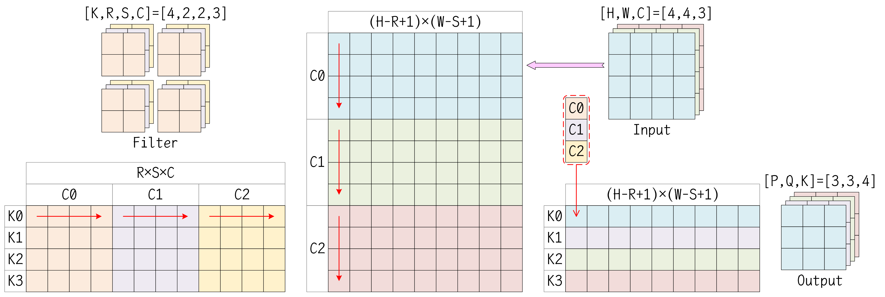

# 卷积操作

在卷积神经网络中，最常用的卷积操作是二维卷积或三维卷积，下表列出了所需数据的维度轴，并阐述一些尺寸之间的关系。其中，输入是一个批量数据，N是样本的个数，DHW是样本的维数，C是样本的通道数。卷积核是一个批量数据，K是卷积核的个数，TRS是卷积核的维数，C是卷积核的通道数。输出是一个批量数据，N是样本的个数，ZPQ是样本的维数，K是样本的通道数。

| 卷积类型\维度      | 输入（Input）   | 卷积核（Filter） | 输出（Output）  | 填充（Padding）       | 跨步（Stride）                 | 膨胀（Dialation）                    |
| ------------------ | --------------- | ---------------- | --------------- | --------------------- | ------------------------------ | ------------------------------------ |
| 二维卷积（Conv2D） | [N, H, W, C]    | [K, R, S, C]     | [N, P, Q, K]    | [pad_h, pad_w]        | [stride_h, stride_w]           | [dilation_h, dilation_w]             |
| 三维卷积（Conv3D） | [N, D, H, W, C] | [K, T, R, S, C]  | [N, Z, P, Q, K] | [pad_d, pad_h, pad_w] | [stride_d, stride_h, stride_w] | [dilation_d, dilation_h, dilation_w] |

填充，是指在输入的DHW维度的两端进行特定值的填充，以扩展输入在DHW维度上的维数。跨步，是指在使用卷积核遍历DHW维度轴时，两次相邻遍历之间的间距。膨胀，是指在卷积核及其框定的输入边界框中，两个相邻元素之间的间距。如下图所示。通常情况下，跨步和膨胀都取为1值。


对于一个卷积操作而言，输入维数、卷积核维数、输出维数之间，存在一定的关系，如下公式所示。
$$
\begin{align}
\text{Z} &= (\text{D} + 2\cdot\text{pad\_d} - \text{T}\times\text{dilation\_d}) / \text{stride\_d} + 1 \\
\text{P} &= (\text{H} + 2\cdot\text{pad\_h} - \text{R}\times\text{dilation\_h}) / \text{stride\_h} + 1 \\
\text{Q} &= (\text{W} + 2\cdot\text{pad\_w} - \text{S}\times\text{dilation\_w}) / \text{stride\_w} + 1
\end{align}
$$
卷积核的通道数必须与输入的通道数相同，这是因为，一个卷积核的C个通道，分别对应着一个样本的C个通道上的卷积运算，这些C个通道的结果进行求和，得到一个通道的输出。即，一个卷积核得到一个通道的输出，有几个卷积核，则输出的通道数就是多少。因此，输出的通道数K，等于卷积核的个数K。

> 值得注意的是，在卷积神经网络发展的早期，受限于设备性能，可以使用分组卷积（Group Convolution），即在通道C和通道K的维度上进行分组。假设一共分为g个组，则在每个组当中，输入维数变为[N, H, W, C/g]，卷积核维数变为[K/g, R, S, C/g]，输出维数变为[N, P, Q, K/g]，在每个组独立执行完卷积之后，再将每个组的输出进行拼接，得到最终的输出。

对于一个二维卷积操作，假设填充取值为0，跨步、膨胀取值为1，则计算过程的伪代码如下所示。

```c++
for (int n = 0; n < N; n++) {
    for (int k = 0; k < K; k++) {
        for (int p = 0; p < P; p++) {
            for (int q = 0; q < Q; q++) {
                tmp = 0;
                for (int c = 0; c < C; c++) {
                    for (int r = 0; r < R; r++) {
                        for (int s = 0; s < S; s++) {
                            tmp += Input[n][p+r][q+s][c] * Filter[k][r][s][c];
                        }
                    }
                }
                Output[n][p][q][k] = tmp;
            }
        }
    }
}
```

在实现卷积操作时，可以使用Im2Col模式进行加速，这会在一个二维图像Image上按列滑动卷积核，并将框内的有效数据重新排成列向量，最后将这些列向量逐列排成新的矩阵。实际上，究竟是逐列还是逐行摆放，并非是固定不变的，具体取决于算法库的实现方式。在MATLAB的算法库中，Im2Col模式是严格按照逐列摆放的，例如，下面展示的是4×4的输入图像应用2×2的卷积核的一个示例。
$$
\begin{matrix}
 1 &  2 &  3 &  4 \\
 5 &  6 &  7 &  8 \\
 9 & 10 & 11 & 12 \\
13 & 14 & 15 & 16
\end{matrix}
\quad\xrightarrow[(2,2)]{\text{im2col}}\quad
\begin{matrix}
 1 &  5 &  9 &  2 &  6 & 10 &  3 &  7 & 11 \\
 5 &  9 & 13 &  6 & 10 & 14 &  7 & 11 & 15 \\
 2 &  6 & 10 &  3 &  7 & 11 &  4 &  8 & 12 \\
 6 & 10 & 14 &  7 & 11 & 15 &  8 & 12 & 16
\end{matrix}
$$

而在CUTLASS模板库中，对于一个卷积操作，假设输入的维数是[N, H, W, C]，卷积核的维数是[K, R, S, C]，输出的维数是[N, P, Q, K]。则对于输入图像而言，Im2Col模式会将其转换成一个[N×P×Q, R×S×C]形状的中间矩阵，同时卷积核会展开为[R×S×C, K]形状的中间矩阵，以将卷积操作转换为矩阵乘法操作，得到一个[N×P×Q, K]形状的输出矩阵，然后再将输出矩阵的数据存储到合适的内存位置。如下图所示，批量N取值为1时，Im2Col模式如下所示。



# CUTLASS的卷积实现

在CUTLASS模板库中，提供隐式矩阵乘法的卷积算法（ImplicitGemmConvolution），并在cutlass/conv根目录中提供代码实现。实际上，卷积操作的Conv API，也诸如通用矩阵乘法的GEMM API一样，分为Thread线程层级、Warp线程束层级、Threadblock线程块层级、Kernel内核层级、Device设备层级。

## Common Type

在cutlass/conv/convolution.h头文件中，提供一些枚举类型的定义，用于标识卷积操作中的各种配置，如下所示。

```c++
/// Convolutional operator
enum class Operator {
    kFprop,
    kDgrad,
    kWgrad,
    kDeconv
};

/// Distinguishes convolution from cross correlation
enum class Mode {
    kCrossCorrelation,
    kConvolution
};

/// Selects among several implementation variants trading off performance with simplicity
enum class IteratorAlgorithm {
    kAnalytic,            ///< functionally correct in all cases but lower performance
    kOptimized,           ///< optimized for R <= 32, S <= 32 and unity-stride dgrad
    kFixedChannels,       ///< Analytic algorithm optimized for fixed channel count (C == AccessSize)
    kFewChannels,         ///< Analytic algorithm optimized for few channels (C divisible by AccessSize)
    kFixedStrideDilation  ///< Optimized for fixed stride and dilation
};

/// Distinguishes among partial specializations that accelerate certain problems where convolution stride is unit.
enum class StrideSupport {
    kStrided,  ///< arbitrary convolution stride
    kUnity,    ///< unit convolution stride
    kFixed     ///< fixed convolution stride
};

/// Identifies split-K mode
enum class SplitKMode {
    kNone,
    kSerial,
    kParallel
};

/// Identifies group mode
enum class GroupMode {
    kNone,
    kSingleGroup,    ///< One CTA calculates one group or less
    kMultipleGroup,  ///< One CTA calculates multiple groups
    kDepthwise       ///< One CTA calculates cta_n groups (problem_size.C == problem_size.K == problem_size.groups)
};
```

### Tensor4DCoord

在cutlass/tensor_coord.h头文件中，提供Tensor4DCoord和Tensor5DCoord的定义，用于表示张量元素的坐标，如下所示。

```c++
/// Defines a canonical 4D coordinate used by tensor operations.
struct Tensor4DCoord : public Coord<4> {
    using Base = Coord<4>;                       /// Base class
    using Index = typename Base::Index;          /// Index type
    using LongIndex = typename Base::LongIndex;  /// LongIndex type

    /// coord = (n, h, w, c)
    static int const kN = 0;  /// Batch dimension
    static int const kH = 1;  /// Height dimension
    static int const kW = 2;  /// Width dimension
    static int const kC = 3;  /// Channels dimension

    /// Default ctor
    Tensor4DCoord() {}

    /// Helper to construct from N, H, W, and C.
    Tensor4DCoord(Index n, Index h, Index w, Index c) : Base(make_Coord(n, h, w, c)) {}

    /// Returns the batch of the coordinate
    Index & n() { return this->at(kN); }

    /// Returns the row of the coordinate
    Index & h() { return this->at(kH); }

    /// Returns the column of the coordinate
    Index & w() { return this->at(kW); }

    /// Returns the channel of the coordinate
    Index & c() { return this->at(kC); }
};

/// Defines a canonical 5D coordinate used by tensor operations.
struct Tensor5DCoord : public Coord<5> {
    using Base = Coord<5>;                       /// Base class
    using Index = typename Base::Index;          /// Index type
    using LongIndex = typename Base::LongIndex;  /// LongIndex type

    /// coord = (n, d, h, w, c)
    static int const kN = 0;  /// Batch dimension
    static int const kD = 1;  /// Depth dimension
    static int const kH = 2;  /// Height dimension
    static int const kW = 3;  /// Width dimension
    static int const kC = 4;  /// Channels dimension

    /// Default ctor
    Tensor5DCoord() {}

    /// Helper to construct from N, D, H, W, and C.
    Tensor5DCoord(Index n, Index d, Index h, Index w, Index c) : Base(make_Coord(n, d, h, w, c)) {}

    /// Returns the batch of the coordinate
    Index & n() { return this->at(kN); }

    /// Returns the batch of the coordinate
    Index & d() { return this->at(kD); }

    /// Returns the row of the coordinate
    Index & h() { return this->at(kH); }

    /// Returns the column of the coordinate
    Index & w() { return this->at(kW); }

    /// Returns the channel of the coordinate
    Index & c() { return this->at(kC); }
};
```

### TensorNHWCShape

在cutlass/conv/convolution.h头文件中，提供TensorNHWCShape的定义，用于表示张量的形状，以及Stride2D的定义，用于表示跨步间隔，如下所示。

```c++
/// Shape of a tensor
template <int N = 1, int H = 1, int W = 1, int C = 1>
struct TensorNHWCShape {
    static int const kN = N;
    static int const kH = H;
    static int const kW = W;
    static int const kC = C;
    static int const kHW = H * W;
    static int const kNHW = N * kHW;
    static int const kNHWC = N * H * W * C;
    static int const kCount = kNHWC;

    /// Returns a Coord object
    static Coord<4> toCoord() {
        return make_Coord(kN, kH, kW, kC);
    }
};

/// Shape of a conv2d stride, which controls how the filter convolves around the input volume
template <int u = 1, int v = 1>
struct Stride2D {
    static int const kU = u;  /// Stride in horizontal direction
    static int const kV = v;  /// Stride in vertical direction

    /// Returns a Coord object
    static Coord<2> toCoord() {
        return make_Coord(kU, kV);
    }
};
```

### TensorNHWC

在cutlass/layout/tensor.h头文件中，提供layout::TensorNHWC的定义，用于表示一个多维张量的布局方式，如下所示。

```c++
/// Mapping function for 4-D NHWC tensors.
class TensorNHWC {
public:
    static int const kRank = 4;        /// Logical rank of tensor
    static int const kStrideRank = 3;  /// Rank of stride vector

    using Index = int32_t;              /// Index type used for coordinates
    using LongIndex = int64_t;          /// Long index type used for offsets
    using TensorCoord = Tensor4DCoord;  /// Logical coordinate (n, h, w, c)
    using Stride = Coord<kStrideRank>;  /// Stride vector (w, h, n). It's contiguous along `c` dimension.

private:
    Stride stride_;  /// Stride data member - [stride_w, stride_h, stride_n]

public:
    /// Constructor
    TensorNHWC(Stride const &stride = Stride(0)) : stride_(stride) {}

    /// Constructor
    TensorNHWC(
        typename Stride::Index stride_w,  ///< number of elements between adjacent W coordinates
        typename Stride::Index stride_h,  ///< number of elements between adjacent H coordinates
        typename Stride::Index stride_n   ///< number of elements between adjacent N coordinates
    ) : stride_(make_Coord(stride_w, stride_h, stride_n)) {}

    /// Helper returns a layout to a tightly packed NHWC tensor.
    static TensorNHWC packed(TensorCoord const &extent) {
        return TensorNHWC(make_Coord(extent.c(), extent.w() * extent.c(), extent.h() * extent.w() * extent.c()));
    }

    /// Returns the offset of a coordinate (n, h, w, c) in linear memory. 
    LongIndex operator()(TensorCoord const &coord) const {
        return coord.c() + LongIndex(stride_[0] * coord.w()) + LongIndex(stride_[1] * coord.h()) + LongIndex(stride_[2] * coord.n());
    }

    /// Returns the offset of a pitchlinear coordinate in linear memory. 
    LongIndex operator()(PitchLinearCoord coord) const {
        return coord.contiguous() + LongIndex(coord.strided() * stride_[2]);
    }

    /// Returns the logical coordinate (n, h, w, c) from a given offset in linear memory.
    TensorCoord inverse(LongIndex index) const {
        int n = 0, h = 0, w = 0, c = 0;
        LongIndex residual = index % stride_[2];
        n = int(index / stride_[2]);
        h = int(residual / stride_[1]);
        residual = (residual % stride_[1]);
        w = int(residual / stride_[0]);
        c = int(residual % stride_[0]);
        return TensorCoord(n, h, w, c);
    }

    /// Returns the stride of the layout
    Stride & stride() {
        return stride_;
    }
};
```

### Conv2dProblemSize

在cutlass/conv/conv2d_problem_size.h头文件中，提供二维卷积的问题配置，用于指定卷积的输入维数、卷积核维数、输出维度等信息，如下所示。

```c++
/// Problem size structure
struct Conv2dProblemSize {
    // Conv2d strictly problem size parameters
    int N, H, W, C, P, Q, K, R, S;
    int pad_h, pad_w;
    int stride_h, stride_w;
    int dilation_h, dilation_w;
    Mode mode;

    // Conv2d implementation-related parameters 
    int split_k_slices;
    int groups;

public:
    Conv2dProblemSize() :
        N(0), H(0), W(0), C(0), P(0), Q(0), K(0), R(0), S(0),
        pad_h(0), pad_w(0), stride_h(1), stride_w(1), dilation_h(1), dilation_w(1),
        mode(Mode::kConvolution), split_k_slices(1), groups(1) {}

    /// Constructor for default padding, stride, dilation, and split-K
    Conv2dProblemSize(int N, int H, int W, int C, int P, int Q, int K, int R, int S, Mode mode = Mode::kConvolution) :
        N(N), H(H), W(W), C(C), P(P), Q(Q), K(K), R(R), S(S),
        pad_h(R / 2), pad_w(S / 2), stride_h(1), stride_w(1), dilation_h(1), dilation_w(1),
        mode(mode), split_k_slices(1), groups(1) {}

    /// Constructs convolution problem size from cutlass Tensor4DCoord and MatrixCoord
    /// set user-defined output size and sets P and Q (include all data members in ctor)
    Conv2dProblemSize(
        cutlass::Tensor4DCoord input_size,   //< NHWC
        cutlass::Tensor4DCoord filter_size,  //< KRSC
        cutlass::Tensor4DCoord padding,      //< pad_h, _, pad_w, _
        cutlass::MatrixCoord stride,         //< stride_h, stride_w
        cutlass::MatrixCoord dilation,       //< dilation_h, dilation_w
        cutlass::Tensor4DCoord output_size,  //< NPQK
        cutlass::conv::Mode mode = cutlass::conv::Mode::kCrossCorrelation,
        int split_k_slices = 1, int groups = 1
    ) : N(input_size.n()), H(input_size.h()), W(input_size.w()), C(input_size.c()),
        P(output_size.h()), Q(output_size.w()),
        K(filter_size.n()), R(filter_size.h()), S(filter_size.w()),
        pad_h(padding[0]), pad_w(padding[2]),
        stride_h(stride.row()), stride_w(stride.column()),
        dilation_h(dilation.row()), dilation_w(dilation.column()),
        mode(mode), split_k_slices(split_k_slices), groups(groups) {}
    
    /// Returns activation extent as Tensor4DCoord
    cutlass::Tensor4DCoord activation_extent() const {
        return cutlass::Tensor4DCoord({ N, H, W, C });
    }

    /// Returns filter extent as Tensor4DCoord
    cutlass::Tensor4DCoord filter_extent(bool is_deconv = false) const {
        return is_deconv == false ? cutlass::Tensor4DCoord({ K, R, S, C / groups }) : cutlass::Tensor4DCoord({ C, R, S, K / groups });
    }

    /// Returns output extent as Tensor4DCoord
    cutlass::Tensor4DCoord output_extent() const {
        return cutlass::Tensor4DCoord({ N, P, Q, K });
    }

    /// Returns activation size in number of elements
    int64_t activation_size() const {
        return static_cast<int64_t>(N) * static_cast<int64_t>(H) * static_cast<int64_t>(W) * static_cast<int64_t>(C);
    }

    /// Returns filter size in number of elements
    int64_t filter_size() const {
        return static_cast<int64_t>(K) * static_cast<int64_t>(R) * static_cast<int64_t>(S) * static_cast<int64_t>(C) / groups;
    }

    /// Returns output size in number of elements
    int64_t output_size() const {
        return static_cast<int64_t>(N) * static_cast<int64_t>(P) * static_cast<int64_t>(Q) * static_cast<int64_t>(K);
    }

    /// Returns padding as Tensor4DCoord
    cutlass::Tensor4DCoord padding() const {
        return cutlass::Tensor4DCoord({ pad_h, pad_h, pad_w, pad_w });
    }

    /// Returns stride as MatrixCoord
    cutlass::MatrixCoord stride() const {
        return cutlass::MatrixCoord({ stride_h, stride_w });
    }

    /// Returns dilation as MatrixCoord
    cutlass::MatrixCoord dilation() const {
        return cutlass::MatrixCoord({ dilation_h, dilation_w });
    }

    /// Methods used for strided dgrad implementation
    /// Number of filter r positions to accumulate in gemm-k dim
    int num_gemm_k_filter_r(int r) const {
        return ((R - r + stride_h - 1) / stride_h);
    }

    /// Methods used for strided dgrad implementation
    /// Number of filter s positions to accumulate in gemm-k dim
    int num_gemm_k_filter_s(int s) const {
        return ((S - s + stride_w - 1) / stride_w);
    }

    /// Methods used for strided dgrad implementation
    /// Number of filter positions to accumulate in gemm-k dim
    int num_gemm_k_filter_positions(int r, int s) const {
        return num_gemm_k_filter_r(r) * num_gemm_k_filter_s(s);
    }
};
```

在cutlass/conv/conv2d_problem_size.h头文件中，还提供将二维卷积映射到隐式矩阵乘法的辅助函数，包括问题配置的映射、维数的映射、空间大小的映射。

```c++
/////////////////////////////////////////////////////////////////////////////////////////////////
//                            ImplicitGemm helper functions to map:                            //
//  Map tensor problem sizes (Conv2d -> ImplicitGemm) : implicit_gemm_problem_size()           //
//  Map tensor extents       (Conv2d -> ImplicitGemm) : implicit_gemm_tensor_[a|b|c]_extent()  //
//  Map tensor sizes         (Conv2d -> ImplicitGemm) : implicit_gemm_tensor_[a|b|c]_size()    //
/////////////////////////////////////////////////////////////////////////////////////////////////

/// Determine the problem size of the implicit GEMM operation
cutlass::gemm::GemmCoord implicit_gemm_problem_size(Operator conv_operator, Conv2dProblemSize const &problem_size) {
    // Compute problem size
    switch (conv_operator) {
    case Operator::kFprop:
        return gemm::GemmCoord(
            /* M */ problem_size.N * problem_size.P * problem_size.Q,
            /* N */ problem_size.K,
            /* K */ problem_size.R * problem_size.S * problem_size.C / problem_size.groups
        );
    case Operator::kDeconv:
    case Operator::kDgrad:
        return gemm::GemmCoord(
            /* M */ problem_size.N * problem_size.H * problem_size.W,
            /* N */ problem_size.C,
            /* K */ problem_size.R * problem_size.S * problem_size.K
        );
    case Operator::kWgrad:
        return gemm::GemmCoord(
            /* M */ problem_size.K,
            /* N */ problem_size.R * problem_size.S * problem_size.C,
            /* K */ problem_size.N * problem_size.P * problem_size.Q
        );
    default:
        break;
    }
    return gemm::GemmCoord();
}

/// Determine the number of gemm_k iterations for conv2d problem using implicit gemm algorithm.
/// Here, `threadblock_K` is ThreadblockShape::kK in GemmShape, which usually is { 128, 128, 64 } for half_t.
int implicit_gemm_k_iterations(
    Operator conv_operator, int threadblock_K, Conv2dProblemSize const &problem_size,
    IteratorAlgorithm algorithm = IteratorAlgorithm::kAnalytic, GroupMode group_mode = GroupMode::kNone, int threadblock_N = 0
) {
    // Generally, iterations = R * S * C / threaeblock_K
    int iterations = 0;
    if (group_mode == GroupMode::kNone) {
        if (algorithm == IteratorAlgorithm::kFixedChannels) {
            if (conv_operator == Operator::kFprop) {
                int positions_per_iteration = threadblock_K / problem_size.C;
                iterations = (problem_size.R * problem_size.S + positions_per_iteration - 1) / positions_per_iteration;
            }
        } else if (algorithm == IteratorAlgorithm::kFewChannels) {
            if (conv_operator == Operator::kFprop) {
                iterations = (problem_size.R * problem_size.S * problem_size.C + threadblock_K - 1) / threadblock_K;
            }
        } else /* algorithm == [ kAnalytic | kOptimized | kFixedStrideDilation ] */ {
            int elements_per_split_k_slice = 0;
            switch (conv_operator) {
            case Operator::kFprop:
                elements_per_split_k_slice = (problem_size.C + problem_size.split_k_slices - 1) / problem_size.split_k_slices;
                iterations = problem_size.R * problem_size.S * ((elements_per_split_k_slice + threadblock_K - 1) / threadblock_K);
                break;
            case Operator::kDeconv:
            case Operator::kDgrad:
                elements_per_split_k_slice = (problem_size.K + problem_size.split_k_slices - 1) / problem_size.split_k_slices;
                iterations = problem_size.R * problem_size.S * ((elements_per_split_k_slice + threadblock_K - 1) / threadblock_K);
                break;
            case Operator::kWgrad:
                elements_per_split_k_slice =
                    (problem_size.N * problem_size.P * problem_size.Q + problem_size.split_k_slices - 1) / problem_size.split_k_slices;
                iterations = (elements_per_split_k_slice + threadblock_K - 1) / threadblock_K;
                break;
            default:
                break;
            }
        }
    } else if (group_mode == GroupMode::kDepthwise) {
        int channels_per_cta = threadblock_N;
        if (algorithm == IteratorAlgorithm::kAnalytic) {
            if (conv_operator == Operator::kFprop) {
                iterations = problem_size.R * problem_size.S * ((channels_per_cta + threadblock_K - 1) / threadblock_K);
            }
        }
    } else /* group_mode == [ GroupMode::kSingleGroup | GroupMode::kMultipleGroup ] */ {
        int channels_per_group = problem_size.C / problem_size.groups;
        int k_per_group = problem_size.K / problem_size.groups;
        if (algorithm == IteratorAlgorithm::kAnalytic) {
            if (conv_operator == Operator::kFprop) {
                iterations = problem_size.R * problem_size.S * ((channels_per_group + threadblock_K - 1) / threadblock_K);
                // In group conv, if k_per_group < threadblock_N, one Threadblock will calculate multiple groups
                if (problem_size.groups != 1) {
                    if (k_per_group < threadblock_N) {
                        iterations *= threadblock_N / k_per_group;
                    }
                }
            }
        } else if (algorithm == IteratorAlgorithm::kOptimized) {
            // Current optimized iterator only support GroupMode::kSingleGroup
            if (group_mode == GroupMode::kSingleGroup) {
                if (conv_operator == Operator::kFprop) {
                    iterations = problem_size.R * problem_size.S * ((channels_per_group + threadblock_K - 1) / threadblock_K);
                }
            }
        }
    }
    return iterations;
}

int implicit_gemm_k_iterations_per_channel(
    Operator conv_operator, Conv2dProblemSize const &problem_size, IteratorAlgorithm algorithm = IteratorAlgorithm::kAnalytic
) {
    int iterations = 0;  // 0 means not applicable
    if (algorithm == IteratorAlgorithm::kAnalytic || algorithm == IteratorAlgorithm::kOptimized) {
        if (conv_operator == Operator::kFprop || conv_operator == Operator::kDeconv || conv_operator == Operator::kDgrad) {
            iterations = problem_size.R * problem_size.S;
        }
    }
    return iterations;
}

//////////////////////////////////////////////////////////////////////////////////
//  Mapping function (ImplicitGemm A, B, C -> Conv Activation, Filter, Output)  //
//////////////////////////////////////////////////////////////////////////////////

/// Returns ImplicitGemm tensor A extent as Tensor4DCoord
cutlass::Tensor4DCoord implicit_gemm_tensor_a_extent(Operator conv_operator, Conv2dProblemSize const &problem_size) {
    switch (conv_operator) {
    case cutlass::conv::Operator::kFprop: return problem_size.activation_extent();
    case cutlass::conv::Operator::kDeconv:
    case cutlass::conv::Operator::kDgrad: return problem_size.output_extent();
    case cutlass::conv::Operator::kWgrad: return problem_size.output_extent();
    default: break;
    }
    return cutlass::Tensor4DCoord();
}

/// Returns ImplicitGemm tensor B extent as Tensor4DCoord
cutlass::Tensor4DCoord implicit_gemm_tensor_b_extent(Operator conv_operator, Conv2dProblemSize const &problem_size) {
    switch (conv_operator) {
    case cutlass::conv::Operator::kFprop: return problem_size.filter_extent();
    case cutlass::conv::Operator::kDeconv: return problem_size.filter_extent(true);
    case cutlass::conv::Operator::kDgrad: return problem_size.filter_extent();
    case cutlass::conv::Operator::kWgrad: return problem_size.activation_extent();
    default: break;
    }
    return cutlass::Tensor4DCoord();
}

/// Returns ImplicitGemm tensor C extent as Tensor4DCoord
cutlass::Tensor4DCoord implicit_gemm_tensor_c_extent(Operator conv_operator, Conv2dProblemSize const &problem_size) {
    switch (conv_operator) {
    case cutlass::conv::Operator::kFprop: return problem_size.output_extent();
    case cutlass::conv::Operator::kDeconv:
    case cutlass::conv::Operator::kDgrad: return problem_size.activation_extent();
    case cutlass::conv::Operator::kWgrad: return problem_size.filter_extent();
    default: break;
    }
    return cutlass::Tensor4DCoord();
}

/// Returns ImplicitGemm tensor A size in number of elements
int64_t implicit_gemm_tensor_a_size(Operator conv_operator, Conv2dProblemSize const &problem_size) {
    switch (conv_operator) {
    case cutlass::conv::Operator::kFprop: return problem_size.activation_size();
    case cutlass::conv::Operator::kDeconv:
    case cutlass::conv::Operator::kDgrad: return problem_size.output_size();
    case cutlass::conv::Operator::kWgrad: return problem_size.output_size();
    default: break;
    }
    return 0;
}

/// Returns ImplicitGemm tensor B size in number of elements
int64_t implicit_gemm_tensor_b_size(Operator conv_operator, Conv2dProblemSize const &problem_size) {
    switch (conv_operator) {
    case cutlass::conv::Operator::kFprop: return problem_size.filter_size();
    case cutlass::conv::Operator::kDeconv:
    case cutlass::conv::Operator::kDgrad: return problem_size.filter_size();
    case cutlass::conv::Operator::kWgrad: return problem_size.activation_size();
    default: break;
    }
    return 0;
}

/// Returns ImplicitGemm tensor C size in number of elements
int64_t implicit_gemm_tensor_c_size(Operator conv_operator, Conv2dProblemSize const &problem_size) {
    switch (conv_operator) {
    case cutlass::conv::Operator::kFprop: return problem_size.output_size();
    case cutlass::conv::Operator::kDeconv:
    case cutlass::conv::Operator::kDgrad: return problem_size.activation_size();
    case cutlass::conv::Operator::kWgrad: return problem_size.filter_size();
    default: break;
    }
    return 0;
}
```

## Device Level

### ImplicitGemmConvolution

在cutlass/conv/device/implicit_gemm_convolution.h头文件中，提供Device设备层级的隐式卷积实现，即conv::device::ImplicitGemmConvolution模板类。

```c++
template<typename ImplicitGemmKernel_>
class ImplicitGemmConvolution {
public:
    // `UnderlyingKernel` and `ImplicitGemmKernel` are exactly `cutlass::conv::kernel::ImplicitGemmConvolution`
    using UnderlyingKernel = GetUnderlyingKernel_t<ImplicitGemmKernel_>;
    using ElementA = typename UnderlyingKernel::ElementA;
    using LayoutA = typename UnderlyingKernel::LayoutA;
    using ElementB = typename UnderlyingKernel::ElementB;
    using LayoutB = typename UnderlyingKernel::LayoutB;
    using ElementC = typename UnderlyingKernel::ElementC;
    using LayoutC = typename UnderlyingKernel::LayoutC;
    using ElementAccumulator = typename UnderlyingKernel::ElementAccumulator;
    using ElementCompute = typename UnderlyingKernel::ElementCompute;
    using OperatorClass = typename UnderlyingKernel::OperatorClass;
    using ArchTag = typename UnderlyingKernel::ArchTag;
    using ThreadblockShape = typename UnderlyingKernel::ThreadblockShape;
    using WarpShape = typename UnderlyingKernel::WarpShape;
    using InstructionShape = typename UnderlyingKernel::InstructionShape;
    using ThreadblockSwizzle = typename UnderlyingKernel::ThreadblockSwizzle;
    using EpilogueOutputOp = typename UnderlyingKernel::EpilogueOutputOp;
    static int const kStages = UnderlyingKernel::kStages;
    static int const kConvDim = UnderlyingKernel::kConvDim;
    using WarpMmaOperator = typename UnderlyingKernel::WarpMmaOperator;
    using ArchMmaOperator = typename UnderlyingKernel::ArchMmaOperator;
    using MathOperator = typename UnderlyingKernel::MathOperator;
    static cutlass::conv::Operator const kConvolutionalOperator = UnderlyingKernel::kConvolutionalOperator;
    static cutlass::conv::IteratorAlgorithm const kIteratorAlgorithm = UnderlyingKernel::kIteratorAlgorithm;
    static cutlass::conv::StrideSupport const kStrideSupport = UnderlyingKernel::kStrideSupport;
    static cutlass::conv::GroupMode const kGroupMode = UnderlyingKernel::kGroupMode;

    static int const kWarpCount =
        (ThreadblockShape::kM / WarpShape::kM) * (ThreadblockShape::kN / WarpShape::kN) * (ThreadblockShape::kK / WarpShape::kK);
    using Arguments = typename UnderlyingKernel::Arguments;  /// Argument structure

private:
    typename UnderlyingKernel::Params params_;  /// Kernel parameters object

public:

    /// Constructs Implicit GEMM
    ImplicitGemmConvolution() {}

    /// Gets the workspace size
    static size_t get_workspace_size(Arguments const &args) {
        size_t workspace_bytes = 0;
        // Determine grid shape
        ThreadblockSwizzle threadblock_swizzle;
        cutlass::gemm::GemmCoord grid_tiled_shape = threadblock_swizzle.get_tiled_shape(
            kConvolutionalOperator, args.problem_size,
            { ThreadblockShape::kM, ThreadblockShape::kN, ThreadblockShape::kK },
            args.problem_size.split_k_slices
        );
        if (args.split_k_mode == SplitKMode::kParallel) {
            // Split-K parallel: CTAs in k-dimension write the partial results in a temporary workspace.
            // The user needs to call a reduction operator to optain the final output tensor.
            workspace_bytes = sizeof(ElementAccumulator)
                * size_t(cutlass::conv::implicit_gemm_tensor_c_size(kConvolutionalOperator, args.problem_size))
                * size_t(grid_tiled_shape.k());
        } else if (args.split_k_mode == SplitKMode::kSerial && args.problem_size.split_k_slices > 1) {
            // Split-K serial: The user workspace is used to store semaphore
            // and serialize writing the final reduced output to user's output tensor
            workspace_bytes = sizeof(int) * size_t(grid_tiled_shape.m()) * size_t(grid_tiled_shape.n());
        }
        return workspace_bytes;
    }

    /// Initializes GEMM state from arguments.
    Status initialize(
        Arguments const &args, void *workspace = nullptr, cudaStream_t stream = nullptr, CudaHostAdapter *cuda_adapter = nullptr
    ) {
        if (args.problem_size.split_k_slices > 1) {
            if (workspace == nullptr) {
                return Status::kErrorWorkspaceNull;
            }
            cudaError_t status = cudaMemsetAsync(workspace, 0, get_workspace_size(args), stream);
            if (status != cudaSuccess) {
                return Status::kErrorInternal;
            }
        }
        // initialize the params structure from the arguments
        params_ = typename UnderlyingKernel::Params(args, static_cast<int *>(workspace));
        int smem_size = int(sizeof(typename UnderlyingKernel::SharedStorage));
        if (smem_size >= (48 << 10)) {
            cudaError_t result = cudaFuncSetAttribute(
                cutlass::Kernel<UnderlyingKernel>, cudaFuncAttributeMaxDynamicSharedMemorySize, smem_size
            );
            if (result != cudaSuccess) {
                return Status::kErrorInternal;
            }
        }
        return Status::kSuccess;
    }

    /// Initializes GEMM state from arguments.
    Status update(Arguments const &args, void *workspace = nullptr) {
        // update the params structure from the arguments
        params_.ptr_A = args.ref_A.data();
        params_.ptr_B = args.ref_B.data();
        params_.ptr_C = args.ref_C.data();
        params_.ptr_D = args.ref_D.data();
        params_.output_op = args.output_op;
        params_.semaphore = static_cast<int *>(workspace);
        return Status::kSuccess;
    }

    /// Runs the kernel using initialized state.
    Status run(cudaStream_t stream = nullptr, CudaHostAdapter *cuda_adapter = nullptr, int32_t kernel_index = 0) {
        ThreadblockSwizzle threadblock_swizzle;
        dim3 grid = threadblock_swizzle.get_grid_shape(params_.grid_tiled_shape);
        dim3 block(32 * kWarpCount, 1, 1);
        int smem_size = int(sizeof(typename UnderlyingKernel::SharedStorage));
        cutlass::arch::synclog_setup();
        cutlass::Kernel<UnderlyingKernel><<<grid, block, smem_size, stream>>>(params_);
        cudaError_t result = cudaGetLastError();
        if (cudaSuccess == result) {
            return Status::kSuccess;
        } else {
            return Status::kErrorInternal;
        }
    }

    /// Runs the kernel using initialized state.
    Status operator()(
        Arguments const &args, void *workspace = nullptr, cudaStream_t stream = nullptr,
        CudaHostAdapter *cuda_adapter = nullptr, int32_t kernel_index = 0
    ) {
        Status status = initialize(args, workspace, stream, cuda_adapter);
        if (status == Status::kSuccess) {
            status = run(stream, cuda_adapter, kernel_index);
        }
        return status;
    }

    /// Runs the kernel using initialized state.
    Status operator()(cudaStream_t stream = nullptr, CudaHostAdapter *cuda_adapter = nullptr, int32_t kernel_index = 0) {
        return run(stream, cuda_adapter, kernel_index);
    }
};
```

## Kernel Level

### DefaultConv2dFprop

在cutlass/conv/kernel/default_conv2d_fprop.h头文件中，提供Kernel内核函数层级的默认配置，即conv::kernel::DefaultConv2dFprop模板类。

```c++
/// Defines a kernel for Conv2dFprop
template <
    typename ElementA, typename LayoutA, typename ElementB, typename LayoutB, typename ElementC, typename LayoutC, typename ElementAccumulator,
    typename OperatorClass, typename ArchTag, typename ThreadblockShape, typename WarpShape, typename InstructionShape,
    typename EpilogueOutputOp, typename ThreadblockSwizzle, int Stages, typename MathOperatorTag,
    conv::IteratorAlgorithm IteratorAlgorithm = IteratorAlgorithm::kOptimized, conv::StrideSupport StrideSupport = StrideSupport::kUnity,
    int AlignmentA = 128 / cutlass::sizeof_bits<ElementA>::value,  /// Access granularity of A matrix in units of elements
    int AlignmentB = 128 / cutlass::sizeof_bits<ElementB>::value   /// Access granularity of B matrix in units of elements
> struct DefaultConv2dFprop;
```

```c++
/// Defines a kernel for Conv2dFprop specialization for Optimzed IteratorAlgorithm and multistage pipeline.
template <
    typename ElementA, typename LayoutA, typename ElementB, typename LayoutB, typename ElementC, typename LayoutC,
    typename ElementAccumulator, typename ArchTag, typename ThreadblockShape, typename WarpShape, typename InstructionShape,
    typename EpilogueOutputOp, typename ThreadblockSwizzle, int Stages, typename MathOperatorTag, conv::StrideSupport StrideSupport,
    int AlignmentA, int AlignmentB
>
struct DefaultConv2dFprop<
    ElementA, LayoutA, ElementB, LayoutB, ElementC, LayoutC, ElementAccumulator, arch::OpClassTensorOp, ArchTag,
    ThreadblockShape, WarpShape, InstructionShape, EpilogueOutputOp, ThreadblockSwizzle, Stages, MathOperatorTag,
    IteratorAlgorithm::kOptimized, StrideSupport, AlignmentA, AlignmentB
> {
    // Define the core components from GEMM
    using MmaCore = typename cutlass::gemm::threadblock::DefaultMmaCore<
        ThreadblockShape, WarpShape, InstructionShape, ElementA, layout::RowMajor,
        ElementB, layout::ColumnMajor, ElementAccumulator, layout::RowMajor, arch::OpClassTensorOp,
        Stages, MathOperatorTag
    >;
    // Define iterators over tiles from the A operand. `Input`
    using ThreadMapA = typename MmaCore::IteratorThreadMapA;
    using AccessTypeA = cutlass::AlignedArray<ElementA, AlignmentA>;
    using SmemIteratorA = typename MmaCore::SmemIteratorA;  // frag --> smem
    using IteratorA = cutlass::conv::threadblock::Conv2dFpropActivationTileAccessIteratorOptimized<  // gmem --> frag
        cutlass::MatrixShape<ThreadblockShape::kM, ThreadblockShape::kK>, ElementA, LayoutA, ThreadMapA, AccessTypeA>;
    // Define iterators over tiles from the B operand. `Filter`
    using ThreadMapB = typename MmaCore::IteratorThreadMapB;
    using AccessTypeB = cutlass::AlignedArray<ElementB, AlignmentB>;
    using SmemIteratorB = typename MmaCore::SmemIteratorB;  // frag -->smem
    using IteratorB = cutlass::conv::threadblock::Conv2dFpropFilterTileAccessIteratorOptimized<  // gmem --> frag
        cutlass::MatrixShape<ThreadblockShape::kK, ThreadblockShape::kN>, ElementB, LayoutB, ThreadMapB, AccessTypeB>;

    // Warp-level GEMM components
    using WarpMmaTensorOp = typename MmaCore::MmaTensorOp;
    using MmaPolicy = typename MmaCore::MmaPolicy;

    static cutlass::arch::CacheOperation::Kind const CacheOpB = (sizeof_bits<ElementB>::value * AlignmentB) == 128
        ? cutlass::arch::CacheOperation::Global : cutlass::arch::CacheOperation::Always;
    // Define the ImplicitMma
    using Mma = threadblock::ImplicitGemmMultistage<ThreadblockShape,
        IteratorA, SmemIteratorA, arch::CacheOperation::Always, IteratorB, SmemIteratorB, CacheOpB, MmaPolicy, Stages>;

    static const int kPartitionsK = ThreadblockShape::kK / WarpShape::kK;
    // Define the epilogue
    using Epilogue = typename epilogue::threadblock::DefaultEpilogueTensorOp<ThreadblockShape,
        WarpMmaTensorOp, kPartitionsK, EpilogueOutputOp, EpilogueOutputOp::kCount, false, layout::NoPermute, StrideSupport, 4>::Epilogue;

    // Define the kernel
    using Kernel = cutlass::conv::kernel::ImplicitGemmConvolution<Mma, Epilogue, ThreadblockSwizzle, conv::Operator::kFprop>;
};
```

### ImplicitGemmConvolution

在cutlass/conv/kernel/implicit_gemm_convolution.h头文件中，提供Kernel内核函数层级的隐式卷积实现，即conv::kernel::ImplicitGemmConvolution模板类。

```c++
template <
    typename Mma_,                 /// Threadblock-scoped matrix multiply-accumulate. `conv::threadblock::ImplicitGemmMultistage`
    typename Epilogue_,            /// Epilogue. `epilogue::threadblock::Epilogue`
    typename ThreadblockSwizzle_,  /// Threadblock swizzling function. `gemm::threadblock::GemmIdentityThreadblockSwizzle`
    conv::Operator ConvOperator,   /// Convolutional operator (Fprop, Dgrad, Wgrad, Deconv)
    typename ConvProblemSize_ = Conv2dProblemSize,  /// Convolutional operator on 2D or 3D problem
    conv::GroupMode GroupMode_ = conv::GroupMode::kNone
>
struct ImplicitGemmConvolution {
    using Mma = Mma_;
    using Epilogue = Epilogue_;
    using EpilogueOutputOp = typename Epilogue::OutputOp;
    using ThreadblockSwizzle = ThreadblockSwizzle_;
    static conv::Operator const kConvolutionalOperator = ConvOperator;
    using ConvProblemSize = ConvProblemSize_;
    static conv::GroupMode const kGroupMode = GroupMode_;

    static IteratorAlgorithm const kIteratorAlgorithm = Mma::IteratorA::kIteratorAlgorithm;
    static StrideSupport const kStrideSupport = Mma::IteratorA::kStrideSupport;
    static int const kConvDim = Mma::IteratorA::kConvDim;
    static int const kStages = Mma::kStages;

    using ElementA = typename Mma::IteratorA::Element;
    using LayoutA = typename Mma::IteratorA::Layout;
    using ElementB = typename Mma::IteratorB::Element;
    using LayoutB = typename Mma::IteratorB::Layout;
    using ElementC = typename EpilogueOutputOp::ElementOutput;
    using LayoutC = LayoutA;  /// Set output tensor C layout
    using ElementAccumulator = typename EpilogueOutputOp::ElementAccumulator;
    using ElementCompute = typename EpilogueOutputOp::ElementCompute;
    using TensorRefA = typename Mma::IteratorA::TensorRef;
    using TensorRefB = typename Mma::IteratorB::TensorRef;
    using TensorRefC = cutlass::TensorRef<ElementC, LayoutC>;
    using WarpMmaOperator = typename Mma::Policy::Operator;
    using ArchMmaOperator = typename WarpMmaOperator::ArchMmaOperator;
    using MathOperator = typename ArchMmaOperator::Operator;
    using OperatorClass = typename WarpMmaOperator::OperatorClass;
    using ArchTag = typename WarpMmaOperator::ArchTag;
    using ThreadblockShape = typename Mma::Shape;
    using WarpShape = typename WarpMmaOperator::Shape;
    using InstructionShape = typename ArchMmaOperator::Shape;
    using WarpCount = typename Mma::WarpCount;  /// Warp count (concept: GemmShape)
    static int const kThreadCount = 32 * WarpCount::kCount;

    /// Wgrad C stride idx for implicit gemm algorithm.
    /// Conv2d row-major matrix C (KxRSC) and Conv3d row-major matrix C (KxTRSC)
    static int const kWgradCStrideIdx = platform::is_same<LayoutC, cutlass::layout::TensorNHWC>::value ? 2 : 3;
    /// This chooses the appropriate stride element of the C tensor.
    static int const kTensorCStrideIdx = (kConvolutionalOperator == conv::Operator::kWgrad ? kWgradCStrideIdx : 0);

    using ConvOutputIteratorParameter = epilogue::threadblock::ConvOutputIteratorParameter<
        LayoutC, typename Epilogue::OutputTileIterator::Layout, TensorRefC, ConvOperator, ConvProblemSize>;

    /// Argument structure
    struct Arguments {
        ConvProblemSize problem_size;
        TensorRefA ref_A;
        TensorRefB ref_B;
        TensorRefC ref_C;
        TensorRefC ref_D;
        typename EpilogueOutputOp::Params output_op;
        SplitKMode split_k_mode;

        Arguments() {}

        Arguments(
            ConvProblemSize const & problem_size,
            TensorRefA const & ref_A,
            TensorRefB const & ref_B,
            TensorRefC const & ref_C,
            TensorRefC const & ref_D,
            typename EpilogueOutputOp::Params const & output_op,
            SplitKMode const & split_k_mode = SplitKMode::kSerial
        ) : problem_size(problem_size),
            ref_A(ref_A), ref_B(ref_B), ref_C(ref_C), ref_D(ref_D),
            output_op(output_op),
            split_k_mode(split_k_mode) {}
    };

    /// Parameters structure
    struct Params {
        ConvProblemSize problem_size;
        cutlass::gemm::GemmCoord grid_tiled_shape;
        gemm::GemmCoord implicit_gemm_problem_size;
        int swizzle_log_tile;
        int gemm_k_iterations;
        int gemm_k_iterations_per_channel;
        typename Mma::IteratorA::Params iterator_A;  // conv::threadblock::Conv2dFpropActivationIteratorOptimizedParams
        typename Mma::IteratorA::Element const *ptr_A;
        typename Mma::IteratorB::Params iterator_B;  // conv::threadblock::Conv2dFpropFilterIteratorOptimizedParams
        typename Mma::IteratorB::Element const *ptr_B;
        typename Epilogue::OutputTileIterator::Params iterator_C;
        typename Epilogue::OutputTileIterator::Element *ptr_C;
        typename Epilogue::OutputTileIterator::Params iterator_D;
        typename Epilogue::OutputTileIterator::Element *ptr_D;
        typename EpilogueOutputOp::Params output_op;
        int *semaphore;
        SplitKMode split_k_mode;

        Params() : swizzle_log_tile(0), gemm_k_iterations(0) {}

        Params(Arguments const &args, int *semaphore = nullptr) :
            problem_size(args.problem_size),
            implicit_gemm_problem_size(cutlass::conv::implicit_gemm_problem_size(kConvolutionalOperator, args.problem_size)),
            iterator_A(Mma::IteratorA::getParams(args.problem_size, args.ref_A.layout())),
            ptr_A(args.ref_A.data()),
            iterator_B(args.problem_size, args.ref_B.layout()), ptr_B(args.ref_B.data()),
            iterator_C(ConvOutputIteratorParameter::layout(args.ref_C),
                implicit_gemm_tensor_c_extent(kConvolutionalOperator, args.problem_size)),
            ptr_C(args.ref_C.data()),
            iterator_D(ConvOutputIteratorParameter::layout(args.ref_D),
                implicit_gemm_tensor_c_extent(kConvolutionalOperator, args.problem_size)),
            ptr_D(args.ref_D.data()),
            output_op(args.output_op),
            semaphore(semaphore),
            split_k_mode(args.split_k_mode) {
            // initialize the parameters
            gemm_k_iterations = implicit_gemm_k_iterations(
                kConvolutionalOperator, ThreadblockShape::kK, args.problem_size, kIteratorAlgorithm, kGroupMode, ThreadblockShape::kN
            );
            gemm_k_iterations_per_channel = implicit_gemm_k_iterations_per_channel(
                kConvolutionalOperator, args.problem_size, kIteratorAlgorithm
            );
            ThreadblockSwizzle threadblock_swizzle;
            grid_tiled_shape = threadblock_swizzle.get_tiled_shape(
                implicit_gemm_problem_size,
                { ThreadblockShape::kM, ThreadblockShape::kN, ThreadblockShape::kK },
                args.problem_size.split_k_slices
            );
            swizzle_log_tile = threadblock_swizzle.get_log_tile(grid_tiled_shape);
        }
    };

    /// Shared memory storage structure
    union SharedStorage {
        typename Mma::SharedStorage main_loop;
        typename Epilogue::SharedStorage epilogue;
    };

    ImplicitGemmConvolution() {}

    /// Executes one ImplicitGEMM
    void operator()(Params const &params, SharedStorage &shared_storage) {
        // Compute threadblock location
        ThreadblockSwizzle threadblock_swizzle;
        cutlass::gemm::GemmCoord threadblock_tile_idx = threadblock_swizzle.get_tile_offset(params.swizzle_log_tile);
        // Early exit if CTA is out of range
        if (params.grid_tiled_shape.m() <= threadblock_tile_idx.m() || params.grid_tiled_shape.n() <= threadblock_tile_idx.n()) {
            return;
        }

        // Compute position within threadblock
        int thread_idx = threadIdx.x;
        int iterator_A_column_offset = threadblock_tile_idx.k() * Mma::Shape::kK;
        if (kGroupMode != GroupMode::kNone) {
            if (kGroupMode != GroupMode::kDepthwise) {
                int k_per_group = params.problem_size.K / params.problem_size.groups;
                int group_idx = threadblock_tile_idx.n() * Mma::Shape::kN / k_per_group;
                int channels_per_group = params.problem_size.C / params.problem_size.groups;
                iterator_A_column_offset += group_idx * channels_per_group;
            } else {
                iterator_A_column_offset += threadblock_tile_idx.n() * Mma::Shape::kN;
            }
        }

        // Construct iterators to A and B operands
        typename Mma::IteratorA iterator_A(
            params.iterator_A,
            params.problem_size,
            params.ptr_A,
            thread_idx,
            MatrixCoord(threadblock_tile_idx.m() * Mma::Shape::kM, iterator_A_column_offset)
        );
        typename Mma::IteratorB iterator_B(
            params.iterator_B,
            params.problem_size,
            params.ptr_B,
            thread_idx,
            MatrixCoord(threadblock_tile_idx.k() * Mma::Shape::kK, threadblock_tile_idx.n() * Mma::Shape::kN)
        );

        // Broadcast the warp_id computed by lane 0 to ensure dependent code is compiled as warp-uniform.
        int warp_idx = canonical_warp_idx_sync();
        int lane_idx = threadIdx.x % 32;

        // Construct thread-scoped matrix multiply
        Mma mma(shared_storage.main_loop, thread_idx, warp_idx, lane_idx);
        typename Mma::FragmentC accumulators;
        accumulators.clear();
        // Compute threadblock-scoped matrix multiply-add
        mma(params.gemm_k_iterations, accumulators, iterator_A, iterator_B, accumulators, params.gemm_k_iterations_per_channel);

        // Epilogue
        EpilogueOutputOp output_op(params.output_op);
        // Compute logical position within grid
        threadblock_tile_idx = threadblock_swizzle.get_tile_offset(params.swizzle_log_tile);
        MatrixCoord threadblock_offset(threadblock_tile_idx.m() * Mma::Shape::kM, threadblock_tile_idx.n() * Mma::Shape::kN);

        // re-compute the index of each threadblock
        int block_idx = threadblock_tile_idx.m() + threadblock_tile_idx.n() * params.grid_tiled_shape.m();

        // Construct the semaphore
        Semaphore semaphore(params.semaphore + block_idx, thread_idx);
        // If performing a reduction via split-K, fetch the initial synchronization
        if (params.split_k_mode == SplitKMode::kSerial && params.grid_tiled_shape.k() > 1) {
            // Fetch the synchronization lock initially but do not block.
            semaphore.fetch();
            // Indicate which position in a serial reduction the output operator is currently updating
            output_op.set_k_partition(threadblock_tile_idx.k(), params.grid_tiled_shape.k());
        }

        // Tile iterator reading from source accumulator tensor
        typename Epilogue::OutputTileIterator iterator_C(
            params.iterator_C,
            params.ptr_C,
            ConvOutputIteratorParameter::extent(params.problem_size),
            thread_idx,
            threadblock_offset
        );
        // Tile iterator writing to destination tensor
        typename Epilogue::OutputTileIterator iterator_D(
            params.iterator_D,
            params.ptr_D,
            ConvOutputIteratorParameter::extent(params.problem_size),
            thread_idx,
            threadblock_offset
        );

        // Construct the epilogue
        Epilogue epilogue(shared_storage.epilogue, thread_idx, warp_idx, lane_idx);

        // Wait on the semaphore - this latency may have been covered by iterator construction
        if (params.split_k_mode == SplitKMode::kSerial && params.grid_tiled_shape.k() > 1) {
            // For subsequent threadblocks, the source matrix is held in the 'D' tensor.
            if (threadblock_tile_idx.k()) {
                iterator_C = iterator_D;
            }
            semaphore.wait(threadblock_tile_idx.k());
        } else if (params.split_k_mode == SplitKMode::kParallel) {
            // Each split-k-slice writes to a unique tensor location
            iterator_D.add_pointer_offset(
                threadblock_tile_idx.k() * cutlass::conv::implicit_gemm_tensor_c_size(ConvOperator, params.problem_size)
            );
        }

        // Run efficient epilogue
        epilogue(output_op, iterator_D, accumulators, iterator_C);

        // Release the semaphore
        if (params.split_k_mode == SplitKMode::kSerial && params.grid_tiled_shape.k() > 1) {
            int lock = 0;
            if (params.grid_tiled_shape.k() == threadblock_tile_idx.k() + 1) {
                lock = 0;  // The final threadblock resets the semaphore for subsequent grids.
            } else {
                lock = threadblock_tile_idx.k() + 1;  // Otherwise, the semaphore is incremented
            }
            semaphore.release(lock);
        }
    }
};
```

## Threadblock Level

在cutlass/conv/threadblock目录中，提供卷积操作在Threadblock线程块层级的实现，这些实现包括访存操作和计算操作。

对于访存而言，将输入数据从设备全局内存加载到寄存器，这被抽象为conv::threadblock::Conv2dFpropActivationTileAccessIteratorOptimized模板类；将卷积核数据从设备全局内存加载到寄存器，这被抽象为conv::threadblock::Conv2dFpropFilterTileAccessIteratorOptimized模板类；以及，在尾处理操作阶段，将最终计算得到的输出数据写回到设备全局内存中，这被抽象为epilogue::threadblock::ConvOutputIteratorParameter模板类。

对于计算而言，在Threadblock线程块层级执行卷积操作，这被抽象为conv::threadblock::ImplicitGemmMultistage模板类。

### Conv2dFpropActivationIteratorOptimizedParams

在cutlass/conv/threadblock/conv2d_params.h头文件中，提供一个表示参数的conv::threadblock::Conv2dFpropActivationIteratorOptimizedParams模板类，用于指定从设备全局内存中加载输入数据的整个迭代过程中的各种设置，以及提供一种快速计算商和余数的cutlass::FastDivmod方法，如下所示。

```c++
/// Parameters structure used for Conv2dFpropActivationTileIteratorOptimized
template<typename Layout_ = layout::TensorNHWC>
struct Conv2dFpropActivationIteratorOptimizedParams;

/// Parameters structure used for Conv2dFpropActivationTileIteratorOptimized
template<>
struct Conv2dFpropActivationIteratorOptimizedParams<layout::TensorNHWC> {
    using Layout = layout::TensorNHWC;

    Layout layout;
    int64_t inc_next[3];   // { next_S, next_R, next_C }
    int filter_c_delta;    // number of logical elements to add to filter_c_
    int PQ;                // product of `P * Q`
    FastDivmod pq_divmod;  // 快速计算商和余数，见cutlass::FastDivmod
    FastDivmod q_divmod;   // 快速计算商和余数，见cutlass::FastDivmod

    // Methods
    Conv2dFpropActivationIteratorOptimizedParams() {}

    Conv2dFpropActivationIteratorOptimizedParams(
        Conv2dProblemSize const &problem_size,
        Layout const &layout,           ///< layout::TensorNHWC
        int element_size_bits,          ///< sizeof_bits<Element>::value
        MatrixCoord threadblock_shape,  ///< MatrixShape<ThreadblockShape::kM, ThreadblockShape::kK>
        int thread_count,               ///< ThreadMap::kThreads
        int access_size,                ///< ThreadMap::kElementsPerAccess
        layout::PitchLinearCoord threadmap_iterations,  ///< ThreadMap::Iterations::{ kContiguous, kStrided }
        layout::PitchLinearCoord threadmap_delta        ///< ThreadMap::Delta::{ kContiguous, kStrided }
    ) : layout(layout), PQ(problem_size.P * problem_size.Q), pq_divmod(PQ), q_divmod(problem_size.Q) {
        // initialize
        int conv_sign = (problem_size.mode == Mode::kConvolution ? -1 : 1);
        // next_S
        inc_next[0] = conv_sign * (int64_t(layout.stride()[0]) * problem_size.dilation_w) * element_size_bits / 8;
        // next_R
        inc_next[1] = conv_sign * (
            int64_t(layout.stride()[1]) * problem_size.dilation_h - (problem_size.S - 1) * layout.stride()[0] * problem_size.dilation_w
            ) * element_size_bits / 8;
        // next_C
        inc_next[2] = (threadblock_shape.column() * problem_size.split_k_slices
            - conv_sign * int64_t(problem_size.R - 1) * layout.stride()[1] * problem_size.dilation_h
            - conv_sign * int64_t(problem_size.S - 1) * layout.stride()[0] * problem_size.dilation_w
            ) * element_size_bits / 8;

        // logical offset added to internal channel counter - units are elements, not bytes
        filter_c_delta = threadblock_shape.column() * problem_size.split_k_slices;
    }
};
```

在cutlass/fast_math.h头文件中，提供快速计算以2为底的对数的实现代码，如下所示。

```c++
// 计算对数log2(N)，并取结果的下界整数值，即floor{log2(N)}
template <int N, int CurrentVal = N, int Count = 0>
struct log2_down { enum { value = log2_down<N, (CurrentVal >> 1), Count + 1>::value }; };

template <int N, int Count>
struct log2_down<N, 1, Count> { enum { value = Count }; };

// 计算对数log2(N)，并取结果的上界整数值，即ceil{log2(N)}
template <int N, int CurrentVal = N, int Count = 0>
struct log2_up { enum { value = log2_up<N, (CurrentVal >> 1), Count + 1>::value }; };

template <int N, int Count>
struct log2_up<N, 1, Count> { enum { value = ((1 << Count) < N) ? Count + 1 : Count }; };

template <typename value_t>
value_t clz(value_t x) {
    for (int i = 31; i >= 0; --i) {
        // 从最高位依次向低位判断，[31, 30, -->, 2, 1, 0]，寻找第一个非0的二进制位，该二进制的索引即是log2(N)
        if ((1 << i) & x) return value_t(31 - i);
    }
    return value_t(32);
}

template <typename value_t>
value_t find_log2(value_t x) {
    int a = int(31 - clz(x));
    a += (x & (x - 1)) != 0;  // 如果不是2的整数次幂，取log2(N)的上界整数值
    return a;
}
```

在cutlass/fast_math.h头文件中，提供快速计算商和余数的cutlass::FastDivmod方法，如下所示。

```c++
/* Object to encapsulate the fast division and fast modulus operation.
    This object precomputes two values used to accelerate the computation and is best used when the divisor is a grid-invariant.
    In this case, it may be computed in host code and marshalled along other kernel arguments using the 'Params' pattern.
Example:
    // 商，余数，被除数，除数
    int quotient, remainder, dividend, divisor;
    FastDivmod divmod(divisor);
    divmod(quotient, remainder, dividend);
*/
struct FastDivmod {
    using value_div_type = int;
    using value_mod_type = int64_t;
    int32_t divisor = 1;
    uint32_t multiplier = 0u;
    uint32_t shift_right = 0u;

    constexpr FastDivmod() = default;

    /// Construct the FastDivmod object, in host code ideally.
    /// This precomputes some values based on the divisor and is computationally expensive.
    FastDivmod(int divisor_) : divisor(divisor_) {
        assert(divisor_ >= 0);
        if (divisor != 1) {
            unsigned int p = 31 + find_log2(divisor);
            unsigned m = unsigned(((1ull << p) + unsigned(divisor) - 1) / unsigned(divisor));
            multiplier = m;
            shift_right = p - 32;
        }
    }

    // Find quotient and remainder using device-side intrinsics
    void fast_divmod(int& quotient, int& remainder, int dividend) const {
    #if defined(__CUDA_ARCH__)
        // Use IMUL.HI if divisor != 1, else simply copy the source.
        quotient = (divisor != 1) ? __umulhi(dividend, multiplier) >> shift_right : dividend;
    #else
        quotient = (divisor != 1) ? int(((int64_t)dividend * multiplier) >> 32) >> shift_right : dividend;
    #endif
        remainder = dividend - (quotient * divisor);  // The remainder.
    }

    /// Computes integer division and modulus using precomputed values. This is computationally inexpensive.
    void operator()(int &quotient, int &remainder, int dividend) const {
        fast_divmod(quotient, remainder, dividend);
    }
};
```

### Conv2dFpropActivationTileAccessIteratorOptimized

在cutlass/conv/threadblock/conv2d_fprop_activation_tile_access_iterator_optimized.h头文件中，提供将输入数据从设备全局内存加载到寄存器的实现代码，这被抽象为conv::threadblock::Conv2dFpropActivationTileAccessIteratorOptimized模板类。

```c++

```

