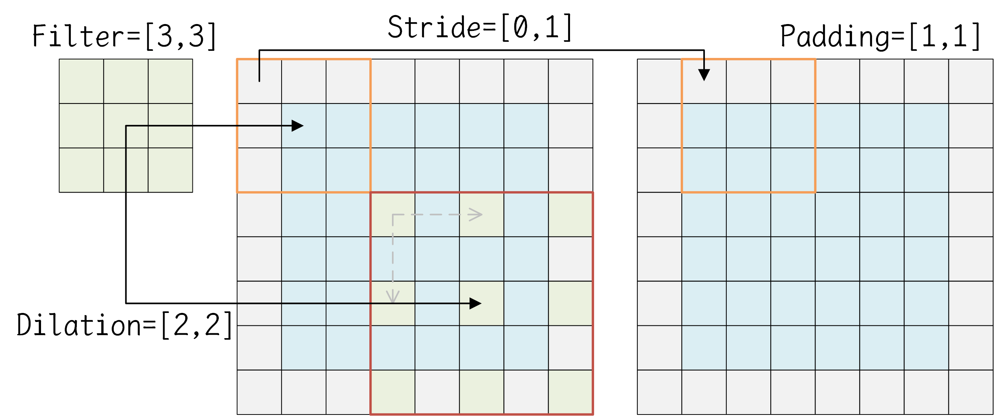

# 卷积操作

在卷积神经网络中，最常用的卷积操作是二维卷积或三维卷积，下表列出了所需数据的维度轴，并阐述一些尺寸之间的关系。其中，输入是一个批量数据，N是样本的个数，DHW是样本的维数，C是样本的通道数。卷积核是一个批量数据，K是卷积核的个数，TRS是卷积核的维数，C是卷积核的通道数。输出是一个批量数据，N是样本的个数，ZPQ是样本的维数，K是样本的通道数。

| 卷积类型\维度      | 输入（Input）   | 卷积核（Filter） | 输出（Output）  | 填充（Padding）       | 跨步（Stride）                 | 膨胀（Dialation）                    |
| ------------------ | --------------- | ---------------- | --------------- | --------------------- | ------------------------------ | ------------------------------------ |
| 二维卷积（Conv2D） | [N, H, W, C]    | [K, R, S, C]     | [N, P, Q, K]    | [pad_h, pad_w]        | [stride_h, stride_w]           | [dilation_h, dilation_w]             |
| 三维卷积（Conv3D） | [N, D, H, W, C] | [K, T, R, S, C]  | [N, Z, P, Q, K] | [pad_d, pad_h, pad_w] | [stride_d, stride_h, stride_w] | [dilation_d, dilation_h, dilation_w] |

填充，是指在输入的DHW维度的两端进行特定值的填充，以扩展输入在DHW维度上的维数。跨步，是指在使用卷积核遍历DHW维度轴时，两次相邻遍历之间的间距。膨胀，是指在卷积核及其框定的输入边界框中，两个相邻元素之间的间距。如下图所示。通常情况下，跨步和膨胀都取为1值。



对于一个卷积操作而言，输入维数、卷积核维数、输出维数之间，存在一定的关系，如下公式所示。
$$
\begin{align}
\text{Z} &= (\text{D} + 2\cdot\text{pad\_d} - \text{T}\times\text{dilation\_d}) / \text{stride\_d} + 1 \\
\text{P} &= (\text{H} + 2\cdot\text{pad\_h} - \text{R}\times\text{dilation\_h}) / \text{stride\_h} + 1 \\
\text{Q} &= (\text{W} + 2\cdot\text{pad\_w} - \text{S}\times\text{dilation\_w}) / \text{stride\_w} + 1
\end{align}
$$
卷积核的通道数必须与输入的通道数相同，这是因为，一个卷积核的C个通道，分别对应着一个样本的C个通道上的卷积运算，这些C个通道的结果进行求和，得到一个通道的输出。即，一个卷积核得到一个通道的输出，有几个卷积核，则输出的通道数就是多少。因此，输出的通道数K，等于卷积核的个数K。

对于一个二维卷积操作，假设填充取值为0，跨步、膨胀取值为1，则计算过程的伪代码如下所示。

```c++
for (int n = 0; n < N; n++) {
    for (int k = 0; k < K; k++) {
        for (int p = 0; p < P; p++) {
            for (int q = 0; q < Q; q++) {
                tmp = 0;
                for (int c = 0; c < C; c++) {
                    for (int r = 0; r < R; r++) {
                        for (int s = 0; s < S; s++) {
                            tmp += Input[n][p+r][q+s][c] * Filter[k][r][s][c];
                        }
                    }
                }
                Output[n][p][q][k] = tmp;
            }
        }
    }
}
```

在实现卷积操作时，可以使用Im2Col模式进行加速，这会在一个二维图像Image上按列滑动卷积核，并将框内的有效数据重新排成列向量，最后将这些列向量逐列排成新的矩阵。例如，一个NHWC形状的输入图像，在H×W维度上执行卷积核大小为R×S跨步为1且不填充的卷积，会得到(H－R＋1)×(W－S＋1)形状的输出；在卷积实现中，Im2Col操作会将H×W形状的图像转换成一个[R×S, (H－R＋1)×(W－S＋1)]形状的中间张量，同时卷积核会展开为R×S长度的行向量，以将卷积操作转换为矩阵乘法操作。如下一个4×4的输入图像应用2×2的卷积核的示例。
$$
\begin{matrix}
 1 &  2 &  3 &  4 \\
 5 &  6 &  7 &  8 \\
 9 & 10 & 11 & 12 \\
13 & 14 & 15 & 16
\end{matrix}
\quad\xrightarrow[(2,2)]{\text{im2col}}\quad
\begin{matrix}
 1 &  5 &  9 &  2 &  6 & 10 &  3 &  7 & 11 \\
 5 &  9 & 13 &  6 & 10 & 14 &  7 & 11 & 15 \\
 2 &  6 & 10 &  3 &  7 & 11 &  4 &  8 & 12 \\
 6 & 10 & 14 &  7 & 11 & 15 &  8 & 12 & 16
\end{matrix}
$$

