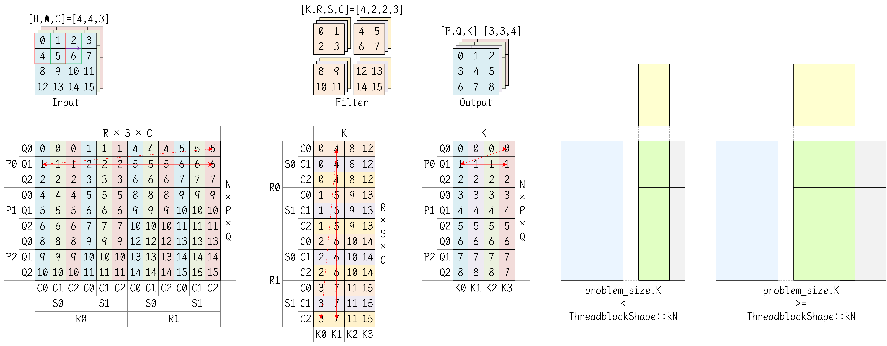

# 卷积操作

在卷积神经网络中，最常用的卷积操作是二维卷积或三维卷积，下表列出了所需数据的维度轴，并阐述一些尺寸之间的关系。其中，输入是一个批量数据，N是样本的个数，DHW是样本的维数，C是样本的通道数。卷积核是一个批量数据，K是卷积核的个数，TRS是卷积核的维数，C是卷积核的通道数。输出是一个批量数据，N是样本的个数，ZPQ是样本的维数，K是样本的通道数。

| 卷积类型\维度      | 输入（Input）   | 卷积核（Filter） | 输出（Output）  | 填充（Padding）       | 跨步（Stride）                 | 膨胀（Dialation）                    |
| ------------------ | --------------- | ---------------- | --------------- | --------------------- | ------------------------------ | ------------------------------------ |
| 二维卷积（Conv2D） | [N, H, W, C]    | [K, R, S, C]     | [N, P, Q, K]    | [pad_h, pad_w]        | [stride_h, stride_w]           | [dilation_h, dilation_w]             |
| 三维卷积（Conv3D） | [N, D, H, W, C] | [K, T, R, S, C]  | [N, Z, P, Q, K] | [pad_d, pad_h, pad_w] | [stride_d, stride_h, stride_w] | [dilation_d, dilation_h, dilation_w] |

填充，是指在输入的DHW维度的两端进行特定值的填充，以扩展输入在DHW维度上的维数。跨步，是指在使用卷积核遍历DHW维度轴时，两次相邻遍历之间的间距。膨胀，是指在卷积核及其框定的输入边界框中，两个相邻元素之间的间距。如下图所示。通常情况下，跨步和膨胀都取为1值。


对于一个卷积操作而言，输入维数、卷积核维数、输出维数之间，存在一定的关系，如下公式所示。
$$
\begin{align}
\text{Z} &= (\text{D} + 2\cdot\text{pad\_d} - \text{T}\times\text{dilation\_d}) / \text{stride\_d} + 1 \\
\text{P} &= (\text{H} + 2\cdot\text{pad\_h} - \text{R}\times\text{dilation\_h}) / \text{stride\_h} + 1 \\
\text{Q} &= (\text{W} + 2\cdot\text{pad\_w} - \text{S}\times\text{dilation\_w}) / \text{stride\_w} + 1
\end{align}
$$
卷积核的通道数必须与输入的通道数相同，这是因为，一个卷积核的C个通道，分别对应着一个样本的C个通道上的卷积运算，这些C个通道的结果进行求和，得到一个通道的输出。即，一个卷积核得到一个通道的输出，有几个卷积核，则输出的通道数就是多少。因此，输出的通道数K，等于卷积核的个数K。

> 值得注意的是，在卷积神经网络发展的早期，受限于设备性能，可以使用分组卷积（Group Convolution），即在通道C和通道K的维度上进行分组。假设一共分为g个组，则在每个组当中，输入维数变为[N, H, W, C/g]，卷积核维数变为[K/g, R, S, C/g]，输出维数变为[N, P, Q, K/g]，在每个组独立执行完卷积之后，再将每个组的输出进行拼接，得到最终的输出。

对于一个二维卷积操作，假设填充取值为0，跨步、膨胀取值为1，则计算过程的伪代码如下所示。

```c++
for (int n = 0; n < N; n++) {
    for (int k = 0; k < K; k++) {
        for (int p = 0; p < P; p++) {
            for (int q = 0; q < Q; q++) {
                tmp = 0;
                for (int c = 0; c < C; c++) {
                    for (int r = 0; r < R; r++) {
                        for (int s = 0; s < S; s++) {
                            tmp += Input[n][p+r][q+s][c] * Filter[k][r][s][c];
                        }
                    }
                }
                Output[n][p][q][k] = tmp;
            }
        }
    }
}
```

在实现卷积操作时，可以使用Im2Col模式进行加速，这会在一个二维图像Image上按列滑动卷积核，并将框内的有效数据重新排成列向量，最后将这些列向量逐列排成新的矩阵。实际上，究竟是逐列还是逐行摆放，并非是固定不变的，具体取决于算法库的实现方式。在MATLAB的算法库中，Im2Col模式是严格按照逐列摆放的，例如，下面展示的是4×4的输入图像应用2×2的卷积核的一个示例。
$$
\begin{matrix}
 1 &  2 &  3 &  4 \\
 5 &  6 &  7 &  8 \\
 9 & 10 & 11 & 12 \\
13 & 14 & 15 & 16
\end{matrix}
\quad\xrightarrow[(2,2)]{\text{im2col}}\quad
\begin{matrix}
 1 &  5 &  9 &  2 &  6 & 10 &  3 &  7 & 11 \\
 5 &  9 & 13 &  6 & 10 & 14 &  7 & 11 & 15 \\
 2 &  6 & 10 &  3 &  7 & 11 &  4 &  8 & 12 \\
 6 & 10 & 14 &  7 & 11 & 15 &  8 & 12 & 16
\end{matrix}
$$

而在CUTLASS模板库中，对于一个卷积操作，假设输入的维数是[N, H, W, C]，卷积核的维数是[K, R, S, C]，输出的维数是[N, P, Q, K]。则对于输入图像而言，Im2Col模式会将其转换成一个[N×P×Q, R×S×C]形状的中间矩阵，同时卷积核会展开为[R×S×C, K]形状的中间矩阵，以将卷积操作转换为矩阵乘法操作，得到一个[N×P×Q, K]形状的输出矩阵，然后再将输出矩阵的数据存储到合适的内存位置。如下图所示，批量N取值为1时，Im2Col模式如下所示。



# CUTLASS的卷积实现

在CUTLASS模板库中，提供隐式矩阵乘法的卷积算法（ImplicitGemmConvolution），并在cutlass/conv根目录中提供代码实现。实际上，卷积操作的Conv API，也诸如通用矩阵乘法的GEMM API一样，分为Thread线程层级、Warp线程束层级、Threadblock线程块层级、Kernel内核层级、Device设备层级。

## Common Type

在cutlass/conv/convolution.h头文件中，提供一些枚举类型的定义，用于标识卷积操作中的各种配置，以及提供用于标识卷积形状的模板类，如下所示。

```c++
/// Convolutional operator
enum class Operator {
    kFprop,
    kDgrad,
    kWgrad,
    kDeconv
};

/// Distinguishes convolution from cross correlation
enum class Mode {
    kCrossCorrelation,
    kConvolution
};

/// Selects among several implementation variants trading off performance with simplicity
enum class IteratorAlgorithm {
    kAnalytic,            ///< functionally correct in all cases but lower performance
    kOptimized,           ///< optimized for R <= 32, S <= 32 and unity-stride dgrad
    kFixedChannels,       ///< Analytic algorithm optimized for fixed channel count (C == AccessSize)
    kFewChannels,         ///< Analytic algorithm optimized for few channels (C divisible by AccessSize)
    kFixedStrideDilation  ///< Optimized for fixed stride and dilation
};

/// Distinguishes among partial specializations that accelerate certain problems where convolution stride is unit.
enum class StrideSupport {
    kStrided,  ///< arbitrary convolution stride
    kUnity,    ///< unit convolution stride
    kFixed     ///< fixed convolution stride
};

/// Identifies split-K mode
enum class SplitKMode {
    kNone,
    kSerial,
    kParallel
};

/// Identifies group mode
enum class GroupMode {
    kNone,
    kSingleGroup,    ///< One CTA calculates one group or less
    kMultipleGroup,  ///< One CTA calculates multiple groups
    kDepthwise       ///< One CTA calculates cta_n groups (problem_size.C == problem_size.K == problem_size.groups)
};

/// Shape of a tensor
template <int N = 1, int H = 1, int W = 1, int C = 1>
struct TensorNHWCShape {
    static int const kN = N;
    static int const kH = H;
    static int const kW = W;
    static int const kC = C;
    static int const kHW = H * W;
    static int const kNHW = N * kHW;
    static int const kNHWC = N * H * W * C;
    static int const kCount = kNHWC;

    /// Returns a Coord object
    static Coord<4> toCoord() {
        return make_Coord(kN, kH, kW, kC);
    }
};

/// Shape of a conv2d stride, which controls how the filter convolves around the input volume
template <int u = 1, int v = 1>
struct Stride2D {
    static int const kU = u;  /// Stride in horizontal direction
    static int const kV = v;  /// Stride in vertical direction

    /// Returns a Coord object
    static Coord<2> toCoord() {
        return make_Coord(kU, kV);
    }
};
```

在cutlass/conv/conv2d_problem_size.h头文件中，提供二维卷积的问题配置，用于指定卷积的输入维数、卷积核维数、输出维度等信息，如下所示。

```c++
/// Problem size structure
struct Conv2dProblemSize {
    // Conv2d strictly problem size parameters
    int N, H, W, C, P, Q, K, R, S;
    int pad_h, pad_w;
    int stride_h, stride_w;
    int dilation_h, dilation_w;
    Mode mode;

    // Conv2d implementation-related parameters 
    int split_k_slices;
    int groups;

public:
    Conv2dProblemSize() :
        N(0), H(0), W(0), C(0), P(0), Q(0), K(0), R(0), S(0),
        pad_h(0), pad_w(0), stride_h(1), stride_w(1), dilation_h(1), dilation_w(1),
        mode(Mode::kConvolution), split_k_slices(1), groups(1) {}

    /// Constructor for default padding, stride, dilation, and split-K
    Conv2dProblemSize(int N, int H, int W, int C, int P, int Q, int K, int R, int S, Mode mode = Mode::kConvolution) :
        N(N), H(H), W(W), C(C), P(P), Q(Q), K(K), R(R), S(S),
        pad_h(R / 2), pad_w(S / 2), stride_h(1), stride_w(1), dilation_h(1), dilation_w(1),
        mode(mode), split_k_slices(1), groups(1) {}

    /// Constructs convolution problem size from cutlass Tensor4DCoord and MatrixCoord
    /// set user-defined output size and sets P and Q (include all data members in ctor)
    Conv2dProblemSize(
        cutlass::Tensor4DCoord input_size,   //< NHWC
        cutlass::Tensor4DCoord filter_size,  //< KRSC
        cutlass::Tensor4DCoord padding,      //< pad_h, _, pad_w, _
        cutlass::MatrixCoord stride,         //< stride_h, stride_w
        cutlass::MatrixCoord dilation,       //< dilation_h, dilation_w
        cutlass::Tensor4DCoord output_size,  //< NPQK
        cutlass::conv::Mode mode = cutlass::conv::Mode::kCrossCorrelation,
        int split_k_slices = 1, int groups = 1
    ) : N(input_size.n()), H(input_size.h()), W(input_size.w()), C(input_size.c()),
        P(output_size.h()), Q(output_size.w()),
        K(filter_size.n()), R(filter_size.h()), S(filter_size.w()),
        pad_h(padding[0]), pad_w(padding[2]),
        stride_h(stride.row()), stride_w(stride.column()),
        dilation_h(dilation.row()), dilation_w(dilation.column()),
        mode(mode), split_k_slices(split_k_slices), groups(groups) {}
    
    /// Returns activation extent as Tensor4DCoord
    cutlass::Tensor4DCoord activation_extent() const {
        return cutlass::Tensor4DCoord({ N, H, W, C });
    }

    /// Returns filter extent as Tensor4DCoord
    cutlass::Tensor4DCoord filter_extent(bool is_deconv = false) const {
        return is_deconv ? cutlass::Tensor4DCoord({ C, R, S, K / groups }) : cutlass::Tensor4DCoord({ K, R, S, C / groups });
    }

    /// Returns output extent as Tensor4DCoord
    cutlass::Tensor4DCoord output_extent() const {
        return cutlass::Tensor4DCoord({ N, P, Q, K });
    }

    /// Returns activation size in number of elements
    int64_t activation_size() const {
        return static_cast<int64_t>(N) * static_cast<int64_t>(H) * static_cast<int64_t>(W) * static_cast<int64_t>(C);
    }

    /// Returns filter size in number of elements
    int64_t filter_size() const {
        return static_cast<int64_t>(K) * static_cast<int64_t>(R) * static_cast<int64_t>(S) * static_cast<int64_t>(C) / groups;
    }

    /// Returns output size in number of elements
    int64_t output_size() const {
        return static_cast<int64_t>(N) * static_cast<int64_t>(P) * static_cast<int64_t>(Q) * static_cast<int64_t>(K);
    }

    /// Returns padding as Tensor4DCoord
    cutlass::Tensor4DCoord padding() const {
        return cutlass::Tensor4DCoord({ pad_h, pad_h, pad_w, pad_w });
    }

    /// Returns stride as MatrixCoord
    cutlass::MatrixCoord stride() const {
        return cutlass::MatrixCoord({ stride_h, stride_w });
    }

    /// Returns dilation as MatrixCoord
    cutlass::MatrixCoord dilation() const {
        return cutlass::MatrixCoord({ dilation_h, dilation_w });
    }

    /// Methods used for strided dgrad implementation
    /// Number of filter r positions to accumulate in gemm-k dim
    int num_gemm_k_filter_r(int r) const {
        return ((R - r + stride_h - 1) / stride_h);
    }

    /// Methods used for strided dgrad implementation
    /// Number of filter s positions to accumulate in gemm-k dim
    int num_gemm_k_filter_s(int s) const {
        return ((S - s + stride_w - 1) / stride_w);
    }

    /// Methods used for strided dgrad implementation
    /// Number of filter positions to accumulate in gemm-k dim
    int num_gemm_k_filter_positions(int r, int s) const {
        return num_gemm_k_filter_r(r) * num_gemm_k_filter_s(s);
    }
};
```

在cutlass/conv/conv2d_problem_size.h头文件中，还提供将二维卷积映射到隐式矩阵乘法的辅助函数，包括问题配置的映射、维数的映射、空间大小的映射。

```c++
/////////////////////////////////////////////////////////////////////////////////////////////////
//                            ImplicitGemm helper functions to map:                            //
//  Map tensor problem sizes (Conv2d -> ImplicitGemm) : implicit_gemm_problem_size()           //
//  Map tensor extents       (Conv2d -> ImplicitGemm) : implicit_gemm_tensor_[a|b|c]_extent()  //
//  Map tensor sizes         (Conv2d -> ImplicitGemm) : implicit_gemm_tensor_[a|b|c]_size()    //
/////////////////////////////////////////////////////////////////////////////////////////////////

/// Determine the problem size of the implicit GEMM operation
cutlass::gemm::GemmCoord implicit_gemm_problem_size(Operator conv_operator, Conv2dProblemSize const &problem_size) {
    // Compute problem size
    switch (conv_operator) {
    case Operator::kFprop:
        return gemm::GemmCoord(
            /* M */ problem_size.N * problem_size.P * problem_size.Q,
            /* N */ problem_size.K,
            /* K */ problem_size.R * problem_size.S * problem_size.C / problem_size.groups
        );
    case Operator::kDeconv:
    case Operator::kDgrad:
        return gemm::GemmCoord(
            /* M */ problem_size.N * problem_size.H * problem_size.W,
            /* N */ problem_size.C,
            /* K */ problem_size.R * problem_size.S * problem_size.K
        );
    case Operator::kWgrad:
        return gemm::GemmCoord(
            /* M */ problem_size.K,
            /* N */ problem_size.R * problem_size.S * problem_size.C,
            /* K */ problem_size.N * problem_size.P * problem_size.Q
        );
    default:
        break;
    }
    return gemm::GemmCoord();
}

/// Determine the number of gemm_k iterations for conv2d problem using implicit gemm algorithm.
/// Here, `threadblock_K` is ThreadblockShape::kK in GemmShape, which usually is { 128, 128, 64 } for half_t.
int implicit_gemm_k_iterations(
    Operator conv_operator, int threadblock_K, Conv2dProblemSize const &problem_size,
    IteratorAlgorithm algorithm = IteratorAlgorithm::kAnalytic, GroupMode group_mode = GroupMode::kNone, int threadblock_N = 0
) {
    // Generally, iterations = R * S * C / threaeblock_K
    int iterations = 0;
    if (group_mode == GroupMode::kNone) {
        if (algorithm == IteratorAlgorithm::kFixedChannels) {
            if (conv_operator == Operator::kFprop) {
                int positions_per_iteration = threadblock_K / problem_size.C;
                iterations = (problem_size.R * problem_size.S + positions_per_iteration - 1) / positions_per_iteration;
            }
        } else if (algorithm == IteratorAlgorithm::kFewChannels) {
            if (conv_operator == Operator::kFprop) {
                iterations = (problem_size.R * problem_size.S * problem_size.C + threadblock_K - 1) / threadblock_K;
            }
        } else /* algorithm == [ kAnalytic | kOptimized | kFixedStrideDilation ] */ {
            int elements_per_split_k_slice = 0;
            switch (conv_operator) {
            case Operator::kFprop:
                elements_per_split_k_slice = (problem_size.C + problem_size.split_k_slices - 1) / problem_size.split_k_slices;
                iterations = problem_size.R * problem_size.S * ((elements_per_split_k_slice + threadblock_K - 1) / threadblock_K);
                break;
            case Operator::kDeconv:
            case Operator::kDgrad:
                elements_per_split_k_slice = (problem_size.K + problem_size.split_k_slices - 1) / problem_size.split_k_slices;
                iterations = problem_size.R * problem_size.S * ((elements_per_split_k_slice + threadblock_K - 1) / threadblock_K);
                break;
            case Operator::kWgrad:
                elements_per_split_k_slice =
                    (problem_size.N * problem_size.P * problem_size.Q + problem_size.split_k_slices - 1) / problem_size.split_k_slices;
                iterations = (elements_per_split_k_slice + threadblock_K - 1) / threadblock_K;
                break;
            default:
                break;
            }
        }
    } else if (group_mode == GroupMode::kDepthwise) {
        int channels_per_cta = threadblock_N;
        if (algorithm == IteratorAlgorithm::kAnalytic) {
            if (conv_operator == Operator::kFprop) {
                iterations = problem_size.R * problem_size.S * ((channels_per_cta + threadblock_K - 1) / threadblock_K);
            }
        }
    } else /* group_mode == [ GroupMode::kSingleGroup | GroupMode::kMultipleGroup ] */ {
        int channels_per_group = problem_size.C / problem_size.groups;
        int k_per_group = problem_size.K / problem_size.groups;
        if (algorithm == IteratorAlgorithm::kAnalytic) {
            if (conv_operator == Operator::kFprop) {
                iterations = problem_size.R * problem_size.S * ((channels_per_group + threadblock_K - 1) / threadblock_K);
                // In group conv, if k_per_group < threadblock_N, one Threadblock will calculate multiple groups
                if (problem_size.groups != 1) {
                    if (k_per_group < threadblock_N) {
                        iterations *= threadblock_N / k_per_group;
                    }
                }
            }
        } else if (algorithm == IteratorAlgorithm::kOptimized) {
            // Current optimized iterator only support GroupMode::kSingleGroup
            if (group_mode == GroupMode::kSingleGroup) {
                if (conv_operator == Operator::kFprop) {
                    iterations = problem_size.R * problem_size.S * ((channels_per_group + threadblock_K - 1) / threadblock_K);
                }
            }
        }
    }
    return iterations;
}
```

## Device Level

在cutlass/conv/device/implicit_gemm_convolution.h头文件中，提供Device设备层级的隐式卷积实现，即conv::device::ImplicitGemmConvolution模板类。

```c++
template<typename ImplicitGemmKernel_>
class ImplicitGemmConvolution {
public:
    // `UnderlyingKernel` and `ImplicitGemmKernel` are exactly `cutlass::conv::kernel::ImplicitGemmConvolution`
    using UnderlyingKernel = GetUnderlyingKernel_t<ImplicitGemmKernel_>;
    using ElementA = typename UnderlyingKernel::ElementA;
    using LayoutA = typename UnderlyingKernel::LayoutA;
    using ElementB = typename UnderlyingKernel::ElementB;
    using LayoutB = typename UnderlyingKernel::LayoutB;
    using ElementC = typename UnderlyingKernel::ElementC;
    using LayoutC = typename UnderlyingKernel::LayoutC;
    using ElementAccumulator = typename UnderlyingKernel::ElementAccumulator;
    using ElementCompute = typename UnderlyingKernel::ElementCompute;
    using OperatorClass = typename UnderlyingKernel::OperatorClass;
    using ArchTag = typename UnderlyingKernel::ArchTag;
    using ThreadblockShape = typename UnderlyingKernel::ThreadblockShape;
    using WarpShape = typename UnderlyingKernel::WarpShape;
    using InstructionShape = typename UnderlyingKernel::InstructionShape;
    using ThreadblockSwizzle = typename UnderlyingKernel::ThreadblockSwizzle;
    using EpilogueOutputOp = typename UnderlyingKernel::EpilogueOutputOp;
    static int const kStages = UnderlyingKernel::kStages;
    static int const kConvDim = UnderlyingKernel::kConvDim;
    using WarpMmaOperator = typename UnderlyingKernel::WarpMmaOperator;
    using ArchMmaOperator = typename UnderlyingKernel::ArchMmaOperator;
    using MathOperator = typename UnderlyingKernel::MathOperator;
    static cutlass::conv::Operator const kConvolutionalOperator = UnderlyingKernel::kConvolutionalOperator;
    static cutlass::conv::IteratorAlgorithm const kIteratorAlgorithm = UnderlyingKernel::kIteratorAlgorithm;
    static cutlass::conv::StrideSupport const kStrideSupport = UnderlyingKernel::kStrideSupport;
    static cutlass::conv::GroupMode const kGroupMode = UnderlyingKernel::kGroupMode;

    static int const kWarpCount =
        (ThreadblockShape::kM / WarpShape::kM) * (ThreadblockShape::kN / WarpShape::kN) * (ThreadblockShape::kK / WarpShape::kK);
    using Arguments = typename UnderlyingKernel::Arguments;  /// Argument structure

private:
    typename UnderlyingKernel::Params params_;  /// Kernel parameters object

public:

    /// Constructs Implicit GEMM
    ImplicitGemmConvolution() {}

    /// Gets the workspace size
    static size_t get_workspace_size(Arguments const &args) {
        size_t workspace_bytes = 0;
        // Determine grid shape
        ThreadblockSwizzle threadblock_swizzle;
        cutlass::gemm::GemmCoord grid_tiled_shape = threadblock_swizzle.get_tiled_shape(
            kConvolutionalOperator, args.problem_size,
            { ThreadblockShape::kM, ThreadblockShape::kN, ThreadblockShape::kK },
            args.problem_size.split_k_slices
        );
        if (args.split_k_mode == SplitKMode::kParallel) {
            // Split-K parallel: CTAs in k-dimension write the partial results in a temporary workspace.
            // The user needs to call a reduction operator to optain the final output tensor.
            workspace_bytes = sizeof(ElementAccumulator)
                * size_t(cutlass::conv::implicit_gemm_tensor_c_size(kConvolutionalOperator, args.problem_size))
                * size_t(grid_tiled_shape.k());
        } else if (args.split_k_mode == SplitKMode::kSerial && args.problem_size.split_k_slices > 1) {
            // Split-K serial: The user workspace is used to store semaphore
            // and serialize writing the final reduced output to user's output tensor
            workspace_bytes = sizeof(int) * size_t(grid_tiled_shape.m()) * size_t(grid_tiled_shape.n());
        }
        return workspace_bytes;
    }

    /// Initializes GEMM state from arguments.
    Status initialize(
        Arguments const &args, void *workspace = nullptr, cudaStream_t stream = nullptr, CudaHostAdapter *cuda_adapter = nullptr
    ) {
        if (args.problem_size.split_k_slices > 1) {
            if (workspace == nullptr) {
                return Status::kErrorWorkspaceNull;
            }
            cudaError_t status = cudaMemsetAsync(workspace, 0, get_workspace_size(args), stream);
            if (status != cudaSuccess) {
                return Status::kErrorInternal;
            }
        }
        // initialize the params structure from the arguments
        params_ = typename UnderlyingKernel::Params(args, static_cast<int *>(workspace));
        int smem_size = int(sizeof(typename UnderlyingKernel::SharedStorage));
        if (smem_size >= (48 << 10)) {
            cudaError_t result = cudaFuncSetAttribute(
                cutlass::Kernel<UnderlyingKernel>, cudaFuncAttributeMaxDynamicSharedMemorySize, smem_size
            );
            if (result != cudaSuccess) {
                return Status::kErrorInternal;
            }
        }
        return Status::kSuccess;
    }

    /// Initializes GEMM state from arguments.
    Status update(Arguments const &args, void *workspace = nullptr) {
        // update the params structure from the arguments
        params_.ptr_A = args.ref_A.data();
        params_.ptr_B = args.ref_B.data();
        params_.ptr_C = args.ref_C.data();
        params_.ptr_D = args.ref_D.data();
        params_.output_op = args.output_op;
        params_.semaphore = static_cast<int *>(workspace);
        return Status::kSuccess;
    }

    /// Runs the kernel using initialized state.
    Status run(cudaStream_t stream = nullptr, CudaHostAdapter *cuda_adapter = nullptr, int32_t kernel_index = 0) {
        ThreadblockSwizzle threadblock_swizzle;
        dim3 grid = threadblock_swizzle.get_grid_shape(params_.grid_tiled_shape);
        dim3 block(32 * kWarpCount, 1, 1);
        int smem_size = int(sizeof(typename UnderlyingKernel::SharedStorage));
        cutlass::arch::synclog_setup();
        cutlass::Kernel<UnderlyingKernel><<<grid, block, smem_size, stream>>>(params_);
        cudaError_t result = cudaGetLastError();
        if (cudaSuccess == result) {
            return Status::kSuccess;
        } else {
            return Status::kErrorInternal;
        }
    }

    /// Runs the kernel using initialized state.
    Status operator()(
        Arguments const &args, void *workspace = nullptr, cudaStream_t stream = nullptr,
        CudaHostAdapter *cuda_adapter = nullptr, int32_t kernel_index = 0
    ) {
        Status status = initialize(args, workspace, stream, cuda_adapter);
        if (status == Status::kSuccess) {
            status = run(stream, cuda_adapter, kernel_index);
        }
        return status;
    }

    /// Runs the kernel using initialized state.
    Status operator()(cudaStream_t stream = nullptr, CudaHostAdapter *cuda_adapter = nullptr, int32_t kernel_index = 0) {
        return run(stream, cuda_adapter, kernel_index);
    }
};
```

## Kernel Level

在cutlass/conv/kernel/default_conv2d_fprop.h头文件中，提供Kernel内核函数层级的默认配置，即conv::kernel::DefaultConv2dFprop模板类。

```c++
/// Defines a kernel for Conv2dFprop
template <
    typename ElementA, typename LayoutA, typename ElementB, typename LayoutB, typename ElementC, typename LayoutC, typename ElementAccumulator,
    typename OperatorClass, typename ArchTag, typename ThreadblockShape, typename WarpShape, typename InstructionShape,
    typename EpilogueOutputOp, typename ThreadblockSwizzle, int Stages, typename MathOperatorTag,
    conv::IteratorAlgorithm IteratorAlgorithm = IteratorAlgorithm::kOptimized, conv::StrideSupport StrideSupport = StrideSupport::kUnity,
    int AlignmentA = 128 / cutlass::sizeof_bits<ElementA>::value,  /// Access granularity of A matrix in units of elements
    int AlignmentB = 128 / cutlass::sizeof_bits<ElementB>::value   /// Access granularity of B matrix in units of elements
> struct DefaultConv2dFprop;
```

```c++
/// Defines a kernel for Conv2dFprop specialization for Optimzed IteratorAlgorithm and multistage pipeline.
template <
    typename ElementA, typename LayoutA, typename ElementB, typename LayoutB, typename ElementC, typename LayoutC,
    typename ElementAccumulator, typename ArchTag, typename ThreadblockShape, typename WarpShape, typename InstructionShape,
    typename EpilogueOutputOp, typename ThreadblockSwizzle, int Stages, typename MathOperatorTag, conv::StrideSupport StrideSupport,
    int AlignmentA, int AlignmentB
>
struct DefaultConv2dFprop<
    ElementA, LayoutA, ElementB, LayoutB, ElementC, LayoutC, ElementAccumulator, arch::OpClassTensorOp, ArchTag,
    ThreadblockShape, WarpShape, InstructionShape, EpilogueOutputOp, ThreadblockSwizzle, Stages, MathOperatorTag,
    IteratorAlgorithm::kOptimized, StrideSupport, AlignmentA, AlignmentB
> {
    // Define the core components from GEMM
    using MmaCore = typename cutlass::gemm::threadblock::DefaultMmaCore<
        ThreadblockShape, WarpShape, InstructionShape, ElementA, layout::RowMajor,
        ElementB, layout::ColumnMajor, ElementAccumulator, layout::RowMajor, arch::OpClassTensorOp,
        Stages, MathOperatorTag
    >;
    // Define iterators over tiles from the A operand. `Input`
    using ThreadMapA = typename MmaCore::IteratorThreadMapA;
    using AccessTypeA = cutlass::AlignedArray<ElementA, AlignmentA>;
    using SmemIteratorA = typename MmaCore::SmemIteratorA;  // frag --> smem
    using IteratorA = cutlass::conv::threadblock::Conv2dFpropActivationTileAccessIteratorOptimized<  // gmem --> frag
        cutlass::MatrixShape<ThreadblockShape::kM, ThreadblockShape::kK>, ElementA, LayoutA, ThreadMapA, AccessTypeA>;
    // Define iterators over tiles from the B operand. `Filter`
    using ThreadMapB = typename MmaCore::IteratorThreadMapB;
    using AccessTypeB = cutlass::AlignedArray<ElementB, AlignmentB>;
    using SmemIteratorB = typename MmaCore::SmemIteratorB;  // frag -->smem
    using IteratorB = cutlass::conv::threadblock::Conv2dFpropFilterTileAccessIteratorOptimized<  // gmem --> frag
        cutlass::MatrixShape<ThreadblockShape::kK, ThreadblockShape::kN>, ElementB, LayoutB, ThreadMapB, AccessTypeB>;

    // Warp-level GEMM components
    using WarpMmaTensorOp = typename MmaCore::MmaTensorOp;
    using MmaPolicy = typename MmaCore::MmaPolicy;

    static cutlass::arch::CacheOperation::Kind const CacheOpB = (sizeof_bits<ElementB>::value * AlignmentB) == 128
        ? cutlass::arch::CacheOperation::Global : cutlass::arch::CacheOperation::Always;
    // Define the ImplicitMma
    using Mma = threadblock::ImplicitGemmMultistage<ThreadblockShape,
        IteratorA, SmemIteratorA, arch::CacheOperation::Always, IteratorB, SmemIteratorB, CacheOpB, MmaPolicy, Stages>;

    static const int kPartitionsK = ThreadblockShape::kK / WarpShape::kK;
    // Define the epilogue
    using Epilogue = typename epilogue::threadblock::DefaultEpilogueTensorOp<ThreadblockShape,
        WarpMmaTensorOp, kPartitionsK, EpilogueOutputOp, EpilogueOutputOp::kCount, false, layout::NoPermute, StrideSupport, 4>::Epilogue;

    // Define the kernel
    using Kernel = cutlass::conv::kernel::ImplicitGemmConvolution<Mma, Epilogue, ThreadblockSwizzle, conv::Operator::kFprop>;
};
```

在cutlass/conv/kernel/implicit_gemm_convolution.h头文件中，提供Kernel内核函数层级的隐式卷积实现，即conv::kernel::ImplicitGemmConvolution模板类。

```c++

```

