# 从图形学引入

计算机图形学（Computer Graphics）是数码摄影、电影、视频游戏、数字艺术、手机、计算机显示器以及许多专业应用的核心技术。目前，人们已经开发了大量专用硬件和软件，大多数设备的显示器都是由计算机图形硬件驱动的。计算机图形学中的一些主题包括用户界面设计、精灵图形、渲染、光线追踪、几何处理、计算机动画、矢量图形、3D建模、着色器、GPU设计、隐式曲面、可视化、科学计算、图像处理、计算摄影、科学可视化、计算几何、计算机视觉等。

计算机图形学可以指代几种不同的概念：计算机对图像数据的表示和处理；用于创建和处理图像的各种技术；数字合成和处理视觉内容的方法。尽管该术语通常指三维计算机图形学的研究，但它也涵盖二维图形和图像处理。计算机图形学研究使用计算技术处理视觉和几何信息，它侧重于图像生成和处理的数学和计算基础，而不是纯粹的美学问题。整体方法在很大程度上取决于几何、光学、物理学、感知等基础科学。

计算机图形学管线（Graphics Pipeline）指的是一个流水线流程，依次为软件建模、渲染管线、硬件加速三大阶段。建模软件可使用3DsMax、ZBursh、Blender、Maya、SketchUp等，用于定义几何对象（形状、尺寸、位置等）、模型属性（颜色、纹理、材质等）、相机（视点、方向、视野）等。主流建模软件都可以选择不同的渲染管线，主要包括软件渲染、Direct3D接口、OpenGL接口，不同的渲染管线拥有不同的流水线流程，但总体阶段都是类似的。渲染管线可使用CPU进行执行，也可以使用GPU等加速卡进行硬件加速。

> Direct3D是适用于Microsoft Windows的图形应用程序编程接口，作为DirectX的一部分，Direct3D用于在注重性能的应用程序（如游戏）中渲染三维图形。如果显卡支持硬件加速，Direct3D会使用硬件加速，从而对整个3D渲染管线进行硬件加速，甚至仅对部分管线进行硬件加速。
>
> OpenGL是一个跨语言、跨平台的应用程序编程接口，用于渲染二维和三维矢量图形。该API常用于与图形处理单元GPU交互，以实现硬件加速渲染。

顶点处理，顶点着色器（Vertex Shader）。渲染管线中可编程的阶段，负责处理单个顶点。顶点着色器接收由一系列顶点属性组成的单个顶点，该输入顶点被任意处理以产生输出顶点。顶点着色器通常执行空间坐标的转换，还可以执行每个顶点的照明，或为后续着色器阶段执行设置工作。

曲面细分，外壳着色器（Hull Shader）、镶嵌（Tessellation）、域着色器（Domain Shader）。外壳着色器接收顶点着色器传递的控制点数据，向镶嵌器输出常量细分因子，向域着色器传递经过变换和增删后的控制点数据。在实时渲染中，需要计算并创建（多个）三角形对真实曲面进行拟合，这个过程称为镶嵌，在运行时，表面可以被镶嵌为多个小三角形。域着色器接收镶嵌器阶段输出的所有顶点与三角形，以及外壳着色器输出的经过变换后的控制点，进行后续处理。随着曲面细分功能的开启，顶点着色器便化为“处理每个控制点的顶点着色器”，而域着色器的本质实为“针对已经过镶嵌化的面片进行处理的顶点着色器”。

几何着色器（Geometry Sahder）。位于顶点着色器（或可选的曲面细分阶段）之后，几何着色器是可选的。几何着色器以单个图元作为输入，并可能输出零个或多个图元，被编程为接受特定输入图元类型并输出特定图元类型。使用几何着色器的主要原因是，分层渲染，获取一个图元并将其渲染为多个图像，而无需更改绑定的渲染目标。

基本图元（Primitive）。顶点流解释的结果，是图元装配的一部分。包括点、线、三角形、面片（Patch），其中面片是用于曲面细分阶段的概念。

图元装配（Primitive Assembly）。完整的图元装配在顶点处理阶段之后执行。但是，某些顶点处理步骤要求将图元分解为一系列基本图元。例如，几何着色器对图元序列中的每个输入基本图元进行操作。因此，在几何着色器执行之前必须进行某种形式的图元装配。如果几何着色器或曲面细分处于激活状态，则必须进行早期图元装配处理。早期的图元装配，会将顶点流转换为基本图元序列，例如，一个由12个顶点组成的列表需要生成11个线图元。

视点变换（Viewport Transformation）。视点变换定义了顶点位置从标准世界坐标空间到视窗坐标空间的变换（从3D坐标到2D坐标），这些是光栅化到输出图像的坐标。视窗即是相机的视野，也是屏幕的显示区域。

裁剪（Clipping）。收集前几个阶段生成的图元，然后将其裁剪到视窗范围。针对顶点Z位置的裁剪行为可以通过激活深度限制来控制。使用透视投影时，仍然会裁剪视野的侧面，位于相机后面的物体仍然会被裁剪。

光栅化（Rasterization）。将几何图元，例如三角形，转换为屏幕上的像素，每个像素的颜色和深度通过插值计算，表示它与屏幕上对应部分的颜色和深浅关系。纹理映射，将2D图像（纹理）应用到3D模型表面，增加物体的细节和真实感。

片元（Fragment）。光栅化将一个图元转变成二维图像，每个图像点都包含颜色、深度、纹理等数据，将该点和相关信息称为一个片元。对于图元覆盖的每个像素点，都会生成一个片元。

像素着色器（Pixel Shader），片元着色器（Fragment Shader）。将光栅化生成的片元处理为一组颜色和单个深度值阶段。片元着色器的输出是一个深度值，以及零个或多个可能写入当前帧缓冲区中的缓冲区的颜色值。片元着色器将单个片元作为输入并生成单个片元作为输出。

深度测试（Depth Testing）。通过比较每个像素的深度值来确定前景和背景，确保正确的遮挡关系。

混合与透明度处理（Blending and Transparency）。处理场景中的透明对象或半透明效果。

抗锯齿（Anti-aliasing）。减少由于分辨率限制产生的锯齿现象，使边缘平滑。

帧缓冲（Frame Buffering）。最终生成图像，所有计算完成后，图像被写入帧缓冲区，帧缓冲是用于存储每一帧图像的内存空间，它包含每个像素的颜色信息。

显示（Display）。将缓冲区中的图像传递给显示器，生成最终显示在屏幕上的图像。

# NVIDIA GPU发展历史

NVIDIA于1999年推出GeForce 256芯片，第一次在芯片中集成了包括顶点计算、纹理压缩、贴图、光照在内的各种计算引擎，能够处理计算机图形学中的各类计算问题，因此称之为图形处理器（Graphics Processing Unit，GPU）。2001年推出GeForce 3芯片，为方便用户在GPU上编写程序，GPU提供一个名为着色器（Shader）的编程工具，用在图像渲染过程中，是一个用来替代固定渲染管线的可编辑程序。其中，顶点着色器（Vertex Shader）主要负责顶点的几何关系等的运算，像素着色器（Pixel Shader）主要负责片元颜色等的计算。着色器替代了传统的固定渲染管线，可以实现3D图形学计算中的相关计算，由于其可编辑性，可以实现各种各样的图像效果而不用受显卡的固定渲染管线限制。

伊恩·巴克（Ian Buck）在2004年SIGGRAPH会议上发表论文Brook for GPUs: Stream Computing on Graphics Hardware，在其中提到，商品化的图形硬件已经从一个固定功能的流水线快速发展为具有可编程顶点（vertex）和片元（fragment）的处理器，虽然这种新的可编程性是为实时着色而引入的，但根据观察，这些处理器的指令集足够通用，可以在渲染领域之外执行计算。毕业后，伊恩·巴克加入NVIDIA。2006年，基于伊恩·巴克的思想，NVIDIA推出CUDA（Compute Unified Device Architecture）并行编程模型。2007年，NVIDIA发布CUDA开发工具包（CUDA Toolkit），使开发者可以使用CUDA进行编程开发，利用GPU进行并行计算。

2006年，NVIDIA推出了Tesla一代架构，应用到显卡G80系列上面。2008年，NVIDIA推出了改进的Tesla二代架构，应用到显卡GeForce 200系列上面，在该系列中有图形学架构和计算架构两个版本，并逐步确定了后续的Tesla通用科学计算卡。2010年，NVIDIA推出了Fermi架构，这是NVIDIA基于CUDA研发的GPU架构，它引入了统一的计算架构，使得GPU不仅可以处理图形学任务，还可以处理通用计算任务。2012年，NVIDIA发布了Kepler架构，它采用28nm制程，是首个支持超级计算和双精度计算的GPU架构，进一步提高了能效比和GPU性能，并引入了动态并行处理技术。2014年，NVIDIA发布了Maxwell架构，同样采用28nm制程，但在能效比和计算密度上有了进一步的提升。2016年，NVIDIA推出了Pascal架构，它采用16nm FinFET Plus制程，显著增强了GPU的能效比和计算密度。Pascal架构使GPU可以进入更广泛的人工智能、汽车等新兴应用市场。2017年，NVIDIA发布了Volta架构，采用12nm制程，进一步提升了GPU的性能和能效比。Volta架构在深度学习、高性能计算等领域有着广泛的应用。2018年，NVIDIA推出了Turing架构，它引入了光线追踪和深度学习超采样（DLSS）技术，使得GPU在游戏和图形学渲染领域的性能得到了显著提升。2020年，NVIDIA发布了Ampere架构，它在性能、能效比和AI加速能力上都有着显著的提升。Ampere架构的GPU产品广泛应用于数据中心、游戏、图形学渲染等领域。2022年，NVIDIA发布了Hopper架构，在单个超级芯片中与高带宽和内存一致的NVLink Chip-2-Chip互连，并且支持新的NVLink切换系统，跨机之间通过PCIE5进行连接。2024年，NVIDIA发布了Blackwell架构，专门用于处理数据中心规模的生成式AI工作流，能效是Hopper的25倍。

# Tesla Architecture

NVIDIA在2006年发布的GeForce 8800 GPU中引入了统一处理器设计（unified processor design）的Tesla架构，能够统一执行顶点着色器程序的线程、像素片元着色器程序的线程，以及使用并行编程模型CUDA编写的通用计算程序的线程。之后的讨论中，线程概念指的是着色器线程和通用计算线程。

NVIDIA在论文[NVIDIA Tesla: A Unified Graphics and Computing Architecture](https://doi.org/10.1109/MM.2008.31)中描述了Tesla的设计架构，称为第一代图形学和计算统一架构（first-generation unified graphics and computing architecture）。下图是NVIDIA GeForce 8800 GPU的示意图。

为控制图形学管线的各种着色器程序以及通用计算程序的正确执行，GeForce 8800 GPU设计了若干控制硬件。Host Interface通过PCIE总线与主机CPU进行通信，负责从CPU接收命令、检查命令一致性、执行上下文切换、从系统内存中获取数据。Input Assembler按照指令顺序，收集顶点及其属性数据，以及几何图元（点、线、三角形）数据等。Viewport/Clip/Setup/Raster/Zcull负责执行光栅化之前的视窗变换、裁剪等操作。Vertex Work Distribution和Pixel Work Distribution负责将相关图形学管线的输出分配到处理器阵列上，以执行相对应的顶点着色器、几何着色器、像素片元着色器的线程。Compute Work Distribution负责将通用计算程序的线程分配到处理器阵列上执行。

除负责控制与数据传输的硬件之外，GeForce 8800 GPU中负责计算的主体部分称为可扩展流处理器阵列（Streaming Processor Array，SPA），SPA由若干纹理处理器簇（Texture Processor Cluster，TPC）构成，不同型号的GPU拥有不同的TPC数目，以提供不同的计算性能。

> 在之后的架构中，TPC的名称改为线程处理器簇（Thread Processor Cluster, TPC），或又称为图形处理器簇（Graphics Processor Cluster，GPC）。

在GeForce 8800 GPU中，一个SPA拥有8个相互独立的TPC组成。一个TPC拥有1个几何控制器（Geometry Controller）、1个流多处理器控制器（SM Controller，SMC）、2个流多处理器（Streaming Multiprocessor，SM）、1个纹理单元（Texture Unit）。一个SM拥有8个SP计算核心，一个GeForce 880 GPU总共拥有128个SP计算核心。

一个SM拥有1个指令缓存（Instruction Cache，I-Cache）、1个多线程指令取指和发射单元（Multithreaded Instruction Fetch and Issue Unit，MT Issue）、1个只读的常量缓存（Constant Cache，C-Cache）、8个流处理器（Streaming Processor，SP）、2个特殊函数单元（Special Function Unit，SFU）、1个16KB的可读可写的共享内存（Shared Memory）。SM中的SP和共享内存存储体（Bank）之间使用低延迟互联网络，以提供对共享内存的访问。

SMC控制多个SM，仲裁在SM之间共享的Texture Unit、加载/存储路径、I/O路径。SMC同时为顶点、几何、像素三种着色器程序服务，它将这些类型的输入打包到一个Warp线程束中，初始化着色器处理，然后解包计算结果。每种着色器类型的线程都有独立的I/O路径，但SMC负责它们之间的负载均衡。基于驱动推荐分配、当前分配、难以分配的额外资源等，SMC支持静态或动态的负载均衡。

一个SP拥有1个乘加单元（Multiply Add Unit，MAD）。一个SFU拥有4个浮点数乘法器，提供超越函数（transcendental function）的计算和像素片元的插值计算。超越函数指的是变量之间的关系不能用有限次加、减、乘、除、乘方、开方运算表示的函数，例如三角函数、反三角函数、指数函数、对数函数等。除SP和SFU之外，SM使用Texture Unit作为第三个计算单元，为平衡数学操作和纹理操作的比例，一个Texture Unit为两个SM提供服务。

SP核心是SM中主要的线程处理器，由它负责执行基本的浮点运算、各种整型运算、比较操作、类型转换操作等。浮点数的加法和乘法操作能够兼容用于单精度浮点数的IEEE 754标准，包括非数值（Not a Number，NaN）和无穷值。SP核心中的浮点部件的计算流程是完全流水线化的，并对延迟进行了优化，以平衡时延和物理期间的占用面积。

SFU单元既支持超越函数的计算，也支持平面属性插值（planar attribute interpolation），根据图元顶点上的属性值，计算在(X,Y)像素位置上的属性值。SFU单元每个时钟可以计算获得一个32位的浮点数。SFU单元中的属性插值硬件是完全流水线化的，一个时钟能计算4个数据点的插值。

GeForce 8800 Ultra GPU中SP和SFU的时钟频率为1.5GHz，在一个时钟下，一个SP执行1次乘加操作（2次浮点操作），一个SFU执行4次浮点操作，于是峰值性能为(8×2＋2×4)×1.5GHz＝36GFlops。为优化功耗和单位面积能效，未处理数据的SM可以在一半时钟的频率下运行。

## 线程调度

无论是图形学管线的各种着色器程序，还是通用计算程序，在SM上执行时，都会实例化许多并行的线程，来执行复杂图像的渲染和大量矩阵的计算。为高效地并行执行数百个线程，同时运行几个不同的程序，SM是硬件多线程的，它在硬件上管理和执行多达768个并发线程，而无需任何调度开销。

为支持CUDA并行编程模型，每个SM线程都有自己的线程执行状态，可以执行独立的代码路径。并发线程可以通过一条SM指令在栅障（Barrier）上同步。轻量级的线程创建、零开销的线程调度、快速栅障同步，可以有效地支持非常细粒度的并行计算。

为高效管理和执行上百个运行不同程序的线程，Tesla SM使用一种新的处理器架构，称为单指令多线程（Single-Instruction, Multiple-Thread，SIMT）。SM的多线程指令单元（Multithreaded Instruction Unit）以32个并行线程为一组进行创建、管理、调度和执行，这32个线程称为一个线程束（Warp），该词源于纺织业，这是一种平行穿线技术。下图展示SIMT调度。

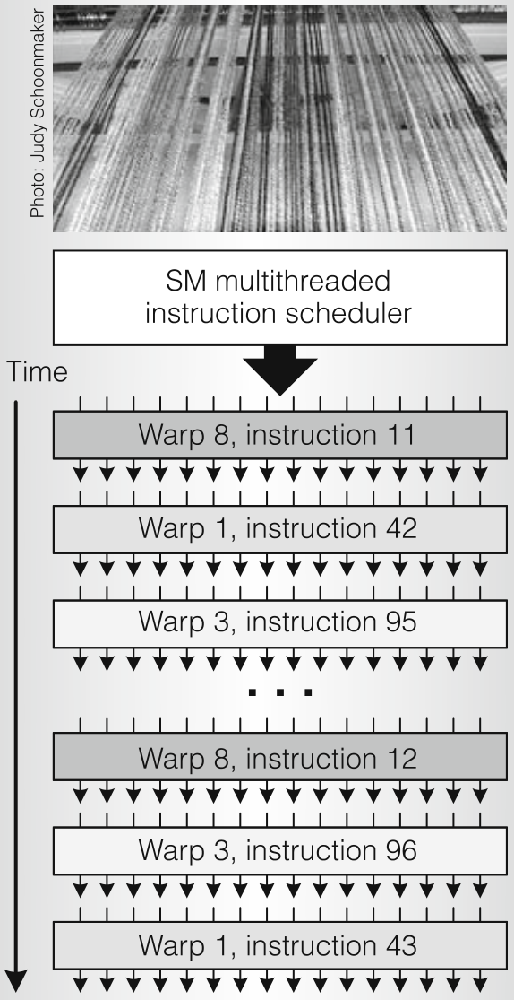

一个SM管理一个包含24个Warp的线程池，一共768个线程。组成Warp的各个线程具有相同的类型，并且都从相同的程序地址开始执行，但是它们可以自由地进行分支选择并独立执行。在每条指令发射时，SIMT多线程指令单元选择一个准备执行的Warp，并向该Warp的活动线程发出下一条指令，SIMT指令以同步方式广播给Warp的活动线程。由于独立的分支或预测，某些单个线程可以且可能是不活动的。

SM将Warp的线程映射到SP核心，每个线程使用自己的指令地址和寄存器状态独立执行。当Warp中所有32个线程都执行相同的代码路径时，SIMT处理器将取得完全的效率和性能。如果Warp的线程因数据依赖的条件分支而发散，则Warp会连续执行每个分支路径，同时禁用不在该路径上的线程，当所有路径完成时，线程会重新收敛到原始执行路径。SM使用分支同步栈（Branch Synchronization Stack）来管理发散和收敛的独立线程。分支发散只发生在一个Warp内，不同的Warp会独立执行，不管它们执行的是共同的还是不相交的代码路径。因此，与前一代GPU相比，Tesla架构在分支代码上的效率和灵活性显著提高，因为其32线程的Warp比前一代GPU的SIMD宽度要窄得多。

SIMT架构与单指令多数据（Single-Instruction, Multiple-Data，SIMD）设计有一定相似之处，其中SIMD将一条指令应用于多个数据路。区别在于SIMT将一条指令并行地应用于多个独立线程，而不仅仅是多个数据路。SIMD指令控制多个数据路的向量化执行，并向程序公开向量的宽度，而SIMT指令控制一个线程的执行和分支行为。另一方面，SIMD向量架构则要求，代码需要手动将访存加载合并为向量化执行，并手动管理发散。SIMT在性能和可编程性方面都优于纯SIMD设计，作为标量指令的SIMT没有固定的向量宽度，因此无论向量大小如何都可以全速执行；而对于SIMD而言，如果输入小于SIMD的向量宽度，则SIMD机器的运行效率就会降低。SIMT可以确保处理核心在任何时候都得到充分利用。从编程的角度来看，SIMT还允许每个线程采用自己的路径，因为分支是由硬件处理的，所以不需要手动管理向量宽度内的分支。

与以往复杂GPU架构的调度相比，独立Warp的SIMT调度方法更为简单，一个Warp由32个相同类型的线程组成，顶点着色器、几何着色器、像素片元着色器，或通用计算线程。例如，像素片元着色器处理的基本单元是2×2的像素四边形，SMC控制器将8个像素四边形组织成32个线程；类似地，SMC控制器将顶点和图元分组到Warp中，并将32个计算线程打包到一个Warp中。SIMT的设计能够使得32个线程有效地共享SM的指令取指和发射单元MT Issue（Multithreaded Instruction Fetch and Issue Unit），但为达到完全的性能，需要Warp的全部线程都处于相同的活动状态（即不存在分支）。

SM的Warp调度器（Warp Scheduler）的工作频率是1.5GHz处理器时钟频率的一半，在每个周期，它选择24个Warp中的一个来执行SIMT指令。发出的Warp指令以16个线程分为2组，使用4个处理器周期（在8个SP核心上）执行。SP核心和SFU单元能够独立地执行指令，周期交替地在它们之间发出指令，调度器可以使它们都被完全占用。

为动态混合不同类型的Warp程序实现零开销的Warp调度是一个具有挑战性的设计问题。在每个周期，计分板（scoreboard）会对每个Warp是否发射进行资格判定，指令调度器会优先考虑所有已就绪Warp的优先级，并选择优先级最高的Warp发射。优先级会考虑Warp类型、指令类型，以及对在SM中执行的所有Warp的“公平性”。

## 指令集架构

与以往执行向量化指令的GPU不同，Tesla SM执行标量指令，提供标量的指令集架构（Instruction Set Architecture，ISA）。这是因为着色器程序的指令越来越标量化，甚至很难完全占据之前的四组件向量架构结构中的两个组件；而且以前的向量化体系结构使用向量打包（将工作负载的子向量组合起来以提高效率）方式，但这会使得调度硬件和编译器变得复杂。而标量指令更简单且对编译器友好。不过，纹理指令仍然是向量化的，接受一个源坐标向量并返回一个过滤后的颜色向量。

高抽象层级的图形语言或编程语言的编译器会生成中间指令，例如DX10向量指令或PTX标量指令，然后对其进行优化并将其转换为二进制的GPU指令。PTX为编译器提供了一个稳定的目标指令集，并提供了对几代GPU的兼容性。优化器很容易将DX10向量指令展开为多个Tesla SM标量指令；而PTX标量指令优化到Tesla SM标量指令大约是一一对应的。由于中间语言使用虚拟寄存器，优化器需要分析数据依赖关系并分配真实寄存器。它消除了死代码，可行时将指令折叠在一起，并优化了SIMT分支发散和收敛点。

> 对于设备代码，NVCC先将设备代码编译为虚拟的**PTX（Parallel Thread Execution）伪汇编代码**，它是一种中间表示；再将PTX代码编译为二进制的cubin目标代码，可以由机器直接执行的二进制目标代码对应的汇编称为**SASS（Streaming Assembly）流汇编代码**，又称为低级汇编指令（Low-Level Assembly Instruction），它是基于特定GPU架构的。

Tesla SM有一个基于寄存器的指令集，包括浮点、整数、位、转换、超越、流程控制、内存加载/存储、纹理操作。

浮点和整数运算包括加、乘、乘加、最小值、最大值、比较、设置预测断言，以及整数和浮点数之间的转换；浮点指令为负数和绝对值提供了源操作数修饰符。浮点指令和整数指令还可以为每个线程的状态标志设置零、负、进位、溢出等状态，线程程序可以使用这些状态标志进行条件分支。超越函数指令包括正弦、余弦、二进制指数、二进制对数、倒数、倒数平方根。属性插值指令提供了像素属性的高效生成操作。位操作符包括左移、右移、移动、逻辑操作符。控制流包括分支、调用、返回、陷阱（trap）、栅障同步。

> 陷阱指令（trap）是处理陷阱的指令。陷阱是指计算机系统在运行中的一种意外事故，例如电源电压不稳、存储器检验出错、存储器校验出错、输入输出设备出现故障、用户使用了未定义的指令或特权指令等意外情况，使得计算机系统不能正常工作。一旦出现陷阱，计算机应当能够暂停当前程序的执行，及时转入故障处理程序进行相应的处理。在一般的计算机中，陷阱指令作为隐含指令不提供给用户使用，只有在出现故障时，才由CPU自动产生并执行。

## 内存访问

对于使用CUDA编写的计算程序，可以访问三个内存空间：局部内存（local memory），每个线程私有访问的内存空间，物理上由DRAM提供；全局内存（global memory），所有线程都可以公开访问的内存空间，物理上由DRAM提供；共享内存（shared memory），一个SM当中的一个线程协作组（Cooperative Thread Array，CTA）可以共享访问的，低延迟内存空间，物理上由SM芯片当中的高速共享存储器提供。

Tesla SM提供负责内存加载/存储的load/store指令来访问存储。内存加载/存储指令使用整数字节地址，并使用寄存器偏移地址计算，以使用编译器代码优化。分别使用内存指令load-local、store-local、load-global、store-global、load-shared、store-shared提供对局部内存、全局内存、共享内存的访问。计算程序使用快速的Barrier栅障同步指令来同步SM内部的线程，这些线程通过共享内存和全局内存相互通信。

为提高内存带宽并减少开销，局部内存和全局内存的访问指令，会将同一个Warp中单独线程的访问请求进行合并，以达到更少的内存块（memory block）访问。这些线程访问的地址必须位于同一个内存块中，并且满足地址对齐要求。合并内存请求相比每个线程单独请求能够显著提高性能。巨大的线程数量，加上对许多负载请求的支持，有助于弥补外部DRAM存储器实现加载/存储指令所带来的load-to-use延迟。

Tesla GPU架构提供高效的原子内存操作，包括整型相加、最小值、最大值、逻辑运算符、交换操作符、比较交换操作。

DRAM内存的数据总线宽度为384个引脚，划分为6个独立的分区，每个分区64个引脚，每个分区拥有物理地址空间的六分之一。内存分区单元（Memory Partition Unit）会将访存请求直接加入队列，这些分区单元负责对来自图形和计算流水线的并行阶段的数百个正在处理的请求进行仲裁，以最大化DRAM的总传输效率。这意味着内存分区单元会根据所访问DRAM内存的Bank存储体以及读写方向，对请求进行分组，同时尽可能减少延迟。内存控制器（Memory Controller）支持DRAM的各种时钟速率、协议、设备密度、数据总线宽度的规格。

GeForce 8800 GPU架构的互联网络（Interconnection Network）拥有一个集线器单元（Hub Unit），会将来自非并行的请求（PCIE、主机和命令前端、Input Assembler、显示）路由到合适的内存分区。每个内存分区都有自己ROP，因此ROP对内存的访问流量都产生于局部内存分区。然而，纹理单元和内存的加载/存储指令请求，可以发生在任何TPC和任何内存分区之间，因此需要通过互连网络来路由请求和响应。

所有计算处理引擎使用的都是虚拟空间中的虚拟地址，内存管理单元（Memory Management Unit）负责执行虚拟地址到物理地址的转换。在采用页式管理的内存系统当中，需要维护一个虚拟地址到物理地址的页表。为提高页表访问的速度，通常会包含转换后援缓冲器（Translation Lookaside Buffer，TLB）来实现快速的虚实地址转换，TLB分布在渲染引擎之间。当页表缓存缺失时，需要从局部内存中读取页表，以进行替换。

## 协作线程阵列

在图形学编程模型中，着色器的并行线程会独立执行，而在CUDA并行编程模型中，并行线程通常会进行同步、通信、共享数据、协作计算等。为管理大量可以协作的并发线程，Tesla架构引入了协作线程阵列（cooperative thread array，CTA）的概念，在CUDA术语中称为线程块（Thread Block）。CTA是一组执行相同程序代码的并发线程，它们可以协作计算结果，每个线程有一个唯一的线程ID编号。CTA的线程可以在全局或共享内存中共享数据，并且可以使用栅障指令进行同步。

> 在Tesla架构中，一个CTA可以拥有1到512个线程；而在Fermi及其之后的架构中，一个CTA可以拥有1到1024个线程。

一个SM最多可以同时执行8个CTA，具体取决于CTA对硬件资源的需求，由程序员或编译器声明CTA所需的线程、寄存器、共享内存，以及栅障的数量。当一个SM有足够的可用资源时，SMC会创建CTA并为每个线程分配TID编号。SM按照32个线程为一个Warp的粒度，SIMT地调度执行CTA的线程。

为实现粗粒度分解，一个CTA通用具有一个唯一的ID编号，并由所有的CTA组成一个计算网格。为使编译好的二进制程序能够在具有任意SM数量的GPU上兼容的运行，CTA是独立执行的，即独立于同一网格中的其它CTA块。Compute Work Distribution会将CTA动态分派到SM上执行，以均衡GPU工作负载。

## GeForce GTX 280

NVIDIA在2008年发布的GeForce 200 GPU系列中改进了Tesla架构设计，称为第二代图形学和计算统一架构（second-generation unified graphics and computing architecture），并在[NVIDIA GeForce GTX 200 GPU Architectural Overview](https://www.nvidia.com/docs/io/55506/geforce_gtx_200_gpu_technical_brief.pdf)一文中进行简述。下图是NVIDIA GeForce 280 GPU的示意图，其中省略了与图形学管线相关的部件。

基于硬件的Thread Scheduler负载并行计算线程的调度。原子Atomic硬件允许对内存执行读改写（read-modify-write）的原子访问。

与前一代GPU相比，GeForce 280 GPU的SPA性能更高，拥有更多的硬件资源。

| Chip            | TPC  | SM per TPC | SP per SM | Total SP | Thread per SM | Total Thread |
| --------------- | ---- | ---------- | --------- | -------- | ------------- | ------------ |
| GeForce 8800    | 8    | 2          | 8         | 128      | 768           | 12888        |
| GeForce GTX 280 | 10   | 3          | 8         | 240      | 1024          | 30720        |

在GeForce 200 GPU中，一个SM管理一个包含32个Warp的线程池，一共1024个线程。GPU架构是延迟容忍的，如果一个Warp中的线程由于正在等待访存或其它原因（缓存缺失、流水线忙、同步、执行依赖等）而延迟时，则GPU可以执行零成本的基于硬件的上下文切换，切换到其它可执行的Warp线程束继续执行。这种切换策略有助于隐藏内存访问延迟，使得GPU核心不会因为等待内存访问而空闲下来，从而提高整体的处理效率。

与GeForce 8 GPU相比，在GeForce GTX 200 GPU中，一个SM的局部寄存器文件（Register File）大小增大了一倍。旧的GPU遇到很长的着色器程序时，可能会导致寄存器耗尽，这会产生将数据交换到内存的需要。更大的寄存器文件允许更大更复杂的计算程序。

GeForce GTX 200 GPU的单个流处理SP核心可以使用MAD单元，在一个时钟内完成MAD和MUL的双发射（dual-issue）的几乎全速的执行，取得3Flops的计算速率；同时SFU单元可以在一个时钟内完成另一个MUL的执行。这能取得(8×3＋2×4)×3×10＝960Flops的浮点计算性能。

GeForce GTX 200 GPU的一个非常重要的新添加是双精度，即支持64位浮点计算。一个SM包含一个双精度64位浮点数学单元（Floating Math Unit），一共有30个双精度64位处理核心。双精度单元执行融合的MAD乘加操作，这是MAD指令的高精度实现，也完全符合IEEE 754R浮点规范。

此外，与上一代GPU的384位最大内存接口宽度相比，GeForce GTX 200 GPU采用512位的最大内存接口宽度，使用8个64位宽的帧缓冲接口单元（Frame Buffer Interface Unit），内存带宽显著增加。也就是说，DRAM内存的数据总线宽度为512个引脚，划分为8个独立的分区，每个分区64个引脚，每个分区拥有物理地址空间的八分之一。

# Fermi Architecture

NVIDIA在2010年发布的GF100 GPU中引入了Fermi架构，首次展示了CUDA功能，并在[Fermi GF100 GPU Architecture](https://doi.org/10.1109/MM.2011.24)一文中进行了描述。G80是NVIDIA最初设想的统一图形和计算并行处理器，GT200扩展了G80的性能和功能；而Fermi架构则采用了一种全新的设计方法来创建世界上第一个通用计算GPU。下图是NVIDIA GF100 GPU的架构示意图。

一个GF100 GPU拥有1个主机接口（Host Interface）、1个负责全局调度的GigaThread引擎、4个相互独立的图形处理器簇（Graphics Processor Cluster，GPC）、6个围绕外部的内存控制器（Memory Controller）、1个片上共享的L2读写缓存。一个GPC拥有1个光栅化引擎（Raster Engine）、4个流多处理器（Streaming Multiprocessor，SM）。一个SM拥有32个CUDA计算核心，一个GF100 GPU总共拥有512个CUDA计算核心。

主机接口Host Interface通过PCI-Express总线连接CPU和GPU。全局调度器GigaThread负责将线程块分派给SM的线程调度器。GF100 GPU拥有6个64位的内存分区，一共为384位内存接口，最多支持6GB GDDR5 DRAM内存。

一个SM拥有1个指令缓存（Instruction Cache）、2个线程束调度器（Warp Scheduler）、2个指令分派单元（Instruction Dispatch Unit）、1个包含32768个32位寄存器的寄存器文件（Register File）、32个计算核心（CUDA Core）、4个特殊函数单元（Special Function Unit）、16个加载/存储单元（LD/ST Unit）、1个总共64KB的可配置的SRAM高速存储器、1个统一缓存（Uniform Cache）、1个纹理缓存（Texture Cache）、4个纹理单元（Texture Unit）、一个变形引擎（PolyMorph Engine）。

特殊函数单元SFU执行超越指令，如正弦、余弦、倒数、平方根等。一个SFU一个时钟能够执行一个线程的一条指令，一个SM中的4个SFU需要花费8个时钟执行一个Warp的指令。SFU流水线与分派单元是解耦的，允许分派单元在SFU被占用时向其他执行单元发出命令。

在Fermi架构中，一个SM有16个加载/存储单元（LD/ST Unit），一个时钟内可以为16个线程计算源地址和目标地址，并支持将每个地址的数据加载和存储到缓存或DRAM中。每个SM都有64KB的片上高速存储器，可配置为48KB的共享内存和16KB的L1缓存，或者，也可配置为16KB的共享内存和48KB的L1缓存。

## 线程调度

Fermi架构最重要的技术之一是它的两级分布式线程调度器。在芯片级别，全局的分派引擎GigaThread可以将线程块调度到各种SM上在G80 GPU中引入的第一代GigaThread引擎可以实时管理多达12288个线程，Fermi架构在此基础上进行了改进，不仅提供了更高的线程吞吐量，而且提供了更快的上下文切换、并发内核执行、以及线程块调度。

像CPU一样，GPU通过使用上下文切换来支持多任务处理，其中每个程序使用处理器资源的时间片来执行任务。Fermi的流水线经过优化，可将程序上下文切换的成本降低到25微秒以下。Fermi架构支持并发内核执行，同一应用程序上下文的不同内核可以同时在GPU上执行。并发内核执行允许执行多个小内核的程序充分利用整个GPU资源。

SM以32个并行线程为一组进行线程调度，称为一个Warp线程束。一个SM管理一个包含48个Warp的线程池，一共1536个线程。

一个SM具有2个线程束调度器和2个指令分派单元，允许同时发出和执行2个Warp。Fermi架构的双线程束调度器选择2个Warp，并将每个Warp中的一条指令发射到一组16个计算核心上、16个加载/存储单元上、或者4个SFU单元上。于是，计算指令需要2个周期完成执行、加载/存储指令需要2个周期完成执行、超越指令需要8个周期完成。

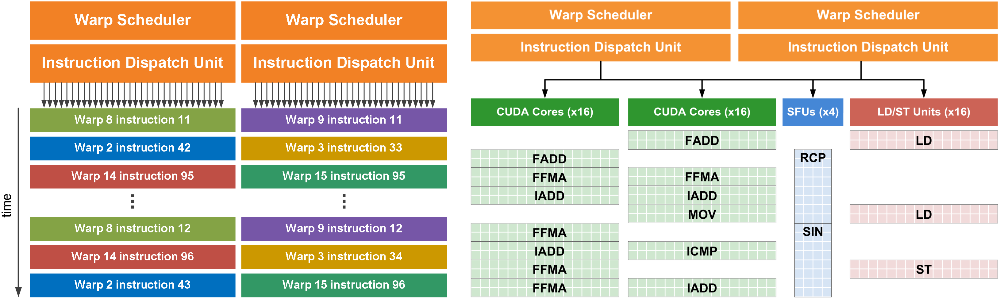

因为Warp是独立执行的，所以Fermi架构的两个调度器不需要检查彼此指令流中的依赖关系。大多数指令可以双重发射，可以并发发射两个整数指令、浮点指令，或者整数、浮点、加载/存储、SFU指令的混合指令。

## 指令集架构

每个CUDA核心都有一个完全流水线的整数算术逻辑单元（Arithmetic Logic Unit，ALU）和浮点单元（Float Point Unit，FPU），可以并行执行来自共享的指令发射单元（shared instruction issue unit）的指令，处理共享的寄存器文件中的操作数。

Fermi架构对整数ALU进行了优化，以有效地支持64位和扩展精度操作，支持包括布尔值、移位、移动、比较、转换、位字段提取、位反向插入、统计计数等各种指令。Fermi架构实现了新的IEEE 754-2008浮点标准，为单精度和双精度提供了融合乘加（Fused Multiply Add，FMA）指令。FMA是对乘加（MAD）指令的改进，能够通过最后一个舍入步骤进行乘法和加法运算，而不会损失加法的精度。FMA比单独执行操作更准确。每个计算核心可以在一个时钟内进行一次单精度融合乘加运算，在两个时钟内进行一次双精度融合乘加运算。

上一代GPU的乘加指令MAD允许在单个时钟中执行乘法与加法两个操作，MAD指令执行一个带有截断的乘法，后跟一个采用就近舍入到偶数（Round to Nearest Even）的加法。Fermi架构为32位单精度和64位双精度浮点数实现了新的融合乘加指令FMA，通过在中间阶段保留完全精度来改进乘法加。

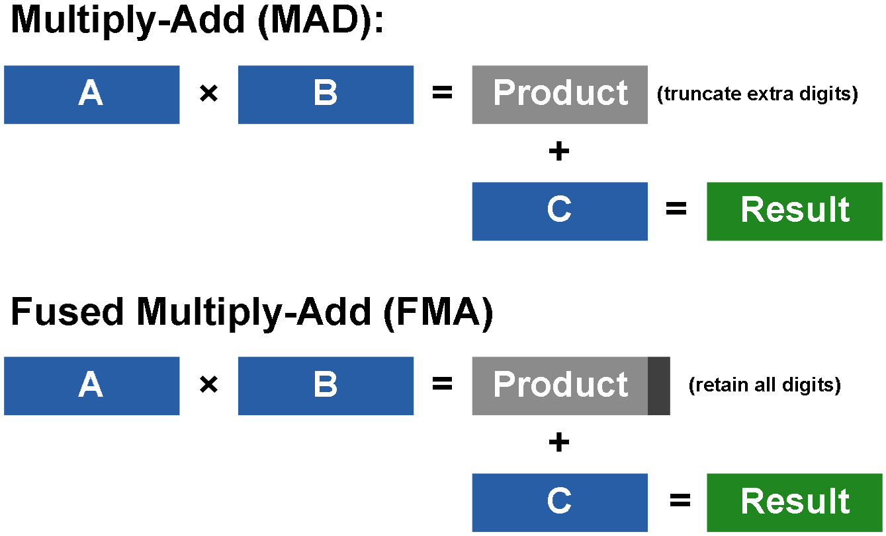

Fermi架构是支持新的并行线程执行（Parallel Thread eXecution，PTX）指令集2.0版本的第一个架构。PTX是一个低级别的虚拟机，它是为了支持并行线程处理器的操作而设计的，可以作为程序在编译过程生成的中间指令。在程序编译安装时，PTX指令会被翻译成由GPU执行的机器指令。PTX 2.0支持完整IEEE 32位浮点数标准，所有变量和指针使用统一地址空间并使用64位寻址。

Fermi架构和PTX 2.0 ISA实现了一个统一的地址空间，它统一了用于加载/存储操作的三个独立的地址空间（线程私有空间、共享内存空间、全局内存空间），将三个地址空间统一为一个连续的地址空间。Fermi的硬件地址转换单元（Address Translation Unit）自动将指针引用映射到正确的内存空间。PTX 2.0 ISA提供一组统一的加载/存储指令在这个地址空间上操作，并增加了本地、共享、全局内存的三组独立的加载/存储指令。目前，采用40位统一地址空间支持1TB的可寻址内存，加载/存储的ISA支持64位寻址，以满足未来的增长。

另一个重要的特性是，在Fermi架构的ISA指令层面上，可以使用本地硬件预测（native hardware predication）支持线程发散的管理。这种预测能够使得简短的条件代码段高效地执行，而没有分支指令的开销。所有的指令都支持硬件预测，可以根据条件代码执行或跳过每个指令。预测允许每个线程根据需要执行不同的操作，同时继续全速执行。在无法预测的位置，Fermi架构还支持带有分支语句的普通if-else结构。

## 内存访问

内存系统包含多个内存控制器（Memory Controller），架构图中显示了内存控制器和统一的L2缓存。GF100 GPU支持分页内存，支持多种页面大小，以支持高效的图形处理。并且有一个支持大帧缓冲区的40位地址空间，使用大小不同的页面大小，通过在系统内存之间共享和迁移数据来改进异构计算。

内存控制器、L2缓存和ROP单元紧密耦合，以便在整个产品系列中扩展。由于L2缓存是统一的，所有程序代码都将其用作可读写缓存，因此多个引擎（如Texture引擎和PolyMorph引擎）之间可以共享对L2缓存的请求。为了有效地支持镶嵌，PolyMorph引擎的数据保留在片上缓存中，而通常，纹理贴图足够大，它们必须从芯片外获取并通过缓存流式传输。缓存自然会通过替换旧数据来实现这一点。

GF100 GPU的Cache缓存有多个层次结构。L1数据缓存可用于寄存器溢出（register spilling）、堆栈操作、以及提高全局加载/存储操作的效率，L1缓存由共享的L2缓存备份。L2缓存是具有回写替换（write-back replacement）策略的可读写缓存，总共768KB的空间。对于图形学管线，L2缓存为顶点数据、顶点属性（位置、颜色等）、光栅化像素提供片上存储；对于CUDA计算程序，L2缓存为全局加载/存储提供了更多的片上存储。

Fermi架构是第一款支持基于纠错码（Error Correcting Code，ECC）的内存数据保护的GPU，包括寄存器文件、共享内存、L1缓存、L2缓存、DRAM内存都是ECC保护的。自然产生的辐射会导致存储在存储器中的比特发生改变，从而导致软错误。ECC技术可以在单比特软错误影响系统之前进行检测和纠正。此外，Fermi支持在芯片之间传输过程中检查数据，所有NVIDIA GPU都支持PCI-Express标准，用于CRC检查，并在数据链路层重试。

原子内存操作在并行编程中很重要，它允许并发线程正确地对共享数据结构执行读改写（read-modify-write）操作。原子内存操作广泛用于并行排序、归约操作等，而不需要锁来使线程串行执行。Fermi架构硬件中配置了更多的原子单元，并且增加了L2缓存，其原子操作的执行性能更高效。

# Kepler Architecture

NVIDIA在2012年发布的GK104 GPU芯片中引入了Kelper架构，并在[NVIDIA GeForce GTX 680](https://www.nvidia.com/content/PDF/product-specifications/GeForce_GTX_680_Whitepaper_FINAL.pdf)一文中进行了描述。统一架构的，还发布了专用于高性能科学计算的GK110与GK210架构，并在[NVIDIA's Next Generation CUDATM Compute Architecture: Kepler TM GK110/210](https://www.nvidia.com/content/dam/en-zz/Solutions/Data-Center/tesla-product-literature/NVIDIA-Kepler-GK110-GK210-Architecture-Whitepaper.pdf)一文中进行了描述。

下图是装配GK104芯片的NVIDIA GeForce GTX 680 GPU的架构示意图。

一个GeForce GTX 680 GPU拥有1个主机接口（Host Interface）、1个负责全局调度的GigaThread引擎、4个相互独立的图形处理器簇（Graphics Processor Cluster，GPC）、4个内存控制器（Memory Controller）、1个片上共享的L2读写缓存。一个内存控制器绑定128KB的L2缓存和8个ROP单元，一个完整的GeForce GTX 680 GPU拥有512KB的L2缓存和32个ROP单元。一个GPC拥有1个光栅化引擎（Raster Engine）、2个流多处理器（Streaming Multiprocessor，SMX）。一个SMX拥有192个CUDA计算核心，一个GeForce GTX 680 GPU总共拥有1536个CUDA计算核心。

下图是GK110芯片或GK210芯片的架构示意图，GK210扩展了GK110的片上资源，使每个SMX的可用寄存器文件和共享内存容量多了一倍。

一个GK110或GK210拥有1个主机接口（Host Interface）、1个负责全局调度的GigaThread引擎、6个内存控制器（Memory Controller）、1个片上共享的1536KB的L2读写缓存、15个流多处理器（Streaming Multiprocessor，SMX）。

GK110或GK210旨在提供快速的双精度计算性能，以加速专业HPC计算的工作负载。一个SMX拥有192个单精度计算核心、64个双精度计算核心、32个特殊函数单元、32个加载/存储单元。每个单精度计算核心都具有完全流水线的浮点和整数算术逻辑单元。Kepler同样支持完整的IEEE 754-2008标准的单精度和双精度算法，包括融合的乘加运算FMA。

## 线程调度

Kepler架构的非凡性能的关键之一是下一代SM设计，称为SMX，其包含几个重要的架构变化。SMX以32个并行线程为一组调度线程，称为一个Warp。一个SMX管理一个包含64个Warp的线程池，一共2048个线程。

一个SMX包含4个线程束调度器（Warp Scheduler）、8个指令分派单元（Instruction Dispatch Unit），一个线程束调度器拥有2个指令分派单元。这允许一个SMX同时发射和执行4个Warp，并能够在一个时钟为一个Warp调度两条指令。与Fermi架构中不允许双精度指令与其他指令配对不同，GK110或GK210允许双精度指令与其他指令配对。同时，因为硬件计算核心数目的增多，调度可以将一条指令发射到192个单精度计算核心上、64个双精度计算核心上、32个加载/存储单元上、或者32个SFU单元上。于是，几乎所有指令在硬件资源不被其它指令占用的情况下，都可以在1个时钟内完成。

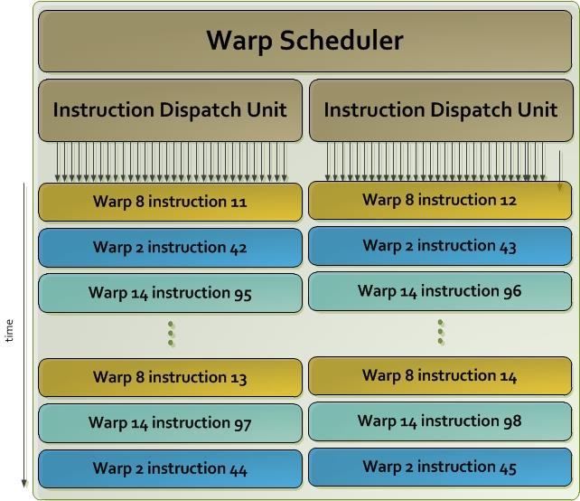

Fermi架构和Kepler架构的调度器都包含相似的硬件单元来处理调度功能，包括(a)长延迟操作（例如，纹理操作和加载指令）的寄存器计分板（scoreboard）；(b)线程束Warp之间决策调度（例如，在具有资格的候选中选择最优的Warp）；(c)线程块调度（例如，GigaThread调度引擎）。然而，Fermi架构的调度器还包含一个复杂的硬件阶段，用于防止数学数据路径本身的数据危害。多端口寄存器计分板会跟踪任何尚未准备好有效数据的寄存器，依赖检查器会根据计分板分析完成解码的大量Warp指令的寄存器使用情况，以确定哪些指令具有发射资格。

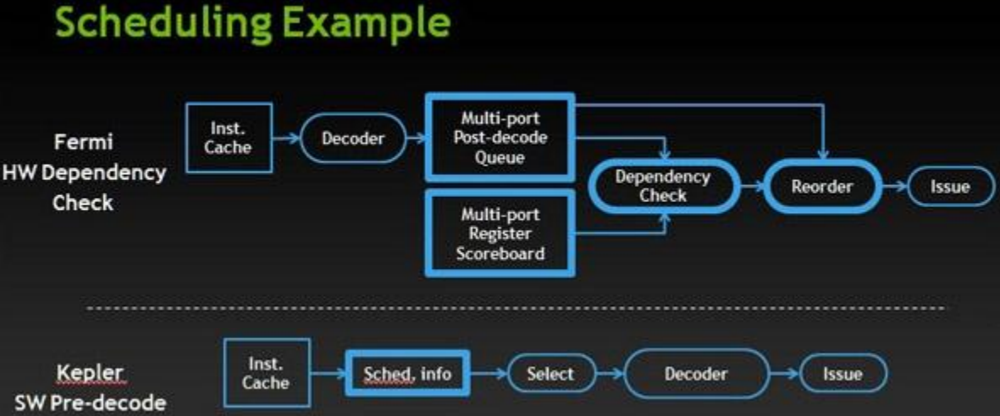

对于Kepler架构，NVIDIA意识到由于这些信息是确定性的（数学管线的延迟不是可变的），编译器可以预先确定指令何时准备发出，并在指令本身中提供这些信息。这使得能够用一个简单的硬件替换几个复杂且功耗高的硬件，该硬件提取预先确定的延迟信息，并使用该信息在Warp调度阶段屏蔽掉没有发射资格的Warp线程束。

## 指令集架构

为了进一步提高性能，Kepler架构实现了一个新的Shuffle指令，它允许Warp中的线程共享数据。使用Shuffle指令，Warp中的线程可以从Warp中的其他线程以几乎任何可以想象的排列方式读取值。以前，在Warp中的线程之间共享数据需要使用共享内存，并使用单独的存储和加载指令完成。Shuffle提供了优于共享内存的性能优势，因为该指令会将存储和加载操作在一个步骤中执行；Shuffle还可以减少每个线程块所需的共享内存数量，因为在Warp级别交换的数据永远不需要放在共享内存中。

## 内存访问

在GK110中，一个线程最多可以访问的寄存器数量增加到256个（实际上是255个），而GK210则允许一个线程最多访问512个寄存器。GK210允许应用程序更容易地利用每个线程的更多寄存器数量，而不会牺牲每个SMX可以并发容纳的线程数量。例如，在GK110上使用128个寄存器线程的CUDA内核可能有2048个并发线程，但由于寄存器限制，一个SMX只能并发执行512个线程，从而限制了可用的并行性。在这种情况下，GK210会自动将并发性提高一倍，这有助于覆盖算术和内存延迟，从而提高整体效率。

Kepler架构的内存层次结构与Fermi相似，此外，Kepler GK110还支持编译器定向使用的额外的只读数据缓存（Read-Only Data Cache），如下所示。

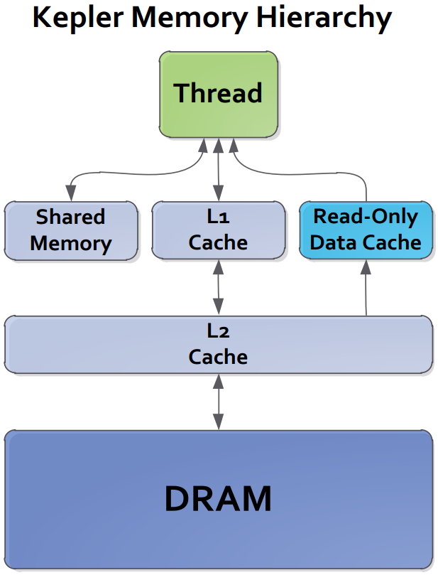

除L1缓存之外，Kepler架构还引入了一个48KB的缓存，用于存储在函数运行期间已知为只读的数据。在Fermi架构中，这个缓存只能由Texture单元访问，专业程序员发现，通过将数据映射为纹理来显式地通过此路径加载数据是有利的，但这种方法有许多限制。在Kepler架构中，NVIDIA决定让SM能够直接访问该只读缓存以进行一般的加载操作。使用只读路径是有益的，因为它减少了共享内存/L1缓存路径的负载和占用。只读路径的使用可以由编译器自动管理，也可以由程序员显式管理，可以通过\_\_ldg()内部函数显式地使用此路径。

在Kepler GK110/GK210 GPU中，还引入了GPUDirect技术，以支持远程直接内存访问（Remote Direct Memory Access，RDMA），并允许第三方设备，例如无限带宽（InfiniBand，IB）适配器、网卡（Network Interface Card，NIC），以及直接访问同一个系统内多个GPU设备上的内存。该技术可以消除不必要的内存副本，显著降低CPU开销，并显著减少MPI发送和接收消息到GPU内存的延迟。它还减少了对系统内存带宽的需求，并释放GPU的DMA引擎以供其他CUDA任务使用。

## 动态并行暨内核嵌套

在CPU和GPU的异构计算系统中，使应用程序中的大量并行代码能够有效地完全在GPU内运行，可以提高可扩展性和性能。GK110和GK210引入了动态并行，允许GPU自己生成新的工作负载、同步结果、通过专用硬件控制调度，所有这些都无需CPU参与。也就是说，在GK110和GK210中，任何核函数都可以启动另一个核函数，并且可以创建必要的流或事件，并管理处理额外工作所需的依赖关系，而无需与主机CPU交互。

这种架构创新使开发人员更容易创建和优化递归和数据依赖的执行模式，并允许更多的程序直接在GPU上运行，然后可以释放系统CPU来执行其他任务，或者可以将系统配置为功能较弱的CPU来执行相同的工作负载。

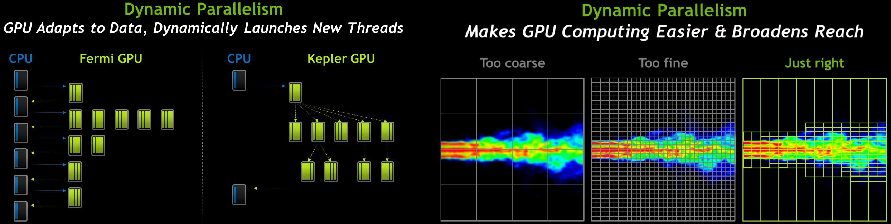

动态并行允许在GPU上实现更多种类的并行算法，包括具有不同并行数目的嵌套循环，串行控制任务线程的并行化，或者卸载到GPU的简单串行控制代码，以促进应用程序并行部分的数据局部性。由于内核能够基于中间的GPU结果启动额外的工作负载，程序员可以智能地平衡工作负载，将大部分资源集中在需要最多处理能力或与解决方案最相关的问题区域上。一个例子是动态地为数值模拟设置网格，通常网格单元集中在变化最大的区域，需要对数据进行昂贵的预处理。

## Hyper-Q

Fermi架构支持从不同CUDA流启动核函数的16路并发，但最终这些流都被多路复用到同一个硬件工作队列（work queue）中。而GK110和GK210通过支持Hyper-Q功能，增加了CPU和GPU中的CUDA工作分发器（CUDA Work Distribution）之间的连接总数（工作队列），允许32个同时进行的由硬件管理的连接。Hyper-Q是一种灵活的解决方案，允许来自多个CUDA流，多个消息传递接口的MPI进程，甚至来自一个进程中的多个线程的连接。

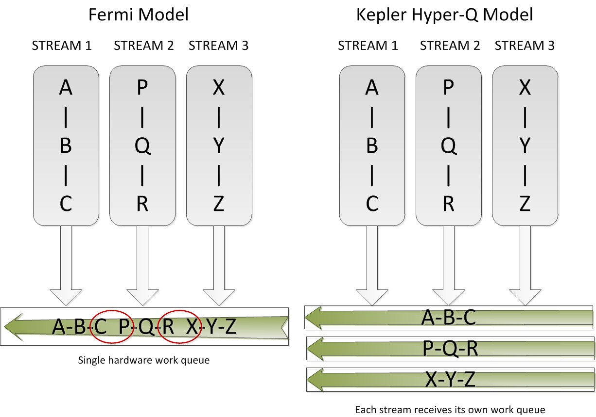

每个CUDA流都在自己的硬件工作队列中进行管理，流间依赖关系得到优化，一个流中的操作将不再阻塞其他流，从而使流可以并发执行，而无需专门定制启动顺序以消除可能的错误依赖关系。

Hyper-Q在基于MPI的并行计算机系统中提供了显著的优势。传统的基于MPI的算法通常是为了在多核CPU系统上运行而创建的，分配给每个MPI进程的工作量也相应地进行了划分，这可能导致单个MPI进程没有足够的工作来完全占用GPU。虽然多个MPI进程共享一个GPU一直是可能的，但这些进程可能会因为错误的依赖而成为瓶颈。Hyper-Q消除了这些错误的依赖关系，极大地提高了跨MPI进程共享GPU的效率。

# Maxwell Architecture

NVIDIA在2014年发布的GM204 GPU芯片中引入了Maxwell架构，并在[NVIDIA GeForce GTX 980](https://www.techpowerup.com/gpu-specs/docs/nvidia-gtx-980.pdf)一文中进行了描述。下图是装配GM204芯片的NVIDIA GeForce GTX 980 GPU的架构示意图。

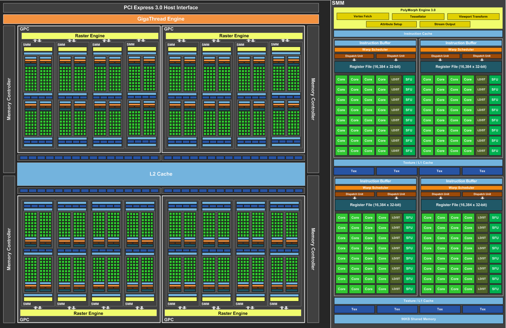

一个GeForce GTX 980 GPU拥有1个主机接口（Host Interface）、1个负责全局调度的GigaThread引擎、4个相互独立的图形处理器簇（Graphics Processor Cluster，GPC）、4个64位的内存控制器（Memory Controller）、1个片上共享的L2读写缓存。一个内存控制器绑定512KB的L2缓存和16个ROP单元，一个完整的GeForce GTX 980 GPU总共拥有256位的内存接口，以及2048KB的L2缓存和64个ROP单元。

一个GPC拥有1个光栅化引擎（Raster Engine）、4个流多处理器（Streaming Multiprocessor，SMX）。一个SMM拥有128个CUDA计算核心，一个GeForce GTX 980 GPU总共拥有2048个CUDA计算核心。

在Maxwell架构中，一个SMM拥有1个指令缓存（Instruction Cache）、被划分为4个不同的包含32个CUDA核心的处理块（Processing Block），每个处理块都有自己的专用资源用于指令缓冲和调度。一个SMM包含4个线程束调度器（Warp Scheduler）、8个指令分派单元（Instruction Dispatch Unit）、128个CUDA计算核心。一个线程束调度器拥有2个指令分派单元，这允许一个SMM同时发射和执行4个Warp，并能够在一个时钟为一个Warp调度两条指令。

在Maxwell架构中，一个SMM拥有96KB的专用的共享内存，而L1缓存功能则与纹理缓存功能共享同一个物理高速缓存。

# Pascal Architecture

NVIDIA在2016年发布的GP100芯片中引入了Pascal架构，专用于高性能科学计算，并在[NVIDIA Tesla P100 GPU](https://images.nvidia.com/content/pdf/tesla/whitepaper/pascal-architecture-whitepaper.pdf)一文中进行了描述。下图是NVIDIA GP100 GPU的架构示意图。

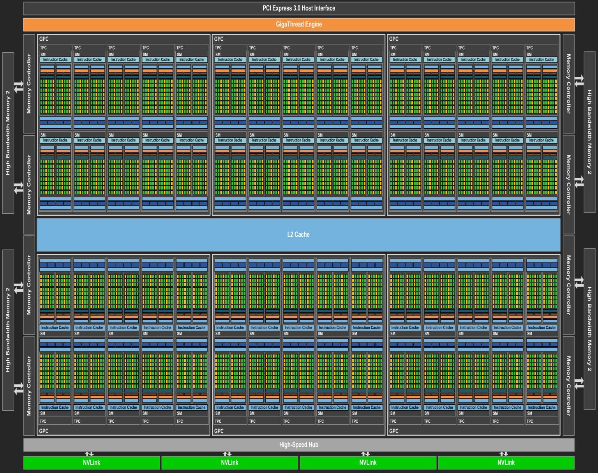

一个GP100 GPU拥有1个主机接口（Host Interface）、1个负责全局调度的GigaThread引擎、6个相互独立的图形处理器簇（Graphics Processor Cluster，GPC）、8个512位的内存控制器（Memory Controller）、4个高速带宽内存（High Bandwidth Memory，HBM2 DRAM）堆栈单元、1个片上共享的L2读写缓存。一个内存控制器绑定512KB的L2缓存，一个HBM2 DRAM单元由2个内存控制器进行控制；一个完整的GP100 GPU总共拥有4096位的内存接口，以及4096KB的L2缓存。

一个GPC拥有5个纹理处理器簇（Texture Processor Cluster，TPC），一个TPC拥有2个流多处理器（Streaming Multiprocessor，SM）。一个SM拥有64个CUDA单精度计算核心，一个GP100 GPU总共拥有3840个CUDA单精度计算核心。一个GP100拥有60个SM单元，而Tesla P100 GPU则拥有56个SM单元。

在Pascal架构中，一个SM拥有1个指令缓存（Instruction Cache）、被划分为2个不同的包含32个CUDA核心的处理块（Processing Block），每个处理块都有自己的专用资源用于指令缓冲和调度。一个SM包含2个线程束调度器（Warp Scheduler）、4个指令分派单元（Instruction Dispatch Unit）、64个CUDA单精度计算核心。一个线程束调度器拥有2个指令分派单元，这允许一个SM同时发射和执行2个Warp，并能够在一个时钟为一个Warp调度两条指令。

在GP100 GPU架构中，一个SM拥有32个CUDA双精度计算核心（FP64），是CUDA单精度计算核心（FP32）数量的一半。与以前的GPU架构一样，GP100支持完全符合IEEE 754 2008标准的单精度和双精度算法，包括支持FMA融合乘加操作和对非规范化值的全速支持。同时，CUDA单精度计算核心也支持处理16位的指令和数据，理论上FP16运算吞吐量是FP32运算吞吐量的两倍。

在Pascal架构中，一个SM拥有64KB的专用的共享内存，一个SM上的线程块最大可使用32KB的共享内存。另外，L1缓存功能则与纹理缓存功能共享同一个物理高速缓存，用于充当内存访问的合并缓冲区，在将数据传递给Warp之前收集Warp线程所请求的数据。

## HBM2内存堆栈

近年来，许多使用GPU加速的应用程序对数据的需求大大增加，需要更高的DRAM带宽需求，GP100 GPU是第一款使用第二版高速带宽内存（HBM2）的GPU加速卡。HBM2从根本上改变DRAM封装和连接到GPU的方式，能够显著提高DRAM带宽。

与传统GDDR5 GPU板设计中需要围绕GPU的众多独立内存芯片不同，HBM2包含一个或多个内存芯片的垂直堆栈，内存芯片是通过微导线连接起来的，这些微导线由硅通孔和微凸点构成。然后使用无源硅中间层（passive silicon interposer）来连接内存堆栈和GPU芯片。HBM2堆栈、GPU芯片、无缘硅中间层的组合封装在一个55mm×55mm的BGA封装中。

HBM2能够提供更高的内存容量和内存带宽，支持每个堆栈4个或8个DRAM芯片，每个DRAM芯片最多支持8GB。在GP100 GPU中，每个HBM2的每个堆栈的带宽为180GB/sec。一个GP100 GPU连接4个HBM2 DRAM堆栈，2个512位的内存控制器连接到一个HBM2堆栈，以获得有效的共计4096位宽的HBM2内存接口。在最初版本中，GP100 GPU配备4个4芯片的HBM2堆栈，总共有16GB的HBM2内存。

在GP100 GPU中也支持GPUDirect技术，能够直接访问同一个系统内多个GPU设备上的内存，通过PCIE从源GPU内存读取数据并将数据写入目标网卡内存，从而使RDMA带宽增加一倍。将GPUDirect的带宽翻倍对于许多用例非常重要，尤其是深度学习。事实上，深度学习机器的GPU与CPU的比例很高，因此GPU与IO快速交互而不回到CPU进行数据传输是非常重要的。

## NVLink高速互连

高性能计算集群的节点通常使用多个GPU，如今，一个节点最多可使用8个GPU，在多处理系统中，强大的互连非常有价值。NVLink是NVIDIA为GPU加速计算而开发的新型高速互连技术，能够显著提高GPU到GPU通信性能，以及GPU访问主机内存的性能。使用NVLink连接的GPU，程序可以直接在所连接的另一个GPU内存上执行，也可以在本地内存上执行，并且内存操作保持正确。

NVLink采用NVIDIA的新型高速信号互连（NVIDIA's new High-Speed Signaling Interconnect，NVHS）。一个连接（Link）用于连接两个处理器（GPU-GPU连接或者CPU-GPU连接），一个连接包含2条子连接（Sub-Link），用于负责2个方向的数据传输，一个子连接包含8条物理链路，每个物理链路以20Gb/sec的速率进行数据传输。于是，一个连接支持40GB/sec的双向带宽速率。

一个处理器支持多个连接，多个连接能够组合成一个Gang连接，以实现处理器之间更高带宽的连接。NVIDIA GP100 GPU中的NVLink最多支持4个连接，能取得最大的聚合带宽为160GB/sec。

在GP100 GPU的物理设计上，一个GP100包含2个400针脚的高速连接器（High Speed Connector），其中一个连接器用于打开/关闭模块的NVLink信号，另一连接器个用于供电、控制信号、PCIE读写。

Tesla P100加速卡可以安装在更大的GPU载体板上，GPU载体板与其他P100加速器或PCIE控制器进行相应的连接。由于与传统GPU板相比，P100加速器的尺寸更小，因此可以轻松构建包含比以往更多GPU的服务器。通过NVLink提供的额外带宽，GPU与GPU之间的通信将不会受到PCIE带宽的限制，从而为GPU集群提供更高的聚合带宽。

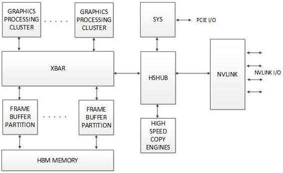

在GPU架构接口层面，NVLink控制器通过另一个称为高速集线器（High-Speed Hub，HSHUB）的模块与GPU内部进行通信。HSHUB可以直接访问GPU之间的交叉连接（crossbar），以及其他的系统元素，例如高速复制引擎（High-Speed Copy Engine，HSCE）。HSCE可以用来在峰值NVLink速率下将数据移入和移出GPU设备。

# Volta Architecture

NVIDIA在2017年发布的GV100芯片中引入了Volta架构，专用于高性能科学计算，并在[NVIDIA Tesla V100 GPU](https://images.nvidia.com/content/volta-architecture/pdf/volta-architecture-whitepaper.pdf)一文中进行了描述。下图是NVIDIA GV100 GPU的架构示意图。

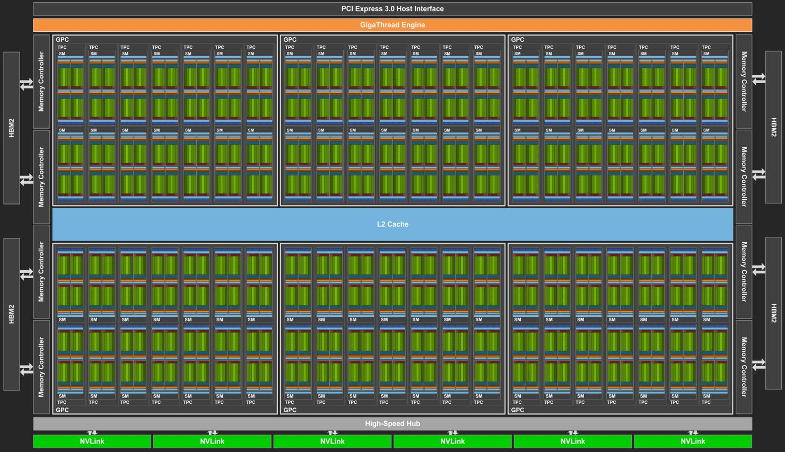

一个GV100 GPU拥有1个主机接口（Host Interface）、1个负责全局调度的GigaThread引擎、6个相互独立的图形处理器簇（Graphics Processor Cluster，GPC）、8个512位的内存控制器（Memory Controller）、4个高速带宽内存（High Bandwidth Memory，HBM2 DRAM）堆栈单元、1个片上共享的L2读写缓存。一个内存控制器绑定768KB的L2缓存，一个HBM2 DRAM单元由2个内存控制器进行控制；一个完整的GV100 GPU总共拥有4096位的内存接口，以及6144KB的L2缓存。

一个GPC拥有7个纹理处理器簇（Texture Processor Cluster，TPC），一个TPC拥有2个流多处理器（Streaming Multiprocessor，SM）。一个GV100 GPU总共拥有5376个CUDA单精度计算核心、5376个CUDA整型计算核心、2688个CUDA双精度计算核心、672个Tensor Core张量核心。

在Volta架构中，一个SM拥有1个L1级指令缓存（L1 Instruction Cache）、被划分为4个不同的处理块子分区（Processing Block Sub Partition），每个处理块都有自己的专用资源用于指令缓冲和调度。一个处理块子分区拥有1个新的L0级指令缓存（L0 Instruction Cache）、1个线程束调度器（Warp Scheduler）、1个指令分派单元（Instruction Dispatch Unit）、1个包含16384个32位寄存器的寄存器文件（Register File）、16个FP32核心、16个INT32核心、8个FP64核心、2个用于深度学习矩阵乘法的新型混合精度的张量核心（Tensor Core）。每个处理块子分区都拥有新硬件L0指令缓存器，提供比之前GPU中指令缓存更高的效率。

在Volta架构中，一个SM中的共享内存和L1数据缓存共用同一个物理高速缓存，并能配置最高96KB的共享内存容量。

与之前Pascal等架构的GPU不同，Volta架构的GV100 GPU包含独立的FP32核心和INT32核心，这允许在全吞吐量下同时执行FP32操作和INT32操作，同时也增加了指令分派的吞吐量。许多应用程序都会执行指针运算（整数内存地址计算）和浮点计算的内部循环，这将受益于FP32和INT32指令的同时执行。流水线循环的每次迭代都可以更新地址（INT32核心进行指针运算）为下一次迭代加载数据，同时在FP32核心中处理当前迭代的单精度计算。

相比与GP100 GPU，采用Volta架构的GV100 GPU还有一些其它方面的改进。

例如，融合乘加FMA运算的指令发布延迟也减少了，在Volta上只需要4个时钟，而在Pascal上需要6个时钟。

例如，高速带宽内存（HBM2）技术，一个HBM2堆栈使用4个内存芯片，一个GV100 GPU总共4个HBM2堆栈，最大16GPU的GPU内存，在4个堆栈上提供900GB/sec的峰值内存带宽。

例如，第二代NVLink技术，一个连接（Link）用于连接两个处理器（GPU-GPU连接或者CPU-GPU连接），一个连接包含2条子连接（Sub-Link），用于负责2个方向的数据传输，一个子连接包含8条物理链路，每个物理链路以25Gb/sec的速率进行数据传输。于是，一个连接支持50GB/sec的双向带宽速率。一个GPU支持更多的6条NVLink连接，总共支持300GB/sec的带宽速率。

## 独立线程调度

Volta架构的GV100是首款支持线程独立调度的GPU，即调度的粒度下降到一个线程级别，而不只是一个Warp线程束级别的粒度，从而可以实现程序中并行线程之间的细粒度同步和协作。

Pascal等早期架构以SIMT方式执行由32个线程组成的Warp线程束。一个Warp的32个线程之间共享一个程序计数器，并使用一个活动掩码（active mask）来指定该Warp的哪些线程在给定时间内是活动的，而另一些线程则是非活动状态的。这意味着不同的执行路径会使一些线程处于非活动状态，从而将Warp不同代码部分的执行给串行化，这时会将当前的活动掩码保存，直到Warp重新收敛，通常在发散部分的末端，恢复所保存的活动掩码，线程再次运行在一起。

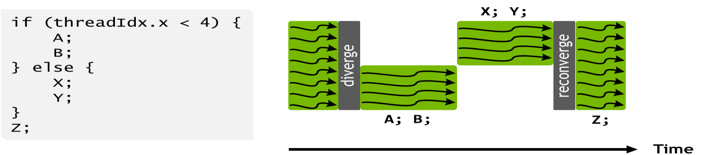

Pascal等早期架构的SIMT执行模型，通过减少跟踪线程状态所需的资源数量和积极地重新聚合线程，以最大化并行性和效率。然而，这会导致一个Warp内线程执行的发散和收敛，不同代码路径串行执行，导致同一个Warp中的不同路径的线程不能相互发送信号或交换数据，并且更细粒度的使用锁或互斥锁的算法很容易导致死锁，这取决于竞争来自于哪个Warp线程束。

Volta架构在所有线程之间实现相等的并发性，它通过维护每个线程的调度资源和执行状态（包括程序计数器PC和调用堆栈S）来实现这一点，而Pascal等早期架构仅由每个Warp维护这些资源，如下图所示。

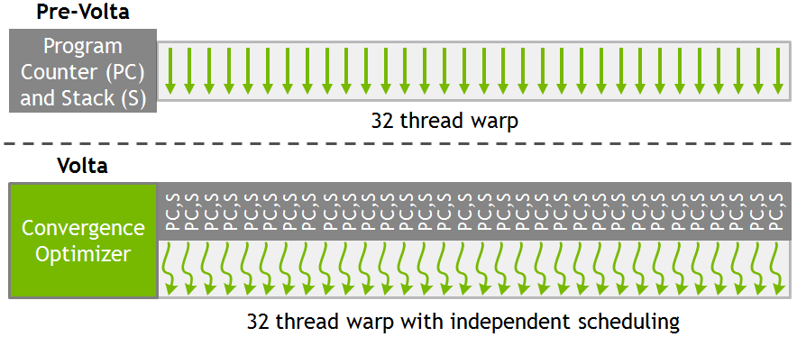

Volta架构的独立线程调度允许GPU放弃任何线程的执行，或者是更好地利用执行资源，或者是允许一个线程等待另一个线程产生的数据。为最大限度地提高并行效率，Volta架构包括一个调度优化器（Scheduler Optimizer），它决定如何将来自同一个Warp的活动线程分组到SIMT单元中。这具有更大的灵活性，可以允许线程在低于Warp的粒度上（即协作组）发散和重新收敛，而且收敛优化器（Convergence Optimizer）仍然会将执行相同代码的线程分组在一起并行运行，以获得最大效率。需要注意的是，执行仍然是SIMT模式，即在任何给定的时钟，CUDA核心对所有活动线程执行相同的指令。

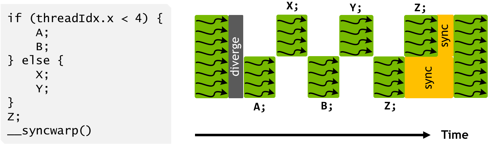

Volta架构的独立线程调度允许来自不同分支的语句交错执行，这允许执行细粒度并行算法，其中Warp内的线程可以同步和通信，例如使用\_\_sync_warp()函数使得同一个Warp中的线程进行同步。

此外，Volta架构提出多进程服务（Multi-Process Service，MPS）功能，可为共享GPU的多个应用程序提供更高的性能和隔离。典型的多应用程序共享GPU的执行是通过时间切片实现的，即每个应用程序在授予另一个应用程序访问权限之前获得一段时间的独占访问权限。而Volta架构的MPS通过允许多个应用程序同时共享GPU执行资源来提高GPU的总体利用率，使得多进程服务可以更好的适配到云厂商进行多用户租赁。

## Tensor Core

在使用Volta架构的GV100 GPU中，NVIDIA设计了新的专用于矩阵乘法计算的张量核心（Tensor Core），用于深度学习任务中提供训练大型神经网络。张量核心的计算硬件，以及它的数据路径都是定制设计的，可以显著提高浮点计算的吞吐量。

每个张量核心执行4×4矩阵的D＝A×B＋C乘加操作，其中输入矩阵A和B都是FP16精度的矩阵，中间乘积结果为全精度结果，累加矩阵C和D是FP16或FP32精度的矩阵。这些操作包含M×N×K＝4×4×4＝64次乘法，以及16×4＝64次加法，故在一个时钟内，一个Tensor Core能够执行64个混合精度的FP16/FP32的浮点FMA操作，或者执行128个单独的浮点操作。

一个Tensor Core在一个时钟能够执行64个混合精度的FP16/FP32的浮点FMA操作，或者执行128个单独的浮点操作；一个SM拥有8个Tensor Core张量核心，所以一个SM在一个时钟能够执行512个FMA浮点操作，或者执行1024个单独的浮点操作。

于是，在一个NVIDIA GV100 GPU中，其Tensor Core张量核心能够提供大约1024×2×7×6×1530MHz÷1T≈125TFlops的浮点计算峰值性能。与Tesla P100上使用标准FP32操作所取得的10.6TFlops计算性能相比，Tesla V100上的Tensor Cores可提供高达12倍的浮点数计算峰值性能。

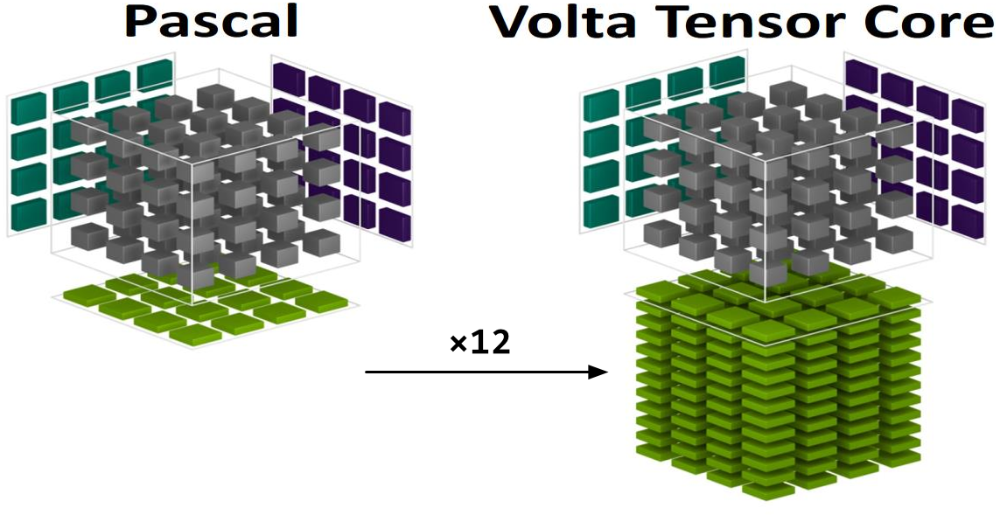

Volta架构的张量核心可以在CUDA 9.0及更高的版本中访问，其暴露为线程束级别的矩阵操作（Warp-Level Matrix Operation）的API接口，该API提供专用的矩阵加载（matrix load）、矩阵乘法（matrix multiply）、累加（accumulate）、矩阵存储（matrix store）操作。在CUDA层面提供的Warp线程束接口中，会假定M×N×K＝16×16×8的矩阵数据由一个线程束的所有32个线程持有。

## SM的硬件细节

NVIDIA并未公开内存体系的详细描述，这里只是针对GPU架构中的相关硬件单元的硬件机制的猜测。以GV100为例，一个SM拥有1个可配置的96KB的共享内存，并且计算单元被划分为4个处理块子分区（SMSP），一个处理块子分区拥有1个线程束调度器（Warp Scheduler）、1个指令分派单元（Instruction Dispatch Unit）、16384个32位寄存器、16个INT单元、16个FP32单元、8个FP64单元、8个LD/ST单元、2个Tensor Core单元。需要注意的是，一些小核心例如GV102、GA102等，一个处理块子分区SMSP只具有4个LSU单元。

一个线程块被调度到一个SM上执行，一个Warp被调度到一个处理块子分区上执行，一个Warp的指令是GPU调度执行的最小单位，会经过取指、译码、发射、分发等阶段。进行调度的硬件是Warp调度器，进行分发的硬件是指令分派单元。

处理块子分区上的Warp调度器，会选择一个具有执行资格的Warp发射执行其一条指令。这条指令对于Warp中的所有线程而言都是相同的，不会存在任何差异，所以只需要一个硬件单元（Warp调度器）即可。一个Warp中的线程之间的唯一差异，即是不同线程拥有不同的编号，从而会影响访存的地址。而这种差异的线程编号，是存储在每个线程的特殊寄存器当中的。

被Warp调度器发射的一条Warp指令，会经由指令分派单元给分派到实际的物理硬件单元上并行执行。每个硬件单元为一个线程执行指令，这时才会根据每个线程自己的特殊寄存器，用到线程自己的标识编号以及相关地址，才会体现出每个线程之间的差异。需要注意的是，由于每种硬件单元的数目不同，故一个Warp的32个线程的某条指令的执行，可能需要多个cycle周期才能完成，虽然该指令在一个周期内被调度器发射。

例如，由于FP32单元只有16个，故一个Warp的单精度浮点计算指令需要2个cycle周期才能执行完成，先执行0\~15线程，再执行16\~31线程。再例如，由于LSU单元只有8个，故一个Warp的内存指令需要4个cycle周期才能执行完成，先执行0\~7线程，再执行8\~15线程，再执行16\~23线程，再执行24\~31线程。即使访问同一地址的内存指令可以利用广播机制，或访问连续地址的内存指令可以产生合并访存，这也是下游硬件的特性作用；对于拥有8个LSU单元的处理块子分区而言，仍然需要至少4个cycle才能为全部32个线程提供服务。

一个Warp的内存指令，会经由MIO（Memory Input Output）队列，被分派到LSU单元上，并被LSU单元的流水线执行。这些指令涉及设备全局内存、局部内存、共享内存，操作涉及加载、存储、原子操作，以及L1TEX单元的归约等。此外，LSU还会发射执行特殊寄存器读（S2R）指令、洗牌（shuffle）指令、CTA级别的栅障指令。值得注意的是，在启用L1TEX缓存和L2缓存的情况下，所有对全局内存和局部内存的访问指令，都会经过L1TEX缓存单元和L2缓存单元。

分派到LSU单元的内存指令会异步执行。通常情况下，LSU单元内部会包含AGU（Address Generating Unit）单元，专门用于根据内存指令的操作数和寻址模式计算出有效地址，这个地址是要访问的内存地址。有效地址会被交给LSU单元，并生成相应的内存访问请求。一个LSU单元可以在一个时钟周期内为一个线程计算一个源地址和目标地址，并支持将源地址数据搬运到目标地址，指令所搬运的数据量与指令类型、指令位宽、硬件数据总线位数等因素有关。

实际上，一个处理块子分区的Warp调度器在调度一条内存指令时，会生成对LSU流量的一个Request请求，该请求由LSU单元处理。在LSU单元为一个Warp的一定数目的线程计算完成源地址和目标地址之后，会生成若干个Wavefront并分配给下游硬件串行执行。具体Wavefront的个数取决于每个线程的访存量，以及下游硬件一个时钟周期所能提供的内存事务的数据量。例如，全局内存指令和局部内存指令的下游硬件是设备内存控制器，共享内存指令的下游硬件是共享内存控制器等。

LSU单元是通过缓冲区实现的，包括加载缓冲区和存储缓冲区，加载缓冲区和存储缓冲区通常是基于FIFO结构实现的。加载缓冲区会暂存加载指令的地址和所加载的数据，并将加载数据写入寄存器文件，而存储缓存会暂存存储指令的地址和要存储的数据，并协调与内存系统的通信，将存储数据写回到内存当中。

对于设备的全局内存而言，主设备存储器（Device Memory）、L2缓存（L2 Cache）、L1缓存（L1 Cache），在每个时钟周期（设备主存储器的时钟周期，而非处理块子分区的时钟周期）能够提供最多128位（32字节）的带宽，称为一次内存事务（Memory Transaction）。

对于设备的共享内存而言，每个bank存储体在每个时钟周期（共享内存存储器的时钟周期，而非处理块子分区的时钟周期）能够提供32位（4字节）的带宽，连续的32位（4字节）数据会被分配给连续的bank存储体。但需要注意的是，如果从Warp调度器的时钟周期（也即处理块子分区的时间周期）考虑，在诸如GV100、GA100、GV102、GA102等核心上，一个SM上的共享内存的出口带宽为128Byte/cycle，而在TU102核心上，一个SM上的共享内存的出口带宽为64Byte/cycle。

# Turing Architecture

NVIDIA在2018年发布的TU102芯片和TU104芯片中引入了Turing架构，并在[NVIDIA Turing GPU Architecture](https://images.nvidia.com/aem-dam/en-zz/Solutions/design-visualization/technologies/turing-architecture/NVIDIA-Turing-Architecture-Whitepaper.pdf)一文中进行了描述。下图是NVIDIA TU102 GPU的架构示意图。

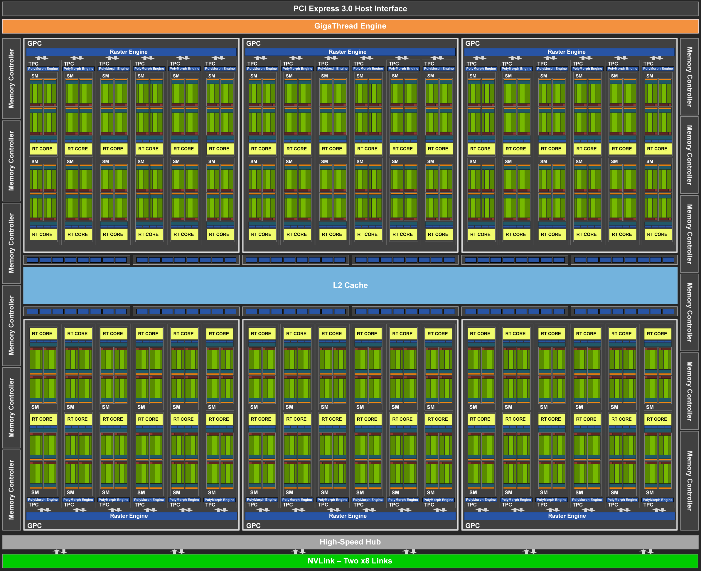

一个TU102 GPU拥有1个主机接口（Host Interface）、1个负责全局调度的GigaThread引擎、6个相互独立的图形处理器簇（Graphics Processor Cluster，GPC）、12个内存控制器（Memory Controller）、1个片上共享的L2读写缓存。一个内存控制器绑定512KB的L2缓存，一个完整的TU102 GPU总共拥有6144KB的L2缓存。

一个GPC拥有6个纹理处理器簇（Texture Processor Cluster，TPC），一个TPC拥有2个流多处理器（Streaming Multiprocessor，SM）。一个TU102 GPU总共拥有4608个CUDA单精度计算核心、4608个CUDA整型计算核心、576个Tensor Core张量核心。

在Turing架构中，一个SM拥有1个光线追踪核心（Ray Tracing Core，RT Core）、2个FP64核心（图中未显示）、被划分为4个不同的处理块子分区（Processing Block Sub Partition），每个处理块都有自己的专用资源用于指令缓存和调度。一个处理块子分区拥有1个新的L0级指令缓存（L0 Instruction Cache）、1个线程束调度器（Warp Scheduler）、1个指令分派单元（Instruction Dispatch Unit）、1个包含16384个32位寄存器的寄存器文件（Register File）、16个FP32核心、16个INT32核心、2个第二代张量核心（Tensor Core）。

在Turing架构中，一个SM中的共享内存和L1数据缓存共用同一个96KB的物理高速缓存，并能配置最高64KB的共享内存容量。

在Turing架构中，第二代张量核心Tensor Core增加了对INT8和INT4精度的支持。

# Ampere Architecture

NVIDIA在2020年发布的GA100芯片中引入了Ampere架构，专用于高性能科学计算，并在[NVIDIA A100 Tensor Core GPU Architecture](https://images.nvidia.com/aem-dam/en-zz/Solutions/data-center/nvidia-ampere-architecture-whitepaper.pdf)一文中进行了描述；之后又发布了GA102芯片，用于图形学渲染和游戏行业，并在[NVIDIA Ampere GA102 GPU Architecture](https://www.nvidia.com/content/PDF/nvidia-ampere-ga-102-gpu-architecture-whitepaper-v2.pdf)一文中进行了描述。下图是NVIDIA GA100 Full GPU的架构示意图。

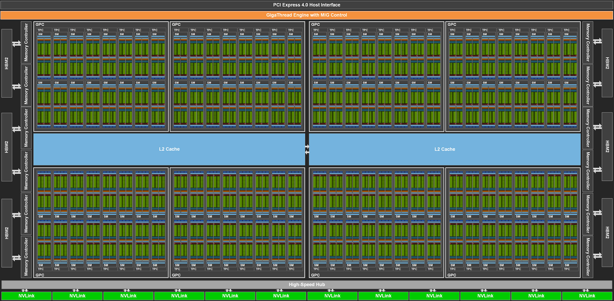

一个GA100 Full GPU拥有1个主机接口（Host Interface）、1个负责全局调度的GigaThread引擎、8个相互独立的图形处理器簇（Graphics Processor Cluster，GPC）、12个512位的内存控制器（Memory Controller）、6个高速带宽内存（High Bandwidth Memory，HBM2 DRAM）堆栈单元、2个片上共享的L2读写缓存。一个GPC拥有8个纹理处理器簇（Texture Processor Cluster，TPC），一个TPC拥有2个流多处理器（Streaming Multiprocessor，SM）。而在A100 Tensor Core GPU中，只包含10个内存控制器，提供5120位的内存带宽，并且只包含108个SM。

在Ampere架构中，一个SM拥有1个L1级指令缓存（L1 Instruction Cache）、被划分为4个不同的处理块子分区（Processing Block Sub Partition），每个处理块都有自己的专用资源用于指令缓存和调度。一个处理块子分区拥有1个L0级指令缓存（L0 Instruction Cache）、1个线程束调度器（Warp Scheduler）、1个指令分派单元（Instruction Dispatch Unit）、1个包含16384个32位寄存器的寄存器文件（Register File）、16个FP32核心、16个INT32核心、8个FP64核心、1个第三代张量核心（Tensor Core）。

在Ampere架构中，一个SM中的共享内存和L1数据缓存共用同一个192KB的物理高速缓存，并能配置最高164KB的共享内存容量。

此外，为进一步支持硬件加速的多进程服务器（MPS），Ampere架构支持多实例GPU架构（Multi-Instance GPU，MIG），可以将A100划分为多达7个GPU实例，以实现最佳利用率，从而有效地扩展对每个用户和应用程序的访问。MIG功能将单个GPU划分为多个GPU分区，称为GPU实例，每个实例的SM在整个内存系统中都有独立和隔离的路径，片上交叉端口（on-chip crossbar port）、L2缓存Bank存储体、内存控制器、DRAM地址总线都被唯一地分配给单个实例。

## 内存访问

在Ampere架构中，再一次对HBM2内存进行了改进，NVIDIA A100 GPU包含40GB的快速HBM2 DRAM内存。内存被组织为5个HBM2堆栈，每个堆栈有8个内存芯片，并且A100的HBM2提供1215MHz的数据速率（DDR），一个A100 GPU完整能够提供1555GB/sec的内存带宽。

NVIDIA A100 GPU包含40MB的L2缓存，被分成2个分区，以支持更高的带宽和更低的延迟内存访问。一个L2缓存分区进一步被划分为40个L2缓存片（L2 Cache Slice），一个L2缓存片具有512KB的空间，一个内存控制器关联8个L2缓存片。一个L2缓存分区会在本地缓存所访问的数据，以便直接连接到该分区的GPC中的SM进行访问。硬件缓存一致性（hardware cache-coherence）能够在整个GPU上为CUDA编程模型提供支持，应用程序将自动利用A100新的L2缓存的带宽和延迟优势。

Ampere架构支持一个新的异步复制指令load-global-store-shared，在CUDA 11.0中提供支持，能够直接从全局内存（通常是从DRAM和L2缓存当中）加载数据到SM上的共享内存，绕过中间的L1缓存，同时避免为传输数据分配中间临时寄存器，避免寄存器文件的往返读写以节省SM内部带宽。而在Volta架构上，想要将数据从全局内存加载到共享内存，需要先使用load-global指令将数据通过L1缓存加载到寄存器文件，然后使用store-shared指令将数据从寄存器文件传输到共享内存中，最后在使用数据时再使用load-shared指令将数据从共享内存加载到多线程的寄存器中。

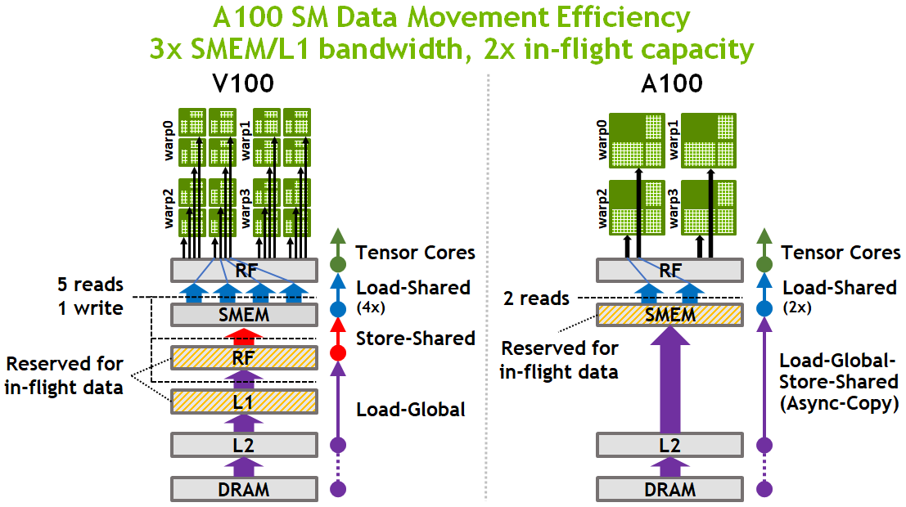

同时Ampere架构支持一个新的异步栅障指令，它与异步复制指令一起工作，以启用高效的数据访问流水线，从而保证A100 SM不间断的数据流，以保持L2缓存不断被使用。NVIDIA A100 GPU增加了SM数量和更强大的张量核心，从而提高了从DRAM和L2缓存获取数据所需的速率；为满足张量核心，A100实现了由5个HBM2堆栈组成的内存子系统，带宽为1555GB/sec，并提供了40MB的L2缓存空间；为充分利用L2缓存容量，A100改进了缓存管理控制，通过最大限度地减少对内存的回写并将重用的数据保存在L2缓存中，以减少冗余的DRAM流量，确保缓存中的数据得到更有效的使用。

异步栅障与普通的单阶段栅障的不同之处在于，线程到达异步栅障的Arrive通知与Wait等待其他线程到达异步栅障的操作是分开的，这允许线程执行与屏障无关的其他操作，从而提高执行效率，更有效地利用等待时间。异步栅障允许线程表明它的数据已经准备好，然后继续进行独立的操作，延迟等待，从而减少空闲时间。这是一种称为流水线的异步处理形式，通常用于隐藏高延迟操作，如内存负载（异步复制）。

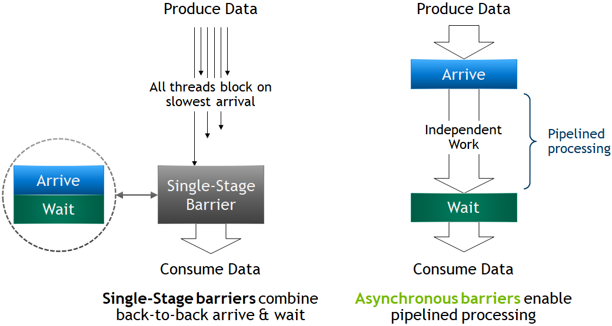

在Ampere架构中，程序员能够对L2缓存进行管理，以控制指定数据是否驻留在L2缓存中。当CUDA内核反复访问全局内存中的数据区域时，这些数据可以被认为是持久驻留的（persisting），而如果数据只被访问一次，则可以认为这样的数据是流式的（streaming）。从CUDA 11.0开始，具有8.0计算能力的设备（如A100）有能力影响L2缓存中数据的持久性，并留出一部分L2缓存用于持久数据访问，从而允许对全局内存进行更高带宽和更低延迟的访问。深度学习领域的工作负载特别依赖于持久驻留的数据访问。例如，许多LSTM网络中的循环权值可以在L2中持久化，并在GEMM操作之间重用。

A100允许以1/16的增量（2.5MB）为持久访问预留出L2缓存空间，持久访问将优先使用这个L2缓存的预留部分。对全局内存的正常或流式访问只能在L2未被持久访问时使用。L2缓存的持久性可以使用CUDA流或CUDA图来设置。数据在L2缓存中的驻留可以通过一个基于地址范围的窗口来管理，该窗口指定一个地址范围，所有读写访问都将在L2中持久缓存。内存操作本身不需要注释。其它等更详细的使用方式可以在NVIDIA的CUDA编程指南中查阅。

Ampere架构支持第三代NVLink技术和NVSwitch技术。在NVLink中，一个连接（Link）用于连接两个处理器（GPU-GPU连接或者CPU-GPU连接），一个连接包含2条子连接（Sub-Link），用于负责2个方向的数据传输，一个子连接包含4条物理链路（而不是之前的8条），每个物理链路以50Gb/sec的速率进行数据传输。于是，一个连接支持50GB/sec的双向带宽速率。一个GPU支持更多的12条NVLink连接，总共支持600GB/sec的带宽速率。每个A100中的12条NVLink连接允许多种配置，可以高速连接到其他GPU和交换机。

## Tensor Core

在Ampere架构中，第三代张量核心Tensor Core增加了对FP16、BF16、TF32、FP64、INT8、INT4、Binary等所有数据类型精度的支持。一个Tensor Core在一个时钟能够执行M×N×K＝8×4×8＝256个混合精度的FP16/FP32的浮点FMA操作，或者执行512个单独的浮点操作。又或者，一个Tensor Core在一个时钟内能够执行16个FP64精度的浮点FMA操作，或者执行32个单独的浮点操作。

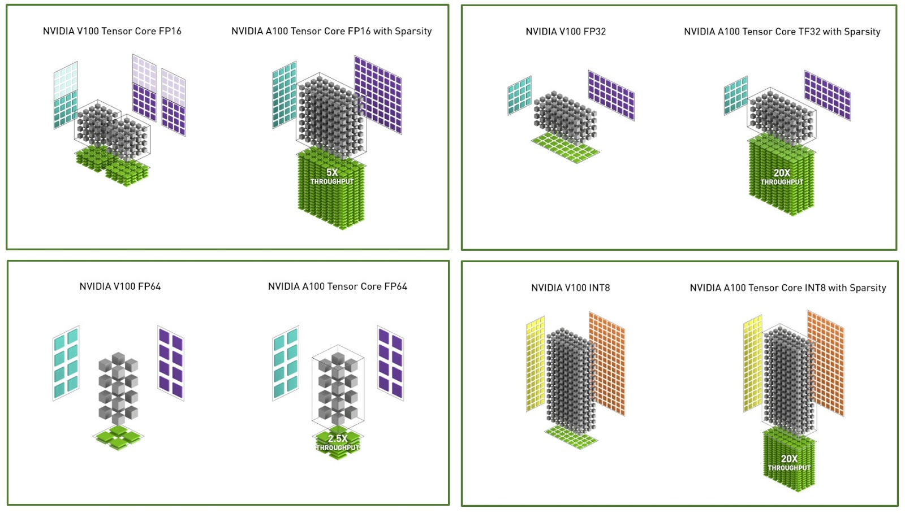

在Ampere架构中，张量核心支持三种新的BF16精度、TF32精度、FP64精度。其中，BF16精度是IEEE标准FP16精度的替代品，BF16和FP16都能够成功地以混合精度模式训练神经网络，在不进行超参数调整的情况下与FP32精度的训练结果相匹配。而由于目前AI训练的默认精度是FP32，没有使用张量核心加速，于是Ampere架构引入了TF32精度，使得使用TF32精度的AI训练默认使用张量核心，而无需用户手动使用。非Tensor Core的操作会继续使用FP32的数据路径，而TF32则会使用张量核心读取FP32数据并使用与FP32相同的范围，但内部使用与FP16相同的精度，然后产生标准的IEEE FP32输出。

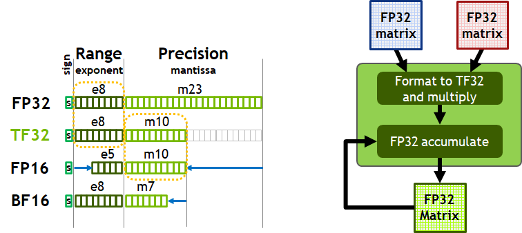

在Ampere架构中，第三代Tensor Core张量核心允许数据在所有32个线程上共享，而Volta架构的张量核心上只允许数据在8个线程上共享。这种共享是指，在Tensor Core指令层面，每个线程的私有寄存器被设计为可共享资源，通过一种透明的共享机制，允许Tensor Core张量核心能够访问并充分利用这些寄存器资源，实现更高效的矩阵计算。跨多个线程共享数据可以减少向Tensor Core张量核心提供数据的寄存器文件的带宽，还可以减少从共享内存加载到寄存器文件中的冗余数据量，从而节省共享内存的带宽和寄存器文件的存储。执行的寄存器文件访问比V100少2.9倍。图中MAC是指乘法累加（Multiply Accumulate）操作。

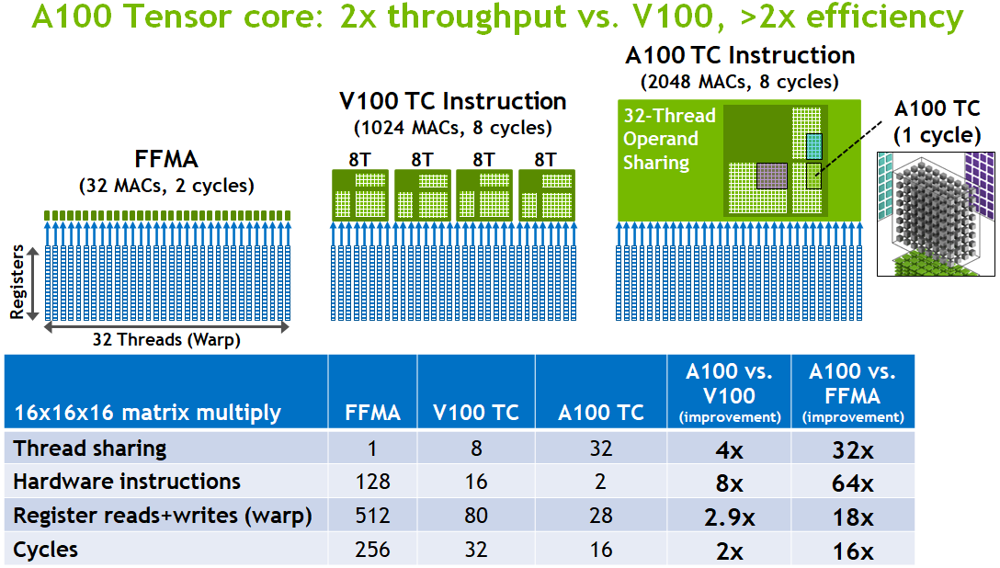

为进一步提高效率，A100 Tensor Core指令将每条指令的矩阵乘法的K维数相对于V100增加了4倍，使得在计算矩阵乘法运算时，A100发出的指令比V100少8倍。对于16×16×16矩阵乘法，A100使用增强的16×8×16的张量核心的Warp级指令，共需2条硬件指令；而V100使用8×8×4的张量核心的Warp级指令（被翻译成4条底层MMA硬件指令），共需16条硬件指令。注意，图中的Cycle时钟按照一个SM的处理块子分区计算。
