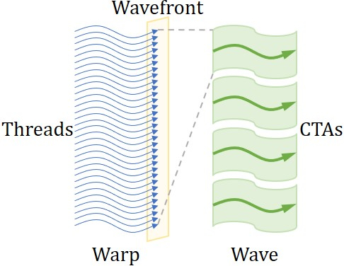
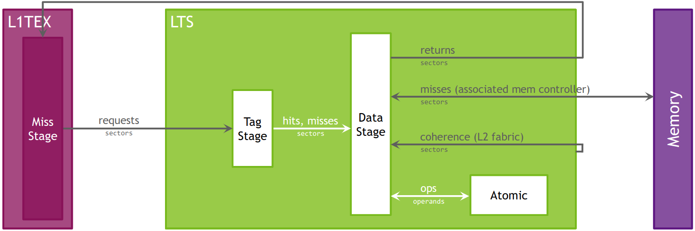
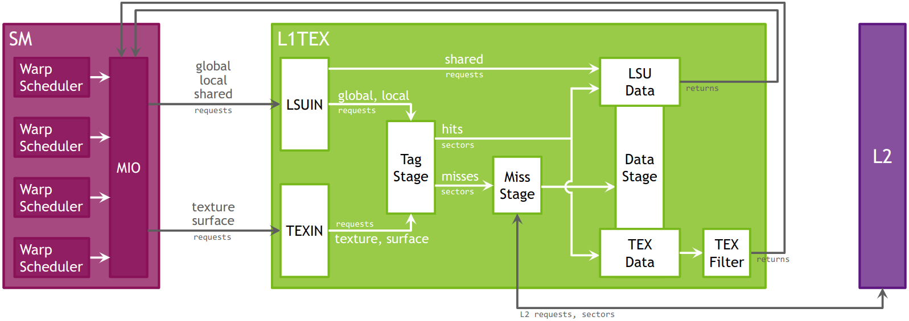
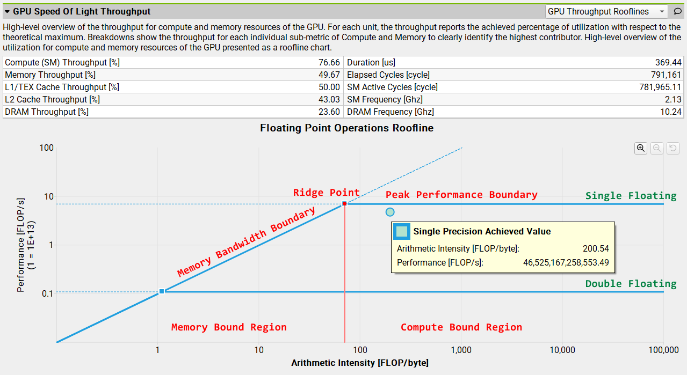
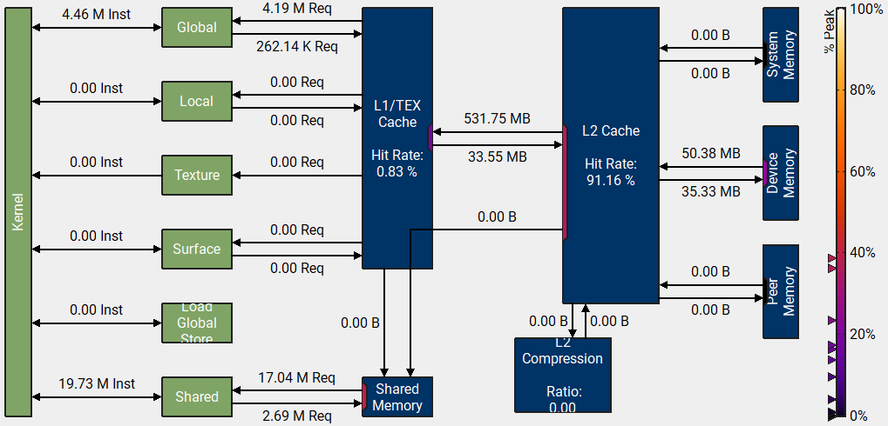

# NVCC编译阶段

GPU应用程序的源文件由标准C++主机代码和GPU设备函数代码混合组成。NVCC（NVIDIA CUDA Compiler）编译套件的CUDA编译轨迹（compilation trajectory）指示如何编译GPU程序、链接运行时库、生成可执行文件，涉及对每个CUDA源文件的拆分（split）、预处理（preprocess）、编译（compilation）、合并（merge）。在编译阶段，需要将主机代码与设备函数代码分离，然后使用C++主机编译器编译主机代码，使用NVCC编译器和汇编器编译设备函数代码，然后将编译后的GPU函数作为富二进制映像（fatbinary image）嵌入到主机的目标文件（object file）中。在链接阶段，会添加特定的CUDA运行时库以支持SPMD例程调用，并提供显式GPU操作，例如GPU内存缓冲区的分配和主机GPU数据传输。

NVCC可接受一系列传统C++编译器选项，例如宏定义、头文件路径、库路径等，以及指示编译过程的选项。所有非CUDA编译步骤都会传递给C++主机编译器，并将NVCC的选项转换为适当的主机编译器的命令行选项。在所有平台上，会使用当前的执行搜索路径来寻找默认的主机编译器可执行文件（例如Linux平台上的gcc和g++，Windows平台上的cl.exe等），也可以使用NVCC的选项手动指定。

NVCC编译套件预定义了一些宏，例如\_\_NVCC\_\_在编译C/C++/CUDA源文件时定义，\_\_CUDACC\_\_在编译CUDA源文件时定义，\_\_CUDACC\_RDC\_\_在可重定位设备代码模式下编译CUDA源文件时定义。

编译阶段（compilation phase）是一个逻辑上的翻译步骤（translation step），来完成特定的编译功能，可以通过NVCC的命令行选项来选择。单个编译阶段仍然可以细分为更小的步骤，但这些更小的步骤只是该阶段的实现，它们依赖于NVCC所使用内部工具的功能，并且所有这些内部功能都可能会随着新版本的发布而改变。因此，只有编译阶段在各个版本中都是稳定的。尽管NVCC提供显式执行编译步骤的选项，但这些仅用于调试目的，不应在构建脚本中使用。

下表给出了NVCC可识别的文件后缀。

| 文件后缀            | 描述                                         |
| ------------------- | -------------------------------------------- |
| .cu                 | CUDA源文件，包含主机代码和设备代码           |
| .c, .cc, .cxx, .cpp | C/C++源文件                                  |
| .i, .ii             | C/C++源文件预处理后的文件                    |
| .ptx                | PTX中间汇编文件                              |
| .cubin              | 单GPU架构的CUDA设备代码的二进制文件          |
| .fatbin             | CUDA富二进制文件，可能包含多个PTX和CUBIN文件 |
| .o, .obj            | 目标文件                                     |
| .a, .lib            | 库文件                                       |
| .res                | 资源文件                                     |
| .so                 | 共享动态库文件                               |

值得注意的是，NVCC对待目标文件、库文件、资源文件之间没有任何区别，它只是在执行链接阶段时将这些类型的库文件传递给链接器。

下表给出了NVCC所支持的用于控制编译阶段的命令行选项。

| 编译阶段                                                     | 命令行选项             | 输入                    | 输出                   |
| ------------------------------------------------------------ | ---------------------- | ----------------------- | ---------------------- |
| 预处理CUDA源文件                                             | --cuda, -cuda          | .cu                     | .cu.cpp.ii             |
| 预处理C++源文件                                              | --preprocess, E        | .cu, .cpp               | 终端标准输出           |
| 生成PTX中间汇编，该步骤会抛弃.cu输入文件的主机代码           | --ptx                  | .cu                     | .ptx                   |
| 生成CUBIN二进制文件，该步骤会抛弃.cu输入文件的主机代码       | --cubin, -cubin        | .cu, .gpu, .ptx         | .cubin                 |
| 生成FATBIN富二进制文件                                       | --fatbin, -fatbin      | .cu, .gpu, .ptx, .cubin | .fatbin                |
| 生成目标文件                                                 | --compile, -c          | .cu, .cpp               | .o, .obj               |
| 生成含可重定位设备代码的目标文件；等价于--relocatable-device-code=true选项和--compile选项 | --device-c, -dc        | .cu, .cpp               | .o, .obj               |
| 生成含可执行设备代码的目标文件；等价于--relocatable-device-code=false选项和--compile选项 | --device-w, -dw        | .cu, .cpp               | .o, .obj               |
| 链接CUBIN等二进制文件和含可重定位设备代码的目标文件，生成含可执行设备代码的目标文件，可传给C++主机链接器 | --device-link, -dlink  | .ptx, .cubin, .fatbin   | a_dlink.o, a_dlink.obj |
| 链接含可重定位设备代码的目标文件，生成CUBIN二进制文件        | --device-link --cubin  | .o, .obj                | a_dlink.cubin          |
| 链接含可重定位设备代码的目标文件，生成FATBIN富二进制文件     | --device-link --fatbin | .o, .obj                | a_dlink.fatbin         |
| 构建库文件                                                   | --lib, -lib            | .cu                     | .a, .lib               |
| 生成可执行文件并执行，用于开发调试过程，由NVCC自动设置CUDA环境而无需手动指定 | --run, -run            | .cu                     | a.exe, a.out           |
| 生成可执行文件                                               |                        | .cu                     | a.exe, a.out           |

值得注意的是，除非手动指定编译阶段，否者NVCC将会编译并链接所有输入文件。

CUDA编译的工作原理如下所述。先对输入源文件进行预处理，对设备代码进行编译，生成PTX中间汇编代码或CUBIN二进制代码，并放置在FATBIN富二进制代码中。再次对输入程序进行预处理，对主机代码进行编译，并嵌入FATBIN富二进制代码，以将CUDA C++扩展转换为标准C++结构。然后，C++主机编译器将带有FATBIN嵌入的集成主机代码（synthesized host code）编译成一个主机目标文件。过程如下图所示。当主机程序执行设备函数代码（启动CUDA Kernel）时，CUDA运行时会检查所嵌入的FATBIN以获取当前GPU合适的FATBIN映像。


此处列举一个分开编译的示例，如下所示。

```c++
// kernel.cuh
#pragma once
typedef unsigned int uint32_t;
extern __global__ void scale_kernel(float *data, const float factor, const uint32_t N);
```

```c++
// kernel.cu
#include "kernel.cuh"
__global__ void scale_kernel(float *data, const float factor, const uint32_t N) {
    const uint32_t tid = blockIdx.x * blockDim.x + threadIdx.x;
    if (tid < N) data[tid] = data[tid] * factor;
}
```

```c++
// main.cu
#include <stdio.h>
#include "kernel.cuh"
int main(int argc, char *argv[]) {
    float *data;
    cudaMalloc(&data, sizeof(float) * 4096);
    scale_kernel<<<(4096 + 127) / 128, 128>>>(data, 3.14f, 4096);
    cudaFree(data);
    printf("Over!\n");
    return 0;
}
```

```shell
nvcc -dc kernel.cu -o kernel.o
nvcc -dc program.cu -o program.o
nvcc -dlink kernel.o program.o -o gpu.link.o
g++ kernel.o program.o gpu.link.o -L /path/cuda/libs -l cudart -o run
```

上述编译命令等价于下述一行命令。

```shell
nvcc kernel.cu program.cu -o run 
```

# CUDA-GDB调试

CUDA-GDB调试器用于在Linux系统上调试CUDA应用程序，它是GDB调试器的扩展，通常会随CUDA Toolkit软件包一起安装。CUDA-GDB提供一个无缝的调试环境，允许在同一应用程序中同时调试CPU代码和GPU代码，允许设置断点、单步执行CUDA应用程序，还可以检查和修改硬件上运行的任何给定线程的内存和变量。

在使用NVCC编译源代码以生成可执行程序时，使用-O0选项禁用编译器优化，使用-g选项生成主机代码的调试信息，使用-G选项生成设备代码的调试信息，使用-keep选项保持编译过程的中间文件。此外，CUDA-GDB还支持调试针对特定CUDA架构编译的核函数，例如sm_75或sm_80，而且还支持调试运行时编译的内核，称为JIT（just-in-time）即时编译。默认情况下，NVCC会针对compute_52和sm_52架构生成目标对象，可使用-gencode选项指定所需架构。

使用cuda-gdb命令进行调试，可以使用可执行文件、核心转储、进程编号作为拟调试对象。使用无参数的cuda-gdb命令可进入CUDA-GDB调试环境，键入help可查看命令手册，键入help后跟命令类别查看该类命令，键入quit或q退出调试环境。

```shell
gdb [option] executable_file
```

使用--args选项，可以在可执行文件之后为程序指定命令行参数；使用--core=COREFILE选项分析核心转储文件；使用--exec=EXECFILE选项指定可执行文件；使用--pid=PID选项指定要附加到的进程；使用--directory=DIR指定源文件搜索目录。需要注意的是，cuda-gdb不支持--tui选项开启文本用户界面。

CUDA-GDB与GDB的使用方法类似，而且对于主机代码，使用GDB原有命令即可进行调试，对于设备代码，CUDA-GDB额外提供以cuda开头的命令扩展。例如，使用info cuda threads命令可以查看CUDA线程，使用cuda thread #命令可以切换CUDA线程。在CUDA-GDB调试模式下，一些CUDA专有的常用命令如下所示，更详细命令可使用help命令查看，或键入apropos命令以查询与给定字符串相匹配的命令。

| 命令                           | 描述                                                         |
| ------------------------------ | ------------------------------------------------------------ |
| info cuda devices, cuda device | 显示可见的GPU设备；切换到给定设备                            |
| info cuda sms, cuda sm         | 显示使用的SM流多处理器；切换到给定SM流多处理器               |
| info cuda kernels, cuda kernel | 显示当前正在执行的Kernel核函数；切换到给定Kernel核函数执行   |
| info cuda blocks, cuda block   | 显示线程块；切换到给定线程块，可使用一维索引n指定，也可使用三维索引[x,y,z]指定 |
| info cuda threads, cuda thread | 显示线程；切换到给定线程，可使用一维索引n指定，也可使用三维索引[x,y,z]指定 |
| info cuda warps, cuda warp     | 显示线程束；切换到给定线程束                                 |
| info cuda lanes, cuda lane     | 显示Warp中的线程；切换到Warp中给定的线程                     |
| info cuda contexts             | 显示当前的GPU上下文                                          |
| cuda grid                      | 切换到给定线程网格                                           |

在调试CUDA程序的过程中，如果程序挂起或陷入无限循环，可使用CTRL+C手动中断应用程序，此时GPU会暂停且CUDA-GDB会出现提示，用户可自行决定检查、修改、单步执行、恢复或终止程序。此功能仅限于在CUDA-GDB调试器中运行的应用程序。

需要注意的是，CUDA Kernel核函数的调试是以一个Warp线程束为单位的，即每次单步执行都是一个Warp中的32个线程单步执行。一种特殊情况是\_\_syncthreads()栅障，CUDA-GDB会在栅障之后设置隐式的临时断点，并恢复所有线程，直到命中临时断点。当设置断点时，它会强制所有驻留的GPU线程在到达相应的PC时停滞在该位置。

调试设备函数时，只要设备函数不是内联的，用户就可以单步进入、执行、越过、退出，使用\_\_noinline\_\_说明符可以强制编译器不内联所修饰的函数。

# Nsight Compute

Nsight是NVIDIA面向开发者提供的开发工具套件，能提供深入的跟踪、调试、评测和分析，以优化跨NVIDIA GPU和CPU的复杂计算应用程序。Nsight主要包含Nsight Graphics、Nsight System、Nsight Compute三部分。在连接服务器时，可能会出现https://developer.nvidia.com/nvidia-development-tools-solutions-ERR_NVGPUCTRPERM-permission-issue-performance-counters中所提到的权限错误。

Nsight Graphics是一个用于调试、评测和分析Microsoft Windows和Linux上的图形应用程序的工具。它允许优化基于Direct3D 11，Direct3D 12，DirectX，Raytracing 1.1，OpenGL，Vulkan和KHR Vulkan Ray Tracing Extension的应程序的性能。

Nsight System给开发者一个系统级别的应用程序性能的可视化分析。所有与NVIDIA GPU相关的程序开发都可以从Nsight System开始以确定最大的优化机会。开发人员可以优化瓶颈，以便在任意数量或大小的CPU和GPU之间实现高效扩展。

Nsight Compute是一个CUDA应用程序的交互式Kernel分析器。它通过用户接口和命令行工具的形式提供了详细的性能分析度量和API调试。Nsight Compute还提供了定制化的和数据驱动的用户接口和度量集合，可以使用分析脚本对这些界面和度量集合进行扩展，以获得后处理的结果。Nsight Compute CLI提供了一个命令行分析器，其命令的可执行文件是ncu，它可以直接在命令行上打印结果或将其存储在报告文件中。

> 当Nsight Compute安装在Windows平台，而应用程序部署在Linux平台上时，可以直接使用Nsight Compute客户端远程启动Linux平台上的可执行程序。在首次远程启动时，Nsight Compute会在远程Linxu系统上安装Nsight Compute相关组件，通常会安装在/tmp/var/target/linux-desktop-glibc_2_11_3-x64/ncu路径之中。
>
> 如果要在远程Linux系统上分析复杂应用程序，或者是复杂启动方式的程序，则推荐直接在Linux系统上使用NCU命令，然后传回分析结果，再使用Nsight Comput打开。需要注意的是，此时应该使用/tmp/var/target/linux-desktop-glibc_2_11_3-x64/ncu路径的NCU命令，而不是可能存在的其它安装。

用户常规启动的CUDA应用程序进程，会基于CUDA运行时库以及CUDA驱动程序执行。当使用Nsight Compute分析应用程序时，其行为是不同的。用户在主机系统上启动Nsight Compute前端（UI或CLI），并且又在目标系统上启动实际的应用程序作为一个新进程。虽然主机系统和目标系统通常是同一台机器，但目标也可以是安装不同操作系统的远程机器。该工具将其测量库（measurement library）插入到应用程序进程中，这允许分析器拦截与CUDA驱动程序的通信。此外，当检测到内核启动时，这些库可以从GPU收集所请求的性能指标，然后将结果传送回前端。


## 并行线程模型

从高层级来看，CPU主机管理自身与GPU设备之间的资源，并将工作负载发送到设备并行执行。CUDA并行计算模型从上到下的层次结构为：网格（Grid）、线程块（Thread Block）、线程（Thread）。其中线程块又称为协作线程组（Cooperative Thread Array，CTA），每个CTA可以在任何可用的SM上进行调度，在这些SM上执行的顺序没有保证。

一个SM的CTA数量称为CTA占用率，一个SM上可容纳的CTA数量取决于CTA所需的物理资源，这些资源限制包括线程和寄存器的数量、共享内存利用率和硬件栅障等。可以在给定GPU上并发运行的CTA总数称为Wave（波），因此，Wave的大小随GPU可用SM的数量而变化，但也随内核的占用而变化。在较新的SM架构中，一个SM被划分若干个（通常是4个或2个）处理块分区（Processing Block Partition）。一个处理块分区包含自己的Warp调度器、寄存器文件、整数/浮点计算单元、内存加载/存储单元、特殊函数单元、张量核心；所有处理块分区之间共享SM的L1数据缓存、共享内存、纹理单元、RT核心。一个处理块分区管理固定大小的Warp池，在Volta架构中，池的大小是16个Warp，在Turing架构中，池的大小是8个Warp。



当启动Grid时，GPU体系结构保证CTA中的所有线程将并发地运行在同一SM上，同一个CTA内的线程之间可以使用SM提供的快速共享内存和栅障功能。CTA进一步分为多个32个线程构成的组，称为Warp线程束，如果CTA中的线程数不能被32整除，则最后一个Warp将包含剩余的线程数。

一个Warp会被分配（映射）到一个处理块分区，并且从启动到完成一直驻留在该处理块分区上。具备资格的活动Warp可以准备发射指令，这要求Warp具有已解码的指令，解析了所有输入依赖，并且函数功能单元可用。当Warp等待取指（instruction fetch）、内存依赖（访存指令的结果）、执行依赖（之前指令的结果）、同步栅障时，该Warp会停滞运行（Stall）。

## 内存层次模型

GPU的全局内存具有49位（512TB）的虚拟地址空间，这些地址空间会映射到设备物理内存（physical memory）、固定系统内存（pinned system memory）、对等内存（peer memory）。全局内存对所有线程都是可见的，对全局内存的访问会通过L1缓存和L2缓存；局部内存是线程私有的存储，用于线程本地数据，例如线程堆栈和寄存器溢出。局部内存地址由地址生成单元（Address Generate Unit，AGU）转换为全局虚拟地址。

> AGU单元的主要功能是生成访存操作的地址，在现代微处理器中，AGU负责处理load/store指令，计算出指令中所携带的地址。AGU与其他处理器单元的关系紧密。例如，AGU与ALU（算术逻辑单元）密切相关，虽然在一些处理器中AGU和ALU是分开的功能单元，但在某些情况下AGU可能会复用ALU的加法器来计算地址。AGU还与LSU（存储器接口单元）协同工作，负责将访问结果传输给AGU或协处理器。

共享内存位于SM芯片上，因此比全局内存具有更高的带宽和更低的延迟，共享内存可以在一个CTA中的所有线程之间共享。共享内存具有32个存储体（Bank），这些Bank以连续的32位字（4字节）为位宽进行交叉编址。因此，由32个不同Bank中的32个地址组成的任何32位读写请求都可以同时得到服务，从而产生的总带宽是单个请求带宽的32倍。但是，如果不同线程的内存请求的不同地址落在同一个Bank中，则会出现Bank冲突，此时访问必须串行执行。当一个Warp中的32个线程访问同一个地址时，不会产生Bank冲突，而是由一个线程负责接收数据，然后将其广播给其它线程；当多个线程写入同一个位置时，只有一个线程写入成功，哪个线程成功是未定义的。

所有GPU单元都通过L2缓存与主存储器进行通信，L2缓存在物理地址空间中工作，除提供缓存功能外，L2缓存还具有执行压缩和全局原子操作的硬件。



L1缓存通常与共享内存/数据缓存/纹理缓存共用同一个物理存储介质，接收来自SM单元的全局/局部内存请求，以及来自TEX单元的纹理/表面内存请求。这些操作访问全局内存空间中的内存，L1缓存通过L2缓存发送这些内存请求。



L1缓存和L2缓存都使用128字节的缓存行（Cache Line），而标签Tag作为缓存行的唯一键，通常是内存地址的前若干字节。如果线程访问的内存地址数据不都在同一个缓存行当中，则一个请求可能会查找多个Tag标签。扇区（Sector）是设备内存或者缓存行中的，一个对齐的32字节内存块，L1缓存和L2缓存的一个128字节的缓存行都是由4个扇区组成。如果标签存在并且所请求的扇区数据存在于缓存行当中，则扇区访问命中；而标签缺失（Tag-Miss）与标签命中数据缺失（Tag-Hit-Data-Miss）都属于未命中。

对于Volta以来的架构，对L1缓存的访问模型可简单描述。当一个SM为一个Warp执行一条局部/全局内存指令时，将向L1缓存发送一个请求（request），该请求会传递此Warp的所有参与线程的信息。基于访问模式和参与的线程，请求可能需要访问许多个缓存行以及这些缓存行中的扇区。L1缓存内部的流水线分为多个处理阶段执行。

一个Wavefront（波面）是一个周期内可以由流水线阶段处理的最大单位，如果无法在一个Wavefront中访问所有的缓存行或扇区，则会创建多个Wavefront并发送以逐个执行，也即以串行执行。一个Wavefront工作负载的可能限制包括连续内存空间的需求、可以访问的最大缓存行的数量，以及其它各种原因。然后，每个Wavefront会由L1缓存流水线执行，并获取该Wavefront所处理的扇区。这三个关键值的关系为，request:wavefront＝1:N，request:sector＝1:N，wavefront:sector＝1:N。

一个Wavefront被描述为L1缓存中一个周期一次处理的负载包（work package）的概念，因此一个请求的Wavefront数目也即是该请求所需要的时钟周期数；而每个请求的扇区数目，是所有参与线程的内存指令的访问模式的属性。例如，可能存在一个请求4个扇区的内存指令，这些扇区都在一个Wavefront中访问，也可能存在同样的请求4个扇区的内存指令，但这些扇区需要在2个或更多的Wavefront中访问。

## 指标集合

性能指标集合（Collection of Performance Metrics）是Nsight Compute的关键特性，由于存在大量可用的指标，因此通常使用一些预定义的集合或子集（set or section），用户可以根据需要自由调整，例如使用--set选项。下表中Stats是Statistics的缩写，意为统计信息。

| Identifier                    | Description                                                  |
| ----------------------------- | ------------------------------------------------------------ |
| ComputeWorkloadAnalysis       | 分析SM计算资源，包括取得的每时钟指令数（Instructions per Clock，IPC）和每个可用流水线的利用率，利用率非常高的流水线可能会限制整体性能。 |
| InstructionStats              | 执行SASS低级汇编指令的统计信息。指令混合比（instruction mix）意味着指令的类型和频率，较低的混合比意味着只依赖较少的指令流水线，而其他指令流水线未使用，使用多个流水线可以隐藏延迟并支持并行执行。 |
| LaunchStats                   | 启动内核的配置摘要，包括网格大小，网格到线程块的划分，以及执行内核所需的GPU资源。 |
| MemoryWorkloadAnalysis        | 分析内存资源。当充分利用所涉及的硬件单元（Mem Busy），耗尽这些单元之间的可用通信带宽（Max Bandwidth），或者达到发射内存指令的最大吞吐量（Mem Pipes Busy）时，内存可能会成为内核性能的限制因素。根据限制因素，使用内存图表和表格（memory chart and table）可以确定内存系统中的具体瓶颈。 |
| NUMA Affinity                 | 基于所有GPU的计算和内存距离的，非统一内存访问（Non-Uniform Memory Access，NUMA）的亲和性。 |
| Nvlink                        | NVLink利用率的高层级汇总，展示了总的发送/接收的内存空间数量，以及总体链路峰值利用率。 |
| Nvlink_Tables                 | 每个NVLink的详细属性表。                                     |
| Nvlink_Topology               | NVLink拓扑图展示了NVLink的逻辑连接，并标有发送/接收的吞吐量。 |
| Occupancy                     | 占用率是每个SM中实际的活动Warp数与可能最大的活动Warp数的比率；另一种定义是方法正在执行Warp数与硬件处理能力对应Warp数的比率。更高的占用率并不总是带来更高的性能，但是，低占用率总是会降低隐藏延迟的能力，从而导致整体性能下降。在执行期间，理论占用率和实际占用率之间的巨大差异通常表明工作负载高度不平衡。 |
| PM Sampling                   | 工作负载期间定期采样的指标的时间线视图。数据是通过多个阶段收集的，展示了工作负载行为在其运行时是如何变化的。 |
| PM Sampling: Warp States      | 工作负载期间定期采样的Warp状态，不同组的指标来自不同阶段。   |
| SchedulerStats                | 调度器发射指令的活动摘要。每个调度器维护一个可以发射指令的Warp池，池中Warp线程束数目的理论上限受启动配置（launch configuration）的限制。在每个周期中，每个调度器检查池中Warp的分配状态，也即活动线程束（Active Warp），指的是未停滞的（Not Stalled）线程束，具备发射下一条指令的资格（Eligible）。调度器从一组符合条件的Warp中选择一个Warp，并为其发射一条或多条指令。若一个周期中没有具备资格的活动Warp，则发射槽（issue slot）会被跳过，无指令发射；有许多被跳过的发射槽意味着延迟没有很好地隐藏。 |
| SourceCounters                | 源代码指标，包括分支效率和采样Warp停滞原因。在内核运行时定期对Warp停滞采样指标（Warp Stall Samping Metrics）进行采样，可以表明Warp何时停滞而无法调度。只有当调度器无法在每个周期都发射调度时，才会关注并分析Stall停滞原因。 |
| SpeedOfLight (GPU Throughput) | GPU计算资源和内存资源的吞吐量的高层级概述。吞吐量反映了相对于理论最大值的已取得的利用率百分比；Breakdown分解展示了计算和内存的每个子指标的吞吐量，以便清楚地确定最主要因素。 |
| WarpStateStats                | 分析内核执行期间的所有Warp花费周期的状态，Warp状态描述了一个Warp准备好或不能发出下一个指令。每个指令的Warp周期定义了两个连续指令之间的延迟，该值越高，就需要越多的Warp并行来隐藏这个延迟。对于每个Warp状态，图表显示了每个发出的指令在该状态下花费的平均周期数。Stall停滞并不总是影响整体性能，也不是完全可以避免的。 |

根据要收集的指标，内核可能需要重放（replay）一次或多次，因为并非所有指标都可以在一次执行中收集。因为，GPU可以同时收集的硬件（HW）性能计数器的指标数量是有限的，此外，基于补丁（patch-based）的软件（SW）性能计数器也可能会对内核运行产生很大的影响，并且会影响硬件计数器的结果。


常用重放分为内核重放（Kernel Replay）与应用程序重放（Application Replay），如图所示。此外，还可以使用cuProfilerStart()和cuProfilerStop()标记手动确定要重放的程序范围，这需要包含cuda_profiler_api.h头文件。

对于许多指标而言，它们的值会直接受当前SM和内存时钟频率的影响。例如，如果内核是应用程序中启动的第一个内核，则GPU时钟通常会较低，而之后内核执行时，GPU时钟会通常会处于更高的状态。为缓解这种不确定性，Nsight Compute尝试将GPU时钟频率限制为基本值，但这种行为对于内核分析来说可能是不利的，例如在使用外部工具固定时钟频率或分析应用程序内核行为的情况时。用户可调整--clock-control选项以指定是否应由工具固定任何时钟频率。

虽然Nsight Compute在内核重放模式中，可以保存和恢复内核每次启动时所访问的设备内存的内容，但它无法对硬件缓存的内容（如L1缓存和L2缓存）执行相同的控制，这可能会导致后续重放过程的性能可能比第一次重放过程更好或更差，因为缓存可能能够使用内核上次访问时所缓存的数据。为使硬件性能计数器的值更具确定性，Nsight Compute默认在每次重放之前刷新所有的硬件缓存，在每次重放中，内核都会访问一个干净的缓存。但是，这种行为对于性能分析来说可能是不受欢迎的，尤其是当测量重点放在大型应用程序，并且以缓存为中心指标进行收集时。在这种情况下，用户可以使用--cache-control none选项来禁用Nsight Compute刷新任何硬件缓存。

## Warp指标

此处列出与Warp线程束调度相关的指标，主要分为Warp停滞（Stall）原因和Warp未发射（Not Issued）原因。这些指标具有共同前缀，简写到表头。

| smsp\_\_pcsamp_warps_issue_stalled_XXX                       | Description                                                  |
| ------------------------------------------------------------ | ------------------------------------------------------------ |
| stalled_drain;<br/>stalled_drain_not_issued                  | 在退出（EXIT）之后，Warp运行会停滞，并等待所有未完成的内存操作完成，以便释放Warp的资源。当内核末尾有大量数据写入内存时，通常会因Warp耗尽而导致大量停滞。请确保这些存储操作的内存访问模式对于目标架构而言是最佳的，并考虑并行化数据压缩（如果适用）。 |
| stalled_barrier;<br/>stalled_barrier_not_issued              | Warp在CTA栅障等待同级Warp时停滞。大量Warp在栅障处等待通常是由于栅障前代码路径发散所致，这会导致一些Warp等待很长时间，直到其他Warp到达同步点。应尽可能将工作负载均匀地划分到线程块，如果线程块大小为512个线程或更多，考虑将其划分为更小的块，这可以增加符合条件的Warp而不会影响占用率，除非共享内存成为新的占用率限制因素。此外，尝试确定哪个栅障指令导致最多停滞，并优化在该同步点之前执行的代码。 |
| stalled_membar;<br/>stalled_membar_not_issued                | Warp在等待内存栅障时停滞。应避免执行任何不必要的内存栅障，并确保所有未完成的内存操作都针对目标架构进行了充分优化。 |
| stalled_lg_throttle;<br/>stalled_lg_throttle_not_issued      | Warp在等待局部/全局（LG）内存操作的L1指令队列变成未满（to be not full）时停滞。通常，这种停滞仅在非常频繁地执行局部/全局内存指令时发生。应该避免冗余的全局内存访问，检查动态索引数组是否在局部范围内声明，检查内核是否因寄存器压力过大而溢出以避免使用线程局部内存。如果适用，考虑将多个较小位宽的内存操作合并为更少的较大位宽的内存操作，并尝试将内存操作指令和数学指令交错执行。 |
| stalled_tex_throttle;<br/>stalled_tex_throttle_not_issued    | Warp在等待纹理内存操作的L1指令队列变成未满（to be not full）时停滞。在L1TEX流水线利用率极高的情况下，很可能导致这种停滞。尝试发射更少的纹理获取、表面加载、表面存储、解耦数学运算。如果适用，考虑将多个较小位宽的内存操作合并为更少的较大位宽的内存操作，并尝试将内存操作指令和数学指令交错执行。考虑将纹理查找或表面加载转换为全局内存查找，纹理内存每周期可以接受4个线程的请求，而全局内存可以接受32个线程。 |
| stalled_mio_throttle;<br/>stalled_mio_throttle_not_issued    | Warp在等待MIO（内存输入/输出）指令队列变成未满（to be not full）时停滞。在MIO流水线使用率极高的情况下，这种停滞原因很常见，其中包括特殊数学指令、动态分支、共享内存指令。当由于共享内存访问导致时，尝试使用更少但更宽的负载可以减轻流水线压力。 |
| stalled_math_pipe_throttle;<br/>stalled_math_pipe_throttle_not_issued | Warp在等待执行流水线可用时停滞。当所有活动Warp要在特定已超负荷的（oversubscribed）数学流水线上执行下一条指令时，就会发生这种停滞。尝试增加活动Warp的数量以隐藏现有的延迟，或尝试更改指令组合以更平衡地利用所有可用流水线。 |
| stalled_imc_miss;<br/>stalled_imc_miss_not_issued            | Warp因立即常量缓存未命中（immediate constant cache miss）而停滞。其中，立即常量被编码到SASS指令中，即c\[bank\]\[offset\]。仅在缓存未命中时，从常量内存读取会花费一次设备内存读取；否则，只会花费一次常量缓存读取。Warp中的线程对不同地址的访问是串行的，因此成本与Warp中所有线程读取的唯一地址数量成线性关系。当同一Warp中的线程仅访问几个不同的位置时，常量缓存效果最佳。如果Warp中的所有线程都访问同一位置，则常量内存可以像寄存器访问一样快。 |
| stalled_branch_resolving;<br/>stalled_branch_resolving_not_issued | Warp在等待转移目标地址（branch target address）和程序计数器更新（program counter update）时停滞。考虑使用更少的跳转/分支操作并减少控制流发散，例如减少或合并代码中的条件判断。 |
| stalled_long_scoreboard;<br/>stalled_long_scoreboard_not_issued | Warp在等待L1TEX缓存（局部、全局、表面、纹理）操作的计分板（scoreboard）依赖时停滞。寻找正在等待数据的指令以识别限制瓶颈。为减少等待访问L1TEX数据的周期数，应验证内存访问模式是否适合目标架构，尝试通过增加数据局部性（合并）或更改缓存配置来提高缓存命中率。考虑将常用数据移动到共享内存。 |
| stalled_short_scoreboard;<br/>stalled_short_scoreboard_not_issued | Warp在等待MIO（内存输入/输出）操作（而不是L1TEX操作）的计分板（scoreboard）依赖时停滞。停滞的主要原因通常是对共享内存的操作，其他原因包括频繁执行特殊数学指令（如MUFU）或动态分支（如BRX、JMX）等。请参阅内存工作负载分析部分以验证是否存在共享内存操作并减少Bank冲突。将经常访问的值分配给变量可以促使编译器使用低延迟寄存器而不是直接内存访问。 |
| stalled_dispatch_stall;<br/>stalled_dispatch_stall_not_issued | Warp在等待调度时停滞。在调度期间停滞的Warp有一条指令准备发射，但由于冲突或事件，调度器未发射该Warp。 |
| stalled_no_instructions;<br/>stalled_no_instructions_not_issued | Warp在等待被选中以进行取指时停滞，或因指令缓存未命中（instruction cache miss）而停滞。对于工作负载少于一个完整Wave的非常短的内核，大量Warp未取指的情况是比较常见。此外，如果分支跳转跳过大块汇编代码并导致指令缓存未命中，也会导致更多Warp因这个原因停滞。 |
| stalled_not_selected;<br/>stalled_not_selected_not_issued    | Warp在等待微调度器选择Warp发射时停滞。具备发射资格的Warp未被选中，是因为该时钟周期内调度器选择了其它具备资格的Warp发射。未选中的Warp数量较多通常意味着程序具有足够的Warp来弥补Warp延迟，可以考虑适当减少活动Warp的数量，以增加缓存一致性和数据局部性。 |
| stalled_selected;<br/>stalled_selected_not_issued            | Warp被微调度器选中，并发射指令。                             |
| stalled_sleeping;<br/>stalled_sleeping_not_issued            | 由于Warp中的所有线程都处于阻塞（blocked）、放弃（yielded）、休眠（sleep）状态，导致Warp停滞。减少执行的NANOSLEEP指令数，降低铁定的时间延迟，并尝试对线程进行分组使Warp中的多个线程同时休眠。 |
| stalled_wait;<br/>stalled_wait_not_issued                    | Warp在等待固定延迟的执行依赖时停滞。通常，这种停滞原因非常低，并且仅在已经高度优化的内核中显示为主要因素。尝试通过增加活动Warp的数量、重组代码或展开循环来隐藏相应的指令延迟。此外，考虑切换到较低延迟的指令，例如使用编译器的快速数学指令的选项。 |
| stalled_misc;<br/>stalled_misc_not_issued                    | 由于各种硬件原因，Warp停滞。                                 |
| stalled_warpgroup_arrive                                     | Warp在等待WARPGROUP.ARRIVES指令或WARPGROUP.WAIT指令时停滞。  |

## 屋顶线图

内核性能不仅取决于GPU的运行速度，还取决于GPU向内核提供数据的速率。典型的屋顶线图（Roofline Chart）将GPU的峰值性能和内存带宽之比称为算术强度（Arithmetic Intensity），即工作负载流量（FLOPS）和内存流量（Byte/sec）之间的比值，以更真实地表示内核所取得的性能。



内存带宽边界（Memory Bandwidth Boundary）是屋顶线图中倾斜的部分，默认情况下，此斜率完全由GPU的内存传输速率决定。峰值性能边界（Peak Performance Boundary）是屋顶线图中平坦的部分，默认情况下，该值完全由GPU的峰值性能决定。脊点（Ridge Point）是内存带宽边界与峰值性能边界的交点，将屋顶线图划分为两个区域，左侧是内存受限区域，右侧是计算受限区域。以当前实现所在的点为基准，与上方边界的距离表示性能改进的机会，越接近上方边界，性能越理想。

## 内存图表

内存图以图形和逻辑形式显示GPU内存单元的性能数据，包括传输数据大小、命中率、指令或请求数量等。如下图所示，绿色部分为逻辑单元，蓝色部分为物理单元，根据不同的GPU架构，所显示的单元会有所不同，因为并非所有GPU都具有所有单元。



内核与绿色逻辑单元之间的链接表示相应单元执行的指令（Inst）的数量，绿色逻辑单元和蓝色物理单元之间的链接表示由各自指令而发出的请求（Req）的数量。每个链路的颜色代表相应通信线路的峰值利用率，右侧图例显示不同性能下的颜色渐变。

一个单元通常共享一个公共数据端口，用于发送和接收数据，虽然共享端口的链路可能远低于其各自的峰值性能，但该单元的数据端口可能已经达到峰值。端口利用率在图表中以位于传入/传出链路的单元内的彩色梯形显示。

内存表显示各种内存硬件单元（例如共享内存、缓存、设备内存）的详细指标，如下述一些表所示，此处只解释一些重要指标，并且已在之前部分解释过且概念重复的指标之后不再解释。对于大多数表条目，可以将鼠标悬停在其上以查看底层指标名称和说明，有些条目是从其他单元格衍生而来的，它们本身不显示指标名称，而是显示相应的计算公式。


Instruction是指一个Warp实际执行的所有SASS汇编指令的总数。

Request是指对共享内存的所有请求次数的总数，在Volta架构之后，一个指令只会生成一个Request请求。

Wavefront是请求共享内存提供服务所需的波面数量，Wavefront被串行化在不同的周期内处理。

Bank Conflict是由于多个线程同时请求一个Bank中的不同地址，硬件会将冲突的内存请求拆分为多次的独立的无冲突的内存请求，从而会降低有效带宽。


Sector是指要请求的L1缓存的扇区总数，每个加载或存储请求都会访问L1缓存中的一个或多个扇区；而原子操作和归约操作会被发送到L2缓存。

Sector/Req是指所请求的L1缓存扇区数目与请求次数的比例，若Warp中活动线程的数目相同，则该比值越小，内存访问模式的效率越高。对于具有32个活动线程的Warp而言，每次访问的数据量与最优比值分别为，32位之于4，64位之于8，128位之于16；也即是，若一个线程访问32位4字节，则一个Warp共访问128字节，而一个扇区32个字节，共需要访问4个扇区，故最优情况下，每8个连续线程访问同一个扇区，扇区数目与请求次数之比应为4。较小的比值表示缓存行内存在一定程度的一致性或重叠负载，而较大的比值意味着内存访问可能未合并，从而导致内存流量增加。

Hit Rate是指所请求的L1缓存的扇区命中率，未命中的扇区需要从L2缓存中请求，从而可能会导致L2缓存扇区未命中。命中率越高意味着性能越好访问延迟越低，因为请求可以由L1缓存处理而不需要后面的阶段来处理。该指标与Tag Hit Rate指标（表中未显示）不同，不要混淆。

Byte是指需要从L1中请求的字节总数，这等于扇区数乘以32字节，因为L1缓存中的最小访问大小为一个扇区。

Sector Misses to L2是指在L1缓存上未命中从而需要从L2缓存上请求的扇区数目。


Request是指对L2缓存的所有请求次数的总数，这与L1缓存上未命中的扇区数目相关。

Hit Rate是指所请求的L2缓存的扇区命中率，未命中的扇区需要从后面的阶段进行请求，从而导致设备内存访问等情况。

Throughput是指L2缓存所达到的吞吐量，以字节/秒为单位，该数值越高，表示设备的利用率越高。


Sector是指要请求的设备内存的扇区总数。

Byte是指L2缓存和设备内存之间传输的总字节数。

Throughput是指设备内存所达到的吞吐量，以字节/秒为单位，该数值越高，表示设备的利用率越高。
