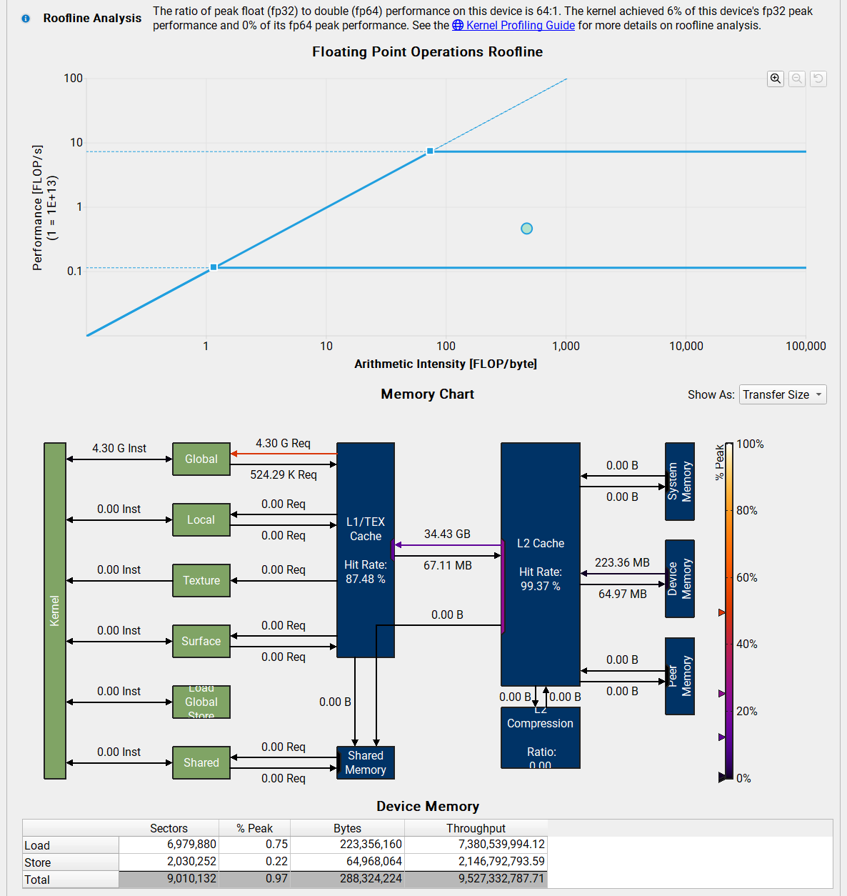
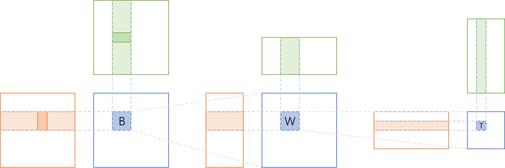
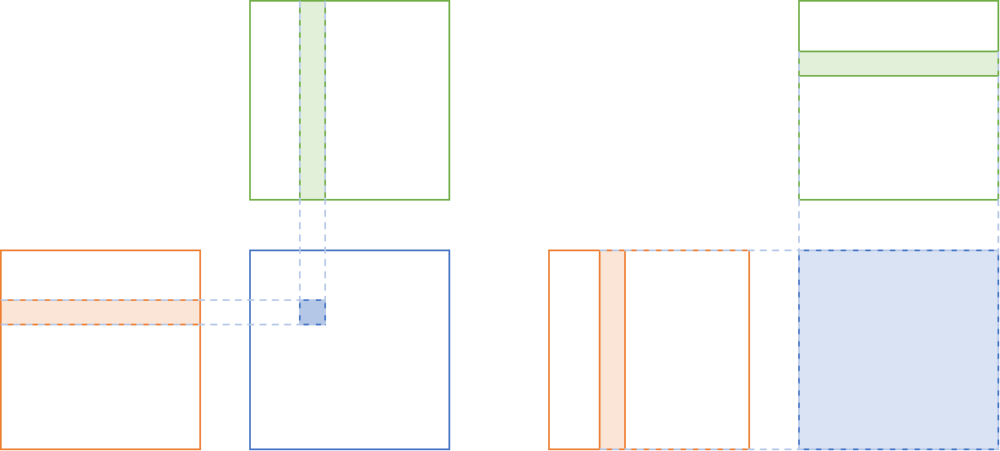
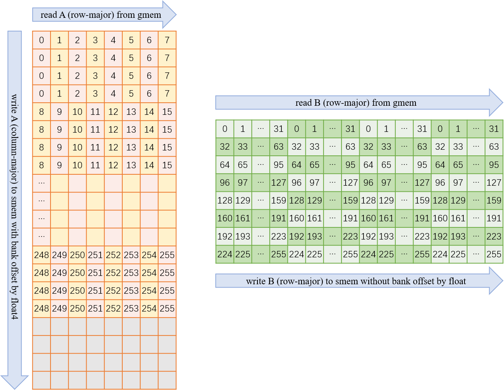
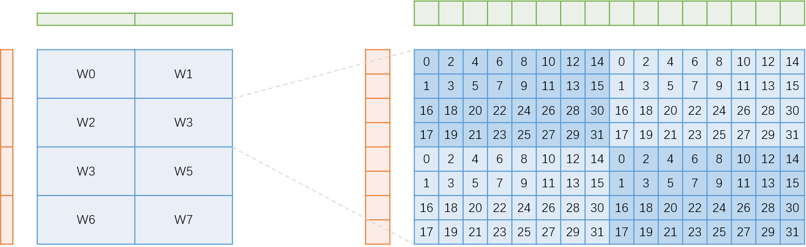
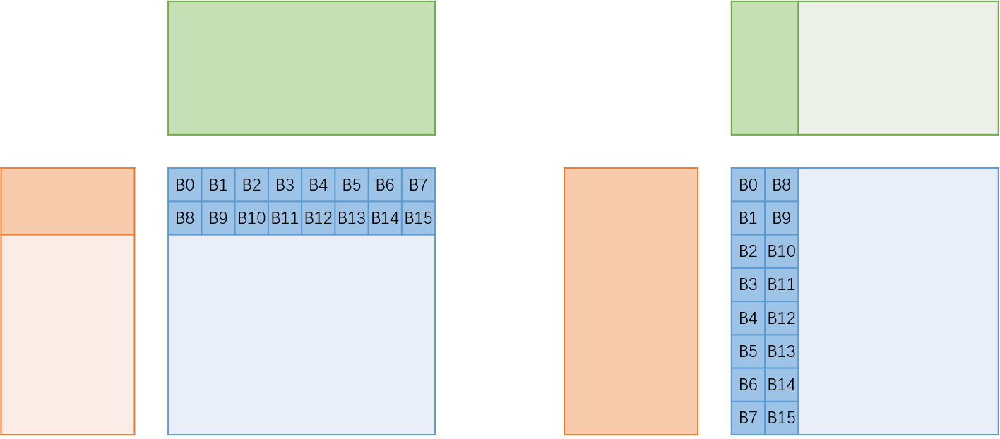

# NVCC编译阶段

GPU应用程序的源文件由标准C++主机代码和GPU设备函数代码混合组成。NVCC（NVIDIA CUDA Compiler）编译套件的CUDA编译轨迹（compilation trajectory）指示如何编译GPU程序、链接运行时库、生成可执行文件，涉及对每个CUDA源文件的拆分（split）、预处理（preprocess）、编译（compilation）、合并（merge）。在编译阶段，需要将主机代码与设备函数代码分离，然后使用C++主机编译器编译主机代码，使用NVCC编译器和汇编器编译设备函数代码，然后将编译后的GPU函数作为富二进制映像（fatbinary image）嵌入到主机的目标文件（object file）中。在链接阶段，会添加特定的CUDA运行时库以支持SPMD例程调用，并提供显式GPU操作，例如GPU内存缓冲区的分配和主机GPU数据传输。

NVCC可接受一系列传统C++编译器选项，例如宏定义、头文件路径、库路径等，以及指示编译过程的选项。所有非CUDA编译步骤都会传递给C++主机编译器，并将NVCC的选项转换为适当的主机编译器的命令行选项。在所有平台上，会使用当前的执行搜索路径来寻找默认的主机编译器可执行文件（例如Linux平台上的gcc和g++，Windows平台上的cl.exe等），也可以使用NVCC的选项手动指定。

NVCC编译套件预定义了一些宏，例如\_\_NVCC\_\_在编译C/C++/CUDA源文件时定义，\_\_CUDACC\_\_在编译CUDA源文件时定义，\_\_CUDACC\_RDC\_\_在可重定位设备代码模式下编译CUDA源文件时定义。

编译阶段（compilation phase）是一个逻辑上的翻译步骤（translation step），来完成特定的编译功能，可以通过NVCC的命令行选项来选择。单个编译阶段仍然可以细分为更小的步骤，但这些更小的步骤只是该阶段的实现，它们依赖于NVCC所使用内部工具的功能，并且所有这些内部功能都可能会随着新版本的发布而改变。因此，只有编译阶段在各个版本中都是稳定的。尽管NVCC提供显式执行编译步骤的选项，但这些仅用于调试目的，不应在构建脚本中使用。

下表给出了NVCC可识别的文件后缀。

| 文件后缀            | 描述                                         |
| ------------------- | -------------------------------------------- |
| .cu                 | CUDA源文件，包含主机代码和设备代码           |
| .c, .cc, .cxx, .cpp | C/C++源文件                                  |
| .i, .ii             | C/C++源文件预处理后的文件                    |
| .ptx                | PTX中间汇编文件                              |
| .cubin              | 单GPU架构的CUDA设备代码的二进制文件          |
| .fatbin             | CUDA富二进制文件，可能包含多个PTX和CUBIN文件 |
| .o, .obj            | 目标文件                                     |
| .a, .lib            | 库文件                                       |
| .res                | 资源文件                                     |
| .so                 | 共享动态库文件                               |

值得注意的是，NVCC对待目标文件、库文件、资源文件之间没有任何区别，它只是在执行链接阶段时将这些类型的库文件传递给链接器。

下表给出了NVCC所支持的用于控制编译阶段的命令行选项。

| 编译阶段                                                     | 命令行选项             | 输入                    | 输出                   |
| ------------------------------------------------------------ | ---------------------- | ----------------------- | ---------------------- |
| 预处理CUDA源文件                                             | --cuda, -cuda          | .cu                     | .cu.cpp.ii             |
| 预处理C++源文件                                              | --preprocess, E        | .cu, .cpp               | 终端标准输出           |
| 生成PTX中间汇编，该步骤会抛弃.cu输入文件的主机代码           | --ptx                  | .cu                     | .ptx                   |
| 生成CUBIN二进制文件，该步骤会抛弃.cu输入文件的主机代码       | --cubin, -cubin        | .cu, .gpu, .ptx         | .cubin                 |
| 生成FATBIN富二进制文件                                       | --fatbin, -fatbin      | .cu, .gpu, .ptx, .cubin | .fatbin                |
| 生成目标文件                                                 | --compile, -c          | .cu, .cpp               | .o, .obj               |
| 生成含可重定位设备代码的目标文件；等价于--relocatable-device-code=true选项和--compile选项 | --device-c, -dc        | .cu, .cpp               | .o, .obj               |
| 生成含可执行设备代码的目标文件；等价于--relocatable-device-code=false选项和--compile选项 | --device-w, -dw        | .cu, .cpp               | .o, .obj               |
| 链接CUBIN等二进制文件和含可重定位设备代码的目标文件，生成含可执行设备代码的目标文件，可传给C++主机链接器 | --device-link, -dlink  | .ptx, .cubin, .fatbin   | a_dlink.o, a_dlink.obj |
| 链接含可重定位设备代码的目标文件，生成CUBIN二进制文件        | --device-link --cubin  | .o, .obj                | a_dlink.cubin          |
| 链接含可重定位设备代码的目标文件，生成FATBIN富二进制文件     | --device-link --fatbin | .o, .obj                | a_dlink.fatbin         |
| 构建库文件                                                   | --lib, -lib            | .cu                     | .a, .lib               |
| 生成可执行文件并执行，用于开发调试过程，由NVCC自动设置CUDA环境而无需手动指定 | --run, -run            | .cu                     | a.exe, a.out           |
| 生成可执行文件                                               |                        | .cu                     | a.exe, a.out           |

值得注意的是，除非手动指定编译阶段，否者NVCC将会编译并链接所有输入文件。

CUDA编译的工作原理如下所述。先对输入源文件进行预处理，对设备代码进行编译，生成PTX中间汇编代码或CUBIN二进制代码，并放置在FATBIN富二进制代码中。再次对输入程序进行预处理，对主机代码进行编译，并嵌入FATBIN富二进制代码，以将CUDA C++扩展转换为标准C++结构。然后，C++主机编译器将带有FATBIN嵌入的集成主机代码（synthesized host code）编译成一个主机目标文件。过程如下图所示。当主机程序执行设备函数代码（启动CUDA Kernel）时，CUDA运行时会检查所嵌入的FATBIN以获取当前GPU合适的FATBIN映像。


此处列举一个分开编译的示例，如下所示。

```c++
// kernel.cuh
#pragma once
typedef unsigned int uint32_t;
extern __global__ void scale_kernel(float *data, const float factor, const uint32_t N);
```

```c++
// kernel.cu
#include "kernel.cuh"
__global__ void scale_kernel(float *data, const float factor, const uint32_t N) {
    const uint32_t tid = blockIdx.x * blockDim.x + threadIdx.x;
    if (tid < N) data[tid] = data[tid] * factor;
}
```

```c++
// main.cu
#include <stdio.h>
#include "kernel.cuh"
int main(int argc, char *argv[]) {
    float *data;
    cudaMalloc(&data, sizeof(float) * 4096);
    scale_kernel<<<(4096 + 127) / 128, 128>>>(data, 3.14f, 4096);
    cudaFree(data);
    printf("Over!\n");
    return 0;
}
```

```shell
nvcc -dc kernel.cu -o kernel.o
nvcc -dc program.cu -o program.o
nvcc -dlink kernel.o program.o -o gpu.link.o
g++ kernel.o program.o gpu.link.o -L /path/cuda/libs -l cudart -o run
```

上述编译命令等价于下述一行命令。

```shell
nvcc kernel.cu program.cu -o run 
```

# CUDA-GDB调试

CUDA-GDB调试器用于在Linux系统上调试CUDA应用程序，它是GDB调试器的扩展，通常会随CUDA Toolkit软件包一起安装。CUDA-GDB提供一个无缝的调试环境，允许在同一应用程序中同时调试CPU代码和GPU代码，允许设置断点、单步执行CUDA应用程序，还可以检查和修改硬件上运行的任何给定线程的内存和变量。

在使用NVCC编译源代码以生成可执行程序时，使用-O0选项禁用编译器优化，使用-g选项生成主机代码的调试信息，使用-G选项生成设备代码的调试信息，使用-keep选项保持编译过程的中间文件。此外，CUDA-GDB还支持调试针对特定CUDA架构编译的核函数，例如sm_75或sm_80，而且还支持调试运行时编译的内核，称为JIT（just-in-time）即时编译。默认情况下，NVCC会针对compute_52和sm_52架构生成目标对象，可使用-gencode选项指定所需架构。

使用cuda-gdb命令进行调试，可以使用可执行文件、核心转储、进程编号作为拟调试对象。使用无参数的cuda-gdb命令可进入CUDA-GDB调试环境，键入help可查看命令手册，键入help后跟命令类别查看该类命令，键入quit或q退出调试环境。

```shell
gdb [option] executable_file
```

使用--args选项，可以在可执行文件之后为程序指定命令行参数；使用--core=COREFILE选项分析核心转储文件；使用--exec=EXECFILE选项指定可执行文件；使用--pid=PID选项指定要附加到的进程；使用--directory=DIR指定源文件搜索目录。需要注意的是，cuda-gdb不支持--tui选项开启文本用户界面。

CUDA-GDB与GDB的使用方法类似，而且对于主机代码，使用GDB原有命令即可进行调试，对于设备代码，CUDA-GDB额外提供以cuda开头的命令扩展。例如，使用info cuda threads命令可以查看CUDA线程，使用cuda thread #命令可以切换CUDA线程。在CUDA-GDB调试模式下，一些CUDA专有的常用命令如下所示，更详细命令可使用help命令查看，或键入apropos命令以查询与给定字符串相匹配的命令。

| 命令                           | 描述                                                         |
| ------------------------------ | ------------------------------------------------------------ |
| info cuda devices, cuda device | 显示可见的GPU设备；切换到给定设备                            |
| info cuda sms, cuda sm         | 显示使用的SM流多处理器；切换到给定SM流多处理器               |
| info cuda kernels, cuda kernel | 显示当前正在执行的Kernel核函数；切换到给定Kernel核函数执行   |
| info cuda blocks, cuda block   | 显示线程块；切换到给定线程块，可使用一维索引n指定，也可使用三维索引[x,y,z]指定 |
| info cuda threads, cuda thread | 显示线程；切换到给定线程，可使用一维索引n指定，也可使用三维索引[x,y,z]指定 |
| info cuda warps, cuda warp     | 显示线程束；切换到给定线程束                                 |
| info cuda lanes, cuda lane     | 显示Warp中的线程；切换到Warp中给定的线程                     |
| info cuda contexts             | 显示当前的GPU上下文                                          |
| cuda grid                      | 切换到给定线程网格                                           |

在调试CUDA程序的过程中，如果程序挂起或陷入无限循环，可使用CTRL+C手动中断应用程序，此时GPU会暂停且CUDA-GDB会出现提示，用户可自行决定检查、修改、单步执行、恢复或终止程序。此功能仅限于在CUDA-GDB调试器中运行的应用程序。

需要注意的是，CUDA Kernel核函数的调试是以一个Warp线程束为单位的，即每次单步执行都是一个Warp中的32个线程单步执行。一种特殊情况是\_\_syncthreads()栅障，CUDA-GDB会在栅障之后设置隐式的临时断点，并恢复所有线程，直到命中临时断点。当设置断点时，它会强制所有驻留的GPU线程在到达相应的PC时停止在该位置。

调试设备函数时，只要设备函数不是内联的，用户就可以单步进入、执行、越过、退出，使用\_\_noinline\_\_说明符可以强制编译器不内联所修饰的函数。

# 通用矩阵乘法GEMM

Nsight是NVIDIA面相开发者提供的开发工具套件，能提供深入的跟踪、调试、评测和分析，以优化跨NVIDIA GPU和CPU的复杂计算应用程序。Nsight主要包含Nsight System、Nsight Compute、Nsight Graphics三部分。在连接服务器时，可能会出现https://developer.nvidia.com/nvidia-development-tools-solutions-ERR_NVGPUCTRPERM-permission-issue-performance-counters中所提到的权限错误。

Nsight System给开发者一个系统级别的应用程序性能的可视化分析。所有与NVIDIA GPU相关的程序开发都可以从Nsight System开始以确定最大的优化机会。开发人员可以优化瓶颈，以便在任意数量或大小的CPU和GPU之间实现高效扩展。

Nsight Compute是一个CUDA应用程序的交互式kernel分析器。它通过用户接口和命令行工具的形式提供了详细的性能分析度量和API调试。Nsight Compute还提供了定制化的和数据驱动的用户接口和度量集合，可以使用分析脚本对这些界面和度量集合进行扩展，以获得后处理的结果。

Nsight Graphics是一个用于调试、评测和分析Microsoft Windows和Linux上的图形应用程序的工具。它允许优化基于Direct3D 11，Direct3D 12，DirectX，Raytracing 1.1，OpenGL，Vulkan和KHR Vulkan Ray Tracing Extension的应程序的性能。

通用矩阵乘法GEMM一般是指计算数学公式
$$
C=\alpha AB+\beta C
$$
其中，$\alpha,\beta$是标量，$A,B,C$分别是形状为[M,K]，[K,N]，[M,N]的矩阵。

本文主要使用NSight Compute远程连接RTX 4090服务器，以分析执行GEMM核函数的各项性能。假设矩阵A,B,C按照行主序的方式在内存中存储，且规定左上角为原点，右向为x正方向，下向为y正方向。

## 朴素GEMM实现

若由一个线程计算结果矩阵C中的一个元素，则基本的GEMM实现如下所示。

```c++
__global__ void matrix_mul_kernel(
    const float *A, const float *B, float *C, 
    const int M, const int N, const int K, const float alpha, const float beta
) {
    const int tx = blockIdx.x * blockDim.x + threadIdx.x;
    const int ty = blockIdx.y * blockDim.y + threadIdx.y;
    float c = 0.0;
    if (tx < N && ty < M) {
        for (int k = 0; k < K; ++k) {
            c += A[ty * K + k] * B[k * N + tx]; 
        }
        C[ty * N + tx] = alpha * c + beta * C[ty * N + tx];
    }
}
```

该版本的代码显然无法发挥出GPU的硬件性能，编译运行，取[M,N,K]为[4096,4096,4096]，blockDim为[16,16]，使用NSight分析结果如下图所示。



可以看到，FP32浮点数计算性能只达到峰值性能的6%，主要原因是设备全局内存带宽利用率太低，只达到理论峰值带宽的0.97%，下面分析如何提升GEMM性能。

## GEMM计算划分

对于结果矩阵乘法来说，其经典的计算划分如下所示。



其中，B表示一个Block线程块，W表示一个Warp线程束，T表示一个Thread线程。原始矩阵的形状为A[M,K]，B[K,N]，C[M,N]，数据存储在设备全局内存之中，下面在各个层面详细描述划分策略。

在Block层面，每个Block计算形状为C[M_block,N_block]的矩阵块，对应数据为A[M_block,K]和B[K,N_block]。可以看到，一个Block中的同一行Thread会用到A的同一行数据，同一列Thread会用到B的同一列数据，故为提高性能，可将A和B的数据加载到共享内存之中。但因为共享内存空间有限，无法一次性将全部的A[M_block,K]和B[K,N_block]加载到共享内存，故每次加载A[M_block,K_block]和B[K_block,N_block]数据，并分ceil(K/K_block)轮迭代计算。

在Warp层面，每个Warp计算形状为C[M_warp,N_warp]的矩阵块，对应数据为A[M_warp,K_warp]和[K_warp,N_warp]，其中K_warp等于K_block。

在Thread层面，每个Thread计算形状为C[M_thread,N_thread]的矩阵块，对应数据为A[M_thread,K_thread]和B[K_thread,N_thread]，其中K_thread等于K_block。

下面分析如何确定分块大小。对于一个Block来说，其主要操作为FMA（Fused Multiply Add）操作，在维度K上迭代计算，每次迭代完全相同，故可通过其中的一次迭代来分析，计算量为$\mathtt{M\_block}\times\mathtt{N\_block}\times\mathtt{K\_block}\times2\text{ FLOP}$，访存量为$(\mathtt{M\_block}+\mathtt{N\_block})\times\mathtt{K\_block}\times4\text{ Byte}$，则计算访存比（计算强度）为
$$
\frac{1}{2}\frac{1}{\dfrac{1}{\mathtt{M\_block}}+\dfrac{1}{\mathtt{N\_block}}} \ \text{FLOP}/\text{Byte}
$$
可以看到，计算强度与K_block无关，若不考虑其他因素，显然M_block与N_block越大，计算强度越大。

在实际应用中，根据经验，对于一个Block来说，取[M_block,N_block,K_block]的值为[128,128,8]，通常能达到相对较好的性能。而且一个Block通常将Warp的布局组织为Block[4,2]warp形状，而一个Warp又将Thread的布局组织为Warp[4,8]thread形状，故一个Block将Thread的布局组织为Block[16,16]thread形状。那么，一个Warp所计算数据形状[M_warp,N_warp,K_warp]的值为[32,64,8]，一个Thread所计算数据形状[M_thread,N_thread,K_thread]的值为[8,8,8]。

> 但需要注意的是，具体如何划分要充分考虑结果矩阵C的大小，若分块M_block,N_block越大，而矩阵C较小时，会导致最终划分的线程块的数目较少，而一个线程块只能运行到一个SM上，若最终线程块的数据小于设备SM芯片的数目时，则天然无法充分利用设备硬件资源。故，若出现这种情况时，应考虑降低一个线程块的大小或降低一个线程所处理数据的大小，以充分利用硬件资源。

可以看到，最终划分到一个Thread线程负责计算一个[8,8]的小矩阵，且由于K_thread取值为8，则一个Thread计算的是[8,8]的小方阵乘法。实际上，对于矩阵乘法，有采用向量内积与采用向量外积之分，区别仅在于M,N,K三个维度的循环嵌套顺序不同，如下述伪代码。

```c++
const int M = 8, N = 8, K = 8;
float A[M * K], B[K * N], C[M * N];

/* inner product */
for (int i = 0; i < M; i++)
    for (int j = 0; j < N; j++)
        for (int k = 0; k < K; k++)
            C[i * N + j] += A[i * K + k] * B[k * N + j];

/* outer product */
for (int k = 0; k < K; k++)
    for (int i = 0; i < M; i++)
        for (int j = 0; j < N; j++)
            C[i * N + j] += A[i * K + k] * B[k * N + j];
```



由代码可以看到，在向量内积方式中，如上图(左)，最内层循环下标k变化时，对A,B会产生跨步访问，对C会访问同一数据；而在向量外积方式中，如上图(右)，最内层循环下标j变化时，对B,C会产生连续访问，对A会访问同一数据。显然，连续内存地址访问的方式更优，这不仅满足数据访问的局部性，还有利于做循环展开，以使用向量化指令，并使用双缓冲以让计算掩盖访存延迟。

从访问局部性的角度，向量外积方式中，可以使用寄存器缓存而避免无意义的重复访存，伪代码如下所示。

```c++
/* outer product */
for (int k = 0; k < K; k++) {
    regB[0,N] = B[k * N, (k + 1) * N];
    for (int i = 0; i < M; i++) {
        regA = A[i * K + k];
        for (int j = 0; j < N; j++)
            C[i * N + j] += regA * regB[j];
    }
}
```

其中，regA与regB均为寄存器，可以看到，循环下标j变化时，使用的是A的同一个元素，是B的同一行元素，因此可分别使用1个寄存器regA和N个寄存器regB[N]缓存这些值，从而将原来的$K\times M\times N\times 2$次访存，减少为$K\times (M+N)$次访存。

从循环展开的角度，向量外积方式中，编译器能够在不展开K维度循环的情况下，仅展开M维度和N维度就能够自动识别到重复访存，并使用相应的寄存器来避免重复访存。例如，假定M,N,K均取值为2，那么对M维度和N维度展开得到如下伪代码。

```c++
const int M = 2, N = 2, K = 2;

/* outer product */
for (int k = 0; k < K; k++) {
    C[0 * N + 0] += A[0 * K + k] * B[k * N + 0];
    C[0 * N + 1] += A[0 * K + k] * B[k * N + 1];
    C[1 * N + 0] += A[1 * K + k] * B[k * N + 0];
    C[1 * N + 1] += A[1 * K + k] * B[k * N + 1];
}
```

只要是稍微现代一点的编译器，就可以一眼看出这4条指令的8次访存，完全可以合并为4次访存。同时，现代一点的编译器也能在一定程度上更具生成的汇编指令，交叉排列计算指令和访存指令，以达到掩盖访存延迟的目的。而在向量内积方式中，必须把整个K维度先展开，然后再展开M维度和N维度，才能看到这些潜在的访存合并机会。

在CPU环境中，一般K的取值都较大，而M和N的取值较小，寄存器又非常少，因此基本上无法在K维度将循环完全展开并做优化。但在GPU环境中，情况却恰恰相反，对于循环次数已知的小循环，即使没有指定#pragma unroll编译制导指令，nvcc编译器也会自动将循环展开，而对于一个Thread来说，其M,N,K的取值均为8，符合nvcc自动展开循环的条件。而在展开完成后，nvcc会对所有的访存以及计算指令重排得到一个不错的汇编指令排列。所以，在GPU上采用向量外积方式，可能并不会像在CPU上那么效果明显。

在GPU上采用向量外积方式的真正目的是使用double buffer双缓冲。当提前知道下一次循环迭代所需的数据时，就可以提前预取该次循环的数据，同时在预取下次数据时进行该次计算，从而实现计算掩盖访存延迟，这在向量内积方式中是无法实现的。同时由于双缓冲需要额外的寄存器从gmem中转移数据到smem，所以当一开始循环展开使用的寄存器过多时，编译器可能无法正确的在限定寄存器数量下实现双缓冲。

## GEMM访存划分

在Block层面，每个Block计算形状为C[M_block,N_block]的矩阵块，对应数据为A[M_block,K]和B[K,N_block]，并迭代进行ceil(K/K_block)轮计算，每一轮都需要将A[M_block,K_block]数据和B[K_block,N_block]数据从gmem中加载到smem中，下面分析在该过程中的Warp与Thread布局，并综合考虑向量化指令、合并访存、避免bank冲突等策略。

需要注意的是，由于一个Thread采用向量外积方式计算小矩阵乘法，每次访问A的一列与B的一行，而矩阵采用行主序存储，那么对于在设备全局内存gmem中的矩阵A的数据，需要对其进行转置，以列主序的方式写入到smem中。

一个Block中的Warp及其Thread对于从设备全局内存中读取矩阵A并将之写入到共享内存中的访问模式如下图所示。一个Block中的Warp及其Thread对于从设备全局内存中读取矩阵B并将之写入到共享内存中的访问模式如下图所示。



## GEMM线程束划分

在计算时，一个Block将Warp的布局组织为Block[4,2]warp形状，一个Warp将Thread的布局组织为Warp[4,8]thread形状，而一个Thread访问[8,8]形状数据，那么对于每个Warp来说，其访问A[32,8]数据与B[8,64]数据的访问模式如下图所示。



使用向量外积的计算方式，每个Thread读取连续的4个元素，采用float4向量化读取，一次性读取16字节（128bit）。

对于矩阵A来说，一个Warp一次性只读取4块不同的A[8,8]（其中每行8个Thread广播相同的数据块），根据这4块A[8,8]在共享内存中的存储位置，可以看到，当采用float4向量化读取时，一个Warp内不会发生bank冲突。

对于矩阵B来说，一个Warp一次性只读取8块不同的B[8,8]（其中每列4个Thread广播相同的数据块），根据这8块B[8,8]在共享内存中的存储位置，可以看到，当采用float4向量化读取时，一个Warp内不会发生bank冲突。

## GEMM线程块的Wave划分

在CUDA编程模型中，一个Wave指的是能够在GPU设备上同时运行的Block数量，该数量与设备SM芯片数量、每个SM芯片所能承载的Block数量、以及一个Block所需的硬件资源有关。此处分析假设，一个SM的硬件资源足以同时运行它所能运行所有Block块。在CUDA执行模型中，一个Kernel核函数所产生的所有Block块，会按照朴素的形式排列，即按照(blockIdx.x,blockIdx.y,blockIdx.z)依次递增的方式，划分为若干个Wave在GPU设备上执行。

假设一个Wave内存在Wave_block个的Block块，且一个Wave所处理的数据形状为Wave[M_wave,N_wave]，且一个Wave内的Wave_block个线程块刚好可以计算矩阵C的整数行，则一个Wave需要从设备全局内存中读取$(\mathtt{M\_block}\times\mathtt{K}+\mathtt{K}\times\mathtt{N\_block})\times\mathtt{Wave\_block}$个数据。若假设一个Wave所读取的数据都能够被设备的L2 Cache装下，那么实际上只从设备全局内存中读取了$\mathtt{M\_wave}\times\mathtt{K}+\mathtt{K}\times\mathtt{N\_wave}$个数据，由此可计算得L2 Cache的命中率为
$$
\begin{align}
&\ 1 - \frac{\mathtt{M\_wave}\times\mathtt{K}+\mathtt{K}\times\mathtt{N\_wave}}{(\mathtt{M\_block}\times\mathtt{K}+\mathtt{K}\times\mathtt{N\_block})\times\mathtt{Wave\_block}} \\
=&\ 1 - \frac{\mathtt{M\_wave}+\mathtt{N\_wave}}{\mathtt{Wave\_block}}\frac{1}{\mathtt{M\_block}+\mathtt{N\_block}} \\
=&\ 1 - \frac{\mathtt{M\_wave}+\mathtt{N\_wave}}{\mathtt{M\_wave}\times\mathtt{N\_wave}}\frac{1}{\mathtt{M\_block}+\mathtt{N\_block}}
\end{align}
$$
可以看到，M_wave和N_wave差距越大，L2 Cache的命中率就越低，但对于GEMM情景来说，这并不是主要性能瓶颈。对性能影响更大的情况是一个Wave中Block线程块的排列顺序，如下图所示。



可以看到，当M与N足够大时，一个Wave的线程块只能覆盖矩阵C的若干行或若干列（甚至无法覆盖一整行或一整列），此时就会根据(blockIdx.x,blockIdx.y)是沿着(N,M)维度轴还是(M,N)维度轴变化，从而造成横着排列与竖着排列两种Wave形状。

假设矩阵A与矩阵B都采用行主序存储，一个数据的类型是float类型，占用4Byte空间，而L2 Cache的一个Cache Line大小是128Byte，即32个float数据。

若采用横着排列的Wave，则对于读取矩阵B时，每行Block线程块将其自己的数据与之后连续存储的数据加载到L2 Cache中，同一行有许多其他的Block就可以直接从L2中加载数据，而无需再次读取设备全局内存。若采用竖着排列，则对于读取矩阵A时，每行Block线程块将自己的数据与之后连续存储的数据加载到L2 Cache中，同一行仅有较少其他的Block可以直接从L2中加载数据，而每行都会出现L2 Cache的未命中。

虽然两种排列方式最终的Cache未命中总次数一样，但对于第二种情况，它的Cache未命中会在刚开始的短时间内集中爆发，这种情况所带来的延迟是难以被其他优化手段所掩盖的。因为这种延迟不仅爆发密集，且每一次的延迟都很长，所以会造成性能损失。因此要注意合理地将Cache miss分配到Kernel核函数运行的各个阶段。