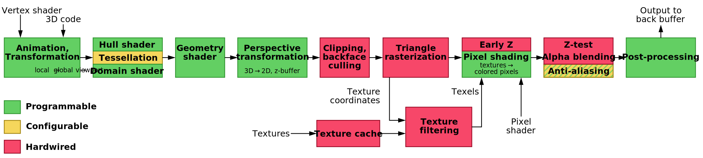

# 从图形学引入

计算机图形学（Computer Graphics）是数码摄影、电影、视频游戏、数字艺术、手机、计算机显示器以及许多专业应用的核心技术。目前，人们已经开发了大量专用硬件和软件，大多数设备的显示器都是由计算机图形硬件驱动的。计算机图形学中的一些主题包括用户界面设计、精灵图形、渲染、光线追踪、几何处理、计算机动画、矢量图形、3D建模、着色器、GPU设计、隐式曲面、可视化、科学计算、图像处理、计算摄影、科学可视化、计算几何、计算机视觉等。

计算机图形学可以指代几种不同的概念：计算机对图像数据的表示和处理；用于创建和处理图像的各种技术；数字合成和处理视觉内容的方法。尽管该术语通常指三维计算机图形学的研究，但它也涵盖二维图形和图像处理。计算机图形学研究使用计算技术处理视觉和几何信息，它侧重于图像生成和处理的数学和计算基础，而不是纯粹的美学问题。整体方法在很大程度上取决于几何、光学、物理学、感知等基础科学。

计算机图形学管线（Graphics Pipeline）指的是一个流水线流程，依次为软件建模、渲染管线、硬件加速三大阶段。建模软件可使用3DsMax、ZBursh、Blender、Maya、SketchUp等，用于定义几何对象（形状、尺寸、位置等）、模型属性（颜色、纹理、材质等）、相机（视点、方向、视野）等。主流建模软件都可以选择不同的渲染管线，主要包括软件渲染、Direct3D接口、OpenGL接口，不同的渲染管线拥有不同的流水线流程，但总体阶段都是类似的。渲染管线可使用CPU进行执行，也可以使用GPU等加速卡进行硬件加速。

> Direct3D是适用于Microsoft Windows的图形应用程序编程接口，作为DirectX的一部分，Direct3D用于在注重性能的应用程序（如游戏）中渲染三维图形。如果显卡支持硬件加速，Direct3D会使用硬件加速，从而对整个3D渲染管线进行硬件加速，甚至仅对部分管线进行硬件加速。
>
> OpenGL是一个跨语言、跨平台的应用程序编程接口，用于渲染二维和三维矢量图形。该API常用于与图形处理单元GPU交互，以实现硬件加速渲染。

顶点处理，顶点着色器（Vertex Shader）。渲染管线中可编程的阶段，负责处理单个顶点。顶点着色器接收由一系列顶点属性组成的单个顶点，该输入顶点被任意处理以产生输出顶点。顶点着色器通常执行空间坐标的转换，还可以执行每个顶点的照明，或为后续着色器阶段执行设置工作。

曲面细分，外壳着色器（Hull Shader）、镶嵌（Tessellation）、域着色器（Domain Shader）。外壳着色器接收顶点着色器传递的控制点数据，向镶嵌器输出常量细分因子，向域着色器传递经过变换和增删后的控制点数据。在实时渲染中，需要计算并创建（多个）三角形对真实曲面进行拟合，这个过程称为镶嵌，在运行时，表面可以被镶嵌为多个小三角形。域着色器接收镶嵌器阶段输出的所有顶点与三角形，以及外壳着色器输出的经过变换后的控制点，进行后续处理。随着曲面细分功能的开启，顶点着色器便化为“处理每个控制点的顶点着色器”，而域着色器的本质实为“针对已经过镶嵌化的面片进行处理的顶点着色器”。

几何着色器（Geometry Sahder）。位于顶点着色器（或可选的曲面细分阶段）之后，几何着色器是可选的。几何着色器以单个图元作为输入，并可能输出零个或多个图元，被编程为接受特定输入图元类型并输出特定图元类型。使用几何着色器的主要原因是，分层渲染，获取一个图元并将其渲染为多个图像，而无需更改绑定的渲染目标。

基本图元（Primitive）。顶点流解释的结果，是图元装配的一部分。包括点、线、三角形、面片（Patch），其中面片是用于曲面细分阶段的概念。

图元装配（Primitive Assembly）。完整的图元装配在顶点处理阶段之后执行。但是，某些顶点处理步骤要求将图元分解为一系列基本图元。例如，几何着色器对图元序列中的每个输入基本图元进行操作。因此，在几何着色器执行之前必须进行某种形式的图元装配。如果几何着色器或曲面细分处于激活状态，则必须进行早期图元装配处理。早期的图元装配，会将顶点流转换为基本图元序列，例如，一个由12个顶点组成的列表需要生成11个线图元。

视点变换（Viewport Transformation）。视点变换定义了顶点位置从标准世界坐标空间到视窗坐标空间的变换（从3D坐标到2D坐标），这些是光栅化到输出图像的坐标。视窗即是相机的视野，也是屏幕的显示区域。

裁剪（Clipping）。收集前几个阶段生成的图元，然后将其裁剪到视窗范围。针对顶点Z位置的裁剪行为可以通过激活深度限制来控制。使用透视投影时，仍然会裁剪视野的侧面，位于相机后面的物体仍然会被裁剪。

光栅化（Rasterization）。将几何图元，例如三角形，转换为屏幕上的像素，每个像素的颜色和深度通过插值计算，表示它与屏幕上对应部分的颜色和深浅关系。纹理映射，将2D图像（纹理）应用到3D模型表面，增加物体的细节和真实感。

片元（Fragment）。光栅化将一个图元转变成二维图像，每个图像点都包含颜色、深度、纹理等数据，将该点和相关信息称为一个片元。对于图元覆盖的每个像素点，都会生成一个片元。

像素着色器（Pixel Shader），片元着色器（Fragment Shader）。将光栅化生成的片元处理为一组颜色和单个深度值阶段。片元着色器的输出是一个深度值，以及零个或多个可能写入当前帧缓冲区中的缓冲区的颜色值。片元着色器将单个片元作为输入并生成单个片元作为输出。

深度测试（Depth Testing）。通过比较每个像素的深度值来确定前景和背景，确保正确的遮挡关系。

混合与透明度处理（Blending and Transparency）。处理场景中的透明对象或半透明效果。

抗锯齿（Anti-aliasing）。减少由于分辨率限制产生的锯齿现象，使边缘平滑。

帧缓冲（Frame Buffering）。最终生成图像，所有计算完成后，图像被写入帧缓冲区，帧缓冲是用于存储每一帧图像的内存空间，它包含每个像素的颜色信息。

显示（Display）。将缓冲区中的图像传递给显示器，生成最终显示在屏幕上的图像。

# NVIDIA GPU发展历史

NVIDIA于1999年推出GeForce 256芯片，第一次在芯片中集成了包括顶点计算、纹理压缩、贴图、光照在内的各种计算引擎，能够处理计算机图形学中的各类计算问题，因此称之为图形处理器（Graphics Processing Unit，GPU）。2001年推出GeForce 3芯片，为方便用户在GPU上编写程序，GPU提供一个名为着色器（Shader）的编程工具，用在图像渲染过程中，是一个用来替代固定渲染管线的可编辑程序。其中，顶点着色器（Vertex Shader）主要负责顶点的几何关系等的运算，像素着色器（Pixel Shader）主要负责片元颜色等的计算。着色器替代了传统的固定渲染管线，可以实现3D图形学计算中的相关计算，由于其可编辑性，可以实现各种各样的图像效果而不用受显卡的固定渲染管线限制。

伊恩·巴克（Ian Buck）在2004年SIGGRAPH会议上发表论文Brook for GPUs: Stream Computing on Graphics Hardware，在其中提到，商品化的图形硬件已经从一个固定功能的流水线快速发展为具有可编程顶点（vertex）和片元（fragment）的处理器，虽然这种新的可编程性是为实时着色而引入的，但根据观察，这些处理器的指令集足够通用，可以在渲染领域之外执行计算。毕业后，伊恩·巴克加入NVIDIA。2006年，基于伊恩·巴克的思想，NVIDIA推出CUDA（Compute Unified Device Architecture）并行编程模型。2007年，NVIDIA发布CUDA开发工具包（CUDA Toolkit），使开发者可以使用CUDA进行编程开发，利用GPU进行并行计算。

2006年，NVIDIA推出了Tesla一代架构，应用到显卡G80系列上面。2008年，NVIDIA推出了改进的Tesla二代架构，应用到显卡GeForce 200系列上面，在该系列中有图形学架构和计算架构两个版本，并逐步确定了后续的Tesla通用科学计算卡。2010年，NVIDIA推出了Fermi架构，这是NVIDIA基于CUDA研发的GPU架构，它引入了统一的计算架构，使得GPU不仅可以处理图形学任务，还可以处理通用计算任务。2012年，NVIDIA发布了Kepler架构，它采用28nm制程，是首个支持超级计算和双精度计算的GPU架构，进一步提高了能效比和GPU性能，并引入了动态并行处理技术。2014年，NVIDIA发布了Maxwell架构，同样采用28nm制程，但在能效比和计算密度上有了进一步的提升。2016年，NVIDIA推出了Pascal架构，它采用16nm FinFET Plus制程，显著增强了GPU的能效比和计算密度。Pascal架构使GPU可以进入更广泛的人工智能、汽车等新兴应用市场。2017年，NVIDIA发布了Volta架构，采用12nm制程，进一步提升了GPU的性能和能效比。Volta架构在深度学习、高性能计算等领域有着广泛的应用。2018年，NVIDIA推出了Turing架构，它引入了光线追踪和深度学习超采样（DLSS）技术，使得GPU在游戏和图形学渲染领域的性能得到了显著提升。2020年，NVIDIA发布了Ampere架构，它在性能、能效比和AI加速能力上都有着显著的提升。Ampere架构的GPU产品广泛应用于数据中心、游戏、图形学渲染等领域。

# Tesla Architecture in GeForce 8800

NVIDIA在2006年发布的GeForce 8800 GPU中引入了统一处理器设计（unified processor design）的Tesla架构，能够统一执行顶点着色器程序的线程、像素片元着色器程序的线程，以及使用并行编程模型CUDA编写的通用计算程序的线程。之后的讨论中，线程概念指的是着色器线程和通用计算线程。

## 硬件的设计架构

NVIDIA在论文[NVIDIA Tesla: A Unified Graphics and Computing Architecture](https://doi.org/10.1109/MM.2008.31)中描述了第一代Tesla的设计架构，下图是GeForce 8800的示意图。

为控制图形学管线的各种着色器程序以及通用计算程序的正确执行，GeForce 8800 GPU设计了若干控制硬件。Host Interface通过PCIE总线与主机CPU进行通信，负责从CPU接收命令、检查命令一致性、执行上下文切换、从系统内存中获取数据。Input Assembler按照指令顺序，收集顶点及其属性数据，以及几何图元（点、线、三角形）数据等。Viewport/Clip/Setup/Raster/Zcull负责执行光栅化之前的视窗变换、裁剪等操作。Vertex Work Distribution和Pixel Work Distribution负责将相关图形学管线的输出分配到处理器阵列上，以执行相对应的顶点着色器、几何着色器、像素片元着色器的线程。Compute Work Distribution负责将通用计算程序的线程分配到处理器阵列上执行。

除负责控制与数据传输的硬件之外，GeForce 8800 GPU中负责计算的主体部分称为可扩展流处理器阵列（Streaming Processor Array，SPA），SPA由若干纹理处理器簇（Texture Processor Cluster，TPC）构成，不同型号的GPU拥有不同的TPC数目，以提供不同的计算性能。在GeForce 8800 GPU中，一个SPA拥有8个相互独立的TPC组成。

> 在之后的GPU架构中，TPC的名称改为图形处理器簇（Graphics Processor Cluster，GPC）。

一个TPC拥有1个几何控制器（Geometry Controller）、1个流多处理器控制器（SM Controller，SMC）、2个流多处理器（Streaming Multiprocessor，SM）、1个纹理单元（Texture Unit）。

一个SM拥有8个流处理器（Streaming Processor，SP）、2个特殊函数单元（Special Function Unit，SFU）、1个多线程指令取指和发射单元（Multithreaded Instruction Fetch and Issue Unit，MT Issue）、1个指令缓存（Instruction Cache，I-Cache）、1个只读的常量缓存（Constant Cache，C-Cache）、1个16KB的可读可写的共享内存（Shared Memory）。SM中的SP和共享内存存储体（Bank）之间使用低延迟互联网络，以提供对共享内存的访问。

SMC控制多个SM，仲裁在SM之间共享的Texture Unit纹理单元、加载/存储路径、I/O路径。SMC同时为顶点、几何、像素三种着色器程序服务，它将这些类型的输入打包到一个Warp线程束中，初始化着色器处理，然后解包计算结果。每种着色器类型的线程都有独立的I/O路径，但SMC负责它们之间的负载均衡。基于驱动推荐分配、当前分配、难以分配的额外资源等，SMC支持静态或动态的负载均衡。

一个SP拥有1个乘加单元（Multiply Add Unit，MAD）。一个SFU拥有4个浮点数乘法器，提供超越函数（transcendental function）的计算和像素片元的插值计算。超越函数指的是变量之间的关系不能用有限次加、减、乘、除、乘方、开方运算表示的函数，例如三角函数、反三角函数、指数函数、对数函数等。除SP和SFU单元之外，SM使用Texture Unit作为第三个计算单元，为平衡数学操作和纹理操作的比例，一个Texture Unit为两个SM提供服务。

SP核心是SM中主要的线程处理器，由它负责执行基本的浮点运算、各种整型运算、比较操作、类型转换操作等。浮点数的加法和乘法操作能够兼容用于单精度浮点数的IEEE 754标准，包括非数值（Not a Number，NaN）和无穷值。SP核心中的浮点单元的计算流程是完全流水线化的，并对延迟进行了优化，以平衡时延和物理期间的占用面积。

SFU单元既支持超越函数的计算，也支持平面属性插值（planar attribute interpolation），根据图元顶点上的属性值，计算在(X,Y)像素位置上的属性值。SFU单元每个时钟周期可以计算获得一个32位的浮点数。SFU单元中的属性插值硬件是完全流水线化的，一个时钟周期能计算4个数据点的插值。

GeForce 8800 Ultra GPU中SP单元和SFU单元的时钟频率为1.5GHz，在一个时钟周期下，一个SP执行1次乘加操作（2次浮点操作），一个SFU执行4次浮点操作，于是峰值性能为$(8\times2+2\times4)\times1.5\text{GHz}=36\text{Gflops}$。为优化功耗和单位面积能效，未处理数据的SM单元可以在一半时钟周期的频率下运行。

## SM的SIMT线程调度

无论是图形学管线的各种着色器程序，还是通用计算程序，在SM上执行时，都会实例化许多并行的线程，来执行复杂图像的渲染和大量矩阵的计算。为高效地并行执行数百个线程，同时运行几个不同的程序，SM是硬件多线程的，它在硬件上管理和执行多达768个并发线程，而无需任何调度开销。

为支持CUDA并行编程模型，每个SM线程都有自己的线程执行状态，可以执行独立的代码路径。并发线程可以通过一条SM指令在栅障（Barrier）上同步。轻量级的线程创建、零开销的线程调度、快速栅障同步，可以有效地支持非常细粒度的并行计算。

为高效管理和执行上百个运行不同程序的线程，Tesla SM使用一种新的处理器架构，称为单指令多线程（Single-Instruction, Multiple-Thread，SIMT）。SM的多线程指令单元（Multithreaded Instruction Unit）以32个并行线程为一组进行创建、管理、调度和执行，这32个线程称为一个线程束（Warp），该词源于纺织业，这是一种平行穿线技术。下图展示SIMT调度。

一个SM管理一个包含24个Warp的线程池，一共768个线程。组成Warp的各个线程具有相同的类型，并且都从相同的程序地址开始执行，但是它们可以自由地进行分支选择并独立执行。在每条指令发射时，SIMT多线程指令单元选择一个准备执行的Warp，并向该Warp的活动线程发出下一条指令，SIMT指令以同步方式广播给Warp的活动线程。由于独立的分支或预测，某些单个线程可以且可能是不活动的。

SM将Warp的线程映射到SP核心，每个线程使用自己的指令地址和寄存器状态独立执行。当Warp中所有32个线程都执行相同的代码路径时，SIMT处理器将取得完全的效率和性能。如果Warp的线程因数据依赖的条件分支而发散，则Warp会连续执行每个分支路径，同时禁用不在该路径上的线程，当所有路径完成时，线程会重新收敛到原始执行路径。SM使用分支同步栈（Branch Synchronization Stack）来管理发散和收敛的独立线程。分支发散只发生在一个Warp内，不同的Warp会独立执行，不管它们执行的是共同的还是不相交的代码路径。因此，与前一代GPU相比，Tesla架构在分支代码上的效率和灵活性显著提高，因为其32线程的Warp比前一代GPU的SIMD宽度要窄得多。

SIMT架构与单指令多数据（Single-Instruction, Multiple-Data，SIMD）设计有一定相似之处，其中SIMD将一条指令应用于多个数据路。区别在于SIMT将一条指令并行地应用于多个独立线程，而不仅仅是多个数据路。SIMD指令控制多个数据路的向量化执行，并向程序公开向量的宽度，而SIMT指令控制一个线程的执行和分支行为。另一方面，SIMD向量架构则要求，代码需要手动将访存加载合并为向量化执行，并手动管理发散。

与以往复杂GPU架构的调度相比，独立Warp的SIMT调度方法更为简单，一个Warp由32个相同类型的线程组成，顶点着色器、几何着色器、像素片元着色器，或通用计算线程。例如，像素片元着色器处理的基本单元是2×2的像素四边形，SMC控制器将8个像素四边形组织成32个线程；类似地，SMC控制器将顶点和图元分组到Warp中，并将32个计算线程打包到一个Warp中。SIMT的设计能够使得32个线程有效地共享SM的指令取指和发射单元MT Issue（Multithreaded Instruction Fetch and Issue Unit），但为达到完全的性能，需要Warp的全部线程都处于相同的活动状态（即不存在分支）。

SM的Warp调度器（Warp Scheduler）的工作频率是1.5GHz处理器时钟频率的一半，在每个周期，它选择24个Warp中的一个来执行SIMT指令。发出的Warp指令以16个线程分为2组，使用4个处理器周期（在8个SP核心上）执行。SP核心和SFU单元能够独立地执行指令，周期交替地在它们之间发出指令，调度器可以使它们都被完全占用。

为动态混合不同类型的Warp程序实现零开销的Warp调度是一个具有挑战性的设计问题。在每个周期，计分板（Scoreboard）会对每个Warp是否发射进行资格判定，指令调度器会优先考虑所有已就绪Warp的优先级，并选择优先级最高的Warp发射。优先级会考虑Warp类型、指令类型，以及对在SM中执行的所有Warp的“公平性”。

## SM的ISA指令集架构

与以往执行向量化指令的GPU不同，Tesla SM执行标量指令，提供标量的指令集架构（Instruction Set Architecture，ISA）。这是因为着色器程序的指令越来越标量化，甚至很难完全占据之前的四组件向量架构结构中的两个组件；而且以前的向量化体系结构使用向量打包（将工作负载的子向量组合起来以提高效率）方式，但这会使得调度硬件和编译器变得复杂。而标量指令更简单且对编译器友好。不过，纹理指令仍然是向量化的，接受一个源坐标向量并返回一个过滤后的颜色向量。

高抽象层级的图形语言或编程语言的编译器会生成中间指令，例如DX10向量指令或PTX标量指令，然后对其进行优化并将其转换为二进制的GPU指令。PTX为编译器提供了一个稳定的目标指令集，并提供了对几代GPU的兼容性。优化器很容易将DX10向量指令展开为多个Tesla SM标量指令；而PTX标量指令优化到Tesla SM标量指令大约是一一对应的。由于中间语言使用虚拟寄存器，优化器需要分析数据依赖关系并分配真实寄存器。它消除了死代码，可行时将指令折叠在一起，并优化了SIMT分支发散和收敛点。

Tesla SM有一个基于寄存器的指令集，包括浮点、整数、位、转换、超越、流程控制、内存加载/存储、纹理操作。

浮点和整数运算包括加、乘、乘加、最小值、最大值、比较、设置谓词，以及整数和浮点数之间的转换；浮点指令为负数和绝对值提供了源操作数修饰符。浮点指令和整数指令还可以为每个线程的状态标志设置零、负、进位、溢出等状态，线程程序可以使用这些状态标志进行条件分支。超越函数指令包括正弦、余弦、二进制指数、二进制对数、倒数、倒数平方根。属性插值指令提供了像素属性的高效生成操作。位操作符包括左移、右移、移动、逻辑操作符。控制流包括分支、调用、返回、陷阱（trap）、栅障同步。

> 陷阱指令（trap）是处理陷阱的指令。陷阱是指计算机系统在运行中的一种意外事故，例如电源电压不稳、存储器检验出错、存储器校验出错、输入输出设备出现故障、用户使用了未定义的指令或特权指令等意外情况，使得计算机系统不能正常工作。一旦出现陷阱，计算机应当能够暂停当前程序的执行，及时转入故障处理程序进行相应的处理。在一般的计算机中，陷阱指令作为隐含指令不提供给用户使用，只有在出现故障时，才由CPU自动产生并执行。

## SM的内存访问

对于使用CUDA编写的计算程序，可以访问三个内存空间：局部内存（local memory），每个线程私有访问的内存空间，物理上由DRAM提供；全局内存（global memory），所有线程都可以公开访问的内存空间，物理上由DRAM提供；共享内存（shared memory），一个SM当中的一个线程协作组（Cooperative Thread Array，CTA）可以共享访问的，低延迟内存空间，物理上由SM芯片当中的高速共享存储器提供。

Tesla SM提供负责内存加载/存储的load/store指令来访问存储。内存加载/存储指令使用整数字节地址，并使用寄存器偏移地址计算，以使用编译器代码优化。分别使用内存指令load-local、store-local、load-global、store-global、load-shared、store-shared提供对局部内存、全局内存、共享内存的访问。计算程序使用快速的Barrier栅障同步指令来同步SM内部的线程，这些线程通过共享内存和全局内存相互通信。

为提高内存带宽并减少开销，局部内存和全局内存的访问指令，会将同一个Warp中单独线程的访问请求进行合并，以达到更少的内存块（memory block）访问。这些线程访问的地址必须位于同一个内存块中，并且满足地址对齐要求。合并内存请求相比每个线程单独请求能够显著提高性能。巨大的线程数量，加上对许多负载请求的支持，有助于弥补外部DRAM存储器实现加载/存储指令所带来的load-to-use延迟。

Tesla GPU架构提供高效的原子内存操作，包括整型相加、最小值、最大值、逻辑运算符、交换操作符、比较交换操作。

DRAM内存的数据总线宽度为384个引脚，划分为6个独立的分区，每个分区64个引脚；每个分区拥有物理地址空间的六分之一。内存分区单元（Memory Partition Unit）会将访存请求直接加入队列，这些分区单元负责对来自图形和计算流水线的并行阶段的数百个正在处理的请求进行仲裁，以最大化DRAM的总传输效率。这意味着内存分区单元会根据所访问DRAM内存的Bank存储体以及读写方向，对请求进行分组，同时尽可能减少延迟。内存控制器（Memory Controller）支持DRAM的各种时钟速率、协议、设备密度、数据总线宽度的规格。

GeForce 8800 GPU架构的互联网络（Interconnection Network）拥有一个集线器单元（Hub Unit），会将来自非并行的请求（PCIE、主机和命令前端、Input Assembler单元、显示）路由到合适的内存分区。每个内存分区都有自己ROP单元，因此ROP对内存的访问流量都产生于局部内存分区。然而，纹理单元和内存的加载/存储指令请求，可以发生在任何TPC和任何内存分区之间，因此需要通过互连网络来路由请求和响应。

所有计算处理引擎使用的都是虚拟空间中的虚拟地址，内存管理单元（Memory Management Unit）负责执行虚拟地址到物理地址的转换。在采用页式管理的存储系统当中，需要维护一个虚拟地址到物理地址的页表。为提高页表访问的速度，通常会包含转换后援缓冲器（Translation Lookaside Buffer，TLB）来实现快速的虚实地址转换，TLB分布在渲染引擎之间。当页表缓存缺失时，需要从局部内存中读取页表，以进行替换。

## CUDA并行编程模型

## Tesla Architecture in GeForce 280

# Fermi Architecture

