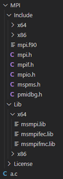
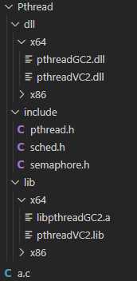

# MS-MPI

我们通常使用消息传递模型来对分布式内存系统进行编程，而MPI（Message-Passing Interface，消息传递接口）就是消息传递模型的典型的一种编程接口。它并不是一种新的编程语言，而是定义了一个可以被C、C++和Fortran程序调用的函数库（接口）。

事实上，MPI接口是一种规范，在不同的平台上有不同的实现。MS-MPI是Microsoft在Windows平台上实现的MPI接口，它的实现是基于x86或x64指令集的。MS-MPI包括MPI SDK和MPI EXEC。这里是MS-MPI的官方https://learn.microsoft.com/en-us/message-passing-interface/microsoft-mpi网站。

通常来说，在Linux平台下可以使用mpicc编译器来对MPI程序进行编译。但是mpicc并没有Windows版本。不过我们仍然可以通过GCC来编译MPI程序，下面给出了一个示例。

假设所安装的MS-MPI的SDK文件（Include头文件、Lib库文件）和我们编写的MPI程序文件（a.c）在同一个根目录（假设名为code）下，它们的组织方式如下图所示。



其中源文件a.c的内容如下所示。

```c
#include <stdio.h>
#include <string.h>
#include <mpi.h>

#define MAX_STRING 100

int main(int argc, char *argv[]) {
	int my_rank;    // My process rank
    int comm_size;  // Num of processes
    int name_len;   // Length of processor name
    char processor_name[MPI_MAX_PROCESSOR_NAME];
    char message[MAX_STRING];

	MPI_Init(&argc, &argv);     // Init and start MPI
    MPI_Comm_size(MPI_COMM_WORLD, &comm_size);  // Get number of processes
	MPI_Comm_rank(MPI_COMM_WORLD, &my_rank);    // Get current process rank
    MPI_Get_processor_name(processor_name, &name_len);

	if (my_rank == 0) {
        printf("Number of processes: %d\n", comm_size);
        printf("I am process %d, and my task is printing the messages from other processes.\n", my_rank);
        int idx;
        for (idx = 1; idx < comm_size; idx++) {
            MPI_Recv(message, MAX_STRING, MPI_CHAR, idx, 0, MPI_COMM_WORLD, MPI_STATUS_IGNORE);
            printf("%s\n", message);
        }
    } else {
        sprintf(message, "Hello! I am process %d of %d! Nice too meet you.", my_rank, comm_size);
        MPI_Send(message, strlen(message) + 1, MPI_CHAR, 0, 0, MPI_COMM_WORLD);
    }

	MPI_Finalize();     // Finalize MPI
	return 0;
}
```

则在根目录code下，我们使用GCC编译a.c文件如下所示。

```shell
gcc a.c -o a.exe -I MPI/Include -L MPI/Lib/x64 -l msmpi
```

其中，`-I`指定了要编译的头文件<mpi.h>所在的目录，`-L`指定了要链接的库文件所在的目录，`-l`值定了要链接的库文件msmpi.lib，在gcc参数中省略后缀.lib是因为gcc会自动为其添加后缀.lib（约定俗成库文件后缀为.lib）。

对于编译好的a.exe文件，我们可以使用mpiexec.exe（需添加环境变量或将其拷贝到项目目录下）来执行它。

```shell
mpiexec a.exe -n 4
```

下面是执行结果。

```shell
Number of processes: 4
I am process 0, and my task is printing the messages from other processes.
Hello! I am process 1 of 4! Nice too meet you.
Hello! I am process 2 of 4! Nice too meet you.
Hello! I am process 3 of 4! Nice too meet you.
```

# Pthreads

Pthreads（POSIX Threads）是一个可以链接到C程序中的库，它是POSIX下的标准线程库。与MPI不同的是，Pthreads的API只有在支持POSIX的系统（Linux、Mac OS X、Solaris、HPUX等）上才有效。Windows提供了Win版本的Pthreads库，其接口与Pthreads一样，可以在该网址https://sourceware.org/pub/pthreads-win32/下载。

假设所安装的Pthreads-Win32的SDK文件（include头文件、lib库文件、dll库文件）和我们编写的Pthreads程序文件（a.c）在同一个根目录（假设名为code）下，它们的组织方式如下图所示。



其中源文件a.c的内容如下所示。

```c
#include <stdio.h>
#include <stdlib.h>
#include <pthread.h>

/* Global variable:  accessible to all threads */
int thread_count;

/* Thread function */
void* Hello(void* rank) {
    int my_rank = (int)rank;
    printf("Hello from thread %d of %d.\n", my_rank, thread_count);
    return NULL;
}

int main(int argc, char *argv[]) {
    /* Get number fo therads form command line */
    thread_count = strtol(argv[1], NULL, 10);
    pthread_t* thread_handles = malloc(thread_count * sizeof(pthread_t));

    for (int rank = 0; rank < thread_count; rank++)
        pthread_create(&thread_handles[rank], NULL, Hello, (void*)rank);

    printf("Hello from the main thread.\n");

    for (int rank = 0; rank < thread_count; rank++)
        pthread_join(thread_handles[rank], NULL);

    free(thread_handles);
    return 0;
}
```

对于一个使用Pthreads库的程序，使用GCC对其进行编译时，需要链接到它的pthread.lib库文件。则使用GCC编译源文件的命令如下所示。

```shell
gcc a.c -o a.exe -l pthread
```

需要注意的是，在某些系统上，无需使用-l pthread选项，编译器也会自动链接到该库。例如，在Win10平台上使用Pthreads-Win32线程库，并用GCC编译时，其实就无需添加-l ptrhead选项。此外，使用Pthreads-Win32库，有时还需要在程序源代码中动态加载其.dll文件，具体方式见相应的笔记，此处不再展开。

对于编译好的上述a.exe文件，可以直接在命令行中运行它，如下所示。

```shell
a.exe <number of threads>
```

其中，参数\<number of threads\>是传给程序main()函数的参数，在此示例程序中，用来告诉程序一共启动多少个线程。其实除了这些被启动的从线程外，还有一个主线程。

