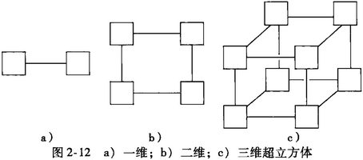

[toc]

# 一、为什么要并行计算

## （一）为什么需要不断提升的性能

随着计算能力的提升，我们要考虑解决的问题也在增加，如一些例子：气候模拟、蛋白质折叠、药物发现、能源研究、数据分析。

## （二）为什么需要构建并行系统

单处理器性能大幅度提升的主要原因之一，是日益增加的集成电路晶体管密度（晶体管是电子开关）。我们如何利用还在不断增加的晶体管密度？答案是并行。集成电路制造商的决策是：与其构建更快、更复杂的单处理器，不如在单个芯片上放置多个相对简单的处理器。这样的集成电路称为多核处理器。核已经成为中央处理器或者CPU的代名词。在这样的设定下，传统的只有一个CPU的处理器称为单核系统。

## （三）为什么需要编写并行程序

大多数为传统单核系统编写的程序无法利用多核处理器。虽然可以在多核系统上运行一个程序的多个实例，但这样意义不大。我们需要的是这个程序能够更快地运行，为了达到这一目的，就需要将串行程序改写为并行程序，只有这样才能充分利用多核。尽管我们可以编写一个翻译程序来自动地将串行程序翻译成并行程序，但不幸的是，研究人员在自动将串行程序（如C或C++编写的程序）转换成并行程序上鲜有突破。

一个串行程序的高效并行实现可能不是通过发掘其中每一个步骤的高效并行实现来获得，相反，最好的并行化实现可能是通过一步步回溯，然后发现一个全新的算法来获得的。

举例来说，假设我们需要计算$n$个数的值再累加求和，如下是串行代码：

```c
sum = 0;
for (i = 0; i < n; i++) {
    x = Compute_next_value(...);
    sum += x;
}
```

现在假设有$p$个核，且$p$远小于$n$，且使用非负数$0,1,\cdots,p-1$标识各个核。那么每个核能够计算大约$n/p$个数的值并累加求和，以得到部分和：

```c
my_sum = 0;
my_first_i = ...;
my_last_i = ...;
for (my_i = my_first_i; my_i < my_last_i; my_i++) {
    my_x = Compute_next_value(...);
    my_sum += my_x;
}
```

此处的前缀my_代表每个核都使用自己的私有变量，并且每个核能够独立于其他核来执行该代码块。每个核都执行完代码后，变量my_sum中就会存储调用Compute_next_value获得的值的和。

当各个核都计算完各自的my_sum值后，将自己的结果值发送给一个指定为“master”的核（主核），master核将收到的部分和累加而得到全局总和：

```c
if (I am the master core) {
    sum = my_x;
    for each core other than myself {
        receive value from core;
        sum += value;
    }  
} else {
    send my_x to the master core;
}
```

在我们的例子中，假如master核是$0$号核，它将累加其他核的部分和，以求全局总和。

但是，这里有一个更好的方法，特别是当核的数目比较多的时候。即不再由master核计算所有部分和的累加工作，而将各个核两两结对，$0$号核将自己的部分和与$1$号核的部分和做加法，$2$号核将自己的部分和与$3$号核的部分和做加法，$4$号核将自己的部分和与$5$号核的部分和做加法，以此类推。然后，再在暂存部分和的核上重复累加，$0$号核加上$2$号核，$4$号核加上$6$号核，以此类推，直到求完所有数值的累加总和。


假设每次从其它核接收数据并累加到本核耗费的时间相同，则第一中方法的时间复杂度为$O(p)$，而第二种方法显然是类似二叉树的思想，其时间复杂度为$O(\log_2 p)$。

非常明显，第一种计算全局总和的方法是对串行求和程序的一般化：将求和的工作在核之间平分，等到每个核都计算出部分和之后，master简单地重复串行程序中基本的串行求和。如果有$p$个核，master就需要计算$p$个值的总和。而第二种计算全局总和的方法与原来的串行程序没有多大关系。

## （四）怎样编写并行程序

对于这个问题，有多种可能的解决方案。大部分方案的基本思想都是将要完成的任务分配给各个核。有两种广泛采用的方法，即**任务并行**和**数据并行**。任务并行是指将待解决问题所需要执行的各个任务分配到各个核上执行，每个不同的任务执行不同的指令。而数据并行是指将待解决问题所需要处理的数据分配给各个核，每个核在分配到的数据集上执行大致相似的操作与指令。

如在1.3节中提到的计算全局总和的例子。其第一部分可以认为是数据并行，每个核在所赋予的数据集上执行大致相同的操作，通过调用Compute_next_value获取所需的值，再将数据累加求部分和。其第二部分可以认为是任务并行，总共有两个任务，一个任务由master核执行，负责接收从其他核传来的部分和，并累加部分和；另一个任务由其他核执行，负责将自己计算得到的部分和传递给master核。

当各个核独立工作时，编写并行程序其实与串行程序差不多。但当核之间需要协调工作时，就会变得复杂，尽管工作分配很好理解，但实际编写代码却比较复杂。而这种核之间需要通信的情况是很常见的。在并行程序中，协调工作的通常包括如下三种类型：**通信**、**负载平衡**、**同步**。

还是计算全局总和的例子。对于协调中的通信是指，一个或多个核将自己的部分和结果发送给其他的核。对于协调的负载平衡，我们希望给每个核分配大致相同数目的数据来计算。如果某个核必须要计算大部分数据，那么其他的核势必比负载大的核早完成任务，它们的计算资源就会浪费。

第三种类型的协调工作是同步，在大多数系统中，核之间不会自动地同步，而是每个核在自己的空间中工作。例如，假设需要累加的数据不再是通过计算给出，而是从标准输入（stdin）中读取数据，假设X是一个数组，存放被master核读入的数据。在这个例子中，在master核初始化完X数组并使数组能够被其他核访问之前，不希望其他核开始工作。因此其他核在开始计算部分和之前，需要等待，我们需要在初始化X数组和计算部分和之间加入一个同步点，假设为Synchronize_cores()函数。这里的想法是，每个核会在Synchronize_cores函数处等待，直到所有的核都进入该函数，特别是，必须要等到master核进入该函数。这种同步机制被称为栅障（barrier）。

目前，功能最强大的并行程序是通过显式的并行结构来编写的，即用扩展C或者扩展C++编写的。这些程序包含了显式的并行指令，如$0$号核执行$0$号任务，$1$号核执行$1$号任务等，所有核之间的同步等，因而这种程序通常很复杂。此外，新一代核的复杂性导致即使编写只在单个核上运行的代码，也要特别注意。

当然，仍然可以有其他方法来编写并行程序（如更高级的语言），但这种高层次的开发语言更趋向于牺牲部分性能来降低开发的难度。

## （五）本书的内容与目标

接下来，将会介绍如何编写显式并行的程序。目标是，学会利用C语言和C语言的三个不同扩展：**消息传递接口（Message-Passing Interface，MPI）**、**POSIX线程（POSIX threads，Pthreads）**、**OpenMP（Open Multiple Processing）**来编写基本的并行程序。MPI和Pthreads是C语言的扩展库，可以在C程序中使用扩展的类型定义、函数和宏；而OpenMP包含了一个扩展库以及对C编译器的部分修改。C语言这三种不同的扩展都有着不同的特性，侧重于并行系统的不同方面。

两种主要并行系统是：**共享内存**系统和**分布式内存**系统。在共享内存系统中，各个核能够共享访问计算机的内存，理论上每个核能够读写内存的所有区域，因此可以通过检测和更新共享内存中的数据来协调各个核。相反，在分布式内存系统中，每个核都拥有自己的私有内存，核之间的通信是显式的，必须使用类似于在网络中发送消息的机制。下图1-2给出了两种系统的示意图。


MPI是为分布式内存系统的编程而设计的，它提供发送消息的机制；而Pthreads和OpenMP是为共享内存系统的编程而设计的，它们提供访问共享内存的机制。可以看到，共享内存系统的编程方法有两种扩展，其中OpenMP是对C语言相对更高层次的扩展。例如，它能够通过使用一个简单的指导语句将累加和循环并行化，而Pthreads需要做与上面例子中相似的操作。另一方面，Pthreads提供了一些在OpenMP中不可用的协调构造。OpenMP容易将很多程序并行化，而Pthreads提供的一些构造，增强了并行化其他一些程序的能力。

## （六）并发、并行、分布式

与并行计算相关的概念有：**并发（concurrent）**、**并行（parallel）**、**分布式（distributed）**，尽管还没有对它们之间的差别形成统一的意见，但许多研究者都同意它们之间有如下区别：

- 在并发计算中，一个程序的多个任务在同一个时段内可以同时执行。
- 在并行计算中，一个程序通过多个任务紧密协作来解决某个问题。
- 在分布式计算中，一个程序需要与其他程序协作来解决某个问题。

所以并行程序和分布式程序都是并发的，但某些程序如多任务操作系统也是并发的，因为即使它运行在单核机器上，多个任务也能在同一段时间里同时执行。在并行程序和分布式程序之间没有一条明确的分界线，但是并行程序往往同时在多个核上执行多个任务，这些核在物理上紧密靠近，或者共享内存或者通过高速网络相互连接。另一方面，分布式程序往往更加“松耦合”。任务是在多个计算机上执行，这些计算机之间相隔较远并且任务是由独立创建的程序来完成的。

但需要注意的是，这些术语之间的区别并没有通用的约定。例如，许多人将共享内存程序看做“并行”的，而将分布式内存程序看做“分布式”的。正如本书名所示的，本书的兴趣在于并行程序，即紧耦合的多个任务协作来解决某个问题的程序。

## （七）本书的其余部分

如果对高性能感兴趣，不管编写串行程序还是并行程序，都需要对系统的硬件和软件有所了解。

## （八）警告

如果不进行细致的设计和增量式地开发程序，肯定会犯错。每个并行程序包含至少一个串行程序。因为需要协调多个核的行为，所以编写并行程序肯定比串行程序更加复杂，实际上，是非常复杂。因此，所有设计和开发并行程序的原则都远比开发串行程序的原则重要。

# 二、并行硬件和并行软件

有删减。为了编写高效的并行程序，需要对底层的硬件和系统软件有所了解。

## （一）背景知识

并行硬件和并行软件是从传统的一次只执行单个任务的串行硬件和串行软件中发展出来的。所以为了更好地理解并行系统的现状，我们先简略地了解一下串行系统的特性。

### 1. 冯诺依曼结构

经典的冯诺依曼结构包括主存、中央处理单元（Central Processing Unit，CPU）处理器或核，以及主存和CPU之间的互连结构。主存中有许多区域，每个区域都可以存储指令和数据。每个区域都有一个地址，可以通过这个地址来访问相应的区域及区域中存储的数据和指令。中央处理单元分为控制单元和算术逻辑单元（Arithmetic Logic Unit，ALU）。控制单元负责决定应该执行程序中的哪些指令，而ALU负责执行指令。

CPU中的数据和程序执行时的状态信息存储在特殊的快速存储介质中，即**寄存器**。控制单元有一个特殊的寄存器，叫做程序计数器，用来存放下一条指令的地址。指令和数据通过CPU和主存之间的互连结构进行传输。这种互连结构通常是总线，总线中包括一组并行的线以及控制这些线的硬件。

冯诺依曼机器**一次执行一条指令**，每条指令对一个数据进行操作。见下图2-1所示。


当数据或指令从主存传送到CPU时，称为数据或指令从内存中取出或者**读出**。当数据或指令从CPU传送到主存中时，称为数据或指令存入或者**写入**内存中。**主存和CPU之间的分离称为冯诺依曼瓶颈**。这是因为互连结构限制了指令和数据访问的速率。程序运行所需要的大部分数据和指令被“有效地”与CPU隔离开。到2010年，CPU执行指令的速度是从主存中取指令速度的$100$多倍。

为了解决冯诺依曼瓶颈，人们已经多次尝试对基本的冯诺依曼结构进行改进。

### 2. 进程、多任务及线程

操作系统（Operating System，OS）是一种用来管理计算机的软件和硬件资源的主要软件。它决定什么程序能运行以及什么时候运行。它控制运行中程序的内存分配以及对诸如硬盘、网卡等外设的访问。

当用户运行一个程序时，操作系统创建一个进程。进程是运行着的程序的一个实例。一个进程包括如下实体：

- 可执行的机器语言程序。
- 一块内存空间，包括可执行代码，一个用来跟踪执行函数的调用栈、一个堆，以及一些其他内存区域。
- 操作系统分配给进程的资源描述符，如文件描述符。
- 安全信息，例如阐述进程能够访问哪些硬件和软件的信息。
- 进程状态信息，例如进程是否就绪还是等待某些资源、寄存器内容，以及关于进程存储空间的信息。

大多数现代操作系统都是多任务的。这意味着操作系统提供对同时运行多个程序的支持。这对于单核系统也是可行的，因为每个进程只运行一小段时间（几毫秒），亦即一个时间片。在一个多任务操作系统中，如果一个进程需要等待某个资源，例如需要从外部的存储器读数据，它会阻塞。

因为线程相对于进程而言是“轻量级”的。在大多数系统中，线程间的切换比进程间的切换更快。线程包含在进程中，线程可以使用相同的可执行代码，共享相同的内存和相同的IO设备。实际上，当两个线程共属于一个进程时，它们共享进程的大多数资源。它们之间最大的差别是各自需要一个私有的程序计数器和函数调用栈，使它们能够独立运行。

如果进程是执行的“主线程”，其他线程由主线程启动和停止，那么我们可以设想进程和它的子线程如下进行，当一个线程开始时，它从进程中**派生**（fork）出来；当一个线程结束，它**合并**（join）到进程中，如图2-2所示。


## （二）对冯诺依曼模型的改进

人们对基本的冯诺依曼结构已经做了很多改进。许多改进都是为了解决冯诺依曼瓶颈，也有许多改进只是为了使CPU更快。本节介绍三种改进措施：缓存（cache）、虚拟存储器（或虚拟内存）、低层次并行。

### 1. Cache基础知识

缓存是解决冯诺依曼瓶颈而最广泛使用的方法之一。

一般来说，对高速缓冲存储器（Cache）的访问时间比其他存储区域的访问时间短。在本书中，当谈到缓存时，一般指的是CPU缓存（CPU Cache）。CPU Cache是一组相比于主存，CPU能更快速地访问的内存区域。CPU Cache位于与CPU同一块的芯片上或者位于其他芯片上，但比普通的内存芯片能更快地访问。

有了Cache后，一个很明显的问题是要将哪些内存区域存储在Cache中。通用的准则基于下面的原理：程序访问完一个存储区域往往会访问接下来的区域，这个原理称为**局部性**。在访问完一个内存区域（指令或者数据），程序会在不久的将来（时间局部性）访问邻近的区域（空间局部性）。

为了运用局部性原理，系统使用更宽的互连结构来访问数据和指令。也就是，一次内存访问能存取一整块内存区域，而不只是单个内存单元。这些块称为高速缓存块或者离速缓存行。一个典型的高速缓存行能存储8\~16倍单个内存区域的信息。

在物理实现上，Cache分为不同的层（level）。第一层（L1）最小但最快，更高层Cache（L2、L3）更大但相对较慢。2010年，大多数系统拥有至少两层Cache，有三层Cache是非常普遍的。Cache通常是用来存储速度较慢的存储器中信息的副本，可以认为低层Cache（更快、更小）是高层Cache的Cache。所以，一个变量存储在L1 Cache中，也会存储在L2 Cache中。但是，有些多层Cache不会复制已经在其他层Cache中存在的信息。对于这种Cache，L1 Cache中的变量不会存储在其他层Cache中，但会存储在主存中。

当CPU需要访问指令或者数据时，它会沿着Cache的层次结构向下查询，首先查询L1 Cache，接着L2 Cache，以此类推。最后，如果Cache中没有所需要的信息，就会访问主存。当向Cache查询信息时，如果Cache中有信息，则称为Cache**命中**或者命中；如果信息不存在，则称为Cache**缺失**或者缺失。命中和缺失是相对Cache层而言的。例如，当CPU试图访问某个变量时，很可能L1 Cache缺失，而L2 Cache命中。

注意，存储器访问的术语读（read）和写（write）也适用于Cache，例如我们可以从L2 Cache中读一条指令，也可以向L1 Cache写数据。

当CPU尝试读数据或者指令时，如果发生Cache缺失，那么就会从主存中读出包含所需信息的整个高速缓存块，并存传送到Cache中。这时CPU会阻塞，因为它需要等待速度相对较慢的主存：处理器可以停止执行当前程序的指令，直到从主存中取出所需的数据或者指令。

当CPU向Cache中写数据时，Cache中的值与主存中的值就会不同或者**不一致（inconsistent）**。有两种方法来解决这个不一致性问题。在写直达（write-through）Cache中，当CPU向Cache写数据时，高速缓存行会立即写入主存中。在写回（write-back）Cache中，数据不是立即更新到主存中，而是将发生数据更新的高速缓存行标记成脏（dirty），当发生高速缓存行替换时，标记为脏的高速缓存行被写入主存中。

### 2. Cache映射

在Cache设计中，另一个问题是高速缓存行应该存储在什么位置。这个问题的答案因系统而异。一个极端是全相联（fully associative）Cache，每个高速缓存行能够放置在Cache中的任意位置。另一个极端是直接映射（directed mapped）Cache，每个高速缓存行在Cache中有唯一的位置。处于两种极端中间的方案是n路组相联（n-way set associated）。在n路组相联Cache中，每个高速缓存行都能放置到Cache中n个不同区域位置中的一个。

当内存中的行（多于一行）能被映射到Cache中的多个不同位置（全相联和n路组相联）时，需要决定替换或者驱逐Cache中的哪一行。最常用的替换方案是最近最少使用（least recently used）。顾名思义，Cache记录各个块被访问的次数，替换最近访问次数最少的块。

### 3. Cache和程序：一个实例

非常重要的一点是：CPU Cache是由系统硬件来控制的，而编程人员并不能直接决定什么数据和什么指令应该在Cache中。但是，了解空间局部性和时间局部性原理可以让我们对Cache有些许间接的控制。例如，C语言以“行主序”来存储二维数组。尽管二维数组看上去是一个矩形块，但是内存是巨大的一维数组。在行主序存储模式下，先存储二维数组的第一行，接着第二行，以次类推。所以，按行顺序访问二维数组中的数据，比按列顺序访问二维数组，会有更好的性能。

### 4. 虚拟存储器

Cache使得CPU快速访问主存中的指令和数据变成可能。但是，如果运行一个大型的程序，或者程序需要访问大型数据集，那么所有的指令或者数据可能在主存中放不下。

利用虚拟存储器（或虚拟内存），使得主存可以作为辅存的缓存。它通过在主存中存放当前执行程序所需要用到的部分，来利用时间和空间局部性；那些暂时用不到的部分存储在辅存的块中，称为交换空间（swap space）中。

与CPU Cache类似，虚拟存储器也是对数据块和指令块进行操作。这些块通常称为页（page）。大多数系统采用固定大小的页，从$4\sim16\text{KB}$不等。在编译程序时，给程序的页赋予虚拟页号。当程序运行时，创建一张将虚拟页号映射成物理地址的表。程序运行时使用到虚拟地址，这个页表就用来将虚拟地址转换成物理地址。页表的创建由操作系统管理。

使用页表的缺点是，会使访问主存区域的时间加倍。假设，想要执行主存中的一条指令，执行程序只有该指令的虚拟地址，在从主存中找到该指令前，需要将虚拟地址转换成物理地址。为了能够转换虚拟地址，需要在内存中寻找包含该指令的页，这就需要该页的虚拟页号。现在，虚拟页号作为虚拟地址的一部分存储。假如虚拟地址有$32$位，页大小是$4\text{KB}$字节，那么可以用虚拟地址的低$12$位来定位页内字节，而剩下的位用来定位页。这样，虚拟页号能够直接从虚拟地址中计算出来，而不用访存。但是，一旦知道了虚拟页号，就需要访问页表，将虚拟页号转换成物理页号。如果所需要的页表不在Cache中，就需要将它从内存中加载到Cache中。加载结束后，就能将虚拟地址转换成物理地址并获取需要的指令。

显然地，使用页表会增加程序总体的运行时间。为了解决这个问题，处理器有一种专门用于地址转换的缓存，叫做转译后备缓冲区（Translation-Lookaside Buffer，TLB），它是**页表的缓存**Chace。TLB在快速存储介质中缓存了一些页表的条目（通常为$16\sim512$条）。利用时间和空间局部性原理，大部分存储器所访问页的物理地址已经存储在TLB中，对主存中页表的访问能够大幅度减少。

TLB的术语和Cache的术语一样。当查询的地址和虚拟页号在TLB中时，称为TLB命中；如果不在TLB中，称为TLB缺失。但是，有些术语也不同，假如想要访问的页不在内存中，即页表中该页没有合法的物理地址，该页只存储在磁盘上，那么这次访问称为**页面失效（page fault）**。磁盘访问的相对迟缓也会给虚拟内存带来一些额外的后果。

CPU Cache是由系统硬件控制，而虚拟内存是由系统硬件和操作系统一起控制的。

### 5. 指令级并行

指令级并行（Instruction-Level parallelism，ILP）通过让多个处理器部件或者功能单元同时执行指令来提高处理器的性能。有两种主要方法来实现指令级并行：**流水线**和**多发射**。流水线是指将功能单元分阶段安排；多发射是指让多条指令同时启动。这两种方法在现代CPU中都有使用。详见《计算机体系结构》。

### 6. 硬件多线程

指令级并行是很难利用的，因为程序中有许多部分之间存在依赖关系。

线程级并行（Thread-Level Parallelism，TLP）尝试通过同时执行不同线程来提供并行性。与ILP相比，TLP提供的是粗粒度的并行性，即同时执行的程序基本单元（线程）比细粒度的程序单元（单条指令）更大或者更粗。

**硬件多线程（Hardware Multithreading）**为系统提供了一种机制，使得当前执行的任务被阻塞时，系统能够继续其他有用的工作。例如，如果当前任务需要等待数据从内存中读出，那么它可以通过执行其他线程而不是继续当前线程来发掘并行性。当然，为了使这种机制有效，系统必须支持线程间的快速切换。例如，在一些较老的系统中，一个线程被简单地实现为一个进程，但进程之间切换的时间是执行指令时间的数千倍。

在细粒度（fine-grained）多线程中，处理器在每条指令执行完后切换线程，从而跳过被阻塞的线程。尽管这种方法能够避免因为阻塞而导致机器时间的浪费，但它的缺点是，执行很长一段指令的线程在执行每条指令的时候都需要等待。粗粒度（coarse-grained）多线程为了避免这个问题，只切换那些需要等待较长时间才能完成操作（如从主存中加载）而被阻塞的线程。这种机制的优点是，不需要线程间的立即切换。但是，处理器还是可能在短阻塞时空闲，线程间的切换也还是会导致延迟。

同步多线程（Simultaneous Multithreading，SMT）是细粒度多线程的变种。它通过允许多个线程同时使用多个功能单元来利用超标量处理器的性能。如果我们指定“优先”线程，那么能够在一定程度上减轻线程减速的问题。优先线程是指有多条指令就绪的线程。

【补充】一个CPU可以有多个内核，内核就是真正的物理核心。而往往处理器会使用**超线程（hyperthreading）**技术，利用特殊的硬件指令，在单个内核基础上提供2个能够模拟物理内核的逻辑内核（逻辑处理器），从而在单个内核上运行两个线程。现在说多少核一般都是指有多少逻辑处理器。

## （三）并行硬件

因为有多个复制的功能单元，所以多发射和流水线可以认为是并行硬件。但是，这种并行性通常对程序员是不可见的，所以我们仍把它们当成基本的冯诺依曼结构的扩展。我们的原则是，并行硬件应该是仅限于对程序员可见的硬件。换句话说，如果能够通过修改源代码而开发并行性或者必须修改源代码来开发并行性，那么我们认为这种硬件是并行硬件。

### 1. SIMD系统

在并行计算中，Flynn分类法经常用来对计算机体系结构进行分类。按照它能够同时管理的指令流数目和数据流数目来对系统分类。典型的冯诺依曼系统是单指令流单数据流（Single Instruction Single Data，SISD）系统，因为它一次执行一条指令，一次存取一个数据项。

**单指令多数据流（Single Instruction Multiple Data，SIMD）**系统是并行系统。顾名思义，SIMD系统通过对多个数据执行相同的指令从而实现在多个数据流上的操作。所以一个抽象的SIMD系统可以认为有一个控制单元和多个ALU。一条指令从控制单元广播到多个ALU，每个ALU或者在当前数据上执行指令或者处于空闲状态。

例如，假设想要执行一个“向量加法”，即有两个数组x和y，每个都有n个元素，想要把y中的元素加到x中，我们能够将x[i]和y[i]加载到第i个ALU中，然后让第i个ALU将x[i]和y[i]相加，最后将结果存储在x[i]中。若ALU数量有限，可以分批次进行。

所有的ALU要么执行相同的指令，要么同时处于空闲状态的要求会严重地降低SIMD系统的整体性能。

在“经典”的SIMD系统中，ALU必须同步操作，即在下一条指令开始执行之前，每个ALU必须等待广播。此外，ALU没有指令存储器，所以ALU不能通过存储指令来延迟执行指令。

SIMD系统适合于对处理大型数组的简单循环实行并行化。通过将数据分配给多个处理器，然后让各个处理器使用相同的指令来操作数据子集实现并行化。这种并行称为数据并行。SIMD并行性在大型数据并行问题上非常有用，但是在处理其他并行问题时并不优秀。

到20世纪90年代末，唯一广泛生产的SIMD系统是向量处理器。近来，图形处理单元（Graphics Processing Unit，GPU）和台式机的CPU利用了SIMD计算方面的知识。

#### (1) 向量处理器

尽管向量处理器的构成近年来发生了变化，但它们的重要特点还是能够对数组或者数据向量进行操作，而传统的CPU是对单独的数据元素或者标量进行操作。近年来，典型的系统有如下特征：

- 向量寄存器。它是能够存储由多个操作数组成的向量，并且能够同时对其内容进行操作的寄存器。向量的长度由系统决定，从$4$到$128$个$64$位元素不等。
- 向量化和流水化的功能单元。注意，对向量中的每个元素需要做同样的操作；或者某些类似于加法的操作，这些操作需要应用到两个向量中相应的元素对上。因此，向量操作是SIMD。
- 向量指令。这些是在向量上操作而不是在标量上操作的指令。如果向量的长度是vector_length，那么这些指令的功能相当于一个简单的循环语句。但是它只需要一次加载、一次加法和一次存储操作就能完成对长度为vector_length的数据块的操作，而传统的系统需要对数据块中每个元素单独进行加载、加法和存储操作。
- 交叉存储器。内存系统由多个内存“体”组成，每个内存体能够独立访问。在访问完一个内存体之后，再次访问它之前需要有一个时间延迟，但如果接下来的内存访问是访问另一个内存体，那么它很快就能访问到。所以，如果向量中的各个元素分布在不同的内存体中，那么在装入/存储连续数据时能够几乎无延迟地访问。
- 步长式存储器访问和硬件散射/聚集。在步长式存储器访问中，程序能够访问向量中固定间隔的元素，例如能够以跨度4访问第一个元素、第五个元素、第九个元素等。在本文中，散射/聚集是对无规律间隔的数据进行读（聚集）和写（散射）。例如访问第一个元素、第二个元素、第四个元素、第八个元素等。典型的向量系统通过提供特殊的硬件来加速步长式存储器访问和散射/聚集操作。

向量处理器对许多应用都有益处，因为它们速度快而且容易使用。向量编译器擅长于识别向量化的代码。此外，它们能识别出不能向量化的循环而且能提供循环为什么不能向量化的原因。因此，用户能对是否重写代码以支持向量化做出明智的决定。

向量系统有很高的内存带宽，每个加载的数据都会使用，不像基于Cache的系统不能完全利用高速缓存行中的每个元素。但是，它不能处理不规则的数据结构和其他的并行结构，这对它的可扩展性是个限制。**可扩展性是指能够处理更大问题的能力**。制造一个能够处理长度不断增长的向量的系统是很难的事。新一代系统通过增加向量处理器的数目而不是增加向量长度来进行扩展。当前的商品化系统对短向量提供部分有限的支持，能对长向量进行操作的处理器是定制生产的，非常昂贵。

#### (2) 图形处理单元（GPU）

实时图形应用编程接口使用点、线、三角形来表示物体的表面。它们使用**图形处理流水线（graphics processing pipeline）**将物体表面的内部表示转换为一个像素的数组。这个像素数组能够在计算机屏幕上显示出来。流水线的许多阶段是可编程的。可编程阶段的行为可以通过**着色函数（shader function）**来说明。典型的着色函数一般比较短，通常只有几行C代码。因为它们能够应用到图形流中的多种元素（例如顶点）上，所以着色函数一般是隐式并行的。对邻近元素使用着色函数会产生相同的控制流，GPU可以通过使用SIMD并行来优化性能。现在所有的GPU都使用SIMD并行。这是通过在每个GPU处理核中引入大量的ALU（例如$64$个）来获取的。

处理单个图像就需要大量的数据，数百兆大小的图像是很普通的。因此GPU需要维持很高的数据移动速率。另外，为了避免内存访问带来的延迟，**GPU严重依赖硬件多线程**。有些系统能够存储数百个挂起线程的状态。实际线程的数目依赖于着色函数需要的资源（例如寄存器）的数量。GPU的缺点是需要许多处理大量数据的线程来维持ALU的忙碌，可能在小问题的处理上性能相对差。

需要强调的是，GPU不是纯粹的SIMD系统。尽管在一个给定核上的ALU使用了SIMD并行，但现代的GPU有几十个核，每个核都能独立地执行指令流。

### 2. MIMD系统

**多指令多数据流（Multiple Instruction Multiple Data，MIMD）**系统支持同时多个指令流在多个数据流上操作。因此，**MIMD系统通常包括一组完全独立的处理单元或者核，每个处理单元或者核都有自己的控制单元和ALU**。此外，不同于SIMD系统，MIMD系统通常是异步的，即各个处理器能够按它们自己的节奏运行。在许多MIMD系统中，**没有全局时钟，两个不同处理器上的系统时间之间是没有联系的**。实际上，除非程序员强制同步，否则即使处理器在执行相同顺序的指令时，在任意时刻它们都可能执行不同的语句。

如前所述，MIMD系统有两种主要的类型：**共享内存**系统和**分布式内存**系统。在共享内存系统中，一组自治的处理器通过互连网络（interconnection network）与内存系统相互连接，每个处理器能够访问每个内存区域。在共享内存系统中，处理器通过访问共享的数据结构来隐式地通信。在分布式内存系统中，每个处理器有自己私有的内存空间，处理器-内存对之间通过互连网络相互通信。所以在分布式内存系统中，处理器之间是通过发送消息或者使用特殊的函数来访问其他处理器的内存，从而进行显式的通信。见图2-3和图2-4所示。


#### (1) 共享内存系统

最广泛使用的共享内存系统使用一个或者多个多核处理器。一个多核处理器在一块芯片上有多个CPU或者核。通常，每个核都拥有私有的L1 Cache，而其他的Cache可以在核之间共享，也可以不共享。

在拥有多个多核处理器的共享内存系统中，互连网络可以将所有的处理器直接连到主存，或者也可以将每个处理器直接连到一块内存，通过处理器中内置的特殊硬件使得各个处理器可以访问内存中的其他块。如图2-5和图2-6所示。


在第一种系统中，每个核访问内存中任何一个区域的时间都相同；而在第二种系统中，访问与核直接连接的那块内存区域比访问其他内存区域要快很多，因为访问其他内存区域需要通过另一块芯片。因此，第一种系统称为**一致内存访问（Uniform Memory Access，UMA）**系统，而第二种系统称为**非一致内存访问（Nonuniform Memory Access，NUMA）**系统。UMA系统通常比较容易编程，因为程序员不用担心不同内存区域的不同访存时间。在NUMA系统中，对与核直接连接的内存区域的访问速度较快，失去了易于编程的优点，但NUMA系统能够比UMA系统使用更大容量的内存。

#### (2) 分布式内存系统

最广泛使用的分布式内存系统称为**集群（clusters）**，它们由一组商品化系统组成（例如PC），通过商品化网络连接（例如以太网）。实际上，这些系统中的节点（通过通信网络相互连接的独立计算单元），通常都是有一个或者多个多核处理器的共享内存系统。为了将这种系统与纯粹的分布式内存系统分开，这种系统通常称为混合系统。现在，通常认为一个集群有多个共享内存节点。

网格提供一种基础架构，使地理上分布的计算机大型网络转换成一个分布式内存系统。通常，这样的系统是异构的，即每个节点都是由不同的硬件构造的。

当然，也可以在单个PC中以这种分布式的方式组织内存层次结构。

### 3. 互连网络

**互连网络（interconnection network）**在分布式内存系统和共享内存系统中都扮演了一个决定性的角色，即使处理器和内存无比强大，但一个缓慢的互连网络会严重降低除简单并行程序外所有程序的整体性能。

尽管有些互连网络大体相似，但还是有很多的差别，我们必须对共享内存系统和分布式内存系统的互连网络区别对待。

#### (1) 共享内存互连网络

在共享内存系统中，目前最常用的两种互连网络是**总线（bus）**和**交叉开关矩阵（crossbar）**。总线是由一组并行通信线和控制对总线访问的硬件组成的。总线的核心特征是连接到总线上的设备共享通信线。总线具有低成本和灵活性的优点，多个设备能够以小的额外开销连接到总线上。但是，因为通信线是共享的，因此随着连接到总线设备的增多，争夺总线的概率增大，总线的预期性能会下降。如果将大量的处理器与总线连接，那么可以断定处理器会经常等待访问内存。因此，随着共享内存系统规模的增大，总线会迅速被交换互连网络所取代。

顾名思义，**交换互连网络**使用交换器（switch）来控制相互连接设备之间的数据传递。下图2-7(a)是一个交叉开关矩阵（crossbar），线表示双向通信链路，方块表示核或者内存模块，圆圈表示交换器。


单个交换器有两种不同的设置，如图2-7(b)所示。在使用这种交换器，并且内存模块不比处理器少的情况下，当两个核同时访问相同的内存模块时，它们只可能发生一次冲突。例如，图2-7(c)显示了，当P1向M4写数据，P2从M3中读数据，P3从M1中读数据，P4向M2中写数据时，各个交换器的配置情况。

交叉开关矩阵允许在不同设备之间同时进行通信，所以比总线速度快。但是，交换器和链路带来的开销也相对高。一个小型的基于总线系统比相等规模的基于交叉开关矩阵系统便宜。

#### (2) 分布式内存互连网络

分布式内存互连网络通常分成两种：**直接互连**与**间接互连**。

在直接互连中，每个交换器与一个处理器-内存对直接相连，交换器之间也相互连接。下图2-8给出了一个环（ring）和一个**二维环面网格（toroidal mesh）**的示例。如前面所述，圆圈表示交换器，方块表示处理器，将每个处理器与它的交换器并在一起，线表示双向通信链路。


环比简单的总线高级，因为它允许有多个通信同时发生。然而，在处理器必须等待其他处理器才能完成通信的情况中，制定通信方案才会比较容易。环面网格比环昂贵，因为交换器更加复杂。这种交换器需要能够支持$5$个链路而不只是$3$个。如果有$P$个处理器，在环面网格中链路的数目是$3P$，但在环中只是$2P$。但是在环面网格中，可以同时通信的链路数目比环中的多，这一点是毋庸置疑的。

衡量“同时通信的链路数目”或者“连接性”的一个标准是**等分宽度（bisection width）**。其定义为，当某一网络被切成相等的两半（两部分节点数相同）时，沿横截面的最小通道数称为通道等分宽度。在图2-9(a)中，我们将一个$8$节点的环分成两组，每组有四个节点，它们之间同时发生通信的次数只为$2$。而在图2-9(b)中，采用3D空间中的划分，使它们之间能够同时发生$4$次通信。但是等分宽度是基于最坏情况来估计的，所以等分宽度是$2$而不是$4$。


计算等分宽度的另一种方法是去除最少的链路数从而将节点分成两等份，去除的链路数就是等分宽度。如果有一个正方形的二维环面网格，有$p=q^2$个节点（$q$为偶数），然后通过移除一些“中间”的水平链路和“回绕”的水平链路，将这些节点分成两份。如下图2-10所示。这意味着等分宽度最多是$2q=2\sqrt p$实际上，这是最小的可能链路数目，一个正方形二维环面网格的等分宽度就是$2\sqrt p$。


链路的**带宽（band width）**是指它传输数据的速度。通常用兆位每秒或者兆字节每秒来表示。**等分带宽（bisection bandwidth）**通常用来衡量网络的质量。它与等分宽度类似，但等分带宽不是计算连接两个等分之间的链路数，而是计算链路的带宽。例如，如果在环中，链路的带宽是$10$亿位每秒，那么环的等分带宽就是$20$亿位每秒。

最理想的直接互连网络是全相连网络，即每个交换器与每一个其他的交换器直接连接。如下图2-11所示，它的等分宽度是$p^2/4$。


但是，为节点数目较多的系统构建这样的全互连网络是不切实际的，因为它需要总共$(p^2+p)/2$条链路，而且每个交换器都需要连接$p$条链路。因此，这只是一个“理论上可能最佳”的互连网络，它用来作为衡量其他互连网络的基础。

**超立方体**是一种已经用于实际系统中的高度互连的直接互连网络。超立方体是递归构造的：一维超立方体是有两个处理器的全互连系统。二维超立方体是由两个一维超立方体组成，并将“相应”的交换器互连。如下图2-12所示。



因此，维度为$d$的超立方体有$p=2^d$个节点，并且在$d$维超立方体中，每个交换器与一个处理器和个多个交换器直接连接。这样的超立方体的等分宽度是$p/2$，所以它比环或者环面网格连接性更高，但这需要更强大的交换器，因为每个交换器必须支持$1+d=1+\log_2p$条连线，而二维环面网格的交换器只需要$5$条连线。所以构建一个$p$个节点的超立方体互连网络比构建一个二维环面网格更昂贵。

**间接互连**为直接互连提供了一个替代的选择。在间接互连网络中，交换器不一定与处理器直接连接。它们通常由一些单向连接和一组处理器组成，每个处理器有一个输入链路和一个输出链路，这些链路通过一个交换网络连接。见下图2-13。


**交叉开关矩阵**和**omega网络**是间接网络中相对简单的例子。前面介绍了使用双向链路的共享内存交叉开关矩阵（见图2-7）。而下图2-14中的交叉开关矩阵通过单向链路共享分布式内存。注意，只要两个处理器不尝试与同一个处理器通信，那么所有的处理器就能够同时与其他的处理器通信。


omega网络的一个例子见下图2-15。omega网络中的交换器是一个$2\times2$的交叉开关矩阵，见下图2-16。注意，与交叉开关矩阵不同的是，有一些通信无法同时进行。例如，在图2-15中，处理器0给处理器6发送一个消息，这时处理器1就不能同时给处理器7发送消息。另一方面，omega网络比交叉开关矩阵便宜。omega网络使用了$\frac12p\log_2p$个交换器，每个交换器是一个$2\times 2$交叉开关矩阵交换器，所以总共使用了$2p\log_2p$个交换器，而交叉开关矩阵使用$p^2$个交换器。


为间接互连网络定义等分宽度就比较复杂，我们要将处理器分为两组，每组拥有一般数量的处理器。然后在网络的任意位置处移除连接，使两组之间不再连接。移除的最小链路数就是该网络的等分宽度。当对链路计数时，如果网络中使用的是单向链接，则两条单向链接算作一条链路。定义的原理与直接互连网络是相同的：将节点分成大小相等的两部分，并确定在两个等分之间发生多少通信，或者至少需要移除多少数目的链路才能使两个等分不再通信。一个$p\times p$大小的交叉开关矩阵的等分宽度是$p$，而一个omega网络的等分宽度是$p/2$。

#### (3) 延迟和带宽

当传送数据时，我们关心数据到达目的地需要花多少时间。无论数据是在主存和Cache之间传递、在Cache和寄存器之间、在磁盘和内存之间，还是在两个分布式内存系统或者混合系统的节点之间传送，这个问题都很关键。

下面是两个经常用来衡量互连网络（不管怎么连接）性能的指标：**延迟（latency）**和**带宽（bandwidth）**。延迟是指从发送源开始传送数据到目的地开始接收数据之间的时间。带宽是指目的地在开始接收数据后接收数据的速度。所以如果一个互连网络的延迟是$l$秒，带宽是$b$字节每秒，则传输一个$n$字节的消息需要花费的时间是，消息传送的时间$l+n/b$。

但是，需要注意的是，这些术语经常在不同的场合下使用。例如，延迟有时候也用来描述消息传送的总时间。它也用来描述在传送数据时需要的固定开销。例如，如果在分布式内存系统中的两个节点之间传递消息，消息中不仅仅包含原始数据，它可能还包括将要传送的数据、目标地址，有些消息还会描述消息的长度、某些错误校验的信息等。所以，在这种情况下，延迟是指在发送端收集消息的时间、将不同部分组装起来的时间、在接收端将消息拆卸的时间、从消息中抽取原始数据的时间以及在目的地存储的时间的总和。

### 4. Cache一致性

CPU Cache是由系统硬件来管理的，程序员对它不能进行直接的控制。这会对共享内存系统带来很多重大的影响。在多核系统中，各个核的Cache存储相同变量的副本，当一个处理器更新Cache中该变量的副本时，其他处理器应该知道该变量已更新，即其他处理器中Cache的副本也应该更新。这称为Cache一致性问题。

为了实现Cache的一致性协议，有多种具体的实现思路，如写无效协议与写更新协议、侦听协议与目录协议。详细可以参考《计算机体系结构》中的相关内容。

### 5. 共享内存与分布式内存

不是所有的MIMD系统都是共享内存的，即使通过共享数据结构隐式地协调多个处理器的工作，比显式地发送消息更诱人。

主要的硬件方面的问题是互连网络扩展的代价。当向总线增加处理器时，访问总线发生冲突的可能性骤升。所以总线适合于那些处理器数目较少的系统。大型的交叉开关矩阵是非常昂贵的，所以使用大型交叉开关矩阵互连的系统也是比较少见的。

另一方面，分布式内存互连网络，如超立方体、环面网格相对便宜一些，有成千上万个处理器的分布式系统就是用这种互连网络或者其他构建的。因此，分布式内存系统比较适合于那些需要大量数据和计算的问题。

## （四）并行软件

现在是并行硬件的时代，几乎所有的台式机和服务器都使用多核。但对并行软件不适用。除了操作系统、数据库系统、Web服务器外，目前能够充分利用并行硬件特性的商业软件很少。正如前述，不再能通过硬件和编译器为应用提供性能上的稳定增长了。想要继续追求应用性能和应用功效上的增长，软件开发人员必须学会编写能够利用共享内存或者分布式内存体系结构潜力的应用程序。

本节将简要地学习编写并行系统上的软件所涉及的问题。首先是一些术语。通常，在运行共享内存系统时，会启动一个单独的进程，然后派生（fork）出多个线程。所以当谈论共享内存程序时，指的是正在执行任务的**线程**。另一方面，当运行分布式内存程序时，使用的是多个处理器，所以指的是正在执行任务的**进程**。当讨论对共享内存系统和分布式内存系统同样适用时，指的是执行任务的进程或者线程。

### 1. 注意事项

首先，在本书余下的部分中，将只讨论MIMD系统的软件。尽管使用GPU作为并行计算的平台在迅速增多，但GPU的应用程序编程接口与标准的MIMD的API有很大差别。其中，本书主要关注的是称为**单程序多数据流（Single Program Multiple Data，SPMD）**程序。SPMD程序不是在每个核上运行不同的程序，相反，SPMD程序仅包含一段可执行代码，通过使用条件转移语句，可以让这一段代码在执行时表现得像是在不同处理器上执行不同的程序。

```c
if (I am thread/process 0) {
    do this; / operate on first half of the array;
} else {
    do that; / operate on second half of the array;
}
```

可以看到，SPMD程序能够实现任务并行，也能够实现数据并行。

### 2. 进程或线程的协调

将串行程序或者算法转换为并行程序的过程称为并行化（parallelization）。某些程序，如果能够通过简单地将任务分配给进程/线程来实现并行化，我们称该程序是易并行的（embarrassingly parallel）。只有在极少数的情况下，获取好的并行性能是容易的。不幸的是，编写易并行的程序并不容易，大多数时候，编程人员需要做：

1. 将任务在进程/线程之间分配。在许多情况下，不需要对它们进行过多的思考，它们通常在编程人员不事先知道工作量而是在程序运行时生成工作量的情况下才需要考虑。这个分配尽量满足：
   1. 这个分配可以使得每个进程/线程获得大致相等的工作量。需要在进程/线程之间平均分配任务从而满足该条件，这称为**负载均衡（load balancing）**。
   2. 这个分配可以使得所需的通信量是最小的。
2. 安排进程/线程之间的同步。
3. 安排进程/线程之间的通信。

最后两个问题往往是相关的。例如，在分布式内存程序中，经常通过进程间通信来隐式地同步进程；而在共享内存系统中，经常需要通过同步来实现线程间的通信。我们会在下面详细地探讨这两个问题。

### 3. 共享内存

如前所述，在共享内存系统中，变量可以是**共享的（shared）**或者**私有的（private）**。共享变量可以被任何线程读写，而私有变量只能被单个线程访问。线程间的通信是通过共享变量实现的，所以通信是隐式的，而不是显式的。

#### (1) 动态线程和静态线程

在许多情况下，共享内存程序使用的是**动态线程**。在这种范式中，有一个主线程，并在任何时刻都有一组工作线程（可能为空）。主线程通常等待工作请求（例如通过网络），当一个请求到达时，它派生出一个工作线程来执行该请求。当工作线程完成任务，就会终止执行再合并到主线程中。这种模式充分利用了系统的资源，因为线程需要的资源只在线程实际运行时使用。

另一种程序运行模式是**静态线程**范式。在这种范式中，主线程在完成必需的设置后，派生出所有的线程，在工作结束前所有的线程都在运行。当所有的线程都合并到主线程后，主线程需要做一些清理工作（如释放内存），然后也终止。在资源利用方面，这个范式可能不是很高效，如果线程空闲，它的资源（如栈、程序计数器等）不能被释放。但是，线程的派生和合并操作是很耗时的。

所以如果所需的资源是可用的，静态线程模式有潜力比动态线程获得更高的性能。它也更加接近于分布式内存编程中最广泛使用的模式。既然静态线程范式适用于共享内存系统，也适用于另一种分布式内存系统，因此，我们会经常使用静态线程范式。

#### (2) 非确定性

在任何一个MIMD系统中，如果处理器异步执行，那么很可能会引发非确定性。给定的输入会产生不同的输出，这种计算称为非确定性。如果多个线程独立执行任务，每次运行时它们完成语句的速度各不相同，那么程序的结果可能也不同。因为线程独立执行并且独立地与操作系统交互，一个线程执行完一段语句所花的时间在不同次的执行中也是不同，所以语句执行的顺序是不能预测的。更糟糕的时，一个线程的输出可能被另一个线程的输出所打断。

尤其是在共享内存程序中，非确定性是灾难性的，因为它们很容易导致程序错误。当线程或者进程尝试同时访问一个资源时，这种访问会引发错误。最直接的一个例子是，多个线程尝试同时更新相同的共享内存区域，这会导致非确定性的错误结果。我们经常说程序有**竞争条件（race condition）**，因为线程或者进程处于竞争状态下，即程序的输出依赖于赢得竞争的进程或者线程。

一次只能被一个线程执行的代码块称为**临界区（critical section）**，通常是编程人员来保证互斥地访问临界区。换句话说，我们需要保证如果一个线程在临界区中执行代码，其他线程需要被排除在临界区外。保证互斥执行的最常用机制是**互斥锁（mutual exclusion clock）**，或者**互斥量（mutex）**，或者**锁（lock）**。互斥量是由硬件支持的一个特殊类型的对象。基本思想是每个临界区由一个锁来保护。在一个线程能够执行临界区中的代码前，它必须通过调用一个互斥量函数来获取互斥量，在执行完临界区代码时，通过调用解锁函数来释放互斥量。当一个线程拥有锁时，即从调用加锁函数返回但还没有调用解锁函数时，其他线程尝试执行临界区中的代码必须在调用加锁函数时等待。

因此，为了保证代码正常运行，必须修改代码，使得它看起来像：

```c
my_val = Compute_val(my_rank);
Lock(&add_x_lock);
shared_x += my_val;
Unlock(&add_x_lock);
```

这保证了每次只有一个线程执行`x += my_val`语句。这段代码在线程上没有施加任何预定的顺序，不同的线程都能够先执行`x += my_val`语句。

还需要注意的是，使用互斥量加强了临界区的**串行性（serialization）**。因为在临界区中，一次只有一个线程能执行代码。代码被有效地串行化了。因此，我们希望代码尽可能少地包含临界区，并且临界区尽可能地短。

还有其他可以替代互斥量的方式，如**忙等待（busy-waiting）**。在忙等待时，一个线程进入一个循环，这个循环的目的只是测试一个条件。因为线程忙着等待条件，程序的优点是易于理解和实现。但是，它浪费系统的资源，因为即使线程在做无用功，执行该线程的核还是会重复的检查是否能进入临界区。

**信号量（semaphore）**与互斥量类似，尽管它们的行为细节有些许不同。对某些类型的线程，使用信号量实现同步比用互斥量实现要简单。**监视器（monitor）**能够在更高层次提供互斥执行。监视器是一个对象，这个对象的方法，一次只能被一个线程执行。详细将在后续部分讲解。

目前，还有很多其他同步方法正在研究中，其中受到最多关注的是事务内存（transactional memory）。事务应该要么全部执行，要么都不执行。事务内存背后的基本思想是将共享内存系统中的临界区看做事务。要么一个线程成功地完成临界区代码，要么所有的部分结果回滚，临界区代码重复执行。

#### (3) 线程安全性

在许多、但不是大部分情况下，并行程序能够调用为串行程序开发的函数，并且不会产生问题。但是，有一些值得注意的例外。对于C来说，最重要的例外是使用静态局部变量的函数。普通C语言局部变量（在函数中声明的变量），是从系统栈中分配出来的。因为每个线程有自己的栈，所以普通的C局部变量是私有的。但是，在函数中声明的静态变量，在函数调用时不会被销毁。因此，静态变量能够被调用函数的线程共享，这会引起无法预测和不必要的后果。

这样的函数不是线程安全的。这意味着，如果它被多线程程序使用，那么会产生错误或者未知结果。当一段代码不是线程安全的，通常是因为不同的线程在访问共享的数据。因此，即使许多串行程序能够在多线程程序中安全地使用（即它们是线程安全的），编程人员仍然需要谨慎使用那些专门为串行程序编写的函数。

### 4. 分布式内存

在分布式内存程序中，各个核能够直接访问自己的私有内存。目前已经有了许多可以使用的分布式内存编程API。但是，**最广泛使用的是消息传递**。所以，本节主要介绍消息传递。然后，会简略地介绍一些其他的、较少使用的API。

对于分布式内存API来说，它也能在共享内存硬件上使用。这完全是可行的。对于编程人员来说，只是从逻辑上将共享内存分割成私有的地址空间，给各个线程使用，并使用库函数或者编译器实现所需要的通信。

正如我们前面提到的，分布式内存程序通常执行多个进程而不是多个线程。这是因为在分布式内存系统中，典型的“执行的线程”是在独立的CPU中独立的操作系统上运行的，目前还没有软件架构可以启动一个简单的“分布式”进程，使该进程能在系统中的各个节点上再派生出更多的线程来。

#### (1) 消息传递

对于消息传递，最常使用的API是**消息传递接口（Message Passing Interface，MPI）**。消息传递的API（至少）要提供一个发送和一个接收函数。进程之间通过它们的序号（rank）互相识别，序号的范围从$0\sim p-1$，其中$p$表示进程的个数。

例如，进程1（也可称为1号进程）可以使用下面的伪代码向进程0发送消息：

```c
char message[100];
my_rank = Get_rank();
if (my_rank == 1) {
    sprintf(message, "Greetings from process 1");
    Send(message, MSG_CHAR, 100, 0);
} else if (my_rank == 0) {
    Receive(message, MSG_CHAR, 100, 1);
    printf("Process 0 Received: %s\n", message);
}
```

这里有几点值得注意。第一，程序段是SPMD，两个进程使用相同的可执行代码，但执行不同的操作。在这种情况下，它们所执行的操作依赖于它们的序号。第二，在不同进程中，变量message指的是不同的内存块。程序员经常通过使用如my_message或local_message这样的变量名来强调这一点。第三，上述示例程序假设线程0能够写stdout。通常情况下，即使消息传递API没有显式的支持，但大多数实现消息传递的API程序都允许所有的进程访问stdout和stderr。

Send和Receive函数的行为可以有很多种，大多数消息传递API提供多个不同的发送和接收函数。调用Send函数最简单的行为是阻塞（block）直到对应的Receive函数开始接收数据为止。这意味着Send函数调用不会返回，直到对应的Receive函数启动为止。另一种选择可以是，Send函数将消息的内容复制到它私有的存储空间中，在数据复制完之后立即返回。Receive函数最常见的行为是阻塞直到接收到消息。除阻塞形式外，Send和Receive函数还有其他可能的实现方式。

典型的消息传递API还提供了许多其他的函数。例如，提供各种“集合”（collective）通信的函数，如广播（broadcast）。在广播通信中，单个进程传送相同的数据给所有的进程。又例如归约（reduction），在归约函数中，将各个进程计算的结果汇总成一个结果。例如，对各个进程计算出的值相加求总和。还有一些管理进程和复杂数据结构通信的特殊函数。

消息传递是开发并行程序的利器。几乎世界上所有运行在最强计算机上的程序都使用了消息传递。但是，它是非常底层的，程序员需要管理很多细节。例如，为了将一个串行程序并行化，通常需要重写大部分程序。程序中的数据结构要么被每个进程复制，要么被显式地分布在各个进程中。此外，重写程序不能增量地完成。如果一个数据结构在程序中的多个部分使用，在并行部分将它分布在各个进程之中，在串行部分将它收集，这样的代价会比较昂贵。因此，消息传递有时称为“并行编程的汇编语言”，因此也有许多尝试开发其他分布式内存API的方法。

#### (2) 单向通信

在消息传递中，一个进程必须调用一个发送函数，并且发送函数必须与另一个进程调用的接收函数相匹配。任何通信都需要两个进程的显式参与。

在**单向通信（one-sided communication）**或者远程内存访问（remote memory access）中，单个处理器调用一个函数。在这个函数中，或者用另一个进程的值来更新本地局部内存，或者使用调用者进程的值更新远端内存。这种方式能够简化通信，因为它只需要一个进程的参与。此外，它还消除了两个进程间同步的代价，有效地降低了通信的开销。它取消了一个函数（发送或者接收），也可以减少开销。

但是，实际上其中的某些优点是很难实现的。例如，如果进程0将一个值复制到进程1的内存空间中，那么进程0必须有一些方法来知道复制的安全性，因为它可能会将某些内存区域覆盖。进程1也必须有一些方法来知道什么时候内存区域被更新了。第一个问题可以通过在复制前，将两个进程同步来解决。第二个问题可以通过另一次同步或者使用一个“标志”变量来解决，这个标志变量是在进程0完成复制时设立的。在“设置标识”的方法中，进程1需要轮询（poll）标志变量，直到它得到一个表示复制的数据已经可用的值。显然，这些问题会大大地增加传送数据的开销。更大的困难是，因为两个进程间没有显式的交互，所以远程内存操作会引起错误并且很难被追踪。

#### (3) 划分全局地址空间的语言

许多编程人员发现，共享内存编程比消息传递或者单向通信更加诱人。有些研究小组正在开发允许在分布式内存硬件上使用共享内存技术的并行编程语言。但这是非常困难的。如果只是简单地编写一个编译器，这个编译器将分布式系统中所有分散的内存看做一个大内存，那么程序性能往往会比较差，即使在最好的情况下，程序性能也是不可预测的。因为每次一个执行进程访存，它访问的可能是局部内存，即只属于当前执行核的内存，也可能是远端内存，即属于其他核的内存。访问远端内存的时间是访问局部内存时间的数百倍甚至数千倍。

**划分全局地址空间（Partitioned Global Address Space，PGAS）**语言提供了一些共享内存程序的机制。它们给程序员提供了一些工具，避免上面讨论的问题发生。私有变量在运行程序的核的局部内存空间中分配，共享数据结构中数据的分配由程序员控制。所以，程序员知道共享数组中哪个元素是在进程的本地内存中。

### 5. 混合系统编程

我们应该注意到，在类似多核处理器集群的系统中使用混合编程方式，即在节点上使用共享内存API，而在节点间通信使用分布式内存API，是完全可能的。但是，通常这只应用于那些想获得高性能的系统，因为混合系统API的复杂性使得程序开发极其困难。一般情况下，这样的系统通常用分布式内存API来实现节点内和节点间的通信。

## （五）输入和输出

读写数据时，很容易通过标准C函数scanf、pscanf、printf、fprintf来管理。但是，这些函数是标准C函数的一部分，而C是串行语言，所以这些函数被不同的进程调用时，我们并不清楚会发生什么。另一方面，单个进程派生出的多个线程会共享标准的stdin、stdout、stderr。但是，当多个线程尝试访问stdin、stdout、stderr其中的一个时，结果是非确定的，不能预测会发生什么。

当从多个进程调用printf函数时，作为开发人员，我们想要结果输出在某一个单一系统的显示屏上，这个系统是最开始启动程序的那台机器。实际上，大部分系统都是这么做的。但是我们的期望并不总能得到保证，系统可能会做一些其他的。例如，只有一个进程有权访问stdout或stderr，甚至没有进程有权访问stdout或stderr。

当运行多个进程时，调用scanf函数会发生什么还不是很明确。大部分系统允许至少一个进程调用scanf，通常是进程0，而有些系统允许更多。但，也甚至有些系统不允许任何进程调用scanf函数。

当多个进程能够访问stdin、stdout，或者stderr时，输入的分布和输出的顺序是非确定的。对于输入，即使每一次输入的内容都一样，在多次运行时，每个进程读到的数据是不同的。对于输出，数据可能在每一次程序运行时以不同的顺序出现，或者更糟糕的情况，一个进程的输出被另一个进程的输出打断。

为了能够部分地解决这些问题，当并行程序需要输入/输出时，我们会做一些假设并遵循一些规则：

- 在分布式内存程序中，只有进程0能够访问stdin。在共享内存程序中，只有主线程或者线程0能够访问stdin。
- 在分布式内存和共享内存系统中，所有进程/线程都能够访问stdout和stderr。但是，因为输出到stdout的非确定性顺序，大多数情况下，只有一个进程/线程会将结果输出到stdout。但输出调试程序的结果是个例外，在这种情况下，允许多个进程/线程写stdout。
- 只有一个进程/线程会尝试访问一个除stdin、stdout或者stderr外的共享文件。所以，每个进程/线程能够打开自己私有的文件进行读写，但是没有两个进程/线程能打开相同的文件。
- 调试程序输出在生成输出结果时，应该包括进程/线程的序号或者进程标识符。

## （六）性能

编写并行程序的主要目的当然是提高性能，这自然需要一些评价指标。

### 1. 加速比和效率

通常，我们最希望达到的目标是，任务在核之间平均分配，又不会为每个核引入额外的工作量。如果能成功达到目标，当在$p$核系统上运行程序，每个核运行一个进程或者线程，并行程序的运行速度就是串行程序速度的$p$倍。设串行运行时间为$T_s$，并行运行时间为$T_p$，那么最佳的预期是$T_s=T_p\times p$。此时，称并行程序有**线性加速比（linear speedup）**。

实际上，我们不可能获得线性加速比，因为多个进程/线程总是会引入一些代价。例如，共享内存程序通常都有临界区，需要使用一些互斥机制，如互斥量。调用互斥量是串行程序没有的代价，使用互斥量就会强制并行程序串行执行临界区代码。而分布式内存程序通常需要跨网络传输数据，这比访问局部内存中的数据慢。相反，串行程序没有这些额外的开销。因此，找到一个具有线性加速比的并行程序是非常不容易的。此外，随着进程/线程个数的增多，开销也会增大。更多的线程意味着更多的线程需要访问临界区，更多的进程意味着更多的数据需要跨网络传输。

所以，定义并行程序的**加速比（speedup）**是：
$$
S = \frac{T_s}{T_p}
$$
线性加速比为$S=p$，这是非常难以达到的。此外，随着$p$的增加，额外引入并行化的代价，比值$S/p$会越来越小。而$S/p$的值，有时也称为并行程序的**效率（efficiency）**，如下：
$$
E = \frac{S}{p} = \frac{T_s}{T_p\times p}
$$
下表2-5给出了一个例子，它展示了不同问题规模的一个并行程序的加速比和效率。


显然，$T_p,S,E$依赖于$p$，即进程或者线程的数目。此外，$T_p,S,E,T_s$还依赖于问题的规模。可以看到，当问题的规模变大时，加速比和效率增加；当问题的规模变小时，加速比和效率降低。这是因为随着问题规模的增加，进程/线程有更多的任务去做，用于协调进程/线程的所需要的时间相对变少了。

最后的问题是，在计算加速比和效率时，$T_s$应该使用什么值。有人认为，$T_s$应该是在最强的核上运行串行程序的最快时间。而实际上，许多人将串行程序在并行系统上单个核的运行时间作为$T_s$。通常情况下，我们使用第二种方法。

### 2. 阿姆达尔定律

**阿姆达尔定律（Amdahl’s law）**描述了这样的一个事实：大致上，除非一个串行程序的执行几乎全部都并行化，否则，不论有多少可以利用的核，通过并行化所产生的加速比都会是受限的。

假设整个串行程序的运行时间为$T_s$，现将程序并行化，其中有比例为$r$的部分不可并行化（如临界区等）；进一步假设并行化是理想的，即可并行部分的加速比为$p$，其中$p$为处理器核的个数。那么并行化后程序的运行时间为：
$$
T_p = T_s\times r + \frac{T_s\times(1-r)}{p}
$$
加速比为：
$$
S = \frac{T_s}{T_p} = \frac{1}{r+(1-r)/p}
$$
随着处理器核个数$p$增加，程序并行部分的运行时间$T_s\times(1-r)/p$会趋向于零，但仍然会有：
$$
S = \frac{1}{r+(1-r)/p} \le \frac1r
$$
上式揭示了一个事实：即使处理器核再多，并行化所得到的加速比也不可能超过$1/r$。因此，如果$r$代表程序的“天然串行”部分，即无法并行化部分所占的比例，我们不可能获得好于$1/r$的加速比。例如，哪怕仅有$10\%$的部分不可并行化，我们的加速比最大也无法超过$10$。

这听起来非常令人气馁，感觉即使做了这么多工作，却也是徒劳。但是，实际情况却并非如此，有这样几个理由可以让我们不用过多地考虑阿姆达尔定律所带来的影响。首先，阿姆达尔定律中并没有考虑问题的规模。对于许多问题而言，当它的规模增加时，程序不可并行部分的比例会在减小。其次，已有的科学工程计算程序中，有许多都在分布式内存系统中获得了极大的加速比。最后，在许多情况下，即使小的加速比（如$5\sim10$倍）就已经足够了，特别是当不用费很大力气去开发并行程序的时候。

### 3. 可扩展性

粗略地讲，如果一个技术**可以处理规模不断增加的问题**，那么它就是可扩展的。对于并行程序的性能而言，可扩展性有一个更为正式的定义。假设运行一个拥有固定进程或线程数目的并行程序，并且它的输入规模也是固定的，那么可以得到一个效率值$E$。现在，增加该程序所用的进程/线程数，如果它能够在输入规模也以相应增长率增加的情况下，保持效率值一直都是$E$，那么就称该程序是**可扩展**的。换句话说，只有当问题规模增加的倍率，与进程/线程数增加的倍率相同时，效率才会是恒定的，从而程序是可扩展的。

这实际上要求的是，**并行资源的增加使得系统能够处理相应增加的问题规模**。

对于可扩展性的描述，某些情况下会有一些特别的称谓。如果在增加进程/线程的个数时，可以维持固定的效率，却不增加问题的规模，那么程序称为**强可扩展的（strongly scalable）**。因为$E=S/p$，这实际上说的是加速比可以随着并行资源按同速率增加。如果在增加进程/线程个数的同时，只有以相同倍率增加问题的规模才能使效率值保持不变，那么程序就称为**弱可扩展的（weakly scalable）**。

### 4. 计时

事实上，有很多种不同的方法获得$T_s$与$T_p$的值。对于并行程序，详细的细节可能要取决于API。这里首先有一些普遍观察到的现象。

第一，至少有两个不同的理由让我们考虑计时（taking timings）。在程序的开发过程中计时，通常需要非常详细的信息，可能需要知道程序在每一部分分别运行了多少时间，从而知道瓶颈在哪里。例如，对于一个分布式内存程序，我们感兴趣的可能是，处理器为等待消息花了多少时间。如果时间很长，那么大致可以肯定，程序实现或者设计中存在某些问题。另一方面，一旦完成了程序的开发，我们通常想知道这个程序的性能到底怎么样，这只需要一个简单的程序执行的总耗时。

第二，我们通常对于程序从开始到结束之间的时间并不感兴趣，而一般只对程序的某个部分感兴趣。

第三，我们通常也对所谓的CPU运行时间不感兴趣。这是由标准C函数clock所提供的时间，代表的是程序执行代码的总时间。这个时间包括执行所编写代码的时间、执行库函数的时间、调用系统函数所花的时间等。它不包括程序空闲状态的时间，这是它的一个问题。例如，在一个分布式内存程序中，一个进程若调用接收函数，它可能需要等待与它配对的另一个进程执行相应的发送操作，此时操作系统会使接收进程在等待的过程中处于睡眠状态。这个空闲时间并不会计入CPU时间中，因为此时没有任何函数被活动的进程调用。然而，在对整体运行时间的估计中，这种空闲时间应该记录进来的，因为它确实是程序的真实开销的一部分。

因此，我们说的运行时间通常是指**墙上时钟（wall clock time）**，这个时间指的是代码从开始执行到执行结束的总耗费时间，其中就包括了进程阻塞和等待的时间。例如，我们可以在程序开始时通过Get_current_time获得一个时间，在程序结束时也获得一个时间，两者的差值就是程序运行的总耗时。在实际的程序中，该函数的使用取决于具体的API。例如，MPI中的MPI_Wtime函数，共享内存编程OpenMP API中的函数是omp_get_wtime。这两个函数返回的都是墙上时钟时间，而不是CPU时间。

关于计时函数，可能会有所谓的**分辨率（resolution）**问题。分辨率是指计时器的时间测量单位，是计时器在计时的过程中最短的非零时间跨度。许多API提供报告计时分辨率的函数，另一些API则要求一个计时器必须有一个特定的分辨率。作为编程人员，需要检查这些值。

实际上对于并行程序来说，我们通常感兴趣是，从第一个进程/线程开始执行，到最后一个进程/线程结束之间花费的时间。一般很难精确地观察这个过程，因为可能一个进程的时钟和另一个进程的时钟之间并不保持一致。所以通常寻找一个折中方案，代码如下所示。

```c
shared double global_elapsed;
private double my_start, my_finish, my_elapsed;
/* Synchronize all processes/threads */
Barrier();
my_start = Get_current_time();
/* Code that we want to time */
my_finish = Get_current_time();
my_elapsed = my_finish - my_start;
/* Find the max across all processes/threads */
global_elapsed = Global_max(my_elapsed);
if (my_rank == 0) {
    printf("The elpased time = %e seconds\n", global_elapsed);
}
```

在这个例子中，首先执行一个**栅障/路障（barrier）**函数，同步所有的进程/线程。

此外，还需要考虑计时的易变性（variability）。当多次执行同一个程序时，每次运行所花费的时间可能是不同的。即使每次都用同样的输入条件并在同样的系统上运行程序，这个情况仍然存在的。看起来最好的处理办法是采用运行的平均时间或者运行时间的中位数。但是，不可能由于某些外部事件，使程序的运行时间少于它可能的最短运行时间。所以，我们通常报告的是**最短运行时间**，而不是平均运行时间或者中位数时间。

如果在每个核中运行多于一个的线程，这会显著增加计时的易变性。更重要的是，如果在每个核中运行多个线程，系统将不得不花费多余的时间去进行调度，调度开销也会计入总的运行时间。因此，很少在一个核上运行多个线程。

最后，既然我们的程序不是为高性能IO所设计的，所以通常不在报告的运行时间中包括IO时间。

## （七）并行程序设计

如果已经有了一个串行程序，我们需要将其并行化。在一般情况下，需要将工作进行拆分，让其分布在各个进程/线程中，使每个进程所获得的工作量大致相同，并且使通信量最小。很多情况下，还需要安排进程/线程之间的同步与通信。不幸的是，无法通过执行固定的步骤达到上述目标。

不过，Ian Foster在他的《Designing and Building Parallel Programs》中，给出了一个并行化步骤：

1. 划分（partitioning）。将要执行的指令和数据按照计算部分拆分成多个小任务。这一步的关键在于识别出可以并行执行的任务。
2. 通信（communication）。确定上一步所识别出来的任务之间需要执行哪些通信。
3. 凝聚或聚合（agglomeration or aggregation）。将第一步所确定的任务与通信结合成更大的任务。例如，如果任务A必须在任务B之前执行，那么将它们聚合成一个简单的复合任务可能更为明智。
4. 分配（mapping）。将上一步聚合好的任务分配到进程/线程中。这一步还要使**通信量最小化**，使各个进程/线程所得到的**工作量大致均衡**。

这些步骤有时候称为**Foster方法**。

## （八）编写和运行并行程序

现在，可以直接使用集成开发环境（Integrated Development Environment，IDE）来开发程序。

在规模较小的共享内存系统中，运行操作系统单个的副本，在可用核之间进行线程调度。在这些系统上，共享内存程序通常由IDE或者命令行启动。一旦启动后，程序一般通过控制台（console）和键盘来进行标准输入（stdin），并将输出的数据输出到标准输出（stdout）和标准错误输出（stderr）中。在更大的系统中，可能会有一个批处理调度器，通过调度器，用户可以请求一定数量的核，并指定可执行路径和输入/输出的位置（通常是二级存储器上的文件）。

在典型的分布式内存系统和混合系统中，由一台宿主计算机负责用户间的节点分配工作。有些系统是纯粹的批处理系统，有点像共享内存批处理系统。而另一些系统会允许用户退出节点，交互运行任务。由于任务的启动通常会涉及与远程系统的通信，实际的启动一般在一个脚本里完成。例如，MPI程序通常由叫做mpirun或mpiexec的脚本来启动。

## （九）假设

如前所述，我们将重点关注同构MIMD系统，即系统中所有节点的结构相同，程序结构是SPMD的。因此，我们编写的是一个拥有不同分支的单个程序，并假定各个核的结构相同，但异步操作。我们还假定，在单个核上最多只运行一个进程或线程，并经常使用静态进程或线程。换句话说，我们会在差不多同一时间开启所有的进程或线程，并且在它们完成执行时，在差不多同一时间终止它们。

某些用于并行系统的应用程序编程接口定义了新的编程语言。但大多数API是对现成编程语言的扩展，可以通过库函数（如消息传递函数）实现扩展；也可以扩展用于串行版本的编译器。我们将使用的是C语言的并行扩展。

当我们想显式地编译和运行程序时，可以使用UNIX shell的命令行形式，或者gcc编译器，或者gcc的某种扩展（如mpicc）。而且，也用命令行来启动程序。

# 三、用MPI进行分布式内存编程

大部分并行多指令多数据流计算机，都分为分布式内存系统和共享内存系统两种。从程序员的角度看，一个分布式内存系统由网络连接的“核-内存对”的集合组成，与核相关联的内存只能由该核访问。如下图3-1所示。另一方面，从程序员的角度看，共享内存系统由核的集合组成，所有核都连接到一个全局访问的内存，且每个核可以访问内存的任意位置。如下图3-2所示。


本章将讨论如何使用消息传递来对分布式内存系统进行编程。在消息传递程序中，运行在一个“核-内存对”上的程序通常称为一个**进程**。两个进程可以通过函数调用来进行通信：一个进程调用发送函数，另一个调用接收函数。将这种使用消息传递的实现称为消息传递接口（Message-Passing Interface，MPI）。MPI并不是一种新的编程语言，它定义了一个可以被C、C++和Fortran程序调用的函数库。

我们将学习MPI中的一些不同的发送与接收函数，还将学习一些可以涉及多于两个进程的“全局”通信函数。这些函数称为集合通信。在学习这些MPI函数的过程中，还会介绍一些涉及编写消息传递程序的基本问题，如数据的分割和分布式内存系统中的IO。此外还将重温关于并行程序性能的一些问题。

## （一）预备知识

下面是一个经典的“hello,world”程序。

```c
#include <stdio.h>
int main() {
    printf("hello,world");
    return 0;
}
```

这里同样使用MPI来编写一个类似的“hello,world”程序，以介绍MPI中的一些基本知识。不过，我们不让每个进程都简单地打印一条消息，相反，我们指派其中的一个进程负责输出，而其他进程向它发送要打印的消息。

在并行编程中，使用非负整数来标注进程是非常常见的。如果有p个进程，则这些进程通常会被编号为$0,1,2,\cdots,p-1$。对于我们并行“hello,world”的程序，指派0号进程为输出进程，其余进程向它发送消息。具体程序如下所述。

```c++
#include <stdio.h>
#include <string.h>
#include <mpi.h>

#define MAX_STRING 100

int main(int argc, char *argv[]) {
    int my_rank;    // My process rank
    int comm_size;  // Num of processes
    int name_len;   // Length of processor name
    char processor_name[MPI_MAX_PROCESSOR_NAME];
    char message[MAX_STRING];

    MPI_Init(&argc, &argv);     // Init and start MPI
    MPI_Comm_size(MPI_COMM_WORLD, &comm_size);  // Get number of processes
    MPI_Comm_rank(MPI_COMM_WORLD, &my_rank);    // Get current process rank
    MPI_Get_processor_name(processor_name, &name_len);

    if (my_rank == 0) {
        printf("Number of processes: %d\n", comm_size);
        printf("I am process %d, and my task is printing the messages from other processes.\n", my_rank);
        for (int idx = 1; idx < comm_size; idx++) {
            MPI_Recv(message, MAX_STRING, MPI_CHAR, idx, 0, MPI_COMM_WORLD, MPI_STATUS_IGNORE);
            printf("%s\n", message);
        }
    } else {
        sprintf(message, "Hello! I am process %d of %d! Nice too meet you.", my_rank, comm_size);
        MPI_Send(message, strlen(message) + 1, MPI_CHAR, 0, 0, MPI_COMM_WORLD);
    }

    MPI_Finalize();     // Finalize MPI
    return 0;
}
```

### 1. 编译与执行

编译与运行程序的细节主要取决于系统。假设使用一个文本编辑器来编写程序代码，并且用命令行形式来编译和运行程序。许多系统都有称为mpicc的命令来编译程序，如下所示：

```shell
mpicc hello.c -o hello.exe -g -Wall
```

典型情况下，mpicc是C语言编译器的**包装脚本（wrapper script）**。包装脚本的主要目的是运行某个程序。在这种情况下，程序就是C语言编译器。通过告知编译器从何处取得需要的头文件、什么库函数链接到对象文件等，包装脚本可以简化编译器的运行。为保证表达的清晰，本文假定使用的是GNU C编译器GCC。当然，也可以使用GCC并通过指定其头文件和库文件的位置来手动编译MPI程序。

许多系统还支持用mpiexec命令来启动程序：

```shell
mpiexec -n <processes_num> hello.exe
```

其中\<processes_num\>参数是要运行的进程的数目。mpiexec命令指定系统启动多少个程序的实例，它还可以指定系统每个实例在哪个核上运行。当进程运行后，MPI保证进程间可以互相通信。

### 2. MPI程序

进一步观察上面的示例程序。首先，这是一个C语言程序，它包含了C语言的标准头文件stdio.h和string.h，还有一个main函数。第3行包含的mpi.h头文件，提供了MPI函数的声明、宏定义、类型定义等，以及编译MPI程序所需要的全部定义与声明。

此外，所有MPI定义的标识符都由字符串MPI_开始，下划线后的第一个字母大写，表示MPI定义的函数名和类型。MPI定义的宏和常量的所有字母都是大写的。以与用户定义的函数和类型区分。

### 3. MPI_Init()、MPI_Finalize()

第14行中，调用MPI_Init()是为了告知MPI系统进行所有必要的初始化设置。例如，系统可能需要为消息缓冲区分配存储空间，为进程指定进程号等。在程序调用MPI_Init()前，不应该调用其他MPI函数。它的语法结构为：

```c
int MPI_Init(
    int*     argc_p  /* in/out */,
    char***  argv_p  /* in/out */);
```

参数argc_p和argv_p是指向main()函数参数argc和argv的指针。使用示例如上述示例程序。然而，当程序不使用这些参数时，可以只是将它们设置为NULL。就像大部分的MPI函数一样，MPI_Init返回一个Int型错误码，在大部分情况下，可以忽略这些错误码。

第31行中，调用MPI_Finalize()是为了告知MPI系统MPI已经使用完毕，为MPI分配的任何资源都可以释放了。一般而言，在调用MPI_Finalize()后，就不应该调用MPI函数了。

代码上，我们并不一定要向MPI_Init()传递argc和argv的指针，也不一定要在main函数中调用MPI_Init()和MPI_Finalize()，但还是应该尽量遵守规范。

### 4. 通信子、MPI_Comm_size()、MPI_Comm_rank()

在MPI中，**通信子（communicator）**指的是一组可以互相发送消息的进程集合。函数MPI_Init()的其中一个目的，就是在用户启动程序时，定义由用户启动的所有进程所组成的通信子，这个通信子称为MPI_COMM_WORLD。在第15、16行调用的函数可以获取关于MPI_COMM_WORLD的信息。这些函数的语法结构为：

```c
int MPI_Comm_size(
    MPI_Comm  comm       /* in  */,
    int*      comm_sz_p  /* out */);
int MPI_Comm_rank(
    MPI_Comm  comm       /* in  */,
    int*      my_rank_p  /* out */);
```

这两个函数中，第一个参数是一个通信子，它所属的类型是为通信子定义的特殊MPI_Comm类型。MPI_Comm_size()函数在它的第二个参数里返回通信子的进程数，MPI_Comm_rank()函数在它的第二个参数里返回正在调用进程在通信子中的进程号。在MPI_COMM_WORLD中经常用参数comm_sz表示进程的数量，用参数my_rank来表示当前进程号。

### 5. SPMD程序

注意，我们刚才编译示例代码的是单个程序，而不是为每个进程编译不同的程序。尽管0号进程本质上做的事情与其他进程不同，0号进程所做的事，主要是当其他进程生成和发送消息时，它负责接收消息并打印出来。这在并行编程中很常见。事实上，大部分MPI程序都是这么写的。也就是说，编写一个单个程序，让不同进程产生不同动作。实现方式是，简单地让进程按照它们的进程号来匹配程序分支（switch-case或if-else）。这一方法称为**单程序多数据流（Single Program Multiple Data，SPMD）**。

另外需要注意的是，上述示例程序原则上可以运行任意数量的进程，只要系统有足够的资源。虽然MPI并不需要程序具有这样的属性，但应该总是试着编写程序，使之可以运行任意数量的进程。这是因为我们通常事先并不知道可用的资源到底有多少。

### 6. 通信

在第27、28行和第18行中，除了0号进程外，每个进程都生成了一条要发送给0号进程的消息，并将消息发送给0号进程。另一方面，0号进程只是用printf()函数简单地将消息打印出来，然后用一个for循环接收并打印由$1,2,\cdots,\text{comm\_sz}-1$号进程发送来的消息，即上述示例程序中的第22到25行。

### 7. MPI_Send()发送

由$1,2,\cdots,\text{comm\_sz}-1$号进程执行的发送其实是很复杂的，这里进一步地介绍其是如何实现的。每个发送都是由调用MPI_Send()来实现的，其语法结构如下所示。需要注意的是，MPI_Send()函数发送消息是阻塞式的（在缓冲消息时会立即返回）。

```c
int MPI_Send(
    void*         msg_buf_p     /* in */,
    int           msg_count     /* in */,
    MPI_Datatype  msg_type      /* in */,
    int           dest          /* in */,
    int           tag           /* in */,
    MPI_Comm      communicator  /* in */);
```

前三个参数msg_buf_p、msg_count、msg_type定义了消息的内容。剩下的参数dest、tag、communicator定义了消息的目的地。

第一个参数msg_buf_p，是一个指向包含消息内容的内存块的指针。第二个参数msg_count，指定了要发送的数据量，对于C风格字符串数组char[]来说，它的长度是内容字符加上结束字符'\0'所占的字符数量。第三个参数msg_type，指定了所发送数据的类型。需要注意的是，第二个参数和第三个参数一起指定了所发生数据的大小（占用内存的大小），即msg_count个数据量乘以一个msg_type的大小。

因为C语言中的标准类型（int、char等）不能作为参数传递给函数，所以MPI定义了一个特殊类型MPI_Datatype，用于参数msg_type。MPI也为这个类型定义了一些常量，下表3-1列出了常用的一些数据类型。


第四个参数dest，指定了要接收消息的进程在通信子communicator中的进程号。第五个参数tag是个非负int型，用于区分消息。例如，进程1向进程0发送两次消息，但每次都是发送一个double浮点数，那么为了区分这两次发送（两个消息可能用于不同的目的），则约定使用不同的tag标识它们。

最后一个参数communicator，是一个通信子。通信子指的是一组可以互相发送消息的进程的集合；反过来，一个通信子中的进程所发送的消息不能被另一个通信子中的进程所接收。通信子最重要的目的之一是指定通信范围。由于MPI提供了创建新通信子的函数，因此通信子这一特性可以用于复杂程序，并保证消息不会意外地在错误的地方被接收。注意，所有涉及通信的MPI函数都有一个通信子参数。

### 8. MPI_Recv()接收

同样地，每个接收都是由调用MPI_Recv()来实现的，其语法结构如下所示。需要注意的是，MPI_Recv()函数接收消息总是阻塞式的。

```c
int MPI_Send(
    void*         msg_buf_p     /* out */,
    int           msg_count     /* in  */,
    MPI_Datatype  msg_type      /* in  */,
    int           source        /* in  */,
    int           tag           /* in  */,
    MPI_Comm      communicator  /* in  */,
    MPI_Status    status_p      /* out */);
```

前三个参数指定了用于接收消息的内存，msg_buf_p指向内存块，msg_count指定了内存块中要存储对象的数量，msg_type说明了对象的类型。后面的三个参数用来识别消息，参数source指定了接收的消息应该从哪个进程发送而来，参数tag要与发送消息的参数tag相匹配，参数communicator必须与发送进程所用的通信子相匹配。

最后一个参数status_p，在大部分情况下，调用函数并不使用这个参数，通常将其赋予特殊的MPI常量MPI_STATUS_IGNORE。

### 9. 消息匹配

假设q号进程调用了MPI_Send()函数：

```c
MPI_Send(send_buf_p, send_buf_sz, send_type, dest, send_tag, send_comm);
```

并且假设r号进程调用了MPI_Recv()函数：

```c
MPI_Recv(recv_buf_p, recv_buf_sz, recv_type, src, recv_tag, recv_comm, &status)
```

如果想要q号进程调用MPI_Send()函数所发送的消息可以被r号进程调用MPI_Recv()函数接收，则需要满足：

- 所属同一个通信子，即send_comm等于recv_comm；
- 消息的标签相同，即send_tag等于recv_tag；
- 发送和接收进程匹配，即dest等于r，src等于q；
- 消息的缓冲区（类型和大小）兼容，大多数情况下，send_type等于recv_type，同时recv_buf_sz大于等于send_buf_sz。

如果同时满足上述条件，那么由q号进程发送的消息就可以被r号进程成功地接收。

当然，一个进程可以接收多个进程发来的消息，接收进程并不知道其他进程发送消息的顺序。例如，假设0号进程将任务分发给$1,2,\cdots,\text{comm\_sz}-1$号进程，并且$1,2,\cdots,\text{comm\_sz}-1$号进程在完成工作时将结果发还给0号进程。因为每个进程的完成工作所耗费的时间是无法预测的，故0号进程无法知道其他进程完成工作的顺序。如果0号进程只是简单地按照进程号顺序地接收结果，即先接收1号进程的结果，再接收2号进程的结果，以此类推，并且，如果$\text{comm\_sz}-1$号进程是第一个完成工作的，那么有可能$\text{comm\_sz}-1$号进程在向0号进程发送消息时，必须等待其他进程完成工作后向0号进程发送消息，且0号进程接收完其他进程的消息后，才能接收$\text{comm\_sz}-1$号进程的消息。

为了避免这个问题，MPI为MPI_Recv()函数的source参数提供了一个特殊常量MPI_ANY_SOURCE，它指定可以接收来自任何进程（同一个通信子）的消息。将上述示例代码修改如下，则0号进程就可以按照进程完成工作的顺序来接收结果：

```c
for (int i = 1; i < comm_sz; i++) {
    MPI_Recv(result, result_sz, result_type, MPI_ANY_SOURCE, result_tag, comm, MPI_STATUS_IGNORE);
    Process_result(result);
}
```

类似地，一个进程也有可能接收来自一个进程的多条有着不同标签的消息，并且接收进程并不知道消息发送的顺序。在这种情况下，MPI为MPI_Recv()函数的tag参数提供了特殊常量MPI_ANY_TAG，它指定可以接收任何标签的消息。

当使用这些**通配符（Wildcard）**参数时，需要注意：

1. 只有接收者可以使用通配符参数，发送者必须指定一个进程号与一个非负整数标签。因此，MPI使用的是**“推送”（push）**通信机制，而不是“拉取”（pull）通信机制。
2. 通信子参数没有通配符。发送者和接收者都必须指定通信子。

### 10. MPI_Status参数

回顾前述规则，会发现接收者可以在不知道以下信息的情况下接收消息：

1. 消息的发送者；
2. 消息的标签；
3. 消息中的数据量。

对于发送者进程号和消息标签来说。如果我们使用通配符MPI_ANY_SOURCE和MPI_ANY_TAG来通配任意进程发送的任意标签的消息，那么我们在收到消息后该如何知道发送进程号和消息标签呢？这得益于MPI_Recv()的最后一个MPI_Status类型的参数，它是一个有三个成员的结构体，如下定义：

```c
typedef struct MPI_Status {
    int internal[2];
    int MPI_SOURCE;
    int MPI_TAG;
    int MPI_ERROR;
} MPI_Status;
```

假设程序定义了一个MPI_Status类型的变量status，那么将status的指针作为最后一个参数传递给MPI_Recv()函数并调用它后，可以通过检查结构体变量status的成员MPI_SOURCE和MPI_TAG来确定发送者进程和标签。

对于接收消息的数据量来说。接收到的数据量不是存储在应用程序可以直接访问到的域中，但用户可以调用MPI_Get_count()函数找回这个值。例如，假设对MPI_Recv()的调用中，接收缓冲区的类型为recv_type，再次传递status的指针作为参数，则以下调用

```c
MPI_Get_count(&status, recv_type, &count);
```

会返回到count参数为接收到的消息数量（以recv_type为单位）。一般而言，MPI_Get_count()的语法结构为：

```c
int PMPI_Get_count(
    MPI_Status*   status   /* in  */,
    MPI_Datatype  type     /* in  */,
    int*          count_p  /* out */);
```

注意，消息的数据量count并不能简单地通过MPI_Status变量的成员直接访问到，因为它取决于接收数据的类型。因此，确定该值的过程需要一次计算，即如接收到的字节数除以每个对象的字节数。如果这个信息不是必须的，那么没必要为了得到该值浪费一次计算。

### 11. MPI_Send()和MPI_Recv()的语义

将消息从一个进程发送到另一个进程时，具体发生的许多细节取决于具体的系统，即MPI标准允许有不同的实现，但我们可以介绍一些一般化的概念。

调用MPI_Send()函数，发送进程会对消息进行组装，例如，它为实际要发送的数据添加“信封”信息，包括目标进程的进程号、发送进程的进程号、标签、通信子，以及消息大小等。一旦消息组装完毕，发送进程可能会先缓冲消息（消息数据量太少，先将其放至自己的发送可重用缓冲区），此时MPI_Send()不会阻塞而是立即返回；也可能MPI_Send()会阻塞直到出现接收进程调用MPI_Recv()函数接收消息。此外，许多MPI函数都设置了使系统从缓冲式到阻塞式进行切换的阈值，即相对较小的消息就交由MPI系统缓冲，但对于大量数据就选择阻塞模式。

因此，如果使用MPI_Send()，当函数返回时，实际上并不知道消息是否已经发送出去。如果需要明确知道消息是否已经发送，或者无论消息是否已经发送，都要让MPI_Send()调用后立即返回，那么可以使用MPI提供的发送消息的替代方法（非阻塞式）。

MPI_Send()的具体行为是由MPI实现所决定的。但是，典型的实现方法有一个默认的**消息截止大小（cutoff message size）**。如果一条消息小于截止大小，它将被缓冲；如果大于截止大小，那么MPI_Send()函数立即阻塞式地发送。

与MPI_Send()不同，MPI_Recv()函数总是阻塞的，直到接收到一条匹配的消息。因此，当MPI_Recv()函数调用返回时，接收方就可知道成功收到消息且存储在接收缓冲区中（除非产生了错误）。接收消息函数同样有替代函数（非阻塞式），系统检查是否有一条匹配的消息并返回，而不管缓冲区中有没有消息。

MPI要求同一进程发送的消息是**不可超越的（non-overtaking）**。即如果q号进程发送了两条消息给r号进程，那么q进程发送的第一条消息必须在第二条消息之前可用。但是，如果消息是来自不同进程的，消息的到达顺序是没有限制的。这本质上是因为MPI不能对通信网络的性能有强制性要求。

### 12. 潜在的陷阱

对于发送来说，如果调用MPI_Send()发生了阻塞，并且没有相匹配的接收，那么发送进程就悬挂起来。另一方面，如果调用MPI_Send()被缓冲，但没有相匹配的接收，那么消息将被丢失。

对于接收来说，MPI_Recv()的语义会导致MPI编程中的一个潜在陷阱，即如果一个进程试图接收消息，但没有相匹配的消息，那么该进程将会被永远阻塞在那里，即进程悬挂。因此，在设计程序时，我们需要保证每条接收都有一条相匹配的发送。可能更重要的是，编写代码时，要格外小心以防止因调用MPI_Send()和MPI_Recv()出现错误。例如，如果标签tag不匹配，或者目标进程的进程号与源进程的进程号不匹配，那么接收与发送就无法相匹配，这会导致一个进程悬挂起来，或者可能更严重的，接收端可能会匹配另一个发送端。

## （二）用MPI来实现梯形积分法

这一节举一个例子，通过编写程序来实现数值积分中的梯形积分法。

### 1. 梯形积分法

我们可以用梯形积分法来估计函数$y=f(x)$的图像中，两条垂直线与坐标轴之间的区域大小，见下图3-3的例子。


基本思想是微分法，即将轴上的区间划分为n个等长的子区间，然后估计每个子区间所对应梯形的面积，梯形的底边是坐标轴，两条垂直边是经过子区间端点的垂直线，第四条斜边是两条垂直边与函数图像所相交的两个交点之间的连线，如图3-4所示。


设子区间的端点为$x_i$和$x_{i+1}$，那么子区间的长度为$h=x_{i+1}-x_i$，两条垂直线段的长度分别为$f(x_i)$和$f(x_{i+1})$，那么该梯形区域的面积就为：
$$
S = \frac{h}{2}[f(x_i)+f(x_{i+1})]
$$
由于n个子区间是等分的，因此如果积分区间的边界分别为$x=a,x=b$，那么
$$
h = \frac{b-a}{n}
$$
因此，如果记最左边的端点为$x_0$，最右边的端点为$x_n$，则有：
$$
x_0=a,\ x_1=a+h,\ x_2=a+2h,\ \cdots,\ x_{n-1}=a+(n-1)h,\ x_n=a+nh=b
$$
这片区域的所有梯形的面积和为
$$
S = h[\frac{f(x_0)}{2} + f(x_1) + f(x_2) + \cdots + f(x_{n-1}) + \frac{f(x_n)}{2}]
$$
因此，一个串行程序的伪代码有可能看起来是这样的：

```c
/* Input: a, b, n */
h = (b - a) / n;
approx = (f(a) + f(b)) / 2;
for (int i = 1, i < n; i++) {
    x_i = a + i * h;
    approx += f(x_i);
}
approx = h * approx;
```

### 2. 并行化梯形积分法

编写并行程序的程序员通常用“并行化”来描述将串行程序或算法转换为并行程序的过程。可以用四个基本步骤去设计一个并行程序：

1. 将问题的解决方案划分成多个任务。
2. 在任务间识别出需要的通信信道。
3. 将任务聚合成复合任务。
4. 在核上分配复合任务。

在划分阶段，我们通常试着识别出尽可能多的任务。对于梯形积分法，我们可以识别出两种任务：一是获取单个矩形区域的面积，二是计算这些区域的面积和。然后利用通信信道将每个第一种任务与一个第二种任务相连接，见下图3-5所示。


那么，如何聚合任务并将其分配到核上呢？显然，使用的梯形越多，估计值就越精确。也就是说，应该使用尽可能多的梯形。因此，假定梯形的数目将超过核的数量，需要将梯形区域面积的计算聚合成组。实现这一目标的一个很自然的方法就是将区间$[a,b]$的n个子区间分成comm_sz组。如果comm_sz可以整除n（梯形数目），那么可以简单地在comm_sz个组（每组$n/\text{comm\_sz}$个梯形）上应用梯形积分法。最后，我们可以利用进程中的某一个，如0号进程，将这些梯形面积的估计值累加起来，完成整个计算过程。

假设comm_sz能整除n，则这个程序的伪代码如下所示。

```c
Get a, b, n;
h = (b - a) / n;

local_n = n / comm_sz;
local_a = a + my_rank * local_n * h;
local_b = local_a + local_n * h
local_integral = Trap(local_a, local_b, loacl_n, h);

if (my_rank == 0) {
    total_integral = local_integral;
    for (proc = 1; proc < comm_sz; proc++) {
        Receive local_integral from proc;
        total_integral += local_integral;
    }
} else {
    Send local_integral to process 0;
}
if (my_rank == 0) printf result;
```

需要注意的是，上述伪代码中使用local前缀显式标识一个变量是进程局部的，即它只在该进程内生效，不应该被用于所有进程；而未用local标识的变量（如a,b,n）则认为是所有进程都有效。

这里暂时不考虑输入的问题，而只是将a,b,n视为常量，这样就会得到如下所示的MPI程序。其中Trap函数是一个梯形积分法的串行实现。

```c
int main(int argc, char *argv[]) {
    int my_rank, comm_sz, n = 1024, local_n;
    double a = 0.0, b = 3.0, h, local_a, local_b;
    double local_int, total_int;

    MPI_Init(&argc, &argv);
    MPI_Comm_size(MPI_COMM_WORLD, &comm_sz);
    MPI_Comm_rank(MPI_COMM_WORLD, &my_rank);

    h = (b - a) / n;          /* h is the same for all processes */
    local_n = n / comm_sz;    /* So is the number of trapezoids */
    local_a = a + my_rank * local_n * h;
    local_b = local_a + local_n * h;
    local_int = Trap(local_a, local_b, local_n, h);

    if (my_rank == 0)     {
        total_int = local_int;
        for (int source = 1; source < comm_sz; source++)         {
            MPI_Recv(&local_int, 1, MPI_DOUBLE, source, 0, MPI_COMM_WORLD, MPI_STATUS_IGNORE);
            total_int += local_int;
        }
    }
    else {
        MPI_Send(&local_int, 1, MPI_DOUBLE, 0, 0, MPI_COMM_WORLD);
    }

    if (my_rank == 0) {
        printf("Whit n = %d trapezoids, the integral from %f to %f = %.15e \n", n, a, b, total_int);
    }

    MPI_Finalize();
    return 0;
}

double Trap(double left_pt, double right_pt, int trap_count, double base_len) {
    double estimate, x;

    estimate = (func(left_pt) + func(right_pt)) / 2;
    for (int i = 1; i < trap_count; i++) {
        x = left_pt + i * base_len;
        estimate += func(x);
    }
    estimate = estimate * base_len;

    return estimate;
}

double func(double x) {
    return x * x;
}
```

## （三）IO处理

上一小节的并行梯形积分法程序有个严重的不足，即它的输入是固定的。本节解决用户的输入输出问题。

### 1. 输出

虽然MPI标准没有指定哪些进程可以访问哪些IO设备，但是几乎所有的MPI实现都允许MPI_COMM_WORLD里的所有进程访问标准输出stdout和标准错误输出stderr，所以，大部分的MPI实现都允许所有进程执行printf()和fprintf(stderr,...)。

但是，大部分的MPI实现并不提供对这些IO设备访问的自动调度。也就是说，如果多个进程试图写标准输出stdout，那么这些进程的输出顺序是无法预测的，甚至会发生一个进程的输出被另一个进程的输出打断的情况。这是因为MPI进程都在相互“竞争”，以取得对共享输出设备、标准输出stdout的访问。用户无法预测进程的输出是以怎样的顺序排列。这种竞争会导致不确定性，即每次运行的实际输出可能会变化。

如果不希望进程的输出以随机顺序出现，那么用户就应该按自己的想法去修改代码。例如，让除了0号进程以外的其他进程向0号进程发送它的输出，然后0号进程根据进程号的顺序打印输出结果。前述几个示例程序就是这么做的。

### 2. 输入

与输出不同，大部分的MPI实现只允许MPI_COMM_WORLD中的0号进程访问标准输入stdin，这是因为我们显然无法定义多个进程读取输入的行为。为了编写能够使用scanf()的MPI程序，我们根据进程号来选取转移分支，0号进程负责读取数据，并将数据发送给其他进程。

继续上一节的并行梯形积分法的例子，我们定义一个Get_input()函数用来获得各进程的输入，其中0号进程只是简单地读取a,b,n的值，并将这三个值发送给其他每个进程。如下面的示例程序。

```c
void Get_input(int my_rank, int comm_sz, double *a_p, double *b_p, int *n_p) {
    if (my_rank == 0) {
        printf("Enter a, b, n\n");
        fflush(stdout);    /* 刷新stdout的缓冲区，立即输出 */
        scanf("%lf %lf %d", a_p, b_p, n_p);
        for (int dest = 1; dest < comm_sz; dest++) {
            MPI_Send(a_p, 1, MPI_DOUBLE, dest, 0, MPI_COMM_WORLD);
            MPI_Send(b_p, 1, MPI_DOUBLE, dest, 0, MPI_COMM_WORLD);
            MPI_Send(n_p, 1, MPI_INT, dest, 0, MPI_COMM_WORLD);
        }
    } else {
        MPI_Recv(a_p, 1, MPI_DOUBLE, 0, 0, MPI_COMM_WORLD, MPI_STATUS_IGNORE);
        MPI_Recv(b_p, 1, MPI_DOUBLE, 0, 0, MPI_COMM_WORLD, MPI_STATUS_IGNORE);
        MPI_Recv(n_p, 1, MPI_INT, 0, 0, MPI_COMM_WORLD, MPI_STATUS_IGNORE);
    }
}

int main(int argc, char *argv[]){
    /* ... */
    MPI_Init(&argc, &argv);
    MPI_Comm_size(MPI_COMM_WORLD, &comm_sz);
    MPI_Comm_rank(MPI_COMM_WORLD, &my_rank);

    Get_input(my_rank, comm_sz, &a, &b, &n);

    h = (b - a) / n;       /* h is the same for all processes */
    /* ... */
}
```

要注意的是，必须在初始化my_rank和comm_sz后，才能合理地获得各进程的输入。

此外，C语言的printf()格式化输出是有缓冲区的，如果使用printf()打印提示信息后，执行scanf()获得输入（或其他会阻塞的任务），通常会因为缓冲区的问题，导致提示信息并没有立即打印出来，而是被放在了缓冲区中。为了解决这个问题，可以使用fflush(stdout)函数刷新标准输出stdout的缓冲区，使其中的信息立即打印出来。当然，也可以使用`setbuf(stdout, NULL)`函数关闭标准输出的缓冲区，但不建议这么做。

## （四）集合通信

重新考虑前面的并行梯形积分法程序，会发现还有改进之处可以提高程序性能。其中最明显的就是在每个进程都完成了它那部分积分任务之后的“全局求和”（global sum）。每个进程号大于0的进程将自己的局部和发送给进程0，由0号进程完成全局求和的所有工作，而其他进程几乎什么都不做。有时候，这可能是并行程序可以选择的最好方式。但对于这种求和来说，显然有更公平（负载平衡）的工作分配方法。

### 1. 树形结构通信

如前所述，我们可以使用一棵像下图3-6所描绘的二叉树结构来完成类似于“全局求和”的任务。


如图所示，一开始1,3,5,7号进程将它们的值分别发送给0,2,4,6号进程，然后0,2,4,6号进程将接收到的值加到它们自己原有的值上。然后再重复类似的过程，直到所有进程的局部和全部被加到0号进程。

这个解决方案可能不是最理想的，因为其中还有一半的进程（1,3,5,7号进程）的工作量与原有方案相同。但是对比0号进程来说，它原来需要接收7次，并做7次加法，而新方案中0号进程只需要3次接收和3次加法，并且其他进程所做的接收与加法操作都不超过2次。此外，新方案拥有这样的特性，即许多工作是由不同进程并发完成的。例如，在第一个阶段，0,2,4,6号进程的接收与加法操作可以同时进行。所以，如果进程几乎是同时启动的，那么全局求和需要的总时间将是0号进程需要的时间，即3次接收操作与3次加法操作。因此减少了超过$50\%$的总时间。另外，如果使用更多的进程，甚至可以得到更好的结果。例如，如果comm_sz为1024，则原方案需要0号进程执行1023次接收及加法操作，而采用新方案，0号进程只需要10次接收及加法操作。这使得原方案的性能提高了超过100倍。

这种做法可能相当好，但是编写树形结构代码需要做许多工作。事实上，这个问题甚至可能更加困难。例如，建立一个基于树形结构的全局求和，使之用于不同的“进程配对”，这种做法是完全可行的，如下图3-7所示的树形结构。


当然，还有许多其他可能的配对法。但致命的是，我们无法确定哪个方案是最优。即使可以，也完全有可能存在一种方案对于“小”的树形结构是最优的，而另一种方案对于“大”的树形结构是最优。更糟情况是，一种方案可能在某个系统上是最优的，而另一种方案在另一系统上是最优的。

### 2. MPI_Reduce()归约

由于存在各种可能性，指望MPI编程人员都能编写出最佳的全局求和函数是不合理的。所以，MPI中包含了全局求和的实现，以便帮助程序员摆脱无止境的程序优化。这样，就将程序优化的压力转移到进程MPI实现的开发人员身上，而不在应用程序的开发人员身上。MPI实现的开发人员对硬件和系统软件都应该有足够的了解，这样才能更好地确定实现细节。

很明显，“全局求和”需要通信。然而，与MPI_Send()函数和MPI_Recv()函数两两配对不同，全局求和函数可能会涉及两个以上的进程。事实上，在梯形积分法的示例程序中，它涉及MPI_COMM_WORLD中所有的进程。在MPI里，涉及通信子中所有进程的通信函数称为**集合通信（collective communication）**。为了区分集合通信与类似MPI_Send()和MPI_Recv()这样的函数，MPI_Send()和MPI_Recv()通常称为**点对点通信（point-to-point communication）**。

实际上，全局求和只是集合通信函数类别中的一个特殊例子而已。例如，我们可能并不是想计算分布在各个进程上值的总和，而是想知道最大值或最小值，或者总的乘积，或者其他许多可能情况中的任何一个所产生的结果。MPI对类似于“全局求和”的操作进行概括，使这些可能性中的任意一个都能用单个函数MPI_Reduce()来实现，它的语法结构如下所示：

```c
int MPI_Reduce(
    void*         send_data_p   /* in  */,
    void*         recv_data_p   /* out */,
    int           data_count    /* in  */,
    MPI_Datatype  data_type     /* in  */,
    MPI_Op        operator      /* in  */,
    int           root_process  /* in  */,
    MPI_Comm      comm          /* in  */);
```

该函数的语义是，在通信子comm的范围内，对所有进程的send_data_p进行operator所代表的操作，并将最终结果放至root_process进程的recv_data_p所指的内存内。事实上，其他非root_process进程的recv_data_p参数不起作用（传同类型的NULL作参数也可以），之所以这么编写程序，是因为可以减少代码量（不用写if判断进程号）。

需要注意的是，该MPI_Reduce()函数要求通信子comm中的所有进程都调用MPI_Reduce()函数，且这些进程调用MPI_Reduce()函数的次数应相同，以完成匹配。而且，若所有进程都调用了多次MPI_Reduce()函数，则它们的匹配规则不是看recv_data_p是否相同，而是按进程调用MPI_Reduce()函数的顺序来匹配，即所有进程第一次调用的MPI_Reduce()之间相匹配，第二次调用的MPI_Reduce()之间相匹配，即使它们的recv_data_p不同。若在按调用顺序匹配时，所有进程该次的MPI_Reduce()调用中，参数recv_data_p不一致，会按照root_process进程的recv_data_p起作用，或者说实际上，其他进程的recv_data_p都是无用的，即使传同类型的NULL作参数也无所谓，因为只有root_process进程的recv_data_p才会使用到。

MPI_Reduce()函数的关键在于第5个参数operator，它表示一种操作，类型是预定义的MPI类型MPI_Op。这个类型有多个预定义值，见下表3-2所示。当然程序员可以自定义运算符，详见MPI参考文档。


再这里的“全局求和”示例程序中，我们要使用的运算符为MPI_SUM，将这个值赋给operator参数后，就可以将上述并行梯形积分法的程序中“求全局和”的代码用单个函数调用代替，如下所示：

```c
/* ... */
local_int = Trap(local_a, local_b, local_n, h);
MPI_Reduce(&local_int, &total_int, 1, MPI_DOUBLE, MPI_SUM, 0, MPI_COMM_WORLD);
/* ... */
```

而且，如果data_count参数大于1，那么MPI_Reduce()函数还可以应用到数组上，而不仅仅是应用在简单的标量上。下面的代码可以用于一组N维向量的加法，每个进程上有一个向量：

```c
double local_x[N], sum[N];
MPI_Reduce(local, sum, N, MPI_DOUBLE, MPI_SUM, 0, MPI_COMM_WORLD);
```

### 3. 集合通信与点对点通信

需要注意的是，集合通信与点对点通信在多个方面是不同的：

1. 在通信子中的所有进程都必须调用相同的集合通信函数。例如，试图将一个进程中的MPI_Reduce()调用与另一个进程的MPI_Recv()调用相匹配的程序会出错；或者有的进程调用了MPI_Reduce()，而有的进程没有调用MPI_Reduce()，即通信子中的进程对集合通信函数的调用不匹配。此时程序会被悬挂或者崩溃。
2. 每个进程传递给MPI集合通信函数的参数必须是相容的。例如，如果一个进程将0作为root_process的值传递给函数，而另一个传递的是1，那么对MPI_Reduce()调用所产生的结果就是错误的，程序可能被悬挂起来或者崩溃。
3. 参数recv_data_p只用在root_process上。然而，所有进程仍需要传递一个与recv_data_p相对应类型的实际参数，即使它的值只是NULL。
4. 点对点通信函数是通过标签和通信子来匹配的。集合通信函数不使用标签，只通过通信子和调用的顺序来进行匹配。如下表3-3所示的MPI_Reduce()调用。


如上表所示，假设每个进程调用MPI_Reduce()函数的运算符都是MPI_SUM，目标进程为0号进程。观察整张表，逻辑告诉我们，在两次调用MPI_Reduce()后，b的值是3，d的值是6。但是，内存单元的名字与MPI_Reduce()的调用匹配无关，函数调用的顺序决定了匹配方式。即所有进程某次调用MPI_Reduce()匹配后的结果，只会存放在root_process进程的recv_data_p内存中，即使其他进程的recv_data_p参数传递的其他内存地址，但它们实际上不起作用。所以b中所存储的值将是$1+2+1=4$，d中存储的值将是$2+1+2=5$。

最后一个忠告，我们也许会冒风险使用同一个缓冲区同时作为输入和输出调用MPI_Reduce()。例如，求所有进程里x的全局总和，并且将x的结果放在0号进程里，也许会试着这样调用：

```c
MPI_Reduce(&x, &x, 1, MPI_DOUBLE, MPI_SUM, 0, comm);
```

但在MPI里，这种调用方式是非法的。它的结果是不可预测的，它可能产生一个错误结果，也可能导致程序崩溃，但也可能产生正确的结果。它之所以是非法的，主要原因是它涉及输出参数的别名。两个参数如果指向的是同一块内存，它们之间就存在别名问题。MPI禁止输入或输出参数作为其他参数的别名。

### 4. MPI_Allreduce()

在前述的梯形积分法程序中，我们只需打印结果，所以只用一个进程来得到全局总和是很自然的。然而另一种情况也很常见，即所有进程都需要得到全局总和的结果，以便可以完成一个更大规模的计算。在这个情况下，遇到的问题与前述的问题其实是相同的。例如，用一棵树来计算全局总和，自然也可以通过颠倒（reverse）整棵树来发布全局总和，如下图3-8所示。


还有另一种替代方法，可以让进程之间相互交换部分结果，而不是单向的通信。这种通信模式称为蝶形，见下图3-9所示。


到底使用何种通信结构，以及如何编写代码优化性能，都是程序员不希望完成的工作。幸运的是，MPI提供了一个MPI_Reduce()的变种，即MPI_Allreduce()，可以令通信子中的所有进程都存储结果，它的语法结构如下所示：

```c
int MPI_Allreduce(
    void*         send_data_p  /* in  */,
    void*         recv_data_p  /* out */,
    int           data_count   /* in  */,
    MPI_Datatype  data_type    /* in  */,
    MPI_Op        operator     /* in  */,
    MPI_Comm      comm         /* in  */);
```

可以看到，MPI_Allreduce()的参数表其实与MPI_Reduce()的是相同的，除了没有root_process这个参数，因为所有进程都能得到结果。

### 5. MPI_Bcast()广播

在梯形积分法程序中，如果用树形结构的通信来代替0号进程的循环接收消息，从而提升全局求和的性能，那么自然也可以将类似的方法用于输入数据的发布。事实上，如果简单地在树形全局求和里颠倒通信，可以得到如下图3-10所示的树形结构通信图，并且能够将这个结构用于输入数据的发布。


在一个集合通信中，如果属于一个进程的数据被发送到通信子中的所有进程，这样的集合通信就叫做**广播（broadcast）**。MPI提供了这样的一个广播函数MPI_Bcast()，它的语法格式如下所示：

```c
int MPI_Bcast(
    void*         data_p        /* in/out  */,
    int           data_count    /* in      */,
    MPI_Datatype  data_type     /* in      */,
    int           root_process  /* in      */,
    MPI_Comm      comm          /* in      */);
```

该函数的语义是，root_process号进程将data_p所引用内存的内容发送给通信子comm中的所有其他进程，目标进程将接收到的数据存放在自己进程的data_p所指的内存中。

在前面的并行梯形积分法的例子中，我们定义了一个Get_input()函数用来获得各进程的输入，其中0号进程只是简单地读取a,b,n的值，并将这三个值通过MPI_Send()发送给其他每个进程。现在我们修改Get_input()函数，以使用MPI_Bcast()函数，来取代MPI_Send()和MPI_Recv()函数，如下所示。

```c
void Get_input(int my_rank, int comm_sz, double *a_p, double *b_p, int *n_p) {
    if (my_rank == 0) {
        printf("Enter a, b, n:\n");
        fflush(stdout);    /* 刷新stdout的缓冲区，立即输出 */
        scanf("%lf %lf %d", a_p, b_p, n_p);
    }
    MPI_Bcast(a_p, 1, MPI_DOUBLE, 0, MPI_COMM_WORLD);
    MPI_Bcast(b_p, 1, MPI_DOUBLE, 0, MPI_COMM_WORLD);
    MPI_Bcast(n_p, 1, MPI_INT, 0, MPI_COMM_WORLD);
}
```

在串行程序中，输入/输出（in/out）参数是一个能够被调用函数使用和改变的值。然而对MPI_Beast()函数来说，data_p参数在进程号为root_process的进程中是一个输入参数，在其他进程中是一个输出参数。因此，当集合通信函数中的某个参数被标记为输入/输出（in/out）时，意味着它可能在某些进程中是输入参数，而在其他进程中是输出参数。

### 6. 数据分发

如果我们想编写一个程序，用于计算如下向量和：
$$
\begin{align}
\mathbf x + \mathbf y &= (x_0, x_1, \cdots, x_{n-1}) + (y_0, y_1, \cdots, y_{n-1}) \\
&= (x_0+y_0, x_1+y_1, \cdots, x_{n-1}+y_{n-1}) \\
&= (z_0, z_1, \cdots, z_{n-1}) \\
&= \mathbf z
\end{align}
$$
如果用double类型的数组来表示向量，可以用串行加法来计算向量求和，代码如下所示。

```c
void Vector_sum(double x[], double y[], double z[], int n) {
    for (int i = 0; i < n; i++) {
        z[i] = x[i] + y[i];
    }
}
```

现在考虑如何使用MPI实现这个程序。

计算工作由向量的各个分量分别求和组成，所以我们可能只是指定各个求和任务的对应分量。这样，各个任务间没有通信，向量的并行加法问题就归结为聚合任务以及将它们分配到核上。如果分量的个数为n，并且我们有comm_sz个核或者进程，那么可以简单地将连续local_n个向量分量所构成的块，分配到每个进程中。这种做法通常称为**向量的块划分**。下表3-4中的“块划分”列显示了当$n=12$且$\text{comm\_sz=3}$时块划分的例子。


向量块划分的另一个方法是**循环划分**。在循环划分中，用轮转的方式去分配向量的分量。上表3-4的“循环划分”列显示了一个例子。0号进程得到了向量的0号分量，1号进程得到了1号分量，2号进程得到了2号分量，0号进程又得到了3号分量，以此类推。

第三种划分方法叫**块-循环划分**。基本思想是，用一个循环来分发由向量分量所构成的块，而不是分发单个向量分量。所以首先要决定块的大小。上表3-4的“块-循环划分”列显示了一个例子。如果$\text{comm\_sz=3,n=12}$，并且块大小为2，则0号进程得到了0,1号分量，1号进程得到了2,3分量，2号进程得到了4,5分量，0号进程又得到了6,7分量，以此类推。

一旦决定如何划分向量，就可以编写向量的并行加法函数，每个进程只要简单地将它所分配到的向量分量加起来。而且，无论使用哪种划分方法，每个进程都将有local_n个向量分量，为了节省存储空间，在每个进程上用一个只有local_n个元素的数组存储这些分量。这种划分后的每个进程的求和函数如下所示。

```c
void Parallel_vector_sum(double local_x[], double local_y[], double local_z[], int local_n) {
    for (int local_i = 0; local_i < local_n; local_i++) {
        local_z[local_i] = local_x[local_i] + local_y[local_i];
    }
}
```

虽然为了强调函数只对进程所分配到的部分向量进行操作，函数的名字有所改变，但这个函数本质上与原先串行函数的功能是一样的。

### 7. MPI_Scatter()散射

在调用向量加法函数前，每个进程需要先获得它分配到的向量分量。可以先在0号进程中进行输入，先读取向量的维度，然后读取向量$\mathbf x$和向量$\mathbf y$。然后由0号进程将数据发送个其他进程。我们知道，广播是将同样的值发送给所有进程，但在这个例子中，其他进程只需要它分配到的分量即可，因而使用广播会造成额外的开销。

因此，我们需要一个方法来将一个进程的不同的值发送至不同的进程，MPI提供MPI_Scatter()函数，它的语法格式如下：

```c
int MPI_Scatter(
    void*         send_buf_p    /* in  */,
    int           send_count    /* in  */,
    MPI_Datatype  send_type     /* in  */,
    void*         recv_buf_p    /* out */,
    int           recv_count    /* in  */,
    MPI_Datatype  recv_type     /* in  */,
    int           root_process  /* in  */,
    MPI_Comm      comm          /* in  */);
```

该函数的语义是，由root_process号进程将它的send_buf_p内存中数据（其他进程中的send_buf_p无用），散射到comm通信子中各个进程的recv_buf_p所指的内存中。其中参数send_count和参数recv_count应该一样，它表示给每个进程发送的数据量和每个进程接收的数据量（send_count并不是send_buf_p中所有数据的数据量）；如果send_buf_p中有n个数据，通信子comm中有comm_sz个进程，则应该取值使得$\text{send\_count}=\text{recv\_count}=n/\text{comm\_sz}=\text{count}$。可以看到，MPI_Scatter()函数会将send_buf_p所引用的数据分成comm_sz份（以0为索引），则第0份count个数据给0号进程，第1份count个数据给1号进程，第2份count个数据给2号进程，以此类推。

需要注意的是，MPI_Scatter()函数假定send_buf_p中n个数据量总是能够被进程数comm_sz整除，即每个进程必须接收同样数量的数据。而如果n不能被comm_sz整除，则需要改用MPI_Scatterv()函数，详情可以参考MPI手册。

此外，通过上述讨论可以看到，MPI_Scatter()函数将send_count个对象组成的第0个块发送给0号进程，将下一send_count个对象组成的块发给1号进程，以此类推。所以，这种分发散射方式只适合向量的块划分法，并且n可以被comm_sz整除的情况。针对前述的向量分发程序，使用MPI_Scatter()进行分发的示例如下所示。

```c
void Read_vector(double local_a[], int local_n, int n, char vec_name[], int my_rank, MPI_Comm comm) {
    // double* a = NULL;
    if (my_rank == 0) {
        double* a = malloc(n * sizeof(double));
        printf("Enter the %d-D vector %s:\n", n, vec_name); fflush(stdout);
        for (int i = 0; i < n; scanf("%lf", &a[i++]) );
        MPI_Scatter(a, local_n, MPI_DOUBLE, local_a, local_n, MPI_DOUBLE, 0, comm);
        free(a);
    } else {
        MPI_Scatter(NULL, local_n, MPI_DOUBLE, local_a, local_n, MPI_DOUBLE, 0, comm);
        // MPI_Scatter(a, local_n, MPI_DOUBLE, local_a, local_n, MPI_DOUBLE, 0, comm);
    }
}
```

如果向量采用循环划分法或者块-循环划分法，想要对这种划分方式的数据进行分发，可以使用MPI_Type_vector()函数构造一个新的MPI_Datatype用户类型，辅助数据的分发散射，该函数的语法格式如下：

```c
int MPI_Type_vector(
    int            count         /* in  */,
    int            block_length  /* in  */,
    int            stride        /* in  */,
    MPI_Datatype   old_type      /* in  */,
    MPI_Datatype*  new_type_p    /* out */);
```

该函数的语义是，创建一个新的用户定义的MPI_Datatype类型，即new_type类型，该类型是一个组合的向量（vector）类型，向量的每个分量元素类型是old_type类型。而向量类型new_type中元素的数目为count乘以block_length个，即这分量元素分为count个块，每个块中有block_length个元素。参数stride表是不同块之间的（在原old_type数组中的）间隔，也即前一块第一个元素，与后一块第一个元素在原old_type数组中的间隔。

MPI_Type_vector()函数所创建的新类型，可用于在MPI_Send()和MPI_Recv()通信中辅助数据发送和接收。需要注意的是，在将用户自定义的new_type作为MPI_Send()和MPI_Recv()等通信函数的datatype参数前，需要使用MPI_Type_commit()提交用户自定义new_type类型，以在通信中使用该类型，且使用完后用MPI_Type_free()释放提交。它们的语法格式如下所示：

```c
int MPI_Type_commit(MPI_Datatype*  my_datatype_p  /* in/out */);
int MPI_Type_free  (MPI_Datatype*  my_datatype_p  /* in/out */);
```

一个例子，若有一个含16个元素的int数组，对其采用向量的块-循环划分法，将数组中(0,1,2,3)和(8,9,10,11)索引上的元素分发散射给1号进程，而将(4,5,6,7)和(12,13,14,15)索引上的元素分发散射给2号进程。首先可以使用MPI_Type_vector(2,4,8,MPI_INT,...)函数为这种块-循环划分定义一种结构，以辅助分发散射。示例程序如下。

```c
int arr[] = {0, 1, 2, 3, 4, 5, 6, 7, 8, 9, 10, 11, 12, 13, 14, 15};
int local_arr[8];

int count = 2, length = 4, stride = 8;
MPI_Datatype my_mpi_type;
MPI_Type_vector(count, length, stride, MPI_INT, &my_mpi_type);
MPI_Type_commit(&my_mpi_type);

if (my_rank == 0) {
    MPI_Send(arr, 1, my_mpi_type, 1, 0, MPI_COMM_WORLD);
    MPI_Send(arr + length, 1, my_mpi_type, 2, 0, MPI_COMM_WORLD);
} else {
    MPI_Recv(local_arr, count * length, MPI_INT, 0, 0, MPI_COMM_WORLD, MPI_STATUS_IGNORE);
}

MPI_Type_free(&my_mpi_type);
```

需要注意的是，发送数据的0号进程调用MPI_Send()时使用的是new_type作为数据类型，数据量为1；而其他进程调用MPI_Recv()时使用是old_type作为数据类型，数据量为count乘以block_length。这是因为新的向量类型new_type实质上是代表的是一种对数据的组合划分，若MPI_Recv()也使用new_type，则它的接收缓冲区recv_buf_p应该与MPI_Recv()的发送缓冲区send_buf_p一样大小，且所接收到的数据，其存放位置与在send_buf_p中一样，也不是连续的，其他未接收位置上的数据是未定义的。

### 8. MPI_Gather()聚集

在不同的进程执行完向量不同分量的加法后，需要将各个分量收集起来，否则仅有向量的一部分分量是无用的。因此，我们需要一个方法来将不同进程的不同的值收集到某个进程上，MPI提供MPI_Gather()函数，它的语法格式如下：

```c
int MPI_Gather(
    void*         send_buf_p    /* in  */,
    int           send_count    /* in  */,
    MPI_Datatype  send_type     /* in  */,
    void*         recv_buf_p    /* out */,
    int           recv_count    /* in  */,
    MPI_Datatype  recv_type     /* in  */,
    int           root_process  /* in  */,
    MPI_Comm      comm          /* in  */);
```

该函数的语义是，将通信子comm中所有进程send_buf_p所指内存的数据，聚集到root_process号进程中的recv_buf_p内存中（其他进程中的recv_buf_p无用）。其中0号进程send_buf_p中的数据放至root_process号进程recv_buf_p内存的第0块位置，1号进程的数据放至第1块位置，2号进程的数据放至第2块位置，以此类推。其中参数send_count和参数recv_count应该一样，它表示每个进程发送的数据量和root_process号进程从其他每个进程中接收的数据量（recv_count并不是接收进程所接收到的recv_buf_p中所有数据的数据量）。

同样需要注意的是，MPI_Gather()函数假定不同进程的send_buf_p中数据量是相同的，即每个进程必须发送同样数量的数据。而如果不同进程发送给root_process进程的数据量不同，则需要改用MPI_Gatherv()函数，详情可以参考MPI手册。

所以，针对前述的向量分发程序，如果使用块划分法，则使用MPI_Gather()进行聚集的示例如下所示。

```c
int Print_vector(double local_b[], int local_n, int n, char vec_name[], int my_rank, MPI_Comm comm) {
    // double* b = NULL;
    if (my_rank == 0) {
        double* b = malloc(n * sizeof(double));
        MPI_Gather(local_b, local_n, MPI_DOUBLE, b, local_n, MPI_DOUBLE, 0, comm);
        printf("The %d-D vector %s:\n", n, vec_name); fflush(stdout);
        for (int i = 0; i < n - 1; printf("%lf ", b[i++]) );
        printf("%lf\n", b[n - 1]); fflush(stdout);
        free(b);
    } else {
        MPI_Gather(local_b, local_n, MPI_DOUBLE, NULL, local_n, MPI_DOUBLE, 0, comm);
        // MPI_Gather(local_b, local_n, MPI_DOUBLE, b, local_n, MPI_DOUBLE, 0, comm);
    }
}
```

### 9. MPI_Allgather()

如同MPI_Reduce()函数将所有进程的操作结果规约到一个进程中，而MPI_Allreduce()将所有进程的操作结果规约到所有进程中一样，MPI_Gather()聚集函数也有它的全局聚集版本，即MPI_Allgather()函数，它将所有进程中的不同数据，聚集到所有进程中，它的语法格式如下。

```c
int MPI_Allgather(
    void*         send_buf_p  /* in  */,
    int           send_count  /* in  */,
    MPI_Datatype  send_type   /* in  */,
    void*         recv_buf_p  /* out */,
    int           recv_count  /* in  */,
    MPI_Datatype  recv_type   /* in  */,
    MPI_Comm      comm        /* in  */);
```

该函数的语义是，将每个进程的send_buf_p内存中的内容串联起来，存储到每个进程的recv_buf_p参数所指内存中。其中send_count表示每个进程发送个其他进程的数据量，recv_count表示每个进程从其他每个进程中接收的数据量（recv_count并不是接收进程所接收到的recv_buf_p中所有数据的数据量），通常大部分情况下，send_count的值与recv_count的值相同。

可以看到，MPI_Allgather()的参数表其实与MPI_Gather()的是相同的，除了没有root_process这个参数，因为所有进程都能得到结果。

## （五）MPI的派生数据类型

在几乎所有的分布式内存系统中，通信都比本地计算开销大很多。例如，从一个节点发送一个double类型的数据到另一个节点，耗费的时间比存储在节点本地内存里的两个double类型数据相加所耗费的时间长很多。而且，用多条消息发送一定数量的数据，明显比只用一条消息发送等量数据耗时。

因此，在数据量一定的情况下，尽可能地减少通信（发送/接收数据）的次数，相对提高每次通信平均发送的消息数量，就能够提高程序的性能。

MPI提供了三个基本手段来整合可能需要次通信的数据：(1)不同通信函数中的count参数；(2)派生数据类型；(3)MPI_Pack()打包函数和MPI_Unpack()解包函数。其中count参数可以用于将连续的数组元素集合起来组成一条单独的消息。本节将讨论创建派生数据类型的方法。

**在MPI中，通过同时存储数据项的类型以及它们在内存中的相对位置，派生数据类型可以用于表示内存中数据项的任意集合**。其主要思想是，如果发送数据的函数知道数据项的类型以及在内存中数据项集合的相对位置，就可以在数据项被发送出去之前在内存中将数据项聚集起来。类似地，接收数据的函数可以在数据项被接收后将数据项分发到它们在内存中正确的目标地址上。

例如，在梯形积分法程序中，需要调用MPI_Bcast()函数三次，分别广播a,b,n（左端点、右端点、梯形个数）。另一种替代方法是，建立一个单独的派生数据类型，该数据类型由两个double类型数据和一个int类型数据组成。这样，只需要调用MPI_Bcast()一次。在0号进程中，a,b,n在一次函数调用中被发送出去，而在其他进程中，这些值将在函数调用中被接收。

正式地，**一个派生数据类型是由一系列的MPI基本数据类型和每个数据类型的偏移所组成的**。在梯形积分法的例子中，假设在0号进程里变量a,b,n在内存中的位置为如下的地址：


那么下面的派生数据类型就可以表示这些数据项：

```
{ (MPI_DOUBLE,0), (MPI_DOUBLE,16), (MPI_INT,24) }
```

每一对数据项的第一个元素表明数据类型，第二个元素是该数据项相对于起始位置的偏移。假设派生类型从a开始，则a的偏移为0，其他元素的偏移从a的起始位置开始算；数据项b距离a的偏移是$40-24=16$字节；数据项c距离a的偏移是$48-24=24$字节。偏移量以字节为单位（由上可以看出两个MPI_DOUBLE之间偏移16个字节，这并不是说明MPI_DOUBLE是16字节，而是因为两个MPI_DOUBLE之间有8字节用作其他可能用途；也就是说我们可以将内存中任意数据项集合组织起来）。

可以用MPI_Type_create_struct()函数创建由不同基本数据类型的元素所组成的派生数据类型，它的语法格式如下所示：

```c
int MPI_Type_create_struct(
    int            count                     /* in  */,
    int            array_of_blocklengths[]   /* in  */,
    MPI_Aint       array_of_displacements[]  /* in  */,
    MPI_Datatype   array_of_types[]          /* in  */,
    MPI_Datatype*  new_type_p                /* out */);
```

其中，参数count指的是数据类型中元素的个数，每个数组参数都有count个元素。数组参数array_of_blocklengths，允许单独的数据项可能是一个数组或者子数组。例如，如果i索引元素是一个含k个元素的数组，那么$\text{array\_of\_blocklengths}[i]=k$。数组参数array_of_displacements，指定了距离消息起始位置的偏移量，单位为字节。数组参数array_of_types，表示的是元素的MPI数据类型。最后一个参数new_type_p用来接收将新派生的数据类型。

需要注意的是，array_of_displacements数组中值的类型是特殊的MPI_Aint整数型，它的长度足以表示系统地址。为了获得每个元素的偏移，需要使用后一个元素的内存地址减去前一个元素的内存地址，而为了获得某个内存单元的地址，MPI提供了MPI_Get_address()函数，它的语法结构如下所示：

```c
int MPI_Get_address(
    void*      location_p  /* in  */,
    MPI_Aint*  address_p   /* out */);
```

该函数的语义是，返回location_p所指内存单元的地址，并用参数address接收，特殊类型MPI_Aint是整数型，它用来表示系统地址。

对于前述的梯形积分法使用a,b,n的例子，我们使用MPI_Type_create_struct()构造新的派生类型所需要的前置工作如下所示：

```c
int count = 3;    // 有3个元素
int blocklengths[] = {1, 1, 1};    // 每个元素不是数组，仅有其自己
MPI_Aint a_addr, b_addr, n_addr;
MPI_Get_address(&a, &a_addr);
MPI_Get_address(&b, &b_addr);
MPI_Get_address(&n, &n_addr);
MPI_Aint displacements[] = {0, b_addr - a_addr, n_addr - a_addr};
MPI_Datatype types[] = {MPI_DOUBLE, MPI_DOUBLE, MPI_INT};
```

在这些初始化工作完成之后，就可以通过MPI_Type_create_struct()函数建立新的数据类型：

```c
MPI_Datatype my_datatype;
MPI_Type_create_struct(count, blocklengths, displacements, types, &my_datatype);
```

有了新派生的数据类型，在通信函数中使用新类型之前，必须先调用函数MPI_Type_commit()去提交它，以允许MPI实现为了在通信函数内使用这一数据类型，优化数据类型的内部表示。在构造新数据类型的过程中，MPI实现可能要在内部分配额外的存储空间，因此，当使用完新的数据类型时，可以调用MPI_Type_free()函数去释放额外的存储空间。这两个函数的语法结构如下所示。

```c
int MPI_Type_commit(MPI_Datatype*  my_datatype_p  /* in/out */);
int MPI_Type_free  (MPI_Datatype*  my_datatype_p  /* in/out */);
```

现在，我们可以像使用MPI的基本数据类型一样去使用新的数据类型。在梯形积分法使用a,b,n的例子中，在MPI_Bcast()函数中使用新数据类型my_datatype的代码如下所示。

```c
MPI_Bcast(&a, 1, my_datatype, 0, MPI_COMM_WORLD);
```

可以看到，我们并没有将a,b,n三个元素特意地按某种方式去组织，相反，我们只是指定a的地址作为起始地址，并指定了b,n的偏移地址之后，就可以简单地通过传递a的起始地址以及新数据类型来完成一次性发送a,b,n三个数据。

## （六）MPI程序的性能评估

在编写程序时，尽可能使程序并行化，因为我们希望解决相同问题时，并行程序比串行程序运行得更快。本节将介绍如何评估MPI程序的性能。

### 1. 计时

通常，我们不会对程序从开始运行到结束运行所耗费的全部时间感兴趣。例如，在矩阵-向量乘法中，我们一般不会对输入矩阵和输出乘积结果所花费的时间感兴趣，而只对实际的乘法运算所花费的时间感兴趣。所以我们要在程序源代码中加入计时函数，统计从乘法运算开始到结束所经过的时间。MPI提供了MPI_Wtime()函数，它返回从过去某一时刻开始所经过的秒数（墙上时钟）：

```c
double MPI_Wtime();
```

可按如下使用方式对一个MPI代码块进行计时：

```c
double start, finish;
start = MPI_Wtime();
/* Code to be timed */
finish = MPI_Wtime();
printf("Process %d > Elapsed time = %e seconds.\n", my_rank, finish - start);
```

计算串行代码运行的时间不需要MPI库。在POSIX库中有一个名为gettimeofday()的函数，它返回自过去的某一时间点到计时点经历了多少毫秒。

MPI_Wtime返回墙上时钟时间，而C语言库中的clock()函数返回的是CPU时间（包括用户代码、库函数以及系统调用函数所消耗的时间)，但它不包括CPU空闲时间，而在并行程序中，很多情况下都是空闲等待状态。例如，调用MPI_Recv会消耗很多时间来等待消息的到达。而墙上时钟时间给出了所经历的全部时间，包括空闲等待时间。

还剩下一些问题有待解决。首先，如前所述，并行MPI_Wtime()会为每个进程报告一次执行时间，但我们需要获得一个总的单独时间，即整个程序（包含所有进程）的执行时间。理想情况是，所有的进程同时开始运行，当最后一个进程完成运算时，能获取从开始到最后一个进程结束之间的时间开销。换句话讲，并行时间取决于“最慢”进程花费的时间。这一时间并不是完全精确的，因为我们无法保证所有进程都开始于同一个时间点，但也足够接近理想的衡量时间。

MPI的集合通信函数MPI_Barrier()能够确保同一个通信子中的所有进程在都执行完该函数之前，没有进程能够提前返回。它的语法结构如下：

```c
int MPI_Barrier(MPI_Comm comm  /* in */);
```

下面这段代码可以用来对一段MPI程序进行计时并报吿运行时间：

```c
double local_start, local_finish, local_eplapsed, elapsed;
MPI_Barrier(comm);
local_start = MPI_Wtime();
/* Code to be timed */
local_finish = MPI_Wtime();
local_elapsed = local_finish - local_start;
MPI_Reduce(&local_elapsed, &elapsed, 1, MPI_DOUBLE, MPI_MAX, 0, comm);
if (my_rank == 0) printf("Elapsed time = %e seconds.\n", elapsed);
```

其中MPI_Reduce()函数使用MPI_MAX运算符，在所有输入参数中找出最大的local_elapsed时间。

需要注意的是，尽管每次的输入参数一样，进程数相同，运行环境也没有发生改变，但多次运行同一段程序，仍然可能会见到运行时间有变化。因为系统其余部分，尤其是操作系统的影响，是不可预知的。这一影响的存在，使得程序不可能运行得比在“无干扰”系统中更快，我们通常会报告最小运行时间而不是平均时间。

最后，当MPI程序运行在多核处理器的混合系统上时，在每个节点上只运行一个MPI进程。这可以减少交互时的竞争，从而获得更佳运行时间，也能减少运行时的变化。

### 2. 加速比和效率

加速比经常用来衡量串行运算和并行运算之间的时间关系，它表示为串行时间与并行时间的比值：
$$
S(n,p) = \frac{T_s(n)}{T_p(n,p)}
$$
其中，n是问题规模，p是进程数（通常一个处理器指定一个进程）。S(n,p)最理想的结果是p，这说明拥有$\text{comm\_sz}=p$个进程数的并行程序能运行得比串行程序快p倍。此时称为线性加速比，这种情况事实上很少出现。

另外，并行的效率也是评价并行性能的重要指标之一，它可以理解为“每个进程的加速比”：
$$
E(n,p) = \frac{S(n,p)}{p} = \frac{T_s(n)}{T_p(n,p)\times p}
$$
线性加速比相当于并行效率$S/p=1$，而通常来说，效率都小于1。在p较小、n较大的情况下，有近似线性的效率（加速比）；相反，在p较大、n较小的情况下，远远达不到线性效率（加速比）。

### 3. 可扩展性

粗略地讲，如果问题的规模以一定的速率增大，但效率没有随着进程数的增加而降低，那么就可以认为程序是可扩展的。

随着进程数量增加，若程序可以在不增加问题规模的前提下维持恒定效率，那么此程序称为拥有**强可扩展性**；随着进程数量增加，通过增加问题规模来维持程序效率的，称为**弱可扩展性**。

## （七）并行排序算法

在分布式内存系统上如何实现并行排序算法？输入和输出分别是什么？答案取决于需要排序的键值存储在哪里。可以在程序开始或结束时，将键值分布在多个进程中，也可以只分配给一个进程。本节将讨论一个分布式排序算法的实现，其中键值是分配到各个进程上。

设总共有n个键值，$\text{comm\_sz}=p$个进程，给每个进程分配$n/p$个键值（与前面一样，假定n能被p整除）。开始时，不对哪些键值分配到哪个进程上加以限制，然而在算法结束时，应该有：

- 每个进程上的键值应该以升序的方式存储。
- 对于q进程和r进程，若进程号$0\le q<r\le p$，则分配给进程q的每一个键值应该小于等于分配给进程r的每一个键值。

所以，如果按照进程编号来进行键值排列（即先是进程0的键值，接着进程1的键值，以此类推），所有的键值就可以按升序排列。为了保证表达的清晰性，假设键值都是普通的int整型。

### 1. 简单的串行排序算法

开始介绍并行排序程序前，先回顾一组简单的串行排序算法。其中最有名的就是冒泡排序法，它是稳定性的排序算法，它的程序如下所示。

```c
void Compare_swap(int* x, int* y) {
    if (*x > *y) {
        int temp = *x;
        *x = *y;
        *y = temp;
    }
}

void Bubble_sort(
    int  a[]  /* in/out */,
    int  n    /* in     */)
{
    for (int list_length = n; list_length >= 2; list_length--)
        for (int i = 0; i < list_length - 1; i++)
            Compare_swap(&a[i], &a[i + 1]);
}
```

冒泡排序这种串行算法会在一对数据（a[i]与a[i+1]）上进行“比较-交换”，其串行特性是固有的，并行化上述算法意义不大。因为这种“比较-交换”的需要按照顺序来（从左到右或从右到左），而不能乱序执行，它对结果的正确性非常重要。

冒泡排序的一个变种是**奇偶交换排序**，该算法更加适合并行化，其关键在于去耦的“比较-交换”。此算法由一系列阶段组成，这些阶段分2种类型，分别是偶数阶段和奇数阶段，且刚开始第一个阶段是偶数阶段。

在偶数阶段，比较-交换由以下数对执行：

```c
(a[0],a[1]), (a[2],a[3]), (a[4],a[5]), (a[6],a[7]), ...
```

而奇数阶段则由以下数对进行比较-交换：

```c
(a[1],a[2]), (a[3],a[4]), (a[5],a[6]), (a[7],a[8]), ...
```

这里举一个例子，设初始数据为(5,9,4,3)，则排序过程如下：

1. 偶数阶段，比较-交换(5,9)和(4,3)，获得序列(5,9,3,4)；
2. 奇数阶段，比较-交换(9,3)，获得序列(5,3,9,4)；
3. 偶数阶段，比较-交换(5,3)和(9,4)，获得序列(3,5,4,9)；
4. 奇数阶段，比较-交换(5,4)，获得序列(3,4,5,9)。

对于奇偶交换排序，其至多执行的阶段次数，由下述定理给出，即：设A是一个拥有n个键值的列表，作为奇偶交换排序算法的输入，那么至多经过n个阶段后，序列A能够排好序。通常来说，所需的阶段可能会更少。

下面的程序展示了一个串行版本的奇偶交换排序程序。

```c
void Odd_even_sort(
    int  a[]  /* in/out */,
    int  n    /* in     */)
{
    for (int phase = 0; phase < n; phase++) {
        if (phase % 2 == 0) {
            /* Even pahse */
            for (int i = 0; i < n - 1; i += 2)
                Compare_swap(&a[i], &a[i + 1]);
        } else {
            /* Odd phase */
            for (int i = 1; i < n - 1; i += 2)
                Compare_swap(&a[i], &a[i + 1]);
        }
    }
}
```

### 2. 并行奇偶交换排序

显然，奇偶交换排序远比冒泡排序更适合并行化，因为在一个阶段内所有的比较-交换都能同时进行。

实现该程序的Ian Foster方法有很多可能的方法，这里是其中一个：

- 任务：在一个阶段j结束时，确定a[i]的值。
- 通信：确定a[i]值的任务需要与其他确定a[i-1]或者a[i+1]的任务进行通信，同时，在阶段j结束时，a[i]的值需要用来在下一阶段j+1结束时确定a[i]的值。

下图3-12显示了这一过程，我们用a[i]来标记确定a[i]值的任务。


注意到，在排序算法开始和结束阶段，给每个进程分配个键值。因此，在这个情况下，算法中的分配和聚集部分是由问题的描述来指定的。请看以下两种情况。

当$n=p$时，上图3-12非常清楚地描述了算法是如何进行的。根据阶段，进程i可以将当前自己拥有a[i]值发送给进程i-1或者进程i+1。同时，它也应该接收存储在进程i-1或者进程i+1的值，然后决定保留两个值中的哪个来为下一个阶段做准备。

然而事实上，不太可能在$n=p$的情况下运行该算法，因为不可能有成百上千个处理器。另外，即使有这样的处理器，每一次比较-交换时，发送和接收消息导致的额外时间开销会严重降低程序的运行时间。通信开销远比“局部本地”计算开销大。

当每个进程存储$n/p>1$个元素时（n能被p整除），假设有$p=4$个进程，$n=16$个键值，详见表3-8中开始的阶段。首先，对分配给每个进程的键值使用串行的快速排序，如C语言库的qsort函数对局部键值进行排序。如果每个进程只有一个元素，那么进程0和进程1交换数据，进程2和进程3交换数据。现在，每个进程有多个元素，我们同样试着使进程0和进程1交换数据，进程2和进程3交换数据，那么进程0就会有4个比进程1中数据小的元素，而进程2则拥有4个比进程3中数据小的元素，这就是表3-8中阶段0后（第3行）的情况。在阶段1中，进程1和进程2交换元素，而进程0和进程3是空闲的。如果进程1有着较小的一些元素，而进程2拥有较大的一些元素，那么就得到表3-8中阶段1后（第4行）的情况。


继续让这些进程再运行两个奇偶阶段，就能获得排好序的列表。即每个进程的键值以升序排列，并且，如果进程号$q<r$，分配给进程q的键值必定小于或等于分配进程r的键值。

事实上，这里所举的例子已经是该算法性能最差时的情况了。

对于上述给出奇偶交换排序至多运行多少个阶段的定理，此处给出其并行版本的定理，即：如果由p个进程（将数据划分为p块分发到p个进程上），运行并行奇偶交换排序算法，则至多p个阶段后，输入列表排序完毕。

对于并行的奇偶交换排序算法，我们可以用如下伪代码来描述：

```c
Sort local keys;
for (phase = 0; phase < comm_sz; phase++) {
    partner = Compute_partner(phase, my_rank, comm_sz);
    if (I am not idle) {
        Send my keys to partner;
        Receive keys from partner;
        if (my_rank < partner)
            Keep smaller keys;
        else
            Keep larger keys;
    }
}
```

然而，在把该算法转为MPI程序前，需要先搞清楚一些细节问题。首先，怎么计算配对运行的另一个进程的进程号？当一个进程空闲时，它的配对进程又是什么？在偶数阶段，进程号是偶数的进程与my_rank+1号进程配对进行交换，而进程号是奇数号进程与my_rank-1号进程配对进行交换；在奇数阶段时，上述配对正好相反。

然而，这种配对并不总是有效的，如果$\text{my\_rank}=0$或者$\text{my\_rank}=\text{comm\_sz}-1$，那么按上述计算规则，它配对的进程号就是$-1$或者$\text{comm\_sz}$。若$\text{partner}=-1$或$\text{partner}=\text{comm\_sz}$，那么该进程（实际上不存在）应该是空闲的。可以通过上述伪代码中的Compute_partner()来确定一个进程是否空闲，其实现如下所示。

```c
int Compute_partner(int phase, int my_rank, int comm_sz) {
    if (phase % 2 == 0)
        /* Even phase */
        partner = (my_rank % 2 == 0) ? (my_rank + 1) : (my_rank - 1);
    else
        /* Odd phase */
        partner = (my_rank % 2 != 0) ? (my_rank + 1) : (my_rank - 1);
    if (partner == -1 || partner == comm_sz)
        partner = MPI_PROC_NULL;
    return partner;
}
```

其中，`MPI_PROC_NULL`是由MPI库定义的一个特殊常量，表示没有对应进程或不存在的进程。在点对点通信中，将它作为源进程或者目标进程的进程号时，调用通信函数后会直接返回，不会产生任何通信。

### 3. MPI程序的安全性

如果进程不是空闲的，可以通过调用MPI_Send()和MPI_Recv()来实现通信，如下：

```c
MPI_Send(my_keys, n / comm_sz, MPI_INT, partner, 0, comm);
MPI_Recv(temp_keys, n / comm_sz, MPI_INT, partner, 0, comm, MPI_STATUS_IGNORE);
```

但这可能会导致程序挂起或者崩溃。前面介绍过，MPI标准允许MPI_Send()以两种不同的方式来实现，即简单地将消息复制到MPI设置的缓冲区并返回，或者阻塞直到出现接收进程调用MPI_Recv()函数接收消息。此外，许多MPI函数都设置了使系统从缓冲式到阻塞式进行切换的阈值，即相对较小的消息就交由MPI系统缓冲，但对于大型数据就选择阻塞模式。如果每个进程都阻塞在MPI_Send()上，则没有进程会去调用MPI_Recv()，此时程序就会死锁或挂起，每个进程都在等待一个不会发生的事件发生。

依赖于MPI提供的缓冲机制是不安全的，这样的程序在运行一些输入集时没有问题，但有可能在运行其他输入集时导致崩溃或挂起。这样使用MPI_Send()和MPI_Recv()，程序会不安全。

如何检查一个程序是否安全呢？可以用MPI标准提供的另一个函数来代替MPI_Send()，这个函数是MPI_Ssend()，这个额外的字母“S“代表同步（Synchronization），函数MPI_Ssend()保证了直到对应的接收开始前，发送端一直阻塞（不采用缓冲机制）。可以通过将MPI_Send()替换为MPI_Ssend()来检査程序是否安全，如果输入合适的值和comm_sz，程序没有挂起或者崩溃，那么原来的程序是安全的。MPI_Ssend()函数与MPI_Send()函数的参数是相同的，其语法格式如下所示。

```c
int MPI_Ssend(
    void*         msg_buf_p     /* in */,
    int           msg_count     /* in */,
    MPI_Datatype  msg_type      /* in */,
    int           dest          /* in */,
    int           tag           /* in */,
    MPI_Comm      communicator  /* in */);
```

显然前述的并行奇偶交换排序的程序是不安全的，解决方案就是重构通信。造成程序不安全的最大因素在于多个进程先同时发送消息，再同时接收消息。前面的在配对进程之间的数据交换就是其中一种例子。另一钟例子是“环状传递”，这种情况也会导致死锁或挂起，如下所示。

```c
MPI_Send(msg, size, MPI_INT, (my_rank + 1) % comm_sz, 0, comm);
MPI_Recv(msg_buf, size, MPI_INT, (my_rank - 1 + comm_sz) % comm_sz, 0, comm, MPI_STATUS_IGNORE);
```

我们需要重构这两个通信函数，使一些进程先接收消息再发送消息，另一些进程则先发送消息再接收消息，例如下面的代码所示。

```c
if (my_rank % 2 == 0) {
    MPI_Send(msg, size, MPI_INT, (my_rank + 1) % comm_sz, 0, comm);
    MPI_Recv(msg_buf, size, MPI_INT, (my_rank - 1 + comm_sz) % comm_sz, 0, comm, MPI_STATUS_IGNORE);
} else {
    MPI_Recv(msg_buf, size, MPI_INT, (my_rank - 1 + comm_sz) % comm_sz, 0, comm, MPI_STATUS_IGNORE);
    MPI_Send(msg, size, MPI_INT, (my_rank + 1) % comm_sz, 0, comm);
}
```

如果一共有偶数个进程，即comm_sz是偶数，那么这样的改动会取得很好效果。但是，当comm_sz是奇数时，这个机制可能是不安全的。假定$\text{comm\_sz}=5$，下图3-13显示了事件另一种可能的顺序，实线箭头表明完整的通信，虚线箭头表示该通信正在等待完成。


实际上，MPI提供了自己调度通信的方法，即MPI_Sendrecv()函数，它的语法格式如下所示：

```c
int MPI_Sendrecv(
    void*         send_buf_p  /* in  */,
    int           send_count  /* in  */,
    MPI_Datatype  send_type   /* in  */,
    int           dest        /* in  */,
    int           send_tag    /* in  */,
    void*         recv_buf_p  /* out */,
    int           recv_count  /* in  */,
    MPI_Datatype  recv_type   /* in  */,
    int           source      /* in  */,
    int           recv_tag    /* in  */,
    MPI_Comm      comm        /* in  */,
    MPI_Status*   status_p    /* in  */);
```

调用一次这个函数的语义是，它会分别执行一次阻塞式消息发送和一次消息接收，指定目标进程和接收进程的dest和source参数可以不同也可以相同。另外，一个进程的发送内存send_buf_p区域和接收内存区域recv_buf_p必须是不同的且不可相交的，但它的发送数据量和数据类型，与接收数据量和数据类型可以是不同的。它的有用之处在于，MPI库实现了通信调度，使程序不再挂起或崩溃。前面例子的代码很复杂，需要检查进程号是奇数还是偶数，现在可以替换为调用MPI_Sendrecv()函数。

此外，如果发送和接收使用的是同一个缓冲区，那么MPI库还提供了MPI_Sendrecv_replace()函数，它的语法格式如下所示：

```c
MPI_Sendrecv_replace(
    void* buf,
    int count,
    MPI_Datatype datatype,
    int dest,
    int sendtag,
    int source,
    int recvtag,
    MPI_Comm comm,
    MPI_Status* status);
```

该函数的语义是，调用MPI_Sendrecv_replace()函数的进程会先将buf中的消息发送给dest进程，同时从source进程中接收消息并存放替换到buf内存中。

### 4. 并行奇偶交换排序算法的重要内容

如前所述，我们已经设计了如下所示的并行奇偶排序伪代码算法：

```c
Sort local keys;
for (phase = 0; phase < comm_sz; phase++) {
    partner = Compute_partner(phase, my_rank, comm_sz);
    if (I am not idle) {
        Send my keys to partner;
        Receive keys from partner;
        if (my_rank < partner)
            Keep smaller keys;
        else
            Keep larger keys;
    }
}
```

从通信安全性的角度看，可以使用MPI_Sendrecv()实现消息的接收和发送：

```c
MPI_Sendrecv(my_keys, n / comm_sz, MPI_INT, partner, 0, recv_keys, n / comm_sz, MPI_INT, partner, 0, comm, MPI_STATUS_IGNORE);
```

接下来，需要确认应该保留哪些键值。假设保留较小的键值。那么，我们希望在$2\times(n/p)$个键值中保存最小的$n/p$个键值。因为我们已经有2个长度为$n/p$的有序列表，故只需要通过合并它们来获得其中最小的$n/p$个键值。具体的实现如下述程序所示。

```c
void Merge_low(
    int  my_keys[]    /* in/out    */,
    int  recv_keys[]  /* in        */,
    int  temp_keys[]  /* scratch   */,
    int  local_n      /* in, = n/p */)
{
    int m_i = 0, r_i = 0, t_i = 0;
    while (t_i < local_n) {
        if (my_keys[m_i] <= recv_keys[r_i]) {
            temp_keys[t_i] = my_keys[m_i];
            t_i++; m_i++;
        } else {
            temp_keys[t_i] = recv_keys[r_i];
            t_i++; r_i++;
        }
    }
    for (m_i = 0; m_i < local_n; m_i++)
        my_keys[m_i] = temp_keys[m_i];
}
```

另外，如果是进行降序排序，那么为了取得最大的$n/p$个键值，通过简单地反转合并的顺序即可。即从local_n-1处开始从后向前地操作数组。最后，还有一处可优化的地方，即在最后避免复制数组而只是交换指针。

下表3-9是最终优化后的并行奇偶排序算法的运行时间。可以看到，如果它运行在单核处理器上，它会使用串行的快速排序算法，而不是奇偶交换排序，因为奇偶交换排序在单核处理器上的运行时间比快排慢。


# 四、用Pthreads进行共享内存编程

从程序员角度看，共享内存系统中的任意处理器核都能够访问所有的内存区域，见下图4-1所示。因此，协调各个处理器核工作的一个方法，就是把某个内存区域设为“共享”，这是并行编程中常见的方法。


同时，共享内存会引起的一些问题，这些问题与在分布式系统中遇到的问题不同。如果不同的处理器核尝试更新共享内存区域上同一位置的数据，那么会导致共享区域的内容无法预测。把对共享内存区域进行更新的代码段称为临界区（critical section）。

不同于MPI，在共享内存编程中，通常在一个处理器上运行一个**线程**。本章将介绍如何同步线程，让每个线程在其他线程完成其他工作前等待，以及如何让一个线程进入睡眠状态直到某个条件被触发。介绍当临界区很大时，可以借助某些工具，对大型代码段进行颗粒化分析和访问，从而让程序中更多的部分得以并行化。此外，讨论为何使用高速缓存实际上会使共享内存程序的性能降低。最后，讨论在连续的调用之间“维持状态”，可能会导致不一致甚至错误的结果。

本章使用POSIX的线程库Pthreads来实现共享内存的访问。

## （一）进程、线程和Pthreads

在一定程度上，线程可以被看作是轻量级的进程。进程是正在运行（或挂起）的程序的一个实例，除了可执行代码段之外，它还包括：栈段；堆段；系统为进程分配的资源描述符，如文件描述符等；安全信息，如进程允许访问的硬件和软件资源；描述进程状态的信息，如进程是否准备运行或者正在等待某个资源，寄存器中的内容（包括程序计数器数值）等。

在大多数系统中，在默认状态下，一个进程的内存块是私有的，其他进程无法直接访问，除非操作系统进行干涉。这么设计是合理且有意义的。这一设计在多用户环境下更为重要，一个用户的进程是绝对不允许访问其他用户进程拥有的内存的。

然而，这些并不是在运行共享内存程序时所需要的。最低限度下，我们希望有些数据对多个进程都是可用的。因此，典型的共享内存“进程”允许了进程间互相访问各自的内存区域，它们也经常共享一些区域，例如共享对stdout的访问。事实上，除了它们各自拥有独立的栈和程序计数器外，为了方便，它们基本上可以共享所有其他区域。为了方便管理，一般采用的方法是，启动一个进程，然后由这个进程生成这些“轻量级”进程。**轻量级进程**由此得名，而它们更通用的术语是**线程**，它来自于“控制线程”的概念，控制线程是程序中的一个语句序列。在共享内存的程序中，一个进程中可以有多个控制线程。

本章所使用的是POSIX线程库，也经常称为Pthreads（POSIX Thread）线程库。POSIX（Portable Operate System Interface）是一个类Unix操作系统（如Linux、Mac OS X）上的标准库。它定义了很多可以运行于这些系统上的功能，尤其是它定义了一套多线程编程的应用程序编程接口。

Pthreads不是编程语言，而是一个可以链接到C程序中的库。与MPI不同的是，Pthreads的API只有在支持POSIX的系统（Linux、Mac OS X、Solaris、HPUX等）上才有效。此外，广泛使用的多线程编程库还有很多，如Java threads、Windows threads、Solaris threads等。所有的线程库标准都支持一个基本的概念，即一旦学会了如何使用Pthreads进行程序的开发，学习其他线程API就很轻松了。

## （二）预备知识

先来看一个Pthreads示例程序，如下所示，主函数启动了多个线程，每个线程打印一条消息，然后退出。需要注意的是，使用Pthreads库需要导入`<pthread.h>`头文件。

```c
#include <stdio.h>
#include <stdlib.h>
#include <pthread.h>

/* Global variable:  accessible to all threads */
int thread_count;

/* Thread function */
void* Hello(void* arg) {
    int my_rank = (int)arg;
    printf("Hello from thread %d of %d.\n", my_rank, thread_count);
    return NULL;
}

int main(int argc, char *argv[]) {
    /* Get number fo therads form command line */
    thread_count = strtol(argv[1], NULL, 10);
    pthread_t* thread_handles = malloc(thread_count * sizeof(pthread_t));

    for (int i = 0; i < thread_count; i++)
        pthread_create(&thread_handles[i], NULL, Hello, (void*)i);

    printf("Hello from the main thread.\n");

    for (int i = 0; i < thread_count; i++)
        pthread_join(thread_handles[i], NULL);

    free(thread_handles);
    return 0;
}
```

### 1. 编译执行

编译该程序的方法与编译普通的C程序是一样的，区别在于，编译Pthreads程序需要链接到Pthreads线程库，如下所示：

```shell
gcc hello.c -o hello.exe -l pthread
```

选项-l pthread告诉编译器，编译时需要链接Pthreads线程库。注意，是-l pthread而不是-l pthreads。在某些系统上，无需加-l pthread选项编译器也会自动链接到该库。

对于上述示例程序，可以使用如下命令来运行它：

```shell
hello.exe <number of threads>
```

其中，参数\<number of threads\>告诉程序需要启动多少个线程。其实除了这些被启动的从线程外，还有一个主线程。

### 2. 准备工作

本节通过分析上述示例程序的代码，来简要介绍Pthreads程序所包含的主要内容。首先，程序包含pthread.h头文件，这是Pthreads线程库的头文件，用来声明Pthreads的函数、类型、常量等。通常来说，Pthreads库中的函数和类型都有pthread\_前缀，而常量都有PTHREAD\_前缀。

程序的第6行定义了一个全局变量thread_count。在Pthreads程序中，全局变量被所有线程所共享，而在函数中声明的局部变量则（通常）由执行该函数的线程所私有。如果多个线程都要运行同一个函数，则每个线程都拥有自己的私有局部变量和函数参数的副本。每个线程都有自己私有的栈，这种设计是合理的。根据经验，应该限制使用全局变量，除了确实需要用到的情况外，比如线程之间共享变量。

程序的第17行从命令行中读取需要生成的线程数目。对于Pthread程序来说，可以将命令行参数作为输入值传入程序，由此来确定线程的数目。strtol()函数的功能是将字符串转化为long int（长整型），它在stdlib.h中声明。

### 3. 启动线程

Pthreads不同于MPI程序，它不是由脚本来启动的，而是直接由可执行程序启动。这样会增加一些复杂度，因为我们需要在程序中添加相应的代码来显式地启动线程，并构造能够存储线程信息的数据结构。如上述示例代码中，第18行为每个线程的pthread_t对象分配内存。

pthread_t是用来存储线程的专有信息的结构体类型，它在pthread.h中声明，如下所示。

```c
/* Generic handle type - intended to extend uniqueness beyond that available with a simple pointer. It should scale for either IA-32 or IA-64. */
typedef struct {
    void* p;         /* Pointer to actual object */
    unsigned int x;  /* Extra information - reuse count etc */
} ptw32_handle_t;
typedef ptw32_handle_t pthread_t;
```

pthread_t对象是一个不透明对象。对象中存储的数据都是系统绑定的，用户级代码无法直接访问到里面的数据。Pthreads标准保证pthread_t对象中必须存有足够多的信息，足以让pthread_t对象对它所从属的线程进行唯一标识。例如，Pthreads有一个库函数，利用这个函数可以让线程取得它的专有pthread_t对象；还有一个函数，通过检查两个线程pthread_t对象来确定它们是否为同一个线程。

在第20和21行的代码中，通过调用pthread_create()函数来生成线程，它的语法格式如下所示：

```c
int pthread_create(
    pthread_t*             tid_p                    /* out */,
    const pthread_attr_t*  attr_p                   /* in  */,
    void*                  (*start_routine)(void*)  /* in  */,
    void*                  arg_p                    /* in  */);
```

其中，第一个参数tid_p，是一个指针，它指向对应的pthread_t对象，用来接收pthread_create()函数创建的线程对象。注意，pthread_t对象存储空间不是由pthread_create()函数分配的，必须在调用pthread_create()函数前就为pthread_t对象分配内存空间。第二个参数attr_p，是表示线程的属性的指针，当采用默认属性时可以传入NULL。第三个参数start_routine，是该线程将要运行的函数的指针，该函数接收void\*类型的参数，且返回void\*类型的返回值。最后一个参数arg_p，是一个指针，用来指向传给函数start_routine的参数。需要注意的是，如果arg_p所指的内存地址是在main()中开辟的，则在线程运行结束前（使用完arg_p所指向的内存之前）不在main()中要释放arg_p指向的内存。最好等到每个线程都join()执行完之后再释放arg_p指向的内存。

大多数Pthreads函数的返回值用于表示线程调用过程中是否有错误。为了减少复杂性，在本章中，我们一般忽略Pthreads函数的返回值。

接下来，仔细讨论最后两个参数，由pthread_create()生成并运行的函数应该有一个类似于下面函数的原型：

```c
void* func(void* arg_p);
```

因为类型void\*可以转换为C语言中任意指针类型，所以arg_p可以指向一个列表，该列表包含一个或多个func()函数需要的参数。类似地，func()返回的值也可以是一个包含一个或多个值的列表。在前面的示例代码中，调用pthread_create()函数时，传入最后一个参数采用了一个常用的技巧，即为每一个线程赋予了唯一的int型参数rank，用来表示线程的编号。

考虑以下问题，在运行双线程的Pthreads程序时，若其中一个线程遇到了错误，需要判断是哪个线程的错误。因为pthread_t对象是不透明的，所以不能简单地输出pthread_t对象。故可以给线程进行编号，通过错误信息中线程的编号就能非常容易地判断是哪个线程出错了。

既然线程函数可以接收void\*类型的参数，我们就可以在main函数中为每个线程分配一个int类型的整数，并为这些整数赋予不同的数值。当启动线程时，把指向该int型参数的指针传递给pthread_create()函数。然而，程序员通常会用类型转换来处理此问题，即把int型的循环变量rank转换为void\*类型，然后在线程函数Hello()中，把这个void\*型的参数再转换回int型。

类型转换的结果是系统定义的，但大多数C编译器允许这么做。不过，如果指针类型的大小和表示进程编号的整数类型不同，在编译时就会收到警告；实际上，即使指针类型的大小和整数类型大小相同，编译器也会给出警告，因为并不推荐在指针类型和标准类型之间进行转换。当然，我们也可编写符合类型转换规则的程序，只不过较为复杂一些，如下所示。

```c
/* Global variable:  accessible to all threads */
int thread_count;

/* Thread function */
void* Hello(void* rank) {
    int my_rank = *((int*)rank);
    printf("Hello from thread %d of %d.\n", my_rank, thread_count);
    return NULL;
}

int main(int argc, char *argv[]) {
    /* Get number fo therads form command line */
    thread_count = strtol(argv[1], NULL, 10);
    pthread_t* thread_handles = malloc(thread_count * sizeof(pthread_t));
    int* thread_ranks = malloc(thread_count * sizeof(int));

    for (int i = 0; i < thread_count; i++) {
        thread_ranks[i] = i;
        pthread_create(&thread_handles[i], NULL, Hello, (void*)(&thread_ranks[i]));
    }

    printf("Hello from the main thread.\n");

    for (int i = 0; i < thread_count; i++)
        pthread_join(thread_handles[i], NULL);

    free(thread_handles);
    free(thread_ranks);  /* 最后释放thread_ranks所指向的内存，以保证线程都使用完毕 */
    return 0;
}
```

最后需要注意的是，我们为每一个线程分配不同的编号只是为了方便使用。事实上，pthread_create()创建线程时没有要求必须传递线程号，也没有要求必须要分配线程号给一个线程。

还需要注意的是，并非由于技术上的原因而规定每个线程都要运行同样的函数。一个线程运行Hello()函数的同时，另一个线程完全可以运行其他的如Goodbye()函数。此时不便于用for循环创建线程了，可以手动多次调用pthread_create()函数创建多个线程，以使得它们运行不同的函数；当然也可以使用一个函数指针数组，数组元素为不同的函数指针，以使用for循环来创建多个线程。但与编写MPI程序的方法类似，Pthreads程序也采用“单程序，多数据”的并行模式，即每个线程都执行同样的函数，但可以在函数内用条件转移来使得不同的线程执行不同的功能。

### 4. 运行线程

运行main()函数的线程一般称为主线程。同时，调用pthread_create()所生成的从线程也在运行。当线程结束时，由于它的函数的类型有一个返回值，那么线程就应该返回一个值。在本例中，线程没有需要特别返回的值，所以只返回NULL。

在Pthreads中，程序员不直接控制线程在哪个核上运行，在pthread_create()函数中，没有参数用于指定在哪个核上运行线程。线程的调度是由操作系统来控制的。在负载很重的系统上，所有线程可能都运行在同一个核上。事实上，如果线程个数大于核的个数，就会出现多个线程运行在同一个核上。当然，如果某个核处于空闲状态，操作系统就会将一个新线程分配给这个核。

值得注意的是，有些系统（例如，某些Linux的实现版本）允许程序员指定线程运行在哪个核上，但这些版本是无法移植的。

### 5. 停止线程

代码的第25和26行由主线程为每个从线程调用一次pthread_join()函数。调用一次pthread_join()将等待pthread_t对象所关联的那个线程结束，如果所关联的线程尚在执行，那么调用pthread_join()的线程会阻塞等待。pthread_join()的语法格式如下所示：

```c
int pthread_join(
    pthread_t  thread     /* in  */,
    void**     ret_val_p  /* out */);
```

第二个参数ret_val_p可以接收任意由pthread_t对象所关联的那个线程产生的返回值。在此例中，每个线程执行return，最后，主线程调用pthread_join()等待这些线程完成并最终结束。

将这个函数命名为pthread_join()的原因是，这个名字常常用于多线程的图线程解描述。如下图4-2所示，假设主线程在图中是一条直线，调用pthread_create()后就创建了主函数的一条分支或派生，多次调用pthread_create()就会出现多条分支或派生。


当pthread_create()创建的线程结束时，从图中可以清楚地看到，这些分支最后又合并（join）到主线程的直线中。

### 6. 错误检查

为了使程序紧凑易读，本章省略了许多在“真正”程序中常见而重要的细节。例子中的程序（以及很多其他程序）发生错误的很大一部分原因是用户的输入出错或者缺少输入。因此，检查一个程序时，最好一开始先检查命令行参数；允许的话，还可以检查输入的实际线程数目是否合理。另外，检查由Pthreads函数返回的错误代码也是一个好办法。

### 7. 启动线程的其他方法

在前面的例子中，用户通过在命令行键入参数来决定生成多少个线程，然后由主线程来生成这些从线程。当线程运行时，主线程会打印消息，然后等待其他线程结束。这种多线程的编程方法与MPI的编程方法类似，在MPI系统中，也会启动一组进程，然后等待它们的完成。

然而，还有一种完全不同的多线程程序设计方法。在这种方法中，从线程根据需要而启动。例如，设计Web服务器的一个很自然的做法是，由主线程接收网络请求，从线程完成请求。在请求来到之后，主线程再启动从线程进行请求处理，而不是一开始就启动固定数目的线程。

需要注意的是，线程的启动也是有开销的，启动一个线程花费的时间远远比进行一次浮点运算的时间多。所以，按需启动线程的方法也许不是使应用程序性能最优化的理想方法。在这种情况下，可能会使用某种比较复杂的模式，综合考虑两种方法，即**线程池**。主线程可以在程序一开始时就启动所有的线程，当一个线程没有工作可做时，并不结束该线程，而是让该线程处于等待状态，直到再次分配到要执行的任务。

## （三）矩阵-向量乘法

本节使用Pthreads编写一个矩阵-向量乘法程序。设矩阵$\mathbf A=[a_{ij}]\in\R^{m\times n}$，列向量$\mathbf x=[x_i]\in\R^n$，它们的积$\mathbf y=\mathbf{Ax}=[y_i]\in\R^m$，则$\mathbf y$的第i个元素$y_i$可由$\mathbf A$的第i行和$\mathbf x$的内积得到：
$$
y_i = a_{i,0}x_0 + a_{i,1}x_1 + \cdots + a_{i,n-1}x_{n-1}
$$
见下图4-3所示。


根据上图，矩阵-向量乘法的串行程序伪代码如下所示。

```c
/* For each row of A */
for (int i = 0; i < m; i++) {
    y[i] = 0;
    /* FOr each element of the row and each element of x */
    for (int j = 0; j < n; j++)
        y[i] += A[i][j] * x[j];
}
```

可以通过把工作分配给各个线程将程序并行化。一种分配方法是将线程外层的循环分块，每个线程计算y的一部分。例如，假设$m=n=6$，线程数thread_count为3，则计算可以按下列情况分配：

| 线程 | y的一部分  |
| ---- | ---------- |
| 0    | y[0], y[1] |
| 1    | y[2], y[3] |
| 2    | y[4], y[5] |

被分配给y[i]的线程将执行代码：

```c
y[i] = 0;
for (int j = 0; j < n; j++)
    y[i] += A[i][j] * x[j];
```

因此，该线程需要访问矩阵A的第i行和向量x的所有元素。可以发现，每个线程除了访问各自分配到的矩阵A的第i行以及y分量外，还要访问x中的每个元素。这意味着最低限度下，要共享向量x，而A和y都不是必须要共享的。不过，将A和y设置为全局变量也是有一定意义的。如果矩阵A和y是全局变量，主函数就可以简单地通过读取标准输入stdin来初始化矩阵A，乘积向量y也可以很容易被主线程打印输出。

做完上述的分析后，我们只要编写每一个线程的代码，确定每个线程计算哪一部分的y。为了简化代码，假设m与n都能被thread_count整除。在此例中，$m=6,\text{thread\_count}=3$，每个线程能分配到$m/\text{thread\_count}$行的运算数据，而且，线程0处理第一部分的$m/\text{thread\_count}$行，线程1处理第二部分的$m/\text{thread\_count}$行，以此类推。所以线程q处理的矩阵行的范围是：
$$
[q\times\frac{m}{\text{thread\_count}},\ (q+1)\times\frac{m}{\text{thread\_count}}-1]
$$
有了这些公式，就能写出执行矩阵-向量相乘的线程函数，如下所示。在这个程序中，假设A,x,y,m,n都是全局共享变量。

```c
void* Pth_mat_vect(void* rank) {
    int my_rank = (int)rank;
    int local_m = m / thread_count;
    int my_first_row = my_rank * local_m;
    int my_last_row = (my_rank + 1) * local_m - 1;

    for (int i = my_first_row; i <= my_last_row; i++) {
        y[i] = 0;
        for (int j = 0; j < n; j++)
            y[i] += A[i][j] * x[j];
    }
    return NULL;
}
```

如果说使用MPI编写一个矩阵-向量乘法的程序，则它的工作量比较大，因为它的数据结构必须是分布式的，即每个MPI的进程只能直接访问自己的局部内存。所以，在MPI代码中，需要显式地将x分配到每一个进程的内存中。

从这个例子看，通常编写一个共享内存的并行程序比编写分布式内存的程序容易。但共享内存程序也有更复杂的情况。

## （四）临界区

因为共享内存区域是较理想的存储访问方式，所以矩阵-向量乘法的代码很容易编写。在程序初始化后，除了y以外，没有任何共享变量被改写。即使是y，也是每个线程各自改变属于自己运算的那一部分，没有两个或两个以上线程共同处理同一部分y的情况。然而如果多个线程需要更新同一内存单元的数据时，将会出现临界区问题。

当多个线程尝试更新一个共享资源（在这里是共享变量）时，结果可能是无法预测的。更一般地，当多个线程都要访问共享变量或共享文件这样的共享资源时，如果至少其中一个访问是更新操作，那么这些访问就可能会导致某种错误，称之为**竞争条件（race condition）**。

为了使代码产生正确的结果，有些更新共享资源的代码需要保证在同一时间只能有一个线程执行。**临界区**就是这样一个更新共享资源的代码段，同一时间允许只一个线程执行该代码段。

## （五）忙等待

假设有一个多线程程序，每个线程计算自己的私有变量y的值，并将算得的y加到共享变量sum中，主线程将sum的初始值置为0。每个线程执行以下代码：

```c
y = Compute(my_rank);
sum += y;
```

显然，当一个线程q对共享变量sum执行累加操作时，需要先确认其他线程此时没有在执行同样的语句。一旦线程q确认后，它需要通过某些办法，告知其他线程它目前正在执行该语句，以防止其他线程在线程q的操作完成前，执行该语句而导致出错。最后，当线程q完成操作后，也需要通过某些办法，告知其他线程它已经结束了这个语句的执行，其他线程此时可以安全地执行这条语句了。

一个不涉及新概念的简单方法就是使用标志变量，设标志flag是一个共享的int型变量，主线程将其初始化为0。当flag为q时，表示正在由线程q执行某段代码，而其他线程则等待flag与自己的my_rank一样时再执行。前面的代码可以修改如下所示。

```c
y = Compute(my_rank);
while (flag != my_rank);
sum += y;
flag++;
```

假定线程1先于线程0完成第1行的计算，则当它运行到第2行的while循环时会一直进行忙等待。只有当flag等于它的my_rank（即flag等于1）时，它才会向下继续执行。因为flag的初始值为0，所以直到线程0执行完flag++前，线程1都无法执行sum的累加操作。这段代码有一点很关键，在线程0执行flag++前，线程1不会进入临界区。如果严格地按照书写顺序来执行代码的话，就意味着直到线程0完成，线程1都不会进入临界区。

while循环语句就是忙等待的一个例子，在忙等待中，线程不停地测试某个条件，但实际上，直到某个条件满足之前，这些测试都是徒劳的。

需要注意的是，忙等待这种方法有效的前提是“严格地按照书写顺序来执行代码”。如果有编译器优化，那么编译器进行的某些代码优化的工作会影响到忙等待的正确执行。因为编译器无法知道程序是否为多线程的，所以它不知道变量sum和flag的值会被其他线程修改。例如，上式示例代码如果只被一个线程执行，那么while(flag!=my\_rank)语句sum+=y语句的执行顺序就不再重要了。编译优化为了充分利用寄存器，可以将某些语句的顺序交换。那么，代码就会变为：

```c
y = Compute(my_rank);
sum += y;
while (flag != my_rank);
flag++;
```

这段代码会使忙等待失效。为了防止出现这种情况，最简单的方法就是关闭编译优化的选项。

显然，忙等待不是控制临界区最好的方法。线程q在进入临界区前，只能一遍又一遍地执行循环，如果前面的线程由于操作系统的原因出现延迟，那么线程q只会浪费CPU周期，不停地进行循环条件测试。这对性能有极大的影响，另外，关闭编译器优化选项同样也会降低性能。

忙等待不是保护临界区的唯一方法。事实上，还有很多更好的方法。然而，因为临界区中的代码一次只能由一个线程运行，所以无论如何限制访问临界区，都必须串行地执行其中的代码。如果可能的话，我们应该最小化执行临界区的次数。能够大幅度提髙性能的一个方法是，给每个线程配置私有变量来存储各自的部分和，然后用for循环一次性将所有部分和加在一起算出总和。

## （六）互斥量

因为处于忙等待的线程仍然在持续使用CPU，所以忙等待不是限制临界区访问的最理想方法。有两个更好的方法来限制临界区的访问：互斥量和信号量。**互斥量（mutex）**是**互斥锁（mutex lock）**的简称，它是一个特殊类型的变量，通过某些特殊类型的函数，互斥量可以用来限制每次只有一个线程能进入临界区。互斥量保证了一个线程独享临界区，其他线程在已经有线程进入该临界区的情况下，不能同时进入。

锁的使用可以大概用下面的伪代码描述：

```c
/* Executed by one thread */
Initialize the lock data structure;
/* ... */
/* Executed by multiple threads */
Attempt to lock or set the lock data structure;
Critical section;
Unlock or unset the lock data structure;
/* ... */
/* Executed by on thread */
Destroy the lock data structure;
```

Pthreads标准为互斥量提供了一个特殊类型，即pthread_mutex_t，它在pthread.h头文件中声明，如下所示。

```c
typedef struct pthread_mutex_t_* pthread_mutex_t;
```

在使用pthread_mutex_t类型的变量前，必须调用初始化函数pthread_mutex_init()对其进行初始化；要获得临界区的访问权，线程需调用函数pthread_mutex_lock()获得锁；当线程退出临界区后，它应该调用函数pthread_mutex_unlock()释放锁；最后线程结束后，应该由某个线程调用函数pthread_mutex_destroy()销毁锁。这些函数的语法格式如下所示。

```c
int pthread_mutex_init(
    pthread_mutex_t*            mutex_p  /* out */,
    const pthread_mutexattr_t*  attr_p   /* in   */);
int pthread_mutex_lock   (pthread_mutex_t*  mutex_p  /* in/out */);
int pthread_mutex_unlock (pthread_mutex_t*  mutex_p  /* in/out */);
int pthread_mutex_destroy(pthread_mutex_t*  mutex_p  /* in/out */);
```

其中，初始化函数pthread_mutex_init()的第二个参数attr_p表示该互斥锁要初始化的属性，采用默认可以传入NULL，表示该mutex锁线程间共享。调用pthread_mutex_lock()会使线程阻塞等待锁，直到它获得锁从而进入临界区。获得锁的线程在执行完临界区中的代码后，通常会调用pthread_mutex_unlock()会释放锁，通知其他等待锁的线程来获得锁。

通过声明一个全局的互斥量，可以在求全局和的程序中用互斥量代替忙等待。主线程对互斥量进行初始化，然后，用互斥量替换忙等待和flag标志，在线程进入临界区前调用pthread_mutex_lock()，在执行完临界区中的所有操作后再调用pthread_mutex_unlock()。修改后的程序如下所示。

```c
/* Global variable */
int sum;
pthread_mutex_t mutex;

void* Pth_sum(void* rank) {
    int my_rank = (int)rank;
    int y = my_rank * my_rank;  /* Compute private value */
    pthread_mutex_lock(&mutex);
    sum += y;
    pthread_mutex_unlock(&mutex);

    return NULL;
}

int main(int argc, char* argv[]) {
    int thread_count = strtol(argv[1], NULL, 10);
    pthread_t* thread_handles = malloc(thread_count * sizeof(pthread_t));

    sum = 0;
    pthread_mutex_init(&mutex, NULL);
    for (int i = 0; i < thread_count; i++)
        pthread_create(&thread_handles[i], NULL, Pth_sum, (void*)i);
    for (int i = 0; i < thread_count; i++)
        pthread_join(thread_handles[i], NULL);
    pthread_mutex_destroy(&mutex);
    printf("The sum = %d.\n", sum);

    free(thread_handles);
    return 0;
}
```

注意，在使用互斥量的多线程程序中，多个线程进入临界区的顺序是随机的，除了第一个调用pthread_mutex_lock()函数的线程率先进入临界区，而之后调用pthread_mutex_lock()的线程会阻塞等待锁。当拥有锁的线程释放锁时，系统随机唤醒一个阻塞等待的线程使其获得锁进入临界区。Pthreads无法保证线程按其调用pthread_mutex_lock()的顺序获得进入临界区的锁。

## （七）信号量与P/V原语

尽管忙等待总是浪费CPU的资源，但它是我们至今所知的，能事先确定线程执行临界区代码顺序的最适合方法，即能保证线程0最先执行，然后线程1执行，接下来线程2执行，以此类推。如果采用互斥量，那么哪个线程先进入临界区以及此后的顺序是由系统随机选取的。

因为加法计算是可交换的，所以程序的结果不受线程执行顺序的影响。但是，不难想象，仍然会存在一些情况，需要控制线程进入临界区的顺序。例如，假设每个线程生成一个n阶方阵，然后按照线程号的顺序依次将各个线程的矩阵相乘。但矩阵相乘这种计算是不可交换的，使用互斥量的程序就会出现一些问题，如下所示。

```c
/* Global variable */
matrix_t result_mat = identity_mat;

void* Pth_matrix_multiply(void* rank) {
    int my_rank = (int)rank;
    matrix_t my_mat = Allocate_matrix(n);
    Generate_matrix(my_mat);
    
    pthread_mutex_lock(&mutex);
    Multiply_matrix(result_mat, my_mat);
    pthread_mutex_unlock(&mutex);
    
    return NULL;
}
```

此外，POSIX线程库还提供了另一个控制访问临界区的方法，即**信号量（semaphore）**，它的相关声明和函数位于头文件`<semaphore.h>`中。信号量可以认为是一种特殊类型的unsigned int无符号整型变量，可以赋值为$0,1,2,\cdots$等。

信号量可以表示临界资源的数目等意义，P/V操作是用来操作信号量的原子操作。其使用方法如下所示。

```c
P(S);
/* Ctritical Code */
V(S);
```

但需要注意的是，信号量的P/V原语可以有不同的实现方式，从而对某些情况有完全不同的影响。在Pthreads信号量的P/V原语中，P操作不会先对信号量S进行减1操作，而是先等到信号量S为非零值时再进行递减操作，如果S为0则会阻塞在该信号量上；V操作会对信号量S进行加1操作，当有线程阻塞在这个信号量上时，会通知系统根据调度策略选择一个阻塞线程恢复执行（就绪）。如下所示。

```c
atomic P(S) {
    if (S == 0) block();
    S--;
}
atomic V(S) {
    S++;
    if (S == 1) notify();
}
```

Pthreads标准为信号量提供了一个特殊类型，即sem_t，它在semaphore.h头文件中声明，如下所示。

```c
typedef struct sem_t_* sem_t;
```

在使用sem_t类型的变量前，必须调用初始化函数sem_init()对其进行初始化；要使用信号量，线程需调用函数sem_wait()来获得信号量（相当于P操作原语）；使用完毕后，线程需要调用函数sem_post()来释放信号量（相当于V操作原语）；最后线程结束后，应该由某个线程调用函数sem_destroy()销毁信号量。这些函数的语法格式如下所示。

```c
int sem_init(
    sem_t*        sem_p     /* out */,
    int           shared    /* in  */,
    unsigned int  init_val  /* in  */);
int sem_wait   (sem_t*  sem_p  /* in/out */);
int sem_post   (sem_t*  sem_p  /* in/out */);
int sem_destroy(sem_t*  sem_p  /* in/out */);
```

其中，sem_init()函数的第二个参数shared通常传入常数0即可，表示信号量在当前进程的多个线程之间共享，第三个参数init_val表示信号量的初始值。值得注意的是，有些系统，如Mac OS X，不支持这类的信号量，它们支持一种称为“命名”信号量的信号量，函数sem_wait()和sem_post()仍然可用。但sem_init()要换成sem_open()，而sem_destroy()则替换为sem_close()和sem_unlink()函数。

大多数情况下，可只给信号量semaphore赋值0和1，这种只有0和1值的信号量称为二元信号量。可以认为，0对应于上了锁的互斥量，1对应于未上锁的互斥量。要把一个二元信号量用做互斥量时，需要先把信号量的值初始化为1，即开锁状态。在要保护的临界区前调用sem_wait()函数，相当于P操作原语，执行完临界区代码后调用sem_post()函数，相当于V操作原语。线程执行到sem_wait()函数时，如果信号量为0，线程就会被阻塞；如果信号量大于0值，就减1后进入临界区。执行完临界区内的操作后，再调用sem_post()对信号量的值加1，使得在sem_wait()中阻塞的其他线程能够继续运行。

信号量与互斥量最大的区别在于信号量是没有个体拥有权的，主线程将所有的信号量初始化后，其他线程都能对任何信号量调用sem_wait()和sem_post()函数。

例如一个“发送消息”的例子，假设我们有thread_count或t个线程，线程0向线程1发送消息，线程1向线程2发送消息，以此类推，最后线程t-2向线程t-1发送消息，线程t-1向线程0发送消息。当某个线程向dest线程发送完消息后，我们希望“通知”编号为dest的线程，可以接收消息了。当一个线程接收到一条消息后，它打印消息并终止；如果它没有收到消息，那么它将阻塞等待消息的到来。这样一个示例程序的代码如下所示。

```c
/* messages is allocated and initialized to NULL in main */
/* semaphores is allocated and initialized to 0 (locked) in main */
void* Send_msg(void* rank) {
    int my_rank = (int)rank;
    int dest = (my_rank + 1) % thread_count;
    char* my_msg = malloc(MSG_MAX * sizeof(char));
    
    sprintf(my_msg, "Hello to %d from thread %d.", dest, my_rank);
    messages[dest] = my_msg;
    /* Unlock the semaphore of dest */
    sem_post(&semaphores[dest]);
    
    /* Wait for my semaphore to be unlocked */
    sem_wait(&semaphores[my_rank]);
    printf("Thread %d > %s\n.", my_rank, messages[my_rank]);
    
    return NULL;
}
```

最后需要指出的是，上述程序中的消息传递不涉及临界区。问题已经不再是一段代码同时只能被一个线程执行，而变成了线程my_rank在线程source发出消息前一直被阻塞。这种一个线程需要等待另一个线程执行某种操作的同步方式，有时称为生产者-消费者同步模型。

## （八）路障和条件变量

接下来我们看看共享内存编程的另一个问题，通过保证所有线程在程序中处于同一个位置来同步线程。这个同步点又称为**路障（barrier）**，只有所有线程都抵达此路障，线程才能继续运行下去，否则会阻塞在路障处。

路障有很多应用。如对多线程程序进行计时，希望所有线程能够在同一时间点开始计时，在最后一个线程完成时再报告时间。具体的代码为：

```c
/* Shared */
double elapsed_time;
/* Private */
double my_start, my_finish, my_elapsed;

Synchronize threads;
Store current time in my_start;
/* Executed timed code */
Store current time in my_finish;
my_elapsed = my_finish - my_start;

elapsed_time = Maximum of my_elapsed values;
```

使用这种方法，能够确保所有线程大致在相同的时间点上记录my_start时间。

路障另一个非常重要的应用是调试程序。当并行程序发生错误时，很难确定具体是哪个位置出现错误。当然，可以让每个线程都打印消息，来表明它运行到程序的哪个点，但当打印的消息越来越多后，这方法就会非常混乱。路障为调试程序提供了另一种方法，如下所示。

```c
/* point in program we want to reach; */
barrier;
if (my_rank == 0) {
    printf("All threads reached this point.\n");  fflush(stdout);
}
```

许多Pthreads的实现不提供路障，为了使得程序具有可移植性，我们可能需要自己实现路障。实现路障的方法有很多，此处将具体讨论其中的三种方法：忙等待和互斥量、信号量、**条件变量（conditional variable）**。

### 1. 忙等待和互斥量

用忙等待和互斥量来实现路障比较直观，使用一个由互斥量保护的共享计数器，用来表示到达的线程数。当计数器的值表明每个线程都已经进入临界区，所有线程就可以离开忙等待的状态了。如下所示。

```c
/* Shared and initialized by the main thread */
int counter;  /* Initialized to 0 */
int thread_count;
pthread_mutex_t barrier_mutex;

void* Thread_work(void* arg) {
    /* ... */
    /* Barrier */
    pthread_mutex_lock(&barrier_mutex);    /* Enter critical section */
    counter++;
    pthread_mutex_unlock(&barrier_mutex);
    while (counter < thread_count);        /* busy wait */
    /* ... */
}
```

当然，这种实现会有与其他使用忙等待程序一样的问题：线程处于忙等待循环时浪费了很多CPU周期，并且当程序中的线程数多过于核数时，程序的性能会直线下降。

另一个问题在于共享变量counter。如果我们想要实现第二个路障并重新使用counter这个变量作为计数器，那么会发生什么状况呢？当第一个路障完成时，counter的值为thread_count。除非重置counter的值，否则第一个路障的循环条件$\text{while}(\text{counter}<\text{thread\_count})$一直处于false状态，路障也就无法阻塞线程了。但是，试图将counter值重置为0几乎注定会失败。如果最后一个线程进入循环并重置counter值，那么其他一些处于忙等待的线程将永远看不到$\text{counter}==\text{thread\_count}$的条件成立，并永远处于忙等待中。如果线程在经过路障后重置counter值，另一些线程可能在重置前就已经进入了第二个路障，由这些线程引起的counter增加值就会因重置而丢失，这会导致所有线程都被困在第二个路障的忙等待中。

所以，如果想要使用这种实现方式的路障，则有多少个路障就必须要有多少个不同的共享counter变量来进行计数。

### 2. 信号量

使用信号量也可以实现路障。示例程序如下所示。

```c
/* Shared variables */
int counter;        /* Initialize to 0 */
sem_t count_sem;    /* Initialize to 1 */
sem_t barrier_sem;  /* Initialize to 0 */

void* Thread_work(void* arg) {
    /* ... */
    /* Barrier */
    sem_wait(&count_sem);  /* Enter critical section */
    if (counter == thread_count - 1) {
        counter = 0;
        sem_post(&count_sem);
        for (int j = 0; j < thread_count - 1; j++)
            sem_post(&barrier_sem);
    } else {
        counter++;
        sem_post(&count_sem);
        sem_wait(&barrier_sem);
    }
    /* ... */
}
```

在前面忙等待的路障中，使用一个计数器来判断有多少线程进入了路障。在这里，采用信号量barrier_sem来阻塞已经进入路障的线程，并用信号量count_sem来保护计数器，count_sem的作用是作为锁，来互斥对临界资源（计数器）的修改。

当前thread_count-1个线程进入临界区时，它会在对计数器counter执行加一操作后退出临界区，随后调用sem_wait()函数阻塞在barrier_sem信号量上。当最后一个线程进入临界区时，它会在将计数器counter重置为0后退出临界区，随后调用thread_count-1次sem_post()函数，通知阻塞在barrier_sem信号量上的thread_count-1个线程继续执行，它自己之后也会继续执行。

线程被阻塞在sem_wait()不会消耗CPU周期，所以用信号量实现路障的方法比用忙等待实现的路障性能更佳。那么，如果我们想要执行第二个路障，可以重用第一个路障的数据结构吗？counter是可以重用的，因为在所有线程离开路障前，已经小心地重置它了。另外，count_sem也可以重用，因为线程离开路障前，它已经重置为1了。剩下的barrier_sem，既然一个sem_post()对应一个sem_wait()，则当线程开始执行第二个路障时，barrier_sem的值应该为0。但barrier_sem是存在隐患的。

假设有2个线程，线程0在第一个路障处因调用sem_wait(&barrier_sem)而阻塞，此时线程1正循环执行sem_post()。假设操作系统发现线程0处于空闲状态便将其挂起，接着线程1继续执行至第二个路障，因为counter值为0，所以它会执行else后面的语句。在递增counter值后，它会执行sem_wait(&barrier_sem）。

然而，如果线程0仍然处于挂起状态，那么它就不会递减barrier_sem值，因此当线程1抵达sem_wait(&barrier_sem)时，barrier_sem的值仍然为1，它只会简单地将barrier_sem减1并继续运行下去。这会导致不幸的结果发生，线程0被重新调度运行时，会被阻塞在第一个sem_wait(&barrier_sem)处，而线程1在线程0进入第二个路障前就已经通过了该路障。可见重用barrier_sem导致了一个竞争条件。

注意，如果采用另一种P/V原语的实现方式，则不会发生该问题，详见操作系统部分的《进程线程管理》。

### 3. 条件变量

在Pthreads中实现路障的更好方法是采用**条件变量（conditional variable）**。在Pthreads库中，条件变量是一个pthread_cond_t类型的数据对象。条件变量是利用线程间共享的全局变量进行同步的一种机制，主要包括两个动作：一个线程等待“条件成立”而阻塞或挂起；另一个线程使“条件成立（给出条件成立信号）”而唤醒阻塞或挂起的线程。为了防止竞争，条件变量总是和一个互斥锁结合在一起使用。

条件变量的一般使用方法如下面的伪代码所示。

```c
lock mutex;
if (condition has occurred) {
    sginal thread;  /* notify thread */
} else {
    /* wait conditional variable */
    unlock the mutex and bolck;  /* when thread is unblocked, mutex will relock */
    /* Executed code */
}
unlock mutex;
```

Pthreads程库中的条件变量类型为pthread_cond_t，如下所示。

```c
typedef struct pthread_cond_t_* pthread_cond_t;
```

在使用pthread_cond_t类型的变量前，必须调用初始化函数pthread_cond_init()对其进行初始化；要等待一个条件变量，线程需要调用pthread_cond_wait()函数；当等到一个条件变量成立时，需要通知该条件上阻塞等待的线程，可以调用pthread_cond_signal()函数和pthread_cond_broadcast()函数；最后线程结束后，应该由某个线程调用函数pthread_cond_destroy()销毁条件变量。这些函数的语法格式如下所示。

```c
int pthread_cond_init(
    pthread_cond_t*            cond_p   /* out    */,
    const pthread_condattr_t*  attr_p   /* in     */);
int pthread_cond_wait(
    pthread_cond_t*            cond_p   /* in/out */,
    pthread_mutex_t*           mutex_p  /* in/out */);
int pthread_cond_signal   (pthread_cond_t*  cond_p  /* in/out */);
int pthread_cond_broadcast(pthread_cond_t*  cond_p  /* in/out */);
int pthread_cond_destroy  (pthread_cond_t*  cond_p  /* in/out */);
```

其中，pthread_cond_init()函数的第二个参数cond_attr_p表示初始化条件变量的属性，通常传入NULL空指针作为参数。对于pthread_cond_wait()函数，返回0表示成功，其他返回值都表示错误；如果调用该函数阻塞在条件变量上的线程不是被signal()或broadcast()函数唤醒，而是被其他事件唤醒，则pthread_cond_wait()就会返回错误的非零值。函数pthread_cond_signal()会唤醒阻塞在条件变量上的一个线程，而函数pthread_cond_broadcast()会唤醒阻塞在条件变量上的所有线程。如果一个线程被唤醒，那么在继续运行后面的代码前最好能检查一下条件是否还满足。

函数pthread_cond_wait()的语义是通过互斥量mutex_p来阻塞线程，直到其他线程调用pthread_cond_signal()或者pthread_cond_broadcast()来解锁它。当线程解锁后，它会重新去尝试获得互斥量。所以实际上，pthread_cond_wait()相当于按顺序执行了以下的函数：

```c
pthread_mutex_unlock(&mutex_p);
wait_on_signal(&cond_var_p);
pthread_mutex_lock(&mutex_p);
```

那么使用条件变量实现路障的代码就如下所示。

```c
/* Shared */
int counter = 0;
pthread_mutex_t mutex;
pthread_cond_t cond_var;

void* Thread_work(void* arg) {
    /* ... */
    /* Barrier */
    pthread_mutex_lock(&mutex);
    counter++;
    if (counter == thread_count) {
        counter = 0;
        pthread_cond_broadcast(&cond_var);
    } else {
        while (pthread_cond_wait(&cond_var, &mutext) != 0);
    }
    pthread_mutex_unlock(&mutex);
    /* ... */
}
```

需要注意的是，除了调用pthread_cond_broadcast()函数，其他的某些事件也可能将阻塞在条件变量上的线程解锁。因此，函数pthread_cond_wait()一般被放置于while循环内，如果线程不是被pthread_cond_broadcast()或pthread_cond_signal()函数唤醒，而是被其他事件解除阻塞，那么能检查到pthread_cond_wait()函数的返回值不为0，被解除阻塞的线程还会再次执行该函数，继续阻塞等待条件变量成立。

注意，为了路障的正确性，必须调用pthread_cond_wait()来解锁。如果没有用这个函数对互斥量进行解锁，那么只有一个线程能进入路障，所有其他的线程将阻塞在对pthread_mutex_lock()的调用上，而第一个进入路障的线程将阻塞在对pthread_cond_wait()的调用上，从而程序将挂起。

还要注意的是，互斥量的语义要求从pthread_cond_wait()调用返回后，互斥量要被重新加锁。当从pthread_mutex_lock()调用中返回，就能获得锁。因此，应该在某一时刻通过调用pthread_mutex_unlock()释放锁。

### 4. Pthreads路障

除了上述三种手动实现路障的方式之外，Pthreads也定义了路障接口。Pthreads程库中的路障类型为pthread_barrier_t，如下所示。

```c
typedef struct pthread_barrier_t_* pthread_barrier_t;
```

在使用pthread_barrier_t类型的路障前，必须调用初始化函数pthread_barrier_init()对其进行初始化；要在路障处等待其他线程，线程需要调用pthread_barrier_wait()函数；最后线程结束后，应该由某个线程调用函数pthread_barrier_destroy()销毁路障。这些函数的语法格式如下所示。

```c
int pthread_barrier_init(
    pthread_barrier_t*            barrier_p /* out */,
    const pthread_barrierattr_t*  attr_p    /* in  */,
    unsigned int                  count     /* in  */);
int pthread_barrier_wait   (pthread_barrier_t*  barrier_p  /* in/out */);
int pthread_barrier_destroy(pthread_barrier_t*  barrier_p  /* in/out */);
```

其中，pthread_barrier_init()函数的第二个参数attr_p表示路障的属性，通常传入NULL指针，第三个参数count指定在线程能够继续运行前，必须到达路障的线程数。如果要在某处设置一个路障，只需要通过调用pthread_barrier_wait()函数即可。

## （九）读写锁

现在，讨论这么一类问题，即对一个大的、共享的、能够被线程简单搜索和更新的数据结构的访问控制。作为一个例子，假设共享的数据结构是一个存储int型数据的有序链表，对链表的操作有Member()、Insert()和Delete()。

### 1. 有序链表及其函数

链表本身由一组结点组成，结点是结构体类型，它拥有两个成员，即一个整型数据和一个指向下一个结点的指针。可以这样定义这个结构：

```c
typedef struct _lnode {
    int data;
    struct _lnode* next;
} LNode;
```

一个典型的链表如下图4-4所示。一个LNode\*类型的指针head_p作为头节点（不存储数据），它指向链表中的第一个存储数据的结点。最后一个结点的next成员是NULL空指针。


Member()函数使用一个指针遍历链表，直到它找到目标值或者知道目标值不在链表中。Insert函数()通过查找正确的位置来插入新结点。Delete函数也是通过查找来删除某个结点。这些函数的代码如下所示。

```c
LNode* Member(int val, LNode* head_p) {
    LNode* cur_p = head_p->next;
    
    while (cur_p != NULL && cur_p->data < val)
        cur_p = cur_p->next;
    if (cur_p == NULL || cur_p->data > val)
        return NULL;
    return cur_p;
}

int Insert(int val, LNode* head_p) {
    LNode* cur_p = head_p->next;
    LNode* pre_p = head_p;
    
    while (cur_p != NULL && cur_p->data < val) {
        pre_p = cur_p;
        cur_p = cur_p->next;
    }
    if (cur_p == NULL || cur_p->data > val) {
        LNode* tmp_p = malloc(sizeof(LNode));
        tmp_p->data = val;  tmp_p->next = cur_p;
        pre_p->next = tmp_p;
        return 1;
    } else {
        /* cur_p->data == val (already in list) */
        return 0;
    }
}

int Delete(int val, LNode* head_p) {
    LNode* cur_p = head_p->next;
    LNode* pre_p = head_p;

    while (cur_p != NULL && cur_p->data < val) {
        pre_p = cur_p;
        cur_p = cur_p->next;
    }
    if (cur_p != NULL && cur_p->data == val) {
        pre_p->next = cur_p->next;
        free(cur_p);
        return 1;
    } else {
        /* value is not in list */
        return 0;
    }
}
```

### 2. 多线程链表

现在试着在一个Pthreads程序中使用这些函数。为了对链表共享访问，将head_p定义为全局变量，这将简化Member()、Insert()和Delete()的函数头，因为不需要传递head_p指针，只需要传递要操作的值。现在，如果有多个线程同时执行这三个函数，结果会是什么？

多个线程可以没有冲突地同时读取一个内存单元，因此多个线程能够同时执行Member()函数。而另一方面，Insert()函数Delete()函数需要写内存，如果试图让这类操作与其他操作同时执行，那么可能会有问题。例如，假设线程0正在执行Member(5)，与此同时，线程1在执行Delete(5)。链表的当前状态如下图4-7所示。


一个明显的问题是，如果线程0正在执行Member(5)，它将报吿5在链表中，然而事实上，5可能在线程0返回前就被删除了。第二个明显的问题是，如果线程0正在执行Member(8)，线程1可能会在线程0查找到存储8的结点前先释放存储5的结点。尽管典型的free实现不覆盖释放的内存，但如果内存在线程0处于结点5的位置时进行了重新分配，那么将会产生严重的问题。例如，如果内存被重新分配用于其他用途，而不是作为链表的结点，那么线程0会认为内存已经设置为垃圾，对其引用可能会导致段错误违规。

由上所述，某个线程在执行Insert()或Delete()函数的同时，有其他线程执行其他操作就会发生问题。而多线程同时执行Member()操作则是没有问题的。也就是说，当多个线程同时访问链表且至少有一个线程正在执行Insert()或Delete()操作，即修改链表结点时，是不安全的。

怎么处理这个问题呢？在对链表进行访问前先加锁是一个显而易见的方案。例如，调用这三个函数时用互斥量来保护。这个方案也带来了一个显而易见的问题，即必须串行访问链表。如果对链表大部分的访问操作是Member()，那么就失去了开发并行性的机会。另一方面，如果对链表大部分的访问操作是Insert()和Delete()，这可能是最好的解决方案，因为大部分的操作都需要串行执行，而这个解决方案很容易实现。

另一个可选择的方案是细粒度的锁，即可以对链表上的单个结点上锁，而不是对整个链表上锁。例如，可以在链表结点的结构中添加一个互斥量，如下所示：

```c
typedef struct _lnode {
    int data;
    struct _lnode* next;
    pthread_mutext_t mutex;
} LNode;
```

现在，每次访问一个结点时，必须先对该结点加锁。注意，对于头节点head_p来说，它要求有一个与head_p指针相关联的互斥量。

可以像前面程序所示那样实现加锁版本的Member()函数，这个实现比原来的Member()函数实现更复杂。它还比原来的实现慢，因为每次访问一个结点时，都必须对结点加锁和解锁，所以每一次的结点访问至少增加两次函数调用；另外，如果线程需要等待锁，又会增加额外的延迟。而且，每个结点都增加了一个互斥量域，这必然增加了整个链表对存储量的需求。但另一方面，细粒度的锁可能真的是一个更接近需求的方案。因为只对当前感兴趣的结点加锁，所以多个线程能同时访问链表的不同部分，不管它们在执行什么操作。

### 3. Pthreads读写锁

前面介绍了两种实现多线程链表的方法，这两种方法都不让正在执行Member()函数的线程可以同时访问链表的任意结点。第一个方法在任一时刻只允许一个线程访问整个链表，第二个方法在任一时刻只允许一个线程访问任一给定结点。

Pthreads的**读写锁**可以作为另一种可选方案。读写锁可以用来解决读者写者问题：一个数据对象（比如一个文件或记录）若被多个并发进程/线程所共享，且其中一些进程/线程只要求读该数据对象的内容（即读者），而另一些进程/线程则要求修改它（即写者）。解决的基本基本思想是：任一写者必须与其它写者或读者互斥访问可共享的数据对象，而若干读者可同时访问共享的数据对象。

Pthreads程库中的读写锁类型为pthread_rwlock_t，如下所示。

```c
typedef struct pthread_rwlock_t_* pthread_rwlock_t;
```

在使用pthread_rwlock_t类型的读写锁之前，必须调用初始化函数pthread_rwlock_init()对其进行初始化；使用读写锁时，根据是读者线程还是写者线程，分别调用不同的加锁函数pthread_rwlock_rdlock()和pthread_rwlock_wrlock()；对临界资源操作完成退出临界区时，需要调用函数pthread_rwlock_unlock()释放读写锁；最后线程结束后，应该由某个线程调用函数pthread_rwlock_destroy()销毁读写锁。这些函数的语法格式如下所示。

```c
int pthread_rwlock_init(
    pthread_rwlock_t*            lock_p  /* out */,
    const pthread_rwlockattr_t*  attr_p  /* in  */);
int pthread_rwlock_rdlock (pthread_rwlock_t*  lock_p  /* in/out */);
int pthread_rwlock_wrlock (pthread_rwlock_t*  lock_p  /* in/out */);
int pthread_rwlock_unlock (pthread_rwlock_t*  lock_p  /* in/out */);
int pthread_rwlock_destroy(pthread_rwlock_t*  lock_p  /* in/out */);
```

其中，pthread_rwlock_init()函数的第二个参数attr_p表示读写锁的属性，通常调用时传入NULL指针。

可以看到，除了两个锁函数以外，读写锁基本上与互斥量差不多。pthread_rwlock_rdlock()函数为读操作（读者）对读写锁进行加锁，另一个pthread_rwlock_wrlock()函数为写操作（写者）对读写锁进行加锁；它们都使用相同的解锁函数pthread_rwlock_unlock()。

多个线程能通过调用读锁函数pthread_rwlock_rdlock而同时获得锁，但只有一个线程能通过写锁函数pthread_rwlock_wrlock获得锁。如果任何线程拥有了读锁，则任何请求写锁的线程将阻塞在写锁函数的调用上。而且，如果任何线程拥有了写锁，则任何想获取读锁或写锁的线程将阻塞在它们对应的锁函数上。

使用Pthreads的读写锁，则对于链表进行多线程访问的代码能够修改为如下所示。

```c
/* Executed by main thread */
pthread_rwlock_t lock;
pthread_rwlock_init(&lock);

/* Executed by reader thread */
pthread_rwlock_rdlock(&lock);
Member(value);
pthread_rwlock_unlock(&lock);

/* Executed by writer thread */
pthread_rwlock_wrlock(&lock);
Insert(value);  /* So is same to Delete(value) */
pthread_rwlock_unlock(&lock);

/* Executed by main thread */
pthread_rwlock_destroy(&lock);
```

### 4. 不同实现方案的性能

为了对比前面讨论的三种实现哪个是最好的，我们编写了一个测试程序，其中包括这三种实现。在程序中，主线程首先向空链表中插入用户指定数量的随机生成的键值。从线程被主线程启动后，每个线程对链表执行用户指定数量的操作。用户还要指定不同的Member()、Insert()、Delete()操作所占的百分比。然而，哪个操作发生以及对哪个键值进行操作取决于一个随机数生成器。

下表4-3和表4-4列出了对一个初始包含1000个键值的链表执行100000个操作所花的时间（单位为秒）。两组数据都在拥有4个双核处理器的系统上测得。


可以看到，在两个表中，当线程数为1时，读写锁与单互斥量实现的执行时间是一样的。这很好理解，因为没有对读写锁和互斥量的竞争，这些操作是串行执行的，这两种实现的开销都包含对链表进行操作前的函数调用和操作后的函数调用。另一方面，使用每个结点一个锁的实现比较慢。这也是好理解的，因为每次单个结点被访问，将会有2个额外的操作（一次加锁、一次解锁），因此开销更大。在多个线程的情况下，每个结点一个互斥量的实现仍然维持其低效性。与其他两个实现相比，过多的加锁和解锁使这个实现开销太大。

两个表格最重要的不同之处在于：在多线程情况下，读写锁和单互斥量实现的相对性能。当Insert()和Delete()操作十分少时，读写锁远好于单互斥量实现。因为单互斥量实现串行化所有的操作，这意味着，如果Insert()和Delete()十分少时，读写锁在对链表的并发访问上做得很好。另一方面，如果有相对多的Insert()和Delete()时（例如大约每个$10\%$），读写锁和单互斥量实现的性能几乎没有差别。因此对链表操作来说，读写锁能够提供很大的性能提升，但只有在Insert()和Delete()操作十分少的时候才行。

### 5. 实现读写锁

原来的Pthreads标准并不包含读写锁，因此一些早期描述Pthreads的文章包括了读写锁的实现。典型的读写锁实现定义了一个数据结构，该结构使用两个条件变量（一个对应“读者”，另一个对应“写者”）和一个互斥量。这个数据结构还包含一些成员，分别用于表示：

1. 多少读者拥有锁，即有多少线程同时在读。
2. 多少读者正在等待获取锁。
3. 是否有一个写者拥有锁。
4. 多少写者正在等待获取锁。

互斥量用于保护读写锁的数据结构，即无论何时一个线程调用其中的任意一个函数（读锁、写锁、解锁），它必须首先锁互斥量，并且无论何时一个线程完成了这些函数调用中的一个，它必须解锁互斥量。在获取互斥量后，线程检查合适的数据成员来决定接下来干什么。

例如，如果有个线程想要进行读访问，就检查是否有一个写者当前拥有锁。如果没有，它对活动的读者（即同时读的线程）的数量加1，然后继续执行随后的操作。如果有一个活动的写者（有一个写者拥有锁正在执行写操作），就为等待获取锁的读者的数量加1，并且在读者的条件变量上阻塞以等待条件成立。当它被条件唤醒后，它将正在等待的读者的数量减1，对活动的读者数量加1，并继续执行随后的操作。写锁函数的实现与读锁函数相类似。

解锁函数的操作取决于线程是一个读者还是一个写者。如果线程是一个读者，且没有其他的活动读者，并且一个写者正在等待，那么它就在返回前发送信号通知写者，使写者继续后继的操作。另一方面，如果线程是写者，则可能同时有读者和写者正在等待，因此线程需要决定它倾向于读者还是写者。因为写者必须互斥访问，很可能写者更难获得锁。所以，许多读写锁的实现会给予写者优先权。

## （十）缓存、缓存一致性、伪共享

多年来，处理器的执行速度已经远远超过了它们从主存中访问数据的速度，所以如果处理器的每一个操作都要从主存中访问数据，那么它们大多数时间都是在等待数据从主存中到达。为了解决这个问题，处理器设计人员在处理器中加入了比主存更快的缓存（cache）存储器。通常，每个处理器都拥有自己的一级缓存（L1 Cache）。

缓存的设计考虑到了时间和空间局部性，即如果一个处理器在时间t访问了主存地址x，那么很有可能它会在与t相近的时间内访问主存中靠近x的地址。因此，如果处理器要访问主存地址x，那么一个包含x中内容的存储块将被写入缓存中或者从缓存中读出，而不是仅仅将x中的内容写入缓存或者从缓存中读出。这样的存储块叫做**缓存行**或者**缓存块**。

缓存的使用对于共享内存有着巨大的影响。考虑下面的情况，假设共享变量x的值为5，因为要执行下面的代码：

```c
my_y = x;  /* Execured by thread-0 and thread-1 */
```

所以线程0和线程1都将分别从内存中将x读入它们的缓存。在这里，my_y是分别定义在两个线程内部的私有变量。

假设线程0执行下面的语句：

```c
x++;  /* Executed by thread-0 */
```

最后，假设线程1现在要执行：

```c
my_z = x;  /* Executed by thread-1 */
```

my_z是定义在线程内部的另一个私有变量。那么，现在my_z的值应该是多少？

现在的问题是（至少）存在3个x的副本：一个在主存中，一个在线程0的缓存中，一个在线程1的缓存中。当线程0执行x++时，主存中和线程1的缓存中的x应当如何变化呢？这是一个缓存一致性问题。事实上，大部分系统都坚持缓存能获知它们所缓存的数据的改变。因此，当线程0执行x++时，线程1中x所在的缓存块会被标记为invalid。在执行赋值语句用x给my_z赋值之前，运行线程1的核将会获知x的值已经过期了。因此运行线程0的核必须更新x在内存中的副本（现在或者更早一些），运行线程1的核将从主存中获取包含更新过的x的内存块。

缓存一致性的使用对共享内存系统的性能有着巨大的影响。为了说明这点，下面给出了一个矩阵-向量乘法的例子。假设矩阵$\mathbf A=[a_{ij}]\in\R^{m\times n}$，列向量$\mathbf x = [x_i]\in\R^n$，它们的积$\mathbf y=\mathbf{Ax}=[y_i]\in\R^m$，则$\mathbf y$的第i个元素$y_i$可由$\mathbf A$的第i行和的$\mathbf x$内积得到：
$$
y_i = a_{i,0}x_0 + a_{i,1}x_1 + \cdots + a_{i,n-1}x_{n-1}
$$
见下图4-8所示。


所以，如果将$\mathbf A$存储为二维数组，$\mathbf x,\mathbf y$存储为一维数组，则可以使用下面的代码实现并行化的矩阵-向量乘法：

```c
#pragma omp parallel for num_threads(thread_count) \
            default(none) shared(A, x, y, m, n)
for (int i = 0; i < m; i++) {
    y[i] = 0;
    for (int j = 0; j < n; j++)
        y[i] += A[i][j] * x[j];
}
```

因为A和x都没有改变，且第i次迭代只更新变量$\text{y}_i$，所以在上面的代码中外层循环没有循环依赖，因而可以通过将外层循环中的迭代划分给不同的线程来实现并行化。

设$T_s$是串行程序的运行时间，$T_p$是并行程序的运行时间，并行程序的效率E是加速比除以线程的数目t，如下：
$$
E = \frac{S}{t} = \frac{T_s}{t \times T_s}
$$
其中，$S\le t,E\le1$。下表4-5展示了矩阵向量乘法在不同数据集和线程数下的运行时间和效率。


在每种情况下，浮点数加法与乘法操作的总数都是$64000000$次，只考虑算术运算次数的分析预测单线程运行程序在三种输入方式情况下的运行时间是相同的。然而，这与我们看到的实际情况并不相同。对于$8000000\times8$这一输入，比起$8000\times8000$而言，系统需要$22\%$的多余时间；而若输入为$8\times8000000$，比起$8000\times8000$而言，则需要$26\%$的多余时间。这两种的不同运行时间，至少部分原因是由缓存性能引起的。

当核试图修改不在缓存中的变量时，会发生**写缺失（write miss）**，此时内核必须访问主存。缓存分析器表明当程序的输入是$8000000\times8$时，比其他输入产生更多的写缺失，并且大多数的写缺失发生在第4行。因为在这种情况下，向量y中元素的数目非常大（$8000000$），且每一个元素都必须初始化，那么第4行代码在输入为$8000000\times8$时执行速度减慢就在情理之中了。

当核试图读取不在缓存中的变量时，会发生**读缺失（read miss）**，此时它也必须访问主存。缓存分析器表明在输入为$8\times8000000$时，比其他输入产生更多的读缺失，并且大多数读缺失发生在程序的第6行。主要原因是对变量x的读取，对于输入$8\times8000000$而言，x有$8000000$个元素，而对于其他输入只有$8000$个或者$8$个元素，这就造成了读缺失次数的不同。

另外需要注意的是，存在其他原因影响单线程程序在不同输入下的性能。例如，这里没有考虑虚拟内存是否影响程序在不同输入下的执行，以及CPU访问主存中页表的频率等。

我们最感兴趣的是当线程数目增加时程序性能的变化，即多线程并行下的程序性能。对于双线程的程序，程序在输入为$8\times8000000$时比在其他两种输入格式性能至少下降了$20\%$。对于4个线程的程序，程序在输入为$8\times8000000$时比在其他两种输入格式性能至少下降了$50\%$。可以看到，在输入为$8\times8000000$格式时，多线程并行程序性能较差，这个现象同样与缓存有关，下面分析其原因。

假设我们使用的系统有2个双核处理器，每个处理器都有自己的一个缓存Cache（两个核共享），一个缓存块有64字节，能存储8个双精度的double浮点变量。且每个处理器运行一个线程，共有4个线程。在输入为$8000000\times8$时，y有$8000000$个元素，给每个线程分配$2000000$个元素；在输入为$8000\times8000$时，y有$8000$个元素，给每个线程分配$2000$个元素；在输入为$8\times8000000$时，y有$8$个元素，给每个线程分配$2$个元素。

缓存一致性是在“缓存块级别”上执行的，换句话说，只要缓存块中的某个变量改变了，且其他核的缓存也存储了该变量，那么整个缓存块将会被标记为不合法，而不只是标记被改变的变量。对于有2个双核处理器的系统，假设此时线程0和线程1分配给了其中的一个处理器，线程2和线程3分配给了另外一个处理器。还假设在输入为$8\times8000000$时，y的所有元素都存储在一个缓存块中（前面分析一个缓存块能存放8个double），那么每次对y中元素的写都将导致其他处理器中的缓存块失效。

例如，每一次线程0在下面的语句中更新y[0]时：

```c
y[i] += A[i][j] * x[j];
```

如果线程2或者线程3正在执行程序，那么它们必须重新载入y的值。每一个线程都要更新它自己的元素$8000000$次。可以看到，由于这条赋值语句，所有的线程都必须重新载入y很多次。只要有一个线程访问y中的任意一个元素，上述情况就会发生。

每个线程要更新分配的y中的元素$16000000$次，并且其中的大多数更新都会迫使线程访问主存，这种情况称为**伪共享**。假设有着不同缓存的两个线程访问同一个缓存块中的不同变量，还假设至少有一个线程更新了变量的值。尽管没有线程对共享变量进行了更新，但缓存控制器会将整个缓存块失效，从而迫使其他线程从主存中获取变量的值。这些线程之间没有共享任何变量（只是共享了同一个缓存块），但是它们访问主存的行为看起来好像它们共享了一个变量，所以这种情况称为伪共享。

为什么在其他输入下，伪共享不会带来问题呢？让我们讨论在输入为$8000\times8000$时程序运行的情况。假定将线程2分配给了其中的一个处理器，而线程3分配给了另外一个处理器（我们不能准确地知道线程分配给了哪个处理器，但是结果表明这不会对结果产生影响）。线程2负责计算

```c
y[4000], y[4001], ..., y[5999]
```

而线程3负责计算

```c
y[6000], y[6001], ..., y[7999]
```

如果一个缓存块包含8个连续的double型变量，那么伪共享只可能发生在元素的连接处，而不会在其他情况下发送伪共享。例如，下面是一种可能发生伪共享的情况，假设一个缓存块包含

```c
y[5996], y[5997], y[5998], y[5999], y[6000], y[6001], y[6002], y[6003]
```

那么可以预见这个缓存块可能发生伪共享。然而，线程2在for循环最后将要结束时访问y[5996],y[5997],y[5998],y[5999]，而线程3在for循环刚开始时访问y[6000],y[6001],y[6002],y[6003]，所以线程2和线程3不太可能同时访问该这个缓存块中的元素，也就是说，线程2所在的处理器和线程3所在的处理器，不太可能同时缓存上面的一块8个double数据。

因此在输入为$8000\times8000$时，y元素的伪共享可能不会带来较严重的问题。同样道理，在输入为$8000000\times8$时，y的伪共享也可能不会造成太大的问题。另外，不需要担心对A和x的伪共享，因为它们的值从来没有被矩阵-向量乘法程序更新过。

通过上述讨论，我们应该尽量避免并行共享内存程序中的伪共享问题。一种可行的解决方案是用伪变量填充向量y，以确保其中任意一个线程的更新不会影响其他线程的缓存块。另外一个可行的解决方案是每个线程在迭代期间使用私有存储，然后在计算完成后更新共享存储。

## （十一）线程安全性

在共享内存编程中一个可能发生的问题就是线程安全性问题。当一个代码块被多个线程同时执行时不会产生错误，那么这个代码块是线程安全的。

例如C语言的用来分词的strtok()函数不是线程安全的，它会通过声明一个static存储类型的变量来缓存输入行，这将导致存储在这个变量中的值会从上一次调用保留到下一次调用。不幸的是，这个缓存的字符串变量是共享的，而不是私有的，因此一个线程在用strtok()函数处理字符串时，会覆盖其他线程已经缓存的字符串变量。因此strtok()函数不是线程安全的，如果多个线程同时调用它，它可能产生不正确的输出。

遗憾的是，C语言库中的函数普遍不是线程安全的。例如头文件stdlib.h中的随机数产生器random()和头文件time.h中的时间转换函数localtime()都不是线程安全的。在某些情况下，C标准提供了可选的、线程安全的函数版本。实际上，strtok()函数有一个线程安全的版本strtok\_r()，后缀\_r表示函数是可重用的，在某些情况下可重入与线程安全的意思是一样的。

# 五、用OpenMP进行共享内存编程

与Pthreads—样，OpenMP是一个针对共享内存并行编程的API，其中的“MP”代表“多处理（Multiple Processing）”，是一个与共享内存并行编程同义的术语。因此，OpenMP是为此类系统而设计的：在系统中每个线程或进程都有可能访问所有可访问的内存区域。当使用OpenMP编程时，我们将系统看做一组核或CPU的集合，它们都能访问主存，如下图5-1所示。


尽管Pthreads和OpenMP都是针对共享内存编程的API，但它们有许多本质的不同。Pthreads要求程序员显式地明确每个线程的行为。相反，OpenMP允许程序员有时可以简单地声明一块代码应该并行执行，而由编译器和运行时系统来决定哪个线程具体执行哪个任务。这也意味着OpenMP和Pthreads还有另一个不同之处，即Pthreads（与MPI一样）是一个能够被链接到C程序的函数库，因此只要系统有Pthreads库，Pthreads程序就能够被任意C编译器使用。相反，OpenMP要求编译器支持某些操作，所以完全有可能某些编译器无法把OpenMP程序编译成并行程序。

这些不同也说明了为什么共享内存编程会有两个标准API。Pthreads更底层，并且提供了虚拟地编写任何可知线程行为的能力，但是每个线程行为的每一个细节都需要由编程人员自己来定义。相反，OpenMP允许编译器和运行时系统来决定线程行为的一些细节，因此使用OpenMP来编写一些并行行为更容易，但代价是很难对一些底层的线程交互进行编程。

程序员和计算机科学家开发OpenMP的原因是，他们认为使用诸如Pthreads的API来编写大规模高性能的程序实在太难了。他们定义了OpenMP规范，在一个更高的层次上开发共享内存程序。事实上，OpenMP明确地被设计成可以用来对已有的串行程序进行增量式并行化，这对于MPI是不可能的，对于Pthreads也是相当困难的。

本章将介绍OpenMP的基础知识，学习如何使用OpenMP编写程序，以及如何编译和运行OpenMP程序。接下来，还会介绍怎样利用OpenMP最强大的功能中的一个，即只需要对源代码进行少量改动就可以并行化许多串行的for循环。此外，还会介绍OpenMP的一些其他特征：任务并行化和显式线程同步。以及一些在共享内存编程中的标准问题：缓存对共享内存编程的影响，以及当串行代码（特别是一个串行库）被一个共享内存程序使用时遇到的问题。

## （一）预备知识

使用OpenMP需要包含`<omp.h>`头文件。同时OpenMp提供“基于编译器伪指令”的共享内存API。这意味着，在C和C++中，有一些特殊的预处理pragma指令。在系统中加入预处理指令一般是用来允许不是基本C语言规范部分的行为。不支持pragma的编译器就会忽略pragma指令提示的那些语句，这样就允许使用pragma的程序在不支持它们的平台上运行。因此，在理论上，仔细编写一个OpenMP程序，它就能够在任何有C编译器的系统上被编译和运行，而无论编译器是否支持OpenMP。

在C和C++中，预处理指令以`#pragma`开头。与所有的预处理器指令一样，pragma的默认长度是一行，若要一行不够需要起新行，那么需要在前一行的最后加一个反斜杠`\`，表示该行没有结束，下行的内容接到该行后面。指令#pragma后面要跟什么内容，取决于正在使用的是哪些扩展。

**在OpenMP程序中，预处理器指令总是以`#pragma omp`开始。**

下面是一个简单的示例程序。

```c
#include <stdio.h>
#include <stdlib.h>
#include <omp.h>

/* Thread function */
void Hello() {
    int my_rank = omp_get_thread_num();
    int thread_count = omp_get_num_threads();
    printf("Hello form thread %d of %d.\n", my_rank, thread_count);
}

int main(int argc, char* argv[]) {
    /* Get number of threads from command line */
    int thread_count = strtol(argv[1], NULL, 10);
    #pragma omp parallel num_threads(thread_count)
    Hello();

    return 0;
}
```

### 1. 编译和运行OpenMP程序

为了使用gcc编译OpenMP程序，需要包含`-fopenmp`选项，如下所示：

```shell
gcc hello.c -o hello.exe -fopenmp
```

其中，-fopenmp是一个整体，不能将-f与openmp拆开，-f也不是gcc的一个用来指定参数的命令。实际上，GCC的选项-fopenmp是一个高级标志，它指定GCC开启对OpenMP特性（feature）的支持。

首先，-fopenmp标志指定GCC包含其OpenMP实现（gomp库），这个gomp库需要更多的库来访问操作系统的线程功能。在POSIX兼容的操作系统上，OpenMP通常基于Pthread，需要链接等。它可能还需要实时扩展库 (librt) 才能在某些操作系统上工作，而在其他操作系统上则不用。当然用户也可手动使用-l gomp来链接gomp库，但这也会与使用-fopenmp标志还有一些其他区别，如下所述。

除了依赖关系之外，-fopenmp标志还激活了一些预处理pragma语句（通过定义一些宏）。如果没有-fopenmp标识（仅通过链接gomp库不会触发），则无法使用OpenMP的预处理pragma语句，无法将pragma转换成适当的OpenMP函数调用。总之，GCC需要-fopenmp来处理所有的OpenMP pragma预处理语句。

在使用GCC编译完OpenMP程序后，就可以在命令行中运行它了。如前所述的示例文件，我们使用了main函数的参数来指定进程的数目，因而可以这么运行上述程序：

```shell
hello.exe <number of threads>
```

其中\<number of threads\>参数是要运行的线程的数目。

### 2. parallel指令与num_threads()子句

对于前面的示例程序，本节介绍一下其中出现的一些基本概念，示例程序代码如下。

```c
#include <stdio.h>
#include <stdlib.h>
#include <omp.h>

/* Thread function */
void Hello() {
    int my_rank = omp_get_thread_num();
    int thread_count = omp_get_num_threads();
    printf("Hello form thread %d of %d.\n", my_rank, thread_count);
}

int main(int argc, char* argv[]) {
    /* Get number of threads from command line */
    int thread_count = strtol(argv[1], NULL, 10);
    #pragma omp parallel num_threads(thread_count)
    Hello();
    
    return 0;
}
```

除了指令集合外，OpenMP由一个函数和宏的库组成，因此通常需要包含一个包含原型和宏定义的omp.h头文件。在Pthreads程序中，我们在命令行里指定线程数，OpenMP程序也经常这么做。因此在第14行，使用stdlib.h中的strtol函数来获得命令行传入的线程数，这个函数的语法格式如下所示：

```c
long strtol(
    const char*  str_p  /* in  */,
    char**       end_p  /* out */,
    int          radix  /* in  */);
```

其中，第一个参数str_p是一个字符串（本例中它是命令行传入的参数），第二个参数end_p，其值由函数设置为str_p中数值后的下一个字符，最后的参数是字符串所表示的数的基数（如用10表示十进制）。

当从命令行启动程序时，操作系统启动一个单线程的进程，进程执行main函数中的代码。从程序的第15行开始，这是第一条OpenMP pragma指令，使用它来提示编译器应该启用一些线程。每个被启动的线程都执行Hello()函数，并且当线程从Hello()调用返回时，它们应该被终止。

可以看到，相比于Pthread程序的代码，它有许多重大的改变。在Pthread中，我们必须写许多代码来派生（fork）和合并（join）多个线程，需要为每个线程的特殊结构分配存储空间，需要使用一个for循环来启动每个线程，并使用另一个for循环来终止这些线程。因此，很明显OpenMP比Pthreads抽象层次更高。

**线程（thread）**是执行线程（thread of execution）的简写。这个名字表示被一个程序执行的一系列语句。典型地，线程被同一个进程派生（fork），这些线程共享启动它们的进程的大部分资源（例如，对标准输入和标准输出的访问），但每个线程有它自己的栈和程序计数器。当一个线程完成了执行，它就又合并（join）到启动它的进程中。线程可以在示意图中表示为有向线段，如下图5-2所示。


如前面的示例程序中所示，OpenMP pragma总是以#pragma omp作为开始。示例程序中在#pragma omp后面的第一条指令是一条parallel指令，它表明之后的**结构化代码块（structured block）**或称为基本块，应该被多个线程并行执行。

用花括号`{}`括起来表示一个块，只有一条语句可以省略花括号。一个结构化代码块是一条C语句或者**只有一个入口和一个出口**的一组复合C语句，但在这个代码块中允许调用exit()函数。这个定义简单地禁止分支语句进入或离开结构化代码块，如if-else分支和for循环中的break都不属于结构化代码块。

最基本的#pragma omp parallel指令可以用如下简单的形式表示：

```c
#pragma omp parallel
{
    /* code block */
}
```

上述指令所指定的结构化代码块运行的线程数，将由运行时系统决定（通常是机器处理器的核数）。这里使用的算法十分复杂，细节见OpenMP标准。如果没有其他线程启动，典型情况下系统将在每个核上运行一个线程。

如前所述，我们通常会在命令行里指定线程数目，因此可以为parallel指令增加`num_threads()`子句。在OpenMP中，子句只是一些用来修改指令的文本。num_threads()子句被添加到parallel指令中，这样就允许程序员指定要执行之后代码块的线程数，如下所示：

```c
#pragma omp parallel num_threads(thread_count)
```

需要注意的是，程序可以启动的线程数可能会受系统定义的限制。OpenMP标准并不保证实际情况下能够启动thread_count个线程。然而，目前大部分的系统能够启动数百甚至数千个线程，因此除非试图启动许多线程，否则一般情况下几乎总能够得到需要数目的线程。

那么，OpenMP的#pragma omp parallel指令的语义是什么呢？程序开始执行时，进程开始启动。当程序到达parallel指令之前，程序只使用一个线程。当程序到达parallel指令时，原来的（主）线程继续执行，另外$\text{thread\_count}-1$个线程被启动。在OpenMP语法中，执行并行块的线程集合（原始的线程和新的线程）称为**线程组（team）**，原始的线程称为**主线程（master）**，额外的线程称为**从线程（slave）**。每个线程组中的线程都执行parallel指令后的代码块。在前述的示例程序中，每个线程都调用Hello()函数。

当**#pragma omp parallel代码块**并行执行完后要跳出该代码块时，**（代码块出口处）有一个隐式路障**，如果并行的线程调用了一个函数，则在函数返回后有一个隐式路障。这意味着完成代码块的线程将等待线程组中的所有其他线程完成代码块。当所有线程都完成了代码块，从线程将终止，主线程将继续执行之后的代码。在前述例子中，一个已经完成Hello()调用的线程将等待线程组中所有其他线程从函数返回。然后所有从线程将会终止，主进程继续执行后序的语句，即第16行的return语句，至此整个程序将终止。

因为每个线程有它自己的栈，所以一个执行Hello()函数的线程将在函数中创建它自己的私有局部变量。在前述例子中，当函数被调用时，通过调用OpenMP函数omp_get_thread_num()和omp_get_num_threads()，每个线程将分别得到它的编号id，以及线程组中的线程数。线程的编号是一个整数，范围是$0,1,\cdots,\text{thread\_count}-1$。这些函数的语法格式如下所示。

```c
int omp_get_thread_num();
int omp_get_num_threads();
```

因为标准输出被所有线程共享，所以每个线程都能够执行printf()语句，打印它的线程编号和线程数。如前所述，对于标准输出的访问没有调度，因此线程打印它们结果的实际顺序是不确定的。

### 3. 错误检查

为了使代码更为紧凑、可读性更强，本文的示例程序没有任何错误检查。当然，这是危险的，而且实际上，试图预测错误并对它们进行检查是一个十分好的主意，甚至可以说是必需的。在前述例子中，首先要检查命令行参数的存在，如果存在的话，在调用strtol后还应该检查值是否为正数。还要检查被parallel指令实际创建的线程数与thread_count是否一样。

第二个潜在问题的来源是编译器。如果编译器不支持OpenMP，那么它将只忽略parallel指令。然而，试图包含omp.h头文件以及调用omp_get_thread_num()和omp_get_num_threads()将引起错误。

为了处理这些问题，可以检查预处理器宏\_OPENMP是否定义。如果定义了，则我们能够包含omp.h并调用OpenMP函数。对前述的示例程序可能做下列修改。

```c
#ifdef _OPENMP
#include <omp.h>
#endif

/* Thread function */
void Hello()
{
#ifdef _OPENMP
    int my_rank = omp_get_thread_num();
    int thread_count = omp_get_num_threads();
#else
    int my_rank = 0;
    int thread_count = 1;
#endif
    printf("Hello form thread %d of %d.\n", my_rank, thread_count);
}
```

这样，如果OpenMP无法使用，则Hello()函数将是单线程的。因此，单线程的编号将是0，线程数将是1。而本文为了使程序尽可能清晰，通常会在演示的代码中显示少量的错误检查。

## （二）梯形积分法与critical指令

本节举一个更实用（也更复杂）的例子，用梯形积分法估计曲线下方与坐标轴所围图形的面积。在前面3.2节中，如果$y=f(x)$是一个合理的函数，$a<b$且都是实数，那么我们能够估计$f(x)$的图形与垂直线$x=a,x=b$和x轴所围成的区域的面积。方法是将区间$[a,b]$分成n个子区间并在每个子区间上使用一个梯形的面积来近似估计区域的面积。见下图5-3的例子。


再回忆一下，如果每个子区间有同样的宽度h，并且定义$h=(b-a)/n,x_i=a+ih,i=0,1,2,\cdots,n$，那么近似值将是：
$$
S = h[\frac{f(x_0)}{2} + f(x_1) + f(x_2) + \cdots + f(x_{n-1}) + \frac{f(x_n)}{2}]
$$
因此，可以用如下伪代码来描述梯形积分的串行代码。

```c
/* Input: a, b, n */
h = (b - a) / n;
approx = (f(a) + f(b)) / 2;
for (int i = 1, i < n; i++) {
    x_i = a + i * h;
    approx += f(x_i);
}
approx = h * approx;
```

详细内容参考3.2.1节。

回忆一下，我们应用Foster的并行程序设计方法对梯形积分法进行并行化，具体步骤（详见3.2.2节）如下：

1. 识别两类任务：
   1. 单个梯形面积的计算。
   2. 梯形面积的求和。
2. 在1.1的任务中，没有任务间的通信，但这一组任务中的每一个任务都与1.2中的任务通信。
3. 假设梯形的数量远大于核的数量，于是通过给每个线程分配连续的梯形块（每个核一个线程）来聚集任务。这能有效地将区间$[a,b]$划分成更大的子区间，每个线程对它的子区间简单地应用串行梯形积分法。

一个例子见下图5-4所示。


在每个线程计算完它自己的梯形面积后，还需要累加所有线程的结果。显然，其中一个解决方案是使用一个共享变量作为所有线程的和，每个线程可以将它计算的部分结果累加到共享变量中。让每个线程执行类似下面的语句：

```c
global_result += my_result
```

然而，当并发执行上面语句时，可能会产生一个错误的global_result值。如果两个（或更多）线程试图同时执行这条语句，那么结果将是不可预计的。比如，两个线程同时读得了global_result的值，那么在分别执行完累加操作后，向global_result写入新值时，一个线程的结果会被另一个线程覆盖掉。

这其实是一个**竞争条件（race condition）**的例子，多个线程试图访问一个共享资源，并且至少其中一个访问是更新该共享资源，这可能会导致错误。引起竞争条件的代码，称为**临界区**。临界区是一块被多个线程执行的更新共享资源的代码块，并且共享资源一次只能同时被一个线程更新。因此需要一些机制来确保一次只有一个线程执行，并且第一个线程完成操作前，没有其他的线程能开始执行这段代码。在Pthreads中，使用互斥量（锁）或信号量来达到此目的。而在OpenMP中，使用#pragma omp critical指令，其语法结构如下所示：

```c
#pragma omp critical
global_result += my_result
```

这条指令告诉编译器需要安排线程对之后的代码块进行互斥访问，即一次只有一个线程能够执行后面的结构化代码。如果结构化代码块中有多行语句，则使用花括号{}将语句括起来。

至此，我们可以写出这个并行版本的代码，如下所示。

```c
int main(int argc, char* argv[]) {
    int thread_count = strtol(argv[1], NULL, 10);
    int n;
    double a, b, global_result = 0;

    printf("Enter a, b, and n:\n");
    scanf("%lf %lf %d", &a, &b, &n);

    #pragma omp parallel num_threads(thread_count)
    Trap(a, b, n, &global_result);

    printf("Whit n = %d trapezoids, the integral from %f to %f = %.15e \n", n, a, b, global_result);
    return 0;
}

void Trap(double a, double b, int n, double* global_result_p) {
    double my_result, local_a, local_b, h, x;
    int local_n;
    int my_rank = omp_get_thread_num();
    int thread_count = omp_get_num_threads();

    h = (b - a) / n;
    local_n = n / thread_count;
    local_a = a + my_rank * local_n * h;
    local_b = local_a + local_n * h;

    my_result = (func(local_a) + func(local_b)) / 2;
    for (int i = 1; i < local_n; i++) {
        x = local_a + i * h;
        my_result += func(x);
    }
    my_result = my_result * h;

    #pragma omp critical
    *global_result_p += my_result;
}

double func(double x) {
    return x * x;
}
```

在上述代码的main()函数中，第9行之前的代码是单线程的，它简单地获取线程数和输入a,b,n。在第9行，parallel指令明确Trap函数应该被thread_count个线程执行。在从Trap调用返回后，任何被parallel指令启动的新线程将终止，程序只用一个（主）线程恢复执行。这个线程打印结果并终止。

在Trap函数中，每个线程获取它的编号，以及在线程组中被parallel指令启动的线程总数。然后，每个线程确定以下值：

1. 梯形底的长度（第22行）。
2. 给每个线程分配的梯形数（第23行）。
3. 区间的左、右端点（第24行和第25行）。
4. 每个线程对global_result贡献的部分和（第27\~32行）。

在第34第和第35行，线程通过将它们的部分和结果累加到global_result来完成梯形积分求和操作。注意，在前面的示例程序中，我们假定n可以被thread_count整除，如果不能整除，应该添加额外的错误检查代码。

在代码中，对某些变量使用前缀local_强调它们的值与main()函数中的对应值（全局值）不同。

## （三）变量的作用域

在串行编程中，变量的作用域由程序中的变量可以被使用的那些空间组成。例如，在C函数开始处被声明的变量有“函数范围”的作用域，即它只能够在函数体中被访问。另一方面，一个在.c文件开始处被声明的变量有“文件范围”的作用域，表示该文件中的任何函数都能够访问这个变量。

在OpenMP中，变量的**作用域**涉及在parallel块中能够访问该变量的线程集合。一个能够被线程组中的所有线程访问的变量拥有线程**共享作用域**，而一个只能被单个线程访问的变量拥有**私有作用域**。

在前述的梯形积分法程序中，被每个线程使用的变量（如local_a,local_b,local_n等），在Trap()函数中被声明，这个函数在parallel块中被调用。结果，被每个线程使用的变量在线程的（私有）栈中分配，因此所有的变量都有私有作用域。

但是，在main()函数中声明的变量（如a,b,n,global_result,thread_count等）对于所有线程组中被parallel指令启动的线程来说都是可访问的。因此**在parallel块之前被声明的变量的缺省作用域是共享的**。

在Trap()函数中，虽然函数声明中的形参double a, double b, double n是私有变量，但传给它们的实参是共享的在parallel前声明的a,b,n，对于global_result_p形参也是如此。尽管形参global_result_p是私有变量，但它引用了global_result变量，这个变量是在main()函数中并且在parallel指令之前声明的变量。因而每个线程的global_result_p引用了同一个global_result地址，它是共享的。变量global_result的值用于存储在parallel块之后的打印结果，因此在代码

```c
*global_result_p += local_result;
```

中，对于global_result_p，拥有共享作用域是很重要的。如果它对每个线程都是私有的，就不需要使用critical指令。此外，如果它是私有的，在parallel块完成后，将很难在main()中确定global_result的值。

总之，我们可以认为，在parallel指令前已经被声明的变量，拥有在线程组中所有线程间的共享作用域，而在块中声明的变量（例如，函数中的局部变量）中拥有私有作用域。另外，在刚进入parallel块开始处时的共享变量的值，与该变量在parallel块之前的值一样。在parallel块完成后，该变量的值是块结束时的值。

一个变量的缺省作用域能够使用其他指令改变，OpenMP提供了改变缺省作用域的子句。

## （四）reduction()归约子句

如果开发实现梯形积分法的串行程序，我们更可能会声明一个有些许不同的函数原型，如：

```c
double Trap(double a, double b, int n);
```

对该函数的调用将是：

```c
result = Trap(a, b, n);
```

而不是如下声明和调用：

```c
void Trap(double a, double b, int n, double* result_p);
double result;
Trap(a, b, n, &result);
```

显然，第一种情况更容易理解，除了对指针有特殊情怀的人，第一种方法可能更有吸引力。

保留指针版本是因为我们需要将每个线程的局部计算结果加到global_result上。然而，我们可能更倾向于以下的函数原型：

```c
double Local_trap(double a, double b, int n);
```

除了没有最后的#pragma omp critical临界区外，Local_trap()的函数体与上一节示例程序中Trap()的函数体是一样的。而且，每个线程将返回它这部分的计算，即部分和my_result的值。更改后的代码会使得parallel块如下所示：

```c
double global_result = 0;
#pragma omp parallel num_threads(thread_count)
{
    double my_result = Local_trap(a, b, n);  /* private */
    #pragma omp critical
    global_result += my_result;
}
```

需要注意的是，千万不要写成**如下错误的**形式：

```c
double global_result = 0;
#pragma omp parallel num_threads(thread_count)
{
    #pragma omp critical
    global_result += Local_trap(a, b, n);
}
```

对于上面错误的版本，可以看到，把Local_trap()函数放在了#pragma omp critical指令块中，即将Local_trap()调用放在了在临界区中，所以对Local_trap()的调用只能够同时被一个线程执行，所以这就相当于强制各个线程顺序执行梯形积分法。其运行时间甚至比串行版本还要慢。

OpenMP提供了一个更为清晰的方法来避免误将Local_trap()放到临界区中导致的串行执行，即将global_result定义为一个归约变量。归约操作符（reduction operator）是一个二元操作（如加减乘除）。归约就是将相同的归约操作符重复地应用到操作数序列来得到一个结果的过程。另外，所有操作的中间结果存储在同一个**规约变量（reduction variable）**。

例如，如果A是一个由n个整型数据的数组，则如下操作过程

```c
int sum = 0;
for (int i = 0; i < n; i++)
    sum += A[i];
```

是一个规约，规约操作符是加法，规约变量是sum。

在OpenMP中，可以指定一个归约变量来表示归约的结果。为了能够如此操作，要在#pragma omp parallel指令中添加一个`reduction()`子句。对于上述的示例程序，修改代码如下所示。

```c
double global_result = 0;
#pragma omp parallel num_threads(thread_count) reduction(+: global_result)
global_result += Local_trap(a, b, n);
```

通常，为了代码清晰，我们通常会将不同#pragma omp parallel的子句放在不同的行中，并在上一行最后使用`\`结尾，如下所示：

```c
double global_result = 0;
#pragma omp parallel num_threads(thread_count) \
            reduction(+: global_result)
global_result += Local_trap(a, b, n);
```

代码明确了global_result是一个归约变量，加号`+`指示归约操作符是加法。OpenMP为每个线程有效地创建了一个临时私有变量，运行时系统在这个临时私有变量中存储每个线程的结果。OpenMP也创建了一个临界区，并且在这个临界区中，将存储在临时私有变量中的值进行相加。因此，对Local_trap()的调用能够并行执行，并最终归约到全局共享的global_result变量中。

当一个变量被包含在一个reduction()子句中时，它被称为规约变量，规约变量本身是共享的。然而，线程组中的每个线程都会创建自己的临时私有变量。在parallel块里，每当一个线程执行涉及这个变量的语句时，它使用的其实是临时私有变量。当parallel块结束后，临时私有变量中的值被整合到一个共享的规约变量中。从这一点来看，可以认为规约变量同时拥有共享和私有作用域的属性。

一般来说，reduction()子句创建的所有线程的临时私有变量都初始化为相同的值。但需注意的是，根据不同的操作符，线程的临时私有变量初始化为不同值，如果操作符是加法，则临时私有变量初始化为0，而如果操作符是乘法，则临时私有变量初始化为1。

reduction()子句的语法格式如下所示：

```c
#pragma omp parallel reduction(<operator>: <variable list>)
```

在C语言中，\<operator\>可能是操作符`+`、`-`、`*`、`&`、`|`、`^`、`&&`、`||`中的任意一个，\<variable list\>是规约变量的列表。但需要注意的是，使用减法操作会有一点问题，因为减法不满足交换律和结合律。例如，下面串行代码：

```c
int result = 0;
for (int i = 1; i <= 4; i++)
    result -= i;
```

串行执行完后在result中存储的结果是$-10$。然而，如果我们将迭代划分到两个线程中去执行，线程0将减$1$和$2$，线程1将减$3$和$4$，那么线程0将算出$-3$，线程1将算出$-7$。但如果对其进行减法规约时，会得到$(-3)-(-7)=4$的错误结果。理论上，编译器应该能指明线程各自的结果实际上应该要相加$(-3)+(-7)=-10$，实际上也应该是这样。然而，OpenMP标准并没有强制保证这一点。所以为了安全性，我们可以将减法规约转化为，减数相反数的加法规约，如下所示。

```c
int result;
#pragma omp parallel num_trheads(thread_count) \
            reduction(+: result)
result += (-x);  /* x is a private variable */
```

还要注意，如果一个归约变量是一个float或double型浮点数据，那么当使用不同数量的线程时，结果可能会有些许不同。这是由于浮点数运算（对阶、尾数求和、规格化、舍入）不满足结合律，且每步运算中寄存器或存储器由于位数限制都会对数据进行不同程度的舍入。例如，如果a,b,c是浮点数，那么(a+b)+c可能不会准确地等于a+(b+c)。

## （五）parallel for指令

为了显示并行化for循环代码块，OpenMP提供了#pragma omp parallel for指令。运用该指令，我们能够并行化下面的串行梯形积分法：

```c
double h = (b - a) / n;
double approx = (f(a) + f(b)) / 2;
for (int i = 1; i < n; i++)
    approx += f(a + i * h);
approx = h * approx;
```

具体方法是直接在for循环前放置一条指令：

```c
double h = (b - a) / n;
double approx = (f(a) + f(b)) / 2;
#pragma omp parallel for num_threads(thread_count) \
            reduction(+: approx)
for (int i = 1; i < n; i++)
    approx += f(a + i * h);
approx = h * approx;
```

与parallel指令一样，parallel for指令生成一组线程来执行后面的结构化代码块。然而，在parallel for指令之后的结构化块必须是for循环。另外，运用parallel for指令，系统通过在线程间划分循环迭代来并行化for循环。在一个已经被parallel for指令并行化的for循环中，线程间的缺省划分方式是由系统决定的。大部分系统会粗略地使用块划分，即如果有m次迭代，则大约最开始的$m/\text{thread\_count}$次迭代被分配到线程0，接下来的$m/\text{threac\_count}$次被分配到线程1，以此类推。像parallel指令那样，**#pragma omp parallel for指令在循环结束处（代码块出口处）有一个隐式的路障（barrier）**。

注意，上述例子中把approx作为一个归约变量是必要的。如果不那样做，它将是一个普通的共享变量，循环体中的累加更新approx += f(a + i \* h)的代码将会是一个无保护的临界区。

对于作用域来说，在parallel指令后的代码块中，所有之前声明的变量的缺省作用域是共享的。但在parallel for中，如果循环变量i是共享的（假设变量i在parallel for指令前声明），那么变量更新i++也会是一个无保护的临界区。因此，在一个被parallel for指令并行化的循环中，**用于控制循环次数的变量的缺省作用域是私有的**（假设循环变量在parallel for指令前声明）；而当用于控制循环次数的变量在for()语句中声明时，它的作用域也自然是线程私有的。在前述示例代码中，每个线程组中的线程拥有它自己的i的副本。

### 1. 警告

这是一个十分美好的遐想：通过添加一条简单的parallel for指令，就可能并行化由大的for循环所组成的串行程序。也可能通过不断地在每个循环前放置parallel for指令，来增量地并行化一个串行程序。然而，事情不会像看上去那样乐观。对parallel for的使用有几个警告。

首先，OpenMP只会并行化for循环，它不会并行化while或do-while循环。这似乎不是一个很大的限制，因为任何使用while或do-while循环的代码都能够被转化为等效的使用for循环的代码。然而，OpenMP只能并行化那些可以确定迭代次数的for循环。例如，循环次数由for(i=0; i<n; i++)语句本身确定，或在循环执行之前能确定循环次数。

例如，无限循环for(;;){}不能被并行化。类似地，下列循环

```c
for (int i = 0; i < n; i++) {
    if (/* some condition */) break;
    /* ... */
}
```

也不能被并行化，因为迭代的次数不能只从for语句中来决定。这个for循环也不是一个结构化块，因为break添加了另一个从循环退出的出口。

事实上，OpenMP只能够并行化具有**典型结构**的for循环。典型的for循环采用下图程序5-3中的一种形式。


这个模板中的变量和表达式符合一些十分明显的限制：

- 变量index必须是整型或指针类型（例如，它不能是float型浮点数）。
- 表达式start、end、incr必须有一个兼容的类型。例如，如果index是一个指针，那么incr必须是整型。
- 表达式start、end、incr不能够在循环执行期间改变。
- 在循环执行期间，变量index只能够被for语句中的“增量表达式”修改。

这些限制允许运行时系统在循环执行前确定迭代的次数。运行时系统必须能够在执行前决定迭代的数量，但唯一例外的是，在循环体中可以有一个exit调用。

如果for循环不能满足上述所列举规则中的任何一条，那么编译器将简单地拒绝编译它。例如，假设我们试图编译一个线性查找程序：

```c
int Linear_search(int key, int A[], int n) {
    int thread_count = omp_get_num_threads();
    #pragma omp parallel for num_threads(thread_count)
    for (int i = 0; i < n; i++)
        if (A[i] == key) return i;
    return -1;
}
```

那么gcc编译器将报告错误：

```latex
error: invalid branch to/from OpenMP structured block
```

### 2. 数据依赖性

一个更隐匿的问题发生在如下的循环中，在该循环中，一次迭代中的计算依赖于一个或更多个之前的迭代结果。

一个典型的例子是计算前n个斐波那契（Fibonacci）数，如果还是用一个parallel for指令并行化这个for循环，如下所示：

```c
int fibo[n];
fibo[0] = fibo[1] = 1;
#pragma omp parallel for num_threads(thread_count)
for (int i = 2; i < n; i++)
    fibo[i] = fibo[i - 1] + fibo[i - 2];
```

对于上述示例程序，编译器能够创建一个可执行文件。然而，如果试图用多于一个线程去运行它，我们会发现结果是不可预计的。如果试图使用2个线程去计算前10个斐波那契数，则有时会得到正确的结果，偶尔也会得到错误的结果，如下所示：

```shell
1 1 2 3 5 8 13 21 34 55  # Right
1 1 2 3 5 8 0  0  0  0   # Wrong
```

假定运行时系统将fibo[2],fibo[3],fibo[4],fibo[5]的计算分配给了一个线程A，而将fibo[6],fibo[7],fibo[8],fibo[9]的计算分配给了另一个线程B。如果在线程B开始计算fibo[6]之前，线程A以及完成了fibo[2],fibo[3],fibo[4],fibo[5]的计算，那么将会得到正确的结果。而如果在线程B开始计算fibo[6]时，线程A还没有计算出fibo[4],fibo[5]，那么就会得到错误的结果。假设fibo数组被初始化为全0，则第二个线程使用值$\text{fibo}[4]=0$和$\text{fibo}[5]=0$来计算$\text{fibo}[6]=0$，然后它继续使用$\text{fibo}[5]=0$和$\text{fibo}[6]=0$来计算$\text{fibo}[7]=0$，以此类推。

这里，可以看到两个要点：

1. OpenMP编译器不检查被parallel for指令并行化的循环所包含的迭代间的依赖关系，而是由程序员来识别这些依赖关系。
2. 一个或更多个迭代结果依赖于其他迭代的循环，一般不能被OpenMP正确地并行化。

这种计算间的依赖关系称为**数据依赖**。**若某个值或某些值在一个迭代中计算，其结果在之后的迭代中使用**，那么该依赖关系有时称为**循环依赖（loop-carried dependence）**。

### 3. 寻找循环依赖

当试图使用一个parallel for指令时，要注意小心代码中是否存在循环依赖。我们不需要担心一般的数据依赖。例如，在下列循环中：

```c
#pragma omp parallel for num_threads(thread_count)
for (int i = 0; i < n; i++) {
    x[i] = a + i * h;
    y[i] = exp(x[i]);
}
```

上述代码中，在第3行和第4行之间有一个数据依赖，不过该并行化没有问题，因为x[i]的计算与它接下来的使用总是被分配给同一个线程。所以，我们要寻找的循环依赖，应该是发生在不同线程之间的循环依赖，这本质上是一种线程同步问题。

注意到，有依赖关系的语句，其中至少一条语句会有序地写或更新变量。因此为了检测循环依赖，我们只需要重点观察被循环体更新的变量即可，即应该寻找在一个迭代中被读或被写，而在另一个迭代中被写的变量。

下面介绍一个$\pi$值估计的例子。

### 4. $\pi$值估计

一个对$\pi$的数值估计的方法是使用下列公式：
$$
\pi = 4[1 - \frac13 + \frac15 - \frac17 + \cdots] = 4\sum_{k=0}^\infty \frac{(-1)^k}{2k+1}
$$
该公式的串行化实现代码比较容易实现。如果要使用OpenMP来并行化，则可以使用parallel for指令，如下所示。

```c
double factor = 1.0;
double sum = 0;
#pragma omp parallel for num_threads(thread_count) \
            reduction(+: sum)
for (int k = 0; k < n; k++) {
    sum += factor / (2 * k + 1);
    factor = -factor;
}
double pi_approx = 4.0 * sum;
```

然而，可以清楚地看到，在第k次迭代中对第7行的factor的更新和接下来的第k+1次迭代中对第6行的sum的累加是一个循环依赖。如果第k次迭代被分配给一个线程，而第k+1次迭代被分配给另一个线程，则我们不能保证第k+1次迭代时第6行中factor的值是正确的。

对该问题来说，也很容易解决，即我们可以通过检查系数来修复这个问题，观察公式可以看到，如果k是偶数，则factor值是$+1$，如果k是奇数，则factor值是$-1$。因此可修改为如下代码。

```c
for (int k = 0; k < n; k++) {
    factor = (k % 2 == 0) ? 1.0 : -1.0;
    sum += factor / (2 * k + 1);
}
```

这样就消除了循环依赖性。

然而，事情仍然不是完全正确的。如果使用多个线程运行程序，它的结果仍然是错误的。

回想一下，在一个已经被parallel for指令并行化的块中，缺省情况下任何在循环前声明的变量在线程间都是共享的，唯一的例外是用来控制循环轮数的循环变量。因此factor被所有线程共享。所以，线程0可能会先给它赋值为1，但在0线程用这个值更新sum前，线程1可能又将它赋值为$-1$了。

因此，除了消除计算factor时的循环依赖外，还需要保证每个线程有它自己的factor副本。也就是说，为了使代码正确，我们需要保证factor有私有作用域。通过给parallel指令添加一个`private()`子句来实现这一目标，它的语法格式如下所示。

```c
#pragma omp parallel [for] private(<variable list>)
```

该子句的作用是，使得执行并行代码块的不同线程，拥有某个变量的线程私有的副本，这个副本拥有线程私有的作用域。一个线程对这个私有副本的操作，不会影响其他线程中的副本。

因此，我们可以继续修改上述示例程序如下。

```c
double factor = 1.0;
double sum = 0;
#pragma omp parallel for num_threads(thread_count) \
            reduction(+: sum) private(factor)
for (int k = 0; k < n; k++) {
    factor = (k % 2 == 0) ? 1.0 : -1.0;
    sum += factor / (2 * k + 1);
}
double pi_approx = 4.0 * sum;
```

在private子句内列举的变量，在每个线程上都有一个私有副本被创建。因此，在该例子中，thread_count个线程中的每一个都有它自己的factor变量的副本，因此一个线程对factor的更新不会影响另一个线程的factor值。当然，对于该列子比较简单的情况，完全可以不使用factor变量，而在for循环中直接判断正负。

需要注意的是，一个有私有作用域的变量的值在parallel块或者parallel for块的开始处是未定义的，而且它的值在parallel或parallel for块完成之后也是未定义的。

### 5. default()、private()、shared()子句

关于上一节讨论的变量factor的问题是常见问题中的一种。我们通常需要考虑在parallel块或parallel for块中的每个变量的作用域。因此，与其让OpenMP决定每个变量的作用域，还不如让程序员明确块中每个变量的作用域。事实上，OpenMP提供了一个`default()`子句，如果我们添加子句

```c
default(none)
```

到parallel或parallel for指令中，那么编译器将要求程序员明确指定在结构化代码块中使用的每个变量的作用域，还有明确指定在代码块之前声明的而在块中使用的共享变量的作用域。即没有一个（none）变量使用默认（default）作用域。此外，需要注意，在一个块中声明的变量都是私有的，因为它们会被分配给线程的栈。

如前所述，可以通过给parallel指令添加一个`private()`子句来指定线程私有变量，相对的，可以通过添加`shared()`子句来指定线程共享变量，它们的语法格式如下所示。

```c
#pragma omp parallel [for] private(<variable list>)
```

该private()子句的作用是，使得执行并行代码块的不同线程，拥有某个变量的线程私有的副本，这个副本拥有线程私有的作用域。一个线程对这个私有副本的操作，不会影响其他线程中的副本。

```c
#pragma omp parallel [for] shared(<variable list>)
```

该shared()子句的作用是，使得某个变量的作用域对于所有执行结构化代码块的线程来说都是共享的，即不同线程共享这一个变量。共享变量在块内具有和块之前相同的值，在块之后的值与块内的最后一次被赋的值相同。

例如，对于前述的估计$\pi$值的示例程序使用default(none)子句，可修改代码如下所示。

```c
double factor = 1.0;
double sum = 0;
#pragma omp parallel for num_threads(thread_count) \
            default(none) reduction(+: sum) private(k, factor) shared(n)
for (int k = 0; k < n; k++) {
    factor = (k % 2 == 0) ? 1.0 : -1.0;
    sum += factor / (2 * k + 1);
}
double pi_approx = 4.0 * sum;
```

上述代码在for循环中使用了4个变量。由于default()子句，我们需要明确每个变量的作用域。首先，sum是一个归约变量，可以认为它同时拥有共享和私有作用域的属性。其次，factor和循环变量k应该拥有私有作用域。从未在parallel块或parallel for块中更新的变量，如该例子中的n，能够被安全的共享。

## （六）更多关于OpenMP的循环：排序

### 1. 冒泡排序

对一组整数排序的串行冒泡排序算法能够如下实现：

```c
for(list_length = n; list_length >= 2; list_length--)
    for (i = 0; i < list_length - 1; i++)
        if (a[i] > a[i + 1]) {
            temp = a[i];
            a[i] = a[i + 1];
            a[i + 1] = temp;
        }
```

这里，数组a存储n个int型整数，算法将它们升序排列。外层循环首先找到列表的最大元素并将它存在a[n-1]中，然后寻找次大的元素并存在a[n-2]中，以此类推。因此，外层循环第一次遍历处理全部的n个元素，第二次遍历处理除了最大元素外的所有n-1个元素，以此类推。

内层循环遍历当前列表（由外层循环决定），从左向右比较当前列表中的相邻的元素对。当发现一对相邻元素无序时（$\text{a}[i]>\text{a}[i+1]$），就交换它们。这个交换过程将移动当前列表中最大的元素到当前列表的最后。

显然，在外层循环中有一个循环依赖，在外层循环的任何一次迭代中，当前列表的内容依赖于外层循环的前一次迭代的结果。如果上一次迭代将m个元素中的最大元素放至最右侧，则该次迭代中的当前列表就是去掉上次列表中最大元素后的m-1个元素的列表。例如，如果在算法开始时，数组a初始化为(3,4,1,2)，那么外层循环的第二次迭代将对列表(3,1,2)进行操作，因为4在第一次迭代中应该已经被移动到列表的最后了。但如果前两次迭代同时执行，则有可能第二次迭代的有效列表包含4。

内层循环的循环依赖也很容易发现。在第i次迭代中，被比较的元素依赖于第i-1次迭代。如果在第i-1次迭代中，a[i-1]和a[i]没有交换，那么第i次迭代将比较a[i]和a[i+1]。另一方面，如果第i-1次迭代交换了a[i-1]和a[i]，那么第i次迭代应该比较原始的a[i-1]（现在是a[i]）和a[i+1]。例如，假设当前列表是(3,1,2)。那么当$i=1$时，我们正确情况下应该比较3和2，但如果$i=0$和$i=1$次迭代同时发生，则完全有可能$i=1$次迭代时会比较1和2。

我们完全不清楚怎样在不完全重写算法的情况下移除任何一个循环依赖。也就是说，即使我们总能找到循环依赖，但可能很难甚至不可能移除它。对于并行化for循环而言，parallel for指令不是一个通用的解决方案。

### 2. 奇偶变换排序与for指令

奇偶变换排序是一个与冒泡排序相似的算法，但它相对来说更容易并行化。前面在3.7.1节中给出了串行奇偶交换排序的代码，如下所示。

```c
void Odd_even_sort(
    int  a[]  /* in/out */,
    int  n    /* in     */)
{
    for (int phase = 0; phase < n; phase++) {
        if (phase % 2 == 0) {
            /* Even pahse */
            for (int i = 0; i < n - 1; i += 2)
                if (a[i] > a[i + 1]) Swap(&a[i], &a[i + 1]);
        } else {
            /* Odd phase */
            for (int i = 1; i < n - 1; i += 2)
                if (a[i] > a[i + 1]) Swap(&a[i], &a[i + 1]);
        }
    }
}
```

列表a存储n个整数，算法对它们进行升序排列。有定理证明，在至多n个阶段后，列表可以完成排序。详见3.7.1节内容。

显然，外层循环有一个循环依赖。例如，假设初始时a为(9,7,8,6)。在阶段0中，内部循环将比较(9,7)和(8,6)这两对中的元素，这两对都会被交换。因此对于阶段1，列表将是(7,9,6,8)，并且在阶段1中，数据对(9,6)中的元素被比较并交换。然而，如果阶段0和阶段1同时执行，则在阶段1中被检查的可能是(7,8)，这是错误的。此外，我们尚不清楚如何消除这个循环依赖，因此并行化外部for循环不是一个好的选择。

但是，内部for循环并没有任何循环依赖。例如，在偶阶段循环中，变量i是偶数，所以对于两个不同的i值（如$i=s$和$i=t$），则(s,s+1)和(t,t+1)将是不同的。(a[s],a[s+1])和(a[t],a[t+1])所产生的比较和交换能够同时进行。

所以，我们尝试并行化奇偶变换排序，示例程序如下所示。

```c
void Odd_even_sort(
    int  a[]  /* in/out */,
    int  n    /* in     */)
{
    int thread_count = omp_get_num_threads();
    for (int phase = 0; phase < n; phase++) {
        if (phase % 2 == 0) {
            /* Even pahse */
            #pragma omp parallel for num_threads(thread_count)
            for (int i = 0; i < n - 1; i += 2)
                if (a[i] > a[i + 1]) Swap(&a[i], &a[i + 1]);
        } else {
            /* Odd phase */
            #pragma omp parallel for num_threads(thread_count)
            for (int i = 1; i < n - 1; i += 2)
                if (a[i] > a[i + 1]) Swap(&a[i], &a[i + 1]);
        }
    }
}
```

但上面的示例代码还是会有一些潜在的问题。

首先，尽管在任何一个偶阶段或奇阶段中，遍历数组a的迭代并不依赖任何这个阶段的其他迭代，但是还需要注意，对两个相邻的阶段却不是这样的。假设当前阶段phase是偶阶段，下一阶段phase+1是奇阶段，那么我们需要确保在任何一个线程开始phase+1阶段之前，所有的线程必须先完成phase阶段。然而，像parallel指令那样，parallel for指令在循环结束处有一个隐式的路障，因此，在所有的线程完成当前阶段（即阶段phase）之前，没有线程能够进入下一个阶段，即phase+1阶段。

其次，是创建和合并线程的开销。OpenMP实现可能会在每一遍外层循环迭代中都创建和合并threac_count个线程。下表5-2的第一行显示了当输入列表包含20000个元素时，在某系统上运行1至4个线程的运行时间。


这些时间耗费并不非常糟糕，但是我们想尝试是否能做得更好。由于每次执行内层循环时，使用的线程数量是相同的。因此我们可以只创建一次线程，并在每次内层循环迭代的执行中重用它们，这样能够减少线程创建和合并的开销。

幸运的是，OpenMP提供了允许这样做的#pragma omp for指令。先用parallel指令在外部循环前创建thread_count个线程的集合。然后，我们不在每次内层循环执行时创建一组新的线程，而是使用一个for指令，告诉OpenMP用已有的线程组来并行化for循环。由此可以修改上述示例程序的代码，如下所示。

```c
void Odd_even_sort(
    int  a[]  /* in/out */,
    int  n    /* in     */)
{
    int thread_count = omp_get_num_threads();
    #pragma omp parallel num_threads(thread_count)
    for (int phase = 0; phase < n; phase++) {
        if (phase % 2 == 0) {
            /* Even pahse */
            #pragma omp for
            for (int i = 0; i < n - 1; i += 2)
                if (a[i] > a[i + 1]) Swap(&a[i], &a[i + 1]);
        } else {
            /* Odd phase */
            #pragma omp for
            for (int i = 1; i < n - 1; i += 2)
                if (a[i] > a[i + 1]) Swap(&a[i], &a[i + 1]);
        }
    }
}
```

与parallel for指令不同的是，for指令并不创建任何线程，它使用已经在parallel块中创建的线程。同样地，对于#pragma omp for指令的代码块来说，在循环的末尾（代码块出口处）也有一个**隐式的路障**。使用for指令的结果（最终列表）将因此与原有的并行化代码所得到的结果一样。

并行奇偶交换排序的使用for指令版本的运行时间显示在表5-2的第二行中。当使用两个或更多线程时，使用两条for指令的版本要比使用两条parallelfor指令的版本快$17\%$。因此对于表中所用的系统而言，为这点改变所做的小小努力是值得的。

## （七）循环调度与schedule()子句

在前面介绍parallel for指令时，曾提到过，OpenMP将各次循环迭代分配给线程的操作是由系统完成的。然而，大部分的OpenMP实现只是粗略地使用块分割。如果在串行循环中有n次迭代，那么在并行循环中，前$n/\text{thread\_count}$个迭代分配给线程0，接下来的$n/\text{thread\_count}$个迭代分配给线程1，以此类推。显然，这种块划分方式肯定不是最优的。

例如，假设我们想要并行化下面的循环代码：

```c
double sum = 0;
for (int i = 0; i < n; i++)
    sum += func(i);
```

同时，假设函数func()调用所需要的时间与参数i的大小成正比，那么显然，编号越小的线程其分配的工作量越少。一个更好的分配方案是轮流分配线程的工作（循环划分）。在循环划分中，各次迭代被轮流地一次一个地分配给线程。对于上述的例子来说，若一共有t个线程，即func(0)分配给线程0，func(1)分配给线程1，以此类推，func(t-1)分配给线程t-1，下一轮划分中，func(t)分配给线程0，func(t+1)分配给线程1，以此类推。

为了估计这样的分配是如何影响性能的，这里编写了一个测试程序。

```c
double func(int i) {
    int start = i * (i + 1) / 2, finish = start + i;
    double result = 0;
    for (int j = start; j <= finish; j++) {
        result += sin(j);
    }
    return result;
}
```

在上述代码中，每次函数func(i)调用i次sin()函数。例如，执行func(2*i)的时间几乎是执行func(i)的时间的两倍。

当$n=10000$并且只用一个线程运行程序时，运行时间是3.67秒。当用两个线程和默认块划分方式（第0\~5000次迭代分配给线程0，第5001\~10000次迭代分配给线程1）运行程序时，运行时间是2.76秒，加速比仅为1.33。然而，当运行两个线程并采用循环划分时，运行时间减少到1.84秒，与单线程运行相比，加速比为1.99，与双线程块划分相比，加速比为1.5。

显然，一个好的迭代分配能够对性能有很大的影响。在OpenMP中，将循环的迭代分配给线程称为**调度**，可以使用schedule()子句用于在parallel for或者for指令中进行迭代分配。

### 1. schedule()子句

前面所介绍的#pragma omp parallel for指令，所采用的都是默认缺省调度方式，即用块划分的方式为线程分配迭代任务。为了对线程进行调度，可以添加一个schedule()子句到parallel for指令中，schedule()子句的语法格式如下所示。

```c
#pragma omp parallel for schedule(<type> [, <chunksize>])
```

其中，参数\<type\>指定调度分配的类型，它可以是下列种类中的任意一个：

- static，迭代能够在循环执行前分配给线程。
- dynamic或guided，迭代在循环执行时被分配给线程，因此在一个线程完成了它的当前迭代集合后，它能从运行时系统中请求更多。
- auto，编译器和运行时系统决定调度方式，这也是默认的调度方式。
- runtime，调度在运行时决定。

可选参数\<chunksize\>是一个正整数，它表示迭代块的大小，对于不同的type它有不同的默认值。在OpenMP中，迭代块是在顺序**块循环划分**中连续被一个线程执行的一块迭代语句，块中的迭代次数是chunksize。只有static、dynamic、guided调度时有chunksize选项，这虽然决定了调度的细节，但准确的解释还是依赖于type。

### 2. static调度类型

对于schedule(static)调度，系统以轮转的方式分配chunksize块个迭代给每个线程。例如，假设有12次迭代$(0,1,2,\cdots,12)$和3个线程，如果在parallel for或for指令中使用schedule(static, 1)，迭代将如下分配：

```yaml
Thread 0:  0  3  6  9
Thread 1:  1  4  7  10
Thread 2:  2  5  8  11
```

如果使用schedule(static, 2)，迭代将如下分配：

```yaml
Thread 0:  0  1  6  7
Thread 1:  2  3  8  9
Thread 2:  4  5  10 11
```

如果使用schedule(static, 4)，迭代将如下分配：

```yaml
Thread 0:  0  1  2  3
Thread 1:  4  5  6  7
Thread 2:  8  9  10 11
```

因此，子句$\text{schedule}(\text{static},\text{total\_iterations}/\text{thread\_count})$就相当于被大部分OpenMP实现所使用的默认缺省调度。当然，chunksize也可以被忽略，此时chunksize就近似等于$\text{total\_iterations}/\text{thread\_count}$，相当于默认缺省的块划分。

### 3. dynamic和guided调度类型

在schedule(dynamic)调度中，迭代也被分成chunksize个连续迭代的块。每个线程执行一块，并且当一个线程完成一块时，它将从运行时系统请求另一块，直到所有的迭代完成。chunksize可以被忽略，此时chunksize为1，相当于给线程轮流分配工作（循环划分）。

在schedule(guided)调度中，每个线程也执行一块，并且当一个线程完成一块时，将请求另一块。然而，在guided调度中，当块完成后，所请求新块的大小会缩小。在guided调度中，如果没有指定chunksize，那么块的默认大小为1，如果指定了chunksize，那么块的大小就是chunksize，除了最后一块的大小可以比chunksize小。

一种OpenMP的实现是，下次被请求的块的大小近似等于剩下的迭代次数除以线程数。假如有9999次迭代，用2个线程并行执行，则首先线程0分到第一块$9999/2\approx5000$次迭代，剩余4999次迭代，线程1分到第二块$4999/2\approx2500$次迭代，剩余2499次迭代。显然，线程0不太可能早于线程1执行完它的块，故当线程1执行完它的2500次迭代后，它会请求一个新块有$2499/2\approx1250$次迭代，剩余1249次迭代，以此类推。

### 4. runtime调度类型

为了理解schedule(runtime)，首先要讨论一下环境变量。环境变量是能够被运行时系统所访问的命名值，即它们在程序的环境中是可得的。一些经常被使用的环境变量是PATH、HOME、SHELL。PATH变量明确了当寻找一个可执行文件时shell应该搜索哪些目录，它通常在UNIX和Windows系统中定义。HOME变量指定用户主目录的位置，而SHELL变量指定用户shell的可执行位置，这些通常在UNIX系统中定义。在类UNIX系统（如Linux和Mac OS X）和Windows中，环境变量能够在命令行中检查和指定。

当使用schedule(runtime)指定调度时，系统会使用环境变量OMP_SCHEDULE在运行时来决定如何调度循环。OMP_SCHEDULE环境变量可以是任何能被static、dynamic、guided调度所使用的值。例如，我们将环境变量OMP_SCHEDULE设置为字符串"static, 2"，那么在使用如下schedule(runtime)子句指定调度时：

```c
#pragma omp parallel for schedule(runtime)
```

其效果其实就是使用schedule(static, 2)子句的效果，如下所示：

```c
#pragma omp parallel for schedule(static, 2)
```

### 5. 调度选择

如果需要并行化一个for循环，那么如何决定最优的调度类型和chuncksize大小是一个很重要的问题。实际上，每一种schedule()子句有不同的系统开销。dynamic调度的系统开销要大于static调度，而guided调度的系统开销是三种方式中最大的。因此，如果不使用schedule子句就已经达到了令人满意的性能，就不需要再进行多余的工作。但是，如果我们感觉默认调度的性能可以提升，那么可以对各种调度进行试验。

如果做足够多的试验，改变线程的个数和迭代的次数，我们可能会发现，最优的调度方式是由线程的个数和迭代的次数共同决定的。如果我们断定默认的调度方式性能低下，那么我们会做大量的试验来寻找最优的调度方式和迭代次数。然而有时候，我们可能会在进行了大量的试验以后，发现这些循环没有得到很好的并行化，没有哪一种调度可以带来比较显著的性能提升。

但对于某些情况来说，应该优先考虑有些调度：

- 如果循环的每次迭代需要几乎相同的计算量，那么可能默认的调度方式能提供最好的性能。
- 如果随着循环的进行，迭代的计算量线性递增（或者递减），那么采用比较小的chuncksize的static调度可能会提供最好的性能。
- 如果每次迭代的开销事先不能确定，那么就可能需要尝试使用多种不同的调度策略。在这种情况下，应当使用schedule(runtime)子句，通过赋予环境变量OMP_SCHEDULE不同的值来比较不同调度策略下程序的性能。

## （八）生产者和消费者问题

本节将讨论一个不适合用parallel for指令或者for指令来并行化的问题。

### 1. 队列

队列是一种抽象的数据结构，插入元素时将元素插入到队列的尾部，而读取元素时，队列头部的元素被返回并从队列中被移除。当一个新的元素插入到队列的尾部时，通常称这个新的元素入队了；当一个元素从队列的头部被移除时，通常称这个元素出队了。

队列是在多线程应用程序中经常使用到的数据结构。

### 2. 消息队列与消息传递

生产者和消费者问题模型的另外一个应用是在共享内存系统上实现消息传递。每一个线程有一个共享的消息队列，当一个线程要向另外一个线程发送消息时，它将消息放入目标线程的消息队列中。一个线程接收消息时只需从它的消息队列的头部取出消息。

这里给出了一个简单的消息传递示例程序，在这个程序中，每个线程随机产生一个消息和消息的目标线程。当创建一条消息后，该线程将消息加入到目标线程的消息队列中。当发送消息之后，该线程查看它自己的消息队列以获知它是否收到了消息，如果它收到了消息，它将队首的消息出队并打印该消息。每个线程交替发送和接收消息，用户需要指定每个线程发送消息的数目。当一个线程发送完所有的消息后，该线程不断接收消息直到其他所有的线程都已完成，此时所有的线程都结束了。

每个线程的伪代码如下所示。

```c
for (sent_msgs = 0; sent_msgs < send_max; sent_msgs++) {
    Send_msg();
    Try_receive();
}
while (!Done())
    Try_receive();
```

### 3. 发送消息

需要注意的是，访问消息队列并将消息入队的代码，可能是一个临界区。

无论如何实现消息队列，我们都很有可能需要用一个变量来跟踪队列的尾部。例如，使用一个单链表来实现消息队列，链表的尾部对应着队列的尾部。然后，为了有效地进行入队操作，需要存储指向链表尾部的指针。当一条新消息入队时，需要检查和更新这个队尾指针。

如果两个线程试图同时进行这些操作，那么可能会丢失一条已经由其中一个线程入队的消息。两个操作的结果会发生冲突，因此入队操作形成了临界区。

因此，Send_msg()函数在实现时需要检查临界区，它的伪代码如下所示。

```c
void Send_msg() {
    mesg = random();
    dest = random() % thread_count;
    queue = Get_queue(dest);
    #pragma omp critical
    Enqueue(queue, my_rank, mesg);
}
```

### 4. 接收消息

接收消息的同步问题与发送消息有些不同。只有消息队列的拥有者（即目标线程）可以从它自己的消息队列中获取消息。如果消息队列中至少有k条消息，那么只要每次出队小于k条消息，那么出队操作和入队操作就不可能冲突。因此如果队列中至少有k条消息，通过跟踪队列的大小就可以避免任何同步（避免使用critical指令）。

现在的问题是如何存储队列大小。如果只使用一个变量来存储队列的大小，那么对该变量的操作会形成临界区（因为其他线程入队时也要更新这个大小）。然而可以使用两个变量，即分别指向队列头部和尾部的dequeued和enqueued变量。那么队列中消息的个数（队列的大小）就为

```c
queue_size = enqueued - dequeued;
```

并且，唯一能够更新dequeued的线程是消息队列的拥有者。但是，可以看到在一个线程使用enqueued计算队列大小queue_size的同时，另外一个线程可以更新（增加）enqueued的值。不过这时不会影响程序的正确性，假设线程q读取自己的队列，它算得queue_size的值为0，但此时可能已经有其他线程向q的队列中入队了消息，但还没有更新其enqueued变量。也就是说，queue_size实际的值应该是1，而线程q可能会得到queue_size的值是0，那么线程q会延迟一段时间后重新计算队列的大小。这只会引起程序一定的延迟，而不会引起程序错误。

因此，Try_receive()可以按照如下的方式实现，它的伪代码如下所示。

```c
void Try_receive() {
    queue_size = enqueued - dequeued;
    if (queue_size == 0) return;
    else Dequeue(queue, &src, &mesg);
    Print_message(src, mesg);
}
```

### 5. 终止检测

接下来讨论如何实现Done()函数。首先，一个最直接的实现如下所示：

```c
int Done() {
    queue_size = enqueued - dequeued;
    return queue_size == 0;
}
```

但这个实现隐藏着问题。如果线程q执行这段代码，那么很有可能有些其他线程，比如线程r在线程q计算出$\text{queue\_size}=0$后向线程q发送一条消息。当然，线程q在得出$\text{queue\_size}=0$后将终止，那么线程r发送给它的消息就永远不会被接收到。

然而，在我们前面的示例程序中，每个线程在执行完for循环后将不再发送任何消息。因此可以使用一个计数器done_sending来记录完成消息发送的线程的数量，每个线程在for循环结束后将该计数器加1。故可以将Done()函数的实现修改为如下所示：

```c
int Done() {
    queue_size = enqueued - dequeued;
    return (queue_size == 0) && (done_sending == thread_count);
}
```

可以看到，当某个线程执行Done()函数时，只有当所有线程都发送完消息，且自己队列中不存在消息时，才会返回True。

### 6. 初始化与barrier指令

当程序开始执行时，主线程将得到命令行参数并且分配一个数组空间给消息队列，数组中的每个元素是一个消息队列，对应着每个线程的消息队列。由于每个线程可以向其他任意的线程发送消息，所以这个数组应该被所有的线程共享，而且每个线程可以向任何一个消息队列插入一条消息。消息队列（至少）可以存储：

- 消息列表；
- 队尾指针或索引；
- 队首指针或索引；
- 入队消息的数目；
- 出队消息的数目。

最好将消息队列的各种信息组织为一个结构体，为了减少参数传递时复制的开销，最好用指向结构体的指针数组。因此，一旦主线程分配了队列数组，就可以使用parallel指令开始执行线程，每个线程可以为自己的队列分配存储空间。

这里一个重要的问题是，一个或者多个线程可能在其他线程之前完成它的队列分配，完成分配的线程可能会试图开始向那些还没有完成队列分配的线程发送消息，这将导致程序崩溃。因此，我们必须确保任何一个线程都必须在所有的线程都完成了队列分配后才开始发送消息。前面所讨论的一些OpenMP指令（如parallel和parallel for）在代码块结束时（出口处）提供隐式路障，即任何一个线程都必须等到线程组中所有的线程完成了某个程序块后才可以接着执行后续代码。在这个例子中，我们应当使用显式的路障，OpenMP提供了相应的barrier指令，它的语法格式如下所示。

```c
#pragma omp barrier
```

当线程遇到路障时，它将被阻塞，直到组中所有的线程都到达了这个路障。当组中所有的线程都到达了这个路障时，这些线程就可以接着往下执行。

### 7. atomic指令

发送完所有的消息后，每个线程在执行最后的循环以便接收剩余的消息之前，需要对计数器done_sending进行加1操作。显然，对done_sending的增量操作是临界区，可以通过critical指令来保护它。然而，OpenMP提供了另外一种可能更加高效的atomic指令，它的语法格式如下所示：

```c
#pragma omp atomic
```

与critical指令不同，它只能保护由一条C语言赋值语句所形成的临界区，而且语句必须是以下几种形式之一：

```c
x++;
++x;
x--;
--x;
x <op>= <expression>;
```

其中，\<op\>是一个二元操作符，它可以是`+`、`-`、`*`、`/`、`&`、`|`、`^`、`<<`、`>>`中的任何一个，\<expression\>是一个表达式，该表达式中不能出现x变量。

需要注意的是，只有x的装载和存储是受保护的，例如在下面的代码中：

```c
#pragma omp atomic
x += y++;
```

如果有多个线程要更新变量x，那么其他线程对x的更新必须等到一个线程对x的更新结束之后。然而对y的更新不受保护，因此程序的结果是不可预测的。

atomic指令的思想是许多处理器提供专门的装载-修改-存储（load-modify-store）指令。使用这种专门的指令而不使用保护临界区的通用结构，可以更高效地保护临界区，因为处理器在硬件层面上提供了相应更新的原子操作。

### 8. 临界区和锁

为了完成对消息传递程序的讨论，这里进一步仔细研究OpenMP critical指令的规范。在前面的例子中，我们的程序都只用了一个临界区，并用critical指令强制所有的线程对该区域进行互斥访问。

在这个消息队列的示例程序中，临界区的使用将更加复杂，如前所述，目前在源代码中有一个critical临界区：

```c
#pragma omp critical
Enqueue(queue, my_rank, mesg);
```

和一个atomic原子操作：

```c
#pragma omp atomic
done_sending++;
```

然而实际上，我们不需要强制对这两个代码块都进行互斥访问，甚至不需要强制对第2个代码块进行完全的互斥访问。例如，线程0在向线程1的消息队列写消息的同时，线程1可以向线程2的消息队列写消息。但是在前述的实现方式中，第2个代码块是被critical指令保护的代码块。这会使得在同一时间只能有一个线程向某消息队列中写消息，而其他想要写入的线程在等待，即使其他线程所要写入的消息队列不是当前正在被写入的队列。

强制线程间的互斥会使程序的执行串行化。如果有多个临界区，OpenMP默认的做法是将所有的临界区代码块作为**复合临界区**的一部分，这可能非常不利于程序的性能。OpenMP提供了向critical指令添加名字的选项，如下所示：

```c
#pragma omp critical(name)
```

采取这种方式，两个用不同名字的critical指令保护的代码块就可以同时执行（不会被看作一个复合临界区）。然而，要解决该示例程序中的问题，需要为每一个线程的消息队列的临界区提供不同的名字，但是临界区的名字是在程序编译过程中设置的，我们无法使用OpenMP编程模型来实现这一点。

解决方案是使用**锁（lock）**。锁由一个数据结构和定义在这个数据结构上的函数组成，这些函数使得程序员可以显式地强制对临界区进行互斥访问。锁的使用可以大概用下面的伪代码描述：

```c
/* Executed by one thread */
Initialize the lock data structure;
/* ... */
/* Executed by multiple threads */
Attempt to lock or set the lock data structure;
Critical section;
Unlock or unset the lock data structure;
/* ... */
/* Executed by on thread */
Destroy the lock data structure;
```

锁的数据结构被执行临界区的线程所共享，这些线程中的某个线程（如主线程）会初始化锁。而当所有的线程都使用完锁后，某个线程（如主线程）应当负责销毁锁。

在一个线程进入临界区前，它尝试通过调用锁函数来上锁（set），如果没有其他的线程拥有锁，那么它将获得锁并进入临界区执行临界区的代码。当该线程执行完临界区的代码后，它调用解锁函数释放锁（unset），以便其他线程可以获得锁。

当一个线程拥有锁时，其他的线程都不能再次获得锁，因而不能进入该临界区。其他线程尝试通过调用锁函数上锁时会阻塞，即在进入该临界区前会因为无法获得锁而阻塞。如果有多个线程被锁函数阻塞，则当临界区的线程释放锁时，这些线程中的某个线程会获得锁，而其他线程仍被阻塞。

OpenMP有两种锁，即**简单（simple）锁**和**嵌套（nested）锁**。简单锁在被释放前只能获得一次，而一个嵌套锁在被释放前可以被同一个线程获得多次。OpenMP简单锁的类型是`omp_lock_t`，嵌套锁的类型是`omp_nest_lock_t`，其类型声明和使用锁的函数包括如下所示：

```c
typedef void* omp_lock_t;
void omp_init_lock   (omp_lock_t*  lock_p  /* out    */);
void omp_set_lock    (omp_lock_t*  lock_p  /* in/out */);
void omp_unset_lock  (omp_lock_t*  lock_p  /* in/out */);
void omp_destroy_lock(omp_lock_t*  lock_p  /* in/out */);

typedef void* omp_nest_lock_t;
void omp_init_nest_lock   (omp_nest_lock_t*  lock_p  /* out    */);
void omp_set_nest_lock    (omp_nest_lock_t*  lock_p  /* in/out */);
void omp_unset_nest_lock  (omp_nest_lock_t*  lock_p  /* in/out */);
void omp_destroy_nest_lock(omp_nest_lock_t*  lock_p  /* in/out */);
```

相关的类型和函数在头文件omp.h中声明。omp_init_lock()函数的作用是初始化锁，所以此时锁处于解锁状态，换句话说，此时没有线程拥有这个锁。omp_destroy_lock()函数销毁锁。omp_set_lock()函数尝试获得锁，如果成功，调用该函数的线程可以继续执行；如果失败，调用该函数的线程将被阻塞，直到锁被其他线程释放。omp_unset_lock()函数释放锁，以便其他线程可以获得该锁。

### 9. 在消息传递程序中使用锁

在消息传递示例程序中，我们想要确保的是对每个消息队列进行互斥访问，而不是对于一个特定的代码块。锁可以实现这个目的。将omp_lock_t类型的数据成员包含在队列结构中，可以通过简单地调用omp_set_lock()函数来确保对消息队列的互斥访问。

所以代码：

```c
q_p = msg_queues[dest];
#pragma omp critical
Enqueue(q_p, my_rank, mesg);
```

可以用以下代码代替：

```c
q_p = msg_queues[dest];
omp_set_lock(&q_p->lock);
Enqueue(q_p, my_rank, mesg);
omp_unset_lock(&q_p->lock);
```

现在，当一个线程试图发送或者接收消息时，它只可能被其他试图访问相同消息队列的线程阻塞，因为每一个消息队列拥有不同的锁。

因为我们已经将队列相应的锁包含在了队列的结构中，所以我们可以把对锁初始化的代码添加到初始化空队列的函数中，而对锁的销毁则可以由拥有该队列的线程在销毁队列前完成。

### 10. critical指令、atomic指令、锁的比较

到目前为止，有三种机制可以实现对临界区的访问，很自然地需要讨论在不同的情况下应当采取哪一种方法。

一般而言，atomic指令是实现互斥访问最快的方法。因此，如果临界区由特定形式的赋值语句组成，则使用atomic指令至少不会比使用其他方法慢。然而，OpenMP规范允许atomic指令对程序中所有atomic指令标记的临界区进行强制互斥访问，这与未命名critical指令的工作方式相同。如果这种行为不能满足要求（例如，程序中有多个不同的由atomic指令保护的临界区），则应当使用命名的critical指令或者锁。例如，假设在程序中有一个线程执行下面对变量x的自增，而另外一个线程执行下面对变量y的自增：

```c
/* Executed by a thread */
#pragma omp atomic
x++;

/* Exectued by another thread */
#pragma omp atomic
y++;
```

即使x和y拥有不同的内存地址，是完全不同的两个变量，但可能在有的OpenMP实现中，一个线程在执行x++操作时，其他线程不能同时执行y++操作。需要注意的是，这种行为可能不是必要的。如果两条修改不同变量的语句都被atomic指令保护，那么有些OpenMP实现会把这两条语句视为不同的临界区。另一方面，不管语句以何种形式实现，修改同一变量的不同语句都将视为属于同一个临界区。

前面已经讨论了一些使用critical指令的不足之处。然而，不论是未命名的critical指令还是命名的critical指令都十分易于使用。此外，在我们所使用到的OpenMP的实现中，使用critical指令保护临界区与使用锁保护临界区在性能上没有太大的差别。所以，如果无法使用atomic指令，却能够使用critical指令时，我们应当使用critical指令。锁机制适用于需要互斥的是某个数据结构而不是代码块的情况。

### 11. 经验

在使用这些互斥技术时应当谨慎，它们会引起一些严重的编程问题，下面是一些经验。

(1)对同一个临界区不应当混合使用不同的互斥机制。例如，一个程序包含下面的两个代码片段：

```c
#pragma omp atomic
x += f(y);
```

```c
#pragma omp critical
x = g(x);
```

可以看到，下边的代码对x进行修改，但是不满足atomic指令要求的形式，所以采用了critical指令。但由于critical指令和atomic指令不会互斥执行，所以程序可能会得到不正确的结果。程序员需要重写函数g()，使得它满足atomic指令要求的形式，或者程序员需要用critical指令将这两个代码块都保护起来。

(2)互斥执行不保证公平性，也就是说某个线程可能会被一直阻塞以等待对某个临界区的执行。例如下面的代码中：

```c
while (1) {
    /* ... */
    #pragma omp critical
    x = g(my_rank);
    /* ... */
}
```

可以看到，某个线程可能被一直阻塞以等待执行上面对变量x的赋值操作，而其他的线程却在反复执行这条赋值语句。当然，如果循环能结束，那么上面的问题就不会存在。另外在许多OpenMP实现中，线程按照到达的先后顺序进入临界区，在这种情况下，上面的问题也不会存在。

(3)嵌套互斥结构可能会产生意料不到的结果。例如，一个程序包含了以下的两个代码片段：

```c
int main() {
    #pragma omp critical
    y = func(x);
}

double func(double x) {
    #pragma omp critical
    z = g(x);  /* z is shared */
}
```

这段代码肯定会产生死锁。因为OpenMP默认将所有未命名critical临界区作为一个复合临界区。那么当一个线程进入第一个临界区后，调用func()执行试图进入第二个临界区时，它会阻塞等待自己离开第一个临界区。这会导致线程永远阻塞。

在这个例子中，可以使用命名临界区来解决上面的问题。重写代码如下所示：

```c
int main() {
    #pragma omp critical(one)
    y = func(x);
}

double func(double x) {
    #pragma omp critical(two)
    z = g(x);  /* z is shared */
}
```

然而，还是有命名临界区不能解决的问题。例如，如果一个程序有两个命名临界区（one和two），并且线程试图以不同的顺序进入临界区，那么死锁就可能发生。例如，假设线程q进入临界区one的同时线程r进入临界区two，然后线程q试图进入临界区two的同时线程r试图进入临界区one，那么，线程q和r都将永远被阻塞以等待进入临界区。

由此可见，仅仅使用命名临界区不足以解决上面的问题，程序员必须还要确保各个线程以相同的顺序进入临界区。