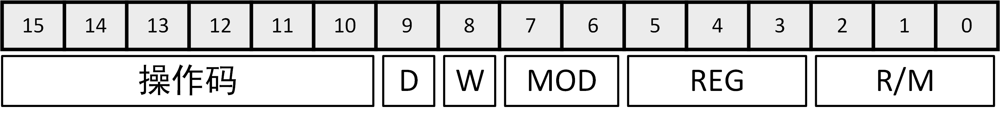
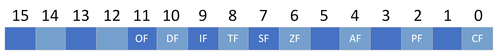
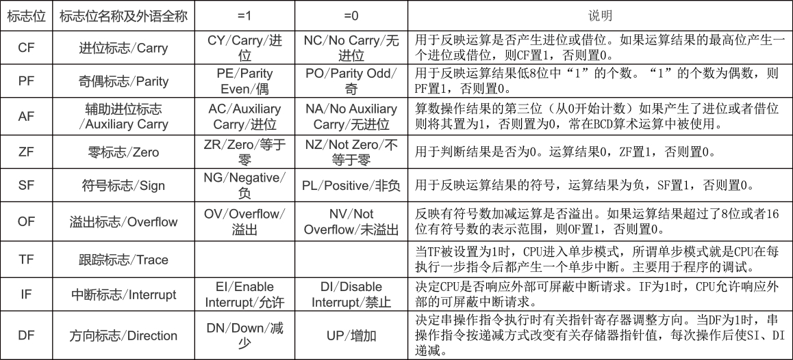
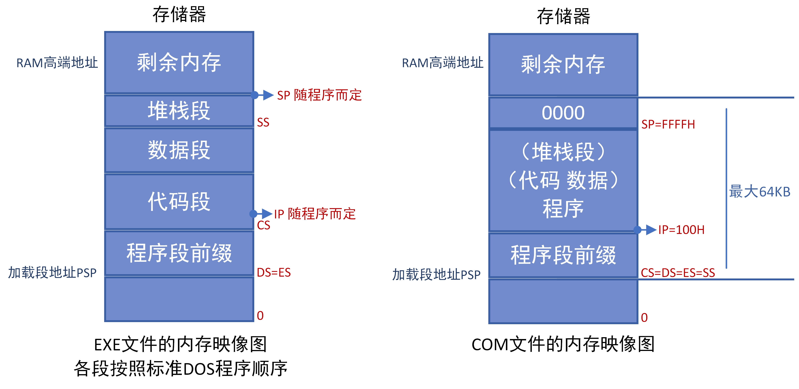
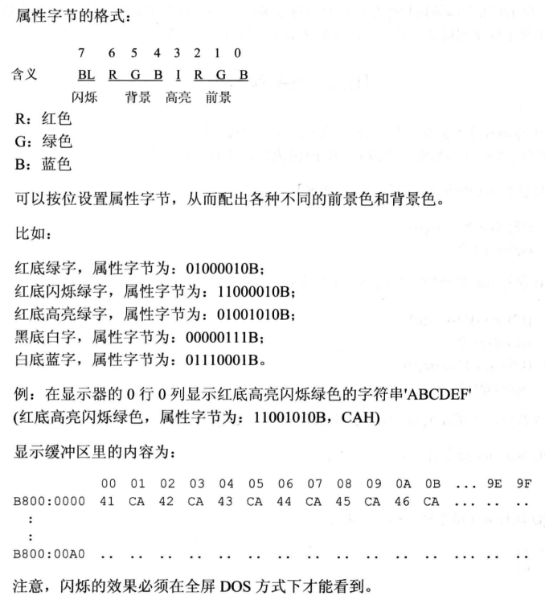
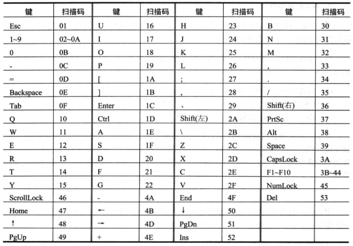
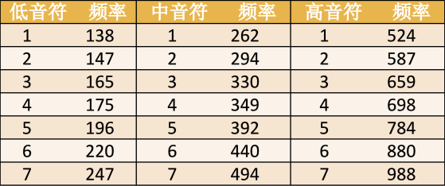

[toc]

# 一、8086/8088指令系统

8086/8088指令系统的指令分为7类，即数据传送、算术运算、逻辑操作、程序控制、数据串操作、处理器控制、输入输出。在学习指令系统时，应该从4个方面掌握这个指令，如下：

1. 掌握指令的功能：该指令能够实现何种操作，通常指令助记符就是指令功能的英文单词或器缩写形式。
2. 分析指令支持的寻址方式：该指令中的操作数可以采用何种寻址方式。
3. 清楚指令对标志位的影响：该指令执行后是否对各个标志位有影响，以及如何影响。
4. 其他特征：如指令执行时的约定设置、必须预置的参数、隐含使用的寄存器等。



- W=0，表示操作一个字节；W=1表示操作一个字。它可由BYTE PTR和WORD PTR伪指令影响。
- D=0，数据从寄存器传出；D=1，数据向寄存器传入。

## 数据传送类指令

实现数据从一个位置到另一个位置的移动，如执行寄存器与寄存器之间、寄存器与主存单元之间的字或字节的多种传送操作。

### 1. 数据传送指令mov

```assembly
mov oprd1, oprd2	; oprd1 = oprd2
```

- 该指令将一个8位或16位的源操作数（字或字节）送到目的操作数中。本指令不影响状态标志位。
- oprd1，目的操纵数，可以是寄存器、存储器、累加器、标号。
- oprd2，源操作数，可以是寄存器、存储器、累加器、立即数、标号。
- 立即数只能作为源操作数，不能作为目标操作数，立即数也不能传送至段寄存器。
- 存储器与存储器之间不能进行数据直接传送。若要实现存储单元之间的数据传送，可以借助于通用寄存器作为中介来进行。
- 指令指针IP不参加数的传送；代码段寄存器CS可以作为源操作数参加传送，但不能作为目的操作数参加传送。
- 源操作数和目的操纵数的类型应一致，可以使用`byte ptr`或`word ptr`指定其后跟的是一个字节还是一个字，告诉编译程序按什么类型处理，生成相应的指令代码。如两侧都是内存单元时，或者使用标号symbol等无法确定具体位数时。其中`ptr`称为指针操作符，作用是将后跟的标号或者内存单元定义为新的变量类型，如byte或word，这个变量的起始地址没有改变。

### 2. 数据交换指令xchg

```assembly
xchg oprd1, oprd2
```

- 该指令把操作数oprd1与操作数oprd2交换。本指令不影响状态标志位。
- oprd1为目标操作数，oprd2为源操作数，可为通用寄存器、存储器。

- xchg指令不支持两个存储器单元之间直接数据交换，但通过中间寄存器，可以很容易的实现两个存储器操作数的交换。
- 段寄存器中的内容不能用xchg来交换。

### 3. 换码指令xlat

```assembly
xlat	; (AL) = (DS:[(BX)+(AL)])
```

- 该指令把待查表格的一个字节内容送到AL中。执行该指令前，应先把TABLE表格的地址值送至BX寄存器中，然后将待查字节在表格中距离表格首地址的偏移地址送AL，然后使用xlat指令将对应地址上的值取到AL中。段地址是DS提供的。本指令不影响状态标志位。
- 使用前首先在主存中建立一个字节表格（即DS中一段连续的存储空间），表格的内容是要转换成的目标代码。xlat指令中没有显示指明操作数，而是默认使用bx和al寄存器，这种采用默认操作数的方法称为隐含寻址方式。
- 由于AL的内容实际上是距离表格首地址的移位量，只有8位，所以表格的最大长度为256；超过256的表格需要采用修改BX和AL的方法才能转换。
- 换码指令常用于将一种代码转换为另一种代码，如扫描码转为ASCII码，数字0到9转换为七段显示码等。

### 4. 堆栈操作指令

```assembly
push oprd
```

- 该指令将16位（字）操作数oprd压栈，oprd可以是寄存器或者存储器操作数。本指令不影响状态标志位。
- push的操作过程是：先修改堆栈指针SP（入栈时为自动减2h），然后将指定的操作数送入新的栈顶位置。随着入栈内容的增加，堆栈就扩展，SP值减少，但每次操作完，SP总是指向堆栈的顶部。
- 实际上，诸如push ax压栈时，实际上是先SP减1，送AH，再SP减1，送AL。

```assembly
pop oprd
```

- 该指令将栈顶的16为（字）弹出到oprd操作数，oprd可以是寄存器或存储器操作数。本指令不影响状态标志位。
- 它与入栈的操作相反，是先弹出栈顶的数据，然后再修改指针SP的内容。

### 5. 标志传送指令

```assembly
lahf
```

- 取FLAGS标志寄存器低8位至AH中。该指令不影响FLAGS的原来内容，AH只是复制了原FLAGS的低8位内容。

```assembly
sahf
```

- 将AH存至FLAGS标志寄存器的低8位。本指令将用AH的内容改写FLAGS中的SF、ZF、AF、PF和CF标志，从而改变原来的标志位。

```assembly
pushf
```

- 本指令可以把FLAGS的内容保存到堆栈中去。
- 在子程序调用和中断服务程序中，往往用pushf指令保护FLAGS的内容，用popf指令恢复保护的FLAGS中的内容。

```assembly
popf
```

- 从堆栈中弹出一个数据字送至FLAGS中。

### 6. 地址传送指令

地址传送指令将存储器的逻辑地址送至指定的寄存器。

```assembly
lea oprd1, oprd2	; mov oprd1, offset oprd2
```

- 该指令将源操作数oprd2给出的有效地址（段内偏移量）传送到指定的寄存器中。本指令对标志寄存器无影响。
- oprd1，目标操作数，可以位任意一个16位的通用寄存器。
- oprd2，源操作数，可为变量名、标号、地址表达式。
- 如果要将一个存储器变量的地址取至某一个寄存器中，也可以通过`offset symbol`来获取一个标号symbol的段内偏移量。

```assembly
lds oprd1, oprd2
les oprd1, oprd2
```

- 从存储器取出段地址和偏移地址放到oprd1所指定的16位寄存器中。本指令不影响标志寄存器。
- oprd1，目标操作数，可以为任意一个16为寄存器。
- oprd2，源操作数。可以为一个内存单元地址变量，该地址指定了主存的连续4个字节作为逻辑地址，低2个字节存放到oprd1中，高2各字节存放到DS或ES中（由指令确定）。可以为一个symbol标号，使用的是由DS:symbol指定的地址处的4个连续的4个字节作为逻辑地址。

```assembly
offset symbol
seg symbol
```

- 分别取标号的偏移地址和段地址。

### 7. 数据类型扩展指令

这两条指令主要用在除法指令中，用来对被除数进行扩展，详见算术运算指令中的除法指令。

```assembly
cbw
```

- 字节转换为字指令。该指令把AL中的数据的符号位扩展到AH寄存器中，使字节转换为字。
- 指令执行如下操作，当(AL)<80H时，AH=00H；当(AL)≥80H时，AH=FFH。
- 一个用补码表示的数经过cbw指令进行符号位扩展后，其数值大小不变。

```assembly
cwd
```

- 字转换为双字指令。该指令把AX中的数据的符号位扩展到DX中，是字转换为双字。
- 指令执行如下操作，当(AX)<8000H时，DX=0000H；当(AX)≥8000H时，DX=FFFFH。
- 一个用补码表示的数经过cwd指令进行符号位扩展后，其数值大小不变。

## 算术运算类指令

算术运算类指令用来执行二进制及十进制的算术运算，主要包括加减乘除指令。二进制数运算分为带符号数运算和不带符号数运算。十进制数用BCD码表示，又分为非压缩的BCD码和压缩的BCD码两种形式。

算术运算类指令会根据运算结果影响状态标志位，有时要利用某些标志才能得到正确的结果。该类指令主要影响6个标志位，即CF、AF、SF、ZF、PF、OF。

### 1. 加法指令

```assembly
add oprd1, oprd2	; oprd1 = oprd1 + oprd2
```

- 该指令实现字或字节的加法运算，适用于无符号数及带符号数的8位或16位加法运算。对CF、AF、SF、ZF、PF、OF结果标志都有影响。
- oprd1，目标操作数，可以是任意一个通用寄存器，也可以是任意一个存储器操作数。在执行add之前，oprd1中的内容为一个加数，待add指令执行后，oprd1中为加法运算的结果即和。
- oprd2，源操作数，可以是任意一个通用寄存器或存储器操作数，也可以是立即数。
- oprd1和oprd2均为寄存器是允许的，一个为寄存器另一个为存储器也是允许的，但不允许两个都是存储器操作数。

```assembly
adc oprd1, oprd2	; oprd1 = oprd1 + oprd2 + CF
```

- 带进位的加法指令，适用于无符号数及带符号数的8位或16位加法运算。对标志位的影响同add指令。
- oprd1和oprd2两个操作数与指令add中的含义一样。

```assembly
inc oprd	; oprd = oprd + 1
```

- 加一指令，对给定的寄存器或存储单元内容加1后，再送回该操作数，可以实现字节加1或字加1。该指令不影响CF标志位，影响其他标志位。
- oprd为寄存器或存储器操作数，寄存器不能是段寄存器。
- 在循环程序中，常用该指令对地址指针和循环计数值进行修改。

### 2. 减法指令

```assembly
sub oprd1, oprd2	; oprd1 = oprd1 - oprd2
```

- 该指令实现两个操作数的减法操作，操作数可为8位或16位的无符号数或带符号数。对标志位的影响同add指令。
- 注意立即数不能用于目的操作数，两个存储器操作数之间不能直接相减。

```assembly
sbb oprd1, oprd2	; oprd1 = oprd1 - oprd2 - CF
```

- 带进位的减法指令，操作数可为8位或16位的无符号数或带符号数。对标志位的影响同sub指令。

```assembly
dec oprd	; oprd = oprd - 1
```

- 减一指令，对给定的寄存器或存储单元内容减1后，再送回该操作数，可以实现字节减1或字减1。该指令不影响CF标志位，影响其他标志位。
- oprd为寄存器或存储器操作数，寄存器不能是段寄存器。
- 在循环程序中，常用该指令对地址指针和循环计数值进行修改。

```assembly
neg oprd
```

- 取补指令，该指令对操作数执行求补运算，即用base^n^减去操作数，然后将结果返回操作数。二进制的求补运算也可以表达成，将操作数按位取反后加1。
- oprd为任意通用寄存器或存储器操作数。
- neg指令对标志状态位的影响与用0（如果当前位不够减，在最高位的前一位补1，则用base^n^减就相当于用0减）做减法的sub指令一样。

```assembly
cmp oprd1, oprd2
```

- 比较指令，该指令该指令用于改变标志位，它对标志位的影响同sub指令，完成的操作与sub指令类似，唯一的区别是不将oprd1-oprd2的结果送回oprd1中，而只是比较。
- oprd1和oprd2可以为任意通用寄存器或存储器操作数，但两者不同时为存储器操作数，立即数可用于做源操作数oprd2。

### 3. 乘法指令

相同的二进制数看作无符号数还是有符号数相乘，采用mul或imul指令，其运算结果时不相同的。

```assembly
mul oprd	; 16位 = 8位 * 8位：(AX) = (AL) * oprd
			; 32位 = 16位 * 16位：(DX)(AX) = (AX) * oprd
```

- 无符号数乘法指令，该指令可用于无符号数的8位乘法或16位乘法。该指令影响CF、OF标志位。
- oprd，源操作数，即乘数。可以为通用寄存器或存储器操作数，根据它的位数确定是8位乘法还是16位乘法。
- 目的操作数是隐含的，即被乘数总是指定为累加器AX或AL的内容。
  - 8位字节乘法时，AL为被乘数，16位积存放于AX中；当结果的高位字节(AH)≠0时，则CF=OF=1。
  - 16位字乘法时，AX为被乘数，32位积存于DX和AX中；当结果的高位字(DX)≠0时，则CF=OF=1。

```assembly
imul oprd
```

- 带符号数乘法指令，该指令的功能是完成两个带符号数的相乘。该指令影响CF、OF标志位。
- oprd，源操作数，即乘数。可以为通用寄存器或存储器操作数。
- 隐含操作数的定义于mul指令相同。

### 4. 除法指令

除法指令div和idiv不产生有效的标志位，但是却可能产生溢出。当被除数远大于除数时，或除数位0时，所得的商就有可能超出它所能表达的范围。

符号扩展是用一个操作数的符号位（即最高位）形成另一个高位操作数，它的各位全是0（正数）或全是1（负数）。符号扩展指令可用来将字节转换为字，字转换为双字；有符号数通过符号扩展加长了位数，但数据的大小没有改变。符号扩展指令常用来获得有符号数除法指令所需的被除数；对于无符号数应该采用直接使用高8位或高16位清0的方法，获得被长的被除数，即0位扩展。

```assembly
div oprd	; 8位 = 16位 / 8位：(AL) = (AX) / oprd, (AH) = (AX) % oprd
			; 16位 = 32位 / 16位：(AX) = (DX)(AX) / oprd, (DX) = (DX)(AX) % oprd
```

- 无符号数除法指令，该指令的功能时实现两个8位或16位无符号数二进制除法运算。
- oprd，源操作数，存放的是除数。可以为通用寄存器或存储器操作数，根据它的位数确定是16位除法还是32位除法。
- 目的操作数是隐含的，即被除数总是指定为AX或DX的内容。
  - 16位字除法时，AX为被除数，8位商存放于AL中，8位余数存放于AH中。
  - 32位双字除法时，DX和AX为被除数，16位商存放于AX中，16位余数存放于DX中。

```assembly
idiv oprd
```

- 带符号数的除法指令，该指令的功能是实现两个带符号数的二进制除法运算，余数的符号与被除数符号相同。
- oprd，源操作数，可以为通用寄存器或存储器操作数。
- 隐含操作数的定义与div指令相同。

```assembly
cbw
```

- 有符号数的字节扩展指令，该指令的功能是将字节扩展为字，即把AL寄存器的符号位扩展到AH中。两个字节相除时，先使用本指令形成一个两字节的被除数。该指令不影响标志位。

```assembly
cwd
```

- 有符号数的字扩展指令，该指令的功能是将字扩展为双字长，即把AX寄存器的符号位扩展到DX中。两个字相除时，先使用本指令形成一个两字长的被除数。

### 5. 十进制调整指令

十进制数在计算机中也要用二进制编码表示即BCD码，8086/8088支持压缩BCD码和非压缩BCD码。

- 压缩BCD码是通常的8421码，它用4个二进制位表示一个进制数，一个字节可以表示两位十进制数，即00\~99。
- 非压缩BCD码用8个二进制位表示一个十进制数，一个字节可以表示一位十进制数，即0\~9。非压缩BCD码的高4位通常默认为0。ASCII码中0\~9的编码是30H\~39H，所以0\~9的ASCII码（高4位变为0）就可以认为是非压缩的BCD码。由于只要在调整后的结果中加上30H就成为十进制数位的ASCII码，因此这组针对非压缩BCD调整的指令实际上也是针对ASCII码的调整指令。

在进行十进制数的算术运算时，应该分为两步进行：先按二进制数运算规则进行运算，得到中间结果；再用十进制调整指令对中间结果进行修正，得到正确结果。

需要修正的原因是，按照二进制进行运算没有错误，但如用4位二进制按照压缩BCD码表示十进制，十进制实际上是逢十进一，而4位二进制数是逢0AH进一。这就会出现问题，即目标结果BCD码的二进制串，与直接按二进制数运算得来的二进制串不一致，需要进行调整。需要用到AF标志位。

结论：加法运算后，低4位大于9时，需要做加06H处理；高4位大于9时，需要做加60H处理；减法则反之减去。

```assembly
daa
```

- 对压缩BCD码加法运算进行校正。一般在add指令把两个压缩BCD相加之后，紧接着用一条daa指令对AL内容加以校正，在AL中可以得到正确的结果。

```assembly
das
```

- 对压缩BCD码减法运算进行校正。一般在sub指令把两个压缩BCD相减之后，紧接着用一条das指令对AL内容加以校正，在AL中可以得到正确的结果。

```assembly
aaa
```

- 对非压缩BCD码加法运算进行校正。一般在add指令把两个非压缩BCD相加之后，紧接着用一条aaa指令对AL中的内容加以校正，在AX中可以得到正确结果。

```assembly
aas
```

- 对非压缩BCD码减法运算进行校正。一般在sub指令把两个非压缩BCD相减之后，紧接着用一条aas指令对AL中的内容加以校正，在AX中可以得到正确结果。

```assembly
aam
```

- 对非压缩BCD码乘法运算进行校正。一般在mul指令把两个非压缩BCD（要求高4位为0）相乘之后，紧接着用一条aam指令对AL中的内容加以校正，在AX中可以得到正确结果，商放在AH中，余数放在AL中。

```assembly
aad
```

- 对非压缩BCD码除法运算进行校正。它与其他校正指令不同，如果被除数是存放在AH和AL中的两位非压缩BCD（要求高4位为0），除数是一个非压缩BCD数（高4位为0），要先用aad指令把AX中的被除数调整为二进制数，并存放在AL寄存器中。之后才能调用div指令。

## 逻辑操作类指令

逻辑操作类指令是按位操作指令，可以对8位或16位的寄存器或存储器单元的内容按位操作。

### 1. 逻辑运算指令

```assembly
and oprd1, oprd2
```

- 该指令实现对两个操作数按位进行逻辑与的运算，结果送至目的操作数，可进行字节或字的与运算。该指令影响标志位PF、SF、ZF，是CF=0，OF=0。
- oprd1，目的操作数，可以为任意通用寄存器或存储器操作数。两个操作数不能同时位存储器寻址方式。
- oprd2，源操作数，可以为任意通用寄存器或存储器操作数，也可以是立即数。
- 本指令主要用于修改操作数或置某些位为0。

```assembly
or oprd1, oprd2
```

- 该指令实现对两个操作数按位进行逻辑或的运算，结果送至目的操作数，可进行字节或字的或运算。对标志位的影响同and指令。
- oprd1，目的操作数，可以为任意通用寄存器或存储器操作数。两个操作数不能同时位存储器寻址方式。
- oprd2，源操作数，可以为任意通用寄存器或存储器操作数，也可以是立即数。
- 本指令主要用于置位某些位为1，而不影响其他位，只需要将要置位的位同1相或，保存不变的位同0相或。

```assembly
not oprd
```

- 该指令实现对操作数的按位求反运算，结果送回原操作数，可进行字节或字的求反运算。不影响标志位。
- oprd可为任意通用寄存器或存储器操作数。

```assembly
xor oprd1, oprd2
```

- 该指令实现两个操作数进行按位异或运算，结果送至目的操作数，可进行字节或字的或运算。对标志位的影响同and指令。
- oprd1，目的操作数，可以为任意通用寄存器或存储器操作数。两个操作数不能同时位存储器寻址方式。
- oprd2，源操作数，可以为任意通用寄存器或存储器操作数，也可以是立即数。
- 本指令主要用于求反某些位，而不影响其他位，要求反的位同1异或，维持不变的位同0异或。

```assembly
test oprd1, oprd2
```

- 也是对oprd1和oprd2进行按位逻辑与运算，操作数的含义也同and，对标志位的影响也同and。
- 唯一不同的是该指令不会把结果写回oprd1目的操作数，仅是为了在逻辑与操作后，对标志位进行重置。
- 该指令通常用于检测一些条件是否满足，但又不希望改变原操作数的情况。这条指令之后，一般都是条件转移指令，目的是利用测试条件转向不同的程序段。

### 2. 逻辑移位指令

```assembly
shl oprd1, count
```

- 逻辑左移指令，该指令的功能是对8位或16位目的操作数左移count次，每次一位，每次移位时最高位移入标志位CF中，最低位补0。该指令对OF、PF、SF、ZF、CF有影响。
- oprd1，目的操作数，可以是任意通用寄存器或存储器操作数。
- count，代表移位的次数（或位数），移位一次，count=1，移位多于一次时，CL=count指定移位次数。

```assembly
shr oprd1, count
```

- 逻辑右移指令，该指令的功能是对8位或16位目的操作数右移count次，每次一位，每次移位时最低移位入标志位CF中，最高位补0。
- oprd1和count的含义同shl指令。

```assembly
sal oprd1, count
```

- 算术左移指令，该指令的功能是对8位或16位目的操作数左移count次，每次一位，每次移位时最高位移入标志位CF中，最低位补0，这些功能同指令shl一样。而且，如果sal将oprd1的最高移位至CF时改变了CF原来的值，则溢出标志位OF=1，表示移位前后的操作数不再是倍增关系。因而sal可用于带符号数的倍增运算，shl只能用于无符号数的倍增运算。
- oprd1和count的含义同指令shl中的含义。

```assembly
sar oprd1, count
```

- 算术右移指令，该指令的功能是对8位或16位目的操作数右移count次，每次一位，每次移位时最低移位入标志位CF中，最高位（符号位）保持不变。
- oprd1和count中的含义同指令shl中的含义。
- 该指令通常用于对带符号数的减半运算中。

### 3. 循环移位指令

循环移位指令实现的是操作数首尾相连的移位操作，要求从一端移除出的数据返回到另一端形成循环。这类指令只影响CF和OF。按进位标志CF是否参加循环移位，又可分为带CF的和不带CF的，每类都有可左移或右移。OF取决于位移一次后符号位是否改变，如果改变则OF=1。由于是循环移位，对字节连续移动8次，对字连续移动16次就会变为原操作数。

```assembly
rol oprd1, count
ror oprd1, count
```

- 不带进位CF的循环移位指令。左移时移出的最高位，右移时移出的最低位，会放入CF中。

```assembly
rcl oprd1, count
rcr oprd1, count
```

- 带进位CF的循环移位指令。左移时移出的最高位放入CF中，CF放入最低位中；右移时移出的最低位放入CF中，CF放入最高位中。

## 程序控制类指令

利用程序控制指令，可以实现分支、循环、子程序等程序结构。

### 1. 无条件转移指令

```assembly
jmp oprd
```

- 无条件转移指令，默认是段内转移。
- oprd，源操作数，可以为通用寄存器。它的功能是用寄存器的内容修改IP，即`(IP) = (16位寄存器)`，它是段内转移。使用寄存器在程序中是可变的，更灵活。值得注意的是，`jmp 2000:0000`之类用立即数给出的形式，只能够用在debug环境下，如果出现在源程序中，编译器是无法识别和编译的。

```assembly
jmp short symbol
jmp near ptr symbol
jmp far ptr symbol
```

- 如果使用jmp symbol，有以上几种。在段内转移的机器指令中，包含的是跳转到目标指令的相对位置，而不是转移的目标地址。位移=目标地址-jmp指令的下条指令的起始地址，在编译时算出。
- `jmp short symbol`，段内短转移，IP修改范围为-128\~127一个字节。功能是`(IP) = (IP) + 8位位移`，关键字short用来指明位移是8位，用补码表示。
- `jmp near ptr symbol`，段内近转移，IP修改范围为-32768\~32767两个字节。功能是`(IP) = (IP) + 16位位移`，关键字near ptr用来指明位移是16位，用补码表示。
- `jmp far ptr symbol`，段间转移（远转移），同时修改CS和IP。在它的机器指令中包含的直接是目标指令的段地址CS和偏移地址IP。

```assembly
jmp word ptr oprd
jmp dword ptr oprd
```

- 如果使用内存地址单元上的值来给出转移地址，有以上几种。内存单元的地址可以由多种寻址方式给出。
- `jmp word ptr oprd`，段内转移，从内存单元地址上取一个字，作为转移的偏移地址。
- `jmp dword ptr oprd`，段间转移，从内存单元地址上取两个字，高地址的字表示要转移目标的段地址，低地址的字表示偏移地址。

### 2. 条件转移指令

通常在转移之前先调用如`cmp oper1, oper2`之类的可以影响PSW的指令，然后调用以j开头的`jxxx`类指令。需要知道的是：j = Jump、e = Equal、n = Not、b = Below、a = Above、l = Less、g = Greater、s = Sign、c = Carry、p = Parity、o = Overflow、z = Zero。它们都可以跟在 j 之后，也可以一起组合跟在 j 之后。需要注意的是，a 和 b 是对整个机器位比较，即无符号数；而 l 和 g 是将整个机器数看作有符号数，进行比较；它们的测试条件是不同的。

```assembly
jxxx oprd
```

- 条件转移指令的操作数必须是一个短标号，也就是说所有的条件转移指令都是两字节指令，转移指令的下一条指令到目标指令之间的距离必须为-128~127之间。如果指令规定的条件满足，则将这个位移量加到IP寄存器上，即条件转移本质上是修改IP的值。

```assembly
jcxz oprd
```

- 当(cx) = 0时，则转移到标号处执行；否则cx不为0，则什么也不做，程序向下执行。使用jcxz不仅仅可以处理循环。

根据单个标志位状态判断的条件转移指令，如下表：

|  助记符  |     指令名称     | 测试条件 |
| :------: | :--------------: | :------: |
|  je、jz  |   等于、零转移   |   ZF=1   |
| jne、jnz | 不等于、非零转移 |   ZF=0   |
|    js    |      负转移      |   SF=1   |
|   jns    |      正转移      |   SF=0   |
| jp、jpe  |   偶数个1转移    |   PF=1   |
| jnp、jpo |   奇数个1转移    |   PF=0   |
|    jo    |     溢出转移     |   OF=1   |
|   jno    |    不溢出转移    |   OF=0   |
|    jc    |     进位转移     |   CF=1   |
|   jnc    |    不进位转移    |   CF=0   |

用于无符号数的比较跳转指令，如下表：

|  助记符  |     指令名称     |   测试条件   |
| :------: | :--------------: | :----------: |
| jb、jnae | 低于、不高于等于 |     CF=1     |
| jnb、jae | 不低于、高于等于 |     CF=0     |
| ja、jnbe | 高于、不低于等于 | CF=1 且 ZF=0 |
| jna、jbe | 不高于、低于等于 | CF=0 或 ZF=1 |

用于有符号数的比较跳转指令，如下表：

|   助记符   |     指令名称     |     测试条件     |
| :--------: | :--------------: | :--------------: |
|  jg、jnle  | 大于、不小于等于 |  SF=OF 且 ZF=0   |
|  jng、jle  | 不大于、小于等于 | SF != OF 或 ZF=1 |
| jl 、 jnge | 小于、不大于等于 | SF != OF 且ZF=0  |
| jnl 、 jge | 不小于、大于等于 |     SF = OF      |

### 3. 循环控制指令

循环流程的条件一般时循环计算，指令约定用CX寄存器作为计数器，它的循环体至少执行一次。这类指令属于段内短转移，目标地址必须在距本指令-128~127个字节的范围内。

```assembly
loop symbol
```

- 先将(CX)减一，再判断(CX)是否为0，如果(CX)≠0时，则转移到标号处执行；直到(CX)=0，跳出循环继续执行后续程序。该指令不影响标志位。

```assembly
loopz symbol
loope symbol
```

- 先将(CX)减一，再判断(CX)是否为0，如果(CX)≠0且ZF=1时，则转移到标号处执行；直到(CX)=0或ZF≠1时，跳出循环继续执行后续程序。该指令不影响标志位。

```assembly
loopnz symbol
loopne symbol
```

- 先将(CX)减一，再判断(CX)是否为0，如果(CX)≠0且ZF=0时，则转移到标号处执行；直到(CX)=0或ZF≠0时，跳出循环继续执行后续程序。该指令不影响标志位。

### 4. 过程调用和返回指令

相当于子程序或者说函数的调用与转移，实质上是修改 IP 寄存器甚至 CS 寄存器的值。不要忘了为call和ret指定栈段。call和ret指令不影响标志位。

```assembly
call oprd
```

- 段内间接调用，过程与调用指令同处在一个代码段内。oprd为16为通用寄存器或存储器操作数或symbol。
- 本指令执行时，先将IP的内容入栈保护（SP减2），然后从由oprd指定的寄存器或存储器中取出一个字，即目的地址在段内偏移量，送入IP中，从而实现过程调用。

```assembly
call near ptr symbol
```

- 段内直接调用，过程与调用指令同处在一个代码段内。
- 本指令执行时，先将IP的内容入栈保护（SP减2），然后将指令代码中给出的目标地址的段内偏移量送入IP，从而实现过程调用，将程序转至过程入口。

```assembly
call word ptr oprd
```

- 段内调用，也可以使用存储器操作数指定目标地址。
- 本指令执行时，先将IP的内容入栈保护。然后从由oprd指定的存储器中取出一个字，即目的地址在段内偏移量，送入IP中，从而实现过程调用。

```assembly
call far ptr symbol
```

- 段间调用，过程与调用指令可以在不同的代码段中。
- 本指令执行时，应先将CS压栈，再将IP压栈（SP减4），然后将far类型的过程名所在的段地址和段内偏移地址送入CS及IP，从而实现过程调用。

```assembly
call dword ptr oprd
```

- 段间调用，也可以使用存储器操作数指定目标地址。
- 本指令执行时，先将SP再将IP的内容入栈保护。然后从由oprd指定的存储器中取出两个字，高地址字作为段地址送入CS，低地址的字作为段内偏移量送入IP，从而实现过程调用。

```assembly
ret
```

- 段内返回指令，当调用的过程结束后实现从过程返回至原调用程序的下一条指令。
- 本指令执行时，实际上是从栈中取栈顶的数据，恢复IP，因而可以没有与它匹配的call指令，但也要注意是否对栈进行了操作导致栈顶不是IP从而返回错误。

```assembly
retf
```

- 段间返回指令，本指令执行时，实际上是先从栈顶取一个字送入IP、再取一个字送入CS。

### 5. 中断指令

处理器终止当前程序的运行，转去执行中断处理程序的情况称为“中断”，中断子程序执行完后返回原来程序的断点。8086/8088具有很强的中断系统，可以处理256个不同方式的中断，每一个中断赋予一个中断向量码，CPU根据中断向量码来识别不同的中断源。

8086/8088内部中断源有除法错中断、单步中断、断点中断、溢出中断、用户自定义的软中断5中类型；外部中断是指来自CPU之外的原因引起的程序中断，分为可屏蔽中断和非屏蔽中断2种类型。

```assembly
into
```

- 溢出中断指令，该指令检测OF标志位，当OF=1发生溢出时，立即产生一个中断类型4的中断；当OF=0时，本指令不起作用。

```assembly
int n	; pushf, push cs, push ip
```

- 软中断指令，本指令将产生一个软中断，把控制转向一个类型号为n的软中断，该中断处理程序的入口地址在中断向量表的n*4的地址处的两个存储字（4个字节单元）中。

```assembly
iret	; pop ip, pop cs, popf
```

- 中断返回指令，用于中断处理程序中，从中断程序的断点处返回，继续执行原程序。本指令影响所有标志位。
- 无论是软中断，还是硬中断，本指令均可使其返回到中断程序的断点处继续执行原程序。

## 串操作类指令

数据串可以时字节串，也可以是字串，数据串只能放在存储器中。对数据串进行处理时，可以只操作一个串也可以操作两个串，根据数据串中数据流动的方向，可以分为源数据串和目的数据串。

在串操作指令中，源数据串用寄存器SI寻址，默认在数据段DS中，允许段超越；目的数据串用寄存器DI寻址，默认在附加段ES中，不允许段超越。每执行一次串操作指令，地址指针SI、DI都会自动修改：对于字节串会±1，对于字串会±2；增加还是减少取决于方向标志DF。

```assembly
cld
```

- 清楚标志位，使DF=0（默认），此时地址指针向高地址变化，即增加。

```assembly
std
```

- 设置标志位，使DF=1，此时地址指针向低地址变化，即减少。

### 1. 串传送指令

```assembly
movs oprd1, oprd2
movsb	; byte, ES:[DI] = DS:[SI], (SI) = (SI) ± 1, (DI) = (DI) ± 1
movsw	; word, ES:[DI] = DS:[SI], (SI) = (SI) ± 2, (DI) = (DI) ± 2
```

- 串传送指令movs，将数据段主存单元的1个字节或字，传送到附加段的主存单元中。定义数据串时，要求原串和目的串类型一致，并以其区别是字节或字操作。该指令不影响标志位。
- 指令movsb和movsw，分别对字节串和字串操作。若DF=0，则从当前位置向后；若DF=1，则从当前位置向前。

### 2. 串比较指令

```assembly
cmps oprd1, oprd2
cmpsb
cmpsw
```

- 串比较指令cmps，对一个字节或字进行比较，比较结果送至标志位，而不改变操作数本身。该指令影响标志位AF、CF、OF、SF、PF、ZF。
- 指令cmps，可用来检查两个字符串是否相同，可以使用循环控制方法对整个字符串进行比较。
- 指令cmpsb和cmpsw，分别比较一个字节或一个字。要比较的字符将由SI和DI指定，同时DI、SI将根据DF自动调整。

### 3. 串扫描指令

```assembly
scas oprd
scasb
scasw
```

- 串扫描指令scas，将AL或AX中的内容与oprd指定的存储器单元中的数据进行比较，根据比较结果设置标志位，但不改变操作数本身。该指令影响标志位AF、CF、OF、SF、PF、ZF。
- 指令scas，可查找字符串中一个关键字，只需要在本指令执行前，把关键字放入AL或AX中，用重复前缀可在整串中查找。
- 指令scasw和scasw，分别将ES:[DI]指定的一个字节或字的数据，与AL或AX寄存器中的数据比较，同时DI将根据DF自动调整。

### 4. 串读取指令

```assembly
lods oprd
lodsb
lodsw
```

- 串读取指令lods，把由oprd指定的存储器单元中的数据读入到AL或AX中。该指令不影响标志位。
- 指令lodsb和lodsw，分别将DS:[SI]指定的一个字节或一个字的存储器单元数据，送入到AL或AX寄存器中，同时SI将根据DF自动调整。

### 5. 字符串存储指令

```assembly
stos oprd
stosb
stosw
```

- 字符串存储指令stos，把用AL或AX中的数据内容送入由oprd指定的存储器单元中。该指令不影响标志位。
- 指令stosb和stosw，分别将AL或AX中的数据内容，送入到DS:[DI]指定的存储器单元数据中，同时DI将根据DF自动调整。

### 6. 重复前缀指令

```assembly
rep	command						; cx≠0，重复执行command
repz command	repe command	; cx≠0 且 ZF=1，重复执行command
repnz command	repne command	; cx≠0 且 ZF=0，重复执行command
```

- 在串操作指令前加上重复前缀，可以对数据串进行重复执行command指令，重复的次数存放在cx寄存器中。
- 指令rep与movs或stos串操作指令结合使用，完成一组数据的传送或建立一组相同数据的字符串。
- 指令repz/repe与cmps串操作指令结合使用，完成两组数据串的比较。当两数据相同且串未结束时，重复执行串操作指令。它可以用来判断两数据串是否相同或查找第一个不相同的位置。
- 指令repnz/repne与cmps串操作指令结合使用，当两数据不相同且串未结束时，重复执行串操作指令。它可以在两数据串中查找第一个相同数据的位置。
- 指令repz/repe与scas串操作指令结合使用，完成在一个字符串中扫描一个关键字。当数据串中与关键字相同且串未结束时，重复执行串操作指令。它可以用于在一个数据串中找出第一个与关键字不匹配的位置。
- 指令repnz/repne与scas串操作指令结合使用，完成在一个字符串中匹配一个关键字。当数据串中与关键字不相同且串未结束时，重复执行串操作指令。它用于在一个数据串中找出第一个与关键字匹配的位置。

## 处理器控制类指令

处理器控制指令用于控制CPU的动作，修改标志寄存器的状态等，实现对CPU的控制。

### 1. 标志位操作指令

标志位操作指令有7条，可以直接设置或清除CF、DF、IF、标志位，这些指令仅对有关的状态标志位执行操作，而对其他状态标志位则没有影响。

```assembly
clc		; CF=0
stc		; CF=1
cmc		; CF求反
cld		; DF=0
std		; DF=1
cli		; IF=0，使CPU禁止响应外部的可屏蔽的中断请求
sti		; IF=1，使CPU允许响应外部的可屏蔽的中断请求
```

### 2. CPU控制指令

```assembly
hlt
```

- 处理器暂停指令hlt，使CPU进入暂停状态，这时CPU不进行任何操作。该指令不影响标志位。
- 当CPU发生复位（RESET）或来自外部的中断（NMI或INTR）时，CPU脱离暂停状态。
- 该hlt指令可用于程序中等待中断，当程序必须等待中断时，可用hlt，而不必用软件死循环。然后中断使CPU脱离暂停状态，返回执行hlt指令的下一条指令。
- 注意：该指令在PC中将引起所谓的”死机“，一般的应用程序不要使用。

```assembly
wait
```

- 处理器等待指令wait，在8086/8088的测试引入脚为高电平无效时，使CPU进入等待状态，这时CPU并不做任何操作；测试为低电平有效时，CPU脱离等待状态，继续执行wait指令后面的指令。该指令不影响标志位。
- 浮点指令经由8086/8088CPU处理发往8087，并与8086/8088本身的整数指令在同一个指令序列；而8087执行浮点数指令较慢，所以8086/8088必须与8087保持同步。8086/8088就是利用wait指令和测试引脚实现与8087同步运行的。

```assembly
esc extoprd, oprd
```

- 处理器交权指令esc，把浮点指令交给浮点处理器执行。为了提高系统的浮点运算能力，8086/8088系统中可加入浮点运算协处理器8087。但是8087的浮点指令是和8086/8088的整数指令组合在一起的，8086/8088主存中存储8087的操作码及其所需的操作数。当8086/8088发现是一条浮点指令时，就利用esc指令将浮点指令交给8087执行。该指令不影响标志位。
- exroprd，外部操作码（浮点指令的操作码），是一个6位立即数。
- oprd，源操作数，可以是寄存器或存储器单元。当oprd为寄存器时，它的编码也为操作码；如果oprd为存储器操作数，CPU读出这个操作数送给协处理器。

```assembly
nop
```

- 空操作指令nop不执行任何有意义的操作，但占用一字节存储单元，空耗一个指令执行周期。实际上，nop指令就是xchg ax, ax，它们的机器代码一样。该指令不影响标志位。
- 在需要预留指令空间时用nop填充，代码空间多余时也可以用nop填充，还可以用nop指令实现软件延时。

```assembly
lock command
```

- 封锁总线前缀指令lock，它是一个指令前缀用于放在指令的前面。这个前缀使得当前指令执行时间内，8086/8088处理器的封锁输出引脚有效，即把总线封锁，使别的控制器不能控制总线，直到该指令执行完后，总线封锁解除。
- 当CPU与其他处理器协同工作时，lock指令可用于避免破坏有用的信息。

```assembly
CS: or SS: or DS: or ES:
```

- 段超越前缀指令，在允许段超越的存储器操作数之前，使用段超越前缀指令，将不采用默认的寄存器，而是采用指定的段寄存器寻址操作数。

## 输入输出指令

输入输出指令有两条，输入指令in用于从外设端口接收数据，输出指令out则向端口发送数据。无论是接收到的数据还是准备发送的数据，都必须先在寄存器AL或AX中。端口的寻址方式有两种，一是直接使用8位立即数n寻址256个端口（0\~255），二是间接使用DX寄存器指定16位的地址寻址64K个端口（0\~65535）。

### 1. 输入指令

```assembly
in al, n	; (AL) = (n)
in ax, n	; (AX) = (n+1),(n)
in al, dx	; (AL) = seg:[(DX)]
in ax, dx	; (AX) = seg:[(DX+1)],seg:[(DX)]
```

### 2. 输出指令

```assembly
out n, al	; (n) = (AL)
out n, ax	; (n+1),(n) = (AX)
out dx, al	; seg:[(DX)] = (AL)
out dx, ax	; seg:[(DX+1)],seg:[(DX)] = (AX)
```

# 二、寄存器

只有`bx`、`bp`、`si`、`di`可以用在`[]`中对内存单元寻址。一般将bx、bp作为基址，si、di作为变址。bx默认使用ds段、bp默认使用ss段，在给出段地址寄存器后，可以显示指定。

需要注意的是，对于后序的支持32寄存器的处理器，为与16位的寄存器区别，32处理器中的寄存器通过添加`e`作为前缀（extend）。如对应于16位的ax、bx、bx、bp寄存器等，32位寄存器的名称位eax、ebx、ebx、ebp等。

## （一）段地址寄存器

- `CS`（code segment），16位的代码段寄存器。用于和IP寄存器指定下一条指令的地址，`CS:IP`。
- `DS`（data segment），16位的数据段寄存器。用于和一个立即数或其它寄存器形成一个地址，`DS:偏移地址`。
- `ES`（extra segment），16位的附加段寄存器。一个额外的段寄存器。
- `SS`（stack segment），16位的堆栈段寄存器。用于和SP寄存器指定栈顶地址，`SS:SP`。

段地址寄存器用做段前缀，每一段都是16的倍数。在编程时，如果用立即数指定偏移地址，需要显示写上段寄存器，如`mov al, ds:[0]`；若用寄存器指定偏移地址，可以不加段前缀，如`mov al, [bx]`。

## （二）通用寄存器

`ax`、`bx`、`cx`、`dx`，它们都是16位的寄存器，都可以根据低8位和高8位分为`al`、`ah`、`bl`、`bh`、`cl`、`ch`、`dl`、`dh`一共8个8位寄存器。对具体数据的操作，可以根据通用寄存器的类型来判定操作的是一个字还是一个字节。

如果在操作中访问内存单元时，没有通用寄存器，可以使用`word ptr`、`byte ptr`来显示指定操作的是一个字还是一个字节。例如：`add word ptr ds:[bx], 2`操作的就是一个字。

## （三）变址寄存器

`SI`（source index）和`DI`（destination index）分别为源地址和目标地址，纯粹的16位寄存器，不能分为两个8位寄存器。它们通常用于和地址相关的操作。

## （四）地址指针寄存器

`BP`，使用`[BP]`，默认访问堆栈，即`SS:BP`。

`SP`（stack pointer），栈顶指针寄存器，用来指定栈段中栈顶的偏移地址。一个栈段的地址空间，是从`SS:0`到`SS:SP`之间内存空间，大地址表示栈的底端。SP指向栈顶顶端，它会根据`PUSH`和`POP`指令自动的减少和增加，且操作都是以字为单位，故SP每次变化都是两个字节。

- `PUSH [addr]`表示，先移动栈顶，再存入数据。即SP先减2字节，再将地址addr中的数据存入`SS:SP`所指定的栈顶地址中。
- `POP [addr]`表示，先取数据，再移动栈顶。即先将`SS:SP`栈顶地址上的数据存到addr地址上，再将SP加2字节。

# 三、存储器地址

## （一）寻址方式

立即数idata寻址，寄存器直接寻址。

`[bx + idata]`，或[idata + bx]、idata[bx]、[bx].idata，都表示偏移地址`(bx)+idata`，段地址由DS指定。bx可以变化，从而类似数组。

`[bx + si]`、`[bx + di]`，或\[bx][si]、\[bx][di]，基址变址寻址。表示偏移地址`(bx)+(si)`、`(bx)+(di)`，段地址由DS指定。bx和si、di都可以变化，从而类似二维数组。

构造两层循环时，注意只有一个cx寄存器，解决方案如下。

1. 可以用在进入内存循环时，先用其他寄存器存放外层循环的cx，然后用cx进行内层循环，等退出内层循环后，在从其他寄存器里面恢复外层循环的cx。
2. 当然，如果寄存器资源紧张，可以使用规定的固定内存单元保存cx。
3. 推荐的是，用栈来保存数据，如cx寄存器的值（可以构造多层循环），复杂程序的来回调用等。

`[bx + si + idata]`、`[bx + di + idata]`，或idata\[bx][si]、\[bx].idata[si]、\[bx][si].idata等。表示偏移地址`(bx)+(si)+idata`、`(bx)+(di)+idata`，段地址由DS指定。

这些仅是计算机中内存寻址方式。

|      形式       |       名称       |             特点             |                        意义                        |          示例           |
| :-------------: | :--------------: | :--------------------------: | :------------------------------------------------: | :---------------------: |
|    `[idata]`    |     直接寻址     | 用一个常量/立即数来表示地址  |              用于直接定义一个内存单元              |      mov ax, [200]      |
|     `[bx]`      |  寄存器间接寻址  |   用一个变量来表示内存地址   |              用于间接定位一个内存单元              |      mov ax, [bx]       |
|  `[bx+idata]`   |  寄存器相对寻址  |   用一个变量和常量表示地址   | 可在一个起始地址的基础上用变量间接定位一个内存单元 |   mov ax, [bx + 200]    |
|    `[bx+si]`    |   基址变址寻址   |      用两个变量表示地址      |                         -                          |    mov ax, [bx + si]    |
| `[bx+si+idata]` | 相对基址变址寻址 | 用两个变量和一个常量表示地址 |                         -                          | mov ax, [bx + si + 200] |

# 四、标志寄存器及其操作

## （一）程序状态字 PSW

一个16位的标志寄存器（Flag register，flags）又称为程序状态字（Program status word，psw）寄存器，它是按位起作用的，即它的每一位（0到15）都有专门的含义，记录特定的信息；一些位（1、3、5、12、13、14、15）没有使用。



在DOSBox的debug界面，使用r命令观察寄存器的值，右下角的一些信息就是PSW。

OF，溢出标志，记录结果**视为有符号数**的结果是否合理；当OF为1时表示有溢出，当OF为0时表示无。对于8位的一个字节，如果用来表示有符号数，则第7位上为符号，第0\~6位上为数据，如果运算的结果不合理的改变了第7位的符号，则称为有符号数的溢出；值得注意的是，这个8位的字节可能没有溢出，即看作无符号数时，它的运算结果仍为8位一个字节，即没有进位。例如8位的有符号数范围-128\~127，16位有符号数范围-32768\~32767。

DF，方向标志，功能是影响串处理指令的行为。当DF=1时，每次操作后si、di递减，当DF=0时，每次操作后si、di递增。按字节为单位传送：`movsb`，它的功能是将 ds:[si] 的字节赋值给 es:[di]，然后按DF的指示将si、di加1或者减1。按字为单位传送：`movsw`，它的功能是将 ds:[si] 的字赋值给 es:[di]，然后按DF的指示将si、di加2或者减2。汇编语言提供了设置DF的指令，`cld`将DF设置为0，`std`将DF设置为1。

IF，中断标志，觉得CPU是否响应外部可屏蔽的中断请求。当IF=1时，允许CPU响应外部的可屏蔽中断请求；当IF=0时，关闭外部可屏蔽中断，而不可屏蔽中断和内部中断不受影响。

TF，跟踪标志，用于调试时的单步方式操作。当TF=1时，每条指令执行完后产生一个单步中断（中断类型码为1），由系统控制计算机；当TF=0时，CPU正常工作，不产生单步中断。在有些情况下，即使TF为1，CPU也不会响应单步中断；如设置SS寄存器，因为CPU要求它和设置SP一起完成，因此CPU强制将设置SS的指令和它之后的指令一起完成，因此设置SS的指令和设置SP的指令应放在一起。

AF，辅助进位标志，通常用于BCD码的算术运算。根据从右向左第3位（从0开始）判断，如果使用BCD码的十进制运算有进位，则AF=1，否则AF=0。

SF，符号标志，判断结果最高位是否为1；如果是有符号数，当SF为1时表示结果是负数，SF为0是表示结果是非负数。SF标志是CPU对有符号数运算结果的一种记录，将数据当作有符号数来运算时，通过SF可知结果的正负，将数据当作无符号数时，SF的值没有意义，虽然相关的指令仍会影响它的值。值得注意的是，SF存放的仅仅是在固定位数（如一个8位字节）结果的正负（最高位），但实际运算可能正确的位数要超过固定位数，即溢出，在这种情况下，SF不能说明任何真实逻辑上的问题。

ZF，零标志，标记相关指令的计算结果是否为0；当ZF为1（真）时表示结果是0，ZF为0（假）时表示结果非0。例，假设ax中为1，那么在 and ax, 0 之后，结果为0，ZF为真即1；在 or ax, 0 之后，结果非0，ZF中为假即0。在8086的CPU指令集中，通常运算指令会影响PSW，比如add、sub、mul、div、inc、or、and等；通常传送指令不会影响PSW，比如mov、push、pop等。

PF，奇偶标志，标记结果中所有二进制1的个数是否为偶数个；当PF为1时，表示有偶数个1，而PF为0时表示有奇数个1。

CF，进位标志，记录**无符号数**的运算是否有进位或借位；当CF为1时表示有进位或借位，当CF为0时表示无。值得注意的是，这里的进位和借位都是最高位和假想的更高位之间发生的，比如8位数据（从0到7）的运算，它的最高位是7（从右向左第8个二进制位），那么它的假想更高位就是8（从右向左第9个二进制位）。

数据是否为有符号数取决于人怎么看待和使用，CPU在执行add等指令时，就包含了两种含义：无符号数运算和有符号数运算，无符号数都是正数。CF和OF所表示的进位和溢出，是分别对无符号数和有符号数运算而言的，它们之间没有任何关系。

附录，较全的PSW程序状态字：



## （二）有符号数的溢出

这里论述将二进制串看作有符号数的溢出问题。

假设一个二进制串一共有n位，索引从0到n-1，最高的一位即n-1位是符号。则它能表示的为$y=\begin{cases} n-1位是0（非负），0 \sim 2^{n-1}-1 \\ n-1位是1（负），-1 \sim -2^{n-1} \end{cases}$

两个合理的二进制串运算，将他们看作是有符号数的运算（下述中，正其实是非负，包括正数和0）。

对于add a, b来说：

- 正，正。有可能溢出，即当$a+b>2^{n-1}-1$时，它的n-1位上为1（不合理），真实结果应为正。
- 负，负。有可能溢出，即当$a+b<-2^{n-1}$时，它的n-1位上位0（不合理），真实结果应为负。
- 正，负。不可能溢出，n-1位上可0可1，对应真实结果可正可负。

对于 sub a, b 来说：

- 正，正。不可能溢出，n-1位上可0可1，对应真实结果可正可负。
- 负，负。不可能溢出，n-1位上可0可1，对应真实结果可正可负。
- 正，负。有可能溢出，即当$a-b>2^{n-1}-1$时，它的n-1位上为1（不合理），真实结果应为正。
- 负，正。有可能溢出，即当$a-b<-2^{n-1}$时，它的n-1位上位0（不合理），真实结果应为负。

## （三）关系比较指令cmp

需要注意的是，任何两个数，它们存放在机器中就有一个机器数，它们之间的运算结果在机器中存放或者表示时，也是一个机器数，它受制于这个机器数的位数限制；所以当一些运算所得的结果会超出机器数的位数时，标志寄存器PSW通过机器数去设置各个标志位，它所反映的信息与真实结果是有差别的；即真实结果与机器结果不相符，对于有符号数来说，这往往是符号位的不合理变化，即OF溢出标志会置1。

`cmp lv, rv`，比较指令，它的功能是计算lv-rv，不保存结果，仅用来影响PSW，通过识别这些被影响的标志寄存器的取值来得知比较结果。CPU在执行cmp指令的时候，也包含两种含义：进行无符号数运算和进行有符号数运算。例如cmp ax, bx，对于无符号数，根据ZF、CF就可以确定六种比较结果，如ax>bx会使ZF=0且CF=0；对于有符号数，根据ZF、SF、OF就可以确定六种比较结果。

如果将cmp ax, bx看作是**无符号数**之间的比较：

|  实际情况  | 机器结果 (ax) - (bx) |    标志位     |
| :--------: | :------------------: | :-----------: |
| (ax)=(bx)  |          =0          |     ZF=1      |
| (ax)≠(bx)  |          ≠0          |     ZF=0      |
| (ax)＜(bx) |     必将产生借位     |     CF=1      |
| (ax)≥(bx)  |       不必借位       |     CF=0      |
| (ax)＞(bx) |  不必借位，又不为0   | CF=0 and ZF=0 |
| (ax)≤(bx)  |  可能借位，或者为0   | CF=1 or ZF=1  |

- 上述表格中判断≥、≤没有应用意义，因为真实情况下只能满足一个；比如真实情况下只能大于或只能等于，它们虽然满足大于等于的条件，但是用不到根据这个条件来判断，因为有其他条件可以直接判断出来是大于还是等于。

如果将cmp ax, bx看作是**有符号数**之间的比较：

- 首先(ax)和(bx)相等和不相等很容易根据ZF标志判断。
- (ax)＞(bx)，可有(正,正)、(负,负)、(正,负)。
  - 对于前两种不会溢出OF=0，机器结果（SF=0）就是真实结果，而且SF=0还包含相等的情况，此时可以判断为(ax)≥(bx)。
  - 对于(正,负)，有可能溢出OF=1，机器结果（SF=1）是因溢出所致，此时也可判断为(ax)＞(bx)。
- (ax)＜(bx)，可有(正,正)、(负,负)、(负,正)。
  - 对于前两种不会溢出OF=0，机器结果（SF=1）就是真实结果，而且SF=1一定是两者不相等，此时可以判断为(ax)＜(bx)。
  - 对于(负,正)，有可能溢出OF=1，机器结果（SF=0）是因溢出所致，此时也可判断为(ax)＜(bx)。
  - 如果要判断(ax)≤(bx)，可以通过小于或等于合成条件，SF!=OF或ZF=1。
- 综上所述，如果(ax)＞(bx)，则SF=OF；如果(ax)＜(bx)，则SF!=OF；相等则ZF=1。
- 再次说明，判断≥、≤没有应用意义，因为真实情况下只能满足一个；比如真实情况下只能大于或只能等于，它们虽然满足大于等于的条件，但是用不到根据这个条件来判断，因为有其他条件可以直接判断出来是大于还是等于。

将上述过程结论制成表格：

|  实际情况  |        机器结果 (ax) - (bx)         |     标志位     |
| :--------: | :---------------------------------: | :------------: |
| (ax)=(bx)  |                 =0                  |      ZF=1      |
| (ax)≠(bx)  |                 ≠0                  |      ZF=0      |
| (ax)＜(bx) |       可能溢出，也可能不溢出        |     SF!=OF     |
| (ax)≤(bx)  | 可能溢出，也可能不溢出（也可能为0） | SF!=OF or ZF=1 |
| (ax)＞(bx) |       可能溢出，也可能不溢出        |     SF=OF      |
| (ax)≥(bx)  | 可能溢出，也可能不溢出（也可能为0） | SF=OF or ZF=1  |

由程序状态字确定的转移指令见《8086 8088指令系统》笔记。

# 五、汇编语言语句类型和格式

语句是源程序的基本单位，可分为如下两类：

- 指令性语句：是由指令组成的由CPU执行的语句，完成一定的操作功能，能翻译成机器代码。
  - 实际上，汇编语言源程序中还可以出现宏指令语句。宏指令语句就是由若干条指令语句形成的语句，一条宏指令语句的功能相当于若干条指令语句的功能。
- 指示性语句：也称为伪指令语句。指示性语句是指不由CPU执行，只为编译程序在编译汇编语言程序时提供有关信息，并不翻译成机器代码的语句。

```
[名字项] 操作项 [操作数项] [;注释项]
```

## （一）名字项

名字项是由用户按一定规则定义的标识符，分为标号和变量。名字可由：英文字母（A\~Z，a\~b）、数字（0\~9）和特殊字符（? · @ \_ \$）。名字的定义要满足如下规则：

- 数字不能作名字项的第一个字符。
- 圆点仅能用作第一个字符。
- 单独的“?”不能作为名字。
- 汇编语言中有特定含义的保留字，如操作码、寄存器名等，不能作为名字使用。
- 可以用很多字符来说明名字，但名字项最长为31个字符。

名字项分为标号和变量，在程序中同样的标号或变量的定义只允许出现一次，否则汇编程序会指示出错。

### 1. 标号

标号用来代表一条指令所在单元的地址，在代码段CS中定义及使用。标号放在语句的前面，并用冒号`:`与操作项分开。

标号不是每条指令所必需的，它也可以用LABEL或EQU伪指令来定义。此外它还可以作为过程名定义。

标号经常在转移指令或CALL指令的操作数字段出现，用以表示转向的目标地址。

### 2. 变量

变量在数据段DS、附加段ES、堆栈段SS甚至代码段CS中定义，后面不跟冒号。它也可以用LABEL或EQU伪指令来定义。

变量是一个可以存放数据的存储单元的名字，即存放数据的存储单元的地址符号名。变量可以是用DB、DW、DD定义的字节、字或双字操作数，也可以被定义为一个数据区（有具体数值）或存储区（只定义存储区域，而不指定具体的数值）。此时变量名仅表示该数据区或存储区的第一个数据单元的首地址。

变量经常在操作数字段出现，它可以直接使用（不需offset），如mov bx, SQTAB，其中SQTAB是一个变量。注意寄存器和数据标号的数据类型要保持对应，即都是字节或字类型。

### 3. 标号和变量的属性

标号和变量都具有3种属性，即段属性、偏移属性及类型属性。

段属性定义标号或变量的段起始地址，此值必须在一个段寄存器中；标号的段总是在CS寄存器中，变量的段地址在DS中，在指令执行时，这种段地址被隐含地使用。当然也支持显式使用ES段。

偏移属性是标号或变量所在的地址距段基址的偏移量，它们通常在指令中以显式方式出现，并最终能确定其有效地址EA；偏移地址是16位无符号数，它代表从段起始地址到定义标号或变量的位置之间的字节数。

有了段属性和偏移属性，就能确定该标号或变量的物理地址，以实现正确的程序转移或存取有关的存储区数据。

标号的类型属性用来指出该标号是在本段内引用还是在其他段中引用，如在段内引用则称为`near`，指针长度为2个字节；如果在段外引用则称为`far`，指针长度为4个字节。需要注意的是，使用冒号的隐含属性默认为near。

变量的属性类型定义该变量所保留的字节数（即数据类型），如`byte`、`word`、`dword`、`dq`、`dt`分别表示字节的个数为1、2、4、8、10，它们对应的是定义时使用的`db`、`dw`、`dd`、`df`、`dq`、`dt`等来定义。

## （二）操作项

操作项可以是指令、伪指令或宏指令的操作码，或称助记符，助记符表示指令语句的功能。如果指令带有前缀（如lock、rep#等），则指令前缀和指令助记符要用空格分开。

对于指令，汇编程序将其翻译为机器语言指令。对于伪指令，汇编程序将根据其所要求的功能进行处理。对于宏指令，则根据定义将其展开。

## （三）操作数项

操作数项是立即数、标号、变量、寄存器或算术表达式，该项由一个或多个表达式组成，多个操作数项之间一般用逗号分开。对于指令，操作数项一般给出操作数地址，它们可能有一个、两个或一个也没有。对于伪指令或宏指令则给出它们所要求的参数。

操作数表达式是由运算量和运算符组成的按照一定的优先级进行运算得到一个数值或地址的式子。

### 1. 算术运算符

`+`、`-`、`*`、`/`、`mod`。

这些运算符用于数值操作数中，其结果应为可计算的数值。

这些运算符用于地址表达式时，要注意地址表达式的物理意义。同一段中的两个地址相减表示两个地址之间自己单元的个数，一个地址加上或减去一个整数表示另一个地址；两个地址相加、相乘、相除是没有意义的。

```assembly
mov al, 5 * 8 + 30
mov si, offset BUF + 8
```

### 2. 逻辑运算符

`and`、`or`、`xor`、`not`。

注意这里的是运算符（在汇编时完成），而不是逻辑操作类指令（在程序运行时执行）。它们是按位操作的，操作数只能是数字，且结果也为数字；存储器地址操作数不能进行逻辑运算。

```assembly
DAT1 EQU 0ACh
and al, DAT1 and 0Fh
```

### 3. 关系运算符

`eq`（相等）、`ne`（不等）、`lt`（小于）、`gt`（大于）、`le`（小于或等于）、`ge`（大于或等于）六种。

关系运算符所完成的操作也是在汇编时完成的。它们的两个操作数必须都是数字（比较数字大小）或是同一段内的两个存储单元的地址（比较地址大小）。当结果为真时值为0FFFFh；结果为假时值为0。

```assembly
mov ax, DAT1 gt 000Ch
```

- 当关系成立时，DAT1 gt 0Ch用0FFFFH作为结果，即ax中的值为0FFFFH；
- 当关系不成立时，DAT1 gt 0Ch用0作为结果，即ax中的值为0。

### 4. 数值返回操作符

`type`、`length`、`size`、`offset`、`seg`。

这些操作符把一些特征或存储器地址的一部分作为数值回送，但不改变原操作数的属性。

- `type`，类型操作符。用DB、DW、DD、DF、DQ、DT定义的变量对应的类型值分别为1、2、4、6、8、10；NEAR、FAR型标号对应的类型值分别为-1、-2；常数是0。
- `length`，分配单元长度操作符。对于使用DUP定义的变量，计算出分配给该变量的单元数，其他变量的LENGTH值为1。
- `size`，分配字节操作符。其值为TYPE与LENGTH的乘积，即SIZE=TYPE×LENGTH。
- `offset`，偏移量操作符。汇编程序计算出变量或标号的段内偏移地址。
- `seg`，段基址操作符。汇编程序计算出变量或标号的段地址。

### 5. 属性操作符

`ptr`、`this`、`short`、`high`、`low`、`:`。

- `ptr`，指针操作符用于在本语句中取代一个已经定义过的存储器操作数的属性，但并不永久改变该操作数的属性，仅在本语句中有效。即用PTR来建立符号地址，但它本身并不分配存储器，只是用来给已分配的存储地址赋予另一种属性，使该地址具有另一种类型（byte、word、dword等）。
- `this`，指定操作符可以像PTR一样建立一个指定类型（byte、word等）或指定距离（near、far）的地址操作数，但该操作数的段地址和偏移地址与下一个存储单元地址相同。
- `short`，运算符指定一个标号的类型为SHORT（短标号），即标号到引用该标号之间的距离在-128~127个字节的范围内。短标号可以用于转移指令中，使用短标号的指令比使用默认的近程标号的指令少一个字节。
- `high`、`low`，字节分离运算符分别得到一个数值或地址表达式的高位和低位字节。
- `:`，段操作符用来定义段超越，跟在段寄存器名（DS、ES、SS、CS）之后，可以给一个存储器操作数指定一个段属性，而不管其原来隐含的段是什么。

### 6. 运算符的优先级

当表达式中出现多个运算符时，先执行优先级别高的运算，优先级相同的运算，自左至右进行。圆括号可以改变运算符顺序，如果辨别不清操作顺序就使用园括号。

## （四）注释项

汇编语句的注释部分不属于程序本身，即注释不会影响汇编产生的目标程序。汇编过程中，汇编程序对注释不做任何加工，注释只是为阅读程序及编写文件方便，对语句和程序段的功能进行说明。如果对指令进行注释，请不要说明指令在做什么，而是要主要说明为什么要执行这条指令。

# 六、伪指令

伪指令没写相应的目标机器代码，因此也称为伪操作。它是用来命令汇编程序应当如何生成目标代码，例如控制汇编以实现数据定义、存储器分配、符号处理、模块之间的通信、源程序开始、指示程序结束等功能。80x86汇编语言有丰富的伪指令体系，这里只记录常用的一些。

## （一）表达式赋值伪指令

```assembly
表达式名 EQU 表达式
DAT1 EQU 0Ah		; e.g.
DAT2 EQU [si+8h]
DAT3 EQU DAT1 + 80
```

- 该伪指令的功能是给各种形式的表达式赋予一个名字。表达式一旦赋予了一个名字，在以后的程序语句中凡是出现该表达式的地方，都可用它的名字来代替。
- 表达式可以是任何有效的操作数格式，也可以是任何求出常数值的表达式，还可以是任何有效的助记符。

```assembly
PURGE 符号1, 符号2, ..., 符号n
```

- 已经用EQU命令定义的符号，若以后不再用了就可以用PURGE伪指令来解除。PURGE伪指令本身不能有名字。
- 用PURGE伪指令解除后的符号就可以在别处重新定义。

```assembly
symbol = value
val = 50	; e.g.
val = 80	; else place
```

- 与EQU伪指令功能类似的是`=`伪指令，“=”伪指令又称为等号语句。等号语句能对符号进行重新定义，并使其具有新的值，而EQU伪指令中的表达式名是不允许重新定义的。

需要注意的是，用`EQU`可以将符号定义为字符串，而`=`指定定义整数。

## （二）数据定义伪指令

数据定义伪指令的主要任务是定义一个变量的类型、为变量分配存储单元、定义数据的初始化数值，建立变量和存储单元之间的对应关系。它在设置源程序的数据区时是十分有用的。在源程序装入内存，经过汇编所产生的编码除了包含指令和它们的地址外，还包括了数据项的初值和它们的地址。

```
[变量名] 伪操作 数[, 数, ...] [;注释项]
```

常用的数据定义伪操作符号及其功能如下表：

| 伪操作 |                  含义                   |                            说明                            |
| :----: | :-------------------------------------: | :--------------------------------------------------------: |
|  `DB`  |    定义字节byte类型，一个数一个字节     |            可用来定义字符串，内存存放ASCII码值             |
|  `DW`  |  定义字word类型，一个数1个字（2字节）   |           高字节在高地址单元，低字节在低地址单元           |
|  `DD`  | 定义双字dword类型，一个数2个字（4字节） |           高字节在高地址单元，低字节在低地址单元           |
|  `DF`  |     定义三字，一个数3个字（6字节）      | 仅用于80386以上CPU，低4字节存放偏移地址，高2字节存放段地址 |
|  `DQ`  |     定义四字，一个数4个字（8字节）      |           高字节在高地址单元，低字节在低地址单元           |
|  `DT`  |     定义五字，一个数5个字（10字节）     |      对于十进制数，必须给出后缀D，否则默认为压缩BCD码      |

- 每个数据元素的值不能超过由伪操作所定义的数据类型限定的范围。例如，DB伪操作所定义的数据的类型是字节，则其所定义的数据元素的范围为0\~255（无符号数）或-128\~+127（有符号数）。

操作数可以不止一个，如果有多个操作数，用逗号间隔。可为如下几种情况：

- 常数或表达式。操作数可以用各种进制形式书写，汇编程序将其转换成相应的补码存入内存单元。
- 问号`?`。问号用于保留存储空间，但不存入数据。
- 地址表达式。对DW来说，高字节是偏移地址高位，存放在内存高地址单元，低地址是偏移地址的低位，存放在内存低字节单元；对DD来说，低2字节同DW，高2字节为段地址，存放方式也是小端模式。
- 字符、字符串（适用于DB）。
- 重复子句`n DUP(数或表达式)`。表示操作数重复若干次，可以嵌套，即dup中嵌套一个dup。
- 用逗号分开的上述各项。

## （三）LABEL伪指令

```assembly
标号或变量 LABEL 类型
```

- LABEL伪指令的功能是定义某标号或变量的类型，同时也定义了该标号或变量的段值和偏移地址。其段值为当前段的段值，偏移地址为下一条指令的偏移地址。
- 指令本身不开辟新的内存单元，但它可以改变标号或变量的属性，使这同一标号或变量对不有不同的引用可以具有不同的属性。
- 如利用LABEL伪指令可以使同一个数据区兼有BYTE和WORD两种属性，这样在以后的程序中可根据不同的需要分别以字节或字为单位存取其中的数据。
- 类型可以有BYTE、WORD、DWORD、QWORD、TBYTE等。

```assembly
ARRAY1 LABEL WORD		; 可以在别处使用ARRAY1按WORD类型访问ARRAY
ARRAY DB 100 DUP(?)
```

- LABEL伪指令也可以将一个NEAR的属性或后面跟有冒号（隐含属性为NEAR）的标号再定义为FAR。

```assembly
NEXT1 LABEL FAR			; 也可以利用NEXT1在其他段中引用
NEXT: PUSH DX			; 可以利用NEXT在本段内引用
```


## （四）段定义伪指令

汇编语言源程序是用分段的方法来组织程序、数据、变量的。一个汇编语言源程序由若干个逻辑段组成，逻辑段用段定义伪指令来定义。

### 1. 段定义

```assembly
段名 SEGMENT [定位类型][组合类型][使用类型]['类别']
	; 段体
段名 ENDS
```

- 段名位于SEGMENT和ENDS前，表示定义的逻辑段的名字，必须相同，否则汇编程序将无法辨认。段名可自定义，但要注意符合规定。
- 源程序中的每个逻辑段由SEGMENT语句开始，到ENDS语句结束，两者总是成对出现，缺一不可。
- 三个可选项告诉汇编程序和连接程序，如何确定段的边界，以及如何组合几个不同的段等。

#### (1) 定位类型

定位类型告诉汇编程序如何确定逻辑段的边界在存储器中的位置，即一个段对起始地址的要求，也可以说是一个段对于段长的要求。定位类型共以下四种。

1. BYTE=XXXXXh，说明逻辑段从字节边界开始，即该段可以从任何地址开始。此时，本段的起始地址紧接在前一个段的后面。
2. WORD=XXXXh XXX0b，说明逻辑段从字边界开始，段起始单元20位地址的最后一位必须为0，即本段的起始地址必须是偶数。
3. DWORD，双字对齐。
4. PARA=XXXX0h，说明逻辑段从一个节的边界开始。16个字节为一个节，所以段的起始地址应能被16整除。如果省略定位类型任选项，则默认其为PARA。它符合8086/8088对内存段的定义，是通常采用的定位方式。
5. PAGE=XXX00h，说明逻辑段从页边界开始，256个字节为一页，即段的起始地址能被256整除。

#### (2) 组合类型

组合类型主要用在多个模块的程序中，组合类型规定本段与其他段的组合关系。组合类型共以下六种。

1. NONE，表示链接时，该段与其他段在逻辑上没有组合，即对不同程序模块中的逻辑段，即使具有相同的段名，也分别作为不同的逻辑段装入内存，而不进行组合。这是默认的组合方式。
2. PUBLIC，表示链接时，该段将与其他同名、同类别的段相邻地链接在一起，形成一个大的逻辑段，其长度为各PUBLIC段长度之和。
3. COMMON，表示链接时，该段将与其他同名、同类别的段从同一个地址开始装入，即各个逻辑段重叠在一起，重叠部分的内容是最后一个逻辑段的内容，长度是原来最长的逻辑段的长度。
4. STACK，表示链接时，该段为堆栈段，链接方式与PUBLIC段基本相同，即不同程序中的逻辑段，如果段名、类别相同，则集中为一个逻辑段。但仅限于作为堆栈的逻辑段使用，SS指向这一逻辑段的首地址，SP栈指针指向栈顶。
5. MEMORY，表示链接时，该段定位在地址最高的地方。如果各模块中有多个段选用了MEMORY方式，则除第一遇到的MEMORY段外，其他同名、同类别各段都作为COMMON处理。
6. AT addr，表示链接时，该段根据表达式addr求值的结果定位段地址。其段地址的值为数值表达式的值，偏移量为0。这种方法不用于代码段。

#### (3) 使用类型

如`use16`、`use32`等。

#### (4) 类别

类别是用单引号括起来的字符串，如代码段`'CODE'`，栈段`'STACK'`等。当然，也可以是其他自定义名字。设置类别的作用是当几个程序模块进行连接时，将具有相同类别名的逻辑段装入连续的内存区内。类别名相同的逻辑段，按出现的先后顺序排列。没有类别名的逻辑段，与其他无类别名的逻辑段一起连续装入内存。

### 2. ASSUME伪指令

段定义后，还要规定段的性质，也就是要明确段和段寄存器的关系，这可用ASSUME伪指令来实现。

```assembly
ASSUME 段寄存器:段名[, 段寄存器:段名, ...]
```

- 段寄存器可以是CS、DS、ES、SS。把段名指定为`NOTHING`可以取消原段寄存器的指定对象。
- 在一个源程序中，ASSUME伪指令要放在可执行程序开始位置的前面。

8086/8088的存储器采用分段结构，每个逻辑段最大不得超过64KB，且可有多个逻辑段，但同时最多只能允许4个逻辑段有效，即一个代码段CS、一个数据段DS、一个堆栈段SS、一个附加段ES。当汇编程序汇编一个逻辑段时，即可利用相应的段寄存器寻址该逻辑段中的指令或数据。

ASSUME伪指令就是用来告诉汇编程序当前正在使用的各段的名字，即告诉汇编程序定义过的段的段地址将要存放在哪个段寄存器中。不过真正把段地址装入段寄存器（称为段初始化）的操作需要由程序员自己完成，但代码段寄存器CS不要求程序员赋初值。

### 3. 设置段地址

ASSUME伪指令只是指出各逻辑段应该装填的地址，但并未真正将段基址装入相应的段寄存器中，所以在程序的代码段开始处就应该先进行数据段DS、堆栈段SS和附加段ES的地址的装填，否则无法正确对数据进行寻址操作。而代码段CS则在加载程序后由系统自动装填。

不过倒也可以让堆栈段SS也可以不用程序员装填，而由系统自动装填。但是在定义堆栈段时，必须把参数写全：

```assembly
STACK SEGMENT PARA STACK 'STACK'
```

- 这时，将程序装入内存时，系统会自动地把堆栈段地址和栈指针置入SS和SP中，因而可以不用在代码段中装填SS和SP的值。

DS、SS和ES的装填可以使用相同的方法，直接由用户程序进行加载，类似`mov ax, data; mov ds, ax`之类的指令，值得注意的是，可以使用`SEG`前缀取得一个名字所在的段地址。

### 4. 对准伪指令

一个字的地址最好从偶数地址开始，所以对于字数组，为保证其从偶地址开始，可在它前面加上EVEN伪指令来达到这一目的。

```assembly
EVEN
Array DW 50 DUP(?)
```

- 伪指令`EVEN`的功能是使下一个偶数地址为起始地址。

```assembly
ALIGN number
Array DW 50 DUP(?)
```

- 伪指令`ALIGN`保证数组边界从2的整数次幂即number地址开始。其中number可以去2、4、8、16等。

### 5. ORG伪指令

ORG为初始化汇编位置指针。

```assembly
ORG 数值表达式
```

- 该ORG伪指令的功能是告诉汇编程序，使其后的指令或数据从数值表达式所指定的偏移地址开始存放，直到遇到下一个ORG命令。表达式的值在0000H\~FFFFH之间。

### 6. 地址计数器$的使用

地址计数器IP用来保存当前正在汇编的伪指令或指令的地址。可用`$`表示当前地址计数器的值，即偏移地址，一般用于表达式中。

当用在伪指令的参数字段时，它表示的是地址计数器的当前值。如`BUF DW 0Ah, 4C5h, $+4`中，\$+4的值为offset BUF + 8。

当用在指令中时，它表示本条指令的首地址。如`jmp $+6`，表示跳转到当前指令首地址加上6之后的地址，需要注意的是，\$+6必须是另一条指令的首地址，否则汇编程序将指示出错误信息。

## （五）简化段定义伪指令

从MASM5.0开始提供简化段定义伪指令，用于编写简化结构的汇编语言源程序。

### 1. 模式选择伪指令

```assembly
.MODEL 模式选择符
```

- .MODEL伪指令用以指明简化段的内存模式，模式选择符如下几种（一般选择SMALL模式）。
- TINY，微模式，所有数据及代码放入同一个物理段内，该模式用于编写较小的源程序，这种模式的源程序最终可以形成COM文件。
- SMALL，小模式，所有数据放入一个64KB的段中，所有代码放入另一个64KB的段中，即程序只有一个数据段和一个代码段。
- MEDIUM，中模式，所有数据放入一个64KB的段中，代码可以放入多个段中，即程序可以有多个代码段。
- COMPACT，压缩模式，所有代码放入一个64KB的段中，数据可以放入多个段中，即程序中可以有多个数据段。
- LARGE，大模式，代码和数据都可以分别放入多于个的段中，即程序中可以有多个代码段和多个数据段。

### 2. 数据段定义伪指令

```assembly
.DATA [名字]
```

- .DATA伪指令定义一个数据段。程序只有一个数据段时，隐含段名为@DATA。如果有多个数据段，则用名字区别。

### 3. 堆栈段定义伪指令

```assembly
.STACK [长度]
```

- .STACK伪指令定义一个堆栈段。隐含段名为@STACK，并形成SS及SP的初值，SP的默认值为1024。可选的长度参数指定堆栈段所占存储区的字节数，默认大小是1KB。

### 4. 代码段定义伪指令

```assembly
.CODE [名字]
```

- .CODE伪指令定义一个代码段。程序只有一个代码段时，隐含段名为@CODE。如果有多个代码段，则用名字区别。

```assembly
.TEXT
```

- ARM指令集的汇编，定义一个代码段。

### 5. 程序返回伪指令

```assembly
.EXIT 0
```

- .EXIT伪指令的功能是返回DOS。

### 6. 程序开始伪指令

```assembly
.STARTUP
```

- .STARTUP伪指令的功能是指示程序的开始位置。

### 7. 处理机选择伪操作

| 伪指令 |              含义               |
| :----: | :-----------------------------: |
| .8086  |        选择8086指令系统         |
|  .286  |        选择80286指令系统        |
| .286P  |  选择保护模式下的80286指令系统  |
|  .386  |        选择80386指令系统        |
| .386P  |  选择保护模式下的80386指令系统  |
|  .486  |        选择80486指令系统        |
| .486P  |  选择保护模式下的80486指令系统  |
|  .586  |       选择Pentium指令系统       |
| .586P  | 选择保护模式下的Pentium指令系统 |

### 8. 基数控制伪操作

```assembly
.RADIX base		; e.g. 16
```

- 指示汇编器，将源程序中的立即数，当做base进制处理。

## （六）过程定义伪指令

过程也称为子程序，只需定义一次，可在程序的不同地方多次调用。一个过程用伪指令`PROC`和`ENDP`来定义。在8086/8088系统中，用`CALL`指令启动过程，用`RET[F]`指令结束过程调用。

```assembly
过程名 PROC [NEAR|FAR]
	; 过程体，一般开始要将所用寄存器压栈，退出要出栈
	RET[F]
过程名 ENDP	
```

- PROC与ENDP必须成对出现，定义一个过程，而且PROC和ENDP前面的过程名必须一致。
- 可选NEAR或FAR指出该过程的类型属性为NEAR或FAR，缺省的是NEAR类型。
- 一般过程应该有RET，但不一定是最后一条语句，也可以有不止一条RET语句。执行RET语句后，控制返回到原来调用语句的下一条语句。
- 过程的定义和调用都可以嵌套。

调用一个过程的格式如下：

```assembly
call 过程名
```

- 过程名实质上是过程入口的符号地址，与标号一样，也有3种属性，即段、偏移量、类型，过程的类型属性可以是NEAR或FAR。

## （七）模块命名、通信等伪指令

可以划分成为几个独立的源程序（或称为模块），将各个模块分别进行汇编，生成各自的目标程序，最后将它们链接成为一个完整的可执行程序。

各个模块之间可以相互进行符号访问，一个模块中定义的符号可以被另一个模块引用，通常称这类符号为外部符号；而将那些在一个模块中定义，只在同一模块中引用的符号称为局部符号。

```assembly
NAME 模块名
```

- NAME，模块命名伪指令，用于给源程序汇编以后得到的目标程序指定一个模块名，链接时需要使用这个目标程序的模块名。

```assembly
TITLE 标题名
```

- 该伪指令用来给源程序设置标题，在列表文件中每页的第一行都打印出标题。标题名为不加引号的字符串，最长为60个字符。
- 如果程序中没有NAME伪指令，则汇编程序将TITLE伪指令后面标题名中的前6个字符作为模块名。
- 如果源程序中既没有使用NAME伪指令，也没有使用TITLE伪指令，则汇编程序将源程序的文件名作为目标程序的模块名。

```assembly
SUBTTL 小标题
```

- 该伪指令的功能是为程序指定一个小标题，并在每一页标题之后打印出来。

```assembly
PAGE 参数1, 参数2
```

- 该伪指令一般作为程序的第一语句，参数1指定汇编程序所产生的列表文件应该每页多少行（默认66），参数2指定每行多少个字符（默认80）。

```assembly
END [标号]
```

- 该伪指令表示源程序到此结束，指示汇编程序停止汇编，对于END后面的语句可以不予理会。
- 标号通常表示程序执行的启动地址，即入口地址，在程序结束处，用END伪指令将该标号的段地址和偏移地址分别提供给CS和IP寄存器。
- 如果有多个模块连接在一起，则只有主模块的END语句使用标号。

```assembly
PUBLIC 标识符表
```

- PUBLIC，公用名伪指令，用来指明本模块中定义的哪些标识符是可为其他模块引用的，即被其他的模块看成是外部标识符。
- 标识符表中可包括常量、变量、寄存器名、标号、过程名等。
- 标识符经过PUBLIC说明后即可为其他模块引用。标识符必须作过定义才能用PUBLIC说明，否则就算错误。

```assembly
EXTRN 标识符:类型[, 标识符:类型, ...]
```

- EXTRN，外部定义伪指令，用来指出本模块要引用的标识符是在其他模块中定义，而且是经PUBLIC语句说明的。一个模块中的EXTRN语句要与其他模块中的PUBLIC语句相呼应以完成模块之间的参数传送，类型必须与定义该标识符时给出的类型一致。
- 类型对变量可以是符号常量`ABS`、字节`BYTE`、字`WORD`、双字`DWORD`等变量类型；对标号的类型可以是`NEAR`或`FAR`。

# 七、宏汇编

## （一）定义与调用

宏是具有宏名的一段汇编语句序列，定义一个标识符来代表一组指令序列。在汇编时，汇编程序用对应的代码序列替代宏指令。值得注意的是，被替换的是宏调用，而不是宏定义。

```assembly
宏名 MACRO [形式参数表]
	; 宏体
ENDM	
```

- MACRO和ENDM是一对伪指令，之间的宏体是一组有独立功能的指令序列。调用时使用宏指令名来调用对应的宏定义。
- 宏指令名是符合语法的标识符，同一源程序中该名字定义唯一。
- 宏定义中所用到的参数在形式参数表中给出，每个形式参数之间必须用逗号隔开，形式参数也称为形参或哑元。
- 宏定义中的注释如果用双分号`;;`分隔，则在后面的宏展开中将不出现该注释。

```assembly
宏名 [实际参数表]
```

- 在源程序中调用宏指令。实体参数用逗号隔开，实体参数也称为实参或实元。
- 当调用时实参的个数若多于一个，则应按形参的顺序填入实参表。
- 注意宏调用一定要遵循先定义后调用的原则。

在汇编时，由汇编程序对宏调用进行扩展，即用对应的代码序列替代宏指令名，并用相应位置的实参替换形参。实参和形参的个数可以不等，若调用时的实参个数多于形参个数，则多余的部分被忽略；若实参个数小于形参个数，则多余的形参假定为空（NULL）。

宏调用不需要控制转移与返回，而是将相应的程序段复制到宏指令的位置，嵌入源程序中，即宏调用的程序体实际上并未减少，故宏指令的执行速度比子程序快。另外，汇编程序不对实参和形参进行类型检查。

## （二）宏与子程序

宏和子程序都可以把一段程序用一个名字定义，简化了源程序的结构和设计。一般来说，子程序能实现的功能，用宏也可以实现；但是宏与子程序在调用方式、传递参数和使用细节上有很多不同。

宏调用在汇编时进行语句展开，仅是编写源程序级别的简化，并不减小目标程序。子程序调用在执行时由CALL指令转向子程序体，是在目标程序级的简化。

宏调用的参数通过形参、实参结合实现传递，简洁直观、灵活多变。子程序需要利用寄存器、存储单元或堆栈区等传递参数，要占用一定的时空开销。从执行时间来看，子程序调用和返回需要保护断点、恢复断点等，都将额外占用CPU的时间，而宏指令则不需要，因此相对来说，执行速度较快。

此外，宏指令更加接近高级语言，而且传送参数更加方便。宏汇编中的参数传递错误通常是语法错误，会由汇编程序发现；子程序中的参数传递错误则通常反映为逻辑错误或运行错误。

## （三）与宏有关的伪指令

### 1. 局部标号 LOCAL

宏定义中允许使用标号和变量，也允许定义它们，由于宏展开实际上是源代码的替换，多次宏调用经宏展开后就会出现同名标号或变量的重复定义，汇编时就会出错。

```assembly
LOCAL <局部符号表>
```

- LOCAL伪指令必须是宏体的第一条指令。
- 该伪指令将宏定义中出现的各个标号或变量设为局部符号，并安排在该伪指令的局部符号表中。各个标号或变量用逗号分隔。
- 汇编程序遇至LOCAL伪指令时，将以符号??0000、??0001、...、??FFFF替代局部符号表中的各个标号或变量，从而避免标号或变量从重名。

### 2. 宏定义删除 PURGE

宏名可以和指令名或伪指令名同名，而且宏名的优先级别高，此时被同名的指令和伪指令将失去作用。为了恢复指令助记符和伪指令助记符的功能，就要用PURGE伪指令将宏取消。另外，当不需要一个宏定义时，可以用PURGE来删除它，然后就能够重新定义。

```assembly
PURG 宏名[, ...]
```

- 可以一次性取消多个宏。

### 3. 宏定义退出 EXITM

```assembly
EXITM
```

- 当宏汇编程序遇到伪指令EXITM时，便立即终止以下宏定义中各语句的宏展开，并退出宏定义。
- 在宏定义嵌套中，如果在内层宏定义中遇到EXITM，便退出内层宏定义，而转向处理外层宏定义。
- EXITM还可以用于重复汇编的重复块以及条件汇编的分支代码序列中。

## （四）与宏有关的操作符

### 1. 连接操作符 &

在宏定义中，用连接操作符`&`作为形参的前缀或后缀。在宏展开时，&符前后的两个符号连接在一起构成一个新的符号。这个连接的功能对修改某些符号是很有用的。

```assembly
; 示例
GOIF MARCO comp, where
	j&comp where
ENDM
; 调用如下
GOIF be, over
; 展开如下
jbe over
```

### 2. 字符串传递操作符 <>

在宏调用时，若某个实参中包含逗号或空格等间隔符，则必须用字符串传递操作符将该实参括起来，以保证其作为一个整体，是一个参数。

```assembly
; 示例
GETADDR MARCO reg, symbol
	mov reg, symbol
ENDM	
; 调用如下
GETADDR ax, <offset Dat1>
; 展开如下
mov ax, offset Dat1
```

### 3. 表达式操作符 %

```assembly
% 表达式
```

- 在宏调用时，表达式操作符`%`强迫后面的表达式立即求值，并把表达式的结果作为实参替换，而不是表达式本身。

```assembly
; 示例
LET MARCO reg, val
	mov reg, val
ENDM
TWICE MARCO reg, num
	LET %reg, %num
	add reg, reg
ENDM
; 调用如下
TWICE ax, 0Ah
; 展开如下
mov ax, 0Ah
add ax, ax
```

- 如果不用`%`，则第6行中传给LET的参数就是reg和num，而不是ax和0Ah了。

### 4. 转义操作符 !

```assembly
!字符
```

- 宏调用的实参中若包含一些特殊字符（如宏操作符），就可以使用转义操作符。
- 例如，`!&`、`!%`、`!!`。

### 5. 宏注释符 ;;

```assembly
;; 文本
```

- 用在宏定义中，产生的列表文件中，宏注释仅在宏定义的指令行中，而宏展开的指令中不出现宏注释文本。
- 如果想在宏展开后的指令中也出现注释文本，则在宏定义中应使用单个分号`;`作为注释的开始。

## （五）宏程序库

可以将若干个宏定义以文件的形式组成一个宏库，供其他源程序使用。当需要宏库文件中的宏定义时，可以在新编制的源程序中使用INCLUDE伪指令。用任何一个文本编辑器将所定义的宏组织到一个扩展名为LIB的文件中，该文件就可以构成一个宏库。

宏库是公用文件，所以在定义宏库中的宏时应注意以下原则：

1. 宏尽量具有通用性。
2. 宏定义中的标号必须用LOCAL伪指令说明。
3. 要对宏中使用的每一个寄存器进行保护。
4. 附有必要的使用说明。
5. 宏库文件是文本文件，其扩展名无严格限制，可由用户定义。

## （六）宏嵌套

宏定义允许族套，即宏定义体内可以有宏定义，宏定义内也允许有宏调用，对这样的宏进行调用时需要多次分层展开；宏定义内也允许有递归调用。

### 1. 宏定义嵌套

在一个宏定义中包含另一个宏定义称为宏定义嵌套。常用这种宏定义嵌套来产生一些新的宏定义。

例如，条件转移指令在程序转移上有一个距离限制。当转移条件成立时，每条条件转移指令仅能在-128~+127个字节范围内转移，如果转移距离大于这个范围，则必须在程序中采取搭跳板的方法跳过去。因为无条件转移指令jmp转移的范围较大，搭跳板就是借助于jmp指令实现较大距离的转移。

一个例子是，用外层宏定义嵌套内层定义，生成可以用于大范围转移的条件转移指令（内层宏），然后再使用时使用这些生成的大范围转移指令来进行条件转移。值得注意的是，可以直接使用一层宏定义，来实现大范围条件转移。

```assembly
GenJump MACRO condition
J&condition&_ MACRO dest
    LOCAL EnsureJump
    j&condition EnsureJump
EnsureJump:
    jmp dest
ENDM
ENDM
; 在代码段的开始，放在Start之前，使用外层宏生成可用于大范围的条件转移
GenJump e		; jump if equal，生成了一个内层宏定义
; 在源代码中，大范围的条件转移就可以使用生成的内存宏来进行
Je_ ToGo		; 调用生成的大范围条件转移，即生成的内层宏
```

### 2. 宏定义内嵌套宏调用

在一个宏定义的宏体内有宏调用，且被调用的宏指令必须为已定义的。组合几个单一的宏定义就可以完成一个较复杂功能的宏定义。宏展开的顺序是从外层向内层，遇到时即替换。

# 八、重复汇编与条件编译

程序中有时需要连续地重复编写一段相同或者基本相同的语句，这时可以用重复汇编来完成，以避免重复书写。条件汇编伪指令可以根据条件是否满足，对某段程序进行汇编或不进行汇编，根据实际情况和需要，得到合适的目标代码。

## （一）重复汇编

重复汇编定义的程序段在汇编时展开，程序段没有名字，不能被调用，但可以有参数。重复汇编结构可与宏一起使用，既可以在宏定义体外，也可以在宏定义体内使用。

### 1. 定重复汇编 REPT

```assembly
REPT 整数表达式
	; 重复体
ENDM	
```

- 对重复体进行重复汇编。重复汇编的次数由整数表达式的值确定，该值必须预先定义。
- REPT和ENDM必须成对出现，其间的重复体部分是由指令、伪指令及宏指令组成的指令序列。

```assembly
; 一个例子，可以放在数据段中，生成 9 × 9 乘法表
i = 0
REPT 9
    i = i + 1
    j = 0
    REPT 9
        j = j + 1
        DB i * j
    ENDM
ENDM
; 相当于如下
DB 1, 2, 3, ..., 9
DB 2, 4, 6, ..., 18
...
DB 9, 18, 27, ..., 81
```

### 2. 不定重复汇编 IRP

```assembly
IRP 形参, <参数表>
	; 重复体
ENDM
```

- 对重复体进行重复汇编，重复汇编的次数等于参数表中参数的个数，参数之间应用逗号分隔。
- 依次将参数表中的参数取出代替形参，用参数表中的参数取代形参后得到的应该是有效的指令序列。
- IRP和ENDM必须成对出现，其间的重复体部分是由指令、伪指令及宏指令组成的指令序列。

```assembly
; 一个例子，构建平方表
IRP NUM, <0, 1, 2, 3, 4, 5, 6, 7, 8, 9>
	DB NUM * NUM
ENDM
; 相当于如下
DB 0, 1, 4, 9, 16, 25, 36, 49, 64, 81
```

### 3. 不定重复汇编 IRPC

```assembly
IRPC 形参, 字符串
	; 重复体
ENDM
```

- 对重复体进行重复汇编，，重复汇编的次数等于字符串中字符的个数。
- 依次将字符串中的一个字符取出代替形参，用参数表中的参数取代形参后得到的应该是有效的指令序列。
- 当重复体中的形参代表指令助记符、操作数或标号等内容的一部分时，要使用`&`将其与其余部分连接起来，以免用字符取代形参时该字符与其余部分相分离。
- IRPC和ENDM必须成对出现，其间的重复体部分是由指令、伪指令及宏指令组成的指令序列。

```assembly
; 一个例子，完成对通用寄存器的入栈
IRPC reg, dcba
	push reg&x
ENDM
; 相当于分别 push dx,cx,bx,ax 寄存器
```

## （二）条件汇编

条件汇编是指汇编程序根据条件的不同汇编不同的程序段。在宏汇编语言源程序的任何位置上都可使用条件汇编语句，但是在宏定义中使用条件汇编语句更好些，并允许任意次嵌套，能够更充分地发挥条件汇编的优点。

同重复汇编一样，条件汇编语句仅在源程序汇编期间判断条件是否成立，并确定汇编与不汇编，而不是在程序的运行期间进行。

```assembly
IF 条件
	; 语句块1
ELSE
	; 语句块2
ENDIF
```

- 如果IF后的条件成立，则汇编语句块1中的代码；否则汇编语句块2中的代码，ELSE语句可选。
- IF和ENDIF么猫成对出现。

### 1. IF和IFE伪指令

```assembly
IF 表达式
IFE 表达式
```

- IF伪指令，如果表达式值不为0，即为真时，认为汇编条件成立，执行汇编。
- IFE伪指令，如果表达式值为0，即为假时，认为汇编条件成立，执行汇编。
- 表的式中可以使用关系运算符，即`lt`、`gt`、`le`、`ge`、`eq`、`ne`。

### 2. IFDEF和IFNDEF伪指令

```assembly
IFDEF 符号
IFNDEF 符号
```

- IFDEF伪指令，符号在本模块中有定义，或用EXTRN说明为外部符号，则认为汇编条件成立，执行汇编。
- IFNDEF伪指令，符号在本模块中无定义，或未被EXTRN说明为外部符号，则认为汇编条件成立，执行汇编。

### 3. IFB和IFNB伪指令

```assembly
IFB <参数>
IFNB <参数>
```

- 若参数值为空，则IFB的汇编条件成立；如果参数值不为空，则IFNB的汇编条件成立。
- 这两条伪指令通过测试宏定义中的参数值来决定汇编条件，通常用在宏定义中来决定宏扩展时汇编的语句。
- 源代码语句中在参数两侧要加上尖括号`<`和`>`。

### 4. IFIDN和IFDIF伪指令

```assembly
IFIDN <字符串1>, <字符串2>
IFDIF <字符串1>, <字符串2>
```

- 当字符串1和字符串2比较结果完全相同时，IFIDN的汇编条件成立；否则，INDIF的汇编条件成立。
- 这两条伪指令一般用在宏定义的宏体中，宏定义的一个参数作为伪指令一个参数，伪指令的另一个参数作为对比者。两者的比较实际上是实参将形参取代后进行的，即比较的是实参，而且是逐字符比较的。
- 源代码语句中在字符串两侧要加上尖括号`<`和`>`。

### 5. IF1和IF2伪指令

宏汇编程序在对源程序作汇编时采用两遍扫描。第一遍是宏处理，包括建立一个包含符号名、段名、类型和偏移地址的符号表。第二遍则利用符号表及宏汇编程序的内部表格生成机器代码。

```assembly
IF1
IF2
```

- 如果是第一次扫描，IF1的汇编条件成立；如果是第二次扫描，IF2的汇编条件成立。
- IF1和IF2伪指令分别规定给定的语句块被包括在第一、第二遍扫描中。若不使用这两条伪指令，则源程序在汇编时被两次扫描。

# 九、复杂数据结构

当变量的数据类型是单一的字节、两字节、四字节时，可以用DB、DW、DD这样的伪指今来定义，称为简单数据结构。MASM中也允许将若干个相关的单个变量作为一个组来进行整体数据定义，然后通过相应的结构预置语句为变量分配空间。

## （一）结构

结构是将逻辑上互相关联的一组数据，以某种形式组合在一起，使之成为一个整体，并可单独访问其中的某个数据元素，以便进行数据处理。8086/8088汇编语言给用户提供了STRUC伪指令。

### 1. 结构类型的声明

```assembly
结构类型名 STRUC
	字段名 数据类型定义语句 默认值
	; 多个字段
结构类型名 ENDS
```

- 其中数据类型定义语句包括DB、DW、DD等伪指令，用字段名来表示所定义字段的起始地址。
- 汇编程序在汇编时，遇到结构名的定义，就会在汇编后生成的符号表中，列出本程序中所有的结构名的有关信息。
- 仅是声明一个结构类型，在具体的段中并没有为结构名分配单元。

### 2. 结构变量的定义

可以多次利用声明的结构类型名定义若干个结构实体，即定义具有具体数值和实际存储区的结构变量名，实现结构实体的初始化。

```assembly
结构变量名 结构类型名 <字段值列表>
```

- 字段值列表中按声明顺序指定，每个字段之间使用逗号隔开。如果某个字段没有具体的数值，则汇编程序会使用声明时指定的默认值；如果全部采用默认值，可以使用`<>`来表示。
- 如果想定义一个结构数组，可以使用DUP伪指令，如`Stus Student 0Ah DUP(<>)`。
- 源代码语句中在字段值列表两侧要加上尖括号`<`和`>`。

### 3. 结构变量及其字段的引用

可以对某一结构变量名的整体或部分字段进行处理和存取。因为结构变量名也是存储器变量的一种，它有具体的段基址和段内偏移量，因此在编程时，可以通过结构变量名及其字段名来访问结构类型的数据。

```assembly
结构变量名			; 引用结构变量
结构变量名.字段名	  ; 引用结构变量的字段
```

- 这里的结构变量名和字段名实际上是一个具有地址的变量，完全可以用可以的寄存器替代。如使用BX存储结构变量名，然后通过BX.字段名来引用。

## （二）记录

记录是将一个字节或一个字划分成若干个字段部分，并给每个部分起一个名字，使得程序中可以使用名字访问这些部分，记录声明时要给出每个部分的位宽。使用记录类型可将若干二进制位信息紧凑地存放在一个字节或字中，并可对这些信息按位处理。

### 1. 记录类型的声明

```assembly
记录类型名 RECORD 字段名:位宽[=默认值][, ...]
```

- 记录定义时，记录类型名和字段名不能省略。
- 字段的位宽是指相应字段占的二进制位数，且所有的字段宽度之和不能大于16。如宽度之和在1\~8之间，则该记录按字节处理；如果宽度之和在9\~16之间，则该记录按字处理。

### 2. 记录变量的定义

与定义结构类型相似，定义一个记录类型也只是通知汇编程序构造一种新的数据类型，并不分配存储单元，只有定义了记录变量，才能分配实际的存储单元并赋值。

```assembly
记录变量名 记录类型名 <字段值列表>
```

- 字段值列表中按声明顺序指定，每个字段之间使用逗号隔开。如果某个字段没有具体的数值，则汇编程序会使用声明时指定的默认值；如果全部采用默认值，可以使用`<>`来表示。
- 如果想定义一个记录数组，可以使用DUP伪指令，如`Stas Status 8h DUP(<001b, 0b, 1001b>)`。
- 源代码语句中在字段值列表两侧要加上尖括号`<`和`>`。
- 记录变量名是记录变量符号地址，该记录变量具有记录类型名指定的记录类型。注意它在内存中存储的方式是，高字节（左侧）存放在高地址，低字节（右侧）存放在地址。

### 3. 记录变量运算符

记录变量实际上就是一个字节或一个字，可以通过直接赋值的方式修改。

```assembly
WIDTH 记录变量名 | 变量字段名
```

- 该运算符返回记录变量长度或记录变量字段在记录变量中所占的二进制位数。

```assembly
MASK 变量字段名
```

- MASK运算符返回一个8位或16位的二进制数，MASK所指的变量字段名所在的位上为1，其他位上为0。

```assembly
; 一个例子如下
Status RECORD S1:6, S2:4, S3:6		; 记录类型声明
; 记录变量定义与使用
Stas Status <000100b, 1000b, 011000b>
mov ax, WIDTH S1	; ax中的值是S1字段的位宽，即 6h
mov bx, MASK S2		; bx中的值是S2位上都为1，其他位都为0的一个字，即 000000 1111 000000b
```

通常使用上述运算符，并结合Test、移位指令等来完成一定的逻辑。

# 十、模块化程序设计

良好的程序结构应该是模块化的。除了前述的程序分段、子程序设计、宏汇编等使程序模块化的技术外，还有源程序文件的包含、目标代码文件的连接等方法。

## （一）文件包含

```assembly
INCLUDE 宏库文件名 | 源程序文件名 | 文件名
```

- INCLUDE伪指令将一个文件包含在当前文件中，即将文本文件的内容原封不动的放在该文件的INCLUDE语句的位置处，与其他部分同时汇编。
- 扩展名任意，但汇编源程序一般采用ASM作为扩展名，宏库文件采用MAC或LIB作为扩展名，包含文件采用INC作扩展名。
- 文件名可以含有路径，指明文件的存储位置，如果没有路径名，MASM则先在汇编命令行参数`/I`指定的目录下寻找，然后再在当前目录下寻找，最后还会在环境参数INCLUDE指定的目录下寻找。

程序员可以将常用的子程序形成\*.ASM汇编语言源文件；也可以将一些常用的或有价值的宏定义存放在一起，形成一个\*.MAC宏库文件；还可以将各种常量定义、声明语句等组织在\*.INC包含文件中。有了这些文件以后，只要在源程序中使用包含伪指令，便能方便地调用它们。

## （二）目标代码文件的连接

汇编程序还提供目标代码级的结合方法。把常用子程序改写成一个或多个相对独立的源程序文件，单独汇编它们，形成若干常用子程序的目标文件\*.OBJ。主程序也经过独立汇编之后形成目标文件，然后利用连接程序将多个目标文件连接起来，最终产生可执行文件。

常将独立的文件称为模块，所以这种方法也称为模块的连接。利用目标文件的连接开发源程序，需要注意以下几个问题。

1. 各个模块间共用的变量、过程等要用`PUBLIC`、`EXTERN`伪指令说明。
2. 要设置好段属性，进行正确的段组合。由于各个文件独立汇编，因此子程序文件必须定义在代码段中，也可以具有局部的数据变量。
   - 采用简化段定义格式时，组合类型都是PUBLIC，所以只要采用相同的存储模式，容易实现正确的近程调用或远程调用。
   - 完整段定义格式中，为了实现模块间的段内近程调用（NEAR类型），各自定义的段名、类别必须相同，组合类型都是PUBLIC，因为这是多个段能够组合成一个物理段的条件。实际的程序开发中，各个模块往往由不同的程序员完成，不易实现段同名或类别相同，所以索性定义成远程调用（FAR类型）。此时，EXTERN语句中要与之配合，声明正确。
   - 定义数据段时，同样也要注意这个问题。当各个模块的数据段不同时，要正确设置数据段段寄存器DS的段基地址。
3. 要处理好各个模块间的参数传递问题。子程序间的参数传递方法，同样是模块间传递参数的基本方法，在这里仍然适用。
   - 少量参数可以用寄存器或堆栈直接传送数据本身。
   - 大量数据可以安排在缓冲区，然后用寄存器或堆栈传送数据的存储地址。
   - 还可以利用变量传递参数，但是要采用PUBLIC、EXTERN声明为公共变量、
   - 采用段覆盖传递参数时，数据段的段名、类别要相同，组合类型是COMMON。
4. 各个模块独立汇编，用连接程序将各个模块结合在一起。在需要连接起来形成一个可执行文件的若干个模块中，必须有一个且只能有一个模块中含有主程序，其他模块为子程序形式。
   - MASM提供的链接程序，支持如`link p1.obj + p2.obj`的链接操作。

# 十一、DOS可执行程序结构

DOS操作系统支持两种可执行程序的结构，分别为EXE程序和COM程序。

## （一）EXE程序

利用程序开发工具，通常会生成EXE结构的可执行程序（扩展名为EXE的文件）。它有独立的代码段、数据段和堆栈段，还可以有多个代码段或多个数据段，程序长度可以超过64KB。

EXE文件在磁盘上由装入模块和文件头两部分组成。装入模块就是程序本身；文件头由链接程序生成，含有文件的控制信息和重定位信息，供DOS装入EXE文件时使用。

DOS装入EXE文件的过程如下：

1. DOS确定当前主存最低的可用地址作为该程序的装入起始点；
2. DOS在偏移地址00H~FFH的256D（即100H）个字节空间中，为该程序建立一个程序段前缀控制块PSP；
   - PSP（Program Segment Prefix）具有环境参数、命令行参数缓冲区等程序运行时可以利用的信息。每个执行程序加载到内存时，DOS都要为其创建PSP区域。
3. DOS利用文件头对有关数据进行重新定位，从偏移地址100H开始装入程序本身；
4. 程序装载成功，DOS将控制权交给该程序，开始执行CS和IP指向的第一条指令。

EXE文件装入内存的映像如下图。它体现出的信息有：

- DS和ES指向PSP，而不是根据程序的数据段和附加段；所以要在程序中根据实际的数据段和附加段改变DS和ES的值。
- CS和IP指向代码段程序开始执行的指令。
- SS和SP指向堆栈段。如果源程序中没有堆栈段，则SS=PSP段地址，SP=100H，即堆栈占用PSP中部分区域。所以有时不设置堆栈段也能正常工作，但为了安全起见，程序应该主动设置足够的堆栈段空间。
- EXE程序没有规定各个逻辑段的先后顺序，下图的是按照标准DOS画出的顺序。可以利用段顺序伪指令设置每个逻辑段在内存中的顺序：
  - `.SEG`，按源程序书写顺序在内存中安排各段。由完整段定义的源程序生成的EXE文件，默认按照源程序各段的书写顺序安排。
  - `.DOSSEG`，按照标准DOS程序安排各段顺序。采用`.MODEL`伪指令的简化定义源程序，默认为DOS规定的标准DOS程序顺序，地址从小到大依次为代码段、数据段、堆栈段。
  - `.ALPHA`，按各段名字的字母安排各段顺序。



## （二）COM程序

COM文件是一种只有一个逻辑段的程序，其中包含有代码区、数据区和堆栈区，大小不超过64KB。COM文件存储在磁盘上是主存的自我完全映像，与EXE文件相比，其装入速度快，占用的磁盘空间少。

DOS装入COM文件的过程类似于装入EXE文件的过程，也要建立程序段前缀PSP，但不需要重新定位，而是直接将程序装入偏移地址100H开始的区域，并从100H处开始执行程。

EXE文件装入内存的映像如上图。它体现出的信息有：

- 所有段寄存器都执行PSP的段地址。
- 程序执行的起点是PSP后的一条指令，即IP=100H。这就要求COM程序的第一条指令必须是可执行指令，即程序的开始执行点是程序头部。
- 堆栈区设在64KB物理段尾部（通常为0FFFFH），在栈底置0000字。

创建COM结构的程序时需要满足一定的条件：源程序只设置代码段，不能设置数据段和堆栈段等其他逻辑段；程序必须从100H处开始执行；数据安排在代码段中，但不能与可执行代码冲突，所以数据通常在程序最后。

使用MASM5.x只能生成EXE文件，然后用一个EXE2BIN.exe程序将符合COM程序条件的文件转换为COM文件。采用MASM6.x可以直接生成COM文件，只要具有TINY模式就可以了。

# 十二、汇编语言程序和编写结构

本笔记所述，均是基于Intel 8086这一款16位的微处理器，DOSBox模拟环境。8086有20位地址线，可直接寻址1MB的存储空间，每一个存储单元可以存放一个字节（8位）二进制信息。一个字长16位，包含两个字节，分高8位，低8位。

为了用16位表示20位的地址，需要将地址分两步合成，`段地址:偏移地址`。它所对应的物理地址为，段地址左移一个16进制位，然后再加上偏移地址。显然一个段的大小最大为2^16^位。

将16位的寄存器中的数据和内存中的数据进行存取的时候，寄存器中的高8位存放在高地址，低8位存放在低地址。

在汇编语言语法中，用`[xxx]`表示一个内存单元，它的段地址在DS中。如`[0]`表示`DS:0`，即用立即数0做偏移地址；`[bx]`表示`DS:bx`，即用bx中的值作为偏移地址。值得注意的是，此处的寄存器只能是数据寄存器的bx，或者变址寄存器SI、DI。

`(xxx)`不是汇编语言的语法，而是人们为了交流方便，规定用它来表示内存中的内容。如`(ax)`表示ax中的数据。一般用`idata`表示立即数。

## （一）完整段定义结构

汇编语言源程序中使用段定义伪指令对用到的逻辑段分别定义，典型的结构如下。

```assembly
StackSeg SEGMENT        ; 栈段定义开始
    DW 256 DUP(?)       ; 栈空间预置
StackSeg ENDS
DataSeg SEGMENT         ; 数据段定义开始
    DB 1, 2, 3, 4       ; 变量定义及数据空间预置
DataSeg ENDS
CodeSeg SEGMENT
ASSUME ss:StackSeg, ds:DataSeg, cs:CodeSeg
Start:
    mov ax, StackSeg    ; 初始堆栈寄存器
    mov ss, ax
    mov sp, 256h * 2h   ; 初始化栈段指针寄存器
    mov ax, DataSeg     ; 初始化数据段寄存器
    mov ds, ax

    ; 程序体

    mov ax, 4C00h       ; 返回DOS
    int 21h
CodeSeg ENDS
END Start               ; 汇编结束，程序入口点为Start
```

- 使用`MASM filename`、`LINK filename`、`filename`汇编、链接、运行程序。

## （二）简化段定义结构

```assembly
.MODEL SMALL        ; 定义程序的存储模式（SMALL表示小模式）
.DATA               ; 定义数据段（默认名为@DATA）
    DB 1, 2, 3, 4
.STACK              ; 定义堆栈段（默认1KB空间）
.CODE
Start:
    mov ax, @DATA   ; 程序起始点，@DATA表示默认的数据段
    mov ds, ax

    ; 程序体

    mov ax, 4C00h
    int 21h
END Start
```

## （三）程序段前缀

程序段前缀控制块PSP的中第一条指令，是调用INT 20H中断，返回DOS系统。由此，结合EXE可执行文件结构，程序刚装入内存时，DS指向PSP的起始地址，可以利用这一条指令来返回到DOS操作系统。

```assembly
Start:
    push ds             ; 保存PSP段地址和其为0的偏移地址
    mov ax, 0h
    push ax
    ; 程序体
    ret
ENS Start
```

## （四）子程序和多文件结构

可以使用`名称 proc`、`名称 endp`来括起来一个子程序，提高可读性，其中名称只是一个标号。它更重要的作用是组织多文件程序，在子程序中使用`public 标号`申明一个外部链接，表示它可以被外部访问；在主程序中使用`extrn 标号:far`来引用一个外部链接。如下：

```assembly
; main.asm
extrn func:far		; THE FIRST LINE !!!

stack segment		; THE STACK IS MUST !!!
    db 10h dup (0)
stack ends

code segment

main proc
assume cs:code, ss:stack
start:
    mov ax, stack	; INIT STACK
    mov ss, ax
    mov sp, 10h
    
    call far ptr func
    
    mov ax, 4c00h
    int 21h
main endp

code ends
end start
```

- 主程序一定要设置好栈寄存器，否则 call、ret 等指令在执行的时候根本无栈可以操作。

```assembly
; subfile.asm
public func		; THE FIRST LINE !!!

code segment
assume cs:code

func proc
	; 存储所用寄存器原来的值
	; 子程序业务
	; 恢复所用寄存器
    retf
func endp

code ends
end
```

在编译、链接的时候如下：

```bash
masm main;
masm subfile;
link main+subfile;	# 默认输出的为mina.exe
```

可以使用`include filepath`包含一个文件名，将文件中的内容原样替换到这里。

在这讨论如何在调用时传递参数和返回结果。用寄存器存储参数和结果是最常使用的方法，局限是参数不能太多。

也可以使用内存单元批量传递数据，将批量数据放到内存中，然后将他们在内存空间的首地址放在寄存器中，传递给需要的子程序。对于具有批量数据的返回结果，也可用同样的方法。

用栈传递参数，由调用者将需要传递给子程序的参数压入栈中，子程序从栈中取得参数。需要注意的是，将要传递的参数压入栈中之后，然后使用call调用时，程序会自动压入IP的值或CS:IP的值，那么一般性地，取得刚才压入的参数的操作是接用`BP`寄存器：

1. 子程序的第一句为，`push bp`，因为借用bp时，它可能在其他地方被使用，故要先保存它原来的值；显然在子程序ret之前的最后一句为，`pop bp`。
2. 然后为bp赋予初始值sp，即`mov bp, sp`，现在bp指向的是IP（此时IP又减了2，用于存BP时），然后根据call的形式判断是段内还是段间转移，以将bp加4或者加6，指向有效的参数位置。
3. 程序最后要`ret n`，其中n代表的是n个字节，所传递参数的字节数，它的意思是先出栈IP或者CS:IP，再跳过让sp跳过n个字节，即`pop ip`、`add sp n`，即子程序退出后，跳过原来压入栈中的参数。

为了解决寄存器冲突，一个子程序的标准框架为，在子程序的开始，将要用到的寄存器中的内容保存起来，在子程序返回前再恢复，如下：

```assembly
子程序开始标号:
	子程序使用到的寄存器入栈		; 如果子程序用到外部程序的寄存器，这将会为外部程序保存状态
	somethings		; 子程序
	子程序使用到的寄存器出栈（按入栈相反顺序）	; 这时会恢复子程序调用之前的，可能存在的外部寄存器的状态
	返回	; ret / retf
```

## （五）直接定值表

代码的直接定值表一般写在子程序的最开始的位置；数据的直接定值表一般放在数据段。

直接定值表是一种解决问题的思路，它用空间换时间，将一些数据的结果直接存储到一个连续的内存单元中，称为表。表中既可以存数据，也可以存代码。表格格式可以为一维或二维，其中二维表的格式示例如下：

```assembly
TABLE dw arg0, arg1, arg2, arg3
arg0 db 'hello', 0
arg1 db 'world', 0
arg2 db '3.14159', 0
arg3 db 'excel bloonow', 0
```

要在程序中增加新的内容，可以直接在定值表中增加，结构清晰，扩充容易。

## （六）DOSBox显存

DOSBox的界面是`80 × 25`彩色字符模式显示缓冲区的结构：内存地址空间中，`B8000h ~ BFFFFh`共32KB的空间是这个缓冲区，向这个地址空间写入数据，写入的内容立即出现在显示器上。显示缓冲区分为8页，每页约4KB（4096B），显示器可以显示任意一页的内容，一般情况下，显示第0页的内容。也就是说通常情况下，`B8000h ~ B8F9Fh`中的4000个字节的内容将出现在显示器上。

在80×25彩色字符模式下，显示器可以显示25行，每行80个字符，每个字符用两个字节存储，低字节为ACSII码，高字节存储属性，它可以存2^8^=256种属性（前景色、背景色、闪烁、高亮等组合信息）。则一屏正好2000个字符，4000B，约为4KB。一般规律是，偶地址存放字符，奇地址存放字符的颜色属性。



## （七）类程序睡眠效果

通过让CPU做大量无意义的运算，浪费CPU时间，来达到类似于程序睡眠的效果。

```assembly
Delay:
	push ax
	push dx
	mov dx, 10h
	mov ax, 0h
DelayLoop:
	sub ax, 1h
	sbb dx, 0h
	cmp ax, 0h
	jne DelayLoop
	cmp dx,0h
	jne DelayLoop
	pop dx
	pop ax
ret
```

# 十三、中断处理程序

中断是指CPU不再接着（刚执行完的指令）向下执行，而是保存当前执行现场，然后转去处理中断信息，执行中断处理程序（这种程序常驻内存，又称中断例程），执行完后再恢复现场，程序继续执行的过程。

中断分为内中断（由CPU内部发生的事件而引起的中断）和外中断（由外部设备发生的事件引起的中断）。

## （一）8086的内中断

CPU内部产生的内中断，不收IF标志位影响，也就是说IF标志位为0时，仅是外部的可屏蔽中断不会响应。

### 1. 由CPU内部产生的中断信息

- 除法错误，如执行div指令产生的除法溢出；中断类型码为0。
- 单步执行，中断类型码为1。
- 执行`into`指令，中断类型码为4。
- 执行`int n`指令，立即数n为中断类型码。CPU执行int n指令，会产生一个类型号为n的中断，在int指令后，CPU就转去处理中断，执行中断例程，处理完后再返回到这个int n指令的下一条指令处继续执行。

### 2. 8086CPU的中断过程

1. 从中断信息中取得中断类型码。
2. 将标志寄存器的值入栈保护，因为中断过程要改变标志寄存器的值。
3. 设置标志寄存器的TF=0，IF=0。
4. 将代码段寄存器CS和程序寄存器IP入栈保护。
5. 从中断向量表中取得中断处理程序的入口地址，送入CS和IP，从而执行中断处理程序。
   - 中断向量表是一个连续的内存单元（0H:0H~0H:03FFH，1KB），它里面保存了各种类型中断处理程序入口地址的IP和CS的值，这种入口地址又称为中断向量。IP在低字，CS在高字，一个入口地址占用两个字，即4个字节，也就是说每个入口地址在中断向量表中的起始地址都是4的整数倍。有IP=N\*4，CS=N\*4+2。
6. 中断处理程序执行完后，将保护的状态出栈（pop ip, pop cs, popf），恢复现场，程序继续执行。

### 3. 编写中断处理程序

1. 用PROC、ENDP等伪指令编写一段程序，作为中断处理子程序，注意保护和恢复用到的寄存器，以及CS、IP等寄存器的正确应用。
2. 把程序安装到内存的某个区域，可以把程序的二进制代码直接通过复制拷贝到确定内存XX:YY中。
3. 设置中断向量表，在中断向量表中找一个位置，存放中断处理程序的入口地址XX:YY。
4. 根据入口地址在向量表中的位置，得出该程序的中断类型码，可以使用int n执行该中断处理程序。

### 4. 自定义中断处理程序的安装

```assembly
; 把处理程序装入内存
	mov ax, cs
	mov ds, ax
	mov si, offset MyProc
	mov di, 0200h
	mov ax, 0		; 安装到内存为 0000:0200 处
	mov es, ax
	mov cx, offset MyProcEnd - offset MyProc
	cld
	rep movsb		; 拷贝程序到内存为 0000:0200 处

; 设置中断向量表
	mov ax, 0
	mov es, ax
	mov word ptr es:[7Ch * 4h], 200h		; 中断类型号为7Ch，把入口地址存放在 0000:01F0 处
	mov word ptr es:[7Ch * 4h + 2h], 0h

; 自定义中断处理程序
MyProc:
	; 保护现场，寄存器入栈
	; 子程序体
	iret
	; 恢复现场，寄存器出栈
MyProcEnd:
	nop
```

## （二）BIOS和DOS中断例程

一些中断类型号，提供了多种功能，使用时请查阅手册，清楚入口参数和出口参数。

可以使用`cli`、`sti`来讲IF分别设置为0、1。

### 1. BIOS中断例程

BIOS中断例程有很多，它是集成在主板BIOS芯片中的中断服务（10h~1Fh），主要可分类为：

- INT 10H，显示服务（Video Service）。
- INT 13H，直接磁盘服务（Direct Disk Service）。
- INT 14H，串行口服务（Serial Port Service）。
- INT 15H，杂项系统服务（Miscellaneous System Service）。
- INT 16H，键盘服务（Keyboard Service）。
- INT 17H，并行口服务（Parallel Port Service）。
- INT 1AH，时钟服务（Clock Service）。
- 直接系统服务（Direct System Service）。

### 2. DOS中断例程

除此之外，还有DOS操作系统提供的中断（20h~3Fh），主要分类为：

- INT 20H，终止程序运行。
- INT 21H，功能调用。
- INT 22H，终止处理程序的地址。
- INT 23H，Ctrl+C处理程序。
- INT 24H，致命错误处理程序。
- INT 25H，读磁盘扇区（忽略逻辑结构）。
- INT 26H，写磁盘扇区（忽略逻辑结构）。
- INT 27H，终止，并驻留内存。
- INT 28H，DOS空闲。
- INT 2FH，多重中断服务。
- INT 33H，鼠标功能。

### 3. 标准输入输出示例

输入的一种方法。调用21h号中断1h号功能，从键盘读入字符，把它的ASCII码保存到AL中。

```assembly
mov ah, 1h			; 1h号功能，从键盘读一个数据，AL保存其ASCII码，回显
int 21h				; 调用21h号中断，1h号功能
; 也可以调用 16h 号中断的 0h 号功能
mov ah, 0h			; 从键盘读取数据，AL保存其ASCII码，AH保存扫描码，不回显
int 16h
```

输出的一种方法。调用21h号中断2h号功能，设置光标位置；调用21h号中断9h号功能，在光标位置显式字符。

```assembly
CodeSeg SEGMENT
ASSUME cs:CodeSeg
Start:
    mov ah, 02h     ; 2h号功能，置光标
    mov bh, 0h      ; 显式缓冲区第0页
    mov dh, 5h      ; 第 5 行，行放在dh中
    mov dl, 0Ch     ; 第 C 列，列放在dl中
    int 10h         ; 调用10h号中断，2h号功能

    jmp Output
    Text DB 'Hello World!', 0Dh, 0Ah,'$'   ; 要写的数据，以$结束，0Dh, 0Ah 为回车换行的ASCII
Output:
    push ds         ; 保存DS
    mov ax, cs
    mov ds, ax      ; DS中存放要输出内存的段地址
    lea dx, Text    ; DX中存放要输出内存的偏移地址
    mov ah, 9h      ; 9h号功能，在光标处输出
    int 21h         ; 调用21h号中断，9h号功能
    pop ds          ; 恢复DS

; 也可使用BIOS中断显式一个字符
	mov ah, 0Ah		; 0Ah号功能，在当前光标处按原有属性显示字符
	mov al, 'S'		; 显示的字符
	mov bh, 0h		; 显式缓冲区第0页
	mov cx, 1h		; 字符重复1h次
	int 10h

    mov ax, 4C00h
    int 21h
CodeSeg ENDS
END Start
```

### 4. 文件输入输出示例

```assembly
; 创建文件
    mov ah, 3Ch         ; 创建文件（若存在则先置空），21h中断的3Ch号功能
    lea dx, Filename    ; DS:DX指定指定文件名（字符串）的首地址，用0标识结束
    mov cx, 0h          ; 文件属性
    int 21h		; 出口参数，标志位CF=0标志成功，AX=文件句柄，否则AX=错误号（03h、04h或05h）
    jc Err
    mov handle, ax      ; 成功，保存文件句柄

; 写入文件
    mov ah, 40h         ; 写入文件，并相应修改文件指针，21h中断的40h号功能
    mov bx, Handle      ; BX中是文件句柄
    mov cx, offset TextEnd - offset Text	; CX表示要写入的字节数
    mov dx, offset Text ; DS:DX指定存放数据的首地址
    int 21h		; 出口参数，标志位CF=0标志关闭成功，AX=写入字节数，否则AX=错误号（05h或06h）
    jc Err

; 关闭文件
    mov ah, 3Eh         ; 关闭指定句柄的文件，21h中断的3Eh号功能
    mov bx, Gandle      ; BX中是文件句柄
    int 21h		; 出口参数，标志位CF=0标志关闭成功，否则AX=错误号（06h）
    jc Err

; 错误处理
Err:
```

# 十四、端口及外设控制

## （一）概述

CPU可以直接读写3个地方的数据：CPU内部的寄存器、内存单元、端口（各种接口卡，网卡、声卡、显卡等，主板上的接口芯片，其他芯片等）。各种芯片工作时，都有一些寄存器由CPU读写，从CPU角度讲，将各**寄存器**当作端口，并按内存的格式统一编址，就可以采用统一的方法与各种设备通信。

在8086机CPU上，用64K地址空间（0~65535）来作为外部设备的编址范围，每一个外设分配某几个地址，CPU就可以根据这个地址来访问对应的外设。执行时与总线相关的操作：

1. CPU通过地址线将地址信息n发出。
2. CPU通过控制线发出端口读命令或写命令，选中端口所在的芯片，并通知要读或写其中的数据。
3. 端口所在的芯片将n号端口中的数据通过数据总线送入CPU，或从数据总线上读数据写入n号端口中。

```assembly
; CPU从端口读入数据
in al, n	; (AL) = (n) 
in ax, n	; (AX) = (n+1),(n) 
in al, dx	; (AL) = seg:[(DX)] 
in ax, dx	; (AX) = seg:[(DX+1)],seg:[(DX)]
; CPU向端口写出数据
out n, al	; (n) = (AL)
out n, ax	; (n+1),(n) = (AX)
out dx, al	; seg:[(DX)] = (AL)
out dx, ax	; seg:[(DX+1)],seg:[(DX)] = (AX)
```

- 端口号在0~255之间，可以直接用一个8位的二进制数给出；超过则可以用DX寄存器给出。
- 只能够使用AL（对应8位端口）或AX（对应16位端口）来读端口或者写端口。
- 不同的具体端口位数不同，使用时可以查阅手册。

需要注意的是，CPU与外设之间进行IO操作，使用的是中断的思想，实现为外中断的处理过程。外中断的中断类型码在CPU外部产生，通过数据总线送入CPU；而内中断的中断类型码是在CPU内部直接产生的。

具体的外设端口地址，请参阅[PC端口清单](https://www.stanislavs.org/helppc/ports.html)。

## （二）CMOS RAM芯片

它是包含一个实时钟和一个有128个存储单元的RAM存储器。CMOS RAM芯片靠电池供电，关机后其内部的实时钟仍可正常工作，RAM中的信息不丢失。它的RAM存储有128个字节，用来存储内部实时钟、系统配置信息、相关的程序（用于开机时配置系统信息）。

该芯片内部有两个端口，地址为70h和71h。70h号端口，存放要访问的CMOS RAM单元的地址（共128个字节单元），71h数据端口，存放从选定的单元中读取的数据，或要写入到其中的数据。操纵步骤为：先将要读写的单元地址送入70h地址端口，再从数据端口71h读写指定的内容。

例如当前时间在CMOS RAM中用6个字节存放，其含义和地址分别为：秒（00h）、分（02h）、时（04h）、日（07h）、月（08h）、年（09h）。每个字节表示一个信息，用压缩BCD码存放，一个字节即两位十进制数。

```assembly
mov al, 08h
out 70h, al		; 选中70h号端口，向其中写出数据08h，表示选中CMOS RAM存储单元中存储月份信息的地址
int al, 71h		; 从71h号端口读入数据，数据来源是CMOS RAM的08h号存储单元，表示月份信息
; 处理读到的压缩BCD码
mov ah, al
mov cl, 4
shr ah, al			; 取得原数据高4位
and al, 00001111b	; 取得原数据低4位
; 将压缩BCD码表示的数字，转换为对应的ASCII码，以便显示
add ah, '0'
add al, '0'
```

## （三）外中断

由外部设备发生的事件引起的中断，分为可屏蔽中断和不可屏蔽中断两种。

可屏蔽中断是CPU可以不响应的外中断，通过设置IF标志位，一般通过可编程中断控制器（PIC）处理外设的中断。几乎所有由外设引发的外中断，都是可屏蔽中断，比如键盘输入、打印机请求。可屏蔽中断所引发的中断过程和处理类似于内中断，详细请参考内中断。

不可屏蔽中断是CPU必须响应的外中断，一般是系统中有必须处理的紧急情况发生，对于8086 CPU不可屏蔽中断的中断类型码固定为2。不可屏蔽中断的中断过程：

	1. 标志寄存器入栈，并置IF=0，TF=0。
	2. CS、IP入栈。
	3. (IP)=(08h)，(CS)=(0Ah)，因为中断类型码固定为2，故不需要取中断类型码，而是直接从中断向量表中找到中断例程。

## （四）PC机键盘处理过程

DOS提供的操作键盘的方法有DOS的21h号中断；BIOS的16h号中断，对处理功能键（Ctrl等）和变换键（Shift等）的功能很重要；以及硬件的09h号中断（由BIOS提供），即直接操作外设端口，总体流程是，由键盘输入扫描码到60h端口、引发09h号中断、执行int 09h中断例程。

### 1. 键盘输入扫描码

键盘上的每一个键相当于一个开关，键盘中有一个芯片对键盘上的每一个键的开关状态进行扫描。

按下（松开）一个键时，该键上的开关接通（断开），该芯片就产生一个扫描码，说明了按下（松开）的键在键盘上的位置，也就知道按下（松开）了哪个键。扫描码被送入主板上的相关接口芯片的寄存器中，该寄存器的端口地址为60h。

扫描码是一个字节的编码，键盘上的扫描码没有规律，它是按照键盘设计时，从上到下、从左到右的顺序从01开始依次编码的。按下的扫描码称为通码，它的第7位为0；松开的扫描码称为断码，它的第7位为1。显然对于同一个键，有`通码+1000 0000b(80h)=断码`。下面是一张通码表（16进制）。



### 2. 引发和执行09h号中断

键盘的输入到达60H端口时，相关的芯片就会向CPU发出中断类型码为09h的可屏蔽中断信息。CPU检测到该中断信息后，如果IF=1，则响应中断，引发中断过程，转去执行int 09h中断例程。

BIOS中提供的处理键盘输入的int 09h中断例程的工作流程：

1. 读取60H端口中的扫描码，根据扫描码分情况对待：
   1. 如果是字符键的扫描码，将该扫描码和它所对应的字符码（即ASCII码），此时会检查键盘状态字节，以确定是大写或小写等信息，并将它们送入内存中的BIOS键盘缓冲区。
   2. 如果是控制键（如Ctrl）和切换键（如CapsLock）的扫描码，则将其转变为状态字节，写入内存中存储状态字节的单元。
2. 对键盘系统进行相关的控制，如向相关芯片发出应答信息；并等待其他的BIOS中断操作键盘缓冲区（如16h号中断0h功能）。

### 3. 按键的存放

对于输入的字符键值，用BIOS键盘缓冲区（一共16个字的环形队列）来存放，它是系统启动后，BIOS用于存放int 09h中断例程所接收的键盘输入的内存区。可以存储15个键盘输入，一个键盘输入用一个字单元存放，高位字节存放扫描码，低位字节存放字符ASCII码。

一些BIOS、DOS的键盘读取操作（如16h号中断0h号功能），为从键盘缓冲区中读取一个键盘输入，并把已读取的输入从缓冲区中删除。由此来看，09h中断和16h中断是键盘操作的两个部分的，09h中断由硬件触发，在键按下时向缓冲区中写入，而16h中断是软件中断，程序调用时从缓冲区中取出并删除。

对于输入的控制键和切换键，存储到键盘状态字节中，它是内存为`0040:0017`的一个字节内存单元，用二进制位记录控制键和切换键状态的字节，其位结构：


- 某个标志位为1，表示该键处于按下的状态（有效）；为0表示该键处于松开的状态（无效）。

## （五）定制外设处理

外部设备通过外中断来向CPU传递信息，CPU调用对应的中断例程来处理信息。因此要客制化外设处理，基本思想是客制化特定的中断例程（改写对应中断向量表）来处理端口上的信息。

一般来说，原有的中断例程不应完全抛弃，而是先执行原有中断例程，再执行客制化的处理。所以，需要将原有中断例程的入口地址保存起来，将新的客制化的中断例程写到原例程的中断向量表位置上，并在新的中断例程中，通过原来中断例程的入口地址调用原来的中断例程。值得注意的是，因为对原来中断例程是通过子程序调用的方式进行的，因此在调用原中断例程之前，需要手动模拟原来中断例程的调用过程。

如果只是某个程序需要特定的外设处理方式，可以仅在该程序中改写中断向量表，并在程序结束后回复原来的中断向量表；如果多个程序需要，则可以将客制化的中断例程安装到内存中（参考前述笔记）。

这里给出一个在当前程序中，定制键盘输入处理例子的源代码。

```assembly
DataSeg SEGMENT
    DW 0, 0
DataSeg ENDS
StackSeg SEGMENT
    DB 60h DUP(0)
StackSeg ENDS
CodeSeg SEGMENT
ASSUME ds:DataSeg, ss:StackSeg, cs:CodeSeg
Start:
    mov ax, DataSeg         ; 设置各段寄存器
    mov ds, ax
    mov ax, StackSeg
    mov ss, ax
    mov sp, 60h

    mov ax, 0h
    mov es, ax                  ; ES用来指定中断向量表的段地址
    push es:[09h * 4h]          ; 09h号中断即CPU处理键盘输入调用的中断
    pop ds:[0h]                 ; 把09h号中断对应中断例程的IP保存到数据段
    push es:[09h * 4h + 02h]    ; 因为要用自定义中断例程的入口地址占用中断向量表的09h号处
    pop ds:[2h]                 ; 保存原中断例程对应的CS，因为要在新中断例程中调用原中断例程

    mov WORD PTR es:[09h * 4h], offset MyInt_09h    ; 将客制化的中断例程的入口地址，覆盖原中断例程的入口地址
    mov es:[09h * 4h + 02h], cs

    ; 其他业务功能
    
    push ds:[0h]        ; 因为仅该程序需要客制化外设处理，则恢复原中断例程的入口地址到中断向量表
    pop es:[09h * 4h]
    push ds:[02h]
    pop es:[09h * 4h + 02h]
    
    mov ax, 4C00h
    int 21h

; 客制化中断例程
MyInt_09h PROC
    push ax     		; 保存外部寄存器

    pushf               ; 标志寄存器入栈
    pushf               ; 改写IF=0、TF=0
    pop ax              ; 此时AX存放的即是标志寄存器的内容
    and ah, 11111100b   ; 置IF、TF位为0
    push ax
    popf                ; 将AX中的值通过栈写入标志寄存器
    call DWORD PTR ds:[0h]      ; 通过原中断例程的CS:IP调用原来的中断例程处理

    ; 客制化功能实现，如按某些字符有特定反应等，根据从键盘的60h号端口读入的扫描码
    in al, 60h          ; 从60h号端口中读入数据
	    
    pop ax				; 恢复外部寄存器
    iret
MyInt_09h ENDP

CodeSeg ENDS
END Start
```

如果多个程序需要，则需要将客制化中断例程安装的内存，如安装到`0:0204h`，并用它的安装地址占用中断向量表09h处。这里需要注意，如果要在新中断例程中调用原中断例程，要保存原来中断例程的入口地址，则不能选择放到数据段，而应放在内存中，通常选择新安装中断例程的前4个字节，如`0:0200h`处。这里给出主要流程及重要代码。

```assembly
; 初始化各段寄存器
; 保存原来中断例程的入口地址，此处保存到内存 0:0200h 处，保存的是键盘处理的09h号中断
push es:[09h * 4h]
pop es:[200h]
push es:[09h * 4h + 02h]
pop es:[202h]
; 安装新程序到内存，详细见之前笔记
mov di, 204h	; 此处安装到 0:0204h 处
; 占用中断向量表，将新例程的入口地址占用09h号处
cli		; 该过程不允许响应中断
mov WORD PTR es:[09h * 4h], 204h
mov WORD PTR es:[09h * 4h + 02h], 0h
sti
```

## （六）发声程序示例

### 1. 所需知识

8253芯片（定时器/计数器），有三个计数器（0、1、2分别占用40h、41h、42h端口）和一个模式控制寄存器。每个计数器拥有一个16位的计算寄存器，和一个8位的控制寄存器，还有其他电器件。8253芯片模式控制寄存器的端口地址是43H，在使用芯片前要向该端口写值以初始化；76位选择几号寄存器，54位选择读写模式，321位选择芯片模式。

8255芯片（并行IO），有三个端口和一个模式控制寄存器。其中61h是它的B端口，为设备控制器（8位），保存的是各个设备的状态，其中1位通过与门控制放大器，0位是2号定时器门控，其他位控制其他设备。在使用前通常要先读取其原来状态值并保存，然后修改控制器中某位来使用对应设备，在使用完后要恢复设备寄存器的值。

### 2. 示例代码

使用扬声器，发出do re mi fa sol la si七个音，示例代码如下：

```assembly
DataSeg SEGMENT
   VoiceF DW 262, 294, 330, 349, 392, 440, 494, 524     ; 声音频率
DataSeg ENDS
CodeSeg SEGMENT
ASSUME cs:CodeSeg, ds:DataSeg
Start:
    mov ax, DataSeg
    mov ds, ax
    mov si, 0h       ; 用来取数据段的声音频率
    mov bl, 8h

Play:      
    mov al, 10110110b
    out 43h, al      ; 向8253芯片的模式控制器对应的端口43h中写入控制位串，产生特定频率
    ; 这个发声例子使用的1011 0110，其中
    ; 76位(10)选择2号寄存器，即盒式磁带和扬声器功能
    ; 54位(11)选中读写，且先写高字节后写低字节模式
    ; 321位(011)选择模式3，方波生成器

    mov dx, 12h      ; 利用除法在AH和AL中生成要写入高位和低位的频率
    mov ax, 34DCh    ; 采用这种特殊的频率生成方式，与特定的CPU效率有关，如该例中的这些数据就是8086CPU的
    div WORD PTR VoiceF[si]

    out 42h, al      ; 8253芯片2号寄存器端口是42h，将生成的频率写入其中
    mov al, ah
    out 42h, al      ; 先用AL写高字节，再用AL写低字节

    in al, 61h       ; 读设备控制器端口是61h，从其中读出原来的值并保存
    mov ah, al       ; 用ah保存原值
    or al, 00000011b ; 设置控制位串，打开扬声器和定时器，1位(1)通过与门控制放大器，0位(1)是2号定时器门控
    out 61h, al      ; 将控制位串写设备控制器，接通扬声器，发声
    
    ; 延时代码，用来让声音响一段时间
    mov dx, 0Ah
Delay: 
    mov cx, 0E000h  
DelayInner:
    nop
    loop DelayInner
    dec dx
    jne Delay

    mov al, ah       ; 恢复设备控制器原值，扬声器不再发声
    out 61h, al

    add si, 2h       ; 取下一个声音频率，继续发声，直到数据段的频率取完
    dec bl
    jne Play

    mov ax, 4C00h    ; 返回DOS
    int 21h
CodeSeg ENDS
END Start
```

- 需要注意的是，如果想要计算机演奏一段音乐，除了音符的频率之外，还必须要保存音符的时间，可以在数据段中通过VoiceT等变量来表示。

这里给出一张音符和频率（Hz）的对应关系表。


