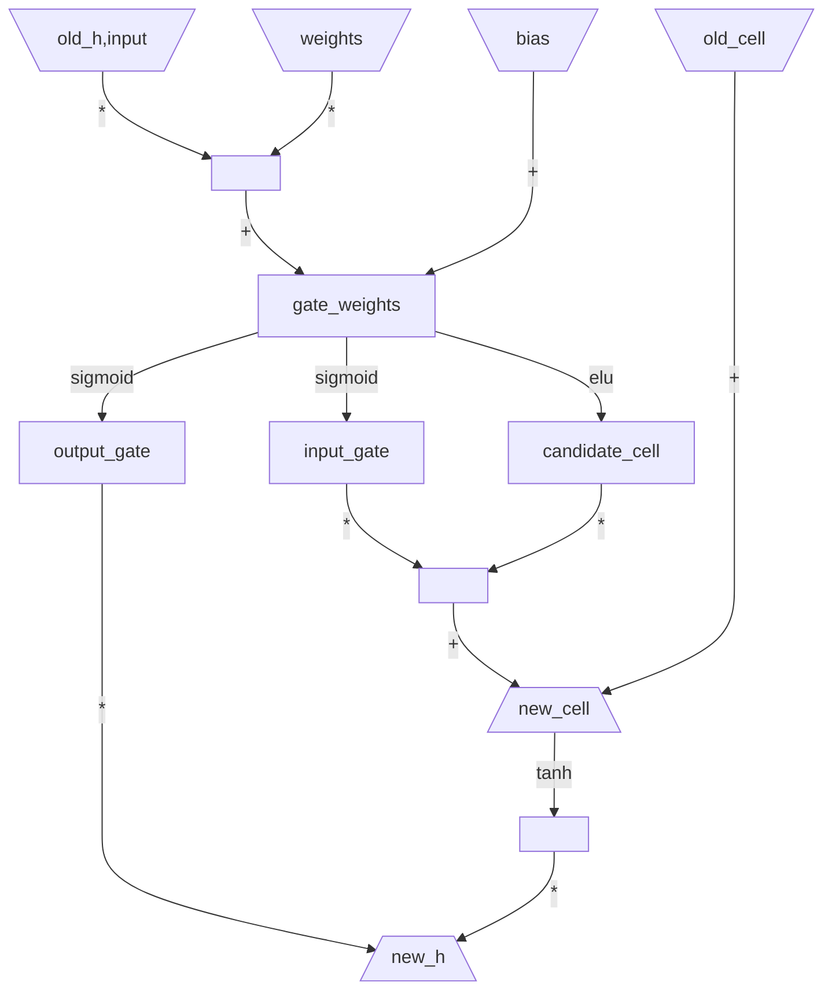

[toc]

# Extending PyTorch

本文将介绍扩展torch.autograd、torch.nn和torch的方法，以及如何编写自定义C/C++扩展。

## 1. Extending torch.autograd

向autograd添加操作（算子）需要为每个操作实现一个新的torch.autograd.Function子类；Function是torch.autograd模块用来记录各种操作执行流程，并执行梯度计算的。

本文主要介绍后向（backward）模式的自动微分（automatic differentiation，AD），它的使用最为广泛。

### 1.1 When to use

一般来说，如果需要在模型中执行不可微或依赖于非PyTorch库（如NumPy）的计算，且仍希望该计算与其他操作链接（chain with）并与autograd引擎一起工作，则需要实现自定义函数。

在某些情况下，自定义函数也可以用于提高性能和内存占用，例如，使用C++扩展[C++ extension](https://pytorch.org/tutorials/advanced/cpp_extension.html)实现forward和backward传递，将它们包装在torch.autograd.Function中，以与autograd引擎相链接。如果要减少backward传递时保存的缓冲区（buffers）数量，也可使用自定义函数来组合操作（核融合）。

### 1.2 When not to use

如果可根据PyTorch的内置操作编写自定义函数，那么它的反向图大概率能够由autograd引擎自动记录；在这种情况下，不需要实现自定义的backward函数。可以考虑使用普通的Python函数。

如果需要维护状态，即维护可训练的参数，那么应该使用自定义模块，即实现torcn.nn.Module的子类。如果需要在backward传递期间更改梯度或执行其他某些操作，可以考虑注册一个Tensor或Module的挂钩（hook）。

### 1.3 How to use

自定义算子操作主要有三个步骤：(1)继承torch.autograd.Function子类，实现forward()方法，可选地实现backward()和setup_context()方法；(2)在参数ctx对象上调用适当的方法；(3)声明自定义函数是否支持[double backward](https://pytorch.org/tutorials/intermediate/custom_function_double_backward_tutorial.html)；(4)使用gradcheck验证梯度是否正确。下面详细介绍各个步骤的工作。

#### 1.3.1 Define three methods

在继承[torch.autograd.Function](https://pytorch.org/docs/stable/autograd.html#torch.autograd.Function)之后，需要定义子类的三个方法，分别描述如下。

`forward()`方法，它是执行所定义操作（算子）的代码。它可以接受任意数量的参数（所有Python类型的对象都可），可以为某些参数指定默认值，使其变为可选参数。需要跟踪操作历史记录的Tensor张量参数（即指定了requires_grad=True的张量），将在调用之前转换为不跟踪历史的Tensor张量参数，并且它们的使用记录将在图中注册。请注意，此逻辑不会遍历列表（list）、字典（dict）以及任何其他数据结构，而是只考虑作为forward()直接参数的Tensor张量。该方法返回单个Tensor输出，如果有多个Tensor输出，则返回Tensor的元组。

此外，参阅[torch.autograd.Function](https://pytorch.org/docs/stable/autograd.html#torch.autograd.Function)的文档，某些方法只能在forward()中调用。

`setup_context()`方法。可以只编写一个合并的forward()方法，它接受一个torch.autograd.function.FunctionCtx对象ctx作参数；或者（自PyTorch 2.0起）编写一个单独的不接受ctx参数的forward()方法，和一个单独的用于修改ctx对象的setup_context()方法。其中， forward()方法负责计算，而setup_context()只负责ctx的修改。一般来说，单独的forward()和setup_context()更接近PyTorch原生操作的工作方式，因此更可与各种PyTorch子系统组合。

更多细节，可以参阅后文的[Combined or separate forward() and setup_context()](https://pytorch.org/docs/stable/notes/extending.html#combining-forward-context)文档。

`backward()`方法，定义了梯度公式。自定义操作的forward()有多少个Tensor输出，backward()方法就有多少个Tensor输入参数（但不是forward()方法输出的Tensor张量），其中每个Tensor参数表示的是最终结果（计算图的根结点）对于forward()输出张量的梯度张量。注意，永远不要就地修改这些backward()方法的梯度张量参数。自定义操作的forward()有多少个Tensor输入，backward()方法就要返回多少个Tensor张量，其中每个返回值Tensor张量，表示对于forward()输入张量的梯度张量。backward()方法的needs_input_grad为一个布尔元组，表示forward()的每个输入是否需要梯度计算；如果自定义操作的forward()输入不需要梯度，或者forward()输入是非张量对象，则backward()可以返回Python中的None值。此外，如果forward()输入有可选参数，则可以返回比输入更多的梯度，只要它们都为None即可。

自定义完成的torch.autograd.Function操作算子，通过调用其apply()方法使用。

#### 1.3.2 Define FunctionCtx

用户负责调用torch.autograd.function.FunctionCtx类的对象ctx的方法，来确保自定义的torch.autograd.Function操作算子能够正确地与torch.autograd引擎一起运行。

`save_for_backward()`方法，用于保存backward()过程中要用到的任何张量数据，而非张量数据应该直接存在ctx对象上（作为对象的属性）。如果所保存的张量既没有forward()的输入张量，也没有forward()的输出张量，则自定义函数可能不支持重复后向过程（double backward），详细见步骤3。

`mark_dirty()`方法，若forward()函数就地修改了其输入tensor张量，则需要使用该方法对被修改的张量进行标记ctx.mark_dirty(tensor)，这样若调用结果张量的backward()方法，则会引发错误。

`mark_non_differentiable()`方法，用于告诉torch.autograd引擎forward()的某个输出张量是否不可微的。默认情况下，所有可微的输出张量都将被设置为需要梯度（requires_grad=True）；不可微的张量（即整数类型）从不标记为需要梯度。

`set_materialize_grads()`方法，用于告诉torch.autograd引擎在forward()输出不依赖输入的情况下优化梯度计算，即不用给backward()函数实例化（materialize）梯度张量参数。也即，如果设为False，则Python中的None对象，或C++中的未定义张量（undefined tensor）对象，在调用backward()将不会被填充为全为0的Tensor张量。因此，自定义代码需要处理这些未实例化对象，就好像它们是零填充的张量一样。该方法的默认值设为True。

#### 1.3.3 double backward

如果自定义torch.autograd.Function函数（算子）不支持重复后向（double backward），则应该使用@once_differentiable装饰器来显式地声明backward()方法。使用该装饰器，试图执行重复backward操作将会产生错误。

更多细节请参阅[double backward tutorial](https://pytorch.org/tutorials/intermediate/custom_function_double_backward_tutorial.html)文档。

#### 1.3.4 gradcheck

推荐使用[torch.autograd.gradcheck()](https://pytorch.org/docs/stable/generated/torch.autograd.gradcheck.html#torch.autograd.gradcheck)方法检查backward()函数是否正确计算了forward()函数的梯度，它使用自定义的backward()方法计算雅可比矩阵，并将之与由有限元差分的数值方法计算雅可比矩阵比较，以确定backward()函数是否正确。

### 1.4 Example

#### 1.4.1 DNN Example

此处的示例展示了如何自定义一个全连接层的操作算子。

```python
class DnnFunction(torch.autograd.Function):
    @staticmethod
    def forward(ctx, input, weight, bias):
        ouput = torch.matmul(input, weight.t())
        if bias is not None:
            ouput += torch.unsqueeze(bias, dim=0).expand_as(ouput)
        ctx.save_for_backward(input, weight, bias)
        return ouput
    
    @staticmethod
    def backward(ctx, grad_output):
        input, weight, bias = ctx.saved_tensors
        grad_input = grad_weight = grad_bias = None
        if ctx.needs_input_grad[0]:
            grad_input = torch.matmul(grad_output, weight)
        if ctx.needs_input_grad[1]:
            grad_weight = torch.matmul(grad_output.t(), input)
        if ctx.needs_input_grad[2] and bias is not None:
            grad_bias = torch.sum(grad_output, dim=0)
        return grad_input, grad_weight, grad_bias
```

现在，为更方便地使用这些自定义操作算子，建议使用一个别名或将它们包装在一个函数中，将其包装在函数中可以支持默认参数和关键字参数，如下所示。

```python
# Alias
DNN = DnnFunction.apply

# Or wrap in a function, to support default args and keyword args.
def DNN(input, weight, bias=None):
    if bias is None:
        bias = torch.zeros((weight.shape[0],))
    return DnnFunction.apply(input, weight, bias)
```

对于上述自定义的操作算子，一个使用的示例如下所示。

```python
x = torch.randn((32, 768), requires_grad=True)
w = torch.randn((1024, 768), requires_grad=True)
b = torch.ones((w.shape[0],), requires_grad=True)
y = DNN(x, w, b)
loss = torch.sum(y)
loss.backward()
print(y.size(), y, sep='\n')
print(x.grad, w.grad, b.grad, sep='\n')
```

#### 1.4.2 MulConstant Example

此处示例，展示了一个张量乘以一个常数的操作算子，其forward()方法中存在非Tensor张量参数。此外，因为该操作对forward()输入张量的梯度，不依赖于输入张量，可以使用set_materialize_grads()优化。

```python
class MulConstant(torch.autograd.Function):
    @staticmethod
    def forward(ctx, tensor, constant):
        ctx.set_materialize_grads(False)
        ctx.constant = constant
        return tensor * constant

    @staticmethod
    def backward(ctx, grad_output):
        if grad_output is None:
            return None, None
        return grad_output * ctx.constant, None
```

对于上述自定义的操作算子，一个使用的示例如下所示。

```python
x = torch.randn((32, 1024), requires_grad=True)
c = 3.14
y = MulConstant.apply(x, c)
loss = torch.sum(y)
loss.backward()
print(y.size(), y, sep='\n')
print(x.grad)
```

#### 1.4.3 Cube Example

如果自定义的操作算子在backward()时需要forward()计算过程中产生的临时中间Tensor张量，则需要为backward()函数提供该临时张量，有两种方式解决。一是将该临时张量作为forward()的返回值输出（可由backward()获取）；二是将forward()和setup_context()结合，在forward()中使用ctx对象保存该临时中间Tensor张量。

注意，如果在链式求导法计算梯度时，梯度需要通过这些临时Tensor张量，则需要定义它们的梯度公式，可参看[the double backward tutorial](https://pytorch.org/tutorials/intermediate/custom_function_double_backward_tutorial.html)教程。

这里列举一个求立方的示例，下述代码是错误的。

```python
class CubeFunction(torch.autograd.Function):
    @staticmethod
    def forward(ctx, x):
        dx = 3 * x ** 2
        ctx.save_for_backward(dx)
        return x ** 3

    @staticmethod
    def backward(ctx, grad_output):
        dx, = ctx.saved_tensors
        return grad_output * dx
```

下述代码是正确的。

```python
class CubeFunction(torch.autograd.Function):
    @staticmethod
    def forward(ctx, x):
        dx = 3 * x ** 2
        ret = x ** 3
        ctx.save_for_backward(x, dx)
        return ret, dx

    @staticmethod
    def backward(ctx, grad_output, grad_dx):
        x, dx = ctx.saved_tensors
        return grad_output * dx + grad_dx * 6 * x

def cube(x):
    return CubeFunction.apply(x)[0]
```

### 1.5 gradcheck Example

需要检查自定义操作算子的backward()方法是否正确地计算了梯度，针对上述自定义DNN的一个示例如下所示。

```python
input = (torch.randn(32, 10, dtype=torch.double, requires_grad=True), 
         torch.randn(20, 10, dtype=torch.double, requires_grad=True))
test = torch.autograd.gradcheck(DNN, input, eps=1e-6, atol=1e-4)
print(test)
"""
True
"""
```

## 2. Extending torch.nn

torch.nn导出了两种类型的接口，模块（Module）以及它们的函数版本。用户可以用两种方式扩展它，但推荐神经网络模型层使用torch.nn.Module扩展类型，它们可以保存参数或缓冲区；并推荐无参数操作使用torch.nn.functional函数扩展，如激活函数、池化等。

因为torch.nn紧密地依赖torch.autograd引擎，故想要添加一个新的torch.nn.Module模块，需要为其核心操作算子实现torch.autograd.Function子类，实现自定义操作的forward()和backward()方法。

针对上述实现的DNN操作算子示例，实现一个新的DNN模型层的示例代码如下所示。

```python
class DnnLayer(torch.nn.Module):
    def __init__(self, in_feats, out_feats, bias=True) -> None:
        super().__init__()
        self.in_feats = in_feats
        self.out_feats = out_feats
        self.weight = torch.nn.parameter.Parameter(torch.empty((out_feats, in_feats)))
        if bias:
            self.bias = torch.nn.parameter.Parameter(torch.empty((out_feats,)))
        else:
            self.register_parameter(name='bias', param=None)
        torch.nn.init.normal_(self.weight, mean=-0.1, std=0.1)
        if self.bias is not None:
            torch.nn.init.normal_(self.bias, mean=-0.1, std=0.1)

    def forward(self, x):
        return DnnFunction.apply(x, self.weight, self.bias)

    def extra_repr(self) -> str:
        return 'in_feats={}, out_feats={}, bias={}'.format(
            self.in_feats, self.out_feats, self.bias is not None
        )
```

## 3. Extending torch

可以模仿torch.Tensor创建自定义的Tensor张量类，其具有与torch.Tensor相匹配的方法。不过，若要将自定义的Tensor类应用于已有的torch命名空间中的张量操作函数，例如torch.add()等，还需要额外的工作。

如果自定义的Python类定义了名为`__torch_function__`的方法，那么将在将自定义Python类的对象传递给torch命名空间中的函数时，PyTorch会调用实例对象的\_\_torch\_function\_\_方法。这能为torch命名空间中的任何函数定义自定义的实现，这允许将自定义的Tensor张量类型，无修改地嵌入到已有的PyTorch代码中。这适用于与torch.Tensor无关的自定义类型，或自定义的torch.Tensor子类型。

> 本特性的灵感来自NumPy的\_\_array\_function\_\_协议，更多细节可参阅[the NumPy documentation](https://numpy.org/doc/stable/user/basics.dispatch.html#basics-dispatch)和[NEP-0018](https://numpy.org/neps/nep-0018-array-function-protocol.html)。

### 3.1 Extending torch with Tensor-like type

从一个简单的示例开始，说明**API分发机制（dispatch mechanism）**。

此处将创建一个自定义的张量类型，它表示一个二维数量张量（scalar tensor），即主对角线元素为某个标量值，其他位置元素全为零，其构造参数为阶数N和主对角线元素的值value，如下所示。

```python
class ScalarTensor:
    def __init__(self, N, value) -> None:
        self._N = N
        self._value = value
        
    def __repr__(self) -> str:
        return 'ScalarTensor(N={}, value={})'.format(self._N, self._value)
    
    def tensor(self):
        return self._value * torch.eye(self._N)
```

此时，如果直接尝试将该对象用于torch命名空间中的API，PyTorch将会抛出如下错误。

```python
d = ScalarTensor(5, 2)
mean = torch.mean(d)
"""
TypeError: mean(): argument 'input' (position 1) must be Tensor, not ScalarTensor
"""
```

可为ScalarTensor添加\_\_torch\_function\_\_实现，以对自定义的Python类使用torch命名空间中的函数。

```python
class ScalarTensor:
    HANDLED_FUNCTIONS = {}

    @classmethod
    def __torch_function__(cls, func, types, args=(), kwargs={}):
        if func not in cls.HANDLED_FUNCTIONS or not all(
            issubclass(t, (torch.Tensor, ScalarTensor)) for t in types
        ):
            return NotImplemented
        return cls.HANDLED_FUNCTIONS[func](*args, **kwargs)
```

\_\_torch\_function\_\_方法接受四个参数。(1)参数func，torch命名空间中要被覆盖的API函数的引用；(2)参数types，实现了\_\_torch\_function\_\_函数的自定义张量类型列表；(3)参数args，传递给函数的参数元组；(4)参数kwargs，传递给函数的关键字参数字典。该方法使用一个名为HANDLED_FUNCTIONS的全局分发表来存储自定义实现，这个字典的键是torch命名空间中的函数，值是自定义ScalarTensor类的该函数的实现。

> 使用全局分发表并不是\_\_torch\_function\_\_方法的强制要求，它只是一种设计模式，用于构造自定义覆盖实现。

然后，实现对所需torch函数的自定义ScalarTensor类型的版本，并将其添加到HANDLED_FUNCTIONS分发表中，如下所示。

```python
class ScalarTensor:
    pass  # See above for detial.

def implements(torch_function):
    """Register a torch function override for ScalarTensor"""
    def decorator(func):
        # functools.update_wrapper(func, torch_function)
        ScalarTensor.HANDLED_FUNCTIONS[torch_function] = func
        return func
    return decorator

@implements(torch.mean)
def mean(scalar_tensor):
    return float(input._value) / input._N
```

此时，即可对自定义的ScalarTensor张量类型使用torch命名空间所提供的API函数，如下所示。

```python
d = ScalarTensor(5, 2)
t = torch.Tensor([[1, 2], [3, 4]])
print(torch.mean(d), torch.mean(t), seq='\n')
"""
0.4000
tensor(2.5000)
"""
```

当然torch.mean是最简单的torch函数之一，它只接受一个操作数（operand）。可以使用相同的机制来覆盖接受多个操作数的torch函数，其中任何操作数都可以是实现了\_\_torch\_function\_\_的自定义张量。如下示例给出了为自定义ScalarTensor张量类型实现torch.add()的代码。

```python
def ensure_tensor(data):
    if isinstance(data, ScalarTensor):
        return data.tensor()
    return torch.as_tensor(data=data)

@implements(torch.add)
def add(input, other):
    try:
        if input._N == other._N:
            return ScalarTensor(input._N, input._value + other._value)
        else:
            raise ValueError('Shape mismatch!')
    except AttributeError:
        return torch.add(ensure_tensor(input), ensure_tensor(other))
```

对自定义的ScalarTensor张量使用torch.add方法，如下所示。

```python
d = ScalarTensor(2, 3.14)
t = torch.Tensor([[1, 2], [3, 4]])
print(torch.add(d, d), torch.add(d, t), sep='\n')
"""
ScalarTensor(N=2, value=6.28)
tensor([[4.1400, 2.0000],
        [3.0000, 7.1400]])
"""
```

不过注意，上述对ScalerTensor类型实现的add方法不像torch.add()那样可以接受alpha和out作为关键字参数，如下所示。

```python
torch.add(s, s, alpha=2)
"""
TypeError: add() got an unexpected keyword argument 'alpha'
"""
```

为了速度和灵活性，\_\_torch\_function\_\_分发机制不会检查覆盖函数的签名与torch命名空间API中被覆盖函数的签名是否匹配。对于某些应用程序来说，是可以忽略可选参数的，但为了确保与torch.Tensor的完全兼容性，torch命名空间API函数的用户自定义实现应该精确地模拟被覆盖函数的API接口，包括可选参数。

由上述自定义ScalarTensor张量类型的代码可知，torch命名空间API中没有被显式覆盖的函数将从\_\_torch\_function\_\_中返回NotImplemented错误。如果某个torch命名空间API对所有实现了\_\_torch\_function\_\_的自定义张量类型的操作数都返回NotImplemented，那么PyTorch将引发TypeError。这意味着在大多数情况下，若某个自定义张量类型，传递给其没有显示实现的torch命名空间API函数时，将会引发TypeError错误。

```python
d = ScalarTensor(2, 3.14)
torch.mul(d, 3)
"""
TypeError: no implementation found for 'torch.mul' on types that implement __torch_function__: [0x7f851274aad0]
"""
```

这意味着，如果使用按此要求（遇到未实现的操作抛出NotImplemented错误）的\_\_torch\_function\_\_实现，则需要显式地为自定义张量类型实现完整的torch命名空间API接口（或仅实现所需的API接口）。这可能是一个很高的要求，因为完整的torch命名空间API非常广泛。

另一种选择是对未实现的操作不返回NotImplemented，而是在没有可用自定义覆盖实现的情况下，将自定义张量转换为torch.Tensor并传递给原始torch函数。这种实现需要修改\_\_torch\_function\_\_实现，以上述定义的自定义ScalarTensor张量类为例，其代码如下。

```python
class ScalarTensor:
    HANDLED_FUNCTIONS = {}
    
	@classmethod
    def __torch_function__(cls, func, types, args=(), kwargs={}):
        if func not in cls.HANDLED_FUNCTIONS or not all(
            issubclass(t, (torch.Tensor, ScalarTensor)) for t in types
        ):
            args = [a.tensor() if hasattr(a, 'tensor') else a for a in args]
            return func(*args, **kwargs)
        return cls.HANDLED_FUNCTIONS[func](*args, **kwargs)
```

此时，未显式自定义覆盖的torch.mul()将正确工作，如下所示。

```python
d = ScalarTensor(2, 3.14)
print(torch.mul(d, d))
"""
tensor([[9.8596, 0.0000],
        [0.0000, 9.8596]])
"""
```

也可以参考后文的MetadataTensor示例，了解这种模式的变体，但它总是通过torch命名空间API中的操作返回一个MetadataTensor来传播元数据。

\_\_torch\_function\_\_协议是为API的全覆盖而设计的，部分覆盖可能会导致所不希望的结果，特别是某些函数会引发TypeError错误。对于子类尤其如此，例如torch.Tensor的add()函数，必须覆盖torch.add()、torch.Tensor.add()、torch.Tensor\_\_add\_\_()三个API接口，才能保证完全覆盖，即是这三个接口的返回结果完全相同。如果不这样做，还可能导致无限递归。

如果自定义Tensor张量是torch.Tensor的子孙类，需要实现自定义张量的\_\_torch\_function\_\_协议，则在实现中必须调用super().\_\_torch\_function\_\_()实现，详见后文。

### 3.2 Subclassing torch.Tensor

自PyTorch 1.7版本，对继承于torch.Tensor的自定义张量子类调用torch命名空间中API函数，返回的结果对象都是自定义张量子类的实例，而不是父类torch.Tensor的实例，如下所示。

```python
class SubTensor(torch.Tensor): pass

a = torch.add(SubTensor([3.14]), SubTensor([3.14]))
b = torch.add(SubTensor([3.14]), torch.Tensor([3.14]))
c = SubTensor([3.14]) + torch.Tensor([3.14])
print(type(a), type(b), type(c), sep='\n')
"""
<class '__main__.SubTensor'>
<class '__main__.SubTensor'>
<class '__main__.SubTensor'>
"""
```

如果对多个继承于torch.Tensor的自定义张量子类调用torch命名空间中的API函数，则返回的结果对象是继承树层次结构中最低层的自定义子类；若参与torch命名空间API函数的最底层自定义子类有多个，则会引发TypeError错误，如下所示。

```python
class SubTensor(torch.Tensor): pass
class SubTensor2(SubTensor): pass
class SubTensor3(SubTensor): pass

a = torch.add(SubTensor2([3.14]), SubTensor([3.14]))
b = torch.add(SubTensor2([3.14]), torch.Tensor([3.14]))
print(type(a), type(b), sep='\n')
"""
<class '__main__.SubTensor2'>
<class '__main__.SubTensor2'>
"""
c = torch.add(SubTensor2([3.14]), SubTensor3([3.14]))
"""
TypeError: no implementation found for 'torch.add' on types that implement __torch_function__: [SubTensor2, SubTensor3]
"""
```

如果希望覆盖所有的torch命名空间API接口，可以使用\_\_torch\_function\_\_协议，并按如下方式调用super().\_\_torch\_function\_\_()实现，如下所示。

```python
class LoggingTensor(torch.Tensor):
    @classmethod
    def __torch_function__(cls, func, types, args=(), kwargs={}):
        # NOTE: Logging calls Tensor.__repr__, so we can't log __repr__ without infinite recursion
        if func is not torch.Tensor.__repr__:
            print(f'[Logging] func: {func.__name__}, args: {args}, kwargs: {kwargs}')
        return super().__torch_function__(func, types, args, kwargs)
```

如果希望覆盖自定义张量子类的方法，可以直接覆盖该方法（为子类定义它的自定义实现），也可以使用\_\_torch\_function\_\_协议并与func匹配。

在torch.Tensor自定义子类中实现\_\_torch\_function\_\_时，总是要调用super().\_\_torch\_function\_\_(func,...)，而不能像PyTorch 1.7版本之前直接调用func函数；否则，可能会导致func递归回到\_\_torch\_function\_\_，从而导致无限递归。

### 3.3 Extending torch with a Tensor wrapper type

另一种有用的模式是对torch.Tensor类进行包装（wrap），无论是将torch.Tensor包装为自定义张量类的属性，还是通过派生torch.Tensor来自定义张量类。

此处实现这种类型的一个特殊情况，一个自定义的元数据张量MetadataTensor类型，它将元数据字典附加到torch.Tensor上，并能通过torch命名空间API函数传递。由于这是对整个torch命名空间API的通用封装，故无需单独实现每个覆盖，所以可以使\_\_torch\_function\_\_实现较为宽松地允许某些操作。

```python
class MetadataTensor:
    def __init__(self, data, metadata=None, **kwargs) -> None:
        self._t = torch.as_tensor(data=data)
        self._metadata = metadata

    def __repr__(self) -> str:
        return 'Metadata:\n{}\ndata:\n{}'.format(self._metadata, self._t)

    @classmethod
    def __torch_function__(cls, func, types, args=(), kwargs={}):
        metadatas = tuple(a._metadata for a in args if hasattr(a, '_metadata'))
        args = [a._t if hasattr(a, '_t') else a for a in args]
        ret = func(*args, **kwargs)
        return MetadataTensor(ret, metadata=metadatas[0])
```

这个简单的实现不一定适用于torch命名空间API的每个函数，但它足以捕获大多数常见操作，使用例子如下所示。

```python
metadata = {'owner': 'Bloonow'}
m = MetadataTensor([1, 2, 3, 4], metadata=metadata)
t = torch.tensor([5, 6, 7, 8])
r1 = torch.add(m, t)
r2 = torch.mul(m, t)
print(r1, r2, sep='\n')
"""
Metadata:
{'owner': 'Bloonow'}
data:
tensor([ 6,  8, 10, 12])
Metadata:
{'owner': 'Bloonow'}
data:
tensor([ 5, 12, 21, 32])
"""
```

### 3.4 Operations on multiple types that define \_\_torch\_function\_\_

若调用torch命名空间API函数的操作数是多个不同的自定义Tensor张量类型，且这多个自定义Tensor张量类型都实现了\_\_torch\_function\_\_协议，则需要特别小心。在这种情况下，有如下规则。

- API分发机制收集为每个操作数收集其自己的\_\_torch\_function\_\_实现，并按顺序调用这些实现。首先子类在超类之前调用；否则运算表达式中以从左到右的顺序调用。
- 若返回除NotImplemented之外的任何值，则将该值作为结果返回；\_\_torch\_function\_\_实现可以通过返回NotImplemented来注册某个自定义类型没有实现某个操作。
- 如果所有\_\_torch\_function\_\_实现都返回NotImplemented错误，则PyTorch抛出TypeError错误。

### 3.5 Testing Coverage of Overrides for the PyTorch API

实现\_\_torch\_function\_\_的一个麻烦是，如果某些torch接口API有覆盖，而其他API没有覆盖，最好的情况就是出现未预期行为，最坏的情况会引发错误。为简化这个过程，PyTorch提供了面向开发人员的API，以确保支持\_\_torch\_function\_\_的完全覆盖。此API是私有的，将来可能会在发生变化。

首先，使用torch.overrides._get_overridable_functions()函数，可以获得所有可重写函数的列表。这将返回一个字典，其键是PyTorch的API的命名空间，其值是该命名空间中可以覆盖的函数的列表。如下一个例子，打印出torch.fft命名空间中的前6个函数。

```python
import torch.overrides

func_dict = torch.overrides.get_overridable_functions()
funcs = [f.__name__ for f in func_dict[torch.fft][:6]]
"""
['fft_fft', 'fft_fft2', 'fft_fftn', 'fft_fftshift', 'fft_hfft', 'fft_hfft2']
"""
```

此外，torch.overrides.get_ignored_functions()函数返回的是所有不可重写函数的列表。

# Fusing Convolution and Batch Normalization

将相邻的卷积层和批归一化层融合在一起，是一种常用的推理优化，可以提高运行速度。通常，它通过完全消除批归一化层，并更新之前卷积层的权重和偏差来实现。然而，这种技术并不适用于模型训练。

本教程将展示用技术手段来融合两层，它可在训练中应用，这种优化的目的不是改进运行时间，而是减少内存使用。这种优化思想是，卷积层和批归一化层（以及其他许多操作）需要在forward正向传递期间保存其input输入的副本，以便用于backward反向传递。对于较大的batch_size，这些保存的输入副本会占据内存使用的大部分，因此避免为卷积批归一化的input输入分配额外的副本张量，能够有效降低内存占用。

本教程，通过将卷积层和批归一化层组合为一个层（作为自定义torch.autograd.Function函数），可避免这种额外的内存分配。在组合层的forward过程中，如原来一样执行卷积和批归一化，唯一区别是只用保存卷积层的input输入副本，而无需保存批归一化层的输入副本。为获得批归一化层的input输入（其backward过程所必须的），可以在组合层的backward过程中，根据保存的卷积层输入副本来重新计算卷积，以得到批归一化层的input输入。

注意，这种优化的使用是根据情况而定的。虽然通过避免保存一个输入副本，在forward传递结束时可以减少内存分配，但在某些情况下，内存分配的峰值可能实际上并没有减少。

为示例简单，本教程假定二维卷积层的bias=False,stride=1,padding=0,dilation=1,groups=1，假定二维批归一化eps=1e-3,momentum=0.1,affine=False,track_running_statistics=False。另一个小区别是，在计算批归一化时，在分母的平方根之外添加了epsilon。

实现自定义torch.autograd.Function函数需要手动实现backward过程，在这种情况下，需要Conv2D和BatchNorm2D的backward后向公式。

## 1. Backward for Convolution

二维卷积Conv2D的自定义Function函数实现代码如下所示。

```python
import torch
import torch.nn.functional as F

def convolution_backward(grad_out, X, weight):
    grad_weight = F.conv2d(X.transpose(0, 1), grad_out.transpose(0, 1)).transpose(0, 1)
    grad_X = F.conv_transpose2d(grad_out, weight)
    return grad_X, grad_weight

class Conv2DFunction(torch.autograd.Function):
    @staticmethod
    def forward(ctx, X, weight):
        ctx.save_for_backward(X, weight)
        return F.conv2d(X, weight)

    @staticmethod
    @torch.autograd.function.once_differentiable
    def backward(ctx, grad_out):
        X, weight = ctx.saved_tensors
        return convolution_backward(grad_out, X, weight)
```

通过gradcheck函数，检查所实现的Conv2DFunction是否能够正确计算梯度，如下所示。

```python
weight = torch.randn((5, 3, 3, 3), requires_grad=True, dtype=torch.double)
X = torch.randn((10, 3, 7, 7), requires_grad=True, dtype=torch.double)
check = torch.autograd.gradcheck(Conv2DFunction.apply, (X, weight))
print(check)
"""
True
"""
```

## 2. Backward for BatchNorm

批归一化（Batch Normalization）有两种模式，即training训练模式和evaluation评估模式。在train()训练模式下，样本统计量是input输入的函数；在eval()评估模式下，所保存的统计量会被用于计算方差和标准差，此时不是input输入的函数。这使得非训练模式的backward较为简单，下述只实现训练模式下的情况。

```python
import torch

def unsqueeze_help(tensor):
    # return [1, :, 1, 1, ...]
    return tensor[None, :, None, None]

def batch_norm_backward(grad_out, X, sum, sqrt_var, N, eps):
    # out = (X - mean(X)) / (sqrt(var(X)) + eps)
    # How to calculate the gradient, see PyTorch Tutorial for detail
    tmp = torch.sum((X - unsqueeze_help(sum) / N) * grad_out, dim=(0, 2, 3))
    tmp *= -1
    d_denom = tmp / (sqrt_var + eps) ** 2
    d_var = d_denom / (2 * sqrt_var)
    d_mean_dx = grad_out / unsqueeze_help(sqrt_var + eps)
    d_mean_dx = unsqueeze_help(-torch.sum(d_mean_dx, dim=(0, 2, 3)) / N)

    grad_input = X * unsqueeze_help(d_var * N)
    grad_input += unsqueeze_help(-d_var * sum)
    grad_input *= 2 / ((N - 1) * N)
    grad_input += d_mean_dx
    grad_input *= unsqueeze_help(sqrt_var + eps)
    grad_input += grad_out
    grad_input /= unsqueeze_help(sqrt_var + eps)
    return grad_input

class BatchNorm2DFunction(torch.autograd.Function):
    @staticmethod
    def forward(ctx, X, eps=1e-3):
        sum = torch.sum(X, dim=(0, 2, 3))
        var = torch.var(X, unbiased=True, dim=(0, 2, 3))
        sqrt_var = torch.sqrt(var)
        N = torch.numel(X) / X.size(1)
        ctx.save_for_backward(X)
        ctx.eps = eps
        ctx.sum = sum
        ctx.sqrt_var = sqrt_var
        ctx.N = N
        mean = sum / N
        denom = sqrt_var + eps
        out = (X - unsqueeze_help(mean)) 
        out /= unsqueeze_help(denom)
        return out

    @staticmethod
    @torch.autograd.function.once_differentiable
    def backward(ctx, grad_out):
        X, = ctx.saved_tensors
        return batch_norm_backward(grad_out, X, ctx.sum, ctx.sqrt_var, ctx.N, ctx.eps)
```

通过gradcheck函数，检查所实现的BatchNorm2DFunction是否能够正确计算梯度，如下所示。

```python
a = torch.randn(size=(16, 3, 4, 5), requires_grad=True, dtype=torch.double)
check = torch.autograd.gradcheck(BatchNorm2DFunction.apply, (a,))
print(check)
"""
True
"""
```

## 3. Fusing Convolution and BatchNorm

现在大部分工作已经完成，可以将它们组合在一起，如下所示。

```python
class FusedConvBatchNorm2DFunction(torch.autograd.Function):
    @staticmethod
    def forward(ctx, X, conv_weight, eps=1e-3):
        assert X.ndim == 4  # N, C, H, W
        # (1) Only need to save this single buffer for backward
        ctx.save_for_backward(X, conv_weight)
        # (2) Exact same Conv2D forward from example above
        X = F.conv2d(X, conv_weight)
        # (3) Exact same BatchNorm2D forward from example above
        sum = torch.sum(X, dim=(0, 2, 3))
        var = torch.var(X, unbiased=True, dim=(0, 2, 3))
        sqrt_var = torch.sqrt(var)
        N = torch.numel(X) / X.size(1)
        ctx.eps = eps
        ctx.sum = sum
        ctx.sqrt_var = sqrt_var
        ctx.N = N
        mean = sum / N
        denom = sqrt_var + eps
        # Try to do as many things in-place as possible
        # Instead of `out = (X - a) / b`, doing `out = X - a; out /= b`
        # avoids allocating one extra NCHW-sized buffer here
        out = X - unsqueeze_help(mean)
        out /= unsqueeze_help(denom)
        return out

    @staticmethod
    def backward(ctx, grad_out):
        X, conv_weight, = ctx.saved_tensors
        # (4) Batch norm backward
        # (5) We need to recompute conv
        X_conv_out = F.conv2d(X, conv_weight)
        grad_out = batch_norm_backward(grad_out, X_conv_out, 
                                       ctx.sum, ctx.sqrt_var, ctx.N, ctx.eps)
        # (6) Conv2d backward
        grad_X, grad_weight = convolution_backward(grad_out, X, conv_weight)
        return grad_X, grad_weight, None, None, None, None, None
```

通过gradcheck函数，检查所实现的FusedConvBatchNorm2DFunction是否能够正确计算梯度，如下所示。

```python
weight = torch.rand(5, 3, 3, 3, requires_grad=True, dtype=torch.double)
X = torch.rand(2, 3, 4, 4, requires_grad=True, dtype=torch.double)
check = torch.autograd.gradcheck(FusedConvBatchNorm2DFunction.apply, (X, weight))
print(check)
"""
True
"""
```

下面，将融合后的自定义Function子类，封装到nn.Module子类当中，如下所示。

```python
class FusedConvBatchNorm2D(torch.nn.Module):
    def __init__(self, in_channels, out_channels, kernel_size,
                 exp_avg_factor=0.1, eps=1e-3, device=None, dtype=None):
        super(FusedConvBatchNorm2D, self).__init__()
        factory_kwargs = {'device': device, 'dtype': dtype}
        # Conv parameters
        weight_shape = (out_channels, in_channels, kernel_size, kernel_size)
        self.conv_weight = torch.nn.Parameter(torch.empty(*weight_shape, **factory_kwargs))
        # Batch norm parameters
        self.num_features = out_channels
        self.eps = eps
        # Initialize
        self._reset_parameters()

    def forward(self, X):
        return FusedConvBatchNorm2DFunction.apply(X, self.conv_weight, self.eps)

    def _reset_parameters(self) -> None:
        torch.nn.init.kaiming_uniform_(self.conv_weight, a=math.sqrt(5))
```

# Custom C++ and CUDA Extensions

PyTorch提供了大量与神经网络、任意张量代数、数据整理等相关的操作。然而，用户可能仍然需要一个更定制化的操作，例如一种全新的激活函数，或某个自定义操作算子。

在PyTorch中集成这种自定义操作的最简单方法是通过扩展torch.autograd.Function和torch.Module来实现，可参考[Extending PyTroch](https://pytorch.org/docs/master/notes/extending.html)教程，其提供了自动微分的全部功能以及Python一贯的表达能力。

然而，有时自定义操作使用C++实现会更好。例如，代码可能需要非常快的执行速度，因为它在模型的调用得非常频繁，或者即使是少量调用也非常昂贵；另一个可能的原因是自定义操作依赖于其他C或C++库，或者与其他库交互。为处理这种情况，PyTorch提供了一种非常简单的方法来编写自定义C++扩展。

C++扩展是PyTorch开发的一种机制，允许用户创建PyTorch源外定义（out-of-source）的自定义操作符算子，也即与PyTorch后端分离。这种方法不同于PyTorch本地（native）操作的实现方式。C++扩展旨在节省大量与PyTorch后端集成自定义操作相关的样板文件，同时为基于PyTorch的项目提供高度的灵活性。一旦将自定义操作定义为C++扩展，将其转换为PyTorch本地函数在很大程度上就是一个代码组织问题。

使用C++扩展有两种方式，一是使用setuptools提前（ahead of time）编译构建好；二是使用torch.utils.cpp_extension.load()方法即时（just in time，JIT）加载。

## 1. Motivation and Example

本文的其余部分将介绍一个编写和使用C++（和CUDA）扩展的实际示例。

假设需要实现一种新的循环单元，其类似于LSTM但没有遗忘门（forget gate），且使用指数线性单元（Exponential Linear Unit，ELU）作为其内部激活函数。因为这种记忆单元永远不会忘记，此处称之为LLTM，即长时记忆单元（Long Long Term Memory）。

LLTM与普通LSTM的两种不同之处非常重要，以至于无法直接使用PyTorch提供的LSTMCell模块，因此必须创建一个自定义Cell。为此，最简单的方法是，继承torch.nn.Moudle来实现所需功能，如下所示。

```python
# MyNet/model/lltm.py

class LLTM(torch.nn.Module):
    def __init__(self, in_feats, state_size):
        super(LLTM, self).__init__()
        self.in_feats = in_feats
        self.state_size = state_size
        # 3 * state_size for input gate, output gate and candidate cell gate.
        # in_feats + state_size because we will multiply with [input, h].
        self.weights = torch.nn.Parameter(torch.empty(3 * state_size, in_feats + state_size))
        self.bias = torch.nn.Parameter(torch.empty(3 * state_size))
        self._reset_parameters()

    def _reset_parameters(self):
        stdv = 1.0 / math.sqrt(self.state_size)
        for weight in self.parameters():
            weight.data.uniform_(-stdv, +stdv)

    def forward(self, input, state):
        old_h, old_cell = state
        X = torch.concat([old_h, input], dim=1)
        # Compute the input, output and candidate cell gates with one MM.
        gate_weights = torch.nn.functional.linear(X, self.weights, self.bias)
        # Split the combined gate weight matrix into its components.
        gates = torch.chunk(gate_weights, dim=1)

        input_gate = torch.sigmoid(gates[0])
        output_gate = torch.sigmoid(gates[1])
        # Here we use an ELU instead of the usual tanh.
        candidate_cell = torch.nn.functional.elu(gates[2])

        # Compute the new cell state.
        new_cell = old_cell + candidate_cell * input_gate
        # Compute the new hidden state and output.
        new_h = torch.tanh(new_cell) * output_gate

        return new_h, new_cell
```

该LLTM的使用样例如下所示。

```python
batch_size = 64
in_feats = 1024
state_size = 128

x = torch.randn(batch_size, in_feats)
h = torch.randn(batch_size, state_size)
c = torch.randn(batch_size, state_size)

rnn = LLTM(in_feats, state_size)
new_h, new_C = rnn(x, (h, c))
```

通常来说，应该使用这种方法来扩展PyTorch，由于PyTorch对CPU和GPU操作实现进行了高度优化，由[NVIDIA cuDNN](https://developer.nvidia.com/cudnn)库、[Intel MKL](https://software.intel.com/en-us/mkl)库、[NNPACK](https://github.com/Maratyszcza/NNPACK)库等提供支持，因此上面这样的PyTorch代码通常足够快。

然而，在某些情况下，还有进一步提高性能的空间，因为PyTorch不知道正在实现的具体算法，它只知道组成算法的各个操作，因此PyTorch必须一个接一个地单独执行操作。由于操作实现（或kernel内核）的单独调用都有一定的开销（涉及到CUDA内核启动等），因此在许多函数调用中，这种开销可能变得非常大。此外，Python解释器本身会降低程序的速度。

因此，加快代码速度的一个明确方法是用C++（或CUDA）重写部分操作算子，并融合特定的一组操作（核融合）。融合意味着将多个函数的实现组合成一个函数，会降低内核启动开销，并减少全局数据的流动。

根据上述示例，这里演示如何使用C++扩展来实现LLTM的融合版本。首先使用普通C++编写实现，使用支持大部分PyTorch后端的[ATen](https://github.com/zdevito/ATen)库；然后，将模型的一部分移动到CUDA内核来进一步加快速度，以利用GPU提供的大规模并行性。

> 注意，编写C++或CUDA扩展所需的.h头文件，在安装PyTorch时就已集成在site-packages/torch/include目录下，该目录下默认有ATen、c10、c10d、caffe2、pybind11、THC、torch目录，为各种项目的.h头文件以及其他文件。
>
> 需要注意，ATen目录下的文件可能并不齐全（仅必须的文件），若出现文件缺失，可使用Github上的[ATen](https://github.com/zdevito/ATen)库。

## 2. Writing a C++ Extension

### 2.1 Building with setuptools

使用C++扩展有两种方式，一是使用setuptools提前（ahead of time）编译构建好；二是使用torch.utils.cpp_extension.load()方法即时（just in time，JIT）加载。此处介绍setuptools提前编译构建。

按提前构建的方式，使用setuptools模块编写setup.py脚本来编译构建C++扩展。对于LLTM有如下示例代码。

```python
# MyNet/exts/lltm_ext/setup.py

import setuptools
import torch.utils.cpp_extension

setuptools.setup(
    name='lltm_cpp',
    ext_modules=[torch.utils.cpp_extension.CppExtension('lltm_cpp', ['lltm.cpp']), ],
    cmdclass={'build_ext': torch.utils.cpp_extension.BuildExtension, }
)
```

代码中，torch.utils.cpp_extension.CppExtension是对setuptools.Extension的包装，它传递正确的include路径，并将扩展语言设置为C++扩展。其等效的普通setuptools代码如下所示。

```python
# MyNet/exts/lltm_ext/setup.py

ext_module = setuptools.Extension(
    name='lltm_cpp',
    sources=['lltm.cpp'],
    include_dirs=torch.utils.cpp_extension.include_paths(),
    language='c++'
)
setuptools.setup(
    name='lltm_cpp',
    ext_modules=[ext_module, ],
    cmdclass={'build_ext': torch.utils.cpp_extension.BuildExtension, }
)
```

torch.utils.cpp_extension.BuildExtension执行必需的配置步骤和检查，并在混合使用C++/CUDA扩展的情况下管理交叉编译。

### 2.2 Writing the C++ Op

要实现PyTorch的C++扩展，需要torch/extension.h头文件，它是个一站式（one-stop）头文件，包含了编写C++扩展必需的所有PyTorch bits扩展，包括：

- [ATen](https://github.com/zdevito/ATen)库，提供了用于Tensor张量计算的主要API；
- [pybind11](https://github.com/pybind/pybind11)库，是一个轻量级C++库，用于将C++代码暴露给Python调用（反之也可），用于创建已有C++代码的Python绑定（bindings），允许将C++ 11中的特性映射到Python调用；
- 一些头文件，用于管理ATen和pybind11之间的交互细节。

举例，激活函数sigmoid()的导数d_sigmoid()是backward传递时需要用到的一个函数，这里给出其C++代码实现，以演示如何实现LLTM的C++扩展代码。

```c++
// MyNet/exts/lltm_ext/lltm.cpp

#include <torch/extension.h>

// sigmoid'(z) = (1 - sigmoid(z)) * sigmoid(z)
torch::Tensor d_sigmoid(torch::Tensor z) {
  torch::Tensor s = torch::sigmoid(z);
  return (1 - s) * s;
}
```

上述实现展示了如何使用ATen API接口。PyTorch中的torch.Tensor接口是从ATen库自动生成的，因此可以将代码的Python实现一一对应地转换为C++实现。在C++中，所有计算的主要数据类型都是torch::Tensor，它即是PyTorch中的torch.Tensor张量。


> 注意，CUDA 11.5 nvcc在Windows上解析torch/extension.h时会遇到内部编译器错误（internal compiler error），需要将C++接口绑定Python的代码逻辑pybind11移动到纯C++文件当中。
>
> 避免在.cu文件中包含torch/extension.h头文件，而替换为ATen/ATen.h头文件，并将torch::Tensor张量替换为at::Tensor张量，这是等价的，它们其实是同一定义，torch::Tensor只是at::Tensor的别名。

#### 2.2.1 Forward Pass

接下来，将LLTM的整个forward过程移植到C++实现，如下所示。源文件名为lltm.cpp，包括后文的lltm_backward和pybinds都在该文件中。

```c++
// MyNet/exts/lltm_ext/lltm.cpp

std::vector<torch::Tensor> lltm_forward(
    torch::Tensor input,
    torch::Tensor weights,
    torch::Tensor bias,
    torch::Tensor old_h,
    torch::Tensor old_cell) {

    torch::Tensor X = torch::concat({old_h, input}, 1);
    torch::Tensor gate_weights = torch::addmm(bias, X, weights.transpose(0, 1));
    std::vector<torch::Tensor> gates = torch::chunk(gate_weights, 3, 1);

    torch::Tensor input_gate = torch::sigmoid(gates[0]);
    torch::Tensor output_gate = torch::sigmoid(gates[1]);
    torch::Tensor candidate_cell = torch::elu(gates[2], 1.0);

    torch::Tensor new_cell = old_cell + candidate_cell * input_gate;
    torch::Tensor new_h = torch::tanh(new_cell) * output_gate;

    return {new_h, new_cell, input_gate, output_gate, candidate_cell, X, gate_weights};
}
```

接下来要实现LLTM的backward后向传递，为逻辑清晰，最好画出其计算图，如下所示。



根据上述计算图，可以较为清晰地找到forward各个输出张量对于其输入张量的依赖关系，以便由输出张量的梯度来计算输入张量的梯度。

#### 2.2.2 Backward Pass

目前，C++扩展API没有提供自动生成backward函数的方法，因此必须手动实现LLTM的backward后向传递，它计算forward过程的output输出相对于forward过程的每个input输入的导数。

对于lltm_forward过程，其后向传递函数的C++实现如下所示。

```c++
// MyNet/exts/lltm_ext/lltm.cpp

// sigmoid'(z) = (1 - sigmoid(z)) * sigmoid(z)
torch::Tensor d_sigmoid(torch::Tensor z) {
    torch::Tensor s = torch::sigmoid(z);
    return (1 - s) * s;
}

// tanh'(z) = 1 - tanh^2(z)
torch::Tensor d_tanh(torch::Tensor z) {
    return 1 - torch::tanh(z).pow(2);
}

// elu'(z) = relu'(z) + alpha * exp(z) if alpha * (exp(z) - 1) < 0 else 0
torch::Tensor d_elu(torch::Tensor z, torch::Scalar alpha = 1.0) {
    torch::Tensor e = torch::exp(z);
    torch::Tensor mask = (alpha * (e - 1)) < 0;
    return (z > 0).type_as(z) + mask.type_as(z) * (alpha * e);
}

std::vector<torch::Tensor> lltm_backward(
    torch::Tensor grad_h,
    torch::Tensor grad_cell,
    torch::Tensor new_cell,
    torch::Tensor input_gate,
    torch::Tensor output_gate,
    torch::Tensor candidate_cell,
    torch::Tensor X,
    torch::Tensor gate_weights,
    torch::Tensor weights) {
    
    torch::Tensor d_output_gate = torch::tanh(new_cell) * grad_h;
    torch::Tensor d_tanh_new_cell = output_gate * grad_h;
    torch::Tensor d_new_cell = d_tanh(new_cell) * d_tanh_new_cell + grad_cell;

    torch::Tensor d_old_cell = d_new_cell;
    torch::Tensor d_candidate_cell = input_gate * d_new_cell;
    torch::Tensor d_input_gate = candidate_cell * d_new_cell;

    std::vector<torch::Tensor> gates = torch::chunk(gate_weights, 3, 1);
    d_input_gate *= d_sigmoid(gates[0]);
    d_output_gate *= d_sigmoid(gates[1]);
    d_candidate_cell *= d_elu(gates[2]);
    torch::Tensor d_gates = torch::concat({d_input_gate, d_output_gate, d_candidate_cell}, 1);

    torch::Tensor d_weights = torch::mm(d_gates.t(), X);
    torch::Tensor d_bias = torch::sum(d_gates, 0, true);

    torch::Tensor d_X = torch::mm(d_gates, weights);
    const int64_t state_size = torch::size(grad_h, 1);
    torch::Tensor d_old_h = torch::slice(d_X, 1, 0, state_size);
    torch::Tensor d_input = torch::slice(d_X, 1, state_size);

    return {d_old_h, d_input, d_weights, d_bias, d_old_cell};
}
```

### 2.3 Binding to Python and Install

一旦使用C10或ATen成功编写了C++操作算子，就可使用pybind11将C++函数或类绑定到Python中，详见[pybind11 documentation](https://pybind11.readthedocs.io/en/stable/)文档。

针对上述LLTM的例子，进行绑定的代码与C++实现代码在同一个.cpp源文件中，如下所示。

```c++
// MyNet/exts/lltm_ext/lltm.cpp

PYBIND11_MODULE(lltm_cpp, m) {
    m.def("forward", &lltm_forward, "LLTM forward");
    m.def("backward", &lltm_backward, "LLTM backward");
}
```

其中，使用m.def(name,ptr,extra)将C++代码所定义的函数或属性，绑定到Python模块中的函数或属性，name为绑定后在Python使用的名称，ptr为C++中指向被绑定对象的指针，extra为额外描述信息。

需要注意的是，名称name应该定义为，构建torch扩展时在setup.py脚本中提供的扩展名，对于该示例应为lltm_cpp。这是为了避免在两个地方维护扩展名（构建setup.py的脚本和扩展的C++代码），因为这两者之间的不匹配会导致难以跟踪的问题。

此时，准备在PyTorch导入自定义的C++扩展，当前的项目目录结构应当如下所示。

```shell
MyNet
├── exts
│   └── lltm_ext
│       ├── lltm.cpp
│       └── setup.py
└── model
    └── lltm.py
```

在MyNet/exts/lltm_ext目录下，通过使用python setup.py install即可构建并安装自定义C++扩展，其过程可能会如下所示。

```shell
running install
building 'lltm_cpp' extension
Emitting ninja build file /home/bln/MyNet/exts/lltm_ext/build/temp.linux-x86_64-3.9/build.ninja...
Compiling objects...
Allowing ninja to set a default number of workers... (overridable by setting the environment variable MAX_JOBS=N)
[1/1] c++ -MMD -MF /home/bln/MyNet/exts/lltm_ext/build/temp.linux-x86_64-3.9/lltm.o.d -Wno-unused-result -Wsign-compare -DNDEBUG -g -fwrapv -O3 -Wall -fPIC -fPIC -I/home/bln/.B/python39/lib/python3.9/site-packages/torch/include -I/home/bln/.B/python39/lib/python3.9/site-packages/torch/include/torch/csrc/api/include -I/home/bln/.B/python39/lib/python3.9/site-packages/torch/include/TH -I/home/bln/.B/python39/lib/python3.9/site-packages/torch/include/THC -I/home/bln/.B/python39/include/python3.9 -c -c /home/bln/MyNet/exts/lltm_ext/lltm.cpp -o /home/bln/MyNet/exts/lltm_ext/build/temp.linux-x86_64-3.9/lltm.o -DTORCH_API_INCLUDE_EXTENSION_H '-DPYBIND11_COMPILER_TYPE="_gcc"' '-DPYBIND11_STDLIB="_libstdcpp"' '-DPYBIND11_BUILD_ABI="_cxxabi1011"' -DTORCH_EXTENSION_NAME=lltm_cpp -D_GLIBCXX_USE_CXX11_ABI=0 -std=c++14
creating build/lib.linux-x86_64-3.9
g++ -shared /home/bln/MyNet/exts/lltm_ext/build/temp.linux-x86_64-3.9/lltm.o -L/home/bln/.B/python39/lib/python3.9/site-packages/torch/lib -L/home/bln/.B/python39/lib -lc10 -ltorch -ltorch_cpu -ltorch_python -o build/lib.linux-x86_64-3.9/lltm_cpp.cpython-39-x86_64-linux-gnu.so
creating build/bdist.linux-x86_64
creating build/bdist.linux-x86_64/egg
copying build/lib.linux-x86_64-3.9/lltm_cpp.cpython-39-x86_64-linux-gnu.so -> build/bdist.linux-x86_64/egg
Adding lltm-cpp 0.0.0 to easy-install.pth file

Installed /home/bln/.B/python39/lib/python3.9/site-packages/lltm_cpp-0.0.0-py3.9-linux-x86_64.egg
Processing dependencies for lltm-cpp==0.0.0
Finished processing dependencies for lltm-cpp==0.0.0
```

注意，由于ABI版本控制问题，用于构建PyTorch的C++扩展的编译器必须与构建PyTorch的编译器ABI兼容。实际上，这意味着必须在Linux上使用GCC 4.9及更高版本；在MacOS上，必须使用Clang（它没有任何ABI版本控制问题）。在最坏的情况下，可以使用编译器从源代码构建PyTorch，然后使用相同的编译器构建C++扩展。

> 每个操作系统都会为运行在该系统下的应用程序提供应用程序二进制接口（Application Binary Interface，ABI），ABI包含了应用程序在这个系统下运行时必须遵守的编程约定。ABI包含一系列的系统调用和使用这些系统调用的方法，以及程序使用内存地址和使用机器寄存器的规定。
>
> 在很多情况下，链接器为遵守ABI的约定需要做一些重要的工作。例如，ABI要求每个应用程序包含一个程序中各例程使用的静态数据的所有地址表，链接器通过收集所有链接到程序中的模块的地址信息来创建地址表。
>
> ABI描述了应用程序和操作系统之间，一个应用和它的库之间，或者应用的组成部分之间的低级接口。ABI涵盖了各种细节，如：(1)数据类型的大小、布局和对齐；(2)调用约定（函数参数如何传送以及返回值如何传回），例如，是所有的参数都通过栈传递，还是部分参数通过寄存器传递，哪个寄存器用于哪个函数参数，通过栈传递的第一个函数参数最先入栈还是最后入栈等；(3)系统调用的编码和一个应用如何向操作系统进行系统调用；(4)目标文件的二进制格式、程序库等。

构建C++扩展成功后，只需使用所构建的扩展名，即可在Python代码中import导入，注意需要先import导入torch，以解决一些动态链接器必须找到的符号。在自定义的C++扩展模块或函数上调用help()方法，可以看到其签名与C++代码的实现相匹配，如下所示。

```python
import torch
import lltm_cpp
print(lltm_cpp.forward, lltm_cpp.backward, sep='\n')
"""
<built-in method forward of PyCapsule object at 0x7f7ba5447b70>
<built-in method backward of PyCapsule object at 0x7f7ba5447b40>
"""
help(lltm_cpp.forward)
"""
Help on built-in function forward in module lltm_cpp:
forward(...) method of builtins.PyCapsule instance
    forward(arg0: at::Tensor, arg1: at::Tensor, arg2: at::Tensor, arg3: at::Tensor, arg4: at::Tensor) -> List[at::Tensor]
    LLTM forward
"""
help(lltm_cpp.backward)
"""
Help on built-in function backward in module lltm_cpp:
backward(...) method of builtins.PyCapsule instance
    backward(arg0: at::Tensor, arg1: at::Tensor, arg2: at::Tensor, arg3: at::Tensor, arg4: at::Tensor, arg5: at::Tensor, arg6: at::Tensor, arg7: at::Tensor, arg8: at::Tensor) -> List[at::Tensor]
    LLTM backward
"""
```

### 2.4 Using Your Extension

此时已经可以从PyTorch中调用C++函数实现，即可用torch.autograd.Function和torch.nn.Module将C++实现包装起来，完成扩展，如下所示。

```python
# MyNet/model/lltm_ext.py

import math
import torch
import lltm_cpp

class LLTMFunction(torch.autograd.Function):
    @staticmethod
    def forward(ctx, input, weights, bias, old_h, old_cell):
        outputs = lltm_cpp.forward(input, weights, bias, old_h, old_cell)
        new_h, new_cell = outputs[:2]
        variables = outputs[1:] + [weights]
        ctx.save_for_backward(*variables)
        return new_h, new_cell

    @staticmethod
    def backward(ctx, grad_h, grad_cell):
        outputs = lltm_cpp.backward(grad_h.contiguous(), grad_cell.contiguous(), *ctx.saved_tensors)
        d_old_h, d_input, d_weights, d_bias, d_old_cell = outputs
        return d_input, d_weights, d_bias, d_old_h, d_old_cell
        
class LLTM(torch.nn.Module):
    def __init__(self, in_feats, state_size):
        super(LLTM, self).__init__()
        self.in_feats = in_feats
        self.state_size = state_size
        self.weights = torch.nn.Parameter(torch.empty(3 * state_size, in_feats + state_size))
        self.bias = torch.nn.Parameter(torch.empty(3 * state_size))
        self._reset_parameters()

    def _reset_parameters(self):
        stdv = 1.0 / math.sqrt(self.state_size)
        for weight in self.parameters():
            weight.data.uniform_(-stdv, +stdv)

    def forward(self, input, state):
        return LLTMFunction.apply(input, self.weights, self.bias, *state)
```

#### 2.4.1 Performance Comparison

现在已能够从PyTorch中使用C++扩展代码，此处运行一个小的基准测试，查看用C++编写的自定义算子的性能如何，如下所示。

```python
import time
import torch
import model.lltm
import model.lltm_cpp

batch_size = 64
in_feats = 1024
state_size = 128

x = torch.randn(batch_size, in_feats)
h = torch.randn(batch_size, state_size)
c = torch.randn(batch_size, state_size)

rnn = model.lltm.LLTM(in_feats, state_size)
rnn_cpp = model.lltm_cpp.LLTM(in_feats, state_size)

times = [0., 0., 0., 0.]
for _ in range(int(1e4)):
    # for rnn
    start = time.time()
    new_h, new_C = rnn(x, (h, c))
    times[0] += time.time() - start
    y = torch.sum(new_h) + torch.sum(new_C)
    start = time.time()
    y.backward()
    times[1] += time.time() - start

    # for rnn_cpp
    start = time.time()
    new_h, new_C = rnn_cpp(x, (h, c))
    times[2] += time.time() - start
    y = torch.sum(new_h) + torch.sum(new_C)
    start = time.time()
    y.backward()
    times[3] += time.time() - start

print('[rnn    ] Forward: {:.3f}s | Backward {:.3f}s'.format(times[0], times[1]))
print('[rnn_cpp] Forward: {:.3f}s | Backward {:.3f}s'.format(times[2], times[3]))
"""
[rnn    ] Forward: 2.393s | Backward 3.754s
[rnn_cpp] Forward: 2.285s | Backward 5.897s
"""
```

可以看到，forward函数性能有了些许加速；而backward函数出现了负提升，这是因为上述backward传递实现并不是最优的，此外，PyTorch的autograd自动微分引擎可以对计算图进行自动并行化。

#### 2.4.2 Performance on GPU Device

令人兴奋的是，PyTorch的ATen后端抽象了所运行的计算设备，这意味着为CPU编写的相同代码也可以运行在GPU上，并且单个操作将相应地分配给GPU优化的实现，如下所示。

```python
# ...
x = torch.randn(batch_size, in_feats).to('cuda')
h = torch.randn(batch_size, state_size).to('cuda')
c = torch.randn(batch_size, state_size).to('cuda')

rnn = model.lltm.LLTM(in_feats, state_size).to('cuda')
rnn_cpp = model.lltm_cpp.LLTM(in_feats, state_size).to('cuda')

times = [0., 0., 0., 0.]

# ...
print('[rnn    ] Forward: {:.3f}s | Backward {:.3f}s'.format(times[0], times[1]))
print('[rnn_cpp] Forward: {:.3f}s | Backward {:.3f}s'.format(times[2], times[3]))
"""
[rnn    ] Forward: 0.603s | Backward 0.854s
[rnn_cpp] Forward: 0.531s | Backward 1.583s
"""
```

可以看到，与非CUDA代码相比，整体都有了巨大的加速。不过，更优的方式是，编写自定义CUDA内核函数（kernel）来提高C++代码性能，这将在后文介绍。

在此之前，下一小节讨论另一种构建C++扩展的方法。

### 2.5 JIT Compiling Extensions

使用C++扩展有两种方式，一是使用setuptools提前（ahead of time）编译构建好；二是使用torch.utils.cpp_extension.load()方法即时（just in time，JIT）加载。此处介绍JIT即时加载。

JIT编译机制通过调用torch.utils.cpp_extension.load(name,sources,verbose)函数，提供实时编译和加载C++扩展的方法，加载到的模块存为一个Python变量，可访问其中的方法（即forward和backward），故可以用来搭建自定义模块。

对于LLTM有如下示例代码，需要注意的是，若采用相对路径，则提交Python脚本的路径为sources的根路径，故推荐采用绝对路径。

```python
# MyNet/test.py

import torch.utils.cpp_extension
lltm_cpp = torch.utils.cpp_extension.load(name='lltm_cpp', sources=['/home/bln/MyNet/exts/lltm_ext/lltm.cpp'], verbose=True)
"""
Using /home/bln/.cache/torch_extensions/py39_cu113 as PyTorch extensions root...
Creating extension directory /home/bln/.cache/torch_extensions/py39_cu113/lltm_cpp...
Emitting ninja build file /home/bln/.cache/torch_extensions/py39_cu113/lltm_cpp/build.ninja...
Building extension module lltm_cpp...
Allowing ninja to set a default number of workers... (overridable by setting the environment variable MAX_JOBS=N)
[1/2] c++ -MMD -MF lltm.o.d -DTORCH_EXTENSION_NAME=lltm_cpp -DTORCH_API_INCLUDE_EXTENSION_H -DPYBIND11_COMPILER_TYPE=\"_gcc\" -DPYBIND11_STDLIB=\"_libstdcpp\" -DPYBIND11_BUILD_ABI=\"_cxxabi1011\" -isystem /home/bln/.B/python39/lib/python3.9/site-packages/torch/include -isystem /home/bln/.B/python39/lib/python3.9/site-packages/torch/include/torch/csrc/api/include -isystem /home/bln/.B/python39/lib/python3.9/site-packages/torch/include/TH -isystem /home/bln/.B/python39/lib/python3.9/site-packages/torch/include/THC -isystem /home/bln/.B/python39/include/python3.9 -D_GLIBCXX_USE_CXX11_ABI=0 -fPIC -std=c++14 -c /home/bln/MyNet/exts/lltm_ext/lltm.cpp -o lltm.o 
[2/2] c++ lltm.o -shared -L/home/bln/.B/python39/lib/python3.9/site-packages/torch/lib -lc10 -ltorch_cpu -ltorch -ltorch_python -o lltm_cpp.so
Loading extension module lltm_cpp...
"""
print(lltm_cpp, lltm_cpp.forward, lltm_cpp.backward, sep='\n')
"""
<module 'lltm_cpp' from '/home/bln/.cache/torch_extensions/py39_cu113/lltm_cpp/lltm_cpp.so'>
<built-in method forward of PyCapsule object at 0x7fa86d7e0d50>
<built-in method backward of PyCapsule object at 0x7fa86d7e0660>
"""
```

使用所加的lltm_cpp模块的示例代码如下所示。

```python
# MyNet/model/lltm_ext.py

import math
import torch
# import lltm_cpp
import torch.utils.cpp_extension
lltm_cpp = torch.utils.cpp_extension.load(name='lltm_cpp', sources=['/home/bln/MyNet/exts/lltm_ext/lltm.cpp'])

class LLTMFunction(torch.autograd.Function):
    @staticmethod
    def forward(ctx, input, weights, bias, old_h, old_cell):
        outputs = lltm_cpp.forward(input, weights, bias, old_h, old_cell)
        new_h, new_cell = outputs[:2]
        variables = outputs[1:] + [weights]
        ctx.save_for_backward(*variables)
        return new_h, new_cell

    @staticmethod
    def backward(ctx, grad_h, grad_cell):
        outputs = lltm_cpp.backward(grad_h.contiguous(), grad_cell.contiguous(), *ctx.saved_tensors)
        d_old_h, d_input, d_weights, d_bias, d_old_cell = outputs
        return d_input, d_weights, d_bias, d_old_h, d_old_cell

class LLTM(torch.nn.Module):
    pass
```

PyTorch为torch.utils.cpp_extension.load()函数提供了与setuptools相同的信息，在后台，它将执行以下操作：

1. 创建临时目录$HOME/.cache/torch_extensions/py39_cu113/lltm_cpp，
2. 在临时目录中生成一个Ninja构建文件build.ninja，
3. 将自定义C++扩展源文件编译为共享库，
4. 将这个共享库导入为Python模块。

JIT生成的Python模块与setuptools生成的完全相同，但无需维护单独的setup.py构建文件，这是其一大优势。如果自定义的设置较为复杂，并且确实需要setuptools的全部功能，则可以编写自定义的setup.py，但在许多情况下，这种JIT技术也可以做得很好。

第一次执行JIT代码需要一些时间，因为扩展正在后台编译。由于使用Ninja构建系统来构建源代码，所以重新编译是增量式的，因此第二次运行Python模块时重新加载扩展的速度很快，如果没有更改扩展的源文件，开销也很低。

## 3. Writing a Mixed C++/CUDA extension

为真正将C++扩展实现提升到实现性能优化的水平，可使用自定义CUDA内核（kernel）实现部分forward传递和backward传递。对于LLTM示例，这有可能特别有效，因为其有大量的逐元素操作，这些操作都可以在单个CUDA内核中融合和并行化。此处展示如何编写这样一个CUDA内核，并将CUDA扩展与PyTorch集成。

编写CUDA扩展的一般策略是，首先编写C++文件（.cpp）定义函数，使用pybind11绑定这些函数至Python，然后从Python调用这些函数。此外，该文件还将声明在CUDA文件（.cu）中定义的函数。C++函数将进行一些检查，并最终将其调用转发给CUDA函数。在.cu文件中，编写实际的CUDA内核kernel实现。PyTroch的torcu.utils.cpp_extension包将负责使用如GCC等C++编译器编译C++源代码，并使用NVIDIA的nvcc编译器编译CUDA源代码，以确保每个编译器处理其所负责的源文件。最终，它们将被链接到一个动态共享库中，可以从Python代码中使用它。

### 3.1 Checking and Binding

首先编写C++文件，对于此处LLTM示例，其如下所示。

```c++
// MyNet/exts/lltm_ext/lltm_cuda.cpp

#include <vector>
#include <torch/extension.h>

// CUDA forward declarations
std::vector<torch::Tensor> lltm_forward_cuda(
    torch::Tensor input,
    torch::Tensor weights,
    torch::Tensor bias,
    torch::Tensor old_h,
    torch::Tensor old_cell);

// CUDA backward declarations
std::vector<torch::Tensor> lltm_backward_cuda(
    torch::Tensor grad_h,
    torch::Tensor grad_cell,
    torch::Tensor new_cell,
    torch::Tensor input_gate,
    torch::Tensor output_gate,
    torch::Tensor candidate_cell,
    torch::Tensor X,
    torch::Tensor gate_weights,
    torch::Tensor weights);

// CHECK MARCOS
#define CHECK_CUDA(x) TORCH_CHECK(x.device().is_cuda(), #x " must be a CUDA tensor");
#define CHECK_CONTIGUOUS(x) TORCH_CHECK(x.is_contiguous(), #x " must be contiguous");
#define CHECK_INPUT(x) CHECK_CUDA(x); CHECK_CONTIGUOUS(x);

// C++ forward interface
std::vector<torch::Tensor> lltm_forward(
    torch::Tensor input,
    torch::Tensor weights,
    torch::Tensor bias,
    torch::Tensor old_h,
    torch::Tensor old_cell) {
    CHECK_INPUT(input);
    CHECK_INPUT(weights);
    CHECK_INPUT(bias);
    CHECK_INPUT(old_h);
    CHECK_INPUT(old_cell);
    return lltm_forward_cuda(input, weights, bias, old_h, old_cell);
}

// C++ backward interface
std::vector<torch::Tensor> lltm_backward(
    torch::Tensor grad_h,
    torch::Tensor grad_cell,
    torch::Tensor new_cell,
    torch::Tensor input_gate,
    torch::Tensor output_gate,
    torch::Tensor candidate_cell,
    torch::Tensor X,
    torch::Tensor gate_weights,
    torch::Tensor weights) {
    CHECK_INPUT(grad_h);
    CHECK_INPUT(grad_cell);
    CHECK_INPUT(input_gate);
    CHECK_INPUT(output_gate);
    CHECK_INPUT(candidate_cell);
    CHECK_INPUT(X);
    CHECK_INPUT(gate_weights);
    CHECK_INPUT(weights);
    return lltm_backward_cuda(
        grad_h,
        grad_cell,
        new_cell,
        input_gate,
        output_gate,
        candidate_cell,
        X,
        gate_weights,
        weights);
}

// bindings c++ interface to python
PYBIND11_MODULE(TORCH_EXTENSION_NAME, m) {
    m.def("forward", &lltm_forward, "LLTM forward (CUDA)");
    m.def("backward", &lltm_backward, "LLTM backward (CUDA)");
}
```

如上述代码所示，它主要是样板（boilerplate）代码，实现对数据的检查，并将forward和backward的调用转发到CUDA版本.cu文件中的实现。需要注意的是.cu源文件需要使用NVIDIA提供的nvcc编译器进行编译，其本质是对GCC的包装，仍可使用C++标准库和ATen库。

还需要注意的问题是，若使用setuptools编译构建，它不能处理名称相同但扩展名不同的文件，因此在编写setup.py脚本时需要注意；而JIT即时构建则不存在该问题。

### 3.2 Launching CUDA Kernel

对于LLTM的示例，其CUDA版本代码.cu的实现源文件为lltm_cuda_kernel.cu文件，如下所示。

```c++
// MyNet/exts/lltm_ext/lltm_cuda_kernel.cu

#include <vector>
#include <torch/extension.h>
#include <cuda.h>
#include <cuda_runtime.h>

template <typename scalar_t>
__device__ __forceinline__ scalar_t sigmoid(scalar_t z) {
  return 1.0 / (1.0 + exp(-z));
}

template <typename scalar_t>
__device__ __forceinline__ scalar_t d_sigmoid(scalar_t z) {
  const auto s = sigmoid(z);
  return (1.0 - s) * s;
}

template <typename scalar_t>
__device__ __forceinline__ scalar_t d_tanh(scalar_t z) {
  const auto t = tanh(z);
  return 1 - (t * t);
}

template <typename scalar_t>
__device__ __forceinline__ scalar_t elu(scalar_t z, scalar_t alpha = 1.0) {
  return fmax(0.0, z) + fmin(0.0, alpha * (exp(z) - 1.0));
}

template <typename scalar_t>
__device__ __forceinline__ scalar_t d_elu(scalar_t z, scalar_t alpha = 1.0) {
  const auto e = exp(z);
  const auto d_relu = z < 0.0 ? 0.0 : 1.0;
  return d_relu + (((alpha * (e - 1.0)) < 0.0) ? (alpha * e) : 0.0);
}
```

如上述代码，其使用了CUDA特有的声明，例如\_\_device\_\_和\_\_forecinline_\_等，用来指定nvcc编译器的编译时行为，指定编译器将源代码编译生成为何种设备（CPU或GPU）的目标代码等，具体介绍可参考CUDA编程资料。

现在实现真正的操作函数，通常来说，一个操作（算子）的函数过程中，并不是所有代码都可以并行加速的，所以通常将其分为不可加速部分和可加速部分，开发者真正需要加速的是其可加速的部分，需要为其编写kernel函数。

对于lltm_forward过程，其CUDA版本代码函数名为lltm_forward_cuda，而其中真正并行加速的部分单独封装为lltm_forward_cuda_kernel函数，如下所示。

```c++
// MyNet/exts/lltm_ext/lltm_cuda_kernel.cu

std::vector<torch::Tensor> lltm_forward_cuda(
    torch::Tensor input,
    torch::Tensor weights,
    torch::Tensor bias,
    torch::Tensor old_h,
    torch::Tensor old_cell) {

    torch::Tensor X = torch::concat({old_h, input}, 1);
    torch::Tensor gates = torch::addmm(bias, X, weights.transpose(0, 1));

    torch::Tensor new_h = torch::zeros_like(old_cell);
    torch::Tensor new_cell = torch::zeros_like(old_cell);
    torch::Tensor input_gate = torch::zeros_like(old_cell);
    torch::Tensor output_gate = torch::zeros_like(old_cell);
    torch::Tensor candidate_cell = torch::zeros_like(old_cell);

    // for parallel dispatch
    const int batch_size = old_cell.size(0);
    const int state_size = old_cell.size(1);
    const int threads = 1024;
    const dim3 blocks((state_size + threads - 1) / threads, batch_size);

    AT_DISPATCH_FLOATING_TYPES(gates.type(), "lltm_forward_cuda", ([&] {
        // real parallel part of the function
        lltm_forward_cuda_kernel<scalar_t><<<blocks, threads>>>(
            gates.data<scalar_t>(),
            old_cell.data<scalar_t>(),
            new_h.data<scalar_t>(),
            new_cell.data<scalar_t>(),
            input_gate.data<scalar_t>(),
            output_gate.data<scalar_t>(),
            candidate_cell.data<scalar_t>(),
            state_size);
        }
    ));

    return {new_h, new_cell, input_gate, output_gate, candidate_cell, X, gates};
}
```

可以看到，有些计算仍然是直接使用ATen所提供的接口（运行在GPU上），因为ATen本身已对矩阵乘法（例如addmm）或卷积进行了高度优化的例程实现，想要改进这些实现是耗时费力且收效甚微的。上述代码核心部分在于AT_DISPATCH_FLOATING_TYPES宏定义，和由lltm_forward_cuda_kernel<scalar_t><<<blocks,threads>>>()启动的CUDA内核函数。

虽然ATen抽象了所处理张量的数据类型和所运行的设备信息，但在实际运行时，张量仍是由具体设备上具体类型的内存来存储。因此，需要一种方法来在运行时确定张量的类型，然后有选择地调用具有相应正确类型签名的函数。对该逻辑的手动代码实现应如下所示。

```c++
switch (tensor.type().scalarType()) {
    case torch::ScalarType::Double:
    	return function<double>(tensor.data<double>());
    case torch::ScalarType::Float:
    	return function<float>(tensor.data<float>());
    default:
        return error;
}
```

宏定义AT_DISPATCH_FLOATING_TYPES(type,name,lambda)就是用于处理类似上述分发逻辑的，其参数分别表示数据类型、提示错误信息时的名字，要执行的函数。在lambda函数中，类型别名scalar_t是可用的，它是张量在该上下文中实际运行时的类型。因此，对于模板函数（通常CUDA内核函数即是），可用scalar_t别名将其实例化，以调用相应数据类型的函数。在这种情况下，我们希望张量的数据可以作为scalar_t类型的指针来检索。

注意，AT_DISPATCH_FLOATING_TYPES宏只能用来分发浮点数据类型（float和double），如果需要分发所有数据类型，可以使用AT_DISPATCH_ALL_TYPES宏定义。

由上述代码可以看到，此例中指定每个CUDA块具有1024个线程，且整个GPU网格被划分为尽可能多个这么大小的块，以使得一个线程负责矩阵的一个分量元素。例如，若state_size为2048，batch_size为4，则将启动共4×2=8个块，每个块包含1024个线程。

### 3.3 Writing CUDA Kernel

真正CUDA内核函数lltm_forward_cuda_kernel的代码如下所示，指定每个线程的操作，并行执行。

```c++
// MyNet/exts/lltm_ext/lltm_cuda_kernel.cu

template <typename scalar_t>
__global__ void lltm_forward_cuda_kernel(
    const scalar_t* __restrict__ gates,
    const scalar_t* __restrict__ old_cell,
    scalar_t* __restrict__ new_h,
    scalar_t* __restrict__ new_cell,
    scalar_t* __restrict__ input_gate,
    scalar_t* __restrict__ output_gate,
    scalar_t* __restrict__ candidate_cell,
    size_t state_size) {
    
    // calculate according to blockIdx and threadIdx
    const int start = blockIdx.y * (state_size * 3) + blockIdx.x * blockDim.x + threadIdx.x;
    const int idx = blockIdx.y * state_size + blockIdx.x * blockDim.x + threadIdx.x;
    if ((blockIdx.x * blockDim.x + threadIdx.x < state_size) < state_size) {
        input_gate[idx] = sigmoid(gates[start]);
        output_gate[idx] = sigmoid(gates[start + state_size]);
        candidate_cell[idx] = elu(gates[start + 2 * state_size]);
        new_cell[idx] = old_cell[idx] + candidate_cell[idx] * input_gate[idx];
        new_h[idx] = tanh(new_cell[idx]) * output_gate[idx];
    }
}
```

可以看到，这里能够完全并行计算矩阵中每个单独分量的逐元素操作。

### 3.4 Using Accessor

可以看到，在上述CUDA内核函数中，直接使用的是相应数据类型的指针，这是因为实际上，在CUDA内核中直接使用高层（high-level）的类型无关的张量是非常低效的。然而，直接使用指针会降低易用性和可读性，特别是对于高维数据。

例如，针对LLTM示例中的gates张量，其有3个逻辑上的维度，分别是：(1)batch维度，大小为batch_size，跨步为3*state_size；(2)row维度，大小为3，跨步为state_size；(3)col维度，大小为state_size，跨步为1。那么，要访问gates张量的某个元素gates\[n\]\[row\]\[column\]，则需要手动计算其在一维数组中的位置，如下所示。

```c++
const int index = n * 3 * state_size + row * state_size + col;
scalar_t element = gates.data<scalar_t>()[index];
```

上述表达式不仅冗长，还需要显式地知道跨步长度，并在将其传递给内核函数。可以预料到，在核函数接受多个不同大小的张量的情况下，将会得到一个非常长的表达式列表。

幸运的是，ATen提供了**访问器（accessors）**，这些访问器通过一次动态检查（single dynamic check）创建，可确定torch::Tensor张量的数据类型和维度。然后，访问器暴露了一些相对高级的用于高效访问torch::Tensor张量的API接口，其成员方法包含size()、stride()、data()，以及重载的多维索引符号[]等，可通过多维索引来访问其元素，而无需将张量转化为一维指针来访问。

访问器实现为torch::TensorAccessor\<Type,N\>模板类，可通过torch::Tensor::accessor\<Type,N\>()方法获得某个torch::Tensor张量的访问器，并假定其是Type数据类型，且为N维张量。一个示例如下代码所示。

```c++
torch::Tensor mat = torch::randn({16, 16});
float mat_trace = 0.0;
// assert mat is 2-dimensional and holds floats
torch::TensorAccessor<float, 2> mat_accessor = mat.accessor<float, 2>();
for (int i = 0; i < torch::size(mat, 0); i++) {
    // use the accessor mat_accessor to get tensor data
    mat_trace += mat_accessor[i][i];
}
```

注意，torch::Tensor::accessor\<Type,N\>()接口可在CPU张量上高效地访问数据。而在CUDA张量上的等效接口是torch::Tensor::packed_accessor64\<Type,N,PtrTraits\>()或torch::Tensor::packed_accessor32\<Type,N,PtrTraits\>()方法，它们生成打包访问器类torch::PackedTensorAccessor64\<Type,N,PtrTraits\>或torch::PackedTensorAccessor32\<Type,N,PtrTraits\>的实例对象，其所用的整数索引为64位或32位整数。

打包访问器与访问器的基本区别是，打包访问器在其结构中复制size和stride信息（而不是指向它们），这允许将其传递给CUDA内核函数，并在内核函数中使用其接口。

可以设计CUDA的内核函数，使其接受打包访问器而不是指针。对于此处LLTM的示例，该版本的kernel函数如下所示。

```c++
// MyNet/exts/lltm_ext/lltm_cuda_kernel.cu

template <typename scalar_t>
__global__ void lltm_forward_cuda_kernel(
    const torch::PackedTensorAccessor32<scalar_t, 3, torch::RestrictPtrTraits> gates,
    const torch::PackedTensorAccessor32<scalar_t, 2, torch::RestrictPtrTraits> old_cell,
    torch::PackedTensorAccessor32<scalar_t, 2, torch::RestrictPtrTraits> new_h,
    torch::PackedTensorAccessor32<scalar_t, 2, torch::RestrictPtrTraits> new_cell,
    torch::PackedTensorAccessor32<scalar_t, 2, torch::RestrictPtrTraits> input_gate,
    torch::PackedTensorAccessor32<scalar_t, 2, torch::RestrictPtrTraits> output_gate,
    torch::PackedTensorAccessor32<scalar_t, 2, torch::RestrictPtrTraits> candidate_cell) {
    
    const int n = blockIdx.y;  // batch index
    const int c = blockIdx.x * blockDim.x + threadIdx.x;  // column index
    if (c < gates.size(2)) {
        input_gate[n][c] = sigmoid(gates[n][0][c]);
        output_gate[n][c] = sigmoid(gates[n][1][c]);
        candidate_cell[n][c] = elu(gates[n][2][c]);
        new_cell[n][c] =
        old_cell[n][c] + candidate_cell[n][c] * input_gate[n][c];
        new_h[n][c] = tanh(new_cell[n][c]) * output_gate[n][c];
    }
}
```

其中，打包访问器的模板参数torch::RestrictPtrTraits表示其使用\_\_restrict\_\_关键字，且打包访问器使用的是32位整型，其size和stride信息存储在int32_t中，相比之下，64位整型的打包访问器会使内核函数变慢。

上述实现代码的可读性更强，针对使用访问器的CUDA内核函数，修改前述的转发函数如下。

```c++
// MyNet/exts/lltm_ext/lltm_cuda_kernel.cu

std::vector<torch::Tensor> lltm_forward_cuda(
    torch::Tensor input,
    torch::Tensor weights,
    torch::Tensor bias,
    torch::Tensor old_h,
    torch::Tensor old_cell) {
	/* ... */
    AT_DISPATCH_FLOATING_TYPES(gates.type(), "lltm_forward_cuda", ([&] {
        lltm_forward_cuda_kernel<scalar_t><<<blocks, threads>>>(
            gates.packed_accessor32<scalar_t, 3, torch::RestrictPtrTraits>(),
            old_cell.packed_accessor32<scalar_t, 2, torch::RestrictPtrTraits>(),
            new_h.packed_accessor32<scalar_t, 2, torch::RestrictPtrTraits>(),
            new_cell.packed_accessor32<scalar_t, 2, torch::RestrictPtrTraits>(),
            input_gate.packed_accessor32<scalar_t, 2, torch::RestrictPtrTraits>(),
            output_gate.packed_accessor32<scalar_t, 2, torch::RestrictPtrTraits>(),
            candidate_cell.packed_accessor32<scalar_t, 2, torch::RestrictPtrTraits>());
        }
    ));
    return {new_h, new_cell, input_gate, output_gate, candidate_cell, X, gates};
}
```

同样地，针对LLTM示例，其backward过程lltm_backward_cuda函数和lltm_backward_cuda_kernel函数的代码如下所示。

```c++
// MyNet/exts/lltm_ext/lltm_cuda_kernel.cu

std::vector<torch::Tensor> lltm_backward_cuda(
    torch::Tensor grad_h,
    torch::Tensor grad_cell,
    torch::Tensor new_cell,
    torch::Tensor input_gate,
    torch::Tensor output_gate,
    torch::Tensor candidate_cell,
    torch::Tensor X,
    torch::Tensor gates,
    torch::Tensor weights) {

    torch::Tensor d_old_cell = torch::zeros_like(new_cell);
    torch::Tensor d_gates = torch::zeros_like(gates);

    const int batch_size = new_cell.size(0);
    const int state_size = new_cell.size(1);
    const int threads = 1024;
    const dim3 blocks((state_size + threads - 1) / threads, batch_size);

    AT_DISPATCH_FLOATING_TYPES(X.type(), "lltm_backward_cuda", ([&] {
        lltm_backward_cuda_kernel<scalar_t><<<blocks, threads>>>(
            d_old_cell.packed_accessor32<scalar_t, 2, torch::RestrictPtrTraits>(),
            d_gates.packed_accessor32<scalar_t, 3, torch::RestrictPtrTraits>(),
            grad_h.packed_accessor32<scalar_t, 2, torch::RestrictPtrTraits>(),
            grad_cell.packed_accessor32<scalar_t, 2, torch::RestrictPtrTraits>(),
            new_cell.packed_accessor32<scalar_t, 2, torch::RestrictPtrTraits>(),
            input_gate.packed_accessor32<scalar_t, 2, torch::RestrictPtrTraits>(),
            output_gate.packed_accessor32<scalar_t, 2, torch::RestrictPtrTraits>(),
            candidate_cell.packed_accessor32<scalar_t, 2, torch::RestrictPtrTraits>(),
            gates.packed_accessor32<scalar_t, 3, torch::RestrictPtrTraits>());
        }
    ));

    torch::Tensor d_gate_weights = d_gates.reshape({batch_size, 3 * state_size});
    torch::Tensor d_weights = d_gate_weights.t().mm(X);
    torch::Tensor d_bias = d_gate_weights.sum(0, true);
    torch::Tensor d_X = d_gate_weights.mm(weights);
    torch::Tensor d_old_h = d_X.slice(1, 0, state_size);
    torch::Tensor d_input = d_X.slice(1, state_size);
    return {d_old_h, d_input, d_weights, d_bias, d_old_cell, d_gates};
}

template <typename scalar_t>
__global__ void lltm_backward_cuda_kernel(
    torch::PackedTensorAccessor32<scalar_t, 2, torch::RestrictPtrTraits> d_old_cell,
    torch::PackedTensorAccessor32<scalar_t, 3, torch::RestrictPtrTraits> d_gates,
    const torch::PackedTensorAccessor32<scalar_t, 2, torch::RestrictPtrTraits> grad_h,
    const torch::PackedTensorAccessor32<scalar_t, 2, torch::RestrictPtrTraits> grad_cell,
    const torch::PackedTensorAccessor32<scalar_t, 2, torch::RestrictPtrTraits> new_cell,
    const torch::PackedTensorAccessor32<scalar_t, 2, torch::RestrictPtrTraits> input_gate,
    const torch::PackedTensorAccessor32<scalar_t, 2, torch::RestrictPtrTraits> output_gate,
    const torch::PackedTensorAccessor32<scalar_t, 2, torch::RestrictPtrTraits> candidate_cell,
    const torch::PackedTensorAccessor32<scalar_t, 3, torch::RestrictPtrTraits> gate_weights) {

    const int n = blockIdx.y; // batch index
    const int c = blockIdx.x * blockDim.x + threadIdx.x; // column index
    if (c < d_gates.size(2)) {
        const scalar_t d_output_gate = tanh(new_cell[n][c]) * grad_h[n][c];
        const scalar_t d_tanh_new_cell = output_gate[n][c] * grad_h[n][c];
        const scalar_t d_new_cell = d_tanh(new_cell[n][c]) * d_tanh_new_cell + grad_cell[n][c];
        d_old_cell[n][c] = d_new_cell;
        const scalar_t d_candidate_cell = input_gate[n][c] * d_new_cell;
        const scalar_t d_input_gate = candidate_cell[n][c] * d_new_cell;
        d_gates[n][0][c] = d_input_gate * d_sigmoid(gate_weights[n][0][c]);
        d_gates[n][1][c] = d_output_gate * d_sigmoid(gate_weights[n][1][c]);
        d_gates[n][2][c] = d_candidate_cell * d_elu(gate_weights[n][2][c]);
    }
}
```

### 3.5 Integrating a C++/CUDA Operation with PyTorch

如集成C++扩展代码一样，将CUDA代码与PyTorch集成也比较简单，可以编写setup.py脚本编译构建，也可使用JIT即时加载，分别展示如下。

```python
# MyNet/exts/lltm_ext/setup.py

import setuptools
import torch.utils.cpp_extension

setuptools.setup(
    name='lltm_cuda',
    ext_modules=[
        torch.utils.cpp_extension.CUDAExtension('lltm_cuda', ['lltm_cuda.cpp', 'lltm_cuda_kernel.cu']),
    ],
    cmdclass={'build_ext': torch.utils.cpp_extension.BuildExtension, }
)
```

```python
# MyNet/model/lltm_ext.py

import torch.utils.cpp_extension
lltm_cuda = torch.utils.cpp_extension.load(
    name='lltm_cuda', 
    sources=['/home/bln/MyNet/exts/lltm_ext/lltm_cuda.cpp',
             '/home/bln/MyNet/exts/lltm_ext/lltm_cuda_kernel.cu'])
```

## 4. LLTM Summary

最终，C++/CUDA扩展版本的LLTM目录结构如下所示。

```shell
MyNet
├── exts
│   └── lltm_ext
│       ├── lltm.cpp
│       ├── lltm_cuda.cpp
│       ├── lltm_cuda_kernel.cu
│       └── setup.py
└── model
    ├── lltm_ext.py
    └── lltm.py
```

需要注意的是，某些情况下，CUDA的nvcc编译器无法成功编译torch/extension.h头文件，这时就需要将torch/extension.h头文件从.cu文件中剥离，即将PyTorch的C++代码与CUDA代码完全分离解耦。即在lltm_cuda.kernel.cu文件中定义真正的Kernel核函数，以及和核函数的call调用函数，且call调用函数形参不能有torch中的类型，即只能使用指针传递数据地址，然后将call调用函数声明为extern属性。在lltm_cuda.cpp中包含torch/extension.h头文件，提供API接口，完成pybind11绑定，并使用.cu文件中定义的call函数调用核函数。

还需要注意，CUDA的nvcc编译器不会为template\<typename T\>模板类或模板函数生成.o文件中的符号链接，故如果在.cu文件中定义一个模板函数，而在.cpp文件中声明并调用该模板函数，则会导致生链接错误（若生成可执行文件），或导致模板函数的符号未定义（若生成.so动态库）。即C++代码无法找到该模板函数生成的符号链接的定义。

故上述LLTM示例代码，还需再进一步修改，在.cu中实现template\<typename scalar\_t\>模板函数的各个类型的实例（如float或double等），并在.cpp中判断scalar\_t的实际类型，手动选择具体类型的xxx_call函数转发调用。

# torch.utils.cpp_extension

本节内容若无特殊说明，均在`torch.utils.cpp_extension`模块的命名空间中。

## Using setuptools

```python
def CppExtension(name, sources, *args, **kwargs):
    kwargs['include_dirs'] = include_dirs
    kwargs['library_dirs'] = library_dirs
    libraries = kwargs.get('libraries', [])
    libraries.append('c10')
    libraries.append('torch')
    kwargs['libraries'] = libraries
    kwargs['language'] = 'c++'
    return setuptools.Extension(name, sources, *args, **kwargs)
```

torch.utils.cpp_extension.CppExtension()函数，用于为C++创建一个setuptools.Extension扩展，它是构建C++的setuptools.Extension扩展的便利方法，其自动包含C++的include头文件路径，library库路径，和runtime运行时库路径。使用示例如下所示。

```python
import setuptools
import torch.utils.cpp_extension

setuptools.setup(
    name='my_ext',
    ext_modules=[
        torch.utils.cpp_extension.CppExtension(
            name='my_ext',
            sources=['my_ext.cpp'],
            extra_compile_args=['-g']
        ),
    ],
    cmdclass={
        'build_ext': torch.utils.cpp_extension.BuildExtension,
    }
)
```

```python
def CUDAExtension(name, sources, *args, **kwargs):
    kwargs['include_dirs'] = include_dirs
    kwargs['library_dirs'] = library_dirs
    libraries = kwargs.get('libraries', [])
    libraries.append('c10')
    libraries.append('torch')
    if IS_HIP_EXTENSION:
        libraries.append('c10_hip')
        libraries.append('torch_hip')
    else:
        libraries.append('cudart')
        libraries.append('c10_cuda')
        if BUILD_SPLIT_CUDA:
            libraries.append('torch_cuda_cu')
            libraries.append('torch_cuda_cpp')
        else:
            libraries.append('torch_cuda')
    kwargs['libraries'] = libraries
    kwargs['language'] = 'c++'
    return setuptools.Extension(name, sources, *args, **kwargs)
```

torch.utils.cpp_extension.CUDAExtension()函数，用于为C++/CUDA创建一个setuptools.Extension扩展，它是构建C++/CUDA的setuptools.Extension扩展的便利方法，其自动包含CUDA的include头文件路径，library库路径，和runtime运行时库路径。使用示例如下所示。

```python
import setuptools
import torch.utils.cpp_extension

setuptools.setup(
    name='my_ext',
    ext_modules=[
        torch.utils.cpp_extension.CUDAExtension(
            name='my_ext',
            sources=['my_ext.cpp', 'my_cuda_kernel.cu'],
            extra_compile_args={
                'cxx':  ['-g'],
                'nvcc': ['-O2'],
            }
        ),
    ],
    cmdclass={
        'build_ext': torch.utils.cpp_extension.BuildExtension,
    }
)
```

关于**GPU加速卡的计算能力（Compute Capabilities）**，有些注意事项。

默认情况下，自定义扩展将被编译为能够“在编译过程中可见的所有架构的GPU卡上”运行，以及在PTX（中间的虚拟表示层）上运行。如果以后安装新卡，自定义扩展可能需要重新编译。

如果可见卡的计算能力（Compute Capabilities，CC），比nvcc可以构建的完全编译二进制文件的版本的计算能力更高，PyTorch将使nvcc以其能支持的PTX的最新版本来构建内核（kernel）。有关PTX的详细信息见下文。

可以通过设置TORCH_CUDA_ARCH_LIST环境变量，来覆盖默认行为，以显式指定自定义扩展支持哪些计算能力的GPU卡，如下所示。

```shell
export TORCH_CUDA_ARCH_LIST="5.2 6.0 6.1 7.0 7.5 8.0 8.6+PTX"
```

其中，后缀"+PTX"会使得从自定义扩展内核代码所生成的二进制文件，包含特定CC计算能力的PTX指令（PTX instructions）。PTX是一种中间表示的形式（虚拟汇编表示），它允许对任意CC计算能力大于指定计算能力时，自定义扩展内核代码能够由.ptx中间表示在运行时编译（runtime-compile），这提高了二进制文件的前向兼容能力。例如，指定8.6+PTX所生成的PTX中间表示，在CC计算能力大于8.6的设备上，能够进行运行时编译。

不过，依靠较旧的PTX通过运行时编译，为较新CC计算能力设备提供兼容，可能会适度降低这些较新CC设备的性能。如果确切知道要使用设备的CC计算能力，最好单独且明确的指定它们。例如，希望在自定义扩展内核代码在8.0和8.6的设备上运行，指定"8.0+PTX"可以正常工作，但使用"8.0 8.6"会更好。

需要注意的是，虽然可以包含所有支持的架构，但包含的架构越多，构建过程就越慢，因为nvcc会为每个架构构建单独的内核映像（kernel image）。

关于**链接可重定位的设备代码（relocatable device code linking）**，有些注意事项。

如果想跨编译单元（即跨object目标文件）引用设备符号（device symbol），则目标文件需要使用“可重定位设备代码”选项来进行构建，即使用-rdc=true或-dc选项。一个例外情况是“动态并行（dynamic parallelism）”，即嵌套内核启动（nested kernel launches），这已不再经常使用。

可重定位的设备代码的优化程度较低，因此，保证只在确实需要它的目标文件上才使用它。在设备代码编译（compilation）阶段和链接（dlink）阶段，使用-dlto选项（Device Lint Time Optimization），有助于降低-rdc可能的性能损耗。注意，需要在编译和链接两个步骤中都是用-dlto才有效。

如果有使用-rdc生成的可重定位设备代码的目标文件，则在CPU符号链接（link）步骤之前，还需要一个额外的设备链接（dlink）步骤。还有一种不适用-rdc但仍需要使用-dlink的情况是，当自定义扩展的内核代码，链接到包含rdc编译的目标文件的静态库时，如[NVSHMEM](https://developer.nvidia.com/nvshmem)库。

注意，Ninja需要使用RDC链接来构建CUDA扩展。

使用rdc选项的示例如下所示。

```python
cuda_ext = torch.utils.cpp_extension.CUDAExtension(
    name='my_ext',
    sources=['my_ext.cpp', 'my_cuda_kernel.cu'],
    dlink=True,
    dlink_libraries=['my_dlink_lib'],
    extra_compile_args={
        'cxx':  ['-g'],
        'nvcc': ['-O2', '-rdc=true'],
    }
)
```

```python
class BuildExtension(build_ext, object):
    def __init__(self, *args, **kwargs) -> None
```

一个自定义的setuptools的构建扩展（build extension），它是setuptools.command.build_ext.build_ext的子类。torch.utils.cpp_extension.BuildExtension类负责传递所需最小的编译器标志（如-std=c++17），并负责进行C++/CUDA混合编译（对一般CUDA文件提供支持）。

当使用torch.utils.cpp_extension.BuildExtension时，允许torch.utils.cpp_extension.CppExtension()函数或torch.utils.cpp_extension.CUDAExtension()函数的extra_compile_args参数接受一个字典（而不是列表），该字典的键为语言的编译器（cxx或nvcc），值为传递给相应编译器的编译器标志（compiler flags）列表。如此，可在C++/CUDA混合编译期间，为不同编译器提供不同的编译器标志。

如果BuildExtension的use_ninja属性为True（默认），则会尝试使用Ninja后端来构建源代码。与标准的setuptools.command.build_ext.build_ext相比，Ninja可以加快编译速度。如果Ninja不可用，则回退到标准的distutils后端。

> 默认情况下，Ninja后端使用#CPU+2个工作进程（workers）来构建自定义扩展代码，这在某些系统上可能会占用太多资源，可通过配置MAX_JOBS环境变量，来控制Ninja所能使用的最大工作进程数目。

## Using JIT compile

```python
def load(
    name, sources, 
    extra_cflags=None, extra_cuda_cflags=None, extra_ldflags=None, extra_include_paths=None, 
    build_directory=None, verbose=False, with_cuda=None,
    is_python_module=True, is_standalone=False, keep_intermediates=True
):
    return _jit_compile(
        name, [sources] if isinstance(sources, str) else sources, 
        extra_cflags, extra_cuda_cflags, extra_ldflags, extra_include_paths,
        build_directory or _get_build_directory(name, verbose), verbose, with_cuda,
        is_python_module, is_standalone, keep_intermediates=keep_intermediates
    )
```

torch.utils.cpp_extension.load()函数，用于即时（just-in-time，JIT）加载PyTorch的C++扩展。

- name参数，要构建扩展的名称，其必须与pybind11绑定时所采用的name名称一样。
- sources参数，指定C++/CUDA等源文件的列表，可采用相对路径或绝对路径。
- extra_cflags参数，编译构建C++源码时，传递给c++编译器的标志列表，列表的每个元素是一个标志项。
- extra_cuda_cflags参数，编译构建CUDA源码时，传递给nvcc编译器的标志列表。
- extra_ldflags参数，链接阶段，传递给链接器的标志列表。
- extra_include_paths参数，额外头文件include搜索目录的列表。
- build_directory参数，构建过程中，存放中间临时文件的临时目录。
- verbose参数，若为True，则会显式load()函数各步骤的详细日志。
- with_cuda参数，决定是否将CUDA头文件和库文件加入构建（build）过程。若为None（默认），会根据sources中是否存在.cu或.cuh源文件，自动决定是否与CUDA头文件和库文件一起构建。若设为True，则会强制将CUDA头文件和库文件包含进构建过程。
- is_python_module参数，若为True（默认），将生成的共享库导入为Python的模块；若为False，则其行为取决is_standalone参数。
- is_standalone参数，若为False（默认），则将构建的自定义扩展加载为进程的一般动态库；若为True，则将构建为独立的可执行文件。

为加载自定义扩展，会生成一个后缀为.ninja的Ninja构建文件，用于将给定的源代码编译成动态库；该库随后作为一个Python模块（module）被加载到当前Python进程中，并从该函数返回，以供使用。

默认情况下，会在\<tmp\>/torch_extensions/\<plat\>/\<name\>目录下，存放生成的.ninja构建文件和编译到的动态库文件。其中\<tmp\>是当前平台上的临时文件夹，如Linux平台下为$HOME/.cache文件；\<plat\>为Python和CUDA的版本组合名，如py39_cu113，有的平台可能没有\<plat\>文件夹；\<name\>为在load()函数中指定的自定义扩展的名称。

上述临时目录的位置可以用两种方法覆盖。首先，如果设置了TORCH_EXTENSIONS_DIR环境变量，它将替换\<tmp\>/torch_extensions，所有扩展将被编译到该目录的子文件夹中。其次，如果为torch.utils.cpp_extension.load()函数提供build_directory参数，它将覆盖整个路径，即动态库会直接编译生成到该文件夹中。

为编译源代码，会使用默认的系统编译器（c++），可以通过配置CXX环境变量来覆盖之。要向编译过程传递额外的参数，可为load()函数提供extra_cflags或extra_ldflags参数。例如，要启用编译器优化，可传入extra_cflags=['-O3']参数，还可使用extra_cflags来传递更多的包含目录等。

torch.utils.cpp_extension.load()函数支持CUDA混合编译，只需将.cu或.cuh后缀的CUDA源文件，与其他源文件一起作为传入参数sources的列表。CUDA源文件将被nvcc编译器处理和编译，而不是使用C++编译器。这会将CUDA lib64目录作为库目录传递，并链接到cudart运行库。load()函数还使用了各种查找CUDA安装目录的启发式方法，这些方法通常都很有效，若无效，可以设置CUDA_HOME环境变量来手动指定路径。

可为load()函数提供extra_cuda_cflags参数，来为nvcc传递额外的编译器标志，就像为c++编译器指定extra_cflags参数一样。一个使用示例的代码如下所示。

```python
import torch.utils.cpp_extension
my_cuda_ext_module = torch.utils.cpp_extension.load(
    name='my_ext',
    sources=['my_ext.cpp', 'my_cuda_kernel.cu'],
    extra_cflags=['-O2'],
    extra_cuda_cflags=['-O2'],
    verbose=True
)
```

```python
def load_inline(
    name, cpp_sources, cuda_sources=None, functions=None,
    extra_cflags=None, extra_cuda_cflags=None, extra_ldflags=None, extra_include_paths=None,
    build_directory=None, verbose=False, with_cuda=None,
    is_python_module=True, with_pytorch_error_handling=True, keep_intermediates=True
):
    build_directory = build_directory or _get_build_directory(name, verbose)
    cpp_sources.insert(0, '#include <torch/extension.h>')
    cpp_source_path = os.path.join(build_directory, 'main.cpp')
    with open(cpp_source_path, 'w') as cpp_source_file:
        cpp_source_file.write('\n'.join(cpp_sources))
    sources = [cpp_source_path]
    if cuda_sources:
        cuda_sources.insert(0, '#include <torch/types.h>')
        cuda_sources.insert(1, '#include <cuda.h>')
        cuda_sources.insert(2, '#include <cuda_runtime.h>')
        cuda_source_path = os.path.join(build_directory, 'cuda.cu')
        with open(cuda_source_path, 'w') as cuda_source_file:
            cuda_source_file.write('\n'.join(cuda_sources))
        sources.append(cuda_source_path)
    return _jit_compile(
        name, sources,
        extra_cflags, extra_cuda_cflags, extra_ldflags, extra_include_paths,
        build_directory, verbose, with_cuda,
        is_python_module, is_standalone=False, keep_intermediates=keep_intermediates
    )
```

torch.utils.cpp_extension.load_inline()函数，用于从字符串表示的源码中即时（just-in-time，JIT）加载PyTorch的C++扩展。该函数的行为与load()完全相同，但接收的是源代码字符串而不是文件名。这些源代码字符串会存储在构建目录中的文件中，之后load_inline()的行为与load()相同。

- cpp_source参数，字符串或字符串列表，每个字符串即C++源代码。
- cuda_sources参数，字符串或字符串列表，每个字符串即CUDA源代码。
- functions参数，函数名称的列表，指定pybind11进行函数绑定的函数名称，为每个函数自动生成绑定；也可以是从函数名称到文档字符串（docstring）的字典。
- with_pytorch_error_handing参数，决定PyTorch错误和宏警告是否由PyTorch处理（而不是由pybind处理）。为此，每个函数foo都会通过一个中间函数_safe_foo被调用，这种重定向可能会在晦涩CPP情况下导致问题。当重定向会导致问题时，此标志应设置为False。

一个使用示例的代码如下所示。

```python
import torch.utils.cpp_extension
my_cpp_source = """
at::Tensor sin_add(at::Tensor x, at::Tensor y) {
	return x.sin() + y.sin();
}
"""
my_ext_module = torch.utils.cpp_extension.load_inline(
    name='my_ext',
    cpp_sources=[my_cpp_source],
    functions=['sin_add']
)
```

# torch::Tensor

在C++中，如果需要获得torch::Tensor内部数据的C风格的一维数组存储，可以使用如下两种方法。需要注意的是，获取到的C风格一维数组存储，即torch::Tensor内部数据的真正存储形式，它们**共享同一内存**，对获取到的C风格数组进行修改，都会反映到torch::Tensor内部数据上。

```c++
template<typename T>
T* torch::Tensor::data() const { return data_ptr<T>(); }

template <typename T>
T* torch::Tensor::data_ptr() const { return mutable_data_ptr<T>(); }

template <typename T>
T* torch::Tensor::mutable_data_ptr() const;

template <typename T>
const T* torch::Tensor::const_data_ptr() const;
```

特别需要注意的是，底层数据在内存中可能并不是连续存储的，对于获得的数据指针如x_ptr来说，它指向的仅是第一个数据的地址，之后直接使用诸如x_ptr[i++]的访问方式可能会访问到错误的数据。数据的真正存储地址，是由地址偏移与维度轴跨步来决定，可以使用torch::Tensor::storage_offset()方法和torch::Tensor::stride(dim)方法或torch::Tensor::strides()方法获得相应的信息，其中storage_offset()表示张量第一个元素相对于data_ptr()所返回的地址偏移。

在获取一个张量tensor的底层数据指针之前，可以先使用tensor.contiguous()方法，使得其底层数据在内存中真正的顺序存储。但应注意的是，contiguous()方法内部可能是异步实现的，故需要按如下方式使用

```c++
tensor = tensor.contiguous();
float *ptr = tensor.data_ptr<float>();
```

即分开调用；而不能直接如下使用

```c++
float *ptr = tensor.contiguous().data_ptr<float>();
```

即直接连续调用可能会出现错误。

此外，如果直接使用访问器则不会出现该问题，例如CPU上可以使用torch::TensorAccessor<Type,N>访问器，在GPU上可以使用torch::PackedTensorAccessor64\<Type,N,PtrTraits\>访问器或torch::PackedTensorAccessor32<Type,N,PtrTraits>访问器。

值得注意的是，对于有的torch.dtype类型，其在C++或CUDA层面没有基础类型相对应，但如果知道相应类型在内存中的存储方式，则可以直接获得张量的第一个数据的void*指针，然后进行手动强制类型转换。例如complex复数类型，它的实数与虚数在内存中连续交叉存储，则可按如下方式获得其数据指针。

```c++
void *_ptr = tensor.data_ptr();  // [0.3+0.4j, 0.5+0.6j]
float               *f_ptr    = reinterpret_cast<float*>              (_ptr);
std::complex<float> *stdc_ptr = reinterpret_cast<std::complex<float>*>(_ptr);
cuComplex           *cuc_ptr  = reinterpret_cast<cuComplex*>          (_ptr);
std::cout <<    f_ptr[0]      <<    f_ptr[1]      << std::endl;
std::cout << stdc_ptr[0].real << stdc_ptr[0].imag << stdc_ptr[0] << std::endl;
std::cout <<  cuc_ptr[0].x    <<  cuc_ptr[0].y    <<  cuc_ptr[0] << std::endl;
/*
0.3  0.4
0.3  0.4  (0.3, 0,4)
0.3  0.4  (0.3, 0,4)
*/
```

注意，若自定义的算子作为求loss前的最后一个算子，且在其backward()的C++层面实现时，直接通过grad_out.data_ptr()访问梯度的底层数据，则会因为该grad_out梯度为空，且没有正常初始化，即它的grad_out.options().memory_format()为torch::MemoryFormat::Preserve保留内存，即仅声明内存大小，而没有实际分配内存空间，那么会导致直接使用grad_out.data_ptr()会得到错误的结果。可以通过调用grad_out.contiguous()方法使之正常。

如果要在C++层面创建一个torch::Tensor张量，可按如下步骤进行设置。

```c++
torch::IntArrayRef size = {8, 2, 2048, 96};
torch::ScalarType dtype = torch::ScalarType::Float;
torch::Layout layout = torch::Layout::Strided;
torch::Device device = torch::DeviceType::CUDA;
torch::MemoryFormat memory_format = torch::MemoryFormat::Contiguous;
bool pin_memory = true;
bool requires_grad = false;

torch::TensorOptions opts;
opts = opts.dtype(dtype)
           .layout(layout)
           .device(device)
           .memory_format(memory_format)
           .pinned_memory(pin_memory)
           .requires_grad(requires_grad);

torch::Tensor tensor = torch::empty(size, opts);
```

如果要从一个已有张量创建，可按如下步骤进行设置。

```c++
torch::IntArrayRef size = old_tensor.sizes();
torch::ScalarType dtype = old_tensor.dtype().toScalarType();
torch::Layout layout = old_tensor.layout();
torch::Device device = old_tensor.device();
torch::MemoryFormat memory_format = old_tensor.suggest_memory_format();
bool pin_memory = old_tensor.is_pinned();
bool requires_grad = old_tensor.requires_grad();

torch::TensorOptions opts;
opts = opts.dtype(dtype)
           .layout(layout)
           .device(device)
           .memory_format(memory_format)
           .pinned_memory(pin_memory)
           .requires_grad(requires_grad);

torch::Tensor tensor = torch::empty(size, opts);
```

或直接使用如下步骤设置。

```c++
torch::IntArrayRef size = old_tensor.sizes();
torch::Tensor tensor = torch::empty(size, old_tensor.options());
```

需要注意的是，除非显式指定，否则创建的torch::Tensor张量的requires_grad属性都为false假。
